# خواننده تلگرام

<!-- TOP_NAV START -->

<a href="https://github.com/amirkarimiq12-svg/aio-downloader/blob/main/telegram/content/archive_1.md" style="display:inline-block; padding:6px 12px; margin:0 4px; background-color:#2ea44f; color:white; text-decoration:none; border-radius:4px; font-weight:bold;">صفحه بعد</a>

<!-- TOP_NAV END -->

<!-- MSG START -->

---
📅 بروزرسانی: 1405/03/02 20:11
---

## ChizBergerz — post 46716

  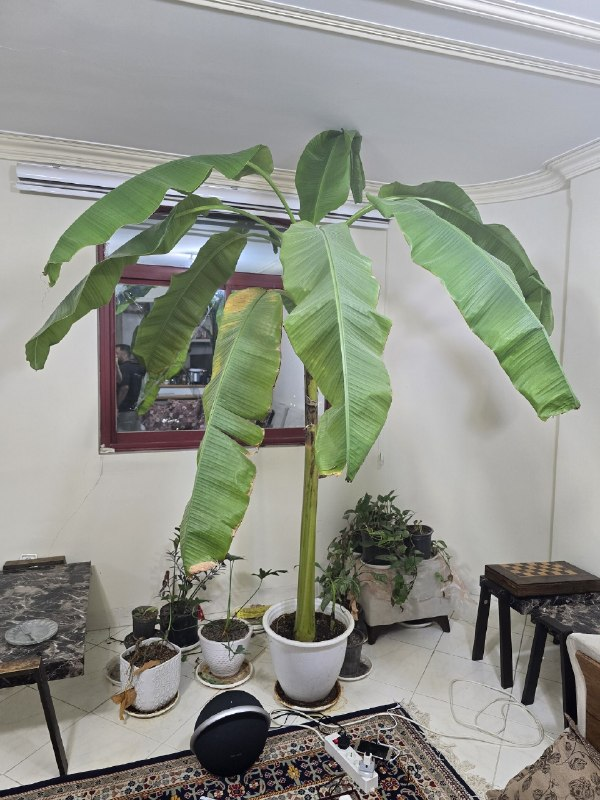

رندوم ترین چیزی که تو خونه مجردی پسرا پیدا میشه:

درخت موزه!😐😂
@ChizBergerz

## ChizBergerz — post 46715

👑آیپی جدید شیر و خورشید؛

2.16.19.129
2.21.2.107
2.21.2.121
2.21.2.128
2.21.2.129
2.23.168.47
2.23.168.96
2.23.170.80
2.23.168.250
2.188.21.240
5.160.13.85
23.50.185.91
31.214.169.244
37.191.95.70
46.32.31.30
50.7.4.107
50.7.4.243
50.7.4.244
50.7.5.85
63.141.252.203
78.39.234.140
78.157.41.60
92.123.106.17
92.123.106.96
95.101.133.128
104.103.64.7
104.103.65.50
109.72.197.1
142.54.178.211
164.138.17.122
178.252.128.66
185.50.37.52
185.88.178.196
185.109.61.27
185.141.106.238
185.200.232.41
185.200.232.49
185.208.174.167
185.208.175.228
185.255.91.60
5.160.128.142

@ChizBergerz

## ChizBergerz — post 46714

  <a href="telegram/content/ChizBergerz_46714_1779554472.mp4" target="_blank">🎬 Download video</a>

ولی این چالشه که اخیرا ترند شده یه چیزیو در من روشن میکنه :)))

@ChizBergerz

## ChizBergerz — post 46713

  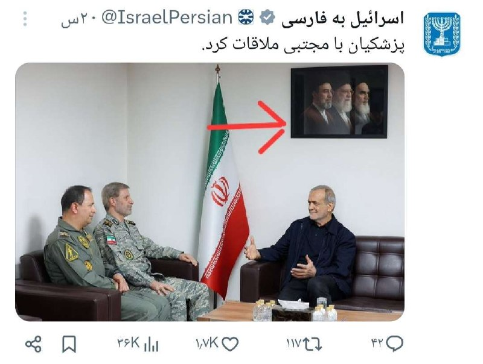

اسرائیل به فارسی عالیههههه😂😂

@ChizBergerz

## ChizBergerz — post 46712

👑آیپی جدید شیر و خورشید؛

185.141.106.238
185.50.37.52
185.208.174.167
5.160.13.85
37.191.95.70
164.138.17.122
5.144.129.174
37.191.95.70
185.208.174.167
5.160.13.85
5.160.13.85
185.141.106.238
185.50.37.52
185.141.106.238
185.208.174.167
164.138.17.122
78.157.41.60
94.232.173.28
185.255.91.60
158.58.184.147
80.191.243.226
164.138.17.122
185.88.178.196
185.137.25.146
185.137.25.146
78.157.41.60
78.157.41.60
185.208.175.228
80.191.243.226
5.160.13.85
185.141.106.238
185.141.106.238
185.50.37.52
164.138.17.122
5.160.13.85
185.89.22.71
185.141.106.238
185.208.175.228
109.72.197.1
78.157.41.60
185.137.25.146
5.160.128.142
37.191.95.70
185.255.91.60
193.148.67.117
78.157.41.60
109.72.197.1
5.160.13.85
185.255.91.60
185.208.175.228
185.208.174.167
185.88.178.196
5.160.128.142
164.138.17.122
185.50.37.52
78.39.234.140
185.141.106.238
185.208.174.167
185.208.175.228
185.255.91.60
5.160.13.85
5.160.128.142
5.160.13.85
95.101.23.82
65.109.34.234
185.88.178.196
185.50.37.52
63.141.252.203
37.191.95.70
142.54.178.211
142.54.178.211
50.7.5.83
37.191.95.70
5.160.13.85
78.157.41.60
78.157.41.60
185.141.106.238
185.53.142.174
5.160.13.85
78.157.41.60
37.191.95.70
37.191.95.70
80.191.243.226
78.157.41.60
185.141.106.238
78.157.41.60
78.157.41.60
164.138.17.122
5.160.13.85
185.208.175.228
109.72.197.1
37.191.95.70
78.39.234.140
5.160.128.142
78.39.234.140
164.138.17.122
2.16.53.65
164.138.17.122
78.39.234.140
185.255.91.60
5.160.13.85
185.88.178.196
185.141.106.238
63.141.252.203

@ChizBergerz

## ChizBergerz — post 46711

  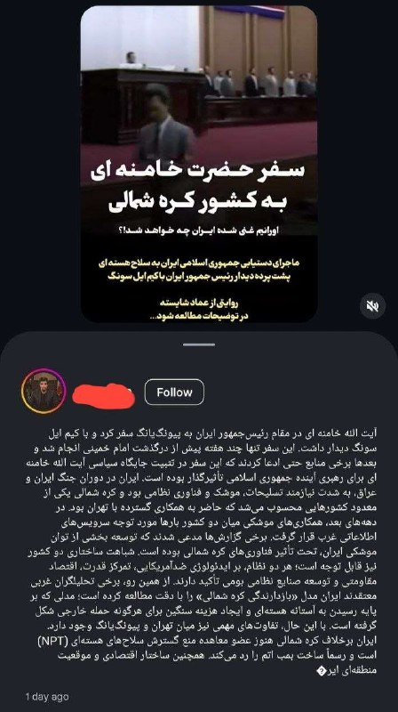

شاید براتون سوال باشه که این روزا که اینترنت تو ایران قطعه یا خیلی گرونه تو اینستاگرام فارسی چه میگذره:

+ خرزشیا با منقل اینستاگرام فارسی رو تصاحب کردن😂😂
@ChizBergerz

## rodast_omiddana — post 71824

  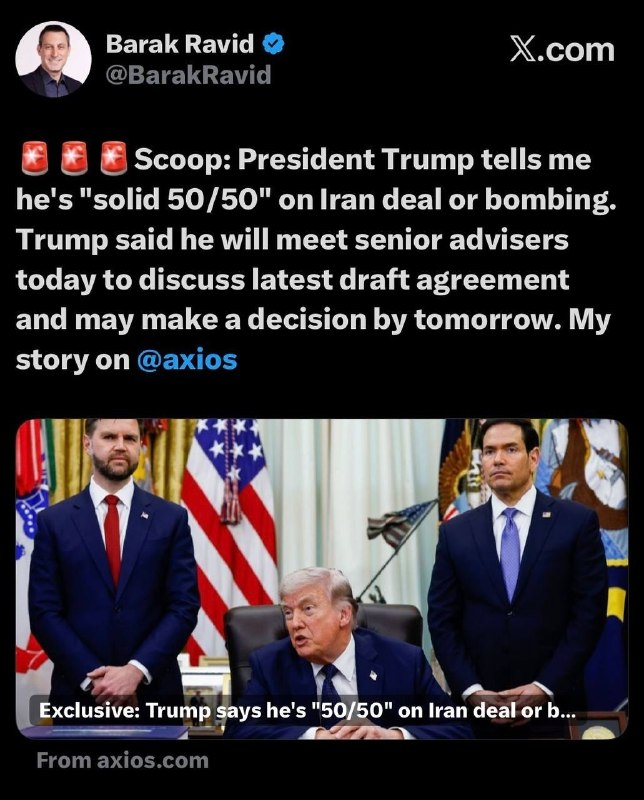

فوری/آکسیوس :
ترامپ گفت احتمال اینکه به ایران حمله کنه و یا توافق بشه 50/50 هست
همچنین ترامپ شنبه با استیو ویتکوف و جرد کوشنر دیدار میکند تا آخرین پیشنهاد ایران را بررسی کند و انتظار میرود تا یکشنبه تصمیم‌ گیری شود.

## KiriMohems — post 47919

  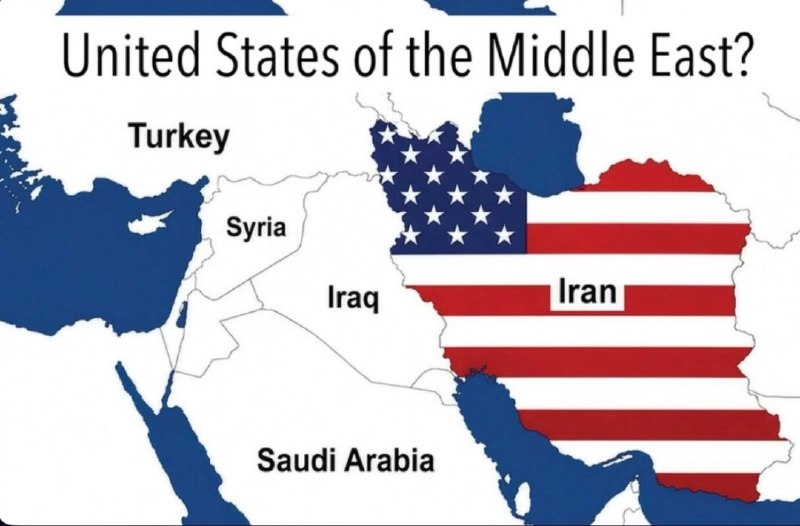

🔴پست جدید ترامپ با نقشه ایران : ایالات متحده خاورمیانه؟
#Helsinki
@KiriMohems

## SportBaadNews — post 252284

  <a href="telegram/content/SportBaadNews_252284_1779554475.webm" target="_blank">🎬 Download video</a>

🚨
🚨 ترامپ: دو راه بیشتر وجود نداره، یا توافق خوب رو امضا میکنن یا تا تهش منفجرشون میکنم @SportBaadNews

## SportBaadNews — post 252283

  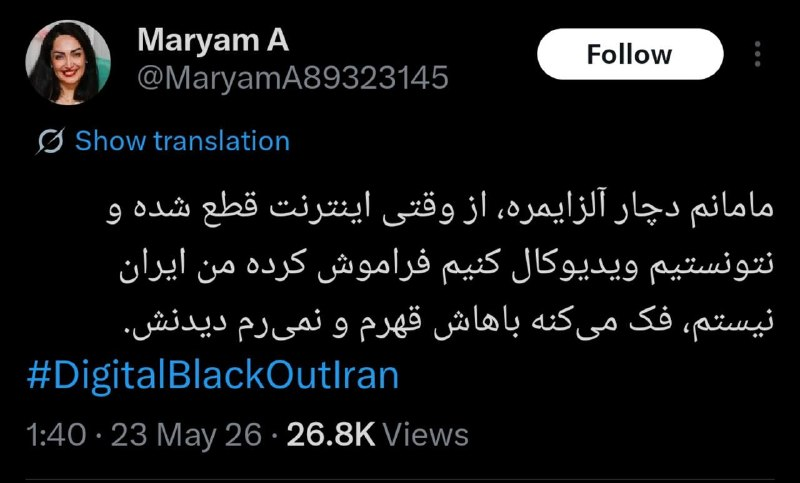

اینترنت آزاد فقط حق 4تا کسب و کار نیست
اینترنت آزاد حق همه‌ی مردمه
@SportBaadNews

## SportBaadNews — post 252282

  <a href="telegram/content/SportBaadNews_252282_1779554476.webm" target="_blank">🎬 Download video</a>

🚨
🚨 ترامپ: تنها توافقی که قبول میکنم توافقیه که توش سرنوشت اورانیوم غنی سازی شده مشخص بشه @SportBaadNews

## SportBaadNews — post 252281

  <a href="telegram/content/SportBaadNews_252281_1779554476.webm" target="_blank">🎬 Download video</a>

🚨
🚨 ترامپ: شانس توافق یا جنگ 50/50 هست، بعد از دیدار با نمایندگانم تصمیم میگیرم @SportBaadNews

## SportBaadNews — post 252280

  <a href="telegram/content/SportBaadNews_252280_1779554477.webm" target="_blank">🎬 Download video</a>

🚨
🚨 ترامپ: شانس توافق یا جنگ 50/50 هست، بعد از دیدار با نمایندگانم تصمیم میگیرم
@SportBaadNews

## IranIntlTV — post 338632

  

اکسیوس به نقل از مقام‌های اسرائیلی گزارش داد که بنیامین نتانیاهو، نخست‌وزیر اسرائیل، از دونالد ترامپ، رییس‌جمهوری ایالات متحده، خواست تا حملات علیه جمهوری اسلامی را از سر بگیرد.

بر اساس این گزارش، نتانیاهو نگران پیش‌نویس توافقی است که در حال حاضر بین ایالات متحده و جمهوری اسلامی روی میز است.
https://iranintl.com/202605232747

## IranIntlTV — post 338631

  <a href="telegram/content/IranIntlTV_338631_1779554478.mp4" target="_blank">🎬 Download video</a>

تیتر اول با نیوشا صارمی، شنبه ۲ خرداد
@iranintltv

## IranIntlTV — post 338630

  

الحدث گزارش داد که عاصم منیر، رییس ستاد کل ارتش پاکستان، در سفر به تهران، با فرماندهان سپاه پاسداران دیدار کرده و از مواضع آنها شوکه شده است.

بر اساس این گزارش، رییس ستاد کل ارتش پاکستان «خطوط قرمز» جمهوری اسلامی را به آمریکا ابلاغ کرده است.
https://iranintl.com/202605237183

## IranIntlTV — post 338628

  <a href="telegram/content/IranIntlTV_338628_1779554479.mp4" target="_blank">🎬 Download video</a>

پرویز قلیچ‌خانی، کاپیتان پیشین تیم ملی فوتبال ایران، در ۸۱ سالگی در حومه پاریس درگذشت. او تنها بازیکنی بود که سه بار با تیم ملی، قهرمان جام ملت‌های آسیا شد. قلیچ‌خانی پس از انقلاب به فعالیت سیاسی و روزنامه‌نگاری در خارج از کشور روی آورد.

گفت‌وگو با مهدی اصلانی، نویسنده و زندانی سیاسی دهه ۶۰
@iranintltv

## IranIntlTV — post 338627

  

خبرگزاری فارس، وابسته به سپاه پاسداران، به نقل از یک منبع آگاه و نزدیک به تیم مذاکره‌کننده، با تاکید بر اینکه اگر آمریکا انعطاف نشان ندهد، مذاکره شکست می‌خورد نوشت که موضوع هسته‌ای، پول‌های بلوکه‌شده و کنترل جمهوری اسلامی بر تنگه هرمز، سه موضوع اختلاف جدی در مذاکرات است.

فارس نوشت که تهران اعلام کرده که در این دوره وارد مذاکره درباره موضوع هسته‌ای نمی‌شود. تنها در صورتی که طرف مقابل شرایط اعتمادساز را اجرا کند، در دور بعد درباره مسائل هسته‌ای صحبت خواهد شد.

رسانه سپاه به نقل از این منبع نوشت: «پول‌‌های بلوکه‌شده باید واریز شود؛ شرط دوم و اساسی برای ورود تهران به مذاکره این است که پول‌های بلوکه‌شده ابتدا واریز و آزاد شوند. بدون این اتفاق، اساسا وارد مذاکره نمی‌شویم.»

در ادامه آمده است: «اختلاف دیگر بر سر نحوه عبور کشتی‌ها در تنگه هرمز است. آمریکا تاکید دارد که تنگه باید کاملا به شرایط پیشین بازگردد، اما تهران می‌گوید فقط خود را متعهد می‌کند که تعداد کشتی‌ها به وضعیت قبل بازگردد. معنای این حرف آن است که حکومت ایران با مدل خود، تعداد کشتی‌های مجاز برای عبور را تعیین می‌کند.»
https://iranintl.com/202605237557

## IranIntlTV — post 338626

  <a href="telegram/content/IranIntlTV_338626_1779554481.mp4" target="_blank">🎬 Download video</a>

پس از دیدار فرمانده ارتش پاکستان با مقام‌های ارشد جمهوری اسلامی، سخنگوی وزارت خارجه گفت طرفین به مرحله نهایی‌سازی یادداشت تفاهم رسیدند. همزمان وزیر خارجه آمریکا با اشاره به اینکه مذاکرات «قدری» پیشرفت کرده گفت تهران باید ذخیره اورانیوم‌اش را تحویل دهد.

گزارشی از مجتبا پورمحسن
@iranintltv

## IranIntlTV — post 338625

  

دونالد ترامپ، رییس جمهوری ایالات متحده به «سی‌بی‌اس» گفت که آمریکا و جمهوری اسلامی «به توافق بسیار نزدیک‌تر» شده‌اند و هر روز شرایط بهتر می‌شود. او افزود: «پیشنهاد جدید شامل بازگشایی تنگه هرمز، آزادسازی بخشی از دارایی‌های مسدودشده جمهوری اسلامی و ۳۰ روز ادامه مذاکرات است.»

دونالد ترامپ گفت: «توافق نهایی باید مانع دستیابی جمهوری اسلامی به سلاح هسته‌ای شود و درباره اورانیوم غنی‌شده نیز تصمیم‌گیری خواهد شد.»

سی‌بی‌اس گزارش داد که ترامپ هنوز درباره پیشنهادها تصمیم نهایی نگرفته و با مشاوران و رهبران منطقه در حال رایزنی است.
https://iranintl.com/202605230241

## IranIntlTV — post 338624

  <a href="telegram/content/IranIntlTV_338624_1779554483.mp4" target="_blank">🎬 Download video</a>

ویدیوی رسیده به ایران اینترنشنال نشان می‌دهد ایرانیان دانمارک روز شنبه در حمایت از انقلاب ملی روز شنبه در کپنهاگ تجمع کردند.

## IranIntlTV — post 338623

  <a href="telegram/content/IranIntlTV_338623_1779554484.mp4" target="_blank">🎬 Download video</a>

تجمعات دانش‌آموزی در اعتراض به بلاتکلیفی تحصیلی در شرایط جنگی و حضوری شدن امتحانات که از شهرکرد آغاز شده بود، به شهرهای دیگر نیز کشیده شد. این تجمع‌ها نخستین اعتراضات گسترده پس از انقلاب ملی ایرانیان و جنگ به شمار می‌رود.

گفت‌وگو با نجات بهرامی، تحلیل‌گر سیاسی
@iranintltv

## IranIntlTV — post 338622

  <a href="telegram/content/IranIntlTV_338622_1779554486.mp4" target="_blank">🎬 Download video</a>

یکی از شرکت‌کنندگان در تجمع برلین در گفت‌وگو با احمد صمدی، خبرنگار ایران‌اینترنشنال، گفت:« مردم داخل ایران را تنها نمی‌گذاریم و تا روز آزادی در کنارشان هستیم.»

@iranintltv

## IranIntlTV — post 338621

  

دونالد ترامپ، رییس‌جمهوری آمریکا، به اکسیوس گفت که قرار است امروز با مذاکره‌کنندگان خود دیدار کند تا آخرین پیشنهاد تهران را بررسی کند و احتمالا تا روز یکشنبه درباره از سرگیری جنگ تصمیم‌گیری خواهد کرد.

رییس‌جمهوری آمریکا به اکسیوس گفت شانس دستیابی به توافق با جمهوری اسلامی یا «زدن ضربه‌ای بی‌سابقه» به این کشور «۵۰-۵۰» است.

او افزود تنها توافقی را می‌پذیرد که موضوعاتی مانند غنی‌سازی اورانیوم و سرنوشت ذخایر فعلی ایران را در بر بگیرد.
https://iranintl.com/202605235280

## IranIntlTV — post 338620

  

🔻پرویز قلیچ‌خانی، اسطوره فوتبال ایران و تنها فوتبالیست ایرانی که سه بار قهرمان جام ملت‌های آسیا شد روز شنبه دوم خرداد ۱۴۰۵ در ۸۱ سالگی در بیمارستانی در پاریس درگذشت.

🔹امروز، دوم خرداد ۱۴۰۵ هم برابر با پانزدهمین سالگرد درگذشت زنده‌یاد ناصر حجازی، دیگر اسطوره فوتبال ایران است. او روز دوم خرداد سال ۱۳۹۰ پس از یک دوره بیماری، در ۶۲ سالگی در تهران در گذشت.

🔹گزارشی درباره زندگی‌نامه زنده‌یاد پرویز قلیچ‌خانی را در وبسایت ایران اینترنشنال بخوانید.

@iranintltvsport

## Persian_Trend_Official — post 14743

🔴فارس:

💢یک منبع آگاه و نزدیک به تیم مذاکره‌کننده: آمریکایی‌ها اگرچه از رویکردهای اولیه خود عقب‌نشینی کرده‌اند اما همچنان ۳ موضوع اختلافی پابرجاست که اگر حل نشوند مذاکره انجام نخواهد شد.

💢اول: موضوع هسته‌ای
ایران اعلام کرده که در این دوره وارد مذاکره درباره موضوع هسته‌ای نمی‌شود.

💢دوم: پول‌های بلوکه‌شده
پول‌‌های بلوکه‌شده باید واریز شود

💢سوم؛ کنترل ایران بر تنگۀ هرمز؛ کشتی‌ها باید تحت مدیریت ایران و دقیقاً از مسیری که ایران تعیین می‌کند عبور کنند.

پ ن : کوله اضطراری رو جدی بگیرید

🫆:Tony

📌 @persian_trend_official
پرشین ترند | متفاوت‌ترین کانال نظامی

## Persian_Trend_Official — post 14742

🔴 ترامپ: آمریکا و ایران «بسیار به توافق نزدیک شده‌اند»

💢دونالد ترامپ در گفت‌وگو با CBS News اعلام کرد واشینگتن و تهران «بسیار به نهایی‌کردن توافق نزدیک شده‌اند».

▪️او گفت:

▪️ «هر روز اوضاع بهتر و بهتر می‌شود»

▪️ در توافق احتمالی، موضوع اورانیوم غنی‌شده ایران «به‌صورت رضایت‌بخش» حل‌وفصل خواهد شد

▪️ «فقط توافقی را امضا می‌کنم که در آن به تمام خواسته‌هایمان برسیم»

▪️ترامپ جزئیات بیشتری درباره نحوه مدیریت ذخایر اورانیوم ایران ارائه نکرد.

🫆:Tony

📌 @persian_trend_official
پرشین ترند | متفاوت‌ترین کانال نظامی

## Persian_Trend_Official — post 14741

  <a href="telegram/content/Persian_Trend_Official_14741_1779554489.webm" target="_blank">🎬 Download video</a>

🔴دونالد ترامپ روز شنبه در گفتگو با آکسیوس مدعی شد 💢 امروز با تیم مذاکره‌کننده خود دیدار خواهد کرد تا درباره آخرین پیشنهاد ایران گفتگو کند، و احتمالاً تا یکشنبه تصمیم خواهد گرفت که جنگ را از سر بگیرد یا نه. 💢ترامپ ادعا کرد که شانس رسیدن به یک توافق «خوب»…

## Persian_Trend_Official — post 14740

🔴دونالد ترامپ روز شنبه در گفتگو با آکسیوس مدعی شد

💢 امروز با تیم مذاکره‌کننده خود دیدار خواهد کرد تا درباره آخرین پیشنهاد ایران گفتگو کند، و احتمالاً تا یکشنبه تصمیم خواهد گرفت که جنگ را از سر بگیرد یا نه.

💢ترامپ ادعا کرد که شانس رسیدن به یک توافق «خوب» یا در غیر این صورت [حمله] را «۵۰-۵۰ محکم» ارزیابی می‌کند.

💢ترامپ گفت که روز شنبه با استیو ویتکاف و جرد کوشنر دیدار خواهد کرد تا درباره آخرین پاسخ ایران بحث کند. انتظار می‌رود معاون رئیس‌جمهور، ونس، نیز به این جلسه بپیوندد.

🫆:Tony

📌 @persian_trend_official
پرشین ترند | متفاوت‌ترین کانال نظامی

---
📅 بروزرسانی: 1405/03/02 19:09
---

## ChizBergerz — post 46710

  <a href="telegram/content/ChizBergerz_46710_1779550774.webm" target="_blank">🎬 Download video</a>

🎯شانستو #رایگان امتحان کن 
⚠️ 
🤔 میدونستی توی #وینرو میتونی رایگان شرط ببندی؟ 
👍تنها کاری که باید بکنی اینه که عضو سایتش بشید و 
🤩
🤩
🤩 هزارتومان جایزه بگیرید بدون نیاز به واریز 
💖تنها سایت مورد اعتماد ما با بونوس های کاملا واقعی و رویایی: 
🌐 Winro.io 
🌐 Winro.io…

## ChizBergerz — post 46709

  <a href="telegram/content/ChizBergerz_46709_1779550774.webm" target="_blank">🎬 Download video</a>

🎯شانستو #رایگان امتحان کن 
⚠️

🤔 میدونستی توی #وینرو میتونی رایگان شرط ببندی؟

👍تنها کاری که باید بکنی اینه که عضو سایتش بشید و 
🤩
🤩
🤩 هزارتومان جایزه بگیرید بدون نیاز به واریز

💖تنها سایت مورد اعتماد ما با بونوس های کاملا واقعی و رویایی:

🌐 Winro.io

🌐 Winro.io
کانال بونوس های رایگان g2

📱 @winro_io

## ChizBergerz — post 46708

👑آیپی جدید شیر و خورشید؛
184.86.103.158
23.77.7.74
92.123.128.176
104.109.250.232
92.123.106.90
92.123.102.160
104.103.72.80
96.16.248.159
104.89.170.140
104.126.37.176
72.246.28.215
88.221.169.205
96.16.122.137
104.103.72.50
23.72.248.210
23.73.2.75
184.51.133.123
88.221.168.204
@ChizBergerz

## ChizBergerz — post 46707

👑آیپی جدید شیر و خورشید؛

92.123.106.90
92.123.106.43
92.123.106.11
92.123.106.42
5.160.13.85
78.157.41.60
37.191.95.70
37.191.76.110
80.191.243.226
5.160.128.142
92.122.17.124
23.44.201.149
23.212.253.227
23.44.201.185
23.44.201.17
23.62.54.24
23.58.95.144
104.83.198.44
92.123.102.153
184.51.252.134
23.53.40.147
184.51.252.176
2.18.64.212
172.104.251.198
2.18.79.101
23.216.77.181
92.123.102.89
23.216.77.80
96.16.53.132
23.53.40.139
23.48.165.70
2.21.20.143
23.43.85.155
23.48.23.184
23.207.210.83
23.209.125.169
23.48.23.172
2.21.240.22
23.55.110.82
23.216.77.35
23.58.95.138
23.33.40.149
23.48.23.146
23.209.125.145
92.123.102.130
23.53.40.121
23.48.23.11
23.201.248.171
23.209.125.27
23.48.23.176
23.207.210.86
23.55.161.151
92.123.103.89
2.23.7.34
23.207.210.80
23.48.23.165
23.48.23.173
23.48.23.156
23.55.110.74
173.222.107.202
23.213.161.140
23.48.23.134
23.204.152.160
2.23.97.120
185.200.232.49
185.200.232.50
185.200.232.42
185.200.232.41
184.24.77.42
184.24.77.32
184.24.77.5
184.24.77.7

@ChizBergerz

## ChizBergerz — post 46706

👑آیپی جدید شیر و خورشید؛
2.16.19.136
2.23.168.7
92.123.106.42
92.123.106.11
2.23.168.254
2.23.168.174
185.200.232.42
2.23.168.7
185.200.232.50
92.123.106.33
92.123.106.90
2.16.53.57
@ChizBergerz

## ChizBergerz — post 46705

برم ببینم آیپی‌های جدید و وصل شیروخورشید چی پیدا میکنم...

## ChizBergerz — post 46704

هوش‌مصنوعی همیشه حق میگه😂🔥👌 @ChizBergerz

## ChizBergerz — post 46703

  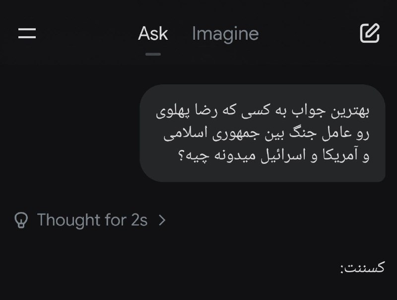

هوش‌مصنوعی همیشه حق میگه😂🔥👌

@ChizBergerz

## ChizBergerz — post 46702

  <a href="telegram/content/ChizBergerz_46702_1779550775.mp4" target="_blank">🎬 Download video</a>

والا😂😂

@ChizBergerz

## ChizBergerz — post 46701

  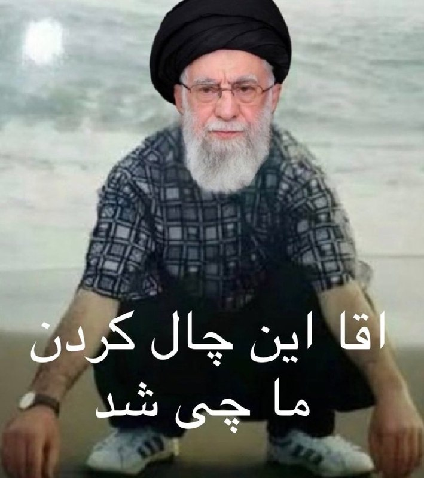

وضعیت موش‌علی: 😂😂

@ChizBergerz

## ChizBergerz — post 46700

  <a href="telegram/content/ChizBergerz_46700_1779550778.mp4" target="_blank">🎬 Download video</a>

این اینفلوئنسر خارجی بعد از گیم اف ترونز و بریکینگ بدو... رفته جزیرهِ اپستین و همه رو مثل سگ‌ کتک زده :)))

@ChizBergerz

## rodast_omiddana — post 71823

  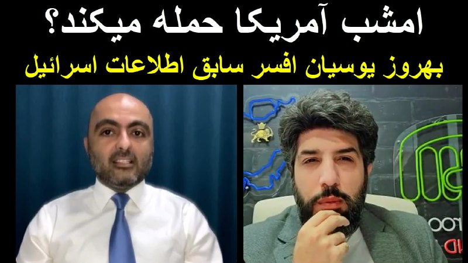

🎬 امشب آمریکا حمله میکند؟
بهروز یوسیان افسر سابق اطلاعات اسرائیل
https://www.youtube.com/watch?v=PfWpBKaP7q4

## rodast_omiddana — post 71822

  <a href="telegram/content/rodast_omiddana_71822_1779550780.webm" target="_blank">🎬 Download video</a>

🚨 وال استریت ژورنال:
"ترامپ در جلسه تیم امنیت ملی به مشاوران خود گفت که می‌خواهد زمان بیشتری برای دیپلماسی با ایران در نظر بگیرد."

یعنی ترامپ جان با اعصاب و روان مردم داری بازی میکنیا دهنتو

## rodast_omiddana — post 71821

  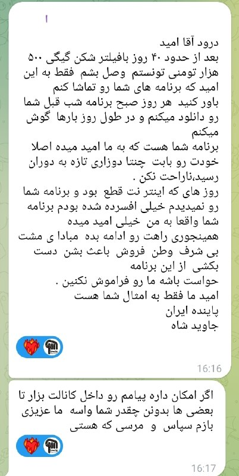

🔴 یعنی با صدها پیام اینجوری مواجهم که نمیتونم منتشر کنم

## rodast_omiddana — post 71820

🚫اامید جان درود
از صبح GPS ها تو دبی قطع شده. مث زمان جنگ که قطع بود. احتمالا قراره زد و خورد بشه

## rodast_omiddana — post 71819

  <a href="telegram/content/rodast_omiddana_71819_1779550780.webm" target="_blank">🎬 Download video</a>

🚨 با این خبر به امید خدا امشب احتمال جنگ بالاست..

## SportBaadNews — post 252279

  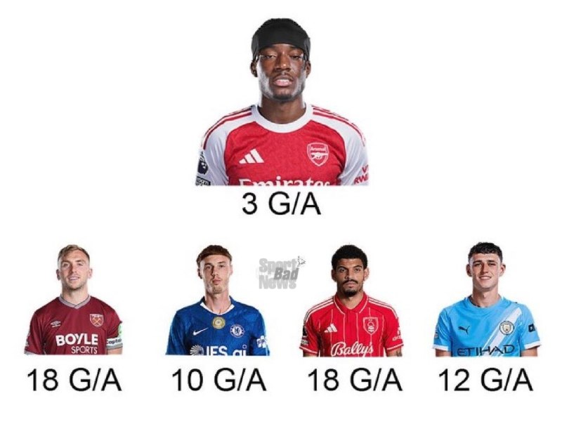

منطق توخل
@SportBaadNews

## IranIntlTV — post 338618

  

خبرگزاری تسنیم، وابسته به سپاه، به نقل از یک منبع مطلع نوشت که خبر العربیه درباره اینکه تهران پیشنهاد تعلیق ۱۰ ساله غنی‌سازی اورانیوم بالای ۳.۶ درصد را مطرح کرده، «از اساس کذب است».

تسنیم به نقل از این منبع با تاکید بر «ساختگی» بودن خبر العربیه، نوشت: «اساسا تمرکز پیام‌ها و گفتگوها در وضعیت فعلی صرفا بر روی مساله پایان جنگ است و هیچ جزئیاتی درباره موضوع هسته‌ای مورد بحث قرار نمی‌گیرد.»
https://iranintl.com/202605236278

## IranIntlTV — post 338617

  

خبرگزاری تسنیم، رسانه وابسته به سپاه، درباره روند مذاکرات تهران و واشینگتن، با اشاره به اینکه هنوز اختلافات جدی در بعضی از حوزه‌ها مانند تعهد واقعی آمریکا به آزادسازی اموال و موضوع تنگه هرمز وجود دارد، نوشت: «با توجه به زیاده‌خواهی‌های آمریکا، احتمال عدم حل موضوعات بالاست.»

در این گزارش آمده که در صورت حل موارد اختلاف، احتمالا در گام اول یک تفاهم اولیه اعلام شود و سپس مهلت ۳۰ یا ۶۰ روزه برای گفتگو درباره موضوع هسته‌ای (بدون تعهد اولیه جمهوری اسلامی) اعلام شود.

تسنیم نوشت که آمریکایی‌ها در متون پیشین خود تاکید داشتند که تهران در همان گام نخست باید امتیازاتی در بحث هسته‌ای بدهد و موضوع تعطیلی تاسیسات هسته‌ای و تحویل مواد غنی‌شده به آمریکایی‌ها از جمله مباحثی است که مدام در متن‌های آمریکایی‌ها مورد درخواست قرار می‌گرفت اما حکومت ایران اساسا بحث درباره جزئیات هسته‌ای را در این مرحله رد می‌کند.

بر اساس این گزارش تهران بر ضرورت پایان جنگ و تهدید در همه جبهه‌ها از جمله لبنان تاکید دارد. و این موضوع باید مورد پذیرش طرف آمریکایی قرار گیرد اما آمریکایی‌ها در برخی از متن‌های پیشین خود با این موضوعات مخالفت کرده‌اند.

## IranIntlTV — post 338616

ویدیوهای رسیده به ایران اینترنشنال نشان می‌دهد ایرانیان بریتانیا روز شنبه در لندن با حمل پرچم‌های شیروخورشید در حمایت از انقلاب ملی علیه جمهوری اسلامی تجمع کردند.

## IranIntlTV — post 338615

  <a href="telegram/content/IranIntlTV_338615_1779550782.mp4" target="_blank">🎬 Download video</a>

مارکو روبیو، وزیر خارجه آمریکا، در دیدار با نارندرا مودی، نخست‌وزیر هند، تاکید کرد ایالات متحده اجازه نخواهد داد جمهوری اسلامی بازار جهانی انرژی را گروگان بگیرد.

گفت‌وگو با تاج‌الدین سروش، عضو تحریریه ایران‌اینترنشنال
@iranintltv

## IranIntlTV — post 338614

  

فایننشال تایمز گزارش داد که میانجی‌های جنگ ایران معتقدند در حال نزدیک شدن به توافقی هستند که آتش‌بس میان واشینگتن و تهران را به مدت ۶۰ روز تمدید و چارچوبی برای مذاکرات درباره برنامه هسته‌ای جمهوری اسلامی ایجاد کند.

بنا بر این گزارش، افرادی که در جریان این مذاکرات قرار دارند به این رسانه گفتند این توافق شامل بازگشایی تدریجی تنگه هرمز و همچنین تعهد به بررسی رقیق‌سازی یا واگذاری ذخایر اورانیوم با غنای بالا خواهد بود.

فایننشال تایمز افزود که آمریکا همچنین محاصره دریایی بنادر جنوب ایران را کاهش می‌دهد و با کاهش تحریم‌ها و همچنین آزادسازی مرحله‌ای دارایی‌های مسدودشده تهران در خارج از کشور موافقت خواهد کرد.
https://iranintl.com/202605239287

## IranIntlTV — post 338613

روایت شما از زندگی در آتش‌بس- شنبه ۲ خرداد ۱۴۰۵
🔹 ترامپ کارمند ما نیست که امر و نهی کنیم، موش علی و فرمانده‌هاش و سرکوبگرهاش رو ذلیل کرد، حالا نوبت ماست اعتصاب کنیم. نه به گوشت و مرغ رو شروع کنیم تا فراخوان بعد.
🔹 در تهران گرانی بیداد می‌کند. حقوق‌ها را دیر می‌دهند. یک کیلو توت‌فرنگی در تره‌بار ۳۰۰ هزار تومان، در مغازه معمولی ۶۰۰ هزار تومان. دارو در داروخانه کمیاب شده. یک بطری کوچک روغن زیتون یک میلیون و پانصد هزار تومان.
🔹 دم همه دانش‌آموزان غیور لر گرم که زیر بار حرف زور و ستم نمی‌روند، به‌قول شاهزاده عزیز واقعاً نسل ویکتوری هستید.
🔹 درود، من یک نوجوان ۱۶ ساله هستم که صندوق‌دار یک فروشگاه هستم. آن‌قدر همه‌چیز گران شده که حتی خودم هم خجالت می‌کشم به مشتری‌ها قیمت بدهم. واقعاً مردم ایران کوه صبر هستند. به امید روزهای خوب ایران.

## IranIntlTV — post 338612

  <a href="telegram/content/IranIntlTV_338612_1779550784.mp4" target="_blank">🎬 Download video</a>

ایرانیان سوئیس روز شنبه با تجمع مقابل سفارت جمهوری اسلامی خواستار بسته‌شدن آن شدند. آن‌ها همچنین با حمل تصاویر شاهزاده رضا پهلوی و پرچم شیروخورشید از انقلاب ملی حمایت کردند.

## IranIntlTV — post 338611

  

الحدث گزارش داد جمهوری اسلامی در پیشنهاد جدید خود خواستار آزادسازی دارایی‌های مسدود‌شده خود قبل از مذاکرات هسته‌ای شده است.
بر اساس این گزارش، تهران خواستار ایجاد یک مکانیسم جبران خسارت جنگ از سوی ایالات متحده و لغو کامل تحریم‌ها در ازای تعهدات هسته‌ای شده است.
https://iranintl.com/202605238700

## IranIntlTV — post 338610

  <a href="telegram/content/IranIntlTV_338610_1779550787.mp4" target="_blank">🎬 Download video</a>

بر اساس اطلاعات رسیده به ایران‌اینترنشنال، اکبر محمدی، شهروند ۴۰ ساله اهل اصفهان، پس از بازداشت و محرومیت از رسیدگی پزشکی در زندان دستگرد اصفهان جان باخت. او که سوم اردیبهشت ماه همراه برادرش بازداشت شده بود، در تماس و در تماس با خانواده از بیماری و جلوگیری از دسترسی به بهداری و دارو خبر داده بود.

جزییات بیشتر با پویا جهاندار، عضو تحریریه ایران‌اینترنشنال
@iranintltv

## IranIntlTV — post 338609

  <a href="telegram/content/IranIntlTV_338609_1779550788.mp4" target="_blank">🎬 Download video</a>

مراسم اختتامیه جشنواره فیلم کن با اعلام برندگان جوایز اصلی، از جمله نخل طلای بهترین فیلم، به کار خود پایان داد. جایزه «چشم طلایی»، از مهم‌ترین جوایز این جشنواره، به مستند «تمرین‌هایی برای یک انقلاب» ساخته پگاه آهنگرانی اختصاص یافت.

گزارش لی‌لی نیکفر، خبرنگار ایران‌اینترنشنال
@iranintltv

## IranIntlTV — post 338608

  <a href="telegram/content/IranIntlTV_338608_1779550789.mp4" target="_blank">🎬 Download video</a>

شبکه العربیه گزارش داد عاصم منیر، فرمانده کل ارتش پاکستان، در سفر به تهران حامل پیامی از سوی آمریکا برای جمهوری اسلامی بوده است. همزمان، رسانه‌های داخلی از بررسی یک سند پیشنهادی ۱۴ بندی در این مذاکرات خبر دادند.

گفت‌وگو با حسین آقایی، عضو تحریریه ایران‌اینترنشنال
@iranintltv

## IranIntlTV — post 338607

  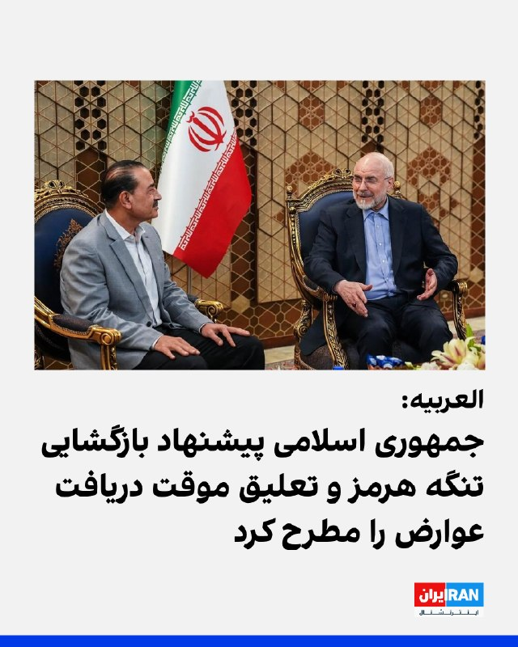

العربیه به نقل از منابع خود گزارش داد جمهوری اسلامی پیشنهاد بازگشایی تنگه هرمز و تعلیق موقت دریافت عوارض را مطرح کرده است.

همچنین بر اساس این گزارش، تهران پیشنهاد داده غنی‌سازی اورانیوم بالاتر از ۳.۶ درصد را به مدت ۱۰ سال به حالت تعلیق درآورد.
https://iranintl.com/202605232120

## IranIntlTV — post 338606

  <a href="telegram/content/IranIntlTV_338606_1779550792.mp4" target="_blank">🎬 Download video</a>

سرخط خبرهای شنبه ۲ خرداد
@iranintltv

## IranIntlTV — post 338605

  <a href="telegram/content/IranIntlTV_338605_1779550793.mp4" target="_blank">🎬 Download video</a>

یکی از مجروحان انقلاب ملی ایرانیان با ارسال فایلی صوتی به ایران‌اینترنشنال، ماجرای زخمی و شکنجه شدن خود به دست نیروهای امنیتی و لباس‌شخصی در ۱۸ دی‌ماه ۱۴۰۴ را روایت کرد.

جزییات بیشتر در گفت‌وگو با محسن مهیمنی، عضو تحریریه ایران‌اینترنشنال
@iranintltv

## Persian_Trend_Official — post 14738

  <a href="telegram/content/Persian_Trend_Official_14738_1779550794.mp4" target="_blank">🎬 Download video</a>

▪️اثبات وجود تناسخ ...

خمینی ، مطهری ، بهشتی زنده شدند ...

🫆:Tony

📌 @persian_trend_official
پرشین ترند | متفاوت‌ترین کانال نظامی

## Persian_Trend_Official — post 14737

🔴 فایننشال تایمز: ایران و آمریکا به تمدید ۶۰ روزه آتش‌بس نزدیک شده‌اند

فایننشال تایمز به نقل از منابع میانجی گزارش داد تهران و واشینگتن به دستیابی به توافقی برای تمدید ۶۰ روزه آتش‌بس و فراهم‌کردن زمینه مذاکرات هسته‌ای نزدیک شده‌اند.

بر اساس این گزارش، توافق پیشنهادی شامل موارد زیر است:

▪️ بازگشایی تدریجی تنگه هرمز

▪️ گفت‌وگو درباره رقیق‌سازی یا تحویل ذخایر اورانیوم با غنای بالا

▪️ کاهش محاصره آمریکا علیه بنادر ایران

▪️ کاهش تحریم‌ها و آزادسازی مرحله‌ای دارایی‌های بلوکه‌شده ایران در خارج

♦️اما فایننشال تایمز تأکید کرده:

▪️ یکی از اصلی‌ترین موانع، درخواست ترامپ برای تحویل حدود ۴۴۰ کیلوگرم اورانیوم نزدیک به درجه تسلیحاتی ایران است

▪️ واشینگتن همچنین خواستار برچیدن سه سایت اصلی هسته‌ای ایران شامل نطنز، فردو و اصفهان شده است

🫆:Tony

📌 @persian_trend_official
پرشین ترند | متفاوت‌ترین کانال نظامی

## Persian_Trend_Official — post 14736

  <a href="telegram/content/Persian_Trend_Official_14736_1779550796.webm" target="_blank">🎬 Download video</a>

ادعای الحدث:

💢ایران دو مسیر برای مذاکرات پیشنهاد کرده که با اعلام پایان جنگ و محاصره آغاز می‌شود.

♦️ایران تأکید کرده است که در متن یادداشت تفاهم، به عدم تولید سلاح هسته‌ای متعهد خواهد بود.

♦️ایران خواستار حفظ حق غنی‌سازی در هر توافقی شده است

▪️ایران پیش از مذاکرات هسته‌ای خواستار آزسازی دارایی‌های بلوکه‌شدهٔ خود شده است./انتخاب

پ ن : زهی خیال باطل ...

🫆:Tony

📌 @persian_trend_official
پرشین ترند | متفاوت‌ترین کانال نظامی

## Persian_Trend_Official — post 14735

  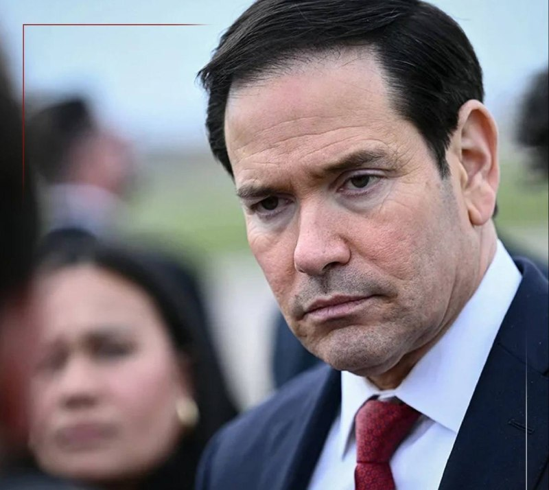

💢روبیو

♦️ تنگه هرمز باید بدون هیچ هزینه‌ای باز باشد.

🫆:Tony

📌 @persian_trend_official
پرشین ترند | متفاوت‌ترین کانال نظامی

---
📅 بروزرسانی: 1405/03/02 17:56
---

## ChizBergerz — post 46699

  <a href="telegram/content/ChizBergerz_46699_1779546403.mp4" target="_blank">🎬 Download video</a>

🔴#ارسالی_خرم‌آباد

شروع اعتراضات و پرتاب گاز اشک آور توسط سرکوبگران!
@ChizBergerz

## ChizBergerz — post 46696

واقعا اونی که پیج عکس‌های هوش‌مصنوعی بیلی‌ایلیش دستشه خیلی حلال خوره :)))

@ChizBergerz

## rodast_omiddana — post 71818

🎬 مذاکرات پوچ است منتظر حمله باشید
لینک یوتیوب:
https://www.youtube.com/watch?v=evYAcWvUs50

## rodast_omiddana — post 71817

  <a href="telegram/content/rodast_omiddana_71817_1779546405.mp4" target="_blank">🎬 Download video</a>

🚫 میدونید چرا 15 ساله منو میزنید و نتیجه نگرفتید چون من مردمی بالا آمدم و الان دومین پادکست سیاسی ایران هستم...
حالا فکر کن میلیون ها برابر علی کریمی مردمی بالا آمده، بفهمید کسی که ریشه مردمی داره را نمیتوانید تخریب کنید..
کسی که در سن 50 سالگی پشت پا بزنه به همه چیزی که ساخته، با حملات چهارتا بلاگر تازه به دوران رسیده جوگیر خم به ابرو نمیاره..

## rodast_omiddana — post 71816

  <a href="telegram/content/rodast_omiddana_71816_1779546408.webm" target="_blank">🎬 Download video</a>

🚨 فوری
پست الان ترامپ
چه اتفاقی قراره بیفته؟

(امروز در مصاحبه با جناب یوسیان گفتم اگر در اپوزسیون به اتحاد نرسیم و کوتوله ها الیت را بزنند چه اتفاقی میفته؟ او گفت آمریکا کل ایران را خودش اداره میکند)

## rodast_omiddana — post 71815

  <a href="telegram/content/rodast_omiddana_71815_1779546408.webm" target="_blank">🎬 Download video</a>

🚨هیت پاکستانی فورا ایران را ترک کردند..
تیک تاک

## rodast_omiddana — post 71814

فوری_خرم آباد لرستان گویا تظاهراتهای اعتراضی برای گرانی و دانش آموزان رخ داده است

## SportBaadNews — post 252278

  <a href="telegram/content/SportBaadNews_252278_1779546408.webm" target="_blank">🎬 Download video</a>

میشه از ما وپن بخرید ❤️😊 @vpnbadnews_bot

## SportBaadNews — post 252277

میشه از ما وپن بخرید ❤️😊

@vpnbadnews_bot

## SportBaadNews — post 252276

  

تفاوت هتریک های رونالدو، مسی و یامال
@SportBaadNews

## IranIntlTV — post 338604

  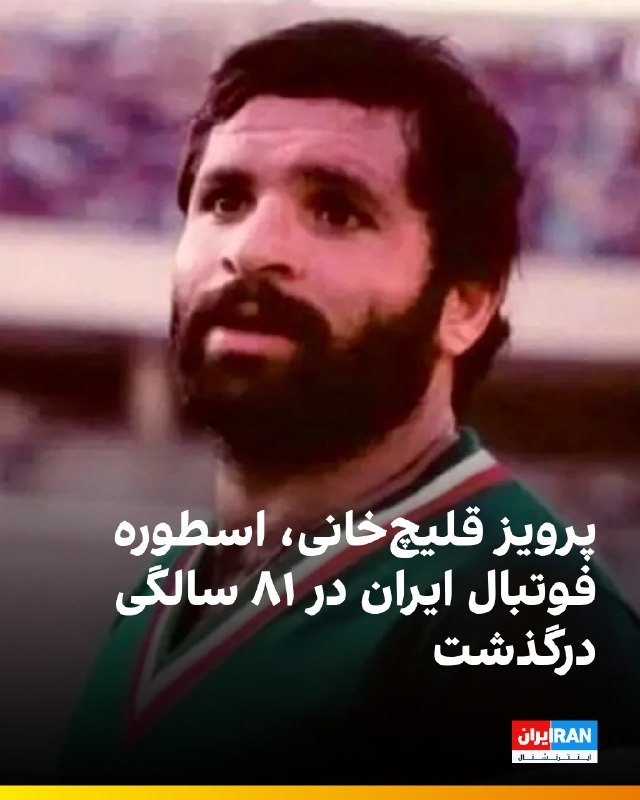

🔻پرویز قلیچ‌خانی، اسطوره فوتبال ایران و تنها فوتبالیست ایرانی که سه بار قهرمان جام ملت‌های آسیا شد روز شنبه دوم خرداد ۱۴۰۵ در ۸۱ سالگی در بیمارستانی در پاریس درگذشت. او در پرسپولیس، تاج و پاس بازی کرد. زنده‌یاد قلیچ‌خانی، پس از انقلاب ۱۳۵۷ به دلیل گرایش‌های سیاسی از ایران خارج شد.

@iranintltvsport

## IranIntlTV — post 338603

  

مارکو روبیو، وزیر خارجه ایالات متحده آمریکا، در جریان سفر به هند، گفت: «جمهوری اسلامی باید اورانیوم غنی‌شده خود را تحویل دهد. موضوع هسته‌ای ایران، فوری است و همچنین تنگه هرمز باید باز بماند.»

روبیو افزود: «فرصتی برای پذیرش توافق از سوی حکومت ایران در نزدیک‌ترین زمان وجود دارد.»
https://iranintl.com/202605239482

## IranIntlTV — post 338602

  <a href="telegram/content/IranIntlTV_338602_1779546411.mp4" target="_blank">🎬 Download video</a>

تعدادی از شرکت‌کنندگان در تجمع برلین با نوشتن اسامی جاویدنامان بر لباس‌های خود، یاد آنها را گرامی داشتند.

یکی از شرکت‌کنندگان در این تجمع در گفت‌وگو با احمد صمدی، خبرنگار ایران‌اینترنشنال، گفت: «صدای زندانیان سیاسی، خانواده‌های جاویدنامان و مردم ایران هستیم.»
@iranintltv

## IranIntlTV — post 338601

  

اسماعیل بقائی، سخنگوی وزارت امور خارجه، درباره شرایط تنگه هرمز در مذاکرات با آمریکا، گفت: «این موضوع ارتباطی به آمریکا ندارد.» بقائی افزود: «تهران و مسقط برای تعریف سازوکار مربوط به این تنگه چند دور گفت‌وگو برگزار کرده‌اند.»
https://iranintl.com/202605234248

## IranIntlTV — post 338600

  <a href="telegram/content/IranIntlTV_338600_1779546415.mp4" target="_blank">🎬 Download video</a>

ایرانیان مقیم مالمو در سوئد، با شرکت در تجمع اعتراضی از کشورهای اروپایی درخواست کردند تا روابط سیاسی با حکومت جمهوری اسلامی را قطع و سفارت‌های این حکومت را نیز تعطیل کنند. جمعی از این تجمع‌کنندگان در گفت‌وگو با مهران عباسیان، خبرنگار ایران‌اینترنشنال، همبستگی خود را با مردم داخل ایران اعلام کردند.
@iranintltv

## IranIntlTV — post 338599

  <a href="telegram/content/IranIntlTV_338599_1779546418.mp4" target="_blank">🎬 Download video</a>

یک شهروند ۱۵ ساله با ارسال پیامی به ایران اینترنشنال می‌گوید که به دلیل گرانی‌ها خجالت می‌‌کشد از خانواده‌اش چیزی بخواهد. پیام او با هوش مصنوعی خوانده شده است.

## IranIntlTV — post 338597

  

عباس عراقچی، وزیر خارجه جمهوری اسلامی، در پیامی به شیخ نعیم قاسم، دبیرکل حزب‌الله لبنان، گفت: «جمهوری اسلامی دست از حمایت حزب‌الله نخواهد کشید و همچنان از جنبش‌های مطالبه‌گر حق و آزادی پشتیبانی می‌کند. تهران پیوند آتش‌بس لبنان با هر توافق احتمالی را به‌عنوان شرط مطرح کرده است.»
https://iranintl.com/202605234240

## IranIntlTV — post 338596

  

🔻فوتبال ۳۶۰ در گزارشی با انتقاد از رفتار دوگانه مدیران فدراسیون فوتبال نوشت گروهی در فدراسیون در حالی که شعار «مرگ بر آمریکا» سر می‌دهند، «اما در عین شگفتی، چمدان بسته و منتظر ویزای آمریکا برای سفر به این کشور مانده‌اند و به طرق مختلف سعی در گرفتن ویزا داشته‌اند.»

🔹به نوشته این رسانه، «یکی از افراد رده‌بالای این فدراسیون پس از آنکه ۲ بار درخواست ویزای آمریکایش رد شده، برای سومین بار درخواست ویزا داده است.»

🔹فریده شجاعی، یکی از اعضای هیات‌رییسه فدراسیون فوتبال، پیش‌تر گفته بود که «از همه اعضای هیات‌رییسه خواسته شده برای ویزای آمریکا اقدام کنند» و همگی منتظر هستند تا وضعیت ویزا مشخص شود.

🔹هرچند فدراسیون فوتبال در تکذیبیه‌ای، «انتظار اعضای هیات‌رییسه برای ویزای آمریکا» را مستند به «فکت‌های جعلی» دانسته و نوشته است که «اکثریت قریب به اتفاق اعضای هیات‌رییسه فدراسیون هیچ‌گونه برنامه‌ای برای سفر به آمریکا جهت همراهی تیم ملی نداشته و ندارند.»

🔹فوتبال ۳۶۰ همچنین نوشته: «آمریکا که قرار است در شعارها «دشمن» باشد، اما ظاهرا در عمل برای برخی چنین نیست.»

🔹گزارش کامل را در سایت بخوانید.

@iranintltvsport

## IranIntlTV — post 338595

  <a href="telegram/content/IranIntlTV_338595_1779546422.mp4" target="_blank">🎬 Download video</a>

بر اساس گزارش منابع محلی که به ایران اینترنشنال رسیده، اکبر محمدی، متولد ۱۴ شهریور ۱۳۶۴ و ساکن محله دهنوی اصفهان، پس از بازداشت و انتقال به زندان دستگرد جان خود را از دست داده است. بر اساس این گزارش، او سوم اردیبهشت‌ماه همراه برادرش بازداشت شد. منابع محلی می‌گویند اکبر در تماس با خانواده از بیماری و محرومیت از رسیدگی پزشکی در زندان خبر داده و گفته بود اجازه مراجعه به بهداری یا دریافت دارو نداشته است. به گفته این منابع، حال او پس از مدتی وخیم شد و بعد از دو هفته به بیمارستان الزهرای اصفهان منتقل شد، اما پس از چند روز به کما رفت و در نهایت بر اثر عفونت شدید ریه جان باخت. منابع محلی می‌گویند اکبر محمدی از پیگیران اخبار اعتراضات و انتشار تصاویر جان‌باختگان محله دهنو بود، و نیروهای بسیجی محله با او درگیر شده و سپس در خانه‌اش بازداشت شد.

## IranIntlTV — post 338594

  

العربیه گزارش داد جمهوری اسلامی دو پیشنهاد به میانجی پاکستانی ارائه کرده که بر اساس آن، در ازای پرداخت غرامت از سوی آمریکا، تنگه هرمز را باز کند و پیش از امضای هرگونه توافقی، پرونده تحریم‌ها و دارایی‌های مسدود شده مورد بحث قرار گیرد.

دونالد ترامپ، رییس‌جمهوری آمریکا، پیش‌تر گفته بود که حاضر به پرداخت غرامت به تهران نیست.
https://iranintl.com/202605232546

## IranIntlTV — post 338593

  

اسماعیل بقائی، سخنگوی وزارت امور خارجه جمهوری اسلامی، گفت: «ما به توافق خیلی دور و خیلی نزدیک هستیم.» او افزود: «ما تجربه ضد و نقیض گویی طرف آمریکایی را داریم و دیدگاه‌های خود را بارها تغییر داده‌اند.»

سخنگوی وزارت خارجه جمهوری اسلامی درباره سفر عاصم منیر، رییس ستاد کل ارتش پاکستان، به تهران، گفت: «پاکستان به عنوان میانجی نقش مهمی را ایفا کرده و هدف از این سفر ادامه تبادل پیام‌ها بین ایران و آمریکا بود.»

بقائی درباره مذاکرات گفت: «تمرکز ما در این مرحله بر خاتمه جنگ است براساس پیشنهاد ۱۴ بندی تهران که چندین بار رفت و برگشت شده و در خصوص بندهای مختلف آن دیدگاه‌های طرفین تبادل شده است.»
https://iranintl.com/202605233506

## IranIntlTV — post 338592

  <a href="telegram/content/IranIntlTV_338592_1779546426.mp4" target="_blank">🎬 Download video</a>

یک معترض در تجمع ایرانیان مقیم مالمو در سوئد، با اشاره به قطع اینترنت در ایران به مهران عباسیان، خبرنگار ایران‌اینترنشنال، گفت: «وقتی در ایران مردم تیر می‌خورند ما اینجا می‌میریم، این باعث شده متحدتر شویم و هر هفته به اینجا بیاییم تا صدای مردم باشیم.»
@iranintltv

## IranIntlTV — post 338591

  <a href="telegram/content/IranIntlTV_338591_1779546429.mp4" target="_blank">🎬 Download video</a>

گفت‌وگوی ویژه با لرد موریس گلاسمن، عضو مجلس اعیان بریتانیا

لرد موریس گلاسمن که همواره تلاش‌های زیادی برای قرار گرفتن سپاه پاسداران در فهرست سازمان‌های تروریستی داشته است در این مصاحبه درباره آینده ایران و همچنین سیاست‌های بریتانیا در قبال جنگ ایران و آمریکا می‌گوید.

تماشای نسخه کامل این گفت‌وگو در یوتیوب:

https://youtu.be/GWHQiOMqYpc

@iranintltv

## IranIntlTV — post 338590

  

سنتکام، فرماندهی مرکزی ایالات متحده، اعلام کرد که در شش هفته گذشته، بیش از ۱۵ هزار سرباز، ملوان، تفنگدار دریایی و نیروی هوایی آمریکا مسیر حرکت ۱۰۰ شناور را تغییر داده‌اند، چهار شناور را از کار انداخته‌اند و اجازه عبور به ۲۶ کشتی حامل کمک‌های بشردوستانه داده‌اند.

سنتکام افزود: «بیش از ۲۰۰ هواگرد و ناو جنگی آمریکا از این مأموریت پشتیبانی می‌کنند.»

فرماندهی مرکزی ایالات متحده نوشت: «این محاصره علیه شناورهای متعلق به تمامی کشورها که وارد بنادر و مناطق ساحلی ایران می‌شوند یا از آنها خارج می‌شوند، از جمله تمامی بنادر ایران در خلیج فارس و دریای عمان، اعمال می‌شود.»
https://iranintl.com/202605232997

## IranIntlTV — post 338589

  <a href="telegram/content/IranIntlTV_338589_1779546432.mp4" target="_blank">🎬 Download video</a>

ایرانیان مقیم اروپا در شهرهای مختلف ایتالیا، آلمان و سوئد با برگزاری تجمع و راهپیمایی در همبستگی با معترضان داخل ایران، خواستار قطع روابط سیاسی با حکومت جمهوری اسلامی و تعطیلی سفارت‌ها شدند.
مهران عباسیان و احمد صمدی، خبرنگاران ایران‌اینترنشنال، گزارش می‌دهند
@iranintltv

## IranIntlTV — post 338588

  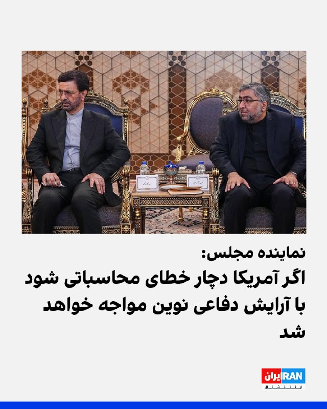

فداحسین مالکی، عضو کمیسیون امنیت ملی و سیاست خارجی مجلس، گفت در صورت ازسرگیری جنگ، چین و روسیه جمهوری اسلامی را تنها نخواهند گذاشت و آمریکا «با یک آرایش دفاعی نوین مواجه خواهد شد.»

او گفت: «تداوم سفرهای دیپلماتیک و رایزنی‌های فشرده میان ایران، چین و روسیه نشان‌دهنده یک واقعیت راهبردی است؛ اینکه اگر آمریکا مرتکب خطای محاسباتی شود و شعله جنگ مجددی را بیفروزد، قطعا با یک آرایش دفاعی نوین مواجه خواهد شد و جمهوری اسلامی در این تقابل هرگز تنها نخواهد بود.»

مالکی افزود در شرایط کنونی که بحران میان جمهوری اسلامی و آمریکا به دلیل روحیه تهاجمی و رفتارهای خارج از عرف دونالد ترامپ، رییس‌جمهوری آمریکا، پیچیده‌تر شده، تهدید امنیت تنگه هرمز عملا معادلات انرژی، تجاری و اقتصادی جهان را با چالشی جدی مواجه کرده است.
https://iranintl.com/202605238565

## IranIntlTV — post 338587

  <a href="telegram/content/IranIntlTV_338587_1779546436.mp4" target="_blank">🎬 Download video</a>

خانواده‌های جان‌باختگان و بسیاری از کاربران شبکه‌های اجتماعی، با انتشار نام، تصاویر و ویدیوهایی از معترضان کشته‌شده در ۱۸ و ۱۹ دی‌ماه، یاد آنان را گرامی داشتند و از ادامه راه آنان گفتند. این کارزار با استقبال گسترده کاربران همراه شد و بسیاری به آن پیوستند.

آیه دریس، عضو تحریریه ایران‌اینترنشنال، گزارش می‌دهد
@iranintltv

## IranIntlTV — post 338586

  <a href="telegram/content/IranIntlTV_338586_1779546439.mp4" target="_blank">🎬 Download video</a>

عبدالله ناصری، فعال سیاسی، مجتبی خامنه‌ای را چهره‌ای تندروتر و متوهم‌تر از علی خامنه‌ای توصیف کرد. او همچنین درباره زنده بودن رهبر سوم جمهوری اسلامی ابراز تردید کرد.

جزییات بیشتر در گفت‌وگو با علی شیرازی، عضو تحریریه ایران اینترنشنال
@iranintltv

## IranIntlTV — post 338585

  <a href="https://t.me/IranintlTV/338585" target="_blank">📎 Download file</a>

🎧نسخه صوتی اخبار نیمروزی | شنبه ۲ خرداد
@iranintlTV

## IranIntlTV — post 338584

  <a href="telegram/content/IranIntlTV_338584_1779546442.mp4" target="_blank">🎬 Download video</a>

حجت میرزایی، اقتصاددان و مدیر پیشین صندوق‌های بازنشستگی کشور، اعلام کرد با تداوم شرایط کنونی، شمار افراد زیر خط فقر در سال جاری به ۴۰ میلیون نفر خواهد رسید. این اقتصاددان تاکید کرد در سناریوهای بدبینانه، نرخ تورم سال جاری ممکن است سه‌رقمی شود.
گفت‌وگو با آرش آزرمی، دبیر بخش اقتصادی ایران‌اینترنشنال
@iranintltv

## Persian_Trend_Official — post 14734

  <a href="telegram/content/Persian_Trend_Official_14734_1779546444.mp4" target="_blank">🎬 Download video</a>

💢تیراندازی از صداوسیما به میان جمعیت رسید ...

🫆:Tony

📌 @persian_trend_official
پرشین ترند | متفاوت‌ترین کانال نظامی

## Persian_Trend_Official — post 14733

🔴 حزب‌الله: عراقچی بر حمایت «تزلزل‌ناپذیر» ایران تأکید کرده است

💢حزب‌الله لبنان اعلام کرد پیامی از عباس عراقچی، وزیر خارجه ایران، دریافت کرده که در آن تهران بر حمایت «قاطع و تزلزل‌ناپذیر» خود از این گروه تأکید کرده است.

♦️بر اساس بیانیه حزب‌الله:

▪️ ایران اعلام کرده حمایت خود از حزب‌الله را ادامه خواهد داد

▪️ تهران خواستار گنجانده‌شدن لبنان در هرگونه توافق آتش‌بس مرتبط با جنگ ایران شده است
🫆:Tony

📌 @persian_trend_official
پرشین ترند | متفاوت‌ترین کانال نظامی

## Persian_Trend_Official — post 14732

  <a href="telegram/content/Persian_Trend_Official_14732_1779546446.mp4" target="_blank">🎬 Download video</a>

📝 Nick

📌 @persian_trend_official
پرشین ترند | متفاوت‌ترین کانال نظامی

## Persian_Trend_Official — post 14731

  <a href="telegram/content/Persian_Trend_Official_14731_1779546449.webm" target="_blank">🎬 Download video</a>

🔴بقائی: تنگه هرمز به آمریکا ربطی ندارد

♦️سخنگوی وزارت خارجه:

🔹تنگه هرمز به آمریکا ربطی ندارد. بین ما و عمان به عنوان کشورهای ساحلی باید سازوکاری تعریف شود. ما با سازمان‌های ذی‌صلاح در گفتگو هستیم. ما آگاه نسبت به اهمیت این آبراه برای جامعه بین‌المللی هستیم.

🔹جامعه بین المللی می‌داند که ناامنی ناشی از اقدام تجاوزکارانه آمریکا و رژیم صهیونیستی است. درک می‌کنند که اقدام مسئولانه ایران و عمان برای ایجاد سازوکاری جهت تردد ایمن کشتی‌ها از این آبراه به نفع جامعه بین‌المللی است.

🫆:Tony

📌 @persian_trend_official
پرشین ترند | متفاوت‌ترین کانال نظامی

## Persian_Trend_Official — post 14730

  <a href="telegram/content/Persian_Trend_Official_14730_1779546449.webm" target="_blank">🎬 Download video</a>

🔴 الجزیره: تفاهم اولیه میان ایران و پاکستان حاصل شده؛ تهران منتظر پاسخ آمریکاست 💢یک منبع ایرانی به الجزیره گفته است تهران و پاکستان بر سر یک «یادداشت تفاهم» به توافق رسیده‌اند و اکنون ایران در انتظار پاسخ نهایی آمریکا است. ♦️بر اساس این گزارش: ▪️ این تفاهم…

## Persian_Trend_Official — post 14729

  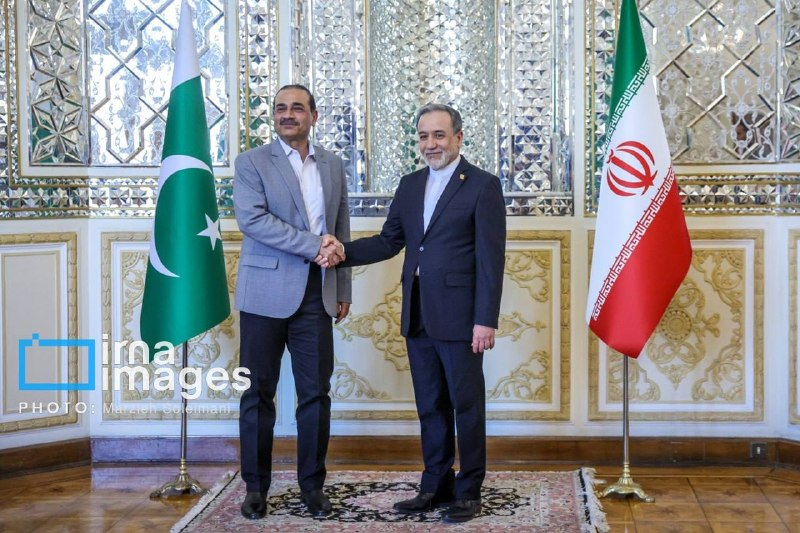

🔴 الجزیره: تفاهم اولیه میان ایران و پاکستان حاصل شده؛ تهران منتظر پاسخ آمریکاست

💢یک منبع ایرانی به الجزیره گفته است تهران و پاکستان بر سر یک «یادداشت تفاهم» به توافق رسیده‌اند و اکنون ایران در انتظار پاسخ نهایی آمریکا است.

♦️بر اساس این گزارش:

▪️ این تفاهم شامل پایان جنگ، بازگشایی تنگه هرمز و خروج نیروهای آمریکایی از منطقه است
▪️ موضوع هسته‌ای در این توافق گنجانده نشده و به مذاکرات طولانی‌تری نیاز دارد
▪️ طبق این طرح، پس از ۳۰ روز از اجرای توافق، گفت‌وگوها درباره پرونده هسته‌ای آغاز خواهد شد

♦️این منبع همچنین تأکید کرده:

▪️ مذاکرات فعلی بیشتر بر توقف درگیری‌ها و کاهش تنش منطقه‌ای متمرکز بوده است
▪️ نقش پاکستان در میانجیگری میان تهران و واشینگتن همچنان کلیدی است
▪️ هنوز مشخص نیست آمریکا با تمامی بندهای این تفاهم موافقت خواهد کرد یا نه

🫆:Tony

📌 @persian_trend_official
پرشین ترند | متفاوت‌ترین کانال نظامی

## Persian_Trend_Official — post 14728

  <a href="telegram/content/Persian_Trend_Official_14728_1779546451.webm" target="_blank">🎬 Download video</a>

💢فرمانده ارتش پاکستان ایران را ترک کرد

💢عاصم منیر فرمانده ارتش پاکستان پس از دیدار دوم با عراقچی ایران را ترک کرده است/تستیم

🫆:Tony

📌 @persian_trend_official
پرشین ترند | متفاوت‌ترین کانال نظامی

## Persian_Trend_Official — post 14727

  

🔴بن‌گویر از ورود به خاک فرانسه منع شد

💢‏وزیر امور خارجه فرانسه: «ایتمار بن‌گویر» وزیر امنیت داخلی اسرائیل از امروز از ورود به خاک ما منع شده است.

🫆:Tony

📌 @persian_trend_official
پرشین ترند | متفاوت‌ترین کانال نظامی

## Persian_Trend_Official — post 14726

💢ادعای منابع دیپلماتیک به العربیه: ایران ۲ پیشنهاد به میانجی پاکستانی ارائه کرده است

💢ایران خواستار بحث درباره پرونده تحریم‌ها و دارایی‌های مسدودشده پیش از امضای هرگونه توافق شده است

🫆:Tony

📌 @persian_trend_official
پرشین ترند | متفاوت‌ترین کانال نظامی

## Persian_Trend_Official — post 14725

🔴سخنگوی وزارت خارجه:

♦️ما به توافق خیلی دور و خیلی نزدیک هستیم

💢هدف از سفر فرمانده ارتش پاکستان تبادل پیام‌ها میان‌ ایران و آمریکا بود.

طی روزهای گذشته پیرامون مسائلی که اختلاف نظر وجود داشت بحث شد.

💢با مواضع متناقض آمریکا نمی‌توانیم‌ بگوییم که این روند تغییر می‌کند. دیدگاه‌ها نزدیک شده است اما نه به معنای توافق بلکه بتوانیم به یک راه‌حل برسیم.

🫆:Tony

📌 @persian_trend_official
پرشین ترند | متفاوت‌ترین کانال نظامی

---
📅 بروزرسانی: 1405/03/02 16:26
---

## ChizBergerz — post 46695

  <a href="telegram/content/ChizBergerz_46695_1779540965.mp4" target="_blank">🎬 Download video</a>

نمیدونم این کیه و چکاره‌س و این چه برنامه‌ایه ولی پیش‌بینیش از روزهای آینده شنیدنیه:

@ChizBergerz

## ChizBergerz — post 46694

  <a href="telegram/content/ChizBergerz_46694_1779540967.mp4" target="_blank">🎬 Download video</a>

با این وضعیتی که من تو تهران میبینم؛ اگه باشگاه های ورزشی تو ایران مختلط بشه جمعیت ورزشکارا چند برابر‌ میشه!

@ChizBergerz

## ChizBergerz — post 46693

  <a href="telegram/content/ChizBergerz_46693_1779540969.webm" target="_blank">🎬 Download video</a>

⚠️ امشب #شانست رو امتحان کن: 
⚠️ همین الان عضو شو و 500 هزارتومان جایزه بگیر و بازی های l اروپایی رو #رایگان پیشبینی کن(بدون نیاز به واریز
🤩) 
😮 تنها سایتی که با عضویت بدون واریز 500,000 تومان شارژ بی قیدو شرط میده #وینرو هست
💰 
👑 #معتبرترین سایت ایرانی 
⬇️…

## ChizBergerz — post 46692

  <a href="telegram/content/ChizBergerz_46692_1779540970.webm" target="_blank">🎬 Download video</a>

⚠️ امشب #شانست رو امتحان کن:

⚠️ همین الان عضو شو و 500 هزارتومان جایزه بگیر و بازی های l اروپایی رو #رایگان پیشبینی کن(بدون نیاز به واریز
🤩)

😮 تنها سایتی که با عضویت بدون واریز 500,000 تومان شارژ بی قیدو شرط میده #وینرو هست
💰

👑 #معتبرترین سایت ایرانی 
⬇️

🌐 Winro.io

🌐 Winro.io

📱کانال اخبار و هدایا a2 
🎁

📱 @winro_io

## ChizBergerz — post 46691

  

شاید اولش با خودتون بگین آخی چه دختر ناز و مهربونی؛ ولی ایشون دوس پسرشو بخاطر اینکه حاضر نشد باهاش سکس کنه به قتل رسونده!

@ChizBergerz

## ChizBergerz — post 46690

  <a href="telegram/content/ChizBergerz_46690_1779540972.mp4" target="_blank">🎬 Download video</a>

یکم زیبایی ببینیم بلکه کمی از این وضعیت کیری دور شیم...

@ChizBergerz

## ChizBergerz — post 46689

  <a href="telegram/content/ChizBergerz_46689_1779540973.mp4" target="_blank">🎬 Download video</a>

توی تجمعات شبانه حکومتی‌ها عروسی گرفتن و تفنگ دادن عروس جنده تا تیراندازی کنه!

+ یک مشت تروریست جنده سروکار داریم!
@ChizBergerz

## rodast_omiddana — post 71813

  <a href="telegram/content/rodast_omiddana_71813_1779540974.webm" target="_blank">🎬 Download video</a>

🚨 آکسیوس
ترامپ مصمم برای حمله به رژیم جمهوری اسلامی
ترامپ در شش هفته گذشته چندین بار نزدیک به از سرگیری اقدام نظامی علیه ایران شده است اما در نهایت خودداری کرده است.
منابع آشنا با تفکر ترامپ می‌گویند او اکنون به نظر می‌رسد تمایل بیشتری به پیشبرد اقدام نظامی دارد مگر اینکه مذاکرات به یک پیشرفت غیرمنتظره منجر شود.

## rodast_omiddana — post 71812

🎬 ماجرای حمله کاسبان سیاسی به علی کریمی چیست و چرا من امید دانا ورود کردم؟
لینک یوتیوب:
https://www.youtube.com/watch?v=LgMcAw48Nkw

## rodast_omiddana — post 71811

  <a href="telegram/content/rodast_omiddana_71811_1779540974.webm" target="_blank">🎬 Download video</a>

🚨اسرائیل‌هیوم:
آمریکا و اسرائیل در حال بررسی این پرسش هستند که حذف مجتبی خامنه‌ای می‌تواند حکومت ایران را بی‌ثبات کند یا برعکس، به شکل‌گیری ساختاری رادیکال‌تر و توافقی شکننده مشابه برجام منجر شود

## KiriMohems — post 47918

🔴تجمع اعتراضی دانش آموزان در شهرهای شهرکرد ، خرم آباد ، یاسوج و بروجرد مقابل آموزش و پرورش تخمی شهر #Helsinki @KiriMohems

## KiriMohems — post 47917

🔴تجمع اعتراضی دانش آموزان در شهرهای شهرکرد ، خرم آباد ، یاسوج و بروجرد مقابل آموزش و پرورش تخمی شهر

#Helsinki
@KiriMohems

## SportBaadNews — post 252268

🔻روزنامه اعتماد: مجلس این هفته به این نتیجه میرسه که قطعی اینترنت کار بدیه و اون رو مصوب میکنه
@SportBaadNews

## IranIntlTV — post 338581

  <a href="telegram/content/IranIntlTV_338581_1779540974.mp4" target="_blank">🎬 Download video</a>

تجمع دانش‌آموزان در شهرکرد، بروجرد، دورود، خرم‌آباد، بروجرد و یاسوج در اعتراض به بلاتکلیفی تحصیلی و امتحانات حضوری ادامه یافت. ویدیوهای رسیده به ایران‌اینترنشنال نشان می‌دهد ماموران با گاز اشک‌آور به دانش‌آموزان معترض حمله کردند.
گفت‌وگو با آسیه امینی، تحلیل‌گر مسائل اجتماعی
@iranintltv

## IranIntlTV — post 338580

  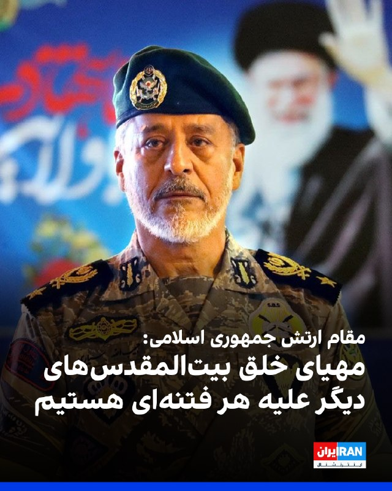

همزمان با افزایش تنش‌ها و احتمال ازسرگیری درگیری‌ها، حبیب‌الله سیاری، معاون هماهنگ‌کننده ارتش جمهوری اسلامی، گفت نیروهای مسلح برای مقابله با هرگونه تهدید آمادگی دارند و منتظر فرمان مجتبی خامنه‌ای هستند.

او گفت: «نیروهای مسلح در پاسداری از تمامیت ارضی و استقلال کشور، مهیای خلق بیت‌المقدس‌هایی دیگر در برابر هر فتنه و جنگ تحمیلی هستند و این را دنیا بداند که هویت ما با ایثار و وطن‌پرستی گره خورده است.»
https://iranintl.com/202605234510

## IranIntlTV — post 338579

روایت شما از زندگی در آتش‌بس- شنبه ۲ خرداد ۱۴۰۵

🔹 امروز شنبه ۲ خرداد، ما دانش‌آموزان مقابل آموزش‌وپرورش استان آذربایجان غربی در ارومیه تجمع کردیم برای غیرحضوری شدن امتحانات.
🔹 من تمام دوره‌های درسم را از تلگرام دانلود می‌کردم. دروس تخصصی را از یوتیوب تماشا می‌کردم. چند دوره هم از اینستاگرام خریده بودم و حالا کنکور دارم و باید با هیچی درس بخونم. به امید آزادی.
🔹 از رفسنجان، بعد از چند وقت قطع بودن امروز ۲ خرداد وصل شدم. خواستم بگم مردم امیدتونو از دست ندین، نور بر تاریکی پیروز است.
🔹 حتی اینترنت پرو که با ۱۰ برابر قیمت اینترنت قبلی فروخته می‌شود هم با اشکال و ناپایدار وصل می‌شود. کلاً با روح و روان آدم بازی می‌کنن.
🔹 یوتیوبرم، فقط ماهی ۳ میلیون باید هزینه فیلترشکن کنم که بتونم ویدیو آپلود کنم.
🔹 من یه دختر ۱۵ ساله هستم و هیچی از نوجوونیم نفهمیدم. فکر و ذکرم شده قیمت دلار و نگرانی برای آینده‌ام. انقدر همه‌چی گرون شده که شخصاً خجالت می‌کشم از خانوادم چیزی بخوام. به امید روزهای بهتر،

## IranIntlTV — post 338578

یکی از مجروحان انقلاب ملی ایرانیان با ارسال فایلی صوتی به ایران اینترنشنال، ماجرای زخمی و شکنجه شدنش به دست نیروهای امنیتی و لباس‌شخصی در ۱۸ دی‌ماه ۱۴۰۴ را روایت کرد. صدای او با هوش مصنوعی تغییر یافته است.

## IranIntlTV — post 338577

  <a href="telegram/content/IranIntlTV_338577_1779540977.mp4" target="_blank">🎬 Download video</a>

ویدیوی رسیده نشان می‌دهد دانش‌آموزان بروجرد در تجمع روز شنبه برای اعتراض به حضوری شدن امتحانات، فریاد «مجازی مجازی» سر دادند.

## IranIntlTV — post 338576

  <a href="telegram/content/IranIntlTV_338576_1779540979.mp4" target="_blank">🎬 Download video</a>

مولوی عبدالحمید، امام‌جمعه اهل سنت زاهدان، گرانی و تورم را بی‌حد و مرز و مردم را گرسنه توصیف کرد. او دولت را فاقد اختیار و نقش موثر برای تصمیم‌گیری در سیاست‌های داخلی و خارجی دانست.

گفت‌وگو با مهدی نخل‌احمدی، روزنامه‌نگار و فعال سیاسی
@iranintltv

## IranIntlTV — post 338575

  <a href="telegram/content/IranIntlTV_338575_1779540981.mp4" target="_blank">🎬 Download video</a>

دانش‌آموزان در خرم‌آباد، بروجرد و نقاطی از کهگیلویه و بویراحمد تجمع کردند و علیه مسوولان شعار دادند.

گفت‌وگو با محسن مهیمنی، عضو تحریریه ایران‌اینترنشنال
@iranintltv

## IranIntlTV — post 338573

  <a href="telegram/content/IranIntlTV_338573_1779540983.mp4" target="_blank">🎬 Download video</a>

سازمان عملیات تجارت دریایی بریتانیا درباره فعالیت‌های مشکوک دریایی در خلیج عدن هشدار داد. بر اساس این هشدار، چندین مورد نزدیک شدن قایق‌های کوچک به شناورها گزارش شده و در یکی از موارد نیز یک قایق بزرگ با دو موتور بیرونی مشاهده شده که حامل نردبان و سلاح بوده است.

گفت‌وگو با تاج‌الدین سروش، عضو تحریریه ایران‌اینترنشنال
@iranintltv

## Persian_Trend_Official — post 14724

  <a href="telegram/content/Persian_Trend_Official_14724_1779540985.webm" target="_blank">🎬 Download video</a>

یارو میگه تمام نیازهای جامعه در شبکه داخلی برآورده میشه و نیازی به اینترنت نیست.‌ بعد توی توییتر داره اینو میگه. 😐

‏همون‌طور که آپارات جای یوتیوب رو نگرفت، بله هم جای واتساپ رو نخواهد گرفت. (تلگرام رو نگفتم که بهش توهین نشه)

📝 Nick

📌 @persian_trend_official
پرشین ترند | متفاوت‌ترین کانال نظامی

---
📅 بروزرسانی: 1405/03/02 15:24
---

## SportBaadNews — post 252267

  <a href="telegram/content/SportBaadNews_252267_1779537277.mp4" target="_blank">🎬 Download video</a>

عشقققق و حالللل یامال و خانومی
@SportBaadNews

## SportBaadNews — post 252266

چیزی نمونده تا جام جهانی

## IranIntlTV — post 338572

  <a href="telegram/content/IranIntlTV_338572_1779537278.mp4" target="_blank">🎬 Download video</a>

گفت‌وگوی ویژه با لرد موریس گلسمن، عضو مجلس اعیان بریتانیا

امروز ساعت ۱۶:۴۵ و ۲۱:۴۵ به وقت تهران

@iranintltv

## IranIntlTV — post 338571

  <a href="telegram/content/IranIntlTV_338571_1779537279.mp4" target="_blank">🎬 Download video</a>

همزمان با اعتراضات دانش‌آموزان شهرهای بروجرد و خرم‌آباد در لرستان، ویدیوی رسیده به ایران اینترنشنال نشان می‌دهد محصلان در کهگیلویه و بویراحمد نیز با تشکیل تجمع اعتراضی به موج اعتراض پیوستند. این اعتراضات نسبت به حضوری شدن امتحانات پس از ماه‌ها اختلال در فعالیت مدارس و تعطیلی صورت می‌گیرد.

## IranIntlTV — post 338570

  

محمدباقر قالیباف، رییس مجلس جمهوری اسلامی، در دیدار با عاصم منیر، رییس ستاد کل ارتش پاکستان، گفت نیروهای مسلح جمهوری اسلامی در دوران آتش‌بس بازسازی شده‌اند و در صورت آغاز دوباره جنگ، واکنش ایران شدیدتر خواهد بود.

او گفت: «نیروهای مسلح ما در دوران آتش‌بس به نحوی خود را بازسازی کرده‌اند که در صورت حماقت ترامپ و آغاز مجدد جنگ، حتما برای آمریکا کوبنده‌تر و تلخ‌تر از روز اول جنگ خواهند بود.»

قالیباف با اشاره به نقش پاکستان در میانجی‌گری افزود: «در آتش‌بسی بودیم که شما واسطه‌اش بودید و آمریکا با نقص عهد، محاصره دریایی کرد و حالا به‌دنبال برداشتن آن است.»
https://iranintl.com/202605235817

## IranIntlTV — post 338569

  <a href="telegram/content/IranIntlTV_338569_1779537281.mp4" target="_blank">🎬 Download video</a>

مروری بر روزنامه‌های ایران، شنبه ۲ خرداد، با مجتبی هاشمی، روزنامه‌نگار
@iranintltv

## IranIntlTV — post 338568

  

🔻آمریکا اعلام کرد تیم ملی کنگو پیش از ورود به جام جهانی باید به دلیل ابولا، قرنطینه شود. اندرو جولیانی، مدیر اجرایی کارگروه کاخ سفید برای جام جهانی، روز گذشته تایید کرد تیم ملی کنگو باید در اردوی خود در بلژیک یک «حباب» بهداشتی را حفظ کند وگرنه ممکن است از ورود به آمریکا منع شود.

🔹جمهوری دموکراتیک کنگو نخستین بازی خود در جام جهانی ۲۰۲۶ را ۲۷ خرداد در هیوستون برابر پرتغال برگزار می‌کند، اما به دلیل شیوع ابولا در کنگو، اعضای تیم ملی فوتبال این کشور باید پیش از ورود به ایالات متحده برای حضور در جام جهانی، در قرنطینه بمانند.

🔹جولیانی به ای‌اس‌پی‌ان گفت: «به‌طور کاملا روشن به کنگو گفته‌ایم باید یکپارچگی حباب خود را به مدت ۲۱ روز حفظ کند تا سپس بتواند ۱۱ ژوئن (۲۱ خرداد) به هیوستون بیاید. همچنین به دولت کنگو به‌وضوح اعلام کرده‌ایم که باید این حباب را حفظ کند، در غیر این صورت ممکن است نتواند به آمریکا سفر کند. روشن‌تر از این نمی‌توانیم بگوییم.»

🔹تمام اعضای تیم کنگو، به همراه سباستین دزابره، سرمربی فرانسوی تیم، اکنون خارج از این کشور مستقر هستند.

🔹جزییات بیشتر را در سایت بخوانید.

@iranintltvsport

## IranIntlTV — post 338567

  <a href="telegram/content/IranIntlTV_338567_1779537283.mp4" target="_blank">🎬 Download video</a>

بر اساس گزارش شرکت کپلر، با توجه به مختل شدن امکان صادرات، میزان بارگیری نفت خام ایران نسبت به پیش از محاصره دریایی آمریکا، حدود یک‌ونیم میلیون بشکه در روز کاهش یافته است.

گفت‌وگو با عطا حسینیان، روزنامه‌نگار اقتصادی و حوزه انرژی
@iranintltv

## Persian_Trend_Official — post 14723

  

🇺🇸 
🌟نیروی فضایی ایالات متحده بامداد ۲۰ مه یک موشک بالستیک قاره‌پیمای بدون کلاهک مینوت‌من III را در قالب آزمایش «Glory Trip 256» از پایگاه فضایی وندنبرگ در کالیفرنیا با موفقیت پرتاب کرد.

🚀این پرتاب ساعت ۱۲:۰۱ به وقت اقیانوس آرام و تحت نظارت اسکادران آزمایش پرواز ۵۷۶ انجام شد. به گفته مقام‌های آمریکایی، آزمایش شبانه عملکرد سامانه‌های پیشرانش، هدایت و بازگشت موشک را ارزیابی کرده و آمادگی عملیاتی نیروهای مسئول را نیز به نمایش گذاشته است.
نیروی فضایی آمریکا تأکید کرد این مأموریت از سال‌ها قبل برنامه‌ریزی شده و ارتباطی با تنش‌های ژئوپولیتیکی اخیر ندارد. داده‌های به‌دست‌آمده از این آزمایش قرار است در روند نوسازی زرادخانه موشکی آمریکا و توسعه موشک نسل جدید LGM-35A Sentinel مورد استفاده قرار گیرد.

👩‍💻@PhantomDirective

🆔@persian_trend_official
پرشین ترند | متفاوت‌ترین کانال نظامی

## Persian_Trend_Official — post 14722

  

♦️ ادعای اسکای‌نیوز عربی: میانجی پاکستانی موفق شده بر مانع اصلی پرونده هسته‌ای ایران در مذاکرات دشوار بین تهران و واشنگتن غلبه کند.

👩‍💻@PhantomDirective

🆔 @persian_trend_official
پرشین ترند | متفاوت‌ترین کانال نظامی

---
📅 بروزرسانی: 1405/03/02 14:25
---

## rodast_omiddana — post 71810

  <a href="telegram/content/rodast_omiddana_71810_1779533725.webm" target="_blank">🎬 Download video</a>

🚨 تا نیم ساعت دیگه گفتگوی اینستاگرامی ام با جناب بهروز یوسیان افسر سابق اطلاعات ارتش اسرائیل و کارشناس کانال 14 عبری از احتمال حمله امشب آمریکا آغاز میشود..
لینک اینستاگرام دوم
https://www.instagram.com/risheh86/

## rodast_omiddana — post 71809

  <a href="telegram/content/rodast_omiddana_71809_1779533725.webm" target="_blank">🎬 Download video</a>

🚨اتاق جنگ اسرائیل این پست اخیر دن اسکاوینو رو ریپست کرد

## rodast_omiddana — post 71807

👑 ماسون های شیعه، خوابشو ببینید که انقلاب مردم ایران را مصادره کنید..
(سپاس از مخاطب خوش ذوقمون برای تصویر)

## KiriMohems — post 47916

امروز آخرین مهلت ثبت‌نام کنکور ۱۴۰۵عه.

#professor
@KiriMohems

## KiriMohems — post 47915

  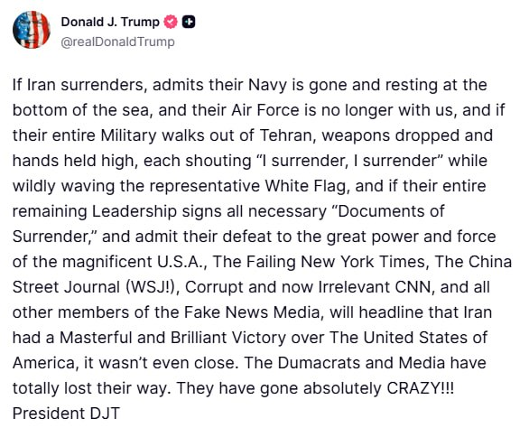

🔴جنگ ترامپ با دموکرات‌ها در تروث سوشال

اگر ایران تسلیم شود و بپذیرد که نیروی دریایی‌اش رفته و در قعر دریا آرمیده است و نیروی هوایی‌اش دیگر با ما نیست و اگر تمام ارتشش از تهران خارج شود و سلاح‌هایش را زمین بگذارد و دست‌هایش را بالا بگیرد و هر کدام فریاد بزند «تسلیم می‌شویم» در حالی که پرچم سفید نماینده‌اش را تکان می‌دهد، و اگر تمام رهبران باقی‌مانده‌اش تمام «اسناد تسلیم» لازم را امضا کنند و شکست خود را در برابر قدرت و نیروی عظیم ایالات متحده باشکوه بپذیرند،
نیویورک تایمزِ شکست‌خورده، چاینا استریت ژورنال (کنایه از وال استریت ژورنال)، سی‌ان‌انِ فاسد و تمام اعضای دیگر رسانه‌های خبریِ جعلی، تیتر خواهند زد که ایران پیروزی استادانه و درخشانی بر ایالات متحده آمریکا داشته است.
دموکرات‌ها و رسانه‌هایشان کاملاً راه خود را گم کرده‌اند. آنها کاملاً کسخل هستند!!!

#professor
@KiriMohems

## KiriMohems — post 47914

  

😤دنبال یه سایت شرط بندی بین المللی بودی که به ایرانیا خدمات بده؟!
⛔

👍دربی بت همون انتخاب  100%

💎ویژگی های سایت جهانی Derby Bet:

⬅️امکان شارژ امن با کارت بانکی

⬅️واریز اول دوبل شارژ می شوید(بونوس۱۰۰٪)

⬅️پر اپشن ترین سایت فعال در ایران

⬅️تسویه حساب کمتر از 5 دقیقه

⬅️برگشت بخشی از باخت به صورت هفتگی

🚨کد هدیه ثبت نام:GG007

⚠️برای دانلود اپلکیشن کلیک کنید
👉

🔔کانال دربی بت :r2🅰

🪙https://t.me/+kpFvLD9kaeJhYTI0

## SportBaadNews — post 252265

نویر یا بوفون؟ کاسیاس : بوفون @SportBadTweet | سی‌سی

## SportBaadNews — post 252264

  

پروف آوردم برای کریس فنا
@SportBaadNews

## SportBaadNews — post 252263

  

‼️ اگه هنوز داری تو این اوضاع اینترنت داری دستی دنبال ورود به سایت می‌گردی یعنی عملاً داری زمان رو از دست میدی.

♨️ کاربران حرفه‌ای مستقیم وارد سایت میشن.

و این مسیر از اینجا شروع میشه:
👇

🤖 @Wincobet_bot

🤖 @Wincobet_bot

⚡️بدون لینک‌های فیک

⚡️بدون پیچیدگی

⚡️بدون معطلی اضافه

📌چیزی که ساده به نظر میاد، دقیقاً همون چیزیه که کاربران حرفه‌ای‌ها دنبالش هستن:
👇

🤖 @Wincobet_bot

📌کانال رسمی وینکوبت:

🔵 @Wincobetofficial

## SportBaadNews — post 252262

  

🔻رسمی: برونو فرناندز بهترین بازیکن فصل 2025/26 پرمیرلیگ شد.

🥇 بیشترین پاس گل
🥇 بیشترین «پاس گلی که احتمال تبدیل شدنش به گل خیلی بالا بوده»
🥇 بیشترین تعداد موقعیت گل ساخته‌شده برای هم‌تیمی‌ها
🥇 بیشترین موقعیت‌سازی در جریان عادی بازی (نه از کرنر و ضربه آزاد)
🥇 بیشترین پاس دقیق به داخل محوطه جریمه حریف
🥇 بیشترین ساختِ موقعیت صددرصد گل
🥇 بیشترین موقعیت صددرصد گل در جریان عادی بازی

@SportBaadNews

## IranIntlTV — post 338566

  <a href="telegram/content/IranIntlTV_338566_1779533729.mp4" target="_blank">🎬 Download video</a>

یک شهروند روز شنبه دوم خردادماه با ارسال ویدیوی به ایران اینترنشنال گسترش و پخش دود آلاینده پتروشیمی شازند به طبیعت اطراف را نشان می‌دهد.

## IranIntlTV — post 338565

  <a href="telegram/content/IranIntlTV_338565_1779533732.mp4" target="_blank">🎬 Download video</a>

سرخط خبرهای شنبه ۲ خرداد
@iranintltv

## IranIntlTV — post 338564

🔻اسرائیل‌هیوم: واشینگتن و تل‌آویو درباره حذف مجتبی خامنه‌ای اختلاف دارند

به گزارش اسرائیل‌هیوم، آمریکا و اسرائیل در حال بررسی این پرسش هستند که حذف مجتبی خامنه‌ای می‌تواند حکومت ایران را بی‌ثبات کند یا برعکس، به شکل‌گیری ساختاری رادیکال‌تر و توافقی شکننده مشابه برجام منجر شود.

به نوشته روزنامه اسرائیل‌هیوم در حالی که آمریکا و اسرائیل پس از ترور علی خامنه‌ای درباره آینده ایران ارزیابی‌های متفاوتی دارند، اکنون بحثی تازه در محافل سیاسی و امنیتی دو کشور شکل گرفته است: آیا حذف مجتبی خامنه‌ای می‌تواند به بی‌ثباتی بیشتر حکومت ایران و دستیابی به توافقی مطلوب‌تر منجر شود یا برعکس، خطر تکرار توافق‌های گذشته و ظهور ساختاری رادیکال‌تر را افزایش خواهد داد.

به گزارش این روزنامه اسرائیلی، واشینگتن و اورشلیم بار دیگر با پرسشی راهبردی روبه‌رو شده‌اند که پیش‌تر درباره علی خامنه‌ای مطرح بود، اما اکنون به مجتبی خامنه‌ای، جانشین جدید رهبری حکومت ایران، مربوط می‌شود: آیا حذف او به سود اهداف غرب و اسرائیل خواهد بود یا باقی ماندن او - هرچند ضعیف و آسیب‌پذیر - ثباتی نسبی ایجاد می‌کند که برای مدیریت بحران مفیدتر است؟

این گزارش می‌گوید ترور علی خامنه‌ای، که با هماهنگی آمریکا و اسرائیل انجام شد، اقدامی بی‌سابقه بود؛ زیرا برای نخستین بار اسرائیل رهبر یک کشور دشمن را هدف قرار داد. هدف از این اقدام، به نوشته اسرائیل‌هیوم، تضعیف بنیادهای حکومت ایران بود.

به باور نویسنده، این هدف تنها تا حدی محقق شد. از یک سو، ساختار قدرت متمرکز در ایران آسیب دید و نشانه‌هایی از اختلافات داخلی و تنش در روند تصمیم‌گیری آشکار شد. حملات جمهوری اسلامی به کشورهای خلیج فارس نیز، به ادعای این گزارش، در برخی موارد با مواضع رسمی سیاسی تهران همخوانی نداشته است. همچنین مجتبی خامنه‌ای به عنوان رهبری «ضعیف، آسیب‌دیده و فاقد اقتدار کامل» توصیف می‌شود. فردی که مشخص نیست کنترل واقعی اوضاع را در دست دارد یا صرفاً در جریان تحولات قرار گرفته است.

اما از سوی دیگر، اسرائیل‌هیوم می‌نویسد حکومت ایران همچنان دارای ساختار فرماندهی و مرکز تصمیم‌گیری است و تا زمانی که فردی از خاندان خامنه‌ای در راس قدرت قرار دارد، جمهوری اسلامی می‌تواند تصویر یک حکومت باثبات را حفظ کند.

به نوشته این روزنامه، مسعود پزشکیان و عباس عراقچی اکنون در برخی موضوعات، از جمله پرونده هسته‌ای، انعطاف بیشتری نسبت به دوران علی خامنه‌ای نشان می‌دهند؛ موضوعی که پیش‌تر امکان‌پذیر نبود، هرچند فاصله گرفتن آن‌ها از خطوط اصلی سیاست نظام همچنان محدود است.

معضل راهبردی: حذف مجتبی خامنه‌ای یا حفظ ساختار موجود؟
اسرائیل‌هیوم می‌نویسد موافقان حذف مجتبی خامنه‌ای معتقدند ترور او می‌تواند حکومت ایران را وارد بحران جانشینی و آشفتگی سیاسی کند؛ وضعیتی که شاید به جناح‌های عملگراتر فرصت دهد توافقی با غرب شکل دهند.

این گزارش برای توضیح این رویکرد به حمله اسرائیل به دوحه در سپتامبر گذشته اشاره می‌کند؛ حمله‌ای که هدف آن، به ادعای نویسنده، تضعیف جناحی از حماس بود که مانع توافق درباره گروگان‌ها شده بود.

اما مخالفان این دیدگاه هشدار می‌دهند در ایران «میانه‌روهای واقعی» آماده جانشینی وجود ندارند و حذف خامنه‌ای ممکن است صرفاً به توافقی مشابه توافق هسته‌ای دوران اوباما منجر شود؛ توافقی که از نگاه اسرائیل، محدودیت‌های زمانی داشته و تهدیدهای بلندمدت را برطرف نکرده بود.

اسرائیل‌هیوم با اشاره به هشدارهای پیشین دادی بارنئا، رییس موساد، می‌نویسد مقام‌های اسرائیلی سال‌ها نسبت به محدودیت زمانی توافق‌های هسته‌ای هشدار داده‌اند. به گفته نویسنده، حتی اگر حکومت ایران با توقف ۱۵ ساله برنامه هسته‌ای موافقت کند، در نهایت محدودیت‌ها پایان می‌یابد و مساله دوباره بازمی‌گردد.

🔗ادامه گزارش را اینجا بخوانید

## IranIntlTV — post 338563

  <a href="telegram/content/IranIntlTV_338563_1779533733.mp4" target="_blank">🎬 Download video</a>

ویدیوی رسیده به ایران اینترنشنال نشان می‌دهد روز شنبه دوم خرداد تعدادی از دانش‌آموزان مدارس در خرم‌آباد برای اعتراض به شیوه امتحانات خود و اظهارات مسئولان برای حضوری کردن امتحانات مقابل ساختمان آموزش و پرورش تجمع کردند. هفته گذشته نیز در شهرکرد دانش‌آموزان تجمع اعتراضی برگزار کردند.

## IranIntlTV — post 338562

  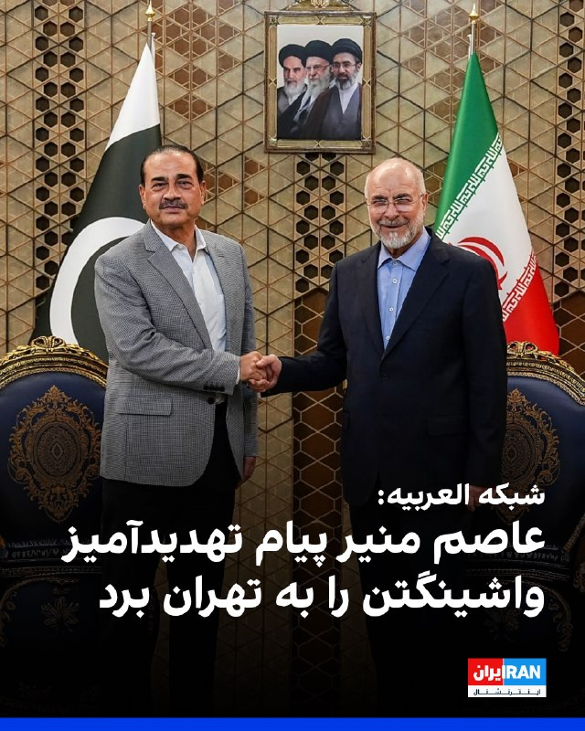

شبکه العربیه به نقل از منابع آگاه گزارش داد عاصم منیر، رییس ستاد کل ارتش پاکستان، پیام‌های آمریکا را به تهران منتقل کرده است و بخشی از این پیام حاوی تهدید به ازسرگیری جنگ بوده است.

در این پیام‌ها همچنین تاکید شده در صورت موافقت جمهوری اسلامی با توافق، حل مسائل اختلافی در مرحله بعدی انجام خواهد شد.

به گفته این منابع، آمریکا در پیام‌های خود تصریح کرده است تهران باید اکنون با توافق موافقت کند یا با پیامدهای منفی روبه‌رو شود.
https://iranintl.com/202605236089

## IranIntlTV — post 338561

ویدیوی رسیده به ایران اینترنشنال نشان می‌دهد روز شنبه دوم خرداد تعدادی از دانش‌آموزان مدارس در خرم‌آباد برای اعتراض به شیوه امتحانات خود و اظهارات مسئولان برای حضوری کردن امتحانات مقابل ساختمان آموزش و پرورش تجمع کردند. آن‌ها شعار «مجازی مجازی»‌ سر داده و خواستار غیرحضوری شدن امتحانات شدند.

## IranIntlTV — post 338560

  <a href="telegram/content/IranIntlTV_338560_1779533737.mp4" target="_blank">🎬 Download video</a>

فدراسیون فوتبال ایران اخبار مربوط به رد ویزای آمریکا برای شماری از ملی‌پوشان جهت حضور در جام جهانی ۲۰۲۶ را تکذیب کرد و اعلام کرد روند اخذ ویزا طبق روال در حال انجام است.

جزییات بیشتر در گفت‌وگو با علیرضا مدیری، عضو تحریریه ایران‌اینترنشنال
@iranintltv

## IranIntlTV — post 338559

  <a href="telegram/content/IranIntlTV_338559_1779533739.mp4" target="_blank">🎬 Download video</a>

رییس مرکز ملی اقلیم و مدیریت بحران خشکسالی سازمان هواشناسی اعلام کرد با وجود بارندگی‌های اخیر، تهران ششمین سال کم‌بارشی را تجربه می‌کند. سخنگوی شرکت آب و فاضلاب تهران هم هشدار داد عبور از بحران آب بدون صرفه‌جویی ممکن نیست.

گفت‌وگو با احسان دانشور، پژوهشگر ارشد محیط زیست و انرژی
@iranintltv

## IranIntlTV — post 338558

  <a href="telegram/content/IranIntlTV_338558_1779533742.mp4" target="_blank">🎬 Download video</a>

ویدیوی رسیده به ایران اینترنشنال نشان می‌دهد روز شنبه دوم خرداد تعدادی از دانش‌آموزان مدارس در خرم‌آباد برای اعتراض به شیوه امتحانات خود و اظهارات مسئولان برای حضوری کردن امتحانات مقابل ساختمان آموزش و پرورش تجمع کردند. آن‌ها شعار «لرستان می‌میرد، ذلت نمی‌پذیرد» سر دادند..

## IranIntlTV — post 338557

  <a href="telegram/content/IranIntlTV_338557_1779533743.mp4" target="_blank">🎬 Download video</a>

پگاه آهنگرانی، بازیگر و فیلمساز ایرانی، شنبه ۲۶ اردیبهشت برای نمایش فیلم تازه خود «تمرین‌هایی برای یک انقلاب» در جشنواره کن حاضر شد. او این فیلم را به مادرانی تقدیم کرد که فرزندانشان را در مسیر مبارزه برای آزادی از دست داده‌اند. آهنگرانی که همراه عوامل فیلم روی صحنه رفت، گفت خوشحال است که این اثر توانسته بخشی از مبارزه مردم برای آزادی و دموکراسی را به تصویر بکشد و افزود مردم این روزها با قطعی اینترنت، خبرهای روزانه اعدام‌ها توسط جمهوری اسلامی و سایه جنگ روبه‌رو هستند.
@iranintltv

## IranIntlTV — post 338556

  <a href="telegram/content/IranIntlTV_338556_1779533745.mp4" target="_blank">🎬 Download video</a>

ویدیوی رسیده به ایران اینترنشنال نشان می‌دهد روز شنبه دوم خرداد تعدادی از دانش‌آموزان مدارس در خرم‌آباد برای اعتراض به شیوه امتحانات خود و اظهارات مسئولان برای حضوری کردن امتحانات مقابل ساختمان آموزش و پرورش تجمع کردند. آن‌ها شعار «مرگ بر مسئول بی‌لیافت»‌ سر دادند.

## IranIntlTV — post 338555

  

🔻روزنامه ایران ورزشی مدعی شده بازیکنان خط‌ خورده از اردوی تیم ملی در آماده‌باش قرار گرفته‌اند تا در صورت بروز مشکل ویزا برای برخی نفرات، جایگزین شوند. عصر ایران هم، با بازنشر این گزارش، اضافه کرده شایعاتی درباره رد ویزای شجاع خلیل‌زاده، مهدی طارمی و احسان حاج‌صفی مطرح شده است.

🔹مسعود محبی، دانیال اسماعیلی‌فر، حسین ابرقویی، عارف آقاسی، مهدی هاشم‌نژاد، محمدمهدی محبی، عارف حاجی‌عیدی، پوریا شهرآبادی و احسان محروقی در آخرین اردوی تیم ملی در تهران حضور داشتند، اما امیر قلعه‌نویی آن‌ها را از فهرست ۳۰ نفره نهایی کنار گذاشت.

🔹ایران ورزشی نوشته است که کادر فنی به آن‌ها پیام داده: «تمریناتتان را ادامه دهید.»

🔹به نوشته این رسانه، «آن‌ها باید خود را برای جایگزینی احتمالی بازیکنانی که با مشکل ویزا مواجه شده‌اند آماده کنند.»

🔹اما ساعتی پیش فدراسیون فوتبال، بدون اشاره به پاسخی از سفارت آمریکا در آنکارا و با استناد به انجام شدن روند اداری از سوی فدراسیون، رد شدن ویزا برای طارمی، خلیل‌زاده و حاج‌صفی را تکذیب کرد.

🔹جزییات بیشتر را در سایت بخوانید.

@iranintltvsport

## IranIntlTV — post 338554

  

محمدحسن نامی، دستیار ویژه وزیر کشور، خواستار تشکیل «ناتوی اسلامی» در منطقه و جهان اسلام با محوریت جمهوری اسلامی شد. او گفت کشورهای اسلامی از ظرفیت‌های گسترده اقتصادی و موقعیت جغرافیایی، از جمله تنگه هرمز و باب‌المندب، برخوردارند که این دو مورد قدرت‌آفرین هستند.

او گفت: «چرا نباید یک ناتوی اسلامی در همین منطقه خودمان و در جهان اسلام داشته باشیم؟ از حدود ۵۷ کشور اسلامی، بیشترین ظرفیت اقتصادی و جغرافیایی جهان به‌دست می‌آید که قدرت‌آفرین است.»

نامی افزود: «در صورت تحقق این اتحاد، هیچ قدرتی نمی‌تواند به جهان اسلام زور بگوید؛ نمونه آن فلسطین است که تاکنون ۷۳ هزار شهید تقدیم کرده است.»
https://iranintl.com/202605238332

## IranIntlTV — post 338553

  

محمدحسن نامی، دستیار ویژه وزیر کشور، خواستار تشکیل «ناتوی اسلامی» در منطقه و جهان اسلام با محوریت جمهوری اسلامی شد. او گفت کشورهای اسلامی از ظرفیت‌های گسترده اقتصادی و موقعیت جغرافیایی، از جمله تنگه هرمز و باب‌المندب، برخوردارند که این دو مورد قدرت‌آفرین هستند.

او گفت: «چرا نباید یک ناتوی اسلامی در همین منطقه خودمان و در جهان اسلام داشته باشیم؟ از حدود ۵۷ کشور اسلامی، بیشترین ظرفیت اقتصادی و جغرافیایی جهان به‌دست می‌آید که قدرت‌آفرین است.»

نامی افزود: «در صورت تحقق این اتحاد، هیچ قدرتی نمی‌تواند به جهان اسلام زور بگوید؛ نمونه آن فلسطین است که تاکنون ۷۳ هزار شهید تقدیم کرده است.»
https://iranintl.com/202605238332

## IranIntlTV — post 338552

ایرانیان ساکن بریزبن استرالیا روز شنبه دوم خرداد با اشاره به کارزار ایران اینترنشنال برای شناسایی جاویدنامان بیمارستان الغدیر تهران پرفورمنس هنری اجرا کردند. سخنران این تجمع به انبود پیکر معترضان در این بیمارستان اشاره کرد.

## IranIntlTV — post 338551

  <a href="telegram/content/IranIntlTV_338551_1779533751.mp4" target="_blank">🎬 Download video</a>

ویدیوی رسیده به ایران‌اینترنشنال نشان می‌دهد دانش‌آموزان شنبه در خرم‌آباد در اعتراض به بلاتکلیفی و ابهام درباره نحوه برگزاری امتحانات و اظهارات مسئولان درباره حضوری کردن امتحانات تجمع کردند.

گفت‌وگو با محسن مهیمنی، عضو تحریریه ایران‌اینترنشنال
@iranintltv

## IranIntlTV — post 338550

  <a href="telegram/content/IranIntlTV_338550_1779533753.mp4" target="_blank">🎬 Download video</a>

با ادامه محاصره دریایی آمریکا بر تنگه هرمز علیه جمهوری اسلامی، یک شهروند تصویری از سواحل اسکله رجایی بندرعباس ارسال کرده و می‌گوید که کشتی‌ها در این منطقه به دلیل توقف تردد متوقف شده‌اند. بنا بر اعلام سنتکام از زمان آغاز محاصره بیش از ۱۰۰ کشتی مجبور به تغییر مسیر شده‌اند و چندین کشتی نیز از کار انداخته شده‌اند.

---
📅 بروزرسانی: 1405/03/02 13:02
---

## rodast_omiddana — post 71806

  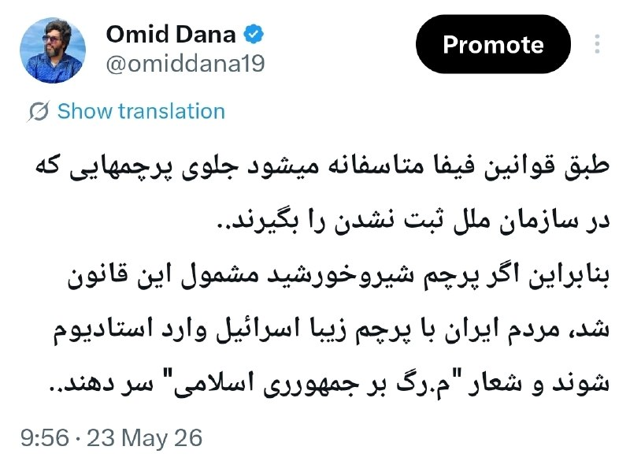

🚫 طبق قوانین فیفا متاسفانه میشود جلوی پرچمهایی که در سازمان ملل ثبت نشدن را بگیرند..
بنابراین اگر پرچم شیروخورشید مشمول این قانون شد، مردم ایران با پرچم زیبا اسرائیل وارد استادیوم شوند و شعار "م.رگ بر جمهورری اسلامی" سر دهند..

## rodast_omiddana — post 71805

  <a href="telegram/content/rodast_omiddana_71805_1779528748.webm" target="_blank">🎬 Download video</a>

🚨 همچنان فکر میکنم تا قبل از دوشنبه میزنه...
تا ببینیم چی میشه..

## rodast_omiddana — post 71804

  <a href="telegram/content/rodast_omiddana_71804_1779528748.mp4" target="_blank">🎬 Download video</a>

🚨بازی جدید مذاکرات و توافق، برای حج و پیدا کردن مجتبی است

## KiriMohems — post 47913

  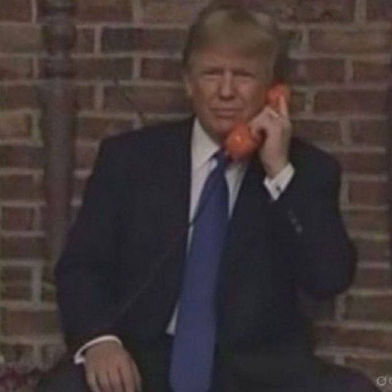

سلامتی
دوباره عملیاتمون لو رفت تو چنل های تلگرام

#professor
@KiriMohems

## SportBaadNews — post 252261

  

🗣عکس متعلق به لیونل مسی، برندهٔ 3 توپ طلا در سال 2012، در حال خرید بستنی در روساریوِ آرژانتین.
@SportBaadNews

## SportBaadNews — post 252259

با این تاج گذاری موافقید؟
@SportBaadNews

## SportBaadNews — post 252258

  <a href="telegram/content/SportBaadNews_252258_1779528750.webm" target="_blank">🎬 Download video</a>

🚨
⚽️
🇨🇩| تو کشور کنگو 177 نفر مبتلا به ویروس ابولا (دو تا ادمینمون خخخخ) شدن و آمریکا گفته فقط در یه صورت میذارم بیان جام جهانی شرکت کنن اونم اینه که 21 روز تو قرنطینه بمونن
@SportBaadNews

## SportBaadNews — post 252257

  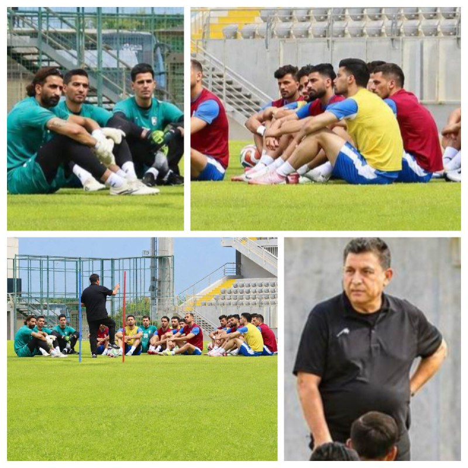

عکس تمریناتشون هم با هوش مصنوعی درست میکنن، خدایا شما دیگه کی هستید
@SportBaadNews

## SportBaadNews — post 252256

  <a href="telegram/content/SportBaadNews_252256_1779528751.webm" target="_blank">🎬 Download video</a>

🚨
⚽️ متئو مورتو: منچستر با ادرسون به توافق رسید
@SportBaadNews

## IranIntlTV — post 338549

روایت شما از زندگی در آتش‌بس- شنبه ۲ خرداد ۱۴۰۵

🔹 مردم ایران، با مذاکره ناامید نشوید. ما عهدی داریم با جاویدنام‌های این چند سال اخیر که همه جوان بودند و امیدوار. پس پرچم مبارزه آن‌ها را زمین نخواهیم گذاشت. در تاریخ، همه حکومت‌های قاتل محکوم به نابودی هستند. نه می‌بخشیم و نه فراموش می‌کنیم.
🔹 تهران، وضعیت اقتصادی وحشتناک است. همه دارن از جیب می‌خورن، اغلب تعدیل نیرو شدیم، مشاغل هنری کلاً کنسل شده، همه‌چیز ده‌ها برابر گران شده و هیچ کاری نمی‌شود کرد. خسته شدیم به خدا از این همه سگ‌دو زدن.
🔹 این یک گیگ اینترنتی که ما می‌خریم در واقع یک گیگ نیست. سه‌سوته تموم میشه. الکی اسم یک گیگ روش گذاشتن که با قیمت بالاتری بفروشنش.
🔹 شنبه ۲ خرداد ساعت ۹:۵۵ سمت کهریزک یه صدای انفجار با موجش اومد، عین زمان جنگ بود.
🔹 دو ماه از سال جدید گذشته است. چرا همچنان حقوق بازنشسته‌های تأمین اجتماعی مطابق مبلغ سال قبل واریز می‌شود؟
🔹 از تهران: من نقاشم و عمده درآمدم از پیجم بوده. از آغاز جنگ و قطع اینترنت درآمدی نداشتم و موجودی حسابم الآن ۴ هزار تومنه. آموزشگاه‌ها به خاطر شرایط جنگ بلاتکلیف هستند و مدرس استخدام نمی‌کنن. به خدا خسته شدیم دیگه.
🔹 این روزها داریم وسط کتاب تاریخ زندگی می‌کنیم؛ هر صفحه‌اش جلوی چشم‌مون نوشته می‌شود. اگر می‌خواهیم این تاریخ فردا با افتخار خوانده شود، باید کنار هم باشیم و ناامید نشویم.
🔹 امروز دوم خرداد است و هنوز نتونستن حقوق نصف بیشتر بازنشستگان تأمین اجتماعی را پرداخت کنند.

## IranIntlTV — post 338548

  

سخنگوی سازمان هواپیمایی ایران اعلام کرد این سازمان هیچ اطلاعیه رسمی هوانوردی جدیدی درباره اعمال محدودیت در آسمان کشور صادر نکرده است و شرایط پروازی عادی است.

او با تاکید بر تداوم وضعیت عادی پروازها گفت: «شرایط آسمان کشور همچنان مانند روال گذشته است و پروازها طبق برنامه انجام می‌شود.»

سخنگوی سازمان هواپیمایی بدون اشاره به جزئیات اطلاعیه هوانوردی (نوتام)، افزود: «نوتامی که اخیرا در فضای مجازی منتشر شده، تکذیب می‌شود.»

سازمان هواپیمایی کشوری ایران روز جمعه یکم خرداد در اطلاعیه‌ای اعلام کرده بود فعالیت فرودگاه‌های واقع در بخش غربی محدوده پروازی ایران، موسوم به «FIR تهران»، تا دوشنبه متوقف شده و تنها شمار محدودی از فرودگاه‌ها مجاز به فعالیت هستند.

بر اساس آن اطلاعیه، فرودگاه‌های ارومیه، کرمان، آبادان، شیراز، یزد، کرمانشاه، رشت و اهواز از این محدودیت مستثنی شده‌اند و فعالیت آنها نیز فقط از طلوع تا غروب آفتاب مجاز اعلام شده بود.
https://iranintl.com/202605236955

## IranIntlTV — post 338547

ویدیوی رسیده به ایران اینترنشنال نشان می‌دهد روز شنبه دوم خرداد تعدادی از دانش‌آموزان مدارس در خرم‌آباد برای اعتراض به بلاتکلیفی و ابهام درباره شیوه امتحانات خود و اظهارات مسئولان برای حضوری کردن امتحانات تجمع کردند. هفته گذشته نیز در شهرکرد دانش‌آموزان تجمع اعتراضی برگزار کردند.

## IranIntlTV — post 338546

  <a href="telegram/content/IranIntlTV_338546_1779528752.mp4" target="_blank">🎬 Download video</a>

همزمان با لغو امتحانات مقطع ابتدایی و غیرحضوری شدن آزمون‌های بسیاری از پایه‌های متوسطه، نگرانی‌ها درباره پیامدهای آموزش مجازی در ایران افزایش یافته است.

گفت‌وگو با منصوره حسینی‌یگانه، عضو تحریریه ایران‌اینترنشنال
@iranintltv

## IranIntlTV — post 338545

  <a href="telegram/content/IranIntlTV_338545_1779528753.mp4" target="_blank">🎬 Download video</a>

یک شهروند در پیامی به ایران اینترنشنال با اشاره به کشتار دی‌ماه از مذاکره با جمهوری اسلامی انتقاد کرده و می‌گوید مطالبه مردم در خیابان شاهزاده رضا پهلوی بوده است. پیام او با هوش مصنوعی خوانده شده است.

## IranIntlTV — post 338544

  <a href="telegram/content/IranIntlTV_338544_1779528754.mp4" target="_blank">🎬 Download video</a>

دونالد ترامپ، رییس‌جمهوری آمریکا، در شبکه اجتماعی تروث سوشال نوشت در شرایط کنونی، ترجیح می‌دهد در کاخ سفید بماند و در مراسم ازدواج پسرش حضور نخواهد داشت.

سمیرا قرایی، خبرنگار ایران‌اینترنشنال، گزارش می‌دهد
@iranintltv

## IranIntlTV — post 338543

  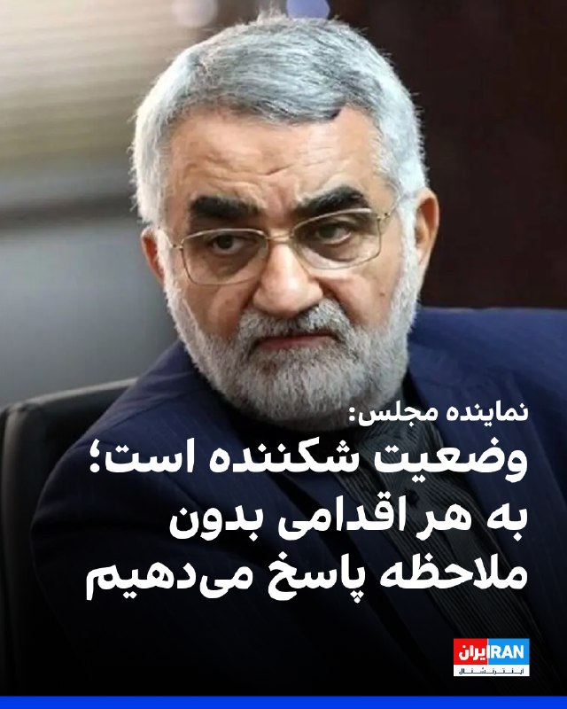

علاالدین بروجردی، عضو کمیسیون امنیت ملی و سیاست خارجی مجلس، وضعیت فعلی کشور را «شکننده» خواند و گفت در شرایط «نه جنگ و نه صلح»، همه سناریوها محتمل است و باید برای بدترین گزینه‌ها آمادگی داشت.

او تاکید کرد: «ما باید همواره برای بدترین گزینه‌ها آمادگی لازم را داشته باشیم تا دشمنان اشتباهات گذشته خود را تکرار نکنند.»

بروجردی همچنین هشدار داد جمهوری اسلامی در برابر هرگونه اقدام «ماجراجویانه» پاسخ «قاطع و بدون ملاحظه» خواهد داد.

این عضو کمیسیون امنیت ملی و سیاست خارجی مجلس با اشاره به روند مذاکرات گفت: «مذاکرات صحنه کارزار سیاسی است. در آن صحنه نیز قالیباف در حال جنگ است و به همراه وزیر امور خارجه کشور با پشتوانه مردم و نیروهای مسلح از موضوع قدرت صحبت می‌کند.»
https://iranintl.com/202605231626

## IranIntlTV — post 338542

  <a href="telegram/content/IranIntlTV_338542_1779528756.mp4" target="_blank">🎬 Download video</a>

کانال ۱۱ گزارش داد اسرائیل هرگونه توافق با جمهوری اسلامی را به خروج اورانیوم غنی‌شده از ایران و نظارت دقیق بر برنامه هسته‌ای تهران مشروط می‌داند. بر اساس این گزارش اسرائیل از احتمال تعویق مذاکرات اتمی، حتی برای چند روز، نگران است.

گزارش اشکان صفایی، خبرنگار ایران‌اینترنشنال
@iranintltv

## IranIntlTV — post 338541

  <a href="telegram/content/IranIntlTV_338541_1779528757.mp4" target="_blank">🎬 Download video</a>

یک شهروند با ارسال پیامی درباره گرانی و کمبود دارو می‌گوید مایفورتیک که از داروهای مورد نیاز در پیوند کلیه است به حدود ۱۲۰ میلیون تومان رسیده است. پیام او با هوش مصنوعی خوانده شده است.

## IranIntlTV — post 338540

حسین آقایی، عضو تحریریه ایران‌اینترنشنال، گفت: «حتی اگر دولت ترامپ ده‌ها دور دیگر مذاکره با جمهوری اسلامی برگزار کند، تهران همچنان با همان اهرم‌های محدود فشار پای میز خواهد آمد و آن‌گونه که دولت ترامپ می‌خواهد تسلیم نخواهد شد.» او افزود: «اگر آمریکا بخواهد جمهوری اسلامی را وادار به تسلیم کند، باید کارت‌های بازی‌اش را بگیرد.» آقایی تاکید کرد: «گرفتن این اهرم‌ها از طریق حملات نظامی ممکن است، نه دادن زمان بیشتر به جمهوری اسلامی.»
@iranintltv

## IranIntlTV — post 338539

  <a href="telegram/content/IranIntlTV_338539_1779528759.mp4" target="_blank">🎬 Download video</a>

جاویدنامان انقلاب ملی ایرانیان
«پریماه نیک‌پرور» ۱۸ ساله، در اعتراضات ۱۸ دی‌ماه در بندرعباس مورد اصابت گلوله نیروهای سرکوب جمهوری اسلامی قرار گرفت و بعد از سوار شدن به آمبولانس به دلیل عدم رسیدگی به موقع و خون‌ریزی شدید کشته شد. نامش در حافظه‌ این سرزمین می‌ماند و یادش چراغ راه آزادی‌خواهان است.
@iranintltv

---
📅 بروزرسانی: 1405/03/02 11:26
---

## KiriMohems — post 47912

🔴ساعت ۲۴ امروز آخرین مهلت ثبت‌نام‌ تو کنکو ر کصشعر‌ ۱۴۰۵

مهلت ثبت‌نام‌ در آزمون‌ سراسری‌ ‌و همچنین آزمون اختصاصی پذیرش دانشجو – معلم در دانشگاه‌های فرهنگیان و تربیت‌دبیر شهید رجائی سال‌ ۱۴۰۵ امروز ته میگیره و بپا که ته تون رو نماله

#Helsinki
@KiriMohems

## KiriMohems — post 47911

🔴وسط این همه بگایی و تهدید های جنگ ، بازار بورس امریکا هم برای ۹۰ ساعت بسته شد

#Helsinki
@KiriMohems

## KiriMohems — post 47910

  <a href="telegram/content/KiriMohems_47910_1779523002.mp4" target="_blank">🎬 Download video</a>

🔴دن اسکاوینو، دستیار ارشد ترامپ، یه ویدئو از بمب‌افکن‌های B-2 رو بدون هیچ توضیحی توی توییتر پین کرده. ایشون پیش‌تر و یک‌روز قبل از جنگ ۴۰ روزه هم به همین شکل ویدئویی از جنگنده‌های آمریکایی منتشر کرده بود!

#professor
@KiriMohems

## KiriMohems — post 47909

🔴قضیه ناموسی شد

محمدباقر السعدی کون موجی فرمانده ارشد گردان‌های حزب‌الله عراق، قصد داشت به ایوانکا ترامپ، دختر رئیس‌جمهور آمریکا برای انتقام ترور قاسم سلیمانی حمله کند.

او نقشه خانه ایوانکا در فلوریدا را در اختیار داشت. السعدی اخیراً در ترکیه بازداشت شده و در آمریکا علیه او کیفرخواست صادر شده است

#professor
@KiriMohems

## KiriMohems — post 47908

🔴آزمون‌های های تخمی پایان نیمسال دوم سال تحصیلی ۱۴۰۴_۱۴۰۵ دانشگاه پیام‌نور از روز شنبه ۱۶ خرداد به صورت مجازی برگزار میشه

#Helsinki
@KiriMohems

## KiriMohems — post 47907

🔴خب بکیرمان

بازار بورس آمریکا برای 90 ساعت آینده بسته شد

#professor
@KiriMohems

## KiriMohems — post 47906

  <a href="telegram/content/KiriMohems_47906_1779523003.mp4" target="_blank">🎬 Download video</a>

ترامپ به هیترش
“برو خونه پیش مامانت!”

#professor
@KiriMohems

## KiriMohems — post 47905

  <a href="telegram/content/KiriMohems_47905_1779523004.mp4" target="_blank">🎬 Download video</a>

🔴 ترامپ: ما اینقدر نفت از ونزوئلا استخراج کرده‌ایم که هزینه جنگ را حدود ۲۵ برابر پرداخت کرده‌ایم.

@KiriMohems

## KiriMohems — post 47904

  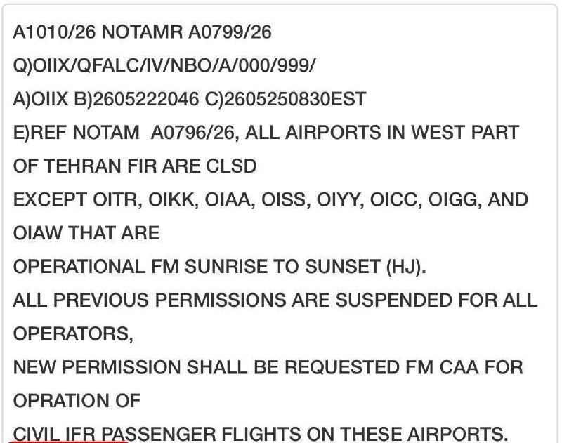

ایران با صدور اطلاعیه‌ای، پرواز در بخش غربی حریم هوایی خود را تا صبح دوشنبه ممنوع اعلام کرد

#professor
@KiriMohems

## KiriMohems — post 47903

#صبحانه_عن_گیزشی

و روزی فرا برسد
که من برای تو
بنویسم :
شادمانی قمبل کرد و غم کیر شد
موفقیت هایی برای تو آرزو میکنم
تا یک امت و جماعت را
انگشت به کون نگه داری

#Helsinki
@KiriMohems

## SportBaadNews — post 252255

  <a href="telegram/content/SportBaadNews_252255_1779523007.webm" target="_blank">🎬 Download video</a>

🚨 خبر هایی منتشر شده که میگن آمریکا ویزای مهدی طارمی، احسان حاج‌صفی و شجاع خلیل‌زاده رو بدلیل گذراندن سربازی در سپاه صادر نمیکنه
@SportBaadNews

## SportBaadNews — post 252254

حالا نمیدونم طواف درست بود یا تواف
دیگه خودتون منظور رو بگیرید

## SportBaadNews — post 252252

رونالدو برداشته پست بنزما درحال تواف تو مکه رو ری‌پست کرده
@SportBaadNews

## SportBaadNews — post 252246

استر اکسپوزیتو بعد از اینکه روی فرش قرمز کن حسابی درخشید، با یه کادوی فوق‌العاده که انگار کیلیان امباپه بهش داده، همه رو غافلگیر کرده داستان درباره یه گردنبند لوکس و انحصاری از جواهرات عالی با الماسیه که 1.2 میلیون دلار، یعنی نزدیک به 220 میلیارد تومن ما…

## SportBaadNews — post 252243

استر اکسپوزیتو بعد از اینکه روی فرش قرمز کن حسابی درخشید، با یه کادوی فوق‌العاده که انگار کیلیان امباپه بهش داده، همه رو غافلگیر کرده

داستان درباره یه گردنبند لوکس و انحصاری از جواهرات عالی با الماسیه که 1.2 میلیون دلار، یعنی نزدیک به 220 میلیارد تومن ما ارزش داره!
@SportBaadNews

## SportBaadNews — post 252242

  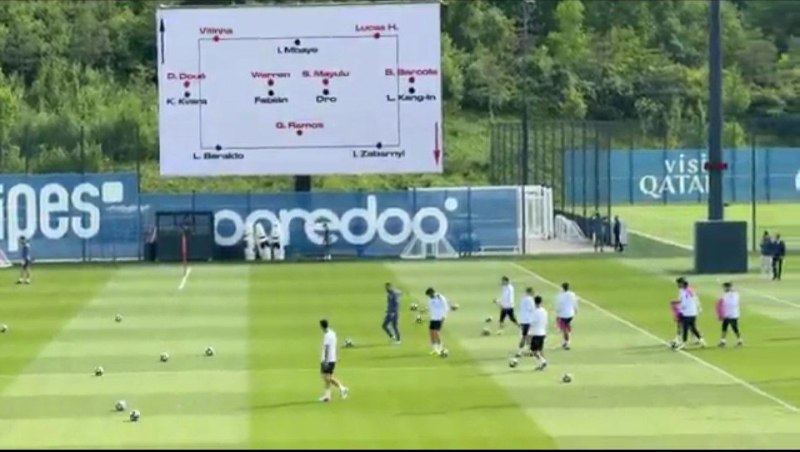

⚽️
⚽️| در نزدیکی فینالِ لیگ قهرمانان اروپا، لوئیز انریکه به این شکل با استفاده از یه صفحه نمایش بزرگ تاکتیک‌ هاش رو به بازیکناش القا میکنه
@SportBaadNews

## IranIntlTV — post 338538

  

اولیویا والز، سخنگوی کاخ سفید، با اشاره به حملات آمریکا و اسرائیل علیه جمهوری اسلامی گفت ایالات متحده «به تمام اهداف نظامی خود در «عملیات خشم حماسی» دست یافته یا از آنها پیشی گرفته است.»

او افزود: «ترامپ همه کارت‌ها را در دست دارد و عاقلانه همه گزینه‌ها را روی میز نگه می‌دارد.»
https://iranintl.com/202605235460

## IranIntlTV — post 338537

  

مشاهدات و تجربه شما از مشکلات حوزه نان، گرانی، کمبود یا شلوغی صفوف نانوایی چیست؟

روی لینک زیر کلیک کنید و پیام‌های خود را از طریق مدیا‌بات برای ما بفرستید.

https://t.me/intlmedia_bot

پیام‌های شما به صورت زیر‌نویس در تلویزیون و همچنین در بخش‌های مختلف‌ خبری منتشر خواهد شد

## IranIntlTV — post 338536

  <a href="telegram/content/IranIntlTV_338536_1779523009.mp4" target="_blank">🎬 Download video</a>

ایرانیان ساکن استرالیا روز شنبه دوم خرداد در بریزبن تجمع کرده و در حمایت از انقلاب ملی و جاویدنامان آن شعار دادند. یکی از سخنرانان این تجمع مبارزه ایرانیان با جمهوری اسلامی را نجات تمدن انسانی خواند.

## IranIntlTV — post 338535

  <a href="https://t.me/IranintlTV/338535" target="_blank">📎 Download file</a>

🎧نسخه صوتی اخبار بامدادی | شنبه ۲ خرداد
@iranintlTV

## IranIntlTV — post 338534

  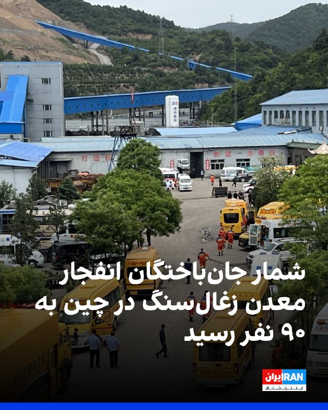

رسانه دولتی سی‌سی‌تی‌وی گزارش داد شمار جان‌باختگان انفجار گاز در یک معدن زغال‌سنگ در استان شانشی در شمال چین به ۹۰ نفر رسیده است. عملیات جست‌وجو و نجات همچنان ادامه دارد و علت حادثه در دست بررسی است. به گفته مقام‌های محلی، تلاش‌ها برای یافتن احتمالی مفقودان ادامه دارد.

چین از اوایل دهه ۲۰۰۰ با اجرای مقررات سخت‌گیرانه‌تر و ارتقای استانداردهای ایمنی، تلفات معادن زغال‌سنگ را که اغلب بر اثر انفجار گاز یا سیلاب رخ می‌داد، کاهش داده است. با این حال، حادثه لیوشنیو از مرگبارترین حوادث معدنی گزارش‌شده در این کشور در دهه گذشته به شمار می‌رود.

خبرگزاری شینهوا اعلام کرد مدیران شرکت مسئول این معدن بازداشت شده‌اند.
https://iranintl.com/202605238441

## IranIntlTV — post 338533

  <a href="telegram/content/IranIntlTV_338533_1779523012.mp4" target="_blank">🎬 Download video</a>

علی شیرازی، عضو تحریریه ایران‌اینترنشنال، گفت جمهوری اسلامی در حال حاضر دو ابزار برای مقابله در اختیار دارد؛ تنگه هرمز و اورانیوم غنی‌شده‌ای که در اختیارش است. او افزود: «اگر جمهوری اسلامی این دو اهرم را از دست بدهد، عملا همان تسلیم بی‌قید و شرطی رخ خواهد داد که دونالد ترامپ از آن سخن گفته بود.»
@iranintltv

## IranIntlTV — post 338532

  <a href="telegram/content/IranIntlTV_338532_1779523013.mp4" target="_blank">🎬 Download video</a>

یک شهروند با ارسال پیامی به ایران اینترنشنال از افزایش قیمت‌ها و لغو شدن مشاغل هنری خبر می‌دهد. پیام او با هوش مصنوعی خوانده شده است.

## IranIntlTV — post 338531

  <a href="telegram/content/IranIntlTV_338531_1779523015.mp4" target="_blank">🎬 Download video</a>

یک شهروند با ارسال پیامی به ایران‌اینترنشنال می‌گوید در این شرایط سخت معیشتی، پیامک زده‌اند و فرزندآوری را تشویق می‌کنند.
پیام این شهروند با هوش مصنوعی بازخوانی شده است.

## IranIntlTV — post 338530

  

رضا طلایی‌نیک، سخنگوی وزارت دفاع جمهوری اسلامی، گفت دونالد ترامپ، رییس‌جمهوری آمریکا «هیچ چاره‌ای» جز پذیرفتن مطالبات تهران و به رسمیت شناختن «حقوق» جمهوری اسلامی ندارد.

طلایی‌نیک گفت «تمکین نکردن» آمریکا به مطالبات جمهوری اسلامی، به «تحمیل» هزینه‌های بیشتر و «شکست‌های پیاپی» بعدی برای دونالد ترامپ و اسرائیل منجر خواهد شد.

او افزود ترامپ باید ضمن پذیرش پیشنهادهای جمهوری اسلامی، به فکر جلوگیری از «خسارت‌ها و هزینه‌های بیشتر» ادامه جنگ برای مردم آمریکا و جامعه جهانی باشد.

سخنگوی وزارت دفاع جمهوری اسلامی همچنین گفت «بی‌توجهی» ترامپ به منافع ملی آمریکا، «تبعیت از اسرائیل» و رفتارهای «مغرورانه» او، باعث فرو رفتن بیشتر آمریکا در «باتلاق» جنگ خواهد شد.
https://iranintl.com/202605234414

## IranIntlTV — post 338529

  

🔻امیرمهدی علوی، سخنگوی فدراسیون فوتبال، امشب در یک برنامه تلویزیونی مدعی شد که با هماهنگی فیفا سفر تیم ملی فوتبال به آمریکا با پرواز اختصاصی «ایران‌ایر» نهایی شده است: «نشستن هواپیمای اختصاصی ایران‌ایر در محل برگزاری جام جهانی نهایی شده است.»

🔹این در حالی است که ایران‌ایر سال‌هاست از سوی ایالات متحده تحریم شده و هیچ هواپیما یا پروازی متعلق به این شرکت امکان پرواز به آمریکا را ندارد.

🔹ایران‌ایر همچنین از سوی بسیاری از کشورهای اروپایی محروم شده و فدراسیون فوتبال برای سفرهای اروپایی نیز ناچار به استفاده از پروازهای خارجی است.

🔹با این حال، به نظر می‌رسد تلاش مهدی تاج و فدراسیون فوتبال برای استفاده از پرواز ایرانی بیشتر در سفر به آمریکا به مشکلات مالی فدراسیون مرتبط باشد؛ طبق برخی برآوردها، تنها پرواز کاروان تیم ملی به آمریکا بیش از نیم‌میلیون دلار هزینه خواهد داشت.

@iranintltvsport

## IranIntlTV — post 338528

  

🔻مهدی محمدنبی، سرپرست تیم ملی فوتبال، در حاشیه تمرین تیم ملی در پاسخ به یک رسانه بریتانیایی درباره شعار «مرگ بر آمریکا» هواداران حکومت در تجمعات شبانه و همزمان با حضور تیم در این تجمع گفت: «بدرقه بی‌نظیری بود؛ سابقه ندارد برای هیچ تیم ملی مردم جمع شوند و این بدرقه را انجام دهند.»

🔹اعضای تیم ملی فوتبال هفته گذشته، در حالی که هیچ‌کدام ویزای آمریکا را برای شرکت در جام جهانی ۲۰۲۶ نداشتند، در یک مراسم شبانه حکومتی حاضر شدند و پس از آن به ترکیه رفتند تا اردوی آماده‌سازی پیش از مسابقات را برگزار کنند.

🔹سرپرست تیم ملی روز جمعه در گفت‌وگو با آی‌تی‌وی درباره ویزای اعضای تیم ملی گفت: «مطمئنیم که ویزاها صادر می‌شود. در جلساتی که با فیفا داشتیم، این اطمینان را به ما دادند که با توجه به تضمین‌هایی که کشور میزبان برای این مسابقات داده، قطعا ویزای تیم را پس از طی شدن فرایند اداری صادر خواهد کرد.»

🔹تیم ملی روز پنجشنبه برای دریافت ویزا به سفارت‌های آمریکا و کانادا در آنکارا مراجعه کرد.

@iranintltvsport

## IranIntlTV — post 338527

  <a href="telegram/content/IranIntlTV_338527_1779523018.mp4" target="_blank">🎬 Download video</a>

نیویورک‌پست گزارش داد یک شهروند عراقی، از فرماندهان کتائب حزب‌الله عراق، گروه‌ تحت حمایت جمهوری اسلامی، قصد داشت ایوانکا ترامپ، دختر رییس‌جمهوری ایالات متحده، را ترور کند.

گفت‌وگو با امید معماریان، تحلیل‌گر سیاسی در موسسه دان
@iranintltv

## IranIntlTV — post 338526

  <a href="telegram/content/IranIntlTV_338526_1779523020.mp4" target="_blank">🎬 Download video</a>

یک شهروند با ارسال پیام به ایران‌اینترنشنال می‌گوید: «من تمام کار و زندگی‌ام موسیقی است، اما از شروع جنگ تا الان بیشتر کنسرت‌ها و فعالیت‌های مرتبط با آن تعطیل شده. برای آموزش هم کسی مراجعه نمی‌کند و در این چند ماه هیچ درآمدی نداشتم.»

## IranIntlTV — post 338525

  <a href="telegram/content/IranIntlTV_338525_1779523021.mp4" target="_blank">🎬 Download video</a>

جو ویلسون، عضو جمهوری‌خواه مجلس نمایندگان آمریکا، گفت حزب حاکم گرجستان با در اختیار گذاشتن حریم هوایی خود برای پروازهای ترابری راهبردی روسیه، مسیر انتقال تجهیزات نظامی به ایران را هموار کرده است. او افزود این اقدام به معنای «کمک مستقیم به تهران» در جنگ است.

گفت‌وگو با روح‌الله رحیم‌پور، روزنامه‌نگار و تحلیل‌گر سیاسی
@iranintltv

## IranIntlTV — post 338524

  <a href="telegram/content/IranIntlTV_338524_1779523023.mp4" target="_blank">🎬 Download video</a>

یک دریاچه نمکی در عربستان سعودی پس از بارش‌های بهاری بار دیگر پرآب شده و اکنون به یکی از پربازدیدترین مناظر طبیعی این کشور تبدیل شده است.

گزارش فرزیا ثابتی، خبرنگار ایران‌اینترنشنال
@iranintltv

## IranIntlTV — post 338523

  <a href="telegram/content/IranIntlTV_338523_1779523025.mp4" target="_blank">🎬 Download video</a>

دیوان بین‌المللی دادگستری در یک رای مشورتی تایید کرد حق اعتصاب کارگران تحت پوشش و حمایت مقاوله‌نامه شماره ۸۷ سازمان بین‌المللی کار درباره آزادی انجمن و حمایت از حق تشکل‌یابی قرار دارد.
روزبه بوالهری، عضو تحریریه ایران‌اینترنشنال، گفت این رای می‌تواند شرایطی فراهم کند تا تشکل‌های کارگری حامی کارگران ایران، از طریق نهادهای بین‌المللی، جمهوری اسلامی را درباره حق تشکل‌یابی کارگران تحت فشار قرار دهند و علیه آن شکایت کنند.
@iranintltv

## IranIntlTV — post 338522

  <a href="telegram/content/IranIntlTV_338522_1779523027.mp4" target="_blank">🎬 Download video</a>

محمد قائدی، مدرس روابط بین‌الملل، گفت در صورت ازسرگیری حملات آمریکا، این بار بسیار گسترده‌تر و جدی‌تر خواهد بود و نقاطی در تنگه هرمز نیز هدف قرار خواهند گرفت. او درباره اهداف احتمالی اسرائیل در ایران نیز گفت زیرساخت‌هایی مانند صنایع پتروشیمی و چاه‌های نفتی می‌توانند در فهرست اهداف این کشور باشند.
@iranintltv

## IranIntlTV — post 338521

  <a href="telegram/content/IranIntlTV_338521_1779523028.mp4" target="_blank">🎬 Download video</a>

حکم دادگاه تجدیدنظر، کنگره سال ۲۰۲۳ حزب جمهوری‌خواه خلق، بزرگ‌ترین حزب مخالف دولت در ترکیه را باطل و اوزگور اوزل، رهبر این حزب را از سمتش برکنار کرد.
@iranintltv

## Persian_Trend_Official — post 14721

  

❗️ یک فروند بالگرد MH-60S متعلق به نیروی دریایی آمریکا با کال‌ساین «RESCU11» در آسمان خلیج عمان رصد شد.
برخی منابع احتمال می‌دهند این پرواز در ارتباط با یک مأموریت جستجو و نجات انجام شده باشد.
گفته می‌شود این بالگرد از یکی از ناوهای جنگی مستقر در دریای عمان به پرواز درآمده است.

👩‍💻@PhantomDirective

🆔@persian_trend_official
پرشین ترند | متفاوت‌ترین کانال نظامی

## Persian_Trend_Official — post 14720

  <a href="telegram/content/Persian_Trend_Official_14720_1779523030.webm" target="_blank">🎬 Download video</a>

🔸 دولت سنگال منحل شد.

🔹رئیس جمهور سنگال در شرایط پرتنش این کشور و در پی بالا گرفتن اختلافات با دولت، نخست وزیر متحد و حامی سابق خود را برکنار و دولت را منحل کرد.

👩‍💻@PhantomDirective

🆔@persian_trend_official
پرشین ترند | متفاوت‌ترین کانال نظامی

## Persian_Trend_Official — post 14719

  <a href="telegram/content/Persian_Trend_Official_14719_1779523030.mp4" target="_blank">🎬 Download video</a>

سرتیپ نامی: ناتوی اسلامی باید به محوریت ایران تشکیل شود.

از حدود ۵۷ کشور اسلامی، بیشترین ظرفیت اقتصادی و جغرافیایی جهان به‌دست می‌آید که قدرت‌آفرین است.

🔹در صورت تحقق این اتحاد، هیچ قدرتی نمی‌تواند به جهان اسلام زور بگوید؛ نمونۀ آن فلسطین است که تاکنون ۷۳ هزار شهید تقدیم کرده است.

👩‍💻@PhantomDirective

🆔@persian_trend_official
پرشین ترند | متفاوت‌ترین کانال نظامی

## Persian_Trend_Official — post 14718

  

🔻نایب رئیس کمیسیون فرهنگی مجلس ایران می‌گوید که «مسئولان به این نتیجه رسیده‌اند که وصل کردن اینترنت به صلاح همه نیست و اینترنت بین‌المللی در حال حاضر بازگشایی نخواهد شد.»

علی یزدی‌خواه با اشاره به این که قطع اینترنت از دستورات و اختیارات شورای عالی امنیت ملی است، گفت که «به لحاظ مسائل امنیتی، امنیت کشور»، اینترنت جهانی قطع شده است.

او گفت که با وجود قطع اینترنت، «کسب‌وکارها از طریق ارتباطات بانکی، خرید و فروش و سایر خدمات آنلاین همچنان فعال هستند و مردم با مشکل عمده‌ای مواجه نیستند.»

به گفته این نماینده مجلس برخی افرادی که از نظر مسئولان نیاز به دسترسی به اینترنت بین‌الملل داشتند، این امکان به‌صورت محدود برای آن‌ها فراهم شده است.

آقای یزدی خواه افزوده «تقریبا بیش از ۹۰ درصد نیازها و احتیاجات مردم در فضای فعلی برآورده می‌شود و اگر اقشاری هستند که دچار مشکل‌ هستند، قابلیت پیگیری وجود دارد.»

این در حالی است که کارشناسان اقتصادی نسبت به خسارات وارد شده به کسب و کارها در نتیجه قطع اینترنت هشدار داده‌اند.

👩‍💻@PhantomDirective

🆔@persian_trend_official
پرشین ترند | متفاوت‌ترین کانال نظامی

## Persian_Trend_Official — post 14716

  <a href="telegram/content/Persian_Trend_Official_14716_1779523032.mp4" target="_blank">🎬 Download video</a>

دن اسکاوینو معاون رئیس دفتر کاخ سفید و دستیار ترامپ،ویدیویی از بمب‌افکن‌های مخفی‌کار B-2 را بدون هیچ زمینه‌ای منتشر کرد،

فکت مهم:
آخرین باری که او این پست را منتشر کرد،
چند ساعت بعد آمریکا و اسرائیل به ایران حمله کردند.

👩‍💻@PhantomDirective

🆔@persian_trend_official
پرشین ترند | متفاوت‌ترین کانال نظامی

---
📅 بروزرسانی: 1405/03/02 09:02
---

## ChizBergerz — post 46688

  <a href="telegram/content/ChizBergerz_46688_1779514328.mp4" target="_blank">🎬 Download video</a>

قانون اول برای عضویت تو بسیج:

@ChizBergerz

## ChizBergerz — post 46687

  <a href="telegram/content/ChizBergerz_46687_1779514329.webm" target="_blank">🎬 Download video</a>

💩 
⚠️ دیگه #فریب بونوس های الکی سایت های سودجو رو نخورید
❌

💲بیا توی سایت مورد تایید ما یعنی #وینرو و با عضویت 500 هزار تومان اعتبار بی قیدو شرط بگیر
👏

🤩با عضویت 
🤩 
🤩 
🤩 هزار تومان اعتبار رایگان بگیر!

⌛ پشتیبانی 24 ساعته

🌐 Winro.io

🌐 Winro.io
کانال بونوس های رایگان a1

📱 @winro_io

## rodast_omiddana — post 71803

  <a href="telegram/content/rodast_omiddana_71803_1779514329.webm" target="_blank">🎬 Download video</a>

🚨 شاید چند ساعت دیگه بزنه

## IranIntlTV — post 338520

  <a href="telegram/content/IranIntlTV_338520_1779514329.mp4" target="_blank">🎬 Download video</a>

سرخط خبرهای شنبه ۲ خرداد
@iranintltv

## IranIntlTV — post 338519

  

عراقچی و عاصم منیر، فرمانده ارتش پاکستان، در دیداری در تهران درباره آخرین تلاش‌های دیپلماتیک برای پایان جنگ ایران و مسائل امنیتی غرب آسیا گفت‌وگو کردند. منیر جمعه در چارچوب تلاش‌ها برای دستیابی به توافقی میان جمهوری اسلامی و آمریکا وارد تهران شد.
https://iranintl.com/202605235118

## IranIntlTV — post 338518

  

شاهزاده رضا پهلوی در پیامی در ایکس با اشاره به دیدارش با دریک ون اوردن، عضو جمهوری‌خواه مجلس نمایندگان آمریکا، در کنگره، بر عزم خود برای ادامه رایزنی‌هایش در کنگره آمریکا درباره «طرح ایران آزاد» تاکید کرد.
شاهزاده پهلوی تاکید کرد «طرح ایران آزاد» می‌تواند پیامدهای مثبتی برای آمریکا و جهان داشته باشد.
او با انتشار تصاویری از دیدار خود با دریک ون اوردن گفت این قانون‌گذار آمریکایی از نزدیک با «رفتارهای جمهوری اسلامی علیه ایرانیان و آمریکایی‌ها» آشناست.

https://iranintl.com/202605235387

## IranIntlTV — post 338517

  

حسن حسن‌زاده، فرمانده سپاه «محمد رسول‌الله» تهران بزرگ، از نهادهای اصلی مسئول سرکوب اعتراضات در پایتخت، در یک مصاحبه تلویزیونی گفت: «اگر احیانا دشمن اشتباه کند، نیروهای مسلح سخت‌تر از گذشته، دردناک‌تر از گذشته و سهمگین‌تر از گذشته پاسخ سخت و پشیمان‌کننده و تمام‌کننده می‌دهند.»
https://iranintl.com/202605235001

## Persian_Trend_Official — post 14715

بولتن خبری۲۴ ساعت گذشته
آرشیو تحریریه پرشین ترند.

۲ خرداد ۱۴۰۵

🇮🇷ایران

◾️ فرمانده ارتش پاکستان، ژنرال عاصم منیر، وارد تهران شد و با عراقچی وزیر خارجه ایران تا پاسی از شب دیدار و گفتگو کرد

◾️ وزیر کشور پاکستان نیز برای سومین روز متوالی در تهران حضور داشت و پیش از ورود فرمانده ارتش، پایتخت را ترک کرد

◾️ سخنگوی وزارت خارجه: تمرکز مذاکرات بر خاتمه جنگ در همه جبهه‌هاست؛ مباحث هسته‌ای در این مرحله مورد بحث نیست

◾️ سخنگوی وزارت خارجه: اختلاف‌نظرها بین ایران و آمریکا آن‌قدر عمیق است که نمی‌توان گفت ظرف چند هفته باید به نتیجه رسید

◾️ سخنگوی هیئت مذاکره‌کننده: میانجی اصلی مذاکرات پاکستان است؛ هیئت قطری نیز برای رایزنی به تهران آمد و سپس پایتخت را ترک کرد

◾️ منبع نزدیک به تیم مذاکره‌کننده: پیشرفت‌هایی در برخی موضوعات حاصل شده اما تا جمع‌بندی همه موضوعات توافقی رخ نخواهد داد

◾️ ایران پیشنهاد جدید آمریکا را دریافت کرده و در حال بررسی آن است؛ ایران تأکید کرد چندین دور ارتباط بر اساس چارچوب ۱۴ ماده‌ای ایران انجام شده

◾️ ایران بخشی از حریم هوایی غرب کشور را برای پروازهای شبانه تا روز دوشنبه بست

◾️ نیروی دریایی سپاه: ۳۵ فروند کشتی تجاری در شبانه‌روز گذشته با هماهنگی و مجوز سپاه از تنگه هرمز عبور کردند

◾️ اختلالات گسترده GPS در تنگه هرمز، سواحل جنوبی ایران، امارات، قطر و کویت گزارش شده است

◾️ نیروهای مسلح جمهوری اسلامی در بالاترین سطح آماده‌باش قرار گرفته‌اند؛ فعالیت بالای جنگنده‌ها بر فراز کردستان عراق و غرب ایران ثبت شده

◾️ حمید رسایی مدعی شد مجلس توسط دبیر شورای امنیت ملی عملاً پلمب شده و جلسات صحن علنی برگزار نمی‌شود

🇮🇱 اسرائیل و خاورمیانه

◾️ العربیه: توافق احتمالی ایران و آمریکا «بیانیه اسلام‌آباد» نامگذاری خواهد شد و شامل آغاز مذاکرات درباره مسائل حل‌نشده ظرف ۷ روز و لغو تدریجی تحریم‌ها خواهد بود

◾️ بلومبرگ: امارات، عربستان و قطر از ترامپ خواسته‌اند به جای اقدام نظامی، به دیپلماسی با ایران فرصت دهد

◾️ امارات ظرفیت خط لوله انتقال نفت به بندر فجیره برای دور زدن تنگه هرمز را تا ۲۰۲۷ دو برابر می‌کند

◾️ مدیر اجرایی آژانس بین‌المللی انرژی هشدار داد بازار نفت تا تابستان با کاهش ذخایر وارد «منطقه قرمز» می‌شود؛ قیمت نفت برنت در حال حاضر حدود ۱۰۷ دلار در هر بشکه معامله می‌شود

◾️ FBI رهبر حزب‌الله عراق، محمدباقر السعدی، را به اتهام هماهنگی حداقل ۲۰ حمله تروریستی در اروپا و کانادا بازداشت کرد

◾️ اسرائیل از تلاش‌های ترامپ برای امضای توافق با ایران خشمگین است؛ تماس تلفنی «دراماتیک» میان ترامپ و نتانیاهو گزارش شده

◾️ تحلیلگران از احتمال بستن تنگه باب‌المندب توسط انصارالله و حملات به زیرساخت‌های انرژی عربستان در صورت بازگشت جنگ هشدار دادند

◾️ گزارش‌هایی از وقوع انفجار در ابوظبی منتشر شد؛ جزئیات تأیید نشده است

🇺🇸
🗺آمریکا و جهان

◾️ ترامپ: مذاکرات در «مراحل نهایی» است اما اگر توافق نشود «اوضاع می‌تواند کمی ناخوشایند شود»؛ آمریکا حاضر است چند روز بیشتر منتظر «پاسخ‌های درست» از تهران بماند

◾️ روبیو: پیشرفت‌هایی در مذاکرات با ایران حاصل شده؛ موضوع غنی‌سازی اورانیوم و تنگه هرمز همچنان محل اختلاف است

◾️ آکسیوس: ترامپ با مشاوران ارشد امنیت ملی برای بررسی احتمال حملات نظامی جدید علیه ایران دیدار کرده؛ تصمیم نهایی اتخاذ نشده؛ ترامپ اواخر هفته گذشته یک حمله برنامه‌ریزی‌شده را پس از درخواست قطر، عربستان و امارات متوقف کرد

◾️ سی بی اس: چندین عضو ارتش و جامعه اطلاعاتی آمریکا تعطیلات Memorial Da. را لغو کرده‌اند

◾️ وال‌استریت ژورنال: واسطه‌ها در تلاش برای یک توافق موقت هستند؛ هدف تمدید آتش‌بس و ادامه مذاکرات گسترده‌تر است؛ در صورت شکست مذاکرات آمریکا و اسرائیل احتمالاً زیرساخت‌های انرژی ایران را هدف قرار می‌دهند

◾️ سی‌ان‌ان: آمریکا پیشنهاد اقتصادی بزرگی شامل لغو تمام تحریم‌ها و طرح بازسازی اقتصادی به ایران ارائه داده؛ مسائل دشوار به مذاکرات بعدی موکول می‌شود

◾️ گاردین: پاکستان در تلاش است چین را به عنوان ضامن هرگونه توافق وارد کند؛ نخست‌وزیر شریف راهی پکن می‌شود

◾️ تولسی گابارد، مدیر اطلاعات ملی آمریکا که از مخالفان جنگ با ایران بود، استعفای خود را از ۳۰ ژوئن اعلام کرد

◾️ بلومبرگ: ایران بیش از ۲۴ پهپاد MQ-9 آمریکا به ارزش نزدیک به یک میلیارد دلار را از ابتدای جنگ منهدم کرده؛ این رقم حدود ۲۰ درصد از موجودی پیش از جنگ پنتاگون است

◾️ ناتو: دبیرکل مارک روته اعلام کرد ناتو می‌تواند به آمریکا در بازگشایی تنگه هرمز کمک کند.

👩‍💻@PhantomDirective

🆔 @persian_trend_official
پرشین ترند | متفاوت‌ترین کانال نظامی

## Persian_Trend_Official — post 14714

🔴مدیرکل فرودگاه‌های خوزستان: پروازهای فرودگاه‌های اهواز و ماهشهر از سر گرفته شد

🔹اولین پرواز مسیر تهران به اهواز، امروز در فرودگاه اهواز به زمین نشست. برنامۀ پروازی به‌تدریج افزایش خواهد یافت.

🫆:Tony

📌 @persian_trend_official
پرشین ترند | متفاوت‌ترین کانال نظامی

## Persian_Trend_Official — post 14713

  

🔴دیدار و گفتگوی فرمانده ارتش پاکستان با عراقچی در تهران

💢فیلد مارشال عاصم منیر که به‌منظور رایزنی و تبادل نظر با مقام‌های جمهوری اسلامی به تهران سفر کرده است، روز گذشته با عراقچی دیدار و گفتگو کرد.

💢در این دیدار که تا پاسی از شب ادامه داشت، طرفین درباره آخرین تلاش‌ها و ابتکارات دیپلماتیک برای جلوگیری از تشدید تنش و خاتمه جنگ آمریکا و اسرائیل علیه جمهوری اسلامی و همچنین راهکارهای تقویت صلح، ثبات و امنیت در منطقه غرب آسیا تبادل نظر کردند.
🫆:Tony

📌 @persian_trend_official
پرشین ترند | متفاوت‌ترین کانال نظامی

## Persian_Trend_Official — post 14712

  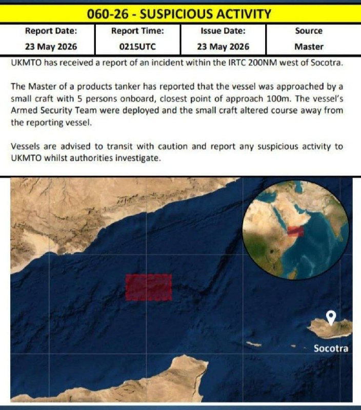

💢وقوع حادثه برای یک نفتکش نزدیک یمن

💢سازمان عملیات دریایی انگلیس امروز از دریافت گزارش‌هایی درباره حادثه امنیتی برای یک فروند نفتکش در آب‌های نزدیک جزیره «سقطری» خبر داد.

💢ناخدا یک نفتکش گزارش داده که کشتی توسط یک قایق کوچک حامل ۵ نفر در فاصله ۲۰۰ مایل دریایی غرب سوکوترا مورد قرار گرفته است. نزدیک‌ترین فاصله ۱۰۰ متر بوده.

💢تیم امنیت مسلح کشتی مستقر شد و قایق کوچک مسیر خود را تغییر داد و دور شد.

🫆:Tony

📌 @persian_trend_official
پرشین ترند | متفاوت‌ترین کانال نظامی

## Persian_Trend_Official — post 14711

  <a href="telegram/content/Persian_Trend_Official_14711_1779514334.webm" target="_blank">🎬 Download video</a>

تولسی گابارد رئیس اطلاعات ملی ايالات متحده آمریکا که دیروز استعفا داد. 📌 @persian_trend_official پرشین ترند | متفاوت‌ترین کانال نظامی

## Persian_Trend_Official — post 14710

  

تولسی گابارد رئیس اطلاعات ملی ايالات متحده آمریکا که دیروز استعفا داد.

📌 @persian_trend_official
پرشین ترند | متفاوت‌ترین کانال نظامی

## Persian_Trend_Official — post 14709

  

نسخه اسپاتیفای لایو دیشب :
https://open.spotify.com/episode/70QUNKnopM1uSLbBaXBi39?si=HwP7TUp5R22jaAYdynjUtw

## Persian_Trend_Official — post 14707

  <a href="telegram/content/Persian_Trend_Official_14707_1779514336.mp4" target="_blank">🎬 Download video</a>

🤑
🚀 انفجار مگاروکت اسپیس‌ایکس هنگام فرود
❌

دلیل اینکه این انفجارها زیاد دیده می‌شوند این است که اسپیس‌ایکس برخلاف روش سنتی ناسا، موشک‌ها را سریع آزمایش می‌کند، حتی اگر احتمال شکست بالا باشد؛ چون هدفش این است که با هر انفجار، داده جمع کند و طراحی را بهتر کند.

👩‍💻:@PhantomDirective

🆔:@persian_trend_official
پرشین ترند | متفاوت‌ترین کانال نظامی

## Persian_Trend_Official — post 14706

  

🔴نیویورک پست

♦️تبعه عراقی آموزش‌دیده سپاه می‌خواست ایوانکا ترامپ را به تلافی کشته‌شدن قاسم سلیمانی ترور کند

💢روزنامه «نیویورک‌پست» به نقل از منابع آگاه افشا کرد که ایوانکا ترامپ، دختر ۴۴ ساله دونالد ترامپ، هدف یک طرح ترور پیچیده از سوی یک تروریست تحت آموزش سپاه پاسداران انقلاب اسلامی قرار گرفته که با انگیزه انتقام‌جویی از کشته شدن قاسم سلیمانی طراحی شده بود.

💢بر اساس این گزارش، متهم که یک تبعه عراقی ۳۲ ساله به نام «محمد باقر سعد داوود الساعدی» است و به تازگی دستگیر شده، عهد کرده بود برای «به آتش کشیدن خانه ترامپ»، دختر رئیس‌جمهوری آمریکا را به قتل برساند.

🫆:Tony

📌 @persian_trend_official
پرشین ترند | متفاوت‌ترین کانال نظامی

## Persian_Trend_Official — post 14705

  <a href="telegram/content/Persian_Trend_Official_14705_1779514340.mp4" target="_blank">🎬 Download video</a>

صبحتون‌ بخیر ☕️🔥

📝 Nick
📌 @persian_trend_official
پرشین ترند | متفاوت‌ترین کانال نظامی

## Persian_Trend_Official — post 14704

  

🔴ترامپ تصویری از خود با گرینلند منتشر کرد

💢 رئیس جمهوری آمریکا در اقدامی جنجالی دیگر تصویری از خود را در فضای مجازی منتشر کرده که  دست وی را روی گرینلند نشان می دهد.

🫆:Tony

📌 @persian_trend_official
پرشین ترند | متفاوت‌ترین کانال نظامی

---
📅 بروزرسانی: 1405/03/02 05:21
---

## ChizBergerz — post 46686

👑لیست آی‌پی جدید شیر و خورشید تست شده توسط خودم با همراه اول
😐(یه بار روش بزن کپی میشه)

23.2.13.136
72.246.28.37
2.18.63.49
2.16.53.11
2.16.53.50
2.16.19.136
184.24.77.7
184.24.77.16
184.24.77.36
184.24.77.21
184.24.77.42
184.24.77.32
184.24.77.5
184.24.77.11
185.200.232.49
185.200.232.50
185.200.232.42
185.200.232.41
23.48.23.186
23.48.23.133
23.48.23.195
23.48.23.178
184.24.77.29
2.22.250.149
23.58.193.140
23.48.23.151
2.19.126.81
23.202.138.125
23.43.237.239
104.112.146.88

+ اگه براتون وصل نشد از این روش استفاده کنید.
@ChizBergerz

## ChizBergerz — post 46685

#ارسالی
آقا اپراتورهای تلفن همراه نتشون قطعا ضریب داره دو روز پیش یه بسته ۵ گیگی ایرانسل گرفتم ۲ گیگ کانفیگم هنوز مونده بود امروز هنوز ۳۰۵ مگ کانفیگم مونده ولی بسته اینترنتم تموم شده تو اپراتورهای همراه اول و رایتل هم اینجوری بود!

## ChizBergerz — post 46684

  <a href="telegram/content/ChizBergerz_46684_1779501102.mp4" target="_blank">🎬 Download video</a>

این شما و این دلقک بازی جدید ترامپ، رئیس جمهور ایالات متحده آمریکا:

@ChizBergerz

## ChizBergerz — post 46683

  <a href="telegram/content/ChizBergerz_46683_1779501103.mp4" target="_blank">🎬 Download video</a>

پست جدید ترامپ: 😂😂

+ مثلا قدرتمندترین آدم کره زمینه😂
@ChizBergerz

## rodast_omiddana — post 71802

  <a href="telegram/content/rodast_omiddana_71802_1779501104.webm" target="_blank">🎬 Download video</a>

🚨 به من باید بزنند، چون مستقل بودم و اسلام ستیز، و البته جمهوریخواه نبودم..
گرفتید چی میگم؟

## rodast_omiddana — post 71801

  <a href="https://t.me/rodast_omiddana/71801" target="_blank">📎 Download file</a>

🔈 حجم فشرده_بازی جدید مذاکرات و توافق، برای حج و پیدا کردن مجتبی است_نگران نباشید حمله انجام میشود!

## rodast_omiddana — post 71800

  <a href="https://t.me/rodast_omiddana/71800" target="_blank">📎 Download file</a>

🔈 بازی جدید مذاکرات و توافق، برای حج و پیدا کردن مجتبی است_نگران نباشید حمله انجام میشود!

## rodast_omiddana — post 71799

▶️ کیفیت 360_بازی جدید مذاکرات و توافق، برای حج و پیدا کردن مجتبی است_نگران نباشید حمله انجام میشود!

## rodast_omiddana — post 71798

▶️ کیفیت 144_بازی جدید مذاکرات و توافق، برای حج و پیدا کردن مجتبی است_نگران نباشید حمله انجام میشود!

## rodast_omiddana — post 71797

🚨 جمعه گذشت
تحرکاتی را دارم میبینم که جزئیاتش را نمیخوام بگم..
ولی احتمال حمله تا 24 ساعت آینده و حتا 12 ساعت آینده بالا رفته هست..
ببینیم چی میشه..

## rodast_omiddana — post 71795

  

❤️ همسر جان مرسی ۲۰ ساله در برابر اینهمه بدخواه سنگ صبورم هستی

## IranIntlTV — post 338516

  

سی‌بی‌اس‌نیوز به نقل از منابع آگاه گزارش داد دولت ترامپ روز جمعه در حال آماده‌سازی برای دور تازه‌ای از حملات نظامی علیه ایران بوده است، اما هم‌زمان دیپلماسی ادامه دارد و تا عصر جمعه تصمیم نهایی درباره انجام حملات اتخاذ نشده بود.
به گفته منابع مطلع، برخی اعضای ارتش و جامعه اطلاعاتی آمریکا برنامه‌های تعطیلات خود را لغو کرده‌اند و مقام‌های دفاعی و اطلاعاتی در حال به‌روزرسانی فهرست‌های فراخوان نیروها در پایگاه‌های آمریکا در خارج از کشور هستند.
هم‌زمان ترامپ اعلام کرد به دلیل «شرایط مربوط به امور دولت» در مراسم ازدواج پسرش شرکت نخواهد کرد و به‌جای گذراندن تعطیلات روز یادبود در نیوجرسی، به کاخ سفید بازمی‌گردد.
این تحرکات در حالی صورت می‌گیرد که بخشی از نیروهای آمریکایی در خاورمیانه در حال گشت‌زنی هستند و نگرانی از احتمال تلافی از سوی جمهوری اسلامی وجود دارد.

https://iranintl.com/202605236613

## IranIntlTV — post 338515

  

تام کاتن، سناتور جمهوری‌خواه، از اسکات بسنت، وزیر خزانه‌داری آمریکا، خواست نهادهای مسئول دریافت هزینه عبور از تنگه هرمز برای جمهوری اسلامی، از جمله «نهاد مدیریت آبراه خلیج فارس» مرتبط با سپاه پاسداران را تحریم کند.
کاتن همچنین خواستار تحریم هر شرکت خارجی شد که این هزینه‌ها را به جمهوری اسلامی پرداخت می‌کند یا در پردازش و تسهیل آن نقش دارد. او تاکید کرد آمریکا باید همه بازیگرانی را که جمهوری اسلامی را توانمند می‌کنند، پاسخگو کند.
او گفت در حال آماده‌سازی طرحی قانونی برای حمایت از این اقدامات است و از استفاده از اختیارات فعلی برای اعمال تحریم علیه این نهاد، مدیران آن و هر طرف خارجی دخیل در پرداخت عوارض عبور از تنگه هرمز حمایت می‌کند.

https://iranintl.com/202605233320

## IranIntlTV — post 338514

  

روزنامه نیویورک‌پست به نقل از منابع آگاه گزارش داد یک فرد عراقی عضو سپاه و کتائب حزب‌الله که به تازگی بازداشت شده است، قصد داشت به انتقام قاسم سلیمانی برای کشتن ایوانکا ترامپ، دختر بزرگ ترامپ، اقدام کند و حتی نقشه خانه ایوانکا و همسرش جرد کوشنر در فلوریدا را در اختیار داشت.
این تبعه عراقی ۳۲ ساله که محمد باقر سعد داوود الساعدی نام دارد، ۲۵ اردیبهشت در ترکیه بازداشت و به آمریکا مسترد شد و بنابر اعلام وزارت دادگستری آمریکا، به انجام ۱۸ حمله در سراسر اروپا و آمریکا متهم شده است.
انتیفاض قنبر، معاون پیشین وابسته نظامی سفارت عراق در واشینگتن، به نیویورک‌پست گفت: «پس از کشته شدن قاسم سلیمانی، الساعدی به دیگران می‌گفت باید ایوانکا را بکشیم تا خانه ترامپ را همان‌گونه که او خانه ما را سوزاند، بسوزانیم.»
بر اساس اعلام وزارت دادگستری آمریکا، او در حمله به اهداف آمریکایی و یهودی، از جمله پرتاب بمب آتش‌زا به ساختمان بانک نیویورک ملون در آمستردام در ماه مارس، حمله با چاقو به دو قربانی یهودی در لندن در آوریل و تیراندازی به ساختمان کنسولگری آمریکا در تورنتو در ماه مارس دست داشته است.
https://iranintl.com/202605236458

## IranIntlTV — post 338505

جاویدنامان انقلاب ملی ایرانیان؛ هشت جوان دیگر، هشت زندگی ناتمامی که هرکدام می‌توانستند بخشی از آینده این سرزمین باشند، اما جمهوری سرکوب و خشونت، زندگی را از آنان گرفت.
حیدر کریمی، عباس برزوخانی، مجتبی رضوانی میشامندی، محمدابراهیم داداشی، عرفان خضریان، محمد شاکرمی چگنی، امیرحسین حیدر دوست و فرهاد امین؛ هشت نام از میان ده‌ها هزار زندگی ناتمام.
این روایت‌های کوتاه‌ برای ثبت حقیقت و برای زنده نگه داشتن نام‌هایی که با گلوله، شکنجه و سرکوب از مردم ایران گرفته شدند، اما از حافظه جمعی پاک نخواهند شد.
#جاویدنامان_انقلاب_ملی_ایرانیان

## Persian_Trend_Official — post 14703

💢نیروهای مسلح جمهوری اسلامی در بالاترین سطح آماده‌باش قرار گرفته‌اند.

▪️همزمان، فعالیت بالای جنگنده‌ها بر فراز کردستان عراق و همچنین فعالیت جنگنده‌های ایرانی در غرب ایران ثبت شده است. همچنین سطح بالایی از اختلال در سیستم GPS در امارات، قطر، کویت و ایران گزارش شده است.

🫆:Tony

📌 @persian_trend_official
پرشین ترند | متفاوت‌ترین کانال نظامی

---
📅 بروزرسانی: 1405/03/02 03:27
---

## IranIntlTV — post 338504

  

امیر سعید ایروانی، نماینده جمهوری اسلامی در سازمان ملل، در نامه‌ای به شورای امنیت با اشاره به مشارکت قطر، بحرین، کویت، عربستان سعودی، امارات متحده عربی و اردن در حملات آمریکا و اسرائیل علیه جمهوری اسلامی، خواستار جبران کامل خسارات شد.
او گفت در اختیار گذاشتن پایگاه‌ها، پشتیبانی لجستیکی، اطلاعات و هماهنگی پدافند هوایی، این کشورها را از نظر حقوق بین‌الملل مسئول می‌کند.
ایروانی افزود با وجود آن‌که شورای امنیت این کشورها را پاسخگو نکرده است، دولت‌های یادشده موظف‌اند تمامی خسارات مادی و معنوی ناشی از «اقدامات غیرقانونی» خود را به‌طور کامل به جمهوری اسلامی جبران کنند.

https://iranintl.com/202605227902

## IranIntlTV — post 338503

  

سفارت جمهوری اسلامی در ارمنستان با بازنشر نامه کناره‌گیری تولسی گبرد از مدیریت اطلاعات ملی آمریکا به دلیل ابتلای همسرش به سرطان، برای همسر گبرد سلامتی و برای این مقام آمریکایی «بهترین‌ها» را آرزو کرد و مواضع او را درباره مواردی همچون اسرائیل و جمهوری اسلامی مورد تحسین قرار داد.
این سفارت‌خانه خطاب به گبرد در ایکس نوشت: «تو پیش‌تر در مقاطعی نشان دادی که برای آمریکا کار می‌کنی نه اسرائیل، و گاهی درباره ایران واقعیت‌هایی را بیان کردی که ترامپ از آن‌ها خوشش نمی‌آمد. تاسف‌آور بود که فردی مانند تو با این دولت همکاری کرد؛ دولتی که آمریکا را به حاشیه رانده و به نیابت از اسرائیل عمل می‌کند.»

https://iranintl.com/202605227176

## Persian_Trend_Official — post 14702

  <a href="telegram/content/Persian_Trend_Official_14702_1779494240.webm" target="_blank">🎬 Download video</a>

🔴 الحدث: فضای مذاکرات ایران و آمریکا مثبت است اما توافق نهایی حاصل نشده

💢شبکه الحدث به نقل از منابع مطلع گزارش داد فضای مذاکرات میان تهران و واشینگتن «مثبت» ارزیابی می‌شود، اما دو طرف هنوز به توافق نهایی نرسیده‌اند.

💢بر اساس این گزارش:
▪️ پیش‌نویس یک توافق آماده شده و اکنون نیازمند تأیید نهایی دو طرف است

▪️ مذاکرات فعلی بر روی نهایی‌کردن متن و حل اختلافات باقی‌مانده متمرکز شده

▪️ طرف‌های میانجی منطقه‌ای همچنان در تلاش برای نزدیک‌کردن مواضع تهران و واشینگتن هستند
💢همزمان گزارش‌ها حاکی است:
▪️ هنوز اختلافاتی بر سر برنامه هسته‌ای، تحریم‌ها و نحوه اجرای توافق وجود دارد

▪️ برخی منابع ایرانی ادعای رسیدن به «پیش‌نویس نهایی» را رد کرده‌اند

▪️باوجودفضاینسبتاًمثبت،خطربازگشتتنشنظامیهمچنانپابرجاست

🫆:Tony

📌 @persian_trend_official
پرشین ترند | متفاوت‌ترین کانال نظامی

## Persian_Trend_Official — post 14701

  <a href="telegram/content/Persian_Trend_Official_14701_1779494241.webm" target="_blank">🎬 Download video</a>

🔴 نقشه اختلالات GPS در خلیج فارس

💢گزارش‌ها و داده‌های ناوبری نشان می‌دهد اختلالات گسترده GPS همچنان در بخش‌های مختلف خلیج فارس ادامه دارد.

▪️ بیشترین اختلال‌ها در اطراف تنگه هرمز، سواحل جنوبی ایران و مسیرهای کشتیرانی بین‌المللی ثبت شده است
▪️ این اختلالات می‌تواند بر ناوبری کشتی‌ها، پهپادها و برخی پروازهای عبوری تأثیر بگذارد
▪️ طی هفته‌های اخیر بارها گزارش‌هایی از «اسپوفینگ» و اخلال الکترونیکی در منطقه منتشر شده است

🫆:Tony

📌 @persian_trend_official
پرشین ترند | متفاوت‌ترین کانال نظامی

## Persian_Trend_Official — post 14699

⭕️ ساعتی پیش، تولسی گابارد، از سمت خود به‌عنوان مدیر اطلاعات ملی کابینه دونالد ترامپ، استعفا داد.
در نامه استعفای خود، گابارد گفته است که همسرش، آبراهام، اخیراً به «نوعی بسیار نادر از سرطان استخوان» مبتلا شده و او برای حمایت از همسرش در این مبارزه، تصمیم گرفته از خدمت عمومی کناره‌گیری کند. استعفای او از ۳۰ ژوئن اجرایی می‌شود.

گابارد از جمله کسانی بود که مانند معاونش، جو، با جنگ با ایران مخالف بود.

📝 Nick

📌 @persian_trend_official
پرشین ترند | متفاوت‌ترین کانال نظامی

## Persian_Trend_Official — post 14698

  <a href="telegram/content/Persian_Trend_Official_14698_1779494241.mp4" target="_blank">🎬 Download video</a>

💢متبرک کردن سربند با پهپاد شاهد ۱۳۶ ...

🫆:Tony

📌 @persian_trend_official
پرشین ترند | متفاوت‌ترین کانال نظامی

---
📅 بروزرسانی: 1405/03/02 02:18
---

## KiriMohems — post 47902

امتحانات مدارس در کدام استان‌ها لنگاش رفت بالا و مجازی شد؟

🔹امتحانات مقطع متوسطه در چهارمحال و بختیاری غیرحضوری شد.

🔹امتحانات نوبت دوم مدارس خراسان‌شمالی مجازی شد.

🔹امتحانات مدارس سمنان در خرداد غیرحضوری شد.

🔹امتحانات مدارس خراسان جنوبی مجازی برگزار می‌شود.

@KiriMohems

## SportBaadNews — post 252241

  

پست خداحافظی بلینگهام برای آلابا😂😂😂😂😂😂
@SportBaadNews

## SportBaadNews — post 252240

  <a href="telegram/content/SportBaadNews_252240_1779490108.mp4" target="_blank">🎬 Download video</a>

▪︎با این وضعیت اینترنت، ربات تلگرام وینکوبت خیلی کاربردیه چون براحتی وارد سایت میشی.

▪︎هم ثبت‌نامش سریع انجام میشه، هم کازینو رو داخل خود تلگرام میتونی بازی کنی و عملاً کل سایتو داخل ربات داری.
▪︎پیش‌بینی، بازی، واریز، برداشت و همه‌چی همونجا انجام میشه و خیلی روون‌تره: 
👇

🤖 @Wincobet_bot

🤖 @Wincobet_bot

## IranIntlTV — post 338502

  <a href="telegram/content/IranIntlTV_338502_1779490109.mp4" target="_blank">🎬 Download video</a>

وال‌استریت ژورنال گزارش داد پر شدن مخازن نفت و فشارهای آمریکا، جمهوری اسلامی را با بحران نفتی روبه‌رو کرده است. کارشناسان هشدار داده‌اند تهران ممکن است ناچار به تعطیلی برخی چاه‌های نفت شود؛ اقدامی که می‌تواند به صنعت نفت ایران آسیب بزند.

گفت‌وگو با مهدی مصلحی، کارشناس بازار نفت
@iranintltv

## IranIntlTV — post 338501

  <a href="telegram/content/IranIntlTV_338501_1779490110.mp4" target="_blank">🎬 Download video</a>

مشاور رییس دولت امارات متحده عربی گفت حملات جمهوری اسلامی باعث تغییر نگاه امنیتی کشورهای منطقه شده و برخی دولت‌های عربی اکنون تهران را تهدیدی بزرگ‌تر از اسرائیل می‌دانند.

گفت‌وگو با امیرحسین میراسماعیلی، روزنامه‌نگار
@iranintltv

## IranIntlTV — post 338500

  <a href="telegram/content/IranIntlTV_338500_1779490112.mp4" target="_blank">🎬 Download video</a>

همزمان با سفر فرمانده ارتش پاکستان به ایران، رویترز از اعزام تیم مذاکره‌کننده قطری به تهران با هماهنگی آمریکا خبر داد. رسانه‌های عربی نیز گزارش دادند پیش‌نویس توافق اولیه شامل آتش‌بس، توقف حملات و آغاز مذاکرات در هفت روز آینده است.

گفت‌وگو با جمشید برزگر، روزنامه‌نگار
@iranintltv

## IranIntlTV — post 338499

  <a href="telegram/content/IranIntlTV_338499_1779490114.mp4" target="_blank">🎬 Download video</a>

همزمان با تشدید تنش‌ها میان تهران و واشینگتن و گمانه‌زنی‌ها درباره احتمال توافق، ترامپ گفت آمریکا رفتاری مشابه آنچه در ونزوئلا رخ داد، با جمهوری اسلامی انجام می‌دهد. او گفت ایران بی‌صبرانه به‌دنبال رسیدن به توافق با آمریکا است.

گفت‌وگو با امیر گیتی، عضو تحریریه ایران‌اینترنشنال
@iranintltv

## Persian_Trend_Official — post 14696

🔴 سی‌بی‌اس: دولت ترامپ در حال آماده‌سازی برای حملات جدید به ایران است

💢شبکه CBS News گزارش داد دولت ترامپ امروز در حال آماده‌سازی برای دور جدیدی از حملات نظامی علیه ایران بوده است، هرچند تاکنون تصمیم نهایی اتخاذ نشده است.

بر اساس این گزارش‌ها:

▪️ چندین عضو ارتش و جامعه اطلاعاتی آمریکا برنامه‌های تعطیلات Memorial Day خود را لغو کرده‌اند

▪️ این اقدام در پی احتمال انجام حملات جدید علیه ایران صورت گرفته است

▪️ ترامپ همزمان جلسات فشرده‌ای با مشاوران امنیت ملی و فرماندهان نظامی برگزار کرده است

همچنین گزارش شده:

▪️ کاخ سفید همچنان در حال بررسی گزینه‌های نظامی و پیامدهای احتمالی تشدید درگیری است
▪️ مذاکرات غیرمستقیم با ایران هنوز ادامه دارد اما پیشرفت قابل‌توجهی حاصل نشده
▪️ برخی منابع آمریکایی می‌گویند در صورت شکست دیپلماسی، گزینه نظامی دوباره فعال خواهد شد

🫆:Tony

📌 @persian_trend_official
پرشین ترند | متفاوت‌ترین کانال نظامی

## Persian_Trend_Official — post 14694

🔴 آکسیوس: ترامپ در حال بررسی حملات نظامی جدید علیه ایران است

💢آکسیوس به نقل از مقام‌های آمریکایی گزارش داد دونالد ترامپ روز جمعه با مشاوران ارشد امنیت ملی خود دیدار کرده تا درباره احتمال انجام حملات نظامی جدید علیه ایران گفت‌وگو کند.

💢بر اساس این گزارش:

▪️ ترامپ به‌شدت در حال بررسی ازسرگیری حملات در صورت شکست مذاکرات است

▪️ جلسه با حضور مقام‌های ارشد امنیتی و اطلاعاتی آمریکا برگزار شده

▪️ همزمان تلاش‌های میانجیگرانه پاکستان و قطر برای جلوگیری از بازگشت جنگ ادامه دارد

💢آکسیوس همچنین نوشته:

▪️ ترامپ طی روزهای اخیر از روند مذاکرات با ایران ناراضی‌تر شده است

▪️ هنوز تصمیم نهایی برای حمله اتخاذ نشده

▪️ برخی منابع معتقدند در صورت عدم پیشرفت ناگهانی در مذاکرات، گزینه نظامی دوباره فعال خواهد شد

🫆:Tony

📌 @persian_trend_official
پرشین ترند | متفاوت‌ترین کانال نظامی

---
📅 بروزرسانی: 1405/03/02 01:27
---

## rodast_omiddana — post 71792

🎬
🔴
🔴
🔴 برنامه زنده
*بازی جدید مذاکرات و توافق، برای حج و پیدا کردن مجتبی است
*نگران نباشید حمله انجام میشود!
لینک یوتیوب:
https://www.youtube.com/watch?v=AWEqyobaSCQ

## KiriMohems — post 47901

🔴 تسنیم : نیروهای مسلح در صورت «حماقت دشمن» سناریوی تازه ای برای آمریکا و متحدانش آماده کردند.
#professor
@KiriMohems

## KiriMohems — post 47900

  <a href="telegram/content/KiriMohems_47900_1779487042.mp4" target="_blank">🎬 Download video</a>

🔴 ترامپ: از اینکه با آدم‌های خیلی خیلی موفق ناهار بخورم، کلم کیری میشه ؛

چون همش میخوان از موفقیت هاشون گنده گوزی کنند هی منم منم کنن خب منم میتونم بگم کسخل جان من رئیس‌جمهور شدم

#professor
@KiriMohems

## KiriMohems — post 47899

  <a href="telegram/content/KiriMohems_47899_1779487044.mp4" target="_blank">🎬 Download video</a>

🔴فردا امتحان ریاضی دارم برم بشینم پای صحبتای ترامپ از درس فاصله بگیرم
همون موقع ترامپ:

باور کنین من یه نابغه‌م، من تونستم این معادله رو حل کنم.
(203 × 9 ÷ 2 + 1324 − 1292) × 19‌‌

#professor
@KiriMohems

## KiriMohems — post 47898

  <a href="telegram/content/KiriMohems_47898_1779487044.mp4" target="_blank">🎬 Download video</a>

🔴ترامپ بلونده :

من باهوش‌ترین آدمی هستم که قراره تو زندگیت باهاش ملاقات کنی.

#professor
@KiriMohems

## KiriMohems — post 47897

  <a href="telegram/content/KiriMohems_47897_1779487045.mp4" target="_blank">🎬 Download video</a>

ترامپ بازم کسخلش کش اومده وسط سخنرانی :

#professor
@KiriMohems

## SportBaadNews — post 252239

🇪🇸 گواردیولا: تنها پشیمونی‌ای که توی دوران حضورم در سیتی دارم این بود که به جو هارت فرصت ندادم تا خودشو ثابت کنه @SportBaadNews

## SportBaadNews — post 252238

  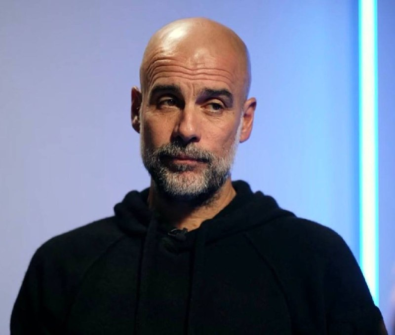

🇪🇸 گواردیولا: تنها پشیمونی‌ای که توی دوران حضورم در سیتی دارم این بود که به جو هارت فرصت ندادم تا خودشو ثابت کنه
@SportBaadNews

## SportBaadNews — post 252237

  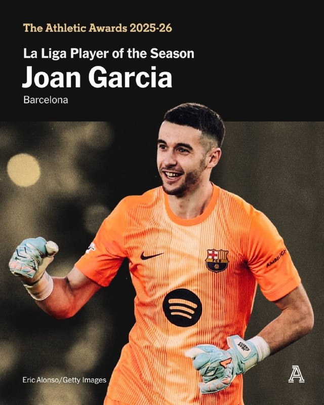

🇪🇸 خوان گارسیا بعنوان بهترین بازیکن فصلِ لالیگا از نگاه رسانه‌ی اتلتیک انتخاب شد
@SportBaadNews

## SportBaadNews — post 252236

  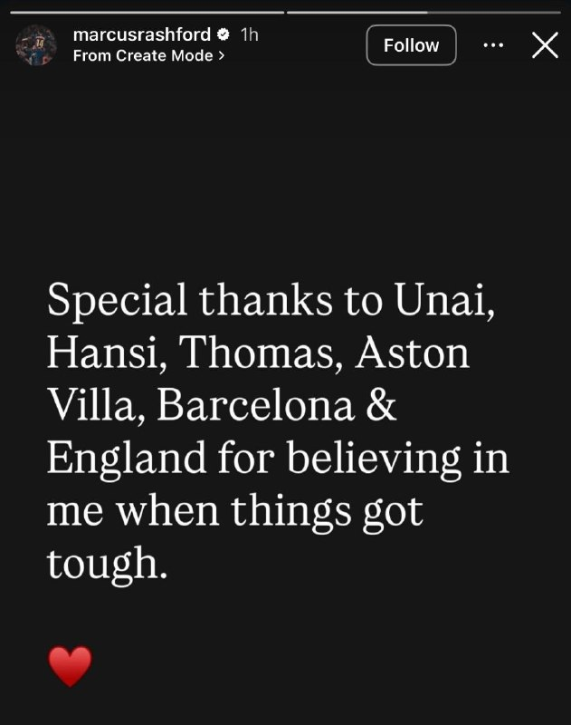

🇪🇸 رشفورد با تیکه به منچستر استوری گذاشته از "فلیک، توخل، امری، بارسلونا، استون ویلا" تشکر کرده و گفته ممنونم که بهم اعتماد کردین وقتی همه چیز سخت بود
@SportBaadNews

## IranIntlTV — post 338498

  

ترامپ در یک سخنرانی در سوفرن نیویورک گفت: «با عملیات خشم حماسی، رزمندگان ما اطمینان حاصل خواهند کرد که جمهوری اسلامی به عنوان بزرگ‌ترین حامی «تروریسم» دولتی در جهان، هرگز به سلاح هسته‌ای دست نخواهد یافت و خودشان هم این را می‌دانند.»
ترامپ گفت: حکومت ایران به عنوان بزرگ‌ترین حامی تروریسم دولتی، به سراسر جهان پول می‌فرستد تا مشکل ایجاد کند.

https://iranintl.com/202605221757

## IranIntlTV — post 338497

  

خبرگزاری تسنیم، وابسته به سپاه پاسداران، به نقل از یک منبع نظامی گزارش داد نیروهای مسلح جمهوری اسلامی «به‌طور کامل» تحولات را زیر نظر دارند و در صورت آنچه «حماقت دشمن» و هرگونه بهانه‌جویی از سوی آمریکا و متحدانش خوانده شده، سناریوهای تازه‌ای آماده کرده‌اند.

به گفته این منبع، در صورت اقدام نظامی احتمالی آمریکا، «نسخه سوم مبارزه جمهوری اسلامی» اجرا خواهد شد؛ نسخه‌ای که به ادعای او در حوزه تجهیزات جدید، اهداف نوین، تاکتیک‌ها و راهبردهای جنگی نمود خواهد داشت و حتی می‌تواند جبهه‌های جدیدی در سطح فرامنطقه‌ای ایجاد کند.

این منبع نظامی همچنین مدعی شد آمریکا در صورت «زیاده‌خواهی و اقدام نظامی»، «تنبیه بزرگ سوم» را در کمتر از یک سال تجربه خواهد کرد؛ تنبیهی که به گفته او «به شکلی خاص‌تر و جدیدتر» خواهد بود.
https://iranintl.com/202605226156

## IranIntlTV — post 338496

  <a href="telegram/content/IranIntlTV_338496_1779487049.mp4" target="_blank">🎬 Download video</a>

یک شهروند در پیامی صوتی به ایران اینترنشنال از فشار شدید در ایران و بلاتکلیفی و استرس به دلیل اظهارات دونالد ترامپ درباره امکان پایان جنگ و آتش‌بس می‌گوید. صدای او برای حفظ امنیتش با هوش مصنوعی بازخوانی شده است.

## IranIntlTV — post 338495

  

دونالد ترامپ، رییس جمهوری ایالات متحده، در سخنرانی خود در نیویورک درباره جنگ ایران اعلام کرد: «این ماجرا به‌زودی پایان خواهد یافت.»

او همچنین گفت که ما جمهوری اسلامی را متوقف کرده‌ایم؛ آن‌ها هرگز به سلاح هسته‌ای دست نخواهند یافت.
https://iranintl.com/202605220706

## IranIntlTV — post 338494

  

اکسیوس به نقل از دو مقام آمریکایی اعلام کرد که ترامپ صبح جمعه نشستی با اعضای ارشد تیم امنیت ملی خود درباره جنگ ایران برگزار کرد.
اکسیوس نوشت به گفته منابعی که مستقیما با ترامپ گفت‌وگو کردند، او در حال بررسی حملات جدید است، مگر اینکه پیشرفتی در مذاکرات در آخرین لحظه حاصل شود.
https://iranintl.com/202605229907

## Persian_Trend_Official — post 14693

  <a href="telegram/content/Persian_Trend_Official_14693_1779487051.webm" target="_blank">🎬 Download video</a>

🔴 هیئت قطری تهران را ترک کرد

💢گزارش‌ها حاکی است هیئت قطری پس از رایزنی‌های دیپلماتیک، تهران را ترک کرده است.

💢این سفر در حالی انجام شد که قطر در کنار پاکستان و چند کشور منطقه، در تلاش برای میانجیگری میان ایران و آمریکا جهت دستیابی به توافقی برای پایان جنگ و ادامه مذاکرات هسته‌ای بود.

🫆:Tony

📌 @persian_trend_official
پرشین ترند | متفاوت‌ترین کانال نظامی

## Persian_Trend_Official — post 14692

  <a href="telegram/content/Persian_Trend_Official_14692_1779487052.mp4" target="_blank">🎬 Download video</a>

💢 ترامپ

💢باور کنید من توانستم این معادله را حل‌ کنم
!
‌‌(203 × 9 ÷2+ 1324 − 1292) × 19

🫆:Tony

📌 @persian_trend_official
پرشین ترند | متفاوت‌ترین کانال نظامی

## Persian_Trend_Official — post 14691

  <a href="telegram/content/Persian_Trend_Official_14691_1779487053.webm" target="_blank">🎬 Download video</a>

🔴 ایران بخشی از حریم هوایی غرب کشور را تا دوشنبه بست

💢گزارش‌ها حاکی است ایران بخشی از حریم هوایی غرب کشور را برای پروازهای شبانه از غروب تا طلوع خورشید تا روز دوشنبه بسته است.

🫆:Tony

📌 @persian_trend_official
پرشین ترند | متفاوت‌ترین کانال نظامی

## Persian_Trend_Official — post 14689

  <a href="telegram/content/Persian_Trend_Official_14689_1779487053.mp4" target="_blank">🎬 Download video</a>

🔥هم اکنون بندر نووروسییسک، روسیه مورد حمله موشکی پهپادی اوکراینی ها قرارگرفت،

👩‍💻☆Phantom☆

🆔 @persian_trend_official
پرشین ترند | متفاوت‌ترین کانال نظامی

## Persian_Trend_Official — post 14687

  

شبتون بخیر 🔥❤️

توضیح عکس:
یک مرد آمریکایی موقع طوفان فلوریدا از داخلش خونه‌ش این عکس رو گرفته، چند تن فشار رو این درب و شیشه‌ها تحمل کردن!!!

این یعنی کارخانه شیشه، قاب، گسکت، نصاب، استراکچر، ریل و... همه کارشون رو به نحو احسن انجام دادند.

📝 Nick
📌 @persian_trend_official
پرشین ترند | متفاوت‌ترین کانال نظامی

---
📅 بروزرسانی: 1405/03/02 00:17
---

## rodast_omiddana — post 71791

  <a href="telegram/content/rodast_omiddana_71791_1779482858.mp4" target="_blank">🎬 Download video</a>

🔴 ابراهیم اسحاقی آشغال سواستفاده چی از زندانیان سیاسی

## rodast_omiddana — post 71790

  <a href="telegram/content/rodast_omiddana_71790_1779482860.webm" target="_blank">🎬 Download video</a>

🚨 به احترام مردم ایران و خانواده جاویدنامان که باهام تماس گرفتند از امشب در برنامه زنده ام در یوتیوب و ستلایت چیزی از درگیری های موجود در ارتباط با سواستفاده مالی شاهین نجفی و جریان ماسون شیعه در دفتر شاهزاده نخواهم گفت..
همچنین تلاش میکنم و امیدوارم بشود افشاگریهایم را در مجازی نیز متوقف کنم...

## SportBaadNews — post 252235

  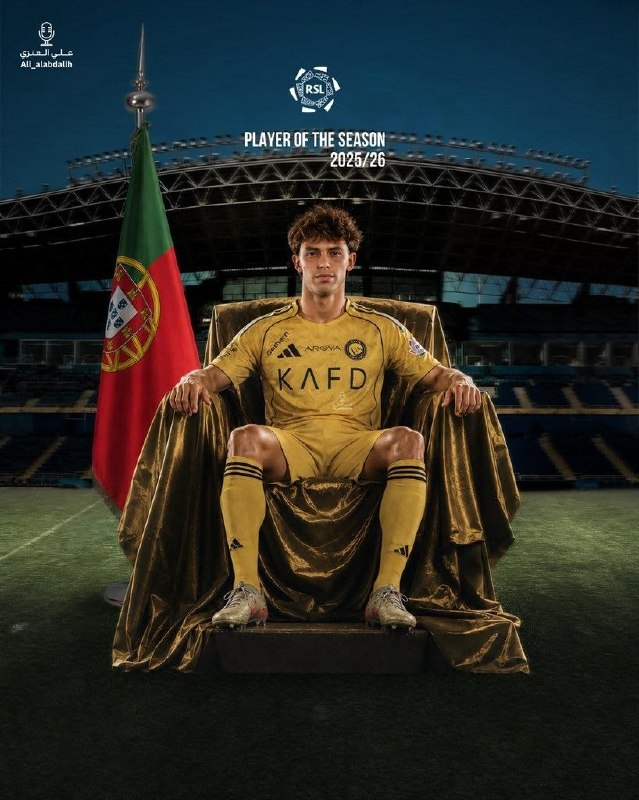

ژائو فلیکس بهترین بازیکن این فصل لیگ عربستان شد
@SportBaadNews

## SportBaadNews — post 252224

  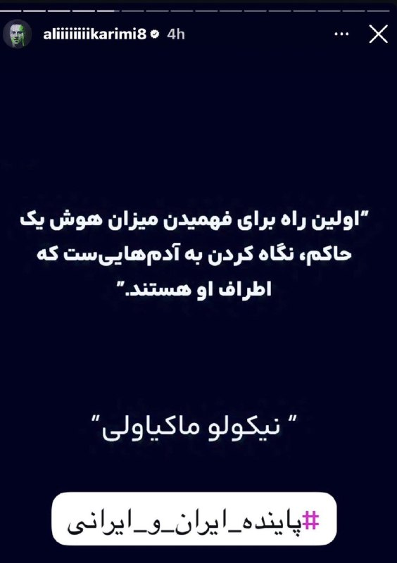

علی کریمی خطاب به شاهین نجفی @SportBaadNews

## SportBaadNews — post 252223

  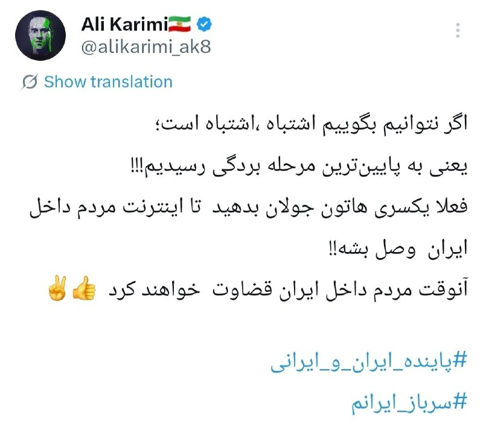

به گفته‌ی کاربران توییتر ظاهرا علی کریمی با شاهین نجفی درگیر شده گفته نباید تو این وضعیت کنسرت بزاری شاهین نجفی هم گفته میزارم! @SportBaadNews

## SportBaadNews — post 252222

  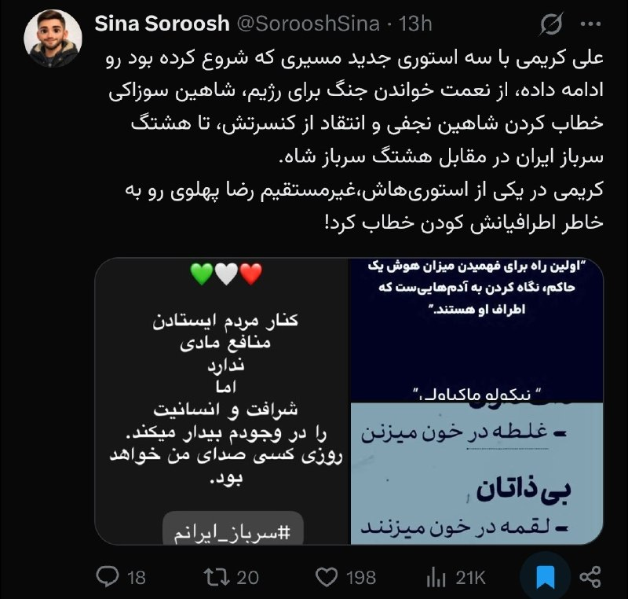

به گفته‌ی کاربران توییتر ظاهرا علی کریمی با شاهین نجفی درگیر شده گفته نباید تو این وضعیت کنسرت بزاری شاهین نجفی هم گفته میزارم!
@SportBaadNews

## SportBaadNews — post 252221

  

⚽️ اولین خرید ژابی هیر‌وی‌گو خورد؛
ولنتین بارکو استعداد آرژانتینی استراسبورگ به چلسی پیوست
@SportBaadNews

## IranIntlTV — post 338493

  

آسوشیتدپرس به نقل از یک مقام آمریکایی اعلام کرد ارتش آمریکا تاکنون هیچ مین انفجاری در تنگه هرمز کشف یا خنثی نکرده است.
این مقام آمریکایی افزود عملیات جست‌وجو در این گذرگاه حیاتی نفتی همچنان ادامه دارد، اما تاکنون هیچ مین دریایی پیدا نشده است.

این در حالی است که محاصره دریایی بنادر جنوب ایران همچنان ادامه دارد.
https://iranintl.com/202605224264

## IranIntlTV — post 338492

  <a href="telegram/content/IranIntlTV_338492_1779482863.mp4" target="_blank">🎬 Download video</a>

مشاور رییس دولت امارات متحده عربی گفت برخی کشورهای عربی اکنون جمهوری اسلامی را تهدیدی بزرگ‌تر از اسرائیل می‌بینند.

به گفته او، حملات جمهوری اسلامی نگاه امنیتی منطقه را تغییر داده و باعث شده همکاری برخی دولت‌های عربی با اسرائیل اهمیت بیشتری پیدا کند.
@iranintltv

## IranIntlTV — post 338491

  <a href="telegram/content/IranIntlTV_338491_1779482865.mp4" target="_blank">🎬 Download video</a>

پیام‌های رسیده به ایران‌اینترنشنال نشان می‌دهد مشکلات در تامین برخی کالاهای ضروری و اساسی در ایران همچنان ادامه دارد.

شهروندان در شهرهای مختلف همچنین از کمبود بنزین خبر می‌دهند.

گفت‌وگو با معصومه طاهرخانی، تحلیل‌گر اقتصادی
@iranintltv

## IranIntlTV — post 338490

  <a href="telegram/content/IranIntlTV_338490_1779482867.mp4" target="_blank">🎬 Download video</a>

همزمان با سفر هیاتی از پاکستان به ریاست فرمانده ارتش و رییس اطلاعات این کشور به تهران برای پیشبرد مذاکرات، قطر نیز در هماهنگی با آمریکا تیمی مذاکره‌کننده به تهران اعزام کرد.

رییس‌جمهوری آمریکا در تروث سوشال نوشت به‌دلیل شرایط حساس فعلی، ترجیح داده در کاخ سفید و واشینگتن بماند. ترامپ همچنین گفت ایران بی‌صبرانه به‌دنبال دستیابی به توافق با آمریکا است.
@iranintltv

## IranIntlTV — post 338489

  <a href="telegram/content/IranIntlTV_338489_1779482869.mp4" target="_blank">🎬 Download video</a>

سخنگوی وزارت خارجه جمهوری اسلامی گفت با درخواست آمریکا برای تحویل اورانیوم با غنای بالا، مذاکرات به نتیجه نمی‌رسد.

همزمان، گزارش‌ها از اعزام تیم مذاکره‌کننده قطر به تهران و سفر فرمانده ارتش و رییس اطلاعات پاکستان به ایران خبر می‌دهند.

دونالد ترامپ نیز گفت به‌دلیل شرایط حساس کنونی در واشینگتن مانده است.

گفت‌وگو با امید معماریان، تحلیل‌گر سیاسی در موسسه دان، و حسین علیزاده، دیپلمات پیشین
@iranintltv

## IranIntlTV — post 338488

  <a href="telegram/content/IranIntlTV_338488_1779482871.mp4" target="_blank">🎬 Download video</a>

سخنگوی وزارت خارجه جمهوری اسلامی گفت با درخواست آمریکا برای تحویل اورانیوم با غنای بالا، مذاکرات به نتیجه نمی‌رسد.

همزمان، گزارش‌ها از اعزام تیم مذاکره‌کننده قطر به تهران و سفر فرمانده ارتش و رییس اطلاعات پاکستان به ایران خبر می‌دهند.

دونالد ترامپ نیز گفت به‌دلیل شرایط حساس کنونی در واشینگتن مانده است.

گفت‌وگو با امید معماریان، تحلیل‌گر سیاسی در موسسه دان، و حسین علیزاده، دیپلمات پیشین
@iranintltv

## IranIntlTV — post 338487

سخنگوی وزارت خارجه جمهوری اسلامی: نمی‌توانیم بگوییم توافق نزدیک است

اسماعیل بقایی، سخنگوی وزارت امور خارجه جمهوری اسلامی، اختلافات میان تهران و واشینگتن را «عمیق» خواند و تاکید کرد نمی‌توان انتظار داشت روند مذاکرات تنها با «چند بار رفت‌وآمد» به نتیجه نهایی و حل‌وفصل چالش‌ها منجر شود.

بقایی شامگاه جمعه اول خرداد در مصاحبه با صداوسیمای جمهوری اسلامی، با اشاره به سفر مقام‌های ارشد پاکستان به ایران گفت: «نمی‌توانیم بگوییم که به جایی رسیدیم که توافق نزدیک است. ضرورتا خیر، این‌طور نیست. روند ادامه‌دار است.»

او اضافه کرد: «اختلاف‌نظرها بین ایران و آمریکا آن‌قدر عمیق و زیاد است، به‌ویژه بعد از جنایاتی که در دو سه ماه اخیر مرتکب شده‌اند، که نمی‌توان گفت با چند بار رفت‌و‌آمد یا مذاکرات ظرف چند هفته یا چند ماه حتما به نتیجه خواهیم رسید. دیپلماسی زمان‌بر است.»

اظهارات بقایی در حالی مطرح می‌شوند که عاصم منیر، فرمانده ارتش پاکستان، برای گفت‌وگو با مقام‌های جمهوری اسلامی به تهران سفر کرده است.

پیش‌تر نیز شبکه العربیه از سفر عاصم مالک، رییس سازمان اطلاعات پاکستان، به ایران خبر داده بود.

تایید سفر هیات قطری به تهران
سخنگوی وزارت امور خارجه جمهوری اسلامی گزارش خبرگزاری رویترز درباره سفر هیات قطری به تهران را تایید کرد و گفت نمایندگان دوحه اول خرداد با عباس عراقچی دیدار و گفت‌وگو کردند.

بقایی ادامه داد: «بسیاری از کشورها، چه کشورهای منطقه و چه کشورهای خارج از منطقه، تلاش می‌کنند تا به پایان جنگ و جلوگیری از تشدید تنش‌ها کمک کنند. این تلاش‌ها از نظر ما ارزشمند است.»

او در عین حال خاطرنشان کرد اسلام‌آباد همچنان «میانجی رسمی» مذاکرات میان تهران و واشینگتن محسوب می‌شود.

رویترز پیش‌تر از سفر یک هیات مذاکره‌کننده قطری به تهران خبر داد و نوشت هدف از این سفر که با هماهنگی واشینگتن انجام گرفت، کمک به تلاش‌ها برای دستیابی به توافقی جهت خاتمه جنگ ایران است.

بقایی: در این مرحله وارد «جزییات» پرونده هسته‌ای نخواهیم شد
سخنگوی وزارت خارجه جمهوری اسلامی اعلام کرد مذاکرات جاری با واشینگتن بر پایان جنگ متمرکز است و «جزییات» پرونده هسته‌ای در این مرحله وارد دستور کار گفت‌وگوها نخواهد شد.

بقایی گفت خاتمه جنگ در همه جبهه‌ها، از جمله لبنان، وضعیت تنگه هرمز و محاصره دریایی آمریکا، از محورهای اصلی گفت‌وگوهای حکومت ایران و ایالات متحده به شمار می‌روند.

او ادامه داد: «دلیل اینکه در مورد جزییات مباحث مرتبط با موضوع [هسته‌ای] صحبت نمی‌کنیم، مشخص است. ما دو بار این کار را کردیم و زیاده‌خواهی طرف مقابل باعث شد وارد جنگ شویم.»

بقایی افزود ورود به «سایر موضوعات» در مذاکرات با آمریکا تنها پس از پایان جنگ و رفع «نگرانی‌های» تهران امکان‌‎پذیر خواهد بود.

خبرگزاری رویترز ۳۱ اردیبهشت به نقل از مقام‌های اسرائیلی نوشت دونالد ترامپ، رییس‌جمهوری آمریکا، به اورشلیم اطمینان داده که ذخایر اورانیوم با غنای بالا از ایران خارج خواهد شد و این موضوع بخشی از هرگونه توافق احتمالی صلح خواهد بود.

بنیامین نتانیاهو، نخست‌وزیر اسرائیل، بارها تاکید کرده که پایان جنگ منوط به خروج اورانیوم غنی‌شده از ایران، توقف حمایت تهران از گروه‌های نیابتی و برچیده شدن توان موشکی جمهوری اسلامی است.

کانال ۱۱ اسرائیل ۳۱ اردیبهشت گزارش داد در پی ارزیابی‌های اطلاعاتی جدید، ارتش و نهادهای امنیتی این کشور مجموعه‌ای از اقدامات مهم را برای احتمال جدی ازسرگیری نبرد با جمهوری اسلامی آغاز کرده‌‌اند و آمادگی خود را به بالاترین سطح افزایش داده‌اند.
 
🔗وب‌سایت ایران‌اینترنشنال
@iranintltv

## IranIntlTV — post 338486

بنزین در زاهدان، کرمان و بندرعباس تا لیتری ۲۰۰ هزار تومان فروخته می‌شود

🖋سبا حیدرخانی

گزارش‌های رسیده به ایران‌اینترنشنال از شهرهای مختلف ایران، از تشدید بحران تامین بنزین، محدودیت‌ در عرضه سوخت، صف‌های طولانی در جایگاه‌ها و افزایش شدید قیمت بنزین حتی تا لیتری ۲۰۰ هزار تومان در بازار غیررسمی حکایت دارد.

بیشترین روایت‌ها مربوط به استان‌های هرمزگان، سیستان و بلوچستان، کرمان، بوشهر، خراسان جنوبی، اصفهان و خراسان رضوی است.

بر اساس پیام‌های مردمی، وضعیت عرضه سوخت در جیرفت، عنبرآباد و شهرهای جنوبی استان کرمان بحرانی شده است.

به گفته یک شهروند، در این مناطق قیمت بنزین در بازار آزاد به لیتری ۱۰۰ هزار تومان رسیده است.

او افزود: «اکنون دغدغه ما بنزین شده است. پمپ‌بنزین‌ها بیشتر از ۱۵ لیتر نمی‌دهند و شب‌ها باید در صف‌های کیلومتری بایستیم تا صبح نوبتمان شود. واقعا کلافه شده‌ایم.»

در بیرجند نیز سوخت جیره‌بندی و سهمیه کارت‌ها نصف شده و بنزین آزاد تنها در دو جایگاه، از ساعت شش صبح تا شش عصر و فقط به مقدار ۱۰ لیتر عرضه می‌شود.

در بوشهر هم به گفته یک مخاطب، ‌بنزین تقریبا «نایاب» شده است؛ دکه‌های کنار جاده، سوخت را در دبه‌های ۵ لیتری و با قیمت هر لیتر ۱۰ هزار تومان می‌‌فروشند.

شهروند دیگری از کرمان با اشاره به شکل‌گیری بازار سیاه سوخت گفت بنزین را لیتری ۸۰ هزار تومان خریده است.

او افزود مردم شب‌ها تا صبح در صف می‌ایستند و نوبت می‌گیرند تا صبح که جایگاه باز شد، اگر خوش‌شانس بودند، بتوانند سوخت گیر بیاورند.

جیره‌بندی عرضه رسمی سوخت و گسترش بازار غیررسمی
پیام‌های رسیده از بندرعباس حاکی از شرایط «فاجعه‌بار» جایگاه‌های سوخت در این شهر است.

یکی از مخاطبان ایران‌اینترنشنال گفت: «صف‌های چندکیلومتری بنزین مردم را کلافه کرده است، آن‌هم در گرمایی که کولر خودرو ضرورت است نه انتخاب. شهری که بخش بزرگی از بنزین کشور را تولید می‌کند، سهمش شده آلودگی، بیماری و ساعت‌ها تحقیر در صف سوخت، بدون کوچک‌ترین پاسخ‌گویی مسئولان.»

شهروند دیگری از بندرعباس گفت از ساعت ۸:۵۵ شب در صف پمپ‌بنزین ترنج منتظر بوده‌، اما ساعت ۱۰:۱۰ به خودروها اعلام شده که سوخت تمام شده است.

رمضان‌علی سنگدوینی، عضو کمیسیون انرژی مجلس، پیش‌تر گفته بود بحث تغییر سهمیه‌بندی بنزین «صرفا در حد طرح شخصی» بوده و هیچ تصمیم رسمی درباره آن اتخاذ نشده است.

این موضوع اما با روایت‌های گسترده شهروندان از محدودیت‌های عملی در عرضه سوخت، تناقض دارد.

شهروندان در مشهد از طولانی‌تر شدن صف‌ها و افزایش مداوم قیمت‌ها خبر دادند.

مخاطبی در همین زمینه گفت برای پر کردن یک باک باید ساعت‌ها در صف جایگاه سوخت منتظر ماند: «قبلا هر چند ماه یک‌بار افزایش قیمت داشتیم، اما اکنون هر روز گران‌تر می‌شود.»

شهروند دیگری نیز در پیامی کوتاه نوشت: «امروز سه لیتر بنزین زدم شد ۲۰۰ هزار تومان.»

این گزارش‌ها در حالی منتشر می‌شود که مسعود پزشکیان، رییس دولت جمهوری اسلامی، ۳۰ اردیبهشت با تایید آسیب دیدن بخشی از زیرساخت‌های انرژی در جنگ اخیر، از ناتوانی دولت در تامین و واردات بنزین خبر داد.

او گفت در پی «محاصره دریایی آمریکا»، صادرات نفت ایران متوقف شده و کشور روزانه با کمبود ۵۰ میلیون لیتر بنزین روبه‌رو است، اما «دلاری برای واردات آن وجود ندارد».
ساعاتی پس از انتشار این سخنان، رسانه‌های دولتی از جمله ایرنا بخش‌هایی از اظهارات پزشکیان را حذف کردند.

فساد و رانت در جایگاه‌ها
در کنار بحران کمبود سوخت و توزیع نامناسب آن، برخی مخاطبان از افزایش فساد و رانت در برخی جایگاه‌ها و ناکارآمدی کارت‌های سوخت خبر دادند.

شهروندی از اصفهان با اشاره به ناکارآمدی حکومت در مدیریت بحران سوخت گفت کارت‌ها بدون دلیل خطا می‌دهند و باید سه هفته در انتظار کارت جدید ماند.

مخاطب دیگری از اصفهان از تشدید بی‌نظمی در جایگاه‌ها خبر داد و گفت: «علاوه بر اینکه صف‌های جایگاه سوخت کیلومتری شده و سهمیه بنزین بعضی‌ها را سوزانده‌اند، تعدادی از نیروهای بسیجی هم با اسلحه می‌آیند و بدون نوبت بنزین می‌زنند؛ آن هم نه یک یا دو لیتر، بلکه ۱۵ لیتر بنزین داخل موتورهایشان می‌زنند و می‌روند.»

یک شهروند از استان هرمزگان با انتقاد از «رانت و تبعیض در توزیع سوخت» گفت مردم ساعت‌ها در صف می‌مانند اما ماشین‌های سپاه با گالن‌های ۷۰ لیتری، شبانه از ساعت ۱۸ تا ۴ صبح نزدیک به ۱۰ بار سوخت‌گیری می‌کنند و آن را برای فروش به کاروان‌ها یا قاچاقچیان سوخت می‌برند.

به گفته او، هر گالن ۷۰ لیتری تا پنج میلیون تومان فروخته می‌شود.
 
🔗متن کامل گزارش را اینجا بخوانید
@iranintltv

## IranIntlTV — post 338485

  <a href="https://t.me/IranintlTV/338485" target="_blank">📎 Download file</a>

🎧نسخه صوتی ۲۴ با فرداد فرحزاد:ترامپ: تهران بی‌صبرانه به‌دنبال توافق است
@iranintlTV

## IranIntlTV — post 338483

  

خبرگزاری تسنیم، رسانه‌ها وابسته به سپاه، به نقل از یک منبع نزدیک به هیات مذاکره‌کننده، نوشت: «گفت‌وگوها و رایزنی‌ها بر سر موارد اختلافی همچنان ادامه دارد و هنوز نتیجه نهایی حاصل نشده است.»

این رسانه وابسته به سپاه افزود: «میانجی پاکستانی همچنان در حال رد و بدل موضوعات است.»

تسنیم ادامه داد تمرکز در حال حاضر بر سر مسئله «پایان جنگ» است و تا وقتی این موضوع نهایی نشود، هیچ مساله دیگری مذاکره نخواهد شد.
https://iranintl.com/202605227080

## IranIntlTV — post 338482

  <a href="telegram/content/IranIntlTV_338482_1779482874.mp4" target="_blank">🎬 Download video</a>

یک شهروند در پیامی به ایران اینترنشنال از اوضاع اقتصادی در کشور روایت می‌کند و می‌گوید به دلیل کمبود آرد نانوایی‌ها با اختلال در فعالیت و صف‌های طولانی مواجه‌اند. پیام او با هوش مصنوعی خوانده شده است.

## IranIntlTV — post 338481

  <a href="telegram/content/IranIntlTV_338481_1779482876.mp4" target="_blank">🎬 Download video</a>

فداحسین مالکی، عضو کمیسیون امنیت ملی مجلس، در صداوسیما گفت جمهوری اسلامی در صورت لزوم می‌تواند آتش‌بس را نقض کند. هم‌زمان برخی امامان جمعه نیز هشدار دادند اگر «تعرض‌ها» ادامه پیدا کند، تهران جنگ را بین‌المللی خواهد کرد.

ارزیابی نجات بهرامی، تحلیل‌گر سیاسی
@iranintltv

## IranIntlTV — post 338480

  <a href="telegram/content/IranIntlTV_338480_1779482878.mp4" target="_blank">🎬 Download video</a>

وال‌استریت ژورنال گزارش داد جمهوری اسلامی با پر شدن مخازن نفت و افزایش فشارهای آمریکا، با بحرانی جدی در صنعت نفت روبه‌رو شده است. بر اساس این گزارش، تهران برای جلوگیری از توقف کامل صنعت نفت، ناچار شده از نفتکش‌های شناور و حتی مخازن فرسوده استفاده کند.

گفت‌وگو با همایون فلک‌شاهی، کارشناس نفت و انرژی در موسسه کپلر
@iranintltv

## IranIntlTV — post 338479

  

قاسم رضایی، جانشین فرمانده کل انتظامی جمهوری اسلامی گفت: «دیگر تمرکز صرف بر فعالیت‌های پلیسی نیست و نظام دفاعی و آمادگی برای مواجهه با جنگ نامتقارن در اولویت قرار گرفته است.»

او افزود: «نیروها باید آموزش عملی ببینند و تمرینات میدانی داشته باشند. پلیس راه و راهور علاوه بر وظایف ترافیکی، آموزش دفاعی و آمادگی عملی می‌بیند.»

او افزود: «تمرین در خیابان و شرایط واقعی باعث افزایش توانمندی نیروها می‌شود.»
https://iranintl.com/202605222099

## Persian_Trend_Official — post 14686

https://youtube.com/live/D0LvFYIUbgw?feature=share

## Persian_Trend_Official — post 14685

  <a href="https://t.me/persian_trend_official/14685" target="_blank">📎 Download file</a>

فایل صوتی لایو اول
نسخه کم حجم - 5.94 مگابایت

اتاق جنگ جمعه 1 خرداد | عاصم منیر در تهران برای التیماتوم یا توافق؟

📝 Nick

📌 @persian_trend_official
پرشین ترند | متفاوت‌ترین کانال نظامی

---
📅 بروزرسانی: 1405/03/01 22:41
---

## ChizBergerz — post 46682

  

این جنده رو با یه 206 عهد بوق، یه گیگ کانفیگ، یه لیتر عرق و چیپس بردن باغ ویلا کردن بعد به بقیه داره میگه ارزون
💩😂

@ChizBergerz

## ChizBergerz — post 46680

  <a href="telegram/content/ChizBergerz_46680_1779477120.mp4" target="_blank">🎬 Download video</a>

ویدیو وایرال شده از زوج حشری تو انگلیس که از حجاب دختره مشخصه مسلمونن و دارن تو اتوبوس سک میکنن!😐😂

@ChizBergerz

## ChizBergerz — post 46678

بزنید روی اتصال و بزارید روی همین حالت بمونه، اگه وصل نشد روی حالت پرواز بزارید و بردارید تا آیپی عوض شه، هربار که از حالت پرواز در میارید ۵ ثانیه صبر کنید و اگه وصل نشد دوباره بزارید حالت پرواز و بردارید، اینکارو چندبار تکرار کنید قطعا وصل میشه.

## ChizBergerz — post 46677

برای خودم از صبح تا الان وصل نمیشد این روش رو ممبرا بهم یاد دادن انجام دادم وصل شد و پشمام ریخت

## ChizBergerz — post 46676

  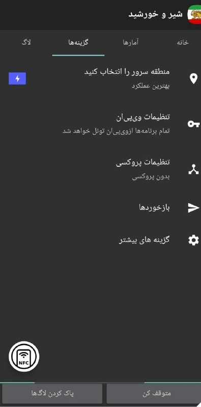

بزنید روی اتصال و بزارید روی همین حالت بمونه، اگه وصل نشد روی حالت پرواز بزارید و بردارید تا آیپی عوض شه، هربار که از حالت پرواز در میارید ۵ ثانیه صبر کنید و اگه وصل نشد دوباره بزارید حالت پرواز و بردارید، اینکارو چندبار تکرار کنید قطعا وصل میشه.

## ChizBergerz — post 46675

برید تو شیر و خورشید واردش کنید

## ChizBergerz — post 46674

2.16.53.11 2.16.53.50 2.23.210.78 185.208.175.228 23.212.250.25 185.255.91.60 2.23.168.7 95.101.137.105 2.22.89.45 95.101.35.65 95.101.35.74 95.101.23.90 23.55.110.187 2.18.64.202 95.100.133.77 95.101.137.34 23.58.223.184 23.219.36.111 184.24.77.25 23.55.161.142…

## ChizBergerz — post 46673

2.16.53.11
2.16.53.50
2.23.210.78
185.208.175.228
23.212.250.25
185.255.91.60
2.23.168.7
95.101.137.105
2.22.89.45
95.101.35.65
95.101.35.74
95.101.23.90
23.55.110.187
2.18.64.202
95.100.133.77
95.101.137.34
23.58.223.184
23.219.36.111
184.24.77.25
23.55.161.142
23.207.210.88
95.101.78.57
23.47.124.86
2.22.46.8
23.55.110.80
23.55.110.69
23.58.223.225
23.58.223.171
95.101.35.99
2.22.89.18
23.216.77.68
95.101.35.81
95.101.35.75
184.24.77.15
23.210.216.166
23.55.161.161
23.3.75.200
2.23.168.47
95.101.35.73
184.24.77.24

## ChizBergerz — post 46672

یه روش برای وصل شدن به شیر و خورشید پیدا کردم که برای اونایی که وصل نمیشه با این روش قطعا وصل میشه، من با همراه اول وصل شدم👇

## rodast_omiddana — post 71789

  <a href="telegram/content/rodast_omiddana_71789_1779477121.webm" target="_blank">🎬 Download video</a>

🚨فوری
ترامپ بازدید برنامه‌ریزی‌شده خود از باشگاه گلف ملی ترامپ در بدمینستر، نیوجرسی را لغو کرده و طبق برنامه به‌روزشده‌اش، به جای آن در طول روز شنبه و یکشنبه در کاخ سفید خواهد ماند.

## rodast_omiddana — post 71788

  <a href="telegram/content/rodast_omiddana_71788_1779477122.mp4" target="_blank">🎬 Download video</a>

😎 خانمم اومده وسط میگه بسه کار رسیده به لخت کردن خانومهاشون

## rodast_omiddana — post 71787

  <a href="telegram/content/rodast_omiddana_71787_1779477124.mp4" target="_blank">🎬 Download video</a>

🤣 این وسط این چرا لخت اومده؟
حریف نشدید رفتید خانم رئیس آوردید؟

## rodast_omiddana — post 71786

  <a href="telegram/content/rodast_omiddana_71786_1779477126.mp4" target="_blank">🎬 Download video</a>

😎
😋
🤪
😘
🥰
😍
🥳
🥸

## rodast_omiddana — post 71784

  <a href="telegram/content/rodast_omiddana_71784_1779477129.webm" target="_blank">🎬 Download video</a>

🚨و اما مرتضی اسماعیل پور تا سال 2020 همچنان آویزان خانواده رفسنجانی بود
برای همین منو بابت حمایتم از شاهزاده مسخره میکرد و میگفت دروان ستم شاهی تمام شد..
اما امروز اینو نمیگه چون پادشاهی براش پول یوتیوب داره..
فقط مرتضی جاکش چی در خودت دیدی سلطان علی کریمی را داشتی نصیحت میکردی؟
گفتم هنوز هیچی منتشر نکردم و مرام گذاشتم خانه ترکیه هم نگفتم..

## rodast_omiddana — post 71783

  <a href="telegram/content/rodast_omiddana_71783_1779477129.webm" target="_blank">🎬 Download video</a>

🚨و اما این بنده خدای خالی بند امروز عزدار بسته شدن تلویزیون منوتو هست و نمیخوام زیاد اذیتش کنم..
چند وقت پیش گفت قهرمان شدم، با وجود اینکه در عکس روشنه نه تماشاگری هست نه مقام دوم و سومی وجود دارند، با دوستانمان در آلمان تماس گرفتیم و با چت جی پی تی، کل مجازی را گشتیم تا ببینم چه مسابقاتی بوده که هیچ اثری پیدا نکردیم و فهمیدم بنده خدا دروغ گفته ولی تلویزیون منوتو اومده رفاقتی براش تبلیغ دروغکی کرده است..
ابرام جان تو رو که بزودی در دادگاه ملاقات میکنیم ولی میخوای بگم چند بار به ایران اینترنشنال زنگ زدی و اونها بهت گفتن برو پسر جان خالی نبند و مانند منوتو خر نشدن خبر دروغت را منتشر کنند...
برو با هم قدهای خودت بازی کن، که برای همین دروغی هم که منتشر کردی میتونم ازت شکایت کنم ولی حیف که شکایت دونیت پر شده..

## rodast_omiddana — post 71782

  <a href="telegram/content/rodast_omiddana_71782_1779477129.webm" target="_blank">🎬 Download video</a>

🚨 پرونده سازی اینجوری..
من از سال 2013 با دفتر شاهزاده ارتباطی نداشتم و اون زمانم امیر جان جمهوری خواه ضد پادشاهی بود (الانم نمیدونم) و نقشه ما برای نفوذ در رژیم سال 2016 مطرح شد و سال 2017 اجرایی شد..
بنابراین وقتی یک دوزاری بیسواد را بهش بها میدهید میاد از طرف من دروغ سوال میکنه و طبیعتا پاسخ اینجوری هم دریافت میکنه..
اما برای این توله هم دارم ولی ارزش نداره بگم کاپ قهرمانیش چه دروغی بود ولی در استوری بعدی نشان میدم..

## rodast_omiddana — post 71781

🎬 برنامه امشب
*بازی جدید مذاکرات و توافق، برای حج و پیدا کردن مجتبی است
*نگران نباشید حمله انجام میشود!
لینک یوتیوب:
https://www.youtube.com/@omiddana

## rodast_omiddana — post 71780

  <a href="telegram/content/rodast_omiddana_71780_1779477130.webm" target="_blank">🎬 Download video</a>

🚨ساده بگم براتون..
محمدعلی جنت خواهی که به شاهزاده نزدیک شده، میخواد یک علی شریعتی جدید باشه..
گرفتی چی شد؟

## rodast_omiddana — post 71779

🎬 حمله خضریان در صداوسیما به ترکیه
لینک یوتیوب:
https://www.youtube.com/watch?v=p93AgHjx3ww

## rodast_omiddana — post 71778

  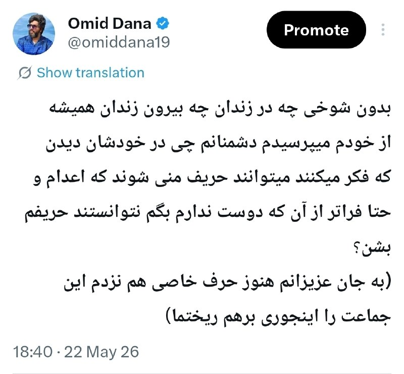

👑 بدون شوخی چه در زندان چه بیرون زندان همیشه از خودم میپرسیدم دشمنانم چی در خودشان دیدن که فکر میکنند میتوانند حریف منی شوند که اعدام و حتا فراتر از آن که دوست ندارم بگم نتوانستند حریفم بشن؟
(به جان عزیزانم هنوز حرف خاصی هم نزدم این جماعت را اینجوری برهم ریختما)

## rodast_omiddana — post 71777

  <a href="telegram/content/rodast_omiddana_71777_1779477131.mp4" target="_blank">🎬 Download video</a>

جنت خواه جان فعلا بسِ ته تا بعد 😘

## rodast_omiddana — post 71776

  <a href="telegram/content/rodast_omiddana_71776_1779477133.webm" target="_blank">🎬 Download video</a>

🚨اره عشقم خودتو بیشتر رو کن
فقط حرفهای شاهزاده هم گوش کن و فحاشی نکن
ناسلامتی مشاور دفتر شاهزاده شدیا..

## KiriMohems — post 47896

  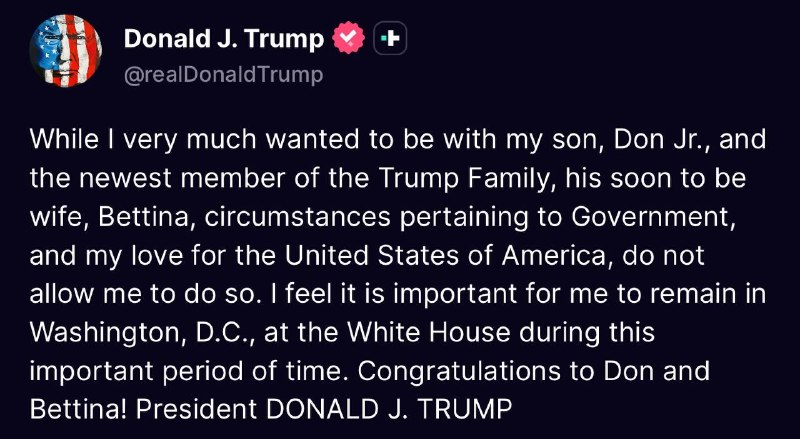

💢ترامپ:

در حالی که خیلی دلم میخواست در کنار پسرم، دان جونیور، و جدیدترین عضو خانواده‌ی ترامپ، یعنی همسر آینده‌اش بتینا باشم، اما شرایط مربوط به دولت و عشقم به ایالات متحده آمریکا، این اجازه رو به من نمیدهد. احساس میکنم خیلی مهمه که در طول این بازه‌ی زمانی حساس، در واشینگتن دی‌سی و در کاخ سفید بمونم. تبریک به دان و بتینا! پرزیدنت دونالد جی. ترامپ

#professor
@KiriMohems

## KiriMohems — post 47895

  <a href="telegram/content/KiriMohems_47895_1779477135.mp4" target="_blank">🎬 Download video</a>

🔴فیلم منتشر شده در دومین دسته از پرونده‌های مرتبط با یوفو/یو‌ای‌پی پنتاگون، یک یو‌ای‌پی را بر فراز سوریه نشان می‌دهد که «شتاب آنی» دارد.
#Helsinki
@KiriMohems

## KiriMohems — post 47894

  

✖️ سایت بین المللی bet120x 
✖️

 
👍دارای مجوز رسمی Gambling Judge سوئد
👍
     

💳شارژ حساب از طریق ارز و یووچر و پرمیوم ووچر

💳تسویه حساب دلاری سریع
💊بیمه شرط میکس

⚠️فروش شرط

🔔ویرایش شرط                    
3️⃣
2️⃣

🎁20%هدیه واریز از طریق ارز و ووچر
┅━━━━━━━━━━━

🎁 10%برگشت باخت به صورت روزانه

🎁 10%برگشت باخت به صورت هفتگی

🎁10%برگشت باخت به صورت ماهانه

💻ادرس ورود به سایت:
https://bet120x.com/fa/?btag=971470
➖➖➖➖➖
   
👈 آموزش واریز و برداشت دلاری
👉

🔪کانال اطلاع رسانی:
👇 g1🅰

✈️https://t.me/+RvVnWMHCqUc4YzFk

## SportBaadNews — post 252219

  

ثروت مسی به 1 میلیارد دلار رسید و از حالا‌ به بعد اون یک میلیاردره...
@SportBaadNews

## SportBaadNews — post 252218

■ بدترین حس وقتیه که میخوای سریع وارد سایت شی، بازی شروع شده، ولی VPN وصل نمیشه یا سایت نصفه لود میشه. 
😑

- دیگه لازم نیست برای هر بار ورود به سایت VPN عوض کنی یا منتظر لود شدن بمونی؛

📌در ربات تلگرام وینکوبت هم بازی‌ها و کازینو اجرا میشن، هم پیش‌بینی و واریز و برداشت مستقیم از داخل همون ربات انجام میشه:
👇

🤖 @Wincobet_bot

🤖 @Wincobet_bot

## SportBaadNews — post 252217

2000 ساعت از قطعی اینترنت در ایران گذشت!!!!!!!!!!!!
2000 ساعت از قطعی اینترنت در ایران گذشت!!!!!!!!!!!!
2000 ساعت از قطعی اینترنت در ایران گذشت!!!!!!!!!!!!

## SportBaadNews — post 252216

توخل بالایی رو به پایینیا ترجیح داد @SportBadTweet | #hesan

## IranIntlTV — post 338478

  

الجزیره به نقل از یک مقام جمهوری اسلامی گزارش داد که نقش قطر در حمایت از میانجی‌گری پاکستان بسیار کلیدی است.

این مقام حکومت ایران افزود: «آزادسازی دارایی‌های بلوکه‌شده و لغو تحریم‌های صادرات نفت برای جمهوری اسلامی موضوعی حاشیه‌ای نیست.»
https://iranintl.com/202605224072

## IranIntlTV — post 338477

  <a href="telegram/content/IranIntlTV_338477_1779477140.mp4" target="_blank">🎬 Download video</a>

یک شهروند در پیامی به ایران اینترنشنال از اوضاع وخیم اقامتگاه‌ها و هتل‌های مشهد در پی بحران اقتصادی روایت می‌کند. پیام او با هوش مصنوعی خوانده شده است.

## IranIntlTV — post 338476

  <a href="https://t.me/IranintlTV/338476" target="_blank">📎 Download file</a>

🎧نسخه صوتی حرف آخر با پوریا زراعتی - عملیات موساد برای حذف فیزیکی مجتبی
@iranintlTV

## IranIntlTV — post 338475

  

اکسیوس به نقل از یک منبع نزدیک به ترامپ نوشت که رییس‌جمهوری آمریکا در روزهای اخیر به‌طور فزاینده‌ای کلافه شده و احتمال انجام یک عملیات نظامی نهایی و گسترده را مطرح کرده است؛ عملیاتی که پس از آن بتواند اعلام پیروزی کرده و به جنگ پایان دهد.

اکسیوس همچنین به نقل از یک منبع امنیتی پاکستان اعلام کرد که عاصم منیر، فرمانده ارتش پاکستان، جمعه در چارچوب تلاش‌ها برای دستیابی به توافقی میان جمهوری اسلامی و آمریکا وارد تهران شد؛ توافقی که بر اساس آن دو طرف جنگ را متوقف کرده و مذاکراتی گسترده‌تر را آغاز کنند.
https://iranintl.com/202605221158

## IranIntlTV — post 338474

  <a href="telegram/content/IranIntlTV_338474_1779477144.mp4" target="_blank">🎬 Download video</a>

۲۴ با فرداد فرحزاد، جمعه یک خرداد
@iranintltv

## IranIntlTV — post 338473

  

🔻اتحادیه جهانی کشتی اعلام کرد به دلیل «وضعیت ژئوپلیتیک کنونی، به‌ویژه تداوم ابهام‌ها و تاثیر آن بر سفرهای بین‌المللی» تصمیم گرفته است میزبانی مسابقات جهانی ۲۰۲۶ را از منامه بحرین به شهر آستانه قزاقستان منتقل کند.

🔹میزبانی مسابقات جهانی ۲۰۲۶، سال گذشته در نشست زاگرب به بحرین واگذار شده بود.

🔹مسابقات جهانی کشتی امسال از ۲ تا ۱۰ آبان ۱۴۰۵ برگزار می‌شود. آستانه در سال ۲۰۱۹ هم میزبان این رقابت‌ها بود.

🔹جنگ ایران از نهم اسفند ۱۴۰۴ تاکنون، باعث لغو بسیاری از مسابقات بین‌المللی ورزشی در منطقه شده است.

@iranintltvsport

## IranIntlTV — post 338471

هم‌زمان با ادامه کارزار جاویدنامان بیمارستان الغدیر، جزییات تازه‌ای از هویت و چگونگی کشته‌ شدن شماری از جان‌باختگان اعتراضات ۱۸ و ۱۹ دی‌ماه به دست ایران‌اینترنشنال رسیده است.
در این ویدیو نحوه قتل حکومتی ستاره رفیعی و حمیدرضا حق‌پرست و انتقال پیکر آن‌ها به بیمارستان را می‌‌‌شنوید.
فرنوش فرجی، عضو تحریریه ایران‌اینترنشنال گزارش می‌دهد.

## IranIntlTV — post 338470

  

راجر ویکر، رییس کمیته نیروهای مسلح سنای آمریکا در شبکه ایکس نوشت: «باید کاری را که آغاز کرده‌ایم، به پایان برسانیم. آمریکا نباید به‌دنبال توافق با جمهوری اسلامی باشد و در عوض باید عملیات نظامی را از سر بگیرد.»
او افزود: «به دونالد ترامپ توصیه اشتباهی می‌شود تا توافقی را دنبال کند که ارزش نوشته شدن روی کاغذ را هم ندارد.»

ویکر ادامه داد: «فرمانده کل قوا باید به نیروهای مسلح حرفه‌ای آمریکا اجازه دهد نابودی توان نظامی متعارف تهران را تکمیل کرده و تنگه هرمز را بازگشایی کنند.»
https://iranintl.com/202605226738

## IranIntlTV — post 338469

  <a href="telegram/content/IranIntlTV_338469_1779477148.mp4" target="_blank">🎬 Download video</a>

آیا توافق بین تهران و واشینگتن با شرایط فعلی امکان‌پذیر است؟
@iranintltv

## IranIntlTV — post 338467

  

علی خضریان، نماینده تهران در مجلس گفت: «ترامپ بارها می‌گوید جمهوری اسلامی برای رسیدن به توافق زمان ندارد. در این اظهارات رییس جمهور آمریکا فرامتن و اعترافی وجود دارد که اتفاقا زمان علیه آمریکاست. برای همین این لات کوچه خلوت فضای مجازی داد می‌زند که بگوید ایران است که زمان ندارد.»

او ادامه داد: «در سه حوزه کلیدی مدیریت تنگه هرمز، حمایت از جبهه مقاومت وعدم خروج مواد هسته‌ای از خاک کشور به هیچ عنوان مصالحه نخواهد کرد.»

او افزود: «فکر نمی‌کنم درباره متنی بتوانیم صحبت کنیم که روی آن به توافق نزدیک شده باشیم.»
https://iranintl.com/202605220298

## IranIntlTV — post 338466

  

عبدالله حاجی‌صادقی، نماینده مجتبی خامنه‌ای در سپاه پاسداران گفت: «استکبار باید بداند که خلیج فارس و تنگه هرمز تحت کنترل کامل و هوشیارانه نیروی دریایی ماست. اگر دشمن نخواهد این واقعیت را بپذیرد و دست به ماجراجویی بزند، ما نه فقط در منطقه، بلکه فرای منطقه را هم برای آن‌ها ناامن و تنگ خواهیم کرد.»

او افزود: «اگر دشمن مرتکب کوچک‌ترین خطای محاسباتی شود، روزهایی به مراتب سخت‌تر از گذشته را تجربه خواهد کرد. سپاه پاسداران و نیروی دریایی مقتدر، پاسخی به آن‌ها خواهند داد که از نظر وسعت و شدت، فراتر از عملیات‌های ظفرمند وعده صادق خواهد بود.»
https://iranintl.com/202605223982

## IranIntlTV — post 338465

بحران انسانی در تنگه هرمز؛ هزاران دریانورد میان جنگ و بلاتکلیفی گرفتار شده‌اند

ادامه اقدامات تنش‌آفرین جمهوری اسلامی در تنگه هرمز، به نگرانی‌ها درباره تشدید بحران انسانی برای هزاران دریانورد گرفتار در خلیج فارس دامن زده است.

خبرگزاری رویترز جمعه اول خرداد گزارش داد بیش از ۲۰ هزار ملوان در حدود دو هزار کشتی در آب‌های خلیج فارس سرگردان مانده‌اند؛ بسیاری از آن‌ها امکان ترک شناورهای خود را ندارند و با کمبود غذا، آب آشامیدنی و عدم اطمینان نسبت به آینده دست و پنجه نرم می‌کنند.

دریانوردانی که در هفته‌های اخیر با رویترز مصاحبه کرده‌اند، از چالش‌ها و اضطراب مداوم خود در اوضاع جنگی منطقه سخن گفته‌اند.

سلمان صدیقی، ملوان هندی که در یکی از کشتی‌های گرفتار حضور دارد، در تماسی تلفنی به رویترز گفت: «تنها کاری که اینجا انجام می‌دهیم، این است که برای گذراندن شب برنامه‌ریزی کنیم و دعا کنیم در جریان حملات هدف قرار نگیریم.»

تنگه هرمز گذرگاه باریکی میان ایران و عمان است که حدود یک‌پنجم نفت خام و گاز طبیعی مایع جهان از آن عبور می‌کند.

از زمان آغاز مناقشه کنونی در ۹ اسفند ۱۴۰۴، اختلال در تردد شناورها در این آبراه موجب برهم خوردن جریان انرژی جهانی و افزایش قیمت نفت شده است.

انزوای دریانوردان در منطقه جنگی
در حالی که بحران در خلیج فارس ادامه دارد، خبرنگاران رویترز به‌تازگی با یک قایق امدادرسانی به سوی کشتی‌های پهلوگرفته در سواحل عربستان سعودی رفتند.

در این زمان، ملوانان یک نفتکش با تجمع کنار نرده‌های شناور، برای خبرنگاران دست تکان دادند. رویترز این رویداد را «لحظه‌ای نادر از تماس آن‌ها با جهان خارج» توصیف کرد.

بر اساس این گزارش، دریانوردان گرفتار در خلیج فارس نزدیک به سه ماه است در شرایطی منزوی و پراضطراب به سر می‌برند. آن‌ها در فضایی محدود، میان کابین‌های کوچک، سالن‌های غذاخوری مشترک و عرشه‌های داغ کشتی‌ها روزگار می‌گذرانند و تنها با شمار اندکی از همکاران خود در تماس هستند.

محمد اراشدی، هماهنگ‌کننده شبکه جهان عرب و ایران در فدراسیون بین‌المللی کارکنان حمل‌ونقل (ITF)، هشدار داد وضعیت جنگی منطقه آسیب‌پذیری دریانوردان را به‌طور چشمگیری افزایش داده است.

به گفته او، بسیاری از ملوانان با مشکلاتی همچون تاخیر در پرداخت دستمزد، مخالفت با بازگرداندن آن‌ها به کشورهایشان، کمبود آذوقه و نگرانی از حملات موشکی و پهپادی مواجه‌اند.

اراشدی افزود برخی از دریانوردان در تماس‌های تلفنی با او گریه کرده‌اند.

گرفتار میان حقوق‌های معوقه و هراس جنگ
موهیت کوهلی، کاپیتان یک کشتی باری که پس از آغاز جنگ در خلیج فارس گرفتار شده بود، گفت در ابتدا حتی تصور بسته ‌شدن تنگه هرمز هم برای او امکان‌پذیر نبود.

کشتی تحت فرمان او که متعلق به شرکتی آلمانی بود، توانست در منطقه‌ای امن در نزدیکی بندر دمام عربستان سعودی لنگر بیندازد، اما تنها چند روز پس از آغاز درگیری‌ها، خدمه کشتی شاهد عبور موشک‌ها و پهپادهایی بودند که حکومت ایران به سوی کشورهای حاشیه خلیج فارس شلیک می‌کرد.

کوهلی در گفت‌وگو با رویترز پس از بازگشت به هند، با اشاره به فضای حاکم بر کشتی گفت: «خدمه‌ای که همیشه پرجنب‌وجوش و پرسر‌وصدا بودند، ناگهان ساکت شدند. زمان غذا خوردن کوتاه‌تر شد و همه با احتیاط بیشتری صحبت می‌کردند.»

او افزود مالکان کشتی برای اعزام نیروهای جایگزین با خدمه همکاری کردند.

با این حال، مقام فدراسیون بین‌المللی کارکنان حمل‌ونقل خاطرنشان کرد تمامی دریانوردان گرفتار در تنگه هرمز وضعیت مشابهی ندارند و بسیاری از آن‌ها با چالش‌ها و فشارهای به‌مراتب شدیدتری روبه‌رو هستند.

اراشدی گفت در برخی پرونده‌های در دست بررسی، حقوق ناچیز ۱۰۰ تا ۲۰۰ دلاری ملوانان از سال گذشته پرداخت نشده و برخی مالکان کشتی نیز از فراهم کردن امکان بازگشت آن‌ها به کشورشان خودداری می‌کنند یا این کار را مشروط به صرف‌نظر کردن ملوانان از مطالبات معوقه‌شان دانسته‌اند.

تلاش برای تسهیل خروج ملوانان از برزخ
رویترز در ادامه نوشت کشورهای حاشیه خلیج فارس اقداماتی را برای کمک‌رسانی به خدمه کشتی‌های گرفتار آغاز کرده‌اند؛ از جمله تسهیل روند تامین تدارکات و جابه‌جایی نیروها.

سلیمان المزروعی، رییس سازمان بنادر عربستان سعودی، گفت مهم‌ترین مساله برای دریانوردان گرفتار این است که بدانند ساحلی امن «به روی آن‌ها باز است».

به گفته او، سازمان بنادر عربستان سعودی تاکنون به صدها کشتی در تامین مواد غذایی، آب آشامیدنی، سوخت و دارو کمک کرده و امکان انتقال بیش از ۵۰۰ ملوان را فراهم آورده است.
 
🔗متن کامل گزارش را اینجا بخوانید
@iranintltv

## IranIntlTV — post 338464

  <a href="telegram/content/IranIntlTV_338464_1779477152.mp4" target="_blank">🎬 Download video</a>

دو شهروند در پیام‌هایی که با هوش مصنوعی خوانده شده، به ایران اینترنشنال گفتند که قیمت یک پرس قرمه‌سبزی در رستوران‌ها به حدود ۸۰۰ هزار تومان و یک عدد پیتزای دو نفره به بالای دو میلیون تومان رسیده است.

## IranIntlTV — post 338463

  <a href="telegram/content/IranIntlTV_338463_1779477155.mp4" target="_blank">🎬 Download video</a>

دو شهروند در پیام‌هایی که با هوش مصنوعی خوانده شده، به ایران اینترنشنال گفتند که قیمت یک پرس قرمه‌سبزی در رستوران‌ها به حدود ۸۰۰ هزار تومان و یک عدد پیتزای دو نفره به بالای دو میلیون تومان رسیده است.

## IranIntlTV — post 338462

  

اسماعیل بقائی، سخنگوی وزارت خارجه جمهوری اسلامی گفت: «در مورد اورانیوم غنی‌شده با درجه بالا، مواضع‌مان را خیلی روشن بیان کرده‌ایم؛ در این مرحله اگر بخواهیم در این مباحث گفت‌وگو کنیم، قاعدتا به نتیجه نمی‌رسیم.»

او افزود: «ما قبلا این مسیر را رفتیم و اختلاف‌نظرها آن‌قدر زیاد بود که نتوانستیم به نتیجه برسیم و طرف مقابل به‌خاطر خواسته‌های نامعقولش میز مذاکرات را از بین برد و حمله کرد.»
https://iranintl.com/202605226137

## IranIntlTV — post 338461

  

اسماعیل بقائی، سخنگوی وزارت خارجه جمهوری اسلامی گفت: «اختلاف‌نظر ما با آمریکا آن‌قدر عمیق و زیاد است که نمی‌شود گفت با چندبار رفت‌وآمد یا مذاکرات ظرف چند هفته ما باید حتما به نتیجه برسیم.»

او افزود: «نمی‌توانیم بگوییم ضرورتا به جایی رسیده‌ایم که توافق نزدیک است. تمرکز مذاکرات بر خاتمه جنگ است.»

او در واکنش به سفر عاصم منیر به تهران گفت: «این رفت‌وآمدها باوجود اینکه پرترافیک‌تر شده، تداوم همان روند دیپلماتیک است.»

بقائی ادامه داد: «یک هیئتی از قطر درحال مذاکره با وزیر خارجه کشورمان هستند اما میانجی مذاکرات همچنان طرف پاکستانی است.»
https://iranintl.com/202605224547

## Persian_Trend_Official — post 14684

  <a href="telegram/content/Persian_Trend_Official_14684_1779477159.webm" target="_blank">🎬 Download video</a>

https://youtube.com/live/D0LvFYIUbgw?feature=share

## Persian_Trend_Official — post 14683

تا دقایقی دیگه لایو امشب آغاز میشه

## Persian_Trend_Official — post 14682

سخنگوی وزارت خارجه: 💢مباحث هسته‌ای در این مرحله قرار نیست صحبت شود. 💢خاتمه جنگ در همه جبهه به شمول لبنان خودش ظرایف خاصی دارد. همین طور محاصره دریایی ایران موضوع مهمی است که مورد بحث است. 💢درباره هسته‌ای تکلیف روشن است. ما عضو ان پی تی هستیم و حق داریم…

## Persian_Trend_Official — post 14681

🔴سخنگوی وزارت خارجه: 💢نمی‌توانیم بگوییم ضرورتا به جایی رسیده‌ایم که توافق نزدیک است. تمرکز مذاکرات بر خاتمه جنگ است. 🫆:Tony 📌 @persian_trend_official پرشین ترند | متفاوت‌ترین کانال نظامی

## Persian_Trend_Official — post 14680

🔴سخنگوی وزارت خارجه: 💢نمی‌توانیم بگوییم ضرورتا به جایی رسیده‌ایم که توافق نزدیک است. تمرکز مذاکرات بر خاتمه جنگ است. 🫆:Tony 📌 @persian_trend_official پرشین ترند | متفاوت‌ترین کانال نظامی

## Persian_Trend_Official — post 14679

🔴سخنگوی وزارت خارجه:

💢نمی‌توانیم بگوییم ضرورتا به جایی رسیده‌ایم که توافق نزدیک است.

تمرکز مذاکرات بر خاتمه جنگ است.

🫆:Tony

📌 @persian_trend_official
پرشین ترند | متفاوت‌ترین کانال نظامی

---
📅 بروزرسانی: 1405/03/01 20:53
---

## ChizBergerz — post 46670

اگه مادرجندگی یک سکه باشه، یه سمتش واشقانیه سمت دیگه‌ش شهبازی.

@ChizBergerz

## ChizBergerz — post 46669

  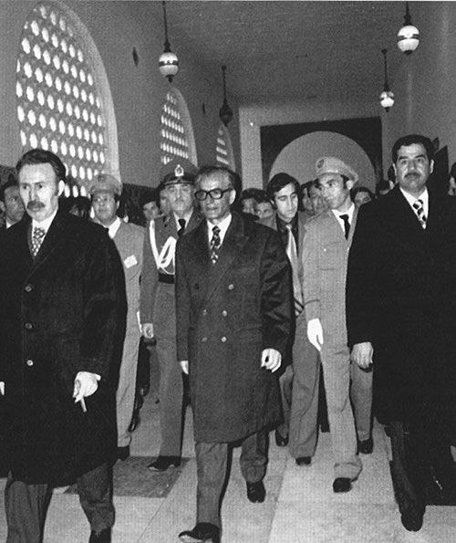

محبوب شجاع میهن پرست دوست داشتنی و قدرتمند

اعلیحضرت محمدرضا شاه پهلوی آریامهر برخلاف رژیم جمهوری اسلامی حتی یک سانت از خاک ایران به صدام نداد و صدام از ترس شاه فرار کرده بود الجزایر که قرارداد امضا کنه که به ایران حمله نکنه.

شاه بخشی از اروند رود از عراق پس گرفت

صدام تنها از یک نفر در دنیا میترسید اونم شاه بود
@ChizBergerz

## ChizBergerz — post 46668

  <a href="telegram/content/ChizBergerz_46668_1779470598.webm" target="_blank">🎬 Download video</a>

👍 
👍 #اختصاصی #وینرو : 
✅ ثبت نام کن 
🤩 
🤩 
🤩 هزارتومان شارژ بی قیدوشرط بگیر! 
💵 
💬 به مدت محدود 
📣 
😮 تنها سایتی که با عضویت بدون واریز 500,000 تومان شارژ بی قیدو شرط میده #وینرو هست
💰 
👑 #معتبرترین سایت ایرانی 
⬇️ 
🌐 Winro.io 
🌐 Winro.io 
📱کانال اخبار و هدایا g1…

## ChizBergerz — post 46667

  <a href="telegram/content/ChizBergerz_46667_1779470598.webm" target="_blank">🎬 Download video</a>

👍 
👍 #اختصاصی #وینرو :

✅ ثبت نام کن 
🤩 
🤩 
🤩 هزارتومان شارژ بی قیدوشرط بگیر!

💵 
💬 به مدت محدود 
📣

😮 تنها سایتی که با عضویت بدون واریز 500,000 تومان شارژ بی قیدو شرط میده #وینرو هست
💰

👑 #معتبرترین سایت ایرانی 
⬇️

🌐 Winro.io

🌐 Winro.io

📱کانال اخبار و هدایا g1 
🎁

📱 @winro_io

## ChizBergerz — post 46666

  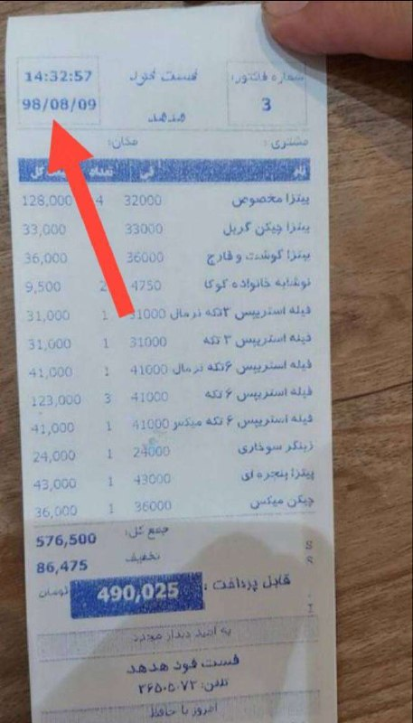

سال ۹۸ این همه چیزو سفارش میدادیم میشد ۴۹۰ هزارتومن!

الان همینارو سفارش بدی زیر ۲۰ میلیون نمیشه!

اصحاب کهف جلوی ما لنگ میندازن!
@ChizBergerz

## rodast_omiddana — post 71775

  <a href="telegram/content/rodast_omiddana_71775_1779470600.webm" target="_blank">🎬 Download video</a>

🚨 قبل از اینکه رابطه صادق بیگدلی با جنت خواه توضیح بدم فعلا رابطه ات را با جواد ظریف بگو و توضیح بده چجوری از بغل ظریف رفتی شدی مشاور شاهزاده تا به جنت خواه برسیم...

## rodast_omiddana — post 71773

🚨 حالا که با جنت خواه و ادبیاتش آشنا شدی سوال مهم اینجاست
آقای صادق بیگدلی نویسنده دفترچه اضطرار، رابطه شما با جنت خواه چیست؟

## rodast_omiddana — post 71772

  <a href="telegram/content/rodast_omiddana_71772_1779470601.webm" target="_blank">🎬 Download video</a>

🚨
🚨این تهدید جنت خواه خیلی مهمه..
آینده ایران سکولار را اینجوری میخواهند درست کنند..
حالا فهمیدید درگیری فراتر از کنسرت شاهین هست
حالا فهمیدید شاهین نجفی که یک روز آهنگ نقی خوند چطور اینقدر شیعه دوست شد؟
منو دارند برای فردای ایران آزاد بابت نظراتم تهدید میکنند..
چه آزادی بیارن حضرات..
و اما من هنوز حرفی نزدم محمدعلی جان فعلا یک انگشتت کردم تا بعد که با دیلدو XXL بیام سراغت..

## rodast_omiddana — post 71771

  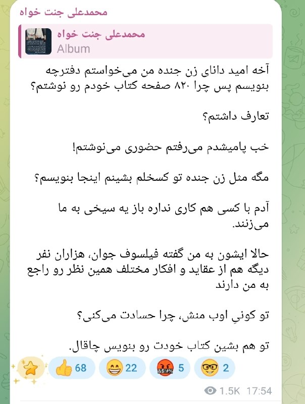

😎این مادر اسپرسو شیعه چقدر بی ادبه..
انگشت کردم لونه زنبور...
مردک دیدم یواشکی داری شیعه بازی میکنی گفتم بیارمت رو بد کاری کردم 🥰

## rodast_omiddana — post 71770

  <a href="telegram/content/rodast_omiddana_71770_1779470602.webm" target="_blank">🎬 Download video</a>

🚨 جنت خواه شیعه پفیوز مدعی شده عکسی که ازش دارم با لباس آخوندی هست با هوش مصنوعی درست شده است..
بنابراین اگر درست بگوید در این مورد از او و مخاطبانم معذرت میخواهم...
اما این اظهاراتش علیه اسرائیل و دفاعش از گروه تروریستی حما* را که دیگر نمیتواند منکر شود..

## rodast_omiddana — post 71767

  <a href="telegram/content/rodast_omiddana_71767_1779470602.webm" target="_blank">🎬 Download video</a>

🚨ایسنا: عاصم منیر وارد تهران شد

## rodast_omiddana — post 71766

  <a href="telegram/content/rodast_omiddana_71766_1779470602.webm" target="_blank">🎬 Download video</a>

🚨 محمدعلی جنت خواه یکی از مشاوران دفتر شاهزاده برای نوشتن دفترچه اضطرار، دفتر شاهزاده از او به عنوان فیلسوف جوان شیعه یاد میکند..
شاید باورتان نشه ولی جنت خواه ایران را مملکت امام زمان میداند و با این روحیه و تفکر فعلا در حال مشاوره دادن به شاهزاده هستند و البته مهندسی تخریب من نیز در دستور کار این فرد است!
حالا چرا من؟ روشنه دیگه، چه کسی زبان سرخی در باب شیعه گری داره؟ پس بنابراین باید امید دانا را بزنند و همه تیم رسانه ایشان به مانند رسانه "بچه کوچه ای" را هم آوردن پای کار...
حال سوال اینجاست مردم به این بلوغ رسیدن بدانند باید پشت چه کسی بایستند؟
مردم آیا در این سالها زحمات منو دیدن؟ یا اینکه....!

## rodast_omiddana — post 71765

  <a href="telegram/content/rodast_omiddana_71765_1779470603.webm" target="_blank">🎬 Download video</a>

🚨پانزده سال علیه من همه کار کردید دیدید جواب نداد..
مشکل شما ماسونهای شیعه از اول با من در دفتر شاهزاده نگاه ضدیتم با شیعه گری بود، برای اینکارم هر بی اخلاقی کردید ولی من ماندم و خیلی از شماها نماندید..
به هر روی وقتشه ملت هم دارای پختگی و شعور شود و بجای دیدن بلاگرهای دوزاری در اینستاگرام و قضاوت با چند کلیپ ویدیو، وقت بزار روایت منو از همه چیز در این درد و دلی که در یوتیوب گذاشتم ببینه و سپس قضاوت کنه..
من امید دانا پس از 5 بار زندان و زیر حکم اعدام و اینهمه دشمن ریز و درشت از چپ تا راست همچنان امید دانا ماندم، به من ضربه نمیزنید ولی اگر به من کمک کنید باهم این ننگ 1400 سال را از ایران اخراج میکنیم..
لینک گذشته خودم:
https://www.youtube.com/watch?v=Hntn40BJ1jQ

## KiriMohems — post 47893

  

🔴قطعی این نت سگ ناموص به ۲۰۰۰ ساعت رسید

#Helsinki
@KiriMohems

## KiriMohems — post 47892

📰 ایسنا : عاصم منیر کیر و خایه رو تو تهران پهن کرد

#Helsinki
@KiriMohems

## KiriMohems — post 47891

🔴ترامپ بلونده: ایران به شدت خواهان توافق است!

همان کاری را که در ونزوئلا انجام دادیم، در ایران انجام می دهیم

#professor
@KiriMohems

## SportBaadNews — post 252215

پدری دوست دخترشو نشونده عقب تا بشینه کنار فران تورس و سوار ترن هوایی بشه 😂😂😂😂😂😂😂😂😂😂😂😂😂😂 @SportBaadNews

## SportBaadNews — post 252214

  <a href="telegram/content/SportBaadNews_252214_1779470604.webm" target="_blank">🎬 Download video</a>

🚨
💣🏴󠁧󠁢󠁥󠁮󠁧󠁿 رسسسسسسسسسسسسمی؛ لیست تیم ملی انگلیس برای جام جهانی 2026 آمریکا 
◀️دروازبان ها: جوردن پیکفورد، دین هندرسون، جیمز ترافورد 
◀️مدافعان: ریس جیمز، تینو لیورامنتو، مارک گوهی، ازری کونسا، جان استونز، جارل کوانسا، نیکو اورایلی، دن برن، جد اسپنس 
◀️هافبک…

## SportBaadNews — post 252213

  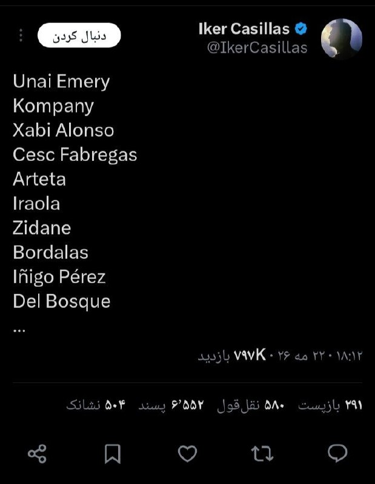

کاسیاس اومده لیست مورد نظرش برای سرمربیگری رئال رو توییت کرده:
@SportBaadNews

## SportBaadNews — post 252212

  <a href="telegram/content/SportBaadNews_252212_1779470605.webm" target="_blank">🎬 Download video</a>

🚨
💣
⚽️ #رسمی | داوید آلابا مفت خور اعظم از رئال مادرید جدا شد! @SportBaadNews

## SportBaadNews — post 252211

🔺
🇪🇸دوست‌دختر جدید یامال، اینس گارسیا، درباره اینکه چطور با لامین آشنا شد: 
🔺من لامینو عادی‌ترین شکل ممکن تو تاریخ شناختم. 
🔺کارتم تو یه مغازه کوچیک رد شد و من همونجا هول کرده بودم و خجالت می‌کشیدم، داشتم سعی می‌کردم از یه حساب دیگه پول منتقل کنم. بعد یه پسر…

## SportBaadNews — post 252210

  <a href="telegram/content/SportBaadNews_252210_1779470605.webm" target="_blank">🎬 Download video</a>

🚨
💣
⚽️ #رسمی | داوید آلابا مفت خور اعظم از رئال مادرید جدا شد!
@SportBaadNews

## IranIntlTV — post 338460

  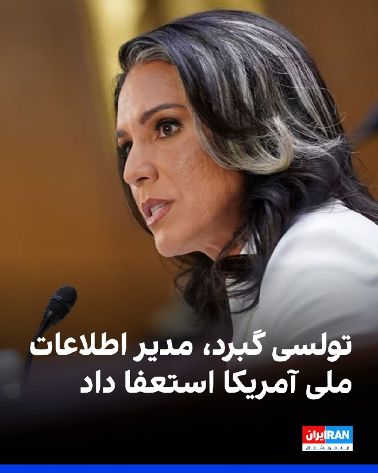

فاکس‌نیوز گزارش داد که تولسی گبرد، مدیر اطلاعات ملی آمریکا از سمت خود استعفا داده است.
او پیش‌تر گفته بود گفت که اهداف تعیین‌شده از سوی ترامپ درباره جنگ با جمهوری اسلامی، با اهداف اسرائیل متفاوت است.

گبرد همچنین گفته بود که حکومت ایران برقرار به نظر می‌رسد، اما در نتیجه عملیات نظامی آمریکا به‌طور گسترده تضعیف شده است.
https://iranintl.com/202605228014

## IranIntlTV — post 338459

  <a href="telegram/content/IranIntlTV_338459_1779470607.mp4" target="_blank">🎬 Download video</a>

در پی کارزار مردمی ایران‌اینترنشنال برای شناسایی جاویدنامان بیمارستان الغدیر تهران، شاهدان با ارسال پیام‌هایی می‌گویند کادر درمان این بیمارستان در ۱۸ و ۱۹ دی ۱۴۰۴، با وجود فشار شدید ماموران و ممانعت آنها، معترضان را رها نکردند و برای بهبود آنها تلاش کردند.
فرنوش فرجی، عضو تحریریه ایران‌اینترنشنال گزارش می‌دهد.

## IranIntlTV — post 338458

  

علیرضا سلیمی، عضو هیات رییسه مجلس گفت: «یکی از دستاوردهای جنگ اخیر، مدیریت جمهوری اسلامی بر تنگه هرمز است که هرگز قابل مذاکره و معامله نیست و رژیم حقوقی جدیدی بر این تنگه حاکم خواهد شد که قواعد آن را تنها ما تعریف و اعمال می‌کنیم.»

او افزود: «شرایط عبور و مرور همچنین نرخ عوارض بر تنگه هرمز را جمهوری اسلامی مشخص می‌کند و با توییت نمی‌توانند اوضاع تنگه را تغییر دهند.»
https://iranintl.com/202605225037

## IranIntlTV — post 338457

  <a href="https://t.me/IranintlTV/338457" target="_blank">📎 Download file</a>

🎧نسخه صوتی اخبار شبانگاهی | جمعه یک خرداد
@iranintlTV

## IranIntlTV — post 338456

  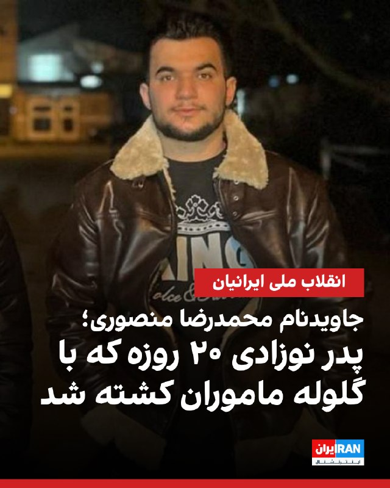

بر اساس گزارش‌های رسیده به ایران‌اینترنشنال، محمدرضا منصوری، جوان ۲۴ ساله و پدر یک نوزاد ۲۰ روزه بود که با تیراندازی نیروهای حکومتی در جریان اعتراضات شهر رشت جان خود را از دست داد. او به دلیل جراحات ناشی از شلیک گلوله، حدود یک ماه بستری و تحت درمان بود.

بر اساس گزارش‌ها، محمدرضا ۱۸ دی‌ماه در منطقه یخسازی رشت هدف شلیک نیروهای حکومتی قرار گرفت و بر اثر اصابت گلوله به نخاع و کتف به شدت زخمی شد.

او ۱۳ بهمن‌ماه بر اثر شدت جراحات وارده در جریان اعتراضات جان باخت.

به گفته منابع محلی، محمدرضا تنها فرزند خانواده بود و پیش از حضور در فراخوان، گفته بود: «برای آینده دخترم در اعتراض شرکت می‌کنم.»
https://iranintl.com/202605222447

## IranIntlTV — post 338455

  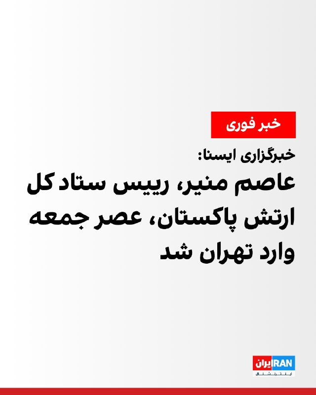

خبرگزاری ایسنا اعلام کرد که عاصم منیر، رییس ستاد کل ارتش پاکستان، عصر جمعه وارد تهران شده است.
پیش‌تر برخی رسانه‌ها از سفر او به تهران، برای تلاش در خصوص نزدیک کردن خواسته‌ها و انتظارات مقام‌های جمهوری اسلامی و ایالات متحده، برای رسیدن به توافق خبر داده بودند.
https://iranintl.com/202605220892

## IranIntlTV — post 338454

بندر خَصَب، راه فرار جمهوری اسلامی از محاصره دریایی؟
فرناز داوری- در میانه آتش‌بس شکننده و محاصره دریایی در تنگه هرمز، بندر خَصَب در عمان به یکی از مسیرهای حیاتی برای رساندن کالا به ایران تبدیل شده است. بندری که با قایق‌های «شوتی»، ماهیگیران و گردشگران شناخته می‌شد، حالا گذرگاهی پرهزینه اما مهم برای دور زدن محاصره بنادر جنوبی ایران شده است.
تا پیش از آغاز جنگ آمریکا و اسرائیل علیه جمهوری اسلامی، بخشی از رفت‌وآمدهای دریایی میان خصب و سواحل جنوبی ایران، به قایق‌های تندرو اختصاص داشت. قایق‌هایی که در ادبیات محلی به «شوتی» معروف‌ هستند و سال‌ها در مسیرهای غیررسمی میان عمان و جنوب ایران، رفت‌وآمد کرده‌اند.
این قایق‌ها معمولا به صورت گروهی حرکت می‌کردند و در زمانی کوتاه خود را از آب‌های عمان به قشم یا دیگر نقاط ساحلی ایران می‌رساندند.
این مسیر پیش از این بیشتر برای دادوستدهای غیررسمی و قاچاق خرد شناخته می‌شد. سیگار ایرانی، مشروبات الکلی و حشیش، از ایران به عمان منتقل می‌شد و در مسیر بازگشت، کالاهای مصرفی، لوازم خانگی و اجناس لوکس، از عمان به ایران می‌رسید.
حضور قایق‌های ماهیگیری ایرانی نیز در اطراف خصب همیشه بخشی از تصویر معمول این منطقه بود.

ادامه گزارش را در اینجا بخوانید:
https://www.iranintl.com/202605220630

## IranIntlTV — post 338453

  <a href="telegram/content/IranIntlTV_338453_1779470613.mp4" target="_blank">🎬 Download video</a>

همه‌پرسی درباره جدایی آلبرتا از کانادا ۱۹ اکتبر برگزار می‌شود.

نخست‌وزیر کانادا هشدار داد هرگونه اقدام برای استقلال باید بر اساس قوانین فدرال انجام شود.

گزارش مهسا مرتضوی، خبرنگار ایران‌اینترنشنال
@iranintltv

## IranIntlTV — post 338452

  

دونالد ترامپ در کاخ سفید درباره مذاکرات با جمهوری اسلامی گفت: «خواهیم دید چه خواهد شد. ما ضربه سختی به ‌آنها زدیم. چاره‌ای نداشتیم. ایران نمی‌تواند سلاح هسته‌ای داشته باشد.»

ترامپ ادامه داد: «آمریکا با جمهوری اسلامی همان رفتاری را انجام می‌دهد که با ونزوئلا انجام داده است.»

ترامپ تاکید کرد جمهوری اسلامی بی‌صبرانه به دنبال رسیدن به توافق است.
https://iranintl.com/202605224243

## IranIntlTV — post 338451

رجزخوانی نظام؛ مغازه کوچک وحشت‌فروشی
حسین ذوقی-جمهوری اسلامی در حالی که تقریبا در آستانه شکست در همه زمینه‌های داخلی و خارجی قرار دارد، تاکتیکش را بر یک سنت فقهی استوار کرده است: رجزخوانی.
سخنان تند مداحان در تجمعات شبانه، سخنان تلویزیونی مسئولان میان‌رده تا گفته‌های رسمی مسئولین بلندپایه در مذاکرات، رسانه‌های اجتماعی و در نهایت، پیام‌های مکتوب رهبر نادیده نظام، بر همین سنت استوار شده است.
ماجرای «آتیش زدم به مالم» را حتما شنیده‌اید: بزازی در بازار، در کسادی وضعیتش و وقتی که اجناسش روی دستش مانده بود و راهی برای فروش نداشت، شاگردش را با یک حلب نفت به میانه بازار می‌فرستد تا فریاد بزند که: «اوستایم عقلش را از دست داده، می‌خواهد همه جا را به آتش بکشد!»
مردم هم که ترسیده‌اند به طمع جنس مفت، سمت دکان بزاز هجوم می‌برند. اوستای بزاز پارچه‌هایش را میان دکان می‌اندازد و رجز می‌خواند که «آتش می‌زنم ...»
خلاصه که انبار بزاز خالی می‌شود و جنس‌هایش را با قیمت بالاتر می‌فروشد!
حالا جمهوری اسلامی هم انگار می‌خواهد با تهدید و رجزخوانی به آتش زدن دنیا، ایده‌هایش را به منطقه و جهان بفروشد.
مداحان از منبر، منتقدان داخلی را به مرگ تهدید می‌کنند. محمود نبویان، نایب‌رییس کمیسیون امنیت ملی مجلس شورای اسلامی، پادشاهان کشورهای عربی را تهدید می‌کند که «هیچ یک از کاخ‌هایشان سالم نخواهد ماند».
عباس عراقچی، وزیر امور خارجه جمهوری اسلامی، در شبکه‌های اجتماعی از «پاسخ طولانی و دردناک» سخن می‌گوید.
اسماعیل بقایی، سخنگوی وزارت امور خارجه، حتی در نشست‌های دیپلماتیک، با لحنی رجزآلود حرف می‌زند.
غلامحسین محسنی اژه‌ای، رییس قوه قضاییه، از «تحمیل ناپذیری» می‌گوید؛ و حسین کنعانی‌مقدم، فرمانده پیشین سپاه پاسداران، اعتراف می‌کند که «رجزخوانی یکی از روش‌های مقابله با دشمن است».
لایه‌ها‌ی متفاوت نظام به یک زبان مشترک رسیده‌اند. این روش تصادفی نیست، شیوه جدید حکمرانی در جمهوری اسلامی است.

ادامه این تحلیل را اینجا بخوانید:
https://www.iranintl.com/202605219159

## IranIntlTV — post 338450

  <a href="telegram/content/IranIntlTV_338450_1779470616.mp4" target="_blank">🎬 Download video</a>

فیلم مستند «تمرین‌هایی برای یک انقلاب»، ساخته پگاه آهنگرانی، برنده جایزه «چشم طلایی» جشنواره کن شد. این فیلم با استفاده از آرشیوهای شخصی و تصاویر اعتراض‌ها، ۴ دهه از تحولات سیاسی و اجتماعی ایران را روایت می‌کند.

لی‌لی نیکفر، خبرنگار ایران‌اینترنشنال، گزارش می‌دهد
@iranintltv

## IranIntlTV — post 338449

  <a href="telegram/content/IranIntlTV_338449_1779470618.mp4" target="_blank">🎬 Download video</a>

جاویدنام عرفان بزرگی، جوان ۲۲ ساله اهل مرودشت، قهرمان مچ‌اندازی استان فارس بود. او ۱۲ دی‌ماه از ناحیه سر هدف گلوله نیروهای سرکوب جمهوری اسلامی قرار گرفت و به‌دلیل شدت جراحات، دو روز بعد در بیمارستان جان باخت.

گزارش فربد سروندی، عضو تحریریه ایران‌اینترنشنال
@iranintltv

## IranIntlTV — post 338448

  <a href="telegram/content/IranIntlTV_338448_1779470620.mp4" target="_blank">🎬 Download video</a>

همزمان با رایزنی‌های غیرمستقیم میان تهران و واشینگتن، فرمانده ارتش پاکستان وارد تهران شد.

به گفته جمهوری اسلامی، این سفر بخشی از تبادل پیام‌ها میان ایران و آمریکا با میانجی‌گری پاکستان است.

گزارش اردوان روزبه، خبرنگار ایران‌اینترنشنال
@iranintltv

## IranIntlTV — post 338447

  <a href="telegram/content/IranIntlTV_338447_1779470622.mp4" target="_blank">🎬 Download video</a>

🔻نهادهای حقوق بشری نسبت به وضعیت غلامرضا خانی‌ شکرآب، ورزشکار و زندانی سیاسی، که با اتهام «جاسوسی» بازداشت شده، هشدار داده‌اند.

🔹او به‌طور ناگهانی از بند امنیتی زندان اوین به سلول انفرادی در زندان قزل‌حصار منتقل شده است.

🔹تصاویری از این ورزشکار را سردار پاشایی، قهرمان پیشین کشتی جوانان جهان، در فضای مجازی منتشر کرده است.

@iranintltvsport

## IranIntlTV — post 338446

  <a href="telegram/content/IranIntlTV_338446_1779470624.mp4" target="_blank">🎬 Download video</a>

یک شهروند در پیامی به ایران اینترنشنال با اشاره به پوشش چادر خود می‌گوید که نه در تجمعات حکومتی شرکت می‌کند و نه از نظام جمهوری اسلامی حمایت می‌کند. پیام او با هوش مصنوعی خوانده شده است.

## IranIntlTV — post 338445

تحرکات تازه در مذاکرات تهران و واشینگتن با سفر فرمانده ارتش پاکستان و هیات قطری به ایران

هم‌زمان با ادامه رایزنی‌های دیپلماتیک در خصوص مذاکرات تهران و واشینگتن، گزارش‌ها از سفر عاصم منیر، فرمانده ارتش پاکستان، به ایران حکایت دارند. یک منبع آگاه نیز به رویترز گفت قطر در هماهنگی با ایالات متحده، یک تیم مذاکره‌کننده را به تهران اعزام کرده است.

ایرنا، خبرگزاری دولت جمهوری اسلامی، جمعه اول خرداد به نقل از یک منبع دیپلماتیک نوشت منیر قرار است در سفر به ایران با مقام‌های بلندپایه جمهوری اسلامی دیدار و گفت‌وگو کند.

شبکه سی‌بی‌اس نیوز نیز به نقل از منابع آگاه امنیتی، سفر فرمانده ارتش پاکستان به ایران را تایید کرد و نوشت بررسی مسائل مهم منطقه‌ای و بین‌المللی، از جمله مذاکرات تهران و واشینگتن، محور اصلی دیدارهای او با مقام‌های جمهوری اسلامی خواهد بود.

یک مقام ارشد پاکستانی به سی‌بی‌اس نیوز گفت دیدارهای اخیر محسن نقوی، وزیر کشور پاکستان، در تهران باعث شده مذاکرات «در مسیری مهم» پیش برود و در همین چارچوب، منیر برای ادامه این رایزنی‌ها راهی ایران شده است.

خبرگزاری رویترز نیز از سفر یک هیات مذاکره‌کننده قطری به تهران خبر داد و نوشت هدف از این سفر که با هماهنگی واشینگتن انجام گرفت، «کمک به تلاش‌ها برای دستیابی به توافقی برای خاتمه جنگ ایران» است.

بر اساس این گزارش، هیات قطری اول خرداد وارد شد.

قطر که پیش‌تر نقش پررنگی در میانجی‌گری‌های بین‌المللی از جمله در جنگ غزه داشت، در پی حملات موشکی و پهپادی اخیر جمهوری اسلامی به این کشور، از ایفای نقش واسطه در مذاکرات مربوط به جنگ ایران فاصله گرفته بود.

العربیه از سفر رییس سازمان اطلاعات پاکستان به تهران خبر داد
شبکه العربیه به نقل از منابع آگاه گزارش داد عاصم مالک، رییس سازمان اطلاعات پاکستان، هم راهی تهران شده است.

از زمان برقراری آتش‌بس موقت در ۱۹ فروردین، پاکستان کوشیده است زمینه دستیابی به توافقی را برای پایان جنگ آمریکا و اسرائیل با جمهوری اسلامی فراهم کند.

رویترز اول خرداد نوشت عباس عراقچی، وزیر امور خارجه جمهوری اسلامی، با وزیر کشور پاکستان در تهران دیدار کرد تا درباره پیشنهادهای مربوط به پایان جنگ گفت‌وگو کند.
این دومین دور گفت‌وگوهای نقوی با مقام‌های ایرانی در دو روز گذشته بود.

رویترز افزود اسلام‌آباد در تلاش است ارتباط میان تهران و واشینگتن را تسهیل کند تا چارچوبی برای پایان جنگ و حل اختلاف‌ها شکل بگیرد.

«نشانه‌های مثبت»
مارکو روبیو، وزیر خارجه آمریکا، ۳۱ اردیبهشت گفت در مذاکرات «نشانه‌های مثبتی» دیده می‌شود، اما هشدار داد اگر جمهوری اسلامی طرح دریافت عوارض از کشتی‌های عبوری از تنگه هرمز را اجرا کند، دستیابی به توافق ممکن نخواهد بود.

او گفت: «ما می‌خواهیم این مسیر باز و آزاد باشد. تنگه هرمز یک آبراه بین‌المللی است.»

یک منبع ارشد ایرانی نیز به رویترز گفت اختلاف‌ها میان دو طرف کاهش یافته، اما موضوع غنی‌سازی اورانیوم و تنگه هرمز همچنان از اصلی‌ترین موانع توافق هستند.

جنگ جاری شوک بزرگی به اقتصاد جهانی وارد کرده و افزایش قیمت نفت، نگرانی‌ها را درباره تورم تشدید کرده است.

پیش از آغاز جنگ، حدود یک‌پنجم صادرات جهانی نفت و گاز طبیعی مایع از تنگه هرمز عبور می‌کرد.

هم‌زمان ارزش دلار آمریکا به بالاترین سطح شش هفته گذشته نزدیک شده و قیمت نفت نیز در پی تردید بازارها نسبت به موفقیت مذاکرات، افزایش یافته است.

اورانیوم و تنگه هرمز
دونالد ترامپ، رییس‌جمهوری آمریکا، ۳۱ اردیبهشت گفت واشینگتن در نهایت ذخایر اورانیوم غنی‌شده ایران را در اختیار خواهد گرفت.

او اضافه کرد: «آن را به دست خواهیم آورد. به آن نیاز نداریم و احتمالا بعد از به دست آوردنش نابودش خواهیم کرد، اما اجازه نمی‌دهیم ایران آن را داشته باشد.»

دو منبع ارشد ایرانی پیش‌تر به رویترز گفته بودند مجتبی خامنه‌ای، رهبر سوم جمهوری اسلامی، دستور داده ذخایر اورانیوم غنی‌شده از ایران خارج نشود.

پیشنهاد تازه جمهوری اسلامی که این هفته به آمریکا ارائه شده، شامل درخواست‌هایی مانند کنترل تنگه هرمز، دریافت غرامت جنگ، لغو تحریم‌ها، آزادسازی دارایی‌های بلوکه‌شده و خروج نیروهای آمریکایی از منطقه است؛ درخواست‌هایی که ترامپ پیش‌تر آن‌ها را رد کرده بود.

هم‌زمان آژانس بین‌المللی انرژی اعلام کرد جنگ جاری «بدترین شوک انرژی جهان» را ایجاد کرده است.

این نهاد هشدار داد هم‌زمانی اوج تقاضای تابستانی و کمبود عرضه جدید از خاورمیانه، ممکن است بازار انرژی را در ماه‌های ژوییه و اوت وارد «منطقه قرمز» کند.
 
🔗وب‌سایت ایران‌اینترنشنال
@iranintltv

## IranIntlTV — post 338444

  <a href="telegram/content/IranIntlTV_338444_1779470627.mp4" target="_blank">🎬 Download video</a>

مارکو روبیو، وزیر خارجه آمریکا، در دومین روز نشست وزیران خارجه ناتو هشدار داد هرگونه اقدام جمهوری اسلامی برای ایجاد محدودیت یا دریافت عوارض در تنگه هرمز می‌تواند مسیر توافق را تخریب کند. او همچنین افزود: «هنوز برای خوش‌بینی نسبت به پیشرفت مذاکرات زود است.»
مهران عباسیان، خبرنگار ایران‌اینترنشنال، گزارش می‌دهد
@iranintltv

## IranIntlTV — post 338443

  

مقام‌های اتحادیه اروپا جمعه اعلام کردند اروپایی‌ها باید انتظار داشته باشند قیمت نفت و گاز دست‌کم تا پایان سال ۲۰۲۷ بالاتر از سطح پیش از جنگ باقی بماند و قیمت سایر کالاها نیز روندی افزایشی داشته باشد.

کمیسر اقتصادی اتحادیه اروپا، گفت افزایش قیمت انرژی عامل اصلی رشد تورم است؛ به‌طوری‌که نرخ تورم برای امسال ۳.۱ درصد و برای سال ۲۰۲۷ حدود ۲.۴ درصد پیش‌بینی می‌شود. این رقم به‌مراتب بالاتر از پیش‌بینی قبلی ۱.۹ درصدی برای سالجاری میلادی است.
https://iranintl.com/202605222906

## IranIntlTV — post 338442

  <a href="telegram/content/IranIntlTV_338442_1779470630.mp4" target="_blank">🎬 Download video</a>

بر اساس گزارش‌های شهروندان به ایران‌اینترنشنال، با تشدید بحران اقتصادی و مشکلات تامین منابع در ایران، نه‌تنها برای خرید بنزین، بلکه برای تهیه مایحتاج اساسی نیز در برخی شهرها صف‌های طولانی شکل گرفته است.

گفت‌وگو با محسن مهیمنی، عضو تحریریه ایران‌اینترنشنال
@iranintltv

## IranIntlTV — post 338441

  <a href="telegram/content/IranIntlTV_338441_1779470633.mp4" target="_blank">🎬 Download video</a>

انور قرقاش، مشاور دیپلماتیک رییس‌ امارات، گفت روابط رسمی این کشور با اسرائیل قوی‌تر نیز خواهد شد، زیرا «همه جمهوری اسلامی را یک تهدید استراتژیک می‌بینند».

گفت‌وگو با علی صدرزاده، تحلیل‌گر مسائل خاورمیانه
@iranintltv

## Persian_Trend_Official — post 14678

  

استقبال رسمی سردار اسکندر مؤمنی وزیرکشور از فرمانده ارتش پاکستان فیلد مارشال عاصم منیر.

👩‍💻:PhantomDirective

🆔@persian_trend_official
پرشین ترند | متفاوت‌ترین کانال نظامی

## Persian_Trend_Official — post 14677

  <a href="telegram/content/Persian_Trend_Official_14677_1779470636.mp4" target="_blank">🎬 Download video</a>

کلیپ «UAP نزدیک فرودگاه کاراگاندا» در پرونده‌های جدید یوفو ظاهر شد

ویدئو نشان می‌دهد «یک پدیده نورانی با ردپاهایی از روشنایی کاهنده که از مرکز گسترش می‌یابد»

«آن هواپیما نیست» — شاهد در ویدئو

👩‍💻:PhantomDirective

🆔 @persian_trend_official
پرشین ترند | متفاوت‌ترین کانال نظامی

## Persian_Trend_Official — post 14676

UAP از ساحل شرقی

فیلم گرفته شده توسط حسگر مادون قرمز روی سکوی نظامی آمریکا در سال ۲۰۱۹

👩‍💻:PhantomDirective

🆔 @persian_trend_official
پرشین ترند | متفاوت‌ترین کانال نظامی

---
📅 بروزرسانی: 1405/03/01 18:52
---

## ChizBergerz — post 46665

  <a href="telegram/content/ChizBergerz_46665_1779463323.mp4" target="_blank">🎬 Download video</a>

چرا رژیم چنج برای ترامپ حیاتی هست؟!

مانوک عزیز پاسخ این سوال رو خیلی خوب داده:
@ChizBergerz

## ChizBergerz — post 46664

  <a href="telegram/content/ChizBergerz_46664_1779463325.mp4" target="_blank">🎬 Download video</a>

🔴ویدیو منتشر شده در دومین دسته از پرونده‌های مرتبط با یوفو/یو‌ای‌پی پنتاگون، یک یو‌ای‌پی را بر فراز سوریه نشان می‌دهد که «شتاب آنی» داره!😐😐

@ChizBergerz

## ChizBergerz — post 46663

  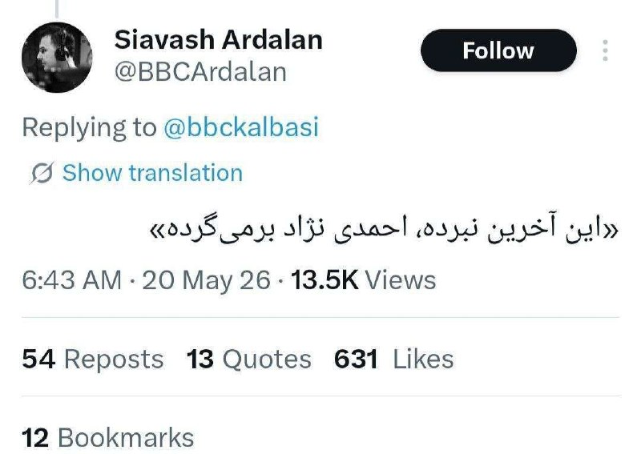

درحالی که میلیون‌ها ایرانی در ۱۸ و ۱۹ دی‌ماه در خیابان‌ها علیه جمهوری‌شیطانی جنگیدن و صدها هزار نفر بازداشت و زخمی شدن و ده‌ها هزار نفر کُشته شدن، سیاوش اردلان از خبرنگارای مادرقحبه بی‌بی‌سی فارسی شعار میلیون‌ها ایرانی رو مسخره میکنه!

@ChizBergerz

## ChizBergerz — post 46662

  <a href="telegram/content/ChizBergerz_46662_1779463327.mp4" target="_blank">🎬 Download video</a>

یادی کنیم از سکس کال یه آخوند با یه جنده:

@ChizBergerz

## rodast_omiddana — post 71764

  <a href="telegram/content/rodast_omiddana_71764_1779463328.webm" target="_blank">🎬 Download video</a>

🚨 نورمن، خبرنگار وال استریت ژورنال:
"یه منبع میگه هر چیزی درباره پیش‌نویس توافقی که داره می‌چرخه، دروغه و صحت نداره!"

اون منبعت تایید هم بکنه دارن توافق میکنند، من بهت میگم جنگ میشه و کار رژیم را تمام میکنند..

## rodast_omiddana — post 71763

  <a href="telegram/content/rodast_omiddana_71763_1779463328.mp4" target="_blank">🎬 Download video</a>

🚨 تمسخر پادشاهی خواهان توسط خواننده رژیم سامان ویلسون...
وقتی مخالف کنسرتها بودیم یعنی همین، ببینید چطور عوامل رژیم در حال تمسخر کردن جریان هستند..
امیدوارم خوشی نبینی مرتضی که همه اتحاد را برهم زدی و این فضا کثیف را برای کاسبی ات ایجاد کردی..

## rodast_omiddana — post 71762

🎬 مجتبی دستور داد اورانیوم خارج نشه
خیالتون راحت جنگ میشه
لینک یوتیوب:
https://www.youtube.com/watch?v=WJQGqm5AQcY

## rodast_omiddana — post 71761

  <a href="telegram/content/rodast_omiddana_71761_1779463329.webm" target="_blank">🎬 Download video</a>

🚨 رویترز
"قطمذاکرات واقعیه؟
خیر این مذاکرات بابت دو دلیل عمده داره انجام میشه:
1- فشار عربستان برای اینکه در ایام حج نباید جنگی صورت بگیرد و حج یک هفته دیگر تمام میشود..
2- عدم پیدا کردن مخفیگاه مجتبی خامنه ای برای آغاز عملیات، گرفتی چی میگم دیگه...

## rodast_omiddana — post 71760

  <a href="telegram/content/rodast_omiddana_71760_1779463329.webm" target="_blank">🎬 Download video</a>

🚨 رویترز
"قطر یک تیم مذاکره‌کننده را با هماهنگی ایالات متحده به تهران فرستاده تا به حصول توافقی برای پایان دادن به جنگ با ایران کمک کند.
این تیم مذاکره‌کننده قطری روز جمعه با هماهنگی ایالات متحده وارد تهران شده تا به حصول توافقی برای پایان جنگ با ایران و حل مسائل باقیمانده کمک کند"

بازم میگم نگران نباشید مراسم حج هفته دیگه تمام میشه و این بازیها برای اینکه شاید بخوان بعد از حج حمله کنند و فعلا همو سرکار گذاشتن..

## rodast_omiddana — post 71759

  <a href="telegram/content/rodast_omiddana_71759_1779463329.webm" target="_blank">🎬 Download video</a>

🚨 فوری
باراک راوید، خبرنگار آکسیوس:
"عاصم منیر فرمانده ارتش پاکستان، امروز برای بستن توافق بین آمریکا و ایران و تموم کردنِ جنگ، راهی تهران میشه"...

نگران نباشید فقط میتوانم بگویم مسائلی که در میدان تعیین تکلیف نشده در مذاکرات هم تعیین تکلیف نخواهند شد..

## rodast_omiddana — post 71758

  <a href="telegram/content/rodast_omiddana_71758_1779463329.webm" target="_blank">🎬 Download video</a>

🚨 اساس برنامه سازی یعنی شفافیت..
وقتی رسانه ای که اعضایش همگی در کانادا هستند ولی حاضر نیستن خودشونو معرفی کنند و به صورت ناشناس تحت عنوان "بچه کوچه ای" برنامه میسازند، و اون رسانه به اسطوره ایران علی کریمی به صورت پروژه ای حمله میکند و به منی که سالها همه چیزم جلوی چشم شما مردم بود رحم نمیکنه، و بخشی از شما مردم بهش توجه میکنید روشن میشود این ملت هنوز خمینی را در ماه میبیند..
ملتی که قضیه به این سادگی را متوجه نمیشود و به صداهای ناشناس بها میدهد، سرنوشتی بهتر از آخوند هم گیرش نمیاد..

## rodast_omiddana — post 71757

  <a href="telegram/content/rodast_omiddana_71757_1779463329.webm" target="_blank">🎬 Download video</a>

🚨 دوستان عزیز فعلا اخبار جنگ کمه
من در یکساعت گذشته هیچی منتشر نکردم و در حال مطالعه هستم ولی دریغ از یک خبر مهم در ارتباط با حمله که منتشر کنم..

## KiriMohems — post 47890

  <a href="telegram/content/KiriMohems_47890_1779463330.mp4" target="_blank">🎬 Download video</a>

🔴روبیو: ایران داره تو یه آبراه بین‌المللی سیستم عوارض‌گیری راه میندازه؛

- این اصلاً قابل قبول نیست و نباید اتفاق بیفته
- اگه این تو تنگه هرمز جا بیفته، ۵ جای دیگه دنیا هم همین کارو می‌کنن
- چرا کشورهای دیگه دنیا نباید بگن ما هم می‌خوایم همین کارو بکنیم؟
- جدا از اینکه تنگه هرمز برای همه کشورهایی که اینجا هستن حیاتیه، برای خیلی از کشورهایی که اینجا هم نیستن، مخصوصاً منطقه هند-اقیانوس آرام، فوق‌العاده مهمه

#professor
@KiriMohems

## KiriMohems — post 47889

دیگه پول الکی نده
😂 
❌فیلترشکن گیگی 250 تومان دیگه نخر کف قیمت فیلترشکن 
👇 
1️⃣ 
💿 
1️⃣
7️⃣
9️⃣ 
💸 
3️⃣ 
💿 
4️⃣
8️⃣
0️⃣ 
💸 
5️⃣ 
💿 
7️⃣
5️⃣
0️⃣ 
💸 
1️⃣
0️⃣ 
💿 
1️⃣
5️⃣
0️⃣
0️⃣ 
💸 
3️⃣
0️⃣ 
💿 
4️⃣
0️⃣
0️⃣
0️⃣ 
💸 بجز این تست رایگان دارن
😆 اول تست کن 
👇 
🔤 @MrTh_Vpn

## KiriMohems — post 47888

دیگه پول الکی نده
😂

❌فیلترشکن گیگی 250 تومان دیگه نخر

کف قیمت فیلترشکن 
👇

1️⃣ 
💿 
1️⃣
7️⃣
9️⃣ 
💸

3️⃣ 
💿 
4️⃣
8️⃣
0️⃣ 
💸

5️⃣ 
💿 
7️⃣
5️⃣
0️⃣ 
💸

1️⃣
0️⃣ 
💿 
1️⃣
5️⃣
0️⃣
0️⃣ 
💸

3️⃣
0️⃣ 
💿 
4️⃣
0️⃣
0️⃣
0️⃣ 
💸

بجز این تست رایگان دارن
😆

اول تست کن 
👇

🔤 @MrTh_Vpn

## KiriMohems — post 47887

  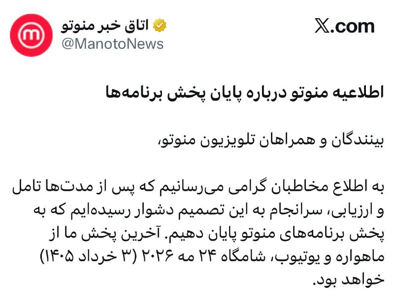

🔴 شبکه منوتو مجدداً از پایان پخش و اتمام کار خودش خبر داد.

@KiriMohems

## KiriMohems — post 47886

بلوبانک و خیلی دیگه از همراه‌بانکا اخیراً خرید شارژ زیر ۲۰ هزار تومن رو غیرفعال کردن؛ یعنی از جوک بودن این مملکت همینو بگم که حتی رو میزان خرید شارژ گوشیتم کنترلی نداری!

#professor
@KiriMohems

## SportBaadNews — post 252209

  

⚽️- چهار کیت نهایی بارسلونا برای فصل آینده و بگا دادن پول شما
@SportBaadNews

## SportBaadNews — post 252208

  <a href="telegram/content/SportBaadNews_252208_1779463331.mp4" target="_blank">🎬 Download video</a>

پدری دوست دخترشو نشونده عقب تا بشینه کنار فران تورس و سوار ترن هوایی بشه 😂😂😂😂😂😂😂😂😂😂😂😂😂😂
@SportBaadNews

## SportBaadNews — post 252207

  

🔺
🇪🇸دوست‌دختر جدید یامال، اینس گارسیا، درباره اینکه چطور با لامین آشنا شد:

🔺من لامینو عادی‌ترین شکل ممکن تو تاریخ شناختم.

🔺کارتم تو یه مغازه کوچیک رد شد و من همونجا هول کرده بودم و خجالت می‌کشیدم، داشتم سعی می‌کردم از یه حساب دیگه پول منتقل کنم. بعد یه پسر رندومی که کنارم بود یواشکی خندید و گفت: “فکر کنم دیگه وقتشه من نجاتت بدم”

🔺اون پول اسنک‌هامو حساب کرد و بیرون مغازه شروع کردیم حرف زدن. خیلی آروم، بامزه و عجیب فروتن بود. حتی یه بارم از فوتبال، بارسلونا یا معروف بودنش حرف نزد. من واقعاً فکر می‌کردم فقط یه پسر خوشگل و عادیه که ادب داره.

🔺شماره رد و بدل کردیم و هر روز با هم حرف می‌زدیم. بعضی وقتا به خاطر “تمرین” غیبش می‌زد، ولی من هنوزم زیاد بهش شک نکرده بودم.

🔺تا اینکه یه روز تیک‌تاکو باز کردم و نزدیک بود سکته کنم، چون همون پسری که از توی بشقابم چیپس برمی‌داشت، رو صفحه گوشی‌م بود با لباس بارسلونا و میلیون‌ها بازدید

🔺واقعاً زنگ زدم بهش و گفتم: “صبر کن… تو همون لامینی؟!😭

🔺و اونم کل مدت داشت می‌خندید
@SportBaadNews

## SportBaadNews — post 252205

  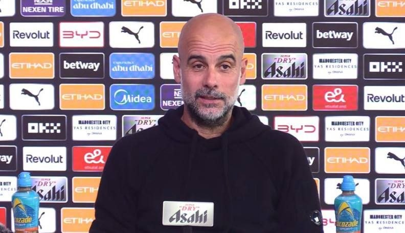

پپ گواردیولا: همونطور که یورگن کلوپ گفت انرژیم تموم شده و فصل بعد سرمربی تیمی نخواهم بود، به یک دوره استراحت نیاز دارم

تنها دلیل جداییم استراحته، برای مدتی برنامه‌ای برای مربیگری ندارم وگرنه همینجا میموندم، نیاز دارم کمی عقب بکشم، برای مدتی مربیگری نخواهم کرد
@SportBaadNews

## SportBaadNews — post 252203

دوتا شات خوشگل از قهرمانی دیشب النصر
@SportBaadNews

## SportBaadNews — post 252202

منم دعا کردم یدونم برا من بخر

## SportBaadNews — post 252200

  <a href="telegram/content/SportBaadNews_252200_1779463333.webm" target="_blank">🎬 Download video</a>

🔻
💀کریستیانو رونالدو برنامه داره برای هر بازیکن النصر یه رولزرویس فانتوم به ارزش حدود ۵۳۰ تا ۵۸۰ هزار دلار بخره، چون کمکش کردن قهرمان لیگ عربستان بشه.
@SportBaadNews

## IranIntlTV — post 338435

  

اتحادیه اروپا اعلام کرد کشورهای عضو این اتحادیه جمعه روند اعمال تحریم علیه مقام‌های جمهوری اسلامی و دیگر افراد مرتبط با بستن تنگه هرمز را آغاز کردند.

شورای اتحادیه اروپا افزود که این اتحادیه از این پس می‌تواند در واکنش به اقداماتی که آزادی کشتیرانی در تنگه هرمز را مختل می‌کند، تحریم‌ها و محدودیت‌های بیشتری علیه جمهوری اسلامی اعمال کند.
https://iranintl.com/202605223943

## IranIntlTV — post 338434

  <a href="telegram/content/IranIntlTV_338434_1779463334.mp4" target="_blank">🎬 Download video</a>

اجمین مسیحی، جوان ۲۷ ساله ارمنی، شامگاه ۱۸ دی ۱۴۰۴ در میدان هفت‌حوض تهران هدف شلیک مستقیم گلوله جنگی قرار گرفت و کشته شد. پیکر او در بیمارستان الغدیر رها شد که در پی کارزار ایران‌اینترنشنال برای شناسایی جاویدنامان این بیمارستان، اطلاعات و تصاویری از او به دست ما رسیده است.

## IranIntlTV — post 338433

  

🔻روزنامه گاردین در گزارشی به بررسی تاثیر پپ گواردیولا بر فوتبال انگلیس پرداخت و نوشت او نه‌تنها منچسترسیتی، بلکه ساختار فوتبال انگلیس را نیز متحول کرد.

🔹گاردین نوشت زمانی که گواردیولا در سال ۲۰۱۶ هدایت منچسترسیتی را بر عهده گرفت، بسیاری نسبت به موفقیت سبک مبتنی بر پاس‌کاری و مالکیت توپ او در فوتبال فیزیکی انگلیس تردید داشتند. این تردیدها پس از شکست ۴ بر ۲ سیتی مقابل لسترسیتی در نخستین فصل حضور او بیشتر شد.

🔹گواردیولا پس از آن مسابقه گفته بود: «من مربی تکل‌ها نیستم و آن را تمرین نمی‌دهم.»

🔹این گزارش می‌افزاید که با گذشت زمان، سبک بازی گواردیولا به الگویی فراگیر در فوتبال انگلیس تبدیل شد؛ به‌گونه‌ای که حتی در دسته‌های پایین فوتبال این کشور نیز بازی‌سازی از خط دفاع و پاس‌های کوتاه به بخشی از استاندارد رایج تبدیل شده است.

🔹گاردین همچنین تاکید کرد که پیشرفت کیفیت زمین‌های فوتبال، تغییرات در سیستم آموزش بازیکنان جوان و سرمایه‌گذاری گسترده منچسترسیتی، در موفقیت این سبک نقش داشته‌اند اما گواردیولا بیش از هر عامل دیگری، نگاه فوتبال انگلیس را تغییر داده است.

https://t.me/iranintltvsport

## IranIntlTV — post 338432

  <a href="telegram/content/IranIntlTV_338432_1779463336.mp4" target="_blank">🎬 Download video</a>

یک شهروند در پیامی به ایران اینترنشنال می‌پرسد که جوانان ایران چه گناهی کردند که باید تاوان «نسل ۵۷» در انقلاب را بدهند. پیام او با هوش مصنوعی خوانده شده است.

## IranIntlTV — post 338431

  

یک منبع آگاه به رویترز گفت قطر در هماهنگی با ایالات متحده، یک تیم مذاکره‌کننده به تهران فرستاده است تا به تلاش‌ها برای دستیابی به توافقی برای پایان دادن به جنگ ایران کمک کند.

این منبع آگاه که نامش فاش نشده، گفت این تیم مذاکره‌کننده جمعه وارد تهران شد.

دوحه که در جنگ غزه و دیگر تنش‌های بین‌المللی نقش میانجی را ایفا کرده است، پس از آنکه در جریان درگیری‌های اخیر هدف حملات موشکی و پهپادی جمهوری اسلامی قرار گرفت، از ایفای نقش میانجی در جنگ ایران فاصله گرفته بود.
https://iranintl.com/202605229672

## IranIntlTV — post 338430

  

محمدمهدی حسینی همدانی، امام جمعه کرج، با اشاره به تجمعات شبانه حامیان حکومت گفت: «وقتی که می‌دانیم حضور در این تجمعات دشمن را مایوس می‌کند، باید با هر کسوتی شرکت کرد و شرکت نکردن در آن ترک فعلی است که باید در محضر خدا نسبت به آن پاسخگو بود.»

او ادامه داد: «ما به خوبی فهمیدیم راهکار مقابله با دشمن ایستادگی و مقاومت است نه مذاکره و سازش. دشمن با مذاکره به زانو در نمی‌آید.»
https://iranintl.com/202605225011

## IranIntlTV — post 338429

  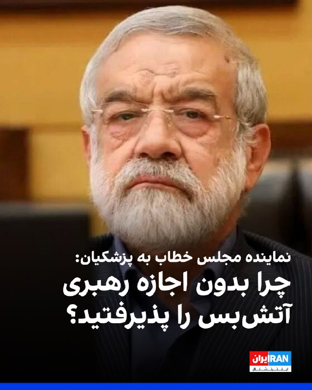

کامران غضنفری، نماینده تهران در مجلس، خطاب به مسعود پزشکیان گفت: «چرا بدون اجازه رهبری، آتش‌بس را پذیرفتید؟ اینکه رهبری در پیام‌های خود اشاره‌ای به آتش‌بس نمی‌کند، یعنی آن را قبول ندارد. همان‌طور که در ماجرای جنگ ۱۲ روزه بدون اجازه رهبری آتش‌بس را پذیرفتید و با این کار اسرائیل را از نابودی نجات دادید.»

او افزود: «این بار هم با پذیرش آتش‌بس آمریکا و اسرائیل را از زیر ضربات خردکننده موشک‌ها و پهپادهای ما نجات دادید.»
https://iranintl.com/202605227025

## IranIntlTV — post 338428

  

جامعه جهانی بهائی در بیانیه‌ای اعلام کرد بشری مصطفوی، زن باردار بهائی اهل رفسنجان، در میان ده‌ها شهروند بهائی است که هم‌زمان با تشدید کارزار بی‌رحمانه جمهوری اسلامی برای آزار و سرکوب بهائیان در ایران بازداشت و زندانی شده‌اند.

در این بیانیه آمده است از زمان آغاز درگیری‌های اخیر آمریکا و اسرائیل با جمهوری اسلامی، حدود ۸۰ شهروند بهائی در ایران بازداشت، دستگیر یا زندانی شده‌اند و بیش از ۴۰۰ مورد نقض حقوق بشر علیه بهائیان، از جمله یورش به خانه‌ها، مصادره اموال، بازداشت و محرومیت از دادرسی عادلانه ثبت شده است.

جامعه جهانی بهائی اعلام کرد بشری مصطفوی که پیش‌تر تبرئه شده بود، پس از نقض حکم در دادگاه تجدیدنظر، اکنون باید در دوران بارداری چهار ماه را در زندان کرمان بگذراند و درخواست‌های او برای مرخصی، از جمله برای مراجعه پزشکی و انجام آزمایش ضروری بارداری، رد شده است.

جامعه جهانی بهائی همچنین به اظهارات قاضی در جریان فرجام‌خواهی دادستان علیه حکم تبرئه مصطفوی اشاره کرد و آن را نشانه‌ای از نقش تعصبات مذهبی در آزار بهائیان دانست. به گفته این بیانیه، قاضی خطاب به او گفته بود: «شما بهائی هستید و در کشور اسلامی باید تاوان بهائی بودن خود را بدهید.»

در این بیانیه همچنین آمده است دیدار احمدی و ناهید نعیمی، دو زن بهائی که پیش‌تر همراه با مصطفوی بازداشت و سپس تبرئه شده بودند، از پنجم اردیبهشت دوران محکومیت خود را آغاز کرده‌اند و شکیلا قاسمی، زن ۲۶ ساله بهائی اهل کرمان، بیش از ۱۰۰ روز است در بازداشت به سر می‌برد.

این بیانیه همچنین به وضعیت پیوند نعیمی و برنا نعیمی اشاره کرده و از شکنجه، اعدام نمایشی و اعتراف‌گیری اجباری از این دو شهروند بهائی خبر داده است.

## IranIntlTV — post 338427

  

سنتکام اعلام کرد از زمان آغاز محاصره دریایی جنوب ایران ۹۷ کشتی تجاری مجبور به تغییر مسیر شده و چهار کشتی نیز توسط نیروهای آمریکایی پس از حمله از کار افتاده‌اند.
پیش‌تر سنتکام اعلام کرده بود گروه رزمی ناو هواپیمابر آبراهام لینکلن در منطقه در بالاترین سطح آمادگی عملیاتی قرار دارد.
https://iranintl.com/202605223902

## IranIntlTV — post 338426

  <a href="telegram/content/IranIntlTV_338426_1779463341.mp4" target="_blank">🎬 Download video</a>

یک شهروند در پیامی به ایران اینترنشنال درباره تصاویر و گزارش‌های مربوط به پیکرهای جان‌باختگان اعتراضات دی‌ماه در حیاط پشت بیمارستان الغدیر تهران می‌گوید که این حیاط می‌تواند حیاط خانه هر یک از شهروندان باشد. پیام او با هوش مصنوعی خوانده شده است.

## IranIntlTV — post 338425

بشری مصطفوی، زن باردار، در میان ده‌ها بهائی زندانی در ایران است

جامعه جهانی بهائی در بیانیه‌ای اعلام کرد بشری مصطفوی، زن باردار اهل رفسنجان، در میان ده‌ها شهروند بهائی است که در پی تشدید کارزار بی‌رحمانه جمهوری اسلامی برای آزار و سرکوب بهائیان در ایران، بازداشت و زندانی شده‌اند.

بر اساس این بیانیه که جمعه اول خرداد منتشر شد، از زمان آغاز جنگ اخیر، حدود ۸۰ شهروند بهائی در ایران دستگیر یا زندانی شده‌اند.

همچنین در این بازه زمانی، بیش از ۴۰۰ مورد نقض حقوق بشر علیه بهائیان، از جمله یورش به خانه‌ها، مصادره اموال، بازداشت و محرومیت از دادرسی عادلانه، به ثبت رسیده است.

جامعه جهانی بهائی با اشاره به وضعیت مصطفوی افزود او پیش‌تر تبرئه شده بود، اما پس از نقض حکم در دادگاه تجدیدنظر، اکنون باید در دوران بارداری چهار ماه را در زندان کرمان بگذراند.

این سازمان هشدار داد درخواست‌های مصطفوی برای دریافت مرخصی، از جمله جهت مراجعه پزشکی و انجام آزمایش ضروری بارداری، رد شده است.

جامعه جهانی بهائی همچنین به اظهارات قاضی در جریان فرجام‌خواهی دادستان علیه حکم تبرئه مصطفوی اشاره کرد و آن را نشانه‌ای از نقش تعصبات مذهبی در آزار بهائیان دانست.

بر اساس این بیانیه، قاضی خطاب به او گفته بود: «شما بهائی هستید و در کشور اسلامی باید تاوان بهائی بودن خود را بدهید.»

در این بیانیه همچنین آمده است دیدار احمدی و ناهید نعیمی، دو زن بهائی که پیش‌تر همراه با مصطفوی بازداشت و سپس تبرئه شده بودند، از پنجم اردیبهشت دوران محکومیت خود را آغاز کرده‌اند.

همچنین شکیلا قاسمی، زن ۲۶ ساله بهائی اهل کرمان، بیش از ۱۰۰ روز است که در بازداشت به سر می‌برد.

این بیانیه همچنین به وضعیت پیوند نعیمی و برنا نعیمی پرداخت و از شکنجه، اعدام نمایشی و اعتراف‌گیری اجباری از این دو شهروند بهائی خبر داد.

سرکوب‌های اخیر علیه بهائیان ایران
جمهوری اسلامی پیش از آغاز جنگ اخیر نیز سرکوب نظام‌مند شهروندان بهائی را در دستور کار خود قرار داده بود.

دفتر جامعه جهانی بهائی در ژنو ۱۴ بهمن سال گذشته اعلام کرد هم‌زمان با تشدید اعتراضات سراسری در ایران، جمهوری اسلامی تلاش‌های خود را برای سرکوب و نفرت‌پراکنی علیه بهائیان را افزایش داده و کوشیده است این اقلیت دینی را به‌عنوان عامل یا محرک ناآرامی‌ها معرفی کند.

پارلمان اروپا ۳۱ اردیبهشت در نشست خود در استراسبورگ، قطعنامه‌ای در محکومیت سرکوب معترضان، مخالفان، زندانیان سیاسی و اقلیت‌های مذهبی در ایران تصویب کرد.

نمایندگان پارلمان اروپا در این قطعنامه خواستار توقف فوری اعدام‌ها، آزادی زندانیان سیاسی و پاسخگو کردن مقام‌های جمهوری اسلامی در قبال نقض حقوق بشر شدند.
در این قطعنامه همچنین درباره افزایش فشارها بر زنان، فعالان مدنی و اقلیت‌های مذهبی در ایران ابراز نگرانی شده است.

طبق اعلام منابع غیررسمی، جمعیت بهائیان ایران بیش از ۳۰۰ هزار نفر برآورد می‌شود، اما قانون اساسی جمهوری اسلامی تنها ادیان اسلام، مسیحیت، یهودیت و زرتشتی را به رسمیت می‌شناسد.

🔗وب‌سایت ایران‌اینترنشنال
@iranintltv

## IranIntlTV — post 338424

  

مارکو روبیو، وزیر خارجه ایالات متحده، با اشاره به مذاکرات با جمهوری اسلامی گفت: «ما باید یک برنامه جایگزین هم داشته باشیم و برنامه جایگزین این است که اگر جمهوری اسلامی بگوید که ما تنگه‌ها را باز نمی‌کنیم، کنترل تنگه‌ها را در دست می‌گیریم و برای عبور از آن عوارض می‌گیریم چه؟ خب، در آن صورت باید کاری انجام شود.»

او ادامه داد: «در آن صورت، یک نفر باید اقدامی انجام دهد. یعنی در آن سناریو، قرار نیست ایران داوطلبانه تنگه‌ها را دوباره باز کند. پس باید از الان درباره‌اش فکر کنیم.»

روبیو افزود: «می‌دانم برنامه‌ای برای زمانی که درگیری‌ها متوقف شود وجود دارد؛ اما ما باید یک برنامه جایگزین هم برای حالتی داشته باشیم که هنوز تیراندازی ادامه دارد؛ اینکه در آن وضعیت چگونه می‌شود تنگه‌ها را دوباره باز کرد.»
https://iranintl.com/202605227847

## IranIntlTV — post 338423

  <a href="https://t.me/IranintlTV/338423" target="_blank">📎 Download file</a>

🎧نسخه صوتی دومینو: ایران در مرز جنگ و توافق
@iranintlTV

## IranIntlTV — post 338422

  

کاوه راد، وکیل دادگستری، در پستی اینستاگرامی خبر داد امید بیات سرمدی، از بازداشت‌شدگان اعتراضات دی‌ماه، از سوی دادگاه انقلاب تهران به ۲۵ سال حبس محکوم شده است.

امید بیات سرمدی، ۲۳ دی ۱۴۰۴، بازداشت و به زندان تهران بزرگ منتقل شده بود.

وکیل او اعلام کرده که حکم ۲۵ سال حبس، غیرقطعی و قابل فرجام‌خواهی در دیوان عالی کشور است.
https://iranintl.com/202605226078

## IranIntlTV — post 338421

🔻مقام اماراتی: شانس توافق آمریکا و جمهوری اسلامی «پنجاه-پنجاه» است

انور قرقاش، مشاور دیپلماتیک رییس امارات متحده عربی، احتمال دستیابی تهران و واشینگتن به توافق را «پنجاه-پنجاه» ارزیابی کرد و هشدار داد دور تازه درگیری نظامی می‌تواند وضعیت منطقه را پیچیده‌تر کند.

به گزارش رویترز، قرقاش جمعه اول خرداد در کنفرانسی در پراگ گفت هرگونه توافق سیاسی میان تهران و واشینگتن باید ریشه‌های بی‌ثباتی در منطقه را حل کند تا از وقوع درگیری‌ها در آینده جلوگیری شود.

او ادامه داد: «نگرانی من این است که ایرانی‌ها همیشه بیش از حد مذاکره می‌کنند.»

قرقاش افزود: «این موضوع تازه‌ای نیست. آنها طی سال‌ها به‌دلیل تمایل به بزرگ‌نمایی برگ‌های خود، فرصت‌های زیادی را از دست داده‌اند. امیدوارم این بار چنین نکنند.»
در هفته‌های اخیر، پاکستان نقش میانجی را برای پایان جنگ میان آمریکا و جمهوری اسلامی ایفا کرده است؛ مناقشه‌ای که اقتصاد جهانی را تحت تاثیر قرار داده و تجارت در تنگه هرمز، مسیر عبور حدود یک‌پنجم صادرات جهانی نفت و گاز طبیعی مایع، را مختل کرده است.

سرنوشت ذخایر اورانیوم غنی‌شده و ادامه برنامه هسته‌ای جمهوری اسلامی از مهم‌ترین محورهای اختلاف دو طرف در جریان مذاکرات بوده است.

مشاور رییس امارات در ادامه سخنان خود گفت منطقه به راه‌حل سیاسی نیاز دارد و دور بعدی رویارویی نظامی می‌تواند به دشوارتر شدن شرایط بینجامد.

او هشدار داد اگر گفت‌وگوها تنها بر برقراری آتش‌بس متمرکز باشد و به حل‌وفصل «مسائل اصلی» نپردازد، ممکن است بستر درگیری‌های آینده را فراهم کند.

قرقاش تاکید کرد: «این چیزی نیست که ما به دنبال آن هستیم.»

به گزارش رویترز، جمهوری اسلامی از زمان آغاز جنگ اخیر، بارها امارات متحده عربی را هدف قرار داد و به زیرساخت‌های غیرنظامی و مناطق اطراف پایگاه‌های نظامی آمریکا در این کشور حمله کرد.

روزنامه اورشلیم‌پست ۲۷ اردیبهشت در مطلبی تحلیلی نوشت جمهوری اسلامی ممکن است حملات به امارات را تشدید کند.
قرقاش در ادامه هشدار داد هرگونه کنترل بر تنگه هرمز «رویه‌ای خطرناک» ایجاد می‌کند و این آبراه راهبردی را به ابزاری سیاسی تحت نفوذ جمهوری اسلامی تبدیل خواهد کرد.

او افزود هرگونه تغییر در وضعیت فعلی تنگه هرمز برای جامعه جهانی، از جمله اروپا، پیامدهای جدی به دنبال خواهد داشت و از کشورهای اروپایی خواست امنیت این آبراه را به‌طور مستقیم با امنیت انرژی و تجارت خود مرتبط بدانند.

این مقام اماراتی تاکید کرد تنگه هرمز باید به وضعیت پیش از جنگ بازگردد؛ وضعیتی که در آن، این گذرگاه به‌عنوان مسیر آزاد بین‌المللی برای انتقال انرژی، تجارت و کشتیرانی عمل می‌کرد.

مارکو روبیو، وزیر امور خارجه آمریکا، اول خرداد در سخنانی در حاشیه نشست ناتو، اقدامات تهران در تنگه هرمز را «غیرقابل قبول» خواند و گفت جمهوری اسلامی در پی جلب همراهی عمان و ایجاد سازوکاری برای دریافت عوارض در یک آبراه بین‌المللی است.

پیش‌تر فاکس‌نیوز با استناد به برخی گزارش‌ها نوشت تهران یک پلتفرم بیمه دیجیتال برای کشتی‌های باری فعال در تنگه هرمز راه‌اندازی کرده و تمامی پرداخت‌های این سامانه با بیت‌کوین تسویه می‌شود.
🔗وب‌سایت ایران‌اینترنشنال
@iranintltv

## IranIntlTV — post 338420

  <a href="telegram/content/IranIntlTV_338420_1779463343.mp4" target="_blank">🎬 Download video</a>

جاویدنامان انقلاب ملی ایرانیان
«پرهام آقامحمدی» در ۱۹ دی در محله کاشانی تهران در جریان اعتراضات توسط نیروهای سرکوب خامنه‌ای کشته شد. نامش در حافظه‌ این سرزمین می‌ماند و یادش چراغ راه آزادی‌خواهان است.
@iranintltv

## IranIntlTV — post 338419

مقام اماراتی: شانس توافق آمریکا و جمهوری اسلامی «پنجاه-پنجاه» است

انور قرقاش، مشاور دیپلماتیک رییس امارات متحده عربی، احتمال دستیابی تهران و واشینگتن به توافق را «پنجاه-پنجاه» ارزیابی کرد و هشدار داد دور تازه درگیری نظامی می‌تواند وضعیت منطقه را پیچیده‌تر کند.

به گزارش رویترز، قرقاش جمعه اول خرداد در کنفرانسی در پراگ گفت هرگونه توافق سیاسی میان تهران و واشینگتن باید ریشه‌های بی‌ثباتی در منطقه را حل کند تا از وقوع درگیری‌ها در آینده جلوگیری شود.

او ادامه داد: «نگرانی من این است که ایرانی‌ها همیشه بیش از حد مذاکره می‌کنند.»

قرقاش افزود: «این موضوع تازه‌ای نیست. آنها طی سال‌ها به‌دلیل تمایل به بزرگ‌نمایی برگ‌های خود، فرصت‌های زیادی را از دست داده‌اند. امیدوارم این بار چنین نکنند.»

در هفته‌های اخیر، پاکستان نقش میانجی را برای پایان جنگ میان آمریکا و جمهوری اسلامی ایفا کرده است؛ مناقشه‌ای که اقتصاد جهانی را تحت تاثیر قرار داده و تجارت در تنگه هرمز، مسیر عبور حدود یک‌پنجم صادرات جهانی نفت و گاز طبیعی مایع، را مختل کرده است.

سرنوشت ذخایر اورانیوم غنی‌شده و ادامه برنامه هسته‌ای جمهوری اسلامی از مهم‌ترین محورهای اختلاف دو طرف در جریان مذاکرات بوده است.

مشاور رییس امارات در ادامه سخنان خود گفت منطقه به راه‌حل سیاسی نیاز دارد و دور بعدی رویارویی نظامی می‌تواند به دشوارتر شدن شرایط بینجامد.

او هشدار داد اگر گفت‌وگوها تنها بر برقراری آتش‌بس متمرکز باشد و به حل‌وفصل «مسائل اصلی» نپردازد، ممکن است بستر درگیری‌های آینده را فراهم کند.

قرقاش تاکید کرد: «این چیزی نیست که ما به دنبال آن هستیم.»

به گزارش رویترز، جمهوری اسلامی از زمان آغاز جنگ اخیر، بارها امارات متحده عربی را هدف قرار داد و به زیرساخت‌های غیرنظامی و مناطق اطراف پایگاه‌های نظامی آمریکا در این کشور حمله کرد.

روزنامه اورشلیم‌پست ۲۷ اردیبهشت در مطلبی تحلیلی نوشت جمهوری اسلامی ممکن است حملات به امارات را تشدید کند.

قرقاش در ادامه هشدار داد هرگونه کنترل بر تنگه هرمز «رویه‌ای خطرناک» ایجاد می‌کند و این آبراه راهبردی را به ابزاری سیاسی تحت نفوذ جمهوری اسلامی تبدیل خواهد کرد.

او افزود هرگونه تغییر در وضعیت فعلی تنگه هرمز برای جامعه جهانی، از جمله اروپا، پیامدهای جدی به دنبال خواهد داشت و از کشورهای اروپایی خواست امنیت این آبراه را به‌طور مستقیم با امنیت انرژی و تجارت خود مرتبط بدانند.

این مقام اماراتی تاکید کرد تنگه هرمز باید به وضعیت پیش از جنگ بازگردد؛ وضعیتی که در آن، این گذرگاه به‌عنوان مسیر آزاد بین‌المللی برای انتقال انرژی، تجارت و کشتیرانی عمل می‌کرد.

مارکو روبیو، وزیر امور خارجه آمریکا، اول خرداد در سخنانی در حاشیه نشست ناتو، اقدامات تهران در تنگه هرمز را «غیرقابل قبول» خواند و گفت جمهوری اسلامی در پی جلب همراهی عمان و ایجاد سازوکاری برای دریافت عوارض در یک آبراه بین‌المللی است.

پیش‌تر فاکس‌نیوز با استناد به برخی گزارش‌ها نوشت تهران یک پلتفرم بیمه دیجیتال برای کشتی‌های باری فعال در تنگه هرمز راه‌اندازی کرده و تمامی پرداخت‌های این سامانه با بیت‌کوین تسویه می‌شود.
 
🔗وب‌سایت ایران‌اینترنشنال
@iranintltv

## IranIntlTV — post 338418

  <a href="telegram/content/IranIntlTV_338418_1779463344.mp4" target="_blank">🎬 Download video</a>

همزمان با هشتاد‌ و چهارمین روز خاموشی دیجیتال در ایران، کاربران رسانه‌های اجتماعی از دشوارتر شدن زندگی روزمره و آسیب به کسب‌وکارها نوشته‌اند.
آیه دریس، عضو تحریریه ایران‌اینترنشنال، از واکنش کاربران می‌گوید
@iranintltv

## IranIntlTV — post 338417

  <a href="telegram/content/IranIntlTV_338417_1779463346.mp4" target="_blank">🎬 Download video</a>

نماینده مجلس در یک تجمع مردمی گفت تعطیلی مجلس قانونی نیست و هیچ مصوبه‌ای از شورای عالی امنیت ملی برای آن وجود ندارد. او همچنین گفت مجلس را تعطیل کرده‌اند تا نمایندگان نتوانند درباره قانون مربوط به تنگه هرمز تذکر دهند یا نطق کنند و تاکید کرد مجلس هم وظیفه حمایت دارد و هم نظارت، و می‌تواند هم تشکر کند و هم تذکر دهد.
@iranintltv

## IranIntlTV — post 338416

  

احمد مطهری‌اصل، امام جمعه تبریز، خطاب به دونالد ترامپ گفت: «ما به گفته‌هایمان عمل می‌کنیم.» او افزود جمهوری اسلامی تاکنون می‌گفت جنگ را منطقه‌ای می‌کند، اما اکنون هشدار می‌دهد که اگر خلاف کنید، جنگ را بین‌المللی خواهیم کرد.

مطهری‌اصل همچنین گفت «تمام خسارت‌های جنگ» از کشتی‌ها گرفته خواهد شد و از امروز فیبر نوری اینترنت بین‌المللی که از سواحل جمهوری اسلامی می‌گذرد، «مشمول هزینه» است و در غیر این صورت، «اینترنت بین‌المللی» قطع خواهد شد.

او در ادامه گفت جمهوری اسلامی هشدار داده بود با حزب‌الله و لبنان کاری نداشته باشند، اما اسرائیل گوش نمی‌دهد و اگر به کشتن «عزیزان مقاومت» ادامه دهد، باب‌المندب نیز به دستور مجتبی خامنه‌ای، رهبر جمهوری اسلامی، بسته خواهد شد.
https://iranintl.com/202605223119

## Persian_Trend_Official — post 14675

  <a href="telegram/content/Persian_Trend_Official_14675_1779463348.mp4" target="_blank">🎬 Download video</a>

کلیپ «تشکیل UAP بر فراز ایران» در دومین دسته از پرونده‌های یوفو پیدا شد

فیلم سال ۲۰۲۲ احتمالاً از حسگر مادون قرمز نصب شده روی یک سکوی نظامی آمریکا گرفته شده و در سال ۲۰۲۴ به شبکه‌ای محرمانه آپلود شده است.

👩‍💻:PhantomDirective

🆔 @persian_trend_official
پرشین ترند | متفاوت‌ترین کانال نظامی

## Persian_Trend_Official — post 14674

  <a href="telegram/content/Persian_Trend_Official_14674_1779463349.mp4" target="_blank">🎬 Download video</a>

یک شیء ناشناس پرنده (UFO) توسط جنگنده اف-۱۶ نیروی هوایی آمریکا سرنگون شد

ویدئویی با عنوان «نیروی هوایی ملی گارد اف-۱۶ سی آمریکا یک شیء پرنده ناشناس را بر فراز دریاچه هورون در ۱۲ فوریه ۲۰۲۳ سرنگون می‌کند» احتمالاً با استفاده از حسگر مادون قرمز نصب شده روی یک سکوی نظامی آمریکا ضبط شده است

## Persian_Trend_Official — post 14673

کلیپ «شیء پرنده ناشناس کروی در ابرها» در دومین دسته از پرونده‌های یوفو منتشر شد

تصویری از سال ۲۰۲۳ احتمالاً از حسگر مادون قرمز نظامی آمریکا بالای دریای زرد گرفته شده است — AARO

از نظر بصری، با اندازه یک هواپیمای معمولی مطابقت ندارد و حرکت آن با موشک عادی همخوانی ندارد

👩‍💻:PhantomDirective

🆔 @persian_trend_official
پرشین ترند | متفاوت‌ترین کانال نظامی

## Persian_Trend_Official — post 14672

💢هواپیما گلف استریم ارتش پاکستان به سمت تهران در حرکت است. 🫆:Tony 📌 @persian_trend_official پرشین ترند | متفاوت‌ترین کانال نظامی

## Persian_Trend_Official — post 14671

  <a href="telegram/content/Persian_Trend_Official_14671_1779463350.mp4" target="_blank">🎬 Download video</a>

💢فیلم منتشر شده در دومین دسته از پرونده‌های مرتبط با یوفو ها

💢پنتاگون، یک جسم پرنده را بر فراز سوریه نشان می‌دهد که با شتاب لحظه ای زیاد نا‌پدید میشود.

🫆:Tony

📌 @persian_trend_official
پرشین ترند | متفاوت‌ترین کانال نظامی

## Persian_Trend_Official — post 14670

  <a href="telegram/content/Persian_Trend_Official_14670_1779463352.webm" target="_blank">🎬 Download video</a>

‼️همزمان با ورود فرمانده ارتش پاکستان.
وزیر کشور پاکستان اندکی قبل تهران را ترک کرد،

👩‍💻:PhantomDirective

🆔 @persian_trend_official
پرشین ترند | متفاوت‌ترین کانال نظامی

## Persian_Trend_Official — post 14669

  <a href="telegram/content/Persian_Trend_Official_14669_1779463352.mp4" target="_blank">🎬 Download video</a>

💢 روبیو، وزیرخارجه آمریکا: ما در ارتباط مداوم با فیلد مارشال عاصم منیر در بالاترین سطوح دولت خود هستیم.

👩‍💻:PhantomDirective

📣 @persian_trend_official
پرشین ترند | متفاوت‌ترین کانال نظامی

## Persian_Trend_Official — post 14668

  

🔴فرمانده ارتش پاکستان راهی تهران شد؟؟؟ 💢به گزارش الحدث به نقل از منابع خود گزارش داد که عاصم منیر فرمانده ارتش پاکستان عازم تهران شد. 🫆:Tony 📌 @persian_trend_official پرشین ترند | متفاوت‌ترین کانال نظامی

## Persian_Trend_Official — post 14667

🔴 آکسیوس: چند کشور منطقه در تلاش برای نهایی‌کردن توافق اولیه میان ایران و آمریکا هستند

💢وب‌سایت آکسیوس گزارش داد پاکستان، قطر، عربستان سعودی، مصر و ترکیه در تلاش‌های میانجیگرانه میان تهران و واشینگتن مشارکت دارند.

بر اساس این گزارش:
▪️ هدف این مذاکرات، نهایی‌کردن «نامه اعلام نیت» میان ایران و آمریکا است
▪️ این توافق شامل پایان جنگ و آغاز ۳۰ روز مذاکره درباره توافقی گسترده‌تر بر سر برنامه هسته‌ای ایران خواهد بود
▪️ مذاکرات بر روی اصول اولیه کاهش تنش و چارچوب ادامه گفت‌وگوها متمرکز است
آکسیوس همچنین نوشت:
▪️ هنوز مشخص نیست تهران حاضر به امضای چنین توافقی خواهد شد یا نه
▪️ برخی جریان‌ها در ایران معتقدند در شرایط فعلی، اهرم فشار به نفع تهران است
🫆:Tony

📌 @persian_trend_official
پرشین ترند | متفاوت‌ترین کانال نظامی

## Persian_Trend_Official — post 14666

  <a href="telegram/content/Persian_Trend_Official_14666_1779463354.webm" target="_blank">🎬 Download video</a>

🔴 روبیو: پاکستان همچنان مذاکره‌کننده اصلی پرونده ایران است

💢مارکو روبیو، وزیر خارجه آمریکا، اعلام کرد پاکستان نقش اصلی در مذاکرات مرتبط با ایران را بر عهده داشته و همچنان این نقش را حفظ کرده است.

او گفت:
▪️ «مذاکره‌کننده اصلی درباره ایران، پاکستان بوده و همچنان هست»
▪️ فیلد مارشال «عاصم منیر» به‌زودی به ایران سفر خواهد کرد
▪️ واشینگتن به‌صورت مداوم و در بالاترین سطوح با او در ارتباط است
🫆:Tony

📌 @persian_trend_official
پرشین ترند | متفاوت‌ترین کانال نظامی

## Persian_Trend_Official — post 14665

  <a href="telegram/content/Persian_Trend_Official_14665_1779463354.mp4" target="_blank">🎬 Download video</a>

التماس تفکر 🤲

📝 Nick

📌 @persian_trend_official
پرشین ترند | متفاوت‌ترین کانال نظامی

## Persian_Trend_Official — post 14664

  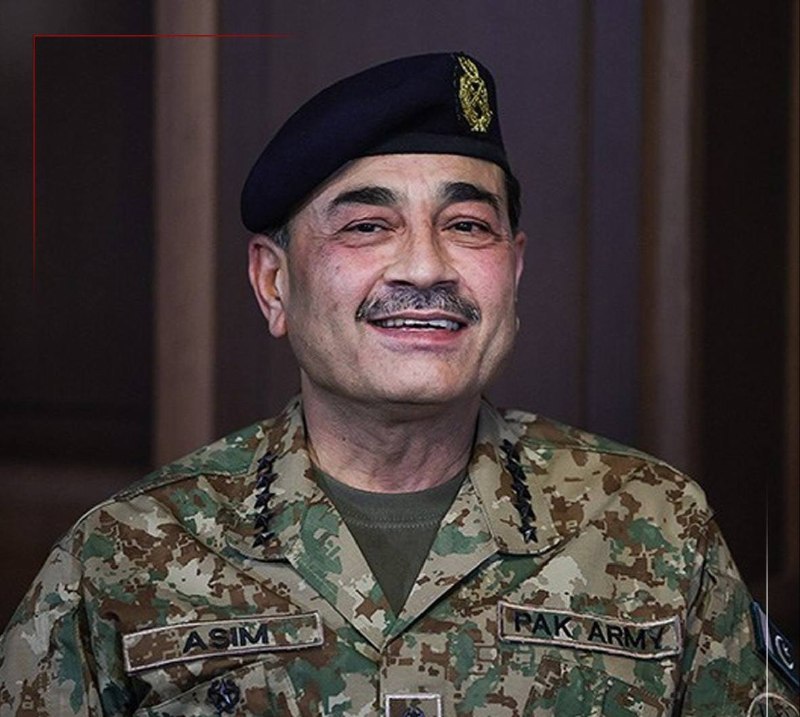

🔴فرمانده ارتش پاکستان راهی تهران شد؟؟؟

💢به گزارش الحدث به نقل از منابع خود گزارش داد که عاصم منیر فرمانده ارتش پاکستان عازم تهران شد.

🫆:Tony

📌 @persian_trend_official
پرشین ترند | متفاوت‌ترین کانال نظامی

---
📅 بروزرسانی: 1405/03/01 15:43
---

## ChizBergerz — post 46661

  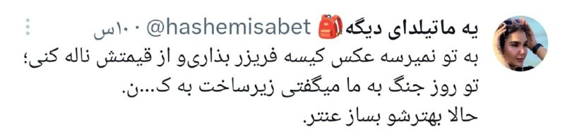

هستی دیگه 😂

پرستو عرزشی گوشی بخاطر پلاستیک بود گرون شد ؟ خونه بخاطر پلاستیک بود ؟ ماشین و بقیه جنسا

شیر الان گرون شده بخاطر پلاستیک؟

جوری میگی زیرساخت انگار قبلش فورد و جنگنده و بالگرد می‌ساختیم

همینا شاه ساخت
اینبار پسر شاه میاد می‌سازه
@ChizBergerz

## ChizBergerz — post 46660

  

"امشب به چشم کوری ترامپ" میخواد کص بده. @ChizBergerz

## ChizBergerz — post 46659

  <a href="telegram/content/ChizBergerz_46659_1779451997.mp4" target="_blank">🎬 Download video</a>

"امشب به چشم کوری ترامپ" میخواد کص بده.

@ChizBergerz

## ChizBergerz — post 46657

عمر اصلان، فعال تُرک‌تبار و چپ‌گرای حامی غزه که تو ناوگان صمود که توسط اسرائیل بازداشت شده بود، پس از آزادی: چون من شبیه کیانو ریوز بودم، سربازای اسرائیلی ۶ نفری بهم حمله کردن و کتکم زدن😂😂

@ChizBergerz

## ChizBergerz — post 46655

بفرما برگشتن: 😂😂😂

@ChizBergerz

## ChizBergerz — post 46654

⭕️ رایگان بدون واریز شرط های فوتبالی ببند از همون اول موجودی 500 هزارتومانه
❌ 
🎉 500 هزارتومن رایگان فقط با ثبت نام بدون هیچگونه واریزی! 
💳 پرداخت مستقیم و سریع بدون واسطه، بدون دردسر، واریز و برداشت در سریع‌ترین زمان ممکن 
⌛ پشتیبانی 24 ساعته 
🌐 Winro.io…

## ChizBergerz — post 46653

  

⭕️ رایگان بدون واریز شرط های فوتبالی ببند از همون اول موجودی 500 هزارتومانه
❌

🎉 500 هزارتومن رایگان فقط با ثبت نام بدون هیچگونه واریزی!

💳 پرداخت مستقیم و سریع بدون واسطه، بدون دردسر، واریز و برداشت در سریع‌ترین زمان ممکن

⌛ پشتیبانی 24 ساعته

🌐 Winro.io

🌐 Winro.io
کانال بونوس های رایگان r1

📱 @winro_io

## ChizBergerz — post 46652

  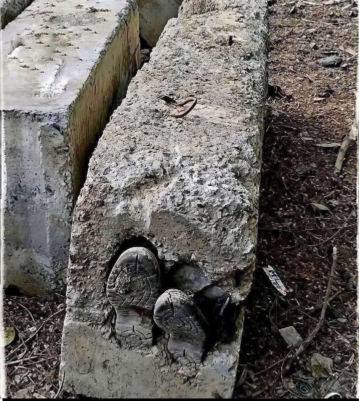

هر روز مردم سوریه در حال کشف یک گور دسته جمعی دیگر و سطح دیگری از ظلم و جنایت عوامل رژیم اسد، قاسم سلیمانی و سپاه پاسداران هستند.

اجسادی در داخل این بلوکهای بتنی وجود دارد که زنده زنده دفن شده اند!
@ChizBergerz

## ChizBergerz — post 46651

مهریه دخترانشان «پهپاد»
اسباب بازی کودکانشان «کلاشینکف»
لق‌لق‌ی زبانشان مرگ بر «این و ان»
اما هسته ای رو واسه تولید برق می‌خواهند!

بچه زرنگ‌های تروريست از در عقب :)
نه ببین داش اورانیوم ۶۰ درصد غنی کردیم برای کارای پزشکی
🤡
@ChizBergerz

## ChizBergerz — post 46650

  <a href="telegram/content/ChizBergerz_46650_1779452000.mp4" target="_blank">🎬 Download video</a>

ویدیو منتسب به شهرکرد و حملات مزدوران حکومت به تجمع دانش‌آموزان و‌ خانواده:
بهرحال ببین من الان خودم خاکم ولی خب فراموش نکنید بحث، بحث وطنه🤡
پس‌فرداشم اینا بلایی سرشون بیاد سر پروپاگاندا، میناب ۲ رو میسازن.
@ChizBergerz

## rodast_omiddana — post 71755

  <a href="telegram/content/rodast_omiddana_71755_1779452001.mp4" target="_blank">🎬 Download video</a>

🚨کمپین همچون شاهزاده سرباز ایران هستم

## rodast_omiddana — post 71754

  <a href="telegram/content/rodast_omiddana_71754_1779452002.webm" target="_blank">🎬 Download video</a>

🚨 منبع پاکستانی به الجزیره:
"اصرار آمریکا و ایران بر بالا بردن سقف خواسته‌هایشان درباره اورانیوم و تنگه هرمز، به بن‌بست در مذاکرات انجامیده"

## rodast_omiddana — post 71753

  <a href="telegram/content/rodast_omiddana_71753_1779452002.webm" target="_blank">🎬 Download video</a>

🚨 ماسون های شیعه نفوذی، یوتیوب کوچه را هم به خط کردند..
فقط یک کلمه میگم که یک ایران علی کریمی را میشناسند و همچنین منو بابت برنامه هایم یکم میشناسند ولی کسی نمیداند پشت کوچه کیست..
ویدیو سرتاسر دروغ که نیاز به پاسخ ندارد و پاسخ من زدن بیشتر شیعه گری خواهد بود..

## rodast_omiddana — post 71752

  <a href="telegram/content/rodast_omiddana_71752_1779452003.webm" target="_blank">🎬 Download video</a>

🚨 کی فکر میکرد وقتی شیعه در ایران شکست خورده است، افرادی مانند
"شاهین نجفی و نویسندگان دفترچه اضطرار مانند نجات بهرامی، محمدعلی جنت خواه و صادق بیگدلی"
تلاش کنند با سواستفاده از شاهزاده رضا پهلوی به کمک شیعه گری بشتابند..
عجب دنیای عجیبیه..!

## rodast_omiddana — post 71751

  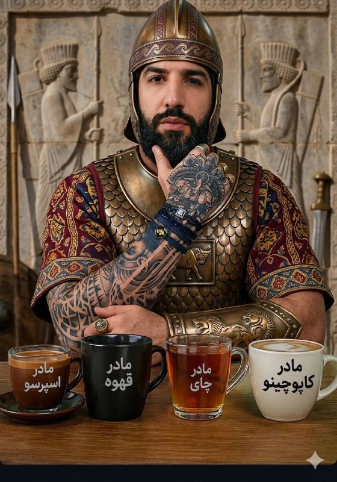

😎 مخاطبان خوش ذوقی داریم دمتون گرم، اجازه نمیدیم دیگه شیعه گری با حیله در اپوزسیون خودش را احیا کند... سرباز قادسیه هستیم و شوخی هم نداریم..

## rodast_omiddana — post 71750

  <a href="telegram/content/rodast_omiddana_71750_1779452003.webm" target="_blank">🎬 Download video</a>

🚨 آسوشیتدپرس:
عراقچی، وزیر خارجه ایران و قالیباف دیگر به هیچ عنوان مذاکرات را در داخل ایران پیش نمی‌برند و کنترل کل ماجرا در دست 3پا می‌باشد.

## rodast_omiddana — post 71749

  <a href="telegram/content/rodast_omiddana_71749_1779452004.webm" target="_blank">🎬 Download video</a>

🚨 سرباز خودش را فدای شاه میکنه..
نه اینکه شاه را فدای کاسبی خودش کنه..
ما میگم کنسرت نزار میرن پشت شاهزاده..
رسما با چه دیوثهایی طرفیم..
خوبه هنوز به قدرت نرسیدن وگرنه تا الان ما را اعدام میکردن..

## rodast_omiddana — post 71748

  <a href="telegram/content/rodast_omiddana_71748_1779452004.webm" target="_blank">🎬 Download video</a>

🚨 مارک لوین:
"زمان نابودی رژیم ایران فرا رسیده است. بیایید کار را تمام کنیم.
بگذارید کار را به انجام رسانیم.
تیک‌تاک ساعت را می‌شنوید."

## KiriMohems — post 47883

آیا میدانستید خامنه‌ای آرسنال‌فن بوده؟

@KiriMohemSport

## KiriMohems — post 47882

طبق برخی گزارش ها؛

طرح «اینترنت پرو» در آستانه شکست قرار داره. چون هم خیلی استقبال نشده و هم بسیاری از افرادی که دوره اول اینو تهیه کردن دیگه اشتراکشون رو تمدید نکردن. چون مشتری هاشون و افرادی که لازم دارن به اینترنت دسترسی نداشتن و عملا براشون بلا استفاده بوده.

ایده های خارکسه بازی ؛ یکی یکی شکست میخوره.

#professor
@KiriMohems

## KiriMohems — post 47881

  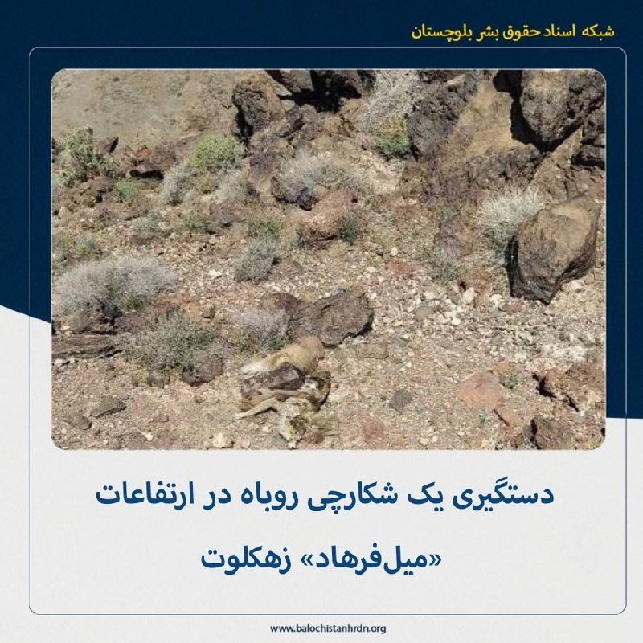

یک شکارچی لاشی در منطقه کوهستانی «میل‌فرهاد» زهکلوت به خاطر شکار یک روباه دستگیر شد. نیروهای محیط زیست در گشت‌زنی او را شناسایی و از کون کردن و در محل بازداشت کردند. پرونده برای رسیدگی قضایی به مراجع ذی‌ربط ارجاع شده است.

#professor
@KiriMohems

## KiriMohems — post 47880

  

😤دنبال یه سایت شرط بندی بین المللی بودی که به ایرانیا خدمات بده؟!
⛔

👍دربی بت همون انتخاب  100%

💎ویژگی های سایت جهانی Derby Bet:

⬅️امکان شارژ امن با کارت بانکی

⬅️واریز اول دوبل شارژ می شوید(بونوس۱۰۰٪)

⬅️پر اپشن ترین سایت فعال در ایران

⬅️تسویه حساب کمتر از 5 دقیقه

⬅️برگشت بخشی از باخت به صورت هفتگی

🚨کد هدیه ثبت نام:GG007

⚠️برای دانلود اپلکیشن کلیک کنید
👉

🔔کانال دربی بت :r1🅰

🪙https://t.me/+kpFvLD9kaeJhYTI0

## SportBaadNews — post 252199

حق ترین میلف وجود نداره

## SportBaadNews — post 252198

🪐 لاپورتا: سخنرانی پرز پر از دروغ بود، اونا دو ساله که هیچ دستاوردی نداشتن و میخوان این رو بپوشونن، من بهشون اجازه نمیدم با تهمت زدن به بارسلونا به این هدف دست پیدا کنن
@SportBaadNews

## SportBaadNews — post 252197

  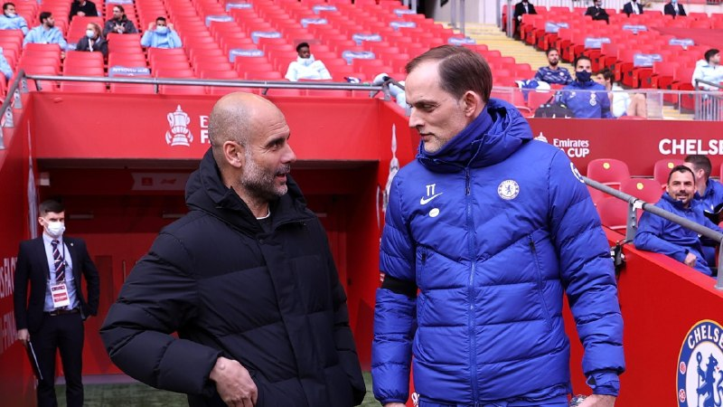

🏴󠁧󠁢󠁥󠁮󠁧󠁿 توماس توخل راجب گواردیولا: با سبک بازیش در‌ بارسلونا انقلاب کرد، بوندسلیگای آلمان رو فتح کرد، اومد انگلیس و کلی جام برد و رکورد زد
@SportBaadNews

## SportBaadNews — post 252196

  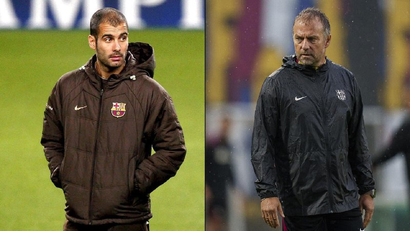

🎙خبرنگار: میتونیم مثل پپ که 10-12 سال داخل سیتی بود داخل بارسلونا ببینیمت؟ 
🇪🇸 هانسی فلیک: بعید میدونم وقتی 70 سالم باشه منو اینجا ببینین @SportBaadNews

## SportBaadNews — post 252195

  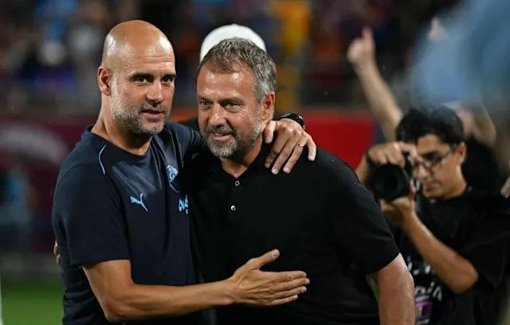

🎙خبرنگار: میتونیم مثل پپ که 10-12 سال داخل سیتی بود داخل بارسلونا ببینیمت؟

🇪🇸 هانسی فلیک: بعید میدونم وقتی 70 سالم باشه منو اینجا ببینین
@SportBaadNews

## SportBaadNews — post 252194

  <a href="telegram/content/SportBaadNews_252194_1779452007.webm" target="_blank">🎬 Download video</a>

🚨
🚨
⚽️
⚽️ متئو مورتو: بارسلونا بصورت جدی مذاکراتش واسه به خدمت گرفتن آلوارز رو شروع کرده
@SportBaadNews

## SportBaadNews — post 252193

  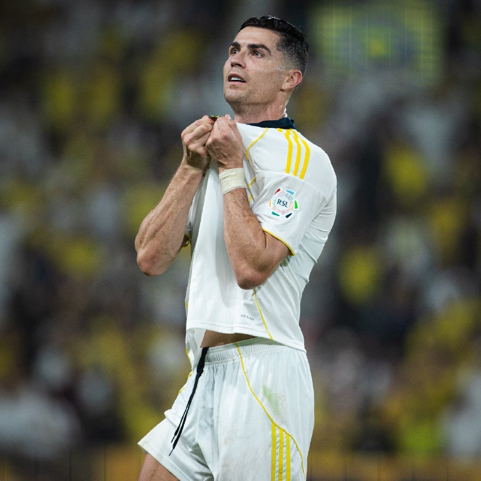

فکت | کریستیانو رونالدو تنها بازیکن تاریخه که در 23 فصل متوالی تونسته از ضربه ایستگاهی به گل برسه 🔥
@SportBaadNews

## SportBaadNews — post 252192

  

🟢 هنوز دنبال روش ورود به سایت می‌گردی؟

📌کاربران حرفه‌ای دیگه وقتشون رو هدر نمیدن.
✌️

✅ سریع‌ترین راه ورود به وینکوبت فقط از طریق ربات رسمی:
👇

🤖 @Wincobet_bot

🤖 @Wincobet_bot

⚡️   بدون نیاز به جستجو

⚡️   بدون لینک‌های فیک و اشتباه

⚡️   ورود مستقیم و راحت

🔗 فقط یک کلیک تا ورود کامل به سایت وینکوبت: 
👇

🤖 @Wincobet_bot
کانال رسمی سایت وینکوبت:

🔵 @Wincobetofficial

## SportBaadNews — post 252191

  <a href="telegram/content/SportBaadNews_252191_1779452008.webm" target="_blank">🎬 Download video</a>

عکسووووووووو 
💀
💀
@SportBaadNews

## SportBaadNews — post 252190

  <a href="telegram/content/SportBaadNews_252190_1779452009.mp4" target="_blank">🎬 Download video</a>

👑
🔙| یک سال پیش تو چنین روزی لوکا مودریچ رسما اعلام کرد ک تو پایان فصل از رئال مادرید جدا میشه تا مثلث برمودای خط هافبک رئال برای همیشه به تاریخ بپیونده...

⚪️ ارزش دانلود ادیت برا رئالیا 100000000000 از 10
@SportBaadNews

## SportBaadNews — post 252189

  <a href="telegram/content/SportBaadNews_252189_1779452010.mp4" target="_blank">🎬 Download video</a>

⚽️
❌ | کلیپ باشگاه منچسترسیتی برای جدایی پپ گواردیولا از این باشگاه پس از ده سال فوق‌العاده با این تیم!
@GoalBad

## SportBaadNews — post 252188

  <a href="telegram/content/SportBaadNews_252188_1779452012.webm" target="_blank">🎬 Download video</a>

🚨
💣
⚽️ فووووووووووری رسسسسسسسسسسمی؛ با اعلام باشگاه منچسترسیتی پپ گواردیولا پس از ده سال در پایان این فصل از این باشگاه جدا میشه!
🏆 6 پریمیرلیگ
🏆 5 جام اتحادیه
🏆 3 کامیونیتی شیلد
🏆 3 جام حذفی
🏆 1 چمپیونزلیگ
🏆 1 سوپرکاپ اروپا
🏆 1 جام باشگاه‌های جهان
@SportBaadNews

## SportBaadNews — post 252186

  <a href="telegram/content/SportBaadNews_252186_1779452013.webm" target="_blank">🎬 Download video</a>

🚨
💣
⚽️ رسسسسسسسمی؛ مایکل کریک قرارداد خودشو با منچستریونایتد تا سال 2028 + بند یک سال اضافه تر تا 2029 تمدید کرد!
@SportBaadNews

## SportBaadNews — post 252185

🏴󠁧󠁢󠁥󠁮󠁧󠁿
🏆| توماس جقی درباره خط زدن فودن، پالمر و گیبز وایت: تماس‌های تلفنی سختی بود. واسه بعضی‌هاشون، فقط یه بحثِ پُست تو زمین بود تا یه تیمِ متوازن داشته باشیم و این‌طوری نشه که پنج تا شماره ده با خودمون ببریم. حتی اگه دردناک هم بوده باشه، فکر میکنم تصمیم…

## SportBaadNews — post 252184

زندگی گروه i جام جهانی بود و من عراق @SportBaadNews

## SportBaadNews — post 252183

هری مگوایر در مورد عدم انتخاب برای جام جهانی: مطمئن بودم که می‌توانم نقش مهمی در این تابستان برای کشورم پس از فصلی که داشتم ایفا کنم. من از این تصمیم شوکه و ناراحت شدم. برای بازیکنان بهترین ها را آرزو می کنم. 
♥️@ManchesterNews_ir

## SportBaadNews — post 252182

  <a href="telegram/content/SportBaadNews_252182_1779452013.webm" target="_blank">🎬 Download video</a>

🚨
💣🏴󠁧󠁢󠁥󠁮󠁧󠁿 رسسسسسسسسسسسسمی؛ لیست تیم ملی انگلیس برای جام جهانی 2026 آمریکا 
◀️دروازبان ها: جوردن پیکفورد، دین هندرسون، جیمز ترافورد 
◀️مدافعان: ریس جیمز، تینو لیورامنتو، مارک گوهی، ازری کونسا، جان استونز، جارل کوانسا، نیکو اورایلی، دن برن، جد اسپنس 
◀️هافبک…

## IranIntlTV — post 338407

  <a href="telegram/content/IranIntlTV_338407_1779452013.mp4" target="_blank">🎬 Download video</a>

وزارت امور خارجه آمریکا اعلام کرد ۹ نفر را در لبنان به اتهام پیشبرد پروژه‌های حزب‌الله تحریم کرده است. در میان افراد تحریم‌شده، نام سفیر جمهوری اسلامی در بیروت و سه نماینده فراکسیون حزب‌الله در پارلمان لبنان دیده می‌شود.
جزییات بیشتر با می فرحات، خبرنگار ایران‌اینترنشنال
@iranintltv

## IranIntlTV — post 338406

  <a href="telegram/content/IranIntlTV_338406_1779452015.mp4" target="_blank">🎬 Download video</a>

یک شهروند در پیامی به ایران اینترنشنال از گرانی‌ اجناس و خوراکی‌ها گفت. بازخوانی پیام او و ساخت تصویر با هوش مصنوعی انجام گرفته است.

## IranIntlTV — post 338405

  <a href="telegram/content/IranIntlTV_338405_1779452016.mp4" target="_blank">🎬 Download video</a>

نهادهای حقوق بشری نسبت به وضعیت غلامرضا خانی‌ شکرآب، ورزشکار و زندانی سیاسی، که با اتهام «جاسوسی» بازداشت شده، هشدار داده‌اند. او به‌طور ناگهانی از بند امنیتی زندان اوین به سلول انفرادی در زندان قزل‌حصار منتقل شده است.
گفت‌وگو با رضا حاجی‌حسینی، روزنامه‌نگار
@iranintltv

## IranIntlTV — post 338404

🔻قطع اینترنت در ایران چگونه تصویر افکار عمومی را در فضای آنلاین تحریف می‌کند؟

🖋آرش سهرابی

در حالی که ۸۴ روز از قطع سراسری اینترنت در ایران می‌گذرد، فضای آنلاین و بخش نظرات درباره ایران بیش از آن‌که بازتابی واقعی از افکار عمومی باشد، تصویری محدود و کنترل‌شده را نشان می‌دهد. فضایی که زیر سایه دسترسی گزینشی و امتیاز اقتصادی کاربران، عملیات سایبری و ترس، شکل گرفته است.

خیابان‌ها و بخش نظرات آنلاین در ایران، بیش از پیش یک تصویر مشابه را بازتاب می‌دهند: «وحدت، مقاومت و وفاداری ...»

راهپیمایی‌های شبانه نیز تصاویر لازم را تولید می‌کنند: پرچم‌ها، پوسترها و جمعیت‌های سازمان‌دهی‌ شده.

هم‌زمان، زیر بسیاری از پست‌های مرتبط با ایران در شبکه‌های اجتماعی، موجی از حمایت از جمهوری اسلامی، تمجید از مواضع نظامی حکومت و حمله به منتقدان دیده می‌شود. همراه با پیام‌هایی در ستایش علی خامنه‌ای و جانشین هنوز دیده نشده‌اش، مجتبی خامنه‌ای.

اما آن‌چه در صفحه نمایش دیده نمی‌شود، جمعیتی است که پیش از آغاز بحث، از این فضا حذف شده‌اند.

اکنون پرسش فقط این نیست که مردم در اینترنت چه می‌گویند. سوال این است که چه کسانی امکان اتصال و اجازه، امنیت یا انگیزه صحبت کردن دارند.
میدان عمومی با آدم‌های حذف‌شده

بحران اخیر با یک قطع ناگهانی اینترنت آغاز نشد. در جریان خیزش دی‌ماه، اینترنت در ۱۹ دی ۱۴۰۴ قطع شد و تا ۹ بهمن همان سال به‌شدت محدود باقی ماند.

پس از آغاز حملات آمریکا و اسرائیل در ۹ اسفند ۱۴۰۴ نیز حکومت بار دیگر محدودیت‌های گسترده اینترنتی را اعمال کرد. محدودیت‌هایی که اکنون به پایان سومین ماه خود نزدیک می‌شوند.

در شرایط عادی، بخش نظرات در فضای آنلاین - با همه نقص‌هایش - محل برخورد دیدگاه‌های مختلف است، اما قطع اینترنت، ترکیب این فضا را تغییر می‌دهد.

بسیاری از کاربران عادی به استفاده از سرویس‌های داخلی محدود می‌شوند و برخی دیگر ناچارند استفاده از ابزارهای دور زدن فیلترینگ را محدود و جیره‌بندی کنند.
کسب‌وکارها ارتباط خود را با مشتریان از دست می‌دهند. دانشجویان به منابع آموزشی دسترسی ندارند و خانواده‌ها در خارج از کشور برای برقراری تماس روزمره با نزدیکان خود دچار مشکل می‌شوند.

در مقابل، کاربران نزدیک به حکومت، نهادهای مورد تایید و حساب‌های دارای دسترسی ویژه، همچنان در پلتفرم‌های جهانی فعال باقی می‌مانند.

این نابرابری پنهان هم نمانده است. دولت جمهوری اسلامی اسفند ۱۴۰۴ اعلام کرد برای برخی کاربران که توانایی «انتقال بهتر پیام» را دارند، دسترسی ویژه اینترنتی فراهم کرده است.

سخنگوی دولت از اصطلاح «سیم‌کارت سفید» استفاده نکرد، اما گفت این دسترسی به کسانی داده می‌شود که «می‌توانند پیام را بهتر منتقل کنند».

این همان «نمونه کنترل‌شده» است؛ نه کشوری که آزادانه سخن می‌گوید، بلکه جمعیتی محدودتر که هنوز اجازه سخن گفتن در فضای بیرونی را دارد.
وفاداری اجباری برای بازگشت به اینترنت

شاید مهم‌ترین بخش ماجرا فقط این نباشد که چه کسانی به اینترنت دسترسی دارند، بلکه این باشد که برخی افراد برای باز پس گرفتن دسترسی خود، چه کارهایی باید انجام دهند.

برخی ایرانیان که سیم‌کارت یا اینترنتشان به‌دلیل فعالیت آنلاین علیه جمهوری اسلامی مسدود شده، گفته‌اند از آن‌ها خواسته شده است برای بازگشت دسترسی، تعهدنامه دست‌نویس ارائه کنند، ضامن معرفی کنند و تولیداتی در حمایت از حکومت منتشر کنند.
همچنین از افراد خواسته شده نشانی منزل و محل کار، اطلاعات حساب بانکی، تصویر کارت بانکی و لینک حساب‌های شبکه‌های اجتماعی خود را ارائه دهند.

به ایشان هشدار داده شده است از انتشار مطالبی که به «امنیت روانی، اجتماعی یا سیاسی کشور» آسیب می‌زند، خودداری کنند و به برخی افراد گفته‌اند موظف‌اند دست‌کم ۲۰ پست در حمایت از جمهوری اسلامی منتشر و تصویر آن‌ها را به‌عنوان مدرک ارسال کنند.
به ایشان تاکید شده است این پست‌ها نباید یک‌باره منتشر شوند، بلکه باید با فاصله زمانی گذاشته شوند تا فعالیتشان طبیعی به نظر برسد.

🔗ادامه این گزارش را اینجا بخوانید
@iranintltv

## IranIntlTV — post 338403

🔻شهرداری سیاتل پیش از آغاز جام جهانی ۲۰۲۶، پرچم جمهوری اسلامی را روی ستون مونوریل این شهر نقاشی کرد اما شماری از ایرانیان ساکن سیاتل، نماد جمهوری اسلامی روی این پرچم را پاک کردند و نشان شیر و خورشید را جایگزین کردند.

🔹در روزهای گذشته، گزارش‌هایی درباره احتمال ممنوعیت ورود پرچم شیر و خورشید به ورزشگاه‌های میزبان جام جهانی، واکنش‌هایی را میان ایرانیان و فعالان سیاسی برانگیخته است.

🔹در پی انقلاب شیر و خورشید، ایرانیان خارج از کشور با در دست داشتن پرچم شیر و خورشید حمایت خود را از این انقلاب اعلام کردند.

@iranintltvsport

## IranIntlTV — post 338402

روایت شما از زندگی در آتش‌بس- جمعه ۱ خرداد ۱۴۰۵

🔹 از کرمانشاه: من دانشجوی دندان‌پزشکی هستم. کلاس‌ها به‌صورت مجازی شده و درس‌های عملی را اصلاً نمی‌توانیم به‌طور مجازی یاد بگیریم. به ما می‌گویند وسیله بگیرید خودتان در خانه انجام بدهید. همه وسیله‌ها قیمتش چند برابر شده.
🔹 در مشهد فقر و فلاکت بیداد می‌کند. متأسفانه ۷۰٪ واحدهای اقامتی این شهر و بیشتر هتل‌ها خالی از مسافرند و تعدیل نیرو کرده‌اند و آژانس‌های مسافرتی یکی پس از دیگری در حال جمع کردن هستند، هیچ‌کس هم به فکر نیست.
🔹 از مشهد پیام می‌دم. یه قانون مسخره گذاشتن کافه‌ها و گیم‌سنترها باید ساعت ۱۱ شب به خاطر انرژی ببندن. کسی نیست بهشون بگه بیشتر مشتری‌های ما تایم شب میان. مغازه ما رو بدون اخطار پلمپ کردن. چند نفر از مغازه نون می‌خوردن، گفتن باید ۷۲ ساعت پلمپ باشید.
🔹 سفره مردم قربانی سیاستی می‌شود که پایانش معلوم نیست.
🔹 خواهش می‌کنم صدای ما دانشجوهای کارشناسی باشید. ما آموزش حضوری می‌خواهیم و از آموزش مجازی هیچ بهره‌ای نمی‌بریم.
🔹 این‌همه فیلم و سند از جنایات علیه مردم ایران منتشر شده، از قتل‌عام ۱۸ و ۱۹ دی تا احکام اعدام و تجاوز به زندانیان و... پس سازمان‌های بین‌المللی حقوق بشر کجایند؟ خجالت بکشید.
🔹 به‌خاطر جنگ و گرانی اجناس و مواد اولیه و بی‌پولی مردم، ورشکست شدم و مجبور شدم کارگاه تولیدی را ببندم و چند کارگر بیکار شدند. تمام دستگاه‌ها را نصف قیمت فروختم چون توانایی پرداخت اجاره نداشتم. اقتصاد ایران رسماً ورشکسته است. خدا بهمون کمک کنه.
🔹 آیا می‌دانید اگر هر روز یک دونه چیپس بخرید، کل حقوق ماهیانه‌تان به باد می‌رود؟ تو فقط بشین و تماشا کن.
🔹 ناامید دشمن است. هیچ کشوری با زور نتوانسته به مردمش حکومت کند. خون‌هایی که دادیم قطعاً پایمال نخواهد شد. به امید پیروزی.
🔹 از خوی پیام می‌دم. از اول گفتم تا آخر هم می‌گم ایران با یک رهبر وطن‌پرست مثل شاهزاده پهلوی ایران می‌شود.

## IranIntlTV — post 338401

  <a href="telegram/content/IranIntlTV_338401_1779452018.mp4" target="_blank">🎬 Download video</a>

نشریه وال‌استریت ژورنال در گزارشی تحقیقی به بررسی نحوه تامین مالی سپاه پاسداران پرداخته و از انجام تراکنش‌هایی به ارزش ۸۵۰ میلیون دلار از سوی بابک زنجانی در بازه دو ساله از طریق صرافی رمزارزی بایننس برای این نهاد نظامی خبر داده است.
گفت‌وگو با علی شیرازی، عضو تحریریه ایران‌اینترنشنال
@iranintltv

## IranIntlTV — post 338400

  

شبکه العربیه به نقل از یک منبع پاکستانی گزارش داد کاهش اختلاف‌ها در گفت‌وگوهای جاری میان آمریکا و جمهوری اسلامی آسان نیست، زیرا هر یک از دو طرف خواسته‌های بالایی دارند.

این منبع افزود آمریکا و حکومت ایران بر مواضع خود درباره اورانیوم پافشاری می‌کنند و تاکید کرد موضوع اصلی مذاکرات از ابتدا نحوه برخورد با پرونده اورانیوم بوده و همچنان همین مسئله محور گفت‌وگوها است.

به گفته این منبع، یک توافق موقت میان آمریکا و ایران می‌تواند آتش‌بس را تضمین کند.

العربیه نوشت که رییس ستاد کل ارتش پاکستان برای سفر به تهران، در انتظار نتایج گفت‌وگوهای وزیر کشور پاکستان در تهران است.
https://iranintl.com/202605223977

## IranIntlTV — post 338399

  <a href="telegram/content/IranIntlTV_338399_1779452020.mp4" target="_blank">🎬 Download video</a>

مخاطبان ایران‌اینترنشنال در پیام‌هایی از ادامه روند اخراج و تعدیل نیرو در کارخانه‌ها، پالایشگاه‌ها، شرکت‌های هواپیمایی و تاکسی‌های اینترنتی خبر می‌دهند.
گفت‌وگو با احمد علوی، استاد دانشگاه و اقتصاددان
@iranintltv

## IranIntlTV — post 338398

🔻بندر خَصَب، راه فرار جمهوری اسلامی از محاصره دریایی؟

🖋فرناز داوری

در میانه آتش‌بس شکننده و محاصره دریایی در تنگه هرمز، بندر خَصَب در عمان به یکی از مسیرهای حیاتی برای رساندن کالا به ایران تبدیل شده است. بندری که با قایق‌های «شوتی»، ماهیگیران و گردشگران شناخته می‌شد، حالا گذرگاهی پرهزینه اما مهم برای دور زدن محاصره بنادر جنوبی ایران شده است.

تا پیش از آغاز جنگ آمریکا و اسرائیل علیه جمهوری اسلامی، بخشی از رفت‌وآمدهای دریایی میان خصب و سواحل جنوبی ایران، به قایق‌های تندرو اختصاص داشت. قایق‌هایی که در ادبیات محلی به «شوتی» معروف‌ هستند و سال‌ها در مسیرهای غیررسمی میان عمان و جنوب ایران، رفت‌وآمد کرده‌اند.

این قایق‌ها معمولا به صورت گروهی حرکت می‌کردند و در زمانی کوتاه خود را از آب‌های عمان به قشم یا دیگر نقاط ساحلی ایران می‌رساندند.

این مسیر پیش از این بیشتر برای دادوستدهای غیررسمی و قاچاق خرد شناخته می‌شد. سیگار ایرانی، مشروبات الکلی و حشیش، از ایران به عمان منتقل می‌شد و در مسیر بازگشت، کالاهای مصرفی، لوازم خانگی و اجناس لوکس، از عمان به ایران می‌رسید.

حضور قایق‌های ماهیگیری ایرانی نیز در اطراف خصب همیشه بخشی از تصویر معمول این منطقه بود.
بندر خصب کجاست؟

خصب مرکز استان مُسندَم در کشور عمان است. منطقه‌ای برون‌بومی در شمال این کشور که از خاک اصلی عمان جدا مانده و میان آن و دیگر بخش‌های عمان، خاک امارات متحده عربی قرار دارد.

این موقعیت جغرافیایی، خصب را به نقطه‌ای کم‌نظیر در دهانه تنگه هرمز تبدیل کرده است.

بندری کوچک در فاصله حدود ۳۵ کیلومتری ایران، میان کوه‌های خشک و آبدره‌هایی که تا پیش از جنگ، بیشتر مقصد قایق‌های تفریحی و تورهای دریایی بودند.

اما محدودیت‌های دریایی، کارکرد این مسیر را تغییر داده است.

با بسته شدن مسیرهای اصلی در تنگه هرمز به روی کشتی‌های ایرانی و کشتی‌های مرتبط با جمهوری اسلامی، خصب از یک مسیر فرعی و محلی به یکی از راه‌های جایگزین برای رساندن کالا به ایران تبدیل شده است. کالاهایی که پیش از این از مسیرهای معمول تجاری و از بنادر امارات متحده عربی به ایران می‌رفتند، اکنون در بخشی از شبکه حمل‌ونقل، از مسیر عمان و بندر خصب عبور داده می‌شوند.
انتقال کالا به ایران چگونه انجام می‌شود؟

یک بازرگان مطلع به ایران‌اینترنشنال گفت پس از آتش‌بس، روند انتقال کالا به این شکل انجام می‌شود که بارهای به مقصد ایران، ابتدا با کشتی‌هایی با پرچم کشورهایی غیر از ایران، از بنادر امارات به خصب منتقل می‌شوند. سپس این محموله‌ها در اسکله خصب روی شناورهای ایرانی تخلیه می‌شوند و این شناورها، خارج از مسیرهای اصلی تحت کنترل، بار را به بنادر ایران می‌رسانند.

به گفته این بازرگان، بخش مهمی از این انتقال با شناورهای «لندینگ کرافت» انجام می‌شود.

این شناورها به‌دلیل امکان حرکت در آب‌های کم‌عمق و پهلوگیری در اسکله‌های کوچک، برای چنین مسیری مناسب‌ هستند و برخی از آن‌ها می‌توانند صدها تن تا حدود هزار تن بار حمل کنند و ظرفیت جابه‌جایی کانتینر، خودرو و محموله‌های سنگین‌تر را نیز دارند.

محموله‌هایی که از این مسیر به ایران می‌رسند، محدود به یک نوع کالا نیستند.

به گفته منابع تجاری، از خودرو و قطعات یدکی گرفته تا لوازم خانگی، تجهیزات مصرفی، کالاهای بهداشتی و حتی برخی اقلام مرتبط با فرآورده‌های نفتی می‌تواند در این مسیر جابه‌جا شود.
رفتن از این مسیر چه هزینه‌ای دارد؟

استفاده از این مسیر هزینه سنگینی دارد.

یک بازرگان به ایران‌اینترنشنال گفت انتقال کالا از مسیر خصب، در مقایسه با مسیری که پیش‌تر از امارات به خرمشهر استفاده می‌شد، حدود شش برابر گران‌تر است.

🔗ادامه این گزارش را اینجا بخوانید
@iranintltv

## IranIntlTV — post 338397

  <a href="telegram/content/IranIntlTV_338397_1779452021.mp4" target="_blank">🎬 Download video</a>

ویدیوی ارسالی یک شهروند به ایران اینترنشنال نشان می‌دهد روز جمعه در پی بحران سوخت و شلوغی جایگاه‌های سوخت در شهرهای ایران در قشم صف طولانی بنزین شکل گرفته است.

## IranIntlTV — post 338396

  <a href="telegram/content/IranIntlTV_338396_1779452023.mp4" target="_blank">🎬 Download video</a>

یک کارمند کارخانه لاستیک کرمان در پیامی به ایران اینترنشنال از کاهش شمار نیروهای این شرکت و کم شدن شیفت‌های آن در پی بحران اقتصادی شدید خبر داد. پیام او با هوش مصنوعی خوانده شده است.

## IranIntlTV — post 338395

  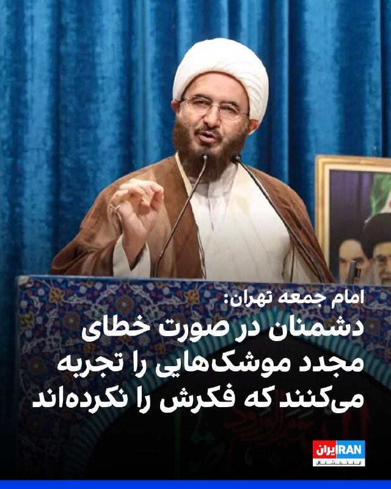

محمدجواد حاج‌علی‌اکبری، امام جمعه تهران، گفت نیروهای مسلح جمهوری اسلامی آماده‌تر از همیشه و دست به ماشه هستند و اگر دشمنان «دست به کار احمقانه‌ای بزنند»، این بار «موشک‌های جدیدی را تجربه خواهند کرد که فکرش را نکرده‌اند» و اسرائیل نیز «نفسش به شماره خواهد افتاد».

او در خطبه‌های نماز جمعه تهدید کرد در صورت تشدید درگیری‌ها، به جای «جنگ منطقه‌ای»، جنگ «فرامنطقه‌ای» رخ خواهد داد و به جای محدود شدن تنگه هرمز، باب‌المندب نیز بسته خواهد شد.

حاج‌علی‌اکبری افزود اگر زیرساخت‌های جمهوری اسلامی هدف قرار گیرد، «از تمام حامیان دشمن در منطقه، زیرساخت‌زدایی خواهد شد».
https://iranintl.com/202605225939

## IranIntlTV — post 338394

  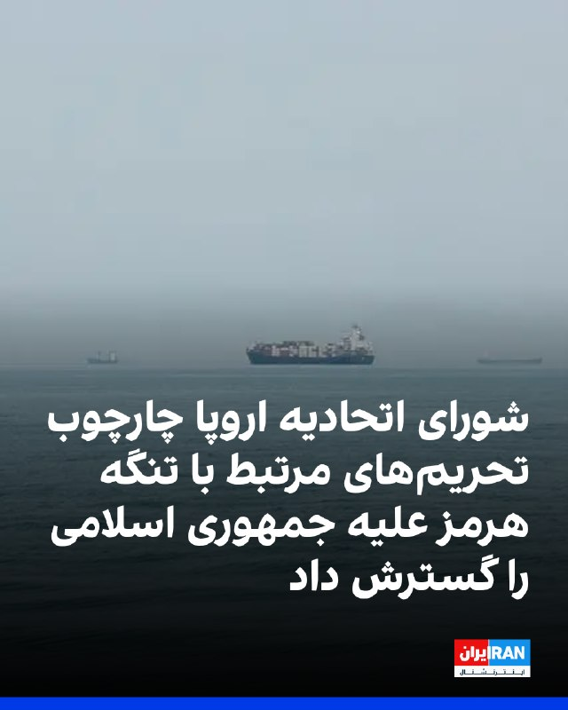

شورای اتحادیه اروپا اعلام کرد چارچوب حقوقی تحریم‌های این اتحادیه علیه جمهوری اسلامی را گسترش داده تا افراد و نهادهای دخیل در مختل کردن عبور قانونی کشتی‌ها در تنگه هرمز را هدف تحریم قرار دهد.

این تحریم‌ها شامل مسدود شدن دارایی‌ها، ممنوعیت سفر و همکاری مالی و اقتصادی شرکت‌ها و شهروندان اروپایی با افراد و نهادهای تحریم‌شده است.

شورای اتحادیه اروپا تاکید کرد که اقدام‌های جمهوری اسلامی علیه کشتی‌ها در تنگه هرمز مغایر حقوق بین‌الملل است.
https://iranintl.com/202605226607

## IranIntlTV — post 338393

  <a href="telegram/content/IranIntlTV_338393_1779452025.mp4" target="_blank">🎬 Download video</a>

سرخط خبرهای جمعه ۱ خرداد
@iranintltv

## IranIntlTV — post 338392

  <a href="telegram/content/IranIntlTV_338392_1779452027.mp4" target="_blank">🎬 Download video</a>

با نزدیک شدن به جام جهانی ۲۰۲۶، هزینه‌های مرتبط با میزبانی این رویداد در تورنتو از مرز یک میلیارد دلار عبور کرده است. این در حالی است که آماده‌سازی برای برگزاری یکی از بزرگ‌ترین رویدادهای ورزشی جهان همچنان ادامه دارد و فشار بر بودجه عمومی افزایش یافته است.
مهسا مرتضوی، خبرنگار ایران‌اینترنشنال، گزارش می‌دهد
@iranintltv

## IranIntlTV — post 338391

روایت شما از زندگی در آتش‌بس- جمعه ۱ خرداد ۱۴۰۵

🔹 از شیراز پیام می‌دم. ۲ ماه بیکاریم. گرانی بیداد می‌کنه. ترامپ عزیز کار را تموم کن.
🔹 یه دندون‌پزشکی ساده نمیشه رفت اونقدر که هزینه‌هامون بالاست. خسته شدیم از این حکومت نکبتی اسلامی.
🔹 از کاشان هستم. تعدیل نیروها خیلی شده و گرونی هم سر به فلک کشیده، تا حدی که دیگه مرغ هم نمیشه خرید و کارگرهای بدبخت با این همه قسط و بدهی دارن تعدیل هم می‌شن.
🔹 شاید بتوان برای مدتی بر سر نیزه تکیه کرد، اما هرگز نمی‌توان بر روی آن نشست و حکومت کرد. قابل توجه آنانی که فکر می‌کنند می‌توانند بر سریر خون بنشینند و حکومت کنند. حکومتی که مشروعیتش را از دست بدهد، همه چیزش را باخته است.
🔹 از چابهار پیام می‌دم. امروز (۱ خرداد) رفتم مغازه واسه خواهرم ۴ تا چیپس مزمز گرفتم، جمع کل شد یک میلیون و صد هزار تومان.
🔹 از اراک، شهرستان کمیجان پیام می‌دهم. وضعیت نانوایی‌ها خیلی خراب است. در نبود آرد، نان به صورت سهمیه‌ای شده، صف‌های طولانی تشکیل می‌شود و بعضی نانوایی‌ها تعطیل هستند. نبود آرد این وضعیت را ساخته است. صدای ما را به گوش جهان برسانید.
🔹 از شهسوار مازندران. اوضاع خیلی داغونه. مایحتاج زندگی رو به زور و هر روز با یه قیمت جدید تهیه می‌کنیم. به ریال پول درمیاریم، به دلار داریم خرج می‌کنیم. جاوید شاه.
🔹 در بازار تهران بیشتر رستوران‌ها و فست‌فودی‌ها فروششون به صفر رسیده. یک پرس قرمه‌سبزی شده ۸۰۰ هزار تومان.
🔹 برق شهرک‌های صنعتی رو به علت کمبود برق قطع می‌کنن. کشوری که محاصره اقتصادی و تحریم هست، به جای حمایت از کارخونه‌ها برق‌شون رو قطع می‌کنه که باعث گرونی و تورم و بیکاری بیشتر خواهد شد.
🔹 اینترنت باز بشه، بازار بورس و تجارت به‌صورت رسمی باز بشه، دلار میشه ۵۰۰ تومن. فقط نمی‌دونم تا کی با بسته نگه داشتن می‌تونن قیمت رو کنترل کنن؟

## IranIntlTV — post 338390

  <a href="telegram/content/IranIntlTV_338390_1779452028.mp4" target="_blank">🎬 Download video</a>

مارکو روبیو، وزیر خارجه آمریکا، در دومین روز نشست وزیران خارجه کشورهای عضو ناتو در هلسینبرگ سوئد، هشدار داد هرگونه اقدام جمهوری اسلامی درباره محدودیت تردد یا دریافت عوارض در تنگه هرمز، می‌تواند روند رسیدن به توافق را با خطر مواجه کند.
گفت‌وگو با علی‌حسین قاضی‌زاده، عضو تحریریه ایران‌اینترنشنال
@iranintltv

## IranIntlTV — post 338389

  <a href="telegram/content/IranIntlTV_338389_1779452029.mp4" target="_blank">🎬 Download video</a>

تصویر رسیده به ایران اینترنشنال نشان می‌دهد بستگان و خانواده سعید یعقوبی، از جوانان اعدام‌شده در پرونده مشهور به «خانه اصفهان» بر سر مزارش برگزار شد. این پرونده بر سر مرگ یک مامور انتظامی و دو بسیجی در اعتراضات سال ۱۴۰۱ در محله «خانه اصفهان» تشکیل و در آن صالح میرهاشمی و مجید کاظمی نیز اعدام شده بودند.

## Persian_Trend_Official — post 14663

  <a href="telegram/content/Persian_Trend_Official_14663_1779452031.mp4" target="_blank">🎬 Download video</a>

⭕️ پست اینستاگرامی‌ بنیامین نتانیاهو:

ما اسرائیل کوچک را به قدرتمندترین کشور خاورمیانه تبدیل کردیم 🇮🇱💪

هنوز کارمان تمام نشده است.

📝 Nick

📌 @persian_trend_official
پرشین ترند | متفاوت‌ترین کانال نظامی

## Persian_Trend_Official — post 14662

  <a href="telegram/content/Persian_Trend_Official_14662_1779452033.mp4" target="_blank">🎬 Download video</a>

تصاویری از 
🌊
🌊
🇮🇷

👩‍💻:PhantomDirective
✅

🆔 @persian_trend_official
پرشین ترند | متفاوت‌ترین کانال نظامی

​​​​​​​

## Persian_Trend_Official — post 14661

  

🔴 احتمال گسترش جنگ به باب‌المندب و زیرساخت‌های انرژی عربستان

💢با توجه به آخرین وضعیت میدانی یمن و مناطق تحت کنترل گروه‌های مختلف، تحلیلگران هشدار می‌دهند در صورت بازگشت جنگ گسترده و حمله به زیرساخت‌ها، احتمال ورود مستقیم انصارالله به مرحله جدیدی از درگیری‌ها بسیار بالاست.

سناریوهای محتمل شامل:

▪️ بستن تنگه باب‌المندب از سوی انصارالله
▪️ حملات موشکی و پهپادی به بندر «ینبع» عربستان
▪️ هدف قرار گرفتن خط لوله شرق به غرب عربستان که نفت را به دریای سرخ منتقل می‌کند

همچنین این احتمال مطرح شده که:

▪️ ائتلاف عربی برای جلوگیری از تهدیدات دریایی و انرژی، عملیات زمینی علیه سواحل تحت کنترل انصارالله را آغاز کند

تنگه باب‌المندب یکی از مهم‌ترین گذرگاه‌های تجارت و انرژی جهان محسوب می‌شود و هرگونه اختلال در آن می‌تواند تأثیر گسترده‌ای بر بازار جهانی نفت و حمل‌ونقل دریایی داشته باشد.

🫆:Tony

📌 @persian_trend_official
پرشین ترند | متفاوت‌ترین کانال نظامی

## Persian_Trend_Official — post 14660

🔴وزیر خارجه انگلیس:

💢از مذاکراتی که ایالات متحده در حال حاضر با ایران انجام می‌دهد، حمایت می‌کنیم.

🫆:Tony

📌 @persian_trend_official
پرشین ترند | متفاوت‌ترین کانال نظامی

## Persian_Trend_Official — post 14659

  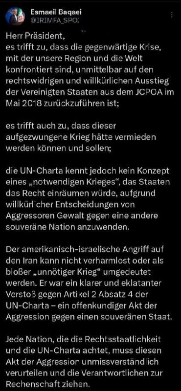

🔴 اسماعیل بقایی: حمله آمریکا و اسرائیل به ایران نقض آشکار منشور سازمان ملل بود

💢اسماعیل بقایی اعلام کرد بحران کنونی منطقه و جهان، نتیجه مستقیم خروج «غیرقانونی و خودسرانه» آمریکا از توافق هسته‌ای در مه ۲۰۱۸ است.
▪️ این جنگ قابل اجتناب بود و باید از وقوع آن جلوگیری می‌شد
▪️ منشور سازمان ملل مفهومی به نام «جنگ ضروری» را به رسمیت نمی‌شناسد
▪️ هیچ کشوری حق ندارد بر اساس تصمیمات یک‌جانبه و خودسرانه علیه یک کشور مستقل از زور استفاده کند
بقایی همچنین تأکید کرد:
▪️ حمله آمریکا و اسرائیل به ایران را نمی‌توان صرفاً «جنگی غیرضروری» توصیف کرد
▪️ این اقدام نقض صریح بند ۴ ماده ۲ منشور سازمان ملل و یک عمل آشکار تجاوزکارانه علیه یک کشور مستقل بوده است
▪️ هر کشوری که به قوانین بین‌المللی و منشور سازمان ملل احترام می‌گذارد، باید این اقدام را محکوم و عاملان آن را پاسخگو کند

🫆:Tony

📌 @persian_trend_official
پرشین ترند | متفاوت‌ترین کانال نظامی

## Persian_Trend_Official — post 14658

  

⭕️عبور 35 کشتی با هماهنگی نیروی دریایی سپاه از تنگهٔ هرمز

💢نیروی دریایی سپاه: در شبانه‌روز گذشته 35 کشتی اعم از نفتکش، کانتینربر و سایر کشتی های تجاری پس از کسب مجوز با هماهنگی و تامین امنیت نیروی دریایی سپاه از تنگهٔ هرمز عبور کردند.

🫆:Tony

📌 @persian_trend_official
پرشین ترند | متفاوت‌ترین کانال نظامی

## Persian_Trend_Official — post 14657

  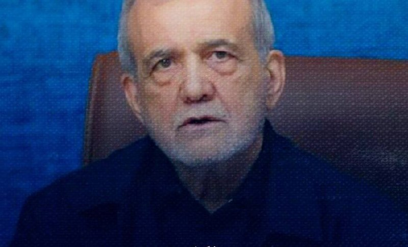

⭕️ پزشکیان:

💢 با استفاده از ظرفیت فضای مجازی می‌توان واقعیت‌ها را به مردم منتقل کرد؛ رسانه‌های صهیونیستی اجازه نمی‌دهند افکار عمومی واقعیت‌ها را ببیند

💢 وی با تأکید بر نقش روابط عمومی‌ها در افزایش آگاهی عمومی گفت: با استفاده از ظرفیت فضای مجازی، روابط عمومی‌ها می‌توانند واقعیت‌ها را به مردم منتقل کنند؛ چراکه رسانه‌های صهیونیستی اجازه دیدن واقعیت‌ها را به افکار عمومی نمی‌دهند.

🫆:Tony

📌 @persian_trend_official
پرشین ترند | متفاوت‌ترین کانال نظامی

## Persian_Trend_Official — post 14656

  <a href="telegram/content/Persian_Trend_Official_14656_1779452037.mp4" target="_blank">🎬 Download video</a>

🔴حمید رسایی هم تلویحا وجود یا عاملیت داشتن مجتبی خامنه‌ای در تصمیم‌گیری‌ها رو زیر سوال برد

💢مجلس پلمب شده است / حرفم را در خیابان می‌زنم

💢حمید رسایی،نماينده ٤ درصدي مجلس در جریان یکی از تجمع‌های شبانه مدعی شد دبیر شورای امنیت ملی در نامه‌ای خبر داده برگزاری جلسات صحن علنی مجلس به مصلحت نیست و در واقع مجلس پلمب شده است.

💢رسایی همچنین ادعا کرد چنین دستوری باید هم مصوبه شورای عالی امنیت ملی باشد و هم تاییدیه رهبری را داشته باشد اما چنین مصوبه‌ای وجود ندارد؛ کجای قانون اساسی آمده که دبیر شورای امنیت ملی می‌تواند برای نماینده مجلس تصمیم بگیرد؟

🫆:Tony

📌 @persian_trend_official
پرشین ترند | متفاوت‌ترین کانال نظامی

## Persian_Trend_Official — post 14655

  <a href="telegram/content/Persian_Trend_Official_14655_1779452039.mp4" target="_blank">🎬 Download video</a>

🔴ارتش اسرائیل

💢نیروهای تیپ ۵۵۱ تروریست‌های حزب‌الله را در حال ورود به مقر این سازمان شناسایی کرده و آن‌ها را به هلاکت رساندند

⭕️نیروهای تیم رزمی تیپ ۵۵۱ تحت فرماندهی لشکر ۱۴۶، روز گذشته (پنج‌شنبه) پنج تروریست از سازمان تروریستی حزب‌الله را شناسایی کردند که وارد مقر این سازمان در شمال خط دفاعی مقدم در جنوب لبنان شده بودند. در یک واکنش سریع، این نیروها نیروی هوایی را هدایت کردند که ساختمان را مورد حمله قرار داده و تروریست‌ها را به هلاکت رساند.

🫆:Tony

📌 @persian_trend_official
پرشین ترند | متفاوت‌ترین کانال نظامی

## Persian_Trend_Official — post 14654

  

💢مارکو روبیو: ایالات متحده و ایران در مذاکرات صلح پیشرفت محدودی داشته‌اند

💢روبیو، وزیر امور خارجه ایالات متحده در جریان نشست وزرای امور خارجه ناتو گفت: «پیشرفت‌هایی حاصل شده است. نمی‌خواهم اغراق کنم، اما حرکت‌هایی رو به جلو وجود دارد و این خوب است.»

💢به گفته وی، موضوع غنی‌سازی اورانیوم همچنان یک موضوع مهم در مذاکرات با ایران است.

🫆:Tony

📌 @persian_trend_official
پرشین ترند | متفاوت‌ترین کانال نظامی

---
📅 بروزرسانی: 1405/03/01 13:20
---

## rodast_omiddana — post 71746

  <a href="telegram/content/rodast_omiddana_71746_1779443443.webm" target="_blank">🎬 Download video</a>

🚨 صادق بیگدلی نویسنده دفترچه اضطرار دفتر شاهزاده...
دوستان اصل دعوا نفوذ ماسونهای شیعه با کراوات در قالب مشاور شاهزاده رضا پهلوی ست..
او به من حمله کرد برای اینکه من شیعه را میزنم، این جماعت نگران بیضه اسلام هستند..
مجبور بشم دست به افشاگریهایی میزنم که میخواستم در آینده سر زمانش بزنم..

## rodast_omiddana — post 71745

🚫 همه چیز داشت خوب پیش می‌رفت تا اینکه « ستون‌انقلاب😏»
یهو تصمیم گرفت کاسبی،
ببخشید کنسرت
نه ببخشید
« تجمع فرهنگی سیاسی »
بذاره!
البته اگر پول بلیط ندی ورود به این تجمع مبارزاتی ممنوعه !

همه چیز خوب پیش می‌رفت
تا اینکه
اعضای دفتر شاه
(که هیچکس به اونا کاری نداشت)
در واکنش به یک نقد ساده به کنسرت یک شخص( از اعضای باند مافیا)
بجای ریش سفیدی
با جانبداری از یک طرف دعوا
بنزین روی آتش ریختند
و دیگر اعضای «باند کنسرتیان»
را به حملات به منتقدان سوق دادند
تا آنها را « عامل دژمن» خطاب کنند

همه چیز خوب پیش می‌رفت
تا اینکه
عده‌ای در یک الگوی رفتاری امنیتی‌گونه
و وزارت اطلاعاتی
یک نقد ساده به کنسرت را
« توهین به شاه و دفتر شاه» القا کردند
و گفتند « این دسیسه ها باید خنثی شوند»!
همه چیز از استشمام بوی سیستم ولایت فقیه آغاز شد...

## rodast_omiddana — post 71744

  <a href="telegram/content/rodast_omiddana_71744_1779443443.mp4" target="_blank">🎬 Download video</a>

🚨مجتبی خامنه ای دستور داد اورانیوم خارج نره!
شانس حمله ترامپ به رژیم بالا رفته!

## rodast_omiddana — post 71743

🎬آنالیز ادعای آذری جهرمی در مورد بستن تنگه هرمز
لینک یوتیوب:
https://www.youtube.com/watch?v=H6UmljPCA9s

## rodast_omiddana — post 71742

  <a href="telegram/content/rodast_omiddana_71742_1779443444.webm" target="_blank">🎬 Download video</a>

🚨 مقامات اطلاعاتی اسرائیل:
حکومت ایران ممکن است علیه کشورهای عرب و اسرائیل دست به حمله غافلگیرانه موشکی بزند

## KiriMohems — post 47879

🔴 اما ایران با نصف سال قطعی برق رکورد میزنه

دبی با 49 ثانیه قطعی برق در طول یک سال،کمترین میزان قطعی برق در سطح جهان رو ثبت کرد

#professor
@KiriMohems

## KiriMohems — post 47878

🔴 ۸۴ میلیون کیر تو کونتون.

۸۴ روز از قطع کامل اینترنت بین‌المللی مردم ایران گذشت.

#professor
@KiriMohems

## KiriMohems — post 47877

  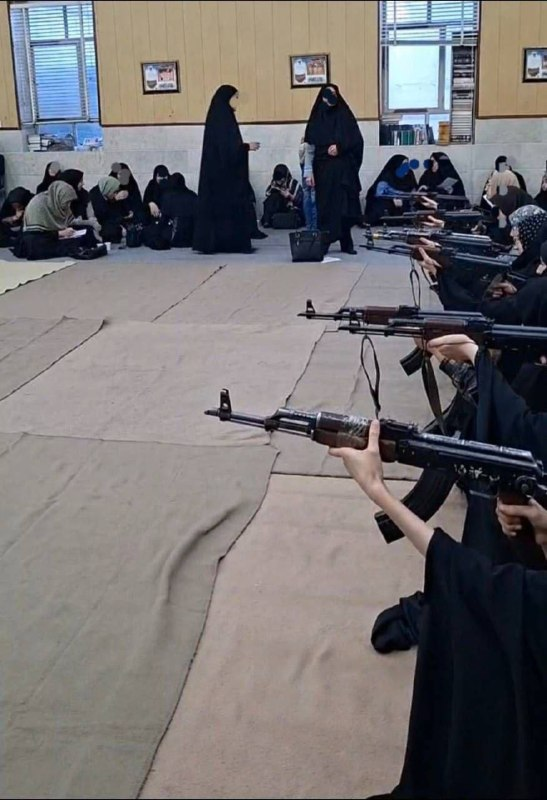

آموزش کار با اسلحه مساجد تهران به اوج رسیده و انگار جنگ زمینی در راهه

#professor
@KiriMohem

## KiriMohems — post 47876

🔴 رأی‌گیری درباره اختیارات جنگی ترامپ، به دست جمهوری‌خواهان تاخیری خورد.

#professor
@KiriMohems

## SportBaadNews — post 252181

  <a href="telegram/content/SportBaadNews_252181_1779443445.mp4" target="_blank">🎬 Download video</a>

این کلیپ واقعا شاهکاره؛ ارزش دانلود برا رونالدو فنا 20 از 10 🔥🔥
@SportBaadNews

## SportBaadNews — post 252177

ویرجینیا دوست دختر اکس وینیسیوس جونیور کف دبی 
🇦🇪
@SportBaadNews

## SportBaadNews — post 252172

  <a href="telegram/content/SportBaadNews_252172_1779443447.webm" target="_blank">🎬 Download video</a>

🚨🇳🇴 اینم لیست رسمی تیم ملی نروژ برای جام جهانی با حضور بازیکنان سرشناسی مثل ارلینگ هالند، مارتین اودگارد و الکساندر سورلوث @SportBaadNews

## SportBaadNews — post 252171

  <a href="telegram/content/SportBaadNews_252171_1779443447.webm" target="_blank">🎬 Download video</a>

🚨🇳🇴 اینم لیست رسمی تیم ملی نروژ برای جام جهانی با حضور بازیکنان سرشناسی مثل ارلینگ هالند، مارتین اودگارد و الکساندر سورلوث
@SportBaadNews

## SportBaadNews — post 252170

  <a href="telegram/content/SportBaadNews_252170_1779443447.webm" target="_blank">🎬 Download video</a>

🚨
💣🏴󠁧󠁢󠁥󠁮󠁧󠁿
❌ غایب های بزرگ انگلیس برای جام جهانی: ترنت الکساندر آرنولد، کول پالمر، هری مگوایر، لوئیس هال، مورگان گیبز وایت، آدام وارتون، فیل فودن، جرد بوون، الکس اسکات، لوک شاو و فیکایو توموری! @SportBaadNews

## SportBaadNews — post 252169

  <a href="telegram/content/SportBaadNews_252169_1779443448.webm" target="_blank">🎬 Download video</a>

🚨
💣🏴󠁧󠁢󠁥󠁮󠁧󠁿 رسسسسسسسسسسسسمی؛ لیست تیم ملی انگلیس برای جام جهانی 2026 آمریکا 
◀️دروازبان ها: جوردن پیکفورد، دین هندرسون، جیمز ترافورد 
◀️مدافعان: ریس جیمز، تینو لیورامنتو، مارک گوهی، ازری کونسا، جان استونز، جارل کوانسا، نیکو اورایلی، دن برن، جد اسپنس 
◀️هافبک…

## SportBaadNews — post 252168

  <a href="telegram/content/SportBaadNews_252168_1779443448.webm" target="_blank">🎬 Download video</a>

🚨
💣🏴󠁧󠁢󠁥󠁮󠁧󠁿 رسسسسسسسسسسسسمی؛ لیست تیم ملی انگلیس برای جام جهانی 2026 آمریکا

◀️دروازبان ها: جوردن پیکفورد، دین هندرسون، جیمز ترافورد

◀️مدافعان: ریس جیمز، تینو لیورامنتو، مارک گوهی، ازری کونسا، جان استونز، جارل کوانسا، نیکو اورایلی، دن برن، جد اسپنس

◀️هافبک ها: دکلان رایس، الیوت اندرسون، جود بلینگهام، جوردن هندرسون، مورگان راجرز، کوبی مینو

◀️مهاجمین: هری کین، ایوان تونی، اولی واتکینز، بوکایو ساکا، نونی مادوئکه، مارکوس رشفورد، آنتونی گوردون، ابرچی ازه
@SportBaadNews

## SportBaadNews — post 252167

  <a href="telegram/content/SportBaadNews_252167_1779443449.mp4" target="_blank">🎬 Download video</a>

دیشب توی بازی بانوان ریورپلاته و بوکاجونیورز یکی از هوادارا شبیه هیتلر بوده که پشمای همه ریخته😂😂
@SportBaadNews

## SportBaadNews — post 252166

  <a href="telegram/content/SportBaadNews_252166_1779443450.webm" target="_blank">🎬 Download video</a>

🚨
🚨
💣
⚽️ فوووووری فابریزیو رومانو: ژوزه مورینیو به رئال مادرید... Here We Goooooooooooo! @SportBaadNews

## SportBaadNews — post 252163

کیت خوشکگگلگلگلگگلگلللل میلان برای فصل جدیدددد
@SportBaadNews

## SportBaadNews — post 252162

  

⚽️
✅ از کیت فصل بعد میلان رسما رونمایی شد
@SportBaadNews

## SportBaadNews — post 252161

  <a href="telegram/content/SportBaadNews_252161_1779443451.webm" target="_blank">🎬 Download video</a>

🚨🇪🇸
❌ #رسمی | سزار آزپیلیکوئتا اعلام کرد قراره بعد از +800 بازی و کسب 12 جام از فوتبال خداحافظی کنه
@SportBaadNews

## SportBaadNews — post 252160

  

🏆
✅ | کینگزلی کومان 29 ساله تو 13 سال اخیر قهرمانی 14 لیگ رو تجربه کرده!

✅ 2013 : لیگ 1 فرانسه 🇫🇷

✅ 2014 : لیگ 1 فرانسه 🇫🇷

✅ 2015 : سری آ ایتالیا 🇮🇹

✅ 2016 : سری آ ایتالیا 🇮🇹

✅ 2016 : بوندس‌لیگا آلمان 🇩🇪

✅ 2017 : بوندس‌لیگا آلمان 🇩🇪

✅ 2018 : بوندس‌لیگا آلمان 🇩🇪

✅ 2019 : بوندس‌لیگا آلمان 🇩🇪

✅ 2020 : بوندس‌لیگا آلمان 🇩🇪

✅ 2021 : بوندس‌لیگا آلمان 🇩🇪

✅ 2022 : بوندس‌لیگا آلمان 🇩🇪

✅ 2023 : بوندس‌لیگا آلمان 🇩🇪

❌ 2024 : هیچی

✅ 2025 : بوندس‌لیگا آلمان 🇩🇪

✅ 2026 : لیگ حرفه‌ای عربستان 🇸🇦
@SportBaadNews

## SportBaadNews — post 252159

  <a href="telegram/content/SportBaadNews_252159_1779443452.webm" target="_blank">🎬 Download video</a>

🚨🏴󠁧󠁢󠁥󠁮󠁧󠁿 بی‌بی‌سی: توخل به جای ترنت، اسپنس مدافع تاتنهام رو برای جام جهانی دعوت کرده😐😐😐😐😐 @SportBaadNews

## SportBaadNews — post 252158

  <a href="telegram/content/SportBaadNews_252158_1779443452.webm" target="_blank">🎬 Download video</a>

🚨🏴󠁧󠁢󠁥󠁮󠁧󠁿 بی‌بی‌سی: توخل به جای ترنت، اسپنس مدافع تاتنهام رو برای جام جهانی دعوت کرده😐😐😐😐😐 @SportBaadNews

## SportBaadNews — post 252157

  <a href="telegram/content/SportBaadNews_252157_1779443452.webm" target="_blank">🎬 Download video</a>

🚨🏴󠁧󠁢󠁥󠁮󠁧󠁿 بی‌بی‌سی: توخل به جای ترنت، اسپنس مدافع تاتنهام رو برای جام جهانی دعوت کرده😐😐😐😐😐 @SportBaadNews

## SportBaadNews — post 252156

  <a href="telegram/content/SportBaadNews_252156_1779443453.webm" target="_blank">🎬 Download video</a>

🚨🏴󠁧󠁢󠁥󠁮󠁧󠁿 بی‌بی‌سی: توخل به جای ترنت، اسپنس مدافع تاتنهام رو برای جام جهانی دعوت کرده😐😐😐😐😐
@SportBaadNews

## IranIntlTV — post 338388

  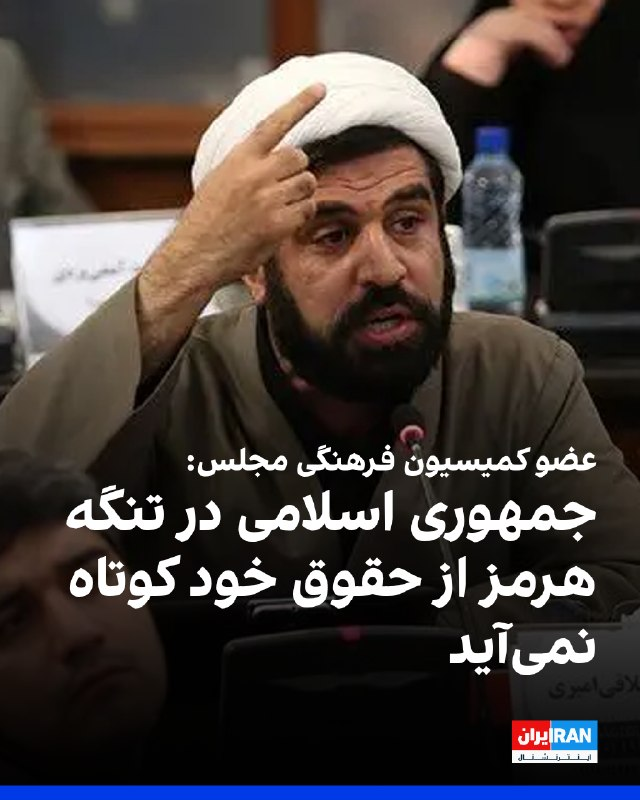

حسنعلی اخلاقی‌امیری، عضو کمیسیون فرهنگی مجلس، به دیده‌بان ایران گفت جمهوری اسلامی بنا ندارد در حوزه خلیج فارس و تنگه هرمز از «حقوق» خود کوتاه بیاید و افزود: «قانون دریافت عوارض از تنگه هرمز را تصویب می‌کنیم.»

او اضافه کرد: «تمام مسئولان اتفاق نظر دارند که تنگه هرمز از منافع جمهوری اسلامی است. هر مذاکره‌ای هم صورت بگیرد، کشتی‌های دشمن و کشورهای همکار دشمن حق عبور نداشته و بقیه کشتی‌ها باید عوارض بپردازند.»

اخلاقی‌امیری همچنین با اشاره به تهدید دونالد ترامپ درباره بازگشایی تنگه هرمز گفت آمریکا می‌خواهد با باز کردن این تنگه «خود را از این معرکه خلاص کند»، اما پس از «تحمیل جنگ اخیر» و وارد شدن هزینه‌های سنگین به جمهوری اسلامی، «دیگر قرار نیست از حق خود بگذریم.»
https://iranintl.com/202605223337

## IranIntlTV — post 338387

  

انور قرقاش، مشاور دیپلماتیک رییس امارات متحده عربی، روز جمعه هشدار داد دور دوم درگیری میان آمریکا و جمهوری اسلامی می‌تواند وضعیت منطقه را پیچیده‌تر کند اما تاکید کرد که هر راه‌حل سیاسی باید به «ریشه‌های» بحران بپردازد تا از ایجاد پیچیدگی‌های جدید در آینده جلوگیری شود.

قرقاش همچنین هشدار داد هرگونه تغییر در وضعیت کنترل تنگه هرمز پیامدهای جدی خواهد داشت.

او از کشورهای اروپایی خواست تنگه هرمز را نه مسئله‌ای دوردست، بلکه موضوعی مرتبط با امنیت انرژی و تجارت خود بدانند.
https://iranintl.com/202605227157

## IranIntlTV — post 338386

  

🔻کنفدراسیون فوتبال آسیا سهمیه کشورهای حاضر در رقابت‌های آسیایی فصل ۲۰۲۸-۲۰۲۷ را اعلام کرد که بر اساس آن، ایران سه سهمیه مستقیم در لیگ نخبگان آسیا و یک سهمیه در لیگ قهرمانان آسیا خواهد داشت.

🔹این در حالی است که عربستان سعودی ۲+۳ و امارات متحده عربی ۱+۳ سهمیه برای لیگ نخبگان آسیا و هر کدام یک سهمیه برای لیگ قهرمانان آسیا توانستند کسب کنند.

🔹در شرق آسیا نیز ژاپن و کره جنوبی به ترتیب سهمیه‌هایی مشابه عربستان سعودی و امارات متحده عربی به دست آوردند و تایلند هم مانند ایران سه سهمیه لیگ نخبگان و یک سهمیه لیگ قهرمانان آسیا کسب کرد.

🔹فوتبال ایران در سال‌های اخیر، به دلیل نتایج ضعیف نمایندگانش و ناکامی در صعود به مراحل پایانی رقابت‌های آسیایی، نتوانسته سهمیه بیشتری به دست آورد. همچنین بیش از ۳۰ سال از آخرین قهرمانی یک تیم ایرانی در رقابت‌های باشگاهی آسیا می‌گذرد.

@iranintltvsport

## IranIntlTV — post 338385

بحران جمعیت برای جمهوری اسلامی؛ چرا ایرانی‌ها دیگر فرزند نمی‌آورند؟
نعیمه دوستدار- کاهش تعداد تولدها در ایران و سقوط آمار موالید به زیر یک میلیون، بحران جمعیتی را به مرکز سیاست‌گذاری جمهوری اسلامی بازگردانده است. مساله جمعیت دیگر فقط یک نگرانی آماری نیست، بلکه موضوعی سیاسی، امنیتی و ایدئولوژیک برای حکومت است.
در روزهای اخیر، بحث جمعیت بار دیگر به یکی از موضوعات مهم در فضای سیاسی و رسانه‌ای ایران تبدیل شده است. این موج تازه پس از انتشار پیامی منتسب به مجتبی خامنه‌ای، رهبر غایب جمهوری اسلامی، درباره ضرورت افزایش جمعیت آغاز شد. پیامی که در آن، رشد جمعیت به‌عنوان مساله‌ای راهبردی برای آینده ایران توصیف شده است.
تقریبا هم‌زمان با این پیام، علیرضا رئیسی، معاون بهداشت وزارت بهداشت، درمان و آموزش پزشکی، در اظهاراتی هشدار داد تعداد موالید در سال ۱۴۰۳ نسبت به سال قبل حدود هفت درصد کاهش یافته و برای نخستین بار به زیر یک میلیون رسیده است.
بر اساس آمار ارائه‌شده از سوی مقام‌های وزارت بهداشت، تعداد تولدهای ثبت‌شده در سال ۱۴۰۳ حدود ۹۷۹ هزار مورد بوده است. رقمی که نسبت به دهه‌های گذشته کاهش چشمگیری نشان می‌دهد.
رئیسی همچنین گفت که اگر روند فعلی ادامه پیدا کند، رشد جمعیت ایران در دو دهه آینده به نزدیکی صفر خواهد رسید.
این هم‌زمانی معنادار است. از یک سو رهبر دیده نشده جمهوری اسلامی بر ضرورت افزایش جمعیت تاکید می‌کند و از سوی دیگر، مقام‌های رسمی دولت درباره کاهش موالید هشدار می‌دهند.
همین مساله نشان می‌دهد موضوع جمعیت برای جمهوری اسلامی تا چه اندازه جدی است.

https://www.iranintl.com/fa/202605206473

## IranIntlTV — post 338384

  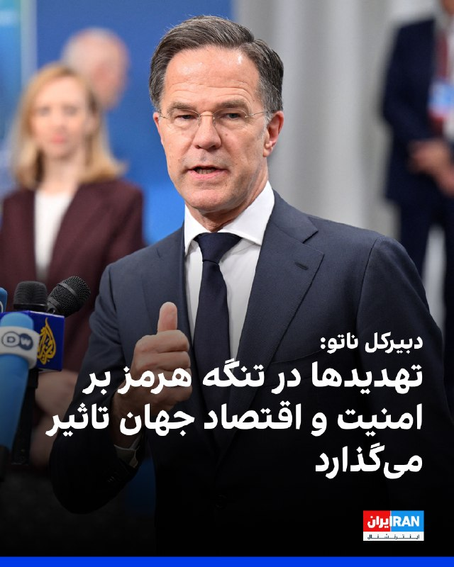

مارک روته، دبیرکل ناتو، در نشست وزیران خارجه این ائتلاف در سوئد گفت هرگونه تهدید علیه گذرگاه‌های راهبردی دریایی، از جمله تنگه هرمز، می‌تواند پیامدهای گسترده‌ای برای امنیت بین‌المللی و اقتصاد جهانی داشته باشد.

روته جمعه اول خرداد در دومین روز نشست وزیران خارجه سازمان پیمان نظامی آتلانتیک شمالی (ناتو) در هلسینبورگ سوئد، گفت که این سازمان تحولات مربوط به تنگه هرمز را با دقت دنبال می‌کند و بر حفظ آزادی کشتیرانی و امنیت خطوط انتقال انرژی تاکید دارد.

او همچنین گفت آزادی کشتیرانی در تنگه هرمز موضوعی مهم برای همه اعضای ناتو است، اما ممکن است مستقیما در چارچوب ماموریت رسمی این ائتلاف قرار نگیرد.

روته در عین حال بر ادامه نقش کلیدی آمریکا در امنیت اروپا تاکید کرد و گفت ارسال تجهیزات حیاتی آمریکایی به اوکراین، از جمله سامانه‌های پاتریوت، همچنان برای ناتو اهمیت اساسی دارد.
https://iranintl.com/202605229748

## IranIntlTV — post 338383

  <a href="telegram/content/IranIntlTV_338383_1779443455.mp4" target="_blank">🎬 Download video</a>

بر اساس تصاویر رسیده به ایران‌اینترنشنال، تجمع دانش‌آموزان و خانواده‌هایشان در اعتراض به حضوری شدن امتحانات در شهرکرد که تا ساعات پایانی شب ادامه داشت، با دخالت نیروهای حکومتی مواجه شد. ماموران در تاریکی شب با استفاده از شوکر به دانش‌آموزان و خانواده‌های معترض حمله کردند.
جزییات بیشتر با لیلا سعادتی، عضو تحریریه ایران‌اینترنشنال
@iranintltv

## IranIntlTV — post 338382

  

یوهان واده‌فول، وزیر خارجه آلمان، اعلام کرد برلین در حال آماده‌سازی برای مشارکت در تلاش‌هایی به رهبری بریتانیا برای تامین امنیت تنگه هرمز است، اما ماموریتی از سوی ناتو به این شکل وجود ندارد.

او گفت گفت‌وگوهای انجام‌شده با آمریکا نشان می‌دهد واشینگتن هرگونه انتقال مسئولیت را با متحدان اروپایی هماهنگ خواهد کرد.

واده‌فول همچنین از تصمیم دونالد ترامپ، رییس‌جمهوری آمریکا، برای اعزام ۵ هزار نیروی اضافی آمریکایی به لهستان استقبال کرد و آن را نشانه‌ای از تداوم تعهدات امنیتی آمریکا دانست.

وزیر خارجه آلمان افزود برلین از آمریکا دعوت کرده است به برنامه اولیه خود برای استقرار موشک‌های دوربرد در آلمان پایبند بماند.
https://iranintl.com/202605225671

## IranIntlTV — post 338381

  <a href="telegram/content/IranIntlTV_338381_1779443457.mp4" target="_blank">🎬 Download video</a>

یک شهروند با ارسال پیامی به ایران اینترنشنال گفت که ماموران ایست بازرسی از اموال مردم هنگام توقف سرقت می‌کنند. پیام او با هوش مصنوعی خوانده شده است.

## IranIntlTV — post 338380

🔻پاکستان در تلاش برای دستیابی به پیشرفت در مذاکرات واشینگتن و تهران

هم‌زمان با ادامه اختلاف‌ها میان تهران و واشینگتن بر سر ذخایر اورانیوم غنی‌شده در ایران و کنترل تنگه هرمز، پاکستان در تلاش است زمینه دستیابی به توافقی برای پایان جنگ آمریکا و اسرائیل با جمهوری اسلامی را فراهم کند.

خبرگزاری رویترز جمعه اول خرداد در گزارشی نوشت عباس عراقچی، وزیر امور خارجه جمهوری اسلامی، با محسن نقوی، وزیر کشور پاکستان، در تهران دیدار کرد تا درباره پیشنهادهای مربوط به پایان جنگ آمریکا و اسرائیل علیه حکومت ایران گفت‌وگو کند.

بر اساس گزارش رسانه‌ها در ایران، این دومین دور گفت‌وگوهای نقوی با مقام‌های ایرانی در دو روز گذشته بوده است.

رویترز نوشت اسلام‌آباد در تلاش است ارتباط میان تهران و واشینگتن را تسهیل کند تا چارچوبی برای پایان جنگ و حل اختلاف‌ها شکل بگیرد.
نشانه‌های مثبت

مارکو روبیو، وزیر خارجه آمریکا، ۳۱ اردیبهشت گفت در مذاکرات «نشانه‌های مثبتی» دیده می‌شود، اما هشدار داد اگر جمهوری اسلامی طرح دریافت عوارض از کشتی‌های عبوری از تنگه هرمز را اجرا کند، دستیابی به توافق ممکن نخواهد بود.

او گفت: «ما می‌خواهیم این مسیر باز و آزاد باشد. تنگه هرمز یک آبراه بین‌المللی است.»

یک منبع ارشد ایرانی نیز به رویترز گفت اختلاف‌ها میان دو طرف کاهش یافته، اما موضوع غنی‌سازی اورانیوم و تنگه هرمز همچنان از اصلی‌ترین موانع توافق هستند.

جنگ جاری شوک بزرگی به اقتصاد جهانی وارد کرده و افزایش قیمت نفت، نگرانی‌ها را درباره تورم تشدید کرده است.

پیش از آغاز جنگ، حدود یک‌پنجم صادرات جهانی نفت و گاز طبیعی مایع از تنگه هرمز عبور می‌کرد.

هم‌زمان ارزش دلار آمریکا به بالاترین سطح شش هفته گذشته نزدیک شده و قیمت نفت نیز در پی تردید بازارها نسبت به موفقیت مذاکرات، افزایش یافته است.
اورانیوم و تنگه هرمز

دونالد ترامپ، رییس‌جمهوری آمریکا، ۳۱ اردیبهشت گفت واشینگتن در نهایت ذخایر اورانیوم غنی‌شده ایران را در اختیار خواهد گرفت.

او گفت: «آن را به دست خواهیم آورد. به آن نیاز نداریم و احتمالا بعد از به دست آوردنش نابودش خواهیم کرد، اما اجازه نمی‌دهیم ایران آن را داشته باشد.»

دو منبع ارشد ایرانی پیش‌تر به رویترز گفته بودند مجتبی خامنه‌ای، رهبر سوم جمهوری اسلامی، دستور داده ذخایر اورانیوم غنی‌شده از ایران خارج نشود.
پیشنهاد تازه جمهوری اسلامی که این هفته به آمریکا ارائه شده، شامل درخواست‌هایی مانند کنترل تنگه هرمز، دریافت غرامت جنگ، لغو تحریم‌ها، آزادسازی دارایی‌های بلوکه‌شده و خروج نیروهای آمریکایی از منطقه است. درخواست‌هایی که ترامپ پیش‌تر آن‌ها را رد کرده بود.

هم‌زمان آژانس بین‌المللی انرژی اعلام کرد جنگ جاری «بدترین شوک انرژی جهان» را ایجاد کرده است.

این نهاد هشدار داد هم‌زمانی اوج تقاضای تابستانی و کمبود عرضه جدید از خاورمیانه، ممکن است بازار انرژی را در ماه‌های ژوییه و اوت وارد «منطقه قرمز» کند.
🔗وب‌سایت ایران‌اینترنشنال
@iranintltv

## IranIntlTV — post 338379

  <a href="telegram/content/IranIntlTV_338379_1779443459.mp4" target="_blank">🎬 Download video</a>

دادستانی فدرال آلمان اعلام کرد علیه یک شهروند دانمارکی با اصالت افغانستانی به اتهام جاسوسی برای جمهوری اسلامی اعلام جرم کرده‌ است. این فرد متهم است که به دستور نهادهای اطلاعاتی جمهوری اسلامی، اقدام به جمع‌آوری اطلاعات درباره یهودیان ساکن آلمان با هدف آماده‌سازی برای عملیات ترور و آتش‌سوزی کرده‌ است.
جزییات بیشتر با احمد صمدی، خبرنگار ایران‌اینترنشنال
@iranintltv

## IranIntlTV — post 338378

  

خبرگزاری رویترز گزارش داد یک مقام ارشد آمریکایی اعلام کرد واشینگتن برای اطمینان از تامین مهمات مورد نیاز در جنگ علیه جمهوری اسلامی، به‌طور موقت در روند فروش تسلیحات به تایوان وقفه ایجاد کرده است.

هانگ کائو، سرپرست وزارت نیروی دریایی آمریکا، در جلسه‌ای در سنای آمریکا گفت ایالات متحده می‌خواهد مطمئن شود مهمات کافی برای عملیات «خشم حماسی» علیه جمهوری اسلامی در اختیار دارد، اما فروش‌های نظامی خارجی، هر زمان دولت آمریکا لازم بداند، ادامه خواهد یافت.

دفتر ریاست‌جمهوری تایوان اعلام کرد تاکنون هیچ اطلاعاتی درباره تغییر در روند فروش تسلیحات آمریکا دریافت نکرده است.

رویترز نوشت تایوان در انتظار تایید بسته جدید فروش تسلیحات آمریکاست که ممکن است ارزش آن تا ۱۴ میلیارد دلار باشد.
https://iranintl.com/202605228754

## IranIntlTV — post 338377

  <a href="telegram/content/IranIntlTV_338377_1779443461.mp4" target="_blank">🎬 Download video</a>

اسماعیل بقایی، سخنگوی وزارت خارجه جمهوری اسلامی، گمانه‌زنی‌های مطرح‌شده درباره ابعاد مذاکرات با آمریکا و خروج اورانیوم غنی‌شده از ایران را فاقد اعتبار توصیف کرد. رویترز به نقل از یک مقام ارشد جمهوری اسلامی گزارش داده بود اختلافات تهران و واشینگتن کاهش یافته، اما هنوز توافقی حاصل نشده است.
گفت‌وگو با حسین آقایی، عضو تحریریه ایران‌اینترنشنال
@iranintltv

## IranIntlTV — post 338376

  

سعید جلالی‌قدیری، دبیر اتحادیه تولید و صادرات نساجی و پوشاک ایران، گفت کوچک شدن جیب مردم به افت فروش در صنعت پوشاک و نساجی منجر شده است.

او «شرایط نه جنگ نه صلح، نوسانات نرخ ارز و اختلال در تامین مواد اولیه» را از دیگر دلایل افت فروش در این صنعت عنوان کرد.

جلالی‌قدیری افزود صنعت نساجی و پوشاک ایران در آغاز سال جاری با مواردی از جمله انباشت بحران‌های اقتصادی، کاهش قدرت خرید مردم، دشواری در فروش و اختلال در تامین مواد اولیه مواجه است.
https://iranintl.com/202605222663

## IranIntlTV — post 338375

  

مارکو روبیو، وزیر خارجه آمریکا، جمعه یکم خرداد در حاشیه نشست ناتو گفت جمهوری اسلامی در پی ایجاد نظامی اختصاصی برای اخذ عوارض در یک آبراه بین‌المللی است و تلاش می‌کند عمان را نیز به پیوستن به این سازوکار متقاعد کند. روبیو تاکید کرد که این اقدام «غیرقابل قبول» است.

او افزود: «هیچ کشوری در جهان نباید چنین چیزی را بپذیرد. من کشوری را نمی‌شناسم که جز ایران از آن حمایت کند.»

روبیو با اشاره به تحرکات دیپلماتیک در سازمان ملل متحد گفت قطعنامه‌ای با پیشنهاد بحرین در شورای امنیت مطرح شده که آمریکا در آن نقش فعالی داشته و به گفته او، بیشترین تعداد هم‌پیشنهاددهنده را در تاریخ شورای امنیت دارد. او هشدار داد چند کشور در حال بررسی وتوی این قطعنامه هستند و افزود: «این مایه تاسف خواهد بود.»

وزیر خارجه آمریکا تاکید کرد واشینگتن برای دستیابی به اجماع جهانی جهت جلوگیری از اجرای چنین طرحی تلاش می‌کند و گفت: «باید دید آیا سازمان ملل همچنان کارآمد است یا نه. ما می‌کوشیم از این مسیر به نتیجه برسیم.»

او تصریح کرد اگر اخذ عوارض در تنگه هرمز اجرایی شود، ممکن است در دیگر آبراه‌های مهم جهان نیز تکرار شود.
https://iranintl.com/2026052

## IranIntlTV — post 338374

روایت شما از زندگی در آتش‌بس- جمعه ۱ خرداد ۱۴۰۵

🔹 کارگر شرکت کروز هستم از تهران. اینجا ماهی چند میلیون بابت غذا از حقوقمون کم می‌کنن، اما فقط برنج خالی می‌دن بخوریم و گاهی وقت‌ها تخم‌مرغ آب‌پز. آب معدنی، نوشابه و تنقلات کنار غذا رو کلاً حذف کردن.
🔹 امروز (۱ خرداد) یک دونه مرغ بسته‌ای خریدم؛ چهار تا سینه مرغ شد یک میلیون و ۳۶۰ هزار تومان. آخه چجوری دیگه میشه زندگی کرد؟
🔹 از کمال‌شهر کرج پیام می‌دم، خواستم بگم زندگی تو ایران اون‌قدری به ما بدهکاره که با پولش می‌شه سه‌تا زندگی دیگه خرید.
🔹 حقوق‌ها کفاف برطرف کردن نیازهای اولیه رو به زور می‌ده. هر روز داره سفره مردم کوچیک‌تر می‌شه، هر روز از دلخوشی‌های کوچیک و از خریدهای روزمره مردم کم می‌شه.
🔹 خدایا ما چه گناهی کردیم که باید تاوان نسل ۵۷ رو بدیم؟ ما جوونایی که اول راه زندگی بودیم، حالا زیر سایه جنگ، خفقان، فقر و ترس له می‌شیم. چرا ظالم‌ها آسوده حکومت می‌کنن و مردمی که فقط زندگی می‌خواستن، هر روز بیشتر تو تاریکی و ناامیدی فرو می‌رن؟
🔹 کارخانه لاستیک بارز کرمان به‌خاطر نداشتن مواد اولیه داره تعدیل نیرو می‌کنه و شیفت‌هاش رو یک‌سوم کرده.
🔹 از کرمان، من یک دانش‌آموز کلاس هشتم هستم. الان معلوم نیست امتحانات حضوریه یا نه؛ از یک طرف می‌گن حضوریه، از یک طرف می‌گن نیست. بعد از ۳ ماه درس نخوندن چطوری امتحان بدم؟
🔹 علی هستم از شاندیز مشهد. اینجا هم مثل بقیه کشور همه‌چی گرون شده و نمیشه خرید کرد. اینا فقط سر و صدا می‌کنن، آب هم جیره‌بندی شده.
🔹 از اهواز پیام می‌دم. اینجا یعنی کل ایران اوضاع اصلاً خوب نیست. مردم به معیشت و زندگی روزمره خودشون نمی‌رسن. عمو ترامپ لطفاً کارو تموم کن، مذاکره نمی‌خوایم دیگه، ما طاقت نداریم.
🔹 از گله‌دار استان فارس پیام می‌دم. می‌خوان مجسمه خمینی رو که مردم قبلاً آتیشش زده بودن بازسازی کنن. ما دوباره خرابش می‌کنیم.

## IranIntlTV — post 338373

  

مارکو روبیو، وزیر خارجه آمریکا، در حاشیه نشست ناتو درباره مذاکرات جاری با جمهوری اسلامی گفت که واشینگتن در انتظار نتایج گفت‌وگوهای در حال انجام است؛ گفت‌وگوهایی که به گفته او نشانه‌هایی از پیشرفت داشته‌اند.

او افزود: «ما در انتظار نتایج این گفت‌وگوها هستیم که نشانه‌هایی از پیشرفت دارد. نمی‌خواهم در این باره اغراق کنم؛ تحرک محدودی صورت گرفته و این مثبت است، اما اصول اساسی تغییری نکرده است.»

وزیر خارجه آمریکا تاکید کرد که حکومت ایران هرگز نباید به سلاح هسته‌ای دست یابد و گفت: «برای تحقق این هدف، باید به مسئله غنی‌سازی و نیز موضوع اورانیوم با غنای بالا رسیدگی کنیم و افزون بر آن، موضوع تنگه هرمز را نیز مد نظر قرار دهیم.»
https://iranintl.com/202605229378

## IranIntlTV — post 338372

  <a href="telegram/content/IranIntlTV_338372_1779443464.mp4" target="_blank">🎬 Download video</a>

بر اساس اطلاعات رسیده به ایران‌اینترنشنال، فدراسیون فوتبال جمهوری اسلامی برای دریافت ویزای آمریکا، خبرنگاران و عکاسانی را انتخاب کرده که در سوابق حرفه‌ای خود هیچ انتقادی از این فدراسیون نداشته‌اند. همچنین گفته می‌شود برای هر یک از این ۱۵ نفر، روزانه ۵۰ دلار کمک‌هزینه در نظر گرفته شده است.
جزییات بیشتر با رها پوربخش، عضو تحریریه ایران‌اینترنشنال
@iranintltv

## IranIntlTV — post 338371

  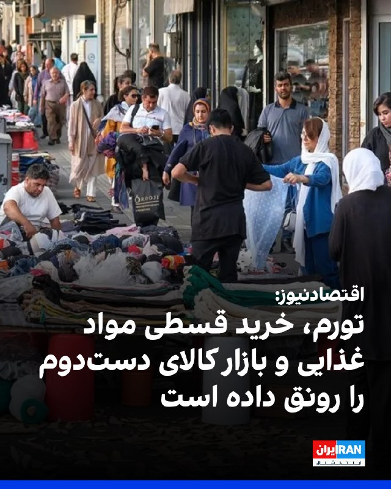

سایت اقتصادنیوز گزارش داد تورم و کاهش قدرت خرید خانوارها در سال ۱۴۰۵، الگوی خرید مردم را تغییر داده و خرید قسطی را از کالاهای گران‌قیمت به مواد غذایی، اقلام ضروری، لبنیات، شوینده‌ها و اقلام بهداشتی کشانده است.

اقتصادنیوز نوشت خرید قسطی دیگر محدود به کالاهای لوکس یا بزرگ نیست و حتی مواد غذایی و بسته‌های سوپرمارکتی نیز در قالب پرداخت چندمرحله‌ای عرضه می‌شوند؛ تغییری که نشانه کاهش قدرت نقدینگی خانوارهاست.

بر اساس این گزارش، فشار تورمی باعث شده بسیاری از خانوارها به‌جای خرید نقدی کالاهای نو، به خرید قسطی یا کالاهای دست‌دوم روی بیاورند. فروشندگان کالاهای دست‌دوم نیز از افزایش ۴۰ تا ۶۰ درصدی تقاضا در این بازار خبر داده‌اند.
https://iranintl.com/202605229077

## IranIntlTV — post 338370

  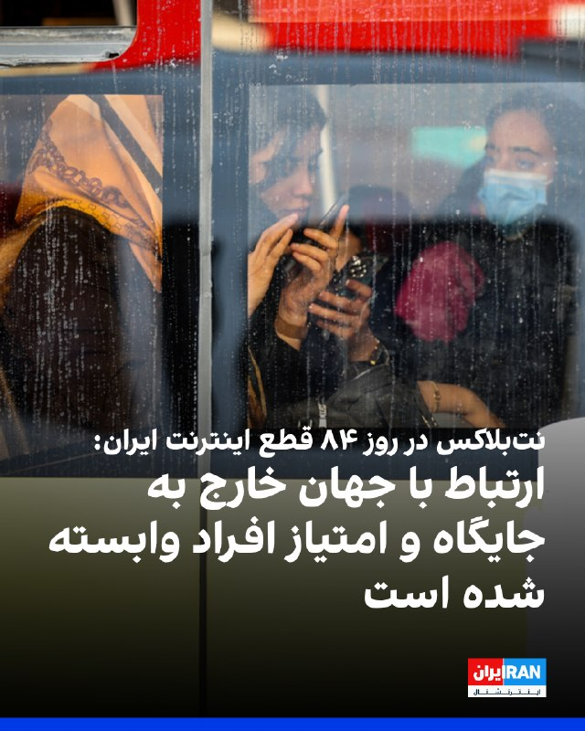

وب‌سایت نت‌بلاکس، نهاد ناظر بر اختلال‌های اینترنتی در جهان، صبح جمعه اول خرداد اعلام کرد قطع گسترده اینترنت در ایران وارد هشتاد‌وچهارمین روز خود شده و دسترسی به شبکه‌های بین‌المللی برای بیش از هزار و ۹۹۲ ساعت همچنان به‌طور گسترده قطع است.

این نهاد ناظر بر اینترنت نوشت با ادامه این وضعیت، شکاف‌های اجتماعی و اقتصادی عمیق‌تر می‌شود و هر ساعت از قطع اینترنت، ارتباط با جهان خارج را بیش از پیش به جایگاه، همراهی با حاکمیت و برخورداری از امتیاز وابسته می‌کند.
https://iranintl.com/202605222187

## IranIntlTV — post 338369

  <a href="telegram/content/IranIntlTV_338369_1779443466.mp4" target="_blank">🎬 Download video</a>

یکی از مخاطبان ایران‌اینترنشنال می‌گوید با وجود ادعای بازگشایی بازار بورس، معاملات برخی صنایع پس از جنگ اخیر همچنان متوقف مانده است. او می‌گوید دو سال پیش تمام پس‌انداز خود را در صنعت فولاد سرمایه‌گذاری کرده، اما اکنون به سرمایه و سهامش دسترسی ندارد و ارزش دارایی‌هایش عملاً از بین رفته است. پیام او با هوش مصنوعی خوانده شده است.

## Persian_Trend_Official — post 14653

https://youtube.com/live/zMW0RhvWank?feature=share

## Persian_Trend_Official — post 14652

  <a href="telegram/content/Persian_Trend_Official_14652_1779443468.webm" target="_blank">🎬 Download video</a>

UKMTO
گزارش داد که یک تانکر توسط یک قایق کوچک حامل پنج نفر در ۹۸ مایل دریایی شمال سوکوترا نزدیک یمن در حال نزدیک شدن به تانکر مورد نظر بود که با شلیک هشدار تیم امنیتی کشتی مواجه شدکه قایق را مجبور به تغییر مسیر کردند.

🚢PhantomDirective
🚢

📌 @persian_trend_official
پرشین ترند | متفاوت‌ترین کانال نظامی

## Persian_Trend_Official — post 14651

  <a href="telegram/content/Persian_Trend_Official_14651_1779443468.webm" target="_blank">🎬 Download video</a>

توئیت ابراهیم رضایی سخنگوی کمیسیون امنیت ملی:

موشک‌ها را برای مذاکره با شیطان بفرستید .

👑PhantomDirective
👑

📍 @persian_trend_official
پرشین ترند | متفاوت‌ترین کانال نظامی

## Persian_Trend_Official — post 14650

  <a href="telegram/content/Persian_Trend_Official_14650_1779443469.mp4" target="_blank">🎬 Download video</a>

📰گزارش‌های تایید نشده از وقوع انفجار در امارات

🔺برخی منابع عربی مدعی وقوع انفجار در ابوظبی، پایتخت امارات متحده عربی شدند.

🔺هنوز جزئیاتی از این انفجارها منتشر نشده است.

خبر گزاری مهر

👑PhantomDirective
👑

📌 @persian_trend_official
پرشین ترند | متفاوت‌ترین کانال نظامی

## Persian_Trend_Official — post 14649

  <a href="telegram/content/Persian_Trend_Official_14649_1779443469.mp4" target="_blank">🎬 Download video</a>

اندر احوالات مذاکرات ایران-آمریکا

📌 @persian_trend_official
پرشین ترند | متفاوت‌ترین کانال نظامی

---
📅 بروزرسانی: 1405/03/01 09:35
---

## ChizBergerz — post 46649

  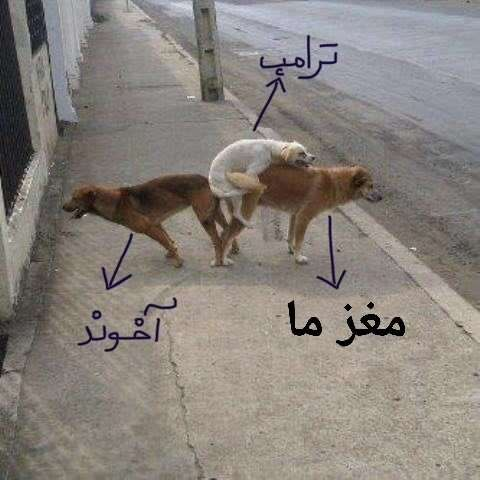

وضعیت این روزای ایرانی‌ها:

@ChizBergerz

## ChizBergerz — post 46648

  <a href="telegram/content/ChizBergerz_46648_1779429931.webm" target="_blank">🎬 Download video</a>

⭕️ تنها جایی که در لحظه عضویت بهت 500 هزارتومان موجودی میده اینجاس 
❌

🎉 کافیه فقط عضو بشی تا #وینرو بهت 
🤩 
🤩 
🤩 هزارتومان جایزه بده ، نیازی هم به واریز نیست.

⌛ پشتیبانی 24 ساعته

🍆تنها سایت مورد اعتماد ما با بونوس های کاملا واقعی و رویایی:

🌐 Winro.io

🌐 Winro.io
کانال بونوس های رایگان a31

📱 @winro_io

## KiriMohems — post 47875

  <a href="telegram/content/KiriMohems_47875_1779429932.mp4" target="_blank">🎬 Download video</a>

#صبحانه_عن_گیزشی

بیدار شو
کالیبر کونت را تَنگ کن،
زندگی را تو بساز،
نه بدان ساز که سازند و پذیری بی حرف
زندگی یعنی عشق،
تو بدان عشق بورز
ﺯﻧﺪﮔﯽ ﯾﻌﻨﯽ ﺣﺲ
ﺗﻮ ﭘﺮ ﺍﺯ ﺍﺣﺴﺎﺳﯽ،
زندگی یعنی ساک
یه ساک پر تُف
ﻣﻌﺪﻥ ﻋﺸﻖ ﺑﺸﻮ،
ﺗﻮ ﺧﻮﺩﺕ ﺍﻟﻤﺎﺳﯽ
جون بابا الماسِ من...

#Helsinki
@KiriMohems

## IranIntlTV — post 338346

  <a href="telegram/content/IranIntlTV_338346_1779429933.mp4" target="_blank">🎬 Download video</a>

سرخط خبرهای جمعه ۱ خرداد
@iranintltv

## IranIntlTV — post 338345

  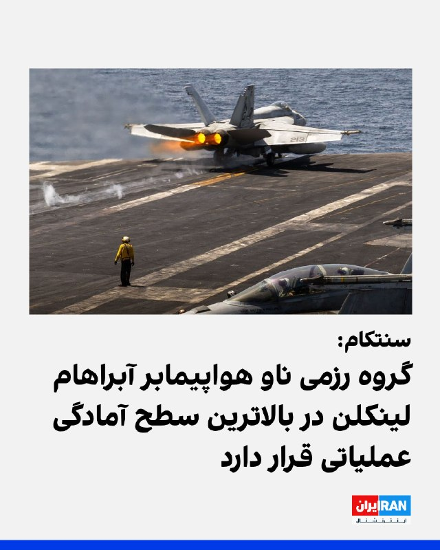

سنتکام با انتشار تصاویری از پرواز جنگنده‌های نیروی دریایی آمریکا از ناو هواپیمابر «یواس‌اس آبراهام لینکلن» در دریای عرب، نوشت: «گروه رزمی ناو هواپیمابر آبراهام لینکلن در حالی که محاصره دریایی آمریکا علیه بنادر ایران را اجرا می‌کند، در بالاترین سطح آمادگی عملیاتی قرار دارد.»
https://iranintl.com/202605224244

## IranIntlTV — post 338344

  

سفارت پاکستان در تهران اعلام کرد محسن نقوی، وزیر خارجه این کشور، بار دیگر با عباس عراقچی، وزیر خارجه جمهوری اسلامی، در تهران دیدار کرد. سفارت پاکستان در ایران از این دیدار با عنوان «جلسه بررسی پیشنهادات برای حل اختلافات» یاد کرده است.
https://iranintl.com/202605228409

## IranIntlTV — post 338343

  

بر اساس اطلاعات رسیده به ایران‌اینترنشنال، بهزاد یزدانی و رومینا خزعلی، زوج بهائی ساکن شیراز و والدین دو نوجوان، بیش از ۵۰ روز است بدون دسترسی به وکیل و در وضعیت بلاتکلیف در زندان عادل‌آباد شیراز نگهداری می‌شوند.

یک منبع آگاه درباره وضعیت این زوج به ایران‌اینترنشنال گفت با وجود پیگیری‌های مکرر خانواده و نزدیکان، مقام‌های قضایی تاکنون به درخواست‌ها برای تبدیل قرار بازداشت به وثیقه پاسخی نداده‌اند.

به گفته این منبع آگاه، رومینا خزعلی که پیش از بازداشت با مشکلات جسمی متعددی از جمله میگرن و معده‌درد شدید مواجه بوده، در آخرین تماس خود از وضعیت نامساعد روحی نیز خبر داده است. او پیش از بازداشت تحت عمل جراحی معده قرار گرفته بود و ادامه بازداشت در چنین شرایطی، نگرانی خانواده درباره وضعیت جسمی و روانی این زوج را افزایش داده است.

بهزاد یزدانی، مترجم و ویراستار، و همسرش رومینا خزعلی، نقاش، به‌ترتیب در روزهای ۸ و ۹ فروردین‌ماه، از سوی ماموران اطلاعات سپاه در منزل شخصی‌شان در شیراز بازداشت شدند.
https://iranintl.com/202605220152

## IranIntlTV — post 338342

  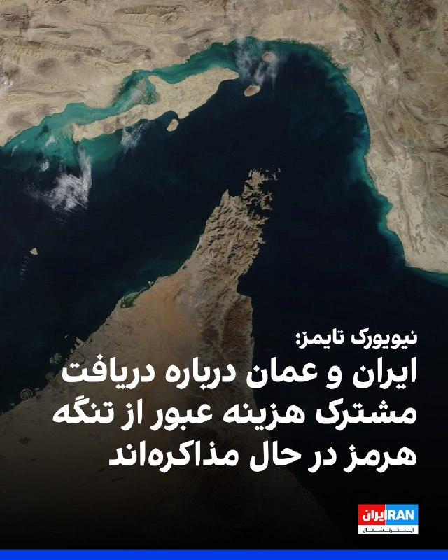

نیویورک تایمز به نقل از مقام‌های ایرانی و افراد آگاه گزارش داد جمهوری اسلامی با عمان درباره مشارکت در ایجاد سامانه‌ای برای دریافت هزینه از کشتی‌های عبوری از تنگه هرمز گفت‌وگو کرده است.
دو فرد آگاه از این مذاکرات گفتند تهران قصد ایجاد نظام عوارض عبور که صرفا برای گذر کشتی‌ها هزینه دریافت کند، ندارد و گفت‌وگوها بر طرحی متمرکز است که از کشتی‌ها بابت ارائه خدمات هزینه دریافت شود.
به گفته دو مقام ایرانی آگاه، عمان در ابتدا مشارکت با ایران درباره تنگه را رد کرده بود، اما اکنون درباره سهمی از درآمدها وارد مذاکره شده است.
این مقام‌ها گفتند عمان به جمهوری اسلامی اعلام کرده حاضر است از نفوذ خود نزد همسایگان در خلیج فارس، از جمله بحرین، کویت، قطر، عربستان سعودی و امارات متحده عربی، و نیز نزد آمریکا استفاده کند تا این طرح را پیش ببرد، زیرا به مزایای اقتصادی بالقوه نظام دریافت هزینه پی برده است.
طبق این گزارش، جمهوری اسلامی و عمان تاکید دارند که بحث بر سر «کارمزد خدمات» است نه «عوارض عبور» و این یک تمایز حقوقی مهم ایجاد می‌کند، زیرا دریافت عوارض صرف برای عبور از تنگه‌های بین‌المللی طبق حقوق دریاها غیرقانونی تلقی می‌شود.

## IranIntlTV — post 338341

  

وال‌استریت ژورنال گزارش داد میلیاردها دلار رمزارز از طریق صرافی بایننس به شبکه‌های مالی مرتبط با جمهوری اسلامی و سپاه پاسداران منتقل شده و این روند حتی تا ماه کنونی نیز ادامه داشته است. از جمله بابک زنجانی طی دو سال حدود ۸۵۰ میلیون دلار تراکنش در بایننس انجام داده است.
به گفته منابع آگاه، از ۸۵۰ میلیون دلار تراکنش بابک زنجانی در بایننس، حدود ۴۲۵ میلیون دلار آن می‌تواند صرف تامین مالی ساختار نظامی ایران شده باشد.
طبق این گزارش، علاوه بر زنجانی، بانک مرکزی ایران و نهادهای مرتبط با حکومت نیز صدها میلیون دلار رمزارز از طریق حساب‌های بایننس جابه‌جا کرده‌اند و برخی حساب‌ها با وجود هشدارهای داخلی، ماه‌ها فعال مانده‌اند.
این گزارش افزود که انتقال‌ها حتی پس از اعتراف بایننس در سال ۲۰۲۳ به نقض قوانین ضدپولشویی و پرداخت جریمه ۴.۳ میلیارد دلاری ادامه یافته و اکنون وزارت دادگستری آمریکا در حال بررسی دوباره این موضوع است.
بایننس ضمن تکذیب این اتهامات تاکید کرده است که فعالیت‌های غیرقانونی را تحمل نمی‌کند و هیچ تراکنش مستقیمی با نهادهای تحریم‌شده انجام نداده است.

https://iranintl.com/202605222445

## IranIntlTV — post 338340

  

اورشلیم‌پست به نقل از مقام‌های اطلاعاتی اسرائیل گزارش داد جمهوری اسلامی ممکن است در حال برنامه‌ریزی برای یک حمله غافلگیرانه موشکی و پهپادی علیه کشورهای خلیج فارس و اسرائیل باشد. این احتمال پس از ارزیابی وضعیت از سوی فرماندهان ارشد نظامی و وزیر دفاع اسرائیل مطرح شده است.
طبق این گزارش، مقام‌های امنیتی گفتند تهران ممکن است پیش از آنکه آمریکا و اسرائیل به این نتیجه برسند مسیر دیپلماتیک دیگر کارایی ندارد، دست به اقدام بزند و حمله‌ای غافلگیرانه مشابه حملات آغاز عملیات «خشم حماسی» و «خروشان شیران» انجام دهد.
این گزارش افزود نیروی هوایی و اداره عملیات ارتش اسرائیل، به سرپرستی سرلشکر هیدای زیلبرمن و دیگر مقام‌های ارشد، مجموعه‌ای از گفت‌وگوها را با همتایان آمریکایی برای افزایش آمادگی انجام دادند که شامل انتقال اطلاعات درباره فعالیت‌های غیرمعمول جمهوری اسلامی بود.
همچنین ایال زامیر، رییس ستاد کل ارتش اسرائیل، در چارچوب یک ارزیابی کلی وضعیت، جلسات توجیهی امنیتی با فرماندهان نظامی برگزار کرد که این ارزیابی هم جنبه دفاعی و هم تهاجمی داشت.

https://iranintl.com/202605225355

## IranIntlTV — post 338339

  

بلومبرگ به نقل از منابع آگاه گزارش داد در جنگ ایران، بیش از ۲۰ پهپاد ام‌کیو-۹ ریپر آمریکا که برای شناسایی، نظارت و حمله به کار می‌روند، منهدم شده‌اند و در نتیجه نزدیک به یک میلیارد دلار به ناوگان پهپادی آمریکا خسارت وارد شده است.

طبق این گزارش، بسیاری از این پهپادها با پدافند هوایی جمهوری اسلامی سرنگون شدند و برخی دیگر در حملات به پایگاه‌های آمریکا یا در حوادث عملیاتی از بین رفتند که این وضعیت نشان‌دهنده چالش‌های عملیاتی در برابر سامانه‌های دفاع هوایی تهران است.
https://iranintl.com/202605221522

## Persian_Trend_Official — post 14648

  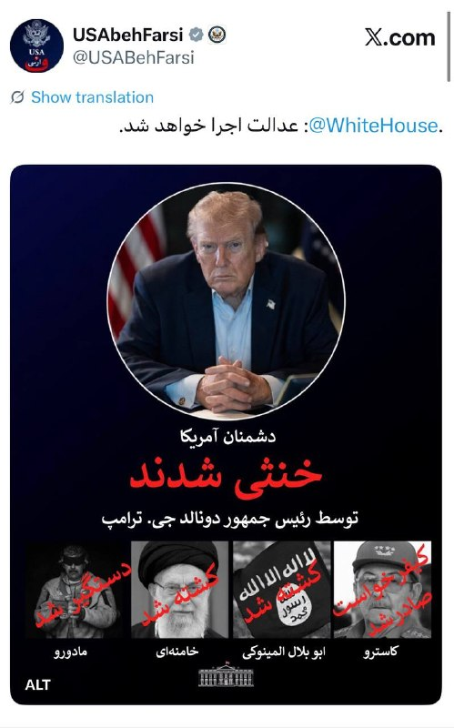

📷 Photo

## Persian_Trend_Official — post 14647

  

🔴 بلومبرگ: ایران بیش از ۲۴ پهپاد MQ-9 آمریکا را نابود کرده است

💢بلومبرگ گزارش داد ایران از آغاز جنگ تاکنون بیش از دو دوجین پهپاد آمریکایی MQ-9 Reaper را منهدم کرده است.

🔹بر اساس این گزارش:

▪️ ارزش این خسارات نزدیک به یک میلیارد دلار برآورد می‌شود
▪️ این میزان حدود ۲۰ درصد از موجودی پیش از جنگ پنتاگون از پهپادهای MQ-9 را شامل می‌شود
▪️ بسیاری از این پهپادها در جریان عملیات‌ها با آتش پدافند ایران سرنگون شده‌اند

همچنین گزارش شده:

▪️ تعدادی از پهپادها در حملات موشکی روی زمین نابود شده‌اند
▪️ برخی دیگر نیز در حوادث و سوانح عملیاتی از بین رفته‌اند

پهپاد MQ-9 Reaper یکی از مهم‌ترین پهپادهای تهاجمی و شناسایی ارتش آمریکا محسوب می‌شود و جایگزینی آن زمان‌بر و پرهزینه ارزیابی می‌شود.

🫆:Tony

📌 @persian_trend_official
پرشین ترند | متفاوت‌ترین کانال نظامی

## Persian_Trend_Official — post 14646

  <a href="telegram/content/Persian_Trend_Official_14646_1779429941.mp4" target="_blank">🎬 Download video</a>

صبحتون بخیر ☕️🔥

📝 Nick
📌 @persian_trend_official
پرشین ترند | متفاوت‌ترین کانال نظامی

---
📅 بروزرسانی: 1405/03/01 05:30
---

## ChizBergerz — post 46647

  <a href="telegram/content/ChizBergerz_46647_1779415221.mp4" target="_blank">🎬 Download video</a>

این خیلی خوب بود گفتم شمام ببینید: 😂😂

@ChizBergerz

## ChizBergerz — post 46646

  <a href="telegram/content/ChizBergerz_46646_1779415222.mp4" target="_blank">🎬 Download video</a>

تا آخرش ببینید😂😂

@ChizBergerz

## rodast_omiddana — post 71737

  <a href="telegram/content/rodast_omiddana_71737_1779415224.webm" target="_blank">🎬 Download video</a>

🚨مرتضی اسماعیل پور امشب به علی کریمی حمله کرد و به منم توهین کرد اما او کیست؟
فردی که سالها مشکوک به فعالیت با 3پا بوده و خود را به جامعه بهایی نزدیک کرده بود و برای همین در سال 2017 بیت العدل اعظم در اسرائیل در یک بیانیه رسمی وی را از جامعه بهایت بابت رفتار مشکوک و احتمال ارتباط با 3پا اخراج کرد..
وی مدتها با پیمان عارف در ترکیه مشکوک به همکاری با دستگاه امنیتی رژیم بود..

پانوشت:
تصاویر بیانیه بیت العدل اعظم

## rodast_omiddana — post 71736

  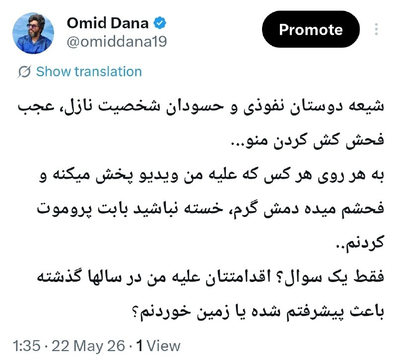

🚫 شیعه دوستان نفوذی و حسودان شخصیت نازل، عجب فحش کش کردن منو...
به هر روی هر کس که علیه من ویدیو پخش میکنه و فحشم میده دمش گرم، خسته نباشید بابت پروموت کردنم..
فقط یک سوال؟ اقدامتتان علیه من در سالها گذشته باعث پیشرفتم شده یا زمین خوردنم؟

## rodast_omiddana — post 71735

🚫 سلام شب بخیر
من الان از ایستگاه ۲ توچال برگشتم تمام صداهایی که دارن میگن همه رعد و برقه و اون بالا ما همه رو میدیدیم
خلاصه فیک میدن یا هرچیزی
فعلا خبری نیست جز افزایش ایست بازرسی ها و مسلح تر شدنشون
البته نکته جالب اینه
بچه زیر ۲۰ سال و پیرمرد بازنشسته اکثریتشونو تشکیل میده که پشتش دقت اگر باشه حرف زیاده!

## rodast_omiddana — post 71734

  <a href="telegram/content/rodast_omiddana_71734_1779415225.webm" target="_blank">🎬 Download video</a>

🚨 دوستان زیادی از صدای انفجار در برخی از شهرها و حتا تهران گزارش میدهند و در مقابل برخیها مییگن خبری نیست و صدای رعد و برقه، فعلا نمیشه قضاوت کرد

## rodast_omiddana — post 71733

  <a href="telegram/content/rodast_omiddana_71733_1779415225.mp4" target="_blank">🎬 Download video</a>

🚫 دمتون گرم نوش جونتون

## KiriMohems — post 47874

  

ترامپ :
هر توافقی هم با ایران بکنیم اونا نمیتونن اورانیوم غنی شده رو نگه دارن ، باید تحویلش بدن

#Berlin
@Kirimohems

## KiriMohems — post 47873

  <a href="telegram/content/KiriMohems_47873_1779415228.mp4" target="_blank">🎬 Download video</a>

😤میخوای از پیش بینی فوتبال و شرط بندی پول دربیاری ؟!

⚠️پس همین الان وارد کانال عمو بت باز شو
چون بهت اموزش میده چطور پول دربیاری
❗️

اینجا میتونی روزانه درامد داشته باشی و سرمایت چندبرابر کنی پس از دستش نده و عضو شو امار سوداش چک‌کن
😍

💵عمو قدیمی کاره و خاک این کارو‌خورده کنارش باش و حرفه ای پول دربیار
💵
A31🅰

👍ادرس عضویت کانال vip:
https://t.me/+8LLMpXUfhW43ZjVk
https://t.me/+8LLMpXUfhW43ZjVk

## IranIntlTV — post 338338

  

واشینگتن فری‌بیکن در گزارشی به نقل از کارشناسان سیاست‌گذاری اندیشکده هادسون نوشت دولت گرجستان که زمانی متحدی قدرتمند برای آمریکا بود، اکنون تحت رهبری حزب اقتدارگرای «رویای گرجستان»، این کشور را به مکانی برای فعالیت‌های اطلاعاتی و تروریستی سپاه تبدیل کرده است.
بر اساس گزارش تحقیقی اخیر اندیشکده هادسون، گرجستان اکنون «بستر راهبردی جدیدی برای ایران در اوراسیا» فراهم کرده که به «زمینی حاصلخیز برای جذب نیروهای اطلاعاتی و بسیج شبه‌نظامیان» تبدیل شده است. این تغییر چشمگیر به سپاه امکان داده است تا منابع اطلاعاتی گرجی را که می‌توانند آزادانه در اروپا و حتی آمریکا رفت‌وآمد و در جهت اقدامات تروریستی فعالیت کنند، جذب کند.
واشینگتن فری‌بیکن به نقل از قانون‌گذاران و کارشناسان اندیشکده هادسون نوشت روابط جمهوری اسلامی و دولت تحت رهبری حزب «رویای گرجستان» سال‌ها در حال شکل‌گیری بوده است، اما در جریان جنگ آمریکا با ایران به شکلی نگران‌کننده تشدید شد و این متحد سابق آمریکا به روسیه اجازه داد از حریم هوایی‌اش برای انتقال هوایی تجهیزات به تهران استفاده کند.
https://iranintl.com/202605224852

## IranIntlTV — post 338337

  

وبسایت خبری «ددلاین» گزارش داد شرکت فیلمسازی «یونیورسال پیکچرز» با همراهی مایکل بی، کارگردان آمریکایی، در حال تهیه یک فیلم سینمایی درباره نجات دو خلبان آمریکایی است که پس از سرنگونی جنگنده «اف۱۵-ای» در عملیات «خشم حماسی» در داخل خاک ایران گرفتار شده بودند.
بر اساس این گزارش، این فیلم بر پایه کتابی در دست انتشار از «میچل زوکاف» ساخته می‌شود که انتشارات «هارپرکالینز» قرار است آن را در سال ۲۰۲۷ منتشر کند.
این پروژه در حال حاضر در مرحله توسعه قرار دارد و جزئیات بیشتری از زمان تولید یا گروه بازیگران آن اعلام نشده است.

https://iranintl.com/202605221100

## IranIntlTV — post 338336

  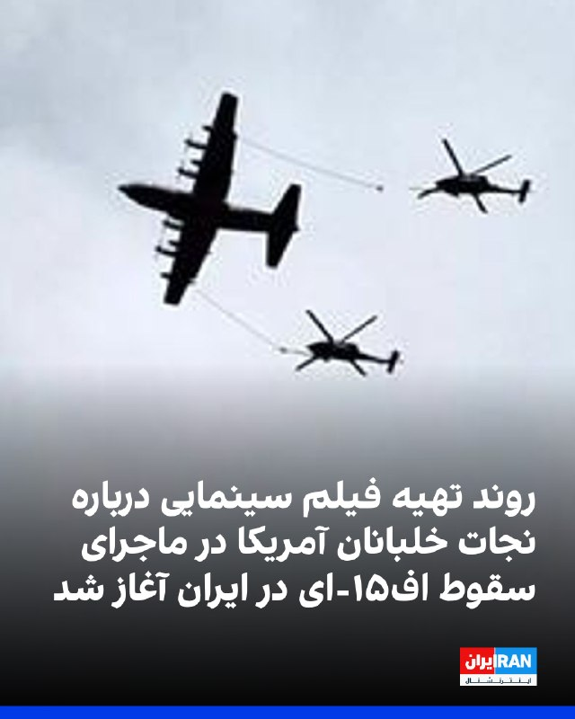

وبسایت خبری «ددلاین» گزارش داد شرکت فیلمسازی «یونیورسال پیکچرز» با همراهی مایکل بی، کارگردان آمریکایی، در حال تهیه یک فیلم سینمایی درباره نجات دو خلبان آمریکایی است که پس از سرنگونی جنگنده «اف۱۵-ای» در عملیات «خشم حماسی» در داخل خاک ایران گرفتار شده بودند.
بر اساس این گزارش، این فیلم بر پایه کتابی در دست انتشار از «میچل زوکاف» ساخته می‌شود که انتشارات «هارپرکالینز» قرار است آن را در سال ۲۰۲۷ منتشر کند.
این پروژه در حال حاضر در مرحله توسعه قرار دارد و جزئیات بیشتری از زمان تولید یا گروه بازیگران آن اعلام نشده است.

https://iranintl.com/202605221100

## IranIntlTV — post 338328

این نام‌ها فقط بخشی از یک فهرست نیستند؛
هرکدام دنیایی بودند پر از صدا، خنده، کار، عشق و امید. یکی تازه ازدواج کرده بود، یکی برای آینده‌اش برنامه مهاجرت داشت، یکی مغازه کوچکش را می‌چرخاند و یکی برای نجات جان دیگری دوید. اما خیابان‌های آن روزها، میان رویا و مرگ فاصله‌ای نگذاشتند.
جاویدنامان انقلاب ملی ایرانیان:
سپهر شکری، احمد شاهعلی، امیرمحمد (آرش) یزدانی همت‌آبادی، عرشیا حضوری، علی بهروز، علیرضا جواهری‌پی، مجید استیر و محمد بهروزی
روایت این جوانان کوتاه است، اما زخمی که بر حافظه ایران گذاشتند، کوتاه نخواهد شد.
#جاویدنامان_انقلاب_ملی_ایرانیان

## IranIntlTV — post 338321

## IranIntlTV — post 338312

این نام‌ها فقط بخشی از یک فهرست نیستند؛
هرکدام دنیایی بودند پر از صدا، خنده، کار، عشق و امید. یکی تازه ازدواج کرده بود، یکی برای آینده‌اش برنامه مهاجرت داشت، یکی مغازه کوچکش را می‌چرخاند و یکی برای نجات جان دیگری دوید. اما خیابان‌های آن روزها، میان رویا و مرگ فاصله‌ای نگذاشتند.
جاویدنامان انقلاب ملی ایرانیان:
سپهر شکری، احمد شاهعلی، امیرمحمد (آرش) یزدانی همت‌آبادی، عرشیا حضوری، علی بهروز، علیرضا جواهری‌پی، مجید استیر و محمد بهروزی
روایت این جوانان کوتاه است، اما زخمی که بر حافظه ایران گذاشتند، کوتاه نخواهد شد.
#جاویدنامان_انقلاب_ملی_ایرانیان

---
📅 بروزرسانی: 1405/03/01 03:25
---

## ChizBergerz — post 46645

حل مشکل اتصال vpn روی همراه اول با ست کردن APN جدید بخصوص برای اپ شیر و خورشید مسیر در اکثر گوشی ها : تنظیمات - اتصالات - شبکه های تلفن همراه - نام نقاط دستیابی - ساخت نام نقطه دستیابی جدید در منوی انگلیسی : settings - connections - mobile networks - access…

## ChizBergerz — post 46644

  

ماشالا چه جهاد نکاحی راه انداختن تو خیابونا، چه بکن بکن‌هایی داره هرشب اتفاق میوفته... @ChizBergerz

## ChizBergerz — post 46643

  <a href="telegram/content/ChizBergerz_46643_1779407737.mp4" target="_blank">🎬 Download video</a>

ماشالا چه جهاد نکاحی راه انداختن تو خیابونا، چه بکن بکن‌هایی داره هرشب اتفاق میوفته...

@ChizBergerz

## ChizBergerz — post 46642

حل مشکل اتصال vpn روی همراه اول با ست کردن APN جدید بخصوص برای اپ شیر و خورشید

مسیر در اکثر گوشی ها :

تنظیمات - اتصالات - شبکه های تلفن همراه - نام نقاط دستیابی - ساخت نام نقطه دستیابی جدید

در منوی انگلیسی :
settings - connections - mobile networks - access point names - ADD or +

Name : mcinet
APN : mcinet
Authentication type : PAP or CHAP
APN type : default
APN protocol : IPv4/IPv6
APN roaming protocol : IPv4/IPv6
MMS/Proxy
از APN حذف کنید
فقط این گزینه هارو اینجوری ست کنید بعد ذخیره کنید و بعد اون پروفایل APN رو انتخاب کنید.
مشکل حل میشه

## rodast_omiddana — post 71729

  <a href="https://t.me/rodast_omiddana/71729" target="_blank">📎 Download file</a>

🔈 حجم فشرده_مجتبی خامنه ای دستور داد اورانیوم خارج نره!_شانس حمله ترامپ به رژیم بالا رفته!

## rodast_omiddana — post 71728

  <a href="https://t.me/rodast_omiddana/71728" target="_blank">📎 Download file</a>

🔈مجتبی خامنه ای دستور داد اورانیوم خارج نره!_شانس حمله ترامپ به رژیم بالا رفته!

## rodast_omiddana — post 71727

▶️ کیفیت 360_مجتبی خامنه ای دستور داد اورانیوم خارج نره!_شانس حمله ترامپ به رژیم بالا رفته!

## rodast_omiddana — post 71726

▶️ کیفیت 144_مجتبی خامنه ای دستور داد اورانیوم خارج نره!_شانس حمله ترامپ به رژیم بالا رفته!

## KiriMohems — post 47872

  <a href="telegram/content/KiriMohems_47872_1779407739.mp4" target="_blank">🎬 Download video</a>

🔴سوتی پشم ریزون تو صدا و سیما

#Helsinki
@KiriMohems

## SportBaadNews — post 252155

  

کریس و خانواده @SportBaadNews

## IranIntlTV — post 338311

  <a href="telegram/content/IranIntlTV_338311_1779407742.mp4" target="_blank">🎬 Download video</a>

سیاست‌های سخت‌گیرانه دونالد ترامپ علیه کانادا نتیجه‌ای معکوس برای واشینگتن در پی داشته است.

نظرسنجی‌های جدید نشان می‌دهد این تنش‌ها نه‌تنها کانادا را تسلیم نکرده، بلکه باعث اتحاد مردم و رکوردشکنی محبوبیت دولت فعلی این کشور شده است.

گزارش مهسا مرتضوی، خبرنگار ایران‌اینترنشنال
@iranintltv

## IranIntlTV — post 338310

  

مرکز تجارت دریایی بریتانیا سطح تهدید در منطقه دریایی خاورمیانه را همچنان «بحرانی» خواند و گفت که تردد در تنگه هرمز همچنان به‌طور چشمگیری کاهش یافته اما در ۴۸ ساعت گذشته هیچ رخداد مرتبط با امنیت در این محدوده گزارش نشده است.
این نهاد که به نیروی دریایی بریتانیا وابسته است، پنجشنبه ۳۱ اردیبهشت اعلام کرد: «مین‌گذاری در داخل و اطراف مسیرهای جداسازی تردد دریایی همچنان یک تهدید محسوب می‌شود و اختلال در سامانه‌های ناوبری ماهواره‌ای جهانی به‌طور مستمر ادامه دارد.»
طبق اعلام این مرکز، شناورهای تجاری همچنان در سراسر خلیج عمان و شمال دریای عرب به نیروی دریایی آمریکا گزارش می‌دهند و اجرای محاصره دریایی از سوی این کشور ادامه دارد.
مرکز تجارت دریایی تردد تجاری در باب‌المندب و خلیج عدن را همچنان «باثبات» توصیف کرد.

https://iranintl.com/202605219066

## IranIntlTV — post 338309

  

دونالد ترامپ پنجشنبه ۳۱ اردیبهشت در گفت‌وگو با خبرنگاران در کاخ سفید اعلام کرد که مطمئن نیست بتواند این آخر هفته در مراسم ازدواج پسر بزرگش، دونالد ترامپ جونیور، شرکت کند. او دلیل این تردید را درگیری‌های مرتبط با ایران و دیگر مشغله‌های کاری عنوان کرد.
ترامپ در توضیح این موضوع در دفتر بیضی گفت: «او دوست دارد من در مراسم باشم»، اما افزود: «به او گفتم این زمان‌بندی برای من مناسب نیست، چون موضوعی به نام ایران و مسائل دیگر دارم.»
بر اساس این اظهارات، مراسم ازدواج دونالد ترامپ جونیور، ۴۷ ساله، و بتینا اندرسون، ۳۹ ساله، قرار است در باهاما برگزار شود. این زوج از سال ۲۰۲۴ وارد رابطه شدند و در دسامبر ۲۰۲۵ نامزد کردند.
پسر رییس‌جمهوری آمریکا پیش‌تر با ونسا ترامپ ازدواج کرده بود و این زوج پنج فرزند دارند. او همچنین با کیمبرلی گیلفویل نامزد بود که اکنون به عنوان سفیر آمریکا در یونان فعالیت می‌کند.

https://iranintl.com/202605211033

---
📅 بروزرسانی: 1405/03/01 02:31
---

## IranIntlTV — post 338308

  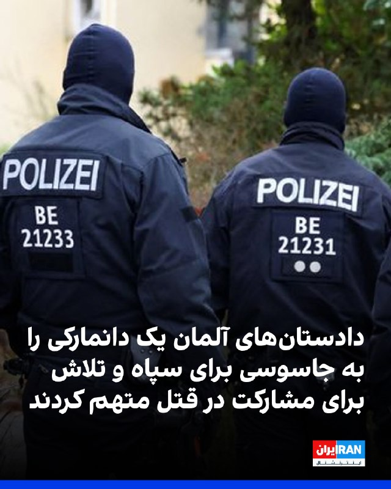

دادستان‌های آلمان اعلام کردند یک تبعه دانمارکی به نام علی اس. که خرداد گذشته در دانمارک بازداشت شده بود، به اتهام جاسوسی از رییس اصلی‌ترین نهاد یهودیان آلمان و سه نفر دیگر برای اطلاعات سپاه و تلاش برای مشارکت در قتل متهم شده است.
دادستان‌های آلمانی گفتند به موجب کیفرخواستی که ۱۷ اردیبهشت در دادگاه ایالتی هامبورگ ثبت کرده‌اند، این تبعه دانمارکی به همکاری به عنوان مامور اطلاعات سپاه، فعالیت مخفیانه با هدف خرابکاری و تلاش برای مشارکت در قتل و آتش‌سوزی متهم شده است.
طبق این کیفرخواست، همچنین یک تبعه افغانستان با نام تواب م. که آبان‌ماه ۱۴۰۴ در دانمارک بازداشت شده بود نیز به عنوان همد‌ست مورد ادعای او در این پرونده به تلاش برای مشارکت در قتل متهم شده است.
به گفته دادستان‌ها، علی اس. ارتباط نزدیکی با نیروی قدس سپاه داشت و در آغاز سال ۲۰۲۵ از او خواسته شده بود درباره یوزف شوستر، رییس شورای مرکزی یهودیان آلمان، و فولکر بک، رییس انجمن آلمانی-اسراییلی و نماینده پیشین برجسته پارلمان آلمان، و همچنین دو فروشنده یهودی مواد غذایی در برلین که نامشان فاش نشده، اطلاعات جمع‌آوری کند.
https://iranintl.com/202605212861

## IranIntlTV — post 338307

  <a href="telegram/content/IranIntlTV_338307_1779404472.mp4" target="_blank">🎬 Download video</a>

مشاور دیپلماتیک رییس امارات متحده عربی حملات سپاه پاسداران را «تجاوزی وحشیانه» به کشورهای عربی توصیف کرد و گفت اعتبار تهران از بین رفته است.

او همچنین تاکید کرد بازسازی اعتماد با شعار ممکن نیست.

گفت‌وگو با غسان عاشور، تحلیل‌گر مسائل خاورمیانه
@iranintltv

## IranIntlTV — post 338306

  <a href="telegram/content/IranIntlTV_338306_1779404475.mp4" target="_blank">🎬 Download video</a>

آژانس بین‌المللی انرژی هشدار داد ادامه تنش‌ها در خاورمیانه و اختلال در عبور نفتکش‌ها از تنگه هرمز می‌تواند بازار جهانی نفت را تابستان امسال با کمبود شدید عرضه روبه‌رو کند.

گفت‌وگو با مهدی مصلحی، کارشناس بازار نفت
@iranintltv

## IranIntlTV — post 338305

  <a href="telegram/content/IranIntlTV_338305_1779404477.mp4" target="_blank">🎬 Download video</a>

رویترز به نقل از یک مقام ارشد جمهوری اسلامی گزارش داد اختلافات با آمریکا کاهش یافته، اما هنوز توافقی حاصل نشده است.

پولیتیکو نیز نوشت مساله برنامه هسته‌ای ایران و بازگشایی تنگه هرمز همچنان از محورهای اختلاف در مذاکرات است.

جزییات بیشتر با امیر گیتی، عضو تحریریه ایران‌اینترنشنال
@iranintltv

## IranIntlTV — post 338304

  <a href="telegram/content/IranIntlTV_338304_1779404480.mp4" target="_blank">🎬 Download video</a>

همزمان با گمانه‌زنی‌ها درباره اقدام بعدی دونالد ترامپ در برابر جمهوری اسلامی در صورت شکست مذاکرات، مخالفان او در کنگره آمریکا همچنان برای کاهش اختیارات جنگی رییس‌جمهوری تلاش می‌کنند.

گزارش مرضیه حسینی، خبرنگار ایران‌اینترنشنال
@iranintltv

## IranIntlTV — post 338303

  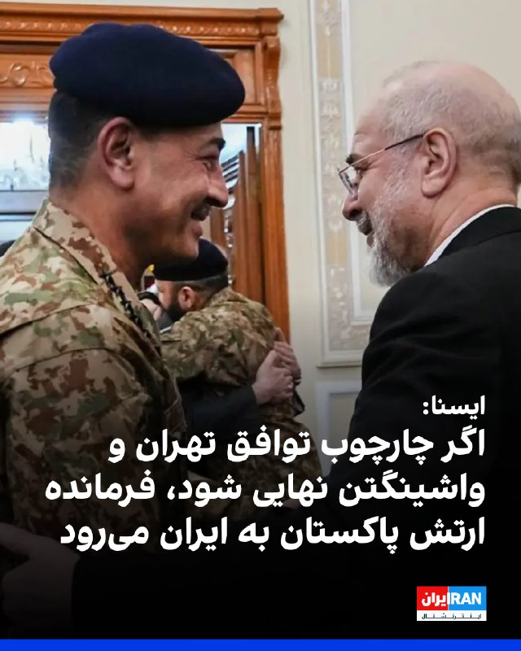

ایسنا گزارش داد تبادل پیام و متن بین جمهوری اسلامی و آمریکا با میانجی‌گری طرف پاکستانی همچنان ادامه دارد و به گفته منابع پاکستانی، سفر عاصم منیر، فرمانده ارتش پاکستان، به ایران در صورت نهایی شدن چارچوب مورد نظر دو طرف انجام خواهد شد.
طبق این گزارش، محسن نقوی، وزیر کشور پاکستان، که هفته جاری برای بار دوم صبح روز چهارشنبه به تهران سفر کرد، حامل پیامی از سوی طرف آمریکایی برای تهران بود.

https://iranintl.com/202605216298

## IranIntlTV — post 338302

  <a href="telegram/content/IranIntlTV_338302_1779404482.mp4" target="_blank">🎬 Download video</a>

دونالد ترامپ بار دیگر تاکید کرد جمهوری اسلامی اجازه دستیابی به سلاح هسته‌ای را ندارد.

او در پاسخ به خبرنگاران گفت ایالات متحده اورانیوم غنی‌شده ایران را خارج و نابود می‌کند.

گزارش اردوان روزبه، خبرنگار ایران‌اینترنشنال
@iranintltv

## Persian_Trend_Official — post 14645

  <a href="telegram/content/Persian_Trend_Official_14645_1779404485.mp4" target="_blank">🎬 Download video</a>

شبتون بخیر 🙏🌙

📝 Nick
📌 @persian_trend_official
پرشین ترند | متفاوت‌ترین کانال نظامی

## Persian_Trend_Official — post 14644

دوستان عزیز
از سمت هاست دانلودمون‌ یک مشکلی پیش اومده که لایو امشب آپلود نمیشه
فردا اول وقت پیگیری میکنم و براتون میزارمش 🙏❤️
ارادتمند ✌️

📝 Nick

📌 @persian_trend_official
پرشین ترند | متفاوت‌ترین کانال نظامی

---
📅 بروزرسانی: 1405/03/01 01:26
---

## rodast_omiddana — post 71725

🎬
🔴
🔴
🔴 پخش زنده
*مجتبی خامنه ای دستور داد اورانیوم خارج نره!
*شانس حمله ترامپ به رژیم بالا رفته!
لینک یوتیوب:
https://www.youtube.com/watch?v=5BH_85tdbqk

## KiriMohems — post 47871

🎙 خبرنگار خطاب به ترامپ : آخر هفته عروسی پسرته، میری؟

ترامپ : چی بگم والا، دس رو کیرو خایم نذار که خونِ . دوست دارم برم اما یه مسئله به نام ایران هست و کلی کار دارم، امیدوارم توش کنی خوبی داشته باشه.

#Berlin
@Kirimohems

## KiriMohems — post 47870

مخبر : اروپایی‌ها چپو راست برای عبور از تنگه هرمز به خایه هامونو میمالن ، خواهش مندیم کمتر بمالید تخمامون حساسه
⠀

#Berlin
@Kirimohems

## SportBaadNews — post 252154

  

کریس و خانواده
@SportBaadNews

## SportBaadNews — post 252153

- همه اون لحظه‌ای که سایت نصفه لود میشه و VPN قاطی میکنه رو تجربه کردیم، مخصوصاً وقتی وسط بازی یا ثبت پیش‌بینی باشی. 
😑

- ربات رسمی تلگرام وینکوبت کارو راحت و ورود به سایت رو آسون کرده:👇

-
🤖 @Wincobet_bot
-
🤖 @Wincobet_bot

- برای کسایی که بیشتر وقتشون توی تلگرامه، خیلی کاربردیه.

## SportBaadNews — post 252152

  <a href="telegram/content/SportBaadNews_252152_1779400603.webm" target="_blank">🎬 Download video</a>

🚨
⚽️🇵🇹 | طبق گفته اکثر منابع اروپایی و عربی خورخه ژسوس که اول فصل از الهلال به النصر اومده بود حالا پس از قهرمان کردن این تیم تو لیگ تا چند روز دیگه رسما از این باشگاه جدا میشه و میخواد بره و تو پرتغال مربیگری کنه @SportBaadNews

## SportBaadNews — post 252151

  <a href="telegram/content/SportBaadNews_252151_1779400604.webm" target="_blank">🎬 Download video</a>

🚨
🚨
🚨
🇧🇷 فووووری و رسمیییییی: نیمار به اسکواد برزیل دعوت شد @SportBaadNews

## SportBaadNews — post 252150

  <a href="telegram/content/SportBaadNews_252150_1779400604.webm" target="_blank">🎬 Download video</a>

🚨
⚽️🇵🇹 | طبق گفته اکثر منابع اروپایی و عربی خورخه ژسوس که اول فصل از الهلال به النصر اومده بود حالا پس از قهرمان کردن این تیم تو لیگ تا چند روز دیگه رسما از این باشگاه جدا میشه و میخواد بره و تو پرتغال مربیگری کنه
@SportBaadNews

## SportBaadNews — post 252149

رونالدو سه سال حضور در النصر: یه لیگ مسی سه سال حضور در اینتر میامی: یه لیگ رسانه چه کارا که نمیکنه! @SportBadTweet | خایمال رونالدو

## SportBaadNews — post 252148

  <a href="telegram/content/SportBaadNews_252148_1779400604.mp4" target="_blank">🎬 Download video</a>

ویدیویی کوتاه از جشن قهرمانی النصر

پشم ریزووووونه
@SportBaadNews

## SportBaadNews — post 252147

  

پروف آوردم برای کریس فنا
@SportBaadNews

## SportBaadNews — post 252146

ایشالا هتریک امشب تو خونه 😁😁❤️ 
🔞 @SporteHub

## SportBaadNews — post 252145

گارناچو و بانو @SportBaadNews

## SportBaadNews — post 252144

  

🥶🥶🥶🥶
@SportBaadNews

## SportBaadNews — post 252143

  <a href="telegram/content/SportBaadNews_252143_1779400609.mp4" target="_blank">🎬 Download video</a>

اینم فیلم لحظه بالا بردن جام قهرمانی لیگ عربستان توسط کریستیانو رونالدو 🐐🏆🔥
@GoalBad

## SportBaadNews — post 252142

  

این هم جااااااااااااامممممم بالای دستان کریستیانووووووو رونالدوووووو 🐐🔥
@SportBaadNews

## SportBaadNews — post 252141

  

😘
@SportBaadNews

## SportBaadNews — post 252140

  

⚽️ پست باشگاه یوونتوس برای کریستیانو رونالدو: الان و همیشه 🐐 (بهترین تاریخ) 👏🏻
@SportBaadNews

## SportBaadNews — post 252139

من بعد از دیدن جشن قهرمانی النصر کونم سوخت حقیقتا، به شدت پشم ریزون بود، خفن ترین جشن قهرمانی که تو عمرم دیدم!

چقدر خفن بود، چه عشقی میکنن اینا

کیر تو بختمون

## SportBaadNews — post 252138

  

پشمامممم جشن قهرمانیووووو
@SportBaadNews

## SportBaadNews — post 252137

  

کریس برسه خونه گللللللل سوم رو میزنه
@SportBaadNews

## IranIntlTV — post 338301

  

لیندزی گراهام، سناتور جمهوری‌خواه آمریکا، در پستی در ایکس نوشت ترامپ تاکید کرده است بدون توانایی غنی‌سازی، مسیری برای دستیابی به سلاح هسته‌ای وجود ندارد و به دلیل سابقه «تقلب» جمهوری اسلامی، تهران نباید اجازه ادامه غنی‌سازی را داشته باشد.
او با هشدار درباره اینکه جمهوری اسلامی می‌تواند از حدود ۴۴۰ کیلوگرم اورانیوم با غنای بالا برای ساخت «بمب کثیف» یا غنی‌سازی بیشتر تا سطح ۹۰ درصد برای تولید سلاح هسته‌ای استفاده کند، گفت ترامپ همچنان تاکید دارد که جمهوری اسلامی نباید اجازه حفظ این مواد را داشته باشد.
او همچنین جلوگیری از ادامه حمایت جمهوری اسلامی از گروه‌های نیابتی را از خطوط قرمز مذاکرات دانست و نوشت: «زمان همه‌چیز را مشخص خواهد کرد.»

https://iranintl.com/202605211326

## IranIntlTV — post 338300

  <a href="telegram/content/IranIntlTV_338300_1779400617.mp4" target="_blank">🎬 Download video</a>

آسوشیتدپرس گزارش داد احمد وحیدی، فرمانده سپاه پاسداران، به یکی از چهره‌های اصلی در شکل‌دهی به موضع سخت جمهوری اسلامی در مذاکرات مربوط به پایان جنگ با آمریکا تبدیل شده است.

گفت‌وگو با مهدی نخل‌احمدی، روزنامه‌نگار و فعال سیاسی
@iranintltv

## IranIntlTV — post 338299

  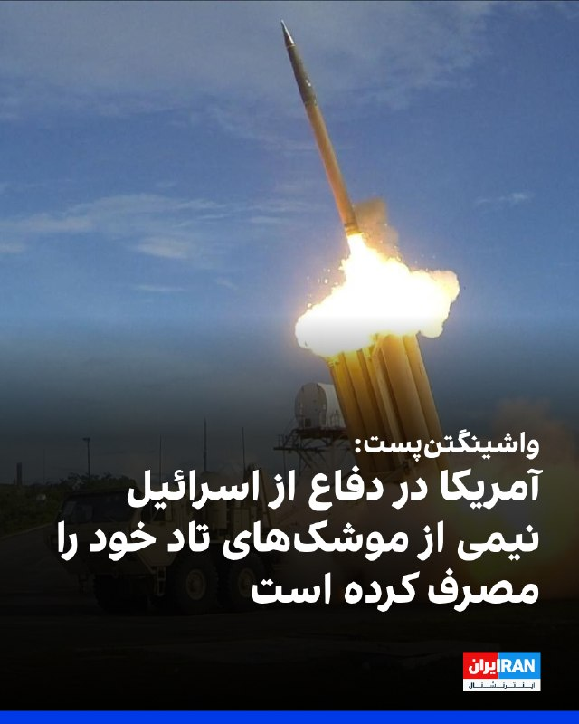

واشینگتن‌پست گزارش داد آمریکا در جریان دفاع از اسرائیل در برابر حملات جمهوری اسلامی طی جنگ اخیر، بیش از ۲۰۰ موشک‌ رهگیر سامانه تاد--حدود نیمی از کل موجودی پنتاگون-- را مصرف کرده است.

بر اساس ارزیابی‌های وزارت دفاع آمریکا که واشینگتن‌پست به نقل از منابع آگاه منتشر کرده، همچنین بیش از ۱۰۰ موشک اس‌ام۳ و اس‌ام۶ از ناوهای آمریکایی در شرق مدیترانه استفاده شده است.

در مقابل، اسرائیل کمتر از ۱۰۰ موشک رهگیر «پیکان» و حدود ۹۰ موشک «فلاخن داوود» به کار گرفته است؛ برخی از این رهگیرها نیز برای مقابله با پرتابه‌های ساده‌تر گروه‌های نیابتی جمهوری اسلامی در یمن و لبنان استفاده شده‌اند.
https://iranintl.com/202605217861

## IranIntlTV — post 338298

  <a href="telegram/content/IranIntlTV_338298_1779400620.mp4" target="_blank">🎬 Download video</a>

دونالد ترامپ گفت: «کنترل کامل تنگه هرمز را در اختیار داریم و حصر دریایی صد درصد موفق بوده است. هیچ کشتی‌ای بدون اجازه ما وارد یا خارج نمی‌شود.»

او افزود: «یا مطمئن می‌شویم جمهوری اسلامی سلاح هسته‌ای نداشته باشد، یا مجبور می‌شویم اقدامی قاطع انجام دهیم.»

ترامپ همچنین گفت جمهوری اسلامی روزانه حدود ۵۰۰ میلیون دلار از دست می‌دهد و آمریکا اجازه نخواهد داد تهران دوباره به اورانیوم غنی‌شده دسترسی پیدا کند.
@iranintltv

## IranIntlTV — post 338297

  <a href="telegram/content/IranIntlTV_338297_1779400623.mp4" target="_blank">🎬 Download video</a>

با انتشار گزارش‌ها از افزایش نفوذ تندروها و نقش پررنگ‌تر سپاه در تصمیم‌های نظامی و مذاکراتی تهران، آسوشیتدپرس می‌گوید حمد وحیدی، فرمانده سپاه پاسداران، از چهره‌های کلیدی در مواضع سخت جمهوری اسلاامی در مذاکرات با آمریکا شده است.
@iranintltv

## IranIntlTV — post 338296

  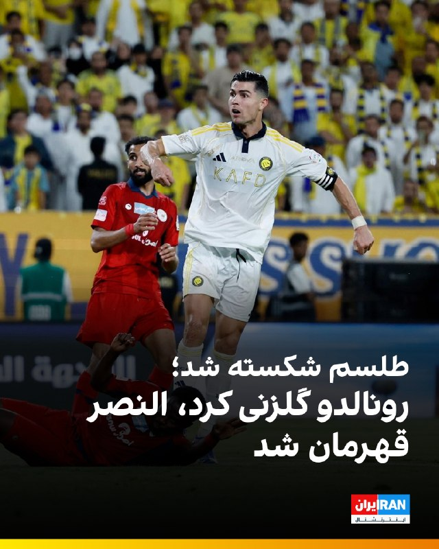

🔻تیم فوتبال النصر در هفته پایانی لیگ حرفه‌ای عربستان سعودی با نتیجه ۴-۱ ضمک اف‌سی را شکست داد و با ۸۶ امتیاز بالاتر از الهلال به مقام قهرمانی رسید. گل‌های النصر را در این بازی سادیو مانه، کومان و کریستیانو رونالدو (۲بار) به ثمر رساندند. رونالدو با دو گلی که به ثمر رساند تعدادگل‌های خود را به عدد ۹۷۳ رساند.

🔹در دیگر بازی لیگ حرفه‌ای عربستان سعودی، الهلال دیگر تیم مدعی قهرمانی با نتیجه ۱-۰ الفیحا را شکست داد و با ۸۴ امتیاز در رده دوم قرار گرفت.

🔹الاهلی، قهرمان دو دوره اخیر لیگ نخبگان آسیا با ۸۱ امتیاز در رده سوم قرار گرفت.

@iranintltvsport

## IranIntlTV — post 338295

  <a href="telegram/content/IranIntlTV_338295_1779400626.mp4" target="_blank">🎬 Download video</a>

دونالد ترامپ گفت: «در حال حاضر با آنها مذاکره می‌کنیم و خواهیم دید چه می‌شود، اما به هر حال به هدفمان خواهیم رسید. نمی‌توانیم اجازه بدهیم به سلاح هسته‌ای دست پیدا کنند.»

ترامپ همچنین هشدار داد: «در صورت وقوع چنین وضعیتی، خاورمیانه ممکن است با بحران و حتی خطر جنگ هسته‌ای روبه‌رو شود؛ بحرانی که می‌تواند به اروپا و فراتر از آن گسترش پیدا کند.»
@iranintltv

## IranIntlTV — post 338294

  <a href="telegram/content/IranIntlTV_338294_1779400629.mp4" target="_blank">🎬 Download video</a>

دونالد ترامپ می‌گوید آمریکا «کنترل کامل» تنگه هرمز را در دست دارد و محاصره دریایی علیه جمهوری اسلامی «صد درصد موفق» بوده است. او همچنین گفت واشینگتن اورانیوم غنی‌شده ایران را «می‌گیرد و نابود می‌کند».
@iranintltv

## Persian_Trend_Official — post 14642

  <a href="https://t.me/persian_trend_official/14642" target="_blank">📎 Download file</a>

فایل صوتی لایو امشب پنجشنبه ۳۱ اردیبهشت
نسخه کم حجم ۶.۷ مگابایت

اخبار ضد و نقیض از توافق ایران و آمریکا

🫆SJ

@persian_trend_official

## Persian_Trend_Official — post 14641

  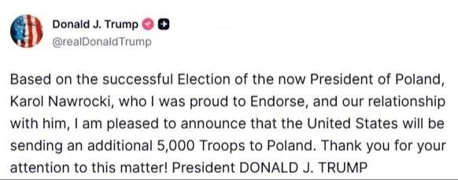

🔻رئیس جمهور آمریکا:

🔹بر اساس انتخاب موفقیت آمیز رئیس‌جمهور فعلی لهستان، کارول ناوروسکی، که من افتخار داشتم از او حمایت کنم
خوشحالم اعلام کنم که ایالات متحده ۵۰۰۰ نیروی اضافی به لهستان اعزام خواهد کرد.

🫆:Tony

📌 @persian_trend_official
پرشین ترند | متفاوت‌ترین کانال نظامی

---
📅 بروزرسانی: 1405/02/31 23:55
---

## rodast_omiddana — post 71724

  <a href="telegram/content/rodast_omiddana_71724_1779395135.webm" target="_blank">🎬 Download video</a>

🚨 فوری_الحدث:
"عاصم منیر فرمانده ارتش پاکستان امشب به تهران نخواهد آمد"

این یعنی به امید خدا تا دوشنبه میتواند جنگ آغاز شود..

## rodast_omiddana — post 71723

  <a href="telegram/content/rodast_omiddana_71723_1779395135.webm" target="_blank">🎬 Download video</a>

🚨سلام امید عزیز
جنوب غرب تهران ساعت نه و نیم بود که صدای چندتا انفجار اومد

## rodast_omiddana — post 71722

  <a href="telegram/content/rodast_omiddana_71722_1779395136.webm" target="_blank">🎬 Download video</a>

🚨 داداش غرب تهران آسمون پر پهباده یعنی یه نگاه انداختم بالا سرم ۸-۹ تا بالای ابرا بود به سمت جنوب میرفتن با سرعت

## rodast_omiddana — post 71721

  <a href="telegram/content/rodast_omiddana_71721_1779395136.webm" target="_blank">🎬 Download video</a>

🚨 میفهمم ناراحت هستید چند روز درگیر چند لاشخور شدم..
متاسفانه برخی چیزها اجتناب ناپذیره، من مدتهاست سکوت کردم و نمیخواستم وارد این درگیریها بشم..
ولی وقتی میبینی از سکوتت یک عده از خون جاویدنامان ماهی دستکم یکبار در بورلی هیلز لس آنجلس فاندریزینگ میزارند و میلیون دلاری پول جمع میکنند بعدش شاهزاده چهارتا بادیگارد خصوصی نداره، و روشن نیست این پولها چه میشود به آدم فشار میاد ولی باز سکوت کردم..
وقتی میفهمی حضرات مداح دیروز بیت و رپر امروز دفتر برای رفتن به تظاهرات پول میگیرند تا جاویدشاه بگن و تو باز برای اتحاد سکوت میکنی، و نتیجه میشود اینبار با نام جاویدنامان میخواهن کنسرت بزارند، و برای اینکار حاضرن به اسطوره ملی ایران علی کریمی هم توهین کنند و بخواهند استبداد آخوندی را به شکل دیگر احیا کنند، اینجاست که دیگر اجازه نداری سکوت کنی...
از همه شما مخاطبان پوزش میخواهم ولی راهی ندارم جز اینکه این مسئله را به سرانجام برسانم..
دوستتون دارم و امیدوارم اهمیت موضوع را درک کرده باشید

## rodast_omiddana — post 71720

🎬
🔴
🔴
🔴 برنامه امشب:
*ترامپ حمله میکند یا به محاصره اقتصادی ادامه میدهد؟
*مردم ایران نگرانن که فعلا جنگ نشه!
لینک یوتیوب:
https://www.youtube.com/@omiddana

## KiriMohems — post 47869

  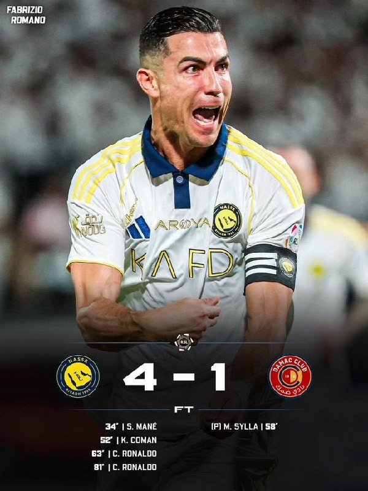

🏆🎖 و بالاخره طلسم کیری ننش گایده شد

النصر با برد برابر ضمک قهرمان و کیر کلفت لیگ عربستان شد تا کریستیانو رونالدو اولین جام رسمی خود را با این تیم دشت کند
✅ با بریس برابر ضمک ، گل شماره ۹۷۳ اقا کریستیانو رونالدو به ثمر رسید

#Berlin
@KiriMohemSport

## KiriMohems — post 47868

📌یه VPN  کار درست پیدا کردیم استارلینک با مدرک!  فقط پرداختش ارزیه اما معتبره با سرعت خیلی سوپر
⚡️ کانالش: @iranvpn @iranvpn ثبت سفارش پشتیبانش: @IranVPNManager 

## KiriMohems — post 47867

📌یه VPN  کار درست پیدا کردیم استارلینک با مدرک!  فقط پرداختش ارزیه اما معتبره با سرعت خیلی سوپر
⚡️

کانالش:
@iranvpn
@iranvpn
ثبت سفارش پشتیبانش: @IranVPNManager


## KiriMohems — post 47866

  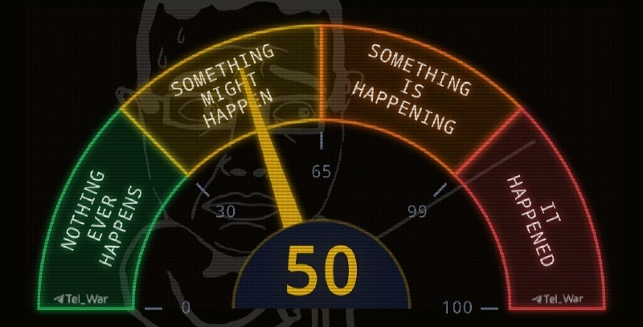

🔴پیتزافروشی‌های اطراف پنتاگون شلوغ شده، و به ۵۰٪ سفارش رسیده!

#Helsinki
@KiriMohems

## SportBaadNews — post 252136

پشمام جشن قهرمانی رو

پشم ریزون ترین جشن قهرمانی که تو زندگیم دیده بودم هست

## SportBaadNews — post 252135

  <a href="telegram/content/SportBaadNews_252135_1779395138.mp4" target="_blank">🎬 Download video</a>

جو رو پسرررررررر 🔥🔥🔥
لبخند از ته رونالدو رو ببین پسرررر🔥🔥
جو ورزشگاه رو 🔥🔥🔥🔥🔥

🟡 ارزش دانلود 100000 از 10
@SportBaadNews

## SportBaadNews — post 252134

  <a href="telegram/content/SportBaadNews_252134_1779395142.webm" target="_blank">🎬 Download video</a>

🚨
💣
⚽️ رسسسسسسسسسسسسسسمی؛ رونالدو بعد از 3 سال و از دست دادن 14 جاممممم بالاخره با قهرمانی تو لیگ عربستان اولین جام خودش رو با النصر به دست آورد @SportBaadNews

## SportBaadNews — post 252132

  <a href="telegram/content/SportBaadNews_252132_1779395142.webm" target="_blank">🎬 Download video</a>

🚨 قرعه کشی 10 سرور 10 گیگی کانال @VpnBadNews ، جهت شرکت در قرعه کشی روی ربات زیر استارت کنید، دکمه شرکت در قرعه کشی رو بزنید و کدی که دریافت میکنید رو حتما سیو کنید که بعدا کد مخصوص خود را گم نکنید، نتیجه قرعه کشی ساعت 00:00 اعلام میشه داخل کانال: @VpnBadNews…

## SportBaadNews — post 252131

  <a href="telegram/content/SportBaadNews_252131_1779395143.webm" target="_blank">🎬 Download video</a>

🚨 قرعه کشی 10 سرور 10 گیگی کانال @VpnBadNews ، جهت شرکت در قرعه کشی روی ربات زیر استارت کنید، دکمه شرکت در قرعه کشی رو بزنید و کدی که دریافت میکنید رو حتما سیو کنید که بعدا کد مخصوص خود را گم نکنید، نتیجه قرعه کشی ساعت 00:00 اعلام میشه داخل کانال: @VpnBadNews

🤖 @vpnbadnews_bot

🤖 @vpnbadnews_bot

ربات جهت شرکت ☝️☝️☝️

## SportBaadNews — post 252130

  <a href="telegram/content/SportBaadNews_252130_1779395144.webm" target="_blank">🎬 Download video</a>

🚨
◀️ کریستیانو رونالدو با قهرمانی تو لیگ حرفه‌ای عربستان این آمار زیر رو تکمیل تر کرد:

🏴󠁧󠁢󠁥󠁮󠁧󠁿 لیگ انگلیس رو فتح کرده
🇪🇸 لیگ اسپانیا رو فتح کرده
🇮🇹 لیگ ایتالیا رو فتح کرده
🇵🇹 لیگ پرتغال رو فتح کرده
🇪🇺 چمپیونزلیگ رو فتح کرده
🇸🇦 عربستان رو فتح کرد

🏆 5 تا لیگ قهرمانان اروپا

🏆 2 تا سوپرجام اروپا

🏆 1 قهرمانی یورو

🏆 2 تا لیگ ملت‌ ها

🏆 4 تا جام باشگاه‌های جهان

🏆 3 تا لیگ برتر انگلیس

🏆 2 تا جام اتحادیه انگلیس

🏆 1 جام حذفی انگلیس

🏆 2 تا لالیگا اسپانیا

🏆 2 تا سوپرجام اسپانیا

🏆 1 جام حذفی اسپانیا

🏆 2 تا سوپرجام ایتالیا

🏆 2 تا سری آ ایتالیا

🏆 1 جام حذفی ایتالیا
🇸🇦 1 جام باشگاه‌های عرب
🇸🇦 1 لیگ حرفه ای عربستان

🏆 5 تا توپ طلا

👟 4 تا کفش طلا

⬆️ آقای گل تمام دوران تاریخ فوتبال
⚽ 973 گل در طول دوران حرفه‌ای

🔥
🔥
🔥
🔥
🔥
🔥
@SportBaadNews

## SportBaadNews — post 252129

حتی کریس هم بعد 3 سال جام زد ولی میلاد حقوق مارو نداده هنوز

## SportBaadNews — post 252128

حتی کریس هم بعد 3 سال جام زد ولی میلاد حقوق مارو نداده هنوز

## SportBaadNews — post 252127

  <a href="telegram/content/SportBaadNews_252127_1779395144.webm" target="_blank">🎬 Download video</a>

🚨
💣
⚽️ رسسسسسسسسسسسسسسمی؛ رونالدو بعد از 3 سال و از دست دادن 14 جاممممم بالاخره با قهرمانی تو لیگ عربستان اولین جام خودش رو با النصر به دست آورد @SportBaadNews

## SportBaadNews — post 252125

  <a href="telegram/content/SportBaadNews_252125_1779395145.webm" target="_blank">🎬 Download video</a>

🚨
💣
⚽️ رسسسسسسسسسسسسسسمی؛ رونالدو بعد از 3 سال و از دست دادن 14 جاممممم بالاخره با قهرمانی تو لیگ عربستان اولین جام خودش رو با النصر به دست آورد
@SportBaadNews

## SportBaadNews — post 252124

  

41 سالگی و این حرفا... 
🔥
🔥
@SportBaadNews

## SportBaadNews — post 252123

  

بخند مرد، بخنددددد ما به گریه هات عادت نداریم 🥲
@SportBaadNews

## SportBaadNews — post 252122

رونالدو هم تعویض شد بعد 87 دقیقه بازی دو گل زده

## SportBaadNews — post 252121

  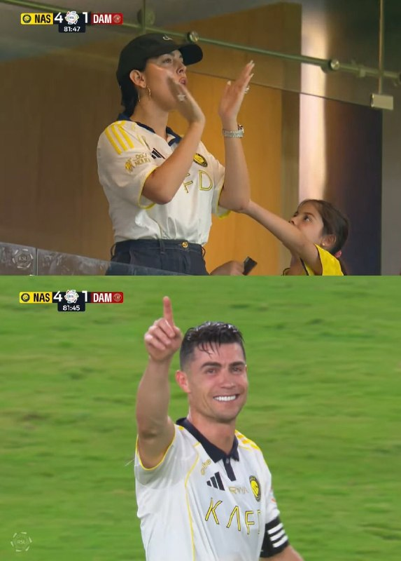

اشکای کریس بعد از گل چهارم اشک شادی @SportBaadNews

## SportBaadNews — post 252120

  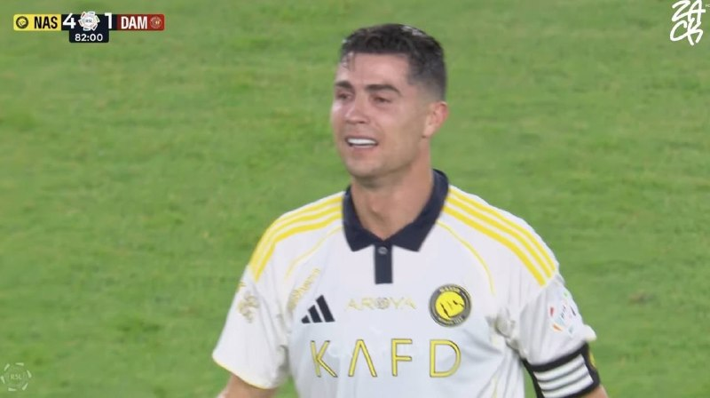

اشکای کریس بعد از گل چهارم اشک شادی @SportBaadNews

## SportBaadNews — post 252116

  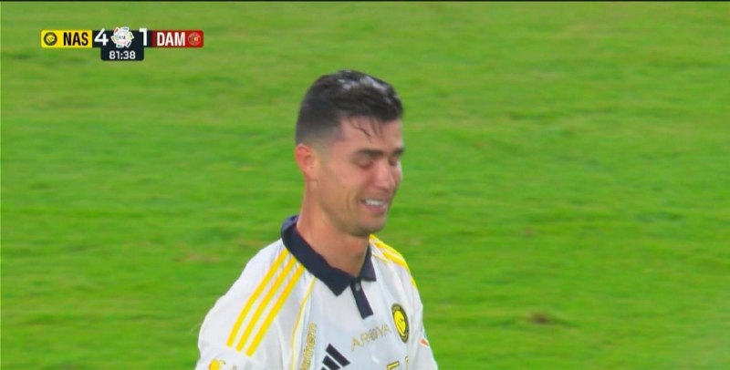

گگلگلللل چهارمممم النصررر، دبللل کریستیانوووو: WATCH

## SportBaadNews — post 252115

گگلللل چهارم النصررر توسططط کریستیانوووووو

## SportBaadNews — post 252114

کریس از خوشحالی داره گریه میکنه

## SportBaadNews — post 252112

هنوزم اون رونالدوی قدیمیییی زنده‌ستتتتت

## SportBaadNews — post 252111

گگلللل چهارم النصررر توسططط کریستیانوووووو

## IranIntlTV — post 338293

  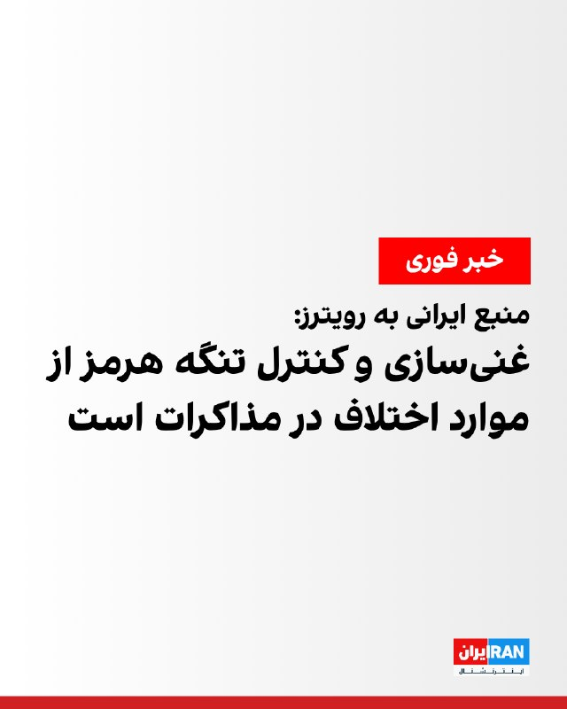

خبرگزاری رویترز به نقل از یک منبع ارشد ایرانی نوشت هنوز هیچ توافقی میان تهران و واشینگتن حاصل نشده، اما شکاف‌ها کاهش یافته است.

این منبع افزود غنی‌سازی اورانیوم و کنترل جمهوری اسلامی بر تنگه هرمز همچنان از جمله موارد اختلاف در مذاکرات است.
https://iranintl.com/202605214677

## IranIntlTV — post 338292

  

🔻تیم فوتبال النصر در هفته پایانی لیگ حرفه‌ای عربستان سعودی با نتیجه ۴-۱ داماک اف‌سی را شکست داد و با ۸۶ امتیاز بالاتر از الهلال به مقام قهرمانی رسید. گل‌های النصر را در این بازی سادیو مانه، کومان و کریستیانو رونالدو (۲بار) به ثمر رساندند. رونالدو با دو گلی که به ثمر رساند تعدادگل‌های خود را به عدد ۹۷۳ رساند.

🔹در دیگر بازی لیگ حرفه‌ای عربستان سعودی، الهلال دیگر تیم مدعی قهرمانی با نتیجه ۱-۰ الفیحا را شکست داد و با ۸۴ امتیاز در رده دوم قرار گرفت.

🔹الاهلی، قهرمان دو دوره اخیر لیگ نخبگان آسیا با ۸۱ امتیاز در رده سوم قرار گرفت.

@iranintltvsport

## IranIntlTV — post 338291

  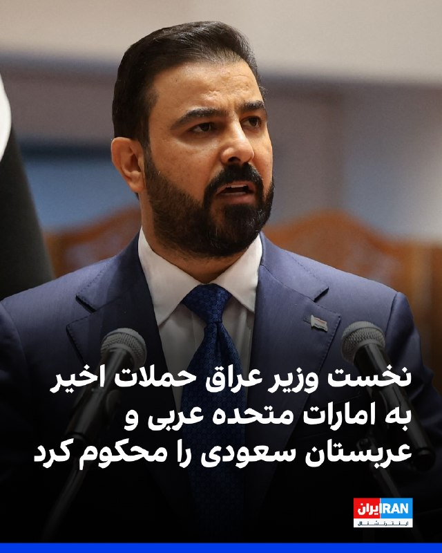

علی الزیدی، نخست وزیر عراق، در شبکه ایکس درباره حملات اخیر به امارات متحده عربی و عربستان سعودی نوشت: «ما بار دیگر این اقدام جنایتکارانه که پادشاهی عربستان سعودی و امارات متحده عربی را هدف قرار داد، محکوم و تقبیح می‌کنیم.»

او افزود: «ما دستور افشای جزئیات این حملات جنایتکارانه را صادر کرده‌ایم و یک کمیته تحقیقاتی نخبه در اولین جلسه شورای وزیران امنیت ملی تشکیل شده است.»

نخست‌وزیر عراق نوشت: «ما بر اهمیت تحقیقات مشترک با برادرانمان در دو کشور، با هدف بررسی همه جوانب، تاکید می‌کنیم.»
https://iranintl.com/202605219998

## IranIntlTV — post 338289

  <a href="https://t.me/IranintlTV/338289" target="_blank">📎 Download file</a>

🎧نسخه صوتی ۲۴ با فرداد فرحزاد: ترامپ: اورانیوم ایران را می‌گیریم و نابود می‌کنیم
@iranintlTV

## IranIntlTV — post 338288

  <a href="telegram/content/IranIntlTV_338288_1779395152.mp4" target="_blank">🎬 Download video</a>

انور قرقاش، مشاور ارشد رییس دولت امارات، گفت کشورهای منطقه سال‌ها با رفتارهای تهدیدآمیز و زورگویانه جمهوری اسلامی روبه‌رو بوده‌اند. او افزود بازسازی اعتماد با شعار ممکن نیست و نیاز به احترام عملی به حاکمیت کشورها دارد.

گفت‌وگو با علیرضا نوری‌زاده، مدیر مرکز پژوهش‌های ایران و عرب
@iranintltv

## IranIntlTV — post 338287

  <a href="telegram/content/IranIntlTV_338287_1779395156.mp4" target="_blank">🎬 Download video</a>

آسوشیتدپرس گزارش داد با افزایش ابهام درباره وضعیت رهبری جمهوری اسلامی، نفوذ جریان‌های تندرو در ساختار قدرت ایران بیشتر شده است.

موسسه مطالعات جنگ در واشینگتن نیز اعلام کرد احمد وحیدی و نزدیکانش کنترل پاسخ نظامی و سیاست مذاکراتی تهران را در دست گرفته‌اند.

گفت‌وگو با مرتضی کاظمیان، عضو تحریریه ایران‌اینترنشنال
@iranintltv

## IranIntlTV — post 338286

  <a href="https://t.me/IranintlTV/338286" target="_blank">📎 Download file</a>

🎧نسخه صوتی دومینو: نفس‌های جنگ پشت دروازه‌های ایران
@iranintlTV

## IranIntlTV — post 338285

  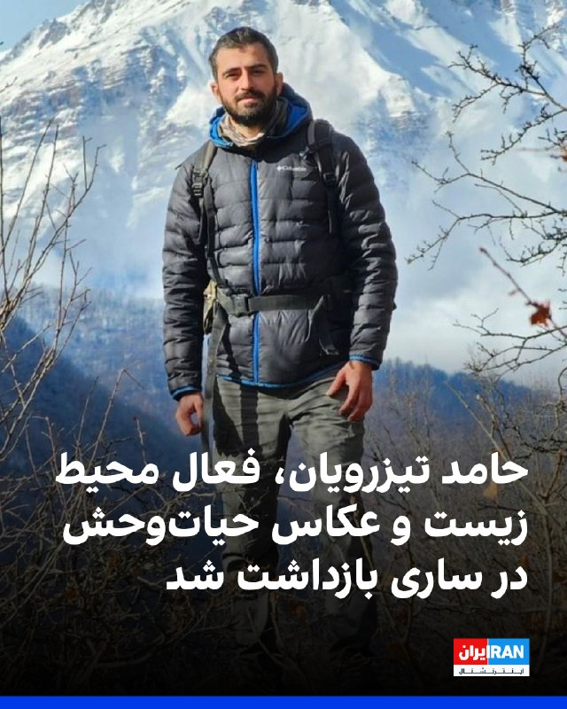

حامد تیزرویان، عکاس حیات‌وحش و فعال محیط زیست، ۱۴ اردیبهشت ۱۴۰۵ در ساری بازداشت شده است. بر اساس اطلاعات منتشرشده، ماموران در جریان این بازداشت، تلفن همراه و دیگر وسایل الکترونیکی او را نیز ضبط کردند. اتهام مطرح‌شده علیه او «اجتماع و تبانی با هدف اقدام علیه امنیت ملی» عنوان شده است.
گزارش‌ها حاکی است بازداشت این عکاس حیات‌وحش پس از انتشار مطالبی انتقادی در شبکه‌های اجتماعی صورت گرفته است. این مطالب شامل انتقاد از کشتار معترضان در دی‌ماه و همچنین اعتراض به اجرای احکام اعدام بوده است.
حامد تیزرویان از عکاسان شناخته‌شده در حوزه حیات‌وحش ایران به شمار می‌رود. ثبت تصاویر کمیاب از گونه‌هایی مانند خرس قهوه‌ای و مرال که در معرض خطر انقراض قرار دارند، بخشی از فعالیت حرفه‌ای او بوده است
https://iranintl.com/202605219434

## IranIntlTV — post 338284

  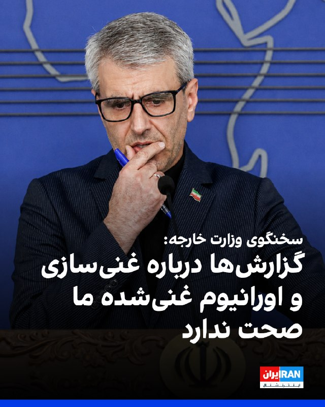

اسماعیل بقایی، سخنگوی وزارت خارجه جمهوری اسلامی با رد گمانه‌زنی‌ها درباره جزییات مذاکرات مرتبط با پایان جنگ گفت: ادعاهای مطرح شده در رسانه‌ها درباره مباحث هسته‌ای از جمله مواد غنی شده یا بحث غنی‌سازی، گمانه‌زنی رسانه‌ای بوده و فاقد اعتبار است.

او همچنین گفت در این مرحله، تمرکز مذاکرات بر خاتمه جنگ در همه جبهه‌ها از جمله لبنان است.
https://iranintl.com/202605215041

## IranIntlTV — post 338283

  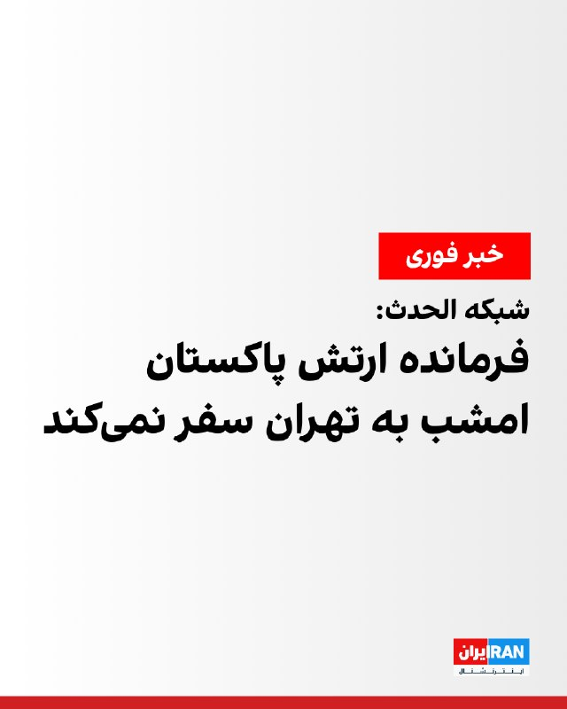

الحدث شامگاه پنج‌شنبه به نقل از یک منبع دیپلماتیک ارشد اعلام کرد که فرمانده ارتش پاکستان امشب به تهران سفر نخواهد کرد.

پیش‌تر الحدث گزارش داده بود فرمانده ارتش پاکستان ممکن است روز پنج‌شنبه برای اعلام نهایی شدن متن توافق میان تهران و واشینگتن به ایران سفر کند.
https://iranintl.com/202605213043

## IranIntlTV — post 338282

  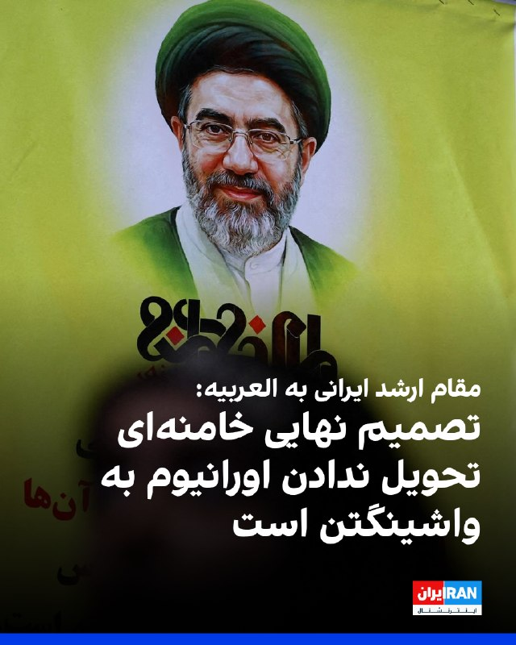

العربیه به نقل از یک مقام ارشد جمهوری اسلامی گزارش داد «تصمیم نهایی مجتبی خامنه‌ای این است که اورانیوم غنی‌شده به واشینگتن تحویل داده نشود.»

این در حالی است که دونالد ترامپ در صحبت‌های روز پنج‌شنبه خود در کاخ سفید درباره اورانیوم غنی‌شده ایران گفت: «ما اورانیوم بسیار غنی‌شده را می‌گیریم. اجازه نمی‌دهیم آن‌ها آن را داشته باشند.» او افزود پس از در اختیار گرفتن این مواد، احتمالا آن را نابود خواهند کرد.
https://iranintl.com/202605213164

## IranIntlTV — post 338281

  <a href="telegram/content/IranIntlTV_338281_1779395162.mp4" target="_blank">🎬 Download video</a>

۲۴ با فرداد فرحزاد
@iranintltv

## IranIntlTV — post 338280

  <a href="telegram/content/IranIntlTV_338280_1779395164.mp4" target="_blank">🎬 Download video</a>

۲۴ با فرداد فرحزاد
@iranintltv

## IranIntlTV — post 338279

یک شهروند در پیامی به ایران اینترنشنال خطاب به رهبران آمریکا و اسرائیل خواست که مردم ایران را تنها نگذارند و افزود منتظر فراخوان شاهزاده پهلوی برای اعتراضات است. پیام او با هوش مصنوعی خوانده شده است.

## Persian_Trend_Official — post 14639

💢ویدیویی دیگر از از زیر دریایی مرطوب السابحات برای دوستانی که تصور میکردن هوش مصنوعی است ... 🫆:Tony 📌 @persian_trend_official پرشین ترند | متفاوت‌ترین کانال نظامی

## Persian_Trend_Official — post 14637

  <a href="telegram/content/Persian_Trend_Official_14637_1779395166.mp4" target="_blank">🎬 Download video</a>

💢در این ویدیو زیر دریایی السابحات ۲ رو مشاهده میکنید 🫆:Tony 📌 @persian_trend_official پرشین ترند | متفاوت‌ترین کانال نظامی

## Persian_Trend_Official — post 14636

  <a href="telegram/content/Persian_Trend_Official_14636_1779395167.mp4" target="_blank">🎬 Download video</a>

💢در این ویدیو زیر دریایی السابحات ۲ رو مشاهده میکنید

🫆:Tony

📌 @persian_trend_official
پرشین ترند | متفاوت‌ترین کانال نظامی

## Persian_Trend_Official — post 14635

💢خبرنگار : آیا شهید رئیسی ترور شد؟

🔻مخبر:
▪️هیچوقت نتوانستم قبول کنم حادثه هلی‌کوپتر شهید رئیسی یک سقوط ساده بود و  همچنان نیز قبول ندارم.

🫆:Tony

📌 @persian_trend_official
پرشین ترند | متفاوت‌ترین کانال نظامی

## Persian_Trend_Official — post 14632

ایران سال‌ها با پهپادهای ارزان آمریکا را به دردسر انداخت. حالا پنتاگون همان سلاح را با فناوری برتر علیه خودش آماده می‌کند.

وزارت دفاع آمریکا شرکت Shield AI را مأمور کرده تا نرم‌افزار ازدحام هوشمند Hivemind را روی پهپاد LUCAS نصب کند؛ پهپادی که مستقیماً از روی طرح شاهد ایرانی کپی شده.

این سیستم به یک اپراتور اجازه می‌دهد صدها پهپاد خودران را بدون هیچ دخالت انسانی هدایت کند. آزمایش‌های عملیاتی پاییز ۲۰۲۶ برنامه‌ریزی شده‌اند.

مقامات پنتاگون می‌گویند این تصمیم پاسخ مستقیمی است به معادله‌ای که ایران کشف کرد؛ یک پهپاد ۲۰ هزار دلاری در برابر یک موشک ۳ میلیون دلاری. آمریکا می‌خواهد این معادله را برعکس کند.

بودجه پیشنهادی ۲۰۲۷ برای پهپاد و سیستم‌های خودران به ۵۳.۶ میلیارد دلار رسیده؛ بزرگ‌ترین رقم در تاریخ نظامی آمریکا در این
حوزه.

☆Phantom☆

📌 @persian_trend_official
پرشین ترند | متفاوت‌ترین کانال نظامی

## Persian_Trend_Official — post 14631

💢اسماعیل کوثری، عضو کمیسیون امنیت ملی مجلس

💢 اگر امارات از مکان‌هایی که در اختیار آمریکا گذاشته علیه ما استفاده کند، قطعا آنجا را زیر آتش موشک‌های خود می‌بریم.

🫆:Tony

📌 @persian_trend_official
پرشین ترند | متفاوت‌ترین کانال نظامی

## Persian_Trend_Official — post 14630

🔴 یدیعوت آحرونوت: حملات ایران به چند پایگاه مهم اسرائیل خسارت وارد کرده است

💢روزنامه «یدیعوت آحرونوت» گزارش داد تصاویر ماهواره‌ای نشان می‌دهد چندین پایگاه نظامی اسرائیل در حملات اخیر ایران آسیب دیده‌اند.

🔻بر اساس این گزارش:

▪️ پایگاه هوایی «رمات داوید» دچار خسارت شده است
▪️ احتمال آسیب‌دیدگی در پایگاه «نواتیم» نیز مطرح شده
▪️ پایگاه وابسته به واحد اطلاعاتی ۸۲۰۰ و چند مرکز نظامی دیگر نیز هدف قرار گرفته‌اند

🔻همچنین تصاویر ماهواره‌ای نشان می‌دهد:

▪️ در اردوگاه «شمشون» نزدیک طبریا آتش‌سوزی گسترده‌ای رخ داده است
▪️ این آتش‌سوزی از ۱۰ مارس، همزمان با اعلام حمله پهپادی حزب‌الله به این پایگاه آغاز شده
▪️ بر اساس تحلیل تصاویر، آتش چند روز ادامه داشته و حدود ۲۰۰ متر از محوطه داخلی پایگاه را دربر گرفته است

🫆:Tony

📌 @persian_trend_official
پرشین ترند | متفاوت‌ترین کانال نظامی

## Persian_Trend_Official — post 14629

⭕️ گزارشات حاکی از عدم پذیرش باز کردن تنگه هرمز توسط ایران است.

📝 Nick

📌 @persian_trend_official
پرشین ترند | متفاوت‌ترین کانال نظامی

## Persian_Trend_Official — post 14628

💢الحدث به نقل از یک منبع دیپلماتیک:

🔻فرمانده ارتش پاکستان امشب به تهران سفر نخواهد کرد.

🫆:Tony

📌 @persian_trend_official
پرشین ترند | متفاوت‌ترین کانال نظامی

## Persian_Trend_Official — post 14627

  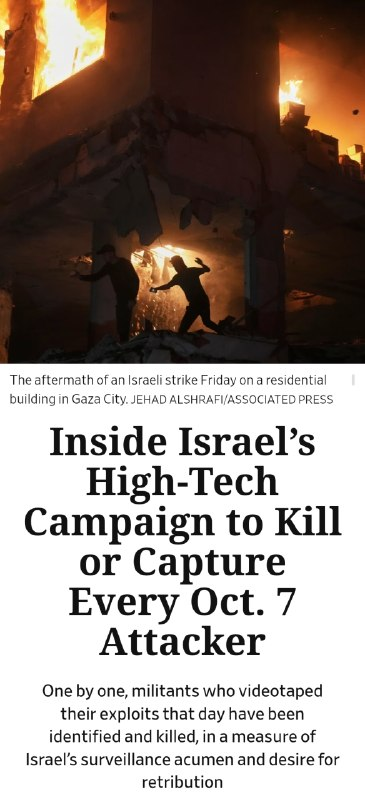

⭕️ روزنامه The Wall Street Journal در گزارشی اعلام کرد که اسرائیل پس از حملات ۷ اکتبر ۲۰۲۳، یک عملیات گسترده اطلاعاتی و امنیتی را برای شناسایی، بازداشت یا حذف عاملان این حملات آغاز کرده است.

بر اساس این گزارش، این عملیات توسط واحدی ویژه موسوم به «NILI» و با استفاده از ابزارهای نظارتی، داده‌های اطلاعاتی و رصد میدانی دنبال می‌شود.

وال‌استریت ژورنال همچنین نوشت که این اقدامات در کنار اهداف امنیتی، با انتقاداتی درباره تشدید درگیری‌ها و افزایش تلفات غیرنظامی نیز مواجه شده است.

📝 Nick

📌 @persian_trend_official
پرشین ترند | متفاوت‌ترین کانال نظامی

## Persian_Trend_Official — post 14625

  

🔴 واشنگتن‌پست: آمریکا بخش اصلی دفاع موشکی اسرائیل مقابل ایران را بر عهده داشت

💢روزنامه واشنگتن‌پست گزارش داد ایالات متحده در جریان درگیری اخیر ایران و اسرائیل، نقش بسیار پررنگ‌تری از تل‌آویو در رهگیری موشک‌ها ایفا کرده است.

🔻بر اساس این گزارش:

▪️ نیروهای آمریکایی بیش از ۲۰۰ موشک رهگیر پیشرفته THAAD شلیک کردند
▪️ این رقم تقریباً معادل نیمی از کل ذخایر سامانه THAAD آمریکا عنوان شده است
▪️ علاوه بر آن، بیش از ۱۰۰ موشک رهگیر دریایی نیز توسط آمریکا پرتاب شده است

در مقابل:

▪️ اسرائیل در مجموع کمتر از ۲۰۰ موشک رهگیر پیشرفته خود را استفاده کرده است

💢واشنگتن‌پست می‌گوید این اختلاف نشان می‌دهد واشنگتن تا چه اندازه بار اصلی دفاع موشکی اسرائیل را در این درگیری بر دوش کشیده است.

🫆:Tony

📌 @persian_trend_official
پرشین ترند | متفاوت‌ترین کانال نظامی

---
📅 بروزرسانی: 1405/02/31 21:57
---

## ChizBergerz — post 46641

  

G(OLD)

من ترجیح میدم تو لندکروز بشکه بشکه اشک بریزم تا اینکه پشت هوندا مثل کصخلا بخندم...
@ChizBergerz

## ChizBergerz — post 46640

  

کتاب نوشتن واسه رییسی اسمشو گذاشتن "خسته نیستم".

اولین چیزی که به ذهن آدم میاد اینه که "خب بکیرم".
@ChizBergerz

## ChizBergerz — post 46639

  <a href="telegram/content/ChizBergerz_46639_1779388078.mp4" target="_blank">🎬 Download video</a>

تصورم از زرشکیان حروم‌زاده که میگه با موش‌تباه ملاقات کرده: 😂😂

@ChizBergerz

## ChizBergerz — post 46638

  

وعده‌ی مناسب قبل از باشگاه:

@ChizBergerz

## ChizBergerz — post 46637

  <a href="telegram/content/ChizBergerz_46637_1779388080.mp4" target="_blank">🎬 Download video</a>

یکم آنلاین شاپ ایرانی ببینیم...

@ChizBergerz

## ChizBergerz — post 46636

  

چیزی که تو ۱۸ سالگی انتخاب میکنی⬅️

چیزی که تو ۳۰ سالگی انتخاب میکنی➡️
@ChizBergerz

## rodast_omiddana — post 71719

  <a href="telegram/content/rodast_omiddana_71719_1779388084.webm" target="_blank">🎬 Download video</a>

🚨 بترسید از کسیکه نام "کنسرت" را "تجمع فرهنگی سیاسی" میزارد و دست به بلیط فروشی میزند..

## rodast_omiddana — post 71717

  <a href="telegram/content/rodast_omiddana_71717_1779388084.webm" target="_blank">🎬 Download video</a>

🚨 کاسبی با خون جاویدنامان و بِرَند شاهزاده با رَسم شکل...

## rodast_omiddana — post 71716

  

🎬 پاسخ طوفانی به کلیپ 13 دقیقه ای شاهین نجفی که پشت شاهزاده پنهان شده
لینک یوتیوب:
https://www.youtube.com/watch?v=xpDv-m5DvP4

## KiriMohems — post 47865

  

ترامپ ۴۸ ساعت دیگه:

قرار بود به ایران حمله کنیم ولی قراره لوله‌کش بیاد برای سیفون دستشویی، ملانیا خونه تنهاست من حتما باید پیشش باشم.

#professor
@KiriMohems

## KiriMohems — post 47864

  <a href="telegram/content/KiriMohems_47864_1779388086.mp4" target="_blank">🎬 Download video</a>

🔴 ترامپ:

ایران نمیتونه اورانیوم غنی‌شده اش رو نگه داره. به محض اینکه اونا رو بگیریم، احتمالاً نابودش میکنیم. ما این عن رو را نمیخواییم.

#Helsinki
@KiriMohems

## KiriMohems — post 47863

  

🔴 عن در کونتان چیپس میشه ببینید:

یک بسته چیپس کیری نمکی ساده نیم میلیون تومان!!!

#professor
@KiriMohems

## KiriMohems — post 47862

  

سردار آزمون هم طی یه پست تو اینستاگرامش، برای تیم‌ملی مالیده، گفته یسریا تو کشور در موردم عجولانه قضاوت کردن و سوء‌تفاهم شده، برای تیم‌ملی مالیده، خوبی‌هایی که به مردم کرده رو کرده تو چشمون و از تک‌تکش اسم برده و منت گذاشته، بازم برای تیم‌ملی مالیده و گفته برای بازیکنا و کادرفنی و امیرخان آرزوی موفقیت دارم، برید بترکونید و دل مردمو شاد کنید؛ تا نشون بده لایق حمایت‌هایی که این‌مدت شده بود رو نداره. وسلام

#professor
@KiriMohemSport

## KiriMohems — post 47861

  

✖️ سایت بین المللی bet120x 
✖️

 
👍دارای مجوز رسمی Gambling Judge سوئد
👍
     

💳شارژ حساب از طریق ارز و یووچر و پرمیوم ووچر

💳تسویه حساب دلاری سریع
💊بیمه شرط میکس

⚠️فروش شرط

🔔ویرایش شرط                    
3️⃣
2️⃣

🎁20%هدیه واریز از طریق ارز و ووچر
┅━━━━━━━━━━━

🎁 10%برگشت باخت به صورت روزانه

🎁 10%برگشت باخت به صورت هفتگی

🎁10%برگشت باخت به صورت ماهانه

💻ادرس ورود به سایت:
https://bet120x.com/fa/?btag=971470
➖➖➖➖➖
   
👈 آموزش واریز و برداشت دلاری
👉

🔪کانال اطلاع رسانی:
👇 g31🅰

✈️https://t.me/+RvVnWMHCqUc4YzFk

## KiriMohems — post 47860

🔴ترامپ: همین الان هم داریم با ایران لاس میزنیم؛ خواهیم دید چه کونی داده خواهد شد

#Helsinki
@KiriMohems

## SportBaadNews — post 252076

الهلال خووووورد

## SportBaadNews — post 252075

الهلال خووووورد

## SportBaadNews — post 252074

  

نزده فوتموب کصخل شده 😐

## SportBaadNews — post 252073

گگلللل النصرررر هم زددد

## SportBaadNews — post 252072

گگلللل النصرررر هم زددد

## SportBaadNews — post 252071

  

الهلال یه گل زد و فعلا قهرمانه
@SportBaadNews

## SportBaadNews — post 252070

  <a href="telegram/content/SportBaadNews_252070_1779388092.webm" target="_blank">🎬 Download video</a>

🚨
❌ طبق گفته رسانه های انگلیس، لوک شاو و مگوایر به تیم ملی انگلیس دعوت نشدند
@SportBaadNews

## SportBaadNews — post 252069

  <a href="telegram/content/SportBaadNews_252069_1779388092.webm" target="_blank">🎬 Download video</a>

🚨
🚨
🏴󠁧󠁢󠁥󠁮󠁧󠁿 مت لو: انتظار میره پالمر به تیم ملی انگلیس دعوت نشه
😐
@SportBaadNews

## SportBaadNews — post 252068

تغییر نام سانتیاگو برنابئو درگوگل مپ به امباپه دیکتاتور😂😂😂 @SportBadTweet | Ar

## SportBaadNews — post 252067

  

⚽️
🔻کوپه: انریکه ریکلمه رسماً نامزد شدنش تو انتخابات ریاست رئال رو به باشگاه اعلام کرد.

طبق قانون، نامزد ها حداقل 48 ساعت قبل از پایان مهلت انتخابات، باید به باشگاه اطلاع بدن که میخوان نامزد بشن و الان انریکه ریکلمه اینکارو انجام داده و اگه بخواد میتونه رسما نامزد بشه.
@SportBaadNews

## SportBaadNews — post 252066

  

⚽️ تمام رسانه‌های انگلیس خبر از دعوت نشدن فودن به تیم ملی انگلیس میدن
@SportBaadNews

## IranIntlTV — post 338278

  

فاطمه عباسی، ۳۱ ساله و دانشجوی دانشگاه هنر اصفهان، روز ۱۹ دی‌ماه در جریان انقلاب ملی در بلوار کشاورز شهر اصفهان هنگامی‌ که در حال کمک و پناه دادن به مجروحین بود با اصابت گلوله به گردنش مجروح و دچار قطع نخاع شد. او ۲۱ اسفندماه پس از گذران نزدیک به چند هفته کما، در بیمارستان جان باخت.

بنا به گزارش‌های رسیده به ایران‌اینترنشنال، او پس از یک دوره کما، به هوش آمده و در روزهای پایانی زندگی‌اش حال عمومی بهتری داشته است. خبر درگذشت فاطمه از طریق تماس تلفنی به خانواده اطلاع داده شد.

دوستان فاطمه او را علاقه‌مند به حرفه‌ عکاسی معرفی کرده‌اند.

طبق اطلاعات رسیده به ایران‌اینترنشنال، فاطمه پس از گرفتن تعهد به خانواده تحویل و طی کنترل شدید امنیتی در قطعه ۵۲ باغ رضوان اصفهان به خاک سپرده شد.
https://iranintl.com/202605218377

## IranIntlTV — post 338277

  

اسکات بسنت، وزیر خزانه‌داری آمریکا درباره تحریم‌های جدید این کشور علیه حزب‌الله، گروه تحت حمایت جمهوری اسلامی، در شبکه اجتماعی ایکس نوشت: «حزب‌الله یک سازمان تروریستی است و باید کاملا خلع سلاح شود.»

او افزود: «وزارت خزانه‌داری به اقدامات خود علیه مقاماتی که در دولت لبنان نفوذ کرده‌اند و حزب‌الله را قادر می‌سازند تا کارزار بی‌معنی خشونت علیه مردم لبنان را به راه بیندازد و مانع صلح پایدار شود، ادامه خواهد داد.»

پیش‌تر وزارت خزانه‌داری آمریکا اعلام کرد محمدرضا رئوف شیبانی، سفیر اخراجی جمهوری اسلامی در لبنان را تحریم کرده است.

نام شیبانی در میان ۹ نفری است که وزارت خزانه‌داری آمریکا پنجشنبه به دلیل ارتباط با حزب‌الله لبنان تحریم کرده است.

آمریکا اعلام کرده که این افراد خلع سلاح حزب‌الله را مختل می‌کردند و در جهت پیشبرد برنامه‌های جمهوری اسلامی در لبنان فعالیت می‌کردند.
https://iranintl.com/202605217096

## IranIntlTV — post 338276

  

🔻مهدی تاج، رییس فدراسیون فوتبال، درباره جلسه با دبیرکل فیفا در جمع خبرنگاران گفت: «ما ۱۰ مورد را تنظیم کرده بودیم و درباره همه آنها با فیفا به نتایج خوبی رسیدیم. آنچه فیفا قول داده، این است که این مواردی که دغدغه فدراسیون فوتبال بوده، رعایت شود.»

🔹تاج درباره شرایط تیم ملی و موضوع ویزای آمریکا گفت: «در حال پیگیری است و تیم ملی بهترین شرایط را پشت سر می‌گذارد. بازی‌های دوستانه در ترکیه پیش‌بینی شده و تیم برنامه‌های خود را انجام می‌دهد.»

🔹او همچنین گفت: «در حال حاضر هنوز برای هیچ فردی ویزا صادر نشده اما بسیاری از کشورهای حاضر در جام جهانی نیز هنوز ویزا نگرفته‌اند. امیدواریم ویزاها صادر شود تا تیم ملی بتواند به‌راحتی بازی‌هایش را برگزار کند.»

@iranintltvsport

## IranIntlTV — post 338275

  

وزارت خزانه‌داری آمریکا اعلام کرد محمدرضا رئوف شیبانی، سفیر اخراجی جمهوری اسلامی در لبنان، را تحریم کرده است.

وزارت خارجه آمریکا نیز اعلام کرد ۹ نفر مرتبط با حزب‌الله را که حاکمیت لبنان را تضعیف می‌کنند، تحریم کرده است.
بر اساس این اعلام، این افراد در روند خلع سلاح حزب‌الله اخلال ایجاد کرده و در جهت پیشبرد برنامه‌های جمهوری اسلامی در لبنان فعالیت می‌کردند.
https://iranintl.com/202605213671

## IranIntlTV — post 338274

  <a href="telegram/content/IranIntlTV_338274_1779388097.mp4" target="_blank">🎬 Download video</a>

یک نهاد مدنی ایرانی در آمریکا با ارسال نامه‌ای به فیفا درباره ممنوعیت احتمالی ورود پرچم شیروخورشید به ورزشگاه‌ها در جام جهانی هشدار داد.

این نهاد با استناد به قوانین آزادی بیان در آمریکا، چنین اقدامی را نقض حقوق مدنی دانسته است.

گفت‌وگو با منصور آریا، حقوقدان
@iranintltv

## IranIntlTV — post 338273

  

دفتر کمیسر عالی حقوق بشر سازمان ملل اعلام کرد ولکر تورک، کمیسر عالی حقوق بشر این نهاد، اعدام دو نفر دیگر در ایران را محکوم کرد.
بر اساس گزارش این دفتر، تورک گفته مقام‌های جمهوری اسلامی از جنگ با آمریکا و اسرائیل به‌عنوان بهانه‌ای برای تشدید سرکوب داخلی استفاده می‌کنند.

خبرگزاری میزان، وابسته به قوه قضاییه جمهوری اسلامی، گزارش داد رامین زله و کریم معروف‌پور، دو زندانی سیاسی بامداد پنج‌شنبه ۳۱ اردیبهشت اعدام شدند.
https://iranintl.com/202605219033

## IranIntlTV — post 338272

  <a href="telegram/content/IranIntlTV_338272_1779388101.mp4" target="_blank">🎬 Download video</a>

یک شهروند در پیامی به ایران اینترنشنال می‌گوید که بین مردم و حکومت دریایی از خون فاصله است و ترامپ نباید با جمهوری اسلامی مذاکره کند. پیام او با هوش مصنوعی خوانده شده است.

## Persian_Trend_Official — post 14624

https://youtube.com/live/zMW0RhvWank?feature=share

## Persian_Trend_Official — post 14623

🔴 قوه قضاییه جمهوری اسلامی بازداشت رشید مظاهری را تأیید کرد

💢قوه قضاییه جمهوری اسلامی بازداشت «رشید مظاهری» دروازه‌بان پیشین تیم ملی فوتبال ایران را تأیید کرد.

🔻بر اساس اعلام مقام‌های قضایی:

▪️ او با اتهاماتی از جمله «فعالیت تبلیغی برخلاف امنیت ملی» مواجه شده است
▪️ بازداشت مظاهری پس از انتقاد علنی او از علی خامنه‌ای و حوادث دی‌ماه ۱۴۰۴ صورت گرفته است

💢رشید مظاهری یکی از چهره‌های شناخته‌شده فوتبال ایران و سابقه حضور در تیم ملی را در کارنامه دارد.

🫆:Tony

📌 @persian_trend_official
پرشین ترند | متفاوت‌ترین کانال نظامی

## Persian_Trend_Official — post 14622

حدود 30 دقیقه دیگه لایو آغاز میشه

## Persian_Trend_Official — post 14621

  <a href="telegram/content/Persian_Trend_Official_14621_1779388103.webm" target="_blank">🎬 Download video</a>

💢وزارت خارجه جمهوری اسلامی اعلام کرد ادعاهای مطرح‌شده درباره غنی‌سازی اورانیوم و سرنوشت مواد غنی‌شده، چیزی جز «گمانه‌زنی رسانه‌ای فاقد اعتبار» نیست.

🫆:Tony

📌 @persian_trend_official
پرشین ترند | متفاوت‌ترین کانال نظامی

## Persian_Trend_Official — post 14620

  <a href="telegram/content/Persian_Trend_Official_14620_1779388103.mp4" target="_blank">🎬 Download video</a>

💢ترامپ مدعی شد که وضعیت ایران خیلی زود حل خواهد شد

💢دونالد ترامپ، رئیس‌جمهور آمریکا، در جمع خبرنگاران در دفتر بیضی شکل ( در کاخ سفید) اظهار داشت:

🔹ایالات متحده با دریافت هزینه حمل و نقل توسط ایران در تنگه هرمز مخالف است.

🔹آمریکا قصد دارد اورانیوم ایران را خارج کرده و به احتمال زیاد آن را معدوم (نابود) کند.

🔹گروه ضربت نیروی دریایی آمریکا به رهبری ناو هواپیمابر یواس اس «نیمیتز» که وارد دریای کارائیب شده است، برای تهدید مقامات کوبا نیست.

🫆:Tony

📌 @persian_trend_official
پرشین ترند | متفاوت‌ترین کانال نظامی

## Persian_Trend_Official — post 14619

  

سلام به همه اعضای خانواده پرشین ترند 🌟

از تراست VPN برای بچه‌های پرشین ترند ۱۰٪ تخفیف روی پلن‌های معمولی گرفتم 🔥
(البته اگر این پیام رو براشون بفرستین)

همچنین ۳ تا سرور جدید فقط برای سرعت بالاتر توی دیدن ویدئوها اضافه کردن 🚀

👇😳😳
یه طرح بمب هم دارن که هر گیگ براتون حدود ۱۶۸ تومن درمیاد 😳
برای جزئیات حتماً بهشون پیام بدین 👇👇👇
😳😳☝️
@trusstvpnn_admin
@trusstvpnn_admin

---
📅 بروزرسانی: 1405/02/31 20:04
---

## ChizBergerz — post 46635

  

📷 Photo

## ChizBergerz — post 46634

⭕️ تا حالا بدون واریزی روی فوتبال ها شرط بستی؟! 
🎉 500 هزارتومن بونوس رایگان فقط با ثبت نام بدون هیچگونه واریزی! 
💳 شارژ سریع و امن با درگاه ریالی ، تتر یا ترون فقط با یک کلیک! 
⌛ پشتیبانی 24 ساعته 
💖تنها سایت مورد اعتماد ما با بونوس های کاملا واقعی و رویایی:…

## ChizBergerz — post 46633

  

⭕️ تا حالا بدون واریزی روی فوتبال ها شرط بستی؟!

🎉 500 هزارتومن بونوس رایگان فقط با ثبت نام بدون هیچگونه واریزی!

💳 شارژ سریع و امن با درگاه ریالی ، تتر یا ترون فقط با یک کلیک!

⌛ پشتیبانی 24 ساعته

💖تنها سایت مورد اعتماد ما با بونوس های کاملا واقعی و رویایی:

🌐 Winro.io

🌐 Winro.io
کانال بونوس های رایگان g31

📱 @winro_io

## ChizBergerz — post 46632

  

اول اینکه کیرم تو کص مادرت آقای ویلسون.
دومن پرچم جمهوری‌اسلامی از پهنا تو کص خواهرت حرومزاده ولد‌الزنا!

@ChizBergerz

## ChizBergerz — post 46631

  

نیم کیلو چیپس ساده شده نیم میلیون تومن! کیرم تو قبرت خمینی مادرقحبه!

@ChizBergerz

## ChizBergerz — post 46628

گلی به جمال مهلقا جابری
با یه طراحی یقه صدای مردم رسوند

بی‌ادعا با این همه کمالات و زیبایی یه گوشه نشسته استوری‌شو میذاره مبارزشو میکنه، بعضیا تخم ایشونم نیستن ولی کم مونده ادعای اسپارتاکوسی کنن.
@ChizBergerz

## ChizBergerz — post 46627

تمام آن‌چیزی که امروز مرز بین توافق و جنگ را تعیین می‌کند، موضوع اورانیوم غنی‌شده است.
اگر تحویلش دهند، جنگ، موقتا متوقف می‌شود.
اگر بخواهند حفظش کنند، در زودترین زمان جنگ آغاز می‌شود.

-علی حسین قاضی زاده-

## ChizBergerz — post 46626

‏از کانفیگ خریدن خسته شدم، دلم میخواد برم اینستا، برم یوتوب، برم تیک تاک، برم تو کص مادر وزیر ارتباطات...

## rodast_omiddana — post 71715

🎬 کمپین همچون شاهزاده سرباز ایران هستم
لینک یوتیوب:
https://www.youtube.com/watch?v=m1zR7lCmWhw

## rodast_omiddana — post 71714

  <a href="telegram/content/rodast_omiddana_71714_1779381282.webm" target="_blank">🎬 Download video</a>

🚨 میدل ایست آی:
"سه منبع گفتند که انتظار دارند جنگ در هفته‌های آینده و پس از پایان دوره حج، از سر گرفته شود.
ایالات متحده در گذشته از سیگنال‌های فریبنده و حیله‌های دیگر استفاده کرده تا سعی کند طرف مقابل را دچار احساس امنیت کاذب کند."

## rodast_omiddana — post 71713

  <a href="telegram/content/rodast_omiddana_71713_1779381282.webm" target="_blank">🎬 Download video</a>

🚨 آکسیوس:
"یک منبع آمریکایی گفت ترامپ به نتانیاهو گفته است که میانجی‌ها در حال کار بر روی یک «توافقنامه» هستند که هم ایالات متحده و هم ایران آن را امضا خواهند کرد تا رسماً به جنگ پایان دهند و یک دوره ۳۰ روزه مذاکره در مورد مسائلی مانند برنامه هسته‌ای ایران و باز شدن تنگه هرمز را آغاز کنند"

فقط میتونم بگم نگران نباشید با هر سناریویی جمهوری اسلامی سقوط خواهد کرد

## rodast_omiddana — post 71712

  <a href="telegram/content/rodast_omiddana_71712_1779381282.webm" target="_blank">🎬 Download video</a>

🚨 فکت
در طول جنگ 39 روزه رژیم نفتش را میتوانست بفروشه و از نظر مالی به مشکل جدی نخورد..
ولی در طول این آتش بس یک قطره نفت تازه تولید شده اش را نتونسته بفروشه و داره از نظر اقتصادی نابود میشه..

پانوشت:
احتمال اینکه ترامپ فعلا حمله نکنه تا این محاصره دریایی حسابی رژیم را ضعیف کند و سپس حمله کند..
فقط روی اعصابتان مسلط باشید، به ایران قسم ته این ماجرا رژیم رفتنی هست، خدا لعنت کنه اون بیشرفهایی که به شما گفتن جنگ ده روزه تمام میشه و رژیم سرنگون میشه که امروز به این حال در بیاید..
شاید الان اصرار منو روز اول جنگ که گفتم خودتونو دستکم تا سپتامبر آماده کنید بهتر درک کنید..
در هر صورت پایان این ماجرا سقوط رژیم است، شک نکن خواهشا..

## rodast_omiddana — post 71708

  <a href="telegram/content/rodast_omiddana_71708_1779381282.mp4" target="_blank">🎬 Download video</a>

🚨کمپین همچون شاهزاده سرباز ایران هستم

## rodast_omiddana — post 71707

  <a href="telegram/content/rodast_omiddana_71707_1779381284.webm" target="_blank">🎬 Download video</a>

🚨درود به شما
ساعت 13 و 50 دقیقه اصفهان اول صدایی شبیه جنگده آمد و بعد شدید صدای پدافند آمد

## rodast_omiddana — post 71706

  <a href="telegram/content/rodast_omiddana_71706_1779381284.webm" target="_blank">🎬 Download video</a>

🚨 برای وطن هر کاری لازم باشه میکنم

## KiriMohems — post 47859

  

🔴توئیت حشری وزیر جنگ آمریکا، پیت هگست : "آماده و مسلح"

#Helsinki
@KiriMohems

## SportBaadNews — post 252065

  <a href="telegram/content/SportBaadNews_252065_1779381285.webm" target="_blank">🎬 Download video</a>

🚨
🚨
⚽️سانتی اونا: اوضاع تو لیورپول داره سریع پیش میره و مدیریت ممکنه اشلوت رو اخراج کنه، آندونی ایرائولا سرمربی فعلی بورنموث اصلی‌ترین گزینه‌ی جایگزینی اشلوت هست
@SportBaadNews

## SportBaadNews — post 252064

  

⚡ فروش فیلترشکن اختصاصی استارلینک، قوی، بدون قطعی و از همه مهمتر بدون ضریب، آیپی ثابت

سرور اقتصادی:

🔴 1 گیگ: 240

🔴 2 گیگ: 450

🔴 5 گیگ: 1.100

🔴 10+1 گیگ: 2.200

🔴 15+1 گیگ: 3.590

🔴 20+2 گیگ: 4.200

استارلینک:

🔴 1 گیگ: 340

🔴 2 گیگ: 660

🔴 5 گیگ: 1.620

🔴 10+1 گیگ: 2.960

🔴 15+1 گیگ: 4.560

🔴 20+2 گیگ: 5.460

❗️به ازای هر 10 گیگ خرید، 1 گیگ اشانتیون میگیرید

🔰 کانالمون:
@VpnBadNews

🤖 ربات جهت خرید سرور
@vpnbadnews_bot

## IranIntlTV — post 338271

  

مازیار نوروزی، ورزشکار و فعال مدنی، روز پنجشنبه ۱۸ دی‌ماه در جریان انقلاب ملی در گرگان با گلوله ماموران حکومت کشته شد.
به گفته نزدیکانش، او جوانی پرنشاط و فعال بود که در زمینه آموزش شنا فعالیت می‌کرد. او تحصیلکرده مقطع کارشناسی ارشد رشته صنایع چوب و کاغذ بود.
مقام‌های حکومت به خانواده‌اش فشار آوردند تا او را «شهید» معرفی کنند. دوستان مازیار نوروزی گفتند که او در کنار اشتغال و فعالیت اجتماعی به دنبال تشکیل خانواده بود.
https://iranintl.com/202605219786

## IranIntlTV — post 338270

  

دونالد ترامپ در کاخ سفید گفت جمهوری اسلامی قرار نیست سلاح هسته‌ای داشته باشد و آمریکا اجازه چنین اتفاقی را نمی‌دهد. او هشدار داد در صورت دستیابی ایران به سلاح هسته‌ای، جنگی هسته‌ای در خاورمیانه آغاز خواهد شد که می‌تواند به اروپا و حتی آمریکا کشیده شود، اما تأکید کرد چنین اتفاقی رخ نخواهد داد.

ترامپ درباره اورانیوم غنی‌شده ایران گفت: «ما اورانیوم بسیار غنی‌شده را می‌گیریم. اجازه نمی‌دهیم آن‌ها آن را داشته باشند.» او افزود پس از در اختیار گرفتن این مواد، احتمالا آن را نابود خواهند کرد.

رییس‌جمهور آمریکا همچنین اعلام کرد واشینگتن با دریافت عوارض در تنگه هرمز مخالف است و گفت محاصره دریایی آمریکا «۱۰۰ درصد موثر» بوده و هیچ کشتی‌ای بدون تایید آمریکا به ایران وارد یا از آن خارج نشده است.
https://iranintl.com/202605215920

## IranIntlTV — post 338269

  <a href="https://t.me/IranintlTV/338269" target="_blank">📎 Download file</a>

🎧نسخه صوتی اخبار شبانگاهی | پنجشنبه ۳۱ اردیبهشت
@iranintlTV

## IranIntlTV — post 338268

  <a href="telegram/content/IranIntlTV_338268_1779381287.mp4" target="_blank">🎬 Download video</a>

فاکس‌نیوز در گزارشی نوشته است که زندگی مخفیانه مجتبی خامنه‌ای در ماه‌های اخیر، شباهت‌هایی با سال‌های پایانی زندگی اسامه بن‌لادن دارد. او بدون ارتباطات مخابراتی و با اتکا به پیک‌های مورد اعتماد زندگی می‌کند و احتمال می‌رود در سایت‌های مستحکم زیرزمینی نزدیک به تاسیسات سپاه پنهان شده باشد.
جزییات بیشتر با اردوان روزبه، خبرنگار ایران‌اینترنشنال
@iranintltv

## IranIntlTV — post 338267

  <a href="telegram/content/IranIntlTV_338267_1779381288.mp4" target="_blank">🎬 Download video</a>

یک شهروند با ارسال پیامی به ایران اینترنشنال می‌گوید در تجمعات حکومتی تهران پرداختی به حاضران بیشتر شده تا شاید تعداد آن‌ها افزایش یابد. پیام او با هوش مصنوعی خوانده شده است.

## IranIntlTV — post 338266

  

علی یزدی‌خواه، نایب‌رییس کمیسیون فرهنگی مجلس، گفت نهادهای بالادستی به این نتیجه رسیدند که بازگشایی اینترنت به صلاح همه نیست.
او افزود با قطع اینترنت «مردم مشکل عمده‌ای» ندارند و به اقشاری که «احساس کردیم» نیاز به اینترنت بین‌الملل دارند، دسترسی داده شد.
یزدی‌خواه اضافه کرد: «اگرچه در حالت نه جنگ، نه صلح هستیم، اما خطرات امنیتی، شخصیت‌ها و کشور را تهدید می‌کند و به این دلایل تصمیم بر این نیست که دسترسی همگانی داده شود.»
https://iranintl.com/202605212799

## IranIntlTV — post 338265

  <a href="telegram/content/IranIntlTV_338265_1779381291.mp4" target="_blank">🎬 Download video</a>

در حالی‌که مقامات آمریکایی نسبت به امضای توافق با جمهوری اسلامی خوش‌بینی هستند، آسوشیتدپرس نوشته احمد وحیدی، فرمانده سپاه پاسداران، به بازیگر اصلی در شکل‌دهی به موضع سخت جمهوری اسلامی در مذاکرات برای پایان جنگ بدل شده است.
جزییات بیشتر با سمیرا قرایی، خبرنگار ایران‌اینترنشنال
@iranintltv

## IranIntlTV — post 338264

  

دفتر رسانه‌ای شاهزاده رضا پهلوی در شبکه اجتماعی ایکس با اشاره به تداوم قطعی اینترنت در ایران نوشت: «بیش از ۸۲ روز است حکومت جمهوری اسلامی ارتباط ایرانیان را با جهان قطع کرده تا روایت ساختگی خود را جایگزین صدای آنان کند.»

دفتر رسانه‌ای شاهزاده رضا پهلوی افزود: «وظیفه ما ایرانیان خارج از کشور این است که حقیقت را به جهان برسانیم و صدای هم‌میهنانی باشیم که دچار خاموشی اجباری شده‌اند.»
https://iranintl.com/202605213200

## IranIntlTV — post 338263

  

مارکو روبیو گفت اجرای سیستم اخذ عوارض در تنگه هرمز از سوی جمهوری اسلامی، دستیابی به توافق دیپلماتیک را غیرممکن می‌کند.

او افزود: «در مذاکرات مقداری پیشرفت داشته‌ایم، اما روشن است با سیستمی روبه‌رو هستیم که خود تا حدی دچار شکاف است؛ یعنی ساختار حاکم در ایران.» روبیو همچنین گفت قرار است دیدارهایی انجام شود و به گفته او، پاکستانی‌ها قرار است پنج‌شنبه به تهران سفر کنند.

وزیر خارجه آمریکا تاکید کرد ترجیح رییس‌جمهور رسیدن به «یک توافق خوب» است و واشینگتن هر کاری برای تحقق آن انجام خواهد داد، هرچند تضمینی برای دستیابی به توافق وجود ندارد.

روبیو افزود اگر توافقی حاصل نشود، ترامپ گزینه‌های دیگری نیز در اختیار دارد، اما همچنان دیپلماسی را گزینه مطلوب می‌داند. او گفت: «نشانه‌های مثبتی وجود دارد، اما نمی‌خواهیم بیش از حد خوش‌بین باشیم. باید دید در روزهای آینده چه رخ می‌دهد.»
https://iranintl.com/202605213235

## IranIntlTV — post 338262

  <a href="telegram/content/IranIntlTV_338262_1779381294.mp4" target="_blank">🎬 Download video</a>

دونالد ترامپ مقاله‌ای از نیویورک‌پست را بازنشر کرده که در آن، طرحی سه‌مرحله‌ای برای افزایش فشار بر جمهوری اسلامی مطرح شده است. این طرح بر ادامه محاصره دریایی، اسکورت نظامی نفتکش‌ها در خلیج فارس و ایجاد مسیرهای جایگزین انتقال انرژی برای دور زدن تنگه هرمز تمرکز دارد.
جزییات بیشتر با احمد صمدی، خبرنگار ایران‌اینترنشنال
@iranintltv

## IranIntlTV — post 338261

  <a href="telegram/content/IranIntlTV_338261_1779381295.mp4" target="_blank">🎬 Download video</a>

هم‌زمان با برگزاری نشست وزیران خارجه ناتو در سوئد، گروهی از ایرانیان مقابل محل برگزاری این نشست تجمع کردند. تجمع‌کنندگان خواستار توجه کشورهای عضو ناتو به وضعیت حقوق بشر در ایران و پایان دادن به سیاست مماشات با جمهوری اسلامی شدند.
مهران عباسیان، خبرنگار ایران‌اینترنشنال، گزارش می‌دهد
@iranintltv

## IranIntlTV — post 338260

  <a href="telegram/content/IranIntlTV_338260_1779381296.mp4" target="_blank">🎬 Download video</a>

گزارش‌ها حاکی است سپاه پاسداران استفاده از رمزارزها را به یکی از ابزارهای اصلی خود برای دور زدن تحریم‌های غرب، جابه‌جایی پول و تامین مالی شبکه‌های هم‌پیمانش در منطقه تبدیل کرده است. سپاه همچنین از طریق این شبکه‌ها، درآمدهای دلاری حاصل از فعالیت‌های مرتبط با تنگه هرمز را مدیریت می‌کند.
آیه دریس، عضو تحریریه ایران‌اینترنشنال، در «پیوست» به این موضوع می‌پردازد
@iranintltv

## IranIntlTV — post 338259

  

🔻باشگاه پرسپولیس اعلام کرد با ابلاغ رسمی دبیرکل فدراسیون فوتبال، مجوز حرفه‌ای این باشگاه برای فصل آینده صادر شده است.

🔹پرسپولیس اعلام کرد این مجوز بر اساس مدارک ارائه‌شده و پس از تطابق با استانداردهای کنفدراسیون فوتبال آسیا صادر شده و نشان‌دهنده رعایت الزامات ساختاری، مالی، حقوقی، زیرساختی و مدیریتی این باشگاه است.

🔹ساعاتی پیش از این نیز باشگاه استقلال از دریافت مجوز حرفه‌ای خود خبر داده بود.

@iranintltvsport

## IranIntlTV — post 338258

  <a href="telegram/content/IranIntlTV_338258_1779381298.mp4" target="_blank">🎬 Download video</a>

یک شهروند با ارسال پیامی به ایران اینترنشنال می‌گوید در مترو ماموران لباس شخصی او را متوقف کرده شروع به تفتیش و پرس و جو از او کردند. پیام او با هوش مصنوعی خوانده شده است.

## IranIntlTV — post 338257

  

خبرنگار فاکس نیوز به نقل از یک منبع آگاه از روند مذاکرات خبر داد که کاخ سفید گزارش خبرگزاری رویترز مبنی بر این‌که مجتبی خامنه‌ای دستور داده اورانیوم با غنای بالا در ایران باقی بماند را رد کرده و آن را نادرست دانسته است.
پیش‌تر رویترز به نقل از دو منبع ارشد در حکومت ایران گزارش داد مجتبی خامنه‌ای، رهبر جمهوری اسلامی، دستور داده ذخایر اورانیوم با غنای بالا نباید از ایران خارج شود.
به گفته این منابع، این دستور موضع تهران را در برابر یکی از اصلی‌ترین خواسته‌های آمریکا در مذاکرات برای پایان دادن به جنگ آمریکا و اسرائیل علیه جمهوری اسلامی سخت‌تر کرده است.
مقام‌های اسرائیلی نیز به رویترز گفته‌اند دونالد ترامپ به اسرائیل اطمینان داده هر توافق احتمالی باید شامل خروج ذخایر اورانیوم غنی‌شده از ایران باشد.
https://iranintl.com/202605215077

## IranIntlTV — post 338256

  <a href="telegram/content/IranIntlTV_338256_1779381300.mp4" target="_blank">🎬 Download video</a>

سرخط خبرهای پنجشنبه ۳۱ اردیبهشت
@iranintltv

## IranIntlTV — post 338255

  <a href="telegram/content/IranIntlTV_338255_1779381301.mp4" target="_blank">🎬 Download video</a>

نشست وزیران خارجه کشورهای عضو ناتو در سوئد آغاز شد. جنگ اوکراین، امنیت اروپا، تنش‌های خاورمیانه و امنیت انتقال انرژی در تنگه هرمز از محورهای اصلی این اجلاس عنوان شده است.
مهران عباسیان، خبرنگار ایران‌اینترنشنال، گزارش می‌دهد
@iranintltv

## IranIntlTV — post 338254

  

آلمان فرد مظنون به همکاری با جمهوری اسلامی را به اتهام برنامه‌ریزی برای ترور چهره‌های یهودی و یک نماینده سابق حامی اسرائیل تحت پیگرد قرار داد.

مظنون این پرونده، شهروندی دانمارکی است که ژوئن سال گذشته در دانمارک بازداشت شد.

یکی از همدستان او، شهروند اهل افغانستان است که در ماه نوامبر در دانمارک بازداشت شد.
https://iranintl.com/202605212861

## IranIntlTV — post 338253

  

🔻به گزارش خبرگزاری جمهوری اسلامی، ایرنا، عدم صدور ویزا، مانع از حضور ملی‌پوشان شمشیربازی ایران در رقابت‌های کاپ جهانی شد.

🔹سابریست‌های ایران که برای حضور در این رقابت‌ها، یک اردوی تمرینی سنگین و فشرده‌ی ۴۵ روزه را در کشور ایتالیا پشت سر گذاشته‌اند، به دلیل صادر نشدن ویزا از سوی دولت مصر، شانس حضور در این تورنمنت را از دست دادند.

🔹ملی‌پوشان شمشیربازی ایران به‌زودی ایتالیا را به مقصد تهران ترک خواهند کرد.

@iranintltvsport

## IranIntlTV — post 338252

  <a href="telegram/content/IranIntlTV_338252_1779381304.mp4" target="_blank">🎬 Download video</a>

طبق اطلاعات رسیده به ایران‌اینترنشنال، جاویدنام مصطفی سلامی شامگاه ۱۹ دی‌ماه ۱۴۰۴ حوالی ساعت ۸ شب در فردیس کرج هدف شلیک نیروهای حکومتی قرار گرفت و در برابر همسر، فرزند و اعضای خانواده‌اش از ناحیه قفسه سینه مجروح شد.

براساس روایت خانواده، نزدیکانش ابتدا مصطفی را به درمانگاه رساندند و سپس با آمبولانس به بیمارستان منتقل کردند. ماموران هنگام انتقال او با حمله به همراهان مانع حضورشان در محل شدند. پس از رسیدن به بیمارستان، پیکر مصطفی نزدیک دو ساعت ناپدید شد؛ سپس به خانواده اطلاع دادند که گلوله ریه او را سوراخ کرده و این جاویدنام بر اثر شدت جراحات، تنگی نفس و خونریزی شدید جان باخته است.

## Persian_Trend_Official — post 14617

  

🔴 العربیه مدعی دستیابی به پیش‌نویس نهایی توافق ایران و آمریکا شد

💢بر اساس این گزارش، مفاد اصلی پیش‌نویس شامل موارد زیر است:

▪️ آتش‌بس کامل، فوری و بدون قید و شرط در تمام جبهه‌های زمینی، دریایی و هوایی

▪️ تعهد متقابل ایران و آمریکا به عدم هدف قرار دادن تأسیسات نظامی، غیرنظامی و اقتصادی یکدیگر

▪️ توقف عملیات نظامی، حملات سایبری و جنگ رسانه‌ای تحریک‌آمیز از سوی دو طرف

▪️ تأکید بر احترام به حاکمیت کشورها، تمامیت ارضی و عدم دخالت در امور داخلی

▪️ تضمین آزادی کشتیرانی در خلیج فارس، تنگه هرمز و دریای عمان

▪️ تشکیل کمیته مشترک برای نظارت بر اجرای توافق و حل اختلافات احتمالی

▪️ آغاز مذاکرات درباره مسائل باقی‌مانده حداکثر ظرف ۷ روز

▪️ لغو تدریجی تحریم‌های آمریکا علیه ایران در برابر پایبندی تهران به مفاد توافق

▪️ تأکید دو طرف بر اینکه توافق در چارچوب قوانین بین‌المللی و منشور سازمان ملل تنظیم شده است

🔻تاکنون هیچ مقام رسمی در ایران یا آمریکا صحت این پیش‌نویس را تأیید نکرده است.

🫆:Tony

📌 @persian_trend_official
پرشین ترند | متفاوت‌ترین کانال نظامی

## Persian_Trend_Official — post 14615

ناو حمله آبی خاکی USS Makin Island (LHD-8) با یک اسکادران کامل از جنگنده‌های F-35B، چهارشنبه بندر نیروی دریایی سن دیگو را به مقصد منطقه هند-آرام ترک کرد.

☆Phantom☆

📌 @persian_trend_official
پرشین ترند | متفاوت‌ترین کانال نظامی

## Persian_Trend_Official — post 14614

💢مارکو روبیو 🔹اجرای سیستم اخذ عوارض در تنگه هرمز از سوی جمهوری اسلامی، دستیابی به توافق دیپلماتیک را غیرممکن می‌کند. 🔹او افزود: «در مذاکرات مقداری پیشرفت داشته‌ایم، اما روشن است با سیستمی روبه‌رو هستیم که خود تا حدی دچار شکاف است؛ یعنی ساختار حاکم در ایران.»…

## Persian_Trend_Official — post 14613

  <a href="telegram/content/Persian_Trend_Official_14613_1779381306.webm" target="_blank">🎬 Download video</a>

🔹مارکو روبیو: وضعیت پیرامون توافق ایران ممکن است در روزهای آینده روشن‌تر شود 🔻مارکو روبیو، وزیر امور خارجه آمریکا، اعلام کرد که نمایندگان پاکستان روز پنجشنبه به عنوان بخشی از تلاش‌ها برای پایان دادن مسالمت‌آمیز به مناقشه آمریکا و اسرائیل با ایران، به تهران…

## Persian_Trend_Official — post 14612

  <a href="telegram/content/Persian_Trend_Official_14612_1779381306.webm" target="_blank">🎬 Download video</a>

🔹مارکو روبیو: وضعیت پیرامون توافق ایران ممکن است در روزهای آینده روشن‌تر شود

🔻مارکو روبیو، وزیر امور خارجه آمریکا، اعلام کرد که نمایندگان پاکستان روز پنجشنبه به عنوان بخشی از تلاش‌ها برای پایان دادن مسالمت‌آمیز به مناقشه آمریکا و اسرائیل با ایران، به تهران سفر خواهند کرد.

🔻وی همچنین افزود که اگر توافق خوبی با تهران حاصل نشود، ایالات متحده گزینه‌های دیگری را در مورد ایران حفظ می‌کند.

🫆:Tony

📌 @persian_trend_official
پرشین ترند | متفاوت‌ترین کانال نظامی

## Persian_Trend_Official — post 14611

🔴 رهبر جمهوری اسلامی دستور داده ذخایر اورانیوم از کشور خارج نشود 💢خبرگزاری رویترز به نقل از منابع ایرانی گزارش داد رهبر جمهوری اسلامی دستور داده ذخایر اورانیوم غنی‌شده نزدیک به سطح تسلیحاتی، از کشور خارج نشود. 🫆:Tony 📌 @persian_trend_official پرشین ترند…

## Persian_Trend_Official — post 14610

  <a href="telegram/content/Persian_Trend_Official_14610_1779381307.mp4" target="_blank">🎬 Download video</a>

خسارت ارتش آمریکا در عملیات خشم حماسی 📌 @persian_trend_official پرشین ترند | متفاوت‌ترین کانال نظامی

## Persian_Trend_Official — post 14609

💢وزیر خارجه پاکستان:

🔹 وی با تاکید بر نقش میانجی‌گرانه اسلام‌آباد اعلام کرد این کشور تمام تلاش خود را برای دستیابی به توافق میان ایران و آمریکا به کار می‌گیرد

🔹محمد اسحاق دار هدف از این اقدامات را گرد هم آوردن دو طرف برای صلح دانست.

🫆:Tony

📌 @persian_trend_official
پرشین ترند | متفاوت‌ترین کانال نظامی

## Persian_Trend_Official — post 14607

  <a href="telegram/content/Persian_Trend_Official_14607_1779381307.webm" target="_blank">🎬 Download video</a>

💢وزیر خارجه آمریکا: 🔻بیایید ببینیم آیا امکان توافق با ایران وجود دارد یا خیر، و نشانه‌های خوبی نیز دیده می‌شود. 🫆:Tony 📌 @persian_trend_official پرشین ترند | متفاوت‌ترین کانال نظامی

## Persian_Trend_Official — post 14606

  <a href="telegram/content/Persian_Trend_Official_14606_1779381308.webm" target="_blank">🎬 Download video</a>

💢وزیر خارجه آمریکا:

🔻بیایید ببینیم آیا امکان توافق با ایران وجود دارد یا خیر، و نشانه‌های خوبی نیز دیده می‌شود.

🫆:Tony

📌 @persian_trend_official
پرشین ترند | متفاوت‌ترین کانال نظامی

## Persian_Trend_Official — post 14605

## Persian_Trend_Official — post 14604

  

خسارت ارتش آمریکا در عملیات خشم حماسی

📌 @persian_trend_official
پرشین ترند | متفاوت‌ترین کانال نظامی

## Persian_Trend_Official — post 14603

  

🔴 بلومبرگ: ایران و عمان درباره ایجاد نظام دائمی عوارض در تنگه هرمز مذاکره می‌کنند

💢بلومبرگ گزارش داد ایران در حال گفت‌وگو با عمان درباره ایجاد نوعی نظام دائمی دریافت عوارض برای عبور کشتی‌ها از تنگه هرمز است.

🔻بر اساس این گزارش:

▪️ هدف این طرح، رسمی‌کردن کنترل ایران بر تردد دریایی در تنگه هرمز عنوان شده است
▪️ مذاکرات میان تهران و مسقط درباره سازوکار اجرایی و حقوقی این سیستم ادامه دارد
▪️ این اقدام می‌تواند هزینه عبور نفتکش‌ها و کشتی‌های تجاری را افزایش دهد

🫆:Tony

📌 @persian_trend_official
پرشین ترند | متفاوت‌ترین کانال نظامی

## Persian_Trend_Official — post 14602

  <a href="telegram/content/Persian_Trend_Official_14602_1779381309.mp4" target="_blank">🎬 Download video</a>

نسخه هوش مصنوعی عملیات اف 5 در کویت به روایت جمهوری اسلامی !

پ.ن:
قبلا میگفتن یک اف 5 بوده اما الان دوتا نشون دادن !
طبعتا اگر اف 5 ها با بمب اتم هم پایگاه آمریکایی رو میزدن نباید انقدر تخریب میشد !😄

📌 @persian_trend_official
پرشین ترند | متفاوت‌ترین کانال نظامی

## Persian_Trend_Official — post 14601

⭕️نیروی دریایی سپاه: ۳۱ فروند کشتی با هماهنگی سپاه از تنگهٔ هرمز عبور کردند

💢روابط عمومی نیروی دریایی سپاه: طی شبانه روز گذشته ۳۱ فروند کشتی اعم از نفتکش، کانتینر بر و سایر کشتی های تجاری با هماهنگی و تامین امنیت نیروی دریایی سپاه از تنگهٔ هرمز عبور کردند.

🫆:Tony

📌 @persian_trend_official
پرشین ترند | متفاوت‌ترین کانال نظامی

## Persian_Trend_Official — post 14600

  

🔴 آژانس بین‌المللی انرژی: بازار نفت ممکن است وارد «منطقه قرمز» شود

💢رئیس آژانس بین‌المللی انرژی (IEA) هشدار داد بحران تنگه هرمز می‌تواند بازار جهانی نفت را در ماه‌های ژوئیه و اوت وارد «منطقه قرمز» کند.

«فاتح بیرول» اعلام کرد:
▪️ کاهش صادرات نفت خاورمیانه و افت ذخایر استراتژیک همزمان با اوج تقاضای تابستانی، فشار شدیدی بر بازار وارد کرده است
▪️ راه‌حل اصلی، بازگشایی کامل تنگه هرمز است
▪️ پیش از آغاز جنگ ایران، حدود یک‌پنجم نفت و گاز جهان از این مسیر عبور می‌کرد
💢او همچنین افزود:
▪️ آژانس بین‌المللی انرژی در ماه مارس با آزادسازی ۴۰۰ میلیون بشکه نفت از ذخایر استراتژیک اعضا موافقت کرده بود
▪️ اما این ذخایر به‌تدریج در حال کاهش است
▪️ در صورت نیاز، آژانس آماده هماهنگی برای آزادسازی ذخایر بیشتر خواهد بود
🫆:Tony

📌 @persian_trend_official
پرشین ترند | متفاوت‌ترین کانال نظامی

## Persian_Trend_Official — post 14599

💢 انگلیس کاردار اسرائیل را احضار کرد

💢 دلیل؛ رفتار اهانت آمیز وزیر امنیت ملی اسرائیل با بازداشت‌شدگان ناوگان صمود

🫆:Tony

📌 @persian_trend_official
پرشین ترند | متفاوت‌ترین کانال نظامی

## Persian_Trend_Official — post 14598

  

⭕️علی یزدی‌خواه، نایب‌رییس کمیسیون فرهنگی مجلس، گفت در شرایط فعلی تصمیمی برای بازگشایی اینترنت جهانی وجود ندارد و محدودیت‌ها با «ملاحظات امنیتی» ادامه خواهد داشت.

💢یزدی‌خواه قطع اینترنت جهانی را به مصوبات شورای عالی امنیت ملی نسبت داد و گفت این تصمیم به‌دلیل «مسائل امنیتی، امنیت کشور و حفظ جان افراد» گرفته شده است.

🫆:Tony

📌 @persian_trend_official
پرشین ترند | متفاوت‌ترین کانال نظامی

## Persian_Trend_Official — post 14597

  <a href="telegram/content/Persian_Trend_Official_14597_1779381312.mp4" target="_blank">🎬 Download video</a>

💢وزارت دفاع روسیه فیلم تمرینات نیروهای هسته‌ای خود را منتشر کرد.

🫆:Tony

📌 @persian_trend_official
پرشین ترند | متفاوت‌ترین کانال نظامی

---
📅 بروزرسانی: 1405/02/31 17:23
---

## ChizBergerz — post 46625

👑آی‌پی جدید شیر و خورشید تست شده توسط اعضای کانال با ایرانسل
📶(یه بار روش بزن کپی میشه)

23.2.13.211
184.51.252.36
2.22.210.51
2.23.118.153
2.16.164.67
95.100.177.52
2.18.69.218
2.23.168.47
2.23.170.80
2.23.168.144
81.12.72.218
80.191.243.226
37.191.76.110
23.216.77.73
2.23.168.254
95.100.177.112
2.21.213.243
2.23.168.144
2.23.168.47
2.16.168.113
95.101.35.91
2.20.254.217
104.109.250.10
2.23.168.47
2.23.168.254
184.51.252.36
95.101.35.74
23.200.88.76
95.101.200.7
2.23.168.96
173.223.239.52
2.23.168.174
2.23.168.213
5.160.13.85
81.12.72.218
2.23.168.96
92.123.106.96
2.23.168.144
2.23.168.213
2.23.168.254
2.23.170.80
185.109.61.27
31.214.169.244
2.21.2.58
2.21.2.89
2.23.168.7
37.255.133.30
104.103.65.50
63.141.252.203
142.54.178.211
185.137.25.214
185.200.232.40
185.200.232.41
185.200.232.49
185.208.174.167
178.252.128.66
185.88.178.196
185.142.158.162
185.53.142.174
164.138.17.122
37.191.95.70
185.208.175.228
85.133.167.108
185.50.37.52
109.230.206.175
5.160.128.142
78.39.234.140
78.38.174.2
2.188.21.58
217.219.162.200
46.32.31.30
185.141.105.139
185.37.55.30
94.232.173.28
78.157.41.60
2.186.121.65
158.58.184.147
93.115.127.9
185.255.91.60
2.188.21.138
185.137.25.146
185.141.106.238
109.72.197.1
89.32.197.226
2.23.168.213
2.23.168.174
2.23.168.174
2.23.168.96
2.23.168.213
2.23.168.7
184.51.252.36
2.23.168.47
2.23.168.144
23.203.134.243
23.197.160.67
95.100.133.75
2.18.69.218

+ رو حالت 3G بزارید و وقتی وصل شد رو حالت 4G بزارید.
@ChizBergerz

## ChizBergerz — post 46624

👑آی‌پی جدید شیر و خورشید تست شده توسط خودم با همراه اول
😐(یه بار روش بزن کپی میشه)

92.122.17.124
23.44.201.149
23.212.253.227
23.44.201.185
23.44.201.17
23.62.54.24
23.58.95.144
104.83.198.44
92.123.102.153
184.51.252.134
23.53.40.147
184.51.252.176
2.18.64.212
172.104.251.198
2.18.79.101
23.216.77.181
92.123.102.89
23.216.77.80
96.16.53.132
23.53.40.139
23.48.165.70
2.21.20.143
23.43.85.155
23.48.23.184
23.207.210.83
23.209.125.169
23.48.23.172
2.21.240.22
23.55.110.82
23.216.77.35
23.58.95.138
23.33.40.149
23.48.23.146
23.209.125.145
92.123.102.130
23.53.40.121
23.48.23.11
23.201.248.171
23.209.125.27
23.48.23.176
23.207.210.86
23.55.161.151
92.123.103.89
2.23.7.34
23.207.210.80
23.48.23.165
23.48.23.173
23.48.23.156
23.55.110.74
173.222.107.202
23.213.161.140
23.48.23.134
23.204.152.160
2.23.97.120
185.200.232.49
185.200.232.50
185.200.232.42
185.200.232.41
184.24.77.42
184.24.77.32
184.24.77.5
184.24.77.7

+ رو حالت 3G بزارید و وقتی وصل شد رو حالت 4G بزارید.
@ChizBergerz

## ChizBergerz — post 46623

👑آی‌پی جدید شیر و خورشید تست شده توسط خودم با همراه اول
😐(یه بار روش بزن کپی میشه)

92.123.106.90
92.123.102.160
104.103.72.80
96.16.248.159
104.89.170.140
184.86.103.158
104.126.37.176
72.246.28.215
23.73.2.75
184.51.133.123
88.221.168.204
88.221.169.205
96.16.122.137
104.103.72.50
23.72.248.210
2.18.190.27
23.58.223.224
23.58.223.171
184.24.77.25
96.16.249.11
2.23.154.99
96.16.249.12
23.55.161.38
95.101.137.34
23.58.223.225
185.88.178.196
185.208.174.167
185.50.37.52
185.141.106.238
164.138.17.122
5.160.13.85
185.208.175.228
2.23.170.80
95.101.35.74
92.123.106.90
95.101.35.91
2.23.168.254
2.23.168.144
92.123.106.90
95.101.35.74
2.23.168.47
2.21.2.104
95.101.35.91
2.23.168.144
2.23.168.254
2.23.168.213
2.23.168.96
2.23.168.174
2.23.168.96
63.141.252.203
5.160.13.85
185.255.91.60

+ رو حالت 3G بزارید و وقتی وصل شد رو حالت 4G بزارید.
@ChizBergerz

## ChizBergerz — post 46622

👑آی‌پی جدید شیر و خورشید تست شده توسط خودم با همراه اول
😐(یه بار روش بزن کپی میشه)

2.18.190.27
23.58.223.224
23.58.223.171
184.24.77.25
96.16.249.11
2.23.154.99
96.16.249.12
23.55.161.38
95.101.137.34
23.58.223.225

+ رو حالت 3G بزارید و وقتی وصل شد رو حالت 4G بزارید.
@ChizBergerz

## ChizBergerz — post 46621

  

هزینه رجیستر گوشی‌های آیفون اعلام شد، آیفون ۱۷ پرومکس ۱۰۴ میلیون تومن، فقر رجیسترش!!!

@ChizBergerz

## ChizBergerz — post 46620

  <a href="telegram/content/ChizBergerz_46620_1779371638.mp4" target="_blank">🎬 Download video</a>

نه رشیدپور بی‌شرف، بازار اعتصاب كرد، پهلوى رو صدا زد، پهلوى براى اولين بار فراخوان داد، رژيم،ايرانی كش جمهوری اسلامی، مردم رو قتل عام كرد.
اصن بر فرض مردم گول خوردن، شما چرا ۵۰٫۰۰۰ نفر رو کشتید بیشرفا؟؟؟

@ChizBergerz

## ChizBergerz — post 46619

  <a href="telegram/content/ChizBergerz_46619_1779371640.webm" target="_blank">🎬 Download video</a>

🎯شانستو #رایگان امتحان کن 
⚠️ 
🤔 میدونستی توی #وینرو میتونی رایگان شرط ببندی؟ 
👍تنها کاری که باید بکنی اینه که عضو سایتش بشید و 
🤩
🤩
🤩 هزارتومان جایزه بگیرید بدون نیاز به واریز 
💖تنها سایت مورد اعتماد ما با بونوس های کاملا واقعی و رویایی: 
🌐 Winro.io 
🌐 Winro.io…

## ChizBergerz — post 46618

  <a href="telegram/content/ChizBergerz_46618_1779371641.webm" target="_blank">🎬 Download video</a>

🎯شانستو #رایگان امتحان کن 
⚠️

🤔 میدونستی توی #وینرو میتونی رایگان شرط ببندی؟

👍تنها کاری که باید بکنی اینه که عضو سایتش بشید و 
🤩
🤩
🤩 هزارتومان جایزه بگیرید بدون نیاز به واریز

💖تنها سایت مورد اعتماد ما با بونوس های کاملا واقعی و رویایی:

🌐 Winro.io

🌐 Winro.io
کانال بونوس های رایگان r31

📱 @winro_io

## ChizBergerz — post 46617

  

خبرگزاری میزان قوه تروریستیه قضائیه اعلام کرد رامین زله و کریم معروف پور از معترضین دی ماه امروز صبح اعدام شدن!💔🖤

@ChizBergerz

## rodast_omiddana — post 71705

🎬 ترامپ تا دوشنبه حمله میکنه یا میره برای مذاکرات جدید؟
لینک یوتیوب:
https://www.youtube.com/watch?v=BTyrCrMRbSM

## rodast_omiddana — post 71704

  

😎
😎
😎 یعنی مخاطبان چه میکنند
یک ساعته دارم میخندم..
دمتون گرم واقعا..

## rodast_omiddana — post 71703

  <a href="telegram/content/rodast_omiddana_71703_1779371643.webm" target="_blank">🎬 Download video</a>

🚨 گویا ساعت13:27 بندرعباس 4.3 ریشتر زلزله اومد به مدت 10تا20 ثانیه لرزید

## rodast_omiddana — post 71698

  <a href="telegram/content/rodast_omiddana_71698_1779371643.mp4" target="_blank">🎬 Download video</a>

🚨کمپین همچون شاهزاده سرباز ایران هستم

## rodast_omiddana — post 71697

  <a href="telegram/content/rodast_omiddana_71697_1779371646.webm" target="_blank">🎬 Download video</a>

🚨 طبق گزارش دو مقام ارشد ایرانی به رویترز؛
ایران اصلی ترین خواسته آمریکا برای توافق که انتقال اورانیوم 60 درصد است را به صورت کامل رد کرده است.

## rodast_omiddana — post 71692

  <a href="telegram/content/rodast_omiddana_71692_1779371646.mp4" target="_blank">🎬 Download video</a>

🚨کمپین همچون شاهزاده سرباز ایران هستم

## rodast_omiddana — post 71691

  

تفاوت علی کریمی با همه موافقان و مخالفانش این است که او از مال گذشته است

https://x.com/i/status/2057439873863188637

## rodast_omiddana — post 71690

  <a href="telegram/content/rodast_omiddana_71690_1779371649.mp4" target="_blank">🎬 Download video</a>

🚨 وقتی میگیم ایران اشغال شده یعنی همین ویدیو..
اشغالگران شیعه از آفریقا آمدن و برای مردم ایران خط و نشان میکشند..

## rodast_omiddana — post 71689

  <a href="telegram/content/rodast_omiddana_71689_1779371652.webm" target="_blank">🎬 Download video</a>

🚨 دیوث سیاسی به چه کسی میگن؟
به کسی میگن که کنسرت دیگران را عادی سازی میداند ولی از کنسرت مرتضی نجفی حمایت میکند..
مرتیکه پفیوز..

## rodast_omiddana — post 71688

  <a href="telegram/content/rodast_omiddana_71688_1779371652.webm" target="_blank">🎬 Download video</a>

🚨 من یک زمان در یک حرکت سیاسی با شعار "ایزدنشان خامنه ای" صدها هزار بچه مذهبی را ض.د شیعی کردم..
ولی آقا مرتضا نجفی با شعار "جاوید شاه" داره کلی پادشاهی خواه را شیعه میکنه..
سیاست پیچیده ست و طبیعیه عوام سر در نیارن و فرق کار بزرگ منو با رفتارهای کاسب مآبانه این جماعت نفهمند..

## rodast_omiddana — post 71687

  <a href="telegram/content/rodast_omiddana_71687_1779371652.webm" target="_blank">🎬 Download video</a>

🚨رویترز:
"مجتبی‌ خامنه‌ای دستور داده است که اورانیوم با درجه نزدیک به تولید سلاح باید در ایران باقی بماند"

خب خدا رو شکر میخواهند گور خودشونو بکنند...

## KiriMohems — post 47858

🔴آبفا:
فعلا کاری با آب کمرتون نداریم و فعلا جیره بندی نمیکنیم

#professor
@KiriMohems

## KiriMohems — post 47857

  

#انگشت_به_سولاخ_بمانید

🔴نرخ جدید هزینه‌ ریجستری گوشی‌های آیفون

ریجستر آیفون ۱۷پرومکس، ۱۰۴ میلیون تومانه

#Helsinki
@KiriMohems

## KiriMohems — post 47856

🔴ایلان ماسک:

انسان‌ها به زودی تراشه‌های سایبرنتیک کاشتنی خواهند داشت که قدرت‌های خداگونه را ممکن می‌سازند
این فناوری می‌تونه انسان کور رو بینا کنه فیلم سوپر ببینه افراد فلج دوباره بتونن کص بکنن و ناشنوا ها هم بتونن صدای گوز خودشونو بشنوند.

ایلان ماسک کون بلبلی این تراشه‌ها را به عنوان «معجزاتی در سطح عیسی» توصیف میکنه.

#professor
@KiriMohems

## KiriMohems — post 47855

منبع ایرانی به رویترز: مجتبی خامنه‌ای دستور داده که اورانیوم غنی شده نباید از ایران خارج شه.

#professor
@KiriMohems

## SportBaadNews — post 252062

  

⚽️ رونالدو تو عربستان یه بازنده بزرگ به حساب میاد! 
❌ ژانویه 2023: حذف تو نیمه‌نهایی سوپرجام عربستان جلوی الاتحاد 
❌ آپریل 2023: حذف تو نیمه‌نهایی جام پادشاهی عربستان جلوی الوحده 
❌ می 2023: تموم کردن لیگ عربستان تو رده دوم 
❌ مارس 2024: حذف تو یک‌ چهارم…

## SportBaadNews — post 252061

  

⚽️
🔙| عکس کمتر دیده شده از نیمار و یامال
@SportBaadNews

## SportBaadNews — post 252060

  

مارکا: برناردو سیلوا پیشنهادهایی از یوونتوس، بارسلونا، اتلتیکومادرید، و رئالمادرید دارد، در حال حاضر اتلتیکو شانس بیشتری برای جذب برناردو دارد
@SportBaadNews

## SportBaadNews — post 252059

  <a href="telegram/content/SportBaadNews_252059_1779371655.webm" target="_blank">🎬 Download video</a>

🚨
🇩🇪 رسمی: فهرست تیم ملی آلمان برای جام جهانی
@SportBaadNews

## SportBaadNews — post 252058

  <a href="telegram/content/SportBaadNews_252058_1779371655.webm" target="_blank">🎬 Download video</a>

🚨
🇩🇪 فووووووری و رسمیییییی،
نویر به تیم ملی آلمان برای جام جهانی دعوت شد
@SportBaadNews

## IranIntlTV — post 338250

  <a href="telegram/content/IranIntlTV_338250_1779371656.mp4" target="_blank">🎬 Download video</a>

هم‌زمان با افزایش صف‌های طولانی در پمپ‌بنزین‌ها و نگرانی از کاهش سهمیه سوخت، کاربران رسانه‌های اجتماعی از تشدید فشارهای اقتصادی و اثرات محاصره اقتصادی بر زندگی روزمره مردم نوشته‌اند.
عادله بورنگ، عضو تحریریه ایران‌اینترنشنال، از واکنش کاربران می‌گوید
@iranintltv

## IranIntlTV — post 338249

یک شهروند با ارسال پیامی به ایران اینترنشنال می‌گوید که پیک موتوری است و کل درآمدی که برای یک شیفت داشته را خرج رفع پنچری موتورش کرده است. پیام او با هوش مصنوعی خوانده شده است.

## IranIntlTV — post 338248

  

اطلاعات رسیده به ایران‌اینترنشنال از فشار نهادهای حکومتی بر خانواده‌های دانش‌آموزان کشته‌شده در حمله به مدرسه میناب و برگزاری مراسم حکومتی در این شهر خبر داد. با وجود شوک گسترده در شهر پس از وقوع حادثه، برخی خانواده‌ها تحت فشار قرار گرفته‌اند تا در مراسم‌های حکومتی شرکت کنند.
بر اساس این اطلاعات، فضای بهشت‌زهرای میناب به محل تجمع نیروها و حامیان حکومت تبدیل شده و افرادی از عراق برای برپایی موکب به این شهر آمده‌اند. برخی از این افراد شب‌ها پس از تجمعات خیابانی در بهشت‌زهرا مستقر می‌شوند.
تعدادی از خانواده‌های دانش‌آموزان کشته‌شده با برگزاری این مراسم‌ها مخالف بوده‌اند، اما برای حضور و سخنرانی در برنامه‌ها تحت فشار قرار گرفته‌اند.
در همین زمینه یک منبع مطلع، از وضعیت روحی نامناسب مادر یکی از دانش‌آموزان که دو فرزند خود را از دست داده خبر داد و گفت با وجود شرایط شدید روحی، از او خواسته می‌شود در مراسم‌ها حضور پیدا کند.
نیروهای حاضر در بهشت‌زهرا با سلاح رفت‌وآمد می‌کنند و تمرکز اصلی بر تهیه عکس و ویدیو برای شبکه‌های اجتماعی است.
https://iranintl.com/202605211346

## IranIntlTV — post 338247

  

خبرگزاری رویترز به نقل از دو منبع ارشد در حکومت ایران گزارش داد مجتبی خامنه‌ای، رهبر جمهوری اسلامی، دستور داده ذخایر اورانیوم با غنای بالا نباید از ایران خارج شود.

به گفته این منابع، این دستور موضع تهران را در برابر یکی از اصلی‌ترین خواسته‌های آمریکا در مذاکرات برای پایان دادن به جنگ آمریکا و اسرائیل علیه جمهوری اسلامی سخت‌تر کرده است.

مقام‌های اسرائیلی نیز به رویترز گفته‌اند دونالد ترامپ به اسرائیل اطمینان داده هر توافق احتمالی باید شامل خروج ذخایر اورانیوم غنی‌شده از ایران باشد.

یکی از منابع ایرانی به رویترز گفت دستور رهبر جمهوری اسلامی و اجماع در ساختار حاکمیت این است که ذخایر اورانیوم غنی‌شده نباید از کشور خارج شود.

به گفته منابع رویترز، مقام‌های جمهوری اسلامی معتقدند انتقال این مواد به خارج، جمهوری اسلامی را در برابر حملات احتمالی آینده آمریکا و اسرائیل آسیب‌پذیرتر می‌کند.

## IranIntlTV — post 338246

  

وزارت خارجه اسرائیل روز پنج‌شنبه اعلام کرد که همه فعالان بازداشت شده ناوگان شکستن محاصره غزه از این کشور اخراج شده‌اند.
این وزارتخانه افزود: «اسرائیل اجازه هیچ‌گونه نقض محاصره دریایی قانونی غزه را نخواهد داد.»
روز چهارشنبه نیز وزیر خارجه ایتالیا خواستار بررسی تحریم ایتامار بن‌گویر، وزیر امنیت ملی اسرائیل، از سوی اتحادیه اروپا شد و دلیل آن را نحوه برخورد او با فعالان بازداشت‌شده ناوگان شکستن محاصره غزه عنوان کرد.
بریتانیا نیز اعلام کرد در پی انتشار ویدیویی از تمسخر فعالان بازداشت‌شده از سوی بن‌گویر، کاردار اسرائیل را احضار کرده است. وزیر خارجه بریتانیا گفت از تمسخر فعالان کاروان «گلوبال صمود» شوکه شده است.
نیوزیلند هم اعلام کرد سفیر اسرائیل را در واکنش به این ویدیوها احضار می‌کند. وزیر خارجه کانادا نیز ویدیوی منتشرشده از بن‌گویر درباره فعالان کاروان غزه را «عمیقا نگران‌کننده و غیرقابل قبول» توصیف کرد.
https://iranintl.com/202605219146

## IranIntlTV — post 338245

  

مسعود پزشکیان در دیدار با امیر حاتمی، فرمانده کل ارتش جمهوری اسلامی، گفت دولت با تمام ظرفیت در کنار نیروهای مسلح قرار دارد و از «نوسازی تجهیزات، تقویت زیرساخت‌های عملیاتی و افزایش توان بازدارندگی» حمایت می‌کند.

او افزود انسجام ملی، آمادگی دفاعی و حفظ اقتدار نیروهای مسلح جمهوری اسلامی، مهم‌ترین پشتوانه امنیت، ثبات و آرامش کشور در برابر تهدیدها و «جنگ ترکیبی دشمنان» است.
https://iranintl.com/202605219831

## IranIntlTV — post 338244

  <a href="telegram/content/IranIntlTV_338244_1779371661.mp4" target="_blank">🎬 Download video</a>

رویترز به نقل از دو منبع ایرانی گزارش داد مجتبی خامنه‌ای، رهبر سوم جمهوری اسلامی، دستور داده اورانیوم غنی‌شده نباید از کشور خارج شود. تصمیمی که به گفته این گزارش، موضع تهران را در برابر یکی از خواسته‌های اصلی ایالات متحده در مذاکرات سخت‌تر می‌کند.
گفت‌وگو با علی‌حسین قاضی‌زاده، عضو تحریریه ایران‌اینترنشنال
@iranintltv

## IranIntlTV — post 338243

  <a href="telegram/content/IranIntlTV_338243_1779371663.mp4" target="_blank">🎬 Download video</a>

ویدیوی رسیده به ایران اینترنشنال نشان می‌دهد که ۳۱ اردیبهشت‌ماه در کرمانشاه، صفی از خودروهای نظامی حامل نیرو، تجهیزات و سلاح‌های سنگین در خیابان تشکیل شده است.

## IranIntlTV — post 338242

  

مهدی کابی‌زاده، شهروند ۴۷ ساله و پدر یک دختر بود که در اعتراضات دی‌ماه در استان خوزستان بازداشت و پس از انتقال به مرکز درمانی به دلیل منع رسیدگی جان باخت. او دختری به نام حلما دارد.

بر اساس اطلاعات رسیده به ایران اینترنشنال از افراد مطلع از خانواده او، مهدی کابی‌زاده در اعتراضات اهواز به دست ماموران بازداشت شد و سپس به دلیل بیماری خونی و روده به بیمارستان منتقل و بستری شد. با این حال، مسئولان بیمارستان به دلیل سابقه حضور او در اعتراضات و بازداشتش از رسیدگی و درمان کافی خودداری کردند که موجب جان باختن او شد.
https://iranintl.com/202605219283

## IranIntlTV — post 338241

  

خبرگزاری رویترز به نقل از سه منبع آگاه گزارش داد که عاصم منیر، رییس ستاد کل ارتش پاکستان، پنج‌شنبه ۳۱ اردیبهشت تصمیم خواهد گرفت که آیا برای میانجی‌گری به تهران سفر کند یا نه.

خبرگزاری ایسنا صبح پنجشنبه اعلام کرده بود که عاصم منیر پنجشنبه عازم تهران می‌شود.

یکی از این منابع به رویترز گفت: «ما با همه گروه‌های مختلف در ایران در تماس هستیم تا ارتباطات را منظم کنیم و روند کار سرعت بگیرد.»

او افزود: «کم شدن صبر ترامپ باعث نگرانی است، اما ما روی سرعت انتقال پیام‌ها از هر طرف کار می‌کنیم.»
https://iranintl.com/202605217523

## IranIntlTV — post 338240

یک مخاطب در ویدیویی که به ایران اینترنشنال فرستاد با روایت وضعیت گرانی‌ و دشوارتر شدن امرار معاش، شهروندان را به «نود میلیون اسیر» تشبیه کرد و خطاب به دونالد ترامپ گفت که اکنون در ایران حاکمان بدتری روی کار آمده‌اند. این شهروند در ادامه از رییس‌جمهور آمریکا درخواست کمک کرد و افزود: «سرانجام به فرمان پادشاه، اتفاق‌های خوبی خواهد افتاد.»

## IranIntlTV — post 338239

  <a href="telegram/content/IranIntlTV_338239_1779371667.mp4" target="_blank">🎬 Download video</a>

پارلمان اروپا در نشست خود قطعنامه‌ای را درباره وضعیت حقوق بشر در ایران تصویب کرد که در آن بر محکومیت سرکوب و اعدام معترضان، زندانیان سیاسی و اقلیت‌های مذهبی در ایران تاکید شده است.
لی‌لی نیکفر، خبرنگار ایران‌اینترنشنال، گزارش می‌دهد
@iranintltv

## IranIntlTV — post 338238

  <a href="https://t.me/IranintlTV/338238" target="_blank">📎 Download file</a>

🎧نسخه صوتی اخبار نیم‌روزی | پنجشنبه ۳۱ اردیبهشت
@iranintlTV

## IranIntlTV — post 338237

  <a href="telegram/content/IranIntlTV_338237_1779371669.mp4" target="_blank">🎬 Download video</a>

ویدیوی ارسالی به ایران اینترنشنال نشان می‌دهد که ۳۱ اردیبهشت‌ماه گروهی از دانش‌آموزان با بر زمین نشستن و تحصن جلوی ساختمان استانداری در شهرکرد، شعارهایی چون «امتحان حضوری نمی‌خواهیم» و «حمایت، حمایت» سردادند.

## IranIntlTV — post 338236

  <a href="telegram/content/IranIntlTV_338236_1779371671.mp4" target="_blank">🎬 Download video</a>

ویدیوی رسیده به ایران اینترنشنال نشان می‌دهد که شامگاه ۳۱ اردیبهشت در شهر دهلران استان ایلام، گروهی با در دست داشتن پرچم جمهوری اسلامی و بیرق‌های مذهبی، موسیقیِ باکلام عربی را با صدای بلند در خیابان پخش می‌کنند. فرستنده ویدیو گفت: «مزاحمت‌های شبانه طرفداران حکومت، تمامی ندارد.»

## IranIntlTV — post 338235

  <a href="telegram/content/IranIntlTV_338235_1779371674.mp4" target="_blank">🎬 Download video</a>

هم‌زمان با ادامه کارزار مردمی جاویدنامان الغدیر، جزییات تازه‌ای از هویت و چگونگی کشته‌ شدن شماری از جان‌باختگان اعتراضات ۱۸ و ۱۹ دی‌ماه به دست ایران‌اینترنشنال رسیده است. در میان این روایت‌ها، خانواده و نزدیکان ستاره رفیعی، حمیدرضا حق‌پرست و حسین ناصری از نحوه کشته‌ شدن و انتقال پیکر آن‌ها به بیمارستان الغدیر گفته‌اند.

جزییات بیشتر با فرنوش فرجی، عضو تحریریه ایران‌اینترنشنال
@iranintltv

## IranIntlTV — post 338234

  

علی یزدی‌خواه، نایب‌رییس کمیسیون فرهنگی مجلس، گفت در شرایط فعلی تصمیمی برای بازگشایی اینترنت جهانی وجود ندارد و محدودیت‌ها با «ملاحظات امنیتی» ادامه خواهد داشت.

یزدی‌خواه قطع اینترنت جهانی را به مصوبات شورای عالی امنیت ملی نسبت داد و گفت این تصمیم به‌دلیل «مسائل امنیتی، امنیت کشور و حفظ جان افراد» گرفته شده است.

با وجود اینکه نت‌بلاکس اعلام کرده خاموشی اینترنت در ایران وارد هشتادوسومین روز خود شده، یزدی‌خواه گفت بیش از ۹۰ درصد نیازهای مردم در وضعیت فعلی برآورده می‌شود و مراجعات گسترده‌ای در اعتراض به قطع اینترنت وجود ندارد.

او همچنین گفت در قالب طرح موسوم به «اینترنت پرو»، تاکنون بیش از یک میلیون نفر دسترسی دریافت کرده‌اند؛ طرحی که منتقدان آن را مصداق اینترنت طبقاتی و تبعیض‌آمیز می‌دانند، زیرا دسترسی به اینترنت جهانی را به گروه‌های خاص محدود می‌کند و شهروندان عادی را از حق برابر دسترسی آزاد به اینترنت محروم نگه می‌دارد.

نایب‌رییس کمیسیون فرهنگی مجلس همچنین گفت شرکت‌های صادرات و واردات، مراکز علمی و پژوهشی، آزمایشگاه‌ها و برخی اصناف در صورت نیاز می‌توانند برای دسترسی به اینترنت بین‌الملل اقدام کنند.

## IranIntlTV — post 338233

  <a href="telegram/content/IranIntlTV_338233_1779371677.mp4" target="_blank">🎬 Download video</a>

ویدیوهای رسیده به ایران اینترنشنال نشان می‌دهد که ۳۱ اردیبهشت در شهرکرد، گروهی از دانش‌آموزان معترض به برگزاری حضوری امتحان‌ها ضمن تلاش برای پاسخگو کردن مسئولان مربوط، شعار «دانش‌آموز داد بزن، حقتو فریاد بزن» سردادند.

## IranIntlTV — post 338232

  

نت‌بلاکس، نهاد ناظر بر اینترنت، نوشت که داده‌های این نهاد نشان می‌دهد قطعی اینترنت در ایران وارد هشتادوسومین روز خود شده و شبکه‌های بین‌المللی بیش از هزار و ۹۶۸ ساعت است که به‌طور گسترده مسدود مانده‌اند.

این نهاد ناظر بر اینترنت با تاکید بر اهمیت دسترسی آزاد به اینترنت نوشت: «اینترنت آزاد و باز، برای حفاظت از جان، آزادی و پاسخگویی عمومی نقشی اساسی دارد.»

## IranIntlTV — post 338231

  <a href="telegram/content/IranIntlTV_338231_1779371680.mp4" target="_blank">🎬 Download video</a>

پس از راه‌اندازی کارزار مردمی ایران‌اینترنشنال برای ثبت هویت جاویدنامان بیمارستان الغدیر، خانواده‌ها و نزدیکان جان‌باختگان در روزهای اخیر اطلاعات تازه‌ای درباره هویت شماری دیگر از کشته‌شدگان ارائه کرده‌اند. ایران‌اینترنشنال اعلام کرده این کارزار برای ثبت حقیقت و شناسایی جاویدنامان در هفته‌ها و ماه‌های آینده ادامه خواهد داشت.
این گزارش حاوی تصاویر تلخ و تکان‌دهنده است.
@iranintltv

## Persian_Trend_Official — post 14595

  <a href="telegram/content/Persian_Trend_Official_14595_1779371682.mp4" target="_blank">🎬 Download video</a>

🔴 حمله پهپادی به مقر احزاب معارض کُرد ایرانی در اربیل

💢رسانه‌ها گزارش می‌دهند یک پهپاد، مقر احزاب کُرد مخالف ایران را در شهر سوران واقع در استان اربیل در اقلیم کردستان عراق هدف قرار داده است.

🫆:Tony

📌 @persian_trend_official
پرشین ترند | متفاوت‌ترین کانال نظامی

## Persian_Trend_Official — post 14594

  <a href="telegram/content/Persian_Trend_Official_14594_1779371683.mp4" target="_blank">🎬 Download video</a>

💢ویدئویی تاریخی از حضور نیروهای حافظ صلح سازمان ملل از ارتش ایران در کنار رودخانه لیتانی در جنوب لبنان

🫆:Tony

📌 @persian_trend_official
پرشین ترند | متفاوت‌ترین کانال نظامی

## Persian_Trend_Official — post 14593

  <a href="telegram/content/Persian_Trend_Official_14593_1779371685.mp4" target="_blank">🎬 Download video</a>

⭕️ویدئویی از حملات به یکی از پایگاه های هوایی ایران

💢انهدام تعدادی از هواگردها درون آشیانه و همچنین هواپیماهای فوکر نیروی دریایی بر روی زمین است

🫆:Tony

📌 @persian_trend_official
پرشین ترند | متفاوت‌ترین کانال نظامی

## Persian_Trend_Official — post 14592

  

⭕️روسیه یکی از برندگان جنگ جمهوری اسلامی

💢روبل روسیه بهترین ارز عملکردی در این فصل است و حدود ۱۲٪ افزایش یافته و به ۷۲.۶ در هر دلار رسیده است قوی‌ترین نرخ از اوایل سال ۲۰۲۳

💢عامل اصلی: افزایش درآمدهای نفتی پس از آغاز جنگ آمریکا و اسرائیل علیه جمهوری اسلامی.

🫆:Tony

📌 @persian_trend_official
پرشین ترند | متفاوت‌ترین کانال نظامی

## Persian_Trend_Official — post 14591

  

⭕️تصاویر ماهواره‌ای ۱۸ مه نشان می‌دهد که ایران چهار ورودی از پنج ورودی تأسیسات موشکی زیرزمینی آبیک در استان قزوین را پاکسازی کرده است.

پنجمین ورودی به طور جزئی پاکسازی شده است.

💢این سایت در جریان عملیات هوایی آمریکا و اسرائیل به طور عمدی هدف قرار گرفت تا موشک‌ها را در داخل به دام بیندازد.

💢ارزیابی‌های گسترده‌تر اطلاعاتی آمریکا نشان می‌دهد که ایران اکنون دسترسی به حدود ۹۰٪ از شبکه موشکی زیرزمینی خود را بازگردانده است.

🫆:Tony

📌 @persian_trend_official
پرشین ترند | متفاوت‌ترین کانال نظامی

## Persian_Trend_Official — post 14590

💢 وزارت خارجۀ اسرائیل:

▪️کلیۀ فعالان ناوگان جهانی صمود از اسرائیل اخراج شدند

🫆:Tony

📌 @persian_trend_official
پرشین ترند | متفاوت‌ترین کانال نظامی

## Persian_Trend_Official — post 14589

🔴 حملات اسرائیل چندین شهر در جنوب لبنان را هدف قرار داد

💢حملات اسرائیل به مناطق جنوبی لبنان ادامه دارد و گزارش‌ها از هدف قرار گرفتن چندین شهر خبر می‌دهند.

بر اساس گزارش خبرنگاران میدانی:

▪️ یک حمله هوایی اسرائیل شهر «الصرفند» در منطقه صور را هدف قرار داده است
▪️ توپخانه اسرائیل شهرهای «براشیت» و «کفر دونین» را گلوله‌باران کرده است
▪️ همچنین یک پهپاد اسرائیلی شهر «یارون» در جنوب لبنان را هدف قرار داده است

🫆:Tony

📌 @persian_trend_official
پرشین ترند | متفاوت‌ترین کانال نظامی

## Persian_Trend_Official — post 14588

⭕️رویترز:

💢پس از آنکه ترامپ هشدار داد «اگر ایران به توافق نرسد، امشب یک تمدن کامل خواهد مرد»، وحشت، پایتخت‌های اروپایی را دربرگرفت.

💢یکی از دولت‌های اروپایی فوراً از دیپلمات‌های خود در واشنگتن این سؤال را پرسید: آیا آمریکا می‌خواهد از سلاح‌های هسته‌ای بکند؟

💢مقامات برای دریافت پاسخ به وزارت خارجه آمریکا مراجعه کردند و انتظار داشتند از کانال‌های دیپلماتیک سنتی آمریکا پیام اطمینان‌بخشی دریافت کنند. اما به گفته یک دیپلمات اروپایی، مقامات وزارت خارجه آمریکا پذیرفتند که نمی‌دانند منظور ترامپ چیست و بعداً چه اتفاقی ممکن است بیفتد.

🫆:Tony

📌 @persian_trend_official
پرشین ترند | متفاوت‌ترین کانال نظامی

## Persian_Trend_Official — post 14587

🔴 نتانیاهو خواهان ازسرگیری حملات به ایران است

💢کانال ۱۳ اسرائیل گزارش داد بنیامین نتانیاهو در حال فشار برای ازسرگیری حملات علیه ایران است، در حالی که دونالد ترامپ خواستار دادن زمان بیشتر به روند مذاکرات شده است.

بر اساس این گزارش:

▪️ ترامپ ترجیح می‌دهد پیش از بازگشت به گزینه نظامی، فرصت بیشتری به گفت‌وگوها داده شود
▪️ اما نتانیاهو معتقد است ایران از مذاکرات برای خرید زمان استفاده می‌کند
▪️ اختلاف نظر میان واشینگتن و تل‌آویو درباره زمان‌بندی اقدام نظامی همچنان ادامه دارد

💢این گزارش در حالی منتشر می‌شود که مذاکرات غیرمستقیم میان ایران و آمریکا با میانجیگری منطقه‌ای ادامه دارد.

🫆:Tony

📌 @persian_trend_official
پرشین ترند | متفاوت‌ترین کانال نظامی

## Persian_Trend_Official — post 14586

💢نیروهای جمهوری اسلامی برای محاکمه به دادگاه ارجاع شدند

🔹دادستانی کل کویت امروز(پنج شنبه) ادعا کرد که چند متهم وابسته به جمهوری اسلامی به دادگاه ارجاع شده‌اند.

الجزیره نوشت:

🔹دادستانی کویت همچنین مدعی شده است که این افراد پس از ورود غیرقانونی به خاک کشور دستگیر شده بودند و در اختیار داشتن سلاح و تجهیزات ارتباطی با هدف هدف قرار دادن تأسیسات حیاتی و دولتی به آن‌ها نسبت داده شده است.

🔹دادستانی کل کویت در بیانیه‌ای رسمی ادعا کرد که چند نفر از عناصر وابسته ایران پس از ورود غیرقانونی به خاک کشور و عبور از مرزهای دریایی و نفوذ به منطقه‌ای نظامی ممنوعه، بازداشت شده‌اند. این اقدام پس از رصد نیروهای مسلح مسئول تأمین امنیت منطقه و متوقف کردن متهمان صورت گرفت.

🫆:Tony

📌 @persian_trend_official
پرشین ترند | متفاوت‌ترین کانال نظامی

## Persian_Trend_Official — post 14585

  <a href="telegram/content/Persian_Trend_Official_14585_1779371688.webm" target="_blank">🎬 Download video</a>

⭕️رویترز:

💢ترامپ به اسرائیل قول داده است که اورانیوم غنی‌شده از ایران خارج شود و هر معامله‌ای باید شامل این بند باشد.

🫆:Tony

📌 @persian_trend_official
پرشین ترند | متفاوت‌ترین کانال نظامی

## Persian_Trend_Official — post 14584

  

⭕️دیدار پزشکیان با فرمانده کل ارتش

🔻پزشکیان:
ارتش با آمادگی عملیاتی بالا اقتدار دفاعی کشور را به نمایش گذاشت

انسجام ملی و اقتدار نیروهای مسلح مهم‌ترین پشتوانه امنیت کشور است.

🔻فرمانده کل ارتش:
ارتش جمهوری اسلامی ایران آمادگی کامل دارد تا در برابر هرگونه تهدید، تجاوز یا اقدام ماجراجویانه علیه کشور، پاسخی قاطع، پشیمان‌کننده و درخور اقتدار جمهوری اسلامی ایران ارائه کند

🫆:Tony

📌 @persian_trend_official
پرشین ترند | متفاوت‌ترین کانال نظامی

## Persian_Trend_Official — post 14582

💢وضعیت هوش مصنوعی داخلی در پیام رسان بله ...

🫆:Tony

📌 @persian_trend_official
پرشین ترند | متفاوت‌ترین کانال نظامی

## Persian_Trend_Official — post 14581

  <a href="telegram/content/Persian_Trend_Official_14581_1779371689.mp4" target="_blank">🎬 Download video</a>

💢جنگ طلبی از صفات بارز امام بود ...

🫆:Tony

📌 @persian_trend_official
پرشین ترند | متفاوت‌ترین کانال نظامی

## Persian_Trend_Official — post 14580

🔴 سفر احتمالی عاصم منیر به تهران؛ آخرین تلاش برای جلوگیری از بازگشت جنگ؟

💢گزارش‌ها حاکی است سفر احتمالی «عاصم منیر» فرمانده ارتش پاکستان به تهران، نشانه وجود پیام‌های مهم و مذاکرات حساس میان طرف‌هاست.

💢بر اساس ارزیابی‌ها:

▪️ بسیاری این تحرکات را آخرین فرصت برای جلوگیری از ازسرگیری جنگ می‌دانند

▪️ با این حال اختلافات اساسی میان ایران و آمریکا همچنان پابرجاست

💢خواسته‌های اصلی ایران:

▪️ دریافت تضمین برای جلوگیری از وقوع جنگی دیگر

▪️ به‌رسمیت شناختن کنترل ایران بر تنگه هرمز

▪️ آزادسازی دارایی‌های بلوکه‌شده

▪️ باقی ماندن بخشی از ذخایر اورانیوم غنی‌شده در داخل کشور

💢در مقابل، آمریکا خواستار:

▪️ تعطیلی تمامی تأسیسات هسته‌ای ایران به‌جز مرکز تهران شده است

▪️ واشینگتن تأکید دارد حتی تأسیسات باقی‌مانده نیز نباید فعالیت غنی‌سازی داشته باشند

💢اختلاف دیگر بر سر نحوه اجرای توافق است:

▪️ آمریکا خواهان اجرای کامل و یک‌باره توافق است

▪️ اما ایران می‌گوید اگر جنگ طی ۳۰ روز نخست پایان یابد، سایر مراحل می‌تواند به‌تدریج اجرا شود

💢همچنین گزارش شده آمریکا قادر نیست تضمین دهد اسرائیل ترورهای هدفمند در داخل ایران را متوقف خواهد کرد؛ مسئله‌ای که یکی از مهم‌ترین نگرانی‌های تهران محسوب می‌شود.

🫆:Tony

📌 @persian_trend_official
پرشین ترند | متفاوت‌ترین کانال نظامی

## Persian_Trend_Official — post 14579

  

💢نت‌بلاکس، نهاد ناظر بر اینترنت، نوشت که داده‌های این نهاد نشان می‌دهد قطعی اینترنت در ایران وارد هشتادوسومین روز خود شده و شبکه‌های بین‌المللی بیش از هزار و ۹۶۸ ساعت است که به‌طور گسترده مسدود مانده‌اند.

💢این نهاد ناظر بر اینترنت با تاکید بر اهمیت دسترسی آزاد به اینترنت نوشت: «اینترنت آزاد و باز، برای حفاظت از جان، آزادی و پاسخگویی عمومی نقشی اساسی دارد.»

🫆:Tony

📌 @persian_trend_official
پرشین ترند | متفاوت‌ترین کانال نظامی

## Persian_Trend_Official — post 14578

  

🔴 آمریکا و نیجریه فرمانده ارشد داعش در آفریقا را کشتند

💢ایالات متحده و نیجریه اعلام کردند در عملیات مشترکی «ابوبلال المینوکی» از فرماندهان ارشد داعش در غرب آفریقا کشته شده است.

▪️ المینوکی از رهبران اصلی شاخه «داعش ولایت غرب آفریقا» (ISWAP) بود
▪️ او پیش‌تر عضو بوکوحرام بوده و پس از انشعاب این گروه به داعش پیوسته بود
▪️ برخی منابع اطلاعاتی او را «نفر دوم داعش در سطح جهانی» توصیف کرده‌اند

💢شاخه غرب آفریقای داعش طی سال‌های اخیر به یکی از فعال‌ترین و خطرناک‌ترین شاخه‌های این گروه در جهان تبدیل شده است.

🫆:Tony

📌 @persian_trend_official
پرشین ترند | متفاوت‌ترین کانال نظامی

<!-- MSG END -->

<!-- NAV START -->

<a href="https://github.com/amirkarimiq12-svg/aio-downloader/blob/main/telegram/content/archive_1.md" style="display:inline-block; padding:6px 12px; margin:0 4px; background-color:#2ea44f; color:white; text-decoration:none; border-radius:4px; font-weight:bold;">صفحه بعد</a>

<!-- NAV END -->
