# خواننده تلگرام

<!-- TOP_NAV START -->

<a href="https://github.com/amirkarimiq12-svg/aio-downloader/blob/main/telegram/content/archive_1.md" style="display:inline-block; padding:6px 12px; margin:0 4px; background-color:#2ea44f; color:white; text-decoration:none; border-radius:4px; font-weight:bold;">صفحه بعد</a>

<!-- TOP_NAV END -->

<!-- MSG START -->

---
📅 بروزرسانی: 1405/02/24 09:03
---

## KiriMohems — post 47477

  

‌
#صبحانه_عن_گیزشی

گرمای صبح
می‌آید زِ چاک ممه خورشید
در نظر‌ هر که
حشری‌ است آشکار
اما کیر من
پیش از دیدار تو
سیخ گشته و بیدار...
#Helsinki
@KiriMohems

## SportBaadNews — post 251540

  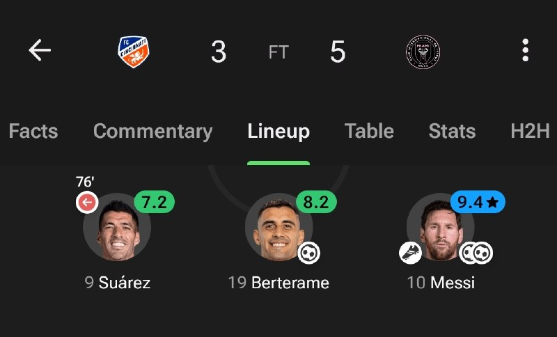

⚽️ مسی دبل کردددد، اینترمیامی بعد گل اول مسی 2-1 عقب افتاده بود و الان با دبل مسی بازیو مساوی کرد 
🟣 مشاهده گل: WATCH @SportBaadNews

## IranIntlTV — post 337104

  

نتایج یک نظرسنجی ملی نشان می‌دهد مارکو روبیو، وزیر خارجه آمریکا، در رقابت برای نامزدی حزب جمهوری‌خواه در انتخابات ریاست‌جمهوری ۲۰۲۸ از جی‌دی ونس پیشی گرفته است. این نظرسنجی را موسسه اطلس‌اینتل در فاصله ۱۳ تا ۱۷ اردیبهشت انجام داده است.

بر اساس این نظرسنجی، روبیو با ۴۵.۴ درصد حمایت در صدر قرار دارد، در حالی که جی‌دی ونس ۲۹.۶ درصد آرا را به دست آورده است. ران دی‌سانتیس نیز با ۱۱.۲ درصد در جایگاه سوم قرار دارد.

این نتایج در مقایسه با پنج ماه پیش تغییر چشمگیری نشان می‌دهد. در آن زمان، ونس با ۴۶.۷ درصد پیشتاز بود و روبیو ۲۲.۶ درصد حمایت داشت. گزارش شده است که افزایش حمایت از روبیو پس از دوره‌ای از فعالیت‌های دیپلماتیک فشرده او، از اوکراین تا کوبا و ایران، رخ داده است.
https://iranintl.com/202605148918

## IranIntlTV — post 337103

  

کریس رایت، وزیر انرژی آمریکا، هشدار داد جمهوری اسلامی «در حدی ترسناک» به ساخت سلاح هسته‌ای نزدیک شده است و تنها چند هفته با غنی‌سازی یک تُن اورانیوم تا سطح تسلیحاتی فاصله دارد.
رایت چهارشنبه شب در نشست کمیته نیروهای مسلح سنا گفت بخشی از ذخایر اورانیوم ایران تا ۶۰ درصد و مقدار زیادی نیز تا ۲۰ درصد غنی‌سازی شده است؛ در حالی که سطح حدود ۹۰ درصد برای سلاح هسته‌ای مناسب است. او تأکید کرد حتی پس از غنی‌سازی، مرحله «تسلیحاتی‌سازی» باقی می‌ماند اما ایران به این مرحله «بسیار نزدیک» شده است.
وزیر انرژی آمریکا راهبرد «عاقلانه» را توقف کامل برنامه هسته‌ای ایران و جلوگیری از هرگونه غنی‌سازی در آینده دانست. دولت ترامپ بارها ذخایر اورانیوم غنی‌شده تهران را از دلایل اصلی اقدام نظامی اعلام کرده است.

https://iranintl.com/202605144976

## IranIntlTV — post 337102

  

ریک اسکات، سناتور جمهوری‌خواه آمریکا، گفت شعار «مرگ بر آمریکا» از سوی جمهوری اسلامی باید جدی گرفته شود و آن را نه یک شعار سیاسی، بلکه «یک وعده» توصیف کرد.
او در شبکه ایکس نوشت تهران نزدیک به نیم قرن این شعار را تکرار کرده و افزود: «وقتی دشمن به شما می‌گوید چه کسی است، باورش کنید. پیروزی برای آمریکا یک گزینه نیست، تنها گزینه است.»

https://iranintl.com/202605145770

## IranIntlTV — post 337101

  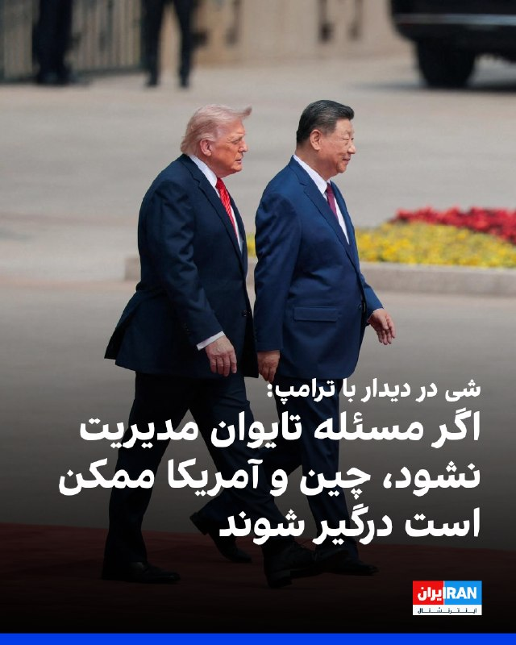

شی جین‌پینگ در دیدار با ترامپ در پکن هشدار داد اگر مسئله تایوان به‌درستی مدیریت نشود، چین و آمریکا ممکن است وارد برخورد یا حتی درگیری شوند و روابط دو کشور به «وضعیتی بسیار خطرناک» کشیده شود.
رییس‌جمهوری چین تایوان را مهم‌ترین موضوع در روابط پکن–واشینگتن خواند. چین این جزیره دموکراتیک را بخشی از قلمرو خود می‌داند، اما تایپه این ادعا را رد می‌کند. پکن همچنین با فروش سلاح آمریکا به تایوان مخالف است.

https://iranintl.com/202605147049

## IranIntlTV — post 337100

  <a href="telegram/content/IranIntlTV_337100_1778736808.mp4" target="_blank">🎬 Download video</a>

سرخط خبرهای پنجشنبه ۲۴ اردیبهشت
@iranintltv

## IranIntlTV — post 337099

  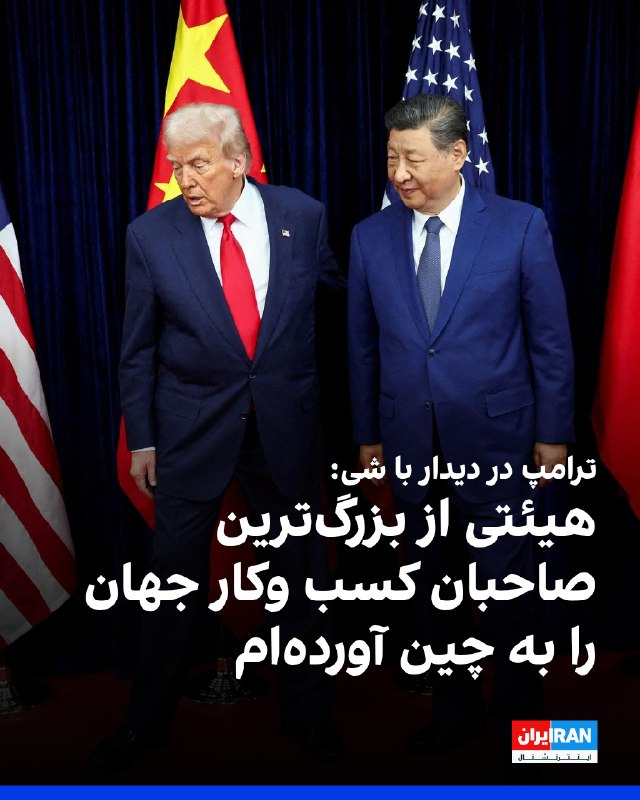

ترامپ در دیدار با شی‌جین پینگ در پکن این رویداد را «یکی بزرگ‌ترین نشست‌های تاریخ» خواند و گفت در این سفر هیئتی ۳۰ نفره از بزرگ‌ترین و بهترین بازرگانان جهان را به همراه خود آورده است.
او گفت: «ما از ۳۰ نفر برتر جهان دعوت کردیم. تک‌تک آنها پاسخ مثبت دادند. من نفر دوم یا سوم هیچ شرکتی را نمی‌خواستم؛ فقط برترین‌ها را می‌خواستم. آنها امروز اینجا هستند تا به شما و به چین ادای احترام کنند و مشتاق تجارت و انجام کسب‌وکار هستند و این روند از طرف ما کاملا متقابل خواهد بود.»
ترامپ گفت: «بسیار مشتاق گفت‌وگوی خود هستم. این گفت‌وگویی بزرگ است. برخی می‌گویند شاید این بزرگ‌ترین نشست تاریخ باشد. آنها هرگز چیزی شبیه به آن را به یاد نمی‌آورند.»

https://iranintl.com/202605149590

## IranIntlTV — post 337098

  

شی جین‌پینگ در دیدار با ترامپ در پکن ابراز امیدواری کرد سال ۲۰۲۶ سالی تاریخی و نقطه‌عطفی برای روابط چین و آمریکا باشد «تا گذشته را ادامه دهد و درها را به روی آینده بگشاید.»
شی گفت همواره معتقد بوده است منافع مشترک میان چین و آمریکا بر اختلافات دو کشور ارجحیت دارد و موفقیت پکن و واشینگتن فرصتی برای یکدیگر است.
شی ثبات روابط چین و آمریکا را برای جهان امر مثبتی دانست و گفت مشتاق است درباره مسائل مهم با ترامپ تبادل نظر کند.

https://iranintl.com/202605141916

## IranIntlTV — post 337097

  

دونالد ترامپ در دیدار با رییس‌جمهوری چین گفت روابط او و شی جین‌پینگ طولانی‌ترین رابطه میان روسای جمهور دو کشور بوده است و این موضوع را «مایه افتخار» دانست. او تاکید کرد روابط دو کشور «بهتر از هر زمان دیگری خواهد شد.»
ترامپ گفت هر زمان مشکلی پیش آمده، دو طرف مستقیما آن را حل کرده‌اند و آینده روابط واشینگتن و پکن «فوق‌العاده» خواهد بود.
ترامپ با تمجید از شی جین‌پینگ او را «رهبر بزرگی» خواند و گفت برای چین و دستاوردهایش احترام زیادی قائل است.
ترامپ این دیدار را «نشستی بزرگ» توصیف کرد و گفت در آمریکا همه درباره آن صحبت می‌کنند.

https://iranintl.com/202605147699

## IranIntlTV — post 337096

  

ترامپ و شی‌جین‌ پینگ صبح پنج‌شنبه به وقت محلی در مراسم استقبال و رژه نظامیان چین در مقابل «تالار بزرگ خلق» در پکن حضور یافتند. در این مراسم روسای جمهوری آمریکا و چین از نیروهای نظامی سان دیدند.
https://iranintl.com/202605146912

## IranIntlTV — post 337095

  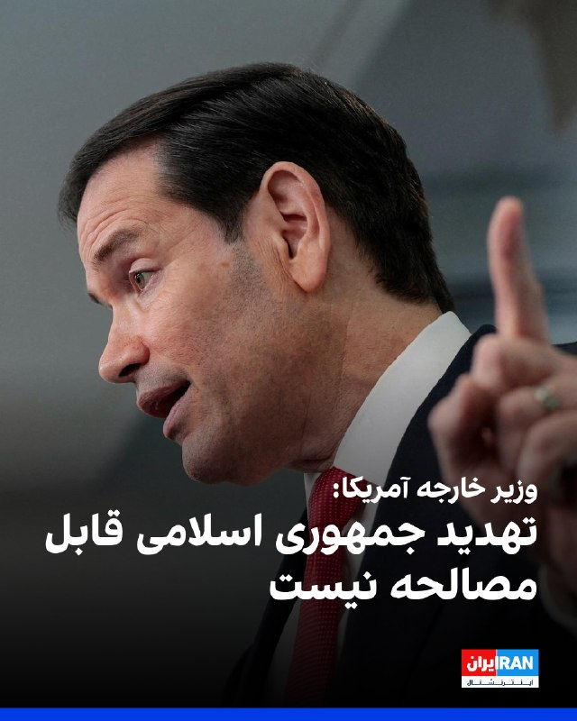

مارکو روبیو، وزیر خارجه آمریکا، به فاکس‌نیوز گفت تهدید جمهوری اسلامی قابل مصالحه نیست، زیرا حکومت روحانیون در پی دستیابی به سلاح هسته‌ای است. روبیو تاکید کرد جهان به رهبری ترامپ اجازه نخواهد داد جمهوری اسلامی به چنین سلاحی دست پیدا کند.
او افزود تهران قصد داشت با انباشت گسترده پهپاد و موشک، نوعی «مصونیت» برای خود ایجاد کند تا هیچ کشوری نتواند به آن حمله کند و سپس به سمت ساخت سلاح هسته‌ای حرکت کند.
روبیو تاکید کرد رئیس‌جمهور ترامپ اجازه نخواهد داد چنین سناریویی محقق شود.

https://iranintl.com/202605146709

## IranIntlTV — post 337094

  

مایک والتز، سفیر آمریکا در سازمان ملل، با اشاره به حمایت ۱۱۳ کشور از پیش‌نویس قطعنامه شورای امنیت در محکومیت اقدامات جمهوری اسلامی، گفت تهران به دلیل اقدامات غیرقانونی خود، از جمله مین‌گذاری و اعمال عوارض بر کشتیرانی در تنگه هرمز، «منزوی» شده است.
والتز در ایکس نوشت کشورهایی از جمله هند، ژاپن و کره جنوبی از این ابتکار حمایت کرده‌اند.

https://iranintl.com/202605145787

## IranIntlTV — post 337093

  

مایک والتز، سفیر آمریکا در سازمان ملل، با اشاره به حمایت ۱۱۳ کشور از پیش‌نویس قطعنامه شورای امنیت در محکومیت اقدامات جمهوری اسلامی، گفت تهران به دلیل اقدامات غیرقانونی خود، از جمله مین‌گذاری و اعمال عوارض بر کشتیرانی در تنگه هرمز، «منزوی» شده است.
والتز در ایکس نوشت کشورهایی از جمله هند، ژاپن و کره جنوبی از این ابتکار حمایت کرده‌اند.

https://iranintl.com/202605145787

## Persian_Trend_Official — post 14087

📍بولتن خبری ۲۴ ساعت اخیر پرشین ترند
🗓 ۲۴ اردیبهشت ۱۴۰۵

گرد آوری = آرشیو تحریریه پرشین ترند

◾️ نیویورک تایمز: ایران ۷۰ درصد از ذخایر موشکی خود را حفظ کرده و به ۳۰ سایت از ۳۳ سایت موشکی در تنگه هرمز دسترسی مجدد یافته است

◾️ رویترز: ایران رویکرد خود را از مسدودسازی هرمز به «کنترل دسترسی» تغییر داده؛ عراق و پاکستان به توافق جداگانه برای عبور نفتکش‌هایشان دست یافته‌اند

◾️خبرگزاری Wsj: عبور و مرور «خاموش» کشتی‌ها در تنگه هرمز ۶۰۰ درصد افزایش یافته

◾️ مجلس سنای آمریکا برای هفتمین بار قطعنامه پایان جنگ با ایران را رد کرد

◾️ پنتاگون: هزینه جنگ با ایران به ۲۹ میلیارد دلار رسید؛ تحلیلگران هشدار می‌دهند رقم نهایی به یک تریلیون دلار خواهد رسید

◾️ وزارت بهداشت ایران: تعداد مجروحان بستری جنگ به زیر ۴۰ نفر رسیده است

◾️سخنگوی وزارت خارجه ایران: آمریکا اهمیت فرصت مذاکره را درک نمی‌کند؛ ارزیابی دقیق‌تری از موضع آمریکا از طریق میانجیان پاکستانی دریافت خواهد شد

◾️سخنگوی کمیسیون امنیت ملی: غنی‌سازی ۹۰ درصدی یکی از گزینه‌های مطرح ایران است

◾️وزیر انرژی آمریکا: ایران به طرز نگران‌کننده‌ به غنی‌سازی درجه تسلیحاتی نزدیک شده و ممکن است چند هفته با آستانه ۹۰ درصد فاصله داشته باشد

◾️نروژ با سفر معاون وزیر خارجه به تهران، عمان و پاکستان در حال آزمودن نقش میانجیگری اروپایی است

◾️روسیه آمادگی خود را برای حمایت از تلاش‌های دیپلماتیک پاکستان در حل تنش خاورمیانه اعلام کرد

◾️ایتالیا اعلام کرد در صورت برقراری آتش‌بس پایدار، دو فروند مین‌روب به تنگه هرمز اعزام خواهد کرد

◾️ترامپ وارد پکن شد؛ ایران محور اصلی مذاکرات با شی جین‌پینگ عنوان شده است

◾️ترامپ: آمریکا برای پایان جنگ با ایران به کمک چین نیاز ندارد؛ «به هر شکل پیروز خواهیم شد»

◾️روبیو: واشنگتن امیدوار است پکن ایران را به عقب‌نشینی از رفتارهایش در منطقه متقاعد کند

◾️روبیو و وانگ یی توافق کردند هیچ کشوری حق دریافت عوارض حمل‌ونقل در تنگه هرمز را ندارد

◾️واشنگتن‌پست: گزارش محرمانه اطلاعاتی آمریکا نشان می‌دهد چین از جنگ ایران بهره راهبردی می‌برد؛ پکن در حین حملات ایران به کشورهای خلیج فارس تسلیحات فروخته است

◾️نیویورک تایمز: شرکت‌های چینی درباره فروش مخفیانه سلاح به ایران از طریق کشورهای ثالث مذاکره کرده‌اند

◾️گزارش‌ها حاکی است ایلان ماسک، تیم کوک، جنسن هوانگ و لری فینک در هیئت همراه ترامپ در سفر به پکن حضور دارند

◾️شهباز شریف از ۳ تا ۶ خرداد به پکن سفر می‌کند؛ میانجیگری میان ایران و آمریکا با مشارکت چین از دستور کار اصلی است

◾️وال استریت ژورنال: رئیس موساد دیوید بارنیا در جریان جنگ حداقل دو بار به‌صورت مخفیانه به امارات سفر کرده است

◾️دفتر نخست‌وزیری اسرائیل: نتانیاهو در میانه جنگ سفری محرمانه به امارات داشته؛ امارات این ادعا را تکذیب کرد

◾️داده‌های پروازی منتشرشده نشان می‌دهد دو هواپیمای شخصی در ۲۶ مارس از تل‌آویو به شهر العین امارات پرواز کرده‌اند

◾️وال استریت ژورنال: امارات فراتر از میانجیگری دیپلماتیک عمل کرده؛ حمله به جزیره لاوان و میزبانی سامانه‌های دفاع هوایی اسرائیل به این کشور نسبت داده شده است

◾️رویترز: جنگنده‌های عربستان سعودی اهداف شبه‌نظامیان وابسته به ایران را در نزدیکی مرز عراق بمباران کردند

◾️رویترز: کویت در دو نوبت حملات موشکی تلافی‌جویانه به مواضع شبه‌نظامیان در جنوب عراق انجام داده است

◾️عراقچی: کویت به‌صورت غیرقانونی به شناور ایرانی حمله و ۴ تبعه ایران را در خلیج فارس بازداشت کرده ؛ایران خواستار آزادی فوری آن‌هاست

◾️ احسان افرشته ۳۳ ساله بامداد چهارشنبه به اتهام همکاری با موساد اعدام شد؛ او پیش از بازگشت به ایران داوطلبانه خود را معرفی کرده بود

◾️ عضو کمیسیون بودجه مجلس: ۳۰ درصد از گرانی‌ها ناشی از جنگ و ۳۵ درصد ناشی از ناکارآمدی دستگاه‌هاست

◾️ شبکهNDTV تصاویر ماهواره‌ای منتشر کرد که حضور هواپیمای ترابری C-130H ایران در پایگاه هوایی نورخان پاکستان را تأیید می‌کند

◾️ وزیر دفاع پاکستان: ترکیه و قطر ممکن است به توافق دفاعی متقابل پاکستان و عربستان سعودی بپیوندند

◾️ رایمتال آلمان تولید انبوه پهپاد FV-014 با برد ۱۰۰ کیلومتر و استقامت ۷۰ دقیقه‌ای را آغاز کرد

◾️پنتاگون به‌طور غیرمنتظره اعزام تیپ رزمی زرهی «بلک‌جک» به لهستان را لغو کرد؛ برخی نیروها در مسیر بودند که دستور توقف صادر شد

◾️بلومبرگ: نزدیک به ۴۰ درصد از تأمین‌کنندگان سازندگان موشک دولتی چین در ۲۰۲۵ به درآمد رکوردی رسیدند

◾️ پوتین به تسلط کامل بر دونباس تا پاییز متمرکز شده و قصد دارد از آن برای درخواست قلمرو بیشتر در مذاکرات آتی بهره ببرد

◾️ ترکیه و ارمنستان آماده‌سازی‌های لازم برای راه‌اندازی تجارت مستقیم را تا ۱۱ مه ۲۰۲۶ تکمیل کردند
📌 @persian_trend_official
پرشین ترند | متفاوت‌ترین کانال نظامی

## Persian_Trend_Official — post 14086

  <a href="telegram/content/Persian_Trend_Official_14086_1778736813.mp4" target="_blank">🎬 Download video</a>

صبحتون بخیر ☕️

📝 Nick
📌 @persian_trend_official
پرشین ترند | متفاوت‌ترین کانال نظامی

---
📅 بروزرسانی: 1405/02/24 05:04
---

## ChizBergerz — post 46371

  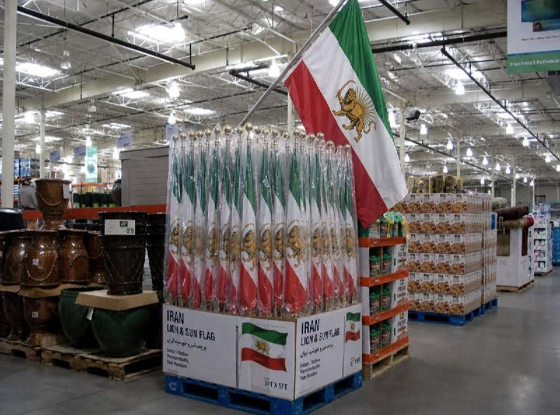

فروشگاه کاستکو لس آنجلس پرچم شیر و خورشید موجود کرده: 
👑

@ChizBergerz

## ChizBergerz — post 46370

  <a href="telegram/content/ChizBergerz_46370_1778722441.mp4" target="_blank">🎬 Download video</a>

بچه ها اسم این بازی عبور مرغ از خیابون  هست ویدئو نگاه کنید خیلی راحت 8 میلیون ازش سود گرفتیم😍

😤اگ توم دوس داری خیلی راحت از بازی های انلاین پول در بیاری حتما عضو کازینو شبانه شو
✅

توی کازینو شبانه بهت اموزش میدیم از بازی های انلاین پول دربیاری👌

کازینو شبانه راهی برای چند برابر کردن سرمایت 🤷‍♂

کسب درامد انلاین با یه ادم حرفه ای یاد بگیر و‌ پول دربیار 
💵
ae23
🎯همین حالا عضو شو و شروع کن👇
https://t.me/+OS-QBvyDO4M2ZGY0
https://t.me/+OS-QBvyDO4M2ZGY0

## KiriMohems — post 47476

🔴تاج: احتمالا معین موزیک رسمی تیم‌ملی رو بخونه! #professor @KiriMohemSport

## SportBaadNews — post 251539

  

⚽️ لیونل مسی بازم برای اینترمیامی گلزنی کرد تا به آمار 908 گل زده تو کریر خودش برسه 🔥🔥 
🟣 گل 908 مسی: WATCH @SportBaadNews

## SportBaadNews — post 251538

  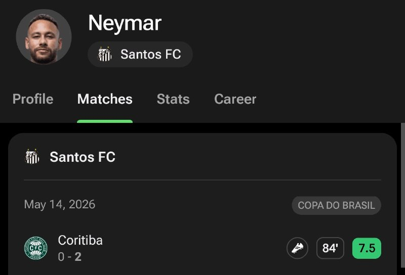

⚽️ عشقتون نیمار هم در ادامه درخشش های در آستانه جام جهانی تو بازی امشب سانتوس یه پاس گل داد و تیمش 2-0 بازیو برد
@SportBaadNews

## SportBaadNews — post 251537

  

⚽️ لیونل مسی بازم برای اینترمیامی گلزنی کرد تا به آمار 908 گل زده تو کریر خودش برسه 🔥🔥

🟣 گل 908 مسی: WATCH
@SportBaadNews

## SportBaadNews — post 251536

  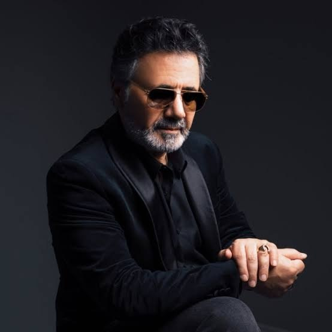

آقا معین کیرشو گرفت رو سر و صورت مهدی تاج و گفت تا وقتی حال دل مردم خوب نباشه من قرار نیست آهنگی بخونم @SportBaadNews

## SportBaadNews — post 251535

  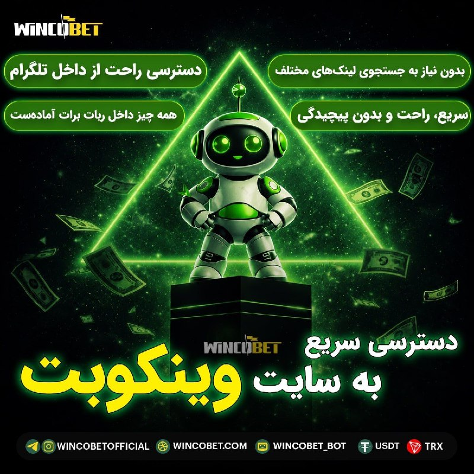

❌ ۹۰٪ کاربرا هنوز اشتباه وارد سایت میشن!
تو جزو اونایی یا میخوای حرفه‌ای عمل کنی؟

✅ ورود سریع به وینکوبت فقط با یک کلیک ساده:

🤖 @Wincobet_bot

🤖 @Wincobet_bot

📌   نه لینک اضافی

📌   نه سردرگمی

📌   نه اتلاف وقت

📌   مستقیم، سریع، بدون دردسر وارد شو!

⏳   دیر بجنبی، از بقیه عقب می‌مونی.

🔗 الان وقتشه مسیر درستو انتخاب کنی:

🤖 @Wincobet_bot

📌برای تحلیل بازی‌ها و آخرین اخبار سایت جوین بدید:

🔵 @Wincobetofficial

## IranIntlTV — post 337092

  

نمایندگی جمهوری اسلامی در سازمان ملل در بیانیه‌ای گفت حمایت بسیاری از کشورها از پیش‌نویس قطعنامه مورد حمایت واشینگتن علیه جمهوری اسلامی تحت «فشار سیاسی، اجبار و حتی تهدید» بوده است و این قطعنامه را «پوشش سیاسی برای اقدامات غیرقانونی» دانست.
این بیانیه افزود: «هیچ میزان از همراهی‌های مشترک تحمیلی، از جمله محاصره دریایی، حمله به کشتی‌های تجاری ایران و توقیف غیرقانونی آنها، و گروگان‌گیری خدمه این کشتی‌ها به شیوه‌ای شبیه به دزدی دریایی، نمی‌تواند اقدامات مداوم و ناقض حقوق بین‌الملل واشینگتن علیه جمهوری اسلامی را مشروعیت ببخشد.»

https://iranintl.com/202605145471

## IranIntlTV — post 337091

  <a href="telegram/content/IranIntlTV_337091_1778722446.mp4" target="_blank">🎬 Download video</a>

ویدیوهای منتشرشده در رسانه‌های حکومتی نشان می‌دهد ماموران جمهوری اسلامی، شامگاه چهارشنبه ۲۳ اردیبهشت، پهپاد شاهد ۱۳۶ را در دو مدل رنگی صورتی و آبی به شهر پیشوا برده‌اند تا مردم برای دیدن پهپادهای رنگی جمع شوند.

## IranIntlTV — post 337082

این‌ها فقط چند روایت کوتاه از دی‌ماه‌اند؛
از روزهایی که خیابان‌های ایران، شاهد خاموش شدن زندگی جوان‌هایی شد که هر کدام در حال ساختن آینده خود بودند.
یکی ورزشکار بود،
یکی تازه زندگی مشترکش را شروع کرده بود،
یکی کار می‌کرد تا روی پای خودش بایستد،
و یکی پدر کودکی بود که حالا باید بدون او بزرگ شود.
مهدی جعفری، سروش (حسین) دانشمندی، جواد زارعی، حامد بیابانی، حسین رضایی، امیرحسین میرزایی، محمدمهدی سیف‌الله‌پور و فاطمه اعزازی کله‌سر
جاویدنامان انقلاب ملی ایرانیان؛
نام‌هایی که در حافظه این سرزمین مانده‌اند، چون زندگی‌شان پیش از آن‌که فرصت کامل شدن پیدا کند، با گلوله متوقف شد.
#جاویدنامان_انقلاب_ملی_ایرانیان

## Persian_Trend_Official — post 14085

🔴 روبیو: امیدواریم چین ایران را به عقب‌نشینی از رفتارهایش متقاعد کند

💢مارکو روبیو، وزیر خارجه آمریکا، اعلام کرد واشینگتن امیدوار است چین نقش فعال‌تری برای متقاعد کردن ایران به عقب‌نشینی از رفتارهایش در منطقه ایفا کند.

▪️روبیو همچنین گفت:

▪️ آمریکا به‌دنبال مدیریت راهبردی روابط پیچیده خود با چین است
▪️ چین بزرگ‌ترین چالش ژئوپلیتیکی و سیاسی پیش‌روی آمریکا محسوب می‌شود
▪️ واشینگتن خواهان جلوگیری از تشدید تنش‌ها در منطقه است

🫆:Tony

📌 @persian_trend_official
پرشین ترند | متفاوت‌ترین کانال نظامی

## Persian_Trend_Official — post 14084

🔴 واشینگتن‌پست: چین از جنگ ایران سود راهبردی می‌برد

💢روزنامه «واشینگتن‌پست» به‌نقل از یک گزارش محرمانه اطلاعاتی آمریکا مدعی شد چین در حال کسب مزایای راهبردی از جنگ ایران است؛ در حالی که آمریکا منابع نظامی و اقتصادی خود را در این درگیری مصرف می‌کند.

▪️بر اساس این ارزیابی:

▪️ چین در جریان حملات ایران، به کشورهای خلیج فارس تسلیحات فروخته است
▪️ پکن به برخی کشورها برای مدیریت بحران انرژی پس از بسته‌شدن تنگه هرمز کمک کرده است
▪️ جنگ باعث کاهش ذخایر موشکی و سامانه‌های دفاعی آمریکا شده و نگرانی‌هایی درباره آمادگی واشینگتن برای درگیری احتمالی بر سر تایوان ایجاد کرده است
▪️ چین عملیات‌های نظامی آمریکا را زیر نظر دارد و از پیام‌های ضدجنگ برای نمایش آمریکا به‌عنوان عامل بی‌ثباتی استفاده می‌کند

💢تحلیلگران معتقدند ادامه این درگیری می‌تواند نفوذ جهانی چین را افزایش داده و جایگاه آمریکا نزد متحدانش را تضعیف کند.

🫆:Tony

📌 @persian_trend_official
پرشین ترند | متفاوت‌ترین کانال نظامی

## Persian_Trend_Official — post 14083

  

🔴 ترامپ: آمریکا برای پایان جنگ با ایران به کمک چین نیاز ندارد

💢دونالد ترامپ اعلام کرد آمریکا برای پایان دادن به جنگ با ایران و کاهش تنش‌ها در تنگه هرمز، نیازی به کمک چین ندارد.

▪️ «فکر نمی‌کنم برای موضوع ایران به کمکی نیاز داشته باشیم»
▪️ «به هر شکلی پیروز خواهیم شد؛ چه از راه صلح و چه غیر از آن»

💢گزارش‌ها حاکی است موضوع جنگ ایران در دیدار ترامپ و شی جین‌پینگ طی دو روز آینده مطرح خواهد شد، اما ترامپ نقش پکن در پایان درگیری را کم‌اهمیت توصیف کرده است.

در همین حال، رسانه‌ها گزارش می‌دهند در ایران نیز دیدار ترامپ و رئیس‌جمهور چین تهدیدی برای روابط تهران و پکن تلقی نمی‌شود.

بر اساس این گزارش:

▪️ مقام‌ها و تحلیلگران ایرانی روابط دو کشور را «راهبردی و مستقل» توصیف می‌کنند
▪️ به توافق ۲۵ ساله ایران و چین که در سال ۲۰۲۰ امضا شد اشاره شده است
▪️ این توافق حوزه‌های سیاسی، اقتصادی و فرهنگی را شامل می‌شود

🫆:Tony

📌 @persian_trend_official
پرشین ترند | متفاوت‌ترین کانال نظامی

## Persian_Trend_Official — post 14082

  <a href="telegram/content/Persian_Trend_Official_14082_1778722448.webm" target="_blank">🎬 Download video</a>

🔴دیوار نوشته‌ای در تهران؛

💢ورود سگ‌ها و آمریکایی‌ها به تنگهٔ هرمز ممنوع...🚫

🫆:Tony

📌 @persian_trend_official
پرشین ترند | متفاوت‌ترین کانال نظامی

---
📅 بروزرسانی: 1405/02/24 03:07
---

## rodast_omiddana — post 71332

  <a href="telegram/content/rodast_omiddana_71332_1778715444.webm" target="_blank">🎬 Download video</a>

🚨 درود بر شما
الا ساعت ۲:۳۶ دقیقه بامداد هستش ک بهتون پیام میدم

تو اسمان تهران از جنوب به شمال
پرواز هایی ک فکر میکنم جنگنده هستن  با سرعت بالا در ارتفاعات بالا
در حال حرکت هستن و از بالای کوه البرز خارج میشن

متاسفانه با گوشی نمیتونم فیلم بگیرم
چون واضح نیست
ولی همین الان هرکسی به اسمان نگاه کنه
با چشم میبینه
حدودا هر یک دقیقه یدونه با سرعت رد میشه
تا الان ۸ عدد پراوز رو دیدم

این صحنه هارو
زمان جنگ
جنگنده های اسرائیلی رو میدیدم ک به این صورت عملیات انجام میدادن

## rodast_omiddana — post 71331

  <a href="https://t.me/rodast_omiddana/71331" target="_blank">📎 Download file</a>

🔈حجم فشرده_ترامپ به پکن نرسیده، رژیم طرح چین را قبول کرد_نام حمله جدید آمریکا به رژیم، چکش سنگین میباشد

## rodast_omiddana — post 71329

  <a href="https://t.me/rodast_omiddana/71329" target="_blank">📎 Download file</a>

🔈 ترامپ به پکن نرسیده، رژیم طرح چین را قبول کرد_نام حمله جدید آمریکا به رژیم، چکش سنگین میباشد

## rodast_omiddana — post 71328

▶️ کیفیت 360_ترامپ به پکن نرسیده، رژیم طرح چین را قبول کرد_نام حمله جدید آمریکا به رژیم، چکش سنگین میباشد

## rodast_omiddana — post 71327

▶️ کیفیت 144_ترامپ به پکن نرسیده، رژیم طرح چین را قبول کرد_نام حمله جدید آمریکا به رژیم، چکش سنگین میباشد

## rodast_omiddana — post 71326

  <a href="telegram/content/rodast_omiddana_71326_1778715445.mp4" target="_blank">🎬 Download video</a>

🚨 سواستفاده مرتضی نجفی از کارت شاهزاده و جاویدنام مجیدرضا رهنورد

## KiriMohems — post 47475

  

📰 رویترز: آمریکا و چین توافق کردن که هیچ کشوری نباید اجازه داشته باشه عوارض حمل و نقل در تنگه هرمز رو دریافت کنه و بقیه رو تیغ بزنه.

#Helsinki
@KiriMohems

## KiriMohems — post 47474

  <a href="telegram/content/KiriMohems_47474_1778715447.mp4" target="_blank">🎬 Download video</a>

😤میخوای از پیش بینی فوتبال و شرط بندی پول دربیاری ؟!

⚠️پس همین الان وارد کانال عمو بت باز شو
چون بهت اموزش میده چطور پول دربیاری❗️

اینجا میتونی روزانه درامد داشته باشی و سرمایت چندبرابر کنی پس از دستش نده و عضو شو امار سوداش چک‌کن😍

💵عمو قدیمی کاره و خاک این کارو‌خورده کنارش باش و حرفه ای پول دربیار💵
A23🅰
👍ادرس عضویت کانال vip:
https://t.me/+8LLMpXUfhW43ZjVk
https://t.me/+8LLMpXUfhW43ZjVk

## KiriMohems — post 47473

  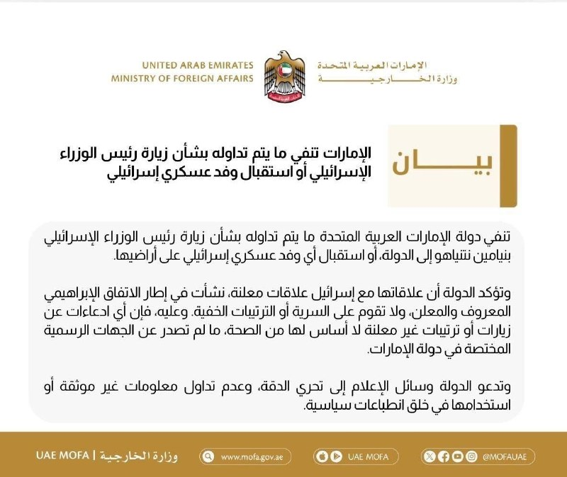

🔴امارات : کصشعر تفت ندید ، نتانیاهو چه گوهیه که بخواد بیاد تو مملکت ما؟؟ اصلا اینو و رئیس موساد وسط جنگ با ایران نیومدن تو امارات

#Helsinki
@KiriMohems

## SportBaadNews — post 251534

  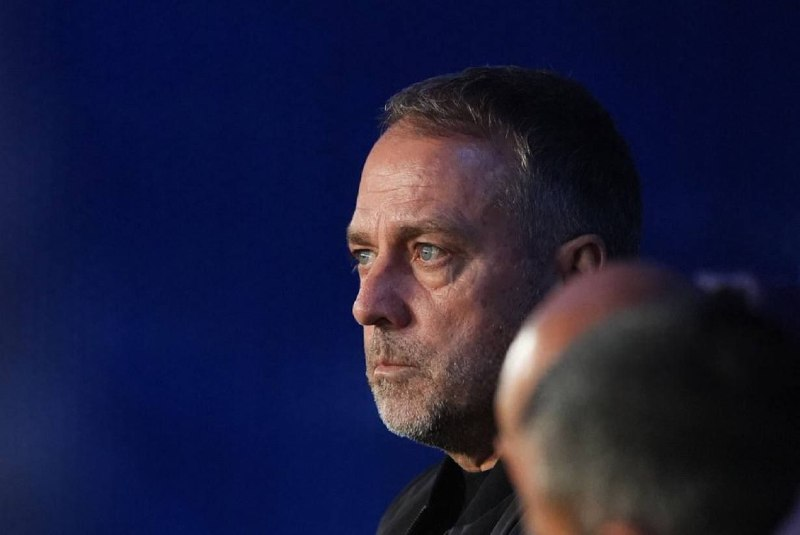

⚽️
✖️| با باخت امشب بارسلونا مقابل آلاوز فرصت قهرمانی با 100 امتیاز از دست فلیک و شاگردان پرید @SportBaadNews

## SportBaadNews — post 251532

  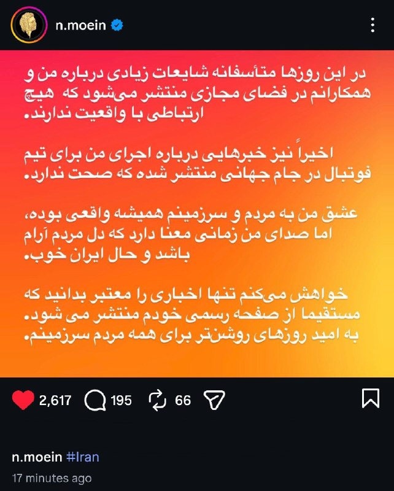

مهدی تاج: معین قراره برای تیم ملی آهنگ بخونه @SportBaadNews

## SportBaadNews — post 251531

  <a href="telegram/content/SportBaadNews_251531_1778715450.mp4" target="_blank">🎬 Download video</a>

⚽️
🏆| اینترمیلان هم امشب با برد 2-0 مقابل دشمن چند دهه گذشته خودش یعنی لاتزیو با گل های تورام و لائوتارو مارتنیز تونست بعد اینکه قهرمان اسکودتو شد قهرمانی کوپا ایتالیا رو هم از آن خودش کنه @SportBaadNews

## SportBaadNews — post 251530

  

⚽️
✖️| با باخت امشب بارسلونا مقابل آلاوز فرصت قهرمانی با 100 امتیاز از دست فلیک و شاگردان پرید @SportBaadNews

## SportBaadNews — post 251529

  

⚽️
⚪️ خبرنگار خطاب به بنزما: کریم، خیلی جات تو رئال خالیه و دلتنگتیم.

⚽️
🔵 بنزما: منم همینطور، منم همینطور
@SportBaadNews

## IranIntlTV — post 337081

  <a href="telegram/content/IranIntlTV_337081_1778715452.mp4" target="_blank">🎬 Download video</a>

رسانه‌های جمهوری اسلامی از برگزاری رزمایش پنج‌روزه سپاه تهران بزرگ با محوریت مقابله با عملیات «هلی‌برن» نیروهای متخاصم خبر دادند.
در تصاویر منتشرشده، نیروهای پیاده با سلاح‌های سبک، نیمه‌سنگین و پهپاد به اهداف فرضی، همچون تصویر پارچه‌ای یک بالگرد، شلیک می‌کنند.
این رزمایش پس از ورود بالگردهای بلک‌هاوک و هواپیمای سوخت‌رسان آمریکا به خاک ایران، در جریان عملیات جست‌وجوی خلبان اف-۱۵، برگزار شده است.
@iranintltv

## IranIntlTV — post 337080

  <a href="telegram/content/IranIntlTV_337080_1778715453.mp4" target="_blank">🎬 Download video</a>

موج تازهٔ اعدام جوانان نخبه؛
احسان افرشته با اتهام «جاسوسی» اعدام شد

جمهوری اسلامی بامداد چهارشنبه حکم اعدام احسان افرشته، زندانی سیاسی متهم به «جاسوسی برای اسرائیل»، را اجرا کرد؛ پرونده‌ای که مانند بسیاری از پرونده‌های امنیتی مشابه، بدون انتشار سند و مدرک مستقل به پایان رسید.

نهادهای حقوق بشری پیش‌تر هشدار داده بودند که اتهامات مطرح‌شده علیه او بر پایهٔ اعترافات اجباری و تحت فشار مطرح شده است.

کامبیز حسینی در «برنامه» به این موضوع می‌پردازد.

«یک ایران صدای شما را می‌شنود»
دوشنبه تا پنجشنبه ۱۱ شب تهران
از تلویزیون ایران اینترنشنال

تماشای نسخه کامل این قسمت از «برنامه» در یوتیوب:
https://youtu.be/HsShW7razys
@iranintltv

## IranIntlTV — post 337079

  <a href="telegram/content/IranIntlTV_337079_1778715454.mp4" target="_blank">🎬 Download video</a>

محمد از آلمان: کسی که پول دارو ندارد، آب ندارد، برق ندارد، او هم اعدامی جمهوری اسلامی است

«یک ایران صدای شما را می‌شنود»
دوشنبه تا پنجشنبه ۱۱ شب تهران
از تلویزیون ایران اینترنشنال

تماشای نسخه کامل این قسمت از «برنامه» در یوتیوب:
https://youtu.be/HsShW7razys
@iranintltv

## IranIntlTV — post 337078

  <a href="telegram/content/IranIntlTV_337078_1778715456.mp4" target="_blank">🎬 Download video</a>

حمید از بندرعباس: می‌روم خرید، ولی فقط می‌توانم به اندازهٔ جیبم خرید کنم، نه نیازم

«یک ایران صدای شما را می‌شنود»
دوشنبه تا پنجشنبه ۱۱ شب تهران
از تلویزیون ایران اینترنشنال

تماشای نسخه کامل این قسمت از «برنامه» در یوتیوب:
https://youtu.be/HsShW7razys
@iranintltv

## IranIntlTV — post 337077

  <a href="telegram/content/IranIntlTV_337077_1778715457.mp4" target="_blank">🎬 Download video</a>

فریبرز از خوزستان: مردمی که اینترنت ندارند، چه کار کنند؟ ایرانی‌های خارج از کشور کمک کنند

«یک ایران صدای شما را می‌شنود»
دوشنبه تا پنجشنبه ۱۱ شب تهران
از تلویزیون ایران اینترنشنال

تماشای نسخه کامل این قسمت از «برنامه» در یوتیوب:
https://youtu.be/HsShW7razys
@iranintltv

## IranIntlTV — post 337076

  <a href="https://t.me/IranintlTV/337076" target="_blank">📎 Download file</a>

🎧نسخه صوتی سیاست با مراد ویسی: ایران کارت بازی دیگران
@iranintlTV

## IranIntlTV — post 337075

  <a href="telegram/content/IranIntlTV_337075_1778715459.mp4" target="_blank">🎬 Download video</a>

فرامرز از استکهلم: به ترامپ توجه نکنید؛ او در حال جنگ سرد است؛ما باید مسیر خودمان را برویم

«یک ایران صدای شما را می‌شنود»
دوشنبه تا پنجشنبه ۱۱ شب تهران
از تلویزیون ایران اینترنشنال

تماشای نسخه کامل این قسمت از «برنامه» در یوتیوب:
https://youtu.be/HsShW7razys
@iranintltv

## IranIntlTV — post 337074

  <a href="telegram/content/IranIntlTV_337074_1778715461.mp4" target="_blank">🎬 Download video</a>

احمد از انگلستان: مردم ایران صبرشان استراتژیک و تاریخی است و می‌دانند کی باید به آب بزنند

«یک ایران صدای شما را می‌شنود»
دوشنبه تا پنجشنبه ۱۱ شب تهران
از تلویزیون ایران اینترنشنال

تماشای نسخه کامل این قسمت از «برنامه» در یوتیوب:
https://youtu.be/HsShW7razys
@iranintltv

## IranIntlTV — post 337073

  

نیویورک‌تایمز به نقل از مقام‌های آمریکایی گزارش داد شرکت‌های چینی با جمهوری اسلامی درباره فروش سلاح در حال گفت‌وگو بوده‌اند و قصد داشته‌اند این تسلیحات را از طریق کشورهای دیگر ارسال کنند تا منشا کمک نظامی پنهان بماند.
مقام‌های آمریکایی گفتند دست‌کم یکی از کشورهای ثالث در آفریقا قرار دارد، اما مشخص نیست آیا محموله‌ای به آن کشور رسیده است یا نه.
مقام‌هایی که در جریان این اطلاعات قرار گرفته‌اند، درباره اینکه آیا سلاح‌ها پیش‌تر به کشورهای ثالث ارسال شده‌اند یا نه، به جمع‌بندی‌های متفاوتی رسیده‌اند. با این حال، از زمان آغاز جنگ کنونی علیه جمهوری اسلامی، به نظر نمی‌رسد هیچ سلاح چینی در میدان نبرد علیه نیروهای آمریکایی یا اسرائیلی استفاده شده باشد.
هنوز مشخص نیست چه تعداد سلاح منتقل شده یا مقام‌های چینی تا چه اندازه این فروش‌ها را تایید کرده‌اند.

https://iranintl.com/202605134264

## IranIntlTV — post 337072

  <a href="telegram/content/IranIntlTV_337072_1778715464.mp4" target="_blank">🎬 Download video</a>

دفتر نخست‌وزیری اسرائیل اعلام کرد بنیامین نتانیاهو در جریان جنگ علیه جمهوری اسلامی به‌صورت محرمانه به امارات سفر و با محمد بن زاید دیدار کرده است. رادیو ملی اسرائیل نیز گزارش داد این نخستین بار نیست که نتانیاهو به امارات رفته، اما برای نخستین‌بار است که این موضوع به‌صورت رسمی تایید می‌شود.

گفت‌وگو با بن سبطی، پژوهشگر ایران و اسرائیل
@iranintltv

## IranIntlTV — post 337071

  <a href="telegram/content/IranIntlTV_337071_1778715466.mp4" target="_blank">🎬 Download video</a>

در پی موج جدید بیکاری در ایران در سایه جنگ، سرکوب و قطعی اینترنت، آمار رسمی از بیش از ۲۰۰ هزار متقاضی دریافت بیمه بیکاری خبر می‌دهد. مسعود پزشکیان پیش‌تر در واکنش به تورم و گرانی گفته بود کشور به‌شدت به صرفه‌جویی نیاز دارد.

گفت‌وگو با جمشید اسدی، اقتصاددان
@iranintltv

## IranIntlTV — post 337070

  <a href="telegram/content/IranIntlTV_337070_1778715468.mp4" target="_blank">🎬 Download video</a>

گزارش‌ها حاکی است در کمتر از یک ماه، دست‌کم ۱۲ هسته مرتبط با تهران در کویت، بحرین، امارات و قطر شناسایی و متلاشی شده‌اند.
مقام‌های امنیتی این کشورها می‌گویند ده‌ها نفر به اتهام جاسوسی، پول‌شویی، طراحی ترور و همکاری با سپاه و حزب‌الله بازداشت شده‌اند.

گزارش نیلوفر منصوری، خبرنگار ایران‌اینترنشنال
@iranintltv

---
📅 بروزرسانی: 1405/02/24 01:55
---

## ChizBergerz — post 46369

  

عمه جنده ام، گلشیفته

@ChizBergerz

## ChizBergerz — post 46367

وضعیت پشم ریزون قیمت ریجستری گوشی‌های آیفون و سامسونگ:

+ کیرم تو ناموس زنده و مرده هرچی آخونده با این وضعیتی که ساختن!
@ChizBergerz

## rodast_omiddana — post 71325

  <a href="telegram/content/rodast_omiddana_71325_1778711152.webm" target="_blank">🎬 Download video</a>

🚨
🚨 رویترز:
"ایالات متحده و چین توافق کردند که هیچ کشوری نباید اجازه داشته باشد عوارض حمل و نقل در تنگه هرمز را دریافت کند."

چین داره جمهوری اسلامی را مثل پوست خیار میفروشه..
آماده جنگ بزرگ باشید..

## KiriMohems — post 47472

  <a href="telegram/content/KiriMohems_47472_1778711152.mp4" target="_blank">🎬 Download video</a>

🔴تاج: احتمالا معین موزیک رسمی تیم‌ملی رو بخونه!

#professor
@KiriMohemSport

## SportBaadNews — post 251528

  <a href="telegram/content/SportBaadNews_251528_1778711154.mp4" target="_blank">🎬 Download video</a>

⚽️
⚽️| پاریس امشب با برد 2-0 تو بازی مقابل لنس برای چهاردهمین بار قهرمان لیگ یک فرانسه شد @SportBaadNews

## SportBaadNews — post 251526

  

⚽️
🏆| اینترمیلان هم امشب با برد 2-0 مقابل دشمن چند دهه گذشته خودش یعنی لاتزیو با گل های تورام و لائوتارو مارتنیز تونست بعد اینکه قهرمان اسکودتو شد قهرمانی کوپا ایتالیا رو هم از آن خودش کنه
@SportBaadNews

## SportBaadNews — post 251525

  

⚽️
⚽️| پاریس امشب با برد 2-0 تو بازی مقابل لنس برای چهاردهمین بار قهرمان لیگ یک فرانسه شد
@SportBaadNews

## SportBaadNews — post 251524

  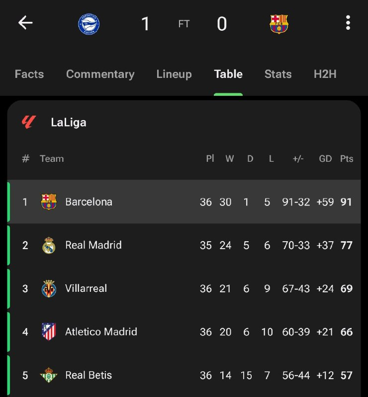

⚽️
⚽️ بارسلونا با نتیجه 1-0 به آلاوز باخت @SportBaadNews

## SportBaadNews — post 251523

  

⚽️
⚽️| استیون جرارد: دلم میخواست و امیدوار بودم که ترنت ما رو ترک نکنه. میفهمید و احترام میذارید که هر بازیکنی حرفه‌ی خودش رو داره و میتونه تصمیم خودش رو بگیره، ولی واقعاً جای یه بازیکن مثل ترنت خیلی سخته پر بشه چون سطحش جهانیه. امیدوارم یه روز برگرده به آنفیلد.
@SportBaadNews

## SportBaadNews — post 251522

  <a href="telegram/content/SportBaadNews_251522_1778711159.mp4" target="_blank">🎬 Download video</a>

مهدی تاج: معین قراره برای تیم ملی آهنگ بخونه
@SportBaadNews

## SportBaadNews — post 251521

  

❌ ۹۰٪ کاربرا هنوز اشتباه وارد سایت میشن!
تو جزو اونایی یا میخوای حرفه‌ای عمل کنی؟

✅ ورود سریع به وینکوبت فقط با یک کلیک ساده:

🤖 @Wincobet_bot

🤖 @Wincobet_bot

📌   نه لینک اضافی

📌   نه سردرگمی

📌   نه اتلاف وقت

📌   مستقیم، سریع، بدون دردسر وارد شو!

⏳   دیر بجنبی، از بقیه عقب می‌مونی.

🔗 الان وقتشه مسیر درستو انتخاب کنی:

🤖 @Wincobet_bot

📌برای تحلیل بازی‌ها و آخرین اخبار سایت جوین بدید:

🔵 @Wincobetofficial

## SportBaadNews — post 251520

  <a href="telegram/content/SportBaadNews_251520_1778711161.webm" target="_blank">🎬 Download video</a>

🚨
⚽️
⚽️ پرز: اگه بارسلونا میخواد از من شکایت کنه، بکنه. اصلاً شکایت کنن ببینم چی میشه. دو دهه بهشون پول دادن، حالا تو دادگاه دارن چیزایی میگن که با حقیقت جور درنمیاد. 
🔴 هفته بعد همه‌چیز مسئله نگریرا رو با مدارکِ همه این سال‌ها ارائه میدیم!! @SportBaadNews

## SportBaadNews — post 251519

⚽️
⚽️ بارسلونا با نتیجه 1-0 به آلاوز باخت
@SportBaadNews

## IranIntlTV — post 337069

  

مارکو روبیو، وزیر خارجه آمریکا، در گفت‌وگو با فاکس‌نیوز با تاکید بر اینکه حل بحران خاورمیانه به نفع چین است، ابراز امیدواری کرد واشینگتن بتواند پکن را متقاعد کند نقش فعال‌تری در ترغیب جمهوری اسلامی برای کنار گذاشتن اقداماتش در خلیج فارس ایفا کند.
او گفت: «چینی‌ها کشتی‌هایی دارند که در خلیج فارس گیر افتاده‌اند. یک محموله باری چینی آخر هفته هدف قرار گرفت. مطمئنم جمهوری اسلامی عمدا این کار را نکرد، اما این اتفاق افتاد. به همین دلیل این کشتی‌های چینی آنجا گیر افتاده‌اند.»
روبیو افزود: «این وضعیت منبع بزرگی از بی‌ثباتی است. بیش از هر نقطه دیگر جهان، آسیا را تهدید به بی‌ثباتی می‌کند، زیرا به شدت به این تنگه‌ها برای انرژی وابسته است.»

https://iranintl.com/202605139871

## IranIntlTV — post 337068

  <a href="telegram/content/IranIntlTV_337068_1778711162.mp4" target="_blank">🎬 Download video</a>

مراد ویسی، تحلیل‌گر ارشد ایران‌اینترنشنال، گفت: «تشکیل ستاد ساماندهی فضای مجازی در عمل یعنی برنامه‌ریزی برای قطع سازمان یافته اینترنت و محدود کردن دسترسی ۹۰ میلیون ایرانی، در حالی که اینترنت ویژه فقط در اختیار حامیان حکومت قرار می‌گیرد. اصطلاحاتی مثل اینترنت پرو، اینترنت طبقاتی، سیم‌کارت سفید یا ناپایداری ارتباط، همگی نام‌های متفاوتی برای همان قطع و کنترل اینترنت هستند.»
@iranintltv

## IranIntlTV — post 337067

  <a href="telegram/content/IranIntlTV_337067_1778711163.mp4" target="_blank">🎬 Download video</a>

مراد ویسی، تحلیل‌گر ارشد ایران‌اینترنشنال، گفت: «مجموع تحولات اخیر نشان می‌دهد جمهوری اسلامی به رغم برخی تحرکات تاکتیکی در خلیج فارس با یک شکست راهبردی و امنیتی روبه‌رو شده؛ چون حملاتش باعث شده بسیاری از همسایگان جنوبی به دشمنان فعالش تبدیل شوند. نتیجه این سیاست‌ها، نزدیک‌تر شدن کشورهایی مثل امارات به اسرائیل و باز شدن پای اسرائیل و ناتو به معادلات امنیتی منطقه بوده است.»
@iranintltv

## IranIntlTV — post 337066

  <a href="https://t.me/IranintlTV/337066" target="_blank">📎 Download file</a>

🎧نسخه صوتی برنامه با کامبیز حسینی؛ خشم انباشتهٔ مردم کی فوران خواهد کرد؟
@iranintlTV

## IranIntlTV — post 337065

  <a href="telegram/content/IranIntlTV_337065_1778711165.mp4" target="_blank">🎬 Download video</a>

گمان می‌رود پرونده جنگ با ایران، یکی از محوری‌ترین موضوعات گفتگو میان دونالد ترامپ و شی جین‌پینگ باشد. بنا بر بعضی گزارش‌ها، احتمال می‌رود واشینگتن و پکن، تلاش تازه و مشترکی برای وادار کردن تهران به عقب‌نشینی و پذیرش شروط جدید کنند.
@iranintltv

## IranIntlTV — post 337064

  <a href="telegram/content/IranIntlTV_337064_1778711166.mp4" target="_blank">🎬 Download video</a>

مراد ویسی، تحلیل‌گر ارشد ایران‌اینترنشنال، گفت: « جمهوری اسلامی، ایران را به کارت بازی دیگران تبدیل کرده است. خیلی از تحلیل‌گران در انتظار تعیین سرنوشت ایران در دیدار ترامپ و رهبر چین هستند. سرنوشت ایران به غزه و لبنان و به جنگ اوکراین و به روابط روسیه و آمریکا و حالا روابط آمریکا و چین گره خورده است. این بلایی است که جمهوری اسلامی بر سر ایران آورده است.»
@iranintltv

## IranIntlTV — post 337063

  <a href="telegram/content/IranIntlTV_337063_1778711168.mp4" target="_blank">🎬 Download video</a>

کی‌یر استارمر، نخست‌وزیر بریتانیا، در مراسم بازگشایی رسمی پارلمان گفت سخنرانی پادشاه رویکردی امیدوارکننده‌تر به تحولات ایران و جنگ در دو جبهه ارائه می‌دهد و آن را فرصتی برای تغییر وضع موجود و ساختن بریتانیایی قوی‌تر و عادلانه‌تر دانست؛ مسیری که به گفته او باید مبنای آینده کشور قرار گیرد.

چارلز سوم، پادشاه بریتانیا، روز چهارشنبه ۲۳ اردیبهشت در این مراسم سخنرانی کرد. این مراسم به‌منزله آغاز رسمی فعالیت‌های دوره جدید پارلمان بریتانیا است.
@iranintltv

## IranIntlTV — post 337062

  <a href="telegram/content/IranIntlTV_337062_1778711169.mp4" target="_blank">🎬 Download video</a>

بلومبرگ گزارش داد بارگیری نفت از پایانه اصلی صادرات نفت ایران در جزیره خارک متوقف شده است.

بر اساس این گزارش، ظرفیت مخازن ذخیره نفت نیز در حال پر شدن است و در صورت تکمیل ظرفیت، ایران ممکن است ناچار به کاهش تولید نفت شود.

گفت‌وگو با ایمان ناصری، مشاور بازار نفت
@iranintltv

## IranIntlTV — post 337061

  <a href="telegram/content/IranIntlTV_337061_1778711171.mp4" target="_blank">🎬 Download video</a>

تجمعات حکومتی شبانه، بلای جان نظام و مجتبی

چشم‌انداز با مهدی مهدوی‌آزاد

نسخه کامل این برنامه در یوتیوب:
https://youtu.be/SepDBES4ITI
@iranintltv

## IranIntlTV — post 337060

  <a href="telegram/content/IranIntlTV_337060_1778711173.mp4" target="_blank">🎬 Download video</a>

تجمعات حکومتی شبانه، بلای جان نظام و مجتبی

چشم‌انداز با مهدی مهدوی‌آزاد

نسخه کامل این برنامه در یوتیوب:
https://youtu.be/SepDBES4ITI
@iranintltv

## IranIntlTV — post 337059

  <a href="https://t.me/IranintlTV/337059" target="_blank">📎 Download file</a>

🎧نسخه صوتی چشم‌انداز: تجمعات حکومتی شبانه، بلای جان نظام و مجتبی
@iranintlTV

## Persian_Trend_Official — post 14081

  <a href="telegram/content/Persian_Trend_Official_14081_1778711175.mp4" target="_blank">🎬 Download video</a>

شبتون بخیر ❤️🔥

📝 Nick
📌 @persian_trend_official
پرشین ترند | متفاوت‌ترین کانال نظامی

## Persian_Trend_Official — post 14080

  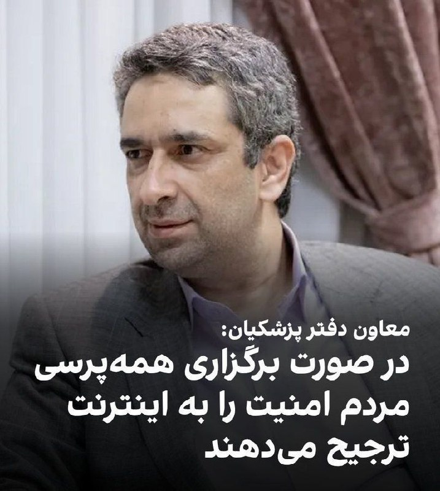

به این وضعیت اقتصادی می‌گویید امنیت؟ امنیت کجاست وقتی یک پدر شرمنده زن و بچه‌اش است چون سفره‌اش خالی مانده و حقوقش حتی کفاف اجاره خانه را نمی‌دهد؟

امنیت کجاست وقتی جوانی نمی‌تواند یک متر زمین بخرد و رؤیاهایش زیر بار تورم و فساد دفن شده است؟ امنیت کجاست وقتی جوانی عمر و آرزوهایش را در صف مهاجرت یا بیکاری از دست می‌دهد؟

امنیت اجتماعی بدون رفاه پایدار وجود ندارد. جامعه‌ای که نرخ بیکاری جوانانش بالاست تورم افسارگسیخته دارد و سرمایه انسانی‌اش مهاجرت می‌کند در واقع در وضعیت ناامنی ساختاری است. شما نام این فروپاشی را امنیت گذاشته‌اید. این تحریف واژه‌هاست واژه‌ها را از معنا تهی کرده‌اید تا واقعیت تلخ را بپوشانید.

امنیت واقعی همان چیزی است که مردم در همه‌پرسی انتخاب خواهند کرد آزادی، اینترنت، اقتصاد سالم، و زندگی انسانی. امنیت یعنی امید به آینده نه ترس از فردا.

امنیتی که شما از آن دم می‌زنید، در واقع پوششی است برای فقر، سرکوب، و بی‌عدالتی. امنیت یعنی آرامش روانی، یعنی آینده‌ای قابل پیش‌بینی یعنی فرصت رشد و شکوفایی. اما آنچه امروز مردم ایران تجربه می‌کنند چیزی جز اضطراب فروپاشی اقتصادی و نابودی امید نیست.

📝 Nick

📌 @persian_trend_official
پرشین ترند | متفاوت‌ترین کانال نظامی

## Persian_Trend_Official — post 14079

⭕️ بنیامین نتانیاهو: من می‌خواهم دانش‌آموزان اسرائیلی در استفاده از ChatGPT، Claude و پیشرفته‌ترین ابزارهای هوش مصنوعی جهان - و حتی قبل از فارغ‌التحصیلی از دبیرستان - بهترین باشند. 📝 Nick 📌 @persian_trend_official پرشین ترند | متفاوت‌ترین کانال نظامی

## Persian_Trend_Official — post 14078

  <a href="telegram/content/Persian_Trend_Official_14078_1778711178.mp4" target="_blank">🎬 Download video</a>

⭕️ بنیامین نتانیاهو:

من می‌خواهم دانش‌آموزان اسرائیلی در استفاده از ChatGPT، Claude و پیشرفته‌ترین ابزارهای هوش مصنوعی جهان - و حتی قبل از فارغ‌التحصیلی از دبیرستان - بهترین باشند.

📝 Nick

📌 @persian_trend_official
پرشین ترند | متفاوت‌ترین کانال نظامی

---
📅 بروزرسانی: 1405/02/24 00:33
---

## rodast_omiddana — post 71324

🎬
🔴
🔴
🔴 پخش زنده
*ترامپ به پکن نرسیده، رژیم طرح چین را قبول کرد
*نام حمله جدید آمریکا به رژیم، چکش سنگین میباشد
لینک یوتیوب:
https://www.youtube.com/watch?v=7O9q8w35s2U

## KiriMohems — post 47471

خبرنگار سی‌بی‌اس مدعی شد: پیشرفت‌هایی در مذاکرات با ایران دیده می‌شود

پیشرفت تو کون دروغ گو

#Berlin
@Kirimohems

## KiriMohems — post 47470

  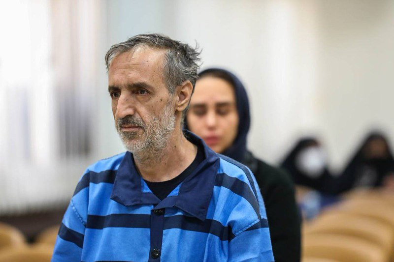

🔴جمهوری اسلامی ، صبح امروز #محمد_عباسی معترض ۶۵ ساله اهل بروجرد لرستان رو با اتهام قتل یه مأمور نیروی انتظامی تو اعتراضات شهر ملارد اعدام کرد و دخترش #فاطمه_عباسی ۲۵ ساله هم با اتهام شرکت تو اعتراضات و دست داشتن تو قتل این مأمور، به ۲۵ سال حبس محکوم شد.

#Helsinki
@KiriMohems

## KiriMohems — post 47469

  <a href="telegram/content/KiriMohems_47469_1778706224.mp4" target="_blank">🎬 Download video</a>

بدرقه تیم ملی فوتبال جمهوری اسلامی برای حضور به جام جهانی 2026 آمریکا، با شعار مرگ بر آمریکا🤣

@KiriMohemSport

## KiriMohems — post 47468

نیویورک تایمز: شرکت‌ های چینی به دنبال فروش سلاح به جمهوری اسلامی هستن و قصد دارن اونها رو از طریق کشورهای دیگر ارسال کنن تا منبع خودشون لو نره.

#professor
@KiriMohems

## KiriMohems — post 47467

🔴فوری/سوپراپلیکیشن ایتا اعلام کرد امکان ارسال سوپر کم حجم تا ۲۰ مگابایت مجدداً برای همه کاربران فراهم شده است.

#professor
@KiriMohems

## SportBaadNews — post 251518

بگید رئال بیاد این آلاوز خیلی قویه

## SportBaadNews — post 251517

بارسا گل اول رو خورد از آلاوز

## SportBaadNews — post 251516

  

⚽️
⚽️ جوزپ پدرول: لامین یامال رو دوست داری؟ 
🔴 پرز: بله البته، چطور ممکنه دوستش نداشته باشم؟ 
🔵 جوزپ پدرول: خب، میتونی باهاش قرارداد ببندی. 
🔴 پرز: نه، من... نمیتونم باهاش قرارداد ببندم... نه، نه... چون الان خودمون هم با بارسلونا تو وضعیت (متشنج) هستیم، وای…

## SportBaadNews — post 251515

  <a href="telegram/content/SportBaadNews_251515_1778706228.webm" target="_blank">🎬 Download video</a>

🚨
⚽️ پرز: مورینیو میاد؟ الان وقتش نیست... اینکه رئیس همیشه مربی رو انتخاب میکنه درست نیست. مورینیو با ما بود، سطح رقابتی تیم رو بالا برد، و بعدش ما تو 10 سال 6 تا لیگ قهرمانان بردیم. @SportBaadNews

## SportBaadNews — post 251514

  <a href="telegram/content/SportBaadNews_251514_1778706229.mp4" target="_blank">🎬 Download video</a>

بدرقه تیم ملی فوتبال جمهوری اسلامی برای حضور به جام جهانی 2026 آمریکا، با شعار مرگ بر آمریکا
@SportBaadNews

## SportBaadNews — post 251513

  <a href="telegram/content/SportBaadNews_251513_1778706231.webm" target="_blank">🎬 Download video</a>

🚨
⚽️ پرز: مورینیو میاد؟ الان وقتش نیست... اینکه رئیس همیشه مربی رو انتخاب میکنه درست نیست. مورینیو با ما بود، سطح رقابتی تیم رو بالا برد، و بعدش ما تو 10 سال 6 تا لیگ قهرمانان بردیم.
@SportBaadNews

## SportBaadNews — post 251512

فلورنتینو پرز دو روز اخیر: @SportBadTweet | «Ray»

## SportBaadNews — post 251511

  <a href="telegram/content/SportBaadNews_251511_1778706232.webm" target="_blank">🎬 Download video</a>

🚨 پرز:‌ میدانیم کی اخبار دعوای فده و شوامنی رو پخش کرده و بزودی خواهید فهمید. هر سال دعوا بین دو بازیکن هست و این طبیعیه اما خوب شد ما جاسوس تیم رو پیدا کردیم.
@SportBaadNews

## SportBaadNews — post 251510

  <a href="telegram/content/SportBaadNews_251510_1778706233.webm" target="_blank">🎬 Download video</a>

🚨
⚽️
⚽️ بیانیه رسمی باشگاه بارسلونا: در مورد کنفرانس خبری‌ای که فلورنتینو پرز، رئیس رئال مادرید، برگزار کرده، می‌خوایم بگیم که دپارتمان حقوقی‌مون داره با دقت حرف‌ها و اتهام‌هایی که زده رو بررسی میکنه. @SportBaadNews

## SportBaadNews — post 251509

  

پرز: امسال 16 تا 18 امتیاز ازمون گرفتن.
@SportBaadNews

## IranIntlTV — post 337058

  

وزارت خارجه امارات متحده عربی اعلام کرد گزارش‌های منتشرشده درباره سفر بنیامین نتانیاهو، نخست‌وزیر اسرائیل، به این کشور صحت ندارد.
پیش‌تر دفتر نخست‌وزیری اسرائیل اعلام کرد بنیامین نتانیاهو در جریان جنگ آمریکا و اسرائیل با جمهوری اسلامی، به‌طور مخفیانه به امارات متحده عربی سفر کرده و در این سفر با محمد بن زاید آل نهیان، رییس امارات متحده عربی، دیدار کرد.
وزارت خارجه امارات متحده عربی اعلام کرد روابط این کشور با اسرائیل علنی است و در چارچوب توافق‌نامه‌های ابراهیم که به‌طور عمومی اعلام شده‌اند، برقرار شده است.
وزارت خارجه امارات متحده عربی افزود این روابط مبتنی بر محرمانگی نیست و هرگونه ادعا درباره سفرها یا ترتیبات اعلام‌نشده «بی‌اساس» است، مگر آن‌که به‌صورت رسمی از سوی امارات متحده عربی اعلام شود.
عباس عراقچی در واکنش به سفر نتانیاهو به امارات متحده عربی در زمان جنگ، نوشت: همکاری با اسرائیل در این مسیر غیرقابل بخشش است. افرادی که برای ایجاد اختلاف با اسرائیل همکاری می‌کنند، پاسخگو خواهند شد.
https://iranintl.com/202605138383

## IranIntlTV — post 337057

🔻فدراسیون فوتبال ایران در بحران مالی؛ گوگل جمینای حامی تیم‌های ملی فوتبال عراق و مراکش شد

همزمان با تحریم‌های بانکی و مشکلات مالی فدراسیون فوتبال ایران، جمینای (هوش مصنوعی شرکت گوگل) اعلام کرد حامی مالی و فناوری تیم‌های ملی عراق و مراکش در جام جهانی ٢٠٢۶ شده است. گوگل گفته قصد دارد با این قرارداد اسپانسری، «فاصله میان تیم‌ها و هواداران جهانی آنها را کاهش دهد.»

در این بیانیه آمده است: «ما با هیجان اعلام می‌کنیم که گوگل جمینای به عنوان حامی رسمی فناوری تیم‌های ملی فوتبال عراق و مراکش انتخاب شده است. این حمایت با بهره‌گیری از فناوری پیشرفته هوش مصنوعی ما، فرهنگ غنی ورزشی منطقه را گرامی می‌دارد و تجربه هواداران را متحول خواهد کرد.»
این همکاری بر استفاده از هوش مصنوعی برای تولید محتوای فراگیر و فراهم کردن شیوه‌های نوآورانه تعامل هواداران با بازیکنان و تیم‌های محبوبشان متمرکز است.

گوگل جمینای گفته در همکاری با فدراسیون‌های فوتبال، طی سه ماه آینده مجموعه‌ای از برنامه‌های هوادارمحور اجرا خواهد شد: «هواداران می‌توانند با استفاده از مدل تبدیل متن به تصویر جمینی موسوم به «نانو بنانا» تصاویر تشویقی اختصاصی خلق کنند یا با مدل تبدیل متن به موسیقی «لایریا» سرودهای تیمی بسازند و حمایت خود را به شکلی زنده تجربه کنند؛ گویی در زمین حضور دارند.»

همچنین هواداران می‌توانند از گوگل جمینی برای توضیح قوانین پیچیده فوتبال، تحلیل عملکرد مسابقات و پیش‌بینی تیم‌های پیروز استفاده کنند.
همکاری مالی و فناوری جمینای با فدراسیون‌های فوتبال عراق و مراکش درحالی است که روز گذشته فارس، رسانه وابسته به سپاه پاسداران، گزارش داد تیم ملی فوتبال برای اجرای برنامه آماده‌سازی خود در ترکیه، به تزریق فوری منابع مالی نیاز دارد؛ منابعی که پیش‌تر وعده پرداخت آن داده شده بود.
🔗وب‌سایت ایران‌اینترنشنال
@iranintltv

## IranIntlTV — post 337056

  

به گزارش الحدث، دو پهپاد انتحاری مقر حزب دموکرات کردستان ایران در شمال اربیل عراق را هدف قرار دادند.

همزمان رویترز به نقل از منابع امنیتی گزارش داد در این حمله پهپادی یک انبار سلاح و مهمات در داخل این اردوگاه هدف قرار گرفته است.
https://iranintl.com/202605131072

## IranIntlTV — post 337055

  <a href="https://t.me/IranintlTV/337055" target="_blank">📎 Download file</a>

🎧نسخه صوتی ۲۴ با فرداد فرحزاد: سرنوشت جمهوری‌اسلامی، موضوع گفتگوهای ترامپ در چین
@iranintlTV

## IranIntlTV — post 337054

  <a href="telegram/content/IranIntlTV_337054_1778706236.mp4" target="_blank">🎬 Download video</a>

مسعود پزشکیان در واکنش به تورم و گرانی‌های بی‌سابقه، از وزارت جهاد کشاورزی خواست برای کنترل قیمت‌ها همه توانش را به کار گیرد. او پیشتر گفته بود، کشور به شدت به صرفه‌جویی نیاز دارد.

گفت‌وگو با سیامک جوادی ، مدرس و پژوهشگر اقتصاد مالی در دانشگاه تگزاس

@iranintltv

## IranIntlTV — post 337053

  

جی‌دی ونس، معاون رییس‌جمهور آمریکا، در کاخ سفید درباره مذاکرات واشینگتن و تهران گفت این گفت‌وگوها بسیار حساس است. او افزود صبح چهارشنبه مدت قابل‌توجهی با جرد کوشنر و استیو ویتکاف و همچنین با شماری از متحدان آمریکا در جهان عرب صحبت کرده و «فکر می‌کنم روند مذاکرات در حال پیشرفت است.»
ونس تاکید کرد پرسش اصلی این است که آیا این پیشرفت خط قرمز رییس‌جمهور را تامین می‌کند یا نه، این خط قرمز بسیار ساده است؛ ایجاد تضمین‌ها و سازوکارهایی که مانع دستیابی تهران به سلاح هسته‌ای شود.
او افزود از زمان ترک پاکستان پیشرفت قابل‌توجهی حاصل شده و هدف نهایی این است که دولت بتواند با اطمینان به مردم آمریکا بگوید دیگر نیازی نیست نگران دسترسی این رژیم بسیار خطرناک به خطرناک‌ترین سلاح‌های جهان باشند.
ونس اضافه کرد: رییس‌جمهور فعلا ما را در مسیر دیپلماسی قرار داده و تمرکز من نیز بر همین مسیر است.
https://iranintl.com/202605130999

## IranIntlTV — post 337052

  <a href="telegram/content/IranIntlTV_337052_1778706239.mp4" target="_blank">🎬 Download video</a>

بلومبرگ گزارش داد بحرین، کویت، قطر و امارات متحده عربی برای حضور در جلسه بعدی ناتو در ترکیه دعوت شده‌اند. بلومبرگ نوشته دعوت‌ها در ادامه تلاش‌های ناتو برای مقابله با تهدیدهای جمهوری اسلامی انجام شده است.

گفت‌وگو با فرزین ندیمی، پژوهشگر ارشد امور دفاعی و امنیتی در موسسه واشینگتن
@iranintltv

## IranIntlTV — post 337051

  

🔻همزمان با تحریم‌های بانکی و مشکلات مالی فدراسیون فوتبال ایران، جمینای (هوش مصنوعی شرکت گوگل) اعلام کرد حامی مالی و فناوری تیم‌های ملی عراق و مراکش در جام جهانی ٢٠٢۶ شده است. گوگل گفته قصد دارد با این قرارداد اسپانسری، «فاصله میان تیم‌ها و هواداران جهانی آنها را کاهش دهد.»

🔹در این بیانیه آمده است: «ما با هیجان اعلام می‌کنیم که گوگل جمینای به عنوان حامی رسمی فناوری تیم‌های ملی فوتبال عراق و مراکش انتخاب شده است. این حمایت با بهره‌گیری از فناوری پیشرفته هوش مصنوعی ما، فرهنگ غنی ورزشی منطقه را گرامی می‌دارد و تجربه هواداران را متحول خواهد کرد.»

🔹گوگل جمینای گفته در همکاری با فدراسیون‌های فوتبال، طی سه ماه آینده مجموعه‌ای از برنامه‌های هوادارمحور اجرا خواهد شد: «هواداران می‌توانند با استفاده از مدل تبدیل متن به تصویر جمینی موسوم به «نانو بنانا» تصاویر تشویقی اختصاصی خلق کنند یا با مدل تبدیل متن به موسیقی «لایریا» سرودهای تیمی بسازند و حمایت خود را به شکلی زنده تجربه کنند؛ گویی در زمین حضور دارند.»

جزییات بیشتر را اینجا بخوانید.

@iranintltvsport

## Persian_Trend_Official — post 14077

  <a href="telegram/content/Persian_Trend_Official_14077_1778706241.webm" target="_blank">🎬 Download video</a>

💢امارات متحده عربی دیدار مخفیانه نتانیاهو از ابوظبی در طول جنگ با ایران را تکذیب کرد

🫆:Tony

📌 @persian_trend_official
پرشین ترند | متفاوت‌ترین کانال نظامی

## Persian_Trend_Official — post 14076

  <a href="telegram/content/Persian_Trend_Official_14076_1778706242.mp4" target="_blank">🎬 Download video</a>

🔴 انهدام پهپاد انتحاری روسی توسط سرباز اوکراینی در لحظات آخر

ویدئویی منتشر شده که نشان می‌دهد یک سرباز اوکراینی با استفاده از سلاح «آکا-۷۴» موفق می‌شود یک پهپاد انتحاری کواد را تنها لحظاتی پیش از برخورد منهدم کند.

🫆:Tony

📌 @persian_trend_official
پرشین ترند | متفاوت‌ترین کانال نظامی

## Persian_Trend_Official — post 14075

  <a href="https://t.me/persian_trend_official/14075" target="_blank">📎 Download file</a>

فایل صوتی لایو اول
نسخه کم حجم - 6.71 مگابایت

اتاق جنگ چهارشنبه 23 اردیبهشت | جمهوری اسلامی ناو امریکایی را تهدید به حمله کرد.

فورمت mp3 همیشگی

📝 Nick

📌 @persian_trend_official
پرشین ترند | متفاوت‌ترین کانال نظامی

## Persian_Trend_Official — post 14074

https://youtube.com/live/xKXwDy6wYig?feature=share

## Persian_Trend_Official — post 14073

  <a href="https://t.me/persian_trend_official/14073" target="_blank">📎 Download file</a>

فایل صوتی لایو اول
نسخه کم حجم - 5.1 مگابایت

اتاق جنگ چهارشنبه ۲۳ اردیبهشت | جمهوری اسلامی ناو آمریکایی را تهدید به حمله کرد

🫆:Tony

📌 @persian_trend_official
پرشین ترند | متفاوت‌ترین کانال نظامی

---
📅 بروزرسانی: 1405/02/23 22:55
---

## ChizBergerz — post 46366

  

علی قمصری در کاخ الیزه در واکنش به رابطه مخفیانه گلشیفته و مکرون: @ChizBergerz

## ChizBergerz — post 46365

  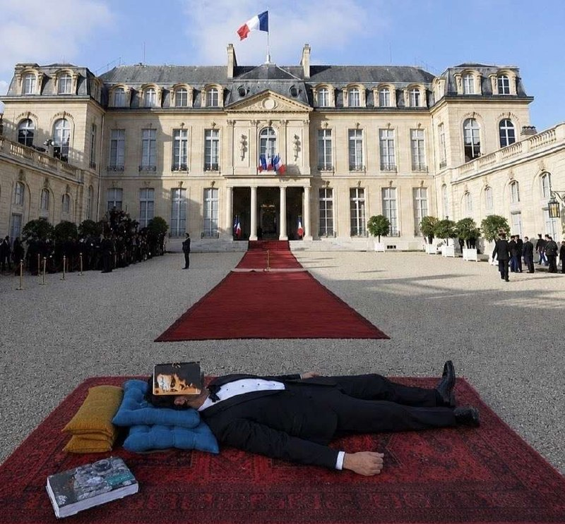

🔴طبق گزارشات منتشر شده توسط فلورین تاردیف، روزنامه نگار؛ دلیل چک خوردن مکرون توسط زنش در هواپیما، وجود رابطه احساسیش با گلشیفته فراهانی بوده، اونم برای چندماه! زن مکرون پیام‌های عاطفی گلشیفته رو توی گوشی مکرون دیده! در یکی از پیام ها مکرون در جواب عکسی که…

## ChizBergerz — post 46362

  <a href="telegram/content/ChizBergerz_46362_1778700307.mp4" target="_blank">🎬 Download video</a>

آلیس روزنبلوم ستاره اونلی فنز 2 میلیون دلار(360 میلیارد) از طرفدار درجه یکش دریافت کرد تا باهاش ملاقات کنه.
طرفداراش وقتی آلیس رو دیده گفته هر روز ۳ بار باهاش خودارضایی می‌کرده!
وقتی طرفدارش خواسته به بازوی آلیس دست بزنه، آلیس گفته به من دست نزن، تو خیلی چندش آوری! فورا از من دور شو وگرنه به پلیس زنگ میزنم.

اون جقی بدبختم ۳۶۰ میلیاردش بگا میره و دست از پا دراز تر برمیگرده خونه.
در نهایت یه مرد ایرانی با آلیس مصاحبه کرده و جوری ریده بهش که اشکش در اومده، توی کامنتا هم همه مرد ایرانیو تشویق کردن و گفتن خوب ریدی به این جنده.
@ChizBergerz

## KiriMohems — post 47466

تعرفه سرویس های Vip ⭕️ ✅ 1 گیگابایت ⬅️ 250/000 تومان ✅ 3 گیگابایت ⬅️ 750/000 تومان استارلینک Vip 💫 🌟(مناسب برای شرایط بحرانی مثل جنگ و اختلالات) ⭐️ 5 گیگابایت ⬅️ 1/400/000 تومان ⭐️ 10 گیگابایت ⬅️ 2/800/000 تومان ویژگی های سرویس های Vip : ❤️‍🔥 ✅ متصل…

## KiriMohems — post 47465

تعرفه سرویس های Vip ⭕️

✅ 1 گیگابایت ⬅️ 250/000 تومان
✅ 3 گیگابایت ⬅️ 750/000 تومان

استارلینک Vip 💫 🌟(مناسب برای شرایط بحرانی مثل جنگ و اختلالات)

⭐️ 5 گیگابایت ⬅️ 1/400/000 تومان
⭐️ 10 گیگابایت ⬅️ 2/800/000 تومان

ویژگی های سرویس های Vip : ❤️‍🔥
✅ متصل در تمامی دستگاه و اپراتور ها
✅ مناسب استفاده روزمره در تمامی برنامه ها
✅ دارای ساب برای اطلاع لحظه ای باقیمانده
✅ تک لینک بدون نیاز به بروزرسانی های متعدد
 برای خرید از پشتیبانی به ایدی زیر پیام بدید.👇

🔤 @expressuport

خرید فوری از ربات.👇

🔤 @vpn_express_sup_bot

## KiriMohems — post 47464

🔴هفتمین رأی‌گیری سنای آمریکا برای پایان جنگ با جمهوری اسلامی تو کون سگ رفت

جمهوری‌خواهانی که توی سنا کص و کونشون رو پهن کردن تقریباً متحد عمل کردن تا اولین تلاش از زمان عبور ترامپ از ضرب‌الاجل ۶۰ روزه برای دریافت مجوز جنگ از کنگره را ناکام بزارن لای خایه ها و بپیچونن

#Helsinki
@KiriMohems

## KiriMohems — post 47463

  

🇮🇷تو میدون انقلاب از پیراهن تیم ملی برای جام جهانی 2026 رونمایی شد که دقیقا همون پیراهن 2014 با همون پلنگ خایه افسرده‌ایه و هیچ گوه خاصی تو این ۱۲ سال نخوردن
#Helsinki
@KiriMohemSport

## KiriMohems — post 47462

خبری که فرانسه رو گایید مکرون چندين ماه با گلشیفته فراهانی، بازیگر ایرانی رابطه افلاطونی داشته (رابطه که فقط خایه مالی طرفو میکنید و لاشو لوش نمیذارید)؛ میگن که دلیل چَک خوردن رئیس‌جمهور فرانسه هم گلشیفته بوده؛ چون مکرون به این بازیگر ایرانی پیام داده بود…

## KiriMohems — post 47461

📰 الجزیره:
ارتش آمریکا ریده و به دلیل عوامل متعددی از جمله جنگ با ایران با کسری بودجه خیلی گوهی مواجه شده، به طوری که ذخایر مهماتش از سال ۲۰۲۲ به دلیل حمایت از اوکراین به حد گوز رسیده و الان با درگیری ایران بیشتر دهنش گاییده شده
#Helsinki
@KiriMohems

## SportBaadNews — post 251508

  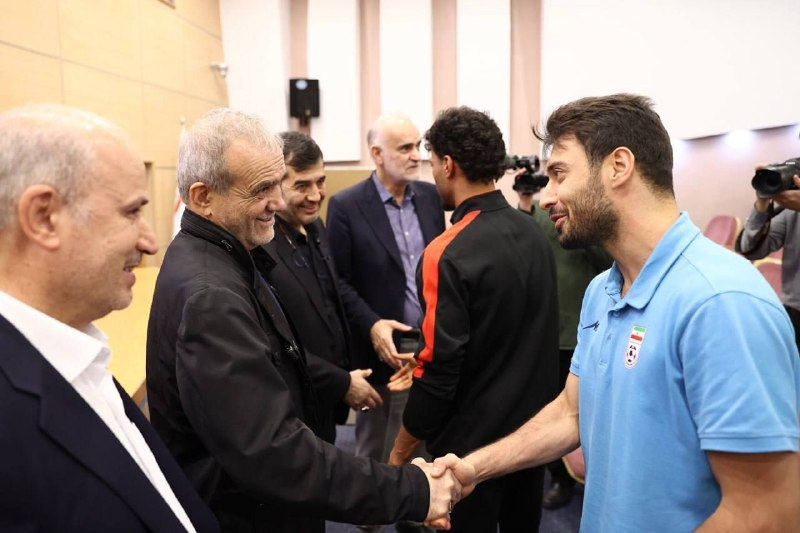

شجاع در به در دنبال خایمالیه
@SportBaadNews

## SportBaadNews — post 251507

  

⚪️ LAZIO - 
🔵 INTER

🔴 فینال کوپا ایتالیا

⏰ چهارشنبه ساعت ۲۲:۳۰

🏟 استادیوم المپیکو

⚽️ اینتر حالا پس از حل‌و‌فصل لیگ و قهرمان شدن، به‌مصاف لاتزیو می‌رود تا دومین جام فصل را هم برای خودش کند. اما لاتزیو علی‌رغم شایستگی تیم کیوو، با مائوریتزیو ساری، تیم قدری است که به سادگی باخت نمی‌دهد. آمار تماماً به‌نفع نراتزوری است و برد آنها هم محتمل بنظر می‌رسد، خصوصاً باتوجه به نتایج دو بازی اخیرشات مقابل لاتزیو که ۳-۰ و ۲-۰ بوده. در ده بازی اخیر دو تیم، اینتر فاتح هفت دیدار بوده و در کوپا ایتالیای امسال هم در ۴ بازی، ۱۰ گل زده و سرجمع چهارگل خورده. این آمار برای تیم ساری، پنج گل زده و چهار گل خورده است.

📌در ربات وینکوبت ثبت‌نام کن و با شارژ از طریق کریپتو ۵٪ شارژ بیشتری رو دریافت کنید، همین حالا شروع کن: 
👇

🟣 [ برای ورود به ربات کلیک کنید: ]

📌برای اطلاع از تحلیل بازی‌ها و ورود به کانال سایت جوین بدید: 
👇

🔵 @Wincobetofficial

## SportBaadNews — post 251506

  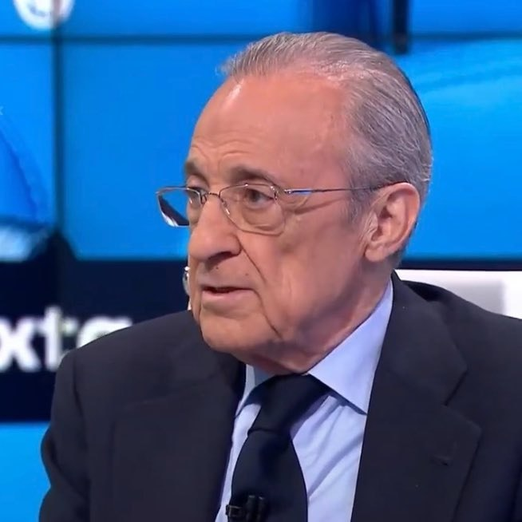

⚽️
🇪🇺
⚽️ فلورنتینو پرز در مصاحبه با جوزپ پدرول: ما باید همیشه لیگ قهرمانان رو ببریم؟ اگه اینطوره، پس بقیه تیم‌ های اروپایی باید کلاً بیخیال فوتبال بشن!
@SportBaadNews

## SportBaadNews — post 251505

  <a href="telegram/content/SportBaadNews_251505_1778700311.webm" target="_blank">🎬 Download video</a>

املت قسطی هم اومد @iMamlekat

## SportBaadNews — post 251504

  

⚽️
⚽️ ترکیب رسمی بارسلونا مقابل آلاوز
@SportBaadNews

## SportBaadNews — post 251503

  <a href="telegram/content/SportBaadNews_251503_1778700312.webm" target="_blank">🎬 Download video</a>

🚨
🚨 فابریزیو رومانو: همه‌چیز بین رئال مادرید و ژوزه مورینیو خیلی خیلی جلو رفته؛ قرارداد، حقوق، پروژه، اختیاراتی که مورینیو قراره داشته باشه؛ همه‌چی حسابی جلو رفته.

فقط مونده فلورنتینو پرز چراغ سبز نهایی رو بده، اون‌وقته که دیگه تمومه و هیر وی گو میزنم!
@SportBaadNews

## IranIntlTV — post 337050

  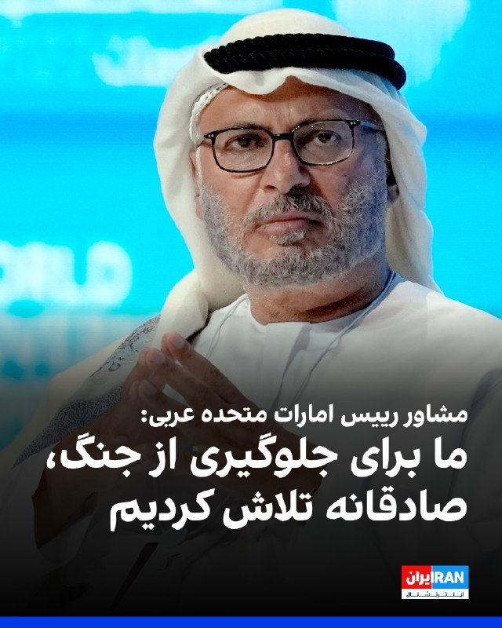

انور قرقاش، مشاور رییس امارات متحده عربی، در شبکه ایکس نوشت جهان با دقت سفر مهم رییس‌جمهور ایالات متحده به چین و پیامدهای احتمالی آن بر تحولات منطقه را دنبال می‌کند. او تأکید کرد امارات متحده عربی بار دیگر بر اهمیت راه‌حل سیاسی و مسیر مذاکره پافشاری می‌کند؛ مسیری که همواره در مواضع و ارتباطات خود به آن پایبند بوده است.

قرقاش افزود امارات متحده عربی خواهان این جنگ نبوده و صادقانه برای جلوگیری از وقوع آن تلاش کرده است. او گفت روابط عربی ـ ایرانی در خلیج فارس نمی‌تواند بر پایه رویارویی و درگیری بنا شود.

مشاور رییس امارات متحده عربی همچنین تأکید کرد این کشور از حاکمیت خود دفاع خواهد کرد، اما همچنان اولویت و باور راسخ آن ترجیح راه‌حل‌های سیاسی است؛ زیرا این مسیر را راه دستیابی به صلح، ثبات و شکوفایی می‌داند.
https://iranintl.com/202605131401

## IranIntlTV — post 337049

🔻بحران رهبری استارمر بر سخنرانی سالانه پادشاه بریتانیا سایه انداخت

هم‌زمان با ارائه برنامه دولت بریتانیا از سوی پادشاه بریتانیا در مجلس اعیان این کشور، کی‌یر استارمر با جدی‌ترین تهدید علیه رهبری خود روبه‌روست. رسانه‌ها گزارش دادند وزیر بهداشت او آماده استعفاست تا وارد رقابت حزبی برای جایگزینی نخست‌وزیر شود.

روزنامه تایمز چهارشنبه ۲۳ اردیبهشت گزارش داد که احتمال‌ استعفای وِسلی اِستریتینگ، وزیر بهداشت کابینه استارمر، قوت گرفته است. دور از انتظار نیست که او پنج‌شنبه کنار برود و با ورود به رقابت‌های حزب کارگر برای تغییر رهبر حزب، رویدادها به سمتی برود که برنامه دولت استارمر که چارلز آن را با شکوه و تشریفات فراوان تشریح کرد، هرگز به مرحله اجرا نرسد.

تایمز نوشت که دفتر استریتینگ به درخواست برای اظهارنظر درباره این گزارش پاسخ نداد. سخنگوی استارمر هم گفت نخست‌وزیر به وزیر بهداشت خود اعتماد کامل دارد، اما از اظهارنظر درباره دیدار پیشین میان این دو نفر خودداری کرد.

تیم وزیر بهداشت گفت او نیز درباره آن دیدار، که در دفتر استارمر در داونینگ‌استریت برگزار شد، اظهارنظر نخواهد کرد تا توجه‌ها را از سخنرانی پادشاه منحرف نکند.

استریتینگ بعدتر در شبکه ایکس به تمجید از دستاوردهای خود در کاهش زمان انتظار در نظام درمانی دولتی بریتانیا پرداخت. او نوشت: «کارهای زیادی انجام شده، کارهای زیادی هم مانده است»؛ اما به این گزارش اشاره‌ای نکرد.
چالش در دولت بر سر چیست؟

مساله با شکست سنگین حزب کارگر در انتخابات شوراهای محلی انگلستان شروع شد. این حزب در انتخابات ۱۸ اردیبهشت بخش قابل توجهی از رای‌ها را به‌ویژه در مناطقی از مرکز و شمال انگلستان و همچنین در بخش‌هایی از لندن که پایگاه سنتی این حزب به شمار می‌آید، از دست داد.

در مقابل، حزب راستگرای «اصلاح بریتانیا» به رهبری نایجل فاراژ، بیش از ۳۵۰ کرسی در شوراهای محلی انگلستان به دست آورد و حالا اگر همین مسیر را در انتخابات ملی ادامه دهد، به اپوزیسیون اصلی در اسکاتلند و ولز تبدیل می‌شود.

خبرگزاری رویترز پس از اعلام رسمی این شکست حزب کارگر، نتایج انتخابات محلی را نشان‌دهنده عمق نارضایتی از نخست‌وزیر بریتانیا خواند و نوشت که تنها دو سال پس از پیروزی قاطع او در انتخابات سراسری، تردیدها را درباره آینده سیاسی‌اش افزایش داد.

برخی نمایندگان حزب کارگر پس از نتایج انتخابات هشدار دادند که اگر این حزب در اسکاتلند عملکرد ضعیفی داشته باشد، قدرت را در ولز از دست بدهد و نتواند بخش زیادی از حدود ۲۵۰۰ کرسی تحت دفاع خود در انگلستان را حفظ کند، فشارها بر استارمر برای کناره‌گیری یا دست‌کم تعیین جدول زمانی خروجش از قدرت افزایش خواهد یافت.
با این حال، هم‌زمان گزارش‌هایی از تلاش برخی از اعضای حزب برای ایجاد تغییرات بنیادین در دفتر نخست‌وزیری و جایگزینی استارمر با فردی دیگر منتشر شد.

در این میان استارمر کوشیده است چالش‌ها علیه اقتدار خود را کم‌اهمیت جلوه دهد و سخنرانی پادشاه بریتانیا که از سوی دولت نوشته و از سوی پادشاه قرائت می‌شود، برنامه‌هایی را برای تقویت رشد اقتصادی، امنیت انرژی و دفاع اعلام کرد.

سخنرانی پادشاه در بریتانیا در واقع ابزار رسمی دولت برای اعلام برنامه‌های سال آینده است، اما سخنرانی ۲۳ اردیبهشت چارلز، به جای نمایش دادنِ اقتدار و برنامه‌ریزی دولت استارمر، زیر سایه بحران رهبری او و گزارش‌ها درباره احتمال استعفای وزیر بهداشت و آغاز رقابت برای جانشینی نخست‌وزیر قرار گرفت.

این موضوع، در کنار اخبار مرتبط با تلاش‌های استریتینگ احتمال ورود رقبای دیگر به رقابت‌های درون‌حزبی علیه نخست‌وزیر کنونی را افزایش داده است. علاوه بر وزیر بهداشت، نام اندی برنهم، شهردار منچستر، و آنجلا رینر، معاون پیشین نخست‌وزیر، نیز مطرح شده است، هرچند هر دو آنها پیش از آنکه بتوانند نامزد شوند، باید موانعی را از پیش رو بردارند.
🔗وب‌سایت ایران‌اینترنشنال
@iranintltv

## IranIntlTV — post 337048

  

خبرگزاری رویترز اعلام کرد که عربستان سعودی در جریان جنگ ایران، به مواضع شبه‌نظامیان مورد حمایت جمهوری اسلامی در عراق حمله کرده است.
بر اساس این گزارش، حملات عربستان سعودی توسط جنگنده‌های نیروی هوایی این کشور و علیه مواضع شبه‌نظامی وابسته به جمهوری اسلامی در نزدیکی مرز شمالی عربستان سعودی با عراق انجام شده است. بخشی از این حملات نیز هم‌زمان با آتش‌بس ۱۸ فروردین میان تهران و واشینگتن صورت گرفته است.
همچنین بر اساس ارزیابی‌های نظامی، منابع عراقی گفته‌اند در دست‌کم دو مورد، از خاک کویت حملات راکتی به عراق انجام شده است. رویترز نتوانسته مشخص کند این راکت‌ها توسط نیروهای مسلح کویت یا نیروهای آمریکایی مستقر در این کشور شلیک شده‌اند.
https://iranintl.com/202605137468

## IranIntlTV — post 337047

  <a href="telegram/content/IranIntlTV_337047_1778700314.mp4" target="_blank">🎬 Download video</a>

۲۴ با فرداد فرحزاد

@iranintltv

## IranIntlTV — post 337046

  

بر اساس گزارش منابع حقوق‌بشری، دادگاه تجدیدنظر استان کهگیلویه و بویراحمد، فیض‌الله آذرنوش، پدر دادخواه پدارم آذرنوش را به ۱۵ سال حبس، میلاد کریمی‌نسب را به شش سال حبس، امیرحسین محسنی‌پور را به شش سال حبس و مهدی کرمی را به سه سال حبس محکوم کرد.
سایت حقوق‌بشری هرانا چهارشنبه ۲۳ اردیبهشت گزارش داد این شهروندان در یک پرونده مشترک، از سوی ابوالحسن دادگر و سعید جریده‌اصل، مستشاران شعبه اول دادگاه تجدیدنظر استان کهگیلویه و بویراحمد، به احکام حبس محکوم شده‌اند.
بر اساس احکام صادرشده، پنج سال حبس برای آذرنوش، پنج سال حبس برای کریمی‌نسب، سه سال حبس برای محسنی‌پور و سه سال حبس برای کرمی قابل اجرا است.
https://iranintl.com/202605138248

## IranIntlTV — post 337045

  <a href="telegram/content/IranIntlTV_337045_1778700316.mp4" target="_blank">🎬 Download video</a>

مهدی مهدوی‌آزاد در برنامه «چشم‌انداز» گفت: «تجمعات حکومتی در حال تبدیل شدن به یکی از مشکلات اصلی حاکمیت است. همان نیروهای حامی حکومت که امروز به خیابان‌ها می‌آیند، مسیر هرگونه سازش را بسته‌اند. کشوری که هم‌اکنون با بحران انرژی و مشکلات عمیق اقتصادی دست‌وپنجه نرم می‌کند، به‌زودی ممکن است حتی در مدیریت همین حامیان خود در خیابان نیز دچار چالش شود؛ چه‌بسا کار به جایی برسد که ناچار به سرکوب تجمعات حامیان شود.»
@iranintltv

## IranIntlTV — post 337044

  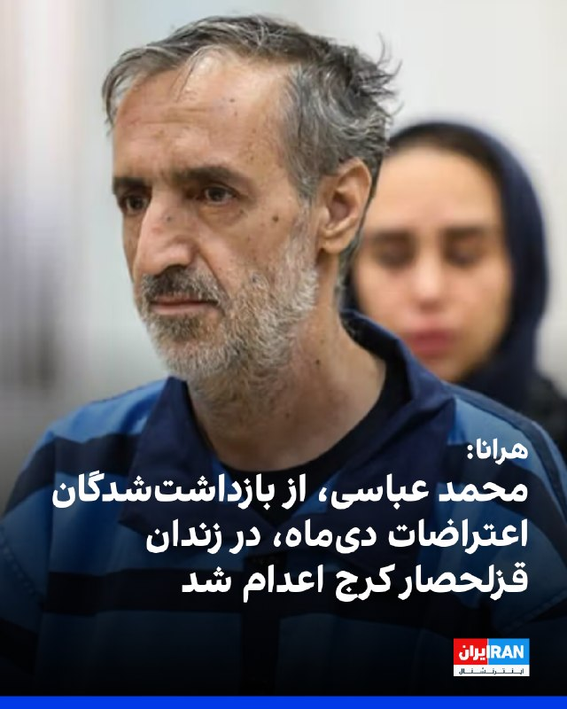

سایت حقوق‌بشری هرانا گزارش داد حکم اعدام محمد عباسی، از بازداشت‌شدگان اعتراضات سراسری دی‌ماه ۱۴۰۴، سحرگاه چهارشنبه در زندان قزلحصار کرج اجرا شد.
هرانا چهارشنبه ۲۳ اردیبهشت به نقل از منبعی مطلع و نزدیک به خانواده این زندانی سیاسی نوشت مسئولان زندان از خانواده عباسی خواسته بودند برای ملاقات با او به زندان مراجعه کنند، اما پس از حضور خانواده، اجازه ملاقات به آنان داده نشد.
به گفته این منبع، خانواده عباسی پس از خروج از زندان، در تماسی تلفنی از اجرای حکم اعدام او مطلع شدند.
ایران‌اینترنشنال هفتم اردیبهشت خبر داده بود حکم اعدام محمد عباسی و حکم ۲۵ سال حبس دخترش، فاطمه عباسی که در بند زنان زندان اوین محبوس است، در دیوان عالی کشور تایید شده است.
اطلاعات رسیده به ایران‌اینترنشنال حاکی است عباسی و دخترش فاطمه در دوران بازجویی تحت فشار و شکنجه‌های شدید قرار گرفته بودند و از زمان بازداشت، در تمامی مراحل دادرسی، از جمله بازجویی، بازپرسی، دادگاه و رسیدگی در دیوان عالی کشور، از حق دسترسی به وکیل محروم بوده‌اند.
https://iranintl.com/202605134938

## IranIntlTV — post 337043

🔻تشدید کارزار امنیتی کشورهای خلیج فارس علیه شبکه‌های وابسته به جمهوری اسلامی

کشورهای حوزه خلیج فارس هم‌زمان با ادامه تنش‌ها در خاورمیانه، کارزار امنیتی گسترده‌ای را علیه شبکه‌های وابسته به جمهوری اسلامی و حزب‌الله لبنان آغاز کرده‌اند. مقام‌های امنیتی در کویت، بحرین، امارات و قطر از کشف و متلاشی شدن ده‌ها هسته مرتبط با تهران خبر داده‌اند.

شبکه آی۲۴ چهارشنبه ۲۳ اردیبهشت گزارش داد کشورهای حاشیه خلیج فارس طی ۲۷ روز گذشته بیش از ۱۲ هسته وابسته به جمهوری اسلامی را شناسایی و متلاشی کرده‌اند.

آریل اوسران، خبرنگار آی۲۴، نیز در شبکه اجتماعی ایکس نوشت کشف این هسته‌ها «نشان‌دهنده تشدید اقدامات جمهوری اسلامی علیه همسایگان عرب خود» است؛ تحولاتی که به گفته او «چشم‌انداز امنیتی خلیج فارس را دگرگون می‌کند.»

بر اساس داده‌های رسمی، حدود ۷۴ نفر با تابعیت‌های کویت، بحرینی، لبنانی و ایرانی در ارتباط با این هسته‌ها بازداشت یا شناسایی شده‌اند.

مقام‌های امنیتی این کشورها می‌گویند بازداشت‌شدگان به جاسوسی، پول‌شویی، طراحی ترور، جمع‌آوری اطلاعات از مراکز حساس و تلاش برای ضربه زدن به امنیت و ثبات اقتصادی کشورهای منطقه متهم هستند.

روزنامه الشرق الاوسط ۱۳ فروردین، گزارش داد نیروهای امنیتی کشورهای خلیج فارس طی ۳۰ روز، ۹ هسته مرتبط با جمهوری اسلامی یا متحدانش، به‌ویژه حزب‌الله لبنان، را در چهار کشور قطر، بحرین، کویت و اماراتمه کشف کرده‌اند.

بر اساس بررسی‌های الشرق الاوسط، خبر کشف و انهدام نخستین هسته ۱۳ اسفند ۱۴۰۴ در قطر اعلام شد و آخرین مورد در ۱۰ فروردین ۱۴۰۵؛ به این معنا که هر ۹ هسته طی ۲۷ روز متلاشی شده‌اند، یعنی تقریبا هر سه روز یک هسته مرتبط با تهران کشف شده است.

طبق گزارش الشرق الاوسط، کشورهای عضو شورای همکاری خلیج فارس هم‌زمان با مقابله با حملات جمهوری اسلامی، عملیات علیه شبکه‌های وابسته به تهران و حزب‌الله را تشدید کرده‌اند.

ظافر العجمی، کارشناس امنیتی خلیج فارس، گفت جمهوری اسلامی از «راهبردی سه‌بعدی» شامل هسته‌های محلی، جذب نیرو در کشورهای خلیج فارس و استفاده از گروه‌های نیابتی مانند حزب‌الله و حوثی‌ها برای اعمال فشار امنیتی استفاده می‌کند.

پیش از آن نیز، رویترز ۳۰ اسفند ۱۴۰۴ گزارش داده بود مقام‌های امنیتی امارات شبکه‌ای دیگر را که به گفته آنها با حمایت مالی و هدایت حزب‌الله لبنان و جمهوری اسلامی فعالیت می‌کرد، متلاشی کرده‌اند.

بر اساس گزارش خبرگزاری رسمی امارات، این شبکه تحت پوشش فعالیت‌های تجاری صوری در پول‌شویی، تامین مالی تروریسم و تلاش برای ضربه زدن به ثبات مالی کشور نقش داشته است. حزب‌الله این اتهام‌ها را رد کرده و آنها را «ساختگی» خوانده است.

وزارت کشور کویت چهارشنبه ۵ فروردین ۱۴۰۵ اعلام کرد نیروهای امنیتی این کشور یک «طرح تروریستی» مرتبط با حزب‌الله لبنان را خنثی کرده‌اند. مقام‌های کویتی گفتند شش نفر، شامل پنج شهروند کویتی و یک فرد بدون تابعیت، بازداشت و ۱۴ مظنون دیگر، از جمله دو ایرانی و دو لبنانی، تحت تعقیب قرار دارند.

به گفته مقام‌ها، اعضای این شبکه به جاسوسی و برنامه‌ریزی برای ترور رهبران کشور اعتراف کرده‌اند و آموزش‌های نظامی و کار با مواد منفجره را خارج از کویت دیده بودند. کویت همچنین از بازداشت چهار ایرانی مرتبط با سپاه پاسداران خبر داد که قصد ورود دریایی به جزیره بوبیان را داشتند.

در امارات متحده عربی نیز اداره امنیت دولت این کشور ۳۱ فروردین ۱۴۰۵ اعلام کرد یک «سازمان تروریستی مخفی شیعه» وابسته به جمهوری اسلامی را متلاشی و ۲۷ نفر را بازداشت کرده است.

در بیانیه رسمی اداره امنیت امارات متحده عربی آمده بود این گروه قصد داشت با «فعالیت‌های خرابکارانه» وحدت ملی و ثبات کشور را تضعیف کند.

مقام‌های اماراتی همچنین گفتند اعضای این شبکه با برگزاری نشست‌های مخفیانه و هماهنگی با طرف‌های خارجی، جوانان اماراتی را جذب و علیه سیاست خارجی این کشور تحریک می‌کردند.

در بحرین نیز دولت ۷ اردیبهشت ۱۴۰۵ اعلام کرد تابعیت ۶۹ نفر، از جمله اعضای خانواده آنها، را به اتهام «همدردی با اقدامات خصمانه ایران» یا «ارتباط با طرف‌های خارجی» لغو کرده است.

وزارت کشور بحرین همچنین از بازداشت ۴۱ نفر خبر داد و اعلام کرد آنها عضو سازمانی مرتبط با سپاه پاسداران بوده‌اند. مقام‌های بحرینی گفتند این اقدامات در چارچوب حفظ امنیت ملی و بر اساس قانون تابعیت این کشور انجام شده است.

تحلیلگران می‌گویند ادامه تنش‌ها و درگیری‌های منطقه‌ای باعث شده کشورهای خلیج فارس همکاری‌های اطلاعاتی، نظارت امنیتی و عملیات پیشگیرانه علیه شبکه‌های وابسته به ایران و حزب‌الله را به‌طور چشمگیری افزایش دهند؛ روندی که به گفته ناظران، می‌تواند شکاف امنیتی و سیاسی میان جمهوری اسلامی و کشورهای عرب منطقه را عمیق‌تر کند.
🔗وب‌سایت ایران‌اینترنشنال
@iranintltv

## IranIntlTV — post 337042

🔻دادگاه تجدیدنظر استان کهگیلویه و بویراحمد چهار شهروند را به حبس محکوم کرد

بر اساس گزارش منابع حقوق‌بشری، دادگاه تجدیدنظر استان کهگیلویه و بویراحمد، فیض‌الله آذرنوش، پدر دادخواه پدارم آذرنوش را به ۱۵ سال حبس، میلاد کریمی‌نسب را به شش سال حبس، امیرحسین محسنی‌پور را به شش سال حبس و مهدی کرمی را به سه سال حبس محکوم کرد.

سایت حقوق‌بشری هرانا چهارشنبه ۲۳ اردیبهشت گزارش داد این شهروندان در یک پرونده مشترک، از سوی ابوالحسن دادگر و سعید جریده‌اصل، مستشاران شعبه اول دادگاه تجدیدنظر استان کهگیلویه و بویراحمد، به احکام حبس محکوم شده‌اند.

از میان این شهروندان، آذرنوش بابت اتهام‌های «مشارکت در تشکیل گروه با هدف برهم زدن امنیت کشور»، «فعالیت تبلیغی علیه نظام»، «فعالیت تبلیغی در جهت تایید و تقویت اسرائیل»، «توهین به رهبری»، «اجتماع و تبانی علیه امنیت داخلی کشور» و «توهین به مقدسات اسلام» در مجموع به ۱۵ سال حبس محکوم شده که با اعمال ماده ۱۳۴، پنج سال آن قابل اجراست.

همچنین کریمی‌نسب به اتهام‌های «مشارکت در تشکیل گروه با هدف برهم زدن امنیت کشور» و «فعالیت تبلیغی علیه نظام» در مجموع به شش سال حبس محکوم شده که با اعمال ماده ۱۳۴، پنج سال آن قابل اجراست.

محسنی‌پور نیز با اتهام‌های «عضویت در دسته یا جمعیت با هدف برهم زدن امنیت کشور»، «فعالیت تبلیغی علیه نظام» و «توهین به رهبری» در مجموع به شش سال حبس محکوم شده که با اعمال ماده ۱۳۴، سه سال آن قابل اجراست.

کرمی هم به اتهام «عضویت در دسته یا جمعیت با هدف برهم زدن امنیت کشور» به سه سال حبس محکوم شده و تمام این حکم قابل اجراست.
حمید دستوانه، متهم ردیف پنجم این پرونده، که پیش‌تر در مرحله بدوی به یک سال حبس محکوم شده بود، در مرحله تجدیدنظر از اتهامات انتسابی تبرئه شد.

شعبه ۱۰۲ دادگاه کیفری دو شهرستان کهگیلویه پیش‌تر در آذر ۱۴۰۴، آذرنوش را به ۲۳ سال حبس، کریمی‌نسب را به ۱۱ سال زندان، محسنی‌پور را به هشت سال زندان، کرمی را به پنج سال حبس و دستوانه را به یک سال حبس محکوم کرده بود.

آذرنوش ۲۸ خرداد ۱۴۰۴ در یاسوج بازداشت و پس از مدتی از زندان این شهر آزاد شد. او ۱۸ آبان ۱۴۰۴ به دست ماموران اطلاعات سپاه یاسوج احضار شد و پس از حضور در این نهاد امنیتی، چند ساعت مورد بازجویی قرار گرفت.

پسر او، پدرام آذرنوش، جوان ۱۸ ساله‌ای بود که ۳۱ شهریور ۱۴۰۱ در جریان جنبش «زن، زندگی، آزادی» در دهدشت با شلیک مستقیم ماموران امنیتی جمهوری اسلامی کشته شد.
کریمی‌نسب ۲۱ خرداد ۱۴۰۴، کرمی ۲۸ خرداد ۱۴۰۴ و محسنی‌پور دوم تیر ۱۴۰۴ از سوی نیروهای امنیتی در استان کهگیلویه و بویراحمد بازداشت شده بودند.

جمهوری اسلامی از نخستین سال‌های استقرار خود، بازداشت و زندانی کردن منتقدان، فعالان مدنی و کنشگران سیاسی را به یکی از ابزارهای اصلی سرکوب تبدیل کرده است.

از آغاز جنبش «زن، زندگی، آزادی» در شهریور ۱۴۰۱، برخورد امنیتی با معترضان و فعالان مدنی و سیاسی شدت بیشتری گرفت؛ روندی که پس از جنگ‌های ۱۲ روزه و ۴۰ روزه و اعتراضات دی‌ماه ۱۴۰۴ نیز با دامنه‌ای گسترده‌تر ادامه یافته است.
🔗وب‌سایت ایران‌اینترنشنال
@iranintltv

## IranIntlTV — post 337041

  <a href="telegram/content/IranIntlTV_337041_1778700317.mp4" target="_blank">🎬 Download video</a>

وال‌استریت ژورنال گزارش داد رییس موساد در دوران جنگ دست‌کم دو بار به‌صورت محرمانه به امارات سفر کرده است. پیش‌تر نیز خبر حملات امارات به اهدافی در ایران در طول جنگ منتشر شده بود.
همزمان رویترز گزارش داد عربستان سعودی نیز در طول جنگ حمله‌هایی به ایران انجام داده است.

گفت‌وگو با فرزین ندیمی، پژوهشگر امور دفاعی و امنیتی و علی صدرزاده، تحلیل‌گر مسائل خاورمیانه
@iranintltv

## IranIntlTV — post 337040

  

عباس عراقچی، وزیر خارجه جمهوری اسلامی، در واکنش به بازداشت چهار فرد «وابسته به سپاه پاسداران» در کویت، در شبکه اجتماعی ایکس نوشت کویت «در تلاشی آشکار برای ایجاد تفرقه»، به یک قایق ایرانی در خلیج فارس حمله کرده و چهار شهروند ایرانی را بازداشت کرده است.

او افزود این اقدام «در نزدیکی جزیره‌ای رخ داده که آمریکا از آن برای حمله به ایران استفاده کرده است» و تاکید کرد جمهوری اسلامی خواستار آزادی فوری این افراد است و «حق پاسخ‌گویی را برای خود محفوظ می‌داند.»
https://iranintl.com/202605132548

## IranIntlTV — post 337039

  <a href="https://t.me/IranintlTV/337039" target="_blank">📎 Download file</a>

🎧نسخه صوتی تیتراول با نیوشا صارمی: سفر بی‌سابقه نتانیاهو به امارات در میانه جنگ ایران؛ افشای ابعاد تازه درگیری
@iranintlTV

## IranIntlTV — post 337038

  <a href="telegram/content/IranIntlTV_337038_1778700321.mp4" target="_blank">🎬 Download video</a>

روزهای گذشته تصاویر ماهواره‌ای از شکل‌گیری یک لکه نفتی در نزدیکی خارک خبر دادند. لکه‌ای به وسعت حدود ۷۰ کیلومتر مربع که در بخش غربی خارک نشت کرده و نگرانی‌ها درباره امنیت انرژی، آسیب زیست‌محیطی و امکان پاکسازی در شرایط جنگی را تشدید کرده است. منشا دقیق این آلودگی مشخص نیست، اما مواردی از نشت نفت تا تخلیه پسماند نفتکش‌ها مطرح شده است.

کاوه مدنی، کارشناس آب و محیط زیست و تیمش به بررسی منشا این آلودگی پرداختند.

@iranintltv

## IranIntlTV — post 337037

  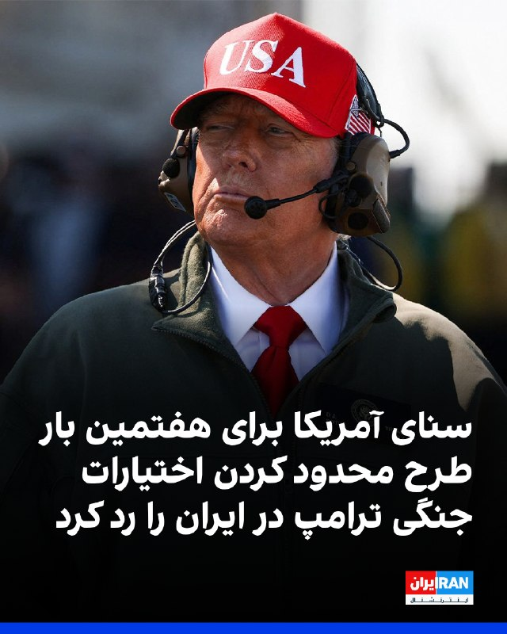

سی‌ان‌ان گزارش داد سنای آمریکا برای هفتمین بار در سال جاری، طرحی را که با هدف محدود کردن اختیارات جنگی دونالد ترامپ و الزام او به دریافت مجوز کنگره برای هرگونه اقدام نظامی آینده در ایران ارائه شده بود، رد کرد.

این طرح با ۵۰ رای مخالف در برابر ۴۹ رای موافق از پیشبرد بازماند. بر اساس این گزارش، جان فترمن، سناتور دموکرات، در کنار جمهوری‌خواهان به رد طرح رای داد و رند پال، سوزان کالینز و لیزا مورکوفسکی، سناتورهای جمهوری‌خواه، همراه دموکرات‌ها از آن حمایت کردند.

سی‌ان‌ان نوشت برخی جمهوری‌خواهان، از جمله مورکوفسکی که امروز برای نخستین بار از این تلاش برای محدود کردن اختیارات جنگی حمایت کرد و تام تیلیس، استدلال کرده‌اند که با ادامه یافتن درگیری‌ها به بیش از ۶۰ روز، کنگره باید در مجوز دادن به جنگ نقش داشته باشد یا دست‌کم نظارت بیشتری اعمال کند.
https://iranintl.com/202605133904

## IranIntlTV — post 337036

  

دفتر نخست‌وزیری اسرائیل اعلام کرد بنیامین نتانیاهو، نخست‌وزیر این کشور، در جریان جنگ آمریکا و اسرائیل با جمهوری اسلامی، به‌طور مخفیانه به امارات متحده عربی سفر کرده است.

بر اساس این گزارش، نتانیاهو در این سفر با محمد بن زاید آل نهیان، رییس امارات متحده عربی، دیدار کرد.

دفتر نخست‌وزیری اسرائیل گفت این سفر به یک «پیشرفت تاریخی» در روابط اسرائیل و امارات متحده عربی منجر شده است.

پیش‌تر مقام‌های ارشد آمریکایی تایید کرده بودند اسرائیل در جریان جنگ با جمهوری اسلامی، یک سامانه گنبد آهنین و نیروهایی را برای راه‌اندازی آن به امارات فرستاده بود.
https://iranintl.com/202605131963

## Persian_Trend_Official — post 14072

  <a href="telegram/content/Persian_Trend_Official_14072_1778700324.webm" target="_blank">🎬 Download video</a>

🔴چت جی پی تی وارد پرونده قتل شد!

💢رسانه‌های کره جنوبی گزارش دادن زنی متهم شده قبل از مسموم کردن چند نفر، از ChatGPT درباره ترکیب الکل و قرص خواب‌آور سؤال کرده

💢طبق گزارش‌ها، این زن پرسیده بوده:
اگه الکل و داروی خواب‌آور باهم مصرف بشن چی میشه؟
چه دوزی خطرناکه؟
و آیا ممکنه باعث مرگ بشه؟
پلیس میگه بعد از همین جستجوها، به سه مرد نوشیدنی آلوده داده شده که دو نفرشون جونشونو از دست دادن 💀

💢حالا نکته عجیب‌تر:
دادگاه از گفتگوهای ChatGPT به‌عنوان مدرک برای اثبات «نیت قتل» استفاده کرده!

💢وکیل پرونده گفته این شاید یکی از اولین پرونده‌هاییه که چت‌های AI به‌عنوان شاهد مستقیم تو پرونده قتل پذیرفته میشن..

🫆:Tony

📌 @persian_trend_official
پرشین ترند | متفاوت‌ترین کانال نظامی

## Persian_Trend_Official — post 14071

  

🔴دفتر نخست وزیر اسرائیل :

💢در حين عملیات «غرش شیران»، نخست وزیر نتانیاهو مخفیانه از امارات متحده عربی بازدید و با شیخ محمد بن زاید، رئیس امارات متحده عربی دیدار کرد.

💢این دیدار منجر به یک پیشرفت تاریخی در روابط بین اسرائیل و امارات متحده عربی شد.

---
📅 بروزرسانی: 1405/02/23 21:09
---

## ChizBergerz — post 46361

  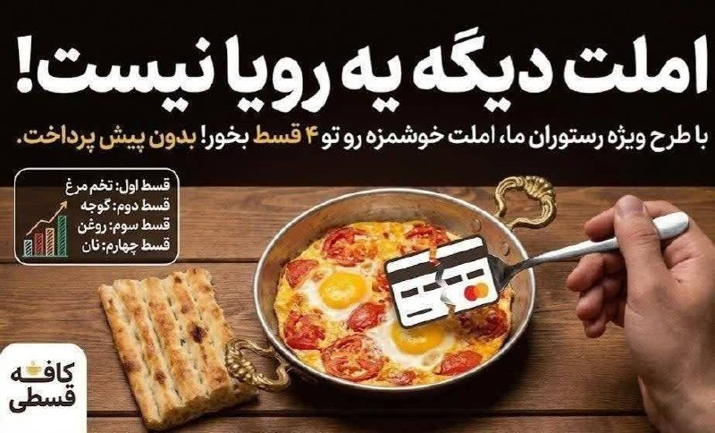

هر روز مردم ایران درحال تحقیر شدن توسط جمهوری‌شیطانی هستن!

@ChizBergerz

## ChizBergerz — post 46360

  <a href="telegram/content/ChizBergerz_46360_1778693999.mp4" target="_blank">🎬 Download video</a>

کپی برداری نوحه خوانی محمود کریمی مادرجنده از مدل اشعار برنامه های کودک تو سیرک شبانه حکومتی‌های حرامزاده؛
دشمن اگه نمی‌دونه بدونه، رهبرمون هرچی بگه همونه.
اون میگه کِی ما ها بریم به خونه، رهبرمون هرچی بگه همونه.
پیام هاش راه نجات‌مونه، رهبرمون هرچی بگه همونه.
ما رو به اوج قله می‌رسونه، رهبرمون هرچی بگه همونه.
غیوره مثل کوه پشتمونه، رهبرمون هرچی بگه همونه.
+ 
💩
💩
💩
💩
@ChizBergerz

## ChizBergerz — post 46359

یکی از چیزایی که این روزا خیلی داره اذیتم میکنه احساس هدر رفتنه. هدر رفتن جوونیم،کاراییم، روزها و زمان. انگار همشون دارن هدر میرن و من هیچ کاری از دستم برنمیاد...

## ChizBergerz — post 46358

  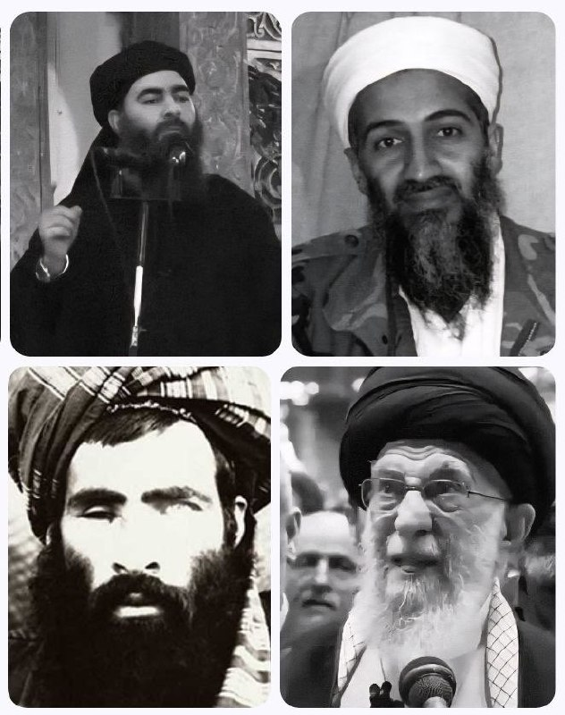

۴ ظالم و قاتلی که هنوز گور ندارن!

@ChizBergerz

## ChizBergerz — post 46357

  <a href="https://t.me/ChizBergerz/46357" target="_blank">📎 Download file</a>

📲#اپلیکیشن اندروید سایت جهانی دربی بت

👍اسپانسر لیگ انگلیس
👍
🔥امکان شارژ امن از طریق کارت بانکی
➖➖➖➖➖➖➖➖➖

🪙همین حالا عضو شوید 👇
https://t.me/+aCbq7yy8QY80NzQ0

## ChizBergerz — post 46356

  

😤دنبال یه سایت شرط بندی بین المللی بودی که به ایرانیا خدمات بده؟!
⛔

👍دربی بت همون انتخاب  100%

💎ویژگی های سایت جهانی Derby Bet:

⬅️امکان شارژ امن با کارت بانکی

⬅️واریز اول دوبل شارژ می شوید(بونوس۱۰۰٪)

⬅️پر اپشن ترین سایت فعال در ایران

⬅️تسویه حساب کمتر از 5 دقیقه

⬅️برگشت بخشی از باخت به صورت هفتگی

🚨کد هدیه ثبت نام:GG007

⚠️برای دانلود اپلکیشن کلیک کنید
👉
ge23

🔔کانال دربی بت :

🪙https://t.me/+aCbq7yy8QY80NzQ0

## rodast_omiddana — post 71323

  <a href="telegram/content/rodast_omiddana_71323_1778694003.webm" target="_blank">🎬 Download video</a>

🚨رویترز:
عربستان در طول جنگ مواضع حشدالشعبی را در عراق بمباران کرده است..

## rodast_omiddana — post 71322

⁧⁧
🎬
🔴
🔴
🔴 برنامه امشب تا یک ساعت و نیم دیگه:
*ترامپ به پکن نرسیده، رژیم طرح چین را قبول کرد
*نام حمله جدید آمریکا به رژیم، چکش سنگین میباشد
لینک یوتیوب:
https://www.youtube.com/@omiddana

## rodast_omiddana — post 71321

  <a href="telegram/content/rodast_omiddana_71321_1778694003.webm" target="_blank">🎬 Download video</a>

🚨 عباس عراقچی:
در تلاشی آشکار برای ایجاد تفرقه، کویت به طور غیرقانونی یک کشتی ایرانی را مورد حمله قرار داد و چهار نفر از شهروندان ما را در خلیج فارس بازداشت کرد. این اقدام غیرقانونی در نزدیکی جزیره‌ای رخ داد که ایالات متحده از آن برای حمله به ایران استفاده می‌کند.
ما خواستار آزادی فوری شهروندان خود هستیم و حق پاسخگویی را برای خود محفوظ می‌داریم

## rodast_omiddana — post 71320

  <a href="telegram/content/rodast_omiddana_71320_1778694003.webm" target="_blank">🎬 Download video</a>

🚨 لبنان شکایتی رسمی به سازمان ملل ارائه کرده و رژیم ایران را به نقض کنوانسیون وین ۱۹۶۱ درباره روابط دیپلماتیک متهم کرده است.
در این شکایت، تهران به «دخالت مستقیم و آشکار در امور داخلی لبنان» و همچنین کشاندن این کشور به جنگ برخلاف اراده نهادهای قانونی لبنان متهم شده است.
این شکایت در شورای امنیت ثبت و در مجمع عمومی سازمان ملل نیز توزیع شده است.

## rodast_omiddana — post 71319

🎬 توهمات صمدزاده کارنشناس رژیم در مورد کنترل مواد غذایی کشورهای عربی در تنگه هرمز
لینک یوتیوب:
https://www.youtube.com/watch?v=ojq5qYf2ax4

## rodast_omiddana — post 71318

  <a href="telegram/content/rodast_omiddana_71318_1778694003.webm" target="_blank">🎬 Download video</a>

🚨سلام داداش من بوشهرم طرف خیابون سنگی یه صدای مهیبی شنیده شد جوری که کل شیشه های خونمون لرزید
امروز چهارشنبه ۲۳ اردیبهشت

## rodast_omiddana — post 71317

  <a href="telegram/content/rodast_omiddana_71317_1778694004.webm" target="_blank">🎬 Download video</a>

🚨دورد داش امید گلم دقایقی پیش یه صدایی خیلی بلندی اومد تو شیراز سمت میدون معلم هستیم صداش خیلی نزدیک بود

## rodast_omiddana — post 71316

  <a href="telegram/content/rodast_omiddana_71316_1778694004.webm" target="_blank">🎬 Download video</a>

🚨 درود و ارادت اقای دانا همین الان ماهدشت کرج صدای شدید اومد از پنجره نگاه کردم دود سیاهی از ۴ کیلومتری میامد خونه بدجور لرزید امروز ۲۳ اردیبهشت چهارشنبه

## rodast_omiddana — post 71315

🎬 بازداشت فرماندهای سپاه در کویت
رجزخوانیهای قالیباف باعث سرنگونی رژیم میشود
لینک یوتیوب:
https://www.youtube.com/watch?v=FU3IbBGFw-k

## KiriMohems — post 47460

  <a href="telegram/content/KiriMohems_47460_1778694004.mp4" target="_blank">🎬 Download video</a>

🔴 افسر چینی خایه پلنگی که هنگام عبور هواپیمای رئیس جمهور آمریکا تو چند متریش ، عین کیر قامت بسته و خیلی از رسانه ها پشماشون ریخته
#Helsinki
@KiriMohems

## KiriMohems — post 47459

  

✖️ سایت بین المللی bet120x ✖️

 👍دارای مجوز رسمی Gambling Judge سوئد👍
     
💳شارژ حساب از طریق ارز و یووچر و پرمیوم ووچر
💳تسویه حساب دلاری سریع
💊بیمه شرط میکس
⚠️فروش شرط
🔔ویرایش شرط                    3️⃣2️⃣

🎁20%هدیه واریز از طریق ارز و ووچر
┅━━━━━━━━━━━
🎁 10%برگشت باخت به صورت روزانه
🎁 10%برگشت باخت به صورت هفتگی
🎁10%برگشت باخت به صورت ماهانه
💻ادرس ورود به سایت:
https://bet120x.com/fa/?btag=971470
➖➖➖➖➖
   👈 آموزش واریز و برداشت دلاری👉

🔪کانال اطلاع رسانی:👇 g23🅰
✈️https://t.me/+RvVnWMHCqUc4YzFk

## KiriMohems — post 47458

  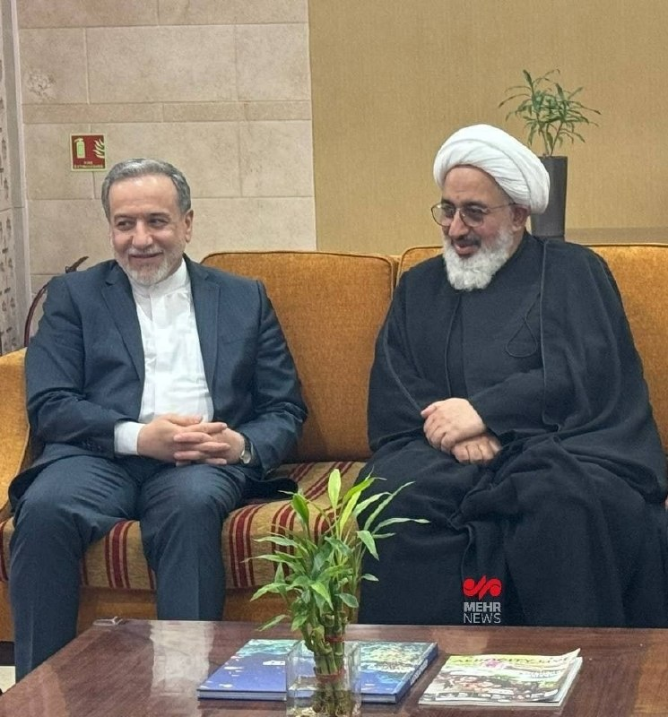

🔴این وسطا هم ، سولاخ‌چی خوش قدم پاشده رفته هندوستان
#Helsinki
@KiriMohems

## KiriMohems — post 47457

🔴دفتر نخست‌وزیر اسرائیل ، بنیامین نتانیاهو:

وسط حمله به ایران ، نتانیاهو خیلی سوسکی به امارات سفر کرد و با رئیس‌جمهور امارات، شیخ محمد بن زاید دیدار کرد که باعث پیشرفت کلفت و تاریخی تو روابط بین اسرائیل و امارات شد.
#Helsinki
@KiriMohems

## KiriMohems — post 47455

🔴کونو ول بدید که امتحانات حضوری دبستان‌های استان تهران لغو شد

نمرۀ نهایی براساس عملکرد مستمر کلاسی و خایه مالی دانش اموز توسط معلم و تأیید مدیر مدرسه اعلام می‌‎شود.

#Berlin
@Kirimohems

## KiriMohems — post 47453

میخوام یه کانفیگ رو سنگ حکاکی کنم، بذارم زیر خاک چند صد سال بعد یه باستان‌شناس پیداش کرد کص×گیجه بگیره.

#professor
@KiriMohems

## KiriMohems — post 47452

🔴میدل ایست از خایمالان سپاه:

منابع مختلفی میگن که برای مراسم تشییع جنازه خامنه‌ای برنامه هایی تو مراحل پیشرفته‌ای قرار داره و علاوه بر خایه لیسان در این مملکت ، بیش از ۱ میلیون شهروند کیری مقام عراقی هم برای شرکت در مراسم ثبت‌نام کردن

#Helsinki
@KiriMohems

## SportBaadNews — post 251502

  <a href="telegram/content/SportBaadNews_251502_1778694007.webm" target="_blank">🎬 Download video</a>

🚨
⚽️ فووووووری: باشگاه بارسلونا یک پیشنهاد رسمی و عجیب به کیلیان امباپه ارائه کرده است! طبق گزارش‌ها، در صورتی که امباپه 5 سال آینده در رئال مادرید بماند، باشگاه بارسلونا حاضر است مبلغی نزدیک به 100 میلیون یورو به او پرداخت کند!
@SportBaadNews

## IranIntlTV — post 337035

  <a href="telegram/content/IranIntlTV_337035_1778694008.mp4" target="_blank">🎬 Download video</a>

دفتر نخست‌وزیر اسرائیل اعلام کرد بنیامین نتانیاهو در دوران جنگ به امارات متحده عربی سفر کرده است.

اردوان روزبه، خبرنگار ایران‌اینترنشنال، گزارش می‌دهد

@iranintltv

## IranIntlTV — post 337034

  <a href="telegram/content/IranIntlTV_337034_1778694009.mp4" target="_blank">🎬 Download video</a>

گزارش‌های تازه ابعاد جدیدی از نقش و تحرکات ریاض و ابوظبی در جنگ ایران رو فاش می‌کنند. وال استریت ژورنال می‌گوید دیوید بارنیا، رییس موساد، در دوران جنگ دست‌کم دو بار، به صورت محرمانه به امارات سفر کرده است.

سمیرا قرایی و بابک اسحاقی، خبرنگاران ایران‌اینترنشنال، گزارش می‌دهند
@iranintltv

## IranIntlTV — post 337033

  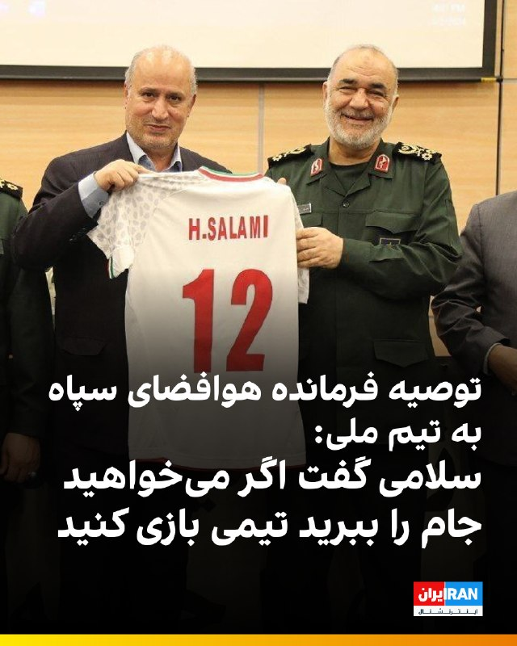

🔻خبرگزاری تسنیم، وابسته به سپاه پاسداران نوشت که مجید موسوی، فرمانده نیروی هوافضا سپاه در پیامی خطاب به بازیکنان تیم ملی پیش از حضور در جام جهانی نوشته است: «سلامی (فرمانده پیشین سپاه پاسداران) توصیه کرد: اگر می‌خواهید جام را ببرید تیمی بازی کنید.»

@iranintltvsport

## IranIntlTV — post 337032

  <a href="telegram/content/IranIntlTV_337032_1778694012.mp4" target="_blank">🎬 Download video</a>

تیتر اول با نیوشا صارمی، چهارشنبه ۲۳ اردیبهشت
@iranintltv

## IranIntlTV — post 337031

  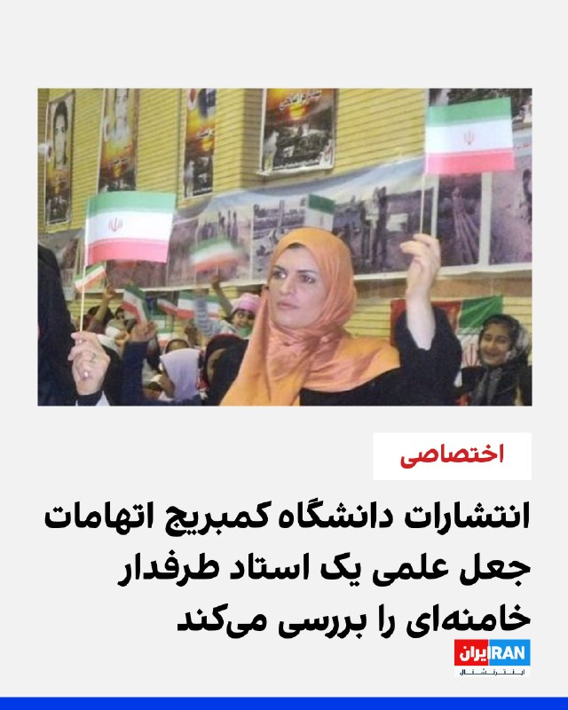

یک استاد ایرانی-آمریکایی دانشگاه آرکانزاس که اواخر ماه مارس به‌دلیل «فعالیت‌هایی در طرفداری از علی خامنه‌ای رهبر کشته‌شده جمهور اسلامی» از موقعیت رسمی خود برکنار شد، اکنون با تحقیقاتی درباره احتمال تخلفات علمی مواجه است.

انتشارات دانشگاه کمبریج که کتاب شیرین سعیدی، استاد ایرانی-آمریکایی دانشگاه آرکانزاس را منتشر کرده، در حال بررسی اتهاماتی است مبنی بر اینکه این اثر شامل مصاحبه‌های جعلی یا بدون مجوز با زنان قربانی حکومت ایران است. این کتاب بر پایه رساله دکترای شیرین سعیدی نوشته شده است.

ایران‌اینترنشنال دریافته است که دانشگاه کمبریج نیز در حال بررسی رساله دکترای سعیدی به‌دلیل احتمال تقلب است.

دکتر جی سیلوریا، رییس دانشگاه آرکانزاس، سعیدی را به دلایلی غیرمرتبط با تحقیقات کمبریج اخراج کرده است. او این تصمیم را به هیات امنای دانشگاه ابلاغ کرده و قرار است این هیات در ۲۱ مه پرونده اخراج او را بررسی کند.

کتاب سعیدی با عنوان «زنان و جمهوری اسلامی: چگونه شهروندی جنسیتی دولت ایران را شکل می‌دهد» اکنون در بریتانیا زیر ذره‌بین قرار دارد.

ادامه این گزارش را در وبسایت ایران‌اینترنشنال بخوانید
https://iranintl.com/202

## IranIntlTV — post 337030

  

نیویورک تایمز در گزارشی اعلام کرد که کشورهای حاشیه خلیج فارس در جریان جنگ ایران، بیش از ۱۰۰ شیعه را به اتهام خیانت بازداشت کرده‌اند.
کویت، امارات متحده عربی و بحرین از جمله کشورهایی هستند که موج بازداشت‌ها در آن‌ها گزارش شده است.
در بحرین ۶۹ نفر از تابعیت محروم شده‌اند و ۴۱ نفر دیگر به اتهام ارتباط با سپاه پاسداران بازداشت شده‌اند. یک گروه حقوق بشری می‌گوید ۳۷ نفر از بازداشت‌شدگان روحانی شیعه بوده‌اند.
در امارات متحده عربی ۲۷ نفر به عضویت در «سازمان تروریستی شیعه» متهم شده‌اند. دولت تصاویر آن‌ها را منتشر کرده و برخی چهره‌های نزدیک به حکومت خواستار مجازات شدید شده‌اند.

https://iranintl.com/202605137296

## IranIntlTV — post 337029

  

ایران، قربانی جنگ، فساد و ریاکاری جمهوری اسلامی است و میان مردم و حاکمیت، دریایی از خون قرار گرفته است. جمهوری اسلامی و مردم در نقطه‌ای تاریخی و بی‌بازگشت ایستاده‌اند. هزینه‌ای که به مردم ایران تحمیل شده، جامعه را خشمگین کرده است؛ خشمی که هر روز بیشتر می‌شود.

این خشم انباشتهٔ مردم چه زمانی فوران خواهد کرد؟

«برنامه» صدای شماست. ما شما را مستقیم از ایران روی خط می‌آوریم.

برای شرکت در برنامه، همین حالا در واتس‌اپ پیام بدهید:
۰۰۴۴۷۵۲۲۱۱۰۱۱۰
۰۰۴۴۷۵۴۴۱۱۰۱۱۰
۰۰۴۴۷۵۱۱۱۰۲۵۵۳

«برنامه با کامبیز حسینی»
«یک ایران صدای شما را می‌شنود»

@iranintltv

## IranIntlTV — post 337028

یک شهروند در پیامی به ایران اینترنشنال درباره سرکوب و بحران‌های اقتصادی و معیشتی می‌گوید مردم در ایران گروگان حکومت هستند. او از رهبران آمریکا و اسرائیل می‌خواهد با جمهوری اسلامی مذاکره و آتش‌بس نکنند. صدای این مخاطب با هوش مصنوعی بازخوانی شده است.

## IranIntlTV — post 337027

  <a href="telegram/content/IranIntlTV_337027_1778694015.mp4" target="_blank">🎬 Download video</a>

سازمان حقوق بشر برای ورزش نسبت به اجرای حکم اعدام احسان حسینی‌پور، فوتبالیست ۱۹ ساله، هشدار داد.

براساس این گزارش، حکم اعدام او در دیوان عالی تایید شده است. حسینی‌پور در اعتراضات ۱۸ دی‌ماه بازداشت شد.

گفت‌وگو با مهدی رستم‌پور، خبرنگار ورزشی
@iranintltv

## IranIntlTV — post 337026

یک شهروند در پیامی به ایران اینترنشنال درباره سرکوب و بحران‌های اقتصادی و معیشتی می‌گوید مردم در ایران گروگان حکومت هستند. او از رهبران آمریکا و اسرائیل می‌خواهد با جمهوری اسلامی مذاکره و آتش‌بس نکنند. صدای این مخاطب با هوش مصنوعی بازخوانی شده است.

## IranIntlTV — post 337025

  <a href="https://t.me/IranintlTV/337025" target="_blank">📎 Download file</a>

🎧نسخه صوتی اخبار شبانگاهی | چهارشنبه ۲۳ اردیبهشت
@iranintlTV

## IranIntlTV — post 337024

  <a href="telegram/content/IranIntlTV_337024_1778694017.mp4" target="_blank">🎬 Download video</a>

قوه قضاییه جمهوری اسلامی خبر داد احسان افرشته، جوان ۳۳ ساله‌، را به اتهام همکاری با اسرائیل، اعدام کرده اما دو منبع گفتند او، پیش از بازگشت به ایران از ترکیه، به‌طور داوطلبانه خود را به وزارت اطلاعات معرفی کرده بود اما بلافاصله در فرودگاه بازداشت شد.

گزارشی از مجتبا پورمحسن
@iranintltv

## IranIntlTV — post 337023

  <a href="telegram/content/IranIntlTV_337023_1778694019.mp4" target="_blank">🎬 Download video</a>

در پی موج جدید بیکاری در ایران در سایه جنگ و سرکوب، آمار رسمی از بیش از ۲۰۰هزار نفر متقاضی دریافت بیمه بیکاری خبر می‌دهد.

گفت‌وگو با نیکی محجوب، روزنامه‌نگار
@iranintltv

## IranIntlTV — post 337022

  

فیصل بن فرحان، وزیر خارجه عربستان سعودی در نشست خبری مشترک با وزیر خارجه اسپانیا در مادرید اعلام کرد که بازگشت کشتیرانی در تنگه هرمز به وضعیت پیش از ۹ اسفند ضروری است.

او اضافه کرد: «امنیت تنگه هرمز و آزادی کشتیرانی، پایه ثبات اقتصاد جهانی به شمار می‌رود. به حمایت از کاهش تنش‌ها و جلوگیری از تشدید بحران ادامه می‌دهیم.»
https://iranintl.com/202605135219

## IranIntlTV — post 337020

  

🔻احمد دنیامالی، وزیر ورزش جمهوری اسلامی در حاشیه حضور مسعود پزشکیان در اردوی تیم ملی، ضمن اعلام حضور تیم ملی در جام جهانی گفت: «بازیکنان تیم ملی تصمیم گرفته‌اند سرود جمهوری اسلامی را نخوانند، بلکه آن را فریاد بزنند.»

🔹او پیش‌تر حامیان حضور در جام جهانی را «بی‌غیرت» خوانده بود.

🔹دنیامالی در این دیدار مدعی شد: «بازیکنان و اعضای کادر تیم ملی برای دفاع از ایران هم‌قسم شده‌اند و خوش‌بین هستیم که با برنامه‌ریزی انجام گرفته و تلاش‌ کادر فنی، تیم ملی برای کشور افتخارآفرینی کند.»

@iranintltvsport

## IranIntlTV — post 337019

  

سنتکام اعلام کرد از زمان آغاز محاصره دریایی بنادر و سواحل جنوب ایران، ۶۷ کشتی تجاری مجبور به تغییر مسیر شده‌اند. به گفته این نهاد، نیروهای آمریکایی اجازه عبور ۱۵ کشتی حامل کمک‌های بشردوستانه را داده‌اند و چهار کشتی نیز در پی اقدامات این نیروها از کار افتاده‌اند.
https://iranintl.com/202605135107

## IranIntlTV — post 337018

🔻انتشارات دانشگاه کمبریج اتهامات جعل علمی یک استاد طرفدار خامنه‌ای را بررسی می‌کند

🖋بنجامین واینتال

یک استاد ایرانی-آمریکایی دانشگاه آرکانزاس که اواخر ماه مارس به‌دلیل «فعالیت‌هایی در طرفداری از علی خامنه‌ای رهبر کشته‌شده جمهور اسلامی» از موقعیت رسمی خود برکنار شد، اکنون با تحقیقاتی درباره احتمال تخلفات علمی مواجه است.

انتشارات دانشگاه کمبریج که کتاب شیرین سعیدی، استاد ایرانی-آمریکایی دانشگاه آرکانزاس را منتشر کرده، در حال بررسی اتهاماتی است مبنی بر اینکه این اثر شامل مصاحبه‌های جعلی یا بدون مجوز با زنان قربانی حکومت ایران است. این کتاب بر پایه رساله دکترای شیرین سعیدی نوشته شده است.

ایران‌اینترنشنال دریافته است که دانشگاه کمبریج نیز در حال بررسی رساله دکترای سعیدی به‌دلیل احتمال تقلب است.

دکتر جی سیلوریا، رییس دانشگاه آرکانزاس، سعیدی را به دلایلی غیرمرتبط با تحقیقات کمبریج اخراج کرده است. او این تصمیم را به هیات امنای دانشگاه ابلاغ کرده و قرار است این هیات در ۲۱ مه پرونده اخراج او را بررسی کند.

کتاب سعیدی با عنوان «زنان و جمهوری اسلامی: چگونه شهروندی جنسیتی دولت ایران را شکل می‌دهد» اکنون در بریتانیا زیر ذره‌بین قرار دارد.
سخنگوی انتشارات دانشگاه کمبریج به ایران‌اینترنشنال گفت: «انتشارات دانشگاه کمبریج تمام شکایات مربوط به آثار منتشرشده را جدی می‌گیرد و بررسی مسائل مطرح‌شده را مطابق با دستورالعمل‌های استاندارد COPE ادامه می‌دهد.»

COPE مخفف کمیته اخلاق در انتشار است که به مسائل اخلاقی در آثار علمی می‌پردازد.

ایران‌اینترنشنال نسخه‌ای از نامه‌ای را به دست آورده که مریم نوری، نویسنده خاطرات «در جست‌وجوی رهایی»، به انتشارات دانشگاه کمبریج ارسال کرده و در آن سعیدی را به ساختگی بودن روایت‌هایش متهم کرده است.

نوری، که در سال ۱۹۸۵ در حالی که باردار بود به‌دست جمهوری اسلامی زندانی شد و به‌گفته خودش مجبور شد فرزندش را در زندان به دنیا بیاورد، در نامه‌اش نوشته است: «این نامه را برای ثبت شکایت رسمی درباره استفاده غیراخلاقی و بدون مجوز از خاطرات شخصی‌ام و جعل محتوای مصاحبه از سوی دکتر شیرین سعیدی می‌نویسم.»

او تاکید کرد: «من هرگز با خانم سعیدی ملاقات نکرده‌ام و هیچ‌گونه مصاحبه‌ای با او در شهر کلن یا هیچ شهر دیگری در آلمان نداشته‌ام. او از محتوای کتاب من در رساله دکتری و کتاب منتشرشده خود بدون اجازه کتبی یا شفاهی من استفاده کرده و از آن برای منافع شخصی، از جمله ارتقای جایگاه دانشگاهی و حرفه‌ای خود بهره برده است.»

نوری افزود: «این اقدام را نقض آشکار حقوق و کرامت شخصی خود می‌دانم و آن را به‌شدت محکوم می‌کنم.»
سخنگوی دانشگاه کمبریج نیز اعلام کرد: «دانشگاه اتهامات مربوط به تخلفات علمی را جدی می‌گیرد و هرگونه نگرانی مطرح‌شده را مطابق با سیاست‌ها و رویه‌های مربوطه بررسی می‌کند. این فرایندها ذاتا محرمانه هستند.»

نسرین پروَز، که هشت سال در ایران زندانی و شکنجه شده بود، نیز در مجموعه‌ای از هفت پست در شبکه ایکس در ماه دسامبر، ادعای مصاحبه سعیدی با خود را رد کرد.

او نوشت: «من هرگز سعیدی را نمی‌شناختم و هیچ مصاحبه‌ای با او نداشته‌ام. او فقط از نسخه فارسی کتاب من که بیش از ۲۰ سال پیش منتشر شده استفاده کرده است.»

سعیدی و وکیلش، جی‌جی تامپسون، به پرسش‌های رسانه‌ای ایران‌اینترنشنال پاسخی نداده‌اند.

دانشگاه آرکانزاس پیش از اخراج سعیدی نیز او را به‌دلیل استفاده ادعایی نادرست از سربرگ دانشگاه برای درخواست آزادی حمید نوری مورد تنبیه قرار داده بود. حمید نوری در سال ۲۰۲۲ در دادگاهی در سوئد به‌دلیل مشارکت در اعدام هزاران زندانی سیاسی در زندان گوهردشت در سال ۱۹۸۸ محکوم شد.

سعیدی مدعی است برای استفاده از سربرگ دانشگاه مجوز داشته است.

پروَز در شبکه ایکس نوشت: «دفاع او از حمید نوری، یکی از عاملان اعدام‌های سال ۱۹۸۸، نشان می‌دهد او در کدام سوی تاریخ ایستاده است.»
لادن بازرگان، مدیر سازمان «ائتلاف علیه حامیان رژیم جمهوری اسلامی ایران»، نخستین کسی بود که نقش سعیدی در کمک به حمید نوری در سوئد را افشا کرد.

او که در دادگاه نوری حضور داشت، گفت مترجم دادگاه تایید کرده که سعیدی به نفع نوری مداخله کرده است.

بیژن بازرگان، برادر لادن بازرگان، از زندانیان سیاسی چپ‌گرا بود که در کشتار سال ۱۹۸۸ به‌دست حکومت ایران کشته شد.

بازرگان همچنین موارد ادعایی جعل در آثار علمی سعیدی را شناسایی کرده است.

او به ایران‌اینترنشنال گفت: «زندانیان سیاسی سابقی که نامشان در رساله و کتاب سعیدی آمده، به‌طور علنی انجام مصاحبه با او را رد کرده‌اند و اکنون پرسش‌هایی جدی درباره اسناد، ضبط‌ها، فرم‌های رضایت، دقت استنادها و حتی وجود برخی افراد ذکرشده در این آثار مطرح است.»

🔗ادامه این گزارش را اینجا بخوانید
@iranintltv

## IranIntlTV — post 337017

🔻مدیران انویدیا، تسلا، اپل و بوئینگ، ترامپ را در سفر به چین همراهی می‌کنند

دونالد ترامپ، رییس‌جمهوری آمریکا، در سفر به چین برای دیدار با شی جین‌پینگ، رییس‌جمهوری این کشور، گروهی از مدیران بزرگ‌ترین شرکت‌های آمریکایی از جمله انویدیا، تسلا، اپل، بوئینگ و گلدمن ساکس را با خود همراه کرده است.

ترامپ چهارشنبه ۲۳ اردیبهشت پیش از ورود به پکن، در شبکه اجتماعی تروث‌سوشال نوشت جنسن هوانگ، مدیرعامل انویدیا، همراه او در هواپیمای ریاست‌جمهوری آمریکا حضور دارد و گزارش شبکه سی‌ان‌بی‌سی درباره دعوت نشدن او به این سفر «خبر جعلی» است.

بر اساس آنچه ترامپ نوشت «جنسن، ایلان، تیم اپل، لری فینک، استیون شوارتزمن، کلی اورتبرگ از بوئینگ، برایان سایکس از کارگیل، جین فریزر از سیتی، لری کالپ از جی‌ای ایرواسپیس، دیوید سولومون از گلدمن ساکس، سانجی مهروترا از مایکرون، کریستیانو آمون از کوالکام و بسیاری دیگر» در این سفر حضور دارند.

رییس‌جمهوری آمریکا اعلام کرد قصد دارد در دیدار با شی جین‌پینگ از او بخواهد اقتصاد چین را بیش از پیش به روی شرکت‌ها و سرمایه‌گذاری آمریکایی باز کند.
او نوشت: «از رییس‌جمهوری شی خواهم خواست چین را باز کند تا این افراد بتوانند توانایی‌های خود را به کار بگیرند و به ارتقای جمهوری خلق چین کمک کنند.»

حل مسائل تجاری

رویترز نوشت بیشتر شرکت‌های حاضر در این سفر به دنبال حل مسائل تجاری و محدودیت‌های موجود در بازار چین هستند.

انویدیا از جمله شرکت‌هایی است که برای فروش تراشه‌های پیشرفته هوش مصنوعی خود در چین با محدودیت‌های نظارتی روبه‌رو شده است.

به گزارش رویترز، مذاکرات دو طرف علاوه بر تجارت، موضوعاتی چون جنگ ایران، فروش تسلیحات آمریکا به تایوان، صادرات فناوری‌های پیشرفته، هوش مصنوعی و کاهش تنش‌های تجاری میان واشینگتن و پکن را در بر می‌گیرد.
همزمان اسکات بسنت، وزیر خزانه‌داری آمریکا مذاکره‌کننده تجاری آمریکا، در کره جنوبی با مقام‌های چینی دیدار کرد. خبرگزاری دولتی شین‌هوا این گفت‌وگوها را «صریح، عمیق و سازنده» توصیف کرد.

رویترز نوشت ترامپ در حالی وارد مذاکرات با چین شده که ادامه جنگ ایران و افزایش تورم در آمریکا، فشار سیاسی بر او را افزایش داده است. در مقابل، شی جین‌پینگ با فشار داخلی کمتری روبه‌رو است.

انتظار می‌رود ترامپ در دیدار با شی، از چین بخواهد تهران را برای رسیدن به توافق با واشینگتن و پایان دادن به جنگ ایران ترغیب کند؛ هرچند ترامپ گفته تصور نمی‌کند به کمک پکن نیاز داشته باشد.

چین چهارشنبه بار دیگر مخالفت شدید خود را با فروش تسلیحات آمریکا به تایوان اعلام کرد. هنوز مشخص نیست آیا ترامپ بسته تسلیحاتی ۱۴ میلیارد دلاری برای تایوان را تایید خواهد کرد یا نه.

آمریکا با وجود نداشتن روابط دیپلماتیک رسمی با تایوان، بر اساس قانون موظف است ابزارهای دفاعی لازم را در اختیار این جزیره قرار دهد.
🔗وب‌سایت ایران‌اینترنشنال
@iranintltv

## IranIntlTV — post 337016

  

ارتش اسرائیل و شاباک اعلام کردند حمزه شرباصی، از فرماندهان گردان «شجاعیه» حماس، هفته گذشته در حمله‌ای هوایی در شمال نوار غزه کشته شد؛ فردی که به گفته آن‌ها در حمله هفت اکتبر ۲۰۲۳ به پایگاه «نحل عوز» مشارکت داشت.

بر اساس این بیانیه، شرباصی در جریان حمله هفت اکتبر ۲۰۲۳ وارد خاک اسرائیل شد و در حمله به پایگاه نحل عوز که در آن شماری از سربازان اسرائیلی کشته و ربوده شدند، نقش داشت.

ارتش اسرائیل و شاباک اعلام کردند شرباصی اخیرا در نزدیکی «خط زرد» فعالیت می‌کرد و در چارچوب مسئولیت خود، در پیشبرد طرح‌هایی علیه نیروهای اسرائیلی در منطقه نقش داشت.

در همین حمله، عزام الحیه، پسر ۲۳ ساله خلیل الحیه، مذاکره‌کننده ارشد حماس نیز کشته شد.

به گفته ارتش اسرائیل، الحیه عضو یگان نخبه حماس بود و اخیرا «نقشی مرکزی» در این گروه داشت.

ارتش اسرائیل اعلام کرد نیروهایش در فرماندهی جنوب، مطابق توافق آتش‌بس، همچنان در منطقه مستقر هستند و برای رفع هرگونه تهدید فوری به فعالیت خود ادامه خواهند داد.
https://iranintl.com/202605136406

## IranIntlTV — post 337015

  

خبرگزاری تسنیم، وابسته به سپاه پاسداران، گزارش داد نعیم قاسم، دبیرکل حزب‌الله لبنان، در پیامی به علیرضا اعرافی، مدیر حوزه‌های علمیه جمهوری اسلامی، اعلام کرد که «مقاومت هرگز تسلیم نخواهد شد.»

نعیم قاسم در پیام خود نوشت: «ما قدردان حمایت خالصانه و مستمر جمهوری اسلامی از ابتدا تا امروز هستیم. حمایتی که با دستور روح‌الله خمینی آغاز شد و تحت هدایت علی خامنه‌ای و از طریق سپاه پاسداران و خصوصا نیروی قدس ادامه یافت.»

دبیرکل حزب‌الله حملات اخیر آمریکا و اسرائیل به جمهوری اسلامی را «حمله به پرچم مقاومت، استقلال و حمایت از فلسطین و قدس» دانست و نوشت با این حال مجتبی خامنه‌ای، این مرحله را نیز با پیروزی پشت سر خواهد گذاشت.
https://iranintl.com/202605137004

## Persian_Trend_Official — post 14070

  <a href="telegram/content/Persian_Trend_Official_14070_1778694024.webm" target="_blank">🎬 Download video</a>

https://youtube.com/live/xKXwDy6wYig?feature=share

## Persian_Trend_Official — post 14069

تا ده دقیقه دیکه لایو آغاز میشه

## Persian_Trend_Official — post 14068

🔴 رویترز مدعی حملات جنگنده‌های سعودی به مواضع گروه‌های عراقی شد

💢خبرگزاری رویترز به‌نقل از منابعی مدعی شد جنگنده‌های عربستان سعودی در جریان جنگ اخیر، مواضع گروه‌های مسلح عراقی را هدف قرار داده‌اند.

تاکنون نیز عربستان سعودی به‌صورت رسمی واکنشی به این ادعا نشان نداده است.

🫆:Tony

📌 @persian_trend_official
پرشین ترند | متفاوت‌ترین کانال نظامی

## Persian_Trend_Official — post 14067

  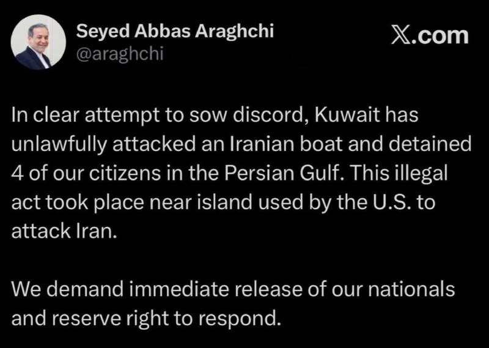

🔴 عراقچی: کویت به یک قایق ایرانی حمله کرده و ۴ شهروند ایرانی را بازداشت کرده است

💢عباس عراقچی، وزیر خارجه ایران، اعلام کرد کویت در اقدامی «غیرقانونی» به یک قایق ایرانی در خلیج فارس حمله کرده و ۴ شهروند ایرانی را بازداشت کرده است.

او مدعی شد:

▪️ این اقدام با هدف ایجاد اختلاف و تنش در منطقه انجام شده است
▪️ حادثه در نزدیکی جزیره‌ای رخ داده که آمریکا از آن برای حمله به ایران استفاده کرده است
▪️ تهران خواستار آزادی فوری شهروندان بازداشت‌شده شده
▪️ ایران حق پاسخ‌گویی به این اقدام را برای خود محفوظ می‌داند

💢این اظهارات پس از آن مطرح می‌شود که کویت اعلام کرده ۴ فرد وابسته به سپاه پاسداران را هنگام ورود دریایی به جزیره بوبیان بازداشت کرده است؛ ادعایی که تهران آن را رد کرده و گفته ورود قایق به آب‌های کویت ناشی از اختلال در سامانه ناوبری بوده است.

🫆:Tony

📌 @persian_trend_official
پرشین ترند | متفاوت‌ترین کانال نظامی

## Persian_Trend_Official — post 14066

⭕️ خلاصه اخبار چند روز گذشته

🔸اینترنت بین‌الملل به گیمرها ارائه می‌شود؛ ثبت درخواست در سامانه همگرا (اینترنت طبقاتی)

🔹دولت و مجلس به دنبال حمایت تازه از پیام‌رسان‌های داخلی (رانت و فساد جدید)

🔸نماینده مردم تهران در مجلس: درباره خسارت‌های قطعی اینترنت جوسازی می‌شود. (حرف مفت)

🔹معاون رئیس‌جمهور: اینترنت بین‌الملل حتما وصل می‌شود؛ دولت قصد دائمی‌کردن محدودیت‌ها را ندارد. (حرف الکی)

🔸برآورد انجمن بلاکچین: خسارت ۳۰۰ تا ۷۰۰ هزار میلیاردی از قطعی اینترنت.

🔹معاون رئیس جمهور: محدودیت حجم و گرانی اینترنت پرو برای جلوگیری از استفاده غیرضروری است. (عجب بابا عجب)

🔸قطع اینترنت به هفتاد و پنجمین روز خود رسید.

📝 Nick

📌 @persian_trend_official
پرشین ترند | متفاوت‌ترین کانال نظامی

---
📅 بروزرسانی: 1405/02/23 19:06
---

## ChizBergerz — post 46355

  <a href="telegram/content/ChizBergerz_46355_1778686571.mp4" target="_blank">🎬 Download video</a>

صفحه‌ی اسرائیل به فارسی: وقتی (بزودی) به اسرائیل سفر کنید، این منظره زیبا از پنجره هواپیما در انتظار شماست.
به امید دیدار در تل‌آویو یا تهران.

@ChizBergerz

## ChizBergerz — post 46354

  <a href="telegram/content/ChizBergerz_46354_1778686572.mp4" target="_blank">🎬 Download video</a>

ویدیو وایرال شده از مکه که یه خانم یه دختر رو با تناب بسته و به زور دور مکه میچرخونتش!😐😐😐

@ChizBergerz

## ChizBergerz — post 46353

حالا که ترامپ و همه مقامات آمریکا رفتن چین و کشورشون خالی شده بهترین فرصته حمله کنیم آمریکا رو تصرف کنیم، برسونید دست سیدمجید برنامه‌هاشو ردیف کنه

## ChizBergerz — post 46352

  <a href="telegram/content/ChizBergerz_46352_1778686573.mp4" target="_blank">🎬 Download video</a>

لحظه پیاده شدن ترامپ و بروبچ از هواپیما و استقبال چینی‌ها:

@ChizBergerz

## rodast_omiddana — post 71314

  <a href="telegram/content/rodast_omiddana_71314_1778686575.webm" target="_blank">🎬 Download video</a>

🚨 ایال زامیر ، رئیس ستاد ارتش اسرائیل:
«نبرد تمام نشده است، ارتش اسرائیل آماده از سرگیری نبرد در صورت نیاز از کرانه باختری تا تهران است»

## rodast_omiddana — post 71313

🎬 ترامپ به چین رفت تا کار جمهوری اسلامی را تمام کند
لینک یوتیوب:
https://www.youtube.com/watch?v=EBfrFJmXV-Y

## rodast_omiddana — post 71312

  <a href="telegram/content/rodast_omiddana_71312_1778686575.mp4" target="_blank">🎬 Download video</a>

🚨 استقبال از ترامپ در فرودگاه پکن

## KiriMohems — post 47451

  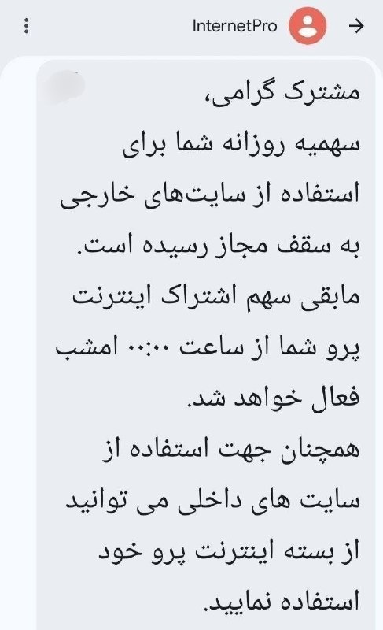

عاقبت خرید اینترنت پرو

#professor
@KiriMohems

## KiriMohems — post 47449

🔴ترامپ همراه ایلان ماسک ، دوستان و سایر خایمالان وارد پکن شدند #Helsinki @KiriMohems

## KiriMohems — post 47448

  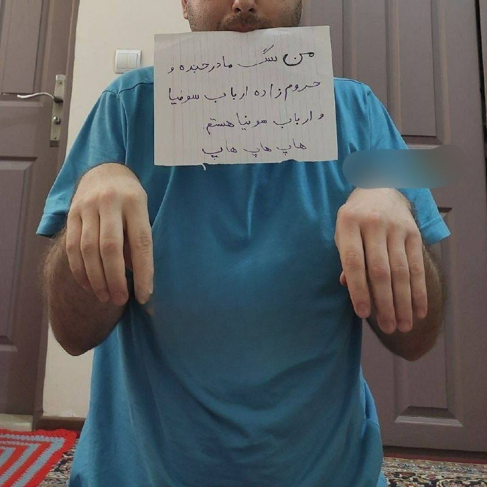

‏این دوس پسر کدومتونه؟

#professor
@KiriMohems

## KiriMohems — post 47447

🚀 فروش کانفیگ های پر سرعت V2ray 🍋 با ضمانت اتصال پایداری در کیفیت ✅هر روز ۲۰ گیگ کانفیگ رایگان در چنل 💵 قیمت 1 گیگ 290.000 💵 قیمت 3 گیگ 850.000 💵 قیمت 5 گیگ 1.400.000 💵 قیمت 10 گیگ 2.800.000 💵 قیمت 15 گیگ 4.100.000 💵 قیمت 20 گیگ 5.400.000 پشتیانی 24 ساعته…

## KiriMohems — post 47445

  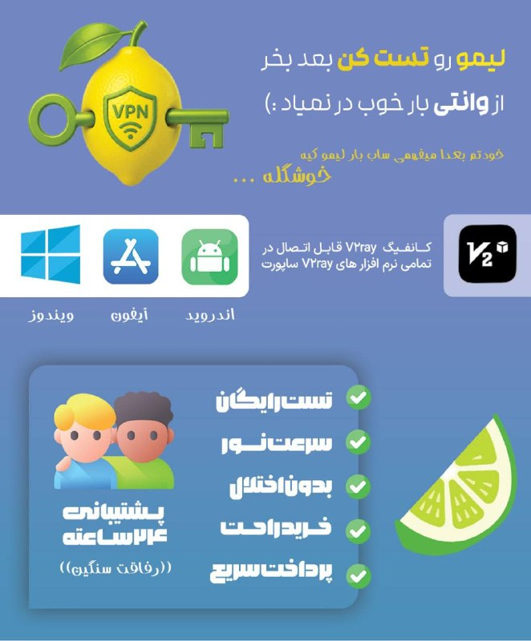

🚀 فروش کانفیگ های پر سرعت V2ray
🍋 با ضمانت اتصال پایداری در کیفیت

✅هر روز ۲۰ گیگ کانفیگ رایگان در چنل

💵 قیمت 1 گیگ 290.000
💵 قیمت 3 گیگ 850.000
💵 قیمت 5 گیگ 1.400.000
💵 قیمت 10 گیگ 2.800.000
💵 قیمت 15 گیگ 4.100.000
💵 قیمت 20 گیگ 5.400.000

پشتیانی 24 ساعته ضمانت اتصال تا پایان
حجم شما⏰

@LimoStarVpn
@LimoStarVpn

🤵 خرید حرفه ای از کامل ترین ربات فروش

@limoStarVpnBot
@limoStarVpnBot

## KiriMohems — post 47444

  

🔴کصکشان مایه دار و خرپول هایی که همراه ترامپ به چین اومدن

#Helsinki
@KiriMohems

## KiriMohems — post 47443

  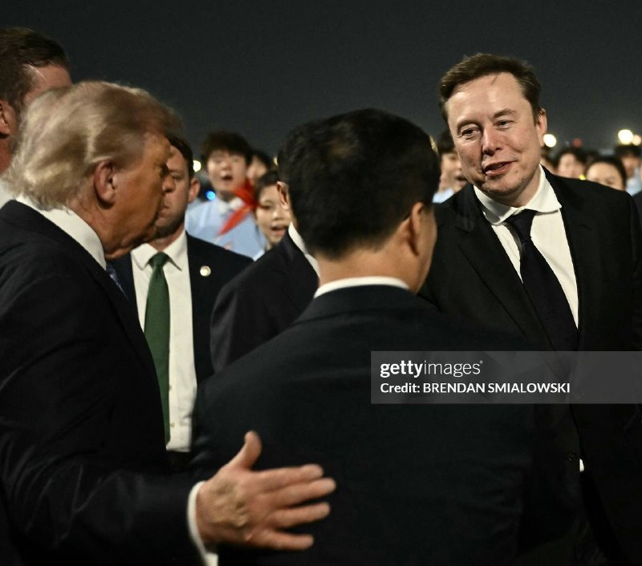

🔴ترامپ همراه ایلان ماسک ، دوستان و سایر خایمالان وارد پکن شدند #Helsinki @KiriMohems

## SportBaadNews — post 251501

  

🇪🇸 ترکیب فصل لالیگای 2025/26
@SportBaadNews

## SportBaadNews — post 251500

  

⚽️ فابریزیو رومانو: فصل بعد کریک سرمربی منچستره
@SportBaadNews

## SportBaadNews — post 251499

  

⚽️ رافا یوسته نایب رئیس بارسلونا:
مصاحبه‌ی پرز واقعا خنده‌دار بود، مثل جوک می‌مونه وقتی برای توجیه دو سال جام نزدنشون میان از نگریرا استفاده میکنن در حالیکه ما لیگ رو با یه تیم از لاماسیا بردیم و الان با اختلاف 14 امتیاز صدر جدولیم
@SportBaadNews

## IranIntlTV — post 337014

🔻از مکزیکوسیتی تا نیویورک؛ کالاهای جام جهانی با برچسب «ساخت چین»

کمتر از یک ماه مانده به آغاز جام جهانی فوتبال ۲۰۲۶ در مکزیکوسیتی، موج صادرات کالاهای ساخت چین به کشورهای میزبان این مسابقات آغاز شده است؛ از توپ فوتبال و پرچم گرفته تا لباس هواداری و ماگ‌های ورزشی.

جام جهانی ۲۰۲۶ از ۲۱ خرداد تا ۲۸ تیر ۱۴۰۵ در آمریکا، کانادا و مکزیک برگزار می‌شود و برای نخستین‌بار با حضور ۴۸ تیم در ۱۶ شهر برگزار خواهد شد.

شرکت «کینگدائو واندرفول فلگ» در استان شاندونگ چین اعلام کرد بلافاصله پس از مشخص شدن فهرست تیم‌های حاضر در جام جهانی، سفارش تولید پرچم کشورهای شرکت‌کننده به‌سرعت افزایش یافت. شیائو چانگ‌آی، رییس این شرکت، گفت تولید پرچم تیم‌هایی مانند برزیل، آرژانتین و آلمان از ماه مارس آغاز شده بود، اما با شروع مسابقات، سفارش‌ها به‌صورت لحظه‌ای و با تحویل فوری ثبت خواهند شد.

بر اساس اعلام گمرک چین، این شرکت اکنون به‌صورت شبانه‌روزی فعالیت می‌کند و تولید روزانه آن به بیش از ۱۰۰ هزار پرچم رسیده است.

همزمان شرکت «نینگبو اکو-ویل تکنولوژی» که تولیدکننده ماگ، لیوان و لوازم هواداری است، اعلام کرد صادراتش به آمریکا، کانادا و مکزیک در چهار ماه نخست سال ۲۰۲۶ نسبت به مدت مشابه سال قبل ۴۷ درصد افزایش یافته و به ۴۰ میلیون یوان رسیده است. این شرکت افزایش تقاضا برای کالاهای دارای لوگوی رسمی تیم‌های فوتبال را عامل اصلی رشد صادرات دانست.

داده‌های گمرک نینگبو نشان می‌دهد صادرات تجهیزات و کالاهای ورزشی از این بندر بین ژانویه تا آوریل به ۵.۷۴ میلیارد یوان رسیده که نسبت به سال گذشته بیش از ۱۱ درصد رشد داشته است.
🔗وب‌سایت ایران‌اینترنشنال
@iranintltv

## IranIntlTV — post 337013

  <a href="telegram/content/IranIntlTV_337013_1778686581.mp4" target="_blank">🎬 Download video</a>

وزارت خارجه لبنان با ارسال نامه‌ای رسمی به دبیرکل و رییس شورای امنیت سازمان ملل، از جمهوری اسلامی شکایت کرد. لبنان در این نامه نهادهای جمهوری اسلامی، از جمله سپاه پاسداران را مسئول درگیر شدن این کشور در جنگ، برخلاف خواست دولت معرفی کرد.

گزارش می فرحات، خبرنگار ایران‌اینترنشنال
@iranintltv

## IranIntlTV — post 337012

  <a href="telegram/content/IranIntlTV_337012_1778686582.mp4" target="_blank">🎬 Download video</a>

محسن کدیور، مدرس مطالعات اسلامی در دانشگاه دوک آمریکا، در گفت‌وگو با خبرگزاری جمهوری اسلامی، از تجمعات شبانه حمایت کرد. او که اولین بار پس از ۱۷ سال، حرفهایش اجازه انتشار می‌گیرد، حضور هواداران حکومت در خیابان‌ها را دفاع مردم ایران از میهن توصیف کرد.

گفت‌وگو با محدجواد اکبرین، عضو تحریریه ایران‌اینترنشنال
@iranintltv

## IranIntlTV — post 337011

🔻وال‌استریت ژورنال: رییس موساد در جریان «جنگ ایران» به امارات متحده عربی سفر کرد

دیوید بارنئا، رییس سازمان اطلاعات و وظایف ویژه اسرائیل (موساد)، در جریان جنگ اخیر آمریکا و اسرائیل با جمهوری اسلامی، دست‌کم دو بار به‌صورت محرمانه به امارات متحده عربی سفر کرده تا درباره هماهنگی‌های مرتبط با جنگ گفت‌وگو کند.

روزنامه وال‌استریت ژورنال چهارشنبه ۲۳ اردیبهشت به نقل از مقام‌های عرب و یک منبع آگاه گزارش داد بارنئا در دو ماه‌ گذشته، دست‌کم دو بار با هدف هماهنگی درباره جنگ با جمهوری اسلامی به امارات متحده عربی سفر کرده است.

آنچه در این گزارش آمده است، نشانه‌ای از گسترش همکاری‌های امنیتی میان اسرائیل و امارات متحده عربی است.

وال‌استریت ژورنال نوشت دو کشور در طول جنگ، هماهنگی امنیتی نزدیکی داشته‌اند.
این روزنامه پیش‌تر گزارش داده بود اسرائیل سامانه‌های پدافندی گنبد آهنین و ده‌ها نیروی نظامی را برای مقابله با حملات موشکی و پهپادی جمهوری اسلامی به امارات متحده عربی فرستاده است.

وال‌استریت ژورنال ۲۱ اردیبهشت نیز به نقل از منابع آگاه خبر داد که امارات متحده عربی به‌طور مخفیانه حملاتی به جمهوری اسلامی کرده و در یکی از این حملات در ماه آوریل، پالایشگاه نفتی جزیره لاوان در ایران را هدف قرار داده است.

به‌نوشته وال‌استریت ژورنال، این اقدام می‌تواند امارات را به یکی از طرف‌های فعال جنگی تبدیل کند که در آن، خود بیش از هر کشور دیگری هدف حملات حکومت ایران بوده است.

برخی مقامات جمهوری اسلامی پیش از این از دست داشتن امارات در بعضی حملات به جنوب ایران سخن گفته بودند.

رهبران جمهوری اسلامی در جریان آتش‌بس نیز به تندی به این کشور هشدار داده‌اند.

امارات متحده عربی حتی در جریان آتش‌بس چند بار هدف حملات موشکی و پهپادی قرار گرفته است.

وزارت خارجه امارات متحده عربی و دفتر بنیامین نتانیاهو، نخست‌وزیر اسرائیل، تاکنون به درخواست وال‌استریت ژورنال برای اظهار نظر پاسخ نداده‌اند.
موساد: همین حالا وقت عمل است

کانال ۱۳ اسرائیل ۱۹ اردیبهشت به نقل از یک مقام اسرائیلی که نامش فاش نشده گزارش داد دولت این کشور همچنان در وضعیت «انتظار دائمی» درباره تصمیم مورد انتظار دونالد ترامپ، رییس‌جمهوری آمریکا، در قبال ایران قرار دارد.

بر اساس این گزارش، مقام‌های نظامی و اطلاعاتی اسرائیل در جریان نشست‌های اخیر، مواضعی تهاجمی‌تر علیه تهران را به نتانیاهو ارائه کرده‌اند.

این گزارش افزود ارتش اسرائیل وضعیت کنونی توان نظامی [حکومت] ایران را یک «فرصت عملیاتی» برای از سرگیری حملات و «تکمیل ماموریت» می‌داند.

کانال ۱۳ تلویزیون اسرائیل گزارش داد موساد به نتانیاهو گفته است: «باید همین حالا به ایران حمله کرد.»

بنا بر این گزارش، موساد معتقد است از سرگیری جنگ می‌تواند روند فروپاشی حکومت ایران را تسریع کند.
🔗وب‌سایت ایران‌اینترنشنال
@iranintltv

## IranIntlTV — post 337010

  <a href="https://t.me/IranintlTV/337010" target="_blank">📎 Download file</a>

🎧نسخه صوتی اخبار نیم‌روزی | چهارشنبه ۲۳ اردیبهشت
@iranintlTV

## IranIntlTV — post 337009

  

شاخوان عبدالله، رییس فراکسیون حزب دموکرات کردستان عراق، در گفت‌وگویی اختصاصی با ایران‌اینترنشنال تایید کرد که الزیدی توصیه‌های واشنگتن درباره دور نگه داشتن گروه‌های مسلح از وزارتخانه‌ها را جدی گرفته است.

به گفته عبدالله، تفاوت زیادی میان کابینه السودانی و کابینه الزیدی در زمینه حضور گروه‌های مسلح وجود دارد؛ چرا که در دولت السودانی شمار زیادی از افراد وابسته به گروه‌های مسلح در دولت حضور داشتند، اما تا این لحظه روند در دولت الزیدی به این شکل نیست، مگر این‌که در لحظات آخر تغییراتی ایجاد شود.

فادی الشمری، مشاور نخست‌وزیر، سه‌شنبه در گفت‌وگویی خبری تایید کرده بود آمریکایی‌ها اطلاع داده‌اند که اگر حتی یک وزیر وابسته به گروه‌های مسلح در دولت حضور داشته باشد، به‌طور کامل با دولت همکاری نخواهند کرد.

بر اساس برخی گزارش‌ها، قرار است پنج‌شنبه پارلمان عراق بخشی از کابینه دولت الزیدی را به رای بگذارد.

در عراق، «نخست‌وزیر مکلف» به فردی گفته می‌شود که مامور تشکیل کابینه شده اما هنوز از پارلمان رای اعتماد نگرفته، قدرت اجرایی ندارد و رسما در سمت نخست‌وزیر فعالیت نمی‌کند.
https://iranintl.com/202605138519

## IranIntlTV — post 337008

🔻اینترنت، نابرابری و کنترل روانی در وضعیت بحران

🖋تحلیل - صبا آلاله

اوایل ورود اینترنت، بسیاری آن را فقط یک فناوری تازه یا ابزار سرگرمی می‌دانستند؛ اما به‌تدریج اینترنت از یک امکان جانبی خارج شد و به بخشی از جریان اصلی زندگی تبدیل شد؛ تا جایی که امروز بخش بزرگی از کار، ارتباطات، آموزش و حتی تجربه ما از جهان بدون آن قابل تصور نیست.

امروزه برای میلیون‌ها نفر، اینترنت بخشی از زیرساخت زندگی روزمره و شرط حضور در جهان اجتماعی است. معیشت بخش بزرگی از جامعه نیز به اینترنت وابسته شده است؛ از فروشگاه‌های آنلاین و کسب‌وکارهای کوچک گرفته تا رانندگان تاکسی‌های اینترنتی، افراد شاغل به‌صورت دورکاری و پروژه‌ای، تولیدکنندگان محتوا و مشاغلی که شبکه‌های اجتماعی بستر اصلی فعالیت آن‌هاست.

به همین دلیل، قطع یا محدودسازی اینترنت فقط به معنای کند شدن ارتباطات نیست، بلکه می‌تواند مستقیما جریان زندگی، درآمد و احساس امنیت افراد را مختل کند.

شبکه‌های اجتماعی و پیام‌رسان‌ها در سال‌های اخیر به بخشی از تجربه جمعی جامعه تبدیل شده‌اند؛ فضایی برای حرف زدن، دیده شدن، روایت کردن و شریک شدن در تجربه‌های مشترک. افراد بخش مهمی از احساس باهم‌بودن را در فضای دیجیتال تجربه می‌کنند.

در بحران‌ها، همین فضا می‌تواند به بستری برای همدلی، انتقال تجربه، شکل‌گیری حافظه جمعی و حتی سازماندهی اجتماعی تبدیل شود.

این فضا بخشی از تجربه روانی و اجتماعی انسان امروز شده است؛ جایی که افراد در آن خود را بیان می‌کنند، دیده می‌شوند و احساس می‌کنند به جهان پیرامون متصل‌اند. در چنین شرایطی، محرومیت از اینترنت فقط محرومیت از یک ابزار نیست، بلکه می‌تواند تجربه‌ای از حذف شدن، نادیده گرفته شدن و قطع ارتباط با جهان بیرون باشد؛ وضعیتی که افراد در آن نوعی محرومیت روانی و اجتماعی را تجربه می‌کنند.
اینترنت و کنترل ادارک

با توجه به اینکه اینترنت در جامعه ما همواره با نوسان، کندی و قطعی‌های دوره‌ای همراه بوده، در زمان‌های بحران این اختلال‌ها شدت بیشتری پیدا می‌کند.

این وضعیت نشان می‌دهد که دسترسی به اطلاعات و امکان اشتراک‌گذاری روایت‌ها در شرایط بحرانی به مسئله‌ای حساس تبدیل می‌شود؛ جایی که کنترل یا محدودسازی اینترنت می‌تواند بر آگاهی جمعی و شکل‌گیری روایت‌های عمومی اثر بگذارد. هرچه اینترنت بیشتر در زندگی روزمره ریشه دوانده، حساسیت نسبت به کنترل آن نیز بیشتر شده است.

در لحظه‌های بحران، قطع یا محدودسازی اینترنت فقط به کمبود اطلاعات منجر نمی‌شود، بلکه پیوستگی تجربه مشترک از واقعیت را دچار اختلال می‌کند. افراد به تصویر هم‌زمان و مشترکی از آنچه در حال رخ دادن است دسترسی ندارند؛ خبرها با تاخیر می‌رسند، روایت‌ها ناقص‌اند و منابع مختلف اطلاعاتی هم‌پوشانی ندارند. نتیجه این وضعیت، شکل‌گیری نوعی تعلیق ذهنی و ناامنی جمعی است؛ وضعیتی که در آن تشخیص واقعیت دشوارتر شده و احساس اطمینان نسبت به جهان پیرامون کاهش می‌یابد.

در چنین شرایطی، اختلال در اینترنت می‌تواند درک مشترک جامعه از واقعیت را دچار گسست و آشفتگی کند.
🔗ادامه این مطلب را اینجا بخوانید
@iranintltv

## IranIntlTV — post 337007

  

مهدی طباطبایی، معاون ارتباطات و اطلاع‌رسانی دفتر مسعود پزشکیان، گفت اگر همه‌پرسی برگزار شود، مردم در شرایط جنگی، امنیت را به سهولت دسترسی به اینترنت ترجیح خواهند داد.

طباطبایی در واکنش به انتقادها درباره محدودیت‌های اینترنتی و «اینترنت پرو» گفت تصمیم‌های مربوط به اینترنت با اجماع نهادهای تخصصی و امنیتی و در شورای عالی امنیت ملی، بر اساس ملاحظات امنیتی و شرایط جنگی اتخاذ شده است.

او افزود «در وضعیت جنگی، باز بودن کامل اینترنت بین‌الملل اساسا قابل تصور نیست.»

طباطبایی گفت در شورای عالی امنیت ملی، کمیته‌ای مسئول بررسی وضعیت ارتباطات و فضای مجازی در شرایط ویژه جنگی بوده و جمع‌بندی کارشناسی این کمیته این بوده که اینترنت در چنین شرایطی می‌تواند «مخاطرات امنیتی جدی برای کشور» به همراه داشته باشد.

او همچنین درباره طرح «اینترنت پرو» گفت این طرح برای پاسخ به نیاز برخی کسب‌وکارها و فعالان اقتصادی وابسته به اینترنت بین‌الملل طراحی شده تا در دوره محدودیت‌ها، فعالیت‌های ضروری آن‌ها مختل نشود.
https://iranintl.com/202605137018

## IranIntlTV — post 337006

همزمان با ادامه رقابت تجاری و فناوری میان آمریکا و چین، سفر دونالد ترامپ، رییس‌جمهوری آمریکا به پکن دوباره بحث درباره آینده روابط اقتصادی دو قدرت بزرگ جهان را مطرح کرده است. با وجود تعرفه‌ها، تحریم‌ها و رقابت سیاسی، شرکت‌های بزرگ آمریکایی و چینی همچنان به بازارهای یکدیگر وابسته‌اند.
مهدی بیگی، عضو تحریریه ایران‌اینترنشنال، در «پیوست» به این موضوع می‌پردازد
@iranintltv

## IranIntlTV — post 337005

  <a href="telegram/content/IranIntlTV_337005_1778686585.mp4" target="_blank">🎬 Download video</a>

رییس‌جمهور آمریکا پس از ۹ سال وارد پکن شد تا با رهبر جمهوری خلق چین، دیدار و گفت‌وگو کند. دونالد ترامپ می‌گوید در مورد ایران به کمک شی جین‌پینگ نیاز ندارد.

سمیرا قرایی، خبرنگار ایران‌اینترنشنال، گزارش می‌دهد
@iranintltv

## IranIntlTV — post 337004

  <a href="telegram/content/IranIntlTV_337004_1778686586.mp4" target="_blank">🎬 Download video</a>

انتشار کتاب «زوجی تقریبا کامل»، درباره ارتباط رییس‌جمهور فرانسه و همسرش مورد توجه رسانه‌ها قرار گرفت. فلوریان تاردیف، روزنامه‌نگار فرانسوی دراین کتاب از ارتباط امانوئل مکرون و گلشیفته فراهانی و رد و بدل شدن پیام‌های خصوصی میان آنها خبر داد.

گفت‌وگو با محمدرضا شاهید، روزنامه‌نگار
@iranintltv

## IranIntlTV — post 337003

سرخط خبرهای چهارشنبه ۲۳ اردیبهشت
@iranintltv

## IranIntlTV — post 337002

  <a href="telegram/content/IranIntlTV_337002_1778686588.mp4" target="_blank">🎬 Download video</a>

وب‌سایت اقتصادنیوز گزارش داد با وجود تثبیت نمایشی نرخ دلار از سوی بانک مرکزی در محدوده ۱۸۰ هزار تومان، قیمت کالاها بر اساس دلار ۵۰۰ هزار تومانی محاسبه می‌شود.
گفت‌وگو با آرش آزرمی، دبیر بخش اقتصادی ایران‌اینترنشنال
@iranintltv

## IranIntlTV — post 337001

🔻افت تحصیلی دانش‌‌آموزان در سایه قطع اینترنت

گزارش‌های رسیده به ایران‌اینترنشنال، از بلاتکلیفی در نحوه برگزاری امتحانات به‌دلیل قطعی اینترنت حکایت دارد. دانش‌آموزان، دانشجویان و فعالان آموزشی در پیام‌های خود گفتند قطع اینترنت باعث افت کیفیت آموزش، ایجاد موجی از ناامیدی و فرسودگی روانی شده است.

شماری از دانش‌آموزان در پیام‌هایی به ایران‌اینترنشنال از ناکارآمدی آموزش مجازی و اختلال مداوم اپلیکیشن‌های داخلی گلایه کرده‌اند.

یک دانش‌آموز ۱۶ ساله با اشاره به قطع و وصل مکرر کلاس‌های آنلاین گفت وسط کلاس و حین تدریس، دسترسی معلمان به اپلیکیشن‌ قطع می‌شود، فایل‌ها و عکس‌ها دیر آپلود می‌شوند و دیگر انگیزه‌ای برای درس خواندن ندارد.

پیش‌تر نیز تعدادی از دانش‌آموزان، والدینشان و معلمان در پیام‌هایی به ایران‌اینترنشنال از نبود بستر مناسب آموزش در اپلیکیشن‌های «شاد» و «بله» خبر دادند.

مادر یک دانش‌آموز با اشاره به مجازی بودن کلاس بچه‌ها گفت فضای اپلیکیشن به‌نحوی طراحی شده که فقط معلم می‌تواند در آن صحبت کند و اگر دانش‌آموز سوالی داشته باشد یا موضوعی را نفهمد، باید تا ساعت پنج بعدازظهر که دسترسی دانش‌آموز باز می‌شود، صبر کند.
افت کیفیت آموزش در میان اختلال و ابهام

بلاتکلیفی درباره حضوری یا مجازی بودن امتحانات به دیگر نگرانی‌ها دامن زده است.

یک دانش‌آموز پایه دهم از منطقه فردیس خبر داد با رسیدن به امتحانات آخر ترم، آموزش ‌و پرورش هر روز یک تصمیم جدید می‌گیرد و مشخص نیست امتحان‌ها «حضوری» است یا «غیرحضوری».

برخی دانش‌آموزان همچنین از افت شدید کیفیت یادگیری در میان خود و همکلاسی‌هاشان خبر دادند.

دانش‌آموزی نوشت به‌خاطر ضعیف بودن اینترنت حتی نمی‌تواند برنامه «شاد» را روی گوشی خود باز کند، چه برسد به حضور سر کلاس درس.

نوجوانی ۱۴ ساله به ایران‌اینترنشنال گفت اگر امتحان‌ها حضوری شود، خیلی‌ها قبول نمی‌شوند. چراکه هیچ‌کسی درس‌ها را بلد نیست و بیشتر بچه‌ها جواب پرسش‌ها را از هوش مصنوعی می‌پرسند و می‌نویسند.

فعالان حوزه آموزش نیز از کاهش شدید امید و انگیزه در میان نوجوانان و جوانان سخن گفتند.

یک مشاور تحصیلی در پیامی نوشت از زمان آغاز جنگ، بسیاری از دانش‌آموزان کلاس‌های خود را لغو کرده‌اند و در سه ماه گذشته «تقریبا هیچ شاگرد جدیدی» نداشته است.
آموزش و معیشت؛ دو بحران هم‌زمان

فشار اقتصادی نیز در کنار مشکلات آموزشی، شرایط را برای دانش‌آموزان و معلمان دشوارتر کرده است.

یک داوطلب کنکور با اشاره به هزینه بالای کتاب‌های کمک‌درسی و محدودیت اینترنت گفت: «اگر امسال در دانشگاه قبول نشوم، باید به سربازی بروم اما نه پول کتاب دارم و نه دسترسی به اینترنت که بتوانم چیزی یاد بگیرم.»

برخی معلمان و مدرس‌های خصوصی نیز در شبکه اجتماعی ایکس از لغو مداوم کلاس‌های آنلاین به‌دلیل اختلال اپلیکیشن‌های داخلی و همچنین فشار اقتصادی بر مردم خبر داده‌اند.

شماری از آنها نوشته‌اند کلاس‌ها به‌دلیل قطع و وصل اینترنت یا نبود دانش‌آموز کنسل می‌شود و حتی از کاربران خواسته‌اند اگر کسی به معلم یا مدرس نیاز دارد، آنها را معرفی کنند.
🔗وب‌سایت ایران‌اینترنشنال
@iranintltv

## IranIntlTV — post 337000

  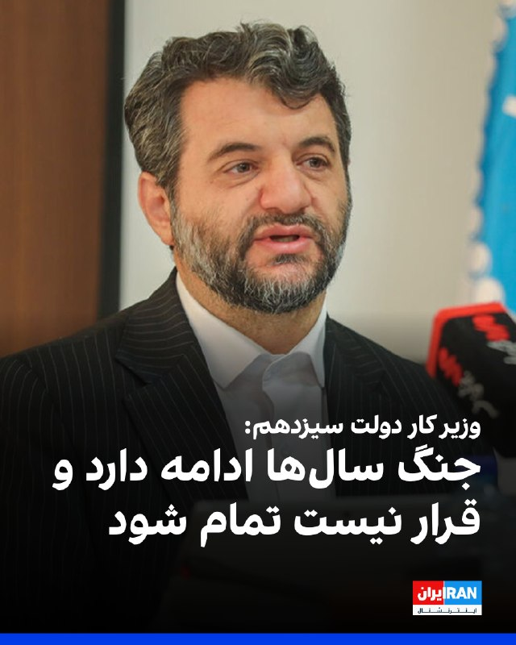

حجت‌الله عبدالملکی، وزیر کار دولت سیزدهم، درباره محاصره دریایی جمهوری اسلامی گفت: «نباید بر فروش نفت خام اصرار کنیم و سرمایه‌گذاری در فرآورده‌های نفتی بسیار به‌صرفه است.»

او اضافه کرد: «دشمن نمی‌تواند با محاصره دریایی برای ما چالش ایجاد کند و بیش‌تر از اثر روانی آن استفاده می‌کند.»

عبدالملکی در ادامه به جنگ جمهوری اسلامی و آمریکا اشاره کرد و گفت «این جنگ سال‌ها ادامه خواهد داشت و قرار نیست تمام شود.»
https://iranintl.com/202605136128

## IranIntlTV — post 336999

🔻ترامپ وارد پکن شد؛ انتظارهای بزرگ با دستور کار مبهم

دونالد ترامپ کمی بعد از ۸ شب چهارشنبه ۲۳ اردیبهشت به وقت پکن، در میان استقبال گارد احترام و جوانانی که پرچم‌های آمریکا و چین را تکان می‌دادند، وارد این شهر شد و سفری را آغاز کرد که گرچه محور اصلی آن تجارت است، اما ناظران به نتایج مذاکرات درباره جنگ ایران در این سفر چشم دوخته‌اند.

هان ژنگ، معاون رییس‌جمهوری چین، دیوید پردو، سفیر آمریکا در چین، شیه فنگ، سفیر چین در آمریکا و ما ژائوشو، معاون اجرایی وزیر امور خارجه چین، در دومین سفر رییس‌جمهوری آمریکا به چین از او استقبال کردند.

پس از او، اریک ترامپ، پسرش، و لارا ترامپ، عروس او، همراه با شماری از همراهان سفر، از جمله ایلان ماسک، مدیر شرکت اسپیس‌ایکس، از هواپیما پیاده شدند.

ترامپ بدون پاسخ دادن به پرسش‌های خبرنگاران سوار لیموزین شد تا به سوی هتل محل اقامتش برود.

طبق اعلام کاخ سفید دیدار ترامپ با همتای چینی خود، شی جین‌پینگ، روزهای پنج‌شنبه و جمعه، ۲۴ و ۲۵ اردیبهشت، بر تجارت، مساله فنتانیل و پرونده جنگ ایران متمرکز خواهد بود؛ موضوعاتی که به گزارش رسانه پولیتیکو، دولت ترامپ در ۱۶ ماه آغاز به کارش نتوانسته بر سر آنها به توافقی چشمگیر با پکن برسد یا امتیاز قابل‌توجهی از چین بگیرد.
مقام‌های آمریکایی پیش‌تر اعلام کرده بودند که هیات‌های آمریکا و چین در این سفر دو روزه قرار است درباره پرونده جنگ ایران، مساله تایوان، هوش مصنوعی و تسلیحات هسته‌ای گفت‌وگو کنند. توافق مربوط به مواد معدنی حیاتی نیز یکی از محورهای این گفت‌وگوها خواهد بود.

پکن هنوز هیچ جزئیاتی درباره دستور کار نشست میان روسای جمهوری دو کشور ارائه نکرده است. گو جیاکون، سخنگوی وزارت امور خارجه چین، دوشنبه گفت ترامپ و شی درباره «مسائل مهم مربوط به روابط چین و آمریکا و صلح و توسعه جهانی» گفت‌وگو خواهند کرد.
خود ترامپ نیز پاسخ‌های متفاوتی درباره موضوعات دستور کار داده است. او دوشنبه ۲۱ اردیبهشت گفت ایران و انرژی هر دو در فهرست موضوعات قرار دارند، اما سه‌شنبه، پیش از ترک کاخ سفید به مقصد پکن، این اظهارات را پس گرفت و گفت: «ما موضوعات زیادی برای گفت‌وگو داریم. صادقانه بگویم، نمی‌گویم ایران یکی از آنهاست، چون ایران کاملا تحت کنترل ماست.»

او در عوض گفت موضوع اصلی، تجارت خواهد بود.

زک کوپر، دستیار پیشین معاون مشاور امنیت ملی در دولت جورج دبلیو بوش، که به‌طور منظم با مقام‌های دولت آمریکا و مقام‌های چینی دیدار می‌کند، به پولیتیکو گفت: «این نشست هر روز کوچک‌تر می‌شود.»

او افزود: «کاملا روشن است که تیم ترامپ در موقعیت بسیار دشواری قرار دارد و کاملا ممکن است ترامپ با ذهنی درگیر و در موضعی تضعیف‌شده به پکن برود.»

این نخستین سفر ترامپ در دوره دوم ریاست‌جمهوری‌اش به چین و دومین سفر او در مقام رهبر آمریکا به این کشور است. او حدود یک ماه پیش از عزیمت به چین، این دیدار را «رویدادی عظیم» توصیف کرد و کمی بعد از این اظهار نظر، در شبکه اجتماعی تروث سوشال نوشت که از شی جین‌پینگ چیزی کمتر از یک «آغوش گرم و بزرگ» انتظار ندارد.

با این حال، ناظران می‌گویند این سفر با سفر مجلل قبلی‌اش در سال ۲۰۱۷، زمانی که چین برای جلب نظر او سنگ تمام گذاشت و در شهر ممنوعه ۶۰۰ ساله یک ضیافت شام به افتخار او ترتیب داد، تفاوت دارد.

دستور کار این سفر نیز به همان اندازه دشوار و پرچالش است؛ با این تفاوت که پرونده ایران اکنون به منبع تازه‌ای از تنش تبدیل شده و در کنار تجارت، فناوری و تایوان قرار گرفته است.

به‌گزارش سی‌ان‌ان، یک تفاوت عمده میان این دو سفر تغییر در قدرت سیاسی چین است. این رسانه نوشت: «در قیاس با سال ۲۰۱۷ چین قدرتمندتر و بسیار قاطع‌تر شده است؛ شی با جاه‌طلبی برنامه‌هایی را برای توسعه نیروهای مولد جدید، سرمایه‌گذاری‌های سنگین در انرژی‌های تجدیدپذیر، روباتیک و هوش مصنوعی پیش برده و با جدیت کوشیده است که ثابت کند در تعامل‌های بین‌المللی در جایگاهی برابر با آمریکا قرار دارد.

🔗وب‌سایت ایران‌اینترنشنال
@iranintltv

## IranIntlTV — post 336998

  <a href="telegram/content/IranIntlTV_336998_1778686590.mp4" target="_blank">🎬 Download video</a>

در جریان تجمع معترضان ضد مهاجرت در لوسدرخت هلند در روز سه‌شنبه، پس از پرتاب مواد آتش‌بازی به بوته‌های مقابل ساختمان، یک مرکز اسکان پناهجویان دچار آتش‌سوزی شد. رسانه‌های محلی گزارش دادند حدود ۴۰۰ معترض که در محل تجمع کرده بودند، تلاش کردند مانع خاموش‌کردن آتش از سوی آتش‌نشانان شوند و در نهایت با ورود یگان ضد شورش پلیس متفرق شدند. بر اساس گزارش رسانه‌های محلی، هنگام وقوع آتش‌سوزی ۱۵ پناهجو داخل ساختمان بودند.
@iranintltv

## IranIntlTV — post 336997

  

محمدرضا محسنی ثانی، عضو کمیسیون امنیت ملی مجلس، گفت مواضع و اقدامات امارات متحده عربی نشان می‌دهد اسرائیل و آمریکا از این کشور حمایت می‌کنند و این رویکرد بیانگر فاصله گرفتن امارات از کشورهای مسلمان عربی منطقه و طلب کمک از دشمنان دنیای اسلام است.

او افزود: «ادعای ابوظبی درباره حملات موشکی و پهپادی جمهوری اسلامی به امارات متحده عربی صرفا در راستای فضاسازی علیه ما مطرح شده است.»
https://iranintl.com/202605139778

## IranIntlTV — post 336996

در این قسمت چرتکه، محمد ماشینچیان سناریوهای مختلف قدرت خرید را تا پایان سال ۱۴۰۵ بررسی کرده و تاثیر نوسان نرخ دلار بر معیشت خانوارها را توضیح می‌دهد.
تماشای نسخه کامل «چرتکه» در یوتیوب:
https://youtu.be/_OE3ByHjJPE?si=TrsAbS0PgsrTa6tj

## IranIntlTV — post 336995

  <a href="https://t.me/IranintlTV/336995" target="_blank">📎 Download file</a>

🎧نسخه صوتی دومینو: بازگشت آمریکا با «پتک سنگین»
@iranintlTV

## Persian_Trend_Official — post 14065

## Persian_Trend_Official — post 14064

  

🔴دبیرکل حزب‌الله: حمایت‌های ایران باعث شد ما مقابل اشغالگری ایستادگی کنیم

💢شیخ نعیم قاسم دبیرکل حزب‌الله لبنان:

حمایت‌های جمهوری اسلامی ایران از همان آغاز تأسیس حزب‌الله در سال 1982 به فرمان امام خمینی و تداوم این پشتیبانی‌ها تحت نظارت امام خامنه‌ای و از طریق «سپاه پاسداران» به‌ویژه «نیروی قدس»، ما را قادر ساخت تا جنوب لبنان را در سال 2000 آزاد کنیم و تا به امروز در برابر تجاوزات مکرر بایستیم.

🫆:Tony

📌 @persian_trend_official
پرشین ترند | متفاوت‌ترین کانال نظامی

## Persian_Trend_Official — post 14063

🔴 لاوروف: آمریکا به‌دنبال کنترل بازار جهانی انرژی است

💢سرگئی لاوروف، وزیر خارجه روسیه، در اظهاراتی دولت ترامپ را متهم کرده که تلاش می‌کند نفوذ خود را بر بازار جهانی انرژی «تحمیل» کند.

💢او گفته است هدف آمریکا این است که شرکت‌های انرژی روسیه مانند لوک‌اویل و روس‌نفت را از بازارهای بین‌المللی خارج کند و مسیرهای اصلی تأمین انرژی جهان را تحت کنترل خود بگیرد.

💢لاوروف همچنین تأکید کرده:
آمریکا در اسناد راهبردی خود به دنبال تسلط بر بازار انرژی جهانی است و قصد دارد همه مسیرهای مهم انرژی را تحت نفوذ خود قرار دهد.

🫆:Tony

📌 @persian_trend_official
پرشین ترند | متفاوت‌ترین کانال نظامی

## Persian_Trend_Official — post 14061

🚨🇮🇱🇱🇧 حملات هوایی جدید اسرائیل دقایقی پیش مناطقی در لبنان را هدف قرار داد؛ همزمان منابع محلی از شنیده شدن صدای چندین انفجار خبر می‌دهند.

☆Phantom☆

📌 @persian_trend_official
پرشین ترند | متفاوت‌ترین کانال نظامی

## Persian_Trend_Official — post 14059

ترامپ تمام افراد ثروتمند آمریکا را با Air Force One خود به پکن برده است.

📝 Nick

📌 @persian_trend_official
پرشین ترند | متفاوت‌ترین کانال نظامی

---
📅 بروزرسانی: 1405/02/23 16:08
---

## ChizBergerz — post 46351

  

۱۰ خرداد ۱۳۴۶ علی خامنه‌ای به نگهبان زندان نامه‌ زد و گفت: «من به تلفن احتیاج دارم و این حقی طبیعی است که قانون برای همه‌ی شهروندان، من‌الجمله زندانی مقرر ساخته که در صورت احتیاج بتواند با خارج تماس تلفنی داشته باشد.»

+ حالا در حکومت جمهوری‌شیطانی که خامنه‌ای ساخته، به معترضان بازداشتی اجازه هیچ‌گونه صحبت با نزدیکان رو نمیده و بی‌خبر اعدامشون میکنه!💔
@ChizBergerz

## ChizBergerz — post 46350

  

استاد یکی از دانشگاه‌ها رفته سوالاتو اینطوری طراحی کرده تا مثلا هوش مصنوعی جوابشونو نده: 😐😂

@ChizBergerz

## ChizBergerz — post 46349

  

آگهی دفتر پیشخوان دولت برای فروش اینترنت طبقاتی پرو!!😐😐

+ اینترنت تهدید امنیته ولی اگه‌ پول بیشتری بدی دیگه تهدید نیست؟ عجب حرومزاده‌هایی هستین!
@ChizBergerz

## ChizBergerz — post 46348

  <a href="telegram/content/ChizBergerz_46348_1778675882.mp4" target="_blank">🎬 Download video</a>

این اینفلوئنسر خارجی بریکینگ بد هم اونطوری که دلش خنک میشده ساخته و این شاهکارو خلق کرده: 😂😂

@ChizBergerz

## ChizBergerz — post 46347

  <a href="https://t.me/ChizBergerz/46347" target="_blank">📎 Download file</a>

📲#اپلیکیشن اندروید سایت جهانی دربی بت

👍اسپانسر لیگ انگلیس
👍
🔥امکان شارژ امن از طریق کارت بانکی
➖➖➖➖➖➖➖➖➖

🪙همین حالا عضو شوید 👇
https://t.me/+aCbq7yy8QY80NzQ0

## ChizBergerz — post 46346

  

😤دنبال یه سایت شرط بندی بین المللی بودی که به ایرانیا خدمات بده؟!
⛔

👍دربی بت همون انتخاب  100%

💎ویژگی های سایت جهانی Derby Bet:

⬅️امکان شارژ امن با کارت بانکی

⬅️واریز اول دوبل شارژ می شوید(بونوس۱۰۰٪)

⬅️پر اپشن ترین سایت فعال در ایران

⬅️تسویه حساب کمتر از 5 دقیقه

⬅️برگشت بخشی از باخت به صورت هفتگی

🚨کد هدیه ثبت نام:GG007

⚠️برای دانلود اپلکیشن کلیک کنید
👉
re23

🔔کانال دربی بت :

🪙https://t.me/+aCbq7yy8QY80NzQ0

## rodast_omiddana — post 71310

  <a href="telegram/content/rodast_omiddana_71310_1778675884.mp4" target="_blank">🎬 Download video</a>

🚨 ترامپ به همراه ایلان ماسک وارد پکن شد

## rodast_omiddana — post 71309

  <a href="telegram/content/rodast_omiddana_71309_1778675886.webm" target="_blank">🎬 Download video</a>

🚨 امارات شروع به نصب موانع ضد پهپاد در اطراف انبارهای نفت نزدیک فرودگاه بین‌المللی دبی از طریق سازه‌ها و شبکه‌های فلزی کرده است.

## rodast_omiddana — post 71308

🎬 پاسخ به شمس الواعظین که میگه اسرائیل دشمن ایرانه
لینک یوتیوب:
https://www.youtube.com/watch?v=C-7Cxd__VQA

## rodast_omiddana — post 71307

  <a href="telegram/content/rodast_omiddana_71307_1778675886.mp4" target="_blank">🎬 Download video</a>

🚨
🚨 ورود پرزیدنت ترامپ به چین
مادر بگرید بچه شیعه

## rodast_omiddana — post 71306

🎬 علی مطهری: به علی لاریجانی گفتم از خانه من برو، تا ما هم با تو کشته نشویم
لینک یوتیوب:
https://www.youtube.com/watch?v=6bdRVD5q1Lo

## KiriMohems — post 47442

🔴ترامپ همراه ایلان ماسک ، دوستان و سایر خایمالان وارد پکن شدند

#Helsinki
@KiriMohems

## KiriMohems — post 47441

  <a href="telegram/content/KiriMohems_47441_1778675887.mp4" target="_blank">🎬 Download video</a>

🔴پس از حدود ۱۵ ساعت کون نشینی ترامپ در هواپیما ، وارد پکن پایتخت چین شد

#Helsinki
@KiriMohems

## KiriMohems — post 47440

  

🔴آقا مراد ویسی میخواد اون ولدرنا هایی که مردم رو تو دی‌ماه به قتل رسوندن رو شناسایی کنه رو اسامیشون رو بخونه

#Helsinki
@KiriMohems

## KiriMohems — post 47439

  <a href="telegram/content/KiriMohems_47439_1778675889.mp4" target="_blank">🎬 Download video</a>

مراد ویسی، تحلیل‌گر ارشد اینترنشنال:‌

ترامپ زمان زیادی نداره
با نزدیک شدن به انتخابات کنگره، اگه نتونه جمهوری اسلامی رو به‌روشنی شکست بده یا به اهدافش برسه ممکنه اکثریت کنگره رو به دموکرات‌ها واگذار کنه.

#professor
@KiriMohems

## KiriMohems — post 47438

مدیرعامل بانک مسکن: وام مسکن را به ۱.۲ میلیارد تومان افزایش می‌دهیم با اقساط بازپرداخت ماهی ۳۰ میلیون تومان

- ماهی 30 از کونمون بیاریم کسکش؟

#Berlin
@Kirimohems

## KiriMohems — post 47437

کونمون بسوزه
اپل به صورت رسمی اولین نمایندگی خودشو در افغانستان افتتاح کرد...

#Berlin
@Kirimohems

## KiriMohems — post 47436

  

خبری که فرانسه رو گایید

مکرون چندين ماه با گلشیفته فراهانی، بازیگر ایرانی رابطه افلاطونی داشته (رابطه که فقط خایه مالی طرفو میکنید و لاشو لوش نمیذارید)؛

میگن که دلیل چَک خوردن رئیس‌جمهور فرانسه هم گلشیفته بوده؛ چون مکرون به این بازیگر ایرانی پیام داده بود که بانو سگتم و از نظر من تو خیلی زیاد خوشگلی و اینو زنش دیده بود

#Berlin
@Kirimohens

## SportBaadNews — post 251498

  <a href="telegram/content/SportBaadNews_251498_1778675891.webm" target="_blank">🎬 Download video</a>

🚨
⚽️ فوری و رسمی از رومانو:
لواندوفسکی از بارسلونا جدا میشه
@SportBaadNews

## SportBaadNews — post 251497

  <a href="telegram/content/SportBaadNews_251497_1778675891.mp4" target="_blank">🎬 Download video</a>

کریسو @SportBaadNews

## SportBaadNews — post 251496

29 روز مونده تا جام جهانی... 
🏆

## SportBaadNews — post 251495

اینایی که اینترنت پرو ثبت نام میکنن شایسته ی هر بگایی ای که توی این مملکت پیش میاد هستن الکیم خودتونو توجیه نکنید

## SportBaadNews — post 251494

ایران اینترنت ندارد، روز هفتاد و پنجم …
ایران اینترنت ندارد، روز هفتاد و پنجم …
ایران اینترنت ندارد، روز هفتاد و پنجم …
ایران اینترنت ندارد، روز هفتاد و پنجم …
ایران اینترنت ندارد، روز هفتاد و پنجم …
ایران اینترنت ندارد، روز هفتاد و پنجم …

## IranIntlTV — post 336986

  

علاءالدین بروجردی، عضو کمیسیون امنیت ملی و سیاست خارجی مجلس، گفت: «تنها سناریو پیش‌رو این است که آمریکا واقعیت‌ها را بپذیرد و با پذیرش این واقعیات، با ایران وارد مذاکره شود تا از شرایط جنگی خارج شود.»

او اضافه کرد: «به هیچ‌ وجه دستاورد تنگه هرمز را از دست نخواهیم داد و به هیچ‌ وجه وارد بحث مذاکره درباره غنی‌سازی هسته‌ای نخواهیم شد.»
https://iranintl.com/202605133735

## IranIntlTV — post 336985

یک شهروند با ارسال پیامی به ایران اینترنشنال از وضعیت معیشتی بد خود و عدم توان پرداخت پول برای داروی مادر بیمارش می‌گوید.

## IranIntlTV — post 336984

  

دونالد ترامپ، رییس‌جمهوری آمریکا، چهارشنبه در مراسم استقبال رسمی با تشریفات گسترده وارد پکن شد. بر اساس اعلام کاخ سفید، هان ژنگ، معاون رییس‌جمهوری چین، به همراه شماری از مقام‌ها از جمله دیوید پردیو، سفیر آمریکا در چین، شی فنگ، سفیر چین در آمریکا، و ما ژائوشو، معاون اجرایی وزیر خارجه چین، در فرودگاه از ترامپ استقبال کردند.

همچنین ۳۰۰ نوجوان چینی با لباس‌های هماهنگ آبی و سفید در باند فرودگاه و با در دست داشتن پرچم‌های چین و آمریکا رژه رفتند. یگان تشریفات نظامی و یک گروه موسیقی نظامی نیز در این مراسم حضور داشتند.

قرار است شی جین‌پینگ صبح پنجشنبه به وقت محلی به‌طور رسمی از دونالد ترامپ استقبال کند.
https://iranintl.com/202605139112

## IranIntlTV — post 336983

  

مهراوه خندان، فرزند نسرین ستوده، خبر داد که این وکیل دادگستری و فعال حقوق بشر، با قرار وثیقه به‌طور موقت آزاد شده است.

نسرین ستوده ۱۲ اردیبهشت در منزل خود بازداشت شده بود. در جریان این بازداشت، لوازم الکترونیکی از جمله لپ‌تاپ و تلفن‌های همراه او و همسرش رضا خندان ضبط شد.
https://iranintl.com/202605130712

## IranIntlTV — post 336982

یک شهروند در سیستان و بلوچستان با ارسال پیامی به ایران اینترنشنال از بدتر شدن وضعیت اقتصادی مردم منطقه می‌گوید. پیام مخاطب با هوض مصنوعی خوانده شده است.

## IranIntlTV — post 336981

  

پایگاه خبری وای‌نت گزارش داد دیوید زینی، رییس سازمان اطلاعات و امنیت داخلی اسرائیل (شین‌بت)، اخیرا به امارات متحده عربی سفر کرده است.

ساعاتی پیش، روزنامه وال‌استریت ژورنال از دو سفر محرمانه دیوید بارنئا، رییس موساد، به امارات در جریان جنگ ایران خبر داده بود.
https://iranintl.com/202605137286

## IranIntlTV — post 336980

شهروندان پس از زلزله تهران: فکر کردیم آمریکا و اسرائیل حمله کردند

🖋سبا حیدرخانی

شماری از شهروندان در پیام‌هایی به ایران‌اینترنشنال گفتند در نخستین لحظات پس از زلزله نسبتا شدیدی که شامگاه سه‌شنبه ۲۲ اردیبهشت تهران و مناطق اطراف آن را لرزاند، تصور کردند حملات آمریکا و اسرائیل دوباره آغاز شده است. احساسی که با پایان احساس تعلیق اما همراه ترس و اضطراب بوده است.

این زمین‌لرزه‌ها ابتدا با زلزله‌ای به بزرگی ۳.۴ در ساعت ۲۰:۴۱ آغاز شد اما اوج آن در ساعت ۲۳:۴۶ با لرزه‌ای به بزرگی ۴.۶ در عمق ۱۰ کیلومتری رخ داد.
تا ساعت ۳:۳۰ بامداد چهارشنبه ۲۳ اردیبهشت، چندین پس‌لرزه دیگر هم اتفاق افتاد.

کانون اصلی زلزله پردیس بود اما در مناطق مختلف شهر و استان تهران، استان البرز و حتی بخش‌هایی از استان مازندران احساس شد.

برخی مخاطبان در واکنش به این زلزله و پس‌لرزه‌هایش گفتند تجربه هفته‌های جنگ، صدای انفجارها، پدافند و پهپادها، نوعی حساسیت دائمی ایجاد کرده است؛ به‌طوری که حتی تشخیص زلزله از حمله نظامی هم برای چند ثانیه دشوار بوده است.

یکی از ساکنان شرق تهران و تهرانپارس در پیامی نوشت: «زلزله سه‌شنبه شب جوری بود که خانه‌مان به شدت لرزید و تکان خورد؛ طوری که فکر کردیم کنار خانه‌مان موشک خورده است.»

مخاطب دیگری زلزله را «ترسناک» توصیف کرد و گفت او و خانواده‌اش برای چند ثانیه فکر کردند دوباره حملات شروع شده است.

برخی شهروندان همچنین به شباهت تجربه زلزله با روزهای جنگ اشاره کردند.

یک شهروند نوشت: «حدود ساعت ۹ شب سه‌شنبه زلزله در تهران حس شد، اما زلزله‌ای که ساعت ۱۱:۴۵ شب آمد بسیار شدید حس شد. خانه کاملا لرزید و لوسترها صدا دادند. شبیه تجربه‌ای بود که در آن ۴۰ روز جنگ داشتیم.»

شماری از مخاطبان تاکید کردند احساس آن‌ها صرفا «ترس» نبوده، بلکه ترکیبی از اضطراب، انتظار و بی‌ثباتی روانی بوده است؛ به‌ویژه در شرایطی که بخشی از جامعه همچنان در انتظار ازسرگیری حملات نظامی علیه جمهوری اسلامی است.

شهروندی نوشت: «وقتی زلزله و بعد از آن صدای طوفان آمد، فکر کردیم دوباره حمله شده است. حس هم‌زمان ترس و خوشحالی داشتیم.»

مخاطبی دیگر با اشاره به احساس ناامیدی و تعلیق گسترده‌ای که در آتش‌بس شکل گرفته، گفت: «وضعیت ما داخل ایران این‌گونه است که زلزله می‌آید و مادرم می‌گوید: کاش بمباران باشد؛ ثمره ۴۷ سال حکومت اسلامی.»

قطع اینترنت و از دست رفتن دسترسی سریع به منابع خبری
قطع طولانی‌مدت و اختلال گسترده اینترنت در ایران، دسترسی بسیاری از کاربران به پیام‌رسان‌ها، شبکه‌های اجتماعی و حتی منابع اطلاع‌رسانی فوری را مختل کرده است.

برخی مخاطبان گفتند در گذشته در چنین شرایطی مستقیما به سایت‌های لرزه‌نگاری مراجعه یا اخبار را از طریق تلگرام و شبکه‌های اجتماعی دنبال می‌کردند، اما اکنون این امکان را از دست داده‌اند و همین موضوع بر اضطراب عمومی افزوده است.

چند کاربر، رسانه‌های حکومتی را به پنهان‌کاری و تاخیر در اطلاع‌رسانی متهم کردند.

شهروندی در همین زمینه نوشت: «صداوسیما از ترس این‌که مردم به خیابان‌ها بریزند و اعتراض دیگری شکل بگیرد، خبر زلزله را تا دقایقی طولانی پوشش نداد. جان آدم‌ها آن‌قدر برایشان بی‌ارزش است که تلاش می‌کنند از هر راهی که شده، اندکی بیشتر در قدرت بمانند.»

بی‌اعتمادی به نهادهای اطلاع‌رسانی حکومتی و فقدان دسترسی به کانال‌های خبری امن و شناخته شده، باعث شد در ساعات پس از زلزله، شایعات و گمانه‌زنی‌هایی نیز شکل بگیرد.

در همین زمینه، یک مخاطب با اشاره به موقعیت کانون زلزله نوشت: «کانون زلزله تهران، نزدیک پارچین و نیروگاه اتمی بود؛ یعنی اصلا امکانش نیست که زلزله‌ای در کار نبوده و جمهوری اسلامی داشته آزمایش اتمی یا نظامی انجام می‌داده است؟»

شهروند دیگری نیز این پرسش را مطرح کرد که: «آیا زلزله نمی‌تواند ناشی از فعالیت‌های زیرزمینی موشکی باشد؟»

او به قرارگیری تهران روی گسل و همچنین فعالیت‌های زیرزمینی جمهوری اسلامی اشاره کرد.

نهادهای حکومتی به این گمانه‌زنی‌ها واکنشی نشان ندادند اما برخی متخصصان درباره این ترس و نگرانی عمومی اظهار نظر کردند.

فریبرز ناطقی‌‌الهی، عضو هیات علمی پژوهشگاه زلزله‌شناسی ایران، صبح چهارشنبه ۲۳ اردیبهشت در سخنانی گفت زلزله تهران «در اثر انفجار مواد تسلیحاتی و نظامی نبوده» است.

تهران تا ساعت‌ها پس از زلزله و پس‌لرزه‌هایش فضایی ملتهب را تجربه کرد.

یکی از ساکنان پردیس گفت از حدود ساعت هشت‌ونیم شب تا یک بامداد، مردم از ترس در خیابان‌ها بودند، داخل خانه نرفتند و پمپ‌بنزین‌ها هم شلوغ بود.
 
🔗متن کامل گزارش را اینجا بخوانید
@iranintltv

## IranIntlTV — post 336979

  <a href="telegram/content/IranIntlTV_336979_1778675895.mp4" target="_blank">🎬 Download video</a>

یک شهروند با ارسال پیامی به ایران اینترنشنال می‌گوید با وضعیت بد اینترنت و شبکه ملی داخلی انگیزه‌ها برای درس خواندن از بین رفته است. پیام این مخاطب با هوش مصنوعی خوانده شده است.

## IranIntlTV — post 336977

  

بریتانیا اعلام کرد برای مقابله با فعالیت عوامل نیابتی وابسته به دولت‌های متخاصم، قوانین جدیدی تصویب خواهد کرد.

به گزارش خبرگزاری رویترز، این تصمیم در پی افزایش تهدیدهای امنیتی و رشد حملات یهودستیزانه در این کشور مطرح شده است.

به گفته دولت بریتانیا، این قوانین اختیارات لازم را برای ممنوع‌ کردن فعالیت گروه‌های وابسته به دولت‌های خارجی فراهم می‌کند.

کی‌یر استارمر، نخست‌وزیر بریتانیا، در واکنش به حملات اخیر به جامعه یهودیان این کشور تاکید کرده دولت باید با «بازیگران مخرب» وابسته به دولت‌های خارجی برخورد کند.
https://iranintl.com/202605139938

## IranIntlTV — post 336976

  <a href="telegram/content/IranIntlTV_336976_1778675897.mp4" target="_blank">🎬 Download video</a>

تجمعات حکومتی شبانه در شهرهای مختلف ایران ادامه دارد. شهروندان نیز مشاهدات خود از حضور نیروهای نیابتی در این تجمعات و تجربه‌هایشان از آزار و اذیت‌ آن‌ها را برای ایران‌اینترنشنال ارسال کردند.

محسن مهیمنی، عضو تحریریه ایران‌اینترنشنال، گزارش می‌دهد
@iranintltv

## IranIntlTV — post 336975

  <a href="telegram/content/IranIntlTV_336975_1778675899.mp4" target="_blank">🎬 Download video</a>

شهروندان با ارسال پیام‌هایی به ایران‌اینترنشنال از تورم اقلام خوراکی و کسادی بازار زیر سایه آتش‌بس روایت می‌کنند. سبا حیدرخانی، عضو تحریریه ایران‌اینترنشنال، با بررسی این پیام‌ها می‌گوید بسیاری از کسب‌وکارها به علت کوچک شدن سبد خرید مردم، در آستانه ورشکستگی قرار گرفته‌اند.
@iranintltv

## IranIntlTV — post 336974

جوییش کرونیکل از پیشنهاد ۴۰ هزار پوندی برای قتل روزنامه‌نگار ایرانی خبر داد

یک مرد بریتانیایی-ایرانی گفته است فردی که مظنون به ارتباط با جمهوری اسلامی بوده، در ازای قتل یک روزنامه‌نگار ساکن لندن که از منتقدان تهران است، ۴۰ هزار پوند به او پیشنهاد داده است.

روزنامه «جوییش کرونیکل» چهارشنبه ۲۳ اردیبهشت در گزاشی به نقل از این مرد که با نام مستعار «نیما» معرفی شده، نوشت او پس از بازگشت به بریتانیا، موضوع را به پلیس گزارش کرده و روزنامه‌نگاری را که برای یک رسانه فارسی‌زبان کار می‌کند، در جریان قرار داده است.

نیما که حدود یک دهه است در بریتانیا زندگی می‌کند و در یک بار کار می‌کند، گفت این ماجرا در جریان سفر تفریحی‌اش به جنوب اروپا آغاز شد؛ جایی که به یک رستوران ایرانی رفت و با دو مرد آشنا شد که یکی از آن‌ها را از ایران می‌شناخت.

به گزارش جوییش کرونیکل، آن مرد ابتدا درباره راه‌اندازی یک بار در لندن صحبت کرد و با مطرح کردن موضوع به‌عنوان یک پیشنهاد کاری، اطلاعات تماس نیما را گرفت.

پیشنهادی برای قتل
نیما گفت دیدار دوم شکل متفاوتی پیدا کرد؛ زمانی که آن مرد همراه دو نفر دیگر آمد و شروع به اشاره به جزییات زندگی او در بریتانیا و بستگانش در ایران کرد.

نیما به جوییش کرونیکل گفت: «به من گفت تو آدم محترمی هستی. خانواده‌ای در ایران داری که به حمایت تو نیاز دارند. می‌خواهم کاری به تو پیشنهاد بدهم؛ با پرداخت اولیه ۴۰ هزار پوند.»

بر اساس این گزارش، آن مرد سپس به یک روزنامه‌نگار ایرانی در لندن اشاره کرد که نیما پیش‌تر در فضای مجازی با او مشاجره کرده بود و گفت می‌خواهد او را «مجازات» کند.

او از نیما پرسید آیا خودش می‌تواند این کار را انجام دهد یا فرد دیگری را برای آن پیدا کند.

نیما گفت به او پیشنهاد شده بود ۲۰ هزار پوند نقد همان ابتدا دریافت کند و بقیه مبلغ را پس از مشخص کردن محل اقامت آن روزنامه‌نگار بگیرد.
او افزود این افراد تصور می‌کردند آن روزنامه‌نگار در خانه امن زندگی می‌کند.

به گفته نیما، فرد مظنون مستقیما خود را عضو سپاه پاسداران معرفی نکرد، اما یکی از آشنایانش گفته بود او در ایران نفوذ دارد و هنگام صحبت درباره کمک احتمالی به خانواده نیما، از «سپاه» نام برده بود.

افزایش نگرانی‌های امنیتی در بریتانیا
این گزارش در شرایطی منتشر شده است که نگرانی‌ها در بریتانیا درباره تهدیدهای مرتبط با جمهوری اسلامی علیه مخالفان، روزنامه‌نگاران و نهادهای یهودی افزایش یافته است.

یک گروه همسو با جمهوری اسلامی (حرکت اصحاب الیمین الاسلامیه)، مسئولیت حمله به چند مکان یهودی در بریتانیا و اروپا، از جمله حملات ماه گذشته به دو کنیسه در شمال لندن را بر عهده گرفته است.

کن مک‌کالوم، مدیرکل سازمان اطلاعات داخلی بریتانیا «ام‌آی۵» بارها هشدار داده جمهوری اسلامی که از طریق سپاه پاسداران عمل می‌کند، تهدیدی «احتمالا مرگبار» برای بریتانیا به‌شمار می‌رود.

به گفته مقام‌های بریتانیایی، از سال ۲۰۲۲ تاکنون چندین طرح منتسب به جمهوری اسلامی که قصد داشته است مخالفان، روزنامه‌نگاران و افراد یا نهادهای مرتبط با اسرائیل و یهودیان را در این کشور هدف قرار دهد، خنثی شده است.

🔗وب‌سایت ایران‌اینترنشنال
@iranintltv

## IranIntlTV — post 336973

  

🔻در فاصله یک ماه تا شروع جام جهانی، تیم ملی فوتبال در پی انزوای سیاسی جمهوری اسلامی نتوانست با حریفان تدارکاتی مناسب دیدار کند و در تهران، سه‌بار در قالب بازی‌های درون‌تیمی به مصاف خودش رفت.

🔹حالا خبرگزاری تسنیم نوشته است که یکی از نگرانی‌های اصلی کادرفنی، بحث صدور ویزا از سوی کشور آمریکاست؛ چرا که در صورت صادر نشدن ویزای هر یک از بازیکنان یا اعضای کادرفنی، چالش‌های تیم ملی بیش از پیش خواهد شد.

🔹تیم ملی در نظر داشت پیش از شروع رقابت‌ها چندین دیدار تدارکاتی برگزار کند، اما تا این لحظه فقط بازی با گامبیا نهایی شده است.

🔹تیم‌های مقدونیه، آنگولا، اسپانیا و پورتوریکو به دلیل شرایط سیاسی ایران، از تقابل با تیم ملی انصراف داده‌اند.

🔹قرار است بازیکنان و اعضای کادرفنی به‌زودی جهت طی کردن مراحل دریافت ویزای آمریکا راهی ترکیه شوند. با این حال، گفته می‌شود احتمال دارد برخی از اعضا به دلیل سوابق فعالیت یا ارتباط با سپاه پاسداران، موفق به دریافت ویزا نشوند.

🔹جزییات بیشتر را در سایت بخوانید

@iranintltvsport

## IranIntlTV — post 336972

  

مجله مادام فیگارو گزارش داد فلوریان تاردیف، روزنامه‌نگار پاری‌مچ، در کتاب جدید خود نوشته است دلیل سیلی بریژیت مکرون به همسرش در هواپیما، کشف پیام‌های عاشقانه امانوئل مکرون، رییس‌جمهوری فرانسه، به گلشیفته فراهانی بوده است.

به نوشته این مجله، تاردیف تاکید کرده اطلاعات مطرح‌شده بر پایه واقعیت است و مکرون برای چند ماه رابطه‌ای «افلاطونی» با این بازیگر ایرانی داشته است.

این گزارش در حالی منتشر شد که پیش‌تر کاخ الیزه این رخداد را تنها یک «لحظه صمیمانه» میان امانوئل مکرون و همسرش توصیف کرده بود.

تاردیف گفت رییس‌جمهوری فرانسه «برای چند ماه» رابطه‌ای «افلاطونی» با گلشیفته داشته و «پیام‌هایی نوشته که نسبتا فراتر رفته‌اند»، از جمله جمله‌ای مانند «به نظرم بسیار زیبا هستید». تاردیف افزود: «این همان چیزی است که اطرافیان او به من گفته‌اند و امروز بیان می‌کنم.»
https://iranintl.com/202605136880

## IranIntlTV — post 336971

  <a href="telegram/content/IranIntlTV_336971_1778675901.mp4" target="_blank">🎬 Download video</a>

سرخط خبرهای چهارشنبه ۲۳ اردیبهشت
@iranintltv

## IranIntlTV — post 336970

  <a href="telegram/content/IranIntlTV_336970_1778675902.mp4" target="_blank">🎬 Download video</a>

یک شهروند با ارسال پیامی به ایران‌اینترنشنال می‌گوید: «اینترنت پرو به من پیشنهاد دادند، قیمتش فضایی است، اما فقط واتس‌اپ و تلگرام فعال دارد. حتی فروشگاه گوگل هم روی آن فعال نیست که بتوانی گوشی را بروزرسانی کنی.»

## IranIntlTV — post 336969

بلومبرگ: صادرات نفت از جزیره خارک برای نخستین بار از آغاز جنگ، چند روز متوقف شد

تصاویر ماهواره‌ای نشان می‌دهند صادرات نفت از پایانه اصلی نفتی ایران در جزیره خارک طی روزهای اخیر متوقف شده و همزمان ظرفیت مخازن ذخیره‌سازی این جزیره نیز رو به تکمیل است؛ وضعیتی که می‌تواند جمهوری اسلامی را ناچار به کاهش بیشتر تولید نفت کند.

بلومبرگ ۲۲ اردیبهشت در گزارشی نوشت تصاویر ماهواره‌ای اروپایی نشان می‌دهد در روزهای ۱۸، ۱۹ و ۲۱ اردیبهشت هیچ نفتکش اقیانوس‌پیمایی در پایانه نفتی جزیره خارک دیده نشده است. موضوعی که به گفته این رسانه، نخستین توقف طولانی صادرات نفت ایران از آغاز جنگ محسوب می‌شود.

بر اساس این گزارش، از زمان شروع حملات آمریکا و اسرائیل به جمهوری اسلامی در ۹ اسفند ۱۴۰۴، پایانه خارک حتی در جریان جنگ نیز به بارگیری نفت ادامه داده بود و نفتکش‌ها پس از پر شدن، به‌دلیل محاصره دریایی آمریکا در خلیج فارس، به عنوان مخازن شناور استفاده می‌شدند.

بلومبرگ نوشت اگر فعالیت پایانه خارک همچنان متوقف بماند، فشار بر دیگر تاسیسات ذخیره‌سازی نفت ایران بیشتر خواهد شد.

تصاویر ماهواره‌ای نشان می‌دهند مخازن ذخیره‌سازی جزیره خارک در حال پر شدن هستند و ظرفیت خالی آنها به سطح بسیار پایینی رسیده است.

این گزارش افزود در صورتی که ایران فضای کافی برای ذخیره نفت نداشته باشد، ممکن است ناچار شود تولید نفت در برخی میدان‌ها را کاهش دهد.
جمهوری اسلامی پیش‌تر نیز بخشی از تولید خود را کم کرده بود.

بلومبرگ با استناد به تصاویر ماهواره‌ای اتحادیه اروپا نوشت تعداد نفتکش‌های پهلوگرفته یا لنگرانداخته در نزدیکی خارک از سه فروند در ۲۴ فروردین، به دست‌کم ۱۸ نفتکش در ۲۱ اردیبهشت رسیده است. بخشی از این نفتکش‌ها احتمالا حامل محموله‌هایی هستند که امکان خروج از خلیج فارس را پیدا نکرده‌اند.

نیویورک‌تایمز پیش‌تر با استناد به تصاویر ماهواره‌ای از نشت سه هزار بشکه نفت در تاسیسات خارک در ۱۶ اردیبهشت خبر داد. رخدادی که ممکن است بر روند بارگیری نفت تاثیر گذاشته باشد.

جمهوری اسلامی وقوع این نشت را رد کرده است.

بلومبرگ همچنین نوشت تحلیل تصاویر ماهواره‌ای از مخازن نفتی خارک نشان می‌دهد سقف شناور برخی مخازن بالاتر آمده و این موضوع نشانه افزایش حجم نفت ذخیره‌شده در آنهاست.

این رسانه افزود دولت دونالد ترامپ و مقام‌های آمریکایی از زمان آغاز محاصره دریایی ایران بارها گفته‌اند جمهوری اسلامی به‌زودی ناچار به تعطیلی چاه‌های نفت خواهد شد.

شرکت تحلیلی کپلر پیش‌بینی کرده است تهران احتمالا تا اواخر ماه می امکان ادامه تولید بدون فضای ذخیره‌سازی جدید را خواهد داشت.

🔗وب‌سایت ایران‌اینترنشنال
@iranintltv

## IranIntlTV — post 336968

  <a href="telegram/content/IranIntlTV_336968_1778675904.mp4" target="_blank">🎬 Download video</a>

جشنواره بین‌المللی فیلم کن با حضور ستارگان سینما و اعضای هیات داوران روی فرش قرمز افتتاح شد. در مراسم آغازین، نخل طلای افتخاری برای یک عمر فعالیت هنری به پیتر جکسون، کارگردان مجموعه «ارباب حلقه‌ها» و «کینگ کونگ»، اهدا شد.
لی‌لی نیکفر، خبرنگار ایران‌اینترنشنال، گزارش می‌دهد
@iranintltv

## IranIntlTV — post 336967

  <a href="telegram/content/IranIntlTV_336967_1778675905.mp4" target="_blank">🎬 Download video</a>

مراسم بازگشایی رسمی پارلمان بریتانیا با سخنرانی چارلز سوم، پادشاه این کشور، برگزار شد. این مراسم به‌منزله آغاز رسمی فعالیت‌های دوره جدید پارلمان بریتانیا است.

جزییات بیشتر در گزارش تاج‌الدین سروش، خبرنگار ایران‌اینترنشنال
@iranintltv

## IranIntlTV — post 336966

چارلز سوم در «سخنرانی پادشاه» در مراسم افتتاح رسمی پارلمان بریتانیا گفت سیاست دولت همچنان بر ادامه حمایت از مردم اوکراین و بهبود روابط با شرکای اروپایی خواهد بود.
@iranintltv

## Persian_Trend_Official — post 14058

  <a href="telegram/content/Persian_Trend_Official_14058_1778675907.mp4" target="_blank">🎬 Download video</a>

⭕️ فارس:

تصاویر دیده‌نشده از رزمایش ضد هلی‌برن سپاه تهران بزرگ

📝 Nick

📌 @persian_trend_official
پرشین ترند | متفاوت‌ترین کانال نظامی

## Persian_Trend_Official — post 14057

  

⭕️ برخی از رسانه‌های فرانسوی دست به انتشار گزارشی به نقل از «فلورین تاردیف» خبرنگار «پاری‌مچ» زده‌اند که حکایت از روابط پنهانی امانوئل ماکرون و گلشیفته فراهانی دارد.

این خبرنگار فرانسوی در گزارش خود نوشته که سیلی که زن ماکرون به او در کنار در خروجی هواپیما زد، به خاطر همین رابطه بوده.

منبع خبر

📝 Nick

📌 @persian_trend_official
پرشین ترند | متفاوت‌ترین کانال نظامی

## Persian_Trend_Official — post 14056

⭕️ در حالی که اینترنت در ایران به مدت ۷۵ روز قطع است، شرکت اپل دیروز به صورت رسمی اولین نمایندگی خود را در افغانستان افتتاح نمود. تکذیب شد. 📝 Nick 📌 @persian_trend_official پرشین ترند | متفاوت‌ترین کانال نظامی

## Persian_Trend_Official — post 14055

  

🔴 ادعای وال‌استریت ژورنال درباره نقش امارات و سفر مقامات امنیتی اسرائیل

💢بر اساس گزارشی که به وال‌استریت ژورنال نسبت داده شده، گفته می‌شود رئیس موساد اسرائیل حداقل دو بار به‌صورت محرمانه به امارات متحده عربی سفر کرده تا درباره هماهنگی‌های مرتبط با درگیری‌های جاری با ایران گفت‌وگو کند.

▪️در این گزارش همچنین ادعا شده:

💢امارات فراتر از نقش دیپلماتیک عمل کرده و در برخی اقدامات نظامی علیه ایران نقش داشته است.

▪️از جمله، حمله به یک هدف نفتی در جزیره لاوان به امارات نسبت داده شده است.
▪️همچنین گفته شده امارات میزبان برخی سامانه‌ها و نیروهای مرتبط با دفاع هوایی اسرائیل بوده است.
▪️در ادامه، به سفرهای مشابه رئیس شین‌بت اسرائیل در همان بازه زمانی نیز اشاره شده است.

🫆:Tony

📌 @persian_trend_official
پرشین ترند | متفاوت‌ترین کانال نظامی

## Persian_Trend_Official — post 14054

  <a href="telegram/content/Persian_Trend_Official_14054_1778675910.mp4" target="_blank">🎬 Download video</a>

🔴 ترامپ وارد پکن شد

هواپیمای ریاست‌جمهوری آمریکا (ایرفورس وان) لحظاتی پیش در پایتخت چین به زمین نشست و دونالد ترامپ سفر خود را برای دیدار و نشست با شی جین‌پینگ آغاز کرد.

🫆:Tony

📌 @persian_trend_official
پرشین ترند | متفاوت‌ترین کانال نظامی

## Persian_Trend_Official — post 14053

🔴 نشت سوخت نفتکش اماراتی پس از حمله پهپادی در سواحل عمان

💢خبرگزاری رویترز گزارش داد یک نفتکش وابسته به شرکت ملی نفت ابوظبی پس از حمله پهپادی منتسب به ایران در نزدیکی سواحل عمان دچار نشت محدود سوخت شده است.

💢بر اساس این گزارش:

▪️ نفتکش «برکه» همچنان در سواحل عمان لنگر انداخته است
▪️ شرکت اماراتی اعلام کرده مقدار کمی سوخت کشتی وارد آب شده است
▪️ این کشتی هنگام حمله بارگیری نشده بود
▪️ هیچ آسیبی به خدمه وارد نشده است

💢شرکت اماراتی اعلام کرده در حال همکاری با مقام‌های عمان و تیم‌های تخصصی برای مدیریت وضعیت است.

🫆:Tony

📌 @persian_trend_official
پرشین ترند | متفاوت‌ترین کانال نظامی

## Persian_Trend_Official — post 14051

⭕️ در حالی که اینترنت در ایران به مدت ۷۵ روز قطع است، شرکت اپل دیروز به صورت رسمی اولین نمایندگی خود را در افغانستان افتتاح نمود.

تکذیب شد.

📝 Nick

📌 @persian_trend_official
پرشین ترند | متفاوت‌ترین کانال نظامی

## Persian_Trend_Official — post 14050

  

🔴 امارات اطراف مخازن نفتی دبی موانع ضدپهپادی نصب می‌کند

گزارش‌ها حاکی است امارات روند نصب موانع و سازه‌های ضدپهپادی را در اطراف مخازن نفتی نزدیک فرودگاه بین‌المللی دبی آغاز کرده است.

بر اساس اطلاعات منتشرشده:

▪️ این موانع شامل سازه‌ها و شبکه‌های فلزی هستند
▪️ هدف از این اقدام، مقابله با تهدید پهپادهای انتحاری و حملات هوایی کم‌ارتفاع عنوان شده است
▪️ مخازن نفتی و زیرساخت‌های انرژی اطراف دبی در هفته‌های اخیر تحت تدابیر امنیتی شدیدتری قرار گرفته‌اند

🫆:Tony

📌 @persian_trend_official
پرشین ترند | متفاوت‌ترین کانال نظامی

## Persian_Trend_Official — post 14049

  <a href="telegram/content/Persian_Trend_Official_14049_1778675912.webm" target="_blank">🎬 Download video</a>

فارس | فیلم سینمایی حمله‌ٔ اف-۵های ایران به پایگاه آمریکا تولید می‌شود

💢فیلم سینمایی «ببرها» روایت حمله‌ٔ تاریخی و حماسی ۲ جنگندهٔ اف-۵ نیروی هوایی ارتش به پایگاه آمریکایی بوهرینگ کویت در روز دوم جنگ رمضان به نویسندگی مهدی یزدانی‌خرم و تهیه‌کنندگی حبیب والی‌نژاد تولید خواهد شد.

🫆:Tony

📌 @persian_trend_official
پرشین ترند | متفاوت‌ترین کانال نظامی

## Persian_Trend_Official — post 14048

  

🔴تویت خواهر جاوید نام ‎#مجتبی_روستایی ؛

از افتخارات ما خوانواده جاوید نامان اين است که با افتخار پیکر عزیزانمون رو تشیع کرديم 💔
و یکی از ذلت بارترین افتخارات عرزشیها، ۴ماه جنازه روی دستشون مونده ،دريغ از یه تشیع پنهانی!

📣@persian_trend_official

## Persian_Trend_Official — post 14047

  <a href="telegram/content/Persian_Trend_Official_14047_1778675913.mp4" target="_blank">🎬 Download video</a>

💢تصاویر ماهواره ای با کیفیت از میزان تخریب سایت نظامی یزد زیر ضرب حملات امریکا و اسرائیل

🫆:Tony

📌 @persian_trend_official
پرشین ترند | متفاوت‌ترین کانال نظامی

<!-- MSG END -->

<!-- NAV START -->

<a href="https://github.com/amirkarimiq12-svg/aio-downloader/blob/main/telegram/content/archive_1.md" style="display:inline-block; padding:6px 12px; margin:0 4px; background-color:#2ea44f; color:white; text-decoration:none; border-radius:4px; font-weight:bold;">صفحه بعد</a>

<!-- NAV END -->
