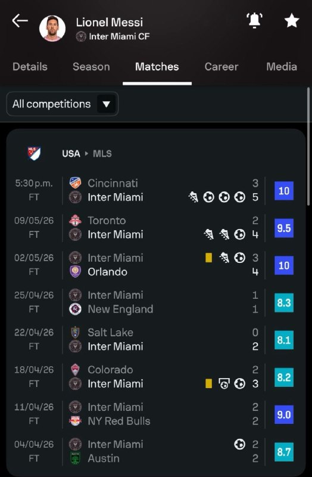
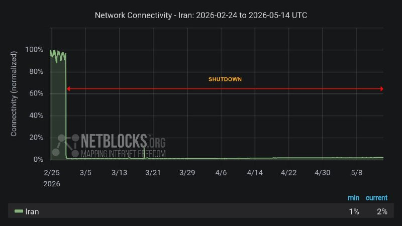

# خواننده تلگرام

<!-- TOP_NAV START -->

<!-- TOP_NAV END -->

<!-- MSG START -->

---
📅 بروزرسانی: 1405/02/24 14:05
---

## rodast_omiddana — post 71337

  <a href="telegram/content/rodast_omiddana_71337_1778754949.webm" target="_blank">🎬 Download video</a>

🚨
ترامپ تا پایان هفته در مورد ایران تصمیم خواهد گرفت.
مقامات ارشد اسرائیل در برخی رسانه های عبری بدون ذکر نامشان گفتند تصمیم ترامپ ممکن است به اقدام امنیتی سریعی منجر شود.
در اطراف نخست‌وزیر به نمایندگان گفته شده است:
این روزها از نظر امنیتی روزهای مهمی هستند.

## rodast_omiddana — post 71336

  <a href="telegram/content/rodast_omiddana_71336_1778754949.webm" target="_blank">🎬 Download video</a>

🚨 فکر نمیکردید اینقدر آسان تشیع در ایران ضعیف شود؟
این اولشه به یاری خدا کاری میکنم ده سال دیگه کودکان از مادرشان بپرسند "شیعه چی هست" و مادر جواب بده:
"ولش کن یک کابوس بود تمام شد"..

## rodast_omiddana — post 71335

🎬 ظهره وند میگه چیزهایی داریم که بمب اتم جلوش ترقه محسوب میشه!
لینک یوتیوب:
https://www.youtube.com/watch?v=KxxIdLQ9J20

## KiriMohems — post 47484

  <a href="telegram/content/KiriMohems_47484_1778754949.mp4" target="_blank">🎬 Download video</a>

🔴فیلم سوپر ویرال شده، از دست دادن ترامپ و شی رئیس جمهور چین :
#Helsinki
@KiriMohems

## SportBaadNews — post 251565

  <a href="telegram/content/SportBaadNews_251565_1778754951.webm" target="_blank">🎬 Download video</a>

🚨
🏴󠁧󠁢󠁥󠁮󠁧󠁿| نامزد های بهترین بازیکن فصل پریمیرلیگ معرفی شدن: برونو فرناندز، گابریل، مورگان گیبز‌وایت، ارلینگ هالند، داوید رایا، دکلان رایس، سمنیو، ایگو تیاگو
@SportBaadNews

## SportBaadNews — post 251564

مهدی تاج: قراره سرود تیم ملی جمهوری اسلامی رو فدایی بخونه 🌿⚽️ @BANGGBALL

## SportBaadNews — post 251558

  <a href="telegram/content/SportBaadNews_251558_1778754951.mp4" target="_blank">🎬 Download video</a>

شات های جدید و فوق سکسی خاله جورجینا 
🔥
🔥

🔵 ارزش دانلود 85 از 10
@SportBaadNews

## SportBaadNews — post 251557

  

⚽️| تعداد جام‌ های باشگاه‌ های فرانسوی تو کل تاریخشون:

37🏆 🇧🇷 مارکینیوش

27🏆 🇫🇷 المپیک مارسی
22🏆 🇫🇷 المپیک لیون
21🏆 🇫🇷 سن‌اتین
18🏆 🇫🇷 موناکو
17🏆 🇫🇷 بوردو
15🏆 🇫🇷 نانت
12🏆 🇫🇷 لیل
12🏆 🇫🇷 رنس
@SportBaadNews

## SportBaadNews — post 251556

  

🇫🇷
⚽️| تو 8 هفته آینده و چندین ماه بعدش تا مراسم توپ طلا اگه دنیا به کام عثمان بچرخه اون میتونه به اولین بازیکن تاریخ تبدیل بشه که برنده 2 جام جهانی، 2 چمپیونزلیگ و 2 توپ طلا شده 
🔥
🔥
@SportBaadNews

## SportBaadNews — post 251555

⚽️
⚽️
⚽️ موندوووو: پاریس پیشنهاد 100 میلیون یورویی برای خولیان آلوارز ارسال کرده اتلتیکو ترجیح میده آلوارز به پاریس بره تا بارسا
@SportBaadNews

## SportBaadNews — post 251552

  <a href="telegram/content/SportBaadNews_251552_1778754953.webm" target="_blank">🎬 Download video</a>

🚨یامال پرچم فلسطین رو تو جشن امروز بارسا بالا برد @SportBaadNews

## SportBaadNews — post 251551

  

⚽️| لیونل مسی تو 8 بازی اخیری که انجام داده کمترین نمره ای که دریافت کرده 8.1 بوده
@SportBaadNews

## SportBaadNews — post 251549

⚽️
🟠 از کیت فصل بعد منچستریونایتد رسما و شرعا رونمایی شد
@SportBaadNews

## SportBaadNews — post 251548

  

در 1800مین ساعات قطعی اینترنت عبدالرضا داوری، تحلیلگر مسائل سیاسی گفته: اگر دولت صلاح بدونه، میتونه اینترنت رو محدود یا قطع کنه و از نظر اون، این کار قابل توجیهه.
@SportBaadNews

## SportBaadNews — post 251547

عدد جدید از خسارت قطعی 74 روزه اینترنت ایران؛ 300 تا 700 هزار میلیارد تومان

گزارش تازه انجمن بلاکچین ایران نشان می‌دهد تنها در حدود 74 روز اختلال اینترنت در سال‌های 1404 و 1405، روزانه بین 300 تا 700 هزار میلیارد تومان ضرر به اقتصاد دیجیتال ایران وارد شده؛ بحرانی که حالا از افت شدید فروش و تعطیلی استارتاپ‌ها تا مهاجرت نیروی انسانی و نابودی هزاران شغل را دربر گرفته است.
@SportBaadNews

## SportBaadNews — post 251546

  <a href="telegram/content/SportBaadNews_251546_1778754954.webm" target="_blank">🎬 Download video</a>

🚨
⚽️
⚽️| آاس: پاریس آخر هفته‌ی گذشته با اطرافیان فده والورده تماس گرفته تا ببینه اوضاعش چطوره. مدت‌ هاست که بهش علاقه دارن. ولی فده اصلاً قصد نداره رئال مادرید رو ترک کنه.
@SportBaadNews

## SportBaadNews — post 251545

  

پرز : رسانه میخواد کاری کنه من اخراج بشم؟ تنها کسانی که منو اخراج میکنه دیوانه ها هستن، من جایی نمیرم. من حتی شعار "حیا کن رها کن" هم شنیدم ولی جایی نمیرم، کسی هم نمیاد جلوم باهام مبارزه کنه، شاید بخاطر اینه که من ترسناکم @SportBaadNews

## IranIntlTV — post 337143

  

خبرگزاری فارس، وابسته به سپاه پاسداران به نقل از «منبع آگاه» نوشت: «با تصمیم جمهوری اسلامی، عبور شماری از کشتی‌های چینی از تنگه هرمز، از شامگاه چهارشنبه، ۲۳ اردیبهشت و پس از توافق بر سر پروتکل‌های مدیریت جمهوری اسلامی بر این آبراه آغاز شده است.»

بر اساس این گزارش، این تصمیم پس از پیگیری‌های مقام‌های چین و در چارچوب «روابط راهبردی» تهران و پکن اتخاذ شد و کشتی‌های مورد درخواست چین اجازه عبور یافتند.
https://iranintl.com/202605149673

## IranIntlTV — post 337142

  <a href="telegram/content/IranIntlTV_337142_1778754956.mp4" target="_blank">🎬 Download video</a>

همزمان با موج تازه بیکاری در شرایط جنگی و بحران اقتصادی، آمارهای رسمی نشان می‌دهد حدود ۲۰۰ هزار نفر متقاضی دریافت بیمه بیکاری هستند. روزنامه شرق در گزارشی نوشت روند دریافت بیمه بیکاری از سازمان تامین اجتماعی به مسیری دشوار برای متقاضیان تبدیل شده است.
گفت‌وگو با اشکان نظام‌آبادی، روزنامه‌نگار اقتصادی
@iranintltv

## IranIntlTV — post 337141

  

عباس عراقچی، وزیر خارجه جمهوری اسلامی که برای شرکت در اجلاس بریکس، به دهلی نو سفر کرده، گفت: «امارات متحده عربی مستقیما در جنگ علیه ما دخیل بود.»
او خطاب به اماراتی‌ها گفت: «ائتلاف با اسرائیل هم از شما محافظت نکرد.»

عراقچی ادامه داد: «اماراتی‌ها اجازه دادند از سرزمین‌شان برای شلیک توپخانه و تجهیزات علیه ما استفاده شود.»

وزیر خارجه جمهوری اسلامی افزود: «امارات متحده عربی شریک فعال جنگ علیه ماست و هیچ تردیدی در این باره وجود ندارد و ما شگفت‌زده شدیم که برادران ما در امارات متحده عربی تصمیم گرفتند فعالانه به جنگ علیه ما بپیوندند.»

عراقچی تاکید کرد: «همدستی امارات متحده عربی با اسرائیل غیرقابل بخشش است.»
https://iranintl.com/202605148778

## IranIntlTV — post 337140

  <a href="telegram/content/IranIntlTV_337140_1778754958.mp4" target="_blank">🎬 Download video</a>

اظهارات و گزارش‌های رسمی چین و آمریکا حاکی است دونالد ترامپ و شی جین‌پینگ، رهبران دو کشور، در دیدار کلیدی خود در پکن درباره ایران گفت‌وگو کرده‌اند.

توماج طاهباز، خبرنگار ایران‌اینترنشنال، گزارش می‌دهد
@iranintltv

## IranIntlTV — post 337139

  <a href="telegram/content/IranIntlTV_337139_1778754959.mp4" target="_blank">🎬 Download video</a>

کاخ سفید اعلام کرد در جریان سفر دونالد ترامپ و دیدار او با شی‌ جین‌پینگ در پکن، روسای جمهور آمریکا و چین بر ممنوعیت دستیابی جمهوری اسلامی به سلاح هسته‌ای توافق کردند.
گفت‌وگو با عطا محامد، کارشناس روابط بین‌الملل
@iranintltv

## IranIntlTV — post 337138

در این قسمت چرتکه، محمد ماشینچیان سناریوهای مختلف قدرت خرید را تا پایان سال ۱۴۰۵ بررسی کرده و تاثیر نوسان نرخ دلار بر معیشت خانوارها را توضیح می‌دهد.
هنگام بررسی قدرت خرید حداقل دستمزد از ۱۳۹۴ تا ۱۴۰۵ در می‌یابیم که از ۹۷ به این سو، حتی وقتی قدرت خرید کارگر در ابتدای سال، حدود ۱۳۰ دلار بوده، مثل ۱۴۰۱ و ۱۴۰۴، در نتیجه تورم و بالا رفتن دلار، قدرت خرید تا پایان سال، به زیر ۱۰۰ دلار رسیده است.

تماشای نسخه کامل «چرتکه» در یوتیوب:
https://youtu.be/1W2RoMvSqPQ
@iranintltv

## IranIntlTV — post 337137

  

🔻مهدی تاج، رییس فدراسیون فوتبال، پنج‌شنبه ۲۴ اردیبهشت، در حاشیه اهدای جام قهرمانی فوتسال زنان به استقلال گفت: «فردا یا پس‌فردا در ترکیه جلسه سرنوشت‌سازی با فیفا داریم، چون باید به ما گارانتی بدهند. مساله ویزا حل نشده و هنوز هیچ ویزایی ندادند. منتظریم ببینیم رفتار طرف مقابل چیست.»

🔹فدراسیون فوتبال در فاصله کمتر از یک ماه تا آغاز جام‌جهانی با بحران ویزا و چالش مالی دست‌به‌گریبان است. امیر قلعه‌نویی هنوز نمی‌داند کدام بازیکن ویزا خواهد گرفت و کدام بازیکن را در آمریکا در اختیار خواهد داشت.

🔹احتمال دارد برای برخی اعضای کاروان ایران به دلیل سوابق فعالیت یا ارتباط با سپاه پاسداران، ویزا صادر نشود.
@iranintltvsport

## IranIntlTV — post 337136

  <a href="telegram/content/IranIntlTV_337136_1778754961.mp4" target="_blank">🎬 Download video</a>

شهروندان با ارسال پیام‌های متعدد به ایران‌اینترنشنال از افزایش بیکاری، دشواری پیدا کردن شغل در شهرهای مختلف و مشکلات معیشتی ناشی از آن در ایران خبر دادند.
@iranintltv

## IranIntlTV — post 337135

  <a href="telegram/content/IranIntlTV_337135_1778754962.mp4" target="_blank">🎬 Download video</a>

دفتر نخست‌وزیری اسرائیل چهارشنبه گزارش داد بنیامین نتانیاهو، نخست‌وزیر اسرائیل، در جریان عملیات «غرش شیران» به‌صورت محرمانه به امارات سفر کرده است. به گفته مقام‌های اسرائیلی، این سفر به گشایشی تاریخی در روابط دو طرف منجر شده است. وزارت خارجه امارات گزارش‌ها درباره این سفر را تکذیب کرده است.

ارزیابی محمدجواد اکبرین، عضو تحریریه ایران‌اینترنشنال
@iranintltv

## IranIntlTV — post 337134

  <a href="telegram/content/IranIntlTV_337134_1778754964.mp4" target="_blank">🎬 Download video</a>

سازمان عملیات تجارت دریایی بریتانیا اعلام کرد یک کشتی که در ۷۰ کیلومتری شمال شرقی بندر فجیره لنگر انداخته بود، توقیف شده و اکنون به سمت آب‌های ایران در حرکت است.
جزییات بیشتر با مرتضی کاظمیان، عضو تحریریه ایران‌اینترنشنال
@iranintltv

## IranIntlTV — post 337133

  <a href="telegram/content/IranIntlTV_337133_1778754965.mp4" target="_blank">🎬 Download video</a>

شی جین‌پینگ، رهبر چین، در دیدار با دونالد ترامپ، رییس‌جمهوری ایالات متحده، گفت همواره باور داشته که «چین و آمریکا منافع مشترک بیشتری نسبت به اختلافاتشان دارند». او همچنین بر اهمیت ثبات روابط پکن و واشینگتن برای دو کشور و جهان تاکید کرد.
@iranintltv

## IranIntlTV — post 337132

  <a href="telegram/content/IranIntlTV_337132_1778754967.mp4" target="_blank">🎬 Download video</a>

مراسم بدرقه تیم فوتبال ایران برای حضور در جام جهانی ۲۰۲۶، در حضور حامیان حکومت برگزار و همزمان از پیراهن جدید این تیم رونمایی شد.
گفت‌وگو با مزدک میرزایی، عضو تحریریه ایران‌اینترنشنال
@iranintltv

## IranIntlTV — post 337131

  

منوچهر متکی، نماینده مجلس و وزیر خارجه پیشین جمهوری اسلامی، گفت برخی از پهپادهایی که به ایران حمله کردند متعلق به امارات متحده عربی بوده است. او تاکید کرد که «حجت بر تمام کشورهای منطقه تمام شده است.»

متکی گفت: «برخی از پهپادهایی که به ایران زده می‌شد پهپادهای امارات متحده عربی بود و قابل کتمان نیست. این اطلاعات نزد ما است.»

متکی با اشاره به روابط جمهوری اسلامی با کشورهای منطقه گفت: «یک مسئله‌ای داریم که در ۴۷ سال گذشته تحت تاثیر دیگران، کشورهای منطقه روابط صادقانه و خوبی با ما نداشتند. اما ما حسن همسایگی را رعایت کردیم.»
https://iranintl.com/202605141340

## IranIntlTV — post 337130

  

زمین‌لرزه‌ای به بزرگی ۵ منطقه بردسیر در استان کرمان را لرزاند. این زمین‌لرزه در عمق ۸ کیلومتری زمین رخ داد. جزییات بیشتری درباره خسارات احتمالی یا تلفات این زمین‌لرزه منتشر نشده است.
https://iranintl.com/202605149083

## Persian_Trend_Official — post 14115

  <a href="telegram/content/Persian_Trend_Official_14115_1778754969.mp4" target="_blank">🎬 Download video</a>

💢حمله حامیان جمهوری اسلامی به دو گردشگر چینی که در حال تهیه گزارش
از شرایط کشور در زمان حملات بودند

🫆:Tony

📌 @persian_trend_official
پرشین ترند | متفاوت‌ترین کانال نظامی

## Persian_Trend_Official — post 14114

  <a href="telegram/content/Persian_Trend_Official_14114_1778754970.mp4" target="_blank">🎬 Download video</a>

🔺علی کیایی ‌فر، متخصص امنیت اطلاعات: در جنگ دوازده‌روزه، نوبیتکس، بانک پاسارگاد، بانک سپه و بانک مرکزی از داخل خود ایران هک شدند

مثلاً نوبیتکس توسط یک سرور زامبی در یک مدرسه‌ی علمیه خواهران در قم هک شد.

☆Phantom☆

📌 @persian_trend_official
پرشین ترند | متفاوت‌ترین کانال نظامی

## Persian_Trend_Official — post 14113

🔴 چین: آماده گسترش همکاری با آمریکا هستیم

💢سخنگوی وزارت بازرگانی چین اعلام کرد پکن آماده همکاری با آمریکا برای گسترش فهرست همکاری‌های مشترک میان دو کشور است.

💢بر اساس این اظهارات:

▪️ معاون نخست‌وزیر چین و وزیر خزانه‌داری آمریکا روز چهارشنبه در کره جنوبی دیدار کردند
▪️ مقام‌های دو کشور گفت‌وگوها را «صریح، عمیق و سازنده» توصیف کرده‌اند
▪️ چین اعلام کرده همکاری‌ها باید بر پایه:

برابری
احترام متقابل
و منافع مشترک

پیش برود.

💢پکن همچنین تأکید کرد دو طرف در تلاش هستند فهرست اختلافات را کاهش داده و روابط اقتصادی و تجاری سالم‌تری ایجاد کنند.

🫆:Tony

📌 @persian_trend_official
پرشین ترند | متفاوت‌ترین کانال نظامی

## Persian_Trend_Official — post 14112

  <a href="telegram/content/Persian_Trend_Official_14112_1778754972.mp4" target="_blank">🎬 Download video</a>

🔴 عراقچی: این آمریکا است که تنگه هرمز را بسته، نه ایران

💢عباس عراقچی، وزیر خارجه جمهوری اسلامی ، اعلام کرد تهران تنگه هرمز را نبسته و این آمریکا است که با اقدامات خود محاصره ایجاد کرده است.

💢او گفت:

▪️ از نگاه جمهوری اسلامی ، تنگه هرمز برای تمامی کشتی‌های تجاری باز است

▪️ کشتی‌ها باید با نیروهای دریایی حمهوری اسلامی همکاری و هماهنگی داشته باشند

▪️ جمهوری اسلامی هیچ مانعی در مسیر عبور کشتی‌ها ایجاد نکرده است

▪️ آنچه اکنون در منطقه رخ می‌دهد، ناشی از محاصره و اقدامات آمریکا است

🫆:Tony

📌 @persian_trend_official
پرشین ترند | متفاوت‌ترین کانال نظامی

## Persian_Trend_Official — post 14111

  <a href="telegram/content/Persian_Trend_Official_14111_1778754973.mp4" target="_blank">🎬 Download video</a>

🔴ویدیویی از انفجار شناور کلاس سلیمانی نیرو دریایی سپاه در جنگ اخیر

🫆:Tony

📌 @persian_trend_official
پرشین ترند | متفاوت‌ترین کانال نظامی

## Persian_Trend_Official — post 14110

  <a href="telegram/content/Persian_Trend_Official_14110_1778754975.webm" target="_blank">🎬 Download video</a>

‼️🏦 یک مقام کاخ سفید:

✅ رئیس جمهور ترامپ و همتای چینی او بر سر لزوم باز نگه داشتن تنگه هرمز توافق کردند.
✅ ترامپ و همتای چینی‌اش توافق کردند که ایران نمی‌تواند سلاح هسته‌ای داشته باشد.

📝 Nick

📌 @persian_trend_official
پرشین ترند | متفاوت‌ترین کانال نظامی

## Persian_Trend_Official — post 14109

  <a href="telegram/content/Persian_Trend_Official_14109_1778754975.webm" target="_blank">🎬 Download video</a>

⭕️ سوپراپلیکیشن ایتا اعلام کرد امکان ارسال فایل تا حجم ۲۰ مگابایت مجدداً برای همه کاربران فراهم شده است!

کاش تلگرام بیاد از شما یاد بگیره 🤯

📝 Nick

📌 @persian_trend_official
پرشین ترند | متفاوت‌ترین کانال نظامی

## Persian_Trend_Official — post 14108

  <a href="telegram/content/Persian_Trend_Official_14108_1778754975.webm" target="_blank">🎬 Download video</a>

💢زلزله ای در کرمان رخ داده است 🫆:Tony 📌 @persian_trend_official پرشین ترند | متفاوت‌ترین کانال نظامی

<!-- MSG END -->

<!-- NAV START -->

<!-- NAV END -->
