# خواننده تلگرام

<!-- TOP_NAV START -->

<a href="https://github.com/amirkarimiq12-svg/aio-downloader/blob/main/telegram/content/archive_1.md" style="display:inline-block; padding:6px 12px; margin:0 4px; background-color:#2ea44f; color:white; text-decoration:none; border-radius:4px; font-weight:bold;">صفحه بعد</a>

<!-- TOP_NAV END -->

<!-- MSG START -->

---
📅 بروزرسانی: 1405/02/29 05:05
---

## ChizBergerz — post 46537

  <a href="telegram/content/ChizBergerz_46537_1779154531.mp4" target="_blank">🎬 Download video</a>

خب ما که همینو میگیم؛ بخاطر پول و غذای مفتی هرشب ول میچرخید تو خیابون و شبم بهشون کص رایگان میدید، گشنه‌های شیعه‌سان.

پیشرفت کردن از ساندیس رسیدن به انرژی‌زا
💩
@ChizBergerz

## ChizBergerz — post 46536

  <a href="telegram/content/ChizBergerz_46536_1779154534.mp4" target="_blank">🎬 Download video</a>

بچه ها اسم این بازی عبور مرغ از خیابون  هست ویدئو نگاه کنید خیلی راحت 8 میلیون ازش سود گرفتیم😍

😤اگ توم دوس داری خیلی راحت از بازی های انلاین پول در بیاری حتما عضو کازینو شبانه شو
✅

توی کازینو شبانه بهت اموزش میدیم از بازی های انلاین پول دربیاری👌

کازینو شبانه راهی برای چند برابر کردن سرمایت 🤷‍♂

کسب درامد انلاین با یه ادم حرفه ای یاد بگیر و‌ پول دربیار 
💵
ae28
🎯همین حالا عضو شو و شروع کن👇
https://t.me/+OS-QBvyDO4M2ZGY0
https://t.me/+OS-QBvyDO4M2ZGY0

## rodast_omiddana — post 71543

  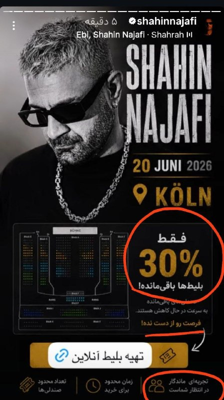

🚫 خدایش تمام اِلمان های کاسبی توش هست..
فقط از خودم سوال میکنم کدام بیشرفهایی میروند چنین کنسرتی؟

## rodast_omiddana — post 71542

  <a href="telegram/content/rodast_omiddana_71542_1779154537.webm" target="_blank">🎬 Download video</a>

🚨درود امیدجان
شیراز امشب تقریبا در همه موکب های سطح شهر نیروهای سرکوب با سلاح ایستادن و در تلاش برای رعب و وحشت مردم هستند .

## rodast_omiddana — post 71541

  <a href="telegram/content/rodast_omiddana_71541_1779154538.webm" target="_blank">🎬 Download video</a>

🚨سلام سنندج الان یه صداهای وحشتناک میاد

## rodast_omiddana — post 71540

  <a href="telegram/content/rodast_omiddana_71540_1779154538.webm" target="_blank">🎬 Download video</a>

🚨سلام امید جان همین الان ساعت 3:10 یه صدای بلند انفجار اومد کاشان خیلی سنگین بود از خواب پریدم

## rodast_omiddana — post 71539

  <a href="https://t.me/rodast_omiddana/71539" target="_blank">📎 Download file</a>

🔈 حجم فشرده_فوری_ترامپ حمله فردا شب را لغو کرد؟_آمریکا پیشنهاد امروز رژیم را رد کرد__پاکستان نیز با رژیم میجنگد!

## rodast_omiddana — post 71538

  <a href="https://t.me/rodast_omiddana/71538" target="_blank">📎 Download file</a>

🔈 فوری_ترامپ حمله فردا شب را لغو کرد؟_آمریکا پیشنهاد امروز رژیم را رد کرد__پاکستان نیز با رژیم میجنگد!

## rodast_omiddana — post 71537

  <a href="telegram/content/rodast_omiddana_71537_1779154539.webm" target="_blank">🎬 Download video</a>

🚨 بازی تکراری ترامپ
من از ده روز پیش گفتم حمله قبل از دوشنبه یعنی در آخر هفته انجام میشه ولی بازار متوجه شد و قیمت نفت رفت بالا و ترامپ دوباره امشب گفت حمله را عقب انداختم و مذاکرات داره خوب پیش میره تا قیمت نفت را تا آخر هفته پایین بیاره..

## IranIntlTV — post 337864

  

شرکت آدانی اینترپرایزس، مستقر در احمدآباد هند، در توافقی ۲۷۵ میلیون دلاری با وزارت خزانه‌داری آمریکا پذیرفت که مسئولیت خود را در ۳۲ مورد تخلف از تحریم‌های جمهوری اسلامی در ارتباط با خرید گاز مایع با منشاء ایرانی حل‌وفصل کند.
دفتر کنترل دارایی‌های خارجی وزارت خزانه‌داری آمریکا در بیانیه‌ای اعلام کرد شرکت آدانی از نوامبر ۲۰۲۳ تا ژوئن ۲۰۲۵، محموله‌های گاز مایع نفتی را از یک معامله‌گر مستقر در دبی خریداری کرد که مدعی بود گاز عمان و عراق را تامین می‌کند، اما این شرکت به موارد هشداردهنده‌ای که نشان می‌داد این گاز مایع نفتی در واقع منشا ایرانی داشته است، بی‌توجهی کرده بود.
طبق این بیانیه، در دوره زمانی نوامبر ۲۰۲۳ تا ژوئن ۲۰۲۵، اقدامات شرکت آدانی موجب شد ۳۲ پرداخت دلاری از طریق موسسات مالی آمریکایی برای این محموله‌ها پردازش شود که مجموع آنها حدود ۱۹۲ میلیون و ۱۰۴ هزار دلار بود.
این بیانیه افزود تخلفات شرکت آدانی فاحش بوده و به طور داوطلبانه افشا نشده است.

https://iranintl.com/202605198829

## IranIntlTV — post 337863

  

شرکت آدانی اینترپرایزس، مستقر در احمدآباد هند، در توافقی ۲۷۵ میلیون دلاری با وزارت خزانه‌داری آمریکا پذیرفت که مسئولیت خود را در ۳۲ مورد تخلف از تحریم‌های جمهوری اسلامی در ارتباط با خرید گاز مایع با منشاء ایرانی حل‌وفصل کند.
دفتر کنترل دارایی‌های خارجی وزارت خزانه‌داری آمریکا در بیانیه‌ای اعلام کرد شرکت آدانی از نوامبر ۲۰۲۳ تا ژوئن ۲۰۲۵، محموله‌های گاز مایع نفتی را از یک معامله‌گر مستقر در دبی خریداری کرد که مدعی بود گاز عمان و عراق را تامین می‌کند، اما این شرکت به موارد هشداردهنده‌ای که نشان می‌داد این گاز مایع نفتی در واقع منشا ایرانی داشته است، بی‌توجهی کرده بود.
طبق این بیانیه، در دوره زمانی نوامبر ۲۰۲۳ تا ژوئن ۲۰۲۵، اقدامات شرکت آدانی موجب شد ۳۲ پرداخت دلاری از طریق موسسات مالی آمریکایی برای این محموله‌ها پردازش شود که مجموع آنها حدود ۱۹۲ میلیون و ۱۰۴ هزار دلار بود.
این بیانیه افزود تخلفات شرکت آدانی فاحش بوده و به طور داوطلبانه افشا نشده است.

https://iranintl.com/202605198829

## IranIntlTV — post 337854

این روایت‌ها فقط خبر چند کشته‌شده نیستند؛ سند روزهایی‌اند که جوانان ایران، یکی‌یکی از خیابان‌ها به سردخانه‌ها رسیدند. پشت هر نام، خانه‌ای مانده که ناگهان خاموش شد، خانواده‌ای که میان بی‌خبری و ترس دنبال عزیزش گشت و آینده‌ای که پیش از آغاز، با گلوله متوقف شد.
جاویدنامان انقلاب ملی ایرانیان:
عارف گل‌محمدی، مهدی جمشیدی، محمدحسین علیخانی، پردیس محمدی، آرمین قاسمی مبین، احمد صالحی، احمدرضا نائیجی و محمد معصومی باقرآبادی.
نام‌هایی که فراموش نمی‌شوند؛ چون هرکدام بخشی از حافظه زخمی این سرزمین‌اند.
#جاویدنامان_انقلاب_ملی_ایرانیان

---
📅 بروزرسانی: 1405/02/29 03:13
---

## ChizBergerz — post 46535

👑آی‌پی‌های جدید تست شده اپ شیر و خورشید برای همراه اول، یدونه کلیک کنید همش کپی میشه
😐

185.200.232.43  
2.17.100.200
2.19.205.42
2.19.205.50
2.19.252.134
104.109.250.240
92.122.17.124
96.16.122.153
151.101.64.223
151.101.0.223
2.20.169.70
2.20.170.91
95.101.111.144
2.16.245.188
2.18.69.150
2.16.106.4
23.58.222.107
184.25.28.31
23.47.124.134
23.50.131.147
23.46.190.18
Tel: @ChizBergerz
23.44.201.149
23.212.253.227
23.44.201.185
23.44.201.17
23.62.54.24
23.58.95.144
104.83.198.44
92.123.102.153
184.51.252.134
23.53.40.147
184.51.252.176
2.18.64.212
172.104.251.198
2.18.79.101
23.216.77.181
92.123.102.89
23.216.77.80
96.16.53.132
23.53.40.139
23.48.165.70
2.21.20.143
23.43.85.155
23.48.23.184
23.207.210.83
23.209.125.169
23.48.23.172
2.21.240.22
23.55.110.82
23.216.77.35
23.58.95.138
23.33.40.149
23.48.23.146
23.209.125.145
92.123.102.130
23.53.40.121
23.48.23.11
23.201.248.171
23.209.125.27
23.48.23.176
23.207.210.86
23.55.161.151
92.123.103.89
2.23.7.34
23.207.210.80
23.48.23.165
23.48.23.173
23.48.23.156
23.55.110.74
173.222.107.202
23.213.161.140
23.48.23.134
23.204.152.160
2.23.97.120
185.200.232.49
185.200.232.50
185.200.232.42
185.200.232.41
184.24.77.42
184.24.77.32
184.24.77.5
184.24.77.7

+ اگه وصل نشد چندبار روی حالت هواپیما بزارید و بردارید و تست کنید یاهم چند دقیقه بعد امتحان کنید✅
@ChizBergerz

## rodast_omiddana — post 71536

  <a href="telegram/content/rodast_omiddana_71536_1779147837.webm" target="_blank">🎬 Download video</a>

🚨شهباز شریف:
"من نسبت به مذاکرات آمریکا و ایران خوشبین هستم"

تو گوه میخوری...

## rodast_omiddana — post 71535

  <a href="telegram/content/rodast_omiddana_71535_1779147837.webm" target="_blank">🎬 Download video</a>

🚨 ترامپ:
"ما حمله‌مان به ایران را به مدت ۲ تا ۳ روز به تعویق انداختیم چون عربستان سعودی، قطر و امارات فکر می‌کنند که خیلی به رسیدن به یک توافق نزدیک شده‌اند."

همان تاریخی که از هفته پیش مشخص کردم یعنی قبل از دوشنبه چهارم خرداد حمله آغاز میشود..

## rodast_omiddana — post 71534

  <a href="telegram/content/rodast_omiddana_71534_1779147838.mp4" target="_blank">🎬 Download video</a>

🚨 
😓
😎 امشب این دیوانه ها شعار مرگ بر امارات سر دادن...

## rodast_omiddana — post 71533

  <a href="telegram/content/rodast_omiddana_71533_1779147838.webm" target="_blank">🎬 Download video</a>

🚨 خروجی برنامه امشب هنوز نیامده نگران نباشید ویس و فایلها را میزارم

## rodast_omiddana — post 71532

  <a href="telegram/content/rodast_omiddana_71532_1779147839.webm" target="_blank">🎬 Download video</a>

🚨 کانال ۱۲ اسرائیل:
"ترامپ به اسرائیل اطلاع داد که تاخیر در حمله به ایران تنها دو تا سه روز است."

## rodast_omiddana — post 71531

  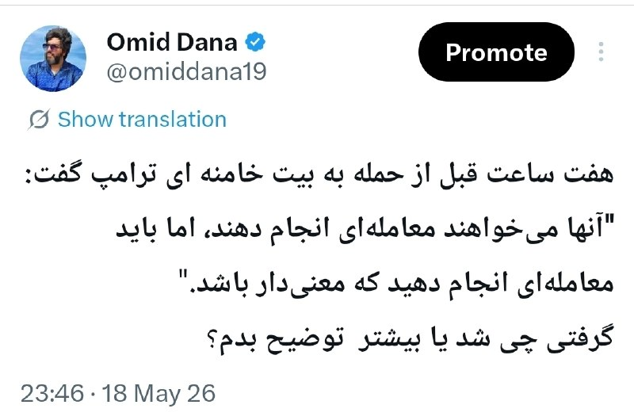

🚫 هفت ساعت قبل از حمله به بیت خامنه ای ترامپ گفت:
"آنها می‌خواهند معامله‌ای انجام دهند، اما باید معامله‌ای انجام دهید که معنی‌دار باشد."
گرفتی چی شد یا بیشتر توضیح بدم؟

## KiriMohems — post 47738

  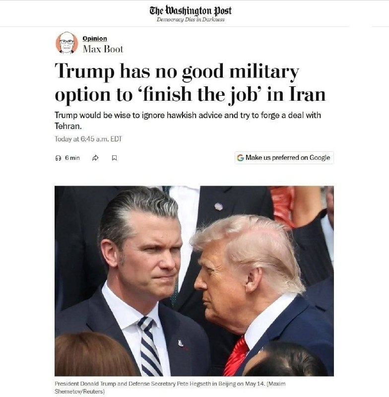

واشنگتن پست: ارزیابی کلی این کیری بازی ها این است که هیچ یک از گزینه‌های نظامی موجود چه حمله گسترده، چه هدف‌گیری رهبران و چه عملیات زمینی یا دریایی، راه‌حل قابل‌ اعتماد و کم‌ هزینه‌ای ارائه نمی‌دهد و مسیر منطقی‌تر، حرکت به سمت توافق و داداچی شدن و کاهش تنش است

#Berlin
@Kirimohems

## KiriMohems — post 47737

  <a href="telegram/content/KiriMohems_47737_1779147840.mp4" target="_blank">🎬 Download video</a>

😤میخوای از پیش بینی فوتبال و شرط بندی پول دربیاری ؟!

⚠️پس همین الان وارد کانال عمو بت باز شو
چون بهت اموزش میده چطور پول دربیاری
❗️

اینجا میتونی روزانه درامد داشته باشی و سرمایت چندبرابر کنی پس از دستش نده و عضو شو امار سوداش چک‌کن
😍

💵عمو قدیمی کاره و خاک این کارو‌خورده کنارش باش و حرفه ای پول دربیار
💵
A28🅰

👍ادرس عضویت کانال vip:
https://t.me/+8LLMpXUfhW43ZjVk
https://t.me/+8LLMpXUfhW43ZjVk

## SportBaadNews — post 251882

  <a href="telegram/content/SportBaadNews_251882_1779147841.webm" target="_blank">🎬 Download video</a>

🚨با اعلام راک استار بازی جی تی ای 6 امسال، 28 آبان منتشر میشه
@SportBaadNews

## SportBaadNews — post 251880

  

🟢 دسترسی سریع و مستقیم به وینکوبت

📌دیگه لازم نیست بین لینک‌های مختلف بگردی یا وقتت تلف بشه.

📌فقط با یک ورود ساده به ربات رسمی، مستقیم وارد سایت شوید: 
👇

🤖 @Wincobet_bot

🤖 @Wincobet_bot

⚡️    ورود سریع و بدون معطلی

⚡️   بدون لینک‌های اضافی و گیج‌کننده

⚡️   دسترسی مستقیم از داخل تلگرام

😀 همه چیز برای راحتی کاربران داخل ربات فراهم و قرار داده شده.

🔵 برای تحلیل‌ها و اخبار سایت وارد کانال سایت شوید: 
👇

🔵 @Wincobetofficial

## IranIntlTV — post 337853

  <a href="https://t.me/IranintlTV/337853" target="_blank">📎 Download file</a>

🎧نسخه صوتی چشم‌انداز: طرح مجلس برای جایزه و پاداش به قاتل ترامپ!
@iranintlTV

## IranIntlTV — post 337852

  

ترامپ با اشاره به توقف کوتاه‌مدت حمله برنامه‌ریزی‌شده به جمهوری اسلامی درپی تقاضای عربستان‌ سعودی، امارات متحده عربی و قطر از او با هدف رسیدن به توافق، گفت این موضوع را به اسرائیل و دیگر کشورهای منطقه نیز اطلاع داده است.
او در واشینگتن‌دی‌سی به خبرنگاران گفت: «عربستان سعودی، قطر، امارات متحده عربی و چند کشور دیگر از من خواستند که آن را برای دو یا سه روز، یک بازه کوتاه، به تعویق بیندازیم، زیرا فکر می‌کنند بسیار به دستیابی به یک توافق نزدیک شده‌اند و اگر بتوانیم به گونه‌ای عمل کنیم که هیچ سلاح هسته‌ای به دست ایران نرسد، فکر می‌کنم اگر آنها راضی باشند، ما نیز احتمالا راضی خواهیم بود.»
ترامپ گفت: «ما قرار بود فردا یک حمله بسیار بزرگ انجام دهیم. من آن را برای مدتی کوتاه به تعویق انداختم، امیدوارم شاید برای همیشه، اما احتمالا برای مدت کوتاهی، زیرا گفت‌وگوهای بسیار مهمی با ایران داشته‌ایم و خواهیم دید این گفت‌وگوها به کجا می‌انجامد.»
او افزود: «ما اسرائیل را در جریان گذاشته‌ایم، دیگر افرادی را در خاورمیانه که با ما درگیر بوده‌اند مطلع کرده‌ایم و این یک تحول بسیار مثبت است.»
https://iranintl.com/202605187593

## IranIntlTV — post 337851

  <a href="telegram/content/IranIntlTV_337851_1779147843.mp4" target="_blank">🎬 Download video</a>

دونالد ترامپ اعلام کرد به درخواست رهبران منطقه برنامه حمله به جمهوری اسلامی را متوقف کرده است.

او همزمان به نیویورک‌پست گفت پس از دریافت پاسخ اخیر جمهوری اسلامی درباره مذاکرات، دیگر تمایلی به دادن هیچ امتیازی به تهران ندارد.

گفت‌وگو با امیر گیتی، عضو تحریریه ایران‌اینترنشنال
@iranintltv

## IranIntlTV — post 337850

  <a href="https://t.me/IranintlTV/337850" target="_blank">📎 Download file</a>

🎧نسخه صوتی سیاست با مراد ویسی: لغو حمله در آخرین لحظه
@iranintlTV

## IranIntlTV — post 337849

  

لیندزی گراهام، سناتور جمهوری‌خواه، در ایکس نوشت: «همان‌طور که پیش‌تر گفته‌ام، هر توافقی که میان آمریکا و جمهوری اسلامی حاصل شود باید برای تایید به کنگره ارائه شود؛ همان‌طور که در مورد برجام نیز چنین شد.»
سناتور گراهام گفت: «اگر بتوانیم از طریق ابزارهای دیپلماتیک به درگیری پایان دهیم و به اهداف امنیت ملی خود دست یابیم، این یک دستاورد بزرگ خواهد بود.»

https://iranintl.com/202605183437

## Persian_Trend_Official — post 14462

  <a href="telegram/content/Persian_Trend_Official_14462_1779147845.mp4" target="_blank">🎬 Download video</a>

▪️ شبتون بخیر 🫶

🫆:Tony

📌 @persian_trend_official
پرشین ترند | متفاوت‌ترین کانال نظامی

---
📅 بروزرسانی: 1405/02/29 02:02
---

## ChizBergerz — post 46534

  <a href="telegram/content/ChizBergerz_46534_1779143561.mp4" target="_blank">🎬 Download video</a>

ماشین عروس مسلح به مسلسل سنگین در شوی حکومتی موسوم به «جشن زوج‌های جانفدا» در میدان «امام حسین» تهران به نمایش درآمد!

+ همون مسلسل تا دسته تو کص مادر تمام کسایی که میرن تو این تجمعات!
@ChizBergerz

## ChizBergerz — post 46533

  <a href="telegram/content/ChizBergerz_46533_1779143563.mp4" target="_blank">🎬 Download video</a>

آنلاین شاپا باز شروع کردن...

@ChizBergerz

## ChizBergerz — post 46532

👑آی‌پی‌های جدید تست شده اپ شیر و خورشید برای همه اپراتورها، یدونه کلیک کنید همش کپی میشه
❤️

184.24.77.28
23.48.23.11
23.48.23.187
23.48.23.67
184.24.77.196
185.200.232.32
Tel: @ChizBergerz
2.16.168.111
2.22.120.115
23.192.89.203
2.16.168.13
23.222.250.150
2.23.245.35
2.23.169.207
95.101.29.42
23.45.96.209
2.21.239.9
2.23.168.47
2.23.168.213
23.216.77.31

+ اگه وصل نشد چندبار روی حالت هواپیما بزارید و بردارید و تست کنید یاهم چند دقیقه بعد امتحان کنید✅
@ChizBergerz

## ChizBergerz — post 46531

👑آی‌پی‌های جدید تست شده اپ شیر و خورشید برای همه اپراتورها، یدونه کلیک کنید همش کپی میشه✅

184.86.103.210
96.16.248.183
92.122.16.5
96.16.249.60
96.16.249.9
23.12.156.115
23.216.77.16
23.62.61.53
23.39.148.245
23.210.73.133
23.44.201.136
23.205.46.167
184.30.150.142
23.220.161.217
Tel: @ChizBergerz
184.28.165.4
23.46.230.133
88.221.168.204
104.96.158.174
184.51.252.4
172.234.199.15
104.85.26.14
172.237.145.27
92.123.103.24
172.234.159.58
185.200.232.43
2.17.100.200
2.19.205.42
2.19.205.50
2.19.252.134
2.20.169.70
2.20.170.91
95.101.111.144
2.16.245.188
2.18.69.150
2.16.106.4
23.58.222.107
184.25.28.31
23.47.124.134
23.50.131.147
23.46.190.18
23.58.222.147
23.56.162.186
23.44.203.68
184.24.77.42
184.86.251.12
184.86.251.27
184.25.52.200
184.28.230.87
184.51.252.36
184.51.252.38
185.200.232.40
185.200.232.41
185.200.232.42
185.200.232.49
Tel: @ChizBergerz
185.200.232.50
184.51.252.152
184.51.252.157
184.51.252.135
167.82.48.223
151.101.128.223
184.24.77.32
184.24.77.5
184.24.77.7
184.24.77.16
184.24.77.36
184.24.77.21
184.24.77.11
23.48.23.186
23.48.23.133
23.48.23.195
23.48.23.178
184.24.77.29
23.65.119.52
23.73.2.141
104.110.138.190
104.83.5.202
92.122.166.236
92.122.166.234
92.122.166.237
96.16.122.70
23.67.136.200
23.67.136.202
95.216.69.37
95.216.69.38
95.216.69.39
95.216.69.40
104.78.170.186
96.17.222.31
23.41.37.129
23.2.13.227
23.222.126.108
2.20.255.113
2.17.251.98
23.2.13.152
95.101.23.27
2.21.239.21
23.211.49.252
88.221.168.5
104.103.90.156
23.79.20.249
88.221.132.162
23.59.235.208
23.60.69.118
23.46.188.71
104.122.212.92
23.219.1.4
23.57.43.195
2.22.6.68
23.217.11.56
95.100.69.108
23.40.63.69
96.16.122.74
104.109.250.232
92.123.104.7
104.110.191.57
104.83.5.82
92.122.166.168
104.83.5.65
104.121.0.17
104.66.70.133
92.122.166.146
23.73.2.161
92.122.73.138
92.122.166.141
96.16.122.55
104.81.108.51
23.72.248.214
104.126.37.185
104.83.5.201
104.83.5.216
92.123.104.67
104.83.5.203
96.17.207.151
88.221.168.138
96.17.207.149
104.81.108.10
23.73.2.148
92.122.166.175
172.237.127.6
104.81.104.13
96.16.122.82
96.16.122.66
96.7.218.219
96.16.122.137
92.123.189.41
96.16.122.154
96.17.207.12
23.79.48.162
151.101.0.223
151.101.192.223
65.109.34.234
151.101.64.223
2.23.169.111
2.23.168.96
2.23.169.105
2.23.168.7
2.23.169.207
142.54.178.211
185.137.25.214
81.12.72.218
5.160.13.85
37.255.133.30
81.91.145.2
104.117.76.26
104.117.76.40
23.215.0.164
2.23.168.250
2.23.168.254
184.25.85.224
2.23.168.144
185.143.232.122
23.215.0.40
2.23.170.80
2.23.167.64
23.2.13.136
2.23.167.113
2.23.245.35
2.22.250.149
72.246.28.37
31.214.169.244
178.252.128.66
10.114.141.214
10.176.254.22
10.114.141.78
46.32.31.30
185.109.61.27
10.140.39.98
185.88.178.196
185.208.174.167
185.53.142.174
37.191.76.110
5.144.129.174
138.201.54.122
185.142.158.162
94.130.13.19
185.141.106.238
178.22.122.101
94.130.70.160
109.72.197.1
144.76.1.88
80.191.243.226
95.38.201.199
5.160.128.142
63.141.252.203
23.2.13.146
23.216.77.80
2.19.204.87
2.19.205.34
95.101.35.59
95.101.78.194
96.17.207.142
2.19.205.88
23.39.249.249
Tel: @ChizBergerz
96.16.122.146
95.101.78.184
2.21.239.16
2.23.168.47
23.3.89.89
23.205.165.21
96.17.207.30
23.50.131.132
23.50.131.160
2.22.31.147
2.21.240.15
185.200.232.57
185.200.232.19
2.23.168.174
2.23.168.213
23.48.203.248
23.202.230.211
96.16.53.134
96.16.122.141
96.16.53.152
92.122.123.128
2.19.204.137
2.19.204.144
2.19.204.145
2.19.204.170
2.19.204.184
2.19.204.185
2.19.204.202
2.19.204.210

+ اگه وصل نشد چندبار روی حالت هواپیما بزارید و بردارید و تست کنید یاهم چند دقیقه بعد امتحان کنید✅
@ChizBergerz

## ChizBergerz — post 46530

  

صداوسیما بزودی:

@ChizBergerz

## KiriMohems — post 47736

  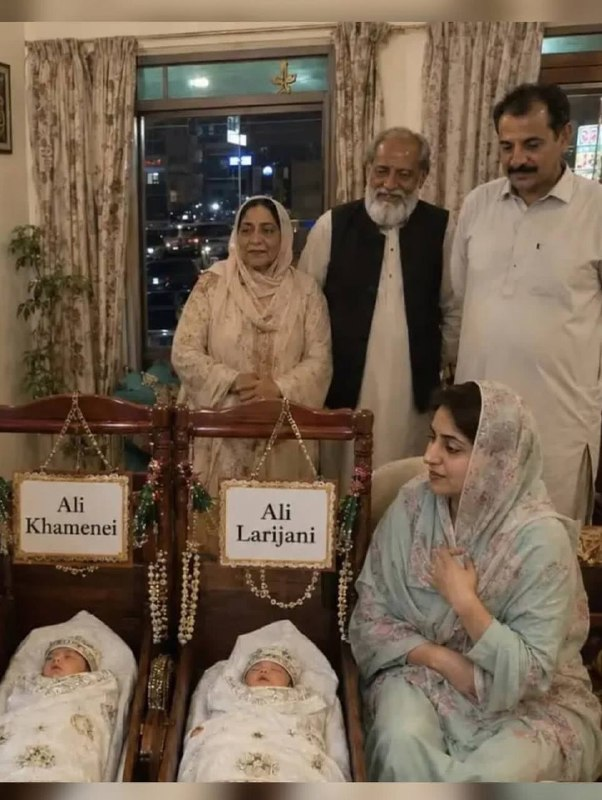

🔴یک زوج خایمال تو لاهور پاکستان یه جفت دوقلو آوردن و اسماشون رو گذاشتن :
علی لاریجانی و علی خامنه‌ای

#Helsinki
@KiriMohems

## KiriMohems — post 47735

  <a href="telegram/content/KiriMohems_47735_1779143568.mp4" target="_blank">🎬 Download video</a>

🔴شعار جدید کصکلک بازی های شبانه :
مرگ بر امارات

#Helsinki
@KiriMohems

## SportBaadNews — post 251879

  

🔙 5 سال پیش تو چنین روزی رونالدو آخرین جام باشگاهی رسمی کریر فوتبالیش رو برد
@SportBaadNews

## SportBaadNews — post 251878

  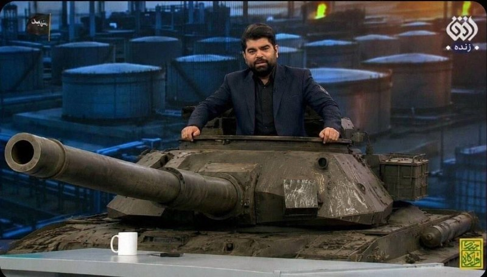

روز اول کلت آوردن، بعد کلاشینکف، بعد تیربار، حالا یارو تا کمر نشسته تو تانک وسط صداسیما؛ چقدر دلقکید شما...
@SportBaadNews

## SportBaadNews — post 251877

  <a href="telegram/content/SportBaadNews_251877_1779143571.webm" target="_blank">🎬 Download video</a>

🚨
🚨
🚨
🇧🇷 فووووری و رسمیییییی: نیمار به اسکواد برزیل دعوت شد @SportBaadNews

## SportBaadNews — post 251876

  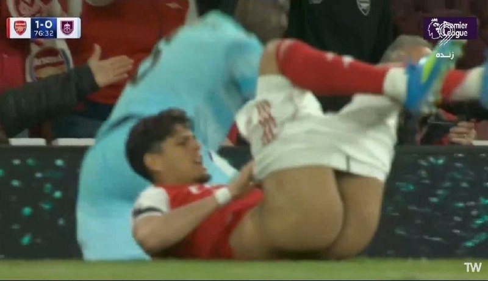

هینکاپیه به این شکل کون لخت شد وسط بازی 😂😂😂😂😂😂😂😂😂 @SportBaadNews

## IranIntlTV — post 337848

  <a href="telegram/content/IranIntlTV_337848_1779143573.mp4" target="_blank">🎬 Download video</a>

مسعود پزشکیان گفت در پی محاصره دریایی آمریکا، صادرات نفت ایران متوقف شده و کشور روزانه با کمبود ۵۰ میلیون لیتر بنزین روبه‌رو است، اما دلاری برای واردات آن وجود ندارد.

ساعتی پس از انتشار این اظهارات، رسانه‌های دولتی از جمله ایرنا اقدام به حذف سخنان پزشکیان کردند.

گفت‌وگو با مهدی مصلحی، کارشناس بازار نفت
@iranintltv

## IranIntlTV — post 337847

  

ترامپ در یک سخنرانی گفت اگر بتواند به توافقی با جمهوری اسلامی دست یابد که مانع از دستیابی تهران به سلاح هسته‌ای شود، بسیار راضی خواهد بود. او تاکید کرد که واشینگتن به تهران اجازه نخواهد داد که به سلاح هسته‌ای دست یابد.
ترامپ گفت: «ما اجازه نخواهیم داد ایران به سلاح هسته‌ای دست پیدا کند. بنابراین این سه کشور به همراه دیگران با من تماس گرفتند و آنها به طور مستقیم با نمایندگان ما و در حال حاضر با حکومت ایران در حال گفت‌وگو هستند و به نظر می‌رسد شانس بسیار خوبی وجود دارد که بتوانند به یک توافق برسند.»
او افزود: «اگر بتوانیم بدون اینکه آنها را به شدت بمباران کنیم به این نتیجه برسیم، بسیار خوشحال خواهم شد.»

https://iranintl.com/202605189314

## IranIntlTV — post 337846

  <a href="telegram/content/IranIntlTV_337846_1779143576.mp4" target="_blank">🎬 Download video</a>

مراد ویسی، تحلیل‌گر ارشد ایران‌اینترنشنال، گفت: «مردم ایران از ترامپ انتظار دارند به مذاکرات طولانی با جمهوری اسلامی پایان دهد. مذاکراتی که به باور آنها نه رفتار حکومت را تغییر داده و نه مانع سرکوب داخلی و تنش‌آفرینی منطقه‌ای شده است. ادامه این مذاکرات به معنای دادن فرصت و تنفس سیاسی به جمهوری اسلامی تلقی می‌شود.»
@iranintltv

## IranIntlTV — post 337845

  <a href="telegram/content/IranIntlTV_337845_1779143578.mp4" target="_blank">🎬 Download video</a>

بنیامین نتانیاهو در پی پاسخ تازه جمهوری اسلامی به پیشنهاد آمریکا برای پایان جنگ، نشست امنیتی با حضور وزیران و مشاوران ارشدش برگزار می‌کند. هم‌زمان ترامپ در تماس با نتانیاهو گفته زمان برای جمهوری اسلامی رو به پایان است.
@iranintltv

## IranIntlTV — post 337844

  <a href="telegram/content/IranIntlTV_337844_1779143581.mp4" target="_blank">🎬 Download video</a>

مراد ویسی، تحلیل‌گر ارشد ایران‌اینترنشنال، گفت: «برداشت فرماندهان سپاه این است که آمریکا و اسرائیل توان شکست نظامی جمهوری اسلامی را ندارند و تلاش می‌کنند از مسیر مذاکره امتیاز بگیرند. بنابراین تصور می‌کنند عدم عقب‌نشینی در مذاکرات، پیامد نظامی جدی نخواهد داشت. این باور فرماندهان سپاه می‌تواند ناشی از توهم پیروزی باشد، در حالی که حملات احتمالی آینده ممکن است کاملا متفاوت و گسترده‌تر باشد.»
@iranintltv

## Persian_Trend_Official — post 14461

  <a href="telegram/content/Persian_Trend_Official_14461_1779143583.webm" target="_blank">🎬 Download video</a>

تیراندازی در یک مرکز اسلامی در آمریکا 🔸رسانه‌ها روز دوشنبه از حضور یک فرد مسلح و تیراندازی در مرکز اسلامی سن دیگو خبر می‌دهند. 🔹پلیس سن دیگو از مردم خواست که از حضور در این منطقه خودداری کنند. ☆Phantom☆ 📌 @persian_trend_official پرشین ترند | متفاوت‌ترین…

---
📅 بروزرسانی: 1405/02/29 00:55
---

## ChizBergerz — post 46529

  <a href="telegram/content/ChizBergerz_46529_1779139556.mp4" target="_blank">🎬 Download video</a>

شعار "مرگ بر امارات" ضجه زنی‌های حکومت اضافه شد
💩😂

@ChizBergerz

## rodast_omiddana — post 71530

🎬
🔴
🔴
🔴 پخش زنده_فوری
ترامپ حمله فردا شب را لغو کرد؟
آمریکا پیشنهاد امروز رژیم را رد کرد!
جلسه امنیتی فردا ترامپ برای حمله در آخر هفته؟
پاکستان نیز با رژیم میجنگد!
لینک یوتیوب:
https://www.youtube.com/watch?v=yWAdEryZ56A

## KiriMohems — post 47732

  <a href="telegram/content/KiriMohems_47732_1779139557.mp4" target="_blank">🎬 Download video</a>

#برینید

🔴 صدا و سیما امشب برامون تو پخش زنده ، کون لخت پخش کرده و خیلیا واشر سر خایه سوزوندن

#Helsinki
@KiriMohemSport

## KiriMohems — post 47731

🔴صداوسیما: ترامپ برای پنجمین بار از جنگ مقابل ایران فرار کرد.

#professor
@KiriMohems

## KiriMohems — post 47730

  <a href="telegram/content/KiriMohems_47730_1779139558.mp4" target="_blank">🎬 Download video</a>

🔴 تیراندازی تو مرکز اسلامی سن‌دیگوی آمریکا باعث کشته و زخمی شدن چندتا مسلمون شده.

@KiriMohems

## KiriMohems — post 47729

  <a href="telegram/content/KiriMohems_47729_1779139561.webm" target="_blank">🎬 Download video</a>

📌 سرعت بالا + کیفیت واقعی + قیمت منصفانه با گرند‌ ‌وی‌پی‌ان بدون قطعی و دردسر وصل شو 
🚀 
😀 پینگ عالی 
😀 مناسب گیم، یوتیوب و استفاده روزانه 
😀 سرورهای پرسرعت و پایدار 
😀 تحویل آنی و پشتیبانی سریع 
😀 قیمت اقتصادی با کیفیتی که تفاوتشو حس می‌کنی 
😀 وقتی کیفیت مهمه، انتخابت…

## KiriMohems — post 47728

  <a href="telegram/content/KiriMohems_47728_1779139561.webm" target="_blank">🎬 Download video</a>

📌 سرعت بالا + کیفیت واقعی + قیمت منصفانه
با گرند‌ ‌وی‌پی‌ان بدون قطعی و دردسر وصل شو 
🚀

😀 پینگ عالی

😀 مناسب گیم، یوتیوب و استفاده روزانه

😀 سرورهای پرسرعت و پایدار

😀 تحویل آنی و پشتیبانی سریع

😀 قیمت اقتصادی با کیفیتی که تفاوتشو حس می‌کنی

😀 وقتی کیفیت مهمه، انتخابت معلومه!

قیمت‌ها:
1Gb: 290/000
3GB:790/000
5GB:1/190/000
10GB:1/890/000
⭐️ 20GB:3/590/000

🕔از جشنواره تخفیف جا نمونی...!

🤖 Robot 
👇
👇
👇

👤 Admin 
👇
👇
👇

## SportBaadNews — post 251875

  <a href="telegram/content/SportBaadNews_251875_1779139562.webm" target="_blank">🎬 Download video</a>

🚨
🚨
🚨
🇧🇷 فووووری و رسمیییییی: نیمار به اسکواد برزیل دعوت شد @SportBaadNews

## SportBaadNews — post 251874

  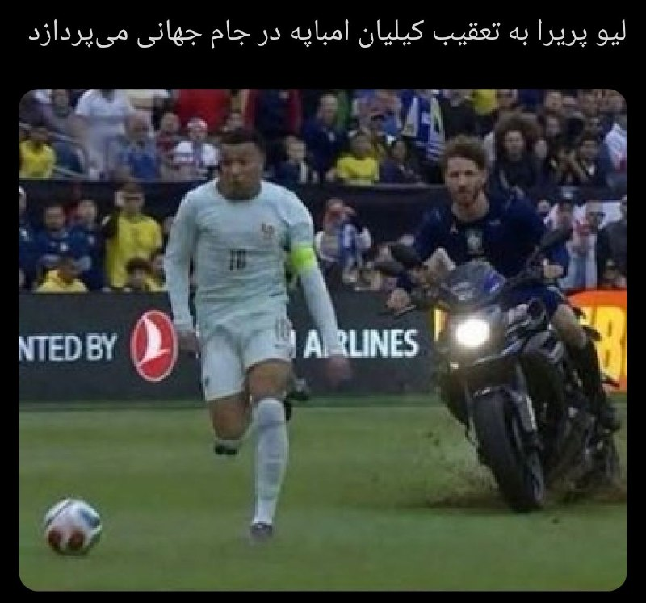

لئو پریرا

## SportBaadNews — post 251873

  <a href="telegram/content/SportBaadNews_251873_1779139564.webm" target="_blank">🎬 Download video</a>

🚨
💣🇧🇷 رسسسسسسسسمی، لیست تیم ملی برزیل برای جام جهانی 2026 آمریکا 
◀️ دروازه‌بان‌ها: آلیسون، ادرسون، وِوِرتون 
◀️ مدافعان: الکس ساندرو، برِمر، ایبانه‌ز، داگلاس سانتوس، گابریل، دانيلو، مارکینیوس، لئو پریرا، وِسلی 
◀️هافبک ها: فابینیو، لوکاس پاکتا، برونو گیمارش،…

## SportBaadNews — post 251871

  <a href="telegram/content/SportBaadNews_251871_1779139565.webm" target="_blank">🎬 Download video</a>

🚨
💣🇧🇷 رسسسسسسسسمی، لیست تیم ملی برزیل برای جام جهانی 2026 آمریکا 
◀️ دروازه‌بان‌ها: آلیسون، ادرسون، وِوِرتون 
◀️ مدافعان: الکس ساندرو، برِمر، ایبانه‌ز، داگلاس سانتوس، گابریل، دانيلو، مارکینیوس، لئو پریرا، وِسلی 
◀️هافبک ها: فابینیو، لوکاس پاکتا، برونو گیمارش،…

## SportBaadNews — post 251867

  <a href="telegram/content/SportBaadNews_251867_1779139565.webm" target="_blank">🎬 Download video</a>

🚨
💣🇧🇷 رسسسسسسسسمی، لیست تیم ملی برزیل برای جام جهانی 2026 آمریکا

◀️ دروازه‌بان‌ها: آلیسون، ادرسون، وِوِرتون

◀️ مدافعان: الکس ساندرو، برِمر، ایبانه‌ز، داگلاس سانتوس، گابریل، دانيلو، مارکینیوس، لئو پریرا، وِسلی

◀️هافبک ها: فابینیو، لوکاس پاکتا، برونو گیمارش، کاسمیرو، دانيلو سانتوس

◀️مهاجمین: اندریک، رافینیا، مارتینلی، متئوس کونیا، وینیسیوس جونیور، نیمار جونیور، لوئیس هنریکه، ایگور تیاگو، رایان

🟢
⚽️
🏆‌ ‌ ‌ نیمار رسما و شرعا برای آخرین جام جهانی کریر خودش دعوت شدددد!
@SportBaadNews

## SportBaadNews — post 251859

  <a href="telegram/content/SportBaadNews_251859_1779139566.webm" target="_blank">🎬 Download video</a>

🚨
🚨
🚨
🇧🇷 فووووری و رسمیییییی: نیمار به اسکواد برزیل دعوت شد
@SportBaadNews

## SportBaadNews — post 251858

🇧🇷آنچلوتی: بعضی از کسایی که تو لیستای قبلی حضور داشتن قراره ناراحت بشن و من از همشون معذرت میخوام @SportBaadNews

## SportBaadNews — post 251857

اندریک دعوت شد

## SportBaadNews — post 251856

🇧🇷آنچلوتی: بعضی از کسایی که تو لیستای قبلی حضور داشتن قراره ناراحت بشن و من از همشون معذرت میخوام
@SportBaadNews

## SportBaadNews — post 251855

خب آنچلوتی پا شد بره لیست رو بخونه

## SportBaadNews — post 251854

  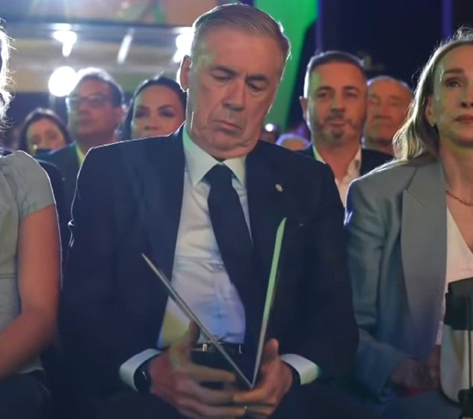

د بیا بخون اون لیست لعنتی رو خسته شدیم
@SportBaadNews

## SportBaadNews — post 251853

  <a href="telegram/content/SportBaadNews_251853_1779139567.webm" target="_blank">🎬 Download video</a>

🔻فابریزیو رومانو: خرید باستونی توسط بارسلونا فعلا سرش گرده @SportBaadNews

## SportBaadNews — post 251852

گلوبو برزیل: نیمار به جام جهانی دعوت شده
@SportBaadNews

## SportBaadNews — post 251851

  <a href="telegram/content/SportBaadNews_251851_1779139567.webm" target="_blank">🎬 Download video</a>

🚨
⚽️
🇧🇷| نیمار بیو پیج اینستاگرام خودش رو آپدیت کرد و نوشت «سانتوس و برزیل 🇧🇷»
@SportBaadNews

## SportBaadNews — post 251850

  <a href="telegram/content/SportBaadNews_251850_1779139568.mp4" target="_blank">🎬 Download video</a>

پیرو هینکاپیه شرفش رفت @SportBaadNews

## SportBaadNews — post 251849

  

پیرو هینکاپیه شرفش رفت
@SportBaadNews

## SportBaadNews — post 251848

  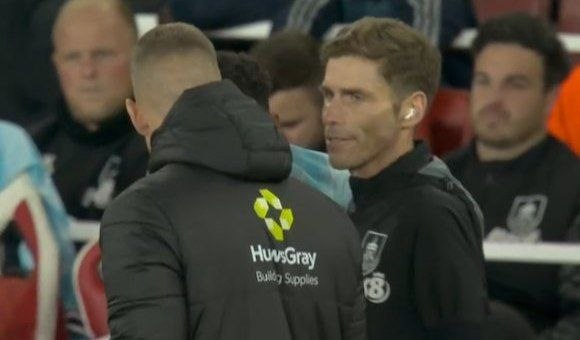

کمک مربی برنلی گرت بیل نیست؟
@SportBaadNews

## SportBaadNews — post 251847

  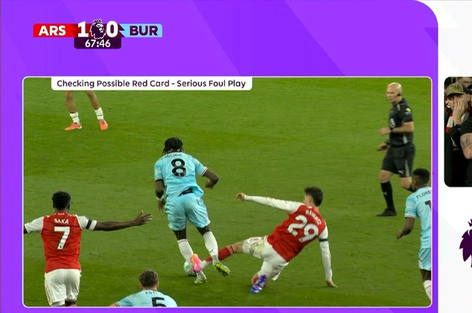

هاورتز تو این صحنه اخراج نشد
@SportBaadNews

## SportBaadNews — post 251846

  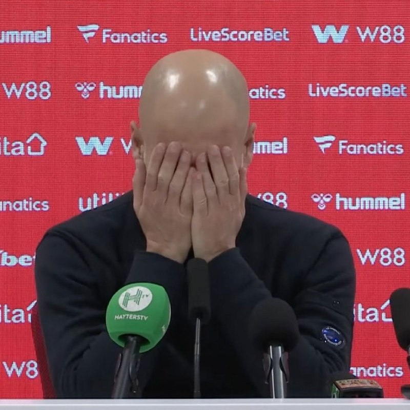

⚽️
🔵 پپ گواردیولا تو ژانویه: فصل بعدم مربی سیتی هستم؟ اوه خدای من. من قرارداد دارم، هزار بار هم گفتم. میدونم ازم خسته شدین، 10 ساله اینجام، مطمئنم دیگه حوصله‌ تون سر رفته. یه روزی میرم، قول میدم. ولی قرارداد دارم.
@SportBaadNews

## SportBaadNews — post 251845

  <a href="telegram/content/SportBaadNews_251845_1779139572.webm" target="_blank">🎬 Download video</a>

🚨
🚨
⚽️ فوووووری از اورنشتاین: گواردیولا از سیتی جدا میشه @SportBaadNews

## IranIntlTV — post 337843

  <a href="telegram/content/IranIntlTV_337843_1779139573.mp4" target="_blank">🎬 Download video</a>

رویترز به نقل از سه مقام امنیتی و دو منبع دولتی از گسترش همکاری‌های پاکستان و عربستان سعودی در چارچوب یک پیمان دفاعی متقابل خبر داد. این پیمان، اعزام ۸ هزار نیروی نظامی، حدود ۱۶ فروند جنگنده جی‌اف-۱۷، دو اسکادران پهپادی و یک سامانه پدافند هوایی را شامل می‌شود.
@iranintltv

## IranIntlTV — post 337842

  <a href="telegram/content/IranIntlTV_337842_1779139576.mp4" target="_blank">🎬 Download video</a>

مراد ویسی، تحلیل‌گر ارشد ایران‌اینترنشنال، گفت: «ترامپ می‌گوید حمله برنامه‌ریزی شده روز سه‌شنبه به جمهوری اسلامی را به درخواست رهبران امارات، عربستان و قطر به تعویق انداخته تا یک شانس دیگر به توافق داده شود. ترامپ گفته ارتش آمریکا آماده است در صورت عدم توافق حمله را بی‌درنگ شروع کند.»
@iranintltv

## IranIntlTV — post 337841

  

رییس پلیس سن‌دیگو اعلام کرد درپی تیراندازی در مرکز اسلامی سن‌دیگو سه مرد بزرگسال کشته شدند و مهاجمان مظنون نیز جان باخته‌اند. پلیس گفت این حمله به عنوان یک جرم ناشی از نفرت در نظر گرفته شده است.
https://iranintl.com/202605188629

## IranIntlTV — post 337840

  <a href="telegram/content/IranIntlTV_337840_1779139579.mp4" target="_blank">🎬 Download video</a>

دونالد ترامپ اعلام کرد به درخواست رهبران منطقه، برنامه حمله به مواضع جمهوری اسلامی را که برای سه‌شنبه طراحی شده بود، متوقف کرده است.
او گفت رهبران منطقه معتقدند امکان دستیابی به توافق در آینده نزدیک وجود دارد.

گزارش نیلوفر منصوری، خبرنگار ایران‌اینترنشنال
@iranintltv

## IranIntlTV — post 337839

  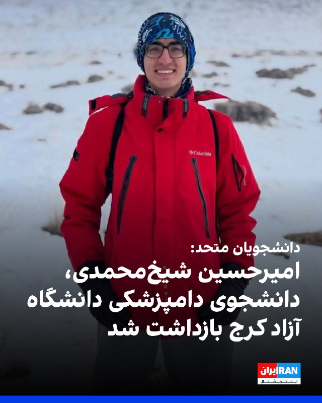

کانال تلگرامی دانشجویان متحد اعلام کرد که امیرحسین شیخ محمدی، دانشجوی دامپزشکی دانشگاه آزاد واحد کرج، صبح دوشنبه ۲۸ اردیبهشت بازداشت شده است.

هیچ اطلاعاتی درباره اتهام‌های احتمالی مطرح شده علیه این دانشجو و محل نگهداری او منتشر نشده است.
https://iranintl.com/202605189606

## IranIntlTV — post 337838

  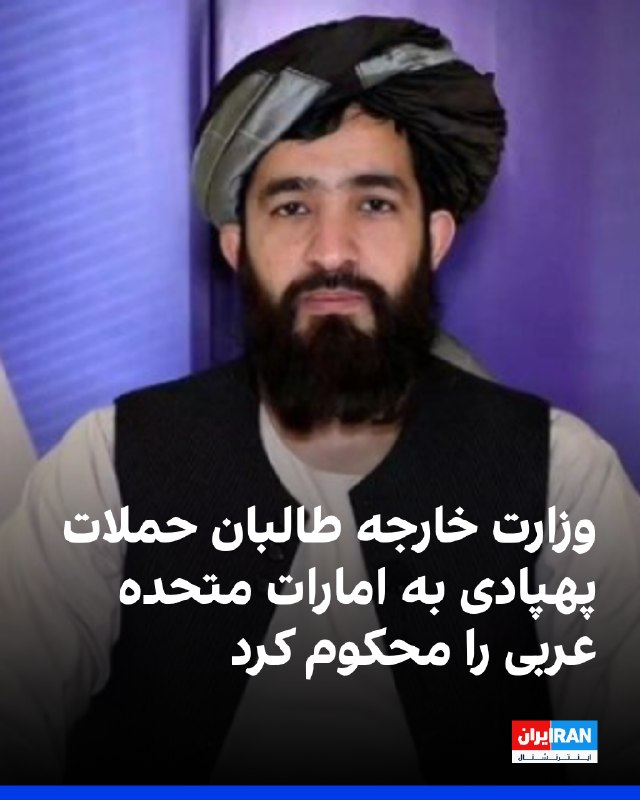

عبدالقهار بلخی، سخنگوی وزارت خارجه طالبان، حملات پهپادی اخیر به «تاسیسات غیرنظامی» در امارات متحده عربی، به ویژه به نیروگاه هسته‌ای براکه را محکوم کرد.

او در شبکه اجتماعی ایکس نوشت که طالبان «نگرانی عمیق خود را از تشدید خشونت در منطقه ابراز می‌کند.»
https://iranintl.com/202605183828

## IranIntlTV — post 337837

  

رسانه‌های ایران شامگاه دوشنبه از فعال شدن پدافند هوایی در اصفهان خبر دادند.

تا زمان انتشار این خبر توضیحی درباره علت فعال شدن پدافند ارائه نشده است.
پیش‌تر خبرگزاری تسنیم نوشت: «پس از مشاهده ریزپرنده‌ها در آسمان جزیره قشم، پدافند برای نابودی اهداف متخاصم فعال شد.»
https://iranintl.com/202605188482

## IranIntlTV — post 337836

  <a href="telegram/content/IranIntlTV_337836_1779139584.mp4" target="_blank">🎬 Download video</a>

مستند «تمرین‌هایی برای یک انقلاب» ساخته پگاه آهنگرانی در حاشیه جشنواره فیلم کن، جایزه ویژه هیات داوران رویداد مستند گلدن گلوبز را دریافت کرد.

این رویداد با همکاری بخش کن داکس، مجله ورایتی و بازار فیلم کن برگزار می‌شود.

گفت‌وگو با محمد عبدی، نویسنده و منتقد فیلم
@iranintltv

## IranIntlTV — post 337835

  

آنا کلی، معاون سخنگوی کاخ سفید، در گفت‌وگو با فاکس نیوز اعلام کرد که جمهوری اسلامی اجازه نخواهد داشت اورانیوم غنی‌شده در اختیار داشته باشد و این موضوع خط قرمز دونالد ترامپ در مذاکرات است.

او گفت: «تهران نه‌تنها نباید به سلاح هسته‌ای دست پیدا کند، بلکه باید مواد غنی‌شده را نیز تحویل دهد.»

کلی افزود که ترامپ معتقد است جمهوری اسلامی به‌خوبی می‌داند که او در تهدیدهایش بلوف نمی‌زند و عملیات‌های اخیر نشان داده واشینگتن در اجرای تهدیدات خود جدی است.
https://iranintl.com/202605188107

## IranIntlTV — post 337834

  <a href="telegram/content/IranIntlTV_337834_1779139588.mp4" target="_blank">🎬 Download video</a>

دونالد ترامپ، رییس‌جمهوری آمریکا، در تروث سوشال نوشت حمله علیه جمهوری اسلامی که برای سه‌شنبه (۲۹ اردیبهشت) برنامه‌ریزی شده بود، فعلا انجام نخواهد شد.
او همچنین نوشت که رهبران قطر، عربستان سعودی و امارات از آمریکا خواسته‌اند فعلا از اجرای عملیات نظامی علیه جمهوری اسلامی خودداری کند.

گفت‌وگو با شهرام خلدی، پژوهشگر تاریخ خاورمیانه و روابط بین‌الملل و روح‌الله رحیم‌پور، روزنامه‌نگار و تحلیل‌گر سیاسی
@iranintltv

## IranIntlTV — post 337833

  <a href="telegram/content/IranIntlTV_337833_1779139591.mp4" target="_blank">🎬 Download video</a>

دونالد ترامپ، رییس‌جمهوری آمریکا، در تروث سوشال نوشت حمله علیه جمهوری اسلامی که برای سه‌شنبه (۲۹ اردیبهشت) برنامه‌ریزی شده بود، فعلا انجام نخواهد شد.
او همچنین نوشت که رهبران قطر، عربستان سعودی و امارات از آمریکا خواسته‌اند فعلا از اجرای عملیات نظامی علیه جمهوری اسلامی خودداری کند.

گفت‌وگو با شهرام خلدی، پژوهشگر تاریخ خاورمیانه و روابط بین‌الملل و روح‌الله رحیم‌پور، روزنامه‌نگار و تحلیل‌گر سیاسی
@iranintltv

## Persian_Trend_Official — post 14460

  

🔺فرمانده قرارگاه مرکزی خاتم‌الانبیا: به آمریکا و همپیمانان آن اعلام می‌داريم، دوباره مرتکب اشتباه راهبردی و خطای محاسباتی نشوند.

🔹سرلشکر پاسدار خلبان علی عبدالهی: آنها باید بدانند ایران اسلامی و نیروهای مسلح آن نسبت به گذشته آماده تر و قوی تر، دست بر ماشه هستند و هرگونه تعرض و تجاوز مجددی از سوی دشمنان سرزمین و ملت سربلند را سریع، قاطع، پرقدرت و گسترده پاسخ خواهند داد.

🔹دشمنان آمریکایی اسرائیلی بارها ملت شجاع ایران و نیروهای مسلح مقتدر آن را آزموده اند.

🔹ما با عظم و اراده الهی ثابت کرده ایم که اقتدار و توانایی خود را در میدان عمل به دشمنان نشان می دهیم و چنانچه خطای دیگری از سوی دشمنانمان سربزند با قدرت و توانایی به مراتب بالاتر از جنگ تحمیلی رمضان با آن برخورد خواهیم نمود و با تمام توان از حقوق ملت ایران دفاع می کنیم و دست هر متجاوزی را قطع می نمائیم.

☆Phantom☆

📌 @persian_trend_official
پرشین ترند | متفاوت‌ترین کانال نظامی

## Persian_Trend_Official — post 14459

  

📰
📰 تو صداوسیما تانک آوردن!!!

☆Phantom☆

📌 @persian_trend_official
پرشین ترند | متفاوت‌ترین کانال نظامی

## Persian_Trend_Official — post 14458

  

فعال شدن پدافند هوایی اصفهان/مهر نیوز

☆Phantom☆

📌 @persian_trend_official
پرشین ترند | متفاوت‌ترین کانال نظامی

## Persian_Trend_Official — post 14457

  

حزب‌الله : ما یک هواپیمای جنگی اسرائیلی را با یک موشک زمین به هوا در حریم هوایی بخش غربی جنوب لبنان رهگیری کردیم.

☆Phantom☆

📌 @persian_trend_official
پرشین ترند | متفاوت‌ترین کانال نظامی

## Persian_Trend_Official — post 14456

https://youtube.com/live/7aZKWyXxQog?feature=share

---
📅 بروزرسانی: 1405/02/28 23:40
---

## ChizBergerz — post 46528

  <a href="telegram/content/ChizBergerz_46528_1779135044.mp4" target="_blank">🎬 Download video</a>

صداوسیما این وسط همچنان داره با Ai عکس فیک از سفر ترامپ به چین می‌سازه، همون عکس رو تحلیل می‌کنه و از همون عکسا نتیجه می‌گیره که آمریکا در مقابل چین تحقیر شده و شکست خورده
💩

@ChizBergerz

## ChizBergerz — post 46527

  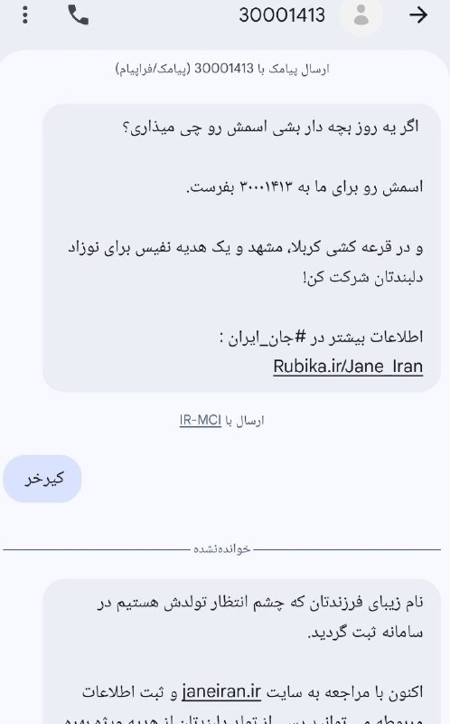

ریدمممم😂😂

@ChizBergerz

## ChizBergerz — post 46526

آی‌پی‌های جدید شیر و خورشید برای تمام اپراتورها
👑

172.234.159.58
184.86.103.210
96.16.248.183
92.122.16.5
96.16.249.60
96.16.249.9
142.54.178.211
185.137.25.214
81.12.72.218
5.160.13.85
37.255.133.30
81.91.145.2
2.23.170.80
2.23.168.254
2.19.205.88
92.123.8.91
2.19.204.186
2.22.250.149
23.58.193.140
23.48.23.151
2.19.126.81
23.202.138.125
23.43.237.239
104.112.146.82
23.2.13.136
72.246.28.37
2.18.63.49
2.16.53.11
2.16.53.50
2.16.19.136
185.200.232.8
185.143.232.122
185.200.232.9
185.200.232.11
185.200.232.16
185.200.232.17
185.200.232.19
185.200.232.24
185.200.232.25
185.200.232.26
185.200.232.34
2.16.27.71
2.16.244.11
2.17.147.89
2.18.190.26
2.18.190.27
2.19.10.30
2.19.196.105
2.21.89.66
2.21.239.10
2.21.239.23
2.21.239.29
2.22.21.152
2.23.176.166
23.2.13.138
23.2.13.144
23.2.13.153
23.2.13.201
23.33.126.163
23.36.162.196
23.36.162.198
23.36.162.202
23.36.162.208
23.36.162.209
23.36.162.215
23.37.197.128
23.37.206.186
23.38.49.97
23.39.249.249
23.44.10.10
23.73.207.11
23.73.207.16
23.192.46.51
23.192.237.208
23.192.237.209
23.192.237.222
23.197.161.35
23.200.143.71
80.67.82.179
88.221.92.177
88.221.213.81
92.122.166.182
92.122.166.197
92.123.102.104
92.123.112.7
92.123.189.82
T.me/ChizBergerz
95.100.156.147
95.101.23.25
95.101.23.82
95.101.23.168
95.101.23.170
95.101.29.12
95.101.29.30
95.101.29.54
95.101.35.73
95.101.35.83
95.101.181.125
95.101.200.63
96.16.122.48
96.16.122.59
104.83.5.208
104.83.15.66
104.94.100.73
104.96.143.134
104.103.64.7
104.109.128.153
104.111.202.158
104.117.76.26
104.117.76.40
184.25.52.200
184.28.230.87
184.51.252.36
184.51.252.38
184.86.251.27
23.215.0.164
23.220.128.221
96.17.207.142
23.50.131.18
23.219.3.212
23.223.245.150
96.17.207.135
23.220.113.51
96.17.72.41
23.203.185.105
2.23.168.213
2.23.168.174
96.17.207.137
96.16.122.75
173.222.200.5
96.16.122.146
96.17.206.214
172.239.57.117
96.17.207.30
96.16.122.83
96.16.122.150
96.16.122.77
96.17.207.155
2.23.168.47
2.23.168.144
184.24.77.7
184.24.77.16
184.24.77.36
184.24.77.21
184.24.77.11
185.200.232.49
185.200.232.50
185.200.232.42
185.200.232.41
23.48.23.186
23.48.23.133
23.48.23.195
23.48.23.178
184.24.77.29
2.22.250.149
23.58.193.140
23.48.23.151
2.19.126.81
23.202.138.125
23.43.237.239
104.112.146.82
23.2.13.136
72.246.28.37
2.18.63.49
2.16.53.11
2.16.53.50
2.16.19.136

@ChizBergerz

## rodast_omiddana — post 71529

  <a href="telegram/content/rodast_omiddana_71529_1779135047.webm" target="_blank">🎬 Download video</a>

🚨 ترامپ دروغ میگوید که میخواسته فردا شب حمله کند ولی بخاطر رهبر قطر منصرف شده..
حمله برای آخر هفته برنامه ریزی شده و ترامپ داره روغن ریخته شده را نذر امامزاده میکنه..
99درصد او تا قبل از دوشنبه حمله خواهد کرد..
تمام

## rodast_omiddana — post 71528

  <a href="telegram/content/rodast_omiddana_71528_1779135047.webm" target="_blank">🎬 Download video</a>

🚨
🚨 ترامپ:
من توسط امیر قطر تمیم بن حمد آل ثانی، ولیعهد عربستان سعودی محمد بن سلمان آل سعود و رئیس امارات متحده عربی محمد بن زاید آل نهیان درخواست شدم که حمله نظامی برنامه‌ریزی‌شده‌مان به جمهوری اسلامی ایران که برای فردا تعیین شده بود را به تعویق بیندازم، زیرا مذاکرات جدی در جریان است و به نظر آن‌ها به عنوان رهبران بزرگ و متحدان، توافقی حاصل خواهد شد که برای ایالات متحده آمریکا و همچنین تمام کشورهای خاورمیانه و فراتر از آن بسیار قابل قبول خواهد بود. این توافق شامل این نکته مهم خواهد بود که هیچ سلاح هسته‌ای برای ایران وجود نخواهد داشت!
🔹بر اساس احترامی که برای رهبران مذکور قائلم، به وزیر دفاع، پیت هگزت، رئیس کمیته مشترک رؤسای ستاد، ژنرال دنیل کین و نیروهای مسلح ایالات متحده دستور دادم که ما فردا حمله برنامه‌ریزی‌شده به ایران را انجام ندهیم، اما همچنین به آن‌ها دستور دادم که آماده یک حمله تمام‌عیار و گسترده به ایران در هر زمانی باشند اگر توافق قابل قبولی حاصل نشود. از توجه شما به این موضوع سپاسگزارم!

## rodast_omiddana — post 71527

  <a href="telegram/content/rodast_omiddana_71527_1779135048.webm" target="_blank">🎬 Download video</a>

🚨گزارش از فعالیت پدافند هوایی در قشم

## rodast_omiddana — post 71526

  <a href="telegram/content/rodast_omiddana_71526_1779135048.webm" target="_blank">🎬 Download video</a>

🚨 یادتونه گفته بودم هر چقدر جمعیت مراسم محرم کم میشود بلندگوهای رژیم بزرگتر و پر سر و صداتر میشود، حالا هر چقدر رژیم به سقوط نزدیک میشود اسلحه های آموزشیش در صداوسیما نیز بزرگتر میشود...

## rodast_omiddana — post 71525

  <a href="telegram/content/rodast_omiddana_71525_1779135048.webm" target="_blank">🎬 Download video</a>

🚨حمله پیش رو که تا قبل از دوشنبه چهارم خرداد آغاز میشود، حمله بزرگی است ولی فکر نکنم حمله اصلی برای ورود زمینی باشد..
ولی اگر بخشی از حمله اصلی باشد تمام چیزهایی که در جنگ 39 روزه دیده اید را فراموش کنید زیرا اون صرفا در برابر چیزهایی که خواهید دید شوخی بیش نبوده..
تیک تاک..

## rodast_omiddana — post 71524

🎬 پاسخ به محمد رهبر مجری سابق ایران اینترنشنال
لینک یوتیوب:
https://www.youtube.com/watch?v=LhPfMIVhR_s

## KiriMohems — post 47727

🔴ترامپ: حمله نظامی به ایران که برای فردا برنامه‌ریزی شده بود رو با خایمالی ولی‌عهد عربستان سولاخی، رئیس امارات و امیر قطر متوقف کردم ، کصکشا ما رو زخم کردن اینقدر مالیدن #Helsinki @KiriMohems

## KiriMohems — post 47726

  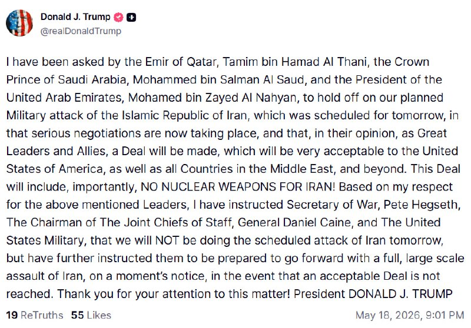

🔴ترامپ: حمله نظامی به ایران که برای فردا برنامه‌ریزی شده بود رو با خایمالی ولی‌عهد عربستان سولاخی، رئیس امارات و امیر قطر متوقف کردم ، کصکشا ما رو زخم کردن اینقدر مالیدن

#Helsinki
@KiriMohems

## KiriMohems — post 47725

  <a href="telegram/content/KiriMohems_47725_1779135049.mp4" target="_blank">🎬 Download video</a>

👑 ایران عزیز ما در گذشته
#Helsinki
@KiriMohems

## KiriMohems — post 47724

  

😤دنبال یه سایت شرط بندی بین المللی بودی که به ایرانیا خدمات بده؟!
⛔

👍دربی بت همون انتخاب  100%

💎ویژگی های سایت جهانی Derby Bet:

⬅️امکان شارژ امن با کارت بانکی

⬅️واریز اول دوبل شارژ می شوید(بونوس۱۰۰٪)

⬅️پر اپشن ترین سایت فعال در ایران

⬅️تسویه حساب کمتر از 5 دقیقه

⬅️برگشت بخشی از باخت به صورت هفتگی

🚨کد هدیه ثبت نام:GG007

⚠️برای دانلود اپلکیشن کلیک کنید
👉

🔔کانال دربی بت :r28🅰

🪙https://t.me/+kpFvLD9kaeJhYTI0

## KiriMohems — post 47723

📰 کصشعر غلیظ از فارس: قلب اینترنت جهان در دست ایران است
#Helsinki
@KiriMohems

## SportBaadNews — post 251841

  <a href="telegram/content/SportBaadNews_251841_1779135054.webm" target="_blank">🎬 Download video</a>

🚨
🚨
⚽️ فووووری از بی‌بی‌سی: پپ گواردیولا آخر فصل و بعد بازی با استون ویلا از منچسترسیتی جدا میشه
@SportBaadNews

## SportBaadNews — post 251839

  <a href="telegram/content/SportBaadNews_251839_1779135054.mp4" target="_blank">🎬 Download video</a>

وقتی دوست پسرت هم فوت فتیشه هم فوتبالی :

⚽️ @Shortasport

## SportBaadNews — post 251838

  

کارلو آنچلوتی این وسط فرصت رو غنیمت شمرد و یه لب از همسر گرفت
@SportBaadNews

## SportBaadNews — post 251837

تا لحظاتی دیگه فهرست تیم ملی برزیل میاد بیرون و همه منتظر نیمارن
@SportBaadNews

## SportBaadNews — post 251836

  <a href="telegram/content/SportBaadNews_251836_1779135057.webm" target="_blank">🎬 Download video</a>

🚨
🚨 ترامپ: من از طرف امیر قطر، ولیعهد عربستان و رئیس امارات خواسته شدم که حمله‌ای که برای فردا علیه ایران برنامه‌ریزی شده بود رو فعلاً متوقف کنم، چون مذاکرات جدی در جریانه و احتمال یه توافق وجود داره. این توافق به نظرشون می‌تونه شامل این باشه که ایران به سلاح…

## SportBaadNews — post 251835

  <a href="telegram/content/SportBaadNews_251835_1779135057.webm" target="_blank">🎬 Download video</a>

🚨
🚨 ترامپ: من از طرف امیر قطر، ولیعهد عربستان و رئیس امارات خواسته شدم که حمله‌ای که برای فردا علیه ایران برنامه‌ریزی شده بود رو فعلاً متوقف کنم، چون مذاکرات جدی در جریانه و احتمال یه توافق وجود داره. این توافق به نظرشون می‌تونه شامل این باشه که ایران به سلاح هسته‌ای دست پیدا نکنه.

با توجه به احترامم به این رهبران، به ارتش آمریکا دستور دادم فعلاً حمله انجام نشه، اما همزمان آماده‌باش کامل هستیم که اگه توافقی به نتیجه نرسه، در هر لحظه یه حمله گسترده رو شروع کنیم.
@SportBaadNews

## SportBaadNews — post 251834

  <a href="telegram/content/SportBaadNews_251834_1779135058.webm" target="_blank">🎬 Download video</a>

🚨
🚨
💣 خبرگزاری مهر: پدافند قشم فعال شد
@SportBaadNews

## SportBaadNews — post 251833

  <a href="telegram/content/SportBaadNews_251833_1779135058.webm" target="_blank">🎬 Download video</a>

🚨 ایران با پهباد به نیروگاه هسته‌ای براکه تو امارات حمله کرده
@SportBaadNews

## SportBaadNews — post 251832

قلعه نویی قبل از سفر به آمریکا به زیارت مسجد جمکران رفت تا برای قهرمانی ایران دعا کند @SportBaadNews

## SportBaadNews — post 251831

  

بازیکنی از دیار هندوستان 🇮🇳 در رئال مادرید
@SportBaadNews

## SportBaadNews — post 251830

  

وینیسیوس در اینستاگرام درباره دوست دختر سابقش ویرجینیا: از همه چیز ممنونم! هر لحظه و درسی که در کنارت گذراندم، خاطره‌انگیز بود! بهترین‌ها و موفقیت‌ها را در زندگی‌ات آرزو می‌کنم! برایت آرزوی خوشبختی دارم. همیشه از تو به خاطر اینکه بخشی از زندگی‌ات را به من اختصاص دادی، سپاسگزارم. مراقب خودت باش!
@SportBaadNews

## SportBaadNews — post 251829

  

🟢 دسترسی سریع به سایت وینکوبت

✅ کاربران عزیز، برای ورود آسان و بدون دردسر به سایت وینکوبت، می‌توانید از ربات رسمی استفاده کنید: 
👇

🤖 @Wincobet_bot

🤖 @Wincobet_bot

🔹 ورود سریع و مستقیم به سایت
🔹 بدون نیاز به جستجوی لینک‌های مختلف
🔹 دسترسی راحت از داخل تلگرام

📌  همه چیز به ساده‌ترین شکل ممکن داخل ربات برای شما کاربران محترم فراهم شده.

🔗 اگر دنبال یه راه مطمئن و سریع برای ورود هستید، ربات وینکوبت بهترین انتخاب شماست:

🤖 @Wincobet_bot

🔗 برای دریافت تحلیل بازی‌ها و اطلاع از آخرین بروزرسانی‌ها، به کانال رسمی وینکوبت بپیوندید: 
👇

🔵 @Wincobetofficial

## IranIntlTV — post 337832

  <a href="https://t.me/IranintlTV/337832" target="_blank">📎 Download file</a>

🎧نسخه صوتی ‌‌‏۲۴ با فرداد فرحزاد: احتمال از سرگیری جنگ؛ ترامپ: تهران می‌داند چه اتفاقی می‌افتد
@iranintlTV

## IranIntlTV — post 337831

  <a href="https://t.me/IranintlTV/337831" target="_blank">📎 Download file</a>

🎧نسخه صوتی دومینو: اتحاد ارتش‌های مجهز در برابر اقتصادی ورشکسته
@iranintlTV

## IranIntlTV — post 337830

  <a href="telegram/content/IranIntlTV_337830_1779135063.mp4" target="_blank">🎬 Download video</a>

وای‌نت گزارش داد بنیامین نتانیاهو پس از پاسخ جمهوری اسلامی به پیشنهاد آمریکا، نشست امنیتی با حضور وزیران و مشاوران ارشد برگزار می‌کند.

دونالد ترامپ نیز در تماس با نتانیاهو گفته زمان برای جمهوری اسلامی رو به پایان است.

گفت‌وگو با گابریل گرویسمن، استراتژیست حزب جمهوری‌خواه
@iranintltv

## IranIntlTV — post 337829

  <a href="telegram/content/IranIntlTV_337829_1779135065.mp4" target="_blank">🎬 Download video</a>

مصطفی دانشگر، تحلیل‌گر سیاسی، گفت طرح مطلوب آمریکا برای جمهوری اسلامی، مدل ونزوئلا است. او افزود تصور دونالد ترامپ و ایالات متحده این است که پس از حذف و کنار زدن برخی مقام‌های جمهوری اسلامی در جریان جنگ اخیر، اکنون می‌توانند فردی را در درون ساختار حکومت پیدا کنند.
@iranintltv

## IranIntlTV — post 337828

  

رسانه‌های ایران شامگاه دوشنبه از فعال شدن پدافند هوایی در جزیره قشم خبر دادند.

خبرگزاری تسنیم، وابسته به سپاه پاسداران، نوشت: «پس از مشاهده ریزپرنده‌ها در آسمان جزیره قشم، پدافند برای نابودی اهداف متخاصم فعال شد.»
https://iranintl.com/202605184408

## IranIntlTV — post 337827

  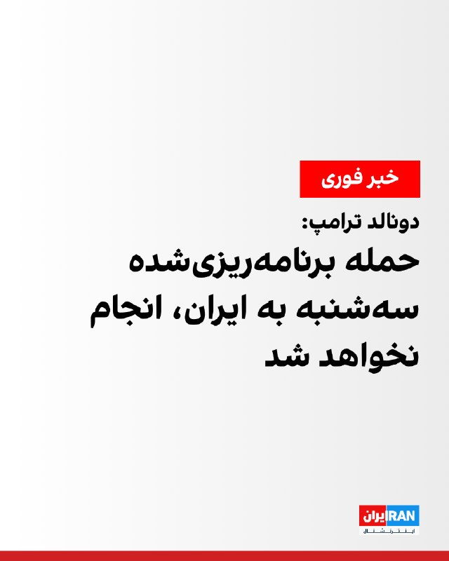

دونالد ترامپ اعلام کرد به درخواست رهبران قطر، عربستان سعودی و امارات متحده عربی، حمله نظامی برنامه‌ریزی‌شده آمریکا به جمهوری اسلامی را که قرار بود روز سه‌شنبه انجام شود، متوقف کرده است.
او گفت در صورت عدم دستیابی به توافقی قابل قبول، آمریکا آماده اجرای حمله گسترده خواهد بود.

ترامپ گفت مذاکرات جدی در حال انجام است و رهبران این کشورها، به‌عنوان متحدان، معتقدند توافقی حاصل خواهد شد که برای آمریکا و همچنین همه کشورهای خاورمیانه و فراتر از آن بسیار قابل قبول خواهد بود. این توافق، به‌طور مهم، شامل «نبود سلاح هسته‌ای برای ایران» خواهد بود.

رییس‌جمهور آمریکا اضافه کرد: به وزیر جنگ، رییس ستاد مشترک ارتش و ارتش ایالات متحده دستور داده‌ام که حمله برنامه‌ریزی‌شده فردا به ایران انجام نخواهد شد، اما همچنین به آن‌ها دستور داده‌ام در صورتی که توافق قابل قبولی حاصل نشود، برای اجرای یک حمله گسترده و تمام‌عیار علیه ایران در کوتاه‌ترین زمان ممکن آماده باشند.
https://iranintl.com/202605181556

## IranIntlTV — post 337826

  

مسعود پزشکیان در شبکه ایکس نوشت: «گفت‌وگو به معنای تسلیم نیست. جمهوری اسلامی با عزت، اقتدار و حفظ حقوق ملت وارد گفت‌وگو می‌شود و به هیچ عنوان از حقوق قانونی مردم و کشور عقب‌نشینی نمی‌کند.»
او افزود: «ما با منطق و با تمام توان، تا پای جان، در خدمت مردم و حافظ منافع و عزت ایران خواهیم بود.»
https://iranintl.com/202605181966

## IranIntlTV — post 337825

  <a href="telegram/content/IranIntlTV_337825_1779135070.mp4" target="_blank">🎬 Download video</a>

۲۴ با فرداد فرحزاد
@iranintltv

## IranIntlTV — post 337824

  

لیندسی گراهام، سناتور جمهوری‌خواه، در شبکه ایکس نوشت: «اطمینان کامل دارم که ترامپ به‌خوبی وضعیت ایران را درک می‌کند و در برابر ادامه خودداری جمهوری اسلامی از مذاکره صادقانه، همراه با اقدامات تهاجمی این کشور در تنگه هرمز و سراسر منطقه، مماشات نخواهد کرد.»

او افزود: «یک پاسخ کوتاه اما قاطع می‌تواند مسیر درگیری را به‌درستی تغییر دهد. در مواجهه با جمهوری اسلامی، ضروری است که از موضع قدرت و برتری وارد مذاکره شویم.»
https://iranintl.com/202605181005

## IranIntlTV — post 337823

  <a href="https://t.me/IranintlTV/337823" target="_blank">📎 Download file</a>

🎧نسخه صوتی تیتراول با نیوشا صارمی: احتمال آغاز جنگ در همین هفته با فرمان ترامپ پس از رد آخرین پیشنهاد تهران
@iranintlTV

## Persian_Trend_Official — post 14455

  <a href="telegram/content/Persian_Trend_Official_14455_1779135073.webm" target="_blank">🎬 Download video</a>

ایران سامانه «هرمز سیف» را برای ثبت‌نام کشتی‌های عبوری از تنگه هرمز راه‌اندازی کرد جمهوری اسلامی ایران سامانه‌ای تحت عنوان «هرمز سیف» را با هدف ارائه خدمات به کشتی‌های عبوری از تنگه هرمز راه‌اندازی کرده است. بر اساس این طرح، ناخدایان و شرکت‌های کشتیرانی می‌توانند…

## Persian_Trend_Official — post 14454

🔴 صدای انفجار در سلیمانیه عراق گویا سپاه دوباره به مقر پژاک حمله کرده

## Persian_Trend_Official — post 14453

  <a href="telegram/content/Persian_Trend_Official_14453_1779135074.webm" target="_blank">🎬 Download video</a>

💢اینم نتیجه رفتار و عملکرد دونالد ترامپ

🫆:Tony

📌 @persian_trend_official
پرشین ترند | متفاوت‌ترین کانال نظامی

## Persian_Trend_Official — post 14452

نسخه صوتی لایو امشب :

https://castbox.fm/vd/946653632

## Persian_Trend_Official — post 14451

  

🔴 صدای انفجار در سلیمانیه عراق
گویا سپاه دوباره به مقر پژاک حمله کرده

## Persian_Trend_Official — post 14450

  <a href="telegram/content/Persian_Trend_Official_14450_1779135075.mp4" target="_blank">🎬 Download video</a>

🇺🇸
🇦🇫 حداقل دو نفر کشته شده‌اند و چندین نفر دیگر در یک وضعیت تیراندازی فعال در مرکز اسلامی سن دیگو، کالیفرنیا زخمی شده‌اند. ویدیوی بالا شخصی را در یک استخر خون پس از ظاهراً تیر خوردن نشان می‌دهد.

☆Phantom☆

📌 @persian_trend_official
پرشین ترند | متفاوت‌ترین کانال نظامی

## Persian_Trend_Official — post 14449

  

تیراندازی در یک مرکز اسلامی در آمریکا

🔸رسانه‌ها روز دوشنبه از حضور یک فرد مسلح و تیراندازی در مرکز اسلامی سن دیگو خبر می‌دهند.

🔹پلیس سن دیگو از مردم خواست که از حضور در این منطقه خودداری کنند.

☆Phantom☆

📌 @persian_trend_official
پرشین ترند | متفاوت‌ترین کانال نظامی

## Persian_Trend_Official — post 14448

  

💢از سوی امیر قطر، تمیم بن حمد آل ثانی، ولیعهد عربستان سعودی، محمد بن سلمان آل سعود، و رئیس امارات متحده عربی، محمد بن زاید آل نهیان، از من خواسته شد حمله نظامی برنامه‌ریزی‌شده ما علیه جمهوری اسلامی ایران که قرار بود فردا انجام شود را متوقف کنم، زیرا مذاکرات…

## Persian_Trend_Official — post 14446

فعال شدن پدافند قشم علیه ریزپرنده‌ها 💢 در پی فعالیت پدافند در جزیره قشم، خبرنگار تسنیم از منابع مطلع کسب اطلاع کرد که پس از مشاهده ریز پرنده‌ها در آسمان جزیره، پدافند در جهت نابودی اهداف متخاصم فعال شد. 🫆:Tony 📌 @persian_trend_official پرشین ترند | متفاوت‌ترین…

## Persian_Trend_Official — post 14445

  <a href="telegram/content/Persian_Trend_Official_14445_1779135077.webm" target="_blank">🎬 Download video</a>

فعال شدن پدافند قشم علیه ریزپرنده‌ها

💢 در پی فعالیت پدافند در جزیره قشم، خبرنگار تسنیم از منابع مطلع کسب اطلاع کرد که پس از مشاهده ریز پرنده‌ها در آسمان جزیره، پدافند در جهت نابودی اهداف متخاصم فعال شد.

🫆:Tony

📌 @persian_trend_official
پرشین ترند | متفاوت‌ترین کانال نظامی

## Persian_Trend_Official — post 14443

⭕️ وضعیت کم سابقه‌ی آسمان منطقه، از نظر خلوت بودن. (در عکس اول فقط پرواز های نظامی آمریکا و در عکس دوم تمام پرواز های نظامی) 📝 Nick 📌 @persian_trend_official پرشین ترند | متفاوت‌ترین کانال نظامی

## Persian_Trend_Official — post 14442

  <a href="telegram/content/Persian_Trend_Official_14442_1779135078.webm" target="_blank">🎬 Download video</a>

💢از سوی امیر قطر، تمیم بن حمد آل ثانی، ولیعهد عربستان سعودی، محمد بن سلمان آل سعود، و رئیس امارات متحده عربی، محمد بن زاید آل نهیان، از من خواسته شد حمله نظامی برنامه‌ریزی‌شده ما علیه جمهوری اسلامی ایران که قرار بود فردا انجام شود را متوقف کنم، زیرا مذاکرات…

## Persian_Trend_Official — post 14441

  <a href="telegram/content/Persian_Trend_Official_14441_1779135078.webm" target="_blank">🎬 Download video</a>

💢از سوی امیر قطر، تمیم بن حمد آل ثانی، ولیعهد عربستان سعودی، محمد بن سلمان آل سعود، و رئیس امارات متحده عربی، محمد بن زاید آل نهیان، از من خواسته شد حمله نظامی برنامه‌ریزی‌شده ما علیه جمهوری اسلامی ایران که قرار بود فردا انجام شود را متوقف کنم، زیرا مذاکرات…

## Persian_Trend_Official — post 14440

  

💢از سوی امیر قطر، تمیم بن حمد آل ثانی، ولیعهد عربستان سعودی، محمد بن سلمان آل سعود، و رئیس امارات متحده عربی، محمد بن زاید آل نهیان، از من خواسته شد حمله نظامی برنامه‌ریزی‌شده ما علیه جمهوری اسلامی ایران که قرار بود فردا انجام شود را متوقف کنم، زیرا مذاکرات جدی اکنون در حال انجام است و آن‌ها معتقدند به‌عنوان رهبران و متحدان بزرگ، توافقی حاصل خواهد شد که برای ایالات متحده آمریکا، همه کشورهای خاورمیانه و فراتر از آن بسیار قابل قبول خواهد بود. این توافق، مهم‌تر از همه، شامل «عدم دستیابی ایران به سلاح هسته‌ای» خواهد بود.

💢بر اساس احترامی که برای رهبران یادشده قائلم، به وزیر جنگ، پیت هگست، رئیس ستاد مشترک ارتش، ژنرال دنیل کین، و ارتش ایالات متحده دستور داده‌ام که حمله برنامه‌ریزی‌شده علیه ایران را فردا انجام ندهند، اما در عین حال به آن‌ها دستور داده‌ام در صورتی که توافق قابل قبولی حاصل نشود، آماده اجرای یک حمله کامل و گسترده علیه ایران در کوتاه‌ترین زمان ممکن باشند.

▪️از توجه شما به این موضوع سپاسگزارم!

رئیس‌جمهور دونالد جی. ترامپ

🫆:Tony

📌 @persian_trend_official
پرشین ترند | متفاوت‌ترین کانال نظامی

## Persian_Trend_Official — post 14439

🚨 ترامپ در تروث سوشال اعلام کرد که حمله برنامه‌ریزی‌شده به ایران که برای فردا در نظر گرفته شده بود را لغو کرده زیرا «مذاکرات جدی» در حال انجام است. 📝 Nick 📌 @persian_trend_official پرشین ترند | متفاوت‌ترین کانال نظامی

## Persian_Trend_Official — post 14438

🚨 ترامپ در تروث سوشال اعلام کرد که حمله برنامه‌ریزی‌شده به ایران که برای فردا در نظر گرفته شده بود را لغو کرده زیرا «مذاکرات جدی» در حال انجام است.

📝 Nick

📌 @persian_trend_official
پرشین ترند | متفاوت‌ترین کانال نظامی

## Persian_Trend_Official — post 14437

  <a href="telegram/content/Persian_Trend_Official_14437_1779135080.mp4" target="_blank">🎬 Download video</a>

💢پیت هگست وزیر جنگ آمریکا در حال تقلید مدل صحبت و صدای ترامپ

🫆:Tony

📌 @persian_trend_official
پرشین ترند | متفاوت‌ترین کانال نظامی

## Persian_Trend_Official — post 14436

  <a href="telegram/content/Persian_Trend_Official_14436_1779135082.webm" target="_blank">🎬 Download video</a>

⭕️ جمهوری اسلامی سفر بدون ویزا برای لبنانی‌ها را اعلام کرد.

سفارت جمهوری اسلامی در لبنان اعلام کرد شهروندان لبنانی دارنده گذرنامه عادی می‌توانند برای سفرهای گردشگری یا زیارتی بدون نیاز به ویزا وارد ایران شوند.

لبنانی‌ها می‌توانند هر شش ماه یک‌بار بدون ویزا به ایران سفر کنند.

مدت اقامت در این سفرها حداکثر ۱۵ روز تعیین شده است.

📝 Nick

📌 @persian_trend_official
پرشین ترند | متفاوت‌ترین کانال نظامی

## Persian_Trend_Official — post 14435

  

⭕️ علی‌حسین قاضی‌زاده:

از قشنگی‌های شبکه ایکس اینه که مدیر حکومتی که از بندبندانگشتان مدیرانش خون می‌چکه بیاد اینجا از برخورد خشن، تمامیت‌خواهی، فحاشی و استبداد گله کنه.
اون هم در شرایطی که اینترنت رو بر روی ۹۰ میلیون ایرانی بستند‌ و سر تیربار رو سمت مردم گرفتند.
اینها وقیح نیستند. لغت تازه‌ای باید در زبان فارسی برای این جماعت ساخته بشه.

📝 Nick

📌 @persian_trend_official
پرشین ترند | متفاوت‌ترین کانال نظامی

## Persian_Trend_Official — post 14434

  <a href="telegram/content/Persian_Trend_Official_14434_1779135083.mp4" target="_blank">🎬 Download video</a>

⭕️نمایش و استفاده دوباره از اسلحه در برنامه زنده صداوسیما

💢اینبار هدف گیری و شلیک به سمت تصویر دونالد ترامپ به یاد بچه های مظلوم جزیره اپستین ‼️

🫆:Tony

📌 @persian_trend_official
پرشین ترند | متفاوت‌ترین کانال نظامی

---
📅 بروزرسانی: 1405/02/28 21:48
---

## ChizBergerz — post 46525

ShirOKhorshid-2026.05.14.apk

## ChizBergerz — post 46524

👑آی پی‌ های جدید برای اپ شیر و خورشید تست شده روی همه اپراتورها✅

❕نکته : اگه متصل نمی‌شید احتمالاً آیپی‌ و دیوایس‌تون بلاک‌ شده، اینترنت‌تون رو تغییر بدید به اینترنتی که تابحال کانکت نشدید یا با حالت پرواز و تغییر APN تست اتصال بگیرید.

23.218.239.132
23.39.149.69
23.52.40.147
23.58.95.144
2.16.244.58
23.212.253.137
2.17.106.176
23.62.54.137
2.17.106.5
23.203.134.233
23.212.253.232
23.206.188.197
23.44.201.170
23.54.127.39
23.214.170.83
23.52.40.89
23.55.176.73
23.202.229.140
23.215.56.61
2.17.106.166
23.222.126.108
184.25.85.224
23.1.241.123
23.3.90.43
184.26.13.91
23.54.210.170
104.83.198.44
92.123.102.153
184.51.252.134
23.48.23.195
23.53.40.147
184.51.252.176
2.18.64.212
172.104.251.198
2.18.79.101
23.216.77.181
23.207.210.77
92.123.102.89
23.216.77.80
23.207.210.84
96.16.53.132
23.53.40.139
23.48.165.70
2.21.20.143
2.18.79.95
2.22.89.10
2.18.64.7
23.48.23.57
2.22.89.45
23.55.110.78
23.53.40.105
23.46.188.232
2.18.63.55
172.104.203.186
2.22.248.153
23.205.49.151
23.216.77.65
2.16.19.129
2.23.168.47
2.16.220.191
2.21.2.67
2.21.2.59
2.23.168.144
23.43.85.155
23.48.23.184
23.207.210.83
23.209.125.169
23.48.23.172
2.21.240.22
23.55.110.82
23.216.77.35
23.58.95.138
23.33.40.149
23.48.23.146
184.30.157.239
23.209.125.145
92.123.102.130
23.53.40.121
23.48.23.11
23.201.248.171
23.209.125.27
23.48.23.176
23.48.23.133
23.207.210.86
23.55.161.151
92.123.103.89
2.23.7.34
23.207.210.80
23.48.23.165
23.48.23.173
23.48.23.156
23.55.110.74
173.222.107.202
23.213.161.140
23.48.23.134
23.204.152.160
2.23.97.120
23.48.23.178
23.48.23.148
23.55.110.68
23.36.162.206
104.83.5.203
2.21.2.98
2.21.2.64
2.21.2.122
2.23.168.250
2.21.2.43
2.21.2.107
2.21.2.56
2.23.168.174
2.23.168.96
23.208.64.159
23.59.29.16
23.59.29.58
184.26.13.91
23.54.210.170
23.44.201.206
23.220.163.205
23.209.46.33
23.10.34.11
23.39.185.35
23.32.152.106
23.218.232.181
23.206.188.212
2.21.2.89
23.208.222.120
23.48.203.248
23.44.201.136
23.44.201.151
23.44.201.149
2.21.2.58
23.3.90.48
23.44.201.41
2.19.204.184
23.218.232.188
23.44.201.12
23.212.253.227
23.201.31.155
23.220.163.203
23.44.201.185
23.52.116.66
23.44.201.17
23.62.54.24
23.218.239.132
23.39.149.69
23.52.40.147
23.58.95.144
2.16.244.58
23.212.253.137
2.17.106.176
23.62.54.137
2.17.106.5
23.203.134.233
23.212.253.232
23.206.188.197
23.44.201.170
23.54.127.39
23.214.170.83
23.52.40.89
23.55.176.73
23.202.229.140
23.215.56.61
2.17.106.166
23.222.126.108
184.25.85.224
23.1.241.123
23.3.90.43
2.17.100.200
2.19.205.42
2.19.205.50
2.19.252.134
2.20.169.70
2.20.170.91
95.101.111.144
2.16.245.188
2.18.69.150
2.16.106.4
23.58.222.107
184.25.28.31
23.47.124.134
23.50.131.147
23.46.190.18
23.58.222.147
23.56.162.186
23.44.203.68
23.12.156.115
23.216.77.16
23.62.61.53
23.39.148.245
23.210.73.133
23.44.201.136
23.205.46.167
184.30.150.142
23.220.161.217
184.28.165.4
23.46.230.133
88.221.168.204
104.96.158.174
184.51.252.4
Tel: @ChizBergerz
172.234.199.15
104.85.26.14
172.237.145.27
92.123.103.24
172.234.159.58
184.86.103.210
96.16.248.183
92.122.16.5
96.16.249.60
96.16.249.9
23.48.23.133
23.48.23.195
184.24.77.32
184.24.77.5
185.200.232.40
167.82.48.223
151.101.128.223
185.200.232.49
185.200.232.50
185.200.232.42
185.200.232.41
184.24.77.42
184.24.77.7

@ChizBergerz

## ChizBergerz — post 46523

  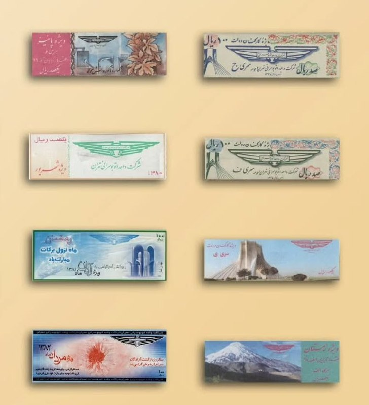

بلیت‌های نوستالژیک شرکت واحد اتوبوسرانی از ۱۳۷۸ تا ۱۳۸۲

@ChizBergerz

## ChizBergerz — post 46522

آیپی جدید تست شده با ایرانسل برای اپ سیر و خورشید
👑:

104.109.250.240
92.122.17.124
96.16.122.153
151.101.64.223
151.101.0.223
185.200.232.43  
2.17.100.200
2.19.205.42
2.19.205.50
2.19.252.134
2.20.169.70
2.20.170.91
95.101.111.144
2.16.245.188
2.18.69.150
2.16.106.4
23.58.222.107
184.25.28.31
23.47.124.134
23.50.131.147
23.46.190.18
23.58.222.147
23.56.162.186
23.44.203.68
23.12.156.115
23.216.77.16
23.62.61.53
23.39.148.245
23.210.73.133
23.44.201.136
23.205.46.167
184.30.150.142
23.220.161.217
184.28.165.4
23.46.230.133
88.221.168.204
104.96.158.174
184.51.252.4
172.234.199.15
104.85.26.14
172.237.145.27
92.123.103.24
172.234.159.58
184.86.103.210
96.16.248.183
92.122.16.5
96.16.249.60
96.16.249.9
184.26.57.149
2.17.211.216
2.19.205.66
2.20.135.163
2.21.176.57
2.21.239.16
2.21.240.15
2.23.169.12
2.23.97.122
23.12.147.134
23.193.117.5
23.196.14.11
23.196.3.200
23.2.13.154
23.2.13.226
23.200.79.136
23.200.87.22
23.202.230.211
23.204.136.169
23.204.9.130
23.205.106.74
23.205.165.21
23.212.110.33
23.212.250.11
23.212.250.25
23.213.158.26
23.214.139.250
23.215.0.40
23.216.77.154
23.216.77.162
23.216.77.50
23.216.77.70
23.217.124.170
23.37.198.164
23.44.201.234
23.44.203.86
23.44.215.152
23.52.182.11
23.54.127.42
23.55.110.208
23.55.161.161
23.61.250.82
23.9.187.41
23.217.47.193
23.40.179.202
184.27.225.90
23.53.13.19
Tel: @ChizBergerz
95.101.50.88
23.204.115.108
2.21.240.147
184.24.232.70
2.22.255.47
23.49.248.8
23.213.158.12
23.210.216.145
23.33.90.150
23.44.201.134
23.208.64.159
23.216.77.140
2.22.255.17
23.209.72.174
2.19.204.225
23.44.201.152
23.55.176.84
2.19.204.211
23.219.36.106
23.215.0.134
2.21.2.97
23.61.202.70
23.44.201.206
23.218.239.132
23.212.253.232

@ChizBergerz

## ChizBergerz — post 46521

  <a href="https://t.me/ChizBergerz/46521" target="_blank">📎 Download file</a>

📲#اپلیکیشن اندروید سایت جهانی دربی بت

👍اسپانسر لیگ انگلیس
👍
🔥امکان شارژ امن از طریق کارت بانکی
➖➖➖➖➖➖➖➖➖

🪙همین حالا عضو شوید 👇
https://t.me/+aCbq7yy8QY80NzQ0

## ChizBergerz — post 46520

  

😤دنبال یه سایت شرط بندی بین المللی بودی که به ایرانیا خدمات بده؟!
⛔

👍دربی بت همون انتخاب  100%

💎ویژگی های سایت جهانی Derby Bet:

⬅️امکان شارژ امن با کارت بانکی

⬅️واریز اول دوبل شارژ می شوید(بونوس۱۰۰٪)

⬅️پر اپشن ترین سایت فعال در ایران

⬅️تسویه حساب کمتر از 5 دقیقه

⬅️برگشت بخشی از باخت به صورت هفتگی

🚨کد هدیه ثبت نام:GG007

⚠️برای دانلود اپلکیشن کلیک کنید
👉
ge28

🔔کانال دربی بت :

🪙https://t.me/+aCbq7yy8QY80NzQ0

## rodast_omiddana — post 71523

  <a href="telegram/content/rodast_omiddana_71523_1779128294.webm" target="_blank">🎬 Download video</a>

🚨 ترامپ در گفت‌وگویی کوتاه با نیویورک پست:
"جمهوری اسلامی می‌داند به‌زودی چه اتفاقی خواهد افتاد، در حال حاضر هیچ چیز را نمی‌پذیرم واقعا نمی‌توانم درباره‌اش صحبت کنم. چیزهای زیادی در حال رخ دادن است"

## rodast_omiddana — post 71522

  <a href="telegram/content/rodast_omiddana_71522_1779128294.webm" target="_blank">🎬 Download video</a>

🚨 ترامپ به العربیه:
"ما در حال انجام کاری بزرگ هستیم و پیروزی در راه است."

## rodast_omiddana — post 71521

  <a href="telegram/content/rodast_omiddana_71521_1779128294.webm" target="_blank">🎬 Download video</a>

🚨تری یینگست، خبرنگار ارشد فاکس‌ نیوز:
ما در آستانه بازگشت به عملیات‌های رزمی تمام‌عیار علیه جمهوری اسلامی هستیم.

## rodast_omiddana — post 71520

  <a href="telegram/content/rodast_omiddana_71520_1779128295.webm" target="_blank">🎬 Download video</a>

🚨دوباره سه، دو، یک...
بمب بمب کُتلت..

## rodast_omiddana — post 71519

🎬 برنامه امشب تا دو ساعت و نیم دیگه
*فوری_آمریکا پیشنهاد امروز رژیم را رد کرد
*جلسه امنیتی فردا ترامپ برای حمله در آخر هفته
*پاکستان نیز با رژیم میجنگد!
لینک یوتیوب:
https://www.youtube.com/@omiddana

## KiriMohems — post 47722

  

📰 تیتر نیویورک پست:
آمریکا در آستانه شق کردن از سرگیری لواط با ایران با کمری سفت!

#Helsinki
@KiriMohems

## KiriMohems — post 47721

  <a href="telegram/content/KiriMohems_47721_1779128296.mp4" target="_blank">🎬 Download video</a>

🔴 بارش سکسی عیار برف در توچال تو پنجاه‌ونهمین روز بهار

#Helsinki
@KiriMohems

## KiriMohems — post 47720

  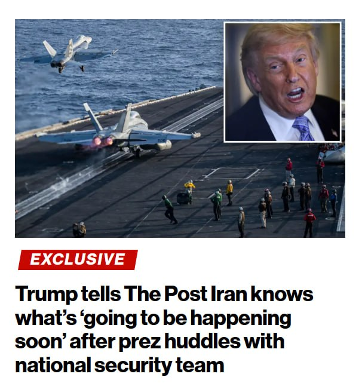

📰ترامپ به نیویورک پست :

جمهوری اسلامی میدونه که بزودی چه کونی ازش پاره میشه، امتیاز که هیچ کیر خر هم بهش نمیدیم

#Helsinki
@KiriMohems

## KiriMohems — post 47719

#فوری_تخمی

🔴کاخ پستون سفید: آخرین پیشنهاد ایران که امروز ارائه شد به دلیل کصشعراتی که به درد عمه جنده‌شان میخورد به صورت کامل رد شد، دیگر بمب ها مذاکره خواهند کرد ، لطفا چرب کنید
#Helsinki
@KiriMohems

## KiriMohems — post 47718

  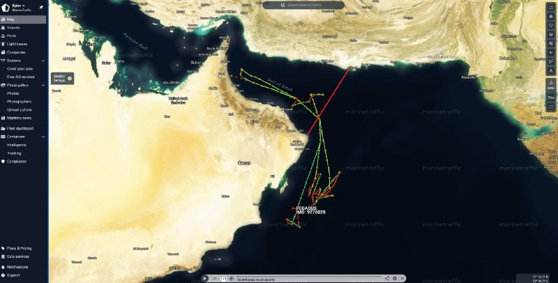

#برینید

🔴یه نفتکش بیناموص به نام هَندی‌مَکس با پرچم روسیه که آمریکا هم تحریمش کرده ، میاد وارد محاصره دریایی آمریکا میشه و دوباره برمیگرده ؛ کصکش ایستگاه یه منطقه نظامی رو گرفته

#Helsinki
@KiriMohems

## KiriMohems — post 47717

📰 ایسنا به نقل از وزارت بهداشت ایران :
صورت و قیافه مجتبی دچار تغییر یا آسیب نشده و دست‌وپاش هم قطع نشده
#Helsinki
@KiriMohems

## KiriMohems — post 47716

  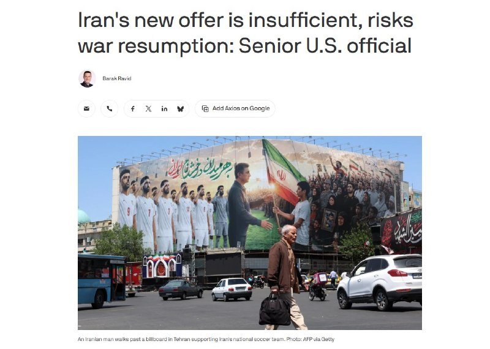

📰 آکسیوس:
آمریکا به پیشنهاد بروز شده جمهوری اسلامی اسهال رو زد
آمریکا مجبور میشه که مذاکرات رو از طریق بمب‌ها ادامه بده #دم_دمای_بگایی
#Helsinki
@KiriMohems

## SportBaadNews — post 251828

  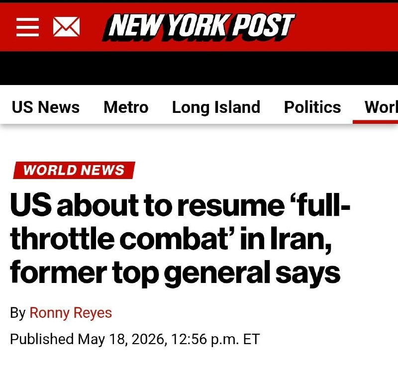

تیتر خبرگزاری نیویورک پست: آمریکا با تمام توان در حال آماده شدن برای حمله به ایرانه.
@SportBaadNews

## IranIntlTV — post 337822

پای فراخوان‌‌های شبانه و نمایش حکومتی سلاح در خیابان‌های ایران و صدا و سیمای جمهوری اسلامی به رسانه‌های بین‌المللی هم رسید. سی‌ان‌ان در گزارشی نوشت جمهوری اسلامی حامیانش را برای نمایش آمادگی برای جنگ بسیج می‌کند و با گذشت بیش از ده هفته از زمان شروع جنگ این تجمعات با حمایت نهادهای حکومتی و نظامی همچنان ادامه دارد.

گفت‌وگو با حسین قاضیان، جامعه‌شناس
@iranintltv

## IranIntlTV — post 337821

  

دادستان‌ها در دادگاه رسیدگی به پرونده حمله با چاقو به «پوریا زراعتی»، مجری شبکه ایران‌اینترنشنال، در لندن اعلام کردند این حمله را گروهی از اتباع رومانیایی انجام دادند که به‌عنوان نیروهای نیابتی جمهوری اسلامی عمل می‌کردند.

به گفته دادستان‌ها، این حمله را طرف سومی که به نمایندگی از حکومت ایران عمل می‌کرد، سفارش داده بود.
دادستان در جریان این جلسه که برای محاکمه دو نفر از سه متهم در دادگاه کیفری، برگزار شد، این حادثه را «عملی خشونت‌آمیز، برنامه‌ریزی‌شده و مبتنی بر شناسایی قبلی هدف» توصیف کردند.

دادستان اتکینسون گفت: «در سال‌های اخیر، از سال ۲۰۰۵ به این سو، جمهوری اسلامی کمتر به عوامل خود اتکا کرده و بیش از پیش به استفاده از نیروهای نیابتی، از جمله باندهای جنایی، روی آورده است تا تهدیدهای خشونت‌آمیز خود را از طریق آن‌ها عملی کند.»
https://iranintl.com/202605189885

## IranIntlTV — post 337820

  <a href="telegram/content/IranIntlTV_337820_1779128301.mp4" target="_blank">🎬 Download video</a>

مهدی مهدوی‌آزاد در برنامه «چشم‌انداز» گفت برخی افراد در ساختار جمهوری اسلامی، با وجود آن‌که ازسرگیری عملیات نظامی را قریب‌الوقوع و اجتناب‌ناپذیر می‌دانند، با طرح درخواست قتل بنیامین نتانیاهو و دونالد ترامپ به آتش جنگ دامن می‌زنند و زیرساخت‌های ایران را در معرض خطر قرار می‌دهند.
@iranintltv

## IranIntlTV — post 337819

چند ساعت بعد از این‌که تهران اعلام کرد به پیشنهاد آخر واشینگتن پاسخ داده، یک مقام ارشد آمریکایی به آکسیوس گفت پاسخ جمهوری اسلامی ناکافی بوده و احتمال از سرگیری جنگ را بیش از پیش می‌کند. پنتاگون گزینه‌های نظامی علیه جمهوری اسلامی را آماده و به دونالد ترامپ ارائه کرده. براساس گزارش‌ها ده‌‌ها هوایپمای حامل مهمات و تجهیزات نظامی ایالات متحده به اسرائیل منتقل شدن. نیویورک‌تایمز اقدامات آمریکا و اسرائیل را بزرگ‌ترین آماده‌سازی از زمان آتش‌بس توصیف کرده و نوشته دو کشور برای ازسرگیری احتمالی حملات به ایران، حتی در همین هفته آماده می‌شوند.

گفت‌وگو با سمیرا قرائی و بابک اسحاقی، خبرنگاران ایران‌اینترنشنال

@iranintltv

## IranIntlTV — post 337818

  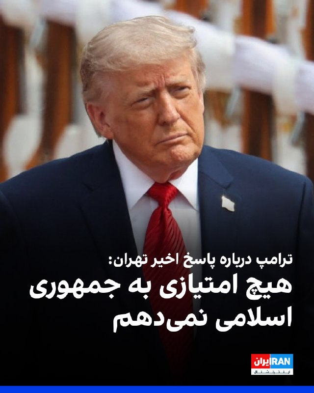

دونالد ترامپ در گفت‌وگویی کوتاه با نیویورک پست اعلام کرد که پس از دریافت پاسخ اخیر جمهوری اسلامی درباره مذاکرات، «هیچ تمایلی» به دادن هیچ‌گونه امتیاز به تهران ندارد.
او همچنین هشدار داد جمهوری اسلامی می‌داند «به‌زودی چه اتفاقی خواهد افتاد»، بدون آنکه جزئیات بیشتری ارائه کند.

ترامپ در پاسخ به پرسشی درباره اظهارنظرش درباره آمادگی برای پذیرش توقف ۲۰ ساله غنی‌سازی اورانیوم جمهوری اسلامی گفت: در حال حاضرآماده دادن هیچ امتیازی نیستم. واقعا نمی‌توانم درباره این موضوع صحبت کنم. اتفاقات زیادی در حال رخ دادن است.

ترامپ افزود که از تهران «عصبانی یا ناراحت» نیست، اما تاکید کرد جمهوری اسلامی به‌خوبی می‌داند آمریکا توان وارد کردن فشار و خسارت بیشتر را دارد. می‌توانم بگویم آن‌ها بیش از هر زمان دیگری خواهان توافق هستند، چون می‌دانند به‌زودی چه اتفاقی در راه است.

ترامپ: این یک مذاکره است و نمی‌خواهم اقدام احمقانه‌ای انجام دهم.
https://iranintl.com/202605186094

## IranIntlTV — post 337817

  <a href="telegram/content/IranIntlTV_337817_1779128303.mp4" target="_blank">🎬 Download video</a>

کانال ۱۲ اسرائیل گزارش داد انتظار می‌رود دونالد ترامپ ظرف ۲۴ ساعت آینده درباره اقدام نظامی احتمالی علیه جمهوری اسلامی تصمیم‌گیری کند.

گفت‌وگو با فرزین ندیمی، پژوهش‌گر امور دفاعی و امنیتی
@iranintltv

## IranIntlTV — post 337816

  <a href="telegram/content/IranIntlTV_337816_1779128306.mp4" target="_blank">🎬 Download video</a>

کانال ۱۳ اسرائیل گزارش داد هدف حمله احتمالی آمریکا، آسیب به حکومت ایران و بازگرداندن جمهوری اسلامی به میز مذاکره از موضع ضعف است.

این در حالی است که دونالد ترامپ در ابتدای جنگ پیشین با جمهوری اسلامی بر تغییر رژیم تاکید کرده بود.

گفت‌وگو با نجات بهرامی، تحلیل‌گر سیاسی
@iranintltv

## IranIntlTV — post 337815

  <a href="telegram/content/IranIntlTV_337815_1779128308.mp4" target="_blank">🎬 Download video</a>

مستند «تمرین‌هایی برای یک انقلاب» ساخته پگاه آهنگرانی، در حاشیه جشنواره فیلم کن، جایزه ویژه هیئت داوران رویداد مستند «گلدن گلوبز» را با همکاری بنیاد «آرتمیس رایزینگ» دریافت کرد؛ رویدادی که با همکاری بخش «کن داکس»، مجله ورایتی و بازار فیلم کن برگزار می‌شود.
این برنامه به مستندهای اجتماعی و سیاسی اختصاص دارد و برگزارکنندگان آن می‌گویند هدفش حمایت از فیلم‌سازی مستند، به‌عنوان ابزاری برای شکل دادن به روایت‌ها و گفت‌وگوهای جهانی، است.

## IranIntlTV — post 337814

  

اسکات بسنت، وزیر خزانه‌داری ایالات متحده، دوشنبه گفت که آمریکا در حال صدور یک مجوز عمومی ۳۰ روزه برای فراهم کردن دسترسی موقت به آن بخش از نفت روسیه‌ است که در دریا سرگردان مانده است.

بسنت در شبکه ایکس نوشت: «این تمدید، انعطاف‌پذیری بیشتری فراهم خواهد کرد و ما با این کشورها همکاری خواهیم کرد تا در صورت نیاز، مجوزهای مشخص صادر کنیم.»

او افزود: «این مجوز عمومی به ثبات بازار فیزیکی نفت خام کمک خواهد کرد و اطمینان می‌دهد که نفت به آسیب‌پذیرترین کشورهای از نظر انرژی برسد.»
https://iranintl.com/202605188532

## IranIntlTV — post 337813

  <a href="https://t.me/IranintlTV/337813" target="_blank">📎 Download file</a>

🎧نسخه صوتی اخبار شبانگاهی | دوشنبه ۲۸ اردیبهشت
@iranintlTV

## IranIntlTV — post 337812

  

خبرنگار سی‌ان‌بی‌سی، به نقل از یک مقام آمریکایی در شبکه ایکس نوشت گزارش رسانه‌های ایران مبنی بر این‌که آمریکا در حالی که مذاکرات ادامه دارد با لغو تحریم‌های نفتی موافقت کرده، نادرست است.

پیش‌تر خبرگزاری تسنیم وابسته به سپاه پاسداران، به نقل از یک منبع ناشناس نزدیک به تیم مذاکره‌کننده جمهوری اسلامی گزارش داد که آمریکا با تعلیق تحریم‌های صادرات نفت ایران در طول مذاکرات موافقت کرده است.

این منبع آگاه گفت: «آمریکایی‌ها برخلاف متون پیشین خود، در متن جدید پذیرفته‌اند که در طول دوره مذاکره، تحریم‌های نفتی ایران را ویو (Waive) کنند.»

این خبرگزاری افزود: «"ویو کردن" تحریم‌ها به معنای معافیت یا اسقاط موقت تحریم‌هاست.»
https://iranintl.com/202605186046

## IranIntlTV — post 337811

  <a href="telegram/content/IranIntlTV_337811_1779128312.mp4" target="_blank">🎬 Download video</a>

تیتر اول با نیوشا صارمی، دوشنبه ۲۸ اردیبهشت
@iranintltv

## IranIntlTV — post 337810

  

دونالد ترامپ به العربیه گفت: «ما در حال انجام کاری بزرگ هستیم و پیروزی در راه است.»

او پیش‌تر در تروث سوشال نوشت حتی اگر جمهوری اسلامی کاملا تسلیم شود و شکست خود را بپذیرد، رسانه‌هایی مانند نیویورک تایمز، وال‌استریت ژورنال و سی‌ان‌ان آن را پیروزی تهران جلوه خواهند داد.
او افزود رسانه‌های جعلی و دموکرات‌ها «کاملا راه خود را گم کرده‌اند و دیوانه شده‌اند.»

https://iranintl.com/202605180267

## IranIntlTV — post 337809

  

سازمان عملیات تجارت دریایی بریتانیا اعلام کرد که در روزهای ۲۶ و ۲۷ اردیبهشت هیچ حادثه‌ای در خلیج فارس و دریای عمان گزارش نشده است.

با این حال، وضعیت امنیتی منطقه همچنان ناپایدار است و تهدید علیه کشتیرانی تجاری ادامه دارد.
https://iranintl.com/202605183328

## Persian_Trend_Official — post 14432

  

وزیر خزانه‌داری ایالات متحده، مجوزی ۳۰ روزه صادر کرد که به کشورهای آسیب‌پذیر اجازه می‌دهد نفت روسیه‌ای را که در دریا سرگردان مانده است خریداری کنند.
دولت آمریکا تاکنون حداقل ۳ بار این معافیت موقت خرید نفت روسیه را تمدید/احیا کرده است.
▪️ ۱۹ مارس ۲۰۲۶
▪️ ۲۲ آوریل ۲۰۲۶
▪️ ۱۸ مه ۲۰۲۶
تمام این تمدیدها به‌صورت دوره‌های ۳۰ روزه صادر شده‌اند.

🦁Phantom
🦁

📌 @persian_trend_official
پرشین ترند | متفاوت‌ترین کانال نظامی

## Persian_Trend_Official — post 14431

کانال رسمی پرشین ترند pinned «https://youtube.com/live/7aZKWyXxQog?feature=share»

## Persian_Trend_Official — post 14430

https://youtube.com/live/7aZKWyXxQog?feature=share

## Persian_Trend_Official — post 14429

  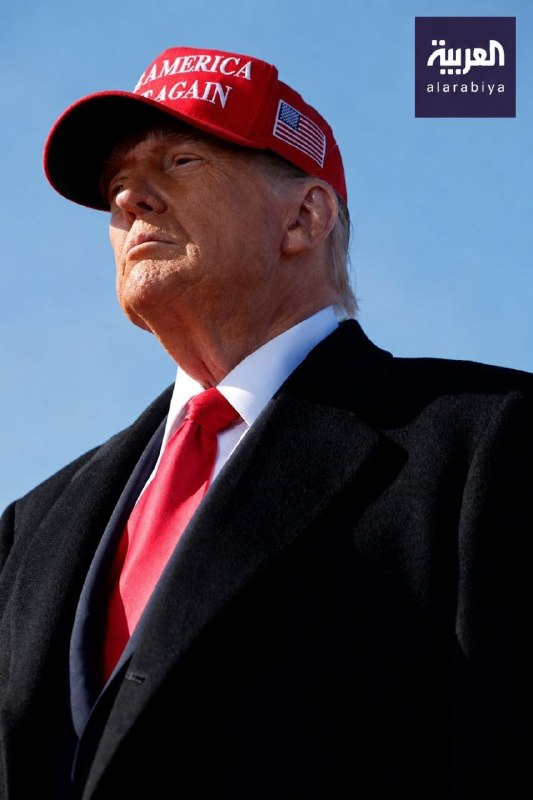

📰پرزیدنت ترامپ به العربیه :
کار با عظمتی انجام می‌دهیم، و پیروزی پیش روی ماست.

🦁Phantom
🦁

✍@persian_trend_official
پرشین ترند | متفاوت‌ترین کانال نظامی

## Persian_Trend_Official — post 14428

کانال رسمی پرشین ترند pinned «ساعت 21 لایو رو آغاز میکنم»

## Persian_Trend_Official — post 14427

ساعت 21 لایو رو آغاز میکنم

## Persian_Trend_Official — post 14426

  

کانال ۱۲ اسرائیل:

ایران تنها چند روز، نه هفته‌ها، فرصت دارد تا چیزی به رئیس‌جمهور ترامپ ارائه دهد که بن‌بست را بشکند.

رئیس‌جمهور ترامپ تمایل دارد اقدام نظامی انجام دهد مگر اینکه ظرف چند روز چیزی از ایران دریافت کند.

🦁Phantom
🦁

✍persian_trend_official
پرشین ترند | متفاوت‌ترین کانال نظامی

## Persian_Trend_Official — post 14425

  <a href="telegram/content/Persian_Trend_Official_14425_1779128317.webm" target="_blank">🎬 Download video</a>

وقتی یک مستندسازِ ورشکستهٔ سیاسی، سناریوی«ترور شخصیت دکتر #روحانی»را برای دیده‌شدن کارگردانی می‌کند،دیگر مستندساز نیست؛کاسبِ التهاب است. اتهام‌زنی با این ادبیات،نه شجاعت است نه افشاگری؛سقوط اخلاقیِ کسی‌ است که روزی تاریخ شفاهی می‌ساخت و امروز برای دیده‌شدن، تاریخ را تحریف می‌کند.

کامبیز مهدیزاده داماد حسن روحانی !

📌 @persian_trend_official
پرشین ترند | متفاوت‌ترین کانال نظامی

## Persian_Trend_Official — post 14424

  <a href="telegram/content/Persian_Trend_Official_14424_1779128317.webm" target="_blank">🎬 Download video</a>

❤️ اگر از مخاطبان پرشین ترند هستید و تلگرام پرمیوم دارید،
با بوست کردن کانال کمک بزرگی به رشد و دیده‌شدن بیشتر پرشین ترند می‌کنید.
این بوست‌ها باعث می‌شود امکانات بیشتری برای انتشار محتوا، استوری و قابلیت‌های ویژه کانال فعال شود و در شرایط فعلی، به ادامه پوشش سریع و تحلیل‌های روزانه کمک زیادی می‌کند.
🙏 اگر مایل بودید، از طریق لینک زیر کانال را بوست کنید:
https://t.me/boost/persian_trend_official
📌 @persian_trend_official
پرشین ترند | متفاوت‌ترین کانال نظامی

## Persian_Trend_Official — post 14423

  <a href="telegram/content/Persian_Trend_Official_14423_1779128318.webm" target="_blank">🎬 Download video</a>

🇮🇷ایران از شرکت‌های بزرگ فناوری آمریکا از جمله گوگل، مایکروسافت، متا و آمازون درخواست دریافت هزینه مجوز برای «کابل‌های اینترنت زیرآبی» واقع در تنگه هرمز و خلیج فارس کرده است.

🐣
🪙
🛒
🖥
🖥

🇮🇷سپاه پاسداران تهدید کرده است که در صورت عدم رعایت مقررات محلی توسط این شرکت‌ها، ترافیک را محدود خواهد کرد که ممکن است «اتصال داده‌ها بین اروپا، آسیا و خاورمیانه را مختل کند».

کابل‌های عبوری از تنگه هرمز و دریای سرخ ۱۷٪ از ترافیک جهانی را حمل می‌کنند.

🦁Phantom
🦁

🌏@persian_trend_official
پرشین ترند | متفاوت‌ترین کانال نظامی

---
📅 بروزرسانی: 1405/02/28 19:49
---

## ChizBergerz — post 46519

یه لیست آیپی جدید تست شده با همراه اول برای اپ شیر و خورشید
👑: 104.109.250.240 92.122.17.124 96.16.122.153 151.101.64.223 151.101.0.223 185.200.232.43   2.17.100.200 2.19.205.42 2.19.205.50 2.19.252.134 2.20.169.70 2.20.170.91 95.101.111.144 2.16.245.188…

## ChizBergerz — post 46518

یه لیست آیپی جدید تست شده با همراه اول برای اپ شیر و خورشید
👑:

104.109.250.240
92.122.17.124
96.16.122.153
151.101.64.223
151.101.0.223
185.200.232.43  
2.17.100.200
2.19.205.42
2.19.205.50
2.19.252.134
2.20.169.70
2.20.170.91
95.101.111.144
2.16.245.188
2.18.69.150
2.16.106.4
23.58.222.107
184.25.28.31
23.47.124.134
23.50.131.147
23.46.190.18
23.58.222.147
23.56.162.186
23.44.203.68
23.12.156.115
23.216.77.16
23.62.61.53
23.39.148.245
23.210.73.133
23.44.201.136
23.205.46.167
184.30.150.142
23.220.161.217
184.28.165.4
23.46.230.133
88.221.168.204
104.96.158.174
184.51.252.4
172.234.199.15
104.85.26.14
172.237.145.27
92.123.103.24
172.234.159.58
184.86.103.210
96.16.248.183
92.122.16.5
96.16.249.60
96.16.249.9
184.26.57.149
2.17.211.216
2.19.205.66
2.20.135.163
2.21.176.57
2.21.239.16
2.21.240.15
2.23.169.12
2.23.97.122
23.12.147.134
23.193.117.5
23.196.14.11
23.196.3.200
23.2.13.154
23.2.13.226
23.200.79.136
23.200.87.22
23.202.230.211
Tel: @ChizBergerz
23.204.136.169
23.204.9.130
23.205.106.74
23.205.165.21
23.212.110.33
23.212.250.11
23.212.250.25
23.213.158.26
23.214.139.250
23.215.0.40
23.216.77.154
23.216.77.162
23.216.77.50
23.216.77.70
23.217.124.170
23.37.198.164
23.44.201.234
23.44.203.86
23.44.215.152
23.52.182.11
23.54.127.42
23.55.110.208
23.55.161.161
23.61.250.82
23.9.187.41
23.217.47.193
23.40.179.202
184.27.225.90
23.53.13.19
95.101.50.88
23.204.115.108
2.21.240.147
184.24.232.70
2.22.255.47
23.49.248.8
23.213.158.12
23.210.216.145
23.33.90.150
23.44.201.134
23.208.64.159
23.216.77.140
2.22.255.17
23.209.72.174
2.19.204.225
23.44.201.152
23.55.176.84
2.19.204.211
23.219.36.106
23.215.0.134
2.21.2.97
23.61.202.70
23.44.201.206
23.218.239.132
23.212.253.232

+ تا زمانی که اتصال‌تون با سرعتِ خوب برقرار هست نیازی نیست که آیپی رو عوض کنید و آیپی هایِ جدید رو تست کنید.
@ChizBergerz

## ChizBergerz — post 46517

  <a href="telegram/content/ChizBergerz_46517_1779121149.mp4" target="_blank">🎬 Download video</a>

جمهوری‌اسهالی مثل سگ از حمله زمینی ارتش آمریکا ترسیده و داره تو مساجد به حکومتی‌ها آموزش کار با اسلحه رو آموزش میده!

+ اینا اولین سرباز آمریکایی رو ببینن میرینن به خودشون و فرار میکنن😂😂
@ChizBergerz

## ChizBergerz — post 46516

  <a href="telegram/content/ChizBergerz_46516_1779121151.mp4" target="_blank">🎬 Download video</a>

مردم تو غزه یه موش رو دار زدن و دارن موش‌علی خامنه‌ای که تو یخچاله رو مسخره میکنن: 
😂
😂

@ChizBergerz

## ChizBergerz — post 46515

  <a href="telegram/content/ChizBergerz_46515_1779121154.mp4" target="_blank">🎬 Download video</a>

مادرجنده‌های تروریست!

خرزشیه تو صداوسیما میگه مهریه زن جنده‌ش یه پهپاد شاهد برای شلیک به طرف قلب تل‌‌آویوه!
@ChizBergerz

## rodast_omiddana — post 71518

🎬 افشاگری آخوند رفیعی از نزدیکان خامنه ای:
به رهبر اطمینان داده بودن اتفاقی براش نمی افته
لینک یوتیوب:
https://www.youtube.com/watch?v=m6ZejUIERrc

## rodast_omiddana — post 71517

  <a href="telegram/content/rodast_omiddana_71517_1779121157.webm" target="_blank">🎬 Download video</a>

🚨
🚨 فوری_آکسیوس:
آمریکا پیشنهاد بروز شده جمهوری اسلامی را رد کرد
آمریکا مجبور خواهد بود مذاکرات را «از طریق بمب‌ها» ادامه دهد

## rodast_omiddana — post 71516

  <a href="telegram/content/rodast_omiddana_71516_1779121157.webm" target="_blank">🎬 Download video</a>

🚨 ترامپ:
«اگر ایران تسلیم شود، اعتراف کند که نیروی دریایی‌اش از بین رفته و در ته دریا است، و نیروی هوایی‌اش دیگر با ما نیست، و اگر کل ارتش‌شان از تهران خارج شود، سلاح‌ها را رها کرده و دست‌ها را بالا ببرند، هر کدام فریاد بزنند «من تسلیم می‌شوم، من تسلیم می‌شوم» در حالی که پرچم سفید نماینده را به شدت تکان می‌دهند، و اگر تمام رهبران باقی‌مانده‌شان همه «اسناد تسلیم» لازم را امضا کنند و شکست خود را در برابر قدرت و نیروی بزرگ و باشکوه ایالات متحده آمریکا بپذیرند، روزنامه‌های در حال سقوط نیویورک تایمز، وال استریت ژورنال چین (WSJ!)، سی‌ان‌ان فاسد و اکنون بی‌اهمیت، و همه اعضای دیگر رسانه‌های خبری جعلی، تیتر خواهند زد که ایران پیروزی استادانه و درخشانی بر ایالات متحده آمریکا داشته است، حتی نزدیک هم نبود. دموکرات‌ها و رسانه‌ها کاملاً راه خود را گم کرده‌اند. آنها کاملاً دیوانه شده‌اند!!!» رئیس‌جمهور دی‌جی‌تی

## rodast_omiddana — post 71515

  <a href="telegram/content/rodast_omiddana_71515_1779121157.mp4" target="_blank">🎬 Download video</a>

🚨 رژیم حسابی از حمله زمینی آمریکا ترسیده...

## rodast_omiddana — post 71514

  <a href="telegram/content/rodast_omiddana_71514_1779121159.webm" target="_blank">🎬 Download video</a>

🚨 نیویورک تایمز:
ایالات متحده و اسرائیل در حال انجام شدیدترین آمادگی‌های خود از زمان اجرای آتش‌بس هستند، در حالی که احتمال حملات مجدد به ایران حتی از همین هفته وجود دارد.
پنتاگون نیز برای احتمال از سرگیری عملیات جدید آماده می‌شود.

## rodast_omiddana — post 71513

  <a href="telegram/content/rodast_omiddana_71513_1779121160.webm" target="_blank">🎬 Download video</a>

🚨الجزیره:
ایالات متحده ممکن است جنگ خود با جمهوری اسلامی را «در ۲۴ تا ۴۸ ساعت آینده» از سر بگیرد.

## rodast_omiddana — post 71512

  <a href="telegram/content/rodast_omiddana_71512_1779121160.mp4" target="_blank">🎬 Download video</a>

🚨 مهریه خانمش یک پهباد شاهد است برای شلیک به قلب تل آویو!
رسما کشور دست تروریست جماعته..

## rodast_omiddana — post 71511

  <a href="telegram/content/rodast_omiddana_71511_1779121163.webm" target="_blank">🎬 Download video</a>

🚨 توییت یکسال پیشم.
اساسا کنسرت گذاشتن در شرایط انقلابی پروژه جمهوری اسلامیه، خودتان را به تجاهل نزنید

## rodast_omiddana — post 71510

  <a href="telegram/content/rodast_omiddana_71510_1779121163.webm" target="_blank">🎬 Download video</a>

🚨 درود بر حمید فرخ نژاد و آقای شاهین نجفی بابت اینکه گفتید باید اتحاد داشته باشیم..
بنابراین در راستای اتحاد همه زیر پرچم شاهزاده رضا پهلوی تنها امید ملت ایران، کنسرتهایی که با قیمت بلیطهای آنچنانی میخواهید برگزار کنید را لغو کنید و نشان دهید دنبال کاسبی از خون مردم نیستید و اجازه دهید اتحاد همه ما پابرجا باشد..
سپاس از توجه شما..

## rodast_omiddana — post 71509

  <a href="telegram/content/rodast_omiddana_71509_1779121163.webm" target="_blank">🎬 Download video</a>

🚨 پیام مخاطب درود.
امروز میگن جو تهران امنیتیه سمت بلوار کشاورز نیرو فرستادن و گویا تجمعاتی بوده.

## rodast_omiddana — post 71508

  <a href="telegram/content/rodast_omiddana_71508_1779121164.webm" target="_blank">🎬 Download video</a>

🚨آقای ترامپ صدها جوان از ایران به من پیام دادن که برای حمله زمینی ارتش آمریکا به جمهوری اسلامی حاضرن در کنار شما باشن، کافیست فضایی ایجاد کنید تا جوانان ایران آموزش ببینند تا در میدان نبرد یاور ارتش آمریکا باشند..
جوانان ایران انگیزه اشان از سربازان شما بیشتره بنابراین روی مردم ایران حساب کنید..

## rodast_omiddana — post 71507

🎬 آخرین تحرکات آمریکا برای حمله به جمهوری اسلامی تا دوشنبه 28 اردیبهشت
تلفن ترامپ و نتانیاهو
لینک یوتیوب:
https://www.youtube.com/watch?v=o4N-lWiHY6A

## rodast_omiddana — post 71506

  <a href="telegram/content/rodast_omiddana_71506_1779121164.mp4" target="_blank">🎬 Download video</a>

🚨
🚨 اسرائیل جان توجه کن..
این گزارش صداوسیما هست که در حال آموزش فعالیت تروریستی به بدنه اجتماعی مذهبی هست و خودشان میگویند مساجد را برای اقدامات نظامی علیه مردم ایران و مردم اسرائیل بکار گرفتند..
در جنگ پیش رو این امکان در حقیقت موقعیت نظامی محسوب میشوند بنابراین خواهشا ادای تنگها را در نیاورید و بگید نمیزنیم..

## rodast_omiddana — post 71505

  <a href="telegram/content/rodast_omiddana_71505_1779121167.webm" target="_blank">🎬 Download video</a>

🚨 رویترز:
پاکستان در جریان جنگ ایران، تحت یک پیمان دفاعی مشترک، ۸۰۰۰ سرباز، جنگنده، پهپاد و سامانه‌های دفاع هوایی به عربستان سعودی اعزام کرده است.این نیرو شامل جنگنده‌های JF-17، سامانه‌های پدافندی چینی HQ-9 و تجهیزات تحت عملیات پاکستانی است که توسط ریاض تأمین مالی شده‌اند.این استقرار آماده رزم است و در صورت نیاز می‌تواند به ۸۰٬۰۰۰ سرباز افزایش یابد.

## rodast_omiddana — post 71504

  <a href="telegram/content/rodast_omiddana_71504_1779121167.webm" target="_blank">🎬 Download video</a>

🚨 نیویورک تایمز : آمریکا و اسرائیل در حال آماده‌سازی گسترده برای ازسرگیری جنگ با ایران در همین هفته هستند.

## KiriMohems — post 47715

  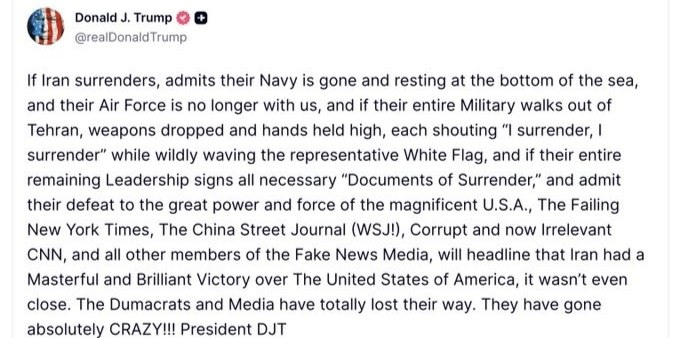

🔴ترامپ : اگه جمهوری اسلامی تسلیم بشه، اعتراف کنه نیروی دریاییش ته دریاست و نیروی هواییش دیگه وجود نداره

و کل ارتش از تهران بیرون بزنه، سلاح‌هاشون رو بندازن زمین، دستاشون رو ببرن بالا و داد بزنن “من تسلیم میشم”
در حالی که پرچم سفید تکون میدن، و همه رهبرهای کصشعر باقی‌مونده هم برگه‌های تسلیم رو امضا کنن و شکستشون جلوی قدرت عظیم آمریکا رو قبول کنن
اون وقت نیویورک تایمز کیری مقام ، وال‌استریت ژورنال کصکش، سی‌ان‌ان جاکش و بقیه رسانه‌های فیک تیتر میزنن که ایران یه پیروزی تاریخی و درخشان مقابل آمریکا به دست آورده! حتی نزدیکشم نیست.
-دموکرات‌ها و رسانه‌ها کامل راهشونو گم کردن. رسماً کصخل تشریف دارن!!!

#Helsinki
@KiriMohems

## KiriMohems — post 47714

🔴مدیرعامل آبفای تهران: تابستون امسال جیره‌بندی ، قطعی آب و از این کصشعرا نداریم

کیر تو قبر آدم دروغگو

#Helsinki
@KiriMohems

## KiriMohems — post 47713

  <a href="telegram/content/KiriMohems_47713_1779121168.mp4" target="_blank">🎬 Download video</a>

🔴مهریه خانومیش یک پهپاد کیری شاهده که باید صاف تو کون تل آویو شلیک بشه

#Helsinki
@KiriMohems

## KiriMohems — post 47712

  <a href="telegram/content/KiriMohems_47712_1779121171.mp4" target="_blank">🎬 Download video</a>

🔴گوشه‌ای از ادبیات چپولی بهزاد فراهانی

ما تخمشو داشتیم ، اونو(منظورش شاه) آوردیم پایین ، شما هم دارید یالا ما هم کنارتونیم

#Helsinki
@MohemMovie

## KiriMohems — post 47711

  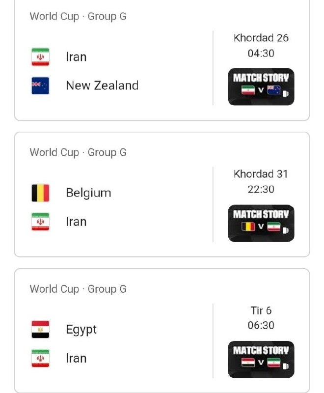

⚽️ساعت و تاریخ های لواط کاری تیم ملی با حریفانش تو جام بمالی 2026

🇮🇷 ایران VS نیوزلند
🇳🇿
۲۶ خرداد
ساعت ۴:۳۰ صبح به وقت تهران

🇮🇷ایران VS بلژیک
🇧🇪
۳۱ خرداد
ساعت ۲۲:۳۰ به وقت تهران

🇮🇷ایران VS مصر
🇪🇬
۶ تیر
ساعت ۶:۳۰ صبح به وقت تهران

#Helsinki
@KiriMohemSport

## KiriMohems — post 47710

  

📰 نیویورک تایمز:
آمریک و اسرائیل دارن گرمیجات رو بالا میزنن و از نظر نظامی آماده میشن، در حالی که احتمال تریسام مجدد به جمهوری اسلامی حتی از همین هفته وجود داره.

#Helsinki
@KiriMohems

## KiriMohems — post 47709

  <a href="telegram/content/KiriMohems_47709_1779121174.mp4" target="_blank">🎬 Download video</a>

#خایه_کنید

🔴ترافیک پشم ریزون سولاخ هرمز از داخل یک هواپیمای مسافربری و کشتی هایی که خاموش کردن و دست به خایه نشستن

#Helsinki
@KiriMohems

## SportBaadNews — post 251827

  <a href="telegram/content/SportBaadNews_251827_1779121176.mp4" target="_blank">🎬 Download video</a>

این چی بود دیگه 
💀
💀
@SportBaadNews

## SportBaadNews — post 251826

⏺ فقط و فقط با دعوت ۲ نفر کانفیگ رایگان دریافت کنید ، اختصاصی 
👇

🤖 @Confingfreeirbot

## SportBaadNews — post 251825

  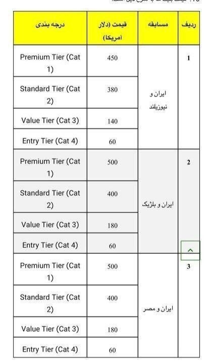

🇮🇷
⚽️| قیمت بلیط بازی های تیم جمهوری اسلامی تو جام جهانی؛ فک کن حداقل 11 میلیون و حداکثر 90 میلیون تومان پول رایج مملکت رو بری بدی که بازی شاگردان نیوکاسل رو ببینی
@SportBaadNews

## SportBaadNews — post 251824

  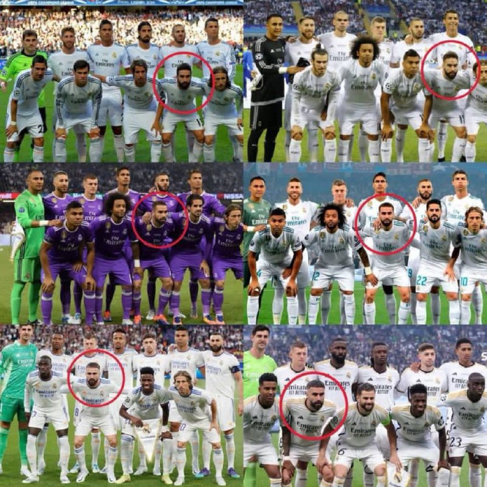

رسمی: کارواخال از رئال مادرید خداحافظی کرد. @SportBaadNews

## IranIntlTV — post 337808

  <a href="telegram/content/IranIntlTV_337808_1779121180.mp4" target="_blank">🎬 Download video</a>

صبح دوشنبه مسعود پزشکیان گفت در پی محاصره دریایی از سوی آمریکا، صادرات نفت ایران متوقف شده است. ساعتی پس از انتشار این اظهارات، رسانه‌های دولتی از جمله ایرنا اقدام به حذف صحبت‌های پزشکیان از خروجی خود کردند.

گفت‌وگو با جمشید برزگر، روزنامه‌نگار و تحلیل‌گر سیاسی
@iranintltv

## IranIntlTV — post 337807

  

مستند «تمرین‌هایی برای یک انقلاب» ساخته پگاه آهنگرانی در حاشیه جشنواره فیلم کن، جایزه ویژه هیئت داوران رویداد مستند «گلدن گلوبز» با همکاری بنیاد «آرتمیس رایزینگ» را دریافت کرد؛ رویدادی که با همکاری بخش «کن داکس»، مجله ورایتی و بازار فیلم کن برگزار می‌شود.

این برنامه به مستندهای اجتماعی و سیاسی اختصاص دارد و برگزارکنندگان آن می‌گویند هدفش حمایت از فیلمسازی مستند به‌عنوان ابزاری برای شکل دادن به روایت‌ها و گفت‌وگوهای جهانی است.
https://iranintl.com/202605180953

## IranIntlTV — post 337806

  <a href="telegram/content/IranIntlTV_337806_1779121183.mp4" target="_blank">🎬 Download video</a>

همزمان با ارسال تازه‌ترین پیشنهاد تهران، یک مقام ارشد جمهوری اسلامی به رویترز گفت آمریکا درباره فعالیت‌های هسته‌ای محدود تهران انعطاف نشان داده. اما سی‌ان‌ان خبر داد پنتاگون گزینه‌های نظامی مختلف علیه ایران را روی میز گذاشته و ترامپ سه‌شنبه تصمیم می‌گیرد.
گزارشی از مجتبا پورمحسن
@iranintltv

## IranIntlTV — post 337805

  <a href="telegram/content/IranIntlTV_337805_1779121186.mp4" target="_blank">🎬 Download video</a>

یک شهروند با ارسال پیامی به ایران‌اینترنشنال می‌گوید به دلیل قطعی اینترنت، حدود سه ماه است که بیکار شده است.

## IranIntlTV — post 337804

  

اکسیوس به نقل از یک مقام ارشد آمریکایی و یک منبع مطلع گزارش داد تهران پیشنهاد تازه‌ای برای توافق به‌منظور پایان جنگ ارائه کرده، اما کاخ سفید این پیشنهاد را پیشرفت معناداری نمی‌داند و آن را برای دستیابی به توافق کافی ارزیابی نکرده است.

به گفته مقام‌های آمریکایی، دونالد ترامپ همچنان خواهان توافق برای پایان جنگ است، اما به‌دلیل رد بسیاری از خواسته‌های واشینگتن از سوی تهران و خودداری جمهوری اسلامی از ارائه امتیازهای قابل‌توجه در برنامه هسته‌ای، گزینه ازسرگیری حملات نظامی را نیز بررسی می‌کند.
https://iranintl.com/202605182409

## IranIntlTV — post 337803

  

مدیر مرکز روابط عمومی و اطلاع‌رسانی وزارت بهداشت درباره وضعیت مجتبی خامنه‌ای گفت: «اتفاق خاصی برای او رخ نداده بود و صرفا چند زخم برداشته بودند.»
این مقام وزارت بهداشت تاکید کرد: «زخم‌ها از نوعی نبودند که چهره ایشان را مخدوش کنند» و اضافه کرد مجتبی خامنه‌ای جانباز نشده و قطع عضو نداشته و تنها در محل جراحت روی پای او چند بخیه زده شده است.
https://iranintl.com/202605189680

## IranIntlTV — post 337802

  

دونالد ترامپ، رییس‌جمهور آمریکا در پستی در شبکه اجتماعی تروث سوشال از برخی رسانه‌ها و دموکرات‌ها در زمینه جنگ علیه جمهوری اسلامی انتقاد کرد.

او نوشت: «اگر ایران تسلیم شود، اعتراف کند که نیروی دریایی‌اش نابود شده و در کف دریا آرام گرفته است، و نیروی هوایی‌اش دیگر در میان ما نیست، و اگر کل ارتش آن‌ها در حالی که سلاح‌ها را زمین گذاشته و دست‌ها را بالا برده‌اند از تهران خارج شوند و هر کدام با فریاد "من تسلیم می‌شوم، من تسلیم می‌شوم" پرچم سفید تسلیم را به شدت تکان دهند، و اگر تمام رهبری باقی‌مانده آن‌ها همه «اسناد تسلیم» لازم را امضا کنند و شکست خود را در برابر قدرت و نیروی عظیم ایالات متحده باشکوه بپذیرند، آن‌وقت روزنامه شکست‌خورده نیویورک تایمز، چاینا استریت ژورنال (همان وال‌استریت ژورنال!)، سی‌ان‌انِ فاسد و اکنون بی‌اهمیت، و همه اعضای دیگر رسانه‌های اخبار جعلی (فیک نیوز)، تیتر خواهند زد که ایران یک پیروزی استادانه و درخشان بر ایالات متحده آمریکا داشته و اصلاً حتی نزدیک هم نبوده است.»

ترامپ افزود: «دموکرات‌های احمق و رسانه‌ها کاملا راه خود را گم کرده‌اند. آن‌ها کاملا دیوانه شده‌اند!!!»
https://iranintl.com/20

## IranIntlTV — post 337801

  <a href="telegram/content/IranIntlTV_337801_1779121191.mp4" target="_blank">🎬 Download video</a>

مجله آتلانتیک در مقاله‌ای تحلیلی، نحوه حکمرانی جمهوری اسلامی و امارات را با یکدیگر مقایسه کرده است. این مقایسه فقط به سیاست محدود نمی‌شود و در آن اقتصاد، کیفیت زندگی و آینده مردم نیز بررسی شده است.

مهدی بیگی، عضو تحریریه ایران‌اینترنشنال، در «پیوست» امروز نگاهی دارد به آنچه آتلانتیک آن را «نبرد شاهین و لاشخور» نامیده است.
@iranintltv

## IranIntlTV — post 337800

  <a href="telegram/content/IranIntlTV_337800_1779121194.mp4" target="_blank">🎬 Download video</a>

یک دانش‌آموز با ارسال پیامی به ایران‌اینترنشنال می‌گوید: «نمی‌دانم باید امتحانات رو چکار کنم. یک اینترنت داخلی داریم که آن هم کار نمی‌کند تا بتوانیم درس بخوانیم.»

## IranIntlTV — post 337799

  <a href="telegram/content/IranIntlTV_337799_1779121196.mp4" target="_blank">🎬 Download video</a>

در میانه تلاش‌های میانجی‌گرانه پاکستان برای انتقال پیام‌ها میان جمهوری اسلامی و آمریکا، دونالد ترامپ به مجله فورچون گفت مقام‌های جمهوری اسلامی برای امضای توافق «بی‌تاب» هستند.

گفت‌وگو با سمیرا قرایی و بابک اسحاقی، خبرنگاران ایران‌اینترنشنال
@iranintltv

## IranIntlTV — post 337798

  <a href="telegram/content/IranIntlTV_337798_1779121199.mp4" target="_blank">🎬 Download video</a>

آژانس رسمی همکاری پلیس در اتحادیه اروپا اعلام کرد در یک عملیات هماهنگ، شبکه تبلیغاتی آنلاین مرتبط با سپاه پاسداران را هدف قرار داده است. یوروپل گزارش داد در جریان تحقیقات درباره این شبکه، محتوایی شامل ویدیوهای تولیدشده با هوش مصنوعی، پیام‌های تبلیغاتی و فراخوان‌هایی برای انتقام‌گیری از کشته شدن علی خامنه‌ای شناسایی شده است.

علی حسن‌پور، خبرنگار ایران‌اینترنشنال، گزارش می‌دهد
@iranintltv

## IranIntlTV — post 337797

  <a href="telegram/content/IranIntlTV_337797_1779121202.mp4" target="_blank">🎬 Download video</a>

آژانس رسمی همکاری پلیس در اتحادیه اروپا اعلام کرد در یک عملیات هماهنگ، شبکه تبلیغاتی آنلاین مرتبط با سپاه پاسداران را هدف قرار داده است. یوروپل گزارش داد در جریان تحقیقات درباره این شبکه، محتوایی شامل ویدیوهای تولیدشده با هوش مصنوعی، پیام‌های تبلیغاتی و فراخوان‌هایی برای انتقام‌گیری از کشته شدن علی خامنه‌ای شناسایی شده است.

علی حسن‌پور، خبرنگار ایران‌اینترنشنال، گزارش می‌دهد
@iranintltv

## IranIntlTV — post 337796

  

وزارت خارجه عمان حمله پهپادی یک‌شنبه به عربستان سعودی را محکوم کرد.
عمان در بیانیه‌ای اعلام کرد هرگونه اقدام خصمانه را مردود می‌داند و از عربستان سعودی برای حفظ امنیت و ثبات خود حمایت می‌کند.
مسقط همچنین بر خویشتنداری و حل مسائل منطقه‌ای از مسیرهای دیپلماتیک تاکید کرد.
https://iranintl.com/202605188454

## IranIntlTV — post 337795

  <a href="telegram/content/IranIntlTV_337795_1779121205.mp4" target="_blank">🎬 Download video</a>

سرخط خبرهای دوشنبه ۲۸ اردیبهشت
@iranintltv

## IranIntlTV — post 337794

  <a href="telegram/content/IranIntlTV_337794_1779121207.mp4" target="_blank">🎬 Download video</a>

🔻باشگاه استقلال در حالی مدت‌هاست مدیرعامل ندارد که علی تاجرنیا همه‌کاره این باشگاه است و انتشار سندهای مالی این باشگاه نشان می‌دهد که استقلال با بحران مالی شدید مواجه است و خطر توقیف اموال این باشگاه را تهدید می‌کند.

🔹توضیحات مزدک میرزایی، ایران‌اینترنشنال در برنامه هت‌تریک

🔹تماشای نسخه کامل هت‌تریک؛👇
https://youtu.be/gw3eJ0R9R5Y

@iranintltvsport

## IranIntlTV — post 337793

  

فرماندهی مرکزی ایالات متحده، سنتکام، اعلام کرد از زمان آغاز محاصره دریایی بنادر و سواحل جنوبی ایران، ۸۴ کشتی تجاری مجبور به تغییر مسیر شده‌اند و چهار شناور دیگر نیز پس از هدف قرار گرفتن، از کار افتاده‌اند تا اجرای این محاصره تضمین شود.
https://iranintl.com/202605181759

## IranIntlTV — post 337792

  <a href="telegram/content/IranIntlTV_337792_1779121210.mp4" target="_blank">🎬 Download video</a>

تیم ملی فوتبال برای برپایی آخرین اردوی آماده‌سازی پیش از حضور در جام جهانی ۲۰۲۶ وارد ترکیه شد. مهدی محمدنبی درباره وضعیت صدور ویزای اعضای تیم برای سفر به‌ آمریکا گفت در صورت صادر نشدن ویزای برخی بازیکنان، فدراسیون برنامه‌های مختلفی در نظر دارد.

گفت‌وگو با محمد تقوی، ایران‌اینترنشنال
@iranintltv

## IranIntlTV — post 337791

  

محمدجعفر قائم‌پناه، معاون اجرایی پزشکیان، گفت: «بر اساس نظرسنجی مرکز ریاست‌جمهوری، ۷۰ درصد مردم مخالف محدودیت اینترنت هستند.»

او افزود: «محدودیت‌ها در دی‌ماه و در زمان جنگ، با منطق مدیریت بحران، صیانت از امنیت ملی، جان و آرامش عمومی صورت گرفت.»

قائم‌پناه اضافه کرد: «جامعه‌ای که صادقانه با آن سخن گفته شود، تاب‌آورتر و همراه‌تر خواهد بود.»
https://iranintl.com/202605183897

## IranIntlTV — post 337790

  <a href="telegram/content/IranIntlTV_337790_1779121213.mp4" target="_blank">🎬 Download video</a>

وزیران اقتصاد گروه هفت، دوشنبه ۲۸ اردیبهشت در پاریس گردهم آمدند تا برای مقابله با تنش‌های اقتصاد جهانی گفت‌وگو کنند. وزیر خزانه‌داری آمریکا در حاشیه روز اول نشست، خواستار از کار انداختن ماشین جنگی جمهوری اسلامی شد.

گفت‌وگو با ساجده شریفی، روزنامه‌نگار
@iranintltv

## IranIntlTV — post 337789

  <a href="telegram/content/IranIntlTV_337789_1779121216.mp4" target="_blank">🎬 Download video</a>

وزارت دادگستری ایالات متحده اعلام کرد محمدباقر الساعدی، عضو ارشد کتائب حزب‌الله عراق، با ۶ اتهام تروریستی در نیویورک محاکمه می‌شود. حمله به کنسولگری آمریکا در تورنتو و دو حمله در کانادا، بخشی از اتهامات اوست.

گزارش مهسا مرتضوی، خبرنگار ایران‌اینترنشنال
@iranintltv

## Persian_Trend_Official — post 14422

  <a href="telegram/content/Persian_Trend_Official_14422_1779121218.webm" target="_blank">🎬 Download video</a>

📌توی این روزا که بازار فروش vpn داغه
یه تیم که پشتیبانی خوبی داشته باشه و خدماتش گارانتی داشته باشه کم پیدا میشه

تراست vpn همه اینارو داره و من با خیال راحت معرفیش می‌کنم

همین الان برای خرید بهشون پیام بدین

@trusstvpnn_admin
@trusstvpnn_admin
@trusstvpnn_admin

## Persian_Trend_Official — post 14421

*هنوز جنگ تموم نشده

## Persian_Trend_Official — post 14420

  <a href="telegram/content/Persian_Trend_Official_14420_1779121219.webm" target="_blank">🎬 Download video</a>

هیچوقت قبل از تموم شدن ماجرا خوشحالی نکنید ! 📌 @persian_trend_official پرشین ترند | متفاوت‌ترین کانال نظامی

## Persian_Trend_Official — post 14419

  <a href="telegram/content/Persian_Trend_Official_14419_1779121219.mp4" target="_blank">🎬 Download video</a>

هیچوقت قبل از تموم شدن ماجرا خوشحالی نکنید !

📌 @persian_trend_official
پرشین ترند | متفاوت‌ترین کانال نظامی

## Persian_Trend_Official — post 14418

پست کنایه آمیز پرزیدنت ترامپ : اگر ایران تسلیم شود، اعتراف کند که نیروی دریایی‌اش نابود شده و در کف دریا آرمیده است، و نیروی هوایی‌اش دیگر وجود ندارد، و اگر تمام ارتش آن با انداختن سلاح‌ها و بالا بردن دست‌ها از تهران خارج شود و هر کدام فریاد بزنند «من تسلیم…

## Persian_Trend_Official — post 14417

  

پست کنایه آمیز پرزیدنت ترامپ :
اگر ایران تسلیم شود، اعتراف کند که نیروی دریایی‌اش نابود شده و در کف دریا آرمیده است، و نیروی هوایی‌اش دیگر وجود ندارد، و اگر تمام ارتش آن با انداختن سلاح‌ها و بالا بردن دست‌ها از تهران خارج شود و هر کدام فریاد بزنند «من تسلیم می‌شوم، من تسلیم می‌شوم» در حالی که دیوانه‌وار پرچم سفید را تکان می‌دهند، و اگر تمام رهبران باقی‌مانده‌شان همه «اسناد تسلیم» لازم را امضا کنند و شکست خود را در برابر قدرت و نیروی عظیم و باشکوه ایالات متحده آمریکا بپذیرند، نیویورک تایمزِ شکست‌خورده، وال‌استریت ژورنالِ چینی (WSJ!)، سی‌ان‌انِ فاسد و حالا بی‌ربط، و تمام دیگر اعضای رسانه‌های اخبار جعلی تیتر خواهند زد که ایران یک پیروزی استادانه و درخشان بر ایالات متحده آمریکا به دست آورده است؛ حتی نزدیک هم نبود. دموکرات‌ها و رسانه‌ها کاملاً راه خود را گم کرده‌اند. آن‌ها کاملاً دیوانه شده‌اند!!!!

رئیس‌جمهور Donald John Trump

## Persian_Trend_Official — post 14416

  <a href="telegram/content/Persian_Trend_Official_14416_1779121223.webm" target="_blank">🎬 Download video</a>

💥
💥
💥

📰:کاخ سفید پیشنهاد تجدیدنظر شده ایران برای پایان دادن به درگیری جاری را رد کرده و آن را ناکافی دانسته است.

🇮🇷
🇺🇸مقامات آمریکایی هشدار داده‌اند که اگر تهران در برنامه هسته‌ای خود امتیازات عمده‌ای ندهد، ممکن است اقدامات نظامی از سر گرفته شود. (منبع Axios)

🦁Phantom
🦁

✉️@persian_trend_official
پرشین ترند | متفاوت‌ترین کانال نظامی

## Persian_Trend_Official — post 14415

  <a href="telegram/content/Persian_Trend_Official_14415_1779121224.webm" target="_blank">🎬 Download video</a>

⚠️ هشدار مهم!

یه تکنیک جدید هکرها پیدا شده که دارن از کپچا استفاده می‌کنن برای نفوذ به گوشی و کامپیوترت!

🔴 چطور کار می‌کنه؟

وقتی می‌خوای وارد یه سایت بشی، یه صفحه شبیه کپچای معمولی (با لوگوی Cloudflare) باز می‌شه. بعد ازت می‌خواد:
• کلیدهای Win + R رو فشار بدی
• یه دستور آماده رو پیست کنی
• اینتر بزنی

نتیجه؟ 🔥
بدون اینکه بفهمی، تروجان و جاسوس‌افزار روی سیستمت نصب می‌شه و اطلاعاتت به سرقت می‌ره!

📈 آمار ترسناک:
موارد این نوع حمله امسال ۵۶۳ درصد افزایش یافته!

✅ چطور تشخیص بدی؟
کپچای واقعی هیچ‌وقت ازت نمی‌خواد وارد Run ویندوز بشی یا دستوری اجرا کنی. هرچیزی غیر از انتخاب تصویر = تقلبی!

👆 مراقب باشید، به دوستاتون هم بگید!

📝 Nick

📌 @persian_trend_official
پرشین ترند | متفاوت‌ترین کانال نظامی

## Persian_Trend_Official — post 14414

  <a href="telegram/content/Persian_Trend_Official_14414_1779121224.webm" target="_blank">🎬 Download video</a>

⭕️بازسازی زیرساخت‌های آسیب‌دیده پارس جنوبی در ۲ سال

سخنگوی کمیسیون انرژی مجلس:
💢برای بازسازی و نوسازی زیرساخت‌های پالایشگاهی و پتروشیمی منطقه پارس جنوبی با تکیه بر دانش بومی برنامه‌ریزی شده است.

💢این مراکز با طراحی و فناوری‌های جدید و با ظرفیتی بیش از قبل، به مدار تولید بازخواهند گشت.

💢پیش‌بینی می‌شود حدود ۵۰ درصد از بازسازی‌ها تا پیش از آغاز فصل سرد سال به سرانجام برسد.

💢کل فرآیند آواربرداری، بازسازی و نوسازی زیرساخت‌ها در مدت حداکثر ۲ سال تکمیل شود.

🫆:Tony

📌 @persian_trend_official
پرشین ترند | متفاوت‌ترین کانال نظامی

## Persian_Trend_Official — post 14413

  <a href="telegram/content/Persian_Trend_Official_14413_1779121225.webm" target="_blank">🎬 Download video</a>

⭕️ وضعیت کم سابقه‌ی آسمان منطقه، از نظر خلوت بودن. (در عکس اول فقط پرواز های نظامی آمریکا و در عکس دوم تمام پرواز های نظامی) 📝 Nick 📌 @persian_trend_official پرشین ترند | متفاوت‌ترین کانال نظامی

---
📅 بروزرسانی: 1405/02/28 16:26
---

## ChizBergerz — post 46514

یه لیست آیپیِ جدیدِ تست شده برایِ "شیرو خورشید" تست شده با همراه اول:

185.208.174.167
31.214.169.244
185.109.61.27
185.137.25.214
5.144.129.174
138.201.54.122
109.72.197.1
65.109.34.234
37.255.133.30
81.91.145.2
185.53.142.174
5.160.128.142
5.160.13.85
2.23.168.250
185.142.158.162
80.191.243.226
2.23.168.144
50.7.5.83
185.88.178.196
2.23.168.254
Tel: @ChizBergerz
94.130.33.41
2.23.168.47
2.23.170.80
63.141.252.203
142.54.178.211
2.23.168.96
95.216.69.37
2.23.168.213
2.23.168.174
81.12.72.218
144.76.1.88
94.130.50.12
94.130.13.19
37.191.76.110
185.143.232.122
85.133.167.108
94.130.70.160

+ تا زمانی که اتصال‌تون با سرعتِ خوب برقرار هست نیازی نیست که آیپی رو عوض کنید و آیپی هایِ جدید رو تست کنید.
@ChizBergerz

## ChizBergerz — post 46513

👑ای پی های جدید اسکن شده برای شیر و خورشید تست شده روی ایرانسل؛

23.44.201.149
23.212.253.227
23.44.201.185
23.44.201.17
23.62.54.24
23.58.95.144
104.83.198.44
92.123.102.153
184.51.252.134
23.53.40.147
184.51.252.176
2.18.64.212
172.104.251.198
2.18.79.101
23.216.77.181
92.123.102.89
23.216.77.80
96.16.53.132
23.53.40.139
23.48.165.70
2.21.20.143
23.43.85.155
23.48.23.184
23.207.210.83
23.209.125.169
23.48.23.172
2.21.240.22
23.55.110.82
23.216.77.35
23.58.95.138
23.33.40.149
23.48.23.146
23.209.125.145
92.123.102.130
23.53.40.121
23.48.23.11
23.201.248.171
23.209.125.27
23.48.23.176
@Tel: @ChizBergerz
23.207.210.86
23.55.161.151
92.123.103.89
2.23.7.34
23.207.210.80
23.48.23.165
23.48.23.173
23.48.23.156
23.55.110.74
173.222.107.202
23.213.161.140
23.48.23.134
23.204.152.160
2.23.97.120

@ChizBergerz

## ChizBergerz — post 46512

  <a href="telegram/content/ChizBergerz_46512_1779108996.mp4" target="_blank">🎬 Download video</a>

قاضی‌زاده‌هم عالی گرفت رو بهزاد فراهانی خارکصده👌🔥

@ChizBergerz

## ChizBergerz — post 46511

  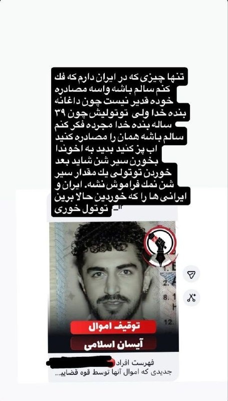

جمهوری اسلامی آیسان رو تهدید به توقیف اموالش تو ایران کرده، آیسان هم با این استوری جوابشونو داده: 🤣🤣

@ChizBergerz

## ChizBergerz — post 46510

  

آقای فراهانی مادرقحبه توجه کن؛ ‌‌‏همین پسربچه اندازه کل خاندانت خایه داره!

@ChizBergerz

## ChizBergerz — post 46509

  <a href="https://t.me/ChizBergerz/46509" target="_blank">📎 Download file</a>

📲#اپلیکیشن اندروید سایت جهانی دربی بت

👍اسپانسر لیگ انگلیس
👍
🔥امکان شارژ امن از طریق کارت بانکی
➖➖➖➖➖➖➖➖➖

🪙همین حالا عضو شوید 👇
https://t.me/+aCbq7yy8QY80NzQ0

## ChizBergerz — post 46508

  

😤دنبال یه سایت شرط بندی بین المللی بودی که به ایرانیا خدمات بده؟!
⛔

👍دربی بت همون انتخاب  100%

💎ویژگی های سایت جهانی Derby Bet:

⬅️امکان شارژ امن با کارت بانکی

⬅️واریز اول دوبل شارژ می شوید(بونوس۱۰۰٪)

⬅️پر اپشن ترین سایت فعال در ایران

⬅️تسویه حساب کمتر از 5 دقیقه

⬅️برگشت بخشی از باخت به صورت هفتگی

🚨کد هدیه ثبت نام:GG007

⚠️برای دانلود اپلکیشن کلیک کنید
👉
re28

🔔کانال دربی بت :

🪙https://t.me/+aCbq7yy8QY80NzQ0

## ChizBergerz — post 46507

  <a href="telegram/content/ChizBergerz_46507_1779108999.mp4" target="_blank">🎬 Download video</a>

افشاگری عظیمی، دبیر کل جبهه عنقلاب: «مسیح علینژاد» و «گلشیفته فراهانی» عاملین دستگاه های امنیتی ج.ا (پرستوهای نظام) هستن!

@ChizBergerz

## ChizBergerz — post 46506

  <a href="telegram/content/ChizBergerz_46506_1779109001.mp4" target="_blank">🎬 Download video</a>

شاید باورتون نشه ولی این کلیپ مربوط به تهرانه و برای دیروزه!

@ChizBergerz

## rodast_omiddana — post 71503

  <a href="telegram/content/rodast_omiddana_71503_1779109002.webm" target="_blank">🎬 Download video</a>

🚨 چند تا خانم بی‌حجاب توی استان اصفهان رفته بودند تو تجمعات شبانه طرفداران حکومت شرکت کردند، روز بعد دادگاه استان به خاطر بی حجابی براشون ابلاغیه فرستاده و جریمه‌شون کرده...
حماقت برخیها تَه ندارد..

## rodast_omiddana — post 71502

  <a href="telegram/content/rodast_omiddana_71502_1779109002.mp4" target="_blank">🎬 Download video</a>

🚨
🚨
🚨رویترز:
پاکستان، ۸ هزار نیروی نظامی به همراه یک اسکادران جنگنده و سامانه پدافند هوایی به عربستان سعودی اعزام کرد.

## rodast_omiddana — post 71501

🎬 خانعلی زاده روی عکس جعلی ترامپ تحلیل رفت
پسر بچه ای که میگه بزور آوردنش تجمعات شبانه
لینک یوتیوب:
https://www.youtube.com/watch?v=uWRuhrU4raY

## rodast_omiddana — post 71500

  <a href="telegram/content/rodast_omiddana_71500_1779109004.webm" target="_blank">🎬 Download video</a>

🚨تسنیم به نقل از منبعی نزدیک به تیم مذاکره‌کننده:
تهران از طریق میانجی پاکستانی، متن جدیدی شامل ۱۴ بند را تحویل داده است

## rodast_omiddana — post 71499

🎬 پسر عبدالرحیم موسوی میگه 30 روز دنبال جنازه پدرم بودیم
لینک یوتیوب:
https://www.youtube.com/watch?v=Qi5tnvBKqeE

## KiriMohems — post 47708

  <a href="telegram/content/KiriMohems_47708_1779109004.webm" target="_blank">🎬 Download video</a>

📌 سرعت بالا + کیفیت واقعی + قیمت منصفانه با گرند‌ ‌وی‌پی‌ان بدون قطعی و دردسر وصل شو 
🚀 
😀 پینگ عالی 
😀 مناسب گیم، یوتیوب و استفاده روزانه 
😀 سرورهای پرسرعت و پایدار 
😀 تحویل آنی و پشتیبانی سریع 
😀 قیمت اقتصادی با کیفیتی که تفاوتشو حس می‌کنی 
😀 وقتی کیفیت مهمه، انتخابت…

## KiriMohems — post 47707

  <a href="telegram/content/KiriMohems_47707_1779109005.webm" target="_blank">🎬 Download video</a>

📌 سرعت بالا + کیفیت واقعی + قیمت منصفانه
با گرند‌ ‌وی‌پی‌ان بدون قطعی و دردسر وصل شو 
🚀

😀 پینگ عالی

😀 مناسب گیم، یوتیوب و استفاده روزانه

😀 سرورهای پرسرعت و پایدار

😀 تحویل آنی و پشتیبانی سریع

😀 قیمت اقتصادی با کیفیتی که تفاوتشو حس می‌کنی

😀 وقتی کیفیت مهمه، انتخابت معلومه!

قیمت‌ها:
1Gb: 290/000
3GB:790/000
5GB:1/190/000
10GB:1/890/000
⭐️ 20GB:3/590/000

🕔از جشنواره تخفیف جا نمونی...!

🤖 Robot 
👇
👇
👇

👤 Admin 
👇
👇
👇

## KiriMohems — post 47705

🔴قیمت چندتا ماشین تخمی داخلی و خارجی ، ۲۸ اردیبهشت‌ماه ۱۴۰۵

#Helsinki
@KiriMohems

## KiriMohems — post 47704

  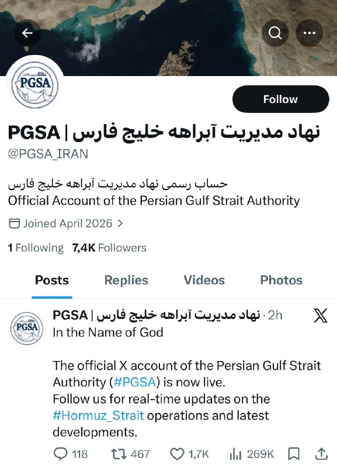

🔴جمهوری اسلامی ، صفحه تخمی- توییتری برای مدیریت ترافیک دریایی در تنگه هرمز راه انداخته

#Helsinki
@KiriMohems

## KiriMohems — post 47703

  <a href="telegram/content/KiriMohems_47703_1779109006.mp4" target="_blank">🎬 Download video</a>

🔴افشاگری محمدحسین عظیمی دبیر کل جبهه انقلاب اسلامی در مورد گلشیفته فراهانی و مسیح علی‌نژاد ؛
اینا عامل دستگاه امنیتی تو ایران بودند
#Helsinki
@MohemMovie

## KiriMohems — post 47702

  <a href="telegram/content/KiriMohems_47702_1779109007.mp4" target="_blank">🎬 Download video</a>

#فوری_تخمی
🔴گفتگوی تلفنی بین نتانیاهو و ترامپ درباره جمهوری اسلامی لو رفت

#Helsinki
@KiriMohems

## KiriMohems — post 47701

🔴وزیر کشور پاکستان تو تهران شیر خورده و کیر انداخته

خبرنگار الجزیره به نقل از منبعی در وزارت کشور پاکستان: وزیر کشور بهش خوش گذشته و سفر خودش رو به تهران برای روز سوم تمدید کرد.
#Helsinki
@KiriMohems

## KiriMohems — post 47700

  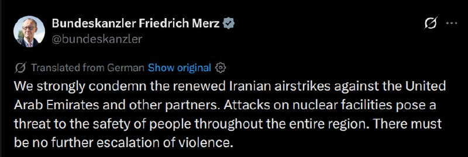

🔴صدراعظم آلمان،حمله به نیروگاه هسته‌ای امارات رو به کون جمهوری اسلامی آویزون کرد

فریدریش مرتس، توئیت زده که حمله به نیروگاه هسته‌ای باراکا در امارات کار جمهوری اسلامی بوده و باید کون رو زمین بزاره و با آمریکا وارد مذاکرات بشه، چوب تو کون همسایگانش فرو نکنه و تنگه هرمز رو بدون محدودیت باز کنه.

#Helsinki
@KiriMohems

## KiriMohems — post 47699

📰رویترز : پاکستان زیرش سوراخ شده و پیشنهاد به‌روزشده ایران رو به آمریکا منتقل کرده یک منبع کلفت پاکستانی به رویترز گفته: کصکشا ، ما زمان زیادی برای پر کردن جنده بازی بین واشنگتن و تهران نداریم یه گوهی بخورید دیگه #Helsinki @KiriMohems

## KiriMohems — post 47698

📰رویترز : پاکستان زیرش سوراخ شده و پیشنهاد به‌روزشده ایران رو به آمریکا منتقل کرده

یک منبع کلفت پاکستانی به رویترز گفته:
کصکشا ، ما زمان زیادی برای پر کردن جنده بازی بین واشنگتن و تهران نداریم یه گوهی بخورید دیگه
#Helsinki
@KiriMohems

## KiriMohems — post 47696

  <a href="telegram/content/KiriMohems_47696_1779109009.mp4" target="_blank">🎬 Download video</a>

📰 در پی گزارشات نیویورک تایمز درباره پایگاه‌های نظامی که اسرائیل خیلی سوسکی تو خاک عراق راه انداخته، یک چوپان سوری که تو منطقه‌ای بین مرز عراق و سوریه کون گوسفنداش میزاشته فیلمی گرفته که هواپیماهای ترابری نوع C-130 تو ارتفاع بسیار پایین دیده میشن.
#Helsinki
@KiriMohems

## KiriMohems — post 47695

  

😤دنبال یه سایت شرط بندی بین المللی بودی که به ایرانیا خدمات بده؟!
⛔

👍دربی بت همون انتخاب  100%

💎ویژگی های سایت جهانی Derby Bet:

⬅️امکان شارژ امن با کارت بانکی

⬅️واریز اول دوبل شارژ می شوید(بونوس۱۰۰٪)

⬅️پر اپشن ترین سایت فعال در ایران

⬅️تسویه حساب کمتر از 5 دقیقه

⬅️برگشت بخشی از باخت به صورت هفتگی

🚨کد هدیه ثبت نام:GG007

⚠️برای دانلود اپلکیشن کلیک کنید
👉

🔔کانال دربی بت :r28🅰

🪙https://t.me/+kpFvLD9kaeJhYTI0

## SportBaadNews — post 251823

  <a href="telegram/content/SportBaadNews_251823_1779109011.webm" target="_blank">🎬 Download video</a>

⚽️
🚨فوری و رسمی: هانسی فلیک تا 2028 با بارسلونا تمدید کرد
@SportBaadNews

## SportBaadNews — post 251822

  <a href="telegram/content/SportBaadNews_251822_1779109011.webm" target="_blank">🎬 Download video</a>

🚨
🚨 فوری از فرناندو پولو: فرمین لوپز باید تحت عمل جراحی قرار بگیره @SportBaadNews

## SportBaadNews — post 251821

  <a href="telegram/content/SportBaadNews_251821_1779109012.webm" target="_blank">🎬 Download video</a>

🚨
🚨 فوری از فرناندو پولو: فرمین لوپز باید تحت عمل جراحی قرار بگیره
@SportBaadNews

## SportBaadNews — post 251820

  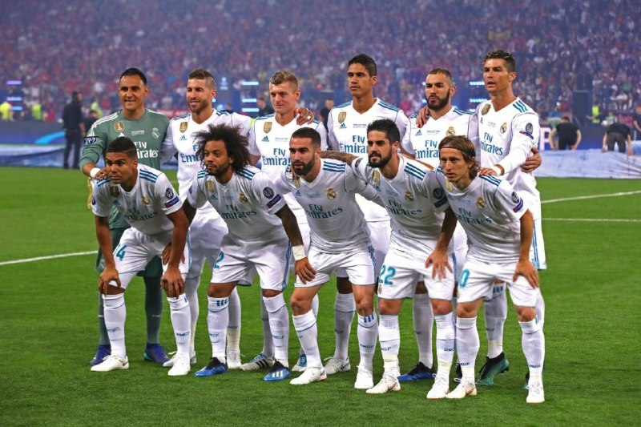

کسی نموند دیگه @SportBaadNews

## SportBaadNews — post 251819

  

دنی کارواخال با رئال مادرید:

• 6 قهرمانی در لیگ قهرمانان اروپا
• 4 قهرمانی در لالیگا
• 2 قهرمانی در کوپا دل ری
• 5 قهرمانی در سوپرجام اروپا
• 4 قهرمانی در سوپرجام اسپانیا
• 5 قهرمانی در جام باشگاه های جهان
@SportBaadNews

## SportBaadNews — post 251818

  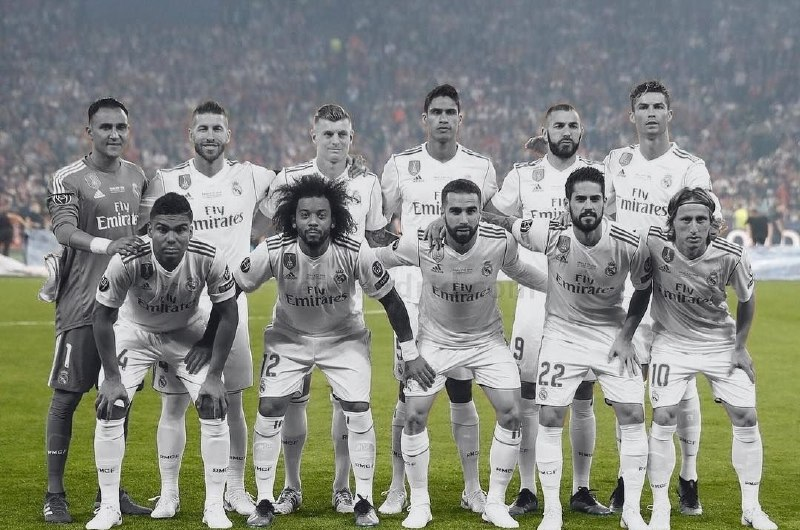

رسمی: کارواخال از رئال مادرید خداحافظی کرد. @SportBaadNews

## SportBaadNews — post 251817

رسمی: کارواخال از رئال مادرید خداحافظی کرد. @SportBaadNews

## SportBaadNews — post 251816

  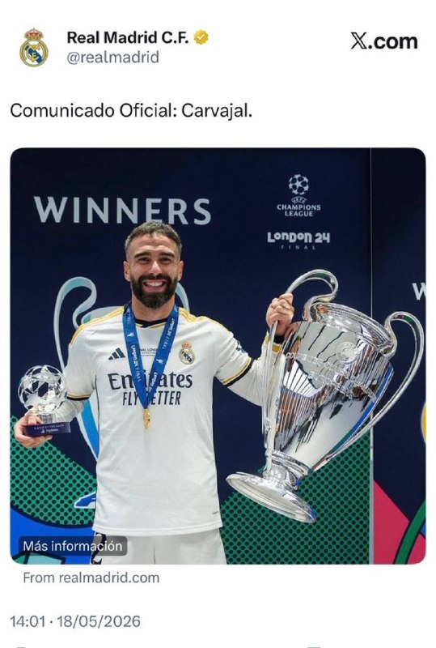

رسمی: کارواخال از رئال مادرید خداحافظی کرد.
@SportBaadNews

## SportBaadNews — post 251814

بانو جورجینا هم بلوند کرده موهاشو
@SportBaadNews

## SportBaadNews — post 251811

  <a href="telegram/content/SportBaadNews_251811_1779109013.mp4" target="_blank">🎬 Download video</a>

چرا حس میکنم اصن به کیرتون هم نیست که اینترنت سه ماهه قطعه، دلار 180 تومنه، اینترنت طبقاتی اومده، دارید گیگی کم کم 200-300 تومن پول کانفیگ میدید، گوشت و مرغ کیلویی خدا تومن شده، تخم مرغ شونه ای 500 تومن، قیمت گوشی ها 5 برابر شده، تورم کمر داره میشکنه، کار کاسبی های آنلاین خوابیده و...
@SportBaadNews

## SportBaadNews — post 251810

  <a href="telegram/content/SportBaadNews_251810_1779109014.webm" target="_blank">🎬 Download video</a>

🚨
⚽️ رسسسسسسمی؛ ژابی سرمربی چلسی شد @SportBaadNews

## SportBaadNews — post 251809

  <a href="telegram/content/SportBaadNews_251809_1779109014.webm" target="_blank">🎬 Download video</a>

🚨
🚨
💣
⚽️ فوووووری فابریزیو رومانو: ژوزه مورینیو به رئال مادرید... Here We Goooooooooooo! @SportBaadNews

## SportBaadNews — post 251808

  <a href="telegram/content/SportBaadNews_251808_1779109014.webm" target="_blank">🎬 Download video</a>

🚨
🚨
💣
⚽️ فوووووری فابریزیو رومانو: ژوزه مورینیو به رئال مادرید... Here We Goooooooooooo! @SportBaadNews

## SportBaadNews — post 251807

  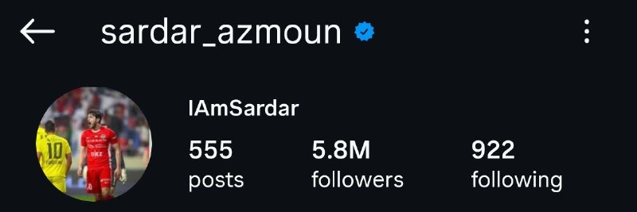

🇮🇷
⚽️| سردار آزمون بعد خط خوردنش از لیست تیم ملی برای جام جهانی یه عکس با لباس شباب الاهلی رو پروفایل پیجش گذاشت و پیج تیم ملی رو هم آنفالو کرد
@SportBaadNews

## IranIntlTV — post 337775

  <a href="telegram/content/IranIntlTV_337775_1779109015.mp4" target="_blank">🎬 Download video</a>

شرکت آلکاتل اعلام کرد، تعمیر کابل‌های زیردریایی در خلیج فارس را به دلیل ناامنی و تهدیدهای سپاه پاسداران متوقف کرده است.

احمد صمدی، خبرنگار ایران‌اینترنشنال، گزارش می‌دهد
@iranintltv

## IranIntlTV — post 337774

  

روزنامه نیویورک تایمز به نقل از دو مقام خاورمیانه‌ای گزارش داد که ایالات متحده و اسرائیل در حال انجام آماده‌سازی‌های «گسترده» برای احتمال ازسرگیری حملات علیه جمهوری اسلامی هستند.

این مقام‌ها احتمال دادند که حملات ممکن است در هفته جاری آغاز شود.

به نوشته این روزنامه، این سطح از آمادگی نظامی از زمان اجرای آتش‌بس بی‌سابقه بوده است.
https://iranintl.com/202605180651

## IranIntlTV — post 337773

  <a href="https://t.me/IranintlTV/337773" target="_blank">📎 Download file</a>

🎧نسخه صوتی اخبار نیمروزی | دوشنبه ۲۸ اردیبهشت
@iranintlTV

## IranIntlTV — post 337772

  <a href="telegram/content/IranIntlTV_337772_1779109017.mp4" target="_blank">🎬 Download video</a>

مستند کوتاه «هنر مقاومت» به تهیه‌کنندگی ایران‌اینترنشنال و کارگردانی مهران عباسیان، خبرنگار این شبکه، برنده جایزه بهترین مستند کوتاه و بهترین کارگردانی فستیوال فیلم خانه سینمای سوئد شد.
گزارش مهسا مرتضوی، خبرنگار ایران‌اینترنشنال
@iranintltv

## IranIntlTV — post 337771

  <a href="telegram/content/IranIntlTV_337771_1779109018.mp4" target="_blank">🎬 Download video</a>

یک شهروند با ارسال ویدیویی به ایران‌اینترنشنال می‌گوید: «برنج آنقدر گران شده که توان خریدش را نداریم. قیمت برنج از دو میلیون تومان شروع می‌شود.»

## IranIntlTV — post 337770

  <a href="telegram/content/IranIntlTV_337770_1779109020.mp4" target="_blank">🎬 Download video</a>

اطلاعات رسیده به ایران‌اینترنشنال، جزییات تازه‌ای از چگونگی کشته شدن جاویدنام امیرپارسا اشکبوس، دانشجوی ترم آخر رشته میکروبیولوژی، در جریان انقلاب ملی ایرانیان روایت می‌کند.

گفت‌وگو با فرنوش فرجی، عضو تحریریه ایران‌اینترنشنال

@iranintltv

## IranIntlTV — post 337769

  

خبرگزاری رویترز به نقل از منابع آگاه گزارش داد پاکستان در چارچوب پیمان دفاعی خود با عربستان سعودی، ۸ هزار نیروی نظامی به همراه یک اسکادران جنگنده و سامانه پدافند هوایی به این کشور اعزام کرده است.

به گزارش رویترز، این نیروها از توان عملیاتی برخوردارند و با هدف حمایت از عربستان سعودی در صورت ازسرگیری حملات علیه این کشور مستقر شده‌اند.

این تحرک نظامی در حالی صورت می‌گیرد که پاکستان نقش اصلی میانجی‌گری میان تهران و واشینگتن را بر عهده دارد.
https://iranintl.com/202605187837

## IranIntlTV — post 337768

  <a href="telegram/content/IranIntlTV_337768_1779109022.mp4" target="_blank">🎬 Download video</a>

مسعود پزشکیان با اشاره به وضعیت وخیم اقتصادی در پی محاصره دریایی بندرهای ایران، از کاهش درآمدهای کشور خبر داد و گفت: «دولت به‌دلیل مشکلات تجارت و بازار، امکان اخذ مالیات را ندارد.»

گفت‌وگو با آرش آزرمی، دبیر بخش اقتصادی ایران‌اینترنشنال
@iranintltv

## IranIntlTV — post 337767

  

🔻روزنامه سان گزارش داد که بازیکنان تیم ملی فوتبال انگلستان در جریان جام جهانی ۲۰۲۶ در آمریکا، رختخواب‌های شخصی خود را همراه خواهند داشت تا کیفیت خواب و روند ریکاوری آن‌ها حفظ شود.

🔹این تصمیم پس از شکایت‌های متعدد درباره تخت‌های خشک و سفت هتل محل اقامت آن‌ها گرفته شده است. اتحادیه فوتبال انگلیس (FA) برای تضمین خواب راحت و باکیفیت بازیکنان، تشک‌های اسفنجی سبک و بالش‌های ویژه‌ای تهیه کرده است. از بازیکنان خواسته شده پتوهای شخصی خود را هم بیاورند تا اتاق هتل حس خانه را داشته باشند.

🔹بر اساس این گزارش، کادر فنی تیم ملی انگلستان به رهبری توماس توخل قصد دارد برای جلوگیری از خستگی و مشکلات ناشی از سفرهای طولانی در آمریکا، شرایط اقامت بازیکنان را تا حد ممکن مشابه خانه فراهم کند.

🔹این تصمیم در حالی گرفته شده که فاصله زیاد شهرهای میزبان جام جهانی ۲۰۲۶، یکی از نگرانی‌های اصلی تیم‌های حاضر در این رقابت‌ها عنوان شده است.

@iranintltvsport

## IranIntlTV — post 337766

  <a href="telegram/content/IranIntlTV_337766_1779109024.mp4" target="_blank">🎬 Download video</a>

دادگاه رسیدگی‌ به پرونده متهمان حمله با چاقو به پوریا زراعتی، مجری تلویزیون ایران‌اینترنشنال، در لندن آغاز می‌شود.

رضا محدث، خبرنگار ایران‌اینترنشنال، گزارش می‌دهد
@iranintltv

## IranIntlTV — post 337765

  <a href="telegram/content/IranIntlTV_337765_1779109025.mp4" target="_blank">🎬 Download video</a>

مروری بر روزنامه‌های ایران، دوشنبه ۲۸ اردیبهشت، با مجتبی هاشمی، روزنامه‌نگار
@iranintltv

## IranIntlTV — post 337764

  <a href="telegram/content/IranIntlTV_337764_1779109026.mp4" target="_blank">🎬 Download video</a>

مسعود پزشکیان به عوارض اقتصادی محاصره دریایی آمریکا اذعان کرد و گفت: «کشور امکان صادرات نفت و تامین دلار برای واردات بنزین را ندارد.»

گفت‌وگو با مرتضی کاظمیان، عضو تحریریه ایران‌اینترنشنال
@iranintltv

## IranIntlTV — post 337763

  <a href="telegram/content/IranIntlTV_337763_1779109028.mp4" target="_blank">🎬 Download video</a>

ویدیوهای رسیده به ایران‌اینترنشنال، نصب بنرهای اعتراضی را در مناطق مختلف کرج نشان می‌دهد که روی آنها نوشته شده: «ما چیزی برای خوردن نداریم. بچه‌هایمان گرسنه هستن. همه‌چیز به ما بستگی دارد.»

## IranIntlTV — post 337762

  

احمد ابوالغیط، دبیرکل اتحادیه عرب، حمله به عربستان سعودی با سه پهپاد را به‌شدت محکوم کرد و آن را نقضی آشکار حاکمیت و تمامیت ارضی این کشور دانست.

احمد ابوالغیط گفت: «این حمله بزدلانه به هیچ‌وجه قابل قبول یا توجیه نیست.»

او با اشاره به نقض حریم هوایی عربستان سعودی تاکید کرد این اقدام تجاوزی آشکار به حاکمیت این کشور بوده است.

جمال رشدی، سخنگوی دبیرکل اتحادیه عرب، نیز اعلام کرد دبیرکل همبستگی کامل خود را با پادشاهی عربستان سعودی در اقداماتی که برای حفاظت از اراضی و شهروندان خود مطابق با احکام حقوق بین‌الملل اتخاذ می‌کند، ابراز کرده است.
https://iranintl.com/202605184256

## IranIntlTV — post 337761

  <a href="telegram/content/IranIntlTV_337761_1779109030.mp4" target="_blank">🎬 Download video</a>

عفو بین‌الملل گزارش داد شمار اعدام‌ها در جهان در سال گذشته میلادی به بالاترین سطح در ۴۴ سال گذشته رسیده است؛ افزایشی که جمهوری اسلامی، نقش اول را در آن دارد.

گفت‌وگو با احمد صمدی، خبرنگار ایران‌اینترنشنال
@iranintltv

## IranIntlTV — post 337760

  <a href="telegram/content/IranIntlTV_337760_1779109031.mp4" target="_blank">🎬 Download video</a>

سرخط خبرهای دوشنبه ۲۸ اردیبهشت
@iranintltv

## IranIntlTV — post 337759

  

فریدریش مرتس، صدراعظم آلمان، روز دوشنبه اعلام کرد برلین حملات جمهوری اسلامی به امارات متحده عربی و سایر کشورها را محکوم می‌کند و افزود تهران باید تهدید همسایگان خود را متوقف کرده و تنگه هرمز را بدون محدودیت باز نگه دارد.

فریدریش مرتس در پیامی در شبکه ایکس نوشت: «حملات به تاسیسات هسته‌ای تهدیدی برای امنیت مردم در سراسر منطقه است. نباید هیچ‌گونه تشدید بیشتر خشونت رخ دهد.»

او همچنین تاکید کرد حکومت ایران باید وارد مذاکرات جدی با آمریکا شود.
https://iranintl.com/202605188672

## IranIntlTV — post 337758

  <a href="telegram/content/IranIntlTV_337758_1779109033.mp4" target="_blank">🎬 Download video</a>

دونالد ترامپ، رییس‌جمهور آمریکا، گفت: «مقام‌های جمهوری اسلامی برای امضای توافق بی‌تاب هستند، اما پس از رسیدن به توافق، متنی ارسال می‌کنند که هیچ ربطی به توافق انجام‌شده ندارد.»

گفت‌وگو با علی‌حسین قاضی‌زاده، عضو تحریریه ایران‌اینترنشنال
@iranintltv

## IranIntlTV — post 337757

  <a href="telegram/content/IranIntlTV_337757_1779109035.mp4" target="_blank">🎬 Download video</a>

انور قرقاش، مشاور دیپلماتیک رییس امارات متحده عربی، نیروهای نیابتی مورد حمایت جمهوری اسلامی را مسئول حملات پهپادی یک‌شنبه به خاک این کشور دانست و آن را «اقدامی تروریستی» خواند.

گفت‌وگو با تروسکه صادقی، خبرنگار ایران‌اینترنشنال
@iranintltv

## IranIntlTV — post 337756

  <a href="telegram/content/IranIntlTV_337756_1779109036.mp4" target="_blank">🎬 Download video</a>

تیم اعزامی فوتبال ایران برای برگزاری اردوی آماده‌سازی پیش از جام جهانی و همچنین گرفتن ویزای آمریکا راهی ترکیه شد. این در حالی است که هنوز مشخص نیست کدام بازیکنان بتوانند ویزای آمریکا را دریافت کنند.
گفت‌وگو با مهدی رستم‌پور، خبرنگار ورزشی

@iranintltv

## Persian_Trend_Official — post 14412

از نظر خلوتی منظورم بود.

📝 Nick

📌 @persian_trend_official
پرشین ترند | متفاوت‌ترین کانال نظامی

## Persian_Trend_Official — post 14410

⭕️ وضعیت کم سابقه‌ی آسمان منطقه، از نظر خلوت بودن.

📝 Nick

📌 @persian_trend_official
پرشین ترند | متفاوت‌ترین کانال نظامی

## Persian_Trend_Official — post 14409

  <a href="telegram/content/Persian_Trend_Official_14409_1779109037.webm" target="_blank">🎬 Download video</a>

📰
🇸🇦
🇵🇰طبق گزارش رویترز، پاکستان در چارچوب «توافق دفاع مشترک» با عربستان:

🔢حدود ۸ هزار نیروی نظامی،

🔢یک اسکادران جنگنده عمدتاً از نوع JF-17،

🔢دو اسکادران پهپادی

🔢 سامانه پدافند هوایی HQ-9 ساخت چین
را در خاک عربستان مستقر کرده است.

❎بر اساس این گزارش، این اقدام با هدف تقویت همکاری‌های دفاعی و امنیتی میان اسلام‌آباد و ریاض انجام شده است.
❎

☆Phantom☆

📌 @persian_trend_official
پرشین ترند | متفاوت‌ترین کانال نظامی

## Persian_Trend_Official — post 14408

  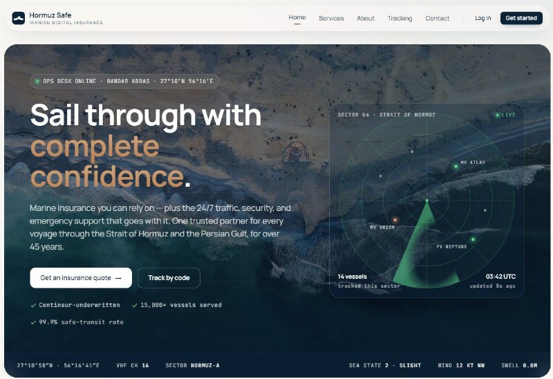

ایران سامانه «هرمز سیف» را برای ثبت‌نام کشتی‌های عبوری از تنگه هرمز راه‌اندازی کرد

جمهوری اسلامی ایران سامانه‌ای تحت عنوان «هرمز سیف» را با هدف ارائه خدمات به کشتی‌های عبوری از تنگه هرمز راه‌اندازی کرده است. بر اساس این طرح، ناخدایان و شرکت‌های کشتیرانی می‌توانند از طریق این سامانه درخواست خدمات مختلف از جمله بیمه، کترینگ، خدمات اضطراری و همراهی اسکورت نظامی را ثبت کنند.جالبه که اسکورت نظامی رو هم جزو «خدمات» گذاشتن، کنارِ کترینگ! 😂

با این حال، این سامانه با یک چالش فنی قابل توجه مواجه است؛ وب‌سایت مذکور از خارج از ایران قابل دسترسی نیست و کاربران خارجی برای ثبت‌نام ملزم به استفاده از اینترنت ایرانی هستند.

آدرس سامانه: hormuzsafe.ir

☆Phantom☆

📌 @persian_trend_official
پرشین ترند | متفاوت‌ترین کانال نظامی

## Persian_Trend_Official — post 14407

  <a href="telegram/content/Persian_Trend_Official_14407_1779109038.webm" target="_blank">🎬 Download video</a>

⭕️ تسنیم: ایران متن جدید ۱۴ بندی به آمریکا ارائه کرد

💢خبرگزاری تسنیم به نقل از یک منبع نزدیک به تیم مذاکره‌کننده گزارش داد تهران از طریق میانجی پاکستانی، متن جدیدی شامل ۱۴ بند به طرف آمریکایی تحویل داده است.

▪️پیش تر اخباری از منابع پاکستانی نسبت به ارسال پیشنهاد جدید جمهوری اسلامی به آمریکا توسط این کشور منتشر شده بود.

🫆:Tony

📌 @persian_trend_official
پرشین ترند | متفاوت‌ترین کانال نظامی

## Persian_Trend_Official — post 14406

  

🕊
👨‍🦲 سفر پوتین به چین تنها ۴ روز پس از حضور ترامپ

🔹رئیس‌جمهور چین کمتر از یک هفته پس از سفر رئیس‌جمهور آمریکا به پکن، اکنون برای میزبانی همتای روس خود آماده می‌شود.

🔹دیدارهای روسای جمهور آمریکا و روسیه نشان می‌دهد که پکن «به سرعت در حال ظهور به عنوان نقطه کانونی دیپلماسی جهانی» است.

🔹تجارت دوجانبه چین و روسیه از سال ۲۰۲۲ بعد از جنگ اوکراین به بالاترین سطح خود رسیده است، به طوری که چین بیش از یک‌چهارم صادرات روسیه را خریداری می‌کند.

☆Phantom☆

📌 @persian_trend_official
پرشین ترند | متفاوت‌ترین کانال نظامی

## Persian_Trend_Official — post 14405

  <a href="telegram/content/Persian_Trend_Official_14405_1779109039.webm" target="_blank">🎬 Download video</a>

#طنز

جدیدا سرورهای سوپر اپلیکیشن بله وقت ناهار و نماز همراه کارمندان شرکت استراحت می‌کنند. 😌

📝 Nick

📌 @persian_trend_official
پرشین ترند | متفاوت‌ترین کانال نظامی

## Persian_Trend_Official — post 14404

  <a href="telegram/content/Persian_Trend_Official_14404_1779109039.mp4" target="_blank">🎬 Download video</a>

🇵🇰انفجار مرگبار در وزیرستان پاکستان و ترور یکی از بزرگان قبایل

🔹در پی انفجار بمب در بازار «رستم» شهر وانا، ۳ نفر کشته و ۴ نفر زخمی شدند.
🔹منابع محلی اعلام کردند در میان کشته‌شدگان، «ملک طارق وزیر» از بزرگان بانفوذ قبایل منطقه نیز حضور دارد که در حل اختلافات قومی نقش مهمی داشت.

PHANTOM

📌 @persian_trend_official
پرشین ترند | متفاوت‌ترین کانال نظامی

---
📅 بروزرسانی: 1405/02/28 13:06
---

## rodast_omiddana — post 71498

  <a href="telegram/content/rodast_omiddana_71498_1779096967.mp4" target="_blank">🎬 Download video</a>

سیمپسون‌ها چیه ما خودمون قهوه‌تلخ‌ داریم

Mellig.net

## rodast_omiddana — post 71497

  <a href="telegram/content/rodast_omiddana_71497_1779096969.mp4" target="_blank">🎬 Download video</a>

🚨مرتضی نجفی بعد از کنسرت احیا شیعه موقوف
این کاسبِ عادی ساز، به اصلِ بسیجیِ خودش برگشته و خیلی ریز میخواد شیعه و اسلامو احیا کنه، ولی خبر نداره محکم ایستادیم برای پاکسازی کامل این غده 1400 ساله ( اساسا هر انقلابی بدون زدایش این ویروس آب در هاون کوبیدنه)

راستی الان در سال ۲۰۲۶ چند درصد از ایرانیان خودشون رو بر اساس « شیعه و سنی» تقسیم بندی میکنند؟
مگر اینکه تمام ملت ایران رو به مانند جمهوری اسلامی ،زورچپونی «مسلمان» فرض کنیم،
که البته شما غلط کردی از طرفشون حرف میزنی.
حواستو جمع کن و پاتو رو خطوط قرمز ما نذار جناب قاری قرآن!
قرار نیست هر مزخرفی بکنی تو پاچمون یه « شاه » بزنی تنگش که مصونیت بگیری...
نقی به کمرت بزنه مرتضی نجفی پور مقدم.

## rodast_omiddana — post 71496

  <a href="telegram/content/rodast_omiddana_71496_1779096972.webm" target="_blank">🎬 Download video</a>

🚨 کانال ۱۲ رژیم:
جلسه محاکمه نتانیاهو که قرار بود امروز صبح برگزار شود به درخواست خودش «به دلایل امنیتی و سیاسی» به تعویق افتاد.

## rodast_omiddana — post 71495

  <a href="telegram/content/rodast_omiddana_71495_1779096972.mp4" target="_blank">🎬 Download video</a>

🚨تلفن نتانیاهو و ترامپ قبل از جلسه امنیتی اسرائیل برای حمله به رژیم ایران
چند روز تا حمله مانده؟

## rodast_omiddana — post 71494

  <a href="telegram/content/rodast_omiddana_71494_1779096974.webm" target="_blank">🎬 Download video</a>

🚨 رویترز به نقل از یک مقام پاکستانی:
پاکستان دیشب پیشنهاد جدید ایران را به آمریکا منتقل کرد

پاکستان بشین سرجات و رو مخ نرو، بزار کار را تمام کنند پفیوز..

## rodast_omiddana — post 71493

  <a href="telegram/content/rodast_omiddana_71493_1779096974.webm" target="_blank">🎬 Download video</a>

🚨 پست جدید ترامپ نشان می‌دهد که او دیگر به درخواست‌های پاکستان گوش نمی‌دهد.جمهوری اسلامی چند ساعت فرصت دارد تسلیم شود..
تیک تاک..

## KiriMohems — post 47694

🔴میدل ایست از خایمالان سپاه :

پاسخ ایران به آخرین پیشنهاد آمریکا منفی و بیا بخورش است

#Helsinki
@KiriMohems

## KiriMohems — post 47693

  

🇺🇸ترامپ : اونا (جمهوری اسلامی) یه برگه کیری میفرستن که هیچ ربطی به چیزی که توافق کرده بودیم نداره

- منم میگم : داداش کصخلید یا ما رو کص گیر آوردید؟

#Helsinki
@KiriMohems

## KiriMohems — post 47692

📰 شبکه CNN: پنتاکون ، فهرستی به درازی کیرخر از سولاخ ها برای حمله به ایران در صورت صدور دستور ترامپ آماده کرده
#Helsinki
@KiriMohems

## KiriMohems — post 47691

🇺🇸 ترامپ :
جمهوری اسلامی داره خایمالی میکنه که یه توافق امضا بشه - مصاحبه با فورچون

#Helsinki
@KiriMohems

## KiriMohems — post 47690

  <a href="telegram/content/KiriMohems_47690_1779096975.mp4" target="_blank">🎬 Download video</a>

🔴ترمالی در اتوبان تهران - کرج بگایی به بار آورد

رئیس پلیس راه راهور فراجا:
دیشب، دنبال یه ماشین شوتی بودیم ، یارو هم برای اینکه دربره ، میخ سه پر ریخت کف جاده و گوه زد تو جاده اما آخرش گرفتیمش تا دونه دونه میخ ها رو بکنیم تو کونش

نزدیک به ۲۴ تا ماشین هم پنچر شدن و بهشون آسیب وارد شد و فحش ناموص نثار راننده شوتی شد

#Helsinki
@KiriMohems

## KiriMohems — post 47683

🔴دیشب ترامپ کصنمک بازیش گل کرد و این همه پست رو تو یه شب گذاشت

#Helsinki
@KiriMohems

## KiriMohems — post 47682

🔴کشورهایی که تاكنون از شهروندان خود خواسته‌اند فوراً ایران را ترک کنند: 🇺🇸آمريكا، 🇬🇧انگليس، 🇨🇦کاناد ، 🇦🇺استرالیا، 🇫🇷فرانسه، 🇳🇱هلند، 🇵🇱لهستان، 🇸🇪سوئد، 🇷🇸صربستان، 🇨🇾قبرس، 🇳🇿نیوزیلند، 🇧🇷برزیل، 🇮🇳هند، 🇨🇳چین، 🇰🇷کره جنوبی و 🇰🇿قزاقستان🇮🇹ایتالیا دیگه کیر خر مونده…

## KiriMohems — post 47681

🔴دستور دادستانی تهران به ایران خودرو و سایپا:

کصکشا ، اینقدر کرم نریزید و امکان دسترسی یکسان متقاضیان به سامانه‌های ثبت‌نام خودرو رو اوکی کنید ، کونتون میخاره ؟

#Helsinki
@KiriMohems

## KiriMohems — post 47680

  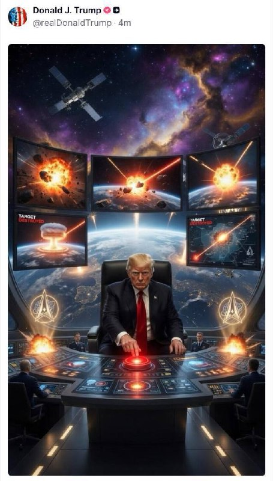

🔴پست جدید ترامپ که نشون میده، کیرشو کرده تو میانجی بازی های پاکستان و میخواد خون بیاره

#Helsinki
@KiriMohems

## SportBaadNews — post 251806

  <a href="telegram/content/SportBaadNews_251806_1779096976.mp4" target="_blank">🎬 Download video</a>

از اونجایی که به جام جهانی نزدیکیم یه اینفلوئنسر خارجی اومده صحنه هایی از جام جهانی رو به شکلی که دلش خنک میشده با هوش مصنوعی ساخته:
@SportBaadNews

## SportBaadNews — post 251804

  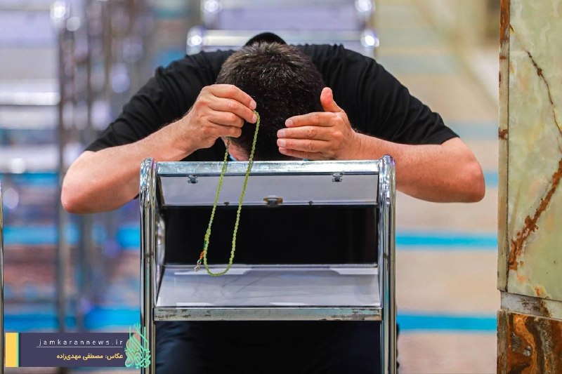

قلعه نویی قبل از سفر به آمریکا به زیارت مسجد جمکران رفت تا برای قهرمانی ایران دعا کند
@SportBaadNews

## SportBaadNews — post 251803

  

✅ کاربران محترم برای دسترسی به سایت وینکوبت فقط کافیه از طریق ربات وینکوبت وارد بشید.

🤖- @Wincobet_bot

🤖- @Wincobet_bot

📌بدون نیاز به جستجو، بدون لینک‌های پراکنده، همه چیز از طریق خود ربات انجام میشه.

📌ویژگی‌های ربات وینکوبت:
👇

▪︎ورود سریع و مستقیم به سایت
▪︎دسترسی راحت از داخل تلگرام
▪︎بدون مراحل پیچیده یا ورود جداگانه

📌اگر دنبال یک راه ساده و سریع برای ورود به وینکوبت هستید، این ربات ساده‌ترین مسیر دسترسی شماست:
👇

🤖- @Wincobet_bot

📌برای اطلاع از تحلیل بازی‌ها و ورود به کانال سایت جوین بدید: 
👇

🔵 @Wincobetofficial

## SportBaadNews — post 251802

  <a href="telegram/content/SportBaadNews_251802_1779096979.webm" target="_blank">🎬 Download video</a>

🚨
🚨
💣
⚽️ فوووووری فابریزیو رومانو: ژوزه مورینیو به رئال مادرید... Here We Goooooooooooo! @SportBaadNews

## SportBaadNews — post 251801

  <a href="telegram/content/SportBaadNews_251801_1779096979.webm" target="_blank">🎬 Download video</a>

🚨
🚨
💣
⚽️ فوووووری فابریزیو رومانو: ژوزه مورینیو به رئال مادرید...
Here We Goooooooooooo!
@SportBaadNews

## SportBaadNews — post 251798

⚽️
🔥 اتلتیکو‌مادرید از کیت دوم و سکسی فصل بعد خودش رونمایی کرد
@SportBaadNews

## SportBaadNews — post 251797

  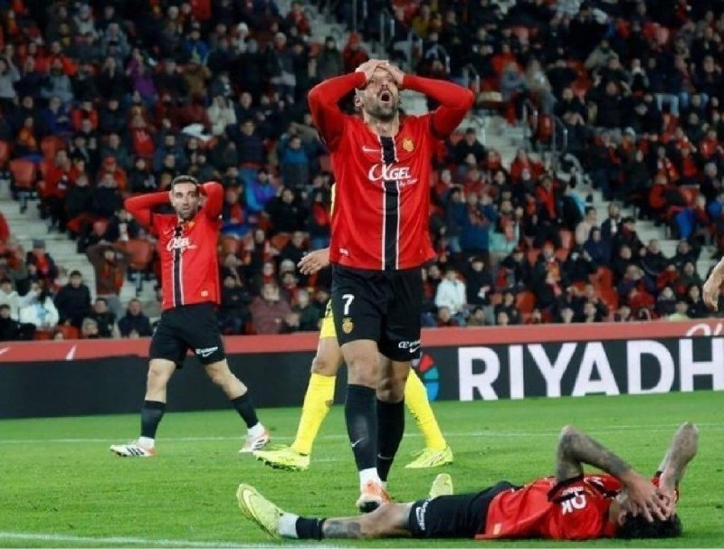

⚽️
⬇️ مایورکا رسما و شرعا به سگوندا دیویژن سقوط کرد اونم در حالی که مهاجم تیمشون موریکی 22 گل برای این تیم تو این فصل لالیگا به ثمر رسونده و فقط 2 گل با کیلیان امباپه که تو صدر جدول گلزنان لالیگاست فاصله داره!
@SportBaadNews

## SportBaadNews — post 251796

  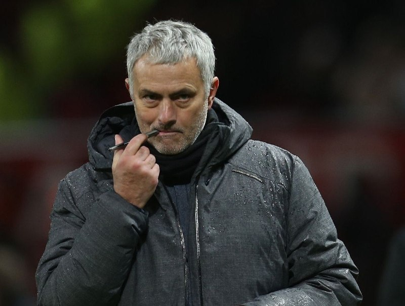

⚽️
🟠 رومانو : مورینیو به رئال مادرید همین روزاس که Her We Go بشه. اونا همین الانم دارن درمورد نقل و انتقالات و نیاز های تیم صحبت میکنن و چیزی نمونده تا قرارداد نهایی امضا بشه.
@SportBaadNews

## IranIntlTV — post 337751

  

اسماعیل بقائی، سخنگوی وزارت خارجه جمهوری اسلامی، درباره احتمال ازسرگیری جنگ گفت دیپلماسی جمهوری اسلامی «هوشمندانه» است، اما تهران با تمام توان برای هر سناریویی آماده است.

اسماعیل بقائی گفت: «دیپلماسی جمهوری اسلامی هوشمندانه است»، اما در عین حال تاکید کرد جمهوری اسلامی در برابر هر اقدام «دیوانه‌باری» با تمام توان دفاع می‌کند.

او همچنین افزود نیروهای نظامی «سورپرایزهایی» خواهند داشت.
https://iranintl.com/202605183625

## IranIntlTV — post 337750

  <a href="telegram/content/IranIntlTV_337750_1779096982.mp4" target="_blank">🎬 Download video</a>

بیمارستان الغدیر تهران در شب‌های ۱۸ و ۱۹ دی‌ماه یکی از قتل‌گاه‌های جمهوری اسلامی بود. در پی کارزار ایران‌اینترنشنال در خصوص ارسال اطلاعات بیشتر برای شناسایی پیکرهای جاویدنامان در این بیمارستان، اطلاعات و تصاویری به دست ما رسیده که بخشی از آن را در این ویدیو می‌بینید.
شاهدان و خانواده‌ها می‌توانند برای ثبت حقیقت این جنایت، اسناد، تصاویر و روایت‌های خود را از طریق بات اینتل‌مدیا ارسال کنند.

## IranIntlTV — post 337749

  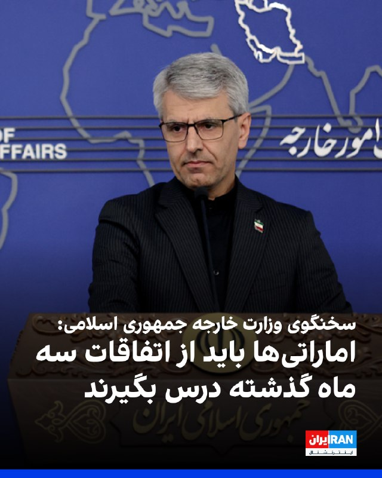

اسماعیل بقایی، سخنگوی وزارت خارجه جمهوری اسلامی، در پاسخ به پرسشی درباره گزارش‌ها از قصد امارات متحده عربی برای حمله به جمهوری اسلامی و سفر مقام‌های اسرائیلی به این کشور گفت: «ما قرار نیست با گزارش‌ها این واقعیت را از یاد ببریم که تهدید اصلی کدام طرف است.»

بقایی با تهدید کشورهای منطقه از جمله امارات متحده عربی گفت: « اماراتی‌ها از اتفاقاتی که در دو سه ماه اخیر افتاد باید درس بگیرند.»

او اضافه کرد: «ما با هیچ کشور منطقه دشمنی نداریم و با همه همسایه هستیم. همه را به مراقبت به دسیسه‌های طرف‌های خارجی برای ایجاد تفرقه دعوت می‌کنیم.»

بقایی گفت رفت‌وآمد مقام‌های اسرائیلی به منطقه از دید جمهوری اسلامی «مخفی نبوده» و این رفت‌وآمدها، اسرائیل را برای ادامه «جنایات» در منطقه جری‌تر کرده است.
https://iranintl.com/202605189537

## IranIntlTV — post 337748

  <a href="telegram/content/IranIntlTV_337748_1779096984.mp4" target="_blank">🎬 Download video</a>

یک شهروند با ارسال پیامی به ایران‌اینترنشنال می‌گوید اینترنت پرو خریده و با وجود مصرف کم، بعد از دو روز به او پیام داده‌اند که نصف حجم را مصرف کرده‌اند: «اصلا نمی‌فهمم چطور این حجم استفاده شده. بنظر می‌رسد دولت از همین هم سوءاستفاده می‌کند.»

## IranIntlTV — post 337747

  

🔻فوتبال آلمان شاهد یکی از بزرگ‌ترین شگفتی‌های تاریخ خود است؛ باشگاه کوچک «الفرسبرگ» (SVE) با پیروزی ۳ بر صفر مقابل مونستر، برای نخستین بار در تاریخ ۱۰۹ ساله‌ی خود به بوندس‌لیگا صعود کرد. این تیم که در ایالت زارلاند واقع شده، نماینده‌ی شهری با جمعیت تنها ۱۳ هزار نفر است.

🔹به نوشته‌ روزنامه‌ بیلد، این منطقه حتی یک ایستگاه قطار هم ندارد، اما حالا آماده است تا در بالاترین سطح فوتبال آلمان حضور پیدا کند. الفرسبرگ پنجاه‌ونهمین تیم تاریخ بوندس‌لیگا و چهارمین نماینده‌ی ایالت زارلاند در این رقابت‌هاست.

🔹پشت پرده‌ این صعود معجزه‌آسا، فرانک هولتسر ۷۳ ساله، حامی مالی باشگاه و بازیکن سابق فوتبال قرار دارد. او پس از تحصیل در رشته داروسازی، شرکت داروسازی «اورسافارم» را تأسیس کرد؛ شرکتی که حامی مالی بایرن مونیخ نیز هست.

جزییات بیشتر را در سایت بخوانید

@iranintltvsport

## IranIntlTV — post 337746

  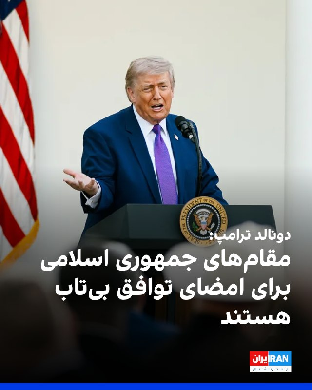

دونالد ترامپ، رییس‌جمهوری آمریکا، در مصاحبه با مجله فورچون گفت مقام‌های جمهوری اسلامی برای امضای توافق «بی‌تاب» هستند، اما پس از رسیدن به توافق، متنی ارسال می‌کند که به گفته او «هیچ ربطی به توافق انجام‌شده ندارد».

ترامپ گفت: «ایرانی‌ها برای امضای توافق بی‌تاب هستند. اما وقتی توافق می‌کنند، بعد از آن برگه‌ای برایت می‌فرستند که هیچ ربطی به توافقی که انجام داده‌اند ندارد. من به آن‌ها می‌گویم شما دیوانه هستید؟»
https://iranintl.com/202605187853

## IranIntlTV — post 337745

  

خبرگزاری رویترز به نقل از یک منبع پاکستانی گزارش داد که اسلام‌آباد پیشنهاد اصلاح‌شده جمهوری اسلامی برای پایان دادن به درگیری در خاورمیانه را با آمریکا به اشتراک گذاشته است.

این منبع در پاسخ به پرسشی درباره زمان لازم برای رفع اختلاف‌ها گفت: «وقت زیادی نداریم.» او افزود دو کشور «مدام خط قرمزهای خود را تغییر می‌دهند.»
https://iranintl.com/202605185818

## IranIntlTV — post 337744

  <a href="telegram/content/IranIntlTV_337744_1779096988.mp4" target="_blank">🎬 Download video</a>

پلیس ترکیه از قتل هولناک یک زن میانسال ایرانی‌تبار در استانبول خبر داد. مقامات امنیتی این کشور ۳ نفر را در ارتباط با قتل فرخنده قائم‌مقامی، زن ۶۸ ساله ایرانی بازداشت کردند.

نرگس هورخش، خبرنگار ایران‌اینترنشنال، گزارش می‌دهد
@iranintltv

## IranIntlTV — post 337743

  <a href="telegram/content/IranIntlTV_337743_1779096989.mp4" target="_blank">🎬 Download video</a>

هم‌زمان با ادامه فشارهای اقتصادی و محدودیت‌های تجاری جمهوری اسلامی، صادرات افغانستان به ایران افزایش کم‌سابقه‌ای داشته است.

جواد همدانی، خبرنگار ایران‌اینترنشنال، گزارش می‌دهد
@iranintltv

## IranIntlTV — post 337742

  <a href="telegram/content/IranIntlTV_337742_1779096991.mp4" target="_blank">🎬 Download video</a>

همزمان با به بن‌بست خوردن مذاکرات میان واشینگتن و تهران و افزایش احتمال از سرگیری عملیات نظامی آمریکا و اسرائیل علیه جمهوری اسلامی، دونالد ترامپ هشدار داد: «زمان برای حکومت ایران به‌سرعت در حال پایان است.»

گفت‌وگو با محمد جواد اکبرین، عضو تحریریه ایران‌اینترنشنال
@iranintltv

## IranIntlTV — post 337741

  <a href="telegram/content/IranIntlTV_337741_1779096992.mp4" target="_blank">🎬 Download video</a>

همزمان با به بن‌بست خوردن مذاکرات میان واشینگتن و تهران، ترامپ گفت زمان برای رهبران جمهوری اسلامی رو به پایان است. رسانه‌های اسرائیل از آمادگی اورشلیم و واشینگتن برای ازسرگیری عملیات نظامی گزارش دادند.

اشکان صفایی، خبرنگار ایران‌اینترنشنال، گزارش می‌دهد
@iranintltv

## IranIntlTV — post 337740

  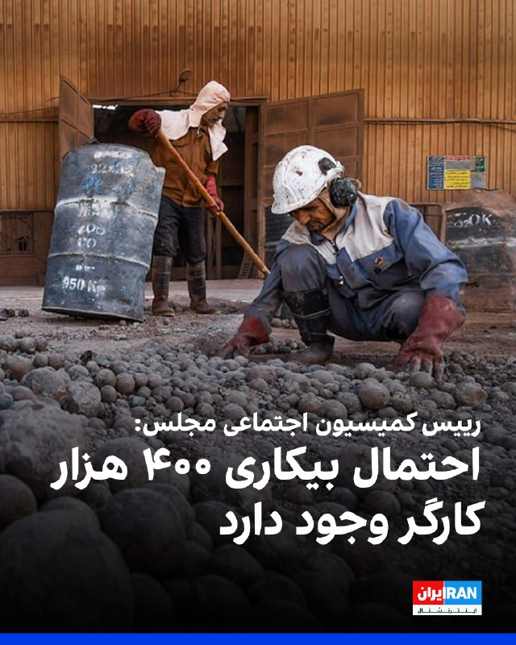

علی بابایی کارنامی، رییس کمیسیون اجتماعی مجلس، اعلام کرد پس از جنگ اخیر، آمار بیکاری در کشور به‌صورت فزاینده‌ای رشد یافته و پیش‌بینی می‌شود بین ۲۲۰ تا ۴۰۰ هزار کارگر شغل خود را از دست بدهند.

او با اشاره به شرایط بحرانی بازار کار پیشنهاد کرد دولت مشابه دوران کرونا، حمایت مالی مستقیمی برای کارگران در نظر بگیرد و مبالغی به حساب آنان واریز کند تا امکان حفظ همکاری میان کارگران و کارفرمایان فراهم شود.

بابایی کارنامی افزود برای اجرای این طرح، لازم است هرچه سریع‌تر بخشنامه‌های لازم به استان‌ها ابلاغ شود، زیرا کارگران و کارفرمایان در انتظار تصمیم فوری دولت هستند.
https://iranintl.com/202605182561

## IranIntlTV — post 337739

  <a href="telegram/content/IranIntlTV_337739_1779096995.mp4" target="_blank">🎬 Download video</a>

ویدیوهای تازه رسیده به ایران‌اینترنشنال، بی‌تابی مادر جاویدنام متین پرویزی را در مراسم تولد او بر مزارش در هشتم فروردین نشان می‌دهد.
متین پرویزی، ۲۶ ساله، ۱۹ دی ۱۴۰۴ در زنجان از ناحیه پا هدف گلوله قرار گرفت و بر زمین افتاد. سپس مأموران به او تیر خلاص زدند.

## IranIntlTV — post 337738

  

نت‌بلاکس دوشنبه ۲۸ اردیبهشت اعلام کرد هشتادمین روز از قطع اینترنت در ایران است و مدت این اختلال به ۱۸۹۶ ساعت رسیده است.

بر اساس گزارش این نهاد ناظر بر اینترنت جهانی، همزمان با تداوم این وضعیت، محتوای حامی حکومت شبکه‌های اجتماعی را پر کرده است.

این نهاد همچنین اعلام کرد برخی از ایرانیانی که برای دریافت اینترنت «پرو» یا دسترسی سیم‌کارت سفید اقدام کرده‌اند، می‌گویند از آن‌ها خواسته می‌شود سهمیه‌ای از پست‌های تبلیغاتی روزانه منتشر کنند.

نت‌بلاکس افزود این فعالیت‌ها با استفاده از هوش مصنوعی نظارت می‌شود.
https://iranintl.com/202605188378

## IranIntlTV — post 337737

  

🔻تیم ملی فوتبال ایران در آستانه آغاز رقابت‌های جام جهانی با بحران ویزا مواجه است. تا این لحظه، هنوز روادید بازیکنان ایران صادر نشده و همین موضوع به دغدغه اصلی امیر قلعه‌نویی، سرمربی تیم ملی، تبدیل شده است.

🔹امیر قلعه‌نویی پیش از اعزام کاروان تیم ملی به ترکیه، درباره آخرین وضعیت آماده‌سازی تیم و صدور ویزا گفت: «بازیکنان شایسته‌ای داشتیم که مجبور بودیم تعدادی از آن‌ها را انتخاب کنیم. انتخاب بازیکنان بسیار سخت بود اما این تصمیم بر اساس برنامه‌های تاکتیکی گرفته شد. البته از همین فهرست فعلی هم چند نفر حذف می‌شوند. امیدواریم در نهایت به ۲۸ بازیکن این فهرست ویزا بدهند، چرا که اگر ویزا صادر نشود، کارمان بسیار مشکل‌تر می‌شود.»

🔹او با اشاره به وضعیت آمادگی جسمانی بازیکنان افزود: «به دلیل مشکلات بدنی، در سه بخش حدود ۴۰ درصد عقب هستیم. البته در اردوی اخیر توانستیم ۲۵ درصد از این عقب‌ماندگی را جبران کنیم و امیدواریم تا ۲۶ خرداد بتوانیم بازیکنان را به شرایط ایده‌آل برسانیم.»

@iranintltvsport

## IranIntlTV — post 337736

  

کانال ۱۳ اسرائیل گزارش داد در ۲۴ ساعت گذشته ده‌ها هواپیمای باری خالی از اسرائیل برخاستند، در پایگاه‌های آمریکایی در آلمان فرود آمدند، مهمات بارگیری کردند و سپس به اسرائیل بازگشتند.

بر اساس این گزارش، ارتش اسرائیل در روزهای اخیر در سطح بالایی از آماده‌باش قرار داشته و تاریخی را برای آمادگی تعیین کرده است.

کانال ۱۳ جزئیات بیشتری درباره نوع مهمات یا هدف از این جابه‌جایی منتشر نکرده است.
https://iranintl.com/202605184450

## IranIntlTV — post 337735

  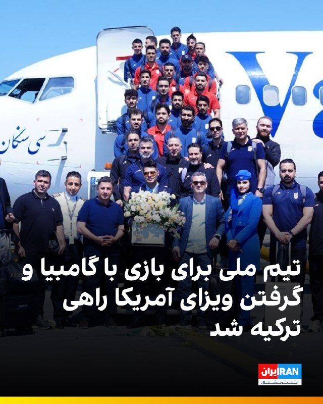

🔻تیم ملی فوتبال برای برگزاری اردوی آماده‌سازی پیش از جام جهانی و همچنین اخذ ویزای آمریکا راهی ترکیه شد. این در حالی است که هنوز مشخص نیست کدام بازیکنان بتوانند ویزای آمریکا را دریافت کنند و تیم ملی فوتبال با بحران ویزا مواجه است.

🔹مهدی محمدنبی، نایب‌رییس فدراسیون فوتبال و مدیر تیم ملی، پیش از سفر به ترکیه به سایت فدراسیون فوتبال گفت: «تیم ملی راهی ترکیه می‌شود تا طبق برنامه از پیش تعیین‌شده، دو بازی دوستانه قطعی برگزار کند. یکی از این تیم‌ها گامبیا است و تیم دوم را پس از نهایی شدن قرارداد، در دو سه روز آینده اعلام خواهیم کرد. یک بازی هم با یکی از باشگاه‌های ترکیه خواهیم داشت.»

🔹او ادامه داد: «تیم ملی سپس راهی شهر توسان در ایالت آریزونا خواهد شد و آنجا با پورتوریکو بازی خواهد کرد. با توجه به مینی‌کمپ‌هایی که کادر فنی در تهران برگزار کرد، امیدواریم اردوی ترکیه مکمل خوبی برای آماده‌سازی مدنظر امیر قلعه‌نویی باشد.»

🔹این در حالی است که به دلیل انزوای جمهوری اسلامی بازی‌های تدارکاتی تیم ملی پیش از جام جهانی لغو شدند و تیم‌های ملی اسپانیا، مقدونیه و آنگولا از بازی با تیم ملی انصراف دادند.

@iranintltvsport

## IranIntlTV — post 337734

  

اسکات بسنت، وزیر خزانه‌داری آمریکا، روز دوشنبه اعلام کرد از وزیران دارایی گروه هفت خواهد خواست نظام تحریم‌ها علیه جمهوری اسلامی را دنبال کنند تا از تامین مالی آنچه او «ماشین جنگی» حکومت ایران توصیف کرد، جلوگیری شود.

بسنت همچنین افزود سفر هفته گذشته هیات آمریکا به چین به ریاست دونالد ترامپ، رییس‌جمهوری آمریکا، «بسیار موفق» بوده است.
https://iranintl.com/202605189837

## IranIntlTV — post 337733

  <a href="telegram/content/IranIntlTV_337733_1779097000.mp4" target="_blank">🎬 Download video</a>

یک دانشجو با ارسال پیامی به ایران‌اینترنشنال می‌گوید: «برای دانشجویان هیچ‌گونه دسترسی به اینترنت آزاد و بین‌المللی در نظر گرفته نشده. مقالات، پروژه‌ها و پایان نامه‌های ما به‌خاطر دسترسی به چیزی که حق طبیعی هر انسانی است، ناتمام مانده.»

## IranIntlTV — post 337732

  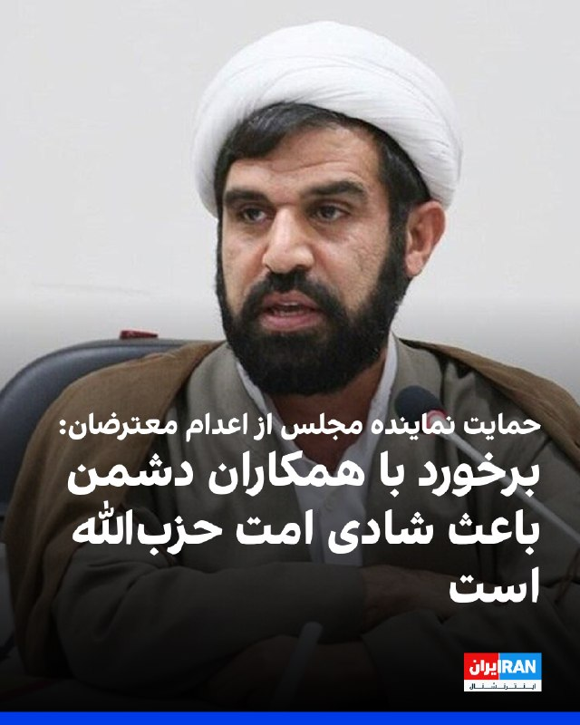

حسن‌علی اخلاقی امیری، نماینده مجلس، از اقدامات قوه قضاییه جمهوری اسلامی در «اجرای قاطع احکام جاسوس‌ها و اغتشاشاگران دی‌ماه و توقیف اموال همکاران دشمن به نفع ملت» تمجید کرد.

او «برخورد و توقیف اموال همکاران دشمن» را باعث «شادی دل امت حزب‌‌الله» دانست و گفت: «ضروری است با کسانی که با دشمن چه در قالب ارائه اطلاعات یا ایجاد جوسازی روانی توسط چهره‌ها همکاری می‌کنند، برخورد قاطع انجام شود.»

این نماینده مجلس ادامه داد: «انتظار می‌رود در شرایط جنگ، سرعت اقدامات بیشتر شود و نگاه جامعی در حوزه کسانی که به دشمن کمک می‌کنند، داشته باشیم... باید هر کس در هر لباس و هر فضایی اگر ذره‌ای با دشمن همکاری می‌کند، هزینه آن را بپردازد.»
https://iranintl.com/202605182490

## Persian_Trend_Official — post 14403

⭕️ سخنگوی دولت: اینترنت پرو مصوبۀ شورای‌عالی امنیت ملی است که آقای رئیس‌جمهور ریاست آن را برعهده دارد 💢پاسخ مهاجرانی به اصرار یک خبرنگار دربارۀ وضعیت اینترنت: در شرایطی که ترامپ اعلام می‌کند آتش‌بس به دستگاه تنفس مصنوعی وصل است پاسخ شما چیست؟! 💢در خصوص اینترنت…

## Persian_Trend_Official — post 14402

  <a href="telegram/content/Persian_Trend_Official_14402_1779097002.mp4" target="_blank">🎬 Download video</a>

🔴 ورود نیروی دریایی اسرائیل به عملیات در میانه دریا برای مقابله با شکستن محاصره

💢منابع عبری از آغاز عملیات یگان ۱۳ نیروی دریایی اسرائیل علیه کاروانی خبر می‌دهند که در مسیر غزه در حرکت بوده است. این عملیات در فاصله صدها مایلی از سواحل فلسطین اشغالی انجام شده و طبق گزارش‌ها، هدف آن توقیف یا کنترل کامل کاروان بوده است.

💢بر اساس اطلاعات اولیه، این کاروان شامل ۵۸ شناور بوده که بخشی از آن‌ها به سازمان ترکیه‌ای «آی‌اچ‌اچ» نسبت داده شده‌اند؛ همان مجموعه‌ای که در ماجرای کشتی مرمره نیز نقش داشت.

گزارش‌ها حاکی است صدها نفر در این کاروان حضور دارند و ده‌ها تن از آن‌ها شهروند ترکیه هستند؛ موضوعی که می‌تواند ابعاد سیاسی و امنیتی ماجرا را پیچیده‌تر کند.

💢منابع اسرائیلی، این عملیات را یکی از پرریسک‌ترین مأموریت‌های دریایی سال‌های اخیر توصیف کرده‌اند.

🫆:Tony

📌 @persian_trend_official
پرشین ترند | متفاوت‌ترین کانال نظامی

## Persian_Trend_Official — post 14401

حضرتی: گشایش اینترنت بین الملل سیاست قطعی دولت است 🔹«فیلترینگ» امنیت سایبری کشور را به مخاطره انداخته است. رئیس شورای اطلاع رسانی دولت تأکید کرد: 🔹سیاست قطعی و بدون عقب نشینی دولت گشایش اینترنت بین‌الملل و رفع فیلترینگ است و تا کنون سه جلسه از سوی شورای…

## Persian_Trend_Official — post 14400

  <a href="telegram/content/Persian_Trend_Official_14400_1779097003.webm" target="_blank">🎬 Download video</a>

حضرتی: گشایش اینترنت بین الملل سیاست قطعی دولت است

🔹«فیلترینگ» امنیت سایبری کشور را به مخاطره انداخته است.

رئیس شورای اطلاع رسانی دولت تأکید کرد:
🔹سیاست قطعی و بدون عقب نشینی دولت گشایش اینترنت بین‌الملل و رفع فیلترینگ است و تا کنون سه جلسه از سوی شورای راهبردی و سیاست‌گذاری اینترنت کشور توسط معاون اول رئیس‌جمهور برگزار شده است.

🫆:Tony

📌 @persian_trend_official
پرشین ترند | متفاوت‌ترین کانال نظامی

## Persian_Trend_Official — post 14399

  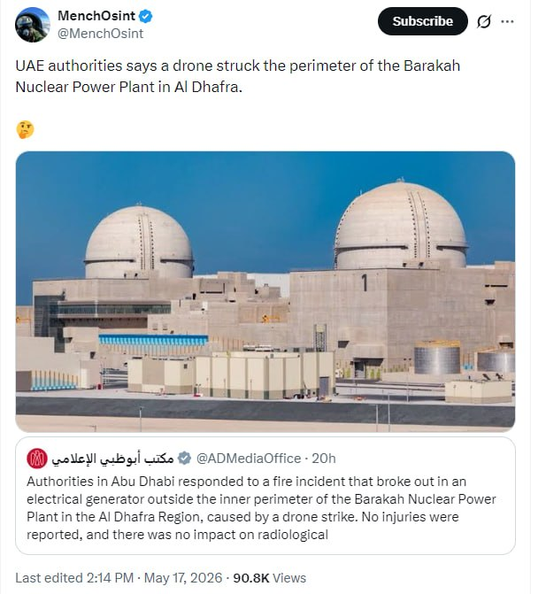

این اتفاق داره واسه مقاومت عراق داستان میشه !

## Persian_Trend_Official — post 14398

  

طرز تهیه چای کرک

چای کرک یکی از نوشیدنی‌های محبوب عمان و کشورهای خلیج فارس است؛ چایی غلیظ، معطر، شیرین و خامه‌ای که معمولاً با هل و شیر درست می‌شود و طعم خیلی خاصی دارد.

مواد لازم
آب: ۱ لیوان
شیر: ۱ لیوان
چای سیاه: ۱ تا ۲ قاشق چای‌خوری
شکر: ۱ تا ۲ قاشق غذاخوری، بسته به ذائقه
هل: ۳ تا ۴ عدد، کمی کوبیده‌شده
زعفران: مقدار خیلی کم، اختیاری
زنجبیل تازه یا پودر زنجبیل: مقدار کم، اختیاری
طرز تهیه

ابتدا آب را داخل قابلمه کوچک بریزید و روی حرارت قرار دهید تا به جوش بیاید. بعد چای سیاه، هل کوبیده‌شده و در صورت تمایل کمی زنجبیل یا زعفران را اضافه کنید.

اجازه دهید چای چند دقیقه بجوشد تا رنگ و عطر آن کاملاً آزاد شود. سپس شیر را اضافه کنید و حرارت را کمی پایین بیاورید. حالا شکر را هم اضافه کنید و خوب هم بزنید.

بگذارید مخلوط چای و شیر حدود ۵ تا ۷ دقیقه آرام بجوشد تا کمی غلیظ شود و طعم مواد کاملاً با هم ترکیب شود. در این مرحله اگر دوست دارید چای کرک غلیظ‌تر و مجلسی‌تر شود، می‌توانید مقدار کمی شیر تبخیرشده یا شیر غلیظ‌شده هم اضافه کنید.

در پایان چای را از صافی رد کنید و داغ سرو کنید.

نکته مهم

راز خوش‌طعم شدن چای کرک عمانی این است که چای و شیر چند دقیقه با هم بجوشند تا نوشیدنی حالت غلیظ، معطر و کرمی پیدا کند. هرچه هل تازه‌تر باشد، عطر چای بهتر می‌شود.

پ.ن: چون درخواست ها زیاد بود، طرز تهیش رو پست کردم. من که خیلی دوسش دارم، امیدوارم امتحان کنید و لذت ببرید.

## Persian_Trend_Official — post 14393

پست قابل تأمل ‌ترامپ که لحظاتی قبل در تروث سوشال منتشر کرده است. ☆Phantom☆ 📌 @persian_trend_official پرشین ترند | متفاوت‌ترین کانال نظامی

## Persian_Trend_Official — post 14392

  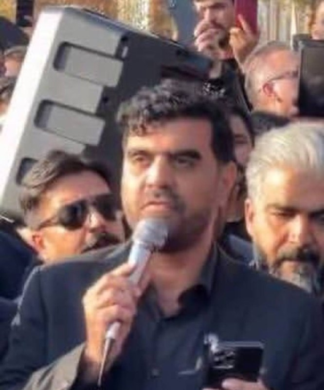

⭕️جواد علیکردی؛ محکوم به ده سال زندان پس از پیگیری مرگ مشکوک برادرش

💢جواد علیکردی، شهروند اهل سبزوار و برادر خسرو علیکردی، وکیل دادگستری جان‌باخته، از سوی دستگاه قضایی جمهوری اسلامی به ۱۰ سال حبس تعزیری محکوم شد.

💢او اخیراً در یکی از شعب دادگاه انقلاب مشهد محاکمه شده و هم‌اکنون در زندان وکیل‌آباد مشهد در بازداشت به‌سر می‌برد. جزئیات دقیق اتهامات مطرح‌شده علیه او تاکنون منتشر نشده است.

خسرو علیکردی روز ۱۴ آذر ۱۴۰۴ در دفتر کار خود جان باخت. نهادهای حکومتی علت مرگ را «ایست قلبی» اعلام کردند، اما خانواده او با اشاره به شواهدی از جمله خونریزی غیرعادی، این روایت را نپذیرفتند و خواستار روشن‌شدن حقیقت شدند.

🫆:Tony

📌 @persian_trend_official
پرشین ترند | متفاوت‌ترین کانال نظامی

## Persian_Trend_Official — post 14391

⭕️ روزنامه ایران: در پی محدودیت دسترسی به اینترنت، بازار خرید سیم‌کارت‌های عراقی در برخی مناطق مرزی غرب شکل گرفته است.

در بعضی نقاط مرزی، سیگنال اپراتورهای عراقی تا دو کیلومتر داخل خاک ایران قابل دریافت است.

ارزان‌تر بودن این سیم‌کارت‌ها در مقایسه با هزینه فیلترشکن‌ها، به عنوان یکی از دلایل گرایش برخی به آن‌ها عنوان شده است.

استفاده از سیم‌کارت‌های خارجی می‌تواند چالش‌هایی را در حوزه نشت اطلاعات ایجاد کند.

📝 Nick

📌 @persian_trend_official
پرشین ترند | متفاوت‌ترین کانال نظامی

## Persian_Trend_Official — post 14390

  

پمپاژ ترس از سوی آقای ترامپ بیشتر شبیه یک بازی روانی و رسانه‌ای است. ۰ وقتی تنگه بسته باشد، ۰ وقتی قیمت بنزین در آمریکا تا ۵۰ درصد افزایش پیدا کند، ۰ وقتی از مذاکرات با چین دست خالی بازگشته باشند، طبیعی است که برای کنترل افکار عمومی، فضای ترس ایجاد کند. کسی که خودش تحت فشار است، تلاش می‌کند دیگران را بترساند تا اقتصادطرف مقابل دچار رکود و توقف شود، مردم از حرکت بایستند و نارضایتی اجتماعی شکل بگیرد؛ «ایران جای خوبی ایستاده ولی استفاده از این موقعیت مهم است و تدبیر لازم دارد در غیر این متضرر میشود» جنگ امروز جنگ هوش مصنوعی است و تفکر آموزش کلاشینکف در میادین و تلوزیون باید تبدیل به آموزش جوانان برای هوش مصنوعی شود٫ آن وقت خواهید دید جوانان کشور بدون تیر و موشک ٫ماهواره ها و اف ۳۵‌ها‌ را چگونه زمینگیر میکنند . مردم باید در آرامش باشند و زندگی کنند و جوانان راهبری و تفکر

بابک زنجانی

پ.ن : چی میشه کسی که با کیف کشی مسئولین، رانت و فساد تبدیل میشه به سرمایه دار، برای ما فاز استیو جابز برمیداره ؟

📌 @persian_trend_official
پرشین ترند | متفاوت‌ترین کانال نظامی

## Persian_Trend_Official — post 14389

  <a href="telegram/content/Persian_Trend_Official_14389_1779097006.webm" target="_blank">🎬 Download video</a>

💢خط نشان جدید دکتر مصطفی خوش چشم برای اسرائیل ▪️تهدید به استفاده از سلاحی ناشناخته ، مخرب و سری علیه این کشور 🫆:Tony 📌 @persian_trend_official پرشین ترند | متفاوت‌ترین کانال نظامی

## Persian_Trend_Official — post 14388

  <a href="telegram/content/Persian_Trend_Official_14388_1779097006.mp4" target="_blank">🎬 Download video</a>

💢خط نشان جدید دکتر مصطفی خوش چشم برای اسرائیل

▪️تهدید به استفاده از سلاحی ناشناخته ، مخرب و سری علیه این کشور

🫆:Tony

📌 @persian_trend_official
پرشین ترند | متفاوت‌ترین کانال نظامی

## Persian_Trend_Official — post 14387

💢کانال ۱۵ اسراییل

💢نتانیاهو به دلایل سیاسی و امنیتی خواستار لغو جلسه دادگاه امروز خود شد.

🫆:Tony

📌 @persian_trend_official
پرشین ترند | متفاوت‌ترین کانال نظامی

## Persian_Trend_Official — post 14386

🔴 حمله هوایی اسرائیل به جنوب لبنان

💢شبکه الحدث گزارش داد جنگنده‌های اسرائیلی منطقه «دیر الزهرانی» در جنوب لبنان را هدف حمله هوایی قرار داده‌اند.

همزمان ارتش اسرائیل اعلام کرد:

▪️ طی ۲۴ ساعت گذشته بیش از ۳۰ موضع متعلق به حزب‌الله را هدف قرار داده است
▪️ این حملات در مناطق مختلف جنوب لبنان انجام شده‌اند

🫆:Tony

📌 @persian_trend_official
پرشین ترند | متفاوت‌ترین کانال نظامی

## Persian_Trend_Official — post 14385

ترامپ! اگر تجربه اول را بتوان با تغافل، ناشی از جهالت دانست؛ حتی اگر تجربه دوم را بتوان با تساهل، ناشی از حقارت فرض کرد؛ تله سوم را حتی با احتیاط هم باید محصول سفاهت دانست. «یک بار جستی، ملخک! دوبار جستی، ملخک! آخر به دستی، ملخک!» حسام الدین آشنا 📌 @…

## Persian_Trend_Official — post 14384

  <a href="telegram/content/Persian_Trend_Official_14384_1779097008.mp4" target="_blank">🎬 Download video</a>

بیضه رو همه دارند آقای فرهانی
شماها عقل نداشتید
مشخصه که خودتون هم میدونید چه نجاستی تناول کردید اما مجبورید تا آخر مسیر سینه خیز برید !

📌 @persian_trend_official
پرشین ترند | متفاوت‌ترین کانال نظامی

---
📅 بروزرسانی: 1405/02/28 09:25
---

## KiriMohems — post 47679

  <a href="telegram/content/KiriMohems_47679_1779083742.mp4" target="_blank">🎬 Download video</a>

#صبحانه_عن_گیزشی

‎دست خودم نیست
‎صبح که می‌شود، بی اختیار شق میکنم و دنبال کص های خوب می‌گردم!
‎دنبال آدم‌های کیری خوبی که حال خوبم را با سولاخشان به روزگارم سنجاق کنم
‎یک کص خوب از آسمان نمی‌افتد،باید از کون بیاوریم

#Helsinki
@KiriMohems

## SportBaadNews — post 251795

  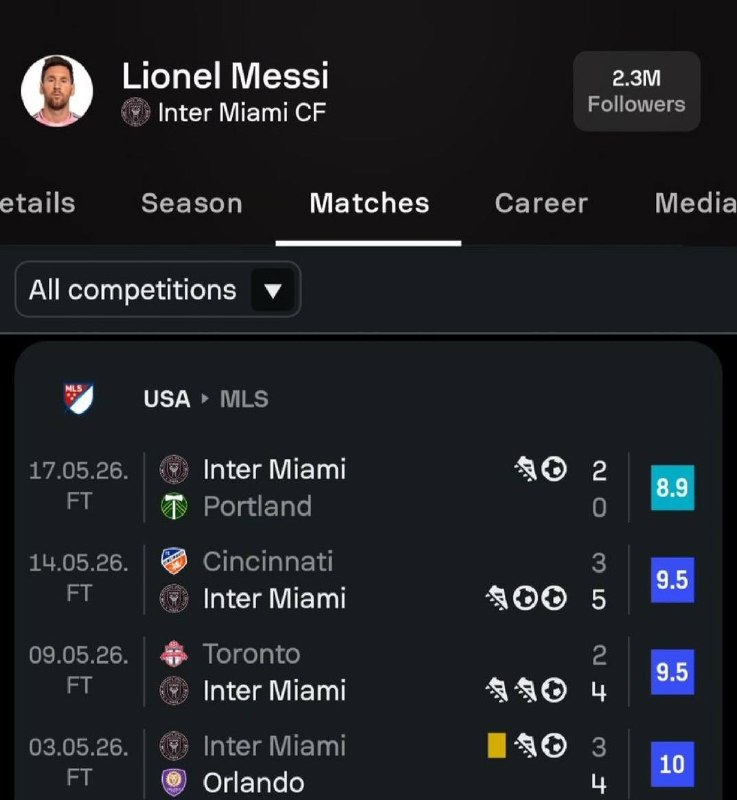

داداش چطور فهمیدی نزدیک جام جهانی هستیم؟
@SportBaadNews

## IranIntlTV — post 337724

  <a href="https://t.me/IranintlTV/337724" target="_blank">📎 Download file</a>

🎧نسخه صوتی اخبار بامدادی | دوشنبه ۲۸ اردیبهشت
@iranintlTV

## IranIntlTV — post 337723

  <a href="telegram/content/IranIntlTV_337723_1779083744.mp4" target="_blank">🎬 Download video</a>

🔻محمد تقوی، ایران‌اینترنشنال در برنامه هت‌تریک درباره اعلام لیست تیم ملی گفت: «امیر قلعه‌نویی در حالی به مسجد جمکران رفت که با خودش عکاس برد و اگر نمی‌خواست ریا شود می‌توانست کلاه بر سرش بگذارد و به مسائل اعتقادی‌اش بپردازد. او چاپلوس‌ترین بازیکنان را به تیم ملی دعوت کرد.»

🔹تماشای نسخه کامل هت‌تریک؛👇
https://youtu.be/gw3eJ0R9R5Y

@iranintltvsport

## IranIntlTV — post 337722

  <a href="telegram/content/IranIntlTV_337722_1779083745.mp4" target="_blank">🎬 Download video</a>

در روز جهانی ارتباطات، مسعود پزشکیان بدون اشاره به قطعی طولانی‌مدت اینترنت در ایران، دسترسی باکیفیت به خدمات دیجیتال را «حق مردم» دانست و نوشت دولت او برای برقرار ماندن ارتباطات، شبانه‌روز تلاش می‌کند.

گفت‌وگو با کامیار بهرنگ، عضو تحریریه ایران‌اینترنشنال
@iranintltv

## IranIntlTV — post 337721

  

ناصر عتباتی، رییس کل دادگستری آذربایجان غربی، از توقیف اموال ۱۲۹ نفر در این استان به اتهام «اقدامات ضدامنیتی و همکاری با کشورهای متخاصم» خبر داد. او تاکید کرد قوه قضاییه به این روند توقیف اموال «با قدرت» ادامه خواهد داد.
https://iranintl.com/202605185365

## IranIntlTV — post 337720

  <a href="telegram/content/IranIntlTV_337720_1779083747.mp4" target="_blank">🎬 Download video</a>

روزنامه دیلی‌میل در گزارشی، به روایت بازداشت‌شدگان ایرانی از شکنجه، آزار جنسی و خشونت روانی در زندان‌های جمهوری اسلامی پرداخت و نوشت این موارد نشان‌دهنده الگوی سازمان‌یافته‌ای از سرکوب و ارعاب مخالفان است.

گفت‌وگو با رقیه رضایی، روزنامه‌نگار و عضو تحریریه ایران‌وایر
@iranintltv

## IranIntlTV — post 337719

  <a href="telegram/content/IranIntlTV_337719_1779083749.mp4" target="_blank">🎬 Download video</a>

جاویدنامان انقلاب ملی ایرانیان
«رها بهلولی‌پور» در ۱۸ دی‌ماه در جریان اعتراضات در میدان فاطمی تهران، مورد اصابت گلوله نیروهای سرکوب جمهوری اسلامی قرار گرفت و در ۱۹ دی‌ماه جان باخت. نامش در حافظه‌ی این سرزمین می‌ماند و یادش چراغ راه آزادی‌خواهان است.

@iranintltv

## IranIntlTV — post 337718

  <a href="telegram/content/IranIntlTV_337718_1779083750.mp4" target="_blank">🎬 Download video</a>

سرخط خبرهای دوشنبه ۲۸ اردیبهشت
@iranintltv

## IranIntlTV — post 337717

  

محسن رضایی، مشاور نظامی مجتبی خامنه‌ای، گفت: «آمریکا پس از شکست سختی که از جمهوری اسلامی خورد، در حال سقوط است.» او به ارتش ایالات‌متحده هشدار داد: «قبل از اینکه دریای عمان به گورستانی برای ناوهای شما تبدیل شود، خودتان عقب بکشید.»
محسن رضایی گفت: «یکی از سه ناو آمریکایی که از دریای عمان وارد خلیج فارس شده بود، با موشک‌های ما آسیب دید، اما آمریکا صدایش را درنمی‌آورد.»
او تاکید کرد: تنگه هرمز برای تجارت باز است، اما برای لشکرکشی و ناامنی بسته خواهد بود.

https://iranintl.com/202605182971

## IranIntlTV — post 337716

  

مارک کارنی، نخست‌وزیر کانادا، در ایکس نوشت کشورش در همراهی با آژانس بین‌المللی انرژی اتمی حمله‌های پهپادی به نیروگاه هسته‌ای براکه در امارات متحده عربی را محکوم می‌کند و در کنار دوستان خود در امارات متحده عربی می‌ایستد.
کارنی با هشدار درباره اینکه هدف قرار دادن تاسیسات هسته‌ای صلح‌آمیز خطرات جدی برای جان انسان‌ها و محیط زیست به همراه دارد، بر ضرورت فوری خویشتنداری و کاهش تنش در منطقه تاکید کرد.

https://iranintl.com/202605180232

## IranIntlTV — post 337715

  

آنیتا آناند، ‌وزیر خارجه کانادا، هدف قرار دادن تاسیسات انرژی هسته‌ای صلح‌آمیز را غیرقابل قبول دانست و بر همبستگی کشورش با امارات متحده عربی در ارتباط با حملات پهپادی به نیروگاه هسته‌ای براکه در این کشور تاکید کرد.
او نوشت: «قطعنامه‌های آژانس بین‌المللی انرژی اتمی و قوانین بین‌المللی هر دو تاکید می‌کنند که هدف قرار دادن تأسیسات انرژی هسته‌ای صلح‌آمیز غیرقابل قبول است.»
آناند اشاره کرد که در تماس با همتای خود در امارات متحده عربی حمایت کامل خود را از این کشور ابراز داشته است، و نوشت: «کانادا از تحقیقات کامل در مورد این حملات حمایت می‌کند و از جامعه بین‌المللی می‌خواهد که آنها را به طور مشابه محکوم کند.»

https://iranintl.com/202605188323

## Persian_Trend_Official — post 14379

🔴 آمریکا تیم ویژه مقابله با تهدیدات انتخابات میان‌دوره‌ای ۲۰۲۶ را فعال کرد

💢دفتر مدیر اطلاعات ملی آمریکا دو مقام اطلاعاتی را برای هماهنگی فعالیت نهادهای جاسوسی در مقابله با تهدیدات انتخابات میان‌دوره‌ای ۲۰۲۶ منصوب کرده است.

بر اساس گزارش‌ها:

▪️ «دیو ماسترو» از شورای اطلاعات ملی
▪️ و «جیمز کانجیالوسی» از مرکز ملی ضدجاسوسی و امنیت

مسئول هماهنگی اقدامات مرتبط با امنیت انتخابات شده‌اند.

دفتر اطلاعات ملی آمریکا اعلام کرد:

▪️ این تیم بخشی از تلاش‌های دولت ترامپ و تولسی گبرد برای «حفظ سلامت انتخابات» است
▪️ جلسات توجیهی امنیتی گسترده‌ای مشابه سال‌های انتخاباتی برگزار خواهد شد

تهدیداتی که این تیم روی آن تمرکز دارد شامل:

▪️ حملات سایبری به سامانه‌های رأی‌گیری
▪️ عملیات نفوذ خارجی
▪️ و کمپین‌های اطلاعات نادرست برای تضعیف اعتماد عمومی به انتخابات

💢در گزارش آمده مرکز مقابله با نفوذ خارجی که در سال ۲۰۲۲ ایجاد شده بود، پس از نگرانی‌های حقوقی درباره همکاری با شبکه‌های اجتماعی، بخشی از وظایفش را به نهادهای دیگر واگذار کرده است.

💢همچنین تولسی گبرد، مدیر اطلاعات ملی آمریکا، به‌دلیل نقش خود در بررسی مسائل امنیت انتخاباتی با انتقاد برخی دموکرات‌ها روبه‌رو شده است.

🫆:Tony

📌 @persian_trend_official
پرشین ترند | متفاوت‌ترین کانال نظامی

## Persian_Trend_Official — post 14378

  

🇺🇸
🇨🇳 کاخ سفید یک برگه اطلاعاتی درباره دیدار ترامپ-شی منتشر کرد که در آن آمده است رئیس‌جمهور آمریکا دونالد ترامپ و رئیس‌جمهور چین شی جین‌پینگ توافق کردند تا هیئت‌های جدید تجارت و سرمایه‌گذاری آمریکا-چین را تأسیس کنند.

دو رهبر همچنین تأکید کردند که ایران نمی‌تواند به سلاح هسته‌ای دست یابد و از بازگشایی تنگه هرمز حمایت کردند.

چین همچنین موافقت کرد که ۲۰۰ هواپیمای بوئینگ و حداقل ۱۷ میلیارد دلار در سال محصولات کشاورزی آمریکا را تا سال ۲۰۲۸ خریداری کند، در حالی که نگرانی‌های آمریکا درباره زنجیره‌های تأمین عناصر نادر زمین را مورد توجه قرار داده و دسترسی بازار برای صادرات گوشت گاو و مرغ آمریکایی را بازگرداند.

☆Phantom☆

📌 @persian_trend_official
پرشین ترند | متفاوت‌ترین کانال نظامی

## Persian_Trend_Official — post 14377

🔴 اختلاف بر سر هزینه پروژه دفاع موشکی«Golden Dome» ترامپ

مسئولان پروژه دفاع موشکی «گلدن دوم» آمریکا برآورد ۱.۲ تریلیون دلاری دفتر بودجه کنگره از هزینه این طرح را زیر سؤال بردند.

ژنرال مایکل گوتلین از نیروی فضایی آمریکا، که مدیریت این پروژه را برعهده دارد، اعلام کرد:

▪️ گزارش دفتر بودجه کنگره بر پایه برآوردهای قدیمی تهیه شده است
▪️ این گزارش ترکیب واقعی فناوری‌ها و تسلیحات مورد استفاده در سامانه را در نظر نگرفته
▪️ جزئیات معماری واقعی این سپر موشکی به‌دلیل ملاحظات امنیتی منتشر نشده است

او گفت:

▪️ «آن‌ها حتی از ما نپرسیدند دقیقاً چه چیزی در حال ساخت است»
▪️ «به‌دلیل تهدیدات اطلاعاتی بالا، اطلاعات زیادی درباره پروژه منتشر نکرده‌ایم»

💢پروژه «گلدن دوم» یکی از جاه‌طلبانه‌ترین طرح‌های دفاع موشکی دولت ترامپ توصیف می‌شود و هدف آن ایجاد یک سپر گسترده برای مقابله با تهدیدات موشکی عنوان شده است.

منبع

🫆:Tony

📌 @persian_trend_official
پرشین ترند | متفاوت‌ترین کانال نظامی

## Persian_Trend_Official — post 14376

بولتن خبری ۲۴ساعت گذشته

۲۸ اردیبهشت ۱۴۰۵

تهیه شده در تحریریه پرشین ترند

━━━━━━━━━━━━━━━

🇮🇷
🏛 ایران
━━━━━━━━━━━━━━━

◾️ سخنگوی کمیسیون امنیت ملی: وضعیت تنگه هرمز به دو دوره پیش و پس از مرگ خامنه‌ای تقسیم می‌شود

◾️ رسانه‌های ایرانی: آمریکا ۵ شرط اصلی مطرح کرده؛ عدم غرامت، انتقال ۴۰۰ کیلوگرم اورانیوم، محدودیت هسته‌ای، بلوکه ماندن دارایی‌ها و گره خوردن آتش‌بس به مذاکرات. ایران نیز ۵ پیش‌شرط دارد؛ توقف جنگ، لغو تحریم‌ها، آزادسازی دارایی‌ها، جبران خسارت و به رسمیت شناختن حاکمیت بر هرمز

◾️ نقوی وزیر کشور پاکسـتان در سفری اعلام‌نشده با پزشکیان دیدار ۹۰ دقیقه‌ای داشت؛ هدف جلوگیری از فروپاشی مذاکرات است

◾️ الجزیره: میانجی پاکستانی در تلاش است پیشنهادهای دو طرف را به یک چارچوب مشترک تبدیل کند

◾️ بقائی: آمریکا و اسرائیل ابتدا بحران می‌آفرینند، سپس با شعار بازگرداندن ثبات به تشدید درگیری ادامه می‌دهند

◾️ سخنگوی نیروهای مسلح: هرگونه اقدام تجاوزکارانه آمریکا، ضربات شدیدتری در پی خواهد داشت

◾️ قالیباف با تأیید رهبری به عنوان نماینده ویژه ایران در امور چین منصوب شد

◾️ وال استریت ژورنال: ایران یک کشتی امنیتی چینی را در نزدیکی هرمز توقیف کرد؛ تهران حتی برای کشتی‌های چینی اجازه حفاظت مسلحانه نمی‌دهد

◾️ تصادف زنجیره‌ای در جاده انار-یزد پس از طوفان شن، ۲ کشته و ۱۰ مصدوم برجای گذاشت

━━━━━━━━━━━━━━━

🇮🇱
🇮🇱 اسرائیل و خاورمیانه
━━━━━━━━━━━━━━━

◾️ امارات: ۳ پهپاد از مرزهای غربی وارد حریم هوایی شدند؛ ۲ فروند رهگیری شد، پهپاد سوم به مولد برق نیروگاه هسته‌ای براکه برخورد کرد؛ هیچ مصدومی گزارش نشده

◾️ نیویورک‌تایمز: اسرائیل دو پایگاه مخفی در صحرای غربی عراق برای عملیات علیه ایران احداث کرده؛ یکی توسط چوپانی کشف شد که در حمله بالگرد کشته شد

◾️ نیویورک‌تایمز: واشنگتن از بغداد خواسته بود رادارهایش را خاموش کند تا حضور اسرائیل پنهان بماند

◾️ عراق: اجازه نخواهیم داد خاکمان سکوی حمله به دیگران باشد

◾️ ارتش اسرائیل مدعی ترور بهاء بارود، فرمانده عملیات حماس شد

◾️ نتانیاهو: اسرائیل تقریباً به هدف اصلی جنگ غزه دست یافته است

◾️ اسرائیل دستور تخلیه ۴ روستا در جنوب لبنان را صادر کرد

◾️ بهای نفت برنت به ۱۱۰.۶۲ و وست تگزاس به ۱۰۷.۲۶ دلار رسید

━━━━━━━━━━━━━━━

🇺🇸
🗺 آمریکا و جهان
━━━━━━━━━━━━━━━

◾️
📰 ترامپ روز شنبه با ونس، روبیو، رتکلیف و ویتکاف درباره گزینه‌های نظامی علیه ایران از جمله حمله به تأسیسات انرژی نشست برگزار کرد

◾️
📰: ترامپ روز سه‌شنبه جلسه رسمی بررسی گزینه‌های نظامی در اتاق وضعیت برگزار خواهد کرد

◾️ ترامپ: برای ایران ساعت تیک‌تاک می‌زند؛ باید سریع حرکت کنند وگرنه چیزی از آن‌ها باقی نخواهد ماند

◾️ رئیس مجلس آمریکا: عملیات «خشم حماسی» پایان یافته؛ واشنگتن در حال برنامه‌ریزی برای بازگشایی هرمز است

◾️ گراهام: هر چه هرمز بیشتر بسته بماند، ایران قوی‌تر می‌شود

◾️ 
📰: عبور روزانه از هرمز از ۱۳۵ کشتی به چند فروند کاهش یافته است

◾️دیلی میل: استارمر در میانه شورش داخلی حزب کارگر و درخواست ۹۰ نماینده، قصد استعفا دارد

◾️ اوکراین حمله پهپادی گسترده‌ای به مسکو انجام داد؛ روسیه در پاسخ دنیپرو را با موشک‌های اسکندر هدف قرار داد

◾️ دو جنگنده نیروی دریایی آمریکا در نمایش هوایی با هم برخورد کردند؛ هر ۴ خلبان سالم هستند

📌 @persian_trend_official
پرشین ترند | متفاوت‌ترین کانال نظامی

## Persian_Trend_Official — post 14375

  <a href="telegram/content/Persian_Trend_Official_14375_1779083753.webm" target="_blank">🎬 Download video</a>

💢 قیمت نفت برنت به 111 دلار رسید ‼️

🫆:Tony

📌 @persian_trend_official
پرشین ترند | متفاوت‌ترین کانال نظامی

## Persian_Trend_Official — post 14374

  <a href="telegram/content/Persian_Trend_Official_14374_1779083754.mp4" target="_blank">🎬 Download video</a>

🔴تخریب پُل ارتباطی زیراب مازندران در پی طغیان رودخانه

🔹پس از بارش شدید باران عصر روز گذشته -یکشنبه- در شهر زیراب، رودخانه جمشیدآباد طغیان کرد و پل ارتباطی روستاهای کارسالار، جمشیدآباد و چند روستای دیگر در ورودی تالار اسپهبد تخریب شد.

💢 در حال حاضر این پل ارتباطی مسدود است و عوامل شهرداری زیراب، اداره راه شهرستان و ماشین‌آلات شرکت شهاب بتن در محل حضور دارند. بر اثر این حادثه، خسارت سطحی به زمین‌های کشاورزی، خزانه برنج و سردهنه وارد شده و همچنین آبگرفتگی چند دامداری و تخریب دیوار حفاظتی پل کوچک گزارش شده است.

🫆:Tony

📌 @persian_trend_official
پرشین ترند | متفاوت‌ترین کانال نظامی

## Persian_Trend_Official — post 14373

کانال رسمی پرشین ترند pinned «♨️ دوستان عزیز، با توجه به شرایط پیش‌رو، بهتر است از همین حالا برای سناریوهای اضطراری آماده باشیم. آمادگی یعنی آرامش بیشتر و آسیب کمتر برای خودمان و خانواده‌مان. 🧭 ⚠️ چند مورد مهم را جدی بگیرید: • برای دست‌کم ۱ ماه، آذوقه‌ی غذایی فاسد نشدنی و آب آشامیدنی…»

## Persian_Trend_Official — post 14372

  

🔴علیرضا دبیر 💢نوید افکاری رو ما میخاستیم بیاریم بیرون نجات بدیم اما ضد انقلاب نذاشت ! ! ! 🫆:Tony 📌 @persian_trend_official پرشین ترند | متفاوت‌ترین کانال نظامی

## Persian_Trend_Official — post 14370

  <a href="telegram/content/Persian_Trend_Official_14370_1779083755.mp4" target="_blank">🎬 Download video</a>

🔴علیرضا دبیر

💢نوید افکاری رو ما میخاستیم بیاریم بیرون نجات بدیم اما ضد انقلاب نذاشت ! ! !
🫆:Tony

📌 @persian_trend_official
پرشین ترند | متفاوت‌ترین کانال نظامی

## Persian_Trend_Official — post 14369

♨️ دوستان عزیز، با توجه به شرایط پیش‌رو، بهتر است از همین حالا برای سناریوهای اضطراری آماده باشیم. آمادگی یعنی آرامش بیشتر و آسیب کمتر برای خودمان و خانواده‌مان. 🧭 ⚠️ چند مورد مهم را جدی بگیرید: • برای دست‌کم ۱ ماه، آذوقه‌ی غذایی فاسد نشدنی و آب آشامیدنی…

---
📅 بروزرسانی: 1405/02/28 05:05
---

## ChizBergerz — post 46505

  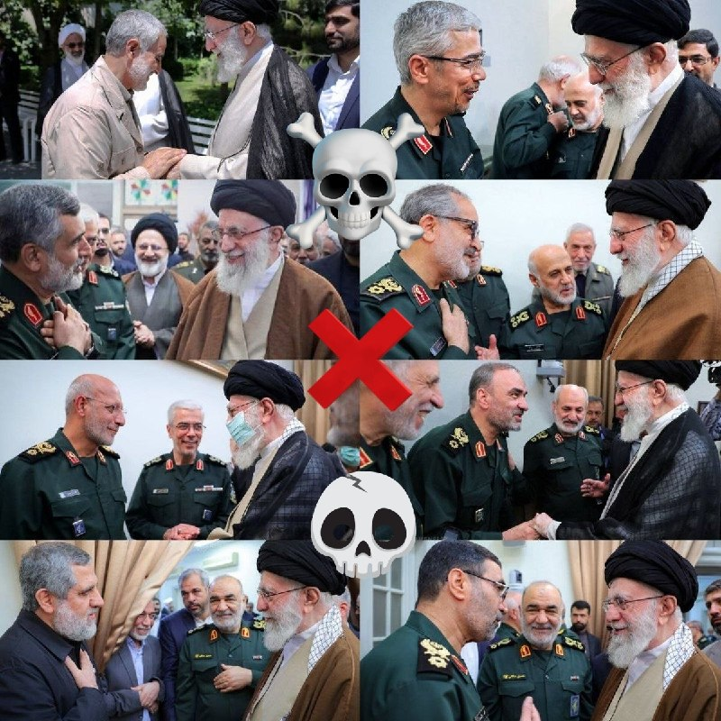

تراپی ببینید از جمع مقامات کُتلت‌ شده جمهوری‌‌اسهالی:

+ با وجود کُشته شدن همه این‌ها؛ خرزشی ادعا میکنه پیروز شده، الحق که کیر رو تو کونتون اسیر میدونید😂😂
@ChizBergerz

## ChizBergerz — post 46504

  <a href="telegram/content/ChizBergerz_46504_1779068124.mp4" target="_blank">🎬 Download video</a>

بچه ها اسم این بازی عبور مرغ از خیابون  هست ویدئو نگاه کنید خیلی راحت 8 میلیون ازش سود گرفتیم😍

😤اگ توم دوس داری خیلی راحت از بازی های انلاین پول در بیاری حتما عضو کازینو شبانه شو
✅

توی کازینو شبانه بهت اموزش میدیم از بازی های انلاین پول دربیاری👌

کازینو شبانه راهی برای چند برابر کردن سرمایت 🤷‍♂

کسب درامد انلاین با یه ادم حرفه ای یاد بگیر و‌ پول دربیار 
💵
ae27
🎯همین حالا عضو شو و شروع کن👇
https://t.me/+OS-QBvyDO4M2ZGY0
https://t.me/+OS-QBvyDO4M2ZGY0

## ChizBergerz — post 46503

از دختری که سابقه‌ش هم‌خواب شدن از صغیر تا کبیر مثل امانوئل مکرونه، انتظار همچین پدری هم میرفت. به اصطلاح قشر فرهنگی و هنری یه مملکت باشی و با همچین ادبیاتی بهت تریبون بدن تا طرفداری نظام رو کنی. @ChizBergerz

## rodast_omiddana — post 71492

  <a href="telegram/content/rodast_omiddana_71492_1779068127.webm" target="_blank">🎬 Download video</a>

🚨 این کاسبِ عادی ساز، به اصلِ بسیجیِ خودش برگشته و خیلی ریز میخواد شیعه و اسلامو احیا کنه، ولی خبر نداره محکم ایستادیم برای پاکسازی کامل این غده 1400 ساله ( اساسا هر انقلابی بدون زدایش این ویروس آب در هاون کوبیدنه)

راستی الان در سال ۲۰۲۶ چند درصد از ایرانیان خودشون رو بر اساس « شیعه و سنی» تقسیم بندی میکنند؟
مگر اینکه تمام ملت ایران رو به مانند جمهوری اسلامی ،زورچپونی «مسلمان» فرض کنیم،
که البته شما غلط کردی از طرفشون حرف میزنی.
حواستو جمع کن و پاتو رو خطوط قرمز ما نذار جناب قاری قرآن!
قرار نیست هر مزخرفی بکنی تو پاچمون یه « شاه » بزنی تنگش که مصونیت بگیری...
نقی به کمرت بزنه مرتضی نجفی پور مقدم.

## IranIntlTV — post 337714

  

قیمت نفت برنت در آغاز معاملات روز دوشنبه با ۱.۲ درصد افزایش به ۱۱۰.۶۳ دلار در هر بشکه و قیمت نفت خام آمریکا با یک درصد افزایش به ۱۰۶.۴۲ دلار در هر بشکه رسید. به گزارش رویترز حملات پهپادی جدید در خلیج فارس، قیمت نفت و بازدهی اوراق قرضه را افزایش داد.
رویترز با اشاره به حملات پهپادی به امارات متحده عربی و عربستان سعودی همراه با هشدار رییس‌جمهوری آمریکا به جمهوری اسلامی و مسدود ماندن تنگه هرمز نوشت تحلیلگران کپیتال اکونومیکس هشدار دادند: «ادامه مسدود ماندن تنگه هرمز به سرعت به تحلیل رفتن ذخایر جهانی نفت منجر خواهد شد. وضعیت ذخایر می‌تواند تا پایان ژوئن سال جاری به سطح بحرانی برسد و زمینه‌ساز افزایش قیمت برنت به ۱۳۰ تا ۱۴۰ دلار در هر بشکه، اگر نه بیشتر، شود.»

https://iranintl.com/202605186706

## IranIntlTV — post 337713

  

اسماعیل کوثری، عضو کمیسیون امنیت ملی و سیاست خارجی مجلس، گفت: «اگر امارات متحده عربی به همکاری با آمریکا و اسرائیل علیه ما ادامه دهد، با شدت بیشتری با آنها برخورد خواهیم کرد.»
کوثری اضافه کرد: «امارات متحده عربی به خودی خود عددی نیست و تنها به پشتوانه آمریکا و اسرائیل توانسته است توطئه‌هایی را علیه جمهوری اسلامی رقم بزند.»
عضو کمیسیون امنیت ملی و سیاست خارجی مجلس گفت: «این‌ها همسایگان ما هستند، همیشه رعایت حال آن‌ها را کرده‌ایم و می‌خواهیم آن‌ها را از دامن اسرائیل نجات دهیم.»

https://iranintl.com/202605184852

## IranIntlTV — post 337712

  <a href="telegram/content/IranIntlTV_337712_1779068129.mp4" target="_blank">🎬 Download video</a>

اردلان الیاسین فر، کارشناس حکومتی، در تلویزیون جمهوری اسلامی به‌عنوان یک راه‌حل برای تهدید آمریکا در جنگ، به از کار انداختن ماهواره‌هایی همچون استارلینک اشاره می‌کند و پیشنهاد می‌دهد جمهوری اسلامی می‌تواند با ایجاد انفجاری در مدار LEO (مدار پایینی زمین) و ایجاد زباله‌های فضایی، باعث آسیب جدی به ماهواره‌های این مدار شود.
@iranintltv

## IranIntlTV — post 337703

تاریخ ایران، فقط از جنگ‌ها و حکومت‌ها نوشته نشده؛
از خانه‌هایی هم ساخته شده که ناگهان عزادار شدند، از مادرانی که در سردخانه‌ها دنبال نشانی فرزندشان گشتند و از جوانانی که میان رویاهای ساده زندگی، با گلوله متوقف شدند.
جاویدنامان انقلاب ملی ایرانیان:
مرتضی جهانبخش ورانلو، پوریا پرمون کلاردهی، محمدفواد صفائی، حسین رادی، هنگامه آرا، متین قربانی، محمدحسین فتح‌الله‌زاده رازلیقی و محمدامین خلاصه شعار.
نام‌هایی که هرکدام بخشی از زخمی هستند که بر حافظه این سرزمین مانده؛ زخمی به بلندای تاریخ ایران.
#جاویدنامان_انقلاب_ملی_ایرانیان

---
📅 بروزرسانی: 1405/02/28 03:10
---

## rodast_omiddana — post 71491

  <a href="telegram/content/rodast_omiddana_71491_1779061226.webm" target="_blank">🎬 Download video</a>

🚨 پست امشب ترامپ..
هماهنگی ها با نخست وزیر نتانیاهو انجام شده، به امارات هم ندا داده شده، به امید خدا میرویم برای دستکم 20 روز جنگ و یک لایه برداری درست و حسابی از سران رژیم...

## rodast_omiddana — post 71490

  <a href="telegram/content/rodast_omiddana_71490_1779061226.webm" target="_blank">🎬 Download video</a>

🚨ترامپ روز سه شنبه جلسه مهمی با تیم ارشد امنیت ملی خودش برگزار میکند تا گزینه نهایی حمله نظامی را تایید کند..
این تحلیل نیست بلکه دیتا هست..

## rodast_omiddana — post 71489

  <a href="telegram/content/rodast_omiddana_71489_1779061226.webm" target="_blank">🎬 Download video</a>

🚨 علی قلهکی خبرنگار امنیتی رژیم:
"وزیر کشور پاکستان در تهران گفت یا باید شروط ایالات متحده و شخص پرزیدنت ترامپ رو قبول کنید یا منتظر جنگ تمام عیار باشید"

## rodast_omiddana — post 71488

  <a href="telegram/content/rodast_omiddana_71488_1779061227.webm" target="_blank">🎬 Download video</a>

🚨 آموزش استفاده از اسلحه تک‌تیرانداز در صداوسیما..
رژیم اینبار بخوبی فهمیده جنگ زمینی در راه است و هم با ارتش آمریکا و هم با مردم ایران باید در خیابانها بجنگد..

## rodast_omiddana — post 71487

  <a href="telegram/content/rodast_omiddana_71487_1779061227.webm" target="_blank">🎬 Download video</a>

🚨 فوری:
کشته شدن ۴۳ نیروی حوثی در حملات اسرائیل به جنوب لبنان.
تروریستهای حوثی در کنار نیروهای حزب‌الله علیه ارتش اسرائیل در نبرد بودند که همه کتلت شدن..

## rodast_omiddana — post 71486

  <a href="https://t.me/rodast_omiddana/71486" target="_blank">📎 Download file</a>

🔈 حجم فشرده_تلفن نتانیاهو و ترامپ قبل از جلسه امنیتی اسرائیل برای حمله به رژیم ایران_چند روز تا حمله مانده؟

## rodast_omiddana — post 71485

  <a href="https://t.me/rodast_omiddana/71485" target="_blank">📎 Download file</a>

🔈 تلفن نتانیاهو و ترامپ قبل از جلسه امنیتی اسرائیل برای حمله به رژیم ایران_چند روز تا حمله مانده؟

## rodast_omiddana — post 71484

▶️ کیفیت 360_تلفن نتانیاهو و ترامپ قبل از جلسه امنیتی اسرائیل برای حمله به رژیم ایران_چند روز تا حمله مانده؟

## rodast_omiddana — post 71483

▶️ کیفیت 144_تلفن نتانیاهو و ترامپ قبل از جلسه امنیتی اسرائیل برای حمله به رژیم ایران_چند روز تا حمله مانده؟

## KiriMohems — post 47678

  <a href="telegram/content/KiriMohems_47678_1779061228.mp4" target="_blank">🎬 Download video</a>

😤میخوای از پیش بینی فوتبال و شرط بندی پول دربیاری ؟!

⚠️پس همین الان وارد کانال عمو بت باز شو
چون بهت اموزش میده چطور پول دربیاری
❗️

اینجا میتونی روزانه درامد داشته باشی و سرمایت چندبرابر کنی پس از دستش نده و عضو شو امار سوداش چک‌کن
😍

💵عمو قدیمی کاره و خاک این کارو‌خورده کنارش باش و حرفه ای پول دربیار
💵
A27🅰

👍ادرس عضویت کانال vip:
https://t.me/+8LLMpXUfhW43ZjVk
https://t.me/+8LLMpXUfhW43ZjVk

## KiriMohems — post 47677

#روایت_شب

ما درس را به کیر و تخمانمان گرفتیم
از فکر کون و کص نیز هر روز جان گرفتیم

با کصشعر مداوم تعریف های دائم
چوچول درّ و دافان را بر زبان گرفتیم

هر روز کارمان بود کصچرخ با پلنگان
صد نوع جنگ و دعوا با پاسبان گرفتیم

دیدیم درّ و دافان کونی پسند گشتند
خم گشته کون خود را سو آسمان گرفتیم

حتی اگر زمانی بی کیر طبعشان بود
میدیدی از پسش ما، کیر از مکان گرفتیم

امّیدوار بودیم بی کار و بار بودیم
دختر نبود اما آپارتمان گرفتیم

هی وقت ها گذشت و هی درس شد تلنبار
از کیر خویش هر روز ما امتحان گرفتیم

یک ترم رفت و آخر کون گیرمان نیامد
کیر هزار استاد را بر دهان گرفتیم

#Helsinki
@KiriMohems

## SportBaadNews — post 251794

گل اول اینترمیامی توسط اسطوره مسی: WATCH

## SportBaadNews — post 251793

  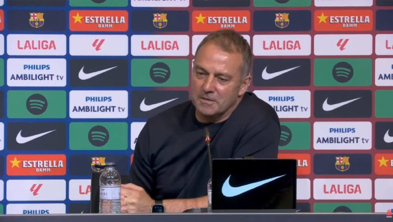

🇪🇸
🎙 هانسی فلیک: جانشین لوا؟ خب پیدا کردن جانشین واسه بهترین مهاجم نوک جهان تو بیست سال اخیر خیلی کار سختیه
@SportBaadNews

## IranIntlTV — post 337702

  

رسانه‌های جمهوری اسلامی پیامی منتسب به اسماعیل قاآنی، فرمانده نیروی قدس سپاه، را درباره کشته شدن عزالدین الحداد، فرمانده شاخه نظامی حماس، منتشر کردند. در این پیام آمده است که کشته شدن چنین چهره‌هایی «الهام‌بخش مجاهدان جوان فلسطینی» برای «نابودی» اسرائیل خواهد بود.
https://iranintl.com/202605176601

---
📅 بروزرسانی: 1405/02/28 02:04
---

## KiriMohems — post 47676

  

🔴توئیت کارشناسان معتبر عرب :

🤔احمد خلیفه : داره اتفاق میوفته!

🤔امجد طه‌ : 
⏳

#Helsinki
@KiriMohems

## KiriMohems — post 47675

  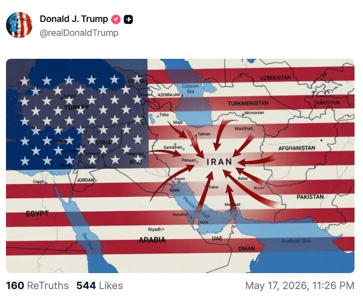

🔴پست تهدیدی ترامپ ؛ حمله حشری به جمهوری اسلامی

نکته عجیبش اینه که اسم خلیج فارس ، مشهد و تهران رو درست نوشته ولی بقیه شهرها رو کصشعری از کونش درآورده و تمام فلش ها به سمت اصفهان اشاره داری ؛ جایی که میگن اورانیوم ها رو گذاشتن

#Helsinki
@KiriMohems

## KiriMohems — post 47671

  <a href="telegram/content/KiriMohems_47671_1779057250.mp4" target="_blank">🎬 Download video</a>

🔴برخورد سگی دو فروند جنگنده آمریکایی تو نمایش هوایی در آیداهو آمریکایی که ۴ خلبان جقی اجکت کردند.
#Helsinki
@KiriMohems

## SportBaadNews — post 251792

  

⚽️
⚽️ گریزمان تو مراسم خداحافظی‌اش از اتلتیکو مادرید: لطفاً مرا ببخشید. من جوان بودم و اشتباه کردم که به بارسلونا پیوستم، اشتباه احمقانه ای کردم. من عشقی را که اینجا داشتم درک نکردم، بچگی کردم. به اشتباهم پی بردم و هر کاری کردم تا برگردم و از اینجا لذت ببرم و اشتباهم رو جبران کنم.
@SportBaadNews

## SportBaadNews — post 251791

  

خدافظی بازیکنای بارسا با لواندوفسکی
@SportBaadNews

## SportBaadNews — post 251790

  

❌ ۹۰٪ کاربرا هنوز اشتباه وارد سایت میشن!
تو جزو اونایی یا میخوای حرفه‌ای عمل کنی؟

✅ ورود سریع به وینکوبت فقط با یک کلیک ساده:

🤖 @Wincobet_bot

🤖 @Wincobet_bot

📌   نه لینک اضافی

📌   نه سردرگمی

📌   نه اتلاف وقت

📌   مستقیم، سریع، بدون دردسر وارد شو!

⏳   دیر بجنبی، از بقیه عقب می‌مونی.

🔗 الان وقتشه مسیر درستو انتخاب کنی:

🤖 @Wincobet_bot

📌برای تحلیل بازی‌ها و آخرین اخبار سایت جوین بدید:

🔵 @Wincobetofficial

## SportBaadNews — post 251789

  <a href="telegram/content/SportBaadNews_251789_1779057253.mp4" target="_blank">🎬 Download video</a>

2014: پویول
2015: ژاوی
2016: دنی آلوز
2017: نیمار
2018: اینیستا
2020: سوارز
2021: مسی
2022: پیکه
2023: بوسکتس & آلبا
2025: اینیگو مارتینز
2026: لواندوفسکی
@SportBaadNews

## IranIntlTV — post 337701

  <a href="telegram/content/IranIntlTV_337701_1779057253.mp4" target="_blank">🎬 Download video</a>

میلاد آفرین، زندانی سیاسی سابق، در حاشیه تجمع اعتراضی ایرانیان در لس‌آنجلس به نیلوفر منصوری، خبرنگار ایران‌اینترنشنال، گفت: «ما صدای زندانیان سیاسی هستیم. من خودم یکی از کسانی بودم که فشارها و آزارهای زندان را تجربه کردم.»

او افزود: «مردمی که امروز اینجا جمع شده‌اند، صدای شما هستند. ما کنار مردم ایران ایستاده‌ایم و می‌خواهیم هرچه زودتر از جمهوری اسلامی عبور کنیم تا زندانیان بتوانند با آرامش به زندگی خود برگردند.»

آفرین همچنین گفت: «مطمئن باشید این آخرین نبرد است.»
@iranintltv

## IranIntlTV — post 337700

  <a href="telegram/content/IranIntlTV_337700_1779057255.mp4" target="_blank">🎬 Download video</a>

موج جدید تورم و بیکاری در کشور موجب تشدید بحران معیشت و گسترش فقر در جامعه شده است.

همزمان با تعطیلی مراکز اقتصادی و رکود بازار، یک عضو هیات رییسه مجلس جمهوری اسلامی گفت شمار متقاضیان بیمه بیکاری به بیش از ۳۰۰ هزار نفر رسیده است.

گفت‌وگو با احمد علوی، استاد دانشگاه و اقتصاددان
@iranintltv

## IranIntlTV — post 337699

  <a href="https://t.me/IranintlTV/337699" target="_blank">📎 Download file</a>

🎧نسخه صوتی سیاست با مراد ویسی: حملات پهپادی سپاه و نیابتی‌ها به امارات و عربستان
@iranintlTV

## IranIntlTV — post 337698

  <a href="telegram/content/IranIntlTV_337698_1779057257.mp4" target="_blank">🎬 Download video</a>

همزمان با ادامه بن‌بست مذاکرات میان واشینگتن و تهران و احتمال از سرگیری حملات به جمهوری اسلامی، دونالد ترامپ گفت جمهوری اسلامی باید «خیلی سریع» اقدام کند وگرنه چیزی از آن باقی نخواهد ماند.

گفت‌وگو با امیر گیتی، عضو تحریریه ایران‌اینترنشنال
@iranintltv

## IranIntlTV — post 337697

  <a href="telegram/content/IranIntlTV_337697_1779057259.mp4" target="_blank">🎬 Download video</a>

ولودیمیر زلنسکی، رییس‌جمهوری اوکراین، یکشنبه ۲۷ اردیبهشت، با انتشار ویدیویی در ایکس از حمله گسترده پهپادی اوکراین به مناطقی در مسکو، در فاصله بیش از ۵۰۰ کیلومتری از مرزهای اوکراین خبر داد.
مقام‌های روسیه گفتند دست‌کم سه نفر کشته شدند.
پیش‌تر، زلنسکی پس از آن‌که روسیه در روزهای ۲۳ و ۲۴ اردیبهشت سنگین‌ترین حمله پهپادی و موشکی خود به کی‌یف را از آغاز جنگ انجام داد، وعده تلافی داده بود.

## IranIntlTV — post 337696

  <a href="telegram/content/IranIntlTV_337696_1779057260.mp4" target="_blank">🎬 Download video</a>

🔻امیر قلعه‌نویی در حالی لیست تیم ملی برای حضور در جام‌جهانی را اعلام کرد که در مصاحبه‌ای گفت شریف‌ترین بازیکنان به تیم ملی دعوت شدند. این در حالی است که بازیکنانی در لیست تیم ملی قرار گرفتند که در تجمعات حکومتی حضور داشتند.

🔹توضیحات مزدک میرزایی، ایران‌اینترنشنال در برنامه هت‌تریک

🔹تماشای نسخه کامل هت‌تریک؛👇
https://youtu.be/gw3eJ0R9R5Y

@iranintltvsport

## IranIntlTV — post 337695

  <a href="telegram/content/IranIntlTV_337695_1779057262.mp4" target="_blank">🎬 Download video</a>

مراد ویسی، تحلیل‌گر ارشد ایران‌اینترنشنال، گفت: «۱۸ سالگی برای بسیاری آغاز ورود به دانشگاه، کار و آینده‌ای پر از آرزوست. سنی که خانواده‌ها انتظار دارند ثمره سال‌ها تلاش فرزندشان را ببینند. در کشتار دی‌ماه، بسیاری از نوجوانان و جوانانی که برای زندگی‌شان هزاران برنامه و امید داشتند، جان خود را از دست دادند؛ رخدادی که تلخی آن برای جامعه و خانواده‌ها عمیق‌تر شد.»
@iranintltv

## IranIntlTV — post 337694

  

‌ترامپ به فاصله چند دقیقه‌ چندین تصویر مرتبط با ایران را در تروث‌سوشال بازنشر کرد. ترامپ همچنین یک تصویر جدید از پرچم آمریکا را منتشر کرد که در پس‌زمینه آن نقشه خاورمیانه به مرکزیت ایران قرار دارد و از همه کشورهای همسایه فِلِش‌هایی به سمت ایران نشان داده شده است.
او همچنین چند تصویر و پویانما را بازنشر کرد که ناوها و پهپادهای آمریکایی را در حال هدف قرار دادن پهپادها و قایق‌های تندرو جمهوری اسلامی نشان می‌دهد.
ترامپ در یک پست نموداری را نیز بازنشر کرد که مدت‌زمان جنگ‌های مختلف آمریکا را نمایش می‌دهد. در این نمودار جنگ کنونی ایران با ۶ هفته به عنوان کوتاه‌مدت‌ترین و جنگ افغانستان با ۵۴۳ هفته به عنوان بلندمدت‌ترین جنگ نمایش داده شده است.
رییس‌جمهوری آمریکا همچنین دو تصویر مقایسه‌ای را بازنشر کرد که ناوگان کشتی‌های نظامی جمهوری اسلامی را در حال حرکت روی آب در زمان ریاست‌جمهوری اوباما و همین ناوگان را غرق شده در کف دریا در زمان دولت ترامپ نشان می‌دهد.

https://iranintl.com/202605173898

## IranIntlTV — post 337693

  <a href="telegram/content/IranIntlTV_337693_1779057264.mp4" target="_blank">🎬 Download video</a>

مراد ویسی، تحلیل‌گر ارشد ایران‌اینترنشنال، گفت: «مردم ایران، رفاه و پیشرفت دبی را با وضعیت نامساعد اقتصادی و معیشتی ایران مقایسه می‌کنند و این تفاوت را نتیجه عملکرد متفاوت رهبران جمهوری اسلامی می‌دانند. مقامات جمهوری اسلامی و فرماندهان سپاه نیز چون عقده دبی را دارند این چنین به امارات حمله می کنند.»
@iranintltv

## IranIntlTV — post 337692

  <a href="telegram/content/IranIntlTV_337692_1779057266.mp4" target="_blank">🎬 Download video</a>

آرش رازی، عضو حزب مشروطه ایران، در حاشیه تجمع اعتراضی ایرانیان در لس‌آنجلس به نیلوفر منصوری، خبرنگار ایران‌اینترنشنال، گفت: «پنج ماه است که هر هفته در لس‌آنجلس و شهرهای اطراف آن تجمع می‌کنیم و امروز هم در گلندیل حضور داریم.»

او افزود: «مهم‌ترین پیام ما "نه به اعدام" است. جمهوری اسلامی در هفته‌های اخیر موجی از اعدام‌ها را آغاز کرده و به گفته معترضان، هر روز و هر شب تعداد زیادی اعدام انجام می‌شود. ما اینجا هستیم تا علیه این روند اعتراض کنیم؛ نه به اعدام، نه به قطع اینترنت و نه به سرکوب زندانیان سیاسی.»
@iranintltv

## Persian_Trend_Official — post 14368

  <a href="telegram/content/Persian_Trend_Official_14368_1779057268.webm" target="_blank">🎬 Download video</a>

شبتون بخیر 🙏🤍

📝 Nick
📌 @persian_trend_official
پرشین ترند | متفاوت‌ترین کانال نظامی

## Persian_Trend_Official — post 14367

  

پست قابل تأمل ‌ترامپ که لحظاتی قبل در تروث سوشال منتشر کرده است.

☆Phantom☆

📌 @persian_trend_official
پرشین ترند | متفاوت‌ترین کانال نظامی

## Persian_Trend_Official — post 14366

♨️ دوستان عزیز، با توجه به شرایط پیش‌رو، بهتر است از همین حالا برای سناریوهای اضطراری آماده باشیم. آمادگی یعنی آرامش بیشتر و آسیب کمتر برای خودمان و خانواده‌مان. 🧭

⚠️ چند مورد مهم را جدی بگیرید:

• برای دست‌کم ۱ ماه، آذوقه‌ی غذایی فاسد نشدنی و آب آشامیدنی کافی برای همه اعضای خانواده تهیه کنید. 🥫💧

• همیشه تا جای ممکن باک بنزین خودرو را پر نگه دارید. ⛽️

• اگر نوزاد یا کودک شیرخوار دارید، حتماً به اندازه کافی شیر خشک و لوازم ضروری او را از قبل تهیه کنید. 👶🍼

• اگر در خانواده سالمند یا بیماری دارید که داروی حیاتی مصرف می‌کند، از داروهای ضروری او به میزان کافی ذخیره داشته باشید. 💊

• کوله اضطراری را جدی بگیرید؛ شامل مدارک مهم، مقداری پول نقد، پاوربانک، چراغ‌قوه، باتری، داروهای شخصی، لباس گرم، وسایل بهداشتی و شارژر. 🎒🔦

• مقداری پول نقد همراه داشته باشید؛ در شرایط بحران، دسترسی به کارت بانکی یا اینترنت ممکن است مختل شود. 💵

• دارایی و پول خود را فقط در یک محل متمرکز نکنید و برای شرایط قطع دسترسی، برنامه جایگزین داشته باشید. 🏦

• با اعضای خانواده درباره سناریوهای مختلف صحبت کنید: قطع برق، قطع اینترنت، تخلیه اضطراری و محل‌های امن یا محل تجمع خانوادگی. 👨‍👩‍👧‍👦

• یک رادیوی موج متوسط یا رادیوی باتری‌خور تهیه کنید تا در صورت قطع اینترنت، بتوانید خبرها و اطلاعیه‌های ضروری را دنبال کنید. 📻

• در خانه، شیشه‌ها و پنجره‌های حساس را بررسی و تا جای ممکن محکم‌کاری کنید. در صورت نگرانی از موج انفجار، می‌توان برای کاهش پخش شدن خرده‌شیشه‌ها از چسب نواری پهن به‌صورت ضربدری روی شیشه‌ها استفاده کرد. 🪟

• مدارک مهم، شماره تماس‌های ضروری، آدرس‌ها و اطلاعات حیاتی را هم به‌صورت کاغذی و هم در گوشی ذخیره کنید. 📄📱

• برای چند هفته بی‌برقی و بی‌ارتباطی هم آماده باشید: چراغ‌قوه، پاوربانک، آب، غذا و لوازم اولیه را از قبل کنار بگذارید. ⚠️

آمادگی به معنی ترسیدن نیست؛ یعنی از خانواده‌مان بهتر محافظت کنیم. ❤️

ما در تیم پرشین ترند امیدواریم هیچ اتفاق بدی برای هیچ‌یک از هم‌وطنان‌مان رخ ندهد، اما احتیاط از امروز می‌تواند فردا نجات‌بخش باشد.

📝 Nick

📌 @persian_trend_official
پرشین ترند | متفاوت‌ترین کانال نظامی

---
📅 بروزرسانی: 1405/02/28 01:06
---

## ChizBergerz — post 46502

آی‌پی شیر و‌ خورشید تست شده ایرانسل ارسالی توسط ممبرای چنل:

95.100.69.108
104.83.5.203
92.122.166.146
104.66.70.133
104.121.0.17
104.83.5.65
92.122.166.168
104.83.5.82
92.123.104.67
104.110.191.57
92.123.104.7
104.109.250.232
96.16.122.74
23.40.63.69
23.73.2.161
138.201.54.122
144.76.1.88
94.130.33.41
95.216.69.37
185.137.25.214
94.130.70.160
94.130.50.12
37.255.133.30
104.81.104.13
92.122.73.138
96.16.122.55
104.81.108.51
23.72.248.214
104.126.37.185
104.83.5.201
92.122.166.141
104.83.5.216
172.237.127.6
104.81.108.10
23.73.2.148
81.91.145.2
65.109.34.234
81.12.72.218
185.143.232.122
96.16.122.66
88.221.168.138
92.122.166.175
96.16.122.82
96.17.207.149
96.17.207.151
23.220.113.51
5.160.13.85
142.54.178.211
63.141.252.203
96.17.207.135
Tel: @ChizBergerz
2.23.168.144
2.23.168.254
2.23.168.250
2.23.168.96
2.21.239.29
184.86.103.210
23.36.162.202
95.101.29.30
2.23.170.80
185.200.232.16
2.16.245.188
95.101.23.82
185.200.232.34
184.28.230.87
2.16.19.136
2.23.168.174
50.7.5.83
2.23.168.47

@ChizBergerz

## ChizBergerz — post 46501

یه لیست آیپیِ جدیدِ تست شده برایِ " شیرو خورشید" با سرعتِ بالا که با همراه اول زیر ۳۰ ثانیه وصل میشه:

184.86.103.210
96.16.248.183
92.122.16.5
96.16.249.60
96.16.249.9
23.12.156.115
23.216.77.16
23.62.61.53
23.39.148.245
23.210.73.133
23.44.201.136
23.205.46.167
184.30.150.142
Tel: @ChizBergerz
23.220.161.217
184.28.165.4
23.46.230.133
88.221.168.204
104.96.158.174
184.51.252.4
172.234.199.15
104.85.26.14
172.237.145.27
92.123.103.24
172.234.159.58
185.200.232.43  
2.17.100.200
2.19.205.42
2.19.205.50
2.19.252.134
2.20.169.70
2.20.170.91
95.101.111.144
2.16.245.188
2.18.69.150
2.16.106.4
23.58.222.107
184.25.28.31
23.47.124.134
23.50.131.147
23.46.190.18
23.58.222.147
23.56.162.186
23.44.203.68

+ تا زمانی که اتصال‌تون با سرعتِ خووب برقرار هست نیازی نیست که آیپی رو عوض کنید و آیپی هایِ جدید رو تست کنید.
@ChizBergerz

## ChizBergerz — post 46500

  <a href="telegram/content/ChizBergerz_46500_1779053761.mp4" target="_blank">🎬 Download video</a>

عاقبت مصرف شیشه:

امشب تو صداوسیما نتانیاهو و ترامپ ترور شدن
💩😂
@ChizBergerz

## KiriMohems — post 47670

🔴صداوسیما در اقدامی که کون همگان تو شورت مچاله شد ، نتانیاهو و ترامپ رو تو شبکه کصشعر افق ترور کرد
#Helsinki
@KiriMohems

## KiriMohems — post 47669

  <a href="telegram/content/KiriMohems_47669_1779053762.mp4" target="_blank">🎬 Download video</a>

🔴متلک شاهزاده رضا پهلوی به مجتبی

شاهزاده خطاب به ترامپ گفت:
حالا که یک حیوان زخمی دارید (منظورش مجتبی خامنه‌ایه) این فرصتی نیست که باید از دست بدهید.
این فرصتی است برای تمام کردن کار.
#Helsinki
@KiriMohems

## KiriMohems — post 47668

  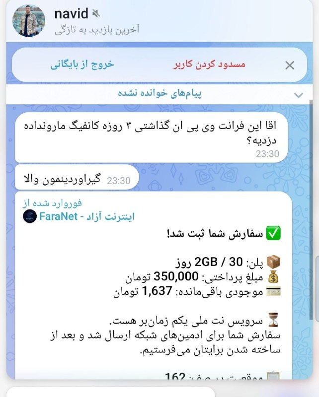

اگر تبلیغات VPN یا هر کسشر دیگه ای زیر پستا میبینید خارج از اختیار ما هست و تبلیغات تلگرامیه 100درصد هم کلاه برداریه ! اگر تبلیغاتی مورد اطمینان ما باشه به صورت پست میاد داخل چنل .

## KiriMohems — post 47667

  <a href="telegram/content/KiriMohems_47667_1779053764.mp4" target="_blank">🎬 Download video</a>

🔴شاهزاده رضا پهلوی به دولت ترامپ:

تمام هدف من امروز اینه که مطمئن بشم این دولت، هر کسی که ما رو میشنوه، درک کنه که نمیتونید هر دو رو داشته باشید.

نمیتونید بگید: «مردم، ما شما را در حالت تعلیق نگه می‌داریم و وقتی آماده شدیم به شما اطلاع می‌دهیم. در این بین، ما در تلاشیم چیز دیگری را کشف کنیم.» این روش بسیار سختی است برای قانع کردن مردم که شما جدی هستید.

مسیر را ادامه دهید. کار را انجام دهید.
#Helsinki
@KiriMohems

## SportBaadNews — post 251788

  

⚽️ پایان یک اسطوره
@SportBaadNews

## SportBaadNews — post 251787

  

🇪🇸 تعداد بیشترین برد در یک فصل لالیگا:

⚽️ رئال مادرید 2011 - 32 برد

⚽️ بارسلونا 2026 - 32 برد ( یک بازی کمتر )
@SportBaadNews

## SportBaadNews — post 251786

  

⚽️ رسمی: بارسلونای هانسی فلیک به اولین تیم تاریخ لالیگا تبدیل شد که تمام 19 بازی خونگیشو با برد پشت سر گذاشت
@SportBaadNews

## SportBaadNews — post 251785

  

گریه های لواندوفسکی هنگام تعویض
این آخرین بازی لوا در نیوکمپ بود...
@SportBaadNews

## SportBaadNews — post 251784

کانسلو یه سوپرگل زددد: WATCH

## SportBaadNews — post 251783

ایسکو یکی کرد تو بارسا

## SportBaadNews — post 251782

رافینیا دبل کرد واسه بارسا: WATCH

## IranIntlTV — post 337691

  <a href="telegram/content/IranIntlTV_337691_1779053768.mp4" target="_blank">🎬 Download video</a>

مراد ویسی، تحلیل‌گر ارشد ایران‌اینترنشنال، گفت: «نیروگاه اتمی برکه امارات روز یکشنبه با سه پهپاد مورد حمله قرار گرفت. شامگاه یکشنبه هم وزارت دفاع عربستان اعلام کرد سه پهپاد شلیک‌شده از سمت عراق را سرنگون کرده است. دونالد ترامپ نیز روز یکشنبه ۳۰ دقیقه با بنیامین نتانیاهو درباره ایران گفت‌وگو کرد و قرار است سه‌شنبه نیز نشستی با دستیاران ارشدش درباره ایران برگزار کند.»
@iranintltv

## IranIntlTV — post 337690

  <a href="telegram/content/IranIntlTV_337690_1779053769.mp4" target="_blank">🎬 Download video</a>

روزنامه سازندگی از گسترش فقر در میان زنان ایران گزارش داده و نوشته است زنان نخستین قربانیان شوک‌های اقتصادی پی‌درپی و تعدیل نیروها هستند.
این روزنامه همچنین از محرومیت میلیون‌ها زن سرپرست خانواده از بیمه و حمایت پایدار خبر داده است.

گفت‌وگو با پگاه بنی‌هاشمی، پژوهشگر حقوق
@iranintltv

## IranIntlTV — post 337689

  <a href="telegram/content/IranIntlTV_337689_1779053771.mp4" target="_blank">🎬 Download video</a>

در ادامه کارزار حمایت ایرانیان خارج از کشور از انقلاب ملی، گروهی از ایرانیان لس‌آنجلس تجمعی اعتراضی برگزار کردند تا به قطعی اینترنت، افزایش اعدام‌ها و علیه سرکوب‌ها در ایران اعتراض کنند.

گزارش نیلوفر منصوری، خبرنگار ایران‌اینترنشنال و گفت‌وگو با آرش رازی، عضو حزب مشروطه ایران
@iranintltv

## IranIntlTV — post 337688

  <a href="telegram/content/IranIntlTV_337688_1779053772.mp4" target="_blank">🎬 Download video</a>

صداوسیما، پس از آموزش کلاشنیکف در شبکه‌های مختلف، این بار نحوه استفاده از تیربار پی‌کا را در تلویزیون آموزش داد.

پیش‌تر، مجریان صداوسیمای جمهوری اسلامی در برنامه‌هایی با در دست داشتن تفنگ ظاهر شده و کار با سلاح‌های سبک را آموزش داده بودند.

این برنامه‌ها، که دست‌کم در سه بخش پخش شد، در رسانه‌های داخلی بازنشر شد و در شبکه‌های اجتماعی واکنش‌هایی را برانگیخت. برخی کاربران این بخش‌ها را نشانه‌ای از بسیج حامیان حکومت در شرایط جنگی توصیف کردند.
@iranintltv

## Persian_Trend_Official — post 14365

https://youtu.be/8YQ1YcLyw6E

---
📅 بروزرسانی: 1405/02/28 00:09
---

## rodast_omiddana — post 71482

🎬
🔴
🔴
🔴 پخش زنده
*گفتگو تلفنی نتانیاهو و ترامپ قبل از جلسه امنیتی اسرائیل برای حمله به رژیم ایران
*چند روز تا حمله مانده؟
لینک یوتیوب:
https://www.youtube.com/watch?v=tuxsgf3MJ_A

## KiriMohems — post 47666

  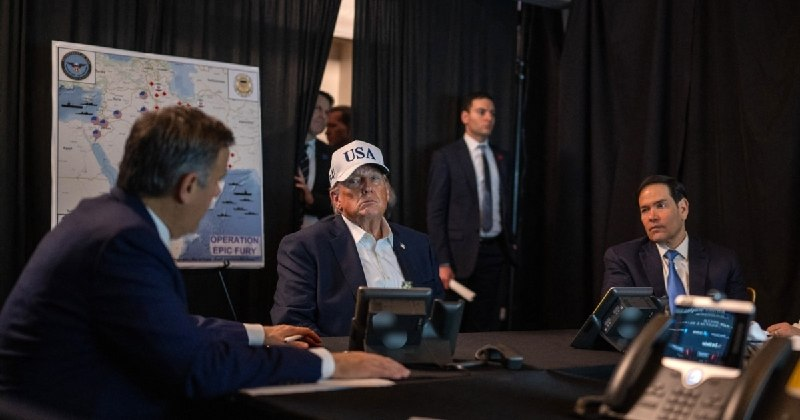

📰 طبق گزارش CNN:

ترامپ، تیم امنیت ملی خودشو صدا کرده گفته : کصکشا پاشید بیایید تا در مورد ایران صحبت کنیم ، قلیون رو هم بیارید
#Helsinki
@KiriMohems

## KiriMohems — post 47665

  <a href="telegram/content/KiriMohems_47665_1779050378.mp4" target="_blank">🎬 Download video</a>

🔴سخنگوی وزارت خارجه ایران ، سکانسی از فیلم «شاگرد ۲۰۲۴» منتشر کرده تا ذهنیت ترامپ رو نشون بده

توی این سکانس، وکیل روی کوهن به ترامپِ میگه :
مهم نیست چقدر بگا رفته باشی، همیشه باید ادعای پیروزی کنی و هیچ‌وقت کیری که خوردی رو قبول نکنی؛ برنده شدن یعنی همین

#Helsinki
@MohemMovie

## KiriMohems — post 47664

🔴عربستان سولاخی: سه پهپادی گوزویی که امروز صبح از عراق وارد حریم هوایی این کشور شدند، رهگیری شدند.

وزارت دفاع این کونی ها گفته :حق پاسخگویی خونباری رو تو زمان و مکان مناسب برای خودمون داریم
#Helsinki
@KiriMohems

## KiriMohems — post 47663

  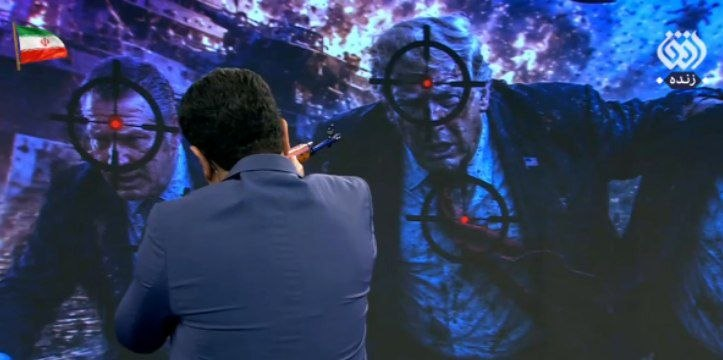

#فوری_تخمی

🔴ترامپ ترور شد

مجری کصمشنگ صداوسیما با اسلحه‌ خار ترامپ رو گایید.
#Helsinki
@KiriMohems

## SportBaadNews — post 251781

واقعا این هفته های آخر لالیگا خیلی حساسه منکه از استرس مردم

## SportBaadNews — post 251779

چه گلی زد رافینیاااااا

## IranIntlTV — post 337687

  

عربستان سعودی اعلام کرد روز یک‌شنبه سه پهپاد را که از حریم هوایی عراق وارد شده بودند، رهگیری کرده است.

وزارت دفاع عربستان سعودی تأکید کرد این کشور برای مقابله با هرگونه تلاش برای نقض حاکمیت و امنیت خود، اقدامات عملیاتی لازم را انجام خواهد داد و حق پاسخ‌گویی را «در زمان و مکان مناسب» برای خود محفوظ می‌داند.
https://iranintl.com/202605177517

## IranIntlTV — post 337686

تلگراف: شرکت مرتبط با جمهوری اسلامی از طریق ویزای کار، افراد را به بریتانیا منتقل کرده است

روزنامه تلگراف در گزارشی تحقیقی خبر داد یک شرکت رسانه‌ای مستقر در لندن مرتبط با نهادهای وابسته به جمهوری اسلامی، از مجوز حمایت مالی ویزای نیروی «کار ماهر» برای انتقال برخی افراد به بریتانیا استفاده کرده است.

به گزارش تلگراف، شرکت «راد مدیا ورلد» (RAD Media World) که در شمال غرب لندن ثبت شده، با نهادهایی از جمله پرس‌تی‌وی، رسانه دولتی جمهوری اسلامی، و هیسپان تی‌وی، شبکه اسپانیایی‌زبان وابسته به حکومت ایران، ارتباط دارد و از طریق حمایت مالی از ویزای نیروی کار ماهر، افرادی را به‌طور قانونی وارد بریتانیا کرده است.

هشدار کارشناسان: خطر ایجاد «درِ باز» برای فعالیت‌های جمهوری اسلامی
به نوشته تلگراف، کارشناسان اطلاعاتی هشدار داده‌اند که چنین سازوکاری ممکن است به «دری باز» برای ورود افرادی تبدیل شود که احتمال دارد به نمایندگی از جمهوری اسلامی فعالیت‌های اطلاعاتی یا خصمانه انجام دهند.

این هشدارها پس از افزایش سطح تهدید تروریستی در بریتانیا به سطح «شدید» و در پی موجی از حملات علیه یهودیان، کنیسه‌ها و موسسات خیریه مطرح شده است.

جاناتان هکت، افسر سابق اطلاعاتی آمریکا و متخصص عملیات پنهانی ایران، به تلگراف گفته است جمهوری اسلامی از رویکرد نسبتا سهل‌گیرانه بریتانیا سوءاستفاده می‌کند و بخشی از فعالیت‌های خود را از طریق نهادهای رسانه‌ای و فرهنگی پیش می‌برد.

او گفت: «این سازمان‌ها می‌توانند پوششی برای ورود ماموران اطلاعاتی ایران به بریتانیا فراهم کنند؛ افرادی که ممکن است برای نظارت، شناسایی، انتقال مخفیانه پول یا دیگر فعالیت‌های پنهانی وارد شوند.»

او همچنین گفت: «اهداف جمهوری اسلامی در بریتانیا شامل جامعه یهودیان و مخالفان ایرانی هستند و وجود چنین نهادهایی می‌تواند امکان اجرای این اهداف را فراهم کند.»

درخواست برای لغو مجوز حمایت مالی از ویزا
تلگراف گزارش می‌دهد از وزارت کشور بریتانیا خواسته شده مجوز موسسه راد برای حمایت مالی از ویزا لغو شده و بررسی جامعی درباره سیاست‌های صدور ویزا آغاز شود.

دیوید تیلور، نماینده حزب کارگر در پارلمان بریتانیا، گفته است: «حق حمایت مالی این شرکت از ویزا باید فورا لغو شود و این شرکت باید بلافاصله تحت تحقیق قرار گیرد.»

او همچنین خواستار بررسی فوری افرادی شده که با حمایت این شرکت موفق به دریافت ویزا شده‌اند.

ارتباط با پرس‌تی‌وی، هیسپان تی‌وی و استودیوهای تولید در لندن
به نوشته تلگراف، شرکت راد مدیا ورلد با «راونور فارم استودیوز» (Ravenor Farm Studios)، استودیویی در غرب لندن، نیز ارتباط دارد؛ جایی که برنامه «Palestine Declassified» متعلق به پرس‌تی‌وی فیلم‌برداری شده بود.

تلگراف می‌گوید هنگام بازدید از محل شرکت در هفته جاری، با یک واحد خالی در شهرک صنعتی مواجه شده که تحت حفاظت یک شرکت امنیتی حرفه‌ای بوده است؛ شرکتی که گفته هدف حضورش جلوگیری از استقرار افراد بی‌خانمان یا مسافران در آن محل بوده است.

ماه گذشته، این استودیو نامه‌ای از دولت بریتانیا دریافت کرده که در آن به احتمال اقدام حقوقی بر اساس قانون امنیت ملی اشاره شده بود.

بر اساس اسناد ثبت شرکت‌ها، سید مهدی میرطالب تنها مدیر فعلی راد مدیا وورد و حمید خیرالدین مدیر پیشین آن بوده‌اند. هر دو پیش‌تر با شرکت منحل‌شده UK Press TV Ltd و همچنین هیسپان تی‌وی همکاری داشته‌اند.

اسناد رسمی همچنین نشان می‌دهد یکی از مالکان ثبت‌شده راونور فارم استودیوز، شرکت «لندن برادکاستینگ‌پارتنرز» (London Broadcasting Partners Limited) است که سید مهدی میرطالب تنها مدیر آن محسوب می‌شود.

تلگراف می‌گوید آدرس ثبت‌شده راد مدیا ورلد در ومبلی لندن، با شرکت‌های مرتبط از جمله لندن‌برادکاستینگ‌ پارتنرز و هیسپان تی‌وی مشترک است.

واکنش متهمان و دولت بریتانیا
سید مهدی میرطالب، مدیر فعلی شرکت لندن برادکاستینگ‌پارتنرز، اتهامات مطرح‌شده را «مزخرفات توطئه‌محور» خوانده است. پرس‌تی‌وی و هیسپان تی‌وی از اظهارنظر درباره گزارش خودداری کرده‌اند.

در مقابل، سخنگوی وزارت کشور بریتانیا به تلگراف گفته است: «ما تهدید ناشی از ایران را بسیار جدی می‌گیریم و حفاظت از منافع و جان شهروندان بریتانیا اولویت نخست ماست.»

او افزود دولت بریتانیا تاکنون سپاه پاسداران و بیش از ۵۵۰ فرد و نهاد ایرانی را تحریم کرده و در هفته‌های آینده قوانین جدیدی برای مقابله با فعالیت‌های خصمانه دولت‌های خارجی و نیروهای نیابتی آن‌ها تصویب خواهد شد.

به نوشته تلگراف، جزئیات ارتباطات راد مدیا ورلد با نهادهای مرتبط با حکومت ایران در قالب پرونده‌ای به واحد مقابله با تروریسم پلیس لندن و وزارت کشور بریتانیا ارائه شده است.
 
🔗متن کامل گزارش را اینجا بخوانید
@iranintltv

## IranIntlTV — post 337685

  

سخنگوی فرماندهی مرکزی آمریکا در گفت‌وگو با العربیه اعلام کرد جمهوری اسلامی تهدیدی آشکار برای امنیت جهانی و ثبات منطقه‌ای است و توانایی آن در شلیک موشک و پهپاد به‌شدت کاهش یافته است. او افزود آمریکا همراه با متحدانش برای تقویت سامانه‌های پدافند هوایی همکاری کرده است.

سخنگوی سنتکام گفت جمهوری اسلامی در طول جنگ موشک‌های خود را از مناطق پرجمعیت پرتاب کرده است.

او همچنین تاکید کرد آمریکا تمام تلاش‌های جمهوری اسلامی برای ورود و خروج تجهیزات را زیر نظر دارد و با اعمال محاصره دریایی، با استفاده تهران از تنگه هرمز به‌عنوان ابزار تهدید آزادی کشتیرانی مقابله می‌کند. به گفته او، انتقال تسلیحات به متحدان جمهوری اسلامی متوقف شده و نیروهای آمریکا برای هرگونه طرح اضطراری آمادگی کامل دارند.
https://iranintl.com/202605178642

## Persian_Trend_Official — post 14364

https://youtube.com/live/2KsilHSCq4o?feature=share

## Persian_Trend_Official — post 14361

  <a href="telegram/content/Persian_Trend_Official_14361_1779050384.webm" target="_blank">🎬 Download video</a>

🎬 Video

## Persian_Trend_Official — post 14357

  <a href="telegram/content/Persian_Trend_Official_14357_1779050384.mp4" target="_blank">🎬 Download video</a>

خبرهایی درباره انهدام یک پهپاد آمریکایی در یمن /فارس نیوز

🔹برخی رسانه‌ها با انتشار تصاویری، از انهدام یک فروند پهپاد MQ9 ارتش آمریکا در آسمان استان مارب به دست نیروهای مسلح یمن خبر می‌دهند‌.

🔸نیروهای مسلح یمن هنوز بیانیه‌ای در این باره صادر نکرده است.

☆Phantom☆

📌 @persian_trend_official
پرشین ترند | متفاوت‌ترین کانال نظامی

## Persian_Trend_Official — post 14355

تا دقایقی دیگه نسخه هاست داخلی آپلود خواهد شد و لطفا اگر امکانش رو دارید نسخه صوتی رو از طریق همین اپ های پادکست بشنوید. در مصرف حجم بین تلگرام و اپ های پادکست هیچ تفاوتی نیست.
از توجه شما به این موضوع متشکرم
الیاس فرخ

## Persian_Trend_Official — post 14354

نسخه صوتی لایو امشب رو از لینک های زیر بشنوید :

https://open.spotify.com/episode/0WrkfsVN8KUvGUSSHYT887?si=sYOmvpJERuCureVC0TULQQ

https://castbox.fm/vi/946274710

---
📅 بروزرسانی: 1405/02/27 23:19
---

## ChizBergerz — post 46499

  <a href="telegram/content/ChizBergerz_46499_1779047375.mp4" target="_blank">🎬 Download video</a>

عاقبت هرشب جق زدن:

دو جنگنده نیروی دریایی آمریکا تو آسمون و درجریان نمایش هوایی Gunfighter Skies به همدیگه برخورد کردن؛ خلبان‌ها با موفقیت اجکت کردن و سالمن.
@ChizBergerz

## ChizBergerz — post 46498

  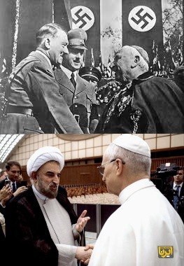

تکرار شرم آور تاریخ...

@ChizBergerz

## ChizBergerz — post 46497

  

عکس جدید بیلی ایلیش :)

@ChizBergerz

## KiriMohems — post 47661

🔴خبری تو توئیتر داره میچرخه :
موجودی قهوه تو کشور تا شهریور جوابگو هست و داره تموم میشه

#Helsinki
@KiriMohems

## KiriMohems — post 47658

  <a href="telegram/content/KiriMohems_47658_1779047378.mp4" target="_blank">🎬 Download video</a>

🔴دوست اجاره‌ای بگیرید و صفا کنید

قضیه‌ای که جدیدا پر شده اینه که شما میتونید یک نفر رو به صورت ساعتی یا روزانه اجاره کنید و باهاش برید جشن تولد، کافه، سینما، خرید و هرکصکلک بازی که فکرشو بکنید

بعضیا هم با اینا میرن پارتی و برای اینکه اکسشون رو فشاری کنن ، یه پسر خیلی خوشگل اجاره میکنن و پسره رو با خودشون میبرن

قیمت اجاره با توجه به ظاهر ، قیافه و ... از ساعتی 300 هزار شروع میشه و تا 1 میلیون چوب میخوره
#Helsinki
@KiriMohems

## KiriMohems — post 47657

  

😤دنبال یه سایت شرط بندی بین المللی بودی که به ایرانیا خدمات بده؟!
⛔

👍دربی بت همون انتخاب  100%

💎ویژگی های سایت جهانی Derby Bet:

⬅️امکان شارژ امن با کارت بانکی

⬅️واریز اول دوبل شارژ می شوید(بونوس۱۰۰٪)

⬅️پر اپشن ترین سایت فعال در ایران

⬅️تسویه حساب کمتر از 5 دقیقه

⬅️برگشت بخشی از باخت به صورت هفتگی

🚨کد هدیه ثبت نام:GG007

⚠️برای دانلود اپلکیشن کلیک کنید
👉

🔔کانال دربی بت :r27🅰

🪙https://t.me/+kpFvLD9kaeJhYTI0

## KiriMohems — post 47656

  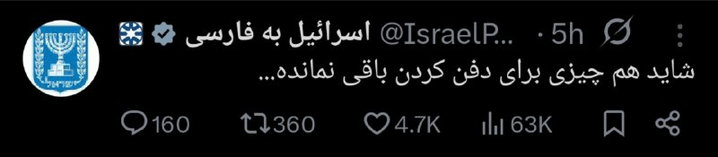

🔴 توئیت اکانت اسرائیل به فارسی:

شاید هم چیزی از جنازه‌ی خامنه ای برای دفن کردن باقی نمانده...

#Helsinki
@KiriMohems

## IranIntlTV — post 337684

  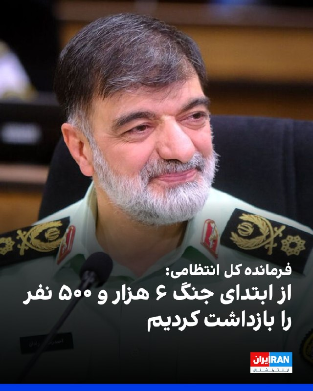

احمدرضا رادان، فرمانده نیروی انتظامی، اعلام کرد که این نیرو ۶ هزار و ۵۰۰ نفر شهروند را از ابتدای جنگ بازداشت کرده است.

رادان این افراد را «وطن‌فروشان و جواسیس» نامید؛ اتهام‌هایی که وکلای دادگستری و نهادهای حقوق بشری می‌گویند جمهوری اسلامی برای سرکوب مردم از آنها استفاده می‌کند.

‌فرمانده فراجا همچنین گفت که بازداشت‌ها در ارتباط با اعتراضات دی ماه همچنان ادامه دارد.
https://iranintl.com/202605176516

## IranIntlTV — post 337683

  <a href="telegram/content/IranIntlTV_337683_1779047380.mp4" target="_blank">🎬 Download video</a>

اورشلیم پست از احتمال تشدید حملات جمهوری اسلامی به امارات متحده عربی گزارش داده است.

همزمان با توصیف آتش‌بس به‌عنوان وضعیتی شکننده، نگرانی‌ها درباره حملات جمهوری اسلامی احتمال از سرگیری جنگ را افزایش داده است.

گفت‌وگو با جمشید برزگر، روزنامه‌نگار و تحلیل‌گر سیاسی
@iranintltv

## IranIntlTV — post 337682

  <a href="https://t.me/IranintlTV/337682" target="_blank">📎 Download file</a>

🎧نسخه صوتی چشم‌انداز: اهداف اصلی آمریکا و اسرائیل در حمله دوباره به ایران
@iranintlTV

## IranIntlTV — post 337681

  <a href="telegram/content/IranIntlTV_337681_1779047382.mp4" target="_blank">🎬 Download video</a>

مسعود پزشکیان، رییس دولت در جمهوری اسلامی، دسترسی باکیفیت به خدمات دیجیتال را حق مردم دانست و گفت دولت او برای برقرار ماندن ارتباطات، به‌صورت شبانه‌روزی تلاش می‌کند.

گفت‌وگو با مهدی صارمی‌فر، روزنامه‌نگار علم و تکنولوژی
@iranintltv

## IranIntlTV — post 337680

  

محمدرضا عارف، معاون اول پزشکیان، گفت: «تسهیل ازدواج جوانان بخشی از راهبردهای نظام است.»
او افزود: «موضوع جوانان، ازدواج و فرزندآوری در برنامه پنج‌ساله دولت لحاظ شده و با توجه به روند خوبی که در کشور حاکم است و پیروزی‌هایی که به دست می‌آوریم، در تلاشیم مشکلات اقتصادی را کاهش دهیم.»
https://iranintl.com/202605172551

## IranIntlTV — post 337679

  <a href="telegram/content/IranIntlTV_337679_1779047384.mp4" target="_blank">🎬 Download video</a>

روز شنبه ۲۶ اردیبهشت، جمعی از ایرانیان ساکنِ ونکوور کانادا، در حمایت از مردم ایران و شاهزاده رضا پهلوی تجمع برگزار کردند. شرکت‌کنندگان «خواستار تغییر رژیم ایران» و «اقدام فوری» در حمایت از مردم ایران شدند.

## IranIntlTV — post 337678

  <a href="telegram/content/IranIntlTV_337678_1779047386.mp4" target="_blank">🎬 Download video</a>

چشم‌انداز با مهدی مهدوی‌آزاد: اهداف اصلی آمریکا و اسرائیل در حمله دوباره به ایران

نسخه کامل این قسمت را در یوتیوب ایران‌اینترنشنال تماشا کنید:
https://youtu.be/6u1N8mDDOMA
@iranintltv

## IranIntlTV — post 337677

  

انور قرقاش مشاور دیپلماتیک رییس امارات متحده عربی در شبکه اجتماعی ایکس نوشت: «هدف قرار دادن تروریستی نیروگاه هسته‌ای پاک براکه، چه از سوی عامل اصلی و چه از طریق یکی از عوامل نیابتی آن، یک تشدید تنش خطرناک و صحنه‌ای تاریک است که تمامی قوانین و عرف‌های بین‌المللی را نقض می‌کند، در حالی که بی‌توجهی جنایتکارانه‌ به جان غیرنظامیان در امارات متحده عربی و پیرامون آن است.»

قرقاش ادامه داد: «این تشدید تنش ممنوع، بار دیگر ماهیت چالش‌هایی را که منطقه در مواجهه با نیروهای شر، هرج‌ومرج و خرابکاری با آنها روبه‌رو است، تایید می‌کند.»

او افزود: «هیچ‌کس نخواهد توانست بازوی امارات را بپیچاند، و هیچ‌کس موفق نخواهد شد چشم‌انداز، موفقیت و پیام الهام‌بخش آن به مردم منطقه در زمینه امنیت، ثبات، توسعه و شکوفایی را تضعیف کند.»
https://iranintl.com/202605172450

## Persian_Trend_Official — post 14353

  <a href="telegram/content/Persian_Trend_Official_14353_1779047387.mp4" target="_blank">🎬 Download video</a>

دو فروند هواپیمای نیروی دریایی ایالات متحده EA-18G Growler (گونه‌ای از F/A-18) در حین اجرای نمایشی در نمایش هوایی Gunfighter Skies در پایگاه نیروی هوایی Mountain Home در آیداهو با یکدیگر در هوا برخورد کردند.
چهار خدمه با «چهار چتر نجات سالم» موفق به خروج اضطراری شدند.
هواپیماهای برخورد کرده امروز متعلق به تیم نمایشی Growler Demo بودند که از اسکادران VAQ-129 «Vikings» تشکیل شده
این اسکادران همان تیم آموزشی اصلی نیروی دریایی برای خلبانان EA-18G است.

یکی از همین هواگان VAQ-129 قبلاً هم در یک برخورد هوایی دیگر در سال ۲۰۱۷ در پایگاه NAS Fallon آسیب دیده بود و بیش از ۲۰۰۰ ساعت کار تعمیراتی نیاز داشت تا دوباره آماده پرواز شود.

☆Phantom☆

📌 @persian_trend_official
پرشین ترند | متفاوت‌ترین کانال نظامی

## Persian_Trend_Official — post 14352

  <a href="telegram/content/Persian_Trend_Official_14352_1779047389.webm" target="_blank">🎬 Download video</a>

ترامپ قرار است سه‌شنبه با ارشدترین مقامات امنیتی در اتاق وضعیت دیدار کند — Axios دستور جلسه: گزینه‌های نظامی علیه ایران ☆Phantom☆ 📌 @persian_trend_official پرشین ترند | متفاوت‌ترین کانال نظامی

## Persian_Trend_Official — post 14351

  

ترامپ قرار است سه‌شنبه با ارشدترین مقامات امنیتی در اتاق وضعیت دیدار کند — Axios

دستور جلسه: گزینه‌های نظامی علیه ایران

☆Phantom☆

📌 @persian_trend_official
پرشین ترند | متفاوت‌ترین کانال نظامی

<!-- MSG END -->

<!-- NAV START -->

<a href="https://github.com/amirkarimiq12-svg/aio-downloader/blob/main/telegram/content/archive_1.md" style="display:inline-block; padding:6px 12px; margin:0 4px; background-color:#2ea44f; color:white; text-decoration:none; border-radius:4px; font-weight:bold;">صفحه بعد</a>

<!-- NAV END -->
