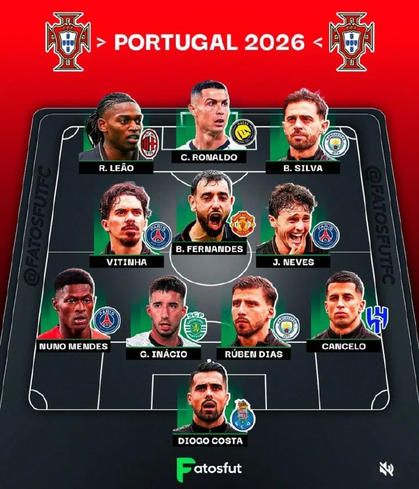
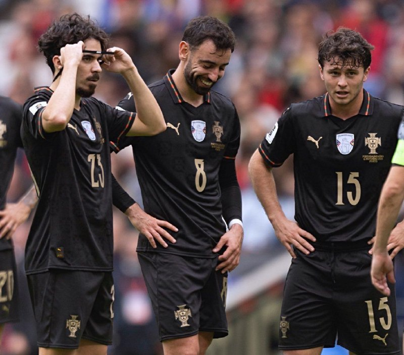
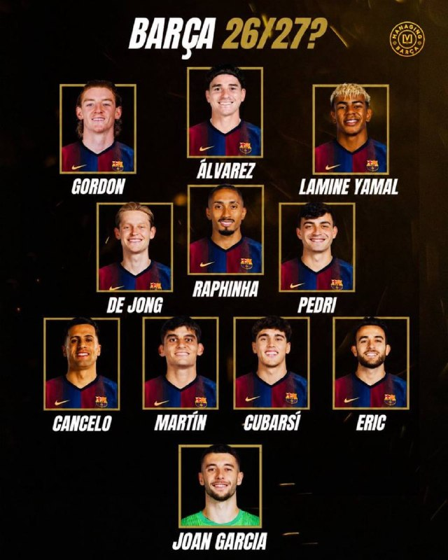
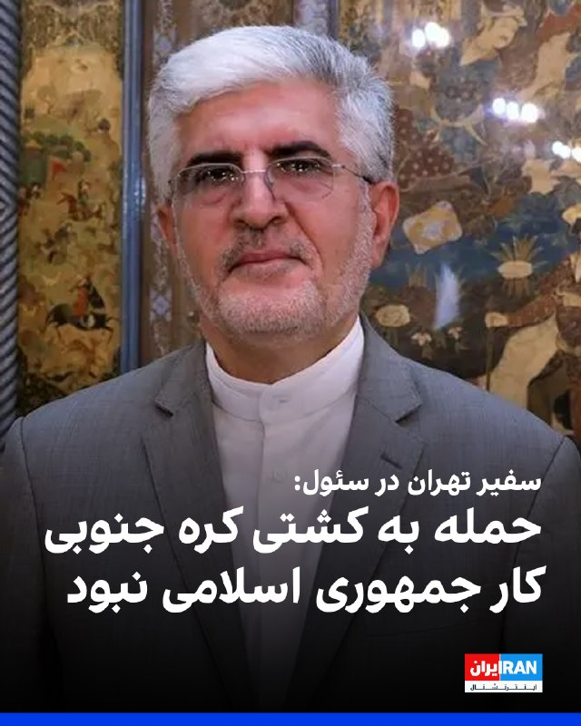

# خواننده تلگرام

<!-- TOP_NAV START -->

<a href="https://github.com/amirkarimiq12-svg/aio-downloader/blob/main/telegram/content/archive_1.md" style="display:inline-block; padding:6px 12px; margin:0 4px; background-color:#2ea44f; color:white; text-decoration:none; border-radius:4px; font-weight:bold;">صفحه بعد</a>

<!-- TOP_NAV END -->

<!-- MSG START -->

---
📅 بروزرسانی: 1405/03/07 00:58
---

## ChizBergerz — post 46857

  <a href="telegram/content/ChizBergerz_46857_1779917288.mp4" target="_blank">🎬 Download video</a>

یکم تراپی ببینید.

ویدیو لحظه بیرون کشیدن اجساد نجش فرمانده‌ها و نیروهای تروریست حماس پس‌از حمله امروز ارتش اسرائیل: 🔥🔥
@ChizBergerz

## rodast_omiddana — post 72042

🎬
🔴
🔴
🔴 پخش زنده
*تایید حمله آمریکا به باند فرودگاه بندرعباس در صداوسیما
*ترامپ رژیم تسلیم نشه کار را تمام میکنیم
لینک یوتیوب:
https://www.youtube.com/watch?v=9MXfejJAGv8

## KiriMohems — post 48062

  

🔴علیرضا فیروزجا (ایرانی) با پرچم فرانسه، نگاییدم طاقی ، نفر اول شطرنج جهانو شکست داد

#Helsinki
@KiriMohemSport

## KiriMohems — post 48061

  <a href="https://t.me/KiriMohems/48061" target="_blank">📎 Download file</a>

#موزیک_شب گوش بدیم ، بگایی هامون رو بشوره ببره
#Helsinki
@KiriMohems

## SportBaadNews — post 252933

  <a href="telegram/content/SportBaadNews_252933_1779917291.mp4" target="_blank">🎬 Download video</a>

⚽️
⏳ فقط و فقط 14 روز تا شروع جام جهانی...
@SportBaadNews

## SportBaadNews — post 252932

🏆| کریستال پالاس با شکست دادن 1 - 0 رایووایکانو، قهرمان لیگ کنفرانس شد. @SportBaadNews

## SportBaadNews — post 252931

🏆| کریستال پالاس با شکست دادن 1 - 0 رایووایکانو، قهرمان لیگ کنفرانس شد.
@SportBaadNews

## SportBaadNews — post 252930

⚽️ رئیس باشگاه اینتر: باستونی جایی نمیره و موندنیه
@SportBaadNews

## SportBaadNews — post 252929

  

⚡️ وی‌پی‌ان بدنیوز؛ قیمت‌ها شکسته شد
🔝 کاهش قیمت بخاطر استقبال زیاد

✅ بدون هیچگونه ضریب
✅ همراه ساب برای مدیریت حجم
✅ مناسب تمامی پلتفرم‌ها
✅ پشتیبانی سریع و بدون مشکل
✅ بالاترین سرعت ممکن

💰 گیگی 85، بیشترین کیفیت

🤖 خرید از طریق بات رسمی 👇

## SportBaadNews — post 252928

  <a href="telegram/content/SportBaadNews_252928_1779917295.webm" target="_blank">🎬 Download video</a>

🚨
⚽️
✅ فووووووری فابریزیو رومانو: سرخیو راموس کل مراحل خرید سویا رو انجام داده و قراره مالک جدید باشگاه بشه. 
🔴 این معامله نهایی شده و برادرش رنه هم داره کارهاشو جلو میبره. الان فقط مونده کارای رسمی و اداری با وکیلا انجام بشه تا بعدش خبرشو رسماً اعلام کنن. @SportBaadNews

## SportBaadNews — post 252927

  

بنظرم پرتغال در جام جهانی 2026 خفن ترین ترکیبو داره، حتی خفن تر از فرانسه
بازیکنا همه سوپر همه تو اوج
@SportBaadNews

## SportBaadNews — post 252926

ترکیب احتمالی فصل بعد بارسلونا🥶🥶🥶🥶🥶 @SportBaadNews

## SportBaadNews — post 252925

📱
📱| طبق گزارش کاربران گوگل پلی و اپ استور رو تمام اپراتور ها به صورت کامل رفع فیلتر شدن
@SportBaadNews

## SportBaadNews — post 252924

  <a href="telegram/content/SportBaadNews_252924_1779917297.mp4" target="_blank">🎬 Download video</a>

نیمار امروز با هلی کوپتر شخصی خودش پاشده رفته سر تمرین تیم ملی برزیل
@SportBaadNews

## SportBaadNews — post 252923

  

تصور اینکه رونالدوی 10 سال پیش همچین خط هافبکی رو پشت سرش تو تیم ملی داشت واقعا داره مغزمو میگاد
@SportBaadNews

## SportBaadNews — post 252922

ترکیب احتمالی فصل بعد بارسلونا🥶🥶🥶🥶🥶 @SportBaadNews

## SportBaadNews — post 252921

  

ترکیب احتمالی فصل بعد بارسلونا🥶🥶🥶🥶🥶
@SportBaadNews

## IranIntlTV — post 339306

  <a href="https://t.me/IranintlTV/339306" target="_blank">📎 Download file</a>

🎧نسخه صوتی ۲۴ با فرداد فرحزاد: ترامپ: تهران به‌شدت بدنبال توافق است ولی از روند مذاکرات راضی نیستم
@iranintlTV

## IranIntlTV — post 339305

  

اسماعیل بقائی، سخنگوی وزارت خارجه، درباره تحولات قفقاز و طرح موسوم به «TRIPP» (مسیر ترامپ برای صلح و شکوفایی بین‌المللی)، گفت موضع جمهوری اسلامی درباره امنیت در قفقاز جنوبی «روشن» است و هیچ شبهه‌ای در این خصوص وجود ندارد.

او افزود جمهوری اسلامی از گسترش مراودات اقتصادی و رفع انسداد از مسیرهای مواصلاتی استقبال می‌کند، اما نسبت به «نیات بدخواهانه» آمریکا که سابقه «شرارت و تجاوزگری» در مناطق مختلف جهان دارد، سوءظن شدید دارد و مخالفت خود را با حضور «ناامن‌ساز» آن در قفقاز جنوبی صراحتا اعلام کرده است.

بقائی همچنین گفت قفقاز جنوبی «همسایه بلاواسطه ایران» است و جمهوری اسلامی صلح، ثبات و پیشرفت اقتصادی در این منطقه را در راستای منافع ملی خود می‌داند.

او افزود مداخله قدرت‌های فرامنطقه‌ای در تحولات منطقه، صلح، ثبات و منافع جمعی کشورهای منطقه را با چالش جدی مواجه می‌کند.
https://iranintl.com/202605271825

## IranIntlTV — post 339304

  <a href="telegram/content/IranIntlTV_339304_1779917302.mp4" target="_blank">🎬 Download video</a>

یک شهروند با ارسال ویدیویی به ایران‌اینترنشنال با اشاره به مشکلات اقتصادی از بیکار شدن همسرش گفته و اشاره می‌کند که اقدام به سقط جنین کرده است.

## IranIntlTV — post 339303

  

سعید کوزه‌چی، سفیر جمهوری اسلامی در سئول، پس از احضار به وزارت خارجه کره جنوبی، نقش جمهوری اسلامی را در حمله به کشتی باری اچ‌ام‌ام نامو در تنگه هرمز رد کرد.

پیش‌تر کره جنوبی اعلام کرد حمله به کشتی اچ‌ام‌ام نامو در اوایل این ماه احتمالا با استفاده از یک موشک ایرانی انجام شده است.
https://iranintl.com/202605272938

## IranIntlTV — post 339302

  

سعید کوزه‌چی، سفیر جمهوری اسلامی در سئول، پس از احضار به وزارت خارجه کره جنوبی، نقش جمهوری اسلامی را در حمله به کشتی باری اچ‌ام‌ام نامو در تنگه هرمز رد کرد.

پیش‌تر کره جنوبی اعلام کرد حمله به کشتی اچ‌ام‌ام نامو در اوایل این ماه احتمالا با استفاده از یک موشک ایرانی انجام شده است.
https://iranintl.com/202605272938

## IranIntlTV — post 339301

  

سعید کوزه‌چی، سفیر جمهوری اسلامی در سئول، پس از احضار به وزارت خارجه کره جنوبی، نقش جمهوری اسلامی را در حمله به کشتی باری اچ‌ام‌ام نامو در تنگه هرمز رد کرد.

پیش‌تر کره جنوبی اعلام کرد حمله به کشتی اچ‌ام‌ام نامو در اوایل این ماه احتمالا با استفاده از یک موشک ایرانی انجام شده است.
https://iranintl.com/202605272938

## IranIntlTV — post 339300

  <a href="telegram/content/IranIntlTV_339300_1779917307.mp4" target="_blank">🎬 Download video</a>

وزارت اطلاعات از نفوذ گسترده امنیتی و سایبری علیه ایران و پیامدهای جنگ ۴۰ روزه خبر داد. در این بیانیه به ورود استارلینک، خرابکاری، ناامن‌سازی مرزها و تلاش برای ایجاد آشوب داخلی اشاره شده و گفته شده این اقدامات خنثی شده‌اند. همچنین از بازداشت ده‌ها نفر به اتهام همکاری با موساد و گروه‌های تروریستی و هشدار نسبت به احتمال اعتراض‌های خیابانی خبر داده شده است.

گفت‌وگو با مراد ویسی، تحلیلگر ارشد ایران‌اینترنشنال
@iranintltv

## IranIntlTV — post 339299

  <a href="https://t.me/IranintlTV/339299" target="_blank">📎 Download file</a>

🎧نسخه صوتی چشم‌انداز: پشت‌ پرده امتیازات حیرت‌آور ترامپ به حکومت ایران
@iranintlTV

## Persian_Trend_Official — post 15146

https://youtube.com/live/2HyaIyBB-ko?feature=share

## officialrezapahlavi — post 1835

  <a href="telegram/content/officialrezapahlavi_1835_1779917310.mp4" target="_blank">🎬 Download video</a>

شاهزاده رضا پهلوی روز جمعه ۱ خرداد (۲۲ مه)، در نشستی آنلاین با شماری از فعالان و چهره‌های رسانه‌ای و هنری گفتگو کردند. ایشان ضمن شنیدن دیدگاه‌ها و نظرات حاضران، به برخی پرسش‌ها نیز پاسخ دادند. بخش‌های بیشتری از این گفتگو در روزهای آینده منتشر خواهد شد.

@OfficialRezaPahlavi

---
📅 بروزرسانی: 1405/03/06 23:12
---

## ChizBergerz — post 46856

  <a href="telegram/content/ChizBergerz_46856_1779910960.mp4" target="_blank">🎬 Download video</a>

بچه‌ها شما که نبودید ایشونو دیدم نتونستم یدونه ایراد ازش بگیرم!

@ChizBergerz

## ChizBergerz — post 46855

  <a href="telegram/content/ChizBergerz_46855_1779910962.mp4" target="_blank">🎬 Download video</a>

تو آمل یه نفر برنده قرعه‌کشی تو یه فروشگاه شد و بهش یک دقیقه فرصت دادن سبدو پر کنه و ببینید چیکار میکنه:

+ صاحب فروشگاه دیگه بعید میدونم بخواد از این قرعه‌کشی‌ها انجام بده😂😂
@ChizBergerz

## ChizBergerz — post 46854

  

دوستان وقتی شما نبودید خرزشیا به دنیا جهانبخت می‌گفتن باشرف :))))

@ChizBergerz

## ChizBergerz — post 46853

  

مردم دست از دلقک بازی نکشیدن و کارزار رفع ممنوعیت کشت خشخاش راه انداختن😐😂

@ChizBergerz

## ChizBergerz — post 46852

  <a href="telegram/content/ChizBergerz_46852_1779910963.mp4" target="_blank">🎬 Download video</a>

حالا فهمیدین؟

@ChizBergerz

## ChizBergerz — post 46851

  <a href="telegram/content/ChizBergerz_46851_1779910964.mp4" target="_blank">🎬 Download video</a>

صداوسیما کمیل خجسته، برادرزاده منصوره خجسته باقرزاده، همسر علی خامنه‌ای رو آورده که بگه همه چی آرومه و اصلا هم درد نداشت !
این وسط تکلیف زن خامنه ای که مشخص نشد درباره پسراش هم گفت حرفی نمی زنم که بدتر کرد و معلوم شد اونا همیه چیزی شدن و دختر بزرگ خامنه‌ای رو هم دیگه پذیرفت که آره کشته شده و زن و دختر مجتبی رو هم گفت آره همه با هم بودند کشته شدند ولی خال رو مجتبی نیفتاده!
مهمترینش هم این بود که گفت اعضای خانواده هنگام حمله پیش علی خامنه‌ای نبودند ولی هرکدام در بخش‌های مختلف همان ناحیه مستقر بودند که همه اونجاها رو هم !
مجری پرسید آیا همه در یک محل حضور داشتند که خجسته پاسخ داد حملات به چند نقطه مختلف انجام شده است.
در واقع این مصاحبه بجای اصلا هم درد نداشت و همه چی خوبه معلوم شد نه همه به دیار فنا رفتند و آخرین ورژن تراپی بود خلاصه!
@ChizBergerz

## ChizBergerz — post 46850

⭕️ تا حالا بدون واریزی روی فوتبال ها شرط بستی؟! 
🎉 500 هزارتومن بونوس رایگان فقط با ثبت نام بدون هیچگونه واریزی! 
💳 شارژ سریع و امن با درگاه ریالی ، تتر یا ترون فقط با یک کلیک! 
⌛ پشتیبانی 24 ساعته 
💖تنها سایت مورد اعتماد ما با بونوس های کاملا واقعی و رویایی:…

## ChizBergerz — post 46849

  

⭕️ تا حالا بدون واریزی روی فوتبال ها شرط بستی؟!

🎉 500 هزارتومن بونوس رایگان فقط با ثبت نام بدون هیچگونه واریزی!

💳 شارژ سریع و امن با درگاه ریالی ، تتر یا ترون فقط با یک کلیک!

⌛ پشتیبانی 24 ساعته

💖تنها سایت مورد اعتماد ما با بونوس های کاملا واقعی و رویایی:

🌐 Winro.io

🌐 Winro.io
کانال بونوس های رایگان g6

📱 @winro_io

## rodast_omiddana — post 72041

  <a href="telegram/content/rodast_omiddana_72041_1779910966.webm" target="_blank">🎬 Download video</a>

🚨اسرائیل هیوم:
ترامپ پیش‌نویس یادداشت تفاهم با ایران را به نتانیاهو و رهبران منطقه تحویل داده است تا آن‌ها نظرات خود را در این باره اعلام کنند.

## rodast_omiddana — post 72040

❤️ من از دیروز پیامها را خواندم و ساعتها وقت گذاشتم ولی به یک چهارم هم نرسیدم..
همه پیامها را به مرور میخوانم و از دستم ناراحت نباشید
دمتون گرم

## KiriMohems — post 48059

#انگشت_به_سولاخ_بمانید

🔴این گاو تو بنگلادش برای عید قربان چربش کرده بودن که قربونیش کنن اما بخاطر اینکه مدل موهاش شبیه ترامپ بوده ، فاز گرفتن و ضامنش شدن و قربانیش نکردن حالا به این گاو لقب دونالد ترامپ دادند
#Helsinki
@KiriMohems

## KiriMohems — post 48058

  

Sportnavad
➕ | اسپورت نود
➕

⚽️ فینال لیگ‌کنفرانس اروپا

[ کریستال‌پالاس 
⚽️ - 
⚽️ رایووایکانو ]

⏰ امشب ساعت ۲۲:۳۰

🔗 این دیدار هیجان‌انگیز رو در سایت اسپورت نود با بالاترین ضرایب پیش‌‌بینی کنید.

🎁 بونوس ویژه ثبت‌نام برای کاربران جدید، با شارژ حساب از طریق کریپتو ۴٪ بیشتر از مبلغ شارژ حساب دریافت کنید.

🔗 برای ورود سریعتر به اسپورت نود از طریق ربات رسمی سایت اقدام نمایید:
👇

🤖 @Sportnavad_bot

🤖 @Sportnavad_bot

🔗 کانال رسمی اسپورت نود:
👇

✉️ @Sportnavad

## KiriMohems — post 48055

🔴زناوسیما :
شرط جدید ایران واسه توافق با آمریکا اینه که اونا بايد شل کنن ک ۳۰۰ میلیارد دلار غرامت برامون کارت به کارت کنن

چشم عباس عاقا

#Helsinki
@KiriMohems

## KiriMohems — post 48054

🔴ترامپ: هیچ توافق داشاقی با ایران وجود ندارد

ترامپ گفت ایران حتی در ازای کنار گذاشتن اون اورانیوم گوهی، از لغو تحریم‌ها نمیگذره
#Helsinki
@KiriMohems

## SportBaadNews — post 252920

کارلوس مونفورت: هنوز این پرونده بسته نشده است. دکو در حال مذاکره با واسطه‌هاست تا زمینه برقراری ارتباط با اتلتیکومادرید را برای جذب خولیان آلوارز فراهم کند.
@SportBaadNews

## SportBaadNews — post 252918

  <a href="telegram/content/SportBaadNews_252918_1779910967.webm" target="_blank">🎬 Download video</a>

🚨
⚽️ فابریزیو رومانو: اندی رابرتسون به تاتنهام، هیر وی گو!
@SportBaadNews

## SportBaadNews — post 252917

  <a href="telegram/content/SportBaadNews_252917_1779910967.mp4" target="_blank">🎬 Download video</a>

آنتونی گوردون تو فصل گذشته 17 گل برای نیوکاسل به ثمر رسوند که 9 تاش از روی نقطه پنالتی و 8 تاش در جریان بازی بوده
@SportBaadNews

## SportBaadNews — post 252916

  <a href="telegram/content/SportBaadNews_252916_1779910968.webm" target="_blank">🎬 Download video</a>

🚨
🚨
💣
⚽️ فوووووری و رسمیییییییی از فابریزیو رومانو: آنتونی گوردون به بارسلونا... Here We Goooooooooooo! @SportBaadNews

## SportBaadNews — post 252915

میدونستم مافیای کانفیگ خودت بودی لاپورتا❤️💙

## SportBaadNews — post 252914

یجوری واستون بریز بپاش کنم آبتون بیاد

## SportBaadNews — post 252913

ما بریم هیر وی گو آلوارزو بزنیم تایمر

## SportBaadNews — post 252912

  <a href="telegram/content/SportBaadNews_252912_1779910968.mp4" target="_blank">🎬 Download video</a>

🔻آره، تازه بارسا کلاً پول هم نداره.

## SportBaadNews — post 252911

  <a href="telegram/content/SportBaadNews_252911_1779910969.mp4" target="_blank">🎬 Download video</a>

از تحمل کردن آخوماچ رسیدیم به جایی که تو 24 ساعت گوردون رو نهایی میکنیم مرسی عشقپورتا
@SportBaadNews

## SportBaadNews — post 252910

  <a href="telegram/content/SportBaadNews_252910_1779910969.webm" target="_blank">🎬 Download video</a>

🚨
🚨
💣
⚽️ فوووووری و رسمیییییییی از فابریزیو رومانو: آنتونی گوردون به بارسلونا...
Here We Goooooooooooo!
@SportBaadNews

## SportBaadNews — post 252909

  <a href="telegram/content/SportBaadNews_252909_1779910969.webm" target="_blank">🎬 Download video</a>

🚨
🚨
🚨رومانو: آنتونیییی گوردونننن نزدیک به بارسلونااااا هیررررر ویییی گوووو به احتمال 95% 
🔥
🔥 @SportBaadNews

## SportBaadNews — post 252908

  

Sportnavad
➕ | اسپورت نود
➕

⚽️ فینال لیگ‌کنفرانس اروپا

[ کریستال‌پالاس 
⚽️ - 
⚽️ رایووایکانو ]

⏰ امشب ساعت ۲۲:۳۰

🔗 این دیدار هیجان‌انگیز رو در سایت اسپورت نود با بالاترین ضرایب پیش‌‌بینی کنید.

🎁 بونوس ویژه ثبت‌نام برای کاربران جدید، با شارژ حساب از طریق کریپتو ۴٪ بیشتر از مبلغ شارژ حساب دریافت کنید.

🔗 برای ورود سریعتر به اسپورت نود از طریق ربات رسمی سایت اقدام نمایید:
👇

🤖 @Sportnavad_bot

🤖 @Sportnavad_bot

🔗 کانال رسمی اسپورت نود:
👇

✉️ @Sportnavad

## SportBaadNews — post 252907

  <a href="telegram/content/SportBaadNews_252907_1779910971.mp4" target="_blank">🎬 Download video</a>

هیچوقت نفهمیدیم چی میخونه ولی هممون با این آهنگ خاطره داریم (فینال جام جهانی بین بارسا و آرژانتین)
@SportBaadNews

## SportBaadNews — post 252906

  <a href="telegram/content/SportBaadNews_252906_1779910972.webm" target="_blank">🎬 Download video</a>

🚨
🚨 بن جیکوبز: انتقال گوردون با حدود 80 میلیون انجام میشه و نکته اینجاست که بارسلونا بازم توی نقل و انتقالات فعالیت داره، یه مهاجم نوک یه مدافع و همچنین نگه داشتن رشفورد توی برنامه‌ی نقل و انتقالاتی بارسلوناست
@SportBaadNews

## SportBaadNews — post 252905

  <a href="telegram/content/SportBaadNews_252905_1779910973.webm" target="_blank">🎬 Download video</a>

🚨
🚨
🚨رومانو: آنتونیییی گوردونننن نزدیک به بارسلونااااا هیررررر ویییی گوووو به احتمال 95% 
🔥
🔥 @SportBaadNews

## SportBaadNews — post 252904

  <a href="telegram/content/SportBaadNews_252904_1779910973.webm" target="_blank">🎬 Download video</a>

تایمر چنل بارسامون 😂😂😂😂😂 اگه به هر دلیلی این انتقال صورت نگیره برای بارساییا خیلی بد میشه @SportBaadNews

## IranIntlTV — post 339298

  

تانکر ترکرز در شبکه ایکس اعلام کرد در پی محاصره دریایی آمریکا، نزدیک به ۶۰ میلیون بشکه نفت خام ایران متوقف شده و حدود شش میلیارد دلار درآمد نفتی در حال حاضر به تهران نمی‌رسد.

این نهاد ردیابی نفتکش‌ها افزود هنوز نفتکش‌های خالی زیادی برای بارگیری نفت بیشتر وجود دارد، اما با کاهش تولید نفت، بارگیری نفتکش‌ها نیز کاهش یافته است.
https://iranintl.com/202605278620

## IranIntlTV — post 339297

‏دونالد ترامپ در نشست کابینه در کاخ سفید با اشاره به ادامه مذاکرات با جمهوری اسلامی گفت شاید مجبور شویم برگردیم و کار را تمام کنیم. همزمان با ادامه مذاکرات، ان‌بی‌سی نیوز نیز گزارش داد پنتاگون فهرستی از اهداف احتمالی در ایران را تهیه کرده است.

‏ گفت‌وگو با علیرضا نامور حقیقی، تحلیلگر سیاسی

## IranIntlTV — post 339296

  <a href="telegram/content/IranIntlTV_339296_1779910974.mp4" target="_blank">🎬 Download video</a>

پس از هفته‌ها اختلال و محدودیت گسترده اینترنت در ایران، حالا با وصل شدن دوباره اینترنت جهانی، بسیاری از مخاطبان ایران‌اینترنشنال می‌گویند دسترسی‌ها هنوز به وضعیت عادی برنگشته و در بعضی مناطق همچنان محدودیت وجود دارد.

گفت‌وگو با حسین قاضیان، جامعه‌شناس
@iranintltv

## IranIntlTV — post 339295

  <a href="telegram/content/IranIntlTV_339295_1779910975.mp4" target="_blank">🎬 Download video</a>

وزارت اطلاعات با انتشار بیانیه‌ای از نفوذ گسترده امنیتی، اطلاعاتی و سایبری در کشور خبر داد. در این بیانیه نسبت به پیامدهای جنگ ۴۰ روزه، شرایط امنیتی کشور و احتمال دور تازه اعتراض‌های خیابانی هشدار داده شده است.

گفت‌وگو با مراد ویسی، تحلیل‌گر ارشد ایران‌اینترنشنال
@iranintltv

## IranIntlTV — post 339293

  <a href="telegram/content/IranIntlTV_339293_1779910977.mp4" target="_blank">🎬 Download video</a>

یک شهروند با ارسال پیامی به ایران‌اینترنشنال می‌گوید که طرح اینترنت پرو شکست خورده و با باز شدن نسبی اینترنت مردم فریب نمی‌خورند. پیام او با هوش مصنوعی خوانده شده است.

## IranIntlTV — post 339292

  <a href="telegram/content/IranIntlTV_339292_1779910979.mp4" target="_blank">🎬 Download video</a>

ساعتی پیش از جلسه دولت آمریکا در کاخ سفید، دونالد ترامپ در شبکه اجتماعی تروت سوشال پستی درباره افزایش گزارش‌های آزار و خشونت جنسی در زندان‌های ایران را بازنشر کرد.

ارزیابی جمشید برزگر، روزنامه‌نگار و تحلیلگر سیاسی
@iranintltv

## IranIntlTV — post 339291

  

ابراهیم رضایی، سخنگوی کمیسیون امنیت ملی مجلس، در واکنش به گزارش‌ها درباره توافق احتمالی میان واشینگتن و تهران، در ایکس نوشت: اگرچه پیش‌نویس است و چیزی قطعی نیست اما متناسب با «پیروزی بزرگ ملت ایران» در جنگ ۴۰ روزه نیست.

او پیش‌تر نیز گفته بود جمهوری اسلامی نباید در موضوع هسته‌ای تعهدی بدهد که قدرت بازدارندگی‌اش را تضعیف کند.
https://iranintl.com/202605275713

## IranIntlTV — post 339290

  <a href="telegram/content/IranIntlTV_339290_1779910981.mp4" target="_blank">🎬 Download video</a>

۲۴ با فرداد فرحزاد

@iranintltv

## IranIntlTV — post 339289

  <a href="telegram/content/IranIntlTV_339289_1779910982.mp4" target="_blank">🎬 Download video</a>

از ادعای محقق شدن تغییر رژیم در ایران تا اظهارات ضد و نقیض درباره تنگه هرمز و مذاکرات؛ استراتژی رییس‌جمهور آمریکا یا سردرگمی او؟

گفت‌وگو با محمد قائدی مدرس روابط بین‌الملل در دانشگاه جورج واشینگتن

@iranintltv

## IranIntlTV — post 339288

  

مولوی عبدالحمید، امام‌جمعه اهل سنت زاهدان، در مراسم «عید قربان» ابراز امیدواری کرد مذاکرات جمهوری اسلامی و آمریکا که «قرار است جلوی جنگ را بگیرد» به نتیجه برسد و دو طرف به توافق دست یابند.

او با اشاره به این‌که از جزییات توافق اطلاعی ندارد، گفت در گذشته بارها بر ضرورت «توافق عادلانه» تاکید کرده و افزود برخی که پیش‌تر با این دیدگاه مخالف بودند، اکنون با آن موافق شده‌اند.

عبدالحمید همچنین گفت در گذشته سخنانی مطرح شده بود که با انتقاد برخی مواجه می‌شد، اما در نهایت مشخص شد آن سخنان «صحیح و درست» بوده‌اند.

امام‌جمعه اهل سنت زاهدان افزود: «ما خیرخواه کشور و ملت ایران هستیم» و بزرگ‌ترین خیرخواهی برای کشور را «شنیدن حرف مردم ایران و جلب رضایت آن‌ها» دانست.

او تاکید کرد: «کشور، حکومت و دولت متعلق به مردم است، لذا باید در راستای خدمت به مردم و جلب رضایت‌شان تلاش شود.»

عبدالحمید در پایان گفت: «ما امیدواریم فصل جدیدی در کشور ما آغاز شود که تمام منافع کشور به مردم بازگردند. منافع ملی بسیار مهم است و همه چیز باید فدای منافع مردم شود.»
https://iranintl.com/202605278561

## IranIntlTV — post 339287

  <a href="telegram/content/IranIntlTV_339287_1779910984.mp4" target="_blank">🎬 Download video</a>

در تحولی مهم در عراق، گروه سرایا السلام شاخه نظامی جریان صدر، سلاح‌های خود را به دولت تحویل داد و تحت فرماندهی نیروهای مسلح قرار گرفت.

گفت‌وگو با تروسکه صادقی، خبرنگار ایران‌اینترنشنال

@iranintltv

## IranIntlTV — post 339286

  <a href="telegram/content/IranIntlTV_339286_1779910985.mp4" target="_blank">🎬 Download video</a>

مهدی مهدوی‌آزاد در برنامه «چشم‌انداز» گفت: «بخش بزرگی از رجزخوانی‌های جمهوری اسلامی با واقعیت همخوانی ندارد. نفس ورود به مذاکره با دولت دونالد ترامپ که جمهوری اسلامی او را عامل کشتن قاسم سلیمانی و علی خامنه‌ای معرفی می‌کند، نشان می‌دهد تهران امکان ورود به این مذاکرات از موضع قدرت را نداشته است. از سوی دیگر، هرچند سناتورهای جمهوری‌خواه آمریکا تاکید دارند که ترامپ در مسیر دستیابی به توافقی مطلوب است، اما نفس ورود او به مذاکره با جمهوری اسلامی همچنان موجب نگرانی است.»
@iranintltv

## IranIntlTV — post 339285

  <a href="telegram/content/IranIntlTV_339285_1779910986.mp4" target="_blank">🎬 Download video</a>

یک شهروند در پیامی به ایران‌اینترنشنال از کسانی که در دوران قطع کامل اینترنت از اینترنت پروی حکومت استفاده نکردند تشکر کرد. پیام او با هوش مصنوعی خوانده شده است.

## IranIntlTV — post 339284

  <a href="https://t.me/IranintlTV/339284" target="_blank">📎 Download file</a>

🎧نسخه صوتی تیتراول با نیوشا صارمی: ترامپ: شاید محبور شویم به ایران برگردیم و کار را تمام کنیم
@iranintlTV

## IranIntlTV — post 339283

  

عبدالله حاجی‌صادقی، نماینده خامنه‌ای در سپاه: در طول جنگ می‌توانستیم اقدامات سنگین‌تری علیه آمریکا در منطقه انجام دهیم اما چون مردم خاورمیانه آسیب می‌دیدند، خامنه‌ای موافقت نکرد.

او افزود نقشه دشمن این است که ما را مقابل هم بگذارد.
https://iranintl.com/202605278400

## IranIntlTV — post 339282

  <a href="telegram/content/IranIntlTV_339282_1779910989.mp4" target="_blank">🎬 Download video</a>

وزارت اطلاعات یک روز پس از اتصال اینترنت اعلام کرد پس از توقف جنگ سخت، دشمن به‌دنبال جنگ ترکیبی است و استفاده از استارلینک و فعالیت رسانه‌های فارسی‌زبان خارج از ایران را از مصادیق آن دانست.

گفت‌وگو با نجات بهرامی، تحلیل‌گر سیاسی
@iranintltv

## IranIntlTV — post 339281

  <a href="telegram/content/IranIntlTV_339281_1779910990.mp4" target="_blank">🎬 Download video</a>

بهار شاه‌مهری، نوجوان ۱۷ ساله اهل نیشابور، غروب جمعه ۱۹ دی ۱۴۰۴ همراه با مردم معترض به خیابان رفت. او هنگام دور شدن از محل شلیک، از پشت سر هدف گلوله تک‌تیرانداز نیروهای جمهوری اسلامی قرار گرفت و جان باخت.

این گزارش تصویری، روایت جان‌باختن این نوجوان، را بازگو می‌کند.
@iranintltv

## IranIntlTV — post 339278

  

دونالد ترامپ درباره لغو یا کاهش تحریم‌های جمهوری اسلامی گفت واشینگتن «درباره هیچ‌گونه کاهش تحریم‌ها یا دادن پول» صحبت نمی‌کند و تاکید کرد: «هیچ تحریمی، هیچ پولی، هیچ چیزی.»

او افزود آمریکا کنترل پولی را که جمهوری اسلامی ادعا می‌کند متعلق به خود است در اختیار دارد و این کنترل را حفظ خواهد کرد. ترامپ گفت زمانی که جمهوری اسلامی «رفتار درستی» داشته باشد و «کار درست را انجام دهد»، اجازه دسترسی به این پول داده خواهد شد، اما «در حال حاضر چنین کاری انجام نمی‌دهیم» و «این دو موضوع به هم وابسته نیستند.»

ترامپ همچنین درباره انتقال اورانیوم غنی‌شده گفت با انتقال ذخایر اورانیوم غنی‌شده ایران به روسیه یا چین موافق نیست.
https://iranintl.com/202605278785

## Persian_Trend_Official — post 15145

تا دقایقی دیگه لایو امشب آغاز میشه
حدودا 30 دقیقه

## Persian_Trend_Official — post 15144

  <a href="telegram/content/Persian_Trend_Official_15144_1779910992.mp4" target="_blank">🎬 Download video</a>

پرفسور خوش چشم محبوب دل ها و مشتری زغال خوب

📌 @persian_trend_official
پرشین ترند | متفاوت‌ترین کانال نظامی

## Persian_Trend_Official — post 15143

  <a href="telegram/content/Persian_Trend_Official_15143_1779910993.webm" target="_blank">🎬 Download video</a>

رویترز: پنتاگون و اسپیس ایکس برای ارائه Direct-to-Cell در ایران مذاکره کرده بودند

🔹به گزارش رویترز، پنتاگون در خلال درگیری نظامی با ایران و در شرایطی که دسترسی اینترنت در کشور قطع شده بود، بر سر ارائه سرویس دایرکت تو سل (Direct-to-Cell) که منجر به اتصال مستقیم گوشی‌های هوشمند به اینترنت ماهواره‌ای استارلینک می‌شود، با شرکت اسپیس‌ایکس گفتگو کرده و بر سر هزینه‌ها دچار اختلاف نظر شده بود.
🔹رویترز می‌گوید براساس اسناد پنتاگون و گفته‌های یکی از منابع آگاه، اسپیس‌ایکس که در سال ۲۰۲۵ مبلغ ۱۱.۴ میلیارد دلار از استارلینک درآمد داشته، برای راه‌اندازی این قابلیت در ایران پیشنهاد دریافت رقم هنگفت ۵۰۰ میلیون دلار به همراه هزینه ۱۰۰ میلیون دلاری ماهانه برای عملیاتی کردن آن را مطرح کرده بود. این ارقام باعث نگرانی شدید مقامات دفاعی آمریکا شده بود و رویترز نتوانسته مشخص کند که آیا توافقی در این زمینه حاصل شده است یا خیر.

👩‍💻@PhantomDirective

🆔@persian_trend_official
پرشین ترند | متفاوت‌ترین کانال نظامی

<!-- MSG END -->

<!-- NAV START -->

<a href="https://github.com/amirkarimiq12-svg/aio-downloader/blob/main/telegram/content/archive_1.md" style="display:inline-block; padding:6px 12px; margin:0 4px; background-color:#2ea44f; color:white; text-decoration:none; border-radius:4px; font-weight:bold;">صفحه بعد</a>

<!-- NAV END -->
