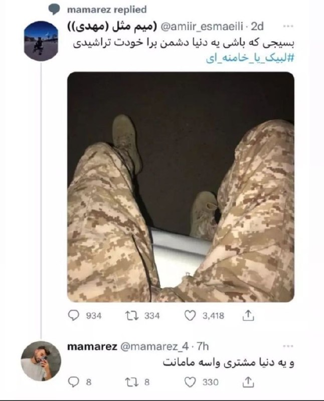
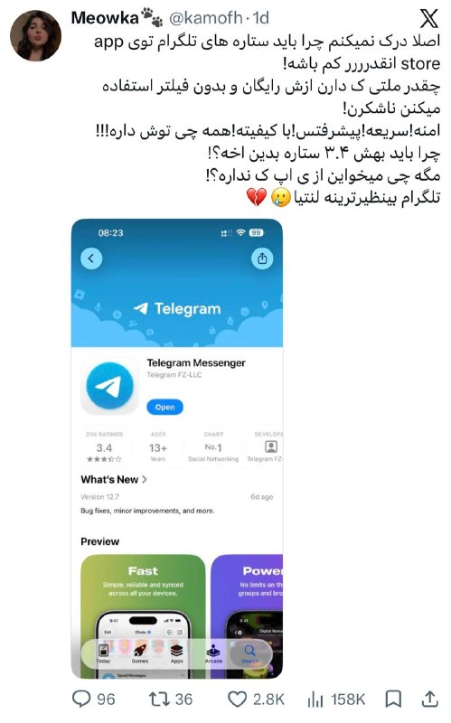
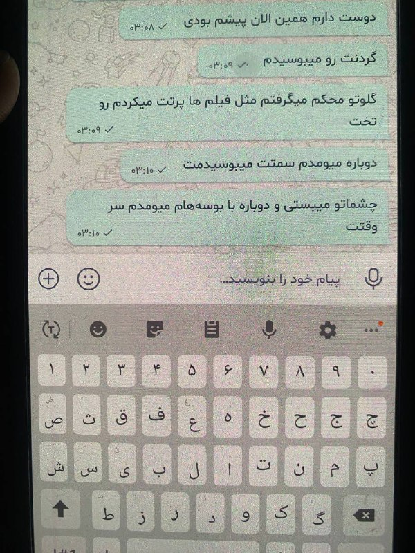
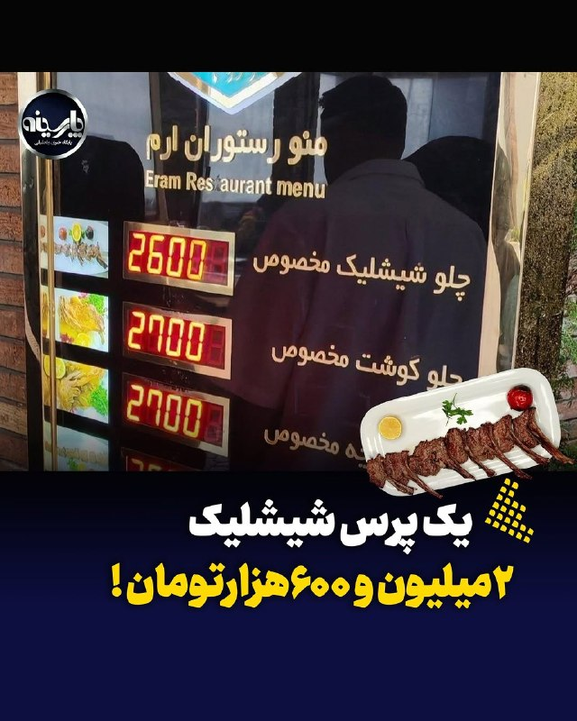
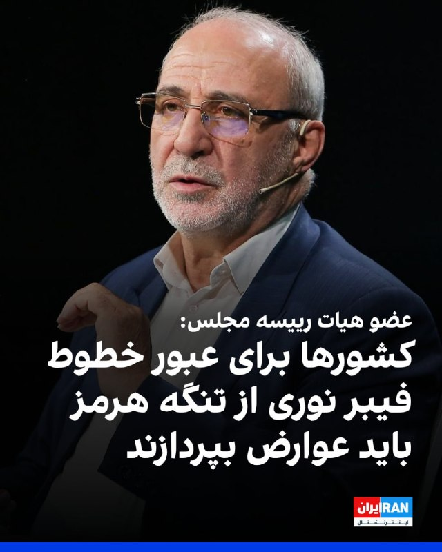
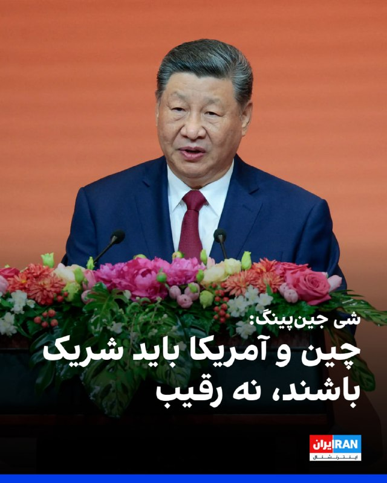

# خواننده تلگرام

<!-- TOP_NAV START -->

<!-- TOP_NAV END -->

<!-- MSG START -->

---
📅 بروزرسانی: 1405/02/24 15:47
---

## ChizBergerz — post 46378

  <a href="telegram/content/ChizBergerz_46378_1778761032.mp4" target="_blank">🎬 Download video</a>

گوشی اندرویدی Trump Mobile پس از یک سال تأخیر با قیمت ۴۹۹ دلار عرضه شد. این دستگاه دارای چیپست سری ۷ اسنپدراگون، ۱۲ گیگابایت رم، ۵۱۲ گیگابایت حافظه و دوربین سه‌گانه ۵۰ مگاپیکسلی است. این محصول چینی در آمریکا مونتاژ نهایی شده است!

@ChizBergerz

## ChizBergerz — post 46377

  <a href="telegram/content/ChizBergerz_46377_1778761034.mp4" target="_blank">🎬 Download video</a>

به وقت تراپی🥰

پلیس شریف دانمارک به طرفدارای تروریسم حمله میکنه و مثل سگ میزنتشون: 🔥🔥
@ChizBergerz

## ChizBergerz — post 46376

  

عالیییییی جواب این خرزشی مادرجنده رو داد😂😂😂

@ChizBergerz

## ChizBergerz — post 46375

  <a href="https://t.me/ChizBergerz/46375" target="_blank">📎 Download file</a>

📲#اپلیکیشن اندروید سایت جهانی دربی بت

👍اسپانسر لیگ انگلیس
👍
🔥امکان شارژ امن از طریق کارت بانکی
➖➖➖➖➖➖➖➖➖

🪙همین حالا عضو شوید 👇
https://t.me/+aCbq7yy8QY80NzQ0

## ChizBergerz — post 46374

  

😤دنبال یه سایت شرط بندی بین المللی بودی که به ایرانیا خدمات بده؟!
⛔

👍دربی بت همون انتخاب  100%

💎ویژگی های سایت جهانی Derby Bet:

⬅️امکان شارژ امن با کارت بانکی

⬅️واریز اول دوبل شارژ می شوید(بونوس۱۰۰٪)

⬅️پر اپشن ترین سایت فعال در ایران

⬅️تسویه حساب کمتر از 5 دقیقه

⬅️برگشت بخشی از باخت به صورت هفتگی

🚨کد هدیه ثبت نام:GG007

⚠️برای دانلود اپلکیشن کلیک کنید
👉
re24

🔔کانال دربی بت :

🪙https://t.me/+aCbq7yy8QY80NzQ0

## ChizBergerz — post 46373

  

واقعا نمیفهمم چرا اینقدر در حق تلگرام کم لطفی میشه، هیچ شکی درش نیست که تلگرام بهترین پلتفرم جهانه و تمام!

@ChizBergerz

## ChizBergerz — post 46372

  

#ارسالی
دیشب داداش ۱۲ سالم موقع سکس چت تو بله خوابش برده بود:

@ChizBergerz

## rodast_omiddana — post 71339

  <a href="telegram/content/rodast_omiddana_71339_1778761038.webm" target="_blank">🎬 Download video</a>

🚨یک مقام کاخ سفید گفت که ترامپ و رییس‌جمهور چین در دیدار خود توافق داشتند که جمهوری اسلامی هرگز نباید به سلاح هسته‌ای دست یابد و تنگه هرمز باید باز باشد

## rodast_omiddana — post 71338

🎬 شهبازی میگه اگر اینترنت پرسرعت و مسترکارت میخواید بروید افغانستان و سوریه
لینک یوتیوب:
https://www.youtube.com/watch?v=FBYzlhIAR5M

## KiriMohems — post 47491

  

🔴زنا و سیما: میخواییم محرم امسال یه سریال خفن به اسم مختارنامه از شبکه آی فیلم پخش کنیم.

#Helsinki
@KiriMohems

## KiriMohems — post 47490

🔴برنامه عشق و حال و چال کردن کص موش رو بچینید چون یارانه اردیبهشت دهک‌های یک تا ۳ واریز شد

#Helsinki
@KiriMohems

## KiriMohems — post 47489

  <a href="telegram/content/KiriMohems_47489_1778761038.mp4" target="_blank">🎬 Download video</a>

ایلان ماسک سر میز شام تو چین

باز کسخل شده.

#professor
@KiriMohems

## KiriMohems — post 47488

  <a href="telegram/content/KiriMohems_47488_1778761039.mp4" target="_blank">🎬 Download video</a>

ترامپ بلونده خطاب به رئیس‌جمهور چین:

داداشم تو رهبر بزرگی هستی؛ من اینو به همه گفتم

#professor
@KiriMohems

## KiriMohems — post 47487

👈ترامپ کله سکسی : لاس های مکررش با شی جین‌پینگ «سازنده» بوده و برای هر دو کشور مفید بود

ترامپ به‌طور رسمی از شی جین‌پینگ دعوت کرد که در ۲۴ سپتامبر به آمریکا و کاخ سفید سفر کنه تا یه لواط مشتی باهم داشته باشن

#professor
@KiriMohems

## KiriMohems — post 47486

  

🔴 جدیدا قیمت غذا توی ایران رو، روی تابلوی صرافی مینویسن تا بتونن به صورت لحظه ای آپدیت کنن.

+ یه پرس شیشلیک 2 میلیون و 600 هزار ناقابل!

#professor
@KiriMohems

## KiriMohems — post 47485

  

😤دنبال یه سایت شرط بندی بین المللی بودی که به ایرانیا خدمات بده؟!⛔

👍دربی بت همون انتخاب  100%

💎ویژگی های سایت جهانی Derby Bet:
⬅️امکان شارژ امن با کارت بانکی
⬅️واریز اول دوبل شارژ می شوید(بونوس۱۰۰٪)
⬅️پر اپشن ترین سایت فعال در ایران
⬅️تسویه حساب کمتر از 5 دقیقه
⬅️برگشت بخشی از باخت به صورت هفتگی

🚨کد هدیه ثبت نام:GG007

⚠️برای دانلود اپلکیشن کلیک کنید👉

🔔کانال دربی بت :r24🅰
🪙https://t.me/+kpFvLD9kaeJhYTI0

## SportBaadNews — post 251569

ایران اینترنت ندارد، روز هفتاد و ششم ...
ایران اینترنت ندارد، روز هفتاد و ششم ...
ایران اینترنت ندارد، روز هفتاد و ششم ...
ایران اینترنت ندارد، روز هفتاد و ششم ...
ایران اینترنت ندارد، روز هفتاد و ششم ...
ایران اینترنت ندارد، روز هفتاد و ششم ...

## SportBaadNews — post 251568

  <a href="telegram/content/SportBaadNews_251568_1778761041.webm" target="_blank">🎬 Download video</a>

🚨
⚽️
⚽️
⚽️| متئو مورتو: دوشان ولاهوویچ اخیراً به یه باشگاه بزرگ اسپانیایی پیشنهاد شده. اون باشگاه اتلتیکو مادرید نبوده. یا رئال بوده یا بارسلونا.
@SportBaadNews

## SportBaadNews — post 251567

  

بانوو ماریا یاکوبلی مجری با کمالات سری آ با جام کوپا ایتالیا
@SportBaadNews

## SportBaadNews — post 251566

  

🟢 هنوز داری دنبال لینک می‌گردی؟

✅ حرفه‌ای‌ها مستقیم وارد میشن!
با ربات وینکوبت، ورود به سایت فقط چند ثانیه زمان می‌بره: 
👇

🤖 @Wincobet_bot

🤖 @Wincobet_bot

⚡ بدون فیلتر و دردسر
⚡ بدون لینک‌های الکی
⚡ فقط یه کلیک تا ورود

🎁 اگه سریع و راحت میخوای وارد شی، این همون چیزیه که دنبالش بودی!

🤖 @Wincobet_bot

📌برای اطلاع از تحلیل بازی‌ها و ورود به کانال وینکوبت جوین بدید: 
👇

🔵 @Wincobetofficial

## IranIntlTV — post 337161

  

عباس مقتدایی، نایب رییس کمیسیون امنیت ملی مجلس گفت: «ما آنچه را اراده کنیم، به آمریکا و هم‌پیمانانش دیکته می‌کنیم، چرا که حاکمیت بر خلیج فارس، تنگه هرمز و دریای عمان موضوعی ذاتی و متعلق به کشور ماست.»
او افزود: «ترامپ نشان داد که باور به اینکه انسان‌ها می‌توانند از گرگ نیز بدتر و پلیدتر باشند، باوری ریشه‌دار، عمیق و واقعی است.»

او ادامه داد: «با آمادگی دفاعی می‌توانیم سایه جنگ را از سر کشور برداریم و با ایجاد انتظام در تنگه هرمز، این شاهراه حیاتی جهانی را که از نظر اقتصادی و سیاسی اهمیت بالایی دارد، به‌عنوان اهرمی برای دستیابی به حقوق ایران مورد بهره‌برداری قرار دهیم.»
iranintl.com/202605140403

## IranIntlTV — post 337160

  

محمدرضا عارف، معاون اول مسعود پزشکیان، گفت که تنگه هرمز مال ماست؛ ملک ما بوده و مدتی از ملک‌مان خوب استفاده نمی‌کردیم.

او افزود: «ما به هیچ قیمتی کنترل تنگه هرمز را از دست نخواهیم داد.» عارف ادامه داد: «در جنگ هر کس روایت تولید کرد، پیروز خواهد شد.»
iranintl.com/202605143228

## IranIntlTV — post 337159

  <a href="telegram/content/IranIntlTV_337159_1778761044.mp4" target="_blank">🎬 Download video</a>

سرخط خبرهای پنجشنبه ۲۴ اردیبهشت
@iranintltv

## IranIntlTV — post 337158

  <a href="telegram/content/IranIntlTV_337158_1778761045.mp4" target="_blank">🎬 Download video</a>

ایران‌اینترنشنال از همه افرادی که درباره وقایع بیمارستان الغدیر تهران در ۱۸ و ۱۹ دی‌ماه شواهد، اسناد یا اطلاعاتی دارند خواسته است از طریق بات اینتل‌مدیا، اطلاعات خود را ارسال کنند.

جزییات بیشتر در گفت‌وگو با فرنوش فرجی، عضو تحریریه ایران‌اینترنشنال
@iranintltv

## IranIntlTV — post 337157

  <a href="telegram/content/IranIntlTV_337157_1778761047.mp4" target="_blank">🎬 Download video</a>

فیلم «داستان‌های موازی» ساخته اصغر فرهادی، به‌طور رسمی در بخش مسابقه اصلی جشنواره کن به نمایش درمی‌آید. سینمای مستقل، مهاجرت، تبعید و حضور فیلمسازان ایرانی در بخش‌های مختلف، از محورهای مورد توجه جشنواره امسال است.
لی‌لی نیکفر، خبرنگار ایران‌اینترنشنال، گزارش می‌دهد
@iranintltv

## IranIntlTV — post 337156

  

حسینعلی حاجی‌دلیگانی، عضو هیات رییسه مجلس، گفت که ادامه مذاکره با آمریکا اشتباه است و افزود واشینگتن برای آتش‌بس اصرار داشته و به دنبال خرید زمان با اهداف داخلی و انتخاباتی بوده است.

حاجی‌دلیگانی افزود: «خطوط فیبر نوری عبوری از بستر تنگه هرمز نیز باید شامل عوارض سالانه باشند.»

او گفت: «کل تنگه هرمز در حوزه سرزمینی ایران قرار می‌گیرد و مدیریت آن باید در اختیار جمهوری اسلامی باشد.»
iranintl.com/202605145331

## IranIntlTV — post 337154

🔻بازدید مسعود پزشکیان، رئیس دولت جمهوری اسلامی و احمد دنیامالی، وزیر ورزش و جوانان از مجموعه ورزشی آزادی.

🔹در هفته اول جنگ، ایران‌اینترنشنال گزارش داد که پس از آغاز حملات اسرائیل و آمریکا در نهم اسفندماه، به کارکنان و پرسنل فدراسیون‌ها و مراکز مستقر در مجموعه ورزشی آزادی در تهران دستور داده شد  ساختمان‌ها و سالن‌های ورزشی این مجموعه را تخلیه کنند.

🔹طبق این اطلاعات، پس از تخلیه کارکنان، نیروهای حکومتی از جمله یگان ویژه و بسیج در بخش‌های مختلف این مجموعه مستقر شدند.

🔹پس از این ماموران در سالن‌های مختلف از جمله ورزشگاه ۱۲ هزار نفری آزادی و همچنین سالن‌ها و ساختمان‌های متعلق به فدراسیون‌های ورزشی از جمله کشتی، والیبال، بسکتبال و وزنه‌برداری مستقر شدند.

🔹در پی این اقدامات، سالن ۱۲ هزار نفری ورزشگاه آزادی در حملات هوایی روز پنجشنبه ۱۴ اسفند ۱۴۰۴، تخریب شد.

@iranintltvsport

## IranIntlTV — post 337153

  <a href="telegram/content/IranIntlTV_337153_1778761048.mp4" target="_blank">🎬 Download video</a>

بیمارستان الغدیر تهران شامگاه ۱۸ و ۱۹ دی‌ماه، شاهد گوشه‌ای از جنایتی بود که جمهوری اسلامی علیه معترضان مرتکب شد. ده‌ها پیکر بی‌جان و شمار زیادی از مجروحان به این بیمارستان منتقل شدند و به دلیل کمبود فضای سردخانه، تعدادی از کشته‌شدگان، پتوپیچ در حیاط پشت بیمارستان رها شدند. ایران‌اینترنشنال با هدف روشن کردن ابعاد جنایت در بیمارستان الغدیر تهران در ۱۸ و ۱۹ دی‌ماه، کارزاری مردمی برای شناسایی جاویدنامانی که به این بیمارستان منتقل شده بودند راه‌اندازی کرده و تاکنون هویت ۹ نفر از آن‌ها را شناسایی کرده است.
از همه افرادی که درباره وقایع بیمارستان الغدیر تهران شواهد، اسناد یا اطلاعاتی دارند می‌خواهیم از طریق بات اینتل‌مدیا، اطلاعات خود را ارسال کنند و راوی حقیقت باشند.

گزارش آبتین یزدان‌پناه، خبرنگار ایران‌اینترنشنال
@iranintltv

## IranIntlTV — post 337152

  

دانشجویان متحد گزارش داد متین زمانیان، دانشجوی کارشناسی علوم سیاسی دانشگاه آزاد تهران مرکز، با گذشت بیش از یک‌ماه از بازداشت، در زندان تهران بزرگ نگهداری می‌شود.

بنا بر این گزارش متین زمانیان در طول دوران بازداشت، از حق دسترسی به وکیل مستقل و دادرسی عادلانه محروم مانده است.
iranintl.com/202605143017

## IranIntlTV — post 337151

  

اسکات بسنت، وزیر خزانه‌داری آمریکا، گفت هم‌زمان با سفر دونالد ترامپ به پکن، انتظار می‌رود چین سفارش‌های بزرگی برای خرید هواپیما از شرکت بوئینگ ثبت و اعلام کند.

به گفته او، مذاکرات میان واشینگتن و پکن علاوه بر صنعت هوانوردی، حوزه‌هایی مانند انرژی و محصولات کشاورزی را نیز در بر خواهد گرفت.

بسنت همچین به مناقشه تایوان پرداخت و افزود: «ترامپ حساسیت‌های مربوط به این موضوع را درک می‌کند.»

به گفته وزیر خزانه‌داری آمریکا، ترامپ «در روزهای آینده» درباره این مساله صحبت خواهد کرد.
https://iranintl.com/202605141039

## IranIntlTV — post 337150

«#چشم‌انداز با مهدی مهدوی‌آزاد»؛ شنبه تا چهارشنبه ساعت ۲۱:۰۰ تهران

بررسی آخرین رویدادهای سیاسی، فرهنگی و اجتماعی با حضور کارشناسان.
@iranintltv

## IranIntlTV — post 337149

  

دونالد ترامپ، رییس‌جمهوری آمریکا، پس از سخنان شی جین‌پینگ در ضیافت رسمی در پکن پشت تریبون رفت و از استقبال انجام‌شده قدردانی کرد. او استقبال از خود در پکن را «افتخاری بزرگ» توصیف کرد و از شی جین‌پینگ «برای این استقبال باشکوه» تشکر کرد.

ترامپ گفت: «امروز گفت‌وگوها و دیدارهای بسیار مثبت و سازنده‌ای با هیات چینی داشتیم و این ضیافت نیز فرصتی ارزشمند است تا در جمع دوستان درباره برخی از موضوعاتی که امروز مطرح کردیم گفت‌وگو کنیم.»

رییس‌جمهوری آمریکا همچنین روابط ایالات متحده و چین را «یکی از تاثیرگذارترین روابط در تاریخ بشر» خواند.

## IranIntlTV — post 337148

  

عترشی جین‌پینگ، رهبر چین، در آغاز ضیافت شام رسمی با دونالد ترامپ با بلند کردن جام خود به او و هیات آمریکایی خوشامد گفت و بر ضرورت همکاری میان دو کشور تاکید کرد. رهبر چین تاکید کرد: «دو کشور ما باید شریک باشند، نه رقیب.»

شی در سخنان خود به سال ۲۰۲۶ به عنوان دویست‌وپنجاهمین سالگرد اعلامیه استقلال آمریکا اشاره کرد و گفت: «مردم چین و ایالات متحده هر دو ملت‌های بزرگی هستند.»

او افزود: «تحقق احیای بزرگ ملت چین و عظمت دوباره آمریکا می‌تواند همزمان پیش برود. ما می‌توانیم به موفقیت یکدیگر کمک کنیم و رفاه کل جهان را ارتقا دهیم.»

## IranIntlTV — post 337147

  

فاطمه وحدت، نایب‌رییس اتحادیه زنان کارگر سراسر ایران گفت: «نشانه‌های گسترش فقر در جامعه مشهود است. این روزها آدم‌ها را می‌بینیم که حتی برای خرید نان دچار مشکل هستند. این‌ها نشانه‌های کوچکی نیستند. شاید ساده به نظر برسند، اما اگر جدی گرفته نشوند، بعدها به معضل بزرگ اجتماعی تبدیل می‌شوند.»

او افزود: «در شرایط بحرانی، زنان کارگر بیش از دیگران در معرض اخراج قرار می‌گیرند؛ به‌ویژه زنانی که سرپرست خانوار هستند و مسئولیت مستقیم تامین معاش خانواده را برعهده دارند، در اثر این اخراج بیشترین آسیب را متحمل می‌شوند.»

وحدت ادامه داد: «همه از این شرایط خبر دارند، اما مسئله این است که نظارت جدی وجود ندارد.»
https://iranintl.com/202605143396

## IranIntlTV — post 337146

  

اسکات بسنت، وزیر خزانه‌داری آمریکا گفت بازگشایی تنگه هرمز به نفع چین است و پکن هر کاری بتواند برای بازگشایی این آبراه انجام خواهد داد.

او در مصاحبه با سی‌ان‌بی‌سی تاکید کرد چین پشت صحنه و تا جایی که بر جمهوری اسلامی نفوذ داشته باشد، برای بازگشایی تنگه هرمز همکاری خواهد کرد.
https://iranintl.com/202605140954

## IranIntlTV — post 337145

  

🔻فریده شجاعی، نایب‌رییس بانوان فدراسیون فوتبال، در مراسم بدرقه تیم ملی در شامگاه چهارشنبه ۲۳ اردیبهشت گفت: «به تمامی اعضای هیات‌رییسه فدراسیون فوتبال اعلام شده در جام جهانی حضور داشته باشند.»

🔹صحبت‌های شجاعی در حالی مطرح می‌شد که تیم ملی در فاصله کمتر از یک ماه تا آغاز جام‌جهانی با بحران ویزا و چالش مالی روبه‌رو است. هنوز ویزای ملی‌پوشان صادر نشده و کادر فنی نمی‌داند کدام بازیکن ویزا خواهد گرفت و به کدام بازیکن ویزا نخواهند داد.

🔹احتمال دارد برای برخی اعضای کاروان ایران به دلیل سوابق فعالیت یا ارتباط با سپاه پاسداران، ویزا صادر نشود.
@iranintltvsport

## Persian_Trend_Official — post 14120

🔴مارکو روبیو:

💢طرف چینی گفت که آنها موافق نظامی کردن تنگه هرمز یا سیستم عوارضی نیستند و این موضع ما است.

🫆:Tony

📌 @persian_trend_official
پرشین ترند | متفاوت‌ترین کانال نظامی

## Persian_Trend_Official — post 14119

  <a href="telegram/content/Persian_Trend_Official_14119_1778761054.mp4" target="_blank">🎬 Download video</a>

💢شی در ضیافت شام با ترامپ در پکن:

«برای آینده روشن روابط چین و آمریکا و دوستی بین دو ملت، و برای سلامتی رئیس جمهور ترامپ و همه دوستان حاضر در جلسه دعا می‌ کنم.»

🫆:Tony

📌 @persian_trend_official
پرشین ترند | متفاوت‌ترین کانال نظامی

## Persian_Trend_Official — post 14117

هویدا نخست وزیر ایران در زمان شاه سیزده سال تورم ایران رو ثابت نگه داشته بود؛

زمانیکه بهش نامه زدن به خاطر ماه محرم اداره ها با تاخير باز بشن، در جواب نوشت:
“با سلام، موافقت نميشود. عبادت بجز خدمت خلق نيست.”

📝 Nick

📌 @persian_trend_official
پرشین ترند | متفاوت‌ترین کانال نظامی

## Persian_Trend_Official — post 14116

  

اسرائیل هیوم: در حالی که توجه‌ها به سمت ایران معطوف شده، حماس بی سر و صدا در حال تسلیح مجدد خود است.

☆Phantom☆

📌 @persian_trend_official
پرشین ترند | متفاوت‌ترین کانال نظامی

---
📅 بروزرسانی: 1405/02/24 14:05
---

## rodast_omiddana — post 71337

  <a href="telegram/content/rodast_omiddana_71337_1778754949.webm" target="_blank">🎬 Download video</a>

🚨
ترامپ تا پایان هفته در مورد ایران تصمیم خواهد گرفت.
مقامات ارشد اسرائیل در برخی رسانه های عبری بدون ذکر نامشان گفتند تصمیم ترامپ ممکن است به اقدام امنیتی سریعی منجر شود.
در اطراف نخست‌وزیر به نمایندگان گفته شده است:
این روزها از نظر امنیتی روزهای مهمی هستند.

## rodast_omiddana — post 71336

  <a href="telegram/content/rodast_omiddana_71336_1778754949.webm" target="_blank">🎬 Download video</a>

🚨 فکر نمیکردید اینقدر آسان تشیع در ایران ضعیف شود؟
این اولشه به یاری خدا کاری میکنم ده سال دیگه کودکان از مادرشان بپرسند "شیعه چی هست" و مادر جواب بده:
"ولش کن یک کابوس بود تمام شد"..

## rodast_omiddana — post 71335

🎬 ظهره وند میگه چیزهایی داریم که بمب اتم جلوش ترقه محسوب میشه!
لینک یوتیوب:
https://www.youtube.com/watch?v=KxxIdLQ9J20

## KiriMohems — post 47484

  <a href="telegram/content/KiriMohems_47484_1778754949.mp4" target="_blank">🎬 Download video</a>

🔴فیلم سوپر ویرال شده، از دست دادن ترامپ و شی رئیس جمهور چین :
#Helsinki
@KiriMohems

## SportBaadNews — post 251565

  <a href="telegram/content/SportBaadNews_251565_1778754951.webm" target="_blank">🎬 Download video</a>

🚨
🏴󠁧󠁢󠁥󠁮󠁧󠁿| نامزد های بهترین بازیکن فصل پریمیرلیگ معرفی شدن: برونو فرناندز، گابریل، مورگان گیبز‌وایت، ارلینگ هالند، داوید رایا، دکلان رایس، سمنیو، ایگو تیاگو
@SportBaadNews

## SportBaadNews — post 251564

مهدی تاج: قراره سرود تیم ملی جمهوری اسلامی رو فدایی بخونه 🌿⚽️ @BANGGBALL

## SportBaadNews — post 251558

  <a href="telegram/content/SportBaadNews_251558_1778754951.mp4" target="_blank">🎬 Download video</a>

شات های جدید و فوق سکسی خاله جورجینا 
🔥
🔥

🔵 ارزش دانلود 85 از 10
@SportBaadNews

## SportBaadNews — post 251557

  

⚽️| تعداد جام‌ های باشگاه‌ های فرانسوی تو کل تاریخشون:

37🏆 🇧🇷 مارکینیوش

27🏆 🇫🇷 المپیک مارسی
22🏆 🇫🇷 المپیک لیون
21🏆 🇫🇷 سن‌اتین
18🏆 🇫🇷 موناکو
17🏆 🇫🇷 بوردو
15🏆 🇫🇷 نانت
12🏆 🇫🇷 لیل
12🏆 🇫🇷 رنس
@SportBaadNews

## SportBaadNews — post 251556

  

🇫🇷
⚽️| تو 8 هفته آینده و چندین ماه بعدش تا مراسم توپ طلا اگه دنیا به کام عثمان بچرخه اون میتونه به اولین بازیکن تاریخ تبدیل بشه که برنده 2 جام جهانی، 2 چمپیونزلیگ و 2 توپ طلا شده 
🔥
🔥
@SportBaadNews

## SportBaadNews — post 251555

⚽️
⚽️
⚽️ موندوووو: پاریس پیشنهاد 100 میلیون یورویی برای خولیان آلوارز ارسال کرده اتلتیکو ترجیح میده آلوارز به پاریس بره تا بارسا
@SportBaadNews

## SportBaadNews — post 251552

  <a href="telegram/content/SportBaadNews_251552_1778754953.webm" target="_blank">🎬 Download video</a>

🚨یامال پرچم فلسطین رو تو جشن امروز بارسا بالا برد @SportBaadNews

## SportBaadNews — post 251551

  

⚽️| لیونل مسی تو 8 بازی اخیری که انجام داده کمترین نمره ای که دریافت کرده 8.1 بوده
@SportBaadNews

## SportBaadNews — post 251549

⚽️
🟠 از کیت فصل بعد منچستریونایتد رسما و شرعا رونمایی شد
@SportBaadNews

## SportBaadNews — post 251548

  

در 1800مین ساعات قطعی اینترنت عبدالرضا داوری، تحلیلگر مسائل سیاسی گفته: اگر دولت صلاح بدونه، میتونه اینترنت رو محدود یا قطع کنه و از نظر اون، این کار قابل توجیهه.
@SportBaadNews

## SportBaadNews — post 251547

عدد جدید از خسارت قطعی 74 روزه اینترنت ایران؛ 300 تا 700 هزار میلیارد تومان

گزارش تازه انجمن بلاکچین ایران نشان می‌دهد تنها در حدود 74 روز اختلال اینترنت در سال‌های 1404 و 1405، روزانه بین 300 تا 700 هزار میلیارد تومان ضرر به اقتصاد دیجیتال ایران وارد شده؛ بحرانی که حالا از افت شدید فروش و تعطیلی استارتاپ‌ها تا مهاجرت نیروی انسانی و نابودی هزاران شغل را دربر گرفته است.
@SportBaadNews

## SportBaadNews — post 251546

  <a href="telegram/content/SportBaadNews_251546_1778754954.webm" target="_blank">🎬 Download video</a>

🚨
⚽️
⚽️| آاس: پاریس آخر هفته‌ی گذشته با اطرافیان فده والورده تماس گرفته تا ببینه اوضاعش چطوره. مدت‌ هاست که بهش علاقه دارن. ولی فده اصلاً قصد نداره رئال مادرید رو ترک کنه.
@SportBaadNews

## SportBaadNews — post 251545

  

پرز : رسانه میخواد کاری کنه من اخراج بشم؟ تنها کسانی که منو اخراج میکنه دیوانه ها هستن، من جایی نمیرم. من حتی شعار "حیا کن رها کن" هم شنیدم ولی جایی نمیرم، کسی هم نمیاد جلوم باهام مبارزه کنه، شاید بخاطر اینه که من ترسناکم @SportBaadNews

## IranIntlTV — post 337143

  

خبرگزاری فارس، وابسته به سپاه پاسداران به نقل از «منبع آگاه» نوشت: «با تصمیم جمهوری اسلامی، عبور شماری از کشتی‌های چینی از تنگه هرمز، از شامگاه چهارشنبه، ۲۳ اردیبهشت و پس از توافق بر سر پروتکل‌های مدیریت جمهوری اسلامی بر این آبراه آغاز شده است.»

بر اساس این گزارش، این تصمیم پس از پیگیری‌های مقام‌های چین و در چارچوب «روابط راهبردی» تهران و پکن اتخاذ شد و کشتی‌های مورد درخواست چین اجازه عبور یافتند.
https://iranintl.com/202605149673

## IranIntlTV — post 337142

  <a href="telegram/content/IranIntlTV_337142_1778754956.mp4" target="_blank">🎬 Download video</a>

همزمان با موج تازه بیکاری در شرایط جنگی و بحران اقتصادی، آمارهای رسمی نشان می‌دهد حدود ۲۰۰ هزار نفر متقاضی دریافت بیمه بیکاری هستند. روزنامه شرق در گزارشی نوشت روند دریافت بیمه بیکاری از سازمان تامین اجتماعی به مسیری دشوار برای متقاضیان تبدیل شده است.
گفت‌وگو با اشکان نظام‌آبادی، روزنامه‌نگار اقتصادی
@iranintltv

## IranIntlTV — post 337141

  

عباس عراقچی، وزیر خارجه جمهوری اسلامی که برای شرکت در اجلاس بریکس، به دهلی نو سفر کرده، گفت: «امارات متحده عربی مستقیما در جنگ علیه ما دخیل بود.»
او خطاب به اماراتی‌ها گفت: «ائتلاف با اسرائیل هم از شما محافظت نکرد.»

عراقچی ادامه داد: «اماراتی‌ها اجازه دادند از سرزمین‌شان برای شلیک توپخانه و تجهیزات علیه ما استفاده شود.»

وزیر خارجه جمهوری اسلامی افزود: «امارات متحده عربی شریک فعال جنگ علیه ماست و هیچ تردیدی در این باره وجود ندارد و ما شگفت‌زده شدیم که برادران ما در امارات متحده عربی تصمیم گرفتند فعالانه به جنگ علیه ما بپیوندند.»

عراقچی تاکید کرد: «همدستی امارات متحده عربی با اسرائیل غیرقابل بخشش است.»
https://iranintl.com/202605148778

## IranIntlTV — post 337140

  <a href="telegram/content/IranIntlTV_337140_1778754958.mp4" target="_blank">🎬 Download video</a>

اظهارات و گزارش‌های رسمی چین و آمریکا حاکی است دونالد ترامپ و شی جین‌پینگ، رهبران دو کشور، در دیدار کلیدی خود در پکن درباره ایران گفت‌وگو کرده‌اند.

توماج طاهباز، خبرنگار ایران‌اینترنشنال، گزارش می‌دهد
@iranintltv

## IranIntlTV — post 337139

  <a href="telegram/content/IranIntlTV_337139_1778754959.mp4" target="_blank">🎬 Download video</a>

کاخ سفید اعلام کرد در جریان سفر دونالد ترامپ و دیدار او با شی‌ جین‌پینگ در پکن، روسای جمهور آمریکا و چین بر ممنوعیت دستیابی جمهوری اسلامی به سلاح هسته‌ای توافق کردند.
گفت‌وگو با عطا محامد، کارشناس روابط بین‌الملل
@iranintltv

## IranIntlTV — post 337138

در این قسمت چرتکه، محمد ماشینچیان سناریوهای مختلف قدرت خرید را تا پایان سال ۱۴۰۵ بررسی کرده و تاثیر نوسان نرخ دلار بر معیشت خانوارها را توضیح می‌دهد.
هنگام بررسی قدرت خرید حداقل دستمزد از ۱۳۹۴ تا ۱۴۰۵ در می‌یابیم که از ۹۷ به این سو، حتی وقتی قدرت خرید کارگر در ابتدای سال، حدود ۱۳۰ دلار بوده، مثل ۱۴۰۱ و ۱۴۰۴، در نتیجه تورم و بالا رفتن دلار، قدرت خرید تا پایان سال، به زیر ۱۰۰ دلار رسیده است.

تماشای نسخه کامل «چرتکه» در یوتیوب:
https://youtu.be/1W2RoMvSqPQ
@iranintltv

## IranIntlTV — post 337137

  

🔻مهدی تاج، رییس فدراسیون فوتبال، پنج‌شنبه ۲۴ اردیبهشت، در حاشیه اهدای جام قهرمانی فوتسال زنان به استقلال گفت: «فردا یا پس‌فردا در ترکیه جلسه سرنوشت‌سازی با فیفا داریم، چون باید به ما گارانتی بدهند. مساله ویزا حل نشده و هنوز هیچ ویزایی ندادند. منتظریم ببینیم رفتار طرف مقابل چیست.»

🔹فدراسیون فوتبال در فاصله کمتر از یک ماه تا آغاز جام‌جهانی با بحران ویزا و چالش مالی دست‌به‌گریبان است. امیر قلعه‌نویی هنوز نمی‌داند کدام بازیکن ویزا خواهد گرفت و کدام بازیکن را در آمریکا در اختیار خواهد داشت.

🔹احتمال دارد برای برخی اعضای کاروان ایران به دلیل سوابق فعالیت یا ارتباط با سپاه پاسداران، ویزا صادر نشود.
@iranintltvsport

## IranIntlTV — post 337136

  <a href="telegram/content/IranIntlTV_337136_1778754961.mp4" target="_blank">🎬 Download video</a>

شهروندان با ارسال پیام‌های متعدد به ایران‌اینترنشنال از افزایش بیکاری، دشواری پیدا کردن شغل در شهرهای مختلف و مشکلات معیشتی ناشی از آن در ایران خبر دادند.
@iranintltv

## IranIntlTV — post 337135

  <a href="telegram/content/IranIntlTV_337135_1778754962.mp4" target="_blank">🎬 Download video</a>

دفتر نخست‌وزیری اسرائیل چهارشنبه گزارش داد بنیامین نتانیاهو، نخست‌وزیر اسرائیل، در جریان عملیات «غرش شیران» به‌صورت محرمانه به امارات سفر کرده است. به گفته مقام‌های اسرائیلی، این سفر به گشایشی تاریخی در روابط دو طرف منجر شده است. وزارت خارجه امارات گزارش‌ها درباره این سفر را تکذیب کرده است.

ارزیابی محمدجواد اکبرین، عضو تحریریه ایران‌اینترنشنال
@iranintltv

## IranIntlTV — post 337134

  <a href="telegram/content/IranIntlTV_337134_1778754964.mp4" target="_blank">🎬 Download video</a>

سازمان عملیات تجارت دریایی بریتانیا اعلام کرد یک کشتی که در ۷۰ کیلومتری شمال شرقی بندر فجیره لنگر انداخته بود، توقیف شده و اکنون به سمت آب‌های ایران در حرکت است.
جزییات بیشتر با مرتضی کاظمیان، عضو تحریریه ایران‌اینترنشنال
@iranintltv

## IranIntlTV — post 337133

  <a href="telegram/content/IranIntlTV_337133_1778754965.mp4" target="_blank">🎬 Download video</a>

شی جین‌پینگ، رهبر چین، در دیدار با دونالد ترامپ، رییس‌جمهوری ایالات متحده، گفت همواره باور داشته که «چین و آمریکا منافع مشترک بیشتری نسبت به اختلافاتشان دارند». او همچنین بر اهمیت ثبات روابط پکن و واشینگتن برای دو کشور و جهان تاکید کرد.
@iranintltv

## IranIntlTV — post 337132

  <a href="telegram/content/IranIntlTV_337132_1778754967.mp4" target="_blank">🎬 Download video</a>

مراسم بدرقه تیم فوتبال ایران برای حضور در جام جهانی ۲۰۲۶، در حضور حامیان حکومت برگزار و همزمان از پیراهن جدید این تیم رونمایی شد.
گفت‌وگو با مزدک میرزایی، عضو تحریریه ایران‌اینترنشنال
@iranintltv

## IranIntlTV — post 337131

  

منوچهر متکی، نماینده مجلس و وزیر خارجه پیشین جمهوری اسلامی، گفت برخی از پهپادهایی که به ایران حمله کردند متعلق به امارات متحده عربی بوده است. او تاکید کرد که «حجت بر تمام کشورهای منطقه تمام شده است.»

متکی گفت: «برخی از پهپادهایی که به ایران زده می‌شد پهپادهای امارات متحده عربی بود و قابل کتمان نیست. این اطلاعات نزد ما است.»

متکی با اشاره به روابط جمهوری اسلامی با کشورهای منطقه گفت: «یک مسئله‌ای داریم که در ۴۷ سال گذشته تحت تاثیر دیگران، کشورهای منطقه روابط صادقانه و خوبی با ما نداشتند. اما ما حسن همسایگی را رعایت کردیم.»
https://iranintl.com/202605141340

## IranIntlTV — post 337130

  

زمین‌لرزه‌ای به بزرگی ۵ منطقه بردسیر در استان کرمان را لرزاند. این زمین‌لرزه در عمق ۸ کیلومتری زمین رخ داد. جزییات بیشتری درباره خسارات احتمالی یا تلفات این زمین‌لرزه منتشر نشده است.
https://iranintl.com/202605149083

## Persian_Trend_Official — post 14115

  <a href="telegram/content/Persian_Trend_Official_14115_1778754969.mp4" target="_blank">🎬 Download video</a>

💢حمله حامیان جمهوری اسلامی به دو گردشگر چینی که در حال تهیه گزارش
از شرایط کشور در زمان حملات بودند

🫆:Tony

📌 @persian_trend_official
پرشین ترند | متفاوت‌ترین کانال نظامی

## Persian_Trend_Official — post 14114

  <a href="telegram/content/Persian_Trend_Official_14114_1778754970.mp4" target="_blank">🎬 Download video</a>

🔺علی کیایی ‌فر، متخصص امنیت اطلاعات: در جنگ دوازده‌روزه، نوبیتکس، بانک پاسارگاد، بانک سپه و بانک مرکزی از داخل خود ایران هک شدند

مثلاً نوبیتکس توسط یک سرور زامبی در یک مدرسه‌ی علمیه خواهران در قم هک شد.

☆Phantom☆

📌 @persian_trend_official
پرشین ترند | متفاوت‌ترین کانال نظامی

## Persian_Trend_Official — post 14113

🔴 چین: آماده گسترش همکاری با آمریکا هستیم

💢سخنگوی وزارت بازرگانی چین اعلام کرد پکن آماده همکاری با آمریکا برای گسترش فهرست همکاری‌های مشترک میان دو کشور است.

💢بر اساس این اظهارات:

▪️ معاون نخست‌وزیر چین و وزیر خزانه‌داری آمریکا روز چهارشنبه در کره جنوبی دیدار کردند
▪️ مقام‌های دو کشور گفت‌وگوها را «صریح، عمیق و سازنده» توصیف کرده‌اند
▪️ چین اعلام کرده همکاری‌ها باید بر پایه:

برابری
احترام متقابل
و منافع مشترک

پیش برود.

💢پکن همچنین تأکید کرد دو طرف در تلاش هستند فهرست اختلافات را کاهش داده و روابط اقتصادی و تجاری سالم‌تری ایجاد کنند.

🫆:Tony

📌 @persian_trend_official
پرشین ترند | متفاوت‌ترین کانال نظامی

## Persian_Trend_Official — post 14112

  <a href="telegram/content/Persian_Trend_Official_14112_1778754972.mp4" target="_blank">🎬 Download video</a>

🔴 عراقچی: این آمریکا است که تنگه هرمز را بسته، نه ایران

💢عباس عراقچی، وزیر خارجه جمهوری اسلامی ، اعلام کرد تهران تنگه هرمز را نبسته و این آمریکا است که با اقدامات خود محاصره ایجاد کرده است.

💢او گفت:

▪️ از نگاه جمهوری اسلامی ، تنگه هرمز برای تمامی کشتی‌های تجاری باز است

▪️ کشتی‌ها باید با نیروهای دریایی حمهوری اسلامی همکاری و هماهنگی داشته باشند

▪️ جمهوری اسلامی هیچ مانعی در مسیر عبور کشتی‌ها ایجاد نکرده است

▪️ آنچه اکنون در منطقه رخ می‌دهد، ناشی از محاصره و اقدامات آمریکا است

🫆:Tony

📌 @persian_trend_official
پرشین ترند | متفاوت‌ترین کانال نظامی

## Persian_Trend_Official — post 14111

  <a href="telegram/content/Persian_Trend_Official_14111_1778754973.mp4" target="_blank">🎬 Download video</a>

🔴ویدیویی از انفجار شناور کلاس سلیمانی نیرو دریایی سپاه در جنگ اخیر

🫆:Tony

📌 @persian_trend_official
پرشین ترند | متفاوت‌ترین کانال نظامی

## Persian_Trend_Official — post 14110

  <a href="telegram/content/Persian_Trend_Official_14110_1778754975.webm" target="_blank">🎬 Download video</a>

‼️🏦 یک مقام کاخ سفید:

✅ رئیس جمهور ترامپ و همتای چینی او بر سر لزوم باز نگه داشتن تنگه هرمز توافق کردند.
✅ ترامپ و همتای چینی‌اش توافق کردند که ایران نمی‌تواند سلاح هسته‌ای داشته باشد.

📝 Nick

📌 @persian_trend_official
پرشین ترند | متفاوت‌ترین کانال نظامی

## Persian_Trend_Official — post 14109

  <a href="telegram/content/Persian_Trend_Official_14109_1778754975.webm" target="_blank">🎬 Download video</a>

⭕️ سوپراپلیکیشن ایتا اعلام کرد امکان ارسال فایل تا حجم ۲۰ مگابایت مجدداً برای همه کاربران فراهم شده است!

کاش تلگرام بیاد از شما یاد بگیره 🤯

📝 Nick

📌 @persian_trend_official
پرشین ترند | متفاوت‌ترین کانال نظامی

## Persian_Trend_Official — post 14108

  <a href="telegram/content/Persian_Trend_Official_14108_1778754975.webm" target="_blank">🎬 Download video</a>

💢زلزله ای در کرمان رخ داده است 🫆:Tony 📌 @persian_trend_official پرشین ترند | متفاوت‌ترین کانال نظامی

<!-- MSG END -->

<!-- NAV START -->

<!-- NAV END -->
