# خواننده تلگرام

<!-- TOP_NAV START -->

<a href="https://github.com/amirkarimiq12-svg/aio-downloader/blob/main/telegram/content/archive_1.md" style="display:inline-block; padding:6px 12px; margin:0 4px; background-color:#2ea44f; color:white; text-decoration:none; border-radius:4px; font-weight:bold;">صفحه بعد</a>

<!-- TOP_NAV END -->

<!-- MSG START -->

---
📅 بروزرسانی: 1405/02/31 21:57
---

## ChizBergerz — post 46641

  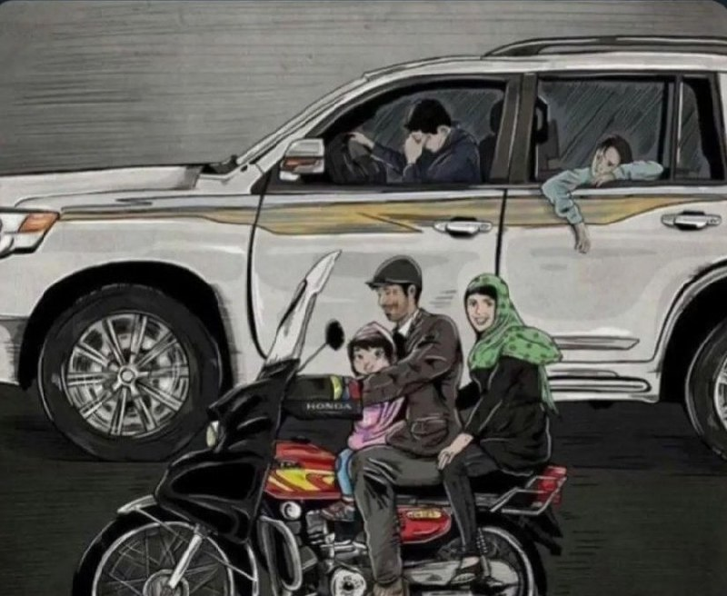

G(OLD)

من ترجیح میدم تو لندکروز بشکه بشکه اشک بریزم تا اینکه پشت هوندا مثل کصخلا بخندم...
@ChizBergerz

## ChizBergerz — post 46640

  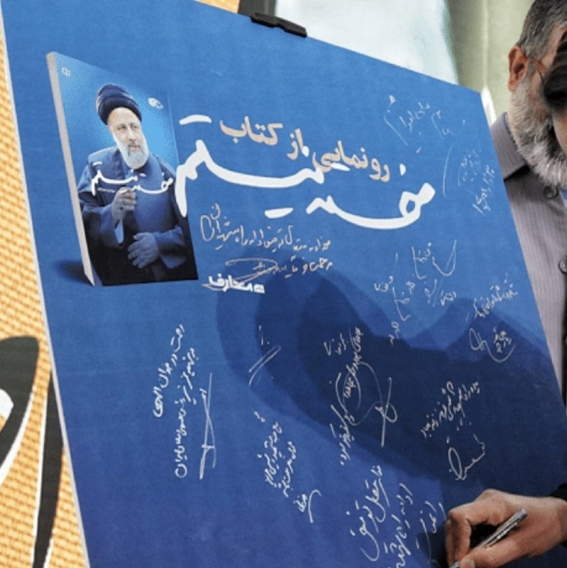

کتاب نوشتن واسه رییسی اسمشو گذاشتن "خسته نیستم".

اولین چیزی که به ذهن آدم میاد اینه که "خب بکیرم".
@ChizBergerz

## ChizBergerz — post 46639

  <a href="telegram/content/ChizBergerz_46639_1779388078.mp4" target="_blank">🎬 Download video</a>

تصورم از زرشکیان حروم‌زاده که میگه با موش‌تباه ملاقات کرده: 😂😂

@ChizBergerz

## ChizBergerz — post 46638

  

وعده‌ی مناسب قبل از باشگاه:

@ChizBergerz

## ChizBergerz — post 46637

  <a href="telegram/content/ChizBergerz_46637_1779388080.mp4" target="_blank">🎬 Download video</a>

یکم آنلاین شاپ ایرانی ببینیم...

@ChizBergerz

## ChizBergerz — post 46636

  

چیزی که تو ۱۸ سالگی انتخاب میکنی⬅️

چیزی که تو ۳۰ سالگی انتخاب میکنی➡️
@ChizBergerz

## rodast_omiddana — post 71719

  <a href="telegram/content/rodast_omiddana_71719_1779388084.webm" target="_blank">🎬 Download video</a>

🚨 بترسید از کسیکه نام "کنسرت" را "تجمع فرهنگی سیاسی" میزارد و دست به بلیط فروشی میزند..

## rodast_omiddana — post 71717

  <a href="telegram/content/rodast_omiddana_71717_1779388084.webm" target="_blank">🎬 Download video</a>

🚨 کاسبی با خون جاویدنامان و بِرَند شاهزاده با رَسم شکل...

## rodast_omiddana — post 71716

  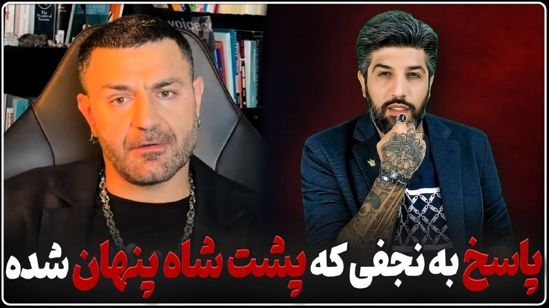

🎬 پاسخ طوفانی به کلیپ 13 دقیقه ای شاهین نجفی که پشت شاهزاده پنهان شده
لینک یوتیوب:
https://www.youtube.com/watch?v=xpDv-m5DvP4

## KiriMohems — post 47865

  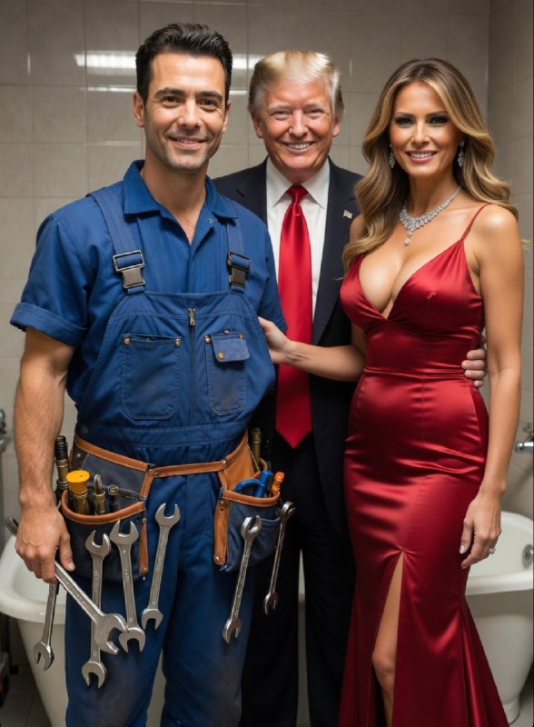

ترامپ ۴۸ ساعت دیگه:

قرار بود به ایران حمله کنیم ولی قراره لوله‌کش بیاد برای سیفون دستشویی، ملانیا خونه تنهاست من حتما باید پیشش باشم.

#professor
@KiriMohems

## KiriMohems — post 47864

  <a href="telegram/content/KiriMohems_47864_1779388086.mp4" target="_blank">🎬 Download video</a>

🔴 ترامپ:

ایران نمیتونه اورانیوم غنی‌شده اش رو نگه داره. به محض اینکه اونا رو بگیریم، احتمالاً نابودش میکنیم. ما این عن رو را نمیخواییم.

#Helsinki
@KiriMohems

## KiriMohems — post 47863

  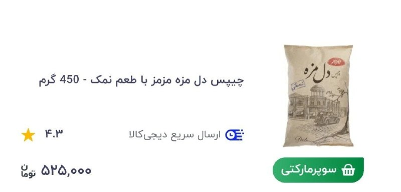

🔴 عن در کونتان چیپس میشه ببینید:

یک بسته چیپس کیری نمکی ساده نیم میلیون تومان!!!

#professor
@KiriMohems

## KiriMohems — post 47862

  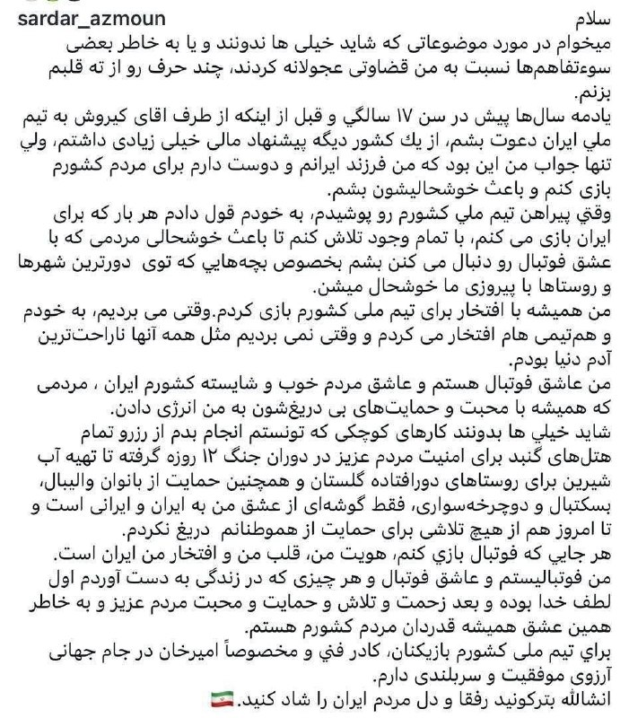

سردار آزمون هم طی یه پست تو اینستاگرامش، برای تیم‌ملی مالیده، گفته یسریا تو کشور در موردم عجولانه قضاوت کردن و سوء‌تفاهم شده، برای تیم‌ملی مالیده، خوبی‌هایی که به مردم کرده رو کرده تو چشمون و از تک‌تکش اسم برده و منت گذاشته، بازم برای تیم‌ملی مالیده و گفته برای بازیکنا و کادرفنی و امیرخان آرزوی موفقیت دارم، برید بترکونید و دل مردمو شاد کنید؛ تا نشون بده لایق حمایت‌هایی که این‌مدت شده بود رو نداره. وسلام

#professor
@KiriMohemSport

## KiriMohems — post 47861

  

✖️ سایت بین المللی bet120x 
✖️

 
👍دارای مجوز رسمی Gambling Judge سوئد
👍
     

💳شارژ حساب از طریق ارز و یووچر و پرمیوم ووچر

💳تسویه حساب دلاری سریع
💊بیمه شرط میکس

⚠️فروش شرط

🔔ویرایش شرط                    
3️⃣
2️⃣

🎁20%هدیه واریز از طریق ارز و ووچر
┅━━━━━━━━━━━

🎁 10%برگشت باخت به صورت روزانه

🎁 10%برگشت باخت به صورت هفتگی

🎁10%برگشت باخت به صورت ماهانه

💻ادرس ورود به سایت:
https://bet120x.com/fa/?btag=971470
➖➖➖➖➖
   
👈 آموزش واریز و برداشت دلاری
👉

🔪کانال اطلاع رسانی:
👇 g31🅰

✈️https://t.me/+RvVnWMHCqUc4YzFk

## KiriMohems — post 47860

🔴ترامپ: همین الان هم داریم با ایران لاس میزنیم؛ خواهیم دید چه کونی داده خواهد شد

#Helsinki
@KiriMohems

## SportBaadNews — post 252076

الهلال خووووورد

## SportBaadNews — post 252075

الهلال خووووورد

## SportBaadNews — post 252074

  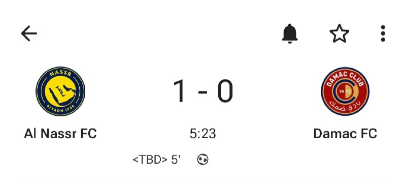

نزده فوتموب کصخل شده 😐

## SportBaadNews — post 252073

گگلللل النصرررر هم زددد

## SportBaadNews — post 252072

گگلللل النصرررر هم زددد

## SportBaadNews — post 252071

  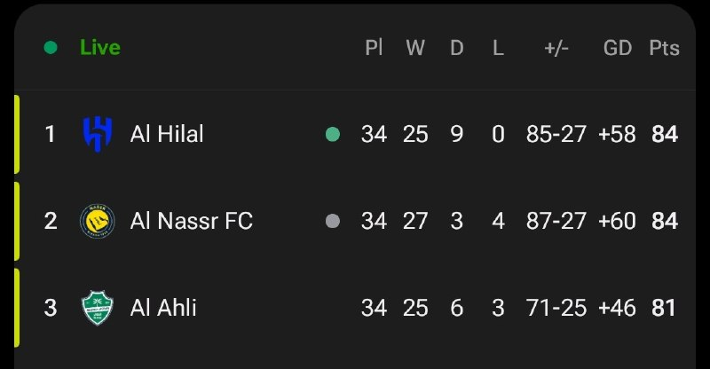

الهلال یه گل زد و فعلا قهرمانه
@SportBaadNews

## SportBaadNews — post 252070

  <a href="telegram/content/SportBaadNews_252070_1779388092.webm" target="_blank">🎬 Download video</a>

🚨
❌ طبق گفته رسانه های انگلیس، لوک شاو و مگوایر به تیم ملی انگلیس دعوت نشدند
@SportBaadNews

## SportBaadNews — post 252069

  <a href="telegram/content/SportBaadNews_252069_1779388092.webm" target="_blank">🎬 Download video</a>

🚨
🚨
🏴󠁧󠁢󠁥󠁮󠁧󠁿 مت لو: انتظار میره پالمر به تیم ملی انگلیس دعوت نشه
😐
@SportBaadNews

## SportBaadNews — post 252068

تغییر نام سانتیاگو برنابئو درگوگل مپ به امباپه دیکتاتور😂😂😂 @SportBadTweet | Ar

## SportBaadNews — post 252067

  

⚽️
🔻کوپه: انریکه ریکلمه رسماً نامزد شدنش تو انتخابات ریاست رئال رو به باشگاه اعلام کرد.

طبق قانون، نامزد ها حداقل 48 ساعت قبل از پایان مهلت انتخابات، باید به باشگاه اطلاع بدن که میخوان نامزد بشن و الان انریکه ریکلمه اینکارو انجام داده و اگه بخواد میتونه رسما نامزد بشه.
@SportBaadNews

## SportBaadNews — post 252066

  

⚽️ تمام رسانه‌های انگلیس خبر از دعوت نشدن فودن به تیم ملی انگلیس میدن
@SportBaadNews

## IranIntlTV — post 338278

  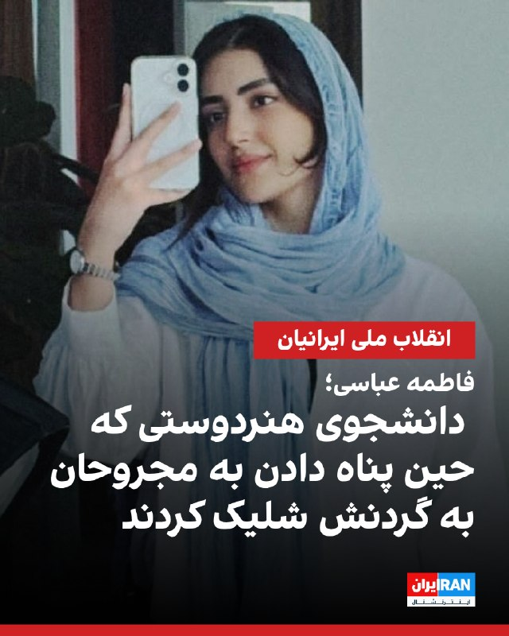

فاطمه عباسی، ۳۱ ساله و دانشجوی دانشگاه هنر اصفهان، روز ۱۹ دی‌ماه در جریان انقلاب ملی در بلوار کشاورز شهر اصفهان هنگامی‌ که در حال کمک و پناه دادن به مجروحین بود با اصابت گلوله به گردنش مجروح و دچار قطع نخاع شد. او ۲۱ اسفندماه پس از گذران نزدیک به چند هفته کما، در بیمارستان جان باخت.

بنا به گزارش‌های رسیده به ایران‌اینترنشنال، او پس از یک دوره کما، به هوش آمده و در روزهای پایانی زندگی‌اش حال عمومی بهتری داشته است. خبر درگذشت فاطمه از طریق تماس تلفنی به خانواده اطلاع داده شد.

دوستان فاطمه او را علاقه‌مند به حرفه‌ عکاسی معرفی کرده‌اند.

طبق اطلاعات رسیده به ایران‌اینترنشنال، فاطمه پس از گرفتن تعهد به خانواده تحویل و طی کنترل شدید امنیتی در قطعه ۵۲ باغ رضوان اصفهان به خاک سپرده شد.
https://iranintl.com/202605218377

## IranIntlTV — post 338277

  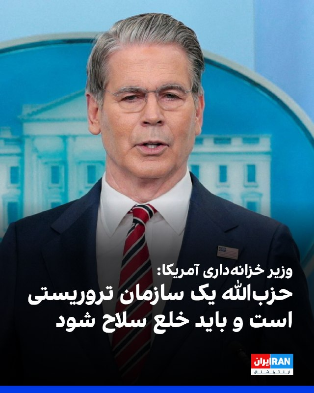

اسکات بسنت، وزیر خزانه‌داری آمریکا درباره تحریم‌های جدید این کشور علیه حزب‌الله، گروه تحت حمایت جمهوری اسلامی، در شبکه اجتماعی ایکس نوشت: «حزب‌الله یک سازمان تروریستی است و باید کاملا خلع سلاح شود.»

او افزود: «وزارت خزانه‌داری به اقدامات خود علیه مقاماتی که در دولت لبنان نفوذ کرده‌اند و حزب‌الله را قادر می‌سازند تا کارزار بی‌معنی خشونت علیه مردم لبنان را به راه بیندازد و مانع صلح پایدار شود، ادامه خواهد داد.»

پیش‌تر وزارت خزانه‌داری آمریکا اعلام کرد محمدرضا رئوف شیبانی، سفیر اخراجی جمهوری اسلامی در لبنان را تحریم کرده است.

نام شیبانی در میان ۹ نفری است که وزارت خزانه‌داری آمریکا پنجشنبه به دلیل ارتباط با حزب‌الله لبنان تحریم کرده است.

آمریکا اعلام کرده که این افراد خلع سلاح حزب‌الله را مختل می‌کردند و در جهت پیشبرد برنامه‌های جمهوری اسلامی در لبنان فعالیت می‌کردند.
https://iranintl.com/202605217096

## IranIntlTV — post 338276

  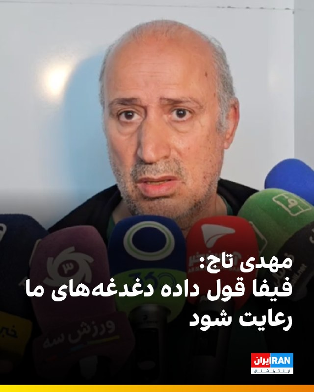

🔻مهدی تاج، رییس فدراسیون فوتبال، درباره جلسه با دبیرکل فیفا در جمع خبرنگاران گفت: «ما ۱۰ مورد را تنظیم کرده بودیم و درباره همه آنها با فیفا به نتایج خوبی رسیدیم. آنچه فیفا قول داده، این است که این مواردی که دغدغه فدراسیون فوتبال بوده، رعایت شود.»

🔹تاج درباره شرایط تیم ملی و موضوع ویزای آمریکا گفت: «در حال پیگیری است و تیم ملی بهترین شرایط را پشت سر می‌گذارد. بازی‌های دوستانه در ترکیه پیش‌بینی شده و تیم برنامه‌های خود را انجام می‌دهد.»

🔹او همچنین گفت: «در حال حاضر هنوز برای هیچ فردی ویزا صادر نشده اما بسیاری از کشورهای حاضر در جام جهانی نیز هنوز ویزا نگرفته‌اند. امیدواریم ویزاها صادر شود تا تیم ملی بتواند به‌راحتی بازی‌هایش را برگزار کند.»

@iranintltvsport

## IranIntlTV — post 338275

  

وزارت خزانه‌داری آمریکا اعلام کرد محمدرضا رئوف شیبانی، سفیر اخراجی جمهوری اسلامی در لبنان، را تحریم کرده است.

وزارت خارجه آمریکا نیز اعلام کرد ۹ نفر مرتبط با حزب‌الله را که حاکمیت لبنان را تضعیف می‌کنند، تحریم کرده است.
بر اساس این اعلام، این افراد در روند خلع سلاح حزب‌الله اخلال ایجاد کرده و در جهت پیشبرد برنامه‌های جمهوری اسلامی در لبنان فعالیت می‌کردند.
https://iranintl.com/202605213671

## IranIntlTV — post 338274

  <a href="telegram/content/IranIntlTV_338274_1779388097.mp4" target="_blank">🎬 Download video</a>

یک نهاد مدنی ایرانی در آمریکا با ارسال نامه‌ای به فیفا درباره ممنوعیت احتمالی ورود پرچم شیروخورشید به ورزشگاه‌ها در جام جهانی هشدار داد.

این نهاد با استناد به قوانین آزادی بیان در آمریکا، چنین اقدامی را نقض حقوق مدنی دانسته است.

گفت‌وگو با منصور آریا، حقوقدان
@iranintltv

## IranIntlTV — post 338273

  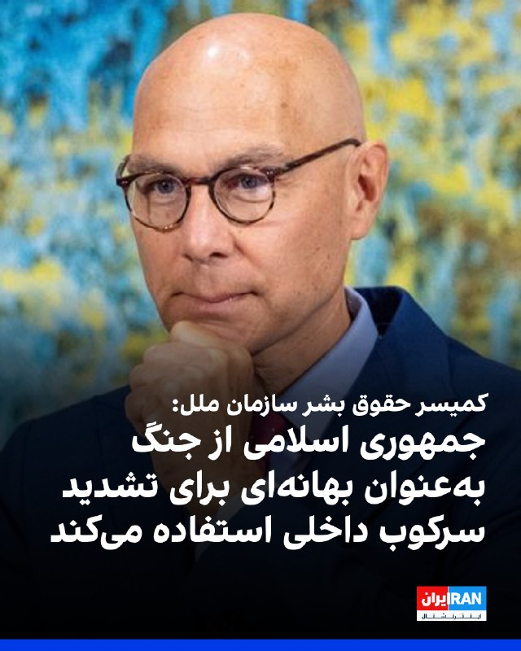

دفتر کمیسر عالی حقوق بشر سازمان ملل اعلام کرد ولکر تورک، کمیسر عالی حقوق بشر این نهاد، اعدام دو نفر دیگر در ایران را محکوم کرد.
بر اساس گزارش این دفتر، تورک گفته مقام‌های جمهوری اسلامی از جنگ با آمریکا و اسرائیل به‌عنوان بهانه‌ای برای تشدید سرکوب داخلی استفاده می‌کنند.

خبرگزاری میزان، وابسته به قوه قضاییه جمهوری اسلامی، گزارش داد رامین زله و کریم معروف‌پور، دو زندانی سیاسی بامداد پنج‌شنبه ۳۱ اردیبهشت اعدام شدند.
https://iranintl.com/202605219033

## IranIntlTV — post 338272

  <a href="telegram/content/IranIntlTV_338272_1779388101.mp4" target="_blank">🎬 Download video</a>

یک شهروند در پیامی به ایران اینترنشنال می‌گوید که بین مردم و حکومت دریایی از خون فاصله است و ترامپ نباید با جمهوری اسلامی مذاکره کند. پیام او با هوش مصنوعی خوانده شده است.

## Persian_Trend_Official — post 14624

https://youtube.com/live/zMW0RhvWank?feature=share

## Persian_Trend_Official — post 14623

🔴 قوه قضاییه جمهوری اسلامی بازداشت رشید مظاهری را تأیید کرد

💢قوه قضاییه جمهوری اسلامی بازداشت «رشید مظاهری» دروازه‌بان پیشین تیم ملی فوتبال ایران را تأیید کرد.

🔻بر اساس اعلام مقام‌های قضایی:

▪️ او با اتهاماتی از جمله «فعالیت تبلیغی برخلاف امنیت ملی» مواجه شده است
▪️ بازداشت مظاهری پس از انتقاد علنی او از علی خامنه‌ای و حوادث دی‌ماه ۱۴۰۴ صورت گرفته است

💢رشید مظاهری یکی از چهره‌های شناخته‌شده فوتبال ایران و سابقه حضور در تیم ملی را در کارنامه دارد.

🫆:Tony

📌 @persian_trend_official
پرشین ترند | متفاوت‌ترین کانال نظامی

## Persian_Trend_Official — post 14622

حدود 30 دقیقه دیگه لایو آغاز میشه

## Persian_Trend_Official — post 14621

  <a href="telegram/content/Persian_Trend_Official_14621_1779388103.webm" target="_blank">🎬 Download video</a>

💢وزارت خارجه جمهوری اسلامی اعلام کرد ادعاهای مطرح‌شده درباره غنی‌سازی اورانیوم و سرنوشت مواد غنی‌شده، چیزی جز «گمانه‌زنی رسانه‌ای فاقد اعتبار» نیست.

🫆:Tony

📌 @persian_trend_official
پرشین ترند | متفاوت‌ترین کانال نظامی

## Persian_Trend_Official — post 14620

  <a href="telegram/content/Persian_Trend_Official_14620_1779388103.mp4" target="_blank">🎬 Download video</a>

💢ترامپ مدعی شد که وضعیت ایران خیلی زود حل خواهد شد

💢دونالد ترامپ، رئیس‌جمهور آمریکا، در جمع خبرنگاران در دفتر بیضی شکل ( در کاخ سفید) اظهار داشت:

🔹ایالات متحده با دریافت هزینه حمل و نقل توسط ایران در تنگه هرمز مخالف است.

🔹آمریکا قصد دارد اورانیوم ایران را خارج کرده و به احتمال زیاد آن را معدوم (نابود) کند.

🔹گروه ضربت نیروی دریایی آمریکا به رهبری ناو هواپیمابر یواس اس «نیمیتز» که وارد دریای کارائیب شده است، برای تهدید مقامات کوبا نیست.

🫆:Tony

📌 @persian_trend_official
پرشین ترند | متفاوت‌ترین کانال نظامی

## Persian_Trend_Official — post 14619

  

سلام به همه اعضای خانواده پرشین ترند 🌟

از تراست VPN برای بچه‌های پرشین ترند ۱۰٪ تخفیف روی پلن‌های معمولی گرفتم 🔥
(البته اگر این پیام رو براشون بفرستین)

همچنین ۳ تا سرور جدید فقط برای سرعت بالاتر توی دیدن ویدئوها اضافه کردن 🚀

👇😳😳
یه طرح بمب هم دارن که هر گیگ براتون حدود ۱۶۸ تومن درمیاد 😳
برای جزئیات حتماً بهشون پیام بدین 👇👇👇
😳😳☝️
@trusstvpnn_admin
@trusstvpnn_admin

---
📅 بروزرسانی: 1405/02/31 20:04
---

## ChizBergerz — post 46635

  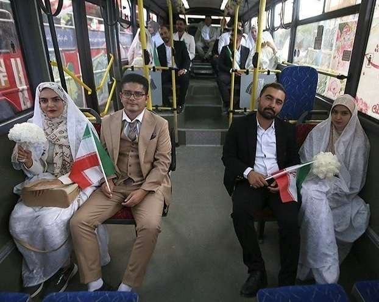

📷 Photo

## ChizBergerz — post 46634

⭕️ تا حالا بدون واریزی روی فوتبال ها شرط بستی؟! 
🎉 500 هزارتومن بونوس رایگان فقط با ثبت نام بدون هیچگونه واریزی! 
💳 شارژ سریع و امن با درگاه ریالی ، تتر یا ترون فقط با یک کلیک! 
⌛ پشتیبانی 24 ساعته 
💖تنها سایت مورد اعتماد ما با بونوس های کاملا واقعی و رویایی:…

## ChizBergerz — post 46633

  

⭕️ تا حالا بدون واریزی روی فوتبال ها شرط بستی؟!

🎉 500 هزارتومن بونوس رایگان فقط با ثبت نام بدون هیچگونه واریزی!

💳 شارژ سریع و امن با درگاه ریالی ، تتر یا ترون فقط با یک کلیک!

⌛ پشتیبانی 24 ساعته

💖تنها سایت مورد اعتماد ما با بونوس های کاملا واقعی و رویایی:

🌐 Winro.io

🌐 Winro.io
کانال بونوس های رایگان g31

📱 @winro_io

## ChizBergerz — post 46632

  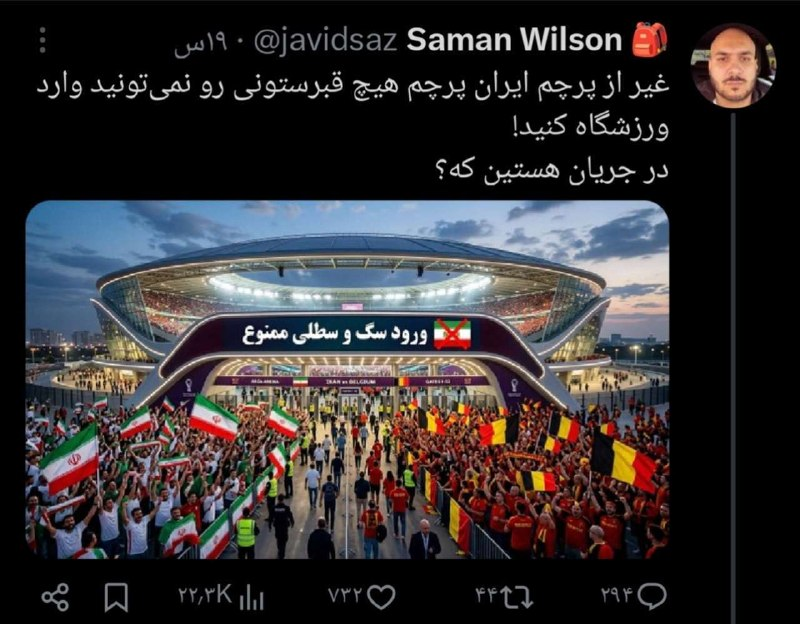

اول اینکه کیرم تو کص مادرت آقای ویلسون.
دومن پرچم جمهوری‌اسلامی از پهنا تو کص خواهرت حرومزاده ولد‌الزنا!

@ChizBergerz

## ChizBergerz — post 46631

  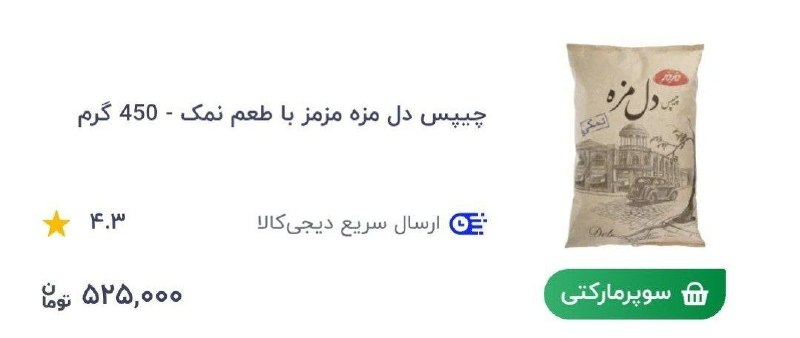

نیم کیلو چیپس ساده شده نیم میلیون تومن! کیرم تو قبرت خمینی مادرقحبه!

@ChizBergerz

## ChizBergerz — post 46628

گلی به جمال مهلقا جابری
با یه طراحی یقه صدای مردم رسوند

بی‌ادعا با این همه کمالات و زیبایی یه گوشه نشسته استوری‌شو میذاره مبارزشو میکنه، بعضیا تخم ایشونم نیستن ولی کم مونده ادعای اسپارتاکوسی کنن.
@ChizBergerz

## ChizBergerz — post 46627

تمام آن‌چیزی که امروز مرز بین توافق و جنگ را تعیین می‌کند، موضوع اورانیوم غنی‌شده است.
اگر تحویلش دهند، جنگ، موقتا متوقف می‌شود.
اگر بخواهند حفظش کنند، در زودترین زمان جنگ آغاز می‌شود.

-علی حسین قاضی زاده-

## ChizBergerz — post 46626

‏از کانفیگ خریدن خسته شدم، دلم میخواد برم اینستا، برم یوتوب، برم تیک تاک، برم تو کص مادر وزیر ارتباطات...

## rodast_omiddana — post 71715

🎬 کمپین همچون شاهزاده سرباز ایران هستم
لینک یوتیوب:
https://www.youtube.com/watch?v=m1zR7lCmWhw

## rodast_omiddana — post 71714

  <a href="telegram/content/rodast_omiddana_71714_1779381282.webm" target="_blank">🎬 Download video</a>

🚨 میدل ایست آی:
"سه منبع گفتند که انتظار دارند جنگ در هفته‌های آینده و پس از پایان دوره حج، از سر گرفته شود.
ایالات متحده در گذشته از سیگنال‌های فریبنده و حیله‌های دیگر استفاده کرده تا سعی کند طرف مقابل را دچار احساس امنیت کاذب کند."

## rodast_omiddana — post 71713

  <a href="telegram/content/rodast_omiddana_71713_1779381282.webm" target="_blank">🎬 Download video</a>

🚨 آکسیوس:
"یک منبع آمریکایی گفت ترامپ به نتانیاهو گفته است که میانجی‌ها در حال کار بر روی یک «توافقنامه» هستند که هم ایالات متحده و هم ایران آن را امضا خواهند کرد تا رسماً به جنگ پایان دهند و یک دوره ۳۰ روزه مذاکره در مورد مسائلی مانند برنامه هسته‌ای ایران و باز شدن تنگه هرمز را آغاز کنند"

فقط میتونم بگم نگران نباشید با هر سناریویی جمهوری اسلامی سقوط خواهد کرد

## rodast_omiddana — post 71712

  <a href="telegram/content/rodast_omiddana_71712_1779381282.webm" target="_blank">🎬 Download video</a>

🚨 فکت
در طول جنگ 39 روزه رژیم نفتش را میتوانست بفروشه و از نظر مالی به مشکل جدی نخورد..
ولی در طول این آتش بس یک قطره نفت تازه تولید شده اش را نتونسته بفروشه و داره از نظر اقتصادی نابود میشه..

پانوشت:
احتمال اینکه ترامپ فعلا حمله نکنه تا این محاصره دریایی حسابی رژیم را ضعیف کند و سپس حمله کند..
فقط روی اعصابتان مسلط باشید، به ایران قسم ته این ماجرا رژیم رفتنی هست، خدا لعنت کنه اون بیشرفهایی که به شما گفتن جنگ ده روزه تمام میشه و رژیم سرنگون میشه که امروز به این حال در بیاید..
شاید الان اصرار منو روز اول جنگ که گفتم خودتونو دستکم تا سپتامبر آماده کنید بهتر درک کنید..
در هر صورت پایان این ماجرا سقوط رژیم است، شک نکن خواهشا..

## rodast_omiddana — post 71708

  <a href="telegram/content/rodast_omiddana_71708_1779381282.mp4" target="_blank">🎬 Download video</a>

🚨کمپین همچون شاهزاده سرباز ایران هستم

## rodast_omiddana — post 71707

  <a href="telegram/content/rodast_omiddana_71707_1779381284.webm" target="_blank">🎬 Download video</a>

🚨درود به شما
ساعت 13 و 50 دقیقه اصفهان اول صدایی شبیه جنگده آمد و بعد شدید صدای پدافند آمد

## rodast_omiddana — post 71706

  <a href="telegram/content/rodast_omiddana_71706_1779381284.webm" target="_blank">🎬 Download video</a>

🚨 برای وطن هر کاری لازم باشه میکنم

## KiriMohems — post 47859

  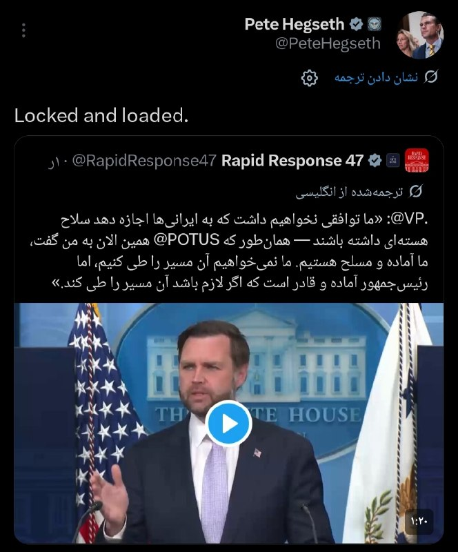

🔴توئیت حشری وزیر جنگ آمریکا، پیت هگست : "آماده و مسلح"

#Helsinki
@KiriMohems

## SportBaadNews — post 252065

  <a href="telegram/content/SportBaadNews_252065_1779381285.webm" target="_blank">🎬 Download video</a>

🚨
🚨
⚽️سانتی اونا: اوضاع تو لیورپول داره سریع پیش میره و مدیریت ممکنه اشلوت رو اخراج کنه، آندونی ایرائولا سرمربی فعلی بورنموث اصلی‌ترین گزینه‌ی جایگزینی اشلوت هست
@SportBaadNews

## SportBaadNews — post 252064

  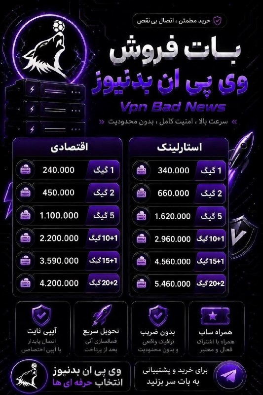

⚡ فروش فیلترشکن اختصاصی استارلینک، قوی، بدون قطعی و از همه مهمتر بدون ضریب، آیپی ثابت

سرور اقتصادی:

🔴 1 گیگ: 240

🔴 2 گیگ: 450

🔴 5 گیگ: 1.100

🔴 10+1 گیگ: 2.200

🔴 15+1 گیگ: 3.590

🔴 20+2 گیگ: 4.200

استارلینک:

🔴 1 گیگ: 340

🔴 2 گیگ: 660

🔴 5 گیگ: 1.620

🔴 10+1 گیگ: 2.960

🔴 15+1 گیگ: 4.560

🔴 20+2 گیگ: 5.460

❗️به ازای هر 10 گیگ خرید، 1 گیگ اشانتیون میگیرید

🔰 کانالمون:
@VpnBadNews

🤖 ربات جهت خرید سرور
@vpnbadnews_bot

## IranIntlTV — post 338271

  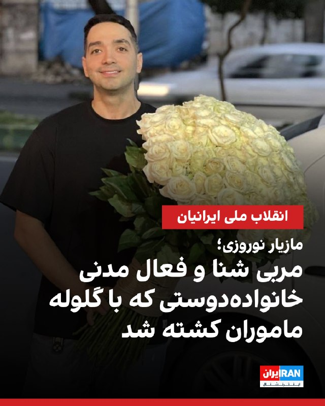

مازیار نوروزی، ورزشکار و فعال مدنی، روز پنجشنبه ۱۸ دی‌ماه در جریان انقلاب ملی در گرگان با گلوله ماموران حکومت کشته شد.
به گفته نزدیکانش، او جوانی پرنشاط و فعال بود که در زمینه آموزش شنا فعالیت می‌کرد. او تحصیلکرده مقطع کارشناسی ارشد رشته صنایع چوب و کاغذ بود.
مقام‌های حکومت به خانواده‌اش فشار آوردند تا او را «شهید» معرفی کنند. دوستان مازیار نوروزی گفتند که او در کنار اشتغال و فعالیت اجتماعی به دنبال تشکیل خانواده بود.
https://iranintl.com/202605219786

## IranIntlTV — post 338270

  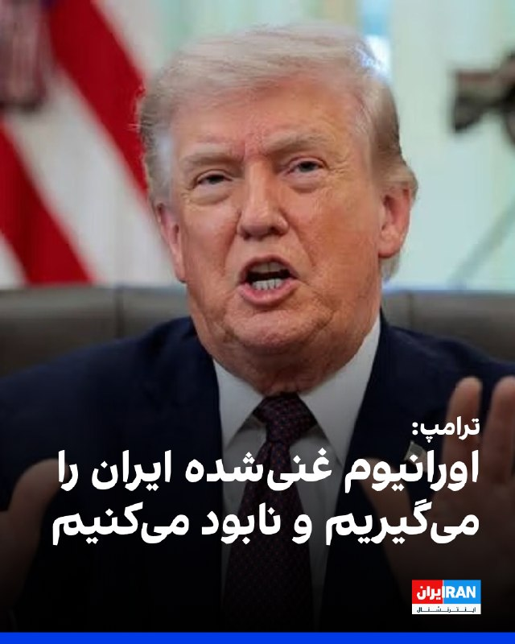

دونالد ترامپ در کاخ سفید گفت جمهوری اسلامی قرار نیست سلاح هسته‌ای داشته باشد و آمریکا اجازه چنین اتفاقی را نمی‌دهد. او هشدار داد در صورت دستیابی ایران به سلاح هسته‌ای، جنگی هسته‌ای در خاورمیانه آغاز خواهد شد که می‌تواند به اروپا و حتی آمریکا کشیده شود، اما تأکید کرد چنین اتفاقی رخ نخواهد داد.

ترامپ درباره اورانیوم غنی‌شده ایران گفت: «ما اورانیوم بسیار غنی‌شده را می‌گیریم. اجازه نمی‌دهیم آن‌ها آن را داشته باشند.» او افزود پس از در اختیار گرفتن این مواد، احتمالا آن را نابود خواهند کرد.

رییس‌جمهور آمریکا همچنین اعلام کرد واشینگتن با دریافت عوارض در تنگه هرمز مخالف است و گفت محاصره دریایی آمریکا «۱۰۰ درصد موثر» بوده و هیچ کشتی‌ای بدون تایید آمریکا به ایران وارد یا از آن خارج نشده است.
https://iranintl.com/202605215920

## IranIntlTV — post 338269

  <a href="https://t.me/IranintlTV/338269" target="_blank">📎 Download file</a>

🎧نسخه صوتی اخبار شبانگاهی | پنجشنبه ۳۱ اردیبهشت
@iranintlTV

## IranIntlTV — post 338268

  <a href="telegram/content/IranIntlTV_338268_1779381287.mp4" target="_blank">🎬 Download video</a>

فاکس‌نیوز در گزارشی نوشته است که زندگی مخفیانه مجتبی خامنه‌ای در ماه‌های اخیر، شباهت‌هایی با سال‌های پایانی زندگی اسامه بن‌لادن دارد. او بدون ارتباطات مخابراتی و با اتکا به پیک‌های مورد اعتماد زندگی می‌کند و احتمال می‌رود در سایت‌های مستحکم زیرزمینی نزدیک به تاسیسات سپاه پنهان شده باشد.
جزییات بیشتر با اردوان روزبه، خبرنگار ایران‌اینترنشنال
@iranintltv

## IranIntlTV — post 338267

  <a href="telegram/content/IranIntlTV_338267_1779381288.mp4" target="_blank">🎬 Download video</a>

یک شهروند با ارسال پیامی به ایران اینترنشنال می‌گوید در تجمعات حکومتی تهران پرداختی به حاضران بیشتر شده تا شاید تعداد آن‌ها افزایش یابد. پیام او با هوش مصنوعی خوانده شده است.

## IranIntlTV — post 338266

  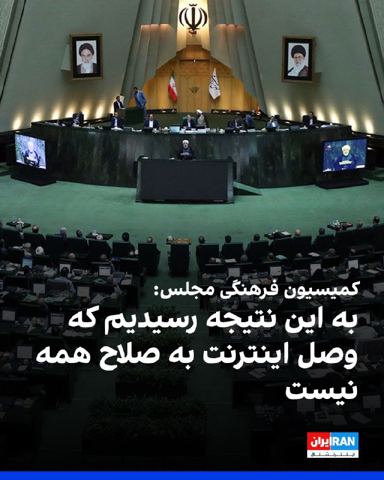

علی یزدی‌خواه، نایب‌رییس کمیسیون فرهنگی مجلس، گفت نهادهای بالادستی به این نتیجه رسیدند که بازگشایی اینترنت به صلاح همه نیست.
او افزود با قطع اینترنت «مردم مشکل عمده‌ای» ندارند و به اقشاری که «احساس کردیم» نیاز به اینترنت بین‌الملل دارند، دسترسی داده شد.
یزدی‌خواه اضافه کرد: «اگرچه در حالت نه جنگ، نه صلح هستیم، اما خطرات امنیتی، شخصیت‌ها و کشور را تهدید می‌کند و به این دلایل تصمیم بر این نیست که دسترسی همگانی داده شود.»
https://iranintl.com/202605212799

## IranIntlTV — post 338265

  <a href="telegram/content/IranIntlTV_338265_1779381291.mp4" target="_blank">🎬 Download video</a>

در حالی‌که مقامات آمریکایی نسبت به امضای توافق با جمهوری اسلامی خوش‌بینی هستند، آسوشیتدپرس نوشته احمد وحیدی، فرمانده سپاه پاسداران، به بازیگر اصلی در شکل‌دهی به موضع سخت جمهوری اسلامی در مذاکرات برای پایان جنگ بدل شده است.
جزییات بیشتر با سمیرا قرایی، خبرنگار ایران‌اینترنشنال
@iranintltv

## IranIntlTV — post 338264

  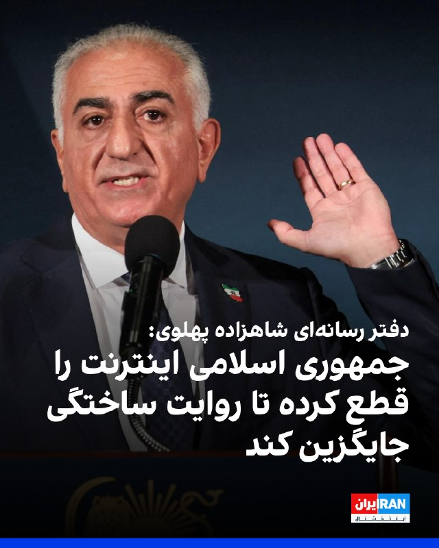

دفتر رسانه‌ای شاهزاده رضا پهلوی در شبکه اجتماعی ایکس با اشاره به تداوم قطعی اینترنت در ایران نوشت: «بیش از ۸۲ روز است حکومت جمهوری اسلامی ارتباط ایرانیان را با جهان قطع کرده تا روایت ساختگی خود را جایگزین صدای آنان کند.»

دفتر رسانه‌ای شاهزاده رضا پهلوی افزود: «وظیفه ما ایرانیان خارج از کشور این است که حقیقت را به جهان برسانیم و صدای هم‌میهنانی باشیم که دچار خاموشی اجباری شده‌اند.»
https://iranintl.com/202605213200

## IranIntlTV — post 338263

  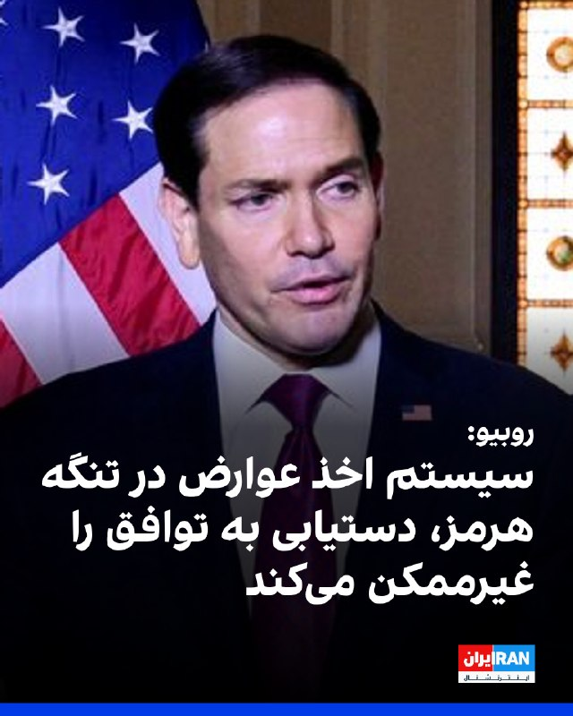

مارکو روبیو گفت اجرای سیستم اخذ عوارض در تنگه هرمز از سوی جمهوری اسلامی، دستیابی به توافق دیپلماتیک را غیرممکن می‌کند.

او افزود: «در مذاکرات مقداری پیشرفت داشته‌ایم، اما روشن است با سیستمی روبه‌رو هستیم که خود تا حدی دچار شکاف است؛ یعنی ساختار حاکم در ایران.» روبیو همچنین گفت قرار است دیدارهایی انجام شود و به گفته او، پاکستانی‌ها قرار است پنج‌شنبه به تهران سفر کنند.

وزیر خارجه آمریکا تاکید کرد ترجیح رییس‌جمهور رسیدن به «یک توافق خوب» است و واشینگتن هر کاری برای تحقق آن انجام خواهد داد، هرچند تضمینی برای دستیابی به توافق وجود ندارد.

روبیو افزود اگر توافقی حاصل نشود، ترامپ گزینه‌های دیگری نیز در اختیار دارد، اما همچنان دیپلماسی را گزینه مطلوب می‌داند. او گفت: «نشانه‌های مثبتی وجود دارد، اما نمی‌خواهیم بیش از حد خوش‌بین باشیم. باید دید در روزهای آینده چه رخ می‌دهد.»
https://iranintl.com/202605213235

## IranIntlTV — post 338262

  <a href="telegram/content/IranIntlTV_338262_1779381294.mp4" target="_blank">🎬 Download video</a>

دونالد ترامپ مقاله‌ای از نیویورک‌پست را بازنشر کرده که در آن، طرحی سه‌مرحله‌ای برای افزایش فشار بر جمهوری اسلامی مطرح شده است. این طرح بر ادامه محاصره دریایی، اسکورت نظامی نفتکش‌ها در خلیج فارس و ایجاد مسیرهای جایگزین انتقال انرژی برای دور زدن تنگه هرمز تمرکز دارد.
جزییات بیشتر با احمد صمدی، خبرنگار ایران‌اینترنشنال
@iranintltv

## IranIntlTV — post 338261

  <a href="telegram/content/IranIntlTV_338261_1779381295.mp4" target="_blank">🎬 Download video</a>

هم‌زمان با برگزاری نشست وزیران خارجه ناتو در سوئد، گروهی از ایرانیان مقابل محل برگزاری این نشست تجمع کردند. تجمع‌کنندگان خواستار توجه کشورهای عضو ناتو به وضعیت حقوق بشر در ایران و پایان دادن به سیاست مماشات با جمهوری اسلامی شدند.
مهران عباسیان، خبرنگار ایران‌اینترنشنال، گزارش می‌دهد
@iranintltv

## IranIntlTV — post 338260

  <a href="telegram/content/IranIntlTV_338260_1779381296.mp4" target="_blank">🎬 Download video</a>

گزارش‌ها حاکی است سپاه پاسداران استفاده از رمزارزها را به یکی از ابزارهای اصلی خود برای دور زدن تحریم‌های غرب، جابه‌جایی پول و تامین مالی شبکه‌های هم‌پیمانش در منطقه تبدیل کرده است. سپاه همچنین از طریق این شبکه‌ها، درآمدهای دلاری حاصل از فعالیت‌های مرتبط با تنگه هرمز را مدیریت می‌کند.
آیه دریس، عضو تحریریه ایران‌اینترنشنال، در «پیوست» به این موضوع می‌پردازد
@iranintltv

## IranIntlTV — post 338259

  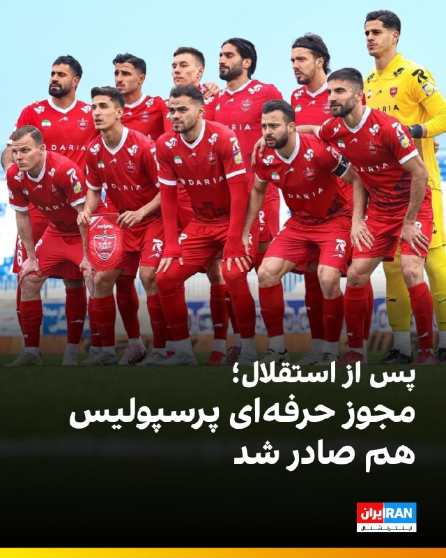

🔻باشگاه پرسپولیس اعلام کرد با ابلاغ رسمی دبیرکل فدراسیون فوتبال، مجوز حرفه‌ای این باشگاه برای فصل آینده صادر شده است.

🔹پرسپولیس اعلام کرد این مجوز بر اساس مدارک ارائه‌شده و پس از تطابق با استانداردهای کنفدراسیون فوتبال آسیا صادر شده و نشان‌دهنده رعایت الزامات ساختاری، مالی، حقوقی، زیرساختی و مدیریتی این باشگاه است.

🔹ساعاتی پیش از این نیز باشگاه استقلال از دریافت مجوز حرفه‌ای خود خبر داده بود.

@iranintltvsport

## IranIntlTV — post 338258

  <a href="telegram/content/IranIntlTV_338258_1779381298.mp4" target="_blank">🎬 Download video</a>

یک شهروند با ارسال پیامی به ایران اینترنشنال می‌گوید در مترو ماموران لباس شخصی او را متوقف کرده شروع به تفتیش و پرس و جو از او کردند. پیام او با هوش مصنوعی خوانده شده است.

## IranIntlTV — post 338257

  

خبرنگار فاکس نیوز به نقل از یک منبع آگاه از روند مذاکرات خبر داد که کاخ سفید گزارش خبرگزاری رویترز مبنی بر این‌که مجتبی خامنه‌ای دستور داده اورانیوم با غنای بالا در ایران باقی بماند را رد کرده و آن را نادرست دانسته است.
پیش‌تر رویترز به نقل از دو منبع ارشد در حکومت ایران گزارش داد مجتبی خامنه‌ای، رهبر جمهوری اسلامی، دستور داده ذخایر اورانیوم با غنای بالا نباید از ایران خارج شود.
به گفته این منابع، این دستور موضع تهران را در برابر یکی از اصلی‌ترین خواسته‌های آمریکا در مذاکرات برای پایان دادن به جنگ آمریکا و اسرائیل علیه جمهوری اسلامی سخت‌تر کرده است.
مقام‌های اسرائیلی نیز به رویترز گفته‌اند دونالد ترامپ به اسرائیل اطمینان داده هر توافق احتمالی باید شامل خروج ذخایر اورانیوم غنی‌شده از ایران باشد.
https://iranintl.com/202605215077

## IranIntlTV — post 338256

  <a href="telegram/content/IranIntlTV_338256_1779381300.mp4" target="_blank">🎬 Download video</a>

سرخط خبرهای پنجشنبه ۳۱ اردیبهشت
@iranintltv

## IranIntlTV — post 338255

  <a href="telegram/content/IranIntlTV_338255_1779381301.mp4" target="_blank">🎬 Download video</a>

نشست وزیران خارجه کشورهای عضو ناتو در سوئد آغاز شد. جنگ اوکراین، امنیت اروپا، تنش‌های خاورمیانه و امنیت انتقال انرژی در تنگه هرمز از محورهای اصلی این اجلاس عنوان شده است.
مهران عباسیان، خبرنگار ایران‌اینترنشنال، گزارش می‌دهد
@iranintltv

## IranIntlTV — post 338254

  

آلمان فرد مظنون به همکاری با جمهوری اسلامی را به اتهام برنامه‌ریزی برای ترور چهره‌های یهودی و یک نماینده سابق حامی اسرائیل تحت پیگرد قرار داد.

مظنون این پرونده، شهروندی دانمارکی است که ژوئن سال گذشته در دانمارک بازداشت شد.

یکی از همدستان او، شهروند اهل افغانستان است که در ماه نوامبر در دانمارک بازداشت شد.
https://iranintl.com/202605212861

## IranIntlTV — post 338253

  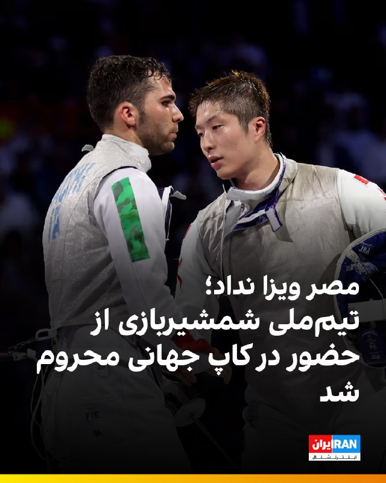

🔻به گزارش خبرگزاری جمهوری اسلامی، ایرنا، عدم صدور ویزا، مانع از حضور ملی‌پوشان شمشیربازی ایران در رقابت‌های کاپ جهانی شد.

🔹سابریست‌های ایران که برای حضور در این رقابت‌ها، یک اردوی تمرینی سنگین و فشرده‌ی ۴۵ روزه را در کشور ایتالیا پشت سر گذاشته‌اند، به دلیل صادر نشدن ویزا از سوی دولت مصر، شانس حضور در این تورنمنت را از دست دادند.

🔹ملی‌پوشان شمشیربازی ایران به‌زودی ایتالیا را به مقصد تهران ترک خواهند کرد.

@iranintltvsport

## IranIntlTV — post 338252

  <a href="telegram/content/IranIntlTV_338252_1779381304.mp4" target="_blank">🎬 Download video</a>

طبق اطلاعات رسیده به ایران‌اینترنشنال، جاویدنام مصطفی سلامی شامگاه ۱۹ دی‌ماه ۱۴۰۴ حوالی ساعت ۸ شب در فردیس کرج هدف شلیک نیروهای حکومتی قرار گرفت و در برابر همسر، فرزند و اعضای خانواده‌اش از ناحیه قفسه سینه مجروح شد.

براساس روایت خانواده، نزدیکانش ابتدا مصطفی را به درمانگاه رساندند و سپس با آمبولانس به بیمارستان منتقل کردند. ماموران هنگام انتقال او با حمله به همراهان مانع حضورشان در محل شدند. پس از رسیدن به بیمارستان، پیکر مصطفی نزدیک دو ساعت ناپدید شد؛ سپس به خانواده اطلاع دادند که گلوله ریه او را سوراخ کرده و این جاویدنام بر اثر شدت جراحات، تنگی نفس و خونریزی شدید جان باخته است.

## Persian_Trend_Official — post 14617

  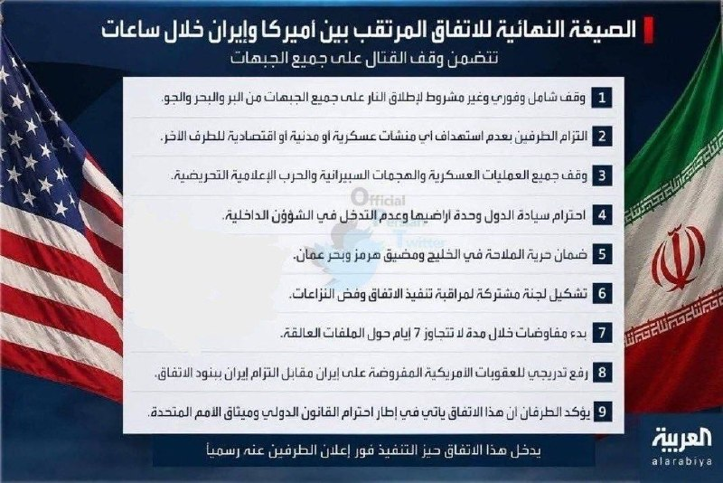

🔴 العربیه مدعی دستیابی به پیش‌نویس نهایی توافق ایران و آمریکا شد

💢بر اساس این گزارش، مفاد اصلی پیش‌نویس شامل موارد زیر است:

▪️ آتش‌بس کامل، فوری و بدون قید و شرط در تمام جبهه‌های زمینی، دریایی و هوایی

▪️ تعهد متقابل ایران و آمریکا به عدم هدف قرار دادن تأسیسات نظامی، غیرنظامی و اقتصادی یکدیگر

▪️ توقف عملیات نظامی، حملات سایبری و جنگ رسانه‌ای تحریک‌آمیز از سوی دو طرف

▪️ تأکید بر احترام به حاکمیت کشورها، تمامیت ارضی و عدم دخالت در امور داخلی

▪️ تضمین آزادی کشتیرانی در خلیج فارس، تنگه هرمز و دریای عمان

▪️ تشکیل کمیته مشترک برای نظارت بر اجرای توافق و حل اختلافات احتمالی

▪️ آغاز مذاکرات درباره مسائل باقی‌مانده حداکثر ظرف ۷ روز

▪️ لغو تدریجی تحریم‌های آمریکا علیه ایران در برابر پایبندی تهران به مفاد توافق

▪️ تأکید دو طرف بر اینکه توافق در چارچوب قوانین بین‌المللی و منشور سازمان ملل تنظیم شده است

🔻تاکنون هیچ مقام رسمی در ایران یا آمریکا صحت این پیش‌نویس را تأیید نکرده است.

🫆:Tony

📌 @persian_trend_official
پرشین ترند | متفاوت‌ترین کانال نظامی

## Persian_Trend_Official — post 14615

ناو حمله آبی خاکی USS Makin Island (LHD-8) با یک اسکادران کامل از جنگنده‌های F-35B، چهارشنبه بندر نیروی دریایی سن دیگو را به مقصد منطقه هند-آرام ترک کرد.

☆Phantom☆

📌 @persian_trend_official
پرشین ترند | متفاوت‌ترین کانال نظامی

## Persian_Trend_Official — post 14614

💢مارکو روبیو 🔹اجرای سیستم اخذ عوارض در تنگه هرمز از سوی جمهوری اسلامی، دستیابی به توافق دیپلماتیک را غیرممکن می‌کند. 🔹او افزود: «در مذاکرات مقداری پیشرفت داشته‌ایم، اما روشن است با سیستمی روبه‌رو هستیم که خود تا حدی دچار شکاف است؛ یعنی ساختار حاکم در ایران.»…

## Persian_Trend_Official — post 14613

  <a href="telegram/content/Persian_Trend_Official_14613_1779381306.webm" target="_blank">🎬 Download video</a>

🔹مارکو روبیو: وضعیت پیرامون توافق ایران ممکن است در روزهای آینده روشن‌تر شود 🔻مارکو روبیو، وزیر امور خارجه آمریکا، اعلام کرد که نمایندگان پاکستان روز پنجشنبه به عنوان بخشی از تلاش‌ها برای پایان دادن مسالمت‌آمیز به مناقشه آمریکا و اسرائیل با ایران، به تهران…

## Persian_Trend_Official — post 14612

  <a href="telegram/content/Persian_Trend_Official_14612_1779381306.webm" target="_blank">🎬 Download video</a>

🔹مارکو روبیو: وضعیت پیرامون توافق ایران ممکن است در روزهای آینده روشن‌تر شود

🔻مارکو روبیو، وزیر امور خارجه آمریکا، اعلام کرد که نمایندگان پاکستان روز پنجشنبه به عنوان بخشی از تلاش‌ها برای پایان دادن مسالمت‌آمیز به مناقشه آمریکا و اسرائیل با ایران، به تهران سفر خواهند کرد.

🔻وی همچنین افزود که اگر توافق خوبی با تهران حاصل نشود، ایالات متحده گزینه‌های دیگری را در مورد ایران حفظ می‌کند.

🫆:Tony

📌 @persian_trend_official
پرشین ترند | متفاوت‌ترین کانال نظامی

## Persian_Trend_Official — post 14611

🔴 رهبر جمهوری اسلامی دستور داده ذخایر اورانیوم از کشور خارج نشود 💢خبرگزاری رویترز به نقل از منابع ایرانی گزارش داد رهبر جمهوری اسلامی دستور داده ذخایر اورانیوم غنی‌شده نزدیک به سطح تسلیحاتی، از کشور خارج نشود. 🫆:Tony 📌 @persian_trend_official پرشین ترند…

## Persian_Trend_Official — post 14610

  <a href="telegram/content/Persian_Trend_Official_14610_1779381307.mp4" target="_blank">🎬 Download video</a>

خسارت ارتش آمریکا در عملیات خشم حماسی 📌 @persian_trend_official پرشین ترند | متفاوت‌ترین کانال نظامی

## Persian_Trend_Official — post 14609

💢وزیر خارجه پاکستان:

🔹 وی با تاکید بر نقش میانجی‌گرانه اسلام‌آباد اعلام کرد این کشور تمام تلاش خود را برای دستیابی به توافق میان ایران و آمریکا به کار می‌گیرد

🔹محمد اسحاق دار هدف از این اقدامات را گرد هم آوردن دو طرف برای صلح دانست.

🫆:Tony

📌 @persian_trend_official
پرشین ترند | متفاوت‌ترین کانال نظامی

## Persian_Trend_Official — post 14607

  <a href="telegram/content/Persian_Trend_Official_14607_1779381307.webm" target="_blank">🎬 Download video</a>

💢وزیر خارجه آمریکا: 🔻بیایید ببینیم آیا امکان توافق با ایران وجود دارد یا خیر، و نشانه‌های خوبی نیز دیده می‌شود. 🫆:Tony 📌 @persian_trend_official پرشین ترند | متفاوت‌ترین کانال نظامی

## Persian_Trend_Official — post 14606

  <a href="telegram/content/Persian_Trend_Official_14606_1779381308.webm" target="_blank">🎬 Download video</a>

💢وزیر خارجه آمریکا:

🔻بیایید ببینیم آیا امکان توافق با ایران وجود دارد یا خیر، و نشانه‌های خوبی نیز دیده می‌شود.

🫆:Tony

📌 @persian_trend_official
پرشین ترند | متفاوت‌ترین کانال نظامی

## Persian_Trend_Official — post 14605

## Persian_Trend_Official — post 14604

  

خسارت ارتش آمریکا در عملیات خشم حماسی

📌 @persian_trend_official
پرشین ترند | متفاوت‌ترین کانال نظامی

## Persian_Trend_Official — post 14603

  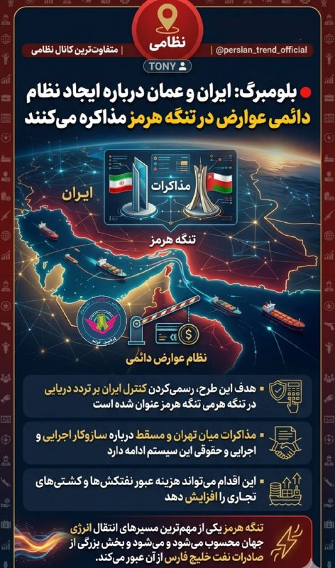

🔴 بلومبرگ: ایران و عمان درباره ایجاد نظام دائمی عوارض در تنگه هرمز مذاکره می‌کنند

💢بلومبرگ گزارش داد ایران در حال گفت‌وگو با عمان درباره ایجاد نوعی نظام دائمی دریافت عوارض برای عبور کشتی‌ها از تنگه هرمز است.

🔻بر اساس این گزارش:

▪️ هدف این طرح، رسمی‌کردن کنترل ایران بر تردد دریایی در تنگه هرمز عنوان شده است
▪️ مذاکرات میان تهران و مسقط درباره سازوکار اجرایی و حقوقی این سیستم ادامه دارد
▪️ این اقدام می‌تواند هزینه عبور نفتکش‌ها و کشتی‌های تجاری را افزایش دهد

🫆:Tony

📌 @persian_trend_official
پرشین ترند | متفاوت‌ترین کانال نظامی

## Persian_Trend_Official — post 14602

  <a href="telegram/content/Persian_Trend_Official_14602_1779381309.mp4" target="_blank">🎬 Download video</a>

نسخه هوش مصنوعی عملیات اف 5 در کویت به روایت جمهوری اسلامی !

پ.ن:
قبلا میگفتن یک اف 5 بوده اما الان دوتا نشون دادن !
طبعتا اگر اف 5 ها با بمب اتم هم پایگاه آمریکایی رو میزدن نباید انقدر تخریب میشد !😄

📌 @persian_trend_official
پرشین ترند | متفاوت‌ترین کانال نظامی

## Persian_Trend_Official — post 14601

⭕️نیروی دریایی سپاه: ۳۱ فروند کشتی با هماهنگی سپاه از تنگهٔ هرمز عبور کردند

💢روابط عمومی نیروی دریایی سپاه: طی شبانه روز گذشته ۳۱ فروند کشتی اعم از نفتکش، کانتینر بر و سایر کشتی های تجاری با هماهنگی و تامین امنیت نیروی دریایی سپاه از تنگهٔ هرمز عبور کردند.

🫆:Tony

📌 @persian_trend_official
پرشین ترند | متفاوت‌ترین کانال نظامی

## Persian_Trend_Official — post 14600

  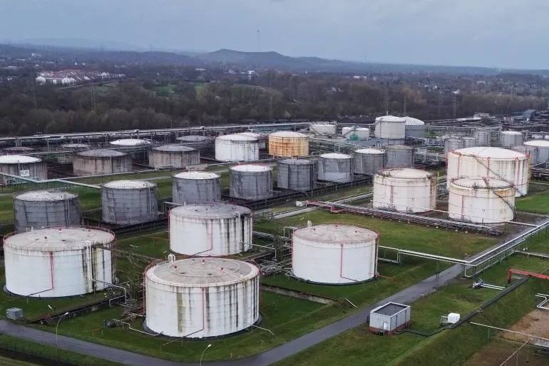

🔴 آژانس بین‌المللی انرژی: بازار نفت ممکن است وارد «منطقه قرمز» شود

💢رئیس آژانس بین‌المللی انرژی (IEA) هشدار داد بحران تنگه هرمز می‌تواند بازار جهانی نفت را در ماه‌های ژوئیه و اوت وارد «منطقه قرمز» کند.

«فاتح بیرول» اعلام کرد:
▪️ کاهش صادرات نفت خاورمیانه و افت ذخایر استراتژیک همزمان با اوج تقاضای تابستانی، فشار شدیدی بر بازار وارد کرده است
▪️ راه‌حل اصلی، بازگشایی کامل تنگه هرمز است
▪️ پیش از آغاز جنگ ایران، حدود یک‌پنجم نفت و گاز جهان از این مسیر عبور می‌کرد
💢او همچنین افزود:
▪️ آژانس بین‌المللی انرژی در ماه مارس با آزادسازی ۴۰۰ میلیون بشکه نفت از ذخایر استراتژیک اعضا موافقت کرده بود
▪️ اما این ذخایر به‌تدریج در حال کاهش است
▪️ در صورت نیاز، آژانس آماده هماهنگی برای آزادسازی ذخایر بیشتر خواهد بود
🫆:Tony

📌 @persian_trend_official
پرشین ترند | متفاوت‌ترین کانال نظامی

## Persian_Trend_Official — post 14599

💢 انگلیس کاردار اسرائیل را احضار کرد

💢 دلیل؛ رفتار اهانت آمیز وزیر امنیت ملی اسرائیل با بازداشت‌شدگان ناوگان صمود

🫆:Tony

📌 @persian_trend_official
پرشین ترند | متفاوت‌ترین کانال نظامی

## Persian_Trend_Official — post 14598

  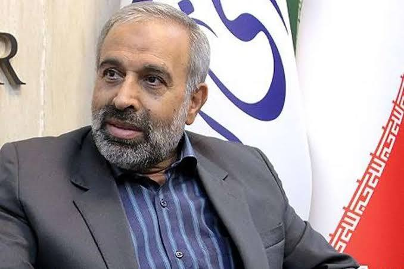

⭕️علی یزدی‌خواه، نایب‌رییس کمیسیون فرهنگی مجلس، گفت در شرایط فعلی تصمیمی برای بازگشایی اینترنت جهانی وجود ندارد و محدودیت‌ها با «ملاحظات امنیتی» ادامه خواهد داشت.

💢یزدی‌خواه قطع اینترنت جهانی را به مصوبات شورای عالی امنیت ملی نسبت داد و گفت این تصمیم به‌دلیل «مسائل امنیتی، امنیت کشور و حفظ جان افراد» گرفته شده است.

🫆:Tony

📌 @persian_trend_official
پرشین ترند | متفاوت‌ترین کانال نظامی

## Persian_Trend_Official — post 14597

  <a href="telegram/content/Persian_Trend_Official_14597_1779381312.mp4" target="_blank">🎬 Download video</a>

💢وزارت دفاع روسیه فیلم تمرینات نیروهای هسته‌ای خود را منتشر کرد.

🫆:Tony

📌 @persian_trend_official
پرشین ترند | متفاوت‌ترین کانال نظامی

---
📅 بروزرسانی: 1405/02/31 17:23
---

## ChizBergerz — post 46625

👑آی‌پی جدید شیر و خورشید تست شده توسط اعضای کانال با ایرانسل
📶(یه بار روش بزن کپی میشه)

23.2.13.211
184.51.252.36
2.22.210.51
2.23.118.153
2.16.164.67
95.100.177.52
2.18.69.218
2.23.168.47
2.23.170.80
2.23.168.144
81.12.72.218
80.191.243.226
37.191.76.110
23.216.77.73
2.23.168.254
95.100.177.112
2.21.213.243
2.23.168.144
2.23.168.47
2.16.168.113
95.101.35.91
2.20.254.217
104.109.250.10
2.23.168.47
2.23.168.254
184.51.252.36
95.101.35.74
23.200.88.76
95.101.200.7
2.23.168.96
173.223.239.52
2.23.168.174
2.23.168.213
5.160.13.85
81.12.72.218
2.23.168.96
92.123.106.96
2.23.168.144
2.23.168.213
2.23.168.254
2.23.170.80
185.109.61.27
31.214.169.244
2.21.2.58
2.21.2.89
2.23.168.7
37.255.133.30
104.103.65.50
63.141.252.203
142.54.178.211
185.137.25.214
185.200.232.40
185.200.232.41
185.200.232.49
185.208.174.167
178.252.128.66
185.88.178.196
185.142.158.162
185.53.142.174
164.138.17.122
37.191.95.70
185.208.175.228
85.133.167.108
185.50.37.52
109.230.206.175
5.160.128.142
78.39.234.140
78.38.174.2
2.188.21.58
217.219.162.200
46.32.31.30
185.141.105.139
185.37.55.30
94.232.173.28
78.157.41.60
2.186.121.65
158.58.184.147
93.115.127.9
185.255.91.60
2.188.21.138
185.137.25.146
185.141.106.238
109.72.197.1
89.32.197.226
2.23.168.213
2.23.168.174
2.23.168.174
2.23.168.96
2.23.168.213
2.23.168.7
184.51.252.36
2.23.168.47
2.23.168.144
23.203.134.243
23.197.160.67
95.100.133.75
2.18.69.218

+ رو حالت 3G بزارید و وقتی وصل شد رو حالت 4G بزارید.
@ChizBergerz

## ChizBergerz — post 46624

👑آی‌پی جدید شیر و خورشید تست شده توسط خودم با همراه اول
😐(یه بار روش بزن کپی میشه)

92.122.17.124
23.44.201.149
23.212.253.227
23.44.201.185
23.44.201.17
23.62.54.24
23.58.95.144
104.83.198.44
92.123.102.153
184.51.252.134
23.53.40.147
184.51.252.176
2.18.64.212
172.104.251.198
2.18.79.101
23.216.77.181
92.123.102.89
23.216.77.80
96.16.53.132
23.53.40.139
23.48.165.70
2.21.20.143
23.43.85.155
23.48.23.184
23.207.210.83
23.209.125.169
23.48.23.172
2.21.240.22
23.55.110.82
23.216.77.35
23.58.95.138
23.33.40.149
23.48.23.146
23.209.125.145
92.123.102.130
23.53.40.121
23.48.23.11
23.201.248.171
23.209.125.27
23.48.23.176
23.207.210.86
23.55.161.151
92.123.103.89
2.23.7.34
23.207.210.80
23.48.23.165
23.48.23.173
23.48.23.156
23.55.110.74
173.222.107.202
23.213.161.140
23.48.23.134
23.204.152.160
2.23.97.120
185.200.232.49
185.200.232.50
185.200.232.42
185.200.232.41
184.24.77.42
184.24.77.32
184.24.77.5
184.24.77.7

+ رو حالت 3G بزارید و وقتی وصل شد رو حالت 4G بزارید.
@ChizBergerz

## ChizBergerz — post 46623

👑آی‌پی جدید شیر و خورشید تست شده توسط خودم با همراه اول
😐(یه بار روش بزن کپی میشه)

92.123.106.90
92.123.102.160
104.103.72.80
96.16.248.159
104.89.170.140
184.86.103.158
104.126.37.176
72.246.28.215
23.73.2.75
184.51.133.123
88.221.168.204
88.221.169.205
96.16.122.137
104.103.72.50
23.72.248.210
2.18.190.27
23.58.223.224
23.58.223.171
184.24.77.25
96.16.249.11
2.23.154.99
96.16.249.12
23.55.161.38
95.101.137.34
23.58.223.225
185.88.178.196
185.208.174.167
185.50.37.52
185.141.106.238
164.138.17.122
5.160.13.85
185.208.175.228
2.23.170.80
95.101.35.74
92.123.106.90
95.101.35.91
2.23.168.254
2.23.168.144
92.123.106.90
95.101.35.74
2.23.168.47
2.21.2.104
95.101.35.91
2.23.168.144
2.23.168.254
2.23.168.213
2.23.168.96
2.23.168.174
2.23.168.96
63.141.252.203
5.160.13.85
185.255.91.60

+ رو حالت 3G بزارید و وقتی وصل شد رو حالت 4G بزارید.
@ChizBergerz

## ChizBergerz — post 46622

👑آی‌پی جدید شیر و خورشید تست شده توسط خودم با همراه اول
😐(یه بار روش بزن کپی میشه)

2.18.190.27
23.58.223.224
23.58.223.171
184.24.77.25
96.16.249.11
2.23.154.99
96.16.249.12
23.55.161.38
95.101.137.34
23.58.223.225

+ رو حالت 3G بزارید و وقتی وصل شد رو حالت 4G بزارید.
@ChizBergerz

## ChizBergerz — post 46621

  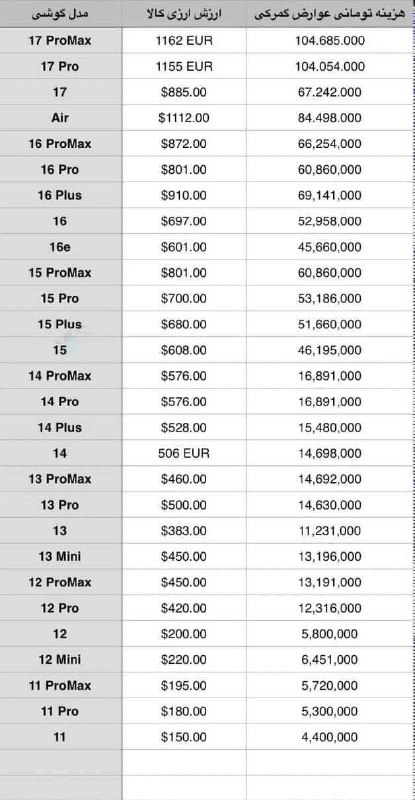

هزینه رجیستر گوشی‌های آیفون اعلام شد، آیفون ۱۷ پرومکس ۱۰۴ میلیون تومن، فقر رجیسترش!!!

@ChizBergerz

## ChizBergerz — post 46620

  <a href="telegram/content/ChizBergerz_46620_1779371638.mp4" target="_blank">🎬 Download video</a>

نه رشیدپور بی‌شرف، بازار اعتصاب كرد، پهلوى رو صدا زد، پهلوى براى اولين بار فراخوان داد، رژيم،ايرانی كش جمهوری اسلامی، مردم رو قتل عام كرد.
اصن بر فرض مردم گول خوردن، شما چرا ۵۰٫۰۰۰ نفر رو کشتید بیشرفا؟؟؟

@ChizBergerz

## ChizBergerz — post 46619

  <a href="telegram/content/ChizBergerz_46619_1779371640.webm" target="_blank">🎬 Download video</a>

🎯شانستو #رایگان امتحان کن 
⚠️ 
🤔 میدونستی توی #وینرو میتونی رایگان شرط ببندی؟ 
👍تنها کاری که باید بکنی اینه که عضو سایتش بشید و 
🤩
🤩
🤩 هزارتومان جایزه بگیرید بدون نیاز به واریز 
💖تنها سایت مورد اعتماد ما با بونوس های کاملا واقعی و رویایی: 
🌐 Winro.io 
🌐 Winro.io…

## ChizBergerz — post 46618

  <a href="telegram/content/ChizBergerz_46618_1779371641.webm" target="_blank">🎬 Download video</a>

🎯شانستو #رایگان امتحان کن 
⚠️

🤔 میدونستی توی #وینرو میتونی رایگان شرط ببندی؟

👍تنها کاری که باید بکنی اینه که عضو سایتش بشید و 
🤩
🤩
🤩 هزارتومان جایزه بگیرید بدون نیاز به واریز

💖تنها سایت مورد اعتماد ما با بونوس های کاملا واقعی و رویایی:

🌐 Winro.io

🌐 Winro.io
کانال بونوس های رایگان r31

📱 @winro_io

## ChizBergerz — post 46617

  

خبرگزاری میزان قوه تروریستیه قضائیه اعلام کرد رامین زله و کریم معروف پور از معترضین دی ماه امروز صبح اعدام شدن!💔🖤

@ChizBergerz

## rodast_omiddana — post 71705

🎬 ترامپ تا دوشنبه حمله میکنه یا میره برای مذاکرات جدید؟
لینک یوتیوب:
https://www.youtube.com/watch?v=BTyrCrMRbSM

## rodast_omiddana — post 71704

  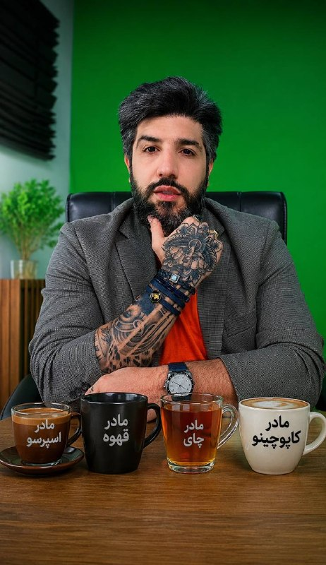

😎
😎
😎 یعنی مخاطبان چه میکنند
یک ساعته دارم میخندم..
دمتون گرم واقعا..

## rodast_omiddana — post 71703

  <a href="telegram/content/rodast_omiddana_71703_1779371643.webm" target="_blank">🎬 Download video</a>

🚨 گویا ساعت13:27 بندرعباس 4.3 ریشتر زلزله اومد به مدت 10تا20 ثانیه لرزید

## rodast_omiddana — post 71698

  <a href="telegram/content/rodast_omiddana_71698_1779371643.mp4" target="_blank">🎬 Download video</a>

🚨کمپین همچون شاهزاده سرباز ایران هستم

## rodast_omiddana — post 71697

  <a href="telegram/content/rodast_omiddana_71697_1779371646.webm" target="_blank">🎬 Download video</a>

🚨 طبق گزارش دو مقام ارشد ایرانی به رویترز؛
ایران اصلی ترین خواسته آمریکا برای توافق که انتقال اورانیوم 60 درصد است را به صورت کامل رد کرده است.

## rodast_omiddana — post 71692

  <a href="telegram/content/rodast_omiddana_71692_1779371646.mp4" target="_blank">🎬 Download video</a>

🚨کمپین همچون شاهزاده سرباز ایران هستم

## rodast_omiddana — post 71691

  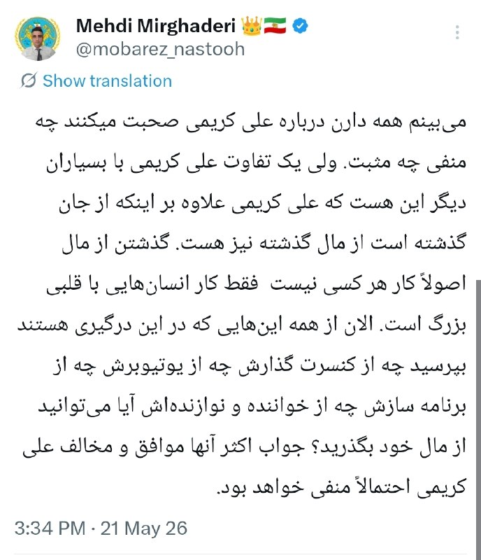

تفاوت علی کریمی با همه موافقان و مخالفانش این است که او از مال گذشته است

https://x.com/i/status/2057439873863188637

## rodast_omiddana — post 71690

  <a href="telegram/content/rodast_omiddana_71690_1779371649.mp4" target="_blank">🎬 Download video</a>

🚨 وقتی میگیم ایران اشغال شده یعنی همین ویدیو..
اشغالگران شیعه از آفریقا آمدن و برای مردم ایران خط و نشان میکشند..

## rodast_omiddana — post 71689

  <a href="telegram/content/rodast_omiddana_71689_1779371652.webm" target="_blank">🎬 Download video</a>

🚨 دیوث سیاسی به چه کسی میگن؟
به کسی میگن که کنسرت دیگران را عادی سازی میداند ولی از کنسرت مرتضی نجفی حمایت میکند..
مرتیکه پفیوز..

## rodast_omiddana — post 71688

  <a href="telegram/content/rodast_omiddana_71688_1779371652.webm" target="_blank">🎬 Download video</a>

🚨 من یک زمان در یک حرکت سیاسی با شعار "ایزدنشان خامنه ای" صدها هزار بچه مذهبی را ض.د شیعی کردم..
ولی آقا مرتضا نجفی با شعار "جاوید شاه" داره کلی پادشاهی خواه را شیعه میکنه..
سیاست پیچیده ست و طبیعیه عوام سر در نیارن و فرق کار بزرگ منو با رفتارهای کاسب مآبانه این جماعت نفهمند..

## rodast_omiddana — post 71687

  <a href="telegram/content/rodast_omiddana_71687_1779371652.webm" target="_blank">🎬 Download video</a>

🚨رویترز:
"مجتبی‌ خامنه‌ای دستور داده است که اورانیوم با درجه نزدیک به تولید سلاح باید در ایران باقی بماند"

خب خدا رو شکر میخواهند گور خودشونو بکنند...

## KiriMohems — post 47858

🔴آبفا:
فعلا کاری با آب کمرتون نداریم و فعلا جیره بندی نمیکنیم

#professor
@KiriMohems

## KiriMohems — post 47857

  

#انگشت_به_سولاخ_بمانید

🔴نرخ جدید هزینه‌ ریجستری گوشی‌های آیفون

ریجستر آیفون ۱۷پرومکس، ۱۰۴ میلیون تومانه

#Helsinki
@KiriMohems

## KiriMohems — post 47856

🔴ایلان ماسک:

انسان‌ها به زودی تراشه‌های سایبرنتیک کاشتنی خواهند داشت که قدرت‌های خداگونه را ممکن می‌سازند
این فناوری می‌تونه انسان کور رو بینا کنه فیلم سوپر ببینه افراد فلج دوباره بتونن کص بکنن و ناشنوا ها هم بتونن صدای گوز خودشونو بشنوند.

ایلان ماسک کون بلبلی این تراشه‌ها را به عنوان «معجزاتی در سطح عیسی» توصیف میکنه.

#professor
@KiriMohems

## KiriMohems — post 47855

منبع ایرانی به رویترز: مجتبی خامنه‌ای دستور داده که اورانیوم غنی شده نباید از ایران خارج شه.

#professor
@KiriMohems

## SportBaadNews — post 252062

  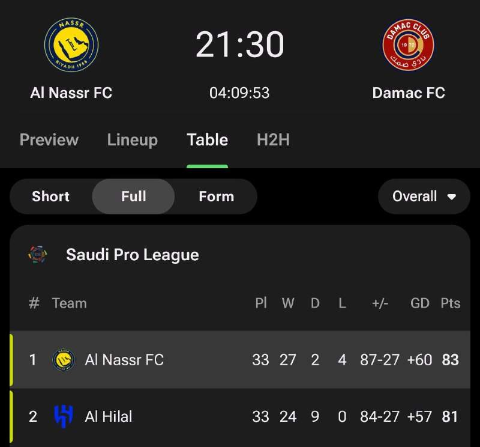

⚽️ رونالدو تو عربستان یه بازنده بزرگ به حساب میاد! 
❌ ژانویه 2023: حذف تو نیمه‌نهایی سوپرجام عربستان جلوی الاتحاد 
❌ آپریل 2023: حذف تو نیمه‌نهایی جام پادشاهی عربستان جلوی الوحده 
❌ می 2023: تموم کردن لیگ عربستان تو رده دوم 
❌ مارس 2024: حذف تو یک‌ چهارم…

## SportBaadNews — post 252061

  

⚽️
🔙| عکس کمتر دیده شده از نیمار و یامال
@SportBaadNews

## SportBaadNews — post 252060

  

مارکا: برناردو سیلوا پیشنهادهایی از یوونتوس، بارسلونا، اتلتیکومادرید، و رئالمادرید دارد، در حال حاضر اتلتیکو شانس بیشتری برای جذب برناردو دارد
@SportBaadNews

## SportBaadNews — post 252059

  <a href="telegram/content/SportBaadNews_252059_1779371655.webm" target="_blank">🎬 Download video</a>

🚨
🇩🇪 رسمی: فهرست تیم ملی آلمان برای جام جهانی
@SportBaadNews

## SportBaadNews — post 252058

  <a href="telegram/content/SportBaadNews_252058_1779371655.webm" target="_blank">🎬 Download video</a>

🚨
🇩🇪 فووووووری و رسمیییییی،
نویر به تیم ملی آلمان برای جام جهانی دعوت شد
@SportBaadNews

## IranIntlTV — post 338250

  <a href="telegram/content/IranIntlTV_338250_1779371656.mp4" target="_blank">🎬 Download video</a>

هم‌زمان با افزایش صف‌های طولانی در پمپ‌بنزین‌ها و نگرانی از کاهش سهمیه سوخت، کاربران رسانه‌های اجتماعی از تشدید فشارهای اقتصادی و اثرات محاصره اقتصادی بر زندگی روزمره مردم نوشته‌اند.
عادله بورنگ، عضو تحریریه ایران‌اینترنشنال، از واکنش کاربران می‌گوید
@iranintltv

## IranIntlTV — post 338249

یک شهروند با ارسال پیامی به ایران اینترنشنال می‌گوید که پیک موتوری است و کل درآمدی که برای یک شیفت داشته را خرج رفع پنچری موتورش کرده است. پیام او با هوش مصنوعی خوانده شده است.

## IranIntlTV — post 338248

  

اطلاعات رسیده به ایران‌اینترنشنال از فشار نهادهای حکومتی بر خانواده‌های دانش‌آموزان کشته‌شده در حمله به مدرسه میناب و برگزاری مراسم حکومتی در این شهر خبر داد. با وجود شوک گسترده در شهر پس از وقوع حادثه، برخی خانواده‌ها تحت فشار قرار گرفته‌اند تا در مراسم‌های حکومتی شرکت کنند.
بر اساس این اطلاعات، فضای بهشت‌زهرای میناب به محل تجمع نیروها و حامیان حکومت تبدیل شده و افرادی از عراق برای برپایی موکب به این شهر آمده‌اند. برخی از این افراد شب‌ها پس از تجمعات خیابانی در بهشت‌زهرا مستقر می‌شوند.
تعدادی از خانواده‌های دانش‌آموزان کشته‌شده با برگزاری این مراسم‌ها مخالف بوده‌اند، اما برای حضور و سخنرانی در برنامه‌ها تحت فشار قرار گرفته‌اند.
در همین زمینه یک منبع مطلع، از وضعیت روحی نامناسب مادر یکی از دانش‌آموزان که دو فرزند خود را از دست داده خبر داد و گفت با وجود شرایط شدید روحی، از او خواسته می‌شود در مراسم‌ها حضور پیدا کند.
نیروهای حاضر در بهشت‌زهرا با سلاح رفت‌وآمد می‌کنند و تمرکز اصلی بر تهیه عکس و ویدیو برای شبکه‌های اجتماعی است.
https://iranintl.com/202605211346

## IranIntlTV — post 338247

  

خبرگزاری رویترز به نقل از دو منبع ارشد در حکومت ایران گزارش داد مجتبی خامنه‌ای، رهبر جمهوری اسلامی، دستور داده ذخایر اورانیوم با غنای بالا نباید از ایران خارج شود.

به گفته این منابع، این دستور موضع تهران را در برابر یکی از اصلی‌ترین خواسته‌های آمریکا در مذاکرات برای پایان دادن به جنگ آمریکا و اسرائیل علیه جمهوری اسلامی سخت‌تر کرده است.

مقام‌های اسرائیلی نیز به رویترز گفته‌اند دونالد ترامپ به اسرائیل اطمینان داده هر توافق احتمالی باید شامل خروج ذخایر اورانیوم غنی‌شده از ایران باشد.

یکی از منابع ایرانی به رویترز گفت دستور رهبر جمهوری اسلامی و اجماع در ساختار حاکمیت این است که ذخایر اورانیوم غنی‌شده نباید از کشور خارج شود.

به گفته منابع رویترز، مقام‌های جمهوری اسلامی معتقدند انتقال این مواد به خارج، جمهوری اسلامی را در برابر حملات احتمالی آینده آمریکا و اسرائیل آسیب‌پذیرتر می‌کند.

## IranIntlTV — post 338246

  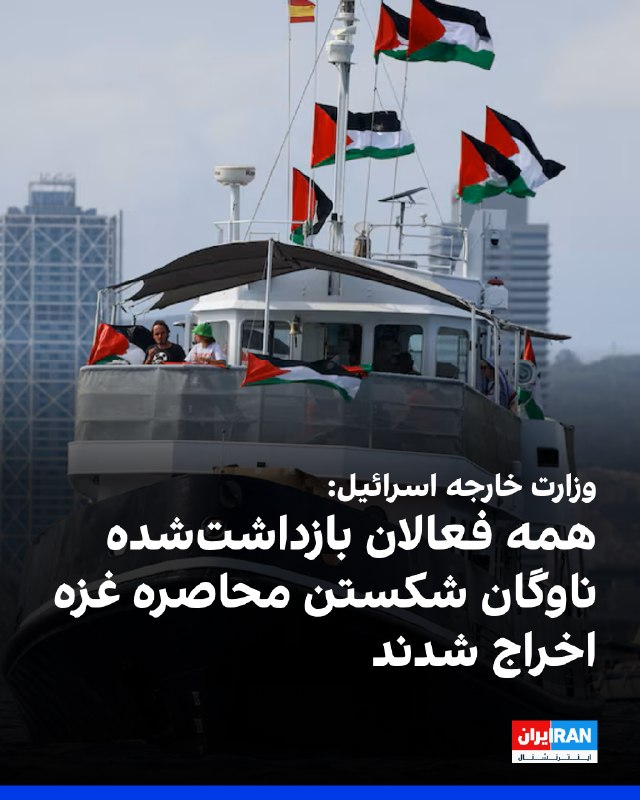

وزارت خارجه اسرائیل روز پنج‌شنبه اعلام کرد که همه فعالان بازداشت شده ناوگان شکستن محاصره غزه از این کشور اخراج شده‌اند.
این وزارتخانه افزود: «اسرائیل اجازه هیچ‌گونه نقض محاصره دریایی قانونی غزه را نخواهد داد.»
روز چهارشنبه نیز وزیر خارجه ایتالیا خواستار بررسی تحریم ایتامار بن‌گویر، وزیر امنیت ملی اسرائیل، از سوی اتحادیه اروپا شد و دلیل آن را نحوه برخورد او با فعالان بازداشت‌شده ناوگان شکستن محاصره غزه عنوان کرد.
بریتانیا نیز اعلام کرد در پی انتشار ویدیویی از تمسخر فعالان بازداشت‌شده از سوی بن‌گویر، کاردار اسرائیل را احضار کرده است. وزیر خارجه بریتانیا گفت از تمسخر فعالان کاروان «گلوبال صمود» شوکه شده است.
نیوزیلند هم اعلام کرد سفیر اسرائیل را در واکنش به این ویدیوها احضار می‌کند. وزیر خارجه کانادا نیز ویدیوی منتشرشده از بن‌گویر درباره فعالان کاروان غزه را «عمیقا نگران‌کننده و غیرقابل قبول» توصیف کرد.
https://iranintl.com/202605219146

## IranIntlTV — post 338245

  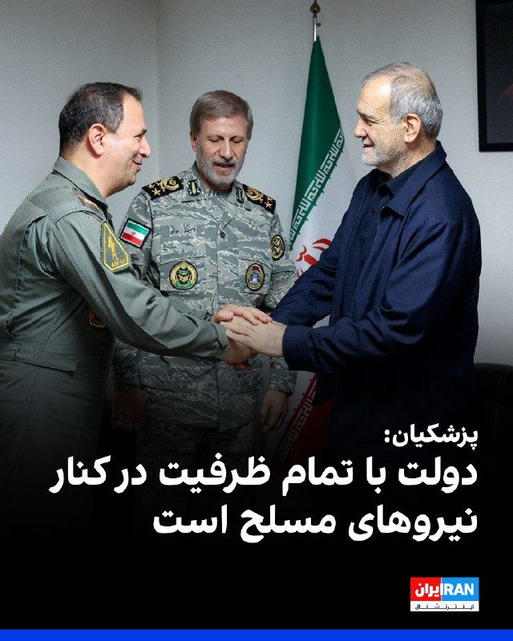

مسعود پزشکیان در دیدار با امیر حاتمی، فرمانده کل ارتش جمهوری اسلامی، گفت دولت با تمام ظرفیت در کنار نیروهای مسلح قرار دارد و از «نوسازی تجهیزات، تقویت زیرساخت‌های عملیاتی و افزایش توان بازدارندگی» حمایت می‌کند.

او افزود انسجام ملی، آمادگی دفاعی و حفظ اقتدار نیروهای مسلح جمهوری اسلامی، مهم‌ترین پشتوانه امنیت، ثبات و آرامش کشور در برابر تهدیدها و «جنگ ترکیبی دشمنان» است.
https://iranintl.com/202605219831

## IranIntlTV — post 338244

  <a href="telegram/content/IranIntlTV_338244_1779371661.mp4" target="_blank">🎬 Download video</a>

رویترز به نقل از دو منبع ایرانی گزارش داد مجتبی خامنه‌ای، رهبر سوم جمهوری اسلامی، دستور داده اورانیوم غنی‌شده نباید از کشور خارج شود. تصمیمی که به گفته این گزارش، موضع تهران را در برابر یکی از خواسته‌های اصلی ایالات متحده در مذاکرات سخت‌تر می‌کند.
گفت‌وگو با علی‌حسین قاضی‌زاده، عضو تحریریه ایران‌اینترنشنال
@iranintltv

## IranIntlTV — post 338243

  <a href="telegram/content/IranIntlTV_338243_1779371663.mp4" target="_blank">🎬 Download video</a>

ویدیوی رسیده به ایران اینترنشنال نشان می‌دهد که ۳۱ اردیبهشت‌ماه در کرمانشاه، صفی از خودروهای نظامی حامل نیرو، تجهیزات و سلاح‌های سنگین در خیابان تشکیل شده است.

## IranIntlTV — post 338242

  

مهدی کابی‌زاده، شهروند ۴۷ ساله و پدر یک دختر بود که در اعتراضات دی‌ماه در استان خوزستان بازداشت و پس از انتقال به مرکز درمانی به دلیل منع رسیدگی جان باخت. او دختری به نام حلما دارد.

بر اساس اطلاعات رسیده به ایران اینترنشنال از افراد مطلع از خانواده او، مهدی کابی‌زاده در اعتراضات اهواز به دست ماموران بازداشت شد و سپس به دلیل بیماری خونی و روده به بیمارستان منتقل و بستری شد. با این حال، مسئولان بیمارستان به دلیل سابقه حضور او در اعتراضات و بازداشتش از رسیدگی و درمان کافی خودداری کردند که موجب جان باختن او شد.
https://iranintl.com/202605219283

## IranIntlTV — post 338241

  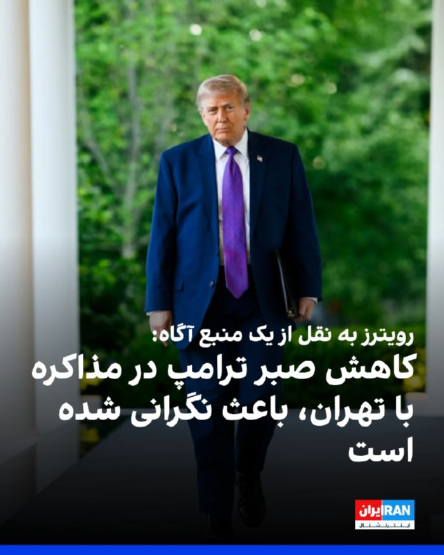

خبرگزاری رویترز به نقل از سه منبع آگاه گزارش داد که عاصم منیر، رییس ستاد کل ارتش پاکستان، پنج‌شنبه ۳۱ اردیبهشت تصمیم خواهد گرفت که آیا برای میانجی‌گری به تهران سفر کند یا نه.

خبرگزاری ایسنا صبح پنجشنبه اعلام کرده بود که عاصم منیر پنجشنبه عازم تهران می‌شود.

یکی از این منابع به رویترز گفت: «ما با همه گروه‌های مختلف در ایران در تماس هستیم تا ارتباطات را منظم کنیم و روند کار سرعت بگیرد.»

او افزود: «کم شدن صبر ترامپ باعث نگرانی است، اما ما روی سرعت انتقال پیام‌ها از هر طرف کار می‌کنیم.»
https://iranintl.com/202605217523

## IranIntlTV — post 338240

یک مخاطب در ویدیویی که به ایران اینترنشنال فرستاد با روایت وضعیت گرانی‌ و دشوارتر شدن امرار معاش، شهروندان را به «نود میلیون اسیر» تشبیه کرد و خطاب به دونالد ترامپ گفت که اکنون در ایران حاکمان بدتری روی کار آمده‌اند. این شهروند در ادامه از رییس‌جمهور آمریکا درخواست کمک کرد و افزود: «سرانجام به فرمان پادشاه، اتفاق‌های خوبی خواهد افتاد.»

## IranIntlTV — post 338239

  <a href="telegram/content/IranIntlTV_338239_1779371667.mp4" target="_blank">🎬 Download video</a>

پارلمان اروپا در نشست خود قطعنامه‌ای را درباره وضعیت حقوق بشر در ایران تصویب کرد که در آن بر محکومیت سرکوب و اعدام معترضان، زندانیان سیاسی و اقلیت‌های مذهبی در ایران تاکید شده است.
لی‌لی نیکفر، خبرنگار ایران‌اینترنشنال، گزارش می‌دهد
@iranintltv

## IranIntlTV — post 338238

  <a href="https://t.me/IranintlTV/338238" target="_blank">📎 Download file</a>

🎧نسخه صوتی اخبار نیم‌روزی | پنجشنبه ۳۱ اردیبهشت
@iranintlTV

## IranIntlTV — post 338237

  <a href="telegram/content/IranIntlTV_338237_1779371669.mp4" target="_blank">🎬 Download video</a>

ویدیوی ارسالی به ایران اینترنشنال نشان می‌دهد که ۳۱ اردیبهشت‌ماه گروهی از دانش‌آموزان با بر زمین نشستن و تحصن جلوی ساختمان استانداری در شهرکرد، شعارهایی چون «امتحان حضوری نمی‌خواهیم» و «حمایت، حمایت» سردادند.

## IranIntlTV — post 338236

  <a href="telegram/content/IranIntlTV_338236_1779371671.mp4" target="_blank">🎬 Download video</a>

ویدیوی رسیده به ایران اینترنشنال نشان می‌دهد که شامگاه ۳۱ اردیبهشت در شهر دهلران استان ایلام، گروهی با در دست داشتن پرچم جمهوری اسلامی و بیرق‌های مذهبی، موسیقیِ باکلام عربی را با صدای بلند در خیابان پخش می‌کنند. فرستنده ویدیو گفت: «مزاحمت‌های شبانه طرفداران حکومت، تمامی ندارد.»

## IranIntlTV — post 338235

  <a href="telegram/content/IranIntlTV_338235_1779371674.mp4" target="_blank">🎬 Download video</a>

هم‌زمان با ادامه کارزار مردمی جاویدنامان الغدیر، جزییات تازه‌ای از هویت و چگونگی کشته‌ شدن شماری از جان‌باختگان اعتراضات ۱۸ و ۱۹ دی‌ماه به دست ایران‌اینترنشنال رسیده است. در میان این روایت‌ها، خانواده و نزدیکان ستاره رفیعی، حمیدرضا حق‌پرست و حسین ناصری از نحوه کشته‌ شدن و انتقال پیکر آن‌ها به بیمارستان الغدیر گفته‌اند.

جزییات بیشتر با فرنوش فرجی، عضو تحریریه ایران‌اینترنشنال
@iranintltv

## IranIntlTV — post 338234

  

علی یزدی‌خواه، نایب‌رییس کمیسیون فرهنگی مجلس، گفت در شرایط فعلی تصمیمی برای بازگشایی اینترنت جهانی وجود ندارد و محدودیت‌ها با «ملاحظات امنیتی» ادامه خواهد داشت.

یزدی‌خواه قطع اینترنت جهانی را به مصوبات شورای عالی امنیت ملی نسبت داد و گفت این تصمیم به‌دلیل «مسائل امنیتی، امنیت کشور و حفظ جان افراد» گرفته شده است.

با وجود اینکه نت‌بلاکس اعلام کرده خاموشی اینترنت در ایران وارد هشتادوسومین روز خود شده، یزدی‌خواه گفت بیش از ۹۰ درصد نیازهای مردم در وضعیت فعلی برآورده می‌شود و مراجعات گسترده‌ای در اعتراض به قطع اینترنت وجود ندارد.

او همچنین گفت در قالب طرح موسوم به «اینترنت پرو»، تاکنون بیش از یک میلیون نفر دسترسی دریافت کرده‌اند؛ طرحی که منتقدان آن را مصداق اینترنت طبقاتی و تبعیض‌آمیز می‌دانند، زیرا دسترسی به اینترنت جهانی را به گروه‌های خاص محدود می‌کند و شهروندان عادی را از حق برابر دسترسی آزاد به اینترنت محروم نگه می‌دارد.

نایب‌رییس کمیسیون فرهنگی مجلس همچنین گفت شرکت‌های صادرات و واردات، مراکز علمی و پژوهشی، آزمایشگاه‌ها و برخی اصناف در صورت نیاز می‌توانند برای دسترسی به اینترنت بین‌الملل اقدام کنند.

## IranIntlTV — post 338233

  <a href="telegram/content/IranIntlTV_338233_1779371677.mp4" target="_blank">🎬 Download video</a>

ویدیوهای رسیده به ایران اینترنشنال نشان می‌دهد که ۳۱ اردیبهشت در شهرکرد، گروهی از دانش‌آموزان معترض به برگزاری حضوری امتحان‌ها ضمن تلاش برای پاسخگو کردن مسئولان مربوط، شعار «دانش‌آموز داد بزن، حقتو فریاد بزن» سردادند.

## IranIntlTV — post 338232

  

نت‌بلاکس، نهاد ناظر بر اینترنت، نوشت که داده‌های این نهاد نشان می‌دهد قطعی اینترنت در ایران وارد هشتادوسومین روز خود شده و شبکه‌های بین‌المللی بیش از هزار و ۹۶۸ ساعت است که به‌طور گسترده مسدود مانده‌اند.

این نهاد ناظر بر اینترنت با تاکید بر اهمیت دسترسی آزاد به اینترنت نوشت: «اینترنت آزاد و باز، برای حفاظت از جان، آزادی و پاسخگویی عمومی نقشی اساسی دارد.»

## IranIntlTV — post 338231

  <a href="telegram/content/IranIntlTV_338231_1779371680.mp4" target="_blank">🎬 Download video</a>

پس از راه‌اندازی کارزار مردمی ایران‌اینترنشنال برای ثبت هویت جاویدنامان بیمارستان الغدیر، خانواده‌ها و نزدیکان جان‌باختگان در روزهای اخیر اطلاعات تازه‌ای درباره هویت شماری دیگر از کشته‌شدگان ارائه کرده‌اند. ایران‌اینترنشنال اعلام کرده این کارزار برای ثبت حقیقت و شناسایی جاویدنامان در هفته‌ها و ماه‌های آینده ادامه خواهد داشت.
این گزارش حاوی تصاویر تلخ و تکان‌دهنده است.
@iranintltv

## Persian_Trend_Official — post 14595

  <a href="telegram/content/Persian_Trend_Official_14595_1779371682.mp4" target="_blank">🎬 Download video</a>

🔴 حمله پهپادی به مقر احزاب معارض کُرد ایرانی در اربیل

💢رسانه‌ها گزارش می‌دهند یک پهپاد، مقر احزاب کُرد مخالف ایران را در شهر سوران واقع در استان اربیل در اقلیم کردستان عراق هدف قرار داده است.

🫆:Tony

📌 @persian_trend_official
پرشین ترند | متفاوت‌ترین کانال نظامی

## Persian_Trend_Official — post 14594

  <a href="telegram/content/Persian_Trend_Official_14594_1779371683.mp4" target="_blank">🎬 Download video</a>

💢ویدئویی تاریخی از حضور نیروهای حافظ صلح سازمان ملل از ارتش ایران در کنار رودخانه لیتانی در جنوب لبنان

🫆:Tony

📌 @persian_trend_official
پرشین ترند | متفاوت‌ترین کانال نظامی

## Persian_Trend_Official — post 14593

  <a href="telegram/content/Persian_Trend_Official_14593_1779371685.mp4" target="_blank">🎬 Download video</a>

⭕️ویدئویی از حملات به یکی از پایگاه های هوایی ایران

💢انهدام تعدادی از هواگردها درون آشیانه و همچنین هواپیماهای فوکر نیروی دریایی بر روی زمین است

🫆:Tony

📌 @persian_trend_official
پرشین ترند | متفاوت‌ترین کانال نظامی

## Persian_Trend_Official — post 14592

  

⭕️روسیه یکی از برندگان جنگ جمهوری اسلامی

💢روبل روسیه بهترین ارز عملکردی در این فصل است و حدود ۱۲٪ افزایش یافته و به ۷۲.۶ در هر دلار رسیده است قوی‌ترین نرخ از اوایل سال ۲۰۲۳

💢عامل اصلی: افزایش درآمدهای نفتی پس از آغاز جنگ آمریکا و اسرائیل علیه جمهوری اسلامی.

🫆:Tony

📌 @persian_trend_official
پرشین ترند | متفاوت‌ترین کانال نظامی

## Persian_Trend_Official — post 14591

  

⭕️تصاویر ماهواره‌ای ۱۸ مه نشان می‌دهد که ایران چهار ورودی از پنج ورودی تأسیسات موشکی زیرزمینی آبیک در استان قزوین را پاکسازی کرده است.

پنجمین ورودی به طور جزئی پاکسازی شده است.

💢این سایت در جریان عملیات هوایی آمریکا و اسرائیل به طور عمدی هدف قرار گرفت تا موشک‌ها را در داخل به دام بیندازد.

💢ارزیابی‌های گسترده‌تر اطلاعاتی آمریکا نشان می‌دهد که ایران اکنون دسترسی به حدود ۹۰٪ از شبکه موشکی زیرزمینی خود را بازگردانده است.

🫆:Tony

📌 @persian_trend_official
پرشین ترند | متفاوت‌ترین کانال نظامی

## Persian_Trend_Official — post 14590

💢 وزارت خارجۀ اسرائیل:

▪️کلیۀ فعالان ناوگان جهانی صمود از اسرائیل اخراج شدند

🫆:Tony

📌 @persian_trend_official
پرشین ترند | متفاوت‌ترین کانال نظامی

## Persian_Trend_Official — post 14589

🔴 حملات اسرائیل چندین شهر در جنوب لبنان را هدف قرار داد

💢حملات اسرائیل به مناطق جنوبی لبنان ادامه دارد و گزارش‌ها از هدف قرار گرفتن چندین شهر خبر می‌دهند.

بر اساس گزارش خبرنگاران میدانی:

▪️ یک حمله هوایی اسرائیل شهر «الصرفند» در منطقه صور را هدف قرار داده است
▪️ توپخانه اسرائیل شهرهای «براشیت» و «کفر دونین» را گلوله‌باران کرده است
▪️ همچنین یک پهپاد اسرائیلی شهر «یارون» در جنوب لبنان را هدف قرار داده است

🫆:Tony

📌 @persian_trend_official
پرشین ترند | متفاوت‌ترین کانال نظامی

## Persian_Trend_Official — post 14588

⭕️رویترز:

💢پس از آنکه ترامپ هشدار داد «اگر ایران به توافق نرسد، امشب یک تمدن کامل خواهد مرد»، وحشت، پایتخت‌های اروپایی را دربرگرفت.

💢یکی از دولت‌های اروپایی فوراً از دیپلمات‌های خود در واشنگتن این سؤال را پرسید: آیا آمریکا می‌خواهد از سلاح‌های هسته‌ای بکند؟

💢مقامات برای دریافت پاسخ به وزارت خارجه آمریکا مراجعه کردند و انتظار داشتند از کانال‌های دیپلماتیک سنتی آمریکا پیام اطمینان‌بخشی دریافت کنند. اما به گفته یک دیپلمات اروپایی، مقامات وزارت خارجه آمریکا پذیرفتند که نمی‌دانند منظور ترامپ چیست و بعداً چه اتفاقی ممکن است بیفتد.

🫆:Tony

📌 @persian_trend_official
پرشین ترند | متفاوت‌ترین کانال نظامی

## Persian_Trend_Official — post 14587

🔴 نتانیاهو خواهان ازسرگیری حملات به ایران است

💢کانال ۱۳ اسرائیل گزارش داد بنیامین نتانیاهو در حال فشار برای ازسرگیری حملات علیه ایران است، در حالی که دونالد ترامپ خواستار دادن زمان بیشتر به روند مذاکرات شده است.

بر اساس این گزارش:

▪️ ترامپ ترجیح می‌دهد پیش از بازگشت به گزینه نظامی، فرصت بیشتری به گفت‌وگوها داده شود
▪️ اما نتانیاهو معتقد است ایران از مذاکرات برای خرید زمان استفاده می‌کند
▪️ اختلاف نظر میان واشینگتن و تل‌آویو درباره زمان‌بندی اقدام نظامی همچنان ادامه دارد

💢این گزارش در حالی منتشر می‌شود که مذاکرات غیرمستقیم میان ایران و آمریکا با میانجیگری منطقه‌ای ادامه دارد.

🫆:Tony

📌 @persian_trend_official
پرشین ترند | متفاوت‌ترین کانال نظامی

## Persian_Trend_Official — post 14586

💢نیروهای جمهوری اسلامی برای محاکمه به دادگاه ارجاع شدند

🔹دادستانی کل کویت امروز(پنج شنبه) ادعا کرد که چند متهم وابسته به جمهوری اسلامی به دادگاه ارجاع شده‌اند.

الجزیره نوشت:

🔹دادستانی کویت همچنین مدعی شده است که این افراد پس از ورود غیرقانونی به خاک کشور دستگیر شده بودند و در اختیار داشتن سلاح و تجهیزات ارتباطی با هدف هدف قرار دادن تأسیسات حیاتی و دولتی به آن‌ها نسبت داده شده است.

🔹دادستانی کل کویت در بیانیه‌ای رسمی ادعا کرد که چند نفر از عناصر وابسته ایران پس از ورود غیرقانونی به خاک کشور و عبور از مرزهای دریایی و نفوذ به منطقه‌ای نظامی ممنوعه، بازداشت شده‌اند. این اقدام پس از رصد نیروهای مسلح مسئول تأمین امنیت منطقه و متوقف کردن متهمان صورت گرفت.

🫆:Tony

📌 @persian_trend_official
پرشین ترند | متفاوت‌ترین کانال نظامی

## Persian_Trend_Official — post 14585

  <a href="telegram/content/Persian_Trend_Official_14585_1779371688.webm" target="_blank">🎬 Download video</a>

⭕️رویترز:

💢ترامپ به اسرائیل قول داده است که اورانیوم غنی‌شده از ایران خارج شود و هر معامله‌ای باید شامل این بند باشد.

🫆:Tony

📌 @persian_trend_official
پرشین ترند | متفاوت‌ترین کانال نظامی

## Persian_Trend_Official — post 14584

  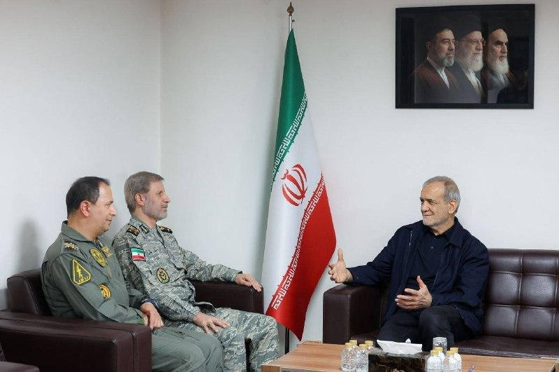

⭕️دیدار پزشکیان با فرمانده کل ارتش

🔻پزشکیان:
ارتش با آمادگی عملیاتی بالا اقتدار دفاعی کشور را به نمایش گذاشت

انسجام ملی و اقتدار نیروهای مسلح مهم‌ترین پشتوانه امنیت کشور است.

🔻فرمانده کل ارتش:
ارتش جمهوری اسلامی ایران آمادگی کامل دارد تا در برابر هرگونه تهدید، تجاوز یا اقدام ماجراجویانه علیه کشور، پاسخی قاطع، پشیمان‌کننده و درخور اقتدار جمهوری اسلامی ایران ارائه کند

🫆:Tony

📌 @persian_trend_official
پرشین ترند | متفاوت‌ترین کانال نظامی

## Persian_Trend_Official — post 14582

💢وضعیت هوش مصنوعی داخلی در پیام رسان بله ...

🫆:Tony

📌 @persian_trend_official
پرشین ترند | متفاوت‌ترین کانال نظامی

## Persian_Trend_Official — post 14581

  <a href="telegram/content/Persian_Trend_Official_14581_1779371689.mp4" target="_blank">🎬 Download video</a>

💢جنگ طلبی از صفات بارز امام بود ...

🫆:Tony

📌 @persian_trend_official
پرشین ترند | متفاوت‌ترین کانال نظامی

## Persian_Trend_Official — post 14580

🔴 سفر احتمالی عاصم منیر به تهران؛ آخرین تلاش برای جلوگیری از بازگشت جنگ؟

💢گزارش‌ها حاکی است سفر احتمالی «عاصم منیر» فرمانده ارتش پاکستان به تهران، نشانه وجود پیام‌های مهم و مذاکرات حساس میان طرف‌هاست.

💢بر اساس ارزیابی‌ها:

▪️ بسیاری این تحرکات را آخرین فرصت برای جلوگیری از ازسرگیری جنگ می‌دانند

▪️ با این حال اختلافات اساسی میان ایران و آمریکا همچنان پابرجاست

💢خواسته‌های اصلی ایران:

▪️ دریافت تضمین برای جلوگیری از وقوع جنگی دیگر

▪️ به‌رسمیت شناختن کنترل ایران بر تنگه هرمز

▪️ آزادسازی دارایی‌های بلوکه‌شده

▪️ باقی ماندن بخشی از ذخایر اورانیوم غنی‌شده در داخل کشور

💢در مقابل، آمریکا خواستار:

▪️ تعطیلی تمامی تأسیسات هسته‌ای ایران به‌جز مرکز تهران شده است

▪️ واشینگتن تأکید دارد حتی تأسیسات باقی‌مانده نیز نباید فعالیت غنی‌سازی داشته باشند

💢اختلاف دیگر بر سر نحوه اجرای توافق است:

▪️ آمریکا خواهان اجرای کامل و یک‌باره توافق است

▪️ اما ایران می‌گوید اگر جنگ طی ۳۰ روز نخست پایان یابد، سایر مراحل می‌تواند به‌تدریج اجرا شود

💢همچنین گزارش شده آمریکا قادر نیست تضمین دهد اسرائیل ترورهای هدفمند در داخل ایران را متوقف خواهد کرد؛ مسئله‌ای که یکی از مهم‌ترین نگرانی‌های تهران محسوب می‌شود.

🫆:Tony

📌 @persian_trend_official
پرشین ترند | متفاوت‌ترین کانال نظامی

## Persian_Trend_Official — post 14579

  

💢نت‌بلاکس، نهاد ناظر بر اینترنت، نوشت که داده‌های این نهاد نشان می‌دهد قطعی اینترنت در ایران وارد هشتادوسومین روز خود شده و شبکه‌های بین‌المللی بیش از هزار و ۹۶۸ ساعت است که به‌طور گسترده مسدود مانده‌اند.

💢این نهاد ناظر بر اینترنت با تاکید بر اهمیت دسترسی آزاد به اینترنت نوشت: «اینترنت آزاد و باز، برای حفاظت از جان، آزادی و پاسخگویی عمومی نقشی اساسی دارد.»

🫆:Tony

📌 @persian_trend_official
پرشین ترند | متفاوت‌ترین کانال نظامی

## Persian_Trend_Official — post 14578

  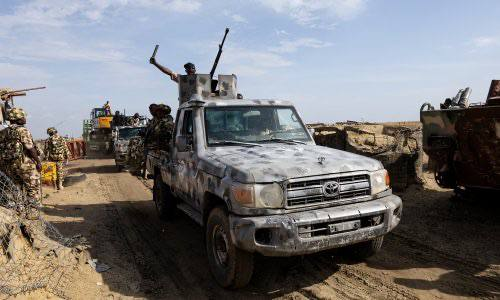

🔴 آمریکا و نیجریه فرمانده ارشد داعش در آفریقا را کشتند

💢ایالات متحده و نیجریه اعلام کردند در عملیات مشترکی «ابوبلال المینوکی» از فرماندهان ارشد داعش در غرب آفریقا کشته شده است.

▪️ المینوکی از رهبران اصلی شاخه «داعش ولایت غرب آفریقا» (ISWAP) بود
▪️ او پیش‌تر عضو بوکوحرام بوده و پس از انشعاب این گروه به داعش پیوسته بود
▪️ برخی منابع اطلاعاتی او را «نفر دوم داعش در سطح جهانی» توصیف کرده‌اند

💢شاخه غرب آفریقای داعش طی سال‌های اخیر به یکی از فعال‌ترین و خطرناک‌ترین شاخه‌های این گروه در جهان تبدیل شده است.

🫆:Tony

📌 @persian_trend_official
پرشین ترند | متفاوت‌ترین کانال نظامی

<!-- MSG END -->

<!-- NAV START -->

<a href="https://github.com/amirkarimiq12-svg/aio-downloader/blob/main/telegram/content/archive_1.md" style="display:inline-block; padding:6px 12px; margin:0 4px; background-color:#2ea44f; color:white; text-decoration:none; border-radius:4px; font-weight:bold;">صفحه بعد</a>

<!-- NAV END -->
