# خواننده تلگرام

<!-- TOP_NAV START -->

<!-- TOP_NAV END -->

<!-- MSG START -->

---
📅 بروزرسانی: 1405/02/23 00:27
---

## rodast_omiddana — post 71286

🎬
🔴
🔴
🔴 پخش زنده
*بازداشت فرماندهان دریایی سپاه در کویت
*ترامپ با ژنرالها برای حمله بزرگ بعد از سفر چین هماهنگ شد
لینک یوتیوب:
https://www.youtube.com/watch?v=fIirxm6BfsI

## KiriMohems — post 47410

امشب تهران طوفان شد، زلزله شد، مرحله بعدی رسما از آسمون کیر میباره صاف میره تو کونمان

#professor
@KiriMohems

## KiriMohems — post 47409

3.4 ریشتر کیرخری زلزله تهران

#professor
@KiriMohems

## KiriMohems — post 47408

زلزله کیری تهران رو لرزوند

@KiriMohems

## SportBaadNews — post 251476

کومان رو این صحنه به رونالدو پاس نداد و شوت زد و شوتش رفت تو اوت @SportBaadNews

## SportBaadNews — post 251475

  <a href="telegram/content/SportBaadNews_251475_1778619452.webm" target="_blank">🎬 Download video</a>

یکی از ممبرا نوشته بود:
مگه تهران رو یه گسله که همه باهم بلرزن از زلزله؟ ایا از لحاظ علمی امکان پذیره؟

هوووف 
😐
😐
😐

## SportBaadNews — post 251474

البته ممکنه دماوند خیس کنه یهو فعال بشه

## SportBaadNews — post 251473

حاجی خداروشکر تهران نزدیک دریا نیست و گرنه یه سونامی کارو جمع میکرد

## SportBaadNews — post 251472

چرا حس میکنم زلزله نبوده و تو خود زمین یه کارایی کردن یه سریا

## SportBaadNews — post 251471

چرا حس میکنم زلزله نبوده و تو خود زمین یه کارایی کردن یه سریا

## SportBaadNews — post 251469

  <a href="telegram/content/SportBaadNews_251469_1778619453.webm" target="_blank">🎬 Download video</a>

🚨 تهران زلزله اومده

## SportBaadNews — post 251468

  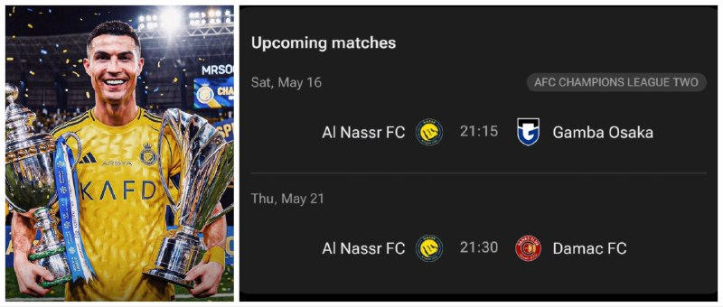

🏆
⚽️| عرضم به حضور منورتون که النصر تو این فصل دو تا بازی دیگه داره؛ یکیش فینال لیگ قهرمانان آسیا 2 هستش که 4 روز دیگه برگذار میشه و اون یکی هم بازی هفته آخرشون تو لیگ عربستانه و اگه بازیکنای النصر یکم هم بکشن و این دو تا بازیو ببرن رونالدو و النصر این فصل رو با دو جام میتونن تموم کنن
@SportBaadNews

## SportBaadNews — post 251467

  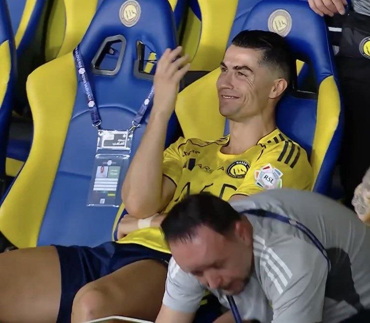

اینجاست که شاعر میگه خنده تلخ من از گریه غم انگیز تر است
@SportBaadNews

## SportBaadNews — post 251466

گلللللللللللللل فوقققققق کصشعری که بنتو کرپسکی خورد و گل بخودی خودش ثبت شد 😐😐😐😐 @GoalBad

## SportBaadNews — post 251465

  <a href="telegram/content/SportBaadNews_251465_1778619454.mp4" target="_blank">🎬 Download video</a>

گلللللللللللللل فوقققققق کصشعری که بنتو کرپسکی خورد و گل بخودی خودش ثبت شد 😐😐😐😐
@GoalBad

## SportBaadNews — post 251464

  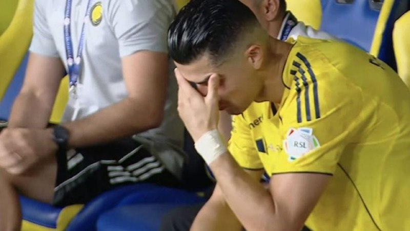

✅ پایان بازی | 
⚽️
1️⃣×
1️⃣
⚽️ 
🟡 با برد امشب النصر تو دربی ریاض این تیم در فاصله یک هفته به پایان لیگ عربستان با اختلاف 8 امتیازی قهرمان شد تا رونالدو اولین جامش با النصر رو اونم با قهرمانی لیگ کسب کنه 🔥 قهرمانی موکول شد به هفته آخر، اختلاف امتیاز همچنان 5 امتیاز…

## SportBaadNews — post 251463

  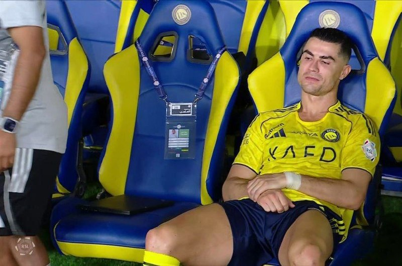

یه کیییییییییییییییییرم تو این زندگی خاصی تو قیافه رونالدو موج میزنه
@SportBaadNews

## SportBaadNews — post 251462

  <a href="telegram/content/SportBaadNews_251462_1778619457.webm" target="_blank">🎬 Download video</a>

✅ پایان بازی | 
⚽️
1️⃣×
1️⃣
⚽️

🟡 با برد امشب النصر تو دربی ریاض این تیم در فاصله یک هفته به پایان لیگ عربستان با اختلاف 8 امتیازی قهرمان شد تا رونالدو اولین جامش با النصر رو اونم با قهرمانی لیگ کسب کنه 🔥

قهرمانی موکول شد به هفته آخر، اختلاف امتیاز همچنان 5 امتیاز 
😨
@SportBaadNews

## SportBaadNews — post 251461

  

کریسو
@SportBaadNews

## SportBaadNews — post 251460

چه اشتباهی کرد دروازبان النصر پشمام

## SportBaadNews — post 251459

ریدممممممم
قهرمانی موکول شد به هفته آخر

## SportBaadNews — post 251458

جنوووووووووووون

## SportBaadNews — post 251457

دقیقه ۹۸

## SportBaadNews — post 251456

دقیقه آخرررررر

## IranIntlTV — post 336885

  

دونالد ترامپ در شبکه تروث سوشال نوشت وقتی رسانه‌های «جعلی» می‌گویند دشمن ایرانی از نظر نظامی در برابر آمریکا عملکرد خوبی دارد، این نوعی خیانت است، زیرا چنین ادعایی کاملا نادرست و حتی مضحک است.
او افزود: آن‌ها در حال کمک به دشمن هستند و به جمهوری اسلامی امید می‌دهند در حالی که نباید هیچ امیدی برای او وجود داشته باشد.
https://iranintl.com/202605125060

## IranIntlTV — post 336884

  

علی احتشام، امام جمعه کاشان گفت: «جمهوری اسلامی نه یکی از چهار قدرت، بلکه تنها ابرقدرت جهان است و ملت ایران هشت کشور منطقه و آمریکا را از کمال ارتفاع ساقط کرد و امروز با حضور در خیابان‌ها اجازه نداد جام زهر دیگری نوشیده شود.»

او افزود: «اگر مردم کف خیابان نبودند، چه بسا جام زهر دیگری نوشیده می‌شد.»
https://iranintl.com/202605128116

## IranIntlTV — post 336883

  

رسانه‌های ایران از وقوع زمین‌لرزه به بزرگی ۴.۶ در مرز استان‌های تهران و مازندران خبر دادند.

خبرگزاری فارس همچنین از زمین‌لرزه در کرج خبر داد.

همزمان خبرگزاری دولتی ایرنا گزارش داد زمین‌لرزه در تهران حدود ۱۰ ثانیه طول کشیده است.
https://iranintl.com/202605123583

## IranIntlTV — post 336882

  

سعید سیاه‌سرانی، دبیر ستاد راهیان نور دریایی، گفت: «بدون اراده جمهوری اسلامی اجازه عبور حتی یک لیتر نفت از تنگه هرمز داده نمی‌شود.»

او افزود: «تنگه هرمز جزو خاک ما است، شناورهایی که رد می‌شوند باید اجازه بگیرند و به زبان فارسی صحبت کنند و از نقاطی که ما تعیین می‌کنیم عبور کنند.»
https://iranintl.com/202605123958

## IranIntlTV — post 336881

  <a href="telegram/content/IranIntlTV_336881_1778619460.mp4" target="_blank">🎬 Download video</a>

خبرگزاری رویترز به نقل از دو مقام غربی گزارش داد که عربستان سعودی در جریان جنگ اخیر در خاورمیانه، در واکنش به حملاتی که در خاک این کشور انجام شده بود، چند حمله هوایی اعلام‌نشده علیه مواضعی در ایران انجام داده است.

گفت‌وگو با شهرام خلدی، پژوهشگر تاریخ خاورمیانه و روابط بین‌الملل

@iranintltv

## IranIntlTV — post 336880

  <a href="telegram/content/IranIntlTV_336880_1778619462.mp4" target="_blank">🎬 Download video</a>

هم‌زمان با سفر ترامپ به چین، گزارش‌ها حاکی است جمهوری اسلامی از پکن خواسته پیام‌های خود را به واشینگتن منتقل کند و چین را به‌عنوان ضامن احتمالی هر توافق آینده مطرح کرده است. سفیر ایران در چین نیز گفته پکن با ارائه طرح‌های صلح و رایزنی‌های منطقه‌ای تلاش دارد مسیر گفت‌وگوها را باز نگه دارد.

گفت‌وگو با آرام حسامی، استاد علوم سیاسی کالج مونتگومری

@iranintltv

## IranIntlTV — post 336879

  <a href="telegram/content/IranIntlTV_336879_1778619463.mp4" target="_blank">🎬 Download video</a>

انجمن قلم آمریکا در گزارش سالانه خود اعلام کرد؛ شمار نویسندگان زندانی در جهان برای نخستین‌بار از ۴۰۰ نفر عبور کرده است. این نهاد گفت؛ چین با ۱۱۹ مورد در صدر قرار دارد و ایران با زندانی‌کردن ۵۳ نویسنده در رتبه دوم ایستاده است.

در این گزارش آمده است؛ عربستان سعودی با ۲۷ نویسنده زندانی در رتبۀ سوم قرار دارد. پن آمریکا تاکید کرد؛ سرکوب نویسندگان و اهل قلم در ایران، به‌ویژه پس از «جنگ ۱۲روزه»، شدت گرفته است.
گفت‌وگو با اردوان روزبه، خبرنگار ایران‌اینترنشنال
@iranintltv

## IranIntlTV — post 336878

  <a href="https://t.me/IranintlTV/336878" target="_blank">📎 Download file</a>

🎧نسخه صوتی ‌‌‏۲۴ با فرداد فرحزاد: ترامپ: برای توافق با جمهوری اسلامی عجله ندارم
@iranintlTV

## IranIntlTV — post 336877

  

امارات متحده عربی اعلام کرد ۱۶ شهروند لبنانی و پنج نهاد مستقر در لبنان را به دلیل ارتباط با حزب‌الله در فهرست تروریستی این کشور قرار داده است.

در همین چارچوب، «موسسه قرض‌الحسن» و چهار نهاد دیگر نیز به دلیل ارتباط با حزب‌الله در این فهرست قرار گرفته‌اند.

امارات متحده عربی تاکید کرد این اقدامات در راستای مهار آفات تروریسم، محدود کردن گسترش آن و قطع تامین مالی فرامرزی انجام شده است.
https://iranintl.com/202605127283

## IranIntlTV — post 336876

  <a href="https://t.me/IranintlTV/336876" target="_blank">📎 Download file</a>

🎧نسخه صوتی چشم‌انداز: جهنم قطع اینترنت چگونه به پایان می‌رسد؟
@iranintlTV

## IranIntlTV — post 336875

  <a href="telegram/content/IranIntlTV_336875_1778619465.mp4" target="_blank">🎬 Download video</a>

بنا بر گزارش‌ها هم‌زمان با سفر دونالد ترامپ به چین، جمهوری اسلامی تلاش کرده است از پکن برای رساندن پیامش به واشینگتن استفاده کند و گفته است چین می‌تواند نقش ضامن هر توافق احتمالی را داشته باشد.

گفت‌وگو با جمشید برزگر، روزنامه‌نگار و تحلیل‌گر سیاسی
@iranintltv

## IranIntlTV — post 336874

  <a href="telegram/content/IranIntlTV_336874_1778619467.mp4" target="_blank">🎬 Download video</a>

جهنم قطع اینترنت چگونه به پایان می‌رسد؟

«چشم‌انداز با مهدی مهدوی‌آزاد»

تماشای نسخه کامل این برنامه در یوتیوب:

https://youtu.be/92BJ6BfAYHQ

@iranintltv

## Persian_Trend_Official — post 14013

🔴 سخنگوی اورژانس تهران:

در پی زمین لرزه در تهران تا این لحظه مصدومی گزارش نشده است

🫆:Tony

📌 @persian_trend_official
پرشین ترند | متفاوت‌ترین کانال نظامی

## Persian_Trend_Official — post 14012

  <a href="telegram/content/Persian_Trend_Official_14012_1778619469.webm" target="_blank">🎬 Download video</a>

🔴حین و بعد از زلزله چه باید کرد؟

🫆:Tony

📌 @persian_trend_official
پرشین ترند | متفاوت‌ترین کانال نظامی

## Persian_Trend_Official — post 14010

  <a href="telegram/content/Persian_Trend_Official_14010_1778619469.webm" target="_blank">🎬 Download video</a>

🔴زلزله در تهران احساس شد 🫆:Tony 📌 @persian_trend_official پرشین ترند | متفاوت‌ترین کانال نظامی

## Persian_Trend_Official — post 14009

خب دیگه بلا های آسمانی هم سر شوخی رو با مردم ایران باز کردن 🤦🏻‍♂️

📝 Nick

## Persian_Trend_Official — post 14008

🔴زلزله در تهران احساس شد 🫆:Tony 📌 @persian_trend_official پرشین ترند | متفاوت‌ترین کانال نظامی

## Persian_Trend_Official — post 14007

🔴زلزله در تهران احساس شد

🫆:Tony

📌 @persian_trend_official
پرشین ترند | متفاوت‌ترین کانال نظامی

## Persian_Trend_Official — post 14006

https://youtube.com/live/rrGzLhyQoaY?feature=share

## Persian_Trend_Official — post 14005

  

🇸🇦🇮🇷 — خبرگزاری رویترز درگزارشی مدعیست که عربستان سعودی در اواخر ماه مارس، حملات هوایی محرمانه‌ تلافی جویانه ای را در پاسخ به ایران انجام داده است.

☆Phantom☆

📌 @persian_trend_official
پرشین ترند | متفاوت‌ترین کانال نظامی

## Persian_Trend_Official — post 14004

  <a href="telegram/content/Persian_Trend_Official_14004_1778619470.mp4" target="_blank">🎬 Download video</a>

🔴ویدیو منتشر شده از کشتی کره ای آسیب دیده در حملات جمهوری اسلامی در روز های گذشته

🫆:Tony

📌 @persian_trend_official
پرشین ترند | متفاوت‌ترین کانال نظامی

## Persian_Trend_Official — post 14003

  

🔴 تهران ادعاهای کویت علیه ۴ شهروند ایرانی را رد کرد

جمهوری اسلامی ادعاهای مطرح‌شده از سوی وزارت خارجه و وزارت کشور کویت درباره برنامه‌ریزی ایران برای انجام اقدامات خصمانه علیه این کشور را «کاملاً بی‌اساس» و مردود دانست.

بر اساس موضع تهران:

▪️ اتهامات مطرح‌شده علیه ۴ شهروند ایرانی رد شده است
▪️ ایران تأکید کرده هیچ برنامه‌ای برای اقدام علیه کویت نداشته است
▪️ جمهوری اسلامی این ادعاها را فاقد اعتبار توصیف کرده است

▪️این واکنش پس از آن مطرح می‌شود که کویت از شناسایی و برخورد با آنچه «تهدیدات امنیتی» خوانده بود خبر داده بود.

🫆:Tony

📌 @persian_trend_official
پرشین ترند | متفاوت‌ترین کانال نظامی

---
📅 بروزرسانی: 1405/02/22 23:00
---

## ChizBergerz — post 46340

  

فروش اینترنت پرو توسط فروشگاه ها و دستفروشان خیابونی: 😐😐😐

@ChizBergerz

## ChizBergerz — post 46339

  <a href="telegram/content/ChizBergerz_46339_1778614203.mp4" target="_blank">🎬 Download video</a>

یه نفر با هوش‌مصنوعی سریال بازی تاج و تخت رو اونجوری که دلش خنک میشده درست کرده:

+ خیلی باحال بود :)))
@ChizBergerz

## rodast_omiddana — post 71285

  <a href="telegram/content/rodast_omiddana_71285_1778614206.webm" target="_blank">🎬 Download video</a>

🚨 در آپریل 2017 شی جین‌پینگ به دیدار ترامپ در اقامتگاه شخصی وی در مارالاگو ایالت فلوریدا رفت، موقع صرف قهوه و کیک شکلاتی بودن که دونالد به شی گفت:
"در همین لحظه که کیک شکلاتی را میل میفرمایی 59 موشک به مواضع بشار اسد در سوریه شلیک کردم"
آیا میشه اینبارم این اتفاق علیه مواضع جمهوری اسلامی در ایران رخ بده؟

## rodast_omiddana — post 71284

  <a href="telegram/content/rodast_omiddana_71284_1778614206.webm" target="_blank">🎬 Download video</a>

🚨 تا دو ساعت دیگه ترامپ به چین پرواز خواهد کرد..
تیک تاک..

## KiriMohems — post 47407

🔴خلاصه تو سگ گرما کونمون پارس

رئیس کمیسیون انرژی: به دلیل آسیب به پتروشیمی ها امسال قطعی برق خیلی بیشتری داریم

#professor
@KiriMohems

## KiriMohems — post 47406

آخرین قیمت نفت ۱۰۸.۱ دلار

@KiriMohems

## KiriMohems — post 47405

تعرفه سرویس های Vip 
⭕️ 
✅ 1 گیگابایت 
⬅️ 250/000 تومان 
✅ 3 گیگابایت 
⬅️ 750/000 تومان استارلینک Vip 
💫 
🌟(مناسب برای شرایط بحرانی مثل جنگ و اختلالات) 
⭐️ 5 گیگابایت 
⬅️ 1/400/000 تومان 
⭐️ 10 گیگابایت 
⬅️ 2/800/000 تومان ویژگی های سرویس های Vip : 
❤️‍🔥 
✅ متصل…

## KiriMohems — post 47403

تعرفه سرویس های Vip 
⭕️

✅ 1 گیگابایت 
⬅️ 250/000 تومان

✅ 3 گیگابایت 
⬅️ 750/000 تومان

استارلینک Vip 
💫 
🌟(مناسب برای شرایط بحرانی مثل جنگ و اختلالات)

⭐️ 5 گیگابایت 
⬅️ 1/400/000 تومان

⭐️ 10 گیگابایت 
⬅️ 2/800/000 تومان

ویژگی های سرویس های Vip : 
❤️‍🔥

✅ متصل در تمامی دستگاه و اپراتور ها

✅ مناسب استفاده روزمره در تمامی برنامه ها

✅ دارای ساب برای اطلاع لحظه ای باقیمانده

✅ تک لینک بدون نیاز به بروزرسانی های متعدد
 برای خرید از پشتیبانی به ایدی زیر پیام بدید.
👇

🔤 @expressuport

خرید فوری از ربات.
👇

🔤 @vpn_express_sup_bot

## KiriMohems — post 47402

  <a href="telegram/content/KiriMohems_47402_1778614206.mp4" target="_blank">🎬 Download video</a>

ترامپ : از پاکستان به‌عنوان نخود سیاه تو ماجرای ایران حمایت می‌کنم و معتقدم میشه به یه توافق خوب رسید

این قضیه هم برای مردم آمریکا خوبه، هم برای ایرانی‌ها، پاکستانی‌ آدمای خوبی‌ان

#professor
@KiriMohems

## KiriMohems — post 47401

🔴 رویترز: عربستان سعودی در طول جنگ اخیر، در جواب حملات جمهوری‌اسلامی، چندین‌بار بصورت مخفیانه به ایران حمله کرده بود.

#professor
@KiriMohems

## KiriMohems — post 47400

  

🔴شاهزاده رضا پهلوی تو نشست امنیتی سالانه پولیتیکو:

الان ما با یه جونورِ زخمی طرفیم و نباید بذاریم فرصت از دست بره، کار رو باید یه بار واسه همیشه تموم کنیم.
سیاست مماشات با جمهوری اسلامی که راهبرد خیلی از دولت‌ها بود، شکست خورده.
مردم به‌اندازه کافی هوشمند هستنن که تفاوت بین حمله به یه ملت و حمله به یه رژیم رو تشخیص بدن.
ما فقط زمانی می‌تونیم مردم رو به بازگشت به خیابون‌ها فرا بخوانیم که اونا هم سطحی از توان مقابله رو داشته باشن.

@KiriMohems

## KiriMohems — post 47399

  <a href="telegram/content/KiriMohems_47399_1778614209.mp4" target="_blank">🎬 Download video</a>

مجری : واقعاً فکر می‌کنی می‌تونی ایران رو از غنی‌سازی اورانیوم و در نهایت ساخت سلاح هسته‌ای متوقف کنی؟

🔴 ترامپ : ۱۰۰٪. اونا قراره متوقف کنن خودشون به من گفتن،ایرانی‌ها گفتن ما قراره تحویل بدیم.

#professor
@KiriMohems

## KiriMohems — post 47398

  

✖️ سایت بین المللی bet120x 
✖️

 
👍دارای مجوز رسمی Gambling Judge سوئد
👍
     

💳شارژ حساب از طریق ارز و یووچر و پرمیوم ووچر

💳تسویه حساب دلاری سریع
💊بیمه شرط میکس

⚠️فروش شرط

🔔ویرایش شرط                    
3️⃣
2️⃣

🎁20%هدیه واریز از طریق ارز و ووچر
┅━━━━━━━━━━━

🎁 10%برگشت باخت به صورت روزانه

🎁 10%برگشت باخت به صورت هفتگی

🎁10%برگشت باخت به صورت ماهانه

💻ادرس ورود به سایت:
https://bet120x.com/fa/?btag=971470
➖➖➖➖➖
   
👈 آموزش واریز و برداشت دلاری
👉

🔪کانال اطلاع رسانی:
👇 g22🅰

✈️https://t.me/+RvVnWMHCqUc4YzFk

## SportBaadNews — post 251446

بازم شوت رونالدوووووو که با اختلاف کمممم بیرون رفتتتتتت

## SportBaadNews — post 251445

  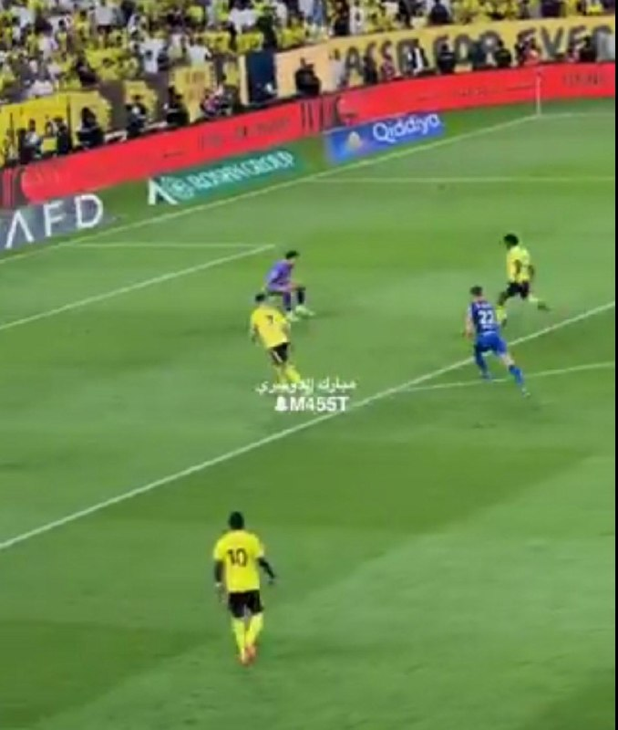

کومان رو این صحنه به رونالدو پاس نداد و شوت زد و شوتش رفت تو اوت
@SportBaadNews

## SportBaadNews — post 251443

  <a href="telegram/content/SportBaadNews_251443_1778614213.mp4" target="_blank">🎬 Download video</a>

شوت فوق‌العادهههههه رونالدوووووو و سوپرررررررررررر سیوووووووو یاسین یونووووو
@GoalBad

## SportBaadNews — post 251442

  

🟡 Al Naasr - 
🔵 Al Hilal

🟢 لیگ حرفه‌ای عربستان

⏰ سه‌شنبه ساعت ۲۱:۳۰

🏟 استادیوم الاول‌پارک

⚽️ درحالی‌که در اکثر لیگ‌های فوتبال فعال؛ سرنوشت قهرمان مشخص شده، لیگ عربستان هنوز قهرمان مشخصی ندارد و النصر و الهلال تا دو هفته دیگر برای قهرمانی می‌جنگند. علی‌الخصوص که الهلال امشب یک بازی بسیار موثر در سرنوشت قهرمانی انجام می‌دهد و یک بازی معوقه هم دارد. فاصله دو تیم، پنج امتیاز است (النصر یک بازی بیشتر دارد) و درحال‌حاضر با چنین فرمتی، کریستیانو رونالدو برای اولین‌بار قهرمان لیگ عربستان می‌شود. النصر فرم خوبی دارد و اگر شکست مقابل القادسیه را درنظر نگیریم، شاگردان خسوس در بیش از ده بازی اخیرشان در لیگ شکستی نداشته‌اند. الهلال هم در سوی مقابل، فرم خوبی دارد. شاگردان اینزاگی هم در لیگ، بیش از ده بازی است که نباخته‌اند. آمار دو تیم هم مشابه‌ است. یاران رونالدو، در ۳۲ بازی، ۸۶ گل زده‌اند و فقط ۲۶ گل خورده‌اند. یاران کریم بنزما در یک بازی کمتر، ۸۱ گل زده‌اند و ۲۶ گل خورده‌اند. بازی روی کاغذ، برنده مشخصی ندارد.

📌در ربات وینکوبت ثبت‌نام کن و با شارژ از طریق کریپتو ۵٪ شارژ بیشتری رو دریافت کنید، همین حالا شروع کن: 
👇

🟣 [ برای ورود به ربات کلیک کنید: ]

📌برای اطلاع از تحلیل بازی‌ها و ورود به کانال سایت جوین بدید: 
👇

🔵 @Wincobetofficial

## SportBaadNews — post 251440

شوت خوشگلللل رونالدو رو بونو سیو کردددد

## SportBaadNews — post 251439

گلللللللللللللل اوللللل النصررررر: WATCH

## SportBaadNews — post 251438

رونالدو و یاران فقط و فقط 60 دقیقه با قهرمانی فاصله دارن

## SportBaadNews — post 251437

گلللللللللللللل النصررررر سیماکاننننننن

## SportBaadNews — post 251436

  <a href="telegram/content/SportBaadNews_251436_1778614217.webm" target="_blank">🎬 Download video</a>

🚨
⚽️
⚽️ پرز: پرونده نگریرا بدترین رسوایی تاریخ فوتباله. باورم نمیشه هنوز تکلیفش مشخص نشده. همون داورایی که تو دوران نگریرا بودن، هنوزم فعالن. هنوز دارن قضاوت می‌کنن. اصلاً منطقی نیست. بارسا دو دهه برای خدمات نگریرا پول داده، ولی اون داورا تو دهه سوم هنوزم فعالن.…

## SportBaadNews — post 251435

  

جورجینا هم مثل همیشه تو ورزشگاه حضور داره
@SportBaadNews

## SportBaadNews — post 251434

  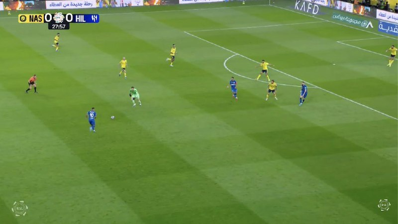

کرپسکی گلر النصر رو 😂😂😂🔥 ارزش دانلود 10/10 @SportBaadNews

## SportBaadNews — post 251433

  <a href="telegram/content/SportBaadNews_251433_1778614219.mp4" target="_blank">🎬 Download video</a>

کرپسکی گلر النصر رو 😂😂😂🔥
ارزش دانلود 10/10
@SportBaadNews

## SportBaadNews — post 251432

پشمام گلر النصر رو 😂😂😂
تا وسط زمین اومد از سه نفر توپ گرفت

## SportBaadNews — post 251431

⚽️
⚽️| 10 دقیقه تا شروع جدال حساس النصر و الهلال؛ اگه النصر بازیو ببره همین امشب قهرمانیش قطعی میشه وگرنه کار میکشه به هفته آخر @SportBaadNews

## SportBaadNews — post 251430

  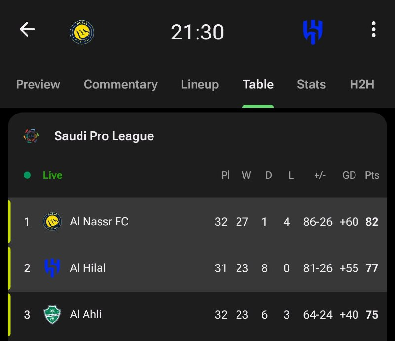

⚽️
⚽️| 10 دقیقه تا شروع جدال حساس النصر و الهلال؛ اگه النصر بازیو ببره همین امشب قهرمانیش قطعی میشه وگرنه کار میکشه به هفته آخر
@SportBaadNews

## SportBaadNews — post 251429

  <a href="telegram/content/SportBaadNews_251429_1778614222.webm" target="_blank">🎬 Download video</a>

🚨
⚽️ پرز: دارم انتخابات جدید هیئت‌مدیره رو اعلام می‌کنم و همین هیئت، با خودم به‌عنوان رئیسش، تو این انتخابات شرکت می‌کنه. هرکی از ما انتقاد داره و این شایعه‌ها رو درباره‌م پخش می‌کنه، می‌تونه بیاد تو همین انتخابات روبه‌روی من کاندیدا بشه. هرکی می‌خواد جلو…

## IranIntlTV — post 336873

  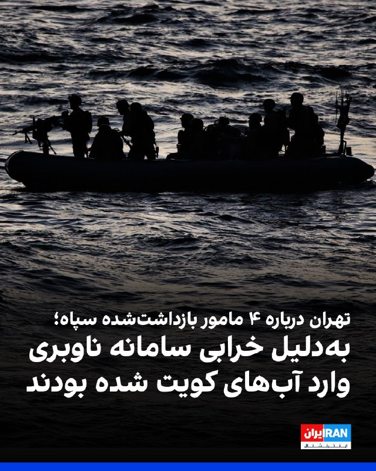

در پی بازداشت چهار فرد «وابسته به سپاه پاسداران» در کویت، وزارت خارجه جمهوری اسلامی برنامه‌ریزی برای انجام اقدامات خصمانه علیه کویت را بی‌اساس و مردود دانست.

وزارت خارجه جمهوری اسلامی در بیانیه‌ای اعلام کرد این چهار مامور در چارچوب ماموریت مرسوم گشت‌زنی دریایی مشغول انجام وظیفه بوده‌اند و به دلیل «اختلال در سامانه ناوبری» وارد آب‌های سرزمینی کویت شده‌اند.

این وزارتخانه از مراجع کویت خواست از اظهارنظرهای شتاب‌زده و طرح ادعاهای بی‌اساس خودداری کرده و موضوع را از طریق مجاری رسمی پیگیری کنند. وزارت خارجه جمهوری اسلامی همچنین خواهان آزادی این چهار مامور بازداشت‌شده شد.
https://iranintl.com/202605121807

## IranIntlTV — post 336872

  

کاظم غریب‌آبادی، معاون وزیر خارجه جمهوری اسلامی، در شبکه ایکس نوشت: «صلح واقعی با ادبیات تحقیر، تهدید و امتیازگیری اجباری ساخته نمی‌شود.»

غریب‌آبادی اضافه کرد: «اصول ما مشخص است، توقف دائمی جنگ و عدم تکرار آن، جبران خسارات، رفع محاصره، رفع تحریم‌های غیرقانونی و احترام به حقوق جمهوری اسلامی.»

او افزود: «وقتی طرفی که خود در جنگ، محاصره، تحریم و تهدید به زور نقش مستقیم دارد، پاسخ جمهوری اسلامی را صرفا به دلیل آنکه تسلیم‌نامه نیست، رد می‌کند، روشن می‌شود که مسئله اصلی نه صلح، بلکه تحمیل اراده سیاسی از مسیر تهدید و فشار است.»
https://iranintl.com/202605129672

## IranIntlTV — post 336871

  

اطلاعات رسیده به ایران اینترنشنال حاکی از آن است که احمد خزایی، شهروند ۴۶ ساله، از جمله شهروندان معترضی بوده که در جریان انقلاب ملی دی‌ماه در شهریار استان تهران با شلیک ماموران حکومت کشته شده است. او در جریان اعتراضات ۱۸ دی‌ماه کشته شد.
https://iranintl.com/202605128985

## IranIntlTV — post 336870

  

رویترز به نقل از دو مقام غربی و دو مقام ایرانی گزارش داد عربستان سعودی در جریان جنگ خاورمیانه، در پاسخ به حملاتی که در خاک این کشور انجام شده بود، چندین حمله اعلام‌نشده در ایران انجام داده است.
به گفته دو مقام غربی، این حملات توسط نیروی هوایی عربستان سعودی و در اوایل فروردین انجام شده‌اند. یکی از این مقامات گفت این حملات «اقداماتی تلافی‌جویانه در پاسخ به حملاتی بود که عربستان سعودی هدف آن قرار گرفته بود»
رویترز با اشاره به گزارش‌های پیشین درباره حملات امارات متحده عربی به ایران نوشت اقدامات عربستان سعودی و امارات متحده نشان می‌دهد کشورهای عربی خلیج فارس که هدف حملات جمهوری اسلامی قرار گرفته‌اند، به‌تدریج وارد فاز پاسخ‌گویی مستقیم شده‌اند.
https://iranintl.com/202605123748

## IranIntlTV — post 336869

  <a href="telegram/content/IranIntlTV_336869_1778614225.mp4" target="_blank">🎬 Download video</a>

مهدی مهدوی‌آزاد در برنامه «چشم‌انداز» گفت: «سخنگوی دولت پزشکیان باید بداند که او و دولت متبوعش نیز از حامیان «سیم‌کارت‌های سفید» بوده‌اند؛ بنابراین نمی‌توانند خود را در کنار مردم نشان دهند یا افکار عمومی را درباره محدودیت‌های اینترنت قانع کنند.»

@iranintltv

## IranIntlTV — post 336868

  

دانشجویان متحد گزارش داد یاسین حسن‌زاده، دانشجوی مهندسی صنایع دانشگاه تهران، روز ۲۲ اردیبهشت بازداشت شده است.

بر اساس این اطلاعات، یاسین حسن‌زاده، دبیر انجمن اسلامی دانشجویان دانشگاه تهران بوده است.
https://iranintl.com/202605124133

## IranIntlTV — post 336867

  

دونالد ترامپ هنگام خروج از کاخ سفید برای عزیمت به چین گفت فکر نمی‌کند آمریکا برای موضوع ایران به کمکی نیاز داشته باشد و افزود ایالات متحده این مسئله را یا به‌صورت مسالمت‌آمیز یا به شکلی دیگر حل خواهد کرد.

ترامپ تاکید کرد جمهوری اسلامی از نظر نظامی شکست خورده و یا «کار درست را انجام خواهد داد» یا آمریکا «کار را تمام خواهد کرد».
https://iranintl.com/202605129211

## IranIntlTV — post 336866

  <a href="telegram/content/IranIntlTV_336866_1778614230.mp4" target="_blank">🎬 Download video</a>

۲۴ با فرداد فرحزاد
@iranintltv

## IranIntlTV — post 336865

  

خبرگزاری فارس، وابسته به سپاه پاسداران، به نقل از یک منبع آگاه گزارش داد جمهوری اسلامی بدون انجام «پنج شرط اعتمادساز» وارد دور دوم مذاکرات با آمریکا نمی‌شود.

این رسانه افزود پیش‌شرط‌های اعلامی جمهوری اسلامی، تضامین حداقلی اعتمادساز برای آغاز هرگونه مذاکره با آمریکا است.

خبرگزاری فارس به نقل از «کنبع آگاه اعلام کرد پنج پیش‌شرط جمهوری اسلامی «پایان جنگ در همه جبهه‌ها به‌ویژه لبنان»، «رفع تحریم‌ها»، «آزادسازی پول‌های بلوکه‌شده»، «جبران خسارات ناشی از جنگ» و «پذیرش حق حاکمیت حکومت ایران بر تنگه هرمز» است.

این رسانه وابسته به سپاه گزارش داد که جمهوری اسلامی از طریق واسط پاکستانی به طرف آمریکایی اعلام کرد تداوم محاصره دریایی پس از برقراری آتش‌بس، گزاره غیرقابل اعتماد بودن مذاکره با آمریکا را بیش از پیش تقویت کرده است.
https://iranintl.com/202605121380

## IranIntlTV — post 336864

  <a href="https://t.me/IranintlTV/336864" target="_blank">📎 Download file</a>

🎧نسخه صوتی تیتراول با نیوشا صارمی: جدی‌ شدن بازگشت حملات نظامی به ایران در آمریکا؛ جزییات حمله امارات به ایران
@iranintlTV

## IranIntlTV — post 336863

صدها پیام دریافتی روزانه از شهروندان به ایران اینترنشنال حاکی از کلافگی، خستگی روحی و ورشکستگی اقتصادی آن‌ها در شرایط سخت معیشتی همزمان با قطع اینترنت است. در حالی مقام‌های حکومت ابتدا اعلام کردند دولت تصمیم‌گیر قطع اینترنت نبوده، اما بعد سخنگوی دولت پزشکیان گفت دستور قطع سراسری آن را رییس‌جمهوری داده است. شهروندان می‌گویند پول خود را برای اینترنت پرو که با تبعیض و رانت توزیع شده نخواهند داد چراکه درآمد دستگاه‌ها و نیروهای سرکوب خواهد شد.

## IranIntlTV — post 336862

  

دونالد ترامپ، رییس‌جمهور آمریکا، هنگام خروج از کاخ سفید برای عزیمت به چین گفت جمهوری اسلامی می‌داند نباید به سلاح هسته‌ای دست پیدا کند و افزود به‌زودی درباره جنگ ایران با رییس‌جمهور چین گفت‌وگوی مفصلی خواهد داشت.
او تاکید کرد محاصره ایران «۱۰۰ درصد موثر» بوده و آمریکا پیروز شده است.

ترامپ همچنین گفت تنها توافقی «خوب» با تهران امضا خواهد کرد و اجازه نخواهد داد جمهوری اسلامی به سلاح هسته‌ای دست یابد. او افزود هرکس اجازه دستیابی تهران به سلاح هسته‌ای را بدهد «احمق» است.
https://iranintl.com/202605120877

## IranIntlTV — post 336861

  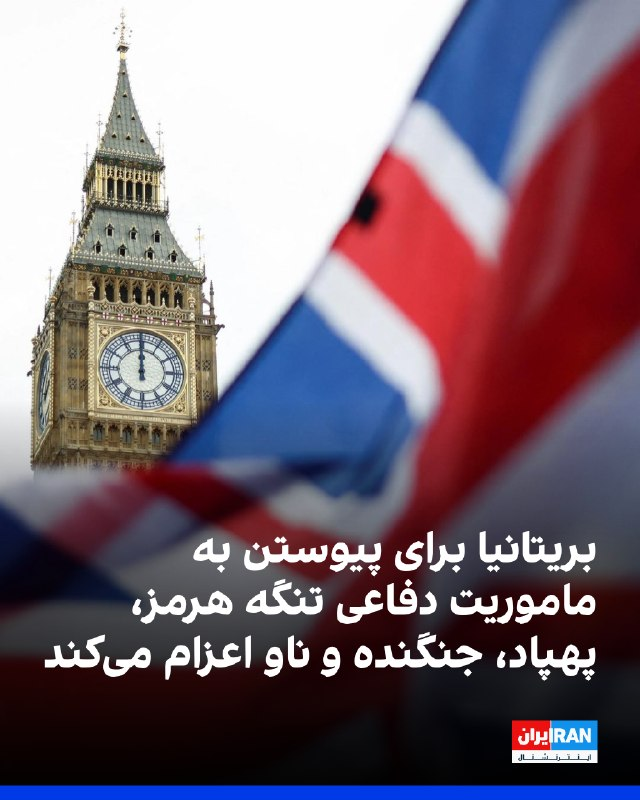

بریتانیا سه‌شنبه اعلام کرد که تجهیزات خودکار مین‌روبی، جنگنده‌های تایفون و ناو جنگی اچ‌ام‌اس دراگون را به یک ماموریت دفاعی چندملیتی با هدف تامین امنیت کشتیرانی در تنگه هرمز اختصاص خواهد داد.

دولت بریتانیا با انتشار بیانیه‌ای نوشت که ماموریت دفاعی بریتانیا با ۱۱۵ میلیون پوند بودجه جدید برای پهپادهای مین‌روب و سامانه‌های مقابله با پهپاد پشتیبانی می‌شود.

جان هیلی، وزیر دفاع بریتانیا که ریاست اولین نشست وزیران دفاع ائتلافی متشکل از ۴۰ کشور را به‌طور مشترک با همتای فرانسوی خود برعهده داشت، گفت: «همراه با متحدان‌مان، این ماموریت چندملیتی، دفاعی، مستقل و معتبر خواهد بود.»
https://iranintl.com/202605128230

## IranIntlTV — post 336860

  

مجتبی یوسفی، نماینده اهواز در مجلس به سایت دیده‌بان ایران گفت: «ناوهای بریتانیا و فرانسه به تنگه هرمز نزدیک شوند، ببینند چه بلایی سرشان می آوریم. ما هم می‌گوییم بیایید نزدیک تنگه هرمز و آن را باز کنید.»

او ادامه داد: «اگر بناست اروپایی‌ها ما را امتحان کنند، بدانند که پایگاه‌های نظامی، کشورهای اروپایی و هر کشور متخاصم هدف مشروع ما است. ما بلوف نمی‌زنیم بلکه عمل می‌کنیم.»
https://iranintl.com/202605125053

## IranIntlTV — post 336859

  <a href="https://t.me/IranintlTV/336859" target="_blank">📎 Download file</a>

🎧نسخه صوتی چرتکه: سناریوهای قدرت خرید تا پایان ۱۴۰۵
@iranintlTV

## IranIntlTV — post 336858

  

🔻تیم ملی فوتبال در پی انزوای جمهوری اسلامی و انصراف همه حریفان تدارکاتی، برای سومین بار با خودش بازی کرد؛ دیداری که به طور مستقیم از صدا و سیمای جمهوری اسلامی پخش شد، وی‌ای‌آر داشت و البته بدون حضور تماشاگران عادی در ورزشگاه پاس قوامین، وابسته به نیروی انتظامی، برگزار شد.

🔹این بازی که در جریان اردوی بازیکنان شاغل در لیگ برتر برگزار شد، با حضور دو تیم قرمز و سفید انجام گرفت و تیم سفید با نتیجه ۴ بر یک تیم قرمز را شکست داد.

علی علیپور، دانیال ایری (دو بار) و آریا یوسفی برای تیم سفید و امیرحسین حسین‌زاده برای تیم قرمز گل زدند.

🔹تیم ملی قرار بود پیش از جام جهانی با تیم‌های ملی پرتغال،‌ اسپانیا،‌ مقدونیه و آنگولا بازی‌های تدارکاتی داشته باشد که همگی از دیدار با ایران منصرف شدند.

🔹امیر قلعه‌نویی، سرمربی تیم ملی، پیش‌تردرباره لغو بازی‌های تدارکاتی گفت: «بازی‌های تدارکاتی هماهنگ شده بود و قرارداد بستند؛ ولی در دقیقه ۹۰ کنسل شد.»

🔹تیم ملی قرار است به زودی در ترکیه اردوی آماده‌سازی خود را برپا کند. فدراسیون فوتبال گفته در جریان این اردو با تیم ملی گامبیا بازی خواهد کرد.

@iranintltvsport

## IranIntlTV — post 336857

  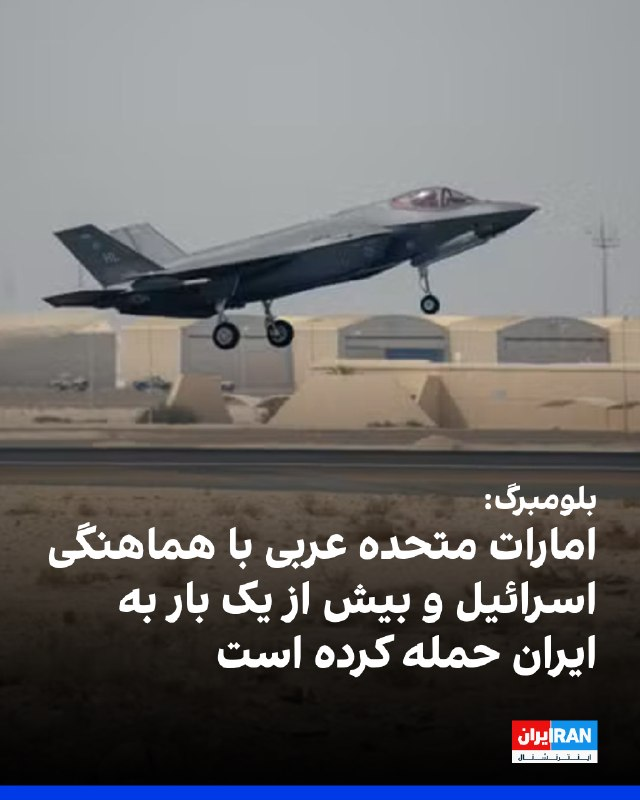

بلومبرگ گزارش داد امارات متحده عربی از زمان آغاز کارزار آمریکا و اسرائیل علیه جمهوری اسلامی در اسفند ماه، بیش از یک‌بار ایران را هدف حمله قرار داده است.
بلومبرگ به نقل از «افراد مطلع» نوشت این حملات هم پیش از برقراری آتش‌بس و هم پس از آن انجام شده است.

براساس این گزارش، در طول جنگ، همکاری میان امارات متحده عربی و اسرائیل شامل تبادل اطلاعات، شناسایی و رهگیری موشک‌ها و پهپادهای ایرانی و همچنین انتخاب اهداف در ایران بوده است.

طبق گزارش بلومبرگ، یکی از این حملات در پاسخ به حمله جمهوری اسلامی به تاسیسات پتروشیمی بوروج در امارات و در «هماهنگی» با اسرائیل بوده است.

به گفته یکی از منابع، دو طرف در حمله اسرائیل به مجتمع پتروشیمی پارس جنوبی ایران نیز همکاری کرده‌اند.
وال‌استریت ژورنال پیش‌تر گزارش داد که امارات حمله‌ای به جزیره لاوان ایران انجام داده است.
https://iranintl.com/202605123603

## IranIntlTV — post 336856

  <a href="telegram/content/IranIntlTV_336856_1778614238.mp4" target="_blank">🎬 Download video</a>

وال‌استریت ژورنال گزارش داد ابوظبی به اهدافی داخل ایران حمله کرده است و واشینگتن به‌طور غیرعلنی از مشارکت امارات و هر کشور حاشیه خلیح فارس که مایل به ورود به درگیری باشد، استقبال کرده است.

ارزیابی فرزین ندیمی، پژوهشگر ارشد امور دفاعی و امنیتی در موسسه واشینگتن
@iranintltv

## Persian_Trend_Official — post 14002

  

جنگنده کره‌ای KF-21 بیش از 16000 پرواز آزمایشی تاکنون انجام داده و به مراحل پایانی تست‌های خود رسیده است.

📝 Nick

📌 @persian_trend_official
پرشین ترند | متفاوت‌ترین کانال نظامی

## Persian_Trend_Official — post 14001

  <a href="telegram/content/Persian_Trend_Official_14001_1778614242.mp4" target="_blank">🎬 Download video</a>

ترامپ راهی چین شد.

📝 Nick

📌 @persian_trend_official
پرشین ترند | متفاوت‌ترین کانال نظامی

## Persian_Trend_Official — post 14000

  <a href="https://t.me/persian_trend_official/14000" target="_blank">📎 Download file</a>

فایل صوتی لایو اول
نسخه کم حجم - 7.06 مگابایت

اتاق جنگ سه شنبه 22 اردیبهشت | بالا رفتن احتمال جنگ جمهوری اسلامی و آمریکا

📝 Nick

📌 @persian_trend_official
پرشین ترند | متفاوت‌ترین کانال نظامی

## Persian_Trend_Official — post 13999

  <a href="telegram/content/Persian_Trend_Official_13999_1778614245.webm" target="_blank">🎬 Download video</a>

تهران طوفانی شد

🔹هواشناسی: از ساعتی پیش، وزش باد ۵۵ کیلومتر بر ساعت همراه با گردوخاک در تهران آغاز شده است.

شهروندان از تردد غیرضروری در فضاهای باز و ماندن در مجاورت درختان کهنسال، سازه‌های موقت و تأسیسات ناپایدار خودداری کنند.
☆Phantom☆

📌 @persian_trend_official
پرشین ترند | متفاوت‌ترین کانال نظامی

## Persian_Trend_Official — post 13998

  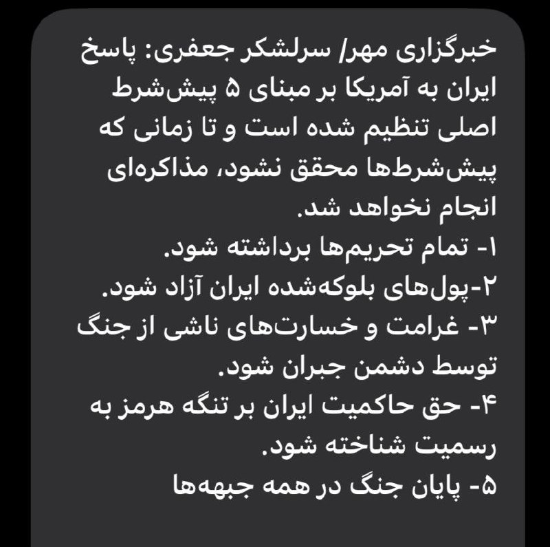

🔴سرلشگر جعفری :

تا زمانی که پیش شرط ها محقق نشود مذاکره ای انجام نخواهد شد

🫆:Tony

📌 @persian_trend_official
پرشین ترند | متفاوت‌ترین کانال نظامی

## Persian_Trend_Official — post 13997

  

یک مقام ارشد نیروی دریایی سپاه پاسداران انقلاب اسلامی اعلام کرده است که ایران تعریف خود از تنگه هرمز را به یک «منطقه عملیاتی گسترده» تغییر داده؛ تعریفی که به‌مراتب وسیع‌تر از نگاه پیش از جنگ توصیف می‌شود.
به گزارش خبرگزاری فارس در روز سه‌شنبه ۲۲ اردیبهشت، محمد اکبرزاده، معاون سیاسی نیروی دریایی سپاه، تأکید کرد که تنگه هرمز دیگر صرفاً یک آبراه محدود در اطراف چند جزیره نیست و ابعاد و اهمیت نظامی آن به‌طور قابل توجهی گسترش یافته است.
او اظهار داشت: «در گذشته، تنگه هرمز به‌عنوان محدوده‌ای محدود پیرامون جزایری مانند هرمز و هنگام تعریف می‌شد، اما امروز این رویکرد تغییر کرده است.»
بر اساس این گزارش، مقامات رسمی ایران تاکنون به درخواست خبرگزاری رویترز برای ارائه توضیحات بیشتر در این خصوص پاسخی نداده‌اند.

☆Phantom☆

📌 @persian_trend_official
پرشین ترند | متفاوت‌ترین کانال نظامی

## Persian_Trend_Official — post 13996

  <a href="telegram/content/Persian_Trend_Official_13996_1778614247.webm" target="_blank">🎬 Download video</a>

⭕️ شاهزاده رضا پهلوی: به جای توافق با رژیم، بهتر است یک‌بار برای همیشه از شر آن خلاص شوید. جهان امروز در برابر چنین انتخابی قرار دارد.

📝 Nick

📌 @persian_trend_official
پرشین ترند | متفاوت‌ترین کانال نظامی

## Persian_Trend_Official — post 13995

  <a href="telegram/content/Persian_Trend_Official_13995_1778614248.mp4" target="_blank">🎬 Download video</a>

⭕️ خوش‌چشم، کارشناس ارشد صداوسیما:

این دفعه جنگ بشه اصلا مهم نیست ساختمون اینتل تو اسرائیل چند طبقه زیر زمینه، کل دیتاسنترهای اینتل میخوره، پروژه مشترک گوگل و آمازونم که میخوره، بقیشم هرچی هست میخوره.

📝 Nick

📌 @persian_trend_official
پرشین ترند | متفاوت‌ترین کانال نظامی

## Persian_Trend_Official — post 13994

  <a href="telegram/content/Persian_Trend_Official_13994_1778614253.mp4" target="_blank">🎬 Download video</a>

⭕️ سناتور گراهام: اگر میانجی (پاکستان) اجازه می‌دهد هواپیماهای شناسایی در پایگاه‌های هوایی پاکستان پارک شوند، فکر می‌کنید این با نقش میانجی منصفانه سازگار است؟

وزیر جنگ هگسث: من نمی‌خواهم وسط این مذاکرات قرار بگیرم.

سناتور گراهام: خب، من می‌خواهم وسط این مذاکرات قرار بگیرم. من به پاکستان به اندازه‌ای که بتوانم آنها را پرتاب کنم اعتماد ندارم.

اگر واقعاً هواپیماهای ایرانی در پایگاه‌های پاکستانی برای محافظت از دارایی‌های نظامی ایران پارک شده‌اند، این به من می‌گوید که شاید باید به دنبال شخص دیگری برای میانجیگری باشیم. جای تعجب نیست که این لعنتی به جایی نمی‌رسد.

📝 Nick

📌 @persian_trend_official
پرشین ترند | متفاوت‌ترین کانال نظامی

## Persian_Trend_Official — post 13993

https://youtube.com/live/rrGzLhyQoaY?feature=share

---
📅 بروزرسانی: 1405/02/22 21:01
---

## ChizBergerz — post 46338

  <a href="telegram/content/ChizBergerz_46338_1778607065.mp4" target="_blank">🎬 Download video</a>

تراپی ببینید جیگرتون حال بیاد: 😍😍

یه شیر پسر دیگه تو خارج کشور رفته تو تجمع خایمالای ج.ا و میگه "خامنه‌ای پرپر" که یه خرزشی میخواست باهاش درگیر شه و پلیس میاد مثل سگ میبرتش😂🔥
@ChizBergerz

## ChizBergerz — post 46337

  <a href="telegram/content/ChizBergerz_46337_1778607066.mp4" target="_blank">🎬 Download video</a>

تو خارج کشور یه شیرپسر کُتلت پخته و برده تو تجمع خایمالای ج.ا و میگه بخورید: 😂😂🔥

@ChizBergerz

## ChizBergerz — post 46336

  <a href="telegram/content/ChizBergerz_46336_1778607067.mp4" target="_blank">🎬 Download video</a>

نه داداش ببین موش‌تباه کاملا حالش خوبه، فکر میکنی دروغ میگم؟ اینم مدرکش:

@ChizBergerz

## ChizBergerz — post 46335

  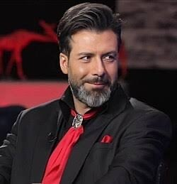

قل أعوذ برب الناس
آدم مادرجنده از دور پیداس!

@ChizBergerz

## ChizBergerz — post 46334

  <a href="telegram/content/ChizBergerz_46334_1778607070.mp4" target="_blank">🎬 Download video</a>

یه سری هم دارن تو اینستا بخاطر اینکه فیلترشکن خریدن دارن پز میدن، اینترنت داشتن شده دلیل باکلاس بودن!

+ این که اصن خوشگل نیست، منظورش از خوشگی ممه‌هاشه؟
@ChizBergerz

## ChizBergerz — post 46333

  <a href="telegram/content/ChizBergerz_46333_1778607072.mp4" target="_blank">🎬 Download video</a>

ویدیو وایرال شده از یه مادرقحبه (احتمال زیاد افغانستانی) که تو تجمع خایمالای ج.ا تو برلین میگه؛ سپهر بابا کجایی؟ سپهر بابا به کیر رفت!

+ اینو نشون کنید یه مادری باید ازش گایید که تو تاریخ بنویسن!
@ChizBergerz

## ChizBergerz — post 46332

  <a href="https://t.me/ChizBergerz/46332" target="_blank">📎 Download file</a>

📲#اپلیکیشن اندروید سایت جهانی دربی بت

👍اسپانسر لیگ انگلیس
👍
🔥امکان شارژ امن از طریق کارت بانکی
➖➖➖➖➖➖➖➖➖

🪙همین حالا عضو شوید 👇
https://t.me/+aCbq7yy8QY80NzQ0

## ChizBergerz — post 46331

  

😤دنبال یه سایت شرط بندی بین المللی بودی که به ایرانیا خدمات بده؟!
⛔

👍دربی بت همون انتخاب  100%

💎ویژگی های سایت جهانی Derby Bet:

⬅️امکان شارژ امن با کارت بانکی

⬅️واریز اول دوبل شارژ می شوید(بونوس۱۰۰٪)

⬅️پر اپشن ترین سایت فعال در ایران

⬅️تسویه حساب کمتر از 5 دقیقه

⬅️برگشت بخشی از باخت به صورت هفتگی

🚨کد هدیه ثبت نام:GG007

⚠️برای دانلود اپلکیشن کلیک کنید
👉
ge22

🔔کانال دربی بت :

🪙https://t.me/+aCbq7yy8QY80NzQ0

## rodast_omiddana — post 71283

🎬
🔴
🔴
🔴 پخش زنده امشب تا یکساعت و نیم دیگه:
*بازداشت فرماندهان دریایی سپاه در کویت
*ترامپ با ژنرالها برای حمله بزرگ بعد از سفر چین هماهنگ شد
لینک یوتیوب:
https://www.youtube.com/@omiddana

## rodast_omiddana — post 71282

  <a href="telegram/content/rodast_omiddana_71282_1778607074.webm" target="_blank">🎬 Download video</a>

🚨وزارت خارجه کویت سه‌شنبه اعلام کرد که محمد توتونچی، سفیر جمهوری اسلامی در کویت را احضار کرد و یادداشت اعتراضی در مورد تلاش یک گروه مسلح مرتبط با سپاه پاسداران، برای نفوذ به جزیره بوبیان «با هدف انجام اقدامات خصمانه علیه کویت»، را به او تحویل داد.

## rodast_omiddana — post 71281

  <a href="telegram/content/rodast_omiddana_71281_1778607074.mp4" target="_blank">🎬 Download video</a>

🚨 فرودگاه بین‌المللی بن گوریون نزدیک تل‌آویو این روزها عمدتاً با هواپیماهای سوخت‌رسان هوایی نیروی هوایی ایالات متحده شلوغ است.

## rodast_omiddana — post 71280

🎬خوش چشم کارنشناس رژیم:
آمریکا تا اول خرداد حمله میکنه
لینک یوتیوب:
https://www.youtube.com/watch?v=OK6E9Cq8f2g

## rodast_omiddana — post 71279

  <a href="telegram/content/rodast_omiddana_71279_1778607077.webm" target="_blank">🎬 Download video</a>

🚨
🚨 فوری
کویت اعلام کرده تعدادی از نیروهای تروریستی 3پا میخواستند به جزیره بوبیان کویت نفوذ کنند که همگی بازداشت شدند...
چهره های مهمی بازداشتی:
سرهنگ امیرحسین عبدمحمد زارعی (سرهنگ نیروی دریایی)
سرهنگ عبدالصمد یدالله کنواتی (سرهنگ نیروی دریایی)
سرگرد احمد جمشید غلامرضا ذوالفقاری (کاپیتان نیروی دریایی)
ستوان محمدحسین سهراب فروغی راد (ستوان یکم نیروی دریایی)
(جزئیات خبر را شب در برنامه یوتیوبم میگم)

## rodast_omiddana — post 71278

  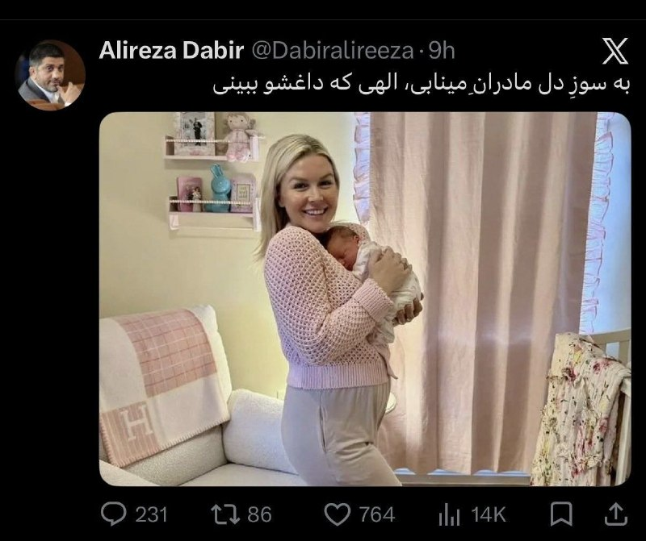

🚫 شیعه با تو کاری میکند اینقدر حیوان شوی تا آرزوی مرگ یک بچه یک روزه را داشته باشی..
ریدم بهت علیرضا دبیر مادر ج.ن..ده

## rodast_omiddana — post 71277

🎬 آنالیز ویدیو قدیمی از حسین سلامی در مورد بستن تنگه هرمز
لینک یوتیوب:
https://www.youtube.com/watch?v=AhYuOpglXaY

## KiriMohems — post 47397

جایزه ۱۵ میلیون دلاری آمریکا برای مختل کردن سیستم مالی ایران

🔴وزارت خارجهٔ آمریکا از برنامهٔ «پاداش برای عدالت» خود برای پرداخت تا سقف ۱۵ میلیون دلار به افراد همکار با این کشور، با هدف اختلال در سازوکارهای مالی سپاه پاسداران خبر داد.

@KiriMohems

## KiriMohems — post 47396

🔴 کیری فوری / سی‌ان‌ان: ترامپ جدی‌تر از گذشته به از سرگیری جنگ فکر می‌کند

#professor
@KiriMohemS

## KiriMohems — post 47395

علیرضا دبیر: تو جنگ بالای ۱۰۰ تا موشک اطراف من خورد اما شهید نشدم؛ اما با این حال من عاشق شهادتم.

#professor
@KiriMohems

## KiriMohems — post 47394

  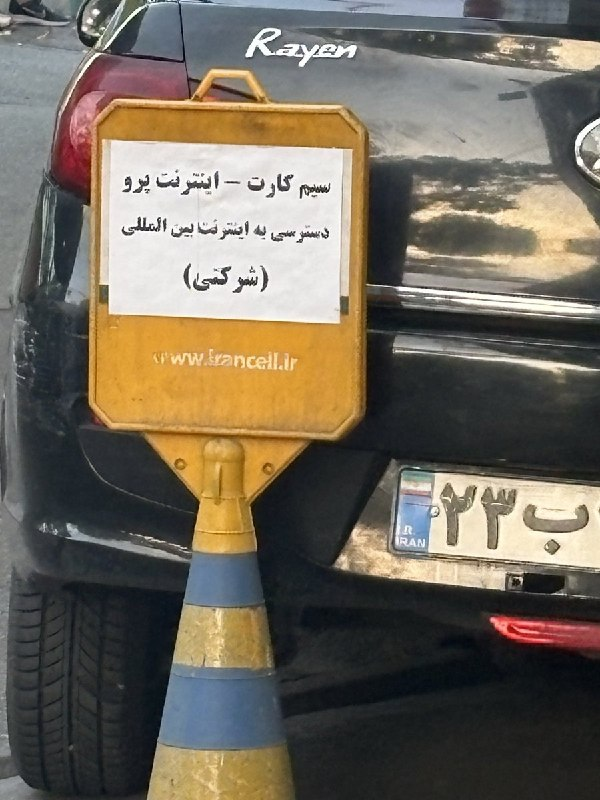

فروش اینترنت پرو توسط فروشگاه ها و دستفروشان خیابونی

@KiriMohems

## SportBaadNews — post 251428

صحبتای پرز خیلی منو یاد وعده های پزشکیان میندازه

## SportBaadNews — post 251427

کسکش میخوای تیمو ببری ليگ زامبیا هر بازی ده هیچ بشه؟

## SportBaadNews — post 251426

  <a href="telegram/content/SportBaadNews_251426_1778607078.mp4" target="_blank">🎬 Download video</a>

پرز : رسانه میخواد کاری کنه من اخراج بشم؟ تنها کسانی که منو اخراج میکنه دیوانه ها هستن، من جایی نمیرم. من حتی شعار "حیا کن رها کن" هم شنیدم ولی جایی نمیرم، کسی هم نمیاد جلوم باهام مبارزه کنه، شاید بخاطر اینه که من ترسناکم @SportBaadNews

## SportBaadNews — post 251425

  <a href="telegram/content/SportBaadNews_251425_1778607078.webm" target="_blank">🎬 Download video</a>

🚨با کانفیگ های  رایگان اینجا متصل بمونید کاملا راحت بدون قطع و وصلی بالا میاد :

@confingfreeirbot

## SportBaadNews — post 251423

پرز : رئال تو زمان حضور من 7 تا لیگ برده، 7 تا هم لالیگا از ما دزدیده. وگرنه الان 14 تا برده بودیم @SportBaadNews

## SportBaadNews — post 251422

  <a href="telegram/content/SportBaadNews_251422_1778607079.mp4" target="_blank">🎬 Download video</a>

پرز :
رئال تو زمان حضور من 7 تا لیگ برده، 7 تا هم لالیگا از ما دزدیده. وگرنه الان 14 تا برده بودیم
@SportBaadNews

## SportBaadNews — post 251420

  <a href="telegram/content/SportBaadNews_251420_1778607079.mp4" target="_blank">🎬 Download video</a>

چجوری دو فصل جام نزدنمو توجیه کنم؟ آفرین میگم نگریرا
@SportBaadNEws

## SportBaadNews — post 251419

  <a href="telegram/content/SportBaadNews_251419_1778607080.webm" target="_blank">🎬 Download video</a>

🚨
⚽️ پرز: دارم انتخابات جدید هیئت‌مدیره رو اعلام می‌کنم و همین هیئت، با خودم به‌عنوان رئیسش، تو این انتخابات شرکت می‌کنه. هرکی از ما انتقاد داره و این شایعه‌ها رو درباره‌م پخش می‌کنه، می‌تونه بیاد تو همین انتخابات روبه‌روی من کاندیدا بشه. هرکی می‌خواد جلو…

## SportBaadNews — post 251418

  <a href="telegram/content/SportBaadNews_251418_1778607081.webm" target="_blank">🎬 Download video</a>

🚨
⚽️ رسمی | فلورنتینو پرز سه سال زودتر از موعد، تو رئال مادرید انتخابات جدید اعلام کرده. دوره فعلیش قرار بود تا 2029 تموم بشه. @SportBaadNews

## SportBaadNews — post 251417

  <a href="telegram/content/SportBaadNews_251417_1778607081.webm" target="_blank">🎬 Download video</a>

🚨😂 پرز: «الان نشونتون می‌دم چند دقیقه پیش چی بهم نشون دادن. ABC گفته من خستم… آخه اینو چطوری می‌تونین بگین؟ این خبرنگاره اینجاست؟» @SportBaadNews

## SportBaadNews — post 251416

  <a href="telegram/content/SportBaadNews_251416_1778607081.webm" target="_blank">🎬 Download video</a>

🚨 ای بی سی نیوز: پرز به اعضای هیئت مدیره اعلام کرده که خستست و احتمالا بعد از اعلام مورینیو بعنوان سرمربی استعفا میده @SportBaadNews

## SportBaadNews — post 251415

  <a href="telegram/content/SportBaadNews_251415_1778607082.webm" target="_blank">🎬 Download video</a>

🚨
⚽️ رسمی | فلورنتینو پرز سه سال زودتر از موعد، تو رئال مادرید انتخابات جدید اعلام کرده. دوره فعلیش قرار بود تا 2029 تموم بشه.
@SportBaadNews

## SportBaadNews — post 251414

  <a href="telegram/content/SportBaadNews_251414_1778607082.webm" target="_blank">🎬 Download video</a>

🚨
🚨 فلورنتینو پرز: «متأسفم بگم که قراره استعفا ندم» 😂😂😂 @SportBaadNews

## SportBaadNews — post 251413

  <a href="telegram/content/SportBaadNews_251413_1778607082.webm" target="_blank">🎬 Download video</a>

🚨
🚨 فلورنتینو پرز: «متأسفم بگم که قراره استعفا ندم» 😂😂😂
@SportBaadNews

## SportBaadNews — post 251412

  <a href="telegram/content/SportBaadNews_251412_1778607083.webm" target="_blank">🎬 Download video</a>

⁉️ بنظرتون پرز امروز استعفا میده؟ @SportBaadNews

## SportBaadNews — post 251411

  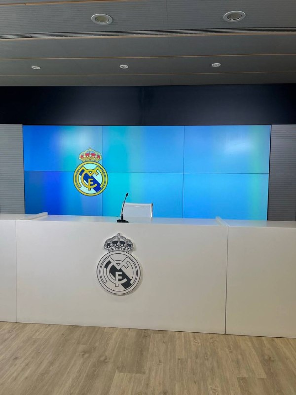

⁉️ بنظرتون پرز امروز استعفا میده؟
@SportBaadNews

## SportBaadNews — post 251410

  <a href="telegram/content/SportBaadNews_251410_1778607083.webm" target="_blank">🎬 Download video</a>

🚨
⚽️ اخباری اومده که پرز میخواد استعفا بده ولی همچین خبری نیست... 
⚪️ چندین خبرگزاری اعلام کردن: پرز جایی قرار نیست بره یا استعفا بده؛ اون امروز تصمیمات اساسیش واسه فصل بعد رو اعلام میکنه، همچنین از هواداران عذرخواهی میکنه و چیزای دیگه @SportBaadNews

## IranIntlTV — post 336855

  

هاکان فیدان، وزیر خارجه ترکیه، در گفت‌وگو با الجزیره گفت اولویت اصلی آنکارا حفظ آتش‌بس میان واشینگتن و تهران است و تاکید کرد فوری‌ترین نگرانی ترکیه تداوم این آتش‌بس است، زیرا در حال حاضر این موضوع بیشترین اهمیت را دارد.

وزیر خارجه ترکیه افزود هیچ‌کس خواهان بازگشت به جنگ نیست، چرا که اقتصاد جهانی و امنیت انرژی جهان همین حالا نیز به اندازه کافی آسیب دیده است.

هاکان فیدان همچنین گفت ترکیه و دیگر کشورهای منطقه از جمله قطر برای حمایت از پاکستان به‌عنوان میانجی اصلی همکاری می‌کنند و در روند میانجی‌گری، زمانی که کار به بن‌بست می‌رسد، دشوارترین بخش یافتن ایده‌های خلاقانه است؛ گاهی طرفین و حتی خود میانجی نیز قادر به ارائه چنین ایده‌هایی نیستند.
https://iranintl.com/202605122251

## IranIntlTV — post 336854

  

هزینه‌ای که جمهوری اسلامی به مردم ایران تحمیل کرده، فقط در اقتصاد خلاصه نمی‌شود؛ از سفره‌های کوچک‌تر تا اینترنت طبقاتی، از اعدام و زندان تا ترس، ناامیدی و خشم فروخورده‌ای که هر روز بزرگ‌تر می‌شود.
مردم تا کی تاب می‌آورند؟
آیا ایران به نقطهٔ انفجار رسیده است؟
خشم انباشتهٔ مردم چه زمانی فوران خواهد کرد؟

امشب در «برنامه با کامبیز حسینی» دربارهٔ هزینه‌های ۴۷ سال حاکمیت جمهوری اسلامی و آیندهٔ ایران حرف می‌زنیم.

«برنامه» صدای شماست.

اگر در ایران به اینترنت دسترسی دارید، بیایید و مشاهدات خود را از جنگ بگویید. ما شما را، بدون نوبت، مستقیم از ایران روی خط می‌آوریم.
بیایید و روایت خود را برای همیشه ثبت کنید.
تاریخ با صدای شما نوشته می‌شود.

برای شرکت در برنامه، همین حالا در واتس‌اپ پیام بدهید:
۰۰۴۴۷۵۲۲۱۱۰۱۱۰
۰۰۴۴۷۵۴۴۱۱۰۱۱۰
۰۰۴۴۷۵۱۱۱۰۲۵۵۳

«برنامه با کامبیز حسینی»
«یک ایران صدای شما را می‌شنود»

@iranintltv

## IranIntlTV — post 336853

  <a href="telegram/content/IranIntlTV_336853_1778607085.mp4" target="_blank">🎬 Download video</a>

در حالی‌ که گزارش‌ها از جدی‌تر شدن بررسی گزینه‌های نظامی جدید آمریکا علیه جمهوری اسلامی خبر می‌دهند، دونالد ترامپ گفت منتظر فروپاشی اقتصادی ایران در اثر محاصره دریایی است.

گفت‌وگو با فرشته پزشک، کارشناس روابط بین‌الملل
@iranintltv

## IranIntlTV — post 336852

  

دادگاه کیفری عالی بحرین سه نفر از جمله یک زن را به اتهام «همکاری» با جمهوری اسلامی به حبس ابد محکوم کرد.
دادستان‌ها اعلام کردند این زن در «ارتباط» با سپاه پاسداران بوده و قصد داشته «اقدامات تروریستی خصمانه» در بحرین انجام دهد.
در پرونده‌های جداگانه، ۱۰ نفر دیگر به اتهام «حمایت و تایید حملات تروریستی جمهوری اسلامی علیه بحرین»، انتشار اطلاعات ممنوع و عکسبرداری از اماکن ممنوعه، به احکام حبس تا ۱۰ سال محکوم شدند.

پیش‌تر نیز وزارت کشور بحرین اعلام کرد دستگاه‌های امنیتی این کشور یک تشکیلات مرتبط با سپاه پاسداران و تفکر «ولایت فقیه» را شناسایی کرده‌اند و ۴۱ نفر از اعضای آن را بازداشت کرده‌اند.
https://iranintl.com/202605122799

## IranIntlTV — post 336849

  

شاهزاده رضا پهلوی در نشست امنیتی سالانه پولیتیکو گفت: «ما فقط زمانی می‌توانیم مردم را به بازگشت به خیابان‌ها فرا بخوانیم که آن‌ها از سطحی از برابری در توان مقابله برخوردار باشند؛ نه زمانی که رژیم بتواند اوباش و نیروهای سرکوبگرش را برای کشتن مردم در خیابان‌ها اعزام کند.»

او ادامه داد: «اما برای رسیدن به آن نقطه، باید پیام روشنی وجود داشته باشد. باید راهبردی شفاف برای پایان دادن به این رژیم وجود داشته باشد؛ فراخوانی روشن برای قیام مردم، و همچنین پیامی برای نیروهای نظامی و امنیتی از حکومت جدا شوند و به مردم بپیوندند. همه این‌ها باید در قالب یک راهبرد منسجم هماهنگ شود.»
https://iranintl.com/202605123516

## IranIntlTV — post 336848

  <a href="https://t.me/IranintlTV/336848" target="_blank">📎 Download file</a>

🎧نسخه صوتی اخبار شبانگاهی | سه‌شنبه ۲۲ اردیبهشت
@iranintlTV

## IranIntlTV — post 336847

  <a href="telegram/content/IranIntlTV_336847_1778607088.mp4" target="_blank">🎬 Download video</a>

تیتراول با نیوشا صارمی، سه‌شنبه ۲۲ اردیبهشت
@iranintltv

## IranIntlTV — post 336846

  <a href="telegram/content/IranIntlTV_336846_1778607090.mp4" target="_blank">🎬 Download video</a>

تیتراول با نیوشا صارمی، سه‌شنبه ۲۲ اردیبهشت
@iranintltv

## IranIntlTV — post 336845

  

شاهزاده رضا پهلوی در نشست امنیتی سالانه پولیتیکو گفت سیاست مماشات با رژیم جمهوری اسلامی که راهبرد بسیاری از دولت‌ها بود، شکست خورده است.
او افزود اکنون که با یک «جانور زخمی» روبه‌رو هستیم، این فرصتی است که نباید از دست برود، بلکه باید کار را یک‌بار برای همیشه تمام کرد؛ موضوعی که نه‌تنها میلیون‌ها ایرانی، بلکه بسیاری از کشورهای منطقه نیز انتظار آن را دارند.

شاهزاده رضا پهلوی درباره جنگ علیه جمهوری اسلامی نیز گفت مردم به‌اندازه کافی هوشمند هستند که تفاوت میان حمله به یک ملت و حمله به یک رژیم را تشخیص دهند و آن کارزار، حمله‌ای علیه ملت ایران نبود، بلکه علیه رژیم بود.
https://iranintl.com/202605128673

## IranIntlTV — post 336844

  

دبیرکل شورای همکاری خلیج فارس اعلام کرد که نفوذ عناصر وابسته به سپاه پاسداران و برنامه‌ریزی آن‌ها برای اقدامات «خصمانه» را به‌شدت محکوم می‌کند.

دبیرکل شورای همکاری خلیج‌ فارس افزود از هر اقدامی که کویت برای حفظ امنیت و ثبات خود اتخاذ کند، حمایت می‌کند.

‌پیش‌تر نیز وزارت خارجه کویت اعلام کرد که سفیر جمهوری اسلامی را در پی نفوذ یک گروه وابسته به سپاه پاسداران به جزیره بوییان احضار کرده است.
https://iranintl.com/202605128445

## IranIntlTV — post 336843

  <a href="telegram/content/IranIntlTV_336843_1778607092.mp4" target="_blank">🎬 Download video</a>

با ادامه نارضایتی ترامپ از پاسخ تهران، ارم‌نیوز به نقل از منابع آمریکایی خبر داد واشینگتن به دنبال حمله به باقیمانده مراکز هسته‌ای ایران است تا قواعد جدیدی را به تهران تحمیل کند. سی‌ان‌ان هم خبر داد ترامپ در حال بررسی حمله به ایران پس از سفر به چین است.

گزارشی از مجتبا پورمحسن
@iranintltv

## IranIntlTV — post 336842

  

شهروندان در پیام‌هایی به ایران اینترنشنال می‌گویند که بدون رضایت و اطلاع و حتی هیچگونه اقدامی از سوی آن‌ها، نهادهای جمهوری اسلامی نام و مشخصات و تلفن همراه آن‌ها را برای ثبت‌نام در کارزار حکومتی «جان‌فدا» استفاده کرده‌اند.

طبق این پیام‌ها، حکومت پیامک‌هایی به شهروندان فرستاده و بدون اینکه بدانند، به آن‌ها گفته شده که در کارزار «جان‌فدا» ثبت‌نام شده‌اند.

طی روزهای گذشته، رسانه‌های حکومتی نوشتند که بیش از ۳۱ میلیون نفر در این کارزار ثبت‌نام کرده‌اند. این عدد و آمار از سوی شهروندان و ناظران با سوال مواجه شد. شهروندان در حالی که همچنان ده‌ها روز است که از دسترسی به اینترنت محروم‌اند، در پیام‌های خود به ایران اینترنشنال نوشته‌اند اگر حکومت ۳۱ میلیون جان‌فدا و حامی دارد، چرا اینترنت و دسترسی به آن را در کشور باز نمی‌کند.
https://iranintl.com/202605129601

## IranIntlTV — post 336841

  <a href="telegram/content/IranIntlTV_336841_1778607095.mp4" target="_blank">🎬 Download video</a>

ستاد فرماندهی مرکزی آمریکا، سنتکام، اعلام کرد ناو هواپیمابر آبراهام لینکلن به عملیات خود در دریای عرب، از جمله اجرای محاصره دریایی علیه جمهوری اسلامی، ادامه می‌دهد و تاکنون یک کشتی تجاری را وادار به تغییر مسیر کرده است.
جزییات بیشتر با مرضیه حسینی، خبرنگار ایران‌اینترنشنال
@iranintltv

## IranIntlTV — post 336840

  <a href="telegram/content/IranIntlTV_336840_1778607097.mp4" target="_blank">🎬 Download video</a>

روزنامه وال‌استریت ژورنال گزارش داد جمهوری اسلامی در آستانه سفر دونالد ترامپ به چین، از طریق سفیر خود در پکن در تلاش است پیامی را به واشینگتن منتقل کند.
سمیرا قرایی، خبرنگار ایران‌اینترنشنال، گزارش می‌دهد
@iranintltv

## IranIntlTV — post 336839

  <a href="telegram/content/IranIntlTV_336839_1778607099.mp4" target="_blank">🎬 Download video</a>

یک شهروند در پیامی به ایران اینترنشنال با اشاره به هشدار ترامپ درباره حمله و بردن ایران به «عصر حجر» گفت که جمهوری اسلامی با قطع اینترنت این کار را کرد و نه ترامپ. پیام این مخاطب و تصویر این پست با هوش مصنوعی خوانده و ساخته شده است.

## IranIntlTV — post 336838

  

وزارت خارجه کویت اعلام کرد که سفیر جمهوری اسلامی را در پی نفوذ یک گروه وابسته به سپاه پاسداران به جزیره بوییان احضار کرده است.

وزارت کشور کویت اعلام کرد چهار نفری که به‌صورت غیرقانونی از راه دریا وارد این کشور شده بودند، در جریان بازجویی به عضویت در سپاه پاسداران انقلاب اسلامی اعتراف کردند.
در بیانیه این وزارتخانه آمده است این افراد اعتراف کردند مامور شده بودند با استفاده از یک قایق ماهیگیری که به‌طور ویژه برای اجرای اقدامات خصمانه علیه کویت اجاره شده بود، به جزیره بوبیان نفوذ کنند.
بر اساس این بیانیه، این افراد با نیروهای مسلح کویت درگیر شدند که در نتیجه آن یکی از نیروهای کویتی زخمی شد و دو نفر از عناصر نفوذی گریختند.
https://iranintl.com/202605121020

## Persian_Trend_Official — post 13992

❤️ اگر از مخاطبان پرشین ترند هستید و تلگرام پرمیوم دارید،
با بوست کردن کانال کمک بزرگی به رشد و دیده‌شدن بیشتر پرشین ترند می‌کنید.
این بوست‌ها باعث می‌شود امکانات بیشتری برای انتشار محتوا، استوری و قابلیت‌های ویژه کانال فعال شود و در شرایط فعلی، به ادامه پوشش سریع و تحلیل‌های روزانه کمک زیادی می‌کند.
🙏 اگر مایل بودید، از طریق لینک زیر کانال را بوست کنید:
https://t.me/boost/persian_trend_official
📌 @persian_trend_official
پرشین ترند | متفاوت‌ترین کانال نظامی

## Persian_Trend_Official — post 13991

لایو امشب ساعت 21 به وقت تهران شروع میشه

## Persian_Trend_Official — post 13990

  <a href="telegram/content/Persian_Trend_Official_13990_1778607101.webm" target="_blank">🎬 Download video</a>

🔴 اختصاصی |تورم آمریکا بالاتر از انتظار ثبت شد

تورم آمریکا در ماه آوریل بار دیگر شتاب گرفت؛ موضوعی که تحت تأثیر افزایش قیمت بنزین، مواد غذایی و تبعات جنگ ایران رخ داده است.

بر اساس داده‌های منتشرشده:

▪️ نرخ تورم سالانه آمریکا به ۳.۸ درصد رسید
▪️ بازار انتظار عدد ۳.۷ درصدی را داشت
▪️ این سریع‌ترین رشد تورم از سال ۲۰۲۳ محسوب می‌شود

همچنین:

▪️ تورم ماهانه ۰.۶ درصد ثبت شد
▪️ تورم هسته ماهانه به ۰.۴ درصد رسید
▪️ تورم هسته سالانه نیز ۲.۸ درصد اعلام شد
▪️ هر دو شاخص هسته بالاتر از پیش‌بینی‌ها بودند

افزایش قیمت:

انرژی
بلیت هواپیما
و مواد غذایی

نشان می‌دهد فشارهای تورمی ممکن است در ماه‌های آینده نیز ادامه پیدا کند؛ حتی در صورت حفظ آتش‌بس یا کاهش تنش‌ها در تنگه هرمز

🫆:Tony

📌 @persian_trend_official
پرشین ترند | متفاوت‌ترین کانال نظامی

## Persian_Trend_Official — post 13989

🔴احضار سفیر جمهوری اسلامی به وزارت خارجه کویت

💢وزارت امور خارجه کویت عصر امروز در بیانیه‌ای اعلام کرد سفیر جمهوری اسلامی را احضار و یادداشت اعتراضی به او تحویل داده شد.

💢وزاتخانه یادشده در توجیه احضار سفیر جمهور اسلامی تأکید کرد این اقدام در پی آنچه «نفوذ گروهی از سپاه پاسداران به بوبیان و درگیری آنها با نیروهای کویتی» خوانده است، انجام گرفت.

🫆:Tony

📌 @persian_trend_official
پرشین ترند | متفاوت‌ترین کانال نظامی

---
📅 بروزرسانی: 1405/02/22 18:48
---

## ChizBergerz — post 46330

  <a href="telegram/content/ChizBergerz_46330_1778599105.mp4" target="_blank">🎬 Download video</a>

اینم برا اون دسته از خرزشیا که میگن چرا شاهزاده رضا پهلوی نمیاد ایران: 😂👌

@ChizBergerz

## ChizBergerz — post 46329

  <a href="telegram/content/ChizBergerz_46329_1778599106.mp4" target="_blank">🎬 Download video</a>

این خیلی خوب بود😂😂

@ChizBergerz

## ChizBergerz — post 46328

  <a href="telegram/content/ChizBergerz_46328_1778599108.mp4" target="_blank">🎬 Download video</a>

یک نمونه از نسل تباه ۵۷ که تا آخرین لحظه‌ی عمر بی‌خاصیتش، در کنار جنایتکاران جمهوری‌اسلامی مانده‌است!

@ChizBergerz

## rodast_omiddana — post 71276

🎬 آنالیز مصاحبه نتانیاهو در برنامه 60 دقیقه
مردم ایران منو دوست دارن بهم میگن بی بی جون
لینک یوتیوب:
https://www.youtube.com/watch?v=3i-37xxeW0Q

## rodast_omiddana — post 71275

  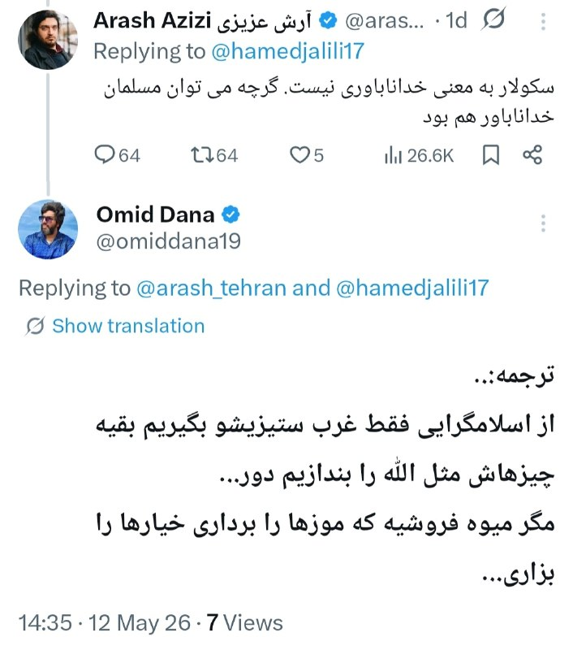

🕊️https://x.com/i/status/2054193653615042862

## rodast_omiddana — post 71274

  <a href="telegram/content/rodast_omiddana_71274_1778599110.webm" target="_blank">🎬 Download video</a>

🚨
🚨 الاخبار:
قاانی، فرمانده نیروی قدس سپاه، در بحبوحه افزایش نگرانی‌ها از کشیده شدن عراق به درگیری بین ایران و اسرائیل، برای هماهنگی‌های امنیتی فشرده به بغداد سفر کرده است

## rodast_omiddana — post 71273

🚫 سلام امید جان خیلی خیلی خسته نباشی
یخورده طولانیه حالم نداشتی نخون کارت بیسته ولی ارزش خوندن داره❤️‍🔥
من روزای اول جنگ تقریبا افسرده و داغون بودم و نت هم نداشتم گفتم چیکار کنم بیام تحلیل هارو گوش بدم شاید بکارم اومد
الردی هم این بود که جنگ سریع تموم میشه و رفتم تحلیل های ایران اینترنشنال رو گوش دادم و همون روزای اول بود که میگفتن جنگ سریع تموم میشه اینجور چیزا
مامانمم کلا که موضع داشت با تحلیلگرا غیر از پوریا زراعتی قبلا با اون پیش مامانم گفت میاوردم که راضیش کنم جنگ میکنن قبل جنگ ولی کم و بیش میدیدمش نمی‌دونستم که برنامه میذاره
تا اینکه توی روبیکا تحلیل های مراد ویسی و شما رو پیدا میکردم که با هزارتا بدبختی و بن و تحدید و اینجوریزا این بنده خدا ها ویس هاتون رو میذاشتن
پول هم نداشتم حتی نمی‌تونستم یه نوشیدنی ایستک بگیرم
آقا ما گفتیم بیایم تحلیل های شما رو ببینیم و کم کم دیدم شما اصا تحلیلاتون یه لول دیگست هم سرگرمی داره هم فکت داره هم کاربرد داره واسه کم نیاوردن پیش این عرزشیا آخه بقول خودتون ماکه سیاسی نیستم مخصوصا من که کم مغزم گم میشه انگار موقع بحث
آقا نشستیم نشستیم پای برنامه شما و اونجا بود که واقعا افتادم جلو و فهمیدم حالا حالا جنگ نمیشه و باعث شد به این فکر بیوفتم که برم سر کار یعنی اگه پای برنامه ایران اینترنشنال میموندم نمی‌رفتم سر کار و هی فرسوده و فرسوده تر میشدم و بی پولتر
حالا امید دانا شما الان باعث شدید هم اون پول ایستک رو که با سریال یا تحلیل های شما بشینم رو دارم هم میتونم کمک مالی‌ای باشم واسه خانواده
تحلیل های شما رو نشون مادرم دادم مادرم بیشتر از خودت ازت تعریف میکرد😂♥️
و اینکه الان یکاری کردم پدر مادرم دیگه نماز نمیخونن یا بزور نماز میخونن
کارم اینترنتی بود راستی و اینکه واقعا مثل بقیه بیکار شدیم و داغون بودیم (قبلش)
شما نقش مهمی توی زندگی من و خانواده من ایفا کردین دست مریزاد❤️‍🔥🤌
همسایه ما که خونشون کنار خونه ماست انقد نتونست خوب نقش ایفا کنه😂❤️‍🔥
کوچیک شما از بوشهر

## rodast_omiddana — post 71272

  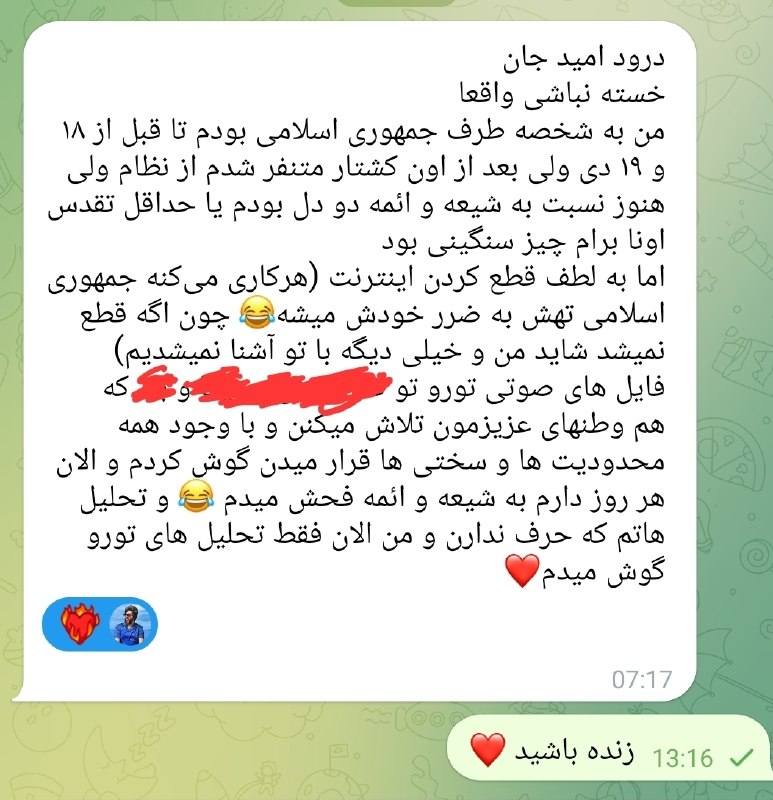

🔴بگم با وجود قطع اینترنت روزی چندصد پیام اینجوری دارم اغراق نکردم..
خستگیم در رفت، تلاشمون برای پایان تشیع در ایران داره ثمر میده..

## KiriMohems — post 47393

  

🔴 ترامپ با هوش مصنوعی بایدنِ خواب‌آلو ، اوباما و پلوسی رو انداخته تو فاضلاب و نوشته دموکرات‌ها عاشق این مکان هستن.

#professor
@KiriMohems

## SportBaadNews — post 251409

‏خلاصه اخبار تکنولوژی منطقه: ‏- افغانستان: اینترنت 5G تست و راه‌اندازی شد. ‏- عراق: تلگرام رفع فیلتر شد. ‏- سوریه: سوییفت، ویزا و مستر به سوریه آمدند. ‏- ایران: رکورد شکنی جدید، قطعی اینترنت به یازدهمین هفته رسید. @SportBaadNews

## SportBaadNews — post 251408

  <a href="telegram/content/SportBaadNews_251408_1778599111.webm" target="_blank">🎬 Download video</a>

🚨
⚽️ اخباری اومده که پرز میخواد استعفا بده ولی همچین خبری نیست...

⚪️ چندین خبرگزاری اعلام کردن: پرز جایی قرار نیست بره یا استعفا بده؛ اون امروز تصمیمات اساسیش واسه فصل بعد رو اعلام میکنه، همچنین از هواداران عذرخواهی میکنه و چیزای دیگه
@SportBaadNews

## SportBaadNews — post 251407

⚽️
🔺پپه آلوارز: هر لحظه ممکنه خبر رسمی پیوستن مورینیو به مادرید بیاد بیرون خیلی سریع خیلی سریع
@SportBaadNews

## IranIntlTV — post 336837

  <a href="telegram/content/IranIntlTV_336837_1778599112.mp4" target="_blank">🎬 Download video</a>

بررسی‌های ایران‌اینترنشنال نشان می‌دهد سپاه پاسداران انقلاب اسلامی برای دور زدن تحریم‌های آمریکا، از صرافی‌های ترکیه و هواپیماهای خصوصی استفاده می‌کند. این اقدامات پس از آن صورت گرفت که مسیرهای پیشین تامین ارز جمهوری اسلامی در امارات متحده عربی قطع شده است.
جزییات بیشتر با آرش آزرمی، دبیر بخش اقتصادی ایران‌اینترنشنال
@iranintltv

## IranIntlTV — post 336836

  

پیت هگست، وزیر جنگ آمریکا، سه‌شنبه در کنگره این کشور درباره جنگ علیه جمهوری اسلامی اعلام کرد که ارتش ایالات متحده برنامه‌ای برای خروج نیروها از منطقه خاورمیانه دارد، اما در عین حال برای تشدید درگیری یا جابه‌جایی تجهیزات در صورت لزوم نیز برنامه‌ریزی کرده است.
او افزود: «ما دقیقا می‌دانیم چه چیزی در اختیار داریم. هر آنچه نیاز داریم به اندازه کافی داریم.»
او گفت به صنایع دفاعی گفته شده است که «بیشتر و سریع‌تر تولید کنند»، و در عین حال ظرفیت ناکافی مجتمع‌های صنعتی-نظامی را ناشی از دولت‌های پیشین و کمک‌های آمریکا به اوکراین در جنگش با روسیه دانست.
https://iranintl.com/202605122781

## IranIntlTV — post 336835

  <a href="telegram/content/IranIntlTV_336835_1778599114.mp4" target="_blank">🎬 Download video</a>

دونالد ترامپ، رییس‌جمهوری آمریکا، اعلام کرد اطمینان دارد جمهوری اسلامی غنی‌سازی اورانیوم را به‌طور کامل متوقف خواهد کرد. او همچنین گفت آمریکا برای رسیدن به توافق عجله‌ای ندارد، زیرا جمهوری اسلامی از بخش مهمی از درآمدهایش محروم شده است.
گفت‌وگو با شایان سمیعی، کارشناس امنیت ملی
@iranintltv

## IranIntlTV — post 336834

🔻پالایشگاه‌های «مستقل» چینی چگونه به بقای اقتصادی جمهوری اسلامی کمک می‌کنند؟

سی‌ان‌ان گزارش داد یک شبکه پنهان نفتی در چین سال‌هاست میلیاردها دلار به اقتصاد ایران تزریق کرده و اکنون نیز هم‌زمان با تشدید فشارهای آمریکا، به بقای مالی جمهوری اسلامی کمک می‌کند.

در استان شاندونگ چین و مناطق پیرامونی آن، بنادر، خطوط انتقال و پالایشگاه‌های موسوم به «تی‌پات» نقش کلیدی در این چرخه ایفا می‌کنند.

این پالایشگاه‌های کوچک و مستقل که با مجوز دولت چین فعالیت دارند، به‌صورت غیرعلنی نفت خام تحریم‌شده ایران را به فرآورده‌هایی مانند بنزین، گازوئیل و محصولات پتروشیمی تبدیل می‌کنند تا نیاز دومین اقتصاد بزرگ جهان تامین شود.

سی‌ان‌ان با اشاره به سفر قریب‌الوقوع دونالد ترامپ به چین نوشت هم‌زمان با تشدید تنش‌ها بر سر تجارت نفت ایران، پکن در موقعیتی پیچیده قرار گرفته است؛ از یک سو به دنبال برقراری رابطه‌ای باثبات با واشینگتن است و از سوی دیگر، همکاری‌های اقتصادی و دیپلماتیک نزدیک خود با تهران را ادامه می‌دهد.

در آستانه این سفر، وزارت خزانه‌داری آمریکا ۱۲ فرد و نهاد را به اتهام نقش‌آفرینی در تسهیل فروش و انتقال نفت ایران به چین تحریم کرد.

اسکات بسنت، وزیر خزانه‌داری آمریکا، به‌تازگی چین را متهم کرده است که با خرید انرژی از ایران، به تامین مالی «شبکه‌های تروریستی» جمهوری اسلامی کمک می‌کند.

۲۱ اردیبهشت، روزنامه فایننشال‌تایمز گزارش داد ترامپ در سفر به پکن خواستار کاهش حمایت چین از حکومت ایران خواهد شد.
تشدید فشارهای آمریکا بر شرکت‌های چینی

ایالات متحده حدود یک سال پیش، شرکت «هِبِی شینهای» چین را به خرید محموله‌های نفتی مرتبط با نیروهای مسلح جمهوری اسلامی متهم کرد. واشینگتن همچنین اعلام کرد این شرکت صدها میلیون دلار نفت خام را از طریق نفتکش‌های موسوم به «ناوگان سایه» وارد کرده است.

«هِبِی شینهای» اکنون به فهرست رو‌ به‌ گسترش تحریم‌های آمریکا علیه شرکت‌های فعال در تجارت نفت ایران اضافه شده است.

از سال گذشته تاکنون، چهار پالایشگاه دیگر در چین نیز در فهرست تحریم‌های واشینگتن قرار گرفته‌اند؛ تاسیساتی که اغلب در یک منطقه ساحلی و قطب مهم انرژی چین، در فاصله‌ای نزدیک به یکدیگر قرار دارند.

صنعت پالایش نفت در استان شاندونگ که دهه‌ها پیش با تکیه بر میدان‌های نفتی شِنگلی در دلتای رود زرد شکل گرفت، اکنون به واردات گسترده نفت خام وابسته شده و حدود ۲۰ درصد از نفت مصرفی چین را فرآوری می‌کند.

به گفته تحلیلگران، بخش قابل‌توجهی از نفت خام وارداتی این صنعت را محموله‌های تحت تحریم تشکیل می‌دهد.
اریکا داونز، پژوهشگر ارشد مرکز سیاست جهانی انرژی در دانشگاه کلمبیا، گفت: «اینها پالایشگاه‌های کوچکی هستند که با حاشیه سود اندک فعالیت می‌کنند. تخفیف‌هایی که طی سال‌های گذشته برای خرید نفت خام ونزوئلا، روسیه و ایران دریافت کرده‌اند، به بقای آنها کمک کرده است.»

با این حال، تحریم‌های آمریکا تنها به شرکت‌های کوچک چینی محدود نمی‌شوند. واشینگتن پیش‌تر شرکت پتروشیمی «هنگلی» را تحریم کرد، پالایشگاهی بسیار بزرگ‌تر در شهر بندری دالیان. این اقدام نشان می‌دهد ایالات متحده آماده است بازیگران بزرگ‌تر این صنعت را نیز هدف قرار دهد.

چین در آمار رسمی گمرکی خود واردات نفت خام ایران را ثبت نمی‌کند و منشا این محموله‌ها نیز در مسیر تجارت پنهان می‌شود.

با این حال، پکن تحریم‌های آمریکا را به رسمیت نمی‌شناسد و به شرکت‌های داخلی دستور داده است از تبعیت از تحریم‌های واشینگتن علیه پالایشگاه‌ها خودداری کنند.
نقش پالایشگاه‌های تی‌پات در تامین انرژی چین

سی‌ان‌ان‌ در ادامه نوشت ساختار صنعت نفت چین به شرکت‌های مستقل و پالایشگاه‌های موسوم به «تی‌پات» اجازه می‌دهد ریسک خرید نفت تحریمی را بپذیرند و با وجود تحریم‌های آمریکا، به فعالیت‌های عمدتا داخلی خود ادامه دهند.

این در حالی است که به گفته داونز، شرکت‌های بزرگ دولتی انرژی چین به‌دلیل پیوند گسترده با نظام مالی بین‌المللی، عموما از تحریم‌ها تبعیت می‌کنند.

با تداوم بحران جهانی نفت ناشی از جنگ ایران، نقش پالایشگاه‌های مستقل چین در تامین امنیت انرژی این کشور پررنگ‌تر شده است. این روند در شرایطی شدت گرفته که آمریکا با اعمال محاصره دریایی، در تلاش است از خروج نفتکش‌های حامل نفت ایران جلوگیری کند.
🔗ادامه این گزارش را اینجا بخوانید
@iranintltv

## IranIntlTV — post 336833

  <a href="telegram/content/IranIntlTV_336833_1778599116.mp4" target="_blank">🎬 Download video</a>

بازیکنان تیم ملی فوتبال ایران در مسیر آماده‌سازی برای جام جهانی ۲۰۲۶، برای سومین بار در دیداری درون‌تیمی به مصاف هم رفتند. این مسابقه در شرایطی برگزار شد که چند حریف تدارکاتی از بازی با شاگردان امیر قلعه‌نویی انصراف داده‌اند.
گفت‌وگو با محمد تقوی، عضو تحریریه ایران‌اینترنشنال
@iranintltv

## IranIntlTV — post 336832

  

حرمت‌الله رفیعی، رییس انجمن صنفی دفاتر خدمات مسافرتی، گفت: «دفاتر مسافرتی پس از ماه‌ها رکود، جنگ، بی‌ثباتی اقتصادی و اختلال اینترنت، دیگر توان تاب‌آوری ندارند و در صورت ادامه شرایط فعلی، بخش مهمی از نیروی انسانی متخصص این صنعت از بین خواهد رفت.»

او افزود: «در شرایطی که عملا کسب‌وکاری وجود ندارد، فشارهای مالیاتی و بیمه‌ای همچنان ادامه دارد و صنعت گردشگری ایران قفل شده است.»

رفیعی اضافه کرد: «بسیاری از کارکنان آموزش‌دیده دفاتر مسافرتی که سال‌ها برای آموزش آن‌ها هزینه شده است، به دلیل نبود درآمد، جذب مشاغلی مثل آرایشگری و فعالیت‌های غیرمرتبط شده‌اند.»
https://iranintl.com/202605126945

## IranIntlTV — post 336831

  <a href="telegram/content/IranIntlTV_336831_1778599118.mp4" target="_blank">🎬 Download video</a>

ویدیویی از یک ربات غول‌پیکر سرنشین‌دار که قابلیت تغییر شکل دارد، در شبکه‌های اجتماعی مورد توجه قرار گرفته است. این ربات با الهام از آثار علمی‌تخیلی طراحی شده و می‌تواند در حالت‌های مختلف تغییر وضعیت دهد. هدایت این سازه پیشرفته از داخل کابین توسط یک اپراتور انجام می‌شود.
این ربات که با نام GD01 معرفی شده، ساخت چین است و توسط شرکت Unitree Robotics توسعه یافته است.
@iranintltv

## IranIntlTV — post 336830

  <a href="telegram/content/IranIntlTV_336830_1778599119.mp4" target="_blank">🎬 Download video</a>

سرخط خبرهای سه‌شنبه ۲۲ اردیبهشت
@iranintltv

## IranIntlTV — post 336829

  <a href="telegram/content/IranIntlTV_336829_1778599121.mp4" target="_blank">🎬 Download video</a>

ادامه جنگ ایران و بن‌بست در مذاکرات تهران و واشینگتن، نگرانی‌ها درباره پیامدهای اقتصادی این بحران در آلمان را افزایش داده است. گزارش‌ها نشان می‌دهد حدود دو سوم شهروندان آلمانی به دلیل افزایش قیمت انرژی، مصرف برق، گرمایش و استفاده از خودرو را کاهش داده‌اند.
علی حسن‌پور، خبرنگار ایران‌اینترنشنال، گزارش می‌دهد
@iranintltv

## IranIntlTV — post 336828

  

دونالد ترامپ گفت حکومت ایران با انزاویی روبه‌روست که آن را از منابع درآمدش محروم می‌کند و انتظار می‌رود اقتصاد ایران زیر فشارهای ناشی از محاصره بندرها دچار فروپاشی شود.

او افزود: «این درگیری بدون نیاز به شتاب‌زدگی حل‌وفصل خواهد شد و جمهوری اسلامی با انزوایی روبه‌رو است که آن را از منابع درآمدی محروم می‌کند.»

دونالد ترامپ درباره اورانیوم غنی‌شده در ایران گفت مقام‌های جمهوری اسلامی به او گفته‌اند قرار است آنچه او «گردوغبار هسته‌ای» می‌نامد در اختیار آمریکا قرار گیرد، اما بعدا نظرشان را تغییر داده‌اند. او تاکید کرد در نهایت این مواد را به دست خواهند آورد و موضوع را جمع‌وجور می‌کنند.
https://iranintl.com/202605128362

## IranIntlTV — post 336827

  <a href="https://t.me/IranintlTV/336827" target="_blank">📎 Download file</a>

🎧نسخه صوتی دومینو: ایرانیان در میانه اعدام و جنگ
@iranintlTV

## IranIntlTV — post 336826

  

دونالد ترامپ در گفت‌وگو با برنامه رادیویی «سید رازبرگ» گفت: انتظار داریم اقتصاد ایران زیر فشارهای ناشی از محاصره بنادرش فرو بپاشد.
او افزود این درگیری بدون نیاز به شتاب‌زدگی حل‌وفصل خواهد شد و جمهوری اسلامی با انزوایی روبه‌رو است که آن را از منابع درآمدی محروم می‌کند.
ترامپ گفت ایالات متحده در حال انجام ارتباطات مستقیم با مقام‌های تهران است و برای رسیدن به توافق عجله‌ای ندارد و او اطمینان دارد که تهران غنی‌سازی اورانیوم را به‌طور کامل متوقف خواهد کرد.
https://iranintl.com/202605127397

## IranIntlTV — post 336825

  <a href="telegram/content/IranIntlTV_336825_1778599124.mp4" target="_blank">🎬 Download video</a>

ناتو از ابتکار فرانسه و بریتانیا برای گردهمایی بیش از ۴۰ کشور به‌منظور آماده‌سازی فعالیت‌ها در نزدیکی تنگه هرمز استقبال کرد. مارک روته گفت این اقدامات نه در داخل تنگه، بلکه در اطراف آن انجام خواهد شد و اروپایی‌ها در حال پاسخ به درخواست رییس‌جمهوری آمریکا هستند.
گفت‌وگو با علی صدرزاده، تحلیل‌گر مسایل خاورمیانه
@iranintltv

## IranIntlTV — post 336824

🔻ترامپ و سفر چین؛ دیپلماسی در سایه بحران

🖋تحلیل - نعیمه دوستدار

مذاکره نیست و ما اینه که پیام کتبی دریافت شد، این به معنی مذاکره نیست و ما تا الان که دارم با شما صحبت می‌کنم هنوز جوابی ندادیم داریم بررسی می‌کنیم، ممکنه مثلا جوابی رو بدیم اما تا الان، علیرغم ادعایی که شده ایران مثلا موافقت کرده درباره هسته‌ای اینجور، درباره هرمز اینجور چنین چیزی نیست. حتی یک خبری هم داشتیم که منابع آگاه تکذیب کردن خبر عکسیس رو بله یعنی پیامی از طریق واسطه پاکستانی آمریکایی‌ها دادن به ما و ما الان در حال بررسی هستیم اینه که پیام کتبی دریافت شد، این به معنی مذاکرات نیست.

قرار است دونالد ترامپ در نخستین سفر یک رییس‌جمهوری آمریکا به چین در نزدیک به یک دهه گذشته، چهارشنبه ۲۳ اردیبهشت وارد پکن شود. شی جین‌پینگ، رییس‌جمهوری چین، میزبان ترامپ خواهد بود. این سفر در سایه «جنگ ایران» و بحران تنگه هرمز، جنگ تعرفه‌‌ها و تنش بر سر تایوان، انجام می‌شود.

ترامپ سال‌هاست تمرکز ویژه‌ای بر چین دارد. او که دست‌کم از اوایل دهه ۲۰۱۰ استدلال می‌کرد پکن از طریق تجارت «در حال سوءاستفاده» از ایالات متحده است، در دوره نخست ریاست‌جمهوری خود جنگ تجاری گسترده‌ای را آغاز کرد، بر صدها میلیارد دلار از واردات چین تعرفه وضع کرد و نهادهای دولتی آمریکا را به سمت برخورد با پکن به‌عنوان یک «رقیب راهبردی» سوق داد.

این دوره با تشدید مکرر تعرفه‌ها و شکل‌گیری چارچوبی وسیع‌تر از «رقابت» در حوزه‌های نظامی، فناوری و اقتصادی همراه بود.

در دوره دوم ریاست‌جمهوری او، روابط دو کشور میان تقابل و همکاری تاکتیکی در نوسان بوده است. ترامپ دوباره فشار تعرفه‌ای را آغاز کرد و در مقطعی برخی تعرفه‌ها را تا ۱۴۰ درصد افزایش داد. اقدامی که با واکنش تلافی‌جویانه چین روبه‌رو شد.

هنگامی که این سیاست نتوانست امتیازهای عمده‌ای از پکن بگیرد، ترامپ لحن خود را تغییر داد و بر شراکت «جی۲» (Group of Two) تاکید کرد، شخصا به تمجید از شی پرداخت و در نشست اکتبر ۲۰۲۵ در بوسان با یک آتش‌بس یک‌ساله در جنگ تجاری موافقت کرد.

در این مرحله، او نگرانی‌های مربوط به حقوق بشر در سین‌کیانگ، هنگ‌کنگ و تبت را کم‌اهمیت جلوه داد و در عین حال، با وجود تایید فروش تسلیحات به تایوان، لحن خود را درباره این جزیره نیز تعدیل کرد تا از تحریک بیش از حد پکن جلوگیری کند.

سفر روسای‌جمهوری آمریکا به چین

سفر روسای‌جمهوری آمریکا به چین از دهه ۱۹۷۰ به یکی از ابزارهای مهم دیپلماتیک تبدیل شده است.

سفر ریچارد نیکسون در سال ۱۹۷۲ نمونه کلاسیک این روند به شمار می‌رود. رویدادی که به احیای روابط دو کشور پس از دهه‌ها خصومت دوران جنگ سرد کمک کرد و به صدور «بیانیه شانگهای» انجامید.

جرالد فورد در سال ۱۹۷۵ به چین رفت و تعهدات آمریکا در چارچوب آن توافق را تایید کرد.

پس از برقراری کامل روابط دیپلماتیک در سال ۱۹۷۹، روسای‌جمهوری بعدی آمریکا از سفر به چین برای مدیریت همکاری‌ها و بحران‌ها استفاده کردند.

رونالد ریگان در سال ۱۹۸۴ راهی چین شد و ضمن امضای بیانیه‌ای دیگر، بر توسعه روابطی «سازنده» تاکید کرد؛ هر‌چند همچنان از کمونیسم انتقاد می‌کرد.

جورج اچ دبلیو بوش در سال ۱۹۸۹ به چین سفر کرد و بر سیاست «چین واحد» تاکید داشت.

بیل کلینتون در سفر سال ۱۹۹۸ خود، در سخنرانی‌هایی در شهرهای مختلف چین از جمله پکن، بر تعامل، تجارت و حقوق بشر تمرکز کرد.

جورج بوش پسر و باراک اوباما چندین بار به چین سفر کردند. سفرهایی که اغلب با موضوعات اقتصادی، گفت‌وگوهای امنیتی و رویدادهای مهمی مانند المپیک ۲۰۰۸ پکن و نشست آپک ۲۰۱۴ پیوند داشت.

خود ترامپ نیز در سال ۲۰۱۷ به چین رفت. زمانی که روابط دو کشور هنوز نسبتا دوستانه بود و تمرکز اصلی بر مذاکرات تجاری و تشریفات گسترده میزبانی از سوی شی جین‌پینگ قرار داشت.
چرا ترامپ به چین سفر می‌کند؟

سفر کنونی ترامپ نخستین سفر یک رییس‌جمهوری آمریکا به چین در نزدیک به یک دهه گذشته است و اندکی پس از آتش‌بس تعرفه‌ای سال ۲۰۲۵ انجام می‌شود.

🔗 ادامه این تحلیل را اینجا بخوانید
@iranintltv

## IranIntlTV — post 336823

  

پیت هگست، وزیر جنگ آمریکا، گفت که این کشور برای تشدید، عقب‌نشینی یا جابه‌جایی نیروها برنامه‌ریزی کرده است، اما جزئیات ماموریت جلوگیری از دستیابی جمهوری اسلامی به بمب هسته‌ای را علنی نمی‌کند.
پیش‌تر اکسیوس به نقل از سه منبع آمریکایی گزارش داد که دونالد ترامپ روز دوشنبه با تیم امنیت ملی خود دیدار می‌کند تا درباره مسیر پیش رو در جنگ با جمهوری اسلامی، از جمله احتمال ازسرگیری اقدام نظامی، گفت‌وگو کند.
https://iranintl.com/202605127244

## IranIntlTV — post 336822

🔻کوچ اجباری نیروهای متخصص به رانندگی در اسنپ

پیام‌های رسیده به ایران‌اینترنشنال نشان می‌دهند با تعطیلی کارخانه‌ها، واحدهای تولیدی و کسب‌وکارهای کوچک، بسیاری از نیروهای فنی متخصص و تحصیل‌کرده برای تامین هزینه‌های زندگی به رانندگی در تاکسی‌های اینترنتی روی آورده‌اند.

در هفته‌های اخیر موج گسترده‌ای از اخراج، تعدیل نیرو، بیکار‌سازی و تغییر اجباری در طیف گسترده‌ای از شغل‌ها شکل گرفته است.

هزاران شهروند از صاحبان فروشگاه‌های مجازی و حقیقی تا کارکنان پتروشیمی و صنایع فولاد، شغل خود را از دست داده‌اند و با از بین رفتن منبع درآمد، ناچار به روی آوردن به مشاغل جایگزین و موقتی شده‌اند.
مسافرکشی هم دیگر صرف نمی‌کند

بر اساس گزارش‌ها، رانندگی در تاکسی‌های اینترنتی به آخرین راه بقا برای بسیاری از خانواده‌ها بدل شده است.

یک مخاطب در پیامی نوشت حقوق ۳۰ میلیون تومانی پدر بازنشسته‌اش پس از۳۰ سال کار کردن، کفاف زندگی را نمی‌دهد و این پدر سالخورده ناچار است برای کسب درآمد بیشتر از صبح تا شب در اسنپ مسافرکشی کند.

پیش‌تر نیز پیام‌هایی به ایران‌اینترنشنال رسیده بود که نشان می‌دادند حقوق، سنوات و حق بیمه بازنشستگان به‌ویژه از سوی تامین اجتماعی، فولاد مبارکه و ذوب‌آهن، با تاخیر پرداخت می‌شود.

یک فرد که به‌دلیل قطع اینترنت شغلش را از دست داده است، گفت برای پرداخت وام‌هایش راننده تاکسی اینترنتی شده اما هر بار اسنپ حقوقش را واریز می‌کند، تمامی آن صرف پرداخت قسط وام می‌شود و پولی برای خرجی خانواده باقی نمی‌ماند.

زنی ساکن اصفهان نیز در پیامی گفت پس از اخراج از شرکتی که در آن کار می‌کرد، به رانندگی در اسنپ روی آورده است، اما درآمدش حتی به خرید خوراکی هم نمی‌رسد.
هر راننده اسنپ، یک نیروی متخصص

موج بیکاری پای نیروهای متخصص و دانشگاهی را هم به تاکسی‌های اینترنتی باز کرده است.

پایگاه خبری رویداد۲۴ پیش‌تر در گزارشی از اشتغال نیروهای فنی خط تولید فولاد مبارکه اصفهان به رانندگی در تاکسی‌های اینترنتی پس از حملات اسرائیل و آمریکا به این مجموعه خبر داده بود.

یک زن با اشاره به تحصیلات تکمیلی، مدارک و مهارت‌های متعدد خود، گفت سال‌ها برای رشد حرفه‌ای در شغل تخصصی‌اش زمان سپری کرده، اما با قطع دو ماهه اینترنت کسب‌وکار آنلاین او تعطیل شده و ناچار است به‌عنوان راننده در اسنپ کار کند.

به گفته او، شرکت اسنپ نرخ سفرها را به شدت کاهش داد‌ه‌ و درآمد حاصل از مسافرکشی حتی به هزینه کارواش ماشین هم نمی‌رسد، چه برسد به تعمیر آن.

پیش از این و در سال‌های اخیر نیز گزارش‌هایی درباره اشتغال نیروهای فنی متخصص و فارغ‌التحصیلان دانشگاهی در شرکت‌های تاکسی‌رانی و مشاغل غیر‌مرتبط به دلیل نبود بازار کار مناسب منتشر شده بود.

زوجی جوان که یکی از آن‌ها فوق‌لیسانس برق قدرت و دیگری فوق لیسانس معماری از دانشگاه بهشتی دارد، به ایران‌اینترنشنال گفتند پس از بیکاری، برای سیر کردن دو فرزند خردسالشان در دو شرکت تاکسی‌رانی اسنپ و تپسی مشغول به کار شده‌اند.

جوانی ۲۶ ساله و دارای مدرک دکتری هم در پیامی نوشت از سر ناچاری و پس از اخراج از محل کارش، اکنون به‌عنوان پیک در اسنپ‌فود مشغول است.

هم‌زمان با افزایش شمار رانندگان تاکسی‌های اینترنتی، اطلاعات دیگری مبنی بر آغاز موج تعدیل نیرو در زیرمجموعه‌های اسنپ نیز به دست ایران‌اینترنشنال رسیده است.

به گفته کارکنان، این شرکت ده‌ها نفر از نیروهای خود در اسنپ و اسنپ‌فود را طی هفته‌های اخیر تعدیل کرده است.

🔗وب‌سایت ایران‌اینترنشنال
@iranintltv

## IranIntlTV — post 336821

🔻آتش‌بس در آستانه فروپاشی؛ نعیم قاسم خلع سلاح حزب‌الله را رد و بر نبرد با اسرائیل تاکید کرد

هم‌زمان با ادامه درگیری‌های مرزی و عملیات ارتش اسرائیل در جنوب لبنان، نعیم قاسم، دبیرکل حزب‌الله، خلع سلاح این گروه را رد کرد و گفت آمریکا و اسرائیل به‌دنبال «سلطه بر لبنان» هستند.

قاسم سه‌شنبه ۲۲ اردیبهشت با انتشار بیانیه‌ای در آستانه مذاکرات دولت لبنان و اسرائیل، بر ادامه نبرد با اسرائیل تاکید کرد و گفت این گروه نیابتی جمهوری اسلامی خلع سلاح را نخواهد پذیرفت.

در این بیانیه کتبی آمده است: «هیچ‌کس خارج از لبنان هیچ ارتباطی با سلاح‌ها و مقاومت ندارد. این مساله داخلی لبنان است و بخشی از مذاکرات با دشمن نیست.»

قاسم خواستار توقف مذاکرات مستقیم میان دولت لبنان و اسرائیل شد و این گفت‌وگوها را «به سود اسرائیل و به معنای امتیازدهی رایگان از سوی دولت لبنان» توصیف کرد.

دبیرکل حزب‌الله با تاکید بر ضرورت انجام «مذاکرات غیرمستقیم» افزود توافق آتش‌بس میان جمهوری اسلامی و آمریکا که شامل «توقف تجاوز به لبنان» می‌شود، مهم‌ترین اهرم برای جلوگیری از حملات اسرائیل به شمار می‌رود.

قاسم همچنین تهدید کرد نیروهای حزب‌الله میدان نبرد را برای نظامیان اسرائیلی به «جهنم» تبدیل خواهند کرد.

نمایندگان اسرائیل و لبنان قرار است ۲۴ و ۲۵ اردیبهشت برای دور تازه مذاکرات در واشینگتن دیدار کنند.

شبکه کان اسرائیل پیش‌تر گزارش داد در این نشست، موضوع خلع سلاح حزب‌الله و ترسیم مرز میان دو کشور بررسی خواهد شد.

بر اساس این گزارش، حزب‌الله تسلیحاتش را پایه قدرت نظامی، راهبردی و سیاسی خود در لبنان می‌داند و به‌دلیل نگرانی از احتمال از دست دادن پشتیبانی حکومت ایران، به خلع سلاح تن نمی‌دهد.
تداوم آتش‌باری متقابل حزب‌الله و اسرائیل

تنش‌ها میان اسرائیل و حزب‌الله همچنان ادامه دارد و دو طرف یکدیگر را به نقض آتش‌بس متهم می‌کنند.

وب‌سایت تایمز اسرائیل ۲۲ اردیبهشت از حمله پهپادی حزب‌الله به نیروهای اسرائیلی مستقر در جنوب لبنان خبر داد.

بر اساس این گزارش، ارتش اسرائیل چند پهپاد انفجاری حزب‌الله را رهگیری و سرنگون کرد و این حملات تلفات یا خسارات جانی به همراه نداشت.

شب گذشته نیز حزب‌الله چند راکت به سوی نظامیان اسرائیلی در جنوب لبنان شلیک کرد.

این پرتابه‌ها در مناطق باز و غیرمسکونی فرود آمدند و خسارتی گزارش نشد.

در سوی دیگر، ارتش اسرائیل ۲۲ اردیبهشت اعلام کرد از زمان برقراری آتش‌بس، بیش از ۱۱۰۰ موضع حزب‌الله را هدف قرار داده و بیش از ۳۵۰ نفر از نیروهای این گروه نیابتی جمهوری اسلامی را در جنوب لبنان از پا درآورده است.

ارتش اسرائیل افزود حملات به ساختمان‌های نظامی، انبارهای سلاح و پرتابگرهای حزب‌الله ادامه دارد و عملیات طبق دستور مقام‌های سیاسی اسرائیل انجام می‌گیرد.

روزنامه هاآرتص پیش‌تر گزارش داده بود خلع سلاح حزب‌الله همچنان گره اصلی در مذاکرات میان لبنان و اسرائیل به شمار می‌رود.

مقام‌های جمهوری اسلامی، به‌عنوان پشتیبان اصلی حزب‌الله، تاکنون به‌طور جدی با خلع سلاح این گروه مخالفت کرده‌اند.

تامین مالی و تسلیحاتی گروه‌های نیابتی حکومت ایران در منطقه در شرایطی ادامه دارد که مردم ایران در سال‌های اخیر با مشکلات متعدد اقتصادی، از جمله تورم افسارگسیخته، افزایش نرخ ارز و بیکاری، دست‌به‌گریبان بوده‌اند.
عملیات ویژه ارتش اسرائیل با عبور از رود لیتانی

ارتش اسرائیل ۲۲ اردیبهشت اعلام کرد نیروهای این کشور به‌تازگی در جریان عملیاتی علیه حزب‌الله، از رودخانه لیتانی در حومه شهر زوطر الشرقیه در جنوب لبنان عبور کردند. منطقه‌ای که حدود ۱۰ کیلومتر با مرز اسرائیل فاصله دارد.

ارتش اسرائیل اعلام کرد نیروهای تیپ گولانی تحت فرماندهی لشکر ۳۶، عملیات ویژه «پاکسازی» در منطقه را به پایان رسانده و کنترل عملیاتی آن را به دست آورده‌اند.

بر اساس بیانیه ارتش اسرائیل، در جریان این عملیات، مواضع حزب‌الله، تونل‌ها و مسیرهای زیرزمینی، انبارهای تسلیحاتی و پرتابگرهای موشکی شناسایی و منهدم شد. همچنین نیروی هوایی اسرائیل بیش از ۱۰۰ هدف رزمی را «در حمایت از نیروهای مستقر در منطقه» مورد حمله قرار داد.

در جریان این عملیات «پاکسازی»، ده‌ها عضو مسلح حزب‌الله «در درگیری‌های رو در رو و با پشتیبانی هوایی» کشته شدند.

🔗وب‌سایت ایران‌اینترنشنال
@iranintltv

## IranIntlTV — post 336820

  <a href="telegram/content/IranIntlTV_336820_1778599126.mp4" target="_blank">🎬 Download video</a>

معاون وزیر خارجه نروژ، آندریاس کراویک، روز سه‌شنبه با عباس عراقچی، وزیر خارجه ایران، دیدار کرد. دو طرف در این دیدار درباره روابط دوجانبه و تحولات منطقه‌ای، از جمله حملات آمریکا و اسرائیل به ایران، گفت‌وگو کردند.
@iranintltv

## IranIntlTV — post 336819

  

یک مقام ارشد پنتاگون سه‌شنبه اعلام کرد که جنگ آمریکا در ایران تاکنون ۲۹ میلیارد دلار هزینه داشته است؛ رقمی که نسبت به برآورد ارائه‌شده در اواخر ماه گذشته، چهار میلیارد دلار افزایش یافته است.

او افزود که این هزینه شامل تعمیر و جایگزینی به‌روزشده تجهیزات و هزینه‌های عملیاتی است.
https://iranintl.com/202605121080

## IranIntlTV — post 336818

یک شهروند ساکن اصفهان در پیامی به ایران‌اینترنشنال گفت پس از آنکه بانک از او خواست وام سه‌ساله‌اش را به‌صورت فوری تسویه کند، مجبور شده کارگاه خیاطی کوچک خود را تعطیل کند. او می‌گوید برای بازپرداخت وام، وسایل کارگاه را فروخته و حالا خودش و شش زن دیگری که در آنجا کار می‌کردند بیکار شده‌اند. پیام این شهروند با هوش مصنوعی خوانده شده است.

## Persian_Trend_Official — post 13988

  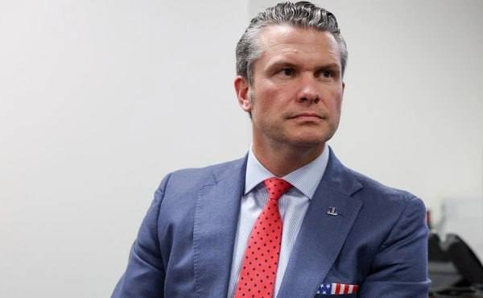

پیت هگست: آتش‌بس با ایران در حال اجراست
 

💢آتش‌بس با ایران در «وضعیت بسیار پویا» قرار دارد و در حال اجرا ست.
 
💢آتش‌بس به معنای توقف آتش‌پرانی است و می‌دانیم این اتفاق در حین مذاکرات رخ داده است و گفتگوهای مختلف بسیاری با تیم مذاکره ‌کننده ما در حال انجام است.

🫆:Tony

📌 @persian_trend_official
پرشین ترند | متفاوت‌ترین کانال نظامی

## Persian_Trend_Official — post 13987

🔴 دو وزیر دولت بریتانیا در اعتراض به استارمر استعفا دادند

💢گزارش‌ها حاکی است دو وزیر دولت بریتانیا در مخالفت با سیاست‌ها و عملکرد «کی یر استارمر» از سمت خود استعفا داده‌اند.

💢این استعفاها در حالی رخ می‌دهد که فشارهای سیاسی بر نخست‌وزیر بریتانیا افزایش یافته و پیش‌تر نیز گزارش‌هایی درباره نارضایتی گسترده در حزب کارگر منتشر شده بود.

🫆:Tony

📌 @persian_trend_official
پرشین ترند | متفاوت‌ترین کانال نظامی

## Persian_Trend_Official — post 13986

  <a href="telegram/content/Persian_Trend_Official_13986_1778599128.mp4" target="_blank">🎬 Download video</a>

🔴 وزارت دفاع روسیه تصاویر آزمایش موشک «سارمات» را منتشر کرد

وزارت دفاع روسیه ویدئویی از آزمایش موشک بالستیک قاره‌پیمای «سارمات» منتشر کرده است؛ موشکی که از آن به‌عنوان یکی از قدرتمندترین تسلیحات راهبردی هسته‌ای روسیه یاد می‌شود.

بر اساس گزارش‌ها:

▪️ «سارمات» یک موشک بالستیک قاره‌پیما با قابلیت حمل چندین کلاهک هسته‌ای است

▪️ ناتو این موشک را با نام «شیطان ۲» می‌شناسد

▪️ روسیه اعلام کرده این سامانه برای عبور از سپرهای موشکی طراحی شده است

️▪️ برد این موشک بین ۱۰ تا ۱۸ هزار
کیلومتر اعلام شده است

🫆:Tony

📌 @persian_trend_official
پرشین ترند | متفاوت‌ترین کانال نظامی

## Persian_Trend_Official — post 13984

🔴 عبور نفتکش‌های قطری از تنگه هرمز تأیید شد

در حالی که روز گذشته برخی گزارش‌ها مدعی شده بودند نفتکش قطری «مهزم» توسط ایران از تنگه هرمز بازگردانده شده، داده‌های جدید نشان می‌دهد این نفتکش دقایقی پیش موقعیت خود را در دریای عمان ثبت کرده و از مسیر تعیین‌شده عبور کرده است.

بر اساس گزارش‌ها:

▪️ نفتکش «مهزم» موفق به عبور از تنگه هرمز شده است
▪️ بلومبرگ نیز عبور دومین نفتکش حامل گاز طبیعی قطر از مسیر تعیین‌شده ایران را تأیید کرده است
▪️ عبور این کشتی‌ها در شرایط تنش شدید امنیتی در منطقه انجام شده است

🫆:Tony

📌 @persian_trend_official
پرشین ترند | متفاوت‌ترین کانال نظامی

## Persian_Trend_Official — post 13983

  <a href="telegram/content/Persian_Trend_Official_13983_1778599130.mp4" target="_blank">🎬 Download video</a>

🔴 رزمایش ضد هلی‌برن سپاه؛ بدون وجود پدافند هوایی

💢تصاویر منتشرشده از رزمایش «قائد شهید» سپاه تهران، استفاده از:
▪️ پهپادهای انتحاری
▪️ تک‌تیراندازها
▪️ مسلسل‌های سنگین سوار بر وانت تجاری

▪️ آرپی‌جی ۷

▪️ و توپ بدون لگد را نشان می‌دهد.

💢اما یک سؤال مهم مطرح است:
اگر هدف رزمایش مقابله با عملیات هلی‌برن دشمن بوده، چرا تمرینی برای هدف‌گیری بالگردها و اهداف پروازی با موشک‌های دوش‌پرتاب دیدهنمی‌شود؟

💢قاعدتاً جلوگیری از رسیدن و فرود دشمن، بسیار مؤثرتر از ورود به نبرد زمینی پس از پیاده‌سازی نیروهاست.

💢نکته مهم دیگر این است که ارتش آمریکا در صورت اجرای چنین عملیاتی، تنها از بالگرد ترابری استفاده نمی‌کند و عملیات معمولاً با:
▪️ پوشش هوایی
▪️ پهپادهای شناسایی
▪️ جنگ الکترونیک
▪️ و پشتیبانی آتش همراه خواهد بود.

💢به همین دلیل برخی تحلیلگران معتقدند این رزمایش بیشتر بر درگیری زمینی پس از فرود دشمن تمرکز داشته تا مقابله کامل با یک عملیات هوابرد مدرن.

🫆:Tony

📌 @persian_trend_official
پرشین ترند | متفاوت‌ترین کانال نظامی

## Persian_Trend_Official — post 13982

  

سخنگوی كميسيون امنيت ملی مجلس: غنی‌سازی ۹۰ درصدی اورانیوم در مجلس بررسی خواهد شد.

☆Phantom☆

📌 @persian_trend_official
پرشین ترند | متفاوت‌ترین کانال نظامی

## Persian_Trend_Official — post 13981

  

🚨🇺🇸🇮🇷 آخرین مقاومت سپاه پاسداران: این قایق‌ها تنها چیزی بود که برایشان باقی مانده بود.

☆Phantom☆

📌 @persian_trend_official
پرشین ترند | متفاوت‌ترین کانال نظامی

## Persian_Trend_Official — post 13979

  <a href="telegram/content/Persian_Trend_Official_13979_1778599133.webm" target="_blank">🎬 Download video</a>

اگر اینترنت غزه، اوکراین یا هرجایی که حمایت از آن برای حامی‌نماهای حقوق بشر "ویترین اخلاقی" داشته باشد فقط ۷ روز قطع میشد، دنیا را روی سرشان خراب می‌کردند؛ اما اینترنت ایران ۷۴ روز است عملاً قطع شده و آب از آب تکان نخورده است.

فکر می‌کنید اتفاق خاصی افتاده؟ خیر.
ضریب دسترسی واقعی به اینترنت آزاد در ایران به گواه نت‌بلاکس به حدود ۲ درصد رسیده؛ میلیون‌ها انسان نه ۷ روز، بلکه ۷۴ روز عملاً در یک زندان دیجیتال گروگان گرفته شده‌اند و همزمان که جمهوری اسلامی در پشت پرده به سرکوب، بازداشت و اعدام مشغول است، آشغالی به نام "اینترنت پرو" را به‌عنوان راه‌حل به مردم می‌فروشد، که عقیم‌سازی عمدی دسترسی آزاد به اطلاعات و نقض آشکار حقوق انسانی و حریم خصوصی شهروندان است.

ظاهراً برای جهان مدعی آزادی، فقط آن دسته از رنج‌هایی دیده می‌شوند که موضع‌گیری برایش هزینه‌ای نداشته باشد، یا چشم‌های مردمانش رنگی باشد.

📝 Nick

📌 @persian_trend_official
پرشین ترند | متفاوت‌ترین کانال نظامی

## Persian_Trend_Official — post 13978

💢خلاصه اخرین تحولات مهم

▪️دونالد ترامپ، رئیس‌جمهور آمریکا، اعلام کرد آتش‌بس با ایران «روی دستگاه حفظ حیات» قرار دارد و پیشنهاد اخیر تهران برای پایان جنگ را «کاملاً غیرقابل قبول» و «مزخرف» توصیف کرد.

▪️ قطر ایران را متهم کرد که از تنگه هرمز به‌عنوان ابزار فشار و «باج‌گیری» علیه کشورهای خلیج فارس استفاده می‌کند؛ در حالی که صادرات انرژی و کالاها همچنان با اختلال مواجه است

▪️ محمدباقر قالیباف، رئیس مجلس ایران، گفت تهران برای پاسخ به «هرگونه تجاوز» آماده است و واکنش ایران آمریکا را «غافلگیر» خواهد کرد

▪️ اتحادیه اروپا با اعمال تحریم‌های جدید علیه شهرک‌نشینان اسرائیلی به‌دلیل خشونت علیه فلسطینیان در کرانه باختری موافقت کرد؛ اقدامی که نتانیاهو گفته «موفق نخواهد شد»

▪️ شمار قربانیان جنگ غزه به ۷۲ هزار و ۷۴۰ نفر رسیده است

▪️ لبنان نیز اعلام کرد حملات اسرائیل از دوم مارس تاکنون ۲۸۶۹ کشته در این کشور برجای گذاشته است

🫆:Tony

📌 @persian_trend_official
پرشین ترند | متفاوت‌ترین کانال نظامی

## Persian_Trend_Official — post 13977

  

🔴 وزیر جنگ آمریکا درباره جنگ با ایران در کنگره بازخواست می‌شود

«پیت هگست» وزیر جنگ آمریکا قرار است در دور تازه‌ای از جلسات کنگره، درباره جنگ آمریکا و اسرائیل با ایران مورد پرسش نمایندگان قرار گیرد.

بر اساس گزارش‌ها:

▪️ برخی نمایندگان جمهوری‌خواه نیز نسبت به طولانی‌شدن جنگ و نبود مجوز رسمی کنگره ابراز نگرانی کرده‌اند
▪️ کمیته‌های بودجه دفاعی مجلس نمایندگان و سنا نشست‌هایی برای بررسی بودجه نظامی سال ۲۰۲۷ برگزار می‌کنند
▪️ دولت ترامپ بودجه‌ای تاریخی به ارزش ۱.۵ تریلیون دلار برای بخش دفاعی پیشنهاد داده است

گزارش‌ها حاکی است محور اصلی بحث‌ها علاوه بر بودجه، نحوه مدیریت جنگ با ایران خواهد بود؛ جنگی که به‌گفته رسانه‌های آمریکایی وارد وضعیت فرسایشی شده است.

همچنین انتظار می‌رود:

▪️ وزیر جنگ آمریکا و رئیس ستاد مشترک ارتش بر نیاز به افزایش پهپادها
ناوهای جنگی
سامانه‌های رهگیر موشکی
تأکید کنند؛ زیرا ذخایر این تجهیزات در جریان درگیری با ایران کاهش یافته است.

🫆:Tony

📌 @persian_trend_official
پرشین ترند | متفاوت‌ترین کانال نظامی

## Persian_Trend_Official — post 13976

  <a href="telegram/content/Persian_Trend_Official_13976_1778599134.webm" target="_blank">🎬 Download video</a>

کویت مدعی بازداشت ۴ افسر نیروی دریایی سپاه شد
وزارت کشور کویت اعلام کرد چهار نفر وابسته به سپاه پاسداران را هنگام تلاش برای ورود دریایی به جزیره بوبیان بازداشت کرده است.
طبق بیانیه رسمی، بازداشت‌شدگان شامل دو سرهنگ، یک کاپیتان و یک ستوان نیروی دریایی سپاه هستند که به گفته کویت، مأموریت «نفوذ» به جزیره بوبیان و انجام «اقدامات خصمانه» را داشته‌اند. در جریان درگیری، یک نیروی مسلح کویتی نیز زخمی شده است.

اسامی اعلام‌شده از سوی کویت:
1 امیرحسین عبدالمحمد زیرایی — سرهنگ نیروی دریایی
2▪️ عبدالصمد یدالله قنواتی — سرهنگ نیروی دریایی
3▪️ احمد جمشید غلامرضا ذوالفقاری — کاپیتان نیروی دریایی
4▪️ محمدحسین سهراب فاروقی‌راد — ستوان یکم
کویت می‌گوید این افراد اول ماه مه با یک قایق ماهیگیری وارد آب‌های این کشور شده بودند و دو نفر دیگر نیز موفق به فرار شده‌اند.
جزیره بوبیان بزرگ‌ترین جزیره کویت و در نزدیکی مرزهای دریایی ایران و عراق قرار دارد. ایران تاکنون واکنش رسمی به این ادعاها نشان نداده است.

---
📅 بروزرسانی: 1405/02/22 15:48
---

## ChizBergerz — post 46327

  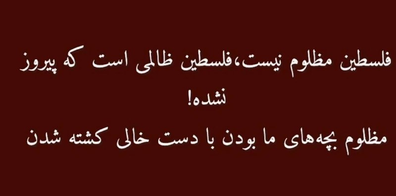

فلسطین مظلوم نیست، فلسطین ظالمی است که پیروز نشده!

مظلوم بچه‌های ما بودن که با دست خالی کُشته شدن!💔
@ChizBergerz

## ChizBergerz — post 46326

اینترنت پرو اولشه؛ بزودی باید منتظر آب پرو، برق پرو، گاز پرو، بنزین پرو و اکسیژن پرو باشیم.

## ChizBergerz — post 46325

  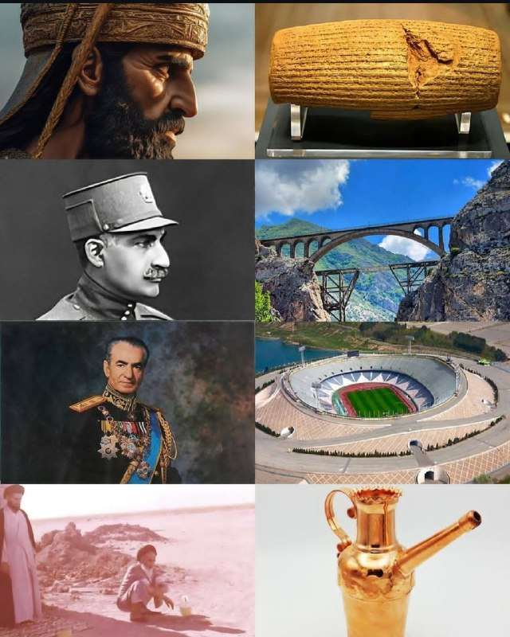

بالاخره هر رهبری یک اثری از خودش بجا میزاره :)))

@ChizBergerz

## ChizBergerz — post 46324

  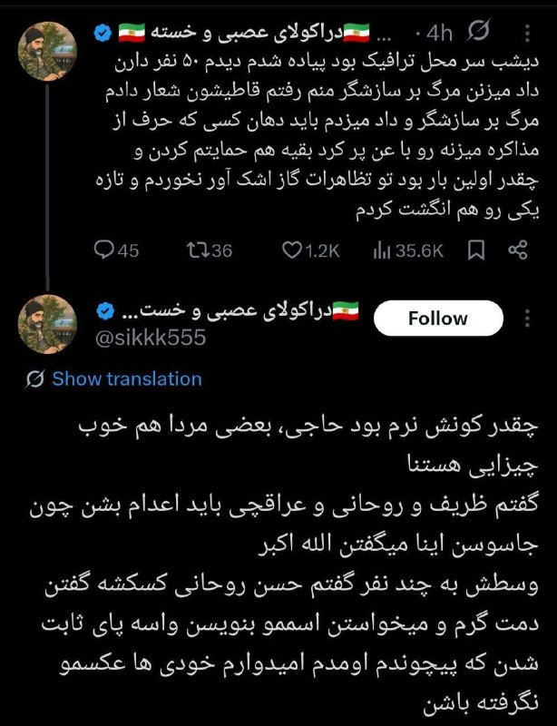

یکی از مخالفین حکومت رفته قاطی تجمع شبانه عرزشیا و این شاهکارو خلق کرده: 😂👌

@ChizBergerz

## ChizBergerz — post 46323

  <a href="telegram/content/ChizBergerz_46323_1778588310.mp4" target="_blank">🎬 Download video</a>

ریدمممم
😂
😂
😂

@ChizBergerz

## ChizBergerz — post 46322

  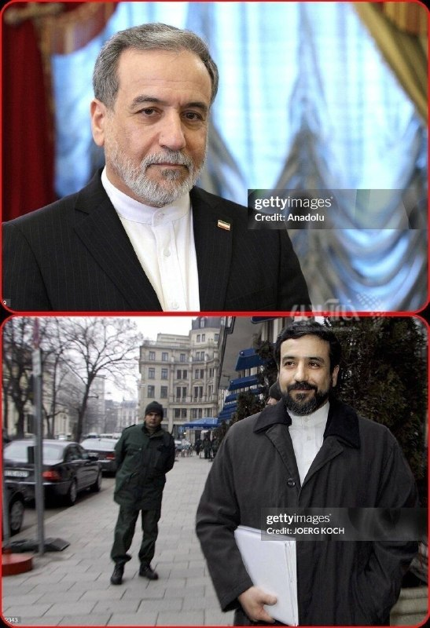

عباس عراقچی زن‌جنده از ۲۰۰۶ تا ۲۰۲۶ مشغول مذاکره بود که نتیجه‌ش تا الان شده کتلت شدن سران مملکت😂😂

@ChizBergerz

## ChizBergerz — post 46321

باز شانس آوردیم ج.ا نمیتونه استفاده از اکسیژن رو کنترل کنه، وگرنه اونم طبقه‌بندی میکرد و فقط به حامیاش اجازه نفس کشیدن میداد.

## ChizBergerz — post 46320

  

من هیچ جانوری رو ندیده بودم که آرزوی مرگ یک نوزاد رو بکنه!

کص ننه آقای دبیر و همه ۷۸۴ نفری که لایکش کردن!
@ChizBergerz

## ChizBergerz — post 46319

  <a href="https://t.me/ChizBergerz/46319" target="_blank">📎 Download file</a>

📲#اپلیکیشن اندروید سایت جهانی دربی بت

👍اسپانسر لیگ انگلیس
👍
🔥امکان شارژ امن از طریق کارت بانکی
➖➖➖➖➖➖➖➖➖

🪙همین حالا عضو شوید 👇
https://t.me/+aCbq7yy8QY80NzQ0

## ChizBergerz — post 46318

  

😤دنبال یه سایت شرط بندی بین المللی بودی که به ایرانیا خدمات بده؟!
⛔

👍دربی بت همون انتخاب  100%

💎ویژگی های سایت جهانی Derby Bet:

⬅️امکان شارژ امن با کارت بانکی

⬅️واریز اول دوبل شارژ می شوید(بونوس۱۰۰٪)

⬅️پر اپشن ترین سایت فعال در ایران

⬅️تسویه حساب کمتر از 5 دقیقه

⬅️برگشت بخشی از باخت به صورت هفتگی

🚨کد هدیه ثبت نام:GG007

⚠️برای دانلود اپلکیشن کلیک کنید
👉
re22

🔔کانال دربی بت :

🪙https://t.me/+aCbq7yy8QY80NzQ0

## ChizBergerz — post 46317

  <a href="telegram/content/ChizBergerz_46317_1778588315.mp4" target="_blank">🎬 Download video</a>

رونمایی جمهوری‌اسهالی از اسکین جدید که تازگیا آخوندهای سیاهپوست هم تو تجمعات شبانه شرکت میکنن: 
💩😂

@ChizBergerz

## ChizBergerz — post 46316

  <a href="telegram/content/ChizBergerz_46316_1778588317.mp4" target="_blank">🎬 Download video</a>

اگه حوصله دارید این حرف‌های زیبای مارک لوین درمورد ایران و مردم ایران رو بشنوید، واقعا دمش گرم❤️؛
می‌خوام با شما درباره‌ی مردم صحبت کنم، مردم ایران. ۹۲ میلیون نفر که اکثریت قاطع اونها خواهان زندگی در آزادی هستند.
می‌خوام از انسانیت بگم. از ارزش‌ها و باورهای یهودی مسیحی. شاید بعضی از شما امروز به کلیسا یا معبد رفته باشید، یا صرفاً دارای این باورهای اخلاقی باشید. شاید اون‌ها رو یاد گرفته‌ باشید یا به صورت شهودی درکشون می‌کنید. اینکه تفاوت درست و غلط و خیر و شر رو می‌دونید.
پس می‌خوام درباره‌ی ده‌ها میلیون نفر در ایران صحبت کنم که ۴۷ ساله با اون‌ها مثل حیوون رفتار شده. کسانی که زندانی، شکنجه، مورد تجاوز واقع شده و ده‌ها هزار نفرشون به قتل رسیدن. کسانی که به اون‌ها گفته شده چه نوع موسیقی‌ رو می‌تونن یا نمی‌تونن گوش بدن.
می‌خوام درباره‌ی زنان جوان بگم، دختران، خواهران و مادران در ایران که مجبور به پوشندن سر خود هستند و هیچ حقی ندارند، چه برسه به حقوق برابر و در معرض بدترین سوءرفتارها قرار می‌گیرن.
می‌خوام از جوونا بگم. جوونای ایران که می‌خوان از جوونی‌شون لذت ببرند، چیزهای جدید و شاد رو تجربه کنند و یاد بگیرن، اما توسط پلیس مخفی رژیم شیعه‌سانان رافضی هزارپدر بازداشت می‌شن و بدون محاکمه عمدتاً در خفا اعدام می‌شن.
می‌خوام درباره‌ی کسانی در کشور خودمون آمریکا صحبت کنم که خودشون رو لیبرال، فعال حقوق بشر یا مدافع آزادی‌های مدنی می‌نامند، اما کوچکترین اهمیتی به هیچ‌کدوم از اینها نمی‌دن. قرمساق‌هایی که اعتراض نمی‌کنند و نخواهند کرد، چون حزب دموکرات قرمدنگ یا جریان سیاسی که بهش تعلق دارند، مارکسیست‌ها و اسلام‌گرایان قحبه‌زاده، اونقدر از آمریکا و اسرائیل متنفرند که ترجیح می‌دن ده‌ها هزار ایرانی دیگه به شکلی وحشتناک بمیرند، اما شاهد اون نباشند که کشور ما این رژیم حرومزاده‌ی آدم‌کش رو شکست می‌ده. این جاکش‌ها در خیابون‌ها نیستند. راهپیمایی نمی‌کنند.
رهبران مذهبی کجان؟ بعضی‌شون هستند، اما بقیه‌شون کجان قحبه‌ها؟ صداشون رو نمی‌شنوم. شما می‌شنوید؟
می‌خوام از سکوت گروه‌های موسوم به فمینیست بگم که چنان با چپ‌گرایان افراطی و رادیکال گره خوردن که حتی یک کلمه درباره‌ی آزار و تجاوز گسترده به زنان و دختران توسط رژیم هزارپدر شیعه‌سانان رافضی نگفتن‌. هیچی!
می‌خوام درباره‌ی کسایی صحبت کنم که می‌گن تهدید هسته‌ای رژیم قحبه‌زادهی روافض قریب‌الوقوع نبود، می‌گن که این یک جنگ انتخابیه، می‌گن که این یک جنگ غیرقانونیه و کسشرایی از این دست.
این قرمساق‌های دیوث ذره‌ای حتی به اندازه‌ی یک ارزن اهمیت نمی‌دن که نه تنها در حال کمک کردن و آرامش دادن به این دشمن هولناک هستند، بلکه این دشمن پدرقحبه رو تشویق می‌کنند تا قتل‌عام کنه، اعدام کنه، تجاوز کنه، شکنجه کنه و کارهایی رو انجام بده که رژیم‌های آدم‌کش انجام می‌دن.
هیچ چیز، تکرار می‌کنم هیچ چیز شرافتمندانه یا برحقی در مورد هیچ‌کدوم از این گروه‌ها‌ی قحبه یا این افراد سراسر شرارت و تباهی وجود نداره.
و در مورد آمریکایی‌هایی که یا ساکتن یا بدتر از اون، تظاهر می‌کنن که این نسل‌کشی در حال اتفاق افتادن نیست، و یا با وجود اینکه می‌دونن در حال وقوعه، با بی‌تفاوتی ازش می‌گذرن. ننگ بر قرمساق‌هایی که این‌طوری فکر می‌کنن. ننگ بر اون قرمدنگ‌هایی که اعتراض نمی‌کنند. ننگ بر جاکشایی که اقدام نمی‌کنند، مخصوصاً اونایی که در جایگاهی هستند که می‌تونن کاری انجام بدن و نمی‌دن.
مردم ایران‌ آزادی‌شون را می‌خوان و می‌خوان زندگی‌شون را پس بگیرن.
رژیم آدم‌کش و تروریست هزارپدر روافض رو بگایید، مردم ایران رو آزاد کنید و به هر نوع تهدید توسعه هسته‌ای و آبگرمکن‌های بالستیک در آینده پایان بدید. آیا این اتفاق خوبی برای مردم شریف ایران، برای مردم آمریکا، برای مردم خاورمیانه و کل دنیا نیست؟
ممکنه هزاران دلیل برای کمک نکردن به این مردم و اقدام نکردن وجود داشته باشه و شک ندارم که این دلایل ردیف شده و ارائه شدن. اما یک دلیل وجود دارد که بر همه‌ی اینا برتری داره. دلیلی که از همه اون‌ها مهم‌تره: انسانیت. اراده‌ی بشریت.
الان اون بهونه رو نداریم. با تکنولوژی مدرن ما می‌دونیم تو اون کشور چه می‌گذره. ما کشتار مردم عادی رو در اینترنت دیدیم‌ و نگاه کردن به اونا سخته. بیایید اون اشتباه رو تکرار نکنیم.»
@ChizBergerz

## rodast_omiddana — post 71271

  <a href="telegram/content/rodast_omiddana_71271_1778588320.webm" target="_blank">🎬 Download video</a>

🚨آقای مرتضی نجفی عادی سازی نکن
اجرای کنسرت خیانت به خون جاویدنامان است
#شاهین_نجفی

## rodast_omiddana — post 71270

🎬 ویدیو جدید از قاسم سلیمانی در مورد تنگه هرمز و جنگ با آمریکا
لینک یوتیوب:
https://www.youtube.com/watch?v=T5ZwyfWzcLU

## rodast_omiddana — post 71269

🎬حرکت زیردریایی اتمی آمریکا سمت ایران
ترامپ مصمم هست تا در دو هفته آینده حمله کند
لینک یوتیوب:
https://youtu.be/BEDe1__H8Ds?is=VkFeu4U3voVbDB14

## rodast_omiddana — post 71268

  <a href="telegram/content/rodast_omiddana_71268_1778588320.webm" target="_blank">🎬 Download video</a>

🚨خدا رو شکر این بابا در کمسیون امنیت مجلس داره بار ما را برای جنگ دوباره به دوش میکشه..
همیشه رو خریت شیعه جماعت میشه حساب کرد..

## rodast_omiddana — post 71267

  <a href="telegram/content/rodast_omiddana_71267_1778588320.mp4" target="_blank">🎬 Download video</a>

🚨ترامپ: دارم میرم چین تا کار رژیم را تمام کنم
احتمالا تا 4 خرداد حمله آمریکا آغاز شود

## rodast_omiddana — post 71266

🎬 پاسخ به تهدار زهرایی
شیعه گری همچون آمپول بی حسی هست
لینک یوتیوب:
https://www.youtube.com/watch?v=NVNsB1fxz8c

## KiriMohems — post 47392

  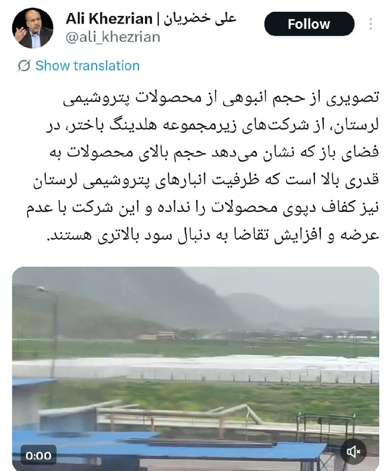

🔴علی خضریان نماینده کص‌مغز طویله مجلس آمار کامل یه پتروشیمی بسیار مهم کشور رو تو لرستان داده

#Helsinki
@KiriMohems

## KiriMohems — post 47391

  

😤دنبال یه سایت شرط بندی بین المللی بودی که به ایرانیا خدمات بده؟!
⛔

👍دربی بت همون انتخاب  100%

💎ویژگی های سایت جهانی Derby Bet:

⬅️امکان شارژ امن با کارت بانکی

⬅️واریز اول دوبل شارژ می شوید(بونوس۱۰۰٪)

⬅️پر اپشن ترین سایت فعال در ایران

⬅️تسویه حساب کمتر از 5 دقیقه

⬅️برگشت بخشی از باخت به صورت هفتگی

🚨کد هدیه ثبت نام:GG007

⚠️برای دانلود اپلکیشن کلیک کنید
👉

🔔کانال دربی بت :r22🅰

🪙https://t.me/+kpFvLD9kaeJhYTI0

## KiriMohems — post 47390

  

🔴دوران قاجار ، نسخه نجاست باری از تاریخ ماست
#این_چه_کصشعریه

#Helsinki
@KiriMohems

## KiriMohems — post 47389

  <a href="telegram/content/KiriMohems_47389_1778588327.mp4" target="_blank">🎬 Download video</a>

برادر مقداری اعصابش کیری است

#Helsinki
@KiriMohems

## KiriMohems — post 47388

  <a href="telegram/content/KiriMohems_47388_1778588330.mp4" target="_blank">🎬 Download video</a>

🔴ترامپ از رئیس جمهور کیرلاتی بعدی آمریکا گفت: ترکیب ونس-روبیو خایه برانگیز است!

«چه کسی جی‌دی ونس را دوست دارد؟ همه کف میزنن
چه کسی مارکو روبیو را؟ همه کف میزنن

بسیار خب. به نظر ترکیب پررویی می‌آید. ضمناً، من معتقدم که این یک تیم رویایی است. فکر می‌کنم به نظر میرسه کاندیدای حشرانه‌ی ریاست جمهوری و کاندیدای معاونت ریاست جمهوری باشد.

#Helsinki
@KiriMohems

## KiriMohems — post 47387

  <a href="telegram/content/KiriMohems_47387_1778588332.mp4" target="_blank">🎬 Download video</a>

🔴یه افکونی ننه کیر پرست تو تجمعات خایه‌مالان جمهوری اسلامی تو برلین به سپهر و پدرش توهین کرد!

#Helsinki
@KiriMohems

## KiriMohems — post 47386

  <a href="telegram/content/KiriMohems_47386_1778588334.mp4" target="_blank">🎬 Download video</a>

🔴اینترنت پرو، نشست خبری رو به گایش کشوند

بگومگوی خبرنگاران و فاطی مهاجران بر سر اینترنت گوهی که راه انداختن
#Helsinki
@KiriMohems

## KiriMohems — post 47385

  <a href="telegram/content/KiriMohems_47385_1778588337.mp4" target="_blank">🎬 Download video</a>

#پشماتون_بریزه

⚽️ وسط جشن و کصکلک بازی بارسایی ها تو بارسلون ، ایرونی ها مقیم اونجا پرچم شاهکار شیر و خورشید به احتزاز درآوردن و یه تنه کیر رو به بدخواهان فرو کردن

#Helsinki
@KiriMohemSport

## SportBaadNews — post 251406

  <a href="telegram/content/SportBaadNews_251406_1778588340.webm" target="_blank">🎬 Download video</a>

🚨
⚽️
✅ فووووووری فابریزیو رومانو: سرخیو راموس کل مراحل خرید سویا رو انجام داده و قراره مالک جدید باشگاه بشه.

🔴 این معامله نهایی شده و برادرش رنه هم داره کارهاشو جلو میبره. الان فقط مونده کارای رسمی و اداری با وکیلا انجام بشه تا بعدش خبرشو رسماً اعلام کنن.
@SportBaadNews

## SportBaadNews — post 251405

  <a href="telegram/content/SportBaadNews_251405_1778588341.webm" target="_blank">🎬 Download video</a>

🚨
💣
⚽️ ساشا تاولیری: مورینیو رسما با رئال مادرید به توافق رسید

- هفته آینده خودش با صادر کردن یه بیانیه پیوستنش به رئال رو اعلام میکنه!
@SportBaadNews

## SportBaadNews — post 251404

ایران اینترنت ندارد، روز هفتاد و چهارم …
ایران اینترنت ندارد، روز هفتاد و چهارم …
ایران اینترنت ندارد، روز هفتاد و چهارم …
ایران اینترنت ندارد، روز هفتاد و چهارم …
ایران اینترنت ندارد، روز هفتاد و چهارم …
ایران اینترنت ندارد، روز هفتاد و چهارم …

## SportBaadNews — post 251403

  

⚽️
🔴 آیا می‌دانستید از بعد اینکه مسی مخفیانه پاشو تو نیوکمپ گذاشت بارسلونا حتی یک بازی رو هم تو نیوکمپ تو لیگ نباخته و تمام 13 تا بازی های خانگی رو با برد پشت سر گذاشته؟

✅ آمار 100% برد در بازی های خانگی لیگ از زمان حضور مسی تو نیوکمپ تا به الان!
@SportBaadNews

## SportBaadNews — post 251401

🔹رسمی: پلتفرم هوش مصنوعی گوگل (جمنای) حامی مالی تیم ملی عراق در جام جهانی 2026 شد
@SportBaadNews

## SportBaadNews — post 251400

  <a href="telegram/content/SportBaadNews_251400_1778588343.mp4" target="_blank">🎬 Download video</a>

صالح حردانی:
از مسئولان کشور میخوام که اگه ما از گروهمون تو جام جهانی صعود کردیم، سربازی ما رو ببخشن!
@SportBaadNews

## SportBaadNews — post 251399

  

❌ ۹۰٪ کاربرا هنوز اشتباه وارد سایت میشن!
تو جزو اونایی یا میخوای حرفه‌ای عمل کنی؟

✅ ورود سریع به وینکوبت فقط با یک کلیک ساده:

🤖 @Wincobet_bot

🤖 @Wincobet_bot

📌   نه لینک اضافی

📌   نه سردرگمی

📌   نه اتلاف وقت

📌   مستقیم، سریع، بدون دردسر وارد شو!

⏳   دیر بجنبی، از بقیه عقب می‌مونی.

🔗 الان وقتشه مسیر درستو انتخاب کنی:

🤖 @Wincobet_bot

📌برای تحلیل بازی‌ها و آخرین اخبار سایت جوین بدید:

🔵 @Wincobetofficial

## SportBaadNews — post 251398

  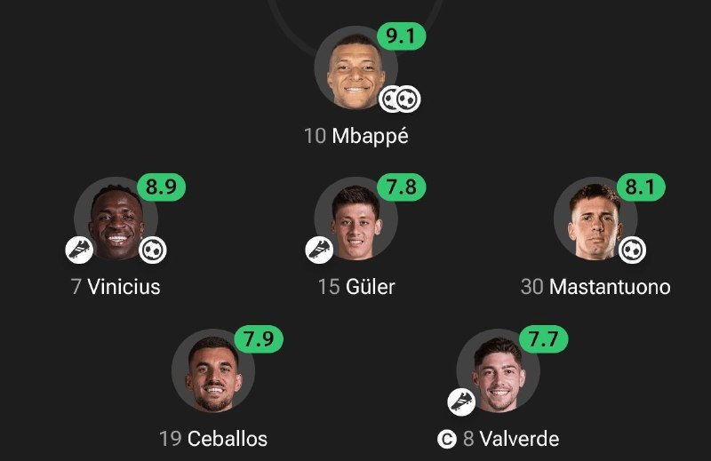

⚽️
🔙| حدود 8 ماه پیش وقتی که تو رختکن رئال هنوز چیزی به اسم «غرور» وجود نداشت!
@SportBaadNews

## SportBaadNews — post 251397

  <a href="telegram/content/SportBaadNews_251397_1778588349.webm" target="_blank">🎬 Download video</a>

🚨 یک شبکه سکسی و فحشای لوکس شامل 50 فوتبالیست سری آ و یک راننده فرمول یک کشف و 4 متهم رده اول دستگیر شدن حدود 100 دختر تو این شبکه بودن، این شبکه 50% از هر مشتری رو به عنوان کارمزد دریافت می‌کرد و وظیفه برنامه ریزی داشت. اسم خیلی از بازیکنای مطرح تو این…

## SportBaadNews — post 251396

  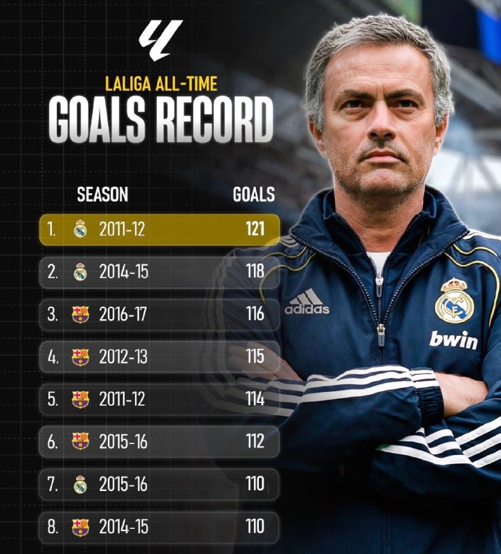

🇪🇸⚽| بیشترین گل زده تو یک فصل تاریخ لالیگا توسط یک تیم:

⚽️
🔵 2011/12 - 121 گل - رئال مورینیو

⚽️
🔵 2014-15 - 118 گل - رئال آنچلوتی

⚽️
🔴 2016/17 - 116 گل - بارسا انریکه

⚽️
🔴 2012/13 - 115 گل - بارسا تیتو

⚽️
🔴 2011/12 - 114 گل - بارسا گواردیولا

⚽️
🔴 2015/16 - 112 گل - بارسا انریکه

⚽️
🔵 2015/16 - 110 گل - رئال زیدان

⚽️
🔴 2014/15 - 110 گل - بارسا انریکه
@SportBaadNews

## SportBaadNews — post 251395

  <a href="telegram/content/SportBaadNews_251395_1778588350.webm" target="_blank">🎬 Download video</a>

🚨
⚽️
⚽️ ایندیکایلا: آلونسو منتظر پیشنهاد لیورپوله، ولی چلسی جلو افتاده و ممکنه اگه لیورپول دیر بجنبه، اون رو از دست بده و ژابی به عنوان مربی فصل بعد چلسی معرفی بشه
@SportBaadNews

## SportBaadNews — post 251394

  

🇫🇷
⚽️| مایکل اولیسه هم به عنوان بهترین بازیکن سال فرانسوی شاغل در خارج از فرانسه انتخاب شد @SportBaadNews

## SportBaadNews — post 251393

  

⚽️ عثمان دمبله دیشب به عنوان بهترین بازیکن فصل لیگ یک فرانسه انتخاب شد؛ این در حالیه که عثمون فقط 9 تا بازی تو این فصل فیکس برا پاریس تو لیگ بازی کرده @SportBaadNews

## SportBaadNews — post 251392

  

⚽️ عثمان دمبله دیشب به عنوان بهترین بازیکن فصل لیگ یک فرانسه انتخاب شد؛ این در حالیه که عثمون فقط 9 تا بازی تو این فصل فیکس برا پاریس تو لیگ بازی کرده
@SportBaadNews

## SportBaadNews — post 251391

  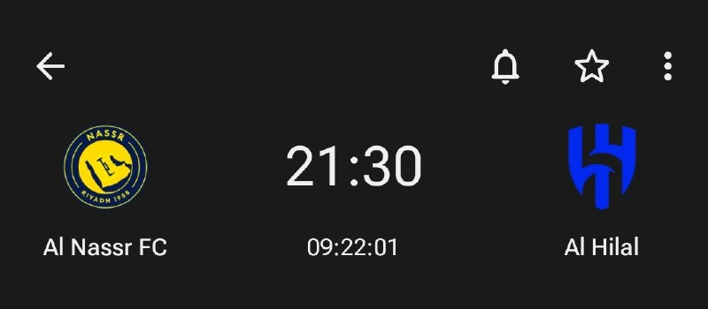

⚽️
⚽️| بازی مهم امروز تقابل دیدنی بنزما و رونالدو
النصر با یک بازی بیشتر در فاصله 5 امتیازی با الهلال در صدر جدول لیگ عربستان قرار داره و اگه امشب برنده بشه رسما قهرمان لیگ عربستان میشن
@SportBaadNews

## SportBaadNews — post 251390

  

⚽️
🥇 داویده آنچلوتی: سال 2014 که رونالدو برنده توپ طلا شد اونشب یه لیوان شامپاین خورد؛ بعد اون یه روز اومد پیش بابام و درخواست یه جلسه تمرین اضافه کرد که بتونه اون یه لیوان شامپاینی که خورده رو بسوزونه، اون اینقدر سخت کار میکرد!
@SportBaadNews

## SportBaadNews — post 251389

  <a href="telegram/content/SportBaadNews_251389_1778588355.mp4" target="_blank">🎬 Download video</a>

اون کصخلایی که سالی یه بار فوتبال نمیبینن وقتی نزدیک جام جهانی میشه (باید سهمیه چصی اومدنشون رو جور کنن) :
@SportBaadNews

## IranIntlTV — post 336808

  

جان هیلی، وزیر دفاع بریتانیا، با اشاره به برگزاری نشستی درباره تامین امنیت کشتیرانی در تنگه هرمز گفت: «بی‌ثباتی بیشتر به سود بریتانیا نیست. اکنون باید تمام تمرکز ما بر رسیدگی به چالش‌های فوری اقتصادی و امنیتی باشد.»

او افزود سه‌شنبه ریاست مشترک نشست ۴۰ وزیر دفاع را با هدف جلب حمایت از ماموریت تحت رهبری بریتانیا برای تامین امنیت کشتیرانی در تنگه هرمز بر عهده خواهد داشت.

جان هیلی در شبکه ایکس نوشت مردم نگران درگیری‌های کنونی و بحران‌های جهانی پیش‌رو هستند و انتظار دارند دولت، همان‌گونه که نخست‌وزیر عمل می‌کند، کشور را از این شرایط عبور دهد.

او تاکید کرد بریتانیا مشارکت‌های نظامی خود در این ماموریت را اعلام خواهد کرد و افزود بی‌ثباتی بیشتر به سود بریتانیا نیست و دولت باید بر چالش‌های فوری اقتصادی و امنیتی تمرکز کند.

وزیر دفاع بریتانیا همچنین نوشت دولت باید برای بازگرداندن امنیت اقتصادی خانواده‌ها در داخل کشور اقدام کند.
https://iranintl.com/202605123953

## IranIntlTV — post 336807

  <a href="telegram/content/IranIntlTV_336807_1778588357.mp4" target="_blank">🎬 Download video</a>

وزارت کشور کویت اعلام کرد چهار عضو وابسته به سپاه پاسداران انقلاب اسلامی را که از راه دریا به جزیره بوبیان در خاک این کشور نفوذ کرده بودند، بازداشت کرد. در جریان درگیری با این افراد نیز یک عضو نیروهای مسلح کویت زخمی شده است.
جزییات بیشتر با تروسکه صادقی، خبرنگار ایران‌اینترنشنال
@iranintltv

## IranIntlTV — post 336806

  <a href="telegram/content/IranIntlTV_336806_1778588362.mp4" target="_blank">🎬 Download video</a>

به گفته باستان شناسان عراق روند مرمت زیگورات باستانی اور در استان ذی‌قار همچنان ادامه دارد. در این مرحله ابتدا نمای بیرونی این بنای تاریخی و سه راه‌پله طبقه اول در حال بازسازی است و مرمت طبقه دوم، به‌ویژه بخش‌های شمال‌غربی و جنوب‌شرقی، به‌صورت کامل انجام می‌شود.
@iranintltv

## IranIntlTV — post 336805

  <a href="telegram/content/IranIntlTV_336805_1778588364.mp4" target="_blank">🎬 Download video</a>

سازمان بهداشت جهانی اعلام کرد چند مورد ابتلا به ویروس هانتا در یک کشتی تفریحی تایید شده و ۳ نفر جان باختند. هانتاویروس خانواده‌ای از ویروس‌هاست که معمولا در جوندگان، از جمله موش‌ها، دیده می‌شود. این ویروس‌ها می‌توانند از طریق فضولات، ادرار یا بزاق جوندگان آلوده وارد محیط شوند و انسان را مبتلا کنند.
@iranintltv

## IranIntlTV — post 336804

  <a href="telegram/content/IranIntlTV_336804_1778588366.mp4" target="_blank">🎬 Download video</a>

تحریم‌های جدید استرالیا، بریتانیا و آمریکا علیه افراد و نهادهای مرتبط با سپاه پاسداران

@iranintltv

## IranIntlTV — post 336803

  

محمد بن عبدالرحمن آل ثانی، وزیر خارجه قطر، در نشست خبری با وزیر خارجه ترکیه گفت آنچه در تنگه هرمز در جریان است به کاهش تنش کمک نمی‌کند و جمهوری اسلامی نباید از این تنگه به‌عنوان سلاح استفاده کند.

او در ادامه با اشاره به سفر خود به آمریکا افزود این سفر عمدتا بر حمایت و همراهی با تلاش‌های پاکستان متمرکز بوده و نقش پاکستان برای منطقه و جهان بسیار مهم و تعیین‌کننده است.

محمد بن عبدالرحمن آل ثانی همچنین گفت قطر و ترکیه در حال هماهنگی تلاش‌ها هستند و از دیپلماسی پاکستان برای دستیابی به توافق در سریع‌ترین زمان ممکن حمایت می‌کنند.
https://iranintl.com/202605125826

## IranIntlTV — post 336802

  <a href="telegram/content/IranIntlTV_336802_1778588369.mp4" target="_blank">🎬 Download video</a>

هفتادونهمین دوره جشنواره فیلم کن، سه‌شنبه در جنوب فرانسه آغاز می‌شود. اصغر فرهادی نیز با فیلم «داستان‌های موازی» در بخش مسابقه اصلی این جشنواره حضور دارد.

لی‌لی نیکفر، خبرنگار ایران‌اینترنشنال، گزارش می‌دهد
@iranintltv

## IranIntlTV — post 336801

🔻آیا عملیات ویژه اسرائیل در سوریه می‌تواند الگوی انتقال ذخایر اورانیوم از ایران باشد؟

روزنامه معاریو در مطلبی با اشاره به اظهارات اخیر بنیامین نتانیاهو، احتمال انجام شدن عملیاتی از سوی اسرائیل برای خارج کردن ذخایر اورانیوم جمهوری اسلامی را مورد بررسی قرار داد و به جزییات یکی از نمونه‌های تاریخی مشابه پرداخت.

نخست‌وزیر اسرائیل ۲۱ اردیبهشت در گفت‌وگو با شبکه سی‌بی‌اس اعلام کرد در صورت دستیابی به توافقی با تهران، خارج کردن مواد هسته‌ای جمهوری اسلامی «کاملا امکان‌پذیر» است.

نتانیاهو در پاسخ به پرسشی درباره احتمال استفاده از زور برای جابه‌جایی ذخایر اورانیوم حکومت ایران در صورت شکست مذاکرات گفت نمی‌تواند درباره گزینه‌ها و عملیات نظامی احتمالی اظهار نظر کند.

معاریو سه‌شنبه ۲۲ اردیبهشت نوشت با وجود پاسخ مبهم نتانیاهو، ارتش اسرائیل سابقه اجرای «عملیات‌های ویژه در عمق خاک دشمن» را در کارنامه خود دارد.

بر اساس این گزارش، نیروهای واحد شلدگ هشتم سپتامبر ۲۰۲۴ در عملیاتی ویژه در خاک سوریه، به یک سایت زیرزمینی تولید موشک در منطقه مصیاف یورش بردند و آن را منهدم کردند.

واحد شلدگ، نیروی ویژه نخبه وابسته به نیروی هوایی اسرائیل است که ماموریت‌هایی چون نفوذ، شناسایی و عملیات مخفی در عمق خاک دشمن را انجام می‌دهد.

۲۱ اردیبهشت، دونالد ترامپ، رییس‌جمهوری آمریکا، پاسخ تهران به پیشنهاد واشینگتن را «آشغال» و «بسیار ضعیف» توصیف کرد و شانس پایداری آتش‌بس موقت را «حدود یک درصد» دانست.

در روزهای اخیر گمانه‌زنی‌ها درباره احتمال ازسرگیری کارزار نظامی ایالات متحده و اسرائیل علیه جمهوری اسلامی بالا گرفته است.
جزییات عملیات پیچیده ارتش اسرائیل در مصیاف

معاریو نوشت سازمان اطلاعات نظامی اسرائیل طی سال‌ها رصد، این سایت زیرزمینی را شناسایی کرد. تاسیساتی که با حمایت مالی جمهوری اسلامی برای تولید موشک‌های دقیق و راکت‌های دوربرد ساخته شده بود.

این تاسیسات زیرزمینی، پروژه‌ای راهبردی در چارچوب تلاش تهران برای تجهیز حزب‌الله و دیگر نیروهای نیابتی خود در مرز شمالی اسرائیل بود که در جریان این عملیات منهدم شد.

در ماه‌های منتهی به عملیات، طرح نابودی این مجموعه با مشارکت نیروی هوایی اسرائیل تدوین شد و نیروها با بالگرد، تحت پوشش آتش و پشتیبانی پهپادها، جنگنده‌ها و شناورهای نیروی دریایی، در منطقه فرود آمدند.

دقایقی پیش از فرود نیروهای اسرائیلی در خاک سوریه، تاسیسات تولید موشک‌های زمین‌به‌زمین هدف قرار گرفت و مواضع امنیتی اطراف آن از بین رفت.

بالگردهای حامل بیش از ۱۰۰ نیروی واحد شلدگ در فاصله حدود ۷۰۰ متری هدف به زمین نشستند و پس از درگیری با نیروهای دشمن، مسیر ورود به تونل‌ها و اتاق‌های حفرشده در دل کوه هموار شد.

این مجموعه که ساخت آن از اواخر سال ۲۰۱۷ کلید خورده بود، در عمق یک کوه و در میان دره‌ای با عمق حدود ۱۰۰ متر بنا شده بود و ساختاری نعل‌اسبی با دو خروجی اصلی داشت.
به‌دلیل موقعیت جغرافیایی و عوارض طبیعی منطقه مصیاف سوریه، نیروهای اسرائیلی توانستند به سرعت محدوده عملیات را تحت کنترل درآورند و از هر گونه دخالت نیروهای متخاصم جلوگیری کنند.

نیروهای اسرائیلی پس از شکستن درها، حجم زیادی از مواد منفجره را در اتاق‌های مجموعه کار گذاشتند. در مجموع، ۳۰۰ کیلوگرم مواد منفجره به‌همراه مهمات موجود در سایت، انفجاری معادل حدود یک تُن مهمات ایجاد کرد.

در این عملیات، نظامیان اسرائیلی به تجهیزات کلیدی در تولید موشک‌های دقیق، از جمله یک میکسر سیاره‌ای، دست یافتند و همچنین مقادیری سلاح و اسناد اطلاعاتی را ضبط کردند.

پس از انفجار گسترده‌ای که به نابودی کامل سایت انجامید و شدت آن همچون زمین‌لرزه احساس شد، نیروها از مسیر تخلیه به سوی بالگردها حرکت کردند.
🔗 ادامه گزارش را اینجا بخوانید
@iranintltv

## IranIntlTV — post 336800

  <a href="telegram/content/IranIntlTV_336800_1778588372.mp4" target="_blank">🎬 Download video</a>

دفتر کنترل دارایی‌های خارجی وزارت خزانه‌داری آمریکا ۱۲ فرد و شرکت را به‌دلیل نقش داشتن در تسهیل فروش و انتقال نفت ایران از سوی سپاه پاسداران انقلاب اسلامی به جمهوری خلق چین تحریم کرد.

گفت‌وگو با آرش آزرمی، دبیر بخش اقتصادی ایران‌اینترنشنال

@iranintltv

## IranIntlTV — post 336799

  <a href="telegram/content/IranIntlTV_336799_1778588374.mp4" target="_blank">🎬 Download video</a>

مروری بر روزنامه‌های ایران، سه‌شنبه ۲۲ اردیبهشت، با مجتبی هاشمی، روزنامه‌نگار
@iranintltv

## IranIntlTV — post 336798

  <a href="telegram/content/IranIntlTV_336798_1778588376.mp4" target="_blank">🎬 Download video</a>

سرخط خبرهای سه‌شنبه ۲۲ اردیبهشت
@iranintltv

## IranIntlTV — post 336797

  <a href="telegram/content/IranIntlTV_336797_1778588378.mp4" target="_blank">🎬 Download video</a>

یک شهروند با ارسال پیامی به ایران‌اینترنشنال می‌گوید هزینه برق در کمتر از یک سال حدود ۲۰۰ درصد افزایش یافته است.

## IranIntlTV — post 336796

  <a href="telegram/content/IranIntlTV_336796_1778588381.mp4" target="_blank">🎬 Download video</a>

شمار نمایندگان حزب کارگر که خواهان کناره‌گیری کی‌یر استارمر از سمت نخست‌وزیری بریتانیا شدند، به بیش از ۸۰ نفر رسید. این درخواست‌ پس از شکست سنگین این حزب در انتخابات شوراهای محلی بریتانیا مطرح شد.

گفت‌وگو با تاج‌الدین سروش، عضو تحریریه ایران‌اینترنشنال

@iranintltv

## IranIntlTV — post 336795

🗣روایت شما از بحران اقتصادی و زندگی در آتش‌بس- سه‌شنبه ۲۲ اردیبهشت:

🔹بهار پارسال قبض برق ۲۸۰ هزار تومان می‌آمد الان با چند کیلووات تفاوت، شده ۸۹۰ هزار تومان! چطور می‌شود در کمتر از یک سال بالای ۲۰۰ درصد افزایش هزینه برق داشته باشیم، اما حقوق فقط ۲۵ درصد اضافه شود؟

🔹کاش فکری به حال بازنشسته‌های فولاد و ذوب آهن شود که چند ماهه بیمه‌شان قطع شده. درحالی‌که بسیاری از بازنشسته‌ها دچار مشکلات سلامتی هستند و نیاز به بیمه برای روند درمانی‌شان دارند.

🔹از نیشابور پیام می‌دهم؛ وضعیت ‌آن‌چنان اسفناک شده که با سه شیفت کار کردن نمی‌شود حتی شکم را هم سیر کرد.

🔹تهیه مواد خوراکی سخت شده و تورم و بیکاری بیداد می‌کند. اکثر شرکت‌ها نیروهایشان را تعلیق کرده‌اند. کسب‌وکارهای آزاد هم خوابیده‌اند و مشتری ندارند، حتی در بخش خدمات.

🔹بازار خرید و فروش ماشین و ملک نوسان لحظه‌ای دارد. یک خودروی ۵۰۰ میلیون تومانی این هفته حدود ۲۰۰ میلیون تومان افزایش قیمت داشته.

🔹یک جعبه قرص مدیسن برای نقرس که قیمتش ۳۶۰ هزار تومان است را چون در داروخانه‌ها پیدا نمی‌شد، در بازار آزاد به قیمت ۵ میلیون تومان خریدم.

🔹داروی اربیتوکس برای بیماران مبتلا به سرطان از حدود ۵ میلیون تومان به هر ویال ۲۵ میلیون تومان افزایش یافته. برای یکی جلسه شیمی‌درمانی حدود شش ویال نیاز است.

🔹قیمت مسکن‌های نوافن، ریفن و آسیفن از ۳۰ هزار تومن برای هر ورق ۱۰تایی به ۶۸ هزار تومن افزایش یافته است.

## IranIntlTV — post 336794

  <a href="telegram/content/IranIntlTV_336794_1778588384.mp4" target="_blank">🎬 Download video</a>

هم‌زمان با ادامه قطع سراسری اینترنت در ایران و افزایش انتقادها به دسترسی طبقاتی، فاطمه مهاجرانی، سخنگوی دولت جمهوری اسلامی، اعلام کرد طرح اینترنت پرو مصوبه شورای عالی امنیت ملی است و تا شرایط عادی نشود این طرح ادامه خواهد داشت.
گفت‌وگو با نیما اکبرپور، کارشناس فناوری
@iranintltv

## IranIntlTV — post 336793

  

اسرائیل هیوم گزارش داد هزاران اسرائیلی از شامگاه ۲۲ اردیبهشت پیامک‌های تهدیدآمیز به زبان عبری دریافت کردند که در آن‌ها از سوی هکرهای منتسب به تهران خواسته شده با جمهوری اسلامی همکاری کنند.

در این پیام‌ها آمده است: «جمهوری اسلامی شما را به همکاری اطلاعاتی دعوت می‌کند و به‌زودی خورشید را در آسمان شب خواهید دید.»

اداره ملی سایبری اسرائیل اعلام کرد این پیام‌ها با هدف ایجاد هراس و جمع‌آوری اطلاعات شخصی ارسال شده و از شهروندان خواست آن‌ها را نادیده بگیرند و گزارش دهند.
https://iranintl.com/202605121388

## IranIntlTV — post 336792

  <a href="telegram/content/IranIntlTV_336792_1778588387.mp4" target="_blank">🎬 Download video</a>

ارتش اسرائیل اعلام کرد از زمان آغاز آتش‌بس با حزب‌الله لبنان، هزار و ۱۰۰ موضع مرتبط با این گروه را در جنوب لبنان هدف قرار داده و بیش از ۳۵۰ نیروی آن را کشته است.

اشکان صفایی، خبرنگار ایران‌اینترنشنال، گزارش می‌دهد
@iranintltv

## IranIntlTV — post 336791

  <a href="telegram/content/IranIntlTV_336791_1778588390.mp4" target="_blank">🎬 Download video</a>

یک شهروند بازنشسته با ارسال پیامی به ایران‌اینترنشنال می‌گوید: «چند ماه است که بیمه بازنشستگان فولاد و ذوب‌آهن را قطع کرده‌اند.»

## IranIntlTV — post 336790

🔻شورای سردبیری نیویورک‌پست: تنگه هرمز را باز کنید و به بازیِ وقت‌کشی تهران پایان دهید

شورای سردبیری نیویورک‌پست دوشنبه ۲۱ اردیبهشت با اشاره به اظهارات دونالد ترامپ، رییس‌جمهوری آمریکا نوشت در حالی که آتش‌بس با ایران زیر «دستگاه تنفس مصنوعی» قرار دارد، وقت آن رسیده که ترامپ «پروژه آزادی» را از سر بگیرد و تنگه هرمز را به روی رفت‌وآمد عادی کشتی‌های تجاری باز کند.

این روزنامه بلافاصله تاکید کرده است که محاصره دریایی جمهوری اسلامی باید ادامه یابد، تهران از اورانیوم غنی‌شده خود دست بکشد و به‌صورتی قابل راستی‌آزمایی به برنامه هسته‌ایش پایان دهد.

شورای سردبیری نیویورک‌پست افزوده رییس‌جمهوری کاملا درست می‌گوید که جمهوری اسلامی «ما را سر کار گذاشته‌ و معطل نگه داشته‌ است»، پیشنهادهای متقابل «کاملا غیرقابل قبول» داده‌ و به‌طور کلی «در حال بازی کردن» است.

ترامپ از ابتدا گفته بود آتش‌بس مشروط به «بازگشایی کامل، فوری و امن» تنگه هرمز از سوی جمهوری اسلامی است، اما تهران نه‌تنها چنین کاری نکرده، بلکه کوشیده بازگشایی تنگه هرمز را تنها امتیازی قرار دهد که ارائه می‌کند؛ آن هم در ازای فهرستی بی‌پایان از امتیازهایی که آمریکا باید بدهد، از جمله پایان محاصره، پرداخت غرامت جنگی و به‌رسمیت شناختن حاکمیت ایران بر تنگه هرمز.

شورای سردبیری نیویورک‌پست نوشته است: «اینها توهین هستند، نه مذاکره‌ای صادقانه؛ آنها فکر می‌کنند این رییس‌جمهوری هم به همان اندازه باراک اوباما ساده‌لوح است.»
در این یادداشت گفته شده ترامپ همچنین درست می‌گوید که حکومت ایران دهه‌هاست غرب را به همین شیوه معطل کرده است: ابتدا مطالبه امتیاز برای صرف آغاز گفت‌وگو، سپس تقسیم مذاکرات به بخش‌های کوچک، و بعد کش دادن بی‌پایان هر بخش؛ آن‌هم در حالی که حتی توافق‌های «موقت» هم در میانه راه از بین می‌روند.

این روزنامه تاکید کرده است: «دیگر کافی است: متحدان ما در خلیج فارس اکنون از پروژه آزادی حمایت می‌کنند و باید در اجرای آن نیز مشارکت داشته باشند. دیگر متحدانی که خواهان ازسرگیری جریان نفت و تجارت هستند نیز باید کمک کنند: بریتانیا که دست‌کم یک کشتی به خلیج فارس فرستاده؛ آیا می‌تواند کاری فراتر از «زیر نظر گرفتن اوضاع» انجام دهد؟»

به‌نوشته شورای سردبیری نیویورک‌پست، آنچه نیاز است، صرفا اسکورت کشتی‌ها از سوی نیروی دریایی آمریکا نیست، بلکه اقدام قاطع آمریکا علیه هرگونه تلاش جمهوری اسلامی برای متوقف کردن کشتی‌رانی است: هر قایقی که اقدامی انجام می‌دهد باید غرق شود؛ هر سایتی که از آن موشک یا پهپاد شلیک می‌شود باید نابود شود.

این روزنامه خطاب به دولت آمریکا نوشته است: «هدف قرار دادن کامل زیرساخت‌های فرماندهی و کنترل نظامی را از سر بگیرید؛ دوباره به حذف هر افسر سپاه پاسداران که ما یا اسرائیلی‌ها بتوانیم پیدا کنیم بازگردید.»
شورای سردبیری نیویورک‌پست افزوده است: «تا آنجا که ما می‌توانیم تشخیص دهیم، تنها دلیل ادامه دادن به «حفظ مصنوعی» آتش‌بس این است که مذاکرات رییس‌جمهوری در چین در اواخر این هفته پیچیده‌تر نشود. اما پس از آن، او می‌تواند به این آتش‌بس پایان دهد و بدون گرفتار شدن دوباره در چرخه «حرف، حرف، حرف» خواسته‌های واشینگتن را تحمیل کند.»

این روزنامه نوشته است: «رهبران حکومت ایران فکر می‌کنند می‌توانند ما را فرسوده و منتظر نگه دارند، اما ما هیچ دلیلی برای منتظر ماندن نداریم. آنها نمی‌توانند مانع بازگشایی تنگه یا ادامه محاصره شوند؛ ترامپ می‌تواند این روند را ادامه دهد تا یا تهران شروط او را بپذیرد، یا رهبران جدیدی در این کشور روی کار بیایند که حاضر به پذیرش آنها باشند.»
🔗 وب‌سایت ایران اینترنشنال
@iranintltv

## IranIntlTV — post 336789

  

🔻فارس، رسانه وابسته به سپاه پاسداران، گزارش داد تیم ملی فوتبال برای اجرای برنامه آماده‌سازی خود در ترکیه، به تزریق فوری منابع مالی نیاز دارد؛ منابعی که پیش‌تر وعده پرداخت آن داده شده بود.

🔹آنطور که فارس نوشته، مهدی تاج، رئیس فدراسیون فوتبال، محمدنبی، مدیر تیم ملی و نایب‌رئیس فدراسیون به همراه امیر قلعه‌نویی، سرمربی تیم ملی با حمید پورمحمدی، رئیس سازمان برنامه‌وبودجه و محسن نجفی‌خواه، معاون فرهنگی و اجتماعی و برخی دیگر از معاونان این سازمان جلسه‌ای برگزار کردند تا موافقت مدیران این سازمان را برای حمایت مالی از تیم ملی بگیرند.

🔹تیم ملی فوتبال در شرایطی خود را برای جام جهانی آماده می‌کند که بازی‌های تدارکاتی برنامه‌ریزی‌شده از سوی فدراسیون فوتبال یکی پس از دیگری لغو شده‌اند و شاگردان امیر قلعه‌نویی ناچار به برگزاری چند دیدار درون‌تیمی شده‌اند.

@iranintltvsport

## Persian_Trend_Official — post 13975

غرق شدن کشتی روسی حامل تجهیزات هسته‌ای به مقصد احتمالی کره شمالی

🔹 تحقیقات شبکه سی‌ان‌ان نشان می‌دهد یک کشتی باری روسی که احتمالاً دو راکتور هسته‌ای ویژه زیردریایی‌ها را حمل می‌کرد و ممکن بود مقصد آن کره شمالی باشد، پس از وقوع چند انفجار مشکوک در دریای مدیترانه غرق شده است.

☆Phantom☆

📌 @persian_trend_official
پرشین ترند | متفاوت‌ترین کانال نظامی

🔹این کشتی با نام Ursa Major در تاریخ 23 دسامبر 2024، حدود 60 مایلی سواحل اسپانیا، در شرایطی نامشخص غرق شد. به گفته منابع آگاه، سرنوشت این کشتی از زمان حادثه در هاله‌ای از ابهام قرار داشته و جزئیات مربوط به محموله و مأموریت آن محرمانه نگه داشته شده است.

## Persian_Trend_Official — post 13974

دقایقی قبل ارتش اسرائیل از رهگیری یک پهپاد که از سمت ایران یا حوثی ها به سمت جنوب اسرائیل شلیک شده بود خبر داد. ☆Phantom☆ 📌 @persian_trend_official پرشین ترند | متفاوت‌ترین کانال نظامی

## Persian_Trend_Official — post 13973

  <a href="telegram/content/Persian_Trend_Official_13973_1778588393.mp4" target="_blank">🎬 Download video</a>

دقایقی قبل ارتش اسرائیل از رهگیری یک پهپاد که از سمت ایران یا حوثی ها به سمت جنوب اسرائیل شلیک شده بود خبر داد.

☆Phantom☆

📌 @persian_trend_official
پرشین ترند | متفاوت‌ترین کانال نظامی

## Persian_Trend_Official — post 13972

لینک داخلی برای افراد داخل ایران: https://dl.persiantrend.com/Mostanad/RezaShah.mp4

## Persian_Trend_Official — post 13970

  <a href="telegram/content/Persian_Trend_Official_13970_1778588395.webm" target="_blank">🎬 Download video</a>

دیگه هر بچه مزلفی پیج میزنه و دیگران رو تهدید میکنه !
من اگه قرار بود با این چیزا بترسم هیچوقت کار سیاسی نمیکردم

## Persian_Trend_Official — post 13969

هواپیمابر شارل دوگل فرانسه

## Persian_Trend_Official — post 13968

  

⭕️ یک فروند هواپیمای شناسایی U-2S "دراگون‌لیدی" با شناسه "دراگون ۸۶" صبح امروز از پایگاه هوایی "بیل" به سمت پایگاه هوایی "فِیرفورد" در بریتانیا حرکت کرده است.

آخرین باری که این هواپیمای جاسوسی به خاورمیانه آمده بود هفته بعدش به جنگ اخیر ختم شد.

📝 Nick

📌 @persian_trend_official
پرشین ترند | متفاوت‌ترین کانال نظامی

## Persian_Trend_Official — post 13967

  

⭕️ فعالیت سنگین نیروی دریایی آمریکا در اطراف تنگه باب‌المندب

این فعالیت سنگین در آب‌های جنوبی یمن و تا فاصله با تنگه باب‌المندب احتمالاً برای پشتیبانی از ناو گروه ضربت هواپیمابر شارل دوگل فرانسه برای خروج از تنگه باب‌المندب است.
ناو هواپیمابر جورج بوش پوشش خروج ناو شارل دوگل را از تنگه باب‌المندب فراهم می‌کند.

📝 Nick

📌 @persian_trend_official
پرشین ترند | متفاوت‌ترین کانال نظامی

## Persian_Trend_Official — post 13966

جواد قارایی : طرفداران رضا پهلوی غلط می‌کنند بگویند عرب نمی‌پرستیم، چون یک عرب به پدرش پناه داد !!! پ.ن : چی می‌شود که یک نفر از طبیعت‌گردی، ناگهان تبدیل می‌شود به مفسر تاریخ معاصر ایران؛ آن هم با ادعاهایی چنین غلط، سطحی و بی‌پایه؟

## Persian_Trend_Official — post 13965

  <a href="telegram/content/Persian_Trend_Official_13965_1778588398.mp4" target="_blank">🎬 Download video</a>

جواد قارایی : طرفداران رضا پهلوی غلط می‌کنند بگویند عرب نمی‌پرستیم، چون یک عرب به پدرش پناه داد !!!

پ.ن : چی می‌شود که یک نفر از طبیعت‌گردی، ناگهان تبدیل می‌شود به مفسر تاریخ معاصر ایران؛ آن هم با ادعاهایی چنین غلط، سطحی و بی‌پایه؟

## Persian_Trend_Official — post 13964

اگر به اخبار جنگ، تحولات خاورمیانه، ایران، آمریکا و تحلیل اتفاقات روز علاقه داری، پیشنهاد می‌کنم حتماً پرشین ترند رو دنبال کنی.

چیزی که من توی این کانال دوست دارم فقط خبر نیست؛
تحلیل‌ها، جمع‌بندی‌ها و لایوهای شبانه‌ایه که کمک می‌کنه آدم وسط این حجم از اخبار، واقعاً بفهمه چه خبره.

هم نسخه کامل لایوها قرار می‌گیره، هم فایل صوتی و هم پوشش سریع اتفاقات مهم روز.

📌 @persian_trend_official
پرشین ترند | متفاوت‌ترین کانال نظامی

## Persian_Trend_Official — post 13963

اگر احساس می‌کنید یکی از دوستان، اعضای خانواده یا اطرافیانتون ممکنه به محتوای پرشین ترند علاقه داشته باشه، متن پایین رو براش فوروارد کنید 🙏

کمک شما باعث میشه خانواده پرشین ترند بزرگ‌تر بشه و افراد بیشتری به تحلیل‌ها، لایوها و پوشش روزانه اخبار دسترسی داشته باشن ❤️

## Persian_Trend_Official — post 13962

🔴 سخنگوی کمیسیون امنیت ملی مجلس: غنی‌سازی ۹۰ درصدی یکی از گزینه‌های ایران است

💢سخنگوی کمیسیون امنیت ملی و سیاست خارجی مجلس ایران اعلام کرد در صورت وقوع تجاوز علیه ایران، غنی‌سازی اورانیوم تا سطح ۹۰ درصد یکی از گزینه‌های روی میز خواهد بود.

▪️این اظهارات در حالی مطرح می‌شود که تنش‌ها میان ایران و آمریکا همچنان ادامه دارد و پرونده هسته‌ای تهران بار دیگر در کانون تحولات منطقه‌ای قرار گرفته است.

🫆:Tony

📌 @persian_trend_official
پرشین ترند | متفاوت‌ترین کانال نظامی

## Persian_Trend_Official — post 13961

دو روز ۱۸ و ۱۹ دی ۱۴۰۴، ۲۳۶ کودک رو کشتید. ۵۵۵ بچه رو هم بازداشت کردید. از جنایت هاتون در سوریه هم یه روزی وقتش برسه حرف میزنیم. تاریخ قضاوت خواهد کرد بلایی که شما سر ایران آوردید مغول نیاورد ... 📌 @persian_trend_official پرشین ترند | متفاوت‌ترین کانال نظامی

## Persian_Trend_Official — post 13960

  <a href="telegram/content/Persian_Trend_Official_13960_1778588400.webm" target="_blank">🎬 Download video</a>

🔴سخنگوی دولت: اینترنت حق شهروندی است، پس از رفع تهدیدات شرایط عادی می‌شود

💢سخنگوی دولت در پاسخ به خبرنگار خبرهای فوری مهم درباره هزینه اینترنت پرو و تناقض آن با شعار رفع فیلتر توسط دولت و اینکه چه نهادی ناظر بر این مبالغ است تا منجر به رانت و فساد نشود، گفت:

🔹 دولت دسترسی عادلانه به اینترنت را حق شهروندی می‌داند و تبعیض را برنمی‌تابد.
مهاجرانی با اشاره به قطعی‌های مکرر اینترنت در سال ۱۴۰۴ و فضای ملتهب منطقه‌ای تأکید کرد:

🔹 اینترنت پرو مصوبه شورای عالی امنیت و با هدف حمایت از کسب‌وکارها بوده و این محدودیت‌ها موقتی خواهد بود.

🔹سخنگوی دولت وعده داد با بازگشت ثبات، وضعیت اینترنت هم عادی‌سازی می‌شود و درباره احتمال فساد در هزینه‌های دریافتی هم گفت نهادهای نظارتی بر همه فرآیندها نظارت دارند و مردم نگران نباشند

🫆:Tony

📌 @persian_trend_official
پرشین ترند | متفاوت‌ترین کانال نظامی

---
📅 بروزرسانی: 1405/02/22 11:07
---

## KiriMohems — post 47384

🔴وزارت علوم: به خارش افتادیم تا کلاس‌های درس و امتحانات رو حضوری بکنیم

دفاع دانشجویان حضوری شده

#Helsinki
@KiriMohems

## SportBaadNews — post 251388

  <a href="telegram/content/SportBaadNews_251388_1778571456.mp4" target="_blank">🎬 Download video</a>

به نظرم آرسنال امسال هم باید قهرمان چمپیونزلیگ بشه و هم قهرمان پریمیرلیگ
@SportBaadNews

## SportBaadNews — post 251387

  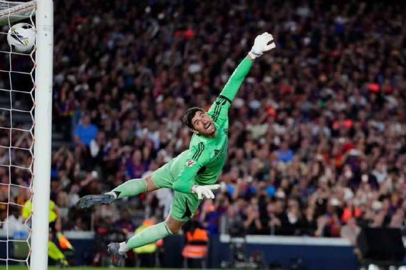

⚽️
⚽️ تونی کروس درباره گل مارکوس رشفورد: نمیشه گفت کورتوا میتونست کار بیشتری بکنه. یه ضربه عالی از یه فضای خیلی تنگ بود. اون یه قدم به سمت تیر دیگه برداشت، ولی نمیشه بابت این گل سرزنشش کرد، هیچ جوره نمیشد گرفت این توپ رو
@SportBaadNews

## SportBaadNews — post 251381

  <a href="telegram/content/SportBaadNews_251381_1778571458.mp4" target="_blank">🎬 Download video</a>

⚽️
⚽️ یه رئالی دیروز تو جشن آخر فصل بارسا جلو چشم بازیکنای بارسا و بقیه هوادار هاشون اینطوری کیت رئال رو میبره بالا که رافینیا و یامال و چند تا دیگه بازیکنا به کص و کونشون برمیخوره و شروع میکنن فاک نشون دادن بهش
@SportBaadNews

## SportBaadNews — post 251380

  <a href="telegram/content/SportBaadNews_251380_1778571460.webm" target="_blank">🎬 Download video</a>

🚨یامال پرچم فلسطین رو تو جشن امروز بارسا بالا برد @SportBaadNews

## SportBaadNews — post 251379

  

حس می‌کنم آرسنال دقیقاً شبیه این ماشینه توی انیمیشن «ماشین‌ها»ست؛ بیچاره هیچ‌کس دوستش نداره
@SportBaadNews

## SportBaadNews — post 251378

  <a href="telegram/content/SportBaadNews_251378_1778571461.webm" target="_blank">🎬 Download video</a>

🚨
⚽️ فقططططط و فقطططططط 30 روززززز تا شروع جام جهانی ⏳🔥
@SportBaadNews

## SportBaadNews — post 251377

  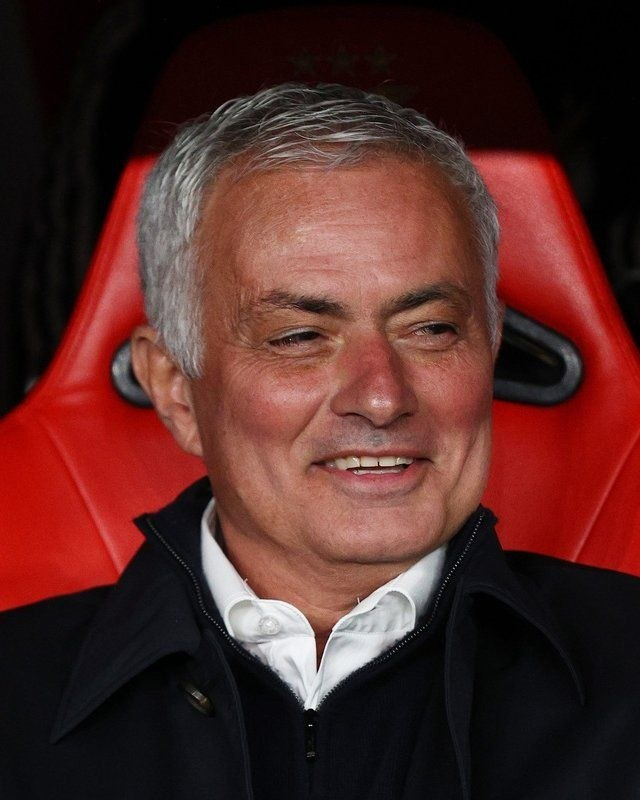

🎙خبرنگار: ماه مارس گفتی می‌خوای تو بنفیکا بمونی و به قراردادت احترام بذاری، و اگه پیشنهاد تمدید بدن بدون هیچ مشکلی امضا می‌کنی. با اتفاقایی که افتاده، اگه الان پیشنهاد تمدید بدن امضا می‌کنی؟

🔴 ژوزه مورینیو: نه. چیزی که مارس گفتم، مال همون موقع بود. دوشنبه میتونم درباره آینده‌م بهتون جواب بدم.
@SportBaadNews

## IranIntlTV — post 336766

  

ابراهیم رضایی، سخنگوی کمیسیون امنیت ملی مجلس، در شبکه اجتماعی ایکس نوشت یکی از گزینه‌های جمهوری اسلامی در صورت حمله مجدد می‌تواند غنی‌سازی ۹۰ درصد باشد.

او نوشت: «یکی از گزینه‌‌ها در صورت حمله مجدد می‌تواند غنی‌سازی ۹۰ درصد باشد. در مجلس بررسی می‌کنیم.»
https://iranintl.com/202605126303

## IranIntlTV — post 336765

  

ابراهیم رضایی، سخنگوی کمیسیون امنیت ملی مجلس، در شبکه اجتماعی ایکس نوشت یکی از گزینه‌های جمهوری اسلامی در صورت حمله مجدد می‌تواند غنی‌سازی ۹۰ درصد باشد.

او نوشت: «یکی از گزینه‌‌ها در صورت حمله مجدد می‌تواند غنی‌سازی ۹۰ درصد باشد. در مجلس بررسی می‌کنیم.»
https://iranintl.com/202605126303

## IranIntlTV — post 336764

  

ابراهیم رضایی، سخنگوی کمیسیون امنیت ملی مجلس، در شبکه اجتماعی ایکس نوشت یکی از گزینه‌های جمهوری اسلامی در صورت حمله مجدد می‌تواند غنی‌سازی ۹۰ درصد باشد.

او نوشت: «یکی از گزینه‌‌ها در صورت حمله مجدد می‌تواند غنی‌سازی ۹۰ درصد باشد. در مجلس بررسی می‌کنیم.»
https://iranintl.com/202605126303

## IranIntlTV — post 336763

  <a href="telegram/content/IranIntlTV_336763_1778571463.mp4" target="_blank">🎬 Download video</a>

اسرائیل به تصمیم اتحادیه اروپا برای تحریم برخی شهرک‌نشینان اسرائیلی در کرانه باختری واکنش نشان داد و با این اقدام مخالفت کرد.

بابک اسحاقی، خبرنگار ایران‌اینترنشنال، گزارش می‌دهد
@iranintltv

## IranIntlTV — post 336762

  <a href="telegram/content/IranIntlTV_336762_1778571465.mp4" target="_blank">🎬 Download video</a>

نمایشگاهی با هدف «بیدارسازی افکار عمومی» اروپا نسبت به نقض گسترده حقوق بشر و موج اعدام‌ها در ایران، به‌مدت یک ماه در شهرهای برلین، لاهه، آمستردام، بروکسل، پاریس و ژنو برگزار شد.

مهدی تهرانی، خبرنگار ایران‌اینترنشنال، گزارش می‌دهد
@iranintltv

## IranIntlTV — post 336761

  

وزارت خارجه پاکستان گزارش درباره اعزام هواپیماهای نظامی و غیرنظامی جمهوری اسلامی به پاکستان برای در امان ماندن از حملات، را «گمراه‌کننده» توصیف کرد و آن را رد کرد.

این وزارتخانه در بیانیه‌ای اعلام کرد که پس از برقراری آتش‌بس و در جریان مذاکرات، شماری از هواپیماها وارد پاکستان شدند تا جابه‌جایی تیم‌ها را تسهیل کنند و برخی از این هواپیماها و نیروهای پشتیبانی «به‌طور موقت» در این کشور باقی ماندند تا برای دورهای بعدی تعامل آماده باشند.

در این بیانیه آمده است: «هواپیماهای ایرانی که هم‌اکنون در پاکستان مستقر هستند، در دوره آتش‌بس وارد این کشور شدند و هیچ‌گونه ارتباطی با هیچ سناریوی نظامی یا ترتیبات حفاظتی ندارند.»

شبکه خبری سی‌بی‌اس به نقل از «مقام‌های آگاه آمریکایی» گزارش داده بود که جمهوری اسلامی، شماری از هواپیماهای نظامی خود را به پایگاه نورخان پاکستان و همچنین چند هواپیمای غیرنظامی را به افغانستان اعزام کرده است تا از خسارات ناشی از جنگ در امان بمانند.
https://iranintl.com/202605125000

## IranIntlTV — post 336760

🗣روایت شما از بحران اقتصادی و زندگی در آتش‌بس- سه‌شنبه ۲۲ اردیبهشت:

🔹دانه قهوه شده کیلویی ۲ میلیون تومان، قهوه فوری شده کیلویی ۳ میلیون تومان! دیگه نمی‌شه قهوه خورد

🔹لوازم بهداشتی به‌شدت گران شده‌ان. قیمت مام ضد تعریقی که می‌گرفتم ۲۰۰ هزار تومان به ۶۰۰ هزار تومان افزایش یافته.

🔹با ۲۸ میلیون حقوق ماهیانه، زندگی دو نفره رزیدنتی ما به بن‌بست رسیده. پس‌اندازهایمان تمام شده و حتی توان تعمیر وسایل را نداریم.

🔹من فارغ‌التحصیل ارشدم، دو سال با بدبختی پول جور کردم یه لپ‌تاپ خریدم تحقیقات انجام دادم همین که اومدم مقاله رو چاپ کنم نت قطع شد. این وضعیت برای یکی مثل من که هیچ‌وقت دست از تلاش برنمی‌داشتم یعنی خود مرگ.

🔹از میانکوه خوزستان پیام می‌دهم؛ منطقه یک انتقال گاز در سال جدید حقوق ارکان ثالث را پرداخت نکرده که سابقه نداشته، همیشه برج یک دستمزدها پرداخت می‌شد.

🔹جمهوری اسلامی دقیقا به سبک کارتل‌های مواد مخدر عمل می‌کند. یک عده وفادار به خودش را با تطمیع و پول‌پاشی نگه داشته، ملت ایران را ول کرده در فقر و گرونی دست و پا بزنند. الحق که جمهوری اسلامی جمع رذایل همه‌ حکومت‌های تاریخ است.

## IranIntlTV — post 336759

  <a href="https://t.me/IranintlTV/336759" target="_blank">📎 Download file</a>

🎧نسخه صوتی اخبار بامدادی | سه‌شنبه ۲۲ اردیبهشت
@iranintlTV

## IranIntlTV — post 336758

  

خبرگزاری میزان، رسانه قوه قضاییه جمهوری اسلامی، اعلام کرد که حکم اعدام عبدالجلیل شه‌بخش، زندانی بلوچ، بامداد سه‌شنبه ۲۲ اردیبهشت اجرا شده است. میزان اتهام او را «عضویت در گروه انصارالفرقان» و «بغی» عنوان کرده است.

در گزارش منتشرشده از سوی این رسانه، به تاریخ دقیق بازداشت عبدالجلیل شه‌بخش اشاره‌ای نشده است. همچنین پیشتر اطلاعی درباره بازداشت و روند طی شدن مراحل قضایی پرونده او منتشر نشده بود.
https://iranintl.com/202605126293

## IranIntlTV — post 336757

  <a href="telegram/content/IranIntlTV_336757_1778571468.mp4" target="_blank">🎬 Download video</a>

تصویری از یک راهب که هر صبح با گروهی از سگ‌های یک معبد در تایلند برای جمع‌آوری نذورات و غذا در اطراف محله حرکت می‌کند، در روزهای اخیر در شبکه‌های اجتماعی بازتاب گسترده‌ای داشته و میلیون‌ها بار دیده شده است.

گزارش فرزیا ثابتی، خبرنگار ایران‌اینترنشنال
@iranintltv

## IranIntlTV — post 336756

  <a href="telegram/content/IranIntlTV_336756_1778571469.mp4" target="_blank">🎬 Download video</a>

آیلین وانگ، شهردار شهر آرکادیا در ایالت کالیفرنیا، پس از متهم شدن به «همکاری پنهانی با دولت چین»، از سمت خود کناره‌گیری کرد.

گفت‌وگو با رضا گوهرزاد، روزنامه‌نگار و تحلیلگر سیاسی
@iranintltv

## IranIntlTV — post 336755

  <a href="telegram/content/IranIntlTV_336755_1778571471.mp4" target="_blank">🎬 Download video</a>

حمله به یک کشتی کره جنوبی در تنگه هرمز بازتاب گسترده‌ای در رسانه‌ها و محافل بین‌المللی داشته است. در همین ارتباط، سفیر جمهوری اسلامی در سئول هرگونه دخالت ایران در این حادثه را رد کرد.

گفت‌وگو با توماج طاهباز، خبرنگار ایران‌اینترنشنال
@iranintltv

## IranIntlTV — post 336754

  

جانشین پایگاه دریابانی بندرعباس از شناسایی و انهدام یک خط لوله انتقال سوخت قاچاق به طول شش کیلومتر خبر داد. به گزارش فارس، وابسته به سپاه، قاچاقچیان این خطوط لوله را زیر ماسه‌ها و آب دریا جاسازی کرده بودند و از آن طریق، سوخت را از ساحل به دریا و شناورهای متخلف انتقال می‌دادند.
https://iranintl.com/202605125372

## IranIntlTV — post 336753

  <a href="telegram/content/IranIntlTV_336753_1778571473.mp4" target="_blank">🎬 Download video</a>

🔻امانوئل مکرون، رییس‌جمهوری فرانسه، که برای شرکت در نشست «آفریقا فوروارد ۲۰۲۶» به کنیا سفر کرده است، صبح دوشنبه همراه با الیود کیپچوگه، قهرمان ماراتن المپیک‌های ۲۰۱۶ و ۲۰۲۰، دقایقی در خیابان‌های نایروبی، پایتخت کنیا دوید.

🔹الیود کیپچوگه با انتشار تصاویری درباره دویدن رییس‌جمهور فرانسه با او‌ نوشت: «فرصت داشتیم درباره این صحبت کنیم که چگونه می‌توانیم حمایت و فرصت‌های بیشتری برای نسل بعدی ورزشکاران آفریقایی فراهم کنیم.»

🔹او نوشت: «چنین لحظاتی به من یادآوری می‌کند که دویدن فراتر از حرکت است. این یک زبان جهانی است که مردم، فرهنگ‌ها و ایده‌ها را به هم پیوند می‌دهد.»

@iranintltvsport

## IranIntlTV — post 336752

  <a href="telegram/content/IranIntlTV_336752_1778571475.mp4" target="_blank">🎬 Download video</a>

دولت استرالیا از اعمال تحریم‌های جدید علیه مقام‌ها و نهادهای جمهوری اسلامی، از جمله وزیر کشور، فرماندهان امنیتی و نیروی انتظامی، به‌دلیل نقش آن‌ها در سرکوب معترضان و همچنین محدود کردن اینترنت در ایران خبر داد.

علیرضا محبی، خبرنگار ایران‌اینترنشنال،‌گزارش می‌دهد
@iranintltv

## IranIntlTV — post 336751

  <a href="telegram/content/IranIntlTV_336751_1778571477.mp4" target="_blank">🎬 Download video</a>

دونالد ترامپ، رییس‌جمهوری ایالات متحده، دوشنبه در کاخ سفید با تیم امنیت ملی و شماری از فرماندهان نظامی آمریکا درباره ایران گفت‌وگو کرد. بر اساس گزارش‌ها، در این نشست مسیر پیشروی جنگ با جمهوری اسلامی بررسی شد.

گزارش سمیرا قرایی، خبرنگار ایران‌اینترنشنال
@iranintltv

## IranIntlTV — post 336750

  <a href="telegram/content/IranIntlTV_336750_1778571478.mp4" target="_blank">🎬 Download video</a>

وزارت خزانه‌داری آمریکا دوشنبه ۱۲ فرد و نهاد مرتبط با سپاه پاسداران را به‌دلیل نقش آن‌ها در تسهیل فروش و انتقال نفت ایران به چین در فهرست تحریم‌های ایالات متحده قرار داد.

گفت‌وگو با امیر گیتی، عضو تحریریه ایران‌اینترنشنال
@iranintltv

## Persian_Trend_Official — post 13959

  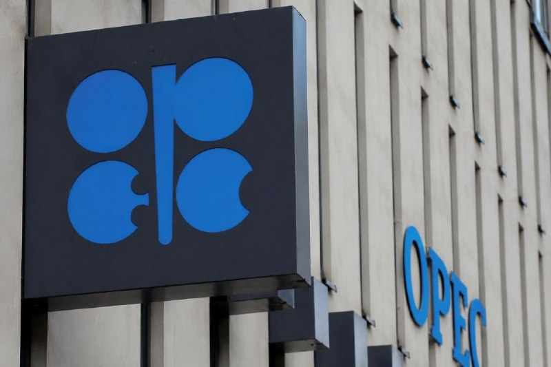

رویترز، تولید نفت اوپک در ماه آوریل بار دیگر کاهش یافت و به پایین‌ترین سطح خود در بیش از دو دهه گذشته رسید.

بر اساس این نظرسنجی، تولید نفت خام ۱۲ عضو اوپک نسبت به ماه قبل، روزانه ۸۳۰ هزار بشکه کاهش یافته و به ۲۰.۰۴ میلیون بشکه در روز رسیده است. همچنین برآورد تولید ماه مارس نیز، پس از بازنگری در داده‌های عربستان سعودی، ۷۰۰ هزار بشکه در روز کمتر اعلام شد.

کویت بیشترین افت تولید را در میان اعضای اوپک ثبت کرد. عربستان سعودی و عراق نیز کاهش قابل‌توجهی در تولید داشتند. در مقابل، امارات متحده عربی تنها تولیدکننده بزرگ خلیج فارس بود که توانست تولید خود را افزایش دهد؛ اقدامی که با بهره‌گیری از مسیرهای صادراتی خارج از تنگه هرمز امکان‌پذیر شد. داده‌های ردیابی نفتکش‌ها نیز افزایش صادرات امارات در ماه آوریل را تأیید می‌کند.

رویترز گزارش داده است که سطح تولید اوپک در آوریل، پایین‌ترین میزان از سال ۲۰۰۰ تاکنون بوده است؛ البته با در نظر گرفتن تغییرات بعدی در عضویت این سازمان.

علاوه بر امارات، ونزوئلا و لیبی نیز از جمله کشورهایی بودند که در ماه آوریل افزایش تولید را تجربه کردند.

☆Phantom☆

📌 @persian_trend_official
پرشین ترند | متفاوت‌ترین کانال نظامی

## Persian_Trend_Official — post 13958

🔴 ارتش اسرائیل: بیش از ۳۵۰ نیروی حزب‌الله در جنوب لبنان کشته شدند

ارتش اسرائیل اعلام کرد طی هفته‌های اخیر، در جریان عملیات‌های انجام‌شده در جنوب لبنان، بیش از ۳۵۰ نفر از نیروهایی که آن‌ها را «تهدیدی علیه غیرنظامیان و نیروهای اسرائیلی» توصیف کرده، کشته شده‌اند.

بر اساس بیانیه ارتش اسرائیل:

▪️ بیش از ۱۱۰۰ هدف وابسته به حزب‌الله نیز هدف حمله قرار گرفته است

▪️ این اهداف شامل:

▪️ساختمان‌های مورد استفاده نظامی

▪️انبارهای تسلیحات

▪️سکوهای آماده شلیک

▪️زیرساخت‌های وابسته به حزب‌الله

بوده‌اند.

ارتش اسرائیل تأکید کرده عملیات‌ها در چارچوب تفاهمات میان اسرائیل و لبنان و طبق دستور مقامات سیاسی ادامه خواهد داشت.

🫆:Tony

📌 @persian_trend_official
پرشین ترند | متفاوت‌ترین کانال نظامی

## Persian_Trend_Official — post 13957

  <a href="telegram/content/Persian_Trend_Official_13957_1778571481.webm" target="_blank">🎬 Download video</a>

سنتکام؛ در تاریخ ۹ مه یک هواپیمای B-1B لانسر نیروی هوایی ایالات متحده در طول یک مأموریت آموزشی بر فراز خاورمیانه پرواز می‌کند،

☆Phantom☆

📌 @persian_trend_official
پرشین ترند | متفاوت‌ترین کانال نظامی

## Persian_Trend_Official — post 13956

کانال رسمی پرشین ترند pinned a video

## Persian_Trend_Official — post 13955

  <a href="telegram/content/Persian_Trend_Official_13955_1778571481.mp4" target="_blank">🎬 Download video</a>

خب اینم ضد حمله جنگ تبلیغاتی لگویی
جرات داری نت رو وصل کن ببین جطور جواب اراجیفت رو مردم ایران میدن !

📌 @persian_trend_official
پرشین ترند | متفاوت‌ترین کانال نظامی

## Persian_Trend_Official — post 13954

  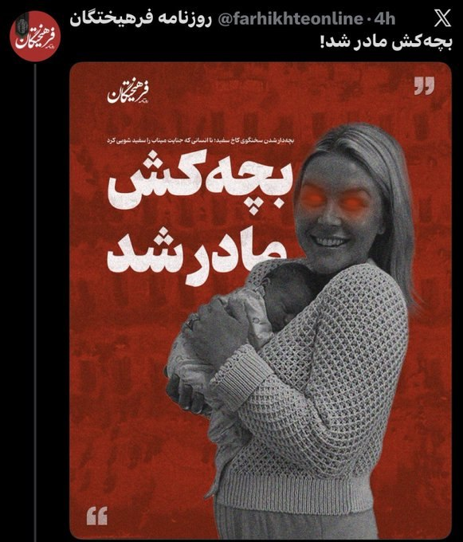

دو روز ۱۸ و ۱۹ دی ۱۴۰۴، ۲۳۶ کودک رو کشتید.
۵۵۵ بچه رو هم بازداشت کردید.
از جنایت هاتون در سوریه هم یه روزی وقتش برسه حرف میزنیم.
تاریخ قضاوت خواهد کرد بلایی که شما سر ایران آوردید مغول نیاورد ...

📌 @persian_trend_official
پرشین ترند | متفاوت‌ترین کانال نظامی

---
📅 بروزرسانی: 1405/02/22 08:24
---

## ChizBergerz — post 46315

  <a href="telegram/content/ChizBergerz_46315_1778561659.mp4" target="_blank">🎬 Download video</a>

یه شهروند آمریکایی: برام مهم نیست قیمت بنزین رفته بالا، تا وقتی ایران سلاح هسته‌ای نداشته باشه و بتونیم مردم ایران رو از دست حکومت اسلامی نجات بدیم. حاضرم ۲ دلار بیتشر برای بنزین بدم، همه باید آزاد باشن.

@ChizBergerz

## KiriMohems — post 47383

  <a href="telegram/content/KiriMohems_47383_1778561661.mp4" target="_blank">🎬 Download video</a>

#صبحانه_عن_گیزشی

کصخل ترینِ من...
تو را در حصار خایه هایم
جا میدهم
تا نبض حشرم
کوکِ کون قلمبه‌ات شَوَد
چه صبح دل انگیزی
که با یک اسپنک به باسنت
آغاز شَوَد

#Helsinki
@KiriMohems

## IranIntlTV — post 336749

  

وزارت خارجه استرالیا اعلام کرد این کشور سه‌شنبه ۲۲ اردیبهشت در واکنش به اقدامات جمهوری اسلامی در ادامه سرکوب خشونت‌بار مردم ایران، قطع اینترنت و ایجاد بی‌ثباتی در منطقه، تحریم‌های مالی هدفمند و ممنوعیت‌های سفر بیشتری را علیه هفت فرد و چهار نهاد حکومت ایران اعمال می‌کند.
هفت فرد و چهار نهادی که امروز تحریم شده‌اند، شامل مقام‌ها و نهادهای ارشدی هستند که در این اقدامات، از جمله خشونت علیه زنان و کودکان، نقش داشته‌اند.
یکی از این افراد مسئول هدایت سرکوب زنان و دختران در ایران بوده و با به‌کارگیری ۸۰ هزار نیرو، نظارت و اجرای حجاب اجباری را پیش برده است.
فرد دیگری پایگاه‌های اطلاعاتی محلی ایجاد کرده و با جمع‌آوری اطلاعات خانه‌به‌خانه و گشت‌زنی، مخالفان جمهوری اسلامی را شناسایی و مجازات کرده است.
برخی دیگر نیز مسئول بازداشت ناعادلانه شهروندان خارجی بوده‌اند.
این تحریم‌ها همچنین نظام بانکداری پنهان جمهوری اسلامی را هدف قرار می‌دهد.

https://iranintl.com/202605128683

## IranIntlTV — post 336748

  <a href="telegram/content/IranIntlTV_336748_1778561664.mp4" target="_blank">🎬 Download video</a>

جاویدنامان انقلاب ملی ایرانیان
«محمد جباری» در شامگاه ۱۸ دی‌ماه در اعتراضات کرج با شلیک مستقیم نیروهای سرکوب کشته شد. نامش در حافظه‌ی این سرزمین می‌ماند و یادش چراغ راه آزادی‌خواهان است.
@iranintltv

## IranIntlTV — post 336747

  <a href="telegram/content/IranIntlTV_336747_1778561666.mp4" target="_blank">🎬 Download video</a>

سرخط خبرهای سه‌شنبه ۲۲ اردیبهشت
@iranintltv

## IranIntlTV — post 336746

  <a href="telegram/content/IranIntlTV_336746_1778561668.mp4" target="_blank">🎬 Download video</a>

شهروندی از انزلی با ارسال پیامی به ایران‌اینترنشنال، درباره وضعیت قطعی برق در این شهر روایت می‌کند که «افتضاح» است و می‌گوید چند ساعت در روز برق را بدون اطلاع قطع می‌کنند و هنوز تابستان شروع نشده، جمهوری اسلامی عذاب دادن مردم را آغاز کرده‌ است.

## IranIntlTV — post 336745

  

چاک شومر، رهبر اقلیت دموکرات در سنا، در ایکس نوشت دموکرات‌های سنا در هفته جاری هفتمین قطعنامه اختیارات جنگی برای خروج نیروهای آمریکایی از در‌گیری‌‌ها با جمهوری اسلامی را به رای می‌گذارند. تاکنون شش قطعنامه دموکرات‌‌ها در این زمینه شکست خورده است.
شومر جنگ علیه جمهوری اسلامی را «جنگی پرهزینه و بدون هیچ هدف» دانست و افزود: «بهترین راه برای کاهش هزینه‌ها و پایان دادن به این هرج و مرج، پایان دادن به این جنگ غیرقانونی است.»

https://iranintl.com/202605123934

## IranIntlTV — post 336744

  

تامی پیگوت، سخنگوی وزارت خارجه آمریکا، درباره خواست ایالات‌متحده از توافق با جمهوری اسلامی به فاکس نیوز گفت: «ترامپ قرار است توافقی خوب برای مردم آمریکا انجام دهد که از ایالات متحده، جهان و نسل‌های آینده محافظت کند.»
او گفت: «هیچ ابهامی درباره آنچه ترامپ می‌خواهد وجود ندارد. آنچه او می‌خواهد این است که حکومت ایران نباید به سلاح هسته‌ای دست یابد.»
پیگوت افزود: «نکته مهم دیگر این است که ما در دوران دولت باراک اوباما شاهد یک توافق بد بودیم که به حکومت ایران نقشه راهی برای دستیابی به سلاح هسته‌ای داد.»

https://iranintl.com/202605122667

## IranIntlTV — post 336743

  <a href="telegram/content/IranIntlTV_336743_1778561671.mp4" target="_blank">🎬 Download video</a>

ارتش اسرائیل با انتشار ویدیویی در تلگرام، از انهدام تونل‌های حماس در نوار غزه خبر داد.
به گزارش ارتش اسرائیل، چهار تونل زیرزمینی، به طول مجموع حدود چهار کیلومتر، تخریب شدند. یکی از این تونل‌ها بخشی از مجموعه‌ای بود که به‌عنوان زیرساخت نگهداری گروگان‌ها مورد استفاده قرار می‌گرفت.

## IranIntlTV — post 336742

  <a href="telegram/content/IranIntlTV_336742_1778561673.mp4" target="_blank">🎬 Download video</a>

از مداحی بندری تا عروسی با جیپ جنگی؛
ازدواج نظامی برای زوج‌های «جان‌فدا»

سپاه تهران از برگزاری مراسم «پیوند آسمانی زوج‌های جان‌فدا» خبر داده؛ مراسمی که قرار است عروس و دامادها با جیپ‌های جنگی گل‌آرایی‌شده در سطح شهر حرکت کنند.

در شرایطی که جوانان با بحران اقتصادی، بیکاری، مهاجرت و دشواری ازدواج روبه‌رو هستند، نظامی‌کردن حتی مراسم عروسی، نشانه‌ای از گسترش نگاه امنیتی جمهوری اسلامی به تمام ابعاد زندگی مردم است.

کامبیز حسینی در «برنامه» به این موضوع می‌پردازد.

«یک ایران صدای شما را می‌شنود»
دوشنبه تا پنجشنبه ۱۱ شب تهران
از تلویزیون ایران اینترنشنال

تماشای نسخه کامل این قسمت از «برنامه» در یوتیوب:
https://youtu.be/upmpJfvQdS8
@iranintltv

## IranIntlTV — post 336741

  <a href="telegram/content/IranIntlTV_336741_1778561676.mp4" target="_blank">🎬 Download video</a>

رویا از آلمان: مردم نمی‌دانند نان بخرند برای خوردن یا استامینوفن برای دردشان

«یک ایران صدای شما را می‌شنود»
دوشنبه تا پنجشنبه ۱۱ شب تهران
از تلویزیون ایران اینترنشنال

تماشای نسخه کامل این قسمت از «برنامه» در یوتیوب:
https://youtu.be/upmpJfvQdS8
@iranintltv

## IranIntlTV — post 336740

  

پلیس منطقه یورک تورنتو کانادا اعلام کرد فردی به نام مهران محققی، ۳۹ ساله را در ارتباط با حادثه‌ای در جریان تجمع ایرانیان علیه جمهوری اسلامی بازداشت کرده است. این شخص به رانندگی خطرناک نزدیک تجمع، حمله با سلاح، تهدید تجمع‌کنندگان و فرار پس از تصادف متهم شده است.
طبق گزارش‌های ارائه شده به پلیس، این فرد یک‌شنبه ۲۰ اردیبهشت با رانندگی خطرناک به این تجمع نزدیک شد و پرچم جمهوری اسلامی را تکان می‌داد. او پس از برخورد به راننده یک خودروی تحویل غذا سعی داشت متواری شود، اما پس از برخورد با یک خودروی دیگر متوقف شد.
طبق گزارش پلیس یورک، مظنون سپس خودرو را متوقف کرد تا معترضان را تهدید کند و پس از آن بازداشت شد. یک فرد مصدوم در این حادثه با جراحات جزئی به بیمارستان منتقل شده است.
پلیس کانادا گفت تحقیقات درباره این پرونده همچنان ادامه دارد و جزئیات بیشتر پس از تکمیل بررسی‌ها منتشر خواهد شد.
پلیس از شاهدانی که هنوز با بازرسان گفت‌وگو نکرده‌اند و یا افرادی که فیلم و تصویری از این حمله دارند خواست هرچه سریع‌تر برای ارائه اطلاعات خود به پلیس مراجعه کنند.

https://iranintl.com/202605126848

## IranIntlTV — post 336739

  <a href="telegram/content/IranIntlTV_336739_1778561679.mp4" target="_blank">🎬 Download video</a>

افشار از تهران: من پرستارم. فروردین ۱۵ میلیون تومان به من دادند که حتی نصف حقوقم هم نیست

«یک ایران صدای شما را می‌شنود»
دوشنبه تا پنجشنبه ۱۱ شب تهران
از تلویزیون ایران اینترنشنال

تماشای نسخه کامل این قسمت از «برنامه» در یوتیوب:
https://youtu.be/upmpJfvQdS8
@iranintltv

## IranIntlTV — post 336738

  <a href="telegram/content/IranIntlTV_336738_1778561682.mp4" target="_blank">🎬 Download video</a>

مازیار از رشت: قیمت داروهای بیماران ام‌اس و دیابتی‌ها ۵ تا ۶ برابر شده است

«یک ایران صدای شما را می‌شنود»
دوشنبه تا پنجشنبه ۱۱ شب تهران
از تلویزیون ایران اینترنشنال

تماشای نسخه کامل این قسمت از «برنامه» در یوتیوب:
https://youtu.be/upmpJfvQdS8
@iranintltv

## IranIntlTV — post 336737

  <a href="telegram/content/IranIntlTV_336737_1778561684.mp4" target="_blank">🎬 Download video</a>

شهیاد از بجنورد: رفتم برای نوه‌ام دارو بگیرم؛ دیدم قیمت سه برابر شده، همان هم پیدا نمی‌شود

«یک ایران صدای شما را می‌شنود»
دوشنبه تا پنجشنبه ۱۱ شب تهران
از تلویزیون ایران اینترنشنال

تماشای نسخه کامل این قسمت از «برنامه» در یوتیوب:
https://youtu.be/upmpJfvQdS8
@iranintltv

## IranIntlTV — post 336736

  <a href="telegram/content/IranIntlTV_336736_1778561687.mp4" target="_blank">🎬 Download video</a>

رسانه‌های اسرائیلی گزارش دادند پس از رد پاسخ تهران از سوی دونالد ترامپ، بنیامین نتانیاهو جلسه امنیتی فوری برگزار کرده است.

بنابر این گزارش‌ها، نتانیاهو برای حضور در این نشست، جلسه دادگاه خود را ترک کرده است.

گفت‌وگو با بن سبطی، پژوهشگر ایران و اسرائیل
@iranintltv

## IranIntlTV — post 336735

  <a href="telegram/content/IranIntlTV_336735_1778561689.mp4" target="_blank">🎬 Download video</a>

وزارت خزانه‌داری آمریکا ۱۲ فرد و نهاد مرتبط با سپاه پاسداران را به‌دلیل نقش آن‌ها در تسهیل فروش و انتقال نفت ایران به چین تحریم کرد.

گفت‌وگو با فرهاد علوی، حقوقدان و کارشناس تحریم مالی و بانکی
@iranintltv

## IranIntlTV — post 336734

  <a href="telegram/content/IranIntlTV_336734_1778561692.mp4" target="_blank">🎬 Download video</a>

دونالد ترامپ در کاخ سفید با تیم امنیت ملی و شماری از فرماندهان نظامی آمریکا درباره ایران گفت‌وگو کرد.

براساس گزارش‌ها، در این نشست مسیر پیش‌روی جنگ با جمهوری اسلامی مورد بررسی قرار گرفت.

گزارش مرضیه حسینی، خبرنگار ایران‌اینترنشنال
@iranintltv

## IranIntlTV — post 336733

  <a href="telegram/content/IranIntlTV_336733_1778561694.mp4" target="_blank">🎬 Download video</a>

حسین افشین، معاون علمی و فناوری مسعود پزشکیان، در مصاحبه‌ای، ضمن اشاره به اینکه حتی در زمان جنگ هم بستن اینترنت نمی‌تواند راهکار باشد، گفت: «دیدیم وقتی اینترنت کاملا بسته بود، ترورها [هنوز] وجود داشت.»

نت‌بلاکس، نهاد ناظر بر اختلال‌های اینترنتی، دوشنبه اعلام کرد قطعی اینترنت وارد هفتادوسومین روز خود شده است.

بر اساس این گزارش، دسترسی آزاد به اینترنت حقی است که زیربنای همه آزادی‌های دیگر به شمار می‌رود و محرومیت از آن، توانایی مردم برای مستندسازی و رسیدگی به نقض‌های بنیادین حقوق بشر را به‌شدت محدود می‌کند.
@iranintltv

## Persian_Trend_Official — post 13953

#صبحانه_خبری

📍 بولتن صبحگاهی پرشین ترند
🗓 ۲۲ اردیبهشت ۱۴۰۵

━━━━━━━━━━━━━━

◾️ ایران به فرانسه و بریتانیا درباره حضور نظامی در تنگه هرمز هشدار داد

◾️ بیش از ۴۰ کشور درباره اسکورت کشتی‌ها در هرمز جلسه برگزار می‌کنند

◾️ ترامپ در حال بررسی گسترش «پروژه آزادی» در تنگه هرمز است

◾️ تمرکز مذاکرات تهران و واشنگتن روی پایان جنگ و امنیت هرمز قرار گرفت

◾️ ناو هواپیمابر شارل دوگل وارد دریای سرخ شد

◾️ جنگنده‌ها و سوخت‌رسان‌های فرانسوی به سمت خاورمیانه حرکت کردند

◾️ سنتکام: بیش از ۲۰ ناو جنگی آمریکا در محاصره دریایی ایران مشارکت دارند

◾️ دومین سیگنال اضطراری F-35 آمریکا طی ۲۴ ساعت گذشته ثبت شد

◾️ نفتکش قطری مسیر خود را در تنگه هرمز تغییر داد

◾️ حمله به کشتی فله‌بر نزدیک قطر نگرانی امنیت دریایی را افزایش داد

◾️ فرمانده نیروی دریایی ایران: زیردریایی‌های سبک به هرمز اعزام شدند

◾️ اتحادیه اروپا: تمرکز فعلی بر بازگشایی تنگه هرمز است

◾️ ترامپ چین را درباره روابطش با ایران تحت فشار قرار می‌دهد

◾️ احتمال ارسال سامانه‌های پدافندی چین به ایران بررسی می‌شود

◾️ نتانیاهو: سقوط حکومت ایران ممکن است اما تضمینی نیست

◾️ نتانیاهو: چین در تولید موشک به ایران کمک کرده است

◾️ اسرائیل آماده گسترش عملیات زمینی در لبنان می‌شود

◾️ رئیس رافائل: اسرائیل کمبود موشک رهگیر ندارد

◾️ ترکیه نخستین زیردریایی کوچک اژدرافکن خود را آزمایش کرد

◾️ ترکیه تولید انبوه بمب هدایت‌شونده TOLUN را آغاز کرد

◾️ عرفان شکورزاده به اتهام همکاری با موساد و سیا اعدام شد

◾️ وزارت اطلاعات: دو هسته وابسته به موساد متلاشی شدند

◾️ احتمال سفر عراقچی به هند برای نشست بریکس

◾️ تماس تلفنی عراقچی و وزیر خارجه عربستان درباره مذاکرات با آمریکا

◾️ کره جنوبی حمله به کشتی باری خود را محکوم کرد

◾️ جنگ ایران امنیت غذایی آسیا را تحت تاثیر قرار داده است

◾️ اروپا درباره تبعات اقتصادی جنگ ایران هشدار داد

◾️ پدافند ایران یک پهپاد شناسایی «دشمن» را سرنگون کرد

━━━━━━━━━━━━━━
📌 @persian_trend_official
پرشین ترند | متفاوت‌ترین کانال نظامی

## Persian_Trend_Official — post 13952

  

امروز میخوام یه ویدیو تحلیلی در مورد این تصویر برم

اما به نظر شما چه اتفاقاتی از این پیشبینی محقق شده ؟

## Persian_Trend_Official — post 13951

  <a href="telegram/content/Persian_Trend_Official_13951_1778561696.mp4" target="_blank">🎬 Download video</a>

صبحتون بخیر ❤️

📝 Nick
📌 @persian_trend_official
پرشین ترند | متفاوت‌ترین کانال نظامی

---
📅 بروزرسانی: 1405/02/22 04:54
---

## IranIntlTV — post 336732

  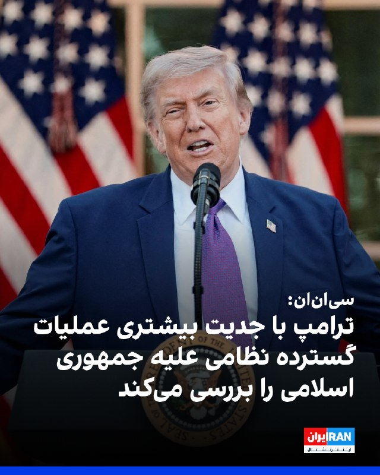

سی‌ان‌ان به نقل از منابع آگاه گزارش داد ترامپ به طور فزاینده‌ای از نحوه مدیریت مذاکرات از سوی مقام‌های ایران ابراز نارضایتی می‌کند و برخی از دستیاران او می‌گویند که ترامپ اکنون نسبت به هفته‌های اخیر، با جدیت بیشتری در حال بررسی ازسرگیری عملیات گسترده نظامی است.
به گفته منابع آگاه از گفت‌وگوها، ترامپ از ادامه بسته بودن تنگه هرمز و نیز آنچه آن را اختلاف در رهبری ایران می‌داند که مانع ارائه امتیازهای اساسی در مذاکرات هسته‌ای می‌شود، بی‌صبر شده است. آن‌ها گفتند آخرین پاسخ ایران که ترامپ آن را «کاملا غیرقابل قبول» و «احمقانه» خوانده، باعث شده چندین مقام این پرسش را مطرح کنند که آیا تهران مایل است موضعی جدی در مذاکرات اتخاذ کند یا نه.
به گفته این منابع، در داخل دولت آمریکا دیدگاه‌های متفاوتی درباره نحوه پیشبرد کار وجود دارد. برخی استدلال کرده‌اند که برای اعمال فشار بر تهران به منظور بازگرداندن آن‌ها به میز مذاکره باید رویکردی تهاجمی‌تر، از جمله حملات هدفمند، در پیش گرفت. با این حال، برخی دیگر همچنان بر این باورند که باید به دیپلماسی فرصت منصفانه‌ای داده شود.

https://iranintl.com/202605126803

## IranIntlTV — post 336731

  

قالیباف در ایکس نوشت: «هیچ جایگزینی جز پذیرش آنچه در طرح ۱۴ ماده‌ای پیشنهادی تهران آمده، وجود ندارد. هر رویکرد دیگری کاملا بی‌نتیجه خواهد بود و چیزی جز یک شکست از پس شکستی دیگر نخواهد داشت. هرچه بیشتر تعلل کنند، هزینه بیشتری بر دوش مالیات‌دهندگان آمریکایی خواهد بود.»
https://iranintl.com/202605120458

## IranIntlTV — post 336730

  

وال استریت ژورنال به نقل از مقام‌های آمریکایی آگاه گزارش‌ها داد که ترامپ از درز اطلاعات محرمانه مربوط به جنگ با جمهوری اسلامی به رسانه‌ها ابراز خشم کرده و از وزارت دادگستری خواسته است که این پرونده‌ها را به طور جدی‌تری پیگیری کنند.
به گفته افرادی که در جریان درخواست‌ها بودند، دادستان‌ها در ماه‌های اخیر برای رسانه‌ها و نیز ارائه‌دهندگان خدمات ایمیل و تلفن در چارچوب تحقیقات مربوط به افشاگری‌ها احضاریه ارسال کرده‌اند.
مقام‌ها گفتند ترامپ ماه گذشته به طور مشخص از مقاله‌ای در تاریخ ۷ آوریل در نیویورک تایمز خشمگین بود که توضیح می‌داد چگونه بنیامین نتانیاهو، نخست‌وزیر اسرائیل، ترامپ را برای بمباران ایران ترغیب کرده است. این گزارش جزئیات روشنی از نشست‌های مقام‌های ارشد درباره این موضوع، از جمله جلساتی در اتاق وضعیت محرمانه، ارائه کرده بود.

https://iranintl.com/202605123621

## IranIntlTV — post 336729

  <a href="telegram/content/IranIntlTV_336729_1778549045.mp4" target="_blank">🎬 Download video</a>

ویدیوهای دریافت‌شده نشان می‌دهد جمعی از ایرانیان مقیم آلمان، روز یک‌شنبه ۲۰ اردیبهشت، در پی فراخوان شاهزاده رضا پهلوی، هم‌صدا با کارزار جهانی «یک ملت در گروگان» علیه اعدام‌های جمهوری اسلامی و قطع اینترنت کاروانی از موتورها و خودروها را در اشتوتگارت به حرکت درآوردند و حمایت خود را از مردم ایران نشان دادند.

## IranIntlTV — post 336720

در این فهرست،
زندگی‌ها درست در آغاز راه متوقف شدند؛
کسی که می‌خواست به دوستانش هشدار بدهد،
کسی که تازه کار موردعلاقه‌اش را شروع کرده بود،
دختری که مقاومت کرد،
و جوانی که پیکرش در سکوت و ارعاب دفن شود.

وحید هاشمی، محمدمهدی رضایی آدریانی، ساغر سیف‌اللهی، رضا اکبری، نیما عباسی، عرفان صفری، علی (فرزان) عربی و محمد جهاندیده

جاویدنامان انقلاب ملی ایرانیان؛
نام‌هایی که با هر تکرار، یادآوری می‌کنند این فهرست فقط از مرگ نوشته نشده؛ از زندگی‌هایی‌ست که ناگهان ناتمام ماندند.
#جاویدنامان_انقلاب_ملی_ایرانیان

---
📅 بروزرسانی: 1405/02/22 03:09
---

## rodast_omiddana — post 71265

🚫 درود امید جان
من و رفقام هر شب جمع میشیم برنامه شمارو نگا میکنیم
هر وقت میگید یه لعنت بر حسین بفرستید همگی یه لعنت بر حسین دسته جمعی میگیم خیلی جوابه 😂😂
خلاصه بگم نه حرف داری نه حریف زنده باشی
چاکرتم از تبریز🌹

## rodast_omiddana — post 71264

  <a href="telegram/content/rodast_omiddana_71264_1778542748.webm" target="_blank">🎬 Download video</a>

🚨 خواستم بگم سال ۲۰۱۸ که آمریکا به سوریه حمله کرد، ترامپ توی همون لحظه حمله، پای میز مذاکره با شی جی‌پینگ نشسته بود..
تیک تاک..

## rodast_omiddana — post 71263

  <a href="https://t.me/rodast_omiddana/71263" target="_blank">📎 Download file</a>

🔈 حجم فشرده_ ترامپ: جمهوری اسلامی را در یک روز دوباره نابود می‌کنیم_دارم میرم چین تا کار رژیم را تمام کنم

## rodast_omiddana — post 71262

  <a href="https://t.me/rodast_omiddana/71262" target="_blank">📎 Download file</a>

🔈 حجم کم_ ترامپ: جمهوری اسلامی را در یک روز دوباره نابود می‌کنیم_دارم میرم چین تا کار رژیم را تمام کنم

## rodast_omiddana — post 71261

  <a href="https://t.me/rodast_omiddana/71261" target="_blank">📎 Download file</a>

🔈 ترامپ: جمهوری اسلامی را در یک روز دوباره نابود می‌کنیم_دارم میرم چین تا کار رژیم را تمام کنم

## rodast_omiddana — post 71259

▶️ کیفیت 360_ترامپ: جمهوری اسلامی را در یک روز دوباره نابود می‌کنیم_دارم میرم چین تا کار رژیم را تمام کنم

## rodast_omiddana — post 71258

▶️ کیفیت 144_ترامپ: جمهوری اسلامی را در یک روز دوباره نابود می‌کنیم_دارم میرم چین تا کار رژیم را تمام کنم

## rodast_omiddana — post 71257

🚫 این وسط ماهایی که از اول جنگ میگیم امید دانا رو گوش بدید بقیه دارن سرود مینوازند چقد فحش میخوردیم 😂 الان نصف همینایی که فحش میدادن بدون دیدن برنامه های هرشبت خوابشون نمیبره ❤️‍🔥

خیلی خوشحااااالم از اینکه داری دل همه ی مردم واقعی ایران و به دست میاری ادامه بده بهترین، پشتتیم ❤️‍🔥

## rodast_omiddana — post 71256

  <a href="telegram/content/rodast_omiddana_71256_1778542749.webm" target="_blank">🎬 Download video</a>

🚨 دوستان امشب فایلهای برنامه هنوز آماده نشده منتظرم خروجی بگیرم به مشکل فنی خوردیم ❤️ تا کمتر از یکساعت دیگه در کانال میزاریم

## rodast_omiddana — post 71255

🚫 آقای امید دانا همین الان دارم از ایران و شبکه ملیگ تی‌وی برنامه شما رو با خانواده میبینم و واقعا تبدیل شدید به تنها تحلیلگری که حرفش برای ما قابل اعتماده هروقت می‌نشینیم دای تلویزیون به بابام میگم بزنه شبکه ملی گرایان که امید دانا ببینیم😅 خلاصه که خیلی کار شما درسته و واقعا آدم فرهیخته و خردمندی هستید و کل خانوادمون شما رو دوست داره عشق از کرج🙏❤️‍🔥

## KiriMohems — post 47382

  <a href="telegram/content/KiriMohems_47382_1778542750.mp4" target="_blank">🎬 Download video</a>

🔴ناموصا کف تهرون انقلاب شده و ما دست به کون موندیم ؟
#Helsinki
@KiriMohems

## KiriMohems — post 47381

  <a href="telegram/content/KiriMohems_47381_1778542751.mp4" target="_blank">🎬 Download video</a>

😤میخوای از پیش بینی فوتبال و شرط بندی پول دربیاری ؟!

⚠️پس همین الان وارد کانال عمو بت باز شو
چون بهت اموزش میده چطور پول دربیاری
❗️

اینجا میتونی روزانه درامد داشته باشی و سرمایت چندبرابر کنی پس از دستش نده و عضو شو امار سوداش چک‌کن
😍

💵عمو قدیمی کاره و خاک این کارو‌خورده کنارش باش و حرفه ای پول دربیار
💵
A21🅰

👍ادرس عضویت کانال vip:
https://t.me/+8LLMpXUfhW43ZjVk
https://t.me/+8LLMpXUfhW43ZjVk

## KiriMohems — post 47379

  

📰وال استریت  ژورنال:

امارات بیخایگان عربی در نخستین روز اعلام آتش بس ترامپ در جنگ ۴۰ روزه علیه چاک کون جمهوری اسلامی، به پالایشگاه لاوان در ایران حمله کرده ولی تخم لاپاش نبوده و مسئولیتش رو گردن نگرفته. این پالایشگاه پس از حمله برای ماه ها از مدار تولید خارج شده.
ایران هم گفته کص ننت و این حمله رو همون روز با حمله متقابل به امارات و کویت جواب داده.

#Helsinki
@KiriMohems

## KiriMohems — post 47378

  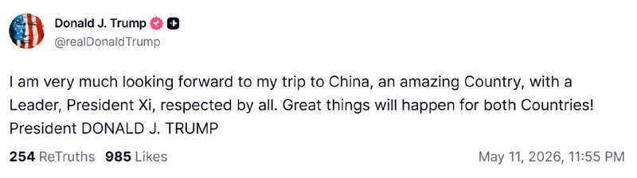

🇺🇸ترامپ گوریل :

عنم روون شده و مشتاقم تا به چین سفر کنم، کشوری سکسی، با رهبری، رئیس‌جمهور شی، که مورد خایمالی همه است. اتفاقات بزرگی برای هر دو کشور خواهد افتاد!» - رئیس‌جمهور ترانس چیز یعنی ترامپ.

#Helsinki
@KiriMohems

## SportBaadNews — post 251374

  <a href="telegram/content/SportBaadNews_251374_1778542753.webm" target="_blank">🎬 Download video</a>

شات های جدید جورجینا 
🤭
🤭
@SportBaadNews

## IranIntlTV — post 336719

  

وزارت خارجه آمریکا بر اساس برنامه «پاداش برای عدالت» این وزارتخانه تا سقف ۱۵ میلیون دلار برای اطلاعاتی که به مختل شدن سازوکارهای مالی سپاه و شاخه‌های مختلف آن منجر شود، پاداش تعیین کرد.
پیش‌تر در روز دوشنبه، دولت آمریکا تحریم‌های جدیدی مرتبط با جمهوری اسلامی علیه سه فرد و ۹ نهاد، از جمله چهار نهاد مستقر در هنگ‌کنگ، چهار نهاد در امارات متحده عربی و یک نهاد در عمان وضع کرد.

https://iranintl.com/202605119344

## IranIntlTV — post 336718

  <a href="telegram/content/IranIntlTV_336718_1778542754.mp4" target="_blank">🎬 Download video</a>

شهروندی با ارسال پیامی به ایران‌اینترنشنال، به مزاحمت‌های شبانه حامیان جمهوری اسلامی در خیابان‌های کرج اشاره می‌کند و می‌گوید آن‌ها هیچ ملاحظه‌ای برای کسی ندارند.
او در ادامه می‌گوید: «کسی به داد ما نمی‌رسد؛ جوانان ما دارند از بین می‌روند.»

## Persian_Trend_Official — post 13950

  <a href="telegram/content/Persian_Trend_Official_13950_1778542755.mp4" target="_blank">🎬 Download video</a>

شبتون بخیر 🔥
📝 Nick

---
📅 بروزرسانی: 1405/02/22 02:08
---

## arianheidarii — post 20033

⚠️ جلسه‌ی اول کلاس ریاضیات تجربی ویژه امتحان نهایی دوازدهم (آفلاین) :

https://www.aparat.com/v/jyiglsb

## ChizBergerz — post 46314

  <a href="telegram/content/ChizBergerz_46314_1778539124.mp4" target="_blank">🎬 Download video</a>

جوری که موش‌تباه تو بیت رهخری زنده موند:

@ChizBergerz

## ChizBergerz — post 46313

  <a href="telegram/content/ChizBergerz_46313_1778539126.mp4" target="_blank">🎬 Download video</a>

بچه ها اسم این بازی عبور مرغ از خیابون  هست ویدئو نگاه کنید خیلی راحت 8 میلیون ازش سود گرفتیم😍

😤اگ توم دوس داری خیلی راحت از بازی های انلاین پول در بیاری حتما عضو کازینو شبانه شو
✅

توی کازینو شبانه بهت اموزش میدیم از بازی های انلاین پول دربیاری👌

کازینو شبانه راهی برای چند برابر کردن سرمایت 🤷‍♂

کسب درامد انلاین با یه ادم حرفه ای یاد بگیر و‌ پول دربیار 
💵
ae21
🎯همین حالا عضو شو و شروع کن👇
https://t.me/+OS-QBvyDO4M2ZGY0
https://t.me/+OS-QBvyDO4M2ZGY0

## ChizBergerz — post 46310

  <a href="telegram/content/ChizBergerz_46310_1778539128.mp4" target="_blank">🎬 Download video</a>

فوت فتیشا بیان بالا. سیدنی سوئینی تو قسمت جدید سریال یوفوریا پاهای خودشو میخوره! @ChizBergerz

## rodast_omiddana — post 71254

🚫 سلام امید جان
من چند ماهه تو کانال شما عضو هستم
شاید باورت نشه
تو این شرایط سخت اقتصادی ایران
من و همسرم دونفری کار می‌کنیم
فقط یه چیزی حالمونو خوب میکنه
شب که از سرکار میایم
همسرم میره چایی میزاره
میشینیم با ذوق پیام های کانالتو چک میکنیم
اینقد همسرم خوشحال میشه از جنگ صحبت میکنی
تنها دلخوشیمون الان کانال شماست
که آخر شب میشینیم تک به تک نگاه می‌کنیم
بعضی از خبرهارو که می‌خونیم همسرم از خوشحالی بلند میشه آهنگ میزاره میرقصه😍😍😍😍😍😍😍😍😍
خلاصه تو دل ما خیلی جا داری😘😘😘❤️❤️❤️

## rodast_omiddana — post 71253

🚫 سلام امید جان امیدوارم حالت خوب باشه
این پیام آخر توی کانالتو دیدم گفتم منم اینو بگم
مادربزرگ من که ۷۳ سالشه و هر عید قربون گوسفند قربونی میکنه و هر محرم حلیم نذری میده. الان ویسای تو رو گوش می‌کنه و از حسین مظلوم رسیده به جایی که وقتی میگی یه لعنت بر حسین بفرستین اونم از ته دل لعنت میفرسته😂😂

## rodast_omiddana — post 71252

  <a href="telegram/content/rodast_omiddana_71252_1778539130.webm" target="_blank">🎬 Download video</a>

🚨 والا اسرائیل به نقل از منابع:
"واشنگتن یک هفته پیش‌در آستانه تصمیم گیری برای از سرگیری حملات به ایران بود
افراد نزدیک به ترامپ هفته گذشته در آخرین لحظه او را متقاعد کردند که تصمیم به بازگشت به جنگ را متوقف کند."

## rodast_omiddana — post 71251

  <a href="telegram/content/rodast_omiddana_71251_1778539130.webm" target="_blank">🎬 Download video</a>

🚨 آکسیوس:
"ترامپ در حال بررسی دو گزینه‌ست
یا از سرگیری «پروژه آزادی» که هفته گذشته به حالت تعلیق درآمد
یا از سرگیری بمباران و حمله به ۲۵٪ از اهدافی که آمریکا شناسایی کرده اما هنوز به آنها حمله نکرده - و امشب با ژنرال‌ها جلسه دارد!"

تیک تاک...

## rodast_omiddana — post 71250

  <a href="telegram/content/rodast_omiddana_71250_1778539130.webm" target="_blank">🎬 Download video</a>

🚨سلام حدودا 1:47
در شهر قزوین صدای انفجار اومد
فکر کنم پدافند بود
خبری شده ؟

## rodast_omiddana — post 71249

😎 امید جان سلام
به لطف تو من تونستم زشتی فحش دادن به ائمه معصوم مادر نسکافه رو از بین ببرم و پرده این قضیه رو تو خانوادمون پاره کردم
مرسی ازت❤️

## rodast_omiddana — post 71248

  <a href="telegram/content/rodast_omiddana_71248_1778539131.webm" target="_blank">🎬 Download video</a>

🚨 تصاویری از نفتکش رژیم که شب گذشته در نزدیک جاسک مورد هدف قرار گرفت و همچنان در آتش میسوزد ... تمام خدمه سالم هستند.

## rodast_omiddana — post 71247

  <a href="telegram/content/rodast_omiddana_71247_1778539131.mp4" target="_blank">🎬 Download video</a>

🚨
🚨
🚨و.یدئویی دیگر از زیردریایی موشک بالستیک کلاس اوهایو USS Alaska (SSBN-732) که از جبل الطارق عبور کرده و به سمت منطقه ست..

## KiriMohems — post 47377

  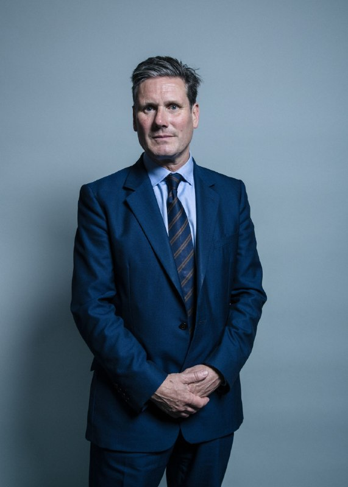

🔴آقای کیر ، نخست وزیر انگلیس: کص خارتون ، استعفا نمیدم

#Helsinki
@KiriMohems

## KiriMohems — post 47376

  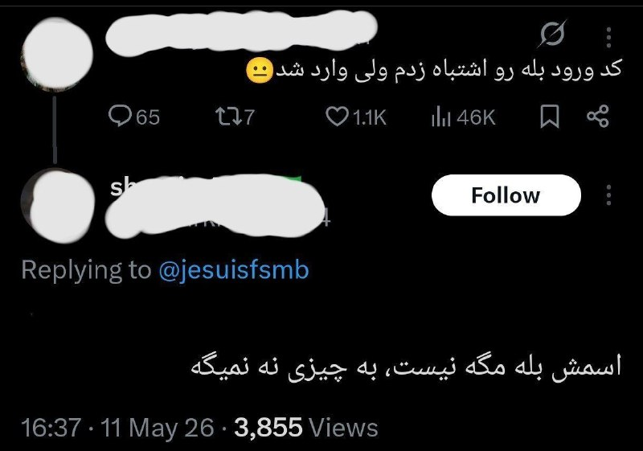

🔴امنیت فوق العاده لاتی پیام رسان داخلی بله رو مشاهده میکنید که ناموص برای تلگرام نذاشته

#Helsinki
@KiriMohems

## SportBaadNews — post 251372

  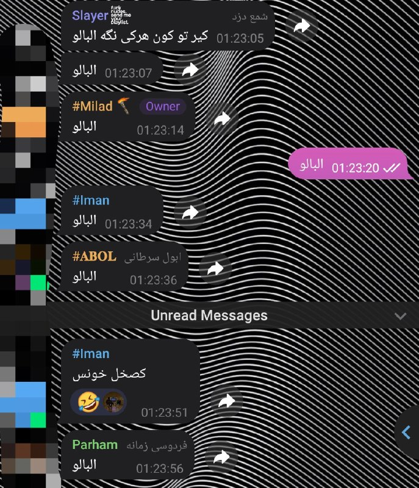

وضعیت گپ ادمینای بدنیوز خیلی خرابه
@SportBaadNews

## SportBaadNews — post 251371

الکی عمرمون رو سر فوتبال تلف کردیم این هوادار لیکرز این روزا به شدت غوغا به پا کرده و ملت روش کراش زدن @SportBaadNews

## SportBaadNews — post 251370

  <a href="telegram/content/SportBaadNews_251370_1778539136.mp4" target="_blank">🎬 Download video</a>

الکی عمرمون رو سر فوتبال تلف کردیم

این هوادار لیکرز این روزا به شدت غوغا به پا کرده و ملت روش کراش زدن
@SportBaadNews

## SportBaadNews — post 251369

  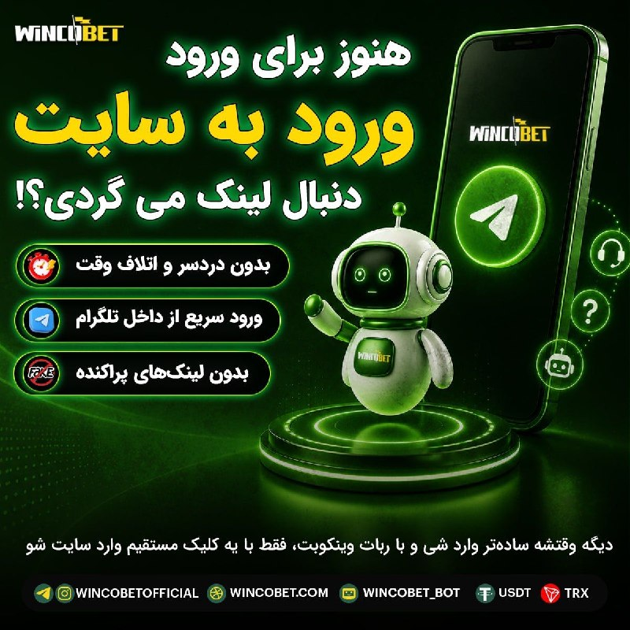

🟢 دسترسی سریع به سایت وینکوبت

✅ کاربران عزیز، برای ورود آسان و بدون دردسر به سایت وینکوبت، می‌توانید از ربات رسمی استفاده کنید: 
👇

🤖 @Wincobet_bot

🤖 @Wincobet_bot

🔹 ورود سریع و مستقیم به سایت
🔹 بدون نیاز به جستجوی لینک‌های مختلف
🔹 دسترسی راحت از داخل تلگرام

📌  همه چیز به ساده‌ترین شکل ممکن داخل ربات برای شما کاربران محترم فراهم شده.

🔗 اگر دنبال یه راه مطمئن و سریع برای ورود هستید، ربات وینکوبت بهترین انتخاب شماست:

🤖 @Wincobet_bot

🔗 برای دریافت تحلیل بازی‌ها و اطلاع از آخرین بروزرسانی‌ها، به کانال رسمی وینکوبت بپیوندید: 
👇

🔵 @Wincobetofficial

## IranIntlTV — post 336717

  <a href="https://t.me/IranintlTV/336717" target="_blank">📎 Download file</a>

🎧نسخه صوتی سیاست با مراد ویسی: از شاه‌ تا مجتبی، اوج و افول نفت ایران
@iranintlTV

## IranIntlTV — post 336716

  <a href="telegram/content/IranIntlTV_336716_1778539140.mp4" target="_blank">🎬 Download video</a>

مراد ویسی، تحلیل‌گر ارشد ایران‌اینترنشنال، گفت: «این روزها در رسانه‌های جمهوری اسلامی از علی لاریجانی به‌عنوان چهره‌ای اهل تدبیر یاد می‌شود، در حالی که او به‌عنوان دبیر شورای عالی امنیت ملی نقش اصلی را در کشتار دی‌ماه داشته است. لاریجانی پس از خامنه‌ای، آمر اصلی بزرگ‌ترین کشتار خیابانی تاریخ ایران است.»
@iranintltv

## IranIntlTV — post 336715

  

لیندسی گراهام، سناتور جمهوری‌خواه، در واکنش به گزارش سی‌بی‌اس درباره انتقال هواپیماهای نظامی ایران به پاکستان گفت: «اگر این گزارش درست باشد، باید نقش پاکستان به‌عنوان میانجی میان ایران، آمریکا و سایر طرف‌ها به‌طور کامل بازنگری شود.»
لیندسی گراهام افزود با توجه به برخی اظهارات گذشته مقام‌های دفاعی پاکستان درباره اسرائیل، صحت این گزارش درباره کمک اسلام آباد به حکومت ایران برای او دور از انتظار نیست.
https://iranintl.com/202605115329

## IranIntlTV — post 336714

  <a href="https://t.me/IranintlTV/336714" target="_blank">📎 Download file</a>

🎧نسخه صوتی «برنامه با کامبیز حسینی»؛ دارو؛ کالایی لوکس در میانهٔ فروپاشی معیشت در ایران
@iranintlTV

## IranIntlTV — post 336713

  <a href="telegram/content/IranIntlTV_336713_1778539144.mp4" target="_blank">🎬 Download video</a>

میلاد محمدی، برادر شهریار محمدی، جان‌باخته اعتراضات سراسری ۱۴۰۱ ایران، با انتشار ویدیویی در اینستاگرام از هم‌پیمان شدن جمعی از مادران دادخواه کردستان خبر داد.
او در شرح این ویدیو نوشته است: «ما مادران دادخواه، مادران کردستان، مادران «ژن، ژیان، ئازادی» هنوز با جای خالی فرزندانمان نفس می‌کشیم. ما را با سکوت آشنا کردند، اما درد به ما صدا داد. مادر بودن فقط زندگی بخشیدن نیست؛ گاهی یعنی ایستادن بر زخم و ادامه دادن.»
او در پایان، روز مادر را به همه مادران دادخواه و داغدار تبریک گفت.
@iranintltv

## IranIntlTV — post 336712

  <a href="telegram/content/IranIntlTV_336712_1778539145.mp4" target="_blank">🎬 Download video</a>

مراد ویسی، تحلیل‌گر ارشد ایران‌اینترنشنال، گفت: «با رسیدن مذاکرات جمهوری اسلامی و آمریکا به بن‌بست، موقعیت اسرائیل که طرفدار ازسرگیری حملات نظامی است تقویت شده چون اسرائیل از ابتدا معتقد بود مذاکره و توافق با جمهوری اسلامی نتیجه‌ای ندارد. حالا که ترامپ پیشنهاد جمهوری اسلامی را غیرقابل قبول می‌داند، دست اسرائیل برای ترغیب واشینگتن به بازگشت به گزینه نظامی بازتر شده است.»
@iranintltv

## IranIntlTV — post 336711

  

شاهزاده رضا پهلوی در شبکه اجتماعی ایکس نوشت که جمهوری اسلامی ۴۷ سال است علیه آمریکا و متحدانش جنگ به راه انداخته، و تاکید کرد: «امروز این رژیم از همیشه ضعیف‌تر است و مردم ایران آماده‌اند تا آن را سرنگون کنند.»
او نوشت که اتخاذ سیاستی درست در این لحظه، می‌تواند قرن آینده را تغییر دهد.

https://iranintl.com/202605117455

---
📅 بروزرسانی: 1405/02/22 01:11
---

## ChizBergerz — post 46309

  

ای یامال کصکش @ChizBergerz

## ChizBergerz — post 46307

ای یامال کصکش

@ChizBergerz

## KiriMohems — post 47375

ایران به شورای امنیت سازمان ملل اطلاع داده است که در صورت اعزام زیردریایی هسته‌ای آمریکا و این کصشر بازی ها به خاورمیانه، سطح غنی سازی 10 تن اورانیوم باقی مانده را به 60 درصد خواهد رساند!

#Berlin
@Kirimohems

## KiriMohems — post 47374

  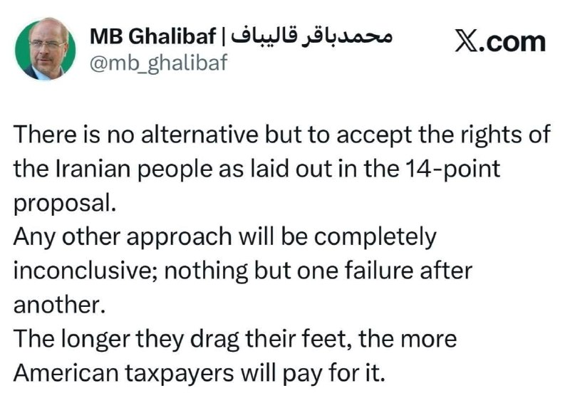

قالیباف: 
راه دیگری جز پذیرش حقوق مردم ایران که در پیشنهاد ۱۴ بندی آمده است، وجود ندارد الکی کصشر نگید .

‌ ‌هر رویکرد دیگری کاملاً بی‌نتیجه و شکست‌ پشت شکست و کیر پشت کیر خواهد بود.

‌ ‌هرچه بیشتر تعلل کنند، مالیات‌دهندگان آمریکایی هزینه بیشتری از جیب خود خواهند پرداخت و خارشان گایده میشود.
⠀
#Berlin
@Kirimohems

## KiriMohems — post 47373

رئیس جمهور اوکراین، زلنسکی: روسیه قصد پایان دادن به جنگ را ندارد - ما در حال آماده شدن برای حملات و گایش های جدید هستیم.

#Berlin
@Kirimohems

## KiriMohems — post 47372

  <a href="telegram/content/KiriMohems_47372_1778535698.mp4" target="_blank">🎬 Download video</a>

تو قسمت جدید سریال "ايفوريا | Euphoria" بانو ممه بزرگ سیدنی سویینی حسابی به فوت فتیش‌ها حال داده و علاوه بر نمایش پاهاش، اونارو شخصا لیس زده

#Berlin
@Kirimohems

## KiriMohems — post 47371

مدیرعامل آرامکو : جنگ ایران و بسته‌ماندن چول تنگهٔ هرمز باعث شده که یک میلیارد بشکه نفت صادر نشود.

#Berlin
@Kirimohems

## KiriMohems — post 47370

🌱 اطلاعیه ویژه کاربران گرامی به پاس همراهی و اعتماد ارزشمند شما عزیزان، طرح ویژه حجم هدیه برای تعداد محدودی از کاربران فعال شده است. 🔹 این طرح فقط برای ۲۰۰ نفر اول قابل فعال‌سازی خواهد بود. 
🎁 5 گیگابایت + 1 گیگابایت هدیه 
📌 مجموع حجم دریافتی: 6 گیگابایت…

## SportBaadNews — post 251368

  <a href="telegram/content/SportBaadNews_251368_1778535699.mp4" target="_blank">🎬 Download video</a>

⚽️
⚽️ رئال مادرید تو مستایا داشت با والنسیا بازی میکرد، بازی عملاً تموم شده بود؛ 6-1 جلو بودن، کمتر از 10 دقیقه مونده بود که کریستیانو رونالدو داشت آماده میشد بیاد تو زمین.

🔴 آره، مورینیو بازم تصمیم گرفت رونالدو رو بیاره تو بازی، در حالی که تیمش راحت 6-1 جلو بود. رونالدو هم معلوم بود حال و حوصله نداره. بازی از نظر نتیجه تموم شده بود و چیزی برای ثابت کردن باقی نمونده بود.

🔴 ولی فقط دو دقیقه بعد، مورینیو دید رونالدو داره راه میره، سریع بهش گفت: «میخوای تعویضت کنم؟»

🔴 اون صحنه خیلی خوب نشون داد مورینیو چه ذهنیت و اقتداری داره. براش مهم نبود نتیجه چیه، همیشه شدت و جدیت می‌خواست. اگه واقعاً دوباره مربی رئال بشه، بازیکنایی مثل امباپه و وینیسیوس احتمالاً یه فصل خیلی سخت زیر دستش داشته باشن.
@SportBaadNews

## SportBaadNews — post 251367

  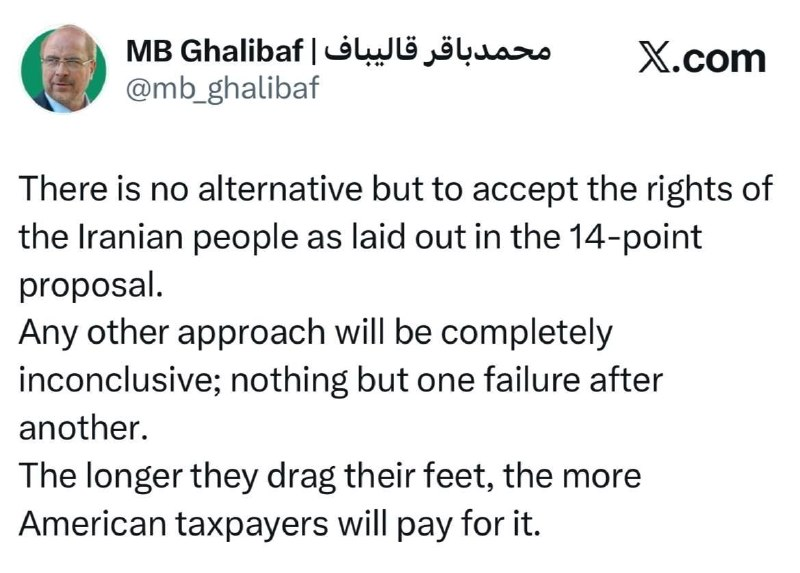

قالیباف: 
راه دیگری جز پذیرش حقوق مردم ایران که در پیشنهاد 14 بندی آمده است، وجود ندارد. هر رویکرد دیگری کاملاً بی‌نتیجه و شکست‌ پشت شکست خواهد بود. هرچه بیشتر تعلل کنند، مالیات‌دهندگان آمریکایی هزینه بیشتری از جیب خود خواهند پرداخت.
@SportBaadNews

## SportBaadNews — post 251366

فوت فتیشا بیان بالا. سیدنی سوئینی تو قسمت جدید سریال ایفوریا پاهای خودشو میخوره! 
🔞 @SporteHub

## IranIntlTV — post 336710

  <a href="telegram/content/IranIntlTV_336710_1778535701.mp4" target="_blank">🎬 Download video</a>

مراد ویسی، تحلیل‌گر ارشد ایران‌اینترنشنال، گفت: «در حالی که عربستان با ظرفیت تولید ۱۲ میلیون بشکه نفت در روز و صادرات هفت میلیون بشکه در روز حتی در شرایط جنگی، در اوج قدرت نفتی است، در جمهوری اسلامی ایران تولید و صادرات نفت به شدت افت کرده و تامین بنزین داخلی هم به وضعیت بحرانی رسیده است. ایران و عربستان دو کشوری که روزی غول‌های نفتی منطقه بودند، حالا دو سرنوشت نفتی متفاوت یافته‌اند.»
@iranintltv

## IranIntlTV — post 336709

  

مجتبی ذوالنوری، عضو کمیسیون حقوقی مجلس، گفت: «لازم نیست در تنگه هرمز باشیم تا هر شناوری را که از آنجا رد می‌شود، بزنیم. از سمنان و مشهد و تهران می‌زنیم. چند شناور که آنجا غرق شود، خود تنگه بسته می‌شود. روی بحث مین‌ریزی کار کردیم و نجابت به خرج دادیم از این حق استفاده نکردیم.»
https://iranintl.com/202605116088

## IranIntlTV — post 336708

  

وال استریت ژورنال به نقل از منابع مطلع گزارش داد که امارات متحده عربی حملات نظامی علیه جمهوری اسلامی انجام داده است؛ اقدامی که این کشور را در جایگاه یکی از طرف‌های فعال در جنگ قرار می‌دهد.

در این گزارش آمده است نیروهای نظامی این کشور به جنگنده‌های ساخت غرب و شبکه‌های نظارتی پیشرفته مجهز هستند و این حملات نشان می‌دهد امارات متحده عربی اکنون تمایل بیشتری دارد از این توانمندی‌ها برای حفاظت از قدرت اقتصادی و نفوذ رو‌به‌گسترش خود در سراسر خاورمیانه استفاده کند.

وال استریت ژورنال افزود که این حملات شامل حمله به یک پالایشگاه در جزیره لاوان ایران در خلیج فارس بوده که در اواسط فروردین انجام شده است؛ امارات به‌طور علنی انجام این حملات را تایید نکرده است.
در بخش دیگری از این گزارش آمده است که امارات متحده عربی اکنون تهران را تهدیدی مستقیم علیه ثبات و مدل اقتصادی خود می‌داند. همچنین براساس گمانه‌زنی‌ها، گفته می‌شود امارات متحده عربی با استفاده از جنگنده‌های میراژ فرانسوی و پهپادهای چینی متعلق به خود، در داخل ایران عملیات انجام داده است.
https://iranintl.com/202605110620

## IranIntlTV — post 336707

  <a href="telegram/content/IranIntlTV_336707_1778535703.mp4" target="_blank">🎬 Download video</a>

دونالد ترامپ گفت که آتش‌بس مانند بیماری در وضعیت احتضار با دستگاه زنده است و شانس زنده ماندن آن را «تنها یک درصد» خواند. همزمان گمانه‌زنی‌ها درباره ادامه رویکرد ترامپ برای حل مساله ایران از طریق دیپلماسی یا حمله نظامی ادامه دارد.

گفت‌وگو با جیسون برادسکی، مدیر سیاست‌گذاری اتحاد علیه ایران هسته‌ای
@iranintltv

## Persian_Trend_Official — post 13949

  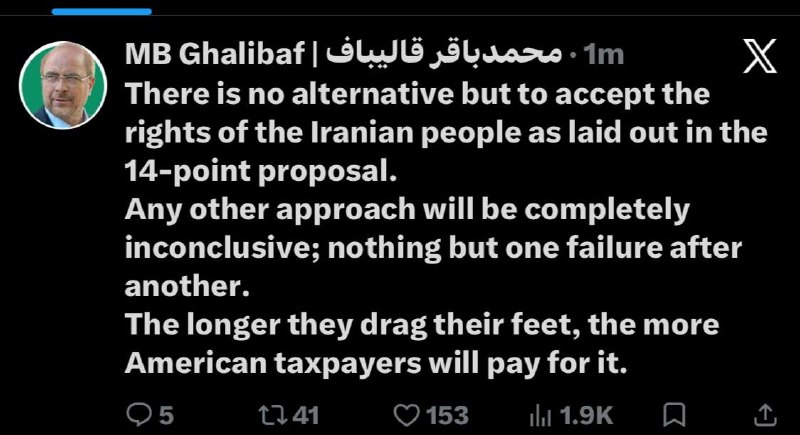

🔹محمد باقر قالیباف

💢هیچ راهی جز پذیرش حقوق ملت ایران، آن‌گونه که در طرح ۱۴ بندی آمده، وجود ندارد.

💢هر مسیر دیگری کاملاً بی‌نتیجه خواهد بود و چیزی جز شکست‌های پیاپی به همراه نخواهد داشت.

💢هرچه بیشتر وقت‌کشی کنند، هزینه بیشتری هم از جیب مالیات‌دهندگان آمریکایی پرداخت خواهد شد.

🫆:Tony

📌 @persian_trend_official
پرشین ترند | متفاوت‌ترین کانال نظامی

## Persian_Trend_Official — post 13948

  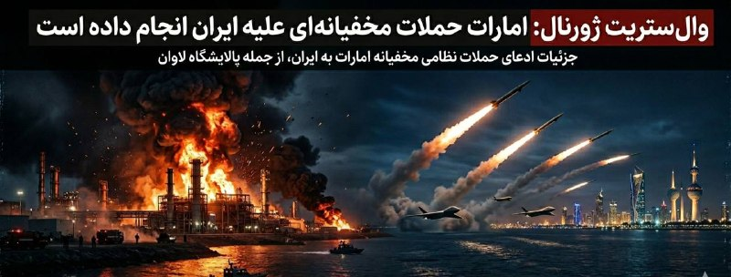

🔴 وال‌استریت ژورنال: امارات حملات مخفیانه‌ای علیه ایران انجام داده است

💢وال‌استریت ژورنال به نقل از منابع مدعی شد امارات متحده عربی به‌صورت مخفیانه چند حمله نظامی علیه ایران انجام داده که از جمله آن‌ها حمله به یک پالایشگاه نفت در جزیره لاوان در اوایل آوریل بوده است؛ تقریباً هم‌زمان با زمانی که ترامپ از آتش‌بس صحبت کرده بود.

💢طبق این گزارش، این حمله باعث آتش‌سوزی گسترده شده و پالایشگاه را برای چند ماه از مدار خارج کرده است.

💢در ادامه ادعا شده ایران نیز در پاسخ، حملات موشکی و پهپادی علیه امارات و کویت انجام داده است.

🫆:Tony

📌 @persian_trend_official
پرشین ترند | متفاوت‌ترین کانال نظامی

---
📅 بروزرسانی: 1405/02/21 23:42
---

## ChizBergerz — post 46306

  <a href="telegram/content/ChizBergerz_46306_1778530348.mp4" target="_blank">🎬 Download video</a>

فوت فتیشا بیان بالا.

سیدنی سوئینی تو قسمت جدید سریال ایفوریا پاهای خودشو میخوره!
@ChizBergerz

## rodast_omiddana — post 71246

🎬
🔴
🔴
🔴 پخش زنده
*ترامپ: جمهوری اسلامی را در یک روز دوباره نابود می‌کنیم
*دارم میرم چین تا کار رژیم را تمام کنم
لینک برنامه:
https://www.youtube.com/watch?v=skIwNDUA6UQ

## KiriMohems — post 47369

🌱 اطلاعیه ویژه کاربران گرامی

به پاس همراهی و اعتماد ارزشمند شما عزیزان، طرح ویژه حجم هدیه برای تعداد محدودی از کاربران فعال شده است.
🔹 این طرح فقط برای ۲۰۰ نفر اول قابل فعال‌سازی خواهد بود.

🎁 5 گیگابایت + 1 گیگابایت هدیه

📌 مجموع حجم دریافتی: 6 گیگابایت

✅ قیمت 
🏷 : 1/900/000 تومان

🎁 10 گیگابایت + 2 گیگابایت هدیه

📌 مجموع حجم دریافتی: 12 گیگابایت

✅ قیمت 
🏷 3/500/000 تومان

✨ حجم هدیه به‌صورت خودکار پس از فعال‌سازی سرویس به حساب شما اضافه خواهد شد.

از همراهی و اعتماد همیشگی شما صمیمانه سپاسگزاریم 🌱❤️

⭐️ @expressuport | پشتیبانی و خرید

✅️ @vpn_express_sup_bot | ربات فروش

## KiriMohems — post 47368

  <a href="telegram/content/KiriMohems_47368_1778530350.mp4" target="_blank">🎬 Download video</a>

🔴ویدئویی از چرت‌ نعشگی ترامپ در جلسه کاخ سفید

کصکش انگاری دو تخت افغانی زده

#Helsinki
@KiriMohems

## KiriMohems — post 47367

  <a href="telegram/content/KiriMohems_47367_1778530351.mp4" target="_blank">🎬 Download video</a>

🔴خوش‌چشم:

این دفعه جوری اسرائیل رو میزنیم که هوش مصنوعی اسرائیل بگا بره
یه جای دیگه هم تو اسرائیل میزنیم که نمیتونم بگم کجاست ولی بیچارشون میکنه

#Helsinki
@KiriMohems

## KiriMohems — post 47366

  <a href="telegram/content/KiriMohems_47366_1778530352.mp4" target="_blank">🎬 Download video</a>

🇺🇸 ترامپ : آتش‌بس با ایران مثل بیماریه که داره از کونش تنفس میکنه، تو ضعیف‌ترین حالت ممکنشه!
ایران یه جواب کسشر فرستاد، که تا آخرشو نخوندم چون وقتم رو فقط هدر میداد.
اونا خیلی احمقن، فکر میکنن من خسته میشم، حوصلم سر میره یا تحت فشار قرار می‌گیرم! اصلا هیچ فشاری نیست، ما پیروزی کاملی خواهیم داشت.
تو ایران هم میانه‌رو هست هم دیوونه؛ میانه‌روها احترام بیشتری دارن ولی دیوونه‌ها میخوان تا آخر بجنگن؛ میانه‌روها میخوان توافق کنن ولی از دیوونه‌ها می‌ترسن!
فکر می‌کنم رسیدن به توافق کاملاً ممکنه. من 4-5 بار با اینا مذاکره کردم.
مدام نظرشون عوض میشه. رهبری‌شون خیلی بی‌تعهد و غیرقابل اعتماده.
باهاشون توافق میکنی، بعد فرداش یه سند می‌فرستن که پنج روز طول میکشه برسه درحالی که تو 20 دقیقه میشه همون رو نوشت.
کردها فقط می‌گیرن؛ من خیلی ازشون ناامید شدم. ما یه سری اسلحه و مهمات فرستادیم [واسه معترضان ایرانی] که باید تحویل داده میشد، ولی خودشون نگهش داشتن.

#professor
@KiriMohems

## KiriMohems — post 47365

  

😤دنبال یه سایت شرط بندی بین المللی بودی که به ایرانیا خدمات بده؟!
⛔

👍دربی بت همون انتخاب  100%

💎ویژگی های سایت جهانی Derby Bet:

⬅️امکان شارژ امن با کارت بانکی

⬅️واریز اول دوبل شارژ می شوید(بونوس۱۰۰٪)

⬅️پر اپشن ترین سایت فعال در ایران

⬅️تسویه حساب کمتر از 5 دقیقه

⬅️برگشت بخشی از باخت به صورت هفتگی

🚨کد هدیه ثبت نام:GG007

⚠️برای دانلود اپلکیشن کلیک کنید
👉

🔔کانال دربی بت :g21🅰

🪙https://t.me/+kpFvLD9kaeJhYTI0

## SportBaadNews — post 251365

  <a href="telegram/content/SportBaadNews_251365_1778530354.webm" target="_blank">🎬 Download video</a>

🚨
⚽️ کوپه: همین فردا ممکنه قرارداد خرید باشگاه سویا توسط راموس نهایی شه
@SportBaadNews

## SportBaadNews — post 251364

  <a href="telegram/content/SportBaadNews_251364_1778530355.webm" target="_blank">🎬 Download video</a>

🚨
💣 ترامپ: اگر توافقی حاصل نشود، ما ایران را به گونه‌ای هدف قرار خواهیم داد که قبلاً ندیده‌ اند
@SportBaadNews

## SportBaadNews — post 251363

  

⚽️ یامال هم یه کیت دستش گرفته که روش نوشته شده «خداروشکر مادریدیستا نیستم»
@SportBaadNews

## SportBaadNews — post 251362

  <a href="telegram/content/SportBaadNews_251362_1778530355.mp4" target="_blank">🎬 Download video</a>

⚽️
💍 پدری به این شکل وسط جشن بارسا از رشفورد خواستگاری کرد و دستشو بوسید 😂😂😂
@SportBaadNews

## IranIntlTV — post 336706

  <a href="telegram/content/IranIntlTV_336706_1778530357.mp4" target="_blank">🎬 Download video</a>

مصطفی دانشگر، تحلیل‌گر سیاسی، گفت: «تلاش تهران برای امتیاز ندادن به واشینگتن در مساله هسته‌ای، بیش از آن‌که بر پشتوانه‌ای مشخص استوار باشد، ناشی از توهم و اشتباه محاسباتی است.»
@iranintltv

## IranIntlTV — post 336705

  <a href="telegram/content/IranIntlTV_336705_1778530358.mp4" target="_blank">🎬 Download video</a>

ائتلاف منطقه‌ای علیه تهران در حال شکل‌گیری است. تام کاتن، سناتور جمهوری‌خواه، گفت کشورهای عربی دیگر از آمریکا برای صلح کمک نمی‌خواهند، بلکه به‌دنبال همکاری نظامی علیه جمهوری اسلامی هستند.

گفت‌وگو با شایان سمیعی، کارشناس امنیت ملی
@iranintltv

## IranIntlTV — post 336704

  

سی‌بی‌اس نیوز به نقل از مقام‌های آمریکایی گزارش داد که پاکستان به‌طور غیررسمی اجازه داده است برخی هواپیماهای نظامی ایران در فرودگاه‌های این کشور مستقر شوند؛ اقدامی که احتمالا آن‌ها را از حملات هوایی آمریکا مصون می‌سازد.
براساس این گزارش، ایران همچنین برخی هواپیماهای غیرنظامی خود را به افغانستان منتقل کرده است، هرچند مشخص نیست که آیا در میان آن‌ها هواپیماهای نظامی نیز وجود دارد یا خیر.
https://iranintl.com/202605113219

## IranIntlTV — post 336703

  <a href="telegram/content/IranIntlTV_336703_1778530360.mp4" target="_blank">🎬 Download video</a>

دونالد ترامپ در کاخ سفید با تیم امنیتی و فرماندهان نظامی آمریکا درباره ادامه مسیر جنگ با جمهوری اسلامی جلسه برگزار می‌کند. او گفته در داخل حکومت ایران اختلاف وجود دارد؛ «میانه‌روها» دنبال توافق‌اند اما «دیوانه‌ها» می‌خواهند جنگ ادامه پیدا کند.
@iranintltv

## IranIntlTV — post 336702

  <a href="https://t.me/IranintlTV/336702" target="_blank">📎 Download file</a>

🎧نسخه صوتی ۲۴ با فرداد فرحزاد: جلسه ترامپ و فرماندهان ارتش در کاخ سفید در مورد ایران
@iranintlTV

## IranIntlTV — post 336701

  <a href="telegram/content/IranIntlTV_336701_1778530362.mp4" target="_blank">🎬 Download video</a>

وخیم‌ترین اوضاع اقتصاد ایران بعد از قحطی جنگ جهانی

چشم‌انداز با مهدی مهدوی‌آزاد

تماشای نسخه کامل این برنامه در یوتیوب:
https://youtu.be/r1t36aJQtRA
@iranintltv

## IranIntlTV — post 336700

  <a href="https://t.me/IranintlTV/336700" target="_blank">📎 Download file</a>

🎧نسخه صوتی چشم‌انداز: وخیم‌ترین اوضاع اقتصاد ایران بعد از قحطی جنگ جهانی
@iranintlTV

## IranIntlTV — post 336699

  

ایالات متحده تحریم‌های جدیدی مرتبط با جمهوری اسلامی علیه سه فرد و ۹ نهاد، از جمله چهار نهاد مستقر در هنگ‌کنگ، ۴ نهاد در امارات متحده عربی و یک نهاد در عمان وضع کرد.

طبق این گزارش، محمدرضا اشرفی، صمد فتحی سلامی و احمد محمدی‌زاده به دلیل ارتباط با سپاه پاسداران تحریم شده‌اند.
https://iranintl.com/202605111289

## IranIntlTV — post 336698

  <a href="https://t.me/IranintlTV/336698" target="_blank">📎 Download file</a>

🎧نسخه صوتی تیتراول با نیوشا صارمی: ترامپ: احتمال باقی ماندن آتش‌بس یک درصد است، پیشنهاد تهران احمقانه بود
@iranintlTV

## IranIntlTV — post 336697

  

محمدباقر قالیباف، رییس مجلس در شبکه ایکس نوشت نیروهای مسلح جمهوری اسلامی آماده «پاسخگویی درس‌آموز» به هر حمله‌ای هستند؛ ما برای تمام گزینه‌ها آماده هستیم، «شگفت‌زده خواهند شد.»

او افزود: «استراتژی اشتباه و تصمیم‌های اشتباه، همیشه نتیجه اشتباه خواهد داشت، همه دنیا قبلا این را فهمیده‌اند.»
https://iranintl.com/202605113220

## IranIntlTV — post 336696

  <a href="telegram/content/IranIntlTV_336696_1778530365.mp4" target="_blank">🎬 Download video</a>

۲۴ با فرداد فرحزاد
@iranintltv

## IranIntlTV — post 336695

  <a href="telegram/content/IranIntlTV_336695_1778530366.mp4" target="_blank">🎬 Download video</a>

۲۴ با فرداد فرحزاد
@iranintltv

## IranIntlTV — post 336694

  <a href="telegram/content/IranIntlTV_336694_1778530367.mp4" target="_blank">🎬 Download video</a>

شهیر شهیدثالث، روزنامه‌نگار و تحلیل‌گر سیاسی، درباره طرح پیشنهادی تهران برای توافق با واشینگتن گفت: «چه دونالد ترامپ در کاخ سفید باشد و چه فردی دیگر، مساله اصلی درخواست جمهوری اسلامی برای به‌رسمیت شناختن حاکمیتش بر تنگه هرمز است.» او تاکید کرد: «هیچ رییس‌جمهوری در آمریکا زیر بار چنین درخواستی نخواهد رفت.»
@iranintltv

## Persian_Trend_Official — post 13947

🔴 ادعای سی‌بی‌اس درباره پرواز هواپیماهای ایرانی به پاکستان

به گزارش سی‌بی‌اس به نقل از مقامات آمریکایی، چند روز پس از اعلام آتش‌بس میان ایران و آمریکا در اوایل آوریل، چند فروند هواپیمای ایرانی به پایگاه هوایی «نور خان» نیروی هوایی پاکستان در نزدیکی راولپندی اعزام شده‌اند.

بر اساس این ادعا:

این پایگاه یک مرکز نظامی مهم در حومه اسلام‌آباد/راولپندی محسوب می‌شود.

در میان هواپیماهای اعزامی، یک فروند C-130 هرکولس نیروی هوایی ایران نیز دیده شده است

📌 این گزارش هنوز به‌طور مستقل تأیید نشده و جزئیات رسمی از سوی ایران یا پاکستان منتشر نشده است.

🫆:Tony

📌 @persian_trend_official
پرشین ترند | متفاوت‌ترین کانال نظامی

## Persian_Trend_Official — post 13946

  <a href="telegram/content/Persian_Trend_Official_13946_1778530369.mp4" target="_blank">🎬 Download video</a>

🔹 آتش سوزی در پالایشگاه اوکلاهامای آمریکا

💢منابع خبری از وقوع آتش‌سوزی در پالایشگاه شرکت اچ‌اف سینکلر در تولسا، در اوکلاهمای آمریکا خبر دادند.

💢در جریان این حادثه دود سیاه عظیمی از این تأسیسات  نفتی به آسمان برخاست.

💢مقامات هنوز علت این آتش سوزی یا اینکه آیا کسی آسیب دیده است یا خیر را اعلام نکرده‌اند.

🫆:Tony

📌 @persian_trend_official
پرشین ترند | متفاوت‌ترین کانال نظامی

## Persian_Trend_Official — post 13945

🔴 ۶۰ نماینده حزب کارگر خواستار کناره‌گیری استارمر شدند

شبکه «اسکای‌نیوز» گزارش داد تاکنون ۶۰ نماینده حزب کارگر بریتانیا خواستار کناره‌گیری «کی یر استارمر» نخست‌وزیر این کشور شده‌اند.

🫆:Tony

📌 @persian_trend_official
پرشین ترند | متفاوت‌ترین کانال نظامی

## Persian_Trend_Official — post 13944

  <a href="telegram/content/Persian_Trend_Official_13944_1778530370.webm" target="_blank">🎬 Download video</a>

💢وزیر دفاع بلژیک

💢به فرانسه و انگلیس برای پاکسازی تنگه هرمز از مین‌های دریایی و بازگشت به دریانوردی آزاد خواهیم پیوست.

🫆:Tony

📌 @persian_trend_official
پرشین ترند | متفاوت‌ترین کانال نظامی

## Persian_Trend_Official — post 13943

🔴وزارت خزانه داری آمریکا اطلاع داده که تحریم های جدیدی علیه افراد مرتبط با جمهوری اسلامی اعمال کرده است

🫆:Tony

📌 @persian_trend_official
پرشین ترند | متفاوت‌ترین کانال نظامی

## Persian_Trend_Official — post 13942

  <a href="telegram/content/Persian_Trend_Official_13942_1778530370.webm" target="_blank">🎬 Download video</a>

🔴سی‌ان‌ان: جزئیات بخشی از جدیدترین پیشنهاد ایران که ترامپ آن را رد کرد را منتشر نمود

💢 دریافت غرامت بابت خسارات جنگی

💢 به رسمیت شناختن حاکمیت ایران بر تنگه هرمز

💢 پایان دزدی دریایی آمریکا علیه کشتی‌های ایرانی

💢 آزادسازی دارایی‌های مسدود شده ایران

🫆:Tony

📌 @persian_trend_official
پرشین ترند | متفاوت‌ترین کانال نظامی

## Persian_Trend_Official — post 13941

https://youtube.com/live/rsDox1i9jQs?feature=share

## Persian_Trend_Official — post 13940

  

🔴محمد باقر قالیباف

‏💢نیروهای مسلح ما آمادهٔ پاسخگویی درس‌آموز به هر تجاوزی هستند؛ استراتژی اشتباه و تصمیم‌های اشتباه، همیشه نتیجهٔ اشتباه خواهد داشت، همهٔ دنیا قبلاً این را فهمیده‌اند.
‏ما برای تمام گزینه‌ها آماده هستیم؛ شگفت‌زده خواهند شد.

🫆:Tony

📌 @persian_trend_official
پرشین ترند | متفاوت‌ترین کانال نظامی

---
📅 بروزرسانی: 1405/02/21 21:55
---

## ChizBergerz — post 46305

  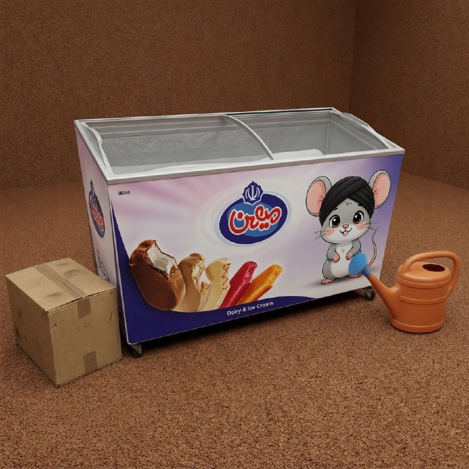

سه رهخر تاریخ جمهوری‌اسهالی در یک قاب:

آفتابه، فریزر، مقوا
@ChizBergerz

## ChizBergerz — post 46304

دوستان اخبار رو فقط تو کانال چیزنیوز پوشش میدیم، اگه میخواید اخبار رو دنبال کنید عضو چیزنیوز بشید👈 @ChizNewz

## ChizBergerz — post 46303

دوستان اخبار رو فقط تو کانال چیزنیوز پوشش میدیم، اگه میخواید اخبار رو دنبال کنید عضو چیزنیوز بشید👈 @ChizNewz

## rodast_omiddana — post 71245

  <a href="telegram/content/rodast_omiddana_71245_1778523950.webm" target="_blank">🎬 Download video</a>

🚨حمله پهپادی رژیم جمهوری اسلامی به کردستان عراق
اربیل عراق هم اکنون

## rodast_omiddana — post 71244

  <a href="telegram/content/rodast_omiddana_71244_1778523950.webm" target="_blank">🎬 Download video</a>

🚨نخست وزیر نتانیاهو:
اگر رژیم ایران سقوط کند، به معنای پایان حزب‌الله، حماس و احتمالاً حوثی‌ها نیز خواهد بود.

## rodast_omiddana — post 71243

  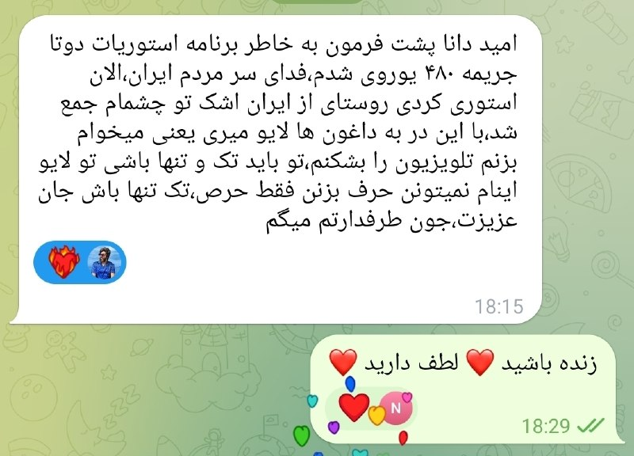

❤️ آقا جان من برنامه ها را هنگام رانندگی نگاه نکنید خطرناکه...
دمتون گرم

## rodast_omiddana — post 71242

  <a href="telegram/content/rodast_omiddana_71242_1778523951.webm" target="_blank">🎬 Download video</a>

🚨شموئیل زاکای، مدیر سازمان هواپیمایی اسرائیل:
"فرودگاه بن‌گوریون به پایگاه نظامی آمریکا تبدیل شد"

## rodast_omiddana — post 71241

🎬 برنامه امشب:
*ترامپ: جمهوری اسلامی را در یک روز دوباره نابود می‌کنیم
*دارم میرم چین تا کار رژیم را تمام کنم
لینک برنامه:
https://www.youtube.com/@omiddana

## rodast_omiddana — post 71240

  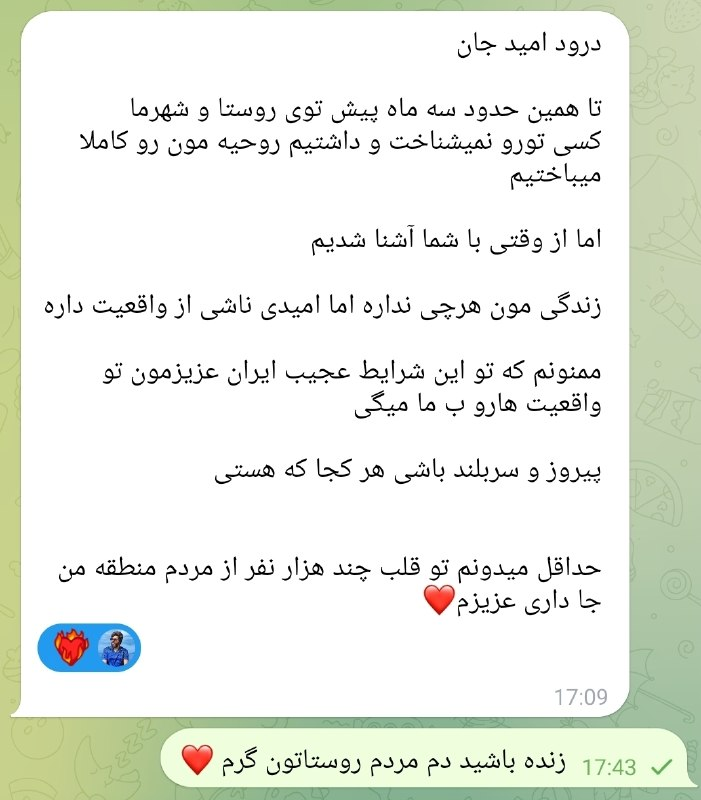

👑روزانه از ایران پیام زیاد میاد ولی این یکی خیلی چسبید..
دمتون گرم، خستگیم در رفت..

## KiriMohems — post 47364

🔴سیتنا:
برخی از شهروندان ساکن غرب و جنوب غرب کشور بخاطر قطعی اینترنت سیم کارت عراقی گرفتن و با این کلک ریدن تو فیلترینگ
#Helsinki
@KiriMohems

## KiriMohems — post 47363

  

📰 آکسیوس : ترامپ تو کونش دائم میچرخه که پس از ریدمان در مذاکرات، اقدامات نظامی علیه ایران رو از سر بگیره و امروز با ژنرال‌ها دیدار میکنه.

#Helsinki
@KiriMohems

## SportBaadNews — post 251361

  <a href="telegram/content/SportBaadNews_251361_1778523952.webm" target="_blank">🎬 Download video</a>

🚨
⚽️ گاستون آیدل: پی‌اس‌جی خولیان آلوارز رو می‌خواد؛ لوئیز انریکه طرفدار پر و پاقرص این مهاجم آرژانتینیه و پاریس الان دیگه با تمام توان دنبالشه!
@SportBaadNews

## SportBaadNews — post 251360

  <a href="telegram/content/SportBaadNews_251360_1778523952.mp4" target="_blank">🎬 Download video</a>

🚨یامال پرچم فلسطین رو تو جشن امروز بارسا بالا برد
@SportBaadNews

## SportBaadNews — post 251359

  <a href="telegram/content/SportBaadNews_251359_1778523954.webm" target="_blank">🎬 Download video</a>

🚨 اسکای اسپورت: ژابی آلونسو شرایط چلسی رو پذیرفته و از پروژه تیم خوشش اومده. ژابی و چلسی تو مذاکرات اولیه کاملا به توافق رسیدن. @SportBaadNews

## SportBaadNews — post 251358

  

قدرت سیگار
@SportBaadNews

## SportBaadNews — post 251357

  

⚪️ Tottenham - 
🟡 Leeds

🟣 پریمیرلیگ انگلیس

⏰ دوشنبه ساعت ۲۲:۳۰

🏟 استادیوم تاتنهام‌هاتسپر

⚽️ تاتنهام امشب تحت فشار زیادی وارد بازی می‌شود، چون برای فرار از بحران به امتیاز کامل نیاز دارد. تاتنهام در دو بازی اخیرش عملکرد هجومی بهتری نشان داده و اعتمادبه‌نفس تیم کمی برگشته است. لیدزیونایتد اما از نظر فرم کلی باثبات‌تر بوده و در چند هفته اخیر کمتر شکست خورده است. لیدز روی ضدحمله و انتقال سریع توپ خطرناک ظاهر می‌شود، مخصوصاً مقابل تیم‌هایی که دفاع جلو بازی می‌کنند. آمار رودررو به سود تاتنهام است و اسپرز ۵ بازی آخر مقابل لیدز را برده. تقابل‌های اخیر دو تیم معمولاً پرگل بوده و میانگین گل بالایی داشته‌اند. از نظر مدل‌های آماری، شانس برد تاتنهام کمی بیشتر است.

📌در ربات وینکوبت ثبت‌نام کن و با شارژ از طریق کریپتو ۵٪ شارژ بیشتری رو دریافت کنید، همین حالا شروع کن: 
👇

🟣 [ برای ورود به ربات کلیک کنید: ]

📌برای اطلاع از تحلیل بازی‌ها و ورود به کانال سایت جوین بدید: 
👇

🔵 @Wincobetofficial

## IranIntlTV — post 336693

  

یک روز پس از آن که دونالد ترامپ با پاسخ جمهوری اسلامی به پیشنهاد واشینگتن مخالفت کرد، ارتش آمریکا اعلام کرد که یک زیردریایی از کلاس اوهایو که مجهز به موشک‌های بالستیک هسته‌ای است، یک‌شنبه وارد جبل‌الطارق شد.

ناوگان ششم نیروی دریایی ایالات متحده در بیانیه‌ای نوشت: «زیردریایی‌های موشک بالستیک کلاس اوهایو، سکوهای پرتاب غیرقابل شناسایی برای موشک‌های بالستیک پرتاب‌شونده از زیردریایی هستند و برای ایالات متحده امن‌ترین و پایدارترین بخش از سه‌گانه هسته‌ای را فراهم می‌کنند.»

جبل‌الطارق، قلمرو بریتانیا و مشرف به تنگه‌ای است که دریای مدیترانه را به اقیانوس اطلس متصل می‌کند.

پنتاگون نام این زیردریایی را که یکی از محرمانه‌ترین سلاح‌های ارتش آمریکا است فاش نکرد.

به طور کلی، محل استقرار زیردریایی‌های هسته‌ای آمریکا به شدت طبقه‌بندی‌شده و محرمانه است.

ترامپ دوشنبه به خبرنگاران گفت که آتش‌بس آمریکا با ایران در وضعیت بحرانی قرار دارد و آن را «به‌طرز باورنکردنی ضعیف» توصیف کرد.

https://iranintl.com/202605111968

## IranIntlTV — post 336692

  <a href="telegram/content/IranIntlTV_336692_1778523956.mp4" target="_blank">🎬 Download video</a>

دونالد ترامپ، رییس‌جمهوری آمریکا، گفت در حال بررسی احیای «پروژه آزادی» در تنگه هرمز است. او تاکید کرد این بار هدایت کشتی‌ها در این تنگه تنها بخش کوچکی از یک عملیات نظامی گسترده‌تر خواهد بود.

سمیرا قرایی و بابک اسحاقی، خبرنگاران ایران‌اینترنشنال، گزارش می‌دهند
@iranintltv

## IranIntlTV — post 336691

  <a href="telegram/content/IranIntlTV_336691_1778523957.mp4" target="_blank">🎬 Download video</a>

گزارش وال‌استریت ژورنال درباره وجود یک پایگاه نظامی مخفی اسرائیل در عراق واکنش‌های گسترده‌ای به همراه داشته است.

مقام‌های عراقی در ابتدا وجود این پایگاه را رد کردند، اما در ادامه تلاش کردند ابعاد ماجرا را کم‌اهمیت جلوه دهند.

گفت‌وگو با فرزین ندیمی، پژوهشگر امور دفاعی و امنیتی
@iranintltv

## IranIntlTV — post 336690

  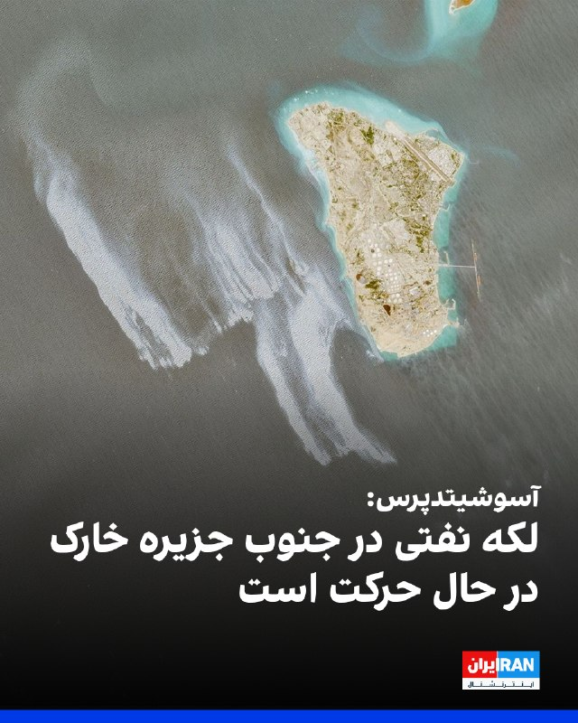

تصاویر ماهواره‌ای دوشنبه، که توسط آسوشیتدپرس بررسی شد، نشان می‌دهد لکه نفتی در خلیج فارس، در جنوب جزیره خارک – مهم‌ترین پایانه نفت خام ایران – در حال حرکت است.

پیش‌تر مدیرعامل شرکت پایانه‌های نفتی ایران، گزارش‌ها درباره وجود لکه نفتی در جزیره خارک را رد کرد.

او افزود: هیچ‌گونه نشتی در زیرساخت‌ها، مخازن ذخیره‌سازی، سیستم‌های اندازه‌گیری، اسکله‌ها، خطوط لوله این منطقه و کشتی‌های در حال بارگیری وجود ندارد.
https://iranintl.com/202605113346

## IranIntlTV — post 336689

  

یک منبع نزدیک به تیم مذاکرات به خبرگزاری تسنیم، رسانه وابسته به سپاه پاسداران گفت: «برخلاف اظهارات برخی رسانه‌های غربی، در متن پیشنهادی جمهوری اسلامی هیچ‌گونه پذیرش خروج مواد غنی‌شده هسته‌ای از کشور وجود ندارد.»

این منبع گفت آمریکا در طرح خود نوشته بود پول‌های بلوکه‌شده ایران را آزاد خواهد کرد اما جمهوری اسلامی تاکید کرده این پول‌ها باید در مدت معینی آزاد شود.
https://iranintl.com/202605111974

## IranIntlTV — post 336688

  <a href="telegram/content/IranIntlTV_336688_1778523960.mp4" target="_blank">🎬 Download video</a>

مهدی مهدوی‌آزاد در برنامه چشم‌انداز گفت: «ایران با بحرانی اقتصادی روبه‌رو است که فقط به تورم محدود نمی‌شود، بلکه به روند نابودی رویاها و انگیزه‌های نسل جوان کشور گره خورده است.»
@iranintltv

## IranIntlTV — post 336687

  <a href="https://t.me/IranintlTV/336687" target="_blank">📎 Download file</a>

🎧نسخه صوتی دومینو: جمهوری اسلامی در برزخ صلح و جنگ
@iranintlTV

## IranIntlTV — post 336686

  <a href="telegram/content/IranIntlTV_336686_1778523962.mp4" target="_blank">🎬 Download video</a>

دونالد ترامپ گفت: «ایرانی‌ها دو روز پیش به ما گفتند باید مواد غنی‌شده را تحویل بگیرید، اما بعد نظرشان عوض شد، چون در سندی که برای ما فرستادند این موضوع ذکر نشده بود.»

او افزود: «آنها ابتدا با ما توافق کردند، ولی بعد حرفشان را پس گرفتند. ایران نباید به سلاح هسته‌ای برسد، اما در نامه‌ای که برای ما فرستادند این مساله را نپذیرفتند.»
@iranintltv

## IranIntlTV — post 336685

  <a href="telegram/content/IranIntlTV_336685_1778523964.mp4" target="_blank">🎬 Download video</a>

دونالد ترامپ بار دیگر از وجود اختلاف درون جمهوری اسلامی بر سر توافق با آمریکا سخن گفت و افزود گروهی از مقام‌های «میانه‌رو» خواهان توافق هستند اما «دیوانه‌ها» می‌خواهند جنگ ادامه پیدا کند.

او هشدار داد در صورت وقوع درگیری، «این یک جنگ خیلی سریع خواهد بود».

گفت‌وگو با جمشید برزگر، روزنامه‌نگار و تحلیل‌گر سیاسی
@iranintltv

## IranIntlTV — post 336684

  <a href="telegram/content/IranIntlTV_336684_1778523965.mp4" target="_blank">🎬 Download video</a>

دونالد ترامپ گفت: «مردم می‌خواهند اعتراض کنند، اما سلاحی ندارند. ما تصور می‌کردیم می‌توانیم از طریق کردها به آنها کمک کنیم و سلاح برسانیم، اما کردها ما را ناامید کردند.» او افزود: «بارها کمک گرفتند و کنگره می‌گفت کردها خیلی سخت می‌جنگند و برای حمایت از آنها تلاش زیادی شد، اما من از ابتدا هم فکر می‌کردم این سیاست جواب نمی‌دهد.»
@iranintltv

## IranIntlTV — post 336683

  <a href="https://t.me/IranintlTV/336683" target="_blank">📎 Download file</a>

🎧نسخه صوتی اخبار شبانگاهی | دوشنبه ۲۱ اردیبهشت
@iranintlTV

## IranIntlTV — post 336682

  

اکسیوس به نقل از سه منبع آمریکایی گزارش داد که دونالد ترامپ روز دوشنبه با تیم امنیت ملی خود دیدار می‌کند تا درباره مسیر پیش رو در جنگ با جمهوری اسلامی، از جمله احتمال ازسرگیری اقدام نظامی، گفت‌وگو کند؛ این اقدام پس از بن‌بست مذاکرات با تهران در یکشنبه اعلام شده است.

براساس این گزارش، مقام‌های آمریکایی می‌گویند ترامپ خواستار رسیدن به توافقی برای پایان دادن به جنگ است، اما رد بسیاری از درخواست‌های او توسط جمهوری اسلامی و امتناع تهران از ارائه امتیازات قابل‌توجه در برنامه هسته‌ای، گزینه نظامی را دوباره روی میز قرار داده است.
https://iranintl.com/202605113448

## IranIntlTV — post 336681

  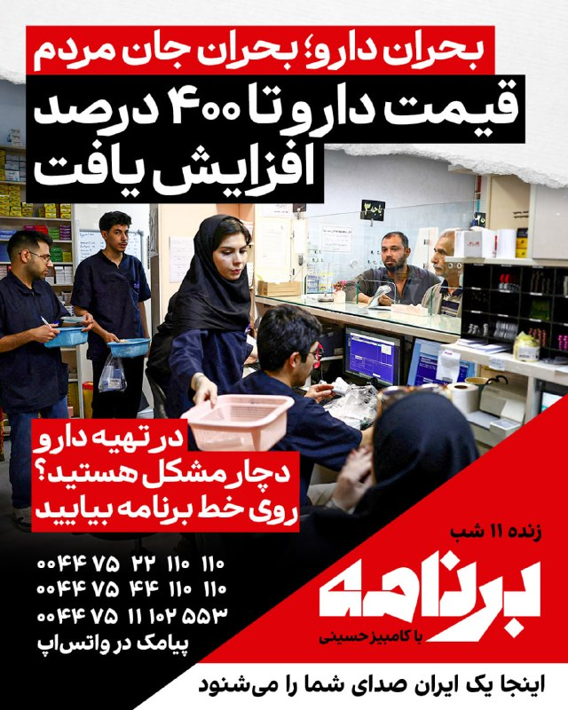

دارو در ایران دیگر فقط گران نشده؛ دارد ناپدید می‌شود.
قیمت بعضی داروها تا ۴۰۰ درصد افزایش یافته، حدود ۲۰۰ قلم داروی حیاتی کمیاب شده و بسیاری از بیماران، میان غذا و درمان، مجبور به انتخاب شده‌اند.

بیماران سرطان، ام‌اس، دیالیز، هموفیلی و حتی بیماران اعصاب و روان، زیر فشار کمبود و گرانی دارو مانده‌اند.

آیا شما یا اطرافیانتان با بحران دارو روبه‌رو شده‌اید؟
آیا شده نسخه دست‌تان باشد، اما توان خرید دارو را نداشته باشید؟
آیا دارویی که مصرف می‌کنید، کمیاب یا سهمیه‌ای شده است؟

از تجربه و واقعیت زندگی‌تان برای ما بگویید.

«برنامه» صدای شماست.
اگر در ایران به اینترنت دسترسی دارید، بیایید روی خط و روایت خودتان را ثبت کنید.
ما شما را، بدون نوبت، مستقیم از ایران روی آنتن می‌آوریم.
تاریخ با صدای شما نوشته می‌شود.

برای شرکت در «برنامه با کامبیز حسینی» همین حالا در واتس‌اپ پیام بدهید:

۰۰۴۴۷۵۲۲۱۱۰۱۱۰
۰۰۴۴۷۵۴۴۱۱۰۱۱۰
۰۰۴۴۷۵۱۱۱۰۲۵۵۳

«یک ایران صدای شما را می‌شنود»
@iranintltv

## IranIntlTV — post 336679

  

الحدث به نقل از منابع عراقی گزارش داد که اسماعیل قاآنی، فرمانده نیروی قدس سپاه، به عراق سفر کرده و از برخی گروه‌های مسلح خواسته از برقراری روابط با آمریکا خودداری کنند.

بر اساس این گزارش، او همچنین خط قرمزی را برای دولت عراق در مورد تحویل سلاح گروه‌های مسلح تعیین کرده است.
https://iranintl.com/202605118884

## IranIntlTV — post 336678

  <a href="telegram/content/IranIntlTV_336678_1778523969.mp4" target="_blank">🎬 Download video</a>

تیتر اول با نیوشا صارمی، دوشنبه ۲۱ اردیبهشت
@iranintltv

## Persian_Trend_Official — post 13936

  <a href="telegram/content/Persian_Trend_Official_13936_1778523970.webm" target="_blank">🎬 Download video</a>

سیگنال هسته‌ای آمریکا در میانه تنش‌ها؟🇺🇸

⭕️طبق تصاویر موجود و اخبار اعلام شده زیردریایی هسته ای USS Alaska (SSBN 732) از کلاس اوهایو که حامل موشک های بالستیک اتمی ترایدنت می باشد، از تنگه جبل الطارق عبور کرده و وارد دریای مدیترانه شده است.

⭕️نقش زیر دریایی های SSBN بازدارندگی استراتژیک هسته‌ای است این زیر دریایی ها توانایی شلیک موشک های بالستیک هسته ای ترایدنت 2 را دارند و ستون فقرات نیروی بازدارنده هسته‌ای دریایی آمریکا محسوب می‌شوند.

⭕️برای تنها سومین بار در ۲۵ سال گذشته، یک زیردریایی اتمی حامل تسلیحات هسته ای ایالات متحده در جبل‌الطارق حضور دارد. این حضور به احتمال زیاد در چارچوب مأموریت بازدارندگی گسترده Extended Deterrence /فرماندهی استراتژیک ایالات متحده (STRATCOM) انجام شده است

⭕️این مأموریت‌ها برای اطمینان به متحدان (مانند اسرائیل، کشورهای خلیج فارس و اروپا) است که آمریکا آماده حمایت با تمام قابلیت‌ها (از جمله هسته‌ای) است.

📝 Nick

📌 @persian_trend_official
پرشین ترند | متفاوت‌ترین کانال نظامی

## Persian_Trend_Official — post 13935

⭕️ رئیس هوانوردی غیرنظامی اسرائیل هشدار داد که فرودگاه بین‌المللی تل‌آویو در ساعات اخیر عملاً به پایگاه نظامی آمریکا تبدیل شده است.

📝 Nick

📌 @persian_trend_official
پرشین ترند | متفاوت‌ترین کانال نظامی

## Persian_Trend_Official — post 13934

  

حزب‌الله مرکز فرماندهی اسرائیل در البیاضه را بمباران کرد....

🔹حزب‌الله لبنان اعلام کرد یک مرکز فرماندهی تازه‌تأسیس ارتش رژیم صهیونیستی را در شهرک البیاضه در جنوب لبنان هدف حمله راکتی قرار داده است.

☆Phantom☆

📌 @persian_trend_official
پرشین ترند | متفاوت‌ترین کانال نظامی

## Persian_Trend_Official — post 13933

  <a href="https://t.me/persian_trend_official/13933" target="_blank">📎 Download file</a>

فایل صوتی لایو اول
نسخه کم حجم - 5.99 مگابایت

اتاق جنگ دوشنبه 21 اردیبهشت | زمزمه های شروع جنگ ایران و آمریکا

📝 Nick

📌 @persian_trend_official
پرشین ترند | متفاوت‌ترین کانال نظامی

## Persian_Trend_Official — post 13932

  <a href="telegram/content/Persian_Trend_Official_13932_1778523971.webm" target="_blank">🎬 Download video</a>

🔴 تسنیم: ایران با خروج مواد غنی‌شده از کشور موافقت نکرده است

💢خبرگزاری تسنیم به‌نقل از یک منبع نزدیک به تیم مذاکره‌کننده اعلام کرد، برخلاف ادعای برخی رسانه‌های غربی، پاسخ ایران شامل پذیرش خروج مواد هسته‌ای غنی‌شده از کشور نیست.

💢این منبع افزود:

▪️ طرح پیشنهادی ایران دارای جدول زمانی مشخص برای آزادسازی دارایی‌های بلوکه‌شده تهران است

▪️ در حالی که پیشنهاد آمریکا به آزادسازی این دارایی‌ها اشاره کرده، ایران تأکید داشته این منابع باید در بازه زمانی مشخصی آزاد شوند

▪️ موضوع خروج ذخایر غنی‌شده از خاک ایران مورد پذیرش تهران قرار نگرفته است

💢این گزارش در شرایطی منتشر می‌شود که رایزنی‌ها درباره توافق احتمالی میان تهران و واشنگتن ادامه دارد.

🫆:Tony

📌 @persian_trend_official
پرشین ترند | متفاوت‌ترین کانال نظامی

---
📅 بروزرسانی: 1405/02/21 20:14
---

## ChizBergerz — post 46302

لیندزی گراهام میدونه بهش میگیم "عمو لینزی"
بی‌بی هم که میدونه "بی‌بی جون" صداش میکنیم!
امیدوارم ترامپ ندونه بهش میگیم املاکی زن‌جنده :)))

## ChizBergerz — post 46301

  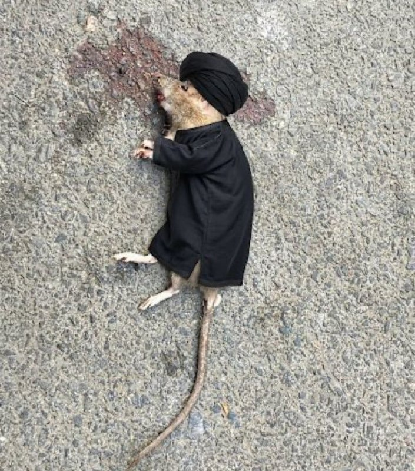

از تبار خامنه‌ای هیچ کس زنده نمونده، حتی هیچ نوه و نتیجه‌ای!
اینه عاقبت دیکتاتوری، ظلم و کُشتار مردم بی‌گناه!

@ChizBergerz

## ChizBergerz — post 46300

  <a href="https://t.me/ChizBergerz/46300" target="_blank">📎 Download file</a>

📲#اپلیکیشن اندروید سایت جهانی دربی بت

👍اسپانسر لیگ انگلیس
👍
🔥امکان شارژ امن از طریق کارت بانکی
➖➖➖➖➖➖➖➖➖

🪙همین حالا عضو شوید 👇
https://t.me/+aCbq7yy8QY80NzQ0

## ChizBergerz — post 46299

  

😤دنبال یه سایت شرط بندی بین المللی بودی که به ایرانیا خدمات بده؟!
⛔

👍دربی بت همون انتخاب  100%

💎ویژگی های سایت جهانی Derby Bet:

⬅️امکان شارژ امن با کارت بانکی

⬅️واریز اول دوبل شارژ می شوید(بونوس۱۰۰٪)

⬅️پر اپشن ترین سایت فعال در ایران

⬅️تسویه حساب کمتر از 5 دقیقه

⬅️برگشت بخشی از باخت به صورت هفتگی

🚨کد هدیه ثبت نام:GG007

⚠️برای دانلود اپلکیشن کلیک کنید
👉
ge21

🔔کانال دربی بت :

🪙https://t.me/+aCbq7yy8QY80NzQ0

## rodast_omiddana — post 71239

  <a href="telegram/content/rodast_omiddana_71239_1778517888.webm" target="_blank">🎬 Download video</a>

🚨 احمد زیدآبادی کُسخل گفته هیچ راه نظامی وجود ندارد..
این اصلاحطلب مادر نسکافه نمیفهمد که هیچ راه حل دیپلماتیک وجود ندارد..
هر وقت یک لحظه این جماعت مَشنگ رفتن رو مُختان یادتان بیاید اینها میگفتن جنگ نمیشود و من با تسلط بالا میگفتم جنگ قطعی هست..
احمد بیشرف وقتی نیروی زمینی آمریکا وارد خاک ایران شد و سرنوشت حزب بعث عراق برای جمهوری اسلامی رقم خورد یه اونجای مادرت بهت میگم..

## KiriMohems — post 47362

  <a href="telegram/content/KiriMohems_47362_1778517888.mp4" target="_blank">🎬 Download video</a>

🇺🇸 ترامپ کله گوهی :

الان یه مشت از ژنرال‌ها دست به خایه نشستن و منتظر من هستن؛ جلسه‌ای که درباره کشور کاملاً دوست‌داشتنی ایران برگزار میشه.
#Helsinki
@KiriMohems

---
📅 بروزرسانی: 1405/02/21 20:07
---

## rodast_omiddana — post 71238

  <a href="telegram/content/rodast_omiddana_71238_1778517470.mp4" target="_blank">🎬 Download video</a>

🚨
🚨
🚨 ترامپ:
"من این هفته قراره رو در رو با رئیس‌جمهور چین،شی جین‌پینگ،درباره ایران حرف بزنم
ایران کشور خیلی قشنگیه، ولی یه سری آدم‌ها اون رو اداره می‌کنن که شاید اصلاً نباید اونجا باشن"

## rodast_omiddana — post 71237

  <a href="telegram/content/rodast_omiddana_71237_1778517473.webm" target="_blank">🎬 Download video</a>

🚨 سی‌ان‌ان: تا آخر هفته پیشرفت قابل توجهی در گفت‌وگوهای واشینگتن و تهران رخ نخواهد داد

## rodast_omiddana — post 71236

  <a href="telegram/content/rodast_omiddana_71236_1778517473.webm" target="_blank">🎬 Download video</a>

🚨 برآوردهای من نشان میده ترامپ از چین برگرده روز جمعه یا شنبه این هفته یا هفته بعدش حملات به جمهوری اسلامی را آغاز خواهد کرد..
به نظرم جنگ بعدی تا قبل از 4 خرداد یعنی قبل از 25 می انجام میشه..

## rodast_omiddana — post 71235

  <a href="telegram/content/rodast_omiddana_71235_1778517473.webm" target="_blank">🎬 Download video</a>

🚨 ترامپ: جمهوری اسلامی را در یک روز دوباره نابود می‌کنیم

## rodast_omiddana — post 71234

  <a href="telegram/content/rodast_omiddana_71234_1778517474.mp4" target="_blank">🎬 Download video</a>

🚨 ترامپ:
"آتش‌بس به طرز باورنکردنی ضعیف است
بعد از خواندن آن مزخرفاتی که برای ما فرستادند، حتی خواندنش را تمام نکردم. به نظر من آتش‌بس در وضعیت اضطراری است."

## rodast_omiddana — post 71233

  <a href="telegram/content/rodast_omiddana_71233_1778517477.mp4" target="_blank">🎬 Download video</a>

🚨 ترامپ:
من از کردها بسیار ناامید شده‌ام، ما به آنها سلاح دادیم تا داخل ایران تحویل دهند، اما آنها آن‌ها را نگه داشتند.

## rodast_omiddana — post 71232

  <a href="telegram/content/rodast_omiddana_71232_1778517480.mp4" target="_blank">🎬 Download video</a>

🚨 ترامپ:
"الان گروه بزرگی از ژنرال‌ها منتظر من هستند؛ جلسه‌ای که درباره کشور کاملاً دوست‌داشتنی ایران برگزار می‌شود."
"آنها چقدر احمق هستند؟ آدم‌های احمق. آنها فکر می‌کنند که خب، من از این خسته می‌شوم، حوصله‌ام سر می‌رود، تحت فشار قرار می‌گیرم."

## rodast_omiddana — post 71231

  <a href="telegram/content/rodast_omiddana_71231_1778517481.webm" target="_blank">🎬 Download video</a>

🚨ترامپ:
اگر توافق حاصل نشود، ما ایران را به گونه‌ای هدف قرار خواهیم داد که قبلاً ندیده‌ اند

## rodast_omiddana — post 71230

  <a href="telegram/content/rodast_omiddana_71230_1778517481.webm" target="_blank">🎬 Download video</a>

🚨 عاقبت توهم و رجزخوانی..
این واقعیت میدانی ست به ادعاهای تحلیلگران رژیم توجه نکنید به میدان نگاه کنید..

## rodast_omiddana — post 71229

  <a href="telegram/content/rodast_omiddana_71229_1778517482.webm" target="_blank">🎬 Download video</a>

🚨 ترامپ:
"خیلی‌ها میپرسند: آیا برای ایران برنامه‌ای دارید؟
البته که برنامه دارم. من بهترین برنامه تاریخ را برای انها دارم"

## rodast_omiddana — post 71228

🎬 اعتراف جواد موگویی: مذهبیا باوری به قدرت سپاه ندارند
لینک یوتیوب:
https://www.youtube.com/watch?v=evEEtMLzdRE

## rodast_omiddana — post 71227

  <a href="telegram/content/rodast_omiddana_71227_1778517482.webm" target="_blank">🎬 Download video</a>

🚨وبسایت خبرآنلاین در گزارشی میدانی در گفت‌وگو با مستاجران و مشاوران املاک نوشت فایل‌های اجاره خانه در تهران کمیاب‌ شده و قیمت‌ها در همه مناطق افزایش یافته است؛ بسیاری از مالکان و مستاجران با افزایش ۲۰ تا ۴۰ درصدی قراردادها را تمدید کرده‌اند.

## rodast_omiddana — post 71226

  <a href="telegram/content/rodast_omiddana_71226_1778517482.webm" target="_blank">🎬 Download video</a>

🚨 آسوشیتدپرس: ترامپ از درخواست جمهوری اسلامی برای دریافت غرامت جنگی ترامپ ناراضی است

## rodast_omiddana — post 71225

  <a href="telegram/content/rodast_omiddana_71225_1778517482.webm" target="_blank">🎬 Download video</a>

🚨 ترامپ چهارشنبه میره چین و جمعه بر میگرده..
لازمه بگم آمریکا همیشه جمعه یا شنبه ها حمله میکنه یا اینکه دیگه در جریان هستید؟..

## rodast_omiddana — post 71224

  <a href="telegram/content/rodast_omiddana_71224_1778517483.webm" target="_blank">🎬 Download video</a>

🚨 شبکه 14 اسرائیل:
"تو حمله بعدی اهدافمون شامل موارد زیر میشه:
تاسیسات انرژی و صنعت پتروشیمی
صنعت خودروسازی و پایگاه‌ های موشک بالستیک
صنعت نفت و صنعت فولاد"

## KiriMohems — post 47361

🇺🇸 ترامپ کون طاقچه‌ای: تیم ملی لاس بازی (مذاکره کننده) جمهوری اسلامی به ما گفته که آمریکا باید اورانیوم غنی‌شده رو خارج کنه، چون جمهوری اسلامی فناوری انجام این کار رو نداره ، یهو همه چیز رو بگا میده #Helsinki @KiriMohems

## KiriMohems — post 47360

ترامپ: اگر توافقی حاصل نشود، ما ایران را به گونه‌ای هدف قرار خواهیم داد که قبلاً ندیده‌ اند #Berlin @Kirimohems

## KiriMohems — post 47359

ترامپ: اگر توافقی حاصل نشود، ما ایران را به گونه‌ای هدف قرار خواهیم داد که قبلاً ندیده‌ اند

#Berlin
@Kirimohems

## SportBaadNews — post 251356

  <a href="telegram/content/SportBaadNews_251356_1778517483.webm" target="_blank">🎬 Download video</a>

🚨
🚨
🚨 ترامپ: بعد از سند آشغالی که ایرانیا واسمون فرستادن آتش بس فقط یک درصد احتمال داره زنده بمونه @SportBaadNews

## SportBaadNews — post 251355

  <a href="telegram/content/SportBaadNews_251355_1778517483.webm" target="_blank">🎬 Download video</a>

🚨
🚨
🚨 ترامپ: بعد از سند آشغالی که ایرانیا واسمون فرستادن آتش بس فقط یک درصد احتمال داره زنده بمونه
@SportBaadNews

## SportBaadNews — post 251354

  <a href="telegram/content/SportBaadNews_251354_1778517484.mp4" target="_blank">🎬 Download video</a>

🇪🇸 شزنی تو جشن قهرمانی بارسا بساطو به راه کرده
@SportBaadNews

## SportBaadNews — post 251353

  <a href="telegram/content/SportBaadNews_251353_1778517487.webm" target="_blank">🎬 Download video</a>

🚨 ترامپ: انقد به مذاکرات ادامه میدیم تا بالاخره رژیم تسلیم بشه
@SportBaadNews

## SportBaadNews — post 251352

  

توی الکلاسیکوی رفت لیگ بعد از اینکه رئال مادرید تونست بارسلونا رو شکست بده بلینگهام پست گذاشت و کپشنشو نوشت: "حرف مفت"، این در جواب مصاحبه‌ی قبل بازی یامال بود که گفته بود: "مادرید میدزده و بعد اعتراض میکنه" حالا یامال بعد از قهرمانی بارسلونا در جواب همون…

## SportBaadNews — post 251350

  <a href="telegram/content/SportBaadNews_251350_1778517488.webm" target="_blank">🎬 Download video</a>

توی الکلاسیکوی رفت لیگ بعد از اینکه رئال مادرید تونست بارسلونا رو شکست بده بلینگهام پست گذاشت و کپشنشو نوشت: "حرف مفت"، این در جواب مصاحبه‌ی قبل بازی یامال بود که گفته بود: "مادرید میدزده و بعد اعتراض میکنه" حالا یامال بعد از قهرمانی بارسلونا در جواب همون پست بلینگهام استوری زده:"حرف مفت" 
😂
@SportBaadNews

## IranIntlTV — post 336677

  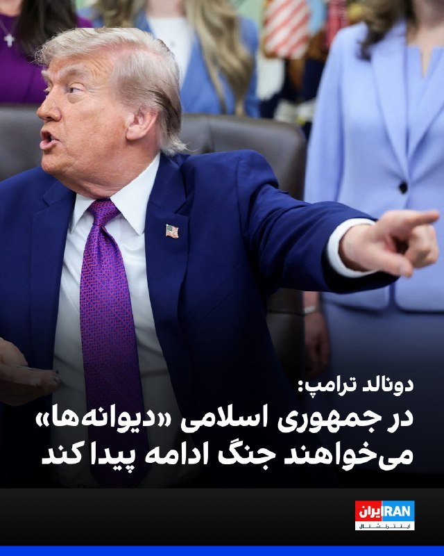

دونالد ترامپ از وجود اختلاف در داخل جمهوری اسلامی بر سر توافق با آمریکا سخن گفت و افزود گروهی از مقام‌های «میانه‌رو» خواهان توافق هستند اما «دیوانه‌ها» می‌خواهند جنگ ادامه پیدا کند.
او هشدار داد در صورت وقوع درگیری، «این یک جنگ خیلی سریع خواهد بود».

ترامپ گفت جمهوری اسلامی ابتدا با انتقال اورانیوم غنی‌شده از ایران موافقت کرده بود اما بعدا موضع خود را تغییر داد و این موضوع در سند ارسالی تهران به واشینگتن گنجانده نشد.

او افزود مقام‌های جمهوری اسلامی به آمریکا گفته بودند: «شما مجبورید آن را تحویل بگیرید.»

او در بخشی از صحبت‌های خود اضافه کرد واشینگتن قرار بود همراه با طرف ایرانی در روند انتقال مشارکت کند اما تهران بعدا نظرش را عوض کرد.

رییس‌جمهوری آمریکا گفت سند پیشنهادی جمهوری اسلامی پس از چهار روز تاخیر به واشینگتن ارسال شد؛ در حالی که به گفته او تهیه آن «فقط ۱۰ دقیقه» زمان نیاز داشت.

ترامپ افزود: «آنها تضمین دادند که برای مدت بسیار طولانی سلاح هسته‌ای نخواهند داشت، اما نمی‌توانند به نتیجه برسند.»
https://iranintl.com/202605119981

## IranIntlTV — post 336676

  <a href="telegram/content/IranIntlTV_336676_1778517490.mp4" target="_blank">🎬 Download video</a>

ساعاتی پس از نارضایتی کامل رییس‌جمهور آمریکا از پاسخ تهران به پیشنهاد واشینگتن برای توافق، سخنگوی وزارت خارجه گفت جمهوری اسلامی فعلا درباره برنامه هسته‌ای‌اش مذاکره نمی‌کند. همزمان نخست‌وزیر اسرائیل تدارک برگزاری یک نشست امنیتی را دیده است.

گزارشی از مجتبا پورمحسن
@iranintltv

## IranIntlTV — post 336675

  <a href="telegram/content/IranIntlTV_336675_1778517493.mp4" target="_blank">🎬 Download video</a>

ساعاتی پس از نارضایتی کامل رییس‌جمهور آمریکا از پاسخ تهران به پیشنهاد واشینگتن برای توافق، سخنگوی وزارت خارجه گفت جمهوری اسلامی فعلا درباره برنامه هسته‌ای‌اش مذاکره نمی‌کند. همزمان نخست‌وزیر اسرائیل تدارک برگزاری یک نشست امنیتی را دیده است.

گزارشی از مجتبا پورمحسن
@iranintltv

## IranIntlTV — post 336674

  <a href="telegram/content/IranIntlTV_336674_1778517496.mp4" target="_blank">🎬 Download video</a>

دونالد ترامپ با «آشغال» خواندن پیشنهاد توافق تهران گفت آتش‌بس به‌شدت شکننده است. او در ادامه گفت: «آتش‌بس در اغما قرار دارد، به آن اکسیژن وصل کرده‌اند و تنها یک درصد شانس بقا دارد.»
@iranintltv

## IranIntlTV — post 336673

  <a href="telegram/content/IranIntlTV_336673_1778517497.mp4" target="_blank">🎬 Download video</a>

دونالد ترامپ، رییس‌جمهوری آمریکا، درباره مقامات جمهوری اسلامی گفت: «آن‌ها فکر می‌کنند من خسته خواهم شد، اما هیچ فشاری روی من نیست.» او همچنین پیشنهاد توافق جمهوری اسلامی را «احمقانه» توصیف کرد.
@iranintltv

## IranIntlTV — post 336672

  

دونالد ترامپ در گفت‌وگو با سی‌بی‌اس نیوز درباره پاسخ اخیر تهران به پیشنهاد صلح آمریکا گفت که جمهوری اسلامی در برنامه هسته‌ای خود امتیازاتی داده اما «کافی نبوده» و هنوز «پیشنهاد آن‌ها بسیار ضعیف و غیرقابل قبول» است.
https://iranintl.com/202605110573

## IranIntlTV — post 336671

  <a href="https://t.me/IranintlTV/336671" target="_blank">📎 Download file</a>

🎧نسخه صوتی اخبار نیمروزی | دوشنبه ۲۱ اردیبهشت
@iranintlTV

## IranIntlTV — post 336670

  

دونالد ترامپ در واکنش به اظهارات بنیامین نتانیاهو که گفته بود «هیچ‌کس پیش‌بینی کامل و دقیقی» درباره تنگه هرمز نداشت، گفت: «من داشتم. من می‌دانستم آن‌ها تنگه هرمز را بسته‌اند. این تنها سلاحی است که دارند.»
ترامپ افزود آمریکا می‌توانست در چارچوب «پروژه آزادی» این گذرگاه را باز کند و گفت این عملیات می‌تواند از سر گرفته شود و در آن صورت «بسیار شدیدتر» خواهد بود.
https://iranintl.com/202605119757

## IranIntlTV — post 336669

🔻کسب‌وکارها یکی پس از دیگری سقوط می‌کنند

همزمان با تداوم قطعی اینترنت، فشارهای اقتصادی و پیامدهای جنگ، بسیاری از کسب‌وکارها در شهرهای مختلف با کاهش فروش، تعدیل نیرو و حتی خطر تعطیلی مواجه شده‌اند. صاحبان کسب‌وکارها در پیام‌هایی به ایران‌اینترنشنال، وضعیت کنونی را یکی از دشوارترین دوره‌های سال‌های اخیر توصیف کردند.

یک مدرس کاشت ناخن و مانیکور از توقف کسب‌وکار خود از اسفندماه سال گذشته تاکنون خبر داد.

به گفته این شهروند، گرچه مردمی که از تامین نیازهای اولیه خود درمانده شده‌اند، کمتر به خدمات زیبایی می‌پردازند، اما عوامل دیگری نیز در این رکود موثر است؛ از جمله قطعی اینترنت که موجب شده تا او کسب درآمد از طریق فروش پکیج‌های آموزشی را از دست بدهد.

او همچنین توضیح داد از همان زمان تاکنون آنتن دستگاه کارتخوانش قطع شده است و در پاسخ به پیگیری‌هایش گفته‌اند سیگنال دستگاه کارتخوان «مشاغل غیرضروری» به دلایل «امنیتی» تا اطلاع ثانوی قطع خواهد بود.

بحران در صنایع پتروشیمی و بنادر

افزون بر این، پیام‌های رسیده به ایران‌اینترنشنال حاکی از موج گسترده بیکاری و ورشکستگی در کسب‌وکارهای صنعتی و خدماتی وابسته به صنایع سنگین است.

بسیاری از فعالان این حوزه‌ها که تعدیل، اخراج یا بیکار شده‌اند، گفتند همچون دیگر صنف‌هایی که با مشکل اقتصادی مواجه شده‌اند، به مشاغلی نظیر رانندگی در اسنپ یا کارهایی روی آورده‌اند که امنیت شغلی پایین‌تری دارند.

یک شهروند شاغل در حوزه صنعت گفت: «هر کیلو پروفیل پیش از جنگ تا حدود قیمت ۷۰ هزارتومان خریدوفروش می‌شد، اما اکنون قیمت آن به ۱۵۵ هزار تومان رسیده است. به دلیل همین افزایش قیمت مدت سه‌ ماه است که بیکاریم و توان پرداخت هزینه مواد اولیه را نداریم.»

قیمت پروفیل، به‌عنوان ماده اولیه ساخت‌وساز در صنایع طی یک‌سال گذشته افزایش قیمتی ۱۲۰ تا ۱۶۰ درصدی را تجربه کرده است.

مخاطب دیگری که فعال در صنف کابینت‌سازی است، نیز گفت قیمت هر ورق ام‌دی‎‌اف از ۳ میلیون تومان در سال ۱۴۰۴ به ۱۵ تا ۱۷ میلیون تومان در سال جدید رسیده است.

این شهروند با اشاره به رشد ۴۰۰ تا ۴۷۰ درصدی قیمت مواد اولیه، گفت در چنین شرایطی دیگر امکان ادامه کار و پرداخت اجاره محل کسب وجود ندارد.

پیش از این نیز شهروندان از بحران بیکاری در مشاغل مرتبط با پتروشیمی و نبود ورق آهن و مواد پتروشیمی در شهرهایی از جمله اصفهان خبر داده بودند که باعث تعطیلی بسیاری از کارگاه‌های صنعتی شده است.

علاوه بر صنایع، گزارش‌هایی نیز از موج توقف کسب و کارها و تعدیل نیرو در بنادر به دست ایران‌اینترنشنال رسیده است.

یکی از کارکنان بندر رجایی گفت بسیاری از کارگران این منطقه اقتصادی تعدیل شده‌اند و آنها که همچنان سر کار مانده‌اند، حقوق‌هایشان به‌صورت مرتب پرداخت نمی‌شود و بندر بسیار خلوت شده است.

بندر رجایی یکی از مهم‌ترین بنادر تجاری ایران است که اردیبهشت سال ۱۴۰۴ با آنچه انفجار یکی از کانتینرهای حامل مواد شیمیایی خطرناک، از جمله سدیم پرکلرات اعلام شد، دچار آتش‌سوزی شد و به مرگ ده‌ها نفر انجامید.

بسیاری از شرکت‌های پیمانکاری وابسته به این بندر پس از انفجار و تا پیش از جنگ نیز با مشکلات اقتصادی بسیاری دست به گریبان بوده‌اند.

شهروند دیگری از سربندر در پیامی مشابه نوشت تمامی شرکت‌های بندر نیروهای خود را تعدیل کرده‌اند و حقوق افرادی که کماکان بر سر کار مانده‌اند هم به درستی پرداخت نمی‌شود.

پایگاه خبری رویداد ۲۴ نیز ۱۷ اردیبهشت در گزارشی درباره وضعیت مجموعه فولاد مبارکه پس از حملات آمریکا و اسرائیل نوشت که با وجود اطمینان‌دهی اولیه به کارکنان مبنی بر پرداخت بدون مشکل حقوق،دستمزد نیروها به حداقل دستمزد مصوب اداره کار تقلیل یافته است و بسیاری از نیروهای متخصص به رانندگی در تاکسی‌های اینترنتی روی آورده‌اند.

رستوران‌ها تحت تاثیر گرانی

صنف رستوران و غذاخوری‌ها نیز از جمله کسب و کارهایی هستند که با افزایش قیمت مواد اولیه و فشارهای اقتصادی آسیب زیادی دیده‌اند.

یکی از مخاطبان ایران‌اینترنشنال که صاحب یک رستوران فست‌فود در لاهیجان است، نوشت: «مواد اولیه ساندویچی که اکنون به مبلغ ۱۰۰ هزارتومان فروخته می‌شود، چند روز بعد ۱۱۰ هزار تومان خریداری می‌شود. پس ناچار به افزایش قیمت روزانه هستیم که هم موجب نارضایتی مشتری است و هم خود از این مساله آسیب دیده‌ایم.»

رستوران‌دار دیگری از کیش نیز گفت اول ناچار شد بیش از ۱۰ نفر از نیروهایش را تعدیل کند و حالا چاره‌ای جز تعطیلی برایش نمانده است.
هم‌زمان، برخی مخاطبان از افزایش قیمت فست‌فود خبر دادند.

بر اساس این گزارش‌ها، قیمت یک ساندویچ به‌طور متوسط به ۵۰۰ هزار تومان و یک پیتزا به یک میلیون و ۲۰۰ هزار تومان رسیده است.

🔗 وب‌سایت ایران اینترنشنال

@iranintltv

## IranIntlTV — post 336668

  <a href="telegram/content/IranIntlTV_336668_1778517502.mp4" target="_blank">🎬 Download video</a>

سرخط خبرهای دوشنبه ۲۱ اردیبهشت
@iranintltv

## IranIntlTV — post 336667

  <a href="telegram/content/IranIntlTV_336667_1778517504.mp4" target="_blank">🎬 Download video</a>

پس از رد پیشنهاد دیپلماتیک جدید جمهوری اسلامی از سوی دونالد ترامپ، سناتورها در کنگره آمریکا به ابراز نظر و واکنش پرداختند. سناتور لیندسی گراهام از احیای پروژه آزادی پلاس حمایت کرد.

مرضیه حسینی، خبرنگار ایران‌اینترنشنال، گزارش می‌دهد
@iranintltv

## IranIntlTV — post 336666

  <a href="telegram/content/IranIntlTV_336666_1778517506.mp4" target="_blank">🎬 Download video</a>

تحولات تازه در سوریه دوباره توجه کاربران شبکه‌های اجتماعی را جلب کرده است. بازگشت سوئیفت و شبکه‌های مالی بین‌المللی و همچنین افزایش بازگشت مهاجران سوری به کشورشان، از جمله موضوعاتی است که در رسانه‌های اجتماعی مورد توجه قرار گرفته است.

عادله بورنگ، عضو تحریریه ایران‌اینترنشنال، گزارش می‌دهد
@iranintltv

## IranIntlTV — post 336665

  <a href="telegram/content/IranIntlTV_336665_1778517509.mp4" target="_blank">🎬 Download video</a>

روزنامه گاردین در گزارشی از احتمال افزایش تهدیدهای امنیتی مرتبط با جمهوری اسلامی همزمان با جام جهانی ۲۰۲۶ در آمریکا خبر داد.

گفت‌وگو با محمد تقوی، ایران‌اینترنشنال
@iranintltv

## IranIntlTV — post 336664

  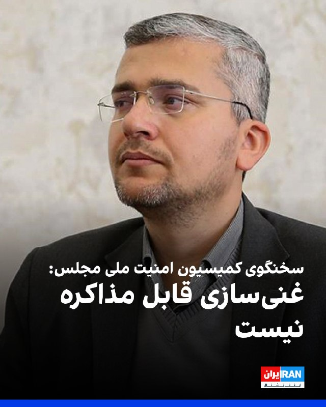

ابراهیم رضایی، سخنگوی کمیسیون امنیت ملی و سیاست خارجی مجلس، به نقل از محمد اسلامی، رییس سازمان انرژی اتمی، در جلسه کمیسیون امنیت ملی مجلس، گفت: موضوع «فناوری» هسته‌ای در دستور کار مذاکرات قرار ندارد و غنی‌سازی قابل مذاکره نیست.

رضایی افزود اعضای کمیسیون بر ضرورت حفاظت از مراکز هسته‌ای، برخورد با «دشمن» و بی‌فایده بودن عضویت در ان‌پی‌تی‌ «پیمان منع گسترش سلاح‌های هسته‌ای»‌ تاکید کردند و خواستار حفظ «دستاوردهای» هسته‌ای شدند.
https://iranintl.com/202605113202

## IranIntlTV — post 336663

  <a href="telegram/content/IranIntlTV_336663_1778517513.mp4" target="_blank">🎬 Download video</a>

تداوم انسداد تنگه هرمز و کاهش ذخایر انرژی، بازارهای جهانی را با خطر رکود و اختلال در فعالیت پالایشگاه‌ها روبه‌رو کرده است.
@iranintltv

## IranIntlTV — post 336662

  

ستاد فرماندهی مرکزی آمریکا، سنتکام، اعلام کرد نیروهای آمریکایی تاکنون ۶۲ کشتی تجاری را مجبور به تغییر مسیر کرده و چهار کشتی را برای اجرای محاصره از کار انداخته‌اند.

سنتکام با انتشار تصویری از یکی از ناوشکن‌های آمریکا در ایکس نوشت: ناو «دیلبرت دی‌بلک» در حال نظارت بر آب‌های منطقه‌ای در دریای عرب است و در اجرای محاصره دریایی آمریکا علیه جمهوری اسلامی مشارکت دارد.
https://iranintl.com/202605110754

## IranIntlTV — post 336661

  <a href="telegram/content/IranIntlTV_336661_1778517515.mp4" target="_blank">🎬 Download video</a>

محمدعلی عزیز جعفری که از سال ۱۳۸۶ تا ۱۳۹۸ فرمانده کل سپاه پاسداران بود، بر پنج شرط جمهوری اسلامی برای مذاکره با آمریکا تاکید کرد.

مرتضی کاظمیان، عضو تحریریه ایران‌اینترنشنال، درباره پیشینه و جایگاه عزیز جعفری، اهمیت اظهارنظر او و نیز شرط‌های تهران برای مذاکره با واشینگتن توضیح می‌دهد.

@iranintltv

## IranIntlTV — post 336660

  <a href="telegram/content/IranIntlTV_336660_1778517518.mp4" target="_blank">🎬 Download video</a>

رسانه‌های اسرائیلی خبر دادند، بنیامین نتانیاهو، نخست‌وزیر این کشور، دوشنبه ۲۱ اردیبهشت نشست امنیتی برگزار می‌کند. همزمان دونالد ترامپ از گفت‌وگوی تلفنی با بنیامین نتایاهو خبر داد.

گفت‌وگو با سمیرا قرایی، خبرنگار ایران‌اینترنشنال
@iranintltv

## IranIntlTV — post 336659

  <a href="telegram/content/IranIntlTV_336659_1778517520.mp4" target="_blank">🎬 Download video</a>

بیش از ۷۳ روز است که میلیون‌ها نفر در ایران با قطع اینترنت مواجه هستند. به گفته بسیاری از شهروندان، این وضعیت زندگی، کار، درمان و آرامش روانی آن‌ها را مختل کرده است.

گفت‌وگو با سحر تحویلی، کارشناس ارشد هوش مصنوعی و فناوری
@iranintltv

## Persian_Trend_Official — post 13931

کانال رسمی پرشین ترند pinned «https://youtube.com/live/rsDox1i9jQs?feature=share»

## Persian_Trend_Official — post 13930

https://youtube.com/live/rsDox1i9jQs?feature=share

## Persian_Trend_Official — post 13929

  <a href="telegram/content/Persian_Trend_Official_13929_1778517523.mp4" target="_blank">🎬 Download video</a>

🔴ترامپ: آتش‌بس تو وضعیت حیاتیه

💢 این وضعیت به طرز باورنکردنی ضعیفه. بعد از خوندن اون مزخرفات "پیشنهاد ایران" حتی وقت نکردم کاملش رو بخونم

💢 این پیشنهاد خیلی ضعیفه و عملاً امید زیادی به ادامه آتش‌بس وجود نداره

🫆:Tony

📌 @persian_trend_official
پرشین ترند | متفاوت‌ترین کانال نظامی

## Persian_Trend_Official — post 13928

  <a href="telegram/content/Persian_Trend_Official_13928_1778517528.mp4" target="_blank">🎬 Download video</a>

🔴 ترامپ: ما ۴ روز برای سندی از ایران منتظر ماندیم که تنظیم آن بیش از ۱۰ دقیقه زمان نمی‌برد

🔹آن‌ها ۲ روز پیش با خارج‌کردن اورانیوم‌ها موافقت کردند اما بعداً نظرشان تغییر کرد، چون آن را در پیام ارسالی به ما نیاوردند.

🫆:Tony

📌 @persian_trend_official
پرشین ترند | متفاوت‌ترین کانال نظامی

## Persian_Trend_Official — post 13927

  

🔴 اوکراین و آلمان تولید مشترک پهپادهای دوربرد را آغاز می‌کنند

💢اوکراین و آلمان از آغاز همکاری مشترک برای تولید پهپادهای تهاجمی دوربرد خبر دادند.

بر اساس گزارش‌ها:

▪️ برد این پهپادها تا حدود ۱۵۰۰ کیلومتر خواهد بود

▪️ هدف از این همکاری، افزایش توان حملات عمقی و دوربرد عنوان شده است

▪️ این پروژه بخشی از گسترش همکاری‌های نظامی و صنعتی میان برلین و کی‌یف محسوب می‌شود

🫆:Tony

📌 @persian_trend_official
پرشین ترند | متفاوت‌ترین کانال نظامی

## Persian_Trend_Official — post 13926

🔴ترامپ: گروه بزرگی از ژنرال‌ها منتظرند تا در مورد ایران با من ملاقات کنند 🔹ما در حال حاضر نمی‌دانیم چگونه می‌توانیم ایران را برای ادامه حذف بقایای هسته‌ای متقاعد کنیم و این موضوع را به مذاکرات بیشتر موکول خواهیم کرد. ▪️اگر توافقی حاصل نشود، ما ایران را به…

## Persian_Trend_Official — post 13925

🔴ترامپ: گروه بزرگی از ژنرال‌ها منتظرند تا در مورد ایران با من ملاقات کنند

🔹ما در حال حاضر نمی‌دانیم چگونه می‌توانیم ایران را برای ادامه حذف بقایای هسته‌ای متقاعد کنیم و این موضوع را به مذاکرات بیشتر موکول خواهیم کرد.

▪️اگر توافقی حاصل نشود، ما ایران را به گونه‌ای هدف قرار خواهیم داد که قبلاً ندیده‌اند

🫆:Tony

📌 @persian_trend_official
پرشین ترند | متفاوت‌ترین کانال نظامی

## Persian_Trend_Official — post 13924

  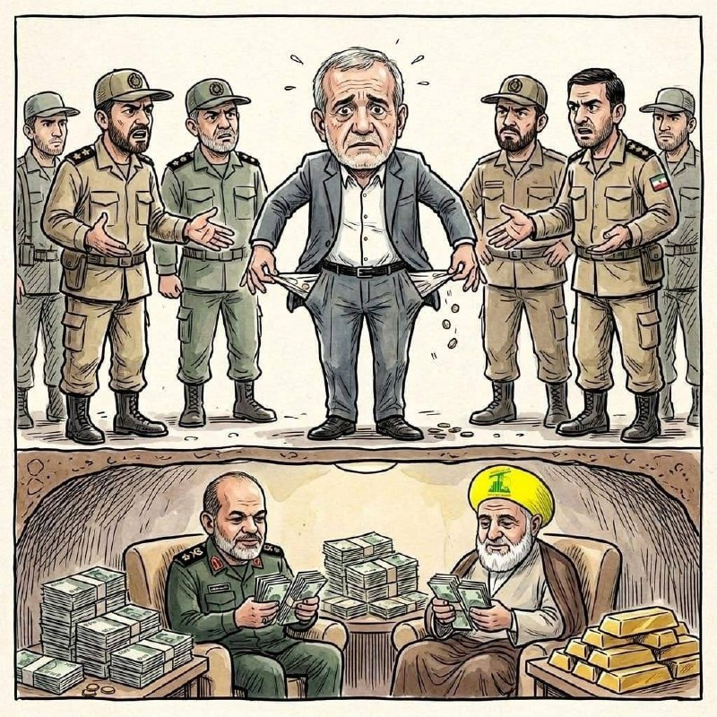

🔹اسرائیل به فارسی

💢جمهوری اسلامی ورشکسته شده و قادر به پرداخت حقوق به مزدوران داخلی خود نیست...

🫆:Tony

📌 @persian_trend_official
پرشین ترند | متفاوت‌ترین کانال نظامی

## Persian_Trend_Official — post 13923

  <a href="telegram/content/Persian_Trend_Official_13923_1778517532.webm" target="_blank">🎬 Download video</a>

🔴 ترامپ: ایران از آمریکا خواسته «گرد و غبار هسته‌ای» را جمع‌آوری کند

💢دونالد ترامپ مدعی شد مذاکره‌کنندگان ایرانی به او گفته‌اند آمریکا باید مواد رادیواکتیو باقی‌مانده در تأسیسات هسته‌ای تخریب‌شده ایران را خارج کند، زیرا تهران فناوری لازم برای استخراج و پاکسازی آن را در اختیار ندارد.

ترامپ در توصیف این مواد از عبارت «گرد و غبار هسته‌ای» استفاده کرده است.

📌 این ادعا تاکنون از سوی منابع رسمی ایران تأیید نشده است.

🫆:Tony

📌 @persian_trend_official
پرشین ترند | متفاوت‌ترین کانال نظامی

## Persian_Trend_Official — post 13922

🔴 ترامپ: احتمال ازسرگیری «پروژه آزادی» با ابعادی گسترده‌تر

💢دونالد ترامپ اعلام کرد در حال بررسی ازسرگیری «پروژه آزادی» است، اما این بار نه فقط برای اسکورت کشتی‌ها در تنگه هرمز، بلکه در قالبی گسترده‌تر.

💢او همچنین مدعی شد:
«رهبران تندروی ایران در نهایت تسلیم خواهند شد.»

«با ایران تعامل خواهیم کرد تا زمانی که به توافق برسیم.»

📌 این اظهارات در حالی مطرح می‌شود که فضای مذاکرات و تنش‌های منطقه‌ای همچنان ناپایدار و مبهم باقی مانده است.

🫆:Tony

📌 @persian_trend_official
پرشین ترند | متفاوت‌ترین کانال نظامی

---
📅 بروزرسانی: 1405/02/21 17:38
---

## ChizBergerz — post 46298

  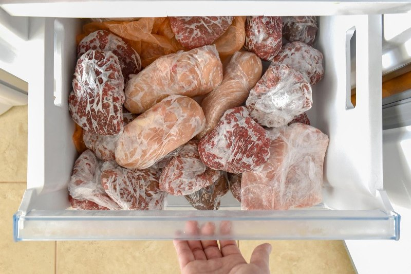

🔴تصویر کمتر دیده شده از جلسه فوق امنیتی سران نظام با حضور رهبر موشلمین جهان:

@ChizBergerz

## ChizBergerz — post 46297

  <a href="telegram/content/ChizBergerz_46297_1778508486.mp4" target="_blank">🎬 Download video</a>

من و رفیقم خطاب به کانفیگ‌ فروشا:

@ChizBergerz

## ChizBergerz — post 46296

  <a href="telegram/content/ChizBergerz_46296_1778508488.mp4" target="_blank">🎬 Download video</a>

یه آخوند خارکصده تو صداوسیما؛
امام علی شوهر زنی رو کشت اما چون مهربان بود با زن بیوه دوست شد، با او به خونه‌‌اش رفت و بعد شام هم با بچه‌های زن بیوه بازی کرد و هم با خود زن بیوه بازی کرد!
+ مادرجنده یجوری تعریف میکنه انگار ۱۴۰۰ سال پیش قدم به قدم با علی اینور و اونور میرفته، دلم به حال اون کصخلایی که این کصشعرارو باور میکنن میسوزه.
@ChizBergerz

## ChizBergerz — post 46295

قبل از شروع جنگ و قطعی اینترنت درخواست فیبرنوری دادم و حالا اومدن نصب و فعالش کردن؛ با تشکر از شاتل بابت سرویس خوبشون؛
درواقع قبل از نصب اینترنت نداشتم
ولی الان با سرعت خیلی بیشتری اینترنت ندارم.

## ChizBergerz — post 46294

  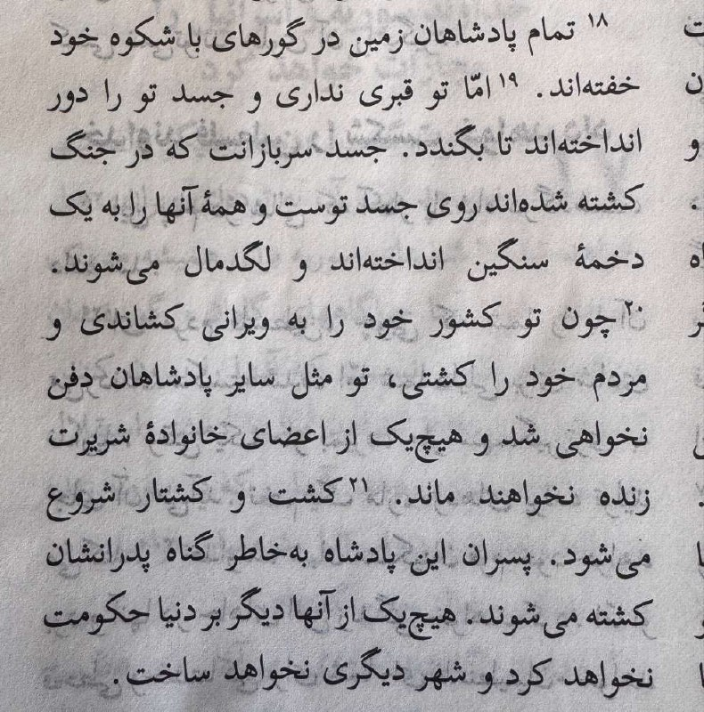

پشماتون بریزه!

تو کتاب تورات بخش اشعیا، باب ۱۴، آیه ۱۸ تا ۲۱ در مورد سرنوشت "بخت‌النصر دوم" پادشاه بابل پیشگویی ها انجام شده که گویا دقیقا در مورد خامنه‌ایه!

دقیقا این بخش 2500 سال پیش نوشته شده و واژه به واژه سرنوشت خامنه‌ای رو حکایت میکنه!
@ChizBergerz

## rodast_omiddana — post 71223

🎬 آنالیز مصاحبه امنیتی مجید واشقانی و متین ستوده
لینک یوتیوب:
https://www.youtube.com/watch?v=-31VdujdehI

## rodast_omiddana — post 71222

🎬 اعتراف کارنشناس رژیم از مخالفت چین بابت بستن تنگه هرمز
لینک یوتیوب:
https://www.youtube.com/watch?v=ZsTYUKrugzs

## rodast_omiddana — post 71221

  <a href="telegram/content/rodast_omiddana_71221_1778508489.webm" target="_blank">🎬 Download video</a>

🚨 در کتاب تورات بخش اشعیا، باب ۱۴، آیه ۱۸ تا ۲۱ در مورد سرنوشت "بخت‌النصر دوم" پادشاه بابل پیشگویی ها انجام میشود که گویی در مورد خامنه ای میباشد..
دقیقا این بخش 2500 سال پیش نوشته شده و واژه به واژه سرنوشت خامنه ای را حکایت میکند..

## rodast_omiddana — post 71220

  <a href="telegram/content/rodast_omiddana_71220_1778508490.webm" target="_blank">🎬 Download video</a>

🚨 علی مطهری در گفتگو با ایرنا:..
"یک ماه قبل از کشته شدن علی لاریجانی به همراه مرتضی فرزندش به طور سرزده به منزل ما آمدند، احساس کردم ایشان از بابت تغییر مداوم مکان و رفت و آمد خسته شده، وقتی می‌خواستند خداحافظی کنند، همسرم به آقای لاریجانی گفت که طبقه بالای ما تقریبا خالی است و می‌توانند آنجا بیایند. من گفتم: نه، تو رو خدا نیایید اینجا، همه ما با هم کشته می‌شویم"..

## rodast_omiddana — post 71219

  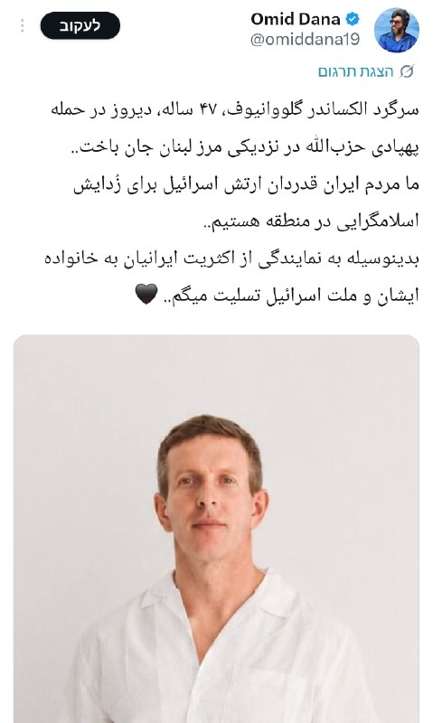

פעיל רשת ועיתונאי המזוהה עם האופוזיציה האיראנית (כ 270 אלף עוקבים בטלגרם) מוסר תנחומים על נפילתו של רס"ב אלכסנדר גלובניוב מפגיעת רחפן של חזבאללה :

רס״ב אלכסנדר גלובאניוב, בן 47, נהרג אתמול במתקפת כטב"ם של חזבאללה סמוך לגבול לבנון.

אנחנו, העם האיראני, מוקירים תודה לצבא ישראל על מיגור האסלאמיזם באזור.
בשם רוב העם האיראני, אני מבקש להביע את תנחומיי למשפחתו ולעם בישראל. 🖤

3 תגובות

## rodast_omiddana — post 71218

  <a href="telegram/content/rodast_omiddana_71218_1778508490.webm" target="_blank">🎬 Download video</a>

🚨 نخست‌وزیر نتانیاهو به زودی جلسه امنیتی فوری با رؤسای سرویس‌های امنیتی اسرائیل برگزار خواهد کرد، به دلیل واکنش ایران به پیشنهاد رئیس‌جمهور ترامپ.

## KiriMohems — post 47358

دو نفتکش ال‌ان‌جی قطری و یک نفتکش ال‌پی‌جی اماراتی از بنادر خود با خایه های در گلو حرکت کرده‌اند و در حال حاضر از تنگه هرمز عبور می‌کنند. هر سه کشتی از آب‌های عمان عبور می‌کنند. #Berlin @Kirimohems

## KiriMohems — post 47357

دو نفتکش ال‌ان‌جی قطری و یک نفتکش ال‌پی‌جی اماراتی از بنادر خود با خایه های در گلو حرکت کرده‌اند و در حال حاضر از تنگه هرمز عبور می‌کنند. هر سه کشتی از آب‌های عمان عبور می‌کنند.

#Berlin
@Kirimohems

## KiriMohems — post 47356

ترامپ به دعوت شی جین‌پینگ به صرف تریاک ایرانی قراره از 13 تا 15 مه یه سفر رسمی به چین داشته باشه

#Berlin
@Kirimohems

## KiriMohems — post 47355

وزیر خارجه سوریه: امیدواریم در آینده «روابطی باثبات و داداچی گونه ای » میان ما با اسرائیل شکل بگیرد.

#Berlin
@Kirimohems

## KiriMohems — post 47354

وزیر نفت : ما برنامه‌هایی برای مقابله با پیامدهای تحریم‌های آمریکا تدوین کرده‌ایم و جنگ به کیر و تخم راستمان هم نبوده و تولید ما در طول ۴۰ روز جنگ کاهش نیافته است

#Berlin
@Kirimohems

## KiriMohems — post 47353

کانفیگ‌های MVP متصل به اینترنت جهانی و پایدار همراه با لینک ساب جهت مشاهده حجم مصرفی و از همه مهم‌تر بدون هیچ‌گونه ضریب مصرفی 
📊
✨ تعرفه: 1Gb : 350,000 2Gb : 6,000,000 5Gb : 1490 10Gb : 2800 قابل اتصال به تمامی دستگاه‌ها 📱
💻 مناسب برای استفاده روزمره و حرفه‌ای…

## SportBaadNews — post 251349

  <a href="telegram/content/SportBaadNews_251349_1778508491.mp4" target="_blank">🎬 Download video</a>

اولیویا رودریگو بدجور عاشق یامال شده
@SportBaadNews

## SportBaadNews — post 251348

  <a href="telegram/content/SportBaadNews_251348_1778508492.mp4" target="_blank">🎬 Download video</a>

سوپرگل دیشب رشفورد رو از این زاویه ببینید لذت ببرید 🤌🏻🍷🔥
ارزش دانلود 20 از 10
@SportBaadNews

## SportBaadNews — post 251347

  <a href="telegram/content/SportBaadNews_251347_1778508493.mp4" target="_blank">🎬 Download video</a>

افشین، معاون علمی پزشکیان: نظر دولت برگشت اینترنت به وضعیت عادیه.

بزودی یه تصمیم برای اینترنت میگیریم. تو شرایط جنگی هم نباید اینترنت رو قطع کرد چون دیدیم حتی وقتی نت کامل قطع بود، باز هم ترورها ادامه داشت.
@SportBaadNews

## SportBaadNews — post 251346

حضور تیاگو سیلوا در لیست اولیه برزیل برای جام جهانی 2026 😍
@SportBaadNews

## SportBaadNews — post 251345

  

نیمار در لیست اولیه برزیل حضور داره 😍😍
@SportBaadNews

## SportBaadNews — post 251344

  

🇦🇷
🔺امروز لیست اولیه تیم ملی آرژانتین برای جام جهانی 2026 اومد بیرون و نکته قابل توجه نبود اسم دیبالا در لیست حاضرین بود...
@SportBaadNews

## SportBaadNews — post 251343

  <a href="telegram/content/SportBaadNews_251343_1778508496.webm" target="_blank">🎬 Download video</a>

🚨
⚽️ فووووری موندودپورتیوو: قرارداد هانسی فلیک با بارسلونا تا سال 2028 تمدید میشه به اضافه بند تمدید یک سال اضافه @SportBaadNews

## SportBaadNews — post 251342

  <a href="telegram/content/SportBaadNews_251342_1778508496.webm" target="_blank">🎬 Download video</a>

🚨
⚽️ فووووری موندودپورتیوو: قرارداد هانسی فلیک با بارسلونا تا سال 2028 تمدید میشه به اضافه بند تمدید یک سال اضافه
@SportBaadNews

## SportBaadNews — post 251341

  

⚽️
🔻ادو آگیره: رئال مادرید بدون کیلیان امباپه اصلاً نمیتونه ادامه بده. اون بعد از کریستیانو رونالدو بهترین بازیکن دنیاست. از لامین، اولیسه، کین، وینیسیوس و خیلیای دیگه هم بهتره…
@SportBaadNews

## SportBaadNews — post 251340

  <a href="telegram/content/SportBaadNews_251340_1778508497.webm" target="_blank">🎬 Download video</a>

🚨
💣
⚽️ فوووری از رامون آلوارز: یه سری از بازیکنای بزرگ تو رختکن رئال میخوان که باشگاه فده والورده رو بفروشه.
@SportBaadNews

## IranIntlTV — post 336658

  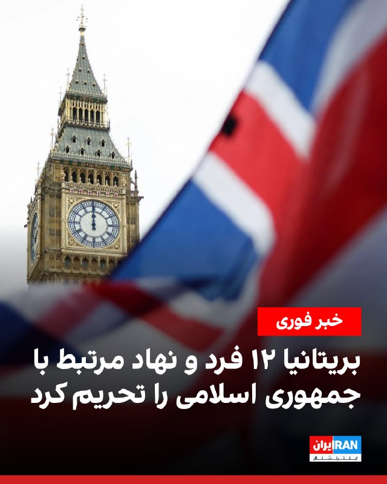

بریتانیا روز دوشنبه ۱۲ فرد و نهاد مرتبط با جمهوری اسلامی را تحریم کرد و آن‌ها را به مشارکت در «فعالیت خصمانه» از جمله طرح‌ریزی حملات و ارائه خدمات مالی به گروه‌هایی که به دنبال بی‌ثبات‌سازی بریتانیا و سایر کشورها هستند متهم کرد.
این اقدام شامل مسدود کردن دارایی‌ها، ممنوعیت سفر و دستورهای لغو صلاحیت مدیریت است.
https://iranintl.com/202605116825

## IranIntlTV — post 336657

  <a href="telegram/content/IranIntlTV_336657_1778508498.mp4" target="_blank">🎬 Download video</a>

یک شهروند با ارسال پیامی به ایران‌اینترنشنال می‌گوید: «شرایط در ایران حقیقتا دشوارتر شده است. مواد خوراکی، بی‌کیفیت و گران‌ شده‌اند و همان‌ها هم در حال ناموجود شدن هستند.»

## IranIntlTV — post 336656

  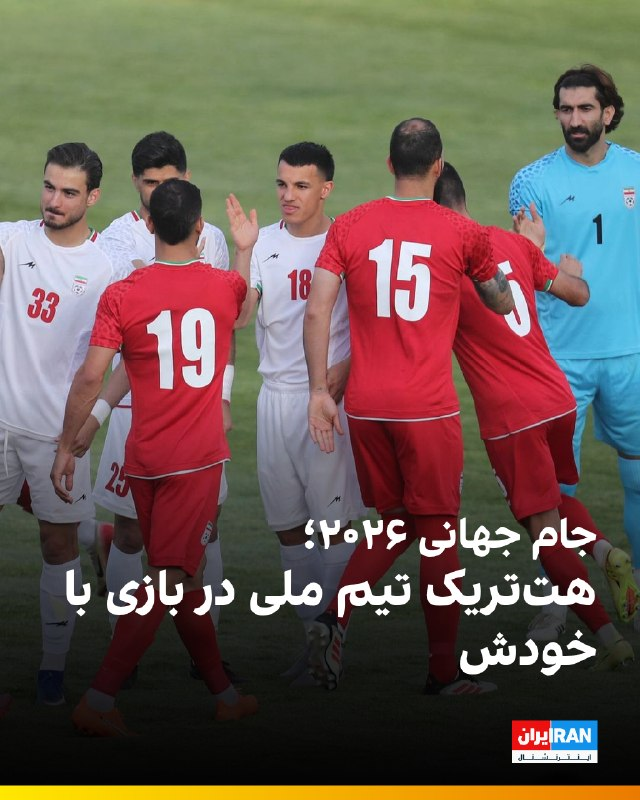

🔻تیم ملی فوتبال سومین بازی با خودش را سه‌شنبه ۲۲ اردیبهشت برگزار می‌کند. شاگردان امیر قلعه نویی به دلیل انزوای جمهوری اسلامی، از انجام بازی‌های تدارکاتی با تیم‌های درجه اول و دوم دنیا محروم شدند. حتی تیم‌های ملی مقدونیه و آنگولا هم از بازی با تیم ملی انصراف دادند.

🔹در حالی که تیم ملی فوتبال در آستانه جام جهانی نتوانسته حریفی پیدا کند و با خودش بازی می‌کند، فدراسیون فوتبال ازبکستان اعلام کرد که تیم ملی فوتبال این کشور پیش از جام جهانی ۲۰۲۶ دو بازی تدارکاتی با تیم‌های ملی هلند و کانادا برگزار خواهد کرد.

🔹امیر قلعه‌نویی، سرمربی تیم ملی، پیش‌تردرباره لغو بازی‌های تدارکاتی گفت: «بازی‌های تدارکاتی هماهنگ شده بود و قرارداد بستند؛ ولی در دقیقه ۹۰ کنسل شد.»

@iranintltvsport

## IranIntlTV — post 336655

پوریا میربهروزیان، جوان ۲۴ ساله، شامگاه ۱۸ دی‌ماه در حالی هدف گلوله ماموران در بلوار وکیل‌آباد مشهد قرار گرفت که در حال کمک به دوستان مجروحش بود. او روز ۲۴ اردیبهشت در بیمارستان فارابی جان باخت.

## IranIntlTV — post 336654

  <a href="telegram/content/IranIntlTV_336654_1778508500.mp4" target="_blank">🎬 Download video</a>

یک شهروند با ارسال پیامی به ایران‌اینترنشنال از اصفهان می‌گوید که با هزار زحمت کاسبی خود را انداخته ولی حالا سه ماه است که بیکار شده؛ «همه‌چیز گران شده و کسی پول ندارد.»

## IranIntlTV — post 336653

  

احمد دستمالچیان، سفیر سابق جمهوری اسلامی در اردن و لبنان، گفت: «اسرائیل زمام کنترل سیاست در امارات متحده عربی را در دست دارد و بازگشت آنها بسیار سخت است، ولی به نفع‌شان است که از سیاست دشمنی با مردم و ملت‌های منطقه برگردند. امارات می‌خواهد لقمه‌هایی بزرگتر از دهانش بردارد.»

او ادامه داد: «در غیر این صورت می‌تواند برای امارات متحده عربی شرایط نامناسبی ایجاد کند.»
https://iranintl.com/202605117725

## IranIntlTV — post 336652

  

مدیرعامل آرامکو گفت که شوک فعلی عرضه انرژی بزرگ‌ترین شوکی است که جهان تاکنون تجربه کرده است.

او افزود که اگر اختلال در تنگه هرمز چند هفته دیگر ادامه یابد، عادی‌سازی بازار تا سال ۲۰۲۷ رخ نخواهد داد.

مدیرعامل آرامکو ادامه داد: «حتی اگر تنگه هرمز امروز باز شود، بازتعادل بازار ماه‌ها زمان خواهد برد.»
https://iranintl.com/202605113980

## IranIntlTV — post 336651

🔻در آستانه سفر ترامپ به چین، پکن تحریم‌ها علیه شرکت‌های مرتبط با تهران را رد کرد

دولت چین در آستانه سفر رییس‌جمهوری آمریکا به این کشور، مخالفت شدید خود را با تحریم‌های واشینگتن علیه سه شرکت مستقر در چین که ایالات متحده آن‌ها را متهم به کمک به عملیات نظامی حکومت ایران کرده، اعلام کرد و این تحریم‌ها را «غیرقانونی» و «یک‌جانبه» خواند.

گوئو جیاکون، سخنگوی وزارت خارجه چین، دوشنبه ۲۱ اردیبهشت در نشست خبری روزانه خود گفت: «ما همواره از شرکت‌های چینی خواسته‌ایم فعالیت‌های تجاری خود را مطابق قوانین و مقررات انجام دهند و قاطعانه از حقوق و منافع مشروع شرکت‌های چینی دفاع خواهیم کرد.»

او افزود: «اولویت فوری این است که به هر شکل ممکن از بازگشت درگیری‌ها جلوگیری شود، نه اینکه از جنگ برای مرتبط کردن و تخریب دیگر کشورها به‌صورت مغرضانه استفاده شود.»

دونالد ترامپ، رییس‌جمهوری آمریکا، در حالی چهارشنبه ۲۳ اردیبهشت وارد پکن خواهد شد که موضوع ایران یکی از محورهای گفت‌وگوی او با شی جین‌پینگ، رییس‌جمهوری چین، خواهد بود.

او در هفته‌های اخیر تلاش کرده است پکن را برای اعمال فشار بر تهران به‌منظور توافق با واشینگتن به کار بگیرد.
از سوی دیگر، آمریکا ۱۸ اردیبهشت اعلام کرد مجموعه‌ای از افراد و شرکت‌ها در چین، هنگ‌کنگ، بلاروس و امارات متحده عربی را به‌دلیل ارتباط با برنامه‌های تسلیحاتی و شبکه‌های تامین جمهوری اسلامی تحریم کرده است.
بر این اساس، شرکت چینی فناوری ماهواره‌ای چانگ گوانگ، علاوه بر تحریم‌های پیشین مرتبط با روسیه، تحت فرمان اجرایی مرتبط با تسلیحات ایران نیز قرار گرفت.
وزارت خزانه‌داری آمریکا اعلام کرد آمادگی دارد تا علیه هر شرکت خارجی درگیر در تجارت غیرقانونی با تهران، از جمله خطوط هوایی، اقدام کند.
این وزارت‌خانه همچنین گفت ممکن است تحریم‌های ثانویه‌ای را علیه موسسات مالی خارجی که به فعالیت‌های جمهوری اسلامی یاری می‌رسانند، اعمال کند؛ از جمله شرکت‌هایی که «با پالایشگاه‌های نفت مستقل چین مرتبط هستند».
در بیانیه این وزارت‌خانه به نقل از اسکات بسنت، وزیر خزانه‌داری آمریکا، آمده است: «تحت رهبری دونالد ترامپ، به اقدام برای حفظ امنیت آمریکا ادامه می‌دهیم.»
او گفت افراد و شرکت‌های خارجی تامین‌کننده سلاح برای نیروهای نظامی جمهوری اسلامی را هدف تحریم قرار می‌دهیم.
وزارت خارجه آمریکا نیز اعلام کرد چندین شرکت مستقر در چین به‌دلیل ارائه تصاویر ماهواره‌ای به تهران برای کمک به حملات نظامی علیه نیروهای آمریکایی در خاورمیانه، هدف تحریم قرار گرفتند.
مارکو روبیو، وزیر خارجه آمریکا، تاکید کرد: «اقدام امروز، نهادهای مستقر در چین را به‌دلیل حمایتشان از ایران پاسخگو می‌کند.»
او افزود آمریکا از «همه ابزارهای لازم» برای هدف قرار دادن نهادها و افرادی در کشورهای ثالث که به نیروهای نظامی و صنایع دفاعی جمهوری اسلامی کمک می‌کنند، استفاده خواهد کرد.
هم‌زمان وب‌سایت نشنال‌نیوز گزارش داد جمهوری اسلامی در پاسخ به مذاکرات جاری با آمریکا، فهرستی گسترده از مطالبات را مطرح کرده که به گفته منابع رسانه‌ای، با واکنش تند ترامپ روبه‌رو شده است.

بر اساس این گزارش که به نقل از شبکه لبنانی المیادین منتشر شد، [حکومت] ایران خواستار پایان فوری جنگ، تضمین آتش‌بس در لبنان، لغو کامل تحریم‌های ایالات متحده، آزادسازی دارایی‌های بلوکه‌شده و ازسرگیری بدون محدودیت صادرات نفت ایران شده است.

🔗وب‌سایت ایران‌اینترنشنال

@iranintltv

## IranIntlTV — post 336650

  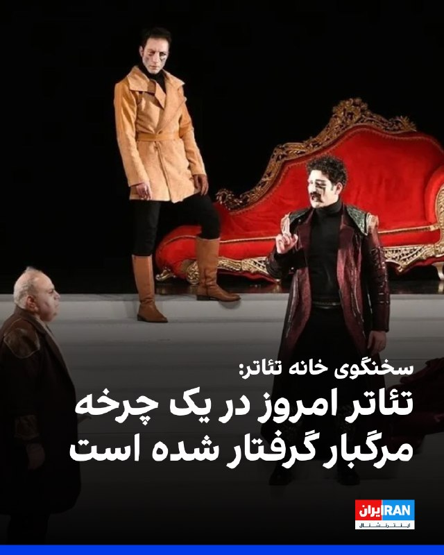

رضا دادویی، سخنگوی خانه تئاتر گفت که تئاتر امروز در یک چرخه‌ مرگبار گرفتار شده‌ و افزود وقتی درآمد هنرمند از زیر خط فقر هم پایین‌تر است، مطالبه پرداخت حق بیمه، نوعی فشار اقتصادی ایجاد می‌شود.»

او افزود: «هنرمندی که درآمدی نداشته و بیمه بیکاری دریافت نمی‌کند و با پرداخت نکردن حق بیمه از خدمات اجتماعی و درمانی محروم می‌شود.»

او ادامه داد: «هنرمند در این شرایط ناچار است بین بقا و معیشت و خلق اثر هنری یکی را انتخاب کند.»
https://iranintl.com/202605113803

## IranIntlTV — post 336649

  <a href="telegram/content/IranIntlTV_336649_1778508503.mp4" target="_blank">🎬 Download video</a>

عبدالناصر همتی، رییس بانک مرکزی ایران، در واکنش به بحران ارزی گفت افزایش نرخ ارز در شرایط تورمی و جنگی، طبیعی است.

ارزیابی آرش آزرمی، دبیر بخش اقتصادی ایران‌اینترنشنال

@iranintltv

## IranIntlTV — post 336648

  <a href="telegram/content/IranIntlTV_336648_1778508505.mp4" target="_blank">🎬 Download video</a>

کی‌یر استارمر، نخست‌وزیر بریتانیا، پس از شکست سنگین حزب کارگر در انتخابات شوراهای محلی، اعلام کرد قصد کناره‌گیری ندارد و با هرگونه تلاش برای برکناری‌اش مبارزه می‌کند.
گفت‌وگو با تاج‌الدین سروش، عضو تحریریه ایران‌اینترنشنال

@iranintltv

## IranIntlTV — post 336647

  

محمدعلی جعفری، فرمانده قرارگاه «بقیه‌الله» سپاه پاسداران، گفت: «تا زمانی که جنگ در همه جبهه‌ها پایان نیابد، تحریم‌ها برداشته نشود، پول‌های بلوکه‌شده آزاد نشود، خسارت‌های ناشی از جنگ جبران نشود و حق حاکمیت جمهوری اسلامی بر تنگه هرمز به رسمیت شناخته نشود، هیچ مذاکره دیگری در کار نیست.»

او افزود که با این سطح از بی‌اعتمادی به آمریکا، طبیعی است تیم مذاکره‌کننده با هدایت کلیت نظام، شروطی را مشخص کند که همه حقوق مسلم جمهوری اسلامی را تامین کند و این شروط «حداقل انتظارات» ما است.
iranintl.com/202605118530

## IranIntlTV — post 336646

  <a href="telegram/content/IranIntlTV_336646_1778508507.mp4" target="_blank">🎬 Download video</a>

یک شهروند با ارسال پیامی از مشهد به ایران‌اینترنشنال می‌گوید: «هر یک عدد نان، شده ۳۰ هزار تومن. زندگی واقعا سخت است. آقای ترامپ، آقای نتانیاهو، لطفا به قولی که به ما مردم ایران دادید عمل کنید.»

## IranIntlTV — post 336645

  <a href="telegram/content/IranIntlTV_336645_1778508509.mp4" target="_blank">🎬 Download video</a>

در حالی‌ که پس از چند روز تاخیر، نمایندگان جمهوری اسلامی، پاسخ آمریکا به طرح صلح پیشنهادی را به نمایندگان پاکستان تحویل دادند، رییس جمهوری آمریکا این پیشنهاد را کاملا «غیر قابل قبول» خواند.

گفت‌وگو با علی‌حسین قاضی‌زاده، عضو تحریریه ایران‌اینترنشنال

@iranintltv

## IranIntlTV — post 336644

گروهی از ایرانیان مقیم ایتالیا، یکشنبه ۲۰ اردیبهشت، در اعتراض به اعدام‌های جمهوری اسلامی در شهر بولونیا تجمع کردند.

گزارش صدف باغبان، خبرنگار

@iranintltv

## IranIntlTV — post 336643

  <a href="telegram/content/IranIntlTV_336643_1778508510.mp4" target="_blank">🎬 Download video</a>

مروری بر رسانه‌ها و خبرگزاری‌ها در ایران، دوشنبه ۲۱ اردیبهشت، با مجتبی هاشمی، روزنامه‌نگار

@iranintltv

## IranIntlTV — post 336642

  <a href="telegram/content/IranIntlTV_336642_1778508512.mp4" target="_blank">🎬 Download video</a>

اطلاعات رسیده به ایران‌اینترنشنال، جزییات تازه‌ای از کشته شدن جاویدنام پوریا میربهروزیان در جریان انقلاب ملی ایرانیان در مشهد روایت می‌کند.
گفت‌وگو با فرنوش فرجی، عضو تحریریه ایران‌اینترنشنال
@iranintltv

## IranIntlTV — post 336640

🔻ترامپ پاسخ تهران به طرح صلح را رد کرد؛ ادامه بحران تنگه هرمز قیمت نفت را بالا برد

دونالد ترامپ، رییس‌جمهوری آمریکا، به‌سرعت پاسخ جمهوری اسلامی به پیشنهاد صلح واشینگتن را رد کرد. اقدامی که روز دوشنبه باعث جهش قیمت نفت شد و نگرانی‌ها را درباره ادامه جنگ و فلج ماندن کشتیرانی در تنگه هرمز افزایش داد.

خبرگزاری رویترز دوشنبه ۲۱ اردیبهشت گزارش داد چند روز پس از آن‌که آمریکا پیشنهادی را برای ازسرگیری مذاکرات ارائه کرد، تهران ۲۰ اردیبهشت پاسخ خود را ارائه داد. پاسخی که بر پایان جنگ «در همه جبهه‌ها»، به‌ویژه لبنان - جایی که اسرائیل، متحد آمریکا، با نیروهای حزب‌الله مورد حمایت جمهوری اسلامی درگیر است - تمرکز داشت.

صداوسیمای جمهوری اسلامی گزارش داد تهران همچنین خواستار دریافت غرامت خسارات جنگ و تاکید بر حاکمیت ایران بر تنگه هرمز شده است.

خبرگزاری تسنیم، وابسته به سپاه پاسداران، نیز گزارش داد جمهوری اسلامی در این پاسخ خواستار پایان محاصره دریایی آمریکا، تضمین عدم حمله مجدد، لغو تحریم‌ها و پایان ممنوعیت فروش نفت ایران از سوی آمریکا شده است.

ترامپ تنها چند ساعت بعد، در شبکه اجتماعی تروث سوشال، این پیشنهاد را رد کرد.

او نوشت: «دوستش ندارم - کاملا غیرقابل قبول است ....»

رییس‌جمهوری آمریکا توضیح بیشتری ارائه نکرد.

اختلاف بر سر مسیر پایان جنگ
رویترز نوشت که آمریکا پیشنهاد کرده بود ابتدا درگیری‌ها متوقف شود و سپس مذاکرات درباره مسائل اختلاف‌برانگیزتر، از جمله برنامه هسته‌ای جمهوری اسلامی، آغاز شود.
پس از رد خواسته‌های تهران از سوی ترامپ، حکومت ایران ۲۱ اردیبهشت اعلام کرد پیشنهادش برای پایان جنگ «سخاوتمندانه و مسئولانه» بوده است.
اسماعیل بقایی، سخنگوی وزارت امور خارجه جمهوری اسلامی، گفت: «خواسته ما مشروع است؛ پایان جنگ، لغو محاصره و دزدی دریایی آمریکا و آزادسازی دارایی‌های ایران که تحت فشار آمریکا به‌طور ناعادلانه در بانک‌ها مسدود شده‌اند.»
او افزود: «عبور امن از تنگه هرمز و برقراری امنیت در منطقه و لبنان نیز از دیگر خواسته‌های ایران بود که پیشنهادی سخاوتمندانه و مسئولانه برای امنیت منطقه محسوب می‌شود.»
بقایی همچنین گفت جمهوری اسلامی هنوز با کسانی که «علیه ما چنین جنایتی مرتکب شدند»، تسویه‌حساب نکرده و اگر فرصتی در اختیار نیروهای مسلح قرار گیرد، «به بهترین وجه» از آن استفاده خواهد شد.

جهش قیمت نفت و ادامه بحران تنگه هرمز
در پی تداوم بن‌بست میان تهران و واشینگتن، قیمت نفت ۲۱ اردیبهشت بیش از ۳.۵ درصد افزایش یافت.
پیش از آغاز جنگ میان آمریکا و اسرائیل با جمهوری اسلامی در ۹ اسفند ۱۴۰۴، حدود یک‌پنجم نفت و گاز طبیعی مایع جهان از تنگه هرمز عبور می‌کرد. این آبراه اکنون به یکی از مهم‌ترین نقاط فشار در جنگ تبدیل شده است.
اگرچه تردد کشتی‌ها در تنگه هرمز در مقایسه با پیش از جنگ بسیار کاهش یافته، داده‌های شرکت‌های کپلر و ال‌اس‌یی‌جی نشان می‌دهد هفته گذشته سه نفتکش حامل نفت خام از این مسیر عبور کردند.
بر اساس این داده‌ها، این کشتی‌ها برای جلوگیری از حمله احتمالی جمهوری اسلامی، سامانه‌های ردیابی خود را خاموش کرده بودند.
درگیری‌های پراکنده در اطراف تنگه هرمز طی روزهای اخیر، آتش‌بسی را که از اواسط فروردین ۱۴۰۵ جنگ گسترده را متوقف کرده بود، بار دیگر تحت فشار قرار داده است.

🔗متن کامل گزارش را اینجا بخوانید

@iranintltv

## Persian_Trend_Official — post 13921

  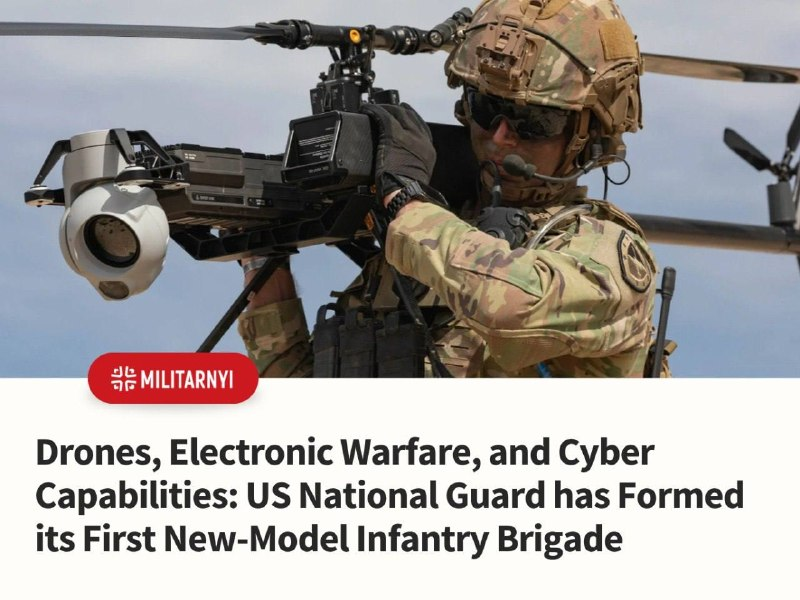

🔴 ارتقای یک تیپ نظامی در آمریکا

💢گزارش‌ها حاکی از آن است که تیپ رزمی سیار ۱۱۶ از گارد ملی ارتش ویرجینیا در آمریکا، به عنوان نخستین یگان، به پهپادها و سامانه‌های جنگ الکترونیک مجهز شده است.

📌 این اقدام در راستای مدرن‌سازی نیروهای زمینی و افزایش توان شناسایی، رصد و جنگ الکترونیک انجام شده است؛ روندی که ارتش آمریکا در سال‌های اخیر به‌طور گسترده دنبال می‌کند.

🫆:Tony

📌 @persian_trend_official
پرشین ترند | متفاوت‌ترین کانال نظامی

## Persian_Trend_Official — post 13920

لینک داخلی برای افراد داخل ایران: https://dl.persiantrend.com/Mostanad/RezaShah.mp4

## Persian_Trend_Official — post 13919

مستند رضاشاه، پدر ایران نوین 🔥

## Persian_Trend_Official — post 13918

  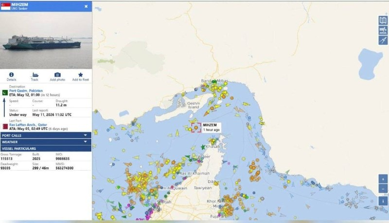

⭕️فارس: نفتکش قطری در تنگه هرمز متوقف شد.

نفتکش قطری «محمزم» حامل محموله‌ گاز مایع، وارد منطقهٔ تحت کنترل ایران شد و پس از دور زدن متوقف شد.

سیگنال‌های این نفتکش که مقصد خود را پاکستان اعلام کرده است، نشان می‌دهد که اجازهٔ عبور از تنگه هرمز را از ایران دریافت نکرده است.

📝 Nick

📌 @persian_trend_official
پرشین ترند | متفاوت‌ترین کانال نظامی

## Persian_Trend_Official — post 13917

⭕️ خبرگزاری فرانسه به نقل از یک مقام سازمان ملل: ده‌ها میلیون نفر به دلیل کودهای شیمیایی که در تنگه هرمز گیر افتاده‌اند، در معرض گرسنگی قرار دارند.

پ.ن: نظرتون چیه یه تکونی به خودتون بدید؟

📝 Nick

📌 @persian_trend_official
پرشین ترند | متفاوت‌ترین کانال نظامی

## Persian_Trend_Official — post 13916

  <a href="telegram/content/Persian_Trend_Official_13916_1778508514.webm" target="_blank">🎬 Download video</a>

⭕️ اولین آلوده به ویروس هانتا در فرانسه ثبت شد.

📝 Nick

📌 @persian_trend_official
پرشین ترند | متفاوت‌ترین کانال نظامی

## Persian_Trend_Official — post 13915

  <a href="telegram/content/Persian_Trend_Official_13915_1778508515.webm" target="_blank">🎬 Download video</a>

🔥 یکی از نکات جالب فهرست ثروتمندترین افراد جهان این است که ایلان ماسک، نفر اول این فهرست، به‌تنهایی ثروتی بیش از مجموع دارایی نفرات دوم و سوم دارد. 🗿

📝 Nick

📌 @persian_trend_official
پرشین ترند | متفاوت‌ترین کانال نظامی

## Persian_Trend_Official — post 13914

  <a href="telegram/content/Persian_Trend_Official_13914_1778508515.webm" target="_blank">🎬 Download video</a>

⭕️ مطهری نماینده مجلس: ما دنیارو از شر نتانیاهو و ترامپ نجات میدیم.

📝 Nick

📌 @persian_trend_official
پرشین ترند | متفاوت‌ترین کانال نظامی

## Persian_Trend_Official — post 13913

⭕️ عارف معاون پزشکیان و رئیس کارگروه بنزین:

در جلسه کارگروه بنزین تصمیماتی در مورد اصلاح مصرف بنزین گرفته شد که از اول خرداد اجرایی می‌شود.

📝 Nick

📌 @persian_trend_official
پرشین ترند | متفاوت‌ترین کانال نظامی

## Persian_Trend_Official — post 13912

  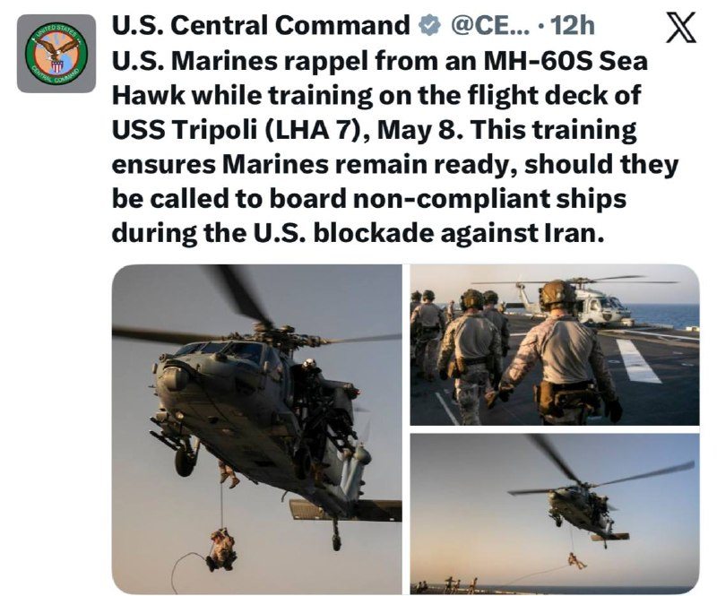

🔴 گزارش سنتکام از تمرین‌های نظامی

💢فرماندهی مرکزی ایالات متحده (سنتکام) اعلام کرده است تفنگداران دریایی آمریکا در عرشه ناو آبی‌خاکی «یو‌اس‌اس تریپولی» در حال انجام تمرین‌های فرود با بالگرد و سوار شدن به کشتی‌ها هستند.

💢به گفته سنتکام، هدف از این تمرین‌ها حفظ آمادگی عملیاتی نیروهاست تا در صورت نیاز بتوانند عملیات بازرسی و توقف کشتی‌ها را انجام دهند.

🫆:Tony

📌 @persian_trend_official
پرشین ترند | متفاوت‌ترین کانال نظامی

## Persian_Trend_Official — post 13911

  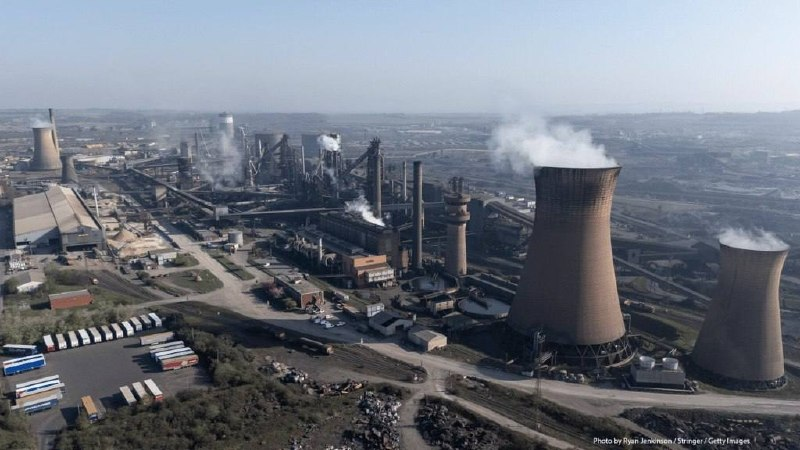

🔴 اخبار جهانی | بریتانیا

💢بر اساس گزارش‌ها، دولت بریتانیا به رهبری نخست‌وزیر کی‌یر استارمر در حال آماده‌سازی قانونی برای ملی‌سازی کامل شرکت «بریتیش استیل» است.

📌 هدف از این اقدام، طبق گمانه‌زنی‌ها، تثبیت وضعیت صنعت فولاد و جلوگیری از بحران‌های احتمالی در این بخش عنوان شده است.

🫆:Tony

📌 @persian_trend_official
پرشین ترند | متفاوت‌ترین کانال نظامی

## Persian_Trend_Official — post 13910

🔴 گزارش اولیه ارتش اسرائیل

ارتش اسرائیل (IDF) اعلام کرده است که آژیرهای هشدار در منطقه «نِوِه یام» به صدا درآمده‌اند.

در این اطلاعیه تأکید شده که جزئیات حادثه هنوز در حال بررسی است و اطلاعات تکمیلی بعداً منتشر خواهد شد.

🫆:Tony

📌 @persian_trend_official
پرشین ترند | متفاوت‌ترین کانال نظامی

## Persian_Trend_Official — post 13909

💢پیش تر گزارش شده بود

یک نفتکش گاز طبیعی مایع متعلق به قطر و یک نفتکش گاز مایع متعلق به امارات متحده عربی بنادر خود را ترک کرده و در حال حاضر در حال عبور از تنگه هرمز هستند.

🫆:Tony

📌 @persian_trend_official
پرشین ترند | متفاوت‌ترین کانال نظامی

## Persian_Trend_Official — post 13907

🔴 تغییر مسیر نفتکش قطری در تنگه هرمز

بر اساس داده‌های رهگیری دریایی:

▪️ نفتکش قطری «مهزم» مسیر خود را تغییر داده و در حال بازگشت به‌سمت خلیج فارس است

▪️ در مقابل، نفتکش اماراتی «شین مینگ لونگ» همچنان به حرکت خود از طریق تنگه هرمز ادامه می‌دهد

🫆:Tony

📌 @persian_trend_official
پرشین ترند | متفاوت‌ترین کانال نظامی

## Persian_Trend_Official — post 13905

  <a href="telegram/content/Persian_Trend_Official_13905_1778508517.mp4" target="_blank">🎬 Download video</a>

🔴 آتش‌سوزی گسترده جنگل‌ها در فلوریدا

💢گزارش‌ها از ادامه آتش‌سوزی گسترده در ایالت فلوریدای آمریکا حکایت دارد؛ آتشی که هنوز مهار نشده و به‌سرعت در حال گسترش است.

💢بر اساس گزارش‌های منتشرشده:

▪️ بیش از ۲۰ هزار کیلومتر مربع از مناطق جنگلی درگیر آتش شده‌اند
▪️ شعله‌ها به مناطق مسکونی نزدیک می‌شوند
▪️ نیروهای امدادی و آتش‌نشانی همچنان در حال تلاش برای مهار حریق هستند
▪️ شرایط آب‌وهوایی و وزش باد، عملیات مهار را دشوار کرده است

💢تاکنون آمار دقیقی از خسارات یا تخلیه گسترده ساکنان منتشر نشده است.

🫆:Tony

📌 @persian_trend_official
پرشین ترند | متفاوت‌ترین کانال نظامی

## Persian_Trend_Official — post 13904

🔴 کمیسیون امنیت ملی ایران: بحرین و امارات همچنان در مسیر اشتباه حرکت می‌کنند

💢کمیسیون امنیت ملی و سیاست خارجی ایران اعلام کرد بحرین و امارات همچنان «در مسیر اشتباه» قرار دارند.

در ادامه این بیانیه آمده است:

▪️ ایران اجازه شکل‌گیری محور امارات ـ اسرائیل در منطقه را نخواهد داد

▪️ تحرکات امنیتی و سیاسی برخی کشورهای منطقه زیر نظر قرار دارد

▪️ هرگونه اقدام علیه منافع ایران با پاسخ مواجه خواهد شد

این اظهارات در شرایطی مطرح می‌شود که تنش‌ها میان ایران، اسرائیل و برخی کشورهای عربی منطقه همچنان رو به افزایش است.

🫆:Tony

📌 @persian_trend_official
پرشین ترند | متفاوت‌ترین کانال نظامی

## Persian_Trend_Official — post 13903

  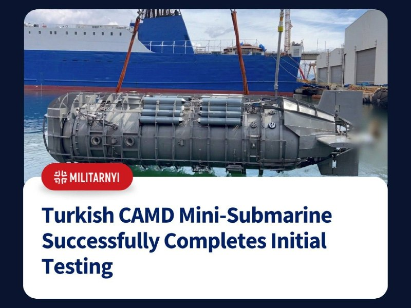

🔴 ترکیه نخستین زیردریایی کوچک اژدرافکن خود را آزمایش کرد

💢ترکیه از توسعه و آزمایش نخستین زیردریایی کوچک «چندمنظوره» خود که توان شلیک اژدر دارد خبر داد.

بر اساس گزارش‌ها:

▪️ این زیردریایی با نام «زیردریایی کوچک چندمنظوره» معرفی شده است
▪️ نخستین غواصی بدون سرنشین آن روز ۱۴ آوریل در دریای مرمره و در نزدیکی کارامورسل انجام شد
▪️ این شناور توان حمل و شلیک اژدر را دارد
▪️ هدف از توسعه آن، انجام مأموریت‌های شناسایی، عملیات ویژه و نبرد دریایی عنوان شده است

💢این پروژه بخشی از برنامه ترکیه برای توسعه صنایع بومی دریایی و افزایش توان رزمی زیرسطحی این کشور محسوب می‌شود.

🫆:Tony

📌 @persian_trend_official
پرشین ترند | متفاوت‌ترین کانال نظامی

## Persian_Trend_Official — post 13901

💢رئیس شرکت رافائل، سازنده سامانه گنبد آهنین: اسرائیل با کمبود هیچ‌گونه موشک رهگیری مواجه نیست.

📝 Nick

📌 @persian_trend_official
پرشین ترند | متفاوت‌ترین کانال نظامی

---
📅 بروزرسانی: 1405/02/21 15:06
---

## KiriMohems — post 47352

کانفیگ‌های MVP متصل به اینترنت جهانی و پایدار همراه با لینک ساب جهت مشاهده حجم مصرفی و از همه مهم‌تر بدون هیچ‌گونه ضریب مصرفی 
📊
✨

تعرفه:
1Gb : 350000
2Gb : 600000
5Gb : 1490000
10Gb : 2800000

قابل اتصال به تمامی دستگاه‌ها 📱
💻
مناسب برای استفاده روزمره و حرفه‌ای در تمام برنامه‌ها و هوش مصنوعی‌ها 
🤖
🚀

برای خرید به ربات و یا پشتیبانی مراجعه کنید 
🛒
💬

ربات 
👇
@Mvp_paybot

کانال
👇
@VpnMvp

## IranIntlTV — post 336639

  

رویترز بر اساس داده‌های کشتیرانی خبر داد که یک نفتکش دیگر از قطر به سمت پاکستان در حال حرکت است.
این دومین عبور یک نفتکش گاز طبیعی مایع قطر از تنگه هرمز به سمت پاکستان از زمان جنگ ایران است.

رویترز نوشت که کشتی میهزم بندر راس لفان قطر را ترک کرده و قرار است سه‌شنبه به بندر قاسم پاکستان برسد.

بر اساس این گزارش، انتظار می‌رود در روزهای آینده دو نفتکش دیگر حامل گاز طبیعی مایع قطر نیز راهی پاکستان شوند.
https://iranintl.com/202605117638

---
📅 بروزرسانی: 1405/02/21 15:02
---

## ChizBergerz — post 46293

  <a href="telegram/content/ChizBergerz_46293_1778499149.mp4" target="_blank">🎬 Download video</a>

🇮🇱نتانیاهو؛ تو ایران نام من و ترامپ رو روی خیابونا گذاشتن. من فارسی بلد نیستم ولی مردم تو ایران بهم میگن "بی‌بی‌ جون" یعنی بی‌بی محبوب! @ChizNewz

## ChizBergerz — post 46292

  <a href="https://t.me/ChizBergerz/46292" target="_blank">📎 Download file</a>

📲#اپلیکیشن اندروید سایت جهانی دربی بت

👍اسپانسر لیگ انگلیس
👍
🔥امکان شارژ امن از طریق کارت بانکی
➖➖➖➖➖➖➖➖➖

🪙همین حالا عضو شوید 👇
https://t.me/+aCbq7yy8QY80NzQ0

## ChizBergerz — post 46291

  

😤دنبال یه سایت شرط بندی بین المللی بودی که به ایرانیا خدمات بده؟!
⛔

👍دربی بت همون انتخاب  100%

💎ویژگی های سایت جهانی Derby Bet:

⬅️امکان شارژ امن با کارت بانکی

⬅️واریز اول دوبل شارژ می شوید(بونوس۱۰۰٪)

⬅️پر اپشن ترین سایت فعال در ایران

⬅️تسویه حساب کمتر از 5 دقیقه

⬅️برگشت بخشی از باخت به صورت هفتگی

🚨کد هدیه ثبت نام:GG007

⚠️برای دانلود اپلکیشن کلیک کنید
👉
re21

🔔کانال دربی بت :

🪙https://t.me/+aCbq7yy8QY80NzQ0

## ChizBergerz — post 46290

  

⚫️جمهوری‌شیطانی همزمان با اذان صبح امروز عرفان شکورزاده، نخبه دانشگاه علم و صنعت رو تو سن ۲۹ سالگی به اتهام همکاری با اسرائیل و آمریکا اعدام کرد!💔🖤

@ChizBergerz

## rodast_omiddana — post 71217

🎬 آخرین اخبار از حمله دوباره ترامپ و نتانیاهو به رژیم ایران تا دوشنبه 21 اردیبهشت
لینک یوتیوب:
https://www.youtube.com/watch?v=mnSQXlf-zUA

## rodast_omiddana — post 71216

  <a href="telegram/content/rodast_omiddana_71216_1778499151.webm" target="_blank">🎬 Download video</a>

🚨 ترامپ در مصاحبه با آکسیوس:
"پاسخ رژیم ایران به آخرین پیش‌نویس توافق‌نامه‌ای که هدف آن پایان دادن به جنگ است را رد خواهم کرد، پس از اینکه آمریکا ۱۰ روز منتظر پاسخ تهران ماند.
من نامه‌شان را دوست ندارم. این نامناسب است. پاسخ‌شان را دوست ندارم. رژیم ایران برای ۴۷ سال است که به بسیاری از کشورها گوش می‌دهد.
وز یکشنبه با نتانیاهو صحبت کردم تماسی بسیار خوب بود اما مذاکرات ایران وضعیت من است، نه وضعیت همه دیگران."

## rodast_omiddana — post 71215

  <a href="telegram/content/rodast_omiddana_71215_1778499151.webm" target="_blank">🎬 Download video</a>

🚨 شیراز الان__احتمالا دارن مهمات عمل نکرده را خنثی میکنند

## rodast_omiddana — post 71214

  <a href="telegram/content/rodast_omiddana_71214_1778499152.webm" target="_blank">🎬 Download video</a>

🚨 سلام امید جان شیراز ساعت 11:52 صدای بدجور انفجار اومد

## rodast_omiddana — post 71213

  <a href="telegram/content/rodast_omiddana_71213_1778499152.webm" target="_blank">🎬 Download video</a>

🚨 از الان 48 ساعت دیگه ترامپ در چین خواهد بود..
این دیدار برای ما ایرانیان سرنوشت ساز هست، که عمو ترامپ بتونه پکن را راضی کنه بزودی حمله بزرگ و احتمالا حمله زمینی در خاک ایران آغاز میشود..

## rodast_omiddana — post 71212

  

🖤 سرگرد الکساندر گلووانیوف، ۴۷ ساله، دیروز در حمله پهپادی حزب‌الله در نزدیکی مرز لبنان جان باخت..
ما مردم ایران قدردان ارتش اسرائیل برای زُدایش اسلامگرایی در منطقه هستیم..
بدینوسیله به نمایندگی از اکثریت ایرانیان به خانواده ایشان و ملت اسرائیل تسلیت میگم.. 
🖤

## rodast_omiddana — post 71211

  <a href="telegram/content/rodast_omiddana_71211_1778499152.mp4" target="_blank">🎬 Download video</a>

🚨مواضع جدید ترامپ و نتانیاهو برای حمله جدید به رژیم
جنگ دوباره قطعی است و احتمال سقوط رژیم بالاست

## KiriMohems — post 47351

یک جنگنده F35 آمریکایی برای دومین بار طی شبانه روز گذشته، بر فراز خلیج عمان پیام اضطراری فرستاد که اییی خارم گایده شده و در امارات متحده عربی فرود اضطراری کرد.

#Berlin
@Kirimohems

## KiriMohems — post 47350

  <a href="telegram/content/KiriMohems_47350_1778499154.mp4" target="_blank">🎬 Download video</a>

🔴 کون کونک بازی فلامینگوها در خلیج گرگان
#Helsinki
@KiriMohems

## KiriMohems — post 47349

  

😤دنبال یه سایت شرط بندی بین المللی بودی که به ایرانیا خدمات بده؟!
⛔

👍دربی بت همون انتخاب  100%

💎ویژگی های سایت جهانی Derby Bet:

⬅️امکان شارژ امن با کارت بانکی

⬅️واریز اول دوبل شارژ می شوید(بونوس۱۰۰٪)

⬅️پر اپشن ترین سایت فعال در ایران

⬅️تسویه حساب کمتر از 5 دقیقه

⬅️برگشت بخشی از باخت به صورت هفتگی

🚨کد هدیه ثبت نام:GG007

⚠️برای دانلود اپلکیشن کلیک کنید
👉

🔔کانال دربی بت :r21🅰

🪙https://t.me/+kpFvLD9kaeJhYTI0

## KiriMohems — post 47348

  

🔴بر اساس اعلام سایت سازمان میادین میوه و تره بار : قیمت هر کیلوگرم ببعی زنده ۷۳۰ هزار فاکینگ تومن
اعلام شده

#Helsinki
@KiriMohems

## KiriMohems — post 47347

  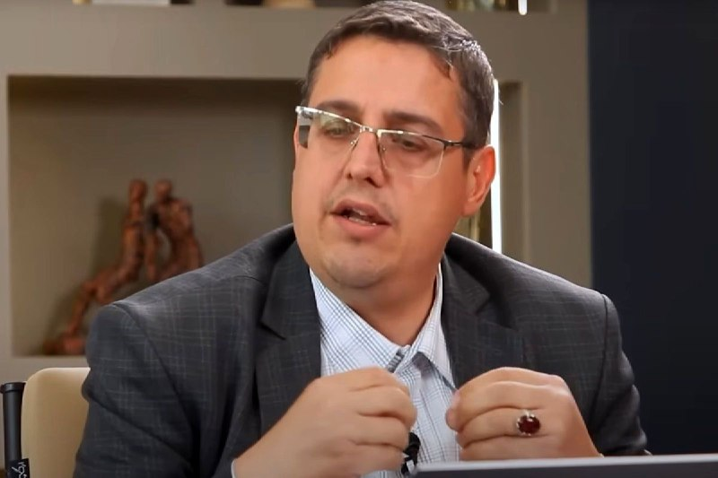

🔴ابوالفظل اقبالی از خایمالان جلیلی: اگر خانم‌ها حجاب رو رعایت میکردن، جنگ نمیشد

یعنی کیر تو تفکرات تون

#Helsinki
@KiriMohems

## KiriMohems — post 47346

  

🔴صبح امروز ، جمهوری اسلامی #عرفان_شکورزاده دانشجوی نخبه ، رتبه اول کنکور کارشناسی ارشد و دانشجوی ارشد مهندسی هوافضا – فناوری ماهواره دانشگاه علم و صنعت رو به اتهام همکاری با آمریکا و اسرائیل اعدام کرد

#Helsinki
@KiriMohems

## KiriMohems — post 47345

🔴کیری چشم، کارشناس صدا سیما: احتمال میدم ظرف یک هفته آینده این جنگ کیرخری راه بیوفته #Helsinki @KiriMohems

## KiriMohems — post 47344

  <a href="telegram/content/KiriMohems_47344_1778499158.mp4" target="_blank">🎬 Download video</a>

🔴کیری چشم، کارشناس صدا سیما:

احتمال میدم ظرف یک هفته آینده این جنگ کیرخری راه بیوفته
#Helsinki
@KiriMohems

## KiriMohems — post 47343

  <a href="telegram/content/KiriMohems_47343_1778499159.mp4" target="_blank">🎬 Download video</a>

🔴نتانیاهو:

در ایران، خیابون به اسم من زدن. میدونستی این رو کله کیری جان؟ البته بعد از ترامپ هم همین‌طور، چون اون رهبری این نبرد را به عهده داره.

اما یک چیزی هست من فارسی بلد نیستم ولی اونا به من میگن بی‌بی جون ، یعنی بی‌بیِ عزیز.

#Helsinki
@KiriMohems

## SportBaadNews — post 251339

  <a href="telegram/content/SportBaadNews_251339_1778499161.mp4" target="_blank">🎬 Download video</a>

ولی پرس دیشب وینی >>>>

@SportBadTweet | امام تایم

## SportBaadNews — post 251338

✅ دیگه لازم نیست دنبال لینک سایت بگردی!
📌فقط با یه کلیک از داخل ربات وارد وینکوبت شو: 👇

🤖 @Wincobet_bot
🤖 @Wincobet_bot

📌سریع، مستقیم، بدون دردسر
📌بدون نیاز به جستجو یا لینک‌های پراکنده

📌  همه چیز داخل ربات آماده‌ست:
▪️ ورود فوری به سایت
▪️ دسترسی راحت از تلگرام
▪️ بدون مراحل پیچیده

🔗 ساده‌ترین راه ورود به وینکوبت همینجاست:
🤖 @Wincobet_bot

📌میخوای با تحلیل جلوتر از بقیه باشی؟
برای دریافت آنالیز بازی‌ها همین الان جوین شو 👇
🔵 @Wincobetofficial

## SportBaadNews — post 251337

  <a href="telegram/content/SportBaadNews_251337_1778499162.webm" target="_blank">🎬 Download video</a>

🚨 فووووری آاس: رئال مادرید پیشنهاد رسمی خودش رو برا ژوزه مورینیو فرستاد
@SportBaadNews

## SportBaadNews — post 251336

  

⚽️ فرمین لوپز 23 ساله شد
@SportBaadNews

## IranIntlTV — post 336638

🗣روایت شما از اقتصاد بحرانی زیر سایه آتش‌بس- دوشنبه ۲۱ اردیبهشت:

🔹مدرس کاشت ناخن و مانیکور هستم اما از اسفندماه اوضاع کاری به‌شدت به‌هم ریخته. آنتن دستگاه کارتخوان‌مون از همون موقع قطع شده و بعد از اینکه تماس گرفتیم، گفتن بنا به دلایل امنیتی آنتن دستگاه‌های پوز مشاغل غیرضروری رو قطع کردیم. همچنین فروش پکیج آموزش مجازی در اینستاگرام و تلگرام رو هم با قطع دسترسی به اینترنت عملاً از دست دادم.

🔹نمی‌تونیم مدام از جیب بخوریم چون دیگه جیب‌ها هم خالی شده. مردم دارن وسایل خونه‌شون رو می‌فروشن که خرج مواد خوراکی کنن.

🔹شرایط در ایران حقیقتاً دشوارتر شده. مواد خوراکی، بی‌کیفیت اما گرون‌قیمت شدن و حتی همون هم اگه توان خریدش رو داشته باشیم، داره ناموجود می‌شه.

🔹خسته شدیم. گرونی بیداد می‌کنه. سه قلم جنس بی‌ارزش مثل چیپس، بیسکویت و بستنی درمجموع می‌شه ۳۰۰ هزار تومان، دیگه گوشت و مرغ و برنج بماند.

🔹اجاره مسکن در تهران به‌قدری بالا رفته که الگوی سکونت داره تغییر می‌کنه. اوضاع به ‌شکلی شده که در اکثر آگهی‌های اجاره، مستأجرها به دنبال هم‌خونه می‌گردن.

🔹من کابینت‌ساز هستم. سال ۱۴۰۴ هر ورق ام‌دی‌اف رو به قیمت ۳ میلیون تومان می‌خریدم اما امسال بین ۱۵ میلیون تا ۱۷ میلیون تومان قیمت هر ورق شده.

🔹 کفش اسکیتی که می‌خواستم بخرم از ۷ میلیون تومان شده ۱۱ میلیون تومان. تا کی حسرت بخوریم؟

🔹بعد از ۷۰ روز با یک گیگ اینترنت وصل شدم. زندگی واقعاً سخت شده، همه‌چیز به‌شدت گران شده و واقعاً هیچ‌چیزی نمی‌شود خرید، حتی قیمت یک نوشابه بالای ۱۰۰ هزار تومان است.

## IranIntlTV — post 336637

  

روزنامه اطلاعات در یادداشتی به «ادامه جنگ، تحریم‌ها و محدودیت توان دولت» اشاره کرد و خواستار صرفه‌جویی مردم در مصرف آب، برق، سوخت، غذا، نان، برنج و گندم شد.

این روزنامه در ادامه نوشت مصرف سوخت نیز وضعیت مشابهی دارد و پرسید چه اصراری وجود دارد افراد در مسیرهایی که خودروهای عمومی وجود دارد، با خودروهای تک‌سرنشین تردد کنند یا برای تفریح فقط «دور دور» کنند.

روزنامه اطلاعات همچنین نوشت مصرف بیش از اندازه مواد غذایی از جمله برنج و گندم، همراه با شیوه‌های ناسالم تغذیه، به بروز مشکلاتی مانند بیماری، کاهش عمر و افزایش هزینه‌های بیمارستانی منجر می‌شود.
iranintl.com/202605111279

## IranIntlTV — post 336635

🔻گزارش گاردین از سایه‌ سنگین تنش با جمهوری اسلامی بر امنیت جام‌جهانی ۲۰۲۶

روزنامه گاردین در گزارشی نوشت هم‌زمانی مسابقات جام جهانی فوتبال ۲۰۲۶ با افزایش تنش‌ها با جمهوری اسلامی، خطر انجام حملات «تروریستی» در خاک آمریکا را افزایش داده است.

براساس این گزارش، کارشناسان امنیتی هشدار داده‌اند که مهم‌ترین تهدیدها می‌تواند از سوی مهاجمان تک‌نفره یا گروه‌های افراطی الهام‌گرفته از ایدئولوژی‌های جهادی یا جریان‌های تندرو داخل آمریکا باشد.

قرار است جام جهانی ۲۰۲۶ با ۱۰۴ مسابقه برگزار شود که ۷۸ بازی آن در آمریکا خواهد بود. مسابقات در شهرهایی مانند لس‌آنجلس، میامی و نیویورک برگزار می‌شود و به نوشته‌ی گاردین، گستردگی جغرافیایی این رویداد، چالش بزرگی برای نیروهای امنیتی ایجاد کرده است.

تنها مسابقه فینال در ایست رادرفورد نیوجرسی در سطح «رویداد ویژه امنیت ملی» قرار گرفته و بسیاری از مسابقات دیگر نیز در رده پرخطر ارزیابی شده‌اند و نیازمند حضور گسترده‌ی نهادهای فدرال امنیتی هستند.

کارشناسان به «اهداف نرم» مانند هتل‌ها، مراکز حمل‌ونقل و محل تجمع هواداران به‌عنوان نقاط آسیب‌پذیر اشاره کرده‌اند. همچنین احتمال حملات سایبری و استفاده از پهپادها از دیگر نگرانی‌های مطرح‌شده در این گزارش است.

این گزارش در شرایطی منتشر شده که تنش‌ها میان آمریکا، اسرائیل و جمهوری اسلامی در ماه‌های اخیر افزایش یافته و موضوع حضور تیم ملی فوتبال ایران در جام جهانی ۲۰۲۶ نیز با بحث‌های سیاسی و امنیتی همراه شده است.

🔗وب‌سایت ایران‌اینترنشنال
@iranintltv

## IranIntlTV — post 336634

روزنامه اعتماد در گزارشی از ناراحتی مقامات ورزشی و برخی نهادهای جمهوری اسلامی از سفر مهدی تاج به کانادا برای شرکت در کنگره فیفا خبر داد.

گفت‌وگو با آیدین مقیمی، عضو تحریریه ایران‌اینترنشنال

@iranintltv

## IranIntlTV — post 336633

سرخط خبرهای دوشنبه ۲۱ اردیبهشت

@iranintltv

## IranIntlTV — post 336632

  <a href="telegram/content/IranIntlTV_336632_1778499163.mp4" target="_blank">🎬 Download video</a>

پیام‌های رسیده به ایران‌اینترنشنال نشان می‌دهد گرانی قهوه در کافه‌ها و کاهش مشتریان، باعث تعدیل و اخراج پرسنل و همچنین تعطیلی برخی از کافه‌ها شده‌ است.

لیلا سعادتی، عضو تحریریه ایران‌اینترنشنال، گزارش می‌دهد

@iranintltv

## IranIntlTV — post 336631

  

علیرضا سلیمی، عضو هیات رییسه مجلس، درباره محاصره دریایی بنادر و سواحل جنوب ایران از سوی آمریکا گفت جمهوری اسلامی «حتما در جهت شکستن حصر دریایی» اقدام خواهد کرد و «سیلی محکمی» به دشمنان خواهد زد.

او گفت که آتش‌بس «نباید یک‌طرفه باشد» و افزود: «حتما باید در این بخش نیز سیلی جانانه‌ای به دشمنان بزنیم. دشمنان نشان دادند که زبانی غیر از زور نمی‌فهمند و باید با سیلی آنها را بیدار کرد چراکه با دیپلماسی و گفت‌وگو از خواب غفلت بیدار نمی‌شوند.»

سلیمی ادامه داد: «تنها چیزی که دشمنان را بیدار می‌کند غرش توپ و غریو موشک است و اگر بخواهیم با لبخند با دشمنان برخورد کنیم جری‌تر و جسورتر خواهند شد.»
iranintl.com/202605115658

## IranIntlTV — post 336630

  <a href="telegram/content/IranIntlTV_336630_1778499165.mp4" target="_blank">🎬 Download video</a>

یک شهروند با ارسال پیام صوتی از قزوین به ایران‌اینترنشنال می گوید: «باید از هموطنان خارج از کشور تشکر کنم که دغدغه‌شان ایرانیان داخل از کشور است؛ کسانی که به اسارت گرفته شده‌اند. ما دیگر صدایی نداریم و نمی‌توانیم ابراز وجود کنیم. همه امیدمان به شماست.»

## IranIntlTV — post 336629

  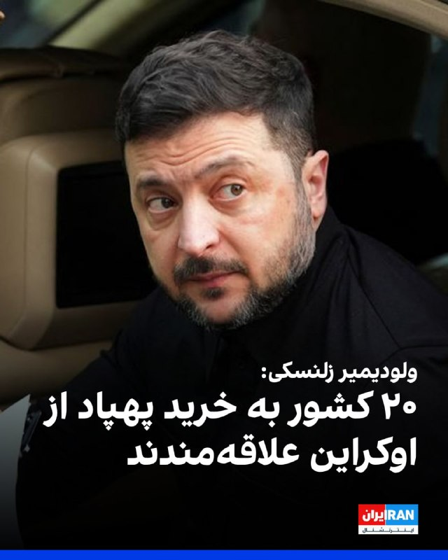

ولودیمیر زلنسکی گفت که حدود ۲۰ کشور به توافق‌های خرید پهپاد با اوکراین علاقه‌مند هستند و تاکنون چهار توافق امضا شده است.

اوکراین توافق‌های دفاعی و پهپادی با آلمان، نروژ و هلند امضا کرده و در اواخر مارس توافق‌های امنیتی بلندمدت با عربستان سعودی، قطر و امارات متحده عربی امضا کرد.
iranintl.com/202605114647

## IranIntlTV — post 336628

  <a href="telegram/content/IranIntlTV_336628_1778499168.mp4" target="_blank">🎬 Download video</a>

بریتانیا و فرانسه قرار است سه‌شنبه میزبان نشستی آنلاین با حضور وزیران دفاع بیش از ۴۰ کشور جهان باشند. محور این نشست، بررسی برنامه‌های نظامی برای بازگرداندن جریان تجارت در تنگه هرمز عنوان شده است.

گفت‌وگو با مهدی بیگی، خبرنگار ایران‌اینترنشنال

@iranintltv

## IranIntlTV — post 336627

  <a href="telegram/content/IranIntlTV_336627_1778499169.mp4" target="_blank">🎬 Download video</a>

هاکان فیدان، وزیر خارجه ترکیه، با عباس عراقچی و بدر عبدالعاطی، وزیران خارجه جمهوری اسلامی و مصر، درباره تحولات مربوط به مذاکرات صلح میان تهران و واشینگتن تلفنی گفت‌وگو کرد.

گفت‌وگو با نرگس هورخش، خبرنگار ایران‌اینترنشنال

@iranintltv

## IranIntlTV — post 336626

  <a href="telegram/content/IranIntlTV_336626_1778499171.mp4" target="_blank">🎬 Download video</a>

ویدیوی رسیده به ایران‌اینترنشنال نشان می‌دهد نفتکش متعلق به جمهوری اسلامی، روز دوشنبه ۲۱ اردیبهشت‌ماه همچنان در حال سوختن است.
فرماندهی مرکزی آمریکا (سنتکام) روز شنبه ۱۹ اردیبهشت اعلام کرد نیروهای این کشور دو نفتکش با پرچم جمهوری اسلامی را در دریای عمان، پیش از رسیدن به بنادر ایران، متوقف کردند.

## IranIntlTV — post 336625

  

حبیب جهان‌ساز، رییس سازمان چای، گفت که بر اساس مصوبه شورای قیمت‌گذاری، قیمت خرید تضمینی برگ سبز چای در سال جاری برای درجه یک، ۴۲ هزار تومان و برای درجه دو، ۲۳ هزار تومان تعیین شده که نسبت به سال گذشته به ترتیب ۷۲ درصد و ۶۷ درصد افزایش یافته است.

او افزود: «اولویت اصلی ما در این شرایط، تأمین بازار داخلی است هرچند بخشی از چای کشور نیز جنبه صادراتی دارد و تلاش می‌کنیم با حفظ تعادل هم بازار داخل را تأمین کنیم و هم مشتریان خارجی خود را حفظ کنیم.»
iranintl.com/202605110813

## IranIntlTV — post 336624

  

ابوالفضل ظهره‌وند، عضو کمیسیون امنیت ملی مجلس، گفت: «اینجا دو ثانیه دیگر تهران است، سه ثانیه دیگر مثلا واشینگتن است. بعضی‌ها دیدند چه ظرفیت‌هایی وجود دارد. می‌شود کارهایی کرد که اصلا بمب اتمی یعنی چه؟ این‌ها دیگر بچه‌بازی و برای گذشته است.»

او افزود: «من جاهایی را که دیدم، ظرفیت‌هایی را که دیدم، اتفاقاتی می‌آید که بمب اتم واقعا ترقه است. می‌شود کارهای عجیبی کرد. می‌شود زمان را پشت سر گذاشت. یعنی چه؟ هیچ‌کس نمی‌داند.»

ظهره‌وند گفت تاثیر تنگه هرمز، باب‌المندب و «حوزه مقاومت»، بیشتر از صد بمب است و افزود: «وقتی اراده‌ات بالا بیاید تولید یک بمب کاری ندارد. شاید اتفاقاتی را شکل بدهی که بمب اتم پیش آن ترقه باشد.»
iranintl.com/202605114129

## IranIntlTV — post 336623

  <a href="telegram/content/IranIntlTV_336623_1778499173.mp4" target="_blank">🎬 Download video</a>

ویدیوهای ارسال‌شده به ایران‌اینترنشنال در دوشنبه ۲۱ اردیبهشت، ستون دود ناشی از انفجار را در شیراز نشان می‌دهد.
طبق اعلام ارتش، مهمات عمل‌نکرده به‌صورت کنترل‌شده منفجر شده است.

## IranIntlTV — post 336622

  <a href="telegram/content/IranIntlTV_336622_1778499175.mp4" target="_blank">🎬 Download video</a>

یک شهروند با ارسال ویدیویی به ایران‌اینترنشنال از گرانی چندین برابری روغن خوراکی خبر می‌دهد و می‌گوید: «سپاه ما را به خواری و ذلت انداخته است.»

## IranIntlTV — post 336621

  <a href="telegram/content/IranIntlTV_336621_1778499176.mp4" target="_blank">🎬 Download video</a>

ویدیوهای ارسال‌شده به ایران‌اینترنشنال در دوشنبه ۲۱ اردیبهشت، برخاستن دود ناشی از انفجار را در شیراز نشان می‌دهد.
طبق اعلام ارتش، مهمات عمل‌نکرده به‌صورت کنترل‌شده منفجر شده است.

## IranIntlTV — post 336620

  

نخست‌وزیر بریتانیا تاکید کرد که از جنگ ایران حمایت نمی‌کند و افزود که شهروندان این کشور نگران افزایش قیمت بنزین و تاثیرات اقتصادی آن هستند.

کی‌یر استارمر تاکید کرد کشورهای دیگر می خواستند بریتانیا را جنگ ایران بکشانند اما او هرگز این کار را نخواهد کرد.
https://iranintl.com/202605116217

## IranIntlTV — post 336619

🗣روایت شما از بحران اقتصادی و زندگی در آتش‌بس- دوشنبه ۲۱ اردیبهشت:

🔹در اصفهان، هزینه سونوگرافی آندومتریوز که در زنان خیلی شایع است قبل از عید ۲ میلیون تومان بود الان سه برابر شده و به قیمت ۶ میلیون رسیده است.

🔹من یک جوان ۱۸ ساله گیمر، علاقه‌مند به حوزه الکترونیک و برنامه‌نویسی و یک کنکوری رشته ریاضی در کرمانشاه هستم. در حال حاضر از همه این‌ها محروم شده‌ام و وضعیت تحصیلی‌ام هم کاملا روی هواست.

🔹من اِی‌دی‌اچ‌دی دارم و باید داروی ویاس ۵۰ مصرف کنم. ماه گذشته دارو را به قیمت یک میلیون تومان خریدم اما این ماه وقتی بعد از حدود سه روز گشتن در داروخانه‌های تهران بالاخره پیدایش کردم، قیمت ۳۰ قرص شده بود دو میلیون و ۱۰۰ هزار تومان.

🔹من کاسب نازی‌آبادم. از ابتدای آتش‌‌بس تاکنون دست‌کم از ۶ طلافروشی دزدی مسلحانه شده اما نه رسیدگی قانونی درستی می‌شود و نه کسی در موردش حرفی می‌زند.

🔹در فروشگاهی آنلاین قیمت لپ‌تاپی که قبل از دی سال گذشته ۴۰ میلیون تومان بود را زده بودند ۱۰۰ میلیون. روز بعد که سر زدم شده بود ۱۲۰ میلیون تومان. ۲۰ درصد افزایش قیمت در یک روز!

## IranIntlTV — post 336618

  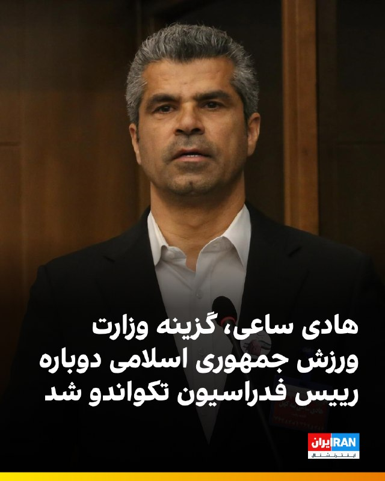

🔻مجمع انتخاباتی فدراسیون تکواندو صبح دوشنبه ۲۱ اردیبهشت برگزار شد و هادی ساعی، گزینه نزدیک به وزارت ورزش با کسب ۳۹ رای از مجموع ۵۳ رای، برای دومین دوره پیاپی به‌عنوان رییس فدراسیون تکواندو انتخاب شد. در این انتخابات، اصغر رحیمی ۱۳ رای به دست آورد و سیروس رضایی و مجید نیری نیز موفق به کسب رای نشدند.

🔹در ابتدا ۱۰ نفر برای ریاست فدراسیون تکواندو نامزد شده بودند، اما یوسف کرمی، علی نوری، حسین حسین‌زاده، فریبرز عسگری، احمد لاریجانی و سید حسن زاهدی پیش از برگزاری مجمع انصراف دادند تا انتخابات با حضور چهار نامزد برگزار شود.

🔹در دوران ریاست هادی ساعی بر فدراسیون تکواندو، جو امنیتی در تیم‌های ملی حاکم شده است.

@iranintltvsport

## Persian_Trend_Official — post 13900

  <a href="telegram/content/Persian_Trend_Official_13900_1778499179.mp4" target="_blank">🎬 Download video</a>

⭕️ اسرائیل به فارسی:

نخست وزیر نتانیاهو صدای شما را می‌شنود:
در ایران، خیابان‌ها را به نام من نامگذاری می‌کنند. آیا این را می‌دانید؟ البته به نام رئیس جمهور ترامپ هم، بدیهی است، زیرا او رهبری مبارزه را بر عهده دارد. من فارسی صحبت نمی‌کنم اما آن‌ها مرا «بی‌بی جون»، بی‌بی عزیزم صدا می‌زنند.

📝 Nick

📌 @persian_trend_official
پرشین ترند | متفاوت‌ترین کانال نظامی

## Persian_Trend_Official — post 13899

🔴 ۱۰ محور راهبردی رهبر جمهوری اسلامی درباره خلیج فارس و تنگه هرمز

▪️۱. حضور و استقرار نیروهای آمریکایی در خلیج فارس، مهم‌ترین عامل ناامنی در منطقه است

▪️۲. پایگاه‌های آمریکا در منطقه، حتی توان تأمین امنیت خود را ندارند

▪️۳. آینده خلیج فارس بدون آمریکا و در خدمت پیشرفت، رفاه و توسعه ملت‌های منطقه خواهد بود

▪️۴. ایران و کشورهای همسایه در خلیج فارس و دریای عمان دارای «سرنوشت مشترک» هستند

▪️۵. برای بیگانگان شرور در خلیج فارس جایی جز کف آب‌های آن وجود ندارد

▪️۶. پیروزی‌های ایران در خلیج فارس، نشانه شکل‌گیری نظم جدید منطقه‌ای و جهانی است

▪️۷. امنیت خلیج فارس از طریق مدیریت ایران بر تنگه هرمز تضمین خواهد شد

▪️۸. بهره‌برداری دشمنان متجاوز از تنگه هرمز باید پایان یابد

▪️۹. مدیریت جدید تنگه هرمز می‌تواند موجب رفاه و پیشرفت ملت‌های منطقه بر پایه قواعد حقوقی شود

▪️۱۰. دستاوردهای اقتصادی ناشی از مدیریت جدید تنگه هرمز، موجب رضایت و خوشحالی مردم ایران خواهد شد|نایا

🫆:Tony

📌 @persian_trend_official
پرشین ترند | متفاوت‌ترین کانال نظامی

## Persian_Trend_Official — post 13895

🔴 ناو هواپیمابر «شارل دو گل» وارد دریای سرخ شد

💢ناو هواپیمابر هسته‌ای «شارل دو گل» فرانسه در تاریخ ۸ مه، پس از عبور از کانال سوئز، در دریای سرخ مشاهده شد.

این ناو به همراه گروه ضربتی خود در چارچوب همکاری مشترک فرانسه و بریتانیا به‌سمت منطقه خلیج فارس در حال حرکت است؛ در شرایطی که تنش‌ها در تنگه هرمز و خاورمیانه همچنان در سطح بالایی قرار دارد.

گروه هوایی مستقر روی این ناو شامل مجموعه‌ای از جنگنده‌ها، هواپیماهای هشدار زودهنگام و بالگردهای رزمی و پشتیبانی است.

💢ظرفیت کلی ناو حدود ۳۰ تا ۴۰ هواگرد عنوان می‌شود، اما در مأموریت‌های عملیاتی معمولاً بین ۲۵ تا ۳۰ فروند روی آن مستقر هستند.

🫆:Tony

📌 @persian_trend_official
پرشین ترند | متفاوت‌ترین کانال نظامی

## Persian_Trend_Official — post 13894

  

از ساعاتي قبل دسته‌ای جنگنده فرانسوی با همراهی یک یا چند سوخت‌رسان متعلق به نیروی هوایی فرانسه، بسوی خاورمیانه می آید.

پایگاه{صلح ابوظبی امارات} میزبان چند اسکادران رافائل های فرانسوی میباشد.

☆Phantom☆

📌 @persian_trend_official
پرشین ترند | متفاوت‌ترین کانال نظامی

## Persian_Trend_Official — post 13893

  <a href="telegram/content/Persian_Trend_Official_13893_1778499181.webm" target="_blank">🎬 Download video</a>

🔴 انفجار در اراک؛ یک خانه مسکونی تخریب شد

در پی وقوع انفجار در یک منزل مسکونی واقع در خیابان جهانگیری اراک، ساختمان به‌طور گسترده تخریب شد.

بر اساس گزارش‌ها:

▪️ نیروهای امدادی و آتش‌نشانی در محل حادثه حضور دارند
▪️ عملیات آواربرداری و ایمن‌سازی آغاز شده است
▪️ علت دقیق انفجار هنوز مشخص نیست
▪️ آمار احتمالی مصدومان و میزان خسارات در دست بررسی است

💢خبرگزاری مهر اعلام کرده کارشناسان در حال بررسی منشأ حادثه هستند.

🫆:Tony

📌 @persian_trend_official
پرشین ترند | متفاوت‌ترین کانال نظامی

## Persian_Trend_Official — post 13892

🔴 ارتش اسرائیل: فرود اضطراری بالگرد در جنوب لبنان به‌دلیل نقص فنی بود

ارتش اسرائیل اعلام کرد امروز دوشنبه، در جریان عملیات نیروی هوایی برای انتقال نیروهای زخمی در جنوب لبنان، یکی از بالگردها پس از فرود در محل تخلیه به‌دلیل نقص فنی قادر به برخاستن نبوده است.

بر اساس بیانیه ارتش:

▪️ یک بالگرد دیگر برای انتقال نیروهای زخمی به منطقه اعزام شد
▪️ نیروهای فنی نیروی هوایی مشکل ایجادشده را برطرف کردند
▪️ بالگرد پس از تعمیر، منطقه را با امنیت کامل ترک کرد
▪️ ارتش اسرائیل تأکید کرده این بالگرد هدف آتش حزب‌الله قرار نگرفته است

🫆:Tony

📌 @persian_trend_official
پرشین ترند | متفاوت‌ترین کانال نظامی

## Persian_Trend_Official — post 13891

  

♨️ عکس زیر از متن تورات، کتاب اشعيا، باب ۱۴، آیه ۱۸ تا ۲۱ است.

پ.ن: طبیعیه که حاکمان شرور و ویرانگر عاقبت مشابه داشته باشند ولی این حد از شباهت تعجب برانگیزه. 😬

📝 Nick

📌 @persian_trend_official
پرشین ترند | متفاوت‌ترین کانال نظامی

## Persian_Trend_Official — post 13890

  <a href="telegram/content/Persian_Trend_Official_13890_1778499181.webm" target="_blank">🎬 Download video</a>

💢برای دومین بار در 24ساعت گذشته، یک جنگنده اف-35 آمریکا بر فراز امارات سیگنال درخواست کمک ارسال کرده است

🫆:Tony

📌 @persian_trend_official
پرشین ترند | متفاوت‌ترین کانال نظامی

## Persian_Trend_Official — post 13889

  <a href="telegram/content/Persian_Trend_Official_13889_1778499182.mp4" target="_blank">🎬 Download video</a>

⭕️ استاد خوش چشم، کارشناس صدا سیما: احتمال می‌دهم ظرف یک هفته آینده جنگ مجددا آغاز شود.

+خب فعلا جنگ کنسل شد. 🗿

📝 Nick

📌 @persian_trend_official
پرشین ترند | متفاوت‌ترین کانال نظامی

## Persian_Trend_Official — post 13888

  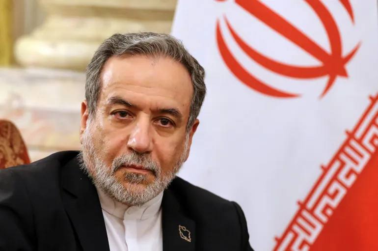

🔴 احتمال سفر عراقچی به هند برای نشست بریکس

💢رسانه‌های هندی گزارش داده‌اند «عباس عراقچی» وزیر امور خارجه ایران احتمالاً روز ۱۴ مه برای شرکت در نشست وزیران خارجه بریکس راهی دهلی‌نو خواهد شد.

💢این نشست مقدمه‌ای برای هجدهمین اجلاس سران بریکس است که قرار است سپتامبر امسال در هند برگزار شود. هند در حال حاضر ریاست دوره‌ای این ائتلاف اقتصادی را برعهده دارد.

💢گزارش‌ها همچنین حاکی است در حاشیه این نشست، موضوع امنیت کشتیرانی و عبور کشتی‌ها از تنگه هرمز نیز میان تهران و دهلی‌نو مورد گفت‌وگو قرار خواهد گرفت.

🫆:Tony

📌 @persian_trend_official
پرشین ترند | متفاوت‌ترین کانال نظامی

## Persian_Trend_Official — post 13887

  <a href="telegram/content/Persian_Trend_Official_13887_1778499183.webm" target="_blank">🎬 Download video</a>

⭕️ توییت جدید سفارت جمهوری اسلامی در هند خطاب به ترامپ:

ما همچنان خواهیم خندید؛ اما این را بدان: به زودی با چشمانی اشکبار منطقه ما را ترک خواهی کرد.

ما فراز و نشیب‌های زیادی را پشت سر گذاشته‌ایم و درس‌های زیادی آموخته‌ایم.

📝 Nick

📌 @persian_trend_official
پرشین ترند | متفاوت‌ترین کانال نظامی

## Persian_Trend_Official — post 13886

قبل از شروع جنگ و قطعی اینترنت درخواست فیبر نوری دادم و حالا اومدن نصب و فعالش کردن.
با تشکر از شاتل بابت سرویس خوبشون؛ در واقع قبل از نصب اینترنت نداشتم، ولی الان با سرعت خیلی بیشتری اینترنت ندارم.

© itsmralii

📝 Nick

📌 @persian_trend_official
پرشین ترند | متفاوت‌ترین کانال نظامی

## Persian_Trend_Official — post 13885

## Persian_Trend_Official — post 13884

  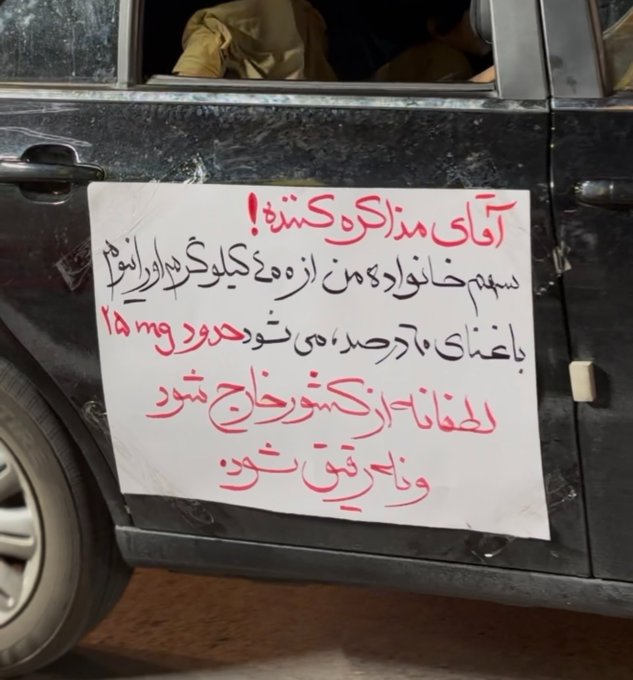

سهم من هم با رضایت خودم، ایشون گاز بزنه .

فقط اورانیوم میتونه نسل اینجور افراد رو منقرض کنه

## Persian_Trend_Official — post 13883

  <a href="telegram/content/Persian_Trend_Official_13883_1778499184.mp4" target="_blank">🎬 Download video</a>

میدونید منظورش از نیروی مسلح کجاست دیگه ؟!
جنگ زمینی قطعااااااااااا تخصص جمهوری اسلامی هست ...

📌 @persian_trend_official
پرشین ترند | متفاوت‌ترین کانال نظامی

---
📅 بروزرسانی: 1405/02/21 11:35
---

## SportBaadNews — post 251335

  

⚽️ بارسلونا تو بازیای خونگی این فصل لالیگا :

🔴 18 بازی

🔵 18 برد

🔴 54 امتیاز

🔵 54 گل زده

🔴 9 گل خورده
@SportBaadNews

## IranIntlTV — post 336607

  

اسماعیل بقائی، سخنگوی وزارت خارجه جمهوری اسلامی گفت: «ما به کشورهای اروپایی صریحا اعلام کردیم که اجازه ندهند وسوسه‌های آمریکا یا اسرائیل در موضوعات منطقه‌ای، آن‌ها را ناخواسته به بحرانی بکشاند که سودی برایشان نخواهد داشت.»

او اضافه کرد: «این آگاهی نسبی در بسیاری از کشورهای اروپایی وجود دارد. آنها مطمئن هستند که این جنگ، جنگی غیرقانونی، غیراخلاقی و تجاوزکارانه بوده است. به همین دلیل، اجازه ندادند فشارهای آمریکا آنان را به‌طور علنی بخشی از این اقدام غیرقانونی و مخرب صلح و امنیت بین‌المللی کند.»
https://iranintl.com/202605110407

## IranIntlTV — post 336606

  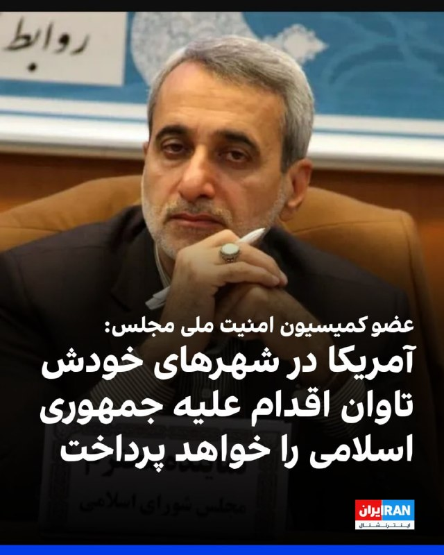

عباس مقتدایی، نایب‌رییس کمیسیون امنیت ملی مجلس، گفت که اگر آمریکا بخواهد بر «تخیلات» خود علیه منافع جمهوری اسلامی اصرار بورزد، «تاوان سختی» برای این لجاجت در شهرهای آمریکا خواهد پرداخت.

او افزود نیروهای مسلح جمهوری اسلامی «مدیریت هوشمند» تنگه هرمز را برای مقابله با «زیاده‌خواهی دشمنان» در دست گرفتند و اگر لازم باشد، برای عبور و مرور کشتی‌ها عوارض دریافت خواهند کرد.

نایب‌رییس کمیسیون امنیت ملی مجلس گفت برخی کشورهای منطقه با در اختیار قرار دادن خاک خود، با آمریکا و اسرائیل در حمله به ما همکاری کردند و جمهوری اسلامی در دفاع از خود «هر اقدامی» در برابر دشمنی آنها انجام می‌دهد.
iranintl.com/202605116225

## IranIntlTV — post 336605

  

اسماعیل بقائی، سخنگوی وزارت خارجه جمهوری اسلامی، در خصوص پاسخ تهران به پیشنهاد واشینگتن برای خاتمه جنگ گفت: «هرچه در متن پیشنهاد کردیم معقول و سخاوتمندانه بود. نه‌تنها برای منافع ملی ایران بلکه برای خیر و صلاح منطقه و جهان اما طرف‌های آمریکایی همچنان بر خواسته‌های نامعقول خود پافشاری می‌کنند.»

او افزود: «جمهوری اسلامی ثابت کرده قدرت مسئولیت‌پذیر در منطقه است. ما قلدر نیستیم؛ قلدرستیز هستیم.» او ادامه داد: «پیشنهاد ما برای تردد ایمن در تنگه هرمز آیا زیاده خواهانه است؟ موضوع مهمی همچون برقراری صلح و امنیت در تمام منطقه غیرمسئولانه است؟»

پیش‌تر دونالد ترامپ پیشنهاد جمهوری اسلامی را «غیرقابل قبول» خوانده بود.
iranintl.com/202605116908

## IranIntlTV — post 336604

  

🔻خبرگزاری میزان، رسانه قوه قضاییه جمهوری اسلامی، از توقیف بخشی از املاک منتسب به علی کریمی، بازیکن پیشین تیم ملی فوتبال و از چهره‌های مخالف جمهوری اسلامی خبر داد و نوشت یکی از املاک شناسایی‌شده، یک پلاک ثبتی به نام هاوش، فرزند او، شامل دو واحد تجاری و چهار واحد مسکونی، است.

🔹براساس اطلاعیه منتشرشده از سوی قوه قضاییه جمهوری اسلامی، با استعلام از سازمان ثبت اسناد و املاک کشور، برخی املاک علی کریمی که به گفته قوه قضاییه جمهوری اسلامی «سعی در اختفای آن‌ها شده بود» شناسایی و توقیف شد.

🔹پیش‌تر نیز قوه قضاییه جمهوری اسلامی از توقیف اموال علی دایی، علی کریمی، مسعود شجاعی، زهرا قنبری و علیرضا فغانی به‌دلیل مخالفت با جمهوری اسلامی خبر داده بود.

@iranintltvsport

## IranIntlTV — post 336603

  

🔻اتحادیه جهانی کشتی اعلام کرد که مسابقات قهرمانی بزرگسالان جهان از ۱۱ تا ۱۹ سپتامبر ۲۰۲۷ در لاس‌وگاس برگزار خواهد شد. این رقابت‌ها نخستین مرحله انتخابی بازی‌های المپیک ۲۰۲۸ لس‌آنجلس نیز خواهد بود.

🔹اعطای میزبانی مهم‌ترین رویداد کشتی سال ۲۰۲۷ به آمریکا در حالی انجام شد که علیرضا دبیر، رییس فدراسیون کشتی، تهدید کرده بود اگر آمریکا با تیم ملی کشتی زیر ۲۳ سال ایران رفتاری مشابه تیم ملی فوتبال داشته باشد، تلاش می‌کند با همکاری «کشورهای صاحب کشتی» میزبانی مسابقات جهانی ۲۰۲۷ را از آمریکا بگیرد.

🔹آمریکا در سال‌های اخیر برای برخی ورزشکاران، اعضا و همراهان تیم‌های ملی کشتی ایران، از جمله علیرضا دبیر، ویزا صادر نکرده است. از سوی دیگر، ابهام‌هایی درباره صدور ویزا برای اعضای تیم ملی فوتبال ایران مطرح شده است.

🔹مارکو روبیو، وزیر خارجه آمریکا، گفته است ایالات متحده با حضور تیم ملی فوتبال ایران در مسابقات جام جهانی در این کشور مخالفتی ندارد، اما درباره همراهان تیم گفته است: «آن‌ها نمی‌توانند یک مشت «تروریست» عضو سپاه را به‌عنوان روزنامه‌نگار یا مربی ورزشی وارد کشور ما کنند.»

@iranintltvsport

## IranIntlTV — post 336602

  <a href="telegram/content/IranIntlTV_336602_1778486741.mp4" target="_blank">🎬 Download video</a>

ویدیوهای رسیده به ایران‌اینترنشنال نشان می‌دهند ایرانیان مقیم اسپانیا و یونان، یکشنبه ۲۰ اردیبهشت در تجمع‌های اعتراضی برگزارشده در شهرهای مادرید و آتن، علیه جمهوری اسلامی پرفورمنس اعتراضی برگزار کردند.

## IranIntlTV — post 336601

  <a href="telegram/content/IranIntlTV_336601_1778486744.mp4" target="_blank">🎬 Download video</a>

بر اساس ویدیوهای رسیده به ایران‌اینترنشنال، ایرانیان مقیم کانادا روز یکشنبه در پی فراخوان شاهزاده رضا پهلوی و علیه اعدام‌های جمهوری اسلامی، در اتاوا و ونکوور تجمع کردند.

## IranIntlTV — post 336600

  <a href="telegram/content/IranIntlTV_336600_1778486747.mp4" target="_blank">🎬 Download video</a>

روزنامه گاردین در گزارشی از ارتباط اسحاق قالیباف، پسر رییس مجلس جمهوری اسلامی، با یک مرکز پژوهشی در دانشگاه ملبورن و سرمایه‌گذاری او در حوزه املاک در استرالیا خبر داد.

علیرضا محبی، خبرنگار ایران‌اینترنشنال،‌ گزارش می‌دهد
@iranintltv

## IranIntlTV — post 336599

  <a href="telegram/content/IranIntlTV_336599_1778486749.mp4" target="_blank">🎬 Download video</a>

خبرگزاری میزان، وابسته به قوه قضاییه جمهوری اسلامی، از اعدام عرفان شکورزاده، زندانی سیاسی، به اتهام «همکاری با سرویس اطلاعاتی آمریکا و سرویس جاسوسی موساد» خبر داد.

گفت‌وگو با رضا حاجی‌حسینی، روزنامه‌نگار

@iranintltv

## IranIntlTV — post 336598

  <a href="telegram/content/IranIntlTV_336598_1778486751.mp4" target="_blank">🎬 Download video</a>

ایرانیان مقیم تورنتو کانادا در پاسخ به فراخوان شاهزاده رضا پهلوی برای اعتراض به خاموشی سراسری اینترنت در ایران، بازداشت‌های گسترده و اعدام بی‌وقفه معترضان تجمع کردند.

مهسا مرتضوی، خبرنگار ایران‌اینترنشنال، گزارش می‌دهد

@iranintltv

## IranIntlTV — post 336597

  <a href="telegram/content/IranIntlTV_336597_1778486753.mp4" target="_blank">🎬 Download video</a>

ایرانیان ساکن ونکوور کانادا در اعتراض به خاموشی سراسری اینترنت در ایران، بازداشت‌های گسترده و اعدام بی‌وقفه معترضان بار دیگر گرد هم آمدند.

@iranintltv

## IranIntlTV — post 336596

  <a href="telegram/content/IranIntlTV_336596_1778486755.mp4" target="_blank">🎬 Download video</a>

ایرانیان مقیم فرانکفورت آلمان هم‌زمان با معترضان در ده‌ها شهر جهان، در حمایت از فراخوان شاهزاده رضا پهلوی و انقلاب ملی تجمع اعتراضی برگزار کردند.

مهدی تهرانی، خبرنگار ایران‌اینترنشنال، گزارش می‌دهد
@iranintltv

## Persian_Trend_Official — post 13882

  

⭕️ تصویری از عرشه ناوشکن یو‌اس‌اس جان فین (DDG 113) که پشت سر ناوشکن یو‌اس‌اس میلیوس (DDG 69) و یو‌اس‌ان‌اس کارل براشیر (T-AKE-7) و ناو هواپیمابر جورج اچ.دبلیو. بوش (CVN 77) در دریای عرب در حال حرکت است.

طبق گفته سنتکام، بیش از 20 ناو جنگی ارتش این کشور در حال اجرای محاصره علیه ایران هستند. نیروهای سنتکام 61 کشتی تجاری را تغییر مسیر داده و 4 کشتی را از کار انداختند تا اطمینان حاصل شود که قوانین محاصره رعایت می‌شوند.

📝 Nick

📌 @persian_trend_official
پرشین ترند | متفاوت‌ترین کانال نظامی

## Persian_Trend_Official — post 13881

  

⭕️ اظهارات جنجالی ظهره‌وند درباره سلاح سری ایران: من جاها و ظرفیت هایی رو دیدم که اتفاقی میوفته که بمب اتم جلوش ترقه است/ شما میتونید زمان رو پشت سر بزارید، چیزی که در چند ثانیه از تهران تا واشنگتن برود/میشه یه کارهایی کرد که بمب اتم جلوش بچه بازیه! پ.ن:…

## Persian_Trend_Official — post 13880

  <a href="telegram/content/Persian_Trend_Official_13880_1778486759.mp4" target="_blank">🎬 Download video</a>

⭕️ تصاویر ماهواره‌ای یک نفتکش بزرگ را در تنگه هرمز نشان می‌دهند که بنظر می‌رسد پس از یک حمله احتمالی، ردی از نفت را نشت می‌دهد. فعالیت قایق‌های تندرو کوچک نیز در نزدیکی آن دیده می‌شود.

📝 Nick

📌 @persian_trend_official
پرشین ترند | متفاوت‌ترین کانال نظامی

## Persian_Trend_Official — post 13879

  <a href="telegram/content/Persian_Trend_Official_13879_1778486761.mp4" target="_blank">🎬 Download video</a>

هیچکس مثل جبهه پایداری به اهداف اسرائیل کمک نمیکنه !
فکر میکنم در حق این نماینده های خدوم جفا شده 😄

📌 @persian_trend_official
پرشین ترند | متفاوت‌ترین کانال نظامی

## Persian_Trend_Official — post 13878

  <a href="telegram/content/Persian_Trend_Official_13878_1778486763.mp4" target="_blank">🎬 Download video</a>

⭕️ اظهارات جنجالی ظهره‌وند درباره سلاح سری ایران:

من جاها و ظرفیت هایی رو دیدم که اتفاقی میوفته که بمب اتم جلوش ترقه است/ شما میتونید زمان رو پشت سر بزارید، چیزی که در چند ثانیه از تهران تا واشنگتن برود/میشه یه کارهایی کرد که بمب اتم جلوش بچه بازیه!

پ.ن: شعر گوی اعظم

📝 Nick

📌 @persian_trend_official
پرشین ترند | متفاوت‌ترین کانال نظامی

## Persian_Trend_Official — post 13877

  <a href="telegram/content/Persian_Trend_Official_13877_1778486766.mp4" target="_blank">🎬 Download video</a>

⭕️ به گفته GB News، نخست‌وزیر بریتانیا کیر استارمر «به نظر می‌رسد این هفته استعفا دهد.»

📝 Nick

📌 @persian_trend_official
پرشین ترند | متفاوت‌ترین کانال نظامی

## Persian_Trend_Official — post 13876

  <a href="telegram/content/Persian_Trend_Official_13876_1778486769.webm" target="_blank">🎬 Download video</a>

⭕️ علی مطهری، نایب‌رئیس پیشین مجلس شورای اسلامی:

«ما داریم کار بزرگی انجام می‌دهیم که در تاریخ ثبت خواهد شد و آن این است که داریم دنیا را از شر دو آدم روانی، ترامپ و نتانیاهو نجات می‌دهیم و انشاالله به نتیجه برسیم.»

📝 Nick

📌 @persian_trend_official
پرشین ترند | متفاوت‌ترین کانال نظامی

## Persian_Trend_Official — post 13875

  

اعدام عرفان شکورزاده؛ جمهوری اسلامی دانشجوی نخبه دانشگاه علم و صنعت را به «همکاری با موساد و سیا» متهم کرد

قوه قضائیه جمهوری اسلامی اعلام کرد عرفان شکورزاده، فرزند جعفر، به اتهام «همکاری با سرویس اطلاعاتی آمریکا و اسرائیل» اعدام شده است.

به ادعای قوه قضائیه، او از طریق یک سازمان علمی فعال در حوزه ماهواره جذب شده و اطلاعات طبقه‌بندی‌شده را در اختیار سرویس‌های خارجی قرار داده بود. جمهوری اسلامی همچنین مدعی شده است که عرفان شکورزاده در سه مرحله با موساد و سیا ارتباط برقرار کرده و از او تجهیزات و اطلاعات مرتبط با فعالیتش در یک مرکز علمی به دست آمده است.

آموزشکده توانا پیش‌تر گزارش داده بود که عرفان شکورزاده، دانشجوی ۲۹ ساله و نخبه دانشگاه علم و صنعت، پس از ماه‌ها نگهداری در سلول انفرادی و تحت فشار برای اخذ اعترافات اجباری، به اعدام محکوم شده بود.

چند روز پیش نیز گزارش شده بود که عرفان شکورزاده، دانشجوی کارشناسی ارشد مهندسی هوافضا ـ فناوری ماهواره دانشگاه علم و صنعت ایران، از زندان اوین به قزل‌حصار منتقل شده است؛ انتقالی که نگرانی‌ها درباره اجرای قریب‌الوقوع حکم اعدام او را افزایش داده بود.

بر اساس اطلاعات رسیده به آموزشکده توانا، او را به بهانه «ملاقات با ضابط» از بند خارج کرده و سپس به زندان قزل‌حصار منتقل کرده بودند. منابع مطلع گفته بودند که او پیش‌تر در وضعیت «توقف حکم اعدام» قرار داشته، اما انتقال ناگهانی‌اش به قزل‌حصار، نگرانی‌ها از اجرای حکم را تشدید کرده بود.

عرفان شکورزاده، متولد ۱۳۷۶، دانش‌آموخته مهندسی برق دانشگاه تبریز و دانشجوی کارشناسی ارشد دانشگاه علم و صنعت تهران بود. بر اساس سوابق علمی منتشرشده، او در حوزه نرم‌افزارهای تست ماهواره، کنترل و موقعیت‌یابی ماهواره فعالیت پژوهشی داشت و رتبه نخست مقطع کارشناسی ارشد را نیز کسب کرده بود.

طبق اطلاعات منتشرشده، او در بهمن‌ماه ۱۴۰۳ توسط اطلاعات سپاه با اتهام «جاسوسی و همکاری با کشورهای متخاصم» بازداشت شد. منابع نزدیک به پرونده گفته بودند که عرفان شکورزاده حدود ۹ ماه را در سلول انفرادی سپری کرده و تحت فشار و شکنجه برای اخذ اعترافات اجباری قرار داشته است.

در یادداشتی که به گفته منابع نزدیک به پرونده توسط او نوشته شده بود، آمده است:

«من عرفان شکورزاده ۲۹ ساله، یکی از معدود به اصطلاح نخبگانی که حاضر به مهاجرت نشدم.
چند ماه پیش از جنگ ۱۲ روزه، به اتهام واهی جاسوسی و همکاری با کشورهای متخاصم توسط اطلاعات سپاه بازداشت شدم و در مدت ۸ ماه و نیم شکنجه و زندان انفرادی مجبور به اعتراف اجباری شدم.
نگذارید یک جان بی‌گناه دیگر در سکوت و بی‌خبری از دست برود.»

#عرفان_شکورزاده #نه_به‌_اعدام #نه_به_جمهوری_اسلامی

@Tavaana_TavaanaTech

## Persian_Trend_Official — post 13874

  <a href="telegram/content/Persian_Trend_Official_13874_1778486770.mp4" target="_blank">🎬 Download video</a>

کانال تلگرامی صدا و سیما اولین تصاویر از عرفان شکورزاده که بعنوان جاسوس دو جانبه سیا و موساد متهم کرده بودنش و صبح امروز اورا اعدام کردن منتشرکرد.

☆Phantom☆

📌 @persian_trend_official
پرشین ترند | متفاوت‌ترین کانال نظامی

## Persian_Trend_Official — post 13873

عرفان شکورزاده به اتهام جاسوس مشترک سیا و موساد در ایران صبح امروز اعدام شد.

میزان خبرگزاری رسمی قوه قضائیه /از ارتباطات گسترده عرفان شکورزاده با سازمان های موساد و سیا در فروش اطلاعات علمی کشور

براساس محتویات پرونده، نامبرده به عنوان پروژه و با توجه به تخصصی که داشته، جذب یکی از سازمان‌های علمی کشور که در حوزه ماهواره فعالیت داشته، شده بود.

محکوم‌علیه در حین همکاری با مجموعه مهم علمی کشور، اقدام به ارتباط‌گیری با سرویس‌های جاسوسی دشمن از جمله CIA و به طور ویژه سرویس اطلاعاتی تروریستی موساد کرد.

نام‌برده با سرویس‌های اطلاعاتی دشمن در سه مرحله اقدام به ارتباط‌گیری کرده که مرحله اول و سوم مربوط به موساد و مرحله دوم مربوط به سیا بوده است.

براساس مفاد پرونده، محکوم‌علیه بصورت آگاهانه با میل خود اقدام به ارتباط با سرویس‌ جاسوسی آمریکا CIA و موساد کرده و اطلاعات در اختیارش را نزد عوامل دشمن بازگو کرده است.

🔹اطلاعاتی که محکوم‌علیه تلاش داشته به سرویس‌های دشمن ارائه کند؛ دارای طبقه‌بندی بوده است.

متن از خبرگزاری میزان می‌باشند....

☆Phantom☆

📌 @persian_trend_official
پرشین ترند | متفاوت‌ترین کانال نظامی

---
📅 بروزرسانی: 1405/02/21 10:12
---

## arianheidarii — post 20032

کانال رسمی آریان حیدری pinned «http://ble.ir/arianheidariioriginal»

## arianheidarii — post 20031

⚠️با توجه به شرایط ، حتماً عضو باشید 👆🏼

## arianheidarii — post 20030

http://ble.ir/arianheidariioriginal

## arianheidarii — post 20029

👇🏼کانال استاد آریان حیدری در اپلیکیشن بله :

## arianheidarii — post 20028

🔥جلسه‌ی اول کلاس آنلاین حسابان ویژه امتحان نهایی دوازدهم :

https://www.aparat.com/v/vcy39kw

## KiriMohems — post 47342

  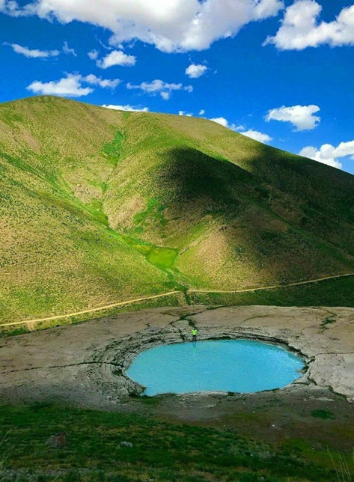

#صبحانه_عن_گیزشی

امروز
گلدان های لبخند را
در حیاط چهره بگذار
بگذار رهگذرانِ سیس کیری با دیدن حیاط چهره‌ات بگویند:
"توش باشه بخندی"
کونِ لَقِشان، برنده ی اصلی تو هستی
چشم های عاشقت را آب بزن
پلکهای خسته را لوله کن
و یکجا در ماتحت بدخواهایت فرو کُن
نان تازه ای از سر کوچه نشاط بگیر
سر همان کوچه بایست و از رهگذران این سوال را بکن: "ببخشید اسم این کوچه چیست؟"
آنها در جواب می‌گویند: "نشاط"
تو نیز به آن‌ها بگو: "کیر تو چشات"
و بنشین بخند
و عشق بنوش
و به همه سلام بگو و سلام و کیرخر بشنو

#Helsinki
@KiriMohems

## SportBaadNews — post 251334

  <a href="telegram/content/SportBaadNews_251334_1778481750.mp4" target="_blank">🎬 Download video</a>

🎙️ مکالمه جالب لوئیس انریکه با خبرنگار بعد از بازی دیشب تیمش:
انریکه: بارسا و رئال چند چندن؟
خبرنگار: 2-0
انریکه: ایول، همینه…
@SportBaadNews

## IranIntlTV — post 336595

  <a href="telegram/content/IranIntlTV_336595_1778481751.mp4" target="_blank">🎬 Download video</a>

نرگس محمدی، برنده جایزه نوبل صلح، پس از صدور دستور توقف اجرای حکم برای انجام روند درمان، در بیمارستان پارس تهران بستری شد. بنیاد نرگس اعلام کرد این انتقال با «تودیع وثیقه سنگین» انجام شده است.

گفت‌وگو با ایمان آقایاری، فعال سیاسی
@iranintltv

## IranIntlTV — post 336594

  <a href="telegram/content/IranIntlTV_336594_1778481754.mp4" target="_blank">🎬 Download video</a>

بنیامین نتانیاهو، نخست‌وزیر اسرائیل، در مصاحبه با شبکه سی‌بی‌اس با اشاره به توانمندی‌های هسته‌ای تهران گفت اسرائیل بخش زیادی از آن‌ها را تضعیف کرده، اما همچنان بخشی از این تهدیدها باقی مانده و باید اقدامات بیشتری انجام شود.

گفت‌وگو با کامیار بهرنگ، عضو تحریریه ایران‌اینترنشنال
@iranintltv

## IranIntlTV — post 336593

  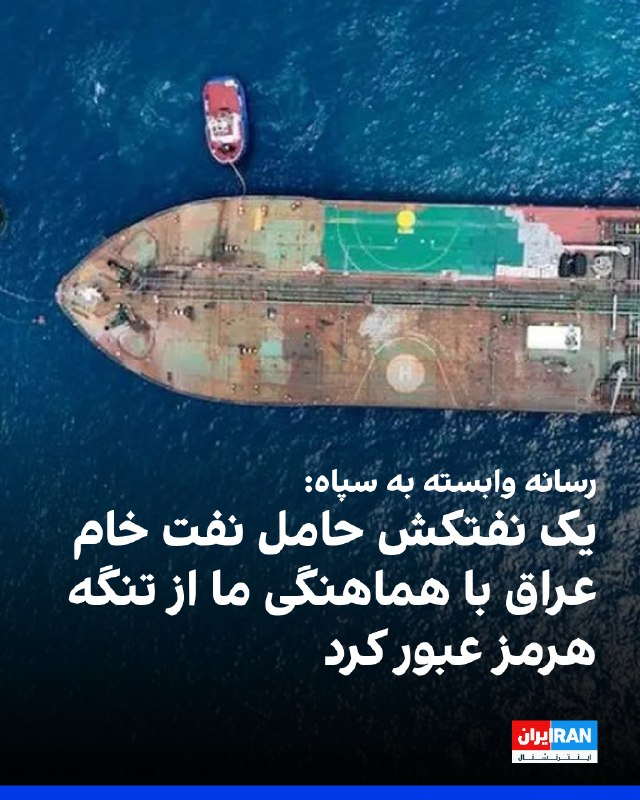

خبرگزاری تسنیم، وابسته به سپاه پاسداران، گزارش داد یک نفتکش وی‌ال‌سی‌سی به نام «آگویس فانوریوس ۱» که حامل نفت خام عراق است، یکشنبه با هماهنگی تهران و از مسیر تعیین‌شده از سوی جمهوری اسلامی در تنگه هرمز عبور کرد.
https://iranintl.com/202605119586

## IranIntlTV — post 336592

  <a href="telegram/content/IranIntlTV_336592_1778481757.mp4" target="_blank">🎬 Download video</a>

ایرانیان مخالف جمهوری اسلامی در واشینگتن دی‌سی، در اعتراض به اعدام، سرکوب معترضان و قطع اینترنت در ایران تظاهرات کردند.

اردوان روزبه، خبرنگار ایران‌اینترنشنال، گزارش می‌دهد

@iranintltv

## IranIntlTV — post 336591

  <a href="https://t.me/IranintlTV/336591" target="_blank">📎 Download file</a>

🎧نسخه صوتی اخبار بامدادی | دوشنبه ۲۱ اردیبهشت
@iranintlTV

## IranIntlTV — post 336590

  <a href="telegram/content/IranIntlTV_336590_1778481759.mp4" target="_blank">🎬 Download video</a>

هم‌زمان با حملات پهپادی جمهوری اسلامی به شماری از کشورهای عربی حاشیه خلیج فارس، رسانه‌های اسرائیلی از شکننده بودن آتش‌بس موقت میان جمهوری اسلامی و آمریکا گزارش دادند

گزارش اشکان صفایی، خبرنگار ایران‌اینترنشنال
@iranintltv

## IranIntlTV — post 336589

  

خبرگزاری میزان، رسانه قوه قضاییه جمهوری اسلامی، صبح دوشنبه، ۲۱ اردیبهشت از اجرای حکم اعدام عرفان شکورزاده، زندانی سیاسی، با اتهام «همکاری با سرویس‌های اطلاعاتی آمریکا و اسرائیل» خبر داد.

میزان در گزارش خود نوشت بر اساس محتویات پرونده، عرفان شکورزاده «به عنوان پروژه» و با توجه به تخصصش، جذب یکی از سازمان‌های مهم علمی فعال در حوزه ماهواره شده بود.

شکورزاده بهمن‌ماه ۱۴۰۳ از سوی اطلاعات سپاه با اتهام «جاسوسی و همکاری با کشورهای متخاصم» بازداشت و به اعدام محکوم شد و حکم صادر شده علیه او به‌تازگی در دیوان عالی کشور تایید شده بود.
iranintl.com/202605113252

## IranIntlTV — post 336588

  

علی مطهری، نایب‌رییس پیشین مجلس شورای اسلامی گفت: «ما داریم کار بزرگی انجام می‌دهیم که در تاریخ ثبت خواهد شد و آن این است که داریم دنیا را از شر ترامپ و نتانیاهو نجات می‌دهیم و انشاالله به نتیجه برسیم.»

مطهری ادامه داد: «داریم جور دنیا را به دوش می‌کشیم در مقابله با این دو آدم روانی و در واقع، ما دنیا را از شر این دو نفر نجات می‌دهیم.»

او افزود: «دنیا دوست دارد که یک منجی داشته باشد که دنیا را از دست اینها نجات دهد و به نظر می‌رسد این منجی ملت ایران است.»
https://iranintl.com/202605116290

## IranIntlTV — post 336587

  <a href="telegram/content/IranIntlTV_336587_1778481763.mp4" target="_blank">🎬 Download video</a>

ایرانیان ساکن لندن در حمایت از فراخوان شاهزاده رضا پهلوی و در اعتراض به تشدید اعدام‌ها، سرکوب و قطع اینترنت در ایران تجمع کردند.

جزییات بیشتر در گزارش آیدین مقیمی، خبرنگار ایران‌اینترنشنال
@iranintltv

## IranIntlTV — post 336585

  <a href="telegram/content/IranIntlTV_336585_1778481764.mp4" target="_blank">🎬 Download video</a>

به‌دنبال فراخوان شاهزاده رضا پهلوی با عنوان «یک ملت در گروگان»، ایرانیان مقیم استکهلم یک‌شنبه ۲۰ اردیبهشت تجمع اعتراضی برگزار کردند.

گزارش مهران عباسیان، خبرنگار ایران‌اینترنشنال
@iranintltv

## IranIntlTV — post 336584

  <a href="telegram/content/IranIntlTV_336584_1778481766.mp4" target="_blank">🎬 Download video</a>

ایرانیان مقیم واشینگتن دی‌سی در پاسخ به فراخوان شاهزاده رضا پهلوی برای اعتراض به خاموشی سراسری اینترنت در ایران، بازداشت‌های گسترده و اعدام بی‌وقفه معترضان تجمع کردند.

اردوان روزبه، خبرنگار ایران‌اینترنشنال، گزارش می‌دهد
@iranintltv

## IranIntlTV — post 336583

  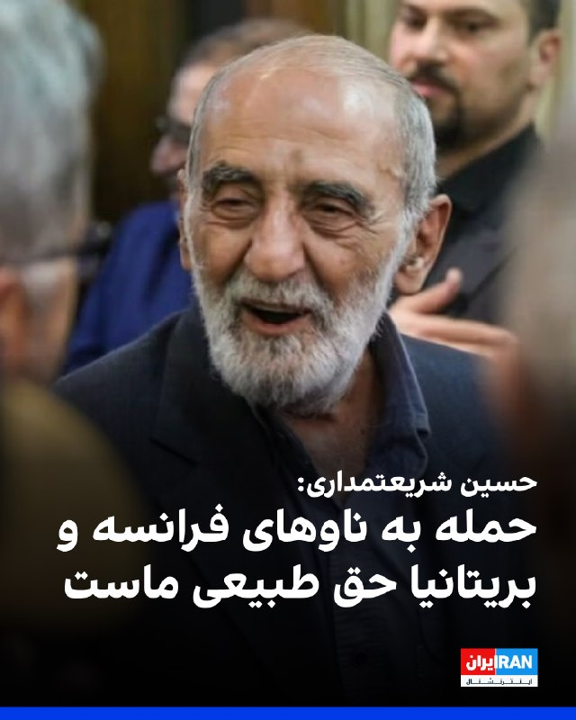

حسین شریعتمداری، نماینده رهبر کشته‌شده جمهوری اسلامی در روزنامه کیهان نوشت: «حضور ناوهای فرانسه و بریتانیا یا هر کشور دیگری برای همراهی با آمریکا در مقابله با حق قانونی ما در حاکمیت بر تنگه هرمز دخالت آشکار در امور حاکمیتی ماست... و مقابله پیشدستانه با این ناو‌های جنگی حق طبیعی و شناخته‌شده ماست.»

او ادامه داد: «حضور ناوهای فرانسه و بریتانیا در تنگه هرمز، اعلام جنگ با جمهوری اسلامی خواهد بود.»

او افزود: «این ناوها در تیررس موشک‌های دوربرد ما قرار دارند و علاوه‌ برآن، دریای سرخ و باب‌المندب نیز در سلطه موشکی انصارالله یمن است.»
https://iranintl.com/202605111247

## IranIntlTV — post 336582

  <a href="telegram/content/IranIntlTV_336582_1778481769.mp4" target="_blank">🎬 Download video</a>

🔻محمد تقوی، ایران اینترنشنال در برنامه هت‌تریک درباره تهدیدهای مهدی تاج علیه فیفا و آمریکا گفت: «مهدی تاج و مسئولان جمهوری اسلامی دچار خودشاخ‌پنداری شده‌اند. حرف‌هایی که رییس فدراسیون فوتبال می‌زند، از همان نوع حرف‌هایی است که مسئولان سیاسی جمهوری اسلامی می‌زنند. تیم ملی به جام جهانی نرود، تیم‌های دیگر آماده‌ای هستند که جایگزین شوند.»

🔹تماشای نسخه کامل هت‌تریک؛👇
https://youtu.be/lCFOAQeAUng

@iranintltvsport

## IranIntlTV — post 336581

  <a href="telegram/content/IranIntlTV_336581_1778481771.mp4" target="_blank">🎬 Download video</a>

🔻در حالی که مقام‌های آمریکایی اعلام کردند عناصر وابسته به سپاه پاسداران به‌عنوان هیات همراه تیم ملی فوتبال حق حضور در آمریکا را ندارند، مهدی تاج، رییس فدراسیون فوتبال، در گفت‌وگو با صداوسیمای جمهوری اسلامی از شروط خود برای فیفا پیش از اعزام به جام جهانی گفت.

🔹توضیحات مزدک میرزایی، ایران اینترنشنال در برنامه هت‌تریک

🔹تماشای نسخه کامل هت‌تریک؛👇
https://youtu.be/lCFOAQeAUng

@iranintltvsport

## IranIntlTV — post 336580

  <a href="telegram/content/IranIntlTV_336580_1778481773.mp4" target="_blank">🎬 Download video</a>

سرخط خبرهای دوشنبه ۲۱ اردیبهشت
@iranintltv

## Persian_Trend_Official — post 13872

  

📰بلومبرگ:

بیش از ۴۰ کشور قرار است روز دوشنبه برای بحث در مورد مشارکت‌های نظامی در یک ماموریت به رهبری اروپا جهت اسکورت کشتی‌های تجاری از تنگه هرمز پس از برقراری آتش‌بس پایدار، دیدار کنند.

عملیات دفاعی دریایی پیشنهادی که به رهبری بریتانیا و فرانسه است.

انتظار می‌رود شامل عملیات پاک‌سازی مین، اسکورت‌های دریایی و پلیس هوایی باشد که هدف آن حفاظت و اطمینان‌بخشی به کشتی‌رانی تجاری در منطقه است.

☆Phantom☆

📌 @persian_trend_official
پرشین ترند | متفاوت‌ترین کانال نظامی

## Persian_Trend_Official — post 13871

  

ایران به فرانسه و بریتانیا هشدار داد هرگونه حضور نظامی در تنگه هرمز با پاسخ مستقیم مواجه خواهد شد.

کاظم غریب‌آبادی، معاون وزیر امور خارجه ایران، اعلام کرد، استقرار ناوشکن‌ها و شناورهای جنگی فرانسه یا بریتانیا تحت عنوان «حفاظت از کشتیرانی» اقدامی تحریک‌آمیز و دخالت در امنیت منطقه تلقی می‌شود.

وی در پیامی در شبکه اجتماعی ایکس نوشت:
«تنگه هرمز قلمرو نفوذ قدرت‌های فرامنطقه‌ای نیست و جمهوری اسلامی ایران اجازه نخواهد داد هیچ طرف خارجی امنیت این آبراه راهبردی را به چالش بکشد.»

غریب‌آبادی تأکید کرد هرگونه حضور نظامی هماهنگ با «اقدامات غیرقانونی» آمریکا، با واکنش «فوری، قاطع و پشیمان‌کننده» نیروهای مسلح ایران روبه‌رو خواهد شد.

این مقام ایرانی همچنین هشدار داد تهران هر تحرک نظامی خارجی در اطراف تنگه هرمز را به‌دقت رصد می‌کند و مسئولیت هرگونه تشدید تنش بر عهده کشورهای مداخله‌گر خواهد بود.
☆Phantom☆

📌 @persian_trend_official
پرشین ترند | متفاوت‌ترین کانال نظامی

## Persian_Trend_Official — post 13869

در پی اظهارات مقام‌های نظامی فرانسه درباره اعزام ناو هواپیمابر «شارل دوگل» به دریای سرخ و خلیج عدن، حسین شریعتمداری، مدیرمسئول روزنامه کیهان، خواستار واکنش «پیشدستانه» ایران علیه ناوهای فرانسه و بریتانیا شد...

شریعتمداری در سرمقاله روزنامه کیهان نوشت اعزام این ناو در چارچوب همکاری‌های نظامی پاریس و لندن و با هدف «تقویت آزادی کشتیرانی در منطقه تنگه هرمز» انجام شده است. او این اقدام را «دخالت آشکار در امور حاکمیتی ایران» توصیف کرد و آن را معادل «اعلام جنگ» دانست.

وی همچنین از مقام‌های جمهوری اسلامی خواست دو اقدام فوری را در دستور کار قرار دهند؛
1️⃣صدور بیانیه‌ای خطاب به شهروندان
کشورهای اروپایی درباره هزینه‌های نظامی دولت‌هایشان در حمایت از آمریکا و اسرائیل،

2️⃣ «مقابله پیشدستانه» با ناوهای جنگی فرانسه و بریتانیا.

شریعتمداری مدعی شد که این ناوها در برد موشک‌های دوربرد ایران قرار دارند و همچنین به توانایی نیروهای انصارالله یمن در دریای سرخ و باب‌المندب اشاره کرد.

☆Phantom☆

📌 @persian_trend_official
پرشین ترند | متفاوت‌ترین کانال نظامی

---
📅 بروزرسانی: 1405/02/21 08:06
---

## rodast_omiddana — post 71210

  <a href="telegram/content/rodast_omiddana_71210_1778474166.mp4" target="_blank">🎬 Download video</a>

🚨 نتانیاهو:
"در ایران، خیابان‌ها را به نام من نامگذاری می‌کنند. می‌دانید؟ خب، البته بعد از رئیس‌جمهور ترامپ هم، چون او رهبری مبارزه را بر عهده دارد.
اما آن‌ها این را دارند؛ من فارسی صحبت نمی‌کنم، اما مرا «بی بی جون» صدا می‌کنند: بی بی عزیز."

## rodast_omiddana — post 71209

  <a href="telegram/content/rodast_omiddana_71209_1778474168.mp4" target="_blank">🎬 Download video</a>

🚨 نتانیاهو در برنامه 60دقیقه:
"'فارسی بلد نیستم اما [در ایران] صدام می‌کنن «بی‌بی جون».'"

ای جونم بی بی دلها...

## IranIntlTV — post 336579

  

برایان مست، رییس کمیته امور خارجی مجلس نمایندگان آمریکا، گفت: «هرگز نمی‌توان به رژیم ایران اعتماد کرد.»

این نماینده جمهوریخواه همچنین گفت حکومت ایران چاره‌ای جز بازگشت به میز مذاکره ندارد و دونالد ترامپ، رییس‌جمهوری آمریکا، فشار بر تهران را ادامه خواهد داد تا زمانی که جمهوری اسلامی ناچار به توافقی جدی شود.
https://iranintl.com/202605117347

## IranIntlTV — post 336578

  

آژانس خبری کردپا بر اساس «گزارش‌ها و شواهد از شهر سقز در استان کردستان» از افزایش فزاینده قیمت کالاهای اساسی، کمبود شدید نقدینگی و اختلال در خدمات بانکی خبر داد.

کردپا نوشت: «روایت‌های مردمی نشان می‌دهد که تنها طی دو هفته، قیمت بسیاری از کالاهای مصرفی و مواد اولیه چند برابر شده و همزمان توان خرید و معیشت بخش بزرگی از جامعه به‌شدت کاهش یافته است.»

این گزارش حاکی است در شهر سقز، خانه‌ای برای اجاره با کمتر از ۵۰۰ میلیون تومان رهن و ۱۵ میلیون تومان اجاره ماهانه یافت نمی‌شود؛ آن هم برای واحدی کوچک با یک اتاق و آشپزخانه.

در این میان، بسیاری از مراکز تولیدی به دلایلی مانند نبود مواد اولیه، هزینه بالای تولید، افزایش نرخ انرژی و کرایه‌ها تعطیل شده‌اند.

در شهرک صنعتی سقز نیز تا ابتدای اردیبهشت‌ماه بیش از ۳۰۰ کارگر، یعنی حدود نیمی از نیروی کار، اخراج شده‌اند و حدود ۱۵۰ کارگر دیگر با نصف حقوق مشغول به کار هستند.

بر اساس این گزارش، هم‌زمان با بحران اقتصادی، آسیب‌های اجتماعی از جمله «سرقت، راه‌زنی و کسب درآمد از راه‌های نابه‌هنجار» افزایش یافته است.
https://iranintl.com/202605118671

## IranIntlTV — post 336577

  <a href="telegram/content/IranIntlTV_336577_1778474170.mp4" target="_blank">🎬 Download video</a>

ویدیوهای دریافت‌شده نشان می‌دهد ایرانیان مقیم شهرهای والنسیا در اسپانیا و مونیخ آلمان، روز یک‌شنبه ۲۰ اردیبهشت، هم‌صدا با کارزار جهانی «یک ملت در گروگان»، علیه اعدام‌های جمهوری اسلامی و قطع اینترنت تجمع کردند و حمایت خود را از مردم ایران نشان دادند.
@iranintltv

## IranIntlTV — post 336574

  

بر اساس داده‌های شرکت کپلر، دو نفتکش پس از خاموش کردن سیستم‌های ردیابی خود با عبور از تنگه هرمز، این منطقه را ترک کردند.

بر اساس این گزارش، خاموش شدن دستگاه‌های موقعیت‌یاب باعث شد مسیر حرکت این نفتکش‌ها به طور دقیق قابل رصد نباشد.
https://iranintl.com/202605116330

## IranIntlTV — post 336573

  <a href="telegram/content/IranIntlTV_336573_1778474171.mp4" target="_blank">🎬 Download video</a>

جمعی از ایرانیان مقیم آمریکا، روز یک‌شنبه ۲۰ اردیبهشت، در حمایت از مردم ایران و شاهزاده رضا پهلوی و نیز در اعتراض به اعدام‌های جمهوری اسلامی و قطع اینترنت، در لس‌آنجلس تجمع کردند. آن‌ها هم‌صدا با کارزار جهانی «یک ملت در گروگان»، خواستار توجه جامعه بین‌المللی به وضعیت بحرانی داخل ایران شدند.
@iranintltv

## IranIntlTV — post 336571

  

یک مقام ارشد امنیتی عراق گزارش‌های منتشرشده درباره ایجاد پایگاه نظامی مخفی اسرائیل در صحرای غربی این کشور برای پشتیبانی از حملات علیه ایران را رد کرد و آن‌ها را «نادرست» خواند.

به گزارش آناتولی، این مقام که نامش فاش نشده، گفت ادعاها درباره فعالیت کنونی یک سایت نظامی اسرائیل در خاک عراق صحت ندارد.

این واکنش پس از گزارش وال‌استریت ژورنال مطرح شد که مدعی بود اسرائیل پیش از حملات ۹ اسفند، با اطلاع آمریکا پایگاهی مخفی در صحرای عراق ایجاد کرده است.

بر اساس آن گزارش، این پایگاه محل استقرار نیروهای ویژه و مرکز پشتیبانی لجستیکی بوده و نزدیک بود در ماه مارس پس از گزارش یک چوپان درباره فعالیت‌های مشکوک فاش شود.

مقام‌های عراقی پیش‌تر از درگیری با یک «عملیات هوایی مرموز» در منطقه النخیب خبر داده بودند که به کشته و زخمی شدن چند نظامی انجامید.

ارتش اسرائیل درباره این ادعاها اظهار نظر نکرده و تنش‌های منطقه‌ای همچنان ادامه دارد.
بیشتر بخوانید

https://iranintl.com/202605114193

## IranIntlTV — post 336570

  

نیویورک‌تایمز در گزارشی از موج اخراج‌ها پس از جنگ نهم اسفند خبر داد و نوشت حملات آمریکا و اسرائیل به صنایع فولاد و پتروشیمی، اختلال در واردات به‌دلیل محاصره بنادر و نیز سیاست‌هایی مانند قطع اینترنت، فشار سنگینی بر اقتصاد ایران وارد کرده است.

به نوشته این روزنامه، برخی آمارهای داخلی از بیکاری مستقیم و غیرمستقیم تا دو میلیون نفر و ثبت رکورد ۳۱۸ هزار رزومه در یک روز حکایت دارد؛ موضوعی که می‌تواند به کاهش قابل توجه درآمدهای مالیاتی دولت منجر شود.

در بخش صنعت، کمبود مواد اولیه و آسیب به کارخانه‌های بزرگ باعث کاهش تولید و اخراج‌های گسترده شده است.

مهدی بستانچی، رییس شورای هماهنگی شهرک‌های صنعتی سراسر کشور، به نیویورک تایمز گفت تا ۳.۵ میلیون کارگر ممکن است تحت تاثیر این روند انقباضی قرار گیرند.

همچنین قطعی اینترنت، صنعت فناوری را دچار بحران کرده و روزانه ده‌ها میلیون دلار خسارت به اقتصاد دیجیتال وارد می‌کند. این گزارش می‌افزاید نارضایتی اقتصادی که در سال‌های اخیر به اعتراضات انجامیده، همچنان برطرف نشده است.
https://iranintl.com/202605111091

## IranIntlTV — post 336569

  

روزنامه گاردین استرالیا گزارش داد اسحاق قالیباف، فرزند محمدباقر قالیباف، در دوران اقامت خود در استرالیا با یک مرکز پژوهشی در دانشگاه ملبورن همکاری داشته و همزمان از محل اجاره حداقل یک ملک در این کشور درآمد کسب می‌کرده است.

بر اساس اسناد ارائه‌شده در پرونده حقوقی او برای دریافت اقامت دائم کانادا، قالیباف بین سال‌های ۲۰۱۵ تا ۲۰۱۸ در ملبورن زندگی و در مقطع کارشناسی ارشد مهندسی تحصیل کرده و به‌عنوان دستیار پژوهشی در یک مرکز دانشگاهی مشغول به کار بوده است.

اسناد بانکی نشان می‌دهد او در سال ۲۰۱۸ مبالغی به‌عنوان «اجاره دریافتی» از یک آژانس املاک در ملبورن دریافت کرده، هرچند مالکیت دقیق املاک مشخص نیست. این گزارش همچنین به ارتباط نام کارفرمای او در ایران با چهره‌های نزدیک به سپاه اشاره کرده است. درخواست اقامت دائم قالیباف در کانادا در بهمن ۱۴۰۴ رد شد.

گاردین در ادامه به نگرانی بخشی از جامعه ایرانیان استرالیا درباره حضور بستگان مقام‌های جمهوری اسلامی در این کشور پرداخته است. برخی سیاستمداران استرالیایی نیز این موضوع را نشانه ضعف در چارچوب تحریم‌های این کشور دانسته‌اند.
بیشتر بخوانید

https://iranintl.com/20260510

## IranIntlTV — post 336568

  

وب‌سایت «اسرائیل نشنال‌نیوز» به نقل از المیادین گزارش داد جمهوری اسلامی در مذاکرات با آمریکا فهرستی از مطالبات گسترده مطرح کرده که با واکنش تند دونالد ترامپ روبه‌رو شده است.

تهران خواستار پایان فوری جنگ، تضمین آتش‌بس در لبنان، لغو کامل تحریم‌ها، آزادسازی دارایی‌های بلوکه‌شده و ازسرگیری بدون محدودیت صادرات نفت شده و کنترل تنگه هرمز را «خط قرمز» خود دانسته است. همچنین ترامپ هشدار داده «ایران دیگر نخواهد خندید.»

در عین حال، منابعی به نیویورک‌تایمز گفته‌اند دو طرف در حال بررسی توافقی موقت برای تمدید ۳۰ روزه آتش‌بس و توقف محاصره هرمز هستند تا مذاکرات ادامه یابد.

به نوشته وال‌استریت ژورنال، اختلاف اصلی بر سر ذخایر اورانیوم غنی‌شده پابرجاست؛ تهران کاهش شدید ذخایر را نپذیرفته و تنها درباره افزایش نظارت آژانس بین‌المللی انرژی اتمی اعلام آمادگی کرده است.

مذاکرات با میانجی‌گری پاکستان همچنان ادامه دارد و ارزیابی‌ها از وجود فرصت برای دستیابی به تفاهم حکایت دارد.
بیشتر بخوانید

https://iranintl.com/202605107880

## IranIntlTV — post 336567

  

دولت بریتانیا اعلام کرد همراه با فرانسه روز سه‌شنبه میزبان نشستی چندملیتی درباره برنامه‌های نظامی برای بازگرداندن جریان تجارت در تنگه هرمز خواهد بود.

به گزارش خبرگزاری فرانسه، این خبر ساعاتی پس از آن اعلام شد که جمهوری اسلامی به لندن و پاریس درباره اعزام کشتی‌های جنگی به منطقه هشدار داد.

در بیانیه وزارت دفاع بریتانیا آمده است: «جان هیلی، وزیر دفاع، همراه با همتای فرانسوی خود، کاترین ووترین، ریاست مشترک نشستی با حضور وزیران دفاع بیش از ۴۰ کشور را برای آغاز مأموریت چندملیتی بر عهده خواهد داشت.»

این نشست مجازی پس از گردهمایی دو روزه کارشناسان نظامی در لندن در ماه گذشته برگزار می‌شود. در آن نشست، جنبه‌های عملی یک مأموریت چندملیتی به رهبری بریتانیا و فرانسه برای حفاظت از ناوبری در این آبراه کلیدی پس از برقراری آتش‌بس پایدار بررسی شد.

هیلی گفت: «ما در حال تبدیل توافق دیپلماتیک به برنامه‌های نظامی عملی برای بازگرداندن اعتماد به کشتیرانی از طریق تنگه هرمز هستیم.»
https://iranintl.com/202605114087

## IranIntlTV — post 336566

  <a href="telegram/content/IranIntlTV_336566_1778474175.mp4" target="_blank">🎬 Download video</a>

ویدیوهای دریافتی نشان می‌دهد جمعی از ایرانیان ساکن اسپانیا، روز یک‌شنبه ۲۰ اردیبهشت، در حمایت از فراخوان شاهزاده رضا پهلوی در مادرید تجمع کردند و ضمن برگزاری پرفورمنسی علیه اجرای احکام اعدام از سوی حکومت، اعلام کردند که در ۴۷ سال گذشته هیچ آتش‌بسی در جنگ جمهوری اسلامی علیه مردم ایران وجود نداشته است.

## IranIntlTV — post 336565

  

بنیامین نتانیاهو در گفت‌وگو با برنامه «۶۰ دقیقه» شبکه سی‌بی‌اس گفت جنگ اخیر با ایران «دستاوردهای بزرگی» داشته اما هنوز پایان نیافته است، زیرا به گفته او همچنان اورانیوم غنی‌شده، تأسیسات هسته‌ای، برنامه موشک‌های بالستیک و شبکه نیروهای نیابتی ایران باید مهار شوند.

او تأکید کرد اگر حکومت ایران تضعیف یا سرنگون شود، شبکه نیروهای نیابتی از جمله حزب‌الله، حماس و حوثی‌ها نیز فرو خواهد پاشید، هرچند تغییر حکومت «تضمین‌شده نیست.»

نتانیاهو درباره خارج کردن اورانیوم با غنای بالا گفت در صورت وجود توافق می‌توان «وارد شد و آن را خارج کرد»، اما درباره گزینه‌های نظامی توضیحی نداد.

او همچنین طرح ایران برای پیوند زدن آتش‌بس در همه جبهه‌ها را رد کرد و گفت برخی کشورهای عربی خواهان تقویت همکاری با اسرائیل برای مهار تهران هستند.

نتانیاهو حمله ۷ اکتبر را بخشی از «محور ایران» برای نابودی اسرائیل توصیف کرد.
بیشتر بخوانید
https://iranintl.com/202605112648

## IranIntlTV — post 336564

  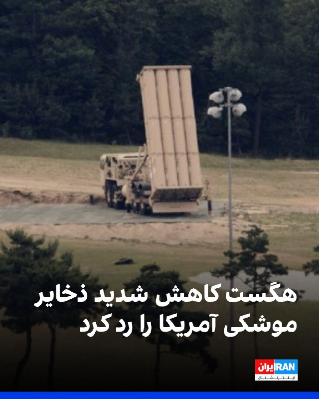

پیت هگست، وزیر جنگ آمریکا، سخنان سناتور مارک کلی،‌ عضو سنای ایالات متحده، مبنی بر اینکه وضعیت ذخایر موشک‌های این کشور در میانه جنگ با ایران «تکان‌دهنده» است و ممکن است سال‌ها طول بکشد تا ترمیم یابد را رد کرد.

او در شبکه اجتماعی ایکس نوشت که کلی «در تلویزیون (به دروغ و احمقانه) در مورد یک گزارش طبقه‌بندی‌شده پنتاگون که دریافت کرده است، یاوه‌گویی می‌کند.»

هگست اضافه کرد که مشاور حقوقی وزارت جنگ بررسی خواهد کرد که آیا این سناتور «سوگند خود را نقض کرده است یا خیر.»

پیش از این، کلی در پی دریافت گزارش محرمانه پنتاگون درباره تأثیر جنگ ایران بر ذخایر تسلیحاتی آمریکا گفته بود: «واقعاً شوکه‌کننده است که تا چه اندازه از این ذخایر مصرف کرده‌ایم.»

او اشاره کرد که ذخایر موشک‌های تاماهاوک، اتکمز، اس‌ام-۳، سامانه تاد و موشک‌های پاتریوت به شدت کاهش یافته‌اند؛ به‌ویژه موشک‌های رهگیر دفاعی که برای حفاظت از نیروها و پایگاه‌های آمریکا استفاده می‌شوند.

به گفته او، بازسازی این ذخایر ممکن است سال‌ها زمان ببرد و این مسئله می‌تواند توانایی آمریکا را در صورت وقوع یک درگیری احتمالی با چین تحت تأثیر قرار دهد.

## IranIntlTV — post 336563

  

سناتور راجر ویکر، نماینده جمهوری‌خواه مجلس سنای آمریکا، در پیامی خطاب به دونالد ترامپ در شبکه اجتماعی ایکس نوشت: «آقای رییس‌جمهور، شما با رژیم اسلام‌گرای ایران بسیار صبور بوده‌اید. حالا وقت بازگشت به عمل است.»

او از رییس‌جمهوری ایالات متحده خواست تا عملیات «پروژه آزادی» تنگه هرمز را از سر بگیرد.
https://iranintl.com/202605112515

## Persian_Trend_Official — post 13868

وی گفت هدف اصلی، دفاع از منافع و حقوق ملت ایران است و مردم باید شرایط دشوار اقتصادی و منطقه‌ای را با واقع‌بینی تحلیل کنند.

اظهارات پزشکیان در شرایطی مطرح می‌شود که بحث احتمال مذاکرات غیرمستقیم میان تهران و واشنگتن دوباره در رسانه‌های منطقه‌ای داغ شده است.

━━━━━━━━━━━━━━

🛰 #امنیت

◾️ وزارت اطلاعات: دو هسته وابسته به موساد متلاشی شدند

وزارت اطلاعات اعلام کرد دو شبکه تروریستی مرتبط با موساد شناسایی و منهدم شده‌اند و در جریان عملیات، یکی از عناصر این گروه‌ها کشته شده است.

جزئیات بیشتری از محل عملیات یا هویت افراد منتشر نشده اما نهادهای امنیتی ایران طی هفته‌های اخیر بارها از افزایش فعالیت‌های خرابکارانه در برخی استان‌ها خبر داده‌اند.

━━━━━━━━━━━━━━

💥 #چابهار

◾️ انفجار چابهار مربوط به خنثی‌سازی مهمات بود

سپاه شهرستان چابهار اعلام کرد صدای انفجار ظهر دیروز ناشی از انهدام مهمات عمل‌نکرده باقی‌مانده از جنگ بوده است. طبق این اطلاعیه، عملیات پاکسازی و خنثی‌سازی مهمات در روزهای آینده نیز ادامه خواهد داشت.

پس از انتشار ویدیوهای انفجار در شبکه‌های اجتماعی، شایعات مختلفی درباره حمله یا عملیات خرابکارانه مطرح شده بود که مسئولان آن را رد کردند.

━━━━━━━━━━━━━━
📌 @persian_trend_official
پرشین ترند | متفاوت‌ترین کانال نظامی

## Persian_Trend_Official — post 13867

☕️ #صبحانه_استراتژیک
📍 بولتن صبحگاهی پرشین ترند
🗓 ۲۱ اردیبهشت ۱۴۰۵

━━━━━━━━━━━━━━

🛢 #انرژی_و_ترانزیت

◾️ جنگ ایران، ترافیک کانال پاناما را ۲۰ درصد افزایش داد

فایننشال تایمز به نقل از مدیر کانال پاناما گزارش داد که از زمان آغاز درگیری‌ها در خلیج فارس، حجم عبور کشتی‌ها از این آبراه به شکل محسوسی افزایش یافته است. بسیاری از شرکت‌های کشتیرانی ترجیح داده‌اند برای کاهش ریسک عبور از منطقه خلیج فارس و دریای عمان، مسیرهای طولانی‌تر اما امن‌تر را انتخاب کنند.

تحلیلگران می‌گویند این مسئله نشان می‌دهد بحران خلیج فارس فقط یک بحران منطقه‌ای نیست و عملاً زنجیره جهانی انرژی و تجارت را تحت تأثیر قرار داده است. افزایش فشار روی کانال پاناما همچنین می‌تواند هزینه حمل‌ونقل جهانی را بالا ببرد.

━━━━━━━━━━━━━━

🚢 #تنگه_هرمز

◾️ اولین نفتکش قطری پس از آغاز جنگ از تنگه هرمز عبور کرد

شبکه الجزیره با استناد به داده‌های دریانوردی اعلام کرد نفتکش گاز «الخریطیات» بندر راس‌لفان قطر را ترک کرده و در مسیر پاکستان قرار دارد. این نخستین عبور ثبت‌شده یک نفتکش قطری از تنگه هرمز پس از آغاز بحران اخیر عنوان شده است.

کارشناسان معتقدند این حرکت می‌تواند نشانه‌ای از تلاش کشورهای حاشیه خلیج فارس برای سنجش وضعیت امنیتی مسیرهای انرژی باشد. بازار جهانی LNG همچنان نسبت به هرگونه تهدید در هرمز بسیار حساس است.

━━━━━━━━━━━━━━

🔥 #حادثه_دریایی

◾️ کشتی فله‌بر نزدیک قطر هدف قرار گرفت

سازمان عملیات تجارت دریایی بریتانیا (UKMTO) اعلام کرد یک کشتی فله‌بر در نزدیکی سواحل قطر هدف یک پرتابه ناشناس قرار گرفته است. طبق گزارش منتشرشده، آتش‌سوزی ایجادشده مهار شده و تلفات جانی ثبت نشده است.

خبرگزاری فارس مدعی شده این کشتی با پرچم آمریکا در حال تردد بوده است. هنوز هیچ گروهی مسئولیت این حمله را برعهده نگرفته اما این حادثه بار دیگر نگرانی‌ها درباره امنیت خطوط کشتیرانی منطقه را افزایش داده است.

━━━━━━━━━━━━━━

⚔️ #تحرکات_نظامی

◾️ ارتش: جابه‌جایی تجهیزات دشمن ادامه دارد

سخنگوی ارتش اعلام کرد کشورهای همراه با تحریم‌های آمریکا ممکن است در عبور از تنگه هرمز با مشکلاتی مواجه شوند. وی همچنین تأکید کرد که ایران در دوره آتش‌بس نیز روند به‌روزرسانی بانک اهداف و بازآرایی مواضع آفندی و پدافندی را ادامه داده است.

این اظهارات در شرایطی مطرح می‌شود که طی روزهای اخیر تصاویر متعددی از انتقال تجهیزات آمریکایی در منطقه، خصوصاً در پایگاه‌های قطر، بحرین و امارات منتشر شده است.

━━━━━━━━━━━━━━

🚤 #توان_دریایی_ایران

◾️ فایننشال تایمز: ایران بیش از هزار شناور بدون سرنشین دارد

این روزنامه بریتانیایی در گزارشی مدعی شد ایران اکنون بیش از ۱۰۰۰ قایق بدون سرنشین مجهز به موشک یا اژدر در اختیار دارد. همچنین تعداد قایق‌های تندرو هجومی ایران بین ۵۰۰ تا ۱۰۰۰ فروند برآورد شده است.

تحلیلگران غربی معتقدند تهران طی سال‌های اخیر تمرکز زیادی روی جنگ دریایی نامتقارن گذاشته و این شناورها می‌توانند در عملیات‌های ازدحامی علیه ناوهای بزرگ نقش‌آفرینی کنند.

━━━━━━━━━━━━━━

✈️ #نیروی_هوایی

◾️ ارتش: اف-۵ ها بازگشتند اما سوخو۲۴ آسیب دید

سخنگوی ارتش مدعی شد در روزهای ابتدایی جنگ، جنگنده‌های ایرانی مأموریت‌هایی علیه پایگاه‌های آمریکا در کویت، قطر و اربیل انجام داده‌اند. به گفته او جنگنده‌های اف-۵ سالم بازگشتند اما تعدادی از سوخو۲۴ ها در مسیر بازگشت هدف قرار گرفتند.

وی دلیل این موضوع را تقویت سامانه‌های پدافندی دشمن پس از موج اول حملات عنوان کرد. این نخستین‌بار است که جزئیاتی از عملکرد عملیاتی اف-۵ ها در این سطح مطرح می‌شود.

━━━━━━━━━━━━━━

🚨 #F35

◾️ جنگنده F-35 آمریکایی کد اضطراری ۷۷۰۰ ارسال کرد

روز گذشته یک فروند F-35 آمریکایی هنگام پرواز بر فراز دریای عمان کد اضطراری ۷۷۰۰ را مخابره کرد. این کد در هوانوردی به معنای وقوع وضعیت اضطراری عمومی است و معمولاً در شرایط نقص فنی یا تهدید ایمنی استفاده می‌شود.

هنوز جزئیات بیشتری درباره علت این وضعیت منتشر نشده اما این اتفاق در فضای شبکه‌های نظامی و رهگیری پروازها بازتاب گسترده‌ای داشته است.

━━━━━━━━━━━━━━

🌍 #دیپلماسی

◾️ پاکستان: به میانجیگری ادامه می‌دهیم

عاصم منیر، فرمانده ارتش پاکستان، اعلام کرد اسلام‌آباد تلاش می‌کند به‌صورت بی‌طرفانه برای کاهش تنش‌ها در خاورمیانه نقش‌آفرینی کند. او گفت پاکستان تمام تلاش خود را برای رسیدن به یک صلح پایدار به کار خواهد گرفت.

پاکستان طی هفته‌های اخیر تماس‌های متعددی با تهران، ریاض، واشنگتن و برخی کشورهای عربی داشته و تلاش می‌کند نقش میانجی فعال‌تری ایفا کند.

━━━━━━━━━━━━━━

🏛 #سیاست_داخلی

◾️ پزشکیان: مذاکره به معنای عقب‌نشینی نیست

رئیس‌جمهور تأکید کرد هرگونه بحث درباره مذاکره نباید به معنای تسلیم تعبیر شود.

---
📅 بروزرسانی: 1405/02/21 03:43
---

## IranIntlTV — post 336562

  <a href="telegram/content/IranIntlTV_336562_1778458419.mp4" target="_blank">🎬 Download video</a>

ویدیوهای دریافت‌شده نشان می‌دهد ایرانیان مقیم آمریکا، در شهرهای دالاس و سان‌فرانسیسکو، روز یک‌شنبه ۲۰ اردیبهشت، در پی فراخوان شاهزاده رضا پهلوی علیه جمهوری اسلامی تجمع کردند.

## IranIntlTV — post 336561

  

درور بالازاده، تحلیلگر ایران در کانال ۱۴ اسرائیل، گزارش داد که جمهوری اسلامی به‌رغم اطلاع از این موضوع که مقداری از نفت استخراجی به دریا نشت می‌کند، از نفتکش‌های قدیمی استفاده می‌کند.

او با استناد به «اطلاعات به‌دست‌آمده»، گفت رژیم ایران همچنان به پمپاژ نفت به نفتکش‌هایی که دهه‌ها مورد استفاده قرار نگرفته‌اند، به‌رغم مشکلات شدید نشت نفت، ادامه می‌دهد، زیرا از اینکه توقف تولید به چاه‌های نفت آسیب برساند، نگران است.

بالازاده همچنین به نقل از «منابع خود» گفت: «چهره‌های داخل صنعت نفت ایران پس از درک شدت بحران ایجاد شده توسط محاصره دریایی، در حال بررسی راه‌هایی برای خروج از کشور هستند.»
https://iranintl.com/202605104249

## IranIntlTV — post 336552

بیش از ۳۶ هزار نام در این فهرست ثبت شده؛
اما هیچ کلامی نمی‌تواند توضیح بدهد که هر کدام از این جوانان چه کسی بودند و نبودنشان چه چیزی را از این سرزمین کم کرد.
یکی سرطان را شکست داده بود،
یکی دانشجوی مکانیک بود،
یکی مربی ورزش،
یکی کارگر انبار،
و یکی هنوز با رویای آینده درس می‌خواند.
عسل شاکری، محمدرضا سیفی، عرشیا رضایی، محمدحسین پایدار حسینی، سیدامیر رستمیان، علیرضا قسیمی، کامران (مهدی) احمدی و فاطمه (لونا) کرمانی‌نژاد
جاویدنامان انقلاب ملی ایرانیان؛
نام‌هایی که هر کدام، یک زندگی و یک رویای ناتمام بودند.
#جاویدنامان_انقلاب_ملی_ایرانیان

---
📅 بروزرسانی: 1405/02/21 02:57
---

## ChizBergerz — post 46289

  

نه داداش تو نمیدونی جمهوری اسلامی خیلی خوب داره دووم میاره جلو آمریکا و اسرائیل، اینم سندش:

@ChizBergerz

## ChizBergerz — post 46288

  <a href="telegram/content/ChizBergerz_46288_1778455673.mp4" target="_blank">🎬 Download video</a>

بچه ها اسم این بازی عبور مرغ از خیابون  هست ویدئو نگاه کنید خیلی راحت 8 میلیون ازش سود گرفتیم😍

😤اگ توم دوس داری خیلی راحت از بازی های انلاین پول در بیاری حتما عضو کازینو شبانه شو
✅

توی کازینو شبانه بهت اموزش میدیم از بازی های انلاین پول دربیاری👌

کازینو شبانه راهی برای چند برابر کردن سرمایت 🤷‍♂

کسب درامد انلاین با یه ادم حرفه ای یاد بگیر و‌ پول دربیار 
💵
ae20
🎯همین حالا عضو شو و شروع کن👇
https://t.me/+OS-QBvyDO4M2ZGY0
https://t.me/+OS-QBvyDO4M2ZGY0

## ChizBergerz — post 46287

  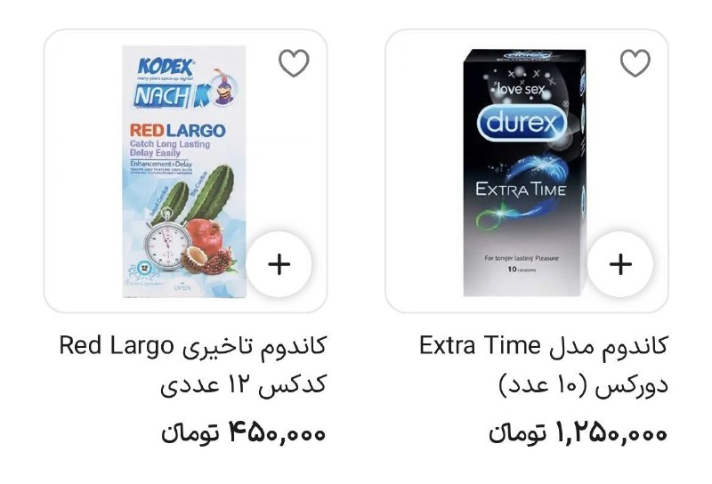

دیگه کاندومم نمیشه یکبار مصرف کرد، باید بعد استفاده بشوریمش رو بند آویزون کنیم...

@ChizBergerz

## rodast_omiddana — post 71208

  <a href="telegram/content/rodast_omiddana_71208_1778455675.webm" target="_blank">🎬 Download video</a>

🚨امید جان همین الان
۲۱.۴۰ دقیقه شب
دوبار صدای انفجار آمد
بین دزفول اندیمشک
پادگان چهارم شکاری یا ۲۹۲ زرهی

اولش پدافند کار می‌کرد بعد ۵ دقیقه صدای ص انفجار آمد.

## rodast_omiddana — post 71207

  <a href="telegram/content/rodast_omiddana_71207_1778455675.webm" target="_blank">🎬 Download video</a>

🚨‏کانال ۱۴ اسرائیل: نتانیاهو پس از دریافت پاسخ ایران کنفرانس با دروزی‌ها را متوقف کرد تا تماس تلفنی با ترامپ برقرار کند

## rodast_omiddana — post 71206

  <a href="telegram/content/rodast_omiddana_71206_1778455675.webm" target="_blank">🎬 Download video</a>

🚨
🚨 ترامپ:
من همین الان پاسخ «نمایندگان» به اصطلاح ایران را خواندم. این را دوست ندارم — کاملاً غیرقابل قبول است! از توجه شما به این موضوع سپاسگزارم.

## SportBaadNews — post 251333

  <a href="telegram/content/SportBaadNews_251333_1778455676.mp4" target="_blank">🎬 Download video</a>

⚽️
🔻خواستگاری یه بارسا فن از دوست دخترش تو بازی امشب
@SportBaadNews

## IranIntlTV — post 336550

  <a href="telegram/content/IranIntlTV_336550_1778455677.mp4" target="_blank">🎬 Download video</a>

ویدیوهای منتشرشده در شبکه‌های اجتماعی، به همراه تصاویر دریافتی، نشان می‌دهد یکی از حامیان جمهوری اسلامی روز یک‌شنبه ۲۰ اردیبهشت وارد تجمع ضدحکومتی ایرانیان در تورنتو شده و سپس پرچم جمهوری اسلامی را برافراشته و تکان می‌دهد.
بر اساس گزارش‌های منتشرشده، در پی این حمله، دست‌کم یک نفر زخمی شده و به چندین خودرو آسیب وارد شده است.

عکس از پیمان خواجه‌حسنی، خبرنگار

## IranIntlTV — post 336549

  

فرماندهی مرکزی ایالات متحده، ‌سنتکام، نوشت که تمرین‌‌های تفنگداران دریایی آمریکا تضمین می‌کند که آن‌ها در صورت فرا خوانده شدن برای پیاده شدن بر عرشه کشتی‌‌های متخلف در طول محاصره ایران توسط ایالات متحده آماده باشند.

سنتکام در این ارتباط، تصاویری از تمرین‌های تفنگداران دریایی بر روی عرشه ناو تریپولی را در شبکه اجتماعی ایکس منتشر کرد.
https://iranintl.com/202605106827

## IranIntlTV — post 336548

  <a href="telegram/content/IranIntlTV_336548_1778455680.mp4" target="_blank">🎬 Download video</a>

یکی از شرکت‌کنندگان در تجمع «یک ملت گروگان» در واشینگتن به اردوان روزبه، خبرنگار ایران‌اینترنشنال، گفت: «افتخار می‌کنیم که در حمایت از مردم ایران و به نمایندگی از آن‌ها در این مراسم شرکت کنیم.»

او افزود: «امروز همچنین روز مادر در آمریکاست و می‌خواهیم به مادران ایران، به‌ویژه مادرانی که فرزندانشان را از دست داده‌اند، ادای احترام کنیم. حداقل کاری که می‌توانستیم انجام دهیم، حضور در این مراسم بود.»
@iranintltv

## IranIntlTV — post 336547

  

جیسون برادسکی، مدیر سیاست‌گذاری اتحاد علیه ایران هسته‌ای، در مورد تماس تلفنی دونالد ترامپ و بنیامین نتانیاهو در مورد پاسخ جمهوری اسلامی نوشت: «تغییر وضع موجود ضروری است. محاصره لازم است، اما کافی نیست.»

او در شبکه اجتماعی ایکس تاکید کرد ترکیب محاصره با اقدام نظامی مهم خواهد بود.

برادسکی همچنین اشاره کرد: «برخلاف تصوری که رسانه‌ها و برخی مفسران ایجاد کرده‌اند، رییس‌جمهور همچنان نشان می‌دهد که به هیچ توافقی با رژیم ایران، صرف نظر از شرایط، مشتاق نیست. اگر او واقعا برای هر توافقی مشتاق بود، مدت‌ها پیش توافقی حاصل شده بود.»
https://iranintl.com/202605105974

## IranIntlTV — post 336546

  <a href="telegram/content/IranIntlTV_336546_1778455682.mp4" target="_blank">🎬 Download video</a>

مراد ویسی، تحلیل‌گر ارشد ایران‌اینترنشنال، گفت: «سفر ترامپ به پکن می‌تواند پیام هشدار جدی‌تری برای تهران داشته باشد. به‌ویژه با توجه به تهدید دوباره ترامپ به بمباران شدیدتر در صورت عدم توافق. اعلام مذاکره ترامپ و شی جین‌ پینگ درباره جمهوری اسلامی، احتمال شکل‌گیری معامله و بده‌بستان میان واشینگتن و پکن بر سر پرونده ایران را پررنگ‌تر کرده است.»
@iranintltv

---
📅 بروزرسانی: 1405/02/21 02:10
---

## arianheidarii — post 20027

شروع کلاسهای ویژه امتحان نهایی دوازدهم
از امروز
در
کلاسینو

## arianheidarii — post 20026

  <a href="telegram/content/arianheidarii_20026_1778452822.mp4" target="_blank">🎬 Download video</a>

ابتدای آخرین قسمت پخش شده از برنامه اکنون در فیلیمو

## arianheidarii — post 20025

آخرین تصمیمات در خصوص برگزاری امتحانات نهایی یازدهمی‌ها و دوازدهمی‌ها

وزیر آموزش و پرورش:

پایه ۱۱ و ۱۲ چون امتحان نهایی دارند و تاثیر ۶۰ درصد در کنکور دارد، امتحانات نهایی ۱۵ روز بعد از عادی شدن شرایط برگزار می‌شود.

اگر تا ۱۰ مرداد شرایط جنگی ادامه داشته باشد مصوب کردیم از تمام دانش‌آموزان پایه یازدهم و دوازدهم آزمون داخلی برگزار شود.

متقاضیان کنکور باید حتما در آزمون نهایی شرکت کنند چون تاثیر پایه یازدهم و دوازدهم در کنکور قطعی است.

به دانش‌آموزان فرصت بیشتری داده می‌شود تا مطالعه کنند و امتحانات نهایی برگزار شود./ایسنا

## arianheidarii — post 20024

📌 کنکور سراسری ۴۵ روز پس از پایان جنگ برگزار می‌شود

حمیدرضا حاجی بابایی نایب رئیس دوم مجلس:
طبق هماهنگی با وزارت آموزش و پرورش و همچنین وزارت علوم تحقیقات و فناوری مقرر شد؛ امتحانات نهایی دانش آموزان ۱۵ روز پس از جنگ و کنکور سراسری نیز ۴۵ روز پس از پایان جنگ برگزار شود

## arianheidarii — post 20023

🔹 تاثیر قطعی معدل یازدهم در کنکور؛ اشتباه بزرگ در مسیر عدالت آموزشی

نایب رئیس کمیسیون آموزش و تحقیقات مجلس:
✅تصمیم شورای عالی انقلاب فرهنگی برای تاثیر قطعی معدل پایه یازدهم در کنکور ۱۴۰۵، به همراه پایه دوازدهم که جمعاً ۶۰ درصد سوابق تحصیلی می‌شود، هرچند با هدف کاهش استرس کنکور و کمک به عدالت آموزشی گرفته شده اما در عمل اشتباه بزرگی است.

✅ مصلحت کشور این است که این تاثیر قطعی لغو یا خیلی محدود شود و کنکور سراسری دوباره وزن اصلی خود را پیدا کند

## arianheidarii — post 20022

✅اعلام زمان برگزاری کنکور تا چند روزه آینده

کریمیان، رئیس سازمان سنجش:

📍تا چند روز آینده اطلاعیه‌ای از سوی سازمان سنجش درخصوص زمان برگزاری کنکور منتشر می‌شود.

📍جزئیات برگزاری کنکور در این اطلاعیه به اطلاع داوطلبان خواهد رسید.

## arianheidarii — post 20021

سخنگوی کمیسیون آموزش مجلس:

📌امتحانات نهایی با فاصله دو تا چهار هفته پس از پایان جنگ برگزار خواهد شد

📍کنکور سراسری و آزمون دانشگاه فرهنگیان نیز حدود ۱۵ روز تا سه هفته پس از امتحانات نهایی برگزار خواهد شد.

## arianheidarii — post 20020

زمان ثبت‌نام کنکور تا هفته آینده اعلام می‌شود
‌
رئیس سازمان سنجش آموزش کشور اعلام کرد که زمان ثبت‌نام آزمون سراسری سال ۱۴۰۵ در اوایل اردیبهشت‌ماه اعلام خواهد شد

## arianheidarii — post 20019

پیرو سوالات مکرر بچه ها:

گرچه هیچ چیز قابل پیش بینی دقیق نیست،
اما برآورد من‌برای تاریخ برگزاری کنکور
با توجه به اتفاقات رخ داده تا این لحظه:

کنکور در بهترین حالت، زودتر از اول مرداد، برگزار نخواهد شد

## arianheidarii — post 20018

📍 عظیمی‌راد: در جلسه امروز با وزیر آموزش و پرورش؛ آخرین وضعیت کنکور و آزمون‌های نهایی مورد بحث قرار گرفت که دکتر کاظمی فرمود طبق مصوبه شورای عالی آموزش و پرورش، مقرر شده بعد از اتمام جنگ تحمیلی دشمن آمریکایی‌ها، بین ۲ تا ۴ هفته فرجه برای دانش آموزان لحاظ و سپس آزمون‌های نهایی برگزار شود و به همین میزان نیز بعد از آزمون‌های نهایی، کنکور سراسری و فرهنگیان برگزار خواهند شد.

✅ همچنین وزیر آموزش و پرورش تأکید کرد سه پیشنهاد وزارتخانه شامل حذف تأثیر قطعی معدل در پایه یازدهم کنکور، مثبت شدن ۶ درس در پایه یازدهم و قطعی شدن ۶ درس در پایه یازدهم، به ترتیب پیشنهادات وزارتخانه است که در جلسه شورای معین مطرح خواهد شد.

## arianheidarii — post 20017

  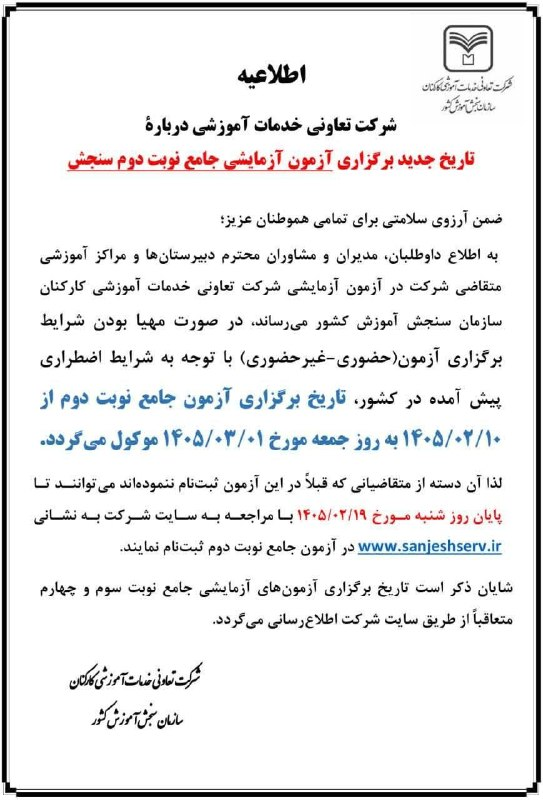

تعویق ۲۰ روزه ازمون جامع سنجش

نتیجه گیری؟!😉

## arianheidarii — post 20016

تحلیل آزمون قلمچی 28 فروردین ریاضی دوازدهم رشته ریاضی 👇

https://www.aparat.com/v/jttxo47

## arianheidarii — post 20015

تحلیل آزمون قلمچی 28 فروردین ریاضی یازدهم رشته ریاضی 👇
https://aparat.com/v/vfd9mk0

## arianheidarii — post 20014

تحلیل آزمون قلمچی 28 فروردین ریاضی یازدهم رشته تجربی 👇

https://www.aparat.com/v/muux8w3

## arianheidarii — post 20013

تحلیل آزمون قلمچی 28 فروردین ریاضی دوازدهم رشته انسانی 👇

https://www.aparat.com/v/mdtyh07

## arianheidarii — post 20012

تحلیل آزمون قلمچی 28 فروردین ریاضی دوازدهم رشته تجربی 👇

https://www.aparat.com/v/wsz3589

## arianheidarii — post 20011

تحلیل آزمونهای امروز کانون در کانال آپارات👇

## arianheidarii — post 20010

  <a href="telegram/content/arianheidarii_20010_1778452825.mp4" target="_blank">🎬 Download video</a>

ای بابا😂

## arianheidarii — post 20009

https://ketabchi.com/product/817146/%D8%AC%D8%B2%D9%88%D9%87-%D8%AA%D8%B3%D8%AA%D9%88%D8%B1%D8%A7%D9%86-%D8%A7%D9%86%D8%B3%D8%A7%D9%86%DB%8C-%D8%A7%D8%B3%D8%AA%D8%A7%D8%AF-%D8%A2%D8%B1%DB%8C%D8%A7%D9%86-%D8%AD%DB%8C%D8%AF%D8%B1%DB%8C

لینک تهیه جزوه نکته و تست
رشته انسانی

از فردا شنبه۲۲ فروردین قابل سفارش است

## arianheidarii — post 20008

https://ketabchi.com/product/817148/%D8%AC%D8%B2%D9%88%D9%87-%D8%AA%D8%B3%D8%AA%D9%88%D8%B1%D8%A7%D9%86-%D8%B1%D8%B4%D8%AA%D9%87-%D8%AA%D8%AC%D8%B1%D8%A8%DB%8C-%D9%88-%D8%B1%DB%8C%D8%A7%D8%B6%DB%8C-%D8%A2%D8%B1%DB%8C%D8%A7%D9%86-%D8%AD%DB%8C%D8%AF%D8%B1%DB%8C

لینک تهیه جزوه نکته و تست
رشته ریاضی و تجربی

از فردا شنبه۲۲ فروردین قابل سفارش است

## rodast_omiddana — post 71205

  <a href="telegram/content/rodast_omiddana_71205_1778452827.webm" target="_blank">🎬 Download video</a>

🚨 فوری_دقایقی پیش
کانال رسمی استانداری البرز و آموزش پرورش البرز ، این پیام رو پین کرد:
فوری
لطفاً در رسانه ها و به همکاران فوری اعلام شود
ممکن است نت به کلی قطع شود.
تلویزیون قطع شود.
ماهواره ها اخبار دروغ و خطرناک پخش کنند و خبر سقوط نظام.
بسیار مراقب باشید و مطمئن باشید که دشمن نزدیک نابودی است و به مسجد محله مراجعه کنید.
احتمالاً جنگ گسترده و شدید رسانه ای و عملیات روانی در پیش باشد.
اداره کل روابط عمومی و امور بین الملل استانداری البرز

(بعد از عدم خوشحالی ترامپ از پاسخ رژیم، بوی جنگ میاد )

## rodast_omiddana — post 71204

  <a href="https://t.me/rodast_omiddana/71204" target="_blank">📎 Download file</a>

🔈 حجم فشرده_مواضع جدید ترامپ و نتانیاهو برای حمله جدید به رژیم_جنگ دوباره قطعی است و احتمال سقوط رژیم بالاست

## rodast_omiddana — post 71203

  <a href="https://t.me/rodast_omiddana/71203" target="_blank">📎 Download file</a>

🔈 مواضع جدید ترامپ و نتانیاهو برای حمله جدید به رژیم_جنگ دوباره قطعی است و احتمال سقوط رژیم بالاست

## KiriMohems — post 47341

🔴فوووووری / ترامپ: نموخاااام از پاسخ ایران اصلا راضی نیستم. به هیچ وجه قابل قبول نیست!!!!! #professor @KiriMohems

## KiriMohems — post 47340

ترامپ به Axios گفت که پاسخ ایران به آخرین پیش‌نویس توافق‌نامه‌ای که هدف آن پایان دادن به جنگ است را رد خواهد کرد، پس از اینکه آمریکا ۱۰ روز منتظر پاسخ تهران ماند.

#professor
@KiriMohems

## KiriMohems — post 47339

  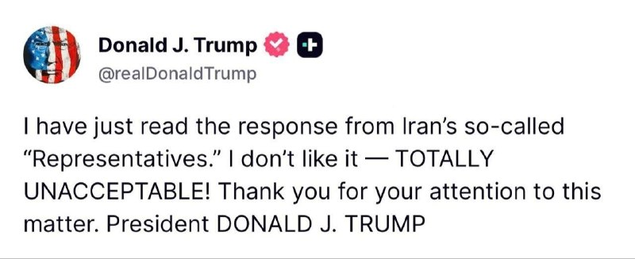

🔴فوووووری / ترامپ: نموخاااام از پاسخ ایران اصلا راضی نیستم. به هیچ وجه قابل قبول نیست!!!!!

#professor
@KiriMohems

## KiriMohems — post 47335

🔴 لرستان و طبیعتش تو اردیبهشت که شرت هر بیننده‌ای رو خیس میکنه

بیا دلبرم بریم زیر این درختا ، یه ساک پر تف بری برام

#Helsinki
@KiriMohems

## KiriMohems — post 47334

  <a href="telegram/content/KiriMohems_47334_1778452828.mp4" target="_blank">🎬 Download video</a>

#بوی_بگایی

🔴شبکه 14 اسرائیل، سولاخ های احتمالی حمله‌ها تو آینده :
- تاسیسات انرژی و صنعت پتروشیمی
- صنعت خودروسازی و پایگاه‌ های موشک بالستیک
- صنعت نفت و صنعت فولاد
#Helsinki
@KiriMohems

## KiriMohems — post 47333

  <a href="telegram/content/KiriMohems_47333_1778452831.mp4" target="_blank">🎬 Download video</a>

🔴کصشعرای اون رفیقم به مسئول اپراتور که رفته سیم کارت سفید بگیره

#Helsinki
@KiriMohems

## KiriMohems — post 47332

  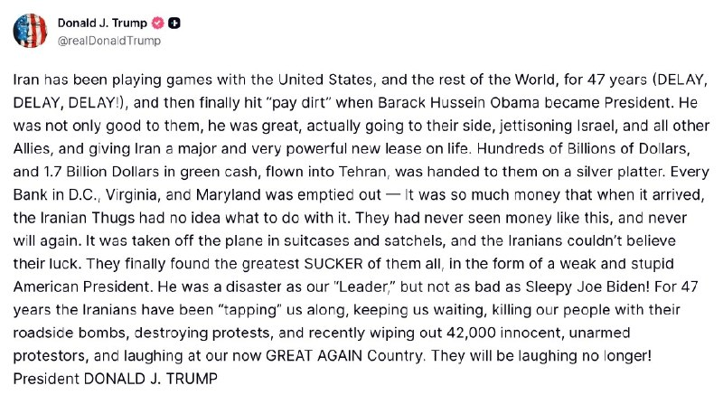

🔴ترامپ : ایران ۴۷ ساله ما رو کیر خودش فرض کرده و با بقیه دنیا بازی درمیاره و هی وقت‌کشی می‌کنه!

- تا اینکه اوبامای نیگر اومد. اون یابو فقط با ایران خوب نبود، خیلی هم براشون قمبل کرد ، متحدای ما مثل اسرائیل رو تو کون سگ کرد و به ایران یه فرصت بزرگ داد.
- اون ۱.۷ میلیارد دلار پول نقد هم با هواپیما فرستاد براشون، کلی پول هم در کل بهشون رسید
- انقدر پول بود که خودشون هم موندن باهاش چه گوهی بخورن! ایرانی‌ها قبلاً همچین چیزی ندیده بودن.
- اون موقع عملاً کصخلانه‌ترین معامله تاریخ رو انجام داد، چون یه رئیس‌جمهور کص‌مغز و بی‌عرضه داشتیم. بعدش هم اوضاع از اونم بدتر شد با بایدن نعشه‌ای!
- ۴۷ ساله ایران داره ما رو انگشت می‌کنه، آدم‌هامونو می‌کشه، اعتراضات رو خراب می‌کنه و ۴۲ هزار معترضو کشته، ایران تو منطقه ام البگایی محسوب میشه، ولی دیگه اون دوران تموم شده. دیگه نمی‌خندن!

#Helsinki
@KiriMohems

## KiriMohems — post 47331

  

🔴ترامپ در مورد دخول احتمالی بارون ترامپ، پسر کونی فیسش به سیاست : شاید، گل پسر بابایی خیلی دوست داشتنیه

#Helsinki
@KiriMohems

## KiriMohems — post 47330

  <a href="telegram/content/KiriMohems_47330_1778452834.mp4" target="_blank">🎬 Download video</a>

🔴زناوسیما دوتا پسر که فیلترشکن میفروختن رو خفت کردن و اعتراف کردن:

27سالمه و یک ساله مشغول فروختن فیلترشکنم روزانه 30 میلیون به جیب میزنم

تو این بازه زمانی قطعی نت حدودا هشت میلیارد گیرم اومده

از اب گل الود ماهی گرفتم و فیلترارو با قیمت بالا میکردم تو کون ملت

ولی من واقعا نمیدونستم جرمه چون پرداختیامون از درگاه بانکی داخل بود گفتم شاید قانونیه

احساس ریدمان دارم به دوستانم میگم بخاطر دو دقیقه وصل شدن به اینستا وی پی ان نفروشین

#Helsinki
@KiriMohems

## KiriMohems — post 47329

  

😤دنبال یه سایت شرط بندی بین المللی بودی که به ایرانیا خدمات بده؟!
⛔

👍دربی بت همون انتخاب  100%

💎ویژگی های سایت جهانی Derby Bet:

⬅️امکان شارژ امن با کارت بانکی

⬅️واریز اول دوبل شارژ می شوید(بونوس۱۰۰٪)

⬅️پر اپشن ترین سایت فعال در ایران

⬅️تسویه حساب کمتر از 5 دقیقه

⬅️برگشت بخشی از باخت به صورت هفتگی

🚨کد هدیه ثبت نام:GG007

⚠️برای دانلود اپلکیشن کلیک کنید
👉

🔔کانال دربی بت :g20🅰

🪙https://t.me/+kpFvLD9kaeJhYTI0

## KiriMohems — post 47328

  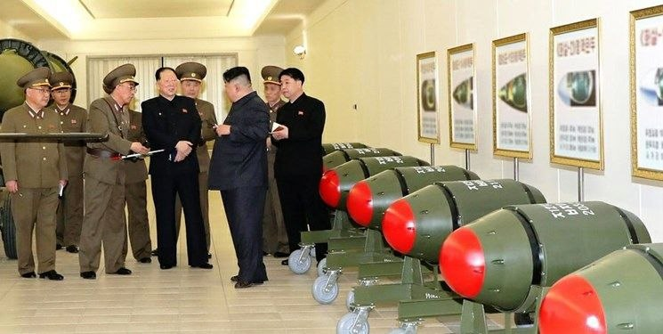

🔴برخی از رسانه‌ها مدعی شدن که:

کره شمالی قانونی رو وضع کرده که اگر رهبر این کشور آقا کیر جونگ اون توسط کشوری تـرور بشه و بگا سگ بره کره شمالی با بمب اتم از اون کشور انتقام میگیره.
این قانون بعد از ترور خامنه‌ای وضع شده. گویا به خودشون ریدن.
#Helsinki
@KiriMohems

## KiriMohems — post 47327

🔴سفیر آمریکا تو سازمان ملل : پاسخ ایران رو از طریق پاکستان دریافت کردیم و در حال کیرشکافی هستیم

#Helsinki
@KiriMohems

## KiriMohems — post 47326

  <a href="telegram/content/KiriMohems_47326_1778452837.mp4" target="_blank">🎬 Download video</a>

🔴تو جاده بهبهان ـ رامهرمز یه پرشیا با یه پژو ۴۰۵ اینجوری شاخ به شاخ شدن که باعث شده ۶ نفر کشته بشن.

#Helsinki
@KiriMohems

## KiriMohems — post 47325

  <a href="telegram/content/KiriMohems_47325_1778452840.mp4" target="_blank">🎬 Download video</a>

🔴آخوندک ماندگاری:
هیچ امام و پیغمبری در تاریخ به اندازه «امام کبیر»؛ «امام شهید» و الانم «امام عزیزمون» لبیک‌گو نداشته. مجتبی خامنه‌ای نایب‌ امام زمانه.

ناموصا این کصشعرا اگر کُفر آمیز نیستن ، چی هستن ؟

#Helsinki
@KiriMohems

## KiriMohems — post 47324

  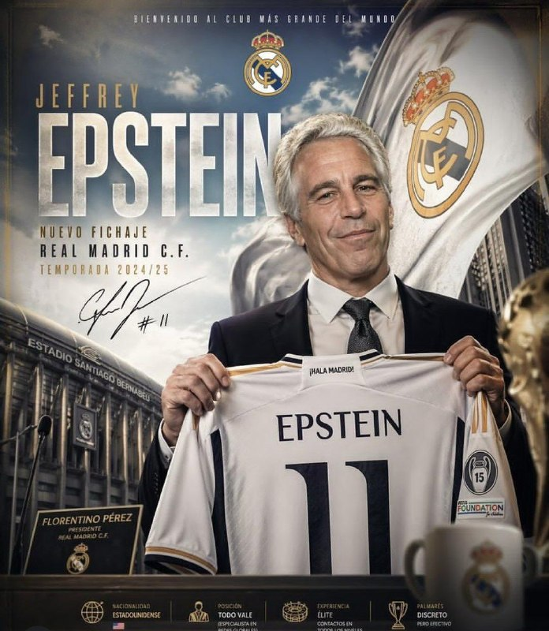

⚽️ اولین فرد در بازار حشری نقل و انتقالات تابستانی رئال مادرید مشخص شد

#Helsinki
@KiriMohemSport

## KiriMohems — post 47323

🔴 حمید رسایی ، نماینده کون گشاد مجلس: تمام تلاشم رو میکنم تا اینترنت بین‌المللی برای مردم وصل نشه.
#Helsinki
@KiriMohems

## KiriMohems — post 47322

  <a href="telegram/content/KiriMohems_47322_1778452843.mp4" target="_blank">🎬 Download video</a>

#برینید

🔴 وسط این قطعی و فیلترینگ کیری که ما داریم ، بعد از ۱۵ سال تو سوریه‌ای که به پاره ترین کشور معروف بوده دوباره «ویزا» و «مسترکارد» برگشت و مردمش عشق میکنن

#Helsinki
@KiriMohems

## IranIntlTV — post 336545

  <a href="telegram/content/IranIntlTV_336545_1778452844.mp4" target="_blank">🎬 Download video</a>

دونالد ترامپ پاسخ جمهوری اسلامی به پیشنهاد آمریکا را غیرقابل قبول دانست.

او پیش‌تر گفته بود جمهوری اسلامی ۴۷ سال با آمریکا و جهان بازی کرده و با تاخیر، زمان خریده است، اما این اتفاق دیگر نخواهد افتاد.

گفت‌وگو با شایان سمیعی، کارشناس امنیت ملی
@iranintltv

---
📅 بروزرسانی: 1405/02/21 02:01
---

## VahidOOnLine — post 239404

  

سناتور لیندزی گراهام در واکنش به گمانه‌زنی‌ها درباره توافق احتمالی با ایران، در حساب کاربری خود در شبکه ایکس نوشت

او تأکید کرد تعلیق موقت غنی‌سازی بدون نابودی کامل زیرساخت‌ها و توانمندی‌ها، عملاً بازگشت به توافق برجام خواهد بود.

گراهام افزود هرگونه مخالفت تهران با برچیدن کامل ظرفیت غنی‌سازی از سوی آمریکا «قاطعانه رد خواهد شد». او در بخش دیگری از پیام خود از حمایت دونالد ترامپ قدردانی کرد و آن را برای خود «بسیار ارزشمند» خواند.

گراهام گفت به اعتماد ترامپ، چه به‌عنوان سناتور و چه به‌عنوان دوست، افتخار می‌کند و از همراهی با او در آنچه «بزرگ‌ترین بازگشت سیاسی در تاریخ آمریکا» توصیف کرد، ابراز خرسندی کرد.

وی همچنین تأکید کرد در سنای آمریکا برای پیشبرد دستورکار ترامپ جهت «امن‌تر و ثروتمندتر کردن آمریکا» تلاش خواهد کرد.
‌🏁 🇬🇧 IranintlTV

🤖 @VahidOOnLine

## VahidOOnLine — post 239403

  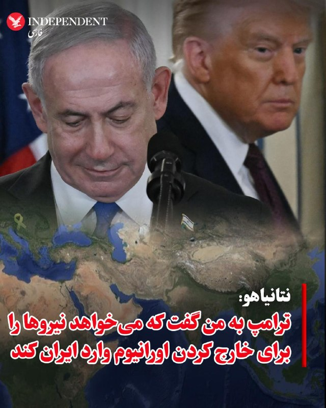

♦️بنیامین نتانیاهو، نخست‌وزیر اسرائیل در مصاحبه با برنامه ۶۰‌ دقیقه سی‌بی‌اس در پاسخ به مجری که از او پرسید چه طرحی را برای خارج کردن ذخایر اورانیوم غنی‌شده از ایران متصور است گفت: باید نیروها وارد شوند و ذخایر را بردارند و از ایران بیرون ببرند. او گفت که در دیدار اخیر با دونالد ترامپ، رئیس‌جمهوری آمریکا به او گفته است که می‌خواهد نیروها را وارد کند و این کار را به طور فیزیکی انجام دهد. نتانیاهو گفت اگر توافقی باشد و نیروها بتوانند براساس آن وارد شوند و ذخایر را خارج کنند، مشکلی نیست. نخست‌وزیر اسرائیل در پاسخ به مجری که از او پرسید اگر توافقی در کار نباشد، آیا از نیروی زمینی استفاده می‌شود؟ گفت: در مورد برنامه‌ها و طرح‌های نظامی صحبت نمی‌کند. او همچنین گفت که بازه زمانی را نیز در این مورد ارایه نمی‌دهد. نتانیاهو این ماموریت را «به‌شدت مهم» توصیف کرد. او در همین بخش مصاحبه تاکید کرد که برنامه هسته‌ای ایران به دلیل حمله‌ها آسیب دیده اما هنوز همه ظرفیت غنی‌سازی از بین نرفته و تاسیسات غنی‌سازی باید برچیده شوند. او همچنین به نیروهای نیابتی جمهوری اسلامی اشاره کرد و آن را یکی دیگر از مشکلات باقی‌مانده درباره رژیم ایران توصیف کرد.
‌🇸🇦 Indypersian

🤖 @VahidOOnLine

## VahidOOnLine — post 239402

  

♦️به گزارش «نیویورک تایمز»، تیم فوتبال بارسلونا با پیروزی ۲ بر صفر در مقابل رقیب دیرینه خود، رئال مادرید، برای دومین سال پیاپی به مقام قهرمانی لالیگا دست یافت. در این دیدار سرنوشت‌ساز که در فضای پرالتهاب ال‌کلاسیکو برگزار شد، مارکوس رشفورد با یک ضربه آزاد تماشایی در دقایق ابتدایی قفل دروازه کهکشانی‌ها را شکست و در ادامه فران تورس با به ثمر رساندن گل دوم، پیروزی و قهرمانی آبی‌اناری‌ها را قطعی کرد. شاگردان هانسی فلیک در حالی که تنها به یک امتیاز برای تثبیت جایگاه خود نیاز داشتند، موفق شدند برای نخستین بار در تاریخ این رقابت‌ها، جشن قهرمانی خود را با پیروزی در دربی بزرگ اسپانیا مقابل چشمان هوادارانشان برپا کنند؛ این در حالی بود که بازیکنان دو تیم علی‌رغم درگیری‌های معمول مسابقه، در پایان بازی با روحیه ورزشی به خوش‌وبش و دست دادن با یکدیگر پرداختند.
‌🇸🇦 Indypersian

🤖 @VahidOOnLine

## VahidOOnLine — post 239401

  

کریس رایت، وزیر انرژی آمریکا، در گفت‌وگو با شبکه ان‌بی‌سی اعلام کرد دولت دونالد ترامپ از «همه ایده‌ها» برای کاهش قیمت بنزین استقبال می‌کند؛ از جمله تعلیق مالیات فدرال بر سوخت.

این اظهارات در شرایطی مطرح شده که قیمت بنزین در آمریکا افزایش یافته و میانگین ملی آن روز یکشنبه به ۴.۵۲ دلار در هر گالن رسیده است.

به گزارش ان‌بی‌سی، این رقم نشان می‌دهد بهای بنزین از زمان آغاز جنگ ایران در نهم اسفند بیش از ۵۰ درصد رشد کرده است.

رایت در پاسخ به پرسشی درباره تعلیق مالیات فدرال بنزین، که حدود ۱۸ سنت در هر گالن است، گفت دولت از هر اقدامی که بتواند قیمت‌ها را در جایگاه‌های سوخت کاهش دهد و فشار بر مصرف‌کنندگان را کم کند، حمایت می‌کند.

او همچنین درباره احتمال رسیدن قیمت‌ها به ۵ دلار در هر گالن از پیش‌بینی خودداری کرد و گفت تعیین قیمت انرژی در کوتاه‌مدت یا میان‌مدت دشوار است.

رایت افزود تمرکز دولت بر پایان دادن به درگیری چند دهه‌ای با جمهوری اسلامی است.
‌🏁 🇬🇧 IranintlTV

🤖 @VahidOOnLine

## ChizBergerz — post 46286

  <a href="telegram/content/ChizBergerz_46286_1778452263.mp4" target="_blank">🎬 Download video</a>

اينقدر چالش نكردن كه ازش ويروس موش به وجود اومد
😂
😂

لبیک یا مقوا
✊
@ChizBergerz

## ChizBergerz — post 46285

کیفیت و جزئیات پشم ریزون GTA VI 😳😳 @ChizBergerz

## ChizBergerz — post 46284

  

کیفیت و جزئیات پشم ریزون GTA VI 😳😳

@ChizBergerz

## ChizBergerz — post 46283

‏تا پارسال هرکی مهاجرت کرده به معنای واقعی کلمه "فلنگ" رو بسته.

## ChizBergerz — post 46282

  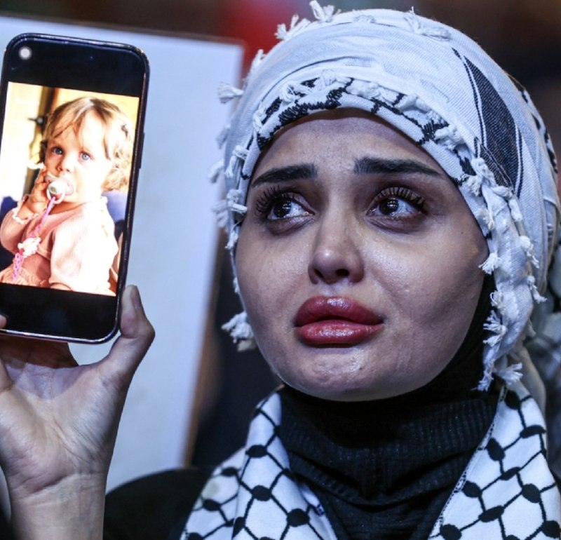

حداقل ۲۰۰ تا کودک توی دی‌ماه کشته شدن، اون‌وقت تو واسه نوه‌‌ی خامنه‌ای قاتل که اگه بزرگ میشد مثل پدر و پدربزرگش قاتل مردم ایران میشد گریه میکنی حرومی؟!

@ChizBergerz

## ChizBergerz — post 46281

  <a href="telegram/content/ChizBergerz_46281_1778452266.mp4" target="_blank">🎬 Download video</a>

حقیقت تجمعات شبانه حکومتی‌های زنازاده:

@ChizBergerz

## ChizBergerz — post 46280

  <a href="telegram/content/ChizBergerz_46280_1778452267.mp4" target="_blank">🎬 Download video</a>

وضعیت پرستوهای نظام تو تجمعات شبانه حکومتی‌ها:

@ChizBergerz

## ChizBergerz — post 46279

  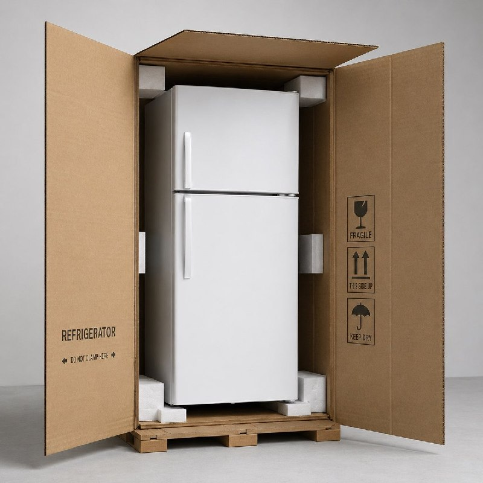

عکس کمتر دیده شده پدر، در آغوش پسر: 😂😂😂

@ChizBergerz

## ChizBergerz — post 46278

  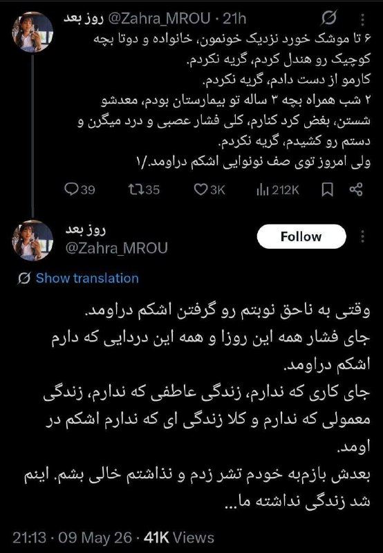

اینم شد زندگیِ نداشته ما...

به جرئت میشه گفت جوونای ۲۰ـ۳۰ سال ایرانی مظلوم ترین نسل تاریخن، هیچی از جوونی نفهمیدن...
@ChizBergerz

## ChizBergerz — post 46277

  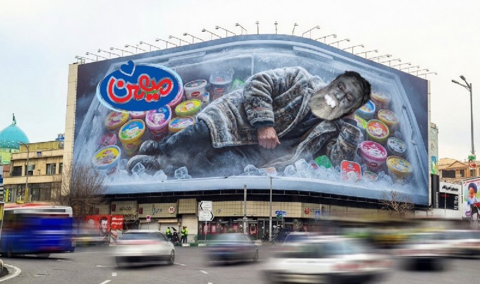

محصول جدید کارخانجات میهن: 😂😂

@ChizBergerz

## ChizBergerz — post 46276

  <a href="https://t.me/ChizBergerz/46276" target="_blank">📎 Download file</a>

📲#اپلیکیشن اندروید سایت جهانی دربی بت

👍اسپانسر لیگ انگلیس
👍
🔥امکان شارژ امن از طریق کارت بانکی
➖➖➖➖➖➖➖➖➖

🪙همین حالا عضو شوید 👇
https://t.me/+aCbq7yy8QY80NzQ0

## ChizBergerz — post 46275

  

😤دنبال یه سایت شرط بندی بین المللی بودی که به ایرانیا خدمات بده؟!
⛔

👍دربی بت همون انتخاب  100%

💎ویژگی های سایت جهانی Derby Bet:

⬅️امکان شارژ امن با کارت بانکی

⬅️واریز اول دوبل شارژ می شوید(بونوس۱۰۰٪)

⬅️پر اپشن ترین سایت فعال در ایران

⬅️تسویه حساب کمتر از 5 دقیقه

⬅️برگشت بخشی از باخت به صورت هفتگی

🚨کد هدیه ثبت نام:GG007

⚠️برای دانلود اپلکیشن کلیک کنید
👉
ge20

🔔کانال دربی بت :

🪙https://t.me/+aCbq7yy8QY80NzQ0

## ChizBergerz — post 46274

  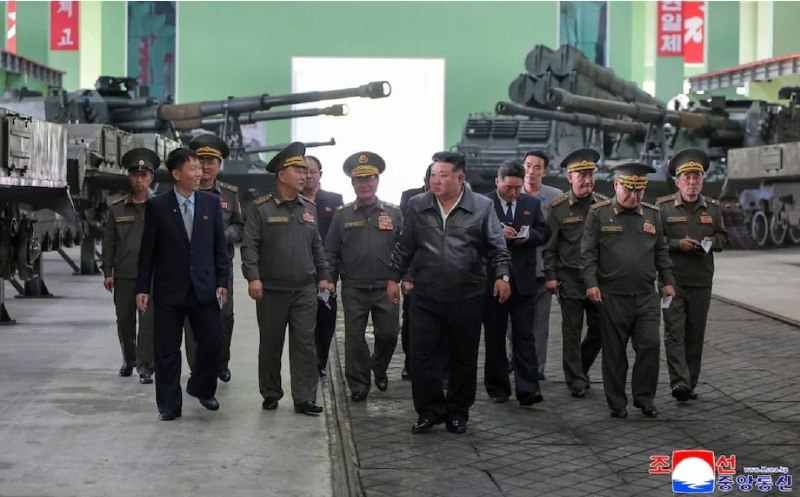

مشخصه کُتلت شدن موش‌علی درس عبرتی برای کیم جون کون و بقیه دیکتاتورا شده :)))

کره شمالی توی قانون اساسیش داره قانونی رو اضافه میکنه که درصورتی که رهبر این کشور "کیم جونگ اون" توسط کشوری ترور و کشته بشه، کره شمالی با بمب اتم از اون کشور انتقام بگیره.
@ChizBergerz

## ChizBergerz — post 46273

  <a href="telegram/content/ChizBergerz_46273_1778452272.mp4" target="_blank">🎬 Download video</a>

این روزا وضعیت توییتر جوریه که همه دارن موش‌تباه مقوایی رو مسخره میکنن: 😂😂😂

@ChizBergerz

## ChizBergerz — post 46272

  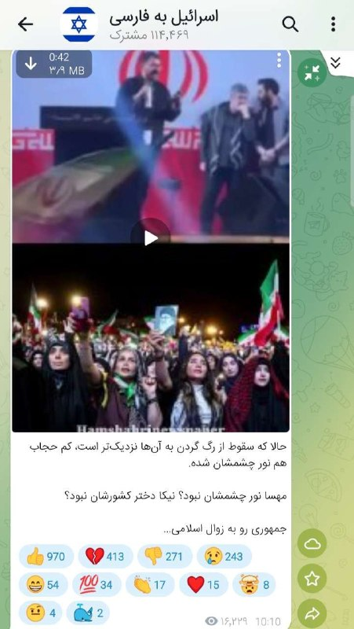

برای حکومتی‌های بی‌حجاب نوحه ساختن! «هرکسی که چادریه تاج‌سرمونه و مث خواهرمونه، کم‌حجابیم که اومده میون میدون، نور چشممون و دختر کشورمونه. آخه کی میگه ظاهر آدما ملاکه؟ در اصل ملاک آدمیت دلِ پاکه.» + مادرجنده‌ها پس چرا سال ۱۴۰۱ مردمی که علیه حجاب اجباری قیام…

## ChizBergerz — post 46271

  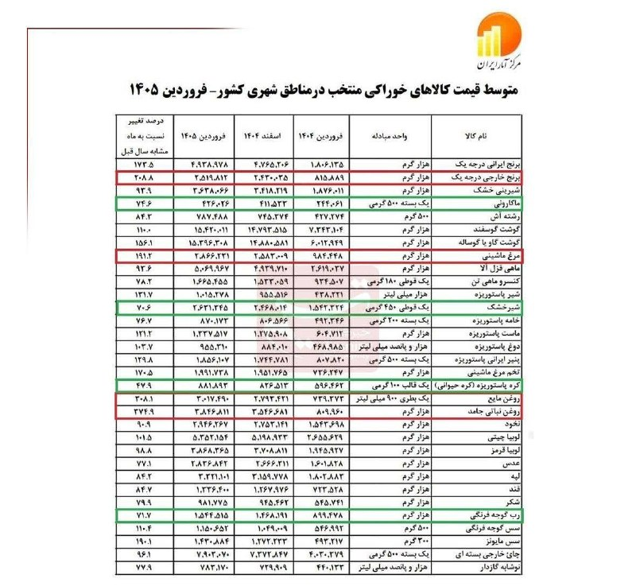

نرخ تورم فروردین ۱۴۰۵ منتشر شد.
(درصد افزایش قیمت اجناس نسبت به فروردین ۱۴۰۴):
روغن جامد ۳۷۵%
روغن مایع ۳۰۸%
برنج خارجی ۲۰۸%
مرغ ۱۹۱%
برنج ایرانی ۱۷۳%
تخم مرغ ماشینی ۱۷۰%
+ حتی طلا و دلارم انقدر رشد نداشتن که مواد غذایی داشته!
@ChizBergerz

## ChizBergerz — post 46270

  <a href="telegram/content/ChizBergerz_46270_1778452275.mp4" target="_blank">🎬 Download video</a>

دوستانی که دنبال کون آخوند نگران بودن ایران سوریه بشه، سوریه با سوییفت، ویزا و مستر کارت به جهان وصل شد!

+ راستی طالبان هم داره اینترنت 5G بدون فیلتر رو تو افغانستان گسترش میده!
@ChizBergerz

## ChizBergerz — post 46269

  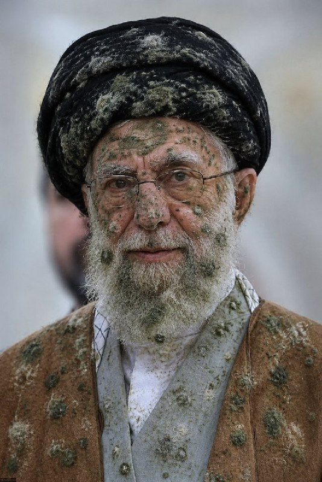

دست خدا کلک زد
خامنه‌ای کپک زد
😂
😂

@ChizBergerz

## ChizBergerz — post 46268

  <a href="telegram/content/ChizBergerz_46268_1778452276.mp4" target="_blank">🎬 Download video</a>

عمو مراد طبق معمول عالیییی نواخت😂🔥

@ChizBergerz

## ChizBergerz — post 46267

  <a href="https://t.me/ChizBergerz/46267" target="_blank">📎 Download file</a>

📲#اپلیکیشن اندروید سایت جهانی دربی بت

👍اسپانسر لیگ انگلیس
👍
🔥امکان شارژ امن از طریق کارت بانکی
➖➖➖➖➖➖➖➖➖

🪙همین حالا عضو شوید 👇
https://t.me/+aCbq7yy8QY80NzQ0

## rodast_omiddana — post 71202

▶️ کیفیت 360_مواضع جدید ترامپ و نتانیاهو برای حمله جدید به رژیم_جنگ دوباره قطعی است و احتمال سقوط رژیم بالاست

## rodast_omiddana — post 71201

▶️ کیفیت 144_مواضع جدید ترامپ و نتانیاهو برای حمله جدید به رژیم_جنگ دوباره قطعی است و احتمال سقوط رژیم بالاست

## rodast_omiddana — post 71197

🚨
🚨
🚨 #خبر_فوری | یک زیردریایی کلاس اوهایوی نیروی دریایی ایالات متحده امروز در حال ورود به خلیج جبل‌الطارق مشاهده شد، در مسیر ورود به دریای مدیترانه.

کلاس اوهایو از بزرگ‌ترین و توانمندترین زیردریایی‌های ناوگان ایالات متحده هستند. آن‌ها می‌توانند تا ۲۴ موشک بالستیک تریددنت II D5 را حمل کنند (در پیکربندی SSBN) یا در نوع موشک هدایت‌شونده خود (SSGN) تا ۱۵۴ موشک کروز تاماهاوک را حمل کنند. آن‌ها عنصر کلیدی بازدارندگی هسته‌ای استراتژیک آمریکا و قابلیت‌های نمایش قدرت آن هستند.

## rodast_omiddana — post 71196

🎬
🔴
🔴
🔴 پخش زنده
*مواضع جدید ترامپ و نتانیاهو برای حمله جدید به رژیم
*جنگ دوباره قطعی است و احتمال سقوط رژیم بالاست
لینک یوتیوب:
https://www.youtube.com/watch?v=d_1sGDOKG9I

## rodast_omiddana — post 71195

  <a href="telegram/content/rodast_omiddana_71195_1778452278.webm" target="_blank">🎬 Download video</a>

🚨 ترامپ ویدیویی رو بازنشر کرده که مربوط به برنامه مارک لوین هست..
جایی که مهمان برنامه میگه:
"ازسرگیری اقدام نظامی، بهترین گزینه برای مقابله با ایرانه"

## rodast_omiddana — post 71194

🎬 کنسرتهای شاهین نجفی برای عادی سازی شرایط
پاس گل مرتضی نجفی به رژیم
لینک یوتیوب:
https://www.youtube.com/watch?v=GQcSxaQv1HI

## rodast_omiddana — post 71193

🎬
🔴
🔴
🔴 برنامه امشب تا یک ساعت و نیم دیگه:
*مواضع جدید ترامپ و نتانیاهو برای حمله جدید به رژیم
*جنگ دوباره قطعی است و احتمال سقوط رژیم بالاست
لینک یوتیوب:
https://www.youtube.com/@omiddana

## rodast_omiddana — post 71192

  <a href="telegram/content/rodast_omiddana_71192_1778452278.webm" target="_blank">🎬 Download video</a>

🚨 رئیس‌جمهور ترامپ کلیپ‌هایی از مارک لوین منتشر می‌کند که استدلال می‌کند فشار بر جمهوری اسلامی باید ادامه یابد
و این را پیشنهاد می‌دهد ممکن است یک دور دیگر مبارزه اجتناب‌ناپذیر باشد تا موقعیت آمریکا را پیش از مذاکرات تقویت کند.

## rodast_omiddana — post 71191

  <a href="telegram/content/rodast_omiddana_71191_1778452278.webm" target="_blank">🎬 Download video</a>

🚨
🚨 ترامپ همین الان این را منتشر کرد

## rodast_omiddana — post 71190

  <a href="telegram/content/rodast_omiddana_71190_1778452278.webm" target="_blank">🎬 Download video</a>

🚨 خبرنگار:
«آیا درست است که بگوییم شما معتقدید عملیات‌های رزمی تمام شده‌اند، اما...»

ترامپ:
«نه، من چنین چیزی نگفتم. گفتم آن‌ها شکست خورده‌اند، اما این به معنای پایان کار نیست. ما می‌توانیم دو هفته دیگر ادامه دهیم و هر هدفی را مورد حمله قرار دهیم.اهداف مشخصی داشتیم که می‌خواستیم آن‌ها را بزنیم و احتمالاً حدود ۷۰ درصد آن‌ها را انجام داده‌ایم.»

## rodast_omiddana — post 71189

  <a href="telegram/content/rodast_omiddana_71189_1778452278.mp4" target="_blank">🎬 Download video</a>

🚨دوستانی که نگران بودند ایران سوریه بشه، سوریه با سوییفت، ویزا و مستر به جهان وصل شد

## rodast_omiddana — post 71188

  <a href="telegram/content/rodast_omiddana_71188_1778452279.webm" target="_blank">🎬 Download video</a>

🚨حمید رسایی، مادر ج.ن.ده:
تمام تلاشم رو میکنم تا اینترنت بین الملل وصل نشه.

## rodast_omiddana — post 71187

🎬 آخرین جزئیات از تصمیم ترامپ برای طولانی شدن جنگ
لینک یوتیوب:
https://www.youtube.com/watch?v=D00q9mEO8cA

## rodast_omiddana — post 71186

  <a href="telegram/content/rodast_omiddana_71186_1778452279.mp4" target="_blank">🎬 Download video</a>

🚫 بچه شیعه پفیوز 😏

## rodast_omiddana — post 71185

  <a href="telegram/content/rodast_omiddana_71185_1778452281.mp4" target="_blank">🎬 Download video</a>

🚨 مرتض(شاهین) نجفی عادی سازی نکن و فرافکنی هم نکن
آورین

## rodast_omiddana — post 71184

🎬 آنالیز یاوه های حمزه صفوی و محمد فاضلی در قالب روشنفکری
لینک یوتیوب:
https://www.youtube.com/watch?v=6UA47MPeUjI

## rodast_omiddana — post 71183

  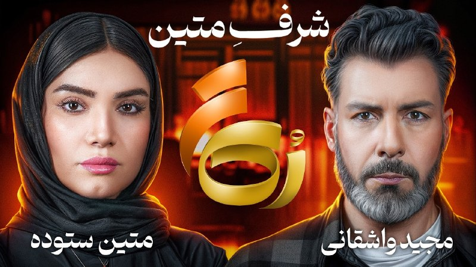

🚫 این دو هرزه مجید واشقانی و متین ستوده دوساعت نشستن و حرف مفت میزنند و مردمی که قربانی شیعه گری رژیم هستند را به باد انتقاد گرفتن، بدون اینکه اشاره به علت ماجرا که جمهوری اسلامی هست بکنند..
من اعتقاد دارم این دو نفر مادر ج.ن.ده هستند، آیا شما با من هم نظر هستید؟
(امشب در برنامم به بخشی از حرفهاشون میپردازم)

## mamlekate — post 103499

  <a href="telegram/content/mamlekate_103499_1778452283.mp4" target="_blank">🎬 Download video</a>

📞 دزفول توی جاده کمربندی سمت زیبا شهر ساعت ۹:۳۰ شب

📞 دزفول از ساعت ۹و نیم صدای ضدهوایی و چند انفجار شنیده شد

@mamlekate

## SportBaadNews — post 251332

  

🇪🇸 گاوی: به وینیسیوس گفتم: "خفه شو حرف نزن"
@SportBaadNews

## SportBaadNews — post 251331

  

🇪🇸 بهترین بازیکن زمین طبق معمول
@SportBaadNews

## SportBaadNews — post 251330

⏺ میتونید با رفرال گیری کانفیگ رایگان دریافت کنید ، اختصاصی اسپورت 
👇

🤖 @Confingfreeirbot

## SportBaadNews — post 251329

  

⚽️ پپ گواردیولا قهرمانی بارسلونا رو تبریک گفت
@SportBaadNews

## SportBaadNews — post 251325

  

تعداد برد هانسی فلیک تو ال کلاسیکو چنتاس وینی جان؟
@SportBaadNews

## SportBaadNews — post 251324

  

⚽️
🇪🇸 لواندوفسکی با قهرمانی امشب بارسلونا به عدد 13 قهرمانی لیگ رسید که بیشترین تعداد در تاریخ 5 لیگ معتبر اروپاست
@SportBaadNews

## SportBaadNews — post 251323

  <a href="telegram/content/SportBaadNews_251323_1778452287.webm" target="_blank">🎬 Download video</a>

🔺اگه امشب بارسلونا در الکلاسیکو برنده از زمین بیرون بیاد تعداد بردهای بارسا با رئال مادرید مساوی میشه 
💀
💀
💀 
📊 آمار الکلاسیکوهای رسمی تا امروز: 
📆 263 بازی 
🇪🇸 105 برد و 439 گل زده برای بارسلونا 
🤝 52 بازی مساوی 
🇪🇸 106 برد و 444 گل زده برای رئال مادرید @SportBaadNews

## SportBaadNews — post 251322

  

شاید آخرین قهرمانی لواندوفسکی با بارسلونا
@SportBaadNews

## SportBaadNews — post 251321

  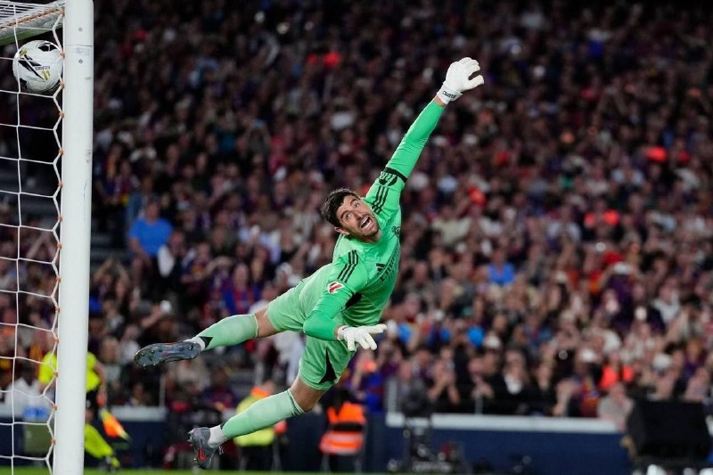

مارکوس رشفورد در اکتبر زمانی که رئال مادرید در ال‌کلاسیکو پیروز شد و پنج امتیاز از بارسلونا جلو بود در لیگ گفت:
‏"این یک ماراتن است، نه یک دوی سرعت!"
اون امشب با درخشش باعث پیروزی تیمش و قهرمانی اون شد.
@SportBaadNews

## SportBaadNews — post 251320

  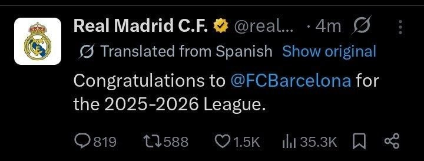

⚽️
⚽️ | باشگاه رئال مادرید قهرمانی بارسلونا رو تبریک گفت
@SportBaadNews

## SportBaadNews — post 251319

  

@SportBaadNews

## SportBaadNews — post 251318

  

عشقتون قهرمانی بارسارو تبریک گفت
😌
😌
😌
😌
@SportBaadNews

## SportBaadNews — post 251316

اگه منطقی نگاه کنیم، اسکواد و کادر فنی رئالم خوبه، فقط

1 مدیر 1 مربی 5 دفاع وسط 2 دفاع راست 2 دفاع چپ 1 الی 2 هافبک دفاعی 3 الی 4 هافبک وسط 2 وینگر چپ 2 وینگر راست 2 مهاجم نوک 1 مربی بدنساز 4 استعدادیاب 1 مدیر ورزشی 1 کمک مربی 1 مربی ریکاوری 1 مربی دروازه بانان حداقل 12 تحلیلگر فنی 4 دستیار مربی 3 پزشک 1 ادمین پیج اینستاگرام 1 مدیر تولید محتوا 1 کنترل کننده‌ی محتوای شبکه باشگاه

کم داره
@SportBaadNews

## SportBaadNews — post 251315

  

رافینیا داره طبل میزنه
@SportBaadNews

## SportBaadNews — post 251308

خب عزیزای دل بارسایی یه امشبو بیخیال دنیا شادی کنیم که از فردا دوباره باید برگردیم سر بدبختی های خودمون و برا دلار و اینترنت حرص بزنیم
@SportBaadNews

## SportBaadNews — post 251307

  <a href="telegram/content/SportBaadNews_251307_1778452289.webm" target="_blank">🎬 Download video</a>

🚨
🚨
🚨 فووووووری ترامپپپپپ:
پیشنهاد ایران قابل قبول نیست
@SportBaadNews

## SportBaadNews — post 251306

رئالیا تک تک دارن میرن به بازیکنا بارسا تبریک میگن
@SportBaadNews

## SportBaadNews — post 251304

  <a href="telegram/content/SportBaadNews_251304_1778452289.webm" target="_blank">🎬 Download video</a>

🚨پایان بازی | 
⚽️
2️⃣×
0️⃣
⚽️

🔴 بارسلونا با برد تو الکلاسیکو قهرمان فصل 2025/26 لالیگا شد 🔥🏆
@SportBaadNews

## SportBaadNews — post 251301

هوادارا بارسا توپ ساحلی انداختن وسط زمین 😂😂😂😂

## SportBaadNews — post 251295

از جالبی های صداسیما اینه که تبلیغ وان ایکس بت کنار تبلیغ تشک ایندکس کنار زمینه
@SportBaadNews

## IranIntlTV — post 336544

  <a href="https://t.me/IranintlTV/336544" target="_blank">📎 Download file</a>

🎧نسخه صوتی سیاست با مراد ویسی: دست رد ترامپ بر پیشنهاد جمهوری‌اسلامی
@iranintlTV

## IranIntlTV — post 336543

  <a href="telegram/content/IranIntlTV_336543_1778452290.mp4" target="_blank">🎬 Download video</a>

دونالد ترامپ از دریافت پاسخ تهران به طرح پیشنهادی ایالات متحده خبر داد و آن را غیرقابل قبول خواند.

این اظهارات ترامپ با واکنش‌های گسترده‌ای در شبکه‌های اجتماعی و رسانه‌ها همراه شده است.

جزییات بیشتر در گزارش امیر گیتی، عضو تحریریه ایران‌اینترنشنال
@iranintltv

## IranIntlTV — post 336542

  

سناتور لیندزی گراهام در واکنش به گمانه‌زنی‌ها درباره توافق احتمالی با ایران، در حساب کاربری خود در شبکه ایکس نوشت این ایده که جمهوری اسلامی در چارچوب یک توافق مذاکره‌شده، تأسیسات غنی‌سازی خود را به‌طور کامل برچیند، منطقی نیست.

او تأکید کرد تعلیق موقت غنی‌سازی بدون نابودی کامل زیرساخت‌ها و توانمندی‌ها، عملاً بازگشت به توافق برجام خواهد بود.

گراهام افزود هرگونه مخالفت تهران با برچیدن کامل ظرفیت غنی‌سازی از سوی آمریکا «قاطعانه رد خواهد شد». او در بخش دیگری از پیام خود از حمایت دونالد ترامپ قدردانی کرد و آن را برای خود «بسیار ارزشمند» خواند.

گراهام گفت به اعتماد ترامپ، چه به‌عنوان سناتور و چه به‌عنوان دوست، افتخار می‌کند و از همراهی با او در آنچه «بزرگ‌ترین بازگشت سیاسی در تاریخ آمریکا» توصیف کرد، ابراز خرسندی کرد.

وی همچنین تأکید کرد در سنای آمریکا برای پیشبرد دستورکار ترامپ جهت «امن‌تر و ثروتمندتر کردن آمریکا» تلاش خواهد کرد.
https://iranintl.com/202605106523

## IranIntlTV — post 336541

  

کریس رایت، وزیر انرژی آمریکا، در گفت‌وگو با شبکه ان‌بی‌سی اعلام کرد دولت دونالد ترامپ از «همه ایده‌ها» برای کاهش قیمت بنزین استقبال می‌کند؛ از جمله تعلیق مالیات فدرال بر سوخت.

این اظهارات در شرایطی مطرح شده که قیمت بنزین در آمریکا افزایش یافته و میانگین ملی آن روز یکشنبه به ۴.۵۲ دلار در هر گالن رسیده است.

به گزارش ان‌بی‌سی، این رقم نشان می‌دهد بهای بنزین از زمان آغاز جنگ ایران در نهم اسفند بیش از ۵۰ درصد رشد کرده است.

رایت در پاسخ به پرسشی درباره تعلیق مالیات فدرال بنزین، که حدود ۱۸ سنت در هر گالن است، گفت دولت از هر اقدامی که بتواند قیمت‌ها را در جایگاه‌های سوخت کاهش دهد و فشار بر مصرف‌کنندگان را کم کند، حمایت می‌کند.

او همچنین درباره احتمال رسیدن قیمت‌ها به ۵ دلار در هر گالن از پیش‌بینی خودداری کرد و گفت تعیین قیمت انرژی در کوتاه‌مدت یا میان‌مدت دشوار است.

رایت افزود تمرکز دولت بر پایان دادن به درگیری چند دهه‌ای با جمهوری اسلامی است.
https://iranintl.com/202605106125

---
📅 بروزرسانی: 1405/02/21 01:32
---

## VahidOOnLine — post 239400

  <a href="telegram/content/VahidOOnLine_239400_1778450553.mp4" target="_blank">🎬 Download video</a>

راهپیمایی ایرانیان وین
‌🏁 🇬🇧 ManotoTV

🤖 @VahidOOnLine

## VahidOOnLine — post 239399

  

♦️خبرگزاری صداوسیما روز یکشنبه، ۲۰ اردیبهشت‌ماه، گزارش داد، طرح تهران که ترامپ آن را «غیرقابل قبول» خواند، بر «ضرورت پایان تحریم‌ها، آزادسازی اموال توقیف شده، پرداخت خسارت‌های جنگ و حاکمیت جمهوری اسلامی بر تنگه هرمز» تاکید دارد. براساس این گزارش، جمهوری اسلامی همچنین بر «یکپارچگی جبهه مقاومت تاکید دارد». پیش از این، ترامپ با انتشار پیامی در «تروث سوشال» پاسخ تهران به پیشنهاد واشنگتن را «کاملا غیرقابل قبول» خواند و اعلام کرد که «از پاسخ به‌اصطلاح نمایندگان ایران خوشم نیامد».
‌🇸🇦 Indypersian

🤖 @VahidOOnLine

## WithYashar — post 10889

سناتور لیندزی گراهام:
برای من آشکار است که ایران معتقده که رئیس جمهور ترامپ در مورد گزینه‌های نظامی آینده بلوف میزنه.

به درک من از اوضاع، این میتونه یک اشتباه فاجعه‌بار از سوی رهبری ایران باشه. منتظر باشید.
@withyashar

## pm_afshaa — post 90506

  <a href="telegram/content/pm_afshaa_90506_1778450555.webm" target="_blank">🎬 Download video</a>

🔴نتانیاهو: وقتشه خودمون رو از کمک‌های مالی و نظامی بقیه بی‌نیاز کنیم.

+ این حرفش بوی جنگ بدون حضور آمریکا میده.

💧 Rainbet.com the #1 Non-KYC Crypto Casino & Sportsbook @rainbetcom

😁 @Pm_Afshaa

## pm_afshaa — post 90505

  <a href="telegram/content/pm_afshaa_90505_1778450556.webm" target="_blank">🎬 Download video</a>

🔴دونالد ترامپ به اکسیوس: با نتانیاهو درباره پاسخ ایران گفتوگو کردم.

💧 Rainbet.com the #1 Non-KYC Crypto Casino & Sportsbook @rainbetcom

😁 @Pm_Afshaa

## pm_afshaa — post 90504

  <a href="telegram/content/pm_afshaa_90504_1778450557.webm" target="_blank">🎬 Download video</a>

🔴سناتور لیندزی گراهام:
برای من آشکار است که ایران معتقده که رئیس جمهور ترامپ در مورد گزینه‌های نظامی آینده بلوف میزنه.

به درک من از اوضاع، این میتونه یک اشتباه فاجعه‌بار از سوی رهبری ایران باشه. منتظر باشید.

💧 Rainbet.com the #1 Non-KYC Crypto Casino & Sportsbook @rainbetcom

😁 @Pm_Afshaa

## IranIntlTV — post 336540

  <a href="telegram/content/IranIntlTV_336540_1778450558.mp4" target="_blank">🎬 Download video</a>

مراد ویسی، تحلیل‌گر ارشد ایران‌اینترنشنال، گفت: «سخنان تند ترامپ، درست در روزی که جمهوری اسلامی پاسخ خود را به پیشنهاد آمریکا تحویل داده، می‌تواند نشانه نارضایتی واشینگتن از محتوای این پاسخ باشد. استفاده ترامپ از عباراتی مثل سال‌ها ما را بازی دادند و دیگر اجازه نمی‌دهیم به ما بخندند نشان می‌دهد صبر آمریکا نسبت به روند فعلی به شدت کاهش پیدا کرده است.»
@iranintltv

## ManotoTV — post 105283

  <a href="telegram/content/ManotoTV_105283_1778450560.mp4" target="_blank">🎬 Download video</a>

راهپیمایی ایرانیان وین

## FarsiVOA — post 217381

🔺اقدام جمهوری اسلامی در «قطع اینترنت» باعث اخراج صدها نفر از کارکنان شرکت‌های فناوری در ایران شده است

◾️روزنامه «نیویورک تایمز» روز یکشنبه ۲۰ اردیبهشت در گزارشی نوشت که تشدید بحران اقتصادی در ایران، در پی عملیات نظامی آمریکا و اسرائیل و همچنین محاصره دریایی تنگه هرمز، و قطعی اینترنت باعث اخراج گسترده کارکنان در بخش‌های مختلف اقتصادی شده است.

⬇️ بیشتر بخوانید:
https://ir.voanews.com/a/nytimes-report-iranian-loss-of-job-and-income-economic-fury/8148531.html
@FarsiVOA

## manototv — post 105283

  <a href="telegram/content/manototv_105283_1778450562.mp4" target="_blank">🎬 Download video</a>

راهپیمایی ایرانیان وین

---
📅 بروزرسانی: 1405/02/21 01:25
---

## Shin_Persian — post 5947

Shin ✓ @hey_itsmyturn
Sun, 10 May 2026 21:53:45 UTC

Explosions heard in Soran district, Erbil province
#Iraq 🇮🇶

فارسی

صدای انفجارهایی در شهرستان سوران، استان اربیل شنیده شد
#Iraq 🇮🇶

𝕏 · @shin_persian

## alonews — post 119173

  <a href="telegram/content/alonews_119173_1778450139.webm" target="_blank">🎬 Download video</a>

👈مارک فاکس، معاون سابق فرماندهی مرکزی آمریکا :
آتش‌بس با ایران به اسرائیل اجازه داد تا ذخایر مهمات خودشو دوباره پر کنه و اطلاعات بیشتری جمع‌آوری کنه

✅ @AloNews خبر جنگ

---
📅 بروزرسانی: 1405/02/21 01:22
---

## VahidOOnLine — post 239398

  

♦️لیندزی گراهام، سناتور جمهوری‌خواه، در واکنش به بن‌بست دیپلماتیک اخیر میان واشنگتن و تهران، ضمن حمایت از موضع قاطع دونالد ترامپ، خواستار تغییر رویکرد ایالات متحده در قبال جمهوری اسلامی شد. گراهام در حساب کاربری خود در اکس نوشت: «من از تلاش‌های صادقانه رئیس‌جمهور ترامپ برای یافتن راهکاری دیپلماتیک جهت تغییر رفتار رژیم تروریستی ایران قدردانی می‌کنم؛ اما با توجه به حملات مداوم آن‌ها به کشتیرانی بین‌المللی، حملات پیاپی به متحدان ما در خاورمیانه و اکنون پاسخ کاملا غیرقابل‌قبول به پیشنهاد دیپلماتیک آمریکا، به عقیده من زمان تغییر مسیر فرا رسیده است.» این سناتور پرنفوذ با اشاره به ضرورت اتخاذ اقدامات سخت‌گیرانه‌تر تاکید کرد که در شرایط کنونی، اجرای طرح «پروژه آزادی پلاس» گزینه‌ای بسیار مناسب به نظر می‌رسد. پیش از این، رئیس جمهوری آمریکا گفته بود اگر مذاکرات با تهران اتفاق نیفتد، ممکن است به پروژه آزادی برگردیم، اما این «پروژه آزادی پلاس» خواهد بود، به معنای پروژه آزادی به علاوه چیزهای دیگر.
‌🇸🇦 Indypersian

🤖 @VahidOOnLine

## VahidOOnLine — post 239397

  

فاطمه سپهری، زندانی سیاسی محبوس در زندان وکیل‌آباد مشهد، در حالی دوران حبس خود را سپری می‌کند که به گفته فعالان حقوق بشر با مشکلات جدی جسمی روبه‌رو است.
این فعال سیاسی ۶۱ ساله که سابقه جراحی قلب باز دارد، بیش از هزار روز است در زندان به‌سر می‌برد و گزارش‌ها حاکی از آن است که در این مدت دسترسی کافی و مستمر به خدمات درمانی تخصصی نداشته است.
منابع حقوق بشری از افت شدید فشار خون، تپش‌های نامنظم قلب و دردهای مزمن در ناحیه قفسه سینه و دست‌های او خبر داده‌اند.
گفته می‌شود خانم سپهری پس از چند مورد بستری کوتاه‌مدت، پیش از تکمیل روند درمان به بند بازگردانده شده است.
فاطمه سپهری نخستین‌بار در سال ۱۳۹۸ پس از امضای بیانیه‌ای موسوم به «بیانیه ۱۴ نفر» بازداشت شد. او در جریان اعتراضات سراسری سال ۱۴۰۱ دوباره بازداشت و از سوی دادگاه انقلاب مشهد به ۱۸ سال حبس محکوم شد.
در روزهای اخیر کاربران شبکه‌های اجتماعی با یک طرح گرافیکی «صدای فاطمه سپهری باش» خواستار رسیدگی فوری پزشکی و آزادی او شده‌اند.
‌🏁 🇬🇧 IranintlTV

🤖 @VahidOOnLine

## WithYashar — post 10888

به گزارش بلومبرگ، انتظار می‌رود دونالد ترامپ این هفته در دیدار با شی جین‌پینگ درباره حمایت چین از ایران از جمله خرید نفت ایران و احتمال صادرات سلاح با او روبه‌رو شود.

قرار است این دو رهبر روز پنج‌شنبه و جمعه در پکن دیدار کنند؛ در حالی که تنش‌ها بر سر تجارت، تایوان، هوش مصنوعی و درگیری آمریکا و اسرائیل با ایران افزایش یافته است
@withyashar

## WithYashar — post 10887

دونالد ترامپ به آکسیوس: موضوع صحبتم با نتانیاهو پاسخ جمهوری اسلامی بود.

آکسیوس در گزارشی گفت که دونالد ترامپ، رئيس‌جمهوری آمریکا، در مصاحبه‌ای کوتاه به باراک راوید، خبرنگار این سایت گفت که او با بنیامین نتانیاهو، نخست‌وزیر اسرائیل، در مورد پاسخ جمهوری اسلامی به آمریکا و موضوعات دیگر صحبت کرد.
@withyashar

## mamlekate — post 103498

📞 سلام، از ساعت ۵ تا ۶ به سه تا از پمپ بنزینای اصفهان رفتم هیچ کدومشون کارت آزاد ندادن بنزین بزنم

 @mamlekate

## IranIntlTV — post 336539

  

فاطمه سپهری، زندانی سیاسی محبوس در زندان وکیل‌آباد مشهد، در حالی دوران حبس خود را سپری می‌کند که به گفته فعالان حقوق بشر با مشکلات جدی جسمی روبه‌رو است.
این فعال سیاسی ۶۱ ساله که سابقه جراحی قلب باز دارد، بیش از هزار روز است در زندان به‌سر می‌برد و گزارش‌ها حاکی از آن است که در این مدت دسترسی کافی و مستمر به خدمات درمانی تخصصی نداشته است.
منابع حقوق بشری از افت شدید فشار خون، تپش‌های نامنظم قلب و دردهای مزمن در ناحیه قفسه سینه و دست‌های او خبر داده‌اند.
گفته می‌شود خانم سپهری پس از چند مورد بستری کوتاه‌مدت، پیش از تکمیل روند درمان به بند بازگردانده شده است.
فاطمه سپهری نخستین‌بار در سال ۱۳۹۸ پس از امضای بیانیه‌ای موسوم به «بیانیه ۱۴ نفر» بازداشت شد. او در جریان اعتراضات سراسری سال ۱۴۰۱ دوباره بازداشت و از سوی دادگاه انقلاب مشهد به ۱۸ سال حبس محکوم شد.
در روزهای اخیر کاربران شبکه‌های اجتماعی با یک طرح گرافیکی «صدای فاطمه سپهری باش» خواستار رسیدگی فوری پزشکی و آزادی او شده‌اند.
https://iranintl.com/202605103770

## FarsiVOA — post 217380

🔺دونالد ترامپ به آکسیوس: با نتانیاهو درباره پاسخ جمهوری اسلامی صحبت کردم

◾️آکسیوس در گزارشی گفت که دونالد ترامپ، رئيس‌جمهوری آمریکا، روز یکشنبه ۲۰ اردیبهشت در مصاحبه‌ای کوتاه به باراک راوید، خبرنگار این سایت گفت که او با بنیامین نتانیاهو، نخست‌وزیر اسرائیل، درباره پاسخ جمهوری اسلامی به آمریکا و موضوعات دیگر صحبت کرد.

⬇️ بیشتر بخوانید:
https://ir.voanews.com/a/8148544.html
@FarsiVOA

## Dirty_Kids — post 389243

‏تا پارسال هر کس مهاجرت کرده به معنای واقعی کلمه «فلنگ»‌رو بسته.

@Dirty_Kids 👻

## Dirty_Kids — post 389242

  

و هم مادر☕️ ریاکار

+ اون ورژن عرق خوری و صورتی پوشی‌تون جذاب‌تر بود

@Dirty_Kids 👻

## Dirty_Kids — post 389241

  

شادمانی هاپو از نبودن در خاورمیانه

@Dirty_Kids 👻

## alonews — post 119172

  <a href="telegram/content/alonews_119172_1778449976.webm" target="_blank">🎬 Download video</a>

👈کمتر از نیم ساعت به باز شدن بازارهای آسیا باقی مونده و قدم بعدی ترامپ در مورد ایران هنوز اعلام نشده

✅ @AloNews خبر جنگ

---
📅 بروزرسانی: 1405/02/21 01:12
---

## VahidOOnLine — post 239396

  <a href="telegram/content/VahidOOnLine_239396_1778449338.mp4" target="_blank">🎬 Download video</a>

♦️پس از بیش از ۱۵ سال توقف فعالیت به دلیل تحریم‌های بین‌المللی، غول‌های پرداخت جهانی، «ویزا» و «مسترکارت»، به طور رسمی فعالیت خود را در سوریه آغاز کردند. در تصاویر منتشر شده در شبکه‌های اجتماعی، احمد الشرع، رئیس جمهوری سوریه، با کارت بانکی بین‌المللی، قهوه سفارش می‌دهد. این بازگشت که از آن به عنوان بزرگ‌ترین گام برای ادغام مجدد مالی سوریه در نظام جهانی یاد می‌شود، از اوایل ماه مه کلید خورد. بر اساس گزارش‌ها، مسترکارت در روز جمعه، هشتم مه (۱۸ اردیبهشت‌ماه) مراحل فنی خود را تکمیل کرد و تنها دو روز بعد، بانک ملی قطر (QNB) به عنوان نخستین پیشگام، خدمات پذیرش کارت و پرداخت‌های دیجیتال را در خاک سوریه فعال کرد. این تحول بزرگ، انزوای بانکی سوریه را که از اوایل دهه ۲۰۱۰ آغاز شده بود، پایان داد و اکنون کارت‌های صادر شده در این کشور در سطح جهانی و کارت‌های بین‌المللی در داخل سوریه قابل استفاده هستند.
‌🇸🇦 Indypersian

🤖 @VahidOOnLine

## VahidOOnLine — post 239395

  <a href="telegram/content/VahidOOnLine_239395_1778449339.mp4" target="_blank">🎬 Download video</a>

ویدیوهای دریافت‌شده نشان می‌دهد جمعی از ایرانیان مقیم اورلاندو در ایالت فلوریدا، روز یک‌شنبه ۲۰ اردیبهشت‌ماه، در پی فراخوان شاهزاده رضا پهلوی، در اعتراض به اعدام‌های جمهوری اسلامی و قطع اینترنت در ایران تجمع کردند و خطاب به دونالد ترامپ شعار «اعتماد نکنید، معامله نکنید» سر دادند.
‌🏁 🇬🇧 IranintlTV

🤖 @VahidOOnLine

## VahidOOnLine — post 239394

  <a href="telegram/content/VahidOOnLine_239394_1778449341.mp4" target="_blank">🎬 Download video</a>

‌
خبرگزاری‌های حکومتی گزارش دادند ارتش جمهوری اسلامی ساعتی پیش «یک فروند پهپادشناسایی دشمن متجاوز» را در منطقه جنوب غرب منهدم کرده است.
‌🏁 🇬🇧 ManotoTV

🤖 @VahidOOnLine

## IranIntlTV — post 336538

  <a href="telegram/content/IranIntlTV_336538_1778449342.mp4" target="_blank">🎬 Download video</a>

دونالد ترامپ در تروث سوشال نوشت پاسخ نمایندگان جمهوری اسلامی را خوانده و آن را «کاملا غیرقابل قبول» می‌داند.

ترامپ پیش‌تر تاکید کرده بود واشینگتن نباید اجازه دهد ایران به سلاح هسته‌ای دست پیدا کند و آمریکا در صورت نیاز، به اهداف دیگری در ایران حمله خواهد کرد.

گفت‌وگو با کامیار بهرنگ، عضو تحریریه ایران‌اینترنشنال
@iranintltv

## IranIntlTV — post 336537

  <a href="telegram/content/IranIntlTV_336537_1778449343.mp4" target="_blank">🎬 Download video</a>

مراد ویسی، تحلیل‌گر ارشد ایران‌اینترنشنال، گفت: «خشم ترامپ از طولانی شدن مذاکرات با جمهوری اسلامی در سخنان یکشنبه‌اش آشکار بود؛ او گفت جمهوری اسلامی ۴۷ سال آمریکا و جهان را بازی داده است. حالا که ترامپ پاسخ جمهوری اسلامی را غیرقابل قبول خوانده، همه منتظرند ببینند مسیر بعدی واشینگتن تلاش دوباره برای توافق است یا آغاز حملات نظامی.»
@iranintltv

## IranIntlTV — post 336536

  <a href="telegram/content/IranIntlTV_336536_1778449345.mp4" target="_blank">🎬 Download video</a>

ویدیوهای دریافت‌شده نشان می‌دهد جمعی از ایرانیان مقیم اورلاندو در ایالت فلوریدا، روز یک‌شنبه ۲۰ اردیبهشت‌ماه، در پی فراخوان شاهزاده رضا پهلوی، در اعتراض به اعدام‌های جمهوری اسلامی و قطع اینترنت در ایران تجمع کردند و خطاب به دونالد ترامپ شعار «اعتماد نکنید، معامله نکنید» سر دادند.

## FarsiVOA — post 217379

⚡️تازه‌ترین واکنش‌های کنگره به تحولات تنگه هرمز
@FarsiVOA

## FarsiVOA — post 217378

⚡️موضع سخت آمریکا در برابر پاسخ مبهم جمهوری اسلامی؛ مسیر بحران به چه سمتی می‌رود؟
@FarsiVOA

## Persian_Trend_Official — post 13866

  <a href="telegram/content/Persian_Trend_Official_13866_1778449346.mp4" target="_blank">🎬 Download video</a>

مستند رضاشاه، پدر ایران نوین 🔥

## BBCPersian — post 280698

  

🔻کانال تلگرامی وحید آنلاین عصر یکشنبه مجموعه‌ای پیام‌های دریافتی خود از مخاطبانش در دزفول و اندیمشک را منتشر کرده که حکایت از فعالیت پدافند ضدهوایی در این دو شهر جنوبی ایران دارد.

بیشتر پیغام‌ها حوالی ساعت ۱۰ شب به وقت محلی گزارش شده و از فعالیت پدافندی برای «حدود ۲۰ دقیقه» حکایت دارد.

در همین حال، خبرگزاری فارس - نزدیک به سپاه پاسداران - به نقل از منابع ارتش ایران نوشته است: «یک فروند پهپاد دشمن متجاوز، ساعتی پیش توسط شبکۀ یکپارچۀ پدافند هوایی در منطقۀ جنوب غرب منهدم شد.»

عکس آرشیوی از رویترز

https://bbc.in/4tY60Lv
@BBCPersian

---
📅 بروزرسانی: 1405/02/21 01:02
---

## WithYashar — post 10886

  <a href="telegram/content/WithYashar_10886_1778448743.mp4" target="_blank">🎬 Download video</a>

همین کارا رو میکنید دیگه !!!یعنی همه دنیا هستن اینا !! سر یه میکروفن دعوا دارن همین نمونه تو مجازی هم شاهدیم برای دیده شدن !
@withyashar

## DEJradio — post 4555

  

🛩️
⭕️ براساس گزارش منابع محلی یکشنبه شب ۲۰ اردیبهشت ۱۴۰۵ توپ‌های پدافند در اندیمشک و دزفول برای مقابله با پهپادهای ناشناس فعال شدند.

#پهپاد #دزفول #اندیمشک
@DEJradio

## IranIntlTV — post 336535

  <a href="telegram/content/IranIntlTV_336535_1778448746.mp4" target="_blank">🎬 Download video</a>

همزمان با تشدید فضای امنیتی در ایران، مقام‌های حکومتی بار دیگر بر برخورد با پوشش اختیاری زنان تاکید کرده‌اند.
یکی از طراحان قانون عفاف و حجاب مدعی شد موساد ساعتی سه دلار به زنان ایران می‌دهد تا با «تاپ و شلوار» در میدان ولیعصر قدم بزنند.

گفت‌وگو با پگاه بنی‌هاشمی، پژوهشگر حقوق
@iranintltv

## ManotoTV — post 105282

  <a href="telegram/content/ManotoTV_105282_1778448748.mp4" target="_blank">🎬 Download video</a>

‌
خبرگزاری‌های حکومتی گزارش دادند ارتش جمهوری اسلامی ساعتی پیش «یک فروند پهپادشناسایی دشمن متجاوز» را در منطقه جنوب غرب منهدم کرده است.

## FarsiVOA — post 217377

⚡️پاسخ جمهموری اسلامی به پیشنهاد آمریکا؛ جنگ یا توافق در گفتگو با ابراهیم روشندل دیپلمات پیشین
@FarsiVOA

## FarsiVOA — post 217376

⚡️هشدار درباره نایاب شدن آنتی‌بیوتیک در ایران و شکل‌گیری بازار سیاه تلگرامی
@FarsiVOA

## manototv — post 105282

  <a href="telegram/content/manototv_105282_1778448748.mp4" target="_blank">🎬 Download video</a>

‌
خبرگزاری‌های حکومتی گزارش دادند ارتش جمهوری اسلامی ساعتی پیش «یک فروند پهپادشناسایی دشمن متجاوز» را در منطقه جنوب غرب منهدم کرده است.

## alonews — post 119171

  <a href="telegram/content/alonews_119171_1778448749.webm" target="_blank">🎬 Download video</a>

👈ابوالفظل اقبالی از نزدیکان جلیلی: اگر خانم‌ها حجاب را رعایت میکردند، جنگ نمیشد

✅ @AloNews خبر جنگ

---
📅 بروزرسانی: 1405/02/21 00:52
---

## VahidOOnLine — post 239393

  

♦️تسنیم، خبرگزاری وابسته به سپاه، یکشنبه‌شب، گزارش داد: «ارتش جمهوری اسلامی ایران ساعتی پیش یک پهپادشناسایی دشمن، توسط سامانه‌های شبکه یکپارچه پدافند، تحت فرماندهی قرارگاه مشترک پدافند هوایی کشور در منطقه جنوب غرب منهدم شد».
‌🇸🇦 Indypersian

🤖 @VahidOOnLine

## VahidOOnLine — post 239392

  <a href="telegram/content/VahidOOnLine_239392_1778448159.mp4" target="_blank">🎬 Download video</a>

♦️در جریان اختتامیه یازدهمین ایستگاه از تور جهانی «شاهکارهای ارکستر عربستان سعودی» در در محوطه تاریخی و باستانی کولوسیوم رم ایتالیا، ۵۵ هنرمند اجراکننده، با اجرای رقص سنتی عربستان روی صحنه رفتند.
در این برنامه که با مشارکت و همخوانی خواننده سرشناس و جهانی، آندریا بوچلی برگزار شد، هنرمندان سعودی تلفیقی تماشایی از موسیقی ارکسترال و اصیل‌ترین رقص‌های بومی خود از جمله «عرضه وادی‌الدواسر»،«فن الخطوه» (رقص گام جنوبی) و هنر پرانرژی و ساحلی «ینبعاوی» را به نمایش گذاشتند تا پیوندی تاریخی میان میراث خاورمیانه و قلب تمدن روم باستان برقرار کنند.
‌🇸🇦 Indypersian

🤖 @VahidOOnLine

## WithYashar — post 10885

روابط عمومی ارتش: یک فروند پهپاد دشمن متجاوز، توسط سامانه‌های شبکه یکپارچه پدافند هوایی منهدم شد

ساعتی پیش یک فروند پهپاد شناسایی دشمن متجاوز، توسط سامانه‌های شبکه یکپارچه پدافند، تحت فرماندهی قرارگاه مشترک پدافند هوایی کشور در منطقه جنوب غرب منهدم شد.
@withyashar

## WithYashar — post 10884

فلسفه تحلیل، یعنی تلاش برای دیدنِ لایه‌های پنهانِ یک موضوع؛ یعنی انسان فقط به «آنچه دیده می‌شود» اکتفا نکند، بلکه بپرسد:
«چرا این اتفاق افتاد؟ پشت آن چیست؟ اگر ادامه پیدا کند به کجا می‌رسد؟»

در فلسفه، تحلیل همیشه با «احتمال خطا» همراه است. چون تحلیل با آینده، نیت انسان‌ها، اطلاعات ناقص و تفسیر واقعیت سروکار دارد. به همین دلیل، اشتباه بودنِ یک تحلیل لزوماً ایراد نیست؛ مهم این است که تحلیل بر پایه‌ی منطق، داده، و استدلال ساخته شده باشد، نه صرفاً احساس یا خیال.

حتی بزرگ‌ترین متفکران، فرماندهان جنگ، اقتصاددانان و فیلسوفان تاریخ نیز بارها در تحلیل اشتباه کرده‌اند. چون جهان زنده و متغیر است و انسان هرگز به همه‌ی اطلاعات دسترسی کامل ندارد. تحلیل در اصل «پیش‌بینی مطلق» نیست؛ بلکه ساختنِ محتمل‌ترین تصویر از واقعیت است.

فلسفه‌ی تحلیل این است که انسان به جای واکنش کور، «فهم» ایجاد کند.
تحلیل کمک می‌کند میان ظاهر و حقیقت فاصله بگذاریم.
یعنی به‌جای اینکه فقط بگوییم «چه شد»، بپرسیم:
«چگونه شد؟ چرا شد؟ و بعدش چه می‌شود؟»

اگر تحلیلی اشتباه از آب دربیاید، دو حالت دارد:

اگر بدون منطق و بررسی بوده، ضعف محسوب می‌شود.
اما اگر بر پایه‌ی منابع اطلاعاتی و شواهد منطقی بوده و بعد واقعیت تغییر کرده یا اطلاعات تازه آمده، آن اشتباه بخشی طبیعی از فرایند فهم است.

در حقیقت، تحلیلِ خوب همیشه آماده‌ی اصلاح شدن است.
کسی که تحلیل می‌کند، باید شجاعتِ تغییر نظر با دیدنِ حقیقت جدید را هم داشته باشد
کسی که تحلیل می‌کند، در واقع خودش را در معرض قضاوت قرار می‌دهد. او مجبور است از میان اطلاعات ناقص، یک برداشت یا نتیجه ارائه کند؛ و همیشه این احتمال وجود دارد که بعداً اشتباه از آب دربیاید. برای همین، تحلیل کردن نوعی ریسک فکری است

فیلسوفان قدیم هم می‌گفتند حقیقت اغلب از دلِ گفت‌وگو، تضاد دیدگاه‌ها و آزمونِ ایده‌ها بیرون می‌آید؛ نه از سکوت کامل
@withyashar

## mamlekate — post 103497

📝 دونالد ترامپ: پاسخ جمهوری اسلامی «کاملا غیرقابل‌قبول» است

دونالد ترامپ، رئیس جمهوری آمریکا روز یکشنبه ۲۰ اردیبهشت گفت که پاسخ جمهوری اسلامی به پیشنهادات آمریکا برای چارچوب مذاکرات صلح را دریافت کرده است و این پاسخ را «کاملاً غیرقابل‌قبول» خواند.

📝 ترامپ: رژیم ایران ۴۷ سال است دنیا را به بازی گرفته‌‌است؛ دیگر به ما نخواهند خندید

📝 ترامپ چهارشنبه وارد پکن می‌شود

@mamlekate

## VahidOnline — post 75391

آکسیوس: پرزیدنت ترامپ روز یکشنبه در یک تماس تلفنی کوتاه به آکسیوس گفت که پاسخ ایران به تازه‌ترین پیش‌نویس توافق برای پایان دادن به جنگ را رد خواهد کرد.
ترامپ اندکی پس از این تماس، در پستی در تروث سوشال، پاسخ ایران را «کاملاً غیرقابل قبول!» خواند.

ترامپ به آکسیوس گفت روز یکشنبه با بنیامین نتانیاهو، نخست‌وزیر اسرائیل، صحبت کرده و در میان مسائل دیگر، درباره پاسخ ایران نیز گفت‌وگو داشته است.
او درباره نتانیاهو گفت: «تماس بسیار خوبی بود. رابطه خوبی داریم.» اما افزود که مذاکرات ایران «مسئله من است، نه مسئله دیگران.»

ترامپ در این مصاحبه کوتاه روشن نکرد که آیا قصد دارد مذاکرات را ادامه دهد یا احتمالاً گزینه اقدام نظامی را در پیش بگیرد.
سناتور لیندسی گراهام، جمهوری‌خواه از کارولینای جنوبی، در ایکس نوشت که ترامپ اکنون باید اقدام نظامی را در نظر بگیرد؛ موضعی که گراهام در سراسر آتش‌بس یک‌ماهه بارها تکرار کرده است.
او نوشت: «با توجه به حملات مداوم آن‌ها به کشتیرانی بین‌المللی، حملات پیوسته به متحدان ما در خاورمیانه، و اکنون پاسخ کاملاً غیرقابل قبول به پیشنهاد دیپلماتیک آمریکا، به نظر من زمان آن رسیده که تغییر مسیر را در نظر بگیریم.»
گراهام نوشت: «پروژه آزادی پلاس همین حالا خیلی خوب به نظر می‌رسد»؛ اشاره‌ای به عملیات دریایی برای هدایت کشتی‌ها از تنگه هرمز که ترامپ پس از کمتر از ۴۸ ساعت به‌طور ناگهانی آن را متوقف کرد.
@VahidOOnLine
خبرگزاری تسنیم، رسانه وابسته به سپاه پاسداران، روز یکشنبه، ۲۰ اردیبهشت‌ماه، به نقل از «یک منبع مطلع» در واکنش به پیام ترامپ مبنی بر «کاملا غیرقابل قبول» بودن پاسخ تهران به پیشنهاد واشنگتن، نوشت: «همین الان واکنش به اصطلاح رئیس‌جمهور آمریکا را به پاسخ ایران دیدیم. هیچ اهمیتی ندارد؛ کسی در ایران برای خوشایند ترامپ طرح نمی‌نویسد. تیم مذاکره‌کننده فقط برای حق ملت ایران باید طرح بنویسد و وقتی ترامپ از آن راضی نباشد، قاعدتا بهتر است». تسنیم نوشت: «ترامپ کلا واقعیت را دوست ندارد؛ به همین دلیل مدام از ایران شکست می‌خورد».
@VahidOOnLine
خبرگزاری صداوسیما گزارش داد طرح تهران که ترامپ آن را «غیرقابل قبول» خواند، بر ضرورت پرداخت خسارت‌های جنگ توسط آمریکا و حاکمیت جمهوری اسلامی بر تنگه هرمز تاکید دارد
IranIntlbrk

📡 @VahidOnline

## alonews — post 119170

  <a href="telegram/content/alonews_119170_1778448160.webm" target="_blank">🎬 Download video</a>

👈ایشون آقای جبلی، رئیس صدا و سیما و رفیق جلیلی است، دردانه تندروها است و میگوید یک مسلمان معتقد است اما در صدا و سیمای او و همفکرانش سایت شرطبندی تبلیغ میشود! اسلام؟ نردبان؟ 
✅ @AloNews خبر جنگ

## alonews — post 119169

  <a href="telegram/content/alonews_119169_1778448161.webm" target="_blank">🎬 Download video</a>

👈ایشون آقای جبلی، رئیس صدا و سیما و رفیق جلیلی است، دردانه تندروها است و میگوید یک مسلمان معتقد است اما در صدا و سیمای او و همفکرانش سایت شرطبندی تبلیغ میشود!

اسلام؟ نردبان؟

✅ @AloNews خبر جنگ

---
📅 بروزرسانی: 1405/02/21 00:42
---

## VahidOOnLine — post 239391

  <a href="telegram/content/VahidOOnLine_239391_1778447527.mp4" target="_blank">🎬 Download video</a>

لیسبون | پرتغال؛ گردهمایی ایرانیان ـ گزارشگر ۲۰ اردیبهشت ۱۴۰۵
‌🏁 🇬🇧 ManotoTV

🤖 @VahidOOnLine

## VahidOOnLine — post 239390

  <a href="telegram/content/VahidOOnLine_239390_1778447529.mp4" target="_blank">🎬 Download video</a>

دونالد ترامپ، رئیس‌جمهوری آمریکا، در پیامی در شبکه اجتماعی «تروث سوشال» اعلام کرد پاسخ جمهوری اسلامی به پیشنهادهای اخیر واشینگتن را «کاملاً غیرقابل قبول» می‌داند.

او نوشت: «من همین الان پاسخ به‌اصطلاح “نمایندگان” ایران را خواندم. از آن خوشم نمی‌آید — کاملاً غیرقابل قبول است!»
‌🏁 🇬🇧 ManotoTV

🤖 @VahidOOnLine

## VahidOOnLine — post 239389

  <a href="telegram/content/VahidOOnLine_239389_1778447529.mp4" target="_blank">🎬 Download video</a>

‌
باراک راوید، خبرنگار آکسیوس در شبکه اکس نوشت:
«رئیس‌جمهوری ترامپ در تماس تلفنی به من گفت پاسخ اخیر ایران به پیش‌نویس توافق پایان جنگ را نمی‌پسندد. او گفت: این پاسخ قابل قبول نبود.»

راوید در ادامه افزود ترامپ به او گفته در تماس تلفنی‌ با بنیامین نتانیاهو درباره پاسخ اخیر جمهوری اسلامی به پیش‌نویس توافق پایان جنگ گفت‌وگو کرده است.

به گفته راوید ترامپ تأکید کرده موضوع ایران تنها بخش کوتاهی از این تماس بوده است.

خبرنگار آکسیوس نوشت رئیس جمهوری آمریکا به او گفته که رابطه خوبی با نتانیاهو دارد اما «این موضوع (ایران) کار من است نه هیچ‌کس دیگر.»
‌🏁 🇬🇧 ManotoTV

🤖 @VahidOOnLine

## IranIntlTV — post 336534

  <a href="telegram/content/IranIntlTV_336534_1778447530.mp4" target="_blank">🎬 Download video</a>

دونالد ترامپ پاسخ جمهوری اسلامی به پیشنهاد آمریکا را رد و آن را غیرقابل قبول توصیف کرد.

او ساعاتی پیش نیز گفته بود اورانیوم غنی‌شده و برنامه هسته‌ای جمهوری اسلامی تحت نظر است و ایالات متحده در نهایت به آن دست پیدا خواهد کرد.

گزارش مرضیه حسینی، خبرنگار ایران‌اینترنشنال
@iranintltv

## Shin_Persian — post 5946

↩️ Quoted tweet: Shin ✓ @hey_itsmyturn Sun, 10 May 2026 18:54:28 UTC 1854Z AA activity in Andimeshk, Khuzestan Province, #Iran ↩️ توییت نقل‌قول شده — برای پاسخ، پست زیر را ببینید. فارسی ۱۸۵۴ زولو (۲۲:۲۴ به وقت تهران) فعالیت پدافند هوایی در اندیمشک، استان…

## Shin_Persian — post 5945

  

↩️ Quoted tweet:
Shin ✓ @hey_itsmyturn
Sun, 10 May 2026 18:54:28 UTC

1854Z
AA activity in Andimeshk,
Khuzestan Province, #Iran

↩️ توییت نقل‌قول شده — برای پاسخ، پست زیر را ببینید.

فارسی

۱۸۵۴ زولو (۲۲:۲۴ به وقت تهران)
فعالیت پدافند هوایی در اندیمشک،
استان خوزستان، #Iran

𝕏 · @shin_persian

## Shin_Persian — post 5944

Shin ✓ @hey_itsmyturn
Sun, 10 May 2026 21:01:49 UTC

Another night with jet activity over Baghdad #Iraq 🇮🇶

فارسی

شبی دیگر با فعالیت جنگنده‌ها بر فراز بغداد #Iraq 🇮🇶

𝕏 · @shin_persian

## ManotoTV — post 105281

  <a href="telegram/content/ManotoTV_105281_1778447531.mp4" target="_blank">🎬 Download video</a>

لیسبون | پرتغال؛ گردهمایی ایرانیان ـ گزارشگر ۲۰ اردیبهشت ۱۴۰۵

## ManotoTV — post 105280

  <a href="telegram/content/ManotoTV_105280_1778447533.mp4" target="_blank">🎬 Download video</a>

دونالد ترامپ، رئیس‌جمهوری آمریکا، در پیامی در شبکه اجتماعی «تروث سوشال» اعلام کرد پاسخ جمهوری اسلامی به پیشنهادهای اخیر واشینگتن را «کاملاً غیرقابل قبول» می‌داند.

او نوشت: «من همین الان پاسخ به‌اصطلاح “نمایندگان” ایران را خواندم. از آن خوشم نمی‌آید — کاملاً غیرقابل قبول است!»

## ManotoTV — post 105279

  <a href="telegram/content/ManotoTV_105279_1778447533.mp4" target="_blank">🎬 Download video</a>

‌
باراک راوید، خبرنگار آکسیوس در شبکه اکس نوشت:
«رئیس‌جمهوری ترامپ در تماس تلفنی به من گفت پاسخ اخیر ایران به پیش‌نویس توافق پایان جنگ را نمی‌پسندد. او گفت: این پاسخ قابل قبول نبود.»

راوید در ادامه افزود ترامپ به او گفته در تماس تلفنی‌ با بنیامین نتانیاهو درباره پاسخ اخیر جمهوری اسلامی به پیش‌نویس توافق پایان جنگ گفت‌وگو کرده است.

به گفته راوید ترامپ تأکید کرده موضوع ایران تنها بخش کوتاهی از این تماس بوده است.

خبرنگار آکسیوس نوشت رئیس جمهوری آمریکا به او گفته که رابطه خوبی با نتانیاهو دارد اما «این موضوع (ایران) کار من است نه هیچ‌کس دیگر.»

## FarsiVOA — post 217375

  <a href="telegram/content/FarsiVOA_217375_1778447534.mp4" target="_blank">🎬 Download video</a>

⚡️گزارش‌های شبکه‌های اجتماعی می‌گویند فردی که یک پرچم جمهوری اسلامی با خود داشت، روز یکشنبه ۲۰ اردیبهشت با خودرو خود به یک تجمع اعتراضی ایرانیان مخالف جمهوری اسلامی در ریچموند هیل کانادا کوبید.
@FarsiVOA

## Persian_Trend_Official — post 13865

  

🔴فوری/ روابط عمومی ارتش: یک فروند پهپاد دشمن متجاوز، توسط سامانه های شبکه یکپارچه پدافند هوایی منهدم شد

به گزارش روابط عمومی ارتش، ساعتی پیش یک فروند پهپادشناسایی دشمن متجاوز، توسط سامانه های شبکه یکپارچه پدافند، تحت فرماندهی قرارگاه مشترک پدافند هوایی کشور در منطقه جنوب غرب منهدم شد.

☆Phantom☆

📌 @persian_trend_official
پرشین ترند | متفاوت‌ترین کانال نظامی

## manototv — post 105281

  <a href="telegram/content/manototv_105281_1778447535.mp4" target="_blank">🎬 Download video</a>

لیسبون | پرتغال؛ گردهمایی ایرانیان ـ گزارشگر ۲۰ اردیبهشت ۱۴۰۵

## manototv — post 105280

  <a href="telegram/content/manototv_105280_1778447536.mp4" target="_blank">🎬 Download video</a>

دونالد ترامپ، رئیس‌جمهوری آمریکا، در پیامی در شبکه اجتماعی «تروث سوشال» اعلام کرد پاسخ جمهوری اسلامی به پیشنهادهای اخیر واشینگتن را «کاملاً غیرقابل قبول» می‌داند.

او نوشت: «من همین الان پاسخ به‌اصطلاح “نمایندگان” ایران را خواندم. از آن خوشم نمی‌آید — کاملاً غیرقابل قبول است!»

## manototv — post 105279

  <a href="telegram/content/manototv_105279_1778447537.mp4" target="_blank">🎬 Download video</a>

‌
باراک راوید، خبرنگار آکسیوس در شبکه اکس نوشت:
«رئیس‌جمهوری ترامپ در تماس تلفنی به من گفت پاسخ اخیر ایران به پیش‌نویس توافق پایان جنگ را نمی‌پسندد. او گفت: این پاسخ قابل قبول نبود.»

راوید در ادامه افزود ترامپ به او گفته در تماس تلفنی‌ با بنیامین نتانیاهو درباره پاسخ اخیر جمهوری اسلامی به پیش‌نویس توافق پایان جنگ گفت‌وگو کرده است.

به گفته راوید ترامپ تأکید کرده موضوع ایران تنها بخش کوتاهی از این تماس بوده است.

خبرنگار آکسیوس نوشت رئیس جمهوری آمریکا به او گفته که رابطه خوبی با نتانیاهو دارد اما «این موضوع (ایران) کار من است نه هیچ‌کس دیگر.»

## alonews — post 119167

  <a href="telegram/content/alonews_119167_1778447537.webm" target="_blank">🎬 Download video</a>

👈در تصاویر اصلی فوتبال الکلاسیکو میان بارسلونا و رئال مادرید هیچگونه تبلیغاتی در کنار زمین وجود ندارد ولی صداوسیما با اضافه کردن تبلیغات اضافی مانند بیمه دات کام و غیره پول اضافی به جیب میزند

🔴ولی نکته اصلی اینجاست!! چرا صداوسیما ممکلت به صورت خیلی ریز درحال تبلیغ سایت شرط بندی و قمار است؟ مگر در قانون اساسی کشور شرط‌بندی و قمار غیرمجاز نیست؟ چرا صداوسیما مصونیت دارد؟

✅ @AloNews خبر جنگ

---
📅 بروزرسانی: 1405/02/21 00:32
---

## VahidOOnLine — post 239388

  

♦️خبرگزاری تسنیم، رسانه وابسته به سپاه پاسداران، روز یکشنبه، ۲۰ اردیبهشت‌ماه، به نقل از «یک منبع مطلع» در واکنش به پیام ترامپ مبنی بر «کاملا غیرقابل قبول» بودن پاسخ تهران به پیشنهاد واشنگتن، نوشت: «همین الان واکنش به اصطلاح رئیس‌جمهور آمریکا را به پاسخ ایران دیدیم. هیچ اهمیتی ندارد؛ کسی در ایران برای خوشایند ترامپ طرح نمی‌نویسد. تیم مذاکره‌کننده فقط برای حق ملت ایران باید طرح بنویسد و وقتی ترامپ از آن راضی نباشد، قاعدتا بهتر است». تسنیم نوشت: «ترامپ کلا واقعیت را دوست ندارد؛ به همین دلیل مدام از ایران شکست می‌خورد».
پیش از این، ترامپ با انتشار پیامی در «تروث سوشال» پاسخ تهران به پیشنهاد واشنگتن را «کاملا غیرقابل قبول» خواند و اعلام کرد که «از پاسخ به‌اصطلاح نمایندگان ایران خوشم نیامد».
‌🇸🇦 Indypersian

🤖 @VahidOOnLine

## pm_afshaa — post 90503

🔴ترامپ: دموکرات‌های چپ‌گرای افراطی باید شکست بخورند - کشور ما در خطر است

💧 Rainbet.com the #1 Non-KYC Crypto Casino & Sportsbook @rainbetcom

😁 @Pm_Afshaa

## Persian_Trend_Official — post 13864

#ورزشی

بارسلونا آماده برای جشن قهرمانی 🏆

بارسلونا 2 - 0 رئال مادرید

📝 Nick

📌 @persian_trend_official
پرشین ترند | متفاوت‌ترین کانال نظامی

## Persian_Trend_Official — post 13863

دقایق گذشته اختلال بسیار شدیدی در اینترنت ملی ایران رخ داده به طوری که cdn آروان ؛ سیستم شاپرک ؛ سیستم همراه بانک برخی از بانک ها همچون بلو(سامان) و... قطع شدند یا دچار اختلال شدند.
بسیاری از سایت های ملی و داخلی نیز باز نمیشوند.
به دلیل قطعی بلند مدت اینترنت جهانی در ایران زیرساخت اینترنت ملی دچار ضعف بسیار شده.

📝 Nick

📌 @persian_trend_official
پرشین ترند | متفاوت‌ترین کانال نظامی

## IranianMinds — post 19920

  <a href="telegram/content/IranianMinds_19920_1778446945.mp4" target="_blank">🎬 Download video</a>

🔴ویدئوی فرستاده شده از دزفول.

@IranianMinds

---
📅 بروزرسانی: 1405/02/21 00:27
---

## VahidOOnLine — post 239387

  

دونالد ترامپ روز یک‌شنبه به اکسیوس گفت پاسخ تهران به آخرین پیش‌نویس توافق برای پایان دادن به جنگ را رد خواهد کرد.

او افزود با بنیامین نتانیاهو درباره پاسخ جمهوری اسلامی و موضوعات دیگر گفت‌وگو کرده است.ترامپ گفت: «تماس بسیار خوبی بود. ما رابطه خوبی داریم، اما این وضعیت من است، نه دیگران.» 

رییس‌جمهور آمریکا همچنین در شبکه تروث سوشال نوشت: پاسخ نمایندگان جمهوری اسلامی را خواندم. از آن خوشم نیامد و کاملا غیرقابل قبول است.
‌🏁 🇬🇧 IranintlTV

🤖 @VahidOOnLine

## IranIntlTV — post 336533

  

دونالد ترامپ روز یک‌شنبه به اکسیوس گفت پاسخ تهران به آخرین پیش‌نویس توافق برای پایان دادن به جنگ را رد خواهد کرد.

او افزود با بنیامین نتانیاهو درباره پاسخ جمهوری اسلامی و موضوعات دیگر گفت‌وگو کرده است.ترامپ گفت: «تماس بسیار خوبی بود. ما رابطه خوبی داریم، اما این وضعیت من است، نه دیگران.» 

رییس‌جمهور آمریکا همچنین در شبکه تروث سوشال نوشت: پاسخ نمایندگان جمهوری اسلامی را خواندم. از آن خوشم نیامد و کاملا غیرقابل قبول است.
https://iranintl.com/202605101324

---
📅 بروزرسانی: 1405/02/21 00:22
---

## VahidOOnLine — post 239386

  

♦️دونالد ترامپ، رئیس‌جمهوری آمریکا در گفتگو با خبرنگار آکسیوس اعلام کرد که روز یکشنبه با بنیامین نتانیاهو، نخست‌وزیر اسرائیل، درباره پاسخ ایران گفتگو کرده است. ترامپ با «بسیار خوب» توصیف کردن این مکالمه و تاکید بر رابطه نزدیک خود با نتانیاهو، تصریح کرد: «مذاکره با ایران موضوع مربوط به من است و به هیچ‌کس دیگری ربط ندارد.» ترامپ همزمان با انتشار پیامی در «تروث سوشال» پاسخ تهران به پیشنهاد واشنگتن را «کاملا غیرقابل قبول» خواند و اعلام کرد که «از پاسخ به‌اصطلاح نمایندگان ایران خوشم نیامد». با وجود این اظهارات قاطع، ترامپ هنوز مشخص نکرده است که آیا قصد دارد به مذاکرات ادامه دهد یا مسیر جدیدی از جمله اقدام نظامی علیه جمهوری اسلامی را در پیش خواهد گرفت.
‌🇸🇦 Indypersian

🤖 @VahidOOnLine

## WithYashar — post 10883

## mwarmonitor — post 8861

  

«دمکرات‌های نادانِ چپِ رادیکال باید شکست بخورند — کشورمان در خطر است!

رئیس‌جمهور دونالد جی. ترامپ»

@mwarmonitor

## FoxNewsTwitter — post 341511

  

Fox News (Twitter/X)

NEW: President Trump slams Iran's "totally unacceptable" response to the U.S. proposal to end the war.

## DEJradio — post 4554

  <a href="telegram/content/DEJradio_4554_1778446342.webm" target="_blank">🎬 Download video</a>

🚨
⭕️ دونالد ترامپ، رئیس‌جمهوری ایالات متحده، شامگاه یکشنبه در پیامی در شبکۀ اجتماعی تروث سوشال نوشت جمهوری اسلامی ۴۷سال است که با آمریکا و جهان بازی کرده و با سیاست "تعویق، تعویق، تعویق" زمان خریده است. ترامپ نوشت این روند زمانی برای جمهوری اسلامی به نقطۀ طلایی…

## Persian_Trend_Official — post 13862

  <a href="telegram/content/Persian_Trend_Official_13862_1778446342.webm" target="_blank">🎬 Download video</a>

آیندگان شاید بنویسند یکی از مهم‌ترین دلایل سقوط جمهوری اسلامی، ناتوانی حاکمان در درک «زمان مناسب معامله، عقب‌نشینی یا پایان دادن به بحران‌ها» بود. بسیاری از بحران‌هایی که می‌توانستند در مقاطع مختلف مدیریت یا مهار شوند، به دلیل نگاه ایدئولوژیک، تعلل سیاسی…

## Persian_Trend_Official — post 13861

  <a href="telegram/content/Persian_Trend_Official_13861_1778446343.webm" target="_blank">🎬 Download video</a>

آیندگان شاید بنویسند یکی از مهم‌ترین دلایل سقوط جمهوری اسلامی، ناتوانی حاکمان در درک «زمان مناسب معامله، عقب‌نشینی یا پایان دادن به بحران‌ها» بود.

بسیاری از بحران‌هایی که می‌توانستند در مقاطع مختلف مدیریت یا مهار شوند، به دلیل نگاه ایدئولوژیک، تعلل سیاسی یا محاسبات اشتباه، آن‌قدر ادامه پیدا کردند تا به بحران‌های فرسایشی و پرهزینه تبدیل شوند.

از ادامه طولانی جنگ ایران و عراق
تا بحران گروگان‌گیری سفارت آمریکا،
از پرونده هسته‌ای و تحریم‌ها
تا بحران حجاب، یارانه‌های نقدی، تنگه هرمز و پروژه محور مقاومت…

در بسیاری از این پرونده‌ها، شاید اصل ماجرا کمتر از «زمان خروج» اهمیت داشت؛
و تاریخ بارها نشان داده حکومت‌ها گاهی نه در آغاز بحران، بلکه در ناتوانی برای پایان دادن به بحران ، سقوط می کنند .

بماند به یادگار
الیاس فرخ

## BBCPersian — post 280697

  

🔻دونالد ترامپ پس از آن که ساعتی پیش در انتقادی تند ایران را متهم به «بازی دادن آمریکا و جهان» کرد، در پست جدیدی گفته که پاسخ ایران را خوانده اما از نظرش «کاملا غیرقابل قبول است».

رئیس جمهور آمریکا در این پست جدید که عصر یکشنبه در شبکه اجتماعی خودش - تروث سوشال - منتشر کرد نوشته: ««همين حالا پاسخ به‌اصطلاح "نمايندگان" ايران را خواندم. از آن خوشم نيامد — کاملا غيرقابل قبول است!»

این در حالی است که یک مقام ایرانی به شبکه الجزیره گفته پاسخ تهران به پیشنهادهای واشنگتن «مثبت و واقع گرایانه» است و چنانچه آمریکا آماده باشد می‌تواند به «روند سریع مذاکرات» بیانجامد.

📸 Getty

https://bbc.in/4tY60Lv
@BBCPersian

## alonews — post 119166

  <a href="telegram/content/alonews_119166_1778446344.webm" target="_blank">🎬 Download video</a>

👈 پرزیدنت ترامپ در تروث‌سوشال: دموکرات‌های رادیکال چپ شکست می‌خورند — کشور ما در خطر است!

✅ @AloNews خبر جنگ

## alonews — post 119165

  <a href="telegram/content/alonews_119165_1778446344.webm" target="_blank">🎬 Download video</a>

👈پاسخ ایران، طبق خبرگزاری تسنیم:

- پایان فوری جنگ در تمام جبهه‌ها، با تضمین‌های قوی در برابر حملات آینده به ایران،
- رفع همه تحریم‌ها علیه ایران، از جمله بازار صادرات نفت ایران،
- پایان محاصره دریایی آمریکا،
- آزادسازی تمام دارایی‌های مسدود شده متعلق به ایران،
- حق ایران برای «مدیریت» تنگه هرمز.

✅ @AloNews خبر جنگ

## alonews — post 119164

  <a href="telegram/content/alonews_119164_1778446344.webm" target="_blank">🎬 Download video</a>

👈ترامپ در گفتگو با اکسیوس:
«نامه ایران را دوست ندارم. نامناسب است. پاسخشان را دوست ندارم.»

🔴او از ارائه جزئیات بیشتر درباره محتوای پاسخ خودداری کرد.

🔴ترامپ افزود: «آنها به مدت ۴۷ سال است که کشورهای زیادی را دست می‌اندازند.»

🔴ترامپ گفت که روز یکشنبه با بنیامین نتانیاهو، نخستوزیر اسرائیل، صحبت کرده و درباره پاسخ ایران و موارد دیگر گفتگو کرده است.

🔴او در مورد نتانیاهو گفت: «تماس بسیار خوبی بود. رابطه خوبی داریم.» اما افزود که مذاکرات ایران «مسئله‌ای [مربوط به] من است، نه مسئله دیگران.»

✅ @AloNews خبر جنگ

---
📅 بروزرسانی: 1405/02/21 00:12
---

## mwarmonitor — post 8860

من همین الآن پاسخِ به‌اصطلاح «نمایندگان» ایران را خواندم. از آن خوشم نمی‌آید — کاملاً غیرقابل قبول است! از توجه شما به این موضوع سپاسگزارم. رئیس‌جمهور دونالد جی. ترامپ @mwarmonitor

## mwarmonitor — post 8859

🔴ترامپ به اکسیوس: از پاسخ ایران به طرح صلح «خوشم نمی‌آید»

📝نوشته: باراک راوید

🔸پرزیدنت ترامپ روز یکشنبه در تماس تلفنی کوتاهی با اکسیوس اعلام کرد که پاسخ ایران به آخرین پیش‌نویس توافق برای پایان دادن به جنگ را رد خواهد کرد.

🔹چرا این موضوع مهم است؟
ایالات متحده ۱۰ روز منتظر پاسخ ایران بود که سرانجام روز یکشنبه دریافت شد. کاخ سفید امیدوار بود که مواضع ایران نشان‌دهنده پیشرفت بیشتری به سمت یک توافق باشد، اما واکنش اولیه ترامپ سیگنال معکوسی را ارسال می‌کند.
🔹گفته‌های او:
ترامپ بدون وارد شدن به جزئیات محتوای پاسخ ایران گفت: «من از نامه‌شان خوشم نمی‌آید. نامناسب است. من از پاسخ آن‌ها خوشم نمی‌آید.»
🔹او افزود: «آن‌ها ۴۷ سال است که ملت‌های زیادی را معطل کرده و بازی داده‌اند.»
🔹وضعیت موجود:
ترامپ گفت که روز یکشنبه با بنیامین نتانیاهو، نخست‌وزیر اسرائیل، صحبت کرده و در میان موضوعات دیگر، درباره پاسخ ایران نیز با او گفتگو کرده است.
🔹او گفت: «تماس بسیار خوبی بود. ما رابطه خوبی داریم، اما این وضعیتِ من است، نه لزوماً بقیه.»
🔹آنچه باید زیر نظر داشت:
ترامپ در این مصاحبه کوتاه روشن نکرد که آیا قصد دارد به مذاکرات ادامه دهد یا احتمالاً گزینه اقدام نظامی را انتخاب خواهد کرد.

@mwarmonitor

## FarsiVOA — post 217374

🔺دونالد ترامپ: پاسخ جمهوری اسلامی «کاملا غیرقابل‌قبول» است

◾️دونالد ترامپ، رئیس جمهوری آمریکا روز یکشنبه ۲۰ اردیبهشت گفت که پاسخ جمهوری اسلامی به پیشنهادات آمریکا برای چارچوب مذاکرات صلح را دریافت کرده است و این پاسخ را «کاملاً غیرقابل‌قبول» خواند.

⬇️ بیشتر بخوانید:
https://ir.voanews.com/a/8148534.html
@FarsiVOA

## Persian_Trend_Official — post 13860

  

💢 محسن رضایی

💢هدف رژیم صهیونیستی شعله‌ور کردن آتش درگیری در منطقه است

🫆:Tony

📌 @persian_trend_official
پرشین ترند | متفاوت‌ترین کانال نظامی

## IranianMinds — post 19919

ترامپ به Axios:

من پاسخ ایران را با نتانیاهو بررسی کردم.

@IranianMinds

## alonews — post 119163

  <a href="telegram/content/alonews_119163_1778445761.webm" target="_blank">🎬 Download video</a>

👈ترامپ به Axios گفت که پاسخ ایران به آخرین پیش‌نویس توافق‌نامه‌ای که هدف آن پایان دادن به جنگ است را رد خواهد کرد، پس از اینکه آمریکا ۱۰ روز منتظر پاسخ تهران ماند.

✅ @AloNews خبر جنگ

## alonews — post 119162

  <a href="telegram/content/alonews_119162_1778445761.webm" target="_blank">🎬 Download video</a>

👈مصطفی نجفی مشاور فیلد مارشال محسن رضایی: بعید است مذاکرات به نتیجه‌ای برسد، چراکه شکاف‌ها بسیار بزرگ است. ایران علی‌رغم آمادگی جنگی، راهبرد «نه جنگ» «نه تسلیم» را دنبال خواهد کرد

✅ @AloNews خبر جنگ

## alonews — post 119161

  <a href="telegram/content/alonews_119161_1778445761.webm" target="_blank">🎬 Download video</a>

👈علی قلهکی:ایران بر «پایانِ جنگ»، «رفع تحریم» و «رفعِ محاصره دریایی» متمرکز است ولی طرفِ مقابل حتما «۴۰۰ کیلو اورانیوم» را می‌خواهد!

🔴از این پس باید منتظر نقطه ورود به تنش نظامی بود

✅ @AloNews خبر جنگ

---
📅 بروزرسانی: 1405/02/21 00:02
---

## VahidOOnLine — post 239385

  <a href="telegram/content/VahidOOnLine_239385_1778445179.mp4" target="_blank">🎬 Download video</a>

‌
وزارت خارجه عربستان سعودی حملات گزارش‌شده به امارات، قطر و کویت را محکوم کرد و خواستار توقف فوری آن شد.

ریاض در بیانیه‌ای تأکید کرد باید «فوراً به حملات آشکار علیه خاک و آب‌های سرزمینی» کشورهای حاشیه خلیج فارس و هرگونه تلاش برای بستن تنگه هرمز پایان داده شود.

این موضع‌گیری پس از آن مطرح شد که امارات اعلام کرد پدافند هوایی این کشور دو پهپاد پرتاب‌شده از ایران را رهگیری کرده است.

کویت نیز از مشاهده «پهپادهای متخاصم» در حریم هوایی خود خبر داد و قطر اعلام کرد یک کشتی باری در آب‌های سرزمینی این کشور هدف قرار گرفته است.
‌🏁 🇬🇧 ManotoTV

🤖 @VahidOOnLine

## VahidOOnLine — post 239384

  <a href="telegram/content/VahidOOnLine_239384_1778445181.mp4" target="_blank">🎬 Download video</a>

‌
رسانه حکومتی تسنیم به نقل از یک «منبع مطلع» گزارش روزنامه وال‌استریت ژورنال درباره جزئیات پیشنهاد جمهوری اسلامی به آمریکا را رد کرد و نوشت بخش‌های مهمی از این گزارش «منطبق با واقعیت نیست».

این منبع به‌ویژه ادعاهای مطرح‌شده درباره مواد هسته‌ای و اورانیوم غنی‌شده را رد کرد و گفت این بخش‌ها «واقعیت ندارد».

به گفته این منبع، متن پیشنهادی تهران بر «پایان فوری جنگ»، تضمین عدم حمله مجدد به ایران و دستیابی به یک تفاهم سیاسی تأکید دارد.

او افزود جمهوری اسلامی همچنین خواستار لغو تحریم‌های آمریکا، پایان درگیری‌ها در همه جبهه‌ها و مدیریت ایرانی تنگه هرمز در صورت اجرای برخی تعهدات از سوی واشینگتن شده است.

این منبع همچنین گفت پایان فوری محاصره دریایی ایران، لغو تحریم‌های مرتبط با فروش نفت و آزادسازی دارایی‌های بلوکه‌شده ایران از دیگر محورهای مطرح‌شده در متن پیشنهادی تهران است.
‌🏁 🇬🇧 ManotoTV

🤖 @VahidOOnLine

## VahidOOnLine — post 239383

  

♦️دونالد ترامپ، روز یکشنبه، پاسخ تهران درباره پیشنهاد جدید واشنگتن را «کاملا غیر قابل قبول» خواند. رئیس‌جمهوری ایالات متحده در شبکه اجتماعی «تروث سوشال» نوشت: من به‌تازگی پاسخ به‌اصطلاح «نمایندگان» ایران را خواندم. از آن خوشم نمی‌آید؛ این پاسخ کاملا غیرقابل قبول است!»
‌🇸🇦 Indypersian

🤖 @VahidOOnLine

## VahidOOnLine — post 239382

  

دونالد ترامپ شامگاه یک‌شنبه در شبکه اجتماعی تروث سوشال در واکنش به پاسخ تهران نوشت: همین حالا پاسخ نمایندگان جمهوری اسلامی را خواندم. از آن خوشم نیامد و کاملا غیرقابل قبول است.
‌🏁 🇬🇧 IranintlTV

🤖 @VahidOOnLine

## mwarmonitor — post 8858

🚨خبر فوری 🚨رئیس‌جمهور ترامپ در یک تماس تلفنی به من گفت که از پاسخ اخیر ایران به پیش‌نویس توافق برای پایان دادن به جنگ «خوشش نیامده است». او گفت: «این پاسخ نامناسب بود.» باراک راوید خبرنگار آکسیوس @mwarmonitor

## VahidOnline — post 75390

  

☄️ ترامپ پاسخ جمهوری اسلامی را رد کرد

پست ترامپ، ترجمه ماشین:
همین حالا پاسخ به‌اصطلاح «نمایندگان» ایران را خواندم. از آن خوشم نیامد — کاملاً غیرقابل‌قبول است! از توجه شما به این موضوع سپاسگزارم.

رئیس‌جمهور دونالد جی. ترامپ
realDonaldTrump

📡 @VahidOnline

## IranIntlTV — post 336532

  

دونالد ترامپ شامگاه یک‌شنبه در شبکه اجتماعی تروث سوشال در واکنش به پاسخ تهران نوشت: همین حالا پاسخ نمایندگان جمهوری اسلامی را خواندم. از آن خوشم نیامد و کاملا غیرقابل قبول است.
https://iranintl.com/202605103941

## ManotoTV — post 105278

  <a href="telegram/content/ManotoTV_105278_1778445184.mp4" target="_blank">🎬 Download video</a>

‌
وزارت خارجه عربستان سعودی حملات گزارش‌شده به امارات، قطر و کویت را محکوم کرد و خواستار توقف فوری آن شد.

ریاض در بیانیه‌ای تأکید کرد باید «فوراً به حملات آشکار علیه خاک و آب‌های سرزمینی» کشورهای حاشیه خلیج فارس و هرگونه تلاش برای بستن تنگه هرمز پایان داده شود.

این موضع‌گیری پس از آن مطرح شد که امارات اعلام کرد پدافند هوایی این کشور دو پهپاد پرتاب‌شده از ایران را رهگیری کرده است.

کویت نیز از مشاهده «پهپادهای متخاصم» در حریم هوایی خود خبر داد و قطر اعلام کرد یک کشتی باری در آب‌های سرزمینی این کشور هدف قرار گرفته است.

## ManotoTV — post 105277

  <a href="telegram/content/ManotoTV_105277_1778445186.mp4" target="_blank">🎬 Download video</a>

‌
رسانه حکومتی تسنیم به نقل از یک «منبع مطلع» گزارش روزنامه وال‌استریت ژورنال درباره جزئیات پیشنهاد جمهوری اسلامی به آمریکا را رد کرد و نوشت بخش‌های مهمی از این گزارش «منطبق با واقعیت نیست».

این منبع به‌ویژه ادعاهای مطرح‌شده درباره مواد هسته‌ای و اورانیوم غنی‌شده را رد کرد و گفت این بخش‌ها «واقعیت ندارد».

به گفته این منبع، متن پیشنهادی تهران بر «پایان فوری جنگ»، تضمین عدم حمله مجدد به ایران و دستیابی به یک تفاهم سیاسی تأکید دارد.

او افزود جمهوری اسلامی همچنین خواستار لغو تحریم‌های آمریکا، پایان درگیری‌ها در همه جبهه‌ها و مدیریت ایرانی تنگه هرمز در صورت اجرای برخی تعهدات از سوی واشینگتن شده است.

این منبع همچنین گفت پایان فوری محاصره دریایی ایران، لغو تحریم‌های مرتبط با فروش نفت و آزادسازی دارایی‌های بلوکه‌شده ایران از دیگر محورهای مطرح‌شده در متن پیشنهادی تهران است.

## FarsiVOA — post 217373

  

⚡️روزنامه جروزالم پست نوشت که ارتش اسرائیل روز یکشنبه ۲۰ اردیبهشت، به بیش از ۲۰ هدف متعلق به گروه تروریستی حزب‌الله در سراسر جنوب لبنان، حمله کرد. جروزالم پست به نقل از ارتش اسرائیل نوشت این اهداف شامل انبارهای تسلیحات، ستادهای فرماندهی و سازه‌های نظامی بودند که حزب‌الله از‌ آن‌ها استفاده می‌کرد.
@FarsiVOA

## Persian_Trend_Official — post 13859

  <a href="telegram/content/Persian_Trend_Official_13859_1778445187.webm" target="_blank">🎬 Download video</a>

روایت تسنیم از جزئیات پیشنهاد ایران:

۱- پایان فوری جنگ در تمام جبهه‌ها از جمله لبنان
۲- تضمین‌هایی در برابر عدم حمله به ایران در آینده
۳- لغو محدودیت‌های صادرات نفت از سوی OFAC در یک بازه زمانی ۳۰ روزه مذاکرات
۴- پایان محاصره دریایی بلافاصله پس از امضای توافق اولیه
۵- آزادسازی دارایی‌های مسدود شده ایران
۶- بازگشایی تدریجی تنگه هرمز تحت مدیریت ایران در ازای تعهدات ایالات متحده

دوستان
اگر این پیشنهاد درست باشه که احتمالا هست !
به نظرم دوباره کوله های اضطراری رو شارژ کنید …

از توجه شما سپاسگزارم
الیاس فرخ

## RadioFarda — post 157041

ترامپ می‌گوید پاسخ ایران درباره توافق پایان جنگ «کاملا غیر قابل قبول» است

🔸دونالد ترامپ، رئیس‌جمهور آمریکا، شامگاه یکشنبه ۲۰ اردیبهشت پاسخ ایران به طرخ پیشنهادی آمریکا برای پایان جنگ را «کاملا غیر قابل‌ قبول» خواند.

🔸او در پیام کوتاهی در شبکه اچتماعی تروث سوشال نوشت: «من همین حالا پاسخِ به‌اصطلاح “نمایندگان” ایران را خواندم. از آن خوشم نمی‌آید. کاملاً غیرقابل‌قبول است!»

🔸رسانه‌های نزدیک به حکومت ایران ساعاتی پیش گفتند که پاسخ ایران برای پاکستان به عنوان میانجی مذاکرات تهران و واشینگتن ارسال شد. مقام‌های پاکستانی نیز از تحویل این پاسخ به دولت آمریکا خبر دادند.

🔸به شکل رسمی جزئیاتی درباره محتوای این پاسخ منتشر نشده و رئیس‌جمهور آمریکا نیز در این زمینه توضیح بیشتری نداده است.

🔸آقای ترامپ پیش‌تر نیز پیشنهادات ارائه‌شده توسط حکومت ایران را غیر قابل قبول و ناکافی خوانده بود.

🔸آمریکا و ایران بعد از یک دور مذاکره حضوری در پاکستان که چند روز بعد از برقراری آتش‌بس در اسلام‌آباد برگزار شد، با ارسال طرح‌های پیشنهادی متقابل مشغول مذاکره بودند. آمریکا بعد از بی‌نتیجه ماندن مذاکره حضوری، محاصره دریایی بنادر ایران را آغاز کرد؛ در حالی که ایران از ابتدای جنگ تنگه هرمز را مسدود کرده است.

🔸این مذاکرات برای پایان دادن به جنگی است که از روز نهم اسفند سال گذشته با حملات آمریکا و اسرائیل آغاز و خیلی زود به یک درگیری منطقه‌ای تبدیل شد.

@RadioFarda

## IranianMinds — post 19918

فوری

🔴 ترامپ: همین الان پاسخ «نمایندگان» ایران را خواندم. من آن را دوست ندارم - کاملاً غیرقابل قبول است.

@IranianMinds

## BBCPersian — post 280696

🔻یک مقام ایرانی به الجزیره؛ پیشنهاد ما واقع‌بینانه و مثبت است

يک منبع ايرانی به الجزيره گفته است پاسخ تهران به پيشنهادهای امريکا «واقع‌بينانه و مثبت» است.

ایرنا - خبرگزاری دولت ایران -همزمان با انتشار خبر الجزیره گفتگوکننده با این شبکه را یک «منبع رسمی» خوانده است.

اين منبع در گفتگو با الجزیره افزوده است: «پاسخ ما بر پايان جنگ در سراسر منطقه، به‌ويژه در لبنان، و حل اختلافات با ايالات متحده امريکا متمرکز است و بر ضرورت وجود سازوکاری روشن و تضمين‌شده برای لغو همه انواع تحريم‌ها تأکيد دارد.

آن طور که الجزیره گزارش کرده اين منبع ایرانی همچنين گفته است پاسخ این کشور «شامل مذاکرات درباره تنگه هرمز، برنامه هسته‌ای و لغو کامل تحريم‌ها است.»

https://bbc.in/4tY60Lv
@BBCPersian

## Dirty_Kids — post 389240

  

پست جدید ترامپ:

«همین الان پاسخ به‌اصطلاح نمایندگان ج.ارو خوندم.

اصلا و ابدا از جواب کیری‌شون خوشم نیومد.
به هیچ‌وجه قابل قبول نیست!

از توجه شما به این موضوع سپاسگزارم.
رئیس‌جمهور دونالد جی. ترامپ، یلِ غضبناک خاک‌سفید»

@Dirty_Kids 👻

## manototv — post 105278

  <a href="telegram/content/manototv_105278_1778445188.mp4" target="_blank">🎬 Download video</a>

‌
وزارت خارجه عربستان سعودی حملات گزارش‌شده به امارات، قطر و کویت را محکوم کرد و خواستار توقف فوری آن شد.

ریاض در بیانیه‌ای تأکید کرد باید «فوراً به حملات آشکار علیه خاک و آب‌های سرزمینی» کشورهای حاشیه خلیج فارس و هرگونه تلاش برای بستن تنگه هرمز پایان داده شود.

این موضع‌گیری پس از آن مطرح شد که امارات اعلام کرد پدافند هوایی این کشور دو پهپاد پرتاب‌شده از ایران را رهگیری کرده است.

کویت نیز از مشاهده «پهپادهای متخاصم» در حریم هوایی خود خبر داد و قطر اعلام کرد یک کشتی باری در آب‌های سرزمینی این کشور هدف قرار گرفته است.

## manototv — post 105277

  <a href="telegram/content/manototv_105277_1778445189.mp4" target="_blank">🎬 Download video</a>

‌
رسانه حکومتی تسنیم به نقل از یک «منبع مطلع» گزارش روزنامه وال‌استریت ژورنال درباره جزئیات پیشنهاد جمهوری اسلامی به آمریکا را رد کرد و نوشت بخش‌های مهمی از این گزارش «منطبق با واقعیت نیست».

این منبع به‌ویژه ادعاهای مطرح‌شده درباره مواد هسته‌ای و اورانیوم غنی‌شده را رد کرد و گفت این بخش‌ها «واقعیت ندارد».

به گفته این منبع، متن پیشنهادی تهران بر «پایان فوری جنگ»، تضمین عدم حمله مجدد به ایران و دستیابی به یک تفاهم سیاسی تأکید دارد.

او افزود جمهوری اسلامی همچنین خواستار لغو تحریم‌های آمریکا، پایان درگیری‌ها در همه جبهه‌ها و مدیریت ایرانی تنگه هرمز در صورت اجرای برخی تعهدات از سوی واشینگتن شده است.

این منبع همچنین گفت پایان فوری محاصره دریایی ایران، لغو تحریم‌های مرتبط با فروش نفت و آزادسازی دارایی‌های بلوکه‌شده ایران از دیگر محورهای مطرح‌شده در متن پیشنهادی تهران است.

## alonews — post 119160

  <a href="telegram/content/alonews_119160_1778445190.webm" target="_blank">🎬 Download video</a>

💢فوووووووری/گزارش‌ها از پرواز تعدادی از جنگنده‌های اسرائیل در آسمان سوریه 
🚨 @AkhbareFouri

## alonews — post 119159

  <a href="telegram/content/alonews_119159_1778445191.webm" target="_blank">🎬 Download video</a>

👈آسوشیتدپرس: جنگ ایران می‌تواند سفر ترامپ به چین را کمی سردتر از سفر دوره اول ریاست جمهوری‌اش کند

✅ @AloNews خبر جنگ

---
📅 بروزرسانی: 1405/02/20 23:52
---

## VahidOOnLine — post 239381

  

العربیه به نقل از منابع آگاه گزارش داد که پاسخ جمهوری اسلامی به آمریکا، سرنوشت اورانیوم غنی‌شده در ایران را به موفقیت مذاکرات گره زده و در صورت موفقیت مذاکرات میان تهران و واشینگتن، اورانیوم غنی‌شده از ایران منتقل خواهد شد.

بر اساس این گزارش، «معضل اورانیوم غنی‌شده ایران شاهد گام‌هایی برای حل‌وفصل آن بوده است.»

منابع آگاه العربیه گفتند که «هیچ صحبتی درباره برچیدن تاسیسات هسته‌ای در ایران مطرح نیست، اما این تاسیسات تحت نظارت آژانس بین‌المللی انرژی اتمی قرار خواهند گرفت.»

منابع العربیه ادامه دادند که احتمال انتقال اورانیوم ایران به کشوری غیر از آمریکا با درصد بالایی مطرح است اما انتقال اورانیوم غنی‌شده ایران به خارج از کشور، به زمان و اقدامات لازم برای اعتمادسازی نیاز دارد.

منابع العربیه افزودند که هنوز هیچ پاسخی از سوی آمریکا به میانجی پاکستانی تحویل داده نشده است.

پس از انتشار گزارش العربیه، تسنیم خبرگزاری وابسته به سپاه به نقل از یک منبع مطلع نوشت: «گزارش‌ها درباره متن پیشنهادی جمهوری اسلامی در مذاکرات با آمریکا در بخش‌های مهمی با واقعیت منطبق نیست و ادعاهای مطرح‌شده درباره مواد هسته‌ای واقعیت ندارد.»
‌🏁 🇬🇧 IranintlTV

🤖 @VahidOOnLine

## VahidOOnLine — post 239380

  

♦️به گزارش سی‌ان‌ان، منابع اسرائیلی و مقامات آگاه با تایید تماس تلفنی دونالد ترامپ، رئیس جمهوری آمریکا و بنیامین نتانیاهو، نخست‌وزیر اسرائیل، اعلام کردند که این گفتگو هم‌زمان با ارائه پاسخ تهران به آخرین پیشنهاد آتش‌بس آمریکا صورت گرفته است. تصاویر منتشر شده در شبکه‌های اجتماعی نشان می‌دهد که نتانیاهو در حین نشست با رهبران جوامع دروزی و چرکسی، با عذرخواهی جلسه را ترک کرده و اعلام کرده است که باید به تماس تلفنی با ترامپ پاسخ دهد. نتانیاهو در مصاحبه‌ای با برنامه «۶۰ دقیقه» شبکه «سی‌بی‌اس» که روز یکشنبه پخش شد، تاکید کرد که در رابطه با موضوع ایران «کارهای زیادی برای انجام دادن باقی مانده است.»
نخست‌وزیر اسرائیل همچنین در این مصاحبه گفت که ترامپ با او درباره اهمیت حیاتی از بین بردن ذخایر اورانیوم با غنای بالای تهران توافق نظر دارد؛ موضوعی که یکی از محورهای اصلی تلاش‌های واشنگتن در مذاکرات اخیر بوده است. این تماس در حالی انجام شده که ایالات متحده و اسرائیل به طور منظم در حال رایزنی برای پیشبرد مذاکرات آتش‌بس و مقابله با تهدیدات هسته‌ای جمهوری اسلامی هستند. کاخ سفید هنوز به درخواست‌ها برای اظهارنظر رسمی درباره جزئیات این گفتگو پاسخ نداده است.
‌🇸🇦 Indypersian

🤖 @VahidOOnLine

## WithYashar — post 10882

  

من همین الآن پاسخِ به‌اصطلاح «نمایندگان» ایران را خواندم. از آن خوشم نیامد کاملاً غیرقابل‌قبول است!

از توجه شما به این موضوع سپاسگزارم.

رئیس‌جمهور دونالد جی. ترامپ
@withyashar

## mwarmonitor — post 8857

  

🚨خبر فوری 🚨رئیس‌جمهور ترامپ در یک تماس تلفنی به من گفت که از پاسخ اخیر ایران به پیش‌نویس توافق برای پایان دادن به جنگ «خوشش نیامده است». او گفت: «این پاسخ نامناسب بود.» باراک راوید خبرنگار آکسیوس @mwarmonitor

## mwarmonitor — post 8856

شک نکنید بعد از خوندن جواب جمهوری اسلامی این متن نوشته

## mwarmonitor — post 8855

«رو کانا»، آن عضو فاسد مجلس و چپ‌گرای رادیکال از ایالت شکست‌خورده کالیفرنیا، نباید اجازه حضور در فاکس‌نیوز را داشته باشد؛ مگر اینکه مجری‌ای روبروی او باشد که بتواند دروغ‌هایش را یکی پس از دیگری به چالش بکشد و روایت‌های جعلی (اراجیف!) او را متوقف کند. او شبیه به حکیم جفریس، اما بدتر از اوست، فقط با ضریب هوشی کمی بالاتر.
امروز صبح او به نمایندگی از «احمق‌کرات‌ها» (Dumacrats) سعی کرد اعتبار بازگشت صنعت فولاد به ایالات متحده را به نام خودشان بزند؛ در حالی که به خوبی می‌داند آن احمق‌ها عملاً این صنعت را نابود کرده بودند و من بودم که با تعرفه‌های سنگین (و فراتر از آن!) نجاتش دادم.
کشور ما در طول «دولت» قبلی مُرده بود، و حالا داغ‌تر و پررونق‌تر از همیشه است. ما نمی‌توانیم اجازه دهیم «احمق‌کرات‌ها» اعتبار این دستاورد را بدزدند. اگر آن‌ها انتخاب شوند، ملت شکوفا و اکنون بسیار محترم ما را کاملاً نابود خواهند کرد. من اجازه نخواهم داد این اتفاق بیفتد!!!

رئیس‌جمهور دونالد جی. ترامپ

@mwarmonitor

## pm_afshaa — post 90502

🔴ترامپ: از پاسخ ایران اصلا راضی نیستم. به هیچ وجه قابل قبول نیست

💧 Rainbet.com the #1 Non-KYC Crypto Casino & Sportsbook @rainbetcom

😁 @Pm_Afshaa

## pm_afshaa — post 90501

🔴وال استریت ژورنال: به گفته منابع، ایران برچیدن تأسیسات هسته‌ای خود را رد کرده

💧 Rainbet.com the #1 Non-KYC Crypto Casino & Sportsbook @rainbetcom

😁 @Pm_Afshaa

## VahidOnline — post 75389

  

روزنامه وال‌استریت ژورنال، شامگاه یکشنبه ۲۰ اردیبهشت ماه، به نقل از منابعی آگاه، جزئیاتی از پاسخ ایران به پیشنهاد صلح آمریکا را منتشر کرد.

به گزارش این روزنامه، پاسخ ایران که از طریق پاکستان به‌عنوان میانجی به واشنگتن منتقل شده، همچنان اختلاف‌های مهمی میان دو طرف باقی گذاشته است.

به گفته منابع وال‌استریت ژورنال، تهران حاضر نشده از پیش درباره سرنوشت برنامه هسته‌ای خود و ذخایر اورانیوم با غنای بالا تعهد بدهد.

ایران پیشنهاد کرده مسائل هسته‌ای طی ۳۰ روز آینده مورد مذاکره قرار گیرد.

مقامام‌های ایران همچنین برای رقیق‌سازی بخشی از اورانیوم غنی‌شده و انتقال بخش دیگری از آن به یک کشور ثالث اعلام آمادگی کرده‌اند.

وال‌استریت ژورنال گزارش داد تهران با برچیدن تاسیسات هسته‌ای خود مخالفت کرده، اما در عین حال آمادگی‌اش را برای تعلیق غنی‌سازی اورانیوم اعلام کرده است؛ تعلیقی که به گفته این روزنامه، مدت آن کوتاه‌تر از توقف ۲۰ ساله پیشنهادی آمریکا خواهد بود.

بر اساس این گزارش، ایران در پاسخی چندصفحه‌ای به تازه‌ترین پیشنهاد آمریکا برای پایان دادن به جنگ، خواستار پایان درگیری‌ها و لغو محاصره کشتی‌ها و بنادر ایرانی شده و پیشنهاد داده است تنگه هرمز به‌تدریج به روی رفت‌وآمد تجاری باز شود.

وال‌استریت ژورنال نوشت ایران در مقابل، خواستار تضمین‌هایی شده است که اگر مذاکرات شکست بخورد یا آمریکا در آینده از توافق خارج شود، اورانیوم منتقل‌شده دوباره به ایران بازگردانده شود.
@VahidOOnLine

📡 @VahidOnline

## VahidOnline — post 75388

  

رسانه‌های ایران شامگاه یک‌شنبه با اشاره به شنیده شدن فعالیت پدافند هوایی در اندیمشک و شمال دزفول از سرنگونی «پرنده متخاصم دشمن» در اندیمشک خبر دادند.

شهروندان نیز یک‌شنبه ساعت حدود ۱۰ شب از شنیده‌شدن صدای پدافند در این شهر خبر دادند.
@VahidOOnLine

📡 @VahidOnline

## kianmeli1 — post 87337

  

🔴ترامپ: من همین الان پاسخ به اصطلاح «نمایندگان» ایران را خواندم. این را دوست ندارم — کاملاً غیرقابل قبول است! از توجه شما به این موضوع سپاسگزارم.
https://t.me/kianmeli1

## IranIntlTV — post 336531

  

العربیه به نقل از منابع آگاه گزارش داد که پاسخ جمهوری اسلامی به آمریکا، سرنوشت اورانیوم غنی‌شده در ایران را به موفقیت مذاکرات گره زده و در صورت موفقیت مذاکرات میان تهران و واشینگتن، اورانیوم غنی‌شده از ایران منتقل خواهد شد.

بر اساس این گزارش، «معضل اورانیوم غنی‌شده ایران شاهد گام‌هایی برای حل‌وفصل آن بوده است.»

منابع آگاه العربیه گفتند که «هیچ صحبتی درباره برچیدن تاسیسات هسته‌ای در ایران مطرح نیست، اما این تاسیسات تحت نظارت آژانس بین‌المللی انرژی اتمی قرار خواهند گرفت.»

منابع العربیه ادامه دادند که احتمال انتقال اورانیوم ایران به کشوری غیر از آمریکا با درصد بالایی مطرح است اما انتقال اورانیوم غنی‌شده ایران به خارج از کشور، به زمان و اقدامات لازم برای اعتمادسازی نیاز دارد.

منابع العربیه افزودند که هنوز هیچ پاسخی از سوی آمریکا به میانجی پاکستانی تحویل داده نشده است.

پس از انتشار گزارش العربیه، تسنیم خبرگزاری وابسته به سپاه به نقل از یک منبع مطلع نوشت: «گزارش‌ها درباره متن پیشنهادی جمهوری اسلامی در مذاکرات با آمریکا در بخش‌های مهمی با واقعیت منطبق نیست و ادعاهای مطرح‌شده درباره مواد هسته‌ای واقعیت ندارد.»

## IranIntlTV — post 336530

  <a href="https://t.me/IranintlTV/336530" target="_blank">📎 Download file</a>

🎧نسخه صوتی چشم‌انداز: جنون نظامی تازه سپاه و مجتبی در خلیج فارس
@iranintlTV

## Shin_Persian — post 5943

  

Shin ✓ @hey_itsmyturn
Sun, 10 May 2026 20:15:16 UTC

President Trump @POTUS:
"I have just read the response from Iran’s so-called “Representatives.” I don’t like it — TOTALLY UNACCEPTABLE! Thank you for your attention to this matter. President DONALD J. TRUMP"

فارسی

رئیس‌جمهور ترامپ @POTUS:

«من همین حالا پاسخ به اصطلاح «نمایندگان» ایران را خواندم. از آن خوشم نمی‌آید — کاملاً غیرقابل قبول است! از توجه شما به این موضوع سپاسگزارم. رئیس‌جمهور دونالد جی. ترامپ»

𝕏 · @shin_persian

## FarsiVOA — post 217372

  

⚡️دونالد ترامپ: «من همین الان پاسخ به‌اصطلاح نمایندگان [جمهوری اسلامی] ایران را خواندم. از آن خوشم نیامد. کاملاً غیرقابل‌قبول است! از توجه شما به این موضوع سپاسگزارم.»
@FarsiVOA

## Persian_Trend_Official — post 13858

  <a href="telegram/content/Persian_Trend_Official_13858_1778444577.webm" target="_blank">🎬 Download video</a>

💢من همین الان پاسخ ایران از طرف «نمایندگان» به اصطلاح‌شان را خواندم. خوشم نیامد — کاملاً غیرقابل قبول است!

از توجه شما به این موضوع متشکرم.

دونالد جی. ترامپ

🫆:Tony

📌 @persian_trend_official
پرشین ترند | متفاوت‌ترین کانال نظامی

## Persian_Trend_Official — post 13857

طیفهای مختلف نگاه سیاسی وجود داره مثل ارزشی - طرفدار جمهوری اسلامی طرفداران مجاهدین جمهوری خواهان کمونیستها توده ایها چپیها سوسیالیستها سلطنت طلبان فدرالیستها تجزیه طلبها اتحادطلبها آنارشیستها و موارد دیکه به عنوان یک تورکولوژیست دانشجوی ارشد علوم سیاسی و…

## Persian_Trend_Official — post 13856

طیفهای مختلف نگاه سیاسی وجود داره
مثل
ارزشی - طرفدار جمهوری اسلامی
طرفداران مجاهدین
جمهوری خواهان
کمونیستها
توده ایها
چپیها
سوسیالیستها
سلطنت طلبان
فدرالیستها
تجزیه طلبها
اتحادطلبها
آنارشیستها
و موارد دیکه

به عنوان یک تورکولوژیست دانشجوی ارشد علوم سیاسی و روابط بین الملل و رتبه یک رشته زبان و ادبیات ترکی ایران با کمال افتخار یک تجزیه طلب هستم یعنی به عبارت دیگر یک استقلال طلب که اتفاقا تزم هم کمک به استقلال ملتمون در ایران یعنی ملت تورک و البته سایر ملتها از زیر یوغ استعمار صدساله فارس هست که با کودتای انگلیسی ۱۲۹۹ و گماشته شدن رضا پالانی و ممنوعیت رسمیت تورکی و در عوض رسمیت تکزبانی قاشیستی زبان بیگانه فارسی با شعار دروغین و خیالی یک ملت یک دولت شروع شد و در حکومت ملاها هم ادامه پیدا کرد به شکل خفیفتر که در واقع البته نقشه حساب شده انگلیس برای تجزیه ایران بود با تبدیل ایران تاریخی فدرال کثیرالمله با چند زبان رسمی به ایران جعلی مرکزگرای آریایی با رسمیت تکزبانی فارسی

اگر کانال شما معتقد به دموکراسی هست هرکس باید بتونه از حق خودش و ملتش دفاع کنه با مباحثه علمی اگر نه سیاست کانال مثل جمهوری اسلامی (پان شعوبیسم) و پهلوی (پان فارسیسم) طرفدار فاشیسم مرکزگرا و رسمیت تکزبانی هستید این رو هم در بیو کانال مشخص کنید تا خودمون از کانال دربیاییم.
همونقدر که اتحاد طلبی که در ایران معادل طرفداری از ادامه استعمار فارس هست رو یک عده برا خودشون حق میدونن تجزیه طلبی هم که معادل استقلال ملتها از استعمار صدساله فارس هست یک حق مسلم هست. بنابراین ادمین با تفکر فاشیستی که هرگز نه توان و نه سواد مناظره علمی با منطق ما رو نداره نباید دستش برای سرکوب دموکراسی باز باشه وگرنه اعتبار کل کانال زیر سوال میره.

## RadioFarda — post 157040

  <a href="https://t.me/radiofarda/157040" target="_blank">📎 Download file</a>

📻بشنوید: خبرهای ساعت ۲۱ با رادیوفردا، ۲۰ اردیبهشت ۱۴۰۵‌

@RadioFarda

## alonews — post 119158

  <a href="telegram/content/alonews_119158_1778444579.webm" target="_blank">🎬 Download video</a>

🔴فوووووری / ترامپ: از پاسخ ایران اصلا راضی نیستم. به هیچ وجه قابل قبول نیست!!!!!

✅ @AloNews خبر جنگ

---
📅 بروزرسانی: 1405/02/20 23:42
---

## VahidOOnLine — post 239379

  

♦️روزنامه وال‌استریت ژورنال، شامگاه یکشنبه ۲۰ اردیبهشت ماه، به نقل از منابعی آگاه، جزئیاتی از پاسخ ایران به پیشنهاد صلح آمریکا را منتشر کرد.
به گزارش این روزنامه، پاسخ ایران که از طریق پاکستان به‌عنوان میانجی به واشنگتن منتقل شده، همچنان اختلاف‌های مهمی میان دو طرف باقی گذاشته است.
به گفته منابع وال‌استریت ژورنال، تهران حاضر نشده از پیش درباره سرنوشت برنامه هسته‌ای خود و ذخایر اورانیوم با غنای بالا تعهد بدهد. ایران پیشنهاد کرده مسائل هسته‌ای طی ۳۰ روز آینده مورد مذاکره قرار گیرد. مقامام‌های ایران همچنین برای رقیق‌سازی بخشی از اورانیوم غنی‌شده و انتقال بخش دیگری از آن به یک کشور ثالث اعلام آمادگی کرده‌اند.
وال‌استریت ژورنال گزارش داد تهران با برچیدن تاسیسات هسته‌ای خود مخالفت کرده، اما در عین حال آمادگی‌اش را برای تعلیق غنی‌سازی اورانیوم اعلام کرده است؛ تعلیقی که به گفته این روزنامه، مدت آن کوتاه‌تر از توقف ۲۰ ساله پیشنهادی آمریکا خواهد بود.
بر اساس این گزارش، ایران در پاسخی چندصفحه‌ای به تازه‌ترین پیشنهاد آمریکا برای پایان دادن به جنگ، خواستار پایان درگیری‌ها و لغو محاصره کشتی‌ها و بنادر ایرانی شده و پیشنهاد داده است تنگه هرمز به‌تدریج به روی رفت‌وآمد تجاری باز شود.
وال‌استریت ژورنال نوشت ایران در مقابل، خواستار تضمین‌هایی شده است که اگر مذاکرات شکست بخورد یا آمریکا در آینده از توافق خارج شود، اورانیوم منتقل‌شده دوباره به ایران بازگردانده شود.
‌🇸🇦 Indypersian

🤖 @VahidOOnLine

## VahidOOnLine — post 239378

  

رسانه‌های ایران شامگاه یک‌شنبه با اشاره به شنیده شدن فعالیت پدافند هوایی در اندیمشک و شمال دزفول از سرنگونی «پرنده متخاصم دشمن» در اندیمشک خبر دادند.

شهروندان نیز یک‌شنبه ساعت حدود ۱۰ شب از شنیده‌شدن صدای پدافند در این شهر خبر دادند.
‌🏁 🇬🇧 IranintlTV

🤖 @VahidOOnLine

## VahidOOnLine — post 239377

  <a href="telegram/content/VahidOOnLine_239377_1778443957.mp4" target="_blank">🎬 Download video</a>

روزنامه وال‌استریت ژورنال گزارش داد جمهوری اسلامی پیشنهاد داده بخشی از ذخایر اورانیوم غنی‌شده خود را رقیق و بخش دیگر را به یک کشور ثالث منتقل کند.

بر اساس این گزارش، تهران همچنین خواستار تضمین شده است که در صورت شکست مذاکرات یا خروج دوباره آمریکا از توافق، اورانیوم منتقل‌شده به خاک ایران بازگردانده شود.

به نوشته وال‌استریت ژورنال، این پیشنهاد بخشی از پاسخ چندصفحه‌ای جمهوری اسلامی به طرح اخیر آمریکا برای پایان دادن به جنگ و آغاز مذاکرات جدید بوده است.
‌🏁 🇬🇧 ManotoTV

🤖 @VahidOOnLine

## mwarmonitor — post 8854

ما همین حالا موفق شدیم آزادی سه زندانی لهستانی و دو زندانی مولداویایی را از بازداشتگاه‌های بلاروس و روسیه تضمین کنیم. با تشکر از فرستاده ویژه ریاست‌جمهوری من، «جان کول»، ما توانستیم با فشار زیاد این آزادی را محقق کنیم.
دوست من، کارول ناوروکی، رئیس‌جمهور لهستان، سپتامبر گذشته با من دیدار کرد و از من خواست تا برای آزادی «آندژی پوچوبوت» از زندان بلاروس کمک کنم. امروز، پوچوبوت به دلیل تلاش‌های ما آزاد است.
ایالات متحده به وعده‌های خود در قبال متحدان و دوستانش عمل می‌کند. با تشکر از رئیس‌جمهور الکساندر لوکاشنکو برای همکاری و دوستی‌اش. بسیار عالی!

رئیس‌جمهور دونالد جی. ترامپ

@mwarmonitor

## pm_afshaa — post 90500

🔴رسانه های اسرائیلی : نتانیاهو بعدِ تماس تلفنی، جلسه‌ای با کابینه امنیتی گذاشته‌

💧 Rainbet.com the #1 Non-KYC Crypto Casino & Sportsbook @rainbetcom

😁 @Pm_Afshaa

## pm_afshaa — post 90499

🔴ترامپ : ایران 47 ساله داره با آمریکا و بقیه دنیا بازی درمیاره و هی وقت‌کشی می‌کنه 
💧 Rainbet.com the #1 Non-KYC Crypto Casino & Sportsbook @rainbetcom 
😁 @Pm_Afshaa

## pm_afshaa — post 90498

🔴ترامپ : ایران 47 ساله داره با آمریکا و بقیه دنیا بازی درمیاره و هی وقت‌کشی می‌کنه

💧 Rainbet.com the #1 Non-KYC Crypto Casino & Sportsbook @rainbetcom

😁 @Pm_Afshaa

## pm_afshaa — post 90497

🔴گفتگوی تلفنی میان نتانیاهو و ترامپ درباره پاسخ جمهوری اسلامی به به پیشنهاد تسلیم‌نامه هسته‌ای آمریکا به پایان رسید

💧 Rainbet.com the #1 Non-KYC Crypto Casino & Sportsbook @rainbetcom

😁 @Pm_Afshaa

## IranIntlTV — post 336529

  

رسانه‌های ایران شامگاه یک‌شنبه با اشاره به شنیده شدن فعالیت پدافند هوایی در اندیمشک و شمال دزفول از سرنگونی «پرنده متخاصم دشمن» در اندیمشک خبر دادند.

شهروندان نیز یک‌شنبه ساعت حدود ۱۰ شب از شنیده‌شدن صدای پدافند در این شهر خبر دادند.
https://iranintl.com/202605100082

## IranIntlTV — post 336528

  <a href="telegram/content/IranIntlTV_336528_1778443959.mp4" target="_blank">🎬 Download video</a>

در پاسخ به فراخوان شاهزاده رضا پهلوی برای پیوستن به کارزار «یک ملت در گروگان»، گروهی از ایرانیان مقیم کانادا در تورنتو تجمع کردند.

گزارش مهسا مرتضوی، خبرنگار ایران‌اینترنشنال
@iranintltv

## Shin_Persian — post 5942

  

Shin ✓ @hey_itsmyturn Sun, 10 May 2026 20:10:37 UTC President Trump @POTUS: "Exclusive — Kurdish Leader: Trump Is ‘Master of the Deal,’ Can Land Major Deal to End Iran War and Create Worldwide Economic Boom: https://www.breitbart.com/politics/2026/05/10/exclusive…

## Shin_Persian — post 5941

Shin ✓ @hey_itsmyturn
Sun, 10 May 2026 20:10:37 UTC

President Trump @POTUS:
"Exclusive — Kurdish Leader: Trump Is ‘Master of the Deal,’ Can Land Major Deal to End Iran War and Create Worldwide Economic Boom: https://www.breitbart.com/politics/2026/05/10/exclusive-kurdish-leader-trump-is-master-of-the-deal-can-land-major-deal-to-end-iran-war-and-create-worldwide-economic-boom/"

فارسی

رئیس‌جمهور ترامپ @POTUS:

«اختصاصی — رهبر کرد: ترامپ "استادِ معامله" است، او می‌تواند برای پایان دادن به جنگ ایران و ایجاد شکوفایی اقتصادی در سراسر جهان، به توافقی بزرگ دست یابد: https://www.breitbart.com/politics/2026/05/10/exclusive-kurdish-leader-trump-is-master-of-the-deal-can-land-major-deal-to-end-iran-war-and-create-worldwide-economic-boom/»

𝕏 · @shin_persian

## Persian_Trend_Official — post 13855

  <a href="telegram/content/Persian_Trend_Official_13855_1778443962.webm" target="_blank">🎬 Download video</a>

🔴سقوط یک «هدف متخاصم» توسط پدافند هوایی ایران در آسمان استان خوزستان در جنوب کشور گزارش شده است|نایا

🫆:Tony

📌 @persian_trend_official
پرشین ترند | متفاوت‌ترین کانال نظامی

## RadioFarda — post 157039

  

🔸مصطفی نیلی، وکیل دادگستری، روز یکشنبه خبر داد که نرگس محمدی، برنده جایزه صلح نوبل، برای طی کردن مراحل درمان به بیمارستانی در تهران منتقل شده است.

🔸او در شبکه ایکس نوشت: «امروز خانم نرگس محمدی با صدور دستور توقف حکم برای انجام درمان از بیمارستان زنجان خارج و با آمبولانس به بیمارستان پارس تهران منتقل و بستری شدند.»

🔸وکیل نرگس محمدی افزود که این اتفاق «در پی نظر پزشکی قانونی مبنی بر لزوم پیگیری درمان خارج از زندان و زیر نظر تیم پزشکان ایشان به دلیل بیماری‌های متعدد» رخ داد.

🔸تقی رحمانی، فعال سیاسی و همسر خانم محمدی، نیز انتقال او به بیمارستان پارس تهران را با انتشار پیامی در شبکه ایکس تأیید کرد.

🔸برنده ایرانی جایزه صلح نوبل که در زندان زنجان محبوس بود، روز ۱۱ اردیبهشت در پی وخامت حالش به بیمارستانی در این شهر منتقل شده بود.

🔸خانواده و بنیاد نرگس محمدی از آن زمان با اشاره به وخیم‌تر شدن وضعیت جسمانی او، خواستار انتقالش به بیمارستانی در تهران و اجرای روند درمان توسط پزشکان معتمد شده بودند.

@RadioFarda

## IranianMinds — post 19917

ترامپ:

تمام سازمان‌های فدرال باید کالای آمریکایی بخرند — هیچ بهانه‌ای پذیرفته نیست!

@IranianMinds

## Dirty_Kids — post 389239

وال‌استریت‌ژورنال در گزارش جدید خود به نقل از منابع آمریکایی نوشت: «پاسخ ایران، خواسته‌های آمریکا در مورد ذخایر اورانیوم غنی‌شده را نیز برآورده نمی‌کند. ایران پیشنهاد داده است که همزمان با رفع کامل تحریم‌های ایران از سوی آمریکا، گام به گام به درگیری‌ها پایان داده و تنگه هرمز را بازگشایی کند. حکومت ایران همچنین پیشنهاد داده است بخشی از اورانیوم غنی‌شده خود را رقیق کرده و مابقی را به کشوری غیر از آمریکا منتقل کند. حکومت ایران با توقف غنی‌سازی اورانیوم تا ۲۰ سال آینده نیز مخالفت کرده است. از سوی دیگر در پاسخ ایران، صراحتا با برچیدن تاسیسات هسته‌ای مخالفت شده است.»

@Dirty_Kids 👻

## Dirty_Kids — post 389238

نمیشه شهباز شریف رو بفرستیم رختکن بارسا درخواست کنه ازشون بازی همینجا تموم شه؟

@Dirty_Kids 👻

## Dirty_Kids — post 389237

اونجایی که ترامپ به عصر حجر برش گردونده رئال مادریده.

@Dirty_Kids 👻

## alonews — post 119157

  <a href="telegram/content/alonews_119157_1778443963.webm" target="_blank">🎬 Download video</a>

👈طبق گزارش آکسیوس، بنیامین نتانیاهو، نخست‌وزیر اسرائیل، از کنفراسی سران مقامات محلی دروزی و چرکسی در دریای مرده خارج شد و به شرکت‌کنندگان گفت که باید برای یک تماس فوری با دونالد ترامپ، رئیس‌جمهور آمریکا، به اورشلیم بازگردد.

✅ @AloNews خبر جنگ

---
📅 بروزرسانی: 1405/02/20 23:32
---

## mwarmonitor — post 8853

  

✈️تصویر امروز از یک فروند بمب‌افکن B-52H Stratofortress در پایگاه هوایی RAF Fairford مسلح در انتظار مأموریت بعدی خود است و به موشک‌های کروز AGM-158 مجهز شده است.

@mwarmonitir

## mwarmonitor — post 8852

  

📌موقعیت احتمالی یک پایگاه نظامی محرمانه اسرائیل در صحرای عراق در مختصات 31.66697°N, 42.44864°E که دارای یک باند خاکی حدود ۱.۷ کیلومتری است. 🔸این محل که تنها ۷۰ کیلومتر با مرز عربستان فاصله دارد، به نظر می‌رسد چند روز پیش از آغاز جنگ با ایران ساخته شده باشد.…

## mwarmonitor — post 8851

ایران ۴۷ سال است که با ایالات متحده و بقیه جهان بازی می‌کند (تاخیر، تاخیر، تاخیر!) و در نهایت زمانی که باراک حسین اوباما رئیس‌جمهور شد، به «گنج» رسیدند. او نه‌تنها با آن‌ها خوب بود، بلکه عالی بود؛ در واقع به سمت آن‌ها رفت، اسرائیل و سایر متحدان را رها کرد…

## iaghapour — post 2597

  

⭕️ آپدیت ورژن 0.10.0 سانگبرد منتشر شد

🔹با این اسکریپت میتونید در سرور ایران خودتون یک مسنجر شخصی بالا بیارید و با دوستان خودتون چت کنید.

- 📡 قابلیت Remote channel
- 🔗 ساده سازی سیستم Invite link
- 🎨 بازطراحی بخش ساخت/تغییر کانال و گروه در UI
- ✨انیمیشن build-up پیام ها در چت ها
- 🔔 بهبود عملکرد push notifications
- تغییرات گرافیکی اسکریپت نصب آسان
- 🐳 پشتیانی از TLS با سرتیفیکیت self-signed در Docker
- 🔧 رفع باگ های گزارش شده
- 📄 اضافه شدن نسخه فارسی فایل readme

🔘اگه به هر مشکلی خوردین، حتما تو گیت هاب یک issue باز کنید و گزارش بدید.
⭐️ اگه از پروژه راضی بودین، با ستاره دادن تو گیت هاب از پروژه حمایت کنید.
🔹چنل پروژه

🔗 لینک گیت‌هاب پروژه

🆔 @iaghapour

## iaghapour — post 2596

⭕️ ساده‌ترین راه برای دور زدن فیلترینگ با تانل DNS

اگه خانواده‌ شما هم داخل ایران برای اتصال به اینترنت مشکل دارند، این پیام ممکن است به شما کمک کند.

این برنامه یک برنامه‌ی گرافیکیست که کار با آن بسیار ساده است و برای اتصال به اینترنت هر دو روش MasterDNS و VayDNS را پشتیبانی می‌کند.

👈 لینک گیت‌هاب
👈 دانلود اپ

📖 آموزش کامل MasterDNS و VayDNS

▶️ آموزش روی یوتیوب

📱 آموزش KevinNet DNS

▶️ آموزش روی یوتیوب

🔄 آپدیت‌های جدید برنامه

در صورت وجود هرگونه مشکل یا سوالات مرتبط با KevinNetDNS میتوانید با آدرس ایمیل زیر در تماس باشید:

©️ متن تهیه شده توسط نویسنده اسکریپت KevinDNS

🆔 @iaghapour

## IranIntlTV — post 336527

  <a href="telegram/content/IranIntlTV_336527_1778443365.mp4" target="_blank">🎬 Download video</a>

در پی فراخوان شاهزاده رضا پهلوی برای اعتراض به خاموشی سراسری اینترنت در ایران، بازداشت‌های گسترده و اعدام بی‌وقفه، گروهی از ایرانیان در برابر کاخ سفید در واشینگتن تجمع کردند.

گزارش اردوان روزبه، خبرنگار ایران‌اینترنشنال
@iranintltv

## ManotoTV — post 105276

  <a href="telegram/content/ManotoTV_105276_1778443368.mp4" target="_blank">🎬 Download video</a>

روزنامه وال‌استریت ژورنال گزارش داد جمهوری اسلامی پیشنهاد داده بخشی از ذخایر اورانیوم غنی‌شده خود را رقیق و بخش دیگر را به یک کشور ثالث منتقل کند.

بر اساس این گزارش، تهران همچنین خواستار تضمین شده است که در صورت شکست مذاکرات یا خروج دوباره آمریکا از توافق، اورانیوم منتقل‌شده به خاک ایران بازگردانده شود.

به نوشته وال‌استریت ژورنال، این پیشنهاد بخشی از پاسخ چندصفحه‌ای جمهوری اسلامی به طرح اخیر آمریکا برای پایان دادن به جنگ و آغاز مذاکرات جدید بوده است.

## manototv — post 105276

  <a href="telegram/content/manototv_105276_1778443368.mp4" target="_blank">🎬 Download video</a>

روزنامه وال‌استریت ژورنال گزارش داد جمهوری اسلامی پیشنهاد داده بخشی از ذخایر اورانیوم غنی‌شده خود را رقیق و بخش دیگر را به یک کشور ثالث منتقل کند.

بر اساس این گزارش، تهران همچنین خواستار تضمین شده است که در صورت شکست مذاکرات یا خروج دوباره آمریکا از توافق، اورانیوم منتقل‌شده به خاک ایران بازگردانده شود.

به نوشته وال‌استریت ژورنال، این پیشنهاد بخشی از پاسخ چندصفحه‌ای جمهوری اسلامی به طرح اخیر آمریکا برای پایان دادن به جنگ و آغاز مذاکرات جدید بوده است.

## alonews — post 119156

  <a href="telegram/content/alonews_119156_1778443369.webm" target="_blank">🎬 Download video</a>

👈ادعای العربیه: انتظار می‌رود که گشایشی بین آمریکا و ایران حاصل شود

✅ @AloNews خبر جنگ

## alonews — post 119155

  

💱
💵نرخ لحظه ای طلا، دلار و سکه

🔴دقیق، سریع، همیشه آنلاین

🔴بدون حاشیه و فقط اطلاعات معتبر

🔴برای کسانی که بازار را حرفه ای دنبال می کنند.

⬇️
⬇️
⬇️
⬇️
⬇️
⬇️
⬇️

💢https://t.me/+rDFdMU4_p3ZkNWJl

💢https://t.me/+rDFdMU4_p3ZkNWJl

## alonews — post 119154

  <a href="telegram/content/alonews_119154_1778443370.webm" target="_blank">🎬 Download video</a>

👈 وزیر خارجه ایتالیا: وارد جنگ علیه ایران نمی‌شویم

✅ @AloNews خبر جنگ

---
📅 بروزرسانی: 1405/02/20 23:22
---

## Persian_Trend_Official — post 13854

  <a href="telegram/content/Persian_Trend_Official_13854_1778442736.webm" target="_blank">🎬 Download video</a>

🔴 رسانه عبری: نتانیاهو پس از دریافت پاسخ ایران با ترامپ تماس گرفت 💢شبکه ۱۴ اسرائیل گزارش داد بنیامین نتانیاهو جلسه‌ای با رهبران دروزی را متوقف کرده تا پس از دریافت پاسخ ایران، تماس تلفنی با دونالد ترامپ برقرار کند. ▪️جزئیاتی درباره محتوای پاسخ ایران یا محور…

## alonews — post 119153

  <a href="telegram/content/alonews_119153_1778442736.webm" target="_blank">🎬 Download video</a>

👈رسانه اسرائیلی : نتانیاهو بعدِ تماس تلفنی، جلسه‌ای با کابینه امنیتی گذاشته

✅ @AloNews خبر جنگ

---
📅 بروزرسانی: 1405/02/20 23:18
---

## DEJradio — post 4553

صدها نفر از ایرانیان برلین روز یکشنبه ۲۰ اردیبهشت ۱۴۰۵ در پاسخ به فراخوان شاهزاده رضا پهلوی در حمایت از انقلاب شیر و خورشید راهپیمایی برگزار کردند.

#همبستگی #انقلاب_شیروخورشید #برلین
@DEJradio

## kianmeli1 — post 87336

🔴ایران به پیشنهاد ایالات متحده که بر محور تفاهم‌نامه احتمالی ۱۴ ماده‌ای بین دو کشور بود، پاسخ داده است. طبق گزارشی از وال استریت ژورنال، به نقل از افراد آشنا با این موضوع، نقاط اختلاف بین این دو همچنان بر سر زمان و چگونگی بحث در مورد غنی‌سازی هسته‌ای است. ایران همچنان خواستار عدم بحث در مورد غنی‌سازی هسته‌ای قبل از توقف دائمی خصومت‌ها است، در حالی که ایالات متحده چنین بحث‌هایی را قبل از تحقق آن ضروری می‌داند. علاوه بر این، طبق این گزارش، ایران همچنین موضع خود را مبنی بر اینکه ممکن است مایل به رقیق کردن بخشی از مواد غنی‌شده خود و انتقال مواد بسیار غنی‌شده دیگر به یک کشور ثالث - احتمالاً روسیه - باشد، تکرار کرده است. در پاسخ ایران همچنین تأکید شد که مسائل هسته‌ای در طول یک دوره مذاکرات ۳۰ روزه پس از توقف خصومت‌ها مورد بحث قرار گیرد.
https://t.me/kianmeli1

## kianmeli1 — post 87335

🔴کانال ۱۲ اسرائیل:

تماس تلفنی ترامپ و نتانیاهو پایان یافت
https://t.me/kianmeli1

## kianmeli1 — post 87334

‏🔴سخنگوی کاخ سفید اعلام کرد که دونالد ترامپ شامگاه چهارشنبه وارد پکن می‌شود
https://t.me/kianmeli1

## FarsiVOA — post 217371

  

⚡️باراک راوید، خبرنگار آکسیوس به نقل از مقامات اسرائيلی نوشت که دونالد ترامپ، رئیس جمهوری آمریکا، با بنیامین نتانیاهو، نخست وزیر اسرائيل روز یکشنبه تلفنی صحبت کرد. طبق گزارش‌های مختلف، جمهوری اسلامی پاسخ خود را به چارچوب مذاکرات صلح با آمریکا ارائه داده است.
@FarsiVOA

## Persian_Trend_Official — post 13853

🔴 گزارش فوری درباره موضع هسته‌ای ایران و پیشنهادهای جدید 💢به گزارش وال‌استریت ژورنال، ایران با درخواست آمریکا برای برچیدن کامل تأسیسات هسته‌ای و توقف ۲۰ ساله غنی‌سازی اورانیوم مخالفت کرده است. ▪️در عوض، تهران چند پیشنهاد جایگزین مطرح کرده است: توقف کوتاه‌مدت…

## Persian_Trend_Official — post 13852

  <a href="telegram/content/Persian_Trend_Official_13852_1778442534.webm" target="_blank">🎬 Download video</a>

🔴 گزارش فوری درباره موضع هسته‌ای ایران و پیشنهادهای جدید

💢به گزارش وال‌استریت ژورنال، ایران با درخواست آمریکا برای برچیدن کامل تأسیسات هسته‌ای و توقف ۲۰ ساله غنی‌سازی اورانیوم مخالفت کرده است.

▪️در عوض، تهران چند پیشنهاد جایگزین مطرح کرده است:

توقف کوتاه‌مدت غنی‌سازی به جای تعلیق بلندمدت
رقیق‌سازی بخشی از اورانیوم با غنای بالا
انتقال بخشی از ذخایر به یک کشور ثالث، با این شرط که در صورت شکست مذاکرات امکان بازگشت آن وجود داشته باشد
ادامه گفت‌وگوهای هسته‌ای در بازه ۳۰ روزه آینده

▪️همچنین ایران خواستار:

💢توقف فوری درگیری‌ها
و بازگشایی مرحله‌ای تنگه هرمز، هم‌زمان با لغو محاصره آمریکا

💢 این پیشنهادها در حالی مطرح می‌شود که اختلاف اصلی همچنان بر سر میزان محدودیت برنامه هسته‌ای و سطح فشارهای اقتصادی و نظامی باقی مانده است.

🫆:Tony

📌 @persian_trend_official
پرشین ترند | متفاوت‌ترین کانال نظامی

## Dirty_Kids — post 389236

  <a href="telegram/content/Dirty_Kids_389236_1778442534.mp4" target="_blank">🎬 Download video</a>

در راستای همون عکسی که ازش زدن تو شهر 😂😂

@Dirty_Kids 👻

## Dirty_Kids — post 389235

  

علی تو کانفیگ داری؟

@Dirty_Kids 👻

## Dirty_Kids — post 389234

ونزوئلا اعلام کرده میزان تورمش نصف شده و صادرات نفتش دو برابر .
ایرانم منتظر اینکه اعراب بهش غرامت بدن !!!!!

پس معتقدین تو کوله سرباز خارجی آزادی نیست؟؟!!!

@Dirty_Kids 👻

## alonews — post 119152

  <a href="telegram/content/alonews_119152_1778442536.webm" target="_blank">🎬 Download video</a>

👈وزارت خارجه سعودی اعلام کرد این کشور ضمن ابراز همبستگی با پاکستان، اقدامات تروریستی علیه امنیت آن را محکوم می‌کند و در عین حال بر حمایت خود از کشورهای عربی خلیج برای حفظ امنیت و ثبات آن‌ها تاکید دارد.

🔴این وزارتخانه همچنین خواستار توقف فوری حملات به خاک و آب‌های کشورهای خلیجی شد.

✅ @AloNews خبر جنگ

---
📅 بروزرسانی: 1405/02/20 23:12
---

## VahidOOnLine — post 239376

  

♦️آنا کلی، معاون سخنگوی کاخ سفید، روز یکشنبه ۲۰ اردیبهشت، با اعلام آنکه دونالد ترامپ شامگاه چهارشنبه وارد پکن می‌شود، گفت رئیس‌جمهوری ایالات متحده، در سفر پیش‌روی خود به پکن، شی جین‌پینگ، رئیس‌جمهوری چین را درباره ایران تحت فشار قرار خواهد داد.
به گزارش خبرگزاری فرانسه، این مقام آمریکایی در گفتگو با خبرنگاران گفت: «انتظار دارم رئیس‌جمهوری درباره ایران فشار وارد کند.» او افزود ترامپ در تماس‌های پیشین خود با شی نیز بارها موضوع درآمدهای نفتی ایران و روسیه از فروش نفت به چین، و همچنین صادرات کالاهای دارای کاربرد دوگانه نظامی و غیرنظامی را مطرح کرده بود.
بر اساس اعلام کاخ سفید، تجارت، تعرفه‌ها و هوش مصنوعی نیز از محورهای اصلی سفر ترامپ به چین خواهد بود. ترامپ از روز چهارشنبه تا جمعه در پکن حضور خواهد داشت و قرار است از معبد تاریخی «تیان تان» یا «معبد بهشت» نیز بازدید کند.
سفر ترامپ به چین قرار بود در ماه مارس انجام شود اما به دلیل جنگ ایران به تعویق افتاده بود.
به گفته آنا کلی، مراسم استقبال رسمی و دیدار دوجانبه ترامپ و شی صبح پنجشنبه برگزار خواهد شد و پس از آن، ترامپ از معبد بهشت بازدید می‌کند. شام رسمی دولتی نیز عصر همان روز برگزار خواهد شد.
قرار است ترامپ و شی روز جمعه نیز در یک نشست کاری و ضیافت ناهار شرکت کنند و سپس رئیس‌جمهوری آمریکا به واشنگتن بازگردد.
کاخ سفید اعلام کرد محور اصلی این سفر «بازتنظیم روابط با چین و اولویت دادن به رفتار متقابل و انصاف برای بازگرداندن استقلال اقتصادی آمریکا» خواهد بود.
‌🇸🇦 Indypersian

🤖 @VahidOOnLine

## VahidOOnLine — post 239375

  

نارندرا مودی، نخست‌وزیر هند، یکشنبه از شهروندان این کشور خواست مجموعه‌ای از اقدامات از جمله صرفه‌جویی در مصرف سوخت، دورکاری و محدودیت در سفر و واردات را رعایت کنند، زیرا افزایش شدید قیمت جهانی انرژی فشار زیادی بر ذخایر ارزی این کشور وارد کرده است.

مودی گفت مردم باید اولویت را به بازگشت به دورکاری و جلسات آنلاین بدهند؛ رویکردی که در دوران همه‌گیری کووید-۱۹ به‌طور گسترده اتخاذ شده بود، و افزود این کار به هند کمک می‌کند سوخت کمتری مصرف کند.

او گفت: «در وضعیت کنونی، ما باید تاکید زیادی بر صرفه‌جویی در ارز خارجی داشته باشیم.»

مودی همچنین از مردم خواست از وسایل حمل‌ونقل عمومی مانند مترو استفاده کنند و در صورت امکان برای صرفه‌جویی در سوخت، به طور مشترک از خودروها استفاده کنند.

هند، سومین واردکننده و مصرف‌کننده بزرگ نفت در جهان، اواخر ماه گذشته اعلام کرد که هیچ برنامه‌ای برای افزایش قیمت گازوئیل و بنزین در جایگاه‌ها ندارد و با وجود افزایش جهانی قیمت‌ها، در میان کشورهایی باقی مانده که هنوز قیمت‌ها را افزایش نداده‌اند.

‌🏁 🇬🇧 IranintlTV

🤖 @VahidOOnLine

## VahidOOnLine — post 239374

  <a href="telegram/content/VahidOOnLine_239374_1778442162.mp4" target="_blank">🎬 Download video</a>

اسلو | نروژ؛ گردهمایی ایرانیان ـ گزارشگر یکشنبه ۲۰ اردیبهشت ۱۴۰۵
‌🏁 🇬🇧 ManotoTV

🤖 @VahidOOnLine

## VahidOOnLine — post 239373

  <a href="telegram/content/VahidOOnLine_239373_1778442164.mp4" target="_blank">🎬 Download video</a>

‌
مونیخ | آلمان؛ گردهمایی ایرانیان ـ گزارشگر یکشنبه ۲۰ اردیبهشت ۱۴۰۵
‌🏁 🇬🇧 ManotoTV

🤖 @VahidOOnLine

## VahidOOnLine — post 239372

  

به گزارش جروزالم پست، ارتش اسرائیل یکشنبه بیش از ۲۰ هدف زیرساختی «مرتبط با تروریسم» را در سراسر جنوب لبنان هدف قرار داد.

بر اساس اعلام ارتش اسرائیل، این اهداف شامل انبارهای تسلیحات، مقرها و سازه‌های نظامی‌ای بود که «تروریست‌های حزب‌الله از آنها عملیات انجام می‌دادند».
‌🏁 🇬🇧 IranintlTV

🤖 @VahidOOnLine

## WithYashar — post 10881

به گزارش وال‌استریت ژورنال، ایران با برچیدن تأسیسات هسته‌ای خود مخالفت کرده و به‌جای تعلیق ۲۰ ساله غنی‌سازی که آمریکا خواستار آن بوده، یک توقف کوتاه‌تر را پیشنهاد داده است.

ایران همچنین پیشنهاد داده بخشی از اورانیوم با غنای بالای خود را رقیق کند و بقیه را به یک کشور ثالث منتقل کند؛ با این تضمین که اگر مذاکرات شکست بخورد، این مواد دوباره به ایران بازگردانده شوند.

ایران همچنین خواستار پایان فوری درگیری‌ها و بازگشایی تدریجی تنگه هرمز شده است؛ همزمان با کاهش تدریجی محاصره آمریکا. طبق این پیشنهاد، مسائل هسته‌ای طی ۳۰ روز آینده مورد مذاکره قرار خواهند گرفت.
@withyashar

## WithYashar — post 10880

بر اساس گزارش کانال ۱۲ اسرائیل،تماس تلفنی بین نتانیاهو و ترامپ به پایان رسیده است.ظاهرا این مکالمه حدودا یک ساعت طول کشیده است.
@withyashar

## mwarmonitor — post 8850

  <a href="telegram/content/mwarmonitor_8850_1778442168.mp4" target="_blank">🎬 Download video</a>

«بی‌بی سفت بشین که دستپخت من حرف نداره، داریم میریم یه کتلتی بپزیم که کل دنیا بوشو بفهمن!» @mwarmonitor

## mwarmonitor — post 8849

🔴به گزارش i24NEWS، رئیس‌جمهور ترامپ و نخست‌وزیر نتانیاهو تا یک ساعت آینده با یکدیگر گفت‌وگو خواهند کرد. @mwarmonitor

## IranIntlTV — post 336526

  <a href="telegram/content/IranIntlTV_336526_1778442169.mp4" target="_blank">🎬 Download video</a>

ایرنا گزارش داد پاسخ جمهوری اسلامی به آخرین متن پیشنهادی آمریکا برای پایان جنگ به میانجی پاکستانی تحویل داده شده است.

همزمان دونالد ترامپ گفت اهداف دیگری نیز در ایران وجود دارد که ممکن است مورد حمله قرار بگیرند.

گفت‌وگو با شایان سمیعی، کارشناس امنیت ملی
@iranintltv

## IranIntlTV — post 336525

  

نارندرا مودی، نخست‌وزیر هند، یکشنبه از شهروندان این کشور خواست مجموعه‌ای از اقدامات از جمله صرفه‌جویی در مصرف سوخت، دورکاری و محدودیت در سفر و واردات را رعایت کنند، زیرا افزایش شدید قیمت جهانی انرژی فشار زیادی بر ذخایر ارزی این کشور وارد کرده است.

مودی گفت مردم باید اولویت را به بازگشت به دورکاری و جلسات آنلاین بدهند؛ رویکردی که در دوران همه‌گیری کووید-۱۹ به‌طور گسترده اتخاذ شده بود، و افزود این کار به هند کمک می‌کند سوخت کمتری مصرف کند.

او گفت: «در وضعیت کنونی، ما باید تاکید زیادی بر صرفه‌جویی در ارز خارجی داشته باشیم.»

مودی همچنین از مردم خواست از وسایل حمل‌ونقل عمومی مانند مترو استفاده کنند و در صورت امکان برای صرفه‌جویی در سوخت، به طور مشترک از خودروها استفاده کنند.

هند، سومین واردکننده و مصرف‌کننده بزرگ نفت در جهان، اواخر ماه گذشته اعلام کرد که هیچ برنامه‌ای برای افزایش قیمت گازوئیل و بنزین در جایگاه‌ها ندارد و با وجود افزایش جهانی قیمت‌ها، در میان کشورهایی باقی مانده که هنوز قیمت‌ها را افزایش نداده‌اند.

https://iranintl.com/202605107871

## IranIntlTV — post 336524

  

به گزارش جروزالم پست، ارتش اسرائیل یکشنبه بیش از ۲۰ هدف زیرساختی «مرتبط با تروریسم» را در سراسر جنوب لبنان هدف قرار داد.

بر اساس اعلام ارتش اسرائیل، این اهداف شامل انبارهای تسلیحات، مقرها و سازه‌های نظامی‌ای بود که «تروریست‌های حزب‌الله از آنها عملیات انجام می‌دادند».
https://iranintl.com/202605105180

## IranIntlTV — post 336523

  <a href="telegram/content/IranIntlTV_336523_1778442174.mp4" target="_blank">🎬 Download video</a>

چشم‌انداز با مهدی مهدوی‌آزاد: جنون نظامی تازه سپاه و مجتبی در خلیج فارس

نسخه کامل این قسمت را در یوتیوب ایران‌اینترنشنال تماشا کنید:

https://youtu.be/kYSw-f3E0vk
@iranintltv

## ManotoTV — post 105275

  <a href="telegram/content/ManotoTV_105275_1778442177.mp4" target="_blank">🎬 Download video</a>

اسلو | نروژ؛ گردهمایی ایرانیان ـ گزارشگر یکشنبه ۲۰ اردیبهشت ۱۴۰۵

## ManotoTV — post 105274

  <a href="telegram/content/ManotoTV_105274_1778442179.mp4" target="_blank">🎬 Download video</a>

‌
مونیخ | آلمان؛ گردهمایی ایرانیان ـ گزارشگر یکشنبه ۲۰ اردیبهشت ۱۴۰۵

## FarsiVOA — post 217370

🔺نرگس محمدی به بیمارستان پارس در تهران منتقل شد

◾️مصطفی نیلی، وکیل نرگس محمدی اعلام کرد که این زندانی سیاسی روز یکشنبه ۲۰ اردیبهشت، برای ادامه درمان‌های تخصصی از بیمارستان زنجان به بیمارستان پارس در تهران منتقل و در آنجا بستری شده است.

⬇️ بیشتر بخوانید:
https://ir.voanews.com/a/8148529.html
@FarsiVOA

## Persian_Trend_Official — post 13851

🔴 خلاصه آخرین تحولات منطقه

💢دونالد ترامپ در نخستین واکنش به پاسخ ایران به پیشنهاد آتش‌بس، تهران را به «بازی دادن روند مذاکرات» متهم کرده است.

💢معاون وزیر خارجه ایران هشدار داده است که استقرار هرگونه ناو جنگی اروپایی (فرانسه، بریتانیا یا دیگر کشورها) در تنگه هرمز «غیرقانونی» بوده و با پاسخ فوری و قاطع مواجه خواهد شد.

▪️در مقابل، رئیس‌جمهور فرانسه اعلام کرده پاریس هیچ برنامه‌ای برای اعزام نیروی دریایی به تنگه هرمز ندارد و بر یک سازوکار امنیتی مشترک با مشارکت همه طرف‌ها از جمله ایران تأکید کرده است.

💢نخست‌وزیر اسرائیل گفته جنگ با ایران هنوز تمام نشده و تأکید کرده برنامه هسته‌ای، مراکز غنی‌سازی و نیروهای نیابتی ایران باید برچیده شوند.

💢فرماندهی مرکزی آمریکا اعلام کرده در جریان عملیات جاری در تنگه هرمز، ۶۱ کشتی تجاری را تغییر مسیر داده و ۴ شناور دیگر را از کار انداخته است.

💢در آمریکا نیز دولت ترامپ بررسی تعلیق مالیات فدرال
بنزین را برای کاهش قیمت سوخت در دستور کار قرار داده است.

🫆:Tony

📌 @persian_trend_official
پرشین ترند | متفاوت‌ترین کانال نظامی

## IranianMinds — post 19916

قرارداد تبلیغاتی ۱ ماهه میبندم
غیر اخلاقی چیزی نمیزارم
دزدی و سیگنال ارز دیجیتال و این چیزا نمیزارم
خواستید پیام بزارید
اگر فیلترشکن میفروشید باید مدارک رضایت فروش بدید خیال راحتی باشه

«بازدهی تضمینی»
@AmirrPower

## BBCPersian — post 280695

🔻آمریکا قصد دارد موضوع ایران را با چین در میان بگذارد

یک مقام ارشد دولت آمریکا به رویترز گفت انتظار می‌رود دونالد ترامپ، در سفر هفته آینده خود به پکن، موضوع ایران را با شی جین‌پینگ، رئیس‌جمهور چین، در میان بگذارد.

او گفت که گمان می‌رود آقای ترامپ که از همتای چینی خود بخواهد که بر ایران فشار بیاورد.

این مقام که نخواست نامش فاش شود، به خبرنگاران گفت: «انتظار دارم رئیس‌جمهور فشار وارد کند»، و گفت که ترامپ در تماس‌های قبلی خود با رهبر چین نیز چنین رویکردی داشته است.

https://bbc.in/3R4kCdG
@BBCPersian

## BBCPersian — post 280694

  <a href="telegram/content/BBCPersian_280694_1778442181.mp4" target="_blank">🎬 Download video</a>

🔻آخرین خبرهای مهم روز یکشنبه ۲۰ اردیبهشت ۱۴۰۵

@BBCPersian

## BBCPersian — post 280693

🔺آمریکا قصد دارد موضوع ایران را با چین در میان بگذارد

یک مقام ارشد دولت آمریکا به رویترز گفت انتظار می‌رود دونالد ترامپ، در سفر هفته آینده خود به پکن، موضوع ایران را با شی جین‌پینگ، رئیس‌جمهور چین، در میان بگذارد.

او گفت که گمان می‌رود آقای ترامپ که به‌دنبال دستیابی به توافقی برای پایان دادن به جنگ است، بر همتای چینی خود فشار وارد بیاورد.

این مقام که نخواست نامش فاش شود، به خبرنگاران گفت: «انتظار دارم رئیس‌جمهور فشار وارد کند»، و گفت که ترامپ در تماس‌های قبلی خود با رهبر چین نیز چنین رویکردی داشته است.

https://bbc.in/4u4dRY4
@BBCPersian

## BBCPersian — post 280691

  

🔺نرگس محمدی، برنده جایزه صلح نوبل، پس از ۱۰ روز که در بیمارستانی در زنجان بستری بود، «با تودیع وثیقه سنگین و تعویق در اجرای حکم»، با آمبولانس به بیمارستان پارس تهران منتقل شد.

گفته شده او تحت درمان تیم پزشکی خود قرار خواهد گرفت.

بنیاد نرگس محمدی در بیانیه‌ای نوشته است «تعویق اجرای حکم کافی نیست، نرگس محمدی به مراقبت‌های تخصصی و دائمی زیر نظر تیم پزشکان نیاز دارد و باید مطمئن شویم که او هرگز برای گذراندن باقی‌مانده احکام ناعادلانه‌ای که با آن مواجه است، به زندان بازگردانده نمی‌شود.»

مصطفی نیلی، وکیل نرگس محمدی هم در پیامی در شبکه اجتماعی ایکس نوشت «امروز خانم نرگس محمدی با صدور دستور توقف حکم برای انجام درمان از بیمارستان زنجان خارج و با آمبولانس به بیمارستان پارس تهران منتقل و بستری شدند. صدور این دستور در پی نظر پزشکی قانونی مبنی بر لزوم پیگیری درمان خارج از زندان و زیر نظر تیم پزشکان ایشان به دلیل بیماری‌های متعدد است.»

📸Reuters

https://bbc.in/4nkhMNH
@BBCPersian

## Hranews — post 112873

  

در پی توقف اجرای حکم حبس؛ نرگس محمدی به بیمارستان پارس تهران منتقل شد

❗️
❗️
❗️
❗️
❗️ – نرگس محمدی، برنده جایزه صلح نوبل و زندانی سیاسی که در پی ابتلا به بیماری‌های متعدد به بیمارستان زنجان منتقل شده بود، روز جاری، با توقف اجرای حکم حبس، به مرخصی اعزام شد. وی اکنون به بیمارستان پارس در تهران منتقل و بستری شده است.

به گزارش خبرگزاری هرانا، ارگان خبری مجموعه فعالان حقوق بشر در ایران، نرگس محمدی با توقف اجرای حکم حبس به مرخصی اعزام شد.

مصطفی نیلی، وکیل مدافع خانم محمدی، با انتشار مطلبی اعلام کرد که موکلش امروز یکشنبه ۲۰ اردیبهشت‌ماه، در پی صدور دستور توقف اجرای حکم به‌منظور ادامه روند درمان، از بیمارستان زنجان خارج و با آمبولانس به بیمارستان پارس تهران منتقل شده و در این مرکز درمانی بستری شده است. به گفته وی، صدور این دستور در پی نظر پزشکی قانونی مبنی بر ضرورت پیگیری درمان خارج از زندان و تحت نظر تیم پزشکی معالج، به دلیل ابتلای وی به بیماری‌های متعدد، صورت گرفته است.
#نرگس_محمدی

ادامه مطلب

↘️
@hranews_bot تماس ✉️ -  @Hranews  کانال هرانا 🆑

## manototv — post 105275

  <a href="telegram/content/manototv_105275_1778442186.mp4" target="_blank">🎬 Download video</a>

اسلو | نروژ؛ گردهمایی ایرانیان ـ گزارشگر یکشنبه ۲۰ اردیبهشت ۱۴۰۵

## manototv — post 105274

  <a href="telegram/content/manototv_105274_1778442188.mp4" target="_blank">🎬 Download video</a>

‌
مونیخ | آلمان؛ گردهمایی ایرانیان ـ گزارشگر یکشنبه ۲۰ اردیبهشت ۱۴۰۵

## alonews — post 119151

  <a href="telegram/content/alonews_119151_1778442191.webm" target="_blank">🎬 Download video</a>

👈وال استریت ژورنال: به گفته منابع، ایران برچیدن تأسیسات هسته‌ای خود را رد کرده است. 
✅ @AloNews خبر جنگ

## alonews — post 119150

  <a href="telegram/content/alonews_119150_1778442191.webm" target="_blank">🎬 Download video</a>

👈صدای فعالیت پدافند در آسمان دزفول و اندیمشک به دلیل تردد یک پهباد ناشناس گزارش شده است

✅ @AloNews خبر جنگ

## alonews — post 119149

  <a href="telegram/content/alonews_119149_1778442191.webm" target="_blank">🎬 Download video</a>

👈ادعای العربیه: ایران خواستار توقف جنگ و فراهم کردن تضمین‌هایی برای آن در ازای بازگشایی تنگه هرمز شده است.

🔴تماس ها ادامه دارد و انتظار می‌رود که گشایشی بین آمریکا و ایران حاصل شود.

🔴ایران در پاسخ خود تأکید کرده است که به دنبال تسلیحات هسته‌ای نیست.

🔴ایران در پاسخ خود بر حق خود برای برنامه هسته‌ای صلح‌آمیز تأکید کرده است.

🔴پاسخ ایران آینده ذخایر اورانیوم غنی‌شده را به موفقیت مذاکره مرتبط کرده است.

🔴در مورد معضل اورانیوم غنی‌شده ایران، گام‌هایی برای حل آن برداشته شده است.

✅ @AloNews خبر جنگ

## alonews — post 119148

  <a href="telegram/content/alonews_119148_1778442192.webm" target="_blank">🎬 Download video</a>

👈وال استریت ژورنال به نقل از منابع آگاه نوشت: ایران تمایل خود را برای تعلیق غنی‌سازی اورانیوم ابراز کرده است، مشروط بر اینکه این تعلیق برای مدت زمانی کمتر از ۲۰ سال باشد. 
🔴پاسخ ایران همچنین خواسته‌های ایالات متحده در مورد ذخایر اورانیوم غنی‌شده با خلوص بالا…

## alonews — post 119147

  <a href="telegram/content/alonews_119147_1778442192.webm" target="_blank">🎬 Download video</a>

👈 نتانیاهو: با ترامپ تماس تلفنی خواهم داشت، زیرا وظایف مشترک بسیار مهمی داریم 
✅ @AloNews خبر جنگ

## alonews — post 119146

  <a href="telegram/content/alonews_119146_1778442192.webm" target="_blank">🎬 Download video</a>

👈 نتانیاهو: با ترامپ تماس تلفنی خواهم داشت، زیرا وظایف مشترک بسیار مهمی داریم

✅ @AloNews خبر جنگ

<!-- MSG END -->

<!-- NAV START -->

<!-- NAV END -->
