# خواننده تلگرام

<!-- TOP_NAV START -->

<a href="https://github.com/amirkarimiq12-svg/aio-downloader/blob/main/telegram/content/archive_1.md" style="display:inline-block; padding:6px 12px; margin:0 4px; background-color:#2ea44f; color:white; text-decoration:none; border-radius:4px; font-weight:bold;">صفحه بعد</a>

<!-- TOP_NAV END -->

<!-- MSG START -->

---
📅 بروزرسانی: 1405/03/06 05:34
---

## rodast_omiddana — post 72002

  <a href="telegram/content/rodast_omiddana_72002_1779847473.webm" target="_blank">🎬 Download video</a>

🚨اینقدر پیامهای محبت آمیز زیاده که رسما نرسیدم امشب یکم خبر بخونم، چشمام دیگه در اومد بقیه را فردا میخونم ❤️

## rodast_omiddana — post 72001

  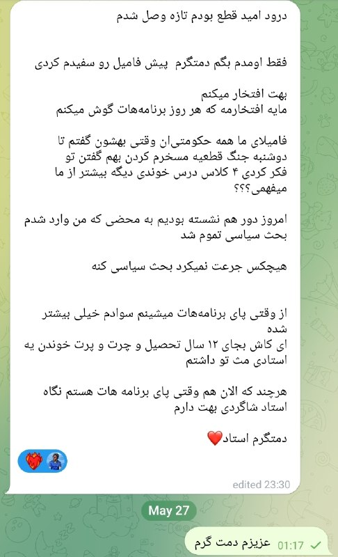

❤️🌹❤️

## rodast_omiddana — post 72000

  <a href="telegram/content/rodast_omiddana_72000_1779847473.webm" target="_blank">🎬 Download video</a>

🚨 من هنوز دارم پیامهاتونو میخونم یعنی با هر پیام اشک شوق میریزم، دمتون گرم و ببخشید در حد یک استیکر قلب پاسخ میدم ❤️

## KiriMohems — post 48035

  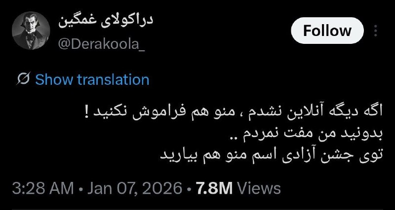

و کسایی که دیگه هیچوقت آنلاین نشدن.. فراموش نمیکنیم 
❤️‍🩹
❤️‍🩹

@KiriMohems

## KiriMohems — post 48034

  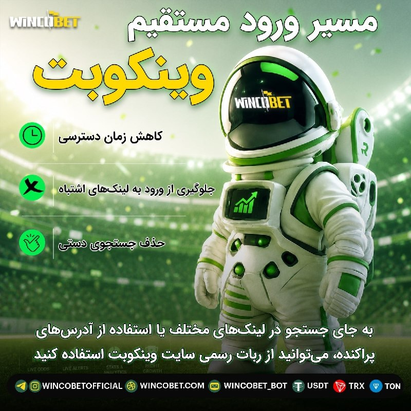

⚡️ دسترسی سریع و مستقیم به وینکوبت

🟢 فرآیند ورود به سایت به شکلی طراحی شده که کاربران بدون درگیر شدن با لینک‌های متعدد یا مسیرهای غیرضروری، مستقیماً وارد محیط اصلی سایت شوند.

📌این دسترسی از طریق ربات رسمی انجام می‌شود:
👇

🤖 @Wincobet_bot

🤖 @Wincobet_bot

🟢 به جای روش‌های قدیمی ورود، این ساختار یک مسیر واحد و ثابت ارائه می‌دهد که همیشه قابل استفاده است.

📌کانال رسمی وینکوبت:
👇

🔵 @Wincobetofficial

## SportBaadNews — post 252829

فرناندو پولو بسیار معتبر: دکو در یک حرکت عجیب گوردون رو از بایرن و لیورپول هایجک کرد بازیکن تمایل شدید به پوشیدن لباس بارسلونا دارد و حتی حاضر است دستمزد خود را کاهش دهد نیوکاسل برای این بازیکن 85 میلیون یورو میخواهد!! @SportBaadNews

## SportBaadNews — post 252828

فوووووری از فرناندو پولو: آنتونی گوردون در یک قدمی بارسلونااا @SportBaadNews

## SportBaadNews — post 252827

  <a href="telegram/content/SportBaadNews_252827_1779847475.webm" target="_blank">🎬 Download video</a>

🚨
⚽️ فووووووری از فابریزیو رومانوووو: بارسلوناااا به دنبال جذب آنتونی گوردون @SportBaadNews

## IranIntlTV — post 339180

  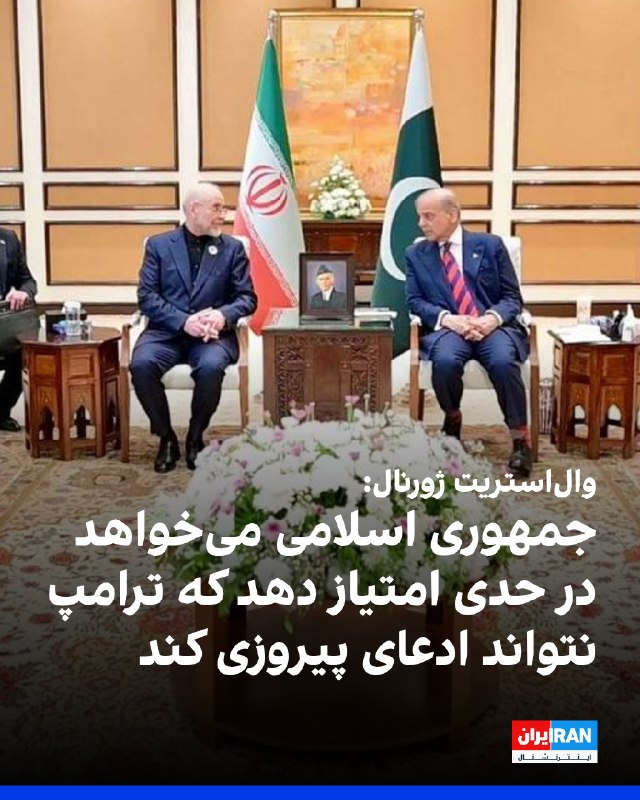

وال‌استریت ژورنال به نقل از مقام‌های ایرانی و میانجی‌های عرب گزارش داد جمهوری اسلامی در راهبرد مذاکره با آمریکا به دنبال دستیابی به گشایش مالی برای اقتصاد خود است، بدون آنکه در برنامه هسته‌ای خود در حدی امتیاز بدهد که ترامپ بتواند ادعای پیروزی کند.
به گفته این مقام‌ها، تهران در پی آن است که با بازپس‌گیری کنترل بخشی از حدود ۱۰۰ میلیارد دلار دارایی مسدودشده از سوی غرب و بازیابی دسترسی به بازارهای جهانی نفت، به گشایش اقتصادی دست یابد.

https://iranintl.com/202605272549

## IranIntlTV — post 339179

  <a href="telegram/content/IranIntlTV_339179_1779847475.mp4" target="_blank">🎬 Download video</a>

پاپ لئو، رهبر کاتولیک‌های جهان، روز سه‌شنبه، پس از توقیف یک کاروان دریایی حامل کمک به غزه به‌دست نیروهای اسرائیلی، خواستار رساندن کمک‌های بشردوستانه به مردم غزه شد و بر رعایت حقوق بشر تاکید کرد.

## IranIntlTV — post 339178

  

نیویورک‌تایمز به نقل از مقام‌های آگاه گزارش داد پیش از حمله‌های دوشنبه آمریکا به برخی اهداف در جنوب ایران، جمهوری اسلامی به سوی بیش از ۱۰ ناو جنگی نیروی دریایی آمریکا در خلیج عمان و دریای عرب یا اطراف آنها پهپادهای انتحاری پرتاب کرده بود.
این گزارش افزود تحلیلگران نظامی آمریکایی همچنین فعالیت‌هایی را در برخی از سامانه‌های موشکی زمین به هوای ایران در نزدیکی تنگه هرمز شناسایی کردند که هواپیماهای تهاجمی مستقر در خشکی و ناو هواپیمابر را که در چارچوب محاصره دریایی در منطقه فعالیت می‌کنند، تهدید می‌کند.

https://iranintl.com/202605278813

## Persian_Trend_Official — post 15096

  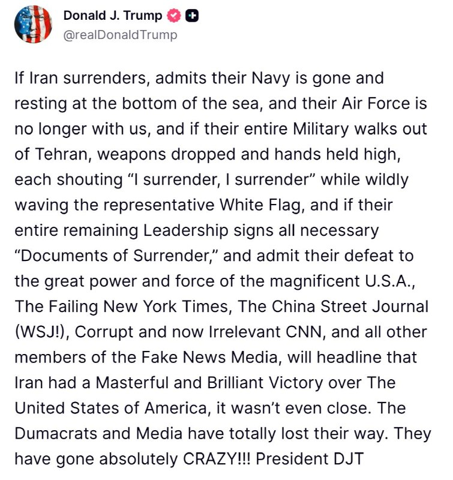

💢اگر ایران تسلیم شود، اعتراف کند نیروی دریایی‌اش نابود شده و در کف دریا آرمیده است، و نیروی هوایی‌اش دیگر وجود ندارد، و اگر تمام ارتششان از تهران خارج شود، سلاح‌ها را زمین بیندازند و دست‌ها را بالا ببرند و هرکدام فریاد بزنند «تسلیم می‌شوم، تسلیم می‌شوم» در حالی که دیوانه‌وار پرچم سفید را تکان می‌دهند، و اگر تمام رهبران باقی‌مانده‌شان همه «اسناد تسلیم» لازم را امضا کنند و شکست خود را در برابر قدرت عظیم و باشکوه ایالات متحده آمریکا بپذیرند، باز هم نیویورک تایمز شکست‌خورده، «چاینا استریت ژورنال» (WSJ!)، سی‌ان‌ان فاسد و حالا بی‌اهمیت، و تمام رسانه‌های جعلی دیگر تیتر خواهند زد که ایران یک پیروزی استادانه و درخشان مقابل ایالات متحده آمریکا به دست آورد و اصلاً رقابتی هم وجود نداشت. دموکرات‌های احمق و رسانه‌ها کاملاً راه خود را گم کرده‌اند. آن‌ها کاملاً دیوانه شده‌اند!!!

رئیس‌جمهور DJT

🫆:Tony

📌 @persian_trend_official
پرشین ترند | متفاوت‌ترین کانال نظامی

## Persian_Trend_Official — post 15095

  

🔴 رویترز: بایدن برای جلوگیری از انتشار فایل‌های صوتی خصوصی‌اش از وزارت دادگستری شکایت کرد

💢جو بایدن از وزارت دادگستری آمریکا شکایت کرده تا مانع انتشار فایل‌های صوتی و متن گفت‌وگوهای خصوصی خود با زندگی‌نامه‌نویسش در سال‌های ۲۰۱۶ و ۲۰۱۷ شود

▪️ قرار است این اسناد در ۱۵ ژوئن در اختیار کمیته قضایی مجلس نمایندگان آمریکا و بنیاد Heritage قرار گیرد

▪️ این فایل‌ها پیش‌تر در تحقیقات رابرت هِر درباره نگهداری اسناد محرمانه توسط بایدن مورد استفاده قرار گرفته بودند

🫆:Tony

📌 @persian_trend_official
پرشین ترند | متفاوت‌ترین کانال نظامی

## Persian_Trend_Official — post 15094

  <a href="telegram/content/Persian_Trend_Official_15094_1779847478.mp4" target="_blank">🎬 Download video</a>

🔴 حملات اسرائیل به مشغره لبنان؛ دست‌کم ۱۲ کشته و ده‌ها زخمی

▪️ در حملات اسرائیل به شهر Mashghara در بقاع غربی لبنان، دست‌کم ۱۲ نفر کشته و ده‌ها نفر دیگر زخمی شدند

▪️ گزارش‌ها حاکی است شماری از کودکان نیز در میان قربانیان هستند

▪️ خبرنگاران محلی می‌گویند برخی خانواده‌ها به‌طور کامل در داخل خانه‌هایشان کشته شده‌اند

⚠️ ویدئوهای منتشرشده، عملیات نجات یک کودک از زیر آوار را نشان می‌دهد حاوی تصاویر ناراحت کننده میباشد.

🫆:Tony

📌 @persian_trend_official
پرشین ترند | متفاوت‌ترین کانال نظامی

## Persian_Trend_Official — post 15093

  <a href="telegram/content/Persian_Trend_Official_15093_1779847480.mp4" target="_blank">🎬 Download video</a>

🔴 تصاویر منتشرشده از حملات هوایی جدید به شهر Sohmor در شرق لبنان

💢 ویدئوهای منتشرشده نشان می‌دهد حملات هوایی تازه‌ای شهر Sohmor در شرق لبنان را هدف قرار داده است
▪️ تاکنون جزئیات دقیقی درباره تلفات یا اهداف حمله منتشر نشده
▪️ همزمان حملات اسرائیل در جنوب و شرق لبنان طی ساعات اخیر شدت گرفته است

🫆:Tony

📌 @persian_trend_official
پرشین ترند | متفاوت‌ترین کانال نظامی

---
📅 بروزرسانی: 1405/03/06 03:21
---

## rodast_omiddana — post 71999

  <a href="telegram/content/rodast_omiddana_71999_1779839462.webm" target="_blank">🎬 Download video</a>

🚨 تعداد پیامها از ایران غیرقابل وصف هست، جرات نمیکنم پیامهای اینستاگرام را بخونم، پیامهای یوتیوب و جاهای دیگر هم نمیتونم، ولی پیامهای تلگرام را اگر فردا وقت بزارم شاید دو سه روزه بتونم فقط بخونم بدون جواب دادن..
خواهش میکنم ازم ناراحت نشید که نمیتونم جواب بدم خیلی خیلی پیامها زیاده ولی همه رو در تلگرام با شوق میخونم❤️

## KiriMohems — post 48033

🔴نورالدین الدغیر، خبرنگار الجزیره تو تهران:

به مو های بلوند زیدان قسم میخورم لواط کامل بین ایران و آمریکا انجام شده و فقط مونده امضای دوطرف که رسما انجام بشه
#professor
@KiriMohems

## KiriMohems — post 48032

سوئد ازدواج فامیلی رو ممنوع اعلام کرد؛ طبق این قانون، از اول ژوئیه 2026 دیگه ازدواج بین بچه‌های "عمو، دایی، عمه و خاله" تو سوئد ممنوعه .

دلیلشم جلوگیری از خشونت‌های ناموسی، فشار خانوادگی و ازدواج‌های اجباری و خلاص شدن از بچه های کیریه فامیل اعلام شده.

#professor
@KiriMohems

## KiriMohems — post 48031

  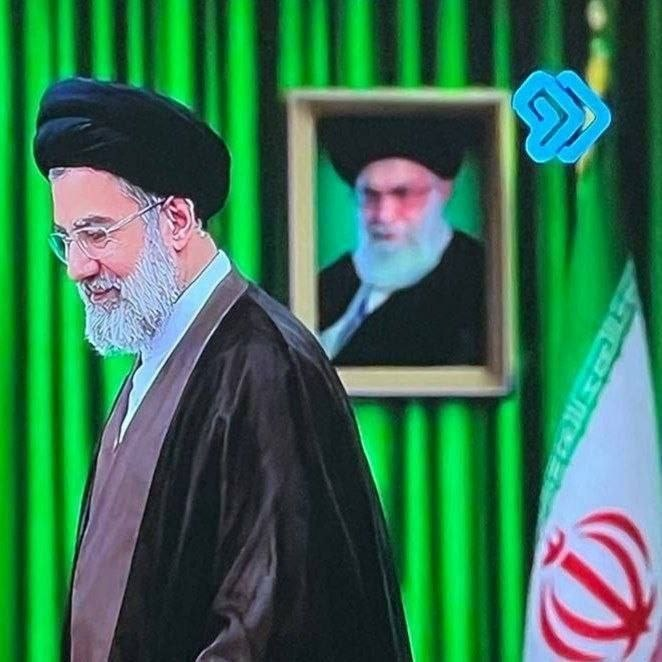

اولین تصویر از مجتبی خامنه ای در صداسیما

#professor
@KiriMohems

## KiriMohems — post 48030

🔴درحالی که نصفه نیمه نت وصل شده سرویس های کانفیگ یو خیلی قوی با پینگ زیر 100 متصله، قیمتارو اوردن پایین هر 1 گیگ فقط 65T رباتش
👇 @ConfigYouBot

## KiriMohems — post 48029

🔴درحالی که نصفه نیمه نت وصل شده سرویس های کانفیگ یو خیلی قوی با پینگ زیر 100 متصله، قیمتارو اوردن پایین هر 1 گیگ فقط 65T رباتش
👇
@ConfigYouBot

## KiriMohems — post 48027

  <a href="telegram/content/KiriMohems_48027_1779839463.mp4" target="_blank">🎬 Download video</a>

اسرائیل دید نتا وصل شده گفت بزار روشن کنم لبنان رو ببینن همه

@KiriMohems

## SportBaadNews — post 252826

  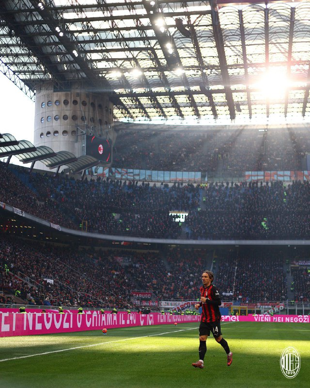

🔻منابع باشگاه میلان: لوکا مودریچ قصد داره بعد از جام جهانی از فوتبال خداحافظی کنه.
@SportBaadNews

## SportBaadNews — post 252825

  <a href="telegram/content/SportBaadNews_252825_1779839465.webm" target="_blank">🎬 Download video</a>

🚨
⚽️ ال ناسیونال: لئو مسی به خولیان آلوارز پیشنهاد داده در صورت جدایی از اتلتیکو، بارسلونا را به عنوان مقصد بعدی‌اش انتخاب کند. مسی معتقد است سبک بازی آلوارز کاملاً با پروژه جدید بارسا هماهنگ است. @SportBaadNews

## SportBaadNews — post 252824

جام جهانی فوتبال Sport Bad News pinned «
🔸 مجموعه #اسپورت_بد_نیوز، بزرگترین و کامل ترین مجموعه فوتبالی - ورزشی تلگرام: با مجموعه ما هیچ خبر فوتبالی و ورزشیو از دست نمیدید... 
⚡ چنل اصلی و پوشش خبری: @SportBaadNews 
🐦 توییت های مردمی: @SportBadTweet 
🎾 اخبار کوتاه ورزشی: @Shortspor 
📲 پوشش گل های…»

## IranIntlTV — post 339177

  <a href="telegram/content/IranIntlTV_339177_1779839465.mp4" target="_blank">🎬 Download video</a>

کاخ سفید تایید کرد دونالد ترامپ، رییس‌جمهوری آمریکا، قرار است چهارشنبه نشستی ویژه با کابینه خود برگزار کند. این خبر را یک مقام کاخ سفید به خبرگزاری فرانسه اعلام کرد.

نیلوفر منصوری، خبرنگار ایران‌اینترنشنال، درباره آخرین تحولات از مذاکرات آمریکا و جمهوری اسلامی می‌گوید
@iranintltv

## IranIntlTV — post 339176

  <a href="telegram/content/IranIntlTV_339176_1779839467.mp4" target="_blank">🎬 Download video</a>

ارتش اسرائیل با انتشار ویدیویی در تلگرام، از کشف و انهدام حدود ۱۱ کیلومتر تونل حماس در منطقه بیت‌حانون، در شرق «خط زرد» در شمال نوار غزه، خبر داد.
در اطلاعیه ارتش اسرائیل آمده است این منطقه سال‌ها به‌عنوان یکی از پایگاه‌های اصلی تروریستی حماس عمل می‌کرد و یکی از اصلی‌ترین و پیچیده‌ترین مناطق نبرد بود که نیروهای اسرائیل در طول جنگ در آن عملیات انجام دادند.

## IranIntlTV — post 339175

  <a href="telegram/content/IranIntlTV_339175_1779839468.mp4" target="_blank">🎬 Download video</a>

شادی از مشهد: مردم بدانند ما وسط تاریخیم و انقلاب فست‌فود نیست که بزنیم برود؛ زمان می‌برد

«یک ایران صدای شما را می‌شنود»

دوشنبه تا پنجشنبه ۱۱ شب تهران

از تلویزیون ایران اینترنشنال

تماشای نسخه کامل این قسمت از «برنامه» در یوتیوب:

https://youtu.be/FIC8NUzo9XI
@iranintltv

## IranIntlTV — post 339174

  <a href="telegram/content/IranIntlTV_339174_1779839470.mp4" target="_blank">🎬 Download video</a>

رضا از شیراز: بدون سازمان‌دهی و با کت‌وشلوار نمی‌شود انقلاب کرد

«یک ایران صدای شما را می‌شنود»

دوشنبه تا پنجشنبه ۱۱ شب تهران

از تلویزیون ایران اینترنشنال

تماشای نسخه کامل این قسمت از «برنامه» در یوتیوب:

https://youtu.be/FIC8NUzo9XI
@iranintltv

## IranIntlTV — post 339173

  <a href="telegram/content/IranIntlTV_339173_1779839471.mp4" target="_blank">🎬 Download video</a>

پیام از تهران: هزینهٔ درمان آن‌قدر بالا رفته که بعضی به عمل اورژانسی نمی‌رسند و می‌میرند

«یک ایران صدای شما را می‌شنود»

دوشنبه تا پنجشنبه ۱۱ شب تهران

از تلویزیون ایران اینترنشنال

تماشای نسخه کامل این قسمت از «برنامه» در یوتیوب:

https://youtu.be/FIC8NUzo9XI
@iranintltv

## IranIntlTV — post 339172

  <a href="telegram/content/IranIntlTV_339172_1779839473.mp4" target="_blank">🎬 Download video</a>

پیام از تهران: هزینهٔ درمان آن‌قدر بالا رفته که بعضی به عمل اورژانسی نمی‌رسند و می‌میرند

«یک ایران صدای شما را می‌شنود»

دوشنبه تا پنجشنبه ۱۱ شب تهران

از تلویزیون ایران اینترنشنال

تماشای نسخه کامل این قسمت از «برنامه» در یوتیوب:

https://youtu.be/FIC8NUzo9XI
@iranintltv

## Persian_Trend_Official — post 15092

  <a href="telegram/content/Persian_Trend_Official_15092_1779839474.mp4" target="_blank">🎬 Download video</a>

شبتون بخیر ❤️

📝 Nick

📌 @persian_trend_official
پرشین ترند | متفاوت‌ترین کانال نظامی

---
📅 بروزرسانی: 1405/03/06 02:16
---

## ChizBergerz — post 46835

کیر تو بله.
کیر تو روبیکا.
کیر تو ایتا.
کیر تو تمام اپای لجن حکومتی.

## ChizBergerz — post 46834

  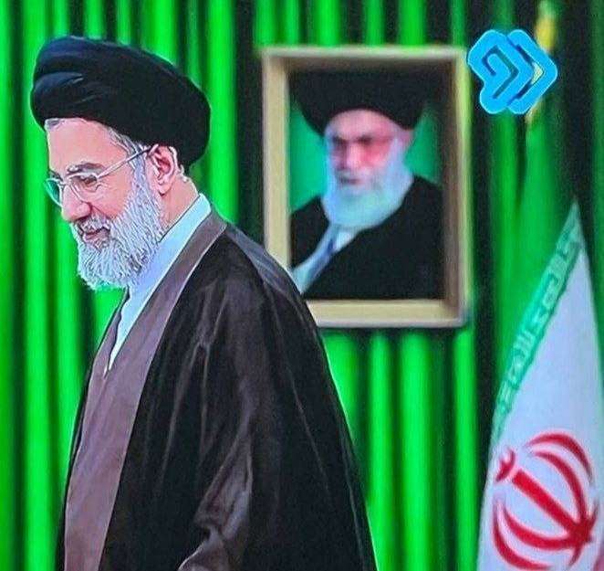

🔴خب مثل اینکه وصل کردن نت برای این بوده که ساخت بدل مجتبی تکمیل شده😂😂

ولی نتونستن کارو خوب در بیارن چون دقیقا شبیهش نیست😂😂😂😂
@ChizBergerz

## rodast_omiddana — post 71998

🚨 سخنان دقیق مهندس شاهین نژاد در مورد علی کریمی و حواشی اخیر..

## KiriMohems — post 48026

  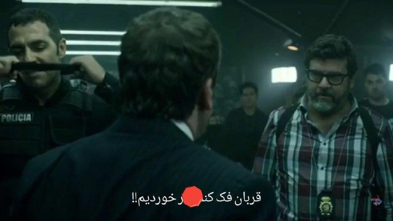

وضعیت اونایی که رفتند اینترنت کیرخری پرو خریدن

@MohemMovies

## KiriMohems — post 48025

صفحه‌ی اینترنت پرو از وبسایت همراه اول حذف شد #professor @KiriMohems

## KiriMohems — post 48024

  <a href="telegram/content/KiriMohems_48024_1779835620.webm" target="_blank">🎬 Download video</a>

امشب مدیر سایت پورن هاپ: ویورِرررررررررره
🤯 #professor @KiriMohems

## KiriMohems — post 48023

🔴 کص خارتون حرومیا

کارشناس صداسیما : وصل شدن اینترنت متوقف میشه و دستور رییس جمهور اجرا نمیشه چون خلاف دیوان عالیه.

#professor
@KiriMohems

## KiriMohems — post 48022

  

عاقبت مجازی کردن مدارس و مهد‌کودک‌ها :

#professor
@KiriMohems

## SportBaadNews — post 252823

  

آرتتا اولین سرمربی تاریخ پرمیرلیگه که موفق شده برای باشگاهی که در اون بازی کرده قهرمانی به ارمغان بیاره 
🔥
@SportBaadNews

## SportBaadNews — post 252822

  

🕹 گردونه شانس رایگان وینکوبت فعال شد!

🎰 هر ۱۲ ساعت یک‌بار شانس خودتان را امتحان کنید و جوایز نقدی متنوع دریافت کنید.

🎁 تا سقف ۱ میلیون تومان جایزه روزانه

✅ فعال برای تمامی کاربران

📌برای شرکت در گردونه شانس، وارد سایت وینکوبت شوید:
👇

🟣 ywincob.com

🟣 ywincob.com

📌کانال رسمی وینکوبت:

🔵 @Wincobetofficial

## SportBaadNews — post 252821

  <a href="https://t.me/SportBaadNews/252821" target="_blank">📎 Download file</a>

کانفیگ نپستر 
@SportBaadNews

## SportBaadNews — post 252820

یه کمپین بزاریم برای حذف آپ های داخلی؟

## SportBaadNews — post 252819

من خودم رئالیم ولی درود به شرفت مرد بازیکنایی که دو فصله نتونستن جام ببرن و یه تنه ریدن به کل نسل و اعتبار باشگاه بزرگی مثل رئال هیچ جایی تو جام جهانی ندارن. کاش بقیه سرمربی هام مثل تو بودن این نسل بی غیرت هیچ جایی تو هیچ تورنومنت مهمی نداره. @SportBadTweet…

## SportBaadNews — post 252818

⚽️
⚽️روبن اوریا (معتبرترین خبرنگار باشگاه اتلتیکومادرید): خولیان آلوارز هفته پیش اطلاع داده که قصد خروج از باشگاه رو داره و فقط میخواد به بارسا بپیونده در غیر این صورت اون در اتلتیکو میمونه بارسا هم مذاکرات رو رسما شروع کرده و برای اولین پیشنهاد گزینه فران تورس + 70 میلیون یورو رو پیشنهاد داده
@SportBaadNews

## SportBaadNews — post 252817

وقتی دیوار برلین فرو ریخت همه آلمان ها خوشحال بودند؛ ناگهان یک زن سالمند در میان جمعیت گفت: ما تنها مردمی هستیم که برای بازگشت به 40 سال قبل خود خوشحال هستیم... @SportBaadNews

## SportBaadNews — post 252816

وقتی دیوار برلین فرو ریخت همه آلمان ها خوشحال بودند؛ ناگهان یک زن سالمند در میان جمعیت گفت: ما تنها مردمی هستیم که برای بازگشت به 40 سال قبل خود خوشحال هستیم...
@SportBaadNews

## SportBaadNews — post 252815

کارشناس صداسیما:
وصل شدن اینترنت متوقف میشه و دستور رییس جمهور اجرا نمیشه چون خلاف دیوان عالیه

😂😂😂😂😂😂😂
@SportBaadNews

## SportBaadNews — post 252813

  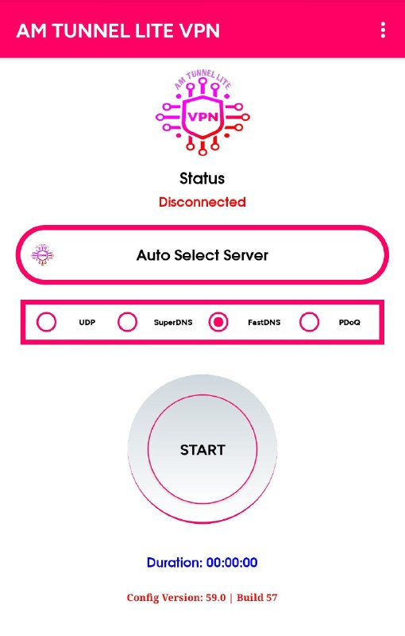

اپ am tunnel رو قطعا یادتونه اوایل جنگ خیلی استفاده میشد؛ تو دایرکت ممبرا میگن رو FastDNS که بذارید جوابه و وصل میشه با سرعت بالا 
✅
@SportBaadNews

## SportBaadNews — post 252811

  <a href="telegram/content/SportBaadNews_252811_1779835623.webm" target="_blank">🎬 Download video</a>

🚨 گروه بندی کامل جام جهانی 2026:

گروه A: مکزیک - کره جنوبی - آفریقای جنوبی - جمهوری چک

گروه B: کانادا - سوئیس - قطر - بوسنی

گروه C: برزیل - مراکش - اسکاتلند - هائیتی

گروه D: آمریکا - استرالیا - پاراگوئه - ترکیه

گروه E: آلمان - اکوادور - ساحل عاج - کوراسائو

گروه F: هلند - ژاپن - تونس - سوئد

گروه G: بلژیک - ایران - مصر - نیوزلند

گروه H: اسپانیا - اروگوئه - عربستان - کیپ ورد

گروه I : فرانسه - سنگال - نروژ - عراق

گروه J: آرژانتین - اتریش - الجزایر - اردن

گروه K: پرتغال - کلمبیا - ازبکستان - کنگو

گروه L: انگلیس - کرواسی - پاناما - غنا
@SportBaadNews

## SportBaadNews — post 252809

  

8 سال پیش تو چنین ساعت هایی بود که رونالدو به مارسلو گفته بود میخوام از رئال جدا شم

👑
🔙| مارسلو: وقتی کریس بهم گفت میخواد از پیشمون بره باورم نمیشد، تمام اون شب رو تا صبح بیدار بودم و داشتم گریه میکردم...
@SportBaadNews

## SportBaadNews — post 252806

واکنش علیرضا دبیر یه اتمام کار شبکه منوتو 
⚽️ @Shortasport

## SportBaadNews — post 252805

  

⚽️
🔙| تو چنین روزی سال 2009 بارسلونا با برد 2-0 مقابل منچستریونایتد تو فینال برای سومین بار تو تاریخ خودش قهرمان چمپیونزلیگ شد
@SportBaadNews

## SportBaadNews — post 252804

  <a href="telegram/content/SportBaadNews_252804_1779835624.webm" target="_blank">🎬 Download video</a>

🚨
⚽️
🏴󠁧󠁢󠁥󠁮󠁧󠁿 میکل آرتتا به عنوان بهترین مربی فصل 2025/26 پریمیرلیگ انتخاب شد
@SportBaadNews

## IranIntlTV — post 339171

  <a href="https://t.me/IranintlTV/339171" target="_blank">📎 Download file</a>

🎧نسخه صوتی «برنامه با کامبیز حسینی»؛ بازگشت اینترنت ایران بعد از ۸۸ روز
@iranintlTV

## IranIntlTV — post 339170

  <a href="telegram/content/IranIntlTV_339170_1779835625.mp4" target="_blank">🎬 Download video</a>

گزارش‌های اختصاصی رسیده به ایران‌اینترنشنال نشان می‌دهد محمدباقر قالیباف، رییس هیئت مذاکره‌کننده جمهوری اسلامی، در هفته‌های اخیر به دنبال کنار گذاشتن سعید جلیلی از روند تصمیم‌گیری‌های مرتبط با مذاکرات بوده است.

گفت‌وگو با کامیار بهرنگ، عضو تحریریه ایران‌اینترنشنال
@iranintltv

## IranIntlTV — post 339169

مراد ویسی، تحلیلگر ارشد ایران‌اینترنشنال گفت: «بخش دیگری از صدای این روزهای مردم ایران، نارضایتی از رویکرد ترامپ در مقابل جمهوری اسلامی است. مردمی که انتظار داشتند او به وعده کمک در راه است عمل کند.»
@iranintltv

## IranIntlTV — post 339168

  

شورای امنیت سازمان ملل روز سه‌شنبه در بیانیه‌ای حمله به نیروگاه هسته‌ای براکه در امارات متحده عربی را محکوم کرد و این حمله را نقض قوانین بین‌المللی دانست. این شورا مسئولیت این حمله را به هیچ طرفی نسبت نداد.
امارات متحده عربی هفته گذشته اعلام کرد شش پهپاد از عراق به سوی این کشور پرتاب شده‌اند که یکی از آنها باعث آتش‌سوزی در نیروگاه هسته‌ای این کشور شده است.
عراق میزبان گروه‌های شبه‌نظامی قدرتمند مورد حمایت جمهوری اسلامی است که در جریان جنگ اخیر علیه جمهوری اسلامی، مسئولیت حمله به «پایگاه‌های دشمن» در عراق و منطقه را بر عهده گرفته‌اند.

https://iranintl.com/202605262953

## IranIntlTV — post 339167

  <a href="https://t.me/IranintlTV/339167" target="_blank">📎 Download file</a>

🎧نسخه صوتی سیاست با مراد ویسی: بازگشت صدای ملت
@iranintlTV

## IranIntlTV — post 339166

  <a href="telegram/content/IranIntlTV_339166_1779835628.mp4" target="_blank">🎬 Download video</a>

مراد ویسی، تحلیلگر ارشد ایران‌اینترنشنال، گفت: «مجتبی خامنه‌ای با تکرار رجزخوانی پدرش درباره نابودی اسرائیل، گفت اسرائیل ۱۵ سال دیگر نابود خواهد شد. رجزی که با واکنش و طعنه مقام‌های اسرائیلی روبه‌رو شده است.»
@iranintltv

## IranIntlTV — post 339165

  

لیندسی گراهام، سناتور جمهوری‌خواه، با اشاره به اینکه هواپیماهای نظامی جمهوری اسلامی در پایگاه‌های هوایی پاکستان نگهداری می‌شوند، در ایکس نوشت نقش پاکستان به عنوان میانجی «بسیار مسئله‌ساز» است و خصومت این کشور با اسرائیل سابقه‌ای طولانی دارد.
لیندسی گراهام در ادامه از پاکستان خواست به درخواست دونالد ترامپ برای پیوستن به توافق‌های ابراهیم پاسخ مثبت دهد.

https://iranintl.com/202605260832

## IranIntlTV — post 339164

  

ترامپ در تروث‌سوشال نوشت با توجه به احتمال نامساعد شدن شرایط جوی در روز آینده، جلسه چهارشنبه کابینه را در کاخ سفید برگزار خواهد کرد و سفر کابینه به کمپ دیوید را به تعویق خواهد انداخت.
پیش‌تر گزارش شده بود که ترامپ صبح چهارشنبه در کمپ دیوید نشست کابینه را برگزار می‌کند. نیویورک‌پست نوشت در این نشست همه اعضای کابینه حضور خواهند داشت و جنگ ایران محور اصلی گفت‌وگوهاست. کاخ سفید اعلام کرد تولسی گبرد نیز در این نشست شرکت می‌کند.

https://iranintl.com/202605260928

## IranIntlTV — post 339163

  <a href="telegram/content/IranIntlTV_339163_1779835630.mp4" target="_blank">🎬 Download video</a>

مراد ویسی، تحلیلگر ارشد ایران‌اینترنشنال گفت: «اتصال دوباره دسترسی مردم به اینترنت بعد از سه ماه هر چند با فلیترینگ و با محدودیت اما بار دیگر به ملت امکان داد تا صدای مخالفت خود با جمهوری اسلامی و پایبندی به خیزش دی‌ماه و هدف سرنگونی را تکرار کنند.»
@iranintltv

## Persian_Trend_Official — post 15091

  <a href="telegram/content/Persian_Trend_Official_15091_1779835631.webm" target="_blank">🎬 Download video</a>

📣 لطفا تا جایی که میتونین اپ های گوشی و کامپیوتر یا لپ‌تاپ، اپ های خود سیستم و سیستم عامل رو آپدیت کنید.

❗️ اپ های قدیمی ریسک امنیتی بیشتری دارن.

📝 Nick

📌 @persian_trend_official
پرشین ترند | متفاوت‌ترین کانال نظامی

## Persian_Trend_Official — post 15090

💢ترامپ اعلام کرد: جلسه کابینه به دلیل شرایط آب و هوایی فردا در کاخ سفید برگزار خواهد شد، نه در کمپ دیوید/انتخاب

🫆:Tony

📌 @persian_trend_official
پرشین ترند | متفاوت‌ترین کانال نظامی

## Persian_Trend_Official — post 15089

https://youtube.com/live/TrPiEz5YpyQ?feature=share

## Persian_Trend_Official — post 15088

  <a href="https://t.me/persian_trend_official/15088" target="_blank">📎 Download file</a>

فایل صوتی لایو اول
نسخه کم حجم - 10.33 مگابایت

اتاق جنگ سه شنبه 5 خرداد | درگیری مرگبار در خلیج فارس اینترنت فعلا آزاد شد.

📝 Nick

📌 @persian_trend_official
پرشین ترند | متفاوت‌ترین کانال نظامی

---
📅 بروزرسانی: 1405/03/06 00:52
---

## ChizBergerz — post 46833

  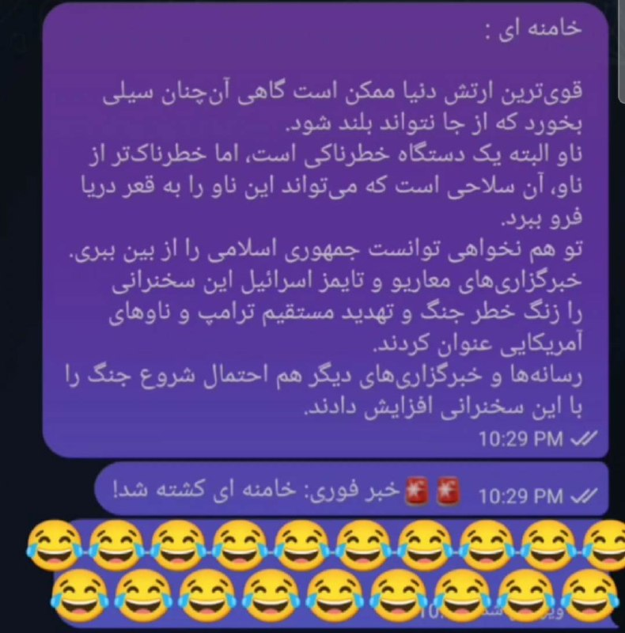

جهت یادآوری: 😂😂

@ChizBergerz

## rodast_omiddana — post 71997

  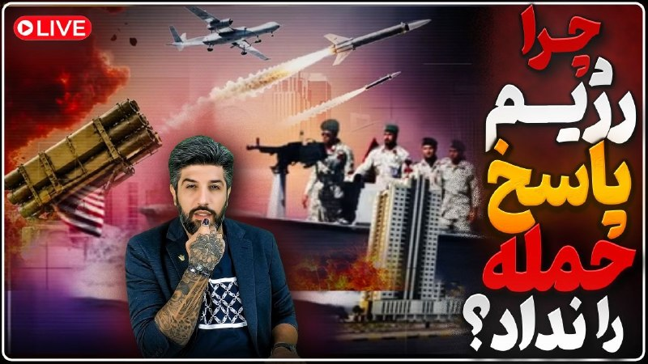

🎬
🔴
🔴
🔴 پخش زنده
*جلسه کم‌سابقه کمپ دیوید برای حمله مجدد به جمهوری اسلامی
*دیشب چرا رژیم جواب حمله آمریکا را نداد؟
لینک یوتیوب:
youtube.com/watch?v=xG925YUez5w&pp=0gcJCQoLAYcqIYzv

## KiriMohems — post 48021

این سرعت تخمی نت مثلا وصل شده نسبت به زمان قطعی بیشتر بوده

#Helsinki
@KiriMohems

## SportBaadNews — post 252803

  <a href="telegram/content/SportBaadNews_252803_1779830529.mp4" target="_blank">🎬 Download video</a>

وقتی بعد 22 سال آرسنال قهرمان لیگ میشه، ولی هم‌زمان وصل شدن نت و نزدیک شدن جام جهانی باعث فراموشی این موضوع در انظار عمومی میشه:
@SportBaadNews

## SportBaadNews — post 252802

  <a href="telegram/content/SportBaadNews_252802_1779830532.mp4" target="_blank">🎬 Download video</a>

1 دقیقه با مورینیو و حاشیه هاش 
😂
😂

@SportBaadNews

## SportBaadNews — post 252801

  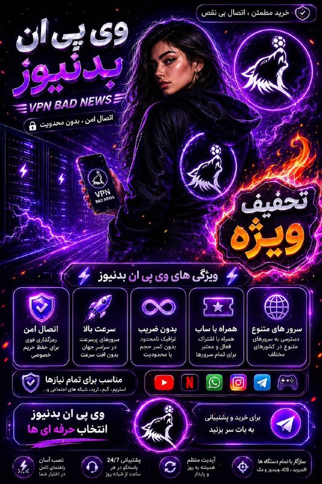

⚡️ وی‌پی‌ان بدنیوز؛ قیمت‌ها شکسته شد
🔝 کاهش قیمت بخاطر استقبال زیاد

✅ بدون هیچگونه ضریب
✅ همراه ساب برای مدیریت حجم
✅ مناسب تمامی پلتفرم‌ها
✅ پشتیبانی سریع و بدون مشکل
✅ بالاترین سرعت ممکن

💰 گیگی 85، بیشترین کیفیت

🤖 خرید از طریق بات رسمی 👇

## SportBaadNews — post 252799

  <a href="telegram/content/SportBaadNews_252799_1779830536.mp4" target="_blank">🎬 Download video</a>

⚽️
⏳ فقط و فقط 15 روز تا شروع جام جهانی...
@SportBaadNews

## SportBaadNews — post 252798

  <a href="telegram/content/SportBaadNews_252798_1779830539.mp4" target="_blank">🎬 Download video</a>

مایک مانیان رفت جایی که غم نباشه
@SportBaadNews

## SportBaadNews — post 252797

  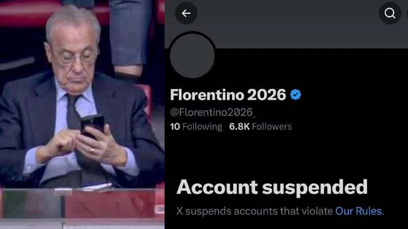

⚽️ فوری و رسمی: انتخابات رئال مادرید در روز 7 ژوئن (12 روز دیگه) برگزار خواهد شد. @SportBaadNews

## SportBaadNews — post 252796

  

⚽️
⚽️| ساموئل اتوئو در مورد ژوزه مورینیو قبل از نیمه‌ نهایی لیگ قهرمانان جلوی بارسلونا: چیزی که بیشتر از همه غافلگیرم کرد این بود که مورینیو تو جلسه آخر تمرینی اصلاً در مورد تاکتیک حرف نزد. همه منتظر بودن بحث در مورد مسی، ژاوی و اینیستا باشه. اما اون در مورد شجاعت حرف زد.

🔴 بهمون گفت فردا میلیون‌ها آدم منتظرن بارسلونا ببره. این فشار رو اونائه، نه رو ما. دنیا از قبل داستان رو نوشته. کار ما اینه که پایانش رو عوض کنیم. جو اتاق یهو عوض شد. دیگه حس نمیکردیم تیمی هستیم که جلوی بارسلونا فقط میخواد جون سالم به در ببره، بلکه حس میکردیم تیمی هستیم که یه فرصت داره تا تاریخسازی کنه.

🔴 مورینیو چیزی رو میفهمید که خیلی از مربی‌ها نمیفهمن؛ قبل از اینکه یه بازیکن بتونه یه حریف بزرگ رو ببره، اول باید این فکر رو که اون حریف شکست‌ ناپذیره رو از سرش بیرون کنه. تا زمان سوت شروع بازی، اون جنگ از قبل برده شده بود.
@SportBaadNews

## SportBaadNews — post 252795

⚽️ فوری و رسمی: انتخابات رئال مادرید در روز 7 ژوئن (12 روز دیگه) برگزار خواهد شد. @SportBaadNews

## SportBaadNews — post 252794

  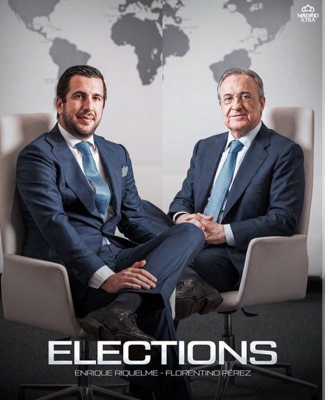

⚽️ فوری و رسمی: انتخابات رئال مادرید در روز 7 ژوئن (12 روز دیگه) برگزار خواهد شد.
@SportBaadNews

## SportBaadNews — post 252793

  <a href="telegram/content/SportBaadNews_252793_1779830544.webm" target="_blank">🎬 Download video</a>

🚨
⚽️الگری بعد از فصل فاجعه بار در میلان از این تیم اخراج شد. @SportBaadNews

## SportBaadNews — post 252792

⚽️
🔺فابریزیو رومانو: موضع چلسی واضح است، ژائو پدرو فروشی نیست.
@SportBaadNews

## SportBaadNews — post 252791

  <a href="telegram/content/SportBaadNews_252791_1779830545.webm" target="_blank">🎬 Download video</a>

🚨
⚽️ فووووووری مارکا: خولیان آلوارز فقط بارسا رو میخواد نه آرسنال نه پاریس فقط بارسا @SportBaadNews

## SportBaadNews — post 252790

  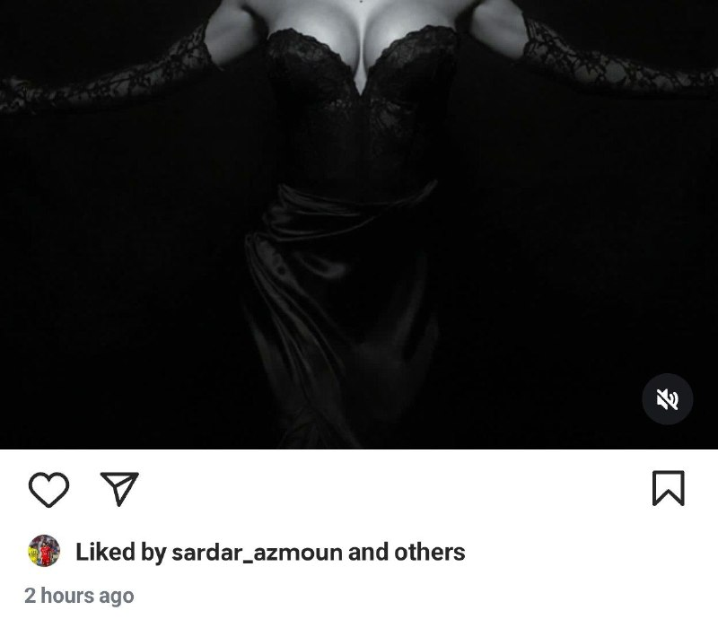

آرام همسر باغیرت ترین مرد تاریخ جناب سپهر حیدری هم اینطوری بعد وصل شدن نت فعالیت رو استارت زد @SportBaadNews

## SportBaadNews — post 252789

  

آرام همسر باغیرت ترین مرد تاریخ جناب سپهر حیدری هم اینطوری بعد وصل شدن نت فعالیت رو استارت زد
@SportBaadNews

## SportBaadNews — post 252788

  

🇩🇪
⚽️| شات های جدید و سکسی تونی کروس با نسخه "remake" شده کیت 2014 آلمان
@SportBaadNews

## SportBaadNews — post 252787

  <a href="telegram/content/SportBaadNews_252787_1779830548.webm" target="_blank">🎬 Download video</a>

🚨
⚽️ فووووووری از فابریزیو رومانوووو: بارسلوناااا به دنبال جذب آنتونی گوردون
@SportBaadNews

## SportBaadNews — post 252786

  <a href="telegram/content/SportBaadNews_252786_1779830548.mp4" target="_blank">🎬 Download video</a>

⚽️|حالا که دیگه گیگی خدا تومن برا وپن پول نمیدید دم جام جهانی خسیس بازی در نیارید این کلیپو دانلود کنید خیلی شاهکاره 
🔥
🔥
@SportBaadNews

## SportBaadNews — post 252785

جاکشا بیاید برخط بشید

## SportBaadNews — post 252784

  

🏆
🟡 خبرنگار: جام جهانی داره از راه میرسه، آماده‌ای؟

🇦🇷 مسی: 100%، من کل سال خودم رو آماده کردم تا با بهترین آمادگی ممکن به بزرگترین رقابت دنیا برسم. هر چی در توانم باشه رو میذارم وسط.
@SportBaadNews

## SportBaadNews — post 252783

این رسمش نبود انقد زود تنهام بزارید

## IranIntlTV — post 339162

  <a href="telegram/content/IranIntlTV_339162_1779830554.mp4" target="_blank">🎬 Download video</a>

مهدی خراتیان، کارشناس وابسته به حکومت، با اشاره به قصد احتمالی دونالد ترامپ بعد از انتخابات میان‌دوره‌ای ایالات متحده گفت اگر آمریکا پس از نوامبر ایران را تهدید کند و نشانه‌هایی از آمادگی نظامی دیده شود، جمهوری اسلامی باید از پیمان منع گسترش سلاح هسته‌ای خارج شود و ساخت سلاح اتمی را آغاز کند.

## IranIntlTV — post 339161

  

دفتر رسانه‌ای شاهزاده رضا پهلوی با انتشار بیانیه‌ای در واکنش به صدور حکم اعدام برای چهار شهروند ایرانی، نوشت: «صدور دوباره احکام اعدام برای چهار تن از بچه‌های اکباتان، میلاد آرمون، محمدمهدی حسینی، مهدی ایمانی و نوید نجاران، سند دیگری از ماهیت جنایتکار رژیم جمهوری اسلامی است که برای حفظ قدرت، جوانان ایران را به قتل می‌رساند و از خون مردم برای بقای خود تغذیه می‌کند.»

در این بیانیه آمده است: «رژیم ضحاکی جمهوری اسلامی، دادگاه را به ابزار سرکوب تبدیل کرده و اعدام، سلاحی برای ایجاد وحشت در جامعه است.»

دفتر رسانه‌ای شاهزاده رضا پهلوی نوشت: «سکوت جهان در برابر اعدام معترضان ایرانی، یک شکست اخلاقی و سیاسی است. هر روزی که جامعه جهانی در برابر این رژیم مماشات می‌کند، جمهوری اسلامی با جسارت و قساوت بیشتری جان جوانان ایرانی را می‌گیرد و سرکوب را گسترش می‌دهد.»
https://iranintl.com/202605265248

## IranIntlTV — post 339160

  <a href="telegram/content/IranIntlTV_339160_1779830556.mp4" target="_blank">🎬 Download video</a>

شرکت مخابرات اعلام کرد اینترنت بین‌الملل برای مشترکان این شرکت برقرار شده و نت‌بلاکس در شبکه ایکس نوشت میزان دسترسی به اینترنت بین‌المللی در ایران به ۸۶ درصد رسیده است. این در حالی است که ساعاتی پیش دیوان عدالت اداری، زیر نظر قوه قضاییه جمهوری اسلامی، اعلام کرد اجرای مصوبه اتصال اینترنت را متوقف کرده است.

گفت‌وگو با سحر تحویلی، پژوهشگر حوزه فناوری اطلاعات و نجات بهرامی، تحلیلگر سیاسی
@iranintltv

## IranIntlTV — post 339159

  <a href="telegram/content/IranIntlTV_339159_1779830560.mp4" target="_blank">🎬 Download video</a>

خبرگزاری تسنیم، وابسته به سپاه، گفت مذاکره‌کنندگان جمهوری اسلامی در چارچوب تفاهم احتمالی با آمریکا، دنبال آزادسازی ۲۴ میلیارد دلار از دارایی‌های بلوکه‌شده ایران هستند؛ پولی که به گفته منبع نزدیک به تیم مذاکره‌کننده، باید در جریان مذاکرات آزاد شود.

گفت‌وگو با علی شیرازی، عضو تحریریه ایران‌اینترنشنال
@iranintltv

## IranIntlTV — post 339158

  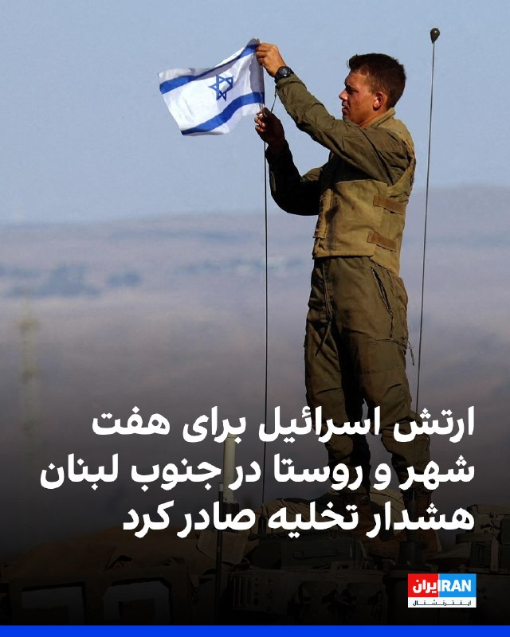

افیخای ادرعی، سخنگوی ارتش اسرائیل، در شبکه ایکس از ساکنان هفت شهر و روستا در جنوب لبنان خواست برای حفظ جان خود این مناطق را ترک کنند.

سخنگوی عرب‌زبان ارتش اسرائیل با هشدار به ساکنان شهرها و روستاهای طورا، دیر قانون النهر، بدیاس، برج رحال، معرکه، العباسیه و طیر دبا، نوشت: «در پی نقض توافق آتش‌بس از سوی حزب‌الله، ارتش اسرائیل ناچار است با قدرت علیه آن اقدام کند. ارتش قصد آسیب رساندن به شما را ندارد.»

افیخای ادرعی تاکید کرد: «هر فردی که در نزدیکی نیروها، تاسیسات یا تجهیزات نظامی حزب‌الله حضور داشته باشد، جان خود را به خطر می‌اندازد.»
https://iranintl.com/202605261988

## IranIntlTV — post 339157

  <a href="telegram/content/IranIntlTV_339157_1779830563.mp4" target="_blank">🎬 Download video</a>

شرکت مخابرات از برقراری کامل اینترنت بین‌الملل برای مشترکان خبر داد. معاون وزیر ارتباطات گفت روند وصل شدن اینترنت در حال انجام است و تا ۲۴ ساعت آینده کامل می‌شود، اما دیوان عدالت اداری اجرای مصوبه اتصال را متوقف کرده است.

گفت‌وگو با سحر تحویلی، پژوهشگر در حوزه فناوری اطلاعات
@iranintltv

## IranIntlTV — post 339156

  

دونالد ترامپ در تروث سوشال نوشت اگر جمهوری اسلامی تسلیم شود، نابودی نیروی دریایی و هوایی خود را بپذیرد، نیروهایش را از تهران خارج کند و مقام‌هایش اسناد تسلیم را امضا کنند، «رسانه‌های جعلی» مانند نیویورک‌تایمز، وال‌استریت ژورنال و سی‌ان‌ان باز هم این را پیروزی ایران مقابل آمریکا توصیف خواهند کرد.
https://iranintl.com/202605263111

## IranIntlTV — post 339155

  <a href="https://t.me/IranintlTV/339155" target="_blank">📎 Download file</a>

🎧نسخه صوتی ۲۴ با فرداد فرحزاد: نشست کم‌سابقه دولت آمریکا در کمپ‌ دیوید برای بررسی جنگ ایران
@iranintlTV

## Persian_Trend_Official — post 15087

  <a href="telegram/content/Persian_Trend_Official_15087_1779830567.mp4" target="_blank">🎬 Download video</a>

⭕️پهپاد لوکاس امریکایی سالم در دست عراقی ها

🫆:Tony

📌 @persian_trend_official
پرشین ترند | متفاوت‌ترین کانال نظامی

## Persian_Trend_Official — post 15086

  

⭕️ محمد عوده فرمانده گردان قسام حماس توسط ارتش اسرائیل ترور شده است.

🫆:Tony

📌 @persian_trend_official
پرشین ترند | متفاوت‌ترین کانال نظامی

---
📅 بروزرسانی: 1405/03/05 23:09
---

## arianheidarii — post 20045

برخط❌
آنلاین✅

هستید ؟ 🙂

## ChizBergerz — post 46832

انگار از انفرادی آوردنت بند عمومی با این اینترنت باز کردنشون.

@ChizBergerz

## ChizBergerz — post 46831

  <a href="telegram/content/ChizBergerz_46831_1779824366.mp4" target="_blank">🎬 Download video</a>

خلاصه جنگ ۴۰ روزه برای اونایی که تازه نتشون وصل شده:

@ChizBergerz

## ChizBergerz — post 46830

باز کردن اینترنت سه تا معنی داره:
۱. پروژه «اینترنت پرو» شکست خورده و اوپراتورها در آستانه ورشکستگی بودن.
۲. نارضایتی توی کشور زیاد شده بود و خواستن با این حرکت یکمی از نارضایتی ها کم کنن.
۳. توافق با آمریکا تقریبا قطعی شده و خیالشون راحته قرار نیست فعلا دیگه جنگی اتفاق بیفته.
وگرنه هیچکس باور نمیکنه این حرومزاده‌ها به خاطر مردم کاری انجام بدن.

## rodast_omiddana — post 71996

🎬 تا چند دقیقه دیگه در یوتیوب زنده هستیم https://www.youtube.com/@omiddana

## rodast_omiddana — post 71994

  <a href="telegram/content/rodast_omiddana_71994_1779824367.webm" target="_blank">🎬 Download video</a>

🚨 فوری_نیویورک پست:
"رژیم جمهوری اسلامی با پهپاد انتحاری به چند ناو آمریکایی حمله کرده است"

## KiriMohems — post 48020

🔴فروش سیگار نخی و کصشعرای دخانی بصورت نخی یا بازشده ممنوع شد که #قطعا_به_کیرتونه
#Helsinki
@KiriMohems

## KiriMohems — post 48018

  <a href="telegram/content/KiriMohems_48018_1779824367.mp4" target="_blank">🎬 Download video</a>

🔴نتانیاهو از ترور لاتی وار خبر داد :

همین الان محمد عوده، از فرماندهان کلفت نظامی حماس و یکی از طراحان حمله ۷ اکتبر رو تو غزه گوزِ در کون بستیم و ترکوندیم

به همه‌شون میرسیم و مادرشون رو میگاییم

#Helsinki
@KiriMohems

## KiriMohems — post 48017

  

⚡️ دسترسی سریع و مستقیم به وینکوبت

🟢 فرآیند ورود به سایت به شکلی طراحی شده که کاربران بدون درگیر شدن با لینک‌های متعدد یا مسیرهای غیرضروری، مستقیماً وارد محیط اصلی سایت شوند.

📌این دسترسی از طریق ربات رسمی انجام می‌شود:
👇

🤖 @Wincobet_bot

🤖 @Wincobet_bot

🟢 به جای روش‌های قدیمی ورود، این ساختار یک مسیر واحد و ثابت ارائه می‌دهد که همیشه قابل استفاده است.

📌کانال رسمی وینکوبت:
👇

🔵 @Wincobetofficial

## KiriMohems — post 48014

  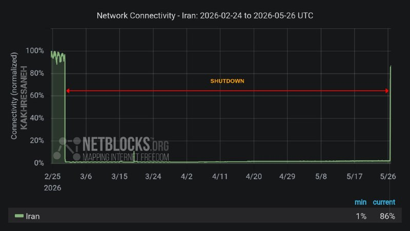

🔴نت بلاکس برای مردم ایران مالید

داده های نت‌بلاکس نشون میده سطح دسترسی‌ها از ۳۴ درصد عصر امروز به ۸۶ درصد تا دقایقی پیش رسیده
#Helsinki
@KiriMohems

## KiriMohems — post 48013

🔴شبکه ۱۴ اسرائیل به نقل از یک مقام اسرائیلی :
بعد از پیام آمریکا، فعلاً هرگونه طرح برای حمله به ایران مالیده شده

#Helsinki
@KiriMohems

## SportBaadNews — post 252777

فیلترشکنای قدیمیتون تست کنید وصلن 90 درصدشون

## SportBaadNews — post 252776

  <a href="telegram/content/SportBaadNews_252776_1779824370.webm" target="_blank">🎬 Download video</a>

🚨
⚽️ فووووووری مارکا: خولیان آلوارز فقط بارسا رو میخواد نه آرسنال نه پاریس فقط بارسا @SportBaadNews

## SportBaadNews — post 252775

  <a href="telegram/content/SportBaadNews_252775_1779824370.webm" target="_blank">🎬 Download video</a>

🚨
🚨
🚨 سهام پورن هاب از ساعاتی قبل رشد قابل توجهی داشته

## SportBaadNews — post 252774

  <a href="telegram/content/SportBaadNews_252774_1779824370.webm" target="_blank">🎬 Download video</a>

🚨
⚽️ فووووووری مارکا: خولیان آلوارز فقط بارسا رو میخواد نه آرسنال نه پاریس فقط بارسا @SportBaadNews

## SportBaadNews — post 252773

  <a href="telegram/content/SportBaadNews_252773_1779824370.webm" target="_blank">🎬 Download video</a>

🚨
⚽️ فووووووری مارکا: خولیان آلوارز فقط بارسا رو میخواد نه آرسنال نه پاریس فقط بارسا
@SportBaadNews

## SportBaadNews — post 252772

⚡️ وی‌پی‌ان بدنیوز؛ قیمت‌ها شکسته شد 🔝 کاهش قیمت بخاطر استقبال زیاد ✅ بدون هیچگونه ضریب ✅ همراه ساب برای مدیریت حجم ✅ مناسب تمامی پلتفرم‌ها ✅ پشتیبانی سریع و بدون مشکل ✅ بالاترین سرعت ممکن 💰 گیگی 85، بیشترین کیفیت 🤖 خرید از طریق بات رسمی 👇

## SportBaadNews — post 252771

  

⚡️ وی‌پی‌ان بدنیوز؛ قیمت‌ها شکسته شد
🔝 کاهش قیمت بخاطر استقبال زیاد

✅ بدون هیچگونه ضریب
✅ همراه ساب برای مدیریت حجم
✅ مناسب تمامی پلتفرم‌ها
✅ پشتیبانی سریع و بدون مشکل
✅ بالاترین سرعت ممکن

💰 گیگی 85، بیشترین کیفیت

🤖 خرید از طریق بات رسمی 👇

## SportBaadNews — post 252769

میلاد حقوق نداده، روز هشتاد و نهم...
میلاد حقوق نداده، روز هشتاد و نهم...
میلاد حقوق نداده، روز هشتاد و نهم...
میلاد حقوق نداده، روز هشتاد و نهم...
میلاد حقوق نداده، روز هشتاد و نهم...

## SportBaadNews — post 252768

  

خدا منو ببخشه ولی خود خودشه
@SportBaadNews

## SportBaadNews — post 252767

چقدر دلم تنگ شده بود

ما که نت داشتیم ولی واقعا وقتی نبودین اون لذتو نداشت

## SportBaadNews — post 252766

https://t.me/proxy?server=65.109.210.202&port=8443&secret=EERighJJvXrFGRMCIMJdCQRueWVrdGFuZXQuY29tZmFyYWthdi5jb212YW4ubmFqdmEuY29tAAAAAAAAAAAAAAAAAAAAAAAAAAAAAAAAAAAAAAAAAAAAAAAAAAAAAAAAAAAAAAAAAAAAAAAAAAAAAAAAAAAAAAAAAAAAAAAAAAAAAAA

وصله

## SportBaadNews — post 252765

🔸 مجموعه #اسپورت_بد_نیوز، بزرگترین و کامل ترین مجموعه فوتبالی - ورزشی تلگرام: با مجموعه ما هیچ خبر فوتبالی و ورزشیو از دست نمیدید... 
⚡ چنل اصلی و پوشش خبری: @SportBaadNews 
🐦 توییت های مردمی: @SportBadTweet 
🎾 اخبار کوتاه ورزشی: @Shortspor 
📲 پوشش گل های…

## SportBaadNews — post 252764

🔸 مجموعه #اسپورت_بد_نیوز، بزرگترین و کامل ترین مجموعه فوتبالی - ورزشی تلگرام:

با مجموعه ما هیچ خبر فوتبالی و ورزشیو از دست نمیدید...

⚡ چنل اصلی و پوشش خبری: @SportBaadNews

🐦 توییت های مردمی: @SportBadTweet

🎾 اخبار کوتاه ورزشی: @Shortspor

📲 پوشش گل های فوتبال: @GoalBad

🏟 چکیده اخبار: @Shortasport

⭐️ بنگبال، دنیای موازی: @BanggBall

💋 جواد خیابانی: @Javad_Khiabani

💛 فوتبال انیمیشن: @Footmation

🇮🇷 پوشش لیگ ایران: @soccerIRN

👑 پرسپولیس: @SorkhTotal

🔵 استقلال: @Bad_Ss_new

🚜 تراکتور: @Tractorsorkh

🔞 هات اسپورت : @SporteHub

🛀 فوتبال فانتزی: @Fantasiball

⚽️ بارسلونا: @HomeFCB

⚽️ رئال‌مادرید: @UltraMadrid

⚽️ منچستریونایتد: @ManchesterNews_ir

⚽️ لیورپول: @Liverpooli_Newsir

## SportBaadNews — post 252763

#ارسالی
شیرخورشید بدون هیچ آیپی وصل میشه زیر ۳۰‌ثانیه فقط به بچها بگو اون CDN FORTNIG بزنن
@SportBaadNews

## SportBaadNews — post 252762

اگه پروکسی چیزی وصلید بفرستین دایرکت

## SportBaadNews — post 252761

اوضاع خیلی خیته😂😂

## SportBaadNews — post 252760

https://t.me/socks?server=127.0.0.1&port=10808

مخابرات
@SportBaadNews

## SportBaadNews — post 252759

https://t.me/proxy?server=91.107.166.83&port=443&secret=Ee1603010200010001Fc030386E24c3aDd626973636f7474692e79656b74616e65742e636f6d

پروکسییییییی متصللل 🔥🔥🔥
@SportBaadNews

## SportBaadNews — post 252758

https://t.me/proxy?server=78.47.51.149&port=443&secret=Ee1603010200010001Fc030386E24c3aDd626973636f7474692e79656b74616e65742e636f6d

وصلهههههههههههههههههههه 🔥🔥🔥🔥
@SportBaadNews

## SportBaadNews — post 252757

  <a href="telegram/content/SportBaadNews_252757_1779824372.webm" target="_blank">🎬 Download video</a>

🚨 کانفیگ نپستر متصللل ✅✅✅✅
@SportBaadNews

## IranIntlTV — post 339154

  <a href="https://t.me/IranintlTV/339154" target="_blank">📎 Download file</a>

🎧نسخه صوتی چشم‌انداز: مضحکه‌ای به نام رییس‌جمهور در جمهوری اسلامی
@iranintlTV

## IranIntlTV — post 339153

  <a href="telegram/content/IranIntlTV_339153_1779824373.mp4" target="_blank">🎬 Download video</a>

مضحکه‌ای به نام رییس‌جمهور در جمهوری اسلامی

«چشم‌انداز با مهدی مهدوی‌آزاد»

تماشای نسخه کامل این برنامه در یوتیوب:

https://youtu.be/5g8yvPI6ZIg

@iranintltv

## IranIntlTV — post 339152

🗣روایت شما از اولین روز کاهش محدودیت و قطع اینترنت- سه‌شنبه ۵ خرداد ۱۴۰۶

🔹تازگی تو استان کردستان انگار اینترنت داره وصل میشه، اما فقط وای‌فای.

🔹من بابت وصل شدن اینترنت خوشحال نیستم، چون ۴۰ هزار نفر دیگه هیچ‌وقت آنلاین نمی‌شن. طرح اینترنت پرو شکست خورد. سپاس از کسانی که تن به این خفت و خواری ندادن و متأسفم برای کسانی که بهش تن دادن.

🔹من تازه تونستم وصل بشم. یه دختر دهه‌نودی هستم. حتی منم دیگه خسته شدم، هر روز اوضاع داره بدتر و بدتر میشه. فقط امیدوارم در نهایت همه‌مون آزادی ایرانمون رو ببینیم. جاوید شاه.

🔹بالاخره اینترنت وصل شده، البته با هزار تا بدبختی و سرعت پایین، اونم فقط با مخابرات.

🔹قربون دستت که دستور دادی اینترنت بین‌الملل وصل شه. حالا بی‌زحمت دستور بده اونایی که کسب‌وکار اینترنتیشون نابود شد برگردن سر کارشون، اونایی که زندگیشون از هم پاشید برگردن سر خونه و زندگیشون، اونایی که به خاطر اجاره خونه آواره خیابون شدن برگردن تو خونه‌هاشون.

🔹از وصل شدن اینترنت بین‌الملل برای عموم مردم خرسندم، این حق طبیعی و اولیه هر شهرونده. اتفاقات بسیار خوب و روشنی در انتظار پارسیان و این خاکه، کمی منتظر بمونید. جاوید شاه، پاینده ایران.

🔹بعد چند روز اینترنت‌ها رو باز کردن، فکر کردن می‌تونن با اینترنت گولمون بزنن.

🔹بالاخره بعد از چند وقت تونستیم به اینترنت وصل بشیم، خدا رو شکر. به یاد جاویدنام‌ها.

🔹سلام، بالاخره وصل شدیم، ولی این حق ما نبود که ۸۸ روز قطع باشیم.

🔹از بجنورد: خواستم به همه کسانی که امکان استفاده از اینترنت پرو داشتن ولی شرافتمندانه انتخابش نکردن درود بفرستم. آزادی بیشتر از همه حق شماست.

🔹واسه وصل شدن اینترنت زیاد خوشحال نباشین. اینترنت رو وصل کردن که مزرعه‌های ماینرشون رو فعال کنن و این یعنی روزی هفت، هشت ساعت قطعی برق.

🔹درود، بازگشایی اینترنت رو بعد از ۸۸ روز قطعی گسترده تبریک می‌گم. به امید اینکه روزی شاه رضا پهلوی رو از نزدیک ببینم.

🔹سلام، بعد از ۹۰ روز از محلات، واسه وصل شدن چیزی که حق هر آدمیه باید ذوق کنیم.

🔹الان که اینترنت وصل شده، جاویدنامامون رو بیشتر یاد کنیم. به امید آزادی.

🔹بعد از هشتاد و خورده‌ای روز با بدبختی وصل شدیم. بازم مثل همیشه متوجه شدیم که هیچ‌کس به فکر ما نیست و تهش خودمونیم و خودمون. هر چیزی به حالت قبلش برگرده، ما دیگه برنمی‌گردیم.

🔹امروز (۵ خرداد) وصل شدم بعد از سه ماه. فقط مردم عزیزم، تورو خدا ناامید نشید، این آخرین نبرده.

🔹بعد از ۸۸ روز قطعی اینترنت بالاخره وصل شدم. خواستم بگم ناامید نشید، نور بر تاریکی پیروزه. جاوید شاه.

🔹مردم ایران، اینترنت حق طبیعی ماست. خوشحال باشید، ولی فکر نکنین امتیازیه که بهمون دادن، تسلیم نمیشیم.

## IranIntlTV — post 339151

  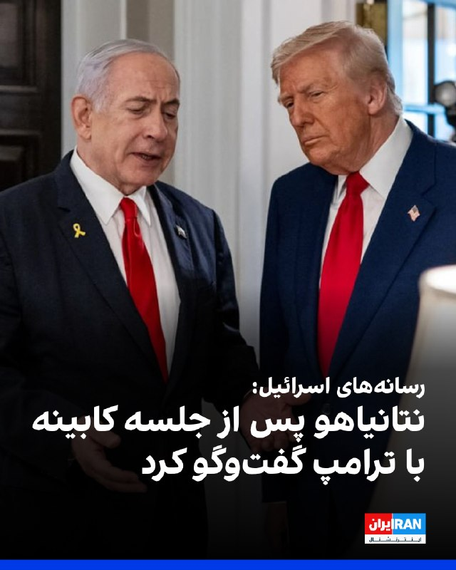

شبکه کان اسرائیل گزارش داد در پی گسترش درگیری‌ها در لبنان و همزمان با مذاکرات آمریکا و جمهوری اسلامی، دونالد ترامپ و بنیامین نتانیاهو تلفنی گفت‌وگو کردند.

همزمان کانال ۱۲ اسرائیل خبر داد که گفت‌وگوی ترامپ و نتانیاهو پس از نشست کابینه اسرائیل که حدود دو ساعت و نیم طول کشید، انجام شده است.
https://iranintl.com/202605264065

## IranIntlTV — post 339150

  <a href="telegram/content/IranIntlTV_339150_1779824375.mp4" target="_blank">🎬 Download video</a>

خبرگزاری تسنیم به نقل از یک منبع آگاه نزدیک به تیم مذاکره‌کننده حکومت ایران گزارش داد مذاکره‌کنندگان جمهوری اسلامی به دنبال آزادسازی ۲۴ میلیارد دلار در چارچوب یادداشت تفاهم احتمالی با آمریکا هستند.

گفت‌وگو با علی شیرازی، عضو تحریریه ایران‌اینترنشنال و آرام حسامی استاد علوم سیاسی کالج مونتگومری
@iranintltv

## IranIntlTV — post 339149

  

یسرائیل کاتس، وزیر دفاع اسرائیل، در شبکه ایکس اعلام کرد ارتش این کشور به دستور بنیامین نتانیاهو و او، محمد عوده، رهبر شاخه نظامی حماس و از طراحان حمله هفتم اکتبر، را در غزه هدف قرار داده است.

وزیر دفاع اسرائیل اعلام کرد عوده مسئول کشته، ربوده و زخمی شدن شمار زیادی از شهروندان اسرائیلی و نیروهای ارتش این کشور بوده است.

او افزود: «ما به تعقیب همه کسانی که در حمله هفتم اکتبر نقش داشتند ادامه خواهیم داد؛ دیر یا زود، اسرائیل همه آن‌ها را پیدا خواهد کرد.»

همچنینن بنیامین نتانیاهو، نخست‌وزیر اسرائیل اعلام کرد که اسرائیل به فرمانده جدید شاخه نظامی حماس در غزه حمله کرده است.
https://iranintl.com/202605265269

## IranIntlTV — post 339147

  

روزنامه نیویورک‌ تایمز به نقل از دو مقام آمریکایی نوشت که حملات نظامی آمریکا به هدافی در جنوب ایران در شامگاه دوشنبه پس از آن انجام شد که تحلیلگران اطلاعاتی مجموعه‌ای از اقدامات نظامی جمهوری اسلامی را شناسایی کردند که به‌طور «بالقوه تهدیدآمیز» بود.

این رسانه در گزارشی کوتاه که شامگاه سه‌شنبه منتشر شد، نوشت این مقام‌ها گفتند جمهوری اسلامی چند پهپاد انتحاری را در نزدیکی شماری از حدود ۲۴ ناو جنگی نیروهای آمریکا در محدوده دریای عمان و دریای عرب به پرواز درآورده بودند. این ناوها در اجرای عملیات محاصره دریایی بندرهای جنوب ایران نقش دارند.

به گفته این منابع که به دلیل حساسیت مسائل عملیاتی نخواستند نامشان فاش شود، تحلیلگران اطلاعاتی آمریکا تحرکاتی را در برخی از مواضع موشک‌های زمین‌به‌هوای جمهوری اسلامی در نزدیکی تنگه هرمز شناسایی کردند که هواپیماهای تهاجمی مستقر در خشکی و ناوهای هواپیمابرِ فعال در عملیات محاصره دریایی را تهدید می‌کرد.

ادامه این گزارش را در وبسایت ایران‌اینترنشنال بخوانید.
https://iranintl.com/202605265826

## IranIntlTV — post 339146

  <a href="telegram/content/IranIntlTV_339146_1779824378.mp4" target="_blank">🎬 Download video</a>

۲۴ با فرداد فرحزاد
@iranintltv

## IranIntlTV — post 339145

  <a href="telegram/content/IranIntlTV_339145_1779824379.mp4" target="_blank">🎬 Download video</a>

یک شهروند در پیامی به ایران اینترنشنال درباره تجمعات شبانه حامیان حکومت گفت که آن‌ها برای برنج و روغن تجمع می‌کنند اما مردم معترض در انقلاب ملی برنج‌ را زیر پای خود له کردند. پیام او با هوش مصنوعی خوانده شده است.

## IranIntlTV — post 339144

  <a href="telegram/content/IranIntlTV_339144_1779824380.mp4" target="_blank">🎬 Download video</a>

مهدی مهدوی‌آزاد در برنامه «چشم‌انداز» گفت: «علی خامنه‌ای با نحوه برخورد با جایگاه ریاست‌جمهوری، این مقام را عملا بی‌اعتبار کرده است. مواضع مسعود پزشکیان درباره مذاکره و جنگ جدی گرفته نمی‌شود و حتی عذرخواهی او از کشورهای عربی نیز با واکنش تند داخلی روبه‌رو شد.»
@iranintltv

## IranIntlTV — post 339143

  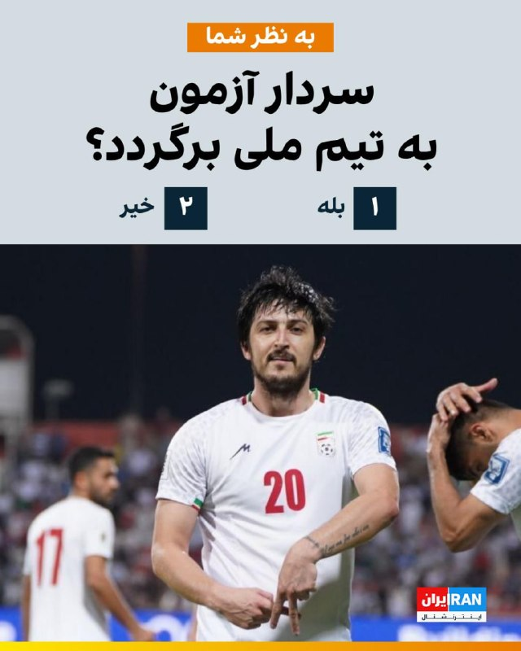

🔻سردار آزمون، مهاجم ۳۱ ساله و دومین گلزن برتر تاریخ تیم ملی فوتبال ایران، پس از موضع‌گیری در مخالفت با جمهوری اسلامی، حمایت از اعتراضات مردمی و انتشار تصویری از دیدارش با محمد بن راشد آل مکتوم، حاکم دبی، با انتقاد رسانه‌های حکومتی و نهادهای نزدیک به حکومت روبه‌رو شد و از تیم ملی کنار گذاشته شد.

🔹آزمون پس از کنار گذاشته شدن، با انتشار استوری‌ای برای بازیکنان و کادر فنی تیم ملی آرزوی موفقیت کرد.

🔹عبدالکریم حسین‌زاده، معاون مسعود پزشکیان، در پیامی در ایکس با اشاره به یادداشت سردار آزمون، او را «سرمایه ملی» خواند و خواستار بازگشتش به تیم ملی فوتبال شد.

🔹همچنین روزنامه حکومتی فرهیختگان خواستار عذرخواهی سردار آزمون برای بازگشت به تیم ملی شده است. این روزنامه در یادداشتی نوشت: «اگر قرار به بازگشت او باشد، همه منتظر شنیدن یک عذرخواهی واقعی و صادقانه هستند.»

🔹به نظر شما، سردار آزمون باید به تیم ملی برگردد؟

🔹برای شرکت در این نظرسنجی، به صفحه اینستاگرام ایران اینترنشنال ورزشی مراجعه کنید؛👇🏽

https://www.instagram.com/p/DYz-lhagvot/

@iranintltvsport

## IranIntlTV — post 339142

  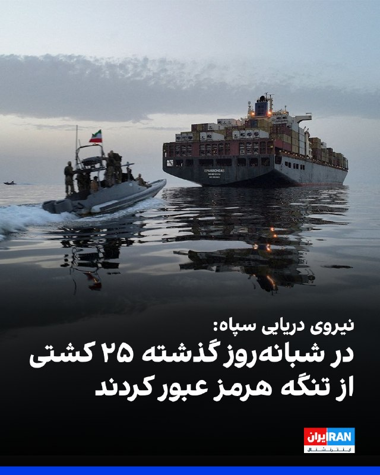

روابط عمومی نیروی دریایی سپاه پاسداران اعلام کرد که طی شبانه‌روز گذشته ۲۵ فروند کشتی اعم از نفتکش، کانتینربر و سایر کشتی‌های تجاری پس از کسب مجوز از نیروی دریایی سپاه، از تنگه هرمز عبور کردند.

سپاه افزود: کنترل هوشمند تنگه هرمز با اقتدار در حال انجام است و هرگونه تجاوز با ضربات کوبنده پاسخ داده خواهد شد.
https://iranintl.com/202605266414

## IranIntlTV — post 339141

  

گروه نت‌بلاکس در حساب خود در شبکه اجتماعی ایکس اعلام کرد اتصال اینترنت در ایران افزایش بیشتری یافته و به ۸۶ درصد رسیده است، شبکه‌های موبایل و بخش‌های دیگری از اینترنت نیز دوباره به اینترنت جهانی متصل شده‌اند.
نت‌بلاکس افزود «فیلترنت» همچنان برقرار است اما امکان دور زدن آن وجود دارد. همچنین واتس‌اپ اکنون محدود شده و برای دسترسی به آن نیاز به ابزارهای دور زدن فیلتر است و برخی کاربران همچنان به اینترنت جهانی دسترسی ندارند.
https://iranintl.com/202605268926

## IranIntlTV — post 339140

  <a href="https://t.me/IranintlTV/339140" target="_blank">📎 Download file</a>

🎧نسخه صوتی تیتراول با نیوشا صارمی: آغاز عملیات گسترده زمینی اسراییل در لبنان؛ نشست کمپ‌دیوید درباره ایران
@iranintlTV

## IranIntlTV — post 339139

  <a href="telegram/content/IranIntlTV_339139_1779824384.mp4" target="_blank">🎬 Download video</a>

بر اساس گزارش اختصاصی ایران‌اینترنشنال، مهران محقق، فردی که با خودرو به تجمع ایرانیان در تورنتو حمله کرده بود، یک روز پس از حمله با قید وثیقه آزاد شد و جلسه محاکمه او در اواخر ماه آینده میلادی برگزار می‌شود.

گزارش مهسا مرتضوی، خبرنگار ایران‌اینترنشنال
@iranintltv

## IranIntlTV — post 339138

  

کانال ۱۴ اسرائیل گزارش داد برآوردها در اسرائیل نشان می‌دهد حمله به ایران فعلا از دستور کار خارج شده و ترامپ به دنبال جلوگیری از بی‌ثباتی امنیتی است.

همزمان کانال ۱۲ گزارش داد آمریکا به اسرائیل گفته به بیروت حمله نکند و ساختمان‌ها را در آنجا هدف قرار ندهد.
کانال ۱۲ افزود که یک مقام ارشد اسرائیلی تاکید کرد در صورت فراهم بودن فرصت عملیاتی، مجوز انجام ترورهای هدفمند در بیروت وجود دارد.
https://iranintl.com/202605265818

## IranIntlTV — post 339137

  <a href="telegram/content/IranIntlTV_339137_1779824385.mp4" target="_blank">🎬 Download video</a>

براساس گزارش اختصاصی ایران‌اینترنشنال، محمدباقر قالیباف، رییس مجلس جمهوری اسلامی و رییس هیئت مذاکره‌کننده جمهوری اسلامی، در روزهای گذشته نقشی ویژه در به حاشیه رفتن سعید جلیلی، عضو شورای عالی امنیت ملی، برعهده داشته است.

گفت‌وگو با مسعود کاظمی، روزنامه‌نگار
@iranintltv

## IranIntlTV — post 339136

  <a href="telegram/content/IranIntlTV_339136_1779824387.mp4" target="_blank">🎬 Download video</a>

ایرانیان بریتانیا روز سه‌شنبه با تشکیل تجمعی در مقابل پارلمان بریتانیا علیه اعدام و کشتار شهروندان در ایران شعار داده و خواستار کمک جامعه جهانی شدند. آن‌ها تصویر شاهزاده رضا پهلوی را در تجمع خود قرار دادند.

## IranIntlTV — post 339135

  <a href="telegram/content/IranIntlTV_339135_1779824389.mp4" target="_blank">🎬 Download video</a>

بنیامین نتانیاهو، نخست‌وزیر اسرائیل، اعلام کرد ارتش این کشور با «نیروهای گسترده زمینی» در جنوب لبنان در حال عملیات است و کنترل «مناطق راهبردی» را در دست می‌گیرد.

گفت‌وگو با بابک اسحاقی، خبرنگار ایران‌اینترنشنال
@iranintltv

## Persian_Trend_Official — post 15085

کانال رسمی پرشین ترند pinned «https://youtube.com/live/TrPiEz5YpyQ?feature=share»

## Persian_Trend_Official — post 15084

https://youtube.com/live/TrPiEz5YpyQ?feature=share

---
📅 بروزرسانی: 1405/03/05 21:14
---

## ChizBergerz — post 46829

  <a href="telegram/content/ChizBergerz_46829_1779817446.mp4" target="_blank">🎬 Download video</a>

خطاب دوستانی که تازه وصل شدن این چالش تازه اومده، ببینید از دنیا عقب نمونید:

@ChizBergerz

## ChizBergerz — post 46828

  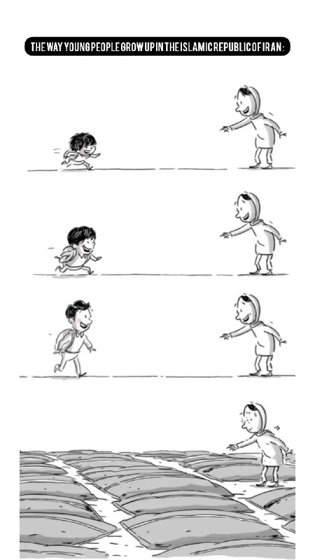

اینترنت وصل شد ولی عادی سازی نکنید!💔🖤

@ChizBergerz

## ChizBergerz — post 46826

آره فشار بخورید...😂😂

نیروهای مذهبی بشدت بابت اینکه دیشب آمریکا حمله کرده و رژیم از ترس جنگ دوباره جواب نداده بدجوری شاکی شدن😂
@ChizBergerz

## ChizBergerz — post 46825

⭕️ رایگان بدون واریز شرط های فوتبالی ببند از همون اول موجودی 500 هزارتومانه
❌ 
🎉 500 هزارتومن رایگان فقط با ثبت نام بدون هیچگونه واریزی! 
💳 پرداخت مستقیم و سریع بدون واسطه، بدون دردسر، واریز و برداشت در سریع‌ترین زمان ممکن 
⌛ پشتیبانی 24 ساعته 
🌐 Winro.io…

## ChizBergerz — post 46824

  

⭕️ رایگان بدون واریز شرط های فوتبالی ببند از همون اول موجودی 500 هزارتومانه
❌

🎉 500 هزارتومن رایگان فقط با ثبت نام بدون هیچگونه واریزی!

💳 پرداخت مستقیم و سریع بدون واسطه، بدون دردسر، واریز و برداشت در سریع‌ترین زمان ممکن

⌛ پشتیبانی 24 ساعته

🌐 Winro.io

🌐 Winro.io
کانال بونوس های رایگان g5

📱 @winro_io

## ChizBergerz — post 46823

ShirOKhorshid v.2026.05.24 [Tel; @ChizBergerz].apk

## ChizBergerz — post 46822

  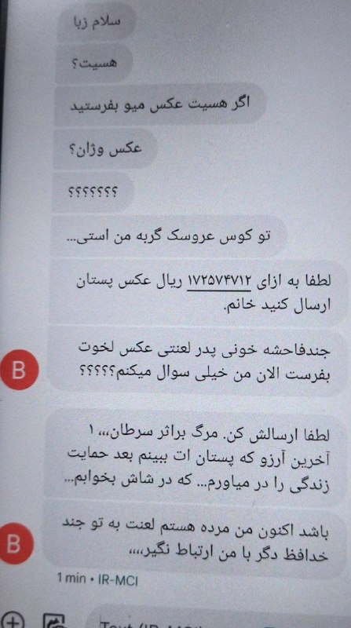

این چه سمی بود فرستادین داریکت کانال😐😂

@ChizBergerz

## ChizBergerz — post 46821

  <a href="telegram/content/ChizBergerz_46821_1779817452.mp4" target="_blank">🎬 Download video</a>

دو رو بودن، حرامزادگی شما و جنایاتی که کردید با میلیاردها پول و خدمت به این مردم پاک نخواهد شد. با برگردوندن چیزهایی که حق ما بوده انتظار بخشیدن از طرف ما نداشته باشید.

@ChizBergerz

## ChizBergerz — post 46820

  

اینا دیگه چه جونورایی هستن؟ اصلا جنسیتشون مشخص نیست، از اونجایی که آخوندا پسر بازن مشخصه هرشب زیر آخوندا میخوابن. @ChizBergerz

## ChizBergerz — post 46819

  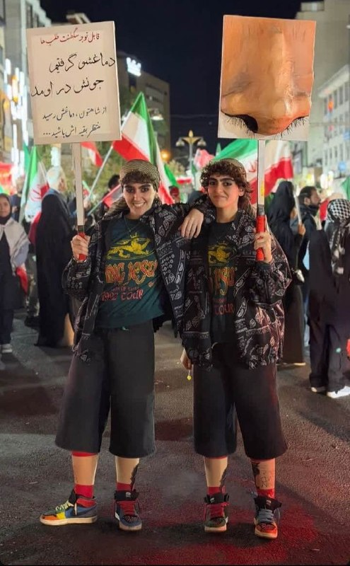

اینا دیگه چه جونورایی هستن؟ اصلا جنسیتشون مشخص نیست، از اونجایی که آخوندا پسر بازن مشخصه هرشب زیر آخوندا میخوابن.

@ChizBergerz

## ChizBergerz — post 46818

  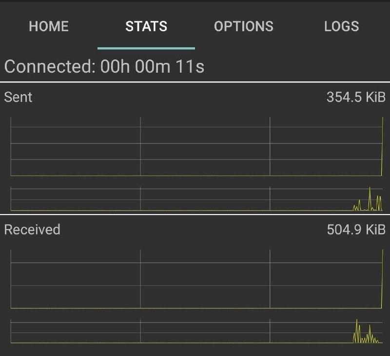

ShirOKhorshid v.2026.05.24 [Tel; @ChizBergerz].apk

## ChizBergerz — post 46817

  

کانفیگ فروشا وقتی می‌نويسن خوشحالیم که همتون وصل شدین:

@ChizBergerz

## ChizBergerz — post 46816

  <a href="telegram/content/ChizBergerz_46816_1779817457.mp4" target="_blank">🎬 Download video</a>

وضعیت بله، روبیکا و تمام اپ‌هایی که قراره خلوت شن:

@ChizBergerz

## ChizBergerz — post 46815

  

نسل اینا کِی قراره منقرض شه؟😐😂

@ChizBergerz

## ChizBergerz — post 46814

  <a href="telegram/content/ChizBergerz_46814_1779817459.webm" target="_blank">🎬 Download video</a>

🚨 اگر همین الان توی سایت #وینرو عضو بشی 
🤩
🤩
🤩 هزار تومان شارژ رایگان میگیری
❕ 
✅ من خودم عضو شدم بدون واریز ۵۰۰ تومان گرفتم باهاش فوتبال پیش بینی کردم پولم شد ۲ میلیون 
❕ 
💚خیلی راحت هم برداشت کردم کل پولم رو 
💵 
💳 پرداخت مستقیم و سریع بدون واسطه، بدون دردسر،…

## ChizBergerz — post 46813

  <a href="telegram/content/ChizBergerz_46813_1779817460.webm" target="_blank">🎬 Download video</a>

🚨 اگر همین الان توی سایت #وینرو عضو بشی 
🤩
🤩
🤩 هزار تومان شارژ رایگان میگیری
❕

✅ من خودم عضو شدم بدون واریز ۵۰۰ تومان گرفتم باهاش فوتبال پیش بینی کردم پولم شد ۲ میلیون 
❕

💚خیلی راحت هم برداشت کردم کل پولم رو 
💵

💳 پرداخت مستقیم و سریع بدون واسطه، بدون دردسر، واریز و برداشت در سریع‌ترین زمان ممکن

🔴این فرصت محدود رو از دست ندید:

🌐 Winro.io

🌐 Winro.io
کانال بونوس های رایگان r5

📱 @winro_io

## rodast_omiddana — post 71992

😂
😂 آره فشار بخورید..
نیروهای مذهبی بشدت بابت اینکه دیشب آمریکا حمله کرده و رژیم از ترس جنگ دوباره جواب نداده بدجوری شکار هستند

## rodast_omiddana — post 71991

▶️
🎬
🔴
🔴
🔴 برنامه امشب تا یک ساعت و نیم دیگه:
*جلسه کم‌سابقه کمپ دیوید برای حمله مجدد به جمهوری اسلامی
*دیشب چرا رژیم جواب حمله آمریکا را نداد؟
لینک یوتیوب:
https://www.youtube.com/@omiddana

## rodast_omiddana — post 71990

🎬 بیانیه کامران غضنفری علیه مذکرات...
لینک یوتیوب:
https://www.youtube.com/watch?v=qERGfPSebM0

## rodast_omiddana — post 71989

  <a href="telegram/content/rodast_omiddana_71989_1779817460.mp4" target="_blank">🎬 Download video</a>

🚨 شعار دیشب مذهبیا علیه مجلس
"گرونی، قانون تنگه و... چرا مجلس تعطیله"

## rodast_omiddana — post 71988

  <a href="telegram/content/rodast_omiddana_71988_1779817463.webm" target="_blank">🎬 Download video</a>

🚨 یه بیشرفی چتهای علی آقا با خودشو منتشر کرده که البته پاسخش بزودی به صورت حقوقی در دادگاه فنلاند داده خواهد شد ولی نکته اینجاست ده ها پیام از ایران دارم که میگن این بخش چت باعث شده "علی کریمی" خیلی محبوب تر از قبل بشه و مردم بیشتر عاشقش بشن..
یعنی میاید طرفو خراب کنید بیشتر محبوبش میکنید..
شخصا علی آقا احترامش برای من و هر کس که دارای عشق به وطن هست بیشتر از قبل شد..

## rodast_omiddana — post 71987

  <a href="telegram/content/rodast_omiddana_71987_1779817464.webm" target="_blank">🎬 Download video</a>

🚨 خب حالا یک سوال مهم
فکر کردید بعد از 18 و 19 دیماه، ما میزاریم ش.یعه در ایران باقی بماند؟
ما ریشه هاتونو زدیم، زدن چهارتا جوجه ماسون ش.یعه که جز تفریحاتمون هست..

## rodast_omiddana — post 71986

🎬خوش چشم:
تا پولهای بلوکه شده را نگیریم توافق را امضا نمیکنیم
لینک یوتیوب:
https://www.youtube.com/watch?v=BS-AdXsjQws

## rodast_omiddana — post 71985

  <a href="telegram/content/rodast_omiddana_71985_1779817464.webm" target="_blank">🎬 Download video</a>

🚨آتش‌بس در حال فروپاشی است: جنگجویان ارتش دفاعی اسرائیل شروع به حمله به اهداف فراتر از خط زرد در لبنان کرده‌اند.

## rodast_omiddana — post 71984

  <a href="telegram/content/rodast_omiddana_71984_1779817464.webm" target="_blank">🎬 Download video</a>

🚨یک کشتی در سواحل عمان مورد حمله قرار گرفت

## rodast_omiddana — post 71983

  <a href="telegram/content/rodast_omiddana_71983_1779817464.webm" target="_blank">🎬 Download video</a>

🚨کانال ملی تی وی Mellig Tv
فرکانس: V 27500 10762
روی دو ماهواره Yahsat/TurkamanALAm

هر روز ساعت پنج بعدظهر ایران برنامه شب قبلمون پخش میشه و هر شب هنگام برنامه زنده در صورت امکان پخش میشویم..

## rodast_omiddana — post 71982

  <a href="telegram/content/rodast_omiddana_71982_1779817465.webm" target="_blank">🎬 Download video</a>

🚨 خبرگزاری معتبر فارس بازم ترکوند:
"اینترنت به صورت زمینی راهی تبریز شد"

## rodast_omiddana — post 71980

👑 این پیام خیلی بهم چسبید دمتون گرم❤️🌹

## rodast_omiddana — post 71979

  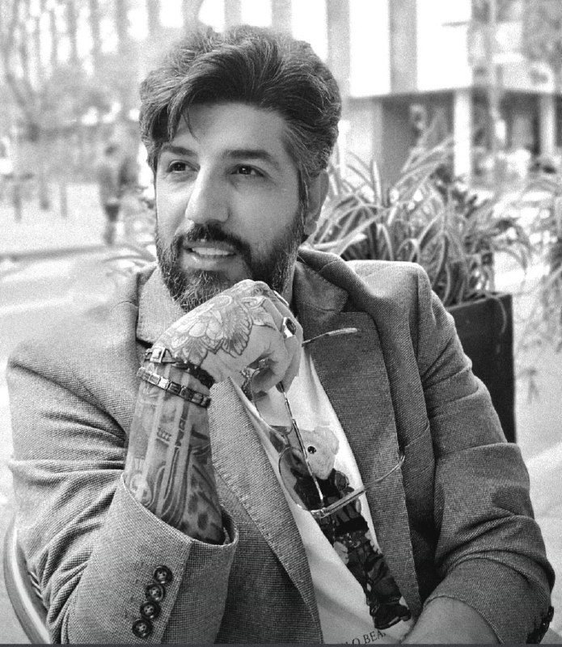

👑 از دیشب و با توجه به وصل شدن اینترنت بخشی از مردم، صدها پیام محبت آمیز و سپاسگزاری برای سطح و لِول برنامم دریافت کردم..
در این ایام برنامه ما به صورت ویس و ستلایت میلیونی در ایران شبانه دنبال شده و زین پس ما را مجبور میکنه با حساسیت بیشتری برنامه بسازیم، بنابراین منم باید روی خودم کار کنم که قدر موقعیت پیش آمده را بدانم و هم از نظر محتوایی سطح برنامه را بالا نگهدارم و هم از درگیری با کَف های روی آب بپرهیزم..
ببخشید که نمیشه پیامهاتونو عمومی منتشر کنم
دم همگی گرم

## rodast_omiddana — post 71978

  <a href="telegram/content/rodast_omiddana_71978_1779817466.mp4" target="_blank">🎬 Download video</a>

🚨 نخست وزیر در جلسه امنیتی امروز فیلمی بیرون داده، یعنی مادر بگرید بچه شیعه...

## rodast_omiddana — post 71977

  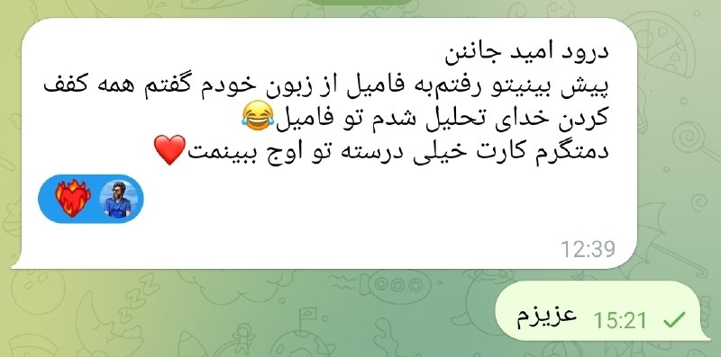

❤️❤️❤️❤️❤️

## KiriMohems — post 48012

🔴انگشت کردن ChatGPT روی خطوط همراه اول و ایرانسل برقرار شد

#Helsinki
@KiriMohems

## KiriMohems — post 48011

🔴فوری :
واتساپ تو کون نرو ترین اپلیکیشن هم تو بعضی مناطق رفع فیلتر شده و با اینترنت‌های خونگی بالا میاد.

#professor
@KiriMohems

## KiriMohems — post 48010

خوش برگشتید❤️

مدت زیادی خون دل خوردیم امیدوارم سالم و سلامت دور از غم و بگایی باشید

## KiriMohems — post 48009

  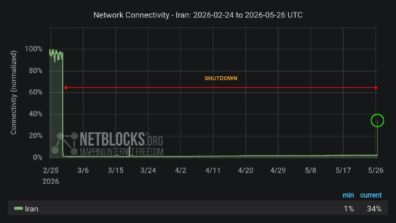

🔴نت بلاکس: نمودار سیخ کرده نشان‌دهنده بازگشت نسبی اتصال اینترنت بین‌الملل در ایران است.

#Helsinki
@KiriMohems

## KiriMohems — post 48008

🔴سولاخ چه ‌وب‌سایت‌هایی در دسترس قرار گرفتن؟

🔸 بررسی‌های دیجیاتو نشان می‌دهد از میان وب‌سایت‌های مهم، موارد زیر در دسترس قرار گرفته‌اند:
ویکی‌پدیا
اپ‌استور
پینترست (Pinterest)
کنوا (Canva)
نوشن (Notion)
تردز (Threads)
کال آو دیوتی (CallofDuty)
پابجی (Pubg)
یاهو
دراپ باکس
پلی استیشن
ایکس‌باکس

🔸 بازگشایی اینترنت به تدریج در حال انجام است. به همین علت ممکن است برخی از سرویس‌های بالا هنوز در دسترس گروهی از کاربران قرار نگرفته باشد.

#Helsinki
@KiriMohems

## SportBaadNews — post 252738

  

خطر سکته قلبی برا رئالیا
@SportBaadNews

## SportBaadNews — post 252737

  <a href="telegram/content/SportBaadNews_252737_1779817470.mp4" target="_blank">🎬 Download video</a>

🇧🇷 تیم ملی برزیل 1970 تو تصاویر 4K
@SportBaadNews

## SportBaadNews — post 252736

  <a href="telegram/content/SportBaadNews_252736_1779817474.webm" target="_blank">🎬 Download video</a>

🚨
⚽️ میدونم فوتبال بانوان به کیرتونه ولی الکسیا پوتیاس اسطوره تیم بانوان بارسلونا اعلام کرد آخر فصل بعد از 14 سال این باشگاه جدا میشه @SportBaadNews

## SportBaadNews — post 252735

پست جدید ترامپ راجب ایران در تروث سوشال @iMamlekat

## SportBaadNews — post 252734

  <a href="telegram/content/SportBaadNews_252734_1779817474.webm" target="_blank">🎬 Download video</a>

🚨
⚽️ میدونم فوتبال بانوان به کیرتونه ولی الکسیا پوتیاس اسطوره تیم بانوان بارسلونا اعلام کرد آخر فصل بعد از 14 سال این باشگاه جدا میشه
@SportBaadNews

## SportBaadNews — post 252733

  <a href="telegram/content/SportBaadNews_252733_1779817475.mp4" target="_blank">🎬 Download video</a>

حالا که اینترنتون دوباره وصل شده و مشکلی با دانلود کردن ویدیو های حجم بالا ندارید بشینید یکم ایسکو ببینید روحتون جلا پیدا کنه
@SportBaadNews

## SportBaadNews — post 252732

اپلیکیشن Hot vpn هم روی ایرانسل وصله

## SportBaadNews — post 252730

  <a href="https://t.me/SportBaadNews/252730" target="_blank">📎 Download file</a>

این دو تا اپلیکیشن رو چک کنید وصل میشن
@SportBaadNews

## SportBaadNews — post 252729

  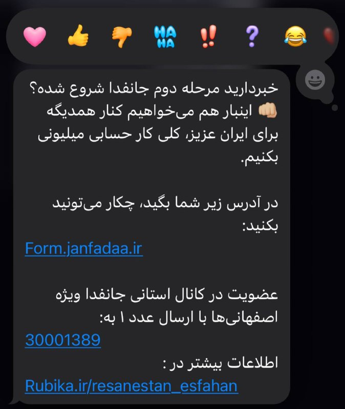

@SportBaadNews

## SportBaadNews — post 252728

vless://e61ab4f3-234b-4252-9735-88917a29872b@1:1?security=none&encryption=none&host=speedtest.net&headerType=http&type=tcp#%D8%AD%D8%AC%D9%85%2010%20%DA%AF%DB%8C%DA%AF%20%F0%9F%97%BD
vless://e61ab4f3-234b-4252-9735-88917a29872b@104.16.117.43:443?mode=auto&path=%2Fsibzaminiz&security=tls&encryption=none&extra=%7B%22headers%22%3A%7B%22User-Agent%22%3A%22Mozilla%2F5.0%28WindowsNT10.0%3BWin64%3Bx64%29AppleWebKit%2F537.36%28KHTML%2ClikeGecko%29Chrome%2F114.0.0.0Safari%2F537.36%22%7D%7D&insecure=0&host=uxr2.parhamm1.ir&fp=chrome&type=xhttp&allowInsecure=0#%D8%A8%DB%8C%D8%A7%20%D8%AA%D9%84%DA%AF%D8%B1%D8%A7%D9%85%20%3A%20NFT_2I%40
vless://e61ab4f3-234b-4252-9735-88917a29872b@104.16.89.120:443?path=%2F&security=tls&encryption=none&insecure=0&host=uxl2.parhamm1.ir&fp=random&type=ws&allowInsecure=0&sni=uxl2.parhamm1.ir#%D8%A8%DB%8C%D8%A7%20%D8%AA%D9%84%DA%AF%D8%B1%D8%A7%D9%85%20%3A%20NFT_2I%40
vless://e61ab4f3-234b-4252-9735-88917a29872b@104.16.7.70:443?mode=auto&path=%2Fsibzaminiz&security=tls&encryption=none&extra=%7B%22headers%22%3A%7B%22User-Agent%22%3A%22Mozilla%2F5.0%28WindowsNT10.0%3BWin64%3Bx64%29AppleWebKit%2F537.36%28KHTML%2ClikeGecko%29Chrome%2F101.0.4951.67Safari%2F537.36%22%7D%7D&insecure=0&host=fxr1.parhamm1.ir&fp=chrome&type=xhttp&allowInsecure=0#%D8%A8%DB%8C%D8%A7%20%D8%AA%D9%84%DA%AF%D8%B1%D8%A7%D9%85%20%3A%20NFT_2I%40
vless://e61ab4f3-234b-4252-9735-88917a29872b@104.16.7.70:443?path=%2F&security=tls&encryption=none&insecure=0&host=fxl1.parhamm1.ir&fp=random&type=ws&allowInsecure=0&sni=fx1.parhamm1.ir#%D8%A8%DB%8C%D8%A7%20%D8%AA%D9%84%DA%AF%D8%B1%D8%A7%D9%85%20%3A%20NFT_2I%40
vless://e61ab4f3-234b-4252-9735-88917a29872b@104.16.79.73:443?path=%2F&security=tls&encryption=none&insecure=0&host=fxl1.parhamm1.ir&fp=random&type=ws&allowInsecure=0&sni=fx1.parhamm1.ir#%D8%A8%DB%8C%D8%A7%20%D8%AA%D9%84%DA%AF%D8%B1%D8%A7%D9%85%20%3A%20NFT_2I%40

@SportBaadNews

## SportBaadNews — post 252727

سلام سریع بگید ایرانسل روی ویوا میاره سرعت خداا

## SportBaadNews — post 252726

  <a href="telegram/content/SportBaadNews_252726_1779817479.webm" target="_blank">🎬 Download video</a>

🚨
🚨 یه سری دوستان میگن ایرانسل هم وصل شده @SportBaadNews

## SportBaadNews — post 252725

  <a href="telegram/content/SportBaadNews_252725_1779817480.webm" target="_blank">🎬 Download video</a>

🚨 کانفیگ نپستر 
@SportBaadNews

## SportBaadNews — post 252724

  <a href="telegram/content/SportBaadNews_252724_1779817480.webm" target="_blank">🎬 Download video</a>

🚨
🚨 اینترنت بین الملل روی خطوط همراه اول هم وصل شد. @SportBaadNews

## SportBaadNews — post 252723

  <a href="telegram/content/SportBaadNews_252723_1779817481.webm" target="_blank">🎬 Download video</a>

🚨
🚨 اینترنت بین الملل روی خطوط همراه اول هم وصل شد.
@SportBaadNews

## SportBaadNews — post 252722

  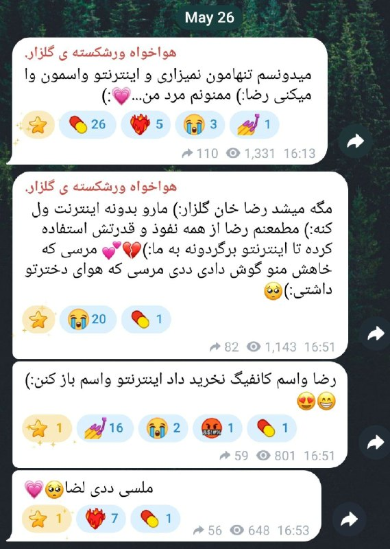

ترامپ کص ننه بزن اون بمب اتم لعنتی رو
@SportBaadNews

## SportBaadNews — post 252721

  

این دلقکو
@SportBaadNews

## SportBaadNews — post 252720

نه بابا فشار چیه؛ایشالله خوشبخت شین.

## SportBaadNews — post 252719

  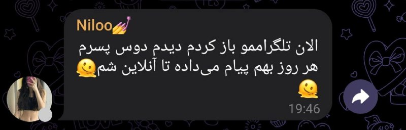

نه بابا فشار چیه؛ایشالله خوشبخت شین.

## IranIntlTV — post 339134

  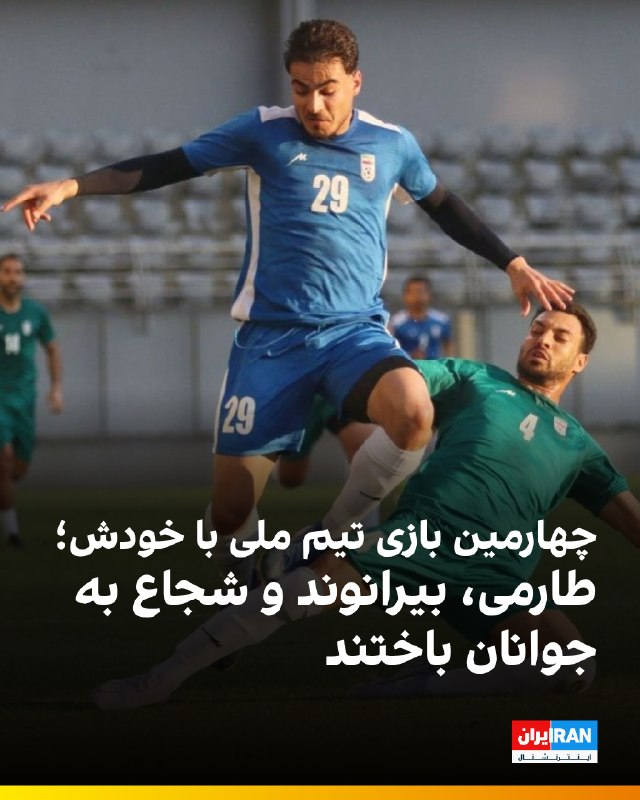

🔻تیم ملی فوتبال، در پی انزوای جمهوری اسلامی و انصراف حریفان تدارکاتی، برای چهارمین بار بازی درون‌تیمی برگزار کرد که در آن تیم آبی با نتیجه ۳-۲ تیم سبز را شکست داد.

🔹در ترکیب تیم سبز بازیکنانی چون علیرضا بیرانوند، مهدی طارمی، شجاع خلیل‌زاده، سامان قدوس و علی علیپور حضور داشتند.

🔹کسری طاهری دو بار و آریا یوسفی برای تیم آبی گلزنی کردند و هر دو گل تیم سبز را مهدی طارمی از روی نقطه پنالتی به ثمر رساند.

🔹تیم ملی پیش‌تر قرار بود پیش از جام جهانی مقابل پرتغال، اسپانیا، مقدونیه و آنگولا بازی تدارکاتی برگزار کند، اما همه این تیم‌ها از دیدار با ایران انصراف دادند.

🔹تیم ملی قرار است ۸ خرداد در دیداری تدارکاتی به مصاف گامبیا برود و ۱۴ خرداد نیز در ترکیه برابر تیم ملی مالی بازی کند.

@iranintltvsport

## IranIntlTV — post 339133

  <a href="telegram/content/IranIntlTV_339133_1779817485.mp4" target="_blank">🎬 Download video</a>

حمله آمریکا به جنوب ایران و تهدید سپاه پاسداران و تاکید بر حق پاسخ‌گویی، احتمال فروپاشی گفت‌وگوها و توافق را افزایش داده است. همزمان مقام‌های ایالات متحده گفتند امکان رسیدن به توافق هنوز منتفی نشده است.

گفت‌وگو با فرزین ندیمی، پژوهشگر ارشد امور دفاعی و امنیتی در موسسه واشینگتن
@iranintltv

## IranIntlTV — post 339132

  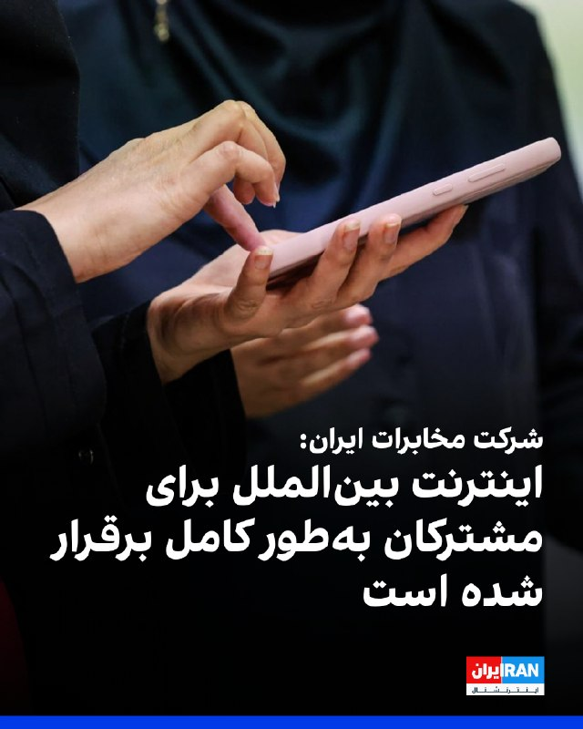

شرکت مخابرات ایران اعلام کرد که اینترنت بین‌الملل برای مشترکان این شرکت به طور کامل برقرار شده است.

به گزارش سیتنا، این شرکت به مشترکان خود توصیه کرد که در صورت بروز اختلال در دسترسی به اینترنت، به راه‌اندازی مجدد مودم اقدام کنند.

این در حالی است که فیلترینگ جمهوری اسلامی بر اینترنت، همچنان برقرار است.
https://iranintl.com/202605265597

## IranIntlTV — post 339131

  <a href="telegram/content/IranIntlTV_339131_1779817488.mp4" target="_blank">🎬 Download video</a>

امیرحسین ثابتی، نماینده تهران در مجلس، گفت برخی با روایت‌های نادرست، تصمیم‌گیری در جمهوری اسلامی را دیکتاتورمآبانه جلوه می‌دهند. او با رد این برداشت، تاکید کرد علی خامنه‌ای و مجتبی خامنه‌ای، رهبر کشته‌شده و رهبر جدید جمهوری اسلامی، دیکتاتور نیستند و تصمیم‌ آنها بر پایه خواست مردم است.

پیش‌تر، مسعود پزشکیان گفته بود در جریان جنگ ۱۲ روزه با علی خامنه‌ای دیدار داشته و او درباره چگونگی انجام مذاکره توضیح داده و قبول کرده که مذاکره انجام شود.
@iranintltv

## IranIntlTV — post 339130

  <a href="telegram/content/IranIntlTV_339130_1779817490.mp4" target="_blank">🎬 Download video</a>

جمهوری اسلامی حملات آمریکا به مواضعی در جنوب ایران را نقض آتش‌بس خواند و سپاه پاسداران نیز تهدید به پاسخ قطعی کرد.

گفت‌وگو با شهیر شهیدثالث، روزنامه‌نگار و تحلیل‌گر سیاسی
@iranintltv

## IranIntlTV — post 339129

  

مسعود پزشکیان در پیامی به مناسبت عید قربان، نوشت که جمهوری اسلامی دست برادری به سوی کشورهای اسلامی دراز کرده و همزمان در صیانت از اقتدار خود ذره‌ای تردید ندارد.

او پیش‌تر نیز تلفنی با سران قطر، مصر، عمان، مالزی، ترکیه و جمهوری آذربایجان، گفت‌وگو کرد.
https://iranintl.com/202605263908

## IranIntlTV — post 339128

  

دونالد ترامپ در شبکه تروث سوشال نوشت معاینه شش‌ماهه خود را در مرکز پزشکی نظامی والتر رید به پایان رسانده و نتایج آن کاملا مطلوب بوده است. او از پزشکان و کارکنان این مرکز قدردانی کرد و گفت در حال بازگشت به کاخ سفید است.
https://iranintl.com/202605260974

## IranIntlTV — post 339127

  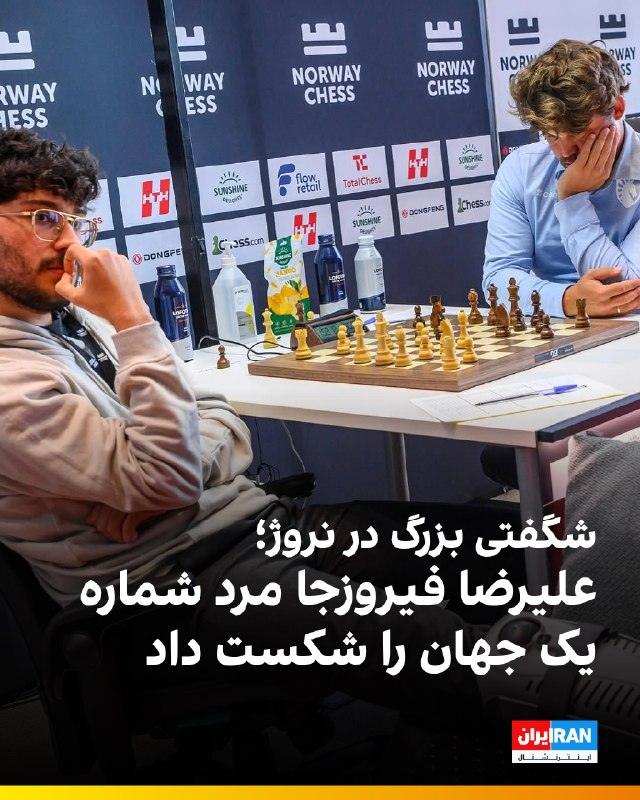

🔻علیرضا فیروزجا، نماینده فرانسه در دور نخست رقابت‌های شطرنج نروژ موفق شد مگنوس کارلسن، مرد شماره یک شطرنج جهان را شکست دهد؛ آن هم در حالی که به دلیل آسیب‌دیدگی مچ پا با کمک صندلی مخصوص بازی می‌کرد.

🔹فیروزجا هفته گذشته پس از سقوط از روی سکو در مسابقات بخارست مصدوم شد.

@iranintltvsport

## IranIntlTV — post 339126

  <a href="telegram/content/IranIntlTV_339126_1779817496.mp4" target="_blank">🎬 Download video</a>

یک شهروند با ارسال پیامی به ایران اینترنشنال توافق احتمالی دونالد ترامپ با جمهوری اسلامی را خیانت به مردم ایران می‌داند. پیام او با هوش مصنوعی خوانده شده است.

## IranIntlTV — post 339125

  <a href="telegram/content/IranIntlTV_339125_1779817498.mp4" target="_blank">🎬 Download video</a>

یک شهروند با ارسال پیامی به ایران اینترنشنال خطاب به رییس‌جمهور آمریکا می‌گوید که باید مقابله با جمهوری اسلامی را به بنیامین نتانیاهو بسپرد. صدای او با هوش مصنوعی خوانده شده است.

## IranIntlTV — post 339124

  

گیدئون سعار، وزیر خارجه اسرائیل، در واکنش به پستی منتسب به مجتبی خامنه‌ای که موجودیت اسرائیل را تهدید کرده بود، در شبکه ایکس نوشت: «آشنا به نظر می‌رسد. یادم هست فردی با نام‌خانوادگی مشابه قبلا چنین حرف‌هایی می‌زد. راستی، کجایی؟»

علی خامنه‌ای، رهبر کشته‌شده جمهوری اسلامی، نیز ۱۸ شهریور ۱۳۹۴ گفته بود که اسرائیل، «۲۵ سال آینده را نخواهد دید.»
https://iranintl.com/202605269198

## IranIntlTV — post 339123

  <a href="telegram/content/IranIntlTV_339123_1779817502.mp4" target="_blank">🎬 Download video</a>

تیتراول با نیوشا صارمی، سه‌شنبه ۵ خرداد
@iranintltv

## IranIntlTV — post 339122

  <a href="telegram/content/IranIntlTV_339122_1779817504.mp4" target="_blank">🎬 Download video</a>

دو نماینده عضو جبهه پایداری با انتقاد شدید از قالیباف و پزشکیان گفتند در متن توافق شده با آمریکا، خطوط قرمز مجتبی خامنه‌ای رعایت نشده. امیرحسین ثابتی گفت با توافق هم دوباره جنگ می‌شود و ترور مقامات ادامه می‌یابد. دلیل این مخالفت‌های برنامه‌ریزی شده چییست؟گزارشی از مجتبا پورمحسن
@iranintltv

## IranIntlTV — post 339121

  

مسعود پزشکیان، رییس دولت جمهوری اسلامی، به‌صورت تلفنی با رجب طیب اردوغان، الهام علی‌اف و عبدالفتاح السیسی، روسای جمهور ترکیه، آذربایجان و مصر، شیخ تمیم بن حمد آل ثانی، امیر قطر، هیثم بن طارق، سلطان عمان و انور ابراهیم، نخست‌وزیر مالزی، درباره تحولات خاورمیانه گفت‌وگو کرد.
https://iranintl.com/202605260356

## IranIntlTV — post 339120

  <a href="https://t.me/IranintlTV/339120" target="_blank">📎 Download file</a>

🎧نسخه صوتی اخبار شبانگاهی | سه‌شنبه ۵ خرداد
@iranintlTV

## IranIntlTV — post 339119

  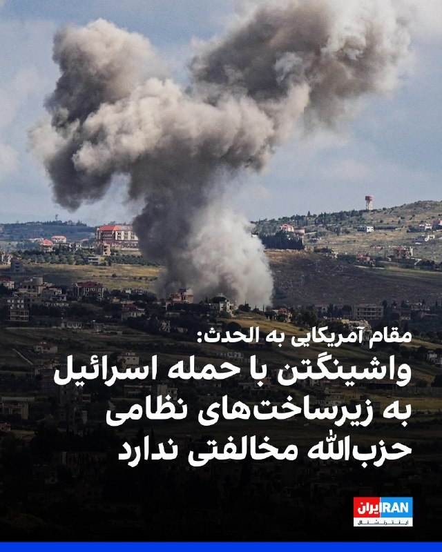

الحدث به نقل از یک منبع آمریکایی گزارش داد اسرائیل در حال حاضر بر جلوگیری از تهدید عمق سرزمینی خود از سوی حزب‌الله تمرکز کرده است.

این منبع افزود هدف کنونی اسرائیل ورود به یک رویارویی جامع بر سر سلاح‌های حزب‌الله یا نقش داخلی این گروه نیست.

بر اساس این گزارش، اسرائیل ممکن است عملیات خود را فراتر از «خط زرد» و حتی به مناطق عمیق‌تر گسترش دهد.

یک منبع دیگر به الحدث گفت واشینگتن با هدف قرار دادن زیرساخت‌های نظامی حزب‌الله و کاهش توانمندی‌های آن از سوی اسرائیل مخالفتی ندارد و تشدید اخیر عملیات نظامی اسرائیل در جنوب لبنان را منفی ارزیابی نمی‌کند.

این منبع همچنین گفت اسرائیل با هدف بازگرداندن ساکنان مناطق شمالی به خانه‌هایشان اقدام می‌کند و افزود حزب‌الله با استفاده از پهپادها و سخنان اخیر نعیم قاسم مسئول فروپاشی روند کاهش تنش است.
https://iranintl.com/202605262713

## IranIntlTV — post 339117

  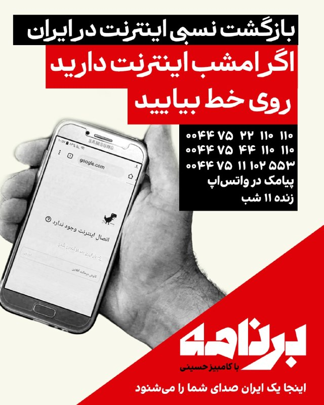

نت‌بلاکس، نهاد ناظر بر دسترسی آزاد به اینترنت و اختلال‌های شبکه، از بازگشت جزئی اتصال به اینترنت در ایران خبر داد.

اگر امشب اینترنت دارید، روی خط بیایید.

«برنامه» صدای شماست.

ما شما را، بدون نوبت، مستقیم از ایران روی خط می‌آوریم.

بیایید و روایت خود را برای همیشه ثبت کنید.

تاریخ با صدای شما نوشته می‌شود.

برای شرکت در برنامه، همین حالا در واتس‌اپ پیام بدهید: ۰۰۴۴۷۵۲۲۱۱۰۱۱۰

۰۰۴۴۷۵۴۴۱۱۰۱۱۰

۰۰۴۴۷۵۱۱۱۰۲۵۵۳

«برنامه با کامبیز حسینی»

«یک ایران صدای شما را می‌شنود»
@iranintltv

## IranIntlTV — post 339116

  

منابع آمریکایی در گفت‌وگو با العربیه گزارش‌ها درباره از سرگیری کمک‌رسانی در تنگه هرمز را تکذیب کردند.

پیشتر وال‌استریت‌ژورنال در گزارشی عنوان کرده بود که نیروی دریایی آمریکا کمک‌رسانی و هدایت کشتی‌ها در تنگه هرمز را از سر گرفته است.

https://iranintl.com/202605267877

## IranIntlTV — post 339115

  

سی‌بی‌اس‌نیوز به نقل از منابع آگاه گزارش داد دونالد ترامپ صبح چهارشنبه در کمپ دیوید نشست کابینه برگزار می‌کند. نیویورک‌پست نوشت همه اعضای کابینه حضور خواهند داشت و جنگ ایران محور اصلی گفت‌وگوهاست. کاخ سفید اعلام کرد تولسی گبرد نیز در این نشست شرکت می‌کند.
https://iranintl.com/202605262754

## IranIntlTV — post 339114

  <a href="telegram/content/IranIntlTV_339114_1779817512.mp4" target="_blank">🎬 Download video</a>

بر اساس اطلاعات رسیده به ایران‌اینترنشنال، عباس یحیی‌بیگی، فوتبالیست اراکی و بازیکن پیشین لیگ برتر، از زمان اعتراضات دی‌ماه در بازداشت است. همزمان دو ملی‌پوش پیشین فوتبال اعلام کرده‌اند او به محاربه متهم شده و در خطر صدور حکم اعدام قرار دارد.
جزییات بیشتر با مهدی رستم‌پور، روزنامه‌نگار ورزشی
@iranintltv

## Persian_Trend_Official — post 15083

⭕️لایو یوتیوب امشب ساعت ۲۲ برگزار میشود

🫆:Tony

📌 @persian_trend_official
پرشین ترند | متفاوت‌ترین کانال نظامی

## Persian_Trend_Official — post 15082

  <a href="telegram/content/Persian_Trend_Official_15082_1779817515.mp4" target="_blank">🎬 Download video</a>

تصاویری از لاشۀ پهپادی که دیروز با آتش سامانه جديد آرش‌های کمان‌گیر سپاه ساقط شد.

👩‍💻@PhantomDirective

🆔@persian_trend_official
پرشین ترند | متفاوت‌ترین کانال نظامی

---
📅 بروزرسانی: 1405/03/05 17:51
---

## ChizBergerz — post 46812

  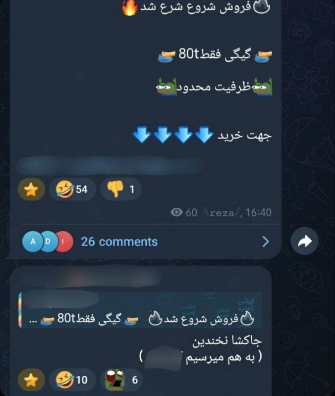

😂😂😂

@ChizBergerz

## ChizBergerz — post 46811

کاری باهامون کردن که از باز شدن اینترنتی که همه چی روش فیلتره و بازم باید دنبال فیلترشکن بگردیم؛ خوشحال میشیم.

+ ترامپ میگفت مردم ایران تو جهنم زندگی میکنن کسی باور نمیکرد‌.

## ChizBergerz — post 46810

  <a href="telegram/content/ChizBergerz_46810_1779805290.mp4" target="_blank">🎬 Download video</a>

وزیر قطع ارتباطات: اینترنت بین‌الملل تا کمتر از ۲۴ ساعت آینده برای همه اپراتورها در دسترس قرار میگیره. @ChizNewz

## rodast_omiddana — post 71976

🎬 شاهکار ترامپ در قبال رژیم ایران
مذاکرات در خدمت خاورمیانه جدید است
لینک یوتیوب:
https://www.youtube.com/watch?v=zf8rm2CJipw

## rodast_omiddana — post 71975

  <a href="telegram/content/rodast_omiddana_71975_1779805291.webm" target="_blank">🎬 Download video</a>

🚨 صاحب فست فودی که در روز مرگ خامنه ای شیرینی پخش کرده بود با دوسال زندان محکوم شد، وی گفته:
"من به علت افتتاح مغازه فست فودم، شیرینی پخش کردم"...

## rodast_omiddana — post 71974

  <a href="telegram/content/rodast_omiddana_71974_1779805291.webm" target="_blank">🎬 Download video</a>

🚨 یک سوال جدی
چرا محمدی گلپایگانی مسئول دفتر خامنه ای که همیشه به وی چسبیده بود، در روز حادثه استثنا در بیت نبوده؟

## rodast_omiddana — post 71973

  <a href="telegram/content/rodast_omiddana_71973_1779805291.webm" target="_blank">🎬 Download video</a>

🚨یعنی جمهوری اسلامی کشتن ۴ تا سربازشو نقض آتش بس ندونست و داره همچنان مذاکره میکنه؟
هرکشور دیگه ای بود دستکم دوتا موشک میپروند محض حفظ ظاهر...
پشمام

## rodast_omiddana — post 71972

  <a href="telegram/content/rodast_omiddana_71972_1779805291.webm" target="_blank">🎬 Download video</a>

🚨 جمهوری اسلامی به قطر و پاکستان گفته تا پول واریز نشود مذاکره نخواهد کرد

## rodast_omiddana — post 71971

  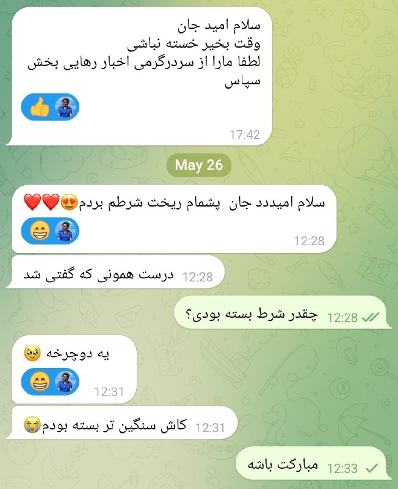

😍
😘
😅
😎
🤓

## rodast_omiddana — post 71970

  <a href="telegram/content/rodast_omiddana_71970_1779805292.webm" target="_blank">🎬 Download video</a>

🚨 از آسمان آفتاب مهتاب بهم وحی میکنند😅

## rodast_omiddana — post 71969

  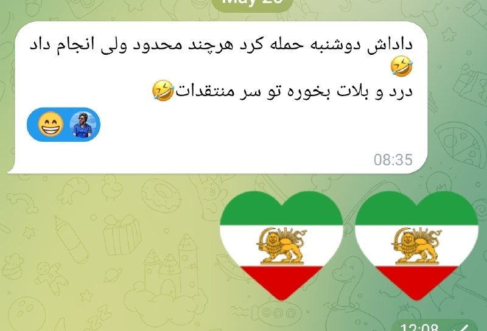

🔴 آیا ایمان نمی آورید؟
الهم صلی الا دانا و آل دانا😂

## rodast_omiddana — post 71968

  <a href="telegram/content/rodast_omiddana_71968_1779805293.mp4" target="_blank">🎬 Download video</a>

🚨 پسر تهدار تنگسیری در بخشی از مصاحبه اش تایید میکند که سران رژیم در پناهگاه ها زندگی می کنند.
راستی این چرا در مورد مرگ باباش همش نیشش بازه؟

## rodast_omiddana — post 71967

  <a href="telegram/content/rodast_omiddana_71967_1779805294.webm" target="_blank">🎬 Download video</a>

🚨 مجتبی امروز در بیانیه خودش گفته اسرائیل 25 سال آینده را نمیبینه..
پدر این یارو سال 2015 گفت اسرائیل 25 سال آینده را نمیبینه و حالا این یارو هم امروز برای 25 سال دیگه تمدیدش کرد...
گوزوها روشن نیست خودتون 25 هفته آینده رو ببینید، چه اعتماد به نفسی دارید آخه...

## rodast_omiddana — post 71966

  <a href="telegram/content/rodast_omiddana_71966_1779805294.webm" target="_blank">🎬 Download video</a>

🚨 بازار فرش تهران آتیش زدن یه عالم ماشین آتش نشانی اومده

## rodast_omiddana — post 71965

🎬 ترامپ هیچ پولی به رژیم نمیدهد، مذاکرات نقشه است
لینک یوتیوب:
https://www.youtube.com/watch?v=ZOgB3A5iAPA

## rodast_omiddana — post 71964

  <a href="telegram/content/rodast_omiddana_71964_1779805294.webm" target="_blank">🎬 Download video</a>

🚨 ارتش اسرائیل دستور تخلیه شهر نبطیه در جنوب لبنان را صادر کرده، نبطیه پس از صیدا دومین شهر بزرگ در جنوب لبنان است.
اسرائیل تهش کل جنوب لبنان رو میگیره برای خودش، اینم از خروجی حزب الله برای ملت لبنان و خروجی سپاه پاسداران هم برای ایران میشه از دست رفتن همیشگی تنگه هرمز و جزایر سه گانه..

## rodast_omiddana — post 71963

  <a href="telegram/content/rodast_omiddana_71963_1779805295.webm" target="_blank">🎬 Download video</a>

🚨 اشتباه زده بودم 25 دی، راستش من همیشه دی و می را اشتباه میگیرم 😏

## rodast_omiddana — post 71962

  <a href="telegram/content/rodast_omiddana_71962_1779805295.webm" target="_blank">🎬 Download video</a>

🚨 من گفته بودم تا دوشنبه 25 می آمریکا حمله میکند..
واقعیت اینکه دیشب آمریکا فرودگاه بندرعباس را زد در کنارش اهدافی در اندیمشک، قم و اصفهان و حتا بابلسر نیز مورد هدف قرار گرفت ولی رژیم تصمیم گرفت ایگنور کند و جواب ندهد..
بنابراین بازم تحلیل ما در مورد زمان جنگ در آخرین لحظات درست درآمد و فقط در پیش بینی خودمان بی تخمی بچه شیعه را محاسبه نکرده بودیم..

## rodast_omiddana — post 71961

  <a href="telegram/content/rodast_omiddana_71961_1779805295.webm" target="_blank">🎬 Download video</a>

🚨 دیشب پس برخی مخاطبان ما اشتباه نگفتم خبرگزاری 3پا نیز تایید کرده..
دیشب در بابلسر، قم و اصفهان را دیشب مخاطبان زیادی بهم گفتن صدای انفجار شنیدن..

## rodast_omiddana — post 71960

  <a href="telegram/content/rodast_omiddana_71960_1779805295.webm" target="_blank">🎬 Download video</a>

🚨 یکی از شرم آورترین تحلیل های اینروزها اینکه:
"ترامپ دنبال راه حلی میگرده خودشو از منجلاب جنگ بکشه بیرون"
این سخن را 24ساعته صداوسیما و چپها میگن ولی دردآور آنجاست که جدید بیشتر کارشناسان ایران اینترنشنال هم میگن..
مگر میشه اینقدر سطحی و نازل ترامپ را آنالیز کرد؟

## rodast_omiddana — post 71959

🎬 فواد ایزدی: جنگ بزرگ در راهه با مذاکره خودتان را سرکار نزارید
لینک یوتیوب:
https://www.youtube.com/watch?v=bDU6vuNtnbw

## rodast_omiddana — post 71958

  <a href="telegram/content/rodast_omiddana_71958_1779805295.webm" target="_blank">🎬 Download video</a>

🚨 بماند به یادگار:
بلایی که جمهوری اسلامی سر حسن و حسین و شیعه گری آورد، مرتضی نجفی و حامد فرد و حمید فرخ نژاد دارن سر «جاوید شاه» میارن...

## rodast_omiddana — post 71957

  <a href="telegram/content/rodast_omiddana_71957_1779805295.webm" target="_blank">🎬 Download video</a>

🚨نگران نباشید...
جنگ قطعیه..
میدانید رو هوا حرف نمیزنم..

## KiriMohems — post 48007

  <a href="telegram/content/KiriMohems_48007_1779805295.webm" target="_blank">🎬 Download video</a>

امشب مدیر سایت پورن هاپ:

ویورِرررررررررره
🤯

#professor
@KiriMohems

## KiriMohems — post 48006

‌
🔴 طبق آمار NetBlocks؛ در حال حاضر حدود 34 درصد از مردم ایران دوباره به اینترنت بین‌الملل متصل شدن.

#professor
@KiriMohems

## KiriMohems — post 48005

به صورت حشری وار مردم دارن وصل میشن...

کسایی هستند که طی این 88 روز وصل نشدن چون نمیتونستند هزینه های کیرخری بکنند برای vpn با 1000 برابر قیمت!

## KiriMohems — post 48004

  

🔴نت بلاکس :
تو روز 88ـم از قطعی اینترنت تو ایران و بعد 2093 ساعت، حالا اتصال اینترنت بین‌الملل تو این کشور یه چصه بازیابی شده - که مشخص نیست پایدار بمونه یا نه.

#professor
@KiriMohems

## KiriMohems — post 48003

🔴فارس: دیوان عدالت اداری شاشید تو دهن دولت و دستور توقف مصوبه بازگشایی اینترنت رو صادر کرد.

#Helsinki
@KiriMohems

## KiriMohems — post 48002

  <a href="telegram/content/KiriMohems_48002_1779805296.mp4" target="_blank">🎬 Download video</a>

کانفیگ فروشا وقتی از خواب پا میشن و تلگرامو باز میکنن که خبر هارو بخونن:

#professor
@KiriMohems

## KiriMohems — post 48001

🔴پیام جدید مجتبی خامنه‌ای که وجود اسرائیل رو بازهم تمدید کرده : اسرائیل ۲۵ سال دیگه رو نمی‌بینه. #Helsinki @KiriMohems

## KiriMohems — post 48000

  

🔴پیام جدید مجتبی خامنه‌ای که وجود اسرائیل رو بازهم تمدید کرده :

اسرائیل ۲۵ سال دیگه رو نمی‌بینه.

#Helsinki
@KiriMohems

## KiriMohems — post 47999

  <a href="telegram/content/KiriMohems_47999_1779805298.mp4" target="_blank">🎬 Download video</a>

▪︎با این وضعیت اینترنت، ربات تلگرام وینکوبت خیلی کاربردیه چون براحتی وارد سایت میشی.

▪︎هم ثبت‌نامش سریع انجام میشه، هم کازینو رو داخل خود تلگرام میتونی بازی کنی و عملاً کل سایتو داخل ربات داری.
▪︎پیش‌بینی، بازی، واریز، برداشت و همه‌چی همونجا انجام میشه و خیلی روون‌تره: 
👇

🤖 @Wincobet_bot

🤖 @Wincobet_bot

## KiriMohems — post 47998

  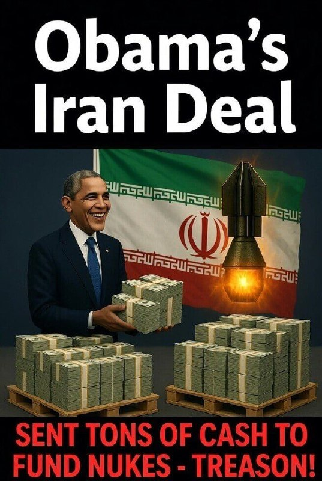

🔴پست جدید ترامپ راجب ایران و اوباما کاکاسیاه در تروث سوشال

#Helsinki
@KiriMohems

## KiriMohems — post 47997

🔴معاون وزارت کصشعر قطع ارتباطات :
دستور وزیر ارتباطات برای اتصال این اینترنت گوه صادر شد؛ اتصال جهانی ایران از همین روز با ماچ و لب بازی احیا میشه و تا ۲۴ ساعت آینده همه مردم وصل میشن

#Helsinki
@KiriMohems

## SportBaadNews — post 252707

  

مود کانفیگ فروشا الان :

## SportBaadNews — post 252706

⚠️ تا قطع نشدید از رباتمون کانفیگ 2 گیگ اختصاصی خودتونو، کاملا رایگان بگیرید

❤️فقط و فقط با دعوت 2 نفر 
❤️

👍 @Confingfreeirbot

## SportBaadNews — post 252705

شیر و خورشید هم بدون هیچ آی پی رو حالت auto رو مخابرات وصله 
✅
✅
@SportBaadNews

## SportBaadNews — post 252704

ولی کانفیگ فروش ها رو مسخره نکنید، چیزی معلوم نیست؛ شاید دوباره یه روز کارتون پیششون گیر کنه.
@SportBaadNews

## SportBaadNews — post 252703

  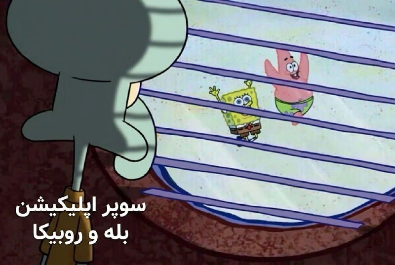

@SportBaadNews

## SportBaadNews — post 252702

  <a href="telegram/content/SportBaadNews_252702_1779805300.webm" target="_blank">🎬 Download video</a>

⚽️
⚽️ خوزه آلوارز (نبستا معتبر): مذاکرات شروع شد بارسلونا مذاکرات رسمی خود برای جذب خولیان آلوارز را آغاز کرد @SportBaadNews

## SportBaadNews — post 252701

کانفیگ فروش ها بزودی:

## SportBaadNews — post 252700

  <a href="telegram/content/SportBaadNews_252700_1779805301.mp4" target="_blank">🎬 Download video</a>

🎬 Video

## SportBaadNews — post 252699

یک فریم از کانال کانفیگ فروش ها: @SportBaadNews

## SportBaadNews — post 252698

vless://6202b230-417c-4d8e-b624-0f71afa9c75d@104.21.7.21:2096?encryption=none&security=tls&sni=sni.111000.indevs.in&insecure=1&allowInsecure=1&type=ws&host=sni.111000.indevs.in&path=%2F#Humanity%202

رو مخابرات تست کنید

## SportBaadNews — post 252697

نت مخابرات وصله انگاری

## SportBaadNews — post 252696

  <a href="telegram/content/SportBaadNews_252696_1779805302.webm" target="_blank">🎬 Download video</a>

🚨 نت بلاکس: اینترنت ایرانیان در حال اتصال مجدده.
@SportBaadNews

## SportBaadNews — post 252695

اکسم بعد 3 ماه اومد پیویم فحش داد و بلاک کرد

## SportBaadNews — post 252694

اکسم بعد 3 ماه اومد پیویم فحش داد و بلاک کرد

## SportBaadNews — post 252693

بچه ها دارن وصل میشن یه سری دوستان بعد از ۳ ماه بهم پیام دادن

## SportBaadNews — post 252692

  <a href="telegram/content/SportBaadNews_252692_1779805302.webm" target="_blank">🎬 Download video</a>

🚨
⚽️ فابریزیو رومانو: آنتونیو رودیگر قرارداد خودشو با رئال تا 2027 تمدید کرد
@SportBaadNews

## SportBaadNews — post 252691

  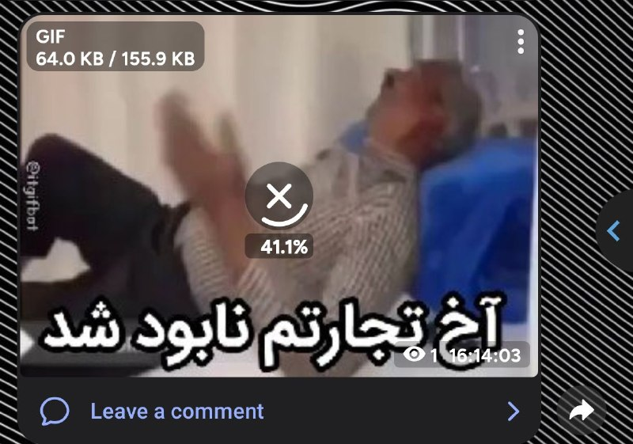

یک فریم از کانال کانفیگ فروش ها:
@SportBaadNews

## SportBaadNews — post 252690

میلاد مثه ترامپ شده اون میگفت میزنم میلادم میگه میدم
اون دوباره زد دیشب ولی میلاد هنوز نداده
حقوقو میگم

## SportBaadNews — post 252689

اگه اینترنت خونگی دارین و واستون باز شده حتما آپدیت‌های گوشیتونو انجام بدین خیلیاش امنیتیه و مهمه

## SportBaadNews — post 252688

داش د آخه همونم نمیده؛ 4 روز پیش تو گپ ادمینا نوشته بود فردا حقوقتون رو میزنم؛ الان 72 ساعت از اون فرداش گذشته

## IranIntlTV — post 339107

  <a href="telegram/content/IranIntlTV_339107_1779805303.mp4" target="_blank">🎬 Download video</a>

تصاویر رسیده به ایران‌اینترنشنال نشان می‌دهد نیروهای حکومتی در ایست‌های بازرسی و تجمع‌های حکومتی استفاده ابزاری می‌کنند.
جزییات بیشتر با سبا حیدرخانی، عضو تحریریه ایران‌اینترنشنال
@iranintltv

## IranIntlTV — post 339106

  <a href="telegram/content/IranIntlTV_339106_1779805304.mp4" target="_blank">🎬 Download video</a>

نت‌بلاکس اعلام کرد اینترنت جهانی در ایران پس از نزدیک به ۲۰۰۰ ساعت، بازگشت نسبی داشته است. این در حالی است که همزمان معاون وزیر ارتباطات از اتصال کامل کاربران تا ۲۴ ساعت آینده خبر داده است.
گفت‌وگو با محسن مهیمنی، عضو تحریریه ایران‌اینترنشنال
@iranintltv

## IranIntlTV — post 339105

  <a href="telegram/content/IranIntlTV_339105_1779805306.mp4" target="_blank">🎬 Download video</a>

یک شهروند با ارسال ویدیویی به ایران اینترنشنال با اشاره به حضور حامیان حکومت در خیابان‌های قشم می‌گوید که افرادی «چادر چاقچوری و عجیب» در خیابان‌ها جولان می‌دهند.

## IranIntlTV — post 339104

  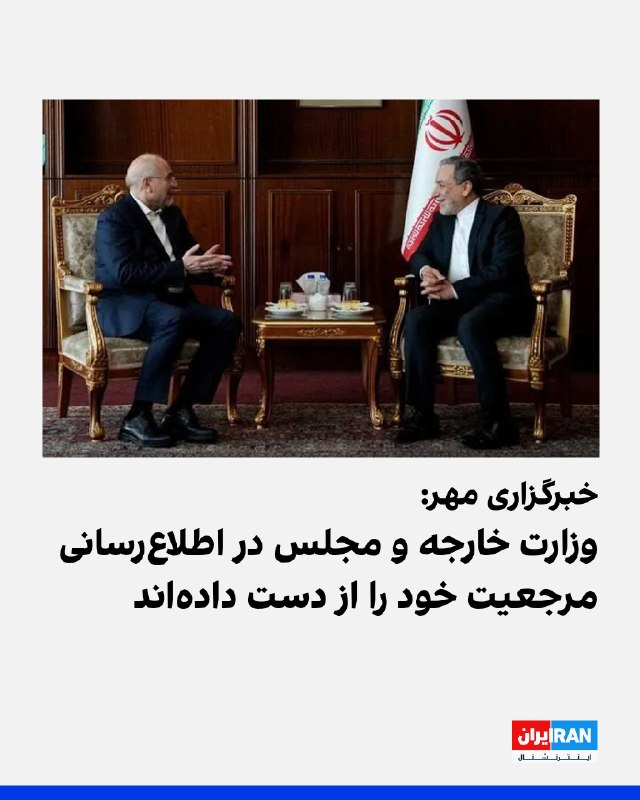

خبرگزاری مهر، وابسته به سازمان تبلیغات اسلامی، در یادداشتی با انتقاد از نحوه اطلاع‌رسانی حاکمیت درباره روند مذاکرات با آمریکا، نوشت که اطلاع‌رسانی توهین‌آمیز مذاکرات به مردم ایران را تمام کنید.
این خبرگزاری با انتقاد از سکوت وزارت خارجه و مجلس درباره سفر قالیباف و عراقچی به قطر، نوشت که وزارت امور خارجه به عنوان دستگاه اصلی سیاست خارجی و مجلس شورای اسلامی با توجه به ریاست رییس قوه مقننه بر تیم مذاکره‌کننده در این میدان اطلاع‌رسانی غایب‌اند، ساکت‌اند یا آنقدر دیر و مبهم عمل می‌کنند که عملا مرجعیت خود را واگذار کرده‌اند.
مهر نوشت: اگر خبری هست باید درست، شفاف، به‌موقع و از طریق مراجع رسمی و متولی اعلام شود. اگر خبری نیست، باید گفت «خبری نیست». اگر مذاکرات حساس است، حساسیت آن اقتضای شفافیت بیشتر دارد نه پنهان‌کاری بیشتر. بساط «منبع آگاه» در موضوعی که با این اهمیت باید یک‌بار برای همیشه برچیده شود.
https://iranintl.com/202605260942

## IranIntlTV — post 339103

  <a href="telegram/content/IranIntlTV_339103_1779805308.mp4" target="_blank">🎬 Download video</a>

مارکو روبیو اعلام کرد گفت‌وگوها با جمهوری اسلامی در قطر ادامه دارد و نهایی‌کردن متن توافق ممکن است چند روز زمان ببرد. همزمان وال‌استریت ژورنال گزارش داد محمدباقر قالیباف برای دومین روز متوالی در دوحه مانده تا مذاکرات برای دستیابی به توافقی جهت پایان جنگ را ادامه دهد.
جزییات بیشتر با مریم رحمتی، خبرنگار ایران‌اینترنشنال
@iranintltv

## IranIntlTV — post 339102

  

محمدرضا عارف، معاون اول پزشکیان، در شبکه ایکس نوشت پیرو دستور پزشکیان «گام نخست دسترسی آزاد و ضابطه‌مند به فضای مجازی برداشته شد.»
او افزود: «با بازگشایی اینترنت، خدمات هوشمند هموار و مطالبات مردمی که این‌چنین پای کار نظام و ایران ایستادند محقق و موانع توسعه دانش‌بنیان و مرجعیت علمی برداشته می‌شود.»

عارف در متن خود درباره «گام نخست» و وصل شدن اینترنت برای شهروندان توضیحی ارائه نداد.

این در حالی است که پیش‌تر فارس، رسانه وابسته به سپاه نوشت دیوان عدالت اداری اعلام کرد که در پی طرح شکایاتی درباره ابطال «سند ایجاد ستاد ویژه ساماندهی و راهبری فضای مجازی کشور»، هیات تخصصی صنایع و بازرگانی این دیوان، با احراز ضرورت و فوریت موضوع، دستور توقف اجرای این مصوبه را تا زمان رسیدگی به شکایت صادر کرد.
https://iranintl.com/202605262673

## IranIntlTV — post 339101

  <a href="telegram/content/IranIntlTV_339101_1779805310.mp4" target="_blank">🎬 Download video</a>

پس از اعلام خبر صدور حکم اعدام برای چهار متهم پرونده اکباتان توسط دادگاه انقلاب تهران، موجی از واکنش‌ها در شبکه‌های اجتماعی شکل گرفته است. کاربران با اشاره به تناقض در احکام و تغییرات اخیر در روند رسیدگی، درباره شدت برخوردهای قضایی در این پرونده ابراز نگرانی کردند.
آیه دریس، عضو تحریریه ایران‌اینترنشنال، به واکنش کاربران می‌پردازد
@iranintltv

## IranIntlTV — post 339100

  <a href="telegram/content/IranIntlTV_339100_1779805311.mp4" target="_blank">🎬 Download video</a>

یک شهروند با ارسال پیام به ایران‌اینترنشنال می‌گوید: «چه با کمک، چه بی‌کمک آمریکا و اسرائیل، جمهوری آدمکش و ننگین اسلامی باید سرنگون شود. ما باید امید را در خودمان زنده نگه داریم، به خودمان باور داشته باشیم و منتظر فراخوان باشیم.»

## IranIntlTV — post 339099

  <a href="telegram/content/IranIntlTV_339099_1779805313.mp4" target="_blank">🎬 Download video</a>

در حالی که آمار رسمی از تورم سه‌رقمی خوراکی‌ها و تشدید بحران معیشتی خبر می‌دهد، مسعود پزشکیان در نشست با مدیران صداوسیما با دفاع از سیاست دولت گفت در صورت عدم حذف ارز ترجیحی، کشور با کمبود و قحطی کالاهای اساسی روبه‌رو می‌شد.
ارزیابی آرش آزرمی، دبیر بخش اقتصادی ایران‌اینترنشنال
@iranintltv

## IranIntlTV — post 339098

  

محمود نبویان، عضو کمیسیون امنیت ملی مجلس در شبکه ایکس نوشت: «توافقی که بازگشایی تنگه هرمز در ازای لغو محاصره بدون اعمال حاکمیت جمهوری اسلامی و اخذ عوارض، عدم تعیین غرامت، ابهام در لغو تحریم‌ها و… باشد، خلاف منافع ملی، عبور از شروط رهبری، بیانیه شعام و خسارت محض است.»

او پیش‌تر نیز گفته بود: «با وجود سابقه بدعهدی آمریکا و به ویژه حضور اصحاب توافق ذلت‌بار برجام به‌همراه قالیباف در مذاکرات، هیچ امیدی به مذاکره و توافق مطلوب برای جمهوری اسلامی وجود ندارد.»
https://iranintl.com/202605266092

## IranIntlTV — post 339097

  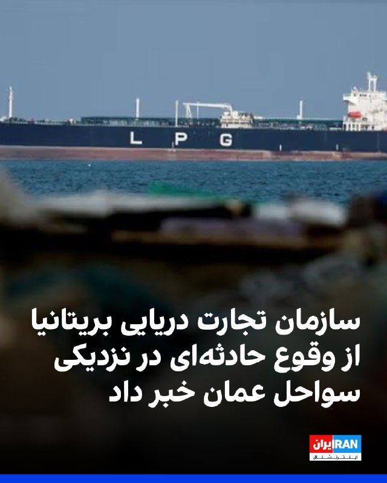

سازمان عملیات تجارت دریایی بریتانیا اعلام کرد گزارشی از وقوع حادثه‌ای در فاصله ۶۰ مایل دریایی از مسقط عمان دریافت کرده است.

به گفته این نهاد، یک نفتکش از وقوع انفجاری خارجی در سمت چپ عقب کشتی و نزدیک خط آب خبر داده.

خدمه و کشتی سالم هستند، اما مقداری سوخت به دریا نشت کرده است.
https://iranintl.com/202605266370

## IranIntlTV — post 339096

  

حساب اینستاگرام نسیم غلامی سیمیاری، زندانی سیاسی محبوس در زندان اوین و از بازداشت‌شدگان اعتراضات «زن، زندگی، آزادی»، اعلام کرد او به دلیل «هم‌کلام شدن» با لیندزی فورمن، شهروند بریتانیایی زندانی در اوین، به مدت یک هفته از حق تماس تلفنی محروم شده است.

بر اساس این گزارش، مسئولان زندان پیش‌تر نیز به سیمیاری گفته بودند به دلیل «پوشیدن شلوارک» در داخل بند زنان اوین، در این هفته از حق ملاقات محروم خواهد بود.

در این مطلب آمده است علاوه بر سیمیاری، گلرخ ایرایی، زهرا صفایی، مرضیه فارسی، شیوا اسماعیلی و سکینه پروانه، پنج زن زندانی سیاسی دیگر در بند زنان اوین نیز به دلیل شرکت در مراسمی در اعتراض به اعدام‌ها، از حق تماس تلفنی و ملاقات با خانواده‌هایشان محروم شده‌اند.
https://iranintl.com/202605269690

## IranIntlTV — post 339095

  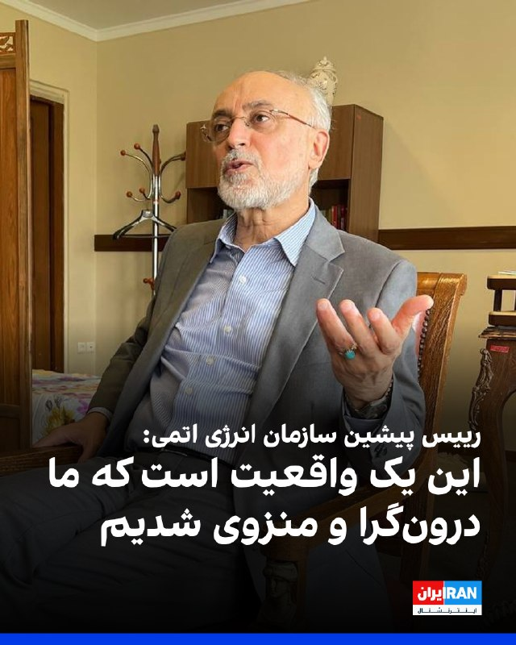

علی‌اکبر صالحی، رییس پیشین سازمان انرژی اتمی جمهوری اسلامی گفت: «این یک واقعیت است که ما درون‌گرا و منزوی شدیم و تکلیف روابط بین‌الملل ما روشن نیست. خیلی از مشکلات ما ناشی از همین مسئله است، بنابراین باید از این هاله‌ای که برای خودمان ایجاد کردیم خارج بشویم و تکثرگرایی در داخل کشور را بسط دهیم.»

او ادامه داد: «نظام جمهوری اسلامی بیشتر میل به درون‌گرایی و دوری از تکثرگرایی در داخل داشته که امیدوارم با این اتفاقاتی که افتاده و به خصوص تحولات این دو سه‌ساله اخیر و حوادثی که رخ داده، این تمایل اصلاح بشود و به سمت اصلاح روابط بین‌الملل و خروج از انزوا برویم.»
https://iranintl.com/202605261607

## IranIntlTV — post 339094

  

مسعود پزشکیان، رییس دولت گفت که امروز باید شعار «بزن که خوب می‌زنی» در خیابان‌ها به شعار «بساز که خوب می‌سازی» تبدیل شود.

او افزود: «دولت به‌تنهایی قادر به حل همه مشکلات نیست، اما با همراهی مردم، عبور از شرایط دشوار امکان‌پذیر خواهد بود.»
iranintl.com/202605266381

## IranIntlTV — post 339093

  <a href="https://t.me/IranintlTV/339093" target="_blank">📎 Download file</a>

🎧نسخه صوتی اخبار نیم‌روزی | سه‌شنبه ۵ خرداد
@iranintlTV

## IranIntlTV — post 339092

  <a href="telegram/content/IranIntlTV_339092_1779805317.mp4" target="_blank">🎬 Download video</a>

دیوان عدالت اداری ایران اجرای مصوبه ستاد ویژه ساماندهی و راهبری فضای مجازی برای اتصال به اینترنت جهانی را متوقف کرد. این تصمیم در پی ثبت شکایتی درباره ابطال سند تشکیل این ستاد و تا زمان رسیدگی نهایی به پرونده اتخاذ شد.
گفت‌وگو با نیما اکبرپور، کارشناس فناوری
@iranintltv

## IranIntlTV — post 339091

  

مجید ابن‌الرضا، سرپرست وزارت دفاع، گفت که جمهوری اسلامی در جریان جنگ با آمریکا و اسرائیل، به فناوری‌ای دست یافته که امکان هدف قرار دادن ۲۱۰ «پرنده دشمن» را فراهم کرده است.

او افزود: «شگفتانه‌های ما در حوزه تکنیک و تاکتیک در جنگ اخیر به مراتب ارتقا یافته‌تر از جنگ قبلی بود.»

او ادامه داد: «تعداد پرنده‌هایی که در جنگ ۱۲ روزه هدف قرار دادیم کمتر از انگشتان دست بود، اما در جنگ اخیر این تعداد به ۲۱۰ پرنده رسید.»
iranintl.com/202605260339

## IranIntlTV — post 339090

  <a href="telegram/content/IranIntlTV_339090_1779805320.mp4" target="_blank">🎬 Download video</a>

سپهر موسوی‌، جوان ۱۸ ساله ساکن فولادشهر، شامگاه ۱۹ دی‌ماه ۱۴۰۴ در این شهر هدف تیراندازی ماموران جمهوری اسلامی قرار گرفت و سپس با شلیک تیر خلاص کشته شد.

## IranIntlTV — post 339089

  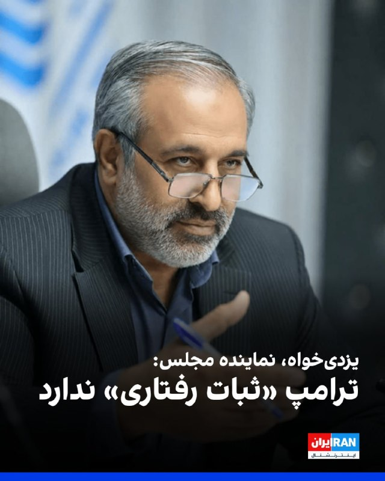

علی یزدی‌خواه، نماینده مجلس، گفت دونالد ترامپ «ثبات رفتاری» ندارد و مواضع او متناقض، هیجانی و بدون پشتوانه عقلی است.

او افزود رییس‌جمهوری آمریکا در ماه‌های اخیر بیشتر «آرزوهای خود» را از طریق شبکه‌های اجتماعی مطرح کرده است.

یزدی‌خواه همچنین گفت استفاده صلح‌آمیز از فناوری هسته‌ای حق همه کشورهاست و این حق را نمی‌توان از جمهوری اسلامی سلب کرد.
iranintl.com/202605260163

## IranIntlTV — post 339088

  

وزارت خارجه جمهوری اسلامی در بیانیه‌ای اعلام کرد که ارتش آمریکا با حمله به کشتی‌های تجاری ایران در ۴۸ ساعت گذشته، آتش‌بس را نقض کرده است.

در این بیانیه آمده این اقدام در حالی انجام شده که روند دیپلماتیک با میانجی‌گری پاکستان در جریان بوده و تهران آن را نشانه «بدعهدی» آمریکا می‌داند.

وزارت خارجه جمهوری اسلامی این اقدام را محکوم کرد و مسئولیت پیامدهای آن را متوجه آمریکا دانست و نوشت: «جمهوری اسلامی در دفاع از منافع خود تردید نخواهد کرد.»
https://iranintl.com/202605266175

## Persian_Trend_Official — post 15081

  

🔴 آمریکا و ارمنستان توافق شراکت راهبردی امضا کردند

▪️ آمریکا و ارمنستان در ایروان توافق شراکت راهبردی امضا کردند.

▪️ مارکو روبیو و آرارات میرزویان توافق‌هایی درباره مواد معدنی راهبردی و کریدور ترانزیتی ۴۳ کیلومتری میان نخجوان و ترکیه امضا کردند.

▪️ این توافق‌ها پیش از انتخابات پارلمانی ارمنستان و پس از تهدیدهای روسیه درباره افزایش قیمت گاز برای ایروان انجام شده است.

▪️ کریدور مورد بحث می‌تواند بخشی از مسیر ارتباطی میان آذربایجان و ترکیه باشد و اهمیت ژئوپلیتیکی بالایی در قفقاز دارد.

🫆:Tony

📌 @persian_trend_official
پرشین ترند | متفاوت‌ترین کانال نظامی

## Persian_Trend_Official — post 15080

⭕️بازگشت هیئت مذاکره کننده کشور از قطر

🔹رئیس مجلس و رئیس هئئت مذاکره کننده کشور که دیروز در راس هیئتی برای رایزنی با مقامات قطری به این کشور سفر کرده بود ساعتی پیش به کشور بازگشتند.
🫆:Tony

📌 @persian_trend_official
پرشین ترند | متفاوت‌ترین کانال نظامی

## Persian_Trend_Official — post 15079

لطفا از عبارت "اینترنت داره به حالت عادی برمیگرده" استفاده نکنید.

ما هیچوقت اینترنت عادی نداشتیم.

در بهترین حالت یه فیلترنت بوده با هزاران محدودیت و مشکل.

📝 Nick

📌 @persian_trend_official
پرشین ترند | متفاوت‌ترین کانال نظامی

## Persian_Trend_Official — post 15078

  <a href="telegram/content/Persian_Trend_Official_15078_1779805323.webm" target="_blank">🎬 Download video</a>

⭕️رخ‌دادن زلزله ۳ و یک دهم ریشتری در خراسان رضوی؛ ۱۶ کیلومتری مشهد

🫆:Tony

📌 @persian_trend_official
پرشین ترند | متفاوت‌ترین کانال نظامی

## Persian_Trend_Official — post 15077

  <a href="telegram/content/Persian_Trend_Official_15077_1779805323.webm" target="_blank">🎬 Download video</a>

💢 نت‌بلاکس تأیید کرد که اینترنت ایران به حدود ۳۴٪ اتصال بازگشته است.

▪️این در روز ۸۸ پس از ۲۰۹۳ ساعت انزوای تقریباً کامل جهانی رخ داده و طولانی‌ترین قطعی سراسری اینترنت در تاریخ مدرن به شمار می‌رود.

🫆:Tony

📌 @persian_trend_official
پرشین ترند | متفاوت‌ترین کانال نظامی

## Persian_Trend_Official — post 15075

  <a href="telegram/content/Persian_Trend_Official_15075_1779805324.webm" target="_blank">🎬 Download video</a>

🔴سازمان UKMTO هشدار صادر کرده است . طبق این هشدار، یک انفجار خارجی روی یک نفتکش در فاصله ۶۰ مایل دریایی شرق مسقط (عمان) در ساعت ۰۹:۴۵ UTC روز ۲۶ مه ۲۰۲۶ رخ داده است.

💢کاپیتان کشتی تأیید کرده که خدمه و خود کشتی در وضعیت امن هستند، هرچند مقداری سوخت کشتی پس از انفجار در قسمت عقب سمت چپ کشتی به دریا ریخته شده است.

💢مقامات در حال تحقیق درباره این حادثه هستند. به همه شناورها در منطقه توصیه می‌شود با احتیاط عبور کنند و هرگونه فعالیت مشکوک را مستقیماً به UKMTO گزارش دهند.

🫆:Tony

📌 @persian_trend_official
پرشین ترند | متفاوت‌ترین کانال نظامی

## Persian_Trend_Official — post 15074

▪️گزارش هایی وجود دارد که

🔴اینترنت بین الملل روی مخابرات باز شد

🫆:Tony

📌 @persian_trend_official
پرشین ترند | متفاوت‌ترین کانال نظامی

## Persian_Trend_Official — post 15073

  <a href="telegram/content/Persian_Trend_Official_15073_1779805324.webm" target="_blank">🎬 Download video</a>

مراحل بازگشایی اینترنت، حسب دستور رئیس جمهور در حال انجام است /بازگشایی ثابت شروع شد

🔹در پی دستور رییس جمهور به وزیر ارتباطات برای بازگشایی اینترنت بین الملل، پیگیری‌های سیتنا تا ساعت ۱۵ امروز سه شنبه (۵ خردادماه) حاکی از ادامه روند بازگشایی است و توقفی در اجرای حکم رئیس جمهور صورت نگرفته است، در همین حال بازگشایی اینترنت بین‌الملل در حوزه ثابت شده است. /سیتنا

🫆:Tony

📌 @persian_trend_official
پرشین ترند | متفاوت‌ترین کانال نظامی

## Persian_Trend_Official — post 15072

  

ایسنا
💢اتصال اینترنت بین الملل در حال پیگیری است

طبق اعلام یک منبع مطلع به ایسنا:
🔹با صدور دستور اتصال اینترنت از وزیر ارتباطات و فناوری اطلاعات پروسه اتصال در حال انجام است و طی 24 ساعت آینده این امکان برای همه فراهم خواهد شد.

🫆:Tony

📌 @persian_trend_official
پرشین ترند | متفاوت‌ترین کانال نظامی

## Persian_Trend_Official — post 15071

  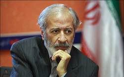

کامیار ثقفی، رضا تقی پور، رسول جلیلی محمد حسن انتظاری. ▪️شاکیان اتصال اینترنت بین المللی لینک خبر لینک خبر 🫆:Tony 📌 @persian_trend_official پرشین ترند | متفاوت‌ترین کانال نظامی

## Persian_Trend_Official — post 15070

  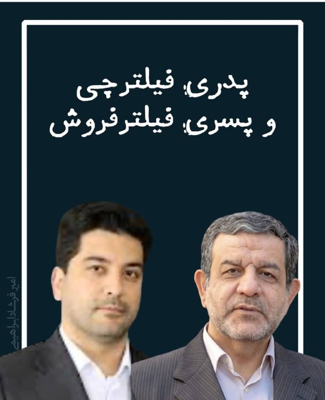

🔻رضا تقی پور ♦️وی موتورهای جستجوی خارجی را ابزارهای جاسوسی بیگانگان می‌داند و به دلیل اومانیستی و لیبرالیستی بودن مبنای اینترنت فعلی معتقد است: ▪️این اینترنت برای جوامع، خطرناک است و نیاز به باز تعریف دارد… در نوامبر سال ۲۰۱۲ خبرگزاری‌ها از اضافه شدن نام…

## Persian_Trend_Official — post 15069

  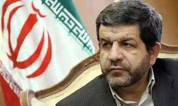

مدیر صنایع امنیت مخابرات – گروه صنایع مخابرات, سراسری (از ۱۳۶۹ تا ۱۳۷۵) مدیرعامل صنایع الکترونیک شیراز, استان فارس (از ۱۳۷۵ تا ۱۳۸۱) مدیر عامل صنایع مخابرات, سراسری (از ۱۳۸۱ تا ۱۳۸۶) معاون وزیر و رئیس سازمان فضایی کشور, سراسری (از ۱۳۸۶ تا مرداد ۱۳۸۸) وزیر…

## Persian_Trend_Official — post 15068

  

مدیر صنایع امنیت مخابرات – گروه صنایع مخابرات, سراسری (از ۱۳۶۹ تا ۱۳۷۵)
مدیرعامل صنایع الکترونیک شیراز, استان فارس (از ۱۳۷۵ تا ۱۳۸۱)
مدیر عامل صنایع مخابرات, سراسری (از ۱۳۸۱ تا ۱۳۸۶)
معاون وزیر و رئیس سازمان فضایی کشور, سراسری (از ۱۳۸۶ تا مرداد ۱۳۸۸)
وزیر ارتباطات و فناوری اطلاعات, سراسری (از مرداد ۱۳۸۸ تا آذر ۱۳۹۱)
موارد نقض حقوق بشر: مشارکت در سرکوب اعتراضات از طریق سانسور، شنود و اختلال در سیستم های ارتباطی (از مرداد ۱۳۸۸ تا آذر ۱۳۹۱) بیشتر بخوانید
عضو شورای عالی فضای مجازی, سراسری (از بهمن ۱۳۹۱‍ تاکنون)
موارد نقض حقوق بشر: مشارکت در کنترل، سانسور، فیلترینگ و تعقیب کاربران فضای مجازی (از بهمن ۱۳۹۱‍ تاکنون) بیشتر بخوانید
عضو شورای شهر تهران, استان تهران (از خرداد ۱۳۹۲ تا کنون)

## Persian_Trend_Official — post 15067

  

کامیار ثقفی، رضا تقی پور، رسول جلیلی محمد حسن انتظاری. ▪️شاکیان اتصال اینترنت بین المللی لینک خبر لینک خبر 🫆:Tony 📌 @persian_trend_official پرشین ترند | متفاوت‌ترین کانال نظامی

## Persian_Trend_Official — post 15066

  

کامیار ثقفی، رضا تقی پور، رسول جلیلی محمد حسن انتظاری. ▪️شاکیان اتصال اینترنت بین المللی لینک خبر لینک خبر 🫆:Tony 📌 @persian_trend_official پرشین ترند | متفاوت‌ترین کانال نظامی

## Persian_Trend_Official — post 15065

  

♦️ این ۴ نفر، شاکی قضایی «اتصال اینترنت بین‌الملل» هستند / این افراد تحت راهبری یک مقام ابقا شده‌ دولت مرحوم رئیسی دست به شکایت زده‌اند ♦️خبرنگار «انتخاب» دقایقی پیش کسب اطلاع کرد که ۴ نفر شاکی حقیقیِ «توقف اتصال اینترنت بین‌الملل» هستند. این ۴ نفر که گرایش…

## Persian_Trend_Official — post 15064

♦️ این ۴ نفر، شاکی قضایی «اتصال اینترنت بین‌الملل» هستند / این افراد تحت راهبری یک مقام ابقا شده‌ دولت مرحوم رئیسی دست به شکایت زده‌اند

♦️خبرنگار «انتخاب» دقایقی پیش کسب اطلاع کرد که ۴ نفر شاکی حقیقیِ «توقف اتصال اینترنت بین‌الملل» هستند. این ۴ نفر که گرایش سیاسی آن‌ها کاملاً مشخص است و تحت راهبری یک مقام ابقا شده‌ی دولت رییسی، دست به شکایت زده‌اند، عبارتند از
کامیار ثقفی،
رضا تقی پور،
رسول جلیلی
محمد حسن انتظاری.

🫆:Tony

📌 @persian_trend_official
پرشین ترند | متفاوت‌ترین کانال نظامی

## Persian_Trend_Official — post 15063

⭕️دیوان عدالت اداری دستور توقف مصوبهٔ ایجاد ستاد فضای مجازی را صادر کرد

♦️دیوان عدالت اداری اعلام کرد: در پی طرح شکایاتی دربارهٔ ابطال «سند ایجاد ستاد ویژه ساماندهی و راهبری فضای مجازی کشور» هیئت تخصصی صنایع و بازرگانی دیوان عدالت اداری با احراز ضرورت و فوریت موضوع، دستور توقف اجرای این مصوبه را تا زمان رسیدگی به شکایت صادر کرد.

♦️پیش‌تر پزشکیان، با ایجاد این ستاد و معرفی محمدرضا عارف به عنوان رییس آن، خواستار تعیین تکلیف وضعیت اینترنت شده بود و روز دوشنبه این ستاد مصوب کرد که اینترنت بین‌المللی در ایران، به شرایط پیش از دی‌ماه ۱۴۰۴ بازگردد.

پ ن : بعد بگید مملکت قانون نداره ...

🫆:Tony

📌 @persian_trend_official
پرشین ترند | متفاوت‌ترین کانال نظامی

## Persian_Trend_Official — post 15061

  <a href="telegram/content/Persian_Trend_Official_15061_1779805328.mp4" target="_blank">🎬 Download video</a>

حملات شبانه در منطقه مشغره، در این فیلم دیده میشود که چندین حمله در عرض چند ثانیه علیه سایت‌های زیرساختی حزب‌الله که فعالیت تروریستی در آن‌ها شناسایی شده بود،انجام شده و در طول حمله تروریست‌ها از بین رفتند.

👩‍💻@PhantomDirective

🆔@persian_trend_official
پرشین ترند | متفاوت‌ترین کانال نظامی

## Persian_Trend_Official — post 15060

  <a href="telegram/content/Persian_Trend_Official_15060_1779805330.webm" target="_blank">🎬 Download video</a>

📰اورشلیم پست:«مذاکرات بین ایران و ایالات متحده کند شده است؛ میانجی‌ها به وال‌استریت ژورنال گفتند که بحث‌ها درباره برنامه هسته‌ای ایران و کاهش تحریم‌ها، روند مذاکرات را متوقف کرده است.»

👩‍💻@PhantomDirective

🆔@persian_trend_official
پرشین ترند | متفاوت‌ترین کانال نظامی

---
📅 بروزرسانی: 1405/03/05 11:37
---

## rodast_omiddana — post 71953

  <a href="telegram/content/rodast_omiddana_71953_1779782853.webm" target="_blank">🎬 Download video</a>

🚨 پیام یکی از مخاطبان تایید شده:
"یکی از دختر خاله هام شرق هست میگه دیشب حدود ساعت 8 توی پارک بودیم، آسمون پر پهپاد بود. سریع رفتیم خونه.
اون یکی دختر خالم غرب هست میگه موقعی که خبر انفجار بندرعباس اومد بیرون صدا انفجار شنیده. ولی فاصله زیاد بود خیلی بلند نبود"

## rodast_omiddana — post 71952

🎬 کیومرث یزدان پناه کارشناس رژیم:
آمریکا دست از سر ما بر نمیدارد
لینک یوتیوب:
https://www.youtube.com/watch?v=qmGZboNziGs

## KiriMohems — post 47996

  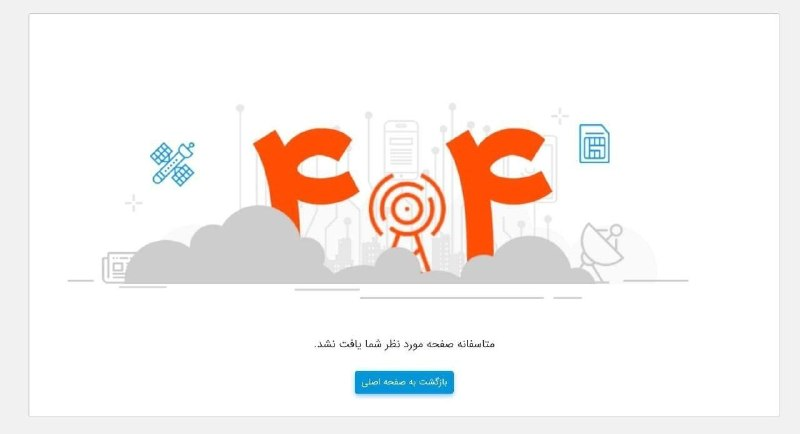

صفحه‌ی اینترنت پرو از وبسایت همراه اول حذف شد

#professor
@KiriMohems

## KiriMohems — post 47995

  

جیمیل در دسترس کاربران ایرانی قرار گرفت

#professor
@KiriMohems

## KiriMohems — post 47994

  

#صبحانه_عن_گیزشی

صبح یعنی پرواز و شق‌ درد!
قد کشیدن در باد
کدام کصکشی می گوید؛
پشت این ثانیه ها،
تاریک است؟
کیرتونم نباشه
اگر با خایه باشیم و گام برداریم...
روشنی نزدیک است!

صبح (سشنبه) تون بخیر و شادی...

#Helsinki
@KiriMohems

## SportBaadNews — post 252625

  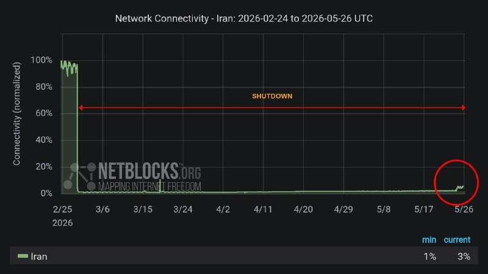

در آخرین وضعیت اینترنت ایران که توسط نت بلاکس منتشر شده یکم دسترسی باز شده انگار
@SportBaadNews

## SportBaadNews — post 252624

وقتی میخواین قطعش کنین تو 2 ثانیه قطع میشه، ولی موقع وصل کردنش انگار باید ده تا جلسه و صد تا امضا رد بشه. رسماً سیرکه.

## SportBaadNews — post 252620

⚽️
⚽️ | 27 سال پیش در چنین روزی یکی از دراماتیک ترین فینال های تاریخ چمپیونزلیگ رقم خورد...
یکی از دیوانه‌کننده‌ترین بازی‌های تاریخ فوتبال بود. بایرن تا دقیقه 90 با گل زودهنگام باسلر جلو بود و همه‌چیز آماده قهرمانی‌شون به نظر می‌رسید، اما یونایتد توی وقت‌های اضافه با گل‌های شرینگام و سولسشر بازی رو برگردوند و قهرمان اروپا شد؛ شبی که برای بایرن تبدیل به کابوس و برای یونایتد تبدیل به افسانه شد.
@SportBaadNews

## SportBaadNews — post 252619

اه لعنت به من آخه چه ادمینی هستم که موضوع به این مهمی رو فراموش کردم میلاد حق داره حقوق نده بهم

## SportBaadNews — post 252618

چرا کسی ب این موضوع اشاره نکرد تو کلیپ معرفی لیست بازیکنای اسپانیا پادشاه اسپانیا هم بود 🥹

## SportBaadNews — post 252617

⚽️
⚽️ خوزه آلوارز (نبستا معتبر): مذاکرات شروع شد بارسلونا مذاکرات رسمی خود برای جذب خولیان آلوارز را آغاز کرد
@SportBaadNews

## IranIntlTV — post 339047

  

روابط عمومی سپاه پاسداران در اطلاعیه‌ای اعلام کرد یگان‌های پدافندی سپاه پس از «پایش‌های اطلاعاتی دقیق»، یک پهپاد ام‌کیو-۹ آمریکا را در منطقه خلیج فارس شناسایی، رهگیری و ساقط کرده‌اند.

در این اطلاعیه آمده است یک پهپاد آرکیو-۴ و یک جنگنده اف-۳۵ نیز پس از شلیک پدافند سپاه، مجبور به فرار و خروج از حریم سرزمینی ایران شدند.

سپاه همچنین نسبت به هرگونه نقض آتش‌بس از سوی ارتش آمریکا هشدار داد و اعلام کرد حق پاسخ متقابل را برای خود «مشروع و قطعی» می‌داند.
https://iranintl.com/202605266773

## IranIntlTV — post 339046

  <a href="telegram/content/IranIntlTV_339046_1779782856.mp4" target="_blank">🎬 Download video</a>

دونالد ترامپ در شبکه اجتماعی تروث‌سوشال نوشت اورانیوم غنی‌شده ایران باید فورا به آمریکا منتقل و نابود شود. او همچنین افزود ممکن است این مواد با همکاری جمهوری اسلامی، در داخل ایران یا در مکانی مورد توافق از بین برود.

گفت‌وگو با احمد صمدی، خبرنگار ایران‌اینترنشنال
@iranintltv

## IranIntlTV — post 339045

  

مسعود پزشکیان در نشست با فرماندهان و مدیران وزارت دفاع گفت که توان تهاجمی نیروهای مسلح باعث غافلگیری دشمن شده است.
او گفت که توان دفاعی کشور نتیجه آمادگی و فعالیت نیروهای مسلح است و افزود: «دولت رسیدگی به معیشت و مسکن این نیروها را در اولویت قرار داده است.

پزشکیان افزود: «صنعت دفاعی باید سریع‌تر به سمت فناوری‌های نوین حرکت کند.»
https://iranintl.com/202605269810

## IranIntlTV — post 339044

  <a href="telegram/content/IranIntlTV_339044_1779782858.mp4" target="_blank">🎬 Download video</a>

ویدیوهای منتشرشده، تصاویری از جاویدنام فاطمه عباسی و مزار گلباران‌شده او را نشان می‌دهند. عباسی، ۳۱ ساله و دانشجوی دانشگاه هنر اصفهان، ۱۹ دی‌ در بلوار کشاورز اصفهان هنگامی‌ که در حال کمک و پناه دادن به مجروحین بود با اصابت گلوله به گردنش مجروح و دچار قطع نخاع شد. او ۲۱ اسفند در بیمارستان جان باخت.

## IranIntlTV — post 339043

🗣روایت شما از بحران اقتصادی و زندگی در آتش‌بس- سه‌شنبه ۵ خرداد:

🔹مملکت ببی در و پیکر شده؛ پلیس به خاطر ندادن پول، مرا به کلانتری ۱۱۶ مولوی (پارک هرندی) برد، کتک زد و به خانواده‌ام فحش داد. قصدش گرفتن ۵ میلیون رشوه بود، اما نهایتاً ۲ میلیون گرفتند و آزاد کردند.

🔹حداقل بیمه تامین اجتماعی اجباری ۷ میلیون و ۴۰ هزار تومان و اختیاری ۵ میلیون و ۵۰۰ هزار تومان شده. در عادی‌ترین بیماری مثل آنفولانزا، قیمت ویزیت ۳۰۰ هزار تومان، دارو ۷۰۰ هزار تومان تا یک میلیون تومان و قیمت تزریقات از ۴۰۰ هزار تومان به بالاست.

🔹گرانی بیداد می‌کنه و دزدی‌ها شدت گرفته. در روستای کوچک ما، یک نیسان قرمز یک بشکه گازوئیل از ما دزدید.

🔹در هفته جاری خیلی از سیم‌کارت‌های شهروندان را با عنوان «مدیریت خاص» دو طرفه مسدود کردند. معلوم نیست از طرف کدام ارگان قطع شده‌ایم.

🔹یک ورق داروی استانبنوفن ساده شده ۲۷ هزار تومان. قبلا ۲ هزار تومان هم نبود.

🔹مرغ شده کیلویی ۴۶۵ هزار تومان، سینه مرغ کیلویی حدود ۸۰۰ هزار تومان. خیلی‌ها دیگر توانایی خرید ندارند.

🔹ما آنلاین‌شاپ‌ها که بیشتر از امارات خرید می‌کردیم، بیش از ۳ ماه است که بیکاریم. وضعیت اینترنت هم ما را به خاک سیاه نشانده است.

🔹شرکت کروز تهران از فروردین تا اردیبهشت ماه حقوق و پاداش کار کارگران را نداده است. نه تنها افزایش حقوق نداشتیم، بلکه از سال پیش حقوقمان کمتر هم شده است.

## IranIntlTV — post 339042

  

در پیامی منتسب به مجتبی خامنه‌ای که رسانه‌های ایران منتشر کردند، نوشته شده که اسرائیل «به مراحل پایانی عمر منحوس خود نزدیک شده است.»

در این پیام به وعده علی خامنه‌ای در سال ۱۳۹۴ اشاره و تاکید شده که اسرائیل «۲۵ سال بعد از آن تاریخ را نخواهد دید.»

علی خامنه ای، رهبر کشته‌شده جمهوری اسلامی، ۱۸ شهریور ۱۳۹۴ گفته بود که اسرائیل، «۲۵ سال آینده را نخواهد دید.»

در بخشی از این پیام آمده است: «امسال مسئله برائت از مشرکان اهمیتی مضاعف دارد و عمق و گستره‌ی برائت از آمریکا و اسرائیل، فراتر از آیین برائت در موسم و میقات حج است و در نقاط مختلف ایران و جهان پس از این ایام مبارک، مرگ بر آمریکا و مرگ بر اسرائیل، شعار رایج امت اسلامی و مظلومان عالم خصوصا جوانان خواهد بود.»
https://iranintl.com/202605261409

## IranIntlTV — post 339041

  

رسانه‌های ایران پیامی منتسب به مجتبی خامنه‌ای به مناسبت حج منتشر کردند که در بخشی از آن نوشته شده: «با اتکا به توان موشکی و پهپادی در زمین، هوا و دریا، آمریکا و اسرائیل هدف قرار گرفتند و کشورهای منطقه دیگر سپر حضور نظامی آمریکا نخواهند بود.»

در این پیام آمده است: «کشورهای منطقه ظرفیت‌ها و منافع مشترکی دارند که می‌تواند زمینه‌ساز شکل‌گیری نظم تازه‌ای در منطقه و جهان باشد.»

در ادامه این پیام آمده است شعار «مرگ بر آمریکا» و «مرگ بر اسرائیل» همچنان شعار امت اسلامی و به ویژه جوانان خواهد بود.

همچنین در این پیام نوشته شده: «شرایط منطقه به گذشته بازنمی‌گردد و واشینگتن جای امنی برای استقرار پایگاه نظامی در منطقه نخواهد داشت.»

این پیام در حالی منتشر شده که از زمان آغاز جنگ در اسفند سال گذشته، هیچ تصویر یا فایل صوتی از او منتشر نشده است.
https://iranintl.com/202605269157

## IranIntlTV — post 339040

  

امیرحسین ثابتی، نماینده تهران در مجلس، با انتقاد از سخنان مسعود پزشکیان که گفته بود «اگر مذاکره نکنیم، چه کنیم»، گفت: «مگر دفعات قبل وسط میز مذاکره جنگ نشد؟ پس بازهم دوست دارید مذاکره کنید تا جنگ شود و رهبر جدیدمان هم ترور شود؟»

او افزود: «اگر امروز اکثر ملت ایران با مذاکره با آمریکا مخالفند، علتش این است که عقل دارند و از تاریخ عبرت گرفته‌اند.»

ثابتی ادامه داد: «از این مسیر تکراری اتفاقی به نفع ایران در نمی‌آید و راه اداره کشور نیز مبارزه با فساد و ریخت و پاش‌هاست نه رها کردن ۱۹۹ کشور دیگر و دخیل بستن به آمریکا.»
https://iranintl.com/202605269775

## IranIntlTV — post 339039

  

اسماعیل سقاب اصفهانی، معاون مسعود پزشکیان گفت: «این تفکری که حسن نیت با آمریکا حسن نیت می‌آورد را باید کنار بگذاریم، آمریکا فقط زبان زور و قدرت را می‌فهمد.»
او با اشاره به حملات به کشورهای منطقه در طول جنگ ۴۰ روزه، گفت: «آمریکا ترسید، چنان پاسخ کوبنده‌ای دادیم که عقب نشست.»
https://iranintl.com/202605265798

## IranIntlTV — post 339038

  

مصطفی پور رمضان، ۴۴ ساله، شامگاه جمعه ۱۹ دی در شهرک جهان‌نما کرج با شلیک گلوله کشته شد. او که  پدر سه فرزند بود، بر اثر اصابت تیر جنگی از پشت به ناحیه سر و گردن جان باخت.

بر اساس اطلاعات رسیده به ایران‌اینترنشنال، او حدود ساعت ۷:۳۰ شب و پس از شنیدن صدای اعتراضات از خانه خارج شد و به خانواده گفت که بازمی‌گردد، اما به دست ماموران کشته شد.

به گفته شاهدان، مصطفی پور رمضان با تیر جنگی از پشت سر هدف قرار گرفت و بر زمین افتاد. شدت تیراندازی اجازه کمک‌رسانی به او را نداد و به مدت یک‌ساعت و نیم در محل حادثه رها شد. مصطفی در نهایت به درمانگاه منتقل شد اما به دلیل خون‌ریزی شدید جان خود را از دست داد.

 بنا به گزارش‌ها، پیکر او ابتدا در سردخانه بیمارستان امام علی نگهداری شد و خانواده پس از دو تا سه روز پیگیری توانستند آن را تحویل بگیرند. محل دفن مصطفی پوررمضان در گلزار شهدای کلاک بالای کرج تعیین و در همان محل به خاک سپرده شد.

حاضران در محل خبر دادند فضای آرامستان امنیتی بود و ماموران مسلح و لباس شخصی در محل حضور داشتند. این ماموران با ایجاد فضای رعب تلاش می‌کردند مانع سر دادن شعارهای اعتراضی از سوی خانواده‌ها شوند.
h

## IranIntlTV — post 339037

  

احمد بخشایش اردستانی، عضو کمیسیون امنیت ملی مجلس با اشاره به عملیات نجات خلبان‌های آمریکایی در ایران در جریان جنگ ۴۰ روزه، به خبرگزاری ایلنا گفت: «دو خلبان آمده بودند که گفته شده جمهوری اسلامی آن‌ها را دستگیر کرده است.»

او در پاسخ به این‌که آیا جمهوری اسلامی خلبانان آمریکایی را دستگیر کرده، گفت: «بله، مثل این که دستگیر شده‌اند.»

اردستانی با اشاره سخنان ترامپ درباره نجات خلبانان، گفت که او می‌خواست شکست خودش را پنهان کند.
https://iranintl.com/202605260798

## IranIntlTV — post 339036

  <a href="telegram/content/IranIntlTV_339036_1779782863.mp4" target="_blank">🎬 Download video</a>

شهباز شریف، نخست‌وزیر پاکستان، با شی جین‌پینگ، رییس‌جمهوری چین، دیدار و درباره راه‌های پایان دادن به جنگ ایران گفت‌وگو کرد.

توماج طاهباز، خبرنگار ایران‌اینترنشنال، گزارش می‌دهد
@iranintltv

## IranIntlTV — post 339035

  

ابوالفضل شکارچی، سخنگوی ارشد نیروهای مسلح جمهوری اسلامی در گفت‌وگو با شبکه الجزیره گفت: «در صورت هرگونه حمله، واکنش تهران شدیدتر از گذشته خواهد بود و دامنه درگیری می‌تواند از منطقه فراتر برود.»

او افزود: «جمهوری اسلامی برای جنگ آماده است و در صورت حمله دوباره آمریکا یا اسرائیل، اهداف مورد نظر را از پیش شناسایی کرده است.»

شکارچی ادامه داد: «حملات احتمالی تهران با حملات قبلی تفاوت خواهد داشت و شامل غافلگیری و تاکتیک‌های جدید می‌شود و اگر در جریان جنگ مانع صادرات نفت شوند، جمهوری اسلامی از خروج نفت از منطقه جلوگیری خواهد کرد.»
https://iranintl.com/202605261837

## IranIntlTV — post 339034

  <a href="telegram/content/IranIntlTV_339034_1779782865.mp4" target="_blank">🎬 Download video</a>

در پی حملات گسترده ارتش روسیه به کی‌یف، پایتخت اوکراین، و مناطق اطراف آن، دست‌کم چهار نفر کشته و ده‌ها نفر زخمی شدند.

علی حسن‌پور، خبرنگار ایران‌اینترنشنال، گزارش می‌دهد
@iranintltv

## IranIntlTV — post 339033

  

ابراهیم عزیزی، رییس کمیسیون امنیت ملی مجلس، با اشاره به مذاکرات با آمریکا، گفت: «تا زمانی که منافع کامل جمهوری اسلامی تامین نشود، هیچ اقدامی انجام نخواهد شد و مجلس مسائل را با حساسیت دنبال می‌کند.»

او افزود: «مردم نگران نباشند، مسئولان با دقت در حال رصد و بررسی همه موضوعات هستند.»

این نماینده مجلس ادامه داد: «روند فعلی ادامه دارد و اگر اقدامات اعتمادساز آمریکا نتایج ملموس داشته باشد، ممکن است زمینه برای گام‌های بعدی فراهم شود.»
https://iranintl.com/202605264082

## IranIntlTV — post 339032

  <a href="https://t.me/IranintlTV/339032" target="_blank">📎 Download file</a>

🎧نسخه صوتی اخبار بامدادی | سه‌شنبه ۵ خرداد
@iranintlTV

## IranIntlTV — post 339028

  <a href="https://t.me/IranintlTV/339028" target="_blank">📎 Download file</a>

🎧نسخه صوتی سیاست با مرد ویسی: امان‌نامه موقت ترامپ به فرماندهان سپاه
@iranintlTV

## IranIntlTV — post 339027

  <a href="telegram/content/IranIntlTV_339027_1779782867.mp4" target="_blank">🎬 Download video</a>

جمعی از دانشجویان ایرانی ساکن میلان در تجمعی اعتراضی خواستار توجه و حمایت دولت ایتالیا از شهروندان و دانشجویان ایرانی شدند. شرکت‌کنندگان در این تجمع نسبت به نقض حقوق بشر و سرکوب معترضان در ایران ابراز نگرانی کردند.

گزارش صدف باغبانی، روزنامه‌نگار
@iranintltv

## IranIntlTV — post 339026

  

روزنامه کیهان در مطلبی با اشاره به‌عدم صدور ویزا برای عباس عراقچی جهت سفر به نیویورک، نوشت: «برای پایان‌دادن به نمایش مضحک ترامپ، تنبیه و تادیب آمریکا و در پاسخ به‌عدم صدور ویزا، باید توقف مذاکرات اعلام شود تا ضمن حفظ عزت و احترام، شاهد اقدام مشابه در آینده نباشیم.»

این روزنامه اضافه کرد: «تناقض رفتاری و گفتاری میان ترامپ و مقامات دولت او یک امر رایج است و این موضوع از عدم صدور ویزا برای عراقچی و ادعای اشتیاق برای توافق با جمهوری اسلامی قابل استناد است.»
https://iranintl.com/202605265646

## IranIntlTV — post 339025

  <a href="telegram/content/IranIntlTV_339025_1779782869.mp4" target="_blank">🎬 Download video</a>

سازمان حقوق بشر ایران اعلام کرد قوه قضاییه جمهوری اسلامی از ۲۷ اسفند تاکنون دست‌کم ۳۸ معترض و زندانی سیاسی را اعدام کرده است.

گفت‌وگو با نیلوفر رستمی، خبرنگار ایران‌اینترنشنال
@iranintltv

## Persian_Trend_Official — post 15042

  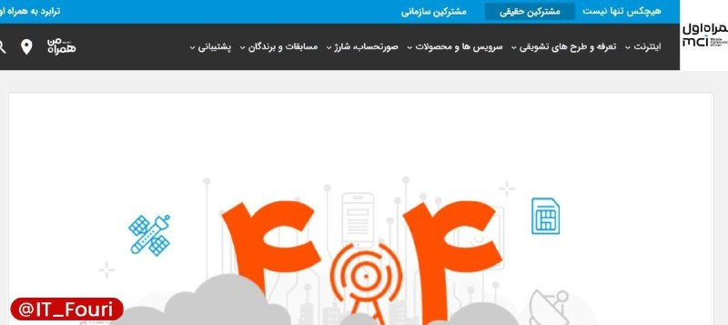

صفحه اینترنت پرو از سایت همراه اول حذف شد.

👩‍💻@PhantomDirective

🆔@persian_trend_official
پرشین ترند | متفاوت‌ترین کانال نظامی

## Persian_Trend_Official — post 15041

  <a href="telegram/content/Persian_Trend_Official_15041_1779782871.webm" target="_blank">🎬 Download video</a>

دقایقی قبل نت‌بلاکس آپدیت جدیدی از وضعیت اینترنت بین‌الملل ایران منتشر کرد.

👩‍💻@PhantomDirective

🆔@persian_trend_official
پرشین ترند | متفاوت‌ترین کانال نظامی

## Persian_Trend_Official — post 15040

  <a href="telegram/content/Persian_Trend_Official_15040_1779782871.webm" target="_blank">🎬 Download video</a>

🇮🇷بیانیه منتشر شده از سوی روابط‌عمومی سپاه

هشدار سپاه در برابر هرگونه نقض آتش بس از سوی ارتش متجاوز آمریکا:
حق پاسخ متقابل را برای خود مشروع و قطعی می‌دانیم

در اطلاعیه روابط عمومی سپاه پاسداران انقلاب اسلامی آمده است:
🔹ارتش تروریستی آمریکا در ادامه ماجراجویی‌های مداخله گرایانه در منطقه و رفتارهای متجاوزانه، در منطقه خلیج فارس وارد حریم هوایی ایران شد و یگان های پدافندی سپاه پاسداران در راستای دفاع از حریم سرزمینی کشورمان پس از پایش های اطلاعاتی دقیق، یک فروند پهپاد MQ9 را شناسایی و ساقط کرد.
🔹همچنین با شلیک به یک فروند پهپاد RQ4 و جنگنده متجاوز F35 آنان را وادار به فرار و خروج از حریم سرزمینی کرد.
🔹سپاه پاسداران نسبت به هرگونه نقض آتش بس از سوی ارتش متجاوز آمریکا هشدار داده و حق پاسخ متقابل را برای خود مشروع و قطعی می داند.

👩‍💻@PhantomDirective

🆔@persian_trend_official
پرشین ترند | متفاوت‌ترین کانال نظامی

## Persian_Trend_Official — post 15039

  

✉️ دسترسی برخی کاربران سیتنا به #جیمیل 🔹 بر اساس گزارشات اعلامی از سوی برخی کاربران سیتنا، امکان دسترسی به جیمیل برای برخی کاربران بر روی برخی #اپراتورها میسر شده است./ #سیتنا مشخص نیست این دسترسی موقتی و تست است و یا دسترسی کامل به جیمیل برای تمام کاربران…

## Persian_Trend_Official — post 15038

  <a href="telegram/content/Persian_Trend_Official_15038_1779782872.mp4" target="_blank">🎬 Download video</a>

استاد خوش چشم : می‌شود بمب هسته‌ای برای بازدارندگی ساخت، تو جمعیت نزد و توی پایگاه های نظامی زد...

👩‍💻@PhantomDirective

🆔@persian_trend_official
پرشین ترند | متفاوت‌ترین کانال نظامی

## Persian_Trend_Official — post 15037

  <a href="telegram/content/Persian_Trend_Official_15037_1779782874.mp4" target="_blank">🎬 Download video</a>

مهاجرانی: رئیس‌جمهور مصوبه بازگشایی اینترنت بین‌الملل را ابلاغ کرد/ امیدواریم ظرف روزهای آتی بتوانیم این حقوق حقه مردم را به آنها برگردانیم

👩‍💻@PhantomDirective

🆔@persian_trend_official
پرشین ترند | متفاوت‌ترین کانال نظامی

## Persian_Trend_Official — post 15036

  <a href="telegram/content/Persian_Trend_Official_15036_1779782875.webm" target="_blank">🎬 Download video</a>

طبق گفته کاربران بعد از جیمیل آپ گوگل پلی هم دردسترس قرار گرفت.

👩‍💻@PhantomDirective

🆔@persian_trend_official
پرشین ترند | متفاوت‌ترین کانال نظامی

## Persian_Trend_Official — post 15035

  

✉️ دسترسی برخی کاربران سیتنا به #جیمیل

🔹 بر اساس گزارشات اعلامی از سوی برخی کاربران سیتنا، امکان دسترسی به جیمیل برای برخی کاربران بر روی برخی #اپراتورها میسر شده است./ #سیتنا

مشخص نیست این دسترسی موقتی و تست است و یا دسترسی کامل به جیمیل برای تمام کاربران در راه است.

برای مشاهده جزئیات کلیک کنید

💬 CitnaNewsAgeny

🎞 CitnaNews

📷 Citna.ir

🌐 @Citna94

## Persian_Trend_Official — post 15032

بولتن خبری۲۴ ساعت گذشته
آرشیو تحریریه پرشین ترند.

۵ خرداد ۱۴۰۵

🇮🇷ایران

😂مصوبه بازگشت اینترنت به وضعیت پیش از دی‌ماه ۱۴۰۴ توسط رئیس‌جمهور پزشکیان ابلاغ شد.

😂محمدباقر قالیباف مجدداً به ریاست مجلس شورای اسلامی ابقا شد.

🇮🇷محمدباقر ذوالقدر (دبیر شورای عالی امنیت ملی) تأکید کرد: «عقب‌نشینی در کار نخواهد بود» و بر وحدت ملی تأکید داشت.

وزیر نفت اعلام کرد قیمت بنزین افزایش نمی‌یابد و تلاش برای تعمیر تأسیسات ادامه دارد.

محمدرضا عارف سیاست قطع اینترنت را انتقاد کرد و آن را با بستن کل اتوبان به دلیل تخلف یک راننده مقایسه کرد.

🇮🇷
🇺🇸-گزارش‌های متعدد از پیشرفت در تهیه یادداشت تفاهم ۶۰ روزه بین ایران و آمریکا حکایت دارد. محورهای کلیدی شامل بازگشایی تنگه هرمز (با پاکسازی مین‌ها توسط ایران)، رفع محاصره دریایی، معافیت‌های موقت تحریمی برای صادرات نفت، آزادسازی مرحله‌ای دارایی‌های بلوکه‌شده (شامل حدود ۱۲ میلیارد دلار اولیه) و آغاز مذاکرات هسته‌ای در دوره ۶۰ روزه است
.
دونالد ترامپ صراحتاً مذاکرات با ایران را به گسترش توافق‌های ابراهیم گره زده و از عربستان سعودی، قطر، پاکستان، ترکیه، مصر و اردن خواسته است که همزمان با هر توافق احتمالی با ایران، روابط خود با اسرائیل را عادی‌سازی کنند. این موضع پیچیدگی دیپلماتیک قابل توجهی ایجاد کرده است.

گره زدن مذاکرات ایران به گسترش توافق‌های ابراهیم توسط ترامپ و تأکید ایران بر عدم وجود توافق نهایی هسته‌ای، نشان‌دهنده پیچیدگی‌های عمیق دیپلماتیک است. گزارش‌ها حاکی از وجود اختلافات باقی‌مانده بر سر مسائل هسته‌ای، مدیریت تنگه هرمز و تضمین‌های امنیتی است.

🇺🇸 ترامپ اعلام کرده اورانیوم غنی‌شده ایران باید یا به آمریکا منتقل و نابود شود یا با نظارت در مکانی مورد توافق نابود گردد.

- مقامات ایرانی رسماً اعلام کرده‌اند که توافق هسته‌ای قریب‌الوقوع نیست و هنوز بر سر جزئیات مهم اختلاف وجود دارد. تهران تأکید کرده که هنوز به هیچ توافق نهایی نرسیده‌اند و سند فعلی فقط چارچوبی برای مذاکرات آینده است.

😂
😂هیئت ایرانی به ریاست محمدباقر قالیباف و حضور عباس عراقچی به دوحه سفر کرده است.
- عاصم منیر (فرمانده ارتش پاکستان) توافق را نزدیک به نهایی شدن دانست.

- گزارش‌هایی از شنیده شدن انفجار در مناطق بندرعباس، جاسک، سیرک و جزیره خارگ منتشر شده است.

فرماندهی مرکزی آمریکا (سنتکام) اعلام کرد حملات «دفاعی» به سایت‌های پرتاب موشک و قایق‌های ایرانی انجام داده است.

🇮🇷ایران از فعال‌سازی پدافند هوایی و سرنگونی یک پهپاد متخاصم با سامانه «کمان آرش» خبر داده است.

- دو مورد آتش‌سوزی در جزیره خارگ (پایانه اصلی صادرات نفت) گزارش شده است.

🇮🇷۳۲ کشتی با مجوز نیروی دریایی سپاه از تنگه هرمز عبور کرده‌اند.

🇮🇱اسرائیل و خاورمیانه

🇱🇧
🇮🇱 آتش‌بس عملاً پایان یافته و ارتش اسرائیل عملیات «پیکان‌های آتش» را آغاز کرده است.
- بیش از ۷۰ هدف مرتبط با حزب‌الله در جنوب لبنان، بقاع شرقی و مناطق دیگر مورد حمله قرار گرفته است.

🇮🇱
🇮🇱 نتانیاهو بر تشدید عملیات تأکید کرده است. گزارش‌هایی از تخلیه گسترده ضاحیه جنوبی بیروت و تعطیلی مدارس شمال اسرائیل وجود دارد.

🇱🇧 گزارش‌هایی از تلاش ناموفق برای ترور نعیم قاسم وجود دارد.
- درگیری‌ها از مارس ۲۰۲۶ شدت گرفته و تا کنون هزاران کشته و زخمی داشته است.

🇺🇸
🇺🇸 فرد مسلح به نام نصیر بست (Nasire Best)، ۲۱ ساله اهل مریلند (Dundalk)، مقابل کاخ سفید تیراندازی کرد. مأموران سرویس مخفی او را کشتند. در این حادثه یک شهروند غیرنظامی نیز مجروح شد.
- مقامات رسمی تأیید کرده‌اند که مظنون سابقه اختلال روانی شدید، برخوردهای قبلی با سرویس مخفی و نقض حکم قضایی منع接近 به کاخ سفید داشته است. او قبلاً ادعا کرده بود که «عیسی مسیح» است.

سناتور لیندزی گراهام نسبت به هر توافقی که موقعیت ایران را تقویت کند، هشدار داد.

📰- نظرسنجی وال‌استریت ژورنال از کاهش حمایت قاطع جمهوری‌خواهان از ترامپ (از ۷۲٪ به ۵۷٪) خبر داد.

🇸🇦 عربستان سعودی عادی‌سازی روابط با اسرائیل را مشروط به «مسیر غیرقابل بازگشت» تشکیل کشور فلسطین دانست.

🇷🇺🇺🇦روسیه با موشک اورشنیک به کی‌یف حمله کرد و از اتباع خارجی خواست فوراً کی‌یف را ترک کنند.

👩‍💻@PhantomDirective

🆔@persian_trend_official
پرشین ترند | متفاوت‌ترین کانال نظامی

## Persian_Trend_Official — post 15031

  <a href="telegram/content/Persian_Trend_Official_15031_1779782876.mp4" target="_blank">🎬 Download video</a>

پاسخ معاون رئیس جمهور به میزان خسارت به بخش انرژِی و زیرساخت در عملیات خشم حماسی

## Persian_Trend_Official — post 15030

عصبانیت رسانه شهرداری تهران از مصوبه‌ای که اینترنت را برای همه مردم می‌خواهد

روزنامه همشهری نوشت:
🔹اولاً اصل تشکیل این ستاد ویژه فضای مجازی محل اشکال جدی است؛ چراکه با احکام صریح امام شهید و دیگر قوانین بالادستی، ازجمله قانون اساسی، مصوبات مجلس، شورای‌عالی امنیت ملی و شورای‌عالی فضای مجازی مغایرت دارد.
🔹رهبر شهید انقلاب صراحتاً در سال۱۳۹۰ فرمودند مرجع «سیاستگذاری، تصمیم‌گیری، مدیریت و هماهنگی» در فضای مجازی، شورای‌عالی فضای مجازی است. در سال ۱۳۹۴ نیز مجدداً تأکید کردند شوراها و ساختارهای موازی با شورای‌عالی فضای مجازی باید منحل شوند، نه اینکه ساختار موازی جدید ایجاد شود.
🔹تصمیم دیروز درباره تعیین زمان برای بازشدن اینترنت، بدعتی دیگر بر همان بدعت است. این تصمیم، خلاف صریح مصوبه شورای‌عالی امنیت ملی است و از جهت محتوایی نیز بسیار نادرست است؛ موجب اخلال در فرماندهی واحد در شرایط جنگی می‌شود، مردم را دچار تشویش و سردرگمی می‌کند و به دشمن پیام اختلاف و چندصدایی در مدیریت بحران می‌دهد.
🔹فراموش نکنیم محدودیت اینترنت، تصمیمی امنیتی در شرایط جنگی برای صیانت از مردم است. مردم به اندازه کافی در تنگنای شرایط جنگی هستند. نباید با تصمیم‌های نادرست، فشار روانی و سردرگمی را بیشتر کرد. امروز زمان همدلی با مردم، وحدت فرماندهی و اقدام هماهنگ در سطح حکمرانی است؛ نه چندصدایی و تصمیمات موازی.

🌐 @IT_Fouri

پ.ن : زاکانی حرومزاده میخواد از مردم‌صیانت کنه !

## Persian_Trend_Official — post 15029

  

⭕️ترامپ: «اورانیوم غنی‌شده (غبار هسته‌ای!) فوراً به ایالات متحده تحویل داده خواهد شد تا به کشور بازگردانده شده و نابود شود، یا بهتر از آن، با همکاری و هماهنگی با جمهوری اسلامی ایران، در همان محل یا در مکانی قابل قبول دیگر نابود گردد؛ آن هم با حضور و نظارت…

---
📅 بروزرسانی: 1405/03/05 07:55
---

## ChizBergerz — post 46809

  <a href="telegram/content/ChizBergerz_46809_1779769529.mp4" target="_blank">🎬 Download video</a>

سنتکام و خبرگزاری‌های آمریکایی حمله دیشب به ج.ا رو رسما تایید کردن و گردن گرفتن ولی صداوسیما میگه خبری نیست و هیچ حمله‌ای صورت نگرفته😂😂

+ این روزا حاضرن کونشون بزارن ولی نگن آتش‌بس نقض شده😂
@ChizBergerz

## ChizBergerz — post 46808

  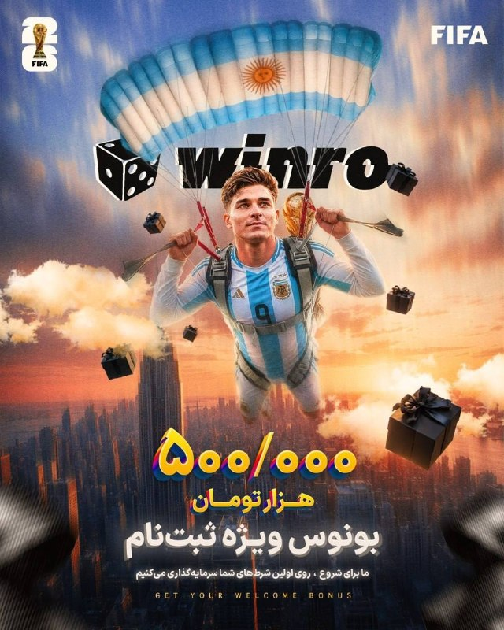

⭕️ بدون واریز شرط ببند و بازی کن چون وینرو با ثبت نام و بدون نیاز به واریز ۵۰۰هزارتومان بهت میده 
❌

🎉 500 هزارتومن رایگان فقط با ثبت نام بدون هیچگونه واریزی!

💳 پرداخت مستقیم و سریع بدون واسطه، بدون دردسر، واریز و برداشت در سریع‌ترین زمان ممکن

⌛ پشتیبانی 24 ساعته

🌐 Winro.io

🌐 Winro.io
کانال بونوس های رایگان a4

📱 @winro_io

## rodast_omiddana — post 71951

  <a href="telegram/content/rodast_omiddana_71951_1779769531.mp4" target="_blank">🎬 Download video</a>

🚨 سنتکام رسما حمله به بندرعباس را تایید کرده ولی جمهوری اسلامی داره ماله کشی میکنه 😏

## rodast_omiddana — post 71950

  <a href="telegram/content/rodast_omiddana_71950_1779769534.webm" target="_blank">🎬 Download video</a>

🚨خبرگزاری ان بی سی:
آمریکا حملاتی به جنوب ایران انجام داد.

## IranIntlTV — post 339020

  <a href="telegram/content/IranIntlTV_339020_1779769534.mp4" target="_blank">🎬 Download video</a>

سرخط خبرهای سه‌شنبه ۵ خرداد
@iranintltv

## IranIntlTV — post 339019

  

گروه جهانی بی‌تی‌اس در مراسم امسال جوایز موسیقی آمریکا در لاس‌وگاس، برنده جایزه هنرمند سال شد. این گروه برای کسب عنوان هنرمند سال با هنرمندان مطرحی چون بد بانی، برونو مارس، تیلور سوییفت، هری استایلز، لیدی گاگا، جاستین بیبر، کندریک لامار، مورگان والن و سابرینا کارپنتر رقابت کرد.
این دومین بار است که بی‌تی‌اس این جایزه را دریافت می‌کند. آن‌ها نخستین بار در سال ۲۰۲۱ برنده این جایزه شدند و این اولین باری بود که هنرمندان آسیایی در این مراسم که بر اساس رای هواداران برگزار می‌شود، برنده می‌شد.
اعضای گروه شامل آر‌ام، جین، شوگا، جی‌هوپ، جیمین، وی و جونگ کوک همگی برای دریافت جایزه در مراسم حضور داشتند. آن‌ها به‌تازگی دومین اجرای خود از چهار شب کنسرت پیاپی و کاملا فروخته‌شده در ورزشگاه الیجنت در لاس‌وگاس را به پایان رسانده بودند.
این گروه از هواداران خود که با نام «آرمی» شناخته می‌شوند، قدردانی کرد. آر‌ام در سخنرانی خود به جمعیت تشویق‌کننده گفت: «افتخار بزرگی است که پس از پایان خدمت نظامی همه اعضا، بار دیگر این جایزه ارزشمند را دریافت می‌کنیم.»

https://iranintl.com/202605266357

## IranIntlTV — post 339018

  

مارکو روبیو، وزیر خارجه آمریکا، در واکنش به حمله روز دوشنبه ایالات‌متحده به اهداف ایرانی گفت: «تنگه‌ها باید باز بمانند و به هر شکلی باز خواهند ماند.» او درباره مذاکرات حکومت ایران در قطر گفت چانه‌زنی بر سر متن اولیه توافق ادامه دارد و نهایی‌کردن زبان توافق ممکن است چند روز طول بکشد.
https://iranintl.com/202605261875

## IranIntlTV — post 339017

  

سخنگوی وزارت خارجه قطر گزارش‌ها درباره پیشنهاد دوحه برای آزادسازی ۱۲ میلیارد دلار دارایی‌های تهران در راستای دستیابی به توافق با آمریکا را تکذیب و این ادعاها را تلاشی برای تخریب دیپلماسی کنونی توصیف کرد.
ماجد الانصاری، سخنگوی وزارت خارجه قطر، در ایکس نوشت: «گزارش‌هایی که می‌گویند قطر ۱۲ میلیارد دلار به ایران پیشنهاد داده تا توافقی را تضمین کند، درست نیست.»
او گفت این ادعاها از سوی طرف‌هایی منتشر می‌شود که در پی تضعیف «تلاش‌های دیپلماتیک کنونی برای ثبات و کاهش تنش منطقه‌ای» هستند.
الانصاری افزود نقش میانجی‌گری قطر در کنار شرکای منطقه‌ای «به‌خوبی تثبیت شده و به‌صورت عمومی مستند شده است» و این گزارش‌ها تلاشی برای آسیب زدن به اعتبار دوحه به‌عنوان «تسهیل‌کننده مورد اعتماد بین‌المللی صلح» است.

https://iranintl.com/202605269986

## IranIntlTV — post 339016

  <a href="telegram/content/IranIntlTV_339016_1779769536.mp4" target="_blank">🎬 Download video</a>

یک شهروند در ویدیویی که در شبکه‌های اجتماعی منتشر شده، به وضعیت شغلی خود اشاره کرده و از اقدامات و تصمیمات حکومت انتقاد می‌کند. او می‌گوید: «جمهوری اسلامی دائم از توافق و آتش‌بس سخن می‌گوید، اما درباره تعطیلی کارخانه‌ها حرفی نمی‌زند.»

گزارش‌های منتشر‌شده نشان می‌دهد فشار اقتصادی و ناامنی شغلی شهروندان تشدید شده است.
@iranintltv

## Persian_Trend_Official — post 15028

  

صبحتون بخیر ☕️🤍

📝 Nick
📌 @persian_trend_official
پرشین ترند | متفاوت‌ترین کانال نظامی

## Persian_Trend_Official — post 15027

  

⭕️پست جدید دونالد ترامپ

پ ن: آیا هنوز عقیده دارید ترامپ پولی به جمهوری اسلامی پرداخت خواهد داد؟

🫆:Tony

📌 @persian_trend_official
پرشین ترند | متفاوت‌ترین کانال نظامی

## Persian_Trend_Official — post 15026

  <a href="telegram/content/Persian_Trend_Official_15026_1779769538.webm" target="_blank">🎬 Download video</a>

🔴 مقام آمریکایی: حملات در ایران «دفاعی» بوده است

▪️ یک مقام آمریکایی اعلام کرده حملات اخیر در ایران جنبه دفاعی داشته و به معنای پایان آتش‌بس نیست
▪️ به گفته او، یک سایت سام (پدافند موشکی زمین به هوا) در بندرعباس هدف قرار گرفته است
▪️ این مقام مدعی شده این اقدام پس از تهدید یا هدف قرار گرفتن جنگنده‌های آمریکایی انجام شده است

▪️ تاکنون هیچ تأیید مستقلی از سوی ایران درباره این ادعاها منتشر نشده است
▪️ وضعیت منطقه همچنان در سطح بالای تنش و ابهام قرار دارد

🫆:Tony

📌 @persian_trend_official
پرشین ترند | متفاوت‌ترین کانال نظامی

## Persian_Trend_Official — post 15025

  

⭕️روبیو به ارمنستان می رود

▪️سفارت آمریکا در ایروان اعلام کرد که مارکو روبیو روز سه‌شنبه برای دیدارهایی با محوریت دیپلماسی و روابط دوجانبه به ارمنستان سفر خواهد کرد.

🫆:Tony

📌 @persian_trend_official
پرشین ترند | متفاوت‌ترین کانال نظامی

---
📅 بروزرسانی: 1405/03/05 03:40
---

## rodast_omiddana — post 71949

  <a href="https://t.me/rodast_omiddana/71949" target="_blank">📎 Download file</a>

🔈 حجم فشرده_فوری_به فرودگاه بندرعباس حمله شد_قایق های تندرو سپاه را زدن_آیا جنگ آغاز شد

## rodast_omiddana — post 71948

  <a href="https://t.me/rodast_omiddana/71948" target="_blank">📎 Download file</a>

🔈 فوری_به فرودگاه بندرعباس حمله شد_قایق های تندرو سپاه را زدن_آیا جنگ آغاز شد

## rodast_omiddana — post 71947

▶️ کیفیت 360_فوری_به فرودگاه بندرعباس حمله شد_قایق های تندرو سپاه را زدن_آیا جنگ آغاز شد

## rodast_omiddana — post 71946

▶️ کیفیت 144_فوری_به فرودگاه بندرعباس حمله شد_قایق های تندرو سپاه را زدن_آیا جنگ آغاز شد

## KiriMohems — post 47993

🔴سنتکام:
نیروهای ایالات متحده امروز حملات دفاعی خود را در جنوب ایران انجام دادند تا از نیروهای ما در برابر تهدیدات ناشی از نیروهای ایرانی محافظت کنند. اهداف شامل سایت های پرتاب موشک و قایق های ایرانی در تلاش برای استقرار مین بودند. فرماندهی مرکزی ایالات متحده همچنان به دفاع از نیروهای ما در حین حرکت ادامه می دهد

#professor
@KiriMohems

## KiriMohems — post 47992

▪︎با این وضعیت اینترنت، ربات تلگرام وینکوبت خیلی کاربردیه چون براحتی وارد سایت میشی.

▪︎هم ثبت‌نامش سریع انجام میشه، هم کازینو رو داخل خود تلگرام میتونی بازی کنی و عملاً کل سایتو داخل ربات داری.
▪︎پیش‌بینی، بازی، واریز، برداشت و همه‌چی همونجا انجام میشه و خیلی روون‌تره: 
👇

🤖 @Wincobet_bot

🤖 @Wincobet_bot

📌کانال رسمی وینکوبت:
👇

🔵 @Wincobetofficial

## IranIntlTV — post 339007

بعضی خانه‌ها بعد از ۱۸ و ۱۹ دی دیگر شبیه قبل نشدند.
یک صندلی خالی ماند، یک تلفن دیگر جواب داده نشد و خانواده‌هایی ماندند با تصویری که آخرین‌بار از عزیزشان دیده بودند.
میلاد حاجیوند عبداللهی، ساسان کشوری، محمد رفیعی، بنیامین علیزاده، امید احمدی، احمدرضا خیری‌زاد، فاطمه علی‌محمدی و سعید صادقی حسنوند؛
جوانانی با زندگی‌های معمولی، با کار، دانشگاه، ورزش، عشق و هزار برنامه برای ادامه راه.
اما خیابان‌های آن روزها، برای بسیاری به آخر زندگی تبدیل شد؛ با گلوله جنگی، خونریزی، ضرب‌وجرح و پیکرهایی که بعضی خانواده‌ها با تهدید و فشار تحویل گرفتند.
این روایت‌ها کوتاه نوشته می‌شوند تا نام‌ها در حافظه‌مان بماند و فراموش نشود چه بر جوانان ایران گذشت.
#جاویدنامان_انقلاب_ملی_ایرانیان

## IranIntlTV — post 339006

  <a href="telegram/content/IranIntlTV_339006_1779754206.mp4" target="_blank">🎬 Download video</a>

صداوسیما در روزهای اخیر تصاویری پخش کرده که در آن، مجری‌ها مقابل دوربین اسلحه به دست گرفته‌اند، دربارهٔ تیراندازی حرف می‌زنند و حتی شلیک هم می‌کنند؛ تصاویری که در هر رسانهٔ جریان اصلی، به‌شدت حساس و محدود تلقی می‌شود.

نمایش و آموزش استفاده از سلاح در قالب برنامه‌های تلویزیونی، بخشی از روندی است که خشونت را به امری عادی و روزمره تبدیل می‌کند.

تجربهٔ بسیاری از کشورها نشان داده حکومت‌هایی که خشونت را وارد زبان و تصویر رسانه می‌کنند، در نهایت جامعه را به سمت ترس، افراطی‌گری و بحران بیشتر سوق می‌دهند.

کامبیز حسینی در «برنامه» به این موضوع می‌پردازد.

«یک ایران صدای شما را می‌شنود»
دوشنبه تا پنجشنبه ۱۱ شب تهران
از تلویزیون ایران اینترنشنال

تماشای نسخه کامل این قسمت از «برنامه» در یوتیوب:
https://youtu.be/eYsI3zfbVKA
@iranintltv

## IranIntlTV — post 339005

  <a href="telegram/content/IranIntlTV_339005_1779754209.mp4" target="_blank">🎬 Download video</a>

دانیال از آلمان: ما ایرانی‌ها تازه همدیگر را پیدا کرده‌ایم

«یک ایران صدای شما را می‌شنود»
دوشنبه تا پنجشنبه ۱۱ شب تهران
از تلویزیون ایران اینترنشنال

تماشای نسخه کامل این قسمت از «برنامه» در یوتیوب:
https://youtu.be/eYsI3zfbVKA
@iranintltv

## IranIntlTV — post 339004

  <a href="telegram/content/IranIntlTV_339004_1779754212.mp4" target="_blank">🎬 Download video</a>

محمد محمدی گلپایگانی، رییس دفتر علی خامنه‌ای، رهبر کشته‌شده جمهوری اسلامی، درباره زندگی او گفت: «خامنه‌ای با تجمل‌گرایی مخالف بود و زندگی او بسیار ساده‌ بود.»

گلپایگانی به نقل از او گفت که تمام وسایل زندگی شخصی‌اش به اندازه بار یک وانت، یا حتی کمتر، بود.
@iranintltv

## IranIntlTV — post 339003

  <a href="telegram/content/IranIntlTV_339003_1779754214.mp4" target="_blank">🎬 Download video</a>

فرزانه از هلند: جمهوری اسلامی باعث تفرقه بین مردم شده بود، ولی حالا همه یک‌صدا هستیم

«یک ایران صدای شما را می‌شنود»
دوشنبه تا پنجشنبه ۱۱ شب تهران
از تلویزیون ایران اینترنشنال

تماشای نسخه کامل این قسمت از «برنامه» در یوتیوب:
https://youtu.be/eYsI3zfbVKA
@iranintltv

## IranIntlTV — post 339002

  

فاکس‌نیوز به نقل از سخنگوی ستاد فرماندهی مرکزی آمریکا، سنتکام، گزارش داد نیروهای آمریکا روز دوشنبه در جنوب ایران به اهدافی از جمله محل‌های پرتاب موشک و قایق‌های ایرانی که در تلاش برای مین‌گذاری بودند، حمله کردند.
پیش‌تر خبرگزاری دانشجو از حمله آمریکا و اسرائیل به جنوب جزیره لارک در سحرگاه گذشته به وقت محلی خبر داده بود. این گزارش به نقل از منابع محلی نوشت نام‌های سه نفر از کشته‌شدگان عباس اسلامی، قدرت زرنگاری و عبدالرضا گلزاری است، اما تعداد کشته‌شدگان هنوز مشخص نیست.

https://iranintl.com/202605255929

## Persian_Trend_Official — post 15024

⭕️سخنگوی فرماندهی مرکزی آمریکا به خبرگزاری فاکس نیوز

⭕️ «نیروهای آمریکایی امروز در جنوب ایران حملات دفاع در خود انجام دادند تا از نیروهای خود در برابر تهدیدات ناشی از نیروهای ایرانی محافظت کنند. اهداف شامل سایت‌های پرتاب موشک و کشتی‌های ایرانی بود که سعی می‌کردند مین‌ها را مستقر کنند.

♦️فرماندهی مرکزی آمریکا همچنان در حال دفاع از نیروهای خود است، در حالی که در طول آتش‌بس جاری از خودداری استفاده می‌کند.»

🫆:Tony

📌 @persian_trend_official
پرشین ترند | متفاوت‌ترین کانال نظامی

---
📅 بروزرسانی: 1405/03/05 02:33
---

## ChizBergerz — post 46807

صداهای امشب چیز خاصی نیست، "تست توافقه" :))))

## ChizBergerz — post 46806

  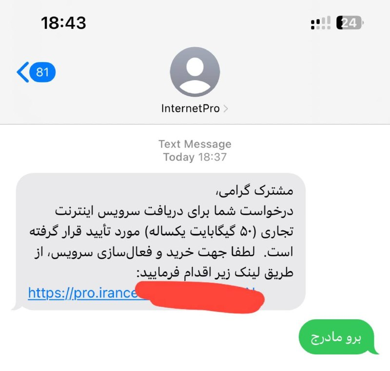

بهترین جواب👌👌

@ChizBergerz

## rodast_omiddana — post 71945

  <a href="telegram/content/rodast_omiddana_71945_1779750217.mp4" target="_blank">🎬 Download video</a>

🚨 صداوسیما هنوز نمیدونه کجا رو زدن 😏

## rodast_omiddana — post 71944

  <a href="telegram/content/rodast_omiddana_71944_1779750219.webm" target="_blank">🎬 Download video</a>

🚨 ارتش آمریکا با هدایت ستاد فرماندهی آسیای مرکزی (سنتکام/CENTCOM) ایالات متحده، طی درگیری های امشب به اهداف زیر حمله کردند:
1️⃣فرودگاه بین‌المللی بندرعباس.
2️⃣قسمتی از اسکله باهنر.
3️⃣تاسیسات نظامی کوه مبارک.

## rodast_omiddana — post 71943

  <a href="telegram/content/rodast_omiddana_71943_1779750220.webm" target="_blank">🎬 Download video</a>

🚨 
🔴کانال 14 اسرائیل: "سلام خامنه‌ای کوچیکه"

## rodast_omiddana — post 71942

  <a href="telegram/content/rodast_omiddana_71942_1779750220.webm" target="_blank">🎬 Download video</a>

🚨 حمله دیروز بوده و ترامپ هم این تصویر را منتشر کرده بود

## rodast_omiddana — post 71941

😎 خبرگزاریهای رژیم میگن دارن به ناو آمریکایی حمله میکنند 😏

## KiriMohems — post 47991

  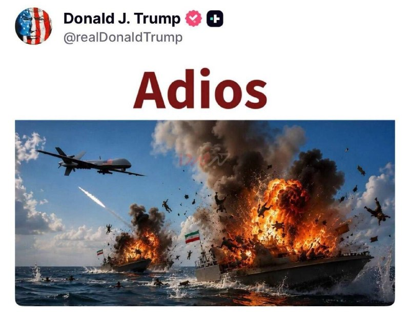

🔴 توافق به کیر رفت؟ ترامپ یه عکس گذاشت که داره سپاهیارو میکشه و زد خداحافظ #professor @KiriMohems

## KiriMohems — post 47990

🔴ترامپ : اورانیوم غنی‌شده (گرد هسته‌ای!) یا فوراً به ایالات متحده تحویل داده خواهد شد تا به کشور بازگردانده شده و نابود شود

یا ترجیحاً، همراه و هماهنگ با جمهوری اسلامی ایران، در محل یا در مکان دیگری که مورد قبول باشد، با حضور کمیسیون انرژی اتمی یا معادل آن، این فرآیند و رویداد نابود شود.

#professor
@KiriMohems

## SportBaadNews — post 252616

  <a href="telegram/content/SportBaadNews_252616_1779750221.webm" target="_blank">🎬 Download video</a>

🚨
🚨
🚨 فووووری از سنتکام: نیروهای ایالات متحده امروز حملات دفاعی خود را در جنوب ایران انجام دادند تا از نیروهای ما در برابر تهدیدات ناشی از نیروهای ایرانی محافظت کنند. اهداف شامل سایت های پرتاب موشک و قایق های ایرانی در تلاش برای استقرار مین بودند. فرماندهی مرکزی ایالات متحده همچنان به دفاع از نیروهای ما در حین حرکت ادامه می دهد
@SportBaadNews

## SportBaadNews — post 252615

  <a href="telegram/content/SportBaadNews_252615_1779750222.mp4" target="_blank">🎬 Download video</a>

جشن پشم ریزون هواداران دپورتیوو لاکرونیا پس‌ از صعود مجدد به لالیگا بعد از 8 سال
@SportBaadNews

## SportBaadNews — post 252614

▪︎با این وضعیت اینترنت، ربات تلگرام وینکوبت خیلی کاربردیه چون براحتی وارد سایت میشی.

▪︎هم ثبت‌نامش سریع انجام میشه، هم کازینو رو داخل خود تلگرام میتونی بازی کنی و عملاً کل سایتو داخل ربات داری.
▪︎پیش‌بینی، بازی، واریز، برداشت و همه‌چی همونجا انجام میشه و خیلی روون‌تره: 
👇

🤖 @Wincobet_bot

🤖 @Wincobet_bot

📌کانال رسمی وینکوبت:
👇

🔵 @Wincobetofficial

## SportBaadNews — post 252613

  <a href="telegram/content/SportBaadNews_252613_1779750224.webm" target="_blank">🎬 Download video</a>

🚨
✅ گاستون آیدل: جای نگرانی نیست، مسی مصدوم نشده فقط خستگی عضلانی داره. @SportBaadNews

## SportBaadNews — post 252612

  <a href="telegram/content/SportBaadNews_252612_1779750225.webm" target="_blank">🎬 Download video</a>

بابا کیر تو جنگ خبر رو داشته باش 
🚨
⚽️ خولیان آلوارز راضی شده از اتلتیکو جدا بشه و بارسا مقصد اصلیشه | مارکا @SportBaadNews

## SportBaadNews — post 252611

  <a href="telegram/content/SportBaadNews_252611_1779750225.webm" target="_blank">🎬 Download video</a>

بابا کیر تو جنگ خبر رو داشته باش

🚨
⚽️ خولیان آلوارز راضی شده از اتلتیکو جدا بشه و بارسا مقصد اصلیشه | مارکا
@SportBaadNews

## SportBaadNews — post 252609

تو شرایطی که ما لنگ چص تومن حقوق میلادیم امروز تو ایران تمام ظرفیت فروش لکسوس LX600 با قیمت 110 میلیارد تومن توی کمتر از 10 دقیقه به پایان رسیده
@SportBaadNews

## SportBaadNews — post 252608

سوپر اپلیکیشن‌های بله، روبیکا، بلو بانک همزمان از دسترس خارج شدن، اینا یه زیر ساخت ندارن همین چارتا اپلیکیشن داخلیشونو واسه تعداد یوزرای کمش نگه دارن چطوری حرفای قطع کامل اینترنتو باور میکنید
@SportBaadNews

## IranIntlTV — post 339001

  <a href="telegram/content/IranIntlTV_339001_1779750225.mp4" target="_blank">🎬 Download video</a>

رسانه‌ها در ایران از ابلاغ دستور مسعود پزشکیان به وزارت ارتباطات برای بازگشایی اینترنت بین‌الملل خبر دادند. ستاد راهبردی و ساماندهی فضای مجازی نیز اعلام کرد بازگشت اینترنت به وضعیت پیش از دی‌ماه ۱۴۰۴ تصویب شده است.

این در حالی است که نت‌بلاکس گزارش داد خاموشی اینترنت وارد هشتادوهفتمین روز خود شده است.

گفت‌وگو با علیرضا منافی، پژوهشگر دسترسی به اینترنت در سازمان اصل ۱۹
@iranintltv

## IranIntlTV — post 339000

  

خبرگزاری دانشجو از حمله آمریکا و اسرائیل به جنوب جزیره لارک در سحرگاه گذشته به وقت محلی خبر داد. این گزارش به نقل از منابع محلی نوشت نام‌های سه نفر از کشته‌شدگان عباس اسلامی، قدرت زرنگاری و عبدالرضا گلزاری است، اما تعداد کشته‌شدگان هنوز مشخص نیست.
https://iranintl.com/202605254753

## IranIntlTV — post 338999

  <a href="telegram/content/IranIntlTV_338999_1779750229.mp4" target="_blank">🎬 Download video</a>

رویترز گزارش داد محمدباقر قالیباف و عباس عراقچی برای دیدار با نخست‌وزیر قطر وارد دوحه شده‌اند.

به گزارش رویترز، این دیدار با هدف بررسی گزینه‌های دستیابی به توافق میان تهران و واشینگتن و پایان دادن به تنش‌ها، به‌ویژه درباره تنگه هرمز و اورانیوم با غنای بالا، انجام می‌شود.

گفت‌وگو با میثم مهرانی، تحلیل‌گر سیاسی
@iranintltv

## IranIntlTV — post 338998

  <a href="telegram/content/IranIntlTV_338998_1779750232.mp4" target="_blank">🎬 Download video</a>

دونالد ترامپ گفت روسای‌جمهوری پیشین آمریکا خواهان مذاکره بودند و تهران تهدید به اقدام نظامی می‌کرد، اما او جمهوری اسلامی را تهدید کرد و تهران به مذاکره تن داد.

او همچنین تاکید کرد اجازه نخواهد داد ایران به سلاح هسته‌ای دست پیدا کند.

گفت‌وگو با امیر گیتی، عضو تحریریه ایران‌اینترنشنال
@iranintltv

## IranIntlTV — post 338997

  <a href="https://t.me/IranintlTV/338997" target="_blank">📎 Download file</a>

🎧نسخه صوتی برنامه با کامبیز حسینی؛ بازگشت «برنامه» با «تریبون آزاد»
@iranintlTV

## IranIntlTV — post 338996

  

ترامپ در تروث‌سوشال نوشت: «اورانیوم غنی‌شده (غبار هسته‌ای!) یا فورا به آمریکا تحویل داده خواهد شد تا در ایالات‌متحده نابود شود، یا ترجیحا با همکاری و هماهنگی با جمهوری اسلامی ایران، در همان محل یا در مکانی قابل قبول دیگر نابود خواهد شد.»
ترامپ گفت در صورت نابودی اورانیوم غنی‌شده در مکانی غیر از آمریکا، «کمیسیون انرژی اتمی»، یا نهاد معادل آن، به عنوان شاهد بر این فرایند نظارت خواهد داشت.
https://iranintl.com/202605259577

## IranIntlTV — post 338995

  <a href="telegram/content/IranIntlTV_338995_1779750236.mp4" target="_blank">🎬 Download video</a>

مراد ویسی، تحلیل‌گر ارشد ایران‌اینترنشنال، گفت: «بسیاری از اختیارات پزشکیان گرفته شده او عملا نقش تعیین‌کننده‌ای در تصمیم‌گیری‌ها ندارد. پزشکیان عملا به تدارکاتچی سپاه تبدیل شده و حتی در جایگاه‌هایی مثل شورای عالی امنیت ملی هم بیشتر به ماشین امضای تصمیمات سپاه مثل جنایت دی‌ماه تبدیل شده است.»
@iranintltv

## IranIntlTV — post 338994

  <a href="telegram/content/IranIntlTV_338994_1779750238.mp4" target="_blank">🎬 Download video</a>

با ادامه انتقاد برخی گروه‌های درون حکومت ایران به شیوه مذاکرات، بعضی نمایندگان مجلس می‌گویند نباید هیچ تعهدی پذیرفته شود که به تضعیف قدرت بازدارندگی منجر گردد.
@iranintltv

## IranIntlTV — post 338993

  <a href="telegram/content/IranIntlTV_338993_1779750240.mp4" target="_blank">🎬 Download video</a>

مراد ویسی، تحلیل‌گر ارشد ایران‌اینترنشنال، گفت: «خروج قالیباف از مخفیگاه و سفرش به قطر و علنی شدن حضور علی عبداللهی، فرمانده قرارگاه خاتم الانبیا، پس از چند ماه می‌تواند نشانه امان‌نامه غیر رسمی و موقت ترامپ به فرماندهان سپاه برای رسیدن به یک توافق احتمالی باشد. اگر توافق نشود این امان‌نامه می تواند توسط نیروی هوایی اسراییل باطل شود.»
@iranintltv

## Persian_Trend_Official — post 15023

⭕️سخنگوی وزارت خارجه قطر:

♦️گزارش‌هایی که مدعی می‌شوند قطر مبلغ ۱۲ میلیارد دلار به ایران «پیشنهاد» کرده تا تضمین‌کننده حصول توافق باشد، کاملاً بی‌اساس است و توسط طرف‌هایی منتشر می‌شود که به دنبال به شکست کشاندن توافق و تضعیف تلاش‌های دیپلماتیک با هدف کاهش تنش و تقویت ثبات در منطقه هستند.

♦️تلاش‌های دیپلماتیک قطر که با هماهنگی شرکای منطقه‌ای انجام می‌شود، آشکار است و این روایت‌سازی‌ها چیزی جز تلاش‌های ناامیدانه‌ای برای خدشه‌دار کردن جایگاه قطر به‌عنوان یک بازیگر بین‌المللی قابل اعتماد در ایجاد صلح نیست./انتخاب

🫆:Tony

📌 @persian_trend_official
پرشین ترند | متفاوت‌ترین کانال نظامی

## Persian_Trend_Official — post 15022

  

شبتون بخیر ❤️

📝 Nick
📌 @persian_trend_official
پرشین ترند | متفاوت‌ترین کانال نظامی

## Persian_Trend_Official — post 15021

  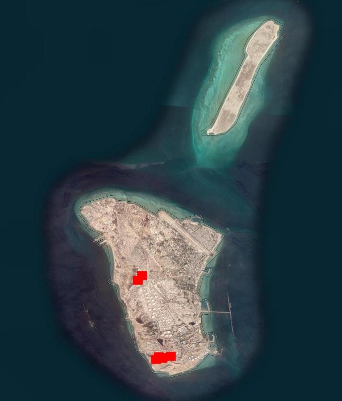

🔴به نظر می‌رسد دو آتش‌سوزی در جزیره خارگ ایران رخ داده است. ⭕️جزیره خارگ بندری برای صادرات تا ۹۰٪ از محصولات نفتی ایران فراهم می‌کند 🫆:Tony 📌 @persian_trend_official پرشین ترند | متفاوت‌ترین کانال نظامی

## Persian_Trend_Official — post 15020

https://youtube.com/live/81sH1UrOPAM?feature=share

## Persian_Trend_Official — post 15019

  

🇮🇱‏۶۱ سال پیش، الی کوهن قهرمان افسانه‌ای  مردم اسرائیل در سوریه اعدام شد.

اطلاعاتی که وی از طریق نفوذ در حکومت سوریه به دست آورد، نقش حیاتی در پیروزی اسرائیل در جنگ شش روزه داشت.

👩‍💻@PhantomDirective

🆔@persian_trend_official
پرشین ترند | متفاوت‌ترین کانال نظامی

## Persian_Trend_Official — post 15018

  <a href="telegram/content/Persian_Trend_Official_15018_1779750244.webm" target="_blank">🎬 Download video</a>

🔴به نظر می‌رسد دو آتش‌سوزی در جزیره خارگ ایران رخ داده است.

⭕️جزیره خارگ بندری برای صادرات تا ۹۰٪ از محصولات نفتی ایران فراهم می‌کند

🫆:Tony

📌 @persian_trend_official
پرشین ترند | متفاوت‌ترین کانال نظامی

---
📅 بروزرسانی: 1405/03/05 01:32
---

## ChizBergerz — post 46805

  <a href="telegram/content/ChizBergerz_46805_1779746522.mp4" target="_blank">🎬 Download video</a>

عاصم منیر وقتی بعد از یکماه مذاکره فشرده بالاخره موفق می‌شه یه توافق بین ایران و آمریکا جوش بده و حالا برگشته پاکستان تا با خیال راحت زنشو بکنه:

@ChizBergerz

## ChizBergerz — post 46804

🔴گروهک تروریستی "الجیش الکانفیگ‌فروش" مسئولیت حمله امشب به بندرعباس رو گردن گرفت!

## ChizBergerz — post 46803

  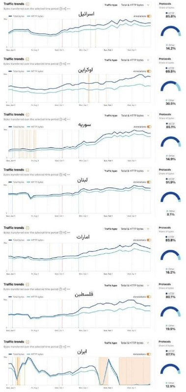

یکی از نکات جالب اینه که؛
پهنای باند اینترنت همه کشورهایی که طی یک سال گذشته درگیر جنگ بودن نه تنها روی مردمش قطع نشده؛ بلکه رشد طبیعی و فزاینده داشته؛ البته فقط به جز ایران!
اونوقت ما از وصل شدن اینترنتی که همه چیزم روش فیلتره ذوق میکنیم، مادرتو گاییدم آخوند!
@ChizBergerz

## ChizBergerz — post 46802

  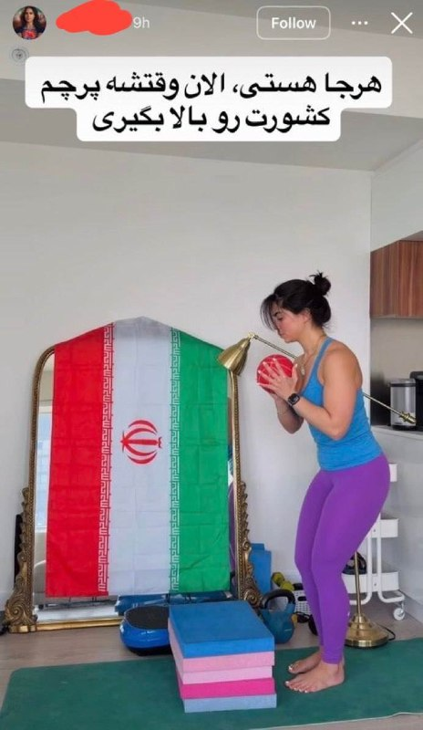

هرجا هستی کیرم تو کص مادرت.

@ChizBergerz

## ChizBergerz — post 46801

  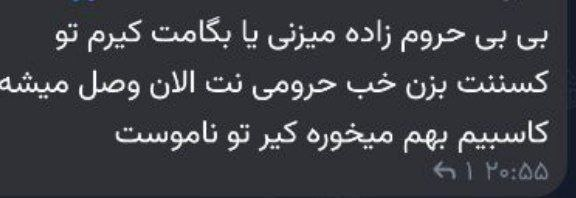

حال و هوای امروز کانفیگ فروشا:

@ChizBergerz

## ChizBergerz — post 46800

  <a href="telegram/content/ChizBergerz_46800_1779746525.mp4" target="_blank">🎬 Download video</a>

حاجی این چالش جدیده واقعا خیلی خوبههههه😁 @ChizBergerz

## ChizBergerz — post 46799

  <a href="telegram/content/ChizBergerz_46799_1779746527.mp4" target="_blank">🎬 Download video</a>

حاجی این چالش جدیده واقعا خیلی خوبههههه😁

@ChizBergerz

## ChizBergerz — post 46798

  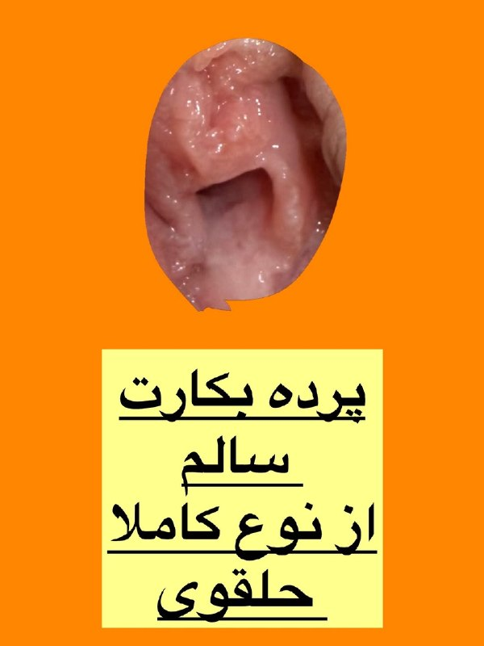

پرده بکارت سالم دیگه چه کصشعریه؟!

آنلاین‌شاپ‌های ایرانی دارن مراحل جدید رو آنلاک میکنن: 😳😂
@ChizBergerz

## ChizBergerz — post 46797

  <a href="telegram/content/ChizBergerz_46797_1779746528.mp4" target="_blank">🎬 Download video</a>

چیزی نیست، صدای توافقه. گزارش‌های کاربران از شنیده شدن صدای ۲ تا ۳ انفجار مهیب در نزدیکی شهر بندرعباس حکایت داره! @ChizNewz

## rodast_omiddana — post 71940

  <a href="telegram/content/rodast_omiddana_71940_1779746531.webm" target="_blank">🎬 Download video</a>

🚨 تا این لحظه خبر تایید شده
فرودگاه بندرعباس انفجار داشتیم
دو قایق تندرو توسط جنگنده های آمریکا زده شدن و چهار تروریست سپاه پاسداران به هلاکت رسیدن
مابقی خبرها را نمیشود تایید کرد

## rodast_omiddana — post 71939

  <a href="telegram/content/rodast_omiddana_71939_1779746531.webm" target="_blank">🎬 Download video</a>

🚨دوستان تهران خبر نیست الان میتونم تایید کنم_امید دانا

## rodast_omiddana — post 71938

  <a href="telegram/content/rodast_omiddana_71938_1779746531.webm" target="_blank">🎬 Download video</a>

🚨من شرقم. دوستم غرب. هیچ کدوم صدای انفجار نشنیدیم

## rodast_omiddana — post 71937

🚨 داداش والا ما چیتگریم هیچ خبری نیست همیشه اولین جایی که میزدن چیتگر بود آلان خبری نی

## rodast_omiddana — post 71936

  <a href="telegram/content/rodast_omiddana_71936_1779746531.webm" target="_blank">🎬 Download video</a>

🚨 اقای امید دانا ظاهرا
بازم دشمناتو س.یر کردی و دل هواداران ( ما ها) رو شاد😄❤️
بنازم ب قدرت تحلیل میدانیت❤️❤️
پر قدرت برو جلو

## rodast_omiddana — post 71935

  <a href="telegram/content/rodast_omiddana_71935_1779746532.webm" target="_blank">🎬 Download video</a>

🚨 تا ااین لحظه دو مخاطب گفتن در تهران خبری نیست

## rodast_omiddana — post 71934

  <a href="telegram/content/rodast_omiddana_71934_1779746532.webm" target="_blank">🎬 Download video</a>

🚨 ترامپ:
اورانیوم غنی‌شده (گرد هسته‌ای!) یا باید فورا به ایالات متحده تحویل داده شود تا به کشور منتقل و نابود گردد، یا ترجیحا با هماهنگی و همکاری جمهوری اسلامی ایران، همان‌جا در محل یا در مکانی دیگر که قابل قبول باشد، نابود شود؛ به‌طوری که کمیسیون انرژی اتمی یا نهاد معادل آن، شاهد این فرایند و رویداد باشد.

## rodast_omiddana — post 71933

  <a href="telegram/content/rodast_omiddana_71933_1779746532.webm" target="_blank">🎬 Download video</a>

🚨 امید دمت گرم تهران صدا پدافند میاد

## rodast_omiddana — post 71932

  <a href="telegram/content/rodast_omiddana_71932_1779746532.webm" target="_blank">🎬 Download video</a>

🚨ی ساختمون توی بندرعباس نقطه زنی شده با پهپاد زدن

## rodast_omiddana — post 71931

  <a href="telegram/content/rodast_omiddana_71931_1779746532.webm" target="_blank">🎬 Download video</a>

🚨 اقا امید ببخشید زود قضاوتت کردیم
واقعا حمله کردن
همین الان صدای انفجار های بزرگی از تهران اومد

## rodast_omiddana — post 71930

  <a href="telegram/content/rodast_omiddana_71930_1779746533.webm" target="_blank">🎬 Download video</a>

🚨 امید
واقعا دمت گرم الان دیگه به تحلیل هات ایمان آوردم
ممنونم
عشق منی

## rodast_omiddana — post 71929

  <a href="telegram/content/rodast_omiddana_71929_1779746533.webm" target="_blank">🎬 Download video</a>

🚨اقا امید تهران صدا داره میاد ، درود بشرفت❤️

## rodast_omiddana — post 71928

  <a href="telegram/content/rodast_omiddana_71928_1779746533.webm" target="_blank">🎬 Download video</a>

🚨 سلام
آسمون غرب تهران پر از پهباده

## rodast_omiddana — post 71927

  <a href="telegram/content/rodast_omiddana_71927_1779746533.webm" target="_blank">🎬 Download video</a>

🚨 فوری_اسامی 4 کشته شده نیروی دریایی 3پا:
پاسدار کتلت عباس اسلامی
پاسدار کتلت قدرت زرنگاری
پاسدار کتلت عبدالرضاگلزاری
پاسدار کتلت حسین ستوده....

## rodast_omiddana — post 71926

  <a href="telegram/content/rodast_omiddana_71926_1779746533.webm" target="_blank">🎬 Download video</a>

🚨 فعالیت سوخت رسانا همین الان

## rodast_omiddana — post 71925

  <a href="telegram/content/rodast_omiddana_71925_1779746533.webm" target="_blank">🎬 Download video</a>

🚨 امید پدافند همدانم فعال شده

## rodast_omiddana — post 71924

  <a href="telegram/content/rodast_omiddana_71924_1779746534.webm" target="_blank">🎬 Download video</a>

🚨 دقایقی قبل پنجم خرداد جنگنده‌ های آمریکایی چند قایق تندرو نیروهای سپاه را در جنوب جزیره لارک مورد هدف قرار دادند.
نام سه تن از کشته شده ها که تا این لحظه شناسایی شدند:
عباس اسلامی
قدرت زرنگاری
عبدالرضا گلزاری

## rodast_omiddana — post 71923

  <a href="telegram/content/rodast_omiddana_71923_1779746534.webm" target="_blank">🎬 Download video</a>

🚨امید من اصفهانم صدای پدافند شدید میاد

## rodast_omiddana — post 71922

  <a href="telegram/content/rodast_omiddana_71922_1779746534.webm" target="_blank">🎬 Download video</a>

🚨 گزارش هایی از انفجار ها در کرمانشاه و اردبیل شنیده شده است

## rodast_omiddana — post 71921

  <a href="telegram/content/rodast_omiddana_71921_1779746534.mp4" target="_blank">🎬 Download video</a>

🚨 بندر عباس نیم ساعت پیش

## KiriMohems — post 47989

بندر عباس رو زدن #Helsinki @KiriMohems

## KiriMohems — post 47988

🔴میدل ایست :
دو قایق تندرو نیروی دریایی سپاه پاسداران توسط جنگنده‌های آمریکایی در خلیج فارس هدف قرار گرفتند و چهار ملوان کشته شدند
#Helsinki
@KiriMohems

## KiriMohems — post 47987

گزارشاتی از حمله به شهرکرد و اندیمشک #غیررسمی
#Helsinki
@KiriMohems

## KiriMohems — post 47986

بندر عباس رو زدن
#Helsinki
@KiriMohems

## KiriMohems — post 47985

تا خشتک فوریییییی
#Helsinki

## SportBaadNews — post 252603

  <a href="telegram/content/SportBaadNews_252603_1779746536.webm" target="_blank">🎬 Download video</a>

🚨
🚨
🚨 ترامپ تو تروث:
اورانیوم غنی‌شده (گرد هسته‌ای!) یا باید فوراً به ایالات متحده تحویل داده شود تا به کشور منتقل و نابود گردد، یا ترجیحاً با هماهنگی و همکاری جمهوری اسلامی ایران، همان‌جا در محل یا در مکانی دیگر که قابل قبول باشد، نابود شود؛ به‌طوری که کمیسیون انرژی اتمی یا نهاد معادل آن، شاهد این فرایند و رویداد باشد.
@SportBaadNews

## SportBaadNews — post 252602

  <a href="telegram/content/SportBaadNews_252602_1779746537.mp4" target="_blank">🎬 Download video</a>

دوستان بخوابید همون‌طور که دقایقی پیش گفتم ولی پستش پاک شده جنگی در کار نیست منتهی نمیتونم ثابتش کنم؛ دوستانی هم که نهایی دارید به جای اینکه تا یک شب تو تلگرام ولو باشید برید درستونو بخونید که حضوری باید امتحان بدید
@SportBaadNews

## SportBaadNews — post 252601

  <a href="https://t.me/SportBaadNews/252601" target="_blank">📎 Download file</a>

@SportBaadNews

## SportBaadNews — post 252600

خبری نیست جنگ نشده

## SportBaadNews — post 252581

  <a href="telegram/content/SportBaadNews_252581_1779746538.webm" target="_blank">🎬 Download video</a>

🚨 زیرنویس صدا سیما
@SportBaadNews

## SportBaadNews — post 252580

خبرا جنگی شدن

## IranIntlTV — post 338992

  <a href="telegram/content/IranIntlTV_338992_1779746539.mp4" target="_blank">🎬 Download video</a>

در ادامه رایزنی‌ها بر سر توافق احتمالی میان تهران و واشینگتن، هیات جمهوری اسلامی به ریاست محمدباقر قالیباف، رییس مجلس و عباس عراقچی، وزیر امور خارجه جمهوری اسلامی، وارد دوحه شد.
@iranintltv

## IranIntlTV — post 338991

  <a href="telegram/content/IranIntlTV_338991_1779746541.mp4" target="_blank">🎬 Download video</a>

مراد ویسی، تحلیل‌گر ارشد ایران‌اینترنشنال، گفت: «علنی شدن رقم ۱۲ میلیارد دلاری پول‌های توقیف‌شده در قطر، بار دیگر این واقعیت را نشان داد که در مبادلات بانکی، فروش غیر رسمی نفت و دور زدن تحریم‌ها بخش زیادی از درآمدهای ملی حیف‌ومیل می‌شود و به‌دلیل پنهانی بودن معاملات، امکان سوءاستفاده و بالا کشیدن درآمدهای نفتی توسط فرماندهان سپاه و باندهای آنها وجود دارد.»
@iranintltv

## Persian_Trend_Official — post 15017

  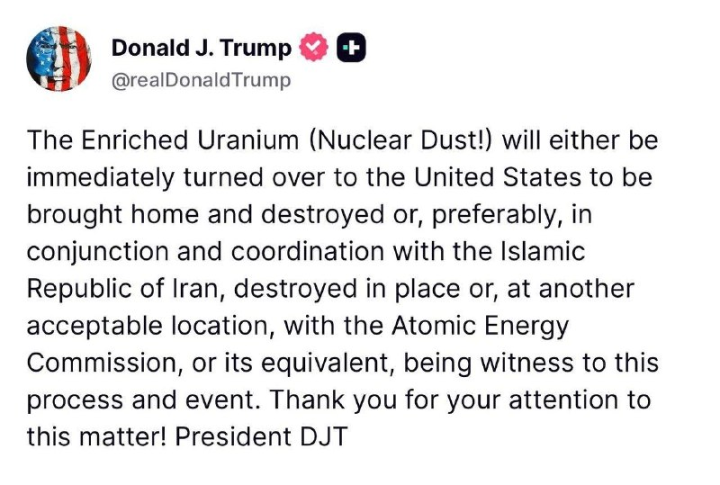

⭕️ترامپ:

«اورانیوم غنی‌شده (غبار هسته‌ای!) فوراً به ایالات متحده تحویل داده خواهد شد تا به کشور بازگردانده شده و نابود شود، یا بهتر از آن، با همکاری و هماهنگی با جمهوری اسلامی ایران، در همان محل یا در مکانی قابل قبول دیگر نابود گردد؛ آن هم با حضور و نظارت کمیسیون انرژی اتمی یا نهادی معادل آن به‌عنوان شاهد این فرآیند و رویداد.

از توجه شما به این موضوع سپاسگزارم!»

🫆:Tony

📌 @persian_trend_official
پرشین ترند | متفاوت‌ترین کانال نظامی

## Persian_Trend_Official — post 15016

  <a href="telegram/content/Persian_Trend_Official_15016_1779746544.webm" target="_blank">🎬 Download video</a>

شبکه خبر: منبع صدای انفجار در بندرعباس هنوز مشخص نیست

## Persian_Trend_Official — post 15015

  <a href="telegram/content/Persian_Trend_Official_15015_1779746545.webm" target="_blank">🎬 Download video</a>

علی هاشم، خبرنگار الجزیره: یک منبع ایرانی به من گفت که صدای تیراندازی شدیدی که در نزدیکی بندرعباس شنیده شد، پس از آن رخ داد که سپاه پاسداران یک کشتی را در دریا هدف قرار داد و پس از آن جنگنده‌های آمریکایی به قایق‌های نیروی دریایی سپاه در خلیج فارس حمله کردند.

به گفته این منبع، چندین پرسنل نیروی دریایی سپاه در این حمله کشته شدند.

این منبع گفت: «وضعیت هنوز در حال وخیم شدن است.»

## Persian_Trend_Official — post 15014

  <a href="telegram/content/Persian_Trend_Official_15014_1779746545.webm" target="_blank">🎬 Download video</a>

هم اکنون؛ پرواز هواپیمای سوخت‌رسان آمریکایی بر فراز منطقه.

## Persian_Trend_Official — post 15013

  <a href="telegram/content/Persian_Trend_Official_15013_1779746546.webm" target="_blank">🎬 Download video</a>

صدای انفجار از کرمانشاه و اصفهان

## Persian_Trend_Official — post 15010

  <a href="telegram/content/Persian_Trend_Official_15010_1779746546.mp4" target="_blank">🎬 Download video</a>

پدافند در قم
تاکنون ده ها موشک پرتاب شده

## Persian_Trend_Official — post 15008

  <a href="telegram/content/Persian_Trend_Official_15008_1779746548.webm" target="_blank">🎬 Download video</a>

🔹 آماده باش سراسری به یگان های آفندی سپاه و ارتش‼️

## Persian_Trend_Official — post 15007

  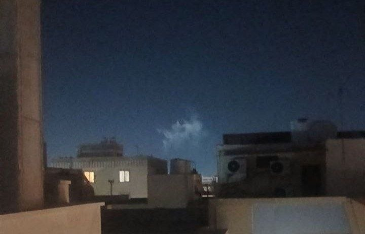

دود بلند شده از فرودگاه بندرعباس

## Persian_Trend_Official — post 15006

(غیر رسمی)دو قایق تندرو نیروی دریایی سپاه توسط جنگنده‌های آمریکایی در خلیج فارس هدف قرار گرفتند و چهار نیرو کشته شدند. این خبر تایید یا تکذیب نمی‌شود . 👩‍💻@PhantomDirective 🆔@persian_trend_official پرشین ترند | متفاوت‌ترین کانال نظامی

## Persian_Trend_Official — post 15005

  <a href="telegram/content/Persian_Trend_Official_15005_1779746549.webm" target="_blank">🎬 Download video</a>

🔹صدای انفجار در بابلسر

👩‍💻@PhantomDirective

🆔@persian_trend_official
پرشین ترند | متفاوت‌ترین کانال نظامی

## Persian_Trend_Official — post 15004

  <a href="telegram/content/Persian_Trend_Official_15004_1779746550.webm" target="_blank">🎬 Download video</a>

(غیر رسمی)دو قایق تندرو نیروی دریایی سپاه توسط جنگنده‌های آمریکایی در خلیج فارس هدف قرار گرفتند و چهار نیرو کشته شدند.
این خبر تایید یا تکذیب نمی‌شود .

👩‍💻@PhantomDirective

🆔@persian_trend_official
پرشین ترند | متفاوت‌ترین کانال نظامی

## Persian_Trend_Official — post 15003

  <a href="telegram/content/Persian_Trend_Official_15003_1779746550.mp4" target="_blank">🎬 Download video</a>

فعالیت پدافند بندر عباس

👩‍💻@PhantomDirective

🆔@persian_trend_official
پرشین ترند | متفاوت‌ترین کانال نظامی

## Persian_Trend_Official — post 15002

  <a href="telegram/content/Persian_Trend_Official_15002_1779746551.webm" target="_blank">🎬 Download video</a>

خبر عجیب خبرگزاری تابناک

👩‍💻@PhantomDirective

🆔@persian_trend_official
پرشین ترند | متفاوت‌ترین کانال نظامی

## Persian_Trend_Official — post 15001

  <a href="telegram/content/Persian_Trend_Official_15001_1779746552.mp4" target="_blank">🎬 Download video</a>

خبرنگار الجزیره: ایران به آمریکا هشدار داده است که هرگونه حمله اسرائیل به بیروت یا حومه‌های جنوبی آن می‌تواند مذاکرات جاری برای پایان دادن به جنگ را به طور جدی به خطر بیندازد!

## Persian_Trend_Official — post 15000

  

خبرنگار الجزیره:
ایران به آمریکا هشدار داده است
که هرگونه حمله اسرائیل به بیروت
یا حومه‌های جنوبی آن می‌تواند
مذاکرات جاری برای پایان دادن
به جنگ را به طور جدی
به خطر بیندازد!

## Persian_Trend_Official — post 14999

  <a href="https://t.me/persian_trend_official/14999" target="_blank">📎 Download file</a>

فایل صوتی لایو اول
نسخه کم حجم - 8.45 مگابایت

اتاق جنگ دوشنبه 4 خرداد | حمله گسترده اسرائیل به لبنان نشانه توافق با تهران ؟

📝 Nick

📌 @persian_trend_official
پرشین ترند | متفاوت‌ترین کانال نظامی

## Persian_Trend_Official — post 14998

🔴 سامانه‌های پدافند هوایی ایران در بندرعباس و بندر جاسک فعال شدند

▪️ گزارش‌ها حاکی از فعال‌شدن پدافند هوایی ایران بر فراز Bandar Abbas و Bandar Jask است

▪️ منابع غیررسمی از درگیری پدافند با اهداف هوایی خبر می‌دهند، اما هنوز ماهیت اهداف مشخص نیست

🫆:Tony

📌 @persian_trend_official
پرشین ترند | متفاوت‌ترین کانال نظامی

---
📅 بروزرسانی: 1405/03/05 00:21
---

## rodast_omiddana — post 71915

🎬
🔴
🔴
🔴پخش زنده
*هیچ پولی به جمهوری اسلامی داده نخواهد شد
*مذاکرات پازل بزرگ خاورمیانه جدید و پایان رژیم است
لینک یوتیوب:
https://www.youtube.com/watch?v=_bBRr8_Rt-E

## SportBaadNews — post 252579

هوش مصنوعی پیشرفت کرده😐 چقد طبیعیهههه @SportBadTweet | #تبریز

## SportBaadNews — post 252578

خبرایی هست که میگن سپاه داره عملیات پاکسازی مین تو تنگه هرمز رو انجام میده

## SportBaadNews — post 252577

فارس: صداهای مشابهی در جزایر سیریک و جاسک شنیده شد. @SportBaadNews

## SportBaadNews — post 252576

  <a href="telegram/content/SportBaadNews_252576_1779742309.mp4" target="_blank">🎬 Download video</a>

@SportBaadNews

## SportBaadNews — post 252575

صدای ۴ انفجار در بندرعباس شنیده شده! @SportBaadNews

## SportBaadNews — post 252574

صدای ۴ انفجار در بندرعباس شنیده شده!
@SportBaadNews

## SportBaadNews — post 252573

  <a href="telegram/content/SportBaadNews_252573_1779742311.mp4" target="_blank">🎬 Download video</a>

مراسم خفن هوادارای منچستر سیتی برای خداحافظی با پپ با استقبال عالیشون تو خیابونای منچستر 
🔥
🔥
🔥
🔥
@SportBaadNews

## SportBaadNews — post 252572

  <a href="telegram/content/SportBaadNews_252572_1779742314.webm" target="_blank">🎬 Download video</a>

🚨
💣
⚽️ فوووووری از فابریزیو رومانو: منچستریونایتد مذاکرات رو برای تمدید قرارداد برونو فرناندز شروع کرده و شدیداً میخواد این بازیکن رو تو باشگاه نگه داره. این بازیکن یه بند فسخ به ارزش 57 میلیون پوند داره!
@SportBaadNews

## SportBaadNews — post 252571

  

⚽️ برونو فرناندز در جواب روی کین: من با انتقاد مشکلی ندارم. همیشه از هر کسی که انتقاد کرده، پذیرفتم. مردم میتونن نظر خودشونو داشته باشن. اما چیزی که دوست ندارم اینه که مردم دروغ بگن. من از روز اولی که اومدم لیگ برتر، دارم موقعیت‌سازی میکنم، این موضوع هیچوقت…

## SportBaadNews — post 252570

  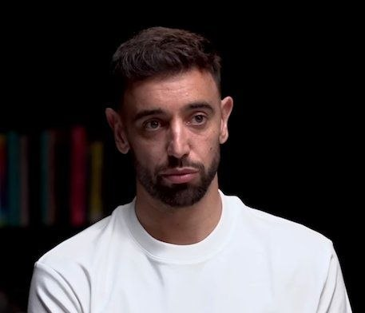

⚽️
🟠 روی کین در مورد برونو فرناندز: برونو فرناندز یه بازیکن فوق‌العاده‌ست. از اون دست بازیکناییه که من هر هفته پول میدم تا بازیشو از نزدیک ببینم، چون همیشه تلاش می‌کنه یه کاری واسه تیمش بکنه. مردم فکر میکنن من چون ازش بدم میاد ازش انتقاد میکنم، ولی دقیقا برعکسه.…

## SportBaadNews — post 252568

  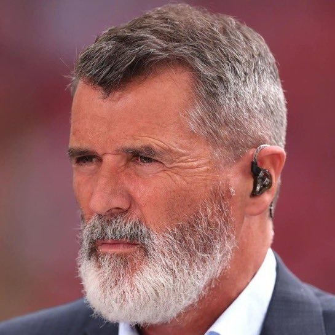

⚽️
🟠 روی کین در مورد برونو فرناندز: برونو فرناندز یه بازیکن فوق‌العاده‌ست. از اون دست بازیکناییه که من هر هفته پول میدم تا بازیشو از نزدیک ببینم، چون همیشه تلاش می‌کنه یه کاری واسه تیمش بکنه. مردم فکر میکنن من چون ازش بدم میاد ازش انتقاد میکنم، ولی دقیقا برعکسه. من از برونو انتقاد میکنم چون خیلی قبولش دارم و میدونم به عنوان یه رهبر میتونه به سطح خیلی بالاتری هم برسه. وقتی به ترکیب منچستریونایتد نگاه میکنی، یه سری بازیکنا هستن که دیگه انتظار بیشتری ازشون نداری. ولی برونو فرق میکنه.

🟠 اما تو منچستریونایتد، آمار و پاس گل‌ها باید آخرش به جام ختم بشه. این باشگاه روی بردن جام‌های بزرگ ساخته شده، نه اینکه فقط دنبال جشن گرفتن واسه جایزه‌های فردی و آمار و ارقام شخصی باشیم.
@SportBaadNews

## SportBaadNews — post 252567

امتحانای یازدهم دوازدهمم حضوری شد از 21 تیر باید برید امتحان بدید

## SportBaadNews — post 252566

ستار هاشمی٬ وزیر قطع ارتباطات: با دستور رئیس‌جمهور و پس از برگزاری سه جلسه فشرده کارشناسی و در نهایت‌ برگزاری اولین جلسه رسمی ستاد ویژه، فرایند برگشتن اینترنت کشور به وضعیت قبل از دی‌ماه ۱۴۰۴ استارت خورد.
@SportBaadNews

## SportBaadNews — post 252564

مارتینلی و خانومی
@SportBaadNews

## SportBaadNews — post 252563

سیتنا: پیگیری ها برای دسترسی به ابلاغ مصوبه ‎گشایش اینترنت به وزارت ارتباطات بی نتیجه ماند؛ هیچ مرجع رسمی حاضر به ارائه مستندات نشده است
@SportBaadNews

## IranIntlTV — post 338990

  

محمد محمدی گلپایگانی، رییس دفتر علی خامنه‌ای، در ویدیویی با اشاره به رهبر کشته‌شده جمهوری اسلامی گفت او مخالف تجمل‌گرایی بود و زندگی بسیار ساده‌ای داشت، به‌گونه‌ای که وسایل شخصی‌اش به اندازه بار یک وانت یا حتی کمتر بود.

گلپایگانی افزود علی خامنه‌ای هدایایی را که از داخل و خارج کشور برایش ارسال می‌شد، به کمیته امداد و نهادهای دیگر می‌داد تا صرف کمک به فقرا شود و بهره شخصی او از این هدایا بسیار ناچیز بود.
https://iranintl.com/202605252326

## IranIntlTV — post 338989

  

رسانه‌های ایران شامگاه دوشنبه از شنیده‌شدن صداهای انفجار در بندرعباس و همزمان در خلیج فارس حوالی سیریک و جاسک خبر دادند.

معاون استاندار هرمزگان اعلام کرد منشا صدای انفجار در حال بررسی است.
https://iranintl.com/202605254215

## IranIntlTV — post 338988

  

🔻نیویورک تایمز گزارش داده که فیفا از سوی یک گروه غیرانتفاعی در آمریکا به دلیل ممنوعیت پرچم شیر و خورشید در جام جهانی ۲۰۲۶، تهدید به اقدام حقوقی و قضایی شده است؛ این نهاد غیرانتفاعی خواستار آن شده که برگزارکننده جام جهانی ممنوعیت نمایش پرچم پیش از انقلاب اسلامی را لغو کند.

🔹«مؤسسه صداهای آزادی» نامه‌ای حاوی نگرانی‌های خود را از طریق شاهرخ مختارزاده، مشاور حقوقی‌اش، برای فیفا ارسال کرده است.

🔹مختارزاده به نشریه اتلتیک گفته است که بسته به پاسخ یا عدم پاسخ فیفا، «تصمیم برای آغاز روند رسمی دادرسی در دادگاه عالی ایالت کالیفرنیا یا دادگاه‌های فدرال در کالیفرنیا اتخاذ خواهد شد.»

🔹مشاور حقوقی این گروه گفت که سه روز پس از ارسال نامه به فیفا، هنوز هیچ پاسخی دریافت نکرده‌اند: «در صورت هرگونه تلاش فیفا برای حذف پرچم شیر و خورشید، در حال آماده‌سازی برای آغاز اقدامات حقوقی مقتضی هستیم.»

🔹هفته گذشته، اتلتیک به نقل از منابعی، گزارش داد که راهنمای رسمی فیفا برای ورزشگاه‌ها در جام جهانی، ممنوعیت این پرچم خواهد بود.

🔹جزییات بیشتر را در سایت بخوانید.

@iranintltvsport

## IranIntlTV — post 338987

  <a href="telegram/content/IranIntlTV_338987_1779742320.mp4" target="_blank">🎬 Download video</a>

محمد مرندی، کارشناس حکومتی و عضو هیات مذاکره‌کنندگان جمهوری اسلامی در مذاکرات اسلام‌آباد، در تلویزیون گفت قطر پذیرفته بخشی از دارایی‌های بلوکه‌شده حکومت را پیشاپیش تامین و بعد، از آمریکا دریافت کند. او دلیل این اقدام را درک قدرت جمهوری اسلامی و نتایج ایستادگی آن عنوان کرد.

## IranIntlTV — post 338986

  <a href="telegram/content/IranIntlTV_338986_1779742321.mp4" target="_blank">🎬 Download video</a>

رویترز به نقل از دو مقام اسرائیلی گزارش داد بنیامین نتانیاهو نسبت به تفاهم‌نامه در حال مذاکره میان تهران و واشینگتن ابراز نگرانی کرده است. براساس این گزارش، او گفته اسرائیل نفوذ چندانی بر تصمیم‌های دونالد ترامپ درباره ایران ندارد.

گفت‌وگو با مئیر جاودانفر، تحلیل‌گر مسائل اسرائیل
@iranintltv

## IranIntlTV — post 338985

  <a href="https://t.me/IranintlTV/338985" target="_blank">📎 Download file</a>

🎧نسخه صوتی ۲۴ با فرداد فرحزاد: انتقادها از توافق احتمالی ایران و آمریکا؛ ترامپ: مخالفان چیزی نمی‌دانند
@iranintlTV

## IranIntlTV — post 338984

  

ابراهیم عزیزی، رییس کمیسیون امنیت ملی مجلس، گفت آمریکا از اوایل هفته دوم جنگ از طریق عاصم منیر، فرمانده ارتش پاکستان، درخواست آتش‌بس و مذاکره داده است.
او افزود تا زمانی که پنج اقدام «اعتمادساز» از سوی آمریکا انجام نشود، چیزی به نام تفاهم و مذاکره معنا ندارد.
به گفته عزیزی، این پنج اقدام شامل «خاتمه جنگ در همه جبهه‌ها به‌ویژه لبنان، برداشته‌شدن محاصره دریایی آمریکا، تردد کشتی‌های غیرنظامی از تنگه هرمز با ترتیبات مورد نظر ایران، تعلیق ۳۰ یا ۶۰ روزه تحریم‌های نفتی و آزادسازی پول‌های بلوکه‌شده است.»
https://iranintl.com/202605256772

## IranIntlTV — post 338983

  

ابراهیم عزیزی، رییس کمیسیون امنیت ملی مجلس، گفت آمریکا از اوایل هفته دوم جنگ از طریق عاصم منیر، فرمانده ارتش پاکستان، درخواست آتش‌بس و مذاکره داده است.
او افزود تا زمانی که پنج اقدام «اعتمادساز» از سوی آمریکا انجام نشود، چیزی به نام تفاهم و مذاکره معنا ندارد.
به گفته عزیزی، این پنج اقدام شامل «خاتمه جنگ در همه جبهه‌ها به‌ویژه لبنان، برداشته‌شدن محاصره دریایی آمریکا، تردد کشتی‌های غیرنظامی از تنگه هرمز با ترتیبات مورد نظر ایران، تعلیق ۳۰ یا ۶۰ روزه تحریم‌های نفتی و آزادسازی پول‌های بلوکه‌شده است.»
https://iranintl.com/202605256772

## IranIntlTV — post 338982

  

ابراهیم عزیزی، رییس کمیسیون امنیت ملی مجلس، گفت آمریکا از اوایل هفته دوم جنگ از طریق عاصم منیر، فرمانده ارتش پاکستان، درخواست آتش‌بس و مذاکره داده است.
او افزود تا زمانی که پنج اقدام «اعتمادساز» از سوی آمریکا انجام نشود، چیزی به نام تفاهم و مذاکره معنا ندارد.
به گفته عزیزی، این پنج اقدام شامل «خاتمه جنگ در همه جبهه‌ها به‌ویژه لبنان، برداشته‌شدن محاصره دریایی آمریکا، تردد کشتی‌های غیرنظامی از تنگه هرمز با ترتیبات مورد نظر ایران، تعلیق ۳۰ یا ۶۰ روزه تحریم‌های نفتی و آزادسازی پول‌های بلوکه‌شده است.»
https://iranintl.com/202605256772

## IranIntlTV — post 338981

  <a href="telegram/content/IranIntlTV_338981_1779742327.mp4" target="_blank">🎬 Download video</a>

علی صدرزاده، تحلیل‌گر مسائل خاورمیانه، گفت: «دلیل تاکید دونالد ترامپ بر پیوستن کشورهای عربی به پیمان ابراهیم این است که می‌خواهد این پیام را منتقل کند که آن‌ها نباید انتظار داشته باشند آمریکا از آن‌ها دفاع کند.» او افزود از نظر ترامپ، کشورهای عربی بهتر است با اسرائیل همکاری کنند تا از امکانات و توان دفاعی آن بهره‌مند شوند.
@iranintltv

## IranIntlTV — post 338980

  

مسعود پزشکیان گفت: «وقتی تصمیمی گرفته می‌شود، باید یک‌صدا از سیستم بیرون بیاید. من خیلی چیزها را دوست ندارم، اما وقتی تصمیم گرفته می‌شود، کوتاه می‌آیم.»

او افزود: «اگر بتوانم معیشت و زندگی مردم را تامین کنم، آمریکا و اسرائیل نمی‌توانند در داخل کشور توطئه کنند.»
https://iranintl.com/202605258505

## IranIntlTV — post 338979

  <a href="https://t.me/IranintlTV/338979" target="_blank">📎 Download file</a>

🎧نسخه صوتی چشم‌انداز: تحرکات قالیباف در قطر، دور از چشم و گوش مجتبی و سپاه!
@iranintlTV

## IranIntlTV — post 338978

  <a href="telegram/content/IranIntlTV_338978_1779742331.mp4" target="_blank">🎬 Download video</a>

تحرکات قالیباف در قطر، دور از چشم و گوش مجتبی و سپاه!

چشم‌انداز با مهدی مهدوی‌آزاد

تماشای نسخه کامل در یوتیوب:
https://youtu.be/WCt7x569huw
@iranintltv

## IranIntlTV — post 338977

  

الجزیره به نقل از یک منبع آگاه از گفت‌وگوهای میان هیات عالی‌رتبه ایرانی و مقام‌های قطری در دوحه گزارش داد میانجی‌گری قطر به دستیابی به تفاهمی میان آمریکا و جمهوری اسلامی درباره دارایی‌های مسدودشده تهران منجر شده است.
این منبع افزود با توجه به اهمیت بالای این موضوع برای ایران، احتمال زیادی وجود دارد توافق میان آمریکا و جمهوری اسلامی فردا اعلام شود.

https://iranintl.com/202605257486

## Persian_Trend_Official — post 14997

  

🔹خبرگزاری تسنیم به نقل از یک منبع نظامی گزارش می‌دهد که تحقیقات فنی نیروهای مسلح ایران نشان می‌دهد اسرائیل در چند هفته گذشته تحت پوشش عملیات پرچم دروغین، چندین حمله پهپادی علیه امارات انجام داده است، با هدف تحریک اماراتی‌ها.🇮🇷🇦🇪🇮🇱

👩‍💻@PhantomDirective

🆔@persian_trend_official
پرشین ترند | متفاوت‌ترین کانال نظامی

## Persian_Trend_Official — post 14996

🔴 گمانه‌زنی‌ها درباره احتمال درگیری دریایی در خلیج فارس

▪️ برخی منابع غیررسمی احتمال می‌دهند انفجارهای شنیده‌شده در نزدیکی جاسک و سیرک ناشی از درگیری دریایی با یک شناور بوده باشد
▪️ گفته می‌شود این شناور احتمالاً از دستورات نیروی دریایی ایران تبعیت نکرده است
▪️ تاکنون هیچ تأیید رسمی درباره وقوع درگیری دریایی یا هویت شناور منتشر نشده است

🫆:Tony

📌 @persian_trend_official
پرشین ترند | متفاوت‌ترین کانال نظامی

## Persian_Trend_Official — post 14995

  <a href="telegram/content/Persian_Trend_Official_14995_1779742335.webm" target="_blank">🎬 Download video</a>

🔴 شنیده‌شدن صدای انفجار در خلیج فارس مقابل سیرک و جاسک

▪️ منابع محلی از شنیده‌شدن صدای چند انفجار در خلیج فارس مقابل مناطق سیرک و جاسک در جنوب Iran خبر می‌دهند
▪️ تاکنون جزئیات رسمی درباره منشأ یا ماهیت این انفجارها منتشر نشده است

🫆:Tony

📌 @persian_trend_official
پرشین ترند | متفاوت‌ترین کانال نظامی

## Persian_Trend_Official — post 14993

  <a href="telegram/content/Persian_Trend_Official_14993_1779742336.webm" target="_blank">🎬 Download video</a>

🇮🇷 — گزارش‌های اولیه از چند انفجار شدید در نزدیکی فرودگاه بندرعباس، جنوب ایران، در خلیج فارس. خبر می‌دهد.

👩‍💻@PhantomDirective

🆔@persian_trend_official
پرشین ترند | متفاوت‌ترین کانال نظامی

## Persian_Trend_Official — post 14992

  

۲ تلاش اسرائیل برای ترور شیخ نعیم قاسم ناکام ماند.

شبکه الحدث گزارش داد تل‌آویو دست‌کم دو بار به تازگی تلاش کرده شیخ نعیم قاسم، رهبر حزب‌الله لبنان را هدف قرار دهد اما موفق نشده است.

👩‍💻@PhantomDirective

🆔@persian_trend_official
پرشین ترند | متفاوت‌ترین کانال نظامی

## Persian_Trend_Official — post 14988

  <a href="telegram/content/Persian_Trend_Official_14988_1779742337.mp4" target="_blank">🎬 Download video</a>

ارتش اسرائیل در حال حاضر به سایت‌های زیرساخت حزب‌الله در دره بقاع (شمال‌شرق) و مناطق دیگری در سراسر لبنان حمله می‌کند.

👩‍💻@PhantomDirective

🆔@persian_trend_official
پرشین ترند | متفاوت‌ترین کانال نظامی

## Persian_Trend_Official — post 14987

سخنگوی ارتش اسرائیل:

ارتش اسرائیل در ۲۴ ساعت گذشته بیش از ۷۰ زیرساخت سازمان تروریستی حزب‌الله را هدف قرار داد: حدود ۱۰ فرماندهی و انبار تسلیحات در صور هدف قرار گرفتند

در طول روز، ارتش اسرائیل بیش از ۷۰ زیرساخت سازمان تروریستی حزب‌الله را با بیش از ۸۵ تسلیحات در چندین منطقه در لبنان هدف قرار داد.

در منطقه صور، حدود ۱۰ فرماندهی، انبار تسلیحات و زیرساخت‌های دیگری که توسط سازمان تروریستی حزب‌الله برای پیشبرد طرح‌های تروریستی علیه نیروهای ارتش اسرائیل و شهروندان اسرائیل استفاده می‌شد، هدف قرار گرفتند.

همزمان، نیروی هوایی تروریست‌های سازمان حزب‌الله را که با موتورسیکلت در منطقه‌ای که نیروهای ارتش اسرائیل در جنوب لبنان فعالیت می‌کنند، از بین برد.

👩‍💻@PhantomDirective

🆔@persian_trend_official
پرشین ترند | متفاوت‌ترین کانال نظامی

## Persian_Trend_Official — post 14981

تصاویری از عملیات پیکان های آتش

👩‍💻@PhantomDirective

📣@persian_trend_official
پرشین ترند | متفاوت‌ترین کانال نظامی

## Persian_Trend_Official — post 14980

  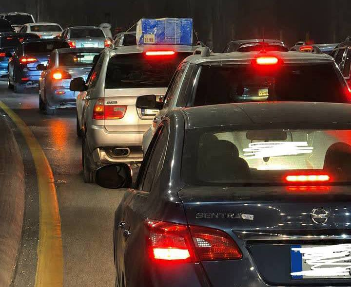

🔴 ترافیک سنگین در منطقه الحازمیه لبنان در پی موج خروج ساکنان ضاحیه

▪️ گزارش‌ها از ترافیک شدید در منطقه الحازمیه در حومه بیروت خبر می‌دهند

▪️ این وضعیت در پی جابه‌جایی گسترده ساکنان ضاحیه جنوبی بیروت ایجاد شده است

🫆:Tony

📌 @persian_trend_official
پرشین ترند | متفاوت‌ترین کانال نظامی

## Persian_Trend_Official — post 14979

  <a href="telegram/content/Persian_Trend_Official_14979_1779742339.webm" target="_blank">🎬 Download video</a>

🇱🇧
🇮🇱شلیک موشک پدافندی از جنوب لبنان به سمت جنگنده های اسرائیلی

## Persian_Trend_Official — post 14978

🔴 رئیس کمیسیون امنیت ملی مجلس ایران:

تا زمانی که آمریکا ۵ اقدام برای اعتمادسازی انجام ندهد، تفاهم و مذاکره با واشینگتن بی‌فایده است.

این شروط شامل:

▪️ پایان جنگ در تمام جبهه‌ها، به‌ویژه لبنان
▪️ رفع محاصره آمریکا و مقابله با آنچه «دزدی دریایی» خوانده شد
▪️ اجازه عبور کشتی‌های غیرنظامی از تنگه هرمز با هماهنگی ایران
▪️ تعلیق تحریم‌های نفتی برای ۳۰ یا ۶۰ روز
▪️ آزادسازی دارایی‌های بلوکه‌شده ایران

🫆:Tony

📌 @persian_trend_official
پرشین ترند | متفاوت‌ترین کانال نظامی

## Persian_Trend_Official — post 14977

کانال رسمی پرشین ترند pinned «https://youtube.com/live/81sH1UrOPAM?feature=share»

---
📅 بروزرسانی: 1405/03/04 22:49
---

## ChizBergerz — post 46796

  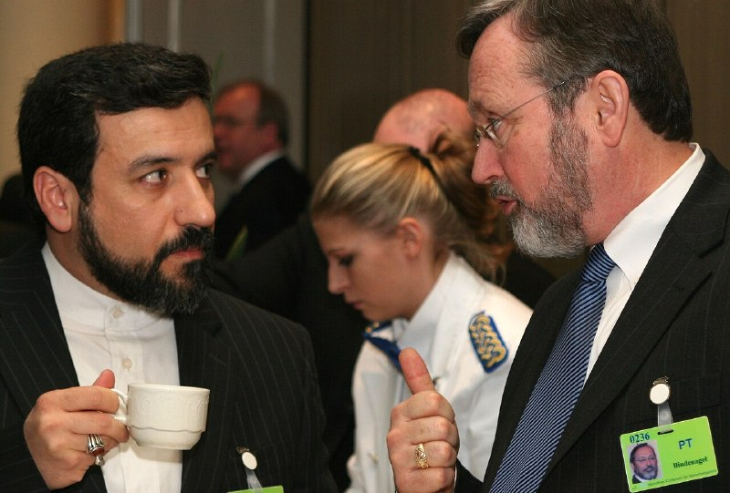

تصویری قدیمی از عراقچی که مادرش را در دست گرفته:

@ChizBergerz

## ChizBergerz — post 46795

👑آیپی جدید شیر و خورشید؛

2.21.2.58
2.21.2.89
50.7.5.85
50.7.4.107
50.7.4.243
50.7.4.244
46.32.31.30
5.160.13.85
109.72.197.1
185.37.55.30
185.50.37.52
2.188.21.138
2.188.21.240
78.157.41.60
93.115.127.9
104.103.65.50
185.109.61.27
185.255.91.60
5.160.128.142
78.39.234.140
92.123.106.96
94.232.173.28
142.54.178.211
158.58.184.147
164.138.17.122
178.252.128.66
185.137.25.146
185.53.142.174
185.88.178.196
31.214.169.244
63.141.252.203
80.191.243.226
85.133.167.108
109.230.206.175
185.141.106.238
185.142.158.162
185.208.174.167
185.208.175.228
217.219.162.200

@ChizBergerz

## SportBaadNews — post 252559

⚽️
⚽️| ونسان کمپانی اسطوره منچسترسیتی و سرمربی حال حاضر بایرن مونیخ به این شکل اومده منچستر تا توی مراسم خداحافظی پپ گواردیولا شرکت کنه و یکی از جام‌های لیگ برتر رو بالا ببره. الان بازیکنای قدیمی و اسطوره‌های باشگاه دارن میان روی استیج و 20 تا جامی رو که سیتی…

## SportBaadNews — post 252558

  <a href="telegram/content/SportBaadNews_252558_1779736743.mov" target="_blank">🎬 Download video</a>

⚽️
⚽️| ونسان کمپانی اسطوره منچسترسیتی و سرمربی حال حاضر بایرن مونیخ به این شکل اومده منچستر تا توی مراسم خداحافظی پپ گواردیولا شرکت کنه و یکی از جام‌های لیگ برتر رو بالا ببره.

الان بازیکنای قدیمی و اسطوره‌های باشگاه دارن میان روی استیج و 20 تا جامی رو که سیتی تو 10 سال دوران گواردیولا برده، تک‌تک بالا میبرن رو استیج
@SportBaadNews

## SportBaadNews — post 252557

  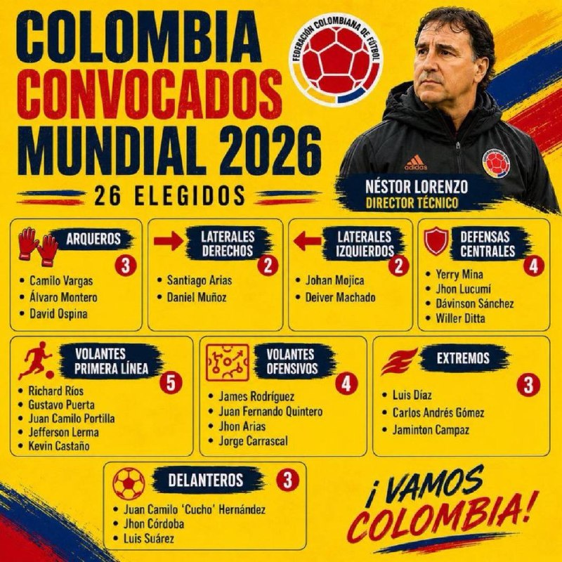

لیست کلمبیا برای جام جهانی
@SportBaadNews

## SportBaadNews — post 252556

▪︎ اگه این روزا بخاطر ضعیف بودن اینترنت سایتا سخت لود میشن، ربات تلگرام وینکوبت خیلی کارو راحت کرده:
👇

🤖 @Wincobet_bot

🤖 @Wincobet_bot

بدون اینکه از تلگرام خارج شی میتونی مستقیم وارد بخش بازی‌ها و کازینو بشی، پیش‌بینی ثبت کنی و حتی واریز و برداشت انجام بدی.
▪︎حالت Mini App داخل تلگرامه و خیلی سبک‌تر و سریع‌تر باز میشه:
👇

🤖 @Wincobet_bot

## SportBaadNews — post 252555

  <a href="telegram/content/SportBaadNews_252555_1779736746.webm" target="_blank">🎬 Download video</a>

🚨 نتانیاهو: دستور دادم حملات به لبنان تشدید بشه
@SportBaadNews

## IranIntlTV — post 338976

  <a href="telegram/content/IranIntlTV_338976_1779736746.mp4" target="_blank">🎬 Download video</a>

🔻احمد دنیامالی، وزیر ورزش در جمع خبرنگاران در تهدیدی مبهم علیه آمریکا گفت که «فیفا به فدراسیون فوتبال قول داده ویزای همه بازیکنان تیم ملی صادر می‌شود. دلیلی ندارد برای بازیکن ما ویزا صادر نشود.»

@iranintltvsport

## IranIntlTV — post 338975

  <a href="https://t.me/IranintlTV/338975" target="_blank">📎 Download file</a>

🎧نسخه صوتی تیتراول با نیوشا صارمی:سفر ناگهانی هیات جمهوری اسلامی به ریاست قالیباف به قطر؛پشت‌پرده توافق احتمالی
@iranintlTV

## IranIntlTV — post 338974

  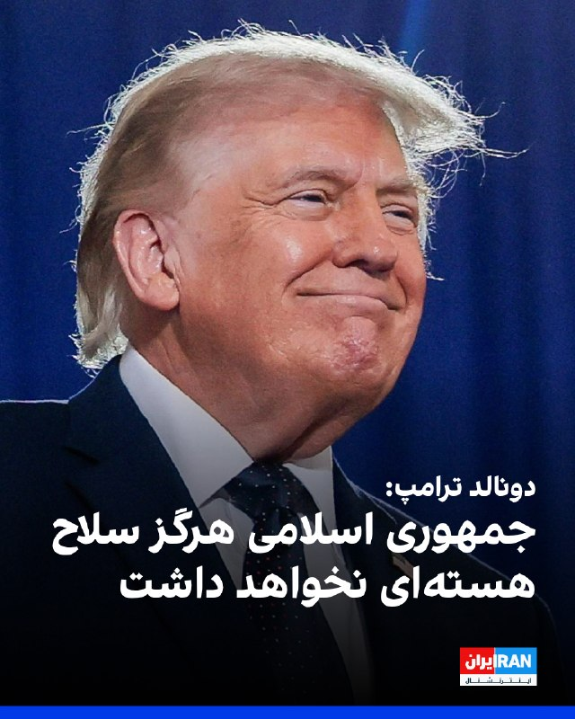

دونالد ترامپ روز دوشنبه در گورستان ملی آرلینگتون به نیروهای نظامی آمریکا، از جمله ۱۳ کشته مرتبط با جنگ ایران، ادای احترام کرد.

او افزود: «این زنان و مردان جان خود را فدا کردند تا بزرگ‌ترین حامی دولتی تروریسم در جهان هرگز به سلاح هسته‌ای دست پیدا نکند و نخواهد کرد. آن‌ها هرگز سلاح هسته‌ای نخواهند داشت.»
https://iranintl.com/202605258217

## IranIntlTV — post 338973

🔻سمافور: دو شرکت سعودی و آمریکایی برای ساخت پهپادی شبیه شاهد همکاری می‌کنند

سمافور، رسانه دیجیتال آمریکایی، گزارش داد که یک استارتاپ دفاعی آمریکایی و شرکتی متعلق به عربستان سعودی در چارچوب یک سرمایه‌گذاری مشترک، در حال ساخت کارخانه‌ای در نزدیکی ریاض برای تولید پهپادهای رزمی مشابه پهپادهای «شاهد» ساخت جمهوری اسلامی است.

بر اساس این گزارش که دوشنبه چهارم خرداد انتشار یافت، پروژه ساخت این تاسیسات نظامی از سوی شرکت مشترک دفاعی «اس‌آر۲ وکتور» اجرا می‌شود که در همکاری میان شرکت «وکتور دیفنس» مستقر در ایالت یوتا در آمریکا و استارتاپ سعودی «اس‌آر۲ دیفنس سیستمز» شکل گرفته است.

این کارخانه پهپاد تهاجمی یک‌طرفه «اسکای‌وسپ» را تولید خواهد کرد؛ پهپادی انتحاری که شرکت وکتور توسعه داده و می‌تواند اهدافی را تا فاصله ۱۵۰۰ کیلومتری، تقریبا معادل فاصله ساحل شمال‌شرقی عربستان سعودی تا تهران، هدف قرار دهد.

لوسین زایگلر، مدیر ارشد راهبردی و از بنیان‌گذاران اس‌آر۲، به سمافور گفت: «اسکای‌وسپ پهپادی است که می‌تواند توازن [قوا] را برقرار کند و توان بازدارندگی عربستان سعودی را افزایش دهد.»
زایگلر جزئیاتی درباره ظرفیت تولید کارخانه ارائه نکرد، اما گفت تولید آن «در مقیاسی عملیاتی و متناسب با نیازهای بازدارندگی راهبردی» عربستان سعودی خواهد بود. او همچنین از اعلام زمان آغاز تولید و میزان سرمایه‌گذاری خودداری کرد.

اس‌آر۲ وکتور هم برای بازار داخلی عربستان سعودی و هم برای صادرات به کشورهای متحد ریاض، پهپاد تولید خواهد کرد.
سمافور نوشت که انتظار می‌رود کشورهای خلیج فارس در پی جنگ اخیر آمریکا و اسرائیل با جمهوری اسلامی، هزینه‌های دفاعی خود را افزایش دهند، زیرا به دنبال تقویت امنیت و بازدارندگی خود در برابر حملات احتمالی آینده هستند.

عربستان سعودی یکی از بزرگ‌ترین بودجه‌های دفاعی جهان را دارد، اما تقریبا تمام تجهیزات نظامی خود را وارد می‌کند. این کشور هدف‌گذاری کرده است که تا سال ۲۰۳۰، نیمی از نیازهای دفاعی خود را بومی‌سازی و درون کشور تولید کند.

طبق آمارهای رسمی و تجمیع داده‌های وزارت دفاع عربستان، این کشور در جریان جنگ اخیر، بیش از ۱۰۰۰ بار هدف حملات موشکی و پهپادی جمهوری اسلامی و متحدان شبه‌نظامی‌اش در منطقه قرار گرفته است.

گزارش‌ها حاکی است که تنها تا ۲۰ فروردین، دست‌کم ۱۰۴ موشک بالستیک و ۹۱۶ پهپاد انتحاری در آسمان عربستان رهگیری و منهدم شد.

این حجم از تهدیدها، نیاز ریاض به فناوری‌های نوین و امتحان‌پس‌داده سامانه‌های ضدپهپادی را بیش از پیش برجسته کرده است.

خبرگزاری رویترز اوایل اردیبهشت در گزارشی اختصاصی به استفاده ارتش آمریکا از فناوری‌های ضدپهپادی اوکراین برای مقابله با حملات جمهوری اسلامی به خاک عربستان سعودی پرداخت.

طبق گفته پنج منبع آگاه به رویترز، ارتش ایالات متحده در هفته‌های منتهی به انتشار گزارش سامانه فرماندهی و کنترل اوکراینی موسوم به «اسکای مپ» (Sky Map) را در پایگاه هوایی استراتژیک «پرنس سلطان» مستقر کرد.
از سوی دیگر، ولودیمیر زلنسکی، رییس‌جمهوری اوکراین، در نخستین روزهای اردیبهشت برای دومین بار طی یک ماه به عربستان سعودی رفت و با مقام‌های عالی‌رتبه عربستان سعودی، از جمله محمد بن سلمان، ولیعهد این کشور، دیدار کرد.

زلنسکی در بدو ورود به جده با انتشار پیامی تاکید کرد که پس از کسب تضمین‌های مالی از رهبران اروپا، اکنون اولویت او پیشبرد توافقات امنیتی، انرژی و زیرساختی با ریاض است.

او پیش‌تر گفته بود که کارشناسان نظامی اوکراینی در جریان جنگ در چندین کشور خاورمیانه مستقر شده و با استفاده از سامانه‌های پدافندی، پهپادهای ساخت ایران را با موفقیت سرنگون کرده‌اند.

🔗وبسایت ایران‌اینترنشنال
@iranintltv

## IranIntlTV — post 338972

  <a href="https://t.me/IranintlTV/338972" target="_blank">📎 Download file</a>

🎧نسخه صوتی اخبار شبانگاهی | دوشنبه ۴ خرداد
@iranintlTV

## IranIntlTV — post 338971

  

بنیامین نتانیاهو، نخست‌وزیر اسرائیل، دوشنبه اعلام کرد اسرائیل در حال جنگ با حزب‌الله است، متوقف نخواهد شد و حملات خود علیه این گروه در لبنان را تشدید خواهد کرد.

همزمان ارتش اسرائیل اعلام کرد که به زیرساخت‌های حزب‌الله در منطقه بقاع لبنان و چندین منطقه دیگر حمله کرده است.

پیش‌تر کانال ۱۲ اسرائیل به نقل از یک مقام ارشد اسرائیلی گزارش داد اسرائیل از سیاست «مهار و تحمل» خارج می‌شود و تصمیم گرفته ضربات قابل‌توجهی به حزب‌الله وارد کند.
https://iranintl.com/202605257245

## IranIntlTV — post 338970

  <a href="telegram/content/IranIntlTV_338970_1779736750.mp4" target="_blank">🎬 Download video</a>

۲۴ با فرداد فرحزاد، دوشنبه ۴ خرداد
@iranintltv

## IranIntlTV — post 338969

  

مسعود پزشکیان گفت در جریان جنگ ۱۲ روزه با علی خامنه‌ای دیدار داشته و او درباره چگونگی انجام مذاکره توضیح داده و قبول کرده که مذاکره انجام شود.
پزشکیان افزود از بیان سخنی که خلاف جهت «رهبری» باشد اجتناب می‌کند، زیرا آن را «مصیبت بزرگی» می‌داند.
او با بیان اینکه «وقتی تصمیمی گرفته می‌شود، باید یک‌صدا از سیستم بیرون بیاید» گفت: «من خیلی چیزها را دوست ندارم، اما وقتی تصمیم گرفته می‌شود، کوتاه می‌آیم.»
پزشکیان همچنین تاکید کرد: «ما باید کاری کنیم که عزت برای زندگی همه، چه مذهبی و چه غیرمذهبی، تامین شود.»
او افزود اگر بتواند معیشت و زندگی مردم را تامین کند، آمریکا و اسرائیل نمی‌توانند در داخل کشور «توطئه» کنند.
https://iranintl.com/202605258464

## IranIntlTV — post 338968

  

ستار هاشمی، وزیر ارتباطات، با اشاره به «تصویب و آغاز اجرای بازگشایی اینترنت» گفت آنچه در حال وقوع است «پیام‌آور پایداری، اعتماد ملی و ثبات کشور» است.

او افزود: «پس از ابلاغ مصوبه به وزارت ارتباطات، اقدامات فنی و عملیاتی برای بازگرداندن اینترنت به مدار عادی آغاز خواهد شد.»
https://iranintl.com/202605250528

## IranIntlTV — post 338967

  <a href="telegram/content/IranIntlTV_338967_1779736752.mp4" target="_blank">🎬 Download video</a>

مهدی مهدوی‌آزاد در برنامه «چشم‌انداز» گفت: «زمانی که یک حکومت استبدادی مانند جمهوری اسلامی با کشوری مانند آمریکا مذاکره می‌کند، قرارهای پنهانی و محرمانه بخشی از سنت این‌گونه مذاکرات خواهد بود.»
@iranintltv

## Persian_Trend_Official — post 14972

ارتش اسرائیل شروع حملات به چند شهر لبنان را تایید کرد نتانیاهو: دستور دادم حزب‌الله نابود شود! 
👩‍💻@PhantomDirective 
🆔@persian_trend_official پرشین ترند | متفاوت‌ترین کانال نظامی

## Persian_Trend_Official — post 14971

  <a href="telegram/content/Persian_Trend_Official_14971_1779736753.webm" target="_blank">🎬 Download video</a>

تسنیم: حمله پهپادی به مراکز تسلیحاتی گروهک تجزیه طلب در اربیل عراق

👩‍💻@PhantomDirective

🆔@persian_trend_official
پرشین ترند | متفاوت‌ترین کانال نظامی

## Persian_Trend_Official — post 14970

⭕️ پست جدید بنیامین نتانیاهو در اینستاگرام: ما در حال جنگ با حزب‌الله هستیم. تنها در هفته‌های اخیر، مبارزان قهرمان ما بیش از ۶۰۰ تروریست را از بین برده‌اند. می‌خواهم این را بدانید: بیش از ۶۰۰ تروریست. اما ما پا را از روی گاز برنمی‌داریم. برعکس، من گفتم که…

## Persian_Trend_Official — post 14969

  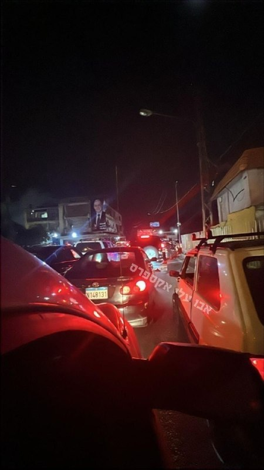

ارتش اسرائیل شروع حملات به چند شهر لبنان را تایید کرد

نتانیاهو: دستور دادم حزب‌الله نابود شود!

👩‍💻@PhantomDirective

🆔@persian_trend_official
پرشین ترند | متفاوت‌ترین کانال نظامی

## Persian_Trend_Official — post 14968

  

🔹هم اکنون آتش بس در لبنان به پایان رسید،
ارتش اسرائیل از آغاز جنگ در سراسر لبنان خبر داد.
طرفداران حزب الله در حال فرار از ضاحیه بیروت

👩‍💻@PhantomDirective

🆔@persian_trend_official
پرشین ترند | متفاوت‌ترین کانال نظامی

## Persian_Trend_Official — post 14967

  <a href="telegram/content/Persian_Trend_Official_14967_1779736755.webm" target="_blank">🎬 Download video</a>

⭕️ رافی میلوا، فرمانده نیروهای شمال اسرائیل:

«ارتش اسرائیل دیگر نمی‌تواند وضعیت فعلی لبنان را تحمل کند. جنگ از همین امشب تشدید خواهد شد و حزب‌الله، جنوب لبنان، بیروت و هر جایی که هر تروریست از این گروه حضور دارد، بهای آن را خواهند پرداخت!»

پ.ن: مثل اینکه آمریکا و ج.ا توی همون بند اول که پایان جنگ در تمام جبهه ها بود گیر کرده اند. 😂

📝 Nick

📌 @persian_trend_official
پرشین ترند | متفاوت‌ترین کانال نظامی

## Persian_Trend_Official — post 14966

ساعت 23 لایو داریم

## Persian_Trend_Official — post 14965

  <a href="telegram/content/Persian_Trend_Official_14965_1779736755.mp4" target="_blank">🎬 Download video</a>

⭕️ پست جدید بنیامین نتانیاهو در اینستاگرام:

ما در حال جنگ با حزب‌الله هستیم.
تنها در هفته‌های اخیر، مبارزان قهرمان ما بیش از ۶۰۰ تروریست را از بین برده‌اند. می‌خواهم این را بدانید: بیش از ۶۰۰ تروریست.

اما ما پا را از روی گاز برنمی‌داریم. برعکس، من گفتم که بیشتر پا را روی گاز بگذاریم.

ما به آنها حمله خواهیم کرد. درست است، آنها به سمت ما پهپاد شلیک می‌کنند، پهپادهای FPV. ما یک تیم ویژه داریم که روی این موضوع کار می‌کند و این را نیز حل خواهیم کرد.

📝 Nick

📌 @persian_trend_official
پرشین ترند | متفاوت‌ترین کانال نظامی

## Persian_Trend_Official — post 14964

  <a href="telegram/content/Persian_Trend_Official_14964_1779736757.mp4" target="_blank">🎬 Download video</a>

🔴در این ویدئو آماده سازی و تمرینات سخت نیروهای ویژه کره شمالی را مشاهده میکنید .

🫆:Tony

📌 @persian_trend_official
پرشین ترند | متفاوت‌ترین کانال نظامی

---
📅 بروزرسانی: 1405/03/04 21:29
---

## ChizBergerz — post 46794

  <a href="telegram/content/ChizBergerz_46794_1779731957.mp4" target="_blank">🎬 Download video</a>

این موزیک ویدیو خیلی خوب کارهایی که ترامپ تو جنگ انجام داده رو نمایش میده، جمهوری‌شیطانی بد افتاده تو هچل!🔥🔥

@ChizBergerz

## ChizBergerz — post 46793

گوزنامه هم میهن: طبق خبرهای رسیده؛ زرشکیان دستور بازگشایی اینترنت بین‌الملل رو ابلاغ کرده. + چطور وقتی قطعش میکنن بدون هیچ ابلاغیه‌ای انجام میشه و حالا که میخوان وصل کنن به ابلاغه زرشکیان دلقک نیازه؟ کصکشا میخواین بگین مثلا این دلقک هم کاره‌ایه؟ خر خودتونید…

## ChizBergerz — post 46792

گوزنامه هم میهن: طبق خبرهای رسیده؛ زرشکیان دستور بازگشایی اینترنت بین‌الملل رو ابلاغ کرده.

+ چطور وقتی قطعش میکنن بدون هیچ ابلاغیه‌ای انجام میشه و حالا که میخوان وصل کنن به ابلاغه زرشکیان دلقک نیازه؟ کصکشا میخواین بگین مثلا این دلقک هم کاره‌ایه؟ خر خودتونید مادرجنده‌ها.
@ChizNewz

## ChizBergerz — post 46791

  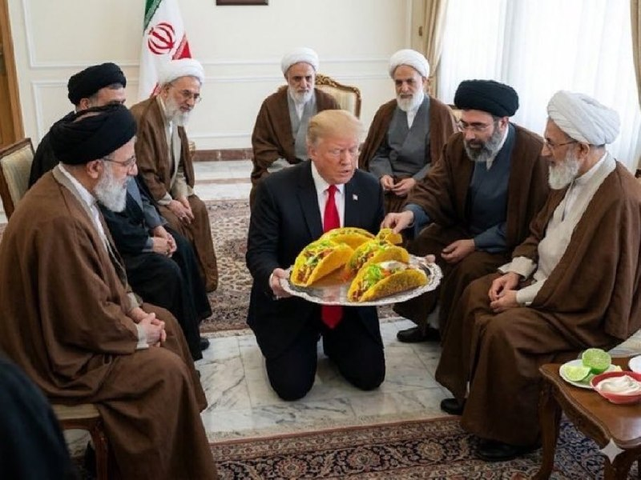

نوکپشن

@ChizBergerz

## ChizBergerz — post 46790

  

ولی شیرازیا خیلی خوبن :))))

@ChizBergerz

## ChizBergerz — post 46789

  <a href="telegram/content/ChizBergerz_46789_1779731960.webm" target="_blank">🎬 Download video</a>

⭕️ تنها جایی که در لحظه عضویت بهت 500 هزارتومان موجودی میده اینجاس 
❌ 
🎉 کافیه فقط عضو بشی تا #وینرو بهت 
🤩 
🤩 
🤩 هزارتومان جایزه بده ، نیازی هم به واریز نیست. 
⌛ پشتیبانی 24 ساعته 
🍆تنها سایت مورد اعتماد ما با بونوس های کاملا واقعی و رویایی: 
🌐 Winro.io 
🌐 Winro.io…

## ChizBergerz — post 46788

  <a href="telegram/content/ChizBergerz_46788_1779731961.webm" target="_blank">🎬 Download video</a>

⭕️ تنها جایی که در لحظه عضویت بهت 500 هزارتومان موجودی میده اینجاس 
❌

🎉 کافیه فقط عضو بشی تا #وینرو بهت 
🤩 
🤩 
🤩 هزارتومان جایزه بده ، نیازی هم به واریز نیست.

⌛ پشتیبانی 24 ساعته

🍆تنها سایت مورد اعتماد ما با بونوس های کاملا واقعی و رویایی:

🌐 Winro.io

🌐 Winro.io
کانال بونوس های رایگان g4

📱 @winro_io

## ChizBergerz — post 46787

  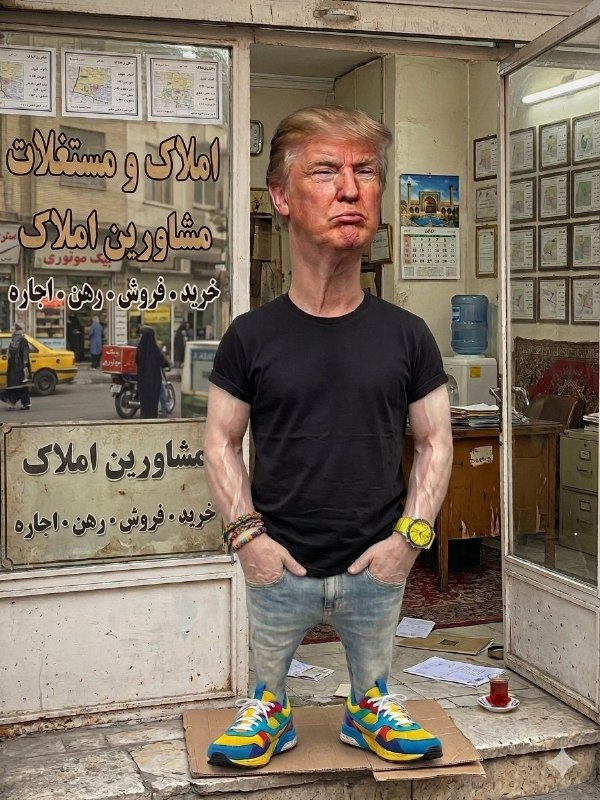

۲۰ دیگه بزار رو بودجه‌ت همین کاخ سفیدو میزنم به نام مجتبی.

‎@ChizBergerz

## ChizBergerz — post 46786

  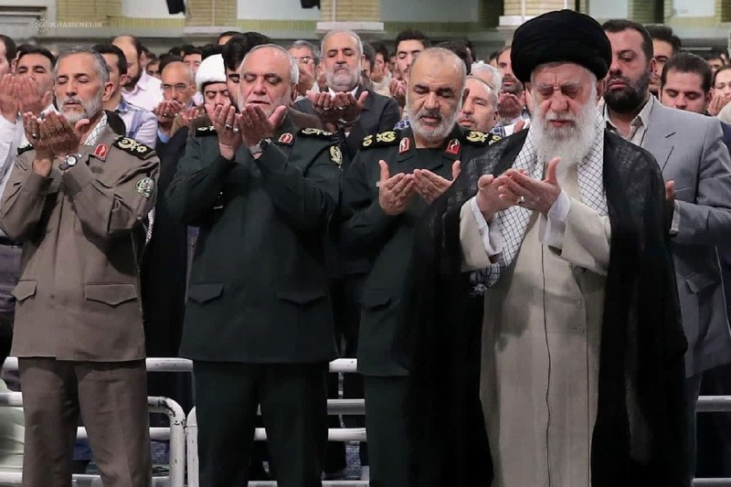

درحالی که جمهوری‌اسلامی مذاکرات رو پیروزی میدونه باید یادآوری کنم تمامی افرادی که تو این عکس حضور دارن توسط اونایی که الان دارن باهاشون مذاکره میکنن کُشته شدن!

@ChizBergerz

## rodast_omiddana — post 71914

  <a href="telegram/content/rodast_omiddana_71914_1779731963.webm" target="_blank">🎬 Download video</a>

🚨 فَکت:
اموال هیچکدام از مجریان بی بی سی توسط قوه قضاییه اژه ای مصادره نشده است...
بیخود نبود میگفتیم آیت الله بی بی سی..

## rodast_omiddana — post 71913

🎬 برنامه امشب تا یکساعت و نیم دیگه:
*هیچ پولی به جمهوری اسلامی داده نخواهد شد
*مذاکرات پازل بزرگ خاورمیانه جدید و پایان رژیم است
پخش زنده:
https://www.youtube.com/@omiddana

## rodast_omiddana — post 71912

  <a href="telegram/content/rodast_omiddana_71912_1779731963.webm" target="_blank">🎬 Download video</a>

🚨 سیاست بچه بازی نیست و ترامپ هم آدم معمولی نیست..
به تحلیل پست قبل من توجه بفرمایید تا بفهمید به عمق حماقت رسانه هایی که علیه ترامپ میگن نمیدونه داره چیکار میکنه بخندید..
این جماعت یه من امید دانا را هنوز نتونستند درست تحلیل کنند و در موردم اینهمه قضاوت نازل میکنند چه برسه به ترامپ که دست خدا را هم از پشت میبنده..

## rodast_omiddana — post 71911

  <a href="telegram/content/rodast_omiddana_71911_1779731963.webm" target="_blank">🎬 Download video</a>

🚨 شاهکار ترامپ در مذاکرات، او قبل از جنگ به همه چی فکر کرده..
ترامپ را مانند سریالهای جنایی باید دنبال کرد، هر بار یک سرنخ جدید در کارهاش بدست میاد مثلا دلیل یه اتفاقی که در قسمت ۲ افتاده رو الان داریم تو قسمت ۱۶ میفهمیم..
ترامپ به ابراهیم فکر کرده
به چین فکر کرده
به روسیه فکر کرده
به عربا فکر کرده
به بازار نفت فکر کرده
به اروپا فکر کرده
اساسا مگر میتونسته همه ی اینارو درنظر نگیره و وارد جنگ بشه؟
الان دونه دونه این متغیرا دارن تیک میخورن، مثلا:
هرمز رو باز نکرد تا مادر اروپا ساییده بشه
دست 3پاهو باز گذاشت تا دست عربها رو بکنه تو پوست گردوکه مجبور شن بیان تو توافق ابراهیم...
با چین هم که داره میبنده سر باز شدن تنگه و خود رژیم
روسیه رو که از قبل راضی کرده
خاک تو سر هرکسی که به ترامپ میگه دیوونه
الانم در اصل مذاکره با رژیم ایران نیست بلکه اصل ماجرا اینکه ترامپ داره مذاکره با رژیمو به توافق ابراهیم وصلش میکنه
در حقیقت جنگ باعث زمینه پیمان ابراهیم دسته جمعی شده است
جنگو راه انداخت تا اعراب تو خودشون خیس کنند..
الان میگه خیلی خب میخواید با این وحشیا تنها بمونید یا بیاید تو تیم من؟
زیر چتر منم بخواید بیاید اولین شرطش اینه که با اسرائیل دست بدید، اگر قراره ائتلاف کنیم باید هممون ائتلاف کنیم..
حالا شما کشورهای عربی باید بین ما با توافق ابراهیم و جمهوری اسلامی یکی رو انتخاب کنید؟
به همین راحتی ترامپ کاریو که چند دهه هیچکس در جهان نتونست بکنه داره می‌کنه
اصلا ترامپ جمهوری اسلامی رو هم تهش کامل نتونه بندازه
به صرف همینکه خاورمیانه رو با اسرائیل آشتی داده، اسمش تو تاریخ ثبت میشه زیرا تمام کله گنده های تاریخ نتونستن عربا رو بیارن پای همچین توافق بزرگی...
البته ترامپ با حماقت آخوندای شیعه و 3پا کودَن توانست چنین افتخار بزرگی را کسب کند..
در مورد سرنگونی رژیم هم شک نکنید که در ادامه صورت میگیرد ولی طول میکشد..
امید دانا

## KiriMohems — post 47984

  <a href="telegram/content/KiriMohems_47984_1779731963.mp4" target="_blank">🎬 Download video</a>

رقص این دختر بچه ایرانی تو جشن پایان سالشون توی مدرسه علوی مشهد در سطح جهانی وایرال شده و تو ۲ روز بیش از ۴۰ میلیون بازدید داشته!

#professor
@KiriMohems

## KiriMohems — post 47983

▪︎ اگه این روزا بخاطر ضعیف بودن اینترنت سایتا سخت لود میشن، ربات تلگرام وینکوبت خیلی کارو راحت کرده:
👇

🤖 @Wincobet_bot

🤖 @Wincobet_bot

بدون اینکه از تلگرام خارج شی میتونی مستقیم وارد بخش بازی‌ها و کازینو بشی، پیش‌بینی ثبت کنی و حتی واریز و برداشت انجام بدی.
▪︎حالت Mini App داخل تلگرامه و خیلی سبک‌تر و سریع‌تر باز میشه:
👇

🤖 @Wincobet_bot

## SportBaadNews — post 252554

اگه بنا به مصوبه‌ی شورای عالی امنیت ملی باشه که پزشکیان رئیس شورای عالی امنیت ملیه، اگه به مصوبه‌ی رئیس جمهور باشه که پزشکیان رئیس جمهوره، چجوری یه نفر با اینهمه مقام تو تصمیمات کوچیکترین نقشی نداره
@SportBaadNews

## SportBaadNews — post 252553

  <a href="telegram/content/SportBaadNews_252553_1779731964.webm" target="_blank">🎬 Download video</a>

🚨خبرگزاری هم میهن: طبق خبرهای رسیده به خبرنگار ما رئیس‌جمهور دستور بازگشایی اینترنت بین‌الملل را ابلاغ کرد. @SportBaadNews

## SportBaadNews — post 252552

  <a href="telegram/content/SportBaadNews_252552_1779731964.webm" target="_blank">🎬 Download video</a>

🚨خبرگزاری هم میهن: طبق خبرهای رسیده به خبرنگار ما رئیس‌جمهور دستور بازگشایی اینترنت بین‌الملل را ابلاغ کرد. @SportBaadNews

## SportBaadNews — post 252551

  <a href="telegram/content/SportBaadNews_252551_1779731964.webm" target="_blank">🎬 Download video</a>

🚨خبرگزاری هم میهن:
طبق خبرهای رسیده به خبرنگار ما رئیس‌جمهور دستور بازگشایی اینترنت بین‌الملل را ابلاغ کرد.
@SportBaadNews

## SportBaadNews — post 252550

  <a href="telegram/content/SportBaadNews_252550_1779731965.webm" target="_blank">🎬 Download video</a>

🚨
⚽️الگری بعد از فصل فاجعه بار در میلان از این تیم اخراج شد.
@SportBaadNews

## IranIntlTV — post 338966

  

🔻لوئیس دلا فوئنته، سرمربی تیم ملی اسپانیا امروز فهرست نهایی خود برای جام جهانی ۲۰۲۶ را اعلام کرد. فهرستی که هسته اصلی تیم قهرمان یورو را حفظ کرده، اما شگفتی بزرگی دارد؛ برای نخستین‌بار در تاریخ حضور اسپانیا در جام‌های جهانی، حتی یک بازیکن از رئال مادرید حضور ندارد.

🔹ستون اصلی تیمی که یورو ۲۰۲۴ را فتح کرد، همچنان شالوده تیم ملی اسپانیا برای جام جهانی ۲۰۲۶ را تشکیل می‌دهد.

🔹بازیکنانی مانند رودری، پدری، فابیان روئیس، دنی اولمو و لامین یامال همچنان مهره‌های کلیدی تیم محسوب می‌شوند.

🔹با این لیست، برای نخستین‌بار در ۹۲ سال حضور اسپانیا در جام جهانی، هیچ نماینده‌ای از پرافتخارترین باشگاه این کشور در ترکیب تیم ملی حضور نخواهد داشت. در عوض بارسلونا، قهرمان دو فصل اخیر لالیگا، ۸ نماینده در ترکیب دارد.

🔹لوئیس دلا فوئنته گفته فرم فعلی و آمادگی بدنی بازیکنان را در اولویت قرار داده است؛ تصمیمی که باعث غیبت‌های قابل توجه و در عین حال دعوت از چهره‌هایی شد که در طول فصل درخشیدند.

🔹فهرست نهایی اسپانیا و تحلیلی درباره ترکیب ۲۰۲۶ را در وب‌سایت ایران اینترنشنال بخوانید.

@iranintltvsport

## IranIntlTV — post 338965

  

یدالله جوانی، معاون سیاسی سپاه پاسداران، گفت «هادیان سیاسی» باید «روایت پیروزی ملت ایران» را برای جامعه بازگو کنند و افزود دشمن پس از شکست در میدان، تلاش می‌کند در جامعه «اختلاف، تردید و سستی» ایجاد کند.

او گفت: «اگر مجاهدت در میدان نباشد، دشمن شکست نمی‌خورد.»

معاون سیاسی سپاه پاسداران افزود: «دشمنی که در میدان شکست خورده است تلاش می‌کند در جامعه اختلاف، تردید، ابهام و سستی ایجاد کند.»
https://iranintl.com/202605257865

## IranIntlTV — post 338964

  

یدالله جوانی، معاون سیاسی سپاه پاسداران، گفت «هادیان سیاسی» باید «روایت پیروزی ملت ایران» را برای جامعه بازگو کنند و افزود دشمن پس از شکست در میدان، تلاش می‌کند در جامعه «اختلاف، تردید و سستی» ایجاد کند.

او گفت: «اگر مجاهدت در میدان نباشد، دشمن شکست نمی‌خورد.»

معاون سیاسی سپاه پاسداران افزود: «دشمنی که در میدان شکست خورده است تلاش می‌کند در جامعه اختلاف، تردید، ابهام و سستی ایجاد کند.»
https://iranintl.com/202605257865

## IranIntlTV — post 338963

  

یدالله جوانی، معاون سیاسی سپاه پاسداران، گفت «هادیان سیاسی» باید «روایت پیروزی ملت ایران» را برای جامعه بازگو کنند و افزود دشمن پس از شکست در میدان، تلاش می‌کند در جامعه «اختلاف، تردید و سستی» ایجاد کند.

او گفت: «اگر مجاهدت در میدان نباشد، دشمن شکست نمی‌خورد.»

معاون سیاسی سپاه پاسداران افزود: «دشمنی که در میدان شکست خورده است تلاش می‌کند در جامعه اختلاف، تردید، ابهام و سستی ایجاد کند.»
https://iranintl.com/202605257865

## IranIntlTV — post 338962

حضور مجتبی خامنه‌ای در مخفی‌گاه، روند مذاکرات تهران و واشینگتن را کند کرده است. براساس گزارش‌های اطلاعاتی آمریکا، رهبر سوم جمهوری اسلامی در مخفیگاهی نامعلوم و تحت تدابیر شدید امنیتی زندگی می‌کند و ارتباط با او هم صرفا از طریق شبکه‌ای پیچیده از پیک‌ها ممکن است. سی‌بی‌اس در گزارشی به نقل از مقام‌های آمریکایی نوشت یکی از دلایل تاخیر طولانی در پاسخ‌های تهران، این است که مقام‌های ارشد حکومت هم دسترسی مستقیمی به مجتبی خامنه‌ای ندارند.

گفت‌وگو با جمشید برزگر، روزنامه‌نگار و تحلیل‌گر سیاسی
@iranintltv

## IranIntlTV — post 338961

توافق احتمالی با تهران، باعث شکاف در جمهوری‌خواهان شده است. تعدادی از سناتورهای ارشد جمهوری‌خواه، معتقدند ترامپ با رفع بخشی از تحریم‌ها و آزادسازی دارایی‌های تهران، امتیاز زیادی به جمهوری اسلامی می‌دهد. آن‌ها هشدار داده‌اند فروش دوباره نفت، می‌تواند باعث تقویت جمهوری اسلامی و گروه‌های نیابتی تهران شود. کاخ سفید اما از مذاکرات دفاع کرده و می‌گوید ترامپ اجازه نخواهد داد ایران به سلاح هسته‌ای دست پیدا کند.

گفت‌وگو با مرضیه حسینی، خبرنگار ایران‌اینترنشنال
@iranintltv

## IranIntlTV — post 338960

  

رسانه‌های ایران گزارش دادند مسعود پزشکیان دستور بازگشایی اینترنت بین‌الملل را ابلاغ کرده است.
پزشکیان گفت: «راه دشواری پیمودیم تا حق مردم را به آنها بازگردانیم .»
پیش‌تر ستاد راهبری و ساماندهی فضای مجازی، به ریاست محمدرضا عارف، معاون اول مسعود پزشکیان، تشکیل جلسه داد و بازگشت اینترنت به وضعیت پیش از دی‌ماه ۱۴۰۴ را تصویب کرد.
https://iranintl.com/202605257040

## IranIntlTV — post 338959

  

خبرگزاری تسنیم، وابسته به سپاه پاسداران، نوشت که اخبار منتشرشده از سوی شبکه الحدث مبنی بر اعلام آمادگی جمهوری اسلامی برای خروج مواد هسته‌ای «کذب» است و در متن تفاهم‌نامه‌ای که تا امروز وجود دارد، هیچ جمله‌ای مبنی بر اعلام آمادگی برای خروج مواد هسته‌ای وجود ندارد.
https://iranintl.com/202605255310

## IranIntlTV — post 338958

  

دونالد ترامپ، رییس‌جمهوری آمریکا، در شبکه اجتماعی تروث‌سوشال با انتشار تصویری که با هوش مصنوعی ساخته شده، دوره اوباما و بایدن را با دوران ریاست‌جمهوری خود در مذاکرات با جمهوری اسلامی مقایسه کرد

او نوشت در دولت‌های پیشین، روسای‌جمهور آمریکا خواهان مذاکره بودند و تهران تهدید به اقدام نظامی می‌کرد، اما این بار او جمهوری اسلامی را تهدید کرد و آن‌ها به مذاکره تن دادند.

ترامپ همچنین با انتشار تصویری ساخته‌شده با هوش مصنوعی از باراک اوباما در کنار یک پالت پر از پول، نوشت سیاست‌های اوباما در قبال جمهوری اسلامی باعث وقوع جنگ شده است.
https://iranintl.com/202605251179

## IranIntlTV — post 338957

  <a href="telegram/content/IranIntlTV_338957_1779731969.mp4" target="_blank">🎬 Download video</a>

ویدیوهای دریافتی نشان می‌دهد روز یک‌شنبه سوم خرداد، جمعی از ایرانیان ساکن شهر رجاینا در ساسکاچوان کانادا، در حمایت از مردم ایران، زنجیره انسانی بر روی پلی تشکیل دادند. آن‌ها با در دست گرفتن نوشته‌هایی علیه اعدام‌های جمهوری اسلامی و قطعی اینترنت، تجمع اعتراضی برگزار کردند.
@iranintltv

## IranIntlTV — post 338956

  <a href="telegram/content/IranIntlTV_338956_1779731970.mp4" target="_blank">🎬 Download video</a>

همزمان با ادامه مذاکرات میان تهران و واشینگتن و انتشار گزارش‌هایی درباره توافق احتمالی، انتقادها در آمریکا و اسرائیل ادامه دارد. منتقدان می‌گویند جزییات منتشرشده از متن توافق می‌تواند منافع ملی آمریکا و اسرائیل را به خطر بیندازد.

گفت‌وگو با آرش آرامش، حقوقدان و کارشناس امنیت ملی
@iranintltv

## IranIntlTV — post 338955

  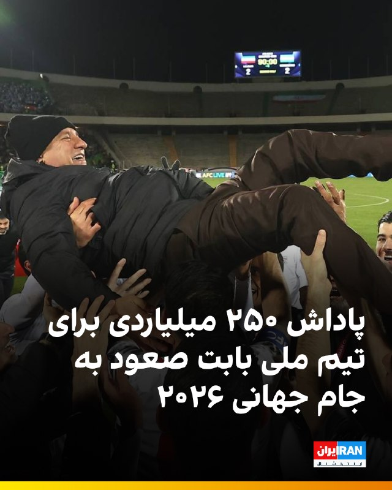

🔻خبرگزاری تسنیم گزارش داده که هیات رییسه فدراسیون فوتبال مصوب کرده پاداشی معادل ۲۵۰ میلیارد تومان به اعضای تیم ملی شامل بازیکنان، مربیان و سایر اعضا بابت صعود به جام جهانی ۲۰۲۶ اختصاص دهد. این خبرگزاری نوشته این پاداش از محل مطالبات فدراسیون فوتبال در فیفا تامین می‌شود.

🔹در چهار سال گذشته، پاداش به تیم ملی بابت صعود به جام جهانی ۲۰۲۲، یک پرونده بی‌سرانجام در فوتبل ایران بود؛ پیگیری‌های رسانه‌ای درباره حواله‌های میلیاردی خودرو به بازیکنان تیم ملی و پاداش چند ۱۰ هزار دلاری به هیات رییسه فدراسیون، هیچ‌گاه به پاسخ روشنی نرسید.

@iranintltvsport

## IranIntlTV — post 338954

  <a href="telegram/content/IranIntlTV_338954_1779731972.mp4" target="_blank">🎬 Download video</a>

دونالد ترامپ، رییس‌جمهوری آمریکا، گفت مذاکرات با جمهوری اسلامی به‌خوبی پیش می‌رود و تاکید کرد توافق احتمالی یا یک معامله بزرگ برای همه خواهد بود یا هیچ معامله‌ای در کار نخواهد بود. او همچنین از کشورهای منطقه، از جمله ایران، خواست فورا به پیمان ابراهیم بپیوندند و روابط خود را با اسرائیل عادی‌سازی کنند.

گفت‌وگو با سمیرا قرایی و بابک اسحاقی، خبرنگاران ایران‌اینترنشنال و مسعود کاظمی، روزنامه‌نگار
@iranintltv

## IranIntlTV — post 338953

  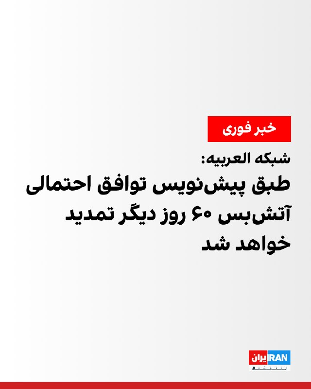

العربیه به نقل از منابع آگاه گزارش داد پیش‌نویس یک توافق میان واشینگتن و تهران در حال بررسی است. بر اساس این پیش‌نویس، تنگه هرمز بدون دریافت عوارض بازگشایی و مین‌های دریایی پاکسازی می‌شود و به ایران اجازه فروش و صادرات نفت داده خواهد شد.

در این پیش‌نویس دوره‌ای ۳۰ روزه برای ازسرگیری کامل کشتیرانی در تنگه هرمز در نظر گرفته شده و همچنین یک بازه ۶۰ روزه برای مذاکرات هسته‌ای تعیین شده است.

بر اساس این گزارش، آتش‌بس در همه جبهه‌ها از جمله لبنان برقرار خواهد ماند و برای ۶۰ روز تمدید می‌شود و امکان تمدید دوباره آن نیز وجود دارد. آمریکا نیز متعهد شده محدودیت‌ها بر بنادر جنوب ایران را کاهش دهد و بخشی از دارایی‌های مسدودشده ایران بر اساس سازوکاری مشخص آزاد شود.
https://iranintl.com/202605252770

## IranIntlTV — post 338952

  

کلودیا شینباوم، رییس‌جمهوری مکزیک، دوشنبه اعلام کرد که دولت او موافقت کرده به تیم ملی فوتبال ایران اجازه دهد در طول رقابت‌های جام جهانی در مکزیک اقامت داشته باشد.

او افزود که ایالات متحده تمایلی به میزبانی این تیم نداشته است.

شینباوم گفت که فدراسیون بین‌المللی فوتبال (فیفا) پس از آن‌که آمریکا اعلام کرد نمی‌خواهد تیم ایران در طول مسابقات در خاک این کشور مستقر باشد، با دولت مکزیک تماس گرفته است.

ایران قرار است هر سه بازی مرحله گروهی خود را در آمریکا برگزار کند.

شینباوم در یک نشست خبری گفت: «ما هیچ دلیلی برای محروم کردن آنها از امکان اقامت در مکزیک نمی‌بینیم.»

کاخ سفید و وزارت خارجه آمریکا هنوز در این زمینه اظهار نظر نکرده‌اند.
https://iranintl.com/202605252544

## IranIntlTV — post 338951

  <a href="telegram/content/IranIntlTV_338951_1779731975.mp4" target="_blank">🎬 Download video</a>

🔻هدایت ممبینی، دبیرکل فدراسیون فوتبال ایران گفته آمریکا برای اعضای تیم ملی فوتبال ویزای مولتی صادر خواهد کرد. این درحالی است که به طور معمول، ایالات متحده برای دارندگان پاسپورت ایرانی ویزای مولتی صادر نمی‌کند.

🔹توضیحات امیر گیتی، عضو تحریریه ایران اینترنشنال

@iranintltvsport

## IranIntlTV — post 338950

  

«برنامه» بعد از یک هفته، امشب روی آنتن برمی‌گردد و یک «تریبون آزاد» دیگر را برای شما میزبانی خواهد کرد.
اگر فقط یک جمله فرصت داشتید با ایران حرف بزنید، چه می‌گفتید؟
چه چیزی هنوز دلتان را گرم نگه می‌دارد؟
نگرانی‌تان چیست؟
از چه چیزی عصبانی هستید؟
حرفی دارید که در دلتان مانده و جایی برای گفتنش نبوده است؟
از خودتان بگویید؛ از امیدها و ترس‌هایتان، از رؤیایی که هنوز زنده است یا از چیزی که از دست رفته است.
تاریخ با صدای شما نوشته می‌شود.
برای شرکت در «برنامه»، همین حالا در واتس‌اپ پیام بدهید:
۰۰۴۴۷۵۲۲۱۱۰۱۱۰
۰۰۴۴۷۵۴۴۱۱۰۱۱۰
۰۰۴۴۷۵۱۱۱۰۲۵۵۳
«برنامه با کامبیز حسینی»
«یک ایران، صدای شما را می‌شنود»
@iranintltv

## IranIntlTV — post 338949

  

رضا باکری، دبیر انجمن صنایع لبنی ایران، اعلام کرد قیمت محصولات لبنی در یک سال گذشته چندین بار افزایش یافته و در مجموع حدود ۹۰ درصد گران شده است.

باکری افزود هفته گذشته دامداران، قیمت شیر خام را با ۲۹ درصد افزایش به کیلویی ۶۰ هزار و ۵۰۰ تومان رساندند.

دبیر انجمن صنایع لبنی ایران از افزایش قیمت چند محصول پرمصرف خبر داد و گفت: «قیمت شیر نایلونی به ۸۴ هزار تومان، شیر بطری به ۹۸ هزار تومان، پنیر یو‌اف ۴۰۰ گرمی به ۲۰۳ هزار تومان و ماست دبه‌ای دو کیلوگرمی به ۲۲۸ هزار و ۷۰۰ تومان رسیده است.»

سرانه مصرف شیر در ایران یک‌سوم میانگین جهانی است که تنها در یکی دو سال اخیر، ۳۰ درصد کاهش داشته است.
https://iranintl.com/202605252813

## IranIntlTV — post 338948

  <a href="telegram/content/IranIntlTV_338948_1779731977.mp4" target="_blank">🎬 Download video</a>

در حالی که دونالد ترامپ، رییس‌جمهوری آمریکا، نسبت به پیشرفت در مذاکرات با جمهوری اسلامی ابراز امیدواری کرده است، گمانه‌زنی‌ها و ابهامات زیادی درباره احتمال دستیابی به توافق مطرح است.

حسین آقایی، عضو تحریریه ایران‌اینترنشنال، در «پیوست» امروز نگاهی تحلیلی به امکان دستیابی به توافق و دوراهی جنگ و مذاکره برای وادار کردن جمهوری اسلامی به پذیرش شروط دارد
@iranintltv

## IranIntlTV — post 338947

  

علیرضا رحیمی، معاون امور جوانان وزارت ورزش و جوانان، در اختتامیه جشنواره «نسل امید» گفت: اگر واقعا به آینده ایران فکر می‌کنیم، باید به نهاد اصلی جامعه یعنی تشکیل خانواده بها بدهیم. فرزندآوری در این شرایط نوعی فداکاری و ایثار است و شاید بزرگ‌ترین ازخودگذشتگی برای آینده ایران محسوب شود.

وزارت ورزش و جوانان جمهوری اسلامی هدف از برگزاری این جشنواره را «توسعه کمی و کیفی آثار هنری در حوزه خانواده و جوانی جمعیت» عنوان کرده است.

جشنواره «نسل امید» با همکاری حوزه هنری سازمان تبلیغات اسلامی برگزار می‌شود.
https://iranintl.com/202605258379

## Persian_Trend_Official — post 14963

  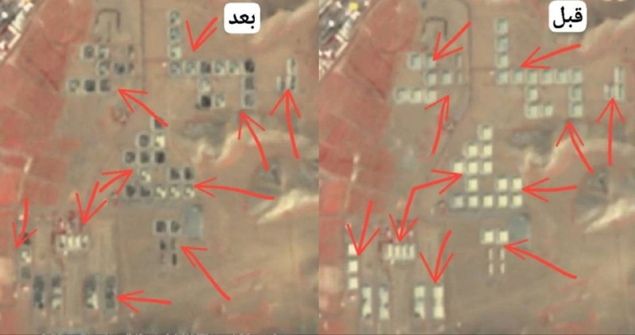

🗻
💥ویرانی گسترده زاغه مهمات اصفهان

✈️تصاویر ماهواره‌ای منتشرشده از قبل و بعدِ حمله به زاغه مهمات واقع در پشت کوه صفه اصفهان، نشان می‌دهد این مجموعه به‌طور کامل تخریب شده و بخش عمده تأسیسات و انبارهای آن از بین رفته‌اند.

💣این مرکز در تاریخ ۱۱ فروردین توسط بمب افکن های آمریکایی مورد هدف قرار گرفت و طبق ویدیوهای منتشرشده از آن شب، انفجار مهمات داخل پایگاه تا ساعت‌ها پس از حمله ادامه داشته است.

👩‍💻@PhantomDirective

🆔@persian_trend_official
پرشین ترند | متفاوت‌ترین کانال نظامی

## Persian_Trend_Official — post 14962

♦️مقام ارشد آمریکایی به الجزیره: • حزب‌الله درخواست‌های مکرر برای آتش‌بس علیه اسرائیل، از جمله در آخرین هشدار را نادیده می‌گیرد. • اسرائیل به تمام حملاتی که علیه نیروها و شهروندانش انجام شود پاسخ خواهد داد؛ این دولت، دولت بایدن نیست. • از ۱۷ آوریل تاکنون،…

## Persian_Trend_Official — post 14961

♦️مقام ارشد آمریکایی به الجزیره:

• حزب‌الله درخواست‌های مکرر برای آتش‌بس علیه اسرائیل، از جمله در آخرین هشدار را نادیده می‌گیرد.

• اسرائیل به تمام حملاتی که علیه نیروها و شهروندانش انجام شود پاسخ خواهد داد؛ این دولت، دولت بایدن نیست.

• از ۱۷ آوریل تاکنون، حزب‌الله برای مختل کردن مذاکرات میان لبنان و اسرائیل، هزار پهپاد و ۷۰۰ موشک شلیک کرده است.

• حزب‌الله به‌طور کامل مسئول تشدید تنش‌های فعلی است، زیرا از ابتدای ماه مارس آتش‌بس را نقض کرده است.

• حزب‌الله تلاش می‌کند مردم لبنان را از فرصت رسیدن به صلح و آغاز بازسازی و توسعه محروم کند.

🫆:Tony

📌 @persian_trend_official
پرشین ترند | متفاوت‌ترین کانال نظامی

## Persian_Trend_Official — post 14960

  <a href="telegram/content/Persian_Trend_Official_14960_1779731980.webm" target="_blank">🎬 Download video</a>

یک روز نسبتا کم کار فرودگاه بن گوریون

👩‍💻@PhantomDirective

🆔@persian_trend_official
پرشین ترند | متفاوت‌ترین کانال نظامی

## Persian_Trend_Official — post 14958

♦️مدیر روابط‌عمومی وزارت ارتباطات:

▪️مصوبه بازگشت اینترنت به وضعیت قبل از دی‌ماه ۱۴۰۴، دقایقی پیش از سوی رئیس‌جمهور به وزارت ارتباطات ابلاغ شد.

🫆:Tony

📌 @persian_trend_official
پرشین ترند | متفاوت‌ترین کانال نظامی

## Persian_Trend_Official — post 14957

تسنیم:خبر رسانه سعودی درباره جزئیات تفاهم احتمالی کذب است

🔹الحدث، رسانه وابسته به سعودی نوشت که «منابع ایرانی به او گفته‌اند که ایران آماده است اورانیوم غنی شده سطح بالا را از کشور خارج کند»!

🔹بررسی‌ها نشان می‌دهد که رسانه سعودی نیز همچون بسیاری از اخبار او درباره جزئیات مذاکرات کذب بوده و در راستای عملیات روانی آمریکایی‌هاست.

🔹در متن تفاهم‌نامه‌ای که تا امروز وجود دارد، هیچ جمله‌ای مبنی بر اعلام آمادگی برای خروج مواد هسته‌ای وجود ندارد و اساساً ایران در این تفاهم نامه هیچ تعهدی درباره اقدام هسته‌ای نداده است.

🫆:Tony

📌 @persian_trend_official
پرشین ترند | متفاوت‌ترین کانال نظامی

## Persian_Trend_Official — post 14956

  <a href="telegram/content/Persian_Trend_Official_14956_1779731980.webm" target="_blank">🎬 Download video</a>

🔴اولین پیام دبیر شورای عالی امنیت ملی جمهوری اسلامی

▪️"عقب نشینی در‌ کار نخواهد بود".

♦️این را میدان نظامی، میدان دیپلماسی و مردم مبعوث شده حاضر در خیابان با مقاومت جانانه خود نشان دادند و دشمن را زمین گیر کردند.

♦️حالا بیش از هر زمان دیگر کشور نیاز به وحدت و انسجام دارد تا آمریکایی‌ها و صهیونیست‌ها در این زمینه هم مأیوس شوند.

♦️میدان وحدت و انسجام هم یک میدان دیگر در مبارزه است. تلاش همگانی برای جلوگیری از هر سخن و اقدام وحدت‌شکن، ایرانِ عزیز را به پیروزی نهایی خواهد رساند؛ ان‌شاءالله.

🫆:Tony

📌 @persian_trend_official
پرشین ترند | متفاوت‌ترین کانال نظامی

---
📅 بروزرسانی: 1405/03/04 19:46
---

## ChizBergerz — post 46785

  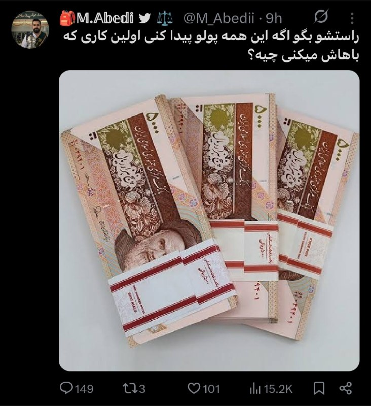

کونمو باهاش پاک میکنم.

@ChizBergerz

## ChizBergerz — post 46784

  <a href="telegram/content/ChizBergerz_46784_1779725778.mp4" target="_blank">🎬 Download video</a>

خیلی رندوم اینو تو دایرکت کانال فرستادن😐😐
این چه سمّیه دیگه؟😐😂

@ChizBergerz

## ChizBergerz — post 46783

دسته جمعی به گا رفتیم مقصرم تو یخچاله...

@ChizBergerz

## ChizBergerz — post 46782

  <a href="telegram/content/ChizBergerz_46782_1779725779.mp4" target="_blank">🎬 Download video</a>

طرفدارهایی که از پایان سریال The Boys شاکی هستن شروع کردن خودشون پایان بندی‌های مختلف رو با AI می‌سازن و باید بگم همین یک دقیقه‌ای که یکی از طرفدارها ساخته هم کیفیت VFXش و هم هیجانش از کل فصل ۵ بیشتر بود!

@ChizBergerz

## ChizBergerz — post 46781

  <a href="telegram/content/ChizBergerz_46781_1779725780.mp4" target="_blank">🎬 Download video</a>

رقص این دختر بچه ایرانی تو جشن پایان سالشون توی مدرسه علوی مشهد در سطح جهانی وایرال شده و تو ۲ روز بیش از ۴۰ میلیون بازدید داشته!🔥

@ChizBergerz

## rodast_omiddana — post 71910

  <a href="telegram/content/rodast_omiddana_71910_1779725781.webm" target="_blank">🎬 Download video</a>

🚨 آقای دانا
میدان انقلاب جنگ بود انگار ماشین زرهی اومده بود و خون ریخته بود هول و هوش ساعت ۷ و ۲ ۳ دقیقه

## rodast_omiddana — post 71909

  <a href="telegram/content/rodast_omiddana_71909_1779725781.webm" target="_blank">🎬 Download video</a>

🚨درود
ساعت ۷ تقریبا داشتیم از میدون انقلاب با ماشین رد می‌شدیم جلومونو گرفتن گفتن مسیر بستس از دور دیدم انگار چند تا جنازه رو زمین بود پرچم عراق هم بغلشون بود فکنم حشدالشعبی ها تو سر هم زده بودن

## rodast_omiddana — post 71908

  <a href="telegram/content/rodast_omiddana_71908_1779725781.webm" target="_blank">🎬 Download video</a>

🚨 دوستان زیادی امشب صدای تیراندازی در میدان انقلاب شنیدن..
گویا نیروهای نیابتی عراقی در میدان انقلاب تهران مستقر بودن و تیراندازی از آن سمت به گوش خیلی ها رسیده است..
هنوز جزئیات بیشتری نمیدانم..

## rodast_omiddana — post 71907

  <a href="telegram/content/rodast_omiddana_71907_1779725782.webm" target="_blank">🎬 Download video</a>

🚨
🚨 فوری:
وال استریت ژورنال: مذاکرات ایران رو بحث برنامه هسته‌ای و رفع تحریم‌ها به بن بست رسیده.

## rodast_omiddana — post 71906

  <a href="telegram/content/rodast_omiddana_71906_1779725782.webm" target="_blank">🎬 Download video</a>

🚨 قیمت بلیط کنسرت ببخشید تجمع فرهنگی و سیاسی مرتضی نجفی...
ارزون ترین صندلی 500 کرون...
قیمتها به 1700 کرون هم میرسه..
من شخصا کنسرت انریکه در جای خوبی نشستم شد 450 کرون...

## rodast_omiddana — post 71905

  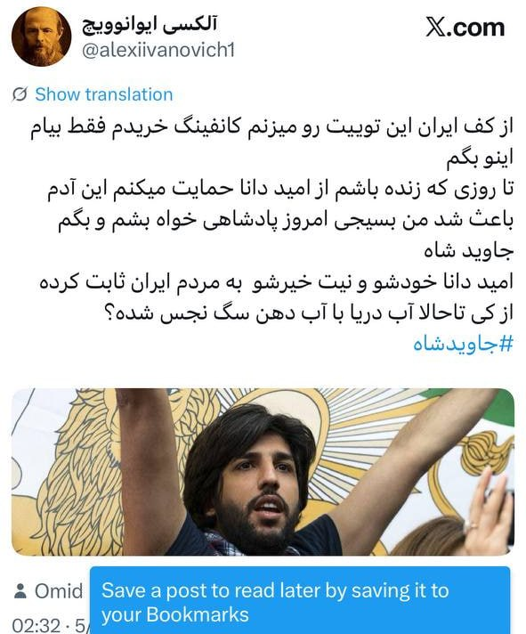

❤️ دمتون گرم اصلش همینه
اینقدر پیام از ایران دریافت کردم که کلی انرژی گرفتم
من از روز اول پایگاه مردمی داشتم و برای همینه هیچوقت برام مهم نبوده مورد سانسور و ترور شخصیت از سوی عده ای چاپلوس قرار گرفتم..
مهم همین پایگاه مردمی داخل ایران بود که در قیام ملی مردم پس از دو رسانه ایران اینترنشنال و منوتو بیشترین ویدیو را برای من کمترین ارسال کردند..
شما مردم داخل انرژی من برای ادامه بودن هستید..

## rodast_omiddana — post 71904

🎬 اعتراض کارشناس ایران اینترنشنال به کسانیکه حامی ترامپ هستن
لینک یوتیوب:
https://www.youtube.com/watch?v=oxAwp2IrkeM

## KiriMohems — post 47982

🔴مذاکرات ایران رو بحث برنامه هسته‌ای و رفع تحریم‌ها به بن بست رسیده - WSJ
#Helsinki
@KiriMohems

## KiriMohems — post 47981

  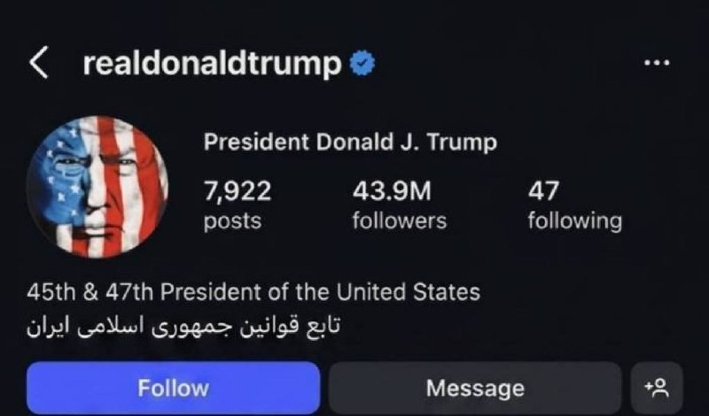

به زودی باید منتظر این شاهکار گوهی باشیم
#Helsinki
@KiriMohems

## SportBaadNews — post 252548

آردا گولر و زیدی تو تعطیلات بعد ما اینجا نشستیم اینترنت وصل شه شاشیدم تو جبر جغرافیایی
@SportBaadNews

## SportBaadNews — post 252547

  <a href="telegram/content/SportBaadNews_252547_1779725783.webm" target="_blank">🎬 Download video</a>

🚨ترامپ: من به صورت الزامی از کشورهای خاورمیانه درخواست کردم که پیمان ابراهیم را سریعا امضا کنند تا «جمهوری اسلامی ایران» را در ازای بخشی از توافق پیمان ابراهیم داشته باشند
@SportBaadNews

## SportBaadNews — post 252546

  <a href="telegram/content/SportBaadNews_252546_1779725783.webm" target="_blank">🎬 Download video</a>

⚡️ وی‌پی‌ان بدنیوز؛ قیمت‌ها شکسته شد 🔝 کاهش قیمت بخاطر استقبال زیاد ✅ بدون هیچگونه ضریب ✅ همراه ساب برای مدیریت حجم ✅ مناسب تمامی پلتفرم‌ها ✅ پشتیبانی سریع و بدون مشکل ✅ بالاترین سرعت ممکن 💰 گیگی 170، بیشترین کیفیت 🤖 خرید از طریق بات رسمی 👇

## SportBaadNews — post 252545

  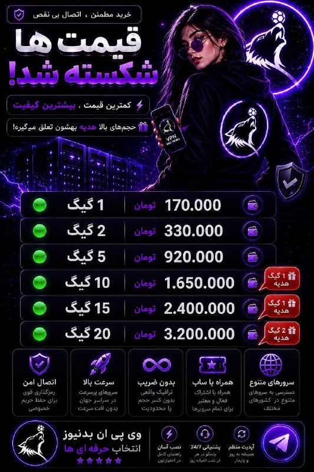

⚡️ وی‌پی‌ان بدنیوز؛ قیمت‌ها شکسته شد
🔝 کاهش قیمت بخاطر استقبال زیاد

✅ بدون هیچگونه ضریب
✅ همراه ساب برای مدیریت حجم
✅ مناسب تمامی پلتفرم‌ها
✅ پشتیبانی سریع و بدون مشکل
✅ بالاترین سرعت ممکن

💰 گیگی 170، بیشترین کیفیت

🤖 خرید از طریق بات رسمی 👇

## SportBaadNews — post 252542

یادی کنیم از وقتی که هری کین تو یه بازی هت‌تریک کرد، بعدش هم همون بازی رفت دروازه‌بان وایساد
😂
@SportBaadNews

## SportBaadNews — post 252541

  

⭐
⚽️ | نامزدهای بهترین بازیکن فصل در لالیگا 
❓- از نظر شما کدوم بازیکن در این فصل لالیگا عملکرد بهتری داشت؟ 1- لامین یامال 
👍 2- کیلیان امباپه 
❤‍🔥 @SportBaadNews

## SportBaadNews — post 252538

🇧🇷🏴󠁧󠁢󠁥󠁮󠁧󠁿🇪🇸
⚽️| ترکیب منتخب از دعوت نشده های برزیل، انگلیس و اسپانیا به جام جهانی
@SportBaadNews

## SportBaadNews — post 252537

  

⭐
⚽️ | نامزدهای بهترین بازیکن فصل در لالیگا

❓- از نظر شما کدوم بازیکن در این فصل لالیگا عملکرد بهتری داشت؟

1- لامین یامال 
👍
2- کیلیان امباپه 
❤‍🔥
@SportBaadNews

## SportBaadNews — post 252536

  <a href="telegram/content/SportBaadNews_252536_1779725785.webm" target="_blank">🎬 Download video</a>

🚨 ترامپ به فاکس نیوز: واقعا فکر کردید بعد از تمام کارایی که انجام دادم قراره به ایران پول بدم؟ @SportBaadNews

## SportBaadNews — post 252535

  <a href="telegram/content/SportBaadNews_252535_1779725786.webm" target="_blank">🎬 Download video</a>

🚨 وال استریت ژورنال: مذاکرات به بن‌بست خورده
@SportBaadNews

## SportBaadNews — post 252534

  <a href="telegram/content/SportBaadNews_252534_1779725786.webm" target="_blank">🎬 Download video</a>

🚨 ترامپ به فاکس نیوز: واقعا فکر کردید بعد از تمام کارایی که انجام دادم قراره به ایران پول بدم؟
@SportBaadNews

## SportBaadNews — post 252533

  <a href="telegram/content/SportBaadNews_252533_1779725786.mp4" target="_blank">🎬 Download video</a>

یه شرت بزرگتر میدادید به لئو تا با مسی کوچولو درگیر نباشه
@SportBaadNews

## IranIntlTV — post 338941

  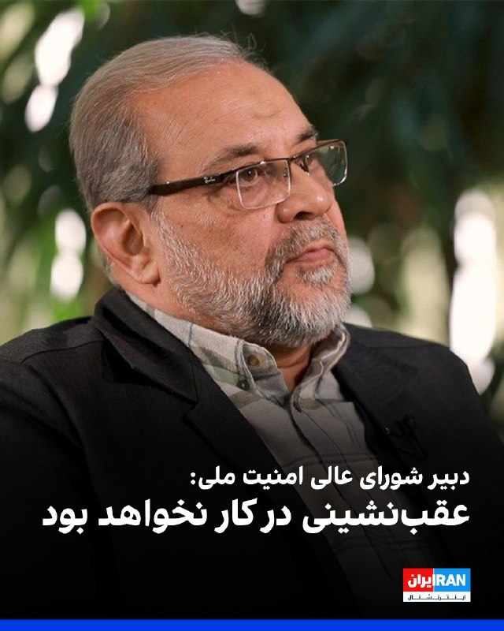

محمدباقر ذوالقدر، دبیر شورای عالی امنیت ملی، در پیامی با اشاره به «میدان نظامی، میدان دیپلماسی و مردم مبعوث‌شده حاضر در خیابان» نوشت: عقب‌نشینی در کار نخواهد بود.

او تاکید کرد: بیش از هر زمان دیگری به وحدت و انسجام نیاز داریم تا آمریکایی‌ها و اسرائیلی‌ها مایوس شوند.
https://iranintl.com/202605254014

## IranIntlTV — post 338940

  <a href="telegram/content/IranIntlTV_338940_1779725788.mp4" target="_blank">🎬 Download video</a>

تصاویر جدید ماهواره‌ای نشان می‌دهد ناو هواپیمابر فرانسوی شارل دوگل بسیار نزدیک به خط محاصره دریایی آمریکا و در دریای عرب مستقر شده است. ژان نوئل بارو، وزیر خارجه فرانسه، پیش‌تر اعلام کرده بود ماموریت این ناو هواپیمابر تامین امنیت کشتیرانی در تنگه هرمز است.

گفت‌وگو با محمدرضا شاهید، روزنامه‌نگار
@iranintltv

## IranIntlTV — post 338939

  

الحدث به نقل از منابع آگاه گزارش داد جمهوری اسلامی شرط انتقال اورانیوم با غنای بالا به چین را مطرح کرده است.

بر اساس این گزارش، تهران آمادگی دارد اورانیوم با غنای بالای خود را از کشور خارج کند، اما پیش از نهایی شدن هرگونه توافق با واشینگتن، به دنبال دریافت تضمین‌هایی از چین است.

الحدث همچنین اعلام کرد احتمال دارد فرمانده ارتش پاکستان به دوحه سفر کند.
https://iranintl.com/202605252722

## IranIntlTV — post 338938

  

یائیر لاپید، رهبر اپوزیسیون اسرائیل، دوشنبه گفت توافق در حال شکل‌گیری میان واشینگتن و تهران هیچ‌یک از اهداف اسرائیل در جنگ را تامین نمی‌کند و بنیامین نتانیاهو را به ناتوانی در اعمال نفوذ برای دستیابی به توافقی بهتر متهم کرد.
لاپید در جمع خبرنگاران در اورشلیم گفت: این توافق برای اسرائیل، برای منطقه و برای مردم ایران بد است.

## IranIntlTV — post 338937

  

وب‌سایت سمافور گزارش داد یک سرمایه‌گذاری مشترک میان یک استارتاپ دفاعی آمریکایی و یک شرکت عربستان سعودی در حال ساخت کارخانه‌ای در نزدیکی ریاض برای تولید پهپادهای رزمی مشابه سامانه شاهد جمهوری اسلامی است.
سمافور افزود این پهپاد با برد ۱۵۰۰ کیلومتر برای تقویت بازدارندگی عربستان سعودی طراحی شده و تولید آن هم برای بازار داخلی و هم صادرات به کشورهای متحد برنامه‌ریزی شده است.

## IranIntlTV — post 338936

  <a href="telegram/content/IranIntlTV_338936_1779725791.mp4" target="_blank">🎬 Download video</a>

یک شهروند با ارسال پیامی به ایران‌اینترنشنال درباره مذاکره آمریکا و جمهوری اسلامی می‌گوید: «ترامپ کاری کرد که در خواب هم نمی‌دیدیم. حالا بدهکار ما شده؟ نجات ما وظیفه او نیست. هموطن، به پا خیز. جمهوری اسلامی را ما باید پایین بیاوریم.»

## IranIntlTV — post 338935

  <a href="telegram/content/IranIntlTV_338935_1779725793.mp4" target="_blank">🎬 Download video</a>

دونالد ترامپ بار دیگر با اشاره به توافق احتمالی میان تهران و واشینگتن، گفت‌وگوها با جمهوری اسلامی را در حال پیشرفت توصیف کرد. او افزود در گفت‌وگو با رهبران عربستان سعودی، امارات متحده عربی، قطر، پاکستان، ترکیه، مصر، اردن و بحرین تاکید کرده پیوستن به‌موقع به پیمان ابراهیم، شرط اصلی برای تحول تاریخی در خاورمیانه است.

سمیرا قرایی، خبرنگار ایران‌اینترنشنال، گزارش می‌دهد

@iranintltv

## IranIntlTV — post 338934

  <a href="telegram/content/IranIntlTV_338934_1779725794.mp4" target="_blank">🎬 Download video</a>

سرخط خبرهای دوشنبه ۴ خرداد
@iranintltv

## IranIntlTV — post 338933

  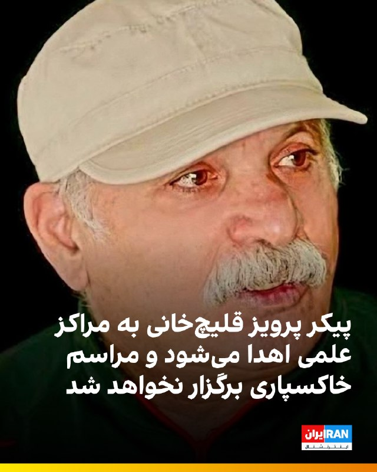

🔻نجمه موسوی-پیمبری، از نزدیکان پرویز قلیچ‌خانی خبر داده که اسطوره فوتبال ایران پیش‌تر تصمیم گرفته بود پیکرش را به مراکز علمی اهدا کند: «پرویز قلیچ‌خانی، بر اساس باورهای شخصی خود تصمیم گرفته بود پیکرش را به مراکز علمی اهدا کند، به همین خاطر مراسم خاک‌سپاری برگزار نخواهد شد.»

🔹او که با انتشار یک پیام صوتی، این خبر را اعلام کرد، گفت: «پرویز، به دلیل فروتنی و برای جلوگیری از زحمت دیگران، تمایلی به برپایی مراسم یادبود رسمی نداشت. با این حال، دوستداران او می‌توانند، برای بزرگداشت جایگاه مردمیِ پرویز قلیچ‌خانی در هر کجای جهان برنامه‌هایی داوطلبانه برگزار کنند.»

🔹پرویز قلیچ‌خانی، کاپیتان پیشین تیم ملی فوتبال ایران، شنبه دوم خرداد ۱۴۰۵، در ۸۱ سالگی در حومه پاریس درگذشت. او تنها بازیکنی بود که سه بار با تیم ملی، قهرمان جام ملت‌های آسیا شد. قلیچ‌خانی پس از انقلاب به فعالیت سیاسی و روزنامه‌نگاری در خارج از کشور روی آورد.

@iranintltvsport

## IranIntlTV — post 338932

  

علیرضا سلیمی، عضو هیات‌رییسه مجلس گفت با توجه به شرایط جدید، از مجتبی خامنه‌ای اجازه خواستیم تا جلسات مجلس را به‌صورت وبیناری با امکان رای‌گیری برگزار کنیم.

او افزود به محض دریافت پاسخ از «رهبری»، هیات‌رییسه تصمیمات لازم را برای آغاز جدی فعالیت‌های عادی مجلس خواهد گرفت.
https://iranintl.com/202605254256

## IranIntlTV — post 338931

  <a href="telegram/content/IranIntlTV_338931_1779725796.mp4" target="_blank">🎬 Download video</a>

اطلاعات رسیده به ایران‌اینترنشنال جزییات تازه‌ای را از نحوه جاویدنام شدن بابک جعفری در ۱۹ دی‌ماه روایت می‌کند. او که ۳۴ ساله بود، در اصفهان با شلیک گلوله ماموران به کمرش مجروح شد و در درمانگاه جان باخت.
خانواده جعفری برای جلوگیری از ربوده شدن پیکرش از سوی ماموران حکومت، پیکر او را دو روز در خانه نگه داشتند و سپس به خاک سپردند.

فرنوش فرجی، عضو تحریریه ایران‌اینترنشنال، گزارش می‌دهد
@iranintltv

## IranIntlTV — post 338930

  <a href="telegram/content/IranIntlTV_338930_1779725798.mp4" target="_blank">🎬 Download video</a>

یک شهروند با ارسال پیام به ایران‌اینترنشنال می‌گوید: «هیچ‌کس به فکر ما نیست. هیچ‌چیز رایگان به دست نمی‌آید؛ حتی نان و آب. آزادی کشور هم رایگان نیست. واقعیت این است که آمریکا به فکر منافع خودش و متحدانش است. ما هم باید به فکر ایران و منافع خودمان باشیم. پایان کار جمهوری اسلامی با ماست.»

## Persian_Trend_Official — post 14955

  

⭕️پست جدید دونالد ترامپ

⚠️ترجمه فارسی در تحریریه پرشین ترند به تصویر اصلی اضافه شده است .

🫆:Tony

📌 @persian_trend_official
پرشین ترند | متفاوت‌ترین کانال نظامی

## Persian_Trend_Official — post 14953

  <a href="telegram/content/Persian_Trend_Official_14953_1779725800.webm" target="_blank">🎬 Download video</a>

ویدیو لو رفته از مذاکرات آمریکا با جمهوری اسلامی 😒

📝 Nick

📌 @persian_trend_official
پرشین ترند | متفاوت‌ترین کانال نظامی

## Persian_Trend_Official — post 14952

  

🔹 دونالد ترامپ در پیامی مفصل اعلام کرد از کشورهایی که طی آخر هفته با آن‌ها گفت‌وگو داشته، از جمله پاکستان، ترکیه، مصر، اردن، بحرین، امارات، عربستان سعودی و قطر خواسته است هرچه سریع‌تر به توافقنامه‌های ابراهیم بپیوندند.

## Persian_Trend_Official — post 14951

  <a href="telegram/content/Persian_Trend_Official_14951_1779725801.webm" target="_blank">🎬 Download video</a>

🚨 فوری:
وال استریت ژورنال: مذاکرات ایران رو بحث برنامه هسته‌ای و رفع تحریم‌ها به بن بست رسیده.

📝 Nick

📌 @persian_trend_official
پرشین ترند | متفاوت‌ترین کانال نظامی

## Persian_Trend_Official — post 14950

🔴 یک منبع سعودی به CNN:

▪️ عربستان تنها در صورتی روابط خود با اسرائیل را عادی‌سازی خواهد کرد که «مسیر غیرقابل بازگشت» برای تشکیل کشور فلسطین وجود داشته باشد
▪️ ریاض تأکید کرده موضعش «همان موضع همیشگی» است
▪️ این اظهارات پس از آن مطرح شد که ترامپ از احتمال گسترش شناسایی اسرائیل در منطقه پس از توافق احتمالی با ایران صحبت کرده بود

🫆:Tony

📌 @persian_trend_official
پرشین ترند | متفاوت‌ترین کانال نظامی

---
📅 بروزرسانی: 1405/03/04 17:26
---

## ChizBergerz — post 46780

  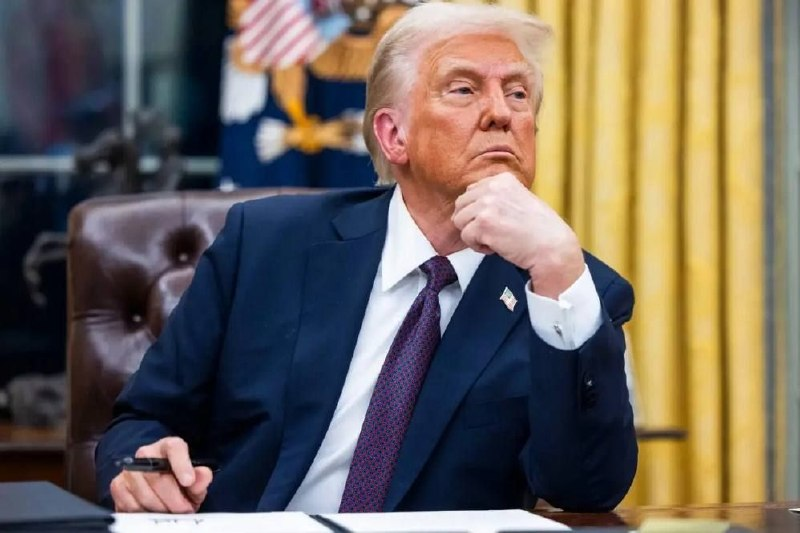

ناوگان عظیم و زیبایی از انواع فحش های رکیک و ناموسـی از طرف ایرانیان به سمتت روانه شد کله زرد.

@ChizBergerz

## ChizBergerz — post 46779

  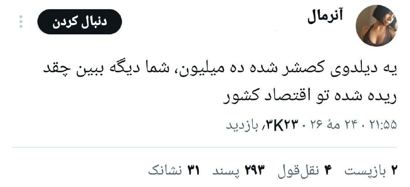

مردم فکر نون شبن اون‌وقت یه دختر رندوم تو ایکس:

@ChizBergerz

## ChizBergerz — post 46778

  <a href="telegram/content/ChizBergerz_46778_1779717417.mp4" target="_blank">🎬 Download video</a>

آیسان اسلامی اینجوری از افراد گِی🏳‍🌈 حمایت کرد؛ دستِ کارگر همجنس‌گراش رو به نشانه حمایت می‌بوسه میگه مای برادر، طرف هم سریع شق میکنه میگه مای هازبند😂😂😂

@ChizBergerz

## ChizBergerz — post 46777

  <a href="telegram/content/ChizBergerz_46777_1779717419.webm" target="_blank">🎬 Download video</a>

💩 
⚠️ دیگه #فریب بونوس های الکی سایت های سودجو رو نخورید
❌ 
💲بیا توی سایت مورد تایید ما یعنی #وینرو و با عضویت 500 هزار تومان اعتبار بی قیدو شرط بگیر
👏 
🤩با عضویت 
🤩 
🤩 
🤩 هزار تومان اعتبار رایگان بگیر! 
⌛ پشتیبانی 24 ساعته 
🌐 Winro.io 
🌐 Winro.io کانال بونوس…

## ChizBergerz — post 46776

  <a href="telegram/content/ChizBergerz_46776_1779717420.webm" target="_blank">🎬 Download video</a>

💩 
⚠️ دیگه #فریب بونوس های الکی سایت های سودجو رو نخورید
❌

💲بیا توی سایت مورد تایید ما یعنی #وینرو و با عضویت 500 هزار تومان اعتبار بی قیدو شرط بگیر
👏

🤩با عضویت 
🤩 
🤩 
🤩 هزار تومان اعتبار رایگان بگیر!

⌛ پشتیبانی 24 ساعته

🌐 Winro.io

🌐 Winro.io
کانال بونوس های رایگانr4

📱 @winro_io

## rodast_omiddana — post 71903

  <a href="telegram/content/rodast_omiddana_71903_1779717421.webm" target="_blank">🎬 Download video</a>

🚨 ترامپ به مجری فاکس‌نیوز:
«آیا واقعاً فکر می‌کنید که من بعد از همه آن حرف‌هایی که زده‌ام درباره اینکه ایران هرگز به سلاح هسته‌ای دست نخواهد یافت، رئیس‌جمهور بشوم و بعد فقط پول نقد به آنها بدهم؟»

## rodast_omiddana — post 71902

🎬 از مذاکرات و توافق نترسید_رژیم دوام نمی آورد
لینک یوتیوب:
https://www.youtube.com/watch?v=F1DuLNCqLrk

## rodast_omiddana — post 71901

  <a href="telegram/content/rodast_omiddana_71901_1779717421.webm" target="_blank">🎬 Download video</a>

🚨 پاسخ من به مشاور اول شاهزاده رضا پهلوی
https://x.com/i/status/2058863056621318310

## KiriMohems — post 47980

  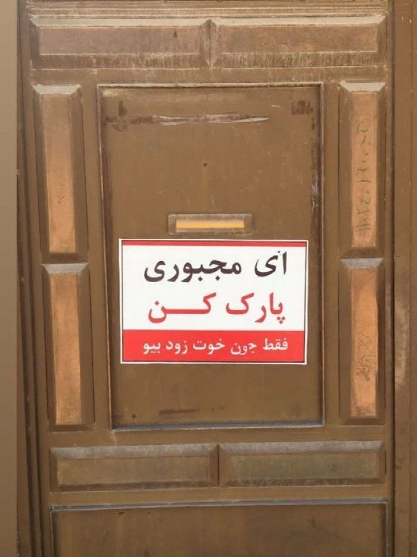

شیرازیا ، لیگ خاص خودشون رو دارن

#Helsinki
@KiriMohems

## KiriMohems — post 47979

📰رویترز: قالیباف و عراقچی سوسکی وار به دوحه پایتخت قطر سفر کردند #Helsinki @KiriMohems

## KiriMohems — post 47978

📰رویترز: قالیباف و عراقچی سوسکی وار به دوحه پایتخت قطر سفر کردند #Helsinki @KiriMohems

## KiriMohems — post 47977

📰رویترز:
قالیباف و عراقچی سوسکی وار به دوحه پایتخت قطر سفر کردند
#Helsinki
@KiriMohems

## KiriMohems — post 47976

  

🔴آموزش وَر رفتن با اسلحه برای فاطی کماندو ها کص کپکی در مسجد!
#Helsinki
@KiriMohems

## KiriMohems — post 47975

  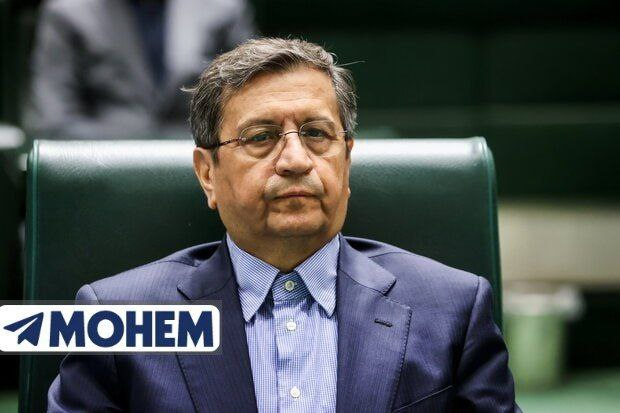

🔴آقای هیمتی به سفر ، قطر کرد

ناصر نوسان پیرامون بررسی آزادسازی اموال خایه فنگ شده و در راستای کمیسیون اقتصادی مذاکرات به قطر سفر کرد.

هیئت قطری هفتۀ گذشته دربارۀ میانجی‌گری مذاکرات ایران و آمریکا به ایران سفر کرده بود./فارس

#Helsinki
@KiriMohems

## KiriMohems — post 47974

  <a href="telegram/content/KiriMohems_47974_1779717423.mp4" target="_blank">🎬 Download video</a>

🔴احمدی‌نژاد چطور تورم رو انگشت میکرد و با دیوث بازی پایین بودنش رو نشون می‌داد؟!

#Helsinki
@KiriMohems

## KiriMohems — post 47973

  

🕹 گردونه شانس رایگان وینکوبت فعال شد!

🎰 هر ۱۲ ساعت یک‌بار شانس خودتان را امتحان کنید و جوایز نقدی متنوع دریافت کنید.

🎁 تا سقف ۱ میلیون تومان جایزه روزانه

✅ فعال برای تمامی کاربران

📌برای شرکت در گردونه شانس، وارد ربات وینکوبت شوید:
👇

🤖 @Wincobet_bot

🤖 @Wincobet_bot

📌کانال رسمی وینکوبت:

🔵 @Wincobetofficial

## KiriMohems — post 47972

🔴لنگ های اینترنت بین‌الملل باز میشود ستاد راهبری و ساماندهی فضای مجازی یه جلسه سیکیم خیاری تشکیل داده و گفته که اینترنت به وضعیت قبل از دی ماه ۴۰۴ برمیگرده ما هم میگیم #کیر_تو_دروغگو #Helsinki @KiriMohems

## KiriMohems — post 47971

🔴لنگ های اینترنت بین‌الملل باز میشود

ستاد راهبری و ساماندهی فضای مجازی یه جلسه سیکیم خیاری تشکیل داده و گفته که اینترنت به وضعیت قبل از دی ماه ۴۰۴ برمیگرده ما هم میگیم #کیر_تو_دروغگو

#Helsinki
@KiriMohems

## SportBaadNews — post 252532

  

⚽️ فابریزیو رومانو: جنارو گتوزو به لاتزیو؛ هیر وی گوووو! @SportBaadNews

## SportBaadNews — post 252531

  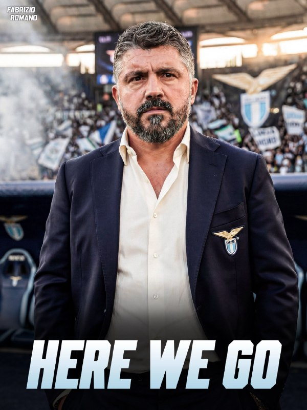

⚽️ فابریزیو رومانو: جنارو گتوزو به لاتزیو؛ هیر وی گوووو!
@SportBaadNews

## SportBaadNews — post 252530

من دوست نداشتم؟
من به اندازه ترامپ بهت فرصت دادم ولی تو آدم نشدی (هنوزم فرصت میدم)
@SportBaadNews

## SportBaadNews — post 252529

  

🟡 کاسمیرو: شماره 10 برزیل رو کی میپوشه وینی؟

✅ وینیسیوس: معلومه که نیمار؛ شماره 10 برزیل فقط مال اونه
@SportBaadNews

## SportBaadNews — post 252528

  

⚽️| بهترین بازیکن تو هر تیم ملی در حال حاضر از دید مایکل اولیسه:

🏴󠁧󠁢󠁥󠁮󠁧󠁿 انگلیس - هری کین
🇩🇪 آلمان - جاشوا کیمیش
🇧🇷 برزیل - نمیدونم
🇪🇸 اسپانیا - لامین یامال
🇦🇷 آرژانتین - لیونل مسی
🇵🇹 پرتغال - برونو فرناندز
@SportBaadNews

## SportBaadNews — post 252527

درود.
من و دوستم، مهران ۱۹ ساله چنل شمارو خیلی دنبال می‌کردیم.
دو هفته ست که مهران از دنیا رفته به دلیل تصادف با دوچرخه.

الانم بالاسر خاکش دارم پیام های چنلتون براش میخونم.
سپاس. 🖤

## SportBaadNews — post 252526

  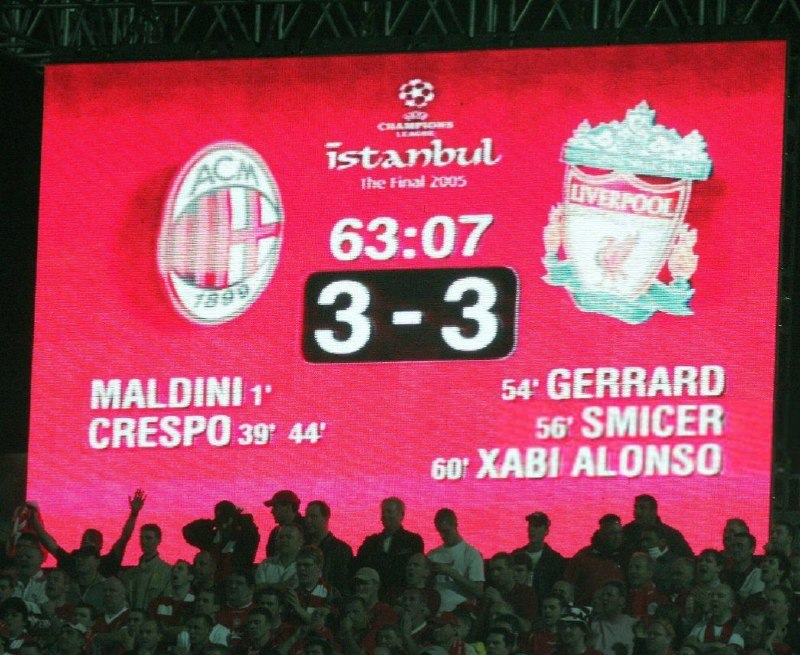

⚽️
⚽️
🔙| تو چنین روزی سال 2005 میلان آنچلوتی با دیدا، کافو، نستا، استام، مالدینی، گتوزو، پیرلو، سیدورف، شوچنکو و هرنان کرسپو؛ بازی 3-0 برده تو نیمه اول فینال چمپیونزلیگ استانبول رو تو نیمه دوم 3-3 و در نهایت تو ضربات پنالتی با نتیجه 3-2 به لیورپول واگذار کرد
@SportBaadNews

## SportBaadNews — post 252525

  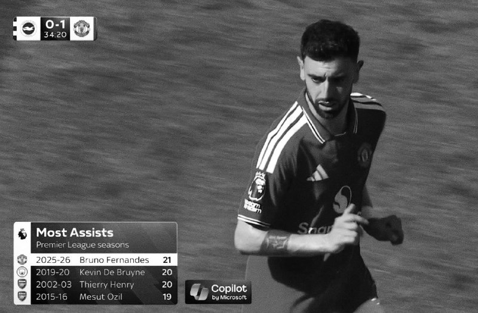

از اون شات ها که تو دل تاریخ ثبت میشه 
🔥
🔥
@SportBaadNews

## SportBaadNews — post 252524

  

⚽️| مکس داومن 16 ساله بعد از قهرمانی با آرسنال امروز به این شکل براش تو مدرسشون تونل افتخار زدن و تشویقش کردن Aura +9999999999 
🤩
🔥
🔥 @SportBaadNews

## SportBaadNews — post 252523

  <a href="telegram/content/SportBaadNews_252523_1779717431.webm" target="_blank">🎬 Download video</a>

🚨
💣
⚽️ میگل سرانو: ژوزه مورینیو می‌خواد آلساندرو باستونی رو به عنوان مدافع وسط برای رئال مادرید تو این تابستون جذب کنه، اون گزینه محبوب مورینیو برای پست دفاع وسطه. @SportBaadNews

## SportBaadNews — post 252522

  <a href="telegram/content/SportBaadNews_252522_1779717431.webm" target="_blank">🎬 Download video</a>

🚨
💣🇪🇸 رسسسسسسسسسسمی؛ لیست تیم ملی اسپانیا برای جام جهانی 2026 آمریکا 
◀️ دروازه‌بان‌ها: اونای سیمون، داوید رایا، خوان گارسیا 
◀️ مدافعین: کوکوریا، گریمالدو، کوبارسی، لاپورت، پوبیل، اریک گارسیا، مارکوس یورنته، پدرو پورو 
◀️ هافبک‌ها: پدری، فابیان رویز، زوبیمندی،…

## SportBaadNews — post 252521

  

⚽️ عکسی که خانم مارتا توره بعد کسب چهارمین قهرمانی چمپیونزلیگ بانوان با بارسلونا پست کرده: @SportBaadNews

## SportBaadNews — post 252518

دکلان رایس که به خانمش بخاطر چاقیش خیلی هیت میدادن ولی خودش همیشه از اون دفاع می‌کرده و میگفته عاشقشه؛ جدیدا عکسایی ازش پخش شده که با دخترای دیگه داره وقت میگذرونه

❌ ‌ ‌ ‌‌ ‌ ‌فیک یا واقعی بودن این عکس ها تایید یا رد نمیشه
@SportBaadNews

## SportBaadNews — post 252517

  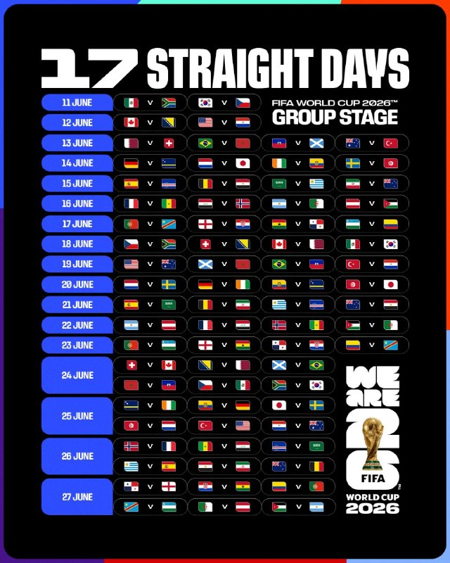

⚽️
⚪️| 17 روز تا شروع جام جهانی...
@SportBaadNews

## SportBaadNews — post 252515

  

🏴󠁧󠁢󠁥󠁮󠁧󠁿
⚽️ #فکت | ویرجیل فندایک با بازی دیروز حالا به مسن‌ترین بازیکن تاریخ لیگ برتر تبدیل شد که تو طول یه فصل تو تمام 38 تا بازی کامل 90 دقیقه بازی کرده؛ فن دایک تو این 3,420 دقیقه ای هم ک بازی کرده این فصل 6 گل تو پریمیرلیگ به ثمر رسونده 🔥🔥
@SportBaadNews

## SportBaadNews — post 252514

  

⚽️
⚽️| بارسلونا در مقایسه با بقیه تیم‌های لالیگا تو این فصل:

✅ میانگین گل زده تو هر 90 دقیقه – رتبه اول

✅ میانگین xG تو هر 90 دقیقه – رتبه اول

✅ میانگین شوت‌های داخل چارچوب تو هر 90 دقیقه – رتبه اول

✅ تعداد پاس‌ های کامل شده – رتبه اول

✅ درصد دقت پاس – رتبه اول

✅ درصد مالکیت توپ – رتبه اول

✅ میانگین لمس توپ تو محوطه جریمه تو هر 90 دقیقه – رتبه اول

✅ میانگین گل‌ های خورده تو هر 90 دقیقه – رتبه اول

✅ درصد موفقیت تو نبردهای هوایی – رتبه اول

✅ تعداد پاس تو هر مالکیت توپ – رتبه اول

✅ شاخص PPDA (شدت پرس) – رتبه اول
@SportBaadNews

## SportBaadNews — post 252513

  <a href="telegram/content/SportBaadNews_252513_1779717434.webm" target="_blank">🎬 Download video</a>

🚨
💣🇪🇸 رسسسسسسسسسسمی؛ لیست تیم ملی اسپانیا برای جام جهانی 2026 آمریکا 
◀️ دروازه‌بان‌ها: اونای سیمون، داوید رایا، خوان گارسیا 
◀️ مدافعین: کوکوریا، گریمالدو، کوبارسی، لاپورت، پوبیل، اریک گارسیا، مارکوس یورنته، پدرو پورو 
◀️ هافبک‌ها: پدری، فابیان رویز، زوبیمندی،…

## SportBaadNews — post 252512

⚽️
🇪🇸| 8 بازیکن از بارسلونا به تیم ملی اسپانیا برای جام جهانی دعوت شدند: 
✅ خوان گارسیا 
✅ اریک گارسیا 
✅ کوبارسی 
✅ گاوی 
✅ پدری 
✅ اولمو 
✅ لامین یامال 
✅ فران تورس @SportBaadNews

## IranIntlTV — post 338929

🔻فشار روانی بر داوطلبان کنکور به‌دلیل نامعلوم بودن زمان برگزاری آزمون

پیام‌های رسیده به ایران‌اینترنشنال نشان می‌دهد دانش‌آموزان پایه‌های یازدهم و دوازدهم با بلاتکلیفی درباره زمان برگزاری امتحان‌های نهایی و کنکور روبه‌رو هستند. به گفته آنان، همزمان با آموزش مجازی، قطع اینترنت و فشار اقتصادی نیز آینده تحصیلی‌شان را در هاله‌ای از ابهام قرار داده است.

در همین راستا، دانش‌آموزی ۱۷ ساله در پیامی برای ایران‌اینترنشنال نوشت آینده خود و هم‌نسلانش را مبهم و گیج‌کننده می‌بیند.

او از قطع اینترنت، کیفیت پایین آموزش و مشکلات اقتصادی خانواده‌ها سخن گفت که باعث بی‌انگیزگی آن‌ها شده است.

سردرگمی دانش‌آموزان در انتظار اعلام زمان کنکور

این دانش‌آموز از نبود شفافیت در مورد زمان و نحوه برگزاری امتحان‌های نهایی و کنکور ابراز نگرانی کرد.

به گفته او، نامتناسب بودن دخل و خرج، امکان برنامه‌ریزی برای آینده را به امری محال بدل کرده است.

دانش‌آموز دیگری نیز در پیامی مشابه، با اشاره به اینکه زمان و نحوه برگزاری امتحان‌ها و کنکور اعلام نشده، گفت آن‌ها فشار روانی زیادی را تحمل می‌کنند، اما صدایشان شنیده نمی‌شود.

تاثیر قطع اینترنت بر کیفیت آمادگی داوطلبان کنکور

ده‌ها پیام رسیده به ایران‌اینترنشنال نیز حاکی از تاثیر قطع اینترنت بر روند یادگیری دانش‌آموزان است.

یک دانش‌آموز در آستانه کنکور درباره وابستگی کامل روند مطالعه‌اش به اینترنت گفت: «بیشتر دوره‌های آموزشی را از تلگرام دانلود می‌کردم. دروس تخصصی را هم از یوتیوب و حتی دوره‌هایی را از اینستاگرام خریداری می‌کردم.»

یک داوطلب پشت‌کنکوری در پیامی برای ایران‌اینترنشنال نوشت امیدوار بوده امسال در رشته پزشکی پذیرفته شود، اما با شرایط فعلی این احتمال را دور از دسترس می‌بیند.

او گفت فایل‌های درسی و ویدیوهای آموزشی‌اش در تلگرام قرار داشته و با ادامه قطع اینترنت، امکان دسترسی و دانلود آن‌ها را ندارد.

در شرایطی که زمان زیادی تا برگزاری کنکور باقی نمانده، اعلام نشدن زمان دقیق آن از سوی سازمان سنجش آموزش کشور فشار روانی بسیاری به دانش‌آموزان وارد کرده و برخی از آن‌ها بار دیگر موضوع سهمیه‌های ورودی دانشگاه‌ها را مطرح کرده‌اند.

به گفته یکی از این دانش‌آموزان، نظام سهمیه‌بندی در سال‌های گذشته به نابرابری در پذیرش دانشگاه‌ها منجر شده و در شرایط فعلی، با توجه به بلاتکلیفی در مورد زمان کنکور، این احساس تبعیض پررنگ‌تر شده است.

پیش از این نیز دانش‌آموزان در پیام‌هایی به ایران‌اینترنشنال از این بلاتکلیفی و فشارهای ناشی از آن سخن گفته بودند.

برای نمونه، دانش‌آموزی از تهران گفت: «شرایط زندگی خیلی سخت شده و فشارهای روانی بالاست؛ مخصوصا برای دانش‌آموزان پایه‌های یازدهم و دوازدهم. درست نیست که در این شرایط امتحانی بگیرند که روی کنکور هم تاثیر می‌گذارد.»
اعتراض به هزینه‌های سنگین آموزشی

بعضی پیام‌های رسیده به ایران‌اینترنشنال حاوی دعوت به تجمع اعتراضی مقابل سازمان سنجش است.

در یکی از این پیام‌ها از دانش‌آموزان پایه‌های یازدهم و دوازدهم تهران خواسته شده برای اعتراض به شیوه برگزاری امتحان‌ها و تاثیر آن بر کنکور، مقابل این سازمان تجمع کنند.

یک دانش‌آموز پایه یازدهم نیز در پیامی اعلام کرد هنوز زمان دقیق امتحان‌های نهایی مشخص نیست و درباره برگزاری آن‌ها در تیرماه یا شهریورماه اظهار نظرهای متفاوتی مطرح شده است.

به گفته او، در دوره آموزش مجازی به‌دلیل قطع اینترنت و ارائه نشدن کامل برخی دروس، فرآیند یادگیری با اختلال مواجه بوده، در حالی که نتیجه این امتحان‌ها، تاثیری مستقیم بر کنکور دارد.

دانش‌آموزان دیگری نیز به پیامدهای جنگ و شرایط اقتصادی اشاره کردند.

یکی از آن‌ها گفت پس از حدود ۸۰ روز اختلال در روند عادی آموزش و افت کیفیت تدریس، اکنون باید در امتحان‌های نهایی و سپس کنکور شرکت کنند. در شرایطی که به گفته او، سطح استرس و نگرانی در میان دانش‌آموزان پایه‌های یازدهم و دوازدهم بی‌سابقه است.

از رودهن نیز مخاطب دیگری به افزایش قیمت کتاب‌های کمک‌آموزشی اشاره کرد و گفت بهای برخی از آن‌ها به ۹۰۰ هزار تا یک میلیون و ۵۰۰ هزار تومان رسیده است.
🔗ادامه این گزارش را اینجا بخوانید
@iranintltv

## IranIntlTV — post 338928

🔻کاهش قدرت خرید مردم، کسب‌وکارها را به تعطیلی کشانده است

🖋سبا حیدرخانی

با ادامه بحران اقتصادی، افزایش قیمت کالاها، کاهش قدرت خرید، دیگر پیامدهای جنگ و نگرانی شهروندان از آینده، بسیاری از کسب‌وکارهایی که مستقیما با مردم در ارتباط هستند، با رکود شدید، کاهش فروش، تعدیل نیرو و خطر تعطیلی مواجه شده‌اند.

در هفته‌های اخیر صاحبان مشاغل خدماتی و اصنافی که معیشتشان به خرید روزانه و مصرف عمومی مردم وابسته است، در پیام‌هایی به ایران‌اینترنشنال تاکید کردند مردم حتی خریدهای روزمره و خدماتی را هم کاهش داده‌اند و بسیاری از بازارها به مرحله‌ای رسیده‌اند که دیگر مشتری وجود ندارد.

بر اساس این پیام‌ها، طیف گسترده‌ای از مشاغل، از رستوران‌ها و قهوه‌خانه‌ها تا فروشگاه‌های پوشاک و واحدهای گردشگری و خواروبارفروشی‌ها با رکود مواجه شده‌اند.

بسیاری از صاحبان این مشاغل می‌گویند افزایش شدید قیمت کالاها و کاهش قدرت خرید مردم باعث شده شهروندان، در کنار حذف بسیاری از هزینه‌های غیرضروری، حتی خریدهای معمول و روزمره خود را نیز محدود کنند.

برخی، وضعیت کنونی را یکی از دشوارترین دوره‌های سال‌های اخیر توصیف و تاکید کردند ترس از نامعلوم بودن آینده باعث شده مردم بیش از گذشته محتاط شوند و تا حد ممکن پول خود را برای موارد «ضروری و پیش‌بینی نشده» نگه دارند.
رستوران‌ها و فست‌فودها متاثر از بحران اقتصادی

صاحب یک قهوه‌خانه در میدان خراسان تهران گفت: «تنباکو کیلویی پنج میلیون تومان و ذغال کیلویی ۴۰۰ هزار تومان شده است. مجبور می‌شویم قیمت خدمات را بالا ببریم، اما با این کار مشتری‌ها را هم از دست می‌دهیم.»

یک شهروند دیگر هم از تعطیلی کارگاه تولیدی خود خبر داد و گفت به‌دلیل گرانی مواد اولیه، جنگ و کاهش توان مالی مردم، ورشکست شده و ناچار شده کارگاهش را ببندد.

او افزود: «چند کارگر بیکار شدند و همه دستگاه‌ها را نصف قیمت فروختم، چون توان پرداخت اجاره را نداشتم.»

در بازار تهران نیز به گفته شهروندان، بسیاری از غذاخوری‌ها عملا بدون مشتری مانده‌اند.

مخاطبی در پیامی به ایران‌اینترنشنال در یک نمونه به قیمت ۸۰۰ هزار تومانی یک پرس قرمه‌سبزی اشاره کرد و گفت فروش بیشتر رستوران‌ها و فست‌فودها به صفر رسیده است.

پیش‌تر احمد میدری، وزیر تعاون، کار و رفاه اجتماعی، از ثبت‌نام دریافت بیمه بیکاری حدود ۲۳۰ هزار کارگری خبر داده بود که از آغاز جنگ تاکنون شغل خود را از دست داده‌اند.

حجت‌الله میرزایی، مدیر سابق صندوق‌های بازنشستگی کشور، نیز ۳۱ اردیبهشت پیش‌بینی کرد در سال جاری حدود ۴.۵ میلیون نفر دیگر به جمعیت زیر خط فقر اضافه شوند.

علاوه بر صاحبان کسب‌وکار، شهروندان نیز در پیام‌های هر روزه خود به ایران‌اینترنشنال گفتند با شدت تورم و نامعلوم بودن وضعیت گرانی‌های بیشتر، مردم حتی برای خواروبار هم فقط برای یکی دو روز خرید می‌کنند و دیگر توان خرید ماهانه ندارند.

بر اساس این پیام‌ها، برای یک سبد خرید روزمره شامل یک پاکت شیر، یک جعبه خرما، یک مایع ظرفشویی، سه بسته کره ۱۰۰ گرمی، یک ماست کوچک، یک بسته جو پرک، رشته پلویی، دو بسته چیپس خلالی، ۵۰۰ گرم قهوه و ۲۵۰ گرم گردو از میدان تره‌بار، باید شش میلیون و ۴۰۰ هزار تومان هزینه کرد.
🔗ادامه این گزارش را اینجا بخوانید
@iranintltv

## IranIntlTV — post 338927

  <a href="telegram/content/IranIntlTV_338927_1779717434.mp4" target="_blank">🎬 Download video</a>

اطلاعات تازه نشان می‌دهد در سه ماه گذشته سهم آیفون از ترافیک وب موبایل ایران افزایش یافته و سهم اندروید کاهش یافته است؛ تغییری که همزمان با قطع گسترده اینترنت، نشانه‌ای از پاکسازی طبقاتی اینترنت در ایران است.

در این الگو، کاربران با درآمد بیشتر یا دسترسی ویژه همچنان به وب جهانی متصل مانده‌اند؛ اما کاربران عادی از اینترنت جهانی کنار زده شده‌اند.
@iranintltv

## IranIntlTV — post 338926

  <a href="telegram/content/IranIntlTV_338926_1779717436.mp4" target="_blank">🎬 Download video</a>

ستاد راهبری و ساماندهی فضای مجازی بازگشت اینترنت به وضعیت قبل از دی ۱۴۰۴ را تصویب کرد. جلسه این ستاد به ریاست معاون اول مسعود پزشکیان تشکیل شد و اتصال دوباره به اینترنت بین‌المللی با ۹ رای موافق و ۳ رای مخالف تصویب شد.

گفت‌وگو با رضا حاجی‌حسینی، روزنامه‌نگار
@iranintltv

## IranIntlTV — post 338925

  <a href="telegram/content/IranIntlTV_338925_1779717437.mp4" target="_blank">🎬 Download video</a>

یک شهروند با ارسال پیامی به ایران‌اینترنشنال در خصوص مذاکره آمریکا و جمهوری اسلامی خطاب به ترامپ می‌گوید: «اول از تو بابت همراهی‌هایت ممنونم ولی اگر با قاتل مردم ایران هر توافقی کنی، نه می‌بخشیم و نه فراموش می‌کنیم. البته که ما قطعا خودمان ریشه این جهل و فساد را از تاریخ ایران درمی‌آوریم و به زباله‌دان تاریخ می‌اندازیم.»

## IranIntlTV — post 338924

  

خبرگزاری مهر، وابسته به سازمان تبلیغات اسلامی، اعلام کرد عصر دوشنبه، ساکنان محلی در جزیره قشم صدای فعالیت پدافند را گزارش کرده‌اند.
بنا بر این خبر، ماهیت این صداها مشخص نیست و هنوز هیچ‌یک از نهادهای رسمی درباره علت وقوع این صداها اظهارنظر نکرده‌اند.
https://iranintl.com/202605253102

## IranIntlTV — post 338923

  <a href="telegram/content/IranIntlTV_338923_1779717440.mp4" target="_blank">🎬 Download video</a>

گمانه‌زنی‌ها درباره احتمال ازسرگیری مذاکرات میان جمهوری اسلامی و آمریکا، رسانه‌های اجتماعی فارسی‌زبان را به‌شدت تحت تاثیر قرار داده است.

عادله بورنگ، عضو تحریریه ایران‌اینترنشنال، برخی از واکنش‌های کاربران را بررسی می‌کند
@iranintltv

## IranIntlTV — post 338922

🗣روایت شما از بحران اقتصادی و زندگی در آتش‌بس- دوشنبه ۴ خرداد:

🔹در ممسنی جو به شدت امنیتی است و تمام کسانی که در چهلم جاویدنامان حماسه آفریدند را دستگیر می‌کنند.

🔹در کاشان سر هر چهارراه و میدان چادر زده‌اند و به زن‌ها و بچه‌ها تیراندازی و کار با تفنگ آموزش می‌دهند؛ از بچه‌ای که باید به کلی از این مسائل دور باشد سوءاستفاده ابزاری می‌کنند.

🔹کسی بیشتر از ما دانش‌آموزان پایه‌های یازدهم و دوازدهم استرس و ترس ندارد؛ مایی که قرار است بعد از ۸۰ روز سختی و مشقت و کیفیت تدریس پایین امتحان نهایی و بعدش کنکور بدهیم.

🔹ما میدان خراسان تهران کنار پاساژ خراسان قهوه‌خونه داریم الان با این وضعیت گرانی چطور کار کنیم؟ تنباکو کیلویی ۵ میلیون و ذغال کیلویی ۴۰۰ هزار تومان است.

🔹من بیماری خودایمنی دارم و به‌خاطر پیدا نکردن یک قرص ساده کارم به بستری در بیمارستان کشیده.

🔹سیستان و بلوچستان اصلا کارت آزاد بنزین در این ۱۰ سال نداشته و خیلی‌ها ماشین‌هایشان را در نیمه دوم ماه استفاده نمی‌کنند.

🔹رفته بودم سوپرمارکت خرید کنم، متصدی فروشگاه گفت محصولات لبنی دوباره ۳۰ درصد افزایش یافته، آخرین تغییر قیمت ۱۰ روز پیش بود!

## IranIntlTV — post 338921

  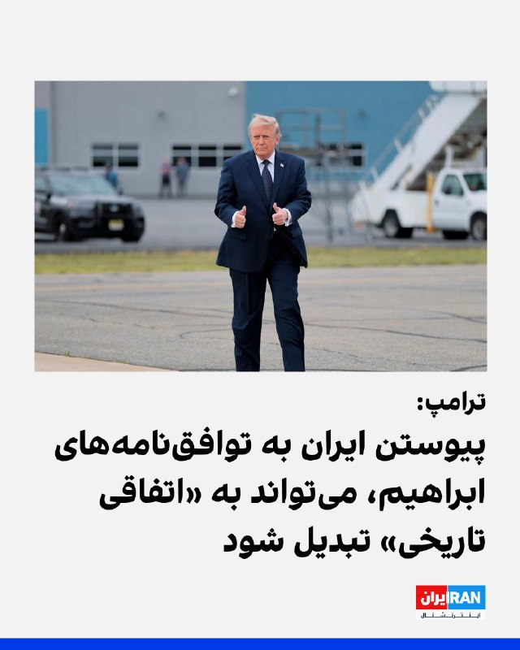

دونالد ترامپ در شبکه تروث سوشال نوشت که پیوستن جمهوری اسلامی به پیمان ابراهیم، می‌تواند به «اتفاقی تاریخی» تبدیل شود.
او افزود که در گفت‌وگو با سران عربستان سعودی، امارات متحده عربی، قطر، ترکیه، مصر، اردن و بحرین، تاکید کرده لازم است همه این کشورها به‌طور هم‌زمان پیمان ابراهیم را برای عادی‌سازی روابط با اسرائیل امضا کنند.

ترامپ نوشت: ««کشورهایی که درباره آن‌ها صحبت شد عبارت‌اند از عربستان سعودی، امارات متحده عربی (که هم‌اکنون عضو است)، قطر، پاکستان، ترکیه، مصر، اردن و بحرین (که هم‌اکنون عضو است). ممکن است یکی دو کشور دلیلی برای انجام ندادن این کار داشته باشند و این پذیرفته خواهد شد، اما بیشتر آن‌ها باید آماده، مایل و قادر باشند که این توافق با ایران را به رویدادی بسیار تاریخی‌تر از آنچه در غیر این صورت می‌بود تبدیل کنند.»
https://iranintl.com/202605256204

## IranIntlTV — post 338920

  

دونالد ترامپ در تروث سوشال نوشت مذاکرات با جمهوری اسلامی به‌خوبی در حال پیشرفت است. یا توافقی بزرگ برای همه خواهد بود، یا اصلا توافقی در کار نخواهد بود؛ در غیر این صورت بازگشت به میدان نبرد و تیراندازی در ابعادی بزرگ‌تر و قدرتمندتر از قبل رخ خواهد داد، و هیچ‌کس این را نمی‌خواهد.»

https://iranintl.com/202605251185

## IranIntlTV — post 338919

  <a href="https://t.me/IranintlTV/338919" target="_blank">📎 Download file</a>

🎧نسخه صوتی اخبار نیم‌روزی | دوشنبه ۴ خرداد
@iranintlTV

## IranIntlTV — post 338918

  

🔻اسماعیل بقایی، سخنگوی وزارت امور خارجه در نشست خبری خود درباره ویزای اعضای تیم ملی فوتبال گفت: «طرف ما فیفاست. سفر تیم فوتبال ایران به آمریکا، هیچ هدف دیگری جز شرکت در مسابقات جام جهانی ندارد. برگزارکننده فیفاست و بر اساس قواعد فیفا عمل می‌شود.»

🔹او گفت: «آمریکا موظف است همه شرایط لازم را برای حضور بدون مشکل تیم ملی فوتبال ایران فراهم کند.»

🔹بقایی درباره تغییر کمپ تیم ملی گفت: «تصمیمی که فدراسیون فوتبال گرفته، در هماهنگی کامل با فیفا، فدراسیون فوتبال مکزیک و با طرف‌های ذی‌ربط آمریکایی بوده، تا مانع ایجاد مشکل برای تیم ملی شوند.»

🔹روز شنبه، مهدی تاج، رییس فدراسیون فوتبال خبر داد که کمپ تیم ملی از آریزونای آمریکا به تیخوانای مکزیک تغییر کرده و به گفته او با این تغییر، مشکل ویزا برطرف می‌شود.

@iranintltvsport

## IranIntlTV — post 338917

  <a href="telegram/content/IranIntlTV_338917_1779717443.mp4" target="_blank">🎬 Download video</a>

🔻قهرمانی آرسنال در لیگ برتر فوتبال انگلستان، هفته گذشته، پس از ۲۲ سال انتظار، قطعی شد و دیشب با پایان فصل سرخ‌پوش‌های لندن چهاردهمین جام قهرمانی‌ را بالای سر بردند. شبی تاریخی که با نام عارف جعفرزاده، از جاویدنامان انقلاب ملی گره خورد.

🔹عارف جعفرزاده، هوادار ۳۲ ساله تیم آرسنال و اهل رشت بود که در اعتراضات دی‌ماه ۱۴۰۴ به دست نیروهای سرکوبگر جان خود را از دست داد.

🔹گزارش آیدین مقیمی، ایران اینترنشنال از آخرین بازی خانگی آرسنال

@iranintltvsport

## IranIntlTV — post 338916

  <a href="telegram/content/IranIntlTV_338916_1779717445.mp4" target="_blank">🎬 Download video</a>

مقام‌های اسرائیلی نسبت به توافق احتمالی میان جمهوری اسلامی و آمریکا ابراز نگرانی کردند و آن را توافقی بد توصیف کردند.

بابک اسحاقی، خبرنگار ایران‌اینترنشنال، گزارش می‌دهد

@iranintltv

## IranIntlTV — post 338915

  <a href="telegram/content/IranIntlTV_338915_1779717447.mp4" target="_blank">🎬 Download video</a>

علیرضا اعوانی، مدیرعامل شرکت گاز استان تهران، در یک برنامه تلویزیونی اعلام کرد تعرفه گاز ۸۲ درصد افزایش یافت. تشدید بحران انرژی و سوخت در ایران و سیاست‌های دولت برای کنترل مصرف، واکنش‌های گسترده‌ای در پی داشته است.

گفت‌وگو با آرش آزرمی، دبیر بخش اقتصادی ایران‌اینترنشنال

@iranintltv

## IranIntlTV — post 338914

  <a href="telegram/content/IranIntlTV_338914_1779717448.mp4" target="_blank">🎬 Download video</a>

یک شهروند با ارسال ویدیویی به ایران‌اینترنشنال می‌گوید راننده تاکسی اینترنتی است و سهمیه بنزین در نظر گرفته‌شده برای او کفاف سه روز کاری‌اش را هم نمی‌دهد: «حالا کارت آزاد جایگاه‌ها را هم حذف کرده‌اند و نمی‌دانیم چه کنیم.»

## IranIntlTV — post 338913

  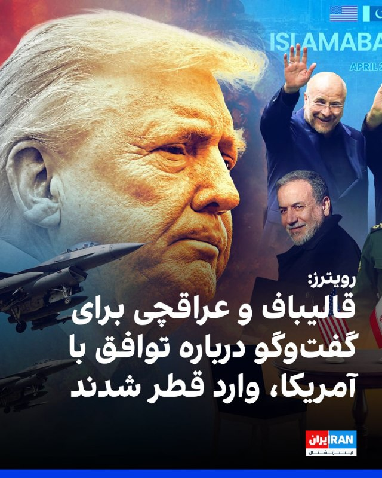

رویترز به نقل از یک مقام آگاه گزارش داد محمدباقر قالیباف و عباس عراقچی برای دیدار با نخست‌وزیر قطر، در خصوص توافق احتمالی میان جمهوری اسلامی و آمریکا، وارد دوحه شده‌اند.

پیش‌تر رسانه‌های ایران از سفر عبدالناصر همتی، رییس کل بانک مرکزی به قطر خبر داده بودند.
iranintl.com/202605250172

## IranIntlTV — post 338912

  <a href="telegram/content/IranIntlTV_338912_1779717451.mp4" target="_blank">🎬 Download video</a>

نعیم قاسم، دبیرکل حزب‌الله لبنان، ابراز امیدواری کرد هرگونه توافق احتمالی میان جمهوری اسلامی و ایالات متحده به توقف کامل جنگ در لبنان منجر شود.

گفت‌وگو با می فرحات، خبرنگار ایران‌اینترنشنال

@iranintltv

## IranIntlTV — post 338911

  <a href="telegram/content/IranIntlTV_338911_1779717452.mp4" target="_blank">🎬 Download video</a>

در ادامه کارزار ثبت حقیقت درباره جاویدنامان انقلاب ملی، ایران‌اینترنشنال جزییات تازه‌ای از جان‌باختن رئوف درخشانی‌مهر در جریان اعتراضات دی‌ماه روایت می‌کند.

فرنوش فرجی، عضو تحریریه ایران‌اینترنشنال، گزارش می‌دهد

@iranintltv

## IranIntlTV — post 338910

  <a href="telegram/content/IranIntlTV_338910_1779717454.mp4" target="_blank">🎬 Download video</a>

مروری بر روزنامه‌های ایران، دوشنبه ۴ خرداد، با مجتبی هاشمی، روزنامه‌نگار
@iranintltv

## Persian_Trend_Official — post 14949

  <a href="telegram/content/Persian_Trend_Official_14949_1779717456.webm" target="_blank">🎬 Download video</a>

🔴 آمریکا و عربستان به‌دنبال تولید پهپادی مشابه شاهد ۱۳۶ ایران

▪️ رسانه‌ها گزارش داده‌اند یک شرکت تسلیحاتی آمریکایی و یک شرکت سعودی در حال ساخت کارخانه‌ای نزدیک ریاض برای تولید پهپادهای رزمی مشابه Shahed 136 هستند.
▪️گفتهمی‌شوداینپهپادهابراساسالگویپهپادهایانتحاریایرانیطراحیخواهندشد.
▪️ این اقدام نشان‌دهنده تأثیر گسترده پهپادهای ارزان و انبوه ایران بر دکترین نظامی کشورهای منطقه و غرب است.

🫆:Tony

📌 @persian_trend_official
پرشین ترند | متفاوت‌ترین کانال نظامی

## Persian_Trend_Official — post 14948

⭕️وزیر نفت:

♦️باید عرضه بنزین کشور را بطور خاص مدیریت کنیم و در تلاشیم تا تاسیسات آسیب‌دیده به سرعت به مدار تولید بازگردد.

🫆:Tony

📌 @persian_trend_official
پرشین ترند | متفاوت‌ترین کانال نظامی

## Persian_Trend_Official — post 14947

🔴 هشدار فوری روسیه: اتباع خارجی فوراً کی‌یف را ترک کنند

▪️ وزارت خارجه روسیه با صدور بیانیه‌ای اضطراری از آغاز موج جدید و گسترده حملات به کی یف خبر داد
▪️ مسکو از تمام اتباع خارجی حاضر در کی‌یف خواسته هرچه سریع‌تر این شهر را ترک کنند
▪️ این هشدار در حالی صادر شده که حملات هوایی و موشکی روسیه علیه پایتخت اوکراین طی ساعات اخیر تشدید شده است

🫆:Tony

📌 @persian_trend_official
پرشین ترند | متفاوت‌ترین کانال نظامی

## Persian_Trend_Official — post 14946

  

♦️ معاون اول پزشکیان:

🔹 ستاد راهبری فضای مجازی، ستاد شورای‌عالی امنیت ملی است

🔹 عارف گفت: رئیس‌جمهور به عنوان رئیس‌ دولت، رئیس شورای عالی امنیت ملی، رئیس شورای عالی فضای مجازی و رئیس شورای عالی انقلاب فرهنگی از اختیارات قانونی خود برای تشکیل این ستاد استفاده کرده است. 

♦️معاون اول رئیس‌جمهور ادامه داد: برای اولین بار است که رئیس‌جمهور در حکمی از عنوان رئیس‌جمهور و رئیس شورای عالی امنیت ملی استفاده کرده است، بنابراین این ستاد هم ستاد دولت و هم ستاد شورای عالی امنیت ملی است.

🫆:Tony

📌 @persian_trend_official
پرشین ترند | متفاوت‌ترین کانال نظامی

## Persian_Trend_Official — post 14945

  <a href="telegram/content/Persian_Trend_Official_14945_1779717457.webm" target="_blank">🎬 Download video</a>

⭕️عاصم منیر، فرمانده ارتش پاکستان، در دیدار با شی جین‌پینگ در پکن.

«توافق میان ایران و آمریکا به مراحل نهایی خود رسیده و دستیابی به آن بسیار نزدیک است»

🫆:Tony

📌 @persian_trend_official
پرشین ترند | متفاوت‌ترین کانال نظامی

## Persian_Trend_Official — post 14944

  <a href="telegram/content/Persian_Trend_Official_14944_1779717457.webm" target="_blank">🎬 Download video</a>

🔴 پهپاد دشمن با « کمان آرش » بر فراز خلیج فارس شکار شد

♦️در ساعات گذشته، فضای خلیج فارس شاهد رونمایی از سامانه کمان آرش با بود

♦️یک پهپاد متخاصم بر فراز آب‌های خلیج فارس با موفقیت توسط این سامانه سرنگون کردند.

▪️اطلاعاتی راجب این سامانه پدافندی در دسترس نیست.

🫆:Tony

📌 @persian_trend_official
پرشین ترند | متفاوت‌ترین کانال نظامی

## Persian_Trend_Official — post 14943

  <a href="telegram/content/Persian_Trend_Official_14943_1779717458.webm" target="_blank">🎬 Download video</a>

⭕️ناوگروه نیروی
دریایی فرانسه به محوریت ناو هواپیمابر شارل دوگل پس از توقفی در جیبوتی، در دریای عرب مستقر شده است.

♦️این ناو هواپیمابر روز گذشته در حال مانور به همراه یک ناوشکن اسکورت مشاهده شد؛ که احتمالاً یا ناوشکن فرانسوی «شوالیه پل» بوده یا همتای بریتانیایی آن یعنی «اچ‌ام‌اس دراگون».

♦️این ناوگروه اکنون کمتر از یک روز دریانوردی با خط محاصره نیروی دریایی آمریکا فاصله دارد. با این حال، به دلایل سیاسی، برگزاری رزمایش مشترک با ناوهای آمریکایی حاضر در منطقه همچنان بعید به نظر می‌رسد.

ناو شارل دوگل

16°50’9.60”N 55°55’26.40”E

🫆:Tony

📌 @persian_trend_official
پرشین ترند | متفاوت‌ترین کانال نظامی

## Persian_Trend_Official — post 14942

  <a href="telegram/content/Persian_Trend_Official_14942_1779717458.webm" target="_blank">🎬 Download video</a>

📎شنیده شدن صدای فعالیت پدافند در محدوده جزیره قشم

عصر دوشنبه، صدای فعالیت پدافند در جزیره قشم از سوی ساکنان محلی گزارش شده است.

🔹بر اساس این گزارش، هنوز ماهیت این صداها مشخص نیست و هنوز هیچ‌یک از نهادهای رسمی درباره علت وقوع این صداها اظهارنظر نکرده‌اند./ مهر نیوز

👩‍💻@PhantomDirective

🆔@persian_trend_official
پرشین ترند | متفاوت‌ترین کانال نظامی

## Persian_Trend_Official — post 14941

  <a href="telegram/content/Persian_Trend_Official_14941_1779717458.webm" target="_blank">🎬 Download video</a>

#طنز

سکوت رهبر مقوایی مقتدر ج.ا و سردار حاجی زاده به خصوص تو این موقعیت واقعا خطرناکه، من جای اسرائیلی ها بودم میترسیدم.

📝 Nick

📌 @persian_trend_official
پرشین ترند | متفاوت‌ترین کانال نظامی

## Persian_Trend_Official — post 14940

  

©️جانوری به نام اصلاح طلب
©️

💀انتقاد عارف از قطع اینترنت:«اتوبان» را به خاطر یک راننده متخلف نمی‌بندند/ برخی مخالفت‌ها با بستن اینترنت ریشه در منافع شرکتی دارد.

نمی‌شود شعار کمک به مردم سر دهیم ولی در عمل به مردم اعتماد نکرده و اینترنت را بر روی مردم ببندیم .با این کار خود سرمایه‌های اجتماعی را سوزانده و فرصت طی کردن مسیر فناوری‌ها از دست بدهیم.

💀در کجای دنیا اگر یک کامیون در یک اتوبان تخلف کند، اتوبان را مسدود می کنند؟

ما کاری که با اینترنت می‌کنیم مثل این است که به جای برخورد با راننده متخلف، کل مسیر یک اتوبان را بر روی همه خودروها ببندیم.

💀آیا اساسا حق داریم به خاطر سلایق شخصی یا کم‌کاری در حوزه‌‌های مختلف این حق را از مردم بگیریم؟

من می‌دانم برخی مخالفت‌ها با بستن اینترنت ریشه‌ در سلایق شخصی و منافع شرکتی دارد.

👩‍💻@PhantomDirective

🆔@persian_trend_official
پرشین ترند | متفاوت‌ترین کانال نظامی

## Persian_Trend_Official — post 14936

🇹🇷
🇸🇾
🇪🇺: برای اولین بار پس از سقوط اسد، ارتش سوریه در تمرینات نظامی خارج از کشور شرکت کرد.

آنها در «EFES-2026» ترکیه، همراه با نزدیک به ۵۰ کشور و اعضای ناتو شرکت کردند.

👩‍💻@PhantomDirective

🆔@persian_trend_official
پرشین ترند | متفاوت‌ترین کانال نظامی

## Persian_Trend_Official — post 14935

  

📸 حنظله اطلاعات ۶۹ افسر اسرائیلی که به کاروان صمود حمله کردند را افشا کرد

گروه هکری حنظله:

🔹نام‌ها و مشخصات کامل ۶۹ افسر نیروی دریایی اسرائیل که اخیراً به کاروان جهانی «صمود» حمله کردند، افشا شده و برای هر یک از این افراد مبلغ ۱۰۰ هزار دلار جایزه تعیین شده است.

👩‍💻@PhantomDirective

🆔@persian_trend_official
پرشین ترند | متفاوت‌ترین کانال نظامی

## Persian_Trend_Official — post 14934

🔴 فاکس‌نیوز: قالیباف و عراقچی برای رایزنی درباره پایان جنگ وارد دوحه شدند ▪️ فاکس‌نیوز گزارش داد محمدباقر قالیباف، رئیس مجلس ایران، و عباس عراقچی، وزیر خارجه ایران، امروز وارد دوحه شدند ▪️ این سفر در چارچوب تلاش‌های دیپلماتیک جاری برای پایان‌دادن به درگیری‌ها…

## Persian_Trend_Official — post 14933

🔴 فاکس‌نیوز: قالیباف و عراقچی برای رایزنی درباره پایان جنگ وارد دوحه شدند ▪️ فاکس‌نیوز گزارش داد محمدباقر قالیباف، رئیس مجلس ایران، و عباس عراقچی، وزیر خارجه ایران، امروز وارد دوحه شدند ▪️ این سفر در چارچوب تلاش‌های دیپلماتیک جاری برای پایان‌دادن به درگیری‌ها…

## Persian_Trend_Official — post 14932

🔴 یک مقام ایرانی به واشینگتن‌پست:

▪️ بازگشایی تنگه هرمز به‌صورت مرحله‌ای انجام خواهد شد
▪️ مرحله نخست شامل پاکسازی مین‌ها از تنگه، رفع محاصره آمریکا و آزادسازی ۱۲ میلیارد دلار از دارایی‌های بلوکه‌شده ایران است
▪️ یادداشت تفاهم شامل توافق هسته‌ای نیست و فقط تعهد به آغاز مذاکرات درباره این پرونده در آینده را در بر می‌گیرد

🫆:Tony

📌 @persian_trend_official
پرشین ترند | متفاوت‌ترین کانال نظامی

## Persian_Trend_Official — post 14931

🔴 فاکس‌نیوز: قالیباف و عراقچی برای رایزنی درباره پایان جنگ وارد دوحه شدند

▪️ فاکس‌نیوز گزارش داد محمدباقر قالیباف، رئیس مجلس ایران، و عباس عراقچی، وزیر خارجه ایران، امروز وارد دوحه شدند
▪️ این سفر در چارچوب تلاش‌های دیپلماتیک جاری برای پایان‌دادن به درگیری‌ها و پیشبرد مذاکرات انجام شده است
▪️ قطر یکی از اصلی‌ترین میانجی‌ها میان تهران و واشینگتن در مذاکرات اخیر محسوب می‌شود

🫆:Tony

📌 @persian_trend_official
پرشین ترند | متفاوت‌ترین کانال نظامی

## Persian_Trend_Official — post 14930

  <a href="telegram/content/Persian_Trend_Official_14930_1779717460.mp4" target="_blank">🎬 Download video</a>

♦️نگاهی به ۱۰ بهمن ۱۳۵۷ ...

جهت ثبت در تاریخ

🫆:Tony

📌 @persian_trend_official
پرشین ترند | متفاوت‌ترین کانال نظامی

---
📅 بروزرسانی: 1405/03/04 14:18
---

## rodast_omiddana — post 71900

  <a href="telegram/content/rodast_omiddana_71900_1779706112.mp4" target="_blank">🎬 Download video</a>

😎اُسکل‌ها کمپین گذاشتن علی کریمی کجاست

## rodast_omiddana — post 71899

  <a href="telegram/content/rodast_omiddana_71899_1779706114.webm" target="_blank">🎬 Download video</a>

🚨سلام امید جان
تهران یافت‌آباد صدای انفجار اومد بعدش صدای تیراندازی ساعت 12 ظه

## rodast_omiddana — post 71898

  <a href="telegram/content/rodast_omiddana_71898_1779706114.webm" target="_blank">🎬 Download video</a>

🚨 سلام اقا امید
منم تهران دیشب حدود ساعت ۳/۳۰ سه تا صدای انفجار شنیدم
پاشدم خبرگذاریهارو چک کردم ولی چیزی نبود
الان تو پیج شما دیدم شهرهای دیگه بوده !!

## rodast_omiddana — post 71897

  <a href="https://t.me/rodast_omiddana/71897" target="_blank">📎 Download file</a>

🔈 حجم فشرده_سخنان مهدی میرقادری در ارتباط با گذشته امید دانا

## rodast_omiddana — post 71896

  <a href="https://t.me/rodast_omiddana/71896" target="_blank">📎 Download file</a>

🔈 سخنان مهدی میرقادری در ارتباط با گذشته امید دانا

## rodast_omiddana — post 71895

▶️ کیفیت 360_سخنان مهدی میرقادری در ارتباط با گذشته امید دانا

## rodast_omiddana — post 71894

▶️ کیفیت 144_سخنان مهدی میرقادری در ارتباط با گذشته امید دانا

## rodast_omiddana — post 71893

  <a href="telegram/content/rodast_omiddana_71893_1779706115.mp4" target="_blank">🎬 Download video</a>

🚨مذاکرات و توافق برای سرنگونی جمهوری اسلامی است
نگران نباشید و به عمو ترامپ اطمینان کنید

## rodast_omiddana — post 71892

  <a href="telegram/content/rodast_omiddana_71892_1779706117.webm" target="_blank">🎬 Download video</a>

🚨هیچکدام از گزارشات انفجار را نمیتوانم تایید کنم

## rodast_omiddana — post 71891

  <a href="telegram/content/rodast_omiddana_71891_1779706117.webm" target="_blank">🎬 Download video</a>

🚨سلام امید جان اصفهان صدا انفجار اومد

## rodast_omiddana — post 71890

  <a href="telegram/content/rodast_omiddana_71890_1779706117.webm" target="_blank">🎬 Download video</a>

🚨درود امید جان
اصفهان ساعت ۱۰:۴۵ الی ۱۰:۵۵ صدای دو افنجار اومد

## rodast_omiddana — post 71889

  <a href="telegram/content/rodast_omiddana_71889_1779706117.webm" target="_blank">🎬 Download video</a>

🚨درود امید جان بندرعباس صدای انفجار اومد فکر کنم سمت هوا دریا بودع

## rodast_omiddana — post 71888

  <a href="telegram/content/rodast_omiddana_71888_1779706118.webm" target="_blank">🎬 Download video</a>

🚨دریاچه چیتگر صدا تیر اندازی میاد

## rodast_omiddana — post 71887

  <a href="telegram/content/rodast_omiddana_71887_1779706118.webm" target="_blank">🎬 Download video</a>

🚨درود امید جان ساعت 10 صبح صدای 3تا انفجار اومد بندرعباس

## rodast_omiddana — post 71886

  <a href="telegram/content/rodast_omiddana_71886_1779706118.webm" target="_blank">🎬 Download video</a>

🚨 سلام اقا امید خسته نباشی
اقا اینجا ساعت یه ۱ ساعت پیش تو ارومیه صدای چند تا انفجار بلند اومد

## rodast_omiddana — post 71885

  <a href="telegram/content/rodast_omiddana_71885_1779706118.webm" target="_blank">🎬 Download video</a>

🚨 سلام امید دانا وقت بخیر
ارومیه ساعت ۱۰ صبح ۲ انفجار شدید

## KiriMohems — post 47970

  <a href="telegram/content/KiriMohems_47970_1779706118.mp4" target="_blank">🎬 Download video</a>

🔴بقایی: کصچرخعراقچی به نیویورک به علت مشکل روادید فعلا ریده

#Helsinki
@KiriMohems

## KiriMohems — post 47969

  <a href="telegram/content/KiriMohems_47969_1779706119.mp4" target="_blank">🎬 Download video</a>

#انگشت_به_سولاخ_بمانید

🔴فیلمی از تیرباران سگ‌حشرانه‌ی مواضع حشدالشعبی در موصل عراق توسط A-10

#Helsinki
@KiriMohems

## KiriMohems — post 47967

🔴قاضی دیوث کبیر ، صلواتی با رد حکم دیوان عالی در پرونده کشته شدن بسیجی آرمان علی‌وردی تو سال ۱۴۰۱، گفت بخشش نیاز نیست و حکم اعدام ۴متهم رو صادر کرد

#Helsinki
@KiriMohems

## KiriMohems — post 47966

  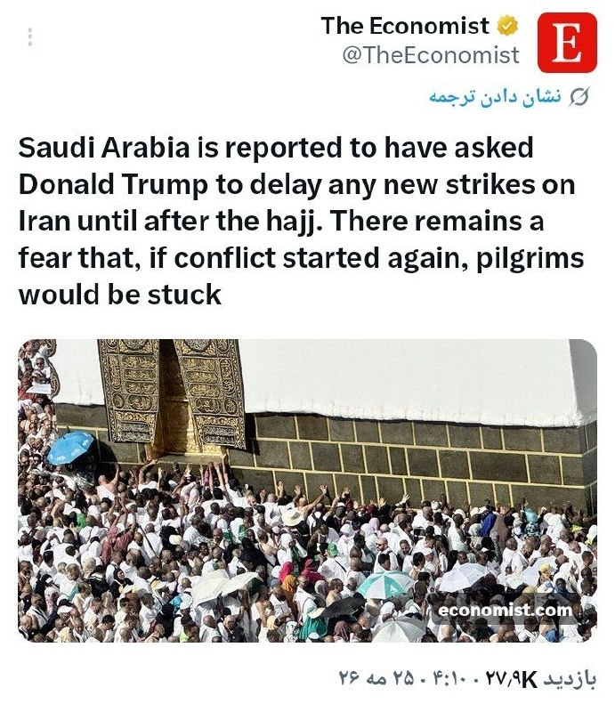

🔴اکونومیست:
یه گزارشاتی از کون دراومده که عربستان سولاخی خایمالی ترامپ رو کرده که هرگونه تقه جدید به ایران رو تا زمانی که مناسک حج برقراره ، کنار بزاره ، همچنان ریدمانی وجود داره که اگر درگیری دوباره آغاز بشه، زائران اونجا گیر میکنن و دَهن مَهن شون سرویس میشه
#Helsinki
@KiriMohems

## KiriMohems — post 47965

🔴نماینده های طویله بهارستان ، به نشستن قالباف بر روی صندلی کیری ریاست مجلس رای کلفت دادند
#Helsinki
@KiriMohems

## KiriMohems — post 47964

🔴عباس اکبری، یکی از معترضان بازداشت شده در دی ماه ۱۴۰۴، امروز صبح اعدام شد
#Helsinki
@KiriMohems

## KiriMohems — post 47963

🔴پیش بینی شاش در شمال غرب و شمال شرق کشور

سازمان هواشناسی:
امروز و فردا در نیمه شمالی استان های آذربایجان غربی. آذربایجان شرقی ، خراسان شمالی و خراسان رضوی رگبار ، رعد و برق و گوزش باد شدید پیش بینی میشه.

همچنین در دامنه های جنوبی البرز ، مرکز ، شمال شرق و شرق کشور گوزش باد شدید منجر به خیزش گرد و خاک کیرخری و کاهش کیفیت هوا میشه.
#Helsinki
@KiriMohems

## SportBaadNews — post 252507

  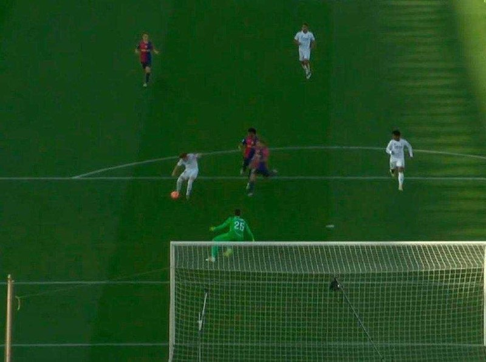

ویکتور مونوز

## SportBaadNews — post 252506

  <a href="telegram/content/SportBaadNews_252506_1779706123.webm" target="_blank">🎬 Download video</a>

🚨
💣🇪🇸 رسسسسسسسسسسمی؛ لیست تیم ملی اسپانیا برای جام جهانی 2026 آمریکا 
◀️ دروازه‌بان‌ها: اونای سیمون، داوید رایا، خوان گارسیا 
◀️ مدافعین: کوکوریا، گریمالدو، کوبارسی، لاپورت، پوبیل، اریک گارسیا، مارکوس یورنته، پدرو پورو 
◀️ هافبک‌ها: پدری، فابیان رویز، زوبیمندی،…

## SportBaadNews — post 252505

  <a href="telegram/content/SportBaadNews_252505_1779706123.webm" target="_blank">🎬 Download video</a>

🚨
💣🇪🇸 رسسسسسسسسسسمی؛ لیست تیم ملی اسپانیا برای جام جهانی 2026 آمریکا

◀️ دروازه‌بان‌ها: اونای سیمون، داوید رایا، خوان گارسیا

◀️ مدافعین: کوکوریا، گریمالدو، کوبارسی، لاپورت، پوبیل، اریک گارسیا، مارکوس یورنته، پدرو پورو

◀️ هافبک‌ها: پدری، فابیان رویز، زوبیمندی، گاوی، رودری، الکس بائنا، مرینو

◀️ مهاجمین: اویارزابال، المو، نیکو ویلیامز، یرمی پینو، فران تورس، ایگلیسیاس، ویکتور مونوز، لامین یامال
@SportBaadNews

## SportBaadNews — post 252504

  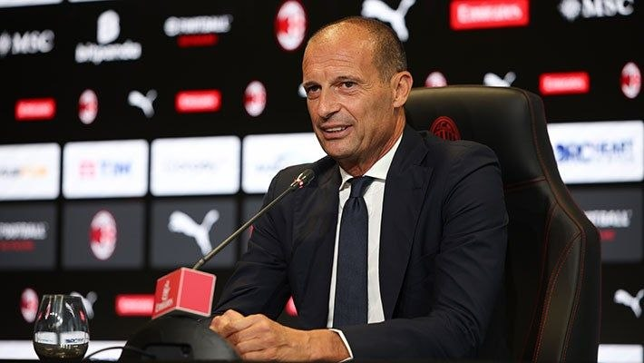

هفته آخر سری‌آ خیلی عجیب تموم شد؛ کومو بازیش رو 4-1 برد تا بالاتر از یوونتوس و میلان سهمیه چمپیونزلیگ فصل آینده رو بگیره؛ میلان بازیشو باخت و یوونتوس هم با وجود اینکه برده بازیش رو ولی فایده ای براش نداره و این دو تیم فصل دیگه تو لیگ اروپا قراره بازی کنن!…

## SportBaadNews — post 252503

  <a href="telegram/content/SportBaadNews_252503_1779706124.webm" target="_blank">🎬 Download video</a>

مصدومیت لیونل‌مسی در فاصله 17 روز تا جام‌جهانی! لیونل مسی در دیدار برابر فیلادلفیا مصدوم شد و در دقیقه 72 زمین بازی را ترک کرد. @SportBaadNews

## SportBaadNews — post 252502

  <a href="telegram/content/SportBaadNews_252502_1779706124.mp4" target="_blank">🎬 Download video</a>

مصدومیت لیونل‌مسی در فاصله 17 روز تا جام‌جهانی!

لیونل مسی در دیدار برابر فیلادلفیا مصدوم شد و در دقیقه 72 زمین بازی را ترک کرد.
@SportBaadNews

## SportBaadNews — post 252501

  

🕹 گردونه شانس رایگان وینکوبت فعال شد!

🎰 هر ۱۲ ساعت یک‌بار شانس خودتان را امتحان کنید و جوایز نقدی متنوع دریافت کنید.

🎁 تا سقف ۱ میلیون تومان جایزه روزانه

✅ فعال برای تمامی کاربران

📌برای شرکت در گردونه شانس، وارد ربات وینکوبت شوید:
👇

🤖 @Wincobet_bot

🤖 @Wincobet_bot

📌کانال رسمی وینکوبت:

🔵 @Wincobetofficial

## SportBaadNews — post 252500

  <a href="telegram/content/SportBaadNews_252500_1779706127.webm" target="_blank">🎬 Download video</a>

🚨
⚽️ #رسمی | آنتونیو کونته از ناپولی جدا شد
@SportBaadNews

## SportBaadNews — post 252499

  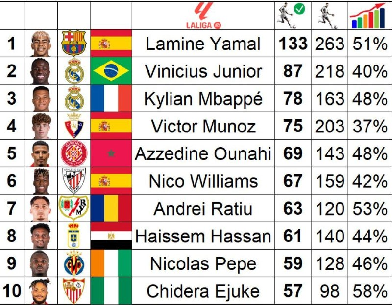

✅ بیشترین دریبل موفق تو این فصل لالیگا با حضور همون همیشگی تو صدر لیست
@SportBaadNews

## SportBaadNews — post 252498

  

کارواخال به همراه باجناقش (خوسلو) تو مراسم خداحافظیش
@SportBaadNews

## SportBaadNews — post 252494

  <a href="telegram/content/SportBaadNews_252494_1779706128.mp4" target="_blank">🎬 Download video</a>

هم اکنون کانفیگ فروشا:
@SportBaadNews

## SportBaadNews — post 252493

  <a href="telegram/content/SportBaadNews_252493_1779706129.webm" target="_blank">🎬 Download video</a>

🚨فوری/ بازگشایی اینترنت بین الملل مصوب شد ‌ 
🔻ستاد راهبری و ساماندهی فضای مجازی صبح امروز دوشنبه (چهارم خردادماه) به ریاست دکتر عارف معاون اول رئیس جمهور تشکیل جلسه داد و بازگشت اینترنت به وضعیت قبل از دی ماه 1404 مصوب شد. ‌ 
🔻این مصوبه برای رییس جمهور ارسال…

## SportBaadNews — post 252492

این مصوبه برای رییس جمهور ارسال شد و در صورت تایید رئیس جمهور جهت اجرا برای وزارت ارتباطات ارسال خواهد شد.

## SportBaadNews — post 252491

سیتناااا تایییید کرد اینترنت به زودی قراره وصل شه

## SportBaadNews — post 252490

  <a href="telegram/content/SportBaadNews_252490_1779706130.webm" target="_blank">🎬 Download video</a>

🚨فوری/ بازگشایی اینترنت بین الملل مصوب شد ‌ 
🔻ستاد راهبری و ساماندهی فضای مجازی صبح امروز دوشنبه (چهارم خردادماه) به ریاست دکتر عارف معاون اول رئیس جمهور تشکیل جلسه داد و بازگشت اینترنت به وضعیت قبل از دی ماه 1404 مصوب شد. ‌ 
🔻این مصوبه برای رییس جمهور ارسال…

## SportBaadNews — post 252489

  <a href="telegram/content/SportBaadNews_252489_1779706130.webm" target="_blank">🎬 Download video</a>

🚨فوری/ بازگشایی اینترنت بین الملل مصوب شد
‌

🔻ستاد راهبری و ساماندهی فضای مجازی صبح امروز دوشنبه (چهارم خردادماه) به ریاست دکتر عارف معاون اول رئیس جمهور تشکیل جلسه داد و بازگشت اینترنت به وضعیت قبل از دی ماه 1404 مصوب شد.
‌

🔻این مصوبه برای رییس جمهور ارسال شد و در صورت تایید رئیس جمهور جهت اجرا برای وزارت ارتباطات ارسال خواهد شد.
@SportBaadNews

## SportBaadNews — post 252469

دهن سرویس 😂😂😂😂😂😂😂😂😂😂 @SportBaadNews

## SportBaadNews — post 252468

  

هوش مصنوعی کصکش رو گفتم بردار جامو برداشت ولی

## SportBaadNews — post 252466

آقا این اینترنت رو وصل کنید وضعیت ممبرا خوب نیست به چندتا فیلم مشتی نیاز دارن 😂😂

## SportBaadNews — post 252465

برام تو بله بفرستید

## IranIntlTV — post 338905

  <a href="telegram/content/IranIntlTV_338905_1779706131.mp4" target="_blank">🎬 Download video</a>

سرخط خبرهای دوشنبه ۴ خرداد
@iranintltv

## IranIntlTV — post 338904

  

سایت هرانا خبر داد گلرخ ایرایی، زهرا صفایی، مرضیه فارسی، شیوا اسماعیلی و سکینه پروانه، پنج تن از زندانیان سیاسی محبوس در بند زنان زندان اوین، از یکشنبه به‌صورت تنبیهی از حق استفاده از تلفن زندان محروم شده‌اند.

هرانا نوشت محرومیت تنبیهی این پنج زندانی سیاسی پس از آن اعمال شد که آنان در اعتراض به اجرای احکام اعدام، در محوطه هواخوری زندان شعار داده بودند.

این زندانیان پیش‌تر نیز از حق ملاقات حضوری با خانواده و وکلای خود محروم بوده‌اند و این محدودیت همچنان ادامه دارد.
https://iranintl.com/202605252442

## IranIntlTV — post 338903

  

دونالد ترامپ در شبکه تروث سوشال نوشت: «توافق با ایران یا یک توافق بزرگ و معنادار خواهد بود یا اصلا توافقی در کار نخواهد بود. این دقیقا برعکس فاجعه برجام است که توسط دولت شکست‌خورده اوباما انجام شد؛ توافقی که یک مسیر مستقیم و آشکار برای دستیابی آن‌ها به سلاح هسته‌ای بود. نه، من چنین توافق‌هایی انجام نمی‌دهم.»

او افزود: «من به همه دموکرات‌ها و جمهوری‌خواهانِ اسمی و احمق‌هایی می‌خندم که هیچ چیزی درباره توافق احتمالی که من با ایران در حال انجامش هستم نمی‌دانند؛ موضوعاتی که هنوز حتی درباره‌شان مذاکره هم نشده است.»
iranintl.com/202605255000

## IranIntlTV — post 338902

  <a href="telegram/content/IranIntlTV_338902_1779706133.mp4" target="_blank">🎬 Download video</a>

روزنامه شرق از بلاتکلیفی آموزش و پرورش برای حضوری کردن کلاس‌ها و چالش خانواده‌ها در ثبت‌نام سال تحصیلی جدید گزارش داد. بنا بر این گزارش، معاون وزیر آموزش و پرورش گفت: «تصمیم به حضوری کردن مدارس در اختیار آموزش و پرورش نیست.»

گفت‌وگو با لیلا سعادتی، عضو تحریریه ایران‌اینترنشنال

@iranintltv

## IranIntlTV — post 338901

  <a href="telegram/content/IranIntlTV_338901_1779706134.mp4" target="_blank">🎬 Download video</a>

پلیس ضد شورش ترکیه یکشنبه با شلیک گاز اشک‌آور وارد دفتر مرکزی حزب جمهوری‌خواه خلق، بزرگ‌ترین حزب مخالف دولت رجب طیب اردوغان، شد تا رهبر برکنار‌شده این حزب را بیرون کند.

گفت‌وگو با میثم بادامچی، نویسنده و پژوهشگر علوم سیاسی

@iranintltv

## IranIntlTV — post 338900

  <a href="telegram/content/IranIntlTV_338900_1779706136.mp4" target="_blank">🎬 Download video</a>

ویدیوهای رسیده به ایران‌اینترنشنال نشان می‌دهند گروهی از ایرانیان مقیم آلمان هم‌زمان با فستیوال موسیقی گوتیک‌ویو در شهر لایپزیگ علیه جمهوری اسلامی راهپیمایی نمادین برگزار کردند.
این تجمع با پوشیدن لباس مشکی، پخش موسیقی نویز و نصب نماد «وای‌فای خاموش» بر دهان شرکت‌کنندگان همراه بود؛ حرکتی اعتراضی برای جلب توجه افکار عمومی به کشتارهای رخ‌داده در ایران و بی‌توجهی سیاستمداران اروپایی.

## IranIntlTV — post 338899

  <a href="telegram/content/IranIntlTV_338899_1779706138.mp4" target="_blank">🎬 Download video</a>

یک شهروند با ارسال پیامی به ایران‌اینترنشنال می‌گوید: «مگر ما در ۱۸ و ۱۹ دی، در خیابان فریاد زدیم که توافق هسته‌ای جدید می‌خواهیم؟ توافق هسته‌ای که قبلا انجام شده بود. ما فریاد آزادی سر دادیم، نه فریاد توافق هسته‌ای که حالا ترامپ می‌خواهد انجام دهد.»

## IranIntlTV — post 338898

  

نت‌بلاکس صبح دوشنبه اعلام کرد خاموشی اینترنت در ایران وارد هشتادوهفتمین روز متوالی شده و بیش از ۲۰۶۴ ساعت ادامه داشته است. نت‌بلاکس نوشت قطع اینترنت «هرگونه شفافیت درباره اعدام‌ها» را از بین برده و به شرایط «غیرانسانی» و بلاتکلیفی منتقدان زندانی، مخالفان و گردشگران افزوده است.
iranintl.com/202605251225

## IranIntlTV — post 338897

  

مسعود پزشکیان، رییس دولت جمهوری اسلامی گفت: «روند مذاکرات و تعاملات خارجی کشور به‌گونه‌ای طراحی شده که حقوق ملت ایران به‌صورت کامل استیفا شود و جمهوری اسلامی تحت هیچ شرایطی در برابر فشارها و مطالبات زیاده‌خواهانه تسلیم نخواهد شد.»

او افزود: «حفظ ثبات بازار و تامین نیازهای کشور در شرایط جنگی، مرهون تلاش موثر فعالان اقتصادی بوده است.»
iranintl.com/202605257599

## IranIntlTV — post 338896

🗣روایت شما از احتمال توافق میان آمریکا و جمهوری اسلامی- دوشنبه ۴ خرداد

🔹آقای ترامپ اومدی راجع به اون چهل‌هزار گل پژمرده و این زندانی‌های در معرض اعدام حرف زدی. گفتی که این رژیم فاسد هر کاری کنه حمله می‌کنی. ولی خب معلوم شد که به ما مردم بیچاره اهمیت ندادی.

🔹چه مذاکره‌ای؟ واقعا نمی‌فهمیم ترامپ داره چه غلطی می‌کنه. ولی ما بدون ترامپ هم می‌تونیم. هم‌میهنان، ما اعتراضات رو دوباره شروع می‌کنیم و ایران‌مون رو پس می‌گیریم. ناامید نباشید.

🔹برامون مهمه که خون عزیزترین‌های ایران پایمال نشه. فکر اینکه اون همه زندگی، آینده، تجربه و متعلقات رو برای «هیچ» رها کرده باشن عذابم می‌ده.

🔹اگر می‌خواستی توافق کنی، بی‌جا کردی به ما مردم گفتی کمک در راه است. چه کمکی؟ جنگ نصفه‌نیمه و بی‌نتیجه که فقط اینترنت‌ها رو قطع کرد و قیمت‌ها رو برد بالا.

🔹الان حدود سه ماهه که با قطعی اینترنت و گرانی روزبه‌روز داریم عقب‌مونده‌تر و فقیرتر می‌شیم. قرار بود ترامپ از ما حمایت کنه، نه اینکه نصف کار رو ول کنه بره. آقای ترامپ، ۸۰ میلیون ایرانی حرف شما رو حساب کردن و امید بستن.

🔹یکی به این ترامپ بگه قبل از جنگ این همه از خون جاویدنام‌ها و جون مردم مایه گذاشت برای شروع جنگ، حداقل یکی از بندهای توافق رو اختصاص می‌داد به حقوق مردم مثل اینترنت یا حق اعتراض آزاد.

🔹ترامپ عزیز، اول ازت ممنونم بابت همراهی‌هات تاکنون، ولی اگر با بوفالوی منطقه و قاتل مردم ایران هر توافقی بکنی، نه می‌بخشیم و نه فراموش می‌کنیم و البته قطعا خودمون ریشه این جهل و جور و فساد رو از تاریخ ایران درمیاریم و به زباله‌دان تاریخ می‌اندازیم.

🔹فقط از خدا می‌خوام که توافق نشه، مجدد جنگ بشه، چون هیچ‌کس از هیچ کجای دنیا نمی‌تونه درک کنه این جمهوری اسلامی چقدر وحشی، چقدر متجاوز و چقدر خشنه. موندن اینا یعنی نادیده گرفتن قتل‌عام ده‌ها هزار جاویدنام.

## IranIntlTV — post 338895

  <a href="telegram/content/IranIntlTV_338895_1779706140.mp4" target="_blank">🎬 Download video</a>

دادگاه انقلاب تهران، ۴ نفر از معترضان جنبش زن، زندگی، آزادی را در پرونده شهرک اکباتان به اتهام افساد فی‌الارض به اعدام محکوم کرد. با وجود اینکه پیش‌تر این حکم از سوی دادگاه کیفری نقض شده بود، ابوالقاسم صلواتی حکم اعدام متهمان این پرونده را دوباره تایید کرد.

گفت‌وگو با رضا اکوانیان، روزنامه‌نگار و فعال حقوق بشر

@iranintltv

## IranIntlTV — post 338894

  <a href="telegram/content/IranIntlTV_338894_1779706141.mp4" target="_blank">🎬 Download video</a>

سخنگوی وزارت خارجه جمهوری اسلامی یکی از محورهای تفاهم را توقف جنگ در «تمام جبهه‌ها» عنوان کرد.

مرتضی کاظمیان، عضو تحریریه ایران‌اینترنشنال، از بی‌اعتنایی جمهوری اسلامی به منافع ملی و اقدام ضدملی حکومت در گره زدن منافع ایران با مصالح حزب‌الله لبنان می‌گوید.

@iranintltv

## IranIntlTV — post 338893

  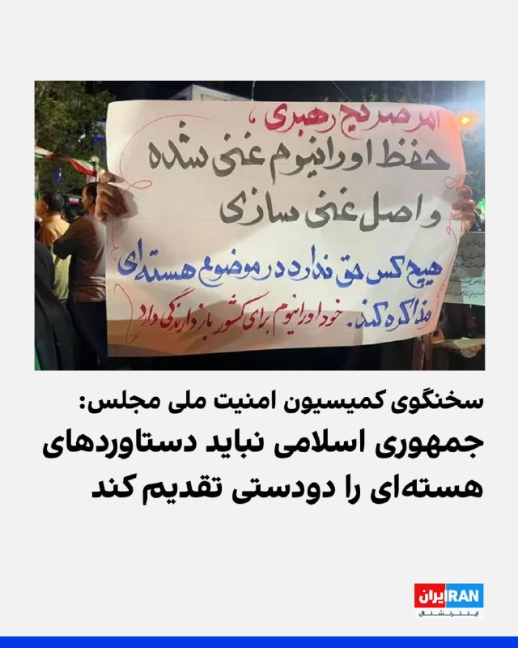

ابراهیم رضایی، سخنگوی کمیسیون امنیت ملی مجلس، گفت جمهوری اسلامی نباید در موضوع هسته‌ای تعهدی بدهد که قدرت بازدارندگی‌اش را تضعیف کند.

او افزود: «جمهوری اسلامی نباید چیزی را که برای آن هزینه زیادی پرداخته، «دو دستی تقدیم دشمن» کند.

او توان هسته‌ای را «دارایی استراتژیک» خواند و گفت واگذاری آن در مذاکره ممکن است خطراتی به همراه داشته باشد و دشمن را برای حمله مجدد «حریص‌تر» کند.
iranintl.com/202605255630

## IranIntlTV — post 338892

  

غلامحسین محسنی اژه‌ای، رییس قوه قضاییه در پیامی در خصوص انتخاب مجدد قالیباف به‌عنوان رییس مجلس شورای اسلامی، نوشت: «محمدباقر قالیباف که مدیری جهادی و نستوه و میدان‌دیده است و در جنگهای ۱۲ روزه و رمضان و پس از آن، در عرصه‌های میدان و دیپلماسی جهاد کرد.»

او ادامه داد: «قوه قضاییه آماده است بیش از گذشته با مجلس و نمایندگان آن، همکاری و مساعدت داشته باشد.»

## IranIntlTV — post 338891

  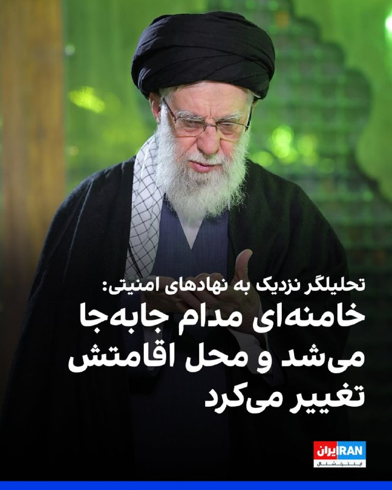

مهدی خراطیان، تحلیلگر نزدیک به نهادهای امنیتی جمهوری اسلامی گفت: «رهبر انقلاب بر اساس پروتکل‌های پیچیده امنیتی، مدام جابه‌جا می‌شد و برای برگزاری جلسات به دفتر خود مراجعه می‌کرد. محل اقامت او نیز به‌طور مداوم تغییر می‌کرد و من کشته شدن او را جز در نتیجه نفوذ، به شکل دیگری قابل تفسیر نمی‌دانم.»

او افزود موساد فرصتی برای کشتن علی خامنه‌ای به دست آورد.

دفتر خامنه‌ای در نخستین ساعات آغاز جنگ میان جمهوری اسلامی، آمریکا و اسرائیل در ۹ اسفند ۱۴۰۴ هدف حمله موشکی قرار گرفت.
iranintl.com/202605256952

## IranIntlTV — post 338890

  <a href="telegram/content/IranIntlTV_338890_1779706145.mp4" target="_blank">🎬 Download video</a>

مقام‌های اسرائیلی به اورشلیم‌پست گفتند توافق احتمالی میان تهران و واشینگتن «بد» است، زیرا به برنامه موشکی ایران و شبکه نیروهای نیابتی جمهوری اسلامی در منطقه نمی‌پردازد و ممکن است آزادی عمل اسرائیل در لبنان را محدود کند.

گزارش اشکان صفایی، خبرنگار ایران‌اینترنشنال
@iranintltv

## IranIntlTV — post 338889

  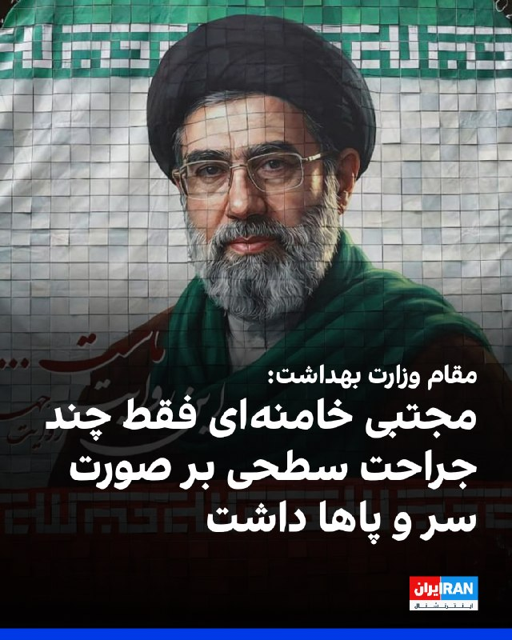

حسین کرمانپور، رییس مرکز روابط عمومی وزارت بهداشت، در خصوص جراحت مجتبی خامنه‌ای پس از بمباران روز اول جنگ، گفت: «او برای مداوا تا ساعت دو بامداد دهم اسفند مهمان ما بود، استنباط ما این بود که کسی که زیر چنین بمبارانی باشد نباید بدن سالمی داشته باشد، اما به جز جراحت سطحی بر صورت، سر و پاها اتفاق خاصی نیفتاده بود.»

او ادامه داد: «در این رخداد وزیر در بیمارستان حضور پیدا کرد. بچه‌های ما هم زنده هستند؛ کسی که بخیه زده است و کسی که بی‌حسی موضعی داده است، همه زنده هستند، اگر روزی قرار شد آن‌ها روایت‌شان را بگویند حتما ارائه خواهند داد.»

این در حالی است که پس از روز نهم اسفند، تاکنون هیچ تصویر یا صوتی از رهبر جدید جمهوری اسلامی منتشر نشده است.
https://iranintl.com/202605259051

## IranIntlTV — post 338888

  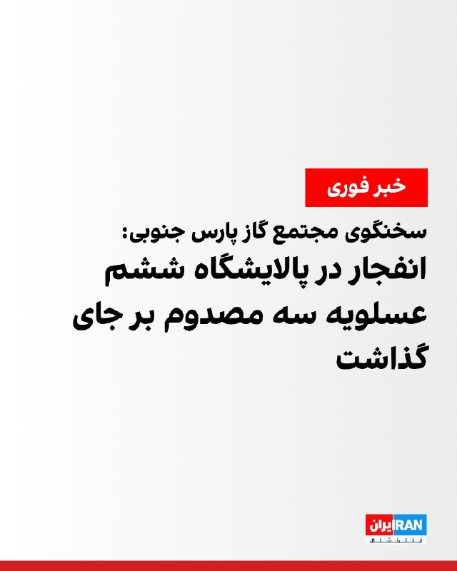

سخنگوی مجتمع گاز پارس جنوبی عسلویه اعلام کرد صبح دوشنبه هنگام آواربرداری از تاسیسات آسیب‌دیده جنگ در پالایشگاه ششم گاز عسلویه، انفجاری رخ داد که در پی آن سه نفر از کارکنان شرکت پیمانکاری بازسازی پالایشگاه مصدوم و به بیمارستان منتقل شدند.
https://iranintl.com/202605254404

## IranIntlTV — post 338887

  <a href="telegram/content/IranIntlTV_338887_1779706147.mp4" target="_blank">🎬 Download video</a>

یک شهروند با ارسال پیامی به ایران‌اینترنشنال درباره اخبار مربوط به مذاکرات آمریکا و جمهوری اسلامی می‌گوید: «ناامیدی و افسردگی به حدی در مردم بالاست که شبیه مرده‌های متحرک زندگی می‌کنیم. اگر قرار است مذاکره‌ای شود، وضعیت مردم و تغییرِ حکومت با انتخاب مردم هم باید جزوش باشد.»

## IranIntlTV — post 338886

  

🔻عبدالکریم حسین‌زاده، معاون مسعود پزشکیان، رییس دولت جمهوری اسلامی در پیامی در شبکه اجتماعی ایکس با اشاره به یادداشت سردار آزمون، او را «سرمایه ملی» خواند و خواستار بازگشت سردار به تیم ملی فوتبال شد: «هرکس نام ایران را بالاتر از گلایه‌های شخصی می‌نشاند، بخشی از سرمایه ملی ماست.»

🔹سردار آزمون چهار روز پیش در یادداشتی در صفحه اینستاگرام خود نوشت: «تا امروز از هيچ تلاشی برای حمايت از هموطنانم دريغ نكردم. هر جايی كه فوتبال بازی كنم، هويت من، قلب من و افتخار من ايران است.»

🔹او همچنین نوشت: «من هميشه با افتخار برای تيم ملی كشورم بازی كردم. وقتی می‌برديم، به خودم و هم‌تيمی‌هام افتخار می كردم و وقتی نمی‌برديم مثل همه آنها ناراحت‌ترين آدم دنيا بودم. من عاشق فوتبال هستم و عاشق مردم خوب و شايسته كشورم ايران.»

🔹درحالی که امیر قلعه‌نویی، سرمربی تیم ملی هنوز فهرست نهایی تیم ملی را اعلام نکرده است، روزنامه فرهیختگان خواستار عذرخواهی سردار آزمون برای بازگشت به تیم ملی شده است.

🔹این روزنامه امروز در یادداشتی نوشت: «اگر قرار به بازگشت او باشد، همه منتظر شنیدن یک عذرخواهی واقعی و صادقانه هستند.»

@iranintltvsport

## Persian_Trend_Official — post 14928

  <a href="telegram/content/Persian_Trend_Official_14928_1779706149.webm" target="_blank">🎬 Download video</a>

من به تمام دموکرات‌های احمق، جمهوری‌خواهان ظاهری و نادان‌هایی که هیچ چیزی درباره توافق احتمالی‌ای که با ایران در حال انجامش هستم نمی‌دانند می‌خندم؛ چیزهایی که حتی هنوز مذاکره هم نشده‌اند. افراد ضعیف و بی‌اثری مثل سناتور شکست‌خورده تام تیلیس (که به‌زودی از کار برکنار می‌شود!)، بیل کسیدی که تازه یک شکست سنگین در انتخابات مقدماتی خورده، و نماینده واقعاً افتضاح، توماس مَسی، یک آدم کثیف واقعی که پس از خیانت بزرگ به حزبش (و کشورش!) با اختلاف سنگین به یک میهن‌پرست بزرگ آمریکایی (که مورد حمایت «ترامپ» بود) باخت؛ و تقریباً تمام دموکرات‌ها، افرادی که کاملاً راهشان را گم کرده‌اند، مدام از سیاست‌های بد و نامزدهای حتی بدتر حمایت می‌کنند، اما دائماً از تک‌تک پیروزی‌های فوق‌العاده من انتقاد می‌کنند.

این افراد باید به خانه بروند و استراحت کنند؛ آن‌ها هیچ کاری جز ایجاد تفرقه و شکست انجام نمی‌دهند. به زبان ساده، آن‌ها بازنده‌اند!

توافق با ایران یا یک توافق بزرگ و معنادار خواهد بود، یا اصلاً توافقی در کار نخواهد بود. این توافق دقیقاً برعکس فاجعه برجام خواهد بود که توسط دولت شکست‌خورده اوباما مذاکره شد؛ توافقی که یک مسیر مستقیم و آشکار برای دستیابی ایران به سلاح هسته‌ای بود.

نه، من چنین توافق‌هایی انجام نمی‌دهم!

رئیس‌جمهور DJT

🫆:Tony

📌 @persian_trend_official
پرشین ترند | متفاوت‌ترین کانال نظامی

## Persian_Trend_Official — post 14927

  

📷 Photo

## Persian_Trend_Official — post 14926

🔴تسنیم به نقل از منابع ایرانی:

«ایران هیچ خوش‌بینی‌ای نسبت به آمریکا ندارد.

♦️هنوز هیچ تفاهم نهایی حاصل نشده و اختلافات بر سر برخی بندها همچنان پابرجاست.

♦️حتی اگر یک تفاهم اولیه هم حاصل شود، این موضوع نگاه ایران به آمریکا یا اعتماد تهران به پایبندی این دولت به تعهداتش را تغییر نخواهد داد.

♦️آمریکایی‌ها سابقه بسیار بدی در مذاکرات دارند و همین مسئله بدبینی را تقویت و تثبیت می‌کند.

♦️حتی در صورت دستیابی به تفاهم، ایران در تمام مراحل پس از اعلام آن، اقدامات آمریکا را زیر نظر خواهد داشت.

♦️اگر آمریکا به وعده‌های خود عمل نکند، ایران همچنان کارت‌های فشار و ابزارهای لازم برای مقابله را حفظ خواهد کرد.»

🫆:Tony

📌 @persian_trend_official
پرشین ترند | متفاوت‌ترین کانال نظامی

## Persian_Trend_Official — post 14925

  <a href="telegram/content/Persian_Trend_Official_14925_1779706150.mp4" target="_blank">🎬 Download video</a>

داکتر مرندی، تحلیلگر سیاسی: ظاهرا قرار بر این است قطری ها بخشی از پول را برای ما تامین و بعد از آمریکا دریافت کنند.

📌 @persian_trend_official
پرشین ترند | متفاوت‌ترین کانال نظامی

## Persian_Trend_Official — post 14924

  <a href="telegram/content/Persian_Trend_Official_14924_1779706152.mp4" target="_blank">🎬 Download video</a>

پروفسور خوش‌چشم، تحلیلگر مسائل راهبردی: علت منصرف‌شدن ترامپ از حملهٔ دوباره به ایران، ۲ عملیات پیش‌دستانهٔ منتسب به ایران بود نه درخواست عرب‌ها !!! 📌 @persian_trend_official پرشین ترند | متفاوت‌ترین کانال نظامی

## Persian_Trend_Official — post 14923

  <a href="telegram/content/Persian_Trend_Official_14923_1779706154.webm" target="_blank">🎬 Download video</a>

🔴 بازگشایی اینترنت بین الملل مصوب شد ♦️سیتنا خبر داد: ستاد راهبری و ساماندهی فضای مجازی صبح امروز دوشنبه (چهارم خردادماه) به ریاست دکتر عارف معاون اول رئیس جمهور تشکیل جلسه داد و بازگشت اینترنت به وضعیت قبل از دی ماه 1404 مصوب شد. ♦️این مصوبه برای رییس جمهور…

## Persian_Trend_Official — post 14922

  <a href="telegram/content/Persian_Trend_Official_14922_1779706154.webm" target="_blank">🎬 Download video</a>

مهر: حادثه در پالایشگاه ششم پارس جنوبی؛ ۳ نفر مصدوم شدند

سخنگو مجتمع گاز پارس جنوبی عسلویه:

صبح امروز در حین آوار برداری از تاسیسات آسیب دیده جنگ رمضان در پالایشگاه ششم گاز عسلویه، انفجار محدودی رخ داد.

بلافاصله نیروهای امدادی و آتش نشانی پالایشگاه وارد عمل شده و آتش را کنترل و خاموش کردند.

علت حادثه در دست بررسی است.

در این حادثه ۳ نفر از کارکنان شرکت پیمانکاری بازسازی پالایشگاه مصدوم و به بیمارستان منتقل شدند.

🫆:Tony

📌 @persian_trend_official
پرشین ترند | متفاوت‌ترین کانال نظامی

## Persian_Trend_Official — post 14921

پروفسور خوش‌چشم، تحلیلگر مسائل راهبردی: علت منصرف‌شدن ترامپ از حملهٔ دوباره به ایران، ۲ عملیات پیش‌دستانهٔ منتسب به ایران بود نه درخواست عرب‌ها !!!

📌 @persian_trend_official
پرشین ترند | متفاوت‌ترین کانال نظامی

## Persian_Trend_Official — post 14920

  <a href="telegram/content/Persian_Trend_Official_14920_1779706155.webm" target="_blank">🎬 Download video</a>

🔴 بازگشایی اینترنت بین الملل مصوب شد

♦️سیتنا خبر داد: ستاد راهبری و ساماندهی فضای مجازی صبح امروز دوشنبه (چهارم خردادماه) به ریاست دکتر عارف معاون اول رئیس جمهور تشکیل جلسه داد و بازگشت اینترنت به وضعیت قبل از دی ماه 1404 مصوب شد.

♦️این مصوبه برای رییس جمهور ارسال شد و در صورت تایید رئیس جمهور جهت اجرا برای وزارت ارتباطات ارسال خواهدشد.

🫆:Tony

📌 @persian_trend_official
پرشین ترند | متفاوت‌ترین کانال نظامی

## Persian_Trend_Official — post 14919

  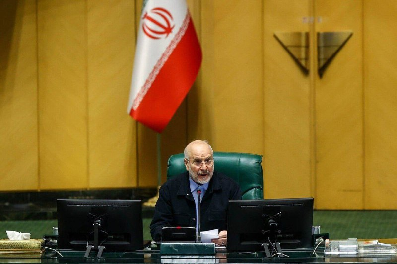

🔴محمدباقر قالیباف رئیس مجلس ماند

♦️قالیباف با رای نمایندگان مجلس برای یکسال دیگر رئیس‌مجلس باقی ماند.

## Persian_Trend_Official — post 14918

  

اورشلیم پست :
کشورهای خلیج فارس توان تحمل هزینه جنگ دیگری را ندارند، به ترامپ فشار می‌آورند تا از حمله به جمهوری اسلامی خودداری کند !

📌 @persian_trend_official
پرشین ترند | متفاوت‌ترین کانال نظامی

## Persian_Trend_Official — post 14917

  

ابراهیم رضایی سخنگوی کمیسیون امنیت ملی و سیاست خارجی مجلس :

در دوره جنگ نظامی تاکتیک ما چشم در مقابل چشم بود، در جنگ دیپلماتیک اقدام در مقابل اقدام است. بلوف رییس‌جمهور شکست‌خورده را باور نکنید، زمان به ضرر آمریکایی‌هاست. اگر توافق می‌خواهند مذاکره کنند، اگر بنزین ۶ دلاری می‌خواهند بایستند و بلوف بزنند تا علف زیر پایشان سبز شود. ایران زیر بار زور و تهدید نمی‌رود.

📌 @persian_trend_official
پرشین ترند | متفاوت‌ترین کانال نظامی

## Persian_Trend_Official — post 14916

ستاد راهبری و ساماندهی فضای مجازی صبح امروز دوشنبه (چهارم خردادماه) به ریاست دکتر عارف معاون اول رئیس جمهور تشکیل جلسه داد و بازگشت اینترنت به وضعیت قبل از دی ماه 1404 مصوب شد.

📌 @persian_trend_official
پرشین ترند | متفاوت‌ترین کانال نظامی

## Persian_Trend_Official — post 14915

  <a href="telegram/content/Persian_Trend_Official_14915_1779706157.webm" target="_blank">🎬 Download video</a>

خبرگزاری فارس، وابسته به سپاه پاسداران، از برگزاری «حضوری» انتخابات هیات‌رییسه مجلس شورای اسلامی با «رای مستقیم نمایندگان» خبر داد.

به گزارش این رسانه حکومتی، «بیش از ۲۷۰ نماینده» از مجموع ۲۸۵ نماینده مجلس در انتخابات هیات‌رییسه شرکت کردند.

فارس نوشت محمدباقر قالیباف با کسب ۲۳۵ رای، برای هفتمین سال متوالی به‌عنوان رییس مجلس انتخاب شد.

فارس افزود: «با آغاز انتخابات هیات‌رییسه مجلس، قالیباف در محل رای‌گیری حاضر شد و اولین نماینده‌ای بود که رای داد.»

با این حال، هنوز جزییاتی درباره نحوه برگزاری و محل دقیق این رای‌گیری منتشر نشده است.

این در حالی است که از زمان آغاز جنگ اخیر در ۹ اسفند ۱۴۰۴، جلسات علنی صحن مجلس برگزار نشده است.

📌 @persian_trend_official
پرشین ترند | متفاوت‌ترین کانال نظامی

## Persian_Trend_Official — post 14914

اسماعیل بقایی، سخنگوی وزارت امور خارجه جمهوری اسلامی:

کسی نمی‌تواند ادعا بکند به توافق نزدیک شده‌ایم

📌 @persian_trend_official
پرشین ترند | متفاوت‌ترین کانال نظامی

## Persian_Trend_Official — post 14913

سخنگوی وزارت خارجه جمهوری اسلامی: سفر عراقچی به نیویورک به‌دلیل «مشکل روادید» منتفی شد

اسماعیل بقایی، سخنگوی وزارت خارجه جمهوری اسلامی، اعلام کرد «با توجه به مجموع شرایط»، سفر عباس عراقچی به نیویورک برای شرکت در نشست شورای امنیت سازمان ملل متحد انجام نخواهد شد.

او گفت سفر وزیر خارجه جمهوری اسلامی «به علت مشکل روادید» منتفی شده است.

😄

📌 @persian_trend_official
پرشین ترند | متفاوت‌ترین کانال نظامی

## Persian_Trend_Official — post 14908

🔴 ارتش اسرائیل حملات به مواضع حزب‌الله در لبنان را ادامه می‌دهد

▪️ ارتش اسرائیل اعلام کرد حملات علیه اهداف وابسته به حزب‌الله در لبنان همچنان ادامه دارد
▪️ این حملات پس از کشته‌شدن یک نظامی دیگر اسرائیلی در حمله پهپاد انفجاری انجام شده است
▪️ تنش در جبهه لبنان همچنان بالا باقی مانده؛ آن هم در حالی که مذاکرات مربوط به آتش‌بس و توافق منطقه‌ای ادامه دارد

🫆:Tony

📌 @persian_trend_official
پرشین ترند | متفاوت‌ترین کانال نظامی

---
📅 بروزرسانی: 1405/03/04 09:41
---

## ChizBergerz — post 46775

👑آیپی جدید شیر و خورشید؛
50.7.5.85
50.7.4.107
50.7.4.243
50.7.4.244
2.23.168.7
5.160.13.85
2.16.19.136
2.23.168.174
2.23.168.254
2.188.21.240
92.123.106.11
92.123.106.33
92.123.106.42
92.123.106.90
63.141.252.203
142.54.178.211
185.200.232.42
185.200.232.50
@ChizBergerz

## ChizBergerz — post 46774

👑آیپی جدید شیر و خورشید؛
23.32.46.126
23.32.133.111
23.32.42.242
23.32.210.21
23.32.112.77
23.32.208.202
23.32.56.40
23.32.133.2
23.32.132.39
23.32.26.117
23.32.112.59
23.32.88.5
23.32.42.208
23.32.108.224
23.32.88.160
23.32.88.194
23.32.244.5
@ChizBergerz

## ChizBergerz — post 46773

  

کیرتون تو زن و دختر ترامپ، اول صبحی یکم زیبایی ببینید:

@ChizBergerz

## ChizBergerz — post 46772

👑آیپی جدید شیر و خورشید؛

94.130.33.41
65.109.34.234
95.216.69.37
94.130.50.12
142.54.178.211
63.141.252.203
95.100.69.108
23.55.161.171
2.22.89.45
23.58.193.140
104.78.170.186
23.55.110.74
23.207.210.80
23.55.110.46
184.24.77.15
23.216.77.46
184.51.252.171
96.16.122.158
2.21.69.8
2.22.255.167
23.219.36.68
23.44.201.140
23.44.201.216
2.19.204.217
23.202.138.125
2.18.64.10
2.22.151.181
23.55.155.169

@ChizBergerz

## ChizBergerz — post 46771

👑آیپی جدید شیر و خورشید؛

2.21.2.9
2.16.19.129
2.16.1.145
2.21.2.8
50.7.4.107
151.101.0.223
2.21.2.128
23.58.95.139
2.21.2.107
2.21.2.59
104.103.64.7
2.21.2.120
23.221.28.5
2.21.2.35
50.7.4.243
104.103.65.50
23.34.67.6
172.234.159.31
142.54.178.211
2.21.2.129
63.141.252.203
2.188.21.240
2.21.2.16
2.23.168.144
2.21.2.58
2.21.2.40
2.21.2.74
23.58.95.153

@ChizBergerz

## rodast_omiddana — post 71884

  <a href="telegram/content/rodast_omiddana_71884_1779689517.webm" target="_blank">🎬 Download video</a>

🚨
🚨امید جان من دارم دیوونه میشم 15 تا صدای بمب شدید شد تو قشم از ساعت 3 تا 5 هیچ رسانه ای این رو نمیگه مطلقا هیچ رسانه ای تو اولین نفر بیا بگو اینو آتش بس فرو پاشید

## SportBaadNews — post 252448

  <a href="telegram/content/SportBaadNews_252448_1779689518.mp4" target="_blank">🎬 Download video</a>

این فصل، فصل خداحافظی کردنها بود...
@SportBaadNews

## IranIntlTV — post 338867

  

روزنامه کیهان با اشاره به احتمال تفاهم موقت میان جمهوری اسلامی و آمریکا، نوشت: «ملت ایران از مطالبه غرامت، خسارت، تنبیه متجاوز و رفع شر او و همچنین از حکمرانی بر تنگه هرمز به عنوان حاکمیت سرزمینی خود عقب نخواهد نشست.»

این روزنامه افزود: «توافق با عنصر عهدشکنی که تعهد دولت آمریکا در برجام را زیر پا گذاشت، مانند نقش زدن بر قالب یخ زیر آفتاب است.»

کیهان ادامه داد: «شرایط برخلاف تظاهر مذاکراتی دشمن، جنگی است و در برابر دشمن زخم‌خورده و مترصد، غفلت از آرایش دفاعی و تهاجمی و احتیاط ممکن نیست.»
https://iranintl.com/202605252293

## IranIntlTV — post 338866

  <a href="telegram/content/IranIntlTV_338866_1779689520.mp4" target="_blank">🎬 Download video</a>

محسن رضایی، مشاور نظامی مجتبی خامنه‌ای، هم‌زمان با ادامه گفت‌وگوها با آمریکا هشدار داد در صورت تداوم روند خصمانه، جمهوری اسلامی از معاهده «ان‌پی‌تی» خارج خواهد شد.

گفت‌وگو با شهرام خلدی، پژوهشگر تاریخ خاورمیانه و روابط بین‌الملل
@iranintltv

## IranIntlTV — post 338865

  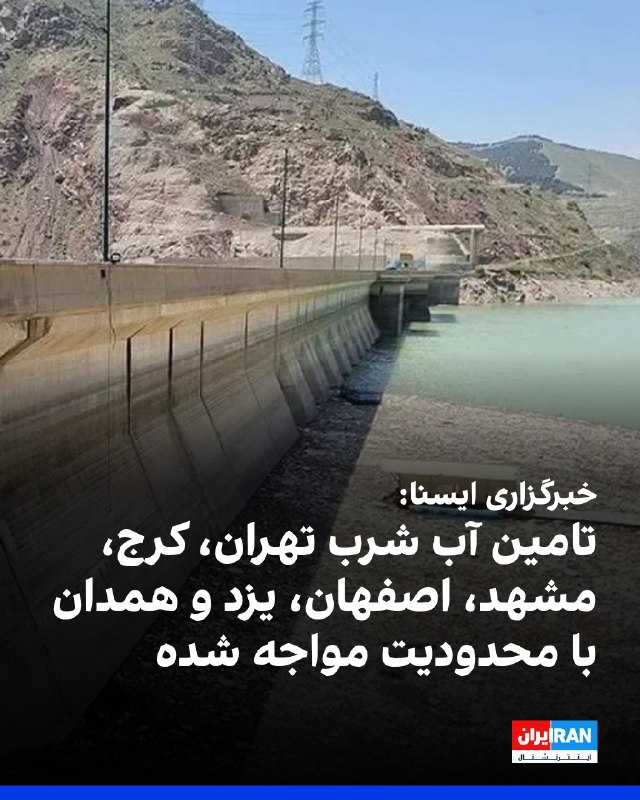

خبرگزاری ایسنا گزارش داد موجودی سدهای استان‌های تهران، مرکزی، خراسان رضوی، قم، اصفهان، زنجان و همدان در وضعیت نامطلوب است و تامین آب شرب شهرهایی از جمله تهران، کرج، مشهد، اراک، قم، اصفهان، یزد و همدان با محدودیت مواجه شده است.

بنا بر این گزارش حجم پرشدگی سدهای کشور به ۶۷ درصد رسیده، اما پنج سد مهم شامل لار، دوستی، پانزده خرداد، بارزو و ساوه همچنان کمتر از ۱۰ درصد آب دارند.
https://iranintl.com/202605252689

## IranIntlTV — post 338864

  <a href="telegram/content/IranIntlTV_338864_1779689523.mp4" target="_blank">🎬 Download video</a>

خبرگزاری میزان وابسته به قوه قضاییه جمهوری اسلامی نوشت دادگاه انقلاب تهران تعدادی از متهمان پرونده اکباتان را به «اشد مجازات» محکوم کرد.

گفت‌وگو با پگاه بنی‌هاشمی، پژوهشگر ارشد حقوق
@iranintltv

## IranIntlTV — post 338863

  

خبرگزاری فارس، وابسته به سپاه پاسداران، نوشت بر اساس کسب اطلاعش از اتاق بازرگانی ایران و پاکستان، امارات متحده عربی برای جلوگیری از تبدیل بندر گوادر به رقیب دبی، در مسیر پیشرفت کریدور اقتصادی چین و پاکستان، موسوم به «سی‌پک»، کارشکنی می‌کند.

از آغاز جنگ میان جمهوری اسلامی با آمریکا و اسرائیل، امارات متحده عربی هدف بیشتری حملات جمهوری اسلامی قرار گرفت.
https://iranintl.com/202605255252

## IranIntlTV — post 338862

  <a href="telegram/content/IranIntlTV_338862_1779689526.mp4" target="_blank">🎬 Download video</a>

در ادامه یکشنبه‌های اعتراضی، جمعی از ایرانیان در شهر ادمونتون در کانادا با برگزاری زنجیره انسانی به خیابان آمدند و از مردم ایران و شاهزاده رضا پهلوی حمایت کردند.

سپیدار ولیان، خبرنگار ایران‌اینترنشنال، گزارش می‌دهد
@iranintltv

## IranIntlTV — post 338861

  

حسین شریعتمداری، نماینده رهبر جمهوری اسلامی در روزنامه کیهان، با اشاره به مذاکرات با آمریکا، نوشت: «ترجمه و معنای واقعی گشایش تنگه هرمز، خلع سلاح جمهوری اسلامی در مقابل تجاوز و حملات نظامی و اقتصادی و سیاسی دشمنان است.»

او افزود: «گشایش تنگه هرمز، حذف یکی از اصلی‌ترین موانع پیش‌روی دشمن برای حمله به کشور خواهد بود.»

او ادامه داد: «متاسفانه مسئولان و دست‌اندرکاران گفت‌وگو و تبادل پیام با آمریکا، از نتیجه گفت‌وگوهای انجام شده، گزارش دقیق و یا اطلاعات چندانی به افکار عمومی نمی‌دهند»
https://iranintl.com/202605258963

## IranIntlTV — post 338860

  <a href="telegram/content/IranIntlTV_338860_1779689528.mp4" target="_blank">🎬 Download video</a>

جزییات توافق احتمالی میان جمهوری اسلامی و آمریکا
@iranintltv

## IranIntlTV — post 338859

  <a href="telegram/content/IranIntlTV_338859_1779689530.mp4" target="_blank">🎬 Download video</a>

سگ‌های خیابانی به یکی از چالش‌های جدی در کوزوو تبدیل شده‌اند. یک سازمان بین‌المللی تلاش می‌کند از طریق عقیم‌سازی، رشد جمعیت این حیوانات را کنترل کند، اما کارشناسان می‌گویند حل کامل این بحران ممکن است سال‌ها طول بکشد.

گزارش فرزیا ثابتی، خبرنگارایران‌اینترنشنال
@iranintltv

## IranIntlTV — post 338858

  <a href="telegram/content/IranIntlTV_338858_1779689532.mp4" target="_blank">🎬 Download video</a>

شبکه خبری سی‌بی‌اس در گزارشی نوشت مجتبی خامنه‌ای «عملا در مکانی نامعلوم با دسترسی محدود به دنیای خارج پنهان شده است» و مقام‌های حکومتی «تنها از طریق شبکه‌ای پیچیده از پیک‌ها و واسطه‌ها» با او در ارتباط هستند.

گفت‌وگو با کامیار بهرنگ، عضو تحریریه ایران‌اینترنشنال
@iranintltv

## IranIntlTV — post 338857

  <a href="telegram/content/IranIntlTV_338857_1779689534.mp4" target="_blank">🎬 Download video</a>

یک منبع آگاه به ایران‌اینترنشنال گفت مذاکره‌کنندگان جمهوری اسلامی آزادسازی فوری ۱۲ میلیارد دلار از دارایی‌های مسدودشده ایران در قطر را پیش‌شرط پیشبرد مذاکرات با ایالات متحده اعلام کردند.

گفت‌وگو با امیر گیتی، خبرنگار ایران‌اینترنشنال
@iranintltv

## IranIntlTV — post 338856

  <a href="telegram/content/IranIntlTV_338856_1779689536.mp4" target="_blank">🎬 Download video</a>

هم‌زمان با ادامه تجمع‌های اعتراضی ایرانیان در اروپا، گروهی از معترضان، یکشنبه مقابل سفارت جمهوری اسلامی در استکهلم تجمع کردند.

مهران عباسیان، خبرنگار ایران‌اینترنشنال، گزارش می‌دهد
@iranintltv

## IranIntlTV — post 338855

  

روزنامه نیویورک‌پست به نقل از «یک مقام ارشد دولت آمریکا» نوشت که نهایی شدن توافق صلح با حکومت ایران برای بازگشایی تنگه هرمز ممکن است تا یک هفته طول بکشد، اما اگر تهران به شرایط دونالد ترامپ متعهد نشود، ممکن است رییس‌جمهوری ایالات متحده، از آن خارج شود.

یک مقام ارشد آمریکا گفت پس از آن‌که ترامپ اعلام کرد مذاکرات بر سر جنگ و برنامه هسته‌ای تهران در مرحله نهایی خود قرار دارد، وضعیت حکومت ایران باعث شده است که روند نهایی به کندی پیش برود.

این منبع اشاره کرد که ممکن است چند روز طول بکشد تا توافق نهایی به دست مجتبی خامنه‌ای، رهبر جمهوری اسلامی، برسد.

در همین ارتباط، شماری از رسانه‌ها گزارش داده‌اند که او درمکانی نامعلوم مخفی شده و امکان دسترسی به او برای مقام‌‌های حکومت ایران دشوار است.

به نوشته نیویورک‌پست، مقام ارشد آمریکایی گفت بازگشایی واقعی تنگه هرمز و پایان محاصره بنادر ایران توسط آمریکا حدود هفت روز طول خواهد کشید و ایالات متحده تنها زمانی تحریم‌ها را لغو خواهد کرد که ایران اورانیوم غنی‌شده خود را تحویل دهد.
https://iranintl.com/202605246577

## IranIntlTV — post 338854

  <a href="telegram/content/IranIntlTV_338854_1779689539.mp4" target="_blank">🎬 Download video</a>

سرخط خبرهای دوشنبه ۴ خرداد
@iranintltv

## IranIntlTV — post 338853

  

حکم اعدام عباس اکبری فیض‌آبادی، از بازداشت‌شدگان دی‌ماه در شهرستان نائین اصفهان، صبح دوشنبه، چهارم خرداد پس از تایید دیوان عالی کشور اجرا شد.

بر اساس گزارش خبرگزاری میزان، وابسته به قوه قضاییه جمهوری اسلامی، عباس اکبری فیض‌آبادی، فرزند علی، با اتهام‌هایی از جمله «محاربه»، «تخریب عمدی اموال عمومی به قصد مقابله با نظام جمهوری اسلامی»، «اخلال در نظم و امنیت جامعه» و «اجتماع و تبانی برای ارتکاب جرم علیه امنیت داخلی کشور» محاکمه شده بود.

در این گزارش آمده است که دادگاه پس از برگزاری جلسات رسیدگی و دریافت دفاعیات متهم و وکیل او، با استناد به آنچه «اقاریر متهم» درباره همراه داشتن کلت کمری جنگی، حضور در خیابان و تیراندازی عنوان شده، اتهام محاربه را محرز دانست.

قوه قضاییه همچنین اعلام کرد فیلمی از لحظه تیراندازی و گزارش مرجع انتظامی درباره کشف سلاح از منزل متهم، از جمله مستندات پرونده بوده است.

بر اساس این گزارش حکم اعدام عباس اکبری فیض‌آبادی در دیوان عالی کشور تایید و اعلام شد حکم صادرشده بر پایه مدارک، مستندات و اظهارات متهم بوده و ایرادی به آن وارد نیست.
https://iranintl.com/202605255098

## IranIntlTV — post 338852

  <a href="telegram/content/IranIntlTV_338852_1779689541.mp4" target="_blank">🎬 Download video</a>

جاویدنامان انقلاب ملی ایرانیان
«کیان پورصفر دلشاد» در ۱۹ دی‌ماه در بندرانزلی بر اثر اصابت گلوله نیروهای سرکوب جمهوری اسلامی به شدت مجروح شد و پس از ۱۲ روز بستری، در اول بهمن‌ماه ۱۴۰۴ جان خود را از دست داد. نامش در حافظه‌ی این سرزمین می‌ماند و یادش چراغ راه آزادی‌خواهان است.
@iranintltv

## IranIntlTV — post 338851

  

مارکو روبیو، وزیر خارجه ایالات متحده، صبح دوشنبه چهارم خرداد اعلام کرد که توافق آمریکا و حکومت ایران «همچنان پیش می‌رود.»

به‌گزارش خبرگزاری رویترز، او افزود که در مورد «توانایی ایران برای باز کردن» تنگه هرمز و «ورود به مذاکراتی واقعی، مهم و محدود از نظر زمانی درباره مسائل هسته‌ای»، پیشنهادی «نسبتا محکم» روی میز است.

روبیو اضافه کرد: «امیدواریم که بتوانیم آن را عملی کنیم. این طرح در خلیج فارس حمایت زیادی دارد. در سطح جهانی نیز از حمایت زیادی برخوردار است.»

او گفت که هر کشوری درک می‌کند که «این نه تنها بسیار منطقی است، بلکه کار درستی است که جهان باید انجام دهد.»

روبیو که در جریان سفر به هند با خبرنگاران گفت‌وگو می‌کرد، افزود که ترامپ عجله‌ای برای رسیدن به توافق ندارد.

او تاکید کرد: «قرار نیست که رییس‌جمهور توافق بدی انجام دهد. بنابراین بیایید ببینیم چه اتفاقی می‌افتد. ما قبل از بررسی گزینه‌ها، به دیپلماسی، فرصت موفقیت را می‌دهیم.»
https://iranintl.com/202605252808

## IranIntlTV — post 338850

  

مقام‌های اسرائیلی هشدار دادند که توافق در حال شکل‌گیری بین حکومت ایران و ایالات متحده «یک توافق بد» است و می‌گویند که این توافق به تهدیدات کلیدی تهران فراتر از برنامه هسته‌ای‌اش نمی‌پردازد.

یک مقام اسرائیلی به روزنامه اورشلیم‌پست گفت: «چارچوب توافق خوب نیست و حتی اگر توافق نهایی امضا شود و تمام اورانیوم غنی‌شده از ایران خارج شود، که یک «اگر» بزرگ است، این توافق به موضوع برنامه موشکی ایران یا شبکه نیروهای نیابتی منطقه‌ای آن نمی‌پردازد.»

بر اساس این گزارش، مقام‌ها در اورشلیم همچنین نگرانند که این توافق بتواند آزادی عمل اسرائیل در لبنان را محدود کند و به‌طور بالقوه، توانایی آن را برای اقدام علیه تهدیدهای تهران در سراسر منطقه محدود کند.

یک مقام اسرائیلی به اورشلیم‌پست گفت: «هنوز هیچ چیز نهایی نیست، اما این توافقی است که می‌تواند بر توانایی و نحوه عملکرد ما تأثیر بگذارد.»

این گزارش حاکی از آن است که بنیامین نتانیاهو، نخست وزیر اسرائیل، عصر یکشنبه گروه کوچکی از وزرا و مقامات ارشد امنیتی را برای بحث در مورد توافق در حال شکل‌گیری تشکیل داد.
https://iranintl.com/202605256432

## IranIntlTV — post 338849

  

شبکه خبری سی‌ان‌ان گزارش داد در چارچوب پیش‌نویس نوافق‌نامه آمریکا و حکومت ایران، ۶۰ روز برای نهایی‌کردن این توافق، فرصت داده شده و کاهش تحریم‌ها نیز به واگذاری ذخایر اورانیوم با غنای بالا از سوی تهران مشروط شده است.

یک مقام ارشد دولت دونالد ترامپ در گفت‌وگو با سی‌ان‌ان تاکید کرد: «بدون تحویل گردو غبار [اورانیوم]، پولی در کار نخواهد بود.»
https://iranintl.com/202605257610

## IranIntlTV — post 338848

  

روزنامه دنیای اقتصاد گزارش داد: «بر اساس پیش‌بینی‌ها، درآمد‌های مالیاتی با عدم تحقق ۲۵ درصدی در بودجه سال جاری مواجه خواهد شد.»

این روزنامه اشاره کرد که این کاهش درآمد‌ها می‌تواند کسری بودجه را تشدید کند و افزود اقتصاد ایران در سال ۱۴۰۵ با مجموعه‌ای از نااطمینانی‌ها و فشار‌های همزمان مواجه شده است.

دنیای اقتصاد به «اختلال‌های گسترده اینترنت، کاهش دسترسی بسیاری از کسب‌وکار‌ها به بازار، افت فروش در بخش خدمات و تجارت آن‌لاین، افزایش هزینه‌های تولید، کاهش قدرت خرید خانوار‌ها و نگرانی‌های ناشی از تشدید تنش‌های منطقه‌ای» اشاره کرد؛ عواملی که بسیاری از بنگاه‌ها را در وضعیت نیمه‌تعطیل یا رکودی قرار داده‌اند.

بر اساس این گزارش، علی افضلی، مدیرکل دفتر سیاستگذاری بخش عمومی وزارت اقتصاد، در همایش «چشم‌انداز اقتصاد ایران ۱۴۰۵» گفته است احتمال دارد «حدود ۲۵ درصد از درآمد‌های مالیاتی امسال وصول نشود.»

دنیای اقتصاد نوشت اگر یک‌چهارم درآمد‌های مالیاتی محقق نشود، دولت یا باید هزینه‌ها را کاهش دهد، یا به سمت استقراض و چاپ پول برود، یا فشار مالیاتی بیشتری بر مؤدیان وارد کند؛ مسیرهایی که هر سه تبعات اقتصادی آسیب‌زا دارند.
ht

## Persian_Trend_Official — post 14906

  <a href="telegram/content/Persian_Trend_Official_14906_1779689546.mp4" target="_blank">🎬 Download video</a>

💢حزب‌الله فیلمی منتشر کرد که هدف قرار دادن یک تانک مرکاوا اسرائیلی در شهر طیبه، جنوب لبنان، توسط یک پهپاد ابابیل را نشان می‌دهد

🫆:Tony

📌 @persian_trend_official
پرشین ترند | متفاوت‌ترین کانال نظامی

## Persian_Trend_Official — post 14905

  

صبحتون بخیر ☕️🤍

📝 Nick
📌 @persian_trend_official
پرشین ترند | متفاوت‌ترین کانال نظامی

## Persian_Trend_Official — post 14904

  <a href="telegram/content/Persian_Trend_Official_14904_1779689549.mp4" target="_blank">🎬 Download video</a>

🔴ویدئویی از مقیاس ساخت فرودگاه اتیوپی، رسانه‌های اجتماعی را شوکه کرد

💢 انتظار می‌رود فرودگاه بیشوفتو، در حومه پایتخت اتیوپی، به یکی از بزرگترین قطب‌های لجستیک جهان تبدیل شود و سالانه 110 میلیون مسافر را جابجا کند.

💢 ساخت و ساز در ژانویه 2026 آغاز شد و انتظار می‌رود فاز اول آن تا سال 2030 تکمیل شود.

🫆:Tony

📌 @persian_trend_official
پرشین ترند | متفاوت‌ترین کانال نظامی

## Persian_Trend_Official — post 14903

  <a href="telegram/content/Persian_Trend_Official_14903_1779689550.webm" target="_blank">🎬 Download video</a>

🔴فاکس‌نیوز مدعی «پیشرفت ۹۵ درصدی تفاهم اولیه بین ایران و آمریکا» شد

♦️شبکه آمریکایی فاکس‌نیوز مدعی شد که تفاهم اولیه درباره حدود ۹۵ درصد مفاد یک توافق‌نامه حاصل شده است.

🫆:Tony

📌 @persian_trend_official
پرشین ترند | متفاوت‌ترین کانال نظامی

---
📅 بروزرسانی: 1405/03/04 05:09
---

## ChizBergerz — post 46770

  <a href="telegram/content/ChizBergerz_46770_1779673150.mp4" target="_blank">🎬 Download video</a>

ویدیو وایرال شده از جسد ۶۰ سرباز چچنی که توسط موشک‌ها و پهپادهای ارتش اوکراین بصورت دسته‌جمعی کُشته شدن!

@ChizBergerz

## ChizBergerz — post 46769

  <a href="telegram/content/ChizBergerz_46769_1779673151.webm" target="_blank">🎬 Download video</a>

⭕️ تنها جایی که در لحظه عضویت بهت 500 هزارتومان موجودی میده اینجاس 
❌

🎉 کافیه فقط عضو بشی تا #وینرو بهت 
🤩 
🤩 
🤩 هزارتومان جایزه بده ، نیازی هم به واریز نیست.

⌛ پشتیبانی 24 ساعته

🍆تنها سایت مورد اعتماد ما با بونوس های کاملا واقعی و رویایی:

🌐 Winro.io

🌐 Winro.io
کانال بونوس های رایگان a3

📱 @winro_io

## ChizBergerz — post 46768

  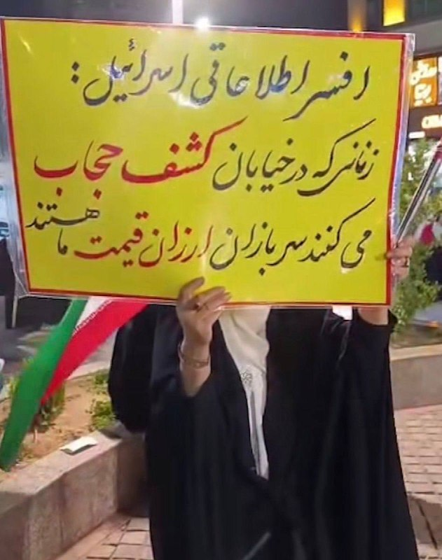

منبع؟ کص مادرش :)))

@ChizBergerz

## ChizBergerz — post 46767

اینستای فارسی این روزا شده پورن‌هاب فارسی!

@ChizBergerz

## rodast_omiddana — post 71883

  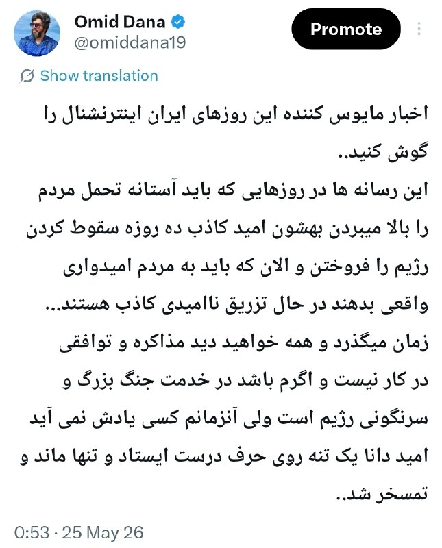

🚨 اخبار مایوس کننده این روزهای ایران اینترنشنال را گوش کنید..
این رسانه ها در روزهایی که باید آستانه تحمل مردم را بالا میبردن بهشون امید کاذب ده روزه سقوط کردن رژیم را فروختن و الان که باید به مردم امیدواری واقعی بدهند در حال تزریق ناامیدی کاذب هستند...
زمان میگذرد و همه خواهید دید مذاکره و توافقی در کار نیست و اگرم باشد در خدمت جنگ بزرگ و سرنگونی رژیم است ولی آنزمانم کسی یادش نمی آید امید دانا یک تنه روی حرف درست ایستاد و تنها ماند و تمسخر شد..

## rodast_omiddana — post 71882

  <a href="https://t.me/rodast_omiddana/71882" target="_blank">📎 Download file</a>

🔈حجم فشرده_ مذاکرات و توافق برای سرنگونی جمهوری اسلامی است_نگران نباشید و به عمو ترامپ اطمینان کنید

## SportBaadNews — post 252447

اینس گارسیا دوس دختر یامال، 21 ساله، یه اینفلوئنسر اسپانیایی، تازه با یه پسر معمولی وارد رابطه شده بود... ولی فقط دو هفته بعد، وقتی لامین یامال علاقه مند شد و د خواست داد، دوست پسرشو ول کرد و رفت با یامال! درس اخلاقی: روی موفقیت فردی و رسیدن به هدف هاتون…

## SportBaadNews — post 252446

  

یامال و زیدی @SportBaadNews

## SportBaadNews — post 252445

  <a href="telegram/content/SportBaadNews_252445_1779673155.mp4" target="_blank">🎬 Download video</a>

- همه اون لحظه‌ای که سایت نصفه لود میشه و VPN قاطی میکنه رو تجربه کردیم، مخصوصاً وقتی وسط بازی یا ثبت پیش‌بینی باشی. 
😑

- ربات رسمی تلگرام وینکوبت کارو راحت و ورود به سایت رو آسون کرده:👇

-
🤖 @Wincobet_bot
-
🤖 @Wincobet_bot

- برای کسایی که بیشتر وقتشون توی تلگرامه، خیلی کاربردیه.

## IranIntlTV — post 338841

  <a href="https://t.me/IranintlTV/338841" target="_blank">📎 Download file</a>

🎧نسخه صوتی سیاست با مراد ویسی: نیاز به راهکارهای نو در راه درست سرنگونی
@iranintlTV

## IranIntlTV — post 338840

  

سناتور کریس مورفی، نماینده دموکرات مجلس سنای آمریکا، اعلام کرد اگر توافق با تهران واقعی باشد، از آن استقبال می‌کند.

او در شبکه اجتماعی ایکس عنوان کرد که با ادامه جنگ، «آمریکا ضعیف‌تر می‌شود» و نوشت: «پایان دادن به جنگ دراولویت است.»

مورفی با اشاره به گزارش‌های منتشر شده در مورد مفاد توافق احتمالی افزود: «ما میلیاردها دلار به ایران می‌دهیم تا به جایی که قبل از جنگ بودیم برگردیم. و گزارش‌ها حاکی از آن است که این توافق ممکن است حق ایران برای کنترل تنگه هرمز را تثبیت کند.»

او در مورد پرونده هسته‌ای جمهوری اسلامی نیز احتمال داد که تهران «تمام مسائل هسته‌ای را به تعویق می‌اندازد» و در خصوص احتمال لغو تحریم‌ها هم اضافه کرد که در این صورت،‌ «اهرم کمتری برای وادار کردن آن‌ها [جمهوری اسلامی] به دادن امتیاز بیشتر در مذاکرات آینده داریم.»

مورفی برخلاف سخنان دونالد ترامپ، رییس‌جمهوری آمریکا، در مورد نابودی توان نظامی جمهوری اسلامی، افزود: «ایران هنوز برنامه موشک‌های بالستیک و پهپاد خود را دارد. آنها هنوز نیروی دریایی دارند که می‌تواند تنگه هرمز را ببندد. یک رژیم تندرو هنوز در راس امور است.»
https://iranintl.com/20

## IranIntlTV — post 338839

  

روزنامه نیویورک‌پست به نقل از «یک مقام ارشد دولت آمریکا» نوشت که نهایی شدن توافق صلح با حکومت ایران برای بازگشایی تنگه هرمز ممکن است تا یک هفته طول بکشد، اما اگر تهران به شرایط دونالد ترامپ متعهد نشود، ممکن است رییس‌جمهوری ایالات متحده، از آن خارج شود.

یک مقام ارشد آمریکا گفت پس از آن‌که ترامپ اعلام کرد مذاکرات بر سر جنگ و برنامه هسته‌ای تهران در مرحله نهایی خود قرار دارد، وضعیت حکومت ایران باعث شده است که روند نهایی به کندی پیش برود.

این منبع اشاره کرد که ممکن است چند روز طول بکشد تا توافق نهایی به دست مجتبی خامنه‌ای، رهبر جمهوری اسلامی، برسد.

در همین ارتباط، شماری از رسانه‌ها گزارش داده‌اند که او درمکانی نامعلوم مخفی شده و امکان دسترسی به او برای مقام‌‌های حکومت ایران دشوار است.

به نوشته نیویورک‌پست، مقام ارشد آمریکایی گفت بازگشایی واقعی تنگه هرمز و پایان محاصره بنادر ایران توسط آمریکا حدود هفت روز طول خواهد کشید و ایالات متحده تنها زمانی تحریم‌ها را لغو خواهد کرد که ایران اورانیوم غنی‌شده خود را تحویل دهد.
https://iranintl.com/202605253993

## IranIntlTV — post 338838

  

وب‌سایت حقوق بشری هرانا گزارش داد که روح‌الله کرکی، زندانی سیاسی محبوس در زندان شیبان اهواز، به اعدام محکوم شد.

بر اساس این گزارش، چندی پیش، کیفرخواست پرونده کرکی بابت اتهامات «انتشار و افشای اسناد محرمانه»، «همکاری با سازمان مجاهدین خلق»، «جاسوسی برای اسرائیل و تبادل اطلاعات نظامی و امنیتی»، «توهین به مقدسات و مقامات» و «اقدام علیه امنیت ملی» صادر و به دادگاه کیفری دو اهواز ارجاع شده بود.

به نوشته هرانا، این زندانی سیاسی دهم مهر سال گذشته به زندان شیبان اهواز منتقل شد. او ۱۴ مرداد سال گذشته به دست نیروهای امنیتی در اندیمشک بازداشت شده بود.

این وب‌سایت اشاره کرد روح‌الله کرکی، برادر امین کرکی، از بازداشت‌شدگان اعتراضات سراسری دی‌ ۹۶ است، و افزود: «امین کرکی در فروردین ۹۷ پس از بازداشت مجدد، در شرایطی پرابهام درگذشت.»
https://iranintl.com/202605256245

## IranIntlTV — post 338837

  

مسعود رسولی، دبیر انجمن صنعت بسته‌بندی گوشت و مواد پروتیینی، اعلام کرد که بازار تقاضا برای گوشت قرمز نسبت به سال گذشته حدود ۵۰ درصد کاهش یافته است.

او به دلایل این کاهش ۵۰ درصدی اشاره نکرد اما وب‌سایت اقتصاد آنلاین با اشاره به سخنان رسولی نوشت: «طی چند سال اخیر با کاهش قدرت خرید مردم سرانه مصرف گوشت کاهش یافته است.»

در همین ارتباط، برخی گزارش‌های منتشر شده در رسانه‌های ایران حاکی از افزایش بی‌سابقه اقلام خوراکی و مصرفی از آغاز سال تاکنون است.

مخاطبان ایران‌اینترنشنال نیز با ارسال پیام‌هایی نوشته‌اند نه‌تنها سفره‌ها کوچک شده، بلکه مردم از تامین ابتدایی‌ترین نیازهای زندگی‌شان درمانده‌اند.
https://iranintl.com/202605253577

## IranIntlTV — post 338836

  

سایت «اویل پرایس» (قیمت نفت) گزارش داد که قیمت هر بشکه نفت خام «وست‌ تگزاس‌ اینترمیدیت» به ۹۱ دلار و ۶۹ سنت و قیمت هر بشکه نفت خام «برنت» به ۹۸ دلار و ۲۴ سنت کاهش یافته است.

این پایین‌ترین قیمت نفت طی دو هفته گذشته محسوب می‌شود.
https://iranintl.com/202605254345

## IranIntlTV — post 338834

  

شبکه خبری العربیه گزارش داد مقام‌های دولت اقلیم کردستان عراق، از جمله مسرور بارزانی، نخست‌وزیر اقلیم، اعلام کردند که نمی‌دانند چه طرف‌هایی سلاح‌هایی را که از سوی ایالات متحده برای «مخالفان حکومت ایران» ارسال شده بود، دریافت کرده‌اند.

در این گزارش به نقل از مقام‌های اقلیم کردستان عراق آمده است: اقلیم کردستان ترجیح می‌دهد ایالات متحده یا دونالد ترامپ، رییس‌جمهوری آمریکا، مشخص کند این سلاح‌ها دقیقا به دست چه کسانی رسیده است.
https://iranintl.com/202605259317

## IranIntlTV — post 338833

  <a href="telegram/content/IranIntlTV_338833_1779673160.mp4" target="_blank">🎬 Download video</a>

بامداد یک‌شنبه سوم خرداد، روسیه حملات گسترده‌ای علیه اوکراین انجام داد و صدها پهپاد و ده‌ها موشک شلیک کرد.
ولودیمیر زلنسکی، رییس‌جمهوری اوکراین، از کشته شدن چهار نفر و زخمی شدن حدود ۱۰۰ نفر در این حملات به کی‌یف و مناطق اطراف آن خبر داد.
وزارت دفاع روسیه اعلام کرد در این حملات از موشک هایپرسونیک «اورشنیک» استفاده کرده است.

## IranIntlTV — post 338832

  

شبکه خبری سی‌بی‌اس به نقل از مقام‌های آمریکایی گزارش داد هنگامی که ایالات متحده جزئیات پیشنهادی خود را برای تهران ارسال می‌کند، دشواری دسترسی به رهبر جمهوری اسلامی می‌تواند باعث شود واشینگتن با تأخیری قابل توجه پاسخ دریافت کند.

بنا بر این گزارش مقام‌های ایرانی که مجاز به همکاری با دولت ترامپ هستند، در برقراری ارتباط در درون ساختار حکومتی جمهوری اسلامی با مشکل مواجه شده‌اند؛ مسئله‌ای که به نوشته این شبکه، یکی از دلایل اصلی کندی در انتشار جزئیات توافق احتمالی با ایران و توافق‌های گذشته بوده است.

پیش‌تر یک مقام ارشد دولت آمریکا روز یکشنبه گفته بود مجتبی خامنه‌ای با کلیات پیش‌نویس توافق فعلی موافقت کرده است.

دونالد ترامپ، رییس‌جمهوری ایالات متحده، نیز در تروث‌سوشال اعلام کرد انتظار دارد نظر نهایی در چند روز آینده مشخص شود.

بر اساس گزارش سی‌بی‌اس، حتی مقام‌های ارشد حکومت ایران نیز از پیش نمی‌دانند خامنه‌ای کجاست و هیچ راه مستقیمی برای تماس با او ندارند.

در همین حال، سخنگوی کاخ سفید از اظهارنظر درباره اطلاعات مربوط به محل اقامت رهبر جمهوری اسلامی یا شیوه‌های ارتباطی حکومت ایران خودداری کرد.
https://iranintl

## IranIntlTV — post 338823

جاویدنامان انقلاب ملی ایرانیان؛
روایت جوانانی است که هرکدام در حال ساختن زندگی بودند؛ یکی پدر دو کودک بود، یکی رویای بازیگری داشت، یکی با موسیقی زندگی می‌کرد، یکی در زمین فوتبال می‌دوید و دیگری تازه وارد دانشگاه شده بود.
محمد خداپناه، حمیدرضا علیزاده، آریا هنرمند، حمیدرضا مجیدی، مسعود عیسوند جهانبخشی، شیوا جاوید، مهدی عبدلی و صابر آقابابایی
نام‌هایی که قرار بود بخشی از آینده این سرزمین باشند، اما جمهوری اسلامی آنان را با شلیک مستقیم، تیر خلاص، شکنجه و سرکوب از ایران گرفت.
فراموش نمی‌کنیم که پشت هر نام، یک زندگی جریان داشت، خانه‌هایی که ویران شدند، خانواده‌هایی که چشم‌انتظار ماندند و رویاهایی که پیش از رسیدن به آینده، در خیابان‌ها خاموش شدند.
#جاویدنامان_انقلاب_ملی_ایرانیان

---
📅 بروزرسانی: 1405/03/04 03:13
---

## rodast_omiddana — post 71880

  <a href="https://t.me/rodast_omiddana/71880" target="_blank">📎 Download file</a>

🔈 مذاکرات و توافق برای سرنگونی جمهوری اسلامی است_نگران نباشید و به عمو ترامپ اطمینان کنید

## rodast_omiddana — post 71879

▶️ کیفیت 360_مذاکرات و توافق برای سرنگونی جمهوری اسلامی است_نگران نباشید و به عمو ترامپ اطمینان کنید

## rodast_omiddana — post 71878

▶️ کیفیت 144_مذاکرات و توافق برای سرنگونی جمهوری اسلامی است_نگران نباشید و به عمو ترامپ اطمینان کنید

## KiriMohems — post 47962

  <a href="telegram/content/KiriMohems_47962_1779666202.mp4" target="_blank">🎬 Download video</a>

- همه اون لحظه‌ای که سایت نصفه لود میشه و VPN قاطی میکنه رو تجربه کردیم، مخصوصاً وقتی وسط بازی یا ثبت پیش‌بینی باشی. 
😑

- ربات رسمی تلگرام وینکوبت کارو راحت و ورود به سایت رو آسون کرده:👇

-
🤖 @Wincobet_bot
-
🤖 @Wincobet_bot

- برای کسایی که بیشتر وقتشون توی تلگرامه، خیلی کاربردیه.

## KiriMohems — post 47961

  <a href="telegram/content/KiriMohems_47961_1779666203.mp4" target="_blank">🎬 Download video</a>

🔴 پیش‌بینی‌های کاملا دقیق و حرفه‌ای نوستراداموس زمانه؛ استاد خوش‌چشم تحلیلگر صدا و سیما.

+ فقط اینطوری کار می‌کنه که هر چی گفت، باید برعکسش کنی.
😂
😂

#professor
@KiriMohems

## KiriMohems — post 47960

🔴درحالی که اکثر وی پی ان ها مجدد ضعیف و کیری شدن سرویس های کانفیگ یو خیلی قوی با پینگ 90/110 وصله کاملا معتبرن میتونید از رباتش تهیه کنید👇: @ConfigYouBot

## KiriMohems — post 47959

🔴درحالی که اکثر وی پی ان ها مجدد ضعیف و کیری شدن سرویس های کانفیگ یو خیلی قوی با پینگ 90/110 وصله کاملا معتبرن میتونید از رباتش تهیه کنید👇:
@ConfigYouBot

## IranIntlTV — post 338822

  

مارکو روبیو، وزیر خارجه آمریکا، درخواست حزب‌الله لبنان، از گروه‌های نیابتی جمهوری اسلامی، برای سرنگونی دولت منتخب دموکراتیک لبنان را محکوم کرد و گفت: «تهدیدهای حزب‌الله مبنی بر خشونت و سرنگونی، اجازه موفقیت نخواهد داشت.»

او در بیانیه‌ای که در وب‌سایت وزارت خارجه آمریکا منتشر شد، گفت حزب‌الله درخواست‌های مکرر دولت مشروع لبنان برای توقف حملات و احترام به آتش‌بس را نادیده گرفته و به شلیک به مواضع اسرائیل و انتقال شبه‌نظامیان و سلاح به جنوب لبنان ادامه داده است.

روبیو این اقدامات را «کارزار عمدی برای بی‌ثبات کردن کشور و حفظ قدرت خود به قیمت آینده مردم لبنان» خواند و گفت حزب‌الله در تلاش است لبنان را به هرج‌ومرج و ویرانی بازگرداند.

او تاکید کرد ایالات متحده در کنار دولت مشروع لبنان برای بازگرداندن اقتدار خود و ساختن آینده‌ای بهتر برای مردم این کشور می‌ایستد و افزود: «دورانی که یک گروه تروریستی، کل یک ملت را گروگان گرفته بود، رو به پایان است.»

https://iranintl.com/202605246199

## IranIntlTV — post 338821

  

شبکه خبری سی‌بی‌اس به نقل از مقام‌های آمریکایی آگاه گزارش داد اطلاعات ایالات متحده نشان می‌دهد مجتبی خامنه‌ای، رهبر جمهوری اسلامی، عملا در مکانی نامعلوم پنهان شده و دسترسی بسیار محدودی به دنیای خارج دارد.

بر اساس این گزارش، مقام‌های حکومت ایران تنها از طریق شبکه‌ای پیچیده از پیک‌ها با او ارتباط می‌گیرند و حتی مقام‌های ارشد نیز از محل دقیق او اطلاع ندارند یا راهی برای تماس مستقیم با او ندارند.

سی‌بی‌اس نوشت این اختلال ارتباطی یکی از دلایل کندی در اعلام جزئیات توافق احتمالی تهران و واشینگتن است؛ زیرا پس از ارسال پیشنهادهای آمریکا، دسترسی دشوار به خامنه‌ای می‌تواند پاسخ تهران را با تأخیر قابل‌توجه روبه‌رو کند.

سخنگوی کاخ سفید از اظهارنظر درباره محل اقامت خامنه‌ای یا شیوه ارتباطی مقام‌های جمهوری اسلامی خودداری کرد.

این شبکه همچنین به نقل از مقام‌های آمریکایی نوشت بسیاری از مقام‌های جمهوری اسلامی هفته‌ها را در پناهگاه‌های مستحکم می‌گذرانند و جز در موارد ضروری با یکدیگر گفت‌وگو نمی‌کنند.
https://iranintl.com/202605246291

## Persian_Trend_Official — post 14901

  

شبتون بخیر 🔥❤️

📝 Nick
📌 @persian_trend_official
پرشین ترند | متفاوت‌ترین کانال نظامی

## Persian_Trend_Official — post 14900

  <a href="telegram/content/Persian_Trend_Official_14900_1779666206.mp4" target="_blank">🎬 Download video</a>

💢مهدی رحیمی

💢سپهبد نیروی زمینی شاهنشاهی ایران، آخرین رئیس شهربانی شاهنشاهی و آخرین فرماندار نظامی تهران بعد از ارتشبد غلامعلی اویسی بود.

وی از نخستین افرادی بود که پس از پیروزی انقلاب ۱۳۵۷ و در ۲۶ بهمن ۱۳۵۷ تیرباران شد. وی با حسین فاطمی وزیر امور خارجه دولت محمد مصدق و مؤسس روزنامه باختر باجناغ بوده است.

💢مهدی رحیمی در نیمه شب پنج شنبه ۲۶ بهمن ۱۳۵۷ بر روی پشت بام مدرسه رفاه واقع در خیابان ایران در تهران تیرباران شد و در بهشت زهرا (قطعه:۸۲ ردیف:۲۸ شماره:۴۰) به خاک سپرده شد(روحش شاد )

🫆:Tony

📌 @persian_trend_official
پرشین ترند | متفاوت‌ترین کانال نظامی

---
📅 بروزرسانی: 1405/03/04 02:12
---

## KiriMohems — post 47958

🔴 علی قلهکی:

تماس نتانیاهو با ترامپ باعث شده آمریکا تا 400 کیلو اورانیوم رو نگیره دلاری از پول‌های بلوکه شده ایران رو آزاد نکنه و با این وضعیت ایران احتمالا «تفاهم اسلام آباد» رو امضا نمی‌کنه

#professor
@KiriMohems

## KiriMohems — post 47957

  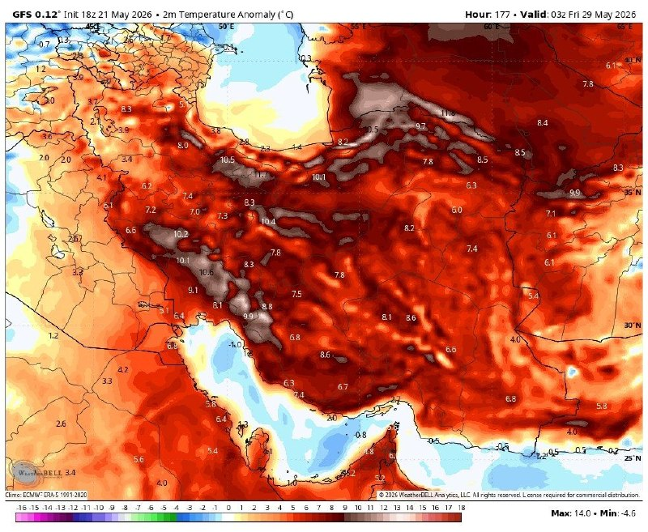

🔴از فردا موج جدید حشرناکی از گرما وارد کونمون میشه و قراره بپزیم

دوش گرفتن و عطر مشدی یادتون نره.

#professor
@KiriMohems

## KiriMohems — post 47956

  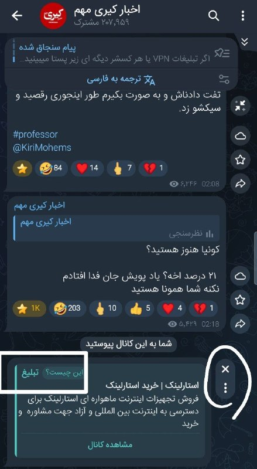

برای بار 10000 م
اگر پایین پستا با یه همچین تبلیغی مواجه شدید بکیرتون نگیرید تبلیغات تلگرامیه که دزدا انجام میدن و لغو کردنش در اختیار ما نیست

اگر خودمون پستی رو بزاریم تبلیغه و معتبره

@KiriMohems

## KiriMohems — post 47955

#کصنمک_تایمز

امسال اگه برق رفت؛
کنتور رو یک بار خاموش روشن کنید با لوله گاز ترکیب کنید
اگه نشد آبو باز کنید از کنتور یه سیم مستقیم بکشید به آب بزارید رو حالت گرم ۱۵ دقیقه صبر کنید وصل میشه.

#professor
@KiriMohems

## SportBaadNews — post 252444

تعظیممممم کنیدددد 
😌

## SportBaadNews — post 252443

برونو فرناندز تو بازی امروز پاس گل داد و رکورد بیشترین پاس گل تو یک فصل تاریخ پرمیرلیگ که مشترکا در اختیار دیبروینه و هانری بود رو شکست @SportBadTweet | بچه مورچه

## SportBaadNews — post 252442

  

یامال و زیدی
@SportBaadNews

## IranIntlTV — post 338820

  <a href="telegram/content/IranIntlTV_338820_1779662577.mp4" target="_blank">🎬 Download video</a>

دادگاه انقلاب تهران چهار نفر از متهمان اصلی پرونده شهرک اکباتان را به اتهام افساد فی‌الارض به اعدام محکوم کرد.

قاضی صلواتی با رد حکم پیشین دادگاه کیفری، بار دیگر احکام اعدام میلاد آرمون، نوید نجاران، مهدی ایمانی و محمدمهدی حسینی را صادر کرد.

گفت‌وگو با نازلی صدقی، حقوقدان
@iranintltv

## IranIntlTV — post 338819

  <a href="telegram/content/IranIntlTV_338819_1779662580.mp4" target="_blank">🎬 Download video</a>

همزمان با شدت گرفتن تورم در بازار خوراکی‌ها، وزیر کشاورزی اعلام کرد تمام محدودیت‌های واردات کالاهای اساسی لغو شده است.

یک عضو مجلس نیز گفت سیاست‌های ارزی دولت موجب افزایش شدید قیمت مواد غذایی شده و کالابرگ پرداختی پاسخگوی این گرانی‌ها نیست.

گفت‌وگو با علی دادپی، اقتصاددان
@iranintltv

## IranIntlTV — post 338818

  <a href="telegram/content/IranIntlTV_338818_1779662583.mp4" target="_blank">🎬 Download video</a>

مراد ویسی، تحلیل‌گر ارشد ایران‌اینترنشنال، گفت: «هنوز توافقی بین آمریکا و جمهوری اسلامی شکل نگرفته و نباید قضاوت زودهنگام کرد. حتی در صورت توافق، جمهوری اسلامی با بحران‌ها و شکست‌های متعدد روبه‌رو است که آن را در مسیر سقوط قرار می‌دهد. قطع اینترنت و افزایش بازداشت‌ها و اعدام‌ها نشانه‌ای از نگرانی جدی جمهوری اسلامی در مورد بقای خویش است.»
@iranintltv

## IranIntlTV — post 338817

  <a href="telegram/content/IranIntlTV_338817_1779662585.mp4" target="_blank">🎬 Download video</a>

مذاکره‌کنندگان ایرانی آزادسازی فوری ۱۲ میلیارد دلار از دارایی‌های مسدودشده ایران در قطر را پیش‌شرط پیشبرد مذاکرات با آمریکا اعلام کرده‌اند.

یک منبع مطلع به ایران‌اینترنشنال گفت تهران بدون دسترسی تضمین‌شده به این منابع، تفاهم مقدماتی را پیش نخواهد برد.

گفت‌وگو با رضا گوهرزاد، نویسنده و روزنامه‌نگار
@iranintltv

## IranIntlTV — post 338816

  <a href="telegram/content/IranIntlTV_338816_1779662588.mp4" target="_blank">🎬 Download video</a>

مراد ویسی، تحلیل‌گر ارشد ایران‌اینترنشنال، گفت: «در کنار قدرت میلیونی مردم به‌عنوان پایه اصلی انقلاب ملی شیر و خورشید، تثبیت رهبری شاهزاده رضا پهلوی دومین دستاورد بزرگ مردم ایران در خیزش دی ماه است. اهمیت این دو دستاورد این است که پس از ۴۸ سال به‌دست آمده‌اند و حفظ و تثبیت آنها باید مبنای هر اقدام جدیدی برای سرنگونی جمهوری اسلامی باشد.»
@iranintltv

## IranIntlTV — post 338815

  

مذاکره‌کنندگان ایرانی آزادسازی فوری ۱۲ میلیارد دلار از دارایی‌های مسدودشده ایران در قطر را پیش‌شرط پیشبرد مذاکرات با آمریکا اعلام کرده‌اند.

یک منبع مطلع با آگاهی مستقیم از روند گفت‌وگوها به ایران‌اینترنشنال گفت تهران اصرار دارد در مرحله اولیه یادداشت تفاهم، دسترسی واقعی و تضمین‌شده به این منابع فراهم شود و بدون آن، تفاهم دیپلماتیک مقدماتی پیش نخواهد رفت.

به گفته این منبع، این مبلغ تنها بخش فوری مورد درخواست ایران برای آغاز نقشه راه دیپلماتیک است و تهران خواهان آزادسازی کامل همه دارایی‌های مسدودشده خود در جهان در چارچوب توافق جامع نهایی است.

هم‌زمان، خبرگزاری تسنیم، وابسته به سپاه پاسداران، گزارش داد اختلافات تهران و واشینگتن بر سر یک یا دو بند یادداشت تفاهم احتمالی همچنان باقی است.

تسنیم نوشت ایران خواستار آزادسازی بخشی از دارایی‌های خود در گام نخست و تعیین سازوکاری برای آزادسازی باقی منابع در جریان مذاکرات شده است.

این رسانه افزود آمریکا تلاش کرده آزادسازی دارایی‌ها را به توافق نهایی هسته‌ای مشروط کند و مانع‌تراشی واشینگتن در این زمینه ادامه دارد که احتمال لغو توافق را همچنان زنده نگه داشته است.
http

## Persian_Trend_Official — post 14899

🔴انفجار در مواضع حشد الشعبی عراق

💢 گزارش‌های اولیه از وقوع یک انفجار نامشخص در استان صلاح‌الدین عراق خبر می‌دهند مواضع تیپ ششم حشد
الشعبی در تکریت را هدف قرار داده است.

💢بر اساس اطلاعات اولیه، در این حادثه دست‌کم یک نیروی حشد الشعبی کشته و سه نفر دیگر زخمی شده‌اند.

🫆:Tony

📌 @persian_trend_official
پرشین ترند | متفاوت‌ترین کانال نظامی

## Persian_Trend_Official — post 14898

  <a href="telegram/content/Persian_Trend_Official_14898_1779662591.webm" target="_blank">🎬 Download video</a>

🔴سی‌بی‌اس

💢اطلاعات آمریکا گزارش می‌دهد که رهبر عالی جمهوری اسلامی در حال حاضر از یک مکان نامعلوم فعالیت می‌کند و ارتباطات بیرونی او محدود شده و عمدتاً از طریق شبکه‌ای از پیک‌ها (پیام‌رسان‌ها) با او ارتباط برقرار می‌شود.

♦️مقام‌های آمریکایی گفته‌اند این مشکلات ارتباطی در ساختار رهبری ایران باعث کند شدن واکنش‌ها به پیشنهادها و مذاکرات با دولت ترامپ شده است.

🫆:Tony

📌 @persian_trend_official
پرشین ترند | متفاوت‌ترین کانال نظامی

## Persian_Trend_Official — post 14897

  <a href="telegram/content/Persian_Trend_Official_14897_1779662591.webm" target="_blank">🎬 Download video</a>

🔴اواکس E3 ارتش امریکا بر فراز خلیج فارس در حال گشت زنی است.

🫆:Tony

📌 @persian_trend_official
پرشین ترند | متفاوت‌ترین کانال نظامی

## Persian_Trend_Official — post 14896

  <a href="telegram/content/Persian_Trend_Official_14896_1779662592.mp4" target="_blank">🎬 Download video</a>

🔴دکتر مصطفی خوش‌چشم، تحلیلگر مسائل راهبردی:

💢 همین روبیو، کوشنر و ویتکاف از طریق واسطه به ایران پیام داده‌اند که به توییت‌های ترامپ توجهی نکنید.

🫆:Tony

📌 @persian_trend_official
پرشین ترند | متفاوت‌ترین کانال نظامی

## Persian_Trend_Official — post 14895

https://youtube.com/live/vCQOD_eWyqM?feature=share

---
📅 بروزرسانی: 1405/03/04 01:16
---

## ChizBergerz — post 46766

  <a href="telegram/content/ChizBergerz_46766_1779659163.mp4" target="_blank">🎬 Download video</a>

ویدیوی وایرال شده از حمله‌ی طرفدارای حرومزاده جمهوری‌شیطانی به ایرانی‌های مقیم خارج:

+ حتی تو کشورای خارجی هم دنبال حمله و کُشتار معترضان ایرانی هستن!
@ChizBergerz

## ChizBergerz — post 46765

  <a href="telegram/content/ChizBergerz_46765_1779659167.mp4" target="_blank">🎬 Download video</a>

🔴پیش‌بینی‌های کاملا دقیق و حرفه‌ای نوستراداموس زمانه یعنی استاد خوش‌چشم تحلیلگر صدا و سیما که همشون درست از آب دراومدن!😳

+ اینجوریه که هرچی میگه شما برعکسشو در نظر بگیر همون اتفاق میوفته :)))
@ChizBergerz

## KiriMohems — post 47954

محسن رضایی : یه دست رو کیر و ی دست روی ماشه هستیم

#Berlin
@KiriMohems

## SportBaadNews — post 252441

  

🇪🇸 رشفورد در اینستاگرام سیگنال‌هایی از احتمال دائمی شدن قراردادش داد؛
“فصل 25/26 چه افتخاری، تشنه‌ی چیزای بیشترم💙❤️”
@SportBaadNews

## SportBaadNews — post 252440

کانال 12 اسرائیل: نتانیاهو در تلاشه تا توافق رو خراب کنه
@SportBaadNews

## SportBaadNews — post 252439

  

🇪🇸 دیدار خوان گارسیا با لئو مسی
@SportBaadNews

## SportBaadNews — post 252438

  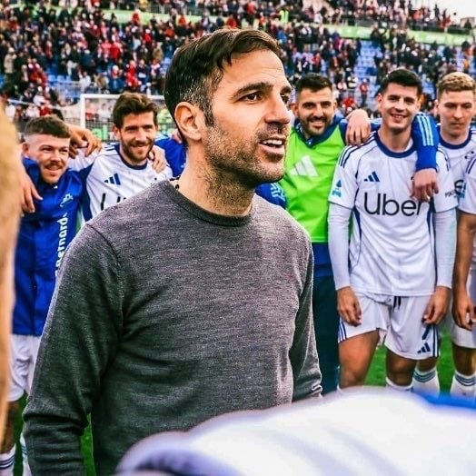

هفته آخر سری‌آ خیلی عجیب تموم شد؛ کومو بازیش رو 4-1 برد تا بالاتر از یوونتوس و میلان سهمیه چمپیونزلیگ فصل آینده رو بگیره؛ میلان بازیشو باخت و یوونتوس هم با وجود اینکه برده بازیش رو ولی فایده ای براش نداره و این دو تیم فصل دیگه تو لیگ اروپا قراره بازی کنن!…

## IranIntlTV — post 338814

  <a href="telegram/content/IranIntlTV_338814_1779659172.mp4" target="_blank">🎬 Download video</a>

ویدیوهای دریافت‌شده نشان می‌دهد جمعی از ایرانیان ساکن آتلانتا در آمریکا، روز یک‌شنبه سوم خرداد، در حمایت از مردم ایران و شاهزاده رضا پهلوی تجمع و راهپیمایی برگزار کردند. آن‌ها علیه اعدام‌های جمهوری اسلامی شعار سر دادند و از دولت آمریکا خواستند با این حکومت هیچ توافقی نکند.

## IranIntlTV — post 338813

  <a href="telegram/content/IranIntlTV_338813_1779659175.mp4" target="_blank">🎬 Download video</a>

مراد ویسی، تحلیل‌گر ارشد ایران‌اینترنشنال، گفت: «حتی اگر توافقی هم میان ترامپ و جمهوری اسلامی شکل بگیرد که هنوز معلوم نیست شکل بگیرد، مردم ایران از ابتدا تکیه اصلی‌شان به خودشان بوده و طی ۹ سال گذشته پیوسته قیام کرده‌اند. خیزش‌های مردمی بدون اتکا به کمک خارجی آغاز شد و مطالبه حمایت خارجی نیز پس از سرکوب و کشتار حکومت مطرح شد و بدون حمایت خارجی نیز قابل تداوم است.»
@iranintltv

## Persian_Trend_Official — post 14894

  

تماسِ نتانیاهو با ترامپ کافی بود تا سیاستِ جدید آمریکا به «بدون گرد و غبار (خروجِ ۴۰۰کیلوگرم‌ اورانیوم)، بدونِ دلار (مُنتفی‌شدنِ آزادسازی اموال بلوکه شده ایران)» _No Dust, No Dollars_ بازگردد!
آمریکا تصمیم گرفته دلاری از اموال بلوکه شده کشور را تا به «خواسته‌هایِ هسته ای آمریکا» تَن ندهیم، آزاد نکند!
از طرفِ دیگر ایران اخیرا خطِ قرمزِ غنی‌سازی را از ۳.۶۷ ٪ به ۲۰٪ ارتقا داده و ۴۰۰ کیلوگرم اورانیوم هم از ایران خارج نمی‌شود!
ایران احتمالا با وضعیتِ بلاتکلیفِ «رفع محاصره تنگه توسط آمریکا»، «عدم آزادسازیِ اموال بلوکه شده» و «خواست‌های حداکثریِ هسته‌ای آمریکا»، «تفاهم اسلام آباد» را امضا نکند!
علی قلهکی

پ.ن : عرض نکردم ؟!

---
📅 بروزرسانی: 1405/03/04 00:25
---

## ChizBergerz — post 46764

  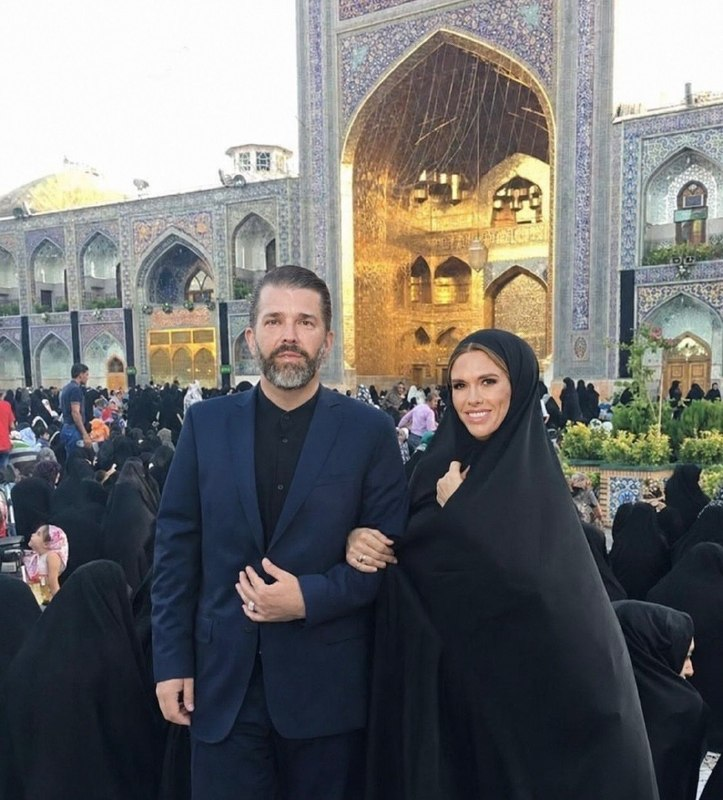

بزودی ماه عسل پسر ترامپ و زنش:

@ChizBergerz

## ChizBergerz — post 46763

  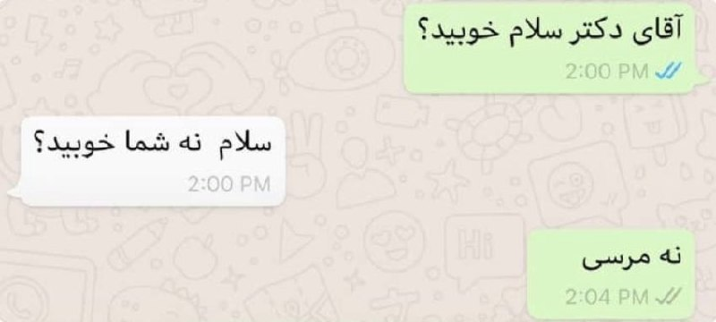

وضعیت این روزای مردم ایران:

@ChizBergerz

## ChizBergerz — post 46762

‏گیریم ساعت خوابتم درست کردی
با بیدار شدنت تو ایران میخای چیکار کنی ؟

@ChizBergerz

## ChizBergerz — post 46761

  

ختنه کردن ترامپ و صیعه کردن ملانیا رو یادت رفت بنویسی شیشه‌ای.

@ChizBergerz

## rodast_omiddana — post 71877

🎬
🔴
🔴
🔴 پخش زنده
*مذاکرات و توافق برای سرنگونی جمهوری اسلامی است
*نگران نباشید و به عمو ترامپ اطمینان کنید
لینک یوتیوب:
https://www.youtube.com/watch?v=fep299NwzAw

## KiriMohems — post 47953

  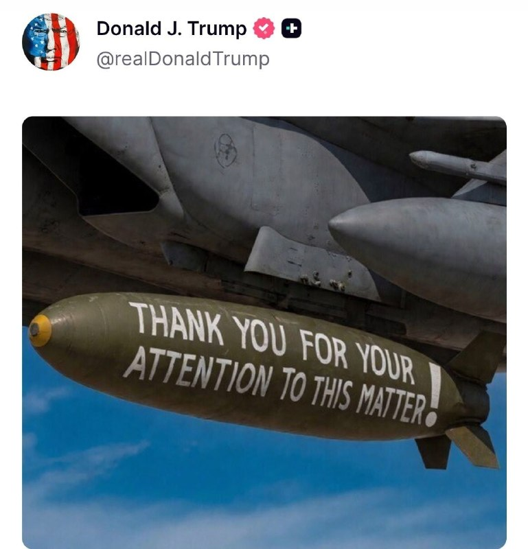

🔴 ترامپ : عکس بمب هسته ای گذاشته نوشته از شما بابت توجهتون به این موضوع متشکرم.

#professor
@KiriMohems

## SportBaadNews — post 252437

  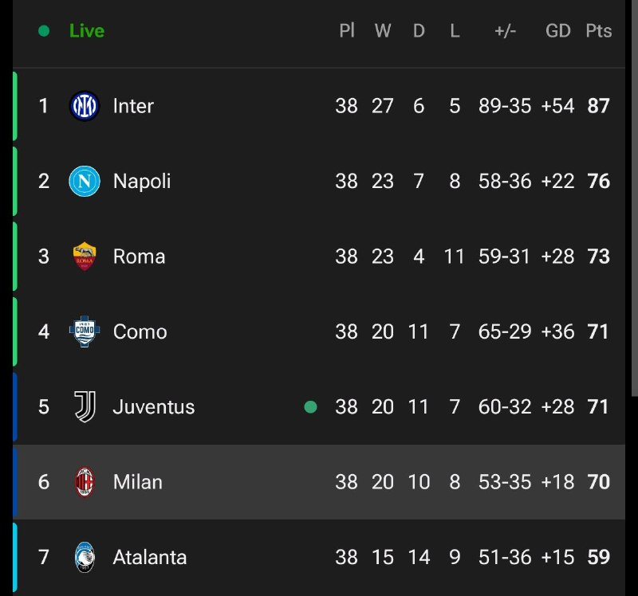

هفته آخر سری‌آ خیلی عجیب تموم شد؛ کومو بازیش رو 4-1 برد تا بالاتر از یوونتوس و میلان سهمیه چمپیونزلیگ فصل آینده رو بگیره؛ میلان بازیشو باخت و یوونتوس هم با وجود اینکه برده بازیش رو ولی فایده ای براش نداره و این دو تیم فصل دیگه تو لیگ اروپا قراره بازی کنن!
@SportBaadNews

## SportBaadNews — post 252436

  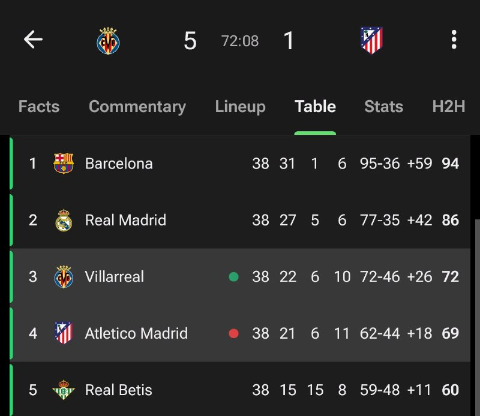

داغ دل بارسایی هارو دوباره تازه کنیم
@SportBaadNews

## SportBaadNews — post 252435

  <a href="telegram/content/SportBaadNews_252435_1779656122.webm" target="_blank">🎬 Download video</a>

🚨
🚨
🚨 فووووووری از نیویورک پست: شانس توافق به شدت کاهش یافته، دیروز دو طرف توافق کرده بودن که خواسته‌های حداکثری‌شون رو کنار بذارن اما با دخالت‌های اسرائیل و نزدیکان ترامپ حالا رئیس جمهور آمریکا لحنشو عوض کرده و میگه تموم اورانیوم رو بدون هیچ پولی باید تحویل بدین
@SportBaadNews

## SportBaadNews — post 252434

  <a href="telegram/content/SportBaadNews_252434_1779656122.webm" target="_blank">🎬 Download video</a>

🚨 جلال رشیدی کوچی، نماینده سابق مجلس: فکر میکنم ظرف 48 الی 72 ساعت آینده، اینترنت به حالت قبل جنگ برمیگرده — دیگه بخواد خیلی طول بکشه تا آخر هفته اینترنت بین‌الملل وصل میشه.
@SportBaadNews

## IranIntlTV — post 338812

  

🔻هدایت ممبینی، دبیرکل فدراسیون فوتبال ایران، در یک برنامه تلویزیونی گفت که آمریکا پس از اعلام فهرست نهایی تیم ملی، ویزاها را صادر می‌کند: «طبق پروتکل مسابقات، باید روز ۱۱ خرداد فهرست نهایی ۲۶ بازیکن تیم ملی اعلام شود.»

🔹او همچنین گفت که آمریکا برای تیم ملی ویزای مولتی صادر خواهد کرد.

🔹ممبینی درباره ابهامات مربوط به صدور ویزا و تغییر کمپ تیم ملی از آمریکا به مکزیک گفت: «چون کمپ ما در کشور مکزیک است، ویزای ما به‌صورت مولتی خواهد بود. این موضوع با کمیته برگزاری مسابقات و وزارت خارجه آمریکا در حال هماهنگی است.»

🔹او گفت: «این‌طور نیست که ابتدا ویزا صادر شود و سپس ما فهرست را بر اساس آن تغییر دهیم. آنها منتظرند فهرست اصلی ما ارائه شود و احتمالاً پس از آن ویزاها صادر خواهد شد.»

🔹دبیرکل فدراسیون درباره وضعیت بازی تدارکاتی با پورتوریکو، که قرار بود چند روز پیش از جام جهانی و در آمریکا برگزار شود، گفت: «بازی با پورتوریکو قطعی شده بود، اما قرارداد ما برای برگزاری در شهر توسان بود. چون دیگر به آنجا نمی‌رویم، در حال مکاتبه هستیم تا بازی را در تیخوانا برگزار کنیم. امیدواریم مشکلی پیش نیاید.»

@iranintltvsport

## IranIntlTV — post 338811

  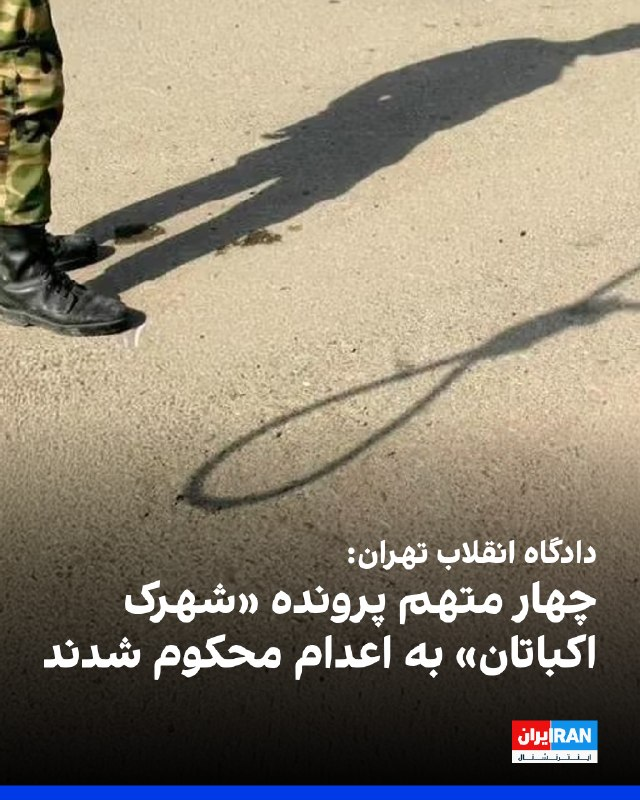

خبرگزاری فارس وابسته به سپاه پاسداران نوشت که دادگاه انقلاب تهران ۴ نفر از «متهمان اصلی» در پرونده شهرک اکباتان را به اتهام «افساد فی‌الارض»، به اعدام محکوم کرده است.
فارس نوشت متهمان ردیف پنجم تا نهم پرونده شهرک اکباتان به اتهام «اجتماع و تبانی برای ارتکاب جرم علیه امنیت داخلی کشور» و «فعالیت تبلیغی علیه نظام جمهوری اسلامی»، به حبس از یک تا پنج سال و مجازات‌های تکمیلی محکوم شده‌اند.
قوه قضاییه روز شنبه در اطلاعیه‌ای اعلام کرد رای صادره در پرونده شهرک اکباتان مربوط به دادگاه کیفری بوده و رسیدگی به اتهامات امنیتی مانند «محاربه» و «افساد فی‌الارض» همچنان در دادگاه انقلاب مفتوح است.
https://iranintl.com/202605244171

## IranIntlTV — post 338810

  <a href="telegram/content/IranIntlTV_338810_1779656125.mp4" target="_blank">🎬 Download video</a>

🔻مهدی تاج، رییس فدراسیون فوتبال، خبر داد کمپ تیم ملی فوتبال از آریزونای آمریکا به کمپی در شهر تیخوانا مکزیک منتقل شده است. به گفته او این تغییر، مشکل ویزای برخی اعضا و همراهان تیم ملی را برطرف می‌کند.

🔹گفتگو با امید معماریان، تحلیل‌گر سیاسی

@iranintltvsport

## IranIntlTV — post 338809

  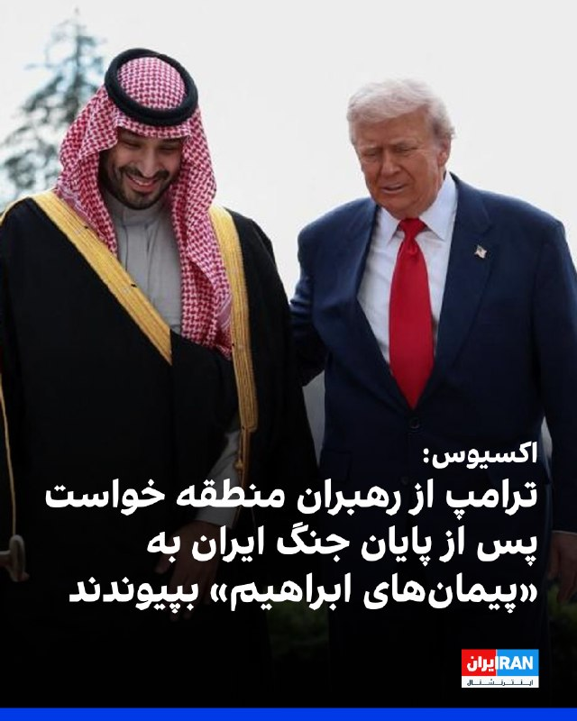

اکسیوس به نقل از دو مقام آمریکایی گزارش داد دونالد ترامپ شنبه در یک کنفرانس تلفنی با رهبران چند کشور عربی و دیگر کشورهای مسلمان گفت اگر توافقی برای پایان جنگ ایران حاصل شود، می‌خواهد این کشورها توافق‌های صلح با اسرائیل امضا کنند.

اکسیوس نوشت این اظهارات نشان‌دهنده گام بعدی بزرگی است که ترامپ پس از پایان جنگ در خاورمیانه دنبال می‌کند.

ترامپ در این تماس با رهبران عربستان سعودی، امارات متحده عربی، قطر، پاکستان، ترکیه، مصر، اردن و بحرین درباره توافق در حال شکل‌گیری با جمهوری اسلامی گفت‌وگو کرد.
https://iranintl.com/202605246245

## Persian_Trend_Official — post 14893

  <a href="https://t.me/persian_trend_official/14893" target="_blank">📎 Download file</a>

فایل صوتی لایو اول
نسخه کم حجم - 6.44 مگابایت

اتاق جنگ یکشنبه 3 خرداد | توافق ایران و آمریکا، خیلی دور خیلی نزدیک !

📝 Nick

📌 @persian_trend_official
پرشین ترند | متفاوت‌ترین کانال نظامی

## Persian_Trend_Official — post 14892

  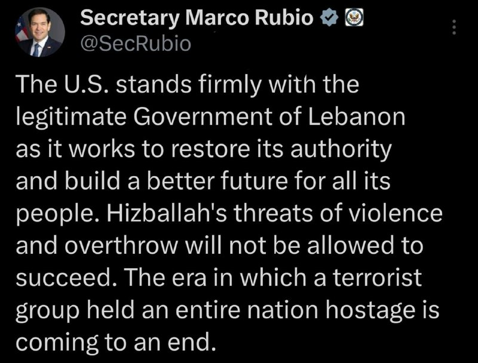

🔴ایالات متحده «به شدیدترین شکل ممکن» اظهارات حزب‌الله مبنی بر «دعوت بی‌ملاحظه برای سرنگونی دولت منتخب دموکراتیک لبنان» را محکوم کرد.

💢مارکو روبیو وزیر امور خارجه آمریکا

💢حزب‌الله درخواست‌های مکرر دولت قانونی لبنان برای توقف حملات و پایبندی به آتش‌بس را نادیده گرفته و در عوض همچنان به مواضع اسرائیل حمله می‌کند و نیروها و سلاح‌ها را به جنوب لبنان منتقل می‌نماید.

او گفت: «این یک کارزار عمدی برای بی‌ثبات کردن کشور و حفظ قدرت به بهای آینده مردم لبنان است.»

♦️روبیو افزود آمریکا قاطعانه در کنار دولت لبنان ایستاده تا اقتدار خود را بازسازی کند و تأکید کرد: «دورانی که یک گروه تروریستی بتواند یک کشور را در کنترل و گروگان خود نگه دارد رو به پایان است.»

🫆:Tony

📌 @persian_trend_official
پرشین ترند | متفاوت‌ترین کانال نظامی

---
📅 بروزرسانی: 1405/03/03 23:31
---

## ChizBergerz — post 46760

  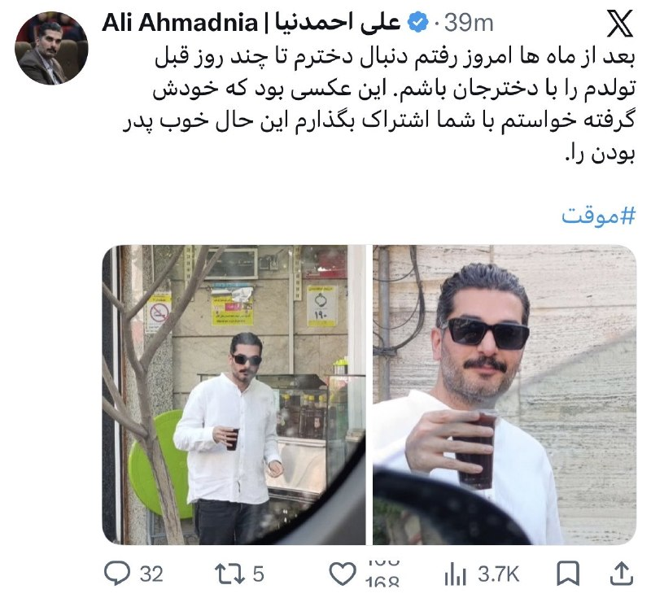

این حیوانِ رذل، رئیس امور اطلاع رسانی دولت خونخوار پزشکیانه؛ تو روزایی که خود حرومزاده‌ش و رفقاش اینترنت رو سه ماه کامل به‌روی مردم ایران بستن، تو پلتفرم خارجی «توئیتر» توئیت می‌ذاره و از حس خوب پدر بودن میگه!

@ChizBergerz

## ChizBergerz — post 46759

  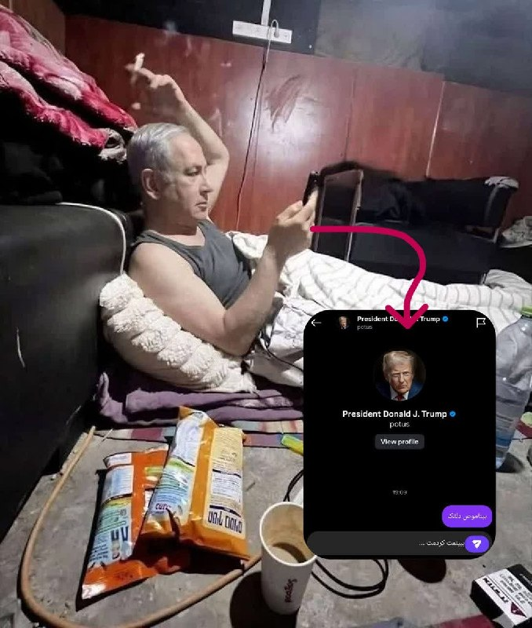

وضعیت:

@ChizBergerz

## ChizBergerz — post 46758

  

@ChizBergerz

## ChizBergerz — post 46757

دوست دارم تمام داراییمو هندونه بخرم و بخورم و بشاشم به نسل ۵۷.

@ChizBergerz

## ChizBergerz — post 46756

وقتی دم جام‌جهانی میخوای هم از فوتبالی‌ها ویو بگیری هم مخالفای ج.ا رو بکشونی سمتت و هم میخوای جقی‌هارو راضی نگه‌داری:

@ChizBergerz

## ChizBergerz — post 46755

ابرتورم اینجوریه که

خونه‌ت ۱۰ میلیارده
ماشینت ۳ میلیارد
یخچالت نیم میلیارد
ماشین لیاسشویی و ظرفشویی هرکدوم ۲۰۰-۳۰۰ میلیون
کامپیوترت ۱۰۰ میلیون
مبل خونه ۷۰ میلیون

ولی حقوقت ماهی ۳۰ میلیون!
و تو با این حقوق، حتی هزینه تعمیرات اون بالاییها رو هم نمیتونی بدی!
@ChizBergerz

## rodast_omiddana — post 71876

🎬 برنامه امشب تا یک ساعت دیگه:
*مذاکرات و توافق برای سرنگونی جمهوری اسلامی است
*نگران نباشید و به عمو ترامپ اطمینان کنید
لینک یوتیوب:
https://www.youtube.com/@omiddana

## KiriMohems — post 47952

  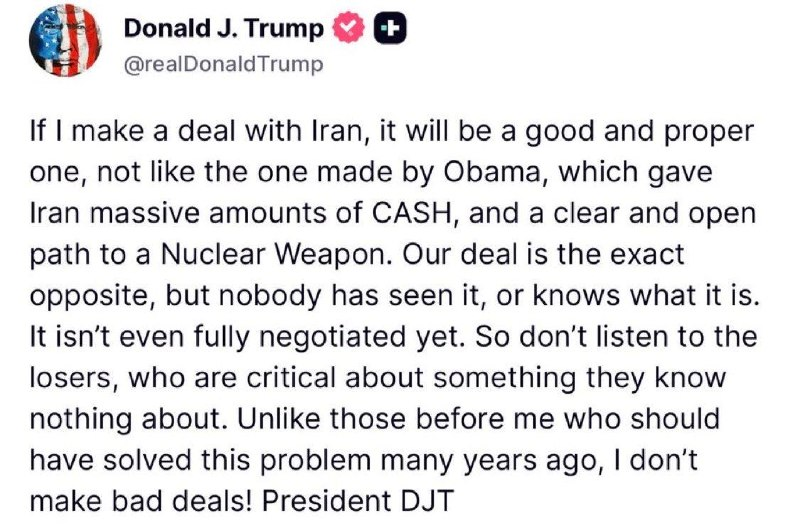

🔴 پست جدید ترامپ تو تروث:

اگر من با ایران معامله کنم، یه معامله درست و حسابی می‌کنم، نه مثل اون ریدمانی که اوباما کرد و کلی پول نقد بهشون داد برن کص بازی و راه رو برای ساخت سلاح هسته‌ای کاملاً باز گذاشت. معامله ما دقیقاً برعکسه، ولی هنوز هیچ‌کس ندیدنش و نمیدونه چیه. حتی هنوز کامل مذاکره هم نشده. پس به این بازنده‌ها گوش نکنید که دارن درباره چیزی نظر میدن که هیچی ازش بلد نیستن. برخلاف اونایی که قبل از من بودن و باید سال‌ها پیش این مشکل رو حل میکردن، من معامله بد نمی‌کنم!

#professor
@KiriMohems

## KiriMohems — post 47951

🔴آموزش و پرورش:

کونتونو گشاد نکنید و به شایعات فضای مجازی گوش نکنید؛

تا تیر ماه صبر می‌کنیم و اگه شرایط فراهم باشه، امتحانات نهایی به صورت حضوری برگزار میشن.

#professor
@KiriMohems

## KiriMohems — post 47950

  

🕹 گردونه شانس رایگان وینکوبت فعال شد!

🎰 هر ۱۲ ساعت یک‌بار شانس خودتان را امتحان کنید و جوایز نقدی متنوع دریافت کنید.

🎁 تا سقف ۱ میلیون تومان جایزه روزانه

✅ فعال برای تمامی کاربران

📌برای شرکت در گردونه شانس، وارد ربات وینکوبت شوید:
👇

🤖 @Wincobet_bot

🤖 @Wincobet_bot

📌کانال رسمی وینکوبت:

🔵 @Wincobetofficial

## KiriMohems — post 47949

آی ۲۴ نیوز: مقامات آمریکایی می‌گویند ایران تا زمانی که انتقال ذخایر اورانیوم غنی‌شده خود را آغاز نکند، هیچ‌گونه تسهیلاتی و کیر خری در زمینه تحریم‌ها یا آزادسازی وجوه مسدود شده دریافت نخواهد کرد.

🔴در عین حال، ایران بر این باور است که آزادسازی وجوه باید بخشی از هر توافق‌نامه چارچوبی باشد.

#Berlin
@Kirimohems

## KiriMohems — post 47948

  <a href="telegram/content/KiriMohems_47948_1779652869.mp4" target="_blank">🎬 Download video</a>

🔴 خانمی که همسایه بیت بوده:
من از پشت بوم داخل بیت رو نگاه میکردم، بیت رسما با خاک یکسان و به پودر تبدیل شده! هیچی ازش نمونده.

#Helsinki
@KiriMohems

## KiriMohems — post 47947

یک مقام اروپایی به فایتوکس:

امریکا و ایران اصلِ توافق رو قبول دارن، ولی روی تک‌تک بندها با هم اختلاف دارن !

#professor
@KiriMohems

## KiriMohems — post 47946

  <a href="telegram/content/KiriMohems_47946_1779652870.mp4" target="_blank">🎬 Download video</a>

وضعیت پشم ریزون کی‌یف اوکراین بعد از حملات موشکی روسیه.

#professor
@KiriMohems

## SportBaadNews — post 252433

  <a href="telegram/content/SportBaadNews_252433_1779652871.webm" target="_blank">🎬 Download video</a>

🚨 توییت کمال پنحاسی سخنگوی فارسی زبان ارتش اسرائیل: کس نخارد پشت من جز ناخن انگشت من (اشاره به احتمال حمله‌ی اسرائیل به تنهایی و بدون کمک آمریکا)
@SportBaadNews

## SportBaadNews — post 252432

  <a href="telegram/content/SportBaadNews_252432_1779652872.mp4" target="_blank">🎬 Download video</a>

گل خوشگل و سالنی منچستر تو بازی امروز🔥🔥🔥
@GoalBad

## SportBaadNews — post 252431

سی‌ان‌ان: ایران هیچ پولی یا لغو تحریمی رو در این توافق دریافت نخواهد کرد.
@SportBaadNews

## SportBaadNews — post 252430

⚡ وی‌پی‌ان بدنیوز؛ کمترین قیمت بیشترین کیفیت 
✅ بدون هیچگونه ضریب 
✅ قابلیت مدیریت و چک کردن حجم 
✅ مناسب تمامی پلتفرم‌ها 
✅ پشتیبانی سریع 
⚡ خرید از طریق بات رسمی: @vpnbadnews_bot

## SportBaadNews — post 252429

  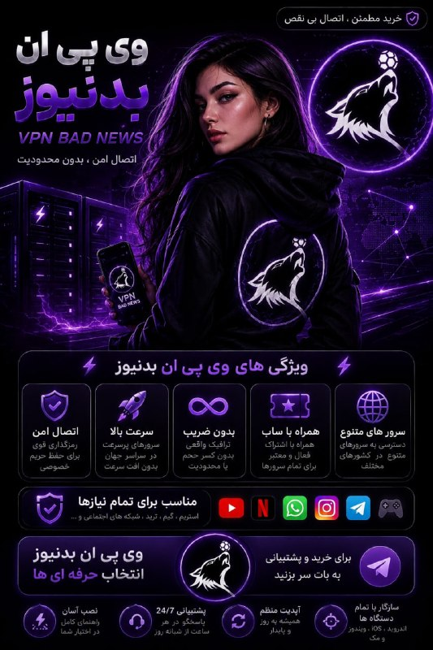

⚡ وی‌پی‌ان بدنیوز؛ کمترین قیمت بیشترین کیفیت

✅ بدون هیچگونه ضریب

✅ قابلیت مدیریت و چک کردن حجم

✅ مناسب تمامی پلتفرم‌ها

✅ پشتیبانی سریع

⚡ خرید از طریق بات رسمی: @vpnbadnews_bot

## SportBaadNews — post 252427

  <a href="telegram/content/SportBaadNews_252427_1779652873.mp4" target="_blank">🎬 Download video</a>

بالاخره یه نفر تونست مسیو مجبور کنه انگلیسی حرف بزنه😁
@SportBaadNews

## IranIntlTV — post 338808

  <a href="telegram/content/IranIntlTV_338808_1779652875.mp4" target="_blank">🎬 Download video</a>

نیویورک‌تایمز به نقل از یک مقام آمریکایی گزارش داد توافق میان تهران و واشینگتن هنوز امضا نشده و برای تایید نهایی رهبران دو کشور به چند روز زمان نیاز دارد.

بر اساس این گزارش، توافق احتمالی به برنامه موشکی جمهوری اسلامی و توقف کامل غنی‌سازی اورانیوم نمی‌پردازد.

گفت‌وگو با حسین علیزاده، تحلیل‌گر مسائل بین‌الملل
@iranintltv

## IranIntlTV — post 338807

  

بدر البوسعیدی، وزیر خارجه عمان گفت‌وگوی خود با کاظم غریب‌آبادی، معاون وزیر خارجه جمهوری اسلامی را «خوب» توصیف کرد.

او یکشنبه در شبکه ایکس نوشت: «ما بر اهمیت تعامل دیپلماتیک در همه زمینه‌ها تاکید کردیم. عمان به حمایت از تلاش‌ها برای کاهش تنش، پیشبرد همزیستی مسالمت‌آمیز منطقه‌ای، امنیت و آزادی دریانوردی ادامه خواهد داد.»
https://iranintl.com/202605241490

## IranIntlTV — post 338806

  <a href="https://t.me/IranintlTV/338806" target="_blank">📎 Download file</a>

🎧نسخه صوتی چشم‌انداز: بندهای پنهان توافق ترامپ و جمهوری اسلامی
@iranintlTV

## IranIntlTV — post 338805

  

به گزارش کانال ۱۲ اسرائیل، مقام‌های ارشد اسرائیلی نگران‌اند توافق در حال شکل‌گیری میان آمریکا و ایران ممکن است آزادی عمل اسرائیل علیه حزب‌الله در لبنان را به‌شدت محدود کند.

در این گزارش آمده است توافق پیشنهادی شامل پایان کامل درگیری‌ها در لبنان همزمان با پایان جنگ آمریکا و جمهوری اسلامی خواهد بود؛ موضوعی که باعث شد بنیامین نتانیاهو در تماس تلفنی روز گذشته خود با دونالد ترامپ نگرانی‌هایش را مطرح کند.

بر اساس این گزارش، نتانیاهو بر حفظ آزادی عملیاتی اسرائیل در لبنان تمرکز کرده و یک مقام ارشد اسرائیلی بعدا اعلام کرده است ترامپ موافقت کرده اسرائیل «آزادی عمل خود را در برابر تهدیدها در همه جبهه‌ها، از جمله لبنان، حفظ کند.»
https://iranintl.com/202605247829

## IranIntlTV — post 338804

  <a href="telegram/content/IranIntlTV_338804_1779652878.mp4" target="_blank">🎬 Download video</a>

محسن رضایی، مشاور مجتبی خامنه‌ای، تهدید کرد در صورت اقدام علیه تنگه هرمز و ورود به خلیج فارس، «پاسخ سخت» داده می‌شود و با شکستن محاصره دریایی اقدامات تقابلی آغاز خواهد شد. او یکی از گزینه‌های راهبردی جمهوری اسلامی در صورت تداوم این روند را احتمال خروج از پیمان منع گسترش سلاح‌های هسته‌ای عنوان کرد.

گفت‌وگو با عطا محامد، کارشناس روابط بین‌الملل
@iranintltv

## IranIntlTV — post 338803

  <a href="telegram/content/IranIntlTV_338803_1779652879.mp4" target="_blank">🎬 Download video</a>

نیویورک‌تایمز به نقل از یک مقام آمریکایی گزارش داد آمریکا و جمهوری اسلامی بر سر چارچوبی در حال تفاهم هستند که در آن تنگه هرمز بازگشایی می‌شود و تهران متعهد خواهد شد ذخایر اورانیوم با غنای بالای خود را «نابود» کند.

ارزیابی شهرام خلدی، پژوهش‌گر تاریخ خاورمیانه و روابط بین‌الملل
@iranintltv

## Persian_Trend_Official — post 14891

  

🔴 ترامپ

🔻نوشته ی روی بمب

💢از توجه شما به این موضوع سپاسگزارم

🫆:Tony

📌 @persian_trend_official
پرشین ترند | متفاوت‌ترین کانال نظامی

## Persian_Trend_Official — post 14890

i24NEWS⭕️

آمریکا آزادسازی پول‌های ایران را به انتقال اورانیوم غنی‌شده گره زده است

▪️ مقام‌های آمریکایی می‌گویند ایران تا زمانی که انتقال ذخایر اورانیوم غنی‌شده را آغاز نکند، هیچ کاهش تحریمی یا دسترسی به دارایی‌های بلوکه‌شده دریافت نخواهد کرد
▪️ در مقابل، ایران اصرار دارد آزادسازی بخشی از منابع مالی باید جزو توافق اولیه باشد
▪️ این اختلاف اکنون یکی از اصلی‌ترین موانع توافق میان تهران و واشینگتن محسوب می‌شود

🫆:Tony

📌 @persian_trend_official
پرشین ترند | متفاوت‌ترین کانال نظامی

## Persian_Trend_Official — post 14889

https://youtube.com/live/vCQOD_eWyqM?feature=share

## Persian_Trend_Official — post 14888

https://youtube.com/live/vCQOD_eWyqM?feature=share

## Persian_Trend_Official — post 14887

  <a href="telegram/content/Persian_Trend_Official_14887_1779652881.mp4" target="_blank">🎬 Download video</a>

🔴صیغه کوتاه مدت روزانه و ماهانه در تجمعات خیابانی همچنان برقرار است...

🫆:Tony

📌 @persian_trend_official
پرشین ترند | متفاوت‌ترین کانال نظامی

## Persian_Trend_Official — post 14886

  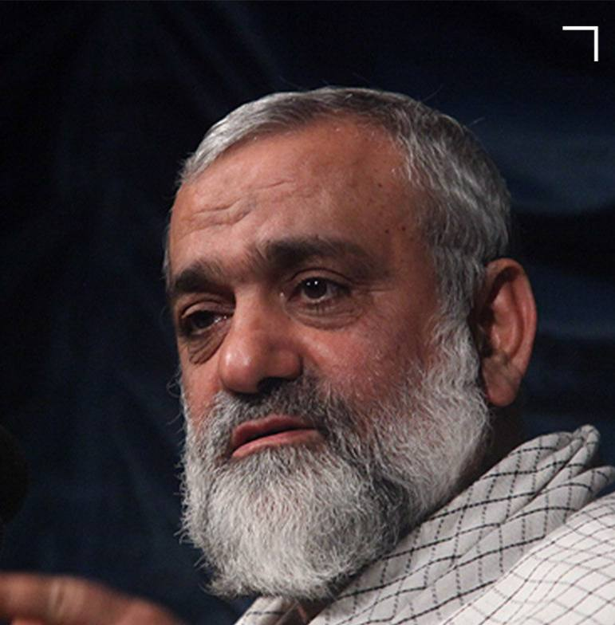

سردار نقدی: دشمن اگر خطایی کند، ضربهٔ جبران‌ناپذیری می‌خورد

♦️مشاور عالی فرماندهٔ کل سپاه: ما توانستیم یک بازدارندگی در مقابل دشمن بدست بیاوریم آن هم از این جهت که دشمن متوجه شد که نمی‌تواند مقابل ما به نتیجه مطلوب خود برسد.

♦️یک بعد دیگر بازدارندگی هم این بود که دشمن بداند که اگر بخواهد خطایی کند ضربهٔ جبران‌ناپذیری را خواهد خورد.

♦️امروز این بازدارندگی برای دشمن مشخص شده بگونه‌ای که ۲۸۲ نقطه نظامی آن‌ها منهدم و نیز صدها کشته به دست دشمن باقی مانده است به نحوی که بسیاری از آن‌ها را مخفی کرده‌اند.

♦️روزانه یک هواپیمای ۴۰ تخته بیمارستانی از امارات و یک ۱۰ تخته از کویت مجروحان دشمن را برای درمان به بیمارستان‌های آمریکایی در آلمان منتقل می‌کردند.

⚠️پ ن :تعداد کشته شدگان نظامی امریکا ۱۳ نفر است.
🫆:Tony

📌 @persian_trend_official
پرشین ترند | متفاوت‌ترین کانال نظامی

---
📅 بروزرسانی: 1405/03/03 22:18
---

## SportBaadNews — post 252426

  <a href="telegram/content/SportBaadNews_252426_1779648520.mp4" target="_blank">🎬 Download video</a>

موزیک‌ویدیوی جام‌جهانی با هنرنمایی بانوی دو عالم شکیرا خانوم و حضور بی اهمیتِ بازیکنایی مثل امباپه ،دیویس و مسی منتشر شد😍🫡

@GoalBad

## SportBaadNews — post 252425

  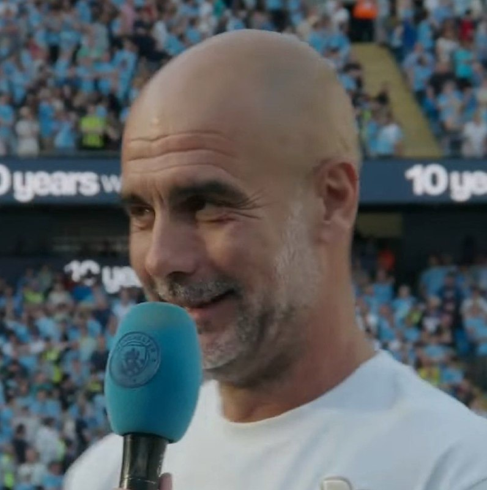

پپ گواردیولا: تو سال‌های آینده، اگه منو تو هر جای دنیا پیدا کردی و تو خیابون‌ها دیدی چه اینجا تو منچستر، تو اروپا یا آمریکا٬ اگه طرفدار منچستر سیتی هستی، بیا پیشم و بغلم کن! به اون بغل احتیاج دارم.
@SportBaadNews

## SportBaadNews — post 252424

  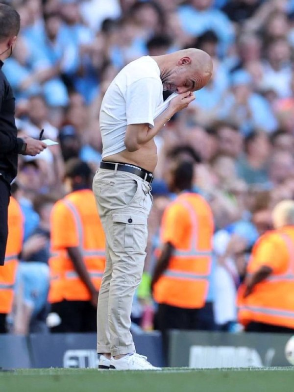

یه تنه به منچسترسیتی اعتبار بخشید!
@SportBaadNews

## SportBaadNews — post 252423

اخبارو کوتاه و مختصر میتونید از این چنلمون دنبال کنید:

@Shortasport

## SportBaadNews — post 252422

  <a href="telegram/content/SportBaadNews_252422_1779648525.mp4" target="_blank">🎬 Download video</a>

آرتتا چه عشقی میکنه
@SportBaadNews

## SportBaadNews — post 252421

اودگارد جامو برد بالا @SportBaadNews

## SportBaadNews — post 252420

  

اودگارد جامو برد بالا
@SportBaadNews

## SportBaadNews — post 252419

  

پایان غم انگیز
@SportBaadNews

## SportBaadNews — post 252418

  

🕹 گردونه شانس رایگان وینکوبت فعال شد!

🎰 هر ۱۲ ساعت یک‌بار شانس خودتان را امتحان کنید و جوایز نقدی متنوع دریافت کنید.

🎁 تا سقف ۱ میلیون تومان جایزه روزانه

✅ فعال برای تمامی کاربران

📌برای شرکت در گردونه شانس، وارد ربات وینکوبت شوید:
👇

🤖 @Wincobet_bot

🤖 @Wincobet_bot

📌کانال رسمی وینکوبت:

🔵 @Wincobetofficial

## SportBaadNews — post 252417

ای من قربون این تیم برمممم

## IranIntlTV — post 338802

  

دونالد ترامپ در تروث‌سوشال نوشت اگر با جمهوری اسلامی توافقی انجام دهد، توافقی خوب و درست خواهد بود؛ نه مانند توافق اوباما که مبالغ هنگفتی پول نقد به تهران داد و مسیری آشکار برای دستیابی این کشور به سلاح هسته‌ای فراهم کرد.

او افزود توافق دولتش دقیقا برعکس آن است، اما هنوز کسی آن را ندیده و نمی‌داند شامل چه مواردی است و این توافق هنوز به‌طور کامل نهایی نشده است.

ترامپ گفت به کسانی که درباره موضوعی که اطلاعی از آن ندارند انتقاد می‌کنند گوش ندهید و تاکید کرد برخلاف دولت‌های پیشین، توافق بد انجام نخواهد داد.
https://iranintl.com/202605243731

## IranIntlTV — post 338801

  <a href="https://t.me/IranintlTV/338801" target="_blank">📎 Download file</a>

🎧نسخه صوتی تیتراول با نیوشا صارمی: تهران و واشینگتن در آستانه تصمیم نهایی توافق؛ هشدار نتانیاهو:آزادی عمل داریم
@iranintlTV

## IranIntlTV — post 338800

بخش مهمی از تفاهم‌نامه تهران و واشینگتن مربوط به مسائل و امتیازهای اقتصادی است. آمریکا در ازای بازگشایی تنگه هرمز، محاصره بنادر ایران را به تدریج لغو خواهد کرد و معافیت‌های تحریمی برای فروش آزاد نفت ایران صادر می‌شود. اگرچه تهران خواستار آزادسازی فوری منابع مالی و رفع دائمی تحریم‌‌ها بود، اما آزادسازی دارایی‌های بلوکه‌شده و رفع کامل تحریم‌ها به توافق نهایی موکول شده است.

گفت‌وگو با سارا بازوبندی، کارشناس اقتصادی
@iranintltv

## IranIntlTV — post 338799

تهران و واشینگتن هنوز امضای توافق را اعلام نکرده‌اند. جزئیات توافق احتمالی هم هنوز به طور رسمی اعلام نشده است. گرچه گمانه‌زنی‌ها بر این بود که رسیدن به توافق امروز اعلام خواهد شد، اما کاخ سفید گفته است امضای توافق ممکن است چند روز دیگر انجام شود.

گفت‌وگو با نوید محبی، تحلیل‌گر سیاسی
@iranintltv

## IranIntlTV — post 338798

  <a href="telegram/content/IranIntlTV_338798_1779648531.mp4" target="_blank">🎬 Download video</a>

محسن رضایی، مشاور نظامی مجتبی خامنه‌ای، در یک سخنرانی در مصلای تهران، با اشاره به اینکه کاری خواهند کرد که «امنیت» کشور برای ۵۰ سال آینده تأمین شود، خطاب به مقام‌های آمریکایی گفت: «در صورت تعرض به تنگه هرمز و ورود به خلیج‌ فارس، محاصره دریایی را خواهیم شکست و پاسخی سخت، دردناک و کم‌نظیر به آمریکا خواهیم داد.»

او در ادامه، آمریکا را به خروج جمهوری اسلامی از معاهده «ان‌پی‌تی» تهدید کرد و گفت دست به خودکشی نزند.
@iranintltv

## IranIntlTV — post 338797

  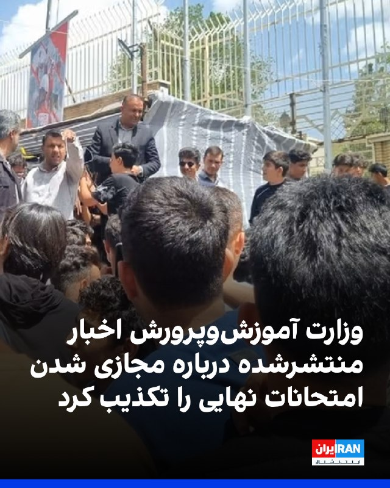

وزارت آموزش‌وپرورش اخبار منتشرشده درباره مجازی شدن امتحانات نهایی را تکذیب و اعلام کرد تاکنون هیچ تصمیمی برای برگزاری مجازی امتحانات نهایی پایه‌های یازدهم و دوازدهم گرفته نشده است.

وزارت آموزش‌وپرورش اعلام کرد تا تیرماه برای فراهم شدن شرایط برگزاری امتحانات نهایی صبر می‌شود و در صورت فراهم شدن امکان برگزاری حضوری، آزمون‌های نهایی مطابق روال معمول به شکل حضوری برگزار خواهد شد.

در روزهای اخیر، دانش‌آموزان در چندین شهر به برگزاری حضوری امتحانات اعتراض کردند.
https://iranintl.com/202605241771

## Persian_Trend_Official — post 14884

ساعت 23 به وقت تهران لایو شروع میشه

## Persian_Trend_Official — post 14883

  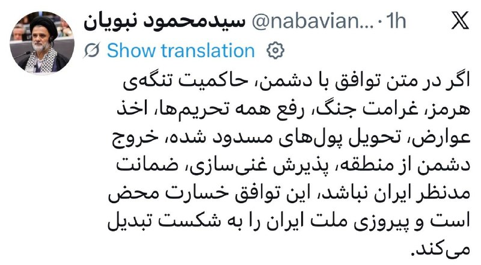

این رو مبنای شکست و پیروزی جمهوری اسلامی در نظر میگیریم

و هر توافقی رو با این متن مقایسه میکنیم
از توجه شما به این موضوع متشکرم
الیاس فرخ

## Persian_Trend_Official — post 14882

🔴 روبیو: توافق هسته‌ای با ایران را نمی‌توان «در ۷۲ ساعت روی یک تکه کاغذ» نهایی کرد

♦️مارکو روبیو، وزیر خارجه آمریکا، اعلام کرد توافق احتمالی با ایران از حمایت کشورهای منطقه برخوردار شده است، اما هشدار داد:

▪️ «توافق هسته‌ای را نمی‌شود ظرف ۷۲ ساعت و روی پشت یک دستمال کاغذی نهایی کرد»
▪️ او گفت مذاکرات پیچیده است و هنوز کار زیادی باقی مانده
▪️ روبیو همچنین از «پیشرفت قابل‌توجه اما نه نهایی» در گفت‌وگوها خبر داد
🫆:Tony

📌 @persian_trend_official
پرشین ترند | متفاوت‌ترین کانال نظامی

## Persian_Trend_Official — post 14881

  

#طنز

بیو ترامپ چند روز دیگه:

📝 Nick

📌 @persian_trend_official
پرشین ترند | متفاوت‌ترین کانال نظامی

## Persian_Trend_Official — post 14879

  

🔴 ترامپ:

اگر با ایران توافقی انجام دهم، توافقی خوب و درست خواهد بود؛ نه مثل توافق اوباما که به ایران حجم عظیمی پول نقد داد و مسیر آشکار دستیابی به سلاح هسته‌ای را برایش باز کرد.
توافق ما دقیقاً برعکس آن است، اما هنوز کسی آن را ندیده و از جزئیاتش خبر ندارد. این توافق حتی هنوز کاملاً نهایی هم نشده است.
پس به حرف بازنده‌هایی که درباره چیزی که هیچ اطلاعی از آن ندارند انتقاد می‌کنند گوش ندهید.
برخلاف کسانی که قبل از من بودند و باید سال‌ها پیش این مسئله را حل می‌کردند، من توافق بد انجام نمی‌دهم.

🫆:Tony

📌 @persian_trend_official
پرشین ترند | متفاوت‌ترین کانال نظامی

## Persian_Trend_Official — post 14878

🔴العربی الجديد:

♦️انفجار انتحاری در قطاری در ایالت بلوچستان پاکستان؛ بیش از ۲۰ کشته و بیش از ۵۰ زخمی / انتخاب

🫆:Tony

📌 @persian_trend_official
پرشین ترند | متفاوت‌ترین کانال نظامی

## Persian_Trend_Official — post 14877

  <a href="telegram/content/Persian_Trend_Official_14877_1779648536.webm" target="_blank">🎬 Download video</a>

🔴 کانال ۱۳ اسرائیل: نفوذ نتانیاهو بر ترامپ به‌شدت کاهش یافته است

▪️ نتانیاهو در جلسات اخیر گفته توان اسرائیل برای تأثیرگذاری بر ترامپ اکنون بسیار محدود شده است
▪️ مقام‌های اسرائیلی معتقدند ترامپ به‌سمت توافق موقت با ایران حرکت می‌کند
▪️ اسرائیل فعلاً تلاش می‌کند فقط بر محتوای توافق اثر بگذارد؛ به‌ویژه درباره لبنان، شمال اسرائیل و خروج اورانیوم غنی‌شده از ایران

همزمان:

▪️ نتانیاهو امشب جلسه جدید کابینه امنیتی محدود برگزار کرده است
▪️ اسرائیلی‌ها می‌گویند جرد کوشنر و استیو ویتکاف نقش مهمی در منصرف‌کردن ترامپ از گزینه جنگ داشته‌اند
▪️ با وجود تماس‌های ادامه‌دار میان ترامپ و نتانیاهو، در تل‌آویو این باور در حال تقویت است که تغییر نظر ترامپ بعید شده است

🫆:Tony

📌 @persian_trend_official
پرشین ترند | متفاوت‌ترین کانال نظامی

## Persian_Trend_Official — post 14876

  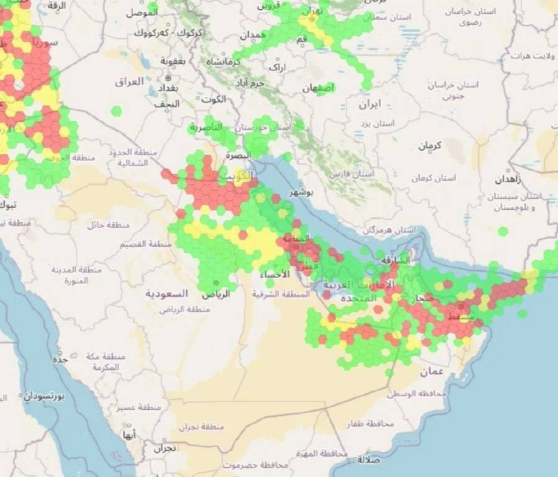

🔴 اختلال GPS همچنان ایران و کشورهای عربی خلیج فارس را درگیر کرده است

▪️ طی هفته گذشته سیگنال‌های GPS و ناوبری ماهواره‌ای در بخش‌هایی از ایران، عراق، کویت، امارات و مسیرهای کشتیرانی خلیج فارس با اختلال شدید مواجه شده‌اند
▪️ گزارش‌ها از افزایش جنگ الکترونیک و اختلال در ناوبری کشتی‌ها و پهپادها خبر می‌دهند
▪️ برخی کشتی‌ها در تنگه هرمز موقعیت‌های جعلی ثبت کرده‌اند و خطر برخورد دریایی افزایش یافته است

🫆:Tony

📌 @persian_trend_official
پرشین ترند | متفاوت‌ترین کانال نظامی

---
📅 بروزرسانی: 1405/03/03 21:11
---

## ChizBergerz — post 46754

👑آیپی جدید شیر و خورشید؛

23.47.124.92
23.47.49.246
23.49.140.191
23.47.112.185
23.49.134.133
23.49.60.65
23.49.60.57
23.49.5.211
23.49.136.174
23.49.25.145
23.47.50.123
23.49.60.51
23.49.60.49
23.47.124.90
23.47.124.82
23.47.124.86
23.47.124.73
23.47.124.76
23.47.124.89
23.47.49.240
23.49.140.235
23.47.124.91
23.49.22.132
23.49.109.91
184.24.167.96
23.35.208.5
95.100.146.90
95.101.137.212
23.36.162.78
95.101.35.106
2.21.2.58
23.44.201.149
2.17.251.181
2.19.248.208
2.23.7.25
95.101.22.225
23.11.40.157
95.101.111.152
2.22.145.20

@ChizBergerz

## ChizBergerz — post 46753

👑آیپی جدید شیر و خورشید؛
80.191.243.226
185.137.25.146
185.50.37.52
185.141.106.238
5.160.13.85
185.208.175.228
5.144.129.174
78.157.41.60
158.58.184.147
185.255.91.60
185.208.174.167
164.138.17.122
185.88.178.196
94.232.173.28
37.191.95.70
185.89.22.71
63.141.252.203
142.54.178.211
78.39.234.140
109.72.197.1
2.16.53.65
@ChizBergerz

## rodast_omiddana — post 71875

  <a href="telegram/content/rodast_omiddana_71875_1779644479.mp4" target="_blank">🎬 Download video</a>

🚨 و اما کلام آخر..
در زندگی یک عکس کنار پرچم رژیم ندارم و در هیچ بخشی از رژیم کار نکردم و یک ریال از رژیم حقوق نگرفتم و حتا در یک انتخابات رژیم در زندگیم شرکت نکردم و رای ندادم و برای مبارزه با رژیم 5 بار زندان رفتم و تا پای حکم اعدام نیز کشیده شدم..
جالب اینجاست ماسونهای شیعه نویسنده دفترچه اضطرار هم در گذشته در رژیم بودن و هم حقوق گرفتن فقط الان صاحب کارشان عوض شده ولی ذات مزدوری و حقوق بگیریشان همان است..
نکته غم انگیز اینجاست این جماعت که همیشه کنار قدرت بودن چه در رژیم چه در اپوزسیون خیلی خوب قدرت را بو میکشن و نزدیک میشوند به منی که اینهمه هزینه و سالها زندان کشیدم ناجوانمردانه ترین تهمت ها را میزنند..
چرا؟ چون درد این مردم که تشیع هست را شناسایی کردم، همین...

پانوشت:
بخشی از فیلم دادگاهم و گزارش صدای آمریکا در مورد حکم اعدامم..

## SportBaadNews — post 252416

  <a href="telegram/content/SportBaadNews_252416_1779644482.webm" target="_blank">🎬 Download video</a>

⏰پایان بازی 
🔴 منچستریونایتد 3-0 برایتون 
🔵 
✅
🤩 پاتریک دورگو 
✅ برونو فرناندز 
⚽️
🤩 برايان امبومو 
✅ آماد ديالو 
⚽️
🤩 برونو فرناندز  
🅰️ پاتریک دورگو 
♥️@ManchesterNews_ir

## SportBaadNews — post 252415

  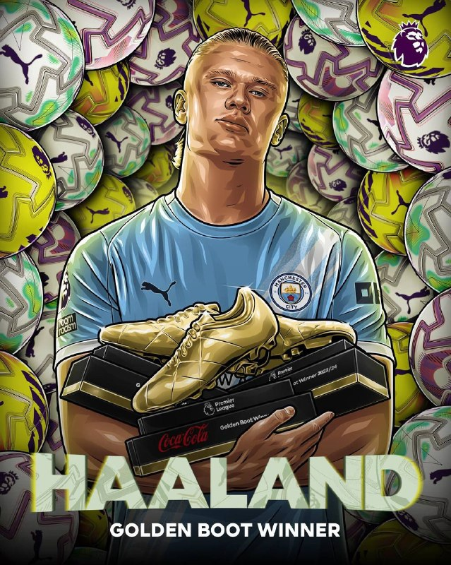

ارلینگ هالند با 27 گل مثل همیشه آقای گل لیگ جزیره شد
@SportBaadNews

## SportBaadNews — post 252413

گریه های غم انگیز محمد صلاح تو آخرین بازیش برای لیورپول در آنفیلد💔 @SportBaadNews

## SportBaadNews — post 252412

  <a href="telegram/content/SportBaadNews_252412_1779644484.mp4" target="_blank">🎬 Download video</a>

گریه های غم انگیز محمد صلاح تو آخرین بازیش برای لیورپول در آنفیلد💔
@SportBaadNews

## SportBaadNews — post 252411

  

چلسی فصل رو در رده دهم به پایان رسوند و رسماً فصل بعد تو هیچ تورنومنت اروپایی حضور نخواهد داشت.

## SportBaadNews — post 252410

  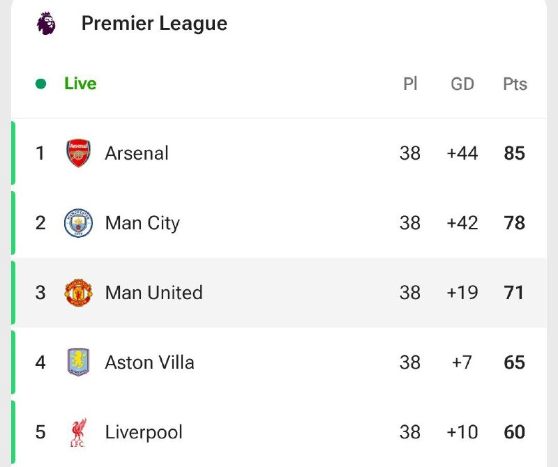

لیگ جزیره با قهرمانی آرسنال به پایان رسید.

آرسنال، سیتی، یونایتد، استون ویلا و لیورپول موفق به کسب سهمیه چمپیونزلیگ شدن.

چلسی فصل رو در رده دهم به پایان رسوند و رسماً فصل بعد تو هیچ تورنومنت اروپایی حضور نخواهد داشت.

تاتنهام هم موفق شد بازیش رو ببره و فصل رو در رده هفدهم به پایان برسونه و تو لیگ بمونه.
@SportBaadNews

## SportBaadNews — post 252409

  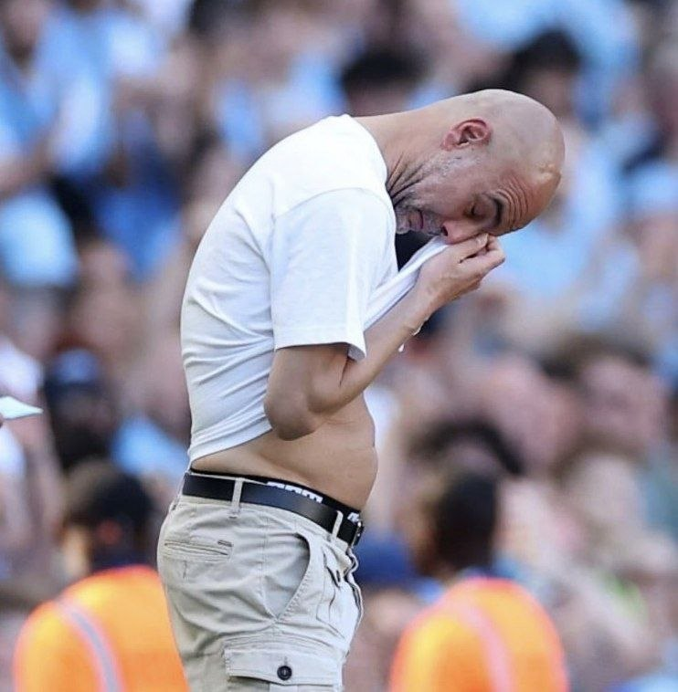

اشک های برناردو سیلوا تو آخرین بازیش واسه سیتی @SportBaadNews

## SportBaadNews — post 252408

  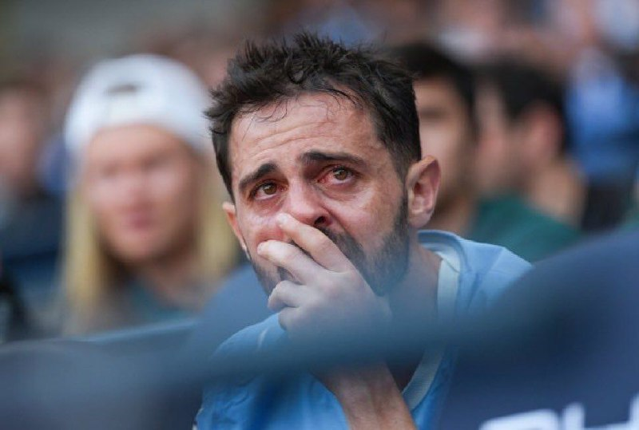

اشک های برناردو سیلوا تو آخرین بازیش واسه سیتی
@SportBaadNews

## IranIntlTV — post 338795

  <a href="telegram/content/IranIntlTV_338795_1779644490.mp4" target="_blank">🎬 Download video</a>

سی‌بی‌اس نیوز گزارش داد واشینگتن بر این باور است که رهبر جمهوری اسلامی الگوی کلی پیش‌نویس توافق با آمریکا را تایید کرده است.

کاخ سفید اعلام کرد توافق هنوز نهایی نشده است و بنیامین نتانیاهو نیز گفت با دونالد ترامپ توافق کرده هرگونه توافق نهایی با ایران باید تهدید هسته‌ای را از میان بردارد.

گفت‌وگو با روح‌الله رحیم‌پور، تحلیل‌گر سیاسی، و اشکان صفایی و مرضیه حسینی، خبرنگاران ایران‌اینترنشنال
@iranintltv

## IranIntlTV — post 338794

  

ارتش اسرائیل اعلام کرد ایال زمیر، رییس ستاد کل ارتش این کشور، پس از ارزیابی وضعیت میدانی، طرح‌های ادامه عملیات علیه حزب‌الله در لبنان را تایید کرده است.

زمیر گفت ارتش اسرائیل تحولات منطقه را به‌دقت زیر نظر دارد و آماده است فورا به درگیری‌های شدید بازگردد و حکومت «تروریستی» ایران و توانمندی‌های آن را بیش از پیش تضعیف کند.

او افزود: «امروز طرح‌های ادامه نبرد در جبهه شمالی را تصویب کردم و مصمم هستیم ضربات به حزب‌الله را عمیق‌تر کنیم.»
https://iranintl.com/202605240944

## IranIntlTV — post 338793

  

لیندزی گراهام، سناتور جمهوریخواه در پیامی در شبکه ایکس نوشت: «اگر در نتیجه مذاکرات برای پایان دادن به درگیری با ایران، متحدان عرب و مسلمان آمریکا در منطقه به توافق‌های ابراهیم بپیوندند، این توافق می‌تواند به یکی از مهم‌ترین تحولات تاریخ خاورمیانه تبدیل شود.»

او افزود پیوستن عربستان سعودی، قطر و پاکستان به توافق‌های ابراهیم تحولی بزرگ برای منطقه و جهان خواهد بود و این اقدام را حرکتی درخشان از سوی رییس جمهور ترامپ توصیف کرد.
https://iranintl.com/202605241273

## IranIntlTV — post 338792

  <a href="telegram/content/IranIntlTV_338792_1779644494.mp4" target="_blank">🎬 Download video</a>

هم‌زمان با مطرح شدن احتمال توافق میان تهران و واشینگتن، موج واکنش‌ها در اسرائیل افزایش یافته است. بنیامین نتانیاهو با اعلام نگرانی‌های خود به دونالد ترامپ، بر آزادی عمل اسرائیل در همه جبهه‌ها، به‌ویژه لبنان، تاکید کرده است.

گفت‌وگو با مئیر جاودانفر، تحلیل‌گر مسائل اسرائیل
@iranintltv

## IranIntlTV — post 338790

  <a href="telegram/content/IranIntlTV_338790_1779644497.mp4" target="_blank">🎬 Download video</a>

تیتر اول با نیوشا صارمی، یکشنبه ۳ خرداد
@iranintltv

## IranIntlTV — post 338789

  <a href="telegram/content/IranIntlTV_338789_1779644499.mp4" target="_blank">🎬 Download video</a>

هزاران نفر از ایرانیان ساکن ونکوور در محل آرت گالری این شهر تجمع کردند. شرکت‌کنندگان در این تجمع ضمن تاکید بر لزوم پایان دادن به خاموشی دیجیتال در ایران، از مقام‌های فیفا خواستند با همراهی با جمهوری اسلامی به عادی‌سازی جنایات این حکومت کمک نکنند.

گزارش مهسا مرتضوی، خبرنگار ایران‌اینترنشنال
@iranintltv

## Persian_Trend_Official — post 14875

  

🔴 نعیم قاسم خواستار حضور مردم در خیابان‌ها شد

«نعیم قاسم» دبیرکل حزب الله در اظهاراتی جنجالی از مردم خواست به خیابان‌ها بیایند و دولت لبنان را سرنگون کنند.

♦️این موضع‌گیری در شرایطی مطرح می‌شود که:

▪️ فشارها بر حزب‌الله در جریان مذاکرات منطقه‌ای و توافق احتمالی ایران و آمریکا افزایش یافته است
▪️ اختلافات داخلی لبنان بر سر نقش حزب‌الله و آینده درگیری با اسرائیل شدت گرفته
▪️ برخی گزارش‌ها حاکی از نگرانی حزب‌الله نسبت به محدودشدن آزادی عملش در توافق‌های در حال مذاکره است
🫆:Tony

📌 @persian_trend_official
پرشین ترند | متفاوت‌ترین کانال نظامی

## Persian_Trend_Official — post 14874

🔴 i24NEWS: نگرانی شدید اسرائیل از توافق در حال شکل‌گیری میان آمریکا و ایران

💢شبکه i24NEWS گزارش داد مقام‌های ارشد امنیتی اسرائیل به‌طور فزاینده‌ای نگران توافق احتمالی میان آمریکا و ایران هستند و آن را «بسیار بد» برای اسرائیل توصیف می‌کنند.

🔻بر اساس این گزارش:

▪️ مقام‌های اسرائیلی معتقدند توافق فعلی نه برنامه هسته‌ای ایران را به‌طور کامل مهار می‌کند و نه تهدید موشکی تهران را حل می‌کند
▪️ آن‌ها تأکید کرده‌اند جنگ فقط به‌دلیل مسئله هسته‌ای آغاز نشده بود، بلکه برنامه موشکی ایران نیز یکی از اهداف اصلی محسوب می‌شد
▪️ از نگاه تل‌آویو، تفاهم‌های فعلی هیچ راه‌حل واقعی برای این موضوع ارائه نمی‌دهد

🔻در خصوص لبنان نیز:

▪️ وضعیت «غیرقابل‌قبول» توصیف شده است
▪️ مقام‌های اسرائیلی هشدار داده‌اند اسرائیل نمی‌تواند در شرایطی ادامه دهد که آزادی عمل ارتش اسرائیل در لبنان محدود شود
▪️ نگرانی اصلی تل‌آویو، محدودشدن حملات پیش‌دستانه علیه حزب‌الله است
🫆:Tony

📌 @persian_trend_official
پرشین ترند | متفاوت‌ترین کانال نظامی

## Persian_Trend_Official — post 14873

🔴 کانال ۱۲ اسرائیل: دو مانع اصلی در توافق ایران و آمریکا باقی مانده است

♦️کانال ۱۲ اسرائیل مدعی شد هنوز دو نقطه اختلاف اصلی میان تهران و واشینگتن در مذاکرات باقی مانده است:

▪️ اسرائیل خواهان دریافت تضمین برای «آزادی عمل نظامی» علیه تهدیدات در لبنان است، اما ایران با این مسئله مخالفت می‌کند
▪️ تهران خواستار آزادسازی فوری دارایی‌های بلوکه‌شده خود است، اما آمریکا اصرار دارد این موضوع به توافق نهایی و اجرای کامل تعهدات گره بخورد

◼️این گزارش با روایت‌های قبلی درباره اختلافات مربوط به لبنان همخوانی دارد؛ جایی که اسرائیل تلاش می‌کند حق انجام حملات پیش‌دستانه علیه حزب‌الله را حفظ کند.

همزمان:
▪️ ایران ظاهراً تلاش می‌کند هرگونه توافق شامل توقف حملات علیه حزب‌الله و محدودشدن آزادی عمل اسرائیل در لبنان باشد.
در موضوع دارایی‌ها نیز:

▪️ ایران به‌دنبال دریافت فوری بخشی از منابع مالی بلوکه‌شده به‌عنوان «نشانه حسن نیت» است
▪️ واشینگتن نگران است آزادسازی فوری پول‌ها بدون پیشرفت واقعی در پرونده هسته‌ای، اهرم فشار آمریکا را از بین ببرد

🫆:Tony

📌 @persian_trend_official
پرشین ترند | متفاوت‌ترین کانال نظامی

## Persian_Trend_Official — post 14872

🔴علی هاشم خبرنگار الجزیره:

💢کمتر از ۲۴ ساعت پس از آنکه خوش‌بینی‌هایی درباره احتمال تفاهم ایران و آمریکا مطرح شد، نشانه‌های منفی از راه رسیده است.

▪️یک منبع آگاه ایرانی می‌گوید نشانه‌هایی از عقب‌نشینی آمریکا در دو موضوع اصلی دیده می‌شود: سازوکار آزادسازی دارایی‌های ایران و دامنه آتش‌بس در لبنان.

▪️به گفته این منبع، تفاهم شامل چارچوبی برای آتش‌بس در لبنان است، اما رژیم اسرائیل ظاهراً از این ترتیب ناراضی است و بر واشنگتن فشار می‌آورد که متنی را بگنجاند که به اسرائیل اجازه دهد با توجیه «پاسخ به هر تهدیدی»، عملیات نظامی در لبنان انجام دهد. ایران این سازوکار را رد می‌کند و بر آتش‌بسی پایدار و دائمی تأکید دارد.

▪️تهران به همه میانجی‌ها از جمله پاکستان اطلاع داده است که اگر همه بندهای تفاهم کاملاً مورد توافق و تضمین نشده باشد، آن را امضا نخواهد کرد.

▪️پاکستان پیشنهاد کرده که بندهای مورد توافق جلو برود و مسائل اختلافی به تعویق بیفتد، اما ایران این را ردو تأکید کرده است که بندهای مورد اختلاف، اساسی و غیرقابل مصالحه هستند.

💢تصویر کلی نشان می‌دهد که تهران به طور فزاینده‌ای بر این باور است که واشنگتن از تفاهم‌های قبلی که از طریق میانجی‌ها حاصل شده بود، عقب‌نشینی می‌کند./انتخاب

🫆:Tony

📌 @persian_trend_official
پرشین ترند | متفاوت‌ترین کانال نظامی

---
📅 بروزرسانی: 1405/03/03 20:03
---

## ChizBergerz — post 46752

👑آیپی جدید شیر و خورشید؛

72.246.28.37
2.18.63.49
2.16.53.11
2.16.53.50
2.16.19.136
184.24.77.7
184.24.77.16
184.24.77.36
184.24.77.21
184.24.77.42
184.24.77.32
184.24.77.5
184.24.77.11
185.200.232.49
185.200.232.50
185.200.232.42
185.200.232.41
23.48.23.186
23.48.23.133
23.48.23.195
23.48.23.178
184.24.77.29
2.22.250.149
23.58.193.140
23.48.23.151
2.19.126.81
23.202.138.125
23.43.237.239
104.112.146.82

@ChizBergerz

## ChizBergerz — post 46751

  

توافق یا خیر، بین ما دریایی خون فاصله است؛
جمهوری اسلامی به آینده تعلق ندارد.

ما کار خود را همراه تنها نماینده مان خواهیم کرد
👑
@ChizBergerz

## ChizBergerz — post 46750

  

رییس جمهور آمریکا
جو باراک ترامپ

@ChizBergerz

## ChizBergerz — post 46749

  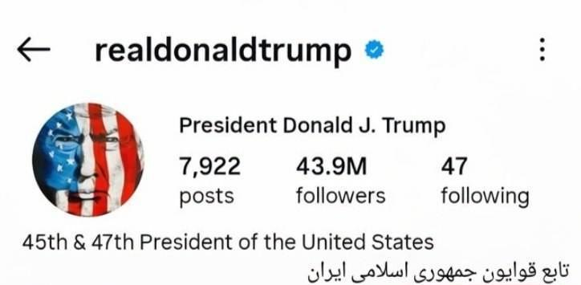

پروفایل ترامپ بزودی:

@ChizBergerz

## ChizBergerz — post 46748

⭕️ رایگان بدون واریز شرط های فوتبالی ببند از همون اول موجودی 500 هزارتومانه
❌ 
🎉 500 هزارتومن رایگان فقط با ثبت نام بدون هیچگونه واریزی! 
💳 پرداخت مستقیم و سریع بدون واسطه، بدون دردسر، واریز و برداشت در سریع‌ترین زمان ممکن 
⌛ پشتیبانی 24 ساعته 
🌐 Winro.io…

## ChizBergerz — post 46747

  

⭕️ رایگان بدون واریز شرط های فوتبالی ببند از همون اول موجودی 500 هزارتومانه
❌

🎉 500 هزارتومن رایگان فقط با ثبت نام بدون هیچگونه واریزی!

💳 پرداخت مستقیم و سریع بدون واسطه، بدون دردسر، واریز و برداشت در سریع‌ترین زمان ممکن

⌛ پشتیبانی 24 ساعته

🌐 Winro.io

🌐 Winro.io
کانال بونوس های رایگان g3

📱 @winro_io

## rodast_omiddana — post 71874

  <a href="telegram/content/rodast_omiddana_71874_1779640422.webm" target="_blank">🎬 Download video</a>

🚨 اومدن گذشته منو که جلوی دوربین و جلو چشم مردم در 15 سال گذشته شکل گرفته مثلا رو کنند، ولی گذشته های خودشون رو شد..
چقدر پیامهای محبت آمیز دارم و چه دوستان مهمی نیز در این چند روز پیدا کردم..
خدایا شکرت..

## rodast_omiddana — post 71873

🚫خب مذاکره کردن و همه چی تمام شد رفت دیگه😅
نگران نباشید اساسا اون 39 روز زد و خورد هوایی بود نه جنگ...
جنگ هنوز آغاز نشده و خواهد شد..
زمان میخوره و بازم رو سفید میشم..

## rodast_omiddana — post 71872

🎬 سخنان مهدی میرقادری در ارتباط با گذشته امید دانا
لینک یوتیوب:
https://www.youtube.com/watch?v=7UJnDO5peuE

## rodast_omiddana — post 71871

  <a href="telegram/content/rodast_omiddana_71871_1779640422.mp4" target="_blank">🎬 Download video</a>

😎 حکایت من و دشمنان دوزاریم

## SportBaadNews — post 252407

⚽️تاتنهام هم فعلا موفق شده یک گل بزنه تا از سقوط فرار کنه
@SportBaadNews

## SportBaadNews — post 252406

  <a href="telegram/content/SportBaadNews_252406_1779640425.webm" target="_blank">🎬 Download video</a>

⚽️
🚨 برونو تو بازی منچستر پاس گل داد و رکورد بیشترین پاس گل در یک فصل تاریخ پریمیرلیگ که مشترکا در اختیار دیبروینه و تیری هانری بود رو شکست
@SportBaadNews

## IranIntlTV — post 338788

  

دونالد ترامپ جونیور، پسر ارشد رئیس‌جمهور آمریکا، در شبکه ایکس نوشت: این یک پیروزی بزرگ برای آمریکا است. ما باید کسانی را که هرگز راضی نمی‌شوند مگر با تهاجم زمینی به ایران، نادیده بگیریم. پدر من وعده داده بود که مانع دستیابی ایران به سلاح هسته‌ای شود و دقیقا در حال تحقق همین هدف است.
https://iranintl.com/202605247103

## IranIntlTV — post 338787

  <a href="telegram/content/IranIntlTV_338787_1779640426.mp4" target="_blank">🎬 Download video</a>

با انتشار جزئیات توافق احتمالی واشینگتن و تهران، تد کروز، سناتور جمهوری‌خواه، آن را فاجعه‌بار خواند و یک مقام ارشد اسرائیل چنین توافقی را بد دانست. یک چهره رسانه‌ای حامی ترامپ هم به او هشدار داد با این توافق به سرنوشتی بدتر از کارتر و اوباما دچار خواهد شد.

گزارشی از مجتبا پورمحسن
@iranintltv

## IranIntlTV — post 338786

  <a href="https://t.me/IranintlTV/338786" target="_blank">📎 Download file</a>

🎧نسخه صوتی اخبار شبانگاهی | یکشنبه ۳ خرداد
@iranintlTV

## IranIntlTV — post 338785

ترامپ: زمان به نفع ماست، برای رسیدن به توافق عجله نداریم

دونالد ترامپ، رییس‌جمهوری آمریکا، مذاکرات تهران و واشینگتن را «سازنده» خواند و در عین حال تاکید کرد عجله‌ای برای دستیابی به توافق وجود ندارد.

ترامپ یک‌شنبه سوم خرداد در شبکه اجتماعی تروث‌سوشال نوشت: «مذاکرات به شکلی منظم و سازنده در حال پیشرفت است و من به نمایندگان خود اطلاع داده‌ام که برای رسیدن به توافق عجله نکنند، زیرا زمان به نفع ماست.»

او با انتقاد از باراک اوباما و «افراد کاملا آماتور» دولت او، برجام را «یکی از بدترین» توافق‌های تاریخ آمریکا خواند و افزود مذاکرات کنونی کاخ سفید با جمهوری اسلامی «دقیقا برعکس آن» است.

ترامپ تاکید کرد محاصره دریایی بنادر جنوبی ایران تا زمان «دستیابی به توافق و تایید و امضای آن» همچنان برقرار خواهد بود.

در روزهای اخیر، گمانه‌زنی‌ها در خصوص احتمال دستیابی تهران و واشینگتن به توافقی برای پایان جنگ بالا گرفته است.

ترامپ شامگاه دوم خرداد پس از گفت‌وگو با رهبران منطقه تایید کرد تنها «نهایی‌سازی متن» توافق با تهران باقی مانده است.

این موضوع واکنش‌های گسترده‌ای را در میان افکار عمومی و چهره‌های سیاسی به همراه داشته است.

شهروندان در پیام‌های خود به ایران‌اینترنشنال، از احتمال توافق میان جمهوری اسلامی و آمریکا ابراز ناامیدی کردند و آن را «خیانت» در حق مردم ایران و «پایمال کردن خون» جاویدنامان انقلاب ملی دانستند.

شماری از سناتورهای ارشد حزب جمهوری‌خواه آمریکا نیز از مفاد گزارش‌شده از توافق احتمالی انتقاد کردند و هشدار دادند این توافق تمام دستاوردهای عملیات «خشم حماسی» را از بین می‌برد.

ترامپ: تهران باید بپذیرد که نمی‌تواند به سلاح هسته‌ای دست یابد
رییس‌جمهوری ایالات متحده در ادامه پیام خود در تروث‌سوشال، با اشاره به مذاکرات جاری میان تهران و واشینگتن نوشت: «هر دو طرف باید وقت کافی بگذارند و این کار را درست انجام دهند. هیچ اشتباهی نباید رخ دهد.»

ترامپ اضافه کرد: «روابط ما با ایران در حال تبدیل شدن به رابطه‌ای حرفه‌ای‌تر و سازنده‌تر است. با این حال، آنها باید درک کنند که نمی‌توانند سلاح یا بمب هسته‌ای توسعه دهند یا به دست آورند.»

او همچنین از «حمایت و همکاری همه کشورهای خاورمیانه» قدردانی کرد و نوشت این رویکرد با پیوستن آن‌ها به پیمان ابراهیم تقویت خواهد شد.
ترامپ ادامه داد: «چه بسا شاید جمهوری اسلامی نیز بخواهد [به پیمان ابراهیم] بپیوندد.»

بنیامین نتانیاهو، نخست‌وزیر اسرائیل، سوم خرداد تصویری از خود و ترامپ در شبکه ایکس منتشر کرد که روی آن نوشته شده: «ایران هرگز به سلاح هسته‌ای دست نخواهد یافت.»

یک منبع اسرائیلی سوم خرداد به رویترز گفت ترامپ به‌روشنی به نتانیاهو اعلام کرده که در مذاکرات، بر خواسته همیشگی خود مبنی بر برچیدن برنامه هسته‌ای جمهوری اسلامی و خروج تمام اورانیوم غنی‌شده از ایران پافشاری خواهد کرد.

او افزود ترامپ تاکید کرده که بدون تحقق این شروط، «توافق نهایی را امضا نخواهد کرد».

در سوی دیگر، یک منبع ارشد حکومت ایران در مصاحبه با رویترز تاکید کرد تهران با انتقال ذخایر اورانیوم با غنای بالا موافقت نکرده و پرونده هسته‌ای بخشی از تفاهم اولیه با واشینگتن نیست.

محسن رضایی، مشاور نظامی مجتبی خامنه‌ای، هم تهدید کرد در صورت حمله آمریکا به تنگه هرمز، جمهوری اسلامی «محاصره دریایی را می‌شکند و ممکن است از ان‌پی‌تی خارج شود».

تاکید نتانیاهو بر آزادی عمل اسرائیل در تمامی جبهه‌ها
رویترز سوم خرداد به نقل از یک منبع سیاسی اسرائیل گزارش داد نتانیاهو در تماس تلفنی شب گذشته خود با ترامپ تاکید کرده که اسرائیل «آزادی عمل خود را برای مقابله با تهدیدها در همه جبهه‌ها، از جمله لبنان، حفظ خواهد کرد».

او افزود ترامپ نیز در این گفت‌وگو، موضع نتانیاهو را مورد تایید قرار داده و از آن حمایت کرده است.

ترامپ پیش‌تر گفت‌وگوی تلفنی خود با نخست‌وزیر اسرائیل را «خوب» ارزیابی کرده بود.

بنی گانتس، سیاستمدار برجسته اسرائیلی و وزیر پیشین دفاع این کشور، سوم خرداد هشدار داد توقف درگیری‌ها در لبنان به‌عنوان بخشی از توافق با جمهوری اسلامی، «اشتباهی راهبردی» خواهد بود که اسرائیل سال‌ها هزینه آن را خواهد پرداخت.

اول خرداد، اسماعیل بقایی، سخنگوی وزارت امور خارجه جمهوری اسلامی، اعلام کرده بود خاتمه جنگ در همه جبهه‌ها، از جمله لبنان، وضعیت تنگه هرمز و محاصره دریایی آمریکا، از محورهای اصلی گفت‌وگوهای حکومت ایران و ایالات متحده به شمار می‌روند.
 
🔗وب‌سایت ایران‌اینترنشنال
@iranintltv

## IranIntlTV — post 338784

  

یک مقام ارشد دولت آمریکا به فاکس‌نیوز گفت اگر ایران در موضوع اورانیوم غنی‌شده امتیازهای قابل‌توجهی بدهد، واشینگتن نیز در زمینه کاهش تحریم‌ها امتیازهای مهمی ارائه خواهد کرد.

او گزارش‌ها درباره احتمال امضای توافق در روز یکشنبه را کم‌اهمیت دانست و گفت ساختار تصمیم‌گیری در تهران «به آن سرعتی که لازم است عمل نمی‌کند.»

این مقام افزود برنامه آمریکا رسیدگی به تمام ذخایر اورانیوم غنی‌شده ایران است و اکنون انعطاف‌هایی از سوی تهران دیده می‌شود که پیش‌تر وجود نداشت.

او همچنین تاکید کرد آمریکا با اخذ عوارض در تنگه هرمز مخالف است.
https://iranintl.com/202605242847

## IranIntlTV — post 338783

  <a href="telegram/content/IranIntlTV_338783_1779640430.mp4" target="_blank">🎬 Download video</a>

هم‌زمان با مطرح شدن احتمال توافق میان تهران و واشینگتن، دونالد ترامپ، رییس‌جمهوری آمریکا، اعلام کرد محاصره دریایی تا زمان دست‌یابی و امضای یک توافق قطعی ادامه خواهد داشت. او در پیامی در شبکه اجتماعی تروث‌سوشال نوشت زمان به نفع آمریکا است و نمایندگانش نباید برای رسیدن به توافق عجله کنند.

مرضیه حسینی و اشکان صفایی، خبرنگاران ایران‌اینترنشنال، گزارش می‌دهند
@iranintltv

## IranIntlTV — post 338782

  

دونالد ترامپ صحبت‌های مسعود پزشکیان را که گفته بود «آماده‌ایم به جهان اطمینان دهیم که به‌دنبال سلاح هسته‌ای نیستیم و خواهان بی‌ثباتی در منطقه نیز نیستیم»، در شبکه تروث سوشال بازنشر کرد.

ترامپ پیش‌تر نیز گفت روابط آمریکا با جمهوری اسلامی در حال حرفه‌ای‌تر و سازنده‌تر شدن است.
https://iranintl.com/202605249014

## IranIntlTV — post 338781

  <a href="telegram/content/IranIntlTV_338781_1779640433.mp4" target="_blank">🎬 Download video</a>

یک شهروند با ارسال ویدیویی به ایران‌اینترنشنال می‌گوید یک خرید ساده مایحتاج برای خانه، ۹ میلیون تومان هزینه برداشته است.

## IranIntlTV — post 338780

  

به گزارش اکسیوس، یک مقام ارشد آمریکایی به خبرنگاران گفت کاخ سفید انتظار ندارد توافق برای پایان جنگ با جمهوری اسلامی یکشنبه نهایی شود و معتقد است تأیید آن از سوی رهبران جمهوری اسلامی، از جمله مجتبی خامنه‌ای، ممکن است چند روز زمان ببرد.

او افزود با وجود خوش‌بینی مقام‌های آمریکایی به دستیابی به توافق در روزهای آینده، مذاکرات هنوز نهایی نشده و همچنان احتمال شکست آن وجود دارد.

به گفته این مقام، این توافق می‌تواند از تشدید جنگ جلوگیری کرده و فشار بر بازار جهانی نفت را کاهش دهد، اما هنوز مشخص نیست آیا به توافقی پایدار، از جمله درباره خواسته‌های هسته‌ای ترامپ، منجر خواهد شد یا نه.
https://iranintl.com/202605248274

## Persian_Trend_Official — post 14871

  <a href="telegram/content/Persian_Trend_Official_14871_1779640436.webm" target="_blank">🎬 Download video</a>

🔴تسنیم

⭕️کارشکنی آمریکا در برخی بندهای تفاهم تا این لحظه ادامه دارد

💢 کسب اطلاع خبرنگار تسنیم حاکیست که علیرغم برخی گفتگوهای امروز، کارشکنی‌های آمریکا در برخی بندهای تفاهم از جمله موضوع آزادسازی اموال بلوکه شده ایران همچنان ادامه دارد و تا این لحظه این موضوعات حل نشده است.

💢 بر این اساس، در حال حاضر همچنان امکان منتفی شدن تفاهم وجود دارد و ایران تاکید کرده است که از خطوط قرمز خود برای احقاق حقوق مردم کوتاه نخواهد آمد.

🫆:Tony

📌 @persian_trend_official
پرشین ترند | متفاوت‌ترین کانال نظامی

## Persian_Trend_Official — post 14870

  <a href="telegram/content/Persian_Trend_Official_14870_1779640437.mp4" target="_blank">🎬 Download video</a>

⭕️ استاد خوش چشم، کارشناس صدا سیما: احتمال می‌دهم ظرف یک هفته آینده جنگ مجددا آغاز شود. +خب فعلا جنگ کنسل شد. 🗿 📝 Nick 📌 @persian_trend_official پرشین ترند | متفاوت‌ترین کانال نظامی

## Persian_Trend_Official — post 14869

  <a href="telegram/content/Persian_Trend_Official_14869_1779640439.webm" target="_blank">🎬 Download video</a>

🔴 مقام ارشد دولت ترامپ: توافق با ایران امروز امضا نخواهد شد

یک مقام ارشد دولت ترامپ به آکسیوس گفته است:

▪️ انتظار نمی‌رود توافق با ایران امروز امضا شود، زیرا هنوز چندین جزئیات برای نهایی‌شدن باقی مانده است

▪️ ساختار تصمیم‌گیری در ایران در وضعیت فعلی با سرعت بالا عمل نمی‌کند و طی‌شدن مراحل تأیید توافق چند روز زمان خواهد برد

▪️ برداشت واشینگتن این است که «مجتبی خامنه‌ای» با چارچوب کلی توافق موافقت کرده، اما اینکه این روند نهایتاً به توافق نهایی منجر شود یا نه، همچنان نامشخص است

این اظهارات در حالی مطرح می‌شود که:

▪️ گزارش‌های متعددی از نزدیک‌شدن تهران و واشینگتن به یک تفاهم ۶۰ روزه منتشر شده است

▪️ اختلافات اصلی همچنان بر سر غنی‌سازی، ذخایر اورانیوم، تحریم‌ها و ضمانت‌های امنیتی باقی مانده

▪️ آمریکا و متحدان منطقه‌ای در تلاش‌اند قبل از بازگشت تنش نظامی، چارچوبی موقت برای مهار بحران ایجاد کنند

🫆:Tony

📌 @persian_trend_official
پرشین ترند | متفاوت‌ترین کانال نظامی

---
📅 بروزرسانی: 1405/03/03 18:52
---

## ChizBergerz — post 46746

حالا ترامپ میره سراغ کوبا و یه طوری دولت کوبا رو سرنگون میکنه که کون همه ما آتشفشان شه :///

## ChizBergerz — post 46745

👑آیپی جدید شیر و خورشید؛
2.16.53.65
2.16.53.57
185.141.106.238
185.208.175.228
5.160.13.85
78.157.41.60
37.191.95.70
5.160.13.85
5.160.13.85
80.191.243.226
109.72.197.1
80.191.243.226
185.208.174.167
185.141.106.238
37.191.95.70
80.191.243.226
5.160.13.85
78.157.41.60
185.208.175.228
5.160.128.142
@ChizBergerz

## ChizBergerz — post 46744

👑آیپی جدید شیر و خورشید؛

78.157.41.60
185.141.106.238
185.208.174.167
185.53.142.174
158.58.184.147
185.137.25.146
94.232.173.28
185.208.175.228
164.138.17.122
80.191.243.226
37.191.76.110
85.133.167.108
37.191.95.70
185.255.91.60
78.39.234.140
109.72.197.1
5.160.128.142
5.160.13.85
2.23.168.254
92.122.166.232
2.17.251.98
23.39.148.245
23.58.223.225
95.101.111.138
2.23.169.42

@ChizBergerz

## ChizBergerz — post 46743

👑آیپی جدید شیر و خورشید؛
2.16.53.65
164.138.17.122
185.88.178.196
5.160.13.85
164.138.17.122
78.157.41.60
185.50.37.52
185.141.106.238
185.208.175.228
185.255.91.60
78.39.234.140
109.72.197.1
@ChizBergerz

## ChizBergerz — post 46742

👑آیپی جدید شیر و خورشید؛

2.16.164.113
178.252.128.66
185.142.158.162
50.7.4.243
2.16.53.65
94.232.173.28
185.208.175.228
79.175.169.59
109.72.197.1
2.19.204.184
158.58.184.147
2.19.252.134
104.85.33.101
217.219.162.200
2.21.2.26
78.39.234.140
193.148.67.117
185.53.142.174
2.21.173.83
95.101.78.17
23.47.49.246
185.208.174.167
185.50.37.52
96.17.5.157
2.188.21.240
85.133.167.108
23.201.248.171
23.206.173.35
23.9.187.40
5.160.128.142
23.50.176.34
185.109.61.27
46.32.31.30
63.141.252.203
2.18.127.226
185.88.178.196

@ChizBergerz

## ChizBergerz — post 46740

  <a href="https://t.me/ChizBergerz/46740" target="_blank">📎 Download file</a>

🔴ورژنِ جدیدِ "شیر و خورشید" منتشر شد
👑

⚪️برخی تغییرات:
- بهبودِ Beast Mode
- عملکرد بهتر و پایدارتر روی CDN Fronting
- اضافه شدنِ IP اسکنر

لینکِ دانلود با نت ملی: https://dl.toolschi.com/view.php?f=0bb2e088dcd6bbe2.zip

اعتبارِ لینکِ دانلود از سایت با نت ملی: ۲۴ ساعت
@ChizBergerz

## KiriMohems — post 47945

  

🔴توئیت جدید ترامپ:

مذاکرات به صورت منظم و لاتی جلو میره اما عجله ای برای توافق و عن بازی ها نداریم چون زمان به نفع ماست.
روابط ما و ایران داره حرفه‌ای و کلفت‌تر میشه، با این حال اونا نمیتونن هسته ای داشته باشن.
از همه کشورای خاورمیانه بخاطر اینکه به این توافقات کمک کردن تشکر میکنم ، ناموصا دربیارید براتون بخورم ، عوق عوق عوق ؛ جمهوری اسلامی میتونه به توافق ابراهیم( عادی سازی روابط با اسرائیل) بپیونده!

#Helsinki
@KiriMohems

## KiriMohems — post 47944

  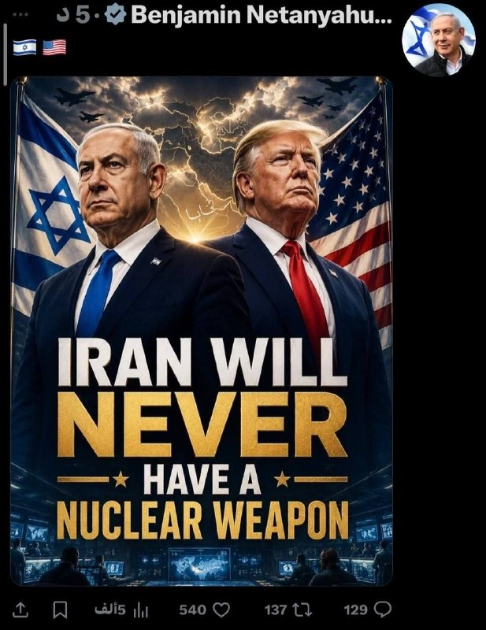

توییت جدید نتانیاهو:
ایران هرگز سلاح هسته‌ای نخواهد داشت

#professor
@KiriMohems

## SportBaadNews — post 252405

  

یه فصل رفت خیرونا باعث شد تیمه سقوط کنه
@SportBaadNews

## SportBaadNews — post 252404

  <a href="telegram/content/SportBaadNews_252404_1779636172.mp4" target="_blank">🎬 Download video</a>

⚽️
🏆| یه کلیپ مشتی ببینید کم کم دیگه بریم تو فاز جام جهانی

🟡 ارزش دانلود 8 از 10
@SportBaadNews

## IranIntlTV — post 338779

  

بنیامین نتانیاهو، نخست‌وزیر اسرائیل، اعلام کرد او و دونالد ترامپ توافق دارند هرگونه توافق نهایی با جمهوری اسلامی باید به‌طور کامل تهدید هسته‌ای را برطرف کند.

او گفت این به معنای برچیدن تاسیسات غنی‌سازی ایران و خارج کردن مواد هسته‌ای غنی‌شده از خاک این کشور است.

نتانیاهو افزود ترامپ بار دیگر بر حق اسرائیل برای دفاع از خود در برابر تهدیدها در همه جبهه‌ها، از جمله لبنان، تاکید کرده است.

او همچنین گفت سیاست او، همانند سیاست ترامپ، همچنان ثابت است؛ ایران نباید به سلاح هسته‌ای دست یابد.
https://iranintl.com/202605243871

## IranIntlTV — post 338778

  <a href="telegram/content/IranIntlTV_338778_1779636174.mp4" target="_blank">🎬 Download video</a>

کی‌یر استارمر، نخست‌وزیر بریتانیا، از پیشرفت در مسیر دستیابی به توافق میان واشینگتن و تهران استقبال کرد و گفت جمهوری اسلامی هرگز نباید به سلاح هسته‌ای دست یابد. استارمر افزود توافق باید به گونه‌ای انجام شود که درگیری‌ها پایان یابد و تنگه هرمز بدون هیچ محدودیتی باز بماند.

علی حسن‌پور، خبرنگار ایران‌اینترنشنال، گزارش می‌دهد
@iranintltv

## IranIntlTV — post 338777

  <a href="telegram/content/IranIntlTV_338777_1779636176.mp4" target="_blank">🎬 Download video</a>

سرخط خبرهای یکشنبه ۳ خرداد
@iranintltv

## IranIntlTV — post 338776

  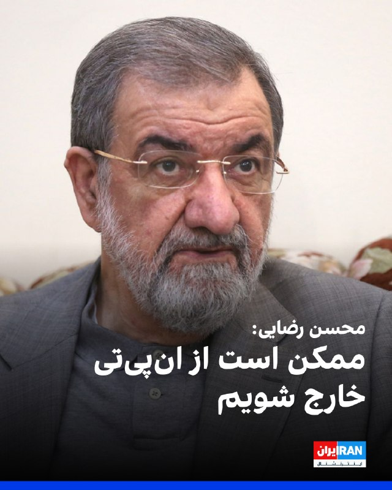

محسن رضایی، مشاور نظامی مجتبی خامنه‌ای، گفت کاری خواهیم کرد که «امنیت» کشور برای ۵۰ سال آینده تامین شود.
او افزود: «از یک طرف دست‌مان روی ماشه برای نبرد چهارم است و از طرف دیگر مسئولان در حال مذاکره هستند.»
رضایی گفت آمریکا پس از جنگ دیگر به آمریکای سابق بازنخواهد گشت و جمهوری اسلامی افول آمریکا در خاورمیانه را رقم زده است.
مشاور نظامی خامنه‌ای گفت در صورت تعرض به تنگه هرمز و ورود به خلیج‌فارس، محاصره دریایی را خواهند شکست و پاسخی سخت به آمریکا خواهند داد.
رضایی اضافه کرد اگر روند خصمانه علیه جمهوری اسلامی ادامه یابد، تهران از معاهده «ان‌پی‌تی» خارج خواهد شد و این اقدام پیامدهای سنگینی برای آمریکا خواهد داشت.
https://iranintl.com/202605241703

## IranIntlTV — post 338775

  

دونالد ترامپ در تروث سوشال نوشت توافقی که دولت او در حال مذاکره بر سر آن است، دقیقا برعکس توافق هسته‌ای دولت اوباما خواهد بود. او گفت مذاکرات به شکلی منظم و سازنده پیش می‌رود و به نمایندگانش دستور داده برای رسیدن به توافق عجله نکنند، زیرا زمان به نفع آمریکاست.

ترامپ تاکید کرد محاصره به‌طور کامل ادامه خواهد داشت تا زمانی که توافقی حاصل، تأیید و امضا شود و هر دو طرف باید بدون اشتباه و با صرف زمان کافی کار را به‌درستی انجام دهند.

او همچنین نوشت روابط آمریکا با جمهوری اسلامی در حال حرفه‌ای‌تر و سازنده‌تر شدن است، اما ایران اجازه تولید یا دستیابی به سلاح یا بمب هسته‌ای را نخواهد داشت.
https://iranintl.com/202605242249

## IranIntlTV — post 338774

  <a href="telegram/content/IranIntlTV_338774_1779636178.mp4" target="_blank">🎬 Download video</a>

دادستانی بحرین اعلام کرد ۱۱ نفر را به اتهام جاسوسی و همکاری اطلاعاتی با سپاه پاسداران محاکمه کرده است. به گفته دادستانی، ۹ نفر از متهمان به اتهام انجام «اقدامات خصمانه و تروریستی علیه پادشاهی بحرین» به حبس ابد محکوم شدند و دو متهم دیگر نیز حکم سه سال حبس دریافت کردند.

گفت‌وگو با علی صدرزاده، تحلیل‌گر مسائل خاورمیانه
@iranintltv

## IranIntlTV — post 338773

  <a href="telegram/content/IranIntlTV_338773_1779636179.mp4" target="_blank">🎬 Download video</a>

متین پرویزی، دانشجوی علوم دامی، ۱۸ دی‌ در زنجان هنگام کمک به یک مادر و کودک، از پشت سر هدف گلوله قرار گرفت و جان باخت. علیرضا علی‌نیا، ۲۳ ساله اهل مشهد، ۱۸ دی‌ در بلوار وکیل‌آباد این شهر با شلیک گلوله جنگی ماموران کشته شد.

فرنوش فرجی، عضو تحریریه ایران‌اینترنشنال، گزارش می‌دهد
@iranintltv

## IranIntlTV — post 338772

  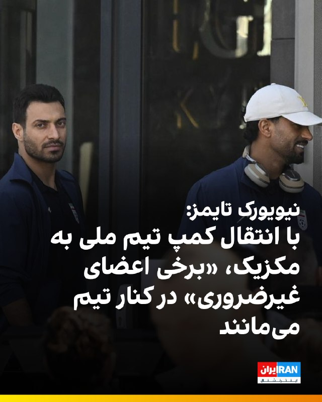

🔻نیویورک تایمز در گزارشی با اشاره به تغییر کمپ تیم ملی در جام جهانی ۲۰۲۶ از آمریکا به مکزیک نوشت: «اگر برخی اعضای غیرضروری در روز مسابقه برای دریافت ویزای آمریکا با مشکل مواجه باشند، انتقال کمپ به مکزیک می‌تواند به آن‌ها اجازه دهد در کنار تیم بمانند، اما برای مسابقات سفر نکنند.»

🔹مهدی تاج، رییس فدراسیون فوتبال روز گذشته خبر داد که کمپ تیم ملی فوتبال از آریزونای آمریکا به کمپی در شهر تیخوانا مکزیک منتقل شده است.

🔹او به سایت فدراسیون فوتبال گفت: «با این تغییر، مساله ویزا تا اندازه زیادی حل می‌شود. می‌توانیم با پرواز ایران‌ایر به مکزیک برویم و برگشت هم از همان‌جا بیاییم.»

🔹یک ماه پیش، مارکو روبیو، وزیر خارجه آمریکا، درباره ورود همراهان تیم ملی به ایالات متحده گفت: «آن‌ها نمی‌توانند یک مشت تروریست عضو سپاه را به عنوان روزنامه‌نگار یا مربی ورزشی وارد کشور ما کنند.»

@iranintltvsport

## Persian_Trend_Official — post 14868

  

🚨 ترامپ از طریق Truth Social در مورد ایران:

یکی از بدترین توافق‌هایی که کشور ما تاکنون انجام داده، توافق هسته‌ای ایران بود که توسط باراک حسین اوباما و تازه‌کارهای درجه یک دولت اوباما مطرح و امضا شد. این توافق مسیر مستقیمی به سوی توسعه سلاح هسته‌ای توسط ایران بود.

اما معامله‌ای که در حال حاضر توسط دولت ترامپ با ایران در حال مذاکره است، دقیقاً برعکس آن است! مذاکرات به صورت منظم و سازنده پیش می‌رود و من به نمایندگانم اطلاع داده‌ام که در این زمان عجله نکنند چون زمان به نفع ماست.

محاصره تا زمانی که توافقی حاصل، تأیید و امضا شود، به طور کامل ادامه خواهد داشت. هر دو طرف باید وقت بگذارند و کار را درست انجام دهند. هیچ اشتباهی مجاز نیست!

روابط ما با ایران در حال تبدیل شدن به رابطه‌ای بسیار حرفه‌ای‌تر و سازنده‌تر است. با این حال، آنها باید درک کنند که نمی‌توانند سلاح یا بمب هسته‌ای توسعه دهند یا تهیه کنند.

تا کنون از همه کشورهای خاورمیانه برای حمایت و همکاری‌شان تشکر می‌کنم، که با پیوستن آنها به کشورهای توافقات تاریخی ابراهیم، این همکاری‌ها بیشتر تقویت خواهد شد و چه بسا جمهوری اسلامی ایران نیز بخواهد به این جمع بپیوندد!

📝 Nick

📌 @persian_trend_official
پرشین ترند | متفاوت‌ترین کانال نظامی

## Persian_Trend_Official — post 14867

  <a href="telegram/content/Persian_Trend_Official_14867_1779636182.mp4" target="_blank">🎬 Download video</a>

امروز 3 خرداد، سالروز آزادسازی خرمشهره؛

این ویدئو از آخرین لحظات قبل از آزادی خرمشهر و اسیر شدن عراقی‌هاست...

📝 Nick

📌 @persian_trend_official
پرشین ترند | متفاوت‌ترین کانال نظامی

---
📅 بروزرسانی: 1405/03/03 17:44
---

## ChizBergerz — post 46739

  <a href="telegram/content/ChizBergerz_46739_1779632057.mp4" target="_blank">🎬 Download video</a>

خدمت دوستانی که پنیک (خایه) کردن از مذاکرات.

جهت یادوآری باید هر ماه این حرفای عمو مانوک رو بشنوید:
@ChizBergerz

## ChizBergerz — post 46738

  <a href="telegram/content/ChizBergerz_46738_1779632059.mp4" target="_blank">🎬 Download video</a>

چالش booty transitior دسته جمعی ببینید یکم حالتون خوب شه:

@ChizBergerz

## ChizBergerz — post 46737

تنها چیزی که ترامپ تغییر داد رژیم غذایی مردم ایران بود

@ChizBergerz

## ChizBergerz — post 46736

  <a href="telegram/content/ChizBergerz_46736_1779632062.mp4" target="_blank">🎬 Download video</a>

- خیالت جمع توافق رسمی شده راحت بخواب

+ خونمون ساعت 4 صبح:
@ChizBergerz

## ChizBergerz — post 46735

⭕️ تا حالا بدون واریزی روی فوتبال ها شرط بستی؟! 
🎉 500 هزارتومن بونوس رایگان فقط با ثبت نام بدون هیچگونه واریزی! 
😮 تنها سایتی که با عضویت بدون واریز 500,000 تومان شارژ بی قیدو شرط میده #وینرو هست
💰 
👑 #معتبرترین سایت ایرانی 
⬇️ 
🌐 Winro.io 
🌐 Winro.io 
📱کانال…

## ChizBergerz — post 46734

  

⭕️ تا حالا بدون واریزی روی فوتبال ها شرط بستی؟!

🎉 500 هزارتومن بونوس رایگان فقط با ثبت نام بدون هیچگونه واریزی!

😮 تنها سایتی که با عضویت بدون واریز 500,000 تومان شارژ بی قیدو شرط میده #وینرو هست
💰

👑 #معتبرترین سایت ایرانی 
⬇️

🌐 Winro.io

🌐 Winro.io

📱کانال اخبار و هدایا r3 
🎁

📱 @winro_io

## ChizBergerz — post 46733

  <a href="telegram/content/ChizBergerz_46733_1779632064.mp4" target="_blank">🎬 Download video</a>

دو تماس متفاوت از ایران😂😂
حتما تا اخر ببینید
فرناز حرف دل ۹۰ میلیون ایرانی رو توی ۱ دقیقه زد

@ChizBergerz

## rodast_omiddana — post 71870

  <a href="telegram/content/rodast_omiddana_71870_1779632067.webm" target="_blank">🎬 Download video</a>

🚨 پست جدید نتانیاهو با عکس ترامپ : ایران هرگز سلاح هسته‌ای نخواهد داشت

## rodast_omiddana — post 71869

  <a href="telegram/content/rodast_omiddana_71869_1779632067.webm" target="_blank">🎬 Download video</a>

🚨 ترامپ به ABC:
"نمی‌توانم درباره توافق صحبت کنم؛ این کاملاً به من بستگی دارد، و اگر خبری باشد، فقط خبرهای خوبی خواهد بود.
من معامله بد انجام نمی‌دهم."

چقدر باید ساده لوح باشی که فکر کنی ترامپ با اینها موافقت میکند...
جنگ قطعی ست، الکی مو سفید نکردم...

## rodast_omiddana — post 71868

  <a href="telegram/content/rodast_omiddana_71868_1779632068.webm" target="_blank">🎬 Download video</a>

🚨 از اپوزسیون حرکت و از کمک خارجی برکت...
نمیشود 47 سال حرکت نکرد و بعد انتظار داشت ترامپ و نتانیاهو ما را جدی بگیرند..

پانوشت:
حرفها بسیار است ولی نمیخوام زانو غم بغل کنم، الانم دیر نشده و بجای چاپلوس پروری و عربده کش نیروهای الیت را جمع کنید و سازماندهی کنید و افراد استخوان دار را بجای مداحان دیروز و رپرهای امروز دور خود بیاورید...
وگرنه همچنان پشت درهای بسته کاخ سفید باید بمانید..
بخدا دلسوزیم و نگران و شما آخرین امید نجات کشورمان هستید..

## rodast_omiddana — post 71867

  <a href="telegram/content/rodast_omiddana_71867_1779632068.webm" target="_blank">🎬 Download video</a>

🚨 پست الان ترامپ...
نگران نباشید و به امید دانا اطمینان داشته باشید..
شک نکنید این قضیه تهش جنگه و دو گزینه بیشتر وجود نداره تسلیم یا سقوط رژیم..
تمام

## rodast_omiddana — post 71866

  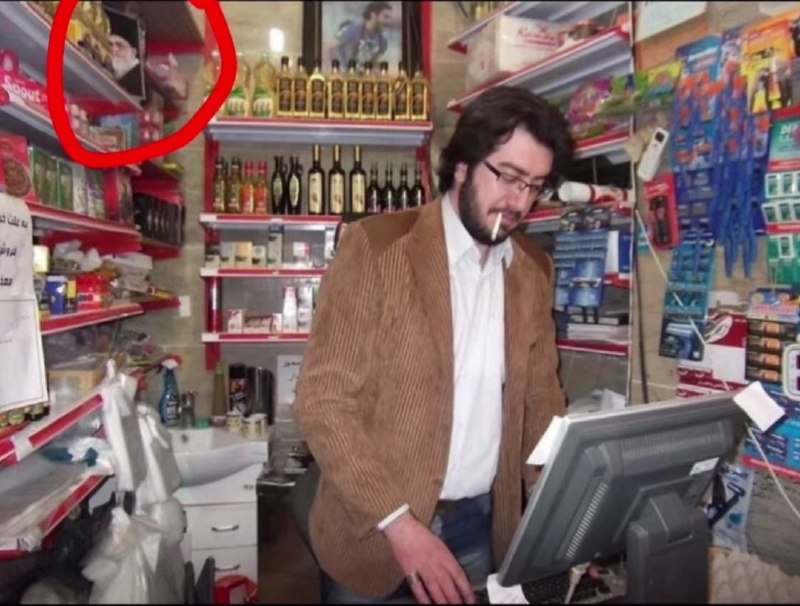

😎 این یارو اسمش آرش بغالچی هست..
در ایران مداح بوده و با خا*ه مالی روزگار میگذرانده، الانشم مثل لیدرهای استادیوم عربده کش هست و خا*مال شاهزاده رضا پهلوی میباشد و خبر نداره شاهزاده از افراد اینچنینی بیزار هست...
بگذریم با این خوکها نباید در مجازی درگیر شد، بایستی حوصله کرد و کشوندشون دادگاه و منم با اسنادی که این آدم منو تهدید به ترور کرده شاید بزودی بکشونمش دادگاه..
این بی مقدار تا الانم شانس آورده که سرم شلوغه و برعکس این بی خانواده، خانواده ام داره پرجمعیت تر میشه و زمان ندارم برای ادب کردن این بغالچی..

## KiriMohems — post 47943

  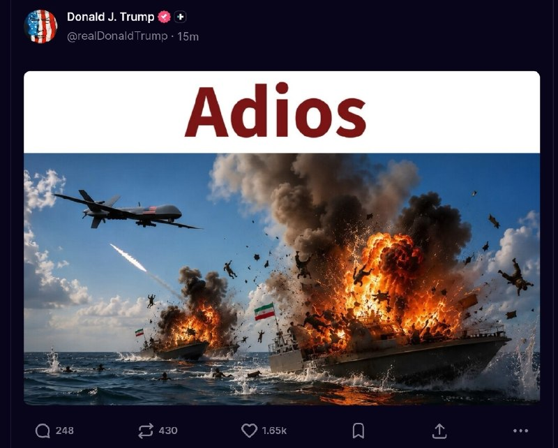

🔴 توافق به کیر رفت؟ ترامپ یه عکس گذاشت که داره سپاهیارو میکشه و زد خداحافظ

#professor
@KiriMohems

## SportBaadNews — post 252403

  <a href="telegram/content/SportBaadNews_252403_1779632070.mp4" target="_blank">🎬 Download video</a>

بعد میگن چرا پسرا کمتر عمر میکنن
@SportBaadNews

## SportBaadNews — post 252402

  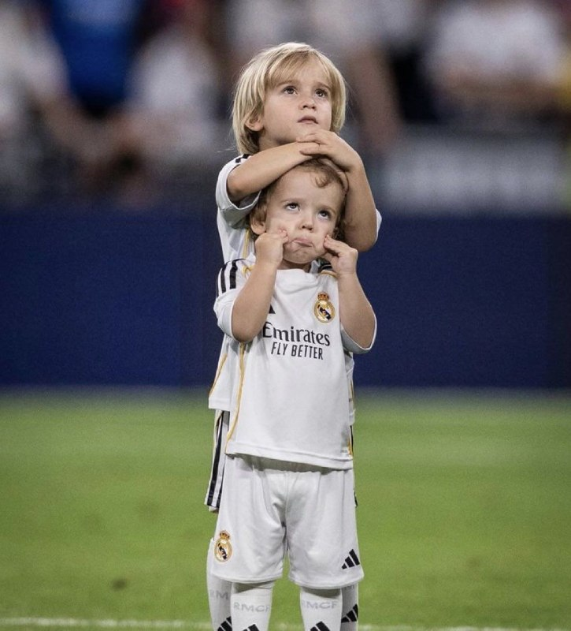

بچه های دنی کارواخال تو مراسم خداحافظی پدرشون تو سانتیاگو برنابئو 🤏🏻🤏🏻
@SportBaadNews

## IranIntlTV — post 338771

فایننشال‌تایمز: سپاه از طریق شرکت مستقر در امارات تجهیزات ماهواره‌ای چینی تهیه کرده است

فایننشال‌تایمز گزارش داد سپاه پاسداران برای تامین تجهیزات پیشرفته ارتباطات ماهواره‌ای ساخت چین مورد استفاده در برنامه پهپادی خود، از شرکت «تل‌سان» مستقر در راس‌الخیمه امارات متحده عربی استفاده کرده است.
 
این روزنامه یک‌شنبه سوم خرداد نوشت این تجهیزات برای «گروه صنعتی سامان» که در فهرست تحریم‌های آمریکا قرار دارد، تهیه شده‌اند.
 
بر اساس این گزارش، شرکت تل‌سان در اواخر سال ۲۰۲۵ انتقال حدود دو تن تجهیزات آنتن ماهواره‌ای، از جمله یک آنتن موتوردار ۴.۵ متری ساخت شرکت چینی «استاروین»، را از شانگهای به ایران از طریق بندر جبل‌علی هماهنگ کرده است.
 
این معامله از آن جهت توجه‌ها را جلب کرده که نشان می‌دهد یک شرکت مستقر در امارات در تامین تجهیزات ارتباطی مورد نیاز سپاه پاسداران نقش داشته است؛ نهادی که در واکنش به کارزار نظامی اخیر آمریکا و اسرائیل، امارات را هدف حملات موشکی و پهپادی خود قرار داد.
 
امارات بیشترین آسیب را از حملات تلافی‌جویانه تهران در جریان جنگ اخیر متحمل شد و جمهوری اسلامی بیش از ۲۸۰۰ پهپاد و موشک به سوی این کشور شلیک کرد، از جمله به اهداف غیرنظامی.

فعالیت‌ شرکت‌های ایرانی در امارات
با وجود موضع سخت‌گیرانه ابوظبی در قبال جمهوری اسلامی، امارات متحده عربی پیش از جنگ به‌طور سنتی مرکز فعالیت شرکت‌های ایرانی در خارج از کشور بود.

به گفته تحلیلگران، امارات که طی دو دهه اخیر به قطب تجارت در منطقه تبدیل شده، در امارت‌های مختلف خود مناطق آزاد تجاری ایجاد کرده است؛ مناطقی که نظارت بر مبادلات مالی و تجاری در آنها با محدودیت‌هایی همراه است.

همین موضوع نگرانی‌هایی را درباره احتمال سوءاستفاده از این مناطق برای تجارت غیرقانونی و دور زدن تحریم‌ها افزایش داده است.

نقش شرکت مستقر در راس‌الخیمه
فایننشال‌تایمز در ادامه گزارش داد تجهیزات مورد نیاز سپاه از طریق شرکت تل‌سان که در راس‌الخیمه مستقر است، منتقل شد.

این شرکت انتقال حدود ۱.۸ تن تجهیزات آنتن ماهواره‌ای ساخت چین را از شانگهای به ایران، از طریق بندر کانتینری جبل‌علی در دبی، هماهنگ کرد.

فایننشال‌تایمز با استناد به تصاویر ماهواره‌ای و داده‌های موقعیت‌یابی کشتی‌ها نوشت یک شناور ایرانی که در مرحله پایانی این انتقال در ماه نوامبر مورد استفاده قرار گرفت، با ارسال اطلاعات ناوبری جعلی برای سایر شناورها تلاش کرد سفر خود به ایران را پنهان کند.

این اسناد و تحلیل‌های حمل‌ونقل نشان می‌دهد سپاه پاسداران حتی پس از اعمال تحریم‌های غرب علیه شبکه تامین نظامی‌اش، همچنان از مسیر شرکت‌ها و شبکه‌های تجاری مستقر در امارات برای دستیابی به فناوری‌های حساس ارتباطی بهره می‌گرفت.

سپاه پاسداران در جریان جنگ اخیر از این توانمندی‌ها در حملات خود علیه پایگاه‌های نظامی آمریکا در منطقه استفاده کرد؛ حملاتی که خساراتی بر جای گذاشت و به کشته شدن ۱۳ نظامی آمریکایی منجر شد.

پیش‌تر شبکه سی‌ان‌ان به نقل از منابع آگاه گزارش داد جمهوری اسلامی در جریان آتش‌بس شش‌هفته‌ای بخشی از روند تولید پهپادهای خود را از سر گرفته است.

بر اساس این گزارش، حکومت ایران بسیار سریع‌تر از برآوردهای اولیه در حال بازسازی و احیای توان نظامی خود است.

جمهوری اسلامی با وجود تحریم‌های بین‌المللی، همچنان برای دور زدن محدودیت‌ها تلاش می‌کند.

پیش‌تر وال‌استریت ژورنال گزارش داد شبکه‌ای محرمانه تحت مدیریت بابک زنجانی، طی دو سال از طریق صرافی رمزارز بایننس ۸۵۰ میلیون دلار تراکنش برای تامین مالی نیروهای نظامی جمهوری اسلامی انجام داد.

به نوشته این روزنامه، این تراکنش‌ها دست‌کم تا بهمن ۱۴۰۴ ادامه داشت.
 
🔗وب‌سایت ایران‌اینترنشنال
@iranintltv

## IranIntlTV — post 338770

  

مارکو روبیو، وزیر خارجه آمریکا، اظهارنظرها درباره ضعیف‌ بودن توافق احتمالی دونالد ترامپ با جمهوری اسلامی را «مضحک» توصیف کرد. روبیو که در سفر به هند به‌سر می‌برد، به خبرنگاران گفت تعهد ترامپ به جلوگیری از دستیابی ایران به سلاح هسته‌ای «نباید از سوی هیچ‌کس زیر سؤال برود»

او افزود: این که ترامپ ممکن است با توافقی موافقت کند که در نهایت موقعیت ایران را در برنامه هسته‌ای تقویت کند، با توجه به مواضع و اقداماتی که تاکنون از او دیده‌ایم، کاملا مضحک است.
https://iranintl.com/202605242555

## IranIntlTV — post 338769

  <a href="telegram/content/IranIntlTV_338769_1779632075.mp4" target="_blank">🎬 Download video</a>

فائزه حسین‌نژاد، دانشجوی ۲۳ ساله مامایی و والیبالیست، شامگاه ۱۹ دی ۱۴۰۴ در خیابان امامت مشهد به دست نیروهای سرکوبگر کشته شد. ابتدا گلوله‌ای به زیر قلبش زدند و سپس زیر ضربات باتون او را کشتند.

## IranIntlTV — post 338768

  <a href="telegram/content/IranIntlTV_338768_1779632078.mp4" target="_blank">🎬 Download video</a>

در ادامه تجمع‌های ایرانیان خارج از کشور، گروهی از ایرانیان مقیم سوئد یکشنبه مقابل سفارت جمهوری اسلامی در استکهلم تجمع کردند. شرکت‌کنندگان اعلام کردند این تجمع در اعتراض به اجرای کمپین «جان فدا» در این سفارت برگزار شد.

گزارش مهران عباسیان، خبرنگار ایران‌اینترنشنال
@iranintltv

## IranIntlTV — post 338767

  <a href="telegram/content/IranIntlTV_338767_1779632080.mp4" target="_blank">🎬 Download video</a>

بر اساس ویدیوهای ارسال‌شده به ایران‌اینترنشنال گروهی از ایرانیان مقیم استرالیا در حمایت از مردم ایران و علیه جمهوری اسلامی در شهر آدلاید کاروان خودرویی به راه انداختند.

## IranIntlTV — post 338766

  

علی عبداللهی، فرمانده قرارگاه مرکزی خاتم الانبیا، گفت: «در شرایط جنگی هستیم و تمامی نیروهای مسلح در آمادگی کامل به سر می‌برند که با هر دشمنی و در هر سطحی مقابله کنند.»

او افزود: «پیروزی ما بر دشمنان، معجزه الهی بود، در چند جنگ اخیر متکی به ابزار خودمان بودیم و با ساخته‌های بومی خودمان با دشمنان جنگیدیم، اکنون نیز باید در تمام عرصه‌ها آماده باشیم و به موفقیت برسیم.»
https://iranintl.com/202605242129

## IranIntlTV — post 338765

  <a href="telegram/content/IranIntlTV_338765_1779632084.mp4" target="_blank">🎬 Download video</a>

وب‌سایت اتلتیک در گزارشی درباره انتقال کمپ تیم فوتبال ایران از آمریکا به مکزیک نوشت که احتمالا همه بازیکنان و اعضای کادر فنی همچنان برای ورود به آمریکا به ویزا نیاز دارند.

گفت‌وگو با کوشا دلشاد، مربی فوتبال
@iranintltv

## IranIntlTV — post 338764

  <a href="telegram/content/IranIntlTV_338764_1779632086.mp4" target="_blank">🎬 Download video</a>

در ادامه تجمع‌های جهانی ایرانیان علیه جمهوری اسلامی، یکشنبه گروهی از ایرانیان مقیم سوئد مقابل سفارت جمهوری اسلامی در استکهلم تجمع کردند. شرکت‌کنندگان اعلام کردند این تجمع در اعتراض به اجرای کمپین «جان فدا» در این سفارت برگزار شد.

گزارش مهران عباسیان، خبرنگار ایران‌اینترنشنال
@iranintltv

## IranIntlTV — post 338763

  <a href="telegram/content/IranIntlTV_338763_1779632089.mp4" target="_blank">🎬 Download video</a>

فائزه حسین‌نژاد، دانشجوی ۲۳ ساله مامایی و والیبالیست، در تجمع ۱۹ دی در خیابان امامت مشهد با شلیک مستقیم نیروهای سرکوبگر کشته شد.

فرنوش فرجی، عضو تحریریه ایران‌اینترنشنال، گزارش می‌دهد
@iranintltv

## IranIntlTV — post 338762

  <a href="https://t.me/IranintlTV/338762" target="_blank">📎 Download file</a>

🎧نسخه صوتی اخبار نیمروزی | یکشنبه ۳ خرداد
@iranintlTV

## IranIntlTV — post 338761

  <a href="telegram/content/IranIntlTV_338761_1779632092.mp4" target="_blank">🎬 Download video</a>

گزارش‌ها درباره توافق احتمالی میان جمهوری اسلامی و آمریکا به یکی از محورهای اصلی بحث در رسانه‌های اجتماعی تبدیل شده است. در حالی که کاربران مخالف جمهوری اسلامی خواهان توقف مذاکرات هستند، برخی حامیان حکومت نیز هرگونه مذاکره پیش از «انتقام» را خیانت توصیف می‌کنند.

عادله بورنگ، عضو تحریریه ایران‌اینترنشنال، به واکنش کاربران می‌پردازد
@iranintltv

## Persian_Trend_Official — post 14866

🔴سرلشکر محسن رضایی: پشت صبر راهبردی ایران خشم انقلابی ملت است ♦️امروز ترامپ و ارتش آمریکا در یک بن‌بست کامل قرار دارند و اگر وارد جنگ شوند، در برابر آنها دالانی تاریک و بی‌انتها قرار خواهد گرفت؛ دالانی که از تنگۀ هرمز آغاز می‌شود، به خلیج فارس، دریای عمان،…

## Persian_Trend_Official — post 14865

  <a href="telegram/content/Persian_Trend_Official_14865_1779632094.webm" target="_blank">🎬 Download video</a>

🔴سرلشکر محسن رضایی: پشت صبر راهبردی ایران خشم انقلابی ملت است

♦️امروز ترامپ و ارتش آمریکا در یک بن‌بست کامل قرار دارند و اگر وارد جنگ شوند، در برابر آنها دالانی تاریک و بی‌انتها قرار خواهد گرفت؛ دالانی که از تنگۀ هرمز آغاز می‌شود، به خلیج فارس، دریای عمان، تنگه باب‌المندب و اقیانوس هند امتداد می‌یابد و جنگی بسیار گسترده را رقم خواهد زد.

♦️تنگۀ هرمز برای تجارت آزاد بسته نیست، بلکه برای لشکرکشی و ایجاد جنگ در منطقه بسته است و مدیریت فعلی نیروی دریایی سپاه موجب شده کشتی‌های کشورهای مختلف پس از شناسایی و ثبت، با امنیت از این مسیر عبور کنند.

♦️در صورت هرگونه اقدام نظامی علیه تنگۀ هرمز و تلاش برای ورود به خلیج فارس، جمهوری اسلامی پاسخی سخت، دردناک و بی‌نظیر خواهد داد.

🫆:Tony

📌 @persian_trend_official
پرشین ترند | متفاوت‌ترین کانال نظامی

## Persian_Trend_Official — post 14864

  <a href="telegram/content/Persian_Trend_Official_14864_1779632095.webm" target="_blank">🎬 Download video</a>

🔴پست جدید نتانیاهو

💢ایران هیجوقت سلاح هسته ای نخواهد داشت.

🫆:Tony

📌 @persian_trend_official
پرشین ترند | متفاوت‌ترین کانال نظامی

## Persian_Trend_Official — post 14863

  

🔴ترامپ:

«نمی‌توانم درباره توافق صحبت کنم؛ این توافق کاملاً به من بستگی دارد، و اگر خبری باشد، فقط خبر خوب خواهد بود.من معامله بد انجام نمی‌دهم.»

🫆:Tony

📌 @persian_trend_official
پرشین ترند | متفاوت‌ترین کانال نظامی

## Persian_Trend_Official — post 14862

  

♦️سرلشکر عبداللهی: پیروزی ملت ایران بر دشمنان عزت و افتخار ایران را بالاتر برد

♦️با سلاح‌های بومی، دشمن را شکست دادیم

▪️فرمانده قرارگاه مرکزی خاتم الانبیا در گفتگو با تسنیم:

در شرایط جنگی هستیم و تمامی نیروهای مسلح در آمادگی کامل به سر می‌برند که با هر دشمنی و در هر سطحی مقابله کنند.

🫆:Tony

📌 @persian_trend_official
پرشین ترند | متفاوت‌ترین کانال نظامی

## Persian_Trend_Official — post 14861

  <a href="telegram/content/Persian_Trend_Official_14861_1779632097.webm" target="_blank">🎬 Download video</a>

⭕️ ارتش اسرائیل خواستار تخلیه 10 شهرک در جنوب لبنان شد.

📝 Nick

📌 @persian_trend_official
پرشین ترند | متفاوت‌ترین کانال نظامی

## Persian_Trend_Official — post 14860

🔴 جزئیات تفاهم ۶۰ روزه ایران و آمریکا به روایت آکسیوس

▪️آکسیوس مدعی شده متن یادداشت تفاهم میان ایران و آمریکا شامل بندهای زیر است:

▪️ تمدید ۶۰ روزه آتش‌بس

▪️ عدم دریافت هرگونه عوارض یا هزینه از کشتی‌ها در تنگه هرمز توسط ایران

▪️ ایران ابتدا مین‌های دریایی را پاکسازی کرده و محاصره خود را رفع می‌کند؛ سپس آمریکا محاصره دریایی و محدودیت‌های خود را کاهش خواهد داد

▪️ آمریکا بخشی از معافیت‌های تحریمی مرتبط با صنعت نفت ایران را صادر می‌کند

▪️در بخش هسته‌ای:

▪️ ایران متعهد می‌شود هرگز به‌دنبال سلاح هسته‌ای نرود

▪️ تهران وارد مذاکرات درباره توقف کامل غنی‌سازی و انتقال ذخایر اورانیوم غنی‌شده خواهد شد

▪️ آمریکا نیز متعهد می‌شود درباره کاهش تدریجی تحریم‌ها و آزادسازی دارایی‌های بلوکه‌شده ایران مذاکره کند

▪️اما بر خلاف برخی گزارش‌های قبلی:

▪️ آمریکا هیچ نیرویی را فعلاً از اطراف ایران خارج نخواهد کرد
▪️ خروج نیروهای آمریکایی تنها در صورت دستیابی به توافق نهایی پس از پایان دوره ۶۰ روزه بررسی می‌شود

▪️درباره لبنان نیز:

▪️ جنگ میان حزب‌الله و اسرائیل پایان خواهد یافت

▪️ اما اسرائیل اجازه خواهد داشت برای جلوگیری از مسلح‌شدن مجدد حزب‌الله، حملات پیش‌دستانه از جمله حملات هوایی و پهپادی در لبنان انجام دهد
▪️ به گفته منابع: «اگر حزب‌الله رفتار کند، اسرائیل هم رفتار خواهد کرد»

💢اگر این جزئیات درست باشند، ایران در برخی از مهم‌ترین پرونده‌های منطقه‌ای و هسته‌ای عقب‌نشینی‌های قابل‌توجهی انجام داده؛ مخصوصاً در موضوع هرمز، غنی‌سازی و آزادی عمل اسرائیل در لبنان !

🫆:Tony

📌 @persian_trend_official
پرشین ترند | متفاوت‌ترین کانال نظامی

## Persian_Trend_Official — post 14859

  <a href="telegram/content/Persian_Trend_Official_14859_1779632098.mp4" target="_blank">🎬 Download video</a>

🔴تظاهرات گسترده ضد دولتی در صربستان

💢پایتخت صربستان شاهد برگزاری تجمعات و تظاهرات گسترده مردمی بود؛ اعتراضاتی که با حضور هزاران نفر در بلگراد برگزار شد.

💢معترضان نسبت به عملکرد دولت و وضعیت سیاسی و اقتصادی کشور ابراز نارضایتی کردند.

🫆:Tony

📌 @persian_trend_official
پرشین ترند | متفاوت‌ترین کانال نظامی

---
📅 بروزرسانی: 1405/03/03 16:17
---

## ChizBergerz — post 46732

  <a href="telegram/content/ChizBergerz_46732_1779626842.mp4" target="_blank">🎬 Download video</a>

ویدیو وایرال شده از دعوای دوتا دختر ایرانه که اختلاف قدی زیادی دارن و قد کوتاهه میزنه دهن قد بلنده رو سرویس میکنه :))))

@ChizBergerz

## ChizBergerz — post 46731

  

⚫خبرگزاری قوه تروریستی قضائیه جمهوری‌شیطانی اعلام کرد مجتبی کیان امروز صبح به تهمت ارسال پیام و دادن مختصات صنایع نظامی به شبکه های ماهواره ای معاند (ایران اینترنشنال) اعدام شد!💔🖤

@ChizBergerz

## rodast_omiddana — post 71865

  <a href="telegram/content/rodast_omiddana_71865_1779626844.webm" target="_blank">🎬 Download video</a>

🚨 چرا منوتو بسته شد؟
خیلی چیزها را نمیشه گفت ولی اشاره میکنم که 19 دیماه من گفتم 14500 نفر دستکم جاویدنام شدن، فشارها از جایی که نمیخوام فعلا بگم و شاید تا سالها هم نگم روم زیاد شد که خبرمو حذف کنم و خفه شوم..
آنجایی که به من فشار آورد گویا به منوتو هم فشار آورد و برای همین تلویزیون منوتو داره میبنده، من از 19 دیماه تا 23 دیماه که ایران اینترنشنال خبر تعداد جاویدنامان را تایید کند، سیاه ترین روزهای زندگیم را گذراندم و تحت فشار و تهدید بودم..
هدف فشار آورندگان این بود خفه شو نگو کشتار زیاد بزار اگر میشه مردم برن بیرون بیشتر کشته شوند..
بماند بعد از سقوط رژیم دهنم باز میشود..

## KiriMohems — post 47942

رویترز: توافق اولیه بین آمریکا و ایران، برنامه هسته‌ای را شامل نمی‌شود و سرش حسابی گرده.

#professor
@KiriMohems

## KiriMohems — post 47941

  <a href="telegram/content/KiriMohems_47941_1779626845.mp4" target="_blank">🎬 Download video</a>

وقتی از رفیقم کانفیگ خریدم قطع شده و جواب نمیده:

#professor
@KiriMohems

## SportBaadNews — post 252401

دوستانی که با فیلترشکن و روشای رایگان وصلین، سعی کنید دوستان و نزدیکانتون رو وصل کنید، همه رو وصل کنید اینترنت داشتن ما بدون حضور بقیه بی ارزشه

## SportBaadNews — post 252400

  <a href="telegram/content/SportBaadNews_252400_1779626846.webm" target="_blank">🎬 Download video</a>

🚨 قرعهههههه کشییییی کامل جام جهانی 2026:

گروه A: مکزیک - کره جنوبی - آفریقای جنوبی - جمهوری چک

گروه B: کانادا - سوئیس - قطر - بوسنی

گروه C: برزیل - مراکش - اسکاتلند - هائیتی

گروه D: آمریکا - استرالیا - پاراگوئه - ترکیه

گروه E: آلمان - اکوادور - ساحل عاج - کوراسائو

گروه F: هلند - ژاپن - تونس - سوئد

گروه G: بلژیک - ایران - مصر - نیوزلند

گروه H: اسپانیا - اروگوئه - عربستان - کیپ ورد

گروه I : فرانسه - سنگال - نروژ - عراق

گروه J: آرژانتین - اتریش - الجزایر - اردن

گروه K: پرتغال - کلمبیا - ازبکستان - کنگو

گروه L: انگلیس - کرواسی - پاناما - غنا
@SportBaadNews

## SportBaadNews — post 252399

  <a href="telegram/content/SportBaadNews_252399_1779626846.webm" target="_blank">🎬 Download video</a>

🚨
🚨
🚨 فووووووری سیتنا؛ پایگاه تخصصی اخبار اینترنت: احتمالا تا هفته آینده اینترنت بین الملل متصل خواهد شد @SportBaadNews

## SportBaadNews — post 252398

  <a href="telegram/content/SportBaadNews_252398_1779626847.webm" target="_blank">🎬 Download video</a>

🚨
🚨
🚨 فووووووری سیتنا؛ پایگاه تخصصی اخبار اینترنت:

احتمالا تا هفته آینده اینترنت بین الملل متصل خواهد شد
@SportBaadNews

## IranIntlTV — post 338760

  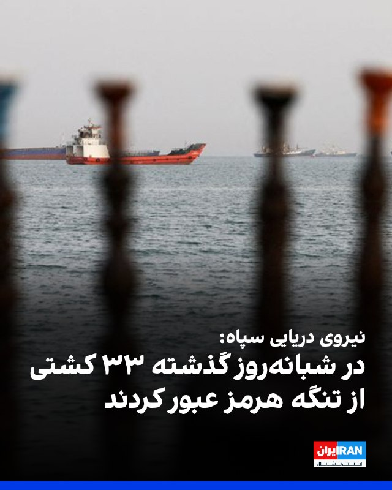

نیروی دریایی سپاه پاسداران اعلام کرد در شبانه‌روز گذشته، ۳۳ کشتی اعم از نفتکش، کانتینربر و سایر کشتی‌های تجاری «پس از کسب مجوز و با هماهنگی و تامین امنیت این نیرو« از تنگه هرمز عبور کردند.
روز شنبه نیز سپاه پاسداران از عبور ۲۵ کشتی از تنگه هرمز خبر داده بود.
https://iranintl.com/202605246781

## IranIntlTV — post 338759

  <a href="telegram/content/IranIntlTV_338759_1779626848.mp4" target="_blank">🎬 Download video</a>

یکی از بستگان جاویدنام علی مشهدی در تجمع استکهلم، در گفت‌وگو با مهران عباسیان، خبرنگار ایران‌اینترنشنال، درباره نحوه کشته شدن او توضیح داد و پیام پدر این جاویدنام را به اشتراک گذاشت.
@iranintltv

## IranIntlTV — post 338758

فایننشال‌تایمز: جنگ ایران، شکاف میان مصر و امارات متحده عربی را آشکار کرد

فایننشال‌تایمز گزارش داد مصر در اقدامی کم‌سابقه جنگنده‌هایی را به امارات متحده عربی اعزام کرده؛ حرکتی که به نوشته این روزنامه، نشانه تلاش قاهره برای کاهش تنش با ابوظبی و پاسخ به نارضایتی امارات از حمایت ناکافی متحدان عرب در برابر حملات جمهوری اسلامی است.

بر اساس این گزارش، افشای این استقرار نظامی زمانی رخ داد که عبدالفتاح السیسی، رییس‌جمهوری مصر، در سفر اخیر خود به امارات در کنار محمد بن زاید آل نهیان از جنگنده‌های «رافال» مصری مستقر در این کشور بازدید کرد. سیسی در این دیدار گفت: «هر آنچه به امارات آسیب بزند، به مصر آسیب زده است.»

فایننشال‌تایمز نوشت قاهره جزئیاتی از این ماموریت نظامی منتشر نکرده، اما اعزام نیرو ظاهرا با هدف کاهش تنش‌ها با امارات متحده عربی صورت گرفته؛ کشوری که پیش‌تر از دولت‌های عربی به دلیل کمک نکردن کافی در دفاع مقابل حملات حکومت ایران انتقاد کرده بود.

امارات متحده عربی که هدف اصلی حملات تلافی‌جویانه جمهوری اسلامی در جریان جنگ بوده، طی سال‌های اخیر نقش حیاتی در حمایت اقتصادی از مصر ایفا کرده است. این کشور در سال ۲۰۲۳ با یک سرمایه‌گذاری ۳۵ میلیارد دلاری، به تثبیت اقتصاد بحران‌زده مصر کمک کرد و همچنین حواله‌های مالی صدها هزار مصری شاغل در امارات متحده عربی، منبع مهم ارز خارجی برای قاهره محسوب می‌شود.

به نوشته فایننشال‌تایمز، در ابوظبی این برداشت شکل گرفته که جنگ اخیر نشان داد کدام متحدان در شرایط بحرانی قابل اتکا هستند. انور قرقاش، مشاور دیپلماتیک رییس امارات متحده عربی، در ماه مارس از کشورهایی که در برابر «تجاوز ایران» واکنش کافی نشان ندادند انتقاد کرده بود.

این روزنامه همچنین نوشت جنگ اخیر، شکاف‌های تازه‌ای در میان کشورهای منطقه ایجاد کرده و ائتلاف‌های خاورمیانه را در حال بازتعریف قرار داده است. به باور برخی تحلیلگران، محور جدیدی میان عربستان سعودی، مصر، ترکیه و پاکستان در حال شکل‌گیری است؛ کشورهایی که نسبت به نقش اسرائیل در بی‌ثباتی منطقه نگرانی دارند و برای پایان دادن به جنگ آمریکا و اسرائیل علیه حکومت ایران تلاش‌های دیپلماتیک انجام داده‌اند.

اما امارات متحده عربی نسبت به این روند بدبین بوده و نگران است هرگونه توافق، جمهوری اسلامی را در موقعیتی قوی‌تر حفظ کند. مایکل وحید حنا، تحلیلگر گروه بین‌المللی بحران، به فایننشال‌تایمز گفت از نگاه ابوظبی، مشارکت مصر در میانجی‌گری ممکن است به معنای ایجاد نوعی هم‌ترازی سیاسی میان جمهوری اسلامی ایران و امارات متحده عربی تلقی شده باشد؛ موضوعی که برای امارات قابل پذیرش نیست. به گفته او، امارات احساس کرده میانجی‌ها حمایت کافی از مواضع این کشور نشان نداده‌اند.

فایننشال‌تایمز همچنین گزارش داد مصر به دقت رفتار امارات متحده عربی با پاکستان را دنبال کرده است. ابوظبی در ماه آوریل از اسلام‌آباد خواست بازپرداخت فوری وام ۳.۵ میلیارد دلاری را انجام دهد؛ اقدامی که برخی آن را ناشی از نارضایتی امارات از نقش پاکستان در میانجی‌گری میان حکومت ایران و آمریکا دانستند.

به نوشته این روزنامه، اعزام جنگنده‌های مصری تا حدی تنش‌ها میان قاهره و ابوظبی را کاهش داده است. عبدالخالق عبدالله، پژوهشگر اماراتی، این اقدام را «غافلگیری خوشایند» توصیف کرد و گفت: «ما تصور می‌کردیم مصر مردد است و کمک چندانی نمی‌کند. اکنون با ایرانی بسیار تهاجمی روبه‌رو هستیم و این اقدام می‌تواند پیام مهمی برای تهران داشته باشد.»

در عین حال، نزدیکی بیشتر امارات متحده عربی به اسرائیل پس از حملات جمهوری اسلامی ایران، واکنش منفی بخشی از افکار عمومی مصر را برانگیخته است. کاربران مصری شبکه‌های اجتماعی بارها از روابط امارات و اسرائیل انتقاد کرده‌اند؛ موضوعی که به نوشته فایننشال تایمز، در ابوظبی با نارضایتی دنبال شده است.

این گزارش همچنین به اختلاف‌های دیرینه دو کشور درباره مسائل منطقه‌ای اشاره می‌کند؛ از جمله جنگ داخلی سودان، که مصر از ارتش سودان و امارات متحده عربی متهم به حمایت از نیروهای رقیب است، و نیز روابط نزدیک ابوظبی با اتیوپی بر سر پروژه سد بزرگ نیل؛ موضوعی که قاهره آن را تهدیدی برای امنیت آبی خود می‌داند.

فایننشال‌تایمز نوشت اگرچه مصر و امارات همچنان متحد باقی مانده‌اند، اما جنگ ایران شکاف‌های پنهان میان دو کشور را آشکار کرده و نشان داده است که فشارهای امنیتی منطقه‌ای می‌تواند اتحادهای سنتی جهان عرب را بازتعریف کند.

🔗وب‌سایت ایران‌اینترنشنال
@iranintltv

## IranIntlTV — post 338757

  <a href="telegram/content/IranIntlTV_338757_1779626849.mp4" target="_blank">🎬 Download video</a>

یک شهروند با ارسال پیامی به ایران‌اینترنشنال می‌گوید: «ترامپ اشتباه کردی. اشتباه می‌کنی. اشتباه پشت اشتباه. با این‌ها به توافق نمی‌رسی. نه تنها به آنها وقت می‌دهی بلکه قویترشان می‌کنی، ظالم‌ترشان می‌کنی.»

## IranIntlTV — post 338756

  

مهدی کوهیان، مدیر حقوقی خانه سینما، تایید کرد شماری از سینماگران به دادسرای فرهنگ و رسانه احضار شده‌اند و در برخی احضاریه‌ها، اتهام «همکاری با دولت متخاصم» مطرح شده است.

کوهیان در گفت‌وگو با ایسنا گفت این احضارها به هومن سیدی و سعید روستایی محدود نیست و تعدادی دیگر از هنرمندان نیز با چنین پرونده‌هایی مواجه شده‌اند.

او به سنگینی این اتهام اشاره کرد و گفت طرح عنوان «همکاری با دولت متخاصم» علیه هنرمندان می‌تواند به «تعمیق شکاف اجتماعی» و آسیب به «انسجام داخلی» منجر شود.

کوهیان همچنین گفت استفاده از چنین اتهام سنگینی برای «کوچک‌ترین فعالیت حرفه‌ای»، مصاحبه، نقدهای درون‌گفتمانی یا حتی «لغزشی نابخردانه»، ارزش و اعتبار آن را در سطح ملی و بین‌المللی کاهش می‌دهد و به ضرر «امنیت واقعی کشور» است.
https://iranintl.com/202605244549

## IranIntlTV — post 338755

  <a href="telegram/content/IranIntlTV_338755_1779626851.mp4" target="_blank">🎬 Download video</a>

بر اساس ویدیوهای رسیده به ایران‌اینترنشنال، گروهی از بازنشستگان در شوش یکشنبه سوم خرداد تجمع کرده و شعار دادند: «تا حق خود نگیریم، از پا نمی‌نشینیم»

## IranIntlTV — post 338754

  

محمدرضا عارف، معاون اول پزشکیان گفت: «مدیران دولت تا زمانی که مباحث کارشناسی درباره مدیریت مصرف بنزین نهایی نشده است، حق اظهارنظر شخصی ندارند.»

او افزود: «اگر کسی از این دستور تخطی کند با او برخورد می‌شود، زیرا ابتدا باید نظرات کارشناسی بررسی و سپس جمع‌بندی نهایی حاصل شود.»

او ادامه داد: «مسئولان تا پیش از آن حق ندارند اظهارنظر شخصی کنند، چرا که نباید در جامعه التهاب یا نگرانی ایجاد شود.»
iranintl.com/202605243568

## IranIntlTV — post 338753

  

فایننشال تایمز گزارش داد سپاه پاسداران برای تامین تجهیزات پیشرفته ارتباطات ماهواره‌ای ساخت چین مورد استفاده در برنامه پهپادی خود، از شرکت «تل‌سان» مستقر در راس‌الخیمه امارات متحده عربی استفاده کرده است.

بر اساس این گزارش، تجهیزات یادشده برای «گروه صنعتی سامان» که تحت تحریم قرار دارد، تهیه شده‌اند.

فایننشال تایمز افزود شرکت تل‌سان در اواخر سال ۲۰۲۵ انتقال حدود دو تن تجهیزات آنتن ماهواره‌ای، از جمله یک آنتن موتوردار ۴.۵ متری ساخت شرکت چینی «استاروین»، را از شانگهای به ایران از طریق بندر جبل‌علی دبی هماهنگ کرده است.
iranintl.com/202605248444

## Persian_Trend_Official — post 14858

  <a href="telegram/content/Persian_Trend_Official_14858_1779626854.webm" target="_blank">🎬 Download video</a>

▪️رئیس‌جمهور ترامپ جوان‌تر می‌شود

منظور ترامپ از این کنایه جوان تر به نظر رسیدن خودش نسبت شی جی پینگ است

🫆:Tony

📌 @persian_trend_official
پرشین ترند | متفاوت‌ترین کانال نظامی

## Persian_Trend_Official — post 14857

‍‌‌‌
🔴عبور ۳۳ کشتی در شبانه‌روز گذشته با مجوز سپاه

💢نیروی دریایی سپاه: طی شبانه روز گذشته ۳۳ فروند کشتی اعم از نفتکش، کانتینربر و سایر کشتی های تجاری پس از کسب مجوز با هماهنگی و تامین امنیت نیروی دریایی سپاه از تنگه هرمز عبور کردند.

🫆:Tony

📌 @persian_trend_official
پرشین ترند | متفاوت‌ترین کانال نظامی

## Persian_Trend_Official — post 14856

  <a href="telegram/content/Persian_Trend_Official_14856_1779626855.webm" target="_blank">🎬 Download video</a>

🔴ترامپ

▪️خدانگهدار

🫆:Tony

📌 @persian_trend_official
پرشین ترند | متفاوت‌ترین کانال نظامی

## Persian_Trend_Official — post 14855

♦️حسام‌الدین آشنا:

💢فیلترینگ سراسری امنیت نمی‌آورد، هزینه می‌آورد

💢برخی از مسئولان و غیرمسئولان گویا به هدف بلند‌مدت خود که بستن اینترنت در ایران بوده به واسطه جنگ رسیده اند و حاضر نیستند دست بردارند / انتخاب

🫆:Tony

📌 @persian_trend_official
پرشین ترند | متفاوت‌ترین کانال نظامی

---
📅 بروزرسانی: 1405/03/03 15:12
---

## rodast_omiddana — post 71864

  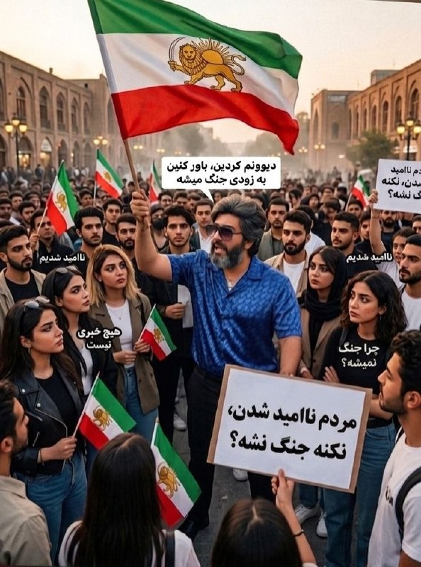

🚫 دیگه سرویس شدم..
هیچکس از مذاکره و توافق چیزی ازم نپرسه پاسخ نمیدم.
هیچ مذاکره با اصالتی در کار نمیتواند باشد بنابراین هیچ توافقی با اصالتی نمیتواند شکل بگیرید..
ترامپ و رژیم چه بخواهند چه نخواهند به اجبار بایستی باهم بجنگند..
(سپاس از مخاطب خوش ذوقمان بابت این تصویر)

## rodast_omiddana — post 71863

🚨از علی کریمی و برخی چهره ها معذرت میخواهم_در آن دوره در شرایط خاصی بود..
از افرادی مانند
مهدی میرقادری
مجتبی واحدی
یاسر فلاح
بهروز یوسیان
پوزش میخواهم..

## KiriMohems — post 47940

  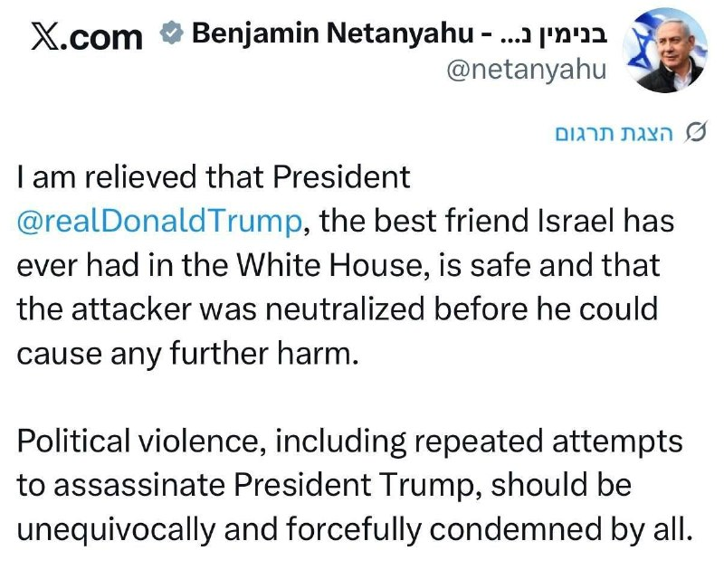

نتانیاهو تیراندازی دیشب در کاخ سفید رو محکوم کرد و ترامپ رو "بهترین دوست اسرائیل در کاخ سفید" خطاب کرد

#professor
@KiriMohems

## KiriMohems — post 47939

  

‼️ این روزا قبل از پیش‌بینی بیشتر از خود بازی باید نگران این باشی که VPN وصل میشه یا نه. 
😀

ربات تلگرام وینکوبت دقیقاً برای همین شرایط خوبه چون کل سایت داخل خود تلگرام اجرا میشه و دیگه لازم نیست هی بین سایت و VPN درگیرشی: 
👇

🤖 @Wincobet_bot

🤖 @Wincobet_bot

📌میتونی مستقیم وارد بازی‌ها و کازینو شی، پیش‌بینی ثبت کنی، واریز و برداشت انجام بدی و همه‌چی خیلی سریع‌تر و راحت‌تر انجام میشه.

🟣 آدرس دائمی سایت: wincobet.com

## SportBaadNews — post 252397

  <a href="telegram/content/SportBaadNews_252397_1779622940.mp4" target="_blank">🎬 Download video</a>

سممممم ترین گل به خودی که تو سال های اخیر دیدم 😂😂😂😂😂😂😂😂😂😂
@SportBaadNews

## SportBaadNews — post 252396

  

🎙
⚽️اولی هونس (رئیس افتخاری بایرن مونیخ):

🔻هری کین بهترین خریدیه که تا حالا انجام دادیم.

🔻گفته میشه بارسلونا بهش علاقه داره.

🔻بایرن تیمیه که بازیکن میخره، نه اینکه بازیکن بفروشه.

🔻میتونی قطعی بگی که میمونه
⁉️

🔻آره، تازه بارسا کلاً پول هم نداره.
@SportBaadNews

## SportBaadNews — post 252395

امباپه با گل دیشبش با رکورد 2 فصل اول رونالدو برابری کرد امباپه در دو فصل اول: 86 گل رونالدو در دو فصل اول: 86 گل 
🦜@UltraMadrid

## SportBaadNews — post 252394

  

⚽️
⚽️ امروز تو فینال کوپا ده کامپه‌اونس تو رده جوانان بارسلونا و رئال مادرید باهم بازی داشتن که تا اینجای کار رئال مادرید کامبک زده و 3-1 داره قهرمان این تورنمنت میشه 
◀️ کوپا ده کامپه‌اونس، تورنمنت قهرمان‌ های لیگ زیر 19 سال اسپانیاست که بهترین تیم‌های آکادمی…

## SportBaadNews — post 252393

  

تمام.
@SportBaadNews

## SportBaadNews — post 252392

  

‼️ این روزا قبل از پیش‌بینی بیشتر از خود بازی باید نگران این باشی که VPN وصل میشه یا نه. 
😀

ربات تلگرام وینکوبت دقیقاً برای همین شرایط خوبه چون کل سایت داخل خود تلگرام اجرا میشه و دیگه لازم نیست هی بین سایت و VPN درگیرشی: 
👇

🤖 @Wincobet_bot

🤖 @Wincobet_bot

📌میتونی مستقیم وارد بازی‌ها و کازینو شی، پیش‌بینی ثبت کنی، واریز و برداشت انجام بدی و همه‌چی خیلی سریع‌تر و راحت‌تر انجام میشه.

🟣 آدرس دائمی سایت: wincobet.com

## SportBaadNews — post 252391

  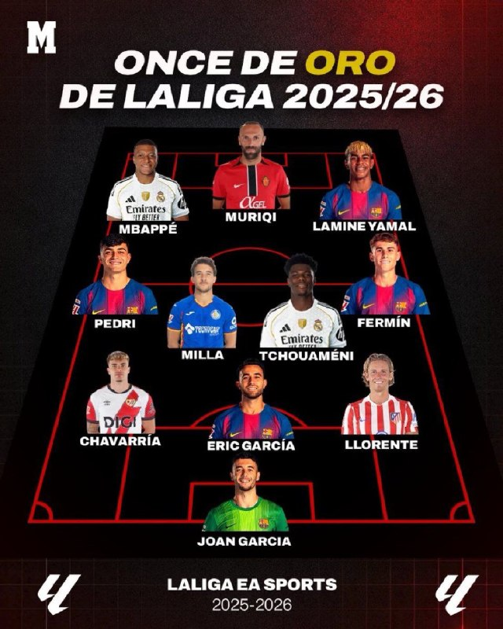

⚽️ تیم منتخب فصل 2025/26 لالیگا از دید مارکا
@SportBaadNews

## SportBaadNews — post 252389

  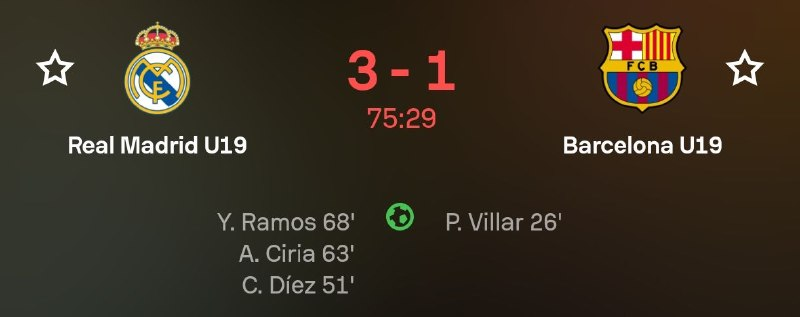

⚽️
⚽️ امروز تو فینال کوپا ده کامپه‌اونس تو رده جوانان بارسلونا و رئال مادرید باهم بازی داشتن که تا اینجای کار رئال مادرید کامبک زده و 3-1 داره قهرمان این تورنمنت میشه

◀️ کوپا ده کامپه‌اونس، تورنمنت قهرمان‌ های لیگ زیر 19 سال اسپانیاست که بهترین تیم‌های آکادمی کشور توش برای قهرمانی نهایی رقابت میکنن.
@SportBaadNews

## IranIntlTV — post 338752

  <a href="telegram/content/IranIntlTV_338752_1779622945.mp4" target="_blank">🎬 Download video</a>

🔻مهدی تاج، رییس فدراسیون فوتبال، خبر داد کمپ تیم ملی فوتبال از آریزونای آمریکا به کمپی در شهر تیخوانا مکزیک منتقل شده است.

🔹مهدی رستم‌پور، خبرنگار ورزشی معتقد است که این ترفندی از جمهوری اسلامی برای فرار از ایرانیان آمریکا بوده است.

@iranintltvsport

## IranIntlTV — post 338751

  <a href="telegram/content/IranIntlTV_338751_1779622946.mp4" target="_blank">🎬 Download video</a>

یک شهروند با ارسال پیامی به ایران‌اینترنشنال می‌گوید: «اگر ترامپ توافق کد بزرگ‌ترین خیانت را در حق مردم ایران کرده است. امیدواریم پایان این شب سیه، سپید باشد.»

## IranIntlTV — post 338750

  <a href="telegram/content/IranIntlTV_338750_1779622947.mp4" target="_blank">🎬 Download video</a>

مروری بر روزنامه‌های ایران، یکشنبه ۳ خرداد، با مجتبی هاشمی، روزنامه‌نگار
@iranintltv

## IranIntlTV — post 338749

🗣روایت شما از احتمال توافق میان آمریکا و جمهوری اسلامی- یکشنبه ۳ خرداد

🔹اگه بعد از توافق، ارزونی هم بشه یه آرامش گذراست. هرگز آرامش لحظه‌ای رو به نجات همیشگی ترجیح ندین.

🔹این چه وضعیه، همش منتظر ترامپ نشستین؟ مردم حتی حاضر نیستن اعتصاب کنن یا قبض پرداخت نکنن. خودمون باید یه کاری کنیم؛ مبارزه مدنی، اقتصادی و اعتصاب کنید.

🔹ترامپ با این جنگ و توافق، جمهوری اسلامی را «پررو» کرد و بدتر از آن ابهت آمریکا در دنیا رو از بین خواهد برد. ای کاش بدون توافق از جنگ خارج می‌شد.

🔹همه ناراحت و نگرانیم، ولی امیدتون رو از دست ندین. در آخر، این ما مردم هستیم که ایرانمون رو پس می‌گیریم.

🔹ترامپ، نتانیاهو به همه ما نوید آزادی دادن. گفتن کمکتون می‌کنیم. مردم و ۴۰ هزار کشته ابزاری شدن برای اینکه ترامپ و نتانیاهو به خواسته‌هاشون برسن. الان شرایط اقتصادی و اجتماعی مردم از آنچه که پیش از جنگ بود هم بدتر شده.

🔹نمی‌دانم چرا مردم ایران فکر می‌کنن کسی باید بیاد نجات‌شون بده. هرکسی دنبال منفعت خودشه. هیچ‌کس برای ما کاری نمی‌کند. خودمون باید خودمون رو نجات بدیم.

🔹واقعا ما مردم ساده هستیم که فکر می‌کنیم کشورهای دیگر دل‌شان برای ما می‌سوزه. این توافق ظلم به مردمه.

🔹انگار به حرف‌های ترامپ باید برعکس نگاه کرد. وقتی گفت توافق قطعی هست، جنگ شد. وقتی گفت زیرساخت می‌زنیم و ضرب‌الاجل داد، آتش‌بس شد. یا باید صبر کرد تا ببینیم چی میشه، یا باید دوباره متحد بشیم و بریم کف خیابون.

🔹چه توافقی؟ مگر ترامپ فراموش کرده که در همین آتش‌بس شرط این بود که جمهوری اسلامی ابتدا تنگه را باز کند، اما نکرد و در نهایت منجر به محاصره دریایی شد. حتی بار اول به قول‌شان عمل نکردند. پس چرا ترامپ دارد برای بار دوم گول‌شان را می‌خورد؟

🔹ما هنوز فراموش نکردیم. نمی‌توانیم در خیابون پا بگذاریم که پای‌مان بره رو خون عزیزان‌مان. ما انتقام همه این خون‌ها رو می‌گیریم. جمهوری اسلامی باید از این خشم ما مردم ایران بترسه.

🔹ما با جمهوری اسلامی اختلاف نداریم، پدرکشتگی داریم. چه توافق بشه و چه نشه ما ادامه داریم و تا سرنگونی ادامه می‌دهیم.

## IranIntlTV — post 338748

  

مسعود پزشکیان در مصاحبه با خبرنگار صداوسیما گفت: «قطعا ما و تیم مذاکره‌کننده به هیچ‌وجه از عزت و سربلندی کشور کوتاه نخواهیم آمد اما آماده‌ایم به دنیا این اطمینان را بدهیم که ما به دنبال سلاح هسته‌ای نیستیم.»

او افزود: «ما به دنبال ناآرامی در منطقه نیستیم، ناآرام‌کننده منطقه اسرائیل است که به دنبال نقشه اسرائیل بزرگ است.»
iranintl.com/202605248136

## IranIntlTV — post 338747

  <a href="telegram/content/IranIntlTV_338747_1779622949.mp4" target="_blank">🎬 Download video</a>

بر اساس گزارش رسانه‌ها، تفاهم احتمالی جمهوری اسلامی و آمریکا شامل بازگشایی تنگه هرمز در ازای لغو محاصره دریایی، امکان فروش نفت و آزادسازی بخشی از منابع ارزی مسدودشده ایران است.

ارزیابی آرش آزرمی، دبیر بخش اقتصادی ایران‌اینترنشنال

@iranintltv

## IranIntlTV — post 338746

  

دادستانی بحرین اعلام کرد دادگاه عالی کیفری این کشور در دو پرونده جداگانه، ۱۱ متهم را به اتهام «جاسوسی و همکاری اطلاعاتی» با سپاه پاسداران انقلاب اسلامی با هدف انجام «اقدامات تروریستی و خصمانه» علیه بحرین محاکمه کرده که ۹ متهم به حبس ابد محکوم شده‌اند.

همچنین دو متهم دیگر به سه سال زندان محکوم شدند و دادگاه دستور مصادره اقلام ضبط‌شده را صادر کرد. دادستانی بحرین اعلام کرد برخی متهمان مامور رصد، تصویربرداری و جمع‌آوری اطلاعات از تاسیسات حیاتی بحرین بوده‌اند و اطلاعات را در اختیار سپاه پاسداران قرار می‌دادند.

در این بیانیه همچنین به استفاده از شبکه‌های مالی، صرافی و ارزهای دیجیتال برای تامین مالی این فعالیت‌ها اشاره شده است.
iranintl.com/202605242725

## IranIntlTV — post 338745

  <a href="telegram/content/IranIntlTV_338745_1779622951.mp4" target="_blank">🎬 Download video</a>

بسته شدن مسیرهای اصلی تجاری در تنگه هرمز، پای قایق‌های تندرو و شناورهای باری ایرانی را به بندر خصب عمان باز کرده است. این بندر کوچک، در فاصله حدود ۳۵ کیلومتری ایران، حالا به یکی از راه‌های تهران برای دور زدن محاصره دریایی آمریکا تبدیل شده است.

انتقال کالا از امارات به بندر خصب و سپس به ایران، هزینه واردات را تا شش برابر افزایش داده است.
@iranintltv

## IranIntlTV — post 338744

  

علی عبداللهی، فرمانده قرارگاه مرکزی خاتم‌الانبیا در بیانیه‌ای اعلام کرد: «به دشمنان هشدار می‌دهیم برنامه‌ها و راهبردهای رهبری برای مدیریت خلیج فارس و تنگه هرمز اجرا خواهد شد و بیگانگان جایگاهی در نظم جدید منطقه ندارند و ما آماده پاسخگویی سخت و جهنمی به هرگونه حمله هستیم.»

او ادامه داد: «به مشت گره‌خورده رهبر شهیدمان قسم، نیروهای مسلح مقتدر کشورمان اجازه نخواهند داد تجربه‌های دردناک تاریخی تکرار شود.»
iranintl.com/202605240729

## IranIntlTV — post 338743

جاویدنامان انقلاب ملی ایرانیان
«علی و شیوا بردبار جاوید» از جان‌باختگان اعتراضات ۱۸ دی در مشهد هستند. نامشان در حافظه‌ی این سرزمین می‌ماند و یادشان چراغ راه آزادی‌خواهان است.

@iranintltv

## IranIntlTV — post 338742

  

خبرگزاری مهر، وابسته به سازمان تبلیغات اسلامی، اعلام کرد یک پهپاد اسرائیلی که کاربری جاسوسی و شناسایی داشت، با شلیک پدافند ارتش جمهوری اسلامی سرنگون شد.
این گزارش افزود: «لاشه پهپاد متلاشی شده اربیتر با همکاری ناوگروه دریابانی فراجای هرمزگان کشف شد.»

خبرگزاری مهر به تاریخ این اتفاق اشاره‌ای نکرده است.
https://iranintl.com/202605240342

## IranIntlTV — post 338741

استقبال اروپا از پیشرفت مذاکرات با تاکید بر بازگشایی تنگه هرمز و مهار برنامه هسته‌ای تهران

هم‌زمان با گزارش‌ها درباره نزدیک شدن آمریکا و جمهوری اسلامی به یک تفاهم اولیه، رهبران اتحادیه اروپا و بریتانیا از پیشرفت مذاکرات استقبال کرده و خواستار توافقی شدند که به کاهش تنش‌ها، بازگشایی تنگه هرمز و جلوگیری از دستیابی حکومت ایران به سلاح هسته‌ای منجر شود.

اورزولا فون‌در‌لاین، رییس کمیسیون اروپا، از نشانه‌های پیشرفت در مذاکرات میان آمریکا و جمهوری اسلامی استقبال کرده و گفته است اروپا از دستیابی به توافقی حمایت می‌کند که به کاهش واقعی تنش‌ها، بازگشایی تنگه هرمز و تضمین آزادی کامل کشتیرانی بدون دریافت عوارض منجر شود.

فون‌در‌لاین در پیامی در شبکه ایکس نوشت: «از پیشرفت در مسیر توافق میان آمریکا و ایران استقبال می‌کنم. ما به توافقی نیاز داریم که واقعا تنش‌ها را کاهش دهد، تنگه هرمز را بازگشایی کند و آزادی کامل ناوبری را تضمین کند. نباید به ایران اجازه داده شود به سلاح هسته‌ای دست پیدا کند.» او همچنین تاکید کرد تهران باید اقدامات بی‌ثبات‌کننده منطقه‌ای، از جمله حمایت از نیروهای نیابتی و حملات به کشورهای همسایه را متوقف کند.

رییس کمیسیون اروپا افزود اتحادیه اروپا برای بهره‌برداری از فرصت کنونی جهت دستیابی به یک راه‌حل دیپلماتیک پایدار، همکاری با شرکای بین‌المللی را ادامه خواهد داد و هم‌زمان برای کاهش اثرات بحران بر زنجیره‌های تامین جهانی و قیمت انرژی تلاش می‌کند.

اظهارات فون‌در‌لاین پس از آن مطرح شد که دونالد ترامپ اعلام کرد واشینگتن و تهران «تا حد زیادی» درباره یک یادداشت تفاهم برای توافق صلح مذاکره کرده‌اند؛ توافقی که می‌تواند به بازگشایی تنگه هرمز منجر شود.

در بریتانیا نیز کی‌یر استارمر، نخست‌وزیر این کشور، از «پیشرفت در مسیر توافق» برای پایان دادن به جنگ ایران استقبال کرد. استارمر در پیامی نوشت: «ما با شرکای بین‌المللی خود همکاری خواهیم کرد تا از این فرصت برای دستیابی به یک راه‌حل دیپلماتیک بلندمدت استفاده کنیم.»

این مواضع در حالی مطرح می‌شود که مقام‌های آمریکایی گفته‌اند احتمال دارد جزئیات توافق احتمالی میان [حکومت] ایران و آمریکا طی ساعات یا روزهای آینده اعلام شود؛ هرچند هنوز اختلاف‌هایی بر سر برنامه هسته‌ای ایران، وضعیت تنگه هرمز و دامنه کاهش تحریم‌ها باقی مانده است.

در همین حال، منابع سیاسی اسرائیل نیز نگرانی خود را نسبت به پیامدهای توافق احتمالی ابراز کرده‌اند. یک مقام ارشد سیاسی اسرائیل به یینون ماگال، خبرنگار کانال۱۴ این کشور گفته است تل‌آویو به واشینگتن اطلاع داده که «صرف‌نظر از دستیابی یا عدم دستیابی به توافق، آزادی عمل عملیاتی خود را در همه جبهه‌ها، از جمله لبنان، حفظ خواهد کرد.»

این اظهارات نشان می‌دهد با وجود افزایش امیدها به پیشرفت دیپلماتیک، اختلاف‌ها بر سر نحوه مهار برنامه هسته‌ای ایران، نقش منطقه‌ای تهران و آینده درگیری‌های نیابتی همچنان از چالش‌های اصلی مسیر توافق باقی مانده است.
 
🔗وب‌سایت ایران‌اینترنشنال
@iranintltv

## IranIntlTV — post 338740

  <a href="telegram/content/IranIntlTV_338740_1779622953.mp4" target="_blank">🎬 Download video</a>

یک شهروند با ارسال پیامی به ایران‌اینترنشنال می‌گوید: «امیدی به ترامپ نداریم. ما ۴۰ هزار کشته ندادیم که با این حکومت مماشات کنیم. خودمان کار را تمام می‌کنیم. مردم عزیز این آخرین نبرد است.»

## IranIntlTV — post 338739

  

🔻سایت اتلتیک در گزارشی درباره تغییر کمپ تیم ملی از آریزونای آمریکا به تیخوانا در مکزیک، که به گفته مهدی تاج، رییس فدراسیون فوتبال، برای حل مشکل ویزای اعضای تیم انجام شده است، نوشت با وجود این اقدام، تیم ملی برای هر بازی باید ویزا بگیرد: «تمامی بازیکنان و اعضای کادر همچنان برای ورود به ایالات متحده جهت برگزاری مسابقات نیاز به ویزا خواهند داشت.»

🔹اتلتیک اشاره می‌کند که با این تغییر، «اگر برخی اعضای غیرضروری در روز مسابقه برای دریافت ویزای آمریکا با مشکل مواجه باشند، انتقال کمپ به مکزیک می‌تواند به آن‌ها اجازه دهد در کنار تیم بمانند، اما برای مسابقات سفر نکنند.»

🔹یک ماه پیش، مارکو روبیو، وزیر خارجه آمریکا، درباره ورود همراهان تیم ملی به ایالات متحده گفت: «آن‌ها نمی‌توانند یک مشت تروریست عضو سپاه را به عنوان روزنامه‌نگار یا مربی ورزشی وارد کشور ما کنند.»

🔹اتلتیک نوشته است این تغییر کمپ تیم فوتبال ایران در حالی رخ داده که مقام‌های آریزونا برای استقبال از این تیم آماده می‌شدند.

جزییات بیشتر را در سایت بخوانید.

@iranintltvsport

## IranIntlTV — post 338738

  <a href="telegram/content/IranIntlTV_338738_1779622956.mp4" target="_blank">🎬 Download video</a>

وزیر دفاع پیشین اسرائیل از مطرح شدن لبنان به‌عنوان بخشی از توافق میان واشینگتن و تهران انتقاد کرد. اردوغان نیز در تماس با ترامپ، بر حل اختلافات از راه دیپلماسی تاکید کرد و از مذاکرات با جمهوری اسلامی حمایت کرد.

گزارش اشکان صفایی و نرگس هورخش، خبرنگاران ایران‌اینترنشنال

@iranintltv

## IranIntlTV — post 338737

  <a href="telegram/content/IranIntlTV_338737_1779622957.mp4" target="_blank">🎬 Download video</a>

رسانه‌های پاکستان گزارش دادند در حمله انتحاری به قطار مسافربری در شهر کویته، دست‌کم ۲۴ نفر کشته و حدود ۵۰ نفر زخمی شدند. به گفته این رسانه‌ها، بخشی از واگن‌ها حامل نظامیان پاکستانی بود. ارتش آزادی‌بخش بلوچستان مسئولیت این حمله را بر عهده گرفت.
گفت‌وگو با وحید پیمان، روزنامه‌نگار
@iranintltv

## IranIntlTV — post 338736

  

وای‌نت به نقل از یک منبع نوشت که نتانیاهو در تماس با ترامپ تاکید کرد، اسرائیل آزادی عمل خود را برای مقابله با تهدیدها در همه جبهه‌ها از جمله لبنان، حفظ خواهد کرد.

بر اساس این گزارش، ترامپ نیز حمایت خود را از این موضوع اعلام کرد.

وای‌نت نوشت که ترامپ در تماس تلفنی با نتانیاهو تاکید کرده در مذاکرات بر خواسته همیشگی خود برای برچیدن برنامه هسته‌ای و خارج کردن همه ذخایر اورانیوم غنی‌شده از خاک ایران پافشاری خواهد کرد.

همچنین کانال ۱۴ اسرائیل به نقل از یک مقام ارشد سیاسی نوشت که اسرائیل به آمریکا اعلام کرده، چه توافقی با جمهوری اسلامی حاصل شود و چه نشود، این کشور آزادی عمل خود برای عملیات در همه بخش‌ها، از جمله در لبنان را حفظ می‌کند.
iranintl.com/202605249125

## Persian_Trend_Official — post 14854

⭕️ تسنیم: ایران تاکید کرده است که بدون آزادسازی بخش مشخصی از اموال بلوکه شده ایران در همین گام اول و مشخص بودن سازوکار روشن برای ادامه‌ی تضمین‌شده آزادسازی همه اموال بلوکه شده، تفاهمی در کار نخواهد بود. 📝 Nick 📌 @persian_trend_official پرشین ترند | متفاوت‌ترین…

## Persian_Trend_Official — post 14853

💢مارکو روبیو کافی است بگوییم که پیشرفت‌هایی حاصل شده است، پیشرفت‌های قابل توجه، اگرچه پیشرفت نهایی هنوز به دست نیامده است. اگر اجازه دهیم این موضوع به یک امر عادی تبدیل شود، ما یک سابقه خطرناک ایجاد خواهیم کرد که می‌تواند در نقاط مختلف جهان تکرار شود. آنها…

## Persian_Trend_Official — post 14852

💢مارکو روبیو

کافی است بگوییم که پیشرفت‌هایی حاصل شده است، پیشرفت‌های قابل توجه، اگرچه پیشرفت نهایی هنوز به دست نیامده است.
اگر اجازه دهیم این موضوع به یک امر عادی تبدیل شود، ما یک سابقه خطرناک ایجاد خواهیم کرد که می‌تواند در نقاط مختلف جهان تکرار شود.
آنها مالک تنگه هرمز نیستند. این یک مسیر آبی بین‌المللی است. کاری که آنها اکنون انجام می‌دهند تهدید به نابودی کشتی‌های تجاری است که از این مسیر آبی بین‌المللی استفاده می‌کنند.
ایده اینکه این رئیس‌جمهور به توافقی تن دهد که در نهایت ایران را در موقعیت قوی‌تری در زمینه جاه‌طلبی‌های هسته‌ای قرار دهد، مضحک است. این اتفاق نخواهد افتاد.

🫆:Tony

📌 @persian_trend_official
پرشین ترند | متفاوت‌ترین کانال نظامی

## Persian_Trend_Official — post 14851

  

♦️هدف قرار دادن پهپاد ‌اربیتر بر فراز هرمزگان

🔹 این پهپاد ، که کاربری جاسوسی و شناسایی داشت، با شلیک پدافند ارتش سرنگون شد.

🔹لاشه پهپاد متلاشی شده اربیتر هم با همکاری ناوگروه دریابانی فراجای هرمزگان کشف شد./مهر

پ ن : با توجه به برد کم این پهپاد احتمالا از درون خاک به پرواز در امده است

🫆:Tony

📌 @persian_trend_official
پرشین ترند | متفاوت‌ترین کانال نظامی

## Persian_Trend_Official — post 14848

  <a href="telegram/content/Persian_Trend_Official_14848_1779622960.webm" target="_blank">🎬 Download video</a>

⭕️ طبق گزارش تایمز آو اسرائیل، یک مقام ارشد اسرائیلی گفته ترامپ در تماس دیشب با نتانیاهو تأکید کرده که توافق نهایی با ایران باید به برچیده شدن کامل برنامه هسته‌ای تهران و خارج شدن تمام اورانیوم غنی‌شده از خاک ایران منجر شود و بدون این شروط، آن را امضا نخواهد کرد.

در همان گزارش آمده نتانیاهو هم گفته اسرائیل آزادی عملش را در برابر تهدیدها در همه جبهه‌ها، از جمله لبنان، حفظ می‌کند و ترامپ هم از این اصل حمایت کرده است.

📝 Nick

📌 @persian_trend_official
پرشین ترند | متفاوت‌ترین کانال نظامی

## Persian_Trend_Official — post 14847

  <a href="telegram/content/Persian_Trend_Official_14847_1779622960.mp4" target="_blank">🎬 Download video</a>

🔴سردار قربانی: اسرائیلی‌ها بدانند قاآنی تا زیر سنگرهایشان می‌رود‼️

💢سردار «مرتضی قربانی» مشاور فرمانده سپاه پاسداران: هیچ‌وقت از قاآنی ترس و واهمه ندیدم، اسرائیلی‌ها بدانند قاآنی تا زیر سنگرهایشان می‌رود!

🫆:Tony

📌 @persian_trend_official
پرشین ترند | متفاوت‌ترین کانال نظامی

## Persian_Trend_Official — post 14846

⭕️ رویترز به نقل از یک مقام ایرانی گفت تهران با انتقال ذخایر اورانیوم غنی‌شده با غنای بالا به خارج از کشور موافقت نکرده است و موضوع هسته‌ای بخشی از توافق اولیه فعلی با ایالات متحده نیست.

پ.ن: 20 امتیاز برای کسی که پرتقال فروش رو پیدا کنه 😑

📝 Nick

📌 @persian_trend_official
پرشین ترند | متفاوت‌ترین کانال نظامی

## Persian_Trend_Official — post 14845

  <a href="telegram/content/Persian_Trend_Official_14845_1779622961.webm" target="_blank">🎬 Download video</a>

⭕️ کیر استارمر نخست وزیر بریتانیا:

من پیشرفت‌ها را به سوی یک توافق بین ایالات متحده و ایران خوش‌آمد می‌گویم.
ما باید توافقی را ببینیم که درگیری را به پایان برساند و تنگه هرمز را با آزادی ناوبری بدون قید و شرط و بدون محدودیت دوباره باز کند. حیاتی است که هرگز به ایران اجازه داده نشود تا سلاح هسته‌ای توسعه دهد.
دولت من به انجام هر کاری که می‌توانیم برای محافظت از مردم بریتانیا از تأثیرات این درگیری ادامه خواهد داد.
ما با شرکای بین‌المللی خود برای بهره‌برداری از این لحظه و دستیابی به یک حل و فصل دیپلماتیک بلندمدت همکاری خواهیم کرد.

پ.ن: خدایی اظهار نظر به تو یکی دیگه نمیرسه.

📝 Nick

📌 @persian_trend_official
پرشین ترند | متفاوت‌ترین کانال نظامی

## Persian_Trend_Official — post 14844

  <a href="telegram/content/Persian_Trend_Official_14844_1779622962.webm" target="_blank">🎬 Download video</a>

💢 پزشکیان: گاهی برخی کارشناسان در رسانه ملی سخنانی مطرح می‌کنند که با واقعیت‌های جاری کشور و روندهای موجود فاصله جدی دارد، اما دولت به‌منظور جلوگیری از اختلاف و حفظ آرامش جامعه، از واکنش و موضع‌گیری پرهیز می‌کند.

🚫 در مواردی، کلیپ‌هایی از بیانات رهبر شهید انقلاب درباره مذاکره به‌گونه‌ای بازنشر می‌شود که گویا نظام به‌صورت مطلق مخالف هرگونه مذاکره بوده است، در حالی که رهبر شهید هیچ‌گاه با مذاکره عزتمندانه، مبتنی بر اقتدار و در چارچوب منافع ملی مخالفت نداشتند و در دیدارهایی که با معظم‌له داشتیم، نگاه ایشان همواره مبتنی بر حفظ عزت، حکمت و مصلحت نظام بود.

📝 Nick

📌 @persian_trend_official
پرشین ترند | متفاوت‌ترین کانال نظامی

## Persian_Trend_Official — post 14843

⭕️ تسنیم:

ایران تاکید کرده است که بدون آزادسازی بخش مشخصی از اموال بلوکه شده ایران در همین گام اول و مشخص بودن سازوکار روشن برای ادامه‌ی تضمین‌شده آزادسازی همه اموال بلوکه شده، تفاهمی در کار نخواهد بود.

📝 Nick

📌 @persian_trend_official
پرشین ترند | متفاوت‌ترین کانال نظامی

<!-- MSG END -->

<!-- NAV START -->

<a href="https://github.com/amirkarimiq12-svg/aio-downloader/blob/main/telegram/content/archive_1.md" style="display:inline-block; padding:6px 12px; margin:0 4px; background-color:#2ea44f; color:white; text-decoration:none; border-radius:4px; font-weight:bold;">صفحه بعد</a>

<!-- NAV END -->
