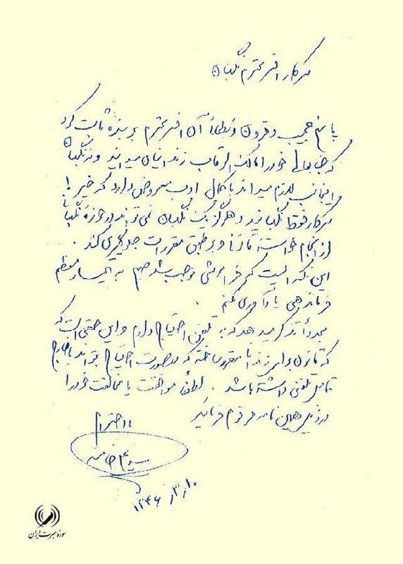
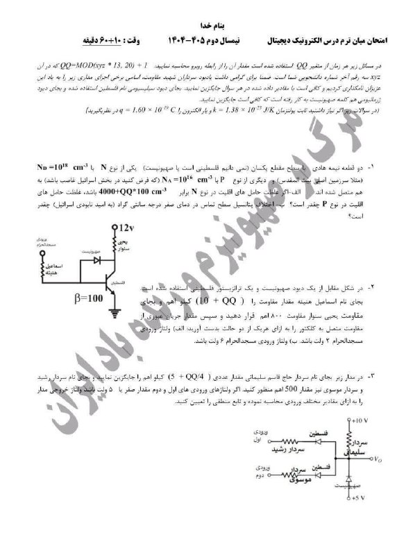
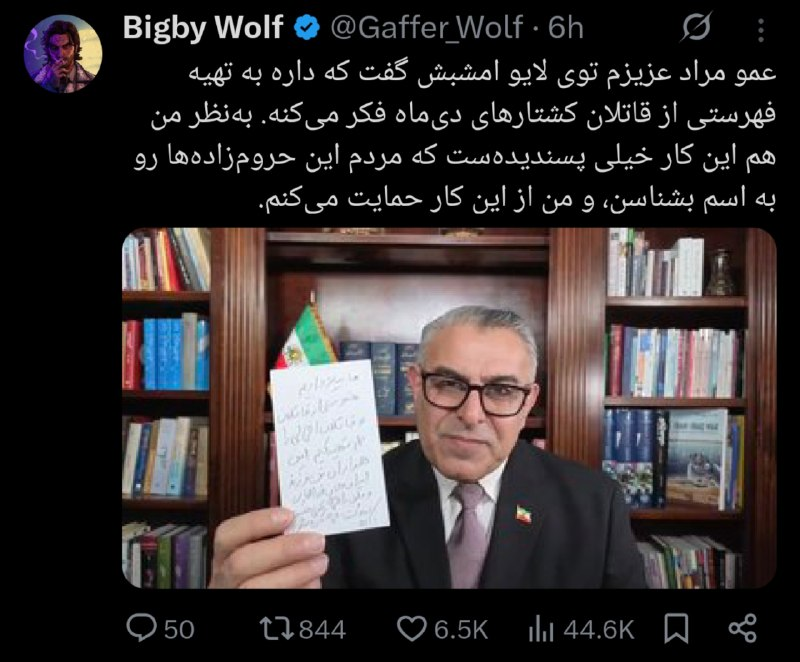
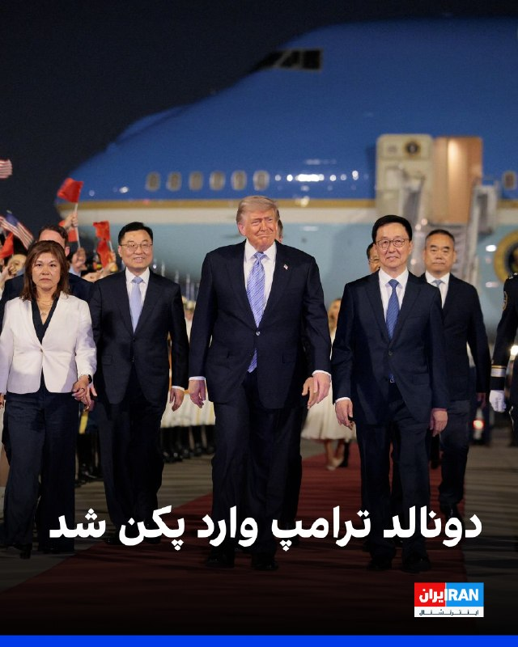
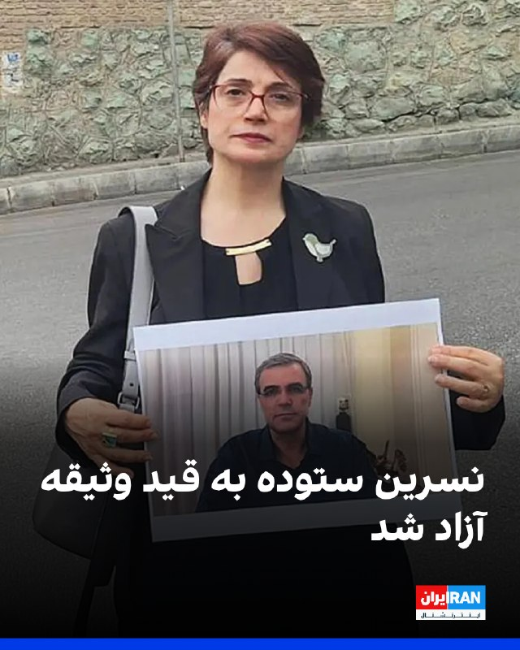
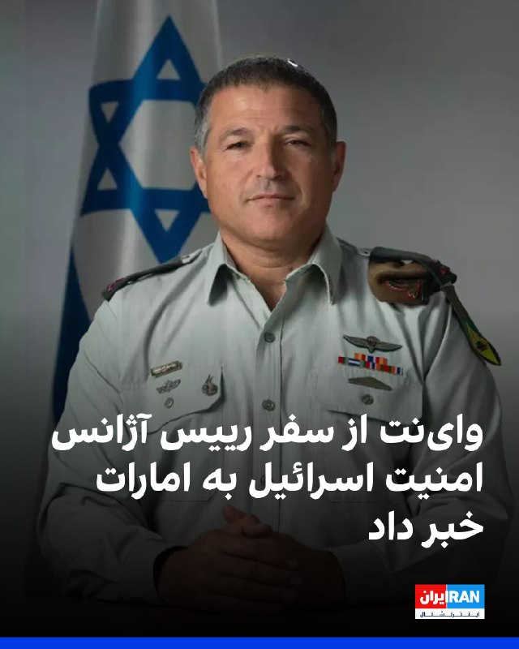

# خواننده تلگرام

<!-- TOP_NAV START -->

<a href="https://github.com/amirkarimiq12-svg/aio-downloader/blob/main/telegram/content/archive_1.md" style="display:inline-block; padding:6px 12px; margin:0 4px; background-color:#2ea44f; color:white; text-decoration:none; border-radius:4px; font-weight:bold;">صفحه بعد</a>

<!-- TOP_NAV END -->

<!-- MSG START -->

---
📅 بروزرسانی: 1405/02/23 16:08
---

## ChizBergerz — post 46351

  

۱۰ خرداد ۱۳۴۶ علی خامنه‌ای به نگهبان زندان نامه‌ زد و گفت: «من به تلفن احتیاج دارم و این حقی طبیعی است که قانون برای همه‌ی شهروندان، من‌الجمله زندانی مقرر ساخته که در صورت احتیاج بتواند با خارج تماس تلفنی داشته باشد.»

+ حالا در حکومت جمهوری‌شیطانی که خامنه‌ای ساخته، به معترضان بازداشتی اجازه هیچ‌گونه صحبت با نزدیکان رو نمیده و بی‌خبر اعدامشون میکنه!💔
@ChizBergerz

## ChizBergerz — post 46350

  

استاد یکی از دانشگاه‌ها رفته سوالاتو اینطوری طراحی کرده تا مثلا هوش مصنوعی جوابشونو نده: 😐😂

@ChizBergerz

## ChizBergerz — post 46349

  

آگهی دفتر پیشخوان دولت برای فروش اینترنت طبقاتی پرو!!😐😐

+ اینترنت تهدید امنیته ولی اگه‌ پول بیشتری بدی دیگه تهدید نیست؟ عجب حرومزاده‌هایی هستین!
@ChizBergerz

## ChizBergerz — post 46348

  <a href="telegram/content/ChizBergerz_46348_1778675882.mp4" target="_blank">🎬 Download video</a>

این اینفلوئنسر خارجی بریکینگ بد هم اونطوری که دلش خنک میشده ساخته و این شاهکارو خلق کرده: 😂😂

@ChizBergerz

## ChizBergerz — post 46347

  <a href="https://t.me/ChizBergerz/46347" target="_blank">📎 Download file</a>

📲#اپلیکیشن اندروید سایت جهانی دربی بت

👍اسپانسر لیگ انگلیس
👍
🔥امکان شارژ امن از طریق کارت بانکی
➖➖➖➖➖➖➖➖➖

🪙همین حالا عضو شوید 👇
https://t.me/+aCbq7yy8QY80NzQ0

## ChizBergerz — post 46346

  

😤دنبال یه سایت شرط بندی بین المللی بودی که به ایرانیا خدمات بده؟!
⛔

👍دربی بت همون انتخاب  100%

💎ویژگی های سایت جهانی Derby Bet:

⬅️امکان شارژ امن با کارت بانکی

⬅️واریز اول دوبل شارژ می شوید(بونوس۱۰۰٪)

⬅️پر اپشن ترین سایت فعال در ایران

⬅️تسویه حساب کمتر از 5 دقیقه

⬅️برگشت بخشی از باخت به صورت هفتگی

🚨کد هدیه ثبت نام:GG007

⚠️برای دانلود اپلکیشن کلیک کنید
👉
re23

🔔کانال دربی بت :

🪙https://t.me/+aCbq7yy8QY80NzQ0

## rodast_omiddana — post 71310

  <a href="telegram/content/rodast_omiddana_71310_1778675884.mp4" target="_blank">🎬 Download video</a>

🚨 ترامپ به همراه ایلان ماسک وارد پکن شد

## rodast_omiddana — post 71309

  <a href="telegram/content/rodast_omiddana_71309_1778675886.webm" target="_blank">🎬 Download video</a>

🚨 امارات شروع به نصب موانع ضد پهپاد در اطراف انبارهای نفت نزدیک فرودگاه بین‌المللی دبی از طریق سازه‌ها و شبکه‌های فلزی کرده است.

## rodast_omiddana — post 71308

🎬 پاسخ به شمس الواعظین که میگه اسرائیل دشمن ایرانه
لینک یوتیوب:
https://www.youtube.com/watch?v=C-7Cxd__VQA

## rodast_omiddana — post 71307

  <a href="telegram/content/rodast_omiddana_71307_1778675886.mp4" target="_blank">🎬 Download video</a>

🚨
🚨 ورود پرزیدنت ترامپ به چین
مادر بگرید بچه شیعه

## rodast_omiddana — post 71306

🎬 علی مطهری: به علی لاریجانی گفتم از خانه من برو، تا ما هم با تو کشته نشویم
لینک یوتیوب:
https://www.youtube.com/watch?v=6bdRVD5q1Lo

## KiriMohems — post 47442

🔴ترامپ همراه ایلان ماسک ، دوستان و سایر خایمالان وارد پکن شدند

#Helsinki
@KiriMohems

## KiriMohems — post 47441

  <a href="telegram/content/KiriMohems_47441_1778675887.mp4" target="_blank">🎬 Download video</a>

🔴پس از حدود ۱۵ ساعت کون نشینی ترامپ در هواپیما ، وارد پکن پایتخت چین شد

#Helsinki
@KiriMohems

## KiriMohems — post 47440

  

🔴آقا مراد ویسی میخواد اون ولدرنا هایی که مردم رو تو دی‌ماه به قتل رسوندن رو شناسایی کنه رو اسامیشون رو بخونه

#Helsinki
@KiriMohems

## KiriMohems — post 47439

  <a href="telegram/content/KiriMohems_47439_1778675889.mp4" target="_blank">🎬 Download video</a>

مراد ویسی، تحلیل‌گر ارشد اینترنشنال:‌

ترامپ زمان زیادی نداره
با نزدیک شدن به انتخابات کنگره، اگه نتونه جمهوری اسلامی رو به‌روشنی شکست بده یا به اهدافش برسه ممکنه اکثریت کنگره رو به دموکرات‌ها واگذار کنه.

#professor
@KiriMohems

## KiriMohems — post 47438

مدیرعامل بانک مسکن: وام مسکن را به ۱.۲ میلیارد تومان افزایش می‌دهیم با اقساط بازپرداخت ماهی ۳۰ میلیون تومان

- ماهی 30 از کونمون بیاریم کسکش؟

#Berlin
@Kirimohems

## KiriMohems — post 47437

کونمون بسوزه
اپل به صورت رسمی اولین نمایندگی خودشو در افغانستان افتتاح کرد...

#Berlin
@Kirimohems

## KiriMohems — post 47436

  

خبری که فرانسه رو گایید

مکرون چندين ماه با گلشیفته فراهانی، بازیگر ایرانی رابطه افلاطونی داشته (رابطه که فقط خایه مالی طرفو میکنید و لاشو لوش نمیذارید)؛

میگن که دلیل چَک خوردن رئیس‌جمهور فرانسه هم گلشیفته بوده؛ چون مکرون به این بازیگر ایرانی پیام داده بود که بانو سگتم و از نظر من تو خیلی زیاد خوشگلی و اینو زنش دیده بود

#Berlin
@Kirimohens

## SportBaadNews — post 251498

  <a href="telegram/content/SportBaadNews_251498_1778675891.webm" target="_blank">🎬 Download video</a>

🚨
⚽️ فوری و رسمی از رومانو:
لواندوفسکی از بارسلونا جدا میشه
@SportBaadNews

## SportBaadNews — post 251497

  <a href="telegram/content/SportBaadNews_251497_1778675891.mp4" target="_blank">🎬 Download video</a>

کریسو @SportBaadNews

## SportBaadNews — post 251496

29 روز مونده تا جام جهانی... 
🏆

## SportBaadNews — post 251495

اینایی که اینترنت پرو ثبت نام میکنن شایسته ی هر بگایی ای که توی این مملکت پیش میاد هستن الکیم خودتونو توجیه نکنید

## SportBaadNews — post 251494

ایران اینترنت ندارد، روز هفتاد و پنجم …
ایران اینترنت ندارد، روز هفتاد و پنجم …
ایران اینترنت ندارد، روز هفتاد و پنجم …
ایران اینترنت ندارد، روز هفتاد و پنجم …
ایران اینترنت ندارد، روز هفتاد و پنجم …
ایران اینترنت ندارد، روز هفتاد و پنجم …

## IranIntlTV — post 336986

  

علاءالدین بروجردی، عضو کمیسیون امنیت ملی و سیاست خارجی مجلس، گفت: «تنها سناریو پیش‌رو این است که آمریکا واقعیت‌ها را بپذیرد و با پذیرش این واقعیات، با ایران وارد مذاکره شود تا از شرایط جنگی خارج شود.»

او اضافه کرد: «به هیچ‌ وجه دستاورد تنگه هرمز را از دست نخواهیم داد و به هیچ‌ وجه وارد بحث مذاکره درباره غنی‌سازی هسته‌ای نخواهیم شد.»
https://iranintl.com/202605133735

## IranIntlTV — post 336985

یک شهروند با ارسال پیامی به ایران اینترنشنال از وضعیت معیشتی بد خود و عدم توان پرداخت پول برای داروی مادر بیمارش می‌گوید.

## IranIntlTV — post 336984

  

دونالد ترامپ، رییس‌جمهوری آمریکا، چهارشنبه در مراسم استقبال رسمی با تشریفات گسترده وارد پکن شد. بر اساس اعلام کاخ سفید، هان ژنگ، معاون رییس‌جمهوری چین، به همراه شماری از مقام‌ها از جمله دیوید پردیو، سفیر آمریکا در چین، شی فنگ، سفیر چین در آمریکا، و ما ژائوشو، معاون اجرایی وزیر خارجه چین، در فرودگاه از ترامپ استقبال کردند.

همچنین ۳۰۰ نوجوان چینی با لباس‌های هماهنگ آبی و سفید در باند فرودگاه و با در دست داشتن پرچم‌های چین و آمریکا رژه رفتند. یگان تشریفات نظامی و یک گروه موسیقی نظامی نیز در این مراسم حضور داشتند.

قرار است شی جین‌پینگ صبح پنجشنبه به وقت محلی به‌طور رسمی از دونالد ترامپ استقبال کند.
https://iranintl.com/202605139112

## IranIntlTV — post 336983

  

مهراوه خندان، فرزند نسرین ستوده، خبر داد که این وکیل دادگستری و فعال حقوق بشر، با قرار وثیقه به‌طور موقت آزاد شده است.

نسرین ستوده ۱۲ اردیبهشت در منزل خود بازداشت شده بود. در جریان این بازداشت، لوازم الکترونیکی از جمله لپ‌تاپ و تلفن‌های همراه او و همسرش رضا خندان ضبط شد.
https://iranintl.com/202605130712

## IranIntlTV — post 336982

یک شهروند در سیستان و بلوچستان با ارسال پیامی به ایران اینترنشنال از بدتر شدن وضعیت اقتصادی مردم منطقه می‌گوید. پیام مخاطب با هوض مصنوعی خوانده شده است.

## IranIntlTV — post 336981

  

پایگاه خبری وای‌نت گزارش داد دیوید زینی، رییس سازمان اطلاعات و امنیت داخلی اسرائیل (شین‌بت)، اخیرا به امارات متحده عربی سفر کرده است.

ساعاتی پیش، روزنامه وال‌استریت ژورنال از دو سفر محرمانه دیوید بارنئا، رییس موساد، به امارات در جریان جنگ ایران خبر داده بود.
https://iranintl.com/202605137286

## IranIntlTV — post 336980

شهروندان پس از زلزله تهران: فکر کردیم آمریکا و اسرائیل حمله کردند

🖋سبا حیدرخانی

شماری از شهروندان در پیام‌هایی به ایران‌اینترنشنال گفتند در نخستین لحظات پس از زلزله نسبتا شدیدی که شامگاه سه‌شنبه ۲۲ اردیبهشت تهران و مناطق اطراف آن را لرزاند، تصور کردند حملات آمریکا و اسرائیل دوباره آغاز شده است. احساسی که با پایان احساس تعلیق اما همراه ترس و اضطراب بوده است.

این زمین‌لرزه‌ها ابتدا با زلزله‌ای به بزرگی ۳.۴ در ساعت ۲۰:۴۱ آغاز شد اما اوج آن در ساعت ۲۳:۴۶ با لرزه‌ای به بزرگی ۴.۶ در عمق ۱۰ کیلومتری رخ داد.
تا ساعت ۳:۳۰ بامداد چهارشنبه ۲۳ اردیبهشت، چندین پس‌لرزه دیگر هم اتفاق افتاد.

کانون اصلی زلزله پردیس بود اما در مناطق مختلف شهر و استان تهران، استان البرز و حتی بخش‌هایی از استان مازندران احساس شد.

برخی مخاطبان در واکنش به این زلزله و پس‌لرزه‌هایش گفتند تجربه هفته‌های جنگ، صدای انفجارها، پدافند و پهپادها، نوعی حساسیت دائمی ایجاد کرده است؛ به‌طوری که حتی تشخیص زلزله از حمله نظامی هم برای چند ثانیه دشوار بوده است.

یکی از ساکنان شرق تهران و تهرانپارس در پیامی نوشت: «زلزله سه‌شنبه شب جوری بود که خانه‌مان به شدت لرزید و تکان خورد؛ طوری که فکر کردیم کنار خانه‌مان موشک خورده است.»

مخاطب دیگری زلزله را «ترسناک» توصیف کرد و گفت او و خانواده‌اش برای چند ثانیه فکر کردند دوباره حملات شروع شده است.

برخی شهروندان همچنین به شباهت تجربه زلزله با روزهای جنگ اشاره کردند.

یک شهروند نوشت: «حدود ساعت ۹ شب سه‌شنبه زلزله در تهران حس شد، اما زلزله‌ای که ساعت ۱۱:۴۵ شب آمد بسیار شدید حس شد. خانه کاملا لرزید و لوسترها صدا دادند. شبیه تجربه‌ای بود که در آن ۴۰ روز جنگ داشتیم.»

شماری از مخاطبان تاکید کردند احساس آن‌ها صرفا «ترس» نبوده، بلکه ترکیبی از اضطراب، انتظار و بی‌ثباتی روانی بوده است؛ به‌ویژه در شرایطی که بخشی از جامعه همچنان در انتظار ازسرگیری حملات نظامی علیه جمهوری اسلامی است.

شهروندی نوشت: «وقتی زلزله و بعد از آن صدای طوفان آمد، فکر کردیم دوباره حمله شده است. حس هم‌زمان ترس و خوشحالی داشتیم.»

مخاطبی دیگر با اشاره به احساس ناامیدی و تعلیق گسترده‌ای که در آتش‌بس شکل گرفته، گفت: «وضعیت ما داخل ایران این‌گونه است که زلزله می‌آید و مادرم می‌گوید: کاش بمباران باشد؛ ثمره ۴۷ سال حکومت اسلامی.»

قطع اینترنت و از دست رفتن دسترسی سریع به منابع خبری
قطع طولانی‌مدت و اختلال گسترده اینترنت در ایران، دسترسی بسیاری از کاربران به پیام‌رسان‌ها، شبکه‌های اجتماعی و حتی منابع اطلاع‌رسانی فوری را مختل کرده است.

برخی مخاطبان گفتند در گذشته در چنین شرایطی مستقیما به سایت‌های لرزه‌نگاری مراجعه یا اخبار را از طریق تلگرام و شبکه‌های اجتماعی دنبال می‌کردند، اما اکنون این امکان را از دست داده‌اند و همین موضوع بر اضطراب عمومی افزوده است.

چند کاربر، رسانه‌های حکومتی را به پنهان‌کاری و تاخیر در اطلاع‌رسانی متهم کردند.

شهروندی در همین زمینه نوشت: «صداوسیما از ترس این‌که مردم به خیابان‌ها بریزند و اعتراض دیگری شکل بگیرد، خبر زلزله را تا دقایقی طولانی پوشش نداد. جان آدم‌ها آن‌قدر برایشان بی‌ارزش است که تلاش می‌کنند از هر راهی که شده، اندکی بیشتر در قدرت بمانند.»

بی‌اعتمادی به نهادهای اطلاع‌رسانی حکومتی و فقدان دسترسی به کانال‌های خبری امن و شناخته شده، باعث شد در ساعات پس از زلزله، شایعات و گمانه‌زنی‌هایی نیز شکل بگیرد.

در همین زمینه، یک مخاطب با اشاره به موقعیت کانون زلزله نوشت: «کانون زلزله تهران، نزدیک پارچین و نیروگاه اتمی بود؛ یعنی اصلا امکانش نیست که زلزله‌ای در کار نبوده و جمهوری اسلامی داشته آزمایش اتمی یا نظامی انجام می‌داده است؟»

شهروند دیگری نیز این پرسش را مطرح کرد که: «آیا زلزله نمی‌تواند ناشی از فعالیت‌های زیرزمینی موشکی باشد؟»

او به قرارگیری تهران روی گسل و همچنین فعالیت‌های زیرزمینی جمهوری اسلامی اشاره کرد.

نهادهای حکومتی به این گمانه‌زنی‌ها واکنشی نشان ندادند اما برخی متخصصان درباره این ترس و نگرانی عمومی اظهار نظر کردند.

فریبرز ناطقی‌‌الهی، عضو هیات علمی پژوهشگاه زلزله‌شناسی ایران، صبح چهارشنبه ۲۳ اردیبهشت در سخنانی گفت زلزله تهران «در اثر انفجار مواد تسلیحاتی و نظامی نبوده» است.

تهران تا ساعت‌ها پس از زلزله و پس‌لرزه‌هایش فضایی ملتهب را تجربه کرد.

یکی از ساکنان پردیس گفت از حدود ساعت هشت‌ونیم شب تا یک بامداد، مردم از ترس در خیابان‌ها بودند، داخل خانه نرفتند و پمپ‌بنزین‌ها هم شلوغ بود.
 
🔗متن کامل گزارش را اینجا بخوانید
@iranintltv

## IranIntlTV — post 336979

  <a href="telegram/content/IranIntlTV_336979_1778675895.mp4" target="_blank">🎬 Download video</a>

یک شهروند با ارسال پیامی به ایران اینترنشنال می‌گوید با وضعیت بد اینترنت و شبکه ملی داخلی انگیزه‌ها برای درس خواندن از بین رفته است. پیام این مخاطب با هوش مصنوعی خوانده شده است.

## IranIntlTV — post 336977

  

بریتانیا اعلام کرد برای مقابله با فعالیت عوامل نیابتی وابسته به دولت‌های متخاصم، قوانین جدیدی تصویب خواهد کرد.

به گزارش خبرگزاری رویترز، این تصمیم در پی افزایش تهدیدهای امنیتی و رشد حملات یهودستیزانه در این کشور مطرح شده است.

به گفته دولت بریتانیا، این قوانین اختیارات لازم را برای ممنوع‌ کردن فعالیت گروه‌های وابسته به دولت‌های خارجی فراهم می‌کند.

کی‌یر استارمر، نخست‌وزیر بریتانیا، در واکنش به حملات اخیر به جامعه یهودیان این کشور تاکید کرده دولت باید با «بازیگران مخرب» وابسته به دولت‌های خارجی برخورد کند.
https://iranintl.com/202605139938

## IranIntlTV — post 336976

  <a href="telegram/content/IranIntlTV_336976_1778675897.mp4" target="_blank">🎬 Download video</a>

تجمعات حکومتی شبانه در شهرهای مختلف ایران ادامه دارد. شهروندان نیز مشاهدات خود از حضور نیروهای نیابتی در این تجمعات و تجربه‌هایشان از آزار و اذیت‌ آن‌ها را برای ایران‌اینترنشنال ارسال کردند.

محسن مهیمنی، عضو تحریریه ایران‌اینترنشنال، گزارش می‌دهد
@iranintltv

## IranIntlTV — post 336975

  <a href="telegram/content/IranIntlTV_336975_1778675899.mp4" target="_blank">🎬 Download video</a>

شهروندان با ارسال پیام‌هایی به ایران‌اینترنشنال از تورم اقلام خوراکی و کسادی بازار زیر سایه آتش‌بس روایت می‌کنند. سبا حیدرخانی، عضو تحریریه ایران‌اینترنشنال، با بررسی این پیام‌ها می‌گوید بسیاری از کسب‌وکارها به علت کوچک شدن سبد خرید مردم، در آستانه ورشکستگی قرار گرفته‌اند.
@iranintltv

## IranIntlTV — post 336974

جوییش کرونیکل از پیشنهاد ۴۰ هزار پوندی برای قتل روزنامه‌نگار ایرانی خبر داد

یک مرد بریتانیایی-ایرانی گفته است فردی که مظنون به ارتباط با جمهوری اسلامی بوده، در ازای قتل یک روزنامه‌نگار ساکن لندن که از منتقدان تهران است، ۴۰ هزار پوند به او پیشنهاد داده است.

روزنامه «جوییش کرونیکل» چهارشنبه ۲۳ اردیبهشت در گزاشی به نقل از این مرد که با نام مستعار «نیما» معرفی شده، نوشت او پس از بازگشت به بریتانیا، موضوع را به پلیس گزارش کرده و روزنامه‌نگاری را که برای یک رسانه فارسی‌زبان کار می‌کند، در جریان قرار داده است.

نیما که حدود یک دهه است در بریتانیا زندگی می‌کند و در یک بار کار می‌کند، گفت این ماجرا در جریان سفر تفریحی‌اش به جنوب اروپا آغاز شد؛ جایی که به یک رستوران ایرانی رفت و با دو مرد آشنا شد که یکی از آن‌ها را از ایران می‌شناخت.

به گزارش جوییش کرونیکل، آن مرد ابتدا درباره راه‌اندازی یک بار در لندن صحبت کرد و با مطرح کردن موضوع به‌عنوان یک پیشنهاد کاری، اطلاعات تماس نیما را گرفت.

پیشنهادی برای قتل
نیما گفت دیدار دوم شکل متفاوتی پیدا کرد؛ زمانی که آن مرد همراه دو نفر دیگر آمد و شروع به اشاره به جزییات زندگی او در بریتانیا و بستگانش در ایران کرد.

نیما به جوییش کرونیکل گفت: «به من گفت تو آدم محترمی هستی. خانواده‌ای در ایران داری که به حمایت تو نیاز دارند. می‌خواهم کاری به تو پیشنهاد بدهم؛ با پرداخت اولیه ۴۰ هزار پوند.»

بر اساس این گزارش، آن مرد سپس به یک روزنامه‌نگار ایرانی در لندن اشاره کرد که نیما پیش‌تر در فضای مجازی با او مشاجره کرده بود و گفت می‌خواهد او را «مجازات» کند.

او از نیما پرسید آیا خودش می‌تواند این کار را انجام دهد یا فرد دیگری را برای آن پیدا کند.

نیما گفت به او پیشنهاد شده بود ۲۰ هزار پوند نقد همان ابتدا دریافت کند و بقیه مبلغ را پس از مشخص کردن محل اقامت آن روزنامه‌نگار بگیرد.
او افزود این افراد تصور می‌کردند آن روزنامه‌نگار در خانه امن زندگی می‌کند.

به گفته نیما، فرد مظنون مستقیما خود را عضو سپاه پاسداران معرفی نکرد، اما یکی از آشنایانش گفته بود او در ایران نفوذ دارد و هنگام صحبت درباره کمک احتمالی به خانواده نیما، از «سپاه» نام برده بود.

افزایش نگرانی‌های امنیتی در بریتانیا
این گزارش در شرایطی منتشر شده است که نگرانی‌ها در بریتانیا درباره تهدیدهای مرتبط با جمهوری اسلامی علیه مخالفان، روزنامه‌نگاران و نهادهای یهودی افزایش یافته است.

یک گروه همسو با جمهوری اسلامی (حرکت اصحاب الیمین الاسلامیه)، مسئولیت حمله به چند مکان یهودی در بریتانیا و اروپا، از جمله حملات ماه گذشته به دو کنیسه در شمال لندن را بر عهده گرفته است.

کن مک‌کالوم، مدیرکل سازمان اطلاعات داخلی بریتانیا «ام‌آی۵» بارها هشدار داده جمهوری اسلامی که از طریق سپاه پاسداران عمل می‌کند، تهدیدی «احتمالا مرگبار» برای بریتانیا به‌شمار می‌رود.

به گفته مقام‌های بریتانیایی، از سال ۲۰۲۲ تاکنون چندین طرح منتسب به جمهوری اسلامی که قصد داشته است مخالفان، روزنامه‌نگاران و افراد یا نهادهای مرتبط با اسرائیل و یهودیان را در این کشور هدف قرار دهد، خنثی شده است.

🔗وب‌سایت ایران‌اینترنشنال
@iranintltv

## IranIntlTV — post 336973

  

🔻در فاصله یک ماه تا شروع جام جهانی، تیم ملی فوتبال در پی انزوای سیاسی جمهوری اسلامی نتوانست با حریفان تدارکاتی مناسب دیدار کند و در تهران، سه‌بار در قالب بازی‌های درون‌تیمی به مصاف خودش رفت.

🔹حالا خبرگزاری تسنیم نوشته است که یکی از نگرانی‌های اصلی کادرفنی، بحث صدور ویزا از سوی کشور آمریکاست؛ چرا که در صورت صادر نشدن ویزای هر یک از بازیکنان یا اعضای کادرفنی، چالش‌های تیم ملی بیش از پیش خواهد شد.

🔹تیم ملی در نظر داشت پیش از شروع رقابت‌ها چندین دیدار تدارکاتی برگزار کند، اما تا این لحظه فقط بازی با گامبیا نهایی شده است.

🔹تیم‌های مقدونیه، آنگولا، اسپانیا و پورتوریکو به دلیل شرایط سیاسی ایران، از تقابل با تیم ملی انصراف داده‌اند.

🔹قرار است بازیکنان و اعضای کادرفنی به‌زودی جهت طی کردن مراحل دریافت ویزای آمریکا راهی ترکیه شوند. با این حال، گفته می‌شود احتمال دارد برخی از اعضا به دلیل سوابق فعالیت یا ارتباط با سپاه پاسداران، موفق به دریافت ویزا نشوند.

🔹جزییات بیشتر را در سایت بخوانید

@iranintltvsport

## IranIntlTV — post 336972

  

مجله مادام فیگارو گزارش داد فلوریان تاردیف، روزنامه‌نگار پاری‌مچ، در کتاب جدید خود نوشته است دلیل سیلی بریژیت مکرون به همسرش در هواپیما، کشف پیام‌های عاشقانه امانوئل مکرون، رییس‌جمهوری فرانسه، به گلشیفته فراهانی بوده است.

به نوشته این مجله، تاردیف تاکید کرده اطلاعات مطرح‌شده بر پایه واقعیت است و مکرون برای چند ماه رابطه‌ای «افلاطونی» با این بازیگر ایرانی داشته است.

این گزارش در حالی منتشر شد که پیش‌تر کاخ الیزه این رخداد را تنها یک «لحظه صمیمانه» میان امانوئل مکرون و همسرش توصیف کرده بود.

تاردیف گفت رییس‌جمهوری فرانسه «برای چند ماه» رابطه‌ای «افلاطونی» با گلشیفته داشته و «پیام‌هایی نوشته که نسبتا فراتر رفته‌اند»، از جمله جمله‌ای مانند «به نظرم بسیار زیبا هستید». تاردیف افزود: «این همان چیزی است که اطرافیان او به من گفته‌اند و امروز بیان می‌کنم.»
https://iranintl.com/202605136880

## IranIntlTV — post 336971

  <a href="telegram/content/IranIntlTV_336971_1778675901.mp4" target="_blank">🎬 Download video</a>

سرخط خبرهای چهارشنبه ۲۳ اردیبهشت
@iranintltv

## IranIntlTV — post 336970

  <a href="telegram/content/IranIntlTV_336970_1778675902.mp4" target="_blank">🎬 Download video</a>

یک شهروند با ارسال پیامی به ایران‌اینترنشنال می‌گوید: «اینترنت پرو به من پیشنهاد دادند، قیمتش فضایی است، اما فقط واتس‌اپ و تلگرام فعال دارد. حتی فروشگاه گوگل هم روی آن فعال نیست که بتوانی گوشی را بروزرسانی کنی.»

## IranIntlTV — post 336969

بلومبرگ: صادرات نفت از جزیره خارک برای نخستین بار از آغاز جنگ، چند روز متوقف شد

تصاویر ماهواره‌ای نشان می‌دهند صادرات نفت از پایانه اصلی نفتی ایران در جزیره خارک طی روزهای اخیر متوقف شده و همزمان ظرفیت مخازن ذخیره‌سازی این جزیره نیز رو به تکمیل است؛ وضعیتی که می‌تواند جمهوری اسلامی را ناچار به کاهش بیشتر تولید نفت کند.

بلومبرگ ۲۲ اردیبهشت در گزارشی نوشت تصاویر ماهواره‌ای اروپایی نشان می‌دهد در روزهای ۱۸، ۱۹ و ۲۱ اردیبهشت هیچ نفتکش اقیانوس‌پیمایی در پایانه نفتی جزیره خارک دیده نشده است. موضوعی که به گفته این رسانه، نخستین توقف طولانی صادرات نفت ایران از آغاز جنگ محسوب می‌شود.

بر اساس این گزارش، از زمان شروع حملات آمریکا و اسرائیل به جمهوری اسلامی در ۹ اسفند ۱۴۰۴، پایانه خارک حتی در جریان جنگ نیز به بارگیری نفت ادامه داده بود و نفتکش‌ها پس از پر شدن، به‌دلیل محاصره دریایی آمریکا در خلیج فارس، به عنوان مخازن شناور استفاده می‌شدند.

بلومبرگ نوشت اگر فعالیت پایانه خارک همچنان متوقف بماند، فشار بر دیگر تاسیسات ذخیره‌سازی نفت ایران بیشتر خواهد شد.

تصاویر ماهواره‌ای نشان می‌دهند مخازن ذخیره‌سازی جزیره خارک در حال پر شدن هستند و ظرفیت خالی آنها به سطح بسیار پایینی رسیده است.

این گزارش افزود در صورتی که ایران فضای کافی برای ذخیره نفت نداشته باشد، ممکن است ناچار شود تولید نفت در برخی میدان‌ها را کاهش دهد.
جمهوری اسلامی پیش‌تر نیز بخشی از تولید خود را کم کرده بود.

بلومبرگ با استناد به تصاویر ماهواره‌ای اتحادیه اروپا نوشت تعداد نفتکش‌های پهلوگرفته یا لنگرانداخته در نزدیکی خارک از سه فروند در ۲۴ فروردین، به دست‌کم ۱۸ نفتکش در ۲۱ اردیبهشت رسیده است. بخشی از این نفتکش‌ها احتمالا حامل محموله‌هایی هستند که امکان خروج از خلیج فارس را پیدا نکرده‌اند.

نیویورک‌تایمز پیش‌تر با استناد به تصاویر ماهواره‌ای از نشت سه هزار بشکه نفت در تاسیسات خارک در ۱۶ اردیبهشت خبر داد. رخدادی که ممکن است بر روند بارگیری نفت تاثیر گذاشته باشد.

جمهوری اسلامی وقوع این نشت را رد کرده است.

بلومبرگ همچنین نوشت تحلیل تصاویر ماهواره‌ای از مخازن نفتی خارک نشان می‌دهد سقف شناور برخی مخازن بالاتر آمده و این موضوع نشانه افزایش حجم نفت ذخیره‌شده در آنهاست.

این رسانه افزود دولت دونالد ترامپ و مقام‌های آمریکایی از زمان آغاز محاصره دریایی ایران بارها گفته‌اند جمهوری اسلامی به‌زودی ناچار به تعطیلی چاه‌های نفت خواهد شد.

شرکت تحلیلی کپلر پیش‌بینی کرده است تهران احتمالا تا اواخر ماه می امکان ادامه تولید بدون فضای ذخیره‌سازی جدید را خواهد داشت.

🔗وب‌سایت ایران‌اینترنشنال
@iranintltv

## IranIntlTV — post 336968

  <a href="telegram/content/IranIntlTV_336968_1778675904.mp4" target="_blank">🎬 Download video</a>

جشنواره بین‌المللی فیلم کن با حضور ستارگان سینما و اعضای هیات داوران روی فرش قرمز افتتاح شد. در مراسم آغازین، نخل طلای افتخاری برای یک عمر فعالیت هنری به پیتر جکسون، کارگردان مجموعه «ارباب حلقه‌ها» و «کینگ کونگ»، اهدا شد.
لی‌لی نیکفر، خبرنگار ایران‌اینترنشنال، گزارش می‌دهد
@iranintltv

## IranIntlTV — post 336967

  <a href="telegram/content/IranIntlTV_336967_1778675905.mp4" target="_blank">🎬 Download video</a>

مراسم بازگشایی رسمی پارلمان بریتانیا با سخنرانی چارلز سوم، پادشاه این کشور، برگزار شد. این مراسم به‌منزله آغاز رسمی فعالیت‌های دوره جدید پارلمان بریتانیا است.

جزییات بیشتر در گزارش تاج‌الدین سروش، خبرنگار ایران‌اینترنشنال
@iranintltv

## IranIntlTV — post 336966

چارلز سوم در «سخنرانی پادشاه» در مراسم افتتاح رسمی پارلمان بریتانیا گفت سیاست دولت همچنان بر ادامه حمایت از مردم اوکراین و بهبود روابط با شرکای اروپایی خواهد بود.
@iranintltv

## Persian_Trend_Official — post 14058

  <a href="telegram/content/Persian_Trend_Official_14058_1778675907.mp4" target="_blank">🎬 Download video</a>

⭕️ فارس:

تصاویر دیده‌نشده از رزمایش ضد هلی‌برن سپاه تهران بزرگ

📝 Nick

📌 @persian_trend_official
پرشین ترند | متفاوت‌ترین کانال نظامی

## Persian_Trend_Official — post 14057

  

⭕️ برخی از رسانه‌های فرانسوی دست به انتشار گزارشی به نقل از «فلورین تاردیف» خبرنگار «پاری‌مچ» زده‌اند که حکایت از روابط پنهانی امانوئل ماکرون و گلشیفته فراهانی دارد.

این خبرنگار فرانسوی در گزارش خود نوشته که سیلی که زن ماکرون به او در کنار در خروجی هواپیما زد، به خاطر همین رابطه بوده.

منبع خبر

📝 Nick

📌 @persian_trend_official
پرشین ترند | متفاوت‌ترین کانال نظامی

## Persian_Trend_Official — post 14056

⭕️ در حالی که اینترنت در ایران به مدت ۷۵ روز قطع است، شرکت اپل دیروز به صورت رسمی اولین نمایندگی خود را در افغانستان افتتاح نمود. تکذیب شد. 📝 Nick 📌 @persian_trend_official پرشین ترند | متفاوت‌ترین کانال نظامی

## Persian_Trend_Official — post 14055

  

🔴 ادعای وال‌استریت ژورنال درباره نقش امارات و سفر مقامات امنیتی اسرائیل

💢بر اساس گزارشی که به وال‌استریت ژورنال نسبت داده شده، گفته می‌شود رئیس موساد اسرائیل حداقل دو بار به‌صورت محرمانه به امارات متحده عربی سفر کرده تا درباره هماهنگی‌های مرتبط با درگیری‌های جاری با ایران گفت‌وگو کند.

▪️در این گزارش همچنین ادعا شده:

💢امارات فراتر از نقش دیپلماتیک عمل کرده و در برخی اقدامات نظامی علیه ایران نقش داشته است.

▪️از جمله، حمله به یک هدف نفتی در جزیره لاوان به امارات نسبت داده شده است.
▪️همچنین گفته شده امارات میزبان برخی سامانه‌ها و نیروهای مرتبط با دفاع هوایی اسرائیل بوده است.
▪️در ادامه، به سفرهای مشابه رئیس شین‌بت اسرائیل در همان بازه زمانی نیز اشاره شده است.

🫆:Tony

📌 @persian_trend_official
پرشین ترند | متفاوت‌ترین کانال نظامی

## Persian_Trend_Official — post 14054

  <a href="telegram/content/Persian_Trend_Official_14054_1778675910.mp4" target="_blank">🎬 Download video</a>

🔴 ترامپ وارد پکن شد

هواپیمای ریاست‌جمهوری آمریکا (ایرفورس وان) لحظاتی پیش در پایتخت چین به زمین نشست و دونالد ترامپ سفر خود را برای دیدار و نشست با شی جین‌پینگ آغاز کرد.

🫆:Tony

📌 @persian_trend_official
پرشین ترند | متفاوت‌ترین کانال نظامی

## Persian_Trend_Official — post 14053

🔴 نشت سوخت نفتکش اماراتی پس از حمله پهپادی در سواحل عمان

💢خبرگزاری رویترز گزارش داد یک نفتکش وابسته به شرکت ملی نفت ابوظبی پس از حمله پهپادی منتسب به ایران در نزدیکی سواحل عمان دچار نشت محدود سوخت شده است.

💢بر اساس این گزارش:

▪️ نفتکش «برکه» همچنان در سواحل عمان لنگر انداخته است
▪️ شرکت اماراتی اعلام کرده مقدار کمی سوخت کشتی وارد آب شده است
▪️ این کشتی هنگام حمله بارگیری نشده بود
▪️ هیچ آسیبی به خدمه وارد نشده است

💢شرکت اماراتی اعلام کرده در حال همکاری با مقام‌های عمان و تیم‌های تخصصی برای مدیریت وضعیت است.

🫆:Tony

📌 @persian_trend_official
پرشین ترند | متفاوت‌ترین کانال نظامی

## Persian_Trend_Official — post 14051

⭕️ در حالی که اینترنت در ایران به مدت ۷۵ روز قطع است، شرکت اپل دیروز به صورت رسمی اولین نمایندگی خود را در افغانستان افتتاح نمود.

تکذیب شد.

📝 Nick

📌 @persian_trend_official
پرشین ترند | متفاوت‌ترین کانال نظامی

## Persian_Trend_Official — post 14050

  

🔴 امارات اطراف مخازن نفتی دبی موانع ضدپهپادی نصب می‌کند

گزارش‌ها حاکی است امارات روند نصب موانع و سازه‌های ضدپهپادی را در اطراف مخازن نفتی نزدیک فرودگاه بین‌المللی دبی آغاز کرده است.

بر اساس اطلاعات منتشرشده:

▪️ این موانع شامل سازه‌ها و شبکه‌های فلزی هستند
▪️ هدف از این اقدام، مقابله با تهدید پهپادهای انتحاری و حملات هوایی کم‌ارتفاع عنوان شده است
▪️ مخازن نفتی و زیرساخت‌های انرژی اطراف دبی در هفته‌های اخیر تحت تدابیر امنیتی شدیدتری قرار گرفته‌اند

🫆:Tony

📌 @persian_trend_official
پرشین ترند | متفاوت‌ترین کانال نظامی

## Persian_Trend_Official — post 14049

  <a href="telegram/content/Persian_Trend_Official_14049_1778675912.webm" target="_blank">🎬 Download video</a>

فارس | فیلم سینمایی حمله‌ٔ اف-۵های ایران به پایگاه آمریکا تولید می‌شود

💢فیلم سینمایی «ببرها» روایت حمله‌ٔ تاریخی و حماسی ۲ جنگندهٔ اف-۵ نیروی هوایی ارتش به پایگاه آمریکایی بوهرینگ کویت در روز دوم جنگ رمضان به نویسندگی مهدی یزدانی‌خرم و تهیه‌کنندگی حبیب والی‌نژاد تولید خواهد شد.

🫆:Tony

📌 @persian_trend_official
پرشین ترند | متفاوت‌ترین کانال نظامی

## Persian_Trend_Official — post 14048

  

🔴تویت خواهر جاوید نام ‎#مجتبی_روستایی ؛

از افتخارات ما خوانواده جاوید نامان اين است که با افتخار پیکر عزیزانمون رو تشیع کرديم 💔
و یکی از ذلت بارترین افتخارات عرزشیها، ۴ماه جنازه روی دستشون مونده ،دريغ از یه تشیع پنهانی!

📣@persian_trend_official

## Persian_Trend_Official — post 14047

  <a href="telegram/content/Persian_Trend_Official_14047_1778675913.mp4" target="_blank">🎬 Download video</a>

💢تصاویر ماهواره ای با کیفیت از میزان تخریب سایت نظامی یزد زیر ضرب حملات امریکا و اسرائیل

🫆:Tony

📌 @persian_trend_official
پرشین ترند | متفاوت‌ترین کانال نظامی

<!-- MSG END -->

<!-- NAV START -->

<a href="https://github.com/amirkarimiq12-svg/aio-downloader/blob/main/telegram/content/archive_1.md" style="display:inline-block; padding:6px 12px; margin:0 4px; background-color:#2ea44f; color:white; text-decoration:none; border-radius:4px; font-weight:bold;">صفحه بعد</a>

<!-- NAV END -->
