# خواننده تلگرام

<!-- TOP_NAV START -->

<!-- TOP_NAV END -->

<!-- MSG START -->

---
📅 بروزرسانی: 1405/02/27 21:10
---

## ChizBergerz — post 46495

  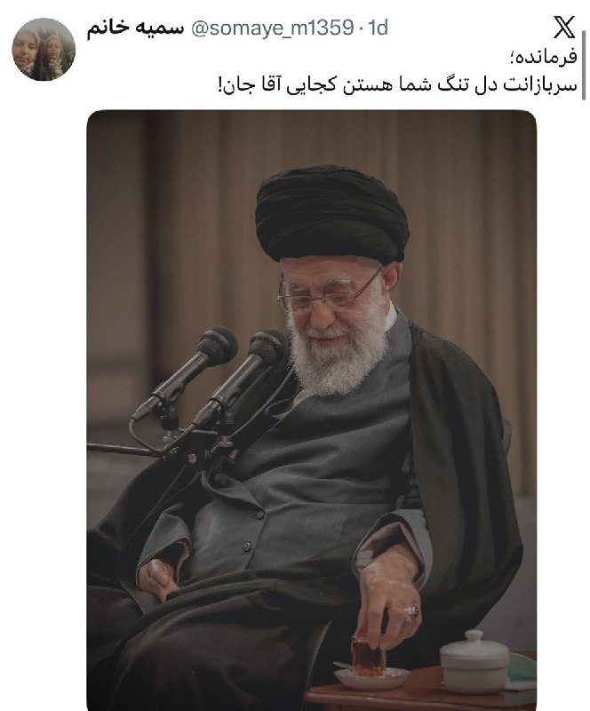

طبقه بالای بخچال، پشت شیشه مربای هویج😂😂

@ChizBergerz

## ChizBergerz — post 46494

  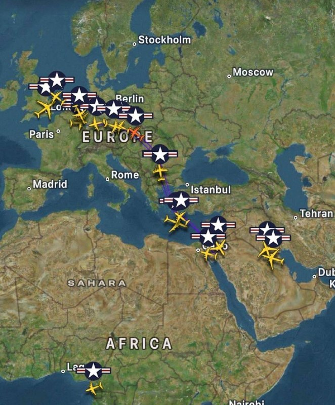

هواپیماهای ترابری ارتش آمریکا دوباره بصورت قطاری دارن میان خاورمیانه برای مذاکره با ج.ا: 🤭😁

@ChizBergerz

## rodast_omiddana — post 71481

🎬
🔴
🔴
🔴 برنامه امشب تا یکساعت دیگه:
*گفتگو تلفنی نتانیاهو و ترامپ قبل از جلسه امنیتی اسرائیل برای حمله به رژیم ایران
*چند روز تا حمله مانده؟
لینک یوتیوب:
https://www.youtube.com/@omiddana

## rodast_omiddana — post 71480

🎬 کارشناس صداوسیما:
اسرائیل از هر زمانی آماده تر است و به ما حمله میکند
https://www.youtube.com/watch?v=0Nm8XfXhbcU

## rodast_omiddana — post 71479

  <a href="telegram/content/rodast_omiddana_71479_1779039617.webm" target="_blank">🎬 Download video</a>

🚨 هر وقت ناامید شدید بروید آرشیو پستها قبل از دو جنگ 12 و 39 روزه را ببینید

## rodast_omiddana — post 71478

ترامپ میدونه چیکار میکنه

## rodast_omiddana — post 71477

  <a href="telegram/content/rodast_omiddana_71477_1779039617.webm" target="_blank">🎬 Download video</a>

🚨
🚨ویس من 18 روز قبل از کشتن خامنه ای و در اوج ناامیدی شما عزیزان
👇
👇
👇

## rodast_omiddana — post 71476

  <a href="telegram/content/rodast_omiddana_71476_1779039617.webm" target="_blank">🎬 Download video</a>

🚨 کاتز، وزیر دفاع اسرائیل شرکت خود را در حداقل سه رویداد عمومی که برای روزهای آینده برنامه‌ریزی شده بود، لغو کرد تا برای بازگشت به جنگ با ایران آماده شود.
تیک تاک..

## rodast_omiddana — post 71475

  <a href="telegram/content/rodast_omiddana_71475_1779039617.webm" target="_blank">🎬 Download video</a>

🚨 فوری_ترامپ
"برای رژیم ایران، ساعت در حال تیک‌تاک است و بهتر است سریع حرکت کنند، وگرنه چیزی از آنها باقی نخواهد ماند. زمان مهم است!"

## rodast_omiddana — post 71474

Voice message

## rodast_omiddana — post 71473

  <a href="telegram/content/rodast_omiddana_71473_1779039618.webm" target="_blank">🎬 Download video</a>

🚨 تکرار میکنم حملات آمریکا و اسرائیل به امید خدا تا قبل از دوشنبه 25می برابر با چهارم خرداد انجام خواهد شد..
به امید خدا لایه برداری دُرشتی در راه است..

## KiriMohems — post 47652

بیانیه قطر: از تلاش های دیپلماتیک پاکستان برای رسیدن به توافقی جامع حمایت میکنیم و بهشون اطلاع داده ایم که کیرتونو درارید ما بخوریم

#Berlin
@Kirimohems

## KiriMohems — post 47651

  

🔴توئیت خایه جفت کن ترامپ : برای ایران، ساعت در حال تیک‌تاکه و بهتره سریع حرکت کنه (پا بزن آشغال) وگرنه گوزی از اونا باقی نمیمونه؛ زمان اهمیت حیاتی داره! #بوی_بگایی #Helsinki @KiriMohems

## KiriMohems — post 47650

کانال 13 اسرائیل : ترامپ چندتا رویداد که قرار بود تو اونا شرکت کنه رو کیر کرده و الان جلسه‌ درباره ایران برگزار کرده

#Berlin
@Kirimohems

## KiriMohems — post 47649

  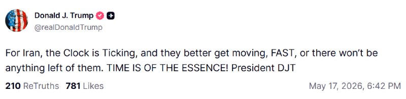

🔴توئیت خایه جفت کن ترامپ :

برای ایران، ساعت در حال تیک‌تاکه و بهتره سریع حرکت کنه (پا بزن آشغال) وگرنه گوزی از اونا باقی نمیمونه؛ زمان اهمیت حیاتی داره!
#بوی_بگایی

#Helsinki
@KiriMohems

## KiriMohems — post 47647

  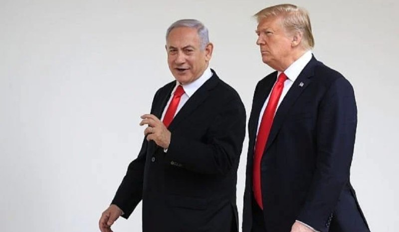

🔴منابع مختلفی نوشتن :
پس از تماس نتانیاهو با ترامپ ، کون طاقچه‌ای چندتا رویداد که قرار بود تو اونا شرکت کنه رو کنسل کرده و جلسه‌‌ای کیری فوری درباره ایران برگزار کرده
#Helsinki
@KiriMohems

## SportBaadNews — post 251774

گگگلگلل رئال وینییی پاس گلل امباپه: WATCH

## IranIntlTV — post 337664

  

ابراهیم رضایی سخنگوی کمیسیون امنیت ملی مجلس، گفت: «آمریکا یا باید شرایط جمهوری اسلامی را بپذیرد و تسلیم دیپلمات‌های ما شود و یا اینکه از موضع قدرت با او مذاکره می‌کنیم و باید تسلیم موشک‌های ما شود.»
او افزود: «تاریخ تنگه هرمز را باید به قبل و بعد از کشته‌شدن علی خامنه‌ای تقسیم کرد.»
https://iranintl.com/202605179775

## IranIntlTV — post 337663

  <a href="telegram/content/IranIntlTV_337663_1779039620.mp4" target="_blank">🎬 Download video</a>

شبکه کان اسرائیل گزارش داد بنیامین نتانیاهو و دونالد ترامپ در تماس تلفنی‌ای که بیش از نیم ساعت طول کشید، درباره احتمال ازسرگیری درگیری با جمهوری اسلامی گفت‌وگو کردند.

گفت‌وگو با منشه امیر، کارشناس امور خاورمیانه
@iranintltv

## IranIntlTV — post 337662

  <a href="telegram/content/IranIntlTV_337662_1779039622.mp4" target="_blank">🎬 Download video</a>

یک شهروند با ارسال پیامی به ایران‌اینترنشنال می‌گوید: «من هم مثل خیلی از هموطنان بیکار شدم و برای ادامه زندگی، با قسط و قرض یک کامیون خریدم. حالا سوخت خیلی کم است و ناچارم یک لیتر گازوئیل را بین ۵۰ تا ۷۵ هزار تومان بخرم که اصلا مقرون به‌صرفه نیست.»

## IranIntlTV — post 337661

  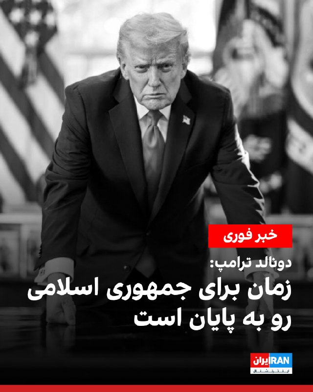

دونالد ترامپ در شبکه تروث سوشال نوشت که زمان برای ایران به‌سرعت در حال سپری شدن است و بهتر است آن‌ها هرچه زودتر اقدام کنند در غیر این صورت «چیزی از آن‌ها باقی نخواهد ماند». ترامپ تاکید کرد: «زمان بسیار حیاتی است.»
https://iranintl.com/202605171452

## IranIntlTV — post 337659

  

عبدالله بن زاید آل‌نهیان، وزیر خارجه امارات متحده عربی پس از حمله پهپادی به نیروگاه هسته‌ای این کشور، تلفنی با رافائل گروسی، مدیرکل آژانس بین‌المللی انرژی اتمی گفت‌وگو کرده است.

به گزارش خبرگزاری دولتی امارات متحده عربی، وزیر خارجه این کشور تاکید کرد که ابوظبی حق کامل دارد به چنین «حملات تروریستی» پاسخ دهد.
https://iranintl.com/202605177152

## Persian_Trend_Official — post 14346

  <a href="telegram/content/Persian_Trend_Official_14346_1779039626.webm" target="_blank">🎬 Download video</a>

ساعاتی پیش کانال Fighter Bomber رسانه غیررسمی اما معتبر هوانوردی روسیه تصویری از تست پروازی نسخه دوکابین سوخو-۵۷ منتشر کرد. Su-57D؟ Su-57UB؟ Su-57ED؟ هنوز کسی نمی‌داند و این ابهام در مرحله آزمایش اولیه طبیعی است.

Su-57UB = گزینه اول
روسیه برای نسخه‌های دوکابین آموزشی-رزمی سنت تاریخی با پسوند UB دارد؛ مثل سوخو-۲۷UB و میگ-۲۹UB — الگویی شناخته‌شده که مشتریان صادراتی آن را می‌شناسند.

Su-57D = گزینه دوم
پسوند D در روسی به نسخه‌های تخصصی اشاره دارد. اگر مسکو بخواهد نقش رزمی مستقل این پلتفرم را برجسته کند، این گزینه منطقی‌تر می‌شود.

Su-57ED = آخرین گزینه
ترکیب غیرمعمول حروف و اشاره به نسخه صادراتی، این را ضعیف‌ترین گزینه برای نام رسمی داخلی می‌کند.

☆Phantom☆

📌 @persian_trend_official
پرشین ترند | متفاوت‌ترین کانال نظامی

## Persian_Trend_Official — post 14345

  

💢 ترامپ:

برای ایران ساعت در حال تیک‌تاک است، و بهتر است خیلی سریع شروع به حرکت کنند، وگرنه هیچ چیزی از آن‌ها باقی نخواهد ماند.

زمان یک عامل حیاتی است!

🫆:Tony

📌 @persian_trend_official
پرشین ترند | متفاوت‌ترین کانال نظامی

## Persian_Trend_Official — post 14344

  

آقای ساعدی نیا
قلب میلیون ها ایرانی همراه شماست.

📌 @persian_trend_official
پرشین ترند | متفاوت‌ترین کانال نظامی

---
📅 بروزرسانی: 1405/02/27 20:08
---

## ChizBergerz — post 46493

  <a href="telegram/content/ChizBergerz_46493_1779035889.mp4" target="_blank">🎬 Download video</a>

تراپی ببینید از خرزشی‌ها: 😂😂

@ChizBergerz

## ChizBergerz — post 46492

  <a href="https://t.me/ChizBergerz/46492" target="_blank">📎 Download file</a>

📲#اپلیکیشن اندروید سایت جهانی دربی بت

👍اسپانسر لیگ انگلیس
👍
🔥امکان شارژ امن از طریق کارت بانکی
➖➖➖➖➖➖➖➖➖

🪙همین حالا عضو شوید 👇
https://t.me/+aCbq7yy8QY80NzQ0

## ChizBergerz — post 46491

  

😤دنبال یه سایت شرط بندی بین المللی بودی که به ایرانیا خدمات بده؟!
⛔

👍دربی بت همون انتخاب  100%

💎ویژگی های سایت جهانی Derby Bet:

⬅️امکان شارژ امن با کارت بانکی

⬅️واریز اول دوبل شارژ می شوید(بونوس۱۰۰٪)

⬅️پر اپشن ترین سایت فعال در ایران

⬅️تسویه حساب کمتر از 5 دقیقه

⬅️برگشت بخشی از باخت به صورت هفتگی

🚨کد هدیه ثبت نام:GG007

⚠️برای دانلود اپلکیشن کلیک کنید
👉
ge27

🔔کانال دربی بت :

🪙https://t.me/+aCbq7yy8QY80NzQ0

## rodast_omiddana — post 71472

🎬 کویت تصاویر بازداشت نیروهای سپاه در جزیره بوبیان را منتشر کرد
بازداشت یار قار سلیمانی توسط آمریکا
لینک یوتیوب:
https://www.youtube.com/watch?v=h0j6gDGm_lU

## rodast_omiddana — post 71471

  <a href="telegram/content/rodast_omiddana_71471_1779035891.webm" target="_blank">🎬 Download video</a>

🚨 کانال ۱۲ اسرائیل:
"نتانیاهو تماس مهم خود با ترامپ را اندکی پیش از ورود به جلسه مهم کابینه که شامل تعداد زیادی از وزرا و رهبران است و به چندین جبهه از جمله ایران، لبنان و غزه می‌پردازد، پایان داد.
تخمین اسرائیلی‌ها این است که آمریکا در طول این هفته به جنگ علیه ایران بازخواهد گشت.
این تماس شامل تأیید هماهنگی آمریکا و اسرائیل در مورد ایران بود."

## rodast_omiddana — post 71470

  <a href="telegram/content/rodast_omiddana_71470_1779035891.webm" target="_blank">🎬 Download video</a>

🚨 کانال ۱۲ عبری:
تخمین اسرائیلی‌ها این است که آمریکا در طول این هفته به جنگ علیه ایران بازخواهد گشت

## rodast_omiddana — post 71469

  <a href="telegram/content/rodast_omiddana_71469_1779035891.webm" target="_blank">🎬 Download video</a>

🚨 خب آمریکا وزیر پاکستان را فرستاد تا جای قالیباف و بقیه روشن بشه..
خدایش بوی مرگ از این تصویر به مشام میرسه..
تیک تاک..

## rodast_omiddana — post 71468

  <a href="telegram/content/rodast_omiddana_71468_1779035891.webm" target="_blank">🎬 Download video</a>

🚨
🚨یک مقام ارشد اسرائیلی گفت نخست‌وزیر نتانیاهو، چند دقیقه پیش با ترامپ، صحبت کرد

## rodast_omiddana — post 71467

🎬 توهمات حسام الدین آشنا از قدرت نداشته نظامی رژیم
لینک یوتیوب:
https://www.youtube.com/watch?v=eJajk4rUjRA

## KiriMohems — post 47646

کانال ۱۲ اسرائیل: تخمین اسرائیلی‌ها اینه که آمریکا در طول این هفته به بزن بزن و جنگ علیه ایران برمی‌گرده.

#Berlin
@Kirimohes

## KiriMohems — post 47645

  <a href="telegram/content/KiriMohems_47645_1779035891.webm" target="_blank">🎬 Download video</a>

پشماتون بریزه که کانفیگ آوردیم زیر قیمت! 
😰
🤑 هر یک گیگ کانفیگ 170 هزار تومن 
🤑 پینگ کانفیگ ها زیر 100 
🚀 ، مناسب برای چرخ زدن تو اینستا ، یوتیوب 
▶️، تلگرام 
✈️، توییتر 
🐦 و تیک تاک 
🎧 مناسب برای تمام گیم‌ها 
🎮 و تریدرها 
↗️ هم لینک ساب بهتون ارائه میشه 
🔗، هم می‌تونید…

## KiriMohems — post 47644

  <a href="telegram/content/KiriMohems_47644_1779035892.webm" target="_blank">🎬 Download video</a>

پشماتون بریزه که کانفیگ آوردیم زیر قیمت! 
😰
🤑

هر یک گیگ کانفیگ 170 هزار تومن 
🤑
پینگ کانفیگ ها زیر 100 
🚀
، مناسب برای چرخ زدن تو اینستا ، یوتیوب 
▶️، تلگرام 
✈️، توییتر 
🐦 و تیک تاک 
🎧
مناسب برای تمام گیم‌ها 
🎮 و تریدرها 
↗️

هم لینک ساب بهتون ارائه میشه 
🔗، هم می‌تونید داخل خود ربات حجم مصرفی و باقی مونده رو چک کنید 
🤖
📊
با تضمین برگشت وجه 
✅

ادرس ربات برای تهیه سرویس
🫴
@Unique_vpnbot

لینک کانال برای کانفیگ های رایگان
🫴
@networkunique_IR

## KiriMohems — post 47643

لاسو لوس تلفنی وزرای امور خارجه ایران و قطر

#Berlin
@Kirimohems

## KiriMohems — post 47642

  <a href="telegram/content/KiriMohems_47642_1779035894.webm" target="_blank">🎬 Download video</a>

شانس قهرمانی ایران در جام‌جهانی چقدر است؟
🤣

سایت کصمشنگ گل با انتشار پوستری درصد شانس قهرمانی کشورهای حاضر در جام‌جهانی را مشخص کرد.

#Berlin
@KiriMohemSport

## KiriMohems — post 47638

🔴 در دامنه‌ی کوه ورجین، شمال تهران

آخ که دلبرم ، کِی اون روز برس ببرمت روی این گون ها و تا جون داری بکنمت
#Helsinki
@KiriMohems

## KiriMohems — post 47637

درس خون ها بشتابید که ثبت‌نام کنکور سراسری ۱۴۰۵ شروع شد.

ثبت نام آزمون کیریه سراسری ۱۴۰۵ از امروز آغاز شده و تا شنبه ۲ خردادماه ادامه خواهد داشت.

#Berlin
@Kirimohems

## KiriMohems — post 47636

سکس هوایی اسرائیل به چندین منطقه در جنوب لبنان

#Berlin
@Kirimohems

## IranIntlTV — post 337658

  <a href="telegram/content/IranIntlTV_337658_1779035895.mp4" target="_blank">🎬 Download video</a>

تیتر اول با نیوشا صارمی، یکشنبه ۲۷ اردیبهشت
@iranintltv

## IranIntlTV — post 337657

  <a href="telegram/content/IranIntlTV_337657_1779035896.mp4" target="_blank">🎬 Download video</a>

سازمان اطلاعات ملی ترکیه اعلام کرد یک شبکه بین‌المللی جاسوسی وابسته به دو سرویس اطلاعاتی خارجی را متلاشی کرده است.

گزارش نرگس هورخش، خبرنگار ایران‌اینترنشنال
@iranintltv

## IranIntlTV — post 337656

  <a href="telegram/content/IranIntlTV_337656_1779035897.mp4" target="_blank">🎬 Download video</a>

نیویورک‌تایمز به نقل از مقام‌های منطقه‌ای از وجود دو پایگاه نظامی مخفی اسرائیل در بیابان‌های غربی عراق خبر داد.

بنابر این گزارش، اسرائیل طی یک سال گذشته از این پایگاه‌ها برای عملیات علیه جمهوری اسلامی استفاده کرده است.

گزارش اشکان صفایی، خبرنگار ایران‌اینترنشنال
@iranintltv

## IranIntlTV — post 337655

  

اکسیوس به نقل از یک مقام اسرائیلی گزارش داد دونالد ترامپ در تماس تلفنی با بنیامین نتانیاهو درباره ایران گفت‌وگو کرده است.
همچنین شبکه کان اسرائیل گزارش داد گفت‌وگوی تلفنی ترامپ و نتانیاهو بیش از نیم ساعت طول کشیده است.
بر اساس این گزارش، دو طرف درباره احتمال ازسرگیری درگیری با ایران گفت‌وگو کردند و ترامپ همچنین نتانیاهو را در جریان جزئیات سفر اخیر خود به چین قرار داده است.
https://iranintl.com/202605173156

## IranIntlTV — post 337654

جمهوری اسلامی با سیاست «فریب و تاخیر» به دنبال خرید زمان است

گزارش‌ها حاکی از آن است که مقام‌های اطلاعاتی منطقه‌ای معتقدند جمهوری اسلامی خود را برای احتمال ازسرگیری حملات نظامی آمریکا آماده می‌کند؛ هم‌زمان دونالد ترامپ بار دیگر درباره پایان یافتن صبر خود در قبال تهران هشدار داده و اسرائیل نیز اعلام کرده برای «هر سناریویی» آماده است.

به گزارش وب‌سایت اسرائیل نشنال‌نیوز به نقل از فاکس‌نیوز، ارزیابی مقام‌های اطلاعاتی منطقه‌ای نشان می‌دهد جمهوری اسلامی با توجه به افزایش نارضایتی دولت ترامپ از رفتار تهران و ادامه برنامه هسته‌ای ایران، احتمال می‌دهد آمریکا حملات نظامی علیه این کشور را از سر بگیرد.

بر اساس این گزارش، مقام‌های ایرانی معتقدند ترامپ ممکن است تصمیم به آغاز دوباره عملیات نظامی بگیرد و به همین دلیل راهبردی مبتنی بر «فریب و تاخیر» را دنبال می‌کنند؛ راهبردی که هدف آن خرید زمان و پیچیده‌تر کردن هرگونه عملیات نظامی احتمالی جدید توصیف شده است.

این مقام‌ها به فاکس‌نیوز گفته‌اند رهبران حکومت ایران بر این باورند که می‌توانند بحران را دست‌کم دو هفته دیگر ادامه دهند؛ اقدامی که ممکن است از نظر سیاسی و عملیاتی، آغاز دوباره حملات آمریکا را دشوارتر کند.

گزارش همچنین می‌گوید تهران برخی رویدادهای بین‌المللی آینده، از جمله جام جهانی فوتبال و جشن دویست‌وپنجاهمین سالگرد تاسیس آمریکا را تحولاتی می‌بیند که می‌تواند به نفع جمهوری اسلامی عمل کند.

گزارش از تشدید فشار اقتصادی و نشانه‌های بحران سوخت در ایران
به نوشته اسرائیل نشنال‌نیوز، تاثیر محاصره تحت رهبری آمریکا در داخل ایران به‌طور فزاینده‌ای آشکار شده است.

یک مقام ارشد اسرائیلی که نام او فاش نشده، در این گزارش به صف‌های طولانی پمپ‌بنزین، کمبود سوخت و افزایش نارضایتی عمومی به‌عنوان نشانه‌های اولیه بحران سوخت در ایران اشاره کرده است.

بر اساس این گزارش، قیمت‌ها در ایران همچنان افزایش می‌یابد، بیکاری بیشتر شده و تورم نیز رو به تشدید است.

این مقام گفته است: «اوضاع به شکلی تصاعدی در حال بدتر شدن است.»

افزایش گمانه‌زنی‌ها درباره حملات تازه به ایران
این گزارش در شرایطی منتشر شده که نشانه‌ها و گزارش‌های اخیر، احتمال ازسرگیری عملیات نظامی علیه جمهوری اسلامی را پررنگ‌تر کرده‌اند.

ترامپ شنبه ۲۶ اردیبهشت پیامی مبهم در شبکه اجتماعی تروث سوشال منتشر کرد که شامل تصویری تولیدشده با هوش مصنوعی از او در کنار یک دریادار آمریکایی و چند کشتی، از جمله کشتی‌ای با پرچم جمهوری اسلامی، بود.

روی این تصویر عبارت «این آرامش پیش از طوفان بود» نوشته شده بود؛ پیامی که به گمانه‌زنی‌ها درباره احتمال تشدید تنش‌ها دامن زد.

هم‌زمان، نیویورک‌تایمز گزارش داده آمریکا و اسرائیل در حال آماده‌سازی گسترده برای احتمال ازسرگیری حملات به ایران، حتی از اوایل هفته آینده، هستند.

ترامپ: هر توافقی با ایران نیازمند «تضمینی واقعی» است
ترامپ جمعه ۲۵ اردیبهشت نیز گفته بود ممکن است با تعلیق ۲۰ ساله برنامه هسته‌ای ایران موافقت کند، اما تاکید کرد چنین توافقی تنها در صورت دریافت «تضمینی واقعی» از تهران قابل پذیرش خواهد بود.

او هنگام بازگشت از سفر به چین و در گفت‌وگو با خبرنگاران در هواپیمای ایرفورس‌وان گفت هر پیشنهادی از سوی [حکومت] ایران که اجازه هر نوع فعالیت هسته‌ای را بدهد، رد خواهد کرد.

ترامپ پیش‌تر نیز در گفت‌وگو با شان هنیتی، مجری فاکس نیوز، هشدار داده بود: «دیگر خیلی صبر نخواهم کرد.»

نتانیاهو: اسرائیل برای هر سناریویی آماده است
در همین حال، بنیامین نتانیاهو، نخست‌وزیر اسرائیل، روز یکشنبه ۲۷ اردیبهشت در نشست ویژه دولت به مناسبت روز اورشلیم، به موضوع ایران اشاره کرد و گفت: «چشمان ما درباره ایران کاملاً باز است. امروز، همان‌طور که هر چند روز یک بار انجام می‌دهم، با دوستمان رییس‌جمهوری ترامپ صحبت خواهم کرد.»

او افزود اسرائیل برای «هر سناریویی» آماده است.

به نوشته اسرائیل نشنال‌نیوز، مجموعه این تحولات نشان می‌دهد در حالی که فشار اقتصادی بر ایران افزایش یافته و نشانه‌هایی از آمادگی نظامی آمریکا و اسرائیل دیده می‌شود، تهران نیز خود را برای احتمال تشدید دوباره درگیری آماده می‌کند و تلاش دارد با راهبرد «فریب و تاخیر»، زمان بیشتری به دست آورد.
 
🔗وب‌سایت ایران‌اینترنشنال
@iranintltv

## IranIntlTV — post 337652

  <a href="telegram/content/IranIntlTV_337652_1779035899.mp4" target="_blank">🎬 Download video</a>

حدود دو ماه و نیم پس از حذف علی خامنه‌ای، یک سخنران بیت فاش کرد که به او و فرماندهان ارشد کشته‌شده اطمینان داده شده بود که حمله‌ای اتفاق نخواهد افتاد. همزمان یک تحلیل‌گر نزدیک به حکومت گفت حداقل دو نفر از فرماندهان تردید داشتند که در جلسه شرکت کنند.

گزارشی از مجتبا پورمحسن
@iranintltv

## IranIntlTV — post 337651

اورشلیم‌پست: جمهوری اسلامی ممکن است حملات به امارات متحده عربی را تشدید کند

اورشلیم‌پست نوشته است که حمله پهپادی به نزدیکی نیروگاه هسته‌ای در امارات متحده عربی می‌تواند نشانه‌ای از افزایش فشار جمهوری اسلامی بر کشورهای خلیج فارس و پیامی درباره گسترش دامنه اهداف تهران در منطقه باشد، در شرایطی که گمانه‌زنی‌ها درباره احتمال ازسرگیری جنگ افزایش یافته است.

به نوشته اورشلیم‌پست، ۲۷ اردیبهشت یک پهپاد باعث آتش‌سوزی در نزدیکی نیروگاه هسته‌ای براکه در منطقه الظفره امارات متحده عربی شد. دفتر رسانه‌ای ابوظبی اعلام کرد آتش‌سوزی در یک ژنراتور برق خارج از محدوده داخلی نیروگاه رخ داده و تاکید کرد این حادثه بر عملکرد سامانه‌های حیاتی نیروگاه تاثیری نداشته است.

مقام‌های اماراتی همچنین گفتند هیچ موردی از مصدومیت یا نشت مواد رادیواکتیو گزارش نشده و نیروگاه به فعالیت عادی خود ادامه می‌دهد.
اورشلیم‌پست با اشاره به گزارش آسوشیتدپرس نوشت این حمله، در شرایطی که آتش‌بس با حکومت ایران همچنان شکننده توصیف می‌شود، نگرانی‌ها درباره احتمال ازسرگیری جنگ را افزایش داده است.

اگرچه هیچ گروهی مسئولیت حمله را بر عهده نگرفته، این تحلیل احتمال می‌دهد [حکومت] ایران یا نیروهای نیابتی وابسته به آن در این حمله نقش داشته باشند.

نگرانی آژانس بین‌المللی انرژی اتمی
به نوشته اورشلیم‌پست، نهاد ناظر هسته‌ای سازمان ملل نسبت به حمله پهپادی نزدیک نیروگاه هسته‌ای امارات «نگرانی جدی» ابراز کرده است.

این گزارش می‌گوید آژانس بین‌المللی انرژی اتمی در حال پیگیری نزدیک وضعیت است، هرچند سازمان فدرال تنظیم مقررات هسته‌ای امارات اعلام کرده سامانه‌های حیاتی نیروگاه همچنان به‌طور عادی فعالیت می‌کنند.

امارات متحده عربی؛ هدف فزاینده حملات حکومت ایران؟
این تحلیل می‌گوید امارات متحده عربی به‌طور فزاینده‌ای در مرکز توجه تهران قرار گرفته است. به نوشته اورشلیم‌پست، از زمان آغاز حملات آمریکا و اسرائیل علیه حکومت ایران در اسفند، جمهوری اسلامی بخش مهمی از حملات موشکی و پهپادی خود را متوجه امارات کرده است.

خلیفه شاهین المرر، وزیر امور خارجه امارات متحده عربی، در نشست وزیران خارجه بریکس گفته است کشورش هرگونه تهدید علیه حاکمیت و امنیت ملی خود را رد می‌کند و حق پاسخ نظامی، دیپلماتیک و حقوقی به اقدامات خصمانه را برای خود محفوظ می‌داند.

او همچنین گفت: «از ۲۸ فوریه ۲۰۲۶، امارات هدف حملات مکرر و غیرموجه ایران قرار گرفته و سامانه‌های دفاعی کشور حدود سه هزار حمله شامل موشک‌های بالستیک، موشک‌های کروز و پهپادها را رهگیری کرده‌اند.»

به گفته وزیر خارجه امارات، این حملات زیرساخت‌های غیرنظامی و حیاتی از جمله فرودگاه‌ها، بنادر، تاسیسات نفتی، نیروگاه‌های آب‌شیرین‌کن، شبکه‌های انرژی و مناطق مسکونی را هدف قرار داده‌اند.

تهران پیام می‌دهد: ازسرگیری جنگ با پاسخ همراه خواهد بود
اورشلیم‌پست می‌نویسد حکومت ایران در حال ارسال این پیام است که هرگونه ازسرگیری درگیری نظامی با واکنش تلافی‌جویانه همراه خواهد بود.

این گزارش به نقش محمدباقر قالیباف، رییس مجلس شورای اسلامی، در هماهنگی روابط با چین اشاره کرده و آن را در ارتباط با سفر اخیر دونالد ترامپ به چین ارزیابی می‌کند.

هم‌زمان، تلگراف گزارش داده که آمریکا امارات متحده عربی را برای تصرف یک جزیره متعلق به ایران تحت فشار قرار داده است؛ موضوعی که می‌تواند به افزایش تنش‌ها منجر شود.

به نوشته این تحلیل، [حکومت] ایران همچنین فعالیت کشورهای منطقه از جمله عربستان سعودی، امارات متحده عربی، کویت و عراق را زیر نظر دارد و نسبت به گزارش‌های مربوط به نقش برخی کشورهای خلیج فارس در جنگ حساس‌تر شده است.

گزارش همچنین به افشاگری‌های اخیر نیویورک‌تایمز و وال‌استریت ژورنال درباره وجود پایگاه‌های احتمالی اسرائیل در عراق اشاره می‌کند و می‌گوید این موضوع می‌تواند توجه بیشتری از سوی تهران به عراق جلب کند.

پیام پهپادی به امارات متحده عربی؟
اورشلیم‌پست در پایان این احتمال را مطرح می‌کند که حادثه پهپادی ۲۷ اردیبهشت، پیامی از سوی [حکومت] ایران درباره افزایش اهداف بالقوه در امارات متحده عربی بوده باشد.

این گزارش به نقل از رسانه اماراتی «العین» می‌گوید اسرائیل در وضعیت آماده‌باش بالا قرار دارد و ارتش این کشور در حال آماده‌سازی برای احتمال ازسرگیری جنگ با جمهوری اسلامی است.

به نوشته العین، رسانه‌های اسرائیلی درباره طرح‌هایی بحث می‌کنند که ممکن است شامل حمله به زیرساخت‌های ملی، تاسیسات انرژی و نیروگاه‌ها در ایران و همچنین هدف قرار دادن مقام‌های بلندپایه جمهوری اسلامی باشد.

🔗وب‌سایت ایران‌اینترنشنال
@iranintltv

## IranIntlTV — post 337650

  <a href="telegram/content/IranIntlTV_337650_1779035900.mp4" target="_blank">🎬 Download video</a>

یک شهروند با ارسال ویدیویی به ایران‌اینترنشنال، درباره گرانی‌های شدید در ایران می‌گوید ۲۲ قلم کالای اساسی زندگی را بدون گوشت و برنج به قیمت بیش از هشت میلیون تومان خریده است.

## IranIntlTV — post 337649

  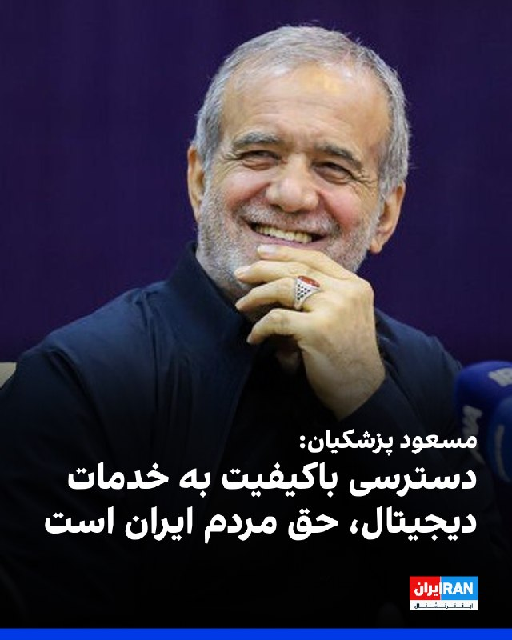

مسعود پزشکیان در پیامی در شبکه اجتماعی ایکس به مناسبت روز جهانی ارتباطات نوشت: «در روزهای جنگ، فرزندان ما در ارتباطات و فناوری اطلاعات شبانه‌روز ایستادند تا ارتباطات کشور پایدار بماند.»
او همچنین دسترسی باکیفیت و پایدار مردم به خدمات دیجیتال را «بخشی از آرامش، پیشرفت و حق زندگی شایسته مردم» ایران دانست.
https://iranintl.com/202605172706

## IranIntlTV — post 337648

  <a href="telegram/content/IranIntlTV_337648_1779035902.mp4" target="_blank">🎬 Download video</a>

لیندسی گراهام، سناتور آمریکایی، در گفت‌وگو با ان‌بی‌سی نیوز خواستار اقدام نظامی بیشتر آمریکا علیه جمهوری اسلامی شد.

جزییات بیشتر با مرضیه حسینی، خبرنگار ایران‌اینترنشنال
@iranintltv

## IranIntlTV — post 337647

  

گوگوش، خواننده سرشناس ایرانی، «نشان افتخار جزیره آلیس» را دریافت کرد؛ «این نشان به افرادی اهدا می‌شود که در جامعه آمریکا تأثیرگذار بوده‌اند و در عین حال ریشه‌ها و هویت فرهنگی خود را حفظ کرده‌اند.»

گوگوش با انتشار تصویری از مراسم اهدای این نشان در صفحه اینستاگرام خود نوشت: «این نشان را با عشق و احترام به مردم ایران تقدیم می‌کنم؛ به مردمی که سال‌ها با رنج، صبوری، امید و سربلندی زندگی کرده‌اند و با وجود همه سختی‌ها، همچنان ایستاده‌اند.»
https://iranintl.com/202605170523

## Persian_Trend_Official — post 14343

## Persian_Trend_Official — post 14341

  

💢در آخرین تصاویر ماهواره ای ناو هواپیمابر آبراهام لینکلن در فاصله ۲۴۵ کیلومتری از ساحل ایران مستقر شده است

🫆:Tony

📌 @persian_trend_official
پرشین ترند | متفاوت‌ترین کانال نظامی

## Persian_Trend_Official — post 14340

  <a href="telegram/content/Persian_Trend_Official_14340_1779035905.webm" target="_blank">🎬 Download video</a>

🚨 شبکه 13 اسرائیل:
بنیامین نتانیاهو از دقایقی پیش در تماس تلفنی ویژه با دونالد ترامپ درباره تحولات اخیر منطقه و درگیری‌های مرتبط با ایران و گروه‌های وابسته به آن در حال گفت‌وگوست.

☆Phantom☆

📌 @persian_trend_official
پرشین ترند | متفاوت‌ترین کانال نظامی

---
📅 بروزرسانی: 1405/02/27 19:05
---

## ChizBergerz — post 46490

یه لیست آیپیِ جدیدِ تست شده دیگه برای اپ "شیرو خورشید"، با سرعتِ بالا مخصوص همراه اول:

151.101.64.223
151.101.0.223
185.200.232.43  
2.17.100.200
2.19.205.42
2.19.205.50
2.19.252.134
2.20.169.70
2.20.170.91
95.101.111.144
2.16.245.188
2.18.69.150
2.16.106.4
23.58.222.107
184.25.28.31
23.47.124.134
23.50.131.147
23.46.190.18
23.58.222.147
23.56.162.186
23.44.203.68
23.12.156.115
23.216.77.16
23.62.61.53
23.39.148.245
23.210.73.133
23.44.201.136
23.205.46.167
184.30.150.142
23.220.161.217
TEL: @ChizBergerz
184.28.165.4
23.46.230.133
88.221.168.204
104.96.158.174
184.51.252.4
172.234.199.15
104.85.26.14
172.237.145.27
92.123.103.24
172.234.159.58
184.86.103.210
96.16.248.183
92.122.16.5
96.16.249.60
96.16.249.9

+ تا زمانی که اتصال‌تون با سرعتِ خووب برقرار هست نیازی نیست که آیپی رو عوض کنید و آیپی هایِ جدید رو تست کنید.
@ChizBergerz

## ChizBergerz — post 46489

  

تو چالشی که چندوقت پیش تو توییتر ترند شده بود این عکس وایرال ترینش بوده:

@ChizBergerz

## ChizBergerz — post 46488

  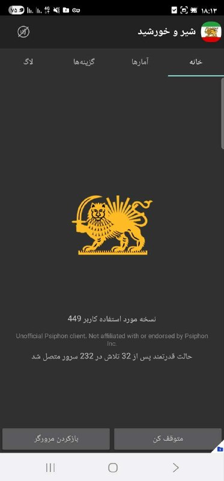

یه لیست آیپیِ جدیدِ تست شده برایِ اپ "شیر و خورشید"، با سرعتِ بالا مخصوص همراه اول: 2.16.16.153 2.16.16.164 2.16.16.182 2.16.16.185 2.16.16.196 2.16.16.198 2.16.16.200 2.16.238.20 2.16.238.23 Tel: @ChizBergerz 2.16.238.25 2.16.238.26 2.16.238.28 2.16.238.133…

## ChizBergerz — post 46487

یه لیست آیپیِ جدیدِ تست شده برایِ اپ "شیر و خورشید"، با سرعتِ بالا مخصوص همراه اول:

2.16.16.153
2.16.16.164
2.16.16.182
2.16.16.185
2.16.16.196
2.16.16.198
2.16.16.200
2.16.238.20
2.16.238.23
Tel: @ChizBergerz
2.16.238.25
2.16.238.26
2.16.238.28
2.16.238.133
2.16.238.139
2.16.238.140
2.17.251.75
2.17.251.83
2.17.251.97
2.17.251.100
2.17.251.103
2.17.251.104
2.17.251.119
2.17.251.181
2.17.251.186
2.18.67.67
2.18.190.89
2.18.190.174
2.19.13.78
2.23.168.144

+ تا زمانی که اتصال‌تون با سرعتِ خووب برقرار هست نیازی نیست که آیپی رو عوض کنید و آیپی هایِ جدید رو تست کنید.
@ChizBergerz

## ChizBergerz — post 46486

  <a href="telegram/content/ChizBergerz_46486_1779032113.mp4" target="_blank">🎬 Download video</a>

تراپی🥰

یه حامی تروریسم حماس داشت کصشعر تفت میداد که پلیس آلمان اومد با کاردک جمعش کرد و بردش: 😂😂
@ChizBergerz

## ChizBergerz — post 46485

  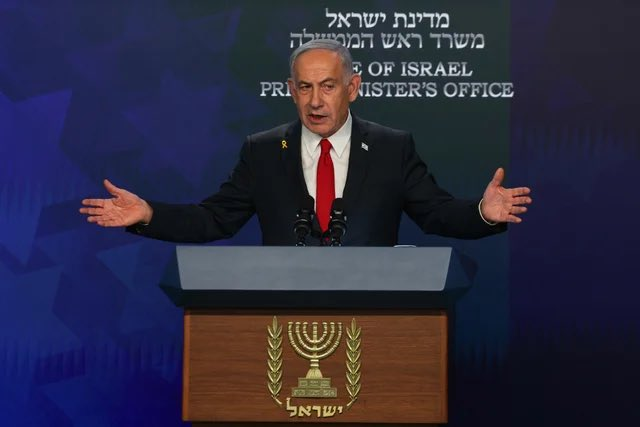

یه موشک کردم تو کون رهبرشون این هوا:

@ChizBergerz

## ChizBergerz — post 46484

  <a href="telegram/content/ChizBergerz_46484_1779032114.mp4" target="_blank">🎬 Download video</a>

از دختری که سابقه‌ش هم‌خواب شدن از صغیر تا کبیر مثل امانوئل مکرونه، انتظار همچین پدری هم میرفت. به اصطلاح قشر فرهنگی و هنری یه مملکت باشی و با همچین ادبیاتی بهت تریبون بدن تا طرفداری نظام رو کنی. @ChizBergerz

## ChizBergerz — post 46483

  <a href="telegram/content/ChizBergerz_46483_1779032116.mp4" target="_blank">🎬 Download video</a>

صدا و‌سیما: مردم به صورت خودجوش و داوطلبانه میان تو مسجد‌ها کار با اسلحه رو یاد میگیرن، تا بتونن از وطنشون درمقابل دشمنان دفاع کنن
💩

@ChizBergerz

## KiriMohems — post 47635

وزیر کشور پاکستان: پاکستانی‌ها شبانه‌روز برای موفقیت دولت و ملت ایران دعا می‌کنند.

- دمت گرم انقدرم خایه مالی لازم نیست

#Berlin
@Kirimohems

## KiriMohems — post 47634

خبرنگارای کاخ سفید رو صدا زدن که برن تو محوطه جنوبی کاخ سفید واسه یه "رویداد نامعلوم"

- احتمالا ترامپ میخواد جق پارتی بگیره

#Berlin
@Kirimohems

## KiriMohems — post 47633

  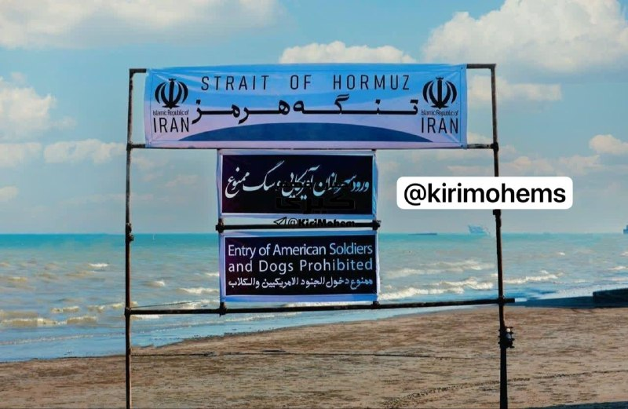

بنری که سپاه تو سولاخ هرمز نصب کرده

#Berlin
@Kirimohems

## KiriMohems — post 47632

## KiriMohems — post 47631

پیشنهاد جدید آمریکا لارنس نورمن، خبرنگار وال استریت ژورنال: نسخه جایگزین پیشنهاد آمریکا به ایران امکان دسترسی به بیش از ۲۵ میلیارد دلار و حفظ توان غنی سازی هسته ای را می دهد. #Berlin @Kirimohems

## KiriMohems — post 47630

پیشنهاد جدید آمریکا

لارنس نورمن، خبرنگار وال استریت ژورنال:
نسخه جایگزین پیشنهاد آمریکا به ایران امکان دسترسی به بیش از ۲۵ میلیارد دلار و حفظ توان غنی سازی هسته ای را می دهد.

#Berlin
@Kirimohems

## KiriMohems — post 47629

سنتکام: از خدا که پنهون نیست از شما چه پنهون تا امروز ۸۱کشتی تجاری را برگرداندیم و ۴کشتی را توقیف کردیم

#Berlin
@Kirimohems

## SportBaadNews — post 251773

  <a href="telegram/content/SportBaadNews_251773_1779032118.mp4" target="_blank">🎬 Download video</a>

واقعا سخته فهمیدنش که گزارشگره طرفدار چه تیمیه
@SportBaadNews

## IranIntlTV — post 337646

اسرائیل بیش از یک سال از دو پایگاه مخفی در عراق برای عملیات علیه ایران استفاده کرد

نیویورک‌تایمز در گزارشی تحقیقی فاش کرد که اسرائیل بیش از یک سال در صحرای غربی عراق دو پایگاه مخفی ایجاد و به‌طور متناوب از آن‌ها برای پشتیبانی از عملیات نظامی علیه حکومت ایران استفاده کرده است؛ پایگاه‌هایی که به گفته مقام‌های عراقی و منطقه‌ای، در جنگ ۱۲ روزه نیز نقش داشته‌اند.

این گزارش همچنین به کشته شدن یک چوپان عراقی اشاره می‌کند که به گفته خانواده‌اش، پس از کشف یکی از این پایگاه‌ها جان خود را از دست داده است.

به گزارش نیویورک‌تایمز، ماجرا از سوم مارس [۱۲ اسفند] آغاز شد؛ زمانی که عوض الشمری، چوپان ۲۹ ساله اهل منطقه النخیب در غرب عراق، برای خرید مایحتاج روزانه از محل سکونت خود خارج شد اما هرگز بازنگشت.

سه شاهد از ساکنان بادیه‌نشین منطقه به این روزنامه گفته‌اند که خودروی او هنگام بازگشت توسط یک بالگرد تعقیب شد و هدف شلیک‌های متعدد قرار گرفت تا سرانجام در میان شن‌های بیابان متوقف شد. چند ساعت بعد، خانواده او خودروی سوخته و جسدش را پیدا کردند.

دو پایگاه اسرائیلی در عراق؛ یکی افشا شد، دیگری همچنان در ابهام
نیویورک‌تایمز به نقل از مقام‌های عراقی گزارش داده که اسرائیل دست‌کم دو پایگاه مخفی در صحرای غربی عراق داشته است. وجود یکی از این پایگاه‌ها پیش‌تر توسط وال‌استریت ژورنال گزارش شده بود، اما مقام‌های عراقی اکنون از وجود پایگاه دومی نیز خبر داده‌اند که تاکنون علنی نشده بود.

بر اساس این گزارش، پایگاهی که عوض الشمری به آن برخورد کرد، پیش از جنگ اخیر میان آمریکا، اسرائیل و جمهوری اسلامی ایجاد شده بود و در جنگ ۱۲ روزه در خرداد علیه تهران مورد استفاده قرار گرفت.

یکی از مقام‌های امنیتی منطقه‌ای به نیویورک‌تایمز گفته اسرائیل از اواخر سال ۲۰۲۴ برای ساخت این پایگاه برنامه‌ریزی می‌کرد و در حال شناسایی مناطق دورافتاده برای استفاده در درگیری‌های آینده بود.

تردیدها درباره اطلاع آمریکا از حضور اسرائیل در عراق
نیویورک‌تایمز می‌نویسد اطلاعات مقام‌های منطقه‌ای نشان می‌دهد دست‌کم یکی از این پایگاه‌ها از ژوئن ۲۰۲۵ [خرداد ۱۴۰۴] یا حتی پیش‌تر برای آمریکا شناخته‌شده بوده است؛ موضوعی که این احتمال را مطرح می‌کند واشینگتن از حضور نیروهای اسرائیلی در خاک عراق اطلاع داشته اما آن را با بغداد در میان نگذاشته باشد.

مقام‌های منطقه‌ای گفته‌اند ساختار امنیتی عراق و نقش آمریکا در آن، بخشی از محاسبات اسرائیل برای فعالیت مخفیانه در خاک عراق بوده است.
دو مقام امنیتی عراق نیز به این روزنامه گفته‌اند که در جریان جنگ‌های اخیر، واشینگتن بغداد را وادار کرده بود برای حفاظت از هواپیماهای آمریکایی، رادارهای خود را خاموش کند؛ اقدامی که وابستگی عراق به آمریکا برای تشخیص تهدیدهای هوایی را افزایش داده بود.

حمله به نیروهای عراقی و شناسایی پایگاه
بر اساس گزارش، ارتش عراق پیش از کشف پایگاه توسط چوپان، بیش از یک ماه به حضور احتمالی نیروهای اسرائیلی در بیابان مشکوک بود و فعالیت‌ها را از دور زیر نظر داشت.

ژنرال علی الحمدانی، فرمانده نیروهای فرات غربی عراق، به نیویورک‌تایمز گفته است: «تا امروز، دولت درباره این موضوع سکوت کرده است.»
پس از گزارش عوض الشمری، نیروهای شناسایی عراق به منطقه اعزام شدند، اما طبق اعلام مقام‌های عراقی، هدف حمله قرار گرفتند؛ حمله‌ای که در آن یک سرباز کشته، دو نفر زخمی و دو خودرو منهدم شد.

حمدانی گفته است پس از تماس فرماندهان عراقی با ارتش آمریکا و دریافت این پاسخ که نیروهای حاضر آمریکایی نیستند، مقام‌های عراقی نتیجه گرفتند که با نیروهای اسرائیلی روبه‌رو بوده‌اند. او گفت: «وقتی تایید شد نیروها آمریکایی نیستند، فهمیدیم که اسرائیلی هستند.»

افشای پایگاه دوم و نگرانی درباره حاکمیت عراق
چهار روز پس از حمله به نیروهای عراقی، پارلمان عراق فرماندهان نظامی را برای ارائه توضیح فراخواند.

حسن فدعام، یکی از نمایندگان حاضر در جلسه، به نیویورک‌تایمز گفت: «پایگاه النخیب فقط همان پایگاهی است که کشف شد.» یک مقام دیگر عراقی نیز وجود پایگاه دوم اسرائیل در صحرای غربی عراق را تایید کرده، اما محل دقیق آن را فاش نکرده است.

گزارش نیویورک‌تایمز می‌گوید افشای این پایگاه‌ها پرسش‌های دشواری را برای بغداد ایجاد کرده است؛ از جمله اینکه آیا نیروهای عراقی واقعاً از حضور خارجی در خاک کشور بی‌اطلاع بوده‌اند یا از آن اطلاع داشته اما سکوت کرده‌اند.

وعد الکدو، نماینده پارلمان عراق که در جلسه محرمانه توجیهی شرکت داشته، به این روزنامه گفته است: «این موضوع نشان‌دهنده بی‌اعتنایی آشکار به حاکمیت عراق، دولت و نیروهای آن و همچنین کرامت مردم عراق است.»

🔗متن کامل گزارش را اینجا بخوانید
@iranintltv

## IranIntlTV — post 337645

  <a href="telegram/content/IranIntlTV_337645_1779032119.mp4" target="_blank">🎬 Download video</a>

وزارت دفاع امارات متحده عربی از مقابله با سه پهپاد شلیک‌شده از مرزهای غربی خبر داد. بر اساس این گزارش، پدافند هوایی این کشور دو فروند از پهپادها را منهدم کرد، اما پهپاد سوم به یک ژنراتور برق در خارج از محدوده داخلی نیروگاه هسته‌ای براکه در منطقه الظفره اصابت کرد.

گفت‌وگو با هوشنگ حسن‌یاری، کارشناس خاورمیانه و امور نظامی
@iranintltv

## IranIntlTV — post 337644

  

لیندسی گراهام، سناتور جمهوری‌خواه آمریکا در گفت‌وگو با شبکه ان‌بی‌سی خواستار اقدام نظامی بیشتر آمریکا علیه جمهوری اسلامی شد.
او افزود: وضعیت فعلی به همه ما آسیب می‌زند، هرچه تنگه هرمز بیشتر بسته بماند و ما بیشتر دنبال توافقی برویم که هیچ‌وقت حاصل نمی‌شود. جمهوری اسلامی قوی‌تر می‌شود.

سناتور گراهام افزود: «تا این لحظه، هیچ چیزی نشان نمی‌دهد افرادی که اکنون در قدرت هستند، از نظر اهداف رژیم برای تروریسم جهانی، نابودی اسرائیل و حمله به ما تفاوتی کرده باشند.»

او اضافه کرد: «آنچه رئیس‌جمهور ترامپ از نظر نظامی انجام داده فوق‌العاده بوده، اما هنوز اهداف بیشتری وجود دارد و کارهای بیشتری هست که می‌توانیم برای ضربه زدن به ایران انجام دهیم.»
https://iranintl.com/202605173661

## IranIntlTV — post 337643

  

🔻تیم والیبال فولاد سیرجان در دیدار فینال لیگ قهرمانان ۲۰۲۶ آسیا با نتیجه ۳ بر ۱ برابر جاکارتا بهایانگ‌کارا اندونزی شکست خورد.

🔹فولاد سیرجان تنها در ست دوم با نتیجه ۲۶ بر ۲۴ پیروز شد و در ست‌های اول، سوم و چهارم با نتایج ۲۵ بر ۲۰، ۲۵ بر ۲۳ و ۲۵ بر ۲۳ شکست خورد تا شاگردان بهروز عطایی از رسیدن به جام قهرمانی بازماندند.

🔹در ترکیب تیم جاکارتا بهایانگ‌کارا اندونزی بازیکنانی همچون روبرت‌لندی سیمون، بازیکن کوبایی، نوموری کیتا، بازیکن اهل مالی، و روک موژیچ، ستاره اسلوونیایی تیم ورونا ایتالیا، حضور داشتند. روک موژیچ در لیگ ملت‌های ۲۰۲۵ نیز جزو امتیازآورترین بازیکنان بود.

@iranintltvsport

## IranIntlTV — post 337642

  <a href="telegram/content/IranIntlTV_337642_1779032122.mp4" target="_blank">🎬 Download video</a>

پگاه آهنگرانی، بازیگر و فیلمساز ایرانی، شنبه ۲۶ اردیبهشت برای نمایش فیلم تازه خود «تمرین‌هایی برای یک انقلاب» در جشنواره کن حاضر شد. او این فیلم را به مادرانی تقدیم کرد که فرزندانشان را در مسیر مبارزه برای آزادی از دست داده‌اند. آهنگرانی که همراه عوامل فیلم روی صحنه رفت، گفت خوشحال است که این اثر توانسته بخشی از مبارزه مردم برای آزادی و دموکراسی را به تصویر بکشد و افزود مردم این روزها با قطعی اینترنت، خبرهای روزانه اعدام‌ها توسط جمهوری اسلامی و سایه جنگ روبه‌رو هستند.
@iranintltv

## IranIntlTV — post 337641

  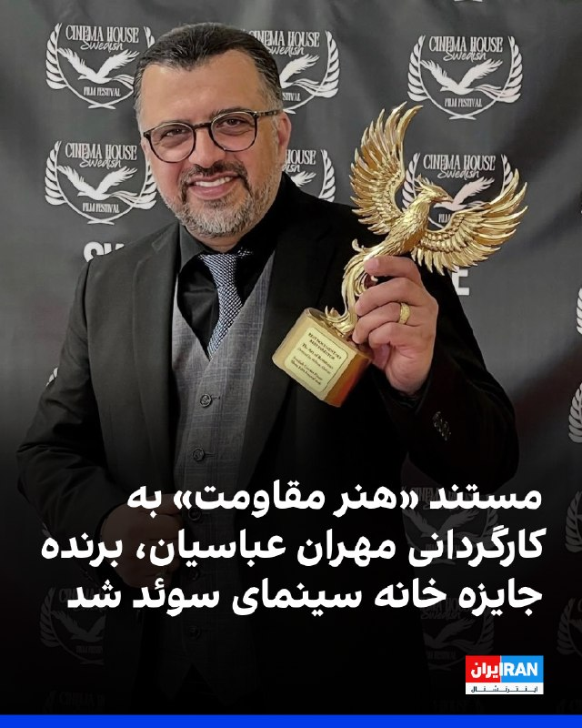

مستند کوتاه «هنر مقاومت» به تهیه‌کنندگی ایران اینترنشنال و کارگردانی مهران عباسیان در فستیوال فیلم خانه سینمای سوئد موفق به دریافت جایزه بهترین مستند کوتاه و بهترین کارگردانی شد.
این فیلم داستان دو هنرمند ایرانی را روایت می‌کند که هنر را به زبان اعتراض، امید و مقاومت در برابر محدودیت‌ها تبدیل کرده‌اند.
https://iranintl.com/202605174127

## IranIntlTV — post 337640

  <a href="telegram/content/IranIntlTV_337640_1779032124.mp4" target="_blank">🎬 Download video</a>

یک شهروند با ارسال پیامی به ایران‌اینترنشنال می‌گوید مدرس آنلاین زبان انگلیسی است و دو ماهی می‌شود که نتوانسته یک کلاس برگزار کند.

## IranIntlTV — post 337639

  <a href="telegram/content/IranIntlTV_337639_1779032125.mp4" target="_blank">🎬 Download video</a>

پس از ۱۲ هفته خاموشی اینترنت در ایران، حالا دسترسی به اینترنت برای برخی شهروندان به کالایی گران و لوکس تبدیل شده است.

مهدی بیگی، عضو تحریریه ایران‌اینترنشنال، در برنامه پیوست بازار سیاه «اینترنت پرو» را بررسی کرده است
@iranintltv

## IranIntlTV — post 337638

  <a href="telegram/content/IranIntlTV_337638_1779032127.mp4" target="_blank">🎬 Download video</a>

رکود تورمی سنگین در اقتصاد ایران، موجب تشدید بحران در صنایع مختلف شده است. روزنامه جهان صنعت در گزارشی از انباشت ۸۰ تا ۱۲۰ هزار خودروی ناقص و بدهی سنگین شرکت سایپا به قطعه‌سازان خبر داد.

گفت‌وگو با مهتاب قلی‌زاده، روزنامه‌نگار اقتصادی
@iranintltv

## IranIntlTV — post 337637

  

فرماندهی مرکزی ایالات متحده، سنتکام، اعلام کرد از زمان آغاز محاصره دریایی بنادر و سواحل جنوبی ایران، ۸۱ کشتی تجاری مجبور به تغییر مسیر شده‌اند و چهار شناور دیگر نیز پس از هدف قرار گرفتن، از کار افتاده‌اند تا اجرای این محاصره تضمین شود.
https://iranintl.com/202605177479

## IranIntlTV — post 337636

  <a href="telegram/content/IranIntlTV_337636_1779032129.mp4" target="_blank">🎬 Download video</a>

سرخط خبرهای یکشنبه ۲۷ اردیبهشت
@iranintltv

## IranIntlTV — post 337634

  

ارتش اسرائیل اعلام کرد بها برود، از فرماندهان ستاد عملیات حماس، در حمله هوایی کشته شده است.
به گفته ارتش، او در هفته‌های اخیر در برنامه‌ریزی حملات علیه نیروهای اسرائیلی و غیرنظامیان نقش داشته و تهدیدی فوری محسوب می‌شده است.
ارتش اسرائیل تأکید کرد این حمله با مهمات دقیق انجام شده و نیروهای فرماندهی جنوبی مطابق آتش‌بس مستقر هستند.
https://iranintl.com/202605178370

## Persian_Trend_Official — post 14339

  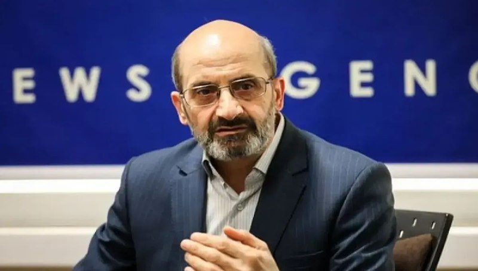

🔴دفاع عضو شورای عالی فضای مجازی از فیلترینگ، پایان گمنامی و اینترنت طبقاتی / «در صورت خروج از شرایط جنگی، واتس‌اپ باز می‌شود»

🔹 رسول جلیلی، عضو شورای عالی فضای مجازی، از ادامه محدودیت پلتفرم‌های خارجی، پایان گمنامی کاربران و اینترنت طبقاتی دفاع کرد؛ طرح‌هایی که ظاهراً قرار است اینترنت را از همیشه «کنترل‌شده‌تر» کنند.

🔹 او با اشاره به شرایط امنیتی اخیر گفت بعد از این اتفاقات نمی‌توان دوباره به سمت بازگشایی کامل سکوهای خارجی رفت و مدعی شد برخی سیاسیون در سال‌های گذشته مانع فیلترینگ کامل شده‌اند.

🔹 جلیلی همچنین ادعای فروش VPN توسط نهادهای حاکمیتی را رد کرد و گفت نیاز اصلی مردم فقط خدمات ارتباطی است؛ خدماتی که به گفته او در پیام‌رسان‌های داخلی هم وجود دارد، هرچند بسیاری از کاربران و کسب‌وکارها هنوز ترجیح می‌دهند جایی فعالیت کنند که مخاطب واقعی حضور دارد.

🔹 عضو شورای عالی فضای مجازی در ادامه اعلام کرد در صورت خروج کشور از شرایط جنگی، امکان بازگشایی دوباره واتس‌اپ وجود دارد.

🔹 او در پایان از پایان «گمنامی» کاربران و اینترنت طبقاتی دفاع کرد؛ موضوعی که همچنان با انتقادهای گسترده‌ای روبه‌روست.

☆Phantom☆

📌 @persian_trend_official
پرشین ترند | متفاوت‌ترین کانال نظامی

## Persian_Trend_Official — post 14338

افزایش ساعت معاملات سهام در روزهای ۲۹ و ۳۰ اردیبهشت ۱۴۰۵ مدیر نظارت بر بورس‌های سازمان بورس و اوراق بهادار اعلام کرد: 💢به منظور مدیریت بازگشایی نماد شرکت‌های با افشای اطلاعات با اهمیت نوع «الف» و شرکت‌هایی که مجامع خود را در دوره توقف بازار سهام برگزار کرده‌اند،…

## Persian_Trend_Official — post 14337

افزایش ساعت معاملات سهام در روزهای ۲۹ و ۳۰ اردیبهشت ۱۴۰۵

مدیر نظارت بر بورس‌های سازمان بورس و اوراق بهادار اعلام کرد:

💢به منظور مدیریت بازگشایی نماد شرکت‌های با افشای اطلاعات با اهمیت نوع «الف» و شرکت‌هایی که مجامع خود را در دوره توقف بازار سهام برگزار کرده‌اند، یک ساعت به زمان معاملات سهام و ابزارهای مرتبط با سهام در بورس تهران و فرابورس ایران اضافه می‌شود.

💢بر این اساس، معاملات در روزهای سه‌شنبه و چهارشنبه ۲۹ و ۳۰ اردیبهشت تا ساعت ۱۳:۳۰ ادامه خواهد داشت.

🫆:Tony

📌 @persian_trend_official
پرشین ترند | متفاوت‌ترین کانال نظامی

## Persian_Trend_Official — post 14336

  

🔴 نیویورک‌تایمز: اسرائیل دو پایگاه مخفی در بیابان عراق اداره کرده است

💢روزنامه نیویورک‌تایمز مدعی شد اسرائیل طی بیش از یک سال گذشته به‌صورت متناوب دو پایگاه مخفی در بیابان‌های عراق را اداره کرده است.

بر اساس این گزارش:

▪️ برنامه‌ریزی این پایگاه‌ها از اواخر سال ۲۰۲۴ آغاز شده بود
▪️ هدف از ایجاد آن‌ها پشتیبانی از عملیات علیه ایران عنوان شده است
▪️ این پایگاه‌ها به‌صورت محرمانه مورد استفاده قرار می‌گرفتند

نیویورک‌تایمز همچنین مدعی شد:

▪️ آمریکا از ارتش عراق خواسته بود سامانه‌های راداری خود را غیرفعال کند
▪️ هدف از این اقدام جلوگیری از شناسایی حضور اسرائیل در خاک عراق بوده است

💢تاکنون بغداد، واشینگتن و تل‌آویو واکنش رسمی به این ادعاها نشان نداده‌اند.

🫆:Tony

📌 @persian_trend_official
پرشین ترند | متفاوت‌ترین کانال نظامی

## Persian_Trend_Official — post 14335

  <a href="telegram/content/Persian_Trend_Official_14335_1779032131.mp4" target="_blank">🎬 Download video</a>

🔴تصادف‌ زنجیره‌ای در جاده انار - یزد ۲ کشته و ۱۰ مصدوم برجا گذاشت

💢اورژانس شهرستان انار استان کرمان اعلام کرد که یک تصادف زنجیره‌ای امروز(یکشنبه) در جاده انار کرمان یزد پس از شرایط نامساعد جوی و توفان شن، ۲ کشته و ۱۰ مصدوم برجای گذاشت و یک تریلر هم در آتش سوخت.

🫆:Tony

📌 @persian_trend_official
پرشین ترند | متفاوت‌ترین کانال نظامی

## Persian_Trend_Official — post 14334

  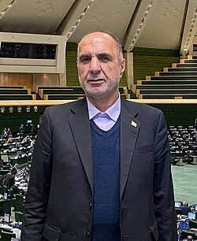

🔴ولی الله بیاتی نماینده مجلس:

💢در صورت اشغال شدن یکی از جزایر خود، کشور امارات را اشغال خواهیم کرد

🫆:Tony

📌 @persian_trend_official
پرشین ترند | متفاوت‌ترین کانال نظامی

## Persian_Trend_Official — post 14333

💢 آکسیوس: ایالات متحده نسبت به تهدید پهپادهای نظامی از سوی کوبا هشدار داده است

🔹طبق گزارش‌ آکسیوس، کوبا بیش از ۳۰۰ پهپاد نظامی به‌دست آورده و بحث‌هایی را درباره برنامه‌هایی برای حمله به پایگاه نظامی آمریکا در خلیج گوانتانامو و ناوهای نظامی این کشور آغاز کرده است.

🫆:Tony

📌 @persian_trend_official
پرشین ترند | متفاوت‌ترین کانال نظامی

---
📅 بروزرسانی: 1405/02/27 17:51
---

## KiriMohems — post 47625

🔴لیست افراد جدیدی که اموالشون توسط قوه قضاییه مصادره شده

افرادی مثل : پوریا پوتک، شیما کاتوزیان، فرشاد سایلنت، آیسان اسلامی، اعضای گروه وانتونز و کلی بلاگر زن هم بوده

#Helsinki
@KiriMohems

## KiriMohems — post 47624

  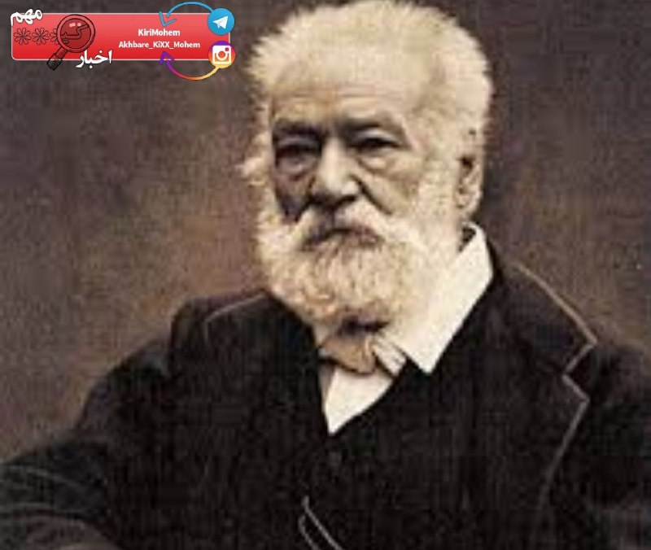

#سخن_بزرگان

زن چون کراوات است
هم مرد را زیبا نگه میدارد...
هم حلقوم او را می فشارد..!
اما رفیق بد مانند شورت میماند...
دلیل خاصی هم ندارد...
ولی همینکه کیرمان توش است...
کافیست...!!!

ویکتور هوگو - شاعر و داستان نویس فرانسوی

#Helsinki
@KiriMohems

## SportBaadNews — post 251772

  

⚡ فروش فیلترشکن اختصاصی استارلینک، قوی، بدون قطعی و از همه مهمتر بدون ضریب، آیپی ثابت

سرور اقتصادی:

🔴 1 گیگ: 250

🔴 2 گیگ: 490

🔴 5 گیگ: 1.200

🔴 10 گیگ: 2.400

🔴 15 گیگ: 3.600

🔴 20 گیگ: 4.800

استارلینک:

🔴 1 گیگ: 350

🔴 2 گیگ: 700

🔴 5 گیگ: 1.700

🔴 10 گیگ: 3.000

🔴 15 گیگ: 4.600

🔴 20 گیگ: 5.500

🔰 کانالمون:
@VpnBadNews

🤖 ربات جهت خرید سرور
@vpnbadnews_bot

## SportBaadNews — post 251771

  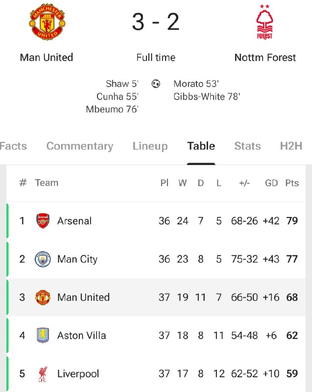

منچستریونایتد 3-2 برد
@SportBaadNews

## SportBaadNews — post 251767

کاسمیرو هم به این شکل تو آخرین بازیش در اولدترافورد در میان تشویق هواداران زمین رو ترک کرد
@SportBaadNews

## SportBaadNews — post 251766

برونو فرناندز به آمار 20 پاس گل تو یک فصل پریمیرلیگ رسید، بیشترین آمار تو یک فصل از نظر پاس گل در کنار دیبروینه و تیری آنری @SportBaadNews

## SportBaadNews — post 251765

  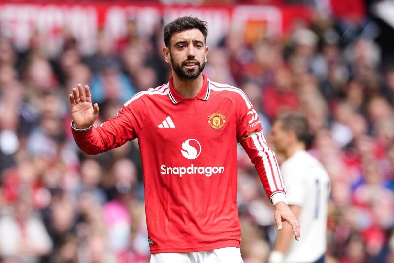

برونو فرناندز به آمار 20 پاس گل تو یک فصل پریمیرلیگ رسید، بیشترین آمار تو یک فصل از نظر پاس گل در کنار دیبروینه و تیری آنری
@SportBaadNews

## SportBaadNews — post 251764

خب دومیو خوردیم 3-2 شد

## SportBaadNews — post 251763

منچستررررریونایتددد چه خوووب شده

## SportBaadNews — post 251762

منچستررررریونایتددد چه خوووب شده

## IranIntlTV — post 337633

  <a href="telegram/content/IranIntlTV_337633_1779027672.mp4" target="_blank">🎬 Download video</a>

مهدی تاج، رییس فدراسیون فوتبال، وعده داد تیم فوتبال ایران با پرواز مستقیم ایران‌ایر برای جام جهانی راهی آمریکا خواهد شد. رسانه فوتبال ۳۶۰ در واکنش به این اظهارات، با اشاره به قرار داشتن ایران‌ایر در فهرست تحریم‌های آمریکا و اروپا، امکان تحقق چنین وعده‌ای را زیر سوال برد.

گفت‌وگو با محمد تقوی، عضو تحریریه ایران‌اینترنشنال
@iranintltv

## IranIntlTV — post 337632

  <a href="telegram/content/IranIntlTV_337632_1779027675.mp4" target="_blank">🎬 Download video</a>

دونالد ترامپ، رییس‌جمهوری ایالات متحده، گفت اگر جمهوری اسلامی توافق نکند، روزگار بسیار بدی خواهد داشت. همزمان رسانه‌های ایران اعلام کردند جمهوری اسلامی پاسخ خود به آمریکا را به میانجی پاکستانی ارائه داده است.

گفت‌وگو با شایان سمیعی، کارشناس امنیت ملی
@iranintltv

## IranIntlTV — post 337631

  <a href="telegram/content/IranIntlTV_337631_1779027678.mp4" target="_blank">🎬 Download video</a>

گروهی از فعالان و حامیان مردم ایران، تجمعی اعتراضی روی پل پر تردد فرانسیس اسکات‌کی در واشینگتن برگزار کردند. هدف این برنامه، جلب توجه افکار عمومی به وضعیت زندانیان سیاسی، مخالفت با اعدام‌ها و حمایت از آزادی اینترنت در ایران است.

گزارش اردوان روزبه، خبرنگار ایران‌اینترنشنال
@iranintltv

## IranIntlTV — post 337630

  <a href="telegram/content/IranIntlTV_337630_1779027680.mp4" target="_blank">🎬 Download video</a>

یک شهروند با ارسال پیامی به ایران‌اینترنشنال می‌گوید: «در بلوچستان هر ۲۰ لیتر بنزینِ آزاد، بین یک میلیون و ۳۰۰ هزار تومان تا یک میلیون و ۵۰۰ هزار تومان شده؛ یعنی حدودا لیتری ۶۰ تا ۷۰ هزار تومان.»

## IranIntlTV — post 337629

  

🔻در حالی که تیم فوتبال ایران در اردوهای پیشین مشغول بازی با خودش بود و قرار است در اردوی ترکیه به مصاف گامبیا برود، تیم ملی عراق، دیگر نماینده آسیا در جام جهانی، در آخرین اردوی آماده‌سازی خود مقابل تیم‌های ملی آندورا و اسپانیا بازی دوستانه برگزار خواهد کرد.

🔹نکته قابل توجه این است که فدراسیون فوتبال ایران پس از قرعه‌کشی جام جهانی مدعی شده بود برای برگزاری دیدارهای تدارکاتی با اسپانیا و پرتغال به توافق رسیده است، اما این بازی‌ها نهایی نشد و اکنون عراق به‌جای ایران با تیم ملی اسپانیا بازی خواهد کرد.

🔹تیم ملی ایران علاوه بر این‌که هیچ حریف درجه یک یا درجه دویی برای بازی تدارکاتی ندارد، هنوز برای هیچ‌یک از بازیکنان و اعضای تیم نیز ویزای آمریکا صادر نشده است.

🔹مهدی تاج، رئیس فدراسیون فوتبال ایران، روز گذشته پس از دیدار با رئیس فدراسیون فوتبال ترکیه، از برگزاری بازی تدارکاتی با تیم ملی ترکیه پس از جام جهانی خبر داد.

🔹جزییات بیشتر را در سایت بخوانید.

@iranintltvsport

## IranIntlTV — post 337626

  

اردن حمله پهپادی به ابوظبی را که به وقوع آتش‌سوزی در خارج از محدوده داخلی نیروگاه هسته‌ای براکه منجر شد، به‌شدت محکوم کرد و آن را نقض آشکار حاکمیت امارات متحده عربی، تهدیدی علیه امنیت و ثبات این کشور و نیز نقض صریح قوانین بین‌المللی و منشور سازمان ملل متحد دانست.

وزارت خارجه اردن در بیانیه‌ای با اعلام همبستگی کامل با امارات متحده عربی تاکید کرد که اَمان در کنار ابوظبی و تمامی اقداماتی که برای حفظ امنیت، حاکمیت و سلامت شهروندان و ساکنان خود انجام دهد، خواهد ایستاد.
https://iranintl.com/202605171312

## IranIntlTV — post 337625

  

اکسیوس گزارش داد که کوبا بیش از ۳۰۰ پهپاد نظامی خریداری کرده و اخیرا نیز گفت‌وگو درباره استفاده از آنها برای حمله به پایگاه آمریکا در خلیج گوانتانامو، شناورهای نظامی آمریکا و احتمالا شهر کی‌وست در ایالت فلوریدا، در حدود ۱۴۵ کیلومتری شمال هاوانا، را آغاز کرده است.

یک مقام ارشد آمریکایی به اکسیوس گفت این اطلاعات که می‌تواند دلیلی برای اقدام نظامی آمریکا شود، نشان می‌دهد دولت ترامپ تا چه اندازه کوبا را، به دلیل تحولات جنگ پهپادی و حضور مستشاران نظامی جمهوری اسلامی در هاوانا، تهدید تلقی می‌کند.

این مقام آمریکایی گفت: «وقتی به این نوع فناوری‌ها که تا این اندازه نزدیک هستند فکر می‌کنیم، و همچنین به طیفی از بازیگران خطرناک از گروه‌های تروریستی گرفته تا کارتل‌های مواد مخدر، مستشاران جمهوری اسلامی و روس‌ها، موضوع نگران‌کننده می‌شود.»
https://iranintl.com/202605176856

## IranIntlTV — post 337624

روایت شما از بحران اقتصادی در آتش‌بس- یکشنبه ۲۷ اردیبهشت‌ماه🗣

🔹واقعا دیگه هیچ امیدی ندارم. سه ماهه به‌خاطر قطعی اینترنت بیکار موندیم. پهنای باند این‌قدر کمه که نه فیلترشکن جواب داده و نه اینترنت‌پرو.

🔹من مدرس آنلاین زبان بودم. الان دو ماه گذشته و حتی یک کلاس هم نتونستم برگزار کنم. از پس‌اندازم فقط دو میلیون تومان مونده و نمی‌تونم کار هم پیدا کنم.

🔹منم مثل خیلی از هم‌وطنان بیکار شدم و برای ادامه زندگی، با قسط و قرض یه کامیون خریدم. اما سوخت کامیون خیلی کمه و ناچارم یک لیتر گازوئیل رو ۵۰ تا ۷۵ هزار تومان بخرم که اصلاً مقرون‌به‌صرفه نیست. از یه طرف از بیکاری دارم دیوونه میشم و از طرف دیگه شرمنده زن و بچه شدم.

🔹اسنپ سوار شدم، کنارم روپوش پزشکی و چند تا کتاب دیدم. راننده جوان گفت که دانشجو هست و اوقات بین کلاس و بیمارستان اسنپ کار می‌کند.

🔹دلم می‌خواد خون گریه کنم. سه ماه هست که بیکارم. پانزده روز دیگه باید خونه ۵۰ متری استیجاری‌ رو تحویل بدم، در حالی که اجاره و ودیعه سر به فلک کشیده و من فقط صد میلیون تومان پول ودیعه بیشتر ندارم.

🔹من و همسرم تریدر هستیم و اول زندگی مشترکمونه. از جنگ ۱۲ روزه تا الان همش از جیب، اجاره و هزینه‌هامون رو دادیم. اما دیگه نمی‌دونیم باید چکار کنیم. امیدوارم این همه سختی و مشکلات نتیجه‌اش برگشت پهلوی باشه.

🔹۱۰ تیکه فیله‌مرغ، ۴ تیکه بوقلمون و یک شانه تخم‌مرغ شد شش میلیون و ۳۰۰ هزار تومان. واقعا باورنکردنیه.

🔹 دانشجو علوم پزشکی تهران هستم. متاسفانه هیچ دسترسی به اینترنت آزاد و بین‌الملل برای دانشجویان در نظر گرفته نشده. مقالات، پروژه‌ها و پایان‌نامه‌های ما به‌خاطر نداشتن دسترسی به چیزی که حق طبیعی هر انسانی است، ناتمام مونده.

## IranIntlTV — post 337623

  <a href="telegram/content/IranIntlTV_337623_1779027685.mp4" target="_blank">🎬 Download video</a>

یک شهروند با ارسال پیامی به ایران‌اینترنشنال می‌گوید: «ساعت مرگ، زمانی است که همه‌چیز، از جمله انگیزه از بین می‌رود. برای من، این ساعت زمانی بود که مجبور شدم به خاطر شرایط تحمیل‌شده، شش نفر از ۱۴ نیروی کارم را تعدیل کنم.»

## IranIntlTV — post 337622

  <a href="telegram/content/IranIntlTV_337622_1779027688.mp4" target="_blank">🎬 Download video</a>

دفتر رسانه‌ای ابوظبی از حمله پهپادی به یک ژنراتور برق در محدوده داخلی نیروگاه هسته‌ای براکه در منطقه الظفره خبر داد. بر اساس این گزارش، این حمله پهپادی باعث آتش‌سوزی در نیروگاه هسته‌ای شده است.

گفت‌وگو با علی صدرزاده، تحلیل‌گر مسائل خاورمیانه
@iranintltv

## Persian_Trend_Official — post 14332

https://youtu.be/8YQ1YcLyw6E

## Persian_Trend_Official — post 14331

کانال رسمی پرشین ترند pinned «https://youtu.be/8YQ1YcLyw6E»

## Persian_Trend_Official — post 14330

💢گویا بیانیه وزارت دفاع امارات در مورد حمله پهپادی مربوط به انفجار در نیروگاه هسته ای براکه هستش و منابع عربی به اشتباه اعلام حمله دیگری را گزارش داده اند

## Persian_Trend_Official — post 14329

https://youtu.be/8YQ1YcLyw6E

## Persian_Trend_Official — post 14327

🔴 وزارت دفاع امارات: هدف حمله ۳ پهپاد قرار گرفتیم وزارت دفاع امارات اعلام کرد این کشور هدف حمله سه پهپاد قرار گرفته است. ▪️ به گفته منابع عربی پهپادها از سمت مرزهای غربی وارد حریم امارات شده‌اند 🫆:Tony 📌 @persian_trend_official پرشین ترند | متفاوت‌ترین…

## Persian_Trend_Official — post 14325

🔴 وزارت دفاع امارات: هدف حمله ۳ پهپاد قرار گرفتیم

وزارت دفاع امارات اعلام کرد این کشور هدف حمله سه پهپاد قرار گرفته است.

▪️ به گفته منابع عربی پهپادها از سمت مرزهای غربی وارد حریم امارات شده‌اند

🫆:Tony

📌 @persian_trend_official
پرشین ترند | متفاوت‌ترین کانال نظامی

## Persian_Trend_Official — post 14324

  

🔴اسرائیل یکی از فرماندهان حماس را ترور کرد

💢ارتش رژیم اسرائیل مدعی شد «بهاء بارود»، فرمانده اداره عملیات جنبش حماس را دیروز (شنبه) هدف قرار داده است.

🫆:Tony

📌 @persian_trend_official
پرشین ترند | متفاوت‌ترین کانال نظامی

---
📅 بروزرسانی: 1405/02/27 16:21
---

## rodast_omiddana — post 71466

  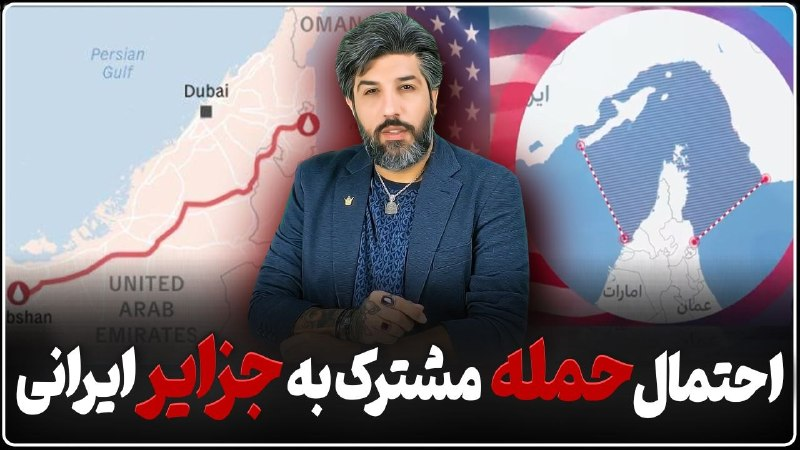

🎬 احتمال حمله مشترک امارات و آمریکا به جزایر ایرانی در این هفته
لینک یوتیوب:
https://www.youtube.com/watch?v=t22Ng_fY5PA

## rodast_omiddana — post 71465

  <a href="telegram/content/rodast_omiddana_71465_1779022276.webm" target="_blank">🎬 Download video</a>

🚨 تایید نشده_انفجار در اصفهان (صنایع نظامی زرینشهر-ورنامخواست )
صدای عظیمی بود

## rodast_omiddana — post 71464

  <a href="telegram/content/rodast_omiddana_71464_1779022277.webm" target="_blank">🎬 Download video</a>

🚨 فوری_نتانیاهو:
"امروز با ترامپ گفت‌وگو خواهم کرد
امروز با دونالد ترامپ، درباره سفر اخیر او به چین و «احتمالا» پرونده ایران گفت‌وگو خواهم کرد، چشمان ما به سوی ایران باز است و برای همه احتمالات آماده هستیم."

## KiriMohems — post 47623

🔴انجمن فولاد: گرون شدن ماشین هیچ ارتباطی با قیمت فولاد ما نداره ، چرا فحش ناموصی رو نثار ما میکنید؟ ما کون خودمون رو پاره کنیم ، فولاد ده درصد قیمت تمام شده یک ماشین رو تشکیل میده و مثلا تو یه ماشین یک میلیاردی فقط ۷۰ میلیون تومن فولاد هست

#Helsinki
@KiriMohems

## KiriMohems — post 47622

🔴به نقل از N12 News :

اسرائیل بیشتر از یک سال دوتا پایگاه نظامی مخفی تو بیابون‌های عراق مکان کرده بود و برای عملیات‌هاش علیه ایران ازشون استفاده میکرد

#Helsinki
@KiriMoheme

## KiriMohems — post 47621

  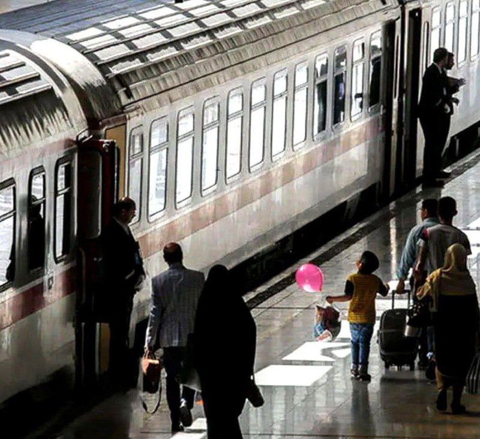

🔴پیش‌فرویش بلیت‌ قطار مسافری نیمه اول خرداد از فردا

رجا اعلام کرده : پیش فروش بلیت‌ قطارهای مسافری برای چاک کون زمانی یک تا ۱۶ خرداد، از فردا (دوشنبه، ۲۸ اردیبهشت) آغاز ‌میشه.

#Helsinki
@KiriMohems

## KiriMohems — post 47620

  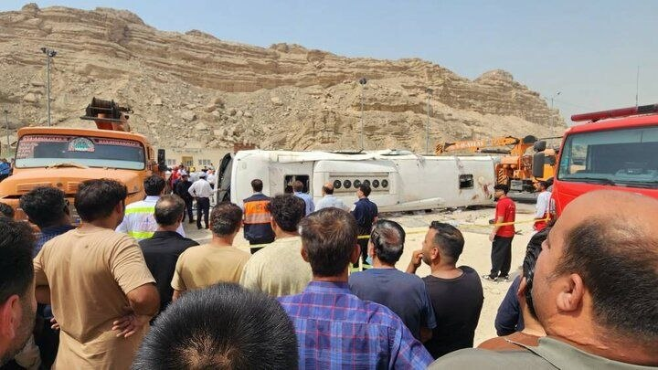

🔴حادثه تلخ در عسلویه؛ واژگونی اتوبوس ۸ فوتی داشت

فرمانده پلیس راه سیراف - عسلویه:

🔹باقی سرنشینان اتوبوس که دچار مصدومیت شده‌اند، بلافاصله توسط تیم‌های امدادی از محل حادثه جمع‌آوری و به بیمارستان‌های عسلویه و کنگان منتقل شدند.

🔹کارشناسان پلیس راه در محل حادثه حاضر شده و علت این واژگونی را در نقص فنی در سیستم ترمز تشخیص داده‌اند.

#Helsinki
@KiriMohems

## IranIntlTV — post 337621

  <a href="telegram/content/IranIntlTV_337621_1779022279.mp4" target="_blank">🎬 Download video</a>

جابر رجبی، تحلیل‌گر سیاسی، می‌گوید آمریکا مذاکرات را تنها برای خارج کردن اورانیوم غنی‌شده جمهوری اسلامی ادامه می‌دهد و همزمان تهران تصور می‌کند با طولانی کردن بحران در تنگه هرمز می‌تواند از واشینگتن امتیاز بگیرد. او هشدار داد این «توهم» در نهایت به اسرائیل کمک می‌کند تا سناریوی جنگ را پیش ببرد.
@iranintltv

## IranIntlTV — post 337620

  <a href="https://t.me/IranintlTV/337620" target="_blank">📎 Download file</a>

🎧نسخه صوتی اخبار نیمروزی | یکشنبه ۲۷ اردیبهشت
@iranintlTV

## IranIntlTV — post 337619

  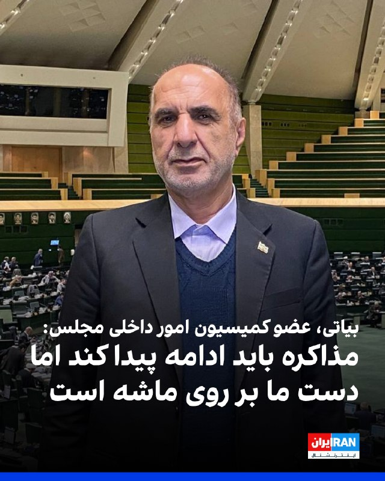

ولی‌الله بیاتی، عضو کمیسیون امور داخلی مجلس، به ایسنا گفت: «مذاکرات باید ادامه پیدا کند، اما در عین حال دست ما روی ماشه است و آمادگی کامل برای ادامه نبرد وجود دارد.»
بیاتی گفت: «وضعیت «نه صلح نه جنگ» خیلی از کارها را در کشور معطل نگه می دارد. این وضعیت آسیب زیادی وارد می‌کند.»
https://iranintl.com/202605179834

## IranIntlTV — post 337618

  <a href="telegram/content/IranIntlTV_337618_1779022283.mp4" target="_blank">🎬 Download video</a>

جاویدنامان انقلاب ملی ایرانیان
«محسن شریف‌کاظمی» در شامگاه ۱۸ دی‌ماه در فردیس کرج مورد اصابت گلوله جنگی نیروهای سرکوبگر جمهوری اسلامی قرار گرفت و جان سپرد. نامش در حافظه‌ی این سرزمین می‌ماند و یادش چراغ راه آزادی‌خواهان است.

@iranintltv

## IranIntlTV — post 337617

ویدیوهای رسیده به ایران‌اینترنشنال نشان می‌دهد مراسم تولد ایلیا قدسی، جاویدنام ۱۷ ساله کشته‌شده در شامگاه ۱۸ دی، بر سر مزارش برگزار شده است. مادر این نوجوان جان‌باخته با سخنرانی در این مراسم خطاب به پسرش گفت: «تو قدم بزرگی برای ما برداشتی. راهت را ادامه خواهیم داد.»

## IranIntlTV — post 337616

  

🔻تیم فوتبال زنان «نائه‌گو‌هیَنگ» کره شمالی روز یکشنبه وارد کره جنوبی شد؛ برای نخستین بار در هفت سال و نیم گذشته ورزشکارانی از کره شمالی پا به خاک کره جنوبی می‌گذارند. این تیم روز چهارشنبه در مرحله نیمه‌نهایی لیگ قهرمانان زنان آسیا، با «سوون اف‌سی وومن» از کره جنوبی بازی می‌کند.

🔹سفر یک تیم فوتبال زنان از کره شمالی به کره جنوبی، اتفاقی نادر در شرایطی است که تنش‌های سیاسی میان دو کشور به سطحی رسیده که دولت‌هایشان عملاً هیچ ارتباط مستقیمی با یکدیگر ندارند.

🔹برخی رویدادهای ورزشی در گذشته میان دو کره نقش کانال دیپلماتیک را ایفا کرده‌اند؛ هرچند این بار انتظار نمی‌رود این سفر به کاهش تنش‌ها منجر شود.

🔹دیدار ورزشکاران دو کره، که از نظر فنی همچنان در وضعیت جنگی قرار دارند، معمولاً فراتر از یک مسابقه ورزشی تلقی می‌شود.

🔹تمام شهروندان کره شمالی که به خارج از کشور سفر می‌کنند، تحت همراهی مأموران پلیس مخفی قرار دارند؛ مأمورانی که هرگونه نشانه بی‌وفایی را زیر نظر می‌گیرند.

🔹درباره این اتفاق کم‌سابقه در وبسایت ایران اینترنشنال بیشتر بخوانید.

@iranintltvsport

## IranIntlTV — post 337615

  <a href="telegram/content/IranIntlTV_337615_1779022286.mp4" target="_blank">🎬 Download video</a>

دفتر رسانه‌ای ابوظبی در امارات از حمله پهپادی به یک ژنراتور برق در محدوده نیروگاه هسته‌ای براکه در منطقه الظفر خبر داد. بر اساس این گزارش، این حمله باعث آتش‌سوزی در بخشی از نیروگاه شده و ژنراتور برق هدف قرار گرفته است.
جزییات بیشتر با علی شیرازی، عضو تحریریه ایران‌اینترنشنال
@iranintltv

---
📅 بروزرسانی: 1405/02/27 15:23
---

## ChizBergerz — post 46482

  <a href="telegram/content/ChizBergerz_46482_1779018829.mp4" target="_blank">🎬 Download video</a>

زنانی بریتانیایی در حرکتی اعتراضی ، در جریان تظاهراتی در بریتانیا علیه آنچه آن را «اسلامی‌سازی بریتانیا» توصیف کردند، نقاب بر چهره زدند و سپس آن را از صورت خود برداشتند و روی زمین انداختند.

این بیداری ملی را باید مدیون ایرانیان باشند
و درود میفرستم به ایرانیانی که در این راهپیمایی هم قدم بودن با ملی گرایان بریتانیا❤️
@ChizBergerz

## ChizBergerz — post 46481

  <a href="telegram/content/ChizBergerz_46481_1779018831.mp4" target="_blank">🎬 Download video</a>

بعد طرف میاد نطق می‌کنه که برید کتاب بخونید، مردم آگاه نیستند! ببین اینو ابله، مردم ایران اینجوری هستن، پتکی که این مهندس جوان ایرانی به سر رژیم زد، هیچکی نزد. آینده ایران رو اینا می‌سازن، با سواد و اهل کار.

@ChizBergerz

## ChizBergerz — post 46480

  <a href="https://t.me/ChizBergerz/46480" target="_blank">📎 Download file</a>

📲#اپلیکیشن اندروید سایت جهانی دربی بت

👍اسپانسر لیگ انگلیس
👍
🔥امکان شارژ امن از طریق کارت بانکی
➖➖➖➖➖➖➖➖➖

🪙همین حالا عضو شوید 👇
https://t.me/+aCbq7yy8QY80NzQ0

## ChizBergerz — post 46479

  

😤دنبال یه سایت شرط بندی بین المللی بودی که به ایرانیا خدمات بده؟!
⛔

👍دربی بت همون انتخاب  100%

💎ویژگی های سایت جهانی Derby Bet:

⬅️امکان شارژ امن با کارت بانکی

⬅️واریز اول دوبل شارژ می شوید(بونوس۱۰۰٪)

⬅️پر اپشن ترین سایت فعال در ایران

⬅️تسویه حساب کمتر از 5 دقیقه

⬅️برگشت بخشی از باخت به صورت هفتگی

🚨کد هدیه ثبت نام:GG007

⚠️برای دانلود اپلکیشن کلیک کنید
👉
re27

🔔کانال دربی بت :

🪙https://t.me/+aCbq7yy8QY80NzQ0

## ChizBergerz — post 46478

  <a href="telegram/content/ChizBergerz_46478_1779018833.mp4" target="_blank">🎬 Download video</a>

از دختری که سابقه‌ش هم‌خواب شدن از صغیر تا کبیر مثل امانوئل مکرونه، انتظار همچین پدری هم میرفت. به اصطلاح قشر فرهنگی و هنری یه مملکت باشی و با همچین ادبیاتی بهت تریبون بدن تا طرفداری نظام رو کنی.

@ChizBergerz

## ChizBergerz — post 46477

  

کتاب دینیه یا داستان‌های پورنهاب؟

کتاب وسائل الشیعه، جلد ۱۴؛ امام رضا: هر وقت خواستی با زنت رابطه داشته باشی، فورا دخول نکن، اول با حرفای جنسی تحریکش کن و بعدش سینه هاشو فشار بده!
با اینکار اون کاملا آماده میشه و شهوت از چشماش فوران میکنه، بعدش ازت میخواد و خواهش میکنه که باهاش رابطه برقرار کنی!

@ChizBergerz

## rodast_omiddana — post 71463

  <a href="telegram/content/rodast_omiddana_71463_1779018834.webm" target="_blank">🎬 Download video</a>

🚨 رسما با یک مشت مادر ج.ن.ده شیعه طرف هستیم..

## rodast_omiddana — post 71462

  <a href="telegram/content/rodast_omiddana_71462_1779018834.mp4" target="_blank">🎬 Download video</a>

🚨 نتانیاهو:
ما در غزه اکنون چیزی در اختیار داریم... دیگر ۵۰٪ نیست... اکنون ۶۰٪ است. این وضعیت امروز است.
ماموریت ما یکی است: اطمینان حاصل کنیم که غزه دیگر تهدیدی برای اسرائیل نخواهد بود.
چشم‌های ما نسبت به ایران نیز باز است. امروز، همانطور که هر چند روز یکبار انجام می‌دهم، با دوستمان رئیس‌جمهور ترامپ صحبت خواهم کرد — تا برداشت‌هایش از سفر به چین را بشنوم و شاید درباره چیزهای دیگر نیز.
قطعاً امکانات زیادی وجود دارد؛ ما برای هر سناریویی آماده‌ایم.

## rodast_omiddana — post 71461

  <a href="telegram/content/rodast_omiddana_71461_1779018836.webm" target="_blank">🎬 Download video</a>

🚨 هواپیمای های ترابری نظامی آمریکا همچنان به منطقه اعزام می شوند.

## KiriMohems — post 47619

  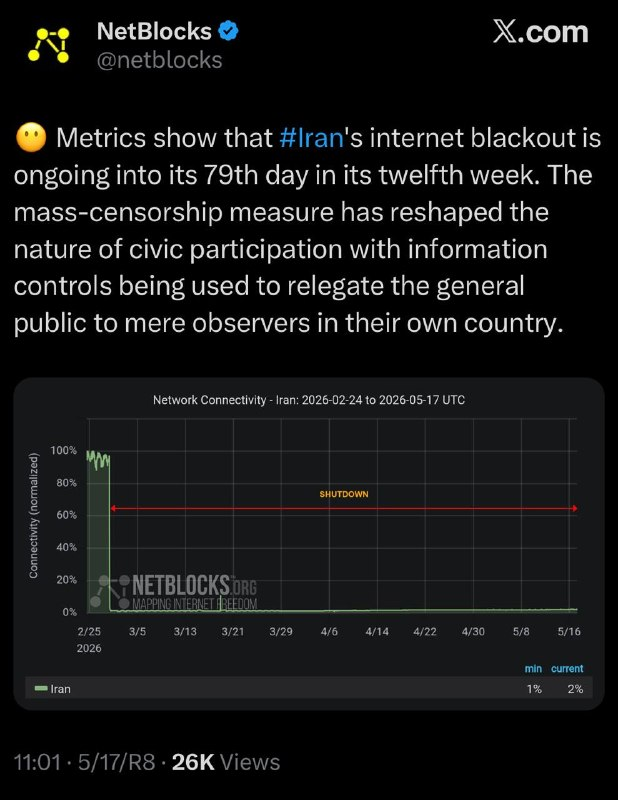

🔴امروز ، روز کیری ارتباطات هست و ما وارد هفتاد و نهمین روز قطعی نت تو ایران شدیم

#Helsinki
@KiriMohems

## KiriMohems — post 47618

  

😤دنبال یه سایت شرط بندی بین المللی بودی که به ایرانیا خدمات بده؟!
⛔

👍دربی بت همون انتخاب  100%

💎ویژگی های سایت جهانی Derby Bet:

⬅️امکان شارژ امن با کارت بانکی

⬅️واریز اول دوبل شارژ می شوید(بونوس۱۰۰٪)

⬅️پر اپشن ترین سایت فعال در ایران

⬅️تسویه حساب کمتر از 5 دقیقه

⬅️برگشت بخشی از باخت به صورت هفتگی

🚨کد هدیه ثبت نام:GG007

⚠️برای دانلود اپلکیشن کلیک کنید
👉

🔔کانال دربی بت :r27🅰

🪙https://t.me/+kpFvLD9kaeJhYTI0

## KiriMohems — post 47617

  <a href="telegram/content/KiriMohems_47617_1779018837.mp4" target="_blank">🎬 Download video</a>

🔴نتانیاهو بین خایه های دولت : چشم‌هامون بازه، کیرمون سیخه و گزینه زیاد داریم و برای هر سناریویی آماده‌ایم

۶ سال پیش تو کابینه درباره خطر گاییده شدن توسط پهپادها هشدار داده بودم
الانم نزدیکیم که پهپادهای انفجاری رو خنثی و تو کون سازنده هاش بکنیم؛ این یه تهدید خاصه
حواسمون کاملاً جمع و جوره، امروز با ترامپ حرف می‌زنم
حتماً درباره سفرش به چین و شاید مسائل دیگه سکس تل بکنیم

#Helsinki
@KiriMohems

## KiriMohems — post 47616

🔴انفجار گوز در محوطه نیروگاه هسته‌ای امارات

امارات: در پی حمله پهپادی، آتش‌سوزی کیرخری در یک ژنراتور برق در خارج از محوطه داخلی نیروگاه هسته‌ای براکه در منطقه الظفره رخ داد
#Helsinki
@KiriMohems

## SportBaadNews — post 251759

مجری TNT Sport برای جام جهانی
@SportBaadNews

## SportBaadNews — post 251758

  

🟢 دسترسی سریع به سایت وینکوبت

✅ کاربران عزیز، برای ورود آسان و بدون دردسر به سایت وینکوبت، می‌توانید از ربات رسمی استفاده کنید: 
👇

🤖 @Wincobet_bot

🤖 @Wincobet_bot

🔹 ورود سریع و مستقیم به سایت
🔹 بدون نیاز به جستجوی لینک‌های مختلف
🔹 دسترسی راحت از داخل تلگرام

📌  همه چیز به ساده‌ترین شکل ممکن داخل ربات برای شما کاربران محترم فراهم شده.

🔗 اگر دنبال یه راه مطمئن و سریع برای ورود هستید، ربات وینکوبت بهترین انتخاب شماست:

🤖 @Wincobet_bot

🔗 برای دریافت تحلیل بازی‌ها و اطلاع از آخرین بروزرسانی‌ها، به کانال رسمی وینکوبت بپیوندید: 
👇

🔵 @Wincobetofficial

## SportBaadNews — post 251757

  <a href="telegram/content/SportBaadNews_251757_1779018839.mp4" target="_blank">🎬 Download video</a>

⚽️
❌ کاظم امروز طبق برنامه تو آخرین بازیش تو اولدترافورد با هوادارای یونایتد خداحافظی میکنه... 
🔴 کاسمیرو: "اومدن به یونایتد بهترین تصمیم زندگیم بود. توی انگلیس، تا ابد طرفدار یونایتد میمونم." @SportBaadNews

## SportBaadNews — post 251756

  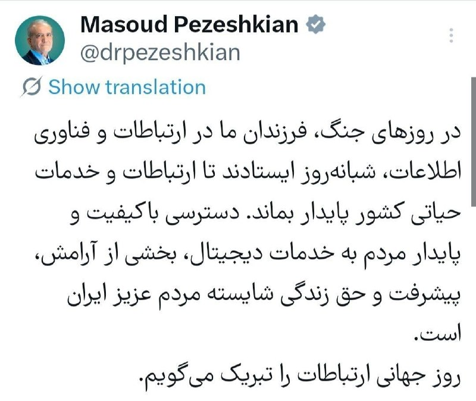

در یک حرکت عجیب و قابل‌تأمل، مسعود پزشکیان در حالی روز جهانی ارتباطات را تبریک گفت که اینترنت کشور وارد هفتاد‌ونهمین روز قطعی و محدودیت شده است. @SportBaadNews

## SportBaadNews — post 251755

ایران اینترنت ندارد، روز هفتاد و نهم ...
ایران اینترنت ندارد، روز هفتاد و نهم ...
ایران اینترنت ندارد، روز هفتاد و نهم ...
ایران اینترنت ندارد، روز هفتاد و نهم ...
ایران اینترنت ندارد، روز هفتاد و نهم ...
ایران اینترنت ندارد، روز هفتاد و نهم ...

## SportBaadNews — post 251754

در یک حرکت عجیب و قابل‌تأمل، مسعود پزشکیان در حالی روز جهانی ارتباطات را تبریک گفت که اینترنت کشور وارد هفتاد‌ونهمین روز قطعی و محدودیت شده است.
@SportBaadNews

## IranIntlTV — post 337614

  

آژانس بین‌المللی انرژی اتمی اعلام کرد امارات متحده عربی به این نهاد اطلاع داده سطح پرتو در نیروگاه هسته‌ای براکه پس از حمله پهپادی به نزدیکی آن، در سطح عادی باقی مانده و هیچ مصدومی گزارش نشده است. دفتر رسانه‌ای ابوظبی روز یکشنبه از حمله پهپادی به این نیروگاه خبر داده بود.
https://iranintl.com/202605177167

## IranIntlTV — post 337613

  <a href="telegram/content/IranIntlTV_337613_1779018842.mp4" target="_blank">🎬 Download video</a>

گروهی از ایرانیان و فعالان مدنی در مرکز شهر فرانکفورت در اعتراض به سرکوب، اعدام زندانیان سیاسی و محدودیت‌های اینترنتی در ایران تجمع کردند.

مهدی تهرانی گزارش می‌دهد
@iranintltv

## IranIntlTV — post 337612

  

سازمان حقوق بشر ایران اعلام کرد دستگاه قضایی جمهوری اسلامی «فعالانه» از وکلای تسخیری برای تسهیل و تسریع سیستماتیک اعدام معترضان بازداشت‌شده بهره می‌گیرد. این سازمان افزود این وکلا با خودداری از برقراری ارتباط با خانواده متهمان آنان را از روند دادرسی بی‌اطلاع نگه می‌دارند.
به نوشته این سازمان، مستندات نشان می‌دهد وکلای تسخیری بلافاصله پس از صدور حکم، با ثبت درخواست تجدیدنظر، موکلان خود را از مهلت قانونی محروم می‌کنند و با ایجاد موانع عامدانه در مسیر دسترسی به وکلای مستقل، زمینه اجرای سریع احکام اعدام را فراهم می‌سازند.
این سازمان نوشت بازداشت‌شدگان اعتراضات بدون دفاع موثر می‌مانند؛ وکلای تسخیری اعترافات اجباری و ادعاهای شکنجه را به چالش نمی‌کشند و مدارک تبرئه‌کننده ارائه نمی‌دهند. در نتیجه دادگاه‌ها بر اساس شواهد بدون اعتراض حکم اعدام صادر و دیوان عالی کشور نیز احکام را بدون بررسی حقوقی واقعی تایید می‌کند.
این سازمان هشدار داد این اقدامات نقض سیستماتیک دادرسی عادلانه است و اعدام‌ها را براساس حقوق بین‌الملل در زمره اعدام‌های خودسرانه قرار می‌دهد.
https://iranintl.com/202605171885

## IranIntlTV — post 337611

🗣روایت شما از زندگی در آتش‌بس- یکشنبه ۲۷ اردیبهشت‌ماه

🔹باورم نمیشه در قرن ۲۱، یک کشور نزدیک به ۳ ماهه بدون اینترنت مونده و برای هیچ سازمان بین‌المللی هم اهمیت نداره.

🔹دانش‌آموز هستم. نمی‌دانم باید امتحان‌ها رو چیکار کنم. یک اینترنت ملی داریم که اون هم کار نمی‌کند تا بتونیم درس بخونیم. یک دل‌خوشی داشتم، اون هم اینترنت بود که از ما گرفتن.

🔹دانشگاه آزاد بندرعباس برای خدماتی که ارائه نشده و کلاس‌هایی که نصفه‌ و نیمه تشکیل شده، شهریه کامل می‌گیرد.

🔹شورای‌عالی انقلاب فرهنگی هر روز یه حرفی می‌زنه. الان ما کلاس یازدهمی‌ها و کنکوری‌ها بلاتکلیف موندیم که امتحان نهایی چی می‌شه. جمهوری اسلامی علاوه بر اقتصاد و امنیت، فضای آموزش رو هم به نابودی کشونده.

🔹من یازدهم ریاضی‌ام، میگن از حواشی آموزشی فاصله بگیرید و تمرکزتون رو بگذارید روی درس. چطوری آخه وقتی کل کشور شده حاشیه؟ ما مثل بچه‌ شما در مدرسه‌ای با شهریه ۵۰۰ میلیون تومانی درس نمی‌خونیم.

## IranIntlTV — post 337610

  

بنیامین نتانیاهو، نخست‌وزیر اسرائیل، گفت: «امروز با دوستمان، رییس‌جمهور ترامپ گفت‌وگو خواهم کرد. مطمئنا برداشت‌های او از سفرش به چین و شاید مسائل دیگر را خواهم شنید. قطعا احتمالات زیادی وجود دارد و ما برای هر سناریویی آماده‌ایم.» نتانیاهو افزود: «چشمان ما به ایران دوخته شده است.»
https://iranintl.com/202605173431

## IranIntlTV — post 337609

  <a href="telegram/content/IranIntlTV_337609_1779018844.mp4" target="_blank">🎬 Download video</a>

مروری بر روزنامه‌های ایران، شنبه ۲۶ اردیبهشت، با مجتبی هاشمی، روزنامه‌نگار
@iranintltv

## IranIntlTV — post 337608

  <a href="telegram/content/IranIntlTV_337608_1779018846.mp4" target="_blank">🎬 Download video</a>

نشست «آینده تکنولوژی در ایران» با هدف بررسی فرصت‌های بخش فناوری در دوران پس از جمهوری اسلامی و نقش متخصصان ایرانی خارج از کشور، در سان‌فرانسیسکو برگزار شد.
شاهزاده رضا پهلوی در این نشست گفت ایران می‌تواند به الگویی مانند کره جنوبی تبدیل شود، اما حکمرانی جمهوری اسلامی کشور را به سمت وضعیتی شبیه کره شمالی برده است.
گفت‌وگو با آرش آزرمی، دبیر بخش اقتصادی ایران‌اینترنشنال
@iranintltv

## IranIntlTV — post 337607

🔻سومین مربی در یک سال؛ ژابی آلونسو سرمربی چلسی شد

باشگاه چلسی، ژابی آلونسو، سرمربی پیشین رئال مادرید و بایر لورکوزن را با قراردادی چهار ساله، به‌عنوان سرمربی جدید خود منصوب کرد. این مربی ۴۴ ساله اسپانیایی پس از جدایی توافقی از رئال مادرید در زمستان گذشته، و کمتر از هشت ماه پس از آغاز قرارداد سه‌ساله‌اش در اسپانیا، در دسترس بود.

او قراردادی چهار ساله از تابستان امسال با چلسی دارد که به نوشته بی‌بی‌سی، برخلاف قراردادهای شش‌ساله‌ای که چلسی در سال‌های اخیر ارائه می‌کرد، نسبتاً عادی توصیف شده است.

چلسی به تغییرات عمده‌ای نیاز دارد و بسیاری می‌گویند آلونسو می‌تواند فردی باشد که روند این تیم را تغییر دهد.

او پیش از دوره‌ای ناکامی در رئال مادرید، سه سال هدایت بایر لورکوزن را برعهده داشت و این تیم آلمانی را دو سال پیش به نخستین قهرمانی بوندس‌لیگا در تاریخ باشگاه رساند و همچنین جام حذفی آلمان را نیز فتح کرد.

تأیید حضور آلونسو یک روز پس از شکست چلسی مقابل منچسترسیتی در فینال جام حذفی انگلیس منتشر شد.

آبی‌های لندن امیدوارند او پس از فصلی که در آن دو سرمربی دائمی، انزو مارسکا و لیام روزنیور، روی نیمکت تیم نشستند، ثبات را به باشگاه بازگرداند. در حال حاضر کالوم مک‌فارلین دومین دوره حضورش به‌عنوان سرمربی موقت را سپری می‌کند و این نقش را در دو بازی پایانی لیگ برتر نیز ادامه خواهد داد.

آلونسو گفت: «چلسی یکی از بزرگ‌ترین باشگاه‌های فوتبال جهان است و این‌که سرمربی این باشگاه بزرگ می‌شوم، باعث افتخار فراوان من است.

او گفت: «از گفت‌وگوهایی که با مالکان و مدیران ورزشی باشگاه داشتم، مشخص است که بلندپروازی مشترکی داریم. ما می‌خواهیم تیمی بسازیم که بتواند به‌طور مداوم در بالاترین سطح رقابت کند و برای کسب جام بجنگد.»

سرمربی جدید چلسی گفت: «استعداد زیادی در این تیم وجود دارد و این باشگاه ظرفیت بسیار بالایی دارد و هدایت آن افتخار بزرگی برای من خواهد بود. حالا تمرکز روی کار سخت، ایجاد فرهنگ درست و کسب جام است.»

آلونسو پنج سال در لیگ برتر انگلیس برای لیورپول بازی کرد و در سال ۲۰۰۵ همراه این تیم قهرمان لیگ قهرمانان اروپا شد. او همچنین سابقه بازی در رئال سوسیداد، رئال مادرید و بایرن مونیخ را دارد.

او ۱۱۴ بازی ملی برای اسپانیا انجام داد و همراه این تیم قهرمان جام جهانی ۲۰۱۰ و دو دوره جام ملت‌های اروپا شد.

در هفته‌های اخیر نام آلونسو به بازگشت احتمالی به لیورپول، جایی که پنج فصل در آن بازی کرده بود، نیز مطرح شده بود؛ آن هم در شرایطی که فشارها بر آرنه اشلوت پس از فصلی ناامیدکننده افزایش یافته بود.

چلسی در فصل آینده احتمالا در هیچ رقابت اروپایی حضور نخواهد داشت؛ این تیم فعلا در رده نهم جدول لیگ برتر فوتبال انگلستان قرار دارد و برای رسیدن به لیگ کنفرانس اروپا باید حداقل هشتم شود؛ آن هم پس از آن‌که فرصت صعود به لیگ اروپا از طریق قهرمانی در جام حذفی را از دست داد.
🔗وب‌سایت ایران‌اینترنشنال
@iranintltv

## IranIntlTV — post 337606

  <a href="telegram/content/IranIntlTV_337606_1779018847.mp4" target="_blank">🎬 Download video</a>

یک شهروند با ارسال پیام به ایران‌اینترنشنال می‌گوید: «در حال ساخت خانه هستم و هر لحظه قیمت‌ها بیشتر می‌شود. کل هزینه ساختن تا قبل از عید یک میلیارد و نیم بود اما الان کابینتی با جنس معمولی شده یک میلیارد تومان.»

## IranIntlTV — post 337605

  

خبرگزاری ایلنا گزارش داد که تعداد ۱۳۸ نفر از کارمندان و کارگران شرکت ملی مس از زیر مجموعه‌های هلدینگ ایمیدرو، سازمان توسعه و نوسازی معادن و صنایع معدنی ایران، تعدیل شده‌اند.

یکی از کارمندان اخراجی این شرکت به ایلنا گفت: «در ۲۴ اسفندماه ۱۴۰۴، تنها ۵ روز مانده به پایان سال، ۱۳۸ پرسنل متخصص با یک نامه و پیامک تحت عنوان «عدم تمدید قرارداد به دلیل نداشتن پروژه جدید» از کار بیکار شدند.»

کارمند دیگری گفته است: «تعدیل‌ها بدون استعلام از مسئولان فنی برای نگهداری یا عدم نگهداری نیروها صادر شده است. در واقع تقریبا تمام نیروهای با سابقه مجموعه اخراج شدند.»
https://iranintl.com/202605177809

## Persian_Trend_Official — post 14323

  

💢ارتش اسرائیل دستور تخلیه 4 روستا در جنوب لبنان را صادر کرد.

🫆:Tony

📌 @persian_trend_official
پرشین ترند | متفاوت‌ترین کانال نظامی

## Persian_Trend_Official — post 14322

💢نیویورک تایمز به نقل از مقام‌های عراقی

💢در هر دو مورد، هم در جنگ کوتاه سال گذشته و هم در درگیری فعلی، واشنگتن عراق را مجبور کرده رادارهایش را خاموش کند تا از هواپیماهای آمریکایی محافظت شود

💢اقدامی که باعث شده بغداد برای شناسایی فعالیت‌های خصمانه بیشتر به نیروهای آمریکایی وابسته شود

🫆:Tony

📌 @persian_trend_official
پرشین ترند | متفاوت‌ترین کانال نظامی

## Persian_Trend_Official — post 14321

  <a href="telegram/content/Persian_Trend_Official_14321_1779018849.webm" target="_blank">🎬 Download video</a>

پزشکیان: روز جهانی ارتباطات را تبریک می‌گویم

پزشکیان در شبکه اجتماعی
ایکس نوشت:

🔹‏در روزهای جنگ، فرزندان ما در ارتباطات و فناوری اطلاعات، شبانه‌روز ایستادند تا ارتباطات و خدمات حیاتی کشور پایدار بماند. دسترسی باکیفیت و پایدار مردم به خدمات دیجیتال، بخشی از آرامش، پیشرفت و حق زندگی شایسته مردم عزیز ایران است.

🔹روز جهانی ارتباطات را تبریک می‌گویم.

🫆:Tony

📌 @persian_trend_official
پرشین ترند | متفاوت‌ترین کانال نظامی

---
📅 بروزرسانی: 1405/02/27 14:18
---

## arianheidarii — post 20044

👆🏼کانال استاد آریان حیدری در اپ بله 👆🏼
⚠️با توجه به شرایط ، حتماً عضو باشید❗️

## arianheidarii — post 20039

http://ble.ir/arianheidariioriginal

## arianheidarii — post 20038

⬆️ 20 امتحان نهایی ⬆️
❌بدون نیاز به هیچ منبع دیگری!❌

## arianheidarii — post 20035

⭕️ مختص کنکوریهای 1️⃣4️⃣0️⃣5️⃣ ⭕️

کلاس های ویژه‌ی امتحان تشریحی پایه دوازدهم استاد آریان حیدری ⚠️

🟣لینک جلسه اول حسابان رشته‌ی ریاضی ویژه امتحان نهایی دوازدهم (آفلاین) :

https://www.aparat.com/v/vcy39kw

🔵لینک جلسه اول ریاضیات تجربی ویژه امتحان نهایی دوازدهم (آفلاین) :

https://www.aparat.com/v/jyiglsb

🟢لینک جلسه اول ریاضیات انسانی ویژه امتحان نهایی دوازدهم (آفلاین) :

https://www.aparat.com/v/zvpkk3v

⚠️ لینک ثبت نام دوره های امتحان نهایی:

https://panel.classino.com/auth?referral=konkourgeram

## rodast_omiddana — post 71460

🎬 تهدید خانواده ترامپ و نتانیاهو توسط علی عبدی در صداوسیما
لینک یوتیوب:
https://www.youtube.com/watch?v=RFfusxRxO_U

## rodast_omiddana — post 71459

  <a href="telegram/content/rodast_omiddana_71459_1779014896.webm" target="_blank">🎬 Download video</a>

🚨 کابینه امنیتی و سیاسی اسرائیل قرار است امشب بطور محدود تشکیل جلسه دهد

## rodast_omiddana — post 71458

  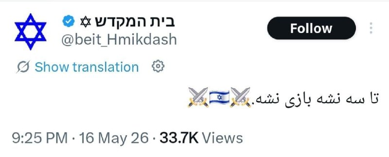

⌛️ تیک تاک...

## rodast_omiddana — post 71457

🎬 رژیم تهدید میکنه کویت را که 90 دقیقه ای اشغالت میکنیم
لینک یوتیوب:
https://www.youtube.com/watch?v=eGYd59WA6wY

## KiriMohems — post 47615

📰 کصشعر گزاری فارس: جزئیاتی از درخواست‌های آمریکا از جمهوری اسلامی در مذاکرات

۵ شرط اصلی واشنگتن به این شرح اعلام شده است:

غرامت سرش گرده

مثل بچه آدم ۴۰۰ کیلو اورانیوم رو برمیداری و به ما تحویل میدی

دارایی های بلوکه شده ایران ، حتی ۲۵ درصدش رو هم نمیدم

یکی از مجموعه های هسته ای باید فعال بمونه ، در بقیه رو گل بگیر

میایی میشینی سر میز مذاکره تا منم جنگ ها رو جمع کنم

حالا جمهوری اسلامی گفته کص ننت و انجام هرگونه مذاکره رو منوط به تحقق ۵ پیش‌شرط اعتمادساز اعلام کرده:

کصکشا این جنگ ها رو تو همهٔ جبهه‌ها به‌ویژه لبنان جمع و جور کنید

تحریم های ضد ایرانی رو لول کن و بکن تو کونت

پول های بلوک شده مون رو بده لاشخور

خسارات ناشی از جنگ رو سریع میزنی به کارتم

حق حاکمیت ایران روی تنگه هرمز رو قبول میکنی

#Helsinki
@KiriMohems

## KiriMohems — post 47614

  

🔴تصویر و گزارشات منتشر شده‌ای از بازداشت نیروهای سپاه در آب های کویت که بصورت نفوذی وارد حریم دریایی این کشور شدند

#Helsinki
@KiriMohems

## KiriMohems — post 47613

🔴چمران ، رئیس شورای شهر تهران: مُفتی کردن مترو و اتوبوس تو تهران کار احساسیه! فردا آخرین روز رایگان بودن حمل و نقل عمومی تو تهرانه و و به قول اون یارو دلخوش نباشید چون دوباره تمدید نمیشه ، بسه دیگه سر کیسه رو شل کنید #Helsinki @KiriMohems

## KiriMohems — post 47612

  

🔴نروژ کیرشاد‌ترین کشور جهان در سال ۲۰۲۶

نروژ در سال ۲۰۲۶ به عنوان مرفه‌ترین کشور جهان رتبه‌بندی شده که این رتبه‌بندی ترکیبی از عواملی مانند درآمد و خرپولی ، مراقبت‌های بهداشتی، آمیزش چیز ببخشید آموزش، اعتماد عمومی و ثبات اقتصادیه.

با وجود داشتن کلفت ترین اقتصاد جهان، آمریکا در کل رتبه بسیار گوهی تری داره که همین موضوع تفاوت چاک لاپستانی اندازه اقتصادی و نتایج گسترده‌تر کیفیت زندگی را نشان می‌دهد.

#Helsinki
@KiriMohems

## IranIntlTV — post 337604

  <a href="telegram/content/IranIntlTV_337604_1779014897.mp4" target="_blank">🎬 Download video</a>

اقتصادنیوز گزارش داد اینترنت پرو برای بسیاری از کاربران کارآمد نبوده است. بر اساس این گزارش، کاربران با پرداخت حدود دو میلیون تومان تنها ۵۰ گیگابایت اینترنت دریافت می‌کنند.

گفت‌وگو با سحر تحویلی، پژوهشگر در حوزه فناوری اطلاعات و هوش مصنوعی
@iranintltv

## IranIntlTV — post 337603

  <a href="telegram/content/IranIntlTV_337603_1779014899.mp4" target="_blank">🎬 Download video</a>

سرخط خبرهای یکشنبه ۲۷ اردیبهشت
@iranintltv

## IranIntlTV — post 337602

  <a href="telegram/content/IranIntlTV_337602_1779014900.mp4" target="_blank">🎬 Download video</a>

سرخط خبرهای یکشنبه ۲۷ اردیبهشت
@iranintltv

## IranIntlTV — post 337601

  

دفتر رسانه‌ای ابوظبی اعلام کرد که در پی حمله پهپادی به محوطه نیروگاه هسته‌ای براکه در الظفره، ژنراتور برق در خارج از محوطه داخلی نیروگاه دچار آتش‌سوزی شده است. این نهاد افزود که این حادثه آسیب جانی نداشته است.
https://iranintl.com/202605173331

## IranIntlTV — post 337600

  

دفتر رسانه‌ای ابوظبی اعلام کرد که در پی حمله پهپادی به محوطه نیروگاه هسته‌ای براکه در الظفره، ژنراتور برق در خارج از محوطه داخلی نیروگاه دچار آتش‌سوزی شده است. این نهاد افزود که این حادثه آسیب جانی نداشته است.
https://iranintl.com/202605173331

## IranIntlTV — post 337599

  <a href="telegram/content/IranIntlTV_337599_1779014902.mp4" target="_blank">🎬 Download video</a>

امیر قلعه‌نویی، سرمربی تیم فوتبال ایران، فهرست ۳۰ نفره اعزامی به جام جهانی ۲۰۲۶ آمریکا را اعلام کرد. در این فهرست نام سردار آزمون دیده نمی‌شود. اگرچه قلعه‌نویی تاکید کرده سردار آزمون به دلایل فنی از لیست کنار گذاشته شده است، اما پیش‌تر او به‌دلیل انتشار عکسی با حاکم دبی، از اردوهای تیم ملی کنار گذاشته شده و گزارش‌هایی از مصادره اموالش منتشر شده بود.
گفت‌وگو با کوروش بازیار، مربی فوتبال
@iranintltv

## IranIntlTV — post 337598

  

حمیدرضا حاجی‌بابایی، نایب‌رییس مجلس، گفت: «اگر قرار شد نفت ما را بزنند، باید نفت منطقه را بزنیم. چه آن‌که ادعای دوستی می‌کند، چه آن‌که دشمنی می‌کند.»

او گفت: «به نفت ما آسیب برسد، کاری می‌کنیم که آمریکا و تمام جهان تا مدت قابل توجهی از این منطقه نفت به دست نیاورد. اگر انرژی ما را بزنند، باید انرژی منطقه را بزنیم.»
https://iranintl.com/202605170342

## IranIntlTV — post 337597

  <a href="telegram/content/IranIntlTV_337597_1779014903.mp4" target="_blank">🎬 Download video</a>

تصاویر ارسالی به ایران‌اینترنشنال، از کمبود بنزین و اعمال محدودیت در برخی جایگاه‌های سوخت با هدف «مقابله با قاچاق» خبر می‌دهد. یک شهروند از بندرعباس می‌گوید بیش از چهار ساعت در صف بنزین منتظر بوده است.
جزییات بیشتر با مهدی تاجیک، عضو تحریریه ایران‌اینترنشنال
@iranintltv

## IranIntlTV — post 337596

  <a href="telegram/content/IranIntlTV_337596_1779014905.mp4" target="_blank">🎬 Download video</a>

یک شهروند با ارسال پیام به ایران‌اینترنشنال می‌گوید: «نان سنگک ساده شده ۱۷ هزار تومان، کنجدی هم شده ۲۵ هزار تومان. نانوایی‌ها ترفندی زده‌اند؛ نان بزرگ‌تری را با کنجد زیاد درست کرده و ۸۰ هزار تومان می‌فروشند. کسانی که حوصله صف ندارند، مجبورند همان نان گران را بخرند.»
پیام این شهروند با هوش مصنوعی بازخوانی شده است.

## Persian_Trend_Official — post 14320

  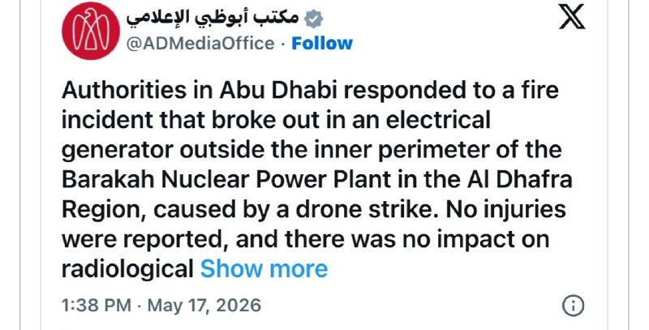

🔴انفجار در امارات 💢منابع عربی اعلام کردند که انفجارهایی خیابان فاطمه بنت مبارک در ابوظبی را لرزاند. 🫆:Tony 📌 @persian_trend_official پرشین ترند | متفاوت‌ترین کانال نظامی

## Persian_Trend_Official — post 14319

  <a href="telegram/content/Persian_Trend_Official_14319_1779014907.webm" target="_blank">🎬 Download video</a>

🔴انفجار در امارات

💢منابع عربی اعلام کردند که انفجارهایی خیابان فاطمه بنت مبارک در ابوظبی را لرزاند.

🫆:Tony

📌 @persian_trend_official
پرشین ترند | متفاوت‌ترین کانال نظامی

## Persian_Trend_Official — post 14318

  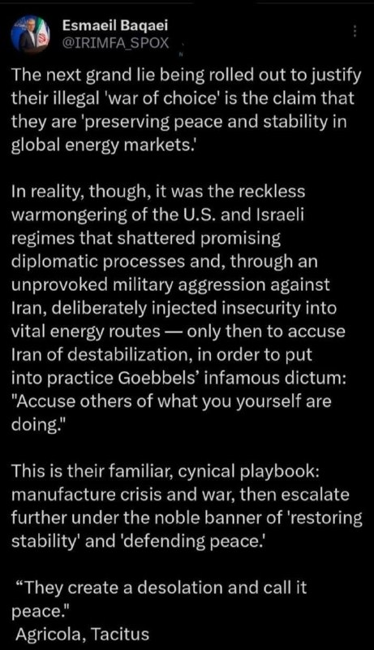

بقائی: آمریکا و اسرائیل خود عامل بی‌ثباتی در بازار انرژی هستند

اسماعیل بقائی، سخنگوی وزارت خارجه، ادعاهای آمریکا و اسرائیل درباره «حفظ ثبات بازار جهانی انرژی» را رد کرد و آن را «دروغی بزرگ» توصیف کرد.

بقائی گفت:

▪️ جنگی که آمریکا و اسرائیل آغاز کردند، روند دیپلماسی را نابود کرد
▪️ حمله نظامی به ایران باعث ناامنی در مسیرهای حیاتی انرژی شد
▪️ سپس ایران را به بی‌ثبات‌سازی متهم کردند

او با اشاره به آنچه «تاکتیک تبلیغاتی گوبلز» خواند، افزود:

▪️ «دیگران را به همان کاری متهم می‌کنند که خودشان انجام می‌دهند»

سخنگوی وزارت خارجه همچنین تأکید کرد:

▪️ آمریکا و اسرائیل ابتدا بحران و جنگ ایجاد می‌کنند
▪️ سپس با شعار «بازگرداندن ثبات» و «دفاع از صلح» به تشدید درگیری‌ها ادامه می‌دهند

بقائی در پایان گفت:

▪️ «آن‌ها ویرانی ایجاد می‌کنند و نامش را صلح می‌گذارند»

🫆:Tony

📌 @persian_trend_official
پرشین ترند | متفاوت‌ترین کانال نظامی

## Persian_Trend_Official — post 14317

  

📌انتشار چاپ پنجم کتاب «قدرت مذاکره» همراه با فصل جدید «دیپلماسی زیر آتش» 🔹کتاب قدرت مذاکره به قلم دکتر سید عباس عراقچی حاصل بیش از سی سال تجربه کاری نویسنده در وزارت امور خارجه است. 🔹در این کتاب تلاش میشود ضمن تبیین و تحلیل ماهیت مذاکره و مذاکره سیاسی،…

## Persian_Trend_Official — post 14316

🔴 رسانه‌های ایرانی جزئیات پاسخ واشینگتن به پیشنهاد توافق را منتشر کردند

رسانه‌های ایرانی مدعی شدند پاسخ آمریکا به پیشنهاد توافق با ایران شامل ۵ شرط اصلی بوده است:

▪️ آمریکا هیچ‌گونه غرامت یا خسارتی پرداخت نخواهد کرد

▪️ ۴۰۰ کیلوگرم اورانیوم از ایران خارج و به آمریکا تحویل داده شود

▪️ فقط یک مجموعه از تأسیسات هسته‌ای ایران فعال باقی بماند

▪️ حتی ۲۵ درصد از دارایی‌های بلوکه‌شده ایران نیز آزاد نخواهد شد
▪️ آتش‌بس در همه جبهه‌ها به روند مذاکرات گره بخورد

در این گزارش آمده است:

▪️ حتی در صورت پذیرش این شروط از سوی ایران، خطر حمله آمریکا و اسرائیل همچنان باقی خواهد ماند
▪️ برخی تحلیلگران ایرانی معتقدند واشینگتن به‌دنبال تحقق اهدافی است که در جنگ به آن نرسیده است

در مقابل، گزارش‌ها می‌گویند ایران نیز ۵ پیش‌شرط برای آغاز مذاکرات مطرح کرده است:

▪️ پایان جنگ در تمامی جبهه‌ها، به‌ویژه لبنان

▪️ رفع تحریم‌های ایران

▪️ آزادسازی دارایی‌های بلوکه‌شده ایران

▪️ پرداخت غرامت خسارات جنگ

▪️ به‌رسمیت شناختن حاکمیت ایران بر تنگه هرمز

تاکنون هیچ‌یک از این جزئیات به‌صورت رسمی از سوی تهران یا واشینگتن تأیید نشده‌اند.

🫆:Tony

📌 @persian_trend_official
پرشین ترند | متفاوت‌ترین کانال نظامی

---
📅 بروزرسانی: 1405/02/27 12:48
---

## rodast_omiddana — post 71452

  <a href="telegram/content/rodast_omiddana_71452_1779009522.mp4" target="_blank">🎬 Download video</a>

🚨
🚨 آگوست 2012 تامی رابینسون فعال ملی‌گرای انگلیس یک تظاهرات کوچک در استکهلم برگزار کرد من و تعدادی از بچه ها با پرچم شیرخورشید رفتیم، وقتی رفتیم دیدیم ما 100 نفریم و مخالفینی که آمدن که نیروهای اسلامگرا و چپگرا هستن چند هزار نفرن، پلیس از ما حمایت میکرد و به سمت ما هر چی دستشون می آمد پرت میکردن..
من موفق شدم بیش از 20 دقیقه با تامی رابینسون از طریق دوستم که به زبان مسلط بود حرف بزنم و بهش بگم ما ایرانیان با مهاجرهایی که میشناسی فرق داریم، ما ایرانیان با رژیم اسلامی فرق داریم و ما ایرانیان میتوانیم مهمترین متحد تو باشیم..
حالا تامی رابینسون در تظاهرات دیروز لندن عکس شاهزاده را بالا برد و حرفهایی که سال 2012 بهش گفتم را مو به مو تکرار کرد..
ویدیوها و تصاویر از تظاهرات سال 2012...

پانوشت:
به برگزار کنندگان گفتم باید پرچم شیرخورشید را روی جایگاه سخنرانان بالای همه پرچمها بزارم، گفت چرا بالا همه؟ گفتم چون قدمت ایران از همه شماها بیشتره و ما بیشترین هزینه را بابت ایستادگی در برابر اسلامگرایی پرداختیم..

## rodast_omiddana — post 71451

  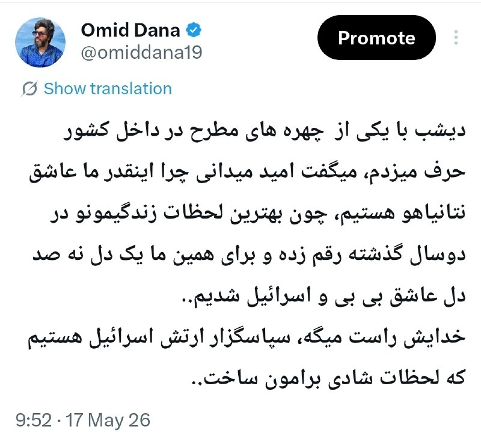

🚫 دیشب با یکی از چهره های مطرح در داخل کشور حرف میزدم، میگفت امید میدانی چرا اینقدر ما عاشق نتانیاهو هستیم، چون بهترین لحظات زندگیمونو در دوسال گذشته رقم زده و برای همین ما یک دل نه صد دل عاشق بی بی و اسرائیل شدیم..
خدایش راست میگه، سپاسگزار ارتش اسرائیل هستیم که لحظات شادی برامون ساخت..

## rodast_omiddana — post 71450

  

🚫 مقام دوم در مسابقه آواز یوروویژن را به مردم عزیز اسرائیل تبریک میگم..

🇮🇱
🇮🇱

## rodast_omiddana — post 71449

  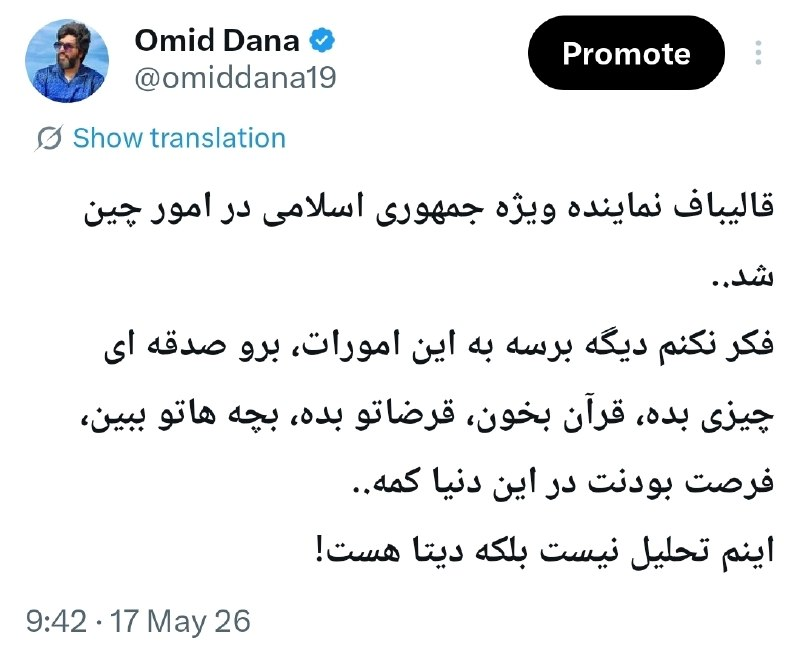

🚫 قالیباف نماینده ویژه جمهوری اسلامی در امور چین شد..
فکر نکنم دیگه برسه به این امورات، برو صدقه ای چیزی بده، قرآن بخون، قرضاتو بده، بچه هاتو ببین، فرصت بودنت در این دنیا کمه..
اینم تحلیل نیست بلکه دیتا هست!

## rodast_omiddana — post 71448

  <a href="telegram/content/rodast_omiddana_71448_1779009526.mp4" target="_blank">🎬 Download video</a>

🚨درخواست امید دانا از بهروز یوسیان افسر سابق اطلاعات اسرائیل برای ح*ف اژه ای و قضات دادگاه انقلاب

## rodast_omiddana — post 71447

  <a href="telegram/content/rodast_omiddana_71447_1779009527.mp4" target="_blank">🎬 Download video</a>

🚨فشار دولت ترامپ به امارات برای تصرف جزیره لاوان
حمله قطعی شده و بزودی آغاز میشود

## rodast_omiddana — post 71446

🎬رائفی پور: احتمال زیاد چین ما را فروخته
لینک یوتیوب:
https://www.youtube.com/watch?v=ec7Smonlg60

## KiriMohems — post 47611

🔴قالیباف، نمایندۀ کلفت جمهوری اسلامی در امور چین شد

قبلا ، لاریجانی و عبدالرضا رحمانی فضلی این مسئولیت رو برعهده داشتن

ما هم نمیدونیم چرا بعد از سفر ترامپ به چین ، این مسئولیت رو به قالیباف دادن

#Helsinki
@KiriMohems

## KiriMohems — post 47610

  <a href="telegram/content/KiriMohems_47610_1779009530.mp4" target="_blank">🎬 Download video</a>

🔴‏مجری صدا وسیما : داداش ناموصا سلام من رو به مجتبی برسون.
‏
حدادعادل ریقو : والا من خودم به دامادم دسترسی ندارم، از همین‌جا بهش سلام می‌رسونم.

#Helsinki
@KiriMohems

## KiriMohems — post 47609

  <a href="telegram/content/KiriMohems_47609_1779009532.mp4" target="_blank">🎬 Download video</a>

🔴بارش انزال کننده‌ی برف بهاری در روستای قزلسوری چالدران اونم وسط بهار
#Helsinki
@KiriMohems

## SportBaadNews — post 251753

  <a href="telegram/content/SportBaadNews_251753_1779009534.webm" target="_blank">🎬 Download video</a>

🚨
⚽️ رسسسمییی؛ ژابی سرمربی چلسی شد @SportBaadNews

## SportBaadNews — post 251752

  <a href="telegram/content/SportBaadNews_251752_1779009534.webm" target="_blank">🎬 Download video</a>

🚨
⚽️ رسسسمییی؛ ژابی سرمربی چلسی شد
@SportBaadNews

## SportBaadNews — post 251751

  

کینگ ژابی

@SportBaadNews

## SportBaadNews — post 251750

  

آاس: منچستر سیتی گواردیول رو به رئال مادرید پیشنهاد کرده
@SportBaadNews

## SportBaadNews — post 251746

🇷🇺
⚽️| مری راک پورن استار روسی یه پیام برای دروازه‌بان پاریس، متوی سوفانوف گذاشته و گفته به تعداد سیو هایی که تو فینال لیگ قهرمانان انجام بدی به همون تعداد شب میام پیشت و بهت حال میدم.

🔴 مری راک حتی اضافه کرده اگه بتونه مقابل آرسنال کلین‌ شیت کنه براش یه صبحونه ویژه هم درست میکنه.
@SportBaadNews

## SportBaadNews — post 251745

  

🏆
🇮🇹 | آیا می‌دانستید طی 20 سال گذاشته تعداد حضور اکس پیکه تو جام جهانی ها از تعداد حضور ایتالیا تو جام جهانی ها بیشتر بوده؟

🔴 اکس پیکه 4 حضور تو جام جهانی

🟢 ایتالیا 3 حضور تو جام جهانی
@SportBaadNews

## IranIntlTV — post 337595

  

خبرگزاری میزان، رسانه قوه قضاییه جمهوری اسلامی، از برگزاری نخستین جلسه دادگاه رسیدگی به اتهامات صادق ساعدی‌نیا، مدیرعامل مجموعه «املاک و صنایع ساعدی‌نیا» و از حامیان اعتصاب‌ها و اعتراضات دی‌ماه، در دادگاه انقلاب قم خبر داد.
طبق این گزارش، ساعدی‌نیا با اتهاماتی از جمله «فعالیت تبلیغی یا رسانه‌ای برخلاف امنیت کشور»، «اقدام عملیاتی در راستای فراخوان‌های گروه‌های معاند برای برهم زدن امنیت کشور» و «فعالیت تبلیغی علیه نظام» روبه‌رو است.
انتشار استوری، فعالیت در فضای مجازی، حضور در تجمعات اعتراضی، تعطیل کردن کافه‌ها و مغازه‌های متعلق به خود و تشویق برخی کارکنانش به حضور در اعتراضات از مصادیق اتهامات مطرح‌شده علیه او عنوان شده است.
نماینده دادستان، مواردی مانند فعالیت‌های ساعدی‌نیا در فضای مجازی، تهیه کلیپی از یکی از کارکنانش با نوشته «جاوید شاه» روی دست، ایجاد و مدیریت گروه واتساپی کارکنان کافه‌ها، انتشار پیام صوتی درباره خاموش کردن گوشی برای جلوگیری از ردیابی، حضور برخی کارکنان در اعتراضات و برنامه‌ریزی برای تعطیلی کافه‌ها و کارخانه‌ها همزمان با فراخوان‌های اعتراضی را از مصادیق اتهامات مطرح‌شده علیه او عنوان کرد.

## IranIntlTV — post 337594

  

ابوالفضل شکارچی، سخنگوی ارشد نیروهای مسلح جمهوری اسلامی، گفت که دونالد ترامپ باید بداند در صورت عملی شدن تهدیدها و حمله مجدد به جمهوری اسلامی، دارایی‌ها و ارتش آمریکا با «سناریوهای جدید، هجومی، غافلگیرکننده و طوفانی» روبه‌رو خواهند شد و در «باتلاق خودساخته‌» فرو خواهند رفت.
https://iranintl.com/202605170463

## IranIntlTV — post 337593

  <a href="telegram/content/IranIntlTV_337593_1779009538.mp4" target="_blank">🎬 Download video</a>

روزنامه اسرائیلی معاریو به نقل از ارزیابی نهادهای اطلاعاتی اسرائیل گزارش داد جمهوری اسلامی همچنان بیش از هزار موشک بالستیک دوربرد و ۲۰۰ پرتابگر در اختیار دارد که قادر به هدف قرار دادن خاک اسرائیل هستند.
جزییات بیشتر با اشکان صفائی، خبرنگار ایران‌اینترنشنال
@iranintltv

## IranIntlTV — post 337592

🗣روایت شما از زندگی در آتش‌بس- یکشنبه۲۷ اردیبهشت ۱۴۰۵

🔹چیزی به اسم ساعت مرگ شنیدین؟ ساعتی که همه‌چیز، از جمله انگیزه از بین میره. برای من، اون روزی بود که مجبور شدم به خاطر شرایط تحمیل‌شده، ۶ نفر از ۱۴ نفر از نیروهام رو تعدیل کنم.

🔹هنوز نتونستم میوه این فصل رو به دلیل قیمت‌های وحشتناک گرون برای خانواده بخرم؛ توت‌فرنگی، گوجه‌سبز و زردآلو.

🔹قبل از جنگ می‌خواستم یه هارد بخرم، ۵۰ میلیون تومان بود و الان شده ۱۶۰ میلیون تومان.

🔹نان سنگک ساده شده ۱۷ هزار تومان، کنجدی هم شده ۲۵ هزار تومان. نانوایی‌ها یه ترفند زدن؛ یک نون بزرگ‌تر با کنجد زیاد درست کردن به قیمت ۸۰ هزار تومان می‌فروشن. کسانی که حوصله صف ندارن، مجبورن همون نون گرون رو بخرن.

🔹من خانم هستم و آتلیه عروسی داشتم. شغل ما همیشه زیر سایه تهدید شدید اماکن بوده و اجازه گذاشتن نمونه‌ کار نداشتیم. الان با این گرونی و قطعی اینترنت کلا نابود شدیم، چون هیچ عروسی برگزار نمی‌شه.

🔹من تریدرم و از وقتی اینترنت قطع شده، درآمد ندارم. چند سال زحمت کشیدم اما تریدینگ‌ویو، ابزار کارم باز نمی‌شه. برای ترید نیاز به اینترنت پایدار و آرامش دارم که هیچ‌کدوم نیست.

🔹در بلوچستان هر ۲۰ لیتر بنزین آزاد، بین یک میلیون و ۳۰۰ هزار تومان تا یک میلیون و ۵۰۰ هزار تومان هست؛ یعنی حدودا لیتری ۶۰ تا ۷۰ هزار تومان.

🔹دارم خونه می‌سازم و هر لحظه قیمت‌ها بیشتر می‌شه. کل هزینه ساختن تا قبل از عید یک میلیارد و نیم بود اما الان کابینت جنس معمولی شده یک میلیارد تومان.

## IranIntlTV — post 337591

  <a href="telegram/content/IranIntlTV_337591_1779009539.mp4" target="_blank">🎬 Download video</a>

همزمان با انتشار گزارش‌ها از احتمال ازسرگیری حملات آمریکا و اسرائیل علیه جمهوری اسلامی، دونالد ترامپ، رییس‌جمهوری ایالات متحده، گفت اگر جمهوری اسلامی توافق نکند، روزگار بسیار بدی خواهد داشت.

گفت‌وگو با علی شیرازی، عضو تحریریه ایران‌اینترنشنال
@iranintltv

## IranIntlTV — post 337590

یک شهروند از بندرعباس با ارسال ویدیویی به ایران‌اینترنشنال، صف طولانی خودروها مقابل پمپ‌بنزین را نشان می‌دهد و می‌گوید: «به عنوان مقابله با قاچاق، کارت‌های سوخت جایگاه‌ها را برداشته و به هر جایگاه فقط یک کارت داده‌اند.»

## IranIntlTV — post 337588

  

علاءالدین بروجردی، عضو کمیسیون امنیت ملی مجلس، درباره مذاکرات با آمریکا، گفت: «طرف مقابل باید بپذیرد که جمهوری اسلامی حاکم بر تنگه هرمز است. بدانند که موضوع هسته‌ای هیچ ارتباطی با آمریکا ندارد و به هیچ‌وجه حاضر نیستیم از آن کوتاه بیاییم.»

بروجردی درباره شروط جمهوری اسلامی برای حضور در مذاکرات، گفت: «آنها باید بپذیرند که هرگونه توافق در مذاکرات احتمالی آینده، توافق با کل جبهه مقاومت اعم از لبنان، عراق و یمن خواهد بود. اگر این قواعد را قبول نداشته باشند، ورود به مذاکره بی‌فایده خواهد بود.»

عضو کمیسیون امنیت ملی گفت: «آنها باید بپذیرند که اموال بلوکه‌شده آزاد شود. همچنین باید تحریم‌ها برداشته شوند. پذیرش این شروط الزامی است.»
https://iranintl.com/202605174982

## IranIntlTV — post 337587

  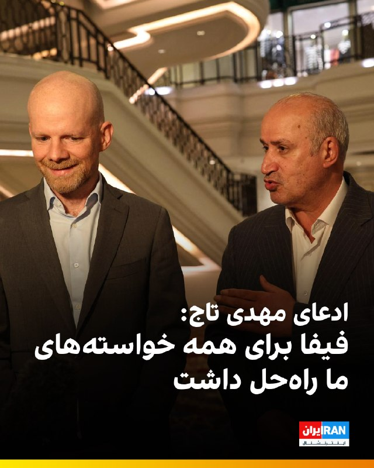

🔻مهدی تاج، رییس فدراسیون فوتبال پس از جلسه با دبیرکل فیفا گفت: «جلسه خیلی خوبی بود؛ ۱۰ موردی که گفته بودیم را شنیدند و برای هر کدام راه حل‌هایی ارائه کردند. امیدوارم که تیم ملی به جام جهانی برود و نتایج خوبی بگیرد.» این درحالی است که ماتیاس گرافستروم از اظهارنظر دراین‌باره خودداری کرد.

🔹ماتیاس گرافستروم، دبیرکل فیفا پس از جلسه با مهدی تاج، در پاسخ به سوالی درباره تضمین‌های مورد نظر فدراسیون فوتبال ایران برای ویزا و ورود تیم ملی به آمریکا و کانادا گفت: «ما درباره تمام مسائل مرتبط گفت‌وگو کردیم.»

🔹او گفت: «فکر می‌کنم اینجا جای مطرح کردن جزئیات نیست. اما در مجموع نشست بسیار مثبتی بود و مشتاق ادامه گفت‌وگوها هستیم. درست مانند گفت‌وگوهایی که با همه فدراسیون‌های عضو داریم و مشتاق برگزاری جام جهانی هیجان‌انگیزی در آمریکا، کانادا و مکزیک هستیم. متشکرم.»

🔹گرافستروم گفت: «فرصت داشتیم درباره برخی مسائل اجرایی صحبت کنیم؛ همان‌طور که با تمام فدراسیون‌های عضو این کار را انجام می‌دهیم.»

@iranintltvsport

## IranIntlTV — post 337586

  <a href="telegram/content/IranIntlTV_337586_1779009542.mp4" target="_blank">🎬 Download video</a>

یک شهروند با ارسال ویدیویی از اصفهان به ایران‌اینترنشنال، تجمع حامیان حکومت را در شامگاه جمعه ۲۵ اردیبهشت نشان می‌دهد و از آزار و اذیت خیابانی آنها می‌گوید: «راه را بند آورده‌اند و ترافیک ایجاد کرده‌اند. اینها شریک جناینکاران هستند و برخلاف مردم، آزادی کامل دارند.»

## IranIntlTV — post 337585

  <a href="telegram/content/IranIntlTV_337585_1779009544.mp4" target="_blank">🎬 Download video</a>

امیر قلعه‌نویی فهرست ۳۰ نفره‌ تیم فوتبال ایران برای جام جهانی ۲۰۲۶ را اعلام کرد. جنجالی‌ترین نکته این فهرست، غیبت سردار آزمون، رکورددار بیشترین گل ملی ایران پس از علی دایی است.

گفت‌وگو با آیدین مقیمی، عضو تحریریه ایران‌اینترنشنال
@iranintltv

## IranIntlTV — post 337584

  <a href="telegram/content/IranIntlTV_337584_1779009546.mp4" target="_blank">🎬 Download video</a>

علی باقری، معاون دبیر شورای عالی امنیت ملی جمهوری اسلامی، در سفر به ترکیه با هاکان فیدان، وزیر خارجه این کشور، دیدار و گفت‌وگو کرد. منابع دیپلماتیک اعلام کردند دو طرف درباره تحولات سیاسی و امنیتی منطقه و همچنین همکاری‌های دوجانبه رایزنی کردند.
جزییات بیشتر با نرگس هورخش، خبرنگار ایران‌اینترنشنال
@iranintltv

## IranIntlTV — post 337583

  

فارس، خبرگزاری وابسته به سپاه پاسداران، گزارش داد که محمدباقر قالیباف، رییس مجلس شورای اسلامی، نماینده ویژه جمهوری اسلامی در امور چین شد. پیش‌تر علی لاریجانی با حکم علی خامنه‌ای و پس از آن عبدالرضا رحمانی‌فضلی با حکم مسعود پزشکیان این سمت را در اختیار داشتند.
https://iranintl.com/202605178453

## IranIntlTV — post 337582

  <a href="telegram/content/IranIntlTV_337582_1779009548.mp4" target="_blank">🎬 Download video</a>

ویدیوهای رسیده به ایران‌اینترنشنال نشان می‌دهند ایرانیان مقیم فرانسه و ایتالیا روز شنبه ۲۶ اردیبهشت علیه جمهوری اسلامی و قطع اینترنت ایران در شهرهای بوردو و تورین تجمع کردند.

## IranIntlTV — post 337581

  

بر اساس گزارش نت‌بلاکس، نهاد پایش وضعیت اینترنت در جهان، قطع سراسری اینترنت در ایران وارد هفتادونهمین روز خود در دوازدهمین هفته شده است: «این اقدام گسترده سانسور، ماهیت مشارکت مدنی را دگرگون کرده و کنترل اطلاعات به ابزاری برای تقلیل شهروندان عادی به ناظران تحولات تبدیل شده است.»
https://iranintl.com/202605174006

## IranIntlTV — post 337580

  <a href="telegram/content/IranIntlTV_337580_1779009551.mp4" target="_blank">🎬 Download video</a>

بر اساس ویدیوهای ارسال‌شده‌ به ایران‌اینترنشنال، ایرانیان مقیم کانادا شنبه ۲۶ اردیبهشت علیه جمهوری اسلامی و قطع اینترنت ایران در مونترال تجمع کردند و شعار «مرگ بر جمهوری اسلامی» سردادند.

## IranIntlTV — post 337579

  

فرمانده پلیس راه سیراف عسلویه اعلام کرد که در پی واژگونی اتوبوس در محور عسلویه به کنگان، هشت نفر در محل حادثه جان خود را از دست دادند. کارشناسان پلیس راه علت این واژگونی را نقص فنی در سیستم ترمز تشخیص داده‌اند.
https://iranintl.com/202605172998

## IranIntlTV — post 337578

ایرانیان مقیم ملبورن استرالیا در یکی دیگر از آخر هفته‌های اعتراضی ایرانیان خارج از کشور، با حضور در مرکز این شهر و در حمایت و همبستگی با مردم ایران، سرود «ای‌ایران» را هم‌خوانی کردند.
گزارش علیرضا محبی، خبرنگار ایران‌اینترنشنال
@iranintltv

## Persian_Trend_Official — post 14314

⭕️ دوستان، این حساب رسمی نیست. این اکانت صرفاً با پرداخت حدود ۱۰۰۰ دلار در ماه، تیک زرد (تأیید اشتراکی) دریافت کرده است. حساب‌های رسمی دولتی و سازمانی معمولاً تیک خاکستری دارند و اطلاعات هویتی و سازمانی آن‌ها به‌صورت شفاف در بخش Bio یا مشخصات حساب ثبت شده…

## Persian_Trend_Official — post 14313

  

💢توییت اتاق جنگ اسرائیل 🫆:Tony 📌 @persian_trend_official پرشین ترند | متفاوت‌ترین کانال نظامی

## Persian_Trend_Official — post 14312

خبرگزاری میزان

💢دادگاه رسیدگی به اتهامات صادق ساعدی‌نیا برگزار شد

🔹جلسه رسیدگی به اتهامات صادق ساعدی‌نیا، مدیرعامل شرکت صنعت غذایی و مدیر کافه‌های زنجیره‌ای ساعدی‌نیا از متهمان کودتای آمریکایی صهیونیستی دی ۱۴۰۴ در دادگاه انقلاب قم با حضور رئیس و مستشاران دادگاه، نماینده دادستان، متهم صادق ساعدی‌نیا و وکلای متهم برگزار شد.

🫆:Tony

📌 @persian_trend_official
پرشین ترند | متفاوت‌ترین کانال نظامی

## Persian_Trend_Official — post 14311

  <a href="telegram/content/Persian_Trend_Official_14311_1779009553.webm" target="_blank">🎬 Download video</a>

🔴 نشان ویژه برای خدمه ناو هواپیمابر «جرالد آر. فورد» و ناو گروه آن پس از جنگ ایران

💢سرپرست وزارت نیروی دریایی آمریکا اعلام کرد گروه ضربت ناو هواپیمابر «جرالد آر. فورد» و نیروهای گروه ضربت ناو هواپیمابر ۱۲ به‌دلیل عملکردشان در خاورمیانه طی جنگ اخیر ایران، نشان «واحد ریاست جمهوری» دریافت کرده‌اند.

💢بر اساس این بیانیه:

▪️ این گروه رزمی در عملیات‌های گسترده علیه اهداف ایرانی مشارکت داشته است
▪️ ادعا شده ۱۲۵ شناور جنگی ایرانی هدف قرار گرفته‌اند
▪️ همچنین ۲۰۷ موشک کروز «تاماهاوک» به اهدافی در ایران شلیک شده است

🔻در ادامه آمده:

💢 هواگردهای مستقر بر ناو «جرالد آر. فورد» بیش از ۱۷۰۰ سورتی پرواز رزمی از مدیترانه و دریای سرخ انجام داده‌اند

🫆:Tony

📌 @persian_trend_official
پرشین ترند | متفاوت‌ترین کانال نظامی

## Persian_Trend_Official — post 14310

  <a href="telegram/content/Persian_Trend_Official_14310_1779009554.webm" target="_blank">🎬 Download video</a>

⭕️ سی‌ان‌ان: ایران به کابل‌های اینترنتی تنگه هرمز چشم دوخته است!

📝 Nick

📌 @persian_trend_official
پرشین ترند | متفاوت‌ترین کانال نظامی

## Persian_Trend_Official — post 14309

  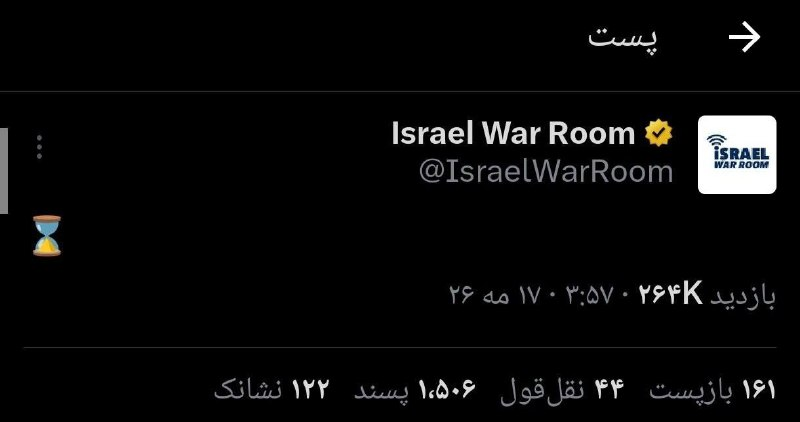

💢توییت اتاق جنگ اسرائیل

🫆:Tony

📌 @persian_trend_official
پرشین ترند | متفاوت‌ترین کانال نظامی

## Persian_Trend_Official — post 14308

  

❌️ این عکس را چندین بار در گوگل لنز جست‌وجو کردیم، اما هیچ منبع معتبر یا رسانه قابل‌اعتمادی برای آن پیدا نشد.

به همین دلیل، به‌نظر می‌رسد این تصویر با هوش مصنوعی ساخته شده و واقعی نیست.

📝 Nick

📌 @persian_trend_official
پرشین ترند | متفاوت‌ترین کانال نظامی

## Persian_Trend_Official — post 14307

  <a href="telegram/content/Persian_Trend_Official_14307_1779009555.webm" target="_blank">🎬 Download video</a>

💢محمدباقر قالیباف، نمایندۀ ویژۀ ایران در امور چین شد

🔹پیش‌تر « علی لاریجانی» و «عبدالرضا رحمانی فضلی» چنین مسئولیتی را برعهده داشتند.

🫆:Tony

📌 @persian_trend_official
پرشین ترند | متفاوت‌ترین کانال نظامی

## Persian_Trend_Official — post 14306

  

🔴دیلی میل: نخست وزیر انگلیس استعفا می‌دهد

💢دیلی میل گزارش داد استارمر نخست وزیر انگلیس در بحبوحه شورش فزاینده در حزبش، به نزدیکانش اطلاع داده است که قصد استعفا دارد.

💢بیش از ۹۰ نماینده مجلس از حزب کارگر در روزهای اخیر خواستار استعفای او شده‌اند.

🫆:Tony

📌 @persian_trend_official
پرشین ترند | متفاوت‌ترین کانال نظامی

---
📅 بروزرسانی: 1405/02/27 10:51
---

## KiriMohems — post 47608

🔴فرصت ۲ ساله مالکان قولنامه‌ای برای ثبت ادعا در سامانه کصشعر اسناد غیررسمی

به گفته سخنگوی سازمان ثبت اسناد و املاک کشور ، این سامانه پس از اعلام رسمی رئیس قوه قضاییه و درج در روزنامه رسمی، فعال میشه و مالکان املاکی که سند رسمی ندارند یا سند به نامشان صادر نشده، تنها دو سال فرصت دارند ادعای خود را با درج نقشه دارای مختصات جغرافیایی ملک ثبت کنند سپس ملک شان را ردیف می‌کنیم تا یک سولاخی برای کص کردن و کثافت کاری های زودگذر داشته باشند

#Helsinki
@KiriMohems

## KiriMohems — post 47607

🔴سامانۀ گارشی به شمال کشور رسید

گوزشناسی: امروز یکشنبه، گسترۀ بارش‌های شاشی در آذربایجان‌غربی، آذربایجان‌شرقی، زنجان، اردبیل، سواحل دریای خزر و خراسان شمالی است.

🔹در دامنه‌های جنوبی و زیرنافی البرز و نوار شرقی کشور افزایش گوزش باد و در برخی نقاط گردوخاک پیش‌بینی می‌شود.

🔹امروز آسمان تهران نیمه‌ابری، در بعضی ساعت‌ها افزایش ابرهای ممه‌ای و وزش باد شدید و گردوخاک با احتمال رگبار و رعدوبرق و هر کیرخری که حدس بزنید ممکن است.

#Helsinki
@KiriMohems

## KiriMohems — post 47606

  <a href="telegram/content/KiriMohems_47606_1779002480.mp4" target="_blank">🎬 Download video</a>

#صبحانه_عن_گیزشی

پیش از صدای تخمی خروسان
باور کردم
که تلمبه‌های یاکوزاییِ من به تو
کتاب صبح را گشود...

#Helsinki
@KiriMohems

## SportBaadNews — post 251744

  

⚽️
⚪️ | لوکا مودریچ تو مصاحبه با روزنامه ایتالیایی کورییره دلا سرا:
مورینیو خیلی سخت‌ گیره. خودم دیدم یه بار که تو رختکن، کریستیانو رونالدو رو به گریه انداخت؛ در حالی که رونالدو کسیه که تو زمین جونش رو هم برا تیمش میذاره؛ همه اینا فقط به خاطر این بود که یه بار دنبال دفاع راست حریف نرفته بود و اون‌جوری که باید روش پرس نکرده بود.
@SportBaadNews

## SportBaadNews — post 251743

  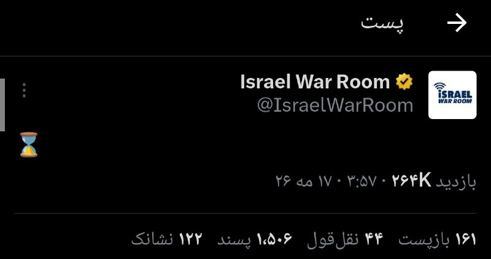

توییت 6 ساعت پیش اتاق جنگ اسرائیل؛ دقیقا قبل شروع جنگ هم همچین توییتی گذاشته بود که کمتر از 24 ساعت بعدش جنگ شد
@SportBaadNews

## SportBaadNews — post 251742

  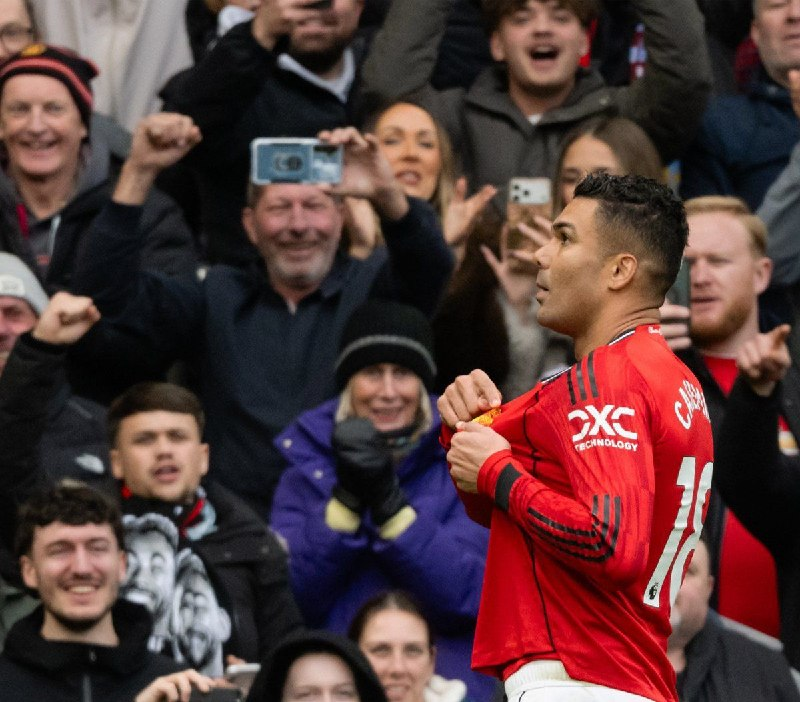

⚽️
❌ کاظم امروز طبق برنامه تو آخرین بازیش تو اولدترافورد با هوادارای یونایتد خداحافظی میکنه...

🔴 کاسمیرو: "اومدن به یونایتد بهترین تصمیم زندگیم بود. توی انگلیس، تا ابد طرفدار یونایتد میمونم."
@SportBaadNews

## SportBaadNews — post 251741

  

⚽️
✅| هری کین 32 ساله تو 146 بازی برای بایرن مونیخ، روی 176 گل تاثیر مستقیم داشته 
🔥
🔥
@SportBaadNews

## SportBaadNews — post 251740

  

عجیب‌ترین چیزی که ممکنه اول صبح ببینید اینه که ژابی آلونسو برداشته خبر مارکا درباره نزدیک شدنش به مربیگری چلسی رو تو توییتر پست کرده 😐😂😂
@SportBaadNews

## SportBaadNews — post 251739

  

⚽️ رونالدو تو عربستان یه بازنده بزرگ به حساب میاد!

❌ ژانویه 2023:
حذف تو نیمه‌نهایی سوپرجام عربستان جلوی الاتحاد

❌ آپریل 2023:
حذف تو نیمه‌نهایی جام پادشاهی عربستان جلوی الوحده

❌ می 2023:
تموم کردن لیگ عربستان تو رده دوم

❌ مارس 2024:
حذف تو یک‌ چهارم نهایی لیگ قهرمانان آسیا جلوی العین

❌ آپریل 2024:
حذف تو نیمه‌نهایی سوپرجام عربستان جلوی الهلال

❌ می 2024:
باخت تو فینال جام پادشاهی عربستان به الهال

❌ می 2024:
تموم کردن لیگ عربستان تو رده دوم

❌ آگوست 2024:
باخت تو فینال سوپرجام عربستان به الهلال

❌ اکتبر 2024:
حذف تو مرحله یک‌ هشتم جام پادشاهی عربستان جلوی التعاون

❌ آپریل 2025:
حذف تو نیمه‌نهایی لیگ قهرمانان آسیا جلوی کاوازاکی

❌ می 2025:
تموم کردن لیگ عربستان تو رده سوم

❌ آگوست 2025:
باخت تو فینال سوپرجام عربستان به الاهلی

❌ اکتبر 2025:
حذف تو مرحله یک‌هشتم جام پادشاهی عربستان

❌ می 2026:
باخت تو فینال لیگ قهرمانان آسیا سطح دو
@SportBaadNews

## IranIntlTV — post 337577

  <a href="telegram/content/IranIntlTV_337577_1779002488.mp4" target="_blank">🎬 Download video</a>

ویدیوهای رسیده به ایران‌اینترنشنال نشان می‌دهند ایرانیان مقیم مجارستان و دانمارک روز شنبه ۲۶ اردیبهشت علیه جمهوری اسلامی و قطع اینترنت در ایران در شهرهای بوداپست و آرهوس تجمع کردند.

## IranIntlTV — post 337576

یک شرکت‌کننده در تجمع ملبورن به علیرضا محبی، خبرنگار ایران‌اینترنشنال، گفت پایداری در برابر ظلم و ستم به نتیجه خواهد رسید و ما مدیون صبر و استقامت مردم ایران هستیم.
@iranintltv

## IranIntlTV — post 337575

  

ابراهیم رضایی، نماینده مجلس و سخنگوی کمیسیون امنیت ملی، در شبکه اجتماعی ایکس نوشت: «ممکن است بازگشت به جنگ آسیب‌هایی داشته باشد اما حتما دشمن بیشتر متضرر می‌شود، خیلی بیشتر.»
https://iranintl.com/202605175096

## IranIntlTV — post 337574

  <a href="telegram/content/IranIntlTV_337574_1779002492.mp4" target="_blank">🎬 Download video</a>

وب‌سایت اسرائیلی وای‌نت به نقل از مقام‌های این کشور گزارش داد احتمال از سرگیری جنگ در روزهای آینده «۵۰-۵۰» است و اوضاع به تصمیم «یک شخص» بستگی دارد. پیش‌تر نیویورک‌تایمز نوشته بود اسرائیل و آمریکا در حال تدارکات فشرده برای احتمال ازسرگیری جنگ هستند.
گفت‌وگو با روح‌الله رحیم‌پور، روزنامه‌نگار و تحلیل‌گر سیاسی
@iranintltv

## IranIntlTV — post 337573

  <a href="telegram/content/IranIntlTV_337573_1779002494.mp4" target="_blank">🎬 Download video</a>

ویدیوهای رسیده به ایران‌اینترنشنال نشان می‌دهند ایرانیان مقیم کانادا روز شنبه ۲۶ اردیبهشت علیه جمهوری اسلامی در اتاوا تجمع کردند و شعار «جاوید شاه» سردادند.

## IranIntlTV — post 337572

  

محمدصالح جوکار، رییس کمیسیون امور داخلی مجلس، با اشاره به حاضر نشدن جمهوری اسلامی در دور دوم مذاکره با آمریکا در پاکستان، گفت: «در این مدت پیشنهاداتی از سوی آمریکا مطرح شده اما جمهوری اسلامی همچنان بر همان بندهای اولیه تاکید دارد. شروط ده‌گانه خامنه‌ای خط قرمز هر مذاکره‌ای است.»

جوکار درباره جزئیات این شرط‌ها، گفت: «این ۱۰ شرط شامل عبور کنترل شده از تنگه هرمز با هماهنگی نیروهای مسلح جمهوری اسلامی، پایان جنگ علیه همه اجزای محور مقاومت، بیرون رفتن نیروهای رزمی آمریکا از تمامی پایگاه‌های منطقه، پرداخت کامل خسارت، رفع همه تحریم‌ها، پذیرش حق غنی‌سازی و آزاد شدن کلیه اموال و دارایی‌های بلوکه شده در خارج از کشور است.»
https://iranintl.com/202605174825

## IranIntlTV — post 337571

  <a href="telegram/content/IranIntlTV_337571_1779002498.mp4" target="_blank">🎬 Download video</a>

ایرانیان مقیم ملبورن استرالیا در یکی دیگر از آخر هفته‌های اعتراضی ایرانیان خارج از کشور، با حضور در مرکز این شهر، یاد قربانیان جنایات جمهوری اسلامی را گرامی داشتند. این تجمع در حمایت از زندانیان سیاسی، مخالفت با اعدام‌ها و برای رساندن صدای مردم ایران به افکار عمومی جهان برگزار شد.
علیرضا محبی، خبرنگار ایران‌اینترنشنال، گزارش می‌دهد
@iranintltv

## IranIntlTV — post 337570

  

عباس عراقچی، وزیر امور خارجه جمهوری اسلامی، در کانال تلگرامی خود اعلام کرد که کتاب «قدرت مذاکره» او به چاپ پنجم رسیده و در چاپ جدید این کتاب، بخش جدیدی با عنوان «دیپلماسی زیر آتش» درباره روند «مذاکرات غیرمستقیم با آمریکا در جنگ ۱۲ روزه» به آن افزوده شده است.
https://iranintl.com/202605171856

## IranIntlTV — post 337569

  <a href="telegram/content/IranIntlTV_337569_1779002501.mp4" target="_blank">🎬 Download video</a>

روزنامه تهران‌تایمز، وابسته به سازمان تبلیغات اسلامی، نوشت محاصره دریایی ایران از سوی آمریکا باعث تغییر استراتژیک در لجستیک و ترانزیت منطقه‌ای شده است.
جزییات بیشتر با احمد علوی، استاد دانشگاه و اقتصاددان
@iranintltv

## IranIntlTV — post 337568

  <a href="telegram/content/IranIntlTV_337568_1779002504.mp4" target="_blank">🎬 Download video</a>

شهباز شریف، نخست‌وزیر پاکستان، در گفت‌وگو با روزنامه تایمز بریتانیا گفت اسلام‌آباد نسبت به دستیابی صلح پایدار میان آمریکا و جمهوری اسلامی خوش‌بین است و برای تضمین این صلح، تمام تلاش خود را به کار می‌گیرد.
جزییات بیشتر در گفت‌وگو با علیرضا نامور حقیقی، تحلیل‌گر سیاسی
@iranintltv

## IranIntlTV — post 337567

  

عبدالغفور امان‌زاده، عضو کمیسیون کشاورزی مجلس، با اعلام افزایش ۲۰ هزار تومانی قیمت گندم، گفت: «نگرانی اصلی کشاورزان بابت پرداخت مطالبات و پول گندم است. از آغاز فصل برداشت تا امروز حدود ۴۵ روز می‌گذرد اما متاسفانه دیناری بابت این مسئله به کشاورزان پرداخت نشده است.»
https://iranintl.com/202605174138

## IranIntlTV — post 337566

  <a href="telegram/content/IranIntlTV_337566_1779002508.mp4" target="_blank">🎬 Download video</a>

سندیکای کارگران نیشکر هفت‌تپه در بیانیه‌ای خواستار تعیین دستمزد ۷۰ میلیون تومانی برای کارگران در سال جاری شد. این تشکل مستقل کارگری هشدار داد ادامه شکاف میان دستمزدها و تورم، فاصله طبقاتی را عمیق‌تر خواهد کرد.
جزییات بیشتر با روزبه بوالهری، عضو تحریریه ایران‌اینترنشنال
@iranintltv

## IranIntlTV — post 337565

  <a href="telegram/content/IranIntlTV_337565_1779002510.mp4" target="_blank">🎬 Download video</a>

سازمان حقوق بشر ایران در بیانیه‌ای نسبت به نقش برخی وکلای تسخیری در تسریع روند صدور و اجرای احکام اعدام معترضان هشدار داد. پیش‌تر نیز جمعی از وکلای حقوق بشری در ایران، وکلای تسخیری را همدستان نهادهای امنیتی در «محاکمات نمایشی» توصیف کرده بودند.
گفت‌وگو با محمد اولیایی‌فرد، وکیل دادگستری و عضو اتحادیه بین‌المللی وکلا
@iranintltv

## IranIntlTV — post 337564

  <a href="telegram/content/IranIntlTV_337564_1779002512.mp4" target="_blank">🎬 Download video</a>

شهباز شریف، نخست‌وزیر پاکستان، در گفت‌وگو با روزنامه تایمز بریتانیا گفت اسلام‌آباد نسبت به دستیابی صلح پایدار میان آمریکا و جمهوری اسلامی خوش‌بین است و برای تضمین این صلح، تمام تلاش خود را به کار می‌گیرد.
جزییات بیشتر در گفت‌وگو با علیرضا نامور حقیقی، تحلیل‌گر سیاسی
@iranintltv

## IranIntlTV — post 337563

  <a href="telegram/content/IranIntlTV_337563_1779002514.mp4" target="_blank">🎬 Download video</a>

دونالد ترامپ در گفت‌وگوی تلفنی با شبکه «ب‌اف‌ام» فرانسه هشدار داد اگر مقام‌های جمهوری اسلامی توافق نکنند، با «وضعیت بسیار بدی» روبه‌رو خواهند شد.
گفت‌وگو با امیر گیتی، عضو تحریریه ایران‌اینترنشنال
@iranintltv

## IranIntlTV — post 337562

🔻سازمان جهانی بهداشت وضعیت اضطراری برای شیوع ابولا اعلام کرد

سازمان جهانی بهداشت اعلام کرده شیوع ابولا در کنگو و اوگاندا به سطح «وضعیت اضطراری بهداشت عمومی با نگرانی بین‌المللی» رسیده است؛ هرچند این نهاد تاکید دارد که شرایط کنونی معیارهای یک همه‌گیری جهانی را ندارد.

به گفته این سازمان، نبود واکسن یا درمان تایید شده برای گونه «بوندیبوگیو»، این شیوع را به وضعیتی «غیرعادی» تبدیل کرده است.

به گزارش رویترز، سازمان جهانی بهداشت یکشنبه ۲۷ اردیبهشت هشدار داد شیوع ابولا که ناشی از ویروس بوندیبوگیو است، می‌تواند فراتر از مرزهای جمهوری دموکراتیک کنگو و اوگاندا گسترش پیدا کند و کشورهای همسایه کنگو در معرض خطر بالای انتقال بیماری قرار دارند.

بر اساس اعلام این نهاد وابسته به سازمان ملل، تا روز شنبه در استان ایتوری در شرق جمهوری دموکراتیک کنگو، دست‌کم ۸۰ مورد مرگ مشکوک، هشت مورد تایید شده آزمایشگاهی و ۲۴۶ مورد مشکوک ابتلا در سه منطقه بهداشتی شامل بونیا، روامپارا و مونگبالو ثبت شده است.

وزارت بهداشت جمهوری دموکراتیک کنگو پیش‌تر نیز از مرگ ۸۰ نفر در پی شیوع جدید بیماری خبر داده بود.

سازمان جهانی بهداشت هشدار داده با توجه به نرخ بالای مثبت بودن نمونه‌های اولیه و افزایش موارد مشکوک، ابعاد واقعی شیوع ممکن است بسیار گسترده‌تر از موارد شناسایی‌شده باشد.
ثبت موارد انتقال فرامرزی
به گفته سازمان جهانی بهداشت، مواردی از انتقال بین‌المللی بیماری تاکنون ثبت شده است. در اوگاندا، دو مورد تایید شده ابتلا - از جمله یک مورد مرگ - در کامپالا، پایتخت این کشور، گزارش شده که مربوط به افرادی بوده که از جمهوری دموکراتیک کنگو سفر کرده بودند.

همچنین یک مورد تایید شده ابتلا در کینشاسا، پایتخت جمهوری دموکراتیک کنگو، در فردی که از استان ایتوری بازگشته بود، شناسایی شده است.

این نهاد از کشورها خواسته سازوکارهای ملی مدیریت بحران را فعال کنند، غربالگری در مرزها و مسیرهای اصلی را افزایش دهند و موارد تایید شده را فوراً قرنطینه کنند.

بر اساس توصیه سازمان جهانی بهداشت، افراد مبتلا یا کسانی که با موارد بیماری تماس داشته‌اند، نباید تا ۲۱ روز پس از مواجهه با ویروس سفر بین‌المللی انجام دهند، مگر در شرایط تخلیه پزشکی.

توصیه به باز نگه داشتن مرزها
با وجود هشدار درباره خطر گسترش بیماری، سازمان جهانی بهداشت از کشورها خواسته از بستن مرزها یا اعمال محدودیت بر سفر و تجارت خودداری کنند.

به گفته این سازمان، محدودیت‌های شدید ممکن است موجب افزایش عبورهای غیررسمی از مرزها شود؛ مسیری که کنترل و پایش بیماری را دشوارتر خواهد کرد.

اعلام وضعیت اضطراری بین‌المللی از سوی سازمان جهانی بهداشت معمولاً برای جلب توجه جهانی، تسریع هماهنگی میان کشورها و تقویت پاسخ به بحران‌های بهداشتی صادر می‌شود؛ اما این نهاد تاکید کرده که شیوع کنونی ابولا هنوز به سطح یک همه‌گیری جهانی نرسیده است.
🔗وب‌سایت ایران‌اینترنشنال
@iranintltv

## IranIntlTV — post 337561

🔻ترامپ با انتشار پیام «آرامش پیش از طوفان»، گمانه‌زنی‌ها درباره ازسرگیری حملات را تشدید کرد

دونالد ترامپ، رییس‌جمهوری آمریکا، با انتشار پیامی مبهم درباره ایران در شبکه اجتماعی تروث سوشال، هم‌زمان با گزارش‌ها درباره احتمال ازسرگیری حملات آمریکا و اسرائیل علیه جمهوری اسلامی، به گمانه‌زنی‌ها درباره اغاز دوباره درگیری‌ها دامن زده است.

ترامپ شنبه ۲۶ اردیبهشت تصویری تولیدشده با هوش مصنوعی را در حساب کاربری خود منتشر کرد که او را در کنار یک دریادار نیروی دریایی آمریکا و در برابر دریایی طوفانی با چند کشتی نشان می‌دهد؛ از جمله کشتی‌ای با پرچم جمهوری اسلامی ایران.

روی این تصویر جمله «این آرامش پیش از طوفان بود» درج شده بود؛ پیامی که در شرایط افزایش تنش‌ها میان واشینگتن و تهران، توجه‌ها را به خود جلب کرده است.
انتشار این پست در حالی صورت گرفته که گزارش‌ها از آمادگی نظامی گسترده آمریکا و اسرائیل برای احتمال ازسرگیری حملات به ایران حکایت دارد. نیویورک تایمز شنبه گزارش داد که دو کشور در حال انجام آماده‌سازی‌های فشرده برای حملات احتمالی جدید علیه حکومت ایران، احتمالاً از اوایل هفته آینده، هستند.

به نوشته این روزنامه، این گسترده‌ترین آرایش نظامی از زمان برقراری آتش‌بس به شمار می‌رود.

ترامپ: برای توافق، تضمین واقعی از ایران می‌خواهم
ترامپ روز جمعه در اظهاراتی اعلام کرد ممکن است با تعلیق ۲۰ ساله برنامه هسته‌ای ایران موافقت کند، اما تاکید کرد که چنین توافقی تنها در صورتی قابل قبول خواهد بود که جمهوری اسلامی «تضمینی واقعی» ارائه دهد.

او هنگام بازگشت از سفر به چین و در گفت‌وگو با خبرنگاران در هواپیمای اختصاصی ریاست‌جمهوری آمریکا در پاسخ به این پرسش که آیا آخرین پیشنهاد ایران را رد کرده است، گفت: «آن را بررسی کردم و اگر جمله اول را دوست نداشته باشم، کل پیشنهاد را کنار می‌گذارم.»
ترامپ توضیح داد نخستین بخش پیشنهاد [حکومت] ایران برای او «غیرقابل قبول» بوده، زیرا از نظر او تهران با کنار گذاشتن کامل فعالیت‌های هسته‌ای موافقت نکرده است.

او افزود: «اگر آن‌ها هر نوع فعالیت هسته‌ای داشته باشند، دیگر ادامه نامه را نمی‌خوانم.»

رییس‌جمهوری آمریکا همچنین در پاسخ به پرسشی درباره کافی بودن تعلیق ۲۰ ساله برنامه هسته‌ای ایران گفت: «۲۰ سال کافی است، اما سطح تضمینی که از آن‌ها دریافت می‌کنیم کافی نیست. باید واقعاً ۲۰ سال باشد، نه یک ۲۰ سال ساختگی.»

هشدار درباره پایان صبر آمریکا
ترامپ پنج‌شنبه نیز در گفت‌وگویی با شان هنیتی، مجری شبکه فاکس نیوز، هشدار داده بود که صبر او در قبال [حکومت] ایران رو به پایان است.

او در این مصاحبه گفت: «دیگر خیلی صبر نخواهم کرد. آن‌ها باید توافق کنند. هر فرد عاقلی توافق می‌کند، اما شاید آن‌ها دیوانه باشند.»

این مصاحبه تنها چند ساعت پس از آن منتشر شد که ترامپ در پیامی دیگر در تروث سوشال تلویحاً اشاره کرده بود جنگ علیه [حکومت] ایران هنوز پایان نیافته و عملیات نظامی علیه جمهوری اسلامی ممکن است ادامه پیدا کند.

اظهارات اخیر ترامپ و انتشار پیام «آرامش پیش از طوفان» در حالی مطرح می‌شود که آینده مذاکرات میان واشینگتن و تهران نامشخص باقی مانده و هم‌زمان گزارش‌ها از افزایش آمادگی‌های نظامی آمریکا و اسرائیل، نگرانی‌ها درباره احتمال ازسرگیری درگیری را افزایش داده است.
🔗وب‌سایت ایران‌اینترنشنال
@iranintltv

## IranIntlTV — post 337560

  <a href="telegram/content/IranIntlTV_337560_1779002516.mp4" target="_blank">🎬 Download video</a>

سرخط خبرهای یکشنبه ۲۷ اردیبهشت
@iranintltv

## IranIntlTV — post 337559

  

فرماندهی مرزبانی استان بوشهر اعلام کرد یکشنبه عملیات انفجار و حریق کنترل‌شده برای امحای مواد و ضایعات بمب در محدوده باشی، بین شهرستان‌های تنگستان و دشتی، انجام می‌شود. این عملیات از ساعت ۸ تا ۱۷ برگزار می‌شود.
https://iranintl.com/202605174227

## Persian_Trend_Official — post 14305

  <a href="telegram/content/Persian_Trend_Official_14305_1779002519.webm" target="_blank">🎬 Download video</a>

⭕️ حماس: هشدار می‌دهیم که همه گزینه‌ها بر روی میز است. 📝 Nick 📌 @persian_trend_official پرشین ترند | متفاوت‌ترین کانال نظامی

## Persian_Trend_Official — post 14301

  <a href="telegram/content/Persian_Trend_Official_14301_1779002520.mp4" target="_blank">🎬 Download video</a>

⭕️ صبح امروز طی حمله پهپاد‌ی گسترده ارتش اوکراین چندین منطقه در مسکو مورد اصابت قرار گرفتند!

به گزارش منابع روسی بیش از 10 نقطه در مسکو هدف قرار گرفتند. وزارت دفاع روسیه مدعی سرنگونی 148 پهپاد اوکراینی است. در ویدیو‌ها لحظه و نتیجه اصابت چند پهپاد و همچنین رهگیری یک پهپاد توسط سامانه پانتیسر روسی مشخص است.

📝 Nick

📌 @persian_trend_official
پرشین ترند | متفاوت‌ترین کانال نظامی

## Persian_Trend_Official — post 14300

  

⭕️ 6 هواپیمای ترابری C-17 در حال ورود به پایگاه‌های ارتش آمریکا در منطقه هستند.

📝 Nick

📌 @persian_trend_official
پرشین ترند | متفاوت‌ترین کانال نظامی

## Persian_Trend_Official — post 14299

⭕️ حماس: هشدار می‌دهیم که همه گزینه‌ها بر روی میز است.

📝 Nick

📌 @persian_trend_official
پرشین ترند | متفاوت‌ترین کانال نظامی

## Persian_Trend_Official — post 14298

  <a href="telegram/content/Persian_Trend_Official_14298_1779002523.mp4" target="_blank">🎬 Download video</a>

⭕️ رئیس کانون عالی بازنشستگان تأمین اجتماعی:

تاکنون ۲۲۳ هزار نفر درخواست بیمه بیکاری داده‌اند.

📝 Nick

📌 @persian_trend_official
پرشین ترند | متفاوت‌ترین کانال نظامی

## Persian_Trend_Official — post 14297

  

کابل زیردریایی «Asia Link»؛ گام تازه چین برای استقلال دیجیتال در آسیا

چین از راه‌اندازی یک کابل زیردریایی جدید با نام «Asia Link» خبر داده؛ پروژه‌ای با طول حدود ۶۲۰۰ کیلومتر و ظرفیت انتقال بیش از ۳۲۵ ترابیت بر ثانیه که چند کشور کلیدی شرق و جنوب‌شرق آسیا را به هم متصل می‌کند.

این کابل چین را به سنگاپور، ویتنام، مالزی، برونئی و فیلیپین وصل می‌کند و برای نخستین‌بار، یکی از نقاط اتصال خارجی این شبکه خارج از سرزمین اصلی چین و در هنگ‌کنگ قرار گرفته است.

اهمیت این پروژه فقط در بُعد فنی نیست. در حال حاضر بخش عمده مسیرهای اصلی اینترنت جهانی و کابل‌های زیردریایی در اختیار شرکت‌ها و زیرساخت‌های غربی قرار دارد. چین با توسعه چنین پروژه‌هایی به‌دنبال ایجاد مسیرهای جایگزین و کاهش وابستگی به این شبکه‌هاست.

پ.ن : این کابل بخشی از یک روند بزرگ‌تر است؛ شکل‌گیری یک «اینترنت موازی آسیایی» که در صورت تشدید رقابت‌های ژئوپلیتیکی، می‌تواند به تفکیک زیرساخت‌های ارتباطی شرق و غرب منجر شود.

📌 @persian_trend_official
پرشین ترند | متفاوت‌ترین کانال نظامی

## Persian_Trend_Official — post 14296

تیتر مهم‌ترین اخبار ۲۴ ساعت گذشته 👇

تشدید تحرکات نظامی آمریکا در خلیج فارس و دریای عمان

افزایش سطح آماده‌باش نیروهای مسلح ایران در جنوب کشور

ادامه مذاکرات غیررسمی تهران–واشنگتن با محور تنگه هرمز

ورود تجهیزات و نیروهای جدید آمریکایی به پایگاه‌های منطقه

هشدار ایران به هرگونه مداخله نظامی خارجی در هرمز

بررسی طرح ائتلاف دریایی برای اسکورت نفتکش‌ها

افزایش قیمت نفت در واکنش به ریسک امنیت انرژی

اختلال محدود در مسیر برخی کشتی‌های تجاری در منطقه

تشدید پرواز پهپادهای شناسایی آمریکا نزدیک مرزهای ایران

استقرار بیشتر جنگنده‌ها و بمب‌افکن‌ها در خاورمیانه

افزایش سطح هشدار امنیتی در امارات و بحرین

نشست اضطراری کشورهای غربی درباره امنیت کشتیرانی

تأکید رسانه‌های غربی بر حفظ توان بازدارندگی ایران

افزایش حملات و فعالیت‌های سایبری در زیرساخت‌های حساس

گسترش عملیات‌های اطلاعاتی در کشورهای اطراف ایران

تشدید جنگ رسانه‌ای میان ایران و آمریکا

آماده‌باش نیروهای دریایی در منطقه خلیج فارس

بررسی گزینه‌های نظامی محدود در پنتاگون

هشدار شرکت‌های بیمه به کشتی‌ها درباره عبور از هرمز

افزایش تردد نظامی در اطراف تنگه هرمز

📌 @persian_trend_official
پرشین ترند | متفاوت‌ترین کانال نظامی

## Persian_Trend_Official — post 14295

  

⭕️ دولت ونزوئلا اعلام کرد «الکس صائب» از متحدان نزدیک نیکولاس مادورو را به ایالات متحده تحویل داده است.

صائب پیش‌تر از سوی آمریکا به پول‌شویی، فساد مالی و دور زدن تحریم‌ها متهم شده بود. برخی رسانه‌ها و گزارش‌های امنیتی نیز در سال‌های گذشته از ارتباط او با شبکه‌های نزدیک به حزب‌الله و جمهوری اسلامی صحبت کرده بودند، اما این ادعاها به‌صورت رسمی و قطعی اثبات نشده‌اند.

Reuters

📝 Nick

📌 @persian_trend_official
پرشین ترند | متفاوت‌ترین کانال نظامی

## Persian_Trend_Official — post 14290

⭕️ «16 می در مودِنا، ایتالیا، یک خودرو وارد پیاده‌رو شد و دست‌کم ۸ عابر پیاده را زخمی کرد. ۴ نفر از مصدومان در وضعیت وخیم هستند و راننده نیز بازداشت شده است. مقام‌های ایتالیایی می‌گویند هنوز انگیزه حادثه روشن نیست و بررسی‌ها ادامه دارد.»

Reuters

📝 Nick

📌 @persian_trend_official
پرشین ترند | متفاوت‌ترین کانال نظامی

## Persian_Trend_Official — post 14289

  <a href="telegram/content/Persian_Trend_Official_14289_1779002526.webm" target="_blank">🎬 Download video</a>

رسوایی پزشکی در دانشگاه‌های آمریکا؛ فروش اجساد اهدایی برای آموزش ارتش اسرائیل 
🔹رسانه‌های آمریکا گزارش داده‌اند دو دانشگاه مطرح این کشور، اجسادی را که شهروندان برای تحقیقات پزشکی و علمی اهدا کرده بودند را در اختیار ارتش اسرائیل قرار داده‌اند. 
🔹این افشاگری…

## Persian_Trend_Official — post 14288

  <a href="telegram/content/Persian_Trend_Official_14288_1779002527.mp4" target="_blank">🎬 Download video</a>

ویو هوایی از ترافیک قفل شده تنگه هرمز

📌 @persian_trend_official
پرشین ترند | متفاوت‌ترین کانال نظامی

## Persian_Trend_Official — post 14285

  <a href="telegram/content/Persian_Trend_Official_14285_1779002530.webm" target="_blank">🎬 Download video</a>

فعالیت رزمی ناو گروه ضربت هواپیمابر آبراهام لینکلن در ۲۵۰ کیلومتری جنوب بندر چابهار.

📝 Nick

📌 @persian_trend_official
پرشین ترند | متفاوت‌ترین کانال نظامی

---
📅 بروزرسانی: 1405/02/27 07:50
---

## rodast_omiddana — post 71445

  <a href="telegram/content/rodast_omiddana_71445_1778991607.webm" target="_blank">🎬 Download video</a>

🚨 احتمال حمله آمریکا برای چند ساعت آینده بالاست ولی اگر تا پایان یکشنبه حمله نشه، حملات میفته برای جمعه تا یکشنبه دیگه...
حمله قطعی ست و خدا کنه لایه برداری تُپلی از مسئولین رده بالای رژیم داشته باشیم..

## rodast_omiddana — post 71444

  <a href="telegram/content/rodast_omiddana_71444_1778991607.webm" target="_blank">🎬 Download video</a>

🚨 فوری
توییت جدید اتاق جنگ اسرائیل
ساعت معروف شنی
زمان رو به اتمام است...
دفعه پیش وقتی ساعت شنی که داره تمام میشه را گذاشتند 48 ساعت بعد خامنه ای را هدف قرار دادند..

## KiriMohems — post 47605

  

توییت جدید اتاق جنگ اسرائیل:

⌛

+آخرین باری که جنگ شد شب قبلش این توییت رو زده بودن( البته چند وقت پیش هم باز زدن که بعدش چیزی نشد)

#Berlin
@Kirimohems

## KiriMohems — post 47604

  <a href="telegram/content/KiriMohems_47604_1778991608.mp4" target="_blank">🎬 Download video</a>

😤میخوای از پیش بینی فوتبال و شرط بندی پول دربیاری ؟!

⚠️پس همین الان وارد کانال عمو بت باز شو
چون بهت اموزش میده چطور پول دربیاری
❗️

اینجا میتونی روزانه درامد داشته باشی و سرمایت چندبرابر کنی پس از دستش نده و عضو شو امار سوداش چک‌کن
😍

💵عمو قدیمی کاره و خاک این کارو‌خورده کنارش باش و حرفه ای پول دربیار
💵
A26🅰

👍ادرس عضویت کانال vip:
https://t.me/+8LLMpXUfhW43ZjVk
https://t.me/+8LLMpXUfhW43ZjVk

## IranIntlTV — post 337558

  

ریک اسکات، سناتور جمهوری‌خواه آمریکایی، به فاکس‌نیوز گفت جمهوری اسلامی با وجود جنگ اخیر همچنان به دنبال کشتن آمریکایی‌ها، بازسازی تسلیحات خود و نابودی اسرائیل است.
او همچنین گفت تهران همچنان از حماس، حزب‌الله و حوثی‌ها حمایت می‌کند و در عین حال از رویکرد ترامپ در قبال ایران در تنگه هرمز تمجید کرد.

https://iranintl.com/202605178960

## IranIntlTV — post 337557

  

بری روزن، گروگان پیشین سفارت آمریکا در ایران، در ایکس نوشت جمهوری‌اسلامی در جریان درگیری با ایالات‌متحده، برای سرکوب مخالفت‌ها بر شمار اعدام‌ها افزوده است و مقام‌های ایرانی از اعدام‌ها و احکام قضایی برای ارعاب معترضان احتمالی استفاده می‌کنند.
https://iranintl.com/202605177046

## IranIntlTV — post 337556

  

دولت بریتانیا از استقرار یک سلاح کم‌هزینه ضدپهپاد جدید در خاورمیانه خبر داد. سامانه ای‌پی‌کی‌دابلیو‌اس که روی جنگنده‌های تایفون نصب می‌شود، با استفاده از هدف‌گیری لیزری، موشک‌های غیرهدایتی را به سلاح‌های دقیق و کم‌هزینه تبدیل می‌کند که قادر به سرنگونی پهپادها و دیگر تهدیدها هستند.
وزارت دفاع بریتانیا گفت این سامانه را در همکاری سریع با صنایع نظامی ظرف چند ماه از مرحله آزمایش به مرحله استقرار رسانده است و با این اقدام شهروندان بریتانیایی و شرکای منطقه‌ای از حفاظت بیشتری در برابر حملات پهپادی برخوردار خواهند شد.

https://iranintl.com/202605175043

## Persian_Trend_Official — post 14282

  <a href="telegram/content/Persian_Trend_Official_14282_1778991613.mp4" target="_blank">🎬 Download video</a>

صبحتون بخیر ☕️🔥

📝 Nick
📌 @persian_trend_official
پرشین ترند | متفاوت‌ترین کانال نظامی

---
📅 بروزرسانی: 1405/02/27 03:39
---

## ChizBergerz — post 46476

  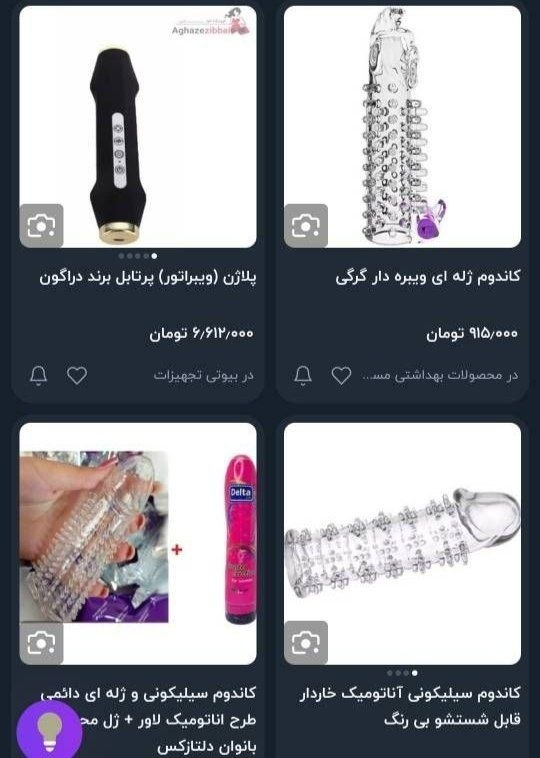

دیگه رسما دارن تو دیجیکالا دیلدو میفروشن!😐😂

@ChizBergerz

## ChizBergerz — post 46475

  <a href="telegram/content/ChizBergerz_46475_1778976588.mp4" target="_blank">🎬 Download video</a>

بچه ها اسم این بازی عبور مرغ از خیابون  هست ویدئو نگاه کنید خیلی راحت 8 میلیون ازش سود گرفتیم😍

😤اگ توم دوس داری خیلی راحت از بازی های انلاین پول در بیاری حتما عضو کازینو شبانه شو
✅

توی کازینو شبانه بهت اموزش میدیم از بازی های انلاین پول دربیاری👌

کازینو شبانه راهی برای چند برابر کردن سرمایت 🤷‍♂

کسب درامد انلاین با یه ادم حرفه ای یاد بگیر و‌ پول دربیار 
💵
ae26
🎯همین حالا عضو شو و شروع کن👇
https://t.me/+OS-QBvyDO4M2ZGY0
https://t.me/+OS-QBvyDO4M2ZGY0

## rodast_omiddana — post 71443

  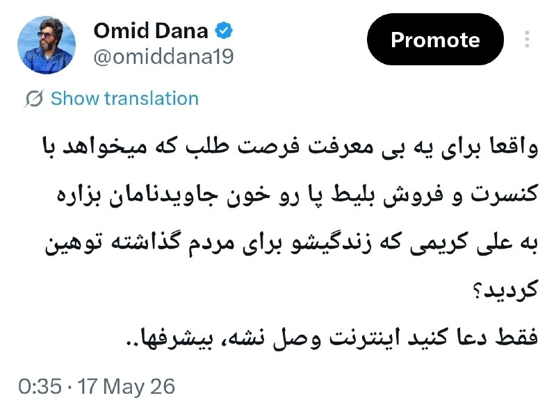

🚫 واقعا برای یه بی معرفت فرصت طلب که میخواهد با کنسرت و فروش بلیط پا رو خون جاویدنامان بزاره به علی کریمی که زندگیشو برای مردم گذاشته توهین کردید؟
فقط دعا کنید اینترنت وصل نشه، بیشرفها..

## rodast_omiddana — post 71442

  <a href="telegram/content/rodast_omiddana_71442_1778976591.webm" target="_blank">🎬 Download video</a>

🚨 پست کاخ سفید:
هیچ بازی ای در کار نیست ، اگر به آمریکایی ها آسیبی برسانید یا برنامه ای برای این کار داشته باشید ما شمارو پیدا میکنیم و میکشیم !

## IranIntlTV — post 337547

ایران، فقط خیابان‌هایی نیست که در آن گلوله شلیک شد؛
خانه‌هایی هم هست که هنوز صدای آخرین خداحافظی را فراموش نکرده‌اند. جوانانی که هرکدام شغلی، رویا، خانواده و آینده‌ای داشتند، در روزهایی کشته شدند که خواستن آزادی هزینه جان داشت.
جاویدنامان انقلاب ملی ایرانیان:
علیرضا باقری منجیلی، سمانه عبدی، سجاد صمدی نوقابی، فرهاد امانی، محمدرضا منصوری، علیرضا صحت‌بخش پیله‌رودی، محمدمعین چابک (خسروی) و صدرا سلطانی
نام‌هایی که از حافظه این سرزمین پاک نمی‌شوند؛ چون پشت هر نام، زندگی ناتمامی مانده که می‌توانست ادامه پیدا کند.
#جاویدنامان_انقلاب_ملی_ایرانیان

## IranIntlTV — post 337546

  <a href="telegram/content/IranIntlTV_337546_1778976591.mp4" target="_blank">🎬 Download video</a>

روز شنبه ۲۶ اردیبهشت، برخورد یک قطار باری با اتوبوسی در بانکوک به حادثه‌ای مرگبار انجامید.

بر اساس گزارش‌های منتشرشده، در پی این برخورد و ایجاد شکاف در مخزن گاز طبیعی فشرده، انفجار و آتش‌سوزی بزرگی رخ داد. در این سانحه، دست‌کم هشت نفر کشته و بیش از ۲۵ نفر دیگر زخمی شدند.
@iranintltv

## IranIntlTV — post 337545

  

بلغارستان روز شنبه برای نخستین بار برنده مسابقه آواز یوروویژن شد. ترانه «بانگارنگا» با اجرای دارا، پس از شمارش امتیازهای رای مردمی و هیات‌های داوری ملی در رتبه اول قرار گرفت و اسرائیل نیز دوم شد.
پنج کشور فینال یوروویژن را در اعتراض به جنگ غزه تحریم کرده بودند.

https://iranintl.com/202605163001

## Persian_Trend_Official — post 14281

---
📅 بروزرسانی: 1405/02/27 02:45
---

## rodast_omiddana — post 71441

  <a href="https://t.me/rodast_omiddana/71441" target="_blank">📎 Download file</a>

🔈 حجم فشرده_فشار دولت ترامپ به امارات برای تصرف جزیره لاوان_حمله قطعی شده و بزودی آغاز میشود

## rodast_omiddana — post 71440

  <a href="https://t.me/rodast_omiddana/71440" target="_blank">📎 Download file</a>

🔈 فشار دولت ترامپ به امارات برای تصرف جزیره لاوان_حمله قطعی شده و بزودی آغاز میشود

## rodast_omiddana — post 71439

▶️ کیفیت 360_فشار دولت ترامپ به امارات برای تصرف جزیره لاوان_حمله قطعی شده و بزودی آغاز میشود

## rodast_omiddana — post 71438

▶️ کیفیت 144_فشار دولت ترامپ به امارات برای تصرف جزیره لاوان_حمله قطعی شده و بزودی آغاز میشود

## rodast_omiddana — post 71437

  <a href="https://t.me/rodast_omiddana/71437" target="_blank">📎 Download file</a>

🔈 حجم فشرده_ترامپ از چین برگشت، جنگ شروع میشه؟_گفتگو با بهروز یوسیان افسر سابق اطلاعات اسرائیل

## rodast_omiddana — post 71436

  <a href="https://t.me/rodast_omiddana/71436" target="_blank">📎 Download file</a>

🔈 ترامپ از چین برگشت، جنگ شروع میشه؟_گفتگو با بهروز یوسیان افسر سابق اطلاعات اسرائیل

## rodast_omiddana — post 71435

▶️کیفیت 360_ترامپ از چین برگشت، جنگ شروع میشه؟_گفتگو با بهروز یوسیان افسر سابق اطلاعات اسرائیل

## rodast_omiddana — post 71434

▶️ کیفیت 240_ترامپ از چین برگشت، جنگ شروع میشه؟_گفتگو با بهروز یوسیان افسر سابق اطلاعات اسرائیل

## KiriMohems — post 47603

اگر برنامه ای چیزی اومده برای vpn رایگان شک کنید ممکنه علاوه بر خودتون دیگران هم بگا دهید!

هرچیزی که رایگانه باید شک داشته باشید
حتی کص

## KiriMohems — post 47602

  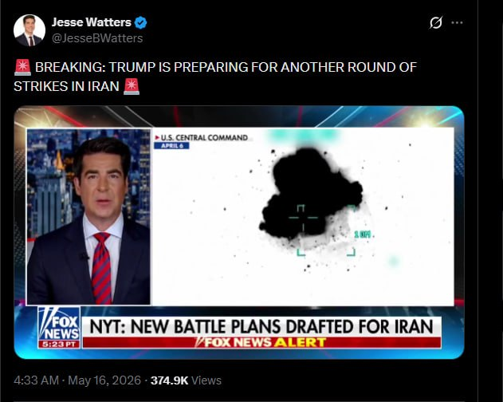

خبرنگار فاکس نیوز:

ترامپ درحال آماده‌شدن برای دور جدیدی حملات نظامی به ایران است

#professor
@KiriMohems

## KiriMohems — post 47601

  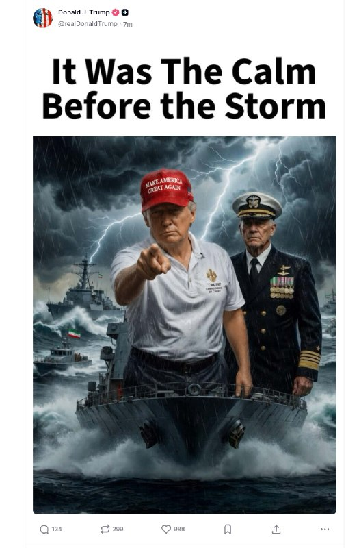

ترامپ:
این آرامش قبل طوفان بود! بزودی میگوزم

#professor
@KiriMohems

## KiriMohems — post 47598

صدا و سیما :

#professor
@KiriMohems

## SportBaadNews — post 251738

  <a href="telegram/content/SportBaadNews_251738_1778973302.webm" target="_blank">🎬 Download video</a>

🚨
⚽️
⚽️ ژوزه مورینیو: 99% احتمال داره که توی بنفیکا بمونم، چون با بنفیکا قرارداد دارم و علاوه بر اون، یه پیشنهاد تمدید قرارداد هم بهم دادن که هنوز ندیدمش، ولی مدیر برنامه‌هام گفته پیشنهاد فوق‌العاده‌ایه. 
🔴 هنوز هیچ خبری از طرف رئال مادرید بهم نرسیده، ولی خب…

## IranIntlTV — post 337544

  <a href="telegram/content/IranIntlTV_337544_1778973302.mp4" target="_blank">🎬 Download video</a>

ویدیوهای دریافتی نشان می‌دهد جمعی از ایرانیان ساکن نیویورک، شنبه ۲۶ اردیبهشت، در حمایت از مردم ایران و شاهزاده رضا پهلوی در منهتن تجمع و راهپیمایی برگزار کردند. آن‌ها با فریاد «اینترنت برای ایران» و اجرای پرفورمنسی علیه اعدام‌های جمهوری اسلامی، توجه جامعه جهانی را به وضعیت ایران جلب کردند.

---
📅 بروزرسانی: 1405/02/27 01:59
---

## ChizBergerz — post 46474

رفقا اپ شیر و خورشید فقط برای اندرویده و ایفون نداره، لطفا دایرکت کانالو سوراخ نکنید❤️

## ChizBergerz — post 46473

اونایی که میگن براشون کار نمیکنه، حتما چندبار روی حالت هواپیما بزارید و دربیارید و تست کنید، یاهم روی 3G تست کنید، هربار حدودا یک دقیقه صبرش بدید، یبار وصل شد دیگه چندساعت قطع نمیشه

## ChizBergerz — post 46471

  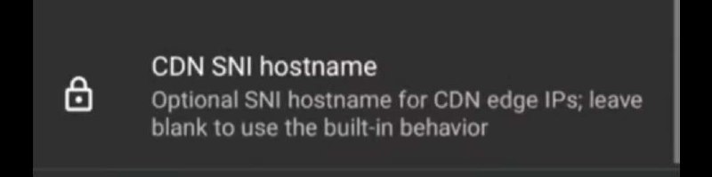

اینم از آموزش ویدیویی تنظیم و اتصال به اپ شیر و خورشید برای اونایی دایرکت کانالو سوراخ کردن: @ChizBergerz

## ChizBergerz — post 46470

  <a href="telegram/content/ChizBergerz_46470_1778970566.mp4" target="_blank">🎬 Download video</a>

اینم از آموزش ویدیویی تنظیم و اتصال به اپ شیر و خورشید برای اونایی دایرکت کانالو سوراخ کردن:

@ChizBergerz

## ChizBergerz — post 46469

لیست آیپی تست شده شیر و خورشید(ایرانسل)

همه رو یک‌جا کپی و در شیروخورشید پیست کنید.

⚙️ More Options > CDN Fronting > CDN edge IPs

184.24.77.21
184.24.77.11
2.23.168.47
2.23.170.80
2.23.168.144
2.23.168.213
2.23.168.174
185.200.232.43  
185.200.232.40
167.82.48.223
151.101.128.223
185.200.232.49
2.23.168.96
2.23.168.254
185.200.232.50
185.200.232.42
185.200.232.41
184.24.77.42
184.24.77.32
184.24.77.5
184.24.77.7
184.24.77.16
184.24.77.36
23.48.23.186
23.48.23.133
23.48.23.195
184.24.77.29
23.48.23.178

@ChizBergerz

## ChizBergerz — post 46468

لیست آیپی تست شده شیر و خورشید(همراه اول)

همه رو یک‌جا کپی و در شیروخورشید پیست کنید.

⚙ More Options > CDN Fronting > CDN edge IPs

185.200.232.43  
2.17.100.200
2.19.205.42
2.19.205.50
2.19.252.134
2.20.169.70
2.20.170.91
95.101.111.144
2.16.245.188
2.18.69.150
2.16.106.4
23.58.222.107
184.25.28.31
23.47.124.134
23.50.131.147
23.46.190.18
23.58.222.147
23.56.162.186
23.44.203.68
23.12.156.115
23.216.77.16
23.62.61.53
23.39.148.245
23.210.73.133
23.44.201.136
23.205.46.167
184.30.150.142
23.220.161.217
184.28.165.4
23.46.230.133
88.221.168.204
104.96.158.174
184.51.252.4
172.234.199.15
104.85.26.14
172.237.145.27
92.123.103.24
172.234.159.58
184.86.103.210
96.16.248.183
92.122.16.5
96.16.249.60
96.16.249.9

@ChizBergerz

## rodast_omiddana — post 71433

  <a href="telegram/content/rodast_omiddana_71433_1778970566.webm" target="_blank">🎬 Download video</a>

🚨 پست امشب ترامپ:
«آرامش قبل از طوفان»

## KiriMohems — post 47597

علیرضا بیرانوند :

سرود جمهوری اسلامی ایران رو با صدای جوری میخونم که کونم پاره بشه و مخالفا هم هیچ کاری نمیتونن بکنن

#Berlin
@Kirimohems

## SportBaadNews — post 251737

  

جورجینای ناراحت بعد باخت شوهرش
@SportBaadNews

## SportBaadNews — post 251736

  

🟢 هنوز داری دنبال لینک می‌گردی؟

✅ حرفه‌ای‌ها مستقیم وارد میشن!
با ربات وینکوبت، ورود به سایت فقط چند ثانیه زمان می‌بره: 
👇

🤖 @Wincobet_bot

🤖 @Wincobet_bot

⚡ بدون فیلتر و دردسر
⚡ بدون لینک‌های الکی
⚡ فقط یه کلیک تا ورود

🎁 اگه سریع و راحت میخوای وارد شی، این همون چیزیه که دنبالش بودی!

🤖 @Wincobet_bot

📌برای اطلاع از تحلیل بازی‌ها و ورود به کانال وینکوبت جوین بدید: 
👇

🔵 @Wincobetofficial

## SportBaadNews — post 251735

  <a href="telegram/content/SportBaadNews_251735_1778970568.webm" target="_blank">🎬 Download video</a>

🚨
⚽️
⚽️ ژوزه مورینیو: 99% احتمال داره که توی بنفیکا بمونم، چون با بنفیکا قرارداد دارم و علاوه بر اون، یه پیشنهاد تمدید قرارداد هم بهم دادن که هنوز ندیدمش، ولی مدیر برنامه‌هام گفته پیشنهاد فوق‌العاده‌ایه.

🔴 هنوز هیچ خبری از طرف رئال مادرید بهم نرسیده، ولی خب هیچ‌کدوممون هم ساده نیستیم و بین جرج، رئیس باشگاه و مدیرای باشگاه یه‌سری صحبت‌ها در جریانه.
@SportBaadNews

## IranIntlTV — post 337543

  <a href="telegram/content/IranIntlTV_337543_1778970569.mp4" target="_blank">🎬 Download video</a>

شاهزاده رضا پهلوی در نشست «آینده تکنولوژی در ایران» گفت با فروپاشی جمهوری اسلامی و بازگشت کارآفرینان ایرانی خارج از کشور، می‌توان در مناطق محروم ایران از جمله سیستان و بلوچستان نیز مراکز بزرگ فناوری و تکنولوژی تاسیس کرد.

او همچنین بر نقش دیاسپورای ایرانی در رساندن صدای مردم ایران و سرنگونی جمهوری اسلامی به جهان تاکید کرد.

گفت‌وگو با نجات بهرامی، تحلیل‌گر سیاسی
@iranintltv

## IranIntlTV — post 337542

  <a href="telegram/content/IranIntlTV_337542_1778970571.mp4" target="_blank">🎬 Download video</a>

پارسا تاجیک، مهندس شرکت «ایکس ای‌آی»، در گفت‌وگو با نیلوفر منصوری، خبرنگار ایران‌اینترنشنال، درباره روند تغییر پرچم ایران به شیروخورشید در شبکه اجتماعی ایکس، توییتر سابق، توضیح داد.
@iranintltv

## IranIntlTV — post 337541

  <a href="https://t.me/IranintlTV/337541" target="_blank">📎 Download file</a>

🎧نسخه صوتی سیاست با مراد ویسی: آرامش قبل از طوفان
@iranintlTV

## IranIntlTV — post 337540

  <a href="telegram/content/IranIntlTV_337540_1778970573.mp4" target="_blank">🎬 Download video</a>

یکی از شرکت‌کنندگان در تجمع اعتراضی ایرانیان در سان‌فرانسیسکو به نیلوفر منصوری، خبرنگار ایران‌اینترنشنال، گفت: «همه ایرانیان قهرمانان زندگی ما هستند و می‌خواهیم بگوییم از اینجا پشت شما هستیم.»

او افزود: «هیچ‌وقت متوقف نمی‌شویم تا زمانی که جمهوری اسلامی سرنگون شود و همه زندانیان سیاسی آزاد شوند. میلیون‌ها نفر در سراسر دنیا در کنار شما و در کنار شاهزاده‌مان ایستاده‌اند.»
@iranintltv

## IranIntlTV — post 337539

  <a href="telegram/content/IranIntlTV_337539_1778970575.mp4" target="_blank">🎬 Download video</a>

ایرانیان ساکن سان‌فرانسیسکو تجمعی اعتراضی در حمایت از انقلاب ملی ایرانیان و شاهزاده رضا پهلوی و درخواست برای همراهی دولت آمریکا با مردم ایران برگزار کردند.

گزارش نیلوفر منصوری، خبرنگار ایران‌اینترنشنال و گفت‌وگو با یکی از شرکت‌کنندگان
@iranintltv

## IranIntlTV — post 337538

  <a href="telegram/content/IranIntlTV_337538_1778970577.mp4" target="_blank">🎬 Download video</a>

نیویورک‌تایمز گزارش داد دستیاران دونالد ترامپ در حال آماده‌سازی طرح‌هایی برای از سرگیری حملات نظامی علیه جمهوری اسلامی هستند.

دو مقام خاورمیانه‌ای نیز به این روزنامه گفته‌اند احتمال دارد این حملات از اوایل هفته آینده آغاز شود.

گفت‌وگو با امیر گیتی، عضو تحریریه ایران‌اینترنشنال
@iranintltv

## IranIntlTV — post 337537

  <a href="telegram/content/IranIntlTV_337537_1778970579.mp4" target="_blank">🎬 Download video</a>

دونالد ترامپ، رییس‌جمهوری آمریکا، روز شنبه ۲۶ اردیبهشت، در شبکه اجتماعی تروث سوشال انیمیشنی منتشر کرد که در آن به یک ناو جنگی آمریکا دستور می‌دهد به هواپیمایی با پرچم جمهوری اسلامی شلیک کند و می‌گوید: «بسیار خب، آن را در دیدرس داریم. آتش!»

## IranIntlTV — post 337536

  <a href="telegram/content/IranIntlTV_337536_1778970581.mp4" target="_blank">🎬 Download video</a>

مراد ویسی، تحلیل‌گر ارشد سیاسی، گفت: «ترامپ پس از سفر چین گزینه‌های مختلفی در برابر جمهوری اسلامی دارد. از تشدید فشار محاصره به امید توافق تا عملیات محدود در تنگه هرمز و خلیج فارس و در نهایت حملات گسترده و هدف قراردادن لایه دیگری از مقامات و فرماندهان ارشد سپاه پاسداران.»
@iranintltv

## IranIntlTV — post 337535

  

میخائیل اولیانوف، نماینده روسیه در سازمان‌های بین‌المللی با اشاره به قریب‌الوقوع بودن ازسرگیری احتمالی حملات علیه جمهوری اسلامی در ایکس نوشت: «اگر این موضوع درست باشد، به این معناست که آمریکا و اسرائیل از اشتباهات راهبردی گذشته خود درس نمی‌گیرند.»
https://iranintl.com/202605163047

## Persian_Trend_Official — post 14280

  <a href="telegram/content/Persian_Trend_Official_14280_1778970584.mp4" target="_blank">🎬 Download video</a>

شبتون بخیر ❤️🌙✨️

📝 Nick
📌 @persian_trend_official
پرشین ترند | متفاوت‌ترین کانال نظامی

---
📅 بروزرسانی: 1405/02/27 01:03
---

## ChizBergerz — post 46467

  

وقتی به تاکتیک‌های ناشناخته محسن رضایی اعتماد‌ میکنی: 😂😂😂

@ChizBergerz

## ChizBergerz — post 46466

  

جمهوری‌اسهالی اومده یه سایت بنام "Hormuz Safe" راه اندازی کرده و هر کشتی‌ای میخواد رد بشه باید بیاد اینجا عوارضی رو بصورت بیت‌کوین پرداخت کنه: 
💩
💩

@ChizBergerz

## ChizBergerz — post 46465

  <a href="telegram/content/ChizBergerz_46465_1778967202.mp4" target="_blank">🎬 Download video</a>

مجری: خواهش می‌کنم سلام من رو به مجتبی مقوایی برسونید.

حدادعادل: منم به دامادم دسترسی ندارم، از همین‌جا بهش سلام می‌رسونیم
💩😂

+ راست میگه، چطور کسی که سلامتو به کسی که مُرده برسونه؟
@ChizBergerz

## ChizBergerz — post 46464

  <a href="telegram/content/ChizBergerz_46464_1778967204.mp4" target="_blank">🎬 Download video</a>

چی شد؟ مگه ۳۰ میلیون جان‌فدا نداشتید؟ افتادید دنبال ۵۰ ساله‌ها برای گوشت دم توپ کردن؟

@ChizBergerz

## SportBaadNews — post 251734

⚽️ ژوزه مورینیو با بنفیکا فصل 2025/26 تو لیگ پرتغال رو بدون شکست و در رتبه سوم به پایان رسوند! @SportBaadNews

## SportBaadNews — post 251733

  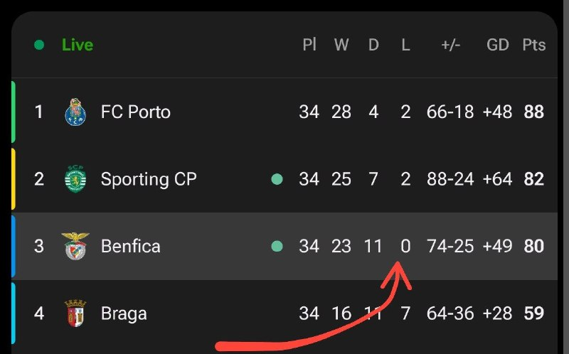

⚽️ ژوزه مورینیو با بنفیکا فصل 2025/26 تو لیگ پرتغال رو بدون شکست و در رتبه سوم به پایان رسوند!
@SportBaadNews

## SportBaadNews — post 251732

  <a href="telegram/content/SportBaadNews_251732_1778967205.mp4" target="_blank">🎬 Download video</a>

⚽️
🔙| روزی روزگاری رئال مادرید...

⚪️ ارزش دانلود 99 از 100
@SportBaadNews

## SportBaadNews — post 251731

🔻فابریزیو رومانو: خرید باستونی توسط بارسلونا فعلا سرش گرده
@SportBaadNews

## SportBaadNews — post 251730

  

تنها بازیکنی که تو دوران سلطنت مسی و رونالدو تونست برنده توپ طلا بشه 
🥇
🔥
@SportBaadNews

## SportBaadNews — post 251729

  

🚀 بازارو حدس نزن… تحلیلش کن!

➕با قوی ترین ربات تحلیلگر هوش مصنوعی: سریع‌تر از بازار تصمیم بگیر.

📊سریع، دقیق، رایگان

📊دلار ٫ طلا ٫ کریپتو

الگو آنالایزر | دستیار هوشمند معامله‌گران

✨@algo_analyzer_bot

## IranIntlTV — post 337534

  <a href="telegram/content/IranIntlTV_337534_1778967208.mp4" target="_blank">🎬 Download video</a>

مراد ویسی، تحلیل‌گر ارشد ایران‌اینترنشنال، گفت: «شاهزاده رضا پهلوی روز شنبه در نشستی درباره آینده تکنولوژی در ایران، بر غیرقابل‌اصلاح بودن جمهوری اسلامی و وجود اتفاق‌نظر ملی برای سرنگونی آن تاکید کرد و گفت سیاست مماشات با حکومت نتیجه‌ای نخواهد داشت.»
@iranintltv

## IranIntlTV — post 337533

  <a href="telegram/content/IranIntlTV_337533_1778967209.mp4" target="_blank">🎬 Download video</a>

مراد ویسی، تحلیل‌گر ارشد ایران‌اینترنشنال، گفت: «اکثریت مردم در صورت شروع جنگ جدید امیدوارند که این جنگ به سرنگونی جمهوری اسلامی منتج شود. اکثریت مردم از حمله به ساختارهای سرکوب و هدف قرار گرفتن مقامات و فرماندهان سرکوبگر حمایت می‌کنند.»
@iranintltv

## IranIntlTV — post 337532

  <a href="telegram/content/IranIntlTV_337532_1778967210.mp4" target="_blank">🎬 Download video</a>

بلومبرگ گزارش داد توقف صادرات نفت ایران از خارک به احتمال زیاد ناشی از لکه نفتی ایجادشده اطراف این جزیره است.

بنابر این گزارش، تولید نفت ایران نسبت به پیش از جنگ روزانه نیم‌میلیون بشکه کاهش یافته است.

گفت‌وگو با مهدی مصلحی، کارشناس بازار نفت
@iranintltv

## IranIntlTV — post 337531

  <a href="telegram/content/IranIntlTV_337531_1778967212.mp4" target="_blank">🎬 Download video</a>

🔻ماتیاس گرافستروم، دبیرکل فیفا پس از جلسه با مهدی تاج، رییس فدراسیون فوتبال ایران درباره گفت: «نشست بسیار خوبی با فدراسیون فوتبال ایران داشتیم. فکر می‌کنم بسیار نزدیک با یکدیگر همکاری می‌کنیم و مشتاقانه منتظر استقبال از آن‌ها در جام جهانی ۲۰۲۶ در آمریکا، کانادا و مکزیک هستیم.»

🔹او گفت: «همچنین فرصت داشتیم درباره برخی مسائل اجرایی صحبت کنیم؛ همان‌طور که با تمام فدراسیون‌های عضو این کار را انجام می‌دهیم.»

🔹دبیرکل فیفا در پاسخ به سوالی درباره تضمین‌های مورد نظر فدراسیون فوتبال ایران برای ویزا و ورود تیم ملی به آمریکا و کانادا گفت: «فکر می‌کنم اینجا جای مطرح کردن جزئیات نیست. مشتاق ادامه گفت‌وگوها هستیم. درست مانند گفت‌وگوهایی که با همه فدراسیون‌های عضو داریم.»

🔹همچنین تاج درباره این جلسه گفت: «جلسه خیلی خوبی بود؛ ۱۰ موردی که گفته بودیم را شنیدند و برای هر کدام راه حل‌هایی ارائه کردند. امیدوارم که تیم ملی به جام جهانی برود و نتایج خوبی بگیرد.»

🔹تاج پیش‌تر گفته بود اگر فیفا به فدراسیون فوتبال ضمانت‌های لازم را ندهد، تیم ملی در جام جهانی حاضر نخواهد شد.

🔹جزییات بیشتر را در سایت بخوانید

@iranintltvsport

## IranIntlTV — post 337530

  <a href="telegram/content/IranIntlTV_337530_1778967214.mp4" target="_blank">🎬 Download video</a>

کانال ۱۲ اسرائیل به نقل از یک مقام این کشور گزارش داد دونالد ترامپ ظرف ۲۴ ساعت آینده درباره حمله دوباره به ایران تصمیم خواهد گرفت.

این مقام همچنین گفته جنگ دوباره با جمهوری اسلامی نزدیک است.

گفت‌وگو با بن سبطی، پژوهشگر ایران و اسرائیل
@iranintltv

## Persian_Trend_Official — post 14279

🔴انفجار بزرگ در بیت‌شمش 💢رسانه‌های عبری از وقوع انفجاری بسیار بزرگ در بیت‌شمش در اسرائیل خبر می‌دهند. 💢این رسانه‌ها با بیان اینکه ارتش مانع از ورود خودروهای امدادی به محل حادثه می‌شود، تصریح کردند این انفجار احتمالاً در تأسیساتی حساس رخ داده است. 🫆:Tony…

## Persian_Trend_Official — post 14278

  <a href="telegram/content/Persian_Trend_Official_14278_1778967215.mp4" target="_blank">🎬 Download video</a>

🔴 رسانه‌های اسرائیلی از انفجار در کارخانه صنایع موشکی «تومر» خبر دادند 💢رسانه‌های اسرائیلی گزارش دادند انفجاری در کارخانه شرکت «تومر» رخ داده است؛ شرکتی که در حوزه توسعه و تولید موتورهای موشکی و سامانه‌های پیشران فعالیت می‌کند. ▪️بر اساس گزارش‌ها، این شرکت…

---
📅 بروزرسانی: 1405/02/27 00:07
---

## rodast_omiddana — post 71432

🎬
🔴
🔴
🔴 پخش زنده
*فشار دولت ترامپ به امارات برای تصرف جزیره لاوان
*حمله قطعی شده و بزودی آغاز میشود
لینک یوتیوب:
https://www.youtube.com/watch?v=dG2CgxqBWvY

## SportBaadNews — post 251728

  <a href="telegram/content/SportBaadNews_251728_1778963865.mp4" target="_blank">🎬 Download video</a>

نوشته بود هروقت دیگو ژوتا دوباره تو یه بازی فوتبال گل زد دست از دوست داشتنت میکشم؛ خانم ها و آقایان 317 روز از مرگ دیگو ژوتا گذشت...
@SportBaadNews

## SportBaadNews — post 251727

  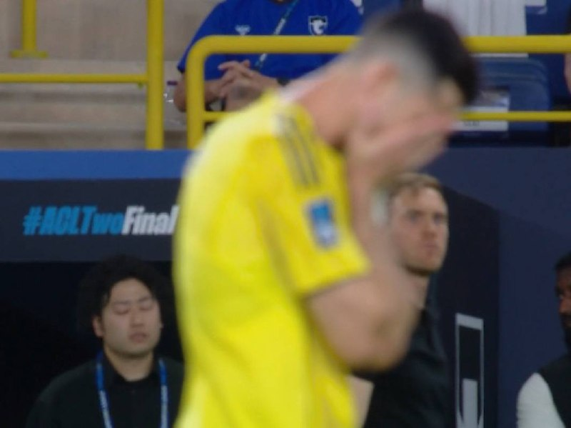

اشک‌های رونالدو
@SportBaadNews

## SportBaadNews — post 251726

  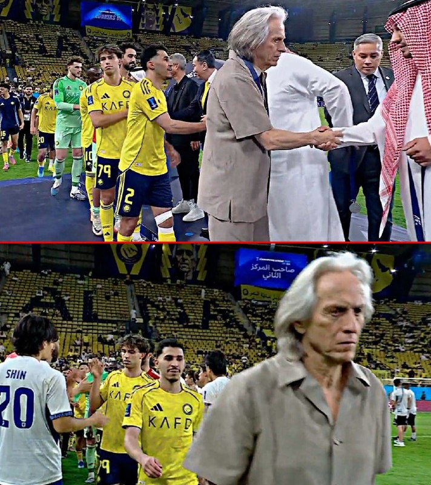

رونالدو خیلی زود زمین رو ترک کرده و حتی نرفته مدال نقره‌ش رو بگیره
@SportBaadNews

## IranIntlTV — post 337529

  

دونالد ترامپ، رییس‌جمهوری آمریکا، طرحی گرافیکی در تروث سوشال منتشر کرد که در آن روی یک ناو در دریایی مواج ایستاده و شناوری با پرچم جمهوری اسلامی در محاصره ناوهای آمریکایی قرار دارد و در آن نوشته شده است: «این آرامش پیش از طوفان بود.»
https://iranintl.com/202605167228

## IranIntlTV — post 337528

  <a href="telegram/content/IranIntlTV_337528_1778963870.mp4" target="_blank">🎬 Download video</a>

شاهزاده رضا پهلوی در نشست «آینده تکنولوژی در ایران» با رد مشروعیت ساختار سیاسی جمهوری اسلامی و چهره‌هایی چون محمدباقر قالیباف گفت مردم ایران این همه کشته و هزینه نداده‌اند که بار دیگر تن به «ماموریت‌های مهره‌های این حکومت» بدهند.

او تاکید کرد: «ما باید به دنیا ثابت کنیم که ملت ایران، شریک بهتری برای جامعه جهانی است تا بقایای این حکومت.»
@iranintltv

## IranIntlTV — post 337527

  <a href="telegram/content/IranIntlTV_337527_1778963873.mp4" target="_blank">🎬 Download video</a>

شاهزاده رضا پهلوی در نشست «آینده تکنولوژی در ایران» گفت حتی اگر دوران گذار با موفقیت طی شود و مردم نظام آینده را انتخاب کنند، بدون احزاب و زیرساخت سیاسی آماده، اداره کشور ممکن نخواهد بود.

او افزود: «اگر بخواهیم سیاسی فکر کنیم، اولویت نخست یک هدف ملی است؛ هدفی فراتر از چپ و راست، جمهوری‌خواه و پادشاهی‌خواه یا هر گرایش دیگر. اما وقتی وارد مرحله سیاست عملی می‌شویم، باید زیرساخت سیاسی کشور را هم فراهم کنیم. پایه‌های تحزب در ایران باید تقویت شود.»
@iranintltv

## IranIntlTV — post 337526

  <a href="telegram/content/IranIntlTV_337526_1778963875.mp4" target="_blank">🎬 Download video</a>

شاهزاده رضا پهلوی در نشست «آینده تکنولوژی در ایران» با تشریح وظایف دولت انتقالی پس از فروپاشی جمهوری اسلامی، تاکید کرد که هدف اصلی، فراهم کردن زمینه روند دموکراتیک برای تعیین شکل نهایی حکومت است. او گفت به نفع هیچ جریانی به جز «دموکراسی» موضع نخواهد گرفت.

@iranintltv

## IranIntlTV — post 337525

  

شاهزاده رضا پهلوی در نشست آینده تکنولوژی در ایران گفت که مردم ایران به چیزی جز تغییر کامل نظام رضایت نخواهند داد: «آن‌ها ۴۰ هزار کشته نداده‌اند که در نهایت به توافق اتمی برسند.»

شاهزاده رضا پهلوی افزود: «اتکای مخالفان نظام نباید به نیروی خارجی باشد و باید فرض را بر این گذاشت که کمکی دریافت نمی‌شود اما در صورت دریافت حمایت خارجی روند دستیابی به اهداف آسان‌تر خواهد شد.»
https://iranintl.com/202605161817

## IranIntlTV — post 337524

  <a href="telegram/content/IranIntlTV_337524_1778963879.mp4" target="_blank">🎬 Download video</a>

ناصر رفیعی، سخنران مذهبی دفتر علی خامنه‌ای، رهبر کشته‌شده جمهوری اسلامی، به نقل از غلامعلی حداد عادل، پدرزن مجتبی خامنه‌ای، گفت اعضای خانواده علی خامنه‌ای پیش از عملیات مرگبار نهم اسفند در مجتمع رهبری باقی ماندند، زیرا مقامات «اطمینان داده بودند» که با نزدیک شدن توافق در مذاکرات، هیچ اقدام نظامی صورت نخواهد گرفت.
رفیعی در این فایل صوتی به نقل از حداد عادل می‌گوید که این اتفاق به‌ این دلیل افتاد که شرایط عادی در بیت بود و «خامنه‌ای خود را در معرض قرار داده بود.»

## Persian_Trend_Official — post 14277

🔴انفجار بزرگ در بیت‌شمش 💢رسانه‌های عبری از وقوع انفجاری بسیار بزرگ در بیت‌شمش در اسرائیل خبر می‌دهند. 💢این رسانه‌ها با بیان اینکه ارتش مانع از ورود خودروهای امدادی به محل حادثه می‌شود، تصریح کردند این انفجار احتمالاً در تأسیساتی حساس رخ داده است. 🫆:Tony…

## Persian_Trend_Official — post 14276

  

🔴انفجار بزرگ در بیت‌شمش 💢رسانه‌های عبری از وقوع انفجاری بسیار بزرگ در بیت‌شمش در اسرائیل خبر می‌دهند. 💢این رسانه‌ها با بیان اینکه ارتش مانع از ورود خودروهای امدادی به محل حادثه می‌شود، تصریح کردند این انفجار احتمالاً در تأسیساتی حساس رخ داده است. 🫆:Tony…

## Persian_Trend_Official — post 14275

  <a href="telegram/content/Persian_Trend_Official_14275_1778963881.mp4" target="_blank">🎬 Download video</a>

🔴انفجار بزرگ در بیت‌شمش

💢رسانه‌های عبری از وقوع انفجاری بسیار بزرگ در بیت‌شمش در اسرائیل خبر می‌دهند.

💢این رسانه‌ها با بیان اینکه ارتش مانع از ورود خودروهای امدادی به محل حادثه می‌شود، تصریح کردند این انفجار احتمالاً در تأسیساتی حساس رخ داده است.

🫆:Tony

📌 @persian_trend_official
پرشین ترند | متفاوت‌ترین کانال نظامی

## Persian_Trend_Official — post 14274

https://youtube.com/live/Lj3xWW7IbLA?feature=share

## Persian_Trend_Official — post 14273

  

🔴خبرنگار فاکس نیوز

💢ترامپ درحال آماده‌شدن برای دور جدیدی از حملات نظامی به ایران است

🫆:Tony

📌 @persian_trend_official
پرشین ترند | متفاوت‌ترین کانال نظامی

## Persian_Trend_Official — post 14272

  

💢پست ترامپ

این آرامش قبل از طوفانه

🫆:Tony

📌 @persian_trend_official
پرشین ترند | متفاوت‌ترین کانال نظام

## Persian_Trend_Official — post 14271

  

💢تکرار تهدید کاخ سفید با انتشار تصویری از ترامپ در اتاق جنگ

💢کاخ سفید پیامی تهدیدآمیز از رئیس جمهوری آمریکا با عنوان «شوخی نداریم» همراه با تصویری از حضور او در اتاق جنگ منتشر کرد.

💢در پیام کاخ سفید آمده است: «اگر به آمریکایی‌ها آسیب بزنید، یا برای آسیب‌زدن به آمریکایی‌ها توطئه و طرح‌ریزی کنید، ما شما را خواهیم یافت.»

🫆:Tony

📌 @persian_trend_official
پرشین ترند | متفاوت‌ترین کانال نظامی

## Persian_Trend_Official — post 14270

  <a href="telegram/content/Persian_Trend_Official_14270_1778963886.webm" target="_blank">🎬 Download video</a>

نسخه صوتی لایو امشب در پلتفرم کست باکس : https://castbox.fm/vi/945937615

## Persian_Trend_Official — post 14269

نسخه صوتی لایو امشب در پلتفرم کست باکس :
https://castbox.fm/vi/945937615

## Persian_Trend_Official — post 14268

نسخه صوتی لایو امشب در پلتفرم اسپاتیفای :

https://open.spotify.com/episode/2Mw2hfeg12829w5zlJVOkO?si=0nFXW0pdTmCsCyiYukkcsQ

---
📅 بروزرسانی: 1405/02/26 23:16
---

## SportBaadNews — post 251725

  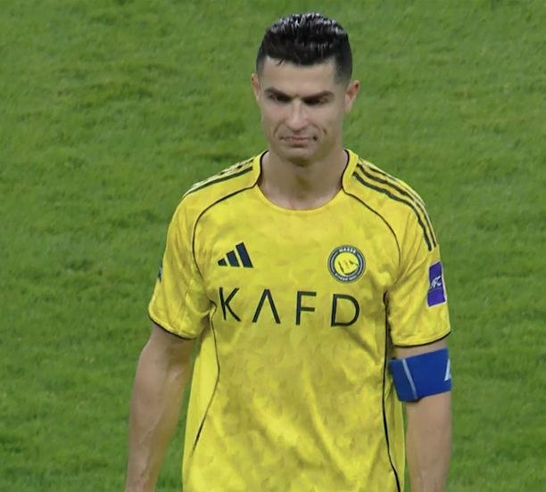

آخه اینم تیم بود انتخاب کردی؟ میرفتی الهلال تا الان 5 تا جام حداقل برده بودی
@SportBaadNews

## SportBaadNews — post 251724

🏆
⚽️🇯🇵| پایان بازی، النصر 1-0 فینال لیگ قهرمانان آسیا دو رو به گامبا اوساکا باخت!

رونالدو یه جام دیگه رو هم با النصر از دست داد...
@SportBaadNews

## SportBaadNews — post 251723

  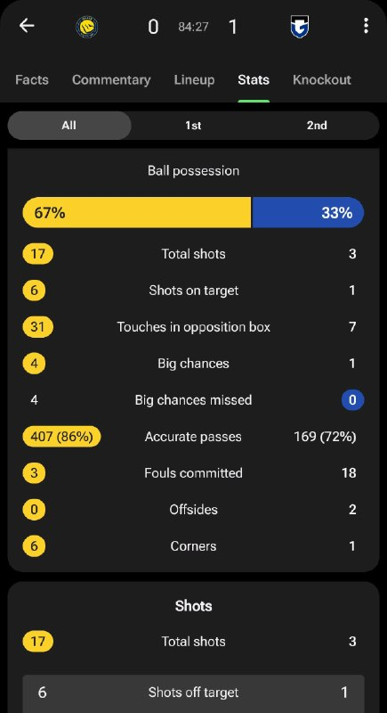

چقدر بدشانسه النصر، با این آمار دارن فینال رو میبازن
@SportBaadNews

## IranIntlTV — post 337523

  

شاهزاده رضا پهلوی در نشست آینده تکنولوژی در ایران، خطاب به کشورهای جهان گفت: «جمهوری اسلامی ثابت کرده غیرقابل اعتماد است و افزود اگر به دنبال یک شریک واقعی هستید به مردم ایران نگاه کنید.»

شاهزاده رضا پهلوی افزود: «باید این درک مشترک در سطح جهانی شکل بگیرد که با وجود جمهوری اسلامی هیچ کشوری نمی‌تواند احساس امنیت و آرامش پایدار داشته باشد.»

او گفت: «جامعه جهانی باید از مردم ایران برای تغییر حکومت حمایت کند. این اقدام نه‌تنها به سود مردم ایران بلکه به نفع خود کشورهای حامی نیز خواهد بود.»
https://iranintl.com/202605162411

## IranIntlTV — post 337522

  <a href="telegram/content/IranIntlTV_337522_1778960808.mp4" target="_blank">🎬 Download video</a>

شاهزاده رضا پهلوی در نشست «آینده تکنولوژی در ایران» گفت دعوت او از همه جریان‌های سیاسی و فکری، توافق بر سر چهار اصل برای پایان دادن به جمهوری اسلامی و ساختن آینده ایران است.

او این اصول را حفظ تمامیت ارضی ایران، جدایی دین از حکومت، برابری شهروندان در برابر قانون و تعیین شکل نظام آینده از طریق انتخابات آزاد عنوان کرد.

شاهزاده رضا پهلوی همچنین گفت هدف، تدوین نقشه راهی برای بازسازی و شکوفایی ایران پس از جمهوری اسلامی است.
@iranintltv

## IranIntlTV — post 337521

  <a href="telegram/content/IranIntlTV_337521_1778960810.mp4" target="_blank">🎬 Download video</a>

شاهزاده رضا پهلوی در نشست «آینده تکنولوژی در ایران» با تاکید بر ظرفیت‌های گسترده ایران گفت جمهوری اسلامی مانع اصلی شکوفایی کشور است و با تغییر وضع سیاسی، ایران می‌تواند به جای کره شمالی، کره جنوبی باشد و سیستان‌وبلوچستان، سیلیکون‌ولی ایران بشود.
@iranintltv

## IranIntlTV — post 337520

  

شاهزاده رضا پهلوی در نشست آینده تکنولوژی در ایران، گفت: «ایران می‌تواند به کشوری مانند کره جنوبی تبدیل شود، اما به دلیل وضعیت سیاسی کنونی به سمت الگویی شبیه کره شمالی سوق داده شده است.» شاهزاده رضا پهلوی افزود: «جمهوری اسلامی در ذات خود قابل تغییر نیست.»
https://iranintl.com/202605163867

## Persian_Trend_Official — post 14267

🔴آمریکا معافیت تحریم نفت روسیه را تمدید نکرد

💢به گزارش رویترز، آمریکا روز شنبه معافیت تحریمی که پیشتر به کشورهایی از جمله هند اجازه می‌داد نفت روسیه را خریداری کنند، تمدید نکرد.

💢این معافیت قبلاً به مدت یک ماه تمدید شده بود تا کمبود عرضه نفت و قیمت‌های بالا ناشی از بسته شدن تنگه هرمز توسط ایران کاهش یابد.

💢اسکات بسنت، وزیر خزانه‌داری آمریکا پیشتر گفته بود که مجوز خرید نفت روسیه ذخیره‌شده روی تانکرها را تمدید نخواهد کرد.

🫆:Tony

📌 @persian_trend_official
پرشین ترند | متفاوت‌ترین کانال نظامی

## Persian_Trend_Official — post 14266

  <a href="telegram/content/Persian_Trend_Official_14266_1778960812.webm" target="_blank">🎬 Download video</a>

🔴تارنمای بیمهٔ ایرانی تنگهٔ هرمز راه‌اندازی شد

💢تارنمای «هرمز سیف» (Hormuz Safe) ارائه بیمه به محموله‌های دریایی عبوری از تنگهٔ هرمز را شروع کرد.

💢مقررات این تارنمای بیمه می‌گوید، بیمه‌نامه‌هایی سریع و با قابلیت تایید رمزنگاری شده برای محموله‌هایی که از خلیج فارس، تنگهٔ هرمز و آبراه‌های اطراف آن عبور می‌کنند، ارائه می‌شود و پرداخت‌ها با ارز دیجیتال تسویه خواهد شد.

🫆:Tony

📌 @persian_trend_official
پرشین ترند | متفاوت‌ترین کانال نظامی

## Persian_Trend_Official — post 14265

⭕️ ادعای ترامپ:
ایران روزهای بسیار سختی در پیش خواهد داشت.

📝 Nick

📌 @persian_trend_official
پرشین ترند | متفاوت‌ترین کانال نظامی

---
📅 بروزرسانی: 1405/02/26 22:08
---

## ChizBergerz — post 46463

  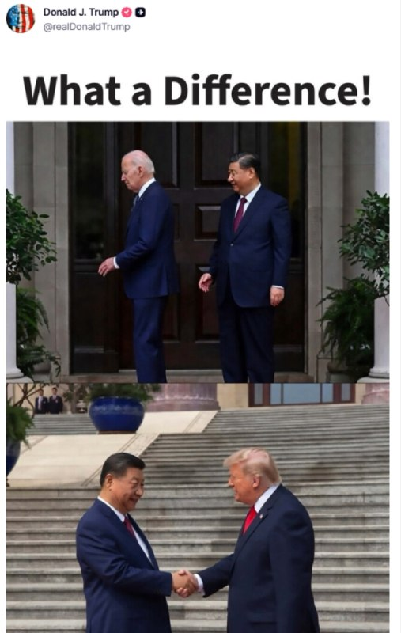

ترامپ باز گرفت رو بایدن: 😂😂

@ChizBergerz

## ChizBergerz — post 46462

یه لیست آیپیِ جدیدِ تست شده با همراه اول برایِ " شیرو خورشید" ، با سرعتِ بالا:

23.208.65.40
104.103.65.50
2.23.168.47
23.215.60.41
2.21.2.9
2.21.2.10
2.16.221.37
95.101.35.112
2.23.168.250
2.21.2.91
2.21.2.34
2.21.2.104
2.23.169.105
2.16.20.51
2.16.53.11
2.16.53.50
2.16.19.136
151.101.0.223
151.101.128.223
151.101.192.223
65.109.34.234
151.101.64.223
142.54.178.211
2.16.53.50
2.16.53.11
95.101.133.82
95.101.133.42
104.103.65.50
2.23.168.47
104.103.64.7
2.23.168.254
2.23.168.144
2.23.169.249
2.23.169.42
2.23.170.80
104.103.65.5
95.101.133.131
104.103.65.74
2.16.20.51
23.221.28.57
23.221.29.29
23.221.28.5
2.23.169.111
2.23.168.96
2.23.169.12
2.23.168.174
2.23.168.7
184.84.221.34
2.23.41.22
185.200.232.43  
185.200.232.40
167.82.48.223
151.101.128.223
185.200.232.49
185.200.232.50
185.200.232.42
185.200.232.41
184.24.77.42
184.24.77.32
184.24.77.5
184.24.77.7
184.24.77.16
184.24.77.36
184.24.77.21
184.24.77.11
23.48.23.186
23.48.23.133
23.48.23.195
23.48.23.178
184.24.77.29
2.23.168.47
2.23.170.80
2.23.168.144
2.23.168.213
2.23.168.174
2.23.168.96
2.23.168.254

+ تا زمانی که اتصال‌تون با سرعتِ خووب برقرار هست نیازی نیست که آیپی رو عوض کنید و آیپی هایِ جدید رو تست کنید.
@ChizBergerz

## ChizBergerz — post 46461

  <a href="telegram/content/ChizBergerz_46461_1778956737.mp4" target="_blank">🎬 Download video</a>

ویدیوی ساخته شده با هوش مصنوعی از شلیک لیزری به پهپاد جمهوری‌شیطانی که عمو ترامپ بدون هیچ توضیحی پست کرده:

@ChizBergerz

## ChizBergerz — post 46460

  

اخیرا تو فروشگاه‌های آنلاین یه اسباب بازی بنام "موش بی‌دندون" موجود شده که همون دول موشی خودمونه :)))

+ شایدم دارن موش‌علیو دیس میکنن😂😂
@ChizBergerz

## KiriMohems — post 47596

🔴شبکه ۱۳ اسرائیل : تو اسرائیل یه سری انگولک کاری هایی شده که میگن احتمال داره لواط با جمهوری اسلامی به‌زودی دوباره شروع بشه

#Helsinki
@KiriMohems

## KiriMohems — post 47595

  <a href="telegram/content/KiriMohems_47595_1778956738.mp4" target="_blank">🎬 Download video</a>

🔴اون رفیق کص مغزم ، جوری که وارد یه مجلس رسمی میشه

#Helsinki
@KiriMohems

## SportBaadNews — post 251722

  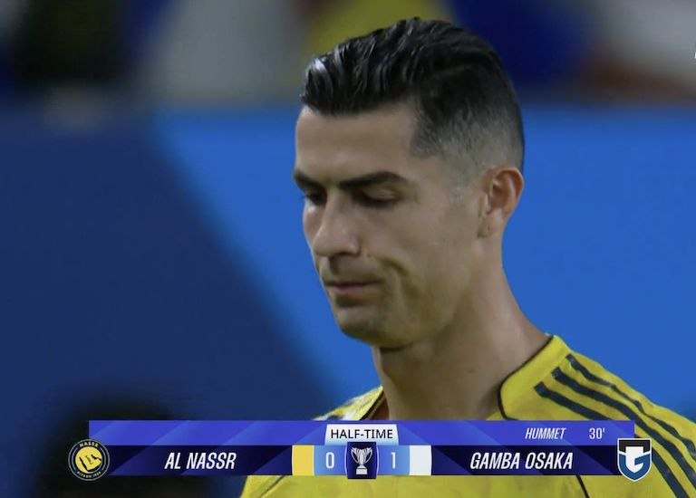

🏆
⚽️| تا یه دقیقه دیگه فینال لیگ قهرمانان آسیا سطح دو برگذار میشه و رونالدو میتونه اولین جامش رو با النصر با قهرمانی تو آسیا ببره @SportBaadNews

## SportBaadNews — post 251721

  

مایکل اولیسه به عنوان بهترین بازیکن فصل 26-2025 بوندسلیگا انتخاب شد.
@SportBaadNews

## SportBaadNews — post 251720

  

🟡 Al Nassr - 
🔵 Gambaosaka

🔵 فینال لیگ‌قهرمانان آسیا

⏰ شنبه ساعت ۲۱:۱۵

🏟 استادیوم الاول پارک

⚽️ النصر حالا با رهبری رونالدو؛ در دو بازی باقی مانده از فصل مقابل اوزاکا و داماک، فرصت دبل در قهرمانی را دارد تا سی‌آرسون، اولین قهرمانی‌های‌ خودش در تیم عربی را تجربه کند. تیم خسوس، آمار کاملاً بهتری دارد. النصر در ۱۰ بازی، ۳۳ گل به‌ثمر رسانده و سرجمع ۳ گل خورده. این آمار برای اوزاکا در ۱۲ بازی (با احتساب پلی‌آف)، ۲۵ گل زده و هفت گل هم خورده. تیم ژاپنی با فرم ضعیف‌تری به‌میدان می‌آید. اوزاکا در پنج بازی اخیرش، متحمل سه شکست شده و این آمار برای النصر، در پنج بازی اخیرش، یک شکست و یک تساوی بوده.

📌در ربات وینکوبت ثبت‌نام کن و با شارژ از طریق کریپتو ۵٪ شارژ بیشتری رو دریافت کنید، همین حالا شروع کن: 
👇

🟣 [ برای ورود به ربات کلیک کنید: ]

📌برای اطلاع از تحلیل بازی‌ها و ورود به کانال سایت جوین بدید: 
👇

🔵 @Wincobetofficial

## SportBaadNews — post 251718

🏆
⚽️| تا یه دقیقه دیگه فینال لیگ قهرمانان آسیا سطح دو برگذار میشه و رونالدو میتونه اولین جامش رو با النصر با قهرمانی تو آسیا ببره @SportBaadNews

## SportBaadNews — post 251717

  

🇩🇪 به احتمال زیاد نویر گلر شماره 1 آلمان تو جام جهانیه
@SportBaadNews

## SportBaadNews — post 251716

  

⚡ فروش فیلترشکن اختصاصی استارلینک، قوی، بدون قطعی و از همه مهمتر بدون ضریب، آیپی ثابت

سرور اقتصادی:

🔴 1 گیگ: 250

🔴 2 گیگ: 490

🔴 5 گیگ: 1.200

🔴 10 گیگ: 2.400

🔴 15 گیگ: 3.600

🔴 20 گیگ: 4.800

استارلینک:

🔴 1 گیگ: 350

🔴 2 گیگ: 700

🔴 5 گیگ: 1.700

🔴 10 گیگ: 3.000

🔴 15 گیگ: 4.600

🔴 20 گیگ: 5.500

🔰 کانالمون:
@VpnBadNews

🤖 ربات جهت خرید سرور
@vpnbadnews_bot

## SportBaadNews — post 251715

  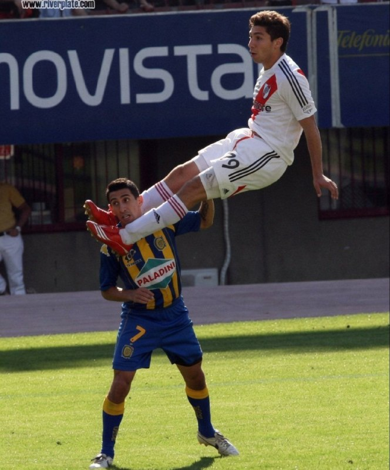

وضعیت آنخل دی‌ماریا تو آرژانتین
@SportBaadNews

## SportBaadNews — post 251714

  

🔻رسمی: سردار آزمون از لیست 30 نفره تیم جمهوری اسلامی برای جام جهانی خط خورد
@SportBaadNews

## SportBaadNews — post 251713

  

🏆
⚽️| تا یه دقیقه دیگه فینال لیگ قهرمانان آسیا سطح دو برگذار میشه و رونالدو میتونه اولین جامش رو با النصر با قهرمانی تو آسیا ببره
@SportBaadNews

## IranIntlTV — post 337519

  <a href="https://t.me/IranintlTV/337519" target="_blank">📎 Download file</a>

🎧نسخه صوتی تیتراول با نیوشا صارمی: نظامیان آمریکا و اسرائیل در منطقه در انتظار فرمان ترامپ برای از سرگیری جنگ
@iranintlTV

## IranIntlTV — post 337518

  <a href="telegram/content/IranIntlTV_337518_1778956744.mp4" target="_blank">🎬 Download video</a>

نشست «آینده تکنولوژی در ایران» با حضور شاهزاده رضا پهلوی در سان‌فرانسیسکو و با شرکت فعالان حوزه فناوری در حال برگزاری است.
این نشست با هدف بررسی راهکارهای توسعه تجارت، صنعت و تکنولوژی در ایران برگزار می‌شود.

گزارش نیلوفر منصوری، خبرنگار ایران‌اینترنشنال
@iranintltv

## IranIntlTV — post 337517

  <a href="https://t.me/IranintlTV/337517" target="_blank">📎 Download file</a>

🎧نسخه صوتی اخبار شبانگاهی | شنبه ۲۶ اردیبهشت
@iranintlTV

## IranIntlTV — post 337516

  <a href="telegram/content/IranIntlTV_337516_1778956745.mp4" target="_blank">🎬 Download video</a>

ویدیوی منتشرشده در شبکه‌های اجتماعی نشان می‌دهد جمهوری اسلامی در روز بزرگداشت ابوالقاسم فردوسی، ۲۵ اردیبهشت، در کنار آرامگاه این شاعر حماسه‌سرای ایران در توس، مراسم نوحه‌خوانی برای رجزخوانی جنگی برگزار کرد.
@iranintltv

## IranIntlTV — post 337515

  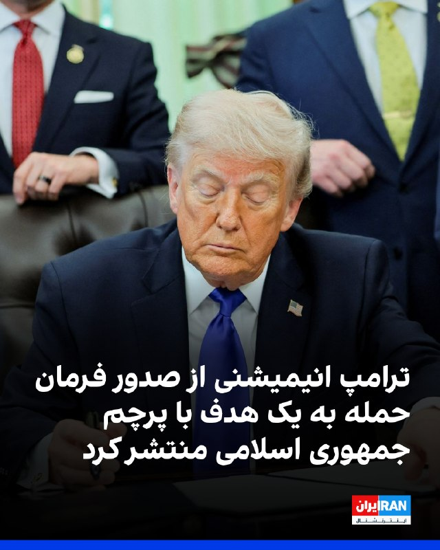

همزمان با انتشار گزارش‌ها از احتمال از سرگیری حملات آمریکا و اسرائیل علیه جمهوری اسلامی، دونالد ترامپ، رییس‌جمهوری آمریکا، انیمیشنی در تروث سوشال منتشر کرد که در آن به ناو آمریکایی دستور شلیک به هدفی با پرچم جمهوری اسلامی را داده و می‌گوید: «در فهرست اهداف‌مان قرار دارد، آتش!»
https://iranintl.com/202605165826

## IranIntlTV — post 337514

  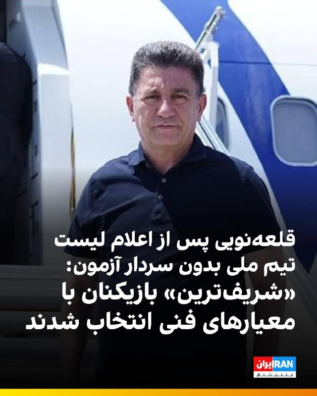

🔻امیر قلعه‌نویی، سرمربی تیم ملی فوتبال پس از اعلام فهرست خود برای جام جهانی که نام سردار آزمون در آن دیده نمی‌شود، گفت: «خدا را گواه می‌گیرم در انتخاب بازیکنان چیزی جز معیارهای فنی موضوع دیگری دخیل نبوده و من تنها بر اساس این معیار ٣٠ بازیکن را انتخاب کردم.»

🔹این درحالی است که سردار پس از موضع‌گیری‌هایی در مخالفت با جمهوری اسلامی، ‌تاکنون به اردوهای تیم ملی دعوت نشده است.

🔹قلعه‌نویی در گفتگویی که فدراسیون فوتبال منتشر کرده، درباره این لیست گفت: «پس از این چهار دور تمرین، انتخاب ٣٠ بازیکن برای حضور در اردوی آماده سازی نهایی تیم ملی پیش از شرکت در جام جهانی یکی از سخت‌ترین تصمیمات فنی دوران مربیگری من بود.»

🔹او گفت: «یکی از بهترین دوران‌های آماده سازی تیم ملی را در چهار دور تمرین پشت سرگذاشتیم و این فرصت را داشتم که گروهی از شریف‌ترین بازیکنان فوتبال ایران را در این چهار مرحله تمرین دهم.»

🔹سرمربی تیم ملی گفت: «در ۴٨ ساعت اخیر مجبور بودم با وجود شایستگی فنی همه بازیکنانی که در این دو سال اخیر در ماتریس تیم ملی حضور داشتند، تنها ٣٠ بازیکن را انتخاب کنم.»

@iranintltvsport

## IranIntlTV — post 337513

  <a href="telegram/content/IranIntlTV_337513_1778956747.mp4" target="_blank">🎬 Download video</a>

آموزش استفاده از سلاح گرم و شلیک در تلویزیون جمهوری اسلامی با واکنش‌های گسترده‌ای همراه شده است. حسین قاضیان، جامعه‌شناس، می‌گوید نمایش اسلحه در رسانه رسمی یک حکومت نماد سرکوب سیاسی است و این پیام را به مخاطب منتقل می‌کند که به او شلیک می‌شود.
@iranintltv

## IranIntlTV — post 337511

  <a href="telegram/content/IranIntlTV_337511_1778956749.mp4" target="_blank">🎬 Download video</a>

ایرانیان آلمان روز شنبه همزمان با سایر کشورها در حمایت از انقلاب ملی علیه جمهوری اسلامی در شهر کاسل تجمع کردند.

## IranIntlTV — post 337510

  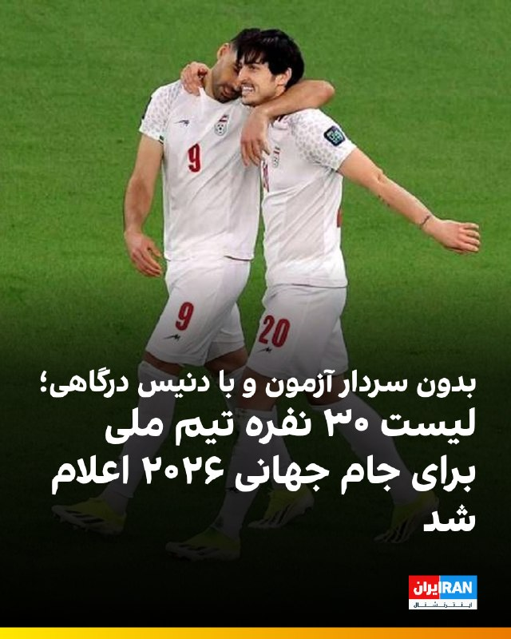

🔻امیر قلعه‌نویی، سرمربی تیم ملی لیست ۳۰ نفره خود برای جام جهانی ۲۰۲۶ را اعلام کرد. در این لیست، نام سردار آزمون دیده نمی‌شود. سردار پس از موضع‌گیری‌هایی در مخالفت با جمهوری اسلامی، ‌از تیم ملی خط خورد.

🔹این اسامی درحالی اعلام شده است که هنوز تکلیف ویزای تیم ملی مشخص نیست.

🔹اسامی بازیکنان دعوت شده به اردوی تیم ملی در ترکیه به شرح زیر است؛

دروازه‌بان‌ها
🔹علیرضا بیرانوند، حسین حسینی، پیام، نیازمند، محمد خلیفه

مدافعان
🔹احسان حاج صفی، میلاد محمدی، امید نورافکن، شجاع خلیل زاده، علی نعمتی، حسین کنعانی، دانیال ایری، رامین رضاییان، صالح حردانی

هافبک‌ها
🔹سامان قدوس، روزبه چشمی، امیرمحمد رزاق نیا، سعید عزت‌اللهی، محمد قربانی،علیرضا جهانبخش، آریا یوسفی، محمد محبی، مهدی قائدی، مهدی ترابی

مهاجمان
🔹مهدی طارمی، هادی حبیبی‌نژاد، امیرحسین حسین‌زاده، امیرحسین محمودی، دنیس درگاهی، کسری طاهری و علی علیپور

🔹مسعود محبی، دانیال اسماعیلی‌فر، حسین ابرقویی‌نژاد، عارف آقاسی، مهدی هاشم‌نژاد، محمد مهدی محبی، عارف حاجی عیدی و احسان محروقی ۸ بازیکنی هستند که در اردوهای پیشین حضور داشتند، اما خط خوردند.

@iranintltvsport

## IranIntlTV — post 337508

  

کانال ۱۳ اسرائیل گزارش داد که ارزیابی‌ها در ارتش اسرائیل حاکی از آن است که ترامپ در بازگشت از چین، دستور حمله به جمهوری اسلامی را صادر می‌کند تا برای سومین بار در کمتر از یک سال، تهران را غافلگیر کند. بر اساس این گزارش، کشتن مقام‌های ارشد جمهوری اسلامی، از اهداف حمله خواهد بود.

کانال ۱۳ نوشت: «هدف این است که به حکومت ایران ضربه وارد شود و جمهوری اسلامی از موضع ضعف به میز مذاکرات بازگردانده شود. طبق طرح‌ها، حمله برنامه‌ریزی‌شده شامل هدف قرار دادن زیرساخت‌های حاکمیتی، اهداف انرژی و نیروگاه‌ها خواهد بود.»

در ادامه این گزارش آمده است: «برآورد می‌شود که نیروی هوایی در این حمله مشترک تلاش کند مقام‌های ارشد حکومت ایران را هدف قرار بدهد. ارتش اسرائیل امیدوار است جنگ تنها چند روز ادامه داشته باشد.»
https://iranintl.com/202605167005

## Persian_Trend_Official — post 14264

https://youtube.com/live/Lj3xWW7IbLA?feature=share

## Persian_Trend_Official — post 14263

⭕️👽 ادعای جنجالی دریاسالار بازنشسته آمریکا درباره پدیده‌های ناشناس؛ «هوش غیرانسانی» در کار است.

تیم گالادت، دریاسالار بازنشسته نیروی دریایی آمریکا، در اظهاراتی جنجالی گفت پدیده‌های ناشناس هوایی ممکن است تحت هدایت «هوشی غیرانسانی و در سطحی بالاتر» باشند.

به گزارش فاکس‌نیوز، گالادت که از چهره‌های شناخته‌شده در بحث پدیده‌های ناشناس هوایی در آمریکا به شمار می‌رود، گفته است داده‌ها و ویدئوهایی را دیده که نشان می‌دهد برخی از این اشیا میان اقیانوس و جو زمین، بدون ایجاد اختلال آشکار در سطح آب، با سرعت‌هایی فراتر از فناوری شناخته‌شده حرکت می‌کنند.

او تأکید کرد این اشیا نه شبیه فناوری آمریکا هستند و نه شبیه فناوری رقبای این کشور. گالادت گفت: «ما فناوری‌ای نداریم که بتواند چنین کاری انجام دهد.»

این دریاسالار بازنشسته همچنین مدعی شد شواهدی وجود دارد که نشان می‌دهد حرکت این پدیده‌ها تحت کنترل هوشی غیرانسانی است؛ ادعایی که بار دیگر بحث درباره ماهیت پدیده‌های ناشناس هوایی و میزان اطلاعات پنهان‌شده از افکار عمومی را داغ کرده است.

📝 Nick

📌 @persian_trend_official
پرشین ترند | متفاوت‌ترین کانال نظامی

## Persian_Trend_Official — post 14262

  <a href="telegram/content/Persian_Trend_Official_14262_1778956751.mp4" target="_blank">🎬 Download video</a>

💢پست جدید ترامپ و تمسخر دوباره پهپاد های جمهوری اسلامی ...

🫆:Tony

📌 @persian_trend_official
پرشین ترند | متفاوت‌ترین کانال نظامی

## Persian_Trend_Official — post 14261

🔴 مهم‌ترین تحولات منطقه

▪️ حماس تأیید کرد «عزالدین الحداد» فرمانده شاخه نظامی گردان‌های قسام، در حمله روز جمعه اسرائیل به غزه کشته شده است

▪️ وزیر کشور پاکستان در سفری غیرمنتظره به تهران با همتای ایرانی خود درباره ثبات منطقه‌ای
و همکاری‌های دوجانبه گفت‌وگو کرد.

▪️ فرماندهی مرکزی ارتش آمریکا (سنتکام) اعلام کرد در ادامه محاصره بنادر ایران، مسیر حرکت ۷۸ کشتی تجاری را تغییر داده است

▪️ اسرائیل حملات خود به لبنان را با وجود آتش‌بس ادامه داد؛ در حملات جدید دست‌کم ۳ نفر در جنوب لبنان کشته شدند

▪️ وزارت بهداشت لبنان اعلام کرد از اوایل مارس تاکنون
۲۹۶۹ نفر در حملات اسرائیل کشته و ۹۱۱۲ نفر زخمی شده‌اند.

🫆:Tony

📌 @persian_trend_official
پرشین ترند | متفاوت‌ترین کانال نظامی

## Persian_Trend_Official — post 14260

  <a href="telegram/content/Persian_Trend_Official_14260_1778956753.mp4" target="_blank">🎬 Download video</a>

⭕️ ناوشکن وینستون چرچیل (DDG-81) از کلاس آرلی برک فلایت IIA که فرماندهی گروه ضربت ناو هواپیمابر فورد را بر عهده داشت، پس از یک‌سال مأموریت طاقت‌فرسا در فرماندهی اروپا، آفریقا و در نهایت فرماندهی مرکزی و شرکت در عملیات خشم حماسی، اکنون به پایگاه مادر خود، پایگاه نیروی دریایی می‌پورت در جکسون‌ویل، فلوریدا بازگشته است.

پ.ن: شرایط عملیاتی ناوشکن‌ها نسبت به ناوهای هواپیمابر به مراتب سخت‌تر و حساس‌تر می‌باشد. ولی معمولاً در رسانه‌ها اشاره‌ای به نقش پررنگ ناوشکن‌ها که در خط اول انجام مأموریت‌های تهاجمی و پدافندی قرار دارند، نمی‌شود.

📝 Nick

📌 @persian_trend_official
پرشین ترند | متفاوت‌ترین کانال نظامی

## Persian_Trend_Official — post 14259

💢نشریه تلگراف

«دونالد ترامپ، به امارات متحده عربی توصیه می‌کنند نقش فعال‌تری در جنگ با ایران ایفا کند و دست به ورود نیرو زمینی خود به برخی از جزایر ایرانی مانند لاوان انجام دهد!

💢این گزارش حاکی است که برخی افراد در حلقه ترامپ پیشنهاد داده‌اند که این جزیره باید توسط نیروهای زمینی امارات به جای آمریکا اشغال و نیرو هوایی آمریکا وظیفه پشتیبانی هوایی از آنها را انجام دهد.»

🫆:Tony

📌 @persian_trend_official
پرشین ترند | متفاوت‌ترین کانال نظامی

## Persian_Trend_Official — post 14258

  

خبرگزاری مهر | اسکندر مومنی: تجارت مرزی از محورهای اصلی گفت‌وگو با وزیر کشور پاکستان بود

💢وزیر کشور گفت: یکی از محورهای اصلی گفت‌وگوهای امروز با وزیر کشور پاکستان ، موضوع تجارت مرزی بود که توافق شد هم از سوی ایران و هم از سوی پاکستان، تسهیلات و اقدامات لازم صورت گیرد.

💢خوشبختانه هم دولت‌ها و هم ملت‌های دو کشور نگاه بسیار مثبتی به یکدیگر دارند. نخستین پیام رهبر معظم انقلاب درباره پاکستان نیز حاوی تأکید ویژه‌ای بر روابط دو کشور بود و هر دو طرف مصمم هستیم که در کنار توسعه روابط سیاسی و برادرانه، روابط اقتصادی و تجاری را نیز گسترش دهیم.

💢سید محسن نقوی نیز با تشکر از میزبانی وزیر کشور ایران گفت: همان‌طور که اشاره شد، درباره موضوعات مختلف مرتبط با روابط ایران و پاکستان و همچنین امنیت مرزها گفت‌وگوهای مفصلی داشتیم و امیدوارم با روندی که در پیش گرفته‌ایم، به‌زودی به راه‌حل‌های ملموسی در این زمینه‌ها دست پیدا کنیم.

🫆:Tony

📌 @persian_trend_official
پرشین ترند | متفاوت‌ترین کانال نظامی

## Persian_Trend_Official — post 14257

⭕️ شبکه 13 اسرائیل:

هم اکنون ارزیابی‌ها در اسرائیل بر این است که جنگ با ایران در روز های آینده از سر گرفته خواهد شد.

📝 Nick

📌 @persian_trend_official
پرشین ترند | متفاوت‌ترین کانال نظامی

## Persian_Trend_Official — post 14256

  <a href="telegram/content/Persian_Trend_Official_14256_1778956754.mp4" target="_blank">🎬 Download video</a>

🔴مجری تلویزیون دولتی جمهوری اسلامی در یک بخش آموزش سلاح‌های گرم، به پرچم امارات متحده عربی نشانه گیری و در برنامه زنده شلیک کرد.

🫆:Tony

📌 @persian_trend_official
پرشین ترند | متفاوت‌ترین کانال نظامی

## Persian_Trend_Official — post 14255

⭕️ رسانه پاکستانی ARY News:

محسن نقوی، وزیر کشور پاکستان، حامل پیامی مهمی برای ایران بود.

📝 Nick

📌 @persian_trend_official
پرشین ترند | متفاوت‌ترین کانال نظامی

## Persian_Trend_Official — post 14254

⭕️ چینی‌ها گزارش می‌دهند که ترامپ حتی به یک تکه از غذاهایی که در شام خوش‌آمدگویی سرو شده بود، دست نزد. او غذاهایی را که توسط سرآشپزهای کاخ سفید تهیه شده بود، خورد.

علاوه بر این، او در تمام طول سفر به هیچ غذایی که توسط طرف چینی تهیه شده بود، دست نزد.

گفته می‌شود که این کار برای جلوگیری از ورود هرگونه میکروب و نانوفناوری به غذا انجام شده است.

کارکنانی که به ترامپ خدمت می‌کردند، با محافظان سرویس مخفی جایگزین شدند.

در نگاه اول، این یک ضیافت بزرگ قرن بود، پر از سلامتی و خنده؛ اما در پشت صحنه، نبرد خاموشی از هوش و ذکاوت در حال وقوع بود.

📝 Nick

📌 @persian_trend_official
پرشین ترند | متفاوت‌ترین کانال نظامی

## Persian_Trend_Official — post 14253

  <a href="telegram/content/Persian_Trend_Official_14253_1778956756.mp4" target="_blank">🎬 Download video</a>

ویدیو از حملات ارتش اسرائیل به جنوب لبنان

📝 Nick

📌 @persian_trend_official
پرشین ترند | متفاوت‌ترین کانال نظامی

## Persian_Trend_Official — post 14252

  

🔴 پارلمان عراق خواستار پیگیری بین‌المللی انتقال «محمد باقر السعدی» به آمریکا شد

💢پارلمان عراق از وزارت خارجه این کشور خواست درباره ربوده‌شدن «محمد باقر السعدی» از ترکیه و انتقال او به آمریکا، اقدامات و پیگیری‌های بین‌المللی انجام دهد.

بر اساس گزارش‌ها:

▪️ نمایندگان عراقی این اقدام را نقض حاکمیت و قوانین بین‌المللی دانسته‌اند
▪️ از بغداد خواسته شده موضوع را از مسیرهای دیپلماتیک و حقوقی دنبال کند
▪️ جزئیات بیشتری درباره نحوه انتقال السعدی منتشر نشده است

💢این درخواست پس از اعلام بازداشت السعدی توسط اف‌بی‌آی آمریکا مطرح شده است.

🫆:Tony

📌 @persian_trend_official
پرشین ترند | متفاوت‌ترین کانال نظامی

## Persian_Trend_Official — post 14251

  

💢تمسخر دوباره جو بایدن توسط دونالد ترامپ

🫆:Tony

📌 @persian_trend_official
پرشین ترند | متفاوت‌ترین کانال نظامی

## Persian_Trend_Official — post 14250

💢وزیر کشور پاکستان امروز به تهران سفر کرده است

🔹 سفر وزیر کشور پاکستان به تهران در چارچوب تلاش‌های میانجیگری میان امریکا و جمهوری اسلامی است.

🫆:Tony

📌 @persian_trend_official
پرشین ترند | متفاوت‌ترین کانال نظامی

## Persian_Trend_Official — post 14249

  

💢آناتولی: دیدار باقری با فیدان در استانبول

💢 به گزارش خبرگزاری آناتولی، منابع دیپلماتیک اعلام کردند که هاکان فیدان، وزیر امور خارجه ترکیه و علی باقری، معاون دبیر شورای عالی امنیت ملی ایران، روز شنبه در استانبول دیدار کردند.

💢 جزئیات بیشتری در مورد این دیدار ارائه نشده است.

🫆:Tony

📌 @persian_trend_official
پرشین ترند | متفاوت‌ترین کانال نظامی

---
📅 بروزرسانی: 1405/02/26 21:09
---

## ChizBergerz — post 46459

تست شده برای اپ شیر و خورشید

185.200.232.43  
185.200.232.40
167.82.48.223
151.101.128.223
185.200.232.49
185.200.232.50
185.200.232.42
185.200.232.41
184.24.77.42
184.24.77.32
184.24.77.5
184.24.77.7
184.24.77.16
184.24.77.36
184.24.77.21
184.24.77.11
23.48.23.186
23.48.23.133
23.48.23.195
23.48.23.178
184.24.77.29

@ChizBergerz

## rodast_omiddana — post 71431

🎬 ترامپ از چین برگشت، جنگ شروع میشه؟
گفتگو با بهروز یوسیان افسر سابق اطلاعات اسرائیل
لینک یوتیوب:
https://www.youtube.com/watch?v=lCxHp2fmf2Y

## rodast_omiddana — post 71430

🎬
🔴
🔴
🔴 برنامه امشب:
*فشار دولت ترامپ به امارات برای تصرف جزیره لاوان
*حمله قطعی شده و بزودی آغاز میشود
لینک یوتیوب:
https://www.youtube.com/@omiddana

## rodast_omiddana — post 71427

  <a href="telegram/content/rodast_omiddana_71427_1778953178.webm" target="_blank">🎬 Download video</a>

🚨
🚨
🚨 فوری_نیویورک تایمز:
"ایالات متحده "محمد باقر سعد داوود السعدی"، فرمانده ارشد در شبه‌نظامیان حزب‌الله عراق، را دستگیر کرده و اتهامات تروریستی علیه او مطرح کرده است.
او متهم است که از اواخر فوریه حداقل ۱۸ حمله در اروپا، ایالات متحده و کانادا برنامه‌ریزی کرده است، که ظاهراً در واکنش به حملات آمریکا و اسرائیل علیه ایران بوده است.
طبق کیفرخواست، السعدی برنامه‌ریزی کرده بود تا غیرنظامیان آمریکایی و یهودی را در لس‌آنجلس و نیویورک به قتل برساند و همچنین برنامه‌ریزی حمله به یک کنیسه در شهر نیویورک را آغاز کرده بود.
کیفرخواست همچنین بیان می‌کند که به عنوان بخشی از نقش خود در سازمان، شخصاً قاسم سلیمانی، فرمانده نیروی قدس سپاه پاسداران که در ژانویه ۲۰۲۰ کشته شد، را می‌شناخته است.
انتظار می‌رود که امروز در دادگاه فدرال در منهتن حضور یابد، اگرچه هنوز گزارش نشده است که چگونه، کی و کجا دستگیر شده است."

## rodast_omiddana — post 71426

  <a href="telegram/content/rodast_omiddana_71426_1778953178.webm" target="_blank">🎬 Download video</a>

🚨 
🚨پاول دوروف، مدیرعامل تلگرام:
دبی دوباره شلوغ و پر از ترافیک شده است. از همین حالا دلم برای آتش‌بازی‌های ایران تنگ شده؛ آن‌ها کمک کردند تا شهر از افراد زودباور (وحشت‌زده) خالی شود.
پدافند هوایی امارات زیر آتش (حملات) عالی عمل کرد.
ما با پرداخت ۰٪ مالیات، حفاظت بهتری نسبت به اروپایی‌هایی دریافت می‌کنیم که پنجاه درصد مالیات می‌دهند.

## KiriMohems — post 47593

  <a href="telegram/content/KiriMohems_47593_1778953179.mp4" target="_blank">🎬 Download video</a>

🔴یه مشت از این خایه مالای فلسطین ، از داشاق ایفل بالا کشیدن و پرچم کیری فلسطین رو از طبقه اولش آویزون کردن.

شش نفر از این کصکشا توسط پلیس تو گونی شدن

#Helsinki
@KiriMohems

## KiriMohems — post 47592

  

✖️ سایت بین المللی bet120x 
✖️

 
👍دارای مجوز رسمی Gambling Judge سوئد
👍
     

💳شارژ حساب از طریق ارز و یووچر و پرمیوم ووچر

💳تسویه حساب دلاری سریع
💊بیمه شرط میکس

⚠️فروش شرط

🔔ویرایش شرط                    
3️⃣
2️⃣

🎁20%هدیه واریز از طریق ارز و ووچر
┅━━━━━━━━━━━

🎁 10%برگشت باخت به صورت روزانه

🎁 10%برگشت باخت به صورت هفتگی

🎁10%برگشت باخت به صورت ماهانه

💻ادرس ورود به سایت:
https://bet120x.com/fa/?btag=971470
➖➖➖➖➖
   
👈 آموزش واریز و برداشت دلاری
👉

🔪کانال اطلاع رسانی:
👇 g26🅰

✈️https://t.me/+RvVnWMHCqUc4YzFk

## KiriMohems — post 47591

  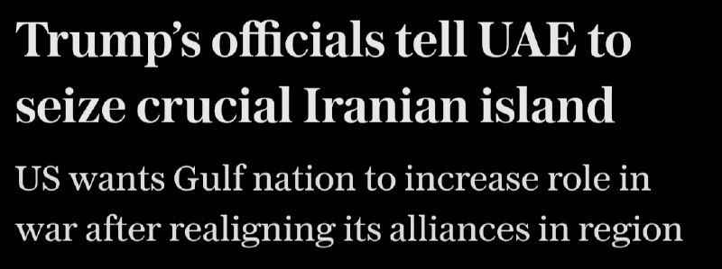

🔴تلگراف : مقامات کلفت دولت ترامپ ، خایه های امارات رو مالیدن تا توی جنگ علیه ایران بیشتر وارد عمل بشه..

حتی صحبت سوسکی از حمله به جزایر ایرانی تو خلیج فارس هم شده!

#Helsinki
@KiriMohems

## SportBaadNews — post 251711

امباپه امروز رفته و با بچه مچه های آکادمی رئال وقت گذرونده
@SportBaadNews

## SportBaadNews — post 251710

روز تا جام جهانی @SportBadTweet | TF

## SportBaadNews — post 251709

  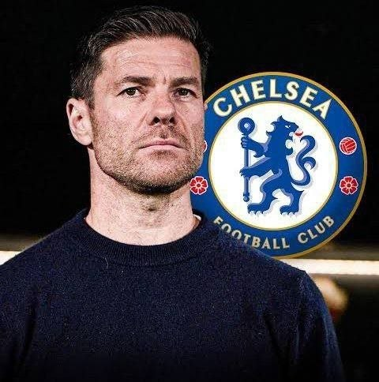

فوووووووری از رومانو: ژابی آلونسو به چلسی Here We Gooooooooooooooo @SportBaadNews

## SportBaadNews — post 251708

  

فوووووووری از رومانو: ژابی آلونسو به چلسی
Here We Gooooooooooooooo
@SportBaadNews

## SportBaadNews — post 251707

  <a href="telegram/content/SportBaadNews_251707_1778953184.webm" target="_blank">🎬 Download video</a>

🚨
⚽️ فووووری از فابریس هاوکینز: ژابی با چلسی به توافق دو ساله رسید @SportBaadNews

## SportBaadNews — post 251706

  <a href="telegram/content/SportBaadNews_251706_1778953184.webm" target="_blank">🎬 Download video</a>

🚨
⚽️ فووووری از فابریس هاوکینز: ژابی با چلسی به توافق دو ساله رسید
@SportBaadNews

## IranIntlTV — post 337507

  <a href="telegram/content/IranIntlTV_337507_1778953185.mp4" target="_blank">🎬 Download video</a>

نیویورک‌تایمز گزارش داد آمریکا و اسرائیل در حال گسترده‌ترین آمادگی نظامی از زمان برقراری آتش‌بس هستند و تنها تصمیم نهایی دونالد ترامپ باقی مانده است.

گفت‌وگو با اشکان صفایی و اردوان روزبه، خبرنگاران ایران‌اینترنشنال
@iranintltv

## IranIntlTV — post 337506

  <a href="telegram/content/IranIntlTV_337506_1778953187.mp4" target="_blank">🎬 Download video</a>

برخی مجری‌های صداوسیمای جمهوری اسلامی در برنامه‌های زنده تلویزیونی با اسلحه روی آنتن رفتند. در شبکه افق، وابسته به سپاه پاسداران، یک نیروی نظامی با صورت پوشیده نحوه استفاده از سلاح را آموزش داد و مجری برنامه هم در استودیو شلیک کرد و گفت گلوله‌ها به سمت پرچم امارات شلیک شده‌اند.

گفت‌وگو با ایمان آقایاری، فعال سیاسی
@iranintltv

## IranIntlTV — post 337505

  <a href="telegram/content/IranIntlTV_337505_1778953189.mp4" target="_blank">🎬 Download video</a>

ویدیوهای رسیده به ایران‌اینترنشنال نشان می‌دهند ایرانیان مقیم آلمان روز جمعه ۲۶ اردیبهشت علیه جمهوری اسلامی در شهر هامبورگ راهپیمایی کردند و شعار «شرم بر این سه فاسد، ملا چپی مجاهد» سردادند.

## IranIntlTV — post 337504

  <a href="telegram/content/IranIntlTV_337504_1778953191.mp4" target="_blank">🎬 Download video</a>

ستاد فرماندهی آمریکا در آفریقا (AFRICOM)، با انتشار ویدیویی در ایکس، از عملیات شامگاه جمعه ۲۵ اردیبهشت خبر داد که به کشته شدن شمار زیادی از جنگجویان داعش در شمال شرقی نیجریه منجر شد.
پیش‌تر، ترامپ در تروث‌سوشال اعلام کرده بود ابو بلال المینوکی، نفر دوم داعش در جهان، در این عملیات کشته شده است.

## IranIntlTV — post 337503

  <a href="telegram/content/IranIntlTV_337503_1778953192.mp4" target="_blank">🎬 Download video</a>

ویدیوهای رسیده به ایران‌اینترنشنال نشان می‌دهند ایرانیان مقیم نروژ روز شنبه ۲۶ اردیبهشت با در دست گرفتن پرچم‌های شیروخورشید علیه جمهوری اسلامی در شهر اسلو راهپیمایی کردند.

## IranIntlTV — post 337502

  <a href="telegram/content/IranIntlTV_337502_1778953195.mp4" target="_blank">🎬 Download video</a>

ایرانیان استرالیا روز شنبه در حمایت از انقلاب ملی علیه جمهوری اسلامی تجمع کرده و ضمن حمل پرچم شیروخورشید ترانه‌های ملی را هم‌خوانی کردند.

## Persian_Trend_Official — post 14248

  <a href="telegram/content/Persian_Trend_Official_14248_1778953198.mp4" target="_blank">🎬 Download video</a>

💢عارف معاون اول رئیس‌جمهور:

💢دیگر اجازهٔ عبور تجهیزات نظامی دشمن از تنگهٔ هرمز را نخواهیم داد.

🫆:Tony

📌 @persian_trend_official
پرشین ترند | متفاوت‌ترین کانال نظامی

## Persian_Trend_Official — post 14247

دونالد ترامپ: اگر توافقی حاصل نشود، جمهوری اسلامی «روزگار بسیار بدی» خواهد داشت

دونالد ترامپ در یک گفت‌وگوی تلفنی با شبکه خبری تلویزیونی ب اف ام فرانسه اظهار داشت که نمی‌داند آیا به‌زودی توافقی با جمهوری اسلامی حاصل خواهد شد یا نه.

رییس‌جمهور ایالات متحده گفت: «هیچ ایده‌ای ندارم که آیا آن‌ها این کار را خواهند کرد یا نه. اگر این کار را نکنند، روزگار بسیار بدی خواهند داشت، روزگار بسیار بدی. بهتر است که یک توافق منعقد کنند.»

📌 @persian_trend_official
پرشین ترند | متفاوت‌ترین کانال نظامی

## Persian_Trend_Official — post 14246

🔹زمین‌لرزه‌ای به بزرگی ۴.۵ ریشتر دقایقی پیش گلوگاه در استان مازندران را لرزاند.

🫆:Tony

📌 @persian_trend_official
پرشین ترند | متفاوت‌ترین کانال نظامی

## Persian_Trend_Official — post 14245

لایو امشب ساعت 22 آغاز میشه

## Persian_Trend_Official — post 14244

ارتش اسرائیل شنبه اعلام کرد که در آخر این هفته حدود ۱۰۰ موضع حزب‌الله را در جنوب لبنان مورد حمله قرار داده است.

بر اساس اعلام ارتش اسرائیل، این اهداف شامل پست‌های مراقبت و دیده‌بانی، انبارهای تسلیحات و سایر زیرساخت‌هایی بوده که توسط این گروه برای پیشبرد حملات استفاده می‌شود.

این حملات در سراسر جنوب لبنان انجام شده و منطقه صور را نیز دربر گرفته است.

در همین حال، در ۲۴ ساعت گذشته، حزب‌الله چندین پهپاد و گلوله خمپاره به سمت نیروها در جنوب لبنان شلیک کرده است.

📌 @persian_trend_official
پرشین ترند | متفاوت‌ترین کانال نظامی

## Persian_Trend_Official — post 14243

  

مراسم تشییع جنازه عزالدین الحداد، فرمانده نظامی حماس که دیشب کشته شد، در نوار غزه انجام شد.

📌 @persian_trend_official
پرشین ترند | متفاوت‌ترین کانال نظامی

## Persian_Trend_Official — post 14242

  

✅پست جدید ترامپ در تروث سوشال:
بازی نداریم! ببین قراره بعدش تو موضوع مورد علاقت چه اتفاقی بیفته!

📌 @persian_trend_official
پرشین ترند | متفاوت‌ترین کانال نظامی

## Persian_Trend_Official — post 14240

❤️ اگر از مخاطبان پرشین ترند هستید و تلگرام پرمیوم دارید،
با بوست کردن کانال کمک بزرگی به رشد و دیده‌شدن بیشتر پرشین ترند می‌کنید.
این بوست‌ها باعث می‌شود امکانات بیشتری برای انتشار محتوا، استوری و قابلیت‌های ویژه کانال فعال شود و در شرایط فعلی، به ادامه پوشش سریع و تحلیل‌های روزانه کمک زیادی می‌کند.
🙏 اگر مایل بودید، از طریق لینک زیر کانال را بوست کنید:
https://t.me/boost/persian_trend_official
📌 @persian_trend_official
پرشین ترند | متفاوت‌ترین کانال نظامی

---
📅 بروزرسانی: 1405/02/26 20:08
---

## ChizBergerz — post 46458

لینک دانلود اپ شیر و خورشید با نت ملی:

https://punkpaste.ir/f/ShirOKhorshid-v-2026-o8t4ik

لینک رو کپی کنید و تو مرورگر کروم بدون فیلترشکن باز کنید، این لینک طی ۲۴ ساعت آینده منقضی میشه.
@ChizBergerz

## ChizBergerz — post 46457

  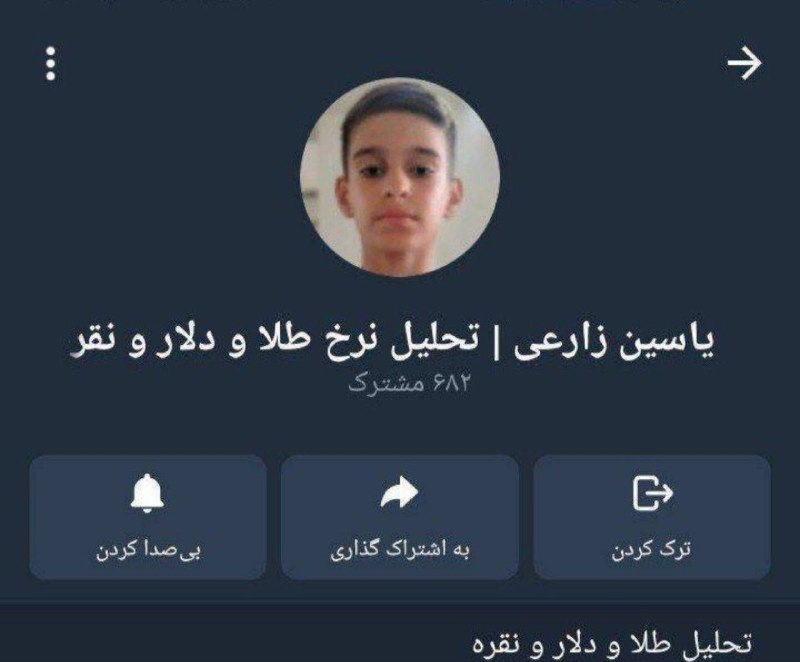

عاقبت بسته موندن مدارس و مهد‌کودک‌ها:

@ChizBergerz

## rodast_omiddana — post 71425

  <a href="telegram/content/rodast_omiddana_71425_1778949537.webm" target="_blank">🎬 Download video</a>

🚨 دوستان عزیز من خودم میدانم باید فایل برنامه ها و گفتگوها با آقای یوسیان را بزارم و پیامهای زیاد شما برای اینکه فایل را بزار بیشتر وقتمو میگیره، فایل نیاز به خروجی داره و کم کردن حجم و در کنار هزاران کار دیگری که برای برنامه شب باید انجام بدم اینکارم انجام میدهم، بنابراین هر شب و هر روز پیام ندید فایلها چی شد، همیشه در اولین فرصت که خروجی بگیرم میزارم، به پیامهای اینچنینی پاسخ نمیدم دمتون گرم ❤️

## rodast_omiddana — post 71424

  <a href="telegram/content/rodast_omiddana_71424_1778949537.webm" target="_blank">🎬 Download video</a>

🚨 یک مقام آمریکایی به فاکس نیوز:
ترامپ در آستانه صدور چراغ سبز برای آغاز جنگ قرار گرفته است.

## rodast_omiddana — post 71422

😂 رسوایی بزرگ برای 3پا...
کویت تصاویر لحظه بازداشت تروریستهای 3پا را منتشر کرد..
چقدر شیک با دیدن اولین اسلحه دست سرباز کویتی تسلیم شدند!

پانوشت:
تجهیزات این نیروهای ویژه 3پا در یک عملیات واقعی هم جالب است
حتی تجهیزات غواصی هم مخصوص عملیات نیروی ویژه نیست
گفته شده بود اینها روی لنج بودند ولی با توجه به عکس به نظر روی یک قایق تندرو بودند و حتی پیش از آغاز عملیات خفت شدند
با این حساب پاشون به جزیره بوبیان هم نرسید

## KiriMohems — post 47590

  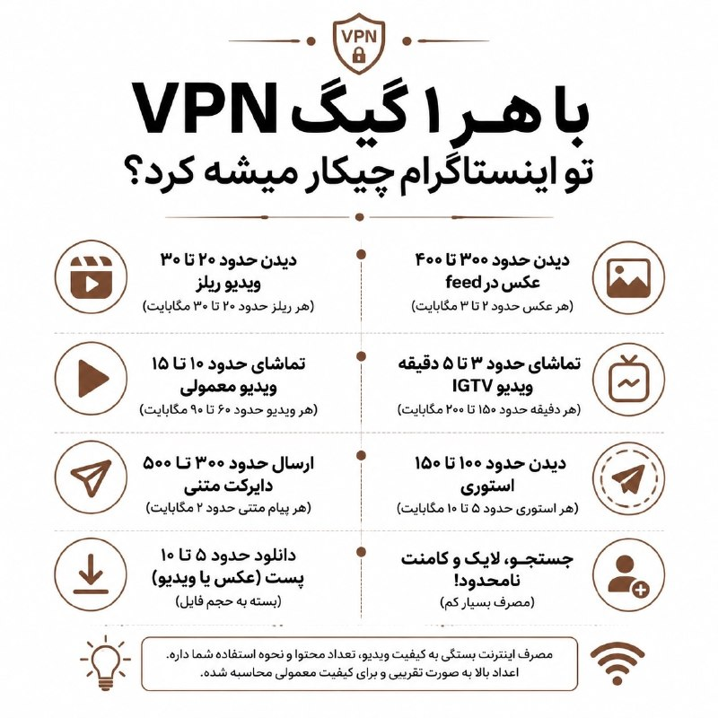

🔴به جای استفاده ۱ گیگ VPN برای کصچرخ زدن تو اینستاگرام ، چه کارهایی میشه کرد؟

#Helsinki
@KiriMohems

## KiriMohems — post 47589

  <a href="telegram/content/KiriMohems_47589_1778949538.mp4" target="_blank">🎬 Download video</a>

🔴وضعیت خایه جفت کُن توچال در عصر امروز

#Helsinki
@KiriMohems

## SportBaadNews — post 251705

  <a href="telegram/content/SportBaadNews_251705_1778949539.webm" target="_blank">🎬 Download video</a>

🚨
🇩🇪 فووری از پلتنبرگ: بازگشت نویر به تیم ملی آلمان واسه جام جهانی قطعیه و قراره گلر اول آلمان تو این تورنومنت باشه
@SportBaadNews

## SportBaadNews — post 251704

⏺ فقط و فقط با دعوت ۲ نفر کانفیگ رایگان دریافت کنید ، اختصاصی اسپورت بد نیوز
👇

🤖 @Confingfreeirbot

## SportBaadNews — post 251703

کمتر از یک ماه دیگه جام جهانی 2026 شروع میشه، فک کن توی تایمی که بزرگترین تورنمنت فوتبالی تاریخ درحال برگزاریه و مردم سراسر دنیا دارن لذت میبرن از بازیا، ما باید در به در دنبال چهارتا سرور رایگان کصشر باشیم که فقط بتونیم نتایج رو دنبال کنیم.
@SportBaadNews

## SportBaadNews — post 251702

  <a href="telegram/content/SportBaadNews_251702_1778949540.webm" target="_blank">🎬 Download video</a>

🚨
⚽️ رسمی: منچسترسیتی با پیروزی مقابل چلسی قهرمان جام حذفی انگلیس (اف ای کاپ) شد @SportBaadNews

## SportBaadNews — post 251701

  <a href="telegram/content/SportBaadNews_251701_1778949540.webm" target="_blank">🎬 Download video</a>

🚨
⚽️ رسمی: منچسترسیتی با پیروزی مقابل چلسی قهرمان جام حذفی انگلیس (اف ای کاپ) شد
@SportBaadNews

## IranIntlTV — post 337501

  <a href="telegram/content/IranIntlTV_337501_1778949541.mp4" target="_blank">🎬 Download video</a>

تیتر اول با نیوشا صارمی، شنبه ۲۶ اردیبهشت
@iranintltv

## IranIntlTV — post 337500

  

دونالد ترامپ، رییس‌جمهوری ایالات متحده، در گفت‌وگوی تلفنی با آنتوان اولار، خبرنگار بی‌اف‌ام تی‌وی در واشنگتن، گفت که حکومت ایران بهتر است به توافق برسد. او افزود: «اگر این کار را نکنند، دوران بسیار بدی در انتظارشان خواهد بود.»
https://iranintl.com/202605163090

## IranIntlTV — post 337499

  

علی زینی‌وند، سخنگوی وزارت کشور، گفت: «محوریت تصمیم‌گیری در کشور خصوصا در حوزه صلح و جنگ، رهبری است. رهبری هم مسلط، فرمان دستش است و فرماندهی می‌کند. کسی در جایگاه مسئولیت، استاندار، نماینده، تریبون به‌دست، اگر خلاف سیاست‌های راهبری نظام اظهارنظر کند، شایسته نیست.»
https://iranintl.com/202605169314

## IranIntlTV — post 337498

  <a href="telegram/content/IranIntlTV_337498_1778949543.mp4" target="_blank">🎬 Download video</a>

یک شهروند در آبادان با ارسال پیامی به ایران اینترنشنال از بیکاری در این شهر در پی بحران اقتصادی روایت می‌کند. پیام او با هوش مصنوعی خوانده شده است.

## IranIntlTV — post 337497

  <a href="telegram/content/IranIntlTV_337497_1778949544.mp4" target="_blank">🎬 Download video</a>

ستاد فرماندهی مرکزی آمریکا، سنتکام، اعلام کرد با ادامه محاصره دریایی جمهوری اسلامی، تاکنون ۷۸ کشتی تجاری وادار به تغییر مسیر شده و ۴ کشتی دیگر نیز غیرفعال شده‌اند.
جزییات بیشتر با اردوان روزبه، خبرنگار ایران‌اینترنشنال
@iranintltv

## IranIntlTV — post 337496

  

احسان قاضی‌زاده هاشمی، نماینده مجلس، درباره مذاکرات با آمریکا گفت: «قبل از ورود به بحث مذاکرات، باید آمریکا ادبیات ارعاب و تهدید خود را کنار بگذارد. وقتی چنین ادبیاتی وجود دارد، دیگر نمی‌توان آن را مذاکره نامید، بلکه به نوعی ارائه پیشنهادات و دادن سندی برای تسلیم است.»

قاضی‌زاده هاشمی گفت: «باید این ادبیات آمریکایی که شامل ارعاب، تهدید و قلدری است، برطرف شود.»
https://iranintl.com/202605169448

## IranIntlTV — post 337495

  <a href="telegram/content/IranIntlTV_337495_1778949546.mp4" target="_blank">🎬 Download video</a>

کانال ۱۲ اسرائیل به نقل از یک مقام این کشور خبر داد ترامپ ظرف ۲۴ ساعت آینده درباره حمله دوباره به ایران تصمیم می‌گیرد. این مقام رسمی گفت جنگ دوباره با جمهوری اسلامی نزدیک است. همزمان روزنامه معاریو چاپ اسرائیل نوشت ترامپ در آستانه دادن چراغ سبز جنگ است

گزارشی از مجتبا پورمحسن
@iranintltv

---
📅 بروزرسانی: 1405/02/26 19:16
---

## ChizBergerz — post 46456

  <a href="telegram/content/ChizBergerz_46456_1778946390.mp4" target="_blank">🎬 Download video</a>

این داشمون رو یادتونه؟
که سریال بریکینگ بد و سریال گیم آف ترونز رو جوری که خودش دوست داشته بود ساخت.
الان سریال اسکویید گیم هم درست کرده😂

@ChizBergerz

## ChizBergerz — post 46454

اگه بیرون میرید و ایست بازرسی عرازشه ممکنه گوشیتونو چک کنه، میتونید توی اپ شیروخورشید قسمت Option > More Options بزید و از گزینه App appearance آیکون و اسم برنامه رو با یه کلیک تغییر بدید که توی منوی گوشی مشخص نباشه چنین برنامه ای با چنین لوگویی روی گوشیتون نصبه

میتونید به ماشین حساب، هواشناسی، نوت و ساعت اسم و آیکونشو تغییر بدید

اگه گزینه پایینی یعنی Stealth notifications رو هم بزنید نوتیفیکشن برنامه هم بسته به اون اسمی که تغییر داده بودید تغییر میکنه
@ChizBergerz

## ChizBergerz — post 46453

از وقتی اپ شیر و خورشید اومده فیلترشکن فروشا قیمت هرگیگو آوردن زیر ۲۰۰ هزارتومن😂😂

## ChizBergerz — post 46452

لینک دانلود با نت ملی اپ شیر و خورشیدو بزودی میزارم

## ChizBergerz — post 46451

  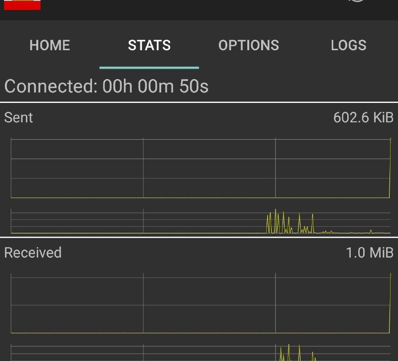

دی‌ان‌اس‌های جدید برای شیر و خورشید که با همراه اول تست شده:
2.22.250.149
23.58.193.140
23.48.23.151
2.19.126.81
23.202.138.125
23.43.237.239
Tel: @ChizBergerz
104.112.146.82
23.2.13.136
72.246.28.37
2.18.63.49
2.16.53.11
2.16.53.50
2.16.19.136

به نظر میرسه در حالِ حاضر با اینترنتِ همراه بهتر متصل میشه . در صورتی که نتونستید متصل بشید ، چندبار رویِ حالتِ هواپیما بگذارید و بردارید، یاهم روی 3G بزارید و دوباره تست کنید.
@ChizBergerz

## rodast_omiddana — post 71421

  <a href="telegram/content/rodast_omiddana_71421_1778946393.webm" target="_blank">🎬 Download video</a>

🚨ترامپ در مصاحبه با فاکس‌نیوز:
در این مصاحبه ترامپ خیلی صریح محمد باقر قالیباف رئيس مجلس ایران را به ترور و حذف فیزیکی تهدید کرده و او را "محمد یه چیزی.." می‌نامد و میگوید ما می‌توانیم آن‌ها را از فضا شناسایی کنیم و اگر نزدیک منطقه ذخیره‌سازی اورانیوم غنی سازی شده بشوند ترورشان خواهیم کرد.

## rodast_omiddana — post 71420

🎬 در حاشیه دیدار ترامپ از چین بازم عراقچی داره میخنده و میگه برای همه چیز آمادست
لینک یوتیوب:
https://www.youtube.com/watch?v=e7FYPoAN07s

## rodast_omiddana — post 71419

🎬 احتمال فرار قالیباف و برخی مقامات به مسکو به بهانه امنیت
لینک یوتیوب:
https://www.youtube.com/watch?v=s4XAN_p-iLg

## KiriMohems — post 47588

  <a href="telegram/content/KiriMohems_47588_1778946393.mp4" target="_blank">🎬 Download video</a>

🔴طبق حرفای رفسنجانی، خون کودکان میناب و تمام قربانیان جنگ ایران و آمریکا به گردن خامنه‌ایه.

هاشمی رفسنجانی:
نظرم این بوده که باید مسائل با آمریکا رو حل کنیم. با خامنه‌ای یکی دو ساعت بحث کردیم، ولی به نتیجه نرسیدیم.

من گفتم: ما حرف دیگه‌ای به شما نمیتونیم بزنیم، فقط مساله‌ی ما هست و خدا؛ بالاخره روز قیامت از ما میپرسن این همه ضرری که به مردم ایران زدید، اگر اینا رو شما به عهده میگیرید من دیگه حرفی ندارم.

خامنه‌ای گفت: «بله جواب خدا با من».

#Helsinki
@KiriMohems

## KiriMohems — post 47587

  

🔴پست جدید ترامپ در تروث سوشال:
بازی نداریم کصکشا! ببین قراره بعدش تو موضوع مورد علاقت چه اتفاقی بیوفته!

#Helsinki
@KiriMohems

## SportBaadNews — post 251700

  

بهترین آمار گلزنی باشگاه ها در تاریخ 5 لیگ معتبر : 
⚽️ 125 گل زده - تورینو 1947/48 
⚽️ 121 گل زده - رئال 2011/12 
⚽️ 118 گل زده - رئال 2014/15 
⚽️ 118 گل زده - میلان 1949/50 
⭕️
⚽️ 117 گل زده - بایرن 2025/26 
⚽️
🔴 بایرن مونیخ 1 بازی دیگه تو بوندسلیگا داره و اگه…

## SportBaadNews — post 251699

پاول دورف مالک بهترین اپلیکیشن جهان یعنی تلگرام: دبی دوباره پر از ترافیک و شلوغی شده. دلم واسه «آتش‌بازی‌های» ایران تنگ شده بود... حداقل یه مدت شهر رو از آدمای زودرنج خالی کرده بود. پدافند اماراتم زیر حمله حسابی خودشو ثابت کرد. ما با مالیات صفر درصد، محافظتی بهتر از اروپاییایی می‌گیریم که نصف حقوقشونو مالیات میدن.
@SportBaadNews

## IranIntlTV — post 337494

  

محمدصالح جوکار، رییس کمیسیون امور داخلی مجلس، گفت: «آمریکا به دنبال آن است تا آنچه را که در میدان به دست نیاورده پای میز مذاکره به دست آورد. در این‌باره باید بگویم هرگز آمریکا به خواسته‌های نامشروعش در مذاکرات نخواهد رسید.»

جوکار گفت که آمریکا باید شروط تهران را برای توافق بپذیرد و راهی جز تعظیم در برابر خواسته‌های جمهوری اسلامی ندارد
https://iranintl.com/202605165329

## IranIntlTV — post 337493

  <a href="telegram/content/IranIntlTV_337493_1778946398.mp4" target="_blank">🎬 Download video</a>

صداوسیمای جمهوری اسلامی در برنامه‌ای آموزش استفاده از سلاح گرم توسط یک نظامی به مجری را به نمایش گذاشت. در بخشی از این برنامه، مجری به پرچم امارات متحده عربی شلیک کرد.
گفت‌وگو با فروغ کنعانی، پژوهشگر جامعه‌شناسی
@iranintltv

## IranIntlTV — post 337492

  <a href="telegram/content/IranIntlTV_337492_1778946400.mp4" target="_blank">🎬 Download video</a>

وزیر کشور پاکستان برای دیدار با مقام‌‌های جمهوری اسلامی وارد تهران شد. همزمان رسانه‌های ایران گزارش دادند محسن نقوی در دیدار با وزیر کشور جمهوری اسلامی، درباره‌ی ازسرگیری مذاکرات صلح، گفت‌وگوهای مفصلی انجام داده‌اند.

گفت‌وگو با جمشید برزگر، روزنامه‌نگار و تحلیل‌گر سیاسی
@iranintltv

## IranIntlTV — post 337491

  <a href="telegram/content/IranIntlTV_337491_1778946402.mp4" target="_blank">🎬 Download video</a>

یک دانش‌آموز در پیام به ایران اینترنشنال با اشاره به مجازی شدن آموزش می‌گوید باید برای مدرسه‌ای که نرفتیم ۱۵۰ میلیون تومان شهریه بدهیم. پیام این دانش‌آموز با هوش مصنوعی بازخوانی شده است.

---
📅 بروزرسانی: 1405/02/26 18:22
---

## ChizBergerz — post 46450

دوستان اپ شیر و خورشید که دیشب گذاشتم عالی داره کار میکنه🔥 184.24.77.42 184.24.77.32 184.24.77.5 184.24.77.7 184.24.77.16 184.24.77.36 184.24.77.21 184.24.77.11 185.200.232.49 185.200.232.50 185.200.232.42 185.200.232.41 23.48.23.186 23.48.23.133 TEL: @chizBergerz…

## ChizBergerz — post 46449

بعضیا تو دایرکت میگن اپ شیر و خورشید رو با نت 3G تست کنید راحت تر و بهتر وصل میشه

## ChizBergerz — post 46448

  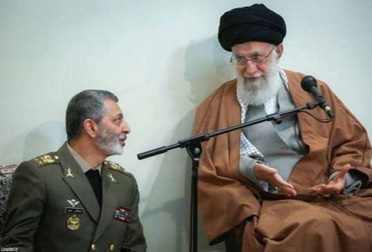

تراپی
💅 توله موسوی، رئیس سابق ستاد کل نیروهای مسلح ج.ا: جنازه پدرمو پس‌از ۳۰ روز گشتن زیر آوار پیدا کردیم!🔥 @ChizNewz

## ChizBergerz — post 46447

  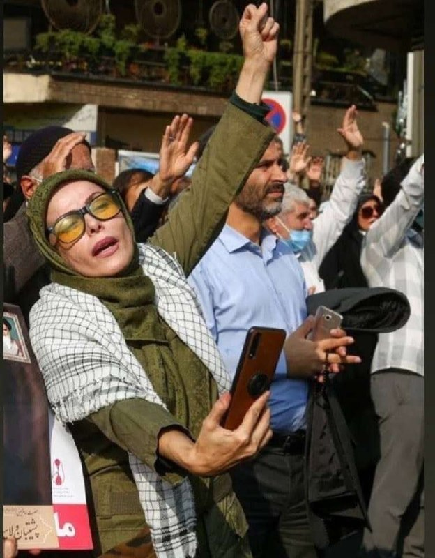

داره فاکتو میکنه بره پولشو بگیره شبم همونجا بخوابه و کص بده: 😂😂

#کص_فدا
@ChizBergerz

## ChizBergerz — post 46446

  <a href="https://t.me/ChizBergerz/46446" target="_blank">📎 Download file</a>

📲#اپلیکیشن اندروید سایت جهانی دربی بت

👍اسپانسر لیگ انگلیس
👍
🔥امکان شارژ امن از طریق کارت بانکی
➖➖➖➖➖➖➖➖➖

🪙همین حالا عضو شوید 👇
https://t.me/+aCbq7yy8QY80NzQ0

## ChizBergerz — post 46445

  

😤دنبال یه سایت شرط بندی بین المللی بودی که به ایرانیا خدمات بده؟!
⛔

👍دربی بت همون انتخاب  100%

💎ویژگی های سایت جهانی Derby Bet:

⬅️امکان شارژ امن با کارت بانکی

⬅️واریز اول دوبل شارژ می شوید(بونوس۱۰۰٪)

⬅️پر اپشن ترین سایت فعال در ایران

⬅️تسویه حساب کمتر از 5 دقیقه

⬅️برگشت بخشی از باخت به صورت هفتگی

🚨کد هدیه ثبت نام:GG007

⚠️برای دانلود اپلکیشن کلیک کنید
👉
ge26

🔔کانال دربی بت :

🪙https://t.me/+aCbq7yy8QY80NzQ0

## ChizBergerz — post 46444

  <a href="telegram/content/ChizBergerz_46444_1778943161.mp4" target="_blank">🎬 Download video</a>

تو اهواز یه خایمال نظام مست کرده و داره مثل کصخلا وسط خیابون قر میده: 😐😂

+ با اینا میخواید به جنگ زمینی با ارتش آمریکا برید؟😂
@ChizBergerz

## ChizBergerz — post 46443

اینم با همه نتا تست کنید:
23.2.13.136
72.246.28.37
2.18.63.49
2.16.53.11
2.16.53.50
2.16.19.136
184.24.77.7
184.24.77.16
184.24.77.36
184.24.77.21
184.24.77.42
184.24.77.32
184.24.77.5
184.24.77.11
185.200.232.49
185.200.232.50
185.200.232.42
185.200.232.41
23.48.23.186
23.48.23.133
23.48.23.195
23.48.23.178
184.24.77.29
2.22.250.149
23.58.193.140
23.48.23.151
2.19.126.81
23.202.138.125
23.43.237.239
104.112.146.82
@ChizBergerz

## ChizBergerz — post 46442

چندتا آیپی دیگه تست شده رو ایرانسل برای شیر خورشید:
23.65.119.52
23.73.2.141
104.110.138.190
104.83.5.202
92.122.166.236
92.122.166.234
92.122.166.237
96.16.122.70
23.67.136.200
23.67.136.202
@ChizBergerz

## ChizBergerz — post 46441

آی‌پی‌ها مخصوص اپ شیر و خورشید که بیشتر روی ایرانسل جوابه:
184.24.77.42,
184.24.77.32,
184.24.77.5,
184.24.77.7,
184.24.77.16,
184.24.77.36,
184.24.77.21,
184.24.77.11,
185.200.232.49,
185.200.232.50,
185.200.232.42,
185.200.232.41,
23.48.23.186,
23.48.23.133,
23.48.23.195,
23.48.23.178,
184.24.77.29,
2.22.21.152,
95.101.23.82,
23.215.0.164,
23.197.161.35,
184.28.230.87,
23.220.128.221,
96.17.207.142,
23.50.131.18,
23.36.162.209,
23.219.3.212,
23.223.245.150,
96.16.122.59,
23.2.13.138,
23.2.13.144,
96.17.207.135,
23.220.113.51,
96.17.72.41,
23.203.185.105,
2.16.27.71,
2.16.244.11,
2.17.147.89,
2.17.251.98,
2.18.190.26,
2.18.190.27,
2.19.10.30,
2.19.196.105,
2.20.255.113,
2.21.89.66,
2.21.239.10,
2.21.239.21,
2.21.239.23,
2.21.239.29,
2.22.6.68,
2.23.176.166,
@ChizBergerz

## KiriMohems — post 47585

  <a href="telegram/content/KiriMohems_47585_1778943162.mp4" target="_blank">🎬 Download video</a>

خبرگزاری ایسنا: چندساعت پیش یه کارخونه روغن موتور تو مراغه دچار آتش‌سوزی کیری سنگینی شده که نیروهای آتش‌نشانی در حال خاموش کردن آتش هستن.

+خوشبختانه تا این لحظه مصدوم یا تلفات جانی‌ای گزارش نشده.

#Berlin
@Kirimohems

## KiriMohems — post 47584

رسانه‌های رسمی ایران: کشورهای اروپایی در حال گفتگو و خایه مالی با تهران درباره تنگه هرمز هستند

#Berlin
@Kirimohems

## KiriMohems — post 47583

  <a href="telegram/content/KiriMohems_47583_1778943164.webm" target="_blank">🎬 Download video</a>

بعد از صحبت‌هایی که با کانال MVP داشتیم، تونستیم برای برو بچ کیری مهم یه تخفیف خفن بگیریم 
🎉
🚀 کانفیگ‌هاشون برای اتصال به اینترنت جهانی مناسب گیم، ترید، اینستاگرام، توییتر، تلگرام و… رو با تخفیف خیلی خفنی قرار دادن
🤑 کیفیتشون تضمین شده هست 
✅. ۲ ماه هست که…

## SportBaadNews — post 251698

  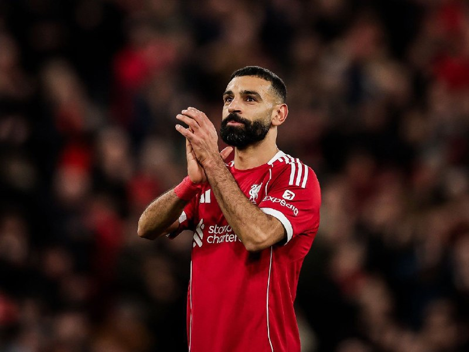

⚽️| بیانیه محمد صلاح: من دیدم این باشگاه از شک و تردید رسید به باور و از باور رسید به قهرمانی. من همیشه با کار سخت هر کاری از دستم برمی‌اومد انجام دادم تا به اینجا برسیم و هیچچیز به اندازه این منو مغرور نمیکنه.

🔴 این‌که دوباره این فصل چند تا باخت داشتیم خیلی برام دردناک بود و چیزی نیست که هوادارای لیورپول لیاقتشو داشته باشن. من میخوام لیورپول برگرده به همون تیم هجومی و ترسناک همیشگی، همون تیمی که همه ازش حساب میبردن. این همون فوتبالیه که من بلدم بازی کنم و این هویت باید برگرده و حفظ بشه، و هیچ‌کس نباید درش شک کنه.

🔴 بردهای معمولی و گه‌گاهی برای لیورپول کافی نیست. همه تیم‌ها یه جاهایی میبرن. لیورپول همیشه برای من و خانواده‌م مهم بوده و می‌خوام حتی بعد از من هم به موفقیت ادامه بده.

🔴 و همون‌طور که همیشه گفتم، رسیدن به لیگ قهرمانان حداقل چیزیه که باید بهش برسیم و من تا جایی که بتونم برای این هدف می‌جنگم.
@SportBaadNews

## SportBaadNews — post 251697

عاقبت مجازی کردن مدارس و مهد‌کودک‌ها : 
😶 @Okhtapooous

## IranIntlTV — post 337490

  

خبرگزاری آناتولی ترکیه گزارش داد که هاکان فیدان، وزیر خارجه ترکیه، با علی باقری‌کنی، معاون بین‌الملل دبیرخانه شورای عالی امنیت ملی، روز شنبه در استانبول دیدار کرد. این خبرگزاری اعلام کرد جزئیات بیشتری از این دیدار منتشر نشده است.
https://iranintl.com/202605168367

## IranIntlTV — post 337489

  <a href="telegram/content/IranIntlTV_337489_1778943166.mp4" target="_blank">🎬 Download video</a>

ایرانیان مقیم استکهلم، شنبه ۲۶ اردیبهشت در حمایت از انقلاب ملی تجمع کردند. تجمع‌کنندگان ضمن حمایت از شاهزاده رضا پهلوی، می‌گویند هدف از برگزاری این تجمعات، رساندن صدای مردم ایران به جهان است.

مهران عباسیان، خبرنگار ایران‌اینترنشنال، گزارش می‌دهد
@iranintltv

## IranIntlTV — post 337488

  <a href="telegram/content/IranIntlTV_337488_1778943167.mp4" target="_blank">🎬 Download video</a>

سرخط خبرهای شنبه ۲۶ اردیبهشت
@iranintltv

## IranIntlTV — post 337487

  <a href="telegram/content/IranIntlTV_337487_1778943169.mp4" target="_blank">🎬 Download video</a>

در یکی دیگر از آخر هفته‌های اعتراضی ایرانیان خارج از کشور، شنبه ۲۶ اردیبهشت تجمعات و راهپیمایی‌های گسترده‌ای در شهرهای مختلف اروپا در حمایت از انقلاب ملی مردم ایران برگزار شد.

گفت‌وگوی احمد صمدی ، خبرنگار ایران‌اینترنشنال، با شرکت‌کنندگان در تجمع برلین
@iranintltv

## IranIntlTV — post 337486

  

العربیه به نقل از منابعی خبر داد که سفر محسن نقوی، وزیر کشور پاکستان، به ایران با هدف رسیدن به چارچوب یک توافق انجام شده است. بر اساس این گزارش، پیشرفت مثبتی درباره تنگه هرمز حاصل شده و درها برای مذاکره درباره موارد باقی‌مانده از جمله موضوع هسته‌ای، باز است
https://iranintl.com/202605165331

## IranIntlTV — post 337485

  <a href="telegram/content/IranIntlTV_337485_1778943171.mp4" target="_blank">🎬 Download video</a>

در یکی دیگر از آخر هفته‌های اعتراضی ایرانیان خارج از کشور، شنبه ۲۶ اردیبهشت تجمعات و راهپیمایی‌های گسترده‌ای در شهرهای مختلف اروپا در حمایت از انقلاب ملی مردم ایران برگزار شد.

احمد صمدی ، خبرنگار ایران‌اینترنشنال، از برلین گزارش می‌دهند
@iranintltv

## IranIntlTV — post 337484

  <a href="telegram/content/IranIntlTV_337484_1778943173.mp4" target="_blank">🎬 Download video</a>

در ادامه گزارش‌ها از لکه نفتی ایجادشده در اطراف جزیره خارک، وبسایت تانکر ترکرز نوشت این موضوع ناشی از نشت نفت از اسکله غربی این جزیره است. خبرگزاری بلومبرگ نیز نوشت توقف صادرات نفت ایران از خارک، به احتمال زیاد ناشی از نشت اخیر نفت بوده است.

گفت‌وگو با آرش آزرمی، دبیر بخش اقتصادی ایران‌اینترنشنال
@iranintltv

## IranIntlTV — post 337483

  <a href="https://t.me/IranintlTV/337483" target="_blank">📎 Download file</a>

🎧نسخه صوتی اخبار نیمروزی | شنبه ۲۶ اردیبهشت
@iranintlTV

## IranIntlTV — post 337482

  <a href="telegram/content/IranIntlTV_337482_1778943175.mp4" target="_blank">🎬 Download video</a>

دونالد ترامپ هشدار داد اگر جمهوری اسلامی اورانیوم غنی‌شده خود را تحویل ندهد، آمریکا «در زمان مناسب» وارد ایران خواهد شد. او تاکید کرد در صورت لزوم، زیرساخت‌های باقی‌مانده را «ظرف دو روز» نابود می‌کند.
گفت‌وگو با جابر رجبی، تحلیل‌گر سیاسی
@iranintltv

## IranIntlTV — post 337481

  

سنتکام، مرکز فرماندهی ایالات متحده، اعلام کرد که از آغاز محاصره سواحل جنوب ایران تاکنون، ۷۸ کشتی تجاری وادار به تغییر مسیر شده‌اند و ۴ کشتی برای تضمین اجرای محاصره از کار افتاده‌اند.

سنتکام با انتشار نمایی از داخل یک بالگرد بر فراز آب‌های منطقه‌ای نزدیک تنگه هرمز، نوشت که این بالگرد ارتش آمریکا کشتی‌های تجاری را در جریان اجرای محاصره دریایی ایران زیر نظر دارد.
https://iranintl.com/202605164791

## IranIntlTV — post 337480

  

ایلا واویه، سخنگوی ارتش اسرائیل برای رسانه‌های عربی، در پیامی نوشت لبنان «میان چنگ ملایان و رشته‌های وابستگی» از یک کشور به گروگان تبدیل شده است.

او نوشت زمانی که جنگ‌ها «با انگشتان ایرانی اداره می‌شود»، مردم لبنان بهای آن را با «ویرانی و خاکستر» می‌پردازند.

واویه همچنین اعلام کرد لبنان به سکویی تبدیل شده و حزب‌الله «رشته‌هایی است که از سوی تهران حرکت داده می‌شود» و نتیجه این وضعیت، به گفته او، «کشوری که سیاه‌پوش می‌شود و بی‌گناهانی که جز آینده‌ای نامعلوم سهمی ندارند» است.

سخنگوی ارتش اسرائیل در پایان پرسید: «لبنان به کجا می‌رود؟ و تا کی؟»
https://iranintl.com/202605163963

## IranIntlTV — post 337479

  <a href="telegram/content/IranIntlTV_337479_1778943178.mp4" target="_blank">🎬 Download video</a>

ایرانیان سوئیس روز شنبه با تجمع در شهر برن به حمایت از انقلاب ملی و شاهزاده رضا پهلوی پرداختند و شعار «جاوید شاه» سر دادند.

## IranIntlTV — post 337478

  <a href="telegram/content/IranIntlTV_337478_1778943180.mp4" target="_blank">🎬 Download video</a>

در واکنش به نمایش و آموزش کار با سلاح در صداوسیما یک شهروند در پیامی به ایران اینترنشنال این اقدام را نشانه سقوط حکومت خواند و مخاطبی دیگر به حرکت مشابه در لیبی قبل از سقوط حکومت معمر قذافی اشاره کرد.

پیام این مخاطبان با هوش مصنوعی بازخوانی شده است.

---
📅 بروزرسانی: 1405/02/26 17:29
---

## rodast_omiddana — post 71418

  <a href="telegram/content/rodast_omiddana_71418_1778939958.webm" target="_blank">🎬 Download video</a>

🚨همین الان زنده در اینستاگرام پشتیبانی با بهروز یوسیان
👇
https://www.instagram.com/risheh86/

## rodast_omiddana — post 71417

🎬 ترامپ از چین برگشت
احتمالا این هفته حملات آغاز شود
لینک یوتیوب:
https://www.youtube.com/watch?v=RF854bo34gs

## KiriMohems — post 47582

  <a href="telegram/content/KiriMohems_47582_1778939959.webm" target="_blank">🎬 Download video</a>

بعد از صحبت‌هایی که با کانال MVP داشتیم، تونستیم برای برو بچ کیری مهم یه تخفیف خفن بگیریم 
🎉
🚀

کانفیگ‌هاشون برای اتصال به اینترنت جهانی مناسب گیم، ترید، اینستاگرام، توییتر، تلگرام و… رو با تخفیف خیلی خفنی قرار دادن
🤑

کیفیتشون تضمین شده هست 
✅. ۲ ماه هست که تیم کیری مهم از همین کانفیگ‌ها استفاده می‌کنه 
⚙️
♨️
🔐

ادرس رباتشون 👇
@Mvp_paybot

ادرس کانالشون👇
@VpnMVP

## KiriMohems — post 47581

  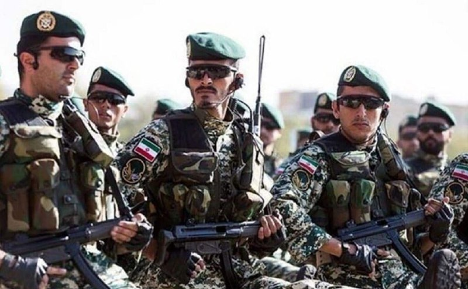

🔴فراخوان خدمت کیر خری سربازی برای داداچی های متولد ۸۷

#Helsinki
@KiriMohems

## KiriMohems — post 47580

  <a href="telegram/content/KiriMohems_47580_1778939960.mp4" target="_blank">🎬 Download video</a>

🔴شاید سوالی ذهن شما رو سوراخ کرده که چطور از نمایشگاه مجازی کتاب بخریم؟

هفتمین نمایشگاه مجازی کتاب تا دوم خرداد در سامانه قابل دسترسی و انگولک کاری است.

#Helsinki
@KiriMohems

## KiriMohems — post 47579

  <a href="telegram/content/KiriMohems_47579_1778939963.mp4" target="_blank">🎬 Download video</a>

🔴سفر گوز ناشتایی و یهویی وزیر کشور پاکستان به تهران

#Helsinki
@KiriMohems

## KiriMohems — post 47578

  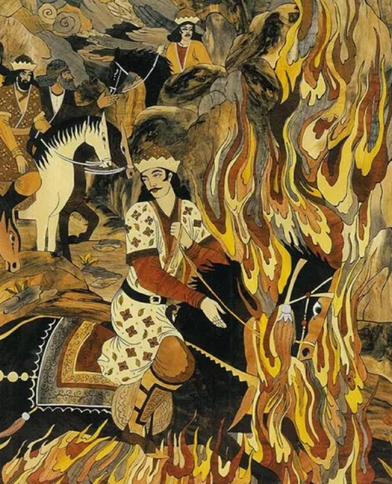

امروز ، روز جهانی پسره

به یاد تمام پسران #جاویدنام و سیاوش هایی که از جون شیرین خودشون برای ایران عزیز گذشتن

#Helsinki
@KiriMohems

## SportBaadNews — post 251696

⚽️
🔴 بایرن مونیخ 1 بازی دیگه تو بوندسلیگا داره و اگه 8 تا بزنه با رکورد تورینو برابری میکنه

## SportBaadNews — post 251695

  <a href="telegram/content/SportBaadNews_251695_1778939965.webm" target="_blank">🎬 Download video</a>

🚨
⚽️ ماریو کورتیانا و گیلرمو رای: دنی کارواخال آخر فصل از رئال مادرید جدا میشه @SportBaadNews

## SportBaadNews — post 251693

⚽️
⚽️| ترکیب رسمی منچسترسیتی و چلسی برای فینال FA CUP، ساعت 17:30
@SportBaadNews

## SportBaadNews — post 251692

فقط و فقط بیسسسسسسس و شیش روز دیگه تا جام جهانی مونده
@SportBaadNews

## SportBaadNews — post 251691

  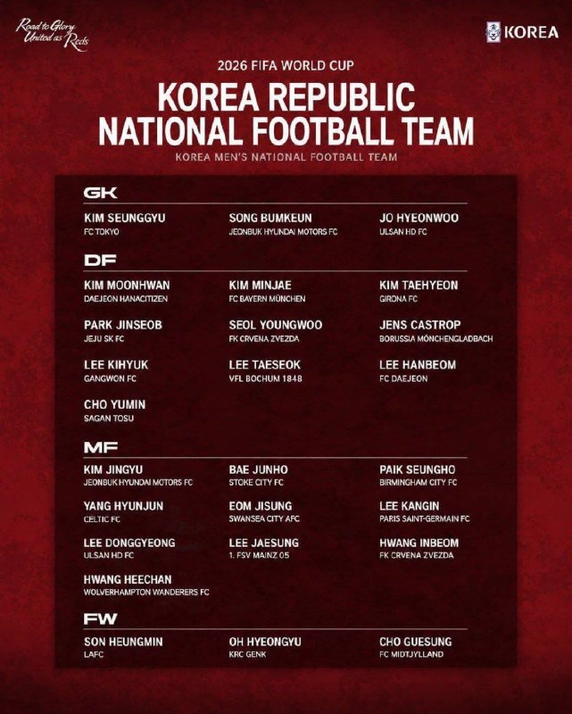

🇰🇷
⚽️| لیست تیم ملی کره جنوبی با حضور سون دوست داشتنی
@SportBaadNews

## SportBaadNews — post 251690

  <a href="telegram/content/SportBaadNews_251690_1778939967.mp4" target="_blank">🎬 Download video</a>

داداش شیر و خورشید داری ببین برو تو تنظیمات بزن تونل مای اس و فلان چندتا ایپی تمیز فیلتر نشده از سایت 220393 دانلود کن بعد اکسترکت کن بعد بزن اپ تلوبیون برو نصبش کن تو تنظیمات گوشیت بهش دسترسی بده حالا گوشیتو نیم ساعت بزار تو فریزر حالا درش بیار ده دقه بزار ابش خشک بشه حالا وقتشه دو دقه بزاریش تو ماکرویو حالا یه چهار تا پنج ساعت صبر کن وصل میشه داداش تضمینی نیست منطقه ای هستش ولی سرعت عالی خدا نصبش کن رایگانه
@SportBaadNews

## IranIntlTV — post 337477

  <a href="telegram/content/IranIntlTV_337477_1778939968.mp4" target="_blank">🎬 Download video</a>

ایرانیان آلمان روز شنبه همزمان با سایر کشورها در حمایت از انقلاب ملی علیه جمهوری اسلامی در شهر کاسل تجمع کردند.

## IranIntlTV — post 337476

  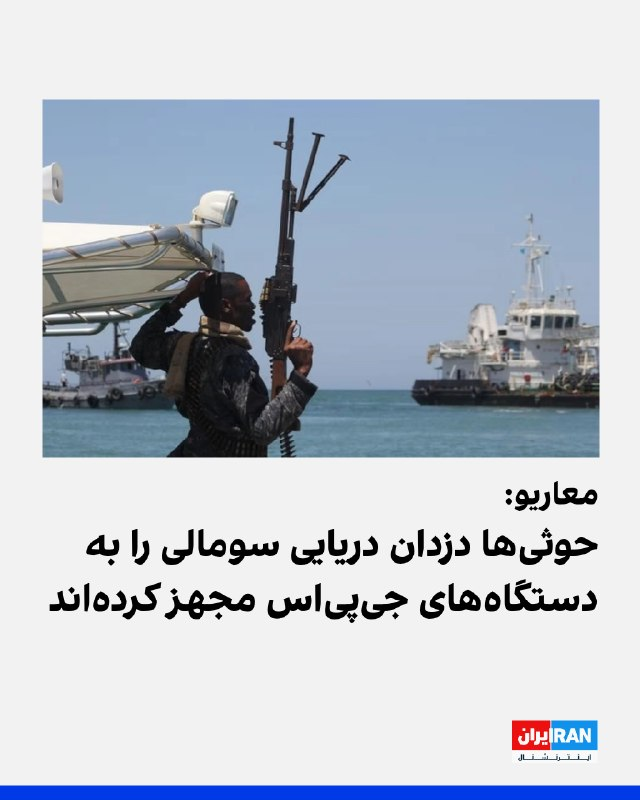

معاریو گزارش داد که حوثی‌ها ابزارهای مدرن، از جمله دستگاه‌های جی‌پی‌اس را در اختیار دزدان دریایی سومالی قرار داده‌اند که به آنها کمک می‌کند مسیرهای حرکت کشتی‌های تجاری را با دقت بیشتری ردیابی کنند.

پیش‌تر محمد موسی ابوله، معاون رییس اطلاعات پلیس دریایی پونتلند، در ژانویه ۲۰۲۶ گفته بود که نیروهای امنیتی برآورد می‌کنند برخی اعضای این گروه‌ها حتی آموزش‌های نظامی را در یمن گذرانده‌اند.

به گفته او، فناوری جدید برنامه‌ریزی حملات در فاصله‌ای دور از سواحل سومالی را بسیار آسان‌تر کرده است. یک ماه پیش از آن، در دسامبر ۲۰۲۵، نیروهای امنیتی پونتلند یک شناور حامل مواد منفجره و مواد شیمیایی مورد استفاده در ساخت بمب را در نزدیکی سواحل ایل متوقف کردند. در این قایق هفت نفر شامل دو شهروند یمنی و پنج شهروند سومالیایی حضور داشتند.
https://iranintl.com/202605167159

## IranIntlTV — post 337475

  <a href="telegram/content/IranIntlTV_337475_1778939971.mp4" target="_blank">🎬 Download video</a>

در تجمعی که به فراخوان تامی رابینسون، فعال راست‌گرای بریتانیا، در لندن برگزار شد، شماری از ایرانیان با پرچم شیر و خورشید حضور پیدا کردند. رابینسون این تجمع را «بزرگ‌ترین گردهمایی ملی‌گرایانه» توصیف کرده است.
گفت‌وگو با تاج‌الدین سروش، عضو تحریریه ایران‌اینترنشنال
@iranintltv

## IranIntlTV — post 337474

  <a href="telegram/content/IranIntlTV_337474_1778939974.mp4" target="_blank">🎬 Download video</a>

خبرگزاری مهر از وقوع آتش‌سوزی در «کارخانه روغن موتور» در مراغه خبر داد. رییس آتش‌نشانی شهرستان مراغه بعد از ظهر شنبه اعلام کرد این کارخانه از ساعاتی پیش دچار آتش‌سوزی شده است و نیروهای امدادی و آتش‌نشانی در حال اطفای حریق هستند.
@iranintltv

## IranIntlTV — post 337473

  <a href="telegram/content/IranIntlTV_337473_1778939975.mp4" target="_blank">🎬 Download video</a>

خبرگزاری مهر از وقوع آتش‌سوزی در «کارخانه روغن موتور» در مراغه خبر داد. رییس آتش‌نشانی شهرستان مراغه بعد از ظهر شنبه اعلام کرد این کارخانه از ساعاتی پیش دچار آتش‌سوزی شده است و نیروهای امدادی و آتش‌نشانی در حال اطفای حریق هستند.
@iranintltv

## IranIntlTV — post 337472

  <a href="telegram/content/IranIntlTV_337472_1778939976.mp4" target="_blank">🎬 Download video</a>

یک شهروند در پیامی به ایران اینترنشنال با اشاره به بحران معیشتی می‌گوید که سه ماه است مجلس با خاک یکی شده و نباید آن‌ها «حقوق آن‌چنانی»‌ بگیرند. پیام این مخاطب با هوش مصنوعی بازخوانی شده است.

## IranIntlTV — post 337471

  <a href="telegram/content/IranIntlTV_337471_1778939979.mp4" target="_blank">🎬 Download video</a>

صداوسیمای جمهوری اسلامی روز جمعه برنامه‌ای پخش کرد که در آن یک نظامی به مجری استفاده از سلاح گرم را آموزش می‌داد. این برنامه در شبکه‌های اجتماعی موجی از واکنش‌ها را به همراه داشت. مجری در این برنامه به پرچم امارات متحده عربی شلیک کرد.
جزییات بیشتر با محسن مهیمنی، عضو تحریریه ایران‌اینترنشنال
@iranintltv

## IranIntlTV — post 337470

  <a href="telegram/content/IranIntlTV_337470_1778939981.mp4" target="_blank">🎬 Download video</a>

ایرانیان فنلاند روز شنبه در حمایت از انقلاب ملی علیه جمهوری اسلامی در هلسینکی تجمع کردند و شعار «تغییر رژیم» سر دادند.

## IranIntlTV — post 337469

  <a href="telegram/content/IranIntlTV_337469_1778939984.mp4" target="_blank">🎬 Download video</a>

یکی از شرکت‌کنندگان در تجمع استکهلم در گفت‌وگو با مهران عباسیان، خبرنگار ایران‌اینترنشنال، گفت: «ما پشت مردم داخل کشور هستیم و تا روز آزادی ایران به خیابان‌ها می‌آییم.»
@iranintltv

## IranIntlTV — post 337468

  <a href="telegram/content/IranIntlTV_337468_1778939987.mp4" target="_blank">🎬 Download video</a>

ایرانیان مقیم کره جنوبی و ژاپن بار دیگر در پاسخ به فراخوان حمایت از انقلاب ملی و در راستای جلب توجه دولت سئول و توکیو به نقض گسترده حقوق بشر و اعدام‌‌ها توسط جمهوری اسلامی تجمع کردند.

گزارش توماج طاهباز، خبرنگار ایران‌اینترنشنال، از پیام شرکت‌کنندگان در این تجمع‌ها

@iranintltv

## Persian_Trend_Official — post 14239

  <a href="telegram/content/Persian_Trend_Official_14239_1778939989.webm" target="_blank">🎬 Download video</a>

‼️ دوستان توجه داشته باشید که تیم «پرشین ترند» در هیچ‌یک از پلتفرم‌های داخلی، کانال یا گروه رسمی ندارد و هیچ‌گونه فعالیتی در این بسترها انجام نمی‌دهد. ⚠️ لطفاً نسبت به سوءاستفاده افراد سودجو و صفحات جعلی هوشیار باشید. 📝 Nick 📌 @persian_trend_official پرشین…

## Persian_Trend_Official — post 14238

  

‼️ دوستان توجه داشته باشید که تیم «پرشین ترند» در هیچ‌یک از پلتفرم‌های داخلی، کانال یا گروه رسمی ندارد و هیچ‌گونه فعالیتی در این بسترها انجام نمی‌دهد.

⚠️ لطفاً نسبت به سوءاستفاده افراد سودجو و صفحات جعلی هوشیار باشید.

📝 Nick

📌 @persian_trend_official
پرشین ترند | متفاوت‌ترین کانال نظامی

## Persian_Trend_Official — post 14237

⭕️ آسوشیتدپرس: بازگشت ناو هواپیمابر جرالد فورد به پایگاه پس از ۱۱ ماه مأموریت.

وزارت‌جنگ آمریکا اعلام کرد پیت هگست، وزیر جنگ، روز شنبه در پایگاه دریایی نورفولک در ویرجینیا از ناو هواپیمابر جرالد فورد و ۴۵۰۰ ملوان آن پس از ۱۱ ماه مأموریت استقبال می‌کند.

این ناو ۳۲۶ روز در دریا بوده که طولانی‌ترین استقرار یک ناو هواپیمابر آمریکایی در ۵۰ سال گذشته و سومین رکورد از زمان جنگ ویتنام است.

پ.ن: آخرین باری که این ناو هواپیمابر در پایگاه خشکی مستقر بود، هنوز جنگ ۱۲ روزه نیز آغاز نشده بود.

📝 Nick

📌 @persian_trend_official
پرشین ترند | متفاوت‌ترین کانال نظامی

---
📅 بروزرسانی: 1405/02/26 15:43
---

## rodast_omiddana — post 71415

  <a href="telegram/content/rodast_omiddana_71415_1778933582.webm" target="_blank">🎬 Download video</a>

🚨 برای یادآوری 19 روز قبل از سقوط معمر قذافی در لیبی مجری تلویزیون با اسلحه مردم را تهدید کرد..
حالا دیشب مجریان شیعه در صداوسیما با اسلحه مردم ایران را تهدید کردن..

## rodast_omiddana — post 71414

  <a href="telegram/content/rodast_omiddana_71414_1778933582.webm" target="_blank">🎬 Download video</a>

🚨 دیشب شاهین نجفی دوزاری و خای*مال گفت باید "محسن چاوشی" هم که پس از نسل کشی بهترین جوانان ایران برای رژیم ترانه خوانده بخشیده بشه، ولی همین آدم سالهاست به من توهین میکنه و میگه ما امید دانا را تف کردیم!!
فقط ماندم این آقا 45 ساله که 42 سال از زندگیش چپ و کمونیست و ضد وطن بوده چطور اینقدر سریع با ما "ما" شد و برای خودش مرجعیت فکری ایجاد کرد که چه کسی بخشیده شود و چه کسی تف کرده شود..
پفیوز...

## rodast_omiddana — post 71413

  <a href="telegram/content/rodast_omiddana_71413_1778933582.mp4" target="_blank">🎬 Download video</a>

🚨 مجری:
"آمریکایی‌ها می‌خواهند بدانند این ماجرا چه زمانی تمام می‌شود".

ترامپ:
"ویتنام ۱۹ سال طول کشید، عراق حدود ۱۰ سال بود، کره ۷ سال بود، یکی دیگر ۱۴ سال بود، یکی دیگر ۱۲ سال بود، یکی دیگر ۹ سال بود—ما فقط دو و نیم ماه است که آنجاییم.
ما ده‌ها هزار سرباز در ویتنام از دست دادیم… من در دو جنگ فقط ۱۳ سرباز از دست داده‌ام."

پانوشت:
حالا فهمید وقتی میگم جنگ طولانیه یعنی چه..
خیالتون راحت باشه..

## rodast_omiddana — post 71412

  <a href="telegram/content/rodast_omiddana_71412_1778933584.mp4" target="_blank">🎬 Download video</a>

😎 پهپاد اسرائیل مناره مسجد غزه را زد..
خب شما که میزنید کل مسجدو بزنید دیگه...

## KiriMohems — post 47577

  <a href="telegram/content/KiriMohems_47577_1778933585.mp4" target="_blank">🎬 Download video</a>

🔴حتی بچه مایه دارای تهران هم ، زیر بمبارون سگی تو حال خوش خودشون بودن

منم میرفتم پشت بوم که ببینم الان کجای تهران رو زده
#Helsinki
@KiriMohems

## KiriMohems — post 47576

  

😤دنبال یه سایت شرط بندی بین المللی بودی که به ایرانیا خدمات بده؟!
⛔

👍دربی بت همون انتخاب  100%

💎ویژگی های سایت جهانی Derby Bet:

⬅️امکان شارژ امن با کارت بانکی

⬅️واریز اول دوبل شارژ می شوید(بونوس۱۰۰٪)

⬅️پر اپشن ترین سایت فعال در ایران

⬅️تسویه حساب کمتر از 5 دقیقه

⬅️برگشت بخشی از باخت به صورت هفتگی

🚨کد هدیه ثبت نام:GG007

⚠️برای دانلود اپلکیشن کلیک کنید
👉

🔔کانال دربی بت :r26🅰

🪙https://t.me/+kpFvLD9kaeJhYTI0

## SportBaadNews — post 251689

  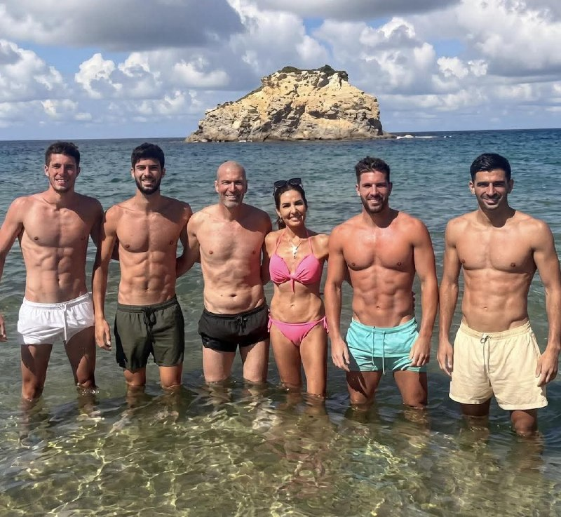

خانواده تراز زیدان، 0 درصد چربی
@SportBaadNews

## SportBaadNews — post 251688

  

❌ ۹۰٪ کاربرا هنوز اشتباه وارد سایت میشن!
تو جزو اونایی یا میخوای حرفه‌ای عمل کنی؟

✅ ورود سریع به وینکوبت فقط با یک کلیک ساده:

🤖 @Wincobet_bot

🤖 @Wincobet_bot

📌   نه لینک اضافی

📌   نه سردرگمی

📌   نه اتلاف وقت

📌   مستقیم، سریع، بدون دردسر وارد شو!

⏳   دیر بجنبی، از بقیه عقب می‌مونی.

🔗 الان وقتشه مسیر درستو انتخاب کنی:

🤖 @Wincobet_bot

📌برای تحلیل بازی‌ها و آخرین اخبار سایت جوین بدید:

🔵 @Wincobetofficial

## SportBaadNews — post 251687

  <a href="telegram/content/SportBaadNews_251687_1778933588.webm" target="_blank">🎬 Download video</a>

🚨
⚽️ ماریو کورتیانا و گیلرمو رای: دنی کارواخال آخر فصل از رئال مادرید جدا میشه @SportBaadNews

## SportBaadNews — post 251686

  <a href="telegram/content/SportBaadNews_251686_1778933589.webm" target="_blank">🎬 Download video</a>

🚨
⚽️ ماریو کورتیانا و گیلرمو رای: دنی کارواخال آخر فصل از رئال مادرید جدا میشه
@SportBaadNews

## IranIntlTV — post 337467

  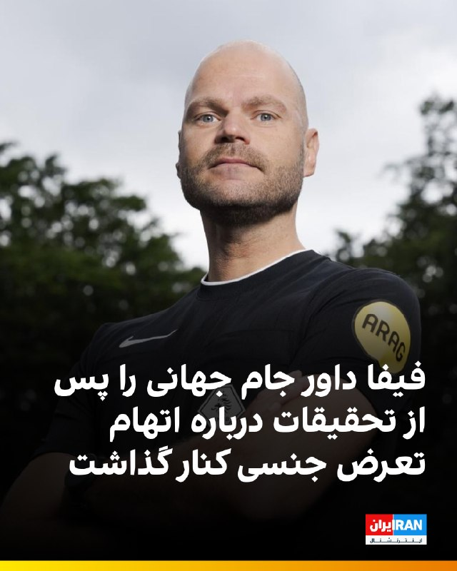

🔻فدراسیون جهانی فوتبال، فیفا، نام راب دیپرینک، داور هلندی حاضر در فهرست داوران جام جهانی ۲۰۲۶، را پس از بازداشت او توسط پلیس متروپولیتن بریتانیا در ماه گذشته میلادی، از فهرست رسمی داوران این رقابت‌ها حذف کرد.

🔹به نوشته سایت اتلتیک، دیپرینک که به‌عنوان داور VAR برای جام جهانی آمریکا، کانادا و مکزیک امسال انتخاب شده بود، پس از مطرح شدن اتهام تعرض جنسی به یک پسر نوجوان در لندن بازداشت شده بود.

🔹با این حال، دیپرینک اعلام کرده که پلیس متروپولیتن پرونده را مختومه کرده و هیچ اتهامی علیه او مطرح نخواهد شد. سخنگوی پلیس متروپولیتن نیز به اتلتیک گفته که شواهد و مدارک به اندازه کافی علیه او وجود نداشته است و در نتیجه «اقدام بیشتری انجام نخواهد شد».

🔹فیفا در بیانیه‌ای به اتلتیک اعلام کرد: «فیفا تأیید می‌کند که راب دیپرینک از فهرست داوران جام جهانی حذف شده است.»

🔹در بیانیه‌ای از سوی فدراسیون فوتبال هلند (KNVB)، از این داور حمایت شده است.

🔹با وجود مختومه شدن پرونده، منابع آگاه به اتلتیک گفته‌اند انتظار می‌رود فیفا ویلی دلاژو، داور فرانسوی، را جایگزین دیپرینک کند.

🔹گزارش کامل را در سایت بخوانید
@iranintltvsport

## IranIntlTV — post 337466

  <a href="telegram/content/IranIntlTV_337466_1778933590.mp4" target="_blank">🎬 Download video</a>

یک شهروند در پیامی به ایران اینترنشنال درباره بحران سوخت می‌گوید که در مشهد بعد از مراجعه به چند جایگاه نهایتا بعد از یک ساعت انتظار توانست با کارت سه‌هزار تومانی ۱۵ لیتر بزنین بزند. پیام مخاطب با هوش مصنوعی خوانده شده است.

## IranIntlTV — post 337465

  <a href="telegram/content/IranIntlTV_337465_1778933591.mp4" target="_blank">🎬 Download video</a>

مهتاب قلی‌زاده، روزنامه‌نگار اقتصادی، درباره تورم بهای خوراکی‌ها در ایران گفت نرخ ارز تاثیر شدیدی بر قیمت مواد غذایی دارد. او افزود: «برخلاف تصویری از خودکفایی که سال‌ها برای آن تبلیغ شده، ساختار تولید مواد غذایی در ایران به‌طور کامل داخلی نیست.»
@iranintltv

## IranIntlTV — post 337464

ویدیوی رسیده به ایران اینترنشنال نشان می‌دهد ایرانیان روز شنبه در تجمعی که به فراخوان تامی رابینسون،‌ فعال راست‌گرای بریتانیا،‌ در لندن برگزار شده حاضر شده و پرچم شیروخورشید به دست گرفتند.

## IranIntlTV — post 337463

روایت شما از زندگی در آتش‌بس- شنبه ۲۶ اردیبهشت ۱۴۰۵

🔹 ابوقراضه‌ای به نام کوییک، سال ۱۴۰۱ قیمتش ۱۷۰ میلیون بود، الان شده یک میلیارد و ۲۷۰ میلیون تومان، در حالی که حقوق کارمند سال ۱۴۰۱ پانزده میلیون بود و الان شده ۳۰ میلیون.
🔹 فقط وصل شدم بگم مرگ بر اصل ولایت فقیه. مرگ بر جمهوری اسلامی، لعنت بر تک‌تک عاملان فساد در ایران‌مون. یه گیگ اینترنت خریدیم ۵۰۰ هزار تومان! خسته شدیم، بزنید، اصلاً هم ما راحت شیم هم اینا برن.
🔹 از نیشابور پیام می‌دیم، نظام فاسد با گرون کردن بنزین منتظر باشه دوباره ملت بریزن تو خیابون ریشه‌شون رو بکنن.
🔹 همه‌چیز سرسام‌آور گرون شده، دارو نیست، بنزین رو می‌خوان سه برابر گرون کنن و آزاد رو سه برابر بیشتر بفروشن. ترامپ زودتر تصمیمتو بگیر، کشتی ما رو با قیمت نفت، ما این‌ها رو نمی‌خواهیم، تحت هیچ شرایطی.
🔹 از تهران پیام می‌دم، من یک دانش‌آموز هستم و ما برای مدرسه‌ای که نرفتیم باید ۱۵۰ میلیون برای مدارس غیردولتی که هیچ کاری برامون نکردن شهریه بدیم. به بی‌بی و ترامپ بگین خیلی حواسشون جمع باشه، تغییر رژیم کار سختیه، باید حمایت زیاد بشیم، خسته شدیم به خدا.

## IranIntlTV — post 337462

  

ابراهیم عزیزی، رییس کمیسیون امنیت ملی مجلس، با اشاره به طرح مجلس برای تنگه هرمز نوشت که جمهوری اسلامی سازوکاری برای مدیریت ترافیک این آبراه در مسیر تعیین‌شده تهیه کرده است که به‌زودی رونمایی می‌شود. عزیزی نوشت: «این مسیر کماکان برای عاملان پروژه به اصطلاح آزادی بسته خواهد ماند.»

او در ایکس نوشت: «ایران در چارچوب حق حاکمیت ملی و تضمین امنیت تجارت بین‌الملل، سازوکاری حرفه‌ای برای مدیریت ترافیک تنگه هرمز در مسیر تعیین‌شده تهیه کرده است که به‌زودی رونمایی می‌شود.»

او افزود: «در این فرآیند، فقط کشتی‌های تجاری و طرف‌های همکار با ایران از آن بهره‌مند خواهند شد. حقوق لازم در ازای خدمات تخصصی ارائه‌شده، با این سازوکار برای ایران اخذ می‌شود.»
https://iranintl.com/202605164109

## IranIntlTV — post 337461

  <a href="telegram/content/IranIntlTV_337461_1778933593.mp4" target="_blank">🎬 Download video</a>

ایرانیان استرالیا روز شنبه در حمایت از انقلاب ملی در بریزبن تجمع کرده و بخش‌هایی از پیام شاهزاده رضا پهلوی را پخش کردند.

## IranIntlTV — post 337460

  <a href="telegram/content/IranIntlTV_337460_1778933594.mp4" target="_blank">🎬 Download video</a>

مروری بر روزنامه‌های ایران، شنبه ۲۶ اردیبهشت، با مجتبی هاشمی، روزنامه‌نگار
@iranintltv

---
📅 بروزرسانی: 1405/02/26 14:48
---

## ChizBergerz — post 46440

  <a href="telegram/content/ChizBergerz_46440_1778930326.mp4" target="_blank">🎬 Download video</a>

توی انگلیس وقتی یه پیرمرد بالاخره به رویاش رسید و یه خانم زیبا رو بوس کرد، از شدت هیجان و شادی بیهوش شد و کارش به بیمارستان کشید: 😐😂

@ChizBergerz

## ChizBergerz — post 46439

  <a href="telegram/content/ChizBergerz_46439_1778930328.mp4" target="_blank">🎬 Download video</a>

صداوسیمای لیبی دقیقا ۱۰ روز قبل‌از سرنگونی حکومت قذافی: دیکتاتورها شبیه هم هستن! @ChizBergerz

## ChizBergerz — post 46438

  <a href="https://t.me/ChizBergerz/46438" target="_blank">📎 Download file</a>

📲#اپلیکیشن اندروید سایت جهانی دربی بت

👍اسپانسر لیگ انگلیس
👍
🔥امکان شارژ امن از طریق کارت بانکی
➖➖➖➖➖➖➖➖➖

🪙همین حالا عضو شوید 👇
https://t.me/+aCbq7yy8QY80NzQ0

## ChizBergerz — post 46437

  

😤دنبال یه سایت شرط بندی بین المللی بودی که به ایرانیا خدمات بده؟!
⛔

👍دربی بت همون انتخاب  100%

💎ویژگی های سایت جهانی Derby Bet:

⬅️امکان شارژ امن با کارت بانکی

⬅️واریز اول دوبل شارژ می شوید(بونوس۱۰۰٪)

⬅️پر اپشن ترین سایت فعال در ایران

⬅️تسویه حساب کمتر از 5 دقیقه

⬅️برگشت بخشی از باخت به صورت هفتگی

🚨کد هدیه ثبت نام:GG007

⚠️برای دانلود اپلکیشن کلیک کنید
👉
re26

🔔کانال دربی بت :

🪙https://t.me/+aCbq7yy8QY80NzQ0

## ChizBergerz — post 46436

‏لیست مشاغل باقی مانده در ایران :
کانفیگ فروش
عرق فروش
آدم فروش
اسنپ
تریاک فروش

بقیه هم نشستن همو نگاه میکنن …

## ChizBergerz — post 46435

  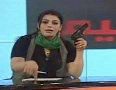

دیشب مجری‌های حرومزاده صداوسیما اسلحه به دست برنامه‌های کصشعرشونو اجرا کردن، این یعنی حکومت میدونه قیامی بزرگ از طرف مردم نزدیکه و فکر کرده با اینکار مردم میترسن! ترکیب حمله زمینی ارتش آمریکا + قیام مردم ایران >>>>> سکس @ChizBergerz

## ChizBergerz — post 46434

  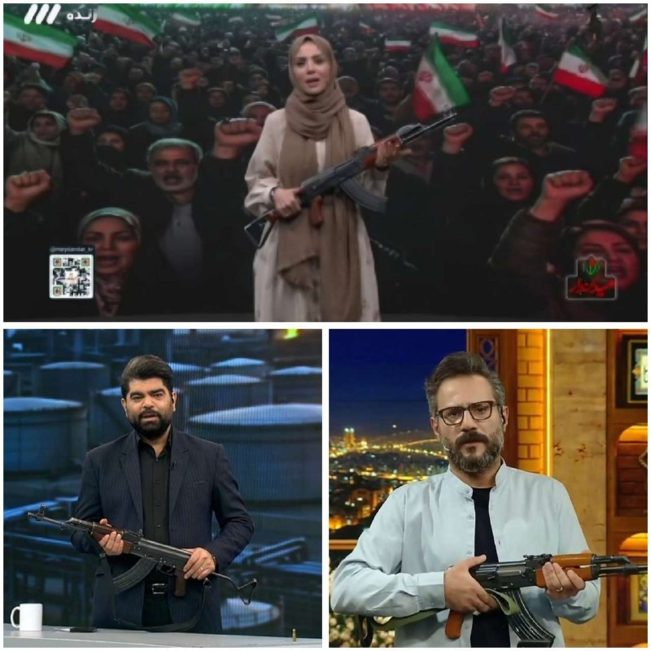

دیشب مجری‌های حرومزاده صداوسیما اسلحه به دست برنامه‌های کصشعرشونو اجرا کردن، این یعنی حکومت میدونه قیامی بزرگ از طرف مردم نزدیکه و فکر کرده با اینکار مردم میترسن!

ترکیب حمله زمینی ارتش آمریکا + قیام مردم ایران >>>>> سکس
@ChizBergerz

## rodast_omiddana — post 71411

  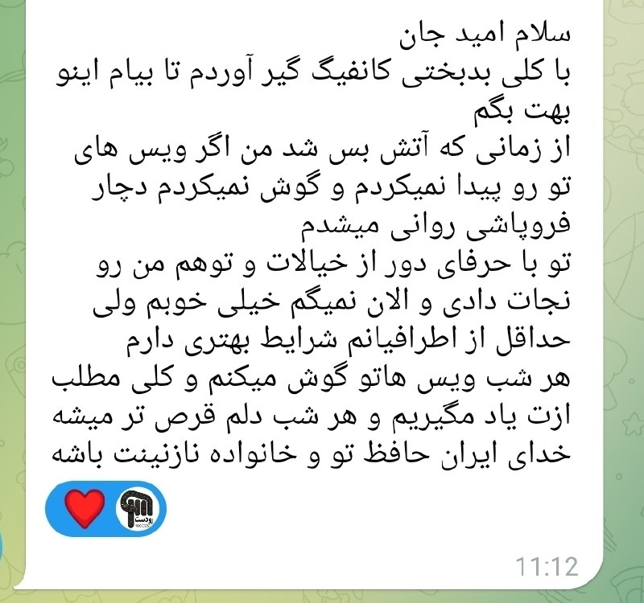

👑این دست پیامها روزانه برام زیاد میاد..
خدا رو شکر در سیاه ترین روزهای کشورمون دستکم با پادکستهای شبانه توانستم با تیمم یکم به مردم آرامش بدم..
اینم نقش من بود که سالها سانسور شدید بشم و طردم کنند ولی در نهایت در حساسترین روزهای کشورمون جز پر شنونده ترینها باشم، زندگی واقعا پیچیده ست..
خدایا شکرت..

## rodast_omiddana — post 71408

  <a href="telegram/content/rodast_omiddana_71408_1778930333.webm" target="_blank">🎬 Download video</a>

🚨
🚨 دیشب مجریان صداوسیما در یک حرکت غافلگیرانه دست به اسلحه برنامه هایشان را اجرا کردند.
این یعنی رژیم میداند بزودی خیابان به خیابان باید با نیروهای آمریکایی و مردم مسلح ایران درگیر بشه..
داریم وارد فاز جنگ شهری و خیابانی میشویم..
تیک تاک..

## rodast_omiddana — post 71407

  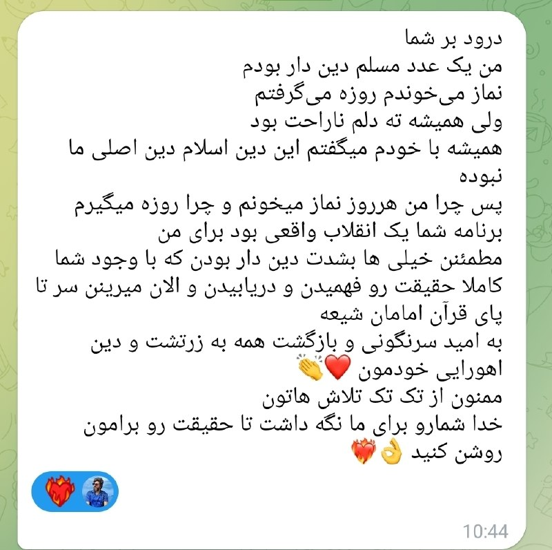

❤️ دمتون گرم

## KiriMohems — post 47575

  <a href="telegram/content/KiriMohems_47575_1778930334.mp4" target="_blank">🎬 Download video</a>

🔴شلیک با اسلحه کیری در برنامۀ زندۀ تلویزیون:

#Helsinki
@KiriMohems

## SportBaadNews — post 251685

  <a href="telegram/content/SportBaadNews_251685_1778930336.webm" target="_blank">🎬 Download video</a>

🚨
⚽️ پست خداحافظی لواندوفسکی: بعد از چهار سال پر از چالش و سختی، وقتشه که برم سراغ یه مسیر جدید. دارم میرم در حالی که حس میکنم مأموریتم کامل شده. 4 فصل، 3 قهرمانی. محبتی که از همون روزای اول از هوادارا گرفتم هیچوقت یادم نمیره. کاتالونیا برای من مثل خونه‌ست.…

## SportBaadNews — post 251684

ایران اینترنت ندارد، روز هفتاد و هشتم ...
ایران اینترنت ندارد، روز هفتاد و هشتم ...
ایران اینترنت ندارد، روز هفتاد و هشتم ...
ایران اینترنت ندارد، روز هفتاد و هشتم ...
ایران اینترنت ندارد، روز هفتاد و هشتم ...
ایران اینترنت ندارد، روز هفتاد و هشتم ...

## SportBaadNews — post 251683

  <a href="telegram/content/SportBaadNews_251683_1778930336.webm" target="_blank">🎬 Download video</a>

🚨
⚽️
❌| لواندوفسکی پست خداحافظی گذشت و از هواداران بارسلونا خداحافظی کرد @SportBaadNews

## SportBaadNews — post 251682

  <a href="telegram/content/SportBaadNews_251682_1778930337.webm" target="_blank">🎬 Download video</a>

🚨
⚽️
❌| لواندوفسکی پست خداحافظی گذشت و از هواداران بارسلونا خداحافظی کرد
@SportBaadNews

## SportBaadNews — post 251681

  

🏆
⚽️| النصر امشب تو فینال لیگ قهرمانان آسیا دو بازی داره و رونالدو میتونه اولین جام خودش با النصر رو با قهرمانی تو آسیا کسب کنه
@SportBaadNews

## SportBaadNews — post 251680

  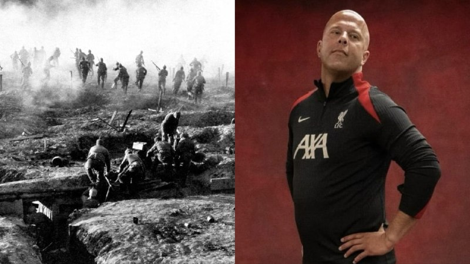

لیورپول آرنه اسلوت این فصل فقط 50% از بازیاشو برده. 
🔴 56 بازی 
🔴 28 برد 
🔴 19 باخت 
🔴 9 مساوی 
❌| بعد از 16 سال، اونا 19 باخت تو یک فصل رو تجربه کردن. 
❌| بعد از 11 سال اونا 12 باخت تو یک فصل لیگ جزیره رو تجربه کردن. 
❌ | بعد از 14 سال اونا 9 باخت خارج از خونه…

## IranIntlTV — post 337459

  <a href="telegram/content/IranIntlTV_337459_1778930338.mp4" target="_blank">🎬 Download video</a>

گزارش‌ها حاکی از بحران جدی بهداشت و درمان در زندان فشافویه تهران است. بر اساس روایت زندانیان، شیوع بیماری پوستی گال، تراکم بالای جمعیت و نبود دسترسی به پزشک و دارو، وضعیت زندانیان را بحرانی کرده است.

گفت‌وگو با محمد مقیمی، وکیل دادگستری و کارشناس ارشد حقوق بشر
@iranintltv

## IranIntlTV — post 337458

  <a href="telegram/content/IranIntlTV_337458_1778930340.mp4" target="_blank">🎬 Download video</a>

عطا حسینیان، روزنامه‌نگار اقتصادی و حوزه انرژی، گفت ایران در حال حاضر در زمینه تولید بنزین با مشکلات جدی مواجه است. او «حملات به پارس جنوبی، محاصره دریایی، روابط مخدوش جمهوری اسلامی با امارات و کمبود منابع مالی» را از جمله عوامل موثر بر تولید و عرضه بنزین در کشور دانست.
@iranintltv

## IranIntlTV — post 337457

  <a href="telegram/content/IranIntlTV_337457_1778930342.mp4" target="_blank">🎬 Download video</a>

ایرانیان نیوزیلند روز شنبه ۲۶ اردیبهشت‌ماه در حمایت از شاهزاده رضا پهلوی و علیه قطع اینترنت و اعدام‌های جمهوری اسلامی در اوکلند تجمع برگزار کردند.

## IranIntlTV — post 337450

🔻اریک کانتونا، اسطوره فوتبال فرانسه و یکی از عوامل مستند «کانتونا»، در جریان فوتوکال این فیلم که در بخش «نمایش‌های ویژه» هفتاد و نهمین جشنواره فیلم کن ارائه شد، روز شنبه ۲۶ اردیبهشت مقابل دوربین عکاسان ژست گرفت.

🔹مستند «کانتونا» که در جشنواره فیلم کن رونمایی شد، پرتره‌ای از اریک کانتونا، ستاره فرانسوی دهه ۹۰ منچستریونایتد، ارائه می‌دهد؛ فوتبالیستی جذاب اما تندخو که هم به‌واسطه نبوغ فوتبالی‌اش و هم به دلیل جنجال‌هایش به چهره‌ای اسطوره‌ای بدل شد.

🔹این فیلم به کارگردانی دیوید تری‌هورن و بن نیکلاس، سازندگان مستند «پله»، با ترکیبی از گفت‌وگوهای تازه با کانتونا و روایت‌هایی از الکس فرگوسن، دیوید بکام و گی رو، تلاش می‌کند تصویری کامل از «مرد، اسطوره، افسانه» بسازد.

@iranintltvsport

## IranIntlTV — post 337449

  <a href="telegram/content/IranIntlTV_337449_1778930344.mp4" target="_blank">🎬 Download video</a>

سرخط خبرهای شنبه ۲۶ اردیبهشت
@iranintltv

## IranIntlTV — post 337448

  <a href="telegram/content/IranIntlTV_337448_1778930345.mp4" target="_blank">🎬 Download video</a>

ایرانیان استرالیا روز شنبه در حمایت از انقلاب ملی علیه جمهوری اسلامی تجمع کرده و با حمل پرچم شیروخورشید ترانه‌های ملی را هم‌خوانی کردند.

## IranIntlTV — post 337447

  

روزنامه معاریو به نقل از منابع آگاه گزارش داد که دولت دونالد ترامپ در روزهای اخیر آمادگی خود را برای دادن «چراغ سبز» به اقدام نظامی در صورت شکست نهایی تلاش‌های دیپلماتیک با جمهوری اسلامی نشان داده است.

بر اساس این گزارش، با وجود این رویکرد، هنوز تصمیم نهایی برای آغاز عملیات نظامی اتخاذ نشده است.

این منابع افزودند که «پنجره دیپلماتیک به سرعت در حال بسته شدن است» و روزهای آینده می‌تواند در تعیین مسیر تحولات سرنوشت‌ساز باشد.
https://iranintl.com/202605162346

## IranIntlTV — post 337446

  <a href="telegram/content/IranIntlTV_337446_1778930347.mp4" target="_blank">🎬 Download video</a>

همزمان با افزایش تنش‌ها میان امارات متحده عربی و جمهوری اسلامی، یک مجری صدا و سیمای جمهوری اسلامی در برنامه‌ای با محور آموزش کار با سلاح، پرچم امارات متحده عربی را به‌عنوان هدف انتخاب کرد و به سوی آن شلیک کرد.

این بخش از برنامه در حالی پخش شد که روابط تهران و ابوظبی در هفته‌های اخیر با تنش‌هایی همراه بوده است.

صدا و سیمای جمهوری اسلامی جمعه چند برنامه پخش کرد که در آنها مجریان در بخش‌های استودیویی با در دست داشتن تفنگ ظاهر شدند و اعلام کردند در حال یادگیری کار با سلاح‌های سبک هستند و در صورت لزوم به جنگ خواهند پیوست.
@iranintltv

## IranIntlTV — post 337445

  <a href="telegram/content/IranIntlTV_337445_1778930349.mp4" target="_blank">🎬 Download video</a>

مخاطبان ایران اینترنشنال طی روزهای اخیر با ارسال پیام‌هایی درباره سلامت و جان فاطمه سپهری، زندانی سیاسی، ابراز نگرانی کرده و از ایرانیان خواستند در خارج از کشور صدای او باشند. پیام مخاطبان با هوش مصنوعی بازخوانی شده است.

## IranIntlTV — post 337444

  <a href="telegram/content/IranIntlTV_337444_1778930351.mp4" target="_blank">🎬 Download video</a>

بنا بر گزارش کانال۱۲ اسرائیل، رییس‌جمهور آمریکا قرار است ظرف ۲۴ ساعت آینده نشستی ویژه با مشاورانش برگزار کند تا تصمیم نهایی درباره جمهوری اسلامی را اتخاذ کند.

گفت‌وگو با منشه امیر، کارشناس امور خاورمیانه
@iranintltv

## IranIntlTV — post 337443

  

محمد مخبر، مشاور رهبر جمهوری اسلامی، با انتشار مطلبی در ایکس با هشتگ کویت و امارات نوشت: «ایران سال‌ها به چشم دوست و برادر به آنها نگاه کرد، ولی آنها با پیش‌فروش استقلال خود، حتی خاک و خانه‌هایشان را در اختیار دشمنان فلسطین و ایران قرار دادند.»

او تهدید کرد: «پاسخ جمهوری اسلامی به سنگرهای استیجاری سنتکام در جنگ اخیر تمام‌عیار نبود، اما قطعا این خویشتن‌داری همیشگی نیست.»
https://iranintl.com/202605169610

## Persian_Trend_Official — post 14236

https://castbox.fm/vi/945846191

لطفا چک کنید ببنید دسترسی دارید ؟

## Persian_Trend_Official — post 14235

کانال رسمی پرشین ترند pinned «از همراهی و توجه شما واقعاً ممنونیم ❤️ اینکه با رأی‌ها، نظرات و مشارکت‌تون مسیر پرشین ترند رو دقیق‌تر می‌کنید، برای ما خیلی ارزشمنده. بر اساس همین بازخوردها، از این به بعد نسخه صوتی برنامه‌ها در «کست‌باکس» و سایر پادگیر ها مثل اسپاتیفای، اپل موزیک و ...…»

## Persian_Trend_Official — post 14234

از همراهی و توجه شما واقعاً ممنونیم ❤️
اینکه با رأی‌ها، نظرات و مشارکت‌تون مسیر پرشین ترند رو دقیق‌تر می‌کنید، برای ما خیلی ارزشمنده.

بر اساس همین بازخوردها، از این به بعد نسخه صوتی برنامه‌ها در «کست‌باکس» و سایر پادگیر ها مثل اسپاتیفای، اپل موزیک و ... منتشر میشه 🎧

با توجه به اینکه هم تلگرام و هم کست‌باکس فیلتر هستند، از نظر دسترسی تفاوت خاصی وجود نداره؛
اما برای کسانی که استفاده از فیلترشکن براشون سخت‌تره، نسخه تصویری برنامه‌ها طبق روال قبل در هاست داخلی و وب‌سایت قرار می‌گیره 📥

در عین حال تلاش می‌کنیم وب‌سایت پرشین ترند رو هم حرفه‌ای‌تر و کامل‌تر توسعه بدیم تا دسترسی به محتوا راحت‌تر بشه.

مثل همیشه ممنون از همراهی‌تون 🙏

📌 @persian_trend_official
پرشین ترند | متفاوت‌ترین کانال نظامی

---
📅 بروزرسانی: 1405/02/26 13:43
---

## rodast_omiddana — post 71406

  <a href="telegram/content/rodast_omiddana_71406_1778926407.webm" target="_blank">🎬 Download video</a>

🚨 
📷 تا دوساعت دیگه با جناب بهروز یوسیان در اینستاگرام گفتگو هفتگیمونو آغاز میکنیم..
لینک اینستا
https://www.instagram.com/risheh86/

## rodast_omiddana — post 71405

🎬 شاهزاده رضا پهلوی، مهدی آقازمانی و نازیلا گلستان امروز علیه شما در صدای آمریکا هستن
لینک یوتیوب:
https://www.youtube.com/watch?v=JsQe7v_XZbw

## rodast_omiddana — post 71404

  

🔴مرسی عزیزم
فقط یک نکته دادن امید واهی و کاذب خیانته و اگر امیدی من میدهم بابت واقعیت میدان هست..

## KiriMohems — post 47574

  

🔴سوزوکی دومین خودروساز ژاپن میشه که بیشتر تو پاچه فرو میکنه

مجید سوزوکی برای اولین بار با کیر کردن هوندا، به دومین خودروساز بزرگ دول موشی ها از نظر حجم فروش جهانی تبدیل میشه.

#Helsinki
@KiriMohems

## KiriMohems — post 47573

🔴چمران ، رئیس شورای شهر تهران: مُفتی کردن مترو و اتوبوس تو تهران کار احساسیه!

فردا آخرین روز رایگان بودن حمل و نقل عمومی تو تهرانه و و به قول اون یارو دلخوش نباشید چون دوباره تمدید نمیشه ، بسه دیگه سر کیسه رو شل کنید

#Helsinki
@KiriMohems

## KiriMohems — post 47572

📰 جسی واترز، مجری فاکس نیوز:

ترامپ درحال شق کردن برای دور جدیدی از حملات نظامی به ایرانه.
#Helsinki
@KiriMohems

## KiriMohems — post 47571

  <a href="telegram/content/KiriMohems_47571_1778926408.mp4" target="_blank">🎬 Download video</a>

#برینید

🔴از کصخل بازی صداوسیما همین بس که اومدن تصویری که با هوش مصنوعی ساخته شده رو تحلیل کردن و عن و عن کردن که آمریکا زیرخوابِ چین کمونیستی شده

#Helsinki
@KiriMohems

## KiriMohems — post 47570

🔴مدیرکل آموزش‌وپرورش خراب شده‌ی استان تهران:‌
امتحانات پایه‌های هفتم تا دهم مجازی و زیر لحافی شد

#Helsinki
@KiriMohems

## KiriMohems — post 47569

  

🔴پرایدی که یه زمانی سوژه خنده ما بوده الان به میلیارد رسیده و به کون ما میخنده

#Helsinki
@KiriMohems

## KiriMohems — post 47568

🔴نمایشگاه مجازی کتاب تهران از صبح امروز تو سامانه book.icfi.ir آغاز به کار کرده

#Helsinki
@KiriMohems

## SportBaadNews — post 251679

  

بهترین آمار گلزنی باشگاه ها در تاریخ 5 لیگ معتبر :

⚽️ 125 گل زده - تورینو 1947/48

⚽️ 121 گل زده - رئال 2011/12

⚽️ 118 گل زده - رئال 2014/15

⚽️ 118 گل زده - میلان 1949/50

⭕️
⚽️ 117 گل زده - بایرن 2025/26

⚽️
🔴 بایرن مونیخ 1 بازی دیگه تو بوندسلیگا داره و اگه 8 تا بزنه با رکورد تورینو برابری میکنه
@SportBaadNews

## IranIntlTV — post 337442

  

فرماندهی کل نیروی دفاعی بحرین اعلام کرد که تمامی سلاح‌ها و یگان‌های این نیرو در بالاترین سطح آمادگی و آماده‌باش دفاعی برای مواجه با حمله احتمالی جمهوری اسلامی قرار دارند. بحرین همچنین از شهروندانش خواست با توجه به پیامدهای این حمله، از نزدیک شدن یا دست زدن به هرگونه شیء ناشناس یا مشکوک که ممکن است از بقایای این حمله باشد، خودداری کنند.

در بیانیه این فرماندهی آمده است که نیروهای آن از آمادگی رزمی پیشرفته و هوشیاری بالا در انجام وظیفه ملی خود برای دفاع از کشور و حفاظت از دستاوردهای آن برخوردارند.
https://iranintl.com/202605161969

## IranIntlTV — post 337441

  <a href="telegram/content/IranIntlTV_337441_1778926410.mp4" target="_blank">🎬 Download video</a>

یک شهروند ویدیویی به ایران اینترنشنال فرستاده که بحران در دسترسی به بنزین و تشکیل صف‌های طولانی در بندرعباس در روز شنبه ۲۶ اردیبهشت‌ماه را نشان می‌دهد.

## IranIntlTV — post 337440

  

مشاهدات شما از بحران کمبود و گرانی سوخت در استان‌های مختلف ایران چیست؟

روی لینک زیر کلیک کنید و پیام‌های خود از طریق مدیا‌بات برای ما بفرستید.

https://t.me/intlmedia_bot

پیام‌های شما به صورت زیر‌نویس در تلویزیون و همچنین در بخش‌های مختلف‌ خبری منتشر خواهد شد

## IranIntlTV — post 337439

  <a href="telegram/content/IranIntlTV_337439_1778926412.mp4" target="_blank">🎬 Download video</a>

دونالد ترامپ، رییس‌جمهوری آمریکا، گفت با تعلیق ۲۰ ساله غنی‌سازی اورانیوم در ایران موافق است، مشروط بر اینکه در این مدت، برنامه هسته‌ای جمهوری اسلامی به‌طور کامل پاکسازی شود.

گفت‌وگو با علی شیرازی، عضو تحریریه ایران‌اینترنشنال
@iranintltv

## IranIntlTV — post 337438

  <a href="https://t.me/IranintlTV/337438" target="_blank">📎 Download file</a>

🎧نسخه صوتی اخبار بامدادی | شنبه ۲۶ اردیبهشت
@iranintlTV

## IranIntlTV — post 337437

روایت شما از زندگی در آتش‌بس- شنبه ۲۶ اردیبهشت ۱۴۰۵

🔹 من یک معلول ضایعه نخاعی هستم، ۳۳ سال سن دارم. یک ساله بیکار شدم. هر جا می‌رم به خاطر معلولیتم به من کار نمی‌دن. الان هم که به خاطر شرایط جنگ، اکثر شرکت‌ها تعدیل نیرو دارن.
🔹 از ماهشهر، از وضع مردم خون به جگرم، اما حال و روز نیروی انتظامی دیدن داره، کنار خیابون بساط کردن. راستی از پرداختاتون چه خبر؟ ظاهراً ولتون کردن.
🔹 در حالی که سه ماهه وضع معیشتی سخت شده و بیکار شده‌ایم، قبض برق، گاز و آب گرون شده. سه ماهه مجلس هم تقریباً به‌هم ریخته. چرا نمایندگان مجلس باید حقوق آنچنانی بگیرند؟ مفت‌خورا.
🔹 من با هزار بدبختی به اینترنت وصل شدم. خواستم بگم دمِ خارج از کشور گرم که هوای ما رو دارن.
🔹 از بوشهر؛ جایگاه‌های سوخت بنزین ندارند. روزهای سختی با جمهوری اسلامی در راه است ولی ما تا سقوط این وضعیت تحمل می‌کنیم.
🔹 تسمه دینام پژو ۴۰۵ قبل از دی‌ماه ۴۰۰ تومن بود، الان شده یک میلیون و ششصد.
🔹 اولین بار که بعد از قطع نت وصل می‌شم. افزایش قیمت‌ها عجیب و غریب شده. دانش‌آموز و دانشجو بلاتکلیفن. بعضی‌ها هم از فرصت استفاده می‌کنن و دوباره زبان‌شون دراز شده. امیدوارم زودتر حمله بشه تا اینا برگردن سر جاشون. پاینده ایران.

## IranIntlTV — post 337436

اصغر فرهادی،‌ کارگردان و تهیه‌کننده، ۲۵ اردیبهشت در نشست خبری فیلم «داستان‌های موازی» در جشنواره کن در پاسخ به پرسش خبرنگار ایران‌اینترنشنال درباره انقلاب ملی و سرکوب شهروندان گفت: «قتل انسان‌ها برای من قابل پذیرش نیست؛ چه با جنگ، چه اعدام و چه با کشتن معترضان.»

واکنش شماری از مخاطبان ایران‌اینترنشنال نشان می‌دهد که گروهی موضع‌گیری او را ناکافی دانسته‌اند و باور دارند که این فیلم‌ساز ایرانی، «حق مطلب» درباره جاویدنامان انقلاب ملی ایرانیان را ادا نکرده است.

بازخوانی پیام‌ها با هوش مصنوعی انجام گرفته است.

## IranIntlTV — post 337435

  

الیاس حضرتی، رییس شورای اطلاع‌رسانی دولت، گفت اگر هدف از قطع یا محدودسازی اینترنت، جلوگیری از دسترسی مردم به برخی سایت‌ها بوده، این هدف نه‌تنها محقق نشده بلکه نتیجه معکوس داشته است. او افزود: «در برخی کشورها نیز محدودیت‌های مقطعی اینترنت اعمال می‌شود، اما این محدودیت‌ها بلافاصله به حالت عادی بازمی‌گردد.»
https://iranintl.com/202605165637

## IranIntlTV — post 337434

روایت شما از زندگی در آتش‌بس- شنبه ۲۶ اردیبهشت ۱۴۰۵

🔹 هر پرس استیک توی لاله‌پارک تبریز شده ۱ میلیون و ۶۰۰ هزار تومان، حقوق یک ماه کارگر معادل ۱۵ پرس استیک!
🔹 من به زور و هزار بدبختی وصل شدم. بدبختمون کردن، چیزی برامون نذاشتن. یک روغن شده ۲ میلیون و ۵۰۰، یک مرغ کوچیک شده ۵۰۰ هزار تومن. کل خانواده کار می‌کنن، بازم خرج زندگی درنمیاد. اینا نباید بمونن، تا از کشورمون نرن حال ایران خوب نمی‌شه. من از طرف پدربزرگ و مادربزرگم عذرخواهی می‌کنم که انقلاب کردن و زندگی تو بهشت را تبدیل به جهنم کردن. تنها امیدمون برگشت شاهزاده‌مونه، از طرف یک نسل زد.
🔹 از ایران؛ آقای ترامپ، برای مذاکره با این جانی‌ها فقط یک شرط بگذارید؛ برگزاری رفراندوم برای تعیین نوع حکومت تحت نظر نهادهای بین‌المللی. همه دنیا هم از شما حمایت خواهد کرد.
🔹 من مهندس ساختمان هستم. در صنعت ساختمان به‌قدری افزایش قیمت وجود داشته که بسیاری از کارگاه‌ها تعطیل شده‌اند. فقط کارگاه‌هایی فعال هستند که پیش‌فروش کردند و مجبور به تحویل هستند. با این روند، بیشتر مهندسین به‌زودی بیکار خواهند شد.
🔹 از مشهد؛ برای سوخت‌گیری به ۳ پمپ‌بنزین رفتم. میدان تلویزیون اصلاً سوخت نمی‌داد، در وکیل‌آباد ورودی دانشجو صف طولانی بود و در بلوار پیروزی بعد از یک ساعت انتظار در صف توانستم ۱۵ لیتر با کارت ۳۰۰۰ تومانی بزنم.
🔹 از مشهد. بعد از ۹ اسفند تازه امروز، ۲۶ اردیبهشت، به‌سختی وصل شدم. شرایط ایران خلاصه می‌شود در گرانی، فقر، نبود اینترنت و ناامیدی و افسردگی. لعنت به سیاست که مردم این وسط تاوان می‌دهند. امیدوارم روزی برسد که مردم ایران از ته دل شاد بشن، چون لیاقتشان بیشتر از این‌هاست.

## IranIntlTV — post 337433

  

وحید شریعت، رییس انجمن روان‌پزشکان ایران، در مصاحبه با ایلنا گفت: «کمبود دارو در حوزه روان‌پزشکی جدی است و نسبت به شرایط پیش از جنگ، به‌طور قابل توجهی تشدید شده است.»

او افزود: «در ماه‌های اخیر، کمبود قابل توجهی در برخی اقلام دارویی مشاهده شده است که برخی از آن‌ها از پیش از آغاز جنگ تشدید یافته و برخی دیگر کاملا جدید هستند.»

شریعت اختلال در روند تولید، نبود مواد اولیه، محدود شدن توزیع به‌منظور آماده‌سازی بازار برای افزایش قیمت و تلاش برخی افراد برای ذخیره‌سازی دارو به‌دلیل ترس از جنگ را از عوامل اصلی بحران داروهای روان‌پزشکی عنوان کرد.
https://iranintl.com/202605168467

## IranIntlTV — post 337432

  <a href="telegram/content/IranIntlTV_337432_1778926415.mp4" target="_blank">🎬 Download video</a>

یک شهروند با ارسال پیامی به ایران اینترنشنال می‌گوید: «من یه نقاشم و تنها دلخوشی‌ام همین نقاشی بود. الان توانِ خرید بوم را هم ندارم. حتی مقوایی که هفته پیش ۲۵۰ هزار تومان خریدم، این هفته شده ۳۲۰ هزار تومان.»

---
📅 بروزرسانی: 1405/02/26 12:30
---

## rodast_omiddana — post 71403

  <a href="telegram/content/rodast_omiddana_71403_1778922002.webm" target="_blank">🎬 Download video</a>

🚨 کانال12:
"بر اساس برآوردها، دونالد ترامپ ظرف ۲۴ ساعت آینده درباره اقدام نظامی احتمالی علیه جمهوری اسلامی تصمیم خواهد گرفت.
یک مقام ارشد اسرائیلی در همین رابطه گفت:
ازسرگیری جنگ نزدیک است و برای چند روز تا چند هفته جنگ آماده می‌شویم."

## rodast_omiddana — post 71402

🎬 حمله میثم مطیعی با پوشش وحدت به مخالفین قالیباف و مذاکرات
لینک یوتیوب:
https://www.youtube.com/watch?v=bTWMM52g4E0

## rodast_omiddana — post 71401

  <a href="telegram/content/rodast_omiddana_71401_1778922002.webm" target="_blank">🎬 Download video</a>

🚨 پوتین سه‌شنبه به چین سفر می‌کند

## rodast_omiddana — post 71400

  <a href="telegram/content/rodast_omiddana_71400_1778922002.webm" target="_blank">🎬 Download video</a>

🚨 واشنگتن پست:
ایران واضح‌ترین بازنده دیدار ترامپ از پکنه؛ با مخالفت علنی پکن با اختلال در هرمز، تعهد به عدم ارسال تجهیزات نظامی به تهران و توافق بر اینکه تنگه باید باز بمونه، ایران به یه بازنده‌ی واقعی تبدیل شده.

## rodast_omiddana — post 71399

  <a href="telegram/content/rodast_omiddana_71399_1778922002.webm" target="_blank">🎬 Download video</a>

🚨 خضریان نماینده مجلس، به کویت میگوید حواست باشد تا دوباره 90 دقیقه ای اشغال نشوی...
یکی به این بچه شیعه ها که عادت کردن داستان را نصفه تعریف کنند بگه ادامش کویت 45 دقیقه ای هم آزاد شد..

## rodast_omiddana — post 71398

  <a href="telegram/content/rodast_omiddana_71398_1778922003.mp4" target="_blank">🎬 Download video</a>

🚨ترامپ: در مورد رژیم ایران صبرم تمام شده
احتمالا یک پاکسازی از سران رژیم خواهیم داشت!

## KiriMohems — post 47565

🔴دیشب تو بعضی از برنامه های کصشعر صداوسیما، مجری هاش فاز عرِ گوزی برداشتن و با تفنگ اومدن
#Helsinki
@KiriMohems

## KiriMohems — post 47564

  <a href="telegram/content/KiriMohems_47564_1778922005.mp4" target="_blank">🎬 Download video</a>

🔴در و دافای عربی بدجوری روی عباس عراقچی کراش زدن و براش اینجوری خیس میکنن

#Helsinki
@KiriMohems

## SportBaadNews — post 251678

  

مورینیو هیچ علاقه ای به استراحت نداره

🟡2000 — بنفیکا

🟡2001–2002 — یونیائو ده لیریا

🟡2002–2004 — پورتو

🟡2004–2007 — چلسی

🟡2008–2010 — اینتر

🟡2010–2013 — رئال مادرید

🟡2013–2015 — چلسی

🟡2016–2018 — من یونایتد

🟡2019–2021 — تاننهام

🟡2021–2024 — رم

🟡2024–2025 — فنرباغچه

🟡2025–2026 — بنفیکا

🟡2026— 
❓— رئال مادرید
@SportBaadNews

## SportBaadNews — post 251677

  

امروز ساعت 17:30 فینال جام حذفی انگلیس بین چلسی و من سیتی برگزار میشه.

نتایج 14 بازی اخیر دو تیم :

✅ 11 برد سیتی

🔵 3 تساوی

✅ 0 برد چلسی
@SportBaadNews

## IranIntlTV — post 337431

  

صدا و سیمای جمهوری اسلامی جمعه چند برنامه پخش کرد که در آنها مجریان در بخش‌های استودیویی با در دست داشتن تفنگ ظاهر شدند و کار با سلاح‌های سبک آموزش داده شد. مجریان در این برنامه‌ها اعلام کردند که در صورت لزوم به جنگ خواهند پیوست.

این برنامه‌ها که دست‌کم در سه بخش پخش شد، در رسانه‌های داخلی بازنشر و در شبکه‌های اجتماعی با واکنش‌هایی همراه شد. برخی کاربران شبکه‌های اجتماعی این بخش‌ها را نشانه‌ای از بسیج در شرایط جنگی توصیف کردند.

جکسون هینکل، مفسر سیاسی آمریکایی، در شبکه اجتماعی ایکس نوشت تلویزیون دولتی ایران نحوه استفاده و شلیک با کلاشینکف را به‌عنوان «آمادگی برای تهاجم زمینی آمریکا» نشان می‌دهد.
https://iranintl.com/202605169752

## IranIntlTV — post 337430

  <a href="telegram/content/IranIntlTV_337430_1778922008.mp4" target="_blank">🎬 Download video</a>

جشنواره فیلم کن در حالی وارد پنجمین روز خود شد که واکنش‌ها به نمایش و نشست خبری فیلم «داستان‌های موازی» ساخته اصغر فرهادی همچنان ادامه دارد.

لی‌لی نیکفر، خبرنگار ایران‌اینترنشنال، گزارش می‌دهد
@iranintltv

## IranIntlTV — post 337429

  

حسین شریعتمداری، نماینده رهبر جمهوری اسلامی در روزنامه کیهان، نوشت کشورهای عربستان سعودی، امارات متحده عربی، کویت، قطر، بحرین و اردن در جنگ اخیر «حضور و شرکت مستقیم داشتند» و به همین دلیل، باید «بخشی از اهداف نشاندار» حکومت ایران در انتقام خون علی خامنه‌ای باشند.

او افزود مذاکره با آمریکا و این کشور‌های عربی «بخشی از سازوکار تعریف‌شده نظام» است، اما «جنگ نباید و نمی‌تواند بدون انتقام سخت از قاتلان امام شهیدمان به نقطه پایان برسد».
https://iranintl.com/202605169925

## IranIntlTV — post 337428

  

🔻رویترز به نقل از یک منبع آگاه گزارش داد که متیاس گرافستروم، دبیرکل فیفا، روز شنبه در استانبول با مقام‌های فدراسیون فوتبال ایران دیدار می‌کند و درباره حضور تیم ملی در جام جهانی ۲۰۲۶ «اطمینان خاطر» خواهد داد. این درحالی است که مهدی تاج پیش از این خواستار تضمین‌هایی از فیفا شده بود.

🔹به گفته این منبع، «فیفا با مقام‌های ذی‌ربط همکاری نزدیک دارد تا همه تیم‌های حاضر در جام جهانی بتوانند در محیطی امن و مطمئن رقابت کنند.»

🔹فدراسیون فوتبال در فاصله کمتر از یک ماه تا آغاز جام‌جهانی با بحران ویزا و چالش مالی دست‌به‌گریبان است. امیر قلعه‌نویی هنوز نمی‌داند کدام بازیکن ویزا خواهد گرفت و کدام بازیکن را در آمریکا در اختیار خواهد داشت.

🔹احتمال دارد برای برخی اعضای کاروان ایران به دلیل سوابق فعالیت یا ارتباط با سپاه پاسداران، ویزا صادر نشود.

🔹مهدی تاج، رییس فدراسیون فوتبال، پنج‌شنبه ۲۴ اردیبهشت گفت: «در ترکیه جلسه‌ای سرنوشت‌سازی با فیفا داریم، چون باید به ما گارانتی بدهند. مساله ویزا حل نشده و هنوز هیچ ویزایی ندادند. منتظریم ببینیم رفتار طرف مقابل چیست.»

🔹جزییات بیشتر را در سایت بخوانید

@iranintltvsport

## IranIntlTV — post 337427

  

نت‌بلاکس اعلام کرد خاموشی دیجیتال در ایران وارد دوازدهمین هفته خود شده و اکنون به هفتاد و هشتمین روز رسیده است؛ وضعیتی که به گفته این نهاد، یک قطعی بی‌سابقه در مقیاس ملی به شمار می‌رود.

بر اساس این گزارش، قطع اینترنت که کشوری با ۹۰ میلیون جمعیت را تا حد زیادی آفلاین کرده، همچنان به تضعیف گسترده حقوق بشر، اقتصاد و آزادی‌های اساسی ادامه می‌دهد.
https://iranintl.com/202605169641

## IranIntlTV — post 337426

  <a href="telegram/content/IranIntlTV_337426_1778922011.mp4" target="_blank">🎬 Download video</a>

یک کشاورز با ارسال پیامی به ایران‌اینترنشنال درباره نصف شدن سهمیه کود نسبت به سال گذشته می‌گوید: «وقتی همین سهمیه کم می‌آید، فقط دو سه روز مهلت برای خرید داریم. اگر کسی توانایی خرید نداشته باشد سهمش می‌سوزد. دولت هم سهم کود دولتی آن فرد را به صورت آزاد می‌فروشد.»

## IranIntlTV — post 337425

  <a href="telegram/content/IranIntlTV_337425_1778922012.mp4" target="_blank">🎬 Download video</a>

نشست دو روزه بریکس در دهلی‌نو بدون صدور بیانیه مشترک درباره بحران خاورمیانه پایان یافت. هند، رییس دوره‌ای نشست، اعلام کرد اختلاف‌نظر عمیق میان اعضا مانع دستیابی به موضع مشترک شده است.

گزارش راضیه دانش، خبرنگار ایران‌اینترنشنال
@iranintltv

## IranIntlTV — post 337424

  <a href="telegram/content/IranIntlTV_337424_1778922013.mp4" target="_blank">🎬 Download video</a>

اسرائیل از هدف قرار گرفتن عزالدین حداد، فرمانده شاخه نظامی حماس و از طراحان حمله ۷ اکتبر، در حمله هوایی به غزه خبر داد. او ارشدترین مقام حماس است که پس از توافق آتش‌بس در غزه هدف حمله قرار گرفته است.

اشکان صفایی، خبرنگار ایران‌اینترنشنال، گزارش می‌دهد
@iranintltv

## IranIntlTV — post 337423

  

کرملین در بیانیه‌ای اعلام کرد ولادیمیر پوتین، رییس‌جمهوری روسیه، به‌زودی راهی چین خواهد شد و در روزهای سه‌شنبه و چهارشنبه، ۲۹ و ۳۰ اردیبهشت، با مقام‎‌های این کشور دیدار خواهد کرد.

بر اساس این بیانیه، پوتین و شی جین‌پینگ، رییس‌جمهوری چین، قرار است درباره «روابط دوجانبه» و «مسائل کلیدی بین‌المللی و منطقه‌ای» گفت‌وگو کنند.

پوتین در حالی به چین سفر خواهد کرد که دونالد ترامپ، رییس‌جمهوری آمریکا، سفر دوروزه خود به پکن را ۲۵ اردیبهشت به پایان رساند.
https://iranintl.com/202605160617

## IranIntlTV — post 337422

  <a href="telegram/content/IranIntlTV_337422_1778922016.mp4" target="_blank">🎬 Download video</a>

🔻در فاصله یک ماه تا شروع جام جهانی، تیم ملی فوتبال در پی انزوای سیاسی جمهوری اسلامی نتوانست با حریفان تدارکاتی مناسب دیدار کند و درباره بازی‌های تدارکاتی تناقض‌گویی در صحبت‌های مدیران فدراسیون فوتبال جمهوری اسلامی دیده می‌شود.

🔹توضیحات رها پوربخش، ایران‌اینترنشنال در برنامه هت‌تریک

🔹تماشای نشخه کامل هت‌تریک؛👇
https://youtu.be/v5Exyf8Nyes

@iranintltvsport

## IranIntlTV — post 337421

  

مسعود پزشکیان، رییس دولت جمهوری اسلامی، در پیامی به پاپ لئو، رهبر کاتولیک‌های جهان، از آنچه «موضع اخلاقی و منطقی» او در قبال جنگ ایران خواند، قدردانی کرد.

در این پیام آمده است: «حملات آمریکا و اسرائیل صرفا علیه ایران نیست، بلکه علیه حاکمیت قانون و ارزش‌های انسانی است.»

پزشکیان افزود جمهوری اسلامی «در چارچوب دفاع مشروع، اهداف و منافع متجاوزین را مورد هدف قرار داد».

او همچنین خواستار واکنش «مسئولانه» جامعه جهانی به «اقدامات غیرقانونی» ایالات متحده شد.
https://iranintl.com/202605167385

## Persian_Trend_Official — post 14233

  

💢فراخوان مشمولان متولد ۱۳۵۵ تا ۱۳۸۷ برای تعیین‌تکلیف سربازی

🔹سازمان وظیفهٔ عمومی فراجا اعلام کرد: همهٔ مشمولان غایب و غیرغایب متولد سال‌های ۱۳۵۵تا ۱۳۸۷ باید خدمت وضعیت خدمتی خود را تعیین‌تکلیف کنند و مشمولانی که در مهلت تعیین‌شده وضعیت خود را مشخص نکنند، وارد غیبت می‌شوند و با محرومیت‌های اجتماعی مواجه خواهند شد.

🫆:Tony

📌 @persian_trend_official
پرشین ترند | متفاوت‌ترین کانال نظامی

## Persian_Trend_Official — post 14230

💢اجرای برنامه ها به صورت مسلح در صداوسیما ..

🫆:Tony

📌 @persian_trend_official
پرشین ترند | متفاوت‌ترین کانال نظامی

## Persian_Trend_Official — post 14229

## Persian_Trend_Official — post 14228

اگر به تاریخ، مسائل نظامی و پشت‌پرده اتفاقات منطقه علاقه داری، پیشنهاد می‌کنم حتماً پادکست پرشین ترند رو هم دنبال کنی.

این‌جا فقط خبر گفته نمی‌شه؛
موضوعات از پایه باز می‌شن، تحلیل می‌شن و با یک روایت قابل فهم ارائه می‌شن.

از بررسی سلاح‌ها و تکنولوژی‌های نظامی گرفته تا اتفاقات تاریخی و تحولات روز، با یک نگاه متفاوت و عمیق.

اگر دوست داری بدونی واقعاً پشت این خبرها چی می‌گذره، این پادکست رو از دست نده 👇

https://castbox.fm/channel/%D9%BE%D8%B1%D8%B4%DB%8C%D9%86-%D8%AA%D8%B1%D9%86%D8%AF-%7C-%D9%85%D8%AA%D9%81%D8%A7%D9%88%D8%AA-%D8%AA%D8%B1%DB%8C%D9%86-%D9%BE%D8%A7%D8%AF%DA%A9%D8%B3%D8%AA-%D8%AA%D8%A7%D8%B1%DB%8C%D8%AE%DB%8C-%D9%88-%D9%86%D8%B8%D8%A7%D9%85%DB%8C-%D9%81%D8%A7%D8%B1%D8%B3%DB%8C-id6056489?nojump=1&country=gb

---
📅 بروزرسانی: 1405/02/26 10:36
---

## KiriMohems — post 47563

  <a href="telegram/content/KiriMohems_47563_1778915161.mp4" target="_blank">🎬 Download video</a>

🔴علی موسوی، پسر عبدالرحیم موسوی، رئیس پیشن ستاد کل نیروهای مسلح گفته که باباش تو همون ساعت اولی که بیت رو زدن مرده و نزدیک به ۳۰ روز در زیر آوار مونده و یک ماه دنبال جنازه اش بودن.

#Helsinki
@KiriMohems

## KiriMohems — post 47562

📰 نیویورک تایمز :

نیروهای سگ حشر آمریکایی برای دور جدیدی از حملات آماده میشن

این بار با حشریتی بیشتر. این حملات احتمالا از روز دوشنبه شروع میشن. سولاخی های نظامی بیشتری از ایران در نظر گرفته شده که شامل زیرساخت‌ها هم می‌شود.

#Helsinki
@KiriMohems

## KiriMohems — post 47561

#فوری_تخمی

🔴منابع روسی: یک جنگنده کیری سوخو-35 متعلق به نیروی هوایی روسیه، یک جنگنده F-16 فایتینگ فالکون ناتو رو ترکونده
#Helsinki
@KiriMohems

## KiriMohems — post 47560

  

#صبحانه_عن_گیزشی

مقصود از زندگی
کِیف و لذت و جقیدن است؛
تا می‌توانیم باید غم و غصه را از خودمان دور و به صورت لوله‌شده توی کون بدخواهایمان شیاف کنیم،
ممه را به لاپا نفروشیم و برجستگی را فدای سولاخ نکنیم

🗺بندر مُقام_هرمزگان و جوانی که با آغوشی باز به خورشید کیرش را تعارف می‌زند : بفرما از دهن میوفته

#Helsinki
@KiriMohems

## SportBaadNews — post 251676

  

🗣لوکاس موسیتی معتبرترین خبرنگار در برزیل: شک نکنید نیمار در جام جهانی حضور داره کارلو قراره اون رو دعوت کنه
@SportBaadNews

## IranIntlTV — post 337420

  <a href="telegram/content/IranIntlTV_337420_1778915164.mp4" target="_blank">🎬 Download video</a>

یک شهروند با ارسال پیامی از تهران به ایران‌اینترنشنال می‌گوید: «انسولین نوراپید دانه‌ای ۹۰۰ هزار تومان شده و قرص مُداسین هم کلا پیدا نمی‌شود. داروخانه می‌گوید از داروهای گیاهی استفاده کنید. لعنت بر جمهوری اسلامی که ما را به این روز انداخته و نیم قرن ما به عقب برگردانده.»

## IranIntlTV — post 337419

  <a href="telegram/content/IranIntlTV_337419_1778915166.mp4" target="_blank">🎬 Download video</a>

روح‌الله رحیم‌پور، روزنامه‌نگار و تحلیل‌گر سیاسی، گفت احتمال حمله به زیرساخت‌های انرژی و بنادر ایران برای افزایش فشار بر جمهوری اسلامی بسیار بالاست. او تاکید کرد احتمال گسترش جنگ در شرایط کنونی بسیار جدی است.
@iranintltv

## IranIntlTV — post 337418

  <a href="telegram/content/IranIntlTV_337418_1778915168.mp4" target="_blank">🎬 Download video</a>

جاویدنامان انقلاب ملی ایرانیان
«سورنا گلگون» در شهر شهسوار (تنکابن) از پشت هدف گلوله نیروهای سرکوب جمهوری اسلامی قرار گرفت و با اصابت گلوگه به قلبش کشته شد. نامش در حافظه‌ این سرزمین می‌ماند و یادش چراغ راه آزادی‌خواهان است.
@iranintltv

## IranIntlTV — post 337417

  <a href="telegram/content/IranIntlTV_337417_1778915170.mp4" target="_blank">🎬 Download video</a>

🔻محمد تقوی، ایران اینترنشنال در برنامه هت‌تریک درباره خواندن ترانه تیم ملی از سوی پرواز همای گفت: «همان‌طور که در ورزش می‌‎بینیم آدم‌ها سقوط اخلاقی می‌کنند، این شخص هم سقوط کرد. این افراد هسته‌های پنهانی هستند که حکومت آنها را برای چنین روزهایی آماده کرده و از آنها استفاده می‌کند.»

@iranintltvsport

## IranIntlTV — post 337416

🗣روایت شما از زندگی در آتش‌بس- شنبه ۲۶ اردیبهشت ۱۴۰۵

🔹از قزوین ۲۶ اردیبهشت؛ از ساعت ۶ صبح یه‌سری صدا از آسمون می‌شنوم که مثل صدای جنگنده‌ست و رد می‌شه.

🔹بامداد ۲۶ اردیبهشت صدای جنگنده می‌اومد در ارومیه.

🔹اینجا اوضاع واقعاً خرابه، من ۴ ماه پیش تخم‌مرغ خریدم ۲۵۰ یه شونه، الان ۶۷۰ تومن یه شونه تخم‌مرغ.

🔹سیستم آموزشی بسیار ضعیفه و معلم‌ها فقط با روزی ۲ تا کلیپ از اینترنت کتاب رو تموم کردن، حالا بچه‌ی اول دبستانی رو می‌گن باید بیاد حضوری مدرسه در اهواز.

🔹بنزین در استان بوشهر تقریباً نایاب شده. دکه‌های کنار جاده لیتری ۱۰ هزار تومان، در بشکه‌های پنج لیتری می‌فروشن.

🔹هر شب آب ولنجک و محمودیه رو تا صبح قطع می‌کنن. روزها هم فشار آب اون‌قدر کم شده که ورودی منبع مدام قطع‌و‌وصل می‌شه. به نظر می‌رسه قطعی آب رو هم دارن عادی‌سازی می‌کنن.

🔹از اصفهان دانش‌آموز پایه نهمی‌ام. درس خوندنم با اینترنت و کلیپ‌های معلم‌ها بود. از هوش مصنوعی استفاده زیادی برای درس‌ها داشتم. الان دسترسی ندارم. قیمت VPN اومده پایین تا ۲۸۰ هزار تومن. ولی ما دانش‌آموزان... هی آقایون فروشنده VPN، خدا رو همه رو وصل کنید. #وی‌پی‌ان‌‌برای‌همه

🔹از ملارد استان تهران؛ از ساعت ۱۲ شب تا ۵ صبح آب اینجا قطع بود. با این وجود، به‌تازگی از ساعت ۲ بعدازظهر تا ۶ عصر هم قطع می‌کنن.

## IranIntlTV — post 337415

  

کانال ۱۲ اسرائیل گزارش داد انتظار می‌رود دونالد ترامپ، رییس‌جمهوری آمریکا، طی ۲۴ ساعت آینده تیم مشاوران نزدیک خود را تشکیل دهد تا درباره ایران تصمیم نهایی بگیرد. برآوردها در اسرائیل حاکی است تصمیم درباره اقدام نظامی ممکن است بسیار به‌زودی اتخاذ شود.

برنامه تلویزیونی «اولپن شیشی» به نقل از یک مقام ارشد اسرائیلی گزارش داد که «ازسرگیری درگیری نزدیک است» و اسرائیل خود را برای احتمال «چند روز تا چند هفته جنگ» آماده می‌کند.

این مقام گفت آمریکایی‌ها دریافته‌اند که مذاکرات به سمت پیشرفت تعیین‌کننده پیش نمی‌رود و در اورشلیم در انتظار تصمیم ترامپ هستند. بر اساس این ارزیابی، تصویر کلی تحولات طی حدود ۲۴ ساعت آینده روشن‌تر خواهد شد.
https://iranintl.com/202605166935

## IranIntlTV — post 337414

  <a href="telegram/content/IranIntlTV_337414_1778915173.mp4" target="_blank">🎬 Download video</a>

سی‌ان‌ان به نقل از مقام‌های آمریکایی گزارش داد «هکرهایی که گمان می‌رود با جمهوری اسلامی مرتبط باشند»، سامانه‌های پایش سوخت در جایگاه‌های بنزین در چند ایالت آمریکا را هدف حملات سایبری قرار دادند.

گفت‌وگو با مهدی صارمی‌فر، روزنامه‌نگار علم و تکنولوژی
@iranintltv

## IranIntlTV — post 337413

  <a href="telegram/content/IranIntlTV_337413_1778915175.mp4" target="_blank">🎬 Download video</a>

دولت لبنان در اقدامی کم‌سابقه، با ارسال نامه‌ای به سازمان ملل متحد، جمهوری اسلامی را به «سوءاستفاده از مصونیت دیپلماتیک، دخالت در امور داخلی لبنان و انتقال نیروهای سپاه پاسداران به این کشور تحت پوشش فعالیت دیپلماتیک» متهم کرده است.

جزییات بیشتر در گفت‌وگو با امیر گیتی، عضو تحریریه ایران‌اینترنشنال

@iranintltv

## IranIntlTV — post 337412

  <a href="telegram/content/IranIntlTV_337412_1778915177.mp4" target="_blank">🎬 Download video</a>

امید معماریان، تحلیل‌گر سیاسی در موسسه دان، گفت همه نشانه‌ها حاکی از آن است که اگر تهران و واشینگتن انعطاف نشان ندهند، درگیری و رویارویی دوباره غیرقابل اجتناب خواهد بود.
@iranintltv

## IranIntlTV — post 337411

  <a href="telegram/content/IranIntlTV_337411_1778915179.mp4" target="_blank">🎬 Download video</a>

شاهزاده رضا پهلوی با انتشار پیامی ویدیویی به نیروهای حکومتی هشدار داد همکاری آگاهانه با ساختارهای سرکوبگر در جمهوری اسلامی، از جمله مشارکت در ایست‌های بازرسی و همکاری در سرکوب و خرید و فروش اموال مصادره‌شده معترضان، می‌تواند مصداق یاری‌رسانی به «جنایت علیه بشریت» باشد و مسئولیت کیفری ایجاد کند.

گفت‌وگو با نازلی صدقی، حقوقدان و عضو شبکه وکلای «یک‌ کلمه»
@iranintltv

## IranIntlTV — post 337410

  <a href="telegram/content/IranIntlTV_337410_1778915181.mp4" target="_blank">🎬 Download video</a>

سرخط خبرهای شنبه ۲۶ اردیبهشت
@iranintltv

## Persian_Trend_Official — post 14227

📍بولتن خبری ۲۵ اردیبهشت ۱۴۰۵

گردآوری تحریریه‌پرشین ترند

🇮🇷 ایران

◾️ ایران پنج شرط خود را برای مذاکره با آمریکا از طریق میانجی پاکستانی اعلام کرد؛ واشنگتن در انتظار بررسی شروط است

◾️ تهران تایمز: آمریکا پیشنهاد ۱۴ ماده‌ای ایران را رد کرد؛ واشنگتن مواضع خود به‌ویژه در بحث هسته‌ای را تکرار کرده است

◾️ عراقچی: پیام‌های متناقض از سوی واشنگتن روند مذاکرات را پیچیده کرده؛ پس از رد پیشنهاد ایران، پیام‌های جدیدی از آمریکا مبنی بر تمایل به ادامه گفت‌وگو دریافت شده است

◾️ عراقچی: تنگه هرمز برای تمامی کشتی‌های تجاری باز است به شرط همکاری با نیروی دریایی ایران؛ این آمریکاست که محاصره ایجاد کرده

◾️ صداوسیما: از شب گذشته تاکنون ۳۰ کشتی با هماهنگی ایران از تنگه هرمز عبور کردند؛ از جمله کشتی‌های چینی و یک کشتی ژاپنی

◾️ بریتانیا: یک کشتی در حال پهلوگیری در الفجیره توقیف و به سمت آب‌های ایران حرکت کرده است

◾️ وال استریت ژورنال: یک کشتی با پرچم هند پس از حمله در نزدیکی سواحل عمان غرق شد؛ تمام خدمه نجات یافتند

◾️ کمیسیون امنیت ملی مجلس: پیشنهاد پرداخت ۵۰ میلیون یورو جایزه دولتی به هرکس که ترامپ را بکشد

◾️ سی‌ان‌ان: هکرهای وابسته به جمهوری اسلامی سامانه‌های پمپ‌بنزین در چند ایالت آمریکا را هدف قرار دادند

◾️ سازمان بورس: آمادگی برای بازگشایی بازار سهام از اواسط هفته آینده؛ زمان دقیق به‌زودی اعلام می‌شود

◾️ خاموشی اینترنت در ایران وارد روز ۷۷ام شد و از ۱۸۰۰ ساعت گذشت

---

🇮🇱 اسرائیل و خاورمیانه

◾️ اسرائیل مدعی ترور عزالدین الحداد، فرمانده نظامی حماس در غزه شد؛ ارتش اسرائیل در تمامی جبهه‌ها اعلام آماده‌باش کرده است

◾️ گزارش‌ها از بمباران شدید و غیرعادی در جنوب لبنان

◾️ رئیس ستاد کل ارتش اسرائیل در جریان جنگ مخفیانه به امارات سفر و با شیخ محمد بن زاید دیدار کرد؛ امارات این دیدارها را انکار می‌کند

◾️ امارات تا ۲۰۲۷ ظرفیت صادرات نفت بدون عبور از تنگه هرمز را از طریق خط لوله جدید به بندر فجیره دو برابر می‌کند

◾️ بحرین، امارات، عربستان، قطر، کویت و اردن در بیانیه مشترک ادعاهای ایران درباره مدیریت تنگه هرمز را محکوم کردند

◾️ عراقچی در واکنش: امارات در این جنگ در کنار آمریکا بوده و نمی‌تواند مظلوم‌نمایی کند

◾️ فایننشال تایمز: عربستان سعودی پیشنهاد پیمان عدم تعرض میان کشورهای خاورمیانه و ایران را مطرح کرده است

◾️ در خبری[FBI] مدعی شدهدرهبر حزب‌الله عراق، محمدباقر السعدی را بازداشت کرد؛ او متهم حداقل ۲۰ حمله تروریستی در اروپا و کانادا می‌باشد

---

🌍 آمریکا و جهان

◾️ ترامپ: صبر زیادی نخواهم داشت؛ ایران باید توافق را امضا کند؛ آمریکا آماده پذیرش توقف ۲۰ ساله فعالیت هسته‌ای ایران است

◾️ ترامپ: تأسیسات هسته‌ای ایران زیر نظر ۹ دوربین ۲۴ ساعته است؛ هرگونه تحرک داخلی با واکنش نظامی مستقیم مواجه خواهد شد

◾️ اکسیوس: تیم ترامپ گزینه‌های تشدید نظامی برای شکستن بن‌بست با ایران را بررسی می‌کند

◾️ فرمانده سنتکام در کنگره: مذاکرات حساسی با ایران در جریان است؛ ما آماده‌ایم

◾️ ترامپ پس از دیدار با شی جین‌پینگ پکن را ترک کرد؛ چین آمادگی کمک برای توافق با ایران را اعلام و قول داد تجهیزات نظامی به تهران منتقل نکند

◾️ کاخ سفید: آمریکا و چین بر لزوم باز ماندن تنگه هرمز و مخالفت با هسته‌ای شدن ایران توافق کردند

◾️ الجزیره: مذاکرات شی و ترامپ نقش میانجیگری پاکستان در بحران را تقویت کرده نه تضعیف

◾️ پاکستان: آتش‌بس میان ایران و آمریکا همچنان برقرار است

◾️ مدیر سرویس اطلاعات خارجی روسیه: هیچ نشانه‌ای از پایان درگیری نظامی وجود ندارد؛ آمریکا و اسرائیل برای پیروزی آسان بر ایران شرط‌بندی کردند اما نتیجه نگرفتند

📌 @persian_trend_official
پرشین ترند | متفاوت‌ترین کانال نظامی
💻

---
📅 بروزرسانی: 1405/02/26 08:15
---

## rodast_omiddana — post 71397

  <a href="telegram/content/rodast_omiddana_71397_1778906734.webm" target="_blank">🎬 Download video</a>

🚫 فکر کن امشب بخوابی با خبر من در تلگرام که خامنه ای را زدن بیدار بشی.. این اتفاق خواهد افتاد.. تیک تاک..

## IranIntlTV — post 337409

  

ترامپ در تروث‌سوشال اعلام کرد ابو بلال المینوکی، نفر دوم داعش در جهان، در عملیاتی که از سوی نیروهای آمریکا و نیجریه انجام شد، کشته شده است.
او در پیامی نوشت: «امشب به دستور من، نیروهای شجاع آمریکایی و نیروهای مسلح نیجریه یک ماموریت بسیار دقیق و پیچیده را به‌طور بی‌نقص اجرا کردند تا فعال‌ترین تروریست جهان را از میدان نبرد حذف کنند. ابو بلال المینوکی، نفر دوم داعش در سطح جهانی، فکر می‌کرد می‌تواند در آفریقا پنهان شود، اما نمی‌دانست ما منابعی داریم که ما را از آنچه انجام می‌داد آگاه می‌کردند.»
ترامپ همچنین از دولت نیجریه برای همکاری در این عملیات قدردانی کرد.

https://iranintl.com/202605165314

## IranIntlTV — post 337408

  

نیویورک‌تایمز به نقل از دو مقام خاورمیانه‌ای گزارش داد آمریکا و اسرائیل در حال تدارکات فشرده برای از سرگیری احتمالی حملات علیه جمهوری اسلامی در اوایل هفته آینده هستند و این گزینه‌ها شامل بمباران‌های تهاجمی‌تر علیه اهداف نظامی و زیرساختی و عملیات ویژه زمینی برای یافتن مواد هسته‌ای خواهد بود.
طبق این گزارش، نیروهای عملیات ویژه اعزام شده به منطقه می‌توانند در این ماموریت مورد استفاده قرار گیرند، اما چنین عملیاتی به هزاران نیروی پشتیبانی نیاز دارد.
این روزنامه افزود به گفته دستیاران ترامپ، او هنوز در مورد گام‌های بعدی خود تصمیمی نگرفته است.
بر اساس این گزارش، مقام‌های آمریکایی گفتند که حدود پنج هزار تفنگدار دریایی و حدود دو هزار چترباز از لشکر ۸۲ هوابرد ویژه ارتش ایالات متحده در منطقه منتظر دستورالعمل‌ هستند.
مقام‌های نظامی نیز گفتند که این نیروها می‌توانند برای دستیابی به مواد هسته‌ای ایران در سایت اتمی اصفهان، از جمله ایمن‌سازی محیط برای محافظت از اپراتورهای ویژه‌ای که وظیفه ورود به آنجا را دارند، مورد استفاده قرار گیرند.
https://iranintl.com/202605169621

## IranIntlTV — post 337407

  

فدراسیون بین‌المللی روزنامه‌نگاران اعلام کرد با گذشت حدود ۱۰ روز از بازداشت امیرحسین رضایی، روزنامه‌نگار حوزه اقتصاد در اراک، همچنان خبری از وضعیت او در دست نیست و بازداشت او ادامه دارد.
پیش‌تر گزارش شده بود نیروهای امنیتی صبح ۱۶ اردیبهشت با یورش به منزل پدری رضایی در اراک، او را بازداشت و به مکان نامعلومی منتقل کرده‌اند. رضایی دانشجوی علوم سیاسی دانشگاه تهران و روزنامه‌نگار پیشین «دنیای اقتصاد» است.
فدراسیون بین‌المللی روزنامه‌نگاران نوشت ادامه بازداشت و بی‌خبری از این روزنامه‌نگار در حالی است که محدودیت‌های اینترنتی در ایران ادامه دارد و فشار نهادهای امنیتی بر فعالان رسانه و اطلاع‌رسانی مستقل افزایش یافته است.

https://iranintl.com/202605161865

## IranIntlTV — post 337406

  

فاکس‌نیوز گزارش داد دولت لبنان با ارسال نامه‌ای کم‌سابقه به سازمان ملل، جمهوری اسلامی را به سوءاستفاده از مصونیت دیپلماتیک، دخالت در امور داخلی لبنان و انتقال نیروهای سپاه پاسداران «در پوشش فعالیت دیپلماتیک» متهم کرده است.
به گزارش فاکس، این نامه که اواخر آوریل ارسال و به‌تازگی منتشر شده، هم‌زمان با مذاکرات اسرائیل و لبنان در واشینگتن درباره عادی‌سازی روابط و آینده حزب‌الله اهمیت بیشتری یافته است.
در این نامه، سفیر لبنان در سازمان ملل، ایران را به «اقدامات غیرقانونی در نقض آشکار تصمیمات دولت لبنان» متهم کرده و تأکید کرده این رفتار دخالت مستقیم در امور داخلی لبنان و نقض کنوانسیون ۱۹۶۱ وین درباره روابط دیپلماتیک است.

https://iranintl.com/202605166136

## IranIntlTV — post 337405

  

مایک والتز، سفیر آمریکا در سازمان ملل، در گفت‌وگو با فاکس‌نیوز گفت چین پس از سفر دونالد ترامپ به پکن از جمهوری اسلامی فاصله گرفته است. او افزود پکن با اصل عدم دستیابی ایران به سلاح هسته‌ای و عدم نظامی‌سازی تنگه هرمز موافقت کرده است.
والتز تاکید کرد هیچ کشوری نمی‌تواند از خطوط کشتیرانی بین‌المللی مانند تنگه جبل‌الطارق، تنگه مالاکا یا تنگه هرمز به‌عنوان منبع درآمد خصوصی از طریق دریافت عوارض استفاده کند و این مسیرها باید برای تجارت جهانی باز بمانند.

https://iranintl.com/202605168445

## IranIntlTV — post 337404

  

ترامپ در گفت‌وگو با فاکس‌نیوز در پاسخ به این پرسش که آیا توان و مقاومت حکومت ایران را دست‌کم گرفته، گفت: «هیچ‌چیز را دست‌کم نگرفتم. ما به‌شدت به آن‌ها ضربه زدیم.»
ترامپ تاکید کرد آمریکا عمدا بخشی از زیرساخت‌های ایران را هدف قرار نداده است و افزود: «پل‌هایشان را باقی گذاشتیم. زیرساخت برق‌شان را باقی گذاشتیم. می‌توانیم همه آن را در دو روز نابود کنیم؛ همه‌چیز.» او گفت به تاسیسات نفتی و برخی زیرساخت‌ها در خارک حمله نشده، زیرا آسیب به آن‌ها می‌توانست موجب از بین رفتن نفت شود.
او همچنین گفت مقام‌های ایرانی به او گفته‌اند محل نگهداری مواد هسته‌ای به‌شدت هدف قرار گرفته و «کوه گرانیتی» روی آن فرو ریخته است. ترامپ افزود: «آن‌ها گفتند فقط دو کشور می‌توانند به آن دسترسی پیدا کنند؛ ما و چین. گفتند خودشان توانایی دسترسی ندارند چون کاملاً نابود شده است.»

https://iranintl.com/202605166343

## IranIntlTV — post 337403

  

ترامپ در گفت‌وگو با فاکس‌نیوز گفت: مقام‌های جمهوری اسلامی «هر بار توافق می‌کنند، روز بعد انگار می‌گویند چنین گفت‌وگویی نداشته‌ایم. این حدود پنج بار اتفاق افتاده است. مشکلی در آن‌ها وجود دارد. واقعا دیوانه‌اند. و به همین دلیل نمی‌توانند سلاح هسته‌ای داشته باشند.»
رییس‌جمهوری آمریکا درباره وضعیت مذاکرات با جمهوری اسلامی گفت افرادی که آمریکا با آن‌ها در حال گفت‌وگو است، به گفته او «منطقی» به نظر می‌رسند، اما توان یا آمادگی لازم برای تصمیم‌گیری ندارند.
ترامپ در پاسخ به این پرسش که آیا حکومت ایران در نهایت عقب‌نشینی خواهد کرد گفت: «بله، قطعا. هیچ شکی ندارم.»

https://iranintl.com/202605166651

## Persian_Trend_Official — post 14226

  <a href="telegram/content/Persian_Trend_Official_14226_1778906740.mp4" target="_blank">🎬 Download video</a>

صبحتون بخیر ☕️🤍

📝 Nick
📌 @persian_trend_official
پرشین ترند | متفاوت‌ترین کانال نظامی

---
📅 بروزرسانی: 1405/02/26 04:53
---

## ChizBergerz — post 46433

خطاب به اونایی که میگن آموزش قرار دادن آیپی تو اپ شیر و خورشید رو بده، آموزششو دیشب گذاشتم👆

## ChizBergerz — post 46432

  

‏بنده درحال ارسال رسید واریزی برای عمو کانفیگی:

@ChizBergerz

## ChizBergerz — post 46431

  <a href="telegram/content/ChizBergerz_46431_1778894623.mp4" target="_blank">🎬 Download video</a>

بچه ها اسم این بازی عبور مرغ از خیابون  هست ویدئو نگاه کنید خیلی راحت 8 میلیون ازش سود گرفتیم😍

😤اگ توم دوس داری خیلی راحت از بازی های انلاین پول در بیاری حتما عضو کازینو شبانه شو
✅

توی کازینو شبانه بهت اموزش میدیم از بازی های انلاین پول دربیاری👌

کازینو شبانه راهی برای چند برابر کردن سرمایت 🤷‍♂

کسب درامد انلاین با یه ادم حرفه ای یاد بگیر و‌ پول دربیار 
💵
ae25
🎯همین حالا عضو شو و شروع کن👇
https://t.me/+OS-QBvyDO4M2ZGY0
https://t.me/+OS-QBvyDO4M2ZGY0

## ChizBergerz — post 46430

لیست آیپی‌های اختصاصی تست شده شیر و خورشید

همه رو یک‌جا کپی و در شیروخورشید پیست کنید.
23.208.65.40
104.103.65.50
2.23.168.47
23.215.60.41
2.21.2.9
2.21.2.10
2.16.221.37
95.101.35.112
2.23.168.250
2.21.2.91
2.21.2.34
2.21.2.104
2.23.169.105
2.16.20.51
2.16.53.11
2.16.53.50
2.16.19.136
151.101.0.223
Tel: @ChizBergerz
151.101.128.223
151.101.192.223
65.109.34.234
151.101.64.223
142.54.178.211
2.16.53.50
2.16.53.11
95.101.133.82
95.101.133.42
104.103.65.50
2.23.168.47
104.103.64.7
2.23.168.254
2.23.168.144
2.23.169.249
2.23.169.42
2.23.170.80
104.103.65.5
95.101.133.131
104.103.65.74
2.16.20.51
23.221.28.57
23.221.29.29
23.221.28.5
2.23.169.111
2.23.168.96
2.23.169.12
2.23.168.174
2.23.168.7
184.84.221.34
2.23.41.22
 @ChizBergerz

## rodast_omiddana — post 71396

  <a href="telegram/content/rodast_omiddana_71396_1778894626.webm" target="_blank">🎬 Download video</a>

🚨 دوستانی که سالها منو دنبال میکنید میدانید حرف مفت نمیزنم، ترامپ هم حمله میکنه و هم به امید خدا کار جمهوری اسلامی را تمام میکنه..
دنبال کنندگان جدیم یک مرور کنند، از هفتم اکتبر تا به امروز ببینند حرفی بوده قبلش بگم نشده باشه، فقط زمانهای بعضا عقب افتاده ولی محتوا ادعام اتفاق افتاده..
قبل از جنگ 39 روزه گفتم جنگ قطعی هست ولی نمیدانم رژیم سرنگون میشه یا نه ولی الان دیگه مطمئنم این رژیم رفتنی هست..
خودتونو اذیت نکنید، اساسا قضایا دیگه دست ترامپ هم نیست، جبر بوجود آمده میره سمت پایان رژیم..
شب خوش..

## rodast_omiddana — post 71395

  <a href="https://t.me/rodast_omiddana/71395" target="_blank">📎 Download file</a>

🔈 حجم فشرده_ترامپ: در مورد رژیم ایران صبرم تمام شده_احتمالا یک پاکسازی از سران رژیم خواهیم داشت!

## rodast_omiddana — post 71394

  <a href="https://t.me/rodast_omiddana/71394" target="_blank">📎 Download file</a>

🔈 ترامپ: در مورد رژیم ایران صبرم تمام شده_احتمالا یک پاکسازی از سران رژیم خواهیم داشت!

## rodast_omiddana — post 71393

▶️ کیفیت 360_ترامپ: در مورد رژیم ایران صبرم تمام شده_احتمالا یک پاکسازی از سران رژیم خواهیم داشت!

## rodast_omiddana — post 71392

🎬
🚫 هنوز خروجی برنامه امشب نیامده مشکل فنی یوتیوب هست

## rodast_omiddana — post 71391

  <a href="telegram/content/rodast_omiddana_71391_1778894628.webm" target="_blank">🎬 Download video</a>

🚨 
🚨 علی موسوی، پسر عبدالرحیم موسوی:
"جنازه پدرم که در نخستین روز حملات اسرائیل و آمریکا به بیت رهبر کشته شد نزدیک به ۳۰ روز در زیر آوار ماند و یک ماه در جستجوی جنازه اش بودیم."

عجب سرنوشت شومی دارن شیعیان علی...

## KiriMohems — post 47559

  <a href="telegram/content/KiriMohems_47559_1778894628.mp4" target="_blank">🎬 Download video</a>

  ‌ ترامپوف قناریوف کصوف درباره سفرش به چین:

آن یک موفقیت کیری بزرگ بود. فوق‌العاده بود ابم امد . ما توافق‌های خوبی انجام دادیم.
توافق‌های تجاری عالی انجام دادیم. رابطه بسیار سکسی داریم. اتفاقات زیادی رخ داده و شما درباره آن‌ها خواهید شنید.
فکر می‌کنم واقعاً یک لحظه تاریخی بود.


#Berlin
@Kirimohems

## KiriMohems — post 47558

  <a href="telegram/content/KiriMohems_47558_1778894631.mp4" target="_blank">🎬 Download video</a>

😤میخوای از پیش بینی فوتبال و شرط بندی پول دربیاری ؟!

⚠️پس همین الان وارد کانال عمو بت باز شو
چون بهت اموزش میده چطور پول دربیاری
❗️

اینجا میتونی روزانه درامد داشته باشی و سرمایت چندبرابر کنی پس از دستش نده و عضو شو امار سوداش چک‌کن
😍

💵عمو قدیمی کاره و خاک این کارو‌خورده کنارش باش و حرفه ای پول دربیار
💵
A25🅰

👍ادرس عضویت کانال vip:
https://t.me/+8LLMpXUfhW43ZjVk
https://t.me/+8LLMpXUfhW43ZjVk

## IranIntlTV — post 337402

  

ترامپ در گفت‌وگو با فاکس‌نیوز با اشاره به افزایش هزینه‌های اقتصادی ناشی از تقابل با جمهوری اسلامی، از آمریکایی‌ها خواست این فشار کوتاه‌مدت را تحمل کنند و گفت جلوگیری از تهدید حکومت ایران اولویتی بالاتر از پیامدهای کوتاه‌مدت اقتصادی دارد.

او 'گفت: «متاسفم که این فشار را تحمل می‌کنید، اما باید جلوی این گروه بسیار دیوانه را بگیریم.»

رییس‌جمهوری آمریکا گفت شی جین‌پینگ، رییس‌جمهوری چین، برای کمک به حل بحران ایران و بازگشایی تنگه هرمز اعلام آمادگی کرده، اما تاکید کرد واشینگتن «به کمک نیاز ندارد.»

ترامپ گفت چین «۴۰ درصد نفت خود» را از منطقه تنگه هرمز دریافت می‌کند و افزود: «اگر او بخواهد کمک کند، عالی است. اما ما به کمک نیاز نداریم. مشکل کمک این است که وقتی کسی به شما کمک می‌کند، همیشه در مقابل چیزی می‌خواهد.»

رییس‌جمهوری آمریکا در بخش دیگری از این مصاحبه گفت حکومت ایران از نظر نظامی به‌شدت آسیب دیده و بار دیگر تاکید کرد: «آن‌ها دیگر نیروی دریایی ندارند. نیروی هوایی ندارند. همه‌چیز نابود شده است. نیروی هوایی‌شان از بین رفته است.»

https://iranintl.com/202605160790

## IranIntlTV — post 337401

  

ترامپ پس از بازگشت از سفر چین در محوطه کاخ سفید به خبرنگاران گفت این سفر «یک موفقیت بزرگ» بوده است. او تاکید کرد «توافق‌های تجاری فوق‌العاده‌ای» حاصل شده و افزود اتفاقات مهمی رخ داده که به‌زودی اعلام خواهد شد. ترامپ این سفر را «یک لحظه تاریخی» توصیف کرد.
https://iranintl.com/202605154748

---
📅 بروزرسانی: 1405/02/26 03:05
---

## rodast_omiddana — post 71390

  <a href="telegram/content/rodast_omiddana_71390_1778888155.webm" target="_blank">🎬 Download video</a>

🚨سلام امید جان
صدای پدافند شدید در شوشتر

## rodast_omiddana — post 71389

  <a href="telegram/content/rodast_omiddana_71389_1778888155.mp4" target="_blank">🎬 Download video</a>

🚨 ترامپ:
"ما ۹ تا دوربین مختلف اطراف سایت هسته ای ایران داریم
می‌تونیم اسم طرف رو هم بخونیم
مثلاً اگه اسمش محمد باشه، ‌که خب بیشترشون محمدن، تقریباً می‌تونیم حدس بزنیم که حدود ۵۰٪ اطلاعاتش درست در میاد"

## KiriMohems — post 47557

  <a href="telegram/content/KiriMohems_47557_1778888156.mp4" target="_blank">🎬 Download video</a>

🔴ترامپ : من می‌تونم پل‌ها و شبکه برق ایران رو ظرف دو روز بگا بدم
#Helsinki
@KiriMohems

## IranIntlTV — post 337400

  

سفیر چین در سازمان ملل از پیش‌نویس قطعنامه پیشنهادی آمریکا و بحرین درباره تنگه هرمز انتقاد کرد و گفت «هم محتوا و هم زمان آن نامناسب است» و کمکی به کاهش تنش‌ها با جمهوری اسلامی نخواهد کرد.
این پیش‌نویس از تهران می‌خواهد حملات و فعالیت‌های مین‌گذاری در تنگه هرمز را متوقف کند. چین و روسیه ماه گذشته نیز قطعنامه مشابهی را با این استدلال که جمهوری اسلامی را ناعادلانه هدف قرار می‌دهد، مسدود کرده بودند.

https://iranintl.com/202605154459

## IranIntlTV — post 337399

  

سفیر چین در سازمان ملل از پیش‌نویس قطعنامه پیشنهادی آمریکا و بحرین درباره تنگه هرمز انتقاد کرد و گفت «هم محتوا و هم زمان آن نامناسب است» و کمکی به کاهش تنش‌ها با جمهوری اسلامی نخواهد کرد.
این پیش‌نویس از تهران می‌خواهد حملات و فعالیت‌های مین‌گذاری در تنگه هرمز را متوقف کند. چین و روسیه ماه گذشته نیز قطعنامه مشابهی را با این استدلال که جمهوری اسلامی را ناعادلانه هدف قرار می‌دهد، مسدود کرده بودند.

https://iranintl.com/202605154459

## IranIntlTV — post 337398

  

سفیر چین در سازمان ملل از پیش‌نویس قطعنامه پیشنهادی آمریکا و بحرین درباره تنگه هرمز انتقاد کرد و گفت «هم محتوا و هم زمان آن نامناسب است» و کمکی به کاهش تنش‌ها با جمهوری اسلامی نخواهد کرد.
این پیش‌نویس از تهران می‌خواهد حملات و فعالیت‌های مین‌گذاری در تنگه هرمز را متوقف کند. چین و روسیه ماه گذشته نیز قطعنامه مشابهی را با این استدلال که جمهوری اسلامی را ناعادلانه هدف قرار می‌دهد، مسدود کرده بودند.

https://iranintl.com/202605154459

## IranIntlTV — post 337397

  <a href="telegram/content/IranIntlTV_337397_1778888160.mp4" target="_blank">🎬 Download video</a>

عکس یادگاری سرمایه‌داری و کمونیسم در پکن، برای تهران تصویری آرامش‌بخش نبود؛ سفر ترامپ به چین نشان داد جمهوری اسلامی در اوج ضعف، بیش از آن‌که بازیگر میز قدرت‌ها باشد، به کارتی در دست واشینگتن و پکن تبدیل شده است.

آرین ریسباف گزارش می‌دهد.
@iranintltv

## Persian_Trend_Official — post 14225

  <a href="telegram/content/Persian_Trend_Official_14225_1778888161.mp4" target="_blank">🎬 Download video</a>

شبتون بخیر ❤️🔥

📝 Nick
📌 @persian_trend_official
پرشین ترند | متفاوت‌ترین کانال نظامی

---
📅 بروزرسانی: 1405/02/26 02:07
---

## ChizBergerz — post 46429

  <a href="https://t.me/ChizBergerz/46429" target="_blank">📎 Download file</a>

5000 آیپی برای اپ شیروخورشید

سعی کنید در حد 100-200 تایی کپی کنید بزنید و تست کنید چون تعدادش بالاس و ممکنه اپ هنگ کنه.

با همه نت‌ها تست کنید، البته بیشتر با همراه اول جوابه.
@ChizBergerz

## ChizBergerz — post 46428

دوستان اپ شیر و خورشید فقط برای اندرویده و برای آیفون نسخه‌ای ازش نیست و فکر نکنم هم بیاد.

## ChizBergerz — post 46427

دوستان اپ شیر و خورشید که دیشب گذاشتم عالی داره کار میکنه🔥 184.24.77.42 184.24.77.32 184.24.77.5 184.24.77.7 184.24.77.16 184.24.77.36 184.24.77.21 184.24.77.11 185.200.232.49 185.200.232.50 185.200.232.42 185.200.232.41 23.48.23.186 23.48.23.133 23.48.23.195…

## rodast_omiddana — post 71388

🚫
🎬 دوستان عزیز هنوز خروجی برنامه را نگرفتیم به محض اینکه خروجی بیاد بیرون با کیفیتهای مختلف منتشر میکنیم ❤️

## rodast_omiddana — post 71387

  <a href="telegram/content/rodast_omiddana_71387_1778884621.mp4" target="_blank">🎬 Download video</a>

🚨 امروز یک نفر در فضای مجازی یک عکس با هوش مصنوعی درست کرد که ترامپ با مشت گره کرده کمونستی کنار پرچم چین ایستاده..
آنوقت خانعلی زاده کارشناس رژیم و مجری صداوسیما خیال کرد عکس واقعی هست و مدعی شد این عکس نشان میده ترامپ بدجوری به چین نیاز دارد..
همینجوری بر پایه دیتا غلط و ساختگی کاری کردن که رهبر موشلمین جهان هنوز در یخچال بستنی میهن قرار گرفته است..

## KiriMohems — post 47556

📰 سی‌ان‌ان : هکرهای ایرانی کیرشون سیخ کرده و به مانیتورها و سیستم‌های پمپ‌بنزین‌ تو برخی از ایالات‌های آمریکا دسترسی پیدا کردن و انگشت شون

#Helsinki
@KiriMohems

## KiriMohems — post 47555

## SportBaadNews — post 251674

سر الکس برگشته 🔥🔥🔥🔥🔥🔥
@SportBaadNews

## SportBaadNews — post 251673

  

⚽️ برنامه بازی‌های مهم فردا فوتبال

⚽️ فردا دیدارهای جذاب و هیجان‌انگیزی در فوتبال اروپا برگزار می‌شود که در مهمترین بازی‌ها، سیتیزن‌ها در فینال جام‌حذفی باید با آبی‌های لندن تقابل کنند. بایرن در زمین خود از کلن میزبانی ‌می‌کند و دورتموند هم میهمان وردربرمن می‌باشد. همچنین در دیداری حساس و در فینال لیگ‌قهرمانان آسیا سطح دو، رونالدو و یارانش باید به مصاف نماینده ژاپن گامبااوزاکا بروند.

⚽️ بازی‌های فردا رو در ربات وینکوبت با ضرایبی شگفت‌انگیز همراه با ۵٪ شارژ بیشتر از طریق کریپتو پیش‌بینی کنید.

📌وینکوبت انتخابی حرفه‌ای‌ برای شما، همین حالا شروع کن: 
👇

🟣 [ برای ورود به ربات کلیک کنید: ]

📌برای اطلاع از تحلیل بازی‌ها و ورود به کانال سایت جوین بدید: 
👇

🔵 @Wincobetofficial

## IranIntlTV — post 337396

  

عباس عراقچی، وزیر خارجه جمهوری اسلامی، در واکنش به بالا رفتن قیمت انرژی در آمریکا، در ایکس نوشت: «در حال حاضر، افزایش قیمت بنزین و حباب بازار سهام را کنار بگذارید. درد واقعی زمانی آغاز می‌شود که بدهی آمریکا و نرخ وام‌های مسکن شروع به جهش کنند.»
او نوشت همین حالا هم میزان ناتوانی در بازپرداخت وام خودرو به بالاترین سطح خود در بیش از ۳۰ سال گذشته رسیده است، اما تمام این‌ها قابل اجتناب بود.

https://iranintl.com/202605157120

## IranIntlTV — post 337395

  <a href="telegram/content/IranIntlTV_337395_1778884624.mp4" target="_blank">🎬 Download video</a>

امارات متحده عربی اعلام کرد پروژه خط لوله جدید نفت برای دور زدن تنگه هرمز را با سرعت بیشتری پیش خواهد برد.

به گفته مقام‌های ابوظبی، این خط لوله تا سال ۲۰۲۷ ظرفیت صادرات نفت از بندر فجیره را دو برابر می‌کند.

گفت‌وگو با علی دادپی، اقتصاددان
@iranintltv

## IranIntlTV — post 337394

  <a href="telegram/content/IranIntlTV_337394_1778884627.mp4" target="_blank">🎬 Download video</a>

دونالد ترامپ در مسیر بازگشت از چین گفت با تعلیق ۲۰ ساله غنی‌سازی اورانیوم در ایران موافق است، به شرط آنکه در این مدت تمام برنامه هسته‌ای تهران پاکسازی شود.

گفت‌وگو با امیر گیتی، عضو تحریریه ایران‌اینترنشنال
@iranintltv

## IranIntlTV — post 337393

  <a href="telegram/content/IranIntlTV_337393_1778884629.mp4" target="_blank">🎬 Download video</a>

🔻مراسم بدرقه تیم ملی با حضور هواداران حکومت در میدان انقلاب تهران برگزار شد و هنگام پخش سرود جمهوری اسلامی، بازیکنان تیم ملی سلام نظامی دادند و تعلق خاطر خود به حکومت را نشان دادند.

🔹توضیحات مزدک میرزایی، ایران اینترنشنال در برنامه هت‌تریک

🔹تماشای نشخه کامل هت‌تریک؛👇
https://youtu.be/v5Exyf8Nyes

@iranintltvsport

## IranIntlTV — post 337392

  

مایک والتز، سفیر آمریکا در سازمان ملل ، به فاکس‌نیوز گفت: «باید به خاطر داشته باشیم که هیچ دلیلی وجود ندارد که جمهوری اسلامی این گرد و غبار را که شامل ۶۰ درصد اورانیوم با غنای بالا است، در اختیار داشته باشد.»
او گفت:« هیچ کشوری در جهان وجود ندارد که تا آن سطح غنی‌سازی کند و سپس سلاح هسته‌ای نداشته باشد زیرا هیچ دلیلی برای انجام این کار وجود ندارد.»

https://iranintl.com/202605157842

## Persian_Trend_Official — post 14224

  

🔴محمدباقر السعدی، رهبر حزب‌الله عراق توسط FBI دستگیر شد

🔹السعدی به دلیل فعالیت‌هایش با گردان‌های حزب‌الله عراق و سپاه پاسداران ایران با شش اتهام روبرو است

💢اداره تحقیقات فدرال آمریکا اعلام کرد «محمد السعدی» که از او به‌عنوان یک هدف باارزش مرتبط با تروریسم بین‌المللی یاد شده، بازداشت و به آمریکا منتقل شده است.

🔻بر اساس بیانیه اف‌بی‌آی:

▪️ السعدی و همدستانش متهم به برنامه‌ریزی، هماهنگی و پذیرش مسئولیت دست‌کم ۲۰ حمله تروریستی در اروپا و کانادا هستند
▪️ مقام‌های آمریکایی مدعی‌اند این شبکه در حال برنامه‌ریزی حملات آینده علیه آمریکا نیز بوده است
▪️ از جمله اهداف احتمالی، مراکز و نهادهای یهودی در نیویورک، کالیفرنیا و آریزونا عنوان شده‌اند

💢اف‌بی‌آی این بازداشت را بخشی از اقدامات دولت ترامپ برای مقابله با تروریسم توصیف کرده است.

🫆:Tony

📌 @persian_trend_official
پرشین ترند | متفاوت‌ترین کانال نظامی

## Persian_Trend_Official — post 14223

  

واقعا احمدی نژاد چه شد ؟!

---
📅 بروزرسانی: 1405/02/26 01:11
---

## ChizBergerz — post 46426

  <a href="telegram/content/ChizBergerz_46426_1778881262.mp4" target="_blank">🎬 Download video</a>

امروز یکی تو فضای مجازی با هوش مصنوعی یه عکس از ترامپ و ایلان ماسک زیر پرچم داس و چکشِ حزب کمونیست ساخت؛
بعد تو صداوسیما، خانعلی زاده (کارشناس روابط خارجی و همراه تیم مذاکره کننده تو سفر به پاکستان) خیلی جدی تحلیل کرد که این عکس خروجی سفر ترامپه و این یعنی آمریکا همیشه وابسته به چینه💩😂
 @ChizBergerz

## ChizBergerz — post 46425

از امروز دیگه هر روز دی‌ان‌اس های جدید شیر و خورشید رو میزارم همینجا، برا بقیه هم بفرستین همگی وصل شن🔥❤️

## ChizBergerz — post 46423

  

ShirOKhorshid-2026.05.14.apk

## ChizBergerz — post 46422

  

کولر آبی شده ۳۶ الی ۴۹ میلیون تومن!

@ChizBergerz

## KiriMohems — post 47554

🚨 نیویورک‌تایمز: دو مقام کله کیری خاورمیانه‌ای ادعا کردند که آمریکا و اسرائیل در حال آماده‌سازی گسترده برای احتمال ازسرگیری حملات علیه ایران هستند؛ آماده‌سازی‌ای که بزرگ‌ترین سطح از زمان آتش‌بس محسوب می‌شود؛ این حمله ممکن است از هفته آینده آغاز شود.

#professor
@KiriMohems

## KiriMohems — post 47553

  

🔴 اگر نمیگوزید بخندید:

صفحه یوتیوب امیر تتلو: امیرخان درحالی که فقط یک ماه به شروع جام جهانی مونده، از تو زندان استارت تمرین‌هاش رو زده و میخواد عضو یه تیم ملی بشه تا تو این مسابقات شرکت کنه!
امیرخان خودش داخل قوطی رنگ و بطریِ وایتکس، گچ و سیمان ریخته و داره ازشون به عنوان دمبل استفاده می‌کنه.

#professor
@KiriMohemSport

## KiriMohems — post 47552

تعرفه سرویس های Vip 
⭕️ 
✅ 1 گیگابایت 
⬅️ 250/000 تومان 
✅ 3 گیگابایت 
⬅️ 750/000 تومان استارلینک Vip 
💫 
🌟(مناسب برای شرایط بحرانی مثل جنگ و اختلالات) 
⭐️ 5 گیگابایت 
⬅️ 1/400/000 تومان 
⭐️ 10 گیگابایت 
⬅️ 2/800/000 تومان برای خرید از پشتیبانی به ایدی زیر پیام…

## SportBaadNews — post 251670

  <a href="telegram/content/SportBaadNews_251670_1778881264.webm" target="_blank">🎬 Download video</a>

🚨
⚽️ فوووووووری بن جیکوبز هم تایید کرد: توافق حاصل شد، مورینیو به رئال مادرید پیوست. @SportBaadNews

## SportBaadNews — post 251669

  <a href="telegram/content/SportBaadNews_251669_1778881264.webm" target="_blank">🎬 Download video</a>

🚨
⚽️ فووووووووری از رومانوووو: مورینیو به رئال مادریددددددد هیر وی گووو بزودییییییییی @SportBaadNews

## SportBaadNews — post 251668

  <a href="telegram/content/SportBaadNews_251668_1778881265.webm" target="_blank">🎬 Download video</a>

🚨
⚽️ فووووووووری از رومانوووو: مورینیو به رئال مادریددددددد هیر وی گووو بزودییییییییی
@SportBaadNews

## SportBaadNews — post 251666

  <a href="telegram/content/SportBaadNews_251666_1778881265.webm" target="_blank">🎬 Download video</a>

مارکا، آاس و کوپه هر سه خبر زدن که رئال مادرید با مورینیو به توافق رسید و انتقال رسمی به زودی اعلام میشه @SportBaadNews

## SportBaadNews — post 251665

  

⚽️
❌| بعد از 11 سال لیورپول برای اولین بار 12 بازی تو یه فصل پریمیرلیگ رو با باخت به اتمام رسوند @SportBaadNews

## SportBaadNews — post 251664

⚽️
⚽️تمام، لیورپول با نتیجه 4-2 به استون ویلا باخت و صعودش به چمپیونزلیگ به هفته آخر موکول شد.

⚽️
✅ صعود استون ویلا به چمپیونزلیگ قطعی شد.
@SportBaadNews

## SportBaadNews — post 251663

  

⚽️
❌| بعد از 11 سال لیورپول برای اولین بار 12 بازی تو یه فصل پریمیرلیگ رو با باخت به اتمام رسوند
@SportBaadNews

## SportBaadNews — post 251662

یکی لیورپول رو از زیر استون ویلا بکشه بیرون @SportBaadNews

## SportBaadNews — post 251661

  

یکی لیورپول رو از زیر استون ویلا بکشه بیرون
@SportBaadNews

## SportBaadNews — post 251659

  

مارکا، آاس و کوپه هر سه خبر زدن که رئال مادرید با مورینیو به توافق رسید و انتقال رسمی به زودی اعلام میشه
@SportBaadNews

## SportBaadNews — post 251658

  <a href="telegram/content/SportBaadNews_251658_1778881267.mp4" target="_blank">🎬 Download video</a>

گل دوم استون ویلا به این شکل رو لیز خوردن سوبوزلای رقم خورد تا یاد و خاطرات استیون جرارد زنده بشه 😂😂😂
@GoalBad

## IranIntlTV — post 337391

  <a href="telegram/content/IranIntlTV_337391_1778881268.mp4" target="_blank">🎬 Download video</a>

یک شهروند در پیامی به ایران اینترنشنال از شرایط سخت معیشتی خود می‌گوید. او اشاره می‌کند که همسر و بچه‌اش را به خانه مادرخانمش فرستاده و خودش تنها در خانه «نان خشک» می‌خورد. او از کار اخراج شده است. صدای او با هوش مصنوعی بازخوانی شده است.

## IranIntlTV — post 337390

  <a href="telegram/content/IranIntlTV_337390_1778881270.mp4" target="_blank">🎬 Download video</a>

ماه‌ها پس از اعتراضات دی‌ماه و در شرایطی که بخشی از جامعه نسبت به تغییرات ناامید شده، برخی هنرمندان همچنان تلاش می‌کنند صدای امید و همراهی با معترضان را زنده نگه دارند. در تازه‌ترین نمونه، ابی و شاهین نجفی با انتشار قطعه مشترک «شاهراه» از مقاومت، امید و ادامه مسیر گفته‌اند.
@iranintltv

## Persian_Trend_Official — post 14222

  

〰️در تازه‌ترین تحولات امنیتی در منطقه، فرماندهی مرکزی ایالات متحده (سنتکام) با انتشار تصاویری از برخاستن یک فروند بالگرد MH-60R Sea Hawk از عرشه ناوشکن آمریکایی USS Rafael Peralta (DDG-115) در دریای عرب، از ادامه عملیات گسترده دریایی آمریکا خبر داد. این عملیات که با هدف اعمال محدودیت‌ها و نظارت شدید بر خطوط کشتیرانی مرتبط با ایران انجام می‌شود،
بر اساس ادعای سنتکام، تاکنون ۷۵ کشتی تجاری مسیر حرکت خود را تغییر داده‌اند و ۴ شناور نیز برای اطمینان از اجرای قوانین و مقررات اعلام‌شده، متوقف یا غیرفعال شده‌اند. واشنگتن این اقدامات را بخشی از راهبرد «کنترل امنیت دریایی» عنوان می‌کند؛ اما ناظران معتقدند که چنین تحرکاتی می‌تواند فشار اقتصادی و روانی بر تجارت دریایی منطقه را افزایش دهد.

👑:☆Phantom☆

📮 persian_trend_official
پرشین ترند | متفاوت‌ترین کانال نظامی

---
📅 بروزرسانی: 1405/02/26 00:08
---

## ChizBergerz — post 46421

  

این چه قیافه‌ایه حرومزاده؟

چقدر شبیه مجتبی شده، فکر کنم میخوان بیارنش جای مجتبی جاش بزنن
😂
😂
@ChizBergerz

## ChizBergerz — post 46420

  

کتاب اللمعة البيضاء نوشته آیت الله تبریزی، صفحه ۲۳۵: سینه های حضرت فاطمه انقدر بزرگ و دراز بوده که میتونسته اونو از شونه هاش بندازه پشت سرش و به بچه هاش شیر بده!

همچنین سینه های حضرت فاطمه همیشه بوی خوب میداده و پیامبر سرشو بین سینه های حضرت فاطمه میذاشته تا اونو بو کنه.
@ChizBergerz

## ChizBergerz — post 46419

  

آقا اصن کاری ندارم به رنگ پوست که حالا اون تایم سیاه پوست تو یونان ملکه نمیشده و اینا

طبق کتاب افرودیت(الهه عشق)قول زیبا ترین زن جهان رو پاریس (شاهزاده تروا)میده
حداقل یه سیاه پوست زیباتر انتخاب میکردید

آقا قراره بخاطر هلن بزرگ‌ترین جنگ تاریخ راه بیفته مادرجنده🤦🏻‍♂
@ChizBergerz

## rodast_omiddana — post 71386

🎬
🔴
🔴
🔴 پخش زنده
ترامپ: در مورد رژیم ایران صبرم تمام شده
احتمالا یک پاکسازی از سران رژیم خواهیم داشت!
لینک یوتیوب:
https://www.youtube.com/watch?v=OYK4i8_0u6M

## KiriMohems — post 47550

تعرفه سرویس های Vip 
⭕️

✅ 1 گیگابایت 
⬅️ 250/000 تومان

✅ 3 گیگابایت 
⬅️ 750/000 تومان

استارلینک Vip 
💫 
🌟(مناسب برای شرایط بحرانی مثل جنگ و اختلالات)

⭐️ 5 گیگابایت 
⬅️ 1/400/000 تومان

⭐️ 10 گیگابایت 
⬅️ 2/800/000 تومان

برای خرید از پشتیبانی به ایدی زیر پیام بدید.
👇

🔤 @expressuport

خرید فوری از ربات.
👇

🔤 @vpn_express_sup_bot

## KiriMohems — post 47549

  

🔴 توییت عجیب ترامپ که در سطح کلان گی خورده و ایران ایالت ۲۴۳اُم آمریکا است!

#Helsinki
@KiriMohems

## SportBaadNews — post 251657

دوستانی که تبلیغات بلند مدت برای جام جهانی میخوان میتونن پیوی پیام بدن(به جز بت و VPN): @miIadz

## SportBaadNews — post 251656

  

📸
🔥
@SportBaadNews

## SportBaadNews — post 251655

  

⚽️
⚽️| وضعیت لیورپول:
@SportBaadNews

## SportBaadNews — post 251654

  

🍑🍆 یه ویدیو از ویرجینیا با مربی بدنسازش لو رفته که توش ویرجینیا میگه «راین این دستگاه چیه اصلاً؟» مربی بدنسازش هم میگه «بهت کمک میکنه ریلکس شی، بعدش هم دوش بگیر حال بیای»

🔴 وینی جونیور هم انگار بعد این ماجرا ها گفته «تو دنیای فیتنس یه آدم درست‌ حسابی پیدا نمیشه، همشون حرومزادن.» و همین دلیل کات وینی و ویرجینیا عنوان شده!
@SportBaadNews

## SportBaadNews — post 251653

  <a href="telegram/content/SportBaadNews_251653_1778877539.webm" target="_blank">🎬 Download video</a>

🚨 اینم نسخه کامل آهنگ Dai Dai شکیرا واسه جام جهانی، بنا به دلایلی حقوقی گذاشتیم داخل ربات: https://telegram.me/sportbadbot?start=ybwoKChOEAevZOq فوق‌العاده‌ست 🔥🔥🔥🔥🔥 @SportBaadNews

## SportBaadNews — post 251652

  <a href="telegram/content/SportBaadNews_251652_1778877540.webm" target="_blank">🎬 Download video</a>

🚨 اینم نسخه کامل آهنگ Dai Dai شکیرا واسه جام جهانی، بنا به دلایلی حقوقی گذاشتیم داخل ربات: https://telegram.me/sportbadbot?start=ybwoKChOEAevZOq فوق‌العاده‌ست 🔥🔥🔥🔥🔥 @SportBaadNews

## SportBaadNews — post 251651

  <a href="telegram/content/SportBaadNews_251651_1778877540.webm" target="_blank">🎬 Download video</a>

🚨 اینم نسخه کامل آهنگ Dai Dai شکیرا واسه جام جهانی، بنا به دلایلی حقوقی گذاشتیم داخل ربات:

https://telegram.me/sportbadbot?start=ybwoKChOEAevZOq

فوق‌العاده‌ست 🔥🔥🔥🔥🔥
@SportBaadNews

## SportBaadNews — post 251650

نامزدهای انتخابات ریاست رئال مادرید @SportBadTweet | «Nadjib FcB»

## IranIntlTV — post 337389

اسرائیل از هدف قرار دادن رهبر شاخه نظامی حماس در غزه خبر داد

اسرائیل اعلام کرد جمعه ۲۵ اردیبهشت در حمله‌ای در غزه، عزالدین حداد، رهبر شاخه نظامی حماس را هدف قرار داده است.

بنیامین نتانیاهو، نخست‌وزیر اسرائیل، و اسرائیل کاتس، وزیر دفاع، در بیانیه‌ای مشترک اعلام کردند حداد «مسئول قتل، ربایش و آسیب رساندن به هزاران غیرنظامی و نظامی اسرائیلی» بوده است.

آنها اعلام نکردند که آیا معتقدند حداد کشته شده است یا نه. حماس هنوز درباره سرنوشت حداد اظهار نظر نکرده است.

اسرائیل حداد را از طراحان حملات ۷ اکتبر ۲۰۲۳ توصیف کرده است. عزالدین حداد پس از کشته شدن محمد سنوار، برادر یحیی سینوار و فرمانده این گروه در مه ۲۰۲۵، به فرماندهی نظامی حماس در نوار غزه رسید.

حداد بالاترین مقام حماس است که از زمان توافق مورد حمایت آمریکا در ماه اکتبر که قرار بود درگیری‌ها در غزه را متوقف کند، هدف حمله اسرائیل قرار گرفته است.

مذاکرات اسرائیل و حماس برای پیشبرد طرح پساجنگ دونالد ترامپ برای غزه همچنان در بن‌بست باقی مانده است.

گفته شده است که این حمله به‌دستور مستقیم بنیامین نتانیاهو، نخست‌وزیر اسرائیل، انجام گرفته است.

به‌گزارش رویترز، امدادگران در غزه اعلام کردند که در حملات هوایی به یک آپارتمان و یک خودرو دست‌کم سه نفر کشته و ۲۰ نفر زخمی شده‌اند. هنوز مشخص نیست که حداد در میان کشته‌شدگان بوده یا نه.

اسرائیل می‌گوید: «حداد مسئول کشتار اسرائیلی‌ها بوده است»

امدادگران و شاهدان در غزه گفتند یک حمله هوایی، آپارتمانی را در منطقه ریمال در شهر غزه هدف قرار داده که دست‌کم یک نفر را کشته و چندین نفر دیگر را زخمی کرده است. هویت فرد کشته‌شده هنوز مشخص نیست.

به گفته امدادگران و شاهدان، اندکی بعد حمله هوایی دیگری یک خودرو را در خیابانی نزدیک هدف قرار داد. گزارشی فوری از تلفات این حمله دوم منتشر نشده است.

اسرائیل در پنج هفته‌ای که از توقف جنگ مشترک با آمریکا علیه جمهوری اسلامی می‌گذرد، حملات خود به غزه را تشدید کرده و تمرکز آتش خود را دوباره بر این منطقه معطوف کرده است؛ جایی که ارتش معتقد است نیروهای حماس در حال تقویت کنترل خود هستند.

توافقی که در ماه اکتبر به دست آمد، پس از دو سال جنگ میان اسرائیل و حماس، درگیری‌های گسترده را متوقف کرد اما تلاش‌ها برای دستیابی به یک راه‌حل دائمی، شامل خروج نیروهای اسرائیلی، خلع سلاح شبه‌نظامیان و بازسازی این منطقه، با مشکل مواجه شده است.

نیروهای اسرائیلی همچنان بیش از نیمی از خاک غزه را در اشغال دارند؛ جایی که بیشتر ساختمان‌های باقی‌مانده را تخریب کرده و به ساکنان دستور تخلیه داده‌اند.

اکنون بیش از دو میلیون نفر در نوار باریکی در امتداد ساحل عمدتا در ساختمان‌های آسیب‌دیده یا چادرهای موقت زندگی می‌کنند، در حالی که نیروهای حماس عملا کنترل این منطقه را در دست دارند.

بر اساس آمارهایی که میان نیروهای نظامی و غیرنظامیان تفکیک قائل نمی‌شود، از زمان آتش‌بس اکتبر تاکنون حدود ۸۵۰ فلسطینی در حملات اسرائیل کشته شده‌اند. در همین مدت، چهار سرباز اسرائیلی نیز به‌دست شبه‌نظامیان کشته شده‌اند. حماس آمار تلفات نیروهای خود را اعلام نمی‌کند.

🔗وب‌سایت ایران‌اینترنشنال
@iranintltv

## IranIntlTV — post 337388

  <a href="https://t.me/IranintlTV/337388" target="_blank">📎 Download file</a>

🎧نسخه صوتی ۲۴ با فرداد فرحزاد: ترامپ: توقف ۲۰ ساله غنی‌سازی ایران قابل بررسی است
@iranintlTV

## IranIntlTV — post 337387

  <a href="telegram/content/IranIntlTV_337387_1778877541.mp4" target="_blank">🎬 Download video</a>

ابراهیم حامدی، ابی، و شاهین نجفی ترانه جدیدی با نام «شاهراه» منتشر کرده‌اند؛ اثری که به گفته آن‌ها از امید و ایستادگی می‌گوید.

گفت‌وگو با ابراهیم حامدی و شاهین نجفی، خواننده
@iranintltv

## IranIntlTV — post 337386

  <a href="telegram/content/IranIntlTV_337386_1778877543.mp4" target="_blank">🎬 Download video</a>

عباس عراقچی گفت در روزهای اخیر پیام‌هایی از سوی آمریکا دریافت شده که نشان‌دهنده تمایل واشینگتن به ادامه مذاکرات است.

همزمان محمدعلی جعفری، فرمانده قرارگاه بقیه‌الله سپاه، گفت آغاز دوباره جنگ به ضرر آمریکا خواهد بود.

گفت‌وگو با جابر رجبی، تحلیل‌گر سیاسی
@iranintltv

## IranIntlTV — post 337385

یکی از فرماندهان کتائب حزب‌الله عراق در آمریکا محاکمه می‌شود

مقام‌های فدرال در آمریکا اعلام کردند که محمد باقر سعد داوود الساعدی، از فرماندهان کتائب حزب‌الله عراق، از گروه‌های نیابتی تحت حمایت جمهوری اسلامی متهم شده است که دیگران را به حمله به منافع آمریکایی و اسرائیلی هدایت و تشویق کرده است.

به‌گفته این مقام‌ها، او به اتهام برنامه‌ریزی برای حمله به اماکن یهودی در ایالات متحده، از جمله یک کنیسه در شهر نیویورک، تحت پیگرد قرار گرفته است.

قرار است الساعدی جمعه در دادگاه فدرال منهتن حاضر شود. هنوز مشخص نیست او چگونه بازداشت و به ایالات متحده منتقل شده است.
الیزابت تسورکوف، پژوهشگر روسی-اسرائیلی که در مارس ۲۰۲۳ هنگام انجام تحقیقات دکترا در عراق تسورکوف به مدت ۹۰۳ روز گروگان گروه کتائب حزب‌الله گروگان بود و در سپتامبر ۲۰۲۵ آزاد شد.

بر اساس شکایتی کیفری که جمعه ۲۵ اردیبهشت علنی شد، محمد باقر سعد داوود الساعدی متهم است که از اواخر فوریه تاکنون دست‌کم ۱۸ حمله در اروپا و کانادا را در واکنش به حملات آمریکا و اسرائیل علیه جمهوری اسلامی برنامه‌ریزی کرده است.

طبق این شکایت، الساعدی یکی از فرماندهان کتائب حزب‌الله است؛ گروهی شبه‌نظامی در عراق که به‌عنوان نیروی نیابتی سپاه پاسداران عمل می‌کند و به تهران در گسترش نفوذ خود در منطقه، از جمله از طریق حمله به نیروهای آمریکایی و اهداف دیپلماتیک، کمک کرده است.

در این شکایت آمده است که الساعدی قصد داشته آمریکایی‌ها و یهودیان را در لس‌آنجلس و نیویورک به قتل برساند و برنامه‌ریزی برای حمله به یک کنیسه در نیویورک را آغاز کرده بود.

در شکایت آمده است که الساعدی و همدستانش دست‌کم ۱۸ حمله تروریستی در اروپا و دو حمله دیگر در کانادا را برنامه‌ریزی و هماهنگ کرده‌اند و مسئولیت آنها را بر عهده گرفته‌اند. همچنین او متهم شده که دیگران را برای انجام حملات در داخل آمریکا، از جمله در نیویورک، هدایت و هماهنگ کرده است.

در کیفرخواست همچنین گفته شده که او به‌عنوان یکی از رهبران کتائب حزب‌الله، قاسم سلیمانی، فرمانده پیشین نیروی قدس سپاه پاسداران را می‌شناخت. سلیمانی در سال ۲۰۲۰ در حمله نظامی آمریکا کشته شد.

دولت آمریکا همچنین اعلام کرده که الساعدی با ابومهدی المهندس، رهبر وقت کتائب حزب‌الله که او نیز در همان حمله سال ۲۰۲۰ کشته شد، همکاری نزدیک داشته است.

کتائب حزب‌الله به حمله به پایگاه‌های ارتش آمریکا در عراق و سوریه متهم شده و از سوی ایالات متحده به‌عنوان یک سازمان تروریستی خارجی شناخته می‌شود. این گروه مدت‌ها یکی از مهم‌ترین اجزای شبکه نیروهای نیابتی جمهوری اسلامی در منطقه بوده است.

کتائب حزب‌الله که پس از حمله آمریکا به عراق در سال ۲۰۰۳ شکل گرفت، به یکی از مهم‌ترین گروه‌های تشکیل‌دهنده نیروهای موسوم به بسیج مردمی تبدیل شد؛ ائتلافی از گروه‌های شبه‌نظامی که بعدها در ساختار امنیتی عراق ادغام شد.

با وجود این، مقام‌های آمریکایی می‌گویند این گروه همچنان به‌طور نزدیک از سپاه پاسداران دستور می‌گیرد و در پیشبرد نفوذ منطقه‌ای تهران،‌از جمله از طریق حمله به نیروهای آمریکایی و اهداف دیپلماتیک، نقش دارد.

دامنه فعالیت این گروه فراتر از خاورمیانه چندان روشن نیست و سابقه مستندی از عملیات‌های گسترده جهانی ندارد. در مقایسه با برخی دیگر از متحدان جمهوری اسلامی، از جمله حزب‌الله لبنان و حماس در غزه، کتائب حزب‌الله در جنگ‌های دو سال گذشته در خاورمیانه تا حد زیادی دست‌نخورده باقی مانده است.

مارکو روبیو، وزیر امور خارجه آمریکا، در ماه مارس اعلام کرد که این گروه یک خبرنگار آمریکایی به نام شلی کیتلسون را در بغداد ربوده و بعدا آزاد کرده است.
 
🔗وب‌سایت ایران‌اینترنشنال
@iranintltv

## IranIntlTV — post 337384

  <a href="telegram/content/IranIntlTV_337384_1778877544.mp4" target="_blank">🎬 Download video</a>

با گذشت چند ماه از اعتراضات دی و ناامیدی بخشی از مردم از بهبود اوضاع در ایران، شماری از هنرمندان، تلاش کرده‌اند در حمایت از معترضان و همینطور زنده نگهداشتن امید مردم، نقش داشته باشند. در یکی از تازه‌ترین این تلاش‌‎ها، ابراهیم حامدی، ابی، این بار با شاهین نجفی، ترانه جدیدی به نام شاهراه، منتشر کرده‎‌اند تا از امید و ایستادگی بگویند.
@iranintltv

## IranIntlTV — post 337383

  

🔻پیمان حدادی، مدیرعامل باشگاه پرسپولیس، در یک برنامه تلویزیونی مدعی شد افشین پیروانی برای سفر به کشوری غیر از آمریکا با او هماهنگ کرده بود. او گفت: «تصمیم پیروانی برای سفر به آمریکا شخصی بود. او قبلاً هم به این کشور سفر کرده بود، اما به نظر من در این شرایط سفر به آمریکا درست نبود.»

🔹حدادی گفت: «پیروانی با من هماهنگ کرده بود که برای دیدن خانواده‌اش به کشور دیگری برود. خانواده او به دلیل شرایط جنگی نگران بودند، اما درباره سفر به آمریکا به من چیزی نگفته بود.»

🔹باشگاه پرسپولیس هفته گذشته از اخراج افشین پیروانی، مدیر تیم فوتبال بزرگسالان این باشگاه، به دلیل «سفر به آمریکا» هم‌زمان با عملیات نظامی آمریکا و اسرائیل علیه جمهوری اسلامی خبر داد و اعلام کرد این سفر «مورد تأیید ارکان مدیریتی باشگاه نبوده است.»

🔹با این حال، حدادی امروز گفت دلیل اخراج پیروانی حاضر نشدن او در تمرینات بوده، نه سفر به آمریکا: «تمرینات ما آغاز شد و او در تمرینات حضور پیدا نکرد. در باشگاه کمیته انضباطی داریم که درباره او تصمیم گرفت؛ همان‌طور که درباره سروش رفیعی و میلاد محمدی تصمیم گرفته شد و جریمه شدند.»

@iranintltvsport

## IranIntlTV — post 337382

  <a href="telegram/content/IranIntlTV_337382_1778877547.mp4" target="_blank">🎬 Download video</a>

دونالد ترامپ گفت اگر لازم باشد آمریکا برای گرفتن ذخایر اورانیوم غنی‌شده مستقیما وارد ایران می‌شود. ترامپ گفته در صورت تعهد واقعی تهران، واشینگتن شاید با تعلیق ۲۰ ساله برنامه هسته‌ای موافقت کند، اما ادامه هر برنامه مرتبط با سلاح هسته‌ای توافق را منتفی می‌کند.
@iranintltv

## IranIntlTV — post 337381

  <a href="telegram/content/IranIntlTV_337381_1778877548.mp4" target="_blank">🎬 Download video</a>

یکی از مخاطبان ایران‌اینترنشنال در پیامی می‌گوید وضعیت برگزاری امتحانات دانش‌آموزان پایه‌های هفتم تا دهم در کرمانشاه هنوز مشخص نیست و این بلاتکلیفی باعث نگرانی و فشار روانی شده است. او خواستار تعیین هرچه سریع‌تر وضعیت امتحان‌هاست.

این پیام با هوش مصنوعی خوانده شده است

## IranIntlTV — post 337380

  

رسانه‌های ایران از افزایش نجومی قیمت کولر آبی خبر دادند و افزودند در حال حاضر، قیمت کولرهای آبی از حدود ۲۰ میلیون تومان شروع می‌شود و برخی مدل‌های سلولزی و کم‌مصرف به بالای ۵۰ میلیون تومان رسیده‌اند.
بنا بر این گزارش، بسیاری از خریداران به سمت تعمیر کولرهای قدیمی و خرید مدل‌های دست‌دوم رفته‌اند.

این در حالی است که در سال ۱۴۰۱، ارزانترین کولر آبی در بازار یک میلیون و ۵۰۰ تومان و ارزانترین کولر گازی دیواری نیز ۹ میلیون تومان بوده است.
https://iranintl.com/202605156933

## IranIntlTV — post 337379

🗣روایت شما از بحران اقتصادی و زندگی در آتش‌بس- جمعه ۲۵ اردیبهشت:

🔹روز ۲۰ اردیبهشت رفتم در ملایر دیسک صفحه ماشین بگیرم، قیمت گفت ۶ میلیون تومان، فردایش برای خرید قطعی مراجعه کردم؛ همان را گفت ۱۲ میلیون شده است. قیمت یک قلم جنس در یک روز دو برابر شد.

🔹یک کیلو قهوه گلد را که تا هفته قبل در تهران می‌خریدیم یک میلیون و ۷۰۰ هزار تومان، می‌خریدم امروز خریدم ۵ میلیون و ۳۰۰ هزار تومان!

🔹من یک نقاشم و تنها دلخوشی‌ام نقاشی بود. الان توان خرید بوم ندارم که هیچ، حتی مقوایی که هفته پیش خریدم ۲۵۰ هزار تومان هم این هفته شده ۳۲۰ هزار تومن! مدام باید با ترس خراب‌نکردن و هدر ندادن ابزار و مواد اولیه، نقاشی کنم.

🔹کشاورز هستم. سهمیه کود نسبت به پارسال تقریبا نصف شده و وقتی سهمیه جدید می‌آید کلا دو سه روز مهلت خرید دارد. اگر کسی توانایی خرید نداشته باشد، سهمش می‌سوزد. دولت هم سهم کود دولتی آن فرد را به صورت آزاد می‌فروشد.

🔹بنزین کارت آزاد ۵ هزار تومنی، از ساعت ۹ صبح به بعد دیگر موجود نیست.

🔹یک شانه تخم‌مرغ خریدم ۶۰۰ هزار تومان. دیگر حتی نمی‌شود یک وعده غذای ساده خورد.

🔹قبض برق که هر دوره برای ما ۱۲۰ هزار تومان صادر می‌شد این بار شده یک میلیون و ۲۰۰ هزار تومان، تازه همراه با تهدید قطع فوری!

## IranIntlTV — post 337378

  

فرزند عبدالرحیم موسوی، رییس ستاد کل نیروهای مسلح جمهوری اسلامی، گفت که جنازه پدرش که در نخستین روز حملات اسرائیل و آمریکا به دفتر خامنه‌ای کشته شد، نزدیک به ۳۰ روز زیر آوار مانده بود.

موسوی پس از کشته شدن محمد باقری در جنگ ۱۲ روزه، به‌عنوان رییس ستاد کل نیروهای مسلح منصوب شد.

https://iranintl.com/202605151477

## Persian_Trend_Official — post 14221

  <a href="telegram/content/Persian_Trend_Official_14221_1778877551.webm" target="_blank">🎬 Download video</a>

👑:☆Phantom☆

📮 persian_trend_official
پرشین ترند | متفاوت‌ترین کانال نظامی

## Persian_Trend_Official — post 14220

  

🔴نتانیاهو 💢نیروهای دفاعی اسرائیل (IDF) عزالدین الحدّاد، فرمانده نظامی حماس در غزه را هدف قرار داده‌اند. 🫆:Tony 📌 @persian_trend_official پرشین ترند | متفاوت‌ترین کانال نظامی

## Persian_Trend_Official — post 14219

  

🔹دستور مستقیم نخست وزیر عراق به کلیه گمرکات عراق به‌منظور عبور ترانزیت کالاهای مورد نیاز ایران از کشور عراق به ایران

🫆:Tony

📌 @persian_trend_official
پرشین ترند | متفاوت‌ترین کانال نظامی

## Persian_Trend_Official — post 14218

  <a href="telegram/content/Persian_Trend_Official_14218_1778877552.webm" target="_blank">🎬 Download video</a>

هم‌اکنون گزارش ها از بمباران شدید و غیر عادی در جنوب لبنان

👑:☆Phantom☆

📮 persian_trend_official
پرشین ترند | متفاوت‌ترین کانال نظامی

## Persian_Trend_Official — post 14216

  <a href="telegram/content/Persian_Trend_Official_14216_1778877553.webm" target="_blank">🎬 Download video</a>

🔴 سی‌ان‌ان: هکرهای جمهوری اسلامی سامانه پمپ‌بنزین‌های آمریکا را هدف قرار دادند

🔹شبکه سی‌ان‌ان مدعی شد هکرهای وابسته به جمهوری اسلامی موفق شده‌اند سامانه‌های خوانش مخازن سوخت در چند ایالت آمریکا را هک کنند.

💢بر اساس این گزارش:

▪️ حملات چندین جایگاه سوخت در ایالت‌های مختلف آمریکا را هدف قرار داده است

▪️ سامانه‌های مرتبط با مدیریت و پایش مخازن سوخت دچار اختلال شده‌اند

▪️ جزئیاتی درباره میزان خسارت یا اختلال گسترده منتشر نشده است

🫆:Tony

📌 @persian_trend_official
پرشین ترند | متفاوت‌ترین کانال نظامی

## Persian_Trend_Official — post 14215

  <a href="telegram/content/Persian_Trend_Official_14215_1778877553.mp4" target="_blank">🎬 Download video</a>

🇮🇷
🇺🇸
🇨🇳سفیر ایالات متحده مایک والتز ادعا می‌کند که «نتیجه بزرگ» سفر ترامپ به چین، موافقت چین با عقب‌نشینی از ایران بوده است

👑:☆Phantom☆

📮 persian_trend_official
پرشین ترند | متفاوت‌ترین کانال نظامی

## Persian_Trend_Official — post 14213

  <a href="telegram/content/Persian_Trend_Official_14213_1778877554.webm" target="_blank">🎬 Download video</a>

سرلشکر رضایی: قواعد نظم جدید جهان آمریکامحور نیست

🔺رئیس‌جمهور آمریکا نه از موضع قدرت، بلکه در سایه سنگین ناکامی در جنگ با ایران وارد پکن شد و آنجا را ترک کرد؛ وقتی او برای مهار بحران خودساخته به نفوذ چین چشم می‌دوزد، یعنی نظم جدید به سرعت در حال تنظیم قواعدی است که دیگر آمریکامحور نیست!

🫆:Tony

📌 @persian_trend_official
پرشین ترند | متفاوت‌ترین کانال نظامی

## Persian_Trend_Official — post 14212

https://youtube.com/live/MneL4ZkKs1A?feature=share

## Persian_Trend_Official — post 14211

  <a href="telegram/content/Persian_Trend_Official_14211_1778877555.webm" target="_blank">🎬 Download video</a>

🔹فرزند عبدالرحیم موسوی

💢جنازه پدرم که روز ا‌ول جنگ در دفتر خامنه ای کشته شد ،نزدیک به 30 روز زیر آوار حملات مانده بود

🫆:Tony

📌 @persian_trend_official
پرشین ترند | متفاوت‌ترین کانال نظامی

## Persian_Trend_Official — post 14210

  <a href="https://t.me/persian_trend_official/14210" target="_blank">📎 Download file</a>

فایل صوتی لایو اول
نسخه کم حجم - 7.07 مگابایت

اتاق جنگ جمعه 25 اردیبهشت | تلاش امارات برای دور بعدی جنگ با ایران

📝 Nick

📌 @persian_trend_official
پرشین ترند | متفاوت‌ترین کانال نظامی

---
📅 بروزرسانی: 1405/02/25 22:52
---

## KiriMohems — post 47548

  <a href="telegram/content/KiriMohems_47548_1778872964.mp4" target="_blank">🎬 Download video</a>

🔴 وضعیت گوه گرفته‌ی جزیره مارو (شیدور) ملقب به «مالدیو ایران»

کاوه مدنی با تکمیل گزارشی نوشته : نشت نفت به خلیج فارس پس از گایش تأسیسات نفتی جزیره لاوان در فروردین ماه عامل این وضعیت زنا گرفته شده

#Helsinki
@KiriMohems

## KiriMohems — post 47547

🔴ایلان ماسک : برنامه "اینستاگرام" برای دخترهاست نه مردها #Helsinki @KiriMohems

## KiriMohems — post 47546

  

🔴ایلان ماسک : برنامه "اینستاگرام" برای دخترهاست نه مردها

#Helsinki
@KiriMohems

## KiriMohems — post 47545

  

🔴نتانیاهو مدعی کصپر کردن عزالدین حداد ، فرمانده قسام در غزه شده که #قطعا_به_کیرتونه

#Helsinki
@KiriMohems

## SportBaadNews — post 251649

  <a href="telegram/content/SportBaadNews_251649_1778872966.webm" target="_blank">🎬 Download video</a>

🚨
⚽️ د اتلتیک: راب دیپرینک هلندی که قرار بود یکی از داور های VAR جام جهانی باشه به دلیل تجاوز به یک پسر 17 ساله دستگیر شده و از لیست داوران جام جهانی هم خط خورده
@SportBaadNews

## SportBaadNews — post 251648

هادی چوپان: ما با زحمت و هزار دردسر به قله رسیدیم، نباید بازیچه دلقکان مجازی شویم! @SportBaadNews

## SportBaadNews — post 251647

هادی چوپان: ما با زحمت و هزار دردسر به قله رسیدیم، نباید بازیچه دلقکان مجازی شویم! @SportBaadNews

## IranIntlTV — post 337377

  

به گزارش فرانس۲۴، مقام‌های آمریکایی محمد باقر سعد داوود الساعدی، شهروند عراقی را به اتهام طراحی دست‌کم ۱۸ حمله «تروریستی» در اروپا در واکنش به جنگ آمریکا علیه جمهوری اسلامی بازداشت و متهم کردند.

براساس این گزارش، او متهم است در حملاتی از جمله آتش‌زدن یک بانک در آمستردام و حمله با چاقو به چند مرد یهودی در لندن نقش داشته و ماه گذشته قصد حمله به یک کنیسه در نیویورک را داشته است. همچنین او تصاویر و نقشه‌هایی از مراکز یهودی در لس‌آنجلس و اسکاتسدیل آریزونا را در اختیار یک مامور مخفی قرار داده است.

بر اساس این گزارش، او همچنین به مشارکت در دو حمله اخیر در کانادا، شامل حمله به یک کنیسه و تیراندازی به کنسولگری آمریکا در تورنتو در ماه مارس، متهم شده است.
https://iranintl.com/202605155558

## IranIntlTV — post 337376

  <a href="https://t.me/IranintlTV/337376" target="_blank">📎 Download file</a>

🎧نسخه صوتی حرف آخر با پوریا زراعتی - بزودی: عملیات 'پاکسازی' در ایران
@iranintlTV

## IranIntlTV — post 337375

  

جعفر قادری، نماینده شیراز در مجلس گفت: «امارات متحده عربی در جنگ نشان داده که به لانه‌ای برای اسرائیل تبدیل شده و در این راستا نیز هیچ کوتاهی نکرده است.»

او افزود: «این کشور در آینده جایی در مناسبات ما نخواهد داشت و نباید اجازه دهیم سرمایه‌گذاری‌های جدیدی در این کشور رقم بخورد.»

او ادامه داد: «امارات متحده عربی دارد مسیر اسرائیل را می‌رود و در دامن آن‌ها افتاده که این خطرناک است، البته در زمان خودش پاسخ خوش خدمتی‌هایش را به گونه‌ای خواهد گرفت که در اذهان باقی بماند.»
https://iranintl.com/202605153473

## IranIntlTV — post 337374

  <a href="telegram/content/IranIntlTV_337374_1778872968.mp4" target="_blank">🎬 Download video</a>

یکی از مخاطبان ایران‌اینترنشنال که از مشهد پیام داده می‌گوید برای کار روی پایان‌نامه خود ناچار به تهیه اینترنت پرسرعت شده که با احتساب مالیات حدود ۲ میلیون و ۱۷۰ هزار تومان هزینه داشته است. او می‌گوید برای چیزی که «حقمان است» هزینه سنگین پرداخت می‌کنند، اما دسترسی و کیفیت خدمات پاسخگوی نیاز او نیست. این پیام با هوش مصنوعی خوانده شده است.

بازخوانی این پیام و ساخت تصویر برای آن با هوش مصنوعی انجام گرفته است.

## IranIntlTV — post 337373

در میانه تنش‌ها با تهران، ابوظبی روابط دفاعی و انرژی خود با هند را گسترش می‌دهد

وزارت امور خارجه هند اعلام کرد که این کشور و امارات متحده عربی بر سر چارچوب یک مشارکت راهبردی دفاعی به توافق رسیده‌اند. این توافق در جریان سفر نارندرا مودی به ابوظبی و در میانه تشدید تنش‌ها میان امارات و جمهوری اسلامی به دست آمده است.

وزارت امور خارجه هند، جمعه ۲۵اردیبهشت، افزود که دو کشور در جریان این سفر، همچنین توافق‌نامه‌هایی درباره ذخایر راهبردی نفت و تأمین گاز نفتی مایع (ال‌پی‌جی) امضا کرده‌اند.

در بیانیه وزارت امور خارجه هند آمده است: «دو طرف بر تعمیق همکاری‌های صنعتی دفاعی و همکاری در زمینه نوآوری و فناوری پیشرفته، آموزش، رزمایش‌ها، امنیت دریایی، دفاع سایبری، ارتباطات امن و تبادل اطلاعات توافق کرده‌اند.»

پیش از این سفر، منابع هندی به رویترز گفته بودند که مودی احتمالا درباره قراردادهای بلندمدت تامین انرژی گفت‌وگو خواهد کرد و همچنین به‌دنبال جلب حمایت برای گسترش ذخایر راهبردی نفت هند خواهد بود.

تقویت روابط دفاعی و انرژی امارات و هند در شرایطی صورت می‌گیرد که در جریان جنگ اخیر، روابط تهران و ابوظبی به شدت تیره شد و جمهوری اسلامی حملات پهپادی و موشکی را علیه تاسیسات نفت و انرژی امارات انجام داد.

همچنین روزنامه وال‌استریت ژٰورنال ۲۱ اردیبهشت به‌نقل از منابع آگاه خبر داد که امارات متحده عربی به‌طور مخفیانه حملاتی علیه جمهوری اسلامی انجام و در یکی از این حملات در ماه آوریل پالایشگاه نفتی جزیره لاوان ایران را هدف قرار داده است.

در حالی که هند، امارات و جمهوری اسلامی عضو بریکس هستند، وزارت امور خارجه هند جمعه در پایان نشست سالانه وزیران امور خارجه این گروه در دهلی نو به جای انتشار بیانیه مشترک، بیانیه‌ای به عنوان رییس نشست صادر کرد و اعلام کرد میان برخی اعضا درباره وضعیت خاورمیانه اختلاف نظر وجود دارد.

بسته شدن تنگه هرمز از سوی جمهوری اسلامی بازارهای جهانی انرژی را متلاطم و حمل‌ونقل و تجارت در سراسر منطقه را مختل کرده است.

تاثیر خروج امارات از اوپک بر کمک به هند
با تصمیم امارات برای خروج از اوپک در ماه گذشته، انتظار می‌رود ظرفیت تولید این کشور افزایش یابد و به واردکنندگانی مانند هند کمک کند.

طبق توافق نفتی اعلام‌شده در روز جمعه، احتمال افزایش ذخیره‌سازی نفت خام شرکت دولتی نفت ابوظبی «ادنوک» در هند تا سقف ۳۰ میلیون بشکه وجود دارد. این شرکت در بیانیه‌ای جداگانه اعلام کرد که این توافق همچنین امکان ذخیره‌سازی نفت خام در فجیره امارات را به‌عنوان بخشی از ذخایر راهبردی هند بررسی می‌کند.

شرکت «ادنوک» همچنین اعلام کرد که گسترش تامین و فرصت‌های تجاری گاز نفتی مایع (ال‌پی‌جی) با شرکت «ایندین اویل کورپوریشن» را بررسی خواهد کرد.

سلطان احمد الجابر، مدیرعامل و مدیر اجرایی «ادنوک»، گفت: «مقیاس و مسیر رشد هند، آن را به یکی از تعیین‌کننده‌ترین بازارهای انرژی عصر ما تبدیل کرده است. با شتاب گرفتن تقاضا هم‌زمان با رشد سریع جمعیت، اهمیت مشارکت انرژی میان امارات و هند بیش از پیش حیاتی می‌شود.»

نگاه امارات و هند به روابط نزدیک‌ عربستان و پاکستان
امارات متحده عربی سومین شریک تجاری بزرگ هند است. دهلی نو و ابوظبی در ماه ژانویه قراردادی سه میلیارد دلاری برای خرید گاز طبیعی مایع (ال‌ان‌جی) امارات از سوی هند امضا کرده بودند. همچنین نامه‌ای برای همکاری در جهت شکل‌گیری یک مشارکت راهبردی دفاعی میان دو کشور امضا شد.

این توافق‌ها پس از آن صورت گرفت که پاکستان، رقیب دیرینه هند، سال گذشته توافق دفاعی متقابلی با عربستان سعودی امضا کرد.

پاکستان به میانجی اصلی میان واشینگتن و تهران برای پایان دادن به جنگی تبدیل شده که با حملات ایالات متحده و اسرائیل به جمهوری اسلامی در نهم اسفند آغاز شد. همچنین پاکستان برای تقویت دفاع عربستان سعودی پس از آنکه این کشور هدف صدها حمله موشکی و پهپادی جمهوری اسلامی قرار گرفت، اقدام کرده است.

ریاض ماه گذشته اعلام کرد که سه میلیارد دلار دیگر برای کمک به پاکستان در پوشش بازپرداخت بدهی اسلام‌آباد به امارات ارائه خواهد کرد.

وزارت امور خارجه هند همچنین جمعه از سرمایه‌گذاری‌های پنج میلیارد دلاری امارات متحده عربی خبر داد و به توافق‌های پیشین از جمله خرید ۶۰ درصد سهام بانک «آر‌بی‌ال» از سوی «امیراتس ان‌بی‌دی» به ارزش سه میلیارد دلار در سال گذشته، و سرمایه‌گذاری یک میلیارد دلاری شرکت «آی‌اچ‌سی» ابوظبی در پروژه «سمّان» اشاره کرد.
 
🔗وب‌سایت ایران‌اینترنشنال
@iranintltv

## IranIntlTV — post 337372

  

گلرخ ایرایی، زندانی سیاسی، در پیامی از بند زنان زندان اوین به مناسبت اعطای جایزه «آزادی نوشتن» از سوی انجمن قلم آمریکا، نوشت: «می‌نویسیم حتی اگر آزادی‌مان به بند کشیده شود؛ حتی اگر مورد تهدید و تحدید قرار بگیریم و وادار به تبعید یا فدای جان شویم.»

ایرایی در این پیام نوشت، «اینجا بی‌پروا نوشتن از رنج مردمانی که ستم را به پیکار برمی‌خیزند، مجرمانه است و آنان که با قلم تباهی درد را به چشم جهانیان پدیدار می‌کنند، در سکوت فرسوده می‌شوند و مجرم‌اند و سزاوار محاکمه!»
او به فقر، نابرابری، سرکوب و «کشتار سیستماتیک» در ایران اشاره کرد و نوشت نوشتن از رنج مردم «تحت ستم»، با همه هزینه‌ها و محدودیت‌ها، «روزنه امیدی» برای ادامه مبارزه است.

این زندانی سیاسی همچنین نوشت «ارتجاع حاکم، آزادی اندیشه و جسارت بیان را برنمی‌تابد، آنگاه که قلم بر چوبه‌های دار افراشته حمله می‌برد و از فقر و نابرابری روایت می‌کند و بازتابی می‌شود از سفره‌های خالی و قیام گرسنگان را نوید می‌دهد.»

او در پایان تاکید کرد: «ما از خفگی رها خواهیم شد و می‌دانیم این جز در حرکتی مشترک میسر نخواهد بود.»
https://iranintl.com/202605159393

## IranIntlTV — post 337371

  

آموزشکده توانا در گزارشی نوشت برخی وکلا با هماهنگی نهادهای امنیتی و قضات دادگاه‌های انقلاب، در پرونده‌های امنیتی به‌جای دفاع از متهمان، با درخواست عفو و «اقرار ضمنی» به اتهام‌ها، مسیر صدور و اجرای احکام سنگین از جمله اعدام را هموار می‌کنند.

بر اساس این گزارش، این وکلا با تجدیدنظرخواهی فوری، فرصت قانونی اعتراض را نیز از متهمان سلب می‌کنند.
این گزارش از «مهدی محرابی» به‌عنوان یکی از این وکلا نام برده و نوشته او در پرونده آتش‌سوزی پایگاه بسیج خیابان نامجو، مربوط به محمدامین بیگلری، امیرحسین حاتمی، علی فهیم و شاهین واحدپرست کلور، چهار معترض اعدام‌شده، نقش داشته است.

در این گزارش همچنین آمده خانواده برخی متهمان امنیتی تحت فشار قرار می‌گیرند تا به‌جای وکلای مستقل، از «وکلای مورد تایید» استفاده کنند؛ اقدامی که به نوشته توانا، در مواردی به صدور احکام اعدام یا حبس‌های طولانی‌مدت منجر شده است.
https://iranintl.com/202605156524

## IranIntlTV — post 337370

  <a href="telegram/content/IranIntlTV_337370_1778872971.mp4" target="_blank">🎬 Download video</a>

🔻هادی چوپان، قهرمان پیشین مسترالمپیا در یک مسابقه استعدادیابی که از صدا و سیمای جمهوری اسلامی پخش می‌شود، گفت: «ما با زحمت و هزار دردسر به قله رسیدیم، نباید بازیچه دلقکان مجازی شویم.»

@iranintltvsport

## IranIntlTV — post 337369

  <a href="telegram/content/IranIntlTV_337369_1778872972.mp4" target="_blank">🎬 Download video</a>

۲۴ با فرداد فرحزاد
@iranintltv

## IranIntlTV — post 337368

  <a href="telegram/content/IranIntlTV_337368_1778872973.mp4" target="_blank">🎬 Download video</a>

۲۴ با فرداد فرحزاد
@iranintltv

## IranIntlTV — post 337367

زندگی در وضعیت اضطرار؛ اقتصاد، خانواده و فرسایش روان جمعی

🖋تحلیل - صبا آلاله

شاید در سال‌های اخیر، به‌تدریج تغییراتی را در سبک زندگی خود یا اطرافیانتان تجربه کرده باشید؛ دگرگونی‌هایی که در ابتدا کوچک و کم‌اهمیت به نظر می‌رسیدند، اما به‌مرور به بخشی پایدار از زندگی روزمره تبدیل شدند.

سفره بسیاری از خانواده‌ها به‌تدریج کوچک‌تر شده و هر بار بخشی از خریدها یا نیازهای معمول از آن حذف یا کمتر شده است؛ از حذف گوشت و برخی مواد غذایی اصلی گرفته تا عقب‌انداختن درمان، صرف‌نظر کردن از ضرورت‌ها و حتی لغو سفرهای خانوادگی که زمانی بخشی عادی از زندگی محسوب می‌شدند.

در کنار اینها، ناامنی اقتصادی نوعی فشار پایدار و فرساینده ایجاد کرده که به‌آرامی در بافت زندگی رسوخ کرده است. شاید بتوان گفت بسیاری از افراد، به‌شکلی مستقیم یا غیرمستقیم، تجربه زیستن در چنین شرایطی را داشته‌اند؛ تجربه‌ای که در آن، زندگی نه در قالب بحران‌های ناگهانی، بلکه در قالب فرسایش تدریجی و تغییرات مداوم بازتعریف شده است.

بازتولید ناامنی و اختلال در ساختار روان جمعی
در چند دهه اخیر، جامعه با تورم مزمن و بی‌ثباتی اقتصادی مداوم روبه‌رو بوده است. داده‌های رسمی نشان می‌دهند که در دهه اخیر نرخ تورم بارها بین ۳۰ تا ۵۰ درصد نوسان داشته و قدرت خرید خانواده‌ها به‌شدت کاهش یافته است.

هم‌زمان، نرخ بیکاری رسمی در محدوده ۷ تا ۱۰ درصد گزارش می‌شود؛ روندی که در کنار گسترش فقر و شکل‌گیری فقیران جدید نشان می‌دهد نه‌تنها گروه‌های فرودست، بلکه طبقه متوسط نیز به‌طور فزاینده‌ای در معرض ناامنی معیشتی قرار گرفته است.

هزینه‌های بالای زندگی، بیکاری، کمبود گسترده دارو و خدمات درمانی از مهم‌ترین نشانه‌های این وضعیت به شمار می‌روند.

مطالعات همچنین نشان می‌دهند که سیستم عصبی افراد در این شرایط، به‌طور مداوم در وضعیت هشدار قرار دارد. این وضعیت توانایی پردازش مسائل پیچیده را کاهش داده و تمرکز ذهنی را به نیازهای کوتاه‌مدت و بقا محدود می‌کند. در نتیجه، ظرفیت‌هایی مانند خلاقیت، همدلی، آینده‌نگری و مشارکت اجتماعی به‌شدت تضعیف می‌شوند.

داده‌های آماری گویای آن است که فشار اقتصادی مزمن، پیامدهای جمعی عمیقی ایجاد می‌کند؛ از جمله کاهش اعتماد به نهادهای اجتماعی، تضعیف سرمایه اجتماعی و ناتوانی در حل مسائل جمعی. به بیان دیگر، نابسامانی اقتصادی نه‌تنها زندگی فردی، بلکه سلامت روان جامعه را نیز به‌طور سیستماتیک فرسایش می‌دهد. در نتیجه، تورم چالشی روانی و ساختاری است که پایه‌های هویتی جامعه را هدف قرار می‌دهد.

فقر، پیامد نابسامانی اقتصادی، بحران فردیت و هویت
فقر، فراتر از یک پدیده مادی یا فقدان دارایی، تجربه‌ای روانی، عمیق و مستمر است که زندگی را از درون تحت فشار قرار می‌دهد.

مطالعات نشان می‌دهند که:
۱- پایگاه اقتصادی و اجتماعی پایین با افزایش اضطراب و افسردگی در تمامی سنین همراه است؛
۲- فقر مزمن باعث کاهش عملکردهای شناختی، از جمله تمرکز و حافظه می‌شود؛
۳- سوءتغذیه ناشی از فقر با اختلالات خلقی و مشکلات روان‌تنی مرتبط است.

فرسایش فردیت و تثبیت در حالت بقا، پیامدهای اجتماعی بالایی دارد. افراد در چنین شرایطی تحریک‌پذیرتر شده، واکنش‌های هیجانی شدیدتری نشان می‌دهند. این وضعیت، هم آسیب‌پذیری فرد را افزایش می‌دهد و هم زمینه را برای شکل‌گیری خشم فروخورده و اضطراب فراگیر فراهم می‌سازد.

یکی از پیامدهای روانی گسست هویتی، پدیده جابه‌جایی خشم است. زمانی که فرد قادر نیست خشم خود را متوجه منبع واقعی فشار کند، آن را به سمت نزدیک‌ترین افراد، مانند اعضای خانواده، اطرافیان و همکاران منتقل می‌کند. در نتیجه، محیط‌هایی که باید پناهگاه روانی باشند، به کانون تنش و پرخاشگری تبدیل می‌شوند.

پیامدهای روانی و اجتماعی، از فرسایش خانواده تا انسداد آینده
تداوم بی‌ثباتی اقتصادی و فرسایش معیشتی، در بستری از بحران‌های انباشته شکل گرفته است؛ بحرانی که اگرچه در ابتدا ساختاری بود، اما با وقوع شرایط جنگی، ابعاد آن شدیدتر شده است.

در نهایت باید گفت آنچه امروز با آن روبه‌رو هستیم، فراتر از یک بحران معیشتی، فرآیندی است که سلامت روان جمعی و توان جامعه برای حفظ انسجام و معنا را هدف قرار داده است. تداوم این وضعیت، جامعه را میان فشارهای اقتصادی و تلاش برای حفظ هویت فردی و انسانی معلق نگه می‌دارد؛ وضعیتی که بازسازی آن، نیازمند توجه فوری به ترمیم روانِ رنجور جامعه و محافظت از بنیان‌های روانی است.

🔗متن کامل گزارش را اینجا بخوانید
@iranintltv

## IranIntlTV — post 337366

  <a href="telegram/content/IranIntlTV_337366_1778872974.mp4" target="_blank">🎬 Download video</a>

پشت پرده بین دو رهبر، ترامپ و «شی»، درباره‌ی سرنوشت «مجتبی» چه گذشته؟
@iranintltv

## IranIntlTV — post 337365

وزیر امور خارجه ایتالیا: در تلاش هستیم مشکل اقامتی ایرانیان مقیم ایتالیا را حل کنیم

آنتونیو تایانی، وزیر امور خارجه ایتالیا، درباره وضعیت ایرانیان مخالف جمهوری اسلامی که به‌دلیل عدم تمدید گذرنامه از سوی حکومت ایران با مشکلات اقامتی روبه‌رو شده‌اند، اعلام کرد که دولت ایتالیا «در کنار آزادی ایستاده» و به تلاش خود برای حمایت از دموکراسی و مردم ایران ادامه می‌دهد.

تایانی جمعه ۲۵ اردیبهشت در جریان جلسه پرسش و پاسخ در مجلس سنا، به پرسش مارکو لومباردو، سناتور حزب آزیونه، درباره مساله صدور اجازه اقامت در ایتالیا برای مخالفان جمهوری اسلامی در صورت عدم تمدید گذرنامه از سوی حکومت ایران پاسخ داد.

او تاکید کرد که دولت ایتالیا در حال بررسی راه‌حل‌های عملی برای حمایت از شهروندان ایرانی مقیم این کشور است؛ به‌ویژه هزاران نفری که گذرنامه‌هایشان منقضی شده یا به‌زودی منقضی خواهد شد.

به‌گفته او، وزارت کشور ایتالیا در حال ارزیابی پیامدهای حقوقی این مساله، هم در سطح پرونده‌های فردی و هم در چارچوب کلی قوانین موجود، با هدف یافتن راه‌حلی سریع و موثر است.

بررسی تمدید مجوز اقامت ایرانیان
تایانی همچنین اعلام کرد که به تمام دفاتر امنیت عمومی در سراسر کشور دستور داده شده درخواست‌های تمدید مجوز اقامت ایرانیان را به‌صورت موردی بررسی کنند و در عین حال امنیت همه شهروندان ساکن ایتالیا، چه ایرانی و چه غیرایرانی، تضمین شود.

او با محکوم کردن سرکوب‌های جمهوری اسلامی گفت که حکومت ایران همچنان همان حکومتی است که اعتراضات مسالمت‌آمیز مردم، به‌ویژه جوانان، را با خشونت سرکوب کرده است و امروز نیز این روند با اعدام مخالفان ادامه دارد.

تایانی تاکید کرد که همان‌گونه که با مجازات اعدام در هر کشوری مخالف است، با اجرای آن در ایران نیز مخالف است.

وزیر امور خارجه ایتالیا همچنین از قصد دولت برای مطرح کردن این موضوع در سطح اتحادیه اروپا خبر داد تا حمایت از ایرانیانی که ناچار به فرار از سرکوب شده‌اند، تقویت شود.

پیشتر دولت کانادا در بیانیه‌ای اعلام کرد که برخی از تدابیر ویژه برای حمایت موقت از اتباع ایرانی را تمدید می‌کند.

بر اساس این اقدامات، افرادی که دارای مجوز کار معتبر صادرشده در تاریخ ۲۸ فوریه سال گذشته میلادی یا پیش از آن هستند، می‌توانند برای تمدید آن درخواست دهند. این اقدامات تا ۳۱ مارس سال آینده میلادی اعتبار خواهند داشت و هزینه‌های استاندارد رسیدگی به درخواست‌ها اعمال می‌شود.

۲۴ هزار ایرانی شاغل یا محصل در ایتالیا
لومباردو در پرسش خود گفته بود: «ما وظیفه داریم از این افراد محافظت کنیم و امنیت شهروندان ایرانی مقیم ایتالیا را که در فعالیت‌های عمومی علیه رژیم شرکت می‌کنند، تامین کنیم. تعداد شهروندان ایرانی مقیم ایتالیا به دلایل تحصیلی و کاری ۲۴ هزار نفر است.»

او این پرسش‌ها را مطرح کرد: «آیا درست است که در سفارت‌ها و کنسولگری‌های ایران، فهرست‌های سیاه از ایرانیانی وجود دارد که به فعالیت‌های ضد دولتی متهم شده‌اند و تنها به این دلیل که آزادانه و با شجاعت مخالفت خود را با رژیم بیان می‌کنند، به عنوان "مزدوران داخلی" طبقه‌بندی می‌شوند؟آیا درست است که این افراد در معرض خطر عدم تمدید گذرنامه‌های خود قرار دارند و این موضوع خودشان و خانواده‌هایشان را در معرض تهدید، باج‌گیری یا خطر مرگ قرار می‌دهد؟»

مقامات قوه قضاییه جمهوری اسلامی در هفته‌های اخیر از توقیف اموال ده‌ها نفر از مخالفان حکومت خبر دادند.

پیش‌تر نیز دادستان کل کشور از دستور قضایی برای توقف تنظیم وکالت‌نامه‌های انتقال اموال ایرانیان خارج از کشور در سامانه «میخک» خبر داده بود.

غلامحسین محسنی اژه‌ای، رییس قوه قضاییه، اواخر فروردین تاکید کرد در مصادره اموال «عناصر محکوم» نباید هیچ‌ مماشاتی صورت گیرد و این روند باید با «دقت و سرعت» انجام شود.
 
🔗وب‌سایت ایران‌اینترنشنال
@iranintltv

## IranIntlTV — post 337364

  

وزارت خارجه آمریکا اعلام کرد آتش‌بس میان اسرائیل و لبنان برای ۴۵ روز دیگر تمدید خواهد شد تا زمینه برای پیشرفت بیشتر در مذاکرات فراهم شود.
این وزارتخانه همچنین اعلام کرد روند سیاسی مذاکرات در روزهای ۱۲ و ۱۳ خرداد از سر گرفته خواهد شد.
https://iranintl.com/202605155415

## IranIntlTV — post 337363

  

شاهزاده رضا پهلوی در پیامی ویدیویی، گفت که بر اساس نظر مشورتی «کمیته تدوین مقررات عدالت انتقالی ایران»، همکاری آگاهانه و داوطلبانه با ساختارهای سرکوبگر جمهوری اسلامی، از جمله خبرچینی، مشارکت در ایست‌های بازرسی، همکاری در سرکوب معترضان، به‌کارگیری کودکان و نوجوانان در سرکوب و همچنین خرید و فروش اموال مصادره‌شده معترضان، می‌تواند مصداق «یاری‌رسانی به جنایت علیه بشریت» باشد و مسئولیت کیفری به همراه داشته باشد.

او گفت هیچ مقام، دستور یا بهانه‌ای مانع مسئولیت فردی نخواهد بود و افرادی که با دستگاه‌های سرکوب همکاری کنند، چه در داخل و چه خارج از ایران، در معرض پیگرد قرار خواهند گرفت. به گفته او، افرادی که در مصادره یا معامله اموال توقیف‌شده معترضان نقش داشته باشند نیز ممکن است ملزم به جبران خسارت شوند.

شاهزاده رضا پهلوی همچنین هشدار داد کسانی که امروز با نهادهای امنیتی و سرکوبگر جمهوری اسلامی همکاری می‌کنند، باید به آینده خود و خانواده‌شان فکر کنند، زیرا به گفته او، در آینده عاملان سرکوب در برابر قانون پاسخگو خواهند شد.
https://iranintl.com/202605153420

## IranIntlTV — post 337362

  <a href="telegram/content/IranIntlTV_337362_1778872977.mp4" target="_blank">🎬 Download video</a>

یکی از مخاطبان ایران‌اینترنشنال می‌گوید به اختلال دوقطبی مبتلاست و افزایش قیمت و کمبود داروهای اعصاب و روان نگرانی جدی برای او ایجاد کرده است. او تاکید می‌کند این وضعیت روند درمانش را تحت تأثیر قرار داده است.

بازخوانی این پیام و ساخت تصویر برای آن با هوش مصنوعی انجام گرفته است.

## Persian_Trend_Official — post 14209

https://youtube.com/live/MneL4ZkKs1A?feature=share

---
📅 بروزرسانی: 1405/02/25 21:28
---

## ChizBergerz — post 46418

  <a href="telegram/content/ChizBergerz_46418_1778867932.mp4" target="_blank">🎬 Download video</a>

گلایه یه شهروند از قیمت عرق سگی تو شبکه اینترنشنال؛
قبل از جنگ عرق سگی لیتری ۲۵۰ تومن بود و با رفیقام می‌خوردم، ولی الان یه لیتر شده ۱ میلیون و ۵۰۰ هزار و مجبورم تنها بخورم :))
@ChizBergerz

## ChizBergerz — post 46417

  

وقتی وصیت نامه علی خامنه‌ای رو باز میکنن که ببینن سلاحی که ناو آمریکایی رو غرق میکرد چی بود:

@ChizBergerz

## rodast_omiddana — post 71385

  <a href="telegram/content/rodast_omiddana_71385_1778867934.webm" target="_blank">🎬 Download video</a>

🚨
🚨 شادباش به ملت اسرائیل
ساعاتی پیش ارتش قهرمان اسرائیل در یک عملیات مهم در شهر غزه موفق شد، "عزالدین الحداد"، فرمانده تیپ شهر غزه، تنها فرمانده تیپ بازمانده از شاخه نظامی حماس را به هلاکت برساند..

## rodast_omiddana — post 71384

🎬
🔴
🔴
🔴 برنامه امشب تا یکساعت و نیم دیگه:
ترامپ: در مورد رژیم ایران صبرم تمام شده
احتمالا یک پاکسازی از سران رژیم خواهیم داشت!
لینک یوتیوب:
https://www.youtube.com/@omiddana

## rodast_omiddana — post 71383

  <a href="telegram/content/rodast_omiddana_71383_1778867934.webm" target="_blank">🎬 Download video</a>

🚨فاکس‌نیوز:
مقام‌های جمهوری اسلامی ممکن است در صورت شکست مذاکرات به روسیه فرار کنند

## rodast_omiddana — post 71382

  <a href="telegram/content/rodast_omiddana_71382_1778867935.webm" target="_blank">🎬 Download video</a>

🚨 مقامات آمریکا تمامی هدایایی که از چینی ها دریافت کرده بودن را در کیسه زباله زیر پلکان هواپیما انداختن...
این اقدام برای احتیاط از ابزار آلات جاسوسی صورت گرفتن..

## rodast_omiddana — post 71381

  <a href="telegram/content/rodast_omiddana_71381_1778867935.webm" target="_blank">🎬 Download video</a>

🚨 فوری
هواپیما عمو ترامپ به آمریکا رسید..
احتمال دستور حملات جدید به رژیم ایران بالاست..

## KiriMohems — post 47544

  <a href="telegram/content/KiriMohems_47544_1778867935.mp4" target="_blank">🎬 Download video</a>

🎙خبرنگار:دادا ، آخرین پیشنهاد ایران رو تو کون سگ کردی؟

🇺🇸ترامپ: یه نگاه سوسکی بهش کردم، و اگر جمله اولش رو دوست نداشته باشم، کلش رو دو میندازم

🎙خبرنگار: جمله اول چه بود؟

🇺🇸ترامپ: یک جمله کصشعر. اگه اونا بخوان هر نوع گوه‌خوری هسته‌ای، به هر شکلی، داشته باشن، بقیه‌اش رو اصلاً نمیخونم.

#Helsinki
@KiriMohems

## KiriMohems — post 47543

  <a href="telegram/content/KiriMohems_47543_1778867936.mp4" target="_blank">🎬 Download video</a>

🔴داش گل مون یه تنه ، خار صنعت موسیقی ایرانی رو گاییده

#Helsinki
@KiriMohems

## KiriMohems — post 47542

  

✖️ سایت بین المللی bet120x 
✖️

 
👍دارای مجوز رسمی Gambling Judge سوئد
👍
     

💳شارژ حساب از طریق ارز و یووچر و پرمیوم ووچر

💳تسویه حساب دلاری سریع
💊بیمه شرط میکس

⚠️فروش شرط

🔔ویرایش شرط                    
3️⃣
2️⃣

🎁20%هدیه واریز از طریق ارز و ووچر
┅━━━━━━━━━━━

🎁 10%برگشت باخت به صورت روزانه

🎁 10%برگشت باخت به صورت هفتگی

🎁10%برگشت باخت به صورت ماهانه

💻ادرس ورود به سایت:
https://bet120x.com/fa/?btag=971470
➖➖➖➖➖
   
👈 آموزش واریز و برداشت دلاری
👉

🔪کانال اطلاع رسانی:
👇 g25🅰

✈️https://t.me/+RvVnWMHCqUc4YzFk

## KiriMohems — post 47541

  <a href="telegram/content/KiriMohems_47541_1778867940.mp4" target="_blank">🎬 Download video</a>

🔴 ترامپ تو سوری که رئیس جمهور چین براش تدارک دیده بود و شی جین پینگ ازش فاصله گرفته بود یهویی فضولیش شق میکنه و یواشکی به دفترچه یادداشت شخصیش نگاه میکنه!

احتمال دیده به جای ABC اومدن در و پنجره کشیدن ریده به خودش و درشو گذاشته

#Helsinki
@KiriMohems

## KiriMohems — post 47540

  

#سخن_بزرگان

اندکی در خود نگر تا کیستی؟
هرچه هستی ، کیر ما هم نیستی

عارف قزوینی ، شاعر ایرانی

#Helsinki
@KiriMohems

## SportBaadNews — post 251646

  <a href="telegram/content/SportBaadNews_251646_1778867942.mp4" target="_blank">🎬 Download video</a>

هادی چوپان: ما با زحمت و هزار دردسر به قله رسیدیم، نباید بازیچه دلقکان مجازی شویم!
@SportBaadNews

## SportBaadNews — post 251645

  

🔵 AstonVilla - 
🔴 Liverpool

🟣 پریمیرلیگ انگلیس

⏰ جمعه ساعت ۲۲:۳۰

🏟 استادیوم ویلاپارک

⚽️ استون‌ویلا و لیورپول، در آستانه یک هفته مانده تا پایان لیگ جزیره، در رده‌های چهارم و پنج جدول با ۵۹ امتیاز قرار گرفته‌اند ‌و امشب درحالی به‌مصاف همدیگر می‌روند که بورنموث با ۵۵ امتیاز در کمین آنها نشسته و لغزش هرکدام، می‌تواند به دوری آنها از حضور در مسابقات سی‌ال فصل‌بعد بیانجامد. دو تیم، فصل مشابهی داشته‌اند. با این تفاوت که استون‌ویلا، شانس قهرمانی در لیگ اروپا را دارد و لیورپول فصلش را بی‌جام تمام می‌کند. هرچندکه آمار، به نفع لیورپول است. شاگردان اشلوت در ۳۶ بازی، ۶۰ گل به‌ثمر رسانده‌اند و ۴۸ گل هم خورده‌اند. این آمار برای شاگردان اونای امری، ۵۰ گل زده و ۴۶ گل خورده است.

📌در ربات وینکوبت ثبت‌نام کن و با شارژ از طریق کریپتو ۵٪ شارژ بیشتری رو دریافت کنید، همین حالا شروع کن: 
👇

🟣 [ برای ورود به ربات کلیک کنید: ]

📌برای اطلاع از تحلیل بازی‌ها و ورود به کانال سایت جوین بدید: 
👇

🔵 @Wincobetofficial

## SportBaadNews — post 251644

خط حمله فرانسه دمبله برنده فعلی توپ طلا امباپه برنده فعلی کفش طلا اولیسه برترین پاسور اروپا چرکی دومین پاسور پرمیرلیگ دوئه برنده فعلی گولدن بوی تورام دومین گلزن سری آ @GoalBad

## SportBaadNews — post 251643

  

خط حمله فرانسه

دمبله برنده فعلی توپ طلا
امباپه برنده فعلی کفش طلا
اولیسه برترین پاسور اروپا
چرکی دومین پاسور پرمیرلیگ
دوئه برنده فعلی گولدن بوی
تورام دومین گلزن سری آ
@GoalBad

## SportBaadNews — post 251642

  

⚡ فروش فیلترشکن اختصاصی استارلینک، قوی، بدون قطعی و از همه مهمتر بدون ضریب، آیپی ثابت

سرور اقتصادی:

🔴 1 گیگ: 250

🔴 2 گیگ: 490

🔴 5 گیگ: 1.200

🔴 10 گیگ: 2.400

🔴 15 گیگ: 3.600

🔴 20 گیگ: 4.800

استارلینک:

🔴 1 گیگ: 350

🔴 2 گیگ: 700

🔴 5 گیگ: 1.700

🔴 10 گیگ: 3.000

🔴 15 گیگ: 4.600

🔴 20 گیگ: 5.500

🔰 کانالمون:
@VpnBadNews

🤖 ربات جهت خرید سرور
@vpnbadnews_bot

## IranIntlTV — post 337361

  

یک مقام ارشد اسرائیلی به کانال ۱۲ گفت تل‌آویو خود را برای احتمال ازسرگیری قریب‌الوقوع جنگ با جمهوری اسلامی آماده می‌کند.
او با اشاره به روند مذاکرات تهران و واشینگتن گفت: «آمریکایی‌ها به این نتیجه رسیده‌اند که مذاکرات به جایی نمی‌رسد.»

پیش‌تر یسرائیل کاتز، وزیر دفاع اسرائیل گفته بود ماموریت ارتش این کشور درباره ایران کامل نشده و برای این احتمال آماده است که شاید دوباره ناچار به اقدام شود.
https://iranintl.com/202605150617

## IranIntlTV — post 337360

  

🔻ساندی تایمز گزارش داد دیوید بکام و همسرش ویکتوریا با دارایی یک میلیارد و ۱۸۵ میلیون پوندی در فهرست ثروتمندان ۲۰۲۶ این رسانه، به نخستین ورزشکار میلیارد پوندی بریتانیا تبدیل شده‌اند. کاپیتان پیشین تیم ملی فوتبال انگلستان پس از سرمایه‌گذاری‌های سودآور در آمریکا به این ثروت دست یافت.

🔹به نوشته ساندی تایمز، سرمایه‌گذاری هوشمندانه در فوتبال آمریکا، بکام را به این جایگاه رسانده است. پرداخت ۲۵ میلیون دلار برای دریافت حق راه‌اندازی باشگاه اینتر میامی ۱۲ سال پیش، بهترین سرمایه‌گذاری دوران ح

🔹امروز سهم او در این باشگاه حدود ۳۰۰ میلیون پوند ارزش دارد. افزایش ارزش باشگاه تا حدی به قرارداد جدید لیونل مسی نیز مربوط است؛ بکام نقش مهمی در تصمیم این ستاره آرژانتینی برای تمدید سه‌ساله قراردادش داشت.

🔹همچنین ثروت ویکتوریا بکام، ۵۲ ساله، نیز به دلیل موفقیت برند مد او افزایش یافته است. دیوید در سال‌های ابتدایی ۲۳ میلیون پوند در این برند سرمایه‌گذاری کرد و اکنون درآمد سالانه آن از ۱۰۰ میلیون پوند فراتر رفته است.

🔹جزییات بیشتر را در سایت بخوانید

@iranintltvsport

## IranIntlTV — post 337359

  

بنیامین نتانیاهو، نخست‌وزیر و یسرائیل کاتز، وزیر دفاع اسرائیل در بیانیه‌ای اعلام کردند ارتش این کشور، عزالدین حداد، فرمانده شاخه نظامی حماس، را در یک حمله هوایی هدف قرار داده است.
عزالدین حداد، از فرماندهان ارشد گردان‌های عزالدین قسام، شاخه نظامی حماس است.
https://iranintl.com/202605154092

## IranIntlTV — post 337358

  <a href="telegram/content/IranIntlTV_337358_1778867949.mp4" target="_blank">🎬 Download video</a>

دونالد ترامپ گفت: «من از کسی امتیاز درخواست نمی‌کنم، چون وقتی امتیاز بخواهی، باید خودت هم امتیاز بدهی و ما نیازی به این کار نداریم.»

او افزود: «در عمل، نیروهای نظامی ایران را از بین بردیم. شاید هنوز کمی عملیات تکمیلی لازم باشد، چون حدود یک ماه پیش آتش‌بس اعلام کردیم. اما محاصره بسیار موثری ایجاد شد و هدف اصلی هم همین بود.»
@iranintltv

## IranIntlTV — post 337357

  <a href="https://t.me/IranintlTV/337357" target="_blank">📎 Download file</a>

🎧نسخه صوتی اخبار شبانگاهی | جمعه ۲۵ شهریور
@iranintlTV

## IranIntlTV — post 337356

  

رضا سپهوند، عضو کمیسیون انرژی مجلس گفت: «روزانه ۳۰ میلیون لیتر کمبود بنزین داریم و چون در کوتاه‌مدت امکان افزایش تولید وجود ندارد، باید مدیریت مصرف سوخت را جدی گرفت.»

او ادامه داد: «تولید روزانه بنزین در ایران ۱۰۵ میلیون لیتر و مصرف ۱۳۵ میلیون لیتر است.»

این نماینده مجلس افزود: «بخشی از تولید بنزین به دلیل بمباران در جنگ کاهش یافته و همچنین واردات کمتر شده است.»
https://iranintl.com/202605158254

## IranIntlTV — post 337355

  <a href="telegram/content/IranIntlTV_337355_1778867953.mp4" target="_blank">🎬 Download video</a>

یک شهروند با ارسال ویدیویی خریدهای خود را نشان می‌دهد و با اشاره به افزایش قیمت می‌گوید که برای یک شیر و چند قلم کالای دیگر ۴۵۰ هزار تومان پرداخت کرده است.

## IranIntlTV — post 337354

در میانه تنش‌ها با تهران، ابوظبی روابط دفاعی و انرژی خود با هند را گسترش می‌دهد

وزارت امور خارجه هند اعلام کرد که این کشور و امارات متحده عربی بر سر چارچوب یک مشارکت راهبردی دفاعی به توافق رسیده‌اند. این توافق در جریان سفر نارندرا مودی به ابوظبی و در میانه تشدید تنش‌ها میان امارات و جمهوری اسلامی به دست آمده است.

وزارت امور خارجه هند، جمعه ۲۵اردیبهشت، افزود که دو کشور در جریان این سفر، همچنین توافق‌نامه‌هایی درباره ذخایر راهبردی نفت و تأمین گاز نفتی مایع (ال‌پی‌جی) امضا کرده‌اند.

در بیانیه وزارت امور خارجه هند آمده است: «دو طرف بر تعمیق همکاری‌های صنعتی دفاعی و همکاری در زمینه نوآوری و فناوری پیشرفته، آموزش، رزمایش‌ها، امنیت دریایی، دفاع سایبری، ارتباطات امن و تبادل اطلاعات توافق کرده‌اند.»

پیش از این سفر، منابع هندی به رویترز گفته بودند که مودی احتمالا درباره قراردادهای بلندمدت تامین انرژی گفت‌وگو خواهد کرد و همچنین به‌دنبال جلب حمایت برای گسترش ذخایر راهبردی نفت هند خواهد بود.

تقویت روابط دفاعی و انرژی امارات و هند در شرایطی صورت می‌گیرد که در جریان جنگ اخیر، روابط تهران و ابوظبی به شدت تیره شد و جمهوری اسلامی حملات پهپادی و موشکی را علیه تاسیسات نفت و انرژی امارات انجام داد.

همچنین روزنامه وال‌استریت ژورنال ۲۱ اردیبهشت به‌نقل از منابع آگاه خبر داد که امارات متحده عربی به‌طور مخفیانه  حملاتی علیه جمهوری اسلامی انجام و در یکی از این حملات در ماه آوریل پالایشگاه نفتی جزیره لاوان ایران را هدف قرار داده است.

در حالی که هند، امارات و جمهوری اسلامی عضو بریکس هستند، وزارت امور خارجه هند جمعه در پایان نشست سالانه وزیران امور خارجه این گروه در دهلی نو به جای انتشار بیانیه مشترک، بیانیه‌ای به عنوان رییس نشست صادر کرد و اعلام کرد میان برخی اعضا درباره وضعیت خاورمیانه اختلاف نظر وجود دارد.

بسته شدن تنگه هرمز از سوی جمهوری اسلامی بازارهای جهانی انرژی را متلاطم و حمل‌ونقل و تجارت در سراسر منطقه را مختل کرده است.

تاثیر خروج امارات از اوپک بر کمک به هند
با تصمیم امارات برای خروج از اوپک در ماه گذشته، انتظار می‌رود ظرفیت تولید این کشور افزایش یابد و به واردکنندگانی مانند هند کمک کند.

طبق توافق نفتی اعلام‌شده در روز جمعه، احتمال افزایش ذخیره‌سازی نفت خام شرکت دولتی نفت ابوظبی «ادنوک» در هند تا سقف ۳۰ میلیون بشکه وجود دارد. این شرکت در بیانیه‌ای جداگانه اعلام کرد که این توافق همچنین امکان ذخیره‌سازی نفت خام در فجیره امارات را به‌عنوان بخشی از ذخایر راهبردی هند بررسی می‌کند.

شرکت «ادنوک» همچنین اعلام کرد که گسترش تامین و فرصت‌های تجاری گاز نفتی مایع (ال‌پی‌جی) با شرکت «ایندین اویل کورپوریشن» را بررسی خواهد کرد.

سلطان احمد الجابر، مدیرعامل و مدیر اجرایی «ادنوک»، گفت: «مقیاس و مسیر رشد هند، آن را به یکی از تعیین‌کننده‌ترین بازارهای انرژی عصر ما تبدیل کرده است. با شتاب گرفتن تقاضا هم‌زمان با رشد سریع جمعیت، اهمیت مشارکت انرژی میان امارات و هند بیش از پیش حیاتی می‌شود.»

نگاه امارات و هند به روابط نزدیک‌ عربستان و پاکستان
امارات متحده عربی سومین شریک تجاری بزرگ هند است. دهلی نو و ابوظبی در ماه ژانویه قراردادی سه میلیارد دلاری برای خرید گاز طبیعی مایع (ال‌ان‌جی) امارات از سوی هند امضا کرده بودند. همچنین نامه‌ای برای همکاری در جهت شکل‌گیری یک مشارکت راهبردی دفاعی میان دو کشور امضا شد.

این توافق‌ها پس از آن صورت گرفت که پاکستان، رقیب دیرینه هند، سال گذشته توافق دفاعی متقابلی با عربستان سعودی امضا کرد.

پاکستان به میانجی اصلی میان واشینگتن و تهران برای پایان دادن به جنگی تبدیل شده که با حملات ایالات متحده و اسرائیل به جمهوری اسلامی در نهم اسفند آغاز شد. همچنین پاکستان برای تقویت دفاع عربستان سعودی پس از آنکه این کشور هدف صدها حمله موشکی و پهپادی جمهوری اسلامی قرار گرفت، اقدام کرده است.

ریاض ماه گذشته اعلام کرد که سه میلیارد دلار دیگر برای کمک به پاکستان در پوشش بازپرداخت بدهی اسلام‌آباد به امارات ارائه خواهد کرد.

وزارت امور خارجه هند همچنین جمعه از سرمایه‌گذاری‌های پنج میلیارد دلاری امارات متحده عربی خبر داد و به توافق‌های پیشین از جمله خرید ۶۰ درصد سهام بانک «آر‌بی‌ال» از سوی «امیراتس ان‌بی‌دی» به ارزش سه میلیارد دلار در سال گذشته، و سرمایه‌گذاری یک میلیارد دلاری شرکت «آی‌اچ‌سی» ابوظبی در پروژه «سمّان» اشاره کرد.
 
🔗وب‌سایت ایران‌اینترنشنال
@iranintltv

## IranIntlTV — post 337353

  

تام کاتن، سناتور جمهوری‌خواه، طرحی با عنوان «قانون عدم پناه امن برای خانواده تروریست‌ها» معرفی کرده است که هدف آن لغو ویزاهای فعلی و جلوگیری از صدور ویزای جدید برای اعضای نزدیک خانواده افراد مرتبط با تروریسم است.

این اقدام پس از آن مطرح شد که گزارش‌ها نشان داد دو تن از بستگان قاسم سلیمانی، فرمانده پیشین نیروی قدس سپاه، به‌صورت قانونی در ایالات متحده زندگی می‌کردند.

بر اساس اعلام وزارت امنیت داخلی آمریکا، حمیده سلیمانی افشار ۴۷ ساله و سارینا سادات حسینی ۲۵ ساله، که به‌ترتیب خواهرزاده و نوه‌خواهرزاده قاسم سلیمانی هستند، در ماه آوریل بازداشت شدند. این وزارتخانه اعلام کرد هر دو نفر در سال ۲۰۱۹ از سوی قضات مهاجرت آمریکا پناهندگی دریافت کرده بودند.

به گفته وزارت امنیت داخلی آمریکا، حمیده سلیمانی افشار با وجود دریافت گرین‌کارت از طریق پناهندگی، در درخواست تابعیت خود در ژوئیه ۲۰۲۵ اعلام کرده بود که دست‌کم چهار بار پس از دریافت اقامت دائم به ایران سفر کرده است.
https://iranintl.com/202605158980

## IranIntlTV — post 337352

  <a href="telegram/content/IranIntlTV_337352_1778867956.mp4" target="_blank">🎬 Download video</a>

منابع اسرائیلی و آمریکایی به کانال ۱۱ اسرائیل گفته‌اند این کشور در پیامی روشن به واشینگتن خواستار از سرگیری جنگ با تهران شده است.

براساس این گزارش، یکی از گزینه‌ها انجام حملات محدود و هدفمند علیه تاسیسات سوخت و انرژی ایران است.

گزارش اشکان صفایی، خبرنگار ایران‌اینترنشنال
@iranintltv

## IranIntlTV — post 337351

  <a href="telegram/content/IranIntlTV_337351_1778867958.mp4" target="_blank">🎬 Download video</a>

ستاد فرماندهی مرکزی ایالات متحده، سنتکام، اعلام کرد از زمان آغاز محاصره دریایی ایران، ۷۵ کشتی تجاری تغییر مسیر داده و چهار کشتی دیگر از کار افتاده‌اند.

سنتکام این موضوع را نشانه اجرای کامل محاصره تنگه هرمز دانست.

گزارش اردوان روزبه، خبرنگار ایران‌اینترنشنال
@iranintltv

## IranIntlTV — post 337350

  <a href="telegram/content/IranIntlTV_337350_1778867960.mp4" target="_blank">🎬 Download video</a>

دونالد ترامپ در مسیر بازگشت از چین گفت اگر اورانیوم غنی‌شده ایران تحویل داده نشود، آمریکا در «مقطعی مناسب» وارد ایران خواهد شد.

او همچنین گفت شاید نیاز به «پاکسازی مجدد» در ایران باشد.

گزارش سمیرا قرایی، خبرنگار ایران‌اینترنشنال
@iranintltv

## Persian_Trend_Official — post 14208

تا دقایقی دیگه لایو شروع میشه

## Persian_Trend_Official — post 14207

  

📌 @persian_trend_official
پرشین ترند | متفاوت‌ترین کانال نظامی

## Persian_Trend_Official — post 14204

🔴تصاویری از ساختمانی که عزالدین حداد، در آن حذف شده است.

پ ن : چقدر شبیه انفجار گاز های ایران تخریب شده ...

🫆:Tony

📌 @persian_trend_official
پرشین ترند | متفاوت‌ترین کانال نظامی

## Persian_Trend_Official — post 14203

  

🔴نتانیاهو

💢نیروهای دفاعی اسرائیل (IDF) عزالدین الحدّاد، فرمانده نظامی حماس در غزه را هدف قرار داده‌اند.

🫆:Tony

📌 @persian_trend_official
پرشین ترند | متفاوت‌ترین کانال نظامی

## Persian_Trend_Official — post 14202

## Persian_Trend_Official — post 14201

  <a href="telegram/content/Persian_Trend_Official_14201_1778867963.webm" target="_blank">🎬 Download video</a>

منابع آگاه روز جمعه به بلومبرگ گفتند، امارات متحده عربی تلاش کرد کشورهای همسایه خلیج فارس، از جمله عربستان سعودی و قطر، را متقاعد کند تا در جریان جنگ اخیر، واکنش نظامی هماهنگ به حملات موشکی، راکتی و پهپادی ایران داشته باشند، اما پاسخ آنها امارات را ناامید کرد !
چرا؟
امشب در لایو توضیح میدم ...

📌 @persian_trend_official
پرشین ترند | متفاوت‌ترین کانال نظامی

## officialrezapahlavi — post 1833

  <a href="telegram/content/officialrezapahlavi_1833_1778867964.mp4" target="_blank">🎬 Download video</a>

هم‌میهنان عزیزم،

در روزهایی که شما با شجاعت در برابر رژیم اشغالگر ایران ایستاده‌اید، این نظام منفور و منزوی، همچنان به تجاوز به جان و مال مردم ادامه می‌دهد تا سرنگونی حتمی خود را اندکی به تعویق اندازد. در چنین شرایطی، وظیفه خود می‌دانم که تصویر عدالت در فردای ایران را برای کسانی که با جنایتکاران همکاری کنند، روشن‌تر ترسیم کنم.

در این راستا، از «کمیته‌ تدوین مقررات عدالت انتقالی ایران» خواستم درباره‌ دو موضوع مهم، نظر مشورتی خود را ارائه کند: نخست، موضوع مسئولیت کیفری افرادی که با ساختارهای سرکوبگر جمهوری اسلامی همکاری می‌کنند؛ و دوم، موضوع مصادره‌ اموال معترضان و خانواده‌های آنان.

این کمیته اکنون نخستین نظر مشورتی خود را صادر کرده و پیام آن روشن است: این اقدامات، همکاری‌های ساده یا بی‌اهمیت نیستند؛ بلکه «یاری‌رسانی به جنایت علیه بشریت» محسوب می‌شوند. هیچ مقام، هیچ دستور و هیچ بهانه‌ای نمی‌تواند مسئولیت کیفری فردی را از میان ببرد. بنابراین، هر فردی که آگاهانه و داوطلبانه با ساختارهای سرکوبگر رژیم همکاری کند، چه در داخل و چه در خارج از ایران، باید بداند که در معرض مسئولیت کیفری قرار خواهد گرفت:

خواه این همکاری از نوع گزارش‌دهی یا خبرچینی باشد؛
خواه از نوع مشارکت در ایست‌های بازرسی‌ باشد؛
خواه از نوع به‌کارگیری کودکان و نوجوانان در سرکوب معترضان باشد؛
و خواه از نوع تحصیل، انتقال یا خرید و فروش اموالی باشد که در جریان سرکوب از معترضان و خانواده‌های آنان مصادره شده‌ است.

از این رو، نه‌تنها افرادی که در صدور دستور، اجرای آن، یا تسهیل این مصادره‌ها نقش دارند در معرض مسئولیت قرار خواهند گرفت، بلکه کسانی که آگاهانه و داوطلبانه به خرید و فروش این اموال می‌پردازند نیز باید پاسخگو باشند. این مسئولیت، استفاده از اموال یا دارایی‌های آنان برای جبران خسارت واردشده به مالکان اصلی را نیز شامل می‌‌شود.

بنابراین، به همه‌ کسانی که امروز در صدد همکاری با دستگاه سرکوب رژیم هستند هشدار می‌دهم: پیش از آن‌که دست به اقدامی بزنید که به مردم ایران آسیب جانی، مالی و یا اجتماعی برساند، به آینده‌ خود و خانواده‌تان بیندیشید. به آن روز بیندیشید که ایران آزاد خواهد شد؛ روزی که حقیقت پنهان نخواهد ماند؛ روزی که اسامی آشکار خواهد شد؛ روزی که هیچ متجاوز و جنایتکاری از پاسخ‌گویی در برابر قانون در امان نخواهد ماند.

آن روز، ملت ایران حکومتی خواهد داشت که حقوق ایرانیان را محترم می‌دارد و ایران را به سرزمینی آزاد و آباد بدل می‌کند.

پاینده ایران،
رضا پهلوی
-----------------------------
متن کامل نظر مشورتی «کمیته‌ تدوین مقررات عدالت انتقالی ایران»:

https://iranopasmigirim.com/fa/transitional-justice

@OfficialRezaPahlavi

---
📅 بروزرسانی: 1405/02/25 19:56
---

## ChizBergerz — post 46416

  <a href="telegram/content/ChizBergerz_46416_1778862406.mp4" target="_blank">🎬 Download video</a>

نمیدونم این پسره کیه و چه برنامه‌ای هست ولی داره درست میگه، این اقلیت ۵درصدی رافضی ولایت‌به‌باسن برای اینکه بمونن راضین همرو بکشن!

@ChizBergerz

## ChizBergerz — post 46415

  <a href="https://t.me/ChizBergerz/46415" target="_blank">📎 Download file</a>

📲#اپلیکیشن اندروید سایت جهانی دربی بت

👍اسپانسر لیگ انگلیس
👍
🔥امکان شارژ امن از طریق کارت بانکی
➖➖➖➖➖➖➖➖➖

🪙همین حالا عضو شوید 👇
https://t.me/+aCbq7yy8QY80NzQ0

## ChizBergerz — post 46414

  

😤دنبال یه سایت شرط بندی بین المللی بودی که به ایرانیا خدمات بده؟!
⛔

👍دربی بت همون انتخاب  100%

💎ویژگی های سایت جهانی Derby Bet:

⬅️امکان شارژ امن با کارت بانکی

⬅️واریز اول دوبل شارژ می شوید(بونوس۱۰۰٪)

⬅️پر اپشن ترین سایت فعال در ایران

⬅️تسویه حساب کمتر از 5 دقیقه

⬅️برگشت بخشی از باخت به صورت هفتگی

🚨کد هدیه ثبت نام:GG007

⚠️برای دانلود اپلکیشن کلیک کنید
👉
ge25

🔔کانال دربی بت :

🪙https://t.me/+aCbq7yy8QY80NzQ0

## ChizBergerz — post 46413

  <a href="telegram/content/ChizBergerz_46413_1778862409.mp4" target="_blank">🎬 Download video</a>

اخیرا این ویدیو به شدت درحال وایرال شدنه که جمهوری‌شیطانی نفت رو داره تو خلیج فارس میریزه و فاجعه زیست محیطی درحال رخ دادنه!

@ChizBergerz

## ChizBergerz — post 46412

  

صفحه یوتیوب تتلو؛
امیرخان درحالی که فقط یک ماه به شروع جام جهانی مونده، از تو زندان استارت تمرین‌هاش رو زده و میخواد عضو یه تیم ملی بشه تا تو این مسابقات شرکت کنه.
خودشم داخل قوطی رنگ و بطریِ وایتکس، گچ و سیمان ریخته و داره ازشون به عنوان دمبل استفاده می‌کنه.

ایشون تو یه فضای 1*1 داره تمرین میکنه و واسه صبحونه، ناهار و شام فقط عدسی و آب‌میوه میخوره!

+ :))))))))
@ChizBergerz

## rodast_omiddana — post 71380

  <a href="telegram/content/rodast_omiddana_71380_1778862412.mp4" target="_blank">🎬 Download video</a>

🚨 ترامپ درباره ایران:
ممکن است مجبور شویم کمی کار پاک‌سازی (حذف سران رژیم) انجام دهیم چون ما یک آتش‌بس یک ماهه کوچک داشتیم.

## rodast_omiddana — post 71379

🎬 پاسخ به نوچه گروه هما هنرمندان علیه علی کریمی
لینک یوتیوب:
https://www.youtube.com/watch?v=Wca9gO8r21o

## rodast_omiddana — post 71378

  <a href="telegram/content/rodast_omiddana_71378_1778862415.mp4" target="_blank">🎬 Download video</a>

🚨 ترامپ با شی:
"ما درباره ایران صحبت کردیم. احساس ما بسیار مشابه است. ما می‌خواهیم تنگه‌ها باز باشند. الان داریم آن را می‌بندیم. آنها آن را بستند و ما روی آن بستیم—اما ما می‌خواهیم تنگه‌ها باز باشند."

## rodast_omiddana — post 71377

  <a href="telegram/content/rodast_omiddana_71377_1778862417.webm" target="_blank">🎬 Download video</a>

🚨 مارکو روبیو:
"رئیس‌جمهور به وضوح می‌گوید اگر ایرانی‌ها فکر می‌کنند که می‌خواهند از سیاست‌های داخلی ما برای فشار آوردن به او جهت رسیدن به یک توافق بد استفاده کنند، این اتفاق نخواهد افتاد."

## rodast_omiddana — post 71376

  <a href="telegram/content/rodast_omiddana_71376_1778862417.webm" target="_blank">🎬 Download video</a>

🚨 فرمانده سنتکام، دریاسالار برد کوپر: حماس، حزب‌الله و حوثی‌ها کاملاً از کمک‌های ایران قطع شده‌اند

## rodast_omiddana — post 71375

🚫 سلام امید جان
من سرباز تیپ ۶۵ نوهد هستم تایم جنگ حدود ۱۲۰ کادر نوهد فرار کرد ۱۵ نفر به جرم جاسوسی بازداشت شدن.
۶ تا کادری رفتن میدون صبح گاه پرچم جمهوری اسلامی رو دادن پایین و پرچم شیروخورشید بدن بالا که فیلم بگیرن ولی گرفتنشون و الان بازداشتن

## rodast_omiddana — post 71374

🎬 حمله فواد ایزدی به پدیده اصولگرایان غربگرا
لینک یوتیوب:
https://www.youtube.com/watch?v=ef2-mLX5Mms

## KiriMohems — post 47539

#کیری_کاربردی

🔴بدون استعلام این موارد یهو کصخلت درنره و ماشین بخری

1⃣ استعلام از پلیس+۱۰

2⃣ پیامک کردن شماره پلاک ماشین بدون حروف به شماره ۳۰۰۰۵۳۵۳

3⃣ استعلام با کد ملی مالک و پلاک ماشین از طریق http://www.rahvar120.ir

4⃣ استعلام با کد ملی مالک و پلاک ماشین از طریق اپلیکیشن پلیس من

#Helsinki
@KiriMohems

## KiriMohems — post 47538

#خایه_کنید
🔴طالبان افغانستان ، ازدواج دختران زیر ۹ سال رو مجاز اعلام کرد
#Helsinki
@KiriMohems

## KiriMohems — post 47537

  

🔴کاخ سفید برای آلبوم جدید دریک مراتب خایمالی رو به اجرا درآورده

#Helsinki
@KiriMohems

## KiriMohems — post 47536

  

#پشماتون_بریزه

🔴میگن : آمریکایی ها قبل از سوار شدن به هواپیمای ایر فورس وان برای ترک پکن، هر کصشعری که چینی ها بهشون هدیه داده بودن مثل : نشان‌ها، پین‌ها، اقلام یادبودی رو تو سطل زباله ریختن

دلیل این کار ، جلوگیری از جاسوسی سولاخ بادومی ها از شمارش گوز آمریکایی ها بوده

#Helsinki
@KiriMohems

## SportBaadNews — post 251640

نویر و اولرایش هر دو تا 2027 با بایرن تمدید کردن
@SportBaadNews

## IranIntlTV — post 337349

  <a href="https://t.me/IranintlTV/337349" target="_blank">📎 Download file</a>

🎧نسخه صوتی دومینو: تاکید ترامپ بر برچیدن کامل برنامه هسته‌ای
@iranintlTV

## IranIntlTV — post 337348

  

یک مقام وزارت خارجه آمریکا به الجزیره گفت فضای دومین روز مذاکرات میان لبنان و اسرائیل بسیار مثبت بوده و روند گفت‌وگوها فراتر از انتظارها پیش رفته است.

این دومین روز از سومین دور مذاکرات میان اسرائیل و لبنان با میانجی‌گری ایالات متحده بود.
https://iranintl.com/202605151409

## IranIntlTV — post 337347

بیمارستان الغدیر تهران شامگاه ۱۸ و ۱۹ دی‌ماه ۱۴۰۴، شاهد گوشه‌ای از جنایتی بود که جمهوری اسلامی علیه معترضان مرتکب شد. ده‌ها پیکر بی‌جان و شمار زیادی از مجروحان به این بیمارستان منتقل شدند و به دلیل کمبود فضای سردخانه، تعدادی از کشته‌شدگان، پتوپیچ در حیاط پشت بیمارستان رها شدند. ایران‌اینترنشنال تاکنون هویت ۹ نفر از آن‌ها را شناسایی کرده که در این ویدیو چهار تن از آنها معرفی شده‌اند.
فرنوش فرجی، خبرنگار ایران‌اینترنشنال گزارش می‌دهد.

## IranIntlTV — post 337346

  <a href="telegram/content/IranIntlTV_337346_1778862421.mp4" target="_blank">🎬 Download video</a>

وزیر خارجه ایتالیا اعلام کرد به دنبال راه‌حلی سریع برای مشکلات تمدید اقامت و گذرنامه ایرانیان مقیم این کشور است و این موضوع را در سطح اروپا نیز پیگیری می‌کند. آنتونیو تایانی تاکید کرد ایتالیا در کنار مردم ایران و خواست آزادی و دموکراسی ایستاده است.
جزییات بیشتر با صدف باغبانی، روزنامه‌نگار
@iranintltv

## IranIntlTV — post 337345

  

محمد اسحاق دار، وزیر خارجه پاکستان، اعلام کرد که ۱۱ شهروند پاکستانی و ۲۰ شهروند ایرانی که در کشتی‌های توقیف‌شده از سوی آمریکا حضور داشتند، به کشورهایشان بازگردانده شده‌اند.
به گفته او قرار است همه این افراد امشب به اسلام آباد برسند و سپس بازگشت شهروندان ایران تسهیل خواهد شد.
https://iranintl.com/202605151087

## IranIntlTV — post 337344

  <a href="telegram/content/IranIntlTV_337344_1778862423.mp4" target="_blank">🎬 Download video</a>

یکی از مخاطبان ایران‌اینترنشنال با اشاره به وضعیت اقتصادی می‌گوید مردم ایران برای چه «منفعت ملی» این حجم از فشار اقتصادی و نگرانی را تحمل می‌کنند. این پیام با هوش مصنوعی خوانده شده است.

## IranIntlTV — post 337343

در این قسمت چرتکه، محمد ماشین‌چیان، قدرت خرید یک درآمد ماهانه ۴۰ میلیون تومانی را با در نظر گرفتن سناریوهای رشد نرخ دلار، تا پایان ۱۴۰۵ بررسی و پیش‌بینی می‌کند.

مساله فرسایش زندگی، محدود به کارگران ما نیست. حتی هموطنانی که در گذشته‌ای نه‌چندان دور، زندگی متوسط و قابل قبولی داشتند نیز از آسیب نوسانات دلار مصون نخواهند ماند.

تماشای نسخه کامل «چرتکه» در یوتیوب:
https://youtu.be/1W2RoMvSqPQ

@iranintltv

## IranIntlTV — post 337342

  

محمدمهدی حسینی‌همدانی، امام جمعه کرج، ۲۵ اردیبهشت در نماز جمعه این شهر گفت: بر اساس توصیه قرآن باید تا پایان «فتنه»، جنگ را ادامه داد و تاکید کرد مجازات اسرائیل، محو کامل آن است.

او همچنین اطاعت از مجتبی خامنه‌ای را عامل پیروزی خواند و گفت باید عوامل نافرمانی را از میان برداشت.
https://iranintl.com/202605155975

## IranIntlTV — post 337341

  <a href="telegram/content/IranIntlTV_337341_1778862426.mp4" target="_blank">🎬 Download video</a>

پیام‌های ارسالی مخاطبان به ایران‌اینترنشنال از کمبود و گرانی داروهای حوزه سلامت حکایت دارد. یک شهروند شاغل در صنعت دارو می‌گوید شربت «لیسکانتین» برای بیماران صرع و تشنج نایاب شده و قیمت آن از ۹۰۰ هزار تومان به ۴ میلیون و ۲۰۰ هزار تومان افزایش یافته است.
جزییات بیشتر با سبا حیدرخانی، عضو تحریریه ایران‌اینترنشنال
@iranintltv

## IranIntlTV — post 337340

  <a href="telegram/content/IranIntlTV_337340_1778862428.mp4" target="_blank">🎬 Download video</a>

در تازه‌ترین نظرسنجی جهانی، کانادا برای نخستین‌بار به‌عنوان جذاب‌ترین مقصد سرمایه‌گذاری زیرساختی معرفی شد. انجمن سرمایه‌گذاران زیرساخت جهانی، سیاست‌های جذب سرمایه خصوصی و ایجاد صندوق ثروت ۲۵ میلیارد دلاری را از عوامل اصلی این جایگاه دانست.
مهسا مرتضوی، خبرنگار ایران‌اینترنشنال، گزارش می‌دهد
@iranintltv

## IranIntlTV — post 337339

پیام‌های ارسالی مخاطبان به مدیا بات ایران‌اینترنشنال از گرانی، کمبود و نایاب شدن دارو و اقلام حوزه سلامت حکایت دارد. یک شهروند می‌گوید حتی داروهای ساده و مسکن‌هایی مانند قرص کدئین نیز نایاب شده‌اند.
@iranintltv

## IranIntlTV — post 337338

  

رسانه‌های ایران اعلام کردند نمایشگاه کتاب تهران امسال به صورت «مجازی» برگزار خواهد شد.
بر اساس این خبر، نمایشگاه کتاب تهران از روز شنبه، ۲۶ اردیبهشت و به صورت آنلاین آغاز خواهد شد.
باوجود آتش‌بس میان جمهوری اسلامی و آمریکا، بسیاری از برنامه‌های عادی در ایران همچنان تعطیل بوده یا به‌صورت مجازی برگزار می‌شود.
https://iranintl.com/202605157688

## IranIntlTV — post 337337

  <a href="telegram/content/IranIntlTV_337337_1778862431.mp4" target="_blank">🎬 Download video</a>

یک شهروند با ارسال پیامی به ایران اینترنشنال درباره گرانی‌ها از افزایش شدید نوشیدنی‌های الکلی در ایران خبر داده و می‌گوید هر لیتر «عرق سگی» یک میلیون و ۵۰۰ هزار تومان شده است. پیام این مخاطب با هوش مصنوعی خوانده شده است.

## IranIntlTV — post 337336

  <a href="telegram/content/IranIntlTV_337336_1778862433.mp4" target="_blank">🎬 Download video</a>

عباس عراقچی، وزیر خارجه جمهوری اسلامی، گفت موضوع اورانیوم غنی‌شده به دلیل پیچیدگی‌ها به بن‌بست رسیده و تصمیم گرفته شده در مراحل بعدی مذاکرات بررسی شود. او افزود تهران زمانی به مذاکرات بازمی‌گردد که مطمئن شود آمریکا برای یک توافق «عادلانه» آمادگی دارد.
گفت‌وگو با شایان سمیعی، کارشناس امنیت ملی
@iranintltv

## IranIntlTV — post 337335

  

الهه محمدی و الناز محمدی، دو روزنامه‌نگار ایرانی، از سوی بنیاد بین‌المللی زنان رسانه مستقر در آمریکا به عنوان دریافت‌کنندگان جایزه «شجاعت در روزنامه‌نگاری» در سال ۲۰۲۶ معرفی شدند.
این نهاد با اعلام اسامی برگزیدگان امسال تاکید کرد که این روزنامه‌نگاران با وجود فشارها، تهدیدها و محدودیت‌های گسترده، به فعالیت حرفه‌ای خود ادامه داده‌اند.

بنیاد بین‌المللی زنان رسانه هر سال این جایزه را به روزنامه‌نگارانی اهدا می‌کند که در شرایط پرخطر و محدودکننده، فعالیت رسانه‌ای خود را ادامه می‌دهند. امسال علاوه بر دو روزنامه‌نگار ایرانی، خبرنگارانی از آمریکا، میانمار و فیلیپین نیز در میان برگزیدگان قرار دارند.
https://iranintl.com/202605155076

## Persian_Trend_Official — post 14200

  <a href="telegram/content/Persian_Trend_Official_14200_1778862436.webm" target="_blank">🎬 Download video</a>

بجا مانده از رزمایش خامنه ای !!! به نظر شما چه چیزی در این تصویر جلب توجه میکند ؟ اضافه وزن نیروی سپاه پاسداران که اصلا شبیه یک نظامی ورزیده نیست . به مدل نشستن رو زاپاس هم اصلا نمیپردازیم ! وقتی میگم سپاه پاسداران از یک ارتش حرفه ای به یک گروه مسلح تبدیل…

## Persian_Trend_Official — post 14199

  <a href="telegram/content/Persian_Trend_Official_14199_1778862437.webm" target="_blank">🎬 Download video</a>

بجا مانده از رزمایش خامنه ای !!!

به نظر شما چه چیزی در این تصویر جلب توجه میکند ؟

اضافه وزن نیروی سپاه پاسداران که اصلا شبیه یک نظامی ورزیده نیست .
به مدل نشستن رو زاپاس هم اصلا نمیپردازیم !

وقتی میگم سپاه پاسداران از یک ارتش حرفه ای به یک گروه مسلح تبدیل شده دلیلش این هست.
تازه عرزشی ها اعتقاد دارن جنگ زمینی تخصص اون هاست !

📌 @persian_trend_official
پرشین ترند | متفاوت‌ترین کانال نظامی

## Persian_Trend_Official — post 14198

  

واقعا چرا ؟

📌 @persian_trend_official
پرشین ترند | متفاوت‌ترین کانال نظامی

## Persian_Trend_Official — post 14197

  <a href="telegram/content/Persian_Trend_Official_14197_1778862438.mp4" target="_blank">🎬 Download video</a>

محمد منان رئیسی، نماینده مجلس: خسارت مستقیم جنگ به ایران فقط ۳۰ میلیارد دلار برآورد می‌شود در حالی که درآمد هر سال عوارض تنگه هرمز ۵۰ میلیارد دلار خواهد بود !!!

📌 @persian_trend_official
پرشین ترند | متفاوت‌ترین کانال نظامی

---
📅 بروزرسانی: 1405/02/25 18:14
---

## rodast_omiddana — post 71373

🎬 معامله ترامپ و شی جین‌پینگ بر سر جمهوری اسلامی
نهایتا 9 شب تا حمله نظامی؟
لینک یوتیوب:
https://www.youtube.com/watch?v=hF9paxtOFl4

## rodast_omiddana — post 71372

  <a href="telegram/content/rodast_omiddana_71372_1778856269.webm" target="_blank">🎬 Download video</a>

🚨ترامپ:
نمی‌خواستم جنگ با ایران را متوقف کنم و این کار را به عنوان لطفی به پاکستان انجام دادم.

## rodast_omiddana — post 71371

  <a href="telegram/content/rodast_omiddana_71371_1778856269.mp4" target="_blank">🎬 Download video</a>

🚨
🚨 ویدیویی که گفته میشود برای خلیج فارس هست و نفتی که رژیم به دریا ریخته...
اگر اصالت ویدیو تایید شود براستی فاجعه محیط زیستی رقم خورده..
شیعه برای ماندن دست به هر جنایتی میزند..

## rodast_omiddana — post 71370

  <a href="telegram/content/rodast_omiddana_71370_1778856271.webm" target="_blank">🎬 Download video</a>

🚨ترامپ: اگر جمهوری اسلامی برنامه هسته‌ای داشته باشد، ادامه پیشنهادش را نمی‌خوانم

## rodast_omiddana — post 71369

  <a href="telegram/content/rodast_omiddana_71369_1778856271.webm" target="_blank">🎬 Download video</a>

🚨 ترامپ:
"در حال بررسی لغو تحریم شرکت‌های چینی است که نفت ایران را خریداری می‌کنند و به‌زودی درباره آن تصمیم خواهد گرفت."

خب داره معامله انجام میشه..

## rodast_omiddana — post 71368

  <a href="telegram/content/rodast_omiddana_71368_1778856271.webm" target="_blank">🎬 Download video</a>

🚨 ترامپ به خبرنگاران در هواپیما:
"من می‌پذیرم که ایران برنامه هسته‌ای خود را به مدت ۲۰ سال به حالت تعلیق در بیاورد، اما برای این باید یک تعهد واقعی بدهند"

این زیاد چیز جالبی نیست ولی نگران نباشید..

## KiriMohems — post 47535

وزیر امور خارجه پاکستان: یازده پاکستانی که باعث افتخار کشور ما بودند چون ۲۵ سال بود حمام نرفته بودند و ۲۰ ایرانی که در کشتی‌های توقیف شده توسط نیروهای آمریکایی بودند، آزاد شده‌اند

#Berlin
@Kirimohems

## KiriMohems — post 47534

  <a href="telegram/content/KiriMohems_47534_1778856272.mp4" target="_blank">🎬 Download video</a>

👤 بیست و پنجم اردیبهشت ؛ یادبود #فردوسی بزرگ

فردوسی سی سال از عمر و ثروت خود گذشت تا شاهنامه را به ایرانیان ارائه بدهد و به لطف و زحمات او هم اکنون ما به زبان شیرین نیاکان مان صحبت میکنیم

#Helsinki
@KiriMohems

## KiriMohems — post 47533

  <a href="telegram/content/KiriMohems_47533_1778856274.mp4" target="_blank">🎬 Download video</a>

🔴دریک آلبوم جدیدی ول داده و توش یه نمه ریز واسه ما ایرانی ها میماله و راجب ایران میخونه

#Helsinki
@KiriMohems

## KiriMohems — post 47532

🔴 ترامپ بلونده:

وقتی به پیشنهاد ایران نگاه کردم، تو همون نگاه اول از جمله‌ی اولشون خوشم نیومد و گفتم چه کسشرا پیشنهادو انداختم دور .

#professor
@KiriMohems

## KiriMohems — post 47531

سرورای ویتوری ما پینگ 83
😳
😳
😳 ایپی ثابت بدون قطعی بدون هیچگونه ضریبی با ۱۰۰ درصد ضمانت و کف ترین قیمت ! با لینک ساب چک کردن آنی حجمتون 
⚡️1G : 600 | 350T 
⚡️2G : 1.200 | 600T 
⚡️5G : 3.000 | 1.490T 
⚡️10G : 6.000 | 2.900T 
⚡️15G : 9.000 | 4.400T 
⚡️20G : 12.000…

## KiriMohems — post 47529

  

سرورای ویتوری ما پینگ 83
😳
😳
😳
ایپی ثابت بدون قطعی بدون هیچگونه ضریبی
با ۱۰۰ درصد ضمانت و کف ترین قیمت !
با لینک ساب چک کردن آنی حجمتون

⚡️1G : 600 | 350T

⚡️2G : 1.200 | 600T

⚡️5G : 3.000 | 1.490T

⚡️10G : 6.000 | 2.900T

⚡️15G : 9.000 | 4.400T

⚡️20G : 12.000 | 5.800T

ثبت سفارش از ربات تحویل آنی:
@ConfigYouBot
پشتیبانی:
@Config_You

## KiriMohems — post 47527

  <a href="telegram/content/KiriMohems_47527_1778856276.mp4" target="_blank">🎬 Download video</a>

🔴کربلایی ترامپ درباره ایران:

ممکنه مجبور بشیم یک کار پاکسازی کوچک انجام بدیم، چون یک آتش بس یک ماهه داشتیم.

ما واقعاً اون آتش بس رو با خایمالی کشورهای دیگه برقرار کردیم ، زخممون کردن ناموصا

من خودم خیلی موافقش نبودیم ، اما این کار رو به عنوان لطفی نسبت به پاکستان انجام دادیم؛ مردم فوق العاده، فیلد مارشال و نخست وزیر.

#Helsinki
@KiriMohems

## SportBaadNews — post 251639

  

🗣تنها بازیکنان تاریخ فوتبال که هم سه گانه بردن هم قهرمان جام جهانی شدن و هم برنده توپ طلا و د بست شدن.
@SportBaadNews

## SportBaadNews — post 251638

  <a href="telegram/content/SportBaadNews_251638_1778856278.webm" target="_blank">🎬 Download video</a>

🚨
⚽️ فوووری از رومانو: قرارداد کریک دائمی شد، هیر‌وی‌گو
@SportBaadNews

## SportBaadNews — post 251637

  <a href="telegram/content/SportBaadNews_251637_1778856278.webm" target="_blank">🎬 Download video</a>

🚨 صفحه یوتیوب امیر تتلو: امیرخان درحالی که فقط یک ماه به شروع جام جهانی مونده، از تو زندان استارت تمرین‌هاش رو زده و میخواد عضو یه تیم ملی بشه تا تو این مسابقات شرکت کنه! @SportBaadNews

## SportBaadNews — post 251636

  <a href="telegram/content/SportBaadNews_251636_1778856279.webm" target="_blank">🎬 Download video</a>

🚨 صفحه یوتیوب امیر تتلو: امیرخان درحالی که فقط یک ماه به شروع جام جهانی مونده، از تو زندان استارت تمرین‌هاش رو زده و میخواد عضو یه تیم ملی بشه تا تو این مسابقات شرکت کنه!
@SportBaadNews

## SportBaadNews — post 251633

یه سوال، کسی اینجا هست با فیلترشکن غیر پولی وصل باشه؟

## SportBaadNews — post 251632

یه سوال، کسی اینجا هست با فیلترشکن غیر پولی وصل باشه؟

## SportBaadNews — post 251631

  <a href="telegram/content/SportBaadNews_251631_1778856279.webm" target="_blank">🎬 Download video</a>

🚨
🏴󠁧󠁢󠁥󠁮󠁧󠁿
🏴󠁧󠁢󠁥󠁮󠁧󠁿| لیست رسمی تیم ملی انگلیس برا جام جهانی جمعه هفته آینده منتشر میشه؛ اگه عکسی دیدید یا لیستی فیکه!
@SportBaadNews

## IranIntlTV — post 337334

  <a href="telegram/content/IranIntlTV_337334_1778856280.mp4" target="_blank">🎬 Download video</a>

سرخط خبرهای جمعه ۲۵ اردیبهشت
@iranintltv

## IranIntlTV — post 337333

  

امارات متحده عربی اعلام کرد که اظهارات جمهوری اسلامی و تلاش‌هایش برای توجیه حملات علیه امارات متحده عربی را نمی‌پذیرد و تاکید کرد فشارهای تهران تاثیری بر مواضع ابوظبی نخواهد داشت.

پیش‌تر عباس عراقچی، وزیر خارجه جمهوری اسلامی گفته بود: «اماراتی‌ها اجازه دادند از سرزمین‌شان برای شلیک توپخانه و تجهیزات علیه ما استفاده شود.»
https://iranintl.com/202605151790

## IranIntlTV — post 337332

  

محمدنبی موسوی‌فرد، امام جمعه اهواز گفت: «در حال حاضر جمهوری اسلامی شرایطی برای آمریکا ایجاد کرده که نه راه پس دارد و نه راه پیش؛ دشمن باید بداند جمهوری اسلامی کاری کرده است که هیچ راه‌حل نظامی نمی‌تواند از عزت و اقتدار دفاعی و نظامی ما بکاهد.»

او ادامه داد: «نیروهای مسلح و بسیج نیز مانند گذشته، آمادگی کامل و کوبنده‌ای برای برخورد قاطع با هرگونه تجاوز دشمن را دارند.»
https://iranintl.com/202605158432

## IranIntlTV — post 337331

  <a href="telegram/content/IranIntlTV_337331_1778856282.mp4" target="_blank">🎬 Download video</a>

یک شهروند در پیام ارسالی خود به ایران اینترنشنال با اشاره به افزایش شدید قیمت داروها گفت که هزینه گچ گرفتن پای شکسته‌اش ۹ میلیون تومان شده است. پیام این مخاطب با هوش مصنوعی خوانده شده است.

## IranIntlTV — post 337330

  

رییس‌کل دادگستری خراسان جنوبی اعلام کرد یک وکیل دادگستری در بیرجند در جریان اختلاف خانوادگی جان باخته است.

او گفت این وکیل زن پس از آن‌که همسرش با خودرو او را زیر گرفت، جان خود را از دست داد و پرونده این حادثه برای رسیدگی ویژه در دستگاه قضایی در حال بررسی است.

به گفته این مقام قضایی، متهم خود را به قوه قضاییه معرفی کرده است.
https://iranintl.com/202605153493

## IranIntlTV — post 337329

  <a href="telegram/content/IranIntlTV_337329_1778856284.mp4" target="_blank">🎬 Download video</a>

دونالد ترامپ پس از دیدار با رییس‌جمهوری چین گفت پکن و واشینگتن توافق دارند که ایران هرگز نباید به سلاح هسته‌ای دست پیدا کند و تنگه هرمز باید باز بماند. او همچنین تاکید کرد دو کشور مسائلی را حل‌وفصل کرده‌اند که دیگران قادر به حل آن نبودند.
جزییات بیشتر با مریم رحمتی، عضو تحریریه ایران‌اینترنشنال
@iranintltv

## IranIntlTV — post 337328

  

سنتکام اعلام کرد از زمان آغاز محاصره دریایی بنادر و سواحل جنوب ایران، ۷۵ کشتی تجاری مجبور به تغییر مسیر شده‌اند و چهار کشتی نیز در پی حمله نیروهای آمریکا از کار افتاده‌اند.

پیش از این، سنتکام با انتشار تصویری از گشت‌زنی یک جنگنده پنهان‌کار اف-۳۵-ای نیروی هوایی بر فراز آب‌های منطقه‌ای نزدیک تنگه هرمز خبر داد.
https://iranintl.com/202605150606

## IranIntlTV — post 337327

  

مجتبی خامنه‌ای در پیامی منتسب به او به مناسبت روز پاسداشت زبان فارسی و بزرگداشت فردوسی، زبان فارسی را یکی از پایه‌های هویت ایرانیان توصیف کرد و گفت تقویت این زبان می‌تواند به گسترش «تمدن ایرانی‌اسلامی» کمک کند.
او همچنین با اشاره به شاهنامه، از آن به‌عنوان اثری برای حفظ هویت، استقلال و ایستادگی ایرانیان یاد کرد.
در بخشی از این پیام نوشته شده: «داستانهای اسطوره‌ای فردوسی، واقعیت زندگی و شخصیت قهرمانانه‌ آنان بوده و مفاهیم انسان‌ساز، سلحشورانه، و قرآنی شاهنامه، همه‌ اقوام و اقشار ایران را در حفظ هویت، اصالت و استقلال خود و مبارزه با ضحاک‌وشان متجاوز، همدل و همراه و همساز می کند.»
https://iranintl.com/202605152075

## IranIntlTV — post 337326

🗣روایت شما از بحران اقتصادی و زندگی در آتش‌بس- جمعه ۲۵ اردیبهشت:

🔹برای پایان‌نامه مجبور شدم اینترنت پرو بخرم، با مالیاتش شد ۲ میلیون و ۱۷۰ هزار تومان. قبلش هم اشتراک چت‌جی‌پی‌تی و سامانه «شکن» را گرفته بودم ولی جوابگو نبود. چند میلیون باید برای چیزی هزینه کنی که حقته اما ازت گرفتنش.

🔹 از زمان شروع جنگ تا الان قطعی اینترنت کلی هزینه اضافی رو دستمون گذاشته. ۱۰ گیگ یک ماهه خریدم، ولی ظرف دو هفته تمام شد.

🔹 من اختلال دوقطبی دارم و باید دارو مصرف گنم اما داروهای اعصاب و روان به‌شدت گران و نایاب شده و این موضوع من را به‌شدت نگران کرده، چون تاثیر بدی در روند درمانم دارد.

🔹 مغازه‌ام در پاساژ ارغوان بود که ۱۵ اردیبهشت سوخت و هیچی ازش نموند. حکومت تلاشی برای خاموش کردن آتش نکرد. من و کسبه ارغوان از کجا می‌خواهیم الان کار کنیم، جنس بخریم و تو این وضعیت خرج خونه دربیاریم؟

🔹 من یک زن ۲۵ ساله هستم. سال‌ها امیدم این بود که یک روز مهاجرت می‌کنم و برای همان تلاش کردم. الان با این وضعیت که آیلتس دیگر در ایران برگزار نمی‌شود، اینترنت قطع شده و همه‌چیز ۱۰ برابر گران‌تر شده، حتی نمی‌دانم دیگر به چه آینده‌ای دل ببندم. تمام آرزوهایی که داشتم یکی‌یکی ازم گرفته شدند و الان فقط به این فکر می‌کنم که هفته بعد چطور پولم را نگه دارم که به آخر ماه برسد و چطور قسطی دستمال کاغذی و گوشت و روغن بخرم.

🔹 گناه ما چیست که نمی‌توانیم مثل بقیه آدم‌های این دنیا یک زندگی عادی داشته باشیم؟ برای خوشبختی‌های ساده باید فقط از تخیلاتمان استفاده کنیم. تمام دوستام کارشان با اینترنت بود و الان کارشان را از دست دادند و همه اطرافیانم فقط منتظرند ببینند «چی می‌شه». تا کی باید در این برزخ زندگی کنیم؟

## IranIntlTV — post 337325

  

دونالد ترامپ گفت آمریکا ممکن است در مقطعی برای حذف آنچه «گرد و غبار هسته‌ای» نامید وارد ایران شود. ترامپ در مسیر بازگشت به آمریکا و در هواپیمای ریاست‌جمهوری، ایر فورس وان، به خبرنگاران گفت: «در زمان مناسب، یا وارد می‌شویم یا آن را به دست می‌آوریم. فکر می‌کنم احتمالا آن را به دست می‌آوریم، اما اگر به دست نیاوریم، وارد خواهیم شد.»

او افزود: «فکر می‌کنم آنها کاملا شکست خواهند خورد و ما هیچ خطری نخواهیم داشت. ما تجهیزات لازم برای خارج کردن آن را داریم، هیچ‌کس دیگر ندارد؛ شاید چین چنین تجهیزاتی داشته باشد.»

ترامپ پیش‌تر نیز در ماه مارس در کاخ سفید درباره ذخایر اورانیوم غنی‌شده جمهوری اسلامی هشدار مشابهی داده و گفته بود: «یا آن را از آنها پس می‌گیریم یا آن را برمی‌داریم.»
https://iranintl.com/202605154083

## IranIntlTV — post 337324

  

احمد علم‌الهدی، امام جمعه مشهد گفت: «آمریکا اگر بخواهد جنگ را ادامه بدهد، قطعا شکست بیشتری عاید او می‌شود، چون امروز قدرت و توان ما با روز اول جنگ خیلی تفاوت دارد، اگرچه ما در روز اول جنگ کمی غافلگیر شدیم اما اکنون رزمندگان ما آماده‌تر شدند و مسلما شکست آمریکا از اول بیشتر خواهد بود و کمتر نیست.»

او افزود: «در این جنگ ثابت شد که پدافند آمریکایی اصلا کارآمد نیست و حتی نتوانست یکی از موشک‌های ما را رهگیری کند، موشک‌های ما نیز با موفقیت به محل مورد نظر اصابت می‌کرد.»

او ادامه داد: «رزمندگان ما توانستند یک ابرقدرت روی کره زمین را به زانو درآورند و از مقام ابرقدرتی ساقط کنند.»
https://iranintl.com/202605151888

## IranIntlTV — post 337323

  <a href="telegram/content/IranIntlTV_337323_1778856288.mp4" target="_blank">🎬 Download video</a>

یک شهروند از اراک با ارسال ویدیویی به ایران اینترنشنال می‌گوید یک بسته حاوی سه تکه مرغ که سال گذشته حدود ۳۰۰ تا ۴۰۰ هزار تومان خریداری می‌کرده را ۲۵ اردیبهشت به قیمت یک میلیون و ۲۰۰ هزار تومان خریده است.

## IranIntlTV — post 337322

  <a href="telegram/content/IranIntlTV_337322_1778856290.mp4" target="_blank">🎬 Download video</a>

دونالد ترامپ گفت تعلیق ۲۰ ساله غنی‌سازی اورانیوم در ایران مدنظر است و از هم‌نظری چین با آمریکا درباره برنامه هسته‌ای جمهوری اسلامی سخن گفت. همزمان عباس عراقچی تاکید کرد تهران درباره پرونده هسته‌ای مذاکره نخواهد کرد.
گفت‌وگو با امید شمس، حقوق‌دان و تحلیل‌گر امور بین‌الملل
@iranintltv

## IranIntlTV — post 337321

  <a href="telegram/content/IranIntlTV_337321_1778856292.mp4" target="_blank">🎬 Download video</a>

وزارت امور خارجه ایالات متحده اعلام کرد دومین روز از دور تازه گفت‌وگوها میان نمایندگان لبنان و اسرائیل در ساختمان این وزارتخانه در واشینگتن برگزار می‌شود و فضای مذاکرات «مثبت و سازنده» ارزیابی شده‌ است.
می فرحات، خبرنگار ایران‌اینترنشنال، گزارش می‌دهد
@iranintltv

## IranIntlTV — post 337320

  <a href="telegram/content/IranIntlTV_337320_1778856293.mp4" target="_blank">🎬 Download video</a>

فیلم «داستان‌های موازی» ساخته اصغر فرهادی که در بخش مسابقه جشنواره فیلم کن به نمایش درآمد، روایتگر داستان نویسنده‌ای است که برای الهام گرفتن، زندگی همسایه‌های خانه روبه‌رویی را زیر نظر می‌گیرد. او برای پیشبرد کارش دستیاری استخدام می‌کند، اما ورود این دستیار، مسیر روایت و زندگی شخصیت‌های فیلم را دستخوش تغییر می‌کند.

لی‌لی نیکفر، خبرنگار ایران‌اینترنشنال، گزارش می‌دهد
@iranintltv

## IranIntlTV — post 337319

  

فریدریش مرتس، صدراعظم آلمان، روز جمعه اعلام کرد پس از سفر دونالد ترامپ به چین با او تماس تلفنی داشته و دو طرف درباره ضرورت بازگشت جمهوری اسلامی به میز مذاکره توافق کرده‌اند.

مرتس گفت در این گفت‌وگو تاکید شده است که جمهوری اسلامی باید تنگه هرمز را باز کند و نباید اجازه داده شود به سلاح هسته‌ای دست یابد.

صدراعظم آلمان در پیام‌هایی در شبکه ایکس افزود او و ترامپ همچنین درباره دستیابی به راه‌حل مسالمت‌آمیز برای اوکراین گفت‌وگو کرده و پیش از نشست ناتو در آنکارا مواضع خود را هماهنگ کرده‌اند.

او تاکید کرد ایالات متحده و آلمان شریکانی قدرتمند در چارچوب ناتوی قدرتمند هستند.
https://iranintl.com/202605158703

## IranIntlTV — post 337318

🗣روایت شما از بحران اقتصادی و زندگی در آتش‌بس- جمعه ۲۵ اردیبهشت:

🔹در وضعیت بدی قرار داریم اما در حال حاضر کاری از دست ما برنمیاد جز صبور بودن و منتظر زمان درست بودن. با این سفره‌های خالی و جنایات انقلاب شیر و خورشید، مردم از قبل بیشتر عصبانی شده‌اند و این عصبانیت یک روزی از یک جایی بیرون خواهد زد.

🔹از اصفهان پیام می‌دم من یه جوان ۲۵ ساله‌ام با شغل فنی که دیگه امیدی به آینده‌م ندارم. هر چقدر بیشتر کار می‌کنم کمتر درآمد دارم. با وام و قرض گرفتن ابزار کار خریدم که کار کنم ولی الان ۳ ماهه که بیکارم. فکر کنم تا چند وقت دیگه یا باید برم زندان یا متواری بشم.

🔹مردم از بی اینترنتی خسته شدن، قیمت کانفیگ‌ها بسیار بالاست. گرونی بی‌داد می‌کنه. یک نوشابه ۱.۵ لیتری ۱۱۰ هزار تومانه، لیوان یک بار مصرف به‌شدت گران شده.

🔹ما کشاورزیم، اوضاع برامون خیلی سخت شده، قیمت یک کیسه کود شیمیایی فسفات به ۱۰ میلیون تومان رسیده.

🔹برای اکثر معلولان ماهیانه تنها دو میلیون و ۱۰۰ هزار تومان به عنوان مستمری یا کمک مالی واریز می‌شه که برای تهیه ارزان‌ترین غذا (تخم‌مرغ) هم کافی نیست.

🔹در ایلام اوضاع خیلی خیلی خرابه. اگه در همه شهرها گرونی و کمبود خیلی چیزا هست اما این‌جا وضعیت در حد سونامی و انفجاره. کرایه خونه تو ایلام ۱۲۰ برابر شده. صاحبخونه ۱۰ روز بهم فرصت داده خونه رو خالی کنم اما جایی رو پیدا نمی‌کنم.

🔹یک قوطی رنگ روغن اول اردیبهشت در مشهد ۴۰۰ هزار تومان بود امروز شده ۶۵۰ هزار تومان.

## IranIntlTV — post 337317

  <a href="telegram/content/IranIntlTV_337317_1778856296.mp4" target="_blank">🎬 Download video</a>

یک شهروند در پیامی به ایران اینترنشنال با اشاره به قطع روزانه برق در فردیس استان البرز خطاب به مخالفان حمله نظامی به جمهوری اسلامی می‌پرسد:‌ این بود زیرساخت‌ها؟» پیام این مخاطب با هوش مصنوعی خوانده شده است.

## Persian_Trend_Official — post 14195

  

بیا تا جهان را به بد نسپریم
به کوشش همه دست نیکی بریم
نباشد همی نیک و بد پایدار
همان به که نیکی بود یادگار

روز گرامیداشت فردوسی

🫆:Tony

📌 @persian_trend_official
پرشین ترند | متفاوت‌ترین کانال نظامی

## Persian_Trend_Official — post 14194

  

💢ترامپ:

💢چین یک سالن رقص دارد، و آمریکا هم باید داشته باشد!

💢این سالن در حال ساخت است، جلوتر از برنامه زمان‌بندی، و بهترین مرکز از نوع خود در سراسر آمریکا خواهد بود. از تمام حمایت‌هایی که برای پیشبرد این پروژه دریافت کرده‌ام، سپاسگزارم. افتتاح برنامه‌ریزی شده حدود سپتامبر ۲۰۲۸ خواهد بود.

💢مردی که با او قدم می‌زنم، رئیس‌جمهور شی، از چین، یکی از رهبران بزرگ جهان است!

🫆:Tony

📌 @persian_trend_official
پرشین ترند | متفاوت‌ترین کانال نظامی

## Persian_Trend_Official — post 14193

  <a href="telegram/content/Persian_Trend_Official_14193_1778856299.mp4" target="_blank">🎬 Download video</a>

#طنز_تلخ

روش تضمینی پولدار شدن. ✅️

پ.ن: صداش رو در نیارید که الان دلار 1,800,000 ریال هست. 🤫🗿

📝 Nick

📌 @persian_trend_official
پرشین ترند | متفاوت‌ترین کانال نظامی

## Persian_Trend_Official — post 14192

  <a href="telegram/content/Persian_Trend_Official_14192_1778856300.mp4" target="_blank">🎬 Download video</a>

🔴ترامپ در پاسخ به گفتگو در مورد حملات سایبری با شی جین پینگ پاسخ داد :

💢آره، بهش گفتم . اونم شروع کرد درباره کارایی که ما تو چین کردیم حرف زد

💢خب میدونی ، هرکاری اونا بکنن ماهم میکنیم . ماهم ازشون جاسوسی میکنیم .

💢بهش گفتم ما یه عالمه کارها علیه شما میکنیم که اصلا خبر ندارین

پ ن : نخود در دهن ترامپ خیس نمیخورد ...

🫆:Tony

📌 @persian_trend_official
پرشین ترند | متفاوت‌ترین کانال نظامی

## Persian_Trend_Official — post 14191

🔴 صدراعظم آلمان: ایران باید فوراً به میز مذاکره بازگردد

💢فریدریش مرتس، صدراعظم آلمان، اعلام کرد در مسیر بازگشت از چین با دونالد ترامپ گفت‌وگوی تلفنی داشته است.

💢مرتس گفت:

▪️ او و ترامپ توافق دارند ایران باید فوراً به مذاکرات بازگردد
▪️ ایران نباید به سلاح هسته‌ای دست پیدا کند
▪️ تهران باید تنگه هرمز را باز کند

💢این اظهارات در حالی مطرح می‌شود که عباس عراقچی، وزیر خارجه ایران، پیش‌تر گفته بود تنگه هرمز برای کشورهای «دوست» باز است؛ مشروط به هماهنگی با مقام‌های ایرانی، اما این موضوع شامل کشورهای «دشمن» نمی‌شود.

🫆:Tony

📌 @persian_trend_official
پرشین ترند | متفاوت‌ترین کانال نظامی

## Persian_Trend_Official — post 14190

🔴 حزب‌الله مدعی حمله به تجهیزات و نیروهای اسرائیلی در جنوب لبنان شد

💢حزب‌الله لبنان در چند بیانیه جداگانه اعلام کرد مواضع و تجهیزات ارتش اسرائیل را در جنوب لبنان هدف قرار داده است.

بر اساس ادعای حزب‌الله:

▪️ یک تانک اسرائیلی در نزدیکی منطقه «البیاضه» هدف قرار گرفته است
▪️ سه بولدوزر نظامی ارتش اسرائیل در شهر «الخيام» مورد حمله قرار گرفته‌اند
▪️ همچنین تجمعی از نیروهای اسرائیلی در منطقه «رشاف» با راکت و توپخانه هدف قرار گرفته است

🫆:Tony

📌 @persian_trend_official
پرشین ترند | متفاوت‌ترین کانال نظامی

---
📅 بروزرسانی: 1405/02/25 15:56
---

## ChizBergerz — post 46411

  

دنا پلاس؛ ۳ میلیارد تومن ناقابل!
کص ننت آخوند!

@ChizBergerz

## ChizBergerz — post 46410

  <a href="telegram/content/ChizBergerz_46410_1778847961.mp4" target="_blank">🎬 Download video</a>

دیروز ترامپ کصکش به محض اینکه شی، رئیس جمهور چین رفت برای سخنرانی، دفترچه یاداشت شخصیش رو چک کرد!😐😂

@ChizBergerz

## rodast_omiddana — post 71367

  <a href="telegram/content/rodast_omiddana_71367_1778847963.webm" target="_blank">🎬 Download video</a>

🚨در اینجا تازه وارد سوئد شده بود و پول ماهیانه ام کم بود، برای تجمعی که سازماندهی کرده بود نیاز به کت داشتم بنابراین این اولین کت ی بود که در خارج از کشور ار فروشگاه زارا به قمیت 80 یورو خریدم، کل پول جیبم 170 یورو بود و 12 روز تا پایان ماه باقی مانده بود، بنابراین با 90 یورو دیگه رفتم کلی نون و کره خریدم تا از گشنگی نمیرم..
پیراهن و کراوات هم از یکی از دوستان قرض کردم و دوربین نیز برای یکی از بچه ها بود که با کمک ایشان تصاویر شاهزاده را هم چاپ کردیم ..
با این وجود خروجی ویدیویی و تجمعی که 14 سال پیش برگزار کردم از نظر کیفی و محتوایی بهتر از امروز نباشه کمتر هم نیست..
اینها را گفتم ما اینجوری مبارزه کردیم و بهمون نامردی کردن ولی امروز مبارزان الان برای حضور در تجمعات پول میگیرن و تازه میخواهن کنسرت برگزار کنند.
مبارزه را با دکان و بقالیه تو بازار اشتباه گرفتن..

## rodast_omiddana — post 71366

  <a href="telegram/content/rodast_omiddana_71366_1778847963.webm" target="_blank">🎬 Download video</a>

🚨 ترامپ: «من دیگر خیلی بیشتر از این صبر نخواهم کرد. آنها باید توافق را امضا کنند.»
«مواد هسته‌ای» ایران، ممکنه به چین یا آمریکا تحویل داده شه

## KiriMohems — post 47526

  

‏دونالده زینب ترامپ‌نژاد

#professor
@KiriMohems

## SportBaadNews — post 251629

  

لیست تیم ملی بلژیک برای جام جهانی هم اومد. اونا 31 خرداد ساعت 22:30 با ایران بازی دارن
@SportBaadNews

## SportBaadNews — post 251628

  

⚽️| استوری ویرجینیا دوست دختر وینی: من همیشه به خودم اجازه میدم که زندگی کنم. یه زندگی واقعی، بدون ترس، بدون حساب‌کتاب و بدون اینکه از خودم دور بشم.

تا وقتی که با هم بودیم، خیلی مایه گذاشتم، همون‌طور که واسه هر چیزی تو زندگیم وقت و انرژی میذارم. بالاخره من همیشه سخت کار کردم، رویاهام و مسئولیت‌هام همیشه اولویتم بوده. ولی خب، من هم یه زنم و به خودم اجازه دادم بدون هیچ سدی این رو تجربه کنم، با همون احترامی که همیشه تو هر رابطه‌ای داشتم.

تو طول زندگیم یاد گرفتم سر چیزایی که برام خط قرمزه معامله نکنم. واسه همین وقتی چیزی دیگه برام معنا نداره، ترجیح می‌دم با بلوغ و مهربونی تمومش کنم تا اینکه بخوام به زور بمونم. امروز تصمیم گرفتیم که به راه همدیگه احترام بذاریم. برای خوشبختی و موفقیت وینیسیوس خیلی دعا می‌کنم و همه‌ این‌ها با یه دنیا مهربونیه. از همه میخوام که احترام بذارن و بذارن این یه صفحه ورق خورده تو زندگی هر جفتمون باشه، همون‌طور که برای من هست. ممنون. 🙏🏼❤️

خلاصه‌ش اینه که وینی رو صیکتیر کرد
@SportBaadNews

## SportBaadNews — post 251627

  <a href="telegram/content/SportBaadNews_251627_1778847965.mp4" target="_blank">🎬 Download video</a>

به جا مانده از بازی اینتر و لاتزیو
@SportBaadNews

## SportBaadNews — post 251626

  

✅ کاربران محترم برای دسترسی به سایت وینکوبت فقط کافیه از طریق ربات وینکوبت وارد بشید.

🤖- @Wincobet_bot

🤖- @Wincobet_bot

📌بدون نیاز به جستجو، بدون لینک‌های پراکنده، همه چیز از طریق خود ربات انجام میشه.

📌ویژگی‌های ربات وینکوبت:
👇

▪︎ورود سریع و مستقیم به سایت
▪︎دسترسی راحت از داخل تلگرام
▪︎بدون مراحل پیچیده یا ورود جداگانه

📌اگر دنبال یک راه ساده و سریع برای ورود به وینکوبت هستید، این ربات ساده‌ترین مسیر دسترسی شماست:
👇

🤖- @Wincobet_bot

📌برای اطلاع از تحلیل بازی‌ها و ورود به کانال سایت جوین بدید: 
👇

🔵 @Wincobetofficial

## SportBaadNews — post 251625

  <a href="telegram/content/SportBaadNews_251625_1778847966.mp4" target="_blank">🎬 Download video</a>

⚽️
🔵 فیل فودن پریروز با این سوپر پاس گل شاهکار به آمار 100 گل و پاس گل تو پریمیرلیگ رسید 
🔥
🔥
@SportBaadNews

## SportBaadNews — post 251624

ایران اینترنت ندارد، روز هفتاد و هفتم ...
ایران اینترنت ندارد، روز هفتاد و هفتم ...
ایران اینترنت ندارد، روز هفتاد و هفتم ...
ایران اینترنت ندارد، روز هفتاد و هفتم ...
ایران اینترنت ندارد، روز هفتاد و هفتم ...
ایران اینترنت ندارد، روز هفتاد و هفتم ...

## IranIntlTV — post 337316

  <a href="https://t.me/IranintlTV/337316" target="_blank">📎 Download file</a>

🎧نسخه صوتی اخبار نیم‌روزی | جمعه ۲۵ اردیبهشت
@iranintlTV

## IranIntlTV — post 337315

  

رسیدگی به پرونده سه متهم حمله به پارکینگی در مجاورت دفتر ایران‌اینترنشنال در لندن آغاز شده است. بر اساس حکم دادگاه مقدماتی، متهمان قرار است بهمن‌ماه محاکمه شوند. جلسه محاکمه مقدماتی این سه نفر ساعت ۱۰ صبح (به وقت محلی) جمعه ۲۵ اردیبهشت در دادگاه کیفری مرکزی انگلستان، موسوم به اولد بیلی، به ریاست قاضی چیما گراب برگزار شد.

بر اساس حکم جلسه مقدماتی، متهمان ۲۵ ژانویه ۲۰۲۷ (پنجم بهمن ۱۴۰۵) در دادگاه کیفری مرکزی محاکمه خواهند شد.

این سه نفر که شهروند بریتانیا هستند، ماه گذشته در دادگاه مجیستریت وست‌مینستر حضور یافته بودند.

دو متهم بزرگسال این پرونده اویسین مک‌گینس ۲۱ ساله و ناتان دان ۱۹ ساله هستند. متهم سوم یک پسر ۱۵ ساله است که به‌دلیل ملاحظات قانونی نامش فاش نخواهد شد.

هر سه نفر با اتهام «آتش‌سوزی عمدی به قصد به خطر انداختن جان افراد» روبه‌رو هستند. مک‌گینس علاوه بر این، به «رانندگی خطرناک» حین تعقیب پلیس نیز متهم شده است.
https://iranintl.com/202605153243

## IranIntlTV — post 337314

  

شبکه کان اسرائیل گزارش داد ایال زمیر، رییس ستاد کل ارتش اسرائیل، در جریان جنگ علیه جمهوری اسلامی، به امارات متحده عربی سفر کرد. بر اساس این گزارش، زمیر در این سفر با مقام‌های اماراتی، از جمله محمد بن زاید آل نهیان، رییس این کشور، دیدار و گفت‌وگو کرده است.
https://iranintl.com/202605157769

## IranIntlTV — post 337313

  

🔻علی تاجرنیا، رییس هیات مدیره باشگاه استقلال، در جمع خبرنگاران درباره معرفی این تیم به کنفدراسیون فوتبال آسیا به‌عنوان نماینده فوتبال ایران در لیگ نخبگان گفت: «اگر بقیه ناراحت نشوند، می‌گوییم استقلال فصل آینده نماینده ایران در لیگ نخبگان است.»

🔹او در ادامه درباره پیشنهاد برگزاری تورنمنت چندجانبه میان تیم‌های بالای جدول برای انتخاب قهرمان و نمایندگان آسیا گفت: «به هیچ عنوان زیر بار تورنمنت چندجانبه نمی‌رویم، در آن شرکت نمی‌کنیم و از فدراسیون فوتبال می‌خواهم هرچه زودتر نماینده‌های آسیایی را اعلام کند.»

🔹تاجرنیا درباره آخرین وضعیت پنجره نقل‌وانتقالاتی استقلال نیز گفت: «استقلال با بیشتر بازیکنان خود قرارداد دوساله دارد و قرارداد بخشی از بازیکنانی که قرارداد یک‌ساله دارند نیز تمدید می‌شود. پنجره باشگاه به‌زودی باز خواهد شد.»

🔹او افزود: «آن‌هایی که خود را دلسوز استقلال می‌دانند، بهتر است اجازه دهند صاحبان و تصمیم‌گیران باشگاه این دلسوزی را بیشتر نشان دهند.»

@iranintltvsport

## IranIntlTV — post 337312

  <a href="telegram/content/IranIntlTV_337312_1778847970.mp4" target="_blank">🎬 Download video</a>

بر اساس گزارش‌های منتشرشده توسط ایران اینترنشنال، ماموران حکومتی مانع برگزاری مراسم زادروز بهار شاه‌مهری بر مزار او شدند.

طبق این گزارش، خانواده بهار در روز تولدش قصد داشتند بر سر مزار او مراسم یادبود برگزار کنند، اما اجازه حضور و تجمع در محل خاکسپاری به آن‌ها داده نشد. در نتیجه، خانواده ناچار شدند مراسم را در خانه و در اتاق شخصی او برگزار کنند.

بر اساس این گزارش، افرادی ناشناس همچنین عکس بهار را که کنار مزارش قرار داشت، شکسته‌اند.

## IranIntlTV — post 337311

  <a href="telegram/content/IranIntlTV_337311_1778847971.mp4" target="_blank">🎬 Download video</a>

پیام‌های شهروندان به ایران‌اینترنشنال حاکی است نیروهای انتظامی جمهوری اسلامی، هفته‌ها پس از برقراری آتش‌بس، همچنان خارج از مقرهای نظامی مستقر هستند. برخی از گزارش‌های مردمی از استقرار این نیروها در اصفهان و کرمانشاه، در مکان‌هایی از جمله قبرستان‌ها و بیابان‌ها خبر می‌دهند.

گفت‌وگو با محسن مهیمنی، خبرنگار ایران‌اینترنشنال
@iranintltv

## IranIntlTV — post 337310

  <a href="telegram/content/IranIntlTV_337310_1778847973.mp4" target="_blank">🎬 Download video</a>

رسیدگی به پرونده متهمان حمله با کوکتل مولوتوف به پارکینگ ساختمان مجاور دفتر ایران اینترنشنال در لندن، در دادگاه اولد بیلی آغاز شد. سه متهم این پرونده با اتهام پرتاب مواد آتش‌زا و به خطر انداختن جان مردم محاکمه می‌شوند.
تاج‌الدین سروش، عضو تحریریه ایران‌اینترنشال، گزارش می‌دهد
@iranintltv

## IranIntlTV — post 337309

  <a href="telegram/content/IranIntlTV_337309_1778847974.mp4" target="_blank">🎬 Download video</a>

برد کوپر، فرمانده ستاد فرماندهی مرکزی ایالات متحده، سنتکام، تایید کرد تخریب یک مدرسه در ایران که مقام‌های جمهوری اسلامی مدعی کشته شدن ۱۷۵ نفر در آن هستند، ممکن است بر اثر اصابت یک بمب آمریکایی رخ داده باشد. او گفت این حادثه همچنان در دست بررسی است و ارتش آمریکا مسئولیت آن را نپذیرفته است.
جزییات بیشتر با علی شیرازی، عضو تحریریه ایران‌اینترنشنال
@iranintltv

## IranIntlTV — post 337308

  <a href="telegram/content/IranIntlTV_337308_1778847976.mp4" target="_blank">🎬 Download video</a>

عصر ۲۶ فروردین به پارکینگی در مجاورت دفتر ایران‌اینترنشنال در شمال لندن با دو کوکتل مولوتوف حمله شد. دادگاه اولد‌بِیلی لندن اعلام کرد رسیدگی به پرونده سه متهم این حمله آغاز شده است. اویسین مک‌گینس ۲۱ ساله، ناتان دان ۱۹ ساله و یک پسر ۱۶ ساله به اتهام پرتاب مواد آتش‌زا و به خطر انداختن جان مردم در این دادگاه محاکمه می‌شوند.
@iranintltv

## IranIntlTV — post 337307

  <a href="telegram/content/IranIntlTV_337307_1778847977.mp4" target="_blank">🎬 Download video</a>

ارتش تایوان روز چهارشنبه ۱۳ مه در شهرستان کینمن یک رزمایش با آتش واقعی برگزار کرد که در آن سناریوی دفاع در برابر تلاش نیروهای دشمن برای پیاده‌سازی در این جزیره شبیه‌سازی شد. به گزارش یوت دیلی نیوز، رسانه وابسته به وزارت دفاع تایوان، این رزمایش در نزدیکی فرودگاه کینمن برگزار شد و شامل استفاده از موشک‌های جاولین، هویتزرها، تانک‌های M60A3 و نفربرهای زرهی CM21 بود.
@iranintltv

## IranIntlTV — post 337306

  

تهران‌تایمز گزارش داد دولت آمریکا به پیشنهاد مکتوب جمهوری اسلامی درباره پایان جنگ پاسخ داده و پیشنهاد ۱۴ ماده‌ای تهران را رد کرده است.

بر اساس این گزارش، آمریکا با رد پیشنهادهای جمهوری اسلامی، بار دیگر مواضع خود، به‌ویژه در ارتباط با پرونده هسته‌ای را تکرار کرده است.

این روزنامه گزارش داد جمهوری اسلامی پیشنهاد خود را بر پایه روندی دو مرحله‌ای ارائه کرده بود؛ مرحله نخست به پایان جنگ در همه جبهه‌ها منجر می‌شد و در صورت برآورده شدن شروط تهران، مرحله دوم مذاکرات درباره موضوع هسته‌ای آغاز می‌شد.
https://iranintl.com/202605157552

## Persian_Trend_Official — post 14189

ترامپ مدعی شد: رئیس جمهور چین به من اطمینان داد که با داشتن سلاح هسته‌ای توسط ایران مخالف است. 🔹من از رئیس جمهور چین چیزی در رابطه با ایران نخواستم. 🔹من از رئیس جمهور چین نخواستم که به ایران برای باز کردن تنگه هرمز فشار بیاورد. 🔹ظرف چند روز آینده در مورد…

## Persian_Trend_Official — post 14188

  <a href="telegram/content/Persian_Trend_Official_14188_1778847978.webm" target="_blank">🎬 Download video</a>

🔴ترامپ: «من دیگر خیلی بیشتر از این صبر نخواهم کرد. آنها باید توافق را امضا کنند.» 💢آخرین چیزی که الان به آن نیاز داریم جنگ است، ایران میتواند اورانیوم غنی شده خود را به چین یا آمریکا تحویل دهد 🫆:Tony 📌 @persian_trend_official پرشین ترند | متفاوت‌ترین کانال…

## Persian_Trend_Official — post 14187

🔴ترامپ اشاره کرد که می‌تواند توقف ۲۰ ساله فعالیت‌های هسته‌ای ایران را بپذیرد: ۲۰ سال کافی است. اما سطح تضمین از طرف آنها... باید واقعاً ۲۰ سال باشد. 🫆:Tony 📌 @persian_trend_official پرشین ترند | متفاوت‌ترین کانال نظامی

## Persian_Trend_Official — post 14186

  <a href="telegram/content/Persian_Trend_Official_14186_1778847979.mp4" target="_blank">🎬 Download video</a>

🔴ترامپ اشاره کرد که می‌تواند توقف ۲۰ ساله فعالیت‌های هسته‌ای ایران را بپذیرد:

۲۰ سال کافی است. اما سطح تضمین از طرف آنها... باید واقعاً ۲۰ سال باشد.

🫆:Tony

📌 @persian_trend_official
پرشین ترند | متفاوت‌ترین کانال نظامی

## Persian_Trend_Official — post 14184

  <a href="telegram/content/Persian_Trend_Official_14184_1778847980.mp4" target="_blank">🎬 Download video</a>

💢عراقچی: خبر رد پیشنهاد جمهوری اسلامی توسط آمریکا برای چند روز پیش هست/ پیام‌های از آمریکا گرفتیم که مایل به ادامه گفتگو و تعامل هستند

🔹وزیر امورخارجه در نشست خبری:

💢اینکه مطرح شده آمریکا پیشنهاد یا پاسخ ایران را رد کرده مربوط به چند روز پیش هست که آقای ترامپ توییت زد و گفت که غیر قابل قبول هست و ولی بعد از ما مجدد پیام‌هایی را از طرف آمریکایی‌ها گرفتیم که مایل به ادامه گفتگوها و ادامه تعامل هستند.

💢اینکه امروز چطوری دوباره این موضوع در رسانه‌ها برجسته شده، من اطلاع ندارم ولی قضیه مربوط به چند روز پیش هست.

🫆:Tony

📌 @persian_trend_official
پرشین ترند | متفاوت‌ترین کانال نظامی

---
📅 بروزرسانی: 1405/02/25 14:15
---

## ChizBergerz — post 46409

  <a href="telegram/content/ChizBergerz_46409_1778841912.mp4" target="_blank">🎬 Download video</a>

صادراتی‌های ج.ا تو خارج کشور رفتن جلوی سفارت آمریکا که یهو با کوبایی‌ها مواجه میشن!
کوبایی‌ها معتقدن آمریکا باید هرچه زودتر کار ج.ا رو تموم کنه و به کوبا حمله کنه!
کوبایی‌ها شعار میدن؛ خامنه‌ای تروریست :)))
@ChizBergerz

## ChizBergerz — post 46408

  <a href="telegram/content/ChizBergerz_46408_1778841914.mp4" target="_blank">🎬 Download video</a>

آنلاین شاپا باز شروع کردن...

@ChizBergerz

## ChizBergerz — post 46407

  <a href="https://t.me/ChizBergerz/46407" target="_blank">📎 Download file</a>

📲#اپلیکیشن اندروید سایت جهانی دربی بت

👍اسپانسر لیگ انگلیس
👍
🔥امکان شارژ امن از طریق کارت بانکی
➖➖➖➖➖➖➖➖➖

🪙همین حالا عضو شوید 👇
https://t.me/+aCbq7yy8QY80NzQ0

## ChizBergerz — post 46406

  

😤دنبال یه سایت شرط بندی بین المللی بودی که به ایرانیا خدمات بده؟!
⛔

👍دربی بت همون انتخاب  100%

💎ویژگی های سایت جهانی Derby Bet:

⬅️امکان شارژ امن با کارت بانکی

⬅️واریز اول دوبل شارژ می شوید(بونوس۱۰۰٪)

⬅️پر اپشن ترین سایت فعال در ایران

⬅️تسویه حساب کمتر از 5 دقیقه

⬅️برگشت بخشی از باخت به صورت هفتگی

🚨کد هدیه ثبت نام:GG007

⚠️برای دانلود اپلکیشن کلیک کنید
👉
re25

🔔کانال دربی بت :

🪙https://t.me/+aCbq7yy8QY80NzQ0

## ChizBergerz — post 46405

  

تو یه حرکت کاملا منطقی شاهین نجفی و ابی فیت دادن و یه آهنگ بنام "شاه.راه" رو منتشر کردن!

دانلود این آهنگ

@ChizBergerz

## ChizBergerz — post 46404

  <a href="telegram/content/ChizBergerz_46404_1778841918.mp4" target="_blank">🎬 Download video</a>

ویدیو وایرال شده از تجمعات حکومتی؛

▪️خبرنگار:
امیرعلی چرا اومدی تجمع؟!
▪️امیرعلی:
به عشق رهبرم.
▪️خبرنگار:
مامان و بابات مجبورت کردن که بیای تجمعات؟!
▪️امیرعلی:
آره
@ChizBergerz

## rodast_omiddana — post 71365

  <a href="telegram/content/rodast_omiddana_71365_1778841920.webm" target="_blank">🎬 Download video</a>

🚨 اما چرا برخی مانند رضا پیرزاده و نازیلا گلستان و مهدی آقازمانی در دفتر شاهزاده با من دشمنی کردن؟
پاسخ را در همین ویدیو که در 21 ژوئن 2013 ضبط شده میتوانید دریافت کنید..
یک لحظه فکر کن بلند کردن پرچم شیروخورشید در استکهلم چپ زده با دو سه نفر تابو بود چه برسه این تعداد آدم را جمع کنی و تصویر شاهزاده رضا پهلوی را ببری بالا..
معلومه افرادی که سالها در دفتر شاهزاده صرفا لاس خشکه میزدن و نزدیکی اشان نه برای تواناییهای نداشته اشان بلکه برای چاپلوسی و دستمال یزدی زرینشان بود، نمیتوانستند قبول کنند یکی از راه رسیده و اینجوری داره آدم واقعی جمع میکنه و معادلات را عوض میکنه، بنابراین باید منو خراب میکردند..
یک لحظه فکر کن در اینجا من تازه رسیدم سوئد و از نظر مالی یک رستوران نمیتوانستم برم و یکجورایی لنگ کرایه ماشین بودم، و با این وجود توانسته بودم این تعداد آدم جمع کنم..

پانوشت:
1- دوربین برای یکی از عزیزان بود که ازش خواهش کردم بیاره و فیلمبردای کنه، کیفیت را ببین همین الانشم با این کیفیت نمیتوانند فیلمبرداری کنند

2- اکنون پیرزاده گم و گور شده و گلستان و آقازمانی در صدای آمریکا برای علی جوانمردی کار میکنند و هر شب علیه شاهزاده برنامه میزارند و به دولت آمریکا میگویند ایشان توان اداره کشور را ندارد)..

تاریخ آپلود ویدیو در یوتیوب را چک بفرمایید
https://www.youtube.com/watch?v=7HvedfW7tX4&t=57s

## rodast_omiddana — post 71364

  <a href="telegram/content/rodast_omiddana_71364_1778841920.mp4" target="_blank">🎬 Download video</a>

🚨 نتانیاهو:
امروز، ما کنترل ۶۰٪ از نوار غزه را در دست داریم. فردا — خواهیم دید...

جونم به بی بی..
یادتونه میگفتن داره در غزه صلح میشه و حماس پیروز میشه..
پیروزیهایتان مستدام باد..

## rodast_omiddana — post 71363

  <a href="telegram/content/rodast_omiddana_71363_1778841923.webm" target="_blank">🎬 Download video</a>

🚨 ترامپ:
"جمهوری اسلامی حتی قادر به رسیدن به «اورانیوم غنی شده هسته‌ای» نیست چون «کوه بر سرش فرو ریخته» و تنها چین و آمریکا می‌توانند به آن برسند."

## rodast_omiddana — post 71362

  <a href="telegram/content/rodast_omiddana_71362_1778841923.webm" target="_blank">🎬 Download video</a>

🚨ترامپ:
"امیدوارم رژیم ایران در حال تماشا باشد. ما دقیقاً می‌دانیم چه چیزی را به نمایش گذاشته‌اند.
می‌دانید، آنها کمی استراحت داشتند، بنابراین سعی می‌کنند چند چیز را جمع کنند. آنها چند موشک را از زیر زمین برداشته‌اند. همه آن‌ها در یک روز از بین خواهد رفت.
هر کاری که در چهار هفته گذشته انجام داده‌اند، در یک روز از بین خواهد رفت."

## rodast_omiddana — post 71361

  <a href="telegram/content/rodast_omiddana_71361_1778841923.webm" target="_blank">🎬 Download video</a>

🚨 خبرنگار آی24 اسرائیل:
"هیچ گونه هشداری در اسرائیل وجود ندارد
هیچ گونه هشدار جنگی در اسرائیل وجود ندارد
طرح‌های عملیاتی از قبل تصویب شده‌اند و برای احتمال آتش‌افروزی ایرانیان در صورت حمله از قبل آماده شده‌اند.
ترامپ فردا از چین برمی‌گردد - و ارزیابی در اسرائیل این است که او از لحظه سوار شدن به هواپیما در مورد مسئله ایران تصمیم خواهد گرفت.
این چه زمانی خواهد بود؟ هیچ کس نمی‌داند. تصمیم چه خواهد بود؟ مطمئن نیستم که ترامپ خودش هم بداند."

## rodast_omiddana — post 71360

🎬 اختلافات در جبهه مذهبی بابت هسته ای و مذاکره
لینک یوتیوب:
https://www.youtube.com/watch?v=YurzbE3kMyE

## rodast_omiddana — post 71359

  <a href="telegram/content/rodast_omiddana_71359_1778841923.webm" target="_blank">🎬 Download video</a>

🚨کانال 12:
"اسرائیل سطح هشدار خود را به بالاترین حد ممکن افزایش می‌دهد تا برای احتمال جنگی تازه با جمهوری اسلامی پس از بازگشت رئیس‌جمهور آمریکا ترامپ از چین آماده شود".

## rodast_omiddana — post 71358

  <a href="telegram/content/rodast_omiddana_71358_1778841924.webm" target="_blank">🎬 Download video</a>

🚨نیروهای امنیتی رژیم نگران پرداخت حقوقهایشان هستن، در 5 ماه گذشته بارها پرداخت حقوق امنیتیها با تاخیر انجام شده..
پزشکیان نیز در دیوان عالی کشور با وخامت اقتصادی هشدار داده..

## rodast_omiddana — post 71357

  

👑 تابستان 88 با این هیبت رفتیم سر آرامگاه فرودسی بزرگ و برای اولین بار احتمالا در تاریخ برایش اوستا خواندیم..
بعدش نگهبانان بابت درفش کاویانی و تصویر زرتشت بهون گیر دادن و با کمک دوستان و یکم بحث رها شدیم..
عجب روزهایی بود..

## rodast_omiddana — post 71356

  <a href="telegram/content/rodast_omiddana_71356_1778841925.webm" target="_blank">🎬 Download video</a>

🚨 الجزیره :
تهران رسما پاسخ واشنگتن به پیشنهاد ۱۴ بندی‌اش را دریافت کرده
آمریکا تمام شرط ایران را رد کرده

## KiriMohems — post 47525

🔴لاوروف ، وزیر امور خارجه روسیه: هند میانجی میان ایران و آمریکاست و در بلندمدت، هند با توجه به تجربه و جایگاه کلفت دیپلماتیکی که داره، میتونه به خوبی نقش واسطه و میانجی بین ایران و همسایگان کیر دراز عرب رو ایفا کنه

#Helsinki
@KiriMohems

## KiriMohems — post 47524

  

🔴میگن تا چتد دقیقه دیگه ، پیام جدیدی از مجتبی میاد
#Helsinki
@KiriMohems

## KiriMohems — post 47523

  <a href="telegram/content/KiriMohems_47523_1778841925.mp4" target="_blank">🎬 Download video</a>

🔴رفاقت و رابطه لاتی بهاره افشاری با امیدحاجیلی

#Helsinki
@KiriMohems

## KiriMohems — post 47522

  

😤دنبال یه سایت شرط بندی بین المللی بودی که به ایرانیا خدمات بده؟!⛔

👍دربی بت همون انتخاب  100%

💎ویژگی های سایت جهانی Derby Bet:
⬅️امکان شارژ امن با کارت بانکی
⬅️واریز اول دوبل شارژ می شوید(بونوس۱۰۰٪)
⬅️پر اپشن ترین سایت فعال در ایران
⬅️تسویه حساب کمتر از 5 دقیقه
⬅️برگشت بخشی از باخت به صورت هفتگی

🚨کد هدیه ثبت نام:GG007

⚠️برای دانلود اپلکیشن کلیک کنید👉

🔔کانال دربی بت :r25🅰
🪙https://t.me/+kpFvLD9kaeJhYTI0

## KiriMohems — post 47520

🔴جمهوری اسلامی از چند روز پیش برای پاسخ آمریکا به این پیشنهاد پنج‌بندی دست به خایه نشسته بود، طراحان این پنج‌بند فرماندهان سپاه مثل جعفر عزیزی با مدیریت احمد وحیدی و تایید مجتبی خامنه‌ای بودن که طبق گزارش خبرنگار ارشد الجزیره، تمامی این پنج بند توسط آمریکا گوه مالیده شده!

جزئیات پیشنهاد جمهوری اسلامی:
یکم. پایان جنگ،
دوم. رفع تحریم،
سوم. آزادسازی اموال،
چهارم. پرداخت غرامت
پنجم. حاکمیت بر هرمز.

#Helsinki
@KiriMohems

## KiriMohems — post 47519

  <a href="telegram/content/KiriMohems_47519_1778841929.mp4" target="_blank">🎬 Download video</a>

🔴ترامپ درباره جمهوری اسلامی :
اونا میتونن با ما توافق کنن، یا اینکه بگا برن
#Helsinki
@KiriMohems

## KiriMohems — post 47518

📰الجزیره :
تهران بصورت کلفت پاسخ واشنگتن به پیشنهاد ۱۴ بندی‌اش رو گرفته
آمریکا گفته : بیا بخورش و تمام شرط های ایران رو رد کرده
#Helsinki
@KiriMohems

## KiriMohems — post 47517

🔴اعلام تاریخ برگزاری امتحانات کیرخری دانش آموزان هر پایه

سخنگوی وزارت آمیزش و پرورش:

امتحانات پایه‌های هفتم تا دهم از ۹ خرداد به صورت استانی و منطقه‌ای و با «مجوز» شورای تأمین هر استان به صورت حضوری یا غیرحضوری برگزار میشه ، برگزاری آزمون‌های «نهایی» پایه‌های یازدهم و دوازدهم منوط به تثبیت شرایط تا اواخر تیرماه است.

#Helsinki
@KiriMohems

## KiriMohems — post 47516

  <a href="telegram/content/KiriMohems_47516_1778841930.mp4" target="_blank">🎬 Download video</a>

🔴لاوروف یک روزنامه‌نگار رو با درکونی بیرون کرد

این گوزو دو بار با دوست دخترش سکس تل میکرده و تر میزده تو صحبت های لاوروف و دست آخر به زبون انگلیسی به روزنامه‌نگار میگه : کصکش بزن به چاک تا گوشی رو تو کونت فرو نکردم

#Helsinki
@KiriMohems

## SportBaadNews — post 251620

  

من که طرفدار بوکاجونیورزم @SportBaadNews

## SportBaadNews — post 251618

واکنش AI:

## SportBaadNews — post 251617

من که طرفدار بوکاجونیورزم @SportBaadNews

## SportBaadNews — post 251616

  

من که طرفدار بوکاجونیورزم
@SportBaadNews

## SportBaadNews — post 251615

⚡ فروش فیلترشکن اختصاصی استارلینک، قوی، بدون قطعی و از همه مهمتر بدون ضریب، آیپی ثابت سرور اقتصادی: 
🔴 1 گیگ: 250 
🔴 2 گیگ: 490 
🔴 5 گیگ: 1.200 
🔴 10 گیگ: 2.400 
🔴 15 گیگ: 3.600 
🔴 20 گیگ: 4.800 استارلینک: 
🔴 1 گیگ: 350 
🔴 2 گیگ: 700 
🔴 5 گیگ: 1.700 
🔴 10 گیگ:…

## SportBaadNews — post 251614

  

⚡ فروش فیلترشکن اختصاصی استارلینک، قوی، بدون قطعی و از همه مهمتر بدون ضریب، آیپی ثابت

سرور اقتصادی:

🔴 1 گیگ: 250

🔴 2 گیگ: 490

🔴 5 گیگ: 1.200

🔴 10 گیگ: 2.400

🔴 15 گیگ: 3.600

🔴 20 گیگ: 4.800

استارلینک:

🔴 1 گیگ: 350

🔴 2 گیگ: 700

🔴 5 گیگ: 1.700

🔴 10 گیگ: 3.000

🔴 15 گیگ: 4.600

🔴 20 گیگ: 5.500

🔰 کانالمون:
@VpnBadNews

🤖 ربات جهت خرید سرور
@vpnbadnews_bot

## SportBaadNews — post 251613

  <a href="telegram/content/SportBaadNews_251613_1778841935.mp4" target="_blank">🎬 Download video</a>

⚽️
🔹خوزه فلیکس دیاز :
وقتی کارراس درمورد نیمکت نشین شدن به آربلوا اعتراض کرد، اون بهش گفت میتونی بری مدرک مربیگری خودتو بگیری
@SportBaadNews

## SportBaadNews — post 251612

  

یکی از عجیب ترین هفته های تاریخ لیگ جزیره

🔴06 مهر : لستر 5 - 2 من سیتی

🔴12 مهر : تاتنهام 6 - 1 من یونایتد

🔴12 مهر : استون ویلا 7 - 2 لیورپول
@SportBaadNews

## SportBaadNews — post 251611

  

آرسنال از کیت جدیدش برای فصل آینده رونمایی کرد.

اگه نمیتونید عکسو باز کنید، همون کیت پارساله و سال های قبل
@SportBaadNews

## IranIntlTV — post 337305

  

بلومبرگ به نقل از منابع آگاه گزارش داد امارات متحده عربی پس از آغاز حملات جمهوری اسلامی به کشورهای حوزه خلیج فارس، تلاش کرد کشورهای همسایه از جمله عربستان سعودی و قطر را برای مشارکت در یک پاسخ نظامی هماهنگ به حملات تهران متقاعد کند، اما با رد این درخواست از سوی آنها روبه‌رو شد.

به گفته این منابع، محمد بن زاید، رییس امارات متحده عربی مجموعه‌ای از تماس‌ها را با رهبران منطقه از جمله محمد بن سلمان، ولیعهد عربستان سعودی، برقرار کرد.

این منابع افزودند محمد بن زاید بر این باور بود که پاسخ گروهی کشورهای منطقه به ایران می‌تواند بازدارندگی ایجاد کند.
https://iranintl.com/202605157589

## IranIntlTV — post 337304

  <a href="telegram/content/IranIntlTV_337304_1778841939.mp4" target="_blank">🎬 Download video</a>

اصغر فرهادی، کارگردان ایرانی، در نشست خبری فیلم «داستان‌های موازی» در جشنواره کن به لی‌لی نیکفر، خبرنگار ایران‌اینترنشنال، گفت کشته شدن تعداد زیادی از معترضان «بی‌گناه» در جریان اعتراضات دی‌ماه و همچنین کشته شدن غیرنظامیان در جنگ دردناک بود.

او افزود مخالفت با کشته شدن بی‌گناهان و غیرنظامیان در جنگ به معنی موافقت با کشته شدن معترضان نیست. فرهادی گفت کشته شدن هر انسانی جنایت است؛ چه در جنگ، چه با اعدام و چه در اعتراضات.
@iranintltv

## IranIntlTV — post 337303

  

عباس عراقچی، وزیر خارجه جمهوری اسلامی، در یک نشست خبری در حاشیه اجلاس بریکس گفت جمهوری اسلامی در تلاش است آتش‌بس، «اگرچه بسیار ناپایدار است»، حفظ شود و به دیپلماسی فرصت داده شود.

او افزود: «به آمریکایی‌ها اعتماد نداریم و فقط در صورتی به مذاکرات علاقه‌مندیم که طرف مقابل جدی باشد.»

وزیر خارجه جمهوری اسلامی، در ادامه اظهاراتش گفت مذاکرات کنونی با آمریکا «از نبود اعتماد رنج می‌برد».

او همچنین گفت همه کشتی‌ها می‌توانند از تنگه هرمز عبور کنند، «به‌جز آن‌هایی که با ما در جنگ هستند».
https://iranintl.com/202605155857

## IranIntlTV — post 337302

  <a href="telegram/content/IranIntlTV_337302_1778841942.mp4" target="_blank">🎬 Download video</a>

سرخط خبرهای جمعه ۲۵ اردیبهشت
@iranintltv

## IranIntlTV — post 337301

  <a href="telegram/content/IranIntlTV_337301_1778841943.mp4" target="_blank">🎬 Download video</a>

یکی از مخاطبان ایران‌اینترنشنال که از بندرعباس پیام فرستاده، می‌گوید قیمت کالاها به‌شدت افزایش یافته و صف‌های طولانی در جایگاه‌های سوخت، زندگی روزمره مردم را مختل کرده است. او می‌گوید این شرایط در شهری رخ می‌دهد که قطب تجارت، صنعت و نفت و گاز ایران به شمار می‌رود. این پیام با هوش مصنوعی خوانده شده است.

## IranIntlTV — post 337300

  

کاظم غریب‌آبادی، معاون وزیر خارجه جمهوری اسلامی، امارات متحده عربی را به همکاری با آمریکا و اسرائیل در حملات علیه جمهوری اسلامی متهم کرد و گفت تهران در چارچوب «حق دفاع مشروع» به پایگاه‌ها و تاسیسات مورد استفاده آمریکا در امارات حمله کرده است.
https://iranintl.com/202605156930

## IranIntlTV — post 337299

  

اصغر فرهادی در پاسخ به خبرنگار ایران‌اینترنشنال، کشته شدن معترضان «بی‌گناه» در جریان انقلاب ملی ایرانیان را محکوم کرد و گفت مخالفت با کشته شدن بی‌گناهان و غیرنظامیان در جنگ به معنی موافقت با کشته شدن معترضان نیست.

فرهادی در نشست خبری فیلم «داستان‌های موازی» در جشنواره کن گفت: «ماه‌های گذشته و اواخر دورانی که مشغول ساختن این فیلم بودم، دو اتفاق بسیار دردناک در کشورم رخ داد.»

این کارگردان ایرانی گفت: «هر دو بسیار دردناک است و هیچ‌گاه فراموش نخواهد شد. مخالفت با کشته شدن بی‌گناهان و غیرنظامیان به معنی موافقت با کشته شدن گروهی دیگر در خیابان‌ها نیست.»

فرهادی ادامه داد: «همدلی با کشته‌شدگان در خیابان‌ها نیز به معنی همدلی نکردن با کسانی که در جنگ کشته شدند نیست. به نظرم کشته شدن هر انسانی یک جنایت است؛ چه در جنگ، چه در اعدام و چه کشتن معترضان.»

او در پایان گفت بسیار دردناک است که در قرن حاضر با وجود این همه پیشرفت، همچنان شاهد کشته شدن انسان‌های بی‌گناه هستیم.
https://iranintl.com/202605152301

## IranIntlTV — post 337297

  

امیر حاتمی، فرمانده‌ کل ارتش جمهوری اسلامی، گفت: «این قدرت ایمان است که می‌تواند دشمن را چنان دچار آشفتگی کند که حتی به‌اشتباه، هواپیماهای خودی را هدف قرار دهد.»

او گفت آنچه موجب اطمینان ما به پیروزی و توانمندی می‌شود، ایمان و اعتقاد است؛ ما هر سال در دهه محرم، شاهد یک مانور عظیم ایمانی هستیم. قدرت اصلی ما نیز همین قدرت ایمانی است.

او افزود: «این قدرت ایمانی است که می‌تواند یک جنگنده اف-۵ را به فراز مواضع نیروهای آمریکایی در کویت برساند، در حالی‌ که آن‌ها از پیشرفته‌ترین سامانه‌های پدافندی زمین‌پایه و هوایی برخوردارند.»
https://iranintl.com/202605153296

## IranIntlTV — post 337296

  <a href="telegram/content/IranIntlTV_337296_1778841948.mp4" target="_blank">🎬 Download video</a>

علی‌حسین قاضی‌زاده، عضو تحریریه ایران‌اینترنشنال، گفت جمهوری اسلامی در طول ۴۰ روز عملیات نظامی آمریکا و اسرائیل در حال فروختن نفت بود. او افزود در صورت ازسرگیری این عملیات، ترکیب محاصره دریایی و اقدام نظامی می‌تواند برای جمهوری اسلامی مهلک باشد.
@iranintltv

## IranIntlTV — post 337295

روایت شما از زندگی در آتش‌بس- جمعه ۲۵ اردیبهشت ۱۴۰۵

🔹 وقتی مردم اینترنت ندارند، کسب‌وکارها با اینترنت پرو خدمات خود را به چه کسی نشان دهند؟
🔹 من یه دختر ۲۳ ساله‌ام. هیچ آینده‌ای ندارم. همه‌چی صد برابر شده. از خیلی از چیزام زدم که فقط زنده بمونم. خیلیا شرایط سخت‌تری نسبت به من دارن. تکلیف ما چی میشه؟ هنوزم امیدوارم ولی تا کی؟ وقتی از قحطی مردیم میخوان وارد عمل بشن؟
🔹 از کرمانشاه پیام می‌دم. ما بچه‌های پایه‌ی هفتم تا دهم هنوز مشخص نیست که امتحان‌هامون حضوریه یا غیرحضوری. واقعاً این موضوع رو اعصابمونه. امیدوارم هرچی سریع‌تر اوضاع‌مون مشخص بشه.
🔹 این‌قدر کمبود دارو هست که حتی دارو با نسخه هم به صورت کامل داده نمی‌شه، چه برسه به صورت آزاد. از هر قرص یک بسته میدن.
🔹 یکی ما رو توجیه کنه ما مردم ایران هزینه چه چیزی رو داریم پرداخت می‌کنیم؟ برای چی داریم این همه فشار اقتصادی و نگرانی و چک کردن ته‌مانده حساب بانکی و قیمت طلا و دلار و کالاها رو تحمل می‌کنیم؟ نقش ما توی به‌وجود آمدن این مناقشه چی بوده؟ نابود شدیم

## IranIntlTV — post 337294

  

🔻مدونا، شکیرا و گروه موسیقی بی‌تی‌اس اجرای بین دو نیمه فینال جام جهانی ۲۰۲۶ را برعهده خواهند داشت؛ اجرایی که برای نخستین بار در تاریخ فینال جام جهانی برگزار می‌شود. جام جهانی ۲۰۲۶ به میزبانی مشترک آمریکا، کانادا و مکزیک برگزار می‌شود و دیدار نهایی آن ۲۸ تیر در نیوجرسی انجام خواهد شد.

🔹بی‌بی‌سی گزارش داد که این برنامه حدود ۱۱ دقیقه طول خواهد کشید. پیش‌تر گزارش‌هایی منتشر شده بود که احتمال دارد زمان اجرای بین دو نیمه از ۱۵ دقیقه فراتر رود؛ در حالی که قوانین فوتبال تاکید دارد فاصله بین دو نیمه نباید بیش از ۱۵ دقیقه باشد.

🔹شکیرا، خواننده کلمبیایی، قرار است آهنگ رسمی جام جهانی با عنوان «دای دای» را منتشر کند؛ قطعه‌ای با همکاری برنا بوی، خواننده نیجریه‌ای. او پیش‌تر نیز آهنگ «واکا واکا» را برای جام جهانی ۲۰۱۰ آفریقای جنوبی خوانده بود. مدونا نیز در آستانه انتشار پانزدهمین آلبوم خود با نام «اعترافات ۲» قرار دارد.

🔹اعضای گروه بی‌تی‌اس پس از سه سال وقفه برای انجام خدمت نظام وظیفه، فعالیت مشترک خود را از سر گرفته‌اند و هنگام اجرای فینال جام جهانی در میانه تور جهانی خود خواهند بود.

@iranintltvsport

## IranIntlTV — post 337293

  <a href="telegram/content/IranIntlTV_337293_1778841951.mp4" target="_blank">🎬 Download video</a>

ایلان ماسک، مدیرعامل تسلا، و تیم کوک، مدیرعامل اپل، روز پنج‌شنبه ۱۴ مه در ضیافت رسمی مجللی که شی جین‌پینگ، رئیس‌جمهوری چین، به افتخار دونالد ترامپ، رئیس‌جمهوری آمریکا، در پکن برگزار کرد، در حال گرفتن عکس دیده شدند. ماسک و کوک از جمله مدیران ارشدی هستند که در سفر ترامپ با هدف حل‌وفصل مسائل میان آمریکا و چین او را همراهی می‌کنند. شی در این ضیافت که مقام‌های ارشد و مدیران تجاری در آن حضور داشتند، روابط چین و آمریکا را مهم‌ترین رابطه در جهان توصیف کرد. ترامپ نیز در سخنرانی خود از شی دعوت کرد تا در ۲۴ سپتامبر از کاخ سفید دیدار کند.
@iranintltv

## IranIntlTV — post 337292

  

هند در پایان نشست سالانه وزیران خارجه بریکس در دهلی‌نو، به جای انتشار بیانیه مشترک، «بیانیه رییس نشست» را منتشر کرد و اعلام کرد میان برخی اعضا درباره وضعیت خاورمیانه اختلاف‌نظر وجود دارد.

بر اساس گزارش رویترز، جمهوری اسلامی و امارات متحده عربی در جنگ تهران با آمریکا و اسرائیل در دو سوی مقابل قرار دارند؛ جنگی که در جریان آن، جمهوری اسلامی بیش از هر کشور دیگر حوزه خلیج فارس، امارات متحده عربی را هدف قرار داده است.
https://iranintl.com/202605150594

## IranIntlTV — post 337291

روایت شما از زندگی در آتش‌بس- جمعه ۲۵ اردیبهشت ۱۴۰۵

🔹 بندرعباس، تمامی کالاها به شدت گران شده و در جایگاه‌های سوخت صف‌های کیلومتری هست. متأسفانه زندگی روزمره مردم مختل شده، شهری که قطب تجارت و صنعت و نفت و گاز است.
🔹 ساکن یکی از شهرهای نزدیک مشهد هستم. ما به هیچ ابرقدرتی نیاز نداریم و منتظر فراخوان شاه هستیم. پاینده ایران.
🔹 دانش‌آموز پایه دهم انسانی هستم. خوشبختانه امسال امتحان‌ها نهایی نیست، اما خیلی نگران سال آینده هستم، چون امسال ما هیچی یاد نگرفتیم و شرایط یادگیری افتضاح بوده. تو مدرسه غیردولتی هم درس می‌خوانم.
🔹 از مشهد پیام می‌دهم. واقعاً ما از این بلاتکلیفی خسته شدیم، گرونی بیداد می‌کند، دخل و خرج‌مان با هم همخوانی ندارد، باید ده نفر کار کنیم که یک نفر بتواند بخورد.
🔹 نیم‌قرن است که کل دنیا، مخصوصاً اروپا، فقط گفتند فلان کار جمهوری اسلامی را محکوم می‌کنیم و فایده‌ای نداشت. هر روز جمهوری اسلامی پُرروتر هم شد. نمی‌شود از یک دیوانه زنجیری توقع داشت با حرف آرام بگیرد.

## IranIntlTV — post 337290

  <a href="telegram/content/IranIntlTV_337290_1778841952.mp4" target="_blank">🎬 Download video</a>

یک شهروند در پیامی به ایران اینترنشنال به سایر شهروندان توصیه می‌کند که اینترنت حکومتی «پرو» را نخرند و آن ‌را خیانت به مردم ایران دانست. پیام او با هوش مصنوعی خوانده شده است.

## IranIntlTV — post 337289

  

تجربیات شما از قطع برق و آب و افزایش قیمت قبض‌ها چیست؟ روی لینک زیر کلیک کنید و پیام‌های خود از طریق مدیا‌بات برای ما بفرستید. 
https://t.me/intlmedia_bot
پیام‌های شما به صورت زیر‌نویس در تلویزیون و همچنین در بخش‌های مختلف‌ خبری منتشر خواهد شد.

## IranIntlTV — post 337288

  

هندوراس به‌طور رسمی سپاه پاسداران انقلاب اسلامی و حماس را در فهرست گروه‌های تروریستی قرار داد. وزارت خارجه هندوراس در بیانیه‌ای اعلام کرد این تصمیم در راستای موضع ثابت هندوراس در محکومیت تروریسم و تامین مالی آن «در تمامی اشکال و مظاهر» اتخاذ شده و نشان‌دهنده تعهد این کشور به همکاری‌های بین‌المللی برای پیشگیری و مقابله با تهدیدات تروریستی است.

گیدئون سعار، وزیر خارجه اسرائیل، با انتشار پیامی در ایکس، از دولت هندوراس بابت اقدام علیه سپاه و حماس تمجید کرد.

در این پیام آمده است: «این اقدام گام مهم دیگری برای تقویت جبهه جهانی مبارزه با تروریسم است؛ تروریسمی که امنیت سراسر جهان، از جمله آمریکای لاتین، را تهدید می‌کند.»
https://iranintl.com/202605153946

## IranIntlTV — post 337287

  <a href="telegram/content/IranIntlTV_337287_1778841956.mp4" target="_blank">🎬 Download video</a>

پیام‌های رسیده از شهروندان به مدیا‌بات ایران‌اینترنشنال، از گرانی، کمبود و حتی نایاب شدن دارو حکایت دارد. مخاطبان از افزایش شدید قیمت‌ها و دشواری دسترسی به داروهای مورد نیاز خبر دادند.

جزییات بیشتر با لیلا سعادتی، عضو تحریریه ایران‌اینترنشنال
@iranintltv

## IranIntlTV — post 337286

  

عباس عراقچی، وزیر خارجه جمهوری اسلامی، در مصاحبه با صداوسیما در حاشیه اجلاس بریکس در هند گفت: «جنگ به نقطه عطفی در منطقه تبدیل شده و جایگاه ایران را ارتقا داده است.»

به گفته او، جمهوری اسلامی در جریان درگیری‌های اخیر، «اهداف آمریکایی» را در خاک امارات متحده عربی هدف قرار داد.
https://iranintl.com/202605152848

## IranIntlTV — post 337285

  <a href="telegram/content/IranIntlTV_337285_1778841958.mp4" target="_blank">🎬 Download video</a>

کاظم غریب‌آبادی، معاون وزیر خارجه جمهوری اسلامی، امارات متحده عربی را به همکاری با آمریکا و اسرائیل در حملات علیه ایران متهم کرد و گفت تهران در چارچوب «حق دفاع مشروع» به پایگاه‌ها و تاسیسات مورد استفاده آمریکا در امارات حمله کرده است.
گفت‌وگو با محمدجواد اکبرین، عضو تحریریه ایران‌اینترنشنال
@iranintltv

## Persian_Trend_Official — post 14183

  <a href="telegram/content/Persian_Trend_Official_14183_1778841961.mp4" target="_blank">🎬 Download video</a>

💢ضیافت شام پکن، لحظه‌ای که شی جین ‌پینگ برای چند دقیقه میز رو ترک می‌کنه…

▪️دونالد ترامپ هم از فرصت استفاده می‌کنه و می‌ره سراغ دفترچه شخصی شی جین پینگ 😁

🫆:Tony

📌 @persian_trend_official
پرشین ترند | متفاوت‌ترین کانال نظامی

## Persian_Trend_Official — post 14182

🔴وزیر امور خارجه عباس عراقچی اعلام کرده که پیام‌های متناقض از سوی واشنگتن روند مذاکرات را پیچیده کرده است.

او در اظهاراتی که از سوی رسانه رسمی ایران منتشر شده، تأکید کرده ایران مسئول اختلالات در تنگه هرمز نیست و آغازگر جنگ هم نبوده و صرفاً در حال دفاع از خود است.

💢عراقچی همچنین موضع تهران را تکرار کرده که تنگه هرمز برای عبور کشتی‌های کشور‌های «دوست» باز است، به شرط هماهنگی با مقامات ایرانی، اما برای کشور‌های «دشمن» محدود خواهد بود.

🫆:Tony

📌 @persian_trend_official
پرشین ترند | متفاوت‌ترین کانال نظامی

## Persian_Trend_Official — post 14181

  <a href="telegram/content/Persian_Trend_Official_14181_1778841962.webm" target="_blank">🎬 Download video</a>

🔴 الجزیره: آمریکا تمامی شروط ایران را رد کرده است

💢خبرنگار الجزیره گزارش داد تهران به‌صورت رسمی پاسخ واشینگتن به پیشنهاد ارائه‌شده از سوی ایران را دریافت کرده است.

بر اساس این گزارش:

▪️ ایالات متحده تمامی شروط مطرح‌شده از سوی ایران را رد کرده است

🫆:Tony

📌 @persian_trend_official
پرشین ترند | متفاوت‌ترین کانال نظامی

## Persian_Trend_Official — post 14180

💢رئیس ستاد کل ارتش اسرائیل در جریان جنگ ایران به طور مخفیانه به امارات متحده عربی سفر کرد و با شیخ محمد بن زاید دیدار کرد — که به فهرست فزاینده‌ای از مقامات ارشد اسرائیلی پیوست که سفرهای مخفیانه در زمان جنگ به ابوظبی داشتند.

💢امارات متحده عربی همچنان این دیدارها را انکار می‌کند.

🫆:Tony

📌 @persian_trend_official
پرشین ترند | متفاوت‌ترین کانال نظامی

## Persian_Trend_Official — post 14179

  <a href="telegram/content/Persian_Trend_Official_14179_1778841963.webm" target="_blank">🎬 Download video</a>

🔴 آمریکا برای اطلاعات درباره واحد تولید پهپاد سپاه جایزه تعیین کرد

💢وزارت خارجه آمریکا اعلام کرد برای دریافت اطلاعات درباره ۶ فرد مرتبط با واحد تولید پهپاد نیروی قدس سپاه پاسداران جایزه مالی تعیین کرده است.

بر اساس بیانیه واشینگتن:

▪️ این افراد با شرکت «کیمیا پارت سیوان» مرتبط هستند
▪️ آمریکا مدعی است این مجموعه در آزمایش، توسعه و تأمین پهپادها نقش دارد
▪️ اطلاعات درباره این افراد، همکاران یا شبکه‌های مالی آن‌ها می‌تواند مشمول جایزه شود

💢برنامه پاداش امنیتی وزارت خارجه آمریکا اعلام کرده میزان این جایزه تا ۱۵ میلیون دلار خواهد بود.

💢در متن منتشرشده آمده است:

▪️ «به ما کمک کنید به منابع مالی سپاه ضربه بزنیم»

🫆:Tony

📌 @persian_trend_official
پرشین ترند | متفاوت‌ترین کانال نظامی

---
📅 بروزرسانی: 1405/02/25 11:58
---

## rodast_omiddana — post 71355

  <a href="telegram/content/rodast_omiddana_71355_1778833728.mp4" target="_blank">🎬 Download video</a>

🚨چین برای پایان رژیم به آمریکا چراغ سبز داد
ترامپ برگرده فورا در مورد رژیم تصمیم میگیرد

## rodast_omiddana — post 71354

🎬 آخونده در صداوسیما میگه مثل مردم کوفه خیابانها را ترک نکنید
لینک یوتیوب:
https://www.youtube.com/watch?v=cNLUXX86SOg

## KiriMohems — post 47515

🔴احتمال گوز و خاک در غرب و جنوب غرب کشور

هواشناسی امروز برای شمال غرب و استان‌های کرمانشاه، همدان، قزوین، زنجان و ارتفاعات البرز در استان‌های البرز و تهران افزایش ابر های ممه‌ای گارش پیش‌بینی کرده است.

همچنین با افزایش گوزش باد در جنوب عراق، شکل‌گیری و ورود توده گوهی گرد و خاک به نواحی غرب و جنوب غرب کشور دور از انتظار نیست.

#Helsinki
@KiriMohems

## KiriMohems — post 47514

  

#صبحانه_عن_گیزشی

از چشمانت
حشری میریزد
تا که من صبح جمعه
به پیشواز ممه های آفتابی تو بروم
تا نغمه ناله ات ، زیر کیر من
شنیدنی تر شود
بوسه هایت ، شیرین تر از عسل
لاپایت میتواند
صبح جمعه ام را دل انگیز تر کند

نپوش هنوز کارت دارم...

#Helsinki
@KiriMohems

## IranIntlTV — post 337279

🗣روایت شما از زندگی در آتش‌بس- جمعه ۲۵ اردیبهشت ۱۴۰۵

🔹از مشهد پیام می‌دهم. واقعاً ما از این بلاتکلیفی خسته شدیم، گرانی بیداد می‌کند، دخل و خرج‌مان با هم همخوانی ندارد، باید ده نفر کار کنیم که یک نفر بتواند بخورد.

🔹یادم هست اینترنت غزه فقط چند روز قطع بود، کل دنیا و سازمان ملل گفتند جنایت جنگی است، علیه بشریت است و کلی فشار آوردند به اسرائیل و گفتند می‌خواهد حقایق جنگ در غزه را سرکوب کند. هی روزگار.

🔹یک عدد مرغ یک‌میلیون تومان شده است، ما چند ماه پیش با این رقم چهار عدد مرغ خریداری می‌کردیم، دیگر نمی‌دانم چه بگویم، باز ارزشی‌ها بروند بیرون شعار بدهند.

🔹از ملارد تهران، ما خیلی بدبختیم، به کی بگوییم آخه آب را روزی سه مرتبه قطع می‌کنند، بعدازظهرها از ساعت ۶ تا فردا ۶ صبح کلاً قطع می‌کنند، با این همه بارندگی باز می‌گویند آب کم است. با همه این قطعی‌ها قبض آب نجومی می‌آید.

🔹در مشهد، محله‌ی دلاوران. به هزار و یک بدبختی توانستیم وصل شویم، اینترنت نداریم، بنزین نداریم. از دوازده شب به بعد باید تو صف بنزین بایستی، شاید بنزین گیرت آمد، الان حتی بنزین پنج‌تومانی هم نمی‌دهند.

🔹من از تهران پیام می‌دهم، اوضاع واقعاً داغون است، شرکت‌ها همه تعطیل شدند و تعدیل نیرو می‌کنند، شرکت سیماران از ۶۰۰ پرسنل فقط ۵۰ نفر را نگه داشتند و بقیه را اخراج کردند.

## IranIntlTV — post 337278

  <a href="telegram/content/IranIntlTV_337278_1778833731.mp4" target="_blank">🎬 Download video</a>

🔻خبرگزاری مهر، وابسته به سازمان تبلیغات اسلامی در ویدیویی که از بدرقه تیم ملی در میدان انقلاب در بین طرفداران حکومت منتشر کرده، پرچم گروه حزب‌الله لبنان را سانسور کرده است. این سانسور با واکنش کاربران رسانه‌های اجتماعی روبه‌رو شده است‌.

@iranintltvsport

## IranIntlTV — post 337277

  

🔻ایسنا گزارش داده که انتشار جدیدترین صورت‌های مالی باشگاه استقلال در سامانه کدال، از بحران حقوقی این باشگاه خبر می‌دهد و نشان می‌دهد استقلال هم‌اکنون با ۶ پرونده حقوقی سنگین در فدراسیون جهانی فوتبال، فیفا و دیوان حکمیت ورزش (CAS) روبه‌رو است.

🔹در صورت محکومیت، بیش از ۳ میلیون و ۳۰۰ هزار دلار تعهد مالی به همراه یک ادعای ریالی ۲۸۸ میلیارد تومانی به این باشگاه تحمیل خواهد شد.

🔹اگرچه این پرونده‌ها هنوز به مرحله صدور رای قطعی نرسیده‌اند و بدهی قطعی محسوب نمی‌شوند، اما جزییات آن‌ها ابعاد سوءمدیریت‌های گذشته را آشکار می‌کند.

🔹بخش عمده این بحران مالی به دو بازیکن بوسنیایی مربوط می‌شود که در نقل‌وانتقالات تابستانی و در دوران مدیریت احمد شهریاری و فرشید سمیعی و سرمربی‌گری جواد نکونام به استقلال پیوستند.

🔹آلمدین زیلیکیچ پس از سه هفته حضور و بدون انجام حتی یک دقیقه بازی، قراردادش را فسخ کرد و اکنون شکایتی ۸۹۶ هزار دلاری ثبت کرده است.

🔹جزییات بیشتر را اینجا بخوانید

@iranintltvsport

## IranIntlTV — post 337276

  

یک پژوهشگر مسائل چین در گفت‌وگو با سی‌ان‌ان نشست دونالد ترامپ و شی جین‌پینگ را «۹.۹۹ از ۱۰» ارزیابی کرد و آن را رویدادی تاریخی توصیف کرد.

ویکتور گائو، مترجم پیشین انگلیسی دنگ شیائوپینگ، رییس‌جمهور پیشین چین، و استاد ممتاز دانشگاه سوچو، گفت: «بسیار موفق، با برنامه‌ریزی دقیق، اما در عین حال همراه با خودجوشی و هیجان فراوان.»

او افزود: «چین بهترین عملکرد خود را ارائه داد. مقام‌های دولتی آمریکا و همچنین رهبران تجاری نیز کار درست را انجام دادند. بنابراین این واقعا یک لحظه تاریخی است.»

گائو همچنین از اقدام دونالد ترامپ برای از سرگیری سفرهای ریاست‌جمهوری آمریکا به چین استقبال کرد و آن را «گامی مهم در مسیر درست» برای روابط دو کشور دانست. او یادآور شد روسای‌جمهوری آمریکا از زمان رونالد ریگان دست‌کم یک بار در دوره مسئولیت خود به چین سفر کرده بودند، اما جو بایدن، رییس‌جمهوری سابق آمریکا، در فاصله ژانویه ۲۰۲۱ تا ژانویه ۲۰۲۵ چنین سفری انجام نداد.

این پژوهشگر انتخاب معبد بهشت در پکن برای دیدار دو رهبر را نیز معنادار خواند و گفت در گذشته امپراتورها در آنجا برای برداشت خوب، صلح و ثبات دعا می‌کردند.
https://iranintl.com/2

## IranIntlTV — post 337275

  

دفتر رسانه‌ای دولت ابوظبی روز جمعه اعلام کرد امارات متحده عربی ساخت یک خط لوله جدید نفت را برای دو برابر کردن ظرفیت صادراتی خود از طریق فجیره تا سال ۲۰۲۷ تسریع می‌کند؛ اقدامی که توان این کشور برای دور زدن تنگه هرمز را به طور چشمگیری افزایش می‌دهد.

بر اساس اعلام این دفتر، شیخ خالد بن محمد بن زاید، ولیعهد ابوظبی، در نشست کمیته اجرایی به شرکت ملی نفت ابوظبی، ادنوک، دستور داد پروژه خط لوله غرب-شرق را با سرعت بیشتری پیش ببرد. این دفتر افزود این خط لوله در حال ساخت است و انتظار می‌رود در سال ۲۰۲۷ آغاز به کار کند. در این گزارش به جدول زمانی اولیه اجرای پروژه اشاره‌ای نشده است.

خط لوله موجود نفت خام ابوظبی که با نام خط لوله حبشان-فجیره نیز شناخته می‌شود، توان انتقال روزانه تا ۱.۸ میلیون بشکه نفت را دارد و در شرایطی که این کشور در پی افزایش صادرات مستقیم از سواحل خلیج عمان است، نقشی حیاتی ایفا کرده است.
https://iranintl.com/202605157635

## IranIntlTV — post 337274

  

کانال ۱۱ اسرائیل به نقل از منابع آمریکایی و اسرائیلی گزارش داد اورشلیم در «پیامی روشن» به واشینگتن اعلام کرده خواهان ازسرگیری کارزار نظامی علیه جمهوری اسلامی است. هدف این حملات، وادار کردن جمهوری اسلامی به بازگشت به میز مذاکره و عقب‌نشینی در پرونده هسته‌ای عنوان شده است.

بر اساس این گزارش، در رایزنی‌های اخیر گزینه انجام حملات محدود و هدفمند آمریکا علیه تاسیسات سوخت و انرژی در ایران مطرح شده است.

کانال ۱۱ افزود اسرائیل برای چنین سناریویی در حال آماده‌سازی است؛ از جمله آمادگی برای واکنش احتمالی جمهوری اسلامی و ازسرگیری حملات موشکی به سوی اسرائیل.
https://iranintl.com/202605155749

## IranIntlTV — post 337273

  <a href="telegram/content/IranIntlTV_337273_1778833735.mp4" target="_blank">🎬 Download video</a>

دونالد ترامپ گفت شی جین‌پینگ در مورد جمهوری اسلامی با او هم‌نظر است و معتقد است تهران هرگز نباید به سلاح هسته‌ای دست یابد. از سوی دیگر، وزارت خارجه چین، خواستار راه‌حلی فوری برای پایان دادن به جنگ با جمهوری اسلامی شده است.

توماج طاهباز، خبرنگار ایران‌اینترنشنال، گزارش می‌دهد
@iranintltv

## IranIntlTV — post 337272

  <a href="telegram/content/IranIntlTV_337272_1778833737.mp4" target="_blank">🎬 Download video</a>

یک شهروند با ارسال پیامی به ایران اینترنشنال با مقایسه قطع اینترنت در ایران و غزه گفت که در مورد غزه مواضع جهانی دیده شد. پیام این مخاطب با هوش مصنوعی خوانده شده است.

## IranIntlTV — post 337271

  

دونالد ترامپ، رییس‌جمهوری آمریکا، روز جمعه پس از سفری دو روزه سوار هواپیمای اختصاصی ریاست‌جمهوری آمریکا «ایر فورس وان» شد و پکن را ترک کرد. وانگ یی، وزیر امور خارجه چین، ترامپ را پیش از سوار شدن به هواپیما همراه با هیاتی دیپلماتیک بدرقه کرد.

شی جین‌پینگ، رییس‌جمهوری چین، در سخنرانی خود در مراسم ضیافت رسمی به مناسبت سفر دونالد ترامپ، این سفر را «تاریخی» خواند و گفت: «دو شعار "احیای چین" و "عظمت را به آمریکا بازگردانیم" می‌توانند در کنار یکدیگر پیش بروند.»
https://iranintl.com/202605150729

## IranIntlTV — post 337270

  <a href="telegram/content/IranIntlTV_337270_1778833740.mp4" target="_blank">🎬 Download video</a>

عباس عراقچی، وزیر خارجه جمهوری اسلامی، در دومین روز نشست وزیران خارجه کشورهای عضو بریکس، خواستار اصلاح ساختار سازمان ملل و «نمایندگی عادلانه» همه مناطق جهان در شورای امنیت شد.

جواد همدانی، خبرنگار ایران‌اینترنشنال، گزارش می‌دهد
@iranintltv

## IranIntlTV — post 337269

یک دانش‌آموز با ارسال پیامی به ایران اینترنشنال با روایت تاثیرات روحی کشتار معترضان در دی‌ماه و حمله به جمهوری اسلامی پس از آن می‌گوید وقتی صدای بمباران و انفجار نمی‌شنیدیم ناراحت می‌شدیم. صدای او با هوش مصنوعی تغییر یافته است.

## IranIntlTV — post 337268

  <a href="telegram/content/IranIntlTV_337268_1778833741.mp4" target="_blank">🎬 Download video</a>

هوشنگ حسن‌یاری، کارشناس خاورمیانه و امور نظامی، گفت جمهوری اسلامی با بستن تنگه هرمز، خود را در یک تنگنای دیپلماتیک قرار داده و باعث شکل‌گیری ائتلافی بین‌المللی علیه خود شده است.
@iranintltv

## IranIntlTV — post 337267

  <a href="telegram/content/IranIntlTV_337267_1778833743.mp4" target="_blank">🎬 Download video</a>

جاویدنامان انقلاب ملی ایرانیان
«حمید مهدوی»، آتش‌نشان، شامگاه ۱۸ دی‌ماه در حالی که مشغول به امدادرسانی به مجروحان بود مورد اصابت مستقیم گلوله قرار گرفت. نامش در حافظه‌ این سرزمین می‌ماند و یادش چراغ راه آزادی‌خواهان است.
@iranintltv

## IranIntlTV — post 337266

  <a href="https://t.me/IranintlTV/337266" target="_blank">📎 Download file</a>

🎧نسخه صوتی اخبار بامدادی | جمعه ۲۵ اردیبهشت
@iranintlTV

## IranIntlTV — post 337265

  <a href="telegram/content/IranIntlTV_337265_1778833745.mp4" target="_blank">🎬 Download video</a>

شهروندان چینی با نگاهی محتاطانه اما امیدوار، گفت‌وگوها میان ایالات متحده و چین را دنبال می‌کنند؛ گفت‌وگوهایی که به باور آن‌ها می‌تواند بر آینده اقتصاد و روابط جهانی تاثیرگذار باشد.

گزارش راضیه دانش، خبرنگار ایران‌اینترنشنال
@iranintltv

## IranIntlTV — post 337264

  <a href="telegram/content/IranIntlTV_337264_1778833747.mp4" target="_blank">🎬 Download video</a>

محسن جوادی، معاون امور فرهنگی وزارت فرهنگ و ارشاد اسلامی و رییس نمایشگاه بین‌المللی کتاب تهران، اعلام کرد این نمایشگاه کتاب به‌صورت مجازی برگزار خواهد شد.

گفت‌وگو با تهمینه رستمی، عضو تحریریه ایران‌اینترنشنال
@iranintltv

## IranIntlTV — post 337263

  <a href="telegram/content/IranIntlTV_337263_1778833748.mp4" target="_blank">🎬 Download video</a>

نمایشگاهی دیجیتال در یونان با استفاده از فناوری تصویرسازی سه‌بعدی، بازدیدکنندگان را وارد جهان شخصی و هنری فریدا کالو کرده است. این نمایشگاه زندگی، درد و تخیل این نقاش مشهور مکزیکی را فراتر از بوم نقاشی روایت می‌کند.

گزارش فرزیا ثابتی، خبرنگار ایران‌اینترنشنال
@iranintltv

## IranIntlTV — post 337262

  <a href="telegram/content/IranIntlTV_337262_1778833750.mp4" target="_blank">🎬 Download video</a>

۲۵ اردیبهشت در تقویم رسمی ایران به نام روز بزرگداشت ابوالقاسم فردوسی و پاسداشت زبان فارسی ثبت شده است. بر اساس آنچه فردوسی در شاهنامه آورده، سرودن این اثر در ۲۵ اسفند به پایان رسیده، اما به‌دلیل هم‌زمانی این تاریخ با تعطیلات نوروز، ۲۵ اردیبهشت به‌عنوان روز فردوسی در تقویم رسمی ثبت شده است.

گفت‌وگو با شکوه میرزادگی، نویسنده و موسس بنیاد میراث پاسارگاد
@iranintltv

## IranIntlTV — post 337261

  

سنتکام، ستاد فرماندهی مرکزی آمریکا، تصویری از یک جنگنده اف-۱۶ نیروی هوایی آمریکا منتشر کرد و اعلام کرد این جنگنده برای پرواز شبانه از پایگاهی در خاورمیانه به پرواز درآمده است.

سنتکام نوشت: «جنگنده‌های نیروی هوایی آمریکا به طور منظم در حمایت از امنیت منطقه‌ای، آسمان خاورمیانه را گشت‌زنی می‌کنند.»
https://iranintl.com/202605159752

## IranIntlTV — post 337260

  

عباس عراقچی، وزیر خارجه جمهوری اسلامی، در نشست وزیران خارجه بریکس خواستار اصلاح ساختار سازمان ملل و «نمایندگی عادلانه» همه مناطق جهان در شورای امنیت شد.

او در این نشست گفت: «جمهوری اسلامی خواستار اصلاح ساختار سازمان ملل و نمایندگی عادلانه همه مناطق جهان در شورای امنیت است.»

وزیر خارجه جمهوری اسلامی همچنین تحریم‌های «یکجانبه» را سلاحی علیه حقوق انسان‌ها توصیف کرد و افزود: «تحریم‌های یکجانبه به سلاحی علیه حقوق انسان‌ها تبدیل شده‌اند و مقابله با تروریسم اقتصادی ماموریت ضروری بریکس است.»
https://iranintl.com/202605159286

## Persian_Trend_Official — post 14178

🔴 ترامپ پکن را ترک کرد؛ پایان سفر رئیس‌جمهور آمریکا به چین

💢دونالد ترامپ پس از پایان سفر خود به چین، سوار بر هواپیمای ریاست‌جمهوری آمریکا پکن را ترک کرد.

در مراسم بدرقه:

▪️ فرش قرمز برای رئیس‌جمهور آمریکا پهن شده بود
▪️ حاضران پرچم‌های آمریکا و چین را در دست داشتند
▪️ یک گروه موسیقی نظامی نیز در مراسم خداحافظی اجرا داشت

💢سفر ترامپ به چین با دیدارهای مهم با شی جین‌پینگ و گفت‌وگو درباره موضوعاتی از جمله ایران، تایوان، تجارت و تنگه هرمز همراه بود.

🫆:Tony

📌 @persian_trend_official
پرشین ترند | متفاوت‌ترین کانال نظامی

## Persian_Trend_Official — post 14177

🔴 ارتش اسرائیل مدعی انهدام پرتابگر راکتی حزب‌الله شد

💢ارتش اسرائیل اعلام کرد یک سکوی پرتاب راکت متعلق به حزب‌الله را که برای شلیک به شمال اسرائیل استفاده شده بود، هدف قرار داده و منهدم کرده است.

بر اساس ادعای ارتش اسرائیل:

▪️ این پرتابگر در منطقه «زبقین» در جنوب لبنان قرار داشته است
▪️ حمله پس از شلیک راکت‌ها به سمت شمال اسرائیل انجام شده
▪️ این موضع متعلق به نیروهای حزب‌الله بوده است

🫆:Tony

📌 @persian_trend_official
پرشین ترند | متفاوت‌ترین کانال نظامی

## Persian_Trend_Official — post 14176

  <a href="telegram/content/Persian_Trend_Official_14176_1778833753.webm" target="_blank">🎬 Download video</a>

🔴 چین خواستار مذاکره برای پایان جنگ ایران شد

💢وزارت خارجه چین اعلام کرد ثبات در خلیج فارس و خاورمیانه در شرایط کنونی مهم‌ترین مسئله است و ادامه جنگ ایران پیامدهای خطرناکی برای منطقه به‌دنبال دارد.

💢سخنگوی وزارت خارجه چین تأکید کرد:

▪️ باید هرچه سریع‌تر راهی برای پایان جنگ پیدا شود
▪️ فرصت آغاز مذاکرات و پایان درگیری‌ها نباید از دست برود
▪️ بازگشایی و حفظ تردد آزاد در تنگه هرمز ضروری است
▪️ گفت‌وگو و مذاکره تنها مسیر مناسب برای حل بحران محسوب می‌شود

💢پکن همچنین هشدار داد هرگونه اختلال در تنگه هرمز می‌تواند تبعات گسترده‌ای برای اقتصاد و امنیت جهانی داشته باشد.

🫆:Tony

📌 @persian_trend_official
پرشین ترند | متفاوت‌ترین کانال نظامی

## Persian_Trend_Official — post 14175

  

🔴 امارات ظرفیت صادرات نفت بدون عبور از تنگه هرمز را دو برابر می‌کند

💢امارات متحده عربی اعلام کرد تا سال ۲۰۲۷ ظرفیت صادرات نفت خام خود بدون نیاز به عبور از تنگه هرمز را دو برابر خواهد کرد.

بر اساس گزارش‌ها:

▪️ شرکت ملی نفت ابوظبی در حال ساخت خط لوله جدیدی به بندر فجیره در دریای عمان است
▪️ هدف این پروژه کاهش وابستگی به تنگه هرمز عنوان شده است
▪️ بسته‌شدن مسیر هرمز در جریان جنگ ایران، بازارهای جهانی را دچار بحران کرده است

💢امارات هم‌اکنون نیز یک خط لوله با ظرفیت روزانه ۱.۵ میلیون بشکه از میادین نفتی داخلی به بندر فجیره در اختیار دارد؛ مسیری که در جریان تنش‌های اخیر نقش حیاتی برای صادرات نفت این کشور ایفا کرده است.

🫆:Tony

📌 @persian_trend_official
پرشین ترند | متفاوت‌ترین کانال نظامی

## Persian_Trend_Official — post 14174

  <a href="telegram/content/Persian_Trend_Official_14174_1778833754.webm" target="_blank">🎬 Download video</a>

کم کم داره جدی میشه !!!!

---
📅 بروزرسانی: 1405/02/25 09:10
---

## IranIntlTV — post 337258

  <a href="telegram/content/IranIntlTV_337258_1778823623.mp4" target="_blank">🎬 Download video</a>

دونالد ترامپ، رییس‌جمهوری آمریکا، پس از دیدار با شی جین‌پینگ در پکن، به شبکه فاکس نیوز گفت رییس‌جمهوری چین پیشنهاد داده برای کمک به بازگشایی تنگه هرمز همکاری کند. هم‌زمان وزارت خارجه چین نیز اعلام کرد: «تنگه هرمز باید هرچه زودتر بازگشایی شود.»

توماج طاهباز و امیر گیتی، خبرنگاران ایران‌اینترنشنال، گزارش می‌دهند
@iranintltv

## IranIntlTV — post 337257

  

ترامپ در گفت‌وگو با فاکس‌نیوز در پکن با اشاره به اینکه گسترش همکاری‌های تجاری میان آمریکا و چین می‌تواند به نفع هر دو طرف باشد، گفت چین خواهان خرید نفت از ایالات‌متحده است.
او با اشاره به روابط بسیار خوب خود با شی گفت: «زمانی چین از آمریکا سوءاستفاده می‌کرد، اما حالا ما با چین عملکرد بسیار خوبی داریم.»
ترامپ با اشاره به همراهی ۳۰ نفر از بزرگ‌ترین صاحبان‌کسب‌وکار آمریکا در سفر به چین گفت بسیاری از این مدیران برای نخستین‌بار با شی جین‌پینگ دیدار کردند. او این دیدارها را مثبت ارزیابی کرد.
او همچنین افزود در دیدار با مقام‌های چینی، موضوع دسترسی بیشتر شرکت ویزا به بازار کارت‌های اعتباری چین را مطرح کرده است.
ترامپ درباره رئیس‌جمهوری چین گفت: «وقتی درباره برخی رهبران خوب صحبت می‌کنم، از من انتقاد می‌شود، اما او نزدیک به یک‌ونیم میلیارد نفر را برای مدت طولانی رهبری کرده و مورد احترام است.»

https://iranintl.com/202605154928

## IranIntlTV — post 337256

  <a href="telegram/content/IranIntlTV_337256_1778823627.mp4" target="_blank">🎬 Download video</a>

سرخط خبرهای جمعه ۲۵ اردیبهشت
@iranintltv

## IranIntlTV — post 337255

  

شبکه کان اسرائیل گزارش داد دونالد ترامپ، رییس‌جمهوری آمریکا، پس از بازگشت از سفر به چین درباره ازسرگیری جنگ علیه جمهوری اسلامی یا تمدید محاصره تنگه هرمز تصمیم‌گیری خواهد کرد.
به گفته منابع اسرائیلی، در روزهای اخیر رایزنی‌هایی میان مقام‌های ارشد ارتش اسرائیل و فرماندهی مرکزی ایالات متحده (سنتکام) انجام شده است. این منابع افزودند اسرائیل خواهان بازگشت به کارزار نظامی علیه جمهوری اسلامی است و بنیامین نتانیاهو، نخست‌وزیر اسرائیل، چندین بار بر این موضع تاکید کرده است.
هم‌زمان روزنامه هاآرتص نوشت هرچند نشانه‌ای از هشدار امنیتی غیرمعمول مشاهده نشده، اما احتمال ازسرگیری درگیری‌ها در روزهای آینده مطرح است.

https://iranintl.com/202605159751

## IranIntlTV — post 337254

  

وزارت خارجه چین با اشاره به تنش‌های جاری میان جمهوری اسلامی و آمریکا، خواستار بازگشایی هرچه سریع‌تر کانال‌های گفت‌وگو و دستیابی فوری به «آتش‌بس جامع و پایدار» شد و تاکید کرد دستیابی سریع به یک راه‌حل سیاسی، به نفع تهران، واشینگتن و کشورهای منطقه است.
https://iranintl.com/202605150200

## IranIntlTV — post 337253

  

مارکو روبیو، وزیر خارجه آمریکا، در گفت‌وگو با شبکه ان‌بی‌سی نیوز گفت تنگه هرمز حتما باز خواهد شد و قیمت انرژی هم کاهش خواهد یافت. او در عین حال تاکید کرد که تلاش جمهوری اسلامی در تحقق یک «ایران هسته‌ای» برایش بسیار گران تمام خواهد شد.
روبیو همچنین هشدار داد که اگر حکومت ایران به سلاح هسته‌ای دست یابد، هیچ چیز مانع کنترل تنگه هرمز از سوی آن نخواهد بود و این وضعیت می‌تواند به بحرانی دائمی برای جهان تبدیل شود.

https://iranintl.com/202605156991

## IranIntlTV — post 337252

  

ترامپ در مورد جمهوری اسلامی به فاکس‌نیوز گفت شی جین‌پینگ احتمالا توانایی تأثیرگذاری بر حکومت ایران را دارد. ترامپ رهبران ایران را که با آن‌ها مذاکره می‌شود «معقول» توصیف کرد، اما هشدار داد: «دیگر قرار نیست خیلی بیشتر صبر کنم. آن‌ها باید به توافق برسند.»
ترامپ گفت اورانیوم غنی‌شده ایران می‌تواند «دفن و مهر و موم» شود، اما او ترجیح می‌دهد آمریکا آن را در اختیار بگیرد. ترامپ افزود گرفتن این اورانیوم «بیش از هر چیز جنبه روابط عمومی دارد.»

https://iranintl.com/202605150652

## IranIntlTV — post 337251

  

رسانه‌های آمریکایی از درگیری‌های فیزیکی در پشت صحنه دیدار ترامپ و شی در پکن خبر دادند. این تنش‌ها پس از آن رخ داد که مقام‌های چینی مانع ورود یک مامور سرویس مخفی آمریکا به منطقه حفاظت‌شده شدند و به خبرنگاران آمریکایی نیز اجازه ندادند به کاروان خودروهای ترامپ بپیوندند.
خبرنگار فاکس نیوز گزارش داد ماموران سرویس مخفی آمریکا در جریان سفر ترامپ با پلیس چین وارد درگیری‌های فیزیکی شدید شدند. این درگیری‌ها پس از آن صورت گرفت که ماموران چینی تلاش کردند مانع ورود یک مامور آمریکایی همراه با سلاحش به محل اجلاس شوند.
نیویورک‌پست نیز در گزارشی با تشریح این درگیری‌ها، نوشت خبرنگاران آمریکایی همچنین در نشست پکن با محدودیت‌های شدید روبه‌رو شدند و به سرویس‌های بهداشتی، امکانات ضبط خبر و بطری‌های آب دسترسی بسیار محدودی داشتند.

https://iranintl.com/202605150526

## Persian_Trend_Official — post 14173

  <a href="telegram/content/Persian_Trend_Official_14173_1778823634.mp4" target="_blank">🎬 Download video</a>

صبحتون بخیر ☕️😆

📝 Nick
📌 @persian_trend_official
پرشین ترند | متفاوت‌ترین کانال نظامی

---
📅 بروزرسانی: 1405/02/25 05:01
---

## IranIntlTV — post 337250

  

جمیسون گرر، نماینده تجاری آمریکا، جمعه در پکن به بلومبرگ گفت مقام‌های چینی در نشست سران آمریکا و چین به‌روشنی اعلام کردند که خواهان بازگشایی تنگه هرمز بدون محدودیت یا اخذ عوارض هستند و پکن به‌صورت عملگرایانه برای محدود کردن حمایت نظامی از ایران اقدام خواهد کرد.
گرر گفت: «برای چین بسیار مهم است که تنگه هرمز باز باشد، هیچ عوارضی دریافت نشود و هیچ کنترل نظامی وجود نداشته باشد و این موضوع در نشست روشن بود. بنابراین از آن استقبال می‌کنیم.»
او افزود: «در مورد نقش چین در قبال ایران، دیدگاه ما این است که چینی‌ها بسیار عملگرا رفتار می‌کنند و نمی‌خواهند در سوی نادرست این موضوع قرار بگیرند. آنها خواهان صلح در آن منطقه هستند. دونالد ترامپ نیز خواهان صلح در آن منطقه است. بنابراین اطمینان زیادی داریم که آنها هر کاری بتوانند انجام خواهند داد تا هرگونه حمایت مادی از ایران را محدود کنند.»

https://iranintl.com/202605157555

## IranIntlTV — post 337249

  <a href="telegram/content/IranIntlTV_337249_1778808699.mp4" target="_blank">🎬 Download video</a>

اینترنت؛ رانت تازهٔ جمهوری اسلامی
شرط دسترسی به اینترنت: انتشار تصاویر خامنه‌ای

در حالی‌ که قطع و محدودیت اینترنت خسارت‌های سنگینی به زندگی و کسب‌وکار مردم وارد کرده، حکومت نه‌تنها محدودیت‌ها را کاهش نداده، بلکه با طرح‌هایی مانند «اینترنت پرو» و «سیم‌کارت سفید»، نگرانی‌ها دربارهٔ اینترنت طبقاتی را افزایش داده است.

گزارش‌هایی منتشر شده که نشان می‌دهد برخی شهروندان، پس از انتقاد از حکومت یا فعالیت در شبکه‌های اجتماعی، با قطع سیم‌کارت و اینترنت مواجه شده‌اند و برای وصل دوباره، مجبور به ارائهٔ تعهد یا فعالیت حمایتی به نفع حکومت شده‌اند.

جمهوری اسلامی اینترنت را به ابزاری برای کنترل سیاسی و سنجش وفاداری شهروندان تبدیل کرده است؛ وضعیتی که برای بسیاری از مردم فقط یک معنا دارد:
هرجا اینترنت نیست، آزادی هم نیست.

کامبیز حسینی در «برنامه» به این موضوع می‌پردازد.

«یک ایران صدای شما را می‌شنود»
دوشنبه تا پنجشنبه ۱۱ شب تهران
از تلویزیون ایران اینترنشنال

تماشای نسخه کامل این قسمت از «برنامه» در یوتیوب:
https://youtu.be/9CC8wX4Bim0
@iranintltv

## IranIntlTV — post 337240

هر کدام از این نام‌ها، روایت جوانی‌ست که می‌توانست زندگی کند، کار کند، عاشق شود و آینده‌ای بسازد؛ اما گلوله سرکوب مسیر زندگی‌شان را قطع کرد.
جاویدنامان انقلاب ملی ایرانیان فقط نام‌های ثبت‌شده در یک فهرست نیستند؛ حافظه زخمی نسلی‌اند که بهای آزادی را با جان خود پرداخت.
عرفان علیزاده، علی‌اصغر محمدی چمستان، مبین فیلی، علیرضا موسی‌نیا، محمدامین قبادی، علی زنگنه، امیررضا حسنوند و محمدرضا سعیدی؛
نام‌هایی که از خیابان‌های ایران پاک نشدند و در حافظه جمعی این سرزمین باقی خواهند ماند.
#جاویدنامان_انقلاب_ملی_ایرانیان

## IranIntlTV — post 337239

  <a href="telegram/content/IranIntlTV_337239_1778808701.mp4" target="_blank">🎬 Download video</a>

مریم از پاریس: نگران حال فاطمه سپهری هستم و امیدوارم پوشش خبری بیشتری درباره ایشان داده شود

«یک ایران صدای شما را می‌شنود»
دوشنبه تا پنجشنبه ۱۱ شب تهران
از تلویزیون ایران اینترنشنال

تماشای نسخه کامل این قسمت از «برنامه» در یوتیوب:
https://youtu.be/9CC8wX4Bim0
@iranintltv

## IranIntlTV — post 337238

  <a href="telegram/content/IranIntlTV_337238_1778808703.mp4" target="_blank">🎬 Download video</a>

دریا از لندن: با زور و اعتراف اجباری، زندانی بی‌گناه را به اعدام محکوم می‌کنند

«یک ایران صدای شما را می‌شنود»
دوشنبه تا پنجشنبه ۱۱ شب تهران
از تلویزیون ایران اینترنشنال

تماشای نسخه کامل این قسمت از «برنامه» در یوتیوب:
https://youtu.be/9CC8wX4Bim0
@iranintltv

## IranIntlTV — post 337237

  <a href="telegram/content/IranIntlTV_337237_1778808704.mp4" target="_blank">🎬 Download video</a>

عسل از اصفهان: جنگ اوضاع را تغییر نداد؛ حالا خودمان باید تغییرش بدهیم

«یک ایران صدای شما را می‌شنود»
دوشنبه تا پنجشنبه ۱۱ شب تهران
از تلویزیون ایران اینترنشنال

تماشای نسخه کامل این قسمت از «برنامه» در یوتیوب:
https://youtu.be/9CC8wX4Bim0
@iranintltv

## IranIntlTV — post 337236

  <a href="telegram/content/IranIntlTV_337236_1778808706.mp4" target="_blank">🎬 Download video</a>

سهراب از تهران: «درود بر وی‌پی‌ان‌فروشِ حلال‌خور!»

«یک ایران صدای شما را می‌شنود»
دوشنبه تا پنجشنبه ۱۱ شب تهران
از تلویزیون ایران اینترنشنال

تماشای نسخه کامل این قسمت از «برنامه» در یوتیوب:
https://youtu.be/9CC8wX4Bim0
@iranintltv

## IranIntlTV — post 337235

  <a href="telegram/content/IranIntlTV_337235_1778808707.mp4" target="_blank">🎬 Download video</a>

امیر از چالوس: حواستان به سلامت روانتان باشد؛ ایران با شهروندان افسرده آباد نمی‌شود

«یک ایران صدای شما را می‌شنود»
دوشنبه تا پنجشنبه ۱۱ شب تهران
از تلویزیون ایران اینترنشنال
تماشای نسخه کامل این قسمت از «برنامه» در یوتیوب:
https://youtu.be/9CC8wX4Bim0
@iranintltv

## Persian_Trend_Official — post 14172

  

💢اسماعیل بقایی

«کسی که در خفا خیانت کند، در برابر افکار عمومی رسوا خواهد شد»

🫆:Tony

📌 @persian_trend_official
پرشین ترند | متفاوت‌ترین کانال نظامی

## Persian_Trend_Official — post 14171

  <a href="telegram/content/Persian_Trend_Official_14171_1778808709.mp4" target="_blank">🎬 Download video</a>

💢خلاقیت و نوآوری با کمترین هزینه را از اوکراین بخواهید ❗️

💢اپراتورای پهپاد اوکراینی با یه پهپاد FPV که روی آن تفنگ ساچمه زن بستن، دارن پهپادهای FPV روسی رو می‌زنن

🫆:Tony

📌 @persian_trend_official
پرشین ترند | متفاوت‌ترین کانال نظامی

## Persian_Trend_Official — post 14170

  <a href="telegram/content/Persian_Trend_Official_14170_1778808710.mp4" target="_blank">🎬 Download video</a>

🔴یک نیروی حزب‌الله تا از محل اختفا خودش بیرون آمد توسط نیرو های تیپ گولانی هدف قرار گرفت و کشته شد.

🫆:Tony

📌 @persian_trend_official
پرشین ترند | متفاوت‌ترین کانال نظامی

---
📅 بروزرسانی: 1405/02/25 03:15
---

## rodast_omiddana — post 71353

  <a href="https://t.me/rodast_omiddana/71353" target="_blank">📎 Download file</a>

🔈 حجم فشرده_چین برای پایان رژیم به آمریکا چراغ سبز داد_ترامپ برگرده فورا در مورد رژیم تصمیم میگیرد

## rodast_omiddana — post 71351

  <a href="https://t.me/rodast_omiddana/71351" target="_blank">📎 Download file</a>

🔈چین برای پایان رژیم به آمریکا چراغ سبز داد_ترامپ برگرده فورا در مورد رژیم تصمیم میگیرد

## rodast_omiddana — post 71350

▶️ چین برای پایان رژیم به آمریکا چراغ سبز داد_ترامپ برگرده فورا در مورد رژیم تصمیم میگیرد

## KiriMohems — post 47513

  

رهبران ۲۶ کشور خواستار بازگشت آزادی دریانوردی و کص چرخ زنی در تنگه هرمز شدند

رهبران ۲۶ کشور روز پنجشنبه با انتشار بیانیه‌ای خواستار اتمام این وضعیت کیری و بازگشت وضعیت عادی دریانوردی در تنگه هرمز شدند. این کشورها، از جمله بریتانیا، فرانسه، آلمان، ژاپن، قطر و بحرین، اعلام کردند از ظرفیت‌های دیپلماتیک، اقتصادی و نظامی برای حمایت از آزادی ناوبری استفاده می‌کنند.

#Berlin
@Kirimohems

## KiriMohems — post 47512

  <a href="telegram/content/KiriMohems_47512_1778802306.mp4" target="_blank">🎬 Download video</a>

😤میخوای از پیش بینی فوتبال و شرط بندی پول دربیاری ؟!

⚠️پس همین الان وارد کانال عمو بت باز شو
چون بهت اموزش میده چطور پول دربیاری❗️

اینجا میتونی روزانه درامد داشته باشی و سرمایت چندبرابر کنی پس از دستش نده و عضو شو امار سوداش چک‌کن😍

💵عمو قدیمی کاره و خاک این کارو‌خورده کنارش باش و حرفه ای پول دربیار💵
A24🅰
👍ادرس عضویت کانال vip:
https://t.me/+8LLMpXUfhW43ZjVk
https://t.me/+8LLMpXUfhW43ZjVk

## SportBaadNews — post 251610

  

یامال در مسیر نیمار
@SportBaadNews

## SportBaadNews — post 251609

سیدنی سوئینی: اگه فوتبالیست بودم رونالدو رو الگو خودم قرار میدادم، اون بهترین فوتبالیست جهانه @SportBadTweet | سگ بانو

## SportBaadNews — post 251608

  

پسر گرت بیل هستند:
@SportBaadNews

## SportBaadNews — post 251607

  

🟢 دسترسی سریع به سایت وینکوبت

✅ کاربران عزیز، برای ورود آسان و بدون دردسر به سایت وینکوبت، می‌توانید از ربات رسمی استفاده کنید: 
👇

🤖 @Wincobet_bot

🤖 @Wincobet_bot

🔹 ورود سریع و مستقیم به سایت
🔹 بدون نیاز به جستجوی لینک‌های مختلف
🔹 دسترسی راحت از داخل تلگرام

📌  همه چیز به ساده‌ترین شکل ممکن داخل ربات برای شما کاربران محترم فراهم شده.

🔗 اگر دنبال یه راه مطمئن و سریع برای ورود هستید، ربات وینکوبت بهترین انتخاب شماست:

🤖 @Wincobet_bot

🔗 برای دریافت تحلیل بازی‌ها و اطلاع از آخرین بروزرسانی‌ها، به کانال رسمی وینکوبت بپیوندید: 
👇

🔵 @Wincobetofficial

## IranIntlTV — post 337234

  

تد باد، سناتور جمهوری‌خواه آمریکا، در حساب کاربری خود در ایکس نوشت جمهوری اسلامی بیش از ۴۷ سال به آمریکا و متحدانش حمله کرده و شهروندان آمریکایی را کشته است.
تد باد افزود در حالی که روسای‌جمهوری پیشین این موضوع را به تعویق می‌انداختند، دونالد ترامپ، رییس‌جمهوری آمریکا، در حال انجام کاری است که آن‌ها حاضر به انجامش نبودند.
او در عین حال تاکید کرد که آمریکا اکنون «در مسیری قرار گرفته که می‌تواند تهدید موشک‌های بالستیک و برنامه غنی‌سازی هسته‌ای جمهوری اسلامی را برای همیشه از بین ببرد.»

https://iranintl.com/202605147923

## IranIntlTV — post 337233

  

گزارش‌ها حاکی است یک کشتی لنگر انداخته در نزدیکی بندر فجیره امارات متحده عربی توسط افراد ناشناس سوار شده و به سمت آب‌های ایران هدایت شده است.
به گزارش رویترز، شرکت امنیت دریایی وندگارد گفته است این اقدام احتمالا از سوی نیروهای ایرانی انجام شده و پیش از آن نیز نهاد دریایی «یو‌کی‌ام‌تی‌او»از ورود افراد غیرمجاز به این کشتی خبر داده بود.
هم‌زمان منابع دریایی از افزایش تحرکات در تنگه هرمز خبر داده‌اند. بر اساس گزارش‌ها، چندین کشتی از جمله نفتکش‌ها و کشتی‌های تجاری در روزهای اخیر با هماهنگی‌های محدود از این مسیر عبور کرده‌اند، در حالی که پیش‌تر تعداد عبور روزانه به شکل محسوسی کاهش یافته بود.
همچنین گزارش شده است نیروهای سپاه پاسداران اعلام کرده‌اند شمار بیشتری از شناورها در روزهای اخیر از تنگه هرمز عبور کرده‌اند؛ موضوعی که نشان‌دهنده تغییر تدریجی در وضعیت عبور و مرور دریایی در این آبراه راهبردی است.

https://iranintl.com/202605147292

---
📅 بروزرسانی: 1405/02/25 02:17
---

## ChizBergerz — post 46403

  <a href="telegram/content/ChizBergerz_46403_1778798851.mp4" target="_blank">🎬 Download video</a>

چون دل‌تون برای کصگوی خاتم‌ الانبیا تنگ شده اینو میذارم: 😂😂😂😂

@ChizBergerz

## ChizBergerz — post 46402

  <a href="telegram/content/ChizBergerz_46402_1778798852.mp4" target="_blank">🎬 Download video</a>

بچه ها اسم این بازی عبور مرغ از خیابون  هست ویدئو نگاه کنید خیلی راحت 8 میلیون ازش سود گرفتیم😍

😤اگ توم دوس داری خیلی راحت از بازی های انلاین پول در بیاری حتما عضو کازینو شبانه شو
✅

توی کازینو شبانه بهت اموزش میدیم از بازی های انلاین پول دربیاری👌

کازینو شبانه راهی برای چند برابر کردن سرمایت 🤷‍♂

کسب درامد انلاین با یه ادم حرفه ای یاد بگیر و‌ پول دربیار 
💵
ae24
🎯همین حالا عضو شو و شروع کن👇
https://t.me/+OS-QBvyDO4M2ZGY0
https://t.me/+OS-QBvyDO4M2ZGY0

## ChizBergerz — post 46401

  <a href="telegram/content/ChizBergerz_46401_1778798854.mp4" target="_blank">🎬 Download video</a>

موزیک ویدیو موش‌تباه از حامد فرد: 🔥😁👌

@ChizBergerz

## ChizBergerz — post 46400

  

اره داداش، آمریکا تایوان رو میده به چین و ایران رو ازش میگیره.

@ChizBergerz

## KiriMohems — post 47511

  

#هپی_فرایدی_نایت

امشب چه شبیست شب مراد است امشب
این کشو پر از کاندوم و لوبریکانت است امشب

#Helsinki
@KiriMohem

## KiriMohems — post 47510

  

🔞 #کیری_پوزیشن

🫦نام : در انتظار قطعنامه - Waiting for attack

🔥درجه سختی : پاره‌هنگ

🍌طرف فعال : نر

احتمالا تو این مدت حوصله تون سر رفته که چرا حمله پر ملاتی صورت نگرفته یا چرا چمپیونزلیگ زودتر شروع نمیشه که یهویی زیدی میگه :
عشقم شب جمعه است یادت رفته ؟
که تو هم میگی : آره ، خدا همه اسیران خاک رو بیامرزه
ولی ریدی ، تو همین حالت قفل میشی ، خانومی هم مختصات کص طلایی رو به سمت داشاق بِلکی تنظیم میکنه و برو تا روح و روانت شاد بشه

❗️مزایا :
دخول متعادل
تحریک مناسب نقطه جی
اوج سهولت و کون گشادی

❌معایب :
عدم دید به ممه
امکان خطا فرو رفتن کیر به جای کص در کون

#Helsinki
@KiriMohem

## SportBaadNews — post 251606

  

⚽️| تیکه سنگین امباپه به هم تیمی هاش: باید سخت تلاش کنم تا از ماستانتونو، گونزالو و وینی بهتر بشم 😂😂😂😂😂😂
@SportBaadNews

## SportBaadNews — post 251604

  <a href="telegram/content/SportBaadNews_251604_1778798858.webm" target="_blank">🎬 Download video</a>

🚨
⚽️| کیلیان امباپه: ما فصل رو خوب شروع کردیم. ولی نیمه دوم فصل همه‌چی رو از دست دادیم. خیلی درد داره، حس می‌کنم یه سبک بازی و یه ساختار داشتیم، ولی همشو از دست دادیم.

🚨
🔴 آربلوا: کیلیان گفته تیم تو نیمه اول فصل یه ساختار داشت ولی تو نیمه دوم از دستش داد؟ نمی‌دونم. شاید خودش تو نیمه اول فصل بیشتر گل زده تا نیمه دوم فصل.
@SportBaadNews

## SportBaadNews — post 251603

  <a href="telegram/content/SportBaadNews_251603_1778798858.webm" target="_blank">🎬 Download video</a>

🚨
⚽️| کیلیان امباپه: حقیقتا درد داره که اینطوری تموم شد فصلمون، چون امسال واقعاً این شانسو داشتیم که کارای بزرگی بکنیم و اول فصل هم نشون دادیم که می‌تونیم. من اسم کسیو نمیارم (صددرصد منظورش ژابیه)، من اینجام فقط از باشگاه دفاع کنم. @SportBaadNews

## SportBaadNews — post 251602

  <a href="telegram/content/SportBaadNews_251602_1778798859.webm" target="_blank">🎬 Download video</a>

🚨
⚽️| کیلیان امباپه: من آماده بودم فیکس بازی کنم ولی آربلوا بهم گفت انتخاب چهارمش بین مهاجم ها هستم و منم پذیرفتم.

## IranIntlTV — post 337232

  <a href="telegram/content/IranIntlTV_337232_1778798859.mp4" target="_blank">🎬 Download video</a>

پنج هفته پس از نصب دیوارنگاره‌ای با نشان جمهوری اسلامی و در حمایت از سپاه پاسداران در محله وست‌وود لس‌آنجلس، واکنش‌ها در میان ایرانیان ساکن این منطقه ادامه دارد.

گزارش نیلوفر منصوری، خبرنگار ایران‌اینترنشنال
@iranintltv

## IranIntlTV — post 337231

  

دونالد ترامپ، رییس‌جمهوری آمریکا، در پستی در شبکه اجتماعی تروث سوشال تاکید کرد «تضعیف نظامی حکومت ایران» در دوره دولت او است که انجام شده است.
ترامپ این موفقیت را در کنار مجموعه‌ای از دستاوردهای دولت خود ذکر و تاکید کرد این روند درباره جمهوری اسلامی همچنان «ادامه خواهد داشت».

https://iranintl.com/202605148199

## IranIntlTV — post 337230

  

تام کاتن، سناتور جمهوری‌خواه آمریکا، در حساب کاربری ایکس خود نوشت «توافق‌های فاجعه‌بار» دوران باراک اوباما مسیر جاه‌طلبی‌های هسته‌ای جمهوری اسلامی را هموار کرد، اما ترامپ به این جاه‌طلبی‌ها پایان داد.
این سناتور نزدیک به دونالد ترامپ همچنین گفت: جمهوری اسلامی اکنون نسبت به ۱۰ ماه پیش «به‌مراتب ضعیف‌تر» شده است.

https://iranintl.com/202605140230

## IranIntlTV — post 337229

  <a href="telegram/content/IranIntlTV_337229_1778798862.mp4" target="_blank">🎬 Download video</a>

همزمان با آغاز دور جدید مذاکرات مستقیم اسرائیل و لبنان، مقام‌های لبنانی بر آتش‌بس فوری و توقف حملات اسرائیل به جنوب لبنان به‌عنوان اولویت اصلی تاکید کردند.

این مذاکرات در شرایطی برگزار می‌شود که آتش‌بس پیشین همچنان شکننده است و تنش‌ها در جنوب لبنان ادامه دارد.

گفت‌وگو با منشه امیر، کارشناس امور خاورمیانه
@iranintltv

## IranIntlTV — post 337228

  <a href="telegram/content/IranIntlTV_337228_1778798864.mp4" target="_blank">🎬 Download video</a>

دونالد ترامپ پس از دیدار با شی جین‌پینگ پیشنهاد داد چین برای بازگشایی تنگه هرمز کمک کند.

ترامپ همچنین گفت شی به او اطمینان داده چین تجهیزات نظامی در اختیار تهران قرار نخواهد داد.

گزارش امیر گیتی، عضو تحریریه ایران‌اینترنشنال
@iranintltv

## IranIntlTV — post 337227

  

مجلس نمایندگان آمریکا برای سومین بار به طرحی رای منفی داد که هدف آن محدود کردن اختیارات نظامی دونالد ترامپ در قبال حکومت ایران بود. این طرح در قالب قطعنامه‌ای از سوی دموکرات‌ها ارائه شده بود.
رای‌گیری روز پنجشنبه با نتیجه ۲۱۲ در برابر ۲۱۲ به تساوی رسید و در نهایت با اختلاف یک رای نتوانست به اکثریت لازم برسد و رد شد.
این سومین بار است که چنین ابتکاری برای مهار اختیارات نظامی رییس‌جمهوری در مجلس نمایندگان آمریکا شکست می‌خورد.
در جریان بررسی این طرح، جو گاتهایمر، نماینده دموکرات ایالت نیوجرسی، گفت از فشار بر حکومت ایران حمایت می‌کند اما دولت را به نگه داشتن کنگره «در تاریکی» بدون جلسات توجیهی رسمی، متهم کرد.

https://iranintl.com/202605146155

## IranIntlTV — post 337226

  <a href="https://t.me/IranintlTV/337226" target="_blank">📎 Download file</a>

🎧نسخه صوتی برنامه با کامبیز حسینی؛ اگر یک جمله فرصت داشتید با ایران حرف بزنید، چه می‌گفتید؟
@iranintlTV

---
📅 بروزرسانی: 1405/02/25 01:19
---

## KiriMohems — post 47509

  

تصاویر لو رفته گلشیفته فراهانی و امانوئیل مکرون

#Berlin
@Kirimohems

## KiriMohems — post 47508

فووووووریییی

#Berlin

## KiriMohems — post 47507

وزیر نیرو : امسال کیرو خایه رو پهن کنید و خیالتون راحت باشه تابستون خاموشی نخواهیم داشت.

#Berlin
@Kirimohems

## SportBaadNews — post 251601

  <a href="telegram/content/SportBaadNews_251601_1778795399.webm" target="_blank">🎬 Download video</a>

🚨
⚽️| کیلیان امباپه: من آماده بودم فیکس بازی کنم ولی آربلوا بهم گفت انتخاب چهارمش بین مهاجم ها هستم و منم پذیرفتم. 
🔴 سفرم به ایتالیا؟ من اجازه باشگاه رو داشتم و اینکه من تنها بازیکنی نیستم که همیشه سفر میره! 
🔴 هو شدن توسط هوادارا؟ هو شدن تو زندگی یه بازیکن…

## SportBaadNews — post 251600

  <a href="telegram/content/SportBaadNews_251600_1778795399.webm" target="_blank">🎬 Download video</a>

🚨
⚽️| کیلیان امباپه: من آماده بودم فیکس بازی کنم ولی آربلوا بهم گفت انتخاب چهارمش بین مهاجم ها هستم و منم پذیرفتم.

🔴 سفرم به ایتالیا؟ من اجازه باشگاه رو داشتم و اینکه من تنها بازیکنی نیستم که همیشه سفر میره!

🔴 هو شدن توسط هوادارا؟ هو شدن تو زندگی یه بازیکن مشهور مثل من عادیه 
😌
@SportBaadNews

## SportBaadNews — post 251599

  

رئال گل دوم رو زد - جود: WATCH

## SportBaadNews — post 251598

✅ پایان بازی | 
⚽️
2️⃣×
0️⃣
⚽️
@SportBaadNews

## SportBaadNews — post 251597

  

⚽️
⚽️| کیلیان امباپه تو 63‌امین بازیش تو لالیگا به آمار 63 تأثیر مستقیم روی گل تو لالیگا رسید
@SportBaadNews

## SportBaadNews — post 251596

رئال گل دوم رو زد - جود: WATCH

## IranIntlTV — post 337225

  

بنیامین نتانیاهو در مراسم روز اورشلیم در «تپه مهمات» اعلام کرد جمهوری اسلامی «ضعیف‌تر از همیشه» شده است و اسرائیل به مقابله قاطع با «تهدیدهای اسلام افراطی» ادامه خواهد داد.
نخست‌وزیر اسرائیل همچنین گفت اگر اسرائیل در سال ۲۰۲۵ و اوایل امسال به برنامه‌های هسته‌ای و موشکی ایران حمله نکرده بود، حکومت ایران اکنون به سلاح هسته‌ای دست یافته بود.
نتانیاهو با اشاره به درگیری‌های اخیر با جمهوری اسلامی، حماس و حزب‌الله گفت اقدامات نظامی اسرائیل و همکاری نزدیک‌تر با دولت ترامپ «چهره خاورمیانه را تغییر داده است.»
او همچنین تاکید کرد اورشلیم «برای همیشه» تحت کنترل اسرائیل باقی خواهد ماند.

https://iranintl.com/202605146830

## IranIntlTV — post 337224

  

وای‌نت گزارش داد اسحاق هرتزوگ، رییس جمهوری اسرائیل سفر خود به نیویورک برای سخنرانی در مراسم دانش‌آموختگی مدرسه الهیات یهودی وابسته به دانشگاه کلمبیا را لغو کرده و قرار است به‌صورت مجازی در این مراسم شرکت کند.
به نوشته وای‌نت، این تصمیم پس از انتقادها و اعتراض‌های دانشجویان حامی فلسطین به حضور هرتزوگ گرفته شد، هرچند دفتر ریاست‌جمهوری اسرائیل تاکید کرده لغو سفر ارتباطی با این اعتراض‌ها نداشته است.
وای‌نت همچنین گزارش داد هم‌زمان اسرائیل خود را برای احتمال ازسرگیری اقدام نظامی آمریکا علیه جمهوری اسلامی آماده می‌کند و رهبران سیاسی به ارتش دستور داده‌اند آمادگی‌های لازم را در نظر بگیرد.

https://iranintl.com/202605142377

## IranIntlTV — post 337223

  <a href="telegram/content/IranIntlTV_337223_1778795402.mp4" target="_blank">🎬 Download video</a>

همزمان با آغاز دور جدید مذاکرات مستقیم اسرائیل و لبنان در واشینگتن، مقام‌های اسرائیلی گفتند هدف این گفت‌وگوها خلع سلاح حزب‌الله و رسیدن به توافق صلح است.

گفت‌وگو با ابراهیم روشندل، دیپلمات سابق و کارشناس امنیت ملی
@iranintltv

## IranIntlTV — post 337222

  <a href="telegram/content/IranIntlTV_337222_1778795404.mp4" target="_blank">🎬 Download video</a>

استیو دینز، سناتور جمهوری‌خواه، به مرضیه حسینی، خبرنگار ایران‌اینترنشنال، گفت: «او تلاش می‌کند به جنگ ۴۷ ساله‌ای که این رژیم از طریق فعالیت‌های تروریستی خود علیه ایالات متحده و جهان آزاد به راه انداخته پایان دهد.»
@iranintltv

## IranIntlTV — post 337221

  <a href="telegram/content/IranIntlTV_337221_1778795405.mp4" target="_blank">🎬 Download video</a>

چند کشور منطقه شامل بحرین، کویت، عربستان سعودی، امارات متحده عربی، قطر و اردن در نامه‌ای فوری به سازمان ملل متحد، جمهوری اسلامی را مسئول خسارت‌های واردشده به برخی تأسیسات و یک کشتی در منطقه دانسته و خواستار پرداخت غرامت شده‌اند.
@iranintltv

## IranIntlTV — post 337220

  <a href="telegram/content/IranIntlTV_337220_1778795407.mp4" target="_blank">🎬 Download video</a>

اف‌بی‌آی اعلام کرد برای دریافت اطلاعات درباره مونیکا ویت، مامور سابق ضدجاسوسی آمریکا که به ایران پناهنده شده، ۲۰۰ هزار دلار جایزه تعیین کرده است.

او متهم است اطلاعات محرمانه را در اختیار تهران قرار داده و از ۱۳ سال پیش در ایران زندگی می‌کند.

گزارش اردوان روزبه، خبرنگار ایران‌اینترنشنال
@iranintltv

## IranIntlTV — post 337219

  

وزارت خارجه قطر به العربیه اعلام کرد چند پهپاد ایرانی را در نزدیکی حریم هوایی خود سرنگون کرده است. این وزارتخانه افزود در تماس‌های خود با جمهوری اسلامی بر ضرورت بازگشایی تنگه هرمز تأکید کرده و ابراز امیدواری کرده است توافقی برای تضمین امنیت منطقه‌ای حاصل شود.

وزارت خارجه قطر همچنین گفت کشورهای خلیج فارس خواهان بازگشایی تنگه هرمز و توقف حملات جمهوری اسلامی هستند و از تلاش‌های دیپلماتیک حمایت کرده و بر پرهیز از جنگ تأکید دارند.
https://iranintl.com/202605149165

## Persian_Trend_Official — post 14169

  <a href="telegram/content/Persian_Trend_Official_14169_1778795409.mp4" target="_blank">🎬 Download video</a>

شبتون بخیر ❤️🥱

📝 Nick

📌 @persian_trend_official
پرشین ترند | متفاوت‌ترین کانال نظامی

---
📅 بروزرسانی: 1405/02/25 00:13
---

## rodast_omiddana — post 71349

🎬
🔴
🔴
🔴 پخش زنده
*چین برای پایان رژیم به آمریکا چراغ سبز داد
*ترامپ برگرده فورا در مورد رژیم تصمیم میگیرد
لینک یوتیوب:
https://www.youtube.com/watch?v=LHxt2p5yDbE

## KiriMohems — post 47506

  <a href="telegram/content/KiriMohems_47506_1778791433.mp4" target="_blank">🎬 Download video</a>

#برینید

🔴همون طوری که میدونید ، موش ناقل هانتاویروسه حالا از مخاطبان مراد ویسی این جوری به جنازه خامنه ای متلک ابدار انداخته

#Helsinki
@KiriMohems

## KiriMohems — post 47505

اعتراضات تو کوبا آغاز شده
این اعتراضات در حالی آغاز شد که دولت کوبا برق مناطق شرقی این کشور را به طور نامحدود قطع کرد.

دولت اعلام کرد که "مطلقاً بگا رفتیم و سوختی باقی نمانده است" و وضعیت اکنون "بحرانی" است.

#Berlin
@Kirimohems

## KiriMohems — post 47504

رسایی:
قالیباف بدون هیچ دلیلی مجلس رو بسته

#Berlin
@Kirimohems

## KiriMohems — post 47503

  <a href="telegram/content/KiriMohems_47503_1778791435.mp4" target="_blank">🎬 Download video</a>

🔴نتانیاهو : بخش‌های کلفتی از محور شرارت ایران رو بگا دادیم

محوری که از همه طرف دور و برمون رو خایه فنگ کرده بود
یه خطر جدی و کیرخری رو از خودمون دور کردیم
بمب‌های هسته‌ای و هزاران داشاق بالستیکی که ایران داشت توسعه می‌داد

#Helsinki
@KiriMohems

## KiriMohems — post 47502

💢سازمان بهداشت جهانی:

نرخ مرگ و میر مرتبط با شیوع ویروس هانتا حدود ۲۷ درصد است و هیچ واکسن یا درمان و کیر خر خاصی برای ویروسی که می‌تواند باعث سندرم حاد تنفسی شدید شود، وجود ندارد.

#Berlin
@Kirimohems

## KiriMohems — post 47501

🔴 روبیو وزیر خارجه آمریکا:

کص خار‌ چین ما از این کون بادومی ها کمک نمیخواییم، بهشون نیازی نداریم.

ترامپ و همتای گوزوی چینی‌اش در مورد ایران به توافق رسیدن

#Helsinki
@KiriMohems

## SportBaadNews — post 251595

رئال گل اول رو زد - گونزالو: WATCH

## SportBaadNews — post 251594

  

بنرایی که هواداران رئال امشب بردن تو برنابئو
@SportBaadNews

## IranIntlTV — post 337218

  

ابراهیم عزیزی، رییس کمیسیون امنیت ملی مجلس، از تدوین طرحی با عنوان «اقدام متقابل نیروهای نظامی و امنیتی جمهوری اسلامی» خبر داد که در آن پرداخت پاداش ۵۰ میلیون یورویی برای کشتن دونالد ترامپ، رییس‌جمهوری آمریکا، پیش‌بینی شده است.
 
عزیزی گفت همان‌طور که ترامپ دستور داد علی خامنه‌ای را بکشند، او باید «به دست هر مسلمان و آزاده‌ای مورد برخورد قرار بگیرد.»

او افزود در این طرح پیش‌بینی شده اگر افراد حقیقی یا حقوقی «این رسالت دینی و اعتقادی» را انجام دهند، دولت موظف است ۵۰ میلیون یورو پاداش بپردازد.

رییس کمیسیون امنیت ملی مجلس گفت جمهوری اسلامی معتقد است دونالد ترامپ، بنیامین نتانیاهو، نخست‌وزیر اسرائیل و برد کوپر، فرمانده سنتکام، باید به دلیل اقدامی که به کشته شدن علی خامنه‌ای منجر شد، «مورد برخورد و اقدام متقابل» قرار بگیرند؛ زیرا این را حق خود می‌داند.
https://iranintl.com/202605147997

## IranIntlTV — post 337217

  

نشست کمیته نیروهای مسلح سنا با حضور ارشدترین مقام‌ نظامی آمریکا در خاورمیانه با تمرکز بر چالش خلع سلاح حزب‌الله، گروه مسلح لبنانی مورد حمایت جمهوری اسلامی، به پایان رسید.

راجر ویکر، سناتور جمهوری‌خواه ایالت میسیسیپی و رییس این کمیته، در این نشست از دریاسالار برد کوپر، که فرماندهی سنتکام را بر عهده دارد، ‌پرسید آیا تهاجم اسرائیل به خاک لبنان ضروری بوده است یا نه.

کوپر پاسخ داد: «این یکی از گزینه‌ها در میان گزینه‌هاست، از میان گزینه‌های اندکی که برای حل مشکل حزب‌الله وجود دارد.»

ویکر در ادامه گفت: «اگر حزب‌الله بتواند از بین برده شود، برای اسرائیل، لبنان و ایالات متحده یک دستاورد عظیم خواهد بود.»

در هفته‌های اخیر حزب‌الله به‌طور مداوم موشک‌هایی به سمت اسرائیل شلیک کرده و اسرائیل نیز یک تهاجم زمینی به جنوب لبنان انجام داده که بر حزب‌الله متمرکز بوده اما به گزارش رسانه‌ها، باعث آواره شدن ساکنان این منطقه شده است.
https://iranintl.com/202605140569

## IranIntlTV — post 337216

  <a href="telegram/content/IranIntlTV_337216_1778791439.mp4" target="_blank">🎬 Download video</a>

با شروع دور جدید مذاکرات مستقیم اسرائیل و لبنان در واشینگتن، مقام‌های لبنانی خواستار آتش‌بس فوری و توقف حملات اسرائیل به جنوب لبنان شدند. اسرائیل می‌گوید هدف مذاکرات، خلع سلاح حزب‌الله و رسیدن به توافق صلح است؛ در حالی‌ که تنش‌ها همچنان ادامه دارد.
@iranintltv

## IranIntlTV — post 337215

  <a href="https://t.me/IranintlTV/337215" target="_blank">📎 Download file</a>

🎧نسخه صوتی ۲۴ با فرداد فرحزاد: همکاری چین و آمریکا برای بازگشایی تنگه هرمز
@iranintlTV

## IranIntlTV — post 337214

  

ابراهیم عزیزی، رییس کمیسیون امنیت ملی مجلس، گفت: «به دشمنان هشدار می‌دهیم اگر دچار خطای محاسباتی شده و به امنیت ما خدشه‌ای وارد کنند، امنیت آن‌ها را در هر کجای جهان که باشد، سلب خواهیم کرد. آماده‌ایم در تنگه هرمز و سایر میادین، بار دیگر دشمن را شکست بدهیم.»

او افزود: «امروز دشمن در تنگه هرمز در حال غرق‌شدن و تجربه شکست دیگری است و پیام ما به دشمن این است که هر اقدام محاسبه‌نشده، پاسخی دردناک به همراه خواهد داشت.»
https://iranintl.com/202605142365

## IranIntlTV — post 337213

  

🔻فدراسیون فوتبال برزیل قرارداد کارلو آنچلوتی، سرمربی تیم ملی این کشور، را تا پایان جام جهانی ۲۰۳۰ تمدید کرد.

🔹آنچلوتی ۶۶ ساله که اردیبهشت ۱۴۰۴ پس از جدایی از رئال مادرید هدایت برزیل را بر عهده گرفت، تمدید قراردادش را در ویدیویی که فدراسیون فوتبال برزیل منتشر کرد، تایید کرد.

🔹او گفت: «یک سال پیش به برزیل آمدم و از همان لحظه اول فهمیدم فوتبال برای این کشور چه معنایی دارد. ما می‌خواهیم تیم ملی برزیل را دوباره به بالاترین سطح فوتبال جهان برگردانیم.»

🔹قرار است آنچلوتی دوشنبه فهرست نهایی تیم ملی برزیل برای جام جهانی را اعلام کند.

🔹سمیر شعود، رییس فدراسیون فوتبال برزیل، تمدید قرارداد آنچلوتی را «روزی تاریخی» برای فوتبال این کشور توصیف کرد و گفت این تصمیم بخشی از برنامه برزیل برای ساخت تیمی «مدرن و رقابتی» است.

🔹برزیل با هدایت آنچلوتی در ۱۰ مسابقه به پنج پیروزی، سه شکست و دو تساوی رسیده است. این تیم در جام جهانی ۲۰۲۶ با اسکاتلند، مراکش و هائیتی هم‌گروه خواهد بود.

@iranintltvsport

## IranIntlTV — post 337212

  <a href="https://t.me/IranintlTV/337212" target="_blank">📎 Download file</a>

🎧نسخه صوتی دومینو: شمارش معکوس برای آغاز جنگی دیگر
@iranintlTV

## IranIntlTV — post 337211

  

به گزارش ان‌بی‌سی، مجلس نمایندگان آمریکا عصر پنجشنبه درباره یک قطعنامه اختیارات جنگی رای‌گیری خواهد کرد؛ قطعنامه‌ای که رییس‌جمهور آمریکا را ملزم می‌کند نیروهای مسلح ایالات متحده را از درگیری‌ها علیه جمهوری اسلامی خارج کند.

بر اساس این گزارش، این قطعنامه با حمایت جاش گاتهایمر، نماینده دموکرات ایالت نیوجرسی ارائه شده و همه دموکرات‌هایی که پیش‌تر با قطعنامه‌های اختیارات جنگی درباره ایران مخالفت کرده بودند، اکنون به‌عنوان هم‌حامی آن ثبت شده‌اند.

دموکرات‌ها برای موفقیت در تصویب این قطعنامه، به حمایت جمهوری‌خواهان بیشتری فراتر از تام مَسی، نماینده جمهوری‌خواه ایالت کنتاکی نیاز خواهند داشت. او تنها جمهوری‌خواهی بود که از آخرین قطعنامه اختیارات جنگی درباره ایران که در نهایت شکست خورد، حمایت کرده بود.
https://iranintl.com/202605147731

## Persian_Trend_Official — post 14168

  <a href="telegram/content/Persian_Trend_Official_14168_1778791444.webm" target="_blank">🎬 Download video</a>

🔴 جایزه جمهوری اسلامی برای کشتن ترامپ

🔹عزیزی، رئیس کمیسیون امنیت ملی مجلس: پیش بینی کرده‌ایم دولت به هر کسی که این رسالت دینی (کشتن ترامپ) را انجام دهد، به عنوان پاداش ۵۰ میلیون یورو بپردازد

🫆:Tony

📌 @persian_trend_official
پرشین ترند | متفاوت‌ترین کانال نظامی

## Persian_Trend_Official — post 14167

  

⭕️سریعترین اینترنت های جهان در یک نگاه...

📌خاموشی اینترنت هم در ایران به بیش از 1800 ساعت رسیده و وارد روز ۷۷ ام شده

🫆:Tony

📌 @persian_trend_official
پرشین ترند | متفاوت‌ترین کانال نظامی

## Persian_Trend_Official — post 14166

⭕️بولتن خبری و شبانه پرشین ترند

🔻🔻🔻🔻🔻🔻🔻🔻🔻

💢 دیدار ترامپ و شی جین‌پینگ در پکن با محوریت ایران، تایوان و تنگه هرمز
────────── ──
💢 شی جین‌پینگ: تایوان خط قرمز چین است
────────── ──
💢 ترامپ: برای پایان جنگ با ایران به کمک چین نیاز نداریم
────────── ──
💢 چین: روابط با آمریکا مهم‌ترین رابطه جهان است
────────── ──
💢 روبیو: چین باید ایران را به عقب‌نشینی وادار کند
────────── ──
💢 واشینگتن‌پست: چین از جنگ ایران سود راهبردی می‌برد
────────── ──
💢 آتش‌بس ایران و آمریکا در آستانه فروپاشی
────────── ──
💢 عراقچی: تنگه هرمز را آمریکا بسته است، نه ایران
────────── ──
💢 ابراهیم رضایی: غنی‌سازی ۹۰ درصدی یکی از گزینه‌های ایران است
────────── ──
💢 ادعای توقیف یک شناور نزدیک فجیره توسط ایران
────────── ──
💢 امارات اطراف مخازن نفتی دبی موانع ضدپهپادی نصب کرد
────────── ──
💢 تنش تازه میان ایران و کویت بر سر بازداشت ۴ ایرانی
────────── ──
💢 رویترز: جنگنده‌های سعودی مواضع گروه‌های عراقی را هدف قرار دادند
────────── ──
💢 روسیه یکی از بزرگ‌ترین حملات جنگ را علیه اوکراین انجام داد
────────── ──
💢 شلیک بیش از ۱۴۰۰ پهپاد و ۵۰ موشک روسی به اوکراین
────────── ──
💢 روسیه زیردریایی‌های هسته‌ای بوری را با تور ضدپهپاد پوشاند
────────── ──
💢 انتشار تصاویر آزمایش موشک سارمات روسیه
────────── ──
💢 مشاهده سامانه پدافندی چینی در دست سرباز اوکراینی
────────── ──
💢 چین تولید جنگنده پنهانکار جی-۲۰ را با کارخانه تمام‌خودکار افزایش داد
────────── ──
💢 طوفان مرگبار در هند ده‌ها کشته برجای گذاشت
────────── ──
💢 وزیر بهداشت دولت بریتانیا علیه استارمر استعفا داد

🫆:Tony

📌 @persian_trend_official
پرشین ترند | متفاوت‌ترین کانال نظامی

## Persian_Trend_Official — post 14164

  

🔴وزیر بهداشت انگلیس استعفا کرد؛ شورش در کابینه استارمر

🔹وس استریتینگ، وزیر بهداشت انگلیس روز پنجشنبه با صدور نامه‌ای به کی‌یر استارمر نخست‌وزیر این کشور از سمت خود استعفا داد.

🔹او با بیان اینکه «اعتماد خود را به رهبری» نخست‌وزیر از دست داده تصریح کرد که به باور او ماندن در دولت اقدامی «ناپسند» خواهد بود.

🔹استارمر از زمانی که حزب کارگر در انتخابات محلی انگلستان و پارلمان اسکاتلند و ولز شکست سنگینی خورد، با شورش در حزب خود مواجه شده است.

🔹نزدیک به ۹۰ نماینده کارگر به طور علنی خواستار استعفای او شده‌اند. استریتینگ اولین عضو کابینه استارمر است که از زمان شروع این شورش استعفا می‌دهد.

🔹در روزهای گذشته دفتر نخست‌وزیری انگلیس که در داونینگ استریت مستقر است بارها تأکید کرده که استارمر قصد استعفا ندارد.

🔹او روز دوشنبه در سخنرانی خود قول داد که در پست خود بماند و گفت تغییر رهبری، بریتانیا را دوباره به «هرج‌ومرجی» فرو خواهد برد که در دوران حزب محافظه‌کار حاکم بود.

🫆:Tony

📌 @persian_trend_official
پرشین ترند | متفاوت‌ترین کانال نظامی

## Persian_Trend_Official — post 14163

  

🔴 ابراهیم عزیزی، رییس کمیسیون امنیت ملی مجلس،

💢اماده‌ایم در تنگه هرمز و سایر میادین، بار دیگر دشمن را شکست بدهیم.»

💢به دشمنان هشدار می‌دهیم اگر دچار خطای محاسباتی شده و به امنیت ما خدشه‌ای وارد کنند، امنیت آن‌ها را در هر کجای جهان که باشد، سلب خواهیم کرد

💢او افزود: «امروز دشمن در تنگه هرمز در حال غرق‌شدن و تجربه شکست دیگری است و پیام ما به دشمن این است که هر اقدام محاسبه‌نشده، پاسخی دردناک به همراه خواهد داشت.»

🫆:Tony

📌 @persian_trend_official
پرشین ترند | متفاوت‌ترین کانال نظامی

## Persian_Trend_Official — post 14162

  <a href="telegram/content/Persian_Trend_Official_14162_1778791446.mp4" target="_blank">🎬 Download video</a>

🔴 تهدید کویت توسط عضو کمیسیون امنیت ملی مجلس

علی خضریان:
🔹کویت فراموش نکند که تنها در ۹۰ دقیقه توسط صدام تسخیر شد و امروز هم حد و حدود خود را بداند که جمهوری اسلامی بسیار قدرتمند است.

🫆:Tony

📌 @persian_trend_official
پرشین ترند | متفاوت‌ترین کانال نظامی

---
📅 بروزرسانی: 1405/02/24 22:35
---

## ChizBergerz — post 46399

  

سوالی که برای من پیش میاد اینه که چرا تو همون ایران زیر کیر آخوند نمیخوابید؟ چرا مهاجرت میکنید از راه دور برای آخوند دهنی میزنید؟

این جک و جنده‌ها آزادی‌ رو دوست دارن ولی اعتقاد دارن مردم ایران لیاقت ندارن و فقط برای خودشون خوبه!
@ChizBergerz

## ChizBergerz — post 46398

  

🤴هزاران عکس از محمدرضا شاه بزرگ وجود داره، یکی از اون یکی خفن‌تره
👑

@ChizBergerz

## ChizBergerz — post 46397

  

گیر چه عقب مونده‌هایی افتادیم

بزودی پس‌از سرنگونی ننگ ۵۰۰ ساله روحانیت رو از تاریخ ایران پاک خواهیم کرد.
@ChizBergerz

## rodast_omiddana — post 71348

  

👑 اینجا فقط 21 سالمه هنوز با نازنین دوست بودیم، هر سال آرامگاه کوروش سفره هفت سین پهن میکردم، پوتین سربازانی که آمده بودن جلویم را بگیرن را گوشه سمت راست تصویر میتوانید ببینید.. بارها وزارت اطلاعات برای اینکارم بهم زنگ میزد و تحت فشارم میذاشت..
نقش شیرخورشید روی گردنبندم مشخصه با همین گردنبند جلوی دژخیمان می ایستادم و بارها بازداشت شدم..
در سال 1384هنوز تتلو اولین تتو خودشو نزده بود که شما میتوانید تتو فروهر منو روی بازو چپم ببینید، گل های پشت سرمونم هم در کنار دیواره آرامگاه شاهنشاه کوروش بزرگ چیدیم..
و حال افراد تازه به دوران رسیده ای که به من حمله میکنند پیش وجدان خود قضاوت کنند در زمانیکه من این عکس را گرفتم کجا بودند؟
این روزها ملیگرایی و پادشاهی خواه مُد شده و خدا رو شکر که مُد شده و توش نون داره ولی ما بارها زندانشو رفتیم، تن مادر بیگناهم بارها برای تلفنهای وزرات اطلاعات لرزید، طرد شدیم و سختیشو کشیدم و الانم مهم نیست این تازه از راه رسیده های بیسواد در اینستاگرام و جمع های خودشان چی در موردم میگن، مهم اصالت هست که خودمان میدانیم کجا ایستادیم..
(من از سال 1380 برای مراسم نوروز به آرامگاه کوروش میرفتم)

## rodast_omiddana — post 71347

🎬
🔴
🔴
🔴 برنامه امشب تا یکساعتو نیم دیگه:
*چین برای پایان رژیم به آمریکا چراغ سبز داد
*ترامپ برگرده فورا در مورد رژیم تصمیم میگیرد
لینک یوتیوب:
https://www.youtube.com/@omiddana

## rodast_omiddana — post 71346

  <a href="telegram/content/rodast_omiddana_71346_1778785546.webm" target="_blank">🎬 Download video</a>

🚨 بزودی کسایی که اختلال در تنگه هرمز ایجاد کردن، عین 3ینوار از قهرمان برای بچه مذهبیا تبدیل میشن به جاسوس و خائن..
تنگه مانند طوفان الاق.ص.ی خواهد شد.
این توییت بماند به یادگار...

## KiriMohems — post 47500

  

کونت بسوزه ای جوان ایرانی

خدنگ های خاکستری توی جزیره هرمز و در نزدیکی تنگه هرمز، در حال بکن بکن با ویو ابدی

#Berlin
@Kirimohems

## KiriMohems — post 47499

  

کون(کان) نیوز: اسرائیل معتقد است دونالد قناریوف ترامپ بعد از بازگشت از سفرش به کشور دول موشی ها تصمیم می‌گیرد که آیا عملیات نظامی علیه ایران دوباره شروع شود یا نه.

گفته شده مقام‌های ارشد IDF و CENTCOM طی هفته گذشته درباره احتمال حملات جدید علیه ایران مقداری لاسو لوس زده اند.

‌
در این مذاکرات، احتمال حملات هدفمند آمریکا به زیرساخت‌های سوخت و انرژی ایران مطرح شده تا:
تهران تحت فشار برگردد پای مذاکره و لاس زنی و درباره برنامه هسته‌ای امتیاز بدهد.

همچنین گفته شده اسرائیل به آمریکا اعلام کرده که طرفدار ازسرگیری عملیات نظامی علیه ایران است و معتقد است عملیات «Roaring Lion» خیلی زود متوقف شده است و برای همین در کونشان عروسی شکل نگرفته است .
⠀

#Berlin
@Kirimohems

## KiriMohems — post 47498

  

✖️ سایت بین المللی bet120x ✖️

 👍دارای مجوز رسمی Gambling Judge سوئد👍
     
💳شارژ حساب از طریق ارز و یووچر و پرمیوم ووچر
💳تسویه حساب دلاری سریع
💊بیمه شرط میکس
⚠️فروش شرط
🔔ویرایش شرط                    3️⃣2️⃣

🎁20%هدیه واریز از طریق ارز و ووچر
┅━━━━━━━━━━━
🎁 10%برگشت باخت به صورت روزانه
🎁 10%برگشت باخت به صورت هفتگی
🎁10%برگشت باخت به صورت ماهانه
💻ادرس ورود به سایت:
https://bet120x.com/fa/?btag=971470
➖➖➖➖➖
   👈 آموزش واریز و برداشت دلاری👉

🔪کانال اطلاع رسانی:👇 g24🅰
✈️https://t.me/+RvVnWMHCqUc4YzFk

## KiriMohems — post 47497

/سازمان تجارت دریایی بریتانیا اعلام کرد: قایق های تندرو سپاه یک کشتی را که خارج از تنگه هرمز لنگر انداخته بود را تهدید به گایش قرار دادن و سپس توقیف کردند و پس از در کونی زدن به خدمه کشتی اکنون در حال بردن آن به سوی بنادر ایران هستند.

#Berlin
@Kirimohems

## KiriMohems — post 47496

  

🔴روزنامه اعتماد شاش قرقره کرده که دولت مدعی شده: اینترنت بین الملل خرداد ماه وصل می‌شود

#Helsinki
@KiriMohems

## SportBaadNews — post 251593

بکیرم

## SportBaadNews — post 251592

⚽️
⚽️| ایوان سانچز که این فصل از رئال وایادولید به سپاهان پیوسته بود امشب تو برنابئو حضور داره تا بازی رئال رو از نزدیک ببینه @SportBaadNews

## SportBaadNews — post 251591

  

⚽️
⚽️| ایوان سانچز که این فصل از رئال وایادولید به سپاهان پیوسته بود امشب تو برنابئو حضور داره تا بازی رئال رو از نزدیک ببینه
@SportBaadNews

## SportBaadNews — post 251590

  <a href="telegram/content/SportBaadNews_251590_1778785551.webm" target="_blank">🎬 Download video</a>

🚨🇫🇷
⚽️| لیست تیم ملی فرانسه برای جام جهانی 2026 آمریکا 
🔵 گلر ها: مایک منان، بریس سامبا، رابین ریسیر 
🔵 مدافعان: لوکاس دینیه، مالو گوستو، لوکاس هرناندز، تئو هرناندز، ابراهیما کوناته، ژول کنده، ویلیام سالیبا، دایو اوپامکانو، مکسنس لاکروا 
🔵 هافبک ها: انگولو…

## SportBaadNews — post 251589

  <a href="telegram/content/SportBaadNews_251589_1778785551.webm" target="_blank">🎬 Download video</a>

🚨🇫🇷
⚽️| لیست تیم ملی فرانسه برای جام جهانی 2026 آمریکا 
🔵 گلر ها: مایک منان، بریس سامبا، رابین ریسیر 
🔵 مدافعان: لوکاس دینیه، مالو گوستو، لوکاس هرناندز، تئو هرناندز، ابراهیما کوناته، ژول کنده، ویلیام سالیبا، دایو اوپامکانو، مکسنس لاکروا 
🔵 هافبک ها: انگولو…

## SportBaadNews — post 251588

  <a href="telegram/content/SportBaadNews_251588_1778785552.webm" target="_blank">🎬 Download video</a>

🚨🇫🇷
⚽️| لیست تیم ملی فرانسه برای جام جهانی 2026 آمریکا

🔵 گلر ها: مایک منان، بریس سامبا، رابین ریسیر

🔵 مدافعان: لوکاس دینیه، مالو گوستو، لوکاس هرناندز، تئو هرناندز، ابراهیما کوناته، ژول کنده، ویلیام سالیبا، دایو اوپامکانو، مکسنس لاکروا

🔵 هافبک ها: انگولو کانته، مانو کونه، آدرین رابیو، اورلین شوامنی، وارن زئیر امری

🔵 مهاجم ها: مگنس اکلیوش، بردلی بارکولا، رایان چرکی، عثمان دمبله، دزیره دوئه، ژان فیلیپ ماتتا، کیلیان امباپه ©️، مایکل اولیسه، مارکوس تورام
@SportBaadNews

## SportBaadNews — post 251587

  

🇵🇸
⚽️| مردم غزه عکس لامین یامال رو کنار پرچم فلسطین کشیدن تا ازش بابت اون حرکتی که توی جشن قهرمانی بارسلونا انجام داد تشکر کن. 
🔵 پپ گواردیولا درباره حرکت لامین یامال گفت: یه فوتبالیست الگوئه و میلیون‌ها نفر دنبالش میکنن، برای همین نظرش تاثیر داره و وقتی لازمه…

## SportBaadNews — post 251586

  

⚪️ RealMadrid - 
⚪️ RealOviedo

🟠 لالیگا اسپانیا

⏰ پنجشنبه ساعت ۲۳:۰۰

🏟 استادیوم سانتیاگوبرنابئو

⚽️ رئال‌مادرید حالا پس از تثبیت جایگاه دومی خودش و از دست دادن قهرمانی، عملاً برای هیچ بازی می‌کند. مادریدیستا حالا غرق در مشکلات درون‌باشگاهی، تمام تلاش خودشان را برای فصل بعد به‌کار می‌گیرند و زمزمه‌هایی از انتصاب ژوزه مورینیو هم به‌عنوان رهبر بعدی آنها شنیده می‌شود. مادرید امشب در برنابئو، فقط برای طرفدارانش بازی می‌کند و این مسابقه، عملاً دیگر هیچ تاثیری بر روی فصلِ شکست‌خورده آنها ندارد. روی کاغذ، برد مادرید کاملاً محتمل است. چراکه رئال‌اویدو تنها با کسب ۲۹ امتیاز، در قعر جدول جای خوش کرده و به دسته پایین‌تر لالیگا سقوط می‌کند.

📌در ربات وینکوبت ثبت‌نام کن و با شارژ از طریق کریپتو ۵٪ شارژ بیشتری رو دریافت کنید، همین حالا شروع کن: 
👇

🟣 [ برای ورود به ربات کلیک کنید: ]

📌برای اطلاع از تحلیل بازی‌ها و ورود به کانال سایت جوین بدید: 
👇

🔵 @Wincobetofficial

## SportBaadNews — post 251585

  

⚽️
⚽️| ترکیب رئال برا بازی امشب و همچنان نیمکت نشینی امباپه
@SportBaadNews

## SportBaadNews — post 251584

  

🇦🇷
🇦🇷| دوست‌دختر رودریگو دی‌‌پاول: بعد از جام جهانی، دی‌پاول خیلی مست اومد خونه. مجبور شدم مثل بچه‌ها باهاش رفتار کنم چون هی داشت قهرمانی رو جشن میگرفت و آروم نمیشد. بهش گفتم دوستت دارم که آروم شه، بعد اون گفت "منم دوستت دارم مسی!" دیگه واقعاً نمیدونستم چی باید بهش بگم
@SportBaadNews

## SportBaadNews — post 251582

  <a href="telegram/content/SportBaadNews_251582_1778785557.mp4" target="_blank">🎬 Download video</a>

⚽️| آگوست 1981، تو بازی آرمینیا بیله‌فلد و وردربرمن، اوالد لینن بعد از یه تکل خشن یه زخم خیلی عمیق (حدود 25 سانتی) روی رانش برداشت که حتی عضله‌اش دیده میشد. با اینکه صحنه خیلی وحشتناک بود، آسیب جدی‌ تر نداشت و با درمان سریع خوب شد.

🔴 جالب اینجاست که خودش همون لحظه بلند شد رفت اعتراض کرد، چند هفته بعد هم خوب شد و برگشت بازی.
@SportBaadNews

## SportBaadNews — post 251581

اسپویل از فنای یامال سال 2050: اگر یامال اون روز از فلسطین حمایت نمیکرد الان به جا 0 توپ طلا 15 تا داشت

## IranIntlTV — post 337210

  <a href="telegram/content/IranIntlTV_337210_1778785559.mp4" target="_blank">🎬 Download video</a>

۲۴ با فرداد فرحزاد
@iranintltv

## IranIntlTV — post 337209

  

محمدعلی جعفری، فرمانده قرارگاه «بقیه‌الله» سپاه پاسداران، در ویدیویی که بخش‌هایی از آن را خبرگزاری تسنیم منتشر کرده، گفت: «جمهوری اسلامی بدون اقدامات اعتمادساز از سوی آمریکا وارد مذاکرات نمی‌شود و آغاز دوباره جنگ قطعا به ضرر آمریکاست».

جعفری افزود: «دونالد ترامپ از متن‌های ارسالی تیم مذاکره‌کننده جمهوری اسلامی خوشش نمی‌آید، اما راه بهتری جز پذیرش شروط تهران ندارد».

او گفت جمهوری اسلامی در «گام اول» با آمریکا مذاکره نمی‌کند و از طریق پاکستان در حال تبادل پیام بر اساس شروط خود است.

فرمانده قرارگاه «بقیه‌الله» سپاه پاسداران، گفت جمهوری اسلامی ابتدا اقدامات اعتمادساز خود را اعلام می‌کند و از «دشمن» تعهد می‌گیرد و تنها در صورت دریافت تعهد، وارد مذاکره می‌شود.
https://iranintl.com/202605145338

## IranIntlTV — post 337208

  <a href="https://t.me/IranintlTV/337208" target="_blank">📎 Download file</a>

🎧نسخه صوتی اخبار شبانگاهی | پنجشنبه ۲۴ اردیبهشت
@iranintlTV

## IranIntlTV — post 337207

  

روزنامه فایننشال‌تایمز به‌نقل از دیپلمات‌ها و منابع آگاه گزارش داد که عربستان سعودی درباره ایده یک پیمان عدم‌تجاوز میان کشورهای خاورمیانه و جمهوری اسلامی گفت‌وگو کرده است.

به‌نوشته این روزنامه، کشورهای خلیج فارس به‌ویژه از زمان آغاز جنگ آمریکا و اسرائیل علیه ایران نگران بوده‌اند که پس از پایان درگیری و کاهش حضور نظامی گسترده آمریکا در منطقه، با یک حکومت اسلامی زخمی اما تندروتر در همسایگی خود باقی بمانند.

فایننشال‌تایمز پنج‌شنبه ۲۴ اردیبهشت نوشت عربستان سعودی ایده یک پیمان عدم‌تجاوز میان کشورهای خاورمیانه و ایران را در چارچوب رایزنی‌ها با متحدان درباره نحوه مدیریت تنش‌های منطقه‌ای پس از پایان جنگ آمریکا و اسرائیل با جمهوری اسلامی مطرح کرده است.

دو دیپلمات غربی به این روزنامه گفتند ریاض در حال بررسی فرآیند هلسینکی دهه ۱۹۷۰ به‌عنوان یک الگوی احتمالی است؛ فرآیندی که در دوران جنگ سرد به کاهش تنش‌ها در اروپا کمک کرد.

ادامه این گزارش را در وبسایت ایران‌اینترنشنال بخوانید
https://iranintl.com/202605143675

## IranIntlTV — post 337206

  

اف‌بی‌آی اعلام کرد برای ارائه اطلاعات درباره مونیکا ویت، مامور سابق ضدجاسوسی آمریکا که در سال ۲۰۱۳ به ایران پناهنده شده، ۲۰۰ هزار دلار جایزه تعیین کرده است.

به گفته اف‌بی‌آی، او اطلاعات مرتبط با دفاع ملی ایالات متحده را در اختیار جمهوری اسلامی قرار داده است.

ویت، افسر پیشین اطلاعاتی نیروی هوایی آمریکا و مامور ویژه دفتر تحقیقات ویژه نیروی هوایی، بین سال‌های ۱۹۹۷ تا ۲۰۰۸ در ارتش آمریکا خدمت کرد و سپس تا سال ۲۰۱۰ به‌عنوان پیمانکار دولت آمریکا فعالیت داشت.

سوابق نظامی و فعالیت قراردادی او موجب شده بود به اطلاعات محرمانه و فوق‌محرمانه در حوزه اطلاعات خارجی و ضدجاسوسی، از جمله هویت واقعی نیروهای مخفی آمریکا، دسترسی داشته باشد.
https://iranintl.com/202605148135

## IranIntlTV — post 337204

  <a href="telegram/content/IranIntlTV_337204_1778785564.mp4" target="_blank">🎬 Download video</a>

برد کوپر، فرمانده سنتکام، برای پاسخ به سوالات نمایندگان در جلسه کمیته نیروهای مسلح سنای آمریکا حاضر شد.

او گفت توانایی جمهوری اسلامی برای تهدید همسایگان و منافع آمریکا در منطقه به‌طور چشمگیری کاهش یافته است.

گزارش مرضیه حسینی، خبرنگار ایران‌اینترنشنال
@iranintltv

## IranIntlTV — post 337203

  

وال‌استریت ژورنال به نقل از چند مقام آمریکایی و چند مقام کشورهای خلیج فارس گزارش داد عربستان سعودی پس از آن‌که تهران تاسیسات انرژی و زیرساخت‌های غیرنظامی این کشور را هدف قرار داد، به‌طور محرمانه حملاتی علیه جمهوری اسلامی انجام داده است.
به گفته یکی از این مقام‌ها، نیروی هوایی عربستان سعودی چندین حمله علیه اهدافی از جمله سایت‌های پرتاب پهپاد و موشک جمهوری اسلامی انجام داده است.
همچنین برخی منابع گفتند جنگنده‌های عربستان سعودی اهدافی در عراق مرتبط با شبه‌نظامیان مورد حمایت جمهوری اسلامی را نیز هدف قرار داده‌اند.
https://iranintl.com/202605147123

## IranIntlTV — post 337202

  

🔻پس از گذشت بیش از ۷۰ روز از آغاز جنگ آمریکا و اسرائیل با جمهوری اسلامی و تعطیلی ۷۵ روزه فوتبال باشگاهی در ایران، بازی‌های هفته بیست‌وچهارم لیگ دسته اول با برگزاری هشت دیدار از سر گرفته شد و تیم مس شهربابک توانست با نتیجه ۱ بر صفر مس کرمان را شکست دهد و صدرنشین باقی بماند.

🔹آخرین دیدار باشگاهی فوتبال ایران جمعه ۸ اسفند و یک روز پیش از آغاز جنگ برگزار شد و چهار دیدار از هفته بیست و سوم لیگ برتر انجام شد.

🔹در دیگر بازی‌های هفته بیست‌وچهارم، دیدارهای پارس جنوبی و هوادار، صنعت نفت آبادان و آریو اسلامشهر، شهرداری نوشهر و فرد البرز و همچنین سایپا و مس سونگون با تساوی بدون گل به پایان رسید.

🔹نود ارومیه نیز با نتیجه ۱ بر صفر شناورسازی قشم را شکست داد و دیدار نیروی زمینی و داماش گیلان به دلیل حاضر نشدن تیم گیلانی، ۳ بر صفر به سود نیروی زمینی اعلام شد.

🔹نساجی مازندران، دیگر تیم مدعی صعود به لیگ برتر، جمعه ۲۵ اردیبهشت به مصاف بعثت کرمانشاه می‌رود.

🔹پیش از این، محمدمهدی فروردین، رییس کمیسیون ورزش مجلس بخاطر شرایط امنیتی و اقتصادی خواستار لغو تمام لیگ‌های فوتبال ایران شده بود.

@iranintltvsport

## Persian_Trend_Official — post 14161

https://youtube.com/live/SFBV2nP6Gs4?feature=share

## Persian_Trend_Official — post 14160

  <a href="https://t.me/persian_trend_official/14160" target="_blank">📎 Download file</a>

فایل صوتی لایو اول
نسخه کم حجم - 8.26 مگابایت

اتاق جنگ پنجشنبه 24 اردیبهشت | توافق چین و آمریکا در مورد ایران

📝 Nick

📌 @persian_trend_official
پرشین ترند | متفاوت‌ترین کانال نظامی

## Persian_Trend_Official — post 14159

  

🇺🇸🇨🇳 لی جون، بنیان‌گذار و مدیرعامل شرکت شیائومی، در حال گرفتن عکس سلفی با ایلان ماسک، ثروتمندترین فرد جهان و تاریخ.

📝 Nick

📌 @persian_trend_official
پرشین ترند | متفاوت‌ترین کانال نظامی

## Persian_Trend_Official — post 14156

  <a href="telegram/content/Persian_Trend_Official_14156_1778785569.webm" target="_blank">🎬 Download video</a>

🔴اسرائیل در حال توزیع تورهای ضد پهپاد به نیروهای خود در جنوب لبنان برای مقابله با پهپادهای FPV حزب‌الله است.

▪️تا کنون ۱۵۸٬۰۰۰ متر مربع نصب شده و ۱۸۸٬۰۰۰ متر مربع دیگر در سفارش است.

🫆:Tony

📌 @persian_trend_official
پرشین ترند | متفاوت‌ترین کانال نظامی

---
📅 بروزرسانی: 1405/02/24 20:38
---

## ChizBergerz — post 46396

  <a href="telegram/content/ChizBergerz_46396_1778778514.mp4" target="_blank">🎬 Download video</a>

لایوهای مراد ویسی خیلی خوبههههه😂🔥❤️

@ChizBergerz

## ChizBergerz — post 46395

  <a href="telegram/content/ChizBergerz_46395_1778778515.mp4" target="_blank">🎬 Download video</a>

وضعیت خونه مکرون بعد از قضیه گلشیفته:

@ChizBergerz

## ChizBergerz — post 46394

  <a href="https://t.me/ChizBergerz/46394" target="_blank">📎 Download file</a>

5000 ایپی برای CDN
توی قسمت CDN edge Ips وارد کنید

@ChizBergerz

## ChizBergerz — post 46389

ShirOKhorshid-2026.05.14.apk

## ChizBergerz — post 46388

ترامپ رفته چین، همراهاش؛
رئیس شرکت‌های اپل، تسلا، بلک راک، گلدمن، مسترکارت، سیسکو، متا، ویزا و...
حالا ‌پزشکیان رفته بود چین، همراهاش؛
دخترش، دامادش، پسرش و عروسش💩😂
@ChizBergerz

## ChizBergerz — post 46387

  <a href="telegram/content/ChizBergerz_46387_1778778518.webm" target="_blank">🎬 Download video</a>

🎶موزیک - کتلت تنگسیری

@ChizBergerz

## ChizBergerz — post 46386

  <a href="telegram/content/ChizBergerz_46386_1778778518.mp4" target="_blank">🎬 Download video</a>

موزیک ویدیو کتلت تنگسیری: 
🕺
🕺

حجمش رو تا جایی‌که میشد آوردم پایین، موزیک خالیشم براتون پایین گذاشتم که حجمش خیلی کمتره
@ChizBergerz

## ChizBergerz — post 46385

  <a href="https://t.me/ChizBergerz/46385" target="_blank">📎 Download file</a>

📲#اپلیکیشن اندروید سایت جهانی دربی بت

👍اسپانسر لیگ انگلیس
👍
🔥امکان شارژ امن از طریق کارت بانکی
➖➖➖➖➖➖➖➖➖

🪙همین حالا عضو شوید 👇
https://t.me/+aCbq7yy8QY80NzQ0

## ChizBergerz — post 46384

  

😤دنبال یه سایت شرط بندی بین المللی بودی که به ایرانیا خدمات بده؟!
⛔

👍دربی بت همون انتخاب  100%

💎ویژگی های سایت جهانی Derby Bet:

⬅️امکان شارژ امن با کارت بانکی

⬅️واریز اول دوبل شارژ می شوید(بونوس۱۰۰٪)

⬅️پر اپشن ترین سایت فعال در ایران

⬅️تسویه حساب کمتر از 5 دقیقه

⬅️برگشت بخشی از باخت به صورت هفتگی

🚨کد هدیه ثبت نام:GG007

⚠️برای دانلود اپلکیشن کلیک کنید
👉
ge24

🔔کانال دربی بت :

🪙https://t.me/+aCbq7yy8QY80NzQ0

## rodast_omiddana — post 71345

  <a href="telegram/content/rodast_omiddana_71345_1778778520.webm" target="_blank">🎬 Download video</a>

🚨یسرائیل کاتز:
"ماموریت ما کامل نشده است.ما برای احتمال اینکه ممکن است مجبور شویم دوباره اقدام کنیم - شاید حتی به زودی - آماده‌ایم. اگر اهداف تأمین نشوند، دوباره اقدام خواهیم کرد."

## rodast_omiddana — post 71343

  <a href="telegram/content/rodast_omiddana_71343_1778778520.webm" target="_blank">🎬 Download video</a>

🚨 اسرائیل هیوم ساعتی پیش:
"تیم ترامپ: رژیم ایران به نحو ترسناکی به تولید سلاح هسته‌ای نزدیک شده است."

## rodast_omiddana — post 71342

🎬 دیدار ترامپ و شی جین‌پینگ برای پایان جمهوری اسلامی آغاز شد
لینک یوتیوب:
https://www.youtube.com/watch?v=QgPWGXjxREY

## KiriMohems — post 47494

🔴 حمید رسایی:

دولت میخواد قیمت بنزین رو تا ۲۰ هزار تومان افزایش بده.

#professor
@KiriMohems

## KiriMohems — post 47493

🔴 ترامپ به فاکس نیوز:

رهبر چین پیشنهاد داده که تو موضوع ایران کمک کنه و همچنین وعده داده که به ایران تجهیزات نظامی منتقل نکنه. اون می‌خواد تنگه هرمز باز بمونه.

#professor
@KiriMohems

## SportBaadNews — post 251580

  

⚽️
⚽️| عملکرد عشق فلسطینی ها از دید سوفااسکور تو این فصل با بارسلونا:

🔵 7 بازی میانگین نمره بین 9 - 10

🟢 14 بازی میانگین نمره بین 8 - 9

🟡 19 بازی میانگین نمره بین 7 - 8

🟠 5 بازی میانگین نمره 6.5 - 7
@SportBaadNews

## SportBaadNews — post 251579

  <a href="telegram/content/SportBaadNews_251579_1778778521.webm" target="_blank">🎬 Download video</a>

🚨
⚽️| فوووری فلوریان پلتنبرگ: مانوئل نویر تو لیست اولیه‌ آلمان برای جام جهانی 2026 حضور داره 🔥🔥

🔴 بازگشت این دروازه‌بان 40 ساله به تیم ملی الان دیگه یه احتمال خیلی جدی شده!
@SportBaadNews

## SportBaadNews — post 251578

  

⚽️| گاردین: بازیکنای چلسی معقتدن ژابی بهترین گزینه برای مربیگری این باشگاهه
@SportBaadNews

## SportBaadNews — post 251577

  

تیم ملی برزیل قرارداد کارلو آنچلوتی رو تا 2030 تمدید کرد
@SportBaadNews

## IranIntlTV — post 337200

روایت شما از زندگی در آتش‌بس- پنجشنبه ۲۵ اردیبهشت ۱۴۰۵

🔹از گرگان: چند ماهه اعلام کردن حقوق ارتش و بازنشسته‌ها رو تا ۵۰ درصد بیشتر می‌کنن. زیاد نکردن که هیچ، چند روز هم دیرتر واریز کردن. امیدتون به نابودی اینا باشه. جاوید شاه.
🔹در کاشان به بچه‌های حدود ۱۰ ساله آموزش کار با کلاش می‌دن. واقعا این تو همه جای دنیا قفله.
🔹پرچم‌چرخانی و اشغال خیابون‌ها توسط جیره‌خوارهای جمهوری اسلامی مساوی با مصرف سوخت و پول ملت بیچاره‌ست.
🔹معاون اول پزشکیان گفته از بازگشت نخبه‌ها استقبال می‌کنیم. آخه مردک! می‌خواید برگردن که به جرم جاسوسی اعدام‌شون کنید؟
🔹از الوند قزوین: تو هیچ داروخانه‌ای قرص‌های اعصاب مثل سرترالین و غیره پیدا نمی‌شه. خیلی از این قرص‌ها عوارض ترک دارن. چه کسی جوابگوست؟
🔹از چهارمحال: گرونی بیداد کرده. یک کیلو بذر لوبیا سبز شده دو میلیون تومان.
🔹شعار فیفا جدایی فوتبال از سیاسته و به همین دلیل داره برای ویزای تیم رژیم تلاش می‌کنه. یکی بهش بگه به خاطر خوشحالی شکست تیم جمهوری اسلامی در جام ۲۰۲۲، جوان‌های زیادی کشته و مجروح شدن.
🔹ایدئولوژی و فلسفه جمهوری اسلامی ضدبشری و ضدانسانیته. انسان‌های داخل ایران برده‌شونن و خارج از ایران دشمن‌شون.
🔹اسنپ گرفتم، زانتیا بود. ایست بازرسی نگهش داشتن. وقتی راننده گفت اسنپم، با کمال تعجب گفتن کی آخه با زانتیا میره اسنپ! راننده هم گفت چیکار کنم، بی‌پولیه. ببینید چیکار کردن با مردم.
🔹۷۰ روزه نت‌ها قطعه. کسانی که آنلاین‌شاپ داشتن از کار بیکار شدن. خیلی‌ها مثل معلم زبان خودم می‌گفت قبل جنگ ۱۸ شاگرد داشتم و بعد جنگ ۳ شاگرد. قیمت دلار ۱۸۰٬۰۰۰ تومانه.
🔹اسکله شهید رجایی بندرعباس که معروف بود به دروازه طلایی، ترمینال‌های مادر سینا و بتا که جرثقیل‌های گانتری‌کرین مستقر هستن، واردات و صادرات اصلی کشور کلا تعطیل شده. اگر ادامه‌دار باشه به‌زودی قحطی کل کشور رو فرا می‌گیره.
🔹خوزستان شرکت‌های بهره‌برداری فلرهای نفتی رو با بیشترین حد فعال کردن و مشغول سوزاندن و هدر دادن سوخت هستن. چرا؟ چون توان و تجهیزات برای تسویه و استفاده بهینه از سوخت استخراج‌شده رو ندارن. دقت کنید شهرهای خوزستان در صدر پرخطر بودن آلودگی هوا هستن.
🔹اگه می‌گن قطعی اینترنت به‌خاطر مسائل امنیتیه، پس فروش انبوه اینترنت پرو چیه؟ اینترنت پرو امنیت رو به خطر نمی‌ندازه؟ و کسانی که رفتن پرو گرفتن، خائن هستن.
🔹محدودیت‌های زیادی روی برنامه شاد هست. برای ارسال تکالیف هم باید تایم زیادی بذاریم. احساس ناامنی افکار دانش‌آموزها رو به هم ریخته. آموزش‌وپرورش واقعا بی‌برنامه‌ست.
🔹من یک تولیدکننده محتوا تو اینستاگرام و یوتیوب بودم. بعد از قطعی اینترنت زندگیم نابود شده. همه‌چیز خیلی گرونه. کاری هم که خودمون با جون‌کندن راه انداختیم ازمون گرفتن.

## IranIntlTV — post 337199

  

نخست‌وزیر جدید عراق، علی الزیدی، پنجشنبه تنها با بخشی از اعضای کابینه خود سوگند یاد کرد، زیرا قانون‌گذاران نتوانستند بر سر پست‌های کلیدی از جمله وزارت کشور و وزارت دفاع به توافق برسند.

خبرگزاری رویترز گزارش داد که باسم محمد به‌عنوان وزیر جدید نفت کشور منصوب شد و فؤاد حسین نیز در دولت جدید در سمت وزیر خارجه ابقا شد.

پارلمان عراق در مجموع به ۱۴ وزیر پیشنهادی رای اعتماد داد.
https://iranintl.com/202605145356

## IranIntlTV — post 337198

  

منوچهر متکی، نماینده مجلس و وزیر خارجه پیشین جمهوری اسلامی، خطاب به بحرین گفت: «الان در آتش‌بس هستیم؛ دعا کنید جنگی در نگیرد، اما اگر جنگ شد و دوباره پایگاه‌های آمریکا را برای حمله به ما در اختیار بگذارید، آنچنان می‌زنیم که نامتان را فراموش کنید و خاک بحرین را توی توبره می‌کنیم.»

متکی گفت بحرین و برخی کشورهای منطقه با در اختیار گذاشتن امکانات و پایگاه‌ها به آمریکا، حملات علیه جمهوری اسلامی را تسهیل کردند و پس از حملات آمریکا و اسرائیل، به جای همدردی با ما به‌خاطر کشته شدن علی خامنه‌ای، با تحریک ایالات متحده در شورای امنیت علیه تهران قطعنامه تصویب کردند.

او همچنین گفت بحرین تلاش کرده بود در اجلاس بین‌المجالس در استانبول نیز مصوبه‌ای علیه جمهوری اسلامی به تصویب برساند، اما تهران با «تدبیر دیپلماتیک» و همراهی برخی کشورها مانع رای‌گیری درباره آن شد.

متکی این اظهارات را در روایت تازه خود از تنش لفظی با هیات بحرین در اجلاس بین‌المجالس استانبول بیان کرد و گفت آن زمان، پس از آن‌که نماینده بحرین جمهوری اسلامی را به «حمله ظالمانه» به بحرین و کشورهای عربی متهم کرد، این پاسخ را به او داده بود.
https://iranintl.com/20

## IranIntlTV — post 337197

  

اکسیوس در گزارشی درباره ایران نوشت که مقام‌های آمریکایی انتظار ندارند دونالد ترامپ در جریان سفرش به چین اقدام چشمگیری در مورد جمهوری اسلامی انجام دهد، اما معتقدند او ممکن است بلافاصله پس از پایان این سفر تصمیم بعدی خود را اتخاذ کند.

براساس این گزارش یکی از گزینه‌های مورد بررسی ازسرگیری «پروژه آزادی» است؛ طرحی که در آن نیروی دریایی آمریکا تلاش می‌کند بن‌بست ایجاد شده در تنگه هرمز را بشکند.

به گزارش اکسیوس، گزینه دیگر آغاز کارزار جدید بمباران با تمرکز بر زیرساخت‌های ایران است.

مقام‌های اسرائیلی نیز گفته‌اند در صورت تصمیم ترامپ برای ازسرگیری جنگ، در آخر هفته جاری در وضعیت آماده‌باش کامل خواهند بود.
https://iranintl.com/202605149706

## IranIntlTV — post 337196

  

دونالد ترامپ در گفت‌وگو با فاکس‌نیوز گفت رییس‌جمهور چین خواهان باز ماندن تنگه هرمز و دستیابی به توافق است و پیشنهاد داده برای تحقق آن به هر شکل ممکن کمک کند.
ترامپ افزود شی جین‌پینگ به او گفته چین هیچ‌گونه تجهیزات نظامی در اختیار جمهوری اسلامی قرار نخواهد داد.
https://iranintl.com/202605142029

## IranIntlTV — post 337195

  <a href="telegram/content/IranIntlTV_337195_1778778526.mp4" target="_blank">🎬 Download video</a>

شش کشور عربی شامل بحرین، کویت، عربستان سعودی، امارات، قطر و اردن در نامه‌ای فوری به سازمان ملل، جمهوری اسلامی را مسئول خسارت‌های واردشده به کشورهای منطقه دانسته و خواستار پرداخت غرامت شدند.
جزییات بیشتر با مریم رحمتی، خبرنگار ایران‌اینترنشنال
@iranintltv

## IranIntlTV — post 337194

  <a href="telegram/content/IranIntlTV_337194_1778778528.mp4" target="_blank">🎬 Download video</a>

در ادامه سفر دونالد ترامپ به چین، روسای جمهور آمریکا و چین در ضیافت شام رسمی بر گسترش همکاری‌های اقتصادی و ادامه گفت‌وگوها تاکید کردند. شی جین‌پینگ این سفر را «تاریخی» توصیف کرد و ترامپ نیز گفت دیدارهای دو طرف مثبت و سازنده بوده است.
سمیرا قرایی، خبرنگار ایران‌اینترنشنال، گزارش می‌دهد
@iranintltv

## IranIntlTV — post 337193

  

«برنامه» امشب، «تریبون آزاد» شماست.
اگر فقط یک جمله فرصت داشتید با ایران حرف بزنید، چه می‌گفتید؟
چه چیزی هنوز دلتان را گرم نگه می‌دارد؟
نگرانی‌تان چیست؟
از چه چیزی عصبانی هستید؟
حرفی دارید که در دلتان مانده و جایی برای گفتنش نبوده؟
از خودتان بگویید؛ از امیدها و ترس‌هایتان،
از رؤیایی که هنوز زنده است یا از چیزی که از دست رفته است.
تاریخ با صدای شما نوشته می‌شود.
برای شرکت در برنامه، همین حالا در واتس‌اپ پیام بدهید:
۰۰۴۴۷۵۲۲۱۱۰۱۱۰
۰۰۴۴۷۵۴۴۱۱۰۱۱۰
۰۰۴۴۷۵۱۱۱۰۲۵۵۳
«برنامه با کامبیز حسینی»
«یک ایران، صدای شما را می‌شنود»
@iranintltv

## IranIntlTV — post 337192

یک شهروند با ارسال پیامی به ایران اینترنشنال از نایاب و گران شدن داروی اعصاب و روان روایت می‌کند. صدای او برای حفظ امنیتش با هوش مصنوعی تغییر یافته است.

## IranIntlTV — post 337191

  

حمید رسایی، نماینده تهران در مجلس، نوشت جریانی «شناخته‌شده» در دولت چهاردهم که راه‌حل را «آزاد کردن و گران کردن» می‌داند، قصد دارد سهمیه بنزین هزار و ۵۰۰ تومانی و سه هزار تومانی را کاهش دهد و قیمت بنزین پنج هزار تومانی را به ۱۵ تا ۲۰ هزار تومان افزایش دهد.

او افزود همان جریان در دولت چهاردهم پیش‌تر با حذف ارز ترجیحی ۲۸ هزار و ۵۰۰ تومانی و گران کردن ارز، به گفته او، «بالاترین تورم پس از انقلاب ۵۷» را به مردم تحمیل کرده بود.

رسایی نوشت محمدباقر قالیباف با «پلمپ کردن بدون توجیه و دلیل مجلس»، راه نظارت نمایندگان بر تصمیمات دولت را بسته است. او افزود انجام تکلیف نمایندگی سخت شده، اما تلاش می‌کند مجلس را از این «مرگ تعمدی» بیرون بیاورد و جلوی این تصمیمات «عجیب» را در موقعیت «سخت و جنگی» فعلی بگیرد.
https://iranintl.com/202605146615

## IranIntlTV — post 337190

  <a href="telegram/content/IranIntlTV_337190_1778778532.mp4" target="_blank">🎬 Download video</a>

در حالی که تنها ۲۸ روز تا آغاز جام جهانی فوتبال باقی مانده، سرنوشت صدور ویزای آمریکا برای اعضای تیم فوتبال ایران همچنان نامشخص است. رییس فدراسیون فوتبال اعلام کرده هنوز هیچ ویزایی برای اعضای این تیم صادر نشده است.
گفت‌وگو با محمد تقوی، بازیکن پیشین تیم ملی و باشگاه استقلال
@iranintltv

## IranIntlTV — post 337189

  

برد کوپر، فرمانده ستاد فرماندهی مرکزی آمریکا (سنتکام)، در جلسه کمیته نیروهای مسلح سنای آمریکا گفت در ۳۰ ماه منتهی به عملیات «خشم حماسی»، گروه‌های مورد حمایت جمهوری اسلامی بیش از ۳۵۰ بار به نیروها و دیپلمات‌های آمریکایی حمله کرده‌اند؛ به‌طور میانگین بیش از یک حمله در هر سه روز.
او افزود این حملات به کشته شدن چهار نظامی آمریکایی و زخمی شدن نزدیک به ۲۰۰ نفر انجامیده است.

فرمانده سنتکام همچنین گفت امروز حماس، حزب‌الله و حوثی‌ها از پشتیبانی و تامین تسلیحاتی جمهوری اسلامی محروم شده‌اند.
https://iranintl.com/202605144789

## IranIntlTV — post 337188

  

برد کوپر، فرمانده ستاد فرماندهی مرکزی آمریکا (سنتکام)، در جلسه کمیته نیروهای مسلح سنای آمریکا گفت در ۳۰ ماه منتهی به عملیات «خشم حماسی»، گروه‌های مورد حمایت جمهوری اسلامی بیش از ۳۵۰ بار به نیروها و دیپلمات‌های آمریکایی حمله کرده‌اند؛ به‌طور میانگین بیش از یک حمله در هر سه روز.
او افزود این حملات به کشته شدن چهار نظامی آمریکایی و زخمی شدن نزدیک به ۲۰۰ نفر انجامیده است.

فرمانده سنتکام همچنین گفت امروز حماس، حزب‌الله و حوثی‌ها از پشتیبانی و تامین تسلیحاتی جمهوری اسلامی محروم شده‌اند.
https://iranintl.com/202605144789

## IranIntlTV — post 337187

  <a href="telegram/content/IranIntlTV_337187_1778778536.mp4" target="_blank">🎬 Download video</a>

جمهوری اسلامی از نخستین روزهای قدرت، اعدام را به ابزار حکم‌رانی و کنترل سیاسی تبدیل کرد؛ زبانی خشن که از پشت‌بام مدرسه رفاه آغاز شد و تا زندان‌های امروز ادامه دارد.

آرین ریسباف گزارش می‌دهد.
@iranintltv

## Persian_Trend_Official — post 14155

https://youtube.com/live/SFBV2nP6Gs4?feature=share

## Persian_Trend_Official — post 14154

تا دقایقی دیگه لایو شروع میشه

## Persian_Trend_Official — post 14153

❤️ اگر از مخاطبان پرشین ترند هستید و تلگرام پرمیوم دارید،
با بوست کردن کانال کمک بزرگی به رشد و دیده‌شدن بیشتر پرشین ترند می‌کنید.
این بوست‌ها باعث می‌شود امکانات بیشتری برای انتشار محتوا، استوری و قابلیت‌های ویژه کانال فعال شود و در شرایط فعلی، به ادامه پوشش سریع و تحلیل‌های روزانه کمک زیادی می‌کند.
🙏 اگر مایل بودید، از طریق لینک زیر کانال را بوست کنید:
https://t.me/boost/persian_trend_official
📌 @persian_trend_official
پرشین ترند | متفاوت‌ترین کانال نظامی

## Persian_Trend_Official — post 14152

  

💎 تراست vpn رو چندین بار معرفی کردم
و بازخوردتون خیلی خوب بود

✅ همین الان بهشون پیام بدین و سرورتون رو دریافت کنین تا با سرعت بالا و بدون لگ ویدئوهای اینستاگرام و یوتیوب رو ببینین.

🔻 بهشون گفتم قیمتاشونم یه کاهش قیمت بدن

به ایدی زیر پیام بدین 👇

@trusstvpnn_admin
@trusstvpnn_admin
@trusstvpnn_admin

## Persian_Trend_Official — post 14151

  

💢شبکه CNN: ادعاهای ترامپ درباره توان نظامی ایران با گزارش‌های اطلاعاتی مغایر است

🔹دولت ترامپ در حالی بر طبل نابودی کامل توان نظامی ایران می‌کوبد که گزارش‌های نهادهای اطلاعاتی تصویری متفاوت از واقعیت‌های میدان نبرد ارائه می‌دهند.

🔹ارزیابی‌های اطلاعاتی سی‌ان‌ان و نیویورک تایمز نشان می‌دهد که ایران بخش قابل‌توجهی از توان پهپادی و موشک‌های ساحلی خود را حفظ کرده است.
🔹در جلسات استماع سنا، مقامات ارشد نظامی از جمله کین (رئیس ستاد مشترک) و هگست (وزیر جنگ) از تأیید یا تکذیب آمارهای ترامپ (مانند نابودی ۸۰ درصد توان موشکی ایران) خودداری کرده و این جزئیات را «محرمانه» خواندند.
🔹تحلیل‌گران معتقدند اظهارات ترامپ درباره جنگ ایران بخشی از یک الگوی بزرگتر از بزرگ‌نمایی و تحریف حقایق برای پیشبرد اهداف سیاسی ست.

🫆:Tony

📌 @persian_trend_official
پرشین ترند | متفاوت‌ترین کانال نظامی

## Persian_Trend_Official — post 14150

  <a href="telegram/content/Persian_Trend_Official_14150_1778778539.webm" target="_blank">🎬 Download video</a>

💢حمید رسایی، نماینده تهران در مجلس،

▪️جریانی «شناخته‌شده» در دولت چهاردهم که راه‌حل را «آزاد کردن و گران کردن» می‌داند، قصد دارد سهمیه بنزین هزار و ۵۰۰ تومانی و سه هزار تومانی را کاهش دهد و قیمت بنزین پنج هزار تومانی را به ۱۵ تا ۲۰ هزار تومان افزایش دهد.

💢او افزود همان جریان در دولت چهاردهم پیش‌تر با حذف ارز ترجیحی ۲۸ هزار و ۵۰۰ تومانی و گران کردن ارز، به گفته او، «بالاترین تورم پس از انقلاب ۵۷» را به مردم تحمیل کرده بود.

💢رسایی نوشت محمدباقر قالیباف با «پلمپ کردن بدون توجیه و دلیل مجلس»، راه نظارت نمایندگان بر تصمیمات دولت را بسته است. او افزود انجام تکلیف نمایندگی سخت شده، اما تلاش می‌کند مجلس را از این «مرگ تعمدی» بیرون بیاورد و جلوی این تصمیمات «عجیب» را در موقعیت «سخت و جنگی» فعلی بگیرد.

🫆:Tony

📌 @persian_trend_official
پرشین ترند | متفاوت‌ترین کانال نظامی

## Persian_Trend_Official — post 14149

  <a href="telegram/content/Persian_Trend_Official_14149_1778778539.mp4" target="_blank">🎬 Download video</a>

🔴مارکو روبیو:

💢نیروهای مسلح اوکراین در حال حاضر قوی‌ترین و قدرتمندترین نیروهای مسلح در سراسر اروپا هستند.

🫆:Tony

📌 @persian_trend_official
پرشین ترند | متفاوت‌ترین کانال نظامی

## Persian_Trend_Official — post 14148

  <a href="telegram/content/Persian_Trend_Official_14148_1778778541.mp4" target="_blank">🎬 Download video</a>

🔴 چین درخواست ترامپ برای عدم خرید نفت از ایران را رد کرد

🔹مجری فاکس‌ نیوز:
آیا در مورد حمایت چین از ایران با شی جین‌پینگ صحبت کردید؟

🔹ترامپ:
«ما در مورد آن صحبت کردیم. منظورم این است که وقتی می‌گویید «حمایت از ایران»، آنها با ما جنگ یا چیزی شبیه به این نمی‌کنند. او گفت که قرار نیست تجهیزات نظامی به ایران بدهد. این حرف بزرگی است. اما او در عین حال گفت که آنها مقدار زیادی از نفت خود را از ایران می‌خرند و دوست دارند به این کار ادامه دهند!»

🫆:Tony

📌 @persian_trend_official
پرشین ترند | متفاوت‌ترین کانال نظامی

## Persian_Trend_Official — post 14147

  

ٖغریب‌آبادی در بریکس: امارات متجاوز است نه ایران؛۱۳۰ هزار هدف غیرنظامی مورد حمله با مشارکت امارات /مستندات را به شورای امنیت ارسال کرده‌ایم

غریب‌آبادی در پاسخ به ادعای وزیر مشاور امارات مبنی بر متجاوز بودن ایران، گفت:

🔹امارات خود متجاوز است، نه ایران. زیرا امارات نقش قابل توجهی در حمایت و تسهیل تجاوز نظامی علیه ایران ایفا کرده است.

🔹استناد به قطعنامه ۱۹۷۴ مجمع عمومی سازمان ملل؛ هر کشوری که به متجاوزین تسهیلات و خدمات دهد، اقدامش برابر با تجاوز است، نه صرفا کمک به متجاوز.

🔹ایران به تمامی پایگاه‌های آمریکا و تأسیسات مرتبط با آمریکا در امارات حمله کرد. این اقدام مطابق با منشور ملل متحد و در چارچوب حق دفاع مشروع بود. ایران پیش از حمله، به امارات هشدار داده بود که در صورت کمک به متجاوز، تأسیساتشان هدف قرار می‌گیرد.

🔹در جریان تجاوز با مشارکت امارات، ۱۳۰ هزار هدف غیرنظامی مورد حمله قرار گرفت و بیش از ۴ هزار غیرنظامی به شهادت رسیدند.

🫆:Tony

📌 @persian_trend_official
پرشین ترند | متفاوت‌ترین کانال نظامی

## Persian_Trend_Official — post 14146

  

🔴 روسیه یکی از سنگین‌ترین حملات خود را علیه اوکراین انجام داد 💢گزارش‌ها حاکی است روسیه طی ۲۴ ساعت گذشته یکی از بزرگ‌ترین حملات هوایی خود از آغاز جنگ را علیه اوکراین انجام داده است. 💢بر اساس اطلاعات منتشرشده: ▪️ بیش از ۱۴۰۰ پهپاد در این حمله استفاده شده…

---
📅 بروزرسانی: 1405/02/24 18:33
---

## ChizBergerz — post 46383

ShirOKhorshid-2026.05.14.apk

## ChizBergerz — post 46382

  <a href="https://t.me/ChizBergerz/46382" target="_blank">📎 Download file</a>

دقایقی قبل این اپلیکیشن بنام "شیر و خورشید" که نسخه تغییر یافته سایفون هستش تو تلگرام درحال وایرال شدنه و میگن خیلی خوب کار میکنه.
مهم: اگر این نسخه رو نصب کنید دیگه دردسر ستاپ کردن MITM و... ندارید!
این نسخه حدودا یک ساعت پیش توسط برنامه‌نویس شیر و خورشید آپدیت شد و به راحتی می‌تونید طبق این آموزش بهش وصل بشید:
1- وارد اپلیکیشن شیر و خورشید(آخرین نسخه که امروز منتشر شده) می‌شید
2- وارد بخش Options میشید از نوار بالا
3- روی More Options کلیک میکنید
4- گزینه‌ی Connection Protocol رو قرار میدید روی CDN Fronting
5- میرید و عادی کانکت میشید و به راحتی وصل میشه.
+ برای شخص خود من که وصل نشد، اگه دوست داشتید دانلود و نصب کنید و تست کنید.
@ChizBergerz

## ChizBergerz — post 46381

گرون اما بی کیفیت زندگی می‌کنیم

ماشین‌ها گرون و بی کیفیت
خونه‌ها گرون و بی کیفیت
مواد غذایی گرون و بی کیفیت
داروها گرون و بی کیفیت
لباس‌ها، وسایل برقی، همه چیز همه چیز
@ChizBergerz

## ChizBergerz — post 46380

  

ترامپ امروز یه دختربچه چینی رو اینجوری بلند کرد و پشمای دختربچه ریخته :)))

@ChizBergerz

## ChizBergerz — post 46379

  <a href="telegram/content/ChizBergerz_46379_1778771002.mp4" target="_blank">🎬 Download video</a>

سم ببینید😂🎧🔞

@ChizBergerz

## rodast_omiddana — post 71341

  <a href="telegram/content/rodast_omiddana_71341_1778771003.mp4" target="_blank">🎬 Download video</a>

🔴آقا زمانی و نازیلا گلستان

## rodast_omiddana — post 71340

🎬 از کرانه باختری تا تهران آماده برای حمله
لبنان هم از رژیم شکایت کرد
لینک یوتیوب:
https://youtu.be/VrzmDx05sYM

## KiriMohems — post 47492

  <a href="telegram/content/KiriMohems_47492_1778771005.mp4" target="_blank">🎬 Download video</a>

🔴 اسرائیل ساعاتی پیش یه ترور هدفمند دیگه‌هم تو جنوب لبنان انجام داده.

#professor
@KiriMohems

## SportBaadNews — post 251576

  

⚽️
⬇️| بعد میگن لالیگا جذابیت نداره، از تیم هشتم تا نوزدهم اگه هر کدوم یه جا وا بدن ممکنه سقوط کنن دسته پایین تر؛ اختلاف بین سوسیداد (تیم هشتم) با خیرونا (تیم نوزدهم) فقط 5 امتیازه
@SportBaadNews

## SportBaadNews — post 251575

یسرائیل کاتس وزیر دفاع اسرائیل: لامین یامال تصمیم گرفت حرکتی علیه اسرائیل انجام بده و نفرت پراکنی کنه، کسانی که از این مدل رفتارا حمایت میکنن باید از خودشون بپرسن آیا این کار انسانیه؟ من به عنوان وزیر دفاع اسرائیل علیه توهین به اسرائیل و مردم یهودی سکوت نمیکنم؛…

## SportBaadNews — post 251574

  

یسرائیل کاتس وزیر دفاع اسرائیل: لامین یامال تصمیم گرفت حرکتی علیه اسرائیل انجام بده و نفرت پراکنی کنه، کسانی که از این مدل رفتارا حمایت میکنن باید از خودشون بپرسن آیا این کار انسانیه؟ من به عنوان وزیر دفاع اسرائیل علیه توهین به اسرائیل و مردم یهودی سکوت نمیکنم؛ از باشگاه بزرگی مثل بارسلونا انتظار میره که از این حواشی دور باشه و اجازه به هیچگونه حمایتی از تروریسم نده
@SportBaadNews

## SportBaadNews — post 251573

تو این اوضاع سختی که مردم دارن و باید برا هر گیگ کانفیگ خدا تومن پول بدن واقعا باید تشکر کنیم از اشخاصی که راه هایی به وجود میارن تا مردم بتونن به صورت رایگان به اینترنت جهانی که حق شهروندی محسوب میشه وصل بشن 
❤️
❤️
@SportBaadNews

## SportBaadNews — post 251572

حتما بفرستید برا دوستاتون اونا هم وصل بشن
مث اینکه رو ایرانسل سرعتش خیلی خوبه؛ رایتل بدک نیست، همراه سخت وصل میشه ولی خودم وصلم

## SportBaadNews — post 251570

  <a href="telegram/content/SportBaadNews_251570_1778771007.webm" target="_blank">🎬 Download video</a>

💡 دور زدن اینترنتملی توسط برنامه #ShirOKhorshid

💬حتما تا امروز با برنامه شیرو خورشید آشنا شدید که نسخه غیررسمی و متن‌باز از فیلترشکن سایفون هست ، اکثریت با کانفیگ های ترکیبی v2rayNG متصل میشدیم ! برنامه مربوط امروز آپدیتی منتشر کرده که بدون نیاز به هیچ کانفیگی و یا ترکیبی بصورت ساده و راحت میتونید وصل بشید
✅!

💡آموزش بصورت متنی و تصویری با مراحل
⬇️

💭 بعد از دانلود و نصب برنامه شیر و خورشید واردش بشید و تنظیمات رو که قبلا برای کانفیگ های ترکیبی اعمال کرده بودین رو پاک کنید(ترجیها برنامه رو کلیردیتا کنید)
⚡️

1 - ابتدا از منوی بالای صفحه روی گزینه « گزینه ها/Options » کلیک کنید سپس از منوی باز شده روی « More Options/گزینه های بیشتر » کلیک کنید 
👆!

2 - از صفحه باز شده قسمت « Connection Protocol/پروتکل اتصال » رو انتخاب کرده و هرمورد ترجیها روی « Aouto/خودکار » قرار بدید - خودم با CDN Fronting تست کردم ، همه رو تست کنید 
📱.

3 - بعد از انتخاب پروتکل به صفحه اصلی برگردید و با کلیک بر گزینه « Start/شروع کن » منتظر بمونید تا اتصال شما برقرار بشه و تمام بدون هیچ کانفیگ و یا تنظیمات خاصی متصل شدید !

✍️ اتصال فعلی برنامه به روش Psiphon + MitM هست ؛ که بابت این موضوع هم از سازنده شیروخورشید و پروژه @patterniha متشکریم
🌹

🗂️ فایل آپدیت - Shirokhorshid

📥 لینک دانلود مستقیم فایل برنامه از آپلودر 
✅

🔴اگه رو حالت CDN براتون کار نکرد یا ضعیف بود بزارید رو حالت AUTO و راحت بدون هیچی راحت وصل میشه

❤️چند ایپی تمیز:

92.122.123.128
2.19.204.87
2.19.204.137
2.19.204.144
2.19.204.145
2.19.204.170
2.19.204.184
2.19.204.185
2.19.204.202
2.19.204.210

*BugFreeNet
@SportBaadNews

## IranIntlTV — post 337186

  <a href="https://t.me/IranintlTV/337186" target="_blank">📎 Download file</a>

🎧نسخه صوتی اخبار نیم‌روزی | پنجشنبه ۲۴ اردیبهشت
@iranintlTV

## IranIntlTV — post 337185

  <a href="telegram/content/IranIntlTV_337185_1778771008.mp4" target="_blank">🎬 Download video</a>

وزیر دفاع اسرائیل اعلام کرد ماموریت ارتش این کشور درباره جمهوری اسلامی هنوز کامل نشده است. پیش‌تر رییس ستاد کل ارتش اسرائیل نیز گفته بود نبرد با جمهوری اسلامی پایان نیافته و ارتش اسرائیل در صورت نیاز برای ازسرگیری جنگ آمادگی کامل دارد.
بابک اسحاقی، خبرنگار ایران‌اینترنشنال، گزارش می‌دهد
@iranintltv

## IranIntlTV — post 337184

  <a href="telegram/content/IranIntlTV_337184_1778771010.mp4" target="_blank">🎬 Download video</a>

کاخ سفید اعلام کرد در جریان سفر دونالد ترامپ به پکن، روسای جمهور آمریکا و چین بر لزوم باز ماندن تنگه هرمز به‌عنوان یک آبراه بین‌المللی تاکید کرده و گفته‌اند جریان انتقال انرژی از این مسیر باید ادامه داشته باشد.
گفت‌وگو با امید معماریان، تحلیل‌گر سیاسی
@iranintltv

## IranIntlTV — post 337183

  

🔻علی تاجرنیا، رییس هیات مدیره باشگاه استقلال، درباره اختلاف نظر باشگاه‌ها در برگزاری ادامه لیگ برتر گفت: «استقلال فعلا صدرنشین لیگ برتر است و قهرمانی تیم ما به نظر فدراسیون فوتبال بستگی دارد. بعد از اعلام تصمیم ادامه رقابت‌ها پیش از جام جهانی، تابع نظرات بودیم و نخستین تیمی بودیم که خود را برای مسابقات آماده کردیم.»

🔹او ادامه داد: «وقتی بقیه تیم‌ها درخواست کردند لیگ پس از جام جهانی برگزار شود، با آنها همراهی کردیم. اگر بازی‌ها به هر دلیلی ادامه نداشته باشد، استقلال به‌عنوان صدرنشین در صدر جدول قرار دارد.»

🔹رییس هیات مدیره باشگاه استقلال درباره معرفی نمایندگان ایران به کنفدراسیون فوتبال آسیا گفت: «ما تابع مقررات هستیم. فدراسیون درخواست کرده بود اسامی با تاخیر اعلام شود که ای‌اف‌سی نپذیرفت. خیلی‌ها تلاش می‌کنند به مراجع بالاتر مراجعه کنند، اما به نظرم باید از نهادهای بین‌المللی و آسیایی تمکین کنیم. انتظار داریم این اتفاق زودتر رخ دهد، چون در برنامه‌ریزی‌ها موثر است.»

@iranintltvsport

## IranIntlTV — post 337182

  

وزارت خارجه هند اعلام کرد یک کشتی باری با پرچم این کشور پس از حمله‌ مشکوک پهپادی یا موشکی در روز چهارشنبه، در آب‌های عمان دچار آتش‌سوزی و غرق شده است.
طبق گزارش‌ها هر ۱۴ خدمه این شناور نجات یافتند.
دهلی‌نو هدف قرار دادن کشتیرانی تجاری و ملوانان غیرنظامی را غیرقابل قبول دانست و آن را محکوم کرد.
شرکت امنیت دریایی وانگارد اعلام کرد این شناور هندی پس از انفجاری مشکوک که احتمالا ناشی از حمله پهپادی یا موشکی بوده، در نزدیکی سواحل عمان غرق شده است.
https://iranintl.com/202605145500

## IranIntlTV — post 337181

سرخط خبرهای پنجشنبه ۲۴ اردیبهشت
@iranintltv

## IranIntlTV — post 337180

  

چارلز سوم، پادشاه بریتانیا، روز پنج‌شنبه از محله‌ یهودی‌نشین گولدرز گرین در لندن بازدید کرد.
ماه گذشته در این محله یک نفر با چاقو دو مرد یهودی را زخمی کرد.
طبق بیانیه کاخ باکینگهام، هدف این بازدید «تاکید دوباره بر حمایت قاطع او» از جامعه یهودی، در شرایط افزایش نگرانی‌های امنیتی پس از این حمله بوده است.
https://iranintl.com/202605145625

## IranIntlTV — post 337179

  <a href="telegram/content/IranIntlTV_337179_1778771014.mp4" target="_blank">🎬 Download video</a>

در حالی که نهادهای نظامی آمریکا از ادامه محاصره دریایی تنگه هرمز خبر می‌دهند، صداوسیمای جمهوری اسلامی به نقل از نیروی دریایی سپاه اعلام کرد در شبانه‌روز گذشته ۳۰ فروند کشتی با مجوز عبور کرده‌اند.
گفت‌وگو با علی‌حسین قاضی‌زاده، عضو تحریریه ایران‌اینترنشنال
@iranintltv

## IranIntlTV — post 337178

  

محمدصالح جوکار، رییس کمیسیون شوراهای مجلس، گفت جمهوری اسلامی از خطوط قرمز خود، به‌ویژه در حوزه دانش هسته‌ای و مواد غنی‌سازی‌شده، عقب‌نشینی نمی‌کند.
نماینده یزد در مجلس، گفت هدف توییت‌های مکرر ترامپ ایجاد شائبه تفرقه میان مسئولان جمهوری اسلامی و نبود تصمیم‌گیر واحد در ایران است. او افزود حتی اگر مذاکرات به نتیجه برسد هم نمی‌توان به آمریکا اعتماد کرد زیرا عملیات تخریبی و ترور همواره در دستور کار آن‌هاست.
https://iranintl.com/202605140299

## IranIntlTV — post 337177

🔻علی بلالی، مشاور عالی فرمانده نیروی هوافضای سپاه در صداوسیمای جمهوری اسلامی درباره حسن طهرانی‌مقدم گفت: «او هوادار استقلال بود و تیم صباباطری را قهرمانی جام حذفی کرد.»

🔹صبا باطری در سال ۱۳۸۴ در فینال جام حذفی با پیروزی برابر ابومسلم به مقام قهرمانی رسید.

🔹طهرانی مقدم از پایه‌گذاران صنعت موشکی در سپاه پاسداران بود که در سال ۱۳۹۰ در پی حادثه انفجار در پادگان مدرس تهران کشته شد.

@iranintltvsport

## IranIntlTV — post 337176

  

مارکو روبیو، وزیر خارجه آمریکا، در گفت‌وگو با ان‌بی‌سی نیوز گفت دونالد ترامپ در گفت‌وگو با شی جین‌پینگ موضوع ایران را مطرح کرده، اما «هیچ درخواستی از او نداشته است».

روبیو تأکید کرد آمریکا از چین درخواست کمک نکرده و نیازی هم به کمک آن ندارد.

او افزود رییس‌جمهور به‌صراحت پیام داده اگر جمهوری اسلامی تصور می‌کند می‌تواند با سوءاستفاده از فضای سیاست داخلی آمریکا، او را به پذیرش توافقی نامطلوب وادار کند، سخت در اشتباه است.
https://iranintl.com/202605147723

## IranIntlTV — post 337175

  

قاسم روانبخش، عضو هیات رییسه کمیسیون امور داخلی کشور و شوراها در مجلس، گفت نقشه راه جمهوری اسلامی کاملا روشن است و دستگاه دیپلماسی موظف است دقیقا بر مبنای ۱۰ شرط شورای عالی امنیت ملی که مورد تایید مجتبی خامنه‌ای است، حرکت کند.
قاسم روانبخش گفت عقب‌نشینی از ۱۰ شرط شورای عالی امنیت ملی یا افزایش سقف مطالبات طرف مقابل، باعث جری‌تر شدن دشمن و تشدید زیاده‌خواهی‌های او خواهد شد و افزود: «وظیفه مسئولان است که به طرف مقابل بفهمانند اگر مسیر عقلانیت را انتخاب نکند، جمهوری اسلامی ابزارهای دیگری در اختیار دارد»
قاسم روانبخش گفت: «ترامپ زبان دیپلماسی را نمی‌فهمد و تنها زبانی که به خوبی درک می‌کند، زبان موشک و قدرت نظامی است» او افزود ترامپ در شرایطی راهی پکن شد که ابهت ناوها و ناوشکن‌های آمریکا با موشک‌های جمهوری اسلامی در هم شکست.
https://iranintl.com/202605147234

## IranIntlTV — post 337174

🗣روایت شما از بحران اقتصادی و زندگی در آتش‌بس- پنج‌شنبه ۲۴ اردیبهشت:

🔹تعجب می‌کنم برخی می‌گن چرا تامین اجتماعی فلان کرد، چرا اداره کار بهمان کرد. جمهوری اسلامی هیچ‌وقت معیشت مردم براش مهم نبود و حتی خیریه‌ها و موسسه‌های مردم‌نهاد و مستقل رو از بین برد تا همه وابسته به خودش باشند و همه چیز رو کنترل بکنند.

🔹واقعا نگران بچه‌های مدرسه‌ای مقطع هفتم تا دوازدهم هستیم. کلاس‌ها اصلا کیفیت نداشته و شرایط روانی‌شون هم اصلا خوب نیست.

🔹چند شیفت کار سنگین می‌کنیم ولی بی‌پولیم.

🔹از اندیشه: قیمت‌ها سر به فلک کشیده، نون تافتون که ۵ هزار تومان بود، ۱۰ هزار تومان شده. داروها نیز بسیار کمیاب شده‌اند.

🔹حکومت می‌گه جنس هست و کمبودی در کار نیست، مثل اینه که من برم پشت ویترین طلافروشی و نتونم بخرم.

🔹قدرت اول منطقه حتی نمی‌تونه بسته‌های پستی رو به جزیره خارک برسونه و جرات ارسال مرسولات پستی به خارک رو نداره.

## IranIntlTV — post 337173

  

سنتکام اعلام کرد نیروهای آمریکایی در عملیات محاصره بنادر ایران، تاکنون ۷۰ کشتی تجاری را مجبور به تغییر مسیر کرده و ۴ کشتی را از کار انداخته‌اند.
پیش‌تر سنتکام، با انتشار تصویری از گشت‌زنی یک جنگنده پنهان‌کار اف-۳۵-ای نیروی هوایی بر فراز آب‌های منطقه‌ای نزدیک تنگه هرمز خبر داد.
https://iranintl.com/202605143032

## IranIntlTV — post 337172

  <a href="telegram/content/IranIntlTV_337172_1778771017.mp4" target="_blank">🎬 Download video</a>

گزارش‌های رسیده به ایران‌اینترنشنال از شهرهای مختلف ایران، حاکی از کمبود بنزین، صف‌های طولانی و گسترش بازار سیاه سوخت است. شهروندان در استان‌های مختلف می‌گویند عرضه بنزین محدود شده و در برخی جایگاه‌ها سوخت آزاد تنها به مقدار کم ارائه می‌شود.
گفت‌وگو با عطا حسینیان، روزنامه‌نگار اقتصادی و حوزه انرژی
@iranintltv

## IranIntlTV — post 337170

  <a href="telegram/content/IranIntlTV_337170_1778771019.mp4" target="_blank">🎬 Download video</a>

اسکات بسنت، وزیر خزانه‌داری آمریکا، در گفت‌وگو با سی‌ان‌بی‌سی گفت طی سه روز گذشته بارگیری در تاسیسات نفتی ایران انجام نشده است. او همچنین تاکید کرد جمهوری اسلامی توان پرداخت دستمزد نظامیان و هزینه‌های تجهیزات نظامی را ندارد.
گفت‌وگو با دالغا خاتین‌‌اوغلو، کارشناس انرژی
@iranintltv

## IranIntlTV — post 337169

  <a href="telegram/content/IranIntlTV_337169_1778771020.mp4" target="_blank">🎬 Download video</a>

رویترز گزارش داد جنگ ایران، روند گفت‌وگوهای صلح میان دولت ترکیه و کردها را با اختلال روبه‌رو کرده است. بر اساس این گزارش، آنکارا به دلیل نگرانی از گسترش تنش‌های منطقه‌ای، اجرای اصلاحات سیاسی را متوقف کرده و بر خلع سلاح کامل پ‌ک‌ک تاکید دارد.
نرگس هورخش، خبرنگار ایران‌اینترنشنال، گزارش می‌دهد
@iranintltv

## IranIntlTV — post 337168

  

علی مطهری، نایب‌رییس پیشین مجلس، گفت: «امارات متحده عربی خبیث‌ترین کشور خلیج فارس است و به اسرائیل نزدیک شده است.»
او افزود: «اتکای امارات به حمایت آمریکا باعث شده علیه جمهوری اسلامی موضع‌گیری کند و در صورت تضعیف موقعیت آمریکا، امارات نیز سر عقل خواهد آمد.»
https://iranintl.com/202605145020

## IranIntlTV — post 337167

  <a href="telegram/content/IranIntlTV_337167_1778771022.mp4" target="_blank">🎬 Download video</a>

دیدار دونالد ترامپ با شی جین‌پینگ، واکنش گسترده کاربران رسانه‌های اجتماعی را به همراه داشته است. کاربران علاوه‌بر ابعاد سیاسی و اقتصادی، به حاشیه‌های این سفر از جمله زبان بدن دو رهبر، حضور مارکو روبیو در هیات آمریکایی و موضوع رقابت تکنولوژیک واکنش نشان داده‌اند.
عادله بورنگ، عضو تحریریه ایران‌اینترنشنال، از واکنش کاربران می‌گوید
@iranintltv

## IranIntlTV — post 337166

🗣روایت شما از بحران اقتصادی و زندگی در آتش‌بس- پنج‌شنبه ۲۴ اردیبهشت:

🔹این چند وقت فشار روانی زیادی بر دانش‌آموزان بوده و در کمال ناباوری، آموزش و پرورش تصمیم به حضوری بودن امتحانات گرفته. از والدین محترم می‌خوام شرایط روانی فرزندان‌شون رو درک و اگر می‌تونن اعتراضی کنن.

🔹از شهسوار: زندگی برای خیلی از ما سخت شده؛ گرونی، فشارهای روزمره و نگرانی از آینده هر روز بیشتر حس می‌شه. این چیزیه که خیلی‌هامون داریم تجربه‌اش می‌کنیم و امیدوارم صدامون شنیده بشه.

🔹از شیراز: مرغ کیلویی ۵۰۰ هزار تومان، برنج کیلویی ۲۷۰ هزار تومان و تخم‌مرغ دانه‌ای ۲۲ هزار تومان. من که ۱۵ میلیون تومان حقوقمه چطوری می‌تونم زندگی کنم؟

🔹بعد از ۳۷ سال زندگی، با ۱۶ سال سابقه کار تخصصی در زمینه تحصیلاتم (کارشناسی ارشد مکانیک جامدات) و درآمدی که تازه در مقایسه با بقیه مشاغل نسبتا خوب محسوب می‌شه، هیچ امیدی به آینده ندارم. حقوقم فقط خرج روزمره زندگیم می‌شه.

🔹چهارشنبه رفتم بنزین بزنم. با کارت خودم نتونستم، چون سهمیه شخصی تموم شده بود. مسئول جایگاه هم فقط در صورتی کارت آزاد می‌داد که به خودش مستقیم پول بدیم. ۱۵ لیتر بیشتر هم نمیدن و هر لیتری به قیمت ۷ هزار تومان.

🔹قیمت یک پیتزا خانواده در تهران دست‌کم یک میلیون تومان شده؛ یعنی حدود ۵ دلار. در صورتی که درآمد خیلی از خانوارها از ۶۰ دلار در ماه شروع می‌شه. این یک مثال از قدرت خرید مردم در پایتخت بود.

🔹جمهوری اسلامی هیچ‌وقت معیشت مردم براش مهم نبود و حتی خیریه‌ها و موسسه‌های مردم‌نهاد و مستقل رو از بین برد تا همه وابسته به خودش باشن و همه‌چیز رو کنترل کنه.

🔹۲۶ سالمه و فروشگاه پوشاک داشتم. ۴ سال پیش تمام طلاهای مادرم رو فروختم برای راه‌اندازی بوتیک. امسال ورشکست شدم. غم و استرس بیکاری داره نابودم می‌کنه.

🔹 پدرم ۳۲ سال در مخابرات کار کرد و بازنشسته شده است. الان نزدیک یک سال و ۲ ماه هست که سنوات بازنشستگیش را ندادن. این وضعیت برای یک بازنشسته که کل زندگیش را برای کار گذاشته، مناسب نیست.

## Persian_Trend_Official — post 14143

🔴 مشاهده سامانه پدافندی چینی در دست سرباز اوکراینی

💢تصاویری منتشر شده که یک سرباز اوکراینی را در حال استفاده از سامانه پدافند هوایی دوش‌پرتاب «اف‌ان-۱۶» ساخت چین نشان می‌دهد.

▪️ «اف‌ان-۱۶» یک موشک دوش‌پرتاب کوتاه‌برد ضداهداف هوایی است

▪️ این سامانه برای مقابله با:

بالگردها
پهپادها
و هواگردهای کم‌ارتفاع طراحی شده است.

نحوه رسیدن این سامانه چینی به نیروهای اوکراینی مشخص نیست و تاکنون توضیح رسمی درباره آن منتشر نشده است.

🫆:Tony

📌 @persian_trend_official
پرشین ترند | متفاوت‌ترین کانال نظامی

## Persian_Trend_Official — post 14142

  <a href="telegram/content/Persian_Trend_Official_14142_1778771023.mp4" target="_blank">🎬 Download video</a>

💢فرمانده سنتکام، برد کوپر:

💢کار ما آماده بودن است و ما آماده‌ایم
مذاکرات حساس ادامه دارد

🫆:Tony

📌 @persian_trend_official
پرشین ترند | متفاوت‌ترین کانال نظامی

## Persian_Trend_Official — post 14141

  

🔴 روسیه زیردریایی‌های هسته‌ای «بوری» را با تور ضدپهپاد پوشاند

💢تصاویر ماهواره‌ای جدید نشان می‌دهد روسیه دو زیردریایی هسته‌ای کلاس «بوری» را در پایگاه کامچاتکا در اقیانوس آرام به‌طور کامل با تورهای ضدپهپادی پوشانده است.

🔹بر اساس گزارش‌ها:

▪️ این پایگاه حدود ۷۴۰۰ کیلومتر با اوکراین فاصله دارد

▪️ برای نخستین‌بار کل بدنه زیردریایی‌ها، نه فقط اسکله یا برجک آن‌ها، زیر پوشش تور قرار گرفته است

▪️ این اقدام احتمالاً با هدف مقابله با تهدید پهپادها انجام شده است

🔹زیردریایی‌های کلاس «بوری» بخشی از مهم‌ترین توان هسته‌ای دریایی روسیه محسوب می‌شوند و هرکدام توان حمل:

▪️ ۱۶ موشک بالستیک قاره‌پیما با چندین کلاهک هسته‌ای مستقل را دارند.

💢این اقدام نشان می‌دهد نگرانی روسیه از تهدید پهپادها اکنون حتی به پایگاه‌های راهبردی هسته‌ای در دوردست‌ترین مناطق این کشور نیز رسیده است.

🫆:Tony

📌 @persian_trend_official
پرشین ترند | متفاوت‌ترین کانال نظامی

## Persian_Trend_Official — post 14140

🔴 شی جین‌پینگ: روابط چین و آمریکا مهم‌ترین رابطه دوجانبه جهان است

💢رئیس‌جمهور چین اعلام کرد روابط پکن و واشینگتن مهم‌ترین رابطه دوجانبه در جهان محسوب می‌شود و دو کشور باید از تقابل پرهیز کنند.

🔹شی جین‌پینگ پس از دیدار با دونالد ترامپ گفت:

▪️ چین و آمریکا بیشترین منفعت را از همکاری مشترک می‌برند

▪️ دو کشور در صورت تقابل، متحمل خسارت خواهند شد

▪️ پکن و واشینگتن باید شریک باشند، نه رقیب

🔹او همچنین افزود:

▪️ در دیدار با ترامپ درباره روابط دوجانبه و تحولات منطقه‌ای و جهانی گفت‌وگوهای عمیقی انجام شده است

▪️ دو طرف بر ایجاد روابطی «سازنده و با ثبات راهبردی» توافق کرده‌اند

▪️ هدف از این رویکرد، کمک به صلح، ثبات و توسعه پایدار در جهان عنوان شده است

🫆:Tony

📌 @persian_trend_official
پرشین ترند | متفاوت‌ترین کانال نظامی

## Persian_Trend_Official — post 14139

  

🔴 طوفان مرگبار در هند؛ دست‌کم ۸۹ کشته 💢تصاویر منتشرشده از ایالت اوتار پرادش هند، شدت طوفان و بادهای سهمگین در این منطقه را نشان می‌دهد 💢 خبرگزاری رویترز گزارش داده طوفان شدید در ایالت اوتار پرادش هند دست‌کم ۸۹ تا ۱۰۴ کشته برجا گذاشته است. ▪️ در ویدئوهای…

## Persian_Trend_Official — post 14137

  <a href="telegram/content/Persian_Trend_Official_14137_1778771026.mp4" target="_blank">🎬 Download video</a>

🔴 طوفان مرگبار در هند؛ دست‌کم ۸۹ کشته

💢تصاویر منتشرشده از ایالت اوتار پرادش هند، شدت طوفان و بادهای سهمگین در این منطقه را نشان می‌دهد

💢 خبرگزاری رویترز گزارش داده طوفان شدید در ایالت اوتار پرادش هند دست‌کم ۸۹ تا ۱۰۴ کشته برجا گذاشته است.

▪️ در ویدئوهای منتشرشده از شهر بریلی، لحظه بلند شدن یک مرد توسط شدت باد دیده می‌شود

️▪️طبق گزارش‌ها، آن مرد همراه با سقف فلزی توسط باد به هوا پرتاب شد اما زنده مانده و دچار شکستگی دست و پا شده است.

🫆:Tony

📌 @persian_trend_official
پرشین ترند | متفاوت‌ترین کانال نظامی

## Persian_Trend_Official — post 14136

  <a href="telegram/content/Persian_Trend_Official_14136_1778771027.webm" target="_blank">🎬 Download video</a>

🔴 چین تولید جنگنده پنهانکار «جی-۲۰» را با کارخانه تمام‌خودکار افزایش داد

💢گزارش‌ها حاکی است چین به‌صورت بی‌سروصدا بهره‌وری تولید پیشرفته‌ترین جنگنده پنهانکار خود را بیش از دو برابر کرده است.

🔹بر اساس گزارش «ساوت چاینا مورنینگ پست»:

▪️ یکی از کارخانه‌های چنگدو به یک «کارخانه تاریک» تمام‌خودکار تبدیل شده است

▪️ در این مجموعه، ماشین‌ها و خودروهای خودران مبتنی بر هوش مصنوعی تقریباً به‌صورت ۲۴ ساعته فعالیت می‌کنند

▪️ به‌دلیل خودکار بودن فرایندها، نیاز چندانی به روشنایی و نیروی انسانی وجود ندارد

💢این کارخانه اکنون قطعات ساختاری جنگنده پنهانکار «جی-۲۰» ملقب به «اژدهای قدرتمند» را تولید می‌کند؛ جنگنده‌ای که از آن به‌عنوان رقیب چینی «اف-۲۲» آمریکا یاد می‌شود.

🔹بر اساس این گزارش:

▪️ استفاده گسترده از اتوماسیون باعث کاهش هزینه تولید شده است

▪️ وابستگی به نیروی انسانی شبانه‌روزی کاهش یافته

▪️ تولید انبوه جنگنده «جی-۲۰» از سال ۲۰۲۰ آغاز شده است

🫆:Tony

📌 @persian_trend_official
پرشین ترند | متفاوت‌ترین کانال نظامی

## Persian_Trend_Official — post 14135

  

اکانت کاخ سفید در شبکه ایکس:
تاریخ در حرکت است.

☆Phantom☆

📌 @persian_trend_official
پرشین ترند | متفاوت‌ترین کانال نظامی

## Persian_Trend_Official — post 14134

خدارو شکر دیگه کم کم هر ننه قمری فاز کوسه برداشته و میخواد به حساب دیگران رسیدگی کنه! جناب کریم شیره ای، شما اگر خیلی حساب و کتاب سرت میشه برو پول بساطت رو با ساقی محل حساب کن .

## Persian_Trend_Official — post 14131

  <a href="telegram/content/Persian_Trend_Official_14131_1778771028.webm" target="_blank">🎬 Download video</a>

کانال هذیان گو اخبار سوریه، با محتوایی سمی و تخیلی ۶۰۰ میلیون از وزارت نفت به اسم تبلیغات !!! هزینه میگیره !

ادعای خط انرژی در مورد دریافتی ۶۰۰ میلیون تومانی مالک کانال ارزشی، قلم به مزد و دروغ پرداز اخبار سوریه از پتروشیمی آریا

در این کشور برای هر نوع چریدن و هدر دادن بیت المال پول کافی وجود دارد اما برای خرج های اصلی مملکت یا ساخت ارتشی توانمند دچار کسری بودجه ایم!

https://farsnews.ir/Khate_energy/1778660394098111565/%D8%A7%D8%B2-%D8%A7%D8%AE%D8%A8%D8%A7%D8%B1-%D8%B3%D9%88%D8%B1%DB%8C%D9%87-%D8%AA%D8%A7-%D9%88%D8%B2%D8%A7%D8%B1%D8%AA-%D9%86%D9%81%D8%AA-%D9%88-%D9%BE%D8%AA%D8%B1%D9%88%D8%B4%DB%8C%D9%85%DB%8C-%D8%A2%D8%B1%DB%8C%D8%A7%D8%B3%D8%A7%D8%B3%D9%88%D9%84-%DA%86%D8%B1%D8%A7-%D8%A8%D9%87-%D8%AE%D8%B7-%D8%A7%D9%86%D8%B1%DA%98%DB%8C-%D8%AD%D9%85%D9%84%D9%87-%D9%85%DB%8C-%DA%A9%D9%86%D9%86%D8%AF

📌 @persian_trend_official
پرشین ترند | متفاوت‌ترین کانال نظامی

## Persian_Trend_Official — post 14130

  

🔴عباس عراقچی، وزیر امور خارجه جمهوری اسلامی، و سرگئی لاوروف، وزیر امور خارجه روسیه، در شهر دهلی نو (پایتخت هند) با یکدیگر دیدار و گفتگو کردند

🫆:Tony

📌 @persian_trend_official
پرشین ترند | متفاوت‌ترین کانال نظامی

## Persian_Trend_Official — post 14127

🇬🇧 صبح امروز ویدئویی منتشر شد که ورود زیردریایی هسته‌ای «HMS Anson» متعلق به نیروی دریایی سلطنتی بریتانیا به جبل‌الطارق رو نشون میده؛ موضوعی که اعزام این زیردریایی به منطقه غرب آسیا رو تا حد زیادی تأیید می‌کنه.

اچ ام اس آنسون از پیشرفته‌ترین زیردریایی‌های تهاجمی کلاس Astute به‌شمار میره و به راکتور هسته‌ای مجهزه؛ یعنی می‌تونه ماه‌ها بدون نیاز به سوخت‌گیری در عمق دریا عملیات انجام بده و با سطح صدای بسیار پایین، شناسایی اون برای دشمن سخت باشه.

این زیردریایی معمولاً در مأموریت‌های شناسایی و جمع‌آوری اطلاعات، رهگیری زیردریایی‌ها و ناوهای دشمن، حفاظت از ناوگروه‌های دریایی، حملات موشکی دوربرد به اهداف زمینی و حتی پشتیبانی از عملیات نیروهای ویژه استفاده میشه.

اچ ام اس آنسون توان حمل تا ۳۸ سلاح رو داره که از طریق ۶ لوله اژدر ۲۱ اینچی شلیک میشن؛ از جمله موشک‌های کروز <<Tomahawk Block IV>> با برد بالا و دقت زیاد برای هدف قرار دادن مراکز نظامی و زیرساخت‌ها، و اژدرهای سنگین <<Spearfish>> برای نابودی شناورهای سطحی و زیردریایی‌ها.
حضور چنین زیردریایی‌هایی معمولاً در شرایط تنش نظامی یا برای نمایش قدرت و افزایش بازدارندگی انجام میشه؛ مخصوصاً در مناطقی که اهمیت راهبردی بالایی دارن.

☆Phantom☆

📌 @persian_trend_official
پرشین ترند | متفاوت‌ترین کانال نظامی

## Persian_Trend_Official — post 14126

  <a href="telegram/content/Persian_Trend_Official_14126_1778771029.mp4" target="_blank">🎬 Download video</a>

❗️پاکستان با موفقیت موشک کروز زمین‌پایه بومی «فتح-۴» را آزمایش کرد.

ویدئو منتشرشده لحظه شلیک این موشک را نشان می‌دهد؛ موشک پس از پرتاب با طی مسیر خود، هدف تعیین‌شده را با اصابت دقیق و انفجاری سنگین منهدم می‌کند.

گفته می‌شود «فتح-۴» در چارچوب توسعه توان بازدارندگی و ارتقای قابلیت حملات دقیق دوربرد پاکستان طراحی شده و بخشی از برنامه نوسازی سامانه‌های موشکی این کشور به‌شمار می‌رود.

☆Phantom☆

📌 @persian_trend_official
پرشین ترند | متفاوت‌ترین کانال نظامی

<!-- MSG END -->

<!-- NAV START -->

<!-- NAV END -->
